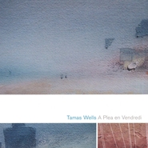

A Plea en Vendredi
============================

|  |  |
| :--: | :-- |
| [ A Plea en Vendredi](https://emumo.xiami.com/album/168521) | **艺人**: [Tamas Wells](../index.md) **语种**: 英语 **唱片公司**: 口袋唱片 **发行时间**: 2006年03月09日 **专辑类别**: 录音室专辑 **专辑风格**: 民谣流行 Folk Pop, 根源唱作人 Singer-Songwriter **播放数**: 27472346 **收藏数**: 9104 **评论数**: 454  |

## 简介

## 曲目

## 评论

|  |  |  |
| :-- | :-- | :-- |
|  [虾米用户](https://emumo.xiami.com/u/201698259) 我真的很想去东北 2019-02-14 20:26 赞(0) 踩(0) | 
百度没法搜到的艺人，，，  我迷上了
 |
|  [虾米用户](https://emumo.xiami.com/u/268493143) 我还没想好要写什么... 2018-03-26 18:58 赞(0) 踩(0) | 
Memory from childhood with sunbeam
 |
|  [虾米用户](https://emumo.xiami.com/u/219847384) 很荣幸遇见你. 2018-02-27 19:28 赞(0) 踩(0) | 
塔叔的巅峰时期，我用整个年少来错过 
 |
|  [虾米用户](https://emumo.xiami.com/u/4033517)  2017-10-27 23:29 赞(2) 踩(0) | 
舒服  平稳  靠近
 |
|  [虾米用户](https://emumo.xiami.com/u/292697700) 我还没想好要写什么... 2017-10-07 22:30 赞(1) 踩(0) | 
不打满分愧对良心
 |
|  [虾米用户](https://emumo.xiami.com/u/300865410) 鹅鹅鹅鹅鹅鹅鹅鹅鹅 2017-08-07 13:22 赞(1) 踩(0) | 
最好听的歌
 |
|  [虾米用户](https://emumo.xiami.com/u/104224890) Only one 2017-08-01 21:13 赞(0) 踩(0) | 
好听
 |
|  [虾米用户](https://emumo.xiami.com/u/206029922) 一笑泯恩仇 2017-06-12 22:05 赞(0) 踩(0) | 
收音机里常听的
 |
|  [虾米用户](https://emumo.xiami.com/u/3875132) 突破超越昨天的自己 2017-06-12 21:29 赞(0) 踩(0) | 
那些年，我淘过的碟之一....
 |
|  [虾米用户](https://emumo.xiami.com/u/296781049)   2017-06-11 23:52 赞(0) 踩(0) | 
这歌被翻唱了国语歌，忘了叫什么名字&amp;hellip;&amp;hellip;
 |
|  [虾米用户](https://emumo.xiami.com/u/187564125) 没有什么不可以，没有什么... 2017-06-11 15:01 赞(0) 踩(0) | 
  小清新，治愈系！很喜欢❤️
 |
|  [虾米用户](https://emumo.xiami.com/u/11729280)  2017-06-01 10:21 赞(0) 踩(0) | 
好听
 |
|  [虾米用户](https://emumo.xiami.com/u/6446771) 穷则思变 2017-03-22 00:13 赞(1) 踩(0) | 
专辑名 怎么翻译啊
 |
|  [虾米用户](https://emumo.xiami.com/u/273612346)  2017-03-10 19:42 赞(3) 踩(0) | 
记得有个最纯净的地方叫做Valder Fields,只要慵懒地躺在阳光下，享受眼皮的麻辣滚烫，很久以前我还不知道那是什么感觉，他正在唱给我听。想你了。
 |
|  [虾米用户](https://emumo.xiami.com/u/21468690) 风 2017-01-28 14:16 赞(0) 踩(0) | 
民谣民谣
 |
|  [虾米用户](https://emumo.xiami.com/u/7236569) ：） 2017-01-20 15:12 赞(0) 踩(0) | 
：）
 |
|  [虾米用户](https://emumo.xiami.com/u/1729353)  来自宇宙深处的男生 2017-01-10 15:04 赞(0) 踩(0) | 
民谣的魅力
 |
|  [虾米用户](https://emumo.xiami.com/u/5745338) 你好，jijixtxt 2016-12-27 17:50 赞(0) 踩(0) | 
好像侯孝贤的电影。。。。
 |
|  [虾米用户](https://emumo.xiami.com/u/74983452) 世界那么小。 2016-12-01 13:37 赞(0) 踩(0) | 
哇哇哇能听了好激动 !!!
 |
|  [虾米用户](https://emumo.xiami.com/u/210797776)  2016-11-26 11:25 赞(1) 踩(0) | 
今晚，八点半，厦门现场见
 |
|  [虾米用户](https://emumo.xiami.com/u/1625382) 暂无签名~ 2016-07-21 22:57 赞(0) 踩(0) | 
我总觉得《我的奋斗 父亲的葬礼》这本书的封面好熟悉，看到这张老专辑就觉得啊好像
 |
|  [虾米用户](https://emumo.xiami.com/u/10141615) be yourself 2016-03-02 17:29 赞(0) 踩(0) | 
激动坏了，以为有版权了呢..
 |
| ⇒ |  [虾米用户](https://emumo.xiami.com/u/23521341) Complex() 2016-11-22 20:46 赞(0) 踩(0) | 
结果还真有版权了现在
 |
|  [虾米用户](https://emumo.xiami.com/u/4736958)  2016-02-29 14:09 赞(0) 踩(0) | 
都下架了囧
 |
|  [虾米用户](https://emumo.xiami.com/u/51875694)  2015-10-09 09:17 赞(1) 踩(0) | 
分享我最近在听的英文歌～歌词很美～适合爱装逼的文字小青年听 
 |
|  [虾米用户](https://emumo.xiami.com/u/38801880)   2015-10-06 20:56 赞(0) 踩(0) | 
^_^
 |
|  [虾米用户](https://emumo.xiami.com/u/7322777) ∮ 2015-10-05 04:22 赞(0) 踩(0) | 
...A...
 |
|  [虾米用户](https://emumo.xiami.com/u/6554640) 无人赏，自家拍掌，唱得千... 2015-10-04 12:22 赞(1) 踩(0) | 
每首歌都是一间小房子，藏着当时的记忆，有可能我会忘记，可某天拾起一把钥匙打开这个屋子后，迎面二来的记忆啊。
 |
|  [虾米用户](https://emumo.xiami.com/u/64828)   2015-09-18 03:53 赞(0) 踩(0) | 
♫
 |
|  [虾米用户](https://emumo.xiami.com/u/50732535) 珍惠选商城 2015-09-15 18:22 赞(0) 踩(0) | 
清新 优雅 纯净
 |
|  [虾米用户](https://emumo.xiami.com/u/53737095)  2015-07-29 10:13 赞(0) 踩(0) | 
Lying in the sun by the side.
 |
|  [虾米用户](https://emumo.xiami.com/u/52179253) 第一：我是直男，基佬滚开... 2015-07-26 08:00 赞(2) 踩(0) | 
高三那时的回忆，一边听一边盼着快点高考并筹划暑假怎么玩，不知觉四年过去我大学也毕业了，这时仍能找到那法国梧桐遍布小巷深处的夏日气息。
 |
|  [虾米用户](https://emumo.xiami.com/u/14364706) 暂无签名~ 2015-06-26 19:44 赞(0) 踩(0) | 
超级喜欢，声音会让人醉了的
 |
|  [虾米用户](https://emumo.xiami.com/u/47250852)  2015-06-21 15:18 赞(0) 踩(0) | 
_(:зゝ∠)_
 |
|  [虾米用户](https://emumo.xiami.com/u/27684693)  2015-05-27 13:22 赞(0) 踩(0) | 
******
 |
|  [虾米用户](https://emumo.xiami.com/u/10212689) 会是枯燥或是隽永 2015-05-18 12:05 赞(0) 踩(0) | 
最喜欢的专辑
 |
|  [虾米用户](https://emumo.xiami.com/u/8447736)  2015-05-09 17:58 赞(0) 踩(0) | 
书店音乐外语
 |
|  [虾米用户](https://emumo.xiami.com/u/13031911) 吾亦愛吾廬。 2015-04-10 13:50 赞(0) 踩(0) | 
Worried  
 |
|  [虾米用户](https://emumo.xiami.com/u/41080752)   2015-04-07 23:37 赞(1) 踩(0) | 
阿里巴巴给我买回来
 |
|  [虾米用户](https://emumo.xiami.com/u/11638875) 阳光小正太皮皮 2015-04-05 20:13 赞(0) 踩(0) | 
居然下架了 还好买了值得了
 |
|  [虾米用户](https://emumo.xiami.com/u/643438) 寄蜉蝣于天地 渺沧海之一... 2015-04-01 17:03 赞(0) 踩(0) | 
淡淡
 |
|  [虾米用户](https://emumo.xiami.com/u/3235088)  2015-03-22 21:23 赞(0) 踩(0) | 
大学时代最喜欢的英文专辑
 |
|  [虾米用户](https://emumo.xiami.com/u/34601018) I love jeck. 2015-03-22 16:16 赞(0) 踩(0) | 
温柔
 |
|  [虾米用户](https://emumo.xiami.com/u/17199128) Nothing. 2015-03-15 17:53 赞(0) 踩(0) | 
我最喜欢的留下来了233333
 |
|  [虾米用户](https://emumo.xiami.com/u/23658) 虾米——我的音乐信息库 2015-02-28 20:34 赞(0) 踩(0) | 
为什么会消失？
 |
|  [虾米用户](https://emumo.xiami.com/u/5837001)  2015-02-27 19:15 赞(0) 踩(0) | 
日了狗了。。。
 |
|  [虾米用户](https://emumo.xiami.com/u/32250086) 爱生活爱音乐 2015-02-26 16:26 赞(0) 踩(0) | 
为什么会下架清空啊！！！！
 |
|  [虾米用户](https://emumo.xiami.com/u/37861342)   2015-02-06 23:15 赞(1) 踩(0) | 
剩一首是什么情况！而且最近好多歌都是，虾米这样还待的下去嘛！
 |
|  [虾米用户](https://emumo.xiami.com/u/1794170) 偶然 2015-02-04 00:16 赞(0) 踩(0) | 
不是说入驻了？怎么又下架了？要下还不全下，留一首什么意思？
 |
| ⇒ |  [虾米用户](https://emumo.xiami.com/u/21230990) 嗷。。 2015-03-21 22:49 赞(0) 踩(0) | 
就是让你赶紧把这首下载了...不然连这首也没了( ´▽` )ﾉ
 |
|  [虾米用户](https://emumo.xiami.com/u/2494589)  2015-01-21 02:21 赞(0) 踩(0) | 
求你们给我推荐虾米时不要再说什么乐库全了好么……想听什么没什么，虾米也是挺拼的……
 |
|  [虾米用户](https://emumo.xiami.com/u/45921037)  2015-01-12 05:29 赞(0) 踩(0) | 

 |
|  [虾米用户](https://emumo.xiami.com/u/43839529) 不懂音乐，只是喜欢听 2015-01-05 15:09 赞(0) 踩(0) | 
哭瞎了……网易云音乐里这个专辑有十一首，这里才一首……
 |
|  [虾米用户](https://emumo.xiami.com/u/2459443)  2015-01-02 19:13 赞(0) 踩(0) | 
天呐......这专辑几乎清空了！
 |
|  [虾米用户](https://emumo.xiami.com/u/13685840) 聆听世界 2014-12-22 13:50 赞(0) 踩(0) | 
阅读
 |
|  [虾米用户](https://emumo.xiami.com/u/45141492)  2014-12-21 17:41 赞(0) 踩(0) | 
适合看书的时候听
 |
|  [虾米用户](https://emumo.xiami.com/u/36987889)  2014-12-21 13:48 赞(0) 踩(0) | 
小帅哥托马斯的
 |
|  [虾米用户](https://emumo.xiami.com/u/3496718) idle space 2014-12-21 11:08 赞(0) 踩(0) | 
简单的吉他~~
 |
|  [虾米用户](https://emumo.xiami.com/u/44435567)  2014-12-20 05:34 赞(0) 踩(0) | 
阅读时光
 |
|  [虾米用户](https://emumo.xiami.com/u/1347314)  2014-12-19 21:58 赞(0) 踩(0) | 
读书时
 |
|  [虾米用户](https://emumo.xiami.com/u/44802015)  2014-12-19 20:09 赞(0) 踩(0) | 
阅读听什么
 |
|  [虾米用户](https://emumo.xiami.com/u/6360451) 小說多做天氣晴..... 2014-12-19 17:13 赞(0) 踩(0) | 
溫柔如陽光的歌曲......... 真好聽!
 |
|  [虾米用户](https://emumo.xiami.com/u/20352128)   2014-12-19 14:53 赞(0) 踩(0) | 
清新，适合工作适合听
 |
|  [虾米用户](https://emumo.xiami.com/u/36375983)   2014-12-17 11:05 赞(0) 踩(0) | 
可以治愈的音乐 应该是听哭的  一听他的声音就想哭
 |
|  [虾米用户](https://emumo.xiami.com/u/4869409)  2014-11-26 12:56 赞(1) 踩(0) | 
简单 木吉他 点鼓 钢琴
 |
|  [虾米用户](https://emumo.xiami.com/u/43211549) life is shor... 2014-11-09 17:54 赞(0) 踩(0) | 
抓住生命中每一刻听歌的时光！
 |
| ⇒ |  [虾米用户](https://emumo.xiami.com/u/37944073) 你好吗 62488626... 2014-11-23 12:07 赞(0) 踩(0) | 
同感，
 |
|  [虾米用户](https://emumo.xiami.com/u/43364144) 夜晚，好音乐，不可辜负。 2014-11-06 10:26 赞(0) 踩(0) | 
最开始听这歌时还在用百度音乐。推荐了首好歌
 |
|  [虾米用户](https://emumo.xiami.com/u/1660850)  2014-10-19 21:34 赞(0) 踩(0) | 
丝般柔滑
 |
|  [虾米用户](https://emumo.xiami.com/u/13079927) 保持热爱 奔赴山海 2014-09-24 23:17 赞(0) 踩(0) | 
好温暖。
 |
|  [虾米用户](https://emumo.xiami.com/u/12228940) 再怎样也就这样了 2014-09-21 08:08 赞(0) 踩(0) | 
好温暖的声音
 |
|  [虾米用户](https://emumo.xiami.com/u/822279) 记忆是爱你最安全的方式. 2014-09-13 23:11 赞(0) 踩(0) | 
因为他的Valder fields,好怀旧
 |
|  [虾米用户](https://emumo.xiami.com/u/39039002)  2014-08-20 20:30 赞(0) 踩(0) | 
好好听嗷！
 |
|  [虾米用户](https://emumo.xiami.com/u/982963) 喵呜～^_^ 2014-08-19 17:01 赞(0) 踩(0) | 
清新的下午，闭上眼，倾听就好……
 |
|  [虾米用户](https://emumo.xiami.com/u/39409587)  2014-08-03 16:32 赞(0) 踩(0) | 
听他们的歌心里很温暖
 |
|  [虾米用户](https://emumo.xiami.com/u/39569367) time travel 2014-07-31 22:55 赞(0) 踩(0) | 
这张专辑是我心中永远的经典，第一首是我一直以来的闹钟铃声。。。。。我喜欢生命是暖暖的。
 |
|  [虾米用户](https://emumo.xiami.com/u/16762395) 好听 过耳不记 2014-07-31 11:15 赞(0) 踩(0) | 
软萌
 |
| ⇒ |  [虾米用户](https://emumo.xiami.com/u/1657316)  2014-08-01 18:48 赞(0) 踩(0) | 
5
 |
|  [虾米用户](https://emumo.xiami.com/u/9539785) 我还没想好要写什么... 2014-07-28 00:05 赞(0) 踩(0) | 
戴上耳机听安静的声音 全身的细胞都得到平静 睡前或者心烦时最合适了
 |
|  [虾米用户](https://emumo.xiami.com/u/12781532) 失恋会随着时间淡去 2014-07-18 23:07 赞(1) 踩(0) | 
名气过大.不解释
 |
|  [虾米用户](https://emumo.xiami.com/u/19030325) バカ 2014-07-17 23:19 赞(0) 踩(0) | 
看看翻唱数+原唱盗用数+翻唱盗用数+各种衍生有多少就知道有多经典了╮(╯_╰)╭
 |
|  [虾米用户](https://emumo.xiami.com/u/39007271)  2014-07-15 10:42 赞(0) 踩(0) | 
轻松 无压力
 |
|  [虾米用户](https://emumo.xiami.com/u/2710484)  2014-06-23 16:54 赞(0) 踩(0) | 
这样的声音挺起来很舒服不会闷，几乎每一首歌都是一开腔就触动到我了，荡涤心灵。最适合阳光和煦的下午听，仿佛静静地躺在草地享受阳光与微风。
 |
| ⇒ |  [虾米用户](https://emumo.xiami.com/u/34199545)  2014-07-26 13:23 赞(0) 踩(0) | 
是的…
 |
|  [虾米用户](https://emumo.xiami.com/u/37661533)  2014-06-16 21:51 赞(0) 踩(0) | 
清新,早上放
 |
|  [虾米用户](https://emumo.xiami.com/u/7812867)  2014-06-16 18:40 赞(0) 踩(0) | 
就来广州巡演了，还没去过演唱会呢，想想都开心。
 |
|  [虾米用户](https://emumo.xiami.com/u/11157355) 榕树长青 2014-06-14 13:54 赞(0) 踩(0) | 
民谣
 |
|  [虾米用户](https://emumo.xiami.com/u/36622177) 笑谈浮生流年 2014-05-15 14:13 赞(0) 踩(0) | 
很放松 民谣感很舒服
 |
|  [虾米用户](https://emumo.xiami.com/u/35080916)  2014-05-10 14:51 赞(0) 踩(0) | 
好听
 |
|  [虾米用户](https://emumo.xiami.com/u/11537193)   2014-05-07 18:56 赞(0) 踩(0) | 
暖暖的午后，吹着小风，哼着小曲儿 ~ 不能更美好
 |
|  [虾米用户](https://emumo.xiami.com/u/7056029) 再 见 2014-05-04 22:25 赞(0) 踩(0) | 
期待巡演！
 |
|  [虾米用户](https://emumo.xiami.com/u/33522307) We laughed s... 2014-04-27 14:08 赞(0) 踩(0) | 
柔软
 |
|  [虾米用户](https://emumo.xiami.com/u/34916542) 孤独的人是可耻的，生命要... 2014-04-19 10:23 赞(1) 踩(0) | 
周六的早晨，阴天，懒在被窝里听tamas wells，开始温暖幸福的一天。。推荐这张2006年的《A Plea en Vendredi》，你一定会爱上它。。
 |
|  [虾米用户](https://emumo.xiami.com/u/2253926)  2014-04-17 14:32 赞(0) 踩(0) | 
在这将春未春的日子里，此般细腻柔软的嗓音，飞、非wells莫属...时光静止，生命安好
 |
|  [虾米用户](https://emumo.xiami.com/u/3603207)  2014-04-14 14:45 赞(0) 踩(0) | 
很舒服
 |
|  [虾米用户](https://emumo.xiami.com/u/660442)  2014-04-14 08:05 赞(0) 踩(0) | 
看论文当背景音乐，看论文的效率蛮高
 |
|  [虾米用户](https://emumo.xiami.com/u/11121862) 最正常的神经病 2014-04-10 15:46 赞(0) 踩(0) | 
像清新的海风吹过耳边的发梢般哼唱~
 |
|  [虾米用户](https://emumo.xiami.com/u/34533228)  2014-03-28 15:47 赞(0) 踩(0) | 
清晰男音
 |
|  [虾米用户](https://emumo.xiami.com/u/10340704)   2014-03-24 22:33 赞(0) 踩(0) | 
听 Valder Fields 仿佛有阳光照进来 海风拂面的感觉~
 |
|  [虾米用户](https://emumo.xiami.com/u/11699681)  2014-03-21 19:59 赞(0) 踩(0) | 
应该说温暖才对这声 让人听了顿时有了继续熬下去的力量 这日子就是煎熬嘛
 |
|  [虾米用户](https://emumo.xiami.com/u/12922140) freedom 2014-02-26 13:16 赞(1) 踩(0) | 
纯净温暖的音色，慢慢体会这一份充满春天气息的温馨。
 |
|  [虾米用户](https://emumo.xiami.com/u/8153904)  2014-02-21 12:09 赞(0) 踩(0) | 
zan
 |
|  [虾米用户](https://emumo.xiami.com/u/10732040)  2014-02-13 15:44 赞(0) 踩(0) | 
惊艳到我了！
 |
|  [虾米用户](https://emumo.xiami.com/u/21389512)  2014-02-13 12:50 赞(0) 踩(0) | 
甜腻的男声
 |
|  [虾米用户](https://emumo.xiami.com/u/32025189)  2014-01-22 17:40 赞(0) 踩(0) | 
去年偶然听到就特别喜欢，结果把名字搞忘了，现在才找到。。。嗓音干净，舒服~
 |
|  [虾米用户](https://emumo.xiami.com/u/1719170)  2014-01-21 02:22 赞(0) 踩(0) | 
轻音乐
 |
|  [虾米用户](https://emumo.xiami.com/u/12668973) 深河之际，深心之渊 2014-01-13 01:09 赞(0) 踩(0) | 
赞～
 |
|  [虾米用户](https://emumo.xiami.com/u/5007427) 暂无签名~ 2014-01-10 22:51 赞(0) 踩(0) | 
超级治愈的专辑！Kill me in this tenderness !!!
 |
|  [虾米用户](https://emumo.xiami.com/u/5557217) 海风轻轻～牵动无忧♂无虑 2014-01-08 16:00 赞(0) 踩(0) | 
温柔体贴~吼吼
 |
|  [虾米用户](https://emumo.xiami.com/u/9972588)   2013-12-30 18:05 赞(0) 踩(0) | 
我只是不开心放松一下而已.......
 |
|  [虾米用户](https://emumo.xiami.com/u/853745)  2013-12-25 09:25 赞(0) 踩(0) | 
喜欢
 |
|  [虾米用户](https://emumo.xiami.com/u/1321080)  2013-12-17 21:41 赞(0) 踩(0) | 
男 清新
 |
|  [虾米用户](https://emumo.xiami.com/u/15332175) 清净读书 2013-12-17 00:55 赞(0) 踩(0) | 
Valder Fields.不是最后的归处。
 |
|  [虾米用户](https://emumo.xiami.com/u/15332175) 清净读书 2013-12-17 00:54 赞(0) 踩(0) | 
夜晚接受告白的日子，总要写一点什么，总要安静一会儿。
 |
|  [虾米用户](https://emumo.xiami.com/u/28549516) 随意 2013-12-15 13:47 赞(0) 踩(0) | 
安静中苏醒。民谣独有悠扬，清澈。
 |
|  [虾米用户](https://emumo.xiami.com/u/690788)  2013-12-11 17:40 赞(0) 踩(0) | 
老婆推荐
 |
|  [虾米用户](https://emumo.xiami.com/u/23015744)  2013-12-06 22:39 赞(0) 踩(0) | 
温暖
 |
|  [虾米用户](https://emumo.xiami.com/u/6664747) on road 2013-11-27 21:31 赞(0) 踩(0) | 
怀念...
 |
|  [虾米用户](https://emumo.xiami.com/u/5035635) Narcissist 2013-11-17 10:18 赞(0) 踩(0) | 
温柔
 |
|  [虾米用户](https://emumo.xiami.com/u/25070858)  2013-11-16 23:23 赞(0) 踩(0) | 
good
 |
|  [虾米用户](https://emumo.xiami.com/u/6861997)  2013-11-16 14:20 赞(0) 踩(0) | 
童年啊，校园歌曲
 |
|  [虾米用户](https://emumo.xiami.com/u/5807524)  2013-11-06 09:59 赞(0) 踩(0) | 
******
 |
|  [虾米用户](https://emumo.xiami.com/u/26056689)  2013-11-04 13:54 赞(0) 踩(0) | 
舒服
 |
|  [虾米用户](https://emumo.xiami.com/u/8170099)  2013-10-31 17:48 赞(0) 踩(0) | 
舒服！
 |
|  [虾米用户](https://emumo.xiami.com/u/11699681)  2013-10-29 16:01 赞(0) 踩(0) | 
收了
 |
|  [虾米用户](https://emumo.xiami.com/u/10113551) dadadaadadad 2013-10-22 22:40 赞(0) 踩(0) | 
适度看报
 |
|  [虾米用户](https://emumo.xiami.com/u/6132776)   2013-10-22 22:38 赞(0) 踩(0) | 
好安静好听的民谣 适合在看书的时候听
 |
|  [虾米用户](https://emumo.xiami.com/u/3581084)   2013-10-20 15:17 赞(0) 踩(0) | 
我的小清新启蒙啊！！温暖~~
 |
|  [虾米用户](https://emumo.xiami.com/u/8870371)  2013-10-16 20:51 赞(0) 踩(0) | 
大爱
 |
|  [虾米用户](https://emumo.xiami.com/u/5593618)  2013-10-03 11:08 赞(0) 踩(0) | 
和煦风吹一丝暖洋洋的平和。
 |
|  [虾米用户](https://emumo.xiami.com/u/16173731) 我还没想好要写什么.. 2013-09-07 07:45 赞(0) 踩(0) | 
非常耐听的小清新~~~
 |
|  [虾米用户](https://emumo.xiami.com/u/926792) 倾我至诚 2013-08-26 13:42 赞(0) 踩(0) | 
音乐听上去很舒服
 |
|  [虾米用户](https://emumo.xiami.com/u/19482771)  2013-08-23 01:49 赞(0) 踩(0) | 
声音好温柔！
 |
|  [虾米用户](https://emumo.xiami.com/u/15437399) No promises 2013-08-18 11:05 赞(0) 踩(0) | 
瓦尔德的纯真世界
 |
|  [虾米用户](https://emumo.xiami.com/u/17385423)  2013-07-20 08:56 赞(0) 踩(0) | 
一直很安静
 |
|  [虾米用户](https://emumo.xiami.com/u/7111249)  2013-07-11 10:32 赞(0) 踩(0) | 
非常不错
 |
|  [虾米用户](https://emumo.xiami.com/u/8379544)  2013-06-25 15:23 赞(0) 踩(0) | 
喜欢这个声音，有回忆在里面。
 |
|  [虾米用户](https://emumo.xiami.com/u/807787)  2013-06-24 21:53 赞(0) 踩(0) | 
听他的时候我还年轻。。那时候总觉得太轻 太柔 但却是这么久了一直听下来的 就这么轻轻柔柔的漾起一圈圈涟漪 带着过往的回忆缓缓的拍着思绪 告诉你其实什么也忘不了 什么也不用忘记
 |
|  [虾米用户](https://emumo.xiami.com/u/10038986)  2013-06-10 17:25 赞(0) 踩(0) | 
柔，更加迷人~~
 |
|  [虾米用户](https://emumo.xiami.com/u/2937023) 为什么别人头像会动我不会 2013-06-07 17:20 赞(0) 踩(0) | 
阳光微风和草地~~~~
 |
|  [虾米用户](https://emumo.xiami.com/u/10602065) 我愛夕爺，我愛港樂。 2013-04-29 02:54 赞(0) 踩(0) | 
治愈系啊~~
 |
|  [虾米用户](https://emumo.xiami.com/u/1527797)  2013-03-27 11:37 赞(0) 踩(0) | 
呵  曾经或直到现在我也很喜欢T.w ，抱歉没多大的精力去看你的文字，一眼去很精细，我也早已过了这种不断回忆和沉积的片段生活里。生活总是不断催赶我们往前，工作，加班而那么短暂的空白是那么珍贵。
 |
|  [虾米用户](https://emumo.xiami.com/u/12501884) lol坑逼无处不在丶 2013-03-23 19:07 赞(0) 踩(0) | 
好纯的声音，
 |
|  [虾米用户](https://emumo.xiami.com/u/3850091)  2013-03-12 12:03 赞(0) 踩(0) | 
小清新～
 |
|  [虾米用户](https://emumo.xiami.com/u/3085961) オレンジ果汁 2013-03-05 18:40 赞(0) 踩(0) | 
喜欢这种感觉....似有若无的存在着。
 |
|  [虾米用户](https://emumo.xiami.com/u/6247096) Requiem K.62... 2013-02-28 22:47 赞(0) 踩(0) | 
舒服的声音~
 |
|  [虾米用户](https://emumo.xiami.com/u/12854147) I'm sherlock... 2013-02-24 22:18 赞(0) 踩(0) | 
美好时光
 |
|  [虾米用户](https://emumo.xiami.com/u/11827360)  2013-02-19 17:24 赞(0) 踩(0) | 
舒缓的让人窝心
 |
|  [虾米用户](https://emumo.xiami.com/u/11940103) 无嘎嘎，嘛呀呀！ 2013-02-18 18:48 赞(0) 踩(0) | 
优美男声。听着很舒服嗄！
 |
|  [虾米用户](https://emumo.xiami.com/u/9327494) http://www.x... 2013-02-08 16:35 赞(0) 踩(0) | 
love
 |
|  [虾米用户](https://emumo.xiami.com/u/10294893) XXX 2013-02-05 20:46 赞(0) 踩(0) | 
Valder Fields在这张专辑里很跳tone 虽然其他都不太喜欢 但这首是真的好听
 |
|  [虾米用户](https://emumo.xiami.com/u/12834906)  2013-02-02 13:15 赞(0) 踩(0) | 
舒服~
 |
|  [虾米用户](https://emumo.xiami.com/u/1226184) The best u e... 2013-01-31 14:59 赞(0) 踩(0) | 
很清新~~~
 |
|  [虾米用户](https://emumo.xiami.com/u/8128667)   2013-01-31 01:08 赞(0) 踩(0) | 
Valder Fields
 |
|  [虾米用户](https://emumo.xiami.com/u/8545481)  2013-01-27 16:11 赞(0) 踩(0) | 
静静地把melon street book club听下来连心都要碎掉了……第一次听的时候哭得一塌糊涂
 |
|  [虾米用户](https://emumo.xiami.com/u/3752374)  2013-01-16 21:35 赞(0) 踩(0) | 
爱了快将近5年的歌，每次都是在吵杂的不知道到该往哪走的时候，忽然听到这首。本是充满暖意的让人平静的歌，却不知道为什么还是会这么忽然的热泪盈眶
 |
|  [虾米用户](https://emumo.xiami.com/u/1619868)  2013-01-15 14:12 赞(0) 踩(0) | 
这里面装的都是好心情 @____我是章雁
 |
|  [虾米用户](https://emumo.xiami.com/u/2385623)  2013-01-05 23:27 赞(0) 踩(0) | 
听了后，让自已想起些以前的事
 |
|  [虾米用户](https://emumo.xiami.com/u/6908726)  2013-01-02 15:30 赞(0) 踩(0) | 
好清新啊~
 |
|  [虾米用户](https://emumo.xiami.com/u/7913509)  2012-12-22 00:10 赞(0) 踩(0) | 
真的不错哦 ~~~~
 |
|  [虾米用户](https://emumo.xiami.com/u/11827605)  2012-12-08 11:22 赞(0) 踩(0) | 
轻松 下午阳光的清新
 |
|  [虾米用户](https://emumo.xiami.com/u/11762459) 与自己相处。 2012-12-05 10:30 赞(0) 踩(0) | 
安~
 |
|  [虾米用户](https://emumo.xiami.com/u/2539462) 来不及完美的，就唱首离歌 2012-11-19 13:06 赞(0) 踩(0) | 
大爱的专辑。tamas wells一如既往轻松温润的声音。
 |
|  [虾米用户](https://emumo.xiami.com/u/2539462) 来不及完美的，就唱首离歌 2012-11-19 13:06 赞(0) 踩(0) | 
温暖治愈。
 |
|  [虾米用户](https://emumo.xiami.com/u/11516407) 我们的歌 2012-11-16 17:21 赞(0) 踩(0) | 
喜欢，很宁静
 |
|  [虾米用户](https://emumo.xiami.com/u/11367059) fly in music 2012-11-05 20:25 赞(0) 踩(0) | 
valder fields，very nice
 |
|  [虾米用户](https://emumo.xiami.com/u/10698743) 放任自然 2012-11-03 14:01 赞(0) 踩(0) | 
小清新~~
 |
|  [虾米用户](https://emumo.xiami.com/u/10698743) 放任自然 2012-11-03 13:58 赞(0) 踩(0) | 
小清新~
 |
|  [虾米用户](https://emumo.xiami.com/u/11313888)  2012-11-02 12:57 赞(0) 踩(0) | 
强烈推荐《Valder Fields》澳洲什么的我可喜欢了呀。
 |
|  [虾米用户](https://emumo.xiami.com/u/4724746) 什么鬼 2012-11-01 12:34 赞(0) 踩(0) | 
悠闲的
 |
|  [虾米用户](https://emumo.xiami.com/u/7973502)  2012-10-30 20:36 赞(0) 踩(0) | 
软绵绵的像棉花糖。。。
 |
|  [虾米用户](https://emumo.xiami.com/u/4164633)  2012-10-28 20:41 赞(0) 踩(0) | 
Tamas Wells,
 |
|  [虾米用户](https://emumo.xiami.com/u/1327621)  2012-10-26 12:55 赞(0) 踩(0) | 
******
 |
|  [虾米用户](https://emumo.xiami.com/u/5596251) 燕贻堂 2012-10-21 11:36 赞(0) 踩(0) | 
清新、温软的声音！
 |
|  [虾米用户](https://emumo.xiami.com/u/7269695)   2012-10-19 00:53 赞(0) 踩(0) | 
“睡眠推手”
 |
|  [虾米用户](https://emumo.xiami.com/u/10233025) everything w... 2012-10-18 01:25 赞(0) 踩(0) | 
听着心情顿时好很多
 |
|  [虾米用户](https://emumo.xiami.com/u/4051682) 一往无前 2012-10-15 18:29 赞(0) 踩(0) | 
与心情不大搭
 |
|  [虾米用户](https://emumo.xiami.com/u/3780068) LOVE LIFE 2012-09-30 09:42 赞(0) 踩(0) | 
非常好听
 |
|  [虾米用户](https://emumo.xiami.com/u/7806545)  2012-09-20 20:23 赞(0) 踩(0) | 
llll
 |
|  [虾米用户](https://emumo.xiami.com/u/6687898) 一个人的音乐世界 2012-09-03 11:36 赞(0) 踩(0) | 
温润心安,
 |
|  [虾米用户](https://emumo.xiami.com/u/5856426)  2012-08-31 18:12 赞(0) 踩(0) | 
丐帮
 |
|  [虾米用户](https://emumo.xiami.com/u/9653143)  2012-08-20 18:28 赞(0) 踩(0) | 
每次听这专辑，心里总是得到莫名的放松，现实我们为了生活，背负着太多的东西了，总是匆匆忙忙，偶尔停下脚步，放松自己，放松生活，放松心情~这一刻让我们忘记现实，沉溺在Tamas Wells 给我们带来的放松与安静，尽情的陶醉在其中吧~
 |
|  [虾米用户](https://emumo.xiami.com/u/9653143)  2012-08-20 18:06 赞(0) 踩(0) | 
good
 |
|  [虾米用户](https://emumo.xiami.com/u/6326042) 幻象长廊 夏日迷津 2012-08-15 08:42 赞(0) 踩(0) | 
favorite
 |
|  [虾米用户](https://emumo.xiami.com/u/1337423)  2012-08-14 16:06 赞(0) 踩(0) | 
说道清爽的歌喔，想起这个歌手，很清爽，听起来很舒服很舒服，一个词形容一下：“微风拂面”~~~但是跟前面那盘不一样，这个人的专辑不像夏天，比较像春天（¯﹃¯）
 |
|  [虾米用户](https://emumo.xiami.com/u/7706041)  2012-07-28 18:01 赞(0) 踩(0) | 
木吉他、钢琴和民谣的化学作用，干净平缓得像一阵清风。最近中了Tamas Wells那忧伤、浪漫而温暖的毒。
 |
|  [虾米用户](https://emumo.xiami.com/u/6811777)  2012-07-27 20:53 赞(0) 踩(0) | 
indie
 |
|  [虾米用户](https://emumo.xiami.com/u/9961606) 音乐是有生命的 2012-07-27 11:44 赞(0) 踩(0) | 
够悠闲
 |
|  [虾米用户](https://emumo.xiami.com/u/9902279)  2012-07-21 18:00 赞(0) 踩(0) | 
小清晰~
 |
|  [虾米用户](https://emumo.xiami.com/u/2934768)  2012-07-20 10:48 赞(0) 踩(0) | 
在南方风和日丽的时候开车出去兜风必备背景音乐CD~~~想家了。。
 |
|  [虾米用户](https://emumo.xiami.com/u/5808799)  2012-07-04 18:15 赞(0) 踩(0) | 
自然的最赞
 |
|  [虾米用户](https://emumo.xiami.com/u/3324391)  2012-06-29 14:56 赞(0) 踩(0) | 
Maximilian Hecker
 |
|  [虾米用户](https://emumo.xiami.com/u/9168038)  2012-06-23 15:05 赞(0) 踩(0) | 
好舒服
 |
|  [虾米用户](https://emumo.xiami.com/u/8101799)  2012-06-22 23:22 赞(0) 踩(0) | 
好喜欢~~给人心安的感觉~~
 |
|  [虾米用户](https://emumo.xiami.com/u/257143)  2012-06-22 16:32 赞(0) 踩(0) | 
这才是真真的小清新
 |
|  [虾米用户](https://emumo.xiami.com/u/7008425)  2012-06-22 15:00 赞(0) 踩(0) | 
试试先，别人推荐的
 |
|  [虾米用户](https://emumo.xiami.com/u/4830958) 我还没想好要写什么... 2012-06-19 12:08 赞(0) 踩(0) | 
太清新了
 |
|  [虾米用户](https://emumo.xiami.com/u/228697)  2012-06-19 11:32 赞(0) 踩(0) | 
知乎推荐 安静系
 |
|  [虾米用户](https://emumo.xiami.com/u/9235350)  2012-06-15 23:46 赞(0) 踩(0) | 
小清新
 |
|  [虾米用户](https://emumo.xiami.com/u/7877979)  2012-06-06 10:43 赞(0) 踩(0) | 
只用一首valder fields就足够。
 |
|  [虾米用户](https://emumo.xiami.com/u/9154353)  2012-06-05 22:58 赞(0) 踩(0) | 
轻飘飘的声音软软的像是躺在云上。。
 |
|  [虾米用户](https://emumo.xiami.com/u/1289382) 一切物质都是波动的现象，... 2012-06-05 17:22 赞(0) 踩(0) | 
喜欢！
 |
|  [虾米用户](https://emumo.xiami.com/u/1362597) 平凡的生活需要不平凡的思 2012-06-04 19:45 赞(0) 踩(0) | 
啊咧？这个风格有点像动画片虫师里的那首The Sore Feet Song
 |
|  [虾米用户](https://emumo.xiami.com/u/2444773) New Start. 2012-06-01 21:19 赞(0) 踩(0) | 
好久以前入手了这张专辑，又在虾米看到了。很平淡的风格，有一种安静的感觉
 |
|  [虾米用户](https://emumo.xiami.com/u/5597366)  2012-05-30 21:32 赞(0) 踩(0) | 
今天口味重了些，听一首歌净化下
 |
|  [虾米用户](https://emumo.xiami.com/u/8414922)  2012-05-16 09:59 赞(0) 踩(0) | 
Great !!!
 |
|  [虾米用户](https://emumo.xiami.com/u/9122775)  2012-05-09 15:18 赞(0) 踩(0) | 
喜欢
 |
|  [虾米用户](https://emumo.xiami.com/u/1287780) 暂无签名~ 2012-05-05 22:41 赞(0) 踩(0) | 
爱各弦
 |
|  [虾米用户](https://emumo.xiami.com/u/8968774)  2012-04-23 21:34 赞(0) 踩(0) | 
让人心静
 |
|  [虾米用户](https://emumo.xiami.com/u/8742733)  2012-04-09 02:00 赞(0) 踩(0) | 
自然清新
 |
|  [虾米用户](https://emumo.xiami.com/u/7096738)  2012-04-02 18:53 赞(0) 踩(0) | 
喜欢
 |
|  [虾米用户](https://emumo.xiami.com/u/7096738)  2012-04-02 18:51 赞(0) 踩(0) | 
窗外的樱花在春风中摇曳，伴着如此动听的歌声，心醉。
 |
|  [虾米用户](https://emumo.xiami.com/u/6121541) 暂无签名~ 2012-04-02 16:00 赞(0) 踩(0) | 
great
 |
|  [虾米用户](https://emumo.xiami.com/u/7155181) 生活是感官的合辑 2012-03-31 22:56 赞(0) 踩(0) | 
爱小清新，爱大自然，爱民谣，爱Tamas Wells,
 |
|  [虾米用户](https://emumo.xiami.com/u/8304265)  2012-03-29 13:52 赞(1) 踩(0) | 
在拥挤的城市中，这样的歌声，悠然的思绪，是多么的让人向往。澳洲给了Tamas Wells这样广袤的心胸与嗓音，感动的是闭上眼睛，他带你翱翔~
 |
|  [虾米用户](https://emumo.xiami.com/u/5778764) 钱婆舔足同好会 2012-03-22 17:49 赞(0) 踩(0) | 
好
 |
|  [虾米用户](https://emumo.xiami.com/u/7702067)  2012-03-22 12:37 赞(0) 踩(0) | 
好听
 |
|  [虾米用户](https://emumo.xiami.com/u/5905291)  2012-03-17 14:27 赞(0) 踩(0) | 
喜欢
 |
|  [虾米用户](https://emumo.xiami.com/u/8365433)   2012-03-17 12:55 赞(0) 踩(0) | 
喜欢这样的节奏，让人很舒服，顿时所有的压力都变成了浮云
 |
|  [虾米用户](https://emumo.xiami.com/u/706179)  2012-03-15 16:51 赞(0) 踩(0) | 
找了很久很久
 |
|  [虾米用户](https://emumo.xiami.com/u/8254455)  2012-03-09 05:12 赞(0) 踩(0) | 
除了好听还能说什么
 |
|  [虾米用户](https://emumo.xiami.com/u/6222862) AsTimeGoesBy 2012-03-05 21:59 赞(0) 踩(0) | 
各种棉音民谣~~~
 |
|  [虾米用户](https://emumo.xiami.com/u/4480185) 暂无签名~ 2012-03-04 13:52 赞(0) 踩(0) | 
夏天的嬉戏
 |
|  [虾米用户](https://emumo.xiami.com/u/478527) 好想跟衣服在洗衣机里滚 2012-02-20 21:42 赞(0) 踩(0) | 
软绵绵小清新
 |
|  [虾米用户](https://emumo.xiami.com/u/8109231)  2012-02-19 14:09 赞(0) 踩(0) | 
不为什么
 |
|  [虾米用户](https://emumo.xiami.com/u/7768554)  2012-02-19 01:22 赞(0) 踩(0) | 
9999999999999999999999999999999999999999 9999999999999999999999999999999999999999 9999999999999999999999.99999999999999999 9999999999999999999999999999*99999999999 9999999999999999999999999999999999999999 9999999999999999999999999999999999999999 999999999999999999999999999999999999^999 9999999999999999999
 |
|  [虾米用户](https://emumo.xiami.com/u/4081189) 雨,野鹅 2012-02-14 18:17 赞(0) 踩(0) | 
好声音^^
 |
|  [虾米用户](https://emumo.xiami.com/u/2068096) 消失的光年 2012-02-07 20:58 赞(0) 踩(0) | 
很美好的声线嘛~
 |
|  [虾米用户](https://emumo.xiami.com/u/3813461)  2012-02-05 15:29 赞(0) 踩(0) | 
好听~舒服
 |
|  [虾米用户](https://emumo.xiami.com/u/7765837)  2012-01-23 10:23 赞(0) 踩(0) | 
******
 |
|  [虾米用户](https://emumo.xiami.com/u/7743736)  2012-01-20 21:34 赞(0) 踩(0) | 
耐听，温暖，清新。。。
 |
|  [虾米用户](https://emumo.xiami.com/u/1353838)  2011-12-29 23:02 赞(0) 踩(0) | 
安静 温暖
 |
|  [虾米用户](https://emumo.xiami.com/u/2424781)  2011-12-26 23:59 赞(0) 踩(0) | 
一晚上疲惫的犒劳
 |
|  [虾米用户](https://emumo.xiami.com/u/7251242)  2011-12-25 11:06 赞(0) 踩(0) | 
首首经典！
 |
|  [虾米用户](https://emumo.xiami.com/u/4162817)  2011-12-13 18:28 赞(0) 踩(0) | 
温暖的清新，就像人生。
 |
|  [虾米用户](https://emumo.xiami.com/u/1944743) 人生は、夢だらけ 2011-12-12 00:37 赞(0) 踩(0) | 
给你听听
 |
|  [虾米用户](https://emumo.xiami.com/u/7052092)  2011-12-08 21:43 赞(0) 踩(0) | 
小清新
 |
|  [虾米用户](https://emumo.xiami.com/u/2990897)  2011-12-06 13:03 赞(0) 踩(0) | 
温暖
 |
|  [虾米用户](https://emumo.xiami.com/u/4740458) 暂无签名~ 2011-12-03 21:11 赞(0) 踩(0) | 
在一个雪天，在教室内随机播放，和着清澈的声音，看着窗外的雪花，本不温暖的教室也恍惚变得温暖起来
 |
|  [虾米用户](https://emumo.xiami.com/u/6795971)   2011-12-03 17:19 赞(0) 踩(0) | 
疗伤小清新。
 |
|  [虾米用户](https://emumo.xiami.com/u/7003817)  2011-12-03 14:42 赞(0) 踩(0) | 
高一时的最爱，现在回味有不一样的感觉.....
 |
|  [虾米用户](https://emumo.xiami.com/u/888642) Drkmoonbless 2011-12-02 23:41 赞(0) 踩(0) | 
随时换个心情w
 |
|  [虾米用户](https://emumo.xiami.com/u/327283) 于梦想、于自己，始终如一 2011-12-02 14:14 赞(0) 踩(0) | 
.
 |
|  [虾米用户](https://emumo.xiami.com/u/966892)  2011-12-02 02:33 赞(0) 踩(0) | 
晚安~
 |
|  [虾米用户](https://emumo.xiami.com/u/1952301) 我跑上门，打开楼梯。说完... 2011-11-27 21:20 赞(0) 踩(0) | 
小清新~~
 |
|  [虾米用户](https://emumo.xiami.com/u/1182749)  2011-11-23 14:16 赞(0) 踩(0) | 
清新明亮的嗓音
 |
|  [虾米用户](https://emumo.xiami.com/u/3605814) 是一个废人了 2011-11-22 20:21 赞(0) 踩(0) | 
我没办法一整天都听小清新，我会疯掉   一次听10首差不多
 |
|  [虾米用户](https://emumo.xiami.com/u/3650684)  2011-11-22 20:07 赞(0) 踩(0) | 
蓬松的小清新
 |
|  [虾米用户](https://emumo.xiami.com/u/13213)  2011-11-21 02:01 赞(0) 踩(0) | 
Valder Fields，Lichen And Bees，I\'m Sorry That The Kitchen Is On Fire，Melon Street Book Club
 |
|  [虾米用户](https://emumo.xiami.com/u/933860)  2011-11-20 22:56 赞(0) 踩(0) | 
第一次听tamaswells 的歌是因为Valder Fields，路过街边的玻璃橱窗，突然就被屋里的这首曲子完全偷了心，那么美好的音乐，有阳光里青春在跃动，很迷人。。。。。。。
 |
|  [虾米用户](https://emumo.xiami.com/u/6639800) 蓝色海洋中，也有小小贝壳 2011-11-18 22:08 赞(0) 踩(0) | 
喜欢它的旋律······
 |
|  [虾米用户](https://emumo.xiami.com/u/6706612)  2011-11-09 22:03 赞(0) 踩(0) | 
偶尔听到，真的很喜欢！
 |
|  [虾米用户](https://emumo.xiami.com/u/6630330)  2011-11-09 16:39 赞(0) 踩(0) | 
弦、钢琴、柔和的人声，营造出温暖的气氛，泪水编织的天籁
 |
|  [虾米用户](https://emumo.xiami.com/u/6546292) 雨过天晴 2011-11-08 08:37 赞(0) 踩(0) | 
治愈
 |
|  [虾米用户](https://emumo.xiami.com/u/3258962)  2011-11-06 14:27 赞(0) 踩(0) | 
温柔的声音，适合静下心来慢慢听
 |
|  [虾米用户](https://emumo.xiami.com/u/5572440)  2011-11-05 12:56 赞(0) 踩(0) | 
木吉他的声音真是动人心弦啊~
 |
|  [虾米用户](https://emumo.xiami.com/u/6333719) 我还没想好要写什么... 2011-11-03 13:42 赞(0) 踩(0) | 
valder  &amp;amp;&amp;amp;&amp;amp;   lichen
 |
|  [虾米用户](https://emumo.xiami.com/u/890997)  2011-11-02 16:38 赞(0) 踩(0) | 
发评论可以加米吗 我喜欢他活泼一点的调子
 |
|  [虾米用户](https://emumo.xiami.com/u/890997)  2011-11-02 16:37 赞(0) 踩(0) | 
有几首不错
 |
|  [虾米用户](https://emumo.xiami.com/u/3874958)  2011-11-01 12:44 赞(0) 踩(0) | 
好听的民谣.softly的声音.听完可以有个好心情.
 |
|  [虾米用户](https://emumo.xiami.com/u/3874958)  2011-11-01 12:42 赞(0) 踩(0) | 
喜欢民谣.Tamas Wells最爱这张~
 |
|  [虾米用户](https://emumo.xiami.com/u/666544)  2011-10-30 19:23 赞(0) 踩(0) | 
第一首歌就抓住了我的心
 |
|  [虾米用户](https://emumo.xiami.com/u/578305) 爱世人；） 2011-10-25 20:30 赞(0) 踩(0) | 
明日旅途 Taipei  jump it～
 |
|  [虾米用户](https://emumo.xiami.com/u/6423329)  2011-10-25 12:45 赞(0) 踩(0) | 
干净的声音、清新的音乐，配杯清茶多么美好的一天啊！
 |
|  [虾米用户](https://emumo.xiami.com/u/6231653)  2011-10-22 22:51 赞(0) 踩(0) | 
干净
 |
|  [虾米用户](https://emumo.xiami.com/u/2235403)  2011-10-22 01:02 赞(0) 踩(0) | 
valder fields好熟悉
 |
|  [虾米用户](https://emumo.xiami.com/u/1947581)  2011-10-21 18:53 赞(0) 踩(0) | 
听见干净的吉他声就控制不住啊。。。
 |
|  [虾米用户](https://emumo.xiami.com/u/6243241) 饭否 一个个。fdasf... 2011-10-21 18:07 赞(0) 踩(0) | 
不错 很舒服的感觉 收藏了。。。。
 |
|  [虾米用户](https://emumo.xiami.com/u/6359766)  2011-10-21 14:49 赞(0) 踩(0) | 
舒服，清新～
 |
|  [虾米用户](https://emumo.xiami.com/u/1770475)  2011-10-21 14:36 赞(0) 踩(0) | 
清新，可以在阴霾的下午带来一点新鲜空气。
 |
|  [虾米用户](https://emumo.xiami.com/u/1770475)  2011-10-21 14:34 赞(0) 踩(0) | 
清新，不过可以在阴霾的下午带来一点新鲜空气。
 |
|  [虾米用户](https://emumo.xiami.com/u/6300781)  2011-10-20 13:29 赞(0) 踩(0) | 
很温暖的感觉~~~
 |
|  [虾米用户](https://emumo.xiami.com/u/3638481)  2011-10-20 10:12 赞(0) 踩(0) | 
清新自然的声音
 |
|  [虾米用户](https://emumo.xiami.com/u/4117585)  2011-10-19 16:20 赞(0) 踩(0) | 
love
 |
|  [虾米用户](https://emumo.xiami.com/u/6316094)  2011-10-19 13:02 赞(0) 踩(0) | 
淡淡地唱着我们的生活 如果旅行 如果有风~
 |
|  [虾米用户](https://emumo.xiami.com/u/2178238)  2011-10-18 13:20 赞(0) 踩(0) | 
Tamas Wells
 |
|  [虾米用户](https://emumo.xiami.com/u/5553556)  2011-10-18 09:16 赞(0) 踩(0) | 
淡淡的
 |
|  [虾米用户](https://emumo.xiami.com/u/4003303)  2011-10-17 19:48 赞(0) 踩(0) | 
浅浅的便够
 |
|  [虾米用户](https://emumo.xiami.com/u/6290784)  2011-10-17 01:01 赞(0) 踩(0) | 
喜欢的嗓音
 |
|  [虾米用户](https://emumo.xiami.com/u/6156282)  2011-10-16 18:59 赞(0) 踩(0) | 
喜欢Tamas Wells
 |
|  [虾米用户](https://emumo.xiami.com/u/687080) 私人空间 2011-10-16 16:56 赞(0) 踩(0) | 
轻松的节奏、温暖的气息~
 |
|  [虾米用户](https://emumo.xiami.com/u/5689779)  2011-10-16 12:26 赞(0) 踩(0) | 
很纯洁
 |
|  [虾米用户](https://emumo.xiami.com/u/5961135)  2011-10-15 18:10 赞(0) 踩(0) | 
简单的旋律，好像又回到年少的美好时光，安心、惬意。
 |
|  [虾米用户](https://emumo.xiami.com/u/5998402)  2011-10-15 17:43 赞(0) 踩(0) | 
好听 舒服 声音 感觉
 |
|  [虾米用户](https://emumo.xiami.com/u/5353970)  2011-10-15 00:24 赞(0) 踩(0) | 
轻松，小清新，回忆。
 |
|  [虾米用户](https://emumo.xiami.com/u/5032056) 律师也离不开音乐 2011-10-14 22:09 赞(0) 踩(0) | 
为了找Valder Fields，来找这张专辑，爱屋及乌了
 |
|  [虾米用户](https://emumo.xiami.com/u/5170614)  2011-10-14 20:17 赞(0) 踩(0) | 
不错加油！看谁升得快
 |
|  [虾米用户](https://emumo.xiami.com/u/6240423)  2011-10-14 17:17 赞(0) 踩(0) | 
大爱
 |
|  [虾米用户](https://emumo.xiami.com/u/4874334)  2011-10-14 12:54 赞(0) 踩(0) | 
清闲时听好
 |
|  [虾米用户](https://emumo.xiami.com/u/3219770)  2011-10-13 20:51 赞(0) 踩(0) | 
美妙的声线令人陶醉，很喜欢
 |
|  [虾米用户](https://emumo.xiami.com/u/6231955)  2011-10-13 17:51 赞(0) 踩(0) | 
简单和旋构出来的魅力音乐.
 |
|  [虾米用户](https://emumo.xiami.com/u/2801808)   2011-10-13 09:49 赞(0) 踩(0) | 
经典
 |
|  [虾米用户](https://emumo.xiami.com/u/6034086)  2011-10-12 22:26 赞(0) 踩(0) | 
简单轻快，什么时候听都觉得心情好
 |
|  [虾米用户](https://emumo.xiami.com/u/3781669)  2011-10-11 15:51 赞(0) 踩(0) | 
GOOD
 |
|  [虾米用户](https://emumo.xiami.com/u/6194592)  2011-10-10 22:29 赞(0) 踩(0) | 
淡淡的，不错的专辑
 |
|  [虾米用户](https://emumo.xiami.com/u/4225495) ♪ ♬♩ 2011-10-09 00:41 赞(0) 踩(0) | 
喜欢。。♡
 |
|  [虾米用户](https://emumo.xiami.com/u/6063918)  2011-10-03 21:12 赞(0) 踩(0) | 
蓝天白云之下，深深的绿意之中是轻松温暖的音乐。清新的嗓音背后，是恬静的心和放松的灵魂。 真实而恰似微风的音乐中，我们忘记了烦恼，离开了都市，告别了一切不快，只留得久违的静谧......
 |
|  [虾米用户](https://emumo.xiami.com/u/5856803)  2011-10-02 20:04 赞(0) 踩(0) | 
yo~
 |
|  [虾米用户](https://emumo.xiami.com/u/4235467)  2011-09-29 20:50 赞(0) 踩(0) | 
很 安静 很舒服
 |
|  [虾米用户](https://emumo.xiami.com/u/601978)  2011-09-27 10:10 赞(0) 踩(0) | 
最经典的唱片！
 |
|  [虾米用户](https://emumo.xiami.com/u/867436)  2011-09-27 01:32 赞(0) 踩(0) | 
Tamas Wells那轻快的节奏里，融和着恬谧的温馨，如一股股温泉，暖暖地缓缓地淌入你的心间
 |
|  [虾米用户](https://emumo.xiami.com/u/5835238)  2011-09-24 22:08 赞(0) 踩(0) | 
为什么不喜欢呢
 |
|  [虾米用户](https://emumo.xiami.com/u/116417)  2011-09-24 18:56 赞(0) 踩(0) | 
就是下不了啊，技术不够啊！
 |
|  [虾米用户](https://emumo.xiami.com/u/5857422)  2011-09-24 16:38 赞(0) 踩(0) | 
舒缓
 |
|  [虾米用户](https://emumo.xiami.com/u/5898209)   2011-09-21 15:06 赞(0) 踩(0) | 
超好听的民谣~
 |
|  [虾米用户](https://emumo.xiami.com/u/5818827)  2011-09-14 10:02 赞(0) 踩(0) | 
看到别人这样写：《A Plea en Vendredi 》也是相当精彩动听！美丽的山水音乐,带着感情的简单舒缓的旋律和轻柔醉人的嗓音，让人体会这一份充满春天气息的温馨，如沐春风
 |
|  [虾米用户](https://emumo.xiami.com/u/5043517) 暂无签名~ 2011-09-06 21:47 赞(0) 踩(0) | 
闭上眼，仿佛闻到了清新的空气，不光是听觉上的，还有嗅觉上的
 |
|  [虾米用户](https://emumo.xiami.com/u/5144044) 不会聊天的男生配拥有爱情... 2011-09-02 07:29 赞(0) 踩(0) | 
Love
 |
|  [虾米用户](https://emumo.xiami.com/u/2465803)  2011-08-31 14:28 赞(0) 踩(0) | 
清新。。。
 |
|  [虾米用户](https://emumo.xiami.com/u/1378672)  2011-08-24 18:07 赞(0) 踩(0) | 
加了很多奶的咖啡，很是丝滑呢
 |
|  [虾米用户](https://emumo.xiami.com/u/1842776)  2011-08-24 17:35 赞(0) 踩(0) | 
最喜欢他的这张专辑。。去年巡演了，今年还巡演嘛。。。
 |
|  [虾米用户](https://emumo.xiami.com/u/4838357) “你会做拷贝箱么？” 2011-08-23 14:21 赞(0) 踩(0) | 
❀❀。❀
 |
|  [虾米用户](https://emumo.xiami.com/u/3368851)  2011-08-23 13:31 赞(0) 踩(0) | 
放松心情的声音
 |
|  [虾米用户](https://emumo.xiami.com/u/5435655)  2011-08-21 04:49 赞(0) 踩(0) | 
好清新的声音，听了好喜欢
 |
|  [虾米用户](https://emumo.xiami.com/u/5435655)  2011-08-21 04:41 赞(0) 踩(0) | 
好听好听真好听 如山泉瀑布般的清爽 爱死了
 |
|  [虾米用户](https://emumo.xiami.com/u/5417637) 暂无签名~ 2011-08-14 12:36 赞(0) 踩(0) | 
❤
 |
|  [虾米用户](https://emumo.xiami.com/u/4845673)  2011-08-09 20:30 赞(0) 踩(0) | 
小清新~~~~夏天！！
 |
|  [虾米用户](https://emumo.xiami.com/u/2630192) 幽默就像一扇门，打开就是... 2011-08-08 21:31 赞(0) 踩(0) | 
超好
 |
|  [虾米用户](https://emumo.xiami.com/u/2630192) 幽默就像一扇门，打开就是... 2011-08-08 21:30 赞(0) 踩(0) | 
夏天的感觉
 |
|  [虾米用户](https://emumo.xiami.com/u/3439850) 音乐是此生最钟情的爱人。 2011-08-04 17:27 赞(0) 踩(0) | 
平缓优美的旋律，没有什么激昂的东西。可是就这么平淡着，慢慢的渗透到人的内心。木吉他，配上简单的鼓点，偶尔用些钢琴做点缀。真的证明了往往最简单直接的东西才是最动人的。感情如此，音乐亦如此！
 |
|  [虾米用户](https://emumo.xiami.com/u/4026809) 我一直在这里，等风，也等... 2011-08-04 14:15 赞(0) 踩(0) | 
好听
 |
|  [虾米用户](https://emumo.xiami.com/u/5067571) 明 2011-07-31 16:58 赞(0) 踩(0) | 
有一種回到年輕感覺.......
 |
|  [虾米用户](https://emumo.xiami.com/u/2727482) 番茄好吃么 2011-07-27 21:15 赞(0) 踩(0) | 
是你吗？ 还是你吗？
 |
|  [虾米用户](https://emumo.xiami.com/u/1139382)  2011-07-26 16:36 赞(0) 踩(0) | 
一阵小雨后，骑行在布满花朵的田间小路上，路的尽头画过一道彩虹
 |
|  [虾米用户](https://emumo.xiami.com/u/3257738)  2011-07-23 01:27 赞(0) 踩(0) | 
如丝般...
 |
|  [虾米用户](https://emumo.xiami.com/u/324103)  2011-07-21 00:38 赞(0) 踩(0) | 
温柔
 |
|  [虾米用户](https://emumo.xiami.com/u/3943671)  2011-07-19 12:15 赞(0) 踩(0) | 
沐浴在午后阳光下的感觉....
 |
|  [虾米用户](https://emumo.xiami.com/u/1450794) ･:*+. 2011-07-16 18:34 赞(0) 踩(0) | 
這張專輯好好聽~！！！
 |
|  [虾米用户](https://emumo.xiami.com/u/1626359)  2011-07-12 11:51 赞(0) 踩(0) | 
海边沙滩和微风的感觉
 |
|  [虾米用户](https://emumo.xiami.com/u/3662050)  2011-07-04 16:10 赞(0) 踩(0) | 
能让人平静下来的一首歌
 |
|  [虾米用户](https://emumo.xiami.com/u/296251)  2011-06-25 16:41 赞(0) 踩(0) | 
tamas wells
 |
|  [虾米用户](https://emumo.xiami.com/u/4016715)  2011-06-11 21:32 赞(0) 踩(0) | 
Tamas Wells
 |
|  [虾米用户](https://emumo.xiami.com/u/2426723)  2011-06-07 22:33 赞(0) 踩(0) | 
我说 小清新啊小清新。
 |
|  [虾米用户](https://emumo.xiami.com/u/1532960)  2011-06-06 11:05 赞(0) 踩(0) | 
喜欢这种像湖水干净的男声
 |
|  [虾米用户](https://emumo.xiami.com/u/2429264) 朝闻游子唱离歌,昨夜微霜... 2011-06-06 05:45 赞(0) 踩(0) | 
abcd
 |
|  [虾米用户](https://emumo.xiami.com/u/4185998)  2011-06-05 16:34 赞(0) 踩(0) | 
清新的声音，带给我一片自由聆听的国度
 |
|  [虾米用户](https://emumo.xiami.com/u/1374844)  2011-06-04 20:30 赞(0) 踩(0) | 
清新的民谣散发纯净和温暖。
 |
|  [虾米用户](https://emumo.xiami.com/u/4120567)  2011-05-30 20:49 赞(0) 踩(0) | 
纯净，安静
 |
|  [虾米用户](https://emumo.xiami.com/u/2842053)  2011-05-30 00:27 赞(0) 踩(0) | 
很喜欢！！！
 |
|  [虾米用户](https://emumo.xiami.com/u/2042750)  2011-05-29 22:05 赞(0) 踩(0) | 
: )
 |
|  [虾米用户](https://emumo.xiami.com/u/976653)  2011-05-29 10:49 赞(0) 踩(0) | 
清新
 |
|  [虾米用户](https://emumo.xiami.com/u/4072384)  2011-05-26 19:44 赞(0) 踩(0) | 
好听,纯净
 |
|  [虾米用户](https://emumo.xiami.com/u/859675)  2011-05-24 12:50 赞(0) 踩(0) | 
。
 |
|  [虾米用户](https://emumo.xiami.com/u/2841359)  2011-05-24 01:21 赞(0) 踩(0) | 
这张最爱了。。。。
 |
|  [虾米用户](https://emumo.xiami.com/u/1091908) 一切随缘 2011-05-22 16:10 赞(0) 踩(0) | 
Folk
 |
|  [虾米用户](https://emumo.xiami.com/u/775534)   2011-05-22 14:18 赞(0) 踩(0) | 
安静
 |
|  [虾米用户](https://emumo.xiami.com/u/3800882)  2011-05-15 23:28 赞(0) 踩(0) | 
06年，辞职休息了一个暑假，Valder Fields 陪了我一个夏天，清新的声音，让我安静
 |
|  [虾米用户](https://emumo.xiami.com/u/760976)  2011-05-14 22:30 赞(0) 踩(0) | 
tamas wells
 |
|  [虾米用户](https://emumo.xiami.com/u/3029423)  2011-05-14 18:53 赞(0) 踩(0) | 
I will be waiting at quarter to five.In the vendredi.man.
 |
|  [虾米用户](https://emumo.xiami.com/u/3892646)  2011-05-10 08:54 赞(0) 踩(0) | 
我喜欢他的声音．
 |
|  [虾米用户](https://emumo.xiami.com/u/761672)  2011-05-08 13:33 赞(0) 踩(0) | 
小清新
 |
|  [虾米用户](https://emumo.xiami.com/u/92936) 海底月是天上月，眼前人是... 2011-05-04 13:57 赞(0) 踩(0) | 
你能感觉他们气若游丝舨弹着吉他，在夏日树荫下，娓娓唱来，可是歌词确实犀利无比的政治论点~~~
 |
|  [虾米用户](https://emumo.xiami.com/u/92936) 海底月是天上月，眼前人是... 2011-05-04 13:56 赞(0) 踩(0) | 
你能感觉他们气若游丝舨弹着吉他，在夏日树荫下，娓娓唱来，可是歌词确实犀利无比的政治论点~~~
 |
|  [虾米用户](https://emumo.xiami.com/u/92936) 海底月是天上月，眼前人是... 2011-05-04 13:53 赞(0) 踩(0) | 
你能感觉他们气若游丝舨弹着吉他，在夏日树荫下，娓娓唱来，可是歌词确实犀利无比的政治论点~~~
 |
|  [虾米用户](https://emumo.xiami.com/u/3699067)  2011-05-03 21:19 赞(0) 踩(0) | 
不太熟悉他们 但却是好听
 |
|  [虾米用户](https://emumo.xiami.com/u/3783733)  2011-04-30 10:58 赞(0) 踩(0) | 
轻柔，耳语，春风...
 |
|  [虾米用户](https://emumo.xiami.com/u/298019) douban.com/p... 2011-04-28 18:30 赞(0) 踩(0) | 
.
 |
|  [虾米用户](https://emumo.xiami.com/u/3696966)  2011-04-22 16:28 赞(0) 踩(0) | 
清新~喜欢
 |
|  [虾米用户](https://emumo.xiami.com/u/1630681) 世事洞明皆学问 ◕‿-｡... 2011-04-21 19:09 赞(0) 踩(0) | 
好听！
 |
|  [虾米用户](https://emumo.xiami.com/u/1203058)  2011-04-19 11:28 赞(0) 踩(0) | 
清淡的可以吹走一切烦恼，舒服~
 |
|  [虾米用户](https://emumo.xiami.com/u/3650159)  2011-04-18 11:19 赞(0) 踩(0) | 
Valder Fields  我的手机铃音
 |
|  [虾米用户](https://emumo.xiami.com/u/1938692)  2011-04-16 22:14 赞(0) 踩(0) | 
认识的第一张专辑
 |
|  [虾米用户](https://emumo.xiami.com/u/3460446)  2011-04-16 20:51 赞(0) 踩(0) | 
好听
 |
|  [虾米用户](https://emumo.xiami.com/u/1079792)  2011-04-16 15:08 赞(0) 踩(0) | 
清新曲风 喜欢
 |
|  [虾米用户](https://emumo.xiami.com/u/1164193)  2011-04-16 11:58 赞(0) 踩(0) | 
轻音乐的柔软~
 |
|  [虾米用户](https://emumo.xiami.com/u/3609343)  2011-04-16 00:06 赞(0) 踩(0) | 
很放松
 |
|  [虾米用户](https://emumo.xiami.com/u/2314441)  2011-04-15 23:20 赞(0) 踩(0) | 
轻松的回忆起那年夏天。
 |
|  [虾米用户](https://emumo.xiami.com/u/995271)  2011-04-10 21:22 赞(0) 踩(0) | 
连呼吸都舒服的旋律
 |
|  [虾米用户](https://emumo.xiami.com/u/3419267)  2011-04-03 21:56 赞(0) 踩(0) | 
peaceful
 |
|  [虾米用户](https://emumo.xiami.com/u/3435124)  2011-04-01 12:10 赞(0) 踩(0) | 
初夏的午后，白色的窗帘，和煦的微风，你的笑脸。
 |
|  [虾米用户](https://emumo.xiami.com/u/473876)  2011-04-01 09:42 赞(0) 踩(0) | 
good
 |
|  [虾米用户](https://emumo.xiami.com/u/2737939)  2011-03-23 06:38 赞(0) 踩(0) | 
很好听
 |
|  [虾米用户](https://emumo.xiami.com/u/3085264)  2011-03-12 15:36 赞(0) 踩(0) | 
A Plea en Vendredi
 |
|  [虾米用户](https://emumo.xiami.com/u/1752269)  2011-03-10 00:09 赞(0) 踩(0) | 
这个歌手好
 |
|  [虾米用户](https://emumo.xiami.com/u/2528520)  2011-03-03 22:28 赞(0) 踩(0) | 
这声音绝对治愈系，咋就那么享受澳大利亚的海风呢
 |
|  [虾米用户](https://emumo.xiami.com/u/2496576) music foreve... 2011-02-22 18:00 赞(0) 踩(0) | 
干净的大男孩，专辑也做得这么让人舒心
 |
|  [虾米用户](https://emumo.xiami.com/u/2912055)  2011-02-20 23:50 赞(0) 踩(0) | 
就爱小清新
 |
|  [虾米用户](https://emumo.xiami.com/u/2914484)  2011-02-20 18:08 赞(0) 踩(0) | 
清新
 |
|  [虾米用户](https://emumo.xiami.com/u/2611936)  2011-02-17 19:05 赞(0) 踩(0) | 
有点忧伤的旋律
 |
|  [虾米用户](https://emumo.xiami.com/u/1554013)  2011-02-13 17:05 赞(0) 踩(0) | 
清晰，小忧伤，舒心
 |
|  [虾米用户](https://emumo.xiami.com/u/2812879)  2011-02-12 12:23 赞(0) 踩(0) | 
清新
 |
|  [虾米用户](https://emumo.xiami.com/u/2767614)  2011-02-08 16:36 赞(0) 踩(0) | 
123
 |
|  [虾米用户](https://emumo.xiami.com/u/2672107)    人活一世真的不能多... 2011-01-29 22:35 赞(0) 踩(0) | 
open my eyes here you are
 |
|  [虾米用户](https://emumo.xiami.com/u/693876)  2011-01-27 09:41 赞(0) 踩(0) | 
喜欢
 |
|  [虾米用户](https://emumo.xiami.com/u/1171396) 以前办不到的事情，未来也... 2011-01-25 16:57 赞(0) 踩(0) | 
0.0
 |
|  [虾米用户](https://emumo.xiami.com/u/2528520)  2011-01-22 21:23 赞(0) 踩(0) | 
随意，随意
 |
|  [虾米用户](https://emumo.xiami.com/u/564335) 每一个缺少音乐相伴的日子... 2011-01-18 16:49 赞(0) 踩(0) | 
seeker Winter's sun!
 |
|  [虾米用户](https://emumo.xiami.com/u/890935)  2011-01-18 00:08 赞(0) 踩(0) | 
清新的感觉
 |
|  [虾米用户](https://emumo.xiami.com/u/203910)   2011-01-14 16:18 赞(0) 踩(0) | 
Tamas Wells...使人安静的声音
 |
|  [虾米用户](https://emumo.xiami.com/u/2491463)  2011-01-14 15:13 赞(0) 踩(0) | 
阿里啦啦啦啦啦啦第十六
 |
|  [虾米用户](https://emumo.xiami.com/u/2471802)  2011-01-13 13:01 赞(0) 踩(0) | 
跟jaso mraz是兄弟
 |
| ⇒ |  [虾米用户](https://emumo.xiami.com/u/1941070)  2011-02-27 13:34 赞(0) 踩(0) | 
诶？我也是jason的fans，刚刚发现tamas wells~觉得不错~你是指风格很像还是怎么的？
 |
|  [虾米用户](https://emumo.xiami.com/u/897749)  2011-01-12 11:12 赞(0) 踩(0) | 
一个思维停顿的夜里，燥热无比，乏味的气息充斥在湿热的空气里。一个想象力奇缺的晚上，不再能够进行任何思考，这样也好，思考有时让人简单，有时却又使人复杂，不思考有时显得白痴，不过有时也显得单纯。人应当学会思考，却不应当学会遗忘。
 |
|  [虾米用户](https://emumo.xiami.com/u/2459723)  2011-01-11 13:47 赞(0) 踩(0) | 
舒坦
 |
|  [虾米用户](https://emumo.xiami.com/u/2297148)  2010-12-26 13:03 赞(0) 踩(0) | 
哈哈哈哈
 |
|  [虾米用户](https://emumo.xiami.com/u/1972322)   2010-12-10 19:18 赞(0) 踩(0) | 
清清的啊
 |
|  [虾米用户](https://emumo.xiami.com/u/1861525)  2010-11-08 21:23 赞(0) 踩(0) | 
喜欢
 |
|  [虾米用户](https://emumo.xiami.com/u/1811732)  2010-11-08 19:51 赞(0) 踩(0) | 
好有感觉，好有味道啊！
 |
|  [虾米用户](https://emumo.xiami.com/u/1824830)  2010-11-06 19:36 赞(0) 踩(0) | 
清新
 |
|  [虾米用户](https://emumo.xiami.com/u/1240)  2010-10-27 18:27 赞(0) 踩(0) | 
清新的味道……
 |
|  [虾米用户](https://emumo.xiami.com/u/398739)  2010-09-30 13:35 赞(0) 踩(0) | 
象清风吹过的羽毛划过脸颊…… 用来做晨起的闹铃似乎不错，不会被强迫睁开眼睛的感觉呵呵。 呃……会不会听得不想起来了……
 |
| ⇒ |  [虾米用户](https://emumo.xiami.com/u/1861525)  2010-11-08 21:30 赞(0) 踩(0) | 
我试过了，无论什么闹铃，在该起床的那一刻听到都没有办法不纠结.......哈哈
 |
|  [虾米用户](https://emumo.xiami.com/u/241007) 我还没想好要写什么... 2010-09-23 17:40 赞(0) 踩(0) | 
清新，恩。。。除了清新还是清新。。。呵呵。。。来吧。大家一起放松吧！就在这落日余晖里。。。
 |
| ⇒ |  [虾米用户](https://emumo.xiami.com/u/1861525)  2010-11-08 21:35 赞(0) 踩(0) | 
在落日时分里耳朵里tamas wells在歌唱，你在被余晖渲染的云朵中牧羊，和它们一起飘向远方............哈哈，美好
 |
| ⇒ |  [虾米用户](https://emumo.xiami.com/u/241007) 我还没想好要写什么... 2010-11-09 09:35 赞(0) 踩(0) | 
<q><b>melody说：</b></q>
 |
|  [虾米用户](https://emumo.xiami.com/u/933365)  2010-09-14 18:22 赞(0) 踩(0) | 
喜欢民谣，清新慵懒，让我想起跳飞机的日子
 |
|  [虾米用户](https://emumo.xiami.com/u/1077233) 我还没想好要写什么... 2010-09-04 01:02 赞(0) 踩(0) | 
喜欢这种风格
 |
|  [虾米用户](https://emumo.xiami.com/u/673124) 暂无签名~ 2010-08-27 15:09 赞(0) 踩(0) | 
刚睡醒听听很舒服咯~
 |
|  [虾米用户](https://emumo.xiami.com/u/1020194)   2010-08-26 22:04 赞(0) 踩(0) | 
大爱。
 |
|  [虾米用户](https://emumo.xiami.com/u/892282)  2010-08-22 21:30 赞(0) 踩(0) | 
舒服
 |
|  [虾米用户](https://emumo.xiami.com/u/1071564)  2010-07-03 08:54 赞(0) 踩(0) | 
只喜欢valder fields的说，纵观整张专辑都是一个调调~~~ 听多了人会痿的~~
 |
| ⇒ |  [虾米用户](https://emumo.xiami.com/u/514985) 暂无签名~ 2010-08-17 22:02 赞(0) 踩(0) | 
有道理！
 |
| ⇒ |  [虾米用户](https://emumo.xiami.com/u/1811732)  2010-11-08 19:52 赞(0) 踩(0) | 
好歌要慢慢听，听多了，自然不消化
 |
| ⇒ |  [虾米用户](https://emumo.xiami.com/u/1861525)  2010-11-08 21:36 赞(0) 踩(0) | 
这就是木吉他的简单吧.
 |
|  [虾米用户](https://emumo.xiami.com/u/807431)   2010-06-21 14:34 赞(0) 踩(0) | 
午后阳光淡淡的洒在身上的感觉，很舒服，很温暖，很清新~
 |
|  [虾米用户](https://emumo.xiami.com/u/692494)  2010-06-11 23:51 赞(0) 踩(0) | 
Tamas wells~~ 正到痹~~
 |
|  [虾米用户](https://emumo.xiami.com/u/819627) 我还没想好要写什么... 2010-04-20 18:44 赞(0) 踩(0) | 
真的很喜欢，感觉真好
 |
|  [虾米用户](https://emumo.xiami.com/u/269414)  2010-02-14 14:16 赞(0) 踩(0) | 
真是超级清新，超级安静的歌~~
 |
|  [虾米用户](https://emumo.xiami.com/u/381667)  2010-02-10 19:21 赞(0) 踩(0) | 
很喜欢他轻唱的感觉啊..
 |
|  [虾米用户](https://emumo.xiami.com/u/611762)  2010-01-17 02:51 赞(0) 踩(0) | 
看这众多虾迷，看这众多的欧美迷，确实发现现在我们中国听众的爱好广泛性！
 |
|  [虾米用户](https://emumo.xiami.com/u/564786)  2009-12-09 21:00 赞(0) 踩(0) | 
听着很舒服，有种午后的感觉~回头给老爸车里放一张~~嘿嘿~~
 |
|  [虾米用户](https://emumo.xiami.com/u/516665) 暂无签名~ 2009-11-30 14:18 赞(0) 踩(0) | 
吟唱的好舒服，最喜欢valder fields
 |
|  [虾米用户](https://emumo.xiami.com/u/145812)  2009-11-13 18:09 赞(0) 踩(0) | 
宁静...最适合放在咖啡店或者放进车里 很舒服
 |
|  [虾米用户](https://emumo.xiami.com/u/470203)  2009-10-29 20:34 赞(0) 踩(0) | 
很不错的，在你无聊迷茫的时候，只是对她慵懒的声音有点看法
 |
|  [虾米用户](https://emumo.xiami.com/u/343188) 我还没想好要写什么... 2009-10-24 18:46 赞(0) 踩(0) | 
他的专辑封面很有感觉，像梦中的场景
 |
|  [虾米用户](https://emumo.xiami.com/u/343188) 我还没想好要写什么... 2009-10-24 18:44 赞(0) 踩(0) | 
喜欢木吉他安静的声音，还有tamas温柔的吟唱
 |
|  [虾米用户](https://emumo.xiami.com/u/298257)  2009-10-16 20:21 赞(0) 踩(0) | 
天使的歌声（男女应该都可以叫天使吧）！
 |
|  [虾米用户](https://emumo.xiami.com/u/415341)  2009-09-30 13:19 赞(0) 踩(0) | 
如走在乡间的小路上
 |
|  [虾米用户](https://emumo.xiami.com/u/234170)  2009-08-01 14:33 赞(0) 踩(0) | 
虽是清新，却听不出个性
 |
| ⇒ |  [虾米用户](https://emumo.xiami.com/u/321163)  2009-08-18 14:33 赞(0) 踩(0) | 
那啥 ，  我认为 这就是tamas的个性啊。//tamas本来就是民谣乐队 质朴的曲子充满了民谣气息,清澈的人生配上明快的乐器,让人不自觉地融入欢快的旋律中,  清新自然慵懒简单..///tt
 |
| ⇒ |  [虾米用户](https://emumo.xiami.com/u/449971)  2009-11-16 09:46 赞(0) 踩(0) | 
什么东西都一味追求个性，就失真了.  只要是有自己的感情融入和思想传达，个性的意义也就实现了.
 |
| ⇒ |  [虾米用户](https://emumo.xiami.com/u/611344) 想爱并被爱，足够！ 2010-02-10 09:00 赞(0) 踩(0) | 
其实刚听便有那种感觉，觉着声音还有旋律没有太鲜明记忆点。 但还是觉着不错，第二首蛮广为流传的。 觉得这种风格的音乐，嗓音靠点儿谱，感情靠点儿谱， 就不缺乏温暖。 恩，挺温暖。
 |
|  [虾米用户](https://emumo.xiami.com/u/220749)  2009-07-27 10:56 赞(0) 踩(0) | 
不错的碟
 |
|  [虾米用户](https://emumo.xiami.com/u/279388)  2009-07-21 21:01 赞(0) 踩(0) | 
清新自然，想要跳起来~~
 |
|  [虾米用户](https://emumo.xiami.com/u/269455)  2009-07-20 18:26 赞(0) 踩(0) | 
宁静惬意，无法拒绝的天籁之音！
 |
|  [虾米用户](https://emumo.xiami.com/u/274804)  2009-07-16 21:29 赞(0) 踩(0) | 
就像是沐浴在温暖的春日
 |
|  [虾米用户](https://emumo.xiami.com/u/169420)  2009-06-21 12:56 赞(0) 踩(0) | 
quiet but strong
 |
|  [虾米用户](https://emumo.xiami.com/u/180942) 我还没想好要写什么... 2009-06-17 22:24 赞(0) 踩(0) | 
很清新
 |
|  [虾米用户](https://emumo.xiami.com/u/176883) 凡人皆有一死 2009-06-15 16:43 赞(0) 踩(0) | 
清新干净
 |
|  [虾米用户](https://emumo.xiami.com/u/106315)  2009-04-11 19:34 赞(0) 踩(0) | 
如此清新。。感受到了微风飘过。。
 |
|  [虾米用户](https://emumo.xiami.com/u/57919)  2009-04-06 10:32 赞(0) 踩(0) | 
让你轻轻摇摆的浅吟低唱，像微风中的树影，抬头看见碎碎的阳光！
 |
|  [虾米用户](https://emumo.xiami.com/u/93407)   2009-04-02 20:51 赞(0) 踩(0) | 
温柔治愈的声音
 |
|  [虾米用户](https://emumo.xiami.com/u/97808)  2009-03-31 19:32 赞(0) 踩(0) | 
不得不听啊！
 |
|  [虾米用户](https://emumo.xiami.com/u/95958)  2009-03-30 12:44 赞(0) 踩(0) | 
舒服、轻松
 |
|  [虾米用户](https://emumo.xiami.com/u/90048) 如果二,請深二. 2009-03-25 22:49 赞(0) 踩(0) | 
貌似民謠的未到哇~~
 |
|  [虾米用户](https://emumo.xiami.com/u/90048) 如果二,請深二. 2009-03-25 22:46 赞(0) 踩(0) | 
安靜，難得~~
 |
|  [虾米用户](https://emumo.xiami.com/u/7110)  2009-03-21 18:53 赞(0) 踩(0) | 
Tamas Wells轻柔的嗓音果然很适合安静，咖啡，阅读的氛围
 |
|  [虾米用户](https://emumo.xiami.com/u/82516)  2009-03-19 09:28 赞(0) 踩(0) | 
很舒服的曲风，温暖、清新，还有民谣的味儿
 |
|  [虾米用户](https://emumo.xiami.com/u/80738) 向我推荐单曲吧！ 2009-03-17 00:10 赞(0) 踩(0) | 
民谣
 |
|  [虾米用户](https://emumo.xiami.com/u/80646)  2009-03-16 22:44 赞(0) 踩(0) | 
我所喜欢的北欧的感觉
 |
|  [虾米用户](https://emumo.xiami.com/u/2875)  2009-02-24 10:29 赞(0) 踩(0) | 
给团队活动做视频的时候用的背景音乐，传说弄哭了一大票的同学
 |
|  [虾米用户](https://emumo.xiami.com/u/29605) Yoga.  Reiki... 2009-01-15 08:56 赞(0) 踩(0) | 
温暖的音符
 |
|  [虾米用户](https://emumo.xiami.com/u/15793)  2008-12-14 14:18 赞(0) 踩(0) | 
哇噻~好棒的音乐也~ 大家都要去听听哦~
 |
