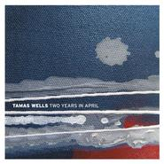

Two Years In April
============================

|  |  |
| :--: | :-- |
| [ Two Years In April](https://emumo.xiami.com/album/168610) | **艺人**: [Tamas Wells](../index.md) **语种**: 英语 **唱片公司**: Popboomerang Records **发行时间**: 2008年05月01日 **专辑类别**: 录音室专辑 **专辑风格**: 民谣流行 Folk Pop, 根源唱作人 Singer-Songwriter **播放数**: 1183329 **收藏数**: 1919 **评论数**: 86  |

## 简介

Tamas Wells虽然从来就不算什么大牌，无论是音乐还是风格都简单低调，但却是值得让人无比期待的一个乐团。时隔两年之后，乐团的的新作《Two Years in April》终于发行了，给这个夏日又带了一股清新之风。我一直觉得Tamas Wells是最值得在夏天听的一支乐团，乐团的这张专辑依然令人迷醉，迷漫着简单舒缓的旋律和轻柔动人的嗓音，是这个夏天不容错过的一清新的独立民谣作品。  
'Two Years in April' is the new album from Burma based artist Tamas Wells.  
And it has been a remarkable two years.  
After a wave of excitement in Japan about Wells' 2006 album 'A Plea en Vendredi', he signed deals with renowned Tokyo based label Inpartmaint and also with China based label Pocket Records (who also release Australian band Dirty Three). The result of these deals was remarkable with 'A Plea en Vendredi' selling thousands of copies,reaching Number 16 on Japan's HMV Shibuya international chart and culminating in a sell out tour of four Japanese cities in late 2007.  
Originally from Melbourne, Australia, Tamas Wells moved to the city of Yangon in Burma in early 2006 and with just a guitar, a traditional Burmese banjo and the occasional subtle use of strings, began recording songs for a new album. Recorded at home in Yangon between power cuts, monsoon rains and the shouts of street salesmen ‘Two Years in April’ combines Wells’ sublime sense of melody with a beautifully fragile instrumentation and production.  
'Two Years in April' will be released internationally in June 2008 through Popboomerang Records in Australia, Inpartmaint in Japan and Pocket Records in China . The release will coincide with an international tour of Japan, Australia and China. 

## 曲目

## 评论

|  |  |  |
| :-- | :-- | :-- |
|  [虾米用户](https://emumo.xiami.com/u/62898)  2017-10-28 00:30 赞(0) 踩(0) | 
今年他们要来华演出，希望会来厦门吧！感觉他们的气质跟厦门很契合。
 |
|  [虾米用户](https://emumo.xiami.com/u/210797776)  2016-11-26 13:07 赞(1) 踩(0) | 
今晚八点半，厦门现场见
 |
|  [虾米用户](https://emumo.xiami.com/u/15270473) 听到喜欢的歌 身体不跟着... 2016-10-22 10:24 赞(0) 踩(0) | 
-
 |
|  [虾米用户](https://emumo.xiami.com/u/2487947)  2016-02-11 22:51 赞(0) 踩(0) | 
大师
 |
|  [虾米用户](https://emumo.xiami.com/u/76626846)  2015-10-25 22:01 赞(0) 踩(0) | 
2
 |
|  [虾米用户](https://emumo.xiami.com/u/7322777) ∮ 2015-10-05 04:24 赞(0) 踩(0) | 
...A...
 |
|  [虾米用户](https://emumo.xiami.com/u/45226274) 我还没想好要写什么... 2015-09-28 01:07 赞(0) 踩(0) | 
求版权啊虾米！10块钱一首我也买！！
 |
|  [虾米用户](https://emumo.xiami.com/u/24712133) 暂无签名~ 2015-04-25 21:46 赞(0) 踩(0) | 
下架了，收藏先
 |
|  [虾米用户](https://emumo.xiami.com/u/36722111) 难熬的日子，有音乐就好 2015-03-25 08:43 赞(0) 踩(0) | 
为什么听不了？
 |
|  [虾米用户](https://emumo.xiami.com/u/28153334) 该努力拼搏的时候千万别选... 2015-01-23 20:27 赞(0) 踩(0) | 
虾米别逼我！！！
 |
|  [虾米用户](https://emumo.xiami.com/u/15814683)  2014-12-22 01:23 赞(0) 踩(0) | 
适合工作听
 |
|  [虾米用户](https://emumo.xiami.com/u/7411053)   2014-10-18 23:24 赞(0) 踩(0) | 
楼下有种人格**的感觉
 |
| ⇒ |  [虾米用户](https://emumo.xiami.com/u/2066472) 扛过、撑过、拼过、奔过… 2014-10-20 09:55 赞(0) 踩(0) | 
+1 FL是不被显示的吗？
 |
| ⇒ |  [虾米用户](https://emumo.xiami.com/u/7411053)   2014-10-20 12:10 赞(0) 踩(0) | 
<q><b>达耳闻说：</b></q>
 |
|  [虾米用户](https://emumo.xiami.com/u/35084948)  2014-07-27 21:34 赞(0) 踩(0) | 
昨天我做指甲，见到一位女人抱着个小男孩子，我说了句你好漂亮哦！可是小孩的奶奶一点笑容都没有，这个女人我好像见过二次啦，早知道就不聊那小孩了，我很少见人家逗小孩子玩，大人没反应，好像人家要抢她家的小孩一样，哎没意思。
 |
|  [虾米用户](https://emumo.xiami.com/u/35084948)  2014-07-27 15:13 赞(0) 踩(0) | 
又来啦拜？
 |
|  [虾米用户](https://emumo.xiami.com/u/35084948)  2014-07-27 14:53 赞(0) 踩(0) | 
你妈？
 |
|  [虾米用户](https://emumo.xiami.com/u/35084948)  2014-07-27 10:29 赞(0) 踩(0) | 
不唱歌等阵不陪你看电影呢？嗯…
 |
|  [虾米用户](https://emumo.xiami.com/u/35084948)  2014-07-27 10:26 赞(0) 踩(0) | 
你今天不像以前一样唱歌吗？你唱歌我有时间同你聊？
 |
|  [虾米用户](https://emumo.xiami.com/u/37661533)  2014-06-16 21:50 赞(0) 踩(0) | 
清新,早上放
 |
|  [虾米用户](https://emumo.xiami.com/u/15842365)  2014-06-11 15:51 赞(0) 踩(0) | 
就是喜欢
 |
|  [虾米用户](https://emumo.xiami.com/u/1975832)  2014-04-24 15:11 赞(0) 踩(0) | 
小清新，听起来真舒服~
 |
|  [虾米用户](https://emumo.xiami.com/u/5800282) 无常逐一升起与熄灭。 2014-03-21 12:07 赞(0) 踩(0) | 
山水音乐
 |
|  [虾米用户](https://emumo.xiami.com/u/5860451)  2013-11-04 15:48 赞(0) 踩(0) | 
愛上了Tamas Wells。
 |
|  [虾米用户](https://emumo.xiami.com/u/5593618)  2013-09-24 10:04 赞(0) 踩(0) | 
清新的风拂面而来，舒服惬意。喜欢
 |
|  [虾米用户](https://emumo.xiami.com/u/13463531)  2013-09-05 20:46 赞(0) 踩(0) | 
爱死这种简单清新的味道了~~！！
 |
|  [虾米用户](https://emumo.xiami.com/u/11079076)  2013-08-08 14:45 赞(0) 踩(0) | 
******
 |
|  [虾米用户](https://emumo.xiami.com/u/5049187) 生活在花草綻放的季節 2013-06-09 08:58 赞(0) 踩(0) | 
不知道现在这张专辑是什么音质，更新到320kbps了吗？
 |
|  [虾米用户](https://emumo.xiami.com/u/10294893) XXX 2013-02-05 20:53 赞(0) 踩(0) | 
封面很好看 但找不出什么特别的歌
 |
|  [虾米用户](https://emumo.xiami.com/u/12744781) 说走就走 2013-01-28 15:13 赞(1) 踩(0) | 
April
 |
|  [虾米用户](https://emumo.xiami.com/u/230106)  2013-01-18 01:46 赞(0) 踩(0) | 
没有
 |
|  [虾米用户](https://emumo.xiami.com/u/12400161)  2013-01-13 13:55 赞(0) 踩(0) | 
嘛，一直喜欢的专辑
 |
|  [虾米用户](https://emumo.xiami.com/u/3580156) 我还没想好要写什么... 2012-11-10 17:03 赞(0) 踩(0) | 
Two Years In April
 |
|  [虾米用户](https://emumo.xiami.com/u/868545) 喵喵喵~ 2012-09-14 23:47 赞(0) 踩(0) | 
几年前就深爱的一个乐队，如清新的早晨的舒缓感，为何不喜欢？
 |
|  [虾米用户](https://emumo.xiami.com/u/6326042) 幻象长廊 夏日迷津 2012-08-15 08:43 赞(0) 踩(0) | 
moe project
 |
|  [虾米用户](https://emumo.xiami.com/u/6909439)  2012-07-26 23:26 赞(0) 踩(0) | 
Hao
 |
|  [虾米用户](https://emumo.xiami.com/u/9884706)  2012-07-21 13:41 赞(0) 踩(0) | 
为什么可以坚持那么久啊
 |
|  [虾米用户](https://emumo.xiami.com/u/9884706)  2012-07-21 13:41 赞(0) 踩(0) | 
真的担忧
 |
|  [虾米用户](https://emumo.xiami.com/u/9884706)  2012-07-21 13:40 赞(0) 踩(0) | 
明媚
 |
|  [虾米用户](https://emumo.xiami.com/u/9052949) Lost 2012-06-26 07:44 赞(0) 踩(0) | 
一个人的时候请听着这个找安稳
 |
|  [虾米用户](https://emumo.xiami.com/u/6121541) 暂无签名~ 2012-04-02 16:00 赞(0) 踩(0) | 
great
 |
|  [虾米用户](https://emumo.xiami.com/u/7754188)  2012-03-17 22:37 赞(0) 踩(0) | 
清澈
 |
|  [虾米用户](https://emumo.xiami.com/u/5905291)  2012-03-17 14:30 赞(0) 踩(0) | 
清新
 |
|  [虾米用户](https://emumo.xiami.com/u/6107379)  2012-02-27 12:32 赞(0) 踩(0) | 
也许,海边
 |
|  [虾米用户](https://emumo.xiami.com/u/3011)  2011-12-07 20:08 赞(0) 踩(0) | 
声音温暖愉悦，配器清新干净，曲风轻松如春风拂面。
 |
|  [虾米用户](https://emumo.xiami.com/u/6497463)  2011-11-07 19:19 赞(0) 踩(0) | 
爱大叔..~
 |
|  [虾米用户](https://emumo.xiami.com/u/601978)  2011-11-04 14:10 赞(0) 踩(0) | 
被忽视的专辑！
 |
|  [虾米用户](https://emumo.xiami.com/u/6225699)  2011-10-19 09:22 赞(0) 踩(0) | 
清晰
 |
|  [虾米用户](https://emumo.xiami.com/u/6276666)  2011-10-16 11:43 赞(0) 踩(0) | 
像是述说往事，缓缓的，淡淡的，轻柔的抚摸你的心
 |
|  [虾米用户](https://emumo.xiami.com/u/2699743)  2011-08-04 18:03 赞(0) 踩(0) | 
清清淡淡
 |
|  [虾米用户](https://emumo.xiami.com/u/1290332)  2011-07-09 18:40 赞(0) 踩(0) | 
快乐的忧伤。
 |
|  [虾米用户](https://emumo.xiami.com/u/2842053)  2011-05-30 00:27 赞(0) 踩(0) | 
很喜欢！！！
 |
|  [虾米用户](https://emumo.xiami.com/u/3481842)  2011-05-01 12:36 赞(0) 踩(0) | 
小众的音乐，非常舒服，如同吹过的海风
 |
|  [虾米用户](https://emumo.xiami.com/u/1079792)  2011-04-16 11:11 赞(0) 踩(0) | 
清新的曲风 喜欢
 |
|  [虾米用户](https://emumo.xiami.com/u/1615639)  2011-04-12 14:54 赞(0) 踩(0) | 
清新
 |
|  [虾米用户](https://emumo.xiami.com/u/1078822)  2011-03-29 12:47 赞(0) 踩(0) | 
Tamas Wells好温柔，澳洲式的慵懒
 |
|  [虾米用户](https://emumo.xiami.com/u/3244464)  2011-03-19 15:47 赞(0) 踩(0) | 
悠扬，一如既往
 |
|  [虾米用户](https://emumo.xiami.com/u/3226603)  2011-03-18 23:30 赞(0) 踩(0) | 
爱
 |
|  [虾米用户](https://emumo.xiami.com/u/2837558)  2011-03-02 08:38 赞(0) 踩(0) | 
Tamas Wells虽然从来就不算什么大牌，无论是音乐还是风格都简单低调，但却是值得让人无比期待的一个乐团。时隔两年之后，乐团的的新作《Two Years in April》终于发行了，给这个夏日又带了一股清新之风。我一直觉得Tamas Wells是最值得在夏天听的一支乐团
 |
|  [虾米用户](https://emumo.xiami.com/u/2912055)  2011-02-20 23:47 赞(0) 踩(0) | 
就爱小清新
 |
|  [虾米用户](https://emumo.xiami.com/u/2767614)  2011-02-08 16:37 赞(0) 踩(0) | 
1
 |
|  [虾米用户](https://emumo.xiami.com/u/2732271) 边听歌边啃书，心里面很安... 2011-02-04 16:28 赞(0) 踩(0) | 
在美美的歌声里面飞翔~~~~~
 |
|  [虾米用户](https://emumo.xiami.com/u/2672107)    人活一世真的不能多... 2011-01-29 22:37 赞(0) 踩(0) | 
we fell in love in April
 |
|  [虾米用户](https://emumo.xiami.com/u/2392768)  2011-01-19 18:08 赞(0) 踩(0) | 
说不出的感觉
 |
|  [虾米用户](https://emumo.xiami.com/u/1550249) 我还没想好要写什么... 2010-11-14 18:52 赞(0) 踩(0) | 
好喜欢啊~
 |
|  [虾米用户](https://emumo.xiami.com/u/258661) 音乐是很自我的艺术 2010-08-13 21:36 赞(0) 踩(0) | 
去年夏天听了一个夏天!
 |
|  [虾米用户](https://emumo.xiami.com/u/576657) 暂无签名~ 2010-05-19 20:20 赞(0) 踩(0) | 
还记得整个06年的最后一个暑假，炎热的顶楼宿舍，播放着他们的音乐，不急不缓的校园生活甚是美好....怀念呀，简单恬静的校园往事.......
 |
|  [虾米用户](https://emumo.xiami.com/u/215063)  2009-12-10 19:39 赞(0) 踩(0) | 
温柔的时刻到来，一切不急不忙。
 |
|  [虾米用户](https://emumo.xiami.com/u/211065)  2009-06-12 15:54 赞(0) 踩(0) | 
点样下啊？？？我都down吾到。
 |
| ⇒ |  [虾米用户](https://emumo.xiami.com/u/121903)  2009-09-14 12:59 赞(0) 踩(0) | 
到emule下吧
 |
|  [虾米用户](https://emumo.xiami.com/u/29) 耍中偶得 2009-04-02 15:26 赞(0) 踩(0) | 
朱七在一年前说，没想到这张专辑还挺好听的。一年后的明天，朱七就要和这张专辑的演唱者在一个舞台上表演了。世界很小。
 |
|  [虾米用户](https://emumo.xiami.com/u/93651)  2009-03-28 12:02 赞(0) 踩(0) | 
为啥听不了~~~
 |
|  [虾米用户](https://emumo.xiami.com/u/86971) 别人看我太疯癫，我笑别人 2009-03-22 00:33 赞(0) 踩(0) | 
音乐,总是生活的调味剂
 |
|  [虾米用户](https://emumo.xiami.com/u/45752)  2009-03-21 15:37 赞(0) 踩(0) | 
像春雨……像一道明媚的傷感……
 |
|  [虾米用户](https://emumo.xiami.com/u/84367)  2009-03-20 09:06 赞(0) 踩(0) | 
tamas wells 我还是要错过了
 |
|  [虾米用户](https://emumo.xiami.com/u/23502)  2009-03-17 10:10 赞(0) 踩(0) | 
周末的午后，刚刚睡醒，开启你的电脑，一个英俊的男子，娓娓道来他的故事，静静地倾听，不需回应，只是在心底轻轻怀念另一个人。清新、自然、简单。
 |
|  [虾米用户](https://emumo.xiami.com/u/66261)  2009-03-10 19:23 赞(0) 踩(0) | 
整张听下去,不会后悔的.
 |
|  [虾米用户](https://emumo.xiami.com/u/64138) 我还没想好要写什么... 2009-03-07 02:08 赞(0) 踩(0) | 
怎么跟我下载的不一样 我下的是10首歌 并且你这里的第六首我这里没有
 |
|  [虾米用户](https://emumo.xiami.com/u/66584)  2009-03-04 21:48 赞(0) 踩(0) | 
soooooo great
 |
|  [虾米用户](https://emumo.xiami.com/u/30189)  2009-03-01 21:28 赞(0) 踩(0) | 
很清澈的声音~~让我一时想到了 公园派对 里的那个男孩唱歌时的专注却很自然  一气呵成的自信表情！呵呵  还是第一次听他的歌呢  呵呵  还好发现了 记住了   Tamas Wells！！  支持一票
 |
|  [虾米用户](https://emumo.xiami.com/u/64481)  2009-03-01 16:19 赞(0) 踩(0) | 
非常好听！
 |
|  [虾米用户](https://emumo.xiami.com/u/52194)  2009-03-01 13:58 赞(0) 踩(0) | 
棒！
 |
|  [虾米用户](https://emumo.xiami.com/u/60446)  2009-02-26 17:40 赞(0) 踩(0) | 
感觉专辑的曲风很清雅，让给我有种想长个的感觉。O(∩_∩)O哈哈~
 |
|  [虾米用户](https://emumo.xiami.com/u/7) 单恋木吉他 2008-12-26 17:27 赞(0) 踩(0) | 
允许我推荐一下吧，，，他要来巡演啦～
 |
|  [虾米用户](https://emumo.xiami.com/u/6542) WILL U LAY A... 2008-12-21 20:55 赞(0) 踩(0) | 
喜欢
 |
|  [虾米用户](https://emumo.xiami.com/u/15793)  2008-12-14 14:07 赞(0) 踩(0) | 
真的很清新，很宁静....
 |
