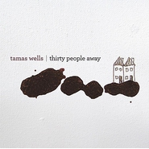

Thirty People Away
============================

|  |  |
| :--: | :-- |
| [ Thirty People Away](https://emumo.xiami.com/album/408329) | **艺人**: [Tamas Wells](../index.md) **语种**: 英语 **唱片公司**: 口袋唱片 **发行时间**: 2010年11月01日 **专辑类别**: 录音室专辑 **专辑风格**: 民谣流行 Folk Pop, 根源唱作人 Singer-Songwriter **播放数**: 4668029 **收藏数**: 2847 **评论数**: 313  |

## 简介

红遍国内的Tamas Wells带着全新专辑，展开了令人期待的亚洲之行。也许是在亚洲特别受到关注的原因，Tamas Wells这次选择中国，日本等国家拉开了巡回表演的序曲。新专辑很早已经在中国进行发售，之前的两张自己都有买，相信这张同样不会错过，标志性的男人，标志性的嗓音，仿佛身边的一切都会尽情融化于那清新曼妙的嗓音和旋律中。  
 

## 曲目

## 评论

|  |  |  |  |
| :-- | :-- | :-- | :-- |
|  [虾米用户](https://emumo.xiami.com/u/43213713) 音乐，意境和治愈。探索者... 2018-06-21 14:09 赞(0) 踩(0) | 
又想起我初三听着，晚上刷夜复习，真是段美好的时光～
 |
|  [虾米用户](https://emumo.xiami.com/u/277957297) 有你就好…… 2017-11-17 18:39 赞(0) 踩(0) | 
好暖好听吼吼
 |
|  [虾米用户](https://emumo.xiami.com/u/3111348)  2017-10-27 23:59 赞(0) 踩(0) | 
那是一种欢唱中的忧郁,忧郁中无以言表的自由,自由中飞扬的寂寞,寂寞中畅想的惬意,惬意中尽享阳光青叶的芬芳------就这样,时间在指间划过,直到落日时光,直到午夜舒缓的梦香
 |
|  [虾米用户](https://emumo.xiami.com/u/2957492)  2017-10-27 23:55 赞(0) 踩(0) | 
各位星期一还在迷糊没有进入状态的同我一样的人儿们啊~~~~~来听听歌吧。Tamas Wells，一直很喜欢的澳洲乐团，最喜欢写报告的时候听，哈哈~
 |
|  [虾米用户](https://emumo.xiami.com/u/298061) everything i... 2017-10-27 23:05 赞(0) 踩(0) | 
害我激动了半天……太毛线了 - -
 |
|  [虾米用户](https://emumo.xiami.com/u/5847985)  2017-09-03 18:02 赞(0) 踩(0) | 
这张专辑的素材比前几张都要生猛。非常有感染力的一张专辑。
 |
|  [虾米用户](https://emumo.xiami.com/u/1525780) 听不懂歌词的小清新能不能... 2017-06-21 14:10 赞(0) 踩(0) | 
我已经受不了虾米乐评里那些跑哪儿都评价&amp;ldquo;清新自然&amp;rdquo;的伪清新们了！！你们仔细看看这些歌，哪首清新了？？情侣湖边被谋杀，政治婚姻，药物自杀，自戳双目，爆炸案&amp;hellip;你还能配着喝茶？我服气。而且不是仅仅一张专辑的问题，每张里面几乎都有。他们的音乐几乎没有谈情说爱，大多数是主唱把日常生活中各种东西（比如抑郁、挣扎、甚至凶杀案）艺术处理和诗化后的产物。不是说非要用沉重的心情去听，但是以后能不能别上来就一个&amp;ldquo;清新&amp;rdquo;扣过去？恕我直言，清新你个大头鬼啊。
 |
| ⇒ |  [虾米用户](https://emumo.xiami.com/u/206795702)  2017-08-31 22:53 赞(0) 踩(0) | 
我也曾有过你这样的感受。以前光觉得歌很舒缓好听却又有一丝悲伤，后来专门去找了歌词来唱，发现这些歌曲里的悲伤之处，又变得很悲观。但整张专辑里只有thirty people away这首歌有一下就让人感受到悲伤的旋律。塔叔有过在缅甸生活的经历，他感受到那里的民风淳朴却也发现当地的欠发达，伤感的词配上舒缓的曲子，才能更好地同时表现两者吧
 |
| ⇒ |  [虾米用户](https://emumo.xiami.com/u/206795702)  2017-08-31 23:00 赞(0) 踩(0) | 
我同意你认为部分人评论的 清新 是欠考虑的，同时我从你的话语中看出你的一点急躁和对待歌曲的认真，好难得的。他的歌有很多翻译出来都很难理解的东西，这就是网上说的意识流吧？所以配合他舒缓的声音，沉下心去感受，了解歌曲背后的故事，才会明白作者作曲的原因吧。我很喜欢塔叔，可以看看我的头像是他的签名。喜欢你的直白，也愿意就这一点跟你继续讨论
 |
| ⇒ |  [虾米用户](https://emumo.xiami.com/u/1525780) 听不懂歌词的小清新能不能... 2017-09-05 20:10 赞(0) 踩(0) | 
<q><b>宇宙之光说：</b></q>
 |
|  [虾米用户](https://emumo.xiami.com/u/1406361) 我还没想好要写什么... 2017-03-22 23:21 赞(0) 踩(0) | 
上一次听的时候还是个中学生呢 
 |
|  [虾米用户](https://emumo.xiami.com/u/43213713) 音乐，意境和治愈。探索者... 2016-12-07 00:32 赞(1) 踩(0) | 
陪了我整个初三，注定陪伴我整个高三 
 |
|  [虾米用户](https://emumo.xiami.com/u/46034152) 暂无签名~ 2016-01-23 22:46 赞(0) 踩(0) | 
为 什 么 要 下 架！听过忘了名字搜了好久才找到，结果你给我下架了？！ 
 |
| ⇒ |  [虾米用户](https://emumo.xiami.com/u/60827912) 神明之类就相信吧迷惘之时... 2017-01-15 21:04 赞(0) 踩(0) | 
回归了 
 |
|  [虾米用户](https://emumo.xiami.com/u/33408782) 寂寂浸浸静静 2016-01-16 15:11 赞(0) 踩(0) | 
好听呗
 |
|  [虾米用户](https://emumo.xiami.com/u/76626846)  2015-10-25 22:00 赞(0) 踩(0) | 
1
 |
|  [虾米用户](https://emumo.xiami.com/u/38801880)   2015-10-06 20:55 赞(0) 踩(0) | 
^_^
 |
|  [虾米用户](https://emumo.xiami.com/u/7322777) ∮ 2015-10-05 04:23 赞(0) 踩(0) | 
...A...
 |
|  [虾米用户](https://emumo.xiami.com/u/39622913) 暂无签名~ 2015-05-17 00:26 赞(0) 踩(0) | 
为什么！！！
 |
|  [虾米用户](https://emumo.xiami.com/u/39999149)  2015-05-05 07:56 赞(0) 踩(0) | 
居然下架了 
 |
|  [虾米用户](https://emumo.xiami.com/u/32420864) 来自未来 2015-05-03 13:32 赞(0) 踩(0) | 
为什么听不了这个专辑了？
 |
|  [虾米用户](https://emumo.xiami.com/u/18231439)  2015-01-27 18:17 赞(0) 踩(0) | 
喜欢
 |
|  [虾米用户](https://emumo.xiami.com/u/12829242) 妹様… 好きだ…… 2014-12-11 10:30 赞(0) 踩(0) | 
听着听着就睡着了呢～
 |
|  [虾米用户](https://emumo.xiami.com/u/3912567) 众里寻她千百度，蓦然回首... 2014-10-30 11:56 赞(0) 踩(0) | 
just miss U
 |
|  [虾米用户](https://emumo.xiami.com/u/31971328)  2014-10-23 02:23 赞(0) 踩(0) | 
干净的声音，听着就会安静下来。
 |
|  [虾米用户](https://emumo.xiami.com/u/15725146) 最棒： 2014-10-20 16:47 赞(0) 踩(0) | 
舒服
 |
|  [虾米用户](https://emumo.xiami.com/u/38594497)  2014-07-01 11:50 赞(0) 踩(0) | 
summer songs_light..folk
 |
|  [虾米用户](https://emumo.xiami.com/u/37767819) 梦游四方的人 2014-06-19 14:54 赞(0) 踩(0) | 
好干净的声音！
 |
|  [虾米用户](https://emumo.xiami.com/u/37661533)  2014-06-16 21:50 赞(0) 踩(0) | 
清新,早上放
 |
|  [虾米用户](https://emumo.xiami.com/u/31664275)   2014-05-07 19:52 赞(0) 踩(0) | 
声音很好听
 |
|  [虾米用户](https://emumo.xiami.com/u/1033090) 牛逼！ 2014-04-23 16:31 赞(0) 踩(0) | 
thirty people away. 逝去的时光怎能倒退。时过境迁，物是人非。
 |
|  [虾米用户](https://emumo.xiami.com/u/23055037)  2014-03-29 20:36 赞(0) 踩(0) | 
干净的嗓音，清新的小调
 |
|  [虾米用户](https://emumo.xiami.com/u/28140192) mimi 2014-03-27 13:59 赞(0) 踩(0) | 
good
 |
|  [虾米用户](https://emumo.xiami.com/u/1609946) 一即一切 2014-03-16 14:41 赞(0) 踩(0) | 
心 境不二
 |
|  [虾米用户](https://emumo.xiami.com/u/32446405)  2014-02-07 15:59 赞(0) 踩(0) | 
好听
 |
|  [虾米用户](https://emumo.xiami.com/u/31376916) 戴上耳机 整个世界和心脏... 2014-01-09 22:12 赞(0) 踩(0) | 
离开的不是我
 |
|  [虾米用户](https://emumo.xiami.com/u/1598773)  2013-12-09 19:43 赞(0) 踩(0) | 
经典民谣
 |
|  [虾米用户](https://emumo.xiami.com/u/2954700) ta da 2013-10-29 19:29 赞(0) 踩(0) | 
f  v 学习 男音
 |
|  [虾米用户](https://emumo.xiami.com/u/5593618)  2013-10-01 11:38 赞(0) 踩(0) | 
缓缓的，几乎没什么起伏，松弛不紧张也是一种不错的风格，听着不累。
 |
|  [虾米用户](https://emumo.xiami.com/u/21406626)  2013-09-07 22:04 赞(0) 踩(0) | 
清爽
 |
|  [虾米用户](https://emumo.xiami.com/u/4480466) 白日放歌须纵酒 2013-07-02 17:51 赞(0) 踩(0) | 
春风拂面
 |
|  [虾米用户](https://emumo.xiami.com/u/12993607) 我还没想好要写什么... 2013-06-17 20:15 赞(0) 踩(0) | 
小清新。夏日柠檬汽水。
 |
|  [虾米用户](https://emumo.xiami.com/u/8854637) 我还没想好要写什么... 2013-06-08 23:40 赞(0) 踩(0) | 
静下来，让心感受每一个旋律
 |
|  [虾米用户](https://emumo.xiami.com/u/4947280)  2013-05-16 14:35 赞(0) 踩(0) | 
低沉的声线
 |
|  [虾米用户](https://emumo.xiami.com/u/4755893) Emotional 2013-05-02 16:05 赞(0) 踩(0) | 
延续了他们一贯的清新风格，很不错很不错
 |
|  [虾米用户](https://emumo.xiami.com/u/13922703)  2013-04-11 22:08 赞(0) 踩(0) | 
就是喜欢清新的私语
 |
|  [虾米用户](https://emumo.xiami.com/u/6624086)  2013-03-26 16:14 赞(0) 踩(0) | 
tamas wells~~~~
 |
|  [虾米用户](https://emumo.xiami.com/u/10304405) 大大大大大啾咪 2013-03-04 15:55 赞(0) 踩(0) | 
好听
 |
|  [虾米用户](https://emumo.xiami.com/u/12854147) I'm sherlock... 2013-02-26 17:35 赞(0) 踩(0) | 
声音美好
 |
|  [虾米用户](https://emumo.xiami.com/u/13144727) 我还没想好要写什么... 2013-02-20 16:39 赞(0) 踩(0) | 
想起那场错过的三十个人走了音乐会。
 |
|  [虾米用户](https://emumo.xiami.com/u/11886891) 不着调 2013-02-01 21:49 赞(0) 踩(0) | 
畅享自然之所
 |
|  [虾米用户](https://emumo.xiami.com/u/8110020) 面上冷酷到底，內心熱鬧非... 2013-01-26 16:09 赞(0) 踩(0) | 
听完@许诺主播下午茶 再来听听Tamas Wells带着感情的简单舒缓的旋律和轻柔醉人的嗓音。这个周末温暖的下午就完美了！
 |
|  [虾米用户](https://emumo.xiami.com/u/323124)  2012-12-10 14:15 赞(0) 踩(0) | 
free
 |
|  [虾米用户](https://emumo.xiami.com/u/6155481)  2012-12-05 00:16 赞(0) 踩(0) | 
从大耳朵网站听来的歌，到虾米中找到的，很轻松的歌曲风格，一下子感到清新、自然。
 |
|  [虾米用户](https://emumo.xiami.com/u/10452936)  2012-12-02 19:54 赞(0) 踩(0) | 
随入随出~~
 |
|  [虾米用户](https://emumo.xiami.com/u/11387589)  2012-11-25 13:02 赞(0) 踩(0) | 
懒懒的声音
 |
|  [虾米用户](https://emumo.xiami.com/u/10988852)  2012-11-20 15:18 赞(0) 踩(0) | 
好听
 |
|  [虾米用户](https://emumo.xiami.com/u/3580156) 我还没想好要写什么... 2012-11-10 17:03 赞(0) 踩(0) | 
Thirty People Away
 |
|  [虾米用户](https://emumo.xiami.com/u/7246350)  2012-11-02 18:28 赞(0) 踩(0) | 
因为共鸣
 |
|  [虾米用户](https://emumo.xiami.com/u/11133786)  2012-10-20 21:21 赞(0) 踩(0) | 
aaa
 |
|  [虾米用户](https://emumo.xiami.com/u/10964218) 心灵的旅行 2012-10-07 15:20 赞(0) 踩(0) | 
澳大利亚 歌曲 舒缓 自由
 |
|  [虾米用户](https://emumo.xiami.com/u/9722800) 2013！！！ 2012-10-06 08:23 赞(0) 踩(0) | 
Tamas Wells``
 |
|  [虾米用户](https://emumo.xiami.com/u/7294185)  2012-10-04 09:37 赞(0) 踩(0) | 
很舒服的伴奏很舒服的声音
 |
|  [虾米用户](https://emumo.xiami.com/u/8518886)  2012-07-24 17:47 赞(0) 踩(0) | 
like
 |
|  [虾米用户](https://emumo.xiami.com/u/9641051)  2012-06-30 15:49 赞(0) 踩(0) | 
从Valder Fields开始喜欢他的声音
 |
|  [虾米用户](https://emumo.xiami.com/u/9396564)  2012-06-06 13:32 赞(0) 踩(0) | 
风格
 |
|  [虾米用户](https://emumo.xiami.com/u/1281812) 聆听ing 2012-05-27 19:20 赞(0) 踩(0) | 
wondfull
 |
|  [虾米用户](https://emumo.xiami.com/u/2006623)  2012-05-26 11:25 赞(0) 踩(0) | 
此刻听到的
 |
|  [虾米用户](https://emumo.xiami.com/u/90972)  2012-05-18 23:42 赞(0) 踩(0) | 
TAMAS今年就不去看你了，预祝演出顺利。重温你的歌，就想起你09年时温柔的笑颜，撒满阳光的歌声，柔软的手，着实治愈。
 |
|  [虾米用户](https://emumo.xiami.com/u/1593897) ins: sodadil... 2012-05-17 10:00 赞(0) 踩(0) | 
时隔两年再听这张专辑 依旧被治愈被治愈
 |
|  [虾米用户](https://emumo.xiami.com/u/2823090) 我还没想好要写什么... 2012-05-17 03:44 赞(0) 踩(0) | 
不累
 |
|  [虾米用户](https://emumo.xiami.com/u/6882157)  2012-05-16 14:52 赞(0) 踩(0) | 
haoting
 |
|  [虾米用户](https://emumo.xiami.com/u/8414922)  2012-05-16 10:03 赞(0) 踩(0) | 
够清新！！！
 |
|  [虾米用户](https://emumo.xiami.com/u/791763)  2012-05-15 21:37 赞(0) 踩(0) | 
什么浮躁都烟消云散鸟。
 |
|  [虾米用户](https://emumo.xiami.com/u/1523160)  2012-05-05 23:17 赞(0) 踩(0) | 
心理面波澜不惊，月光的倒影，悠悠的照着岸边的花草，雾水蒸腾起来了。
 |
|  [虾米用户](https://emumo.xiami.com/u/591436) Hello！ 2012-05-01 18:37 赞(0) 踩(0) | 
舒服，简单，惬意！
 |
|  [虾米用户](https://emumo.xiami.com/u/7096738)  2012-04-04 20:42 赞(0) 踩(0) | 
蛮好听
 |
|  [虾米用户](https://emumo.xiami.com/u/643364)  2012-03-30 13:37 赞(0) 踩(0) | 
听他的歌有种很安静的感觉！
 |
|  [虾米用户](https://emumo.xiami.com/u/6265054) nice to meet... 2012-03-20 15:46 赞(0) 踩(0) | 
小清新。。。
 |
|  [虾米用户](https://emumo.xiami.com/u/3159932) 我还没想好要写什么... 2012-03-19 12:49 赞(0) 踩(0) | 
很爱~真的很喜欢~
 |
|  [虾米用户](https://emumo.xiami.com/u/7858087)  2012-02-17 22:54 赞(0) 踩(0) | 
治愈了
 |
|  [虾米用户](https://emumo.xiami.com/u/4300497)  2012-02-17 15:48 赞(0) 踩(0) | 
听Tamas Wells噶歌我会觉得好想训。。
 |
|  [虾米用户](https://emumo.xiami.com/u/4230371)   2012-02-09 22:43 赞(0) 踩(0) | 
小清新的安静曲风 喧嚣都市里的一抹明媚阳光 让人心完全放松浸透在吉他的民谣里。
 |
|  [虾米用户](https://emumo.xiami.com/u/7820123)  2012-01-28 13:21 赞(0) 踩(0) | 
软软的声音很好听···
 |
|  [虾米用户](https://emumo.xiami.com/u/705149) music life 2011-12-21 18:50 赞(0) 踩(0) | 
start from here
 |
|  [虾米用户](https://emumo.xiami.com/u/7165430)  2011-12-09 12:55 赞(0) 踩(0) | 
最爱
 |
|  [虾米用户](https://emumo.xiami.com/u/7016350)  2011-12-01 10:53 赞(0) 踩(0) | 
喜欢
 |
|  [虾米用户](https://emumo.xiami.com/u/6844774)  2011-11-18 19:02 赞(0) 踩(0) | 
喜欢你.没道理
 |
|  [虾米用户](https://emumo.xiami.com/u/601978)  2011-10-30 09:02 赞(0) 踩(0) | 
第四张专辑！越加精彩！
 |
|  [虾米用户](https://emumo.xiami.com/u/3245769) 好好生活，天天向上 2011-10-22 21:37 赞(0) 踩(0) | 
Tames Wells总能让人平静下来。
 |
|  [虾米用户](https://emumo.xiami.com/u/6264218)  2011-10-18 16:15 赞(0) 踩(0) | 
宁静的世界
 |
|  [虾米用户](https://emumo.xiami.com/u/6264218)  2011-10-18 16:12 赞(0) 踩(0) | 
宁静的世界
 |
|  [虾米用户](https://emumo.xiami.com/u/5793159) 9年虾米生涯，走好，有缘... 2011-10-13 00:23 赞(0) 踩(0) | 
温馨精品
 |
|  [虾米用户](https://emumo.xiami.com/u/6193636)  2011-10-12 14:43 赞(0) 踩(0) | 
feel~~~~
 |
|  [虾米用户](https://emumo.xiami.com/u/6105234)  2011-10-04 18:29 赞(0) 踩(0) | 
在你安静时，值得你爱上它
 |
|  [虾米用户](https://emumo.xiami.com/u/5396177)  2011-09-26 02:36 赞(0) 踩(0) | 
生活需要小清新，分享给需要放松的朋友们·~~
 |
|  [虾米用户](https://emumo.xiami.com/u/5396177)  2011-09-26 02:31 赞(0) 踩(0) | 
生活需要小清新~偶尔放松下
 |
|  [虾米用户](https://emumo.xiami.com/u/4118538)  2011-09-18 22:01 赞(0) 踩(0) | 
安静的经典
 |
|  [虾米用户](https://emumo.xiami.com/u/5684936) dich 2011-09-06 16:40 赞(0) 踩(0) | 
大爱!
 |
|  [虾米用户](https://emumo.xiami.com/u/3819460)  2011-09-03 21:08 赞(0) 踩(0) | 
随便享受一下
 |
|  [虾米用户](https://emumo.xiami.com/u/5144044) 不会聊天的男生配拥有爱情... 2011-09-02 07:29 赞(0) 踩(0) | 
Love
 |
|  [虾米用户](https://emumo.xiami.com/u/5573744)  2011-08-28 19:00 赞(0) 踩(0) | 
好治愈~~~~
 |
|  [虾米用户](https://emumo.xiami.com/u/4255851)  2011-08-27 11:58 赞(0) 踩(0) | 
那种清新的感觉
 |
|  [虾米用户](https://emumo.xiami.com/u/2927591) 暂无签名~ 2011-08-15 14:57 赞(0) 踩(0) | 
舒服
 |
|  [虾米用户](https://emumo.xiami.com/u/2630192) 幽默就像一扇门，打开就是... 2011-08-08 21:32 赞(0) 踩(0) | 
很淡淡的感觉.
 |
|  [虾米用户](https://emumo.xiami.com/u/5090726)  2011-08-01 13:37 赞(0) 踩(0) | 
中意Tamas wells~
 |
|  [虾米用户](https://emumo.xiami.com/u/2341500)  2011-07-25 10:53 赞(0) 踩(0) | 
喜欢。。
 |
|  [虾米用户](https://emumo.xiami.com/u/96986)   2011-07-18 00:19 赞(0) 踩(0) | 
干净舒服，让人沉寂
 |
|  [虾米用户](https://emumo.xiami.com/u/4337136)  2011-07-14 16:30 赞(0) 踩(0) | 
tm一如既往清澈的声音，小小的温馨
 |
|  [虾米用户](https://emumo.xiami.com/u/2432380)  2011-07-12 21:05 赞(0) 踩(0) | 
很好听的声音哦，很想悄悄话，轻轻的。。。
 |
|  [虾米用户](https://emumo.xiami.com/u/4812183)   2011-07-12 18:03 赞(0) 踩(0) | 
总能勾起美好的回忆
 |
|  [虾米用户](https://emumo.xiami.com/u/4803093)  2011-07-12 17:13 赞(0) 踩(0) | 
只需静静地谛听~
 |
|  [虾米用户](https://emumo.xiami.com/u/4778412)  2011-07-08 17:23 赞(0) 踩(0) | 
嗯  就是准备放空间的
 |
|  [虾米用户](https://emumo.xiami.com/u/4468156)  2011-06-29 00:29 赞(0) 踩(0) | 
9月28，大连，一定去看你。
 |
|  [虾米用户](https://emumo.xiami.com/u/4468156)  2011-06-29 00:28 赞(0) 踩(0) | 
喜欢的民谣
 |
|  [虾米用户](https://emumo.xiami.com/u/2843251)  2011-06-21 21:27 赞(0) 踩(0) | 
仿佛被雨洗刷后的世界，干净得一尘不染，清新的嗓音，柔和的调调~
 |
|  [虾米用户](https://emumo.xiami.com/u/1042382) 我还没想好要写什么... 2011-06-19 17:48 赞(0) 踩(0) | 
忘记什么时候开始听tamas wells 了，一般人都应该是从valder fiellds认识这个来自澳洲的乐队的吧，主唱的声音简直就是天籁，听过那么多首民谣，这个人的声音是我迄今为止最喜欢的，安静温和，有段时间天天听他们的歌睡觉~干净的声音清新的曲风就是tamas wells
 |
|  [虾米用户](https://emumo.xiami.com/u/4185998)  2011-06-05 16:35 赞(0) 踩(0) | 
又是tamas wells，就是喜欢
 |
|  [虾米用户](https://emumo.xiami.com/u/2842053)  2011-05-30 00:26 赞(0) 踩(0) | 
很喜欢！！！
 |
|  [虾米用户](https://emumo.xiami.com/u/976653)  2011-05-29 10:33 赞(0) 踩(0) | 
清新的歌
 |
|  [虾米用户](https://emumo.xiami.com/u/2361926)  2011-05-25 22:24 赞(0) 踩(0) | 
非常喜欢。。。
 |
|  [虾米用户](https://emumo.xiami.com/u/3855875)  2011-05-07 22:20 赞(0) 踩(0) | 
一直都很喜欢
 |
|  [虾米用户](https://emumo.xiami.com/u/3765958)  2011-04-28 15:58 赞(0) 踩(0) | 
ok
 |
|  [虾米用户](https://emumo.xiami.com/u/1445312) 喜欢音乐的游戏人 2011-04-26 01:30 赞(0) 踩(0) | 
平静，温暖，舒服，简单的歌，没有过多的理由，舒服清新的声音和简单的吉他声，就是喜欢。。也许就是这种简单，没有过多的修饰，才让人喜欢的吧。。
 |
|  [虾米用户](https://emumo.xiami.com/u/1445312) 喜欢音乐的游戏人 2011-04-26 01:22 赞(0) 踩(0) | 
舒服 清新 简单
 |
|  [虾米用户](https://emumo.xiami.com/u/3652816)  2011-04-22 16:00 赞(0) 踩(0) | 
来自于我向往的一个国家···
 |
|  [虾米用户](https://emumo.xiami.com/u/1079792)  2011-04-15 23:31 赞(0) 踩(0) | 
清新的曲风 好听
 |
|  [虾米用户](https://emumo.xiami.com/u/3350621)  2011-04-03 11:04 赞(0) 踩(0) | 
优美
 |
|  [虾米用户](https://emumo.xiami.com/u/232854) Event 2011-03-27 18:00 赞(0) 踩(0) | 
轻轻的，心很静。
 |
|  [虾米用户](https://emumo.xiami.com/u/3332143)  2011-03-24 10:08 赞(0) 踩(0) | 
很舒服的音樂  適合一個人靜靜的喝著咖啡聽  :)
 |
|  [虾米用户](https://emumo.xiami.com/u/1373405)  2011-03-24 09:36 赞(0) 踩(0) | 
最近很喜欢这张专辑
 |
|  [虾米用户](https://emumo.xiami.com/u/3259260)  2011-03-19 11:32 赞(0) 踩(0) | 
久违的感觉
 |
|  [虾米用户](https://emumo.xiami.com/u/3226603)  2011-03-18 23:07 赞(0) 踩(0) | 
呵呵
 |
|  [虾米用户](https://emumo.xiami.com/u/458890)  2011-03-18 03:12 赞(0) 踩(0) | 
每次听他们的歌都很开心
 |
|  [虾米用户](https://emumo.xiami.com/u/2079535)   2011-03-15 18:38 赞(0) 踩(0) | 
很柔和很温暖的感觉~
 |
|  [虾米用户](https://emumo.xiami.com/u/3206979)  2011-03-14 21:27 赞(0) 踩(0) | 
一种调调，
 |
|  [虾米用户](https://emumo.xiami.com/u/2877170)  2011-03-10 22:54 赞(0) 踩(0) | 
心情好
 |
|  [虾米用户](https://emumo.xiami.com/u/3126767)  2011-03-08 18:18 赞(0) 踩(0) | 
清新。不含杂质。
 |
|  [虾米用户](https://emumo.xiami.com/u/3123081)   2011-03-08 12:57 赞(0) 踩(0) | 
简单的喜欢
 |
|  [虾米用户](https://emumo.xiami.com/u/3074977)  2011-03-05 12:57 赞(0) 踩(0) | 
午后阳光
 |
|  [虾米用户](https://emumo.xiami.com/u/1926922)  2011-03-05 09:55 赞(0) 踩(0) | 
清畅
 |
|  [虾米用户](https://emumo.xiami.com/u/1926922)  2011-03-05 09:52 赞(0) 踩(0) | 
清畅
 |
|  [虾米用户](https://emumo.xiami.com/u/352929)  2011-03-02 18:40 赞(0) 踩(0) | 
简单而温暖
 |
|  [虾米用户](https://emumo.xiami.com/u/2994800)  2011-02-27 13:16 赞(0) 踩(0) | 
一如既往地干净明亮。让歌词你讲的是啥综合征的人都忘了在意歌词。像有整整一条街的阳光和无声的衣着鲜艳的parade dancers。这音乐的家乡现在正在一个夏末秋初。
 |
|  [虾米用户](https://emumo.xiami.com/u/2994800)  2011-02-26 23:29 赞(0) 踩(0) | 
woah我还不知道这张专辑.....听听看&amp;gt;W&amp;lt;
 |
|  [虾米用户](https://emumo.xiami.com/u/352399) 你若盛开，清风自来 2011-02-26 20:11 赞(0) 踩(0) | 
喜欢这样一贯的清淡悠然，偶尔的放松心情，与初春的转季合得上节拍的音乐不多。
 |
|  [虾米用户](https://emumo.xiami.com/u/2934001)  2011-02-23 21:41 赞(0) 踩(0) | 
风格继续 一直未变
 |
|  [虾米用户](https://emumo.xiami.com/u/2912055)  2011-02-20 23:51 赞(0) 踩(0) | 
就爱小清新
 |
|  [虾米用户](https://emumo.xiami.com/u/1258733)  2011-02-09 07:27 赞(0) 踩(0) | 
很好听啊
 |
|  [虾米用户](https://emumo.xiami.com/u/2285052)  2011-02-08 14:21 赞(0) 踩(0) | 
暖暖的声音
 |
|  [虾米用户](https://emumo.xiami.com/u/1487888) Tribute!!!!! 2011-01-31 15:32 赞(0) 踩(0) | 
[01.31]最終，有些東西沒有變。
 |
| ⇒ |  [虾米用户](https://emumo.xiami.com/u/2994800)  2011-02-27 13:23 赞(0) 踩(0) | 
呵，听到这张时我也这么觉得w
 |
| ⇒ |  [虾米用户](https://emumo.xiami.com/u/1487888) Tribute!!!!! 2011-02-27 16:13 赞(0) 踩(0) | 
<q><b>MANYETHA说：</b></q>
 |
|  [虾米用户](https://emumo.xiami.com/u/2672107)    人活一世真的不能多... 2011-01-29 22:39 赞(0) 踩(0) | 
people go away but you .....
 |
|  [虾米用户](https://emumo.xiami.com/u/1062387)  2011-01-28 14:31 赞(0) 踩(0) | 
peace
 |
|  [虾米用户](https://emumo.xiami.com/u/2573913)  2011-01-23 22:44 赞(0) 踩(0) | 
好听
 |
|  [虾米用户](https://emumo.xiami.com/u/1894193)  2011-01-23 17:04 赞(0) 踩(0) | 
好听，两个字足够了
 |
|  [虾米用户](https://emumo.xiami.com/u/227369)  2011-01-19 22:22 赞(0) 踩(0) | 
只是喜欢TAMAS WELL而已。
 |
|  [虾米用户](https://emumo.xiami.com/u/1469166)  2011-01-16 18:43 赞(0) 踩(0) | 
recommended by C~
 |
|  [虾米用户](https://emumo.xiami.com/u/1750571)  2011-01-16 18:00 赞(0) 踩(0) | 
好音乐，用心听
 |
|  [虾米用户](https://emumo.xiami.com/u/2476656)  2011-01-16 17:11 赞(0) 踩(0) | 
好像春天蚱蜢在草丛间高高的跳^^
 |
|  [虾米用户](https://emumo.xiami.com/u/2507370)   2011-01-15 22:27 赞(0) 踩(0) | 
比较轻柔
 |
|  [虾米用户](https://emumo.xiami.com/u/1265548)  2011-01-15 13:14 赞(0) 踩(0) | 
自己听嘛，我也没听过
 |
|  [虾米用户](https://emumo.xiami.com/u/2008880)  2011-01-14 00:14 赞(0) 踩(0) | 
清新~
 |
|  [虾米用户](https://emumo.xiami.com/u/975953) enchanted 2011-01-13 20:42 赞(0) 踩(0) | 
tamas wells一贯的曲风，轻快的节奏，简单的鼓点。听着他的歌，仿佛是晒着和煦的太阳，吹着清爽的春风
 |
|  [虾米用户](https://emumo.xiami.com/u/975953) enchanted 2011-01-13 20:40 赞(0) 踩(0) | 
轻快，简单的节奏让人全身放松。
 |
|  [虾米用户](https://emumo.xiami.com/u/434047) 度一切苦厄。 2011-01-13 20:13 赞(0) 踩(0) | 
把《The Crime at Edmond Lake》放在第一首...TAMAS真是明智
 |
|  [虾米用户](https://emumo.xiami.com/u/2463123)  2011-01-11 21:33 赞(0) 踩(0) | 
太开心啦
 |
|  [虾米用户](https://emumo.xiami.com/u/2397908)  2011-01-11 11:00 赞(0) 踩(0) | 
柔软的声音~
 |
|  [虾米用户](https://emumo.xiami.com/u/2332347) 没什么 2011-01-08 21:44 赞(0) 踩(0) | 
只听了第一首第一句 但我觉的整张专辑我都会喜欢
 |
|  [虾米用户](https://emumo.xiami.com/u/2056961) 杂食动物 2011-01-07 11:07 赞(0) 踩(0) | 
很喜欢
 |
|  [虾米用户](https://emumo.xiami.com/u/1938282)  2011-01-06 17:36 赞(0) 踩(0) | 
清新男音。
 |
|  [虾米用户](https://emumo.xiami.com/u/2341500)  2010-12-30 18:42 赞(0) 踩(0) | 
什么时候来厦门呢
 |
|  [虾米用户](https://emumo.xiami.com/u/1544308)  2010-12-26 13:54 赞(0) 踩(0) | 
your hands into mine 现场真的妖到爆
 |
|  [虾米用户](https://emumo.xiami.com/u/2024730)  2010-12-25 10:41 赞(0) 踩(0) | 
好 hao!
 |
|  [虾米用户](https://emumo.xiami.com/u/1821885) 听世界，看万象 2010-12-25 09:54 赞(0) 踩(0) | 
曲风清新,确实
 |
|  [虾米用户](https://emumo.xiami.com/u/691233) 过去的已灭 未来的未生 ... 2010-12-23 01:14 赞(0) 踩(0) | 
想着那年去看他的演出 好多90后的小朋友哦  呵呵呵老少通杀哦
 |
|  [虾米用户](https://emumo.xiami.com/u/1845457)  2010-12-22 17:18 赞(0) 踩(0) | 
这砖为毛水果店木有咧。。有谁在水果店看到么？
 |
|  [虾米用户](https://emumo.xiami.com/u/1233071)  2010-12-20 12:44 赞(0) 踩(0) | 
好温柔，好稀饭。。。感动。。泪~
 |
|  [虾米用户](https://emumo.xiami.com/u/1228892)  2010-12-16 17:02 赞(0) 踩(0) | 
黑！怎么没早发现
 |
|  [虾米用户](https://emumo.xiami.com/u/2149749)  2010-12-11 16:26 赞(0) 踩(0) | 
天籁之声。。。。喜欢
 |
|  [虾米用户](https://emumo.xiami.com/u/1972322)   2010-12-10 19:23 赞(0) 踩(0) | 
喜欢
 |
|  [虾米用户](https://emumo.xiami.com/u/809966)  2010-12-03 11:58 赞(0) 踩(0) | 
好幸福好幸福
 |
|  [虾米用户](https://emumo.xiami.com/u/2067499)  2010-11-30 21:46 赞(0) 踩(0) | 
听着很舒服
 |
|  [虾米用户](https://emumo.xiami.com/u/810926)  2010-11-29 20:18 赞(0) 踩(0) | 
喜欢的乐队，哈哈~~
 |
|  [虾米用户](https://emumo.xiami.com/u/539169)   2010-11-27 23:15 赞(0) 踩(0) | 
温暖的调调
 |
|  [虾米用户](https://emumo.xiami.com/u/1374495)  2010-11-26 19:42 赞(0) 踩(0) | 
爱~~
 |
|  [虾米用户](https://emumo.xiami.com/u/1010155) 暂无签名~ 2010-11-24 17:02 赞(0) 踩(0) | 
小清新啊   不论身在何处，就是这样被温暖
 |
|  [虾米用户](https://emumo.xiami.com/u/639014) 我还没想好要写什么... 2010-11-22 16:08 赞(0) 踩(0) | 
不爱孤单，爱你，
 |
|  [虾米用户](https://emumo.xiami.com/u/1942503)  2010-11-21 15:21 赞(0) 踩(0) | 
好静好静！！！
 |
|  [虾米用户](https://emumo.xiami.com/u/1717786)  2010-11-21 11:48 赞(0) 踩(0) | 
我喜欢那个草泥马的头像~~，好像松狮来的！~
 |
|  [虾米用户](https://emumo.xiami.com/u/163802) 我还没想好要写什么... 2010-11-20 23:27 赞(0) 踩(0) | 
现场太美了。
 |
|  [虾米用户](https://emumo.xiami.com/u/1124003)  2010-11-20 20:52 赞(0) 踩(0) | 
真的超喜欢这种感觉，有没有人有他的吉他谱集啊，分享给我吧！
 |
| ⇒ |  [虾米用户](https://emumo.xiami.com/u/756068)  2010-11-20 21:34 赞(0) 踩(0) | 
看来哥 也是弹吉他的啊！
 |
| ⇒ |  [虾米用户](https://emumo.xiami.com/u/1124003)  2010-11-21 12:00 赞(0) 踩(0) | 
<q><b>咸鱼蛋仔说：</b></q>
 |
| ⇒ |  [虾米用户](https://emumo.xiami.com/u/756068)  2010-11-21 13:01 赞(0) 踩(0) | 
<q><b>winnie说：</b></q>
 |
|  [虾米用户](https://emumo.xiami.com/u/261616)   2010-11-20 17:33 赞(0) 踩(0) | 
舒服
 |
|  [虾米用户](https://emumo.xiami.com/u/296282)  2010-11-19 18:40 赞(0) 踩(0) | 
他们所有歌都是一种感觉 浅吟低唱 听多了会困
 |
| ⇒ |  [虾米用户](https://emumo.xiami.com/u/463998)  2010-11-19 19:05 赞(0) 踩(0) | 
嘿嘿，说明你没听过更催眠的~我现在听TW会很精神
 |
| ⇒ |  [虾米用户](https://emumo.xiami.com/u/296282)  2010-11-19 22:44 赞(0) 踩(0) | 
<q><b>yhnolh说：</b></q>
 |
| ⇒ |  [虾米用户](https://emumo.xiami.com/u/463998)  2010-11-20 12:40 赞(0) 踩(0) | 
<q><b>翠华路首富说：</b></q>
 |
| ⇒ |  [虾米用户](https://emumo.xiami.com/u/368772)  2010-11-29 16:29 赞(0) 踩(0) | 
恩饿饿，我就是靠听他们的歌睡着的，治疗失眠超有效~~
 |
| ⇒ |  [虾米用户](https://emumo.xiami.com/u/296282)  2010-11-29 17:48 赞(0) 踩(0) | 
<q><b>Ed-秋日说：</b></q>
 |
|  [虾米用户](https://emumo.xiami.com/u/1930311)  2010-11-19 15:25 赞(0) 踩(0) | 
Thirty People Away!!
 |
|  [虾米用户](https://emumo.xiami.com/u/1930311)  2010-11-19 15:25 赞(0) 踩(0) | 
Thirty People Away
 |
|  [虾米用户](https://emumo.xiami.com/u/413819) 因為你，我的世界才有了色... 2010-11-19 13:52 赞(0) 踩(0) | 
值得收藏的专辑，可惜澳洲这边都找不到！先谢谢分享。
 |
|  [虾米用户](https://emumo.xiami.com/u/1397120)  2010-11-19 09:47 赞(0) 踩(0) | 
可爱的音律,大爱
 |
|  [虾米用户](https://emumo.xiami.com/u/1953483)  2010-11-19 08:37 赞(0) 踩(0) | 
多温暖的人
 |
|  [虾米用户](https://emumo.xiami.com/u/1467974) 借衣挡风 2010-11-18 17:23 赞(0) 踩(0) | 
哟，新专辑……
 |
|  [虾米用户](https://emumo.xiami.com/u/1382126)  2010-11-18 11:53 赞(0) 踩(0) | 
thanks it's amazing
 |
|  [虾米用户](https://emumo.xiami.com/u/451253)  2010-11-18 02:07 赞(0) 踩(0) | 
小温柔，一如既往。
 |
|  [虾米用户](https://emumo.xiami.com/u/574193) 不以物喜不以己悲 2010-11-17 21:09 赞(0) 踩(0) | 
不得不感慨还是以前的专辑更令人动容！
 |
|  [虾米用户](https://emumo.xiami.com/u/547315) 12年，却这样被迫匆匆结... 2010-11-17 13:51 赞(0) 踩(0) | 
签唱会的时候买了呢！喜欢第三首。
 |
|  [虾米用户](https://emumo.xiami.com/u/114683)  2010-11-17 12:03 赞(0) 踩(0) | 
终于出了
 |
|  [虾米用户](https://emumo.xiami.com/u/1943212)  2010-11-17 12:00 赞(0) 踩(0) | 
超好听 我也想要 <a href="mailto:122290470@qq.com">122290470@qq.com</a> 不胜感激
 |
|  [虾米用户](https://emumo.xiami.com/u/1314385)  2010-11-17 11:07 赞(0) 踩(0) | 
要专辑啊~~~~<a href="mailto:g.kaddo@gmail.com">g.kaddo@gmail.com</a>不胜感谢！
 |
|  [虾米用户](https://emumo.xiami.com/u/188206)  2010-11-17 08:16 赞(0) 踩(0) | 
好心人我也要。。<a href="mailto:kentsos@qq.com">kentsos@qq.com</a> 多谢啦。。
 |
|  [虾米用户](https://emumo.xiami.com/u/535221) Lose Control 2010-11-16 21:56 赞(0) 踩(0) | 
一上来就看见已经363的收藏了...
 |
|  [虾米用户](https://emumo.xiami.com/u/1509097)  2010-11-16 19:30 赞(0) 踩(0) | 
我也不淡定鸟~~~<a href="mailto:vitas.opera2@163.com">vitas.opera2@163.com</a>谢！
 |
|  [虾米用户](https://emumo.xiami.com/u/11353)  2010-11-16 18:34 赞(0) 踩(0) | 
正版的还是比较贵啊。
 |
| ⇒ |  [虾米用户](https://emumo.xiami.com/u/463998)  2010-11-16 20:07 赞(0) 踩(0) | 
嗯啊，我买的官方预售，60RMB……
 |
| ⇒ |  [虾米用户](https://emumo.xiami.com/u/11353)  2010-11-17 12:03 赞(0) 踩(0) | 
<q><b>yhnolh说：</b></q>
 |
|  [虾米用户](https://emumo.xiami.com/u/724307)  2010-11-16 11:22 赞(0) 踩(0) | 
******
 |
|  [虾米用户](https://emumo.xiami.com/u/880219)  2010-11-16 01:51 赞(0) 踩(0) | 
举手，我也要<a href="mailto:eddieblue@163.com">eddieblue@163.com</a>
 |
|  [虾米用户](https://emumo.xiami.com/u/1931730)  2010-11-15 21:53 赞(0) 踩(0) | 
哪里可以下载哪里可以买到啊啊啊？
 |
| ⇒ |  [虾米用户](https://emumo.xiami.com/u/357092)  2010-11-15 23:31 赞(0) 踩(0) | 
估计电驴上可以下载到，因为电驴基本是192K，虾米都是320K的，不过之前我也下过一个192K的~~
 |
|  [虾米用户](https://emumo.xiami.com/u/1931662)  2010-11-15 21:48 赞(0) 踩(0) | 
好心人我也要。。<a href="mailto:442614453@qq.com">442614453@qq.com</a> 多谢啦。。
 |
|  [虾米用户](https://emumo.xiami.com/u/977064) 暂无签名~ 2010-11-15 18:19 赞(0) 踩(0) | 
好心人我也要，<a href="mailto:1078969379@qq.com">1078969379@qq.com</a>。多谢！！
 |
|  [虾米用户](https://emumo.xiami.com/u/1046100) 音乐是我回家最美的风景。 2010-11-15 15:24 赞(0) 踩(0) | 
等~~
 |
|  [虾米用户](https://emumo.xiami.com/u/1928344)  2010-11-15 15:14 赞(0) 踩(0) | 
我也要我也要~ 好听.~ <a href="mailto:caihua7401614@163.com">caihua7401614@163.com</a>      thanks.
 |
|  [虾米用户](https://emumo.xiami.com/u/1826759)  2010-11-15 14:33 赞(0) 踩(0) | 
喜欢。。。
 |
| ⇒ |  [虾米用户](https://emumo.xiami.com/u/1455330)  2010-11-17 15:29 赞(0) 踩(0) | 
怎么才能有米数啊
 |
|  [虾米用户](https://emumo.xiami.com/u/977064) 暂无签名~ 2010-11-15 13:14 赞(0) 踩(0) | 
怎么顺序是乱的?
 |
| ⇒ |  [虾米用户](https://emumo.xiami.com/u/463998)  2010-11-15 14:55 赞(0) 踩(0) | 
顺序不乱，对的~根据我拿到的CD看
 |
| ⇒ |  [虾米用户](https://emumo.xiami.com/u/463998)  2010-11-15 14:56 赞(0) 踩(0) | 
呃……搞错了……表面上看歌曲顺序对的，但是听了之后发现歌名和歌曲本身对不上……
 |
|  [虾米用户](https://emumo.xiami.com/u/219167)  2010-11-15 12:48 赞(0) 踩(0) | 
刚才一看到这张专辑，情不自禁地“哇”了一声。。。
 |
|  [虾米用户](https://emumo.xiami.com/u/1923036)  2010-11-15 11:30 赞(0) 踩(0) | 
终于完成了吗？
 |
|  [虾米用户](https://emumo.xiami.com/u/1555664)  2010-11-15 09:31 赞(0) 踩(0) | 
不能忍了真的 为什么这么慢..
 |
|  [虾米用户](https://emumo.xiami.com/u/1347478)  2010-11-14 21:37 赞(0) 踩(0) | 
阿呀呀哎呀  什么时候才审核 好啊、、期待。。
 |
|  [虾米用户](https://emumo.xiami.com/u/294864) 少年の小飛行。 2010-11-13 19:53 赞(0) 踩(0) | 
我已经有这张专辑的电子版了。。。本来想共享的~~没想到先有人共享出来。。。呵呵
 |
| ⇒ |  [虾米用户](https://emumo.xiami.com/u/1018076)  2010-11-14 18:57 赞(0) 踩(0) | 
发给我好吗~好吗....
 |
|  [虾米用户](https://emumo.xiami.com/u/1171396) 以前办不到的事情，未来也... 2010-11-13 17:16 赞(0) 踩(0) | 
<a href="http://t.sina.com.cn/musicaholic" target="_blank" rel="nofollow noreferrer noopener">http://t.sina.com.cn/musicaholic</a>
 |
|  [虾米用户](https://emumo.xiami.com/u/463998)  2010-11-12 08:35 赞(0) 踩(0) | 
买到CD了……已转成320k mp3，有人要不……？
 |
| ⇒ |  [虾米用户](https://emumo.xiami.com/u/1899075)  2010-11-12 10:37 赞(0) 踩(0) | 
我要，发到我邮么？<a href="mailto:qwtldn@163.com">qwtldn@163.com</a>谢谢
 |
| ⇒ |  [虾米用户](https://emumo.xiami.com/u/15) 吃嘛嘛香 2010-11-12 11:02 赞(0) 踩(0) | 
可以上传咯~
 |
| ⇒ |  [虾米用户](https://emumo.xiami.com/u/711250) 我还没想好要写什么... 2010-11-13 09:50 赞(0) 踩(0) | 
唔 求320k  感谢分享哈<a href="mailto:aaa4566231@qq.com">aaa4566231@qq.com</a>
 |
| ⇒ |  [虾米用户](https://emumo.xiami.com/u/463998)  2010-11-13 11:17 赞(0) 踩(0) | 
<q><b>思念水中游说：</b></q>
 |
| ⇒ |  [虾米用户](https://emumo.xiami.com/u/463998)  2010-11-13 11:18 赞(0) 踩(0) | 
<q><b>Akiros说：</b></q>
 |
| ⇒ |  [虾米用户](https://emumo.xiami.com/u/539169)   2010-11-13 12:02 赞(0) 踩(0) | 
我要  <a href="mailto:casper2135@sina.com">casper2135@sina.com</a>  万分感激啊
 |
| ⇒ |  [虾米用户](https://emumo.xiami.com/u/530580)  2010-11-13 17:53 赞(0) 踩(0) | 
<a href="mailto:403463287@qq.com">403463287@qq.com</a>谢谢啊~!! 感激!
 |
| ⇒ |  [虾米用户](https://emumo.xiami.com/u/1769061)  2010-11-14 09:34 赞(0) 踩(0) | 
<a href="mailto:553656598@qq.com">553656598@qq.com</a> 谢谢！！！！！！
 |
| ⇒ |  [虾米用户](https://emumo.xiami.com/u/1302921)  2010-11-14 10:38 赞(0) 踩(0) | 
我也想要,谢谢，<a href="mailto:569312640@qq.com">569312640@qq.com</a>
 |
| ⇒ |  [虾米用户](https://emumo.xiami.com/u/463998)  2010-11-14 13:50 赞(0) 踩(0) | 
<q><b>微安说：</b></q>
 |
| ⇒ |  [虾米用户](https://emumo.xiami.com/u/463998)  2010-11-14 13:51 赞(0) 踩(0) | 
<q><b>BB米说：</b></q>
 |
| ⇒ |  [虾米用户](https://emumo.xiami.com/u/463998)  2010-11-14 13:51 赞(0) 踩(0) | 
<q><b>丁阿喵说：</b></q>
 |
| ⇒ |  [虾米用户](https://emumo.xiami.com/u/463998)  2010-11-14 13:51 赞(0) 踩(0) | 
<q><b>A。说：</b></q>
 |
| ⇒ |  [虾米用户](https://emumo.xiami.com/u/463998)  2010-11-14 13:51 赞(0) 踩(0) | 
<q><b>说：</b></q>
 |
| ⇒ |  [虾米用户](https://emumo.xiami.com/u/712419)  2010-11-14 16:33 赞(0) 踩(0) | 
我也要呢~谢谢咯~邮箱 <a href="mailto:jessica_gu@sina.com">jessica_gu@sina.com</a>
 |
| ⇒ |  [虾米用户](https://emumo.xiami.com/u/463998)  2010-11-14 18:26 赞(0) 踩(0) | 
<q><b>叮丶阳光灿烂说：</b></q>
 |
| ⇒ |  [虾米用户](https://emumo.xiami.com/u/1018076)  2010-11-14 18:59 赞(0) 踩(0) | 
能发给我吗？感谢感谢啊~<a href="mailto:729535432@qq.com">729535432@qq.com</a>
 |
| ⇒ |  [虾米用户](https://emumo.xiami.com/u/463998)  2010-11-14 19:46 赞(0) 踩(0) | 
<q><b>william说：</b></q>
 |
| ⇒ |  [虾米用户](https://emumo.xiami.com/u/1909960)  2010-11-15 11:32 赞(0) 踩(0) | 
我想要，能发我邮么，<a href="mailto:fabio10@163.com">fabio10@163.com</a>,谢谢
 |
| ⇒ |  [虾米用户](https://emumo.xiami.com/u/1135460)  2010-11-15 12:01 赞(0) 踩(0) | 
我要<a href="mailto:1064462922@qq.com">1064462922@qq.com</a> 谢谢
 |
| ⇒ |  [虾米用户](https://emumo.xiami.com/u/1453294)  2010-11-15 12:10 赞(0) 踩(0) | 
<a href="mailto:afterthis@qq.com">afterthis@qq.com</a>`` 叩谢··
 |
| ⇒ |  [虾米用户](https://emumo.xiami.com/u/644068) 吃呀 吃不完就剩 剩得让... 2010-11-15 14:34 赞(0) 踩(0) | 
我也想要，可以发到我的邮箱里么 <a href="mailto:querylee@msn.com">querylee@msn.com</a>谢谢啦。
 |
| ⇒ |  [虾米用户](https://emumo.xiami.com/u/1717786)  2010-11-15 14:59 赞(0) 踩(0) | 
哇，你是好人，给我一个呗！~<a href="mailto:329527376@qq.com">329527376@qq.com</a>
 |
| ⇒ |  [虾米用户](https://emumo.xiami.com/u/1399161)  2010-11-15 15:10 赞(0) 踩(0) | 
我也想要，谢谢~<a href="mailto:bingbing1984_2000@126.com">bingbing1984_2000@126.com</a>
 |
| ⇒ |  [虾米用户](https://emumo.xiami.com/u/167015) 暂无签名~ 2010-11-16 18:28 赞(0) 踩(0) | 
我也要~好人~<a href="mailto:dodosflying@163.com">dodosflying@163.com</a>~谢啦~
 |
| ⇒ |  [虾米用户](https://emumo.xiami.com/u/414391)  2010-11-16 18:52 赞(0) 踩(0) | 
我也要 可以发给我吗 <a href="mailto:sunfly0527@163.com">sunfly0527@163.com</a>先谢谢咯
 |
| ⇒ |  [虾米用户](https://emumo.xiami.com/u/601690)  2010-11-16 20:07 赞(0) 踩(0) | 
咱也要，谢谢了，<a href="mailto:yubin90hou@163.com">yubin90hou@163.com</a>
 |
| ⇒ |  [虾米用户](https://emumo.xiami.com/u/1884132)  2010-11-18 11:45 赞(0) 踩(0) | 
大锅~~~发一个~~~谢谢您的奉献了！！<a href="mailto:adon1874@gmail.com">adon1874@gmail.com</a>
 |
| ⇒ |  [虾米用户](https://emumo.xiami.com/u/218786) Gunner 2010-11-20 20:33 赞(0) 踩(0) | 
也能发我吗？多谢！邮箱<a href="mailto:ray530@163.com">ray530@163.com</a>
 |
| ⇒ |  [虾米用户](https://emumo.xiami.com/u/150706) 我们....都回不去了 2010-12-25 15:07 赞(0) 踩(0) | 
同志，你太伟大了，。我也想要，麻烦也给我发thx<a href="mailto:55474000@qq.com">55474000@qq.com</a>
 |
|  [虾米用户](https://emumo.xiami.com/u/759162) 苏世独立 横而不流 2010-11-08 15:00 赞(0) 踩(0) | 
还没有列？我在网上下完了 等不及了
 |
| ⇒ |  [虾米用户](https://emumo.xiami.com/u/1554383) 孤独症患者。 2010-11-11 23:14 赞(0) 踩(0) | 
求网址！！！找不到可以下的啊，跪求了！！！thx
 |
| ⇒ |  [虾米用户](https://emumo.xiami.com/u/759162) 苏世独立 横而不流 2010-11-12 00:16 赞(0) 踩(0) | 
<q><b>月球上的人rainy说：</b></q>
 |
| ⇒ |  [虾米用户](https://emumo.xiami.com/u/1554383) 孤独症患者。 2010-11-12 13:14 赞(0) 踩(0) | 
<q><b>單噖说：</b></q>
 |
| ⇒ |  [虾米用户](https://emumo.xiami.com/u/759162) 苏世独立 横而不流 2010-11-12 16:46 赞(0) 踩(0) | 
<q><b>月球上的人rainy说：</b></q>
 |
| ⇒ |  [虾米用户](https://emumo.xiami.com/u/749147) 大型强子对撞机会造成地球... 2010-11-13 10:33 赞(0) 踩(0) | 
<q><b>單噖说：</b></q>
 |
| ⇒ |  [虾米用户](https://emumo.xiami.com/u/759162) 苏世独立 横而不流 2010-11-13 19:15 赞(0) 踩(0) | 
<q><b>Dew说：</b></q>
 |
|  [虾米用户](https://emumo.xiami.com/u/712419)  2010-11-07 19:13 赞(0) 踩(0) | 
为什么豆瓣都有了咧~ 好心人传一个吧~~~
 |
|  [虾米用户](https://emumo.xiami.com/u/501228)  2010-11-07 11:30 赞(0) 踩(0) | 
淡定啊淡定！
 |
|  [虾米用户](https://emumo.xiami.com/u/813073)  2010-11-06 17:29 赞(0) 踩(0) | 
原来是假的啊，前几天提醒我，我当时忙着还好没下
 |
|  [虾米用户](https://emumo.xiami.com/u/1416105)  2010-11-05 23:01 赞(0) 踩(0) | 
<a href="http://www.douban.com/artist/Tamas/" target="_blank" rel="nofollow noreferrer noopener">http://www.douban.com/artist/Tamas/</a>豆瓣吧！！！
 |
|  [虾米用户](https://emumo.xiami.com/u/400931)  2010-11-05 21:19 赞(0) 踩(0) | 
呵呵还好看了下评论
 |
|  [虾米用户](https://emumo.xiami.com/u/1240189)  2010-11-05 11:02 赞(0) 踩(0) | 
还好刚才手头工作忙。。。
 |
|  [虾米用户](https://emumo.xiami.com/u/85718)  2010-11-05 00:24 赞(0) 踩(0) | 
幸亏看了简评 差点就直接下了...
 |
|  [虾米用户](https://emumo.xiami.com/u/1416105)  2010-11-04 22:05 赞(0) 踩(0) | 
内容已删除
 |
| ⇒ |  [虾米用户](https://emumo.xiami.com/u/67285)  2010-11-05 09:56 赞(0) 踩(0) | 
再怎么样，也不能骂人啊帅小伙
 |
| ⇒ |  [虾米用户](https://emumo.xiami.com/u/1416105)  2010-11-05 23:00 赞(0) 踩(0) | 
<q><b>郭蒙说：</b></q>
 |
| ⇒ |  [虾米用户](https://emumo.xiami.com/u/67285)  2010-11-08 09:44 赞(0) 踩(0) | 
<q><b>Bevis说：</b></q>
 |
|  [虾米用户](https://emumo.xiami.com/u/1416105)  2010-11-04 22:03 赞(0) 踩(0) | 
是对的啊！！！ 我在现场买的签名CD 都是这些歌···顺序打乱而已·
 |
|  [虾米用户](https://emumo.xiami.com/u/100052) 公号vophoenix 2010-11-04 21:09 赞(0) 踩(0) | 
上传的人就是缺德！！虾小编你这个审核也太说不过去了！
 |
|  [虾米用户](https://emumo.xiami.com/u/570080)  2010-11-04 20:42 赞(0) 踩(0) | 
Fuck。不要下。假的。
 |
|  [虾米用户](https://emumo.xiami.com/u/570080)  2010-11-04 20:41 赞(0) 踩(0) | 
很好。谢谢。
 |
|  [虾米用户](https://emumo.xiami.com/u/916283)  2010-11-04 19:56 赞(0) 踩(0) | 
还不如去豆瓣听
 |
|  [虾米用户](https://emumo.xiami.com/u/463998)  2010-11-04 18:52 赞(0) 踩(0) | 
浪费8.8虾币，5555555
 |
| ⇒ |  [虾米用户](https://emumo.xiami.com/u/916283)  2010-11-04 19:57 赞(0) 踩(0) | 
怎么不试听就下载。
 |
| ⇒ |  [虾米用户](https://emumo.xiami.com/u/463998)  2010-11-05 08:49 赞(0) 踩(0) | 
<q><b>shine tu说：</b></q>
 |
|  [虾米用户](https://emumo.xiami.com/u/1314777)  2010-11-04 17:44 赞(0) 踩(0) | 
搞什么灰机
 |
|  [虾米用户](https://emumo.xiami.com/u/1314777)  2010-11-04 17:43 赞(0) 踩(0) | 
有点乱。。。
 |
|  [虾米用户](https://emumo.xiami.com/u/127245) 最后告别的日子，终于还是... 2010-11-04 17:36 赞(0) 踩(0) | 
发错了还是系统错误？扣虾币扣红包！
 |
|  [虾米用户](https://emumo.xiami.com/u/1314777)  2010-11-04 17:29 赞(0) 踩(0) | 
空间的背景音乐都是她~~~~~~~~~~~~~~
 |
|  [虾米用户](https://emumo.xiami.com/u/104446) 我还没想好要写什么... 2010-11-04 16:21 赞(0) 踩(0) | 
纯音乐？？？？？
 |
|  [虾米用户](https://emumo.xiami.com/u/585843)  2010-11-04 16:20 赞(0) 踩(0) | 
都错了喂！
 |
|  [虾米用户](https://emumo.xiami.com/u/109171)  2010-11-04 16:14 赞(0) 踩(0) | 
完全不对！
 |
|  [虾米用户](https://emumo.xiami.com/u/153757)  2010-11-04 16:13 赞(0) 踩(0) | 
这谁传的 根本不对头
 |
|  [虾米用户](https://emumo.xiami.com/u/1480544) 我还没想好要写什么... 2010-11-02 17:26 赞(0) 踩(0) | 
豆瓣上有试听的
 |
|  [虾米用户](https://emumo.xiami.com/u/1416105)  2010-11-01 01:03 赞(0) 踩(0) | 
啊呀  我也是刚刚才从现场回来的·  现场超有感觉~~~ 听完无法不更爱他···一如既往支持 Tamas
 |
|  [虾米用户](https://emumo.xiami.com/u/530706)  2010-10-31 12:31 赞(0) 踩(0) | 
今天现场听到了新砖的三首歌，真tmd好听，tamas的现场跟studio里的就一个样，太nb了
 |
|  [虾米用户](https://emumo.xiami.com/u/603117)  2010-10-31 04:41 赞(0) 踩(0) | 
期待啊 可惜明天1号只能下载一首歌了
 |
|  [虾米用户](https://emumo.xiami.com/u/484975) Are you ther 2010-10-31 00:18 赞(0) 踩(0) | 
明天发行么
 |
|  [虾米用户](https://emumo.xiami.com/u/1480544) 我还没想好要写什么... 2010-10-30 13:06 赞(0) 踩(0) | 
只听过 Thirty People Away . 还没有DL的啊。
 |
|  [虾米用户](https://emumo.xiami.com/u/651104)  2010-10-30 12:42 赞(0) 踩(0) | 
期待~
 |
