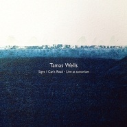

Signs I Can't Read - Live At Sonorium
============================

|  |  |
| :--: | :-- |
| [ Signs I Can't Read - Live At Sonorium](https://emumo.xiami.com/album/480084) | **艺人**: [Tamas Wells](../index.md) **语种**: 英语 **唱片公司**: 口袋唱片 **发行时间**: 2011年11月28日 **专辑类别**: 现场专辑 **专辑风格**: 民谣流行 Folk Pop, 根源唱作人 Singer-Songwriter **播放数**: 8482863 **收藏数**: 2552 **评论数**: 326  |

## 简介

Tamas Wells,从澳大利亚开始了自己的音乐事业，给整个澳洲乐坛带来了不小的情感冲击，通过他的第一张专辑《a mark on the pane》让他们在美国,英国,乃至日本也都有了属于他们的听众，可以说他们的音乐有种打动人心的魅力。第二张专辑《A Plea en Vendredi 》也是相当精彩动听！美丽的山水音乐,带着感情的简单舒缓的旋律和轻柔醉人的嗓音，让人体会这一份充满春天气息的温馨，如沐春风。第三张专辑《Two Years in April》时隔两年终于出版。简单舒缓的旋律和轻柔动人的嗓音，依然令人迷醉。继第四张优质专辑《Thirty people away》出版后，Tamas Wells 又随着他们的2011年中国巡演发行第五张专辑《Signs I Can't Read- Live at sonorium》。

## 曲目

## 评论

|  |  |  |
| :-- | :-- | :-- |
|  [虾米用户](https://emumo.xiami.com/u/440975484) 怎么说呢 2020-03-12 19:53 赞(3) 踩(0) | 
a
 |
|  [虾米用户](https://emumo.xiami.com/u/9610721) brutal 2020-02-15 14:14 赞(2) 踩(0) | 
<a href="http://emumo.xiami.com/u/8070377" target="_blank" rel="nofollow" name_card="8070377">@　　　夜宵与战争 ☾　 </a>
 |
|  [虾米用户](https://emumo.xiami.com/u/429933503)  2019-09-19 20:48 赞(0) 踩(0) | 
一下
 |
|  [虾米用户](https://emumo.xiami.com/u/423524351)  2019-04-26 23:14 赞(1) 踩(0) | 
kn
 |
|  [虾米用户](https://emumo.xiami.com/u/50828222) 虾米认证:黄山市屯溪区四... 2019-04-22 23:27 赞(0) 踩(0) | 
优秀
 |
|  [虾米用户](https://emumo.xiami.com/u/307398443)  2019-04-13 10:10 赞(0) 踩(0) | 
塔叔的声音很温柔
 |
|  [虾米用户](https://emumo.xiami.com/u/342561149) 走啦走啦还是得谢谢虾米让... 2018-08-05 04:59 赞(0) 踩(0) | 
 
 |
|  [虾米用户](https://emumo.xiami.com/u/52056952) 人生即是到來、相遇、陪伴... 2018-07-23 17:42 赞(0) 踩(0) | 
♬︎*(๑&amp;ordm;ั╰︎╯︎&amp;ordm;ั๑)♡︎
 |
|  [虾米用户](https://emumo.xiami.com/u/322070130)  2018-04-30 11:32 赞(2) 踩(0) | 
第八首就对经典
 |
|  [虾米用户](https://emumo.xiami.com/u/340260313) 开心就好 2018-04-06 19:52 赞(0) 踩(0) | 
虽然短，但是都很好听
 |
|  [虾米用户](https://emumo.xiami.com/u/1450173) 我还没想好要写什么... 2017-10-30 10:00 赞(1) 踩(0) | 
Live有新意！以为听腻了他那点小花招，居然还是酥了。。
 |
|  [虾米用户](https://emumo.xiami.com/u/10070102)  2016-12-03 14:50 赞(0) 踩(0) | 
终于可以听啦
 |
|  [虾米用户](https://emumo.xiami.com/u/76626846)  2015-10-25 21:59 赞(0) 踩(0) | 
平实的旋律
 |
|  [虾米用户](https://emumo.xiami.com/u/7322777) ∮ 2015-10-05 04:23 赞(2) 踩(0) | 
...A...
 |
|  [虾米用户](https://emumo.xiami.com/u/36465218) 暂无签名~ 2015-04-23 11:11 赞(0) 踩(0) | 
为什么 下架了T^T
 |
|  [虾米用户](https://emumo.xiami.com/u/19184252) ✰♪ 2015-04-11 11:02 赞(0) 踩(0) | 
还没来得及下载.......上星期还可以听......
 |
|  [虾米用户](https://emumo.xiami.com/u/355865) Let it go, l... 2015-03-25 01:22 赞(0) 踩(0) | 
#虾米你虫洞穿越观光团到此一游#～
 |
|  [虾米用户](https://emumo.xiami.com/u/8376859) 暂无签名~ 2015-02-23 21:27 赞(0) 踩(0) | 
没来得及下载呢就下架了。。。
 |
|  [虾米用户](https://emumo.xiami.com/u/2773877)  2015-01-16 23:13 赞(0) 踩(0) | 
这也要下架。。。。。。。。。。。。
 |
|  [虾米用户](https://emumo.xiami.com/u/6666805) 爱似星辰，遥不可及 2015-01-10 22:50 赞(0) 踩(0) | 
下架了
 |
|  [虾米用户](https://emumo.xiami.com/u/15725146) 最棒： 2014-10-26 23:58 赞(0) 踩(0) | 
超级喜欢他的声音
 |
|  [虾米用户](https://emumo.xiami.com/u/4088703) Never Stop T... 2014-08-06 19:02 赞(0) 踩(0) | 
喜欢这种风格啊
 |
|  [虾米用户](https://emumo.xiami.com/u/10048228) 择日 2014-06-01 00:34 赞(0) 踩(0) | 
夏天下雨室内的感觉最舒服啦#还有通宵供电#
 |
|  [虾米用户](https://emumo.xiami.com/u/2269015)  2014-04-07 15:51 赞(0) 踩(0) | 
悠然 恬淡
 |
|  [虾米用户](https://emumo.xiami.com/u/28140192) mimi 2014-03-27 13:59 赞(0) 踩(0) | 
good
 |
|  [虾米用户](https://emumo.xiami.com/u/20651090) 暂无签名~ 2014-03-11 10:24 赞(0) 踩(0) | 
暖心的声音
 |
|  [虾米用户](https://emumo.xiami.com/u/19184252) ✰♪ 2014-03-07 22:49 赞(0) 踩(0) | 
(´△｀)♪
 |
|  [虾米用户](https://emumo.xiami.com/u/7781693) 疯子，或传奇 2014-02-20 11:28 赞(1) 踩(0) | 
初中时就开始喜欢他了呢;-)
 |
|  [虾米用户](https://emumo.xiami.com/u/6956043) 暂无签名~ 2014-02-18 16:48 赞(0) 踩(0) | 
清晰
 |
|  [虾米用户](https://emumo.xiami.com/u/8765136)  2014-02-13 12:18 赞(0) 踩(0) | 
清澈的男声 TAT
 |
|  [虾米用户](https://emumo.xiami.com/u/32446405)  2014-02-07 15:58 赞(0) 踩(0) | 
hao ting
 |
|  [虾米用户](https://emumo.xiami.com/u/28450672)  2013-11-26 14:17 赞(0) 踩(0) | 
他的歌声总是那么温暖。
 |
|  [虾米用户](https://emumo.xiami.com/u/5593618)  2013-10-07 09:41 赞(0) 踩(0) | 
懒洋洋声音，缓缓地旋律
 |
|  [虾米用户](https://emumo.xiami.com/u/8617186)  2013-08-25 10:53 赞(0) 踩(0) | 
天籁
 |
|  [虾米用户](https://emumo.xiami.com/u/16109693)  2013-06-20 13:03 赞(0) 踩(0) | 
@上雨Kimo
 |
|  [虾米用户](https://emumo.xiami.com/u/10314812)  2013-06-16 18:31 赞(0) 踩(0) | 
.
 |
|  [虾米用户](https://emumo.xiami.com/u/10903229) 爱 2013-06-01 23:01 赞(0) 踩(0) | 
无力抗拒真诚的男声
 |
|  [虾米用户](https://emumo.xiami.com/u/7571484)  2013-03-21 08:39 赞(0) 踩(0) | 
小清新
 |
|  [虾米用户](https://emumo.xiami.com/u/12278592)  2013-02-21 23:13 赞(0) 踩(0) | 
好聽的聲音
 |
|  [虾米用户](https://emumo.xiami.com/u/966437)   2013-01-24 17:27 赞(0) 踩(0) | 
春风也莫过如此
 |
|  [虾米用户](https://emumo.xiami.com/u/12019630)  2012-12-20 21:22 赞(0) 踩(0) | 
just like
 |
|  [虾米用户](https://emumo.xiami.com/u/6155481)  2012-12-08 15:46 赞(0) 踩(0) | 
特别的音乐，简单，明了，旋律优美。
 |
|  [虾米用户](https://emumo.xiami.com/u/6155481)  2012-12-08 15:46 赞(0) 踩(0) | 
特别的音乐，简单，明了，旋律优美。
 |
|  [虾米用户](https://emumo.xiami.com/u/6155481)  2012-12-08 15:46 赞(0) 踩(0) | 
特别的音乐，简单，明了，旋律优美。
 |
|  [虾米用户](https://emumo.xiami.com/u/6155481)  2012-12-08 15:46 赞(0) 踩(0) | 
特别的音乐，简单，明了，旋律优美。
 |
|  [虾米用户](https://emumo.xiami.com/u/3580156) 我还没想好要写什么... 2012-11-10 17:03 赞(0) 踩(0) | 
Signs I Can\'t Read- Live at sonorium
 |
|  [虾米用户](https://emumo.xiami.com/u/11313888)  2012-11-02 12:54 赞(1) 踩(0) | 
风格相当！是我的菜！！低吟浅唱的温柔最有爱啦，澳洲阳光一下子就戳到了萌点XD
 |
|  [虾米用户](https://emumo.xiami.com/u/11208546) haru 2012-10-31 14:26 赞(0) 踩(0) | 
清新的男聲
 |
|  [虾米用户](https://emumo.xiami.com/u/10812157) 黑眼豆豆 2012-10-25 01:45 赞(0) 踩(0) | 
很动听~~~很棒
 |
|  [虾米用户](https://emumo.xiami.com/u/10572145)  2012-09-18 22:44 赞(0) 踩(0) | 
Valder Fields - Tamas Wells Live at Sonorium 晚安
 |
|  [虾米用户](https://emumo.xiami.com/u/6966552)  2012-09-04 15:52 赞(0) 踩(0) | 
听多了欧美的爆发力唱腔，偶尔听听这种民谣也很不错。
 |
|  [虾米用户](https://emumo.xiami.com/u/805789)  2012-08-22 12:05 赞(0) 踩(0) | 
so soft
 |
|  [虾米用户](https://emumo.xiami.com/u/9052094)  2012-05-28 10:14 赞(0) 踩(0) | 
民谣小清新
 |
|  [虾米用户](https://emumo.xiami.com/u/8277064)  2012-05-21 13:19 赞(0) 踩(0) | 
喜欢～
 |
|  [虾米用户](https://emumo.xiami.com/u/6121541) 暂无签名~ 2012-04-02 15:59 赞(0) 踩(0) | 
great
 |
|  [虾米用户](https://emumo.xiami.com/u/8480075)  2012-03-18 11:49 赞(0) 踩(0) | 
nice
 |
|  [虾米用户](https://emumo.xiami.com/u/6237454)  2012-03-06 21:41 赞(0) 踩(0) | 
天使男音,
 |
|  [虾米用户](https://emumo.xiami.com/u/1314777)  2012-02-23 21:39 赞(0) 踩(0) | 
好吧，攒了一年的通知，今天就看到这吧~~~
 |
|  [虾米用户](https://emumo.xiami.com/u/8062000)  2012-02-16 10:23 赞(0) 踩(0) | 
用虾币下了...........后悔了.........音质太差了，是演唱会版拼凑的吧？觉得音质难以接受........
 |
|  [虾米用户](https://emumo.xiami.com/u/5765818)  2012-02-05 18:53 赞(0) 踩(0) | 
清淡
 |
|  [虾米用户](https://emumo.xiami.com/u/2795876) 我还没想好要写什么... 2012-02-03 19:47 赞(0) 踩(0) | 
xihuan
 |
|  [虾米用户](https://emumo.xiami.com/u/7820123)  2012-01-28 14:35 赞(0) 踩(0) | 
一直支持TAMAS WELL
 |
|  [虾米用户](https://emumo.xiami.com/u/7773603)  2012-01-24 22:19 赞(0) 踩(0) | 
很爱
 |
|  [虾米用户](https://emumo.xiami.com/u/4767213) 尘埃 2012-01-20 15:13 赞(0) 踩(0) | 
Tamsa 的轻柔嗓音总是能唤起沉睡已久的纯净美梦
 |
|  [虾米用户](https://emumo.xiami.com/u/3848385)   2012-01-13 16:45 赞(0) 踩(0) | 
新砖？！
 |
|  [虾米用户](https://emumo.xiami.com/u/6007807)  2012-01-04 18:55 赞(0) 踩(0) | 
我的最爱
 |
|  [虾米用户](https://emumo.xiami.com/u/4124994)  2012-01-01 16:39 赞(0) 踩(0) | 
让人融化的声音^^~
 |
|  [虾米用户](https://emumo.xiami.com/u/1965629)  2011-12-30 22:41 赞(0) 踩(0) | 
专辑封面不错哦，准备入手！
 |
|  [虾米用户](https://emumo.xiami.com/u/6972109)  2011-12-29 17:29 赞(0) 踩(0) | 
融化 我吧~！~
 |
|  [虾米用户](https://emumo.xiami.com/u/3210136)  2011-12-26 13:01 赞(0) 踩(0) | 
让人融化的声音啊
 |
|  [虾米用户](https://emumo.xiami.com/u/2089665)  2011-12-25 18:02 赞(0) 踩(0) | 
首先看到了专辑封面被吸引了，这是一张live版的，轻轻的男声配上简单的吉他声，就像雪那样干净，那样美吧。
 |
|  [虾米用户](https://emumo.xiami.com/u/1507570) 当你不知如何是好时 我正... 2011-12-23 11:52 赞(0) 踩(0) | 
太喜欢他们的歌
 |
|  [虾米用户](https://emumo.xiami.com/u/5933662)  2011-12-22 03:34 赞(0) 踩(0) | 
这些歌都不是第一次听。但这版live值得推荐
 |
|  [虾米用户](https://emumo.xiami.com/u/5933662)  2011-12-22 03:34 赞(0) 踩(0) | 
这些歌都不是第一次听。但这版live值得推荐
 |
|  [虾米用户](https://emumo.xiami.com/u/5933662)  2011-12-22 03:34 赞(0) 踩(0) | 
这些歌都不是第一次听。但这版live值得推荐
 |
|  [虾米用户](https://emumo.xiami.com/u/5933662)  2011-12-22 03:34 赞(0) 踩(0) | 
这些歌都不是第一次听。但这版live值得推荐
 |
|  [虾米用户](https://emumo.xiami.com/u/5933662)  2011-12-22 03:34 赞(0) 踩(0) | 
这些歌都不是第一次听。但这版live值得推荐
 |
|  [虾米用户](https://emumo.xiami.com/u/5933662)  2011-12-22 03:34 赞(0) 踩(0) | 
这些歌都不是第一次听。但这版live值得推荐
 |
|  [虾米用户](https://emumo.xiami.com/u/5933662)  2011-12-22 03:34 赞(0) 踩(0) | 
这些歌都不是第一次听。但这版live值得推荐
 |
|  [虾米用户](https://emumo.xiami.com/u/601978)  2011-12-19 09:46 赞(0) 踩(0) | 
给个评价呗。<a href="http://music.douban.com/subject/7003867/" target="_blank" rel="nofollow noreferrer noopener">http://music.douban.com/subject/7003867/</a>
 |
|  [虾米用户](https://emumo.xiami.com/u/6749790)  2011-12-17 21:13 赞(0) 踩(0) | 
好干净声音
 |
|  [虾米用户](https://emumo.xiami.com/u/3707945)  2011-12-17 20:39 赞(0) 踩(0) | 
吉他和有磁力 的嗓音总让人内心安静下来
 |
|  [虾米用户](https://emumo.xiami.com/u/1226583)  2011-12-16 12:27 赞(0) 踩(0) | 
Tomas well
 |
|  [虾米用户](https://emumo.xiami.com/u/7254146)  2011-12-15 18:48 赞(0) 踩(0) | 
好
 |
|  [虾米用户](https://emumo.xiami.com/u/1651096)  2011-12-15 10:32 赞(0) 踩(0) | 
吞了我吧！
 |
|  [虾米用户](https://emumo.xiami.com/u/2349318) 听~~，想！！ 2011-12-13 08:52 赞(0) 踩(0) | 
哈哈
 |
|  [虾米用户](https://emumo.xiami.com/u/1326071) 暂无签名~ 2011-12-13 00:31 赞(0) 踩(0) | 
Live版感觉更棒。记得初中时候很爱听。
 |
|  [虾米用户](https://emumo.xiami.com/u/3721998)  2011-12-12 23:39 赞(0) 踩(0) | 
电子乐
 |
|  [虾米用户](https://emumo.xiami.com/u/3721998)  2011-12-12 23:38 赞(0) 踩(0) | 
大爱
 |
|  [虾米用户](https://emumo.xiami.com/u/5069780)   2011-12-11 13:43 赞(0) 踩(0) | 
远没有现场好听
 |
|  [虾米用户](https://emumo.xiami.com/u/6940778) 白日梦蓝 2011-12-11 13:02 赞(0) 踩(0) | 
~
 |
|  [虾米用户](https://emumo.xiami.com/u/6155058)  2011-12-11 10:55 赞(0) 踩(0) | 
清新柔美，早上起床的奢侈音调
 |
|  [虾米用户](https://emumo.xiami.com/u/300711) 国家退堂鼓一级表演家 2011-12-10 21:34 赞(0) 踩(0) | 
为什么你不是我的男朋友。
 |
|  [虾米用户](https://emumo.xiami.com/u/7186787)   2011-12-10 20:52 赞(0) 踩(0) | 
大学时第一次听valder fields就爱上了这个声音，时隔几年再次听到还是这么爱
 |
|  [虾米用户](https://emumo.xiami.com/u/5779624)  2011-12-10 12:14 赞(0) 踩(0) | 
好听~
 |
|  [虾米用户](https://emumo.xiami.com/u/6146879)  2011-12-10 09:46 赞(0) 踩(0) | 
心的归属！
 |
|  [虾米用户](https://emumo.xiami.com/u/7168726)  2011-12-09 22:04 赞(0) 踩(0) | 
他的聲線～　喔
 |
|  [虾米用户](https://emumo.xiami.com/u/7163727)  2011-12-09 10:30 赞(0) 踩(0) | 
治愈系啊 valder fields居然是人唱得 虧我還一直以為是哪個EAL人唱得 = =
 |
|  [虾米用户](https://emumo.xiami.com/u/7141825)  2011-12-07 18:14 赞(0) 踩(0) | 
好好聽，讓我再也不討厭英語，此刻我感謝學過英語
 |
|  [虾米用户](https://emumo.xiami.com/u/4938067)  2011-12-05 14:26 赞(0) 踩(0) | 
清新的~喜欢
 |
|  [虾米用户](https://emumo.xiami.com/u/3018538)  2011-12-05 11:09 赞(0) 踩(0) | 
Ｏ
 |
|  [虾米用户](https://emumo.xiami.com/u/1290507)  2011-12-05 10:17 赞(0) 踩(0) | 
不愧是天使的嗓音
 |
|  [虾米用户](https://emumo.xiami.com/u/125247) 文艺青年 2011-12-05 07:19 赞(0) 踩(0) | 
心情不好了   听听
 |
|  [虾米用户](https://emumo.xiami.com/u/125247) 文艺青年 2011-12-05 07:18 赞(0) 踩(0) | 
很清新
 |
|  [虾米用户](https://emumo.xiami.com/u/463588)   2011-12-05 02:29 赞(0) 踩(0) | 
很清澈的声音，给人一种暖暖的感觉
 |
|  [虾米用户](https://emumo.xiami.com/u/463588)   2011-12-05 02:13 赞(0) 踩(0) | 
清澈的嗓音
 |
|  [虾米用户](https://emumo.xiami.com/u/4809498)  2011-12-04 23:52 赞(0) 踩(0) | 
阳光明媚的上午听
 |
|  [虾米用户](https://emumo.xiami.com/u/7053879)   2011-12-04 22:35 赞(0) 踩(0) | 
-
 |
|  [虾米用户](https://emumo.xiami.com/u/2114803)  2011-12-04 22:24 赞(0) 踩(0) | 
最适合一个人在家收拾屋子，摆弄花花草草的时候听听。今天还多了好多小鱼儿，花花绿绿的彩色小鱼儿，好欢乐！
 |
|  [虾米用户](https://emumo.xiami.com/u/7102045)  2011-12-04 21:50 赞(0) 踩(0) | 
听着很舒服
 |
|  [虾米用户](https://emumo.xiami.com/u/162612) 美丽的怪胎头脑比身体性感 2011-12-04 20:27 赞(0) 踩(0) | 
内心需要宁静的时候听一听~
 |
|  [虾米用户](https://emumo.xiami.com/u/7041562)  2011-12-04 19:29 赞(0) 踩(0) | 
声音很动人！！
 |
|  [虾米用户](https://emumo.xiami.com/u/4184668)  2011-12-04 19:14 赞(0) 踩(0) | 
tamas well
 |
|  [虾米用户](https://emumo.xiami.com/u/1878106) 大人中.... 2011-12-04 19:03 赞(0) 踩(0) | 
nice.
 |
|  [虾米用户](https://emumo.xiami.com/u/557910)  2011-12-04 15:39 赞(0) 踩(0) | 
治愈系，烦躁的时候听一听，刷刷博.
 |
|  [虾米用户](https://emumo.xiami.com/u/3150122)  2011-12-04 15:24 赞(0) 踩(0) | 
节奏美！
 |
|  [虾米用户](https://emumo.xiami.com/u/2761026)  2011-12-04 15:10 赞(0) 踩(0) | 
很適合在這樣充滿陽光的冬天聽 一種平靜而又不冷清的感覺 並且我現在超困 聽得快睡著了 囧～
 |
|  [虾米用户](https://emumo.xiami.com/u/6064972) ^-^ 2011-12-04 14:20 赞(0) 踩(0) | 
安静的心情。
 |
|  [虾米用户](https://emumo.xiami.com/u/1947581)  2011-12-04 13:38 赞(0) 踩(0) | 
是我喜欢的调调
 |
|  [虾米用户](https://emumo.xiami.com/u/7092113)  2011-12-04 11:54 赞(0) 踩(0) | 
清新
 |
|  [虾米用户](https://emumo.xiami.com/u/2644425) 有些疲累… 2011-12-04 10:45 赞(0) 踩(0) | 
淡淡地吟唱，虽然不热烈，却直达我心底
 |
|  [虾米用户](https://emumo.xiami.com/u/6981289) 签签签 2011-12-04 09:22 赞(0) 踩(0) | 
it\'s wonderful
 |
|  [虾米用户](https://emumo.xiami.com/u/6908059)  2011-12-04 08:56 赞(0) 踩(0) | 
清静
 |
|  [虾米用户](https://emumo.xiami.com/u/5035627)  2011-12-04 07:43 赞(0) 踩(0) | 
早上起来听到这个声音，顿时烦恼就烟消云散了，天籁一词就是为他创造的。
 |
|  [虾米用户](https://emumo.xiami.com/u/943450)  2011-12-04 02:49 赞(0) 踩(0) | 
刚好困。刷刷博听听歌，醒了。继续。爱听这种demo吗？
 |
|  [虾米用户](https://emumo.xiami.com/u/7085104)  2011-12-03 21:54 赞(0) 踩(0) | 
很安静，很好听
 |
|  [虾米用户](https://emumo.xiami.com/u/4457354) yah yah yah 2011-12-03 21:52 赞(0) 踩(0) | 
有感觉
 |
|  [虾米用户](https://emumo.xiami.com/u/3972923)   2011-12-03 21:33 赞(0) 踩(0) | 
舒缓~~
 |
|  [虾米用户](https://emumo.xiami.com/u/1019727) 我还没想好要写什么... 2011-12-03 21:18 赞(0) 踩(0) | 
Nice voice~~
 |
|  [虾米用户](https://emumo.xiami.com/u/5842273) 我想靜靜 2011-12-03 21:03 赞(0) 踩(0) | 
感觉
 |
|  [虾米用户](https://emumo.xiami.com/u/6927215)  2011-12-03 20:29 赞(0) 踩(0) | 
心情不好听
 |
|  [虾米用户](https://emumo.xiami.com/u/462867) 我还没想好要写什么... 2011-12-03 20:12 赞(0) 踩(0) | 
25岁的最后一个晚上~
 |
|  [虾米用户](https://emumo.xiami.com/u/2063610)  2011-12-03 17:26 赞(0) 踩(0) | 
轻轻的歌唱
 |
|  [虾米用户](https://emumo.xiami.com/u/5826260) 小虾米，祝你在另一个时空... 2011-12-03 15:23 赞(0) 踩(0) | 
爱这种声音，治愈系民谣~
 |
|  [虾米用户](https://emumo.xiami.com/u/2825742)  2011-12-03 14:11 赞(0) 踩(0) | 
依旧动听，午后最好的茶点音乐~
 |
|  [虾米用户](https://emumo.xiami.com/u/6971487)  2011-12-03 13:19 赞(0) 踩(0) | 
封面~
 |
|  [虾米用户](https://emumo.xiami.com/u/5110604) 我还没想好要写什么... 2011-12-03 13:00 赞(0) 踩(0) | 
封面
 |
|  [虾米用户](https://emumo.xiami.com/u/6492240)  2011-12-03 12:55 赞(0) 踩(0) | 
TAMAS WELLS
 |
|  [虾米用户](https://emumo.xiami.com/u/2097329)  2011-12-03 12:22 赞(0) 踩(0) | 
好听呢现场版
 |
|  [虾米用户](https://emumo.xiami.com/u/3667429)  2011-12-03 12:14 赞(0) 踩(0) | 
好喜欢好喜欢！！！这张融合好多他们经典的歌啊！！
 |
|  [虾米用户](https://emumo.xiami.com/u/6277842)  2011-12-03 11:41 赞(0) 踩(0) | 
i love this feel so much
 |
|  [虾米用户](https://emumo.xiami.com/u/1989041)  2011-12-03 11:36 赞(0) 踩(0) | 
因为他是Tamas wells
 |
|  [虾米用户](https://emumo.xiami.com/u/108492)  2011-12-03 10:41 赞(0) 踩(0) | 
tamas wells
 |
|  [虾米用户](https://emumo.xiami.com/u/1943051)  2011-12-03 06:00 赞(0) 踩(0) | 
这张好听得都要让人流眼泪的了.
 |
|  [虾米用户](https://emumo.xiami.com/u/3482586)  2011-12-02 23:27 赞(0) 踩(0) | 
先收藏 慢慢消化
 |
|  [虾米用户](https://emumo.xiami.com/u/6855365)  2011-12-02 23:26 赞(0) 踩(0) | 
米蘭風~
 |
|  [虾米用户](https://emumo.xiami.com/u/6811937)  2011-12-02 22:50 赞(0) 踩(0) | 
还不错
 |
|  [虾米用户](https://emumo.xiami.com/u/992184) (╯‵□′)╯︵┻━┻ 2011-12-02 22:35 赞(0) 踩(0) | 
这声音……！
 |
|  [虾米用户](https://emumo.xiami.com/u/286994)  2011-12-02 22:34 赞(0) 踩(0) | 
小清新？？？
 |
|  [虾米用户](https://emumo.xiami.com/u/656547)  2011-12-02 22:25 赞(0) 踩(0) | 
the feeling cant be told but listening
 |
|  [虾米用户](https://emumo.xiami.com/u/3088531)  2011-12-02 22:12 赞(0) 踩(0) | 
喜欢
 |
|  [虾米用户](https://emumo.xiami.com/u/7069390)  2011-12-02 22:07 赞(0) 踩(0) | 
棒极了
 |
|  [虾米用户](https://emumo.xiami.com/u/4802579)  2011-12-02 21:31 赞(0) 踩(0) | 
纯净的吉他
 |
|  [虾米用户](https://emumo.xiami.com/u/3879575) 原色胶囊 2011-12-02 21:15 赞(0) 踩(0) | 
Tamas的的声音很平静清新 让人听了就不自觉的静下来 适合在午后听
 |
|  [虾米用户](https://emumo.xiami.com/u/1915334) 好的大王，没问题大王 2011-12-02 20:19 赞(0) 踩(0) | 
tamas新砖，快来听！
 |
|  [虾米用户](https://emumo.xiami.com/u/2640816)  2011-12-02 19:26 赞(0) 踩(0) | 
最爱LIVE
 |
|  [虾米用户](https://emumo.xiami.com/u/4979950) 青春 2011-12-02 18:41 赞(0) 踩(0) | 
我还以为又出新专辑了呢，原来是演唱会，嘿嘿
 |
|  [虾米用户](https://emumo.xiami.com/u/4064159)  2011-12-02 18:40 赞(0) 踩(0) | 
从valder fields开始就爱爱爱爱死他们啦~~~
 |
|  [虾米用户](https://emumo.xiami.com/u/6727021) 想见很久没见的人 说很久... 2011-12-02 17:57 赞(0) 踩(0) | 
被专辑封面吸引而来
 |
|  [虾米用户](https://emumo.xiami.com/u/1497852) This is the ... 2011-12-02 17:49 赞(0) 踩(0) | 
一直很喜欢
 |
|  [虾米用户](https://emumo.xiami.com/u/7064999)  2011-12-02 17:26 赞(0) 踩(0) | 
宁静~~
 |
|  [虾米用户](https://emumo.xiami.com/u/1585310) 音乐是药，不能停 2011-12-02 16:30 赞(0) 踩(0) | 
专辑封面很有感觉
 |
|  [虾米用户](https://emumo.xiami.com/u/2166517)  2011-12-02 16:03 赞(0) 踩(0) | 
很好很安静   下雪的北京  点上台灯慢慢听
 |
|  [虾米用户](https://emumo.xiami.com/u/2722179) 我还没想好要写什么... 2011-12-02 15:38 赞(0) 踩(0) | 
记录一下这是回来的第一张
 |
|  [虾米用户](https://emumo.xiami.com/u/4139793)  2011-12-02 15:31 赞(0) 踩(0) | 
清新民谣~
 |
|  [虾米用户](https://emumo.xiami.com/u/6383465)  2011-12-02 14:37 赞(0) 踩(0) | 
好专辑，要收藏
 |
|  [虾米用户](https://emumo.xiami.com/u/6383465)  2011-12-02 14:37 赞(0) 踩(0) | 
清新民谣的典范
 |
|  [虾米用户](https://emumo.xiami.com/u/2359050) You go girl！ 2011-12-02 13:44 赞(0) 踩(0) | 
听着很舒服。。淡淡的安静。。
 |
|  [虾米用户](https://emumo.xiami.com/u/7004115)  2011-12-02 13:39 赞(0) 踩(0) | 
轻音乐，我喜欢
 |
|  [虾米用户](https://emumo.xiami.com/u/2452319)  2011-12-02 13:37 赞(0) 踩(0) | 
甜腻甜腻的东西也要吃一点
 |
|  [虾米用户](https://emumo.xiami.com/u/282638)  2011-12-02 12:46 赞(0) 踩(0) | 
yy
 |
|  [虾米用户](https://emumo.xiami.com/u/5059916)   2011-12-02 12:14 赞(0) 踩(0) | 
很安静.很舒服..
 |
|  [虾米用户](https://emumo.xiami.com/u/2582482)  2011-12-02 11:11 赞(0) 踩(0) | 
午间甜品
 |
|  [虾米用户](https://emumo.xiami.com/u/2582482)  2011-12-02 11:10 赞(0) 踩(0) | 
午间“甜品”。
 |
|  [虾米用户](https://emumo.xiami.com/u/6320682)  2011-12-02 11:03 赞(0) 踩(0) | 
暖暖的乡村味，冬日午后骨头都酥酥的。
 |
|  [虾米用户](https://emumo.xiami.com/u/85880)  2011-12-02 10:59 赞(0) 踩(0) | 
就是喜欢他软软的声音，唱得骨头都酥了
 |
|  [虾米用户](https://emumo.xiami.com/u/2185528) 只在乎那些在乎我的人儿 2011-12-02 10:22 赞(0) 踩(0) | 
小清新哦～～舒服的声音～
 |
|  [虾米用户](https://emumo.xiami.com/u/2854241)   2011-12-02 10:09 赞(0) 踩(0) | 
沁人心脾~~
 |
|  [虾米用户](https://emumo.xiami.com/u/3876667) 阳光的午后，我们遗失了什... 2011-12-02 09:11 赞(0) 踩(0) | 
哥们，你终于又出专辑啦，最喜欢 Valder Fields啦！喜欢乡村的千万别错过，声音太美了！这个冬天有歌听了。。。
 |
|  [虾米用户](https://emumo.xiami.com/u/4889365)   2011-12-02 01:58 赞(0) 踩(0) | 
@丢个隆咚呛_小太阳CON
 |
|  [虾米用户](https://emumo.xiami.com/u/2435233)  2011-12-02 01:07 赞(0) 踩(0) | 
蓝白曲调。百听不厌
 |
|  [虾米用户](https://emumo.xiami.com/u/3496085)  2011-12-01 23:48 赞(0) 踩(0) | 
惟一的缺点就是好听
 |
| ⇒ |  [虾米用户](https://emumo.xiami.com/u/1238607) 突然发现自己也是虾米10... 2011-12-02 09:45 赞(0) 踩(0) | 
唯一的缺点是听得停不下来
 |
|  [虾米用户](https://emumo.xiami.com/u/554723) 老死不相往来 2011-12-01 22:58 赞(0) 踩(0) | 
Tamas Wells 终于出新歌了  好久好久啊
 |
|  [虾米用户](https://emumo.xiami.com/u/298791)  2011-12-01 22:48 赞(0) 踩(0) | 
nice i like it
 |
|  [虾米用户](https://emumo.xiami.com/u/671663)  2011-12-01 22:35 赞(0) 踩(0) | 
好听的我鸡皮疙瘩都起来了&amp;gt;&amp;lt;
 |
|  [虾米用户](https://emumo.xiami.com/u/6794976)  2011-12-01 22:28 赞(0) 踩(0) | 
清新、欢快、哀伤一一喜欢O(∩_∩)O哈哈
 |
|  [虾米用户](https://emumo.xiami.com/u/4899876)  2011-12-01 22:25 赞(0) 踩(0) | 
your hands into mine 一如既往美 只是这次没机会live了
 |
|  [虾米用户](https://emumo.xiami.com/u/3643355)  2011-12-01 21:47 赞(0) 踩(0) | 
nice voice~~
 |
|  [虾米用户](https://emumo.xiami.com/u/4468156)  2011-12-01 21:40 赞(0) 踩(0) | 
5号就可以看到，听到你了，好激动~！
 |
|  [虾米用户](https://emumo.xiami.com/u/4135982) 我靠谱，我自首 2011-12-01 21:30 赞(0) 踩(0) | 
一如蓝白的曲调，很放松的轻哼。 by the way ,喜欢这个唱片封面~
 |
|  [虾米用户](https://emumo.xiami.com/u/1979354)  2011-12-01 21:29 赞(0) 踩(0) | 
超治愈系。拯救我一次又一次的音乐。一年前自闭、抑郁，是Tamas Wells救了我。现在，心情超差，还是听Tamas Wells吧。百听不厌
 |
|  [虾米用户](https://emumo.xiami.com/u/1853644) 暂无签名~ 2011-12-01 21:16 赞(0) 踩(0) | 
清清淡淡，不张扬，一直都爱……
 |
|  [虾米用户](https://emumo.xiami.com/u/3165562) 最近风格凌乱了 2011-12-01 20:55 赞(0) 踩(0) | 
终于找到了
 |
|  [虾米用户](https://emumo.xiami.com/u/1131855) 讨厌烦琐！不喜欢过年！ 2011-12-01 20:16 赞(0) 踩(0) | 
清新，纯净，象旷野微微吹来的一缕轻风。。。。
 |
|  [虾米用户](https://emumo.xiami.com/u/7051740)  2011-12-01 20:03 赞(0) 踩(0) | 
轻轻的呓语，在说什么啊~
 |
|  [虾米用户](https://emumo.xiami.com/u/1738804) 暂无签名~ 2011-12-01 19:34 赞(0) 踩(0) | 
5555,还以为出新砖了，没想到只是张现场专辑······
 |
|  [虾米用户](https://emumo.xiami.com/u/3443737) keep walkin 2011-12-01 18:36 赞(0) 踩(0) | 
小清新
 |
|  [虾米用户](https://emumo.xiami.com/u/565123) 独立音乐人 编曲制作人 2011-12-01 17:16 赞(0) 踩(0) | 
不错
 |
|  [虾米用户](https://emumo.xiami.com/u/6882157)  2011-12-01 16:45 赞(0) 踩(0) | 
清澈的声音
 |
|  [虾米用户](https://emumo.xiami.com/u/7048513) 神马都是浮云 2011-12-01 16:03 赞(0) 踩(0) | 
清新
 |
|  [虾米用户](https://emumo.xiami.com/u/2468001)  2011-12-01 15:01 赞(0) 踩(0) | 
很好听的
 |
|  [虾米用户](https://emumo.xiami.com/u/4169713)  2011-12-01 15:00 赞(0) 踩(0) | 
想跳跃~
 |
|  [虾米用户](https://emumo.xiami.com/u/6991831)  2011-12-01 14:14 赞(0) 踩(0) | 
很舒服的音乐
 |
|  [虾米用户](https://emumo.xiami.com/u/6991831)  2011-12-01 14:02 赞(0) 踩(0) | 
很好听的，好干净得声音
 |
|  [虾米用户](https://emumo.xiami.com/u/3613813)  2011-12-01 13:48 赞(0) 踩(0) | 
good
 |
|  [虾米用户](https://emumo.xiami.com/u/1282002) 在音乐的海洋里游荡 2011-12-01 13:44 赞(0) 踩(0) | 
小清新-♂
 |
|  [虾米用户](https://emumo.xiami.com/u/1820564) 方向比速度更重要 2011-12-01 13:44 赞(0) 踩(0) | 
▂,～民谣吉他！
 |
|  [虾米用户](https://emumo.xiami.com/u/6922325)  2011-12-01 13:37 赞(0) 踩(0) | 
终于发新碟了哦。。
 |
|  [虾米用户](https://emumo.xiami.com/u/2248753)  2011-12-01 13:33 赞(0) 踩(0) | 
喜欢他的歌
 |
|  [虾米用户](https://emumo.xiami.com/u/4002616)  2011-12-01 13:01 赞(0) 踩(0) | 
很暖的治愈系声音
 |
|  [虾米用户](https://emumo.xiami.com/u/3282058)  2011-12-01 12:44 赞(0) 踩(0) | 
好听，舒服
 |
|  [虾米用户](https://emumo.xiami.com/u/2947816)  2011-12-01 12:40 赞(0) 踩(0) | 
晚上见咯，tamas！！
 |
|  [虾米用户](https://emumo.xiami.com/u/706923)  2011-12-01 12:19 赞(0) 踩(0) | 
Clean, smooth, comfortable
 |
|  [虾米用户](https://emumo.xiami.com/u/2452005) 音乐是最贴心的情人。 2011-12-01 12:11 赞(0) 踩(0) | 
好舒服。为什么觉得有澳大利亚海风的气息~~hoho
 |
|  [虾米用户](https://emumo.xiami.com/u/7005180)  2011-12-01 11:58 赞(0) 踩(0) | 
声音很纯净 给人非常舒服的感觉
 |
|  [虾米用户](https://emumo.xiami.com/u/6566507) 凡是过往，皆为序章。 2011-12-01 11:56 赞(0) 踩(0) | 
好幸福的声音~
 |
|  [虾米用户](https://emumo.xiami.com/u/6700857) 爵士着生活 2011-12-01 11:46 赞(0) 踩(0) | 
干净的声音， 清新的音乐。
 |
|  [虾米用户](https://emumo.xiami.com/u/941274) 吃货拯救世界 2011-12-01 11:24 赞(0) 踩(0) | 
干净的声音，暖暖的
 |
|  [虾米用户](https://emumo.xiami.com/u/2064011) 唯有热爱，可以抵挡岁月漫... 2011-12-01 11:15 赞(0) 踩(0) | 
简单、明快，现场版的感觉更亲切、完美
 |
|  [虾米用户](https://emumo.xiami.com/u/4376156) 暂无签名~ 2011-12-01 11:11 赞(0) 踩(0) | 
比约翰丹佛还清新的吉他弹唱者——托马斯威尔！
 |
|  [虾米用户](https://emumo.xiami.com/u/7016350)  2011-12-01 10:50 赞(0) 踩(0) | 
荡涤心灵
 |
|  [虾米用户](https://emumo.xiami.com/u/61015)  2011-12-01 10:44 赞(0) 踩(0) | 
听这张专辑的时候效率超级好……不过也许是因为太想完成手头的任务去睡觉的缘故，anyway，先保存，明天好继续用来提高效率……@第二熊，你也试试吧……
 |
|  [虾米用户](https://emumo.xiami.com/u/1716837)  2011-12-01 10:41 赞(0) 踩(0) | 
喜欢干净的音乐
 |
|  [虾米用户](https://emumo.xiami.com/u/3048688) 洛天依官碟转手有意者敲我 2011-12-01 10:23 赞(0) 踩(0) | 
大男生的小清新~
 |
|  [虾米用户](https://emumo.xiami.com/u/2260141)  2011-12-01 09:36 赞(0) 踩(0) | 
peace
 |
|  [虾米用户](https://emumo.xiami.com/u/4220698)  2011-12-01 09:31 赞(0) 踩(0) | 
不错~
 |
|  [虾米用户](https://emumo.xiami.com/u/421534) 心随律动 乘风海天 2011-12-01 09:16 赞(0) 踩(0) | 
听上去不错，虽然不是我喜欢的类型
 |
|  [虾米用户](https://emumo.xiami.com/u/308953)  2011-12-01 09:12 赞(0) 踩(0) | 
很清新的感觉。
 |
|  [虾米用户](https://emumo.xiami.com/u/586220) 爱和音乐 2011-12-01 08:54 赞(0) 踩(0) | 
#跳电台# Tamas Wells在中国的宣传做得相当不错。
 |
|  [虾米用户](https://emumo.xiami.com/u/3856781)  2011-12-01 03:16 赞(0) 踩(0) | 
夜晚的小清新～
 |
|  [虾米用户](https://emumo.xiami.com/u/229430)  2011-12-01 02:10 赞(0) 踩(0) | 
很舒服
 |
|  [虾米用户](https://emumo.xiami.com/u/4797155) 你爸爸已不是当年的爸爸了 2011-12-01 00:25 赞(0) 踩(0) | 
4星。其中1星给现场
 |
|  [虾米用户](https://emumo.xiami.com/u/1957213) Who knows? 2011-11-30 23:25 赞(0) 踩(0) | 
欢 迎爱音乐的你来收听我的虾米电台， 都是一年来收藏的歌曲，清新、朋克风格不等。欢 迎收听、分享、提建议啊！
 |
|  [虾米用户](https://emumo.xiami.com/u/1237565) 阅读时我从不听歌。 2011-11-30 23:25 赞(0) 踩(0) | 
Tamas Wells，这次的封面很好看
 |
|  [虾米用户](https://emumo.xiami.com/u/7040913)  2011-11-30 23:23 赞(0) 踩(0) | 
干净，纯粹。
 |
|  [虾米用户](https://emumo.xiami.com/u/664700) 音楽と喫茶店:) 2011-11-30 23:04 赞(0) 踩(0) | 
这张和之前的感觉有点不同 很喜欢
 |
|  [虾米用户](https://emumo.xiami.com/u/5614592) 有音乐就没有世界末日。 2011-11-30 22:43 赞(0) 踩(0) | 
钢琴 吉他 天使般的嗓音=平静而美丽的世界~~
 |
|  [虾米用户](https://emumo.xiami.com/u/7030363)  2011-11-30 22:39 赞(0) 踩(0) | 
sweet
 |
|  [虾米用户](https://emumo.xiami.com/u/2121888)  2011-11-30 22:14 赞(0) 踩(0) | 
周六就来魔都巡演了，期待！
 |
|  [虾米用户](https://emumo.xiami.com/u/6656467)  2011-11-30 22:09 赞(0) 踩(0) | 
随意的，轻松的感觉
 |
|  [虾米用户](https://emumo.xiami.com/u/1451282) Ordo ab chao 2011-11-30 21:43 赞(0) 踩(0) | 
如果不是现场的话就给满分！不过唱的真的好好听
 |
|  [虾米用户](https://emumo.xiami.com/u/98348)  2011-11-30 21:14 赞(0) 踩(0) | 
最近集中出Live吗？good
 |
|  [虾米用户](https://emumo.xiami.com/u/3047913)  2011-11-30 21:10 赞(0) 踩(0) | 
tamas wells暖暖的声音。。。绝对没让我的偏执失望。。。大家也听听看。。很治愈的
 |
|  [虾米用户](https://emumo.xiami.com/u/3047913)  2011-11-30 21:08 赞(0) 踩(0) | 
爱爱的暖暖的声音。。。
 |
|  [虾米用户](https://emumo.xiami.com/u/4845722)  2011-11-30 20:57 赞(0) 踩(0) | 
让心沉静~去旅行
 |
|  [虾米用户](https://emumo.xiami.com/u/7037769)  2011-11-30 20:48 赞(0) 踩(0) | 
很喜欢
 |
|  [虾米用户](https://emumo.xiami.com/u/5017298)  2011-11-30 20:25 赞(0) 踩(0) | 
师父
 |
|  [虾米用户](https://emumo.xiami.com/u/1692380)  2011-11-30 19:28 赞(0) 踩(0) | 
治愈，沙哑
 |
|  [虾米用户](https://emumo.xiami.com/u/1692380)  2011-11-30 19:28 赞(0) 踩(0) | 
治愈
 |
|  [虾米用户](https://emumo.xiami.com/u/4736969)  2011-11-30 19:04 赞(0) 踩(0) | 
好东西哈！
 |
|  [虾米用户](https://emumo.xiami.com/u/1414822)  2011-11-30 18:35 赞(0) 踩(0) | 
小封面儿美0 0
 |
|  [虾米用户](https://emumo.xiami.com/u/1979698)  2011-11-30 17:58 赞(0) 踩(0) | 
现场版的民谣，安静的感觉
 |
|  [虾米用户](https://emumo.xiami.com/u/715057)  2011-11-30 17:31 赞(0) 踩(0) | 
暖暖治愈系~~~~~~~~~~~~~~~~~~~~~~~~~~~~~~ ~~~~~~~~~~~
 |
|  [虾米用户](https://emumo.xiami.com/u/715057)  2011-11-30 16:52 赞(0) 踩(0) | 
一眼就被封面吸引了！细看是Tamas Wells~ 嘘！听歌别说话~
 |
|  [虾米用户](https://emumo.xiami.com/u/1334642) 中年废 2011-11-30 16:46 赞(0) 踩(0) | 
第一次听，好干净，好温柔~
 |
|  [虾米用户](https://emumo.xiami.com/u/1008157)  2011-11-30 16:28 赞(0) 踩(0) | 
沁人心脾。
 |
|  [虾米用户](https://emumo.xiami.com/u/6828639)  2011-11-30 16:24 赞(0) 踩(0) | 
治愈系！
 |
|  [虾米用户](https://emumo.xiami.com/u/2634121)  2011-11-30 16:20 赞(0) 踩(0) | 
来中国吧，我也想听LIVE
 |
|  [虾米用户](https://emumo.xiami.com/u/7032952)  2011-11-30 15:38 赞(0) 踩(0) | 
舒心 惬意
 |
|  [虾米用户](https://emumo.xiami.com/u/764306)  2011-11-30 15:34 赞(0) 踩(0) | 
午后突然的不期而遇让人有说不出来的幸福感~
 |
|  [虾米用户](https://emumo.xiami.com/u/3998657) MAN CAN GO A... 2011-11-30 15:31 赞(0) 踩(0) | 
澳洲能够称得上诗人的歌手能有几个呢，笑
 |
|  [虾米用户](https://emumo.xiami.com/u/2810848)  2011-11-30 15:28 赞(0) 踩(0) | 
温柔，但不矫情的小清新。意外地治愈心灵。
 |
|  [虾米用户](https://emumo.xiami.com/u/4240907)  2011-11-30 15:22 赞(0) 踩(0) | 
╭(╯^╰)╮  这么多年了 还是这个感觉
 |
|  [虾米用户](https://emumo.xiami.com/u/4240907)  2011-11-30 15:21 赞(0) 踩(0) | 
封面很舒服。。。。喜欢TW
 |
|  [虾米用户](https://emumo.xiami.com/u/3998657) MAN CAN GO A... 2011-11-30 15:20 赞(0) 踩(0) | 
十年如一日，叫偶如何不爱你
 |
|  [虾米用户](https://emumo.xiami.com/u/2512067)  2011-11-30 15:12 赞(0) 踩(0) | 
温柔的声音
 |
|  [虾米用户](https://emumo.xiami.com/u/2834667) 为谦虚而活，为卑微而生。 2011-11-30 15:11 赞(0) 踩(0) | 
棒！！！！！！
 |
|  [虾米用户](https://emumo.xiami.com/u/1296722) 沉默的大多数 2011-11-30 14:58 赞(0) 踩(0) | 
完整的live 简单的和弦  一如既往的美妙。
 |
|  [虾米用户](https://emumo.xiami.com/u/7032533)  2011-11-30 14:49 赞(0) 踩(0) | 
嗓音独特，静谧
 |
|  [虾米用户](https://emumo.xiami.com/u/6727612) 我还没想好要写什么... 2011-11-30 14:49 赞(0) 踩(0) | 
Valder Fields  。。 曾经的单曲循环。。
 |
|  [虾米用户](https://emumo.xiami.com/u/5501331)  2011-11-30 14:44 赞(0) 踩(0) | 
很舒服的声音，让人感到轻松
 |
|  [虾米用户](https://emumo.xiami.com/u/469851) 这世间，唯有梦想和好姑娘... 2011-11-30 14:35 赞(0) 踩(0) | 
...
 |
|  [虾米用户](https://emumo.xiami.com/u/4108747)  2011-11-30 14:34 赞(0) 踩(0) | 
很舒服 惬意
 |
|  [虾米用户](https://emumo.xiami.com/u/2914589)   2011-11-30 14:32 赞(0) 踩(0) | 
飲咖啡而結緣 有趣地愛上
 |
|  [虾米用户](https://emumo.xiami.com/u/3085611)  2011-11-30 14:25 赞(0) 踩(0) | 
舒服
 |
|  [虾米用户](https://emumo.xiami.com/u/2931553) 一盏茶！ 2011-11-30 14:11 赞(0) 踩(0) | 
清新！一种直指人心的魅力！
 |
|  [虾米用户](https://emumo.xiami.com/u/958218) 暂无签名~ 2011-11-30 13:56 赞(0) 踩(0) | 
千帆过尽，痴心不悔 一如既往 弹着吉他 写字生活
 |
|  [虾米用户](https://emumo.xiami.com/u/7004115)  2011-11-30 13:42 赞(0) 踩(0) | 
挺起来很舒服！
 |
|  [虾米用户](https://emumo.xiami.com/u/7031448)  2011-11-30 13:25 赞(0) 踩(0) | 
给人一种很特殊的感觉……
 |
|  [虾米用户](https://emumo.xiami.com/u/1158474)  2011-11-30 13:23 赞(0) 踩(0) | 
安静！
 |
|  [虾米用户](https://emumo.xiami.com/u/6788166)  2011-11-30 13:04 赞(0) 踩(0) | 
清新的封面~还有那一直小清新的声音诶~
 |
|  [虾米用户](https://emumo.xiami.com/u/1674456)  2011-11-30 12:59 赞(0) 踩(0) | 
这不是新专辑咯
 |
|  [虾米用户](https://emumo.xiami.com/u/156036)  2011-11-30 12:52 赞(0) 踩(0) | 
&amp;amp;gt;&amp;amp;lt;~~出碟啦出碟啦~~好开心~~~这砖的封面好清新啊！！！大爱！！！
 |
|  [虾米用户](https://emumo.xiami.com/u/425346) 我还没想好要写什么... 2011-11-30 12:52 赞(0) 踩(0) | 
12月1日西安，Tamas Wells现场，期待~~~~
 |
|  [虾米用户](https://emumo.xiami.com/u/2929025)  2011-11-30 12:48 赞(0) 踩(0) | 
小清新。
 |
|  [虾米用户](https://emumo.xiami.com/u/3779569)  2011-11-30 12:36 赞(0) 踩(0) | 
我是多喜欢这个声音到死啊。。。。
 |
|  [虾米用户](https://emumo.xiami.com/u/1951694)  2011-11-30 12:33 赞(0) 踩(0) | 
@ohdannyboy  他又出新专辑了..登.登.登.登.登.登.登.
 |
|  [虾米用户](https://emumo.xiami.com/u/3107247)   2011-11-30 12:27 赞(0) 踩(0) | 
喜欢
 |
|  [虾米用户](https://emumo.xiami.com/u/3821917)  很敏感 2011-11-30 12:04 赞(0) 踩(0) | 
我喜欢的就是好听
 |
|  [虾米用户](https://emumo.xiami.com/u/2070803)  2011-11-30 12:03 赞(0) 踩(0) | 
大爱
 |
|  [虾米用户](https://emumo.xiami.com/u/7915)  2011-11-30 11:46 赞(0) 踩(0) | 
也木有来南京啊
 |
|  [虾米用户](https://emumo.xiami.com/u/6687898) 一个人的音乐世界 2011-11-30 11:44 赞(0) 踩(0) | 
很清新的男音
 |
|  [虾米用户](https://emumo.xiami.com/u/2142490)  2011-11-30 11:18 赞(0) 踩(0) | 
不错~~·
 |
|  [虾米用户](https://emumo.xiami.com/u/1979354)  2011-11-30 11:17 赞(0) 踩(0) | 
最爱的乐队！~留着回家听~
 |
|  [虾米用户](https://emumo.xiami.com/u/4816781)  2011-11-30 11:14 赞(0) 踩(0) | 
@kumml_ 所以他没去成都~
 |
|  [虾米用户](https://emumo.xiami.com/u/1274209) 我还没想好要写什么... 2011-11-30 11:02 赞(0) 踩(0) | 
没感觉
 |
|  [虾米用户](https://emumo.xiami.com/u/1175818) 頭暈暈 2011-11-30 10:40 赞(0) 踩(0) | 
所以他没来成都
 |
| ⇒ |  [虾米用户](https://emumo.xiami.com/u/2817501) 我还没想好要写什么... 2011-11-30 10:49 赞(0) 踩(0) | 
lai guo
 |
| ⇒ |  [虾米用户](https://emumo.xiami.com/u/1175818) 頭暈暈 2011-11-30 11:54 赞(0) 踩(0) | 
<q><b>Superdodo说：</b></q>
 |
| ⇒ |  [虾米用户](https://emumo.xiami.com/u/2817501) 我还没想好要写什么... 2011-11-30 12:07 赞(0) 踩(0) | 
<q><b>羊羊羊羊说：</b></q>
 |
|  [虾米用户](https://emumo.xiami.com/u/7028941)  2011-11-30 10:38 赞(0) 踩(0) | 
tingtingba !
 |
|  [虾米用户](https://emumo.xiami.com/u/2270556) 20140820 2011-11-30 10:38 赞(0) 踩(0) | 
爱死Tamas Wells了！！！！
 |
|  [虾米用户](https://emumo.xiami.com/u/6200482)  2011-11-30 03:00 赞(0) 踩(0) | 
anything， anywhere，静静的，流淌的，在心里
 |
|  [虾米用户](https://emumo.xiami.com/u/3701008)  2011-11-29 23:38 赞(0) 踩(0) | 
只需倾心聆听，理由纯属多余。
 |
|  [虾米用户](https://emumo.xiami.com/u/795119) 囧 2011-11-29 22:46 赞(0) 踩(0) | 
好听
 |
|  [虾米用户](https://emumo.xiami.com/u/3529515)  2011-11-29 21:36 赞(0) 踩(0) | 
很想去现场，如果可以。
 |
|  [虾米用户](https://emumo.xiami.com/u/6251939)  2011-11-29 21:21 赞(0) 踩(0) | 
让人平静的一张专辑，很喜欢
 |
|  [虾米用户](https://emumo.xiami.com/u/601978)  2011-11-29 20:44 赞(0) 踩(0) | 
2010年刚发了新专辑啊。
 |
|  [虾米用户](https://emumo.xiami.com/u/416233) 除去繁华 静享寂寞 2011-11-29 19:52 赞(0) 踩(0) | 
轻声轻语轻弹清唱，送给小清新。
 |
|  [虾米用户](https://emumo.xiami.com/u/545856)  2011-11-29 19:37 赞(0) 踩(0) | 
喜欢的声音
 |
|  [虾米用户](https://emumo.xiami.com/u/2006623)  2011-11-29 18:59 赞(0) 踩(0) | 
sonorium  应该是拉丁语的 声音 我想
 |
|  [虾米用户](https://emumo.xiami.com/u/2006623)  2011-11-29 18:56 赞(0) 踩(0) | 
sonorium？？？
 |
|  [虾米用户](https://emumo.xiami.com/u/6910919)  2011-11-29 17:48 赞(0) 踩(0) | 
tamas.wells.好久没发新专辑了...还是记得three.courses.and.an.no的感怀啊.
 |
|  [虾米用户](https://emumo.xiami.com/u/601978)  2011-11-29 17:36 赞(0) 踩(0) | 
去年专辑首发巡演的录音。当然没新歌了。这次巡演就不一定了。。。
 |
|  [虾米用户](https://emumo.xiami.com/u/601978)  2011-11-29 17:35 赞(0) 踩(0) | 
中国巡演一触即发~~~
 |
|  [虾米用户](https://emumo.xiami.com/u/5793159) 9年虾米生涯，走好，有缘... 2011-11-29 17:29 赞(0) 踩(0) | 
为什么感觉唱得V快呢……赶时间似的 从England Had a Queen和Valder Fields明显能感觉出来
 |
|  [虾米用户](https://emumo.xiami.com/u/3116500)  2011-11-29 17:27 赞(0) 踩(0) | 
尽管这次是Live精华选集，没有新歌，小小失望。不过还是沉醉于这种淡淡的悠扬~
 |
|  [虾米用户](https://emumo.xiami.com/u/5793159) 9年虾米生涯，走好，有缘... 2011-11-29 17:07 赞(0) 踩(0) | 
如录音室版般的完美——不——比录音室版更完美
 |
|  [虾米用户](https://emumo.xiami.com/u/5793159) 9年虾米生涯，走好，有缘... 2011-11-29 17:05 赞(0) 踩(0) | 
现场的感觉就是不一样啊~
 |
|  [虾米用户](https://emumo.xiami.com/u/2357015)   2011-11-29 16:59 赞(0) 踩(0) | 
怎么听上去有动画原声的感觉- -
 |
|  [虾米用户](https://emumo.xiami.com/u/710597) 真正的美无需隐藏。 2011-11-29 16:52 赞(0) 踩(0) | 
萌萌小清新撒～
 |
|  [虾米用户](https://emumo.xiami.com/u/3365076)  2011-11-29 16:50 赞(0) 踩(0) | 
哎呀不是沙发了~
 |
|  [虾米用户](https://emumo.xiami.com/u/3365076)  2011-11-29 16:49 赞(0) 踩(0) | 
沙发~很喜欢他~
 |
|  [虾米用户](https://emumo.xiami.com/u/3116500)  2011-11-29 16:25 赞(0) 踩(0) | 
期待期待呀~
 |
|  [虾米用户](https://emumo.xiami.com/u/1134065) 我一直假装我是个机器人。 2011-11-29 15:55 赞(0) 踩(0) | 
沙发
 |
