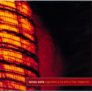

Tamas Wells
============================

|  |  |
| :--: | :-- |
| [<br>Tamas Wells](https://i.xiami.com/tamaswells) | **地区**: Australia 澳大利亚<br>**风格**: 民谣流行 Folk Pop, 根源唱作人 Singer-Songwriter<br>**播放数**: 46313696<br>**粉丝数**: 79711<br>**评论数**: 2020<br> |

## 档案

<div>
小档案<br>
中   文   名   塔马斯·韦尔斯，塔马斯·威尔斯<br>
外   文   名   Tamas Wells<br>
国        籍   澳大利亚<br>
代表作品   《  valder fields  》<br>
唱片公司   Lirico Records  （日本）<br>
唱片公司   Popboomerang Records  （澳洲）<br>
唱片公司   口袋唱片（中国）<br>
唱片公司   Leaplay Music  （韩国）<br>
艺人资料<br>
Tamas Wells  （一般译为塔马斯·韦尔斯），是澳大利亚墨尔本的一支乐队，成立于  2000  年初，曲风清新、平缓而又优美。<br>
该乐队在亚洲尤受欢迎，除澳大利亚的  Popboomerang  唱片公司外，在中国、日本、韩国分别有唱片公司代理发行其专辑。<br>
发展历程<br>
Tamas Wells  乐团来自澳洲墨尔本，最早成立于  2000  年初，当时只有  Owen Gray  及  Ben Castle  两名成员，发行的第一张  EP  《  Hello Jealousy  》是张带点政治意味的民谣唱片，创作灵感来自当年的“第三世界国家债务解除运动”，第二年鼓手  Nathan Collins  的加入，而接下来紧密的巡回演出，也为  Tamas Wells  在当地乐界积累了不少人气。<br>
2002  年  3  月和  8  月分别发行了两张广受好评的  EP  《  Cigarettes, a Tie and a Free Magazine  》及《  Stitch In Time  》，  Ben  中途退出，接着加入了  Tamas  和  Anthony  。知名制作人  Tim Whitten  在听过《  Stitch in Time  》之后颇为欣赏，邀请他们来悉尼的  Megaphon studios  录制第一张专辑。<br>
2004  年乐团  3  月  30  日发布的第一张专辑《  A Mark On The Pane  》被  Inpress Magazine  杂志评为当年最美的唱片之一，并在澳大利亚的音乐榜单  AIR charts  上获得第  16  名的成绩。同年，成员  Tamas Wells  前往缅甸，并在当地参加短期的志愿者工作。<br>
2006  年初，  Tamas Wells  与妻子、女儿迁居缅甸的仰光，并参加一个有关艾滋病的志愿者服务项目。在此期间，他创作出了该乐团的代表作品《  valder fields  》。  3  月，乐团发布第二张专辑《  A Plea en Vendredi  》。这一年起，乐团与中国、日本唱片公司签订协议，日本、中国专辑由他们代理发行。<br>
2009  年，乐团首次在中国举行巡回演唱会，并于  3  月  26  日开始此次巡演杭州站的演出。  4  月，  TamasWells  应“声演坊”之邀，在杭州、上海、北京、成都、南京五个城市举行巡演。此后，乐团每年在中国均有巡演。（  2013  年巡演因故推迟至  2014  ）<br>
2010  年  2  月，歌曲《  Valder Fields  》被收录于群星精选集《  Saddest Songs  》中。   12  月，在日本举行名为《  Tamas Wells Japan Tour 2010  》的日本巡回演唱会。<br>
2012  年  10  月，  Tamas Wells  加盟梦象音乐节，这是  Tamas  首次在中国参加音乐节。   同年  12  月  27  日，日本  Inpartmaint  唱片公司发布的群星精选专辑《  Quiet Moments   –   Winter Promenade  》收录了  Tamas Wells  的歌曲《  True Believers  》。<br>
2014  年，发行专辑《  On the Volatility of the Mind  》。  6  月，  Tamas Wells  先后在中国、日本开始巡回演唱会。<br>
Tamas Wells is an Australian singer-songwriter based in Rangoon, Burma. Wells first came to attention in his home country in 2002 with airplay of a three-track demo,  Cigarettes, a Tie and a Free Magazine,  recorded with three friends. They followed this up with an EP,  Stitch in Time,  the same year. The band took off in 2004 when they were spotted by record producer Tim Whitten and invited to record their debut album,  A Mark on the Pane , with Popboomerang Records. Beginning that year, they performed five national tours.<br>
In early 2006 Wells relocated to Rangoon, Burma, to participate in a community health HIV/AIDS education project. The band's second album,  A Plea en Vendredi , appeared later that year. In addition to the Australian release by Popboomerang, agreements were entered into with Inpartmaint and Pocket Records for the album to be released in Japan and China respectively. In August 2007, the band performed a sell-out tour of four Japanese cities. Wells' third album,  Two Years in April  was released in 2008, and was followed by tours of Australia, China, Japan and Singapore in 2009 and 2010. In 2010  Thirty People Away  the fourth album, was released and followed by a tour in China.<br>
In 2011, Fabrizio Polpettini made a video clip for the song  Thirty People Away  from the album of the same name. The film, which brings to the screen French actors Roxane Duran and Denis Lavant, was inspired by the character of the god Pan in the book "Jitterbug Perfume", by Tom Robbins.<br>
On the Volatility of the Mind    was released in 2014.
</div>

## 专辑

| 名称 | 语种 | 唱片公司 | 发行时间 | 专辑类别 | 专辑风格 |
| :--: | :-- | :-- | :-- | :-- | :-- |
| [<br>THE PLANTATION](./albums/2102945834.md) | 英语 | 独立发行 | 2017年09月30日 | 录音室专辑 | 独立民谣 Indie Folk, 民谣流行 Folk Pop, 根源唱作人 Singer-Songwriter |
| [<br>On the Volatility of the Mind](./albums/795042961.md) | 英语 | Popboomerang Records | 2014年03月02日 | 录音室专辑 | 民谣流行 Folk Pop, 根源唱作人 Singer-Songwriter |
| [<br>Signs I Can't Read - Live At Sonorium](./albums/480084.md) | 英语 | 口袋唱片 | 2011年11月28日 | 现场专辑 | 民谣流行 Folk Pop, 根源唱作人 Singer-Songwriter |
| [<br>Thirty People Away](./albums/408329.md) | 英语 | 口袋唱片 | 2010年11月01日 | 录音室专辑 | 民谣流行 Folk Pop, 根源唱作人 Singer-Songwriter |
| [<br>Valder Fields 2009北京演唱会](./albums/390400.md) | 英语 | 口袋唱片 | 2009年12月29日 | 现场专辑 | 民谣流行 Folk Pop, 根源唱作人 Singer-Songwriter |
| [<br>Two Years In April](./albums/168610.md) | 英语 | Popboomerang Records | 2008年05月01日 | 录音室专辑 | 民谣流行 Folk Pop, 根源唱作人 Singer-Songwriter |
| [<br>A Plea en Vendredi](./albums/168521.md) | 英语 | 口袋唱片 | 2006年03月09日 | 录音室专辑 | 民谣流行 Folk Pop, 根源唱作人 Singer-Songwriter |
| [<br>A Mark On the Pane](./albums/168520.md) | 英语 | 口袋唱片 | 2004年01月01日 | 录音室专辑 | 民谣流行 Folk Pop, 根源唱作人 Singer-Songwriter |
| [<br>Cigarettes, a Tie and a Free Magazine](./albums/429830.md) | 英语 | Self-Released | 2002年03月06日 | EP, 单曲 | 民谣流行 Folk Pop, 根源唱作人 Singer-Songwriter |

## 评论

|  |  |  |
| :-- | :-- | :-- |
| <br>[虾米用户](https://emumo.xiami.com/u/306065331)<br>幸福开始有人选<br>2020-12-28 19:53<br>赞(0) 踩(0) | <div>2020也结束了</div> |
| <br>[虾米用户](https://emumo.xiami.com/u/306065331)<br>幸福开始有人选<br>2020-12-28 19:52<br>赞(0) 踩(0) | <div>2016</div> |
| <br>[虾米用户](https://emumo.xiami.com/u/306065331)<br>幸福开始有人选<br>2020-12-28 19:52<br>赞(0) 踩(0) | <div>2019</div> |
| <br>[虾米用户](https://emumo.xiami.com/u/306065331)<br>幸福开始有人选<br>2020-12-28 19:52<br>赞(0) 踩(0) | <div>2018</div> |
| <br>[虾米用户](https://emumo.xiami.com/u/306065331)<br>幸福开始有人选<br>2020-12-28 19:52<br>赞(0) 踩(0) | <div>2017</div> |
| <br>[虾米用户](https://emumo.xiami.com/u/306065331)<br>幸福开始有人选<br>2020-12-28 19:52<br>赞(0) 踩(0) | <div>2015</div> |
| <br>[虾米用户](https://emumo.xiami.com/u/444664601)<br><br>2020-09-25 14:13<br>赞(0) 踩(0) | <div> </div> |
| <br>[虾米用户](https://emumo.xiami.com/u/335763490)<br>心存善根 愿我梦想成真~...<br>2020-08-07 02:29<br>赞(1) 踩(0) | <div> 很舒服的声音</div> |
| <br>[虾米用户](https://emumo.xiami.com/u/374341958)<br>就爱慢生活<br>2020-08-04 14:07<br>赞(0) 踩(0) | <div>这侧颜绝了，</div> |
| <br>[虾米用户](https://emumo.xiami.com/u/379162683)<br>我想要记住你们，我想要你...<br>2020-08-01 09:17<br>赞(0) 踩(0) | <div>✧*｡</div> |
| <br>[虾米用户](https://emumo.xiami.com/u/43155429)<br>虾米不见了，以后何去何从<br>2020-06-27 01:19<br>赞(0) 踩(0) | <div> </div> |
| <br>[虾米用户](https://emumo.xiami.com/u/441087725)<br><br>2020-06-17 20:30<br>赞(0) 踩(0) | <div>呵呵 我觉得歌都挺好的，小文艺，适合自己听。</div> |
| <br>[虾米用户](https://emumo.xiami.com/u/48156160)<br>我还没想好要写什么...<br>2020-03-27 20:02<br>赞(0) 踩(0) | <div></div> |
| <br>[虾米用户](https://emumo.xiami.com/u/48156160)<br>我还没想好要写什么...<br>2020-03-15 21:30<br>赞(0) 踩(0) | <div></div> |
| <br>[虾米用户](https://emumo.xiami.com/u/49769385)<br>虾米最好的安慰剂<br>2019-12-28 21:11<br>赞(1) 踩(0) | <div>还不发新歌  等的我都快荒废了</div> |
| <br>[虾米用户](https://emumo.xiami.com/u/380102260)<br><br>2019-08-26 13:51<br>赞(0) 踩(0) | <div>他的声音有点像吴青峰。</div> |
| <br>[虾米用户](https://emumo.xiami.com/u/35509231)<br>提灯天后  策马小僧<br>2019-05-24 11:18<br>赞(1) 踩(0) | <div>他一张口我就认得他的声音。为什么我没有去他的现场。肠悔青。</div> |
| <br>[虾米用户](https://emumo.xiami.com/u/321959208)<br><br>2019-04-21 19:39<br>赞(0) 踩(0) | <div>  </div> |
| <br>[虾米用户](https://emumo.xiami.com/u/50411623)<br>我还没想好要写什么...<br>2019-03-22 22:51<br>赞(1) 踩(0) | <div>曲调嗓音都很好听啊  ，就是这歌词写得都有点儿水  </div> |
| <br>[虾米用户](https://emumo.xiami.com/u/42799966)<br>两棵朝圣的树。<br>2019-03-01 12:33<br>赞(0) 踩(0) | <div>还让我错过了</div> |
| <br>[虾米用户](https://emumo.xiami.com/u/42799966)<br>两棵朝圣的树。<br>2019-03-01 12:33<br>赞(0) 踩(0) | <div>卧槽！去合肥，不来南京!</div> |
| <br>[虾米用户](https://emumo.xiami.com/u/201698259)<br>我真的很想去东北<br>2019-02-14 20:13<br>赞(0) 踩(0) | <div>啊我被首页照片吸引进来的 </div> |
| <br>[虾米用户](https://emumo.xiami.com/u/124002836)<br> <br>2018-12-19 14:37<br>赞(0) 踩(0) | <div>请问你在哪里学中文的</div> |
| <br>[虾米用户](https://emumo.xiami.com/u/328901554)<br>没有什么想说的<br>2018-09-24 10:01<br>赞(0) 踩(0) | <div>附中旁边。。4.14我好像错过了些什么 </div> |
| <br>[虾米用户](https://emumo.xiami.com/u/448091)<br>一个胖子。<br>2018-09-19 19:25<br>赞(0) 踩(0) | <div>塔马斯&amp;middot;韦尔斯&amp;hellip;&amp;hellip;你谁？？</div> |
| <br>[虾米用户](https://emumo.xiami.com/u/374388669)<br><br>2018-08-03 13:21<br>赞(0) 踩(0) | <div>泉水般纯净的声音</div> |
| <br>[虾米用户](https://emumo.xiami.com/u/1320669)<br>ツ<br>2018-07-30 21:54<br>赞(0) 踩(0) | <div>0.0</div> |
| <br>[虾米用户](https://emumo.xiami.com/u/313726800)<br>我还没想好要写什么...<br>2018-06-24 00:27<br>赞(0) 踩(0) | <div>有魔力的声音没有之一</div> |
| <br>[虾米用户](https://emumo.xiami.com/u/359064772)<br>我还没想好要写什么...<br>2018-04-22 07:18<br>赞(0) 踩(0) | <div>感觉和以前的有的不一样</div> |
| <br>[虾米用户](https://emumo.xiami.com/u/17275597)<br>你的梦想把我伤害 谁又来...<br>2018-04-14 21:56<br>赞(6) 踩(0) | <div>今天去了哦 合肥专场 声音超级温柔 然后签专辑的时候握手了 我真的开心惨了</div> |
| ⇒ | <br>[虾米用户](https://emumo.xiami.com/u/401069880)<br><br>2018-08-10 16:21<br>赞(0) 踩(0) | <div>居然去合肥</div> |
| ⇒ | <br>[虾米用户](https://emumo.xiami.com/u/17275597)<br>你的梦想把我伤害 谁又来...<br>2018-08-11 16:18<br>赞(0) 踩(0) | <div><q><b>tiamo茂茂说：</b></q></div> |
| ⇒ | <br>[虾米用户](https://emumo.xiami.com/u/401069880)<br><br>2018-12-03 22:47<br>赞(0) 踩(0) | <div><q><b>涉谷大仙说：</b></q></div> |
| <br>[虾米用户](https://emumo.xiami.com/u/5847985)<br><br>2018-04-01 17:20<br>赞(0) 踩(0) | <div>2012他去墨尔本读了个博。还一直在写歌</div> |
| <br>[虾米用户](https://emumo.xiami.com/u/121910914)<br>我想好好睡个觉<br>2018-04-01 10:04<br>赞(0) 踩(0) | <div>i</div> |
| <br>[虾米用户](https://emumo.xiami.com/u/45722424)<br>回到正轨<br>2018-03-27 23:13<br>赞(0) 踩(0) | <div>好怀念</div> |
| <br>[虾米用户](https://emumo.xiami.com/u/101754602)<br>很高兴认识你，很遗憾没能...<br>2018-03-15 19:14<br>赞(1) 踩(0) | <div>想听塔叔的现场</div> |
| <br>[虾米用户](https://emumo.xiami.com/u/30531997)<br>妞妞爱老虎油。<br>2018-03-14 15:21<br>赞(3) 踩(0) | <div>我竟然看到了合肥啊啊啊啊啊啊啊啊啊啊</div> |
| ⇒ | <br>[虾米用户](https://emumo.xiami.com/u/2472729)<br>嘘<br>2018-03-14 15:24<br>赞(0) 踩(0) | <div>恭喜</div> |
| <br>[虾米用户](https://emumo.xiami.com/u/260284967)<br>detachment<br>2018-03-14 15:13<br>赞(6) 踩(0) | <div>合肥专场？？？</div> |
| <br>[虾米用户](https://emumo.xiami.com/u/219847384)<br>很荣幸遇见你.<br>2018-02-27 19:43<br>赞(7) 踩(0) | <div>他们的歌名和歌词一直都很迷。<br>为什么呢，因为塔叔喜欢在当志愿者期间写歌。把伤员或老者或孩童的言语，编进他温柔的曲调里。</div> |
| <br>[虾米用户](https://emumo.xiami.com/u/32695431)<br>你他娘的就是一只狗<br>2018-01-24 09:13<br>赞(0) 踩(0) | <div>高中时的回忆啊啊啊希望下次巡演可以来武汉爱里</div> |
| <br>[虾米用户](https://emumo.xiami.com/u/346099290)<br><br>2018-01-24 01:01<br>赞(3) 踩(0) | <div>事隔14年....我欠您一个评论。。</div> |
| <br>[虾米用户](https://emumo.xiami.com/u/333847843)<br>五月天！比心！♡<br>2017-12-13 17:40<br>赞(0) 踩(0) | <div>mv?</div> |
| <br>[虾米用户](https://emumo.xiami.com/u/32275254)<br> <br>2017-12-08 14:23<br>赞(0) 踩(0) | <div>错过了广州场 </div> |
| <br>[虾米用户](https://emumo.xiami.com/u/9597157)<br>，<br>2017-12-03 23:30<br>赞(3) 踩(0) | <div>～开心  那首翻唱很惊艳啊  中途的互动也很棒  最后最意外的是唱了那首那些花儿哈哈</div> |
| <br>[虾米用户](https://emumo.xiami.com/u/7569165)<br>。<br>2017-12-03 23:09<br>赞(1) 踩(0) | <div>最让人激动的是，最后一首曲子居然在唱那些花儿 </div> |
| <br>[虾米用户](https://emumo.xiami.com/u/7569165)<br>。<br>2017-12-03 21:45<br>赞(2) 踩(0) | <div>今天成都现场太棒了，居然还有互动 </div> |
| <br>[虾米用户](https://emumo.xiami.com/u/31930183)<br><br>2017-12-02 09:46<br>赞(2) 踩(0) | <div>深圳B10，2017.12.1 打卡 </div> |
| <br>[虾米用户](https://emumo.xiami.com/u/318132)<br>抠啦<br>2017-11-28 23:26<br>赞(1) 踩(0) | <div>刚看完天津现场演出，超级棒 chris no.1 and chris no.2</div> |
| <br>[虾米用户](https://emumo.xiami.com/u/36139564)<br> <br>2017-11-28 22:00<br>赞(0) 踩(0) | <div>明天愚公移山见</div> |
| <br>[虾米用户](https://emumo.xiami.com/u/43547374)<br><br>2017-11-22 23:52<br>赞(0) 踩(0) | <div>I like to listen to your music when I read before sleeping.Thank you ,and good night.   </div> |
| <br>[虾米用户](https://emumo.xiami.com/u/25441800)<br><br>2017-10-30 10:18<br>赞(0) 踩(0) | <div>娘炮小清新 哈哈</div> |
| ⇒ | <br>[虾米用户](https://emumo.xiami.com/u/313387682)<br><br>2017-11-20 23:21<br>赞(0) 踩(0) | <div>小清新可以，前面那个词请不要用这里。</div> |
| <br>[虾米用户](https://emumo.xiami.com/u/3872170)<br>我们似荫蔽午夜明月的浮云<br>2017-10-28 00:17<br>赞(2) 踩(0) | <div>平缓优美的旋律，没有什么激昂的东西。可是就这么平淡着，慢慢的渗透到人的内心。</div> |
| <br>[虾米用户](https://emumo.xiami.com/u/601978)<br><br>2017-10-28 00:04<br>赞(2) 踩(0) | <div>好消息，Tamas Wells中国乐迷会成立啦，将根据参加时间来排会员编号，会员免费参加签售活动并会不定期举办乐迷的线下活动。乐迷会限量500人，今天16点正式开抢！~购买地址： <a href="https://dou.bz/3C4d1G" target="_blank" rel="nofollow noreferrer noopener">https://dou.bz/3C4d1G</a></div> |
| <br>[虾米用户](https://emumo.xiami.com/u/3940795)<br><br>2017-10-27 23:57<br>赞(0) 踩(0) | <div>半年前疯狂的喜欢哦=。=最近竟然忘记了</div> |
| <br>[虾米用户](https://emumo.xiami.com/u/4068521)<br><br>2017-10-27 23:21<br>赞(1) 踩(0) | <div>平缓优美 的旋律，没什么激昂的东西，又是那么柔软动人</div> |
| <br>[虾米用户](https://emumo.xiami.com/u/6122214)<br>迷因爱音乐。<br>2017-10-27 23:08<br>赞(0) 踩(0) | <div>2.托玛一听是天神，心想，妈的天神没有一个好东西，我才不去，便回答说：哎呀，你真的是天神吗？天神灵鸡一动，就生出一筐鸡蛋来，还客气地说：来来，妹妹尝尝，有红茶的，有卤味的。 托玛见是真的天神，不禁害怕起来，看来是难逃一劫，怎么办呢？托玛跟天神说：哇！真是天神大人，真的好崇拜你呀！既然天神法力无边，还有什么得不到的，像我这样的歌女，你灵鸡一动，不是能变出一大把吗？天神恼怒，气愤地说：你去是不去？“去，但有个要求”托玛说。天神就问说：有什么要求？托玛回答说：你要保证我跟威尔未来五年都能上春晚。天神说：这有何难！我答应你。托玛一听，再怎么也是天神，说话应该是算话的，而且排练的录影机也没关，他赖不掉。</div> |
| <br>[虾米用户](https://emumo.xiami.com/u/1592819)<br><br>2017-10-27 23:04<br>赞(0) 踩(0) | <div>我想体验更多--独立音地专访Tamas Wells<br><br>做着音乐，在援助机构工作，为艾滋病防治项目贡献过力量，四年缅甸生活，亲历过缅甸人民悲惨的故事，还吃过北京的饺子，游过北京的故宫，或许除了没有唱过卡拉OK，Tamas Wells这些非比寻常的经历，都足以告诉我们一个真理：生命在于折腾，灵感源于折腾。<br><br>我想体验更多--独立音地专访Tamas Wells<br><a href="http://www.indiechina.com/html/2010-10/2065.htm" target="_blank" rel="nofollow noreferrer noopener">http://www.indiechina.com/html/2010-10/2065.htm</a></div> |
| <br>[虾米用户](https://emumo.xiami.com/u/8502627)<br><br>2017-10-27 22:59<br>赞(0) 踩(0) | <div>安静的大叔。nice，学习的时候听</div> |
| <br>[虾米用户](https://emumo.xiami.com/u/168541498)<br><br>2017-10-25 16:09<br>赞(2) 踩(0) | <div>治愈系男声  </div> |
| <br>[虾米用户](https://emumo.xiami.com/u/248247599)<br><br>2017-10-18 16:52<br>赞(1) 踩(0) | <div>内容已删除</div> |
| ⇒ | <br>[虾米用户](https://emumo.xiami.com/u/13069983)<br>品味很怪，心肠很坏。<br>2017-10-18 16:56<br>赞(0) 踩(0) | <div>没有南京5555</div> |
| <br>[虾米用户](https://emumo.xiami.com/u/154734994)<br>生命常有缺憾，幸好音乐能...<br>2017-10-03 20:39<br>赞(0) 踩(0) | <div>喜欢❤️</div> |
| <br>[虾米用户](https://emumo.xiami.com/u/226756743)<br><br>2017-09-24 23:40<br>赞(3) 踩(0) | <div>身残志坚别走233</div> |
| <br>[虾米用户](https://emumo.xiami.com/u/250133519)<br>听歌是一种乐趣<br>2017-09-08 00:21<br>赞(0) 踩(0) | <div>喜欢</div> |
| <br>[虾米用户](https://emumo.xiami.com/u/3109064)<br><br>2017-09-05 17:52<br>赞(0) 踩(0) | <div>柔</div> |
| <br>[虾米用户](https://emumo.xiami.com/u/263166749)<br><br>2017-08-15 14:04<br>赞(0) 踩(0) | <div>好听 </div> |
| <br>[虾米用户](https://emumo.xiami.com/u/318876825)<br>我爱秋<br>2017-08-12 13:32<br>赞(2) 踩(0) | <div>第一句就被他的安静温柔的声音俘获，沉醉其中</div> |
| <br>[虾米用户](https://emumo.xiami.com/u/257209506)<br>世界都活在今天<br>2017-08-06 13:31<br>赞(2) 踩(0) | <div>歌曲轻快，轻柔，像心中的小鸟儿在歌唱。</div> |
| <br>[虾米用户](https://emumo.xiami.com/u/206795702)<br><br>2017-08-01 18:49<br>赞(0) 踩(0) | <div>巡演，塔叔将在17年11月来中国巡演啦！推特上说的。</div> |
| <br>[虾米用户](https://emumo.xiami.com/u/300650381)<br><br>2017-07-20 15:44<br>赞(4) 踩(0) | <div>这首歌听了超过7年的有没有</div> |
| <br>[虾米用户](https://emumo.xiami.com/u/206795702)<br><br>2017-07-15 23:23<br>赞(0) 踩(0) | <div>新专辑！确定于2017年下半年推出！塔叔在推特上说了，群里看见的。有11首新歌，已于6月29号开始录制！</div> |
| <br>[虾米用户](https://emumo.xiami.com/u/217900530)<br><br>2017-06-20 09:06<br>赞(0) 踩(0) | <div>好听，喜欢继续加油哦  </div> |
| <br>[虾米用户](https://emumo.xiami.com/u/9539916)<br>桃李不言，下自成蹊。<br>2017-06-19 21:30<br>赞(0) 踩(0) | <div>看了相册，天他还来过杭州！</div> |
| <br>[虾米用户](https://emumo.xiami.com/u/298703307)<br>纵你阅人何其多，始终无人...<br>2017-06-18 23:39<br>赞(0) 踩(0) | <div>很温柔的声音哦</div> |
| <br>[虾米用户](https://emumo.xiami.com/u/11968433)<br>长春发展农商银行<br>2017-06-16 20:09<br>赞(2) 踩(0) | <div>很喜欢你的声音</div> |
| <br>[虾米用户](https://emumo.xiami.com/u/303627422)<br><br>2017-06-11 19:19<br>赞(1) 踩(0) | <div>温婉絮絮的耳语，喜欢这节奏</div> |
| <br>[虾米用户](https://emumo.xiami.com/u/302626960)<br>音乐是思维着的声音。——...<br>2017-06-09 15:28<br>赞(0) 踩(0) | <div>多年前喜欢的一首歌，现在听起来还是依然。</div> |
| <br>[虾米用户](https://emumo.xiami.com/u/302615951)<br><br>2017-06-07 18:30<br>赞(0) 踩(0) | <div>第一次听你</div> |
| <br>[虾米用户](https://emumo.xiami.com/u/300384220)<br><br>2017-05-30 17:09<br>赞(0) 踩(0) | <div>_(:з」&amp;ang;)_演唱会？？(&amp;acute;╥&amp;omega;╥`)</div> |
| <br>[虾米用户](https://emumo.xiami.com/u/187098302)<br><br>2017-05-24 23:24<br>赞(1) 踩(0) | <div>很遗憾，16年来上海巡演时因为正好有课错过了。喜欢塔叔有数多年，治愈系的音乐陪伴我度过了很多灰色的时光。下回来中国时一定去看，没时间抽时间也要看  </div> |
| <br>[虾米用户](https://emumo.xiami.com/u/206795702)<br><br>2017-05-16 23:29<br>赞(4) 踩(0) | <div>之前两个月因为小高考的紧张去听了一些让人绷紧神经的日语歌，现在回来啦！塔叔加油，我是南京场那个从头跟着你唱到尾的男生，期待你的新专辑！</div> |
| <br>[虾米用户](https://emumo.xiami.com/u/203054738)<br><br>2017-05-16 16:06<br>赞(0) 踩(0) | <div>他的声音很温和</div> |
| <br>[虾米用户](https://emumo.xiami.com/u/14578491)<br>我还没想好要写什么...<br>2017-05-05 11:28<br>赞(1) 踩(0) | <div>最爱没有之一</div> |
| <br>[虾米用户](https://emumo.xiami.com/u/9327494)<br>http://www.x...<br>2017-04-26 10:38<br>赞(1) 踩(0) | <div>Melon Street Book Club</div> |
| <br>[虾米用户](https://emumo.xiami.com/u/290405082)<br>一边想念 一边向前<br>2017-04-25 21:38<br>赞(1) 踩(0) | <div>his music always makes me think of someone</div> |
| <br>[虾米用户](https://emumo.xiami.com/u/19249754)<br>我的生活似乎只有音乐<br>2017-04-19 13:53<br>赞(1) 踩(0) | <div>最爱之一</div> |
| <br>[虾米用户](https://emumo.xiami.com/u/288294493)<br><br>2017-04-16 11:33<br>赞(2) 踩(0) | <div>这首歌记录了我的高中  特别喜欢他的声音</div> |
| <br>[虾米用户](https://emumo.xiami.com/u/126245306)<br>非关癖爱轻模样<br>2017-04-10 00:08<br>赞(0) 踩(0) | <div>来支持啦</div> |
| <br>[虾米用户](https://emumo.xiami.com/u/254304271)<br><br>2017-04-08 10:31<br>赞(0) 踩(0) | <div>爱你</div> |
| <br>[虾米用户](https://emumo.xiami.com/u/3301983)<br>暂无签名~<br>2017-04-06 14:56<br>赞(1) 踩(0) | <div>当年哪哪都是这首歌的旋律</div> |
| <br>[虾米用户](https://emumo.xiami.com/u/235794257)<br><br>2017-04-03 21:16<br>赞(0) 踩(0) | <div></div> |
| <br>[虾米用户](https://emumo.xiami.com/u/275638913)<br><br>2017-04-02 23:09<br>赞(1) 踩(0) | <div>怀挺</div> |
| <br>[虾米用户](https://emumo.xiami.com/u/10983386)<br>瘦子 朝夕奔梦<br>2017-03-29 11:32<br>赞(0) 踩(0) | <div>大学生活</div> |
| <br>[虾米用户](https://emumo.xiami.com/u/244295387)<br>❤<br>2017-03-26 17:14<br>赞(3) 踩(0) | <div>阳光灿烂却只能宅在图书馆写论文的下午，忽然就想起了小时候一度单曲循环的Valder Fields&amp;hellip;&amp;hellip;屁颠屁颠跑来搜了，今天下午就指着听着塔叔的歌度过啦QUQ~</div> |
| <br>[虾米用户](https://emumo.xiami.com/u/10818520)<br>从前从前  有个人爱你很...<br>2017-03-18 14:30<br>赞(0) 踩(0) | <div> </div> |
| <br>[虾米用户](https://emumo.xiami.com/u/10818520)<br>从前从前  有个人爱你很...<br>2017-03-18 14:30<br>赞(1) 踩(0) | <div>有人在么？</div> |
| <br>[虾米用户](https://emumo.xiami.com/u/281209251)<br>喜欢是控制不住的咳嗽<br>2017-03-18 03:21<br>赞(0) 踩(0) | <div>谢谢 </div> |
| <br>[虾米用户](https://emumo.xiami.com/u/23106740)<br><br>2017-03-11 09:11<br>赞(1) 踩(0) | <div>版权回来了真的值得开心</div> |
| <br>[虾米用户](https://emumo.xiami.com/u/237667826)<br>我要的就一定要得到<br>2017-03-07 20:44<br>赞(0) 踩(0) | <div>tamas</div> |
| <br>[虾米用户](https://emumo.xiami.com/u/47151332)<br> <br>2017-03-01 23:36<br>赞(0) 踩(0) | <div></div> |
| <br>[虾米用户](https://emumo.xiami.com/u/48275687)<br>暂无签名~<br>2017-02-25 15:06<br>赞(0) 踩(0) | <div>我又回到塔叔组织了</div> |
| <br>[虾米用户](https://emumo.xiami.com/u/28153334)<br>该努力拼搏的时候千万别选...<br>2017-02-18 12:47<br>赞(2) 踩(0) | <div>版权回来了。好开心啊    </div> |
| <br>[虾米用户](https://emumo.xiami.com/u/257762542)<br><br>2017-02-09 15:19<br>赞(0) 踩(0) | <div>塔叔，我来逛逛 </div> |
| <br>[虾米用户](https://emumo.xiami.com/u/54997040)<br> <br>2017-02-08 20:57<br>赞(0) 踩(0) | <div>哈哈哈 歌听着很舒服qwqqq</div> |
| <br>[虾米用户](https://emumo.xiami.com/u/49055534)<br><br>2017-02-07 00:36<br>赞(1) 踩(0) | <div>oce店里天天播valder fields，这样可以的吗～</div> |
| <br>[虾米用户](https://emumo.xiami.com/u/249921978)<br>Life is colo...<br>2017-02-01 20:46<br>赞(0) 踩(0) | <div>  </div> |
| <br>[虾米用户](https://emumo.xiami.com/u/16859078)<br><br>2017-01-29 17:48<br>赞(0) 踩(0) | <div>好听</div> |
| <br>[虾米用户](https://emumo.xiami.com/u/46188271)<br>我还没想好要写什么...<br>2017-01-21 18:25<br>赞(0) 踩(0) | <div>没想到，16年有演唱会</div> |
| <br>[虾米用户](https://emumo.xiami.com/u/46188271)<br>我还没想好要写什么...<br>2017-01-21 18:24<br>赞(0) 踩(0) | <div>长大后一定去听</div> |
| <br>[虾米用户](https://emumo.xiami.com/u/46188271)<br>我还没想好要写什么...<br>2017-01-21 18:24<br>赞(0) 踩(0) | <div>支持 </div> |
| <br>[虾米用户](https://emumo.xiami.com/u/46188271)<br>我还没想好要写什么...<br>2017-01-21 18:24<br>赞(0) 踩(0) | <div>支持</div> |
| <br>[虾米用户](https://emumo.xiami.com/u/6638261)<br>已下架。。。。20200...<br>2017-01-12 15:29<br>赞(1) 踩(0) | <div>11月27号<br>Tamas坐标深圳B10<br>超治愈的一天<br>听完了之后我就想<br>找男票干嘛 是音乐不好听还是电影不好看？</div> |
| ⇒ | <br>[虾米用户](https://emumo.xiami.com/u/409246)<br><br>2017-02-13 13:44<br>赞(0) 踩(0) | <div>找男票是因为你除了听音乐看电影之外还要应付父母同事七大姑八大姨的“怎么还没有男票？”“你该结婚了！”等精神攻击。</div> |
| <br>[虾米用户](https://emumo.xiami.com/u/45103860)<br>always somew...<br>2016-12-18 17:21<br>赞(3) 踩(0) | <div>终于有版权了 等了好久好久  从小学开始喜欢 现在大一</div> |
| <br>[虾米用户](https://emumo.xiami.com/u/1124003)<br><br>2016-12-08 01:19<br>赞(2) 踩(0) | <div>哎呀，错过了，期待明年再来深圳</div> |
| <br>[虾米用户](https://emumo.xiami.com/u/250738338)<br><br>2016-12-01 12:15<br>赞(0) 踩(0) | <div>好听</div> |
| <br>[虾米用户](https://emumo.xiami.com/u/31430298)<br>暂无签名~<br>2016-11-30 10:32<br>赞(0) 踩(0) | <div>欢迎回来</div> |
| <br>[虾米用户](https://emumo.xiami.com/u/7686338)<br>静静深夜 月涌江流<br>2016-11-29 15:19<br>赞(3) 踩(0) | <div>这回全买过来啦 嘻嘻 谢谢虾米</div> |
| <br>[虾米用户](https://emumo.xiami.com/u/2371163)<br> ^-^)ﾉ☆.｡･:*...<br>2016-11-27 08:38<br>赞(0) 踩(0) | <div>现场声线依旧暖，超好听(｡･ω･｡)。</div> |
| <br>[虾米用户](https://emumo.xiami.com/u/5854347)<br>神遊 丷  有感°<br>2016-11-25 23:52<br>赞(2) 踩(0) | <div>live里唱了张悬的宝贝...中文也是超温柔...然而Tamas Well并不懂这个词的中文意思</div> |
| ⇒ | <br>[虾米用户](https://emumo.xiami.com/u/5484012)<br> <br>2016-11-26 22:20<br>赞(0) 踩(0) | <div>唱得超好听</div> |
| ⇒ | <br>[虾米用户](https://emumo.xiami.com/u/4225791)<br>Mua~<br>2016-11-27 03:27<br>赞(0) 踩(0) | <div>2016的现场我也去了，一点小缘分，握个爪。</div> |
| <br>[虾米用户](https://emumo.xiami.com/u/3185136)<br>I hear u.<br>2016-11-24 00:18<br>赞(0) 踩(0) | <div>惊喜惊喜~</div> |
| <br>[虾米用户](https://emumo.xiami.com/u/8514241)<br>我还没想好要写什么...<br>2016-11-23 16:19<br>赞(0) 踩(0) | <div>啊   原来我是头像是他</div> |
| ⇒ | <br>[虾米用户](https://emumo.xiami.com/u/3185136)<br>I hear u.<br>2016-11-24 00:20<br>赞(0) 踩(0) | <div>你头像是maximilian hecker……也很好听~</div> |
| ⇒ | <br>[虾米用户](https://emumo.xiami.com/u/8514241)<br>我还没想好要写什么...<br>2016-11-24 09:36<br>赞(0) 踩(0) | <div><q><b>lammsy_x说：</b></q></div> |
| <br>[虾米用户](https://emumo.xiami.com/u/7133174)<br>我还没想好要写什么...<br>2016-11-22 21:47<br>赞(1) 踩(0) | <div>直接从小年轻跃迁成大叔</div> |
| <br>[虾米用户](https://emumo.xiami.com/u/3336291)<br>假装不是龙猫的身材<br>2016-11-22 20:35<br>赞(0) 踩(0) | <div>welcome back Tamas！</div> |
| <br>[虾米用户](https://emumo.xiami.com/u/3851559)<br>没密密麻麻密密麻<br>2016-11-22 18:17<br>赞(0) 踩(0) | <div>相册里为什么会有麦斯米兰？I am falling now专辑封面？他们俩有关系吗？</div> |
| <br>[虾米用户](https://emumo.xiami.com/u/1794170)<br>偶然<br>2016-11-22 17:11<br>赞(0) 踩(0) | <div>啥情况？第二次入驻？<br>所以说虾米是已经把版权搞到了？</div> |
| <br>[虾米用户](https://emumo.xiami.com/u/1160312)<br>也曾辉煌过<br>2016-11-22 16:22<br>赞(0) 踩(0) | <div>只想说有一次去上海听他演唱会，100多票价，晚8点半开场结果暖场歌手就唱了快半个小时听得我们都要疯了。然后Tamas Wells 登场了，唱了四十多分钟走人……我K</div> |
| ⇒ | <br>[虾米用户](https://emumo.xiami.com/u/2892750)<br>如果，你也喜欢。<br>2016-11-22 17:24<br>赞(0) 踩(0) | <div>业内都是这样的，跟是哪个乐队没什么关系吧</div> |
| ⇒ | <br>[虾米用户](https://emumo.xiami.com/u/16030178)<br> <br>2016-11-27 09:44<br>赞(0) 踩(0) | <div>确实8点半一直唱到十点啊 不知你怎么看的</div> |
| ⇒ | <br>[虾米用户](https://emumo.xiami.com/u/1160312)<br>也曾辉煌过<br>2016-11-29 06:44<br>赞(0) 踩(0) | <div><q><b>std说：</b></q></div> |
| <br>[虾米用户](https://emumo.xiami.com/u/35509231)<br>提灯天后  策马小僧<br>2016-11-22 15:35<br>赞(0) 踩(0) | <div>一直连一张清晰照片都没有！终于接地气来到人间了！哭哭！！！</div> |
| <br>[虾米用户](https://emumo.xiami.com/u/248247599)<br><br>2016-11-22 14:59<br>赞(216) 踩(0) | <div>我刚入驻了虾米音乐人，欢迎大家来我的个人主页，收听我的最新音乐</div> |
| ⇒ | <br>[虾米用户](https://emumo.xiami.com/u/9592982)<br>是我 对 爱的 初衷<br>2016-11-22 16:55<br>赞(0) 踩(0) | <div>Welcome！欢迎到我的碗里来~</div> |
| ⇒ | <br>[虾米用户](https://emumo.xiami.com/u/1170903)<br>我妖气重我自豪<br>2016-11-22 20:52<br>赞(0) 踩(0) | <div>Welcome~~</div> |
| ⇒ | <br>[虾米用户](https://emumo.xiami.com/u/254088877)<br><br>2017-05-15 18:38<br>赞(0) 踩(0) | <div>*^O^*lovest</div> |
| ⇒ | <br>[虾米用户](https://emumo.xiami.com/u/298703307)<br>纵你阅人何其多，始终无人...<br>2017-06-18 23:38<br>赞(0) 踩(0) | <div>好喜欢你的声音。等了好久。</div> |
| ⇒ | <br>[虾米用户](https://emumo.xiami.com/u/245241067)<br>已是十年踪迹十年心<br>2017-08-02 20:38<br>赞(0) 踩(0) | <div>超级喜欢你的，特别温柔，很安心，你肯定也是个温润如玉的人吧！</div> |
| ⇒ | <br>[虾米用户](https://emumo.xiami.com/u/273647465)<br>或许是我的舒适域太窄了吧...<br>2017-09-04 21:20<br>赞(0) 踩(0) | <div>好喜欢声音  </div> |
| ⇒ | <br>[虾米用户](https://emumo.xiami.com/u/42055212)<br>我还没想好要写什么...<br>2017-10-30 13:53<br>赞(0) 踩(0) | <div>love your voice so much, welcome</div> |
| ⇒ | <br>[虾米用户](https://emumo.xiami.com/u/219847384)<br>很荣幸遇见你.<br>2018-02-27 19:37<br>赞(0) 踩(0) | <div>以前有人说你头像身残志坚</div> |
| ⇒ | <br>[虾米用户](https://emumo.xiami.com/u/93189604)<br>我是虚无<br>2018-07-21 23:56<br>赞(0) 踩(0) | <div>你的声音很温暖。</div> |
| ⇒ | <br>[虾米用户](https://emumo.xiami.com/u/329400154)<br><br>2018-07-26 18:09<br>赞(0) 踩(0) | <div>你的歌真好听 </div> |
| ⇒ | <br>[虾米用户](https://emumo.xiami.com/u/228675145)<br>最爱电音，其他类型也有涉...<br>2018-09-28 21:30<br>赞(0) 踩(0) | <div>❤️</div> |
| <br>[虾米用户](https://emumo.xiami.com/u/36057872)<br>网易/BC: Breat...<br>2016-11-22 13:04<br>赞(0) 踩(0) | <div>入驻音乐人了？~</div> |
| <br>[虾米用户](https://emumo.xiami.com/u/234574355)<br><br>2016-11-22 00:24<br>赞(0) 踩(0) | <div>很温柔很温暖</div> |
| <br>[虾米用户](https://emumo.xiami.com/u/205951213)<br>我还没想好要写什么...<br>2016-11-21 01:05<br>赞(0) 踩(0) | <div></div> |
| <br>[虾米用户](https://emumo.xiami.com/u/244302802)<br>不是有希望才去坚持，而是...<br>2016-11-18 18:37<br>赞(0) 踩(0) | <div>give you my heart</div> |
| <br>[虾米用户](https://emumo.xiami.com/u/13687657)<br><br>2016-11-16 09:29<br>赞(0) 踩(0) | <div>两年半前的演唱会超级棒！下星期又能听现场了，幸福～～～</div> |
| <br>[虾米用户](https://emumo.xiami.com/u/71419644)<br><br>2016-11-01 23:38<br>赞(0) 踩(0) | <div>昨天第一次听 想不到11月23就有巡演 生平第一次有想去演唱会的冲动</div> |
| <br>[虾米用户](https://emumo.xiami.com/u/1440858)<br> <br>2016-10-12 17:31<br>赞(3) 踩(0) | <div>【秀动呈献】澳洲治愈系民谣Tamas Wells 2016重返中国暖冬之旅<br><br>11.23 北京 愚公移山<br>11.24 上海 MAO LIVEHOUSE<br>11.25 杭州 酒球会<br>11.26 厦门 REAL LIVE<br>11.27 深圳 B10</div> |
| ⇒ | <br>[虾米用户](https://emumo.xiami.com/u/2279444)<br>爱在左，同情在右。<br>2016-10-22 00:52<br>赞(0) 踩(0) | <div>11.22南京 十三月空间</div> |
| <br>[虾米用户](https://emumo.xiami.com/u/52700803)<br>我爱虾米❤️<br>2016-09-04 15:27<br>赞(0) 踩(0) | <div>深陷他的嗓音不可自拨</div> |
| <br>[虾米用户](https://emumo.xiami.com/u/186454996)<br><br>2016-07-20 19:26<br>赞(0) 踩(0) | <div>随缘</div> |
| <br>[虾米用户](https://emumo.xiami.com/u/50751410)<br><br>2016-07-17 16:44<br>赞(0) 踩(0) | <div>有下架了哈 </div> |
| <br>[虾米用户](https://emumo.xiami.com/u/53743729)<br><br>2016-07-07 21:11<br>赞(0) 踩(0) | <div>塔叔永远爱你哦  </div> |
| <br>[虾米用户](https://emumo.xiami.com/u/60172686)<br>Where you ca...<br>2016-05-17 19:06<br>赞(0) 踩(0) | <div>出名的歌都听不了！！！</div> |
| <br>[虾米用户](https://emumo.xiami.com/u/155281528)<br>quit interna<br>2016-04-29 12:32<br>赞(0) 踩(0) | <div>小清新的歌总会有想听的时候</div> |
| <br>[虾米用户](https://emumo.xiami.com/u/51740549)<br><br>2016-03-30 11:33<br>赞(0) 踩(0) | <div>短发好</div> |
| <br>[虾米用户](https://emumo.xiami.com/u/79871254)<br><br>2016-03-13 00:46<br>赞(1) 踩(0) | <div>瞳色太浅看着和瞎了一样</div> |
| ⇒ | <br>[虾米用户](https://emumo.xiami.com/u/51740549)<br><br>2016-03-30 11:33<br>赞(0) 踩(0) | <div>笑死我了</div> |
| <br>[虾米用户](https://emumo.xiami.com/u/31689003)<br><br>2016-02-25 09:52<br>赞(0) 踩(0) | <div>迴向。</div> |
| <br>[虾米用户](https://emumo.xiami.com/u/16511667)<br>Official：【集物...<br>2016-02-24 20:32<br>赞(0) 踩(0) | <div>Care.</div> |
| <br>[虾米用户](https://emumo.xiami.com/u/88815480)<br><br>2016-01-09 17:08<br>赞(0) 踩(0) | <div>好多歌都不能听</div> |
| <br>[虾米用户](https://emumo.xiami.com/u/46316922)<br> <br>2016-01-05 13:26<br>赞(0) 踩(0) | <div>短发帅多了～</div> |
| <br>[虾米用户](https://emumo.xiami.com/u/43481446)<br>音乐就是通用语<br>2016-01-02 22:15<br>赞(1) 踩(0) | <div>版权又没了</div> |
| <br>[虾米用户](https://emumo.xiami.com/u/14175377)<br>Heart filthy...<br>2015-12-31 08:57<br>赞(0) 踩(0) | <div>大叔颜正太音</div> |
| <br>[虾米用户](https://emumo.xiami.com/u/35509231)<br>提灯天后  策马小僧<br>2015-12-18 16:40<br>赞(0) 踩(0) | <div>还有这新头像，我给满分！比身残志坚那时候好多了！</div> |
| <br>[虾米用户](https://emumo.xiami.com/u/35509231)<br>提灯天后  策马小僧<br>2015-12-18 16:39<br>赞(0) 踩(0) | <div>最棒！如沐春风！</div> |
| <br>[虾米用户](https://emumo.xiami.com/u/35509231)<br>提灯天后  策马小僧<br>2015-12-18 16:39<br>赞(0) 踩(0) | <div>最棒！如沐春风！</div> |
| <br>[虾米用户](https://emumo.xiami.com/u/43963013)<br>‭<br>2015-11-28 18:30<br>赞(0) 踩(0) | <div>好傲娇的歌手 QQ音乐也没有</div> |
| <br>[虾米用户](https://emumo.xiami.com/u/72528848)<br><br>2015-11-24 19:58<br>赞(1) 踩(0) | <div>为什么好多歌都下架了！明明那么好听的歌！</div> |
| <br>[虾米用户](https://emumo.xiami.com/u/66977974)<br><br>2015-11-20 20:35<br>赞(0) 踩(0) | <div>偶像</div> |
| <br>[虾米用户](https://emumo.xiami.com/u/67948510)<br> <br>2015-11-08 02:19<br>赞(4) 踩(0) | <div>很大程度上为了tamas wells 而来墨尔本念书</div> |
| <br>[虾米用户](https://emumo.xiami.com/u/50261781)<br><br>2015-11-04 09:31<br>赞(1) 踩(0) | <div>声音简直 好仙</div> |
| <br>[虾米用户](https://emumo.xiami.com/u/46908865)<br><br>2015-11-02 21:46<br>赞(3) 踩(0) | <div>全下架了。。。我也是醉了。。。  </div> |
| <br>[虾米用户](https://emumo.xiami.com/u/1780590)<br>暂无签名~<br>2015-10-31 21:59<br>赞(2) 踩(0) | <div>什么时候可以上架啊，malon street book club</div> |
| <br>[虾米用户](https://emumo.xiami.com/u/12691107)<br>豆豉鲮鱼千层面<br>2015-10-29 22:04<br>赞(0) 踩(0) | <div>初中同学安利过</div> |
| <br>[虾米用户](https://emumo.xiami.com/u/65291404)<br>Hello World<br>2015-10-26 22:24<br>赞(0) 踩(0) | <div>鼻子好棒砸</div> |
| <br>[虾米用户](https://emumo.xiami.com/u/15787882)<br><br>2015-10-22 17:16<br>赞(0) 踩(0) | <div>一向觉得声和颜反差好大啊，不过还系迷人的很~</div> |
| <br>[虾米用户](https://emumo.xiami.com/u/12019259)<br>开朗的男生<br>2015-10-19 20:49<br>赞(0) 踩(0) | <div>澳洲小清新</div> |
| <br>[虾米用户](https://emumo.xiami.com/u/702290)<br>我还没想好要写什么...<br>2015-10-06 21:10<br>赞(0) 踩(0) | <div>喜欢他</div> |
| <br>[虾米用户](https://emumo.xiami.com/u/702290)<br>我还没想好要写什么...<br>2015-10-06 20:36<br>赞(0) 踩(0) | <div>温暖的声音~</div> |
| <br>[虾米用户](https://emumo.xiami.com/u/47494497)<br>李志、陈升，“虾米也没有...<br>2015-10-06 17:45<br>赞(0) 踩(0) | <div>2013.2014的巡演公告怎么还挂着。留个念想?</div> |
| <br>[虾米用户](https://emumo.xiami.com/u/7322777)<br>∮<br>2015-10-05 04:23<br>赞(1) 踩(0) | <div>...A...</div> |
| <br>[虾米用户](https://emumo.xiami.com/u/60966234)<br><br>2015-10-04 15:12<br>赞(1) 踩(0) | <div>像这么质朴简单的歌不多了</div> |
| <br>[虾米用户](https://emumo.xiami.com/u/57396424)<br><br>2015-09-24 21:12<br>赞(0) 踩(0) | <div>初一的时候就知道听没记名字，找了好久都没找到，现在又找到了这首歌，真好 </div> |
| <br>[虾米用户](https://emumo.xiami.com/u/36517683)<br><br>2015-09-24 13:19<br>赞(1) 踩(0) | <div>  </div> |
| <br>[虾米用户](https://emumo.xiami.com/u/52594244)<br>我们总是在寻找<br>2015-09-20 07:55<br>赞(1) 踩(0) | <div>好清新的男声</div> |
| <br>[虾米用户](https://emumo.xiami.com/u/42951171)<br>can't keep i...<br>2015-09-12 20:16<br>赞(0) 踩(0) | <div>初三的时候第一次听</div> |
| <br>[虾米用户](https://emumo.xiami.com/u/44670528)<br><br>2015-08-28 13:18<br>赞(1) 踩(0) | <div>外表成熟声音清新，完全脱离了幼稚的小清新</div> |
| <br>[虾米用户](https://emumo.xiami.com/u/49859727)<br>莫失己道，勿扰他心<br>2015-08-26 15:33<br>赞(0) 踩(0) | <div>他的专辑封面都好喜欢的说，除了这张 </div> |
| <br>[虾米用户](https://emumo.xiami.com/u/4977295)<br>Living in th...<br>2015-08-26 10:28<br>赞(0) 踩(0) | <div>唱得真好</div> |
| <br>[虾米用户](https://emumo.xiami.com/u/32910398)<br> <br>2015-08-21 15:50<br>赞(0) 踩(0) | <div>好干净</div> |
| <br>[虾米用户](https://emumo.xiami.com/u/56200222)<br><br>2015-08-21 14:31<br>赞(0) 踩(0) | <div>声线超级喜欢</div> |
| <br>[虾米用户](https://emumo.xiami.com/u/50127092)<br>民谣<br>2015-08-12 23:06<br>赞(0) 踩(0) | <div>喜欢的大叔</div> |
| <br>[虾米用户](https://emumo.xiami.com/u/51511711)<br> <br>2015-08-06 18:14<br>赞(1) 踩(0) | <div>喜欢，这不加修饰的浅唱。</div> |
| <br>[虾米用户](https://emumo.xiami.com/u/36536789)<br>深锁广寒宫殿<br>2015-07-20 00:03<br>赞(0) 踩(0) | <div>嘎嘎嘎嘎明明白白</div> |
| <br>[虾米用户](https://emumo.xiami.com/u/14287310)<br><br>2015-07-19 20:03<br>赞(0) 踩(0) | <div>民谣</div> |
| <br>[虾米用户](https://emumo.xiami.com/u/4329943)<br>口味很杂。  顺耳就行，...<br>2015-07-19 16:31<br>赞(0) 踩(0) | <div>治愈系男声</div> |
| <br>[虾米用户](https://emumo.xiami.com/u/49284434)<br>不知话甚么<br>2015-07-13 15:14<br>赞(0) 踩(0) | <div>清爽声线的大叔</div> |
| <br>[虾米用户](https://emumo.xiami.com/u/1861086)<br>孤高绣衣人 潇洒青霞赏<br>2015-07-08 13:11<br>赞(0) 踩(0) | <div>大叔！！！</div> |
| <br>[虾米用户](https://emumo.xiami.com/u/52157916)<br><br>2015-07-05 23:22<br>赞(0) 踩(0) | <div>好听</div> |
| <br>[虾米用户](https://emumo.xiami.com/u/52157916)<br><br>2015-07-05 23:22<br>赞(0) 踩(0) | <div>好听</div> |
| <br>[虾米用户](https://emumo.xiami.com/u/50824466)<br><br>2015-07-05 10:37<br>赞(0) 踩(0) | <div>莫名的就很喜欢他的每一首歌</div> |
| <br>[虾米用户](https://emumo.xiami.com/u/13552)<br><br>2015-07-01 08:58<br>赞(0) 踩(0) | <div>***</div> |
| <br>[虾米用户](https://emumo.xiami.com/u/47199547)<br>陌生的海滩<br>2015-06-22 22:24<br>赞(1) 踩(0) | <div>干净 安静</div> |
| <br>[虾米用户](https://emumo.xiami.com/u/43086542)<br>写在夏夜晚风里的感觉。<br>2015-06-13 17:00<br>赞(0) 踩(0) | <div>干净的嗓音、安静的吉他。</div> |
| <br>[虾米用户](https://emumo.xiami.com/u/39270158)<br>睡在哪里还不都是睡在夜里<br>2015-06-07 15:12<br>赞(0) 踩(0) | <div>大叔我爱你！</div> |
| <br>[虾米用户](https://emumo.xiami.com/u/29197411)<br>我还没想好要写什么...<br>2015-05-29 16:30<br>赞(0) 踩(0) | <div>好多歌曲都没有！！！！</div> |
| <br>[虾米用户](https://emumo.xiami.com/u/36782089)<br><br>2015-05-28 12:36<br>赞(0) 踩(0) | <div></div> |
| <br>[虾米用户](https://emumo.xiami.com/u/37880504)<br>Tell me how ...<br>2015-05-15 18:18<br>赞(0) 踩(0) | <div>下架了，换了手机没了 </div> |
| <br>[虾米用户](https://emumo.xiami.com/u/10212689)<br>会是枯燥或是隽永<br>2015-05-14 13:08<br>赞(0) 踩(0) | <div>幸好都下载了</div> |
| <br>[虾米用户](https://emumo.xiami.com/u/20862728)<br>柯男<br>2015-05-14 08:56<br>赞(0) 踩(0) | <div>Valder Fields一直存在手机里呢</div> |
| <br>[虾米用户](https://emumo.xiami.com/u/50046230)<br>人生一夢，白雲蒼狗。<br>2015-05-13 23:45<br>赞(1) 踩(0) | <div>好可惜，好多歌的版权都没有了，唉</div> |
| <br>[虾米用户](https://emumo.xiami.com/u/1794170)<br>偶然<br>2015-05-09 23:48<br>赞(0) 踩(0) | <div>这就叫入驻了？呵呵。</div> |
| <br>[虾米用户](https://emumo.xiami.com/u/48908250)<br> <br>2015-05-08 00:00<br>赞(0) 踩(0) | <div>艹蛋！版权！</div> |
| <br>[虾米用户](https://emumo.xiami.com/u/47519870)<br>想要解除和所有人的联系（...<br>2015-05-05 23:48<br>赞(0) 踩(0) | <div>听说今年8月会来中国是真的吗！？</div> |
| <br>[虾米用户](https://emumo.xiami.com/u/47519870)<br>想要解除和所有人的联系（...<br>2015-05-04 10:49<br>赞(1) 踩(0) | <div>初三开始听valder fields 初三一年听了2000多遍昨天晚上突然想听居然没有版权了</div> |
| <br>[虾米用户](https://emumo.xiami.com/u/47519870)<br>想要解除和所有人的联系（...<br>2015-05-04 10:42<br>赞(0) 踩(0) | <div>快给我买版权啊！！混蛋</div> |
| <br>[虾米用户](https://emumo.xiami.com/u/49707758)<br><br>2015-04-30 17:10<br>赞(0) 踩(0) | <div>嘿</div> |
| <br>[虾米用户](https://emumo.xiami.com/u/39348095)<br>防百度收索测试<br>2015-04-28 10:56<br>赞(0) 踩(0) | <div>肯爹的版权</div> |
| <br>[虾米用户](https://emumo.xiami.com/u/10928860)<br><br>2015-04-14 21:33<br>赞(0) 踩(0) | <div>怪我知道的太晚</div> |
| <br>[虾米用户](https://emumo.xiami.com/u/48366763)<br><br>2015-04-03 15:14<br>赞(0) 踩(0) | <div>简单的小调</div> |
| <br>[虾米用户](https://emumo.xiami.com/u/31213633)<br>I DON'T UNDE...<br>2015-04-03 09:56<br>赞(2) 踩(0) | <div>雅蠛蝶我要valder field</div> |
| <br>[虾米用户](https://emumo.xiami.com/u/14543829)<br>Love INDIE m...<br>2015-03-28 00:17<br>赞(0) 踩(0) | <div>一大堆歌又没了</div> |
| <br>[虾米用户](https://emumo.xiami.com/u/336799)<br>喵喵喵<br>2015-03-27 17:52<br>赞(0) 踩(0) | <div>valder fields</div> |
| <br>[虾米用户](https://emumo.xiami.com/u/45226274)<br>我还没想好要写什么...<br>2015-03-24 19:54<br>赞(0) 踩(0) | <div>我听了七年了...</div> |
| <br>[虾米用户](https://emumo.xiami.com/u/48296029)<br>让我为你唱一首歌<br>2015-03-23 17:55<br>赞(0) 踩(0) | <div>什么时候才能听到其他</div> |
| <br>[虾米用户](https://emumo.xiami.com/u/48296029)<br>让我为你唱一首歌<br>2015-03-23 17:53<br>赞(1) 踩(0) | <div>版权啊版权</div> |
| <br>[虾米用户](https://emumo.xiami.com/u/10212689)<br>会是枯燥或是隽永<br>2015-03-07 22:53<br>赞(0) 踩(0) | <div>还好提前都下了</div> |
| ⇒ | <br>[虾米用户](https://emumo.xiami.com/u/42732610)<br>更有痴似相公者<br>2015-04-25 10:14<br>赞(0) 踩(0) | <div>求发</div> |
| ⇒ | <br>[虾米用户](https://emumo.xiami.com/u/10212689)<br>会是枯燥或是隽永<br>2015-05-14 13:09<br>赞(0) 踩(0) | <div><q><b>阿浅阿仄仄说：</b></q></div> |
| ⇒ | <br>[虾米用户](https://emumo.xiami.com/u/42732610)<br>更有痴似相公者<br>2015-05-14 16:23<br>赞(0) 踩(0) | <div><q><b>够钟说：</b></q></div> |
| ⇒ | <br>[虾米用户](https://emumo.xiami.com/u/10212689)<br>会是枯燥或是隽永<br>2015-05-15 08:29<br>赞(0) 踩(0) | <div><q><b>阿浅阿仄仄说：</b></q></div> |
| ⇒ | <br>[虾米用户](https://emumo.xiami.com/u/42732610)<br>更有痴似相公者<br>2015-05-15 09:03<br>赞(0) 踩(0) | <div><q><b>够钟说：</b></q></div> |
| <br>[虾米用户](https://emumo.xiami.com/u/45577952)<br>Me, myself, ...<br>2015-03-06 15:11<br>赞(0) 踩(0) | <div>Fuck…</div> |
| <br>[虾米用户](https://emumo.xiami.com/u/26321369)<br><br>2015-03-05 22:44<br>赞(0) 踩(0) | <div>一个人安静的时候耳边悦耳的旋律</div> |
| <br>[虾米用户](https://emumo.xiami.com/u/23887091)<br>暂无签名~<br>2015-03-04 17:01<br>赞(0) 踩(0) | <div>为什么就这么几首。。。</div> |
| <br>[虾米用户](https://emumo.xiami.com/u/1903574)<br>抛弃自由，笼中的你和我。<br>2015-02-28 21:05<br>赞(1) 踩(0) | <div>虾米已死</div> |
| <br>[虾米用户](https://emumo.xiami.com/u/10062140)<br><br>2015-02-27 16:09<br>赞(0) 踩(0) | <div>真的好喜欢这个乐队喜欢塔叔</div> |
| <br>[虾米用户](https://emumo.xiami.com/u/47656232)<br><br>2015-02-27 13:51<br>赞(0) 踩(0) | <div>tfhg</div> |
| <br>[虾米用户](https://emumo.xiami.com/u/7976255)<br>好无聊呀<br>2015-02-23 23:15<br>赞(1) 踩(0) | <div>好久没听 过来搜一下乐队。想听几首相同的。虾米 你这不是在坑我 我交啦会员钱哒 我还以为我搜错了乐队</div> |
| <br>[虾米用户](https://emumo.xiami.com/u/38799489)<br><br>2015-02-14 23:43<br>赞(0) 踩(0) | <div>清新</div> |
| <br>[虾米用户](https://emumo.xiami.com/u/10267495)<br><br>2015-02-09 15:01<br>赞(0) 踩(0) | <div>好多歌都不见了</div> |
| <br>[虾米用户](https://emumo.xiami.com/u/37861342)<br> <br>2015-02-06 23:15<br>赞(0) 踩(0) | <div>抵制下架！</div> |
| <br>[虾米用户](https://emumo.xiami.com/u/29197411)<br>我还没想好要写什么...<br>2015-01-30 11:43<br>赞(0) 踩(0) | <div>怎么就这几张专辑</div> |
| <br>[虾米用户](https://emumo.xiami.com/u/6637967)<br><br>2015-01-30 09:42<br>赞(0) 踩(0) | <div>和声</div> |
| <br>[虾米用户](https://emumo.xiami.com/u/8065789)<br>Oh My Lover.<br>2015-01-28 22:21<br>赞(1) 踩(0) | <div>清新的澳大利亚流行民谣...</div> |
| <br>[虾米用户](https://emumo.xiami.com/u/39754708)<br>不日远游<br>2015-01-28 01:30<br>赞(0) 踩(0) | <div>为什么下架啊？？？</div> |
| <br>[虾米用户](https://emumo.xiami.com/u/32257903)<br>暂无签名~<br>2015-01-26 00:03<br>赞(1) 踩(0) | <div>高一或者高二开始喜欢的吧   2014年夏天他去上海mao 真的巨想去阿 可惜那会儿暑假在杭州一家小公司实习 一个人不敢去大上海 目测这辈子见到他机会不大阿 还是爱的 好干净</div> |
| <br>[虾米用户](https://emumo.xiami.com/u/7674803)<br><br>2015-01-24 19:59<br>赞(1) 踩(0) | <div>虾米……你咋这么穷TAT</div> |
| <br>[虾米用户](https://emumo.xiami.com/u/8454137)<br>去学习……<br>2015-01-23 21:15<br>赞(0) 踩(0) | <div>。。。还好我存了。。。</div> |
| <br>[虾米用户](https://emumo.xiami.com/u/43665377)<br><br>2015-01-22 15:30<br>赞(0) 踩(0) | <div>喜欢，从第一个音符开始</div> |
| <br>[虾米用户](https://emumo.xiami.com/u/7879936)<br>我还没想好要写什么...<br>2015-01-20 17:17<br>赞(0) 踩(0) | <div>昨天才听过的各今天就这么下架了，感觉没爱了v--</div> |
| <br>[虾米用户](https://emumo.xiami.com/u/45350284)<br><br>2015-01-20 17:03<br>赞(0) 踩(0) | <div>歌好美</div> |
| <br>[虾米用户](https://emumo.xiami.com/u/11576990)<br><br>2015-01-15 20:37<br>赞(0) 踩(0) | <div>怎麼只有十四首歌，好多專輯都下架聽不了。要哪樣！</div> |
| <br>[虾米用户](https://emumo.xiami.com/u/15966120)<br>我很聪明 什么都不留下！...<br>2015-01-12 19:12<br>赞(0) 踩(0) | <div>bang gang 的也下架了</div> |
| <br>[虾米用户](https://emumo.xiami.com/u/45938349)<br><br>2015-01-12 16:34<br>赞(0) 踩(0) | <div>hao</div> |
| <br>[虾米用户](https://emumo.xiami.com/u/27905837)<br><br>2015-01-11 22:25<br>赞(0) 踩(0) | <div>安静</div> |
| <br>[虾米用户](https://emumo.xiami.com/u/1507570)<br>当你不知如何是好时 我正...<br>2015-01-10 15:12<br>赞(0) 踩(0) | <div>好难过的发现</div> |
| <br>[虾米用户](https://emumo.xiami.com/u/45814848)<br>黑压压的来，黑压压的走。<br>2015-01-09 18:29<br>赞(0) 踩(0) | <div>沉静下来</div> |
| <br>[虾米用户](https://emumo.xiami.com/u/32320260)<br>kiss me<br>2015-01-07 23:39<br>赞(0) 踩(0) | <div>下架了。。。。。</div> |
| <br>[虾米用户](https://emumo.xiami.com/u/9620713)<br>从来作春酒，未省不经年。<br>2015-01-03 13:13<br>赞(2) 踩(0) | <div>下架来得太突然。。</div> |
| <br>[虾米用户](https://emumo.xiami.com/u/7879936)<br>我还没想好要写什么...<br>2014-12-21 15:43<br>赞(1) 踩(0) | <div>这么多年还是喜欢你。每次看到opportunity这个单词就想起你。</div> |
| <br>[虾米用户](https://emumo.xiami.com/u/15813511)<br>F 10<br>2014-12-21 15:11<br>赞(0) 踩(0) | <div>1</div> |
| <br>[虾米用户](https://emumo.xiami.com/u/955077)<br>音乐之下人人平等<br>2014-12-20 21:33<br>赞(0) 踩(0) | <div>简单的节奏，清爽的声音，没有金属的轰鸣，只有琴弦的律动。喜欢，从第一个音符开始。</div> |
| <br>[虾米用户](https://emumo.xiami.com/u/2570275)<br>偶尔想恋爱<br>2014-12-15 22:18<br>赞(0) 踩(0) | <div>论发型的重要性</div> |
| <br>[虾米用户](https://emumo.xiami.com/u/44629397)<br><br>2014-12-09 21:09<br>赞(0) 踩(0) | <div>喜欢</div> |
| <br>[虾米用户](https://emumo.xiami.com/u/44416900)<br><br>2014-12-04 18:23<br>赞(0) 踩(0) | <div>爱声音。</div> |
| <br>[虾米用户](https://emumo.xiami.com/u/5432056)<br>才沒有開快車呢<br>2014-12-04 14:44<br>赞(0) 踩(0) | <div>溫柔</div> |
| <br>[虾米用户](https://emumo.xiami.com/u/44315576)<br><br>2014-12-02 10:36<br>赞(0) 踩(0) | <div>性感的声音</div> |
| <br>[虾米用户](https://emumo.xiami.com/u/44157366)<br><br>2014-11-27 20:29<br>赞(0) 踩(0) | <div>什么都不想说的时候，安安静静，平和</div> |
| <br>[虾米用户](https://emumo.xiami.com/u/43872244)<br>星星之夜<br>2014-11-20 00:03<br>赞(0) 踩(0) | <div>新专辑《A Plea en Vendredi 》也是相当精彩动听！美丽的山水音乐,带着感情的简单舒缓的旋律和轻柔醉人的嗓音，让人体会这一份充满春天气息的温馨，如沐春风。</div> |
| <br>[虾米用户](https://emumo.xiami.com/u/25506632)<br>等你吃饭<br>2014-11-19 09:10<br>赞(0) 踩(0) | <div>喜欢</div> |
| <br>[虾米用户](https://emumo.xiami.com/u/2971595)<br><br>2014-11-06 21:59<br>赞(0) 踩(0) | <div>轻松又温暖的音乐</div> |
| <br>[虾米用户](https://emumo.xiami.com/u/6927670)<br>僵尸只吃脑子,所以亲爱的...<br>2014-11-04 13:03<br>赞(0) 踩(0) | <div>醉了</div> |
| <br>[虾米用户](https://emumo.xiami.com/u/2224643)<br>Just be cool<br>2014-10-30 23:02<br>赞(0) 踩(0) | <div>哈.</div> |
| <br>[虾米用户](https://emumo.xiami.com/u/43063480)<br><br>2014-10-27 10:38<br>赞(0) 踩(0) | <div>就是喜欢，心的自由</div> |
| <br>[虾米用户](https://emumo.xiami.com/u/8153904)<br><br>2014-10-24 14:38<br>赞(0) 踩(0) | <div>lalala</div> |
| <br>[虾米用户](https://emumo.xiami.com/u/17859930)<br>踏歌长行，梦想永在<br>2014-10-18 18:48<br>赞(1) 踩(0) | <div>这个声音，真心喜欢到哭。。。</div> |
| <br>[虾米用户](https://emumo.xiami.com/u/5381928)<br><br>2014-10-16 23:30<br>赞(0) 踩(0) | <div>安静的欢快</div> |
| <br>[虾米用户](https://emumo.xiami.com/u/16029785)<br><br>2014-10-16 19:48<br>赞(0) 踩(0) | <div>舒扬轻快，很适合做背景音乐</div> |
| <br>[虾米用户](https://emumo.xiami.com/u/3465397)<br>我一直没走<br>2014-10-15 18:28<br>赞(0) 踩(0) | <div>轻快</div> |
| <br>[虾米用户](https://emumo.xiami.com/u/42185815)<br><br>2014-10-13 11:28<br>赞(0) 踩(0) | <div>心放松</div> |
| <br>[虾米用户](https://emumo.xiami.com/u/3823415)<br><br>2014-10-12 13:17<br>赞(0) 踩(0) | <div>～～</div> |
| <br>[虾米用户](https://emumo.xiami.com/u/5458902)<br><br>2014-10-03 13:03<br>赞(0) 踩(0) | <div>喜欢！</div> |
| <br>[虾米用户](https://emumo.xiami.com/u/1186642)<br><br>2014-09-23 22:12<br>赞(0) 踩(0) | <div>通州艺人</div> |
| <br>[虾米用户](https://emumo.xiami.com/u/39956542)<br>Be like a co...<br>2014-09-22 11:11<br>赞(0) 踩(0) | <div>舒服的韵律和声音像一阵清风拂过脸颊，像清晨的阳光洒在身上，暖暖的~</div> |
| <br>[虾米用户](https://emumo.xiami.com/u/30194412)<br>我还没想好要写什么...<br>2014-09-20 19:07<br>赞(0) 踩(0) | <div>wow</div> |
| <br>[虾米用户](https://emumo.xiami.com/u/33043895)<br>stay pure<br>2014-09-19 19:06<br>赞(0) 踩(0) | <div>诶，我突然在淘宝店买东西的时候听到了51talk的彩铃，然后发现是他 Tamas wells</div> |
| <br>[虾米用户](https://emumo.xiami.com/u/5958754)<br>求仁得仁<br>2014-09-15 20:01<br>赞(0) 踩(0) | <div>阿姨洗铁路，好听CRY了</div> |
| <br>[虾米用户](https://emumo.xiami.com/u/2591204)<br><br>2014-09-07 14:13<br>赞(0) 踩(0) | <div>就是喜欢</div> |
| <br>[虾米用户](https://emumo.xiami.com/u/11368968)<br> <br>2014-09-07 11:48<br>赞(0) 踩(0) | <div>清新 治愈</div> |
| <br>[虾米用户](https://emumo.xiami.com/u/11470007)<br>我还没想好要写什么...<br>2014-09-03 23:39<br>赞(2) 踩(0) | <div>valder fields神一样的试听量。。。</div> |
| <br>[虾米用户](https://emumo.xiami.com/u/39270158)<br>睡在哪里还不都是睡在夜里<br>2014-08-12 04:44<br>赞(0) 踩(0) | <div>大叔简直萌死了  还腹黑！爱死了！</div> |
| ⇒ | <br>[虾米用户](https://emumo.xiami.com/u/8977854)<br>我还没想好要写什么...<br>2014-08-26 13:59<br>赞(0) 踩(0) | <div>怎么腹黑？</div> |
| ⇒ | <br>[虾米用户](https://emumo.xiami.com/u/39270158)<br>睡在哪里还不都是睡在夜里<br>2014-09-01 12:04<br>赞(0) 踩(0) | <div><q><b>菜籽说：</b></q></div> |
| ⇒ | <br>[虾米用户](https://emumo.xiami.com/u/8977854)<br>我还没想好要写什么...<br>2014-09-04 01:12<br>赞(0) 踩(0) | <div><q><b>Reece说：</b></q></div> |
| <br>[虾米用户](https://emumo.xiami.com/u/7608239)<br>米老鼠<br>2014-08-11 08:11<br>赞(0) 踩(0) | <div>Tamas wells</div> |
| <br>[虾米用户](https://emumo.xiami.com/u/24067624)<br><br>2014-08-03 13:07<br>赞(0) 踩(0) | <div>很轻柔舒服的感觉</div> |
| <br>[虾米用户](https://emumo.xiami.com/u/10547530)<br>生于白昼，隐与黑夜。<br>2014-08-03 00:01<br>赞(0) 踩(0) | <div>北有Jason，南有Tamas。基本上民谣的推荐歌单里都不能缺少他们俩的影子。</div> |
| <br>[虾米用户](https://emumo.xiami.com/u/38733394)<br><br>2014-08-01 17:33<br>赞(0) 踩(0) | <div>作业音首选</div> |
| <br>[虾米用户](https://emumo.xiami.com/u/1380322)<br>一期一会…世当珍惜……<br>2014-07-30 16:32<br>赞(0) 踩(0) | <div>夏天就喜欢这样纯净的嗓音····</div> |
| <br>[虾米用户](https://emumo.xiami.com/u/1380322)<br>一期一会…世当珍惜……<br>2014-07-30 16:24<br>赞(0) 踩(0) | <div>夏天就喜欢这样纯净的声音····</div> |
| <br>[虾米用户](https://emumo.xiami.com/u/938547)<br><br>2014-07-29 23:24<br>赞(0) 踩(0) | <div>平缓的节奏，柔和声音</div> |
| <br>[虾米用户](https://emumo.xiami.com/u/39484018)<br>有音乐，不寂寞<br>2014-07-29 19:53<br>赞(0) 踩(0) | <div>初来乍到,,嘿,,,,,,,,,来虾米听好歌,</div> |
| <br>[虾米用户](https://emumo.xiami.com/u/36981273)<br><br>2014-07-28 12:49<br>赞(0) 踩(0) | <div>....</div> |
| <br>[虾米用户](https://emumo.xiami.com/u/38884714)<br><br>2014-07-25 03:54<br>赞(0) 踩(0) | <div>伪娘</div> |
| <br>[虾米用户](https://emumo.xiami.com/u/39225362)<br><br>2014-07-22 07:58<br>赞(0) 踩(0) | <div>1</div> |
| <br>[虾米用户](https://emumo.xiami.com/u/26372249)<br><br>2014-07-17 15:38<br>赞(0) 踩(0) | <div>很爱很爱他的歌</div> |
| <br>[虾米用户](https://emumo.xiami.com/u/454506)<br>我还没想好要写什么...<br>2014-07-17 05:40<br>赞(0) 踩(0) | <div>沒辦法喜歡這樣的聲音..|||</div> |
| <br>[虾米用户](https://emumo.xiami.com/u/38981236)<br>怪胎<br>2014-07-15 11:46<br>赞(0) 踩(0) | <div>Nice style</div> |
| <br>[虾米用户](https://emumo.xiami.com/u/4419688)<br><br>2014-07-09 19:37<br>赞(0) 踩(0) | <div>Relaxed,comfortable.</div> |
| <br>[虾米用户](https://emumo.xiami.com/u/38751055)<br><br>2014-07-09 14:09<br>赞(0) 踩(0) | <div>comfortable</div> |
| <br>[虾米用户](https://emumo.xiami.com/u/6214104)<br><br>2014-07-03 21:17<br>赞(0) 踩(0) | <div>喜欢这种小清新</div> |
| <br>[虾米用户](https://emumo.xiami.com/u/5397567)<br><br>2014-06-24 20:12<br>赞(0) 踩(0) | <div>MY LOVE</div> |
| <br>[虾米用户](https://emumo.xiami.com/u/37940107)<br>爱音乐<br>2014-06-24 13:27<br>赞(0) 踩(0) | <div>0.</div> |
| <br>[虾米用户](https://emumo.xiami.com/u/17275372)<br><br>2014-06-24 10:08<br>赞(0) 踩(0) | <div>民谣流行</div> |
| <br>[虾米用户](https://emumo.xiami.com/u/7629930)<br>暂无签名~<br>2014-06-23 19:36<br>赞(0) 踩(0) | <div>Valder Fields太熟悉的旋律了,原来是这首歌</div> |
| <br>[虾米用户](https://emumo.xiami.com/u/497539)<br><br>2014-06-23 14:55<br>赞(0) 踩(0) | <div>大叔多大啦?</div> |
| ⇒ | <br>[虾米用户](https://emumo.xiami.com/u/9857325)<br>我还没想好要写什么...<br>2014-07-05 23:21<br>赞(0) 踩(0) | <div>好像有40了。</div> |
| ⇒ | <br>[虾米用户](https://emumo.xiami.com/u/497539)<br><br>2014-07-07 13:25<br>赞(0) 踩(0) | <div><q><b>蚌埠谢飞机说：</b></q></div> |
| ⇒ | <br>[虾米用户](https://emumo.xiami.com/u/9857325)<br>我还没想好要写什么...<br>2014-07-07 16:01<br>赞(0) 踩(0) | <div><q><b>Lynn0723说：</b></q></div> |
| <br>[虾米用户](https://emumo.xiami.com/u/5690163)<br><br>2014-06-23 11:22<br>赞(0) 踩(0) | <div>广州门票两张转让，谁有兴趣~</div> |
| ⇒ | <br>[虾米用户](https://emumo.xiami.com/u/28472980)<br>我们生来就是孤独<br>2014-06-23 16:04<br>赞(0) 踩(0) | <div>我 一张</div> |
| <br>[虾米用户](https://emumo.xiami.com/u/31699348)<br><br>2014-06-21 23:34<br>赞(0) 踩(0) | <div>great</div> |
| <br>[虾米用户](https://emumo.xiami.com/u/5547345)<br>我还没想好要写什么...<br>2014-06-21 23:20<br>赞(0) 踩(0) | <div>Tamas Wells:”I asked a girl to marry me....at a car park. She said:‘I don&amp;#039;t know.’But it&amp;#039;s happy ending.“<br>上海站有点基情哦~</div> |
| <br>[虾米用户](https://emumo.xiami.com/u/5161242)<br>我拿整颗心换自由<br>2014-06-16 23:51<br>赞(0) 踩(0) | <div>深圳的一起去live (&amp;gt;_</div> |
| ⇒ | <br>[虾米用户](https://emumo.xiami.com/u/214505)<br>爱生活，爱猪猪~<br>2014-06-23 19:32<br>赞(0) 踩(0) | <div>昨晚你去了么？</div> |
| ⇒ | <br>[虾米用户](https://emumo.xiami.com/u/5161242)<br>我拿整颗心换自由<br>2014-06-24 22:35<br>赞(0) 踩(0) | <div><q><b>说：</b></q></div> |
| ⇒ | <br>[虾米用户](https://emumo.xiami.com/u/28153334)<br>该努力拼搏的时候千万别选...<br>2014-06-27 12:30<br>赞(0) 踩(0) | <div><q><b>谁在教我练撒谎说：</b></q></div> |
| ⇒ | <br>[虾米用户](https://emumo.xiami.com/u/20057753)<br>喜欢音乐的孩子永远不会变...<br>2014-06-27 22:59<br>赞(0) 踩(0) | <div><q><b>小麦兜的梦想说：</b></q></div> |
| ⇒ | <br>[虾米用户](https://emumo.xiami.com/u/5161242)<br>我拿整颗心换自由<br>2014-06-30 21:32<br>赞(0) 踩(0) | <div><q><b>小麦兜的梦想说：</b></q></div> |
| ⇒ | <br>[虾米用户](https://emumo.xiami.com/u/28153334)<br>该努力拼搏的时候千万别选...<br>2014-06-30 21:34<br>赞(0) 踩(0) | <div><q><b>谁在教我练撒谎说：</b></q></div> |
| ⇒ | <br>[虾米用户](https://emumo.xiami.com/u/28153334)<br>该努力拼搏的时候千万别选...<br>2014-06-30 21:36<br>赞(0) 踩(0) | <div><q><b>Ninny说：</b></q></div> |
| ⇒ | <br>[虾米用户](https://emumo.xiami.com/u/20057753)<br>喜欢音乐的孩子永远不会变...<br>2014-06-30 21:38<br>赞(0) 踩(0) | <div><q><b>小麦兜的梦想说：</b></q></div> |
| ⇒ | <br>[虾米用户](https://emumo.xiami.com/u/28153334)<br>该努力拼搏的时候千万别选...<br>2017-10-28 00:19<br>赞(0) 踩(0) | <div><q><b>Ninny说：</b></q></div> |
| <br>[虾米用户](https://emumo.xiami.com/u/8825573)<br><br>2014-06-16 13:49<br>赞(0) 踩(0) | <div>温暖人心的</div> |
| <br>[虾米用户](https://emumo.xiami.com/u/15427669)<br>唱歌跑调五音不全~<br>2014-06-13 17:32<br>赞(0) 踩(0) | <div>喜欢</div> |
| <br>[虾米用户](https://emumo.xiami.com/u/31743)<br>我还没想好要写什么...<br>2014-06-13 00:28<br>赞(0) 踩(0) | <div>怎么会有这样磁性的男声~怎么会有这么有才的男生~啊啊啊~好多歌儿都好好听！！好喜欢！！！[心]</div> |
| <br>[虾米用户](https://emumo.xiami.com/u/15842365)<br><br>2014-06-10 22:37<br>赞(0) 踩(0) | <div>轻轻的柔美的</div> |
| <br>[虾米用户](https://emumo.xiami.com/u/29664418)<br><br>2014-06-10 10:26<br>赞(0) 踩(0) | <div>大胡子小清新</div> |
| <br>[虾米用户](https://emumo.xiami.com/u/37306616)<br>Musician: pr...<br>2014-06-09 05:00<br>赞(0) 踩(0) | <div>软绵绵的，真他妈的娘！</div> |
| <br>[虾米用户](https://emumo.xiami.com/u/5790145)<br><br>2014-06-08 16:33<br>赞(0) 踩(0) | <div>Tamas Wells</div> |
| <br>[虾米用户](https://emumo.xiami.com/u/35331251)<br><br>2014-06-07 22:43<br>赞(0) 踩(0) | <div>太好听了</div> |
| <br>[虾米用户](https://emumo.xiami.com/u/33841656)<br><br>2014-06-05 11:01<br>赞(1) 踩(0) | <div>口袋唱片之澳大利亚清新民谣Tamas Wells2014年中国巡演<br>北京站 2014年06月20日 【演出场地】 HITFM LIVE北京市东城区和平里西街79号<br>上海站 2014年06月21日 【演出场地】 Mao LiveHouse上海黄浦区重庆南路308号3楼(近建国中路)<br>深圳站 2014年06月22日 【演出场地】 深圳宝安区宝安中心区宝源路F518时尚创意园<br>广州站 2014年06月23日 【演出场地】 广州越秀区广州大道中361-365号东方花苑首层 TU凸空间<br>活动详情：<a href="http://www.douban.com/event/20574895/" target="_blank" rel="nofollow noreferrer noopener">http://www.douban.com/event/20574895/</a></div> |
| ⇒ | <br>[虾米用户](https://emumo.xiami.com/u/12293365)<br>=3=<br>2014-06-06 23:33<br>赞(0) 踩(0) | <div>北京场最便宜也280好贵TT</div> |
| <br>[虾米用户](https://emumo.xiami.com/u/37171493)<br>剩夏<br>2014-06-02 17:21<br>赞(0) 踩(0) | <div>几年前听见Valder Fields的第一个音，就迷上了这个声音</div> |
| <br>[虾米用户](https://emumo.xiami.com/u/250711)<br>我的内心世界和我所爱音乐...<br>2014-06-01 21:43<br>赞(0) 踩(0) | <div>萌汉子</div> |
| <br>[虾米用户](https://emumo.xiami.com/u/5634666)<br>like it？<br>2014-05-31 14:00<br>赞(0) 踩(0) | <div>如沐春风</div> |
| <br>[虾米用户](https://emumo.xiami.com/u/36649793)<br>音乐  造物者的光荣<br>2014-05-26 16:06<br>赞(0) 踩(0) | <div>走心的</div> |
| <br>[虾米用户](https://emumo.xiami.com/u/27685330)<br><br>2014-05-25 10:10<br>赞(0) 踩(0) | <div>温暖又简单的声音</div> |
| <br>[虾米用户](https://emumo.xiami.com/u/36388692)<br><br>2014-05-21 22:29<br>赞(0) 踩(0) | <div>北京的，有一起不没</div> |
| ⇒ | <br>[虾米用户](https://emumo.xiami.com/u/8053074)<br><br>2014-05-28 19:11<br>赞(0) 踩(0) | <div>买不到票啊</div> |
| <br>[虾米用户](https://emumo.xiami.com/u/9479676)<br><br>2014-05-18 14:56<br>赞(0) 踩(0) | <div>英文很烂完全分不清哪首是哪首。。。</div> |
| <br>[虾米用户](https://emumo.xiami.com/u/214505)<br>爱生活，爱猪猪~<br>2014-05-18 13:02<br>赞(1) 踩(0) | <div>深圳巡游演唱，耶耶耶~</div> |
| <br>[虾米用户](https://emumo.xiami.com/u/662568)<br> You are so ...<br>2014-05-11 21:39<br>赞(0) 踩(0) | <div>原来是这首歌啊，</div> |
| <br>[虾米用户](https://emumo.xiami.com/u/6674200)<br>每个劫数时间会善后。<br>2014-05-10 15:54<br>赞(0) 踩(0) | <div>这张脸，我萌！</div> |
| <br>[虾米用户](https://emumo.xiami.com/u/36360122)<br><br>2014-05-09 09:21<br>赞(0) 踩(0) | <div>~~</div> |
| <br>[虾米用户](https://emumo.xiami.com/u/36305586)<br>梦里梦到醒不来<br>2014-05-08 22:26<br>赞(0) 踩(0) | <div>还没接触过 但喜欢这种调调</div> |
| <br>[虾米用户](https://emumo.xiami.com/u/22156413)<br>ßios<br>2014-05-03 18:09<br>赞(0) 踩(0) | <div>治愈型男声</div> |
| <br>[虾米用户](https://emumo.xiami.com/u/7056029)<br>再 见<br>2014-04-29 17:30<br>赞(0) 踩(0) | <div>北京巡游！！！啦啦啦</div> |
| <br>[虾米用户](https://emumo.xiami.com/u/13620087)<br><br>2014-04-25 20:17<br>赞(0) 踩(0) | <div>in the store</div> |
| <br>[虾米用户](https://emumo.xiami.com/u/1975832)<br><br>2014-04-24 15:12<br>赞(0) 踩(0) | <div>小清新~</div> |
| <br>[虾米用户](https://emumo.xiami.com/u/5443127)<br>COMING SOON<br>2014-04-20 22:24<br>赞(0) 踩(0) | <div>还以为他只有一首歌好听，之前没怎么关注过他</div> |
| <br>[虾米用户](https://emumo.xiami.com/u/29197411)<br>我还没想好要写什么...<br>2014-04-20 11:41<br>赞(1) 踩(0) | <div>清新民谣</div> |
| <br>[虾米用户](https://emumo.xiami.com/u/10910748)<br><br>2014-04-19 09:41<br>赞(0) 踩(0) | <div>第一次听就喜欢上 声音太有吸引力</div> |
| <br>[虾米用户](https://emumo.xiami.com/u/35537895)<br>Music is all...<br>2014-04-18 15:33<br>赞(0) 踩(0) | <div>年少的记忆</div> |
| <br>[虾米用户](https://emumo.xiami.com/u/31438015)<br>一切源于模仿...<br>2014-04-17 15:08<br>赞(1) 踩(0) | <div>神奇的，他的歌什么都顺耳</div> |
| <br>[虾米用户](https://emumo.xiami.com/u/9379826)<br><br>2014-04-14 10:45<br>赞(0) 踩(0) | <div>清新民谣，舒缓旋律。赞！</div> |
| <br>[虾米用户](https://emumo.xiami.com/u/11901452)<br><br>2014-04-10 21:17<br>赞(0) 踩(0) | <div>噢噢，原来是你呀，果断收了。~\(≧▽≦)/~啦啦啦</div> |
| <br>[虾米用户](https://emumo.xiami.com/u/17090308)<br>:)<br>2014-04-10 10:48<br>赞(0) 踩(0) | <div>声线很迷人</div> |
| <br>[虾米用户](https://emumo.xiami.com/u/35014185)<br><br>2014-04-07 11:07<br>赞(0) 踩(0) | <div>声线清澈，不粘连</div> |
| <br>[虾米用户](https://emumo.xiami.com/u/14734740)<br>陷入慵懒<br>2014-04-04 15:48<br>赞(0) 踩(0) | <div>怎么这么轻柔的声音~~</div> |
| <br>[虾米用户](https://emumo.xiami.com/u/32998988)<br><br>2014-03-31 19:22<br>赞(1) 踩(0) | <div>口袋唱片之澳大利亚清新民谣Tamas Wells2014年中国巡演<br>北京站 6月20日 HITFM LIVE<br>上海站 6月21日 Mao LiveHouse<br>深圳站 6月22日 深圳宝安区宝安中心区宝源路F518时尚创意园<br>广州站 6月23日 TU凸空间<br>巡演信息<a href="http://www.douban.com/event/20574895/" target="_blank" rel="nofollow noreferrer noopener">http://www.douban.com/event/20574895/</a><br>艺人豆瓣小站<a href="http://site.douban.com/tamas/" target="_blank" rel="nofollow noreferrer noopener">http://site.douban.com/tamas/</a></div> |
| ⇒ | <br>[虾米用户](https://emumo.xiami.com/u/214505)<br>爱生活，爱猪猪~<br>2014-05-18 13:04<br>赞(0) 踩(0) | <div>6月22，深圳巡游演唱，已经买好票了。哈哈哈~</div> |
| <br>[虾米用户](https://emumo.xiami.com/u/3628951)<br>我这盒蜘蛛王可不是闹着玩<br>2014-03-29 09:47<br>赞(0) 踩(0) | <div>天蓝色的   看看蓝天你就会明白他的歌</div> |
| <br>[虾米用户](https://emumo.xiami.com/u/1635501)<br><br>2014-03-26 02:02<br>赞(0) 踩(0) | <div>温暖的嗓音~</div> |
| <br>[虾米用户](https://emumo.xiami.com/u/33897674)<br><br>2014-03-25 15:27<br>赞(0) 踩(0) | <div>好</div> |
| <br>[虾米用户](https://emumo.xiami.com/u/1624932)<br>每当变幻时 便知时光去<br>2014-03-25 14:38<br>赞(0) 踩(0) | <div>舒坦</div> |
| <br>[虾米用户](https://emumo.xiami.com/u/8627100)<br><br>2014-03-25 14:26<br>赞(0) 踩(0) | <div>悠扬 舒服</div> |
| <br>[虾米用户](https://emumo.xiami.com/u/32711803)<br>闭关学习中……<br>2014-03-24 23:16<br>赞(0) 踩(0) | <div>声音很柔和……</div> |
| <br>[虾米用户](https://emumo.xiami.com/u/2021550)<br><br>2014-03-24 22:33<br>赞(0) 踩(0) | <div>好久没听到他的歌了，这次的新专辑，才恍然他曾带给自己的那份暖暖的幸福感.</div> |
| <br>[虾米用户](https://emumo.xiami.com/u/34385312)<br>-永恒<br>2014-03-24 19:40<br>赞(0) 踩(0) | <div>歌曲很清新</div> |
| <br>[虾米用户](https://emumo.xiami.com/u/5691092)<br>爱生活 爱音乐 爱影视<br>2014-03-24 10:02<br>赞(0) 踩(0) | <div>曾经的起床歌。</div> |
| <br>[虾米用户](https://emumo.xiami.com/u/34293973)<br>听着音乐<br>2014-03-22 11:49<br>赞(0) 踩(0) | <div>还有你的合影啊！！！清新的调调</div> |
| <br>[虾米用户](https://emumo.xiami.com/u/2523233)<br>太热<br>2014-03-21 21:30<br>赞(0) 踩(0) | <div>Popboomerang Records releases the best in new Australian guitar pop.</div> |
| <br>[虾米用户](https://emumo.xiami.com/u/332002)<br><br>2014-03-15 17:10<br>赞(0) 踩(0) | <div>平缓优美</div> |
| <br>[虾米用户](https://emumo.xiami.com/u/33965528)<br><br>2014-03-14 20:59<br>赞(0) 踩(0) | <div>听着舒服</div> |
| <br>[虾米用户](https://emumo.xiami.com/u/32022535)<br>东莞回家看看<br>2014-03-14 10:25<br>赞(0) 踩(0) | <div>平缓优美</div> |
| <br>[虾米用户](https://emumo.xiami.com/u/4934076)<br><br>2014-03-10 12:42<br>赞(0) 踩(0) | <div>0.0</div> |
| <br>[虾米用户](https://emumo.xiami.com/u/29276268)<br><br>2014-03-10 11:38<br>赞(0) 踩(0) | <div>天籁之音。第一次听就爱上了，怎么可以有人的声音如此清澈？</div> |
| <br>[虾米用户](https://emumo.xiami.com/u/11965962)<br>STAY WITH ME<br>2014-03-02 15:08<br>赞(0) 踩(0) | <div>好喜欢=W=</div> |
| <br>[虾米用户](https://emumo.xiami.com/u/13326354)<br>书，生气。<br>2014-02-27 20:52<br>赞(0) 踩(0) | <div>这是要治愈...</div> |
| <br>[虾米用户](https://emumo.xiami.com/u/5405213)<br><br>2014-02-27 19:59<br>赞(0) 踩(0) | <div>唉，终于找到他了</div> |
| <br>[虾米用户](https://emumo.xiami.com/u/13262628)<br>有一种心灵寄托叫音乐。<br>2014-02-26 14:49<br>赞(0) 踩(0) | <div>带点小清新</div> |
| <br>[虾米用户](https://emumo.xiami.com/u/4901803)<br><br>2014-02-24 14:20<br>赞(0) 踩(0) | <div>安静</div> |
| <br>[虾米用户](https://emumo.xiami.com/u/16858946)<br><br>2014-02-17 00:10<br>赞(0) 踩(0) | <div>雨声潺潺，像住在溪边。宁愿天天下雨，以为你是因为下雨才不来。</div> |
| <br>[虾米用户](https://emumo.xiami.com/u/31546145)<br>我还没想好要写什么...<br>2014-02-03 20:02<br>赞(0) 踩(0) | <div>轻快的格调</div> |
| <br>[虾米用户](https://emumo.xiami.com/u/3992862)<br><br>2014-02-02 13:26<br>赞(0) 踩(0) | <div>大米</div> |
| <br>[虾米用户](https://emumo.xiami.com/u/18301553)<br>I love music<br>2014-02-01 17:51<br>赞(0) 踩(0) | <div>就是喜欢民谣</div> |
| <br>[虾米用户](https://emumo.xiami.com/u/25362919)<br>暂无签名~<br>2014-01-26 10:02<br>赞(0) 踩(0) | <div>民谣</div> |
| <br>[虾米用户](https://emumo.xiami.com/u/6249500)<br>与善人居，如入芝兰之室，<br>2014-01-25 16:19<br>赞(0) 踩(0) | <div>00</div> |
| <br>[虾米用户](https://emumo.xiami.com/u/8405520)<br><br>2014-01-23 16:09<br>赞(1) 踩(0) | <div>男神！！点赞</div> |
| <br>[虾米用户](https://emumo.xiami.com/u/12988937)<br><br>2014-01-17 21:18<br>赞(1) 踩(0) | <div>干净的湿漉漉的如同刚刚淋透大雨的森林，声音中有些柔软的迷糊像是黏丝丝的山芋。唇齿间的碰触，嗓子里传来摩擦的微颤，利落地分离开那些绵绵的鼻音。清冽的吉他，歌词与旋律。这么着挺好的嘛。</div> |
| <br>[虾米用户](https://emumo.xiami.com/u/31472964)<br>这个家伙很聪明什么都没留...<br>2014-01-11 18:19<br>赞(0) 踩(0) | <div>。。。。。</div> |
| <br>[虾米用户](https://emumo.xiami.com/u/3626835)<br><br>2014-01-11 13:44<br>赞(0) 踩(0) | <div>哈哈</div> |
| <br>[虾米用户](https://emumo.xiami.com/u/7529673)<br>删。繁。就。简。<br>2014-01-10 21:27<br>赞(0) 踩(0) | <div>每当我什么歌都听着感觉烦的时候，他仍然是个好选择。</div> |
| <br>[虾米用户](https://emumo.xiami.com/u/23676447)<br>我还没想好要写什么...<br>2014-01-06 09:34<br>赞(0) 踩(0) | <div>很舒服的声音</div> |
| <br>[虾米用户](https://emumo.xiami.com/u/6268957)<br><br>2013-12-31 11:13<br>赞(0) 踩(0) | <div>喜欢那感觉</div> |
| <br>[虾米用户](https://emumo.xiami.com/u/3717994)<br>使人觉得遥远的不是时间，...<br>2013-12-30 00:03<br>赞(0) 踩(0) | <div>爱</div> |
| <br>[虾米用户](https://emumo.xiami.com/u/2132547)<br>等到你为了歌唱而震动血脉...<br>2013-12-27 16:38<br>赞(19) 踩(0) | <div>自从一个讨厌的、喜欢拍马屁的烂人同事用ValderFields做手机铃声，我就无法投入地听TW的歌儿了！每次听到ValderFields的调调，鼻端就生理反应一样出现那个烂人的臭气！（真恨死那个马屁精了T__T）辞职都不管用！！！#论怎样毁掉一首歌#</div> |
| ⇒ | <br>[虾米用户](https://emumo.xiami.com/u/219847384)<br>很荣幸遇见你.<br>2018-02-27 19:38<br>赞(0) 踩(0) | <div>同，我讨厌的一个婊砸也听我很喜欢的一首 简直不要太难受 又恶心又想听</div> |
| <br>[虾米用户](https://emumo.xiami.com/u/2544130)<br>LinkinPark北京...<br>2013-12-27 14:50<br>赞(0) 踩(0) | <div>用他们的歌来清洗耳朵</div> |
| <br>[虾米用户](https://emumo.xiami.com/u/1709942)<br>Realist<br>2013-12-24 17:21<br>赞(0) 踩(0) | <div>對不起你的廚房著火了</div> |
| <br>[虾米用户](https://emumo.xiami.com/u/26501852)<br><br>2013-12-21 22:39<br>赞(0) 踩(0) | <div>Valder Fields</div> |
| <br>[虾米用户](https://emumo.xiami.com/u/15787882)<br><br>2013-12-20 00:40<br>赞(0) 踩(0) | <div>全地球最喜欢的男声</div> |
| <br>[虾米用户](https://emumo.xiami.com/u/6716970)<br><br>2013-12-19 10:43<br>赞(0) 踩(0) | <div>easy</div> |
| <br>[虾米用户](https://emumo.xiami.com/u/601978)<br><br>2013-12-19 08:58<br>赞(47) 踩(0) | <div>Tamas Well的新专辑名字是On the Volatility of the Mind。2014年6月20-23日中国巡演，4站！北上深广。</div> |
| ⇒ | <br>[虾米用户](https://emumo.xiami.com/u/11572308)<br>哈姆哈姆……米书绳姆？<br>2014-03-19 20:29<br>赞(0) 踩(0) | <div><a href="http://emumo.xiami.com/u/2041461" target="_blank" rel="nofollow" name_card="2041461">@sinthia</a>  时日不好啊……目测还是要上课，也许会在网上找找看……</div> |
| ⇒ | <br>[虾米用户](https://emumo.xiami.com/u/28153334)<br>该努力拼搏的时候千万别选...<br>2017-02-18 12:55<br>赞(0) 踩(0) | <div>三年前6.22号跟同学去看了他演唱会，现在这同学变成我老公了。哈哈哈～</div> |
| ⇒ | <br>[虾米用户](https://emumo.xiami.com/u/53817373)<br>我还没想好要写什么...<br>2017-02-19 18:58<br>赞(0) 踩(0) | <div><q><b>小麦兜的梦想说：</b></q></div> |
| ⇒ | <br>[虾米用户](https://emumo.xiami.com/u/3582139)<br><br>2018-06-12 08:33<br>赞(0) 踩(0) | <div>我和同学看了上海的 </div> |
| <br>[虾米用户](https://emumo.xiami.com/u/8667784)<br><br>2013-12-16 21:14<br>赞(1) 踩(0) | <div>很好听</div> |
| <br>[虾米用户](https://emumo.xiami.com/u/13657028)<br>一刻也不能离开你<br>2013-12-14 17:28<br>赞(0) 踩(0) | <div>温暖</div> |
| <br>[虾米用户](https://emumo.xiami.com/u/9522502)<br>我还没想好要写什么...<br>2013-12-10 14:58<br>赞(0) 踩(0) | <div>小清新</div> |
| <br>[虾米用户](https://emumo.xiami.com/u/9693234)<br><br>2013-12-06 21:28<br>赞(0) 踩(0) | <div>所谓天使的声音么..太纯净了..</div> |
| <br>[虾米用户](https://emumo.xiami.com/u/13688578)<br>我还没想好要写什么...<br>2013-12-01 21:24<br>赞(0) 踩(0) | <div>LL</div> |
| <br>[虾米用户](https://emumo.xiami.com/u/4909749)<br><br>2013-11-24 02:11<br>赞(0) 踩(0) | <div>好聽</div> |
| <br>[虾米用户](https://emumo.xiami.com/u/2962301)<br><br>2013-11-22 16:18<br>赞(0) 踩(0) | <div>纯净的男生，完全治愈系的</div> |
| <br>[虾米用户](https://emumo.xiami.com/u/7915865)<br><br>2013-11-19 19:16<br>赞(0) 踩(0) | <div>生日快乐！！</div> |
| <br>[虾米用户](https://emumo.xiami.com/u/12383109)<br>迷失 探寻 根源 深蓝<br>2013-11-19 12:27<br>赞(0) 踩(0) | <div>happy birthday！！！！！</div> |
| <br>[虾米用户](https://emumo.xiami.com/u/24743922)<br>听音乐的秤子<br>2013-11-19 10:55<br>赞(0) 踩(0) | <div>生日快乐<br>！</div> |
| <br>[虾米用户](https://emumo.xiami.com/u/10537062)<br>一买补签必断签<br>2013-11-19 10:25<br>赞(0) 踩(0) | <div>好久没听了，生日快乐</div> |
| <br>[虾米用户](https://emumo.xiami.com/u/757256)<br>おちこんだりもしたけれど<br>2013-11-19 10:14<br>赞(0) 踩(0) | <div>生日快乐。</div> |
| <br>[虾米用户](https://emumo.xiami.com/u/6122214)<br>迷因爱音乐。<br>2013-11-19 09:52<br>赞(0) 踩(0) | <div>3.于是托玛就跟着天神走了。没想到天神丧心病狂，听歌上瘾，如同吸毒，不停地让托玛唱，一直唱到呕血，喉咙沙哑，再也发不出声来。天神长叹“人类如此衰弱，然我众神却无力使他们变强，我们也很弱啊！”叹完气就送托玛回去了。回去之后，威尔要跟托玛排演，托玛一声不发，威尔无奈的很。眼看过年了，节目没排出来怎么办？其实托玛比威尔更着急，内心痛苦万分。至于怎么个痛法，常人应该只能想象二三分。终于，托玛还是在春晚前一天晚上自挂南屋，悬梁自尽。威尔发现之后，痛哭流涕，仰天长啸：托玛在，威尔在，托马死 · 威尔死！说完抱琴而坐，左手按下F,U,C,K和弦,右手狂扫一万遍，筋脉尽断，黯然死去。余音绕梁百余日，日日有女同哀歌！</div> |
| <br>[虾米用户](https://emumo.xiami.com/u/1250292)<br><br>2013-11-19 09:49<br>赞(1) 踩(0) | <div>Happy birthday!</div> |
| <br>[虾米用户](https://emumo.xiami.com/u/7322777)<br>∮<br>2013-11-19 09:43<br>赞(0) 踩(0) | <div>生日快樂</div> |
| <br>[虾米用户](https://emumo.xiami.com/u/1938692)<br><br>2013-11-19 09:27<br>赞(0) 踩(0) | <div>生日快乐~</div> |
| <br>[虾米用户](https://emumo.xiami.com/u/6122214)<br>迷因爱音乐。<br>2013-11-19 09:09<br>赞(0) 踩(0) | <div>1.托玛和威尔是一对好朋友，两人心心相惜，形影不离。托玛爱唱歌，威尔好弹琴，双双合鸣奏，天仙侧耳听。有一天，托玛和威尔正试着合奏一首“山间田野”，被一位天神听到，禁不住感叹，真乃“天籁之音”！这位天神尤其喜欢托玛的歌声，心生恻隐，想掠回宫中为自己演唱；于是天神略施小鸡，“噌”！威尔的琴弦被啄断了一根。痛断琴弦，如失喉舌，五音不全咦！威尔连忙停下说“托玛，我买跟弦去，你先排着，一会回来我们再好好合合，毕竟全国那么多观众看，得练熟，春晚是咱们的一次机会！”，说完飞也似得夺门而去。天神一看，托玛一人在家，遂即下去对托玛说：小妹妹，我是天神一个，很仰慕你的歌，特请你随我回天宫去演奏，愿意否？</div> |
| <br>[虾米用户](https://emumo.xiami.com/u/1752780)<br>莫要非也<br>2013-11-19 04:58<br>赞(0) 踩(0) | <div>生日快乐呀。</div> |
| <br>[虾米用户](https://emumo.xiami.com/u/9747849)<br><br>2013-11-13 23:03<br>赞(0) 踩(0) | <div>治愈。。轻柔。。</div> |
| <br>[虾米用户](https://emumo.xiami.com/u/1153116)<br><br>2013-11-10 21:46<br>赞(0) 踩(0) | <div>******</div> |
| <br>[虾米用户](https://emumo.xiami.com/u/24472930)<br><br>2013-11-09 17:32<br>赞(0) 踩(0) | <div>很喜欢的歌手</div> |
| <br>[虾米用户](https://emumo.xiami.com/u/26004763)<br><br>2013-11-09 12:30<br>赞(0) 踩(0) | <div>听介绍，收了！</div> |
| <br>[虾米用户](https://emumo.xiami.com/u/14028798)<br>心情怎会无恙<br>2013-11-05 14:10<br>赞(0) 踩(0) | <div>民谣的好声音</div> |
| <br>[虾米用户](https://emumo.xiami.com/u/11699681)<br><br>2013-10-29 16:02<br>赞(0) 踩(0) | <div>收了</div> |
| <br>[虾米用户](https://emumo.xiami.com/u/25606702)<br><br>2013-10-29 00:55<br>赞(0) 踩(0) | <div>就是喜欢</div> |
| <br>[虾米用户](https://emumo.xiami.com/u/24240299)<br><br>2013-10-27 16:39<br>赞(1) 踩(0) | <div>舒服的声音</div> |
| <br>[虾米用户](https://emumo.xiami.com/u/6538078)<br><br>2013-10-25 21:11<br>赞(0) 踩(0) | <div>小清新。</div> |
| <br>[虾米用户](https://emumo.xiami.com/u/23278061)<br><br>2013-10-25 15:05<br>赞(0) 踩(0) | <div>超喜欢valder fields</div> |
| <br>[虾米用户](https://emumo.xiami.com/u/6505184)<br><br>2013-10-17 23:34<br>赞(0) 踩(0) | <div>Tamas Wells is the smoothest one in the world</div> |
| <br>[虾米用户](https://emumo.xiami.com/u/5860451)<br><br>2013-10-16 20:36<br>赞(0) 踩(0) | <div>最後的狂歡，獨愛你的側臉。</div> |
| <br>[虾米用户](https://emumo.xiami.com/u/541060)<br><br>2013-10-10 15:38<br>赞(0) 踩(0) | <div>找了好久</div> |
| <br>[虾米用户](https://emumo.xiami.com/u/3298935)<br><br>2013-10-07 22:10<br>赞(0) 踩(0) | <div>简单，清新，温暖</div> |
| <br>[虾米用户](https://emumo.xiami.com/u/23373418)<br><br>2013-10-07 21:48<br>赞(0) 踩(0) | <div>很平缓舒畅的旋律</div> |
| <br>[虾米用户](https://emumo.xiami.com/u/23903700)<br><br>2013-10-07 15:45<br>赞(0) 踩(0) | <div>好听</div> |
| <br>[虾米用户](https://emumo.xiami.com/u/22924295)<br><br>2013-10-07 00:40<br>赞(0) 踩(0) | <div>清新民谣</div> |
| <br>[虾米用户](https://emumo.xiami.com/u/23247374)<br><br>2013-10-05 19:18<br>赞(0) 踩(0) | <div>听着他的歌，能静下心来</div> |
| <br>[虾米用户](https://emumo.xiami.com/u/13636130)<br>纷飞的季节<br>2013-10-04 15:20<br>赞(0) 踩(0) | <div>Tamas Wells</div> |
| <br>[虾米用户](https://emumo.xiami.com/u/18915444)<br>暂无签名~<br>2013-09-28 19:09<br>赞(0) 踩(0) | <div>塔马斯·韦尔斯   独立流行 小清新</div> |
| <br>[虾米用户](https://emumo.xiami.com/u/23059286)<br>听听歌，睡睡觉<br>2013-09-28 15:57<br>赞(0) 踩(0) | <div>很喜欢很喜欢</div> |
| <br>[虾米用户](https://emumo.xiami.com/u/8205480)<br><br>2013-09-20 00:40<br>赞(0) 踩(0) | <div>让心安静</div> |
| <br>[虾米用户](https://emumo.xiami.com/u/8090027)<br><br>2013-09-18 10:59<br>赞(0) 踩(0) | <div>很温柔的声音 初秋宁静的晚上</div> |
| <br>[虾米用户](https://emumo.xiami.com/u/11056373)<br><br>2013-09-11 22:27<br>赞(0) 踩(0) | <div>高中时期听过的好声音 后来就找不到了</div> |
| <br>[虾米用户](https://emumo.xiami.com/u/9299072)<br><br>2013-09-03 13:26<br>赞(0) 踩(0) | <div>Tamas Wells</div> |
| <br>[虾米用户](https://emumo.xiami.com/u/2888313)<br>123<br>2013-09-01 21:07<br>赞(0) 踩(0) | <div>偶尔清静下。。干</div> |
| <br>[虾米用户](https://emumo.xiami.com/u/12664587)<br><br>2013-08-30 05:53<br>赞(0) 踩(0) | <div>因为和我同名</div> |
| <br>[虾米用户](https://emumo.xiami.com/u/8617186)<br><br>2013-08-25 10:52<br>赞(0) 踩(0) | <div>听着静心</div> |
| <br>[虾米用户](https://emumo.xiami.com/u/1890200)<br>我还没想好要写什么...<br>2013-08-20 02:48<br>赞(0) 踩(0) | <div>喜欢这种清新淡定的感觉</div> |
| <br>[虾米用户](https://emumo.xiami.com/u/10417095)<br>听客<br>2013-08-19 19:03<br>赞(0) 踩(0) | <div>Aussie~</div> |
| <br>[虾米用户](https://emumo.xiami.com/u/18998066)<br>爱听歌的孩子都不会难看~<br>2013-08-14 12:12<br>赞(0) 踩(0) | <div>I was found on the ground......</div> |
| <br>[虾米用户](https://emumo.xiami.com/u/11068964)<br><br>2013-08-11 12:39<br>赞(0) 踩(0) | <div>很温柔的曲风</div> |
| <br>[虾米用户](https://emumo.xiami.com/u/18848882)<br><br>2013-08-09 15:06<br>赞(0) 踩(0) | <div>tamas wells 四张唱片原版套装，原价600，特价259元，包邮。<a href="http://dou.bz/1jsCiN" target="_blank" rel="nofollow noreferrer noopener">http://dou.bz/1jsCiN</a></div> |
| <br>[虾米用户](https://emumo.xiami.com/u/7647547)<br>垂死的岁末<br>2013-08-03 19:28<br>赞(0) 踩(0) | <div>好清新淡定，我相信这一切都源于安静的内心！</div> |
| <br>[虾米用户](https://emumo.xiami.com/u/10392890)<br><br>2013-08-03 15:51<br>赞(0) 踩(0) | <div>can I fuck you?</div> |
| <br>[虾米用户](https://emumo.xiami.com/u/6975678)<br>生命如此短暂我比烟花灿烂<br>2013-08-02 21:56<br>赞(0) 踩(0) | <div>没有入住啊？》？？</div> |
| <br>[虾米用户](https://emumo.xiami.com/u/368772)<br><br>2013-08-02 14:38<br>赞(0) 踩(0) | <div>入驻啦？</div> |
| <br>[虾米用户](https://emumo.xiami.com/u/745693)<br><br>2013-08-02 13:03<br>赞(0) 踩(0) | <div>呵呵。</div> |
| <br>[虾米用户](https://emumo.xiami.com/u/1536498)<br>享受孤独，排斥异己<br>2013-08-02 11:22<br>赞(0) 踩(0) | <div>被骗了</div> |
| <br>[虾米用户](https://emumo.xiami.com/u/16912)<br>暖~<br>2013-08-02 09:14<br>赞(2) 踩(0) | <div>最好虾米能要本人录一段VCR来证实此消息属实。</div> |
| <br>[虾米用户](https://emumo.xiami.com/u/716936)<br>徘徊在死亡边缘。<br>2013-08-02 00:32<br>赞(0) 踩(0) | <div>你们也给蒙来啦……</div> |
| <br>[虾米用户](https://emumo.xiami.com/u/3267377)<br>音乐无关歌词。<br>2013-08-01 22:30<br>赞(0) 踩(0) | <div>我也不信</div> |
| <br>[虾米用户](https://emumo.xiami.com/u/795119)<br>囧<br>2013-08-01 22:26<br>赞(0) 踩(0) | <div>这个有点假</div> |
| <br>[虾米用户](https://emumo.xiami.com/u/1997808)<br>怀旧是一种情怀<br>2013-08-01 21:49<br>赞(0) 踩(0) | <div>最近太假了，每天都有新的入驻，每次都像打广告一样的发站内信</div> |
| <br>[虾米用户](https://emumo.xiami.com/u/340970)<br>◕‿◕✿<br>2013-08-01 21:31<br>赞(0) 踩(0) | <div>唉，不要吧干吗要入驻</div> |
| <br>[虾米用户](https://emumo.xiami.com/u/1603133)<br><br>2013-08-01 20:52<br>赞(0) 踩(0) | <div>能不入驻麽</div> |
| <br>[虾米用户](https://emumo.xiami.com/u/6631704)<br> <br>2013-08-01 20:52<br>赞(0) 踩(0) | <div>真的来了么？不会就是为了让我们花钱才弄个假的吧？</div> |
| <br>[虾米用户](https://emumo.xiami.com/u/5034513)<br><br>2013-08-01 20:51<br>赞(0) 踩(0) | <div>不相信 →_→</div> |
| <br>[虾米用户](https://emumo.xiami.com/u/2409310)<br>¯﹃¯<br>2013-08-01 20:01<br>赞(1) 踩(0) | <div>这入驻真是笑尿，目测没征得本人同意，看要开演唱会就擅自给开了吧？今天有好几个关注的artist都这样，难道还真这么巧了 - -</div> |
| <br>[虾米用户](https://emumo.xiami.com/u/1195129)<br>他人就是魔鬼。<br>2013-08-01 19:52<br>赞(0) 踩(0) | <div>这个消息通知是怎么回事</div> |
| <br>[虾米用户](https://emumo.xiami.com/u/5289881)<br><br>2013-08-01 19:38<br>赞(0) 踩(0) | <div>。。。。。。。。。。。。。。。。。。。。。。。</div> |
| <br>[虾米用户](https://emumo.xiami.com/u/220719)<br>自知不自見，自愛不自貴<br>2013-08-01 19:13<br>赞(0) 踩(0) | <div>我想問一下，蝦米 是打算要將藝人板塊變成代理機構或者唱片公司的宣傳和收費頁面嗎？<br>看看你們以這些藝人的名義發來的巡演信息吧，就算是他們懂得中文，也不會那個樣子寫吧？<br>蝦米音樂人 是否已經開始變質？或者應該再開設一個 版權代理人 的板塊？</div> |
| <br>[虾米用户](https://emumo.xiami.com/u/660968)<br>一起去狗带<br>2013-08-01 18:52<br>赞(0) 踩(0) | <div>=-=声演坊挂个名 当事人又不会来 还不如不要挂</div> |
| <br>[虾米用户](https://emumo.xiami.com/u/3110981)<br>:з」∠<br>2013-08-01 18:27<br>赞(0) 踩(0) | <div>真的么！</div> |
| <br>[虾米用户](https://emumo.xiami.com/u/5848254)<br>网易云音乐（之后可能会开...<br>2013-08-01 18:27<br>赞(0) 踩(0) | <div>11月啊~11月啊~在等等~哈~~</div> |
| <br>[虾米用户](https://emumo.xiami.com/u/6460016)<br><br>2013-08-01 18:18<br>赞(0) 踩(0) | <div>哦</div> |
| <br>[虾米用户](https://emumo.xiami.com/u/3235848)<br><br>2013-08-01 17:58<br>赞(0) 踩(0) | <div>Tamas Wells也来了呀</div> |
| <br>[虾米用户](https://emumo.xiami.com/u/9741887)<br><br>2013-08-01 17:58<br>赞(0) 踩(0) | <div>说、是不是被虾米绑架来的。。。</div> |
| ⇒ | <br>[虾米用户](https://emumo.xiami.com/u/4350559)<br>我还没想好要写什么...<br>2013-08-01 18:10<br>赞(0) 踩(0) | <div>是虾米自己弄的啊，因为版权乱收费，某些音乐人非常讨厌虾米，但也入驻了，你懂的</div> |
| ⇒ | <br>[虾米用户](https://emumo.xiami.com/u/665580)<br> <br>2013-08-02 10:52<br>赞(0) 踩(0) | <div><q><b>弹toU说：</b></q></div> |
| ⇒ | <br>[虾米用户](https://emumo.xiami.com/u/4350559)<br>我还没想好要写什么...<br>2013-08-02 11:00<br>赞(0) 踩(0) | <div><q><b>Vienya说：</b></q></div> |
| ⇒ | <br>[虾米用户](https://emumo.xiami.com/u/665580)<br> <br>2013-08-02 11:15<br>赞(0) 踩(0) | <div><q><b>弹toU说：</b></q></div> |
| ⇒ | <br>[虾米用户](https://emumo.xiami.com/u/4350559)<br>我还没想好要写什么...<br>2013-08-02 11:42<br>赞(0) 踩(0) | <div><q><b>Vienya说：</b></q></div> |
| ⇒ | <br>[虾米用户](https://emumo.xiami.com/u/4350559)<br>我还没想好要写什么...<br>2013-08-02 11:45<br>赞(0) 踩(0) | <div><q><b>Vienya说：</b></q></div> |
| ⇒ | <br>[虾米用户](https://emumo.xiami.com/u/665580)<br> <br>2013-08-02 11:52<br>赞(0) 踩(0) | <div><q><b>弹toU说：</b></q></div> |
| <br>[虾米用户](https://emumo.xiami.com/u/8149394)<br>越努力越幸运.<br>2013-08-01 17:54<br>赞(0) 踩(0) | <div>瓦特！<br>什么叫入驻音乐人呢！</div> |
| <br>[虾米用户](https://emumo.xiami.com/u/1893921)<br>Stingmania<br>2013-08-01 17:53<br>赞(0) 踩(0) | <div>直接沟通？？！！！</div> |
| <br>[虾米用户](https://emumo.xiami.com/u/4253084)<br>上帝与你同在<br>2013-08-01 17:53<br>赞(0) 踩(0) | <div>O O!!!!!!!!!!!!!!!!!!!!!!!!!!!!!!!!!!!!!!!!!!!!!!!!!!!!音乐人？！！！！！！！！！！！！！！</div> |
| <br>[虾米用户](https://emumo.xiami.com/u/1686991)<br><br>2013-08-01 17:52<br>赞(0) 踩(0) | <div>What！</div> |
| <br>[虾米用户](https://emumo.xiami.com/u/2361915)<br>得菩提时，心似琉璃<br>2013-08-01 17:52<br>赞(1) 踩(0) | <div>入驻虾米音乐人了？！！是真人吗真人吗真人吗？？？？</div> |
| ⇒ | <br>[虾米用户](https://emumo.xiami.com/u/5523541)<br><br>2013-08-01 17:58<br>赞(0) 踩(0) | <div>嗯是的，虾米网的门卫大爷亲眼看见他骑个自行车来上班报到了，虾米网行政部给老塔买了社保，目前暂住在虾米单身宿舍里，村里有人四处给他张罗对象</div> |
| ⇒ | <br>[虾米用户](https://emumo.xiami.com/u/4253084)<br>上帝与你同在<br>2013-08-01 18:08<br>赞(0) 踩(0) | <div><q><b>版权方捂裤裆哀求不要播放说：</b></q></div> |
| ⇒ | <br>[虾米用户](https://emumo.xiami.com/u/5523541)<br><br>2013-08-01 18:13<br>赞(0) 踩(0) | <div><q><b>六格树枝说：</b></q></div> |
| <br>[虾米用户](https://emumo.xiami.com/u/657048)<br>☻ 你是我的本地麻辣小面...<br>2013-07-27 14:38<br>赞(0) 踩(0) | <div>唉~</div> |
| <br>[虾米用户](https://emumo.xiami.com/u/1361464)<br><br>2013-07-17 09:34<br>赞(0) 踩(0) | <div>好听</div> |
| <br>[虾米用户](https://emumo.xiami.com/u/7145934)<br><br>2013-07-11 00:26<br>赞(1) 踩(0) | <div>第一次听，感觉特别平静。</div> |
| <br>[虾米用户](https://emumo.xiami.com/u/17022062)<br>我还没想好要写什么...<br>2013-07-09 17:02<br>赞(0) 踩(0) | <div>磁性嗓音</div> |
| <br>[虾米用户](https://emumo.xiami.com/u/16890457)<br><br>2013-07-06 16:04<br>赞(0) 踩(0) | <div>舒服平缓</div> |
| <br>[虾米用户](https://emumo.xiami.com/u/6179259)<br>丧失理智<br>2013-07-03 22:05<br>赞(241) 踩(0) | <div>我说 还是换个头像给他 怎么一副身残志坚的样子</div> |
| ⇒ | <br>[虾米用户](https://emumo.xiami.com/u/610892)<br>音乐如女王，故名舔音帝<br>2013-07-14 21:42<br>赞(0) 踩(0) | <div>还真是...</div> |
| ⇒ | <br>[虾米用户](https://emumo.xiami.com/u/10682004)<br><br>2014-01-13 11:46<br>赞(0) 踩(0) | <div>哈哈哈哈，你好幽默啊。</div> |
| ⇒ | <br>[虾米用户](https://emumo.xiami.com/u/2639229)<br><br>2014-04-16 22:10<br>赞(0) 踩(0) | <div>噗哈哈 还真是</div> |
| ⇒ | <br>[虾米用户](https://emumo.xiami.com/u/1317745)<br>limitless<br>2014-12-25 18:09<br>赞(0) 踩(0) | <div>哈哈哈哈哈哈哈哈哈哈哈笑cry</div> |
| ⇒ | <br>[虾米用户](https://emumo.xiami.com/u/1273)<br>fine<br>2016-10-22 08:41<br>赞(0) 踩(0) | <div>哈哈哈哈哈</div> |
| ⇒ | <br>[虾米用户](https://emumo.xiami.com/u/16049831)<br>Nothing to l...<br>2016-11-20 21:37<br>赞(0) 踩(0) | <div>被你这么一说 </div> |
| ⇒ | <br>[虾米用户](https://emumo.xiami.com/u/8108924)<br>我就是我，不假思索~<br>2016-11-22 16:51<br>赞(0) 踩(0) | <div>哈哈哈哈哈哈哈哈哈哈</div> |
| ⇒ | <br>[虾米用户](https://emumo.xiami.com/u/8108924)<br>我就是我，不假思索~<br>2016-11-22 16:51<br>赞(0) 踩(0) | <div>哈哈哈哈哈哈哈哈哈哈</div> |
| ⇒ | <br>[虾米用户](https://emumo.xiami.com/u/184413771)<br>愿你一切安好<br>2017-08-31 17:14<br>赞(0) 踩(0) | <div>突然笑死真的 本来没觉得有啥你这么一说哈哈哈哈哈哈哈哈哈哈哈</div> |
| ⇒ | <br>[虾米用户](https://emumo.xiami.com/u/335148665)<br>你在看什么呀<br>2020-07-22 22:15<br>赞(0) 踩(0) | <div>哈哈哈还真是</div> |
| <br>[虾米用户](https://emumo.xiami.com/u/4480466)<br>白日放歌须纵酒<br>2013-07-02 17:49<br>赞(0) 踩(0) | <div>CLEAN</div> |
| <br>[虾米用户](https://emumo.xiami.com/u/16263850)<br>下架鸡柳的肯德基不迷人了...<br>2013-06-28 09:52<br>赞(0) 踩(0) | <div>很清新的感觉，有种校园般的美好</div> |
| <br>[虾米用户](https://emumo.xiami.com/u/5850848)<br><br>2013-06-26 10:23<br>赞(0) 踩(0) | <div>清新</div> |
| <br>[虾米用户](https://emumo.xiami.com/u/16355333)<br><br>2013-06-25 22:36<br>赞(0) 踩(0) | <div>大爱</div> |
| <br>[虾米用户](https://emumo.xiami.com/u/2135920)<br><br>2013-06-16 19:00<br>赞(0) 踩(0) | <div>清新</div> |
| <br>[虾米用户](https://emumo.xiami.com/u/13688294)<br>我还没想好要写什么...<br>2013-06-15 00:22<br>赞(0) 踩(0) | <div>EX的最爱</div> |
| <br>[虾米用户](https://emumo.xiami.com/u/8176877)<br>極其樂觀的悲觀主義者。<br>2013-06-14 16:40<br>赞(0) 踩(0) | <div>小清新。</div> |
| <br>[虾米用户](https://emumo.xiami.com/u/15804313)<br><br>2013-06-12 22:46<br>赞(0) 踩(0) | <div>喜欢</div> |
| <br>[虾米用户](https://emumo.xiami.com/u/15471695)<br><br>2013-06-11 08:29<br>赞(0) 踩(0) | <div>温馨~</div> |
| <br>[虾米用户](https://emumo.xiami.com/u/15933555)<br><br>2013-06-09 11:18<br>赞(0) 踩(0) | <div>太喜欢了~~</div> |
| <br>[虾米用户](https://emumo.xiami.com/u/14184366)<br><br>2013-06-09 09:40<br>赞(0) 踩(0) | <div>简单的温柔</div> |
| <br>[虾米用户](https://emumo.xiami.com/u/10435106)<br>听靓歌<br>2013-06-09 01:45<br>赞(0) 踩(0) | <div>不错。</div> |
| <br>[虾米用户](https://emumo.xiami.com/u/15861998)<br>天命风流<br>2013-06-06 13:06<br>赞(0) 踩(0) | <div>清新舒服。</div> |
| <br>[虾米用户](https://emumo.xiami.com/u/706923)<br><br>2013-06-05 09:42<br>赞(0) 踩(0) | <div>适合夏日午后的音乐</div> |
| <br>[虾米用户](https://emumo.xiami.com/u/2670207)<br> <br>2013-06-02 16:48<br>赞(0) 踩(0) | <div>我一直以为是Tomas wells。。。尴尬了</div> |
| <br>[虾米用户](https://emumo.xiami.com/u/9955426)<br>我还没想好要写什么...<br>2013-06-02 10:36<br>赞(0) 踩(0) | <div>泪奔的风格啊</div> |
| <br>[虾米用户](https://emumo.xiami.com/u/14349805)<br><br>2013-05-31 19:43<br>赞(0) 踩(0) | <div>Valder Fields</div> |
| <br>[虾米用户](https://emumo.xiami.com/u/9509724)<br><br>2013-05-29 21:03<br>赞(0) 踩(0) | <div>自然 随性 舒服</div> |
| <br>[虾米用户](https://emumo.xiami.com/u/15472968)<br> <br>2013-05-29 00:04<br>赞(0) 踩(0) | <div>就因为瓦尔德原野，值了！</div> |
| <br>[虾米用户](https://emumo.xiami.com/u/309759)<br><br>2013-05-28 20:54<br>赞(0) 踩(0) | <div>安安静静的声音，却能唱到你心里</div> |
| <br>[虾米用户](https://emumo.xiami.com/u/11244268)<br>一念之差 动情一场<br>2013-05-28 16:40<br>赞(0) 踩(0) | <div>小清新的赶脚入如清泉入喉</div> |
| <br>[虾米用户](https://emumo.xiami.com/u/12415716)<br><br>2013-05-26 23:31<br>赞(0) 踩(0) | <div>喜欢</div> |
| <br>[虾米用户](https://emumo.xiami.com/u/10223946)<br><br>2013-05-23 11:36<br>赞(0) 踩(0) | <div>一缕清风吹进耳朵</div> |
| <br>[虾米用户](https://emumo.xiami.com/u/15342121)<br><br>2013-05-20 13:47<br>赞(0) 踩(0) | <div>。。。</div> |
| <br>[虾米用户](https://emumo.xiami.com/u/8538056)<br>Absolutely<br>2013-05-19 13:43<br>赞(0) 踩(0) | <div>Valder fields</div> |
| <br>[虾米用户](https://emumo.xiami.com/u/415846)<br><br>2013-05-18 20:24<br>赞(0) 踩(0) | <div>mark</div> |
| <br>[虾米用户](https://emumo.xiami.com/u/343386)<br><br>2013-05-14 13:27<br>赞(0) 踩(0) | <div>美好</div> |
| <br>[虾米用户](https://emumo.xiami.com/u/8337431)<br>以乐会友<br>2013-05-10 01:35<br>赞(0) 踩(0) | <div>澳洲清新男声团</div> |
| <br>[虾米用户](https://emumo.xiami.com/u/13631855)<br>奔走<br>2013-05-09 15:02<br>赞(0) 踩(0) | <div>Tamas Wells</div> |
| <br>[虾米用户](https://emumo.xiami.com/u/10953569)<br>我要我喜欢的<br>2013-05-08 22:47<br>赞(0) 踩(0) | <div>平淡的清灵的很舒服</div> |
| <br>[虾米用户](https://emumo.xiami.com/u/9421472)<br><br>2013-05-08 13:37<br>赞(0) 踩(0) | <div>澳大利亚</div> |
| <br>[虾米用户](https://emumo.xiami.com/u/11143503)<br>幸福在不经意间来到<br>2013-05-07 09:42<br>赞(0) 踩(0) | <div>清灵的声音，如飞翔天迹一般。</div> |
| <br>[虾米用户](https://emumo.xiami.com/u/1255596)<br><br>2013-05-04 20:59<br>赞(0) 踩(0) | <div>温暖 舒服</div> |
| <br>[虾米用户](https://emumo.xiami.com/u/12390028)<br>啊哈<br>2013-05-02 21:16<br>赞(0) 踩(0) | <div>吉他小生</div> |
| <br>[虾米用户](https://emumo.xiami.com/u/10425567)<br><br>2013-05-02 16:57<br>赞(0) 踩(0) | <div>很好听哦~~</div> |
| <br>[虾米用户](https://emumo.xiami.com/u/4824382)<br><br>2013-04-27 22:25<br>赞(0) 踩(0) | <div>很好听的声音</div> |
| <br>[虾米用户](https://emumo.xiami.com/u/9424474)<br><br>2013-04-25 21:20<br>赞(0) 踩(0) | <div>记忆中的</div> |
| <br>[虾米用户](https://emumo.xiami.com/u/14057207)<br><br>2013-04-24 22:52<br>赞(0) 踩(0) | <div>民谣</div> |
| <br>[虾米用户](https://emumo.xiami.com/u/13514110)<br><br>2013-04-24 12:43<br>赞(0) 踩(0) | <div>beautiful voice.</div> |
| <br>[虾米用户](https://emumo.xiami.com/u/856660)<br>凡人情歌<br>2013-04-23 08:56<br>赞(0) 踩(0) | <div>暖暖的 轻轻的 很舒服</div> |
| <br>[虾米用户](https://emumo.xiami.com/u/7189991)<br><br>2013-04-21 09:37<br>赞(0) 踩(0) | <div>like</div> |
| <br>[虾米用户](https://emumo.xiami.com/u/12881401)<br>爱你的每一天。<br>2013-04-19 10:31<br>赞(0) 踩(0) | <div>好听</div> |
| <br>[虾米用户](https://emumo.xiami.com/u/3278535)<br>我愿化成一只飞鱼，简单自...<br>2013-04-14 14:09<br>赞(0) 踩(0) | <div>因为一次际遇无意间听到《Valder Fields》，真得是爱不释耳，一直循环播放着，尤其是听着这清新优美的音乐，走在下班的途中，时而踩着音乐的节奏一踮一跳着，看着身边掠过的一片片红叶石楠和绿油油的冬青，就感觉一切都是那么的美好，心情舒畅极了……</div> |
| <br>[虾米用户](https://emumo.xiami.com/u/374310)<br>偏见比无知离真理更远。<br>2013-04-13 21:38<br>赞(0) 踩(0) | <div>Valder Fields一首足以让众耳朵记住他的名字</div> |
| <br>[虾米用户](https://emumo.xiami.com/u/13939012)<br><br>2013-04-13 13:29<br>赞(0) 踩(0) | <div>Tamas Wells .</div> |
| <br>[虾米用户](https://emumo.xiami.com/u/13927270)<br>傍海而居的藍<br>2013-04-12 17:12<br>赞(0) 踩(0) | <div>歌聲很溫暖~</div> |
| <br>[虾米用户](https://emumo.xiami.com/u/13725129)<br><br>2013-04-11 11:22<br>赞(0) 踩(0) | <div>小清新</div> |
| <br>[虾米用户](https://emumo.xiami.com/u/13898911)<br><br>2013-04-09 23:45<br>赞(0) 踩(0) | <div>很好听，舒服</div> |
| <br>[虾米用户](https://emumo.xiami.com/u/3778189)<br><br>2013-04-09 23:27<br>赞(0) 踩(0) | <div>很温暖的感觉~~</div> |
| <br>[虾米用户](https://emumo.xiami.com/u/6388689)<br>愿我们在到达路的尽头时，...<br>2013-04-08 22:27<br>赞(1) 踩(0) | <div>苏打绿。。</div> |
| <br>[虾米用户](https://emumo.xiami.com/u/3174042)<br><br>2013-04-06 18:03<br>赞(0) 踩(0) | <div>轻柔的吉他男声轻唱</div> |
| <br>[虾米用户](https://emumo.xiami.com/u/8272077)<br>我在梦里行走！双脚也不会...<br>2013-04-05 12:22<br>赞(0) 踩(0) | <div>14100</div> |
| <br>[虾米用户](https://emumo.xiami.com/u/5002134)<br><br>2013-04-01 16:48<br>赞(0) 踩(0) | <div>小清新呀</div> |
| <br>[虾米用户](https://emumo.xiami.com/u/850582)<br><br>2013-04-01 10:01<br>赞(0) 踩(0) | <div>\&amp;quot;小清新小轻快\&amp;quot;</div> |
| <br>[虾米用户](https://emumo.xiami.com/u/8979974)<br><br>2013-03-30 20:34<br>赞(0) 踩(0) | <div>清新、触动心灵</div> |
| <br>[虾米用户](https://emumo.xiami.com/u/13690136)<br><br>2013-03-30 12:18<br>赞(0) 踩(0) | <div>OK</div> |
| <br>[虾米用户](https://emumo.xiami.com/u/2279767)<br>不同<br>2013-03-29 09:46<br>赞(0) 踩(0) | <div>~~</div> |
| <br>[虾米用户](https://emumo.xiami.com/u/12197395)<br>躁狂.<br>2013-03-28 04:20<br>赞(0) 踩(0) | <div>炒鸡棒</div> |
| <br>[虾米用户](https://emumo.xiami.com/u/1393420)<br>似是遥远往事，白云在天上...<br>2013-03-25 21:06<br>赞(0) 踩(0) | <div>恬静到爆炸啊！</div> |
| <br>[虾米用户](https://emumo.xiami.com/u/8425481)<br>懒懒的音符<br>2013-03-22 16:31<br>赞(0) 踩(0) | <div>特别惊喜的发现以前睡我上铺的小妮儿的手机铃声Valder fields 竟然是他唱的 那首歌一响起就像回到了大一 心里酸酸地</div> |
| <br>[虾米用户](https://emumo.xiami.com/u/7571484)<br><br>2013-03-21 08:54<br>赞(0) 踩(0) | <div>民谣</div> |
| <br>[虾米用户](https://emumo.xiami.com/u/7826667)<br>Night flower<br>2013-03-19 17:04<br>赞(0) 踩(0) | <div>喜欢</div> |
| <br>[虾米用户](https://emumo.xiami.com/u/13414935)<br>Angel<br>2013-03-18 12:39<br>赞(0) 踩(0) | <div>good</div> |
| <br>[虾米用户](https://emumo.xiami.com/u/13555472)<br><br>2013-03-17 00:43<br>赞(0) 踩(0) | <div>无法言语的声音的曲调。</div> |
| <br>[虾米用户](https://emumo.xiami.com/u/13552384)<br>nevermind<br>2013-03-16 21:43<br>赞(0) 踩(0) | <div>似流水一般给人柔柔的感觉</div> |
| <br>[虾米用户](https://emumo.xiami.com/u/11144286)<br><br>2013-03-15 16:08<br>赞(0) 踩(0) | <div>超级清新！</div> |
| <br>[虾米用户](https://emumo.xiami.com/u/11172720)<br><br>2013-03-12 23:38<br>赞(0) 踩(0) | <div>声音好听</div> |
| <br>[虾米用户](https://emumo.xiami.com/u/12275857)<br><br>2013-03-11 21:11<br>赞(0) 踩(0) | <div>甜美的嗓音</div> |
| <br>[虾米用户](https://emumo.xiami.com/u/13456190)<br><br>2013-03-10 13:53<br>赞(0) 踩(0) | <div>最喜欢的欧美派歌手。虽然你可能只知道他的那一曲 Valder Fields,但其实他的张张专辑都是精品，所有评分系统都会给9分以上。</div> |
| <br>[虾米用户](https://emumo.xiami.com/u/13444142)<br>勿忘心安。<br>2013-03-10 11:13<br>赞(0) 踩(0) | <div>醉人</div> |
| <br>[虾米用户](https://emumo.xiami.com/u/12695195)<br><br>2013-03-09 10:46<br>赞(0) 踩(0) | <div>Tamas Wells</div> |
| <br>[虾米用户](https://emumo.xiami.com/u/3249039)<br><br>2013-03-06 08:52<br>赞(0) 踩(0) | <div>他的音乐能让人平静。</div> |
| <br>[虾米用户](https://emumo.xiami.com/u/3085961)<br>オレンジ果汁<br>2013-03-05 18:43<br>赞(0) 踩(0) | <div>我的“型才涵”</div> |
| <br>[虾米用户](https://emumo.xiami.com/u/432299)<br>感谢你的陪伴 虾米<br>2013-03-02 16:08<br>赞(0) 踩(0) | <div>如沐春风</div> |
| <br>[虾米用户](https://emumo.xiami.com/u/8579987)<br><br>2013-02-28 21:46<br>赞(0) 踩(0) | <div>就是喜欢。</div> |
| <br>[虾米用户](https://emumo.xiami.com/u/5656916)<br><br>2013-02-28 10:49<br>赞(0) 踩(0) | <div>清风般感觉</div> |
| <br>[虾米用户](https://emumo.xiami.com/u/8850483)<br><br>2013-02-27 16:03<br>赞(0) 踩(0) | <div>hey</div> |
| <br>[虾米用户](https://emumo.xiami.com/u/8439635)<br>环游世界<br>2013-02-25 11:16<br>赞(0) 踩(0) | <div>舒服 干净</div> |
| <br>[虾米用户](https://emumo.xiami.com/u/10069028)<br>那个啊那个~<br>2013-02-24 15:42<br>赞(0) 踩(0) | <div>清新舒服的软摇滚~</div> |
| <br>[虾米用户](https://emumo.xiami.com/u/9472523)<br>人从出生那天起就背负着罪<br>2013-02-23 16:22<br>赞(0) 踩(0) | <div>声音好软....</div> |
| <br>[虾米用户](https://emumo.xiami.com/u/3761798)<br><br>2013-02-22 17:39<br>赞(0) 踩(0) | <div>又来了。</div> |
| <br>[虾米用户](https://emumo.xiami.com/u/7989465)<br><br>2013-02-21 15:21<br>赞(0) 踩(0) | <div>folk</div> |
| <br>[虾米用户](https://emumo.xiami.com/u/12899626)<br>一生潜行在平凡的路上。<br>2013-02-18 13:42<br>赞(0) 踩(0) | <div>喜欢</div> |
| <br>[虾米用户](https://emumo.xiami.com/u/6595955)<br>爱音乐爱虾米<br>2013-02-18 10:02<br>赞(0) 踩(0) | <div>如沐春风</div> |
| <br>[虾米用户](https://emumo.xiami.com/u/7499726)<br>我还没想好要写什么...<br>2013-02-17 17:01<br>赞(0) 踩(0) | <div>让人舒服的音乐</div> |
| <br>[虾米用户](https://emumo.xiami.com/u/2982851)<br><br>2013-02-15 10:17<br>赞(0) 踩(0) | <div>印象很深啊 高中时代的回忆</div> |
| <br>[虾米用户](https://emumo.xiami.com/u/12928553)<br><br>2013-02-14 11:36<br>赞(0) 踩(0) | <div>舒服</div> |
| <br>[虾米用户](https://emumo.xiami.com/u/3496670)<br>暂无签名~<br>2013-02-12 22:25<br>赞(0) 踩(0) | <div>意识流小清新，高能量少年音。超好评。</div> |
| <br>[虾米用户](https://emumo.xiami.com/u/9802625)<br>宽宽要微笑<br>2013-02-12 03:24<br>赞(0) 踩(0) | <div>好清新 ❤❤❤</div> |
| <br>[虾米用户](https://emumo.xiami.com/u/664058)<br>星見に行くなら付き合おう<br>2013-02-10 14:51<br>赞(0) 踩(0) | <div>温柔</div> |
| <br>[虾米用户](https://emumo.xiami.com/u/11836218)<br><br>2013-02-07 15:38<br>赞(0) 踩(0) | <div>Tamas wells</div> |
| <br>[虾米用户](https://emumo.xiami.com/u/12922335)<br><br>2013-02-06 23:33<br>赞(0) 踩(0) | <div>真的忘记了。</div> |
| <br>[虾米用户](https://emumo.xiami.com/u/4769990)<br>我怎么学得这么坏<br>2013-02-04 17:19<br>赞(0) 踩(0) | <div>之前在哪里瞄过一眼一直不知道名字=A=</div> |
| <br>[虾米用户](https://emumo.xiami.com/u/7724043)<br><br>2013-02-02 21:04<br>赞(0) 踩(0) | <div>非常喜欢这声音。。。</div> |
| <br>[虾米用户](https://emumo.xiami.com/u/12827334)<br>带着耳朵和音乐上路。。<br>2013-02-02 12:27<br>赞(0) 踩(0) | <div>清新得如同股股甘泉流入心田</div> |
| <br>[虾米用户](https://emumo.xiami.com/u/2909951)<br>我还没想好要写什么...<br>2013-02-02 12:13<br>赞(0) 踩(0) | <div>这个声音好听~</div> |
| <br>[虾米用户](https://emumo.xiami.com/u/7991924)<br><br>2013-02-01 18:18<br>赞(0) 踩(0) | <div>或许不是所有的民谣都讨人喜欢，但是当民谣和温柔干净的声音结合，那绝对很美妙</div> |
| <br>[虾米用户](https://emumo.xiami.com/u/6465769)<br>音悦人生。<br>2013-02-01 16:11<br>赞(0) 踩(0) | <div>啊，这种暖暖的治愈系声音大爱~！</div> |
| <br>[虾米用户](https://emumo.xiami.com/u/675791)<br><br>2013-02-01 12:08<br>赞(0) 踩(0) | <div>也不用多说了.........很多人都听过啦...Valder Fields .......</div> |
| <br>[虾米用户](https://emumo.xiami.com/u/12744781)<br>说走就走<br>2013-01-30 13:37<br>赞(0) 踩(0) | <div>舒服</div> |
| <br>[虾米用户](https://emumo.xiami.com/u/4865744)<br><br>2013-01-30 12:27<br>赞(0) 踩(0) | <div>好喜欢你</div> |
| <br>[虾米用户](https://emumo.xiami.com/u/2909660)<br><br>2013-01-30 11:31<br>赞(0) 踩(0) | <div>他的声音让我想起你</div> |
| <br>[虾米用户](https://emumo.xiami.com/u/12772188)<br><br>2013-01-30 01:04<br>赞(0) 踩(0) | <div>..</div> |
| <br>[虾米用户](https://emumo.xiami.com/u/4700774)<br>逗逗酱婶婶<br>2013-01-29 21:13<br>赞(0) 踩(0) | <div>靠一首Valder Fields红遍全球<br>之后的歌真的没什么特别的了~</div> |
| <br>[虾米用户](https://emumo.xiami.com/u/9202417)<br> <br>2013-01-29 12:12<br>赞(0) 踩(0) | <div>hao ting</div> |
| <br>[虾米用户](https://emumo.xiami.com/u/11782430)<br>n<br>2013-01-28 23:58<br>赞(0) 踩(0) | <div>yizhi很喜欢</div> |
| <br>[虾米用户](https://emumo.xiami.com/u/11628804)<br><br>2013-01-28 19:54<br>赞(0) 踩(0) | <div>安神醒脑</div> |
| <br>[虾米用户](https://emumo.xiami.com/u/11264394)<br><br>2013-01-28 11:52<br>赞(0) 踩(0) | <div>confortable</div> |
| <br>[虾米用户](https://emumo.xiami.com/u/8878994)<br>湿腐，有骚气！<br>2013-01-27 17:39<br>赞(0) 踩(0) | <div>清新宁静</div> |
| <br>[虾米用户](https://emumo.xiami.com/u/11995339)<br><br>2013-01-27 11:01<br>赞(0) 踩(0) | <div>感觉很舒服 第一次听到这样的声音让我突然感觉到了平静，同时Valder Fields是我的手机铃声！</div> |
| <br>[虾米用户](https://emumo.xiami.com/u/7706777)<br><br>2013-01-24 15:50<br>赞(0) 踩(0) | <div>现在转发微博就有可能获得Tamas Wells亲笔签名的《A Plea en Vendredi》一张喔！快来看看吧<a href="http://event.weibo.com/747454" target="_blank" rel="nofollow noreferrer noopener">http://event.weibo.com/747454</a></div> |
| <br>[虾米用户](https://emumo.xiami.com/u/4126242)<br><br>2013-01-23 17:37<br>赞(0) 踩(0) | <div>夏日里的清风</div> |
| <br>[虾米用户](https://emumo.xiami.com/u/4471466)<br><br>2013-01-21 11:27<br>赞(0) 踩(0) | <div>清新feel</div> |
| <br>[虾米用户](https://emumo.xiami.com/u/6417912)<br><br>2013-01-20 22:35<br>赞(0) 踩(0) | <div>清新 悦耳~</div> |
| <br>[虾米用户](https://emumo.xiami.com/u/8555085)<br><br>2013-01-20 11:08<br>赞(0) 踩(0) | <div>舒服</div> |
| <br>[虾米用户](https://emumo.xiami.com/u/8555085)<br><br>2013-01-20 11:00<br>赞(0) 踩(0) | <div>喜欢</div> |
| <br>[虾米用户](https://emumo.xiami.com/u/12502540)<br><br>2013-01-18 22:08<br>赞(0) 踩(0) | <div>轻柔</div> |
| <br>[虾米用户](https://emumo.xiami.com/u/2467965)<br><br>2013-01-18 14:31<br>赞(0) 踩(0) | <div>大学英语老师推荐曲目哦</div> |
| <br>[虾米用户](https://emumo.xiami.com/u/12290958)<br><br>2013-01-16 15:59<br>赞(0) 踩(0) | <div>喜欢这份轻盈</div> |
| <br>[虾米用户](https://emumo.xiami.com/u/12012949)<br>方心未艾，至死方休<br>2013-01-14 18:54<br>赞(0) 踩(0) | <div>轻松，简单</div> |
| <br>[虾米用户](https://emumo.xiami.com/u/10113164)<br>hey.<br>2013-01-14 18:24<br>赞(0) 踩(0) | <div>唱valder fields的那个！</div> |
| <br>[虾米用户](https://emumo.xiami.com/u/6766279)<br>Now forever<br>2013-01-14 10:15<br>赞(0) 踩(0) | <div>一直都喜欢着</div> |
| <br>[虾米用户](https://emumo.xiami.com/u/12390643)<br>0。0<br>2013-01-12 22:06<br>赞(0) 踩(0) | <div>no reason</div> |
| <br>[虾米用户](https://emumo.xiami.com/u/11801184)<br>肉眼凡胎岂能窥视仙人变化<br>2013-01-12 03:26<br>赞(0) 踩(0) | <div>no why</div> |
| <br>[虾米用户](https://emumo.xiami.com/u/12218928)<br><br>2013-01-11 09:53<br>赞(0) 踩(0) | <div>喜欢</div> |
| <br>[虾米用户](https://emumo.xiami.com/u/12332906)<br>from begin<br>2013-01-10 14:41<br>赞(0) 踩(0) | <div>Indie pop warmful</div> |
| <br>[虾米用户](https://emumo.xiami.com/u/12325709)<br>要么忍，要么狠，要么滚<br>2013-01-09 13:24<br>赞(0) 踩(0) | <div>喜欢</div> |
| <br>[虾米用户](https://emumo.xiami.com/u/4223766)<br><br>2013-01-06 19:51<br>赞(0) 踩(0) | <div>好小清新</div> |
| <br>[虾米用户](https://emumo.xiami.com/u/12278285)<br><br>2013-01-06 01:48<br>赞(0) 踩(0) | <div>小清新,</div> |
| <br>[虾米用户](https://emumo.xiami.com/u/12273727)<br><br>2013-01-05 20:18<br>赞(0) 踩(0) | <div>好聽</div> |
| <br>[虾米用户](https://emumo.xiami.com/u/12261510)<br><br>2013-01-04 22:29<br>赞(0) 踩(0) | <div>Nature</div> |
| <br>[虾米用户](https://emumo.xiami.com/u/12246035)<br><br>2013-01-03 21:19<br>赞(0) 踩(0) | <div>田园田园啊</div> |
| <br>[虾米用户](https://emumo.xiami.com/u/11041477)<br>Emmanuelcc<br>2013-01-03 18:28<br>赞(0) 踩(0) | <div>~</div> |
| <br>[虾米用户](https://emumo.xiami.com/u/12196833)<br><br>2012-12-31 18:49<br>赞(0) 踩(0) | <div>喜欢</div> |
| <br>[虾米用户](https://emumo.xiami.com/u/12180833)<br><br>2012-12-30 21:13<br>赞(0) 踩(0) | <div>很温暖的歌。。。</div> |
| <br>[虾米用户](https://emumo.xiami.com/u/4001904)<br><br>2012-12-28 21:26<br>赞(0) 踩(0) | <div>nice</div> |
| <br>[虾米用户](https://emumo.xiami.com/u/5625973)<br><br>2012-12-24 00:31<br>赞(0) 踩(0) | <div>好喜欢这种柔软的感觉！</div> |
| <br>[虾米用户](https://emumo.xiami.com/u/1998725)<br>我就是爱音乐，别让我停下<br>2012-12-23 11:23<br>赞(0) 踩(0) | <div>干净的声音</div> |
| <br>[虾米用户](https://emumo.xiami.com/u/11405685)<br>INVINCIBLE<br>2012-12-23 09:22<br>赞(0) 踩(0) | <div>清唱出来的的独立，我喜欢＜３</div> |
| <br>[虾米用户](https://emumo.xiami.com/u/11405685)<br>INVINCIBLE<br>2012-12-23 09:22<br>赞(0) 踩(0) | <div>很清新的声音，很淡的旋律。安静，温暖。</div> |
| <br>[虾米用户](https://emumo.xiami.com/u/12044079)<br><br>2012-12-22 15:04<br>赞(0) 踩(0) | <div>安静</div> |
| <br>[虾米用户](https://emumo.xiami.com/u/867619)<br><br>2012-12-21 19:01<br>赞(0) 踩(0) | <div>如果你也是音乐狂听者｛QQ新群｝：92897731<br><br>“没人分享<br>再多的成就都不圆满”<br><br>一起听听歌，说说话 。</div> |
| <br>[虾米用户](https://emumo.xiami.com/u/1200896)<br><br>2012-12-18 04:23<br>赞(0) 踩(0) | <div>:))  就是喜歡他的唱出來的感覺</div> |
| <br>[虾米用户](https://emumo.xiami.com/u/11978022)<br>金多虾~~~~·~~<br>2012-12-17 21:50<br>赞(0) 踩(0) | <div>Imloveit</div> |
| <br>[虾米用户](https://emumo.xiami.com/u/79066)<br><br>2012-12-16 23:43<br>赞(0) 踩(0) | <div>Valder Fields</div> |
| <br>[虾米用户](https://emumo.xiami.com/u/9579561)<br>say sth. sin...<br>2012-12-16 11:42<br>赞(0) 踩(0) | <div>fly away</div> |
| <br>[虾米用户](https://emumo.xiami.com/u/11918451)<br>生活的态度是坚持<br>2012-12-16 00:19<br>赞(0) 踩(0) | <div>清新民谣</div> |
| <br>[虾米用户](https://emumo.xiami.com/u/11546467)<br>签名是什么<br>2012-12-15 21:20<br>赞(0) 踩(0) | <div>老偶像了</div> |
| <br>[虾米用户](https://emumo.xiami.com/u/4242219)<br> <br>2012-12-15 14:11<br>赞(0) 踩(0) | <div>小春天的气息，真好。</div> |
| <br>[虾米用户](https://emumo.xiami.com/u/1980183)<br> <br>2012-12-13 01:19<br>赞(0) 踩(0) | <div>带着感情的简单舒缓的旋律和轻柔醉人的嗓音，平缓优美</div> |
| <br>[虾米用户](https://emumo.xiami.com/u/749195)<br><br>2012-12-06 09:22<br>赞(0) 踩(0) | <div>安静    冬日  写稿时听</div> |
| <br>[虾米用户](https://emumo.xiami.com/u/11777967)<br><br>2012-12-03 22:53<br>赞(0) 踩(0) | <div>温柔的风，麦浪，原野</div> |
| <br>[虾米用户](https://emumo.xiami.com/u/7597026)<br><br>2012-12-01 19:57<br>赞(0) 踩(0) | <div>******</div> |
| <br>[虾米用户](https://emumo.xiami.com/u/5112892)<br>早晨一杯水<br>2012-12-01 16:25<br>赞(0) 踩(0) | <div>因為它讓我舒服</div> |
| <br>[虾米用户](https://emumo.xiami.com/u/7389008)<br><br>2012-12-01 11:29<br>赞(0) 踩(0) | <div>health</div> |
| <br>[虾米用户](https://emumo.xiami.com/u/7777843)<br>暂无签名~<br>2012-12-01 10:09<br>赞(0) 踩(0) | <div>轻柔~~~</div> |
| <br>[虾米用户](https://emumo.xiami.com/u/11725636)<br><br>2012-11-30 17:06<br>赞(0) 踩(0) | <div>轻轻的</div> |
| <br>[虾米用户](https://emumo.xiami.com/u/8621143)<br>fake<br>2012-11-29 03:43<br>赞(0) 踩(0) | <div>save for dl</div> |
| <br>[虾米用户](https://emumo.xiami.com/u/752478)<br>Misty Mounta<br>2012-11-28 14:31<br>赞(0) 踩(0) | <div>墨尔本的男人，倾倒·~</div> |
| <br>[虾米用户](https://emumo.xiami.com/u/7207388)<br><br>2012-11-28 05:32<br>赞(0) 踩(0) | <div>hao ting</div> |
| <br>[虾米用户](https://emumo.xiami.com/u/3580156)<br>我还没想好要写什么...<br>2012-11-26 15:26<br>赞(0) 踩(0) | <div>Tamas Wells</div> |
| <br>[虾米用户](https://emumo.xiami.com/u/11652424)<br><br>2012-11-25 14:23<br>赞(0) 踩(0) | <div>很欢快~~</div> |
| <br>[虾米用户](https://emumo.xiami.com/u/9654300)<br>living for t...<br>2012-11-24 21:28<br>赞(0) 踩(0) | <div>好好听哦！</div> |
| <br>[虾米用户](https://emumo.xiami.com/u/10325451)<br><br>2012-11-24 17:43<br>赞(0) 踩(0) | <div>纯净 舒缓</div> |
| <br>[虾米用户](https://emumo.xiami.com/u/11263139)<br><br>2012-11-24 08:18<br>赞(0) 踩(0) | <div>简单，平淡</div> |
| <br>[虾米用户](https://emumo.xiami.com/u/2434719)<br><br>2012-11-23 23:53<br>赞(0) 踩(0) | <div>Quiet.</div> |
| <br>[虾米用户](https://emumo.xiami.com/u/1336181)<br>Hip Hop/Rock...<br>2012-11-23 20:48<br>赞(0) 踩(0) | <div>好久没听到这么舒服的男声了</div> |
| <br>[虾米用户](https://emumo.xiami.com/u/11604636)<br><br>2012-11-22 15:25<br>赞(0) 踩(0) | <div>mujia</div> |
| <br>[虾米用户](https://emumo.xiami.com/u/10961552)<br>不负如来不负卿<br>2012-11-20 19:52<br>赞(0) 踩(0) | <div>就是喜欢。</div> |
| <br>[虾米用户](https://emumo.xiami.com/u/10988852)<br><br>2012-11-20 15:13<br>赞(0) 踩(0) | <div>喜欢</div> |
| <br>[虾米用户](https://emumo.xiami.com/u/7875872)<br><br>2012-11-20 14:31<br>赞(0) 踩(0) | <div>安静中带些许忧郁之情</div> |
| <br>[虾米用户](https://emumo.xiami.com/u/11560210)<br><br>2012-11-19 13:28<br>赞(0) 踩(0) | <div>很喜欢他</div> |
| <br>[虾米用户](https://emumo.xiami.com/u/11543054)<br><br>2012-11-18 12:00<br>赞(0) 踩(0) | <div>just like them</div> |
| <br>[虾米用户](https://emumo.xiami.com/u/9472580)<br><br>2012-11-17 10:43<br>赞(0) 踩(0) | <div>``````</div> |
| <br>[虾米用户](https://emumo.xiami.com/u/11454456)<br><br>2012-11-15 00:28<br>赞(0) 踩(0) | <div>because of you.</div> |
| <br>[虾米用户](https://emumo.xiami.com/u/11331223)<br><br>2012-11-13 23:02<br>赞(0) 踩(0) | <div>舒服之极</div> |
| <br>[虾米用户](https://emumo.xiami.com/u/9230062)<br><br>2012-11-13 20:56<br>赞(0) 踩(0) | <div>蛮不错的</div> |
| <br>[虾米用户](https://emumo.xiami.com/u/6233662)<br><br>2012-11-13 13:41<br>赞(0) 踩(0) | <div>喜欢他</div> |
| <br>[虾米用户](https://emumo.xiami.com/u/8398451)<br><br>2012-11-12 13:53<br>赞(0) 踩(0) | <div>很早就喜欢的一个歌手</div> |
| <br>[虾米用户](https://emumo.xiami.com/u/10594923)<br>for<br>2012-11-10 13:08<br>赞(0) 踩(0) | <div>民谣，安静，忧郁</div> |
| <br>[虾米用户](https://emumo.xiami.com/u/11096637)<br>kevin<br>2012-11-08 22:31<br>赞(0) 踩(0) | <div>新的感觉，真的蓝调</div> |
| <br>[虾米用户](https://emumo.xiami.com/u/9496491)<br><br>2012-11-08 20:41<br>赞(0) 踩(0) | <div>听到他温暖的声音，受惊的灵魂得到安慰</div> |
| <br>[虾米用户](https://emumo.xiami.com/u/11360406)<br>小小虾米<br>2012-11-07 21:25<br>赞(0) 踩(0) | <div>11111</div> |
| <br>[虾米用户](https://emumo.xiami.com/u/8529261)<br>执象而求，咫尺千里！<br>2012-11-07 20:16<br>赞(0) 踩(0) | <div>温暖动人的声音</div> |
| <br>[虾米用户](https://emumo.xiami.com/u/11360406)<br>小小虾米<br>2012-11-07 20:09<br>赞(0) 踩(0) | <div>Tamas Wells,</div> |
| <br>[虾米用户](https://emumo.xiami.com/u/6749912)<br><br>2012-11-07 05:18<br>赞(0) 踩(0) | <div>good song</div> |
| <br>[虾米用户](https://emumo.xiami.com/u/2994758)<br><br>2012-11-05 22:20<br>赞(0) 踩(0) | <div>有幸福的感觉</div> |
| <br>[虾米用户](https://emumo.xiami.com/u/9243770)<br>人生的三大错觉：手机震动<br>2012-11-05 20:44<br>赞(0) 踩(0) | <div>温柔的声音，蓝天般纯净</div> |
| <br>[虾米用户](https://emumo.xiami.com/u/7246350)<br><br>2012-11-02 18:27<br>赞(0) 踩(0) | <div>音乐轻松声音抒情</div> |
| <br>[虾米用户](https://emumo.xiami.com/u/11307211)<br><br>2012-11-02 14:00<br>赞(0) 踩(0) | <div>好喜欢他的声音，好安静好舒服，每次听他唱歌心情都会舒畅起来</div> |
| <br>[虾米用户](https://emumo.xiami.com/u/11313888)<br><br>2012-11-02 12:52<br>赞(0) 踩(0) | <div>民谣风格大爱XD</div> |
| <br>[虾米用户](https://emumo.xiami.com/u/4356935)<br><br>2012-11-01 16:32<br>赞(0) 踩(0) | <div>抒情</div> |
| <br>[虾米用户](https://emumo.xiami.com/u/2590703)<br> <br>2012-10-31 20:13<br>赞(0) 踩(0) | <div>#小清新歌手#</div> |
| <br>[虾米用户](https://emumo.xiami.com/u/6827258)<br><br>2012-10-31 18:48<br>赞(0) 踩(0) | <div>高富帅</div> |
| <br>[虾米用户](https://emumo.xiami.com/u/1998693)<br><br>2012-10-31 12:49<br>赞(0) 踩(0) | <div>好听</div> |
| <br>[虾米用户](https://emumo.xiami.com/u/6114558)<br><br>2012-10-31 12:06<br>赞(0) 踩(0) | <div>很喜欢他的声音</div> |
| <br>[虾米用户](https://emumo.xiami.com/u/7981177)<br>暂无签名~<br>2012-10-30 21:19<br>赞(0) 踩(0) | <div>小清新 纯净</div> |
| <br>[虾米用户](https://emumo.xiami.com/u/3538963)<br>不积跬步，无以至千里<br>2012-10-29 18:29<br>赞(0) 踩(0) | <div>特别</div> |
| <br>[虾米用户](https://emumo.xiami.com/u/3538963)<br>不积跬步，无以至千里<br>2012-10-29 18:28<br>赞(0) 踩(0) | <div>特别</div> |
| <br>[虾米用户](https://emumo.xiami.com/u/8452055)<br><br>2012-10-29 16:02<br>赞(0) 踩(0) | <div>治愈~</div> |
| <br>[虾米用户](https://emumo.xiami.com/u/10813091)<br><br>2012-10-28 09:40<br>赞(0) 踩(0) | <div>喜欢的调调</div> |
| <br>[虾米用户](https://emumo.xiami.com/u/10243674)<br><br>2012-10-27 17:52<br>赞(0) 踩(0) | <div>清新^ ^</div> |
| <br>[虾米用户](https://emumo.xiami.com/u/11161057)<br>刘东<br>2012-10-25 16:01<br>赞(0) 踩(0) | <div>喜欢</div> |
| <br>[虾米用户](https://emumo.xiami.com/u/10945979)<br><br>2012-10-24 19:07<br>赞(0) 踩(0) | <div>嗓音很舒服</div> |
| <br>[虾米用户](https://emumo.xiami.com/u/6935303)<br>我还没想好要写什么...<br>2012-10-23 17:23<br>赞(0) 踩(0) | <div>清新，舒服</div> |
| <br>[虾米用户](https://emumo.xiami.com/u/1587492)<br>暂无签名~<br>2012-10-21 21:48<br>赞(0) 踩(0) | <div>valder fields 只需要一首歌就可以爱上一个声音，并且在没见到他之前一定只要他有好看的模样。</div> |
| <br>[虾米用户](https://emumo.xiami.com/u/11141045)<br>soft snow<br>2012-10-21 15:10<br>赞(0) 踩(0) | <div>soulsinger</div> |
| <br>[虾米用户](https://emumo.xiami.com/u/11107994)<br>Don't leave ...<br>2012-10-21 13:21<br>赞(0) 踩(0) | <div>很喜欢的一个歌手！经常来北京唱歌~</div> |
| <br>[虾米用户](https://emumo.xiami.com/u/11140142)<br>低调的自由自在<br>2012-10-21 11:27<br>赞(0) 踩(0) | <div>流動，小動感，很舒緩</div> |
| <br>[虾米用户](https://emumo.xiami.com/u/9075819)<br><br>2012-10-19 18:06<br>赞(0) 踩(0) | <div>就是喜欢</div> |
| <br>[虾米用户](https://emumo.xiami.com/u/10999296)<br><br>2012-10-19 14:40<br>赞(0) 踩(0) | <div>山水音乐</div> |
| <br>[虾米用户](https://emumo.xiami.com/u/152418)<br>我只爱我的小萝卜永远<br>2012-10-18 22:11<br>赞(0) 踩(0) | <div>清新 民谣风</div> |
| <br>[虾米用户](https://emumo.xiami.com/u/2127581)<br><br>2012-10-18 21:05<br>赞(0) 踩(0) | <div>舒服</div> |
| <br>[虾米用户](https://emumo.xiami.com/u/347182)<br>听歌不社交<br>2012-10-18 20:46<br>赞(0) 踩(0) | <div>搪瓷杯子</div> |
| <br>[虾米用户](https://emumo.xiami.com/u/8494523)<br> <br>2012-10-18 18:09<br>赞(0) 踩(0) | <div>温和</div> |
| <br>[虾米用户](https://emumo.xiami.com/u/8162381)<br><br>2012-10-18 10:30<br>赞(0) 踩(0) | <div>六年</div> |
| <br>[虾米用户](https://emumo.xiami.com/u/11100495)<br><br>2012-10-18 08:20<br>赞(0) 踩(0) | <div>小清新</div> |
| <br>[虾米用户](https://emumo.xiami.com/u/10620826)<br>暂无签名~<br>2012-10-13 12:02<br>赞(0) 踩(0) | <div>soft</div> |
| <br>[虾米用户](https://emumo.xiami.com/u/10998641)<br><br>2012-10-12 16:55<br>赞(0) 踩(0) | <div>喜欢他的清新风格</div> |
| <br>[虾米用户](https://emumo.xiami.com/u/11026443)<br>~~<br>2012-10-12 15:42<br>赞(0) 踩(0) | <div>平淡</div> |
| <br>[虾米用户](https://emumo.xiami.com/u/4768200)<br><br>2012-10-12 12:12<br>赞(0) 踩(0) | <div>温柔</div> |
| <br>[虾米用户](https://emumo.xiami.com/u/4865437)<br><br>2012-10-08 06:54<br>赞(0) 踩(0) | <div>给忙碌的快乐的我</div> |
| <br>[虾米用户](https://emumo.xiami.com/u/5280026)<br><br>2012-10-06 20:28<br>赞(0) 踩(0) | <div>挚爱</div> |
| <br>[虾米用户](https://emumo.xiami.com/u/2560684)<br><br>2012-10-06 14:20<br>赞(0) 踩(0) | <div>2012/10/04，北京愚公移山，演唱会。</div> |
| <br>[虾米用户](https://emumo.xiami.com/u/10947441)<br>alan<br>2012-10-06 12:14<br>赞(0) 踩(0) | <div>有个性</div> |
| <br>[虾米用户](https://emumo.xiami.com/u/5596496)<br><br>2012-10-04 02:06<br>赞(1) 踩(0) | <div>10.3 上海红坊 On Stage现场刚回来。内敛迷人，治愈系男人一枚，安静，有风度，没架子，小风趣，一开唱，全场都安静了。一把吉他，静静诉说一个晚上。美好的夜晚：）</div> |
| <br>[虾米用户](https://emumo.xiami.com/u/10905636)<br>我喜欢欧美风 轻音乐<br>2012-10-03 09:31<br>赞(0) 踩(0) | <div>单纯的喜欢  一听就喜欢了</div> |
| <br>[虾米用户](https://emumo.xiami.com/u/3625915)<br>这家伙很聪明只留下了16...<br>2012-10-02 10:15<br>赞(0) 踩(0) | <div>爱死！</div> |
| <br>[虾米用户](https://emumo.xiami.com/u/6520995)<br><br>2012-10-02 08:59<br>赞(0) 踩(0) | <div>昨晚深圳专场超棒的！！tamas wells爱死你们了QAQ！</div> |
| <br>[虾米用户](https://emumo.xiami.com/u/8524429)<br>迷恋的沉醉于音乐<br>2012-10-01 21:29<br>赞(0) 踩(0) | <div>喜欢这种风格。让人很安静，舒适。</div> |
| <br>[虾米用户](https://emumo.xiami.com/u/4360243)<br><br>2012-09-30 19:26<br>赞(0) 踩(0) | <div>找到了</div> |
| <br>[虾米用户](https://emumo.xiami.com/u/10435106)<br>听靓歌<br>2012-09-30 14:22<br>赞(0) 踩(0) | <div>喜欢。</div> |
| <br>[虾米用户](https://emumo.xiami.com/u/10241765)<br>草蛋<br>2012-09-30 11:06<br>赞(0) 踩(0) | <div>干净的箱琴   非常好听</div> |
| <br>[虾米用户](https://emumo.xiami.com/u/5596496)<br><br>2012-09-30 00:44<br>赞(0) 踩(0) | <div>真赞！10.3 上海红坊 On Stage，很久没看现场了，不知道原先Livehouse的套票卡还能不能用啊？有人知道伐？求解：）</div> |
| <br>[虾米用户](https://emumo.xiami.com/u/1098847)<br>爱音乐<br>2012-09-28 23:25<br>赞(0) 踩(0) | <div>去听过他的音乐会，他的声音不是盖得！！！</div> |
| <br>[虾米用户](https://emumo.xiami.com/u/4371045)<br>simple lady<br>2012-09-28 09:26<br>赞(0) 踩(0) | <div>温柔的声音</div> |
| <br>[虾米用户](https://emumo.xiami.com/u/1217103)<br> <br>2012-09-26 19:31<br>赞(0) 踩(0) | <div>小清新</div> |
| <br>[虾米用户](https://emumo.xiami.com/u/4749671)<br><br>2012-09-26 15:59<br>赞(0) 踩(0) | <div>美丽的山水音乐,带着感情的简单舒缓的旋律和轻柔醉人的嗓音，让人体会这一份充满春天气息的温馨，如沐春风。<br>平缓优美的旋律，没有什么激昂的东西。可是就这么平淡着，慢慢的渗透到人的内心。木吉他，配上简单的鼓点，偶尔用些钢琴做点缀</div> |
| <br>[虾米用户](https://emumo.xiami.com/u/8114264)<br><br>2012-09-24 17:34<br>赞(0) 踩(0) | <div>不要想太多</div> |
| <br>[虾米用户](https://emumo.xiami.com/u/9328535)<br><br>2012-09-20 13:20<br>赞(0) 踩(0) | <div>平和流畅，使人安详宁静</div> |
| <br>[虾米用户](https://emumo.xiami.com/u/18387)<br><br>2012-09-19 15:13<br>赞(0) 踩(0) | <div>Valder Fields</div> |
| <br>[虾米用户](https://emumo.xiami.com/u/10633648)<br>对你的思念化作歌声，<br>2012-09-19 09:16<br>赞(0) 踩(0) | <div>我最喜欢的歌手</div> |
| <br>[虾米用户](https://emumo.xiami.com/u/10633648)<br>对你的思念化作歌声，<br>2012-09-19 09:16<br>赞(0) 踩(0) | <div>我最喜欢的歌手</div> |
| <br>[虾米用户](https://emumo.xiami.com/u/10521690)<br><br>2012-09-17 20:57<br>赞(0) 踩(0) | <div>Tamas Wells</div> |
| <br>[虾米用户](https://emumo.xiami.com/u/6370934)<br>從頭到尾 走了錯誤的航線<br>2012-09-17 17:28<br>赞(0) 踩(0) | <div>低吟。</div> |
| <br>[虾米用户](https://emumo.xiami.com/u/8098456)<br><br>2012-09-15 21:32<br>赞(0) 踩(0) | <div>tomas wells澳大利亚</div> |
| <br>[虾米用户](https://emumo.xiami.com/u/7034879)<br><br>2012-09-15 00:33<br>赞(0) 踩(0) | <div>澳洲的声音</div> |
| <br>[虾米用户](https://emumo.xiami.com/u/4168855)<br>时间 滴答 就消失了<br>2012-09-14 19:58<br>赞(0) 踩(0) | <div>从来就不认为你们是小清新  我听到的是从未有过的沉重</div> |
| <br>[虾米用户](https://emumo.xiami.com/u/7816404)<br><br>2012-09-14 18:26<br>赞(0) 踩(0) | <div>tamas wells</div> |
| <br>[虾米用户](https://emumo.xiami.com/u/3749099)<br><br>2012-09-14 08:18<br>赞(0) 踩(0) | <div>舒服的歌</div> |
| <br>[虾米用户](https://emumo.xiami.com/u/10591087)<br>满满的都是情怀~<br>2012-09-14 00:30<br>赞(0) 踩(0) | <div>纯纯的~</div> |
| <br>[虾米用户](https://emumo.xiami.com/u/10601091)<br>goodnight<br>2012-09-13 18:37<br>赞(0) 踩(0) | <div>最最最最最最最喜欢的歌手</div> |
| <br>[虾米用户](https://emumo.xiami.com/u/10586171)<br>闷骚男一枚<br>2012-09-13 15:56<br>赞(0) 踩(0) | <div>声音太好听了</div> |
| <br>[虾米用户](https://emumo.xiami.com/u/10557204)<br><br>2012-09-09 15:53<br>赞(0) 踩(0) | <div>喜欢的歌应该从旋律开始那一刻就会被吸引</div> |
| <br>[虾米用户](https://emumo.xiami.com/u/1774798)<br><br>2012-09-08 13:44<br>赞(0) 踩(0) | <div>relax</div> |
| <br>[虾米用户](https://emumo.xiami.com/u/9689596)<br><br>2012-09-05 09:05<br>赞(0) 踩(0) | <div>轻松如风</div> |
| <br>[虾米用户](https://emumo.xiami.com/u/10472942)<br>fan<br>2012-09-03 23:48<br>赞(0) 踩(0) | <div>平静中带点对故人的怀念</div> |
| <br>[虾米用户](https://emumo.xiami.com/u/8576137)<br>我还没想好要写什么...<br>2012-09-03 21:23<br>赞(0) 踩(0) | <div>说不清 , 他像一阵林涛</div> |
| <br>[虾米用户](https://emumo.xiami.com/u/3317156)<br><br>2012-09-03 13:42<br>赞(0) 踩(0) | <div>静静的</div> |
| <br>[虾米用户](https://emumo.xiami.com/u/5121025)<br><br>2012-09-01 17:42<br>赞(0) 踩(0) | <div>澳大利亚小清新歌手，Valder Fields 实在是……太正太，太受了~不过声音很纯净，适合放松的时候听……</div> |
| <br>[虾米用户](https://emumo.xiami.com/u/3242433)<br>悠然自得地享受音乐~<br>2012-09-01 10:24<br>赞(0) 踩(0) | <div>indie rock,很安静的摇滚~</div> |
| <br>[虾米用户](https://emumo.xiami.com/u/601978)<br><br>2012-09-01 08:11<br>赞(0) 踩(0) | <div>2012年十月2日3日4日<br>Tamas Wells回到中国参加梦象音乐节~<br><br>巡演日程：<br>10月1日，深圳专场<br>10月2日，梦象音乐节武汉站<br>10月3日，梦象音乐节上海站<br>10月4日，梦象音乐节天津站</div> |
| <br>[虾米用户](https://emumo.xiami.com/u/9015108)<br><br>2012-08-31 11:14<br>赞(0) 踩(0) | <div>30</div> |
| <br>[虾米用户](https://emumo.xiami.com/u/10310139)<br>2★to→<br>2012-08-30 15:07<br>赞(0) 踩(0) | <div>轻弹浅唱啦啦啦~ 澳洲有个能听的容易吗 -,-</div> |
| <br>[虾米用户](https://emumo.xiami.com/u/10299106)<br>读书明理，做人成才。<br>2012-08-30 11:51<br>赞(0) 踩(0) | <div>Tamas Wells既是团名也是其中主唱的名字。这支来自澳洲墨尔本的indie-pop乐团从澳大利亚开始了自己的音乐事业，美丽的山水音乐,带着感情的简单舒缓的旋律和轻柔醉人的嗓音，让人体会这一份充满春天气息的温馨，如沐春风。</div> |
| <br>[虾米用户](https://emumo.xiami.com/u/7973502)<br><br>2012-08-28 16:07<br>赞(0) 踩(0) | <div>舒服,一個人 安靜 不吵不鬧 ,清新,</div> |
| <br>[虾米用户](https://emumo.xiami.com/u/9310608)<br><br>2012-08-28 06:33<br>赞(0) 踩(0) | <div>UK</div> |
| <br>[虾米用户](https://emumo.xiami.com/u/10278803)<br><br>2012-08-24 22:51<br>赞(0) 踩(0) | <div>嗯  以前都是听着这个碎叫的</div> |
| <br>[虾米用户](https://emumo.xiami.com/u/10348877)<br><br>2012-08-24 16:02<br>赞(0) 踩(0) | <div>含混的声音，却是最迷人的慵懒。。</div> |
| <br>[虾米用户](https://emumo.xiami.com/u/10348134)<br>生活的滋味<br>2012-08-24 14:49<br>赞(0) 踩(0) | <div>好听，享受这种惬意的感觉。。</div> |
| <br>[虾米用户](https://emumo.xiami.com/u/10342230)<br><br>2012-08-24 00:17<br>赞(0) 踩(0) | <div>心情会像这首曲子一样 清新 安静 甜美</div> |
| <br>[虾米用户](https://emumo.xiami.com/u/4214244)<br><br>2012-08-23 11:42<br>赞(0) 踩(0) | <div>soft and relax</div> |
| <br>[虾米用户](https://emumo.xiami.com/u/10331735)<br><br>2012-08-23 11:13<br>赞(0) 踩(0) | <div>爱上了</div> |
| <br>[虾米用户](https://emumo.xiami.com/u/8884124)<br><br>2012-08-21 22:20<br>赞(0) 踩(0) | <div>light</div> |
| <br>[虾米用户](https://emumo.xiami.com/u/10282120)<br>smile<br>2012-08-21 12:00<br>赞(0) 踩(0) | <div>小清新,</div> |
| <br>[虾米用户](https://emumo.xiami.com/u/2825280)<br> <br>2012-08-19 21:05<br>赞(0) 踩(0) | <div>o  o这不是我们的每周一歌么。。。。</div> |
| <br>[虾米用户](https://emumo.xiami.com/u/10248312)<br><br>2012-08-17 22:46<br>赞(0) 踩(0) | <div>觉得Valder Fields的旋律很好听</div> |
| <br>[虾米用户](https://emumo.xiami.com/u/2853763)<br><br>2012-08-17 14:04<br>赞(0) 踩(0) | <div>治愈系。</div> |
| <br>[虾米用户](https://emumo.xiami.com/u/10189791)<br><br>2012-08-15 14:23<br>赞(0) 踩(0) | <div>独立民谣</div> |
| <br>[虾米用户](https://emumo.xiami.com/u/7032960)<br><br>2012-08-15 09:31<br>赞(0) 踩(0) | <div>清新</div> |
| <br>[虾米用户](https://emumo.xiami.com/u/90382)<br>自当无所依附 热烈孤单的...<br>2012-08-13 09:08<br>赞(0) 踩(0) | <div>大爱的一支澳洲乐团Tamas Wells</div> |
| <br>[虾米用户](https://emumo.xiami.com/u/3510067)<br><br>2012-08-12 16:49<br>赞(0) 踩(0) | <div>大学时候非常喜欢他最经典的那首歌</div> |
| <br>[虾米用户](https://emumo.xiami.com/u/9965926)<br><br>2012-08-12 00:32<br>赞(0) 踩(0) | <div>澳村</div> |
| <br>[虾米用户](https://emumo.xiami.com/u/10174376)<br><br>2012-08-11 19:54<br>赞(0) 踩(0) | <div>简单，清新，一直很喜欢</div> |
| <br>[虾米用户](https://emumo.xiami.com/u/6355646)<br><br>2012-08-10 18:53<br>赞(0) 踩(0) | <div>我果然是个不愿正视自己的小清新</div> |
| <br>[虾米用户](https://emumo.xiami.com/u/7773716)<br>暂无签名~<br>2012-08-10 12:04<br>赞(0) 踩(0) | <div>他讲的是 “tamas wells   一首valder fields 就足够”</div> |
| <br>[虾米用户](https://emumo.xiami.com/u/10142069)<br>君向潇湘我向秦<br>2012-08-08 22:55<br>赞(0) 踩(0) | <div>像是西部草原上的风</div> |
| <br>[虾米用户](https://emumo.xiami.com/u/7179963)<br><br>2012-08-07 19:40<br>赞(0) 踩(0) | <div>tender</div> |
| <br>[虾米用户](https://emumo.xiami.com/u/8994636)<br><br>2012-08-06 14:53<br>赞(0) 踩(0) | <div>声音听着很舒服。</div> |
| <br>[虾米用户](https://emumo.xiami.com/u/6403862)<br><br>2012-08-05 14:28<br>赞(0) 踩(0) | <div>恩，夏天最爱听tamas wells的音乐 感觉像在跟着风旅行 清和而凉爽 一路的风景在眼前缓缓滑动 世界也跟着明朗，心境便无需多说。。。。。。。。。。。。。。 而且从心而论 有些喜欢是无需理由的 就是单单的喜欢。。。。。。。。。。。</div> |
| <br>[虾米用户](https://emumo.xiami.com/u/9114510)<br><br>2012-08-02 14:02<br>赞(0) 踩(0) | <div>喜欢他的风格和声音</div> |
| <br>[虾米用户](https://emumo.xiami.com/u/2035769)<br><br>2012-07-31 21:57<br>赞(0) 踩(0) | <div>tamas wells</div> |
| <br>[虾米用户](https://emumo.xiami.com/u/7973237)<br>思想总转向希望<br>2012-07-30 21:50<br>赞(0) 踩(0) | <div>乡村的味道，田园的气息，欢欣的节奏，午后的阳光，清清的溪水。那些欢乐之后结出的丰硕果实，化作爱的能量，简单而畅快；那些曾经在校园的青葱岁月，化作淋漓的天籁，舒缓而清新。此刻，我仿佛看见一把木吉他在光晕下散发着魅力。</div> |
| <br>[虾米用户](https://emumo.xiami.com/u/9917135)<br><br>2012-07-30 13:48<br>赞(0) 踩(0) | <div>从三年前 valder fields就足够</div> |
| <br>[虾米用户](https://emumo.xiami.com/u/4077651)<br>我希望像音乐一样纯粹<br>2012-07-29 20:08<br>赞(0) 踩(0) | <div>好舒服的声音</div> |
| <br>[虾米用户](https://emumo.xiami.com/u/5512950)<br><br>2012-07-29 11:59<br>赞(0) 踩(0) | <div>valder field 好听！</div> |
| <br>[虾米用户](https://emumo.xiami.com/u/5533339)<br><br>2012-07-28 00:30<br>赞(0) 踩(0) | <div>清澈</div> |
| <br>[虾米用户](https://emumo.xiami.com/u/7625763)<br><br>2012-07-26 19:35<br>赞(0) 踩(0) | <div>喜欢这嗓音</div> |
| <br>[虾米用户](https://emumo.xiami.com/u/9950212)<br><br>2012-07-25 13:08<br>赞(0) 踩(0) | <div>听他  世界美如斯</div> |
| <br>[虾米用户](https://emumo.xiami.com/u/9917135)<br><br>2012-07-23 11:45<br>赞(0) 踩(0) | <div>非常喜欢咯~</div> |
| <br>[虾米用户](https://emumo.xiami.com/u/7775509)<br><br>2012-07-22 23:24<br>赞(0) 踩(0) | <div>valder fields</div> |
| <br>[虾米用户](https://emumo.xiami.com/u/7080903)<br><br>2012-07-22 16:10<br>赞(0) 踩(0) | <div>一直听着不走了</div> |
| <br>[虾米用户](https://emumo.xiami.com/u/9367546)<br><br>2012-07-18 07:22<br>赞(0) 踩(0) | <div>好</div> |
| <br>[虾米用户](https://emumo.xiami.com/u/1672625)<br><br>2012-07-12 20:59<br>赞(0) 踩(0) | <div>又找到一个惊艳的民谣男歌手！</div> |
| <br>[虾米用户](https://emumo.xiami.com/u/4390642)<br>~<br>2012-07-12 10:52<br>赞(0) 踩(0) | <div>安静温柔的流动着</div> |
| <br>[虾米用户](https://emumo.xiami.com/u/8887052)<br> <br>2012-07-11 13:17<br>赞(0) 踩(0) | <div>初次接触哦</div> |
| <br>[虾米用户](https://emumo.xiami.com/u/9748898)<br><br>2012-07-10 14:53<br>赞(0) 踩(0) | <div>如叙事一般的民谣，没有太多的跌宕起伏，无论你来不与不来，他就在这里！</div> |
| <br>[虾米用户](https://emumo.xiami.com/u/9734931)<br><br>2012-07-08 17:36<br>赞(0) 踩(0) | <div>让人心里软软的，舒服</div> |
| <br>[虾米用户](https://emumo.xiami.com/u/9730895)<br>123<br>2012-07-08 12:54<br>赞(0) 踩(0) | <div>喜欢~~~~~~~~~~~~~~~</div> |
| <br>[虾米用户](https://emumo.xiami.com/u/4995395)<br><br>2012-07-07 11:38<br>赞(0) 踩(0) | <div>小清新，夏天听他的音乐清凉呀</div> |
| <br>[虾米用户](https://emumo.xiami.com/u/7834119)<br> <br>2012-07-07 01:26<br>赞(0) 踩(0) | <div>舒服</div> |
| <br>[虾米用户](https://emumo.xiami.com/u/916660)<br><br>2012-07-06 14:49<br>赞(0) 踩(0) | <div>澳洲的风和日丽</div> |
| <br>[虾米用户](https://emumo.xiami.com/u/7846055)<br><br>2012-07-03 19:10<br>赞(0) 踩(0) | <div>舒服</div> |
| <br>[虾米用户](https://emumo.xiami.com/u/9670675)<br><br>2012-07-03 11:24<br>赞(0) 踩(0) | <div>轻柔</div> |
| <br>[虾米用户](https://emumo.xiami.com/u/9154760)<br><br>2012-07-03 06:28<br>赞(0) 踩(0) | <div>动人心弦</div> |
| <br>[虾米用户](https://emumo.xiami.com/u/5596251)<br>燕贻堂<br>2012-07-02 00:45<br>赞(0) 踩(0) | <div>大爱！</div> |
| <br>[虾米用户](https://emumo.xiami.com/u/9612750)<br>。。淡淡的生活~，<br>2012-07-01 21:43<br>赞(0) 踩(0) | <div>。。很早就喜欢了，清新~,</div> |
| <br>[虾米用户](https://emumo.xiami.com/u/140047)<br><br>2012-07-01 11:01<br>赞(0) 踩(0) | <div>来自澳大利亚的歌手 带我想念澳大利亚的她 带我泪流满面 带我悲伤 带我知道自己在真实的活着。</div> |
| <br>[虾米用户](https://emumo.xiami.com/u/9645130)<br><br>2012-06-30 19:58<br>赞(0) 踩(0) | <div>你绝对不想错过的歌手</div> |
| <br>[虾米用户](https://emumo.xiami.com/u/9622760)<br><br>2012-06-28 22:08<br>赞(0) 踩(0) | <div>感觉清新舒服。</div> |
| <br>[虾米用户](https://emumo.xiami.com/u/6324449)<br><br>2012-06-28 13:35<br>赞(0) 踩(0) | <div>很舒服的音乐</div> |
| <br>[虾米用户](https://emumo.xiami.com/u/9571712)<br>静观其变,顺其自然.<br>2012-06-24 17:35<br>赞(0) 踩(0) | <div>温柔的男声~~~</div> |
| <br>[虾米用户](https://emumo.xiami.com/u/6967354)<br><br>2012-06-24 13:10<br>赞(0) 踩(0) | <div>Peaceful</div> |
| <br>[虾米用户](https://emumo.xiami.com/u/2602272)<br>你值得去爱和被爱<br>2012-06-23 23:42<br>赞(0) 踩(0) | <div>新的催眠曲。</div> |
| <br>[虾米用户](https://emumo.xiami.com/u/1826965)<br>需要安静<br>2012-06-23 19:23<br>赞(0) 踩(0) | <div>v</div> |
| <br>[虾米用户](https://emumo.xiami.com/u/9452766)<br>WIZARD<br>2012-06-23 18:17<br>赞(0) 踩(0) | <div>木吉他 爱</div> |
| <br>[虾米用户](https://emumo.xiami.com/u/2603469)<br>暂无签名~<br>2012-06-22 15:35<br>赞(0) 踩(0) | <div>原来是他</div> |
| <br>[虾米用户](https://emumo.xiami.com/u/9530620)<br><br>2012-06-21 08:57<br>赞(0) 踩(0) | <div>干净的声音</div> |
| <br>[虾米用户](https://emumo.xiami.com/u/5468981)<br><br>2012-06-17 12:07<br>赞(0) 踩(0) | <div>声音太温柔</div> |
| <br>[虾米用户](https://emumo.xiami.com/u/1148777)<br><br>2012-06-15 14:28<br>赞(0) 踩(0) | <div>声音真好</div> |
| <br>[虾米用户](https://emumo.xiami.com/u/7026366)<br><br>2012-06-14 20:51<br>赞(0) 踩(0) | <div>清新的曲风，听着很安静~~</div> |
| <br>[虾米用户](https://emumo.xiami.com/u/8398772)<br><br>2012-06-14 09:58<br>赞(0) 踩(0) | <div>爱死这好听的声音了..</div> |
| <br>[虾米用户](https://emumo.xiami.com/u/7295399)<br> <br>2012-06-13 18:52<br>赞(0) 踩(0) | <div>清新男</div> |
| <br>[虾米用户](https://emumo.xiami.com/u/3342903)<br><br>2012-06-12 23:43<br>赞(0) 踩(0) | <div>这货唱歌怎么会这么好听啊 长得还这么帅 要不要这样啊 ~~~~~~</div> |
| <br>[虾米用户](https://emumo.xiami.com/u/9452836)<br>我还没想好要写什么...<br>2012-06-12 18:18<br>赞(0) 踩(0) | <div>like</div> |
| <br>[虾米用户](https://emumo.xiami.com/u/9199049)<br><br>2012-06-12 14:05<br>赞(0) 踩(0) | <div>美妙的声音</div> |
| <br>[虾米用户](https://emumo.xiami.com/u/7624135)<br><br>2012-06-11 11:10<br>赞(0) 踩(0) | <div>好听的声音~</div> |
| <br>[虾米用户](https://emumo.xiami.com/u/8794370)<br><br>2012-06-09 23:35<br>赞(0) 踩(0) | <div>just like it</div> |
| <br>[虾米用户](https://emumo.xiami.com/u/9416136)<br><br>2012-06-08 17:00<br>赞(0) 踩(0) | <div>让人有些小痒痒的舒服</div> |
| <br>[虾米用户](https://emumo.xiami.com/u/3342903)<br><br>2012-06-08 15:07<br>赞(0) 踩(0) | <div>世间最动情的歌声不过如此吧</div> |
| <br>[虾米用户](https://emumo.xiami.com/u/8930326)<br><br>2012-06-07 00:39<br>赞(0) 踩(0) | <div>午夜小清新，喜欢这样感觉的声音</div> |
| <br>[虾米用户](https://emumo.xiami.com/u/9387891)<br><br>2012-06-06 00:17<br>赞(0) 踩(0) | <div>很清醒，能让人安静。</div> |
| <br>[虾米用户](https://emumo.xiami.com/u/4974340)<br><br>2012-06-04 20:24<br>赞(0) 踩(0) | <div>大清新</div> |
| <br>[虾米用户](https://emumo.xiami.com/u/7614719)<br><br>2012-06-04 13:58<br>赞(0) 踩(0) | <div>Valder fields</div> |
| <br>[虾米用户](https://emumo.xiami.com/u/9337555)<br><br>2012-06-03 14:04<br>赞(1) 踩(0) | <div>清新的男声像邻居家的哥哥再跟你讲故事</div> |
| <br>[虾米用户](https://emumo.xiami.com/u/5408567)<br> <br>2012-06-02 22:26<br>赞(0) 踩(0) | <div>轻柔的英语歌曲</div> |
| <br>[虾米用户](https://emumo.xiami.com/u/9361627)<br><br>2012-06-02 19:25<br>赞(0) 踩(0) | <div>动听</div> |
| <br>[虾米用户](https://emumo.xiami.com/u/9248275)<br><br>2012-06-02 13:41<br>赞(0) 踩(0) | <div>终于有了个比ACDC顺耳的了...</div> |
| <br>[虾米用户](https://emumo.xiami.com/u/9348139)<br> <br>2012-06-01 14:23<br>赞(0) 踩(0) | <div>素描1样的调调</div> |
| <br>[虾米用户](https://emumo.xiami.com/u/9120096)<br><br>2012-05-31 22:51<br>赞(0) 踩(0) | <div>吉他</div> |
| <br>[虾米用户](https://emumo.xiami.com/u/9306731)<br><br>2012-05-31 16:53<br>赞(0) 踩(0) | <div>清新</div> |
| <br>[虾米用户](https://emumo.xiami.com/u/9329393)<br><br>2012-05-30 18:54<br>赞(0) 踩(0) | <div>g00d</div> |
| <br>[虾米用户](https://emumo.xiami.com/u/3811771)<br>球球你听<br>2012-05-30 13:57<br>赞(1) 踩(0) | <div>这个男人的声带就是完美的乐器</div> |
| <br>[虾米用户](https://emumo.xiami.com/u/9325245)<br><br>2012-05-30 10:03<br>赞(0) 踩(0) | <div>舒服</div> |
| <br>[虾米用户](https://emumo.xiami.com/u/8778674)<br><br>2012-05-28 18:14<br>赞(0) 踩(0) | <div>清新 温暖。。。</div> |
| <br>[虾米用户](https://emumo.xiami.com/u/7786748)<br>Be simple, b...<br>2012-05-28 14:09<br>赞(0) 踩(0) | <div>Good</div> |
| <br>[虾米用户](https://emumo.xiami.com/u/1414822)<br><br>2012-05-27 12:49<br>赞(0) 踩(0) | <div>我以前居然没收藏，真是</div> |
| <br>[虾米用户](https://emumo.xiami.com/u/6703997)<br>我还没想好要写什么...<br>2012-05-25 18:02<br>赞(0) 踩(0) | <div>安静 悠闲 甜美</div> |
| <br>[虾米用户](https://emumo.xiami.com/u/972375)<br>为了某某而活着，愚蠢！！<br>2012-05-25 14:12<br>赞(0) 踩(0) | <div>疗伤系。。。</div> |
| <br>[虾米用户](https://emumo.xiami.com/u/5484911)<br><br>2012-05-24 21:11<br>赞(0) 踩(0) | <div>温暖</div> |
| <br>[虾米用户](https://emumo.xiami.com/u/1376403)<br>我为音乐狂<br>2012-05-23 22:00<br>赞(0) 踩(0) | <div>2008年用过这手歌</div> |
| <br>[虾米用户](https://emumo.xiami.com/u/9245023)<br><br>2012-05-23 11:16<br>赞(0) 踩(0) | <div>清新</div> |
| <br>[虾米用户](https://emumo.xiami.com/u/9245023)<br><br>2012-05-23 08:41<br>赞(0) 踩(0) | <div>好棒好清新啊</div> |
| <br>[虾米用户](https://emumo.xiami.com/u/503449)<br>一个对生活充满激情的人<br>2012-05-22 15:14<br>赞(0) 踩(0) | <div>情歌</div> |
| <br>[虾米用户](https://emumo.xiami.com/u/1728435)<br><br>2012-05-21 12:43<br>赞(0) 踩(0) | <div>今晚就可以去听你唱歌啦啦啦啦啦。。期待~~</div> |
| <br>[虾米用户](https://emumo.xiami.com/u/3202596)<br>哟哟......<br>2012-05-21 10:33<br>赞(0) 踩(0) | <div>(*^__^*) 嘻嘻……喜欢</div> |
| <br>[虾米用户](https://emumo.xiami.com/u/6007807)<br><br>2012-05-21 02:19<br>赞(0) 踩(0) | <div>明天 广州见~</div> |
| <br>[虾米用户](https://emumo.xiami.com/u/8674643)<br>暂无签名~<br>2012-05-20 20:06<br>赞(0) 踩(0) | <div>小清新</div> |
| <br>[虾米用户](https://emumo.xiami.com/u/8277064)<br><br>2012-05-20 18:53<br>赞(0) 踩(0) | <div>喜欢~</div> |
| <br>[虾米用户](https://emumo.xiami.com/u/9206557)<br>Control is P...<br>2012-05-20 12:53<br>赞(0) 踩(0) | <div>喜欢这种淡淡的感觉</div> |
| <br>[虾米用户](https://emumo.xiami.com/u/8756424)<br>你好吗<br>2012-05-20 10:32<br>赞(0) 踩(0) | <div>就是喜欢</div> |
| <br>[虾米用户](https://emumo.xiami.com/u/6819645)<br><br>2012-05-19 23:51<br>赞(0) 踩(0) | <div>我也是刚从演唱会回到寝室，他打破了我一直以来认为歌手现场演唱就和mp3里面的声音不一样的错误观点。 感动极啦，但唯独前排那几个不合群的姑娘很让人扫兴&amp;gt;.....</div> |
| <br>[虾米用户](https://emumo.xiami.com/u/4085439)<br>more than us<br>2012-05-19 23:08<br>赞(1) 踩(0) | <div>刚从演唱会回来！他的声音简直太治愈了！现场比cd的声音好听10000000000倍！！</div> |
| ⇒ | <br>[虾米用户](https://emumo.xiami.com/u/3593178)<br><br>2012-05-19 23:13<br>赞(0) 踩(0) | <div>哦啦啦~~我也刚回来呢~~很赞！！</div> |
| ⇒ | <br>[虾米用户](https://emumo.xiami.com/u/1061556)<br> <br>2012-05-19 23:45<br>赞(0) 踩(0) | <div>吼吼~我也刚回来，现场太棒了！！O(∩_∩)O</div> |
| ⇒ | <br>[虾米用户](https://emumo.xiami.com/u/8489502)<br><br>2012-05-21 09:37<br>赞(0) 踩(0) | <div><q><b>阿嘉妮说：</b></q></div> |
| ⇒ | <br>[虾米用户](https://emumo.xiami.com/u/1061556)<br> <br>2012-05-21 11:00<br>赞(0) 踩(0) | <div><q><b>顾小北说：</b></q></div> |
| <br>[虾米用户](https://emumo.xiami.com/u/1286670)<br><br>2012-05-19 22:16<br>赞(0) 踩(0) | <div>folks</div> |
| <br>[虾米用户](https://emumo.xiami.com/u/9165094)<br>Today<br>2012-05-19 20:41<br>赞(0) 踩(0) | <div>缓缓流淌的音乐</div> |
| <br>[虾米用户](https://emumo.xiami.com/u/9052949)<br>Lost<br>2012-05-19 00:03<br>赞(0) 踩(0) | <div>爱人啊，永远不能停止的柔软</div> |
| <br>[虾米用户](https://emumo.xiami.com/u/2370070)<br> <br>2012-05-17 23:10<br>赞(0) 踩(0) | <div>让人放松的调调~~</div> |
| <br>[虾米用户](https://emumo.xiami.com/u/6028333)<br><br>2012-05-17 11:55<br>赞(0) 踩(0) | <div>喜欢~~~</div> |
| <br>[虾米用户](https://emumo.xiami.com/u/9197015)<br><br>2012-05-17 00:06<br>赞(0) 踩(0) | <div>我爱你的声音</div> |
| <br>[虾米用户](https://emumo.xiami.com/u/8914207)<br>静静的单曲循环<br>2012-05-16 23:25<br>赞(0) 踩(0) | <div>indie-pop</div> |
| <br>[虾米用户](https://emumo.xiami.com/u/5403615)<br><br>2012-05-16 23:02<br>赞(0) 踩(0) | <div>让人感觉到生活很美好，很温暖的声音</div> |
| <br>[虾米用户](https://emumo.xiami.com/u/8794770)<br><br>2012-05-16 21:22<br>赞(0) 踩(0) | <div>清新自然</div> |
| <br>[虾米用户](https://emumo.xiami.com/u/1253508)<br><br>2012-05-16 17:35<br>赞(0) 踩(0) | <div>干净 透明的声音 好像能净化这颗心</div> |
| <br>[虾米用户](https://emumo.xiami.com/u/9180689)<br><br>2012-05-16 14:40<br>赞(0) 踩(0) | <div>超爱那首va1derf1e1ds了听着就静</div> |
| <br>[虾米用户](https://emumo.xiami.com/u/9182552)<br>拥有一只泰迪宝宝的女纸<br>2012-05-16 13:30<br>赞(0) 踩(0) | <div>很清新很舒服的1个团体</div> |
| <br>[虾米用户](https://emumo.xiami.com/u/3165562)<br>最近风格凌乱了<br>2012-05-16 12:54<br>赞(0) 踩(0) | <div>=  v  =   很好听</div> |
| <br>[虾米用户](https://emumo.xiami.com/u/7774513)<br><br>2012-05-16 11:13<br>赞(0) 踩(0) | <div>Valder Fields</div> |
| <br>[虾米用户](https://emumo.xiami.com/u/9187329)<br><br>2012-05-15 23:36<br>赞(0) 踩(0) | <div>清新的感觉非常好</div> |
| <br>[虾米用户](https://emumo.xiami.com/u/2735258)<br><br>2012-05-15 23:09<br>赞(1) 踩(0) | <div>最近求治愈……</div> |
| <br>[虾米用户](https://emumo.xiami.com/u/5667822)<br>music~<br>2012-05-15 22:53<br>赞(0) 踩(0) | <div>valder fields --- simple and clear voice</div> |
| <br>[虾米用户](https://emumo.xiami.com/u/791763)<br><br>2012-05-15 21:35<br>赞(0) 踩(0) | <div>独立 民谣摇滚</div> |
| <br>[虾米用户](https://emumo.xiami.com/u/1153116)<br><br>2012-05-15 17:12<br>赞(0) 踩(0) | <div>******</div> |
| <br>[虾米用户](https://emumo.xiami.com/u/1388749)<br><br>2012-05-15 16:02<br>赞(0) 踩(0) | <div>喜欢这种清新的哼哼！</div> |
| <br>[虾米用户](https://emumo.xiami.com/u/8928244)<br>荒草丛生，不必过问。<br>2012-05-15 15:23<br>赞(0) 踩(0) | <div>Tamas Wells</div> |
| <br>[虾米用户](https://emumo.xiami.com/u/798876)<br><br>2012-05-15 14:02<br>赞(1) 踩(0) | <div>Finally I felt the smell of summer mixed with sunshine, grass &amp;amp; blossom! It\'s good time to listen to you-Tamas Wells~Melon Street Book Club~</div> |
| <br>[虾米用户](https://emumo.xiami.com/u/8652349)<br><br>2012-05-15 12:49<br>赞(0) 踩(0) | <div>喜欢你，没道理~~~</div> |
| <br>[虾米用户](https://emumo.xiami.com/u/8328163)<br><br>2012-05-15 10:49<br>赞(0) 踩(0) | <div>喜欢这样的</div> |
| <br>[虾米用户](https://emumo.xiami.com/u/1000925)<br>其实我是那谁谁谁。<br>2012-05-15 10:28<br>赞(0) 踩(0) | <div>= = 其实..</div> |
| <br>[虾米用户](https://emumo.xiami.com/u/4289826)<br><br>2012-05-15 10:18<br>赞(0) 踩(0) | <div>最喜欢这种舒服的声音</div> |
| <br>[虾米用户](https://emumo.xiami.com/u/9179266)<br>walker<br>2012-05-15 09:57<br>赞(0) 踩(0) | <div>很清新</div> |
| <br>[虾米用户](https://emumo.xiami.com/u/9179065)<br><br>2012-05-15 08:42<br>赞(0) 踩(0) | <div>就是喜欢</div> |
| <br>[虾米用户](https://emumo.xiami.com/u/9178526)<br><br>2012-05-15 04:56<br>赞(0) 踩(0) | <div>a</div> |
| <br>[虾米用户](https://emumo.xiami.com/u/9176364)<br><br>2012-05-14 22:18<br>赞(0) 踩(0) | <div>小清新无敌</div> |
| <br>[虾米用户](https://emumo.xiami.com/u/6260974)<br>暂无签名~<br>2012-05-14 20:11<br>赞(0) 踩(0) | <div>让人放松的调调~~</div> |
| <br>[虾米用户](https://emumo.xiami.com/u/1019079)<br>不乱于心，不困于情。<br>2012-05-14 19:06<br>赞(0) 踩(0) | <div>漫~~~</div> |
| <br>[虾米用户](https://emumo.xiami.com/u/1019079)<br>不乱于心，不困于情。<br>2012-05-14 19:05<br>赞(0) 踩(0) | <div>夏夜清风</div> |
| <br>[虾米用户](https://emumo.xiami.com/u/904822)<br>我在虾米，听音乐——晓龙<br>2012-05-14 17:48<br>赞(0) 踩(0) | <div>夏日清风，聆听来自澳大利亚的阳光</div> |
| <br>[虾米用户](https://emumo.xiami.com/u/904822)<br>我在虾米，听音乐——晓龙<br>2012-05-14 17:47<br>赞(0) 踩(0) | <div>夏日清风，聆听来自澳大利亚的阳光……</div> |
| <br>[虾米用户](https://emumo.xiami.com/u/9113378)<br><br>2012-05-14 17:47<br>赞(0) 踩(0) | <div>11ke1tmyunf0rgetab1esummer</div> |
| <br>[虾米用户](https://emumo.xiami.com/u/1126502)<br><br>2012-05-14 13:37<br>赞(0) 踩(0) | <div>他们的歌声里有春天，平复夏的聒噪炎炎。</div> |
| <br>[虾米用户](https://emumo.xiami.com/u/9163386)<br>咩<br>2012-05-13 19:30<br>赞(0) 踩(0) | <div>哦宝贝你把我带回了某个悸动的午后</div> |
| <br>[虾米用户](https://emumo.xiami.com/u/9158801)<br><br>2012-05-13 10:23<br>赞(0) 踩(0) | <div>田园1般</div> |
| <br>[虾米用户](https://emumo.xiami.com/u/8277390)<br><br>2012-05-12 19:17<br>赞(0) 踩(0) | <div>喜欢的旋律~！</div> |
| <br>[虾米用户](https://emumo.xiami.com/u/3505620)<br>screamo<br>2012-05-11 19:57<br>赞(0) 踩(0) | <div>06年。一首Valder Fields 红遍了全世界</div> |
| <br>[虾米用户](https://emumo.xiami.com/u/8989012)<br><br>2012-05-11 18:50<br>赞(0) 踩(0) | <div>很舒服的声音</div> |
| <br>[虾米用户](https://emumo.xiami.com/u/9074294)<br>暂无签名~<br>2012-05-11 15:15<br>赞(0) 踩(0) | <div>清新，民谣风</div> |
| <br>[虾米用户](https://emumo.xiami.com/u/2049123)<br><br>2012-05-11 14:59<br>赞(0) 踩(0) | <div>Tamas Wells,民谣,清新,舒服,小清新,</div> |
| <br>[虾米用户](https://emumo.xiami.com/u/1507481)<br><br>2012-05-11 14:10<br>赞(0) 踩(0) | <div>民谣风</div> |
| <br>[虾米用户](https://emumo.xiami.com/u/1763197)<br>竹鸢飞过的天空<br>2012-05-10 09:58<br>赞(0) 踩(0) | <div>原来男声也可以如此澄澈</div> |
| <br>[虾米用户](https://emumo.xiami.com/u/5967530)<br>行到水穷处，坐看云起时。<br>2012-05-08 19:24<br>赞(0) 踩(0) | <div>同样适合旅行听的歌，到这里，我大概把喜欢的艺人都分享的差不多了。。。</div> |
| <br>[虾米用户](https://emumo.xiami.com/u/8978151)<br><br>2012-05-08 17:15<br>赞(0) 踩(0) | <div>悦耳</div> |
| <br>[虾米用户](https://emumo.xiami.com/u/8737557)<br><br>2012-05-07 21:58<br>赞(0) 踩(0) | <div>Tamas Wells</div> |
| <br>[虾米用户](https://emumo.xiami.com/u/7318368)<br><br>2012-05-07 15:23<br>赞(0) 踩(0) | <div>简单、清新，很不错~~~</div> |
| <br>[虾米用户](https://emumo.xiami.com/u/4155880)<br><br>2012-05-06 15:10<br>赞(0) 踩(0) | <div>舒服 简单  轻松  治愈系</div> |
| <br>[虾米用户](https://emumo.xiami.com/u/8093080)<br><br>2012-05-06 11:45<br>赞(0) 踩(0) | <div>听听</div> |
| <br>[虾米用户](https://emumo.xiami.com/u/9087950)<br><br>2012-05-05 21:29<br>赞(0) 踩(0) | <div>天籁般的声音他的歌让人有种午后躺在草地上感受阳光般的惬意</div> |
| <br>[虾米用户](https://emumo.xiami.com/u/9084379)<br><br>2012-05-05 16:36<br>赞(0) 踩(0) | <div>清新</div> |
| <br>[虾米用户](https://emumo.xiami.com/u/2398393)<br>这家伙很懒,个人介绍也没<br>2012-05-05 12:19<br>赞(0) 踩(0) | <div>清新(⊙o⊙)哦</div> |
| <br>[虾米用户](https://emumo.xiami.com/u/9066329)<br>huangyang<br>2012-05-04 20:45<br>赞(0) 踩(0) | <div>henghun</div> |
| <br>[虾米用户](https://emumo.xiami.com/u/809833)<br> <br>2012-05-03 10:54<br>赞(0) 踩(0) | <div>喜欢就是喜欢，听了他的歌你自然会知道</div> |
| <br>[虾米用户](https://emumo.xiami.com/u/3321985)<br><br>2012-05-02 14:16<br>赞(0) 踩(0) | <div>声音轻轻，像在诉说。弹着吉他歌唱，迷人不已</div> |
| <br>[虾米用户](https://emumo.xiami.com/u/868545)<br>喵喵喵~<br>2012-05-01 08:16<br>赞(0) 踩(0) | <div>柔柔的，有莫名的有点小倔强</div> |
| <br>[虾米用户](https://emumo.xiami.com/u/4230439)<br><br>2012-04-30 21:14<br>赞(0) 踩(0) | <div>清新 温柔 轻松</div> |
| <br>[虾米用户](https://emumo.xiami.com/u/3759147)<br> <br>2012-04-29 21:30<br>赞(0) 踩(0) | <div>并不是多么独特的声音，但是听着听着，笑着的人忧伤起来，悲伤的人微笑起来<br>简单又真实</div> |
| <br>[虾米用户](https://emumo.xiami.com/u/6073441)<br><br>2012-04-29 09:04<br>赞(0) 踩(0) | <div>稀饭Ｏ（∩＿∩）Ｏ～</div> |
| <br>[虾米用户](https://emumo.xiami.com/u/7647100)<br><br>2012-04-28 10:30<br>赞(0) 踩(0) | <div>温和宁静</div> |
| <br>[虾米用户](https://emumo.xiami.com/u/7078811)<br>找个能放心的地方<br>2012-04-27 18:39<br>赞(0) 踩(0) | <div>安静····又带点男声的小甜蜜·····呵呵·····</div> |
| <br>[虾米用户](https://emumo.xiami.com/u/9007375)<br><br>2012-04-27 18:28<br>赞(0) 踩(0) | <div>静而悠远</div> |
| <br>[虾米用户](https://emumo.xiami.com/u/9007375)<br><br>2012-04-27 18:28<br>赞(0) 踩(0) | <div>宁静</div> |
| <br>[虾米用户](https://emumo.xiami.com/u/8835112)<br><br>2012-04-27 09:24<br>赞(0) 踩(0) | <div>细腻，温醇</div> |
| <br>[虾米用户](https://emumo.xiami.com/u/8992728)<br><br>2012-04-26 04:45<br>赞(0) 踩(0) | <div>小清新的男声轻松慵懒舒缓就像是暴雨天安稳于1室的静谧</div> |
| <br>[虾米用户](https://emumo.xiami.com/u/5868943)<br><br>2012-04-25 18:38<br>赞(0) 踩(0) | <div>清新</div> |
| <br>[虾米用户](https://emumo.xiami.com/u/8905773)<br><br>2012-04-25 16:21<br>赞(0) 踩(0) | <div>小清新的感觉。</div> |
| <br>[虾米用户](https://emumo.xiami.com/u/1372438)<br><br>2012-04-24 23:46<br>赞(0) 踩(0) | <div>为什么今天才让我听到这样的声音。。。</div> |
| <br>[虾米用户](https://emumo.xiami.com/u/7438351)<br><br>2012-04-23 23:35<br>赞(0) 踩(0) | <div>浅吟低唱...</div> |
| <br>[虾米用户](https://emumo.xiami.com/u/6222862)<br>AsTimeGoesBy<br>2012-04-22 10:16<br>赞(0) 踩(0) | <div>棉音啊～～</div> |
| <br>[虾米用户](https://emumo.xiami.com/u/2689520)<br><br>2012-04-21 22:10<br>赞(0) 踩(0) | <div>我听第一遍就不想放下</div> |
| <br>[虾米用户](https://emumo.xiami.com/u/8764119)<br>音乐找到共鸣<br>2012-04-18 23:43<br>赞(0) 踩(0) | <div>好温柔哦</div> |
| <br>[虾米用户](https://emumo.xiami.com/u/8521016)<br>逆生的蔷薇......<br>2012-04-18 23:00<br>赞(0) 踩(0) | <div>很随性的声音....</div> |
| <br>[虾米用户](https://emumo.xiami.com/u/8903323)<br><br>2012-04-18 22:02<br>赞(0) 踩(0) | <div>平淡着慢慢的渗透到人的内心</div> |
| <br>[虾米用户](https://emumo.xiami.com/u/8881303)<br><br>2012-04-16 22:32<br>赞(0) 踩(0) | <div>轻的让人舒服</div> |
| <br>[虾米用户](https://emumo.xiami.com/u/6101701)<br><br>2012-04-16 20:48<br>赞(0) 踩(0) | <div>I love his sound</div> |
| <br>[虾米用户](https://emumo.xiami.com/u/8643123)<br>我还没想好要写什么...<br>2012-04-16 18:48<br>赞(0) 踩(0) | <div>原来男人的声线也可以那么轻柔</div> |
| <br>[虾米用户](https://emumo.xiami.com/u/5435055)<br><br>2012-04-13 16:26<br>赞(0) 踩(0) | <div>没什么、、</div> |
| <br>[虾米用户](https://emumo.xiami.com/u/799605)<br>暂无签名~<br>2012-04-11 12:18<br>赞(0) 踩(0) | <div>是一种享受</div> |
| <br>[虾米用户](https://emumo.xiami.com/u/1248568)<br><br>2012-04-11 09:13<br>赞(0) 踩(0) | <div>folk~</div> |
| <br>[虾米用户](https://emumo.xiami.com/u/2523721)<br><br>2012-04-08 23:10<br>赞(0) 踩(0) | <div>爱，就一个字</div> |
| <br>[虾米用户](https://emumo.xiami.com/u/1206856)<br><br>2012-04-08 22:00<br>赞(0) 踩(0) | <div>、、、上路了。。听着歌。。</div> |
| <br>[虾米用户](https://emumo.xiami.com/u/8704547)<br><br>2012-04-08 16:17<br>赞(0) 踩(0) | <div>好听</div> |
| <br>[虾米用户](https://emumo.xiami.com/u/438703)<br>用自己的方式静静的歌唱<br>2012-04-08 09:07<br>赞(0) 踩(0) | <div>瞬间被轻快、含着些忧伤的吟唱吸引触动</div> |
| <br>[虾米用户](https://emumo.xiami.com/u/8774290)<br><br>2012-04-07 14:05<br>赞(0) 踩(0) | <div>田园般的感觉</div> |
| <br>[虾米用户](https://emumo.xiami.com/u/6404682)<br><br>2012-04-06 10:45<br>赞(0) 踩(0) | <div>浅唱低吟</div> |
| <br>[虾米用户](https://emumo.xiami.com/u/8607700)<br><br>2012-04-05 09:57<br>赞(0) 踩(0) | <div>一直追随向往的声音</div> |
| <br>[虾米用户](https://emumo.xiami.com/u/8690474)<br><br>2012-04-04 14:32<br>赞(0) 踩(0) | <div>风吹过蓝天吹过一大片熏衣草花田的声音与苏格兰风笛相似的空灵</div> |
| <br>[虾米用户](https://emumo.xiami.com/u/2555034)<br><br>2012-04-04 12:11<br>赞(0) 踩(0) | <div>轻松的曲风融入这满目春光，清新，自然！</div> |
| <br>[虾米用户](https://emumo.xiami.com/u/6481008)<br><br>2012-04-04 10:12<br>赞(0) 踩(0) | <div>山水美</div> |
| <br>[虾米用户](https://emumo.xiami.com/u/8721513)<br><br>2012-04-03 18:42<br>赞(0) 踩(0) | <div>Tamaswells</div> |
| <br>[虾米用户](https://emumo.xiami.com/u/3440351)<br><br>2012-04-03 18:22<br>赞(0) 踩(0) | <div>安静，清新</div> |
| <br>[虾米用户](https://emumo.xiami.com/u/8678787)<br><br>2012-04-02 21:45<br>赞(0) 踩(0) | <div>iiilovethesongs大爱大爱</div> |
| <br>[虾米用户](https://emumo.xiami.com/u/469848)<br><br>2012-04-01 15:24<br>赞(0) 踩(0) | <div>清新动人的旋律</div> |
| <br>[虾米用户](https://emumo.xiami.com/u/469848)<br><br>2012-04-01 15:08<br>赞(0) 踩(0) | <div>缘于无意中听到valder fields，瞬间被轻快、含着些忧伤的吟唱吸引触动。</div> |
| <br>[虾米用户](https://emumo.xiami.com/u/7981168)<br>嗨哟你个小样儿<br>2012-04-01 14:19<br>赞(0) 踩(0) | <div>嗯</div> |
| <br>[虾米用户](https://emumo.xiami.com/u/7096738)<br><br>2012-04-01 13:56<br>赞(0) 踩(0) | <div>动听的旋律与声线稍高的美声</div> |
| <br>[虾米用户](https://emumo.xiami.com/u/8377288)<br><br>2012-04-01 07:56<br>赞(1) 踩(0) | <div>为什么97页的留言加第一首 Valder Fields  92万的试听这人也红不起？？<br>因为节奏太幼稚，坚定完毕。</div> |
| <br>[虾米用户](https://emumo.xiami.com/u/7854789)<br> <br>2012-03-31 23:38<br>赞(0) 踩(0) | <div>民谣 清新 高中时记忆</div> |
| <br>[虾米用户](https://emumo.xiami.com/u/7155181)<br>生活是感官的合辑<br>2012-03-31 22:36<br>赞(0) 踩(0) | <div>这个浊世，还有清音~~这个世界，温暖一直都在~~~</div> |
| <br>[虾米用户](https://emumo.xiami.com/u/6192155)<br><br>2012-03-30 12:01<br>赞(0) 踩(0) | <div>爱这男人清澈如泉水的声音</div> |
| <br>[虾米用户](https://emumo.xiami.com/u/6815852)<br> <br>2012-03-29 18:06<br>赞(0) 踩(0) | <div>这就是我喜欢的，歌手，声音，旋律。</div> |
| <br>[虾米用户](https://emumo.xiami.com/u/8044183)<br><br>2012-03-28 17:24<br>赞(0) 踩(0) | <div>温柔。</div> |
| <br>[虾米用户](https://emumo.xiami.com/u/7885876)<br><br>2012-03-27 20:29<br>赞(0) 踩(0) | <div>Valder Fields听了好多年了它依然存在手机里还会时不时拿它出来当来电铃声</div> |
| <br>[虾米用户](https://emumo.xiami.com/u/8271309)<br><br>2012-03-27 16:26<br>赞(0) 踩(0) | <div>清新 流畅 自在</div> |
| <br>[虾米用户](https://emumo.xiami.com/u/3028333)<br><br>2012-03-27 16:19<br>赞(0) 踩(0) | <div>舒缓</div> |
| <br>[虾米用户](https://emumo.xiami.com/u/3738643)<br><br>2012-03-26 22:22<br>赞(0) 踩(0) | <div>清新的歌</div> |
| <br>[虾米用户](https://emumo.xiami.com/u/2083693)<br><br>2012-03-26 17:02<br>赞(0) 踩(0) | <div>一年夏天，脑子里总是这首歌，真美好！</div> |
| <br>[虾米用户](https://emumo.xiami.com/u/2043885)<br><br>2012-03-24 17:01<br>赞(0) 踩(0) | <div>小清新，哼着这样的调调，深呼吸。</div> |
| <br>[虾米用户](https://emumo.xiami.com/u/8033962)<br><br>2012-03-23 21:45<br>赞(0) 踩(0) | <div>这声音小正太啊~~~清晰啊</div> |
| <br>[虾米用户](https://emumo.xiami.com/u/2688180)<br>喜新不厌旧<br>2012-03-23 18:21<br>赞(0) 踩(0) | <div>Tamas Wells来自澳洲墨尔本的indie-pop乐团</div> |
| <br>[虾米用户](https://emumo.xiami.com/u/4176068)<br><br>2012-03-22 23:05<br>赞(0) 踩(0) | <div>就是喜欢，声音太好听了</div> |
| <br>[虾米用户](https://emumo.xiami.com/u/8538677)<br><br>2012-03-22 11:29<br>赞(0) 踩(0) | <div>随便听听</div> |
| <br>[虾米用户](https://emumo.xiami.com/u/1514147)<br><br>2012-03-18 21:23<br>赞(0) 踩(0) | <div>那年夏天，高二。播放器里一直有着Tamas Wells的歌。</div> |
| <br>[虾米用户](https://emumo.xiami.com/u/1925486)<br>我的包里装满了你的歌，和...<br>2012-03-18 06:16<br>赞(0) 踩(0) | <div>每次听Tamas Wells就像听山涧里流淌的小溪的感觉 好清新</div> |
| <br>[虾米用户](https://emumo.xiami.com/u/1648545)<br><br>2012-03-17 16:26<br>赞(0) 踩(0) | <div>音域很流淌</div> |
| <br>[虾米用户](https://emumo.xiami.com/u/2486274)<br><br>2012-03-17 11:46<br>赞(0) 踩(0) | <div>因为这首歌有一瞬间喜欢上一个男孩</div> |
| <br>[虾米用户](https://emumo.xiami.com/u/6590710)<br>生于忧患<br>2012-03-16 19:58<br>赞(0) 踩(0) | <div>valder fields</div> |
| <br>[虾米用户](https://emumo.xiami.com/u/6152216)<br><br>2012-03-15 20:13<br>赞(0) 踩(0) | <div>舒服</div> |
| <br>[虾米用户](https://emumo.xiami.com/u/4801390)<br><br>2012-03-15 12:23<br>赞(0) 踩(0) | <div>很喜欢</div> |
| <br>[虾米用户](https://emumo.xiami.com/u/7393614)<br>镜花水月<br>2012-03-14 13:50<br>赞(0) 踩(0) | <div>暖暖的... 很舒服~</div> |
| <br>[虾米用户](https://emumo.xiami.com/u/2737568)<br><br>2012-03-14 12:47<br>赞(0) 踩(0) | <div>少有的喜欢的男声</div> |
| <br>[虾米用户](https://emumo.xiami.com/u/3002042)<br>音乐是最好的情人……因为...<br>2012-03-13 19:39<br>赞(0) 踩(0) | <div>很舒服的声音</div> |
| <br>[虾米用户](https://emumo.xiami.com/u/8032328)<br><br>2012-03-09 16:32<br>赞(0) 踩(0) | <div>仅仅是喜欢而已~</div> |
| <br>[虾米用户](https://emumo.xiami.com/u/8065367)<br><br>2012-03-09 15:46<br>赞(0) 踩(0) | <div>好听</div> |
| <br>[虾米用户](https://emumo.xiami.com/u/6092052)<br><br>2012-03-08 21:16<br>赞(0) 踩(0) | <div>很久很久以前的故事</div> |
| <br>[虾米用户](https://emumo.xiami.com/u/7458182)<br><br>2012-03-08 13:53<br>赞(0) 踩(0) | <div>It\'s so quite pure and peaceful.</div> |
| <br>[虾米用户](https://emumo.xiami.com/u/8338902)<br><br>2012-03-07 23:19<br>赞(0) 踩(0) | <div>很舒服    纯纯的感觉</div> |
| <br>[虾米用户](https://emumo.xiami.com/u/8331877)<br><br>2012-03-07 14:57<br>赞(0) 踩(0) | <div>guitar</div> |
| <br>[虾米用户](https://emumo.xiami.com/u/7155620)<br><br>2012-03-07 00:13<br>赞(0) 踩(0) | <div>温暖</div> |
| <br>[虾米用户](https://emumo.xiami.com/u/8211458)<br><br>2012-03-06 21:30<br>赞(0) 踩(0) | <div>I feel comfortable when I listen to his song.</div> |
| <br>[虾米用户](https://emumo.xiami.com/u/2509382)<br><br>2012-03-05 23:05<br>赞(0) 踩(0) | <div>5月20日，在杭州酒球会。n_n</div> |
| <br>[虾米用户](https://emumo.xiami.com/u/5609220)<br>我只希望我的生活自在轻松<br>2012-03-05 20:33<br>赞(0) 踩(0) | <div>一样的舒服</div> |
| <br>[虾米用户](https://emumo.xiami.com/u/301358)<br><br>2012-03-04 23:36<br>赞(0) 踩(0) | <div>1</div> |
| <br>[虾米用户](https://emumo.xiami.com/u/8297832)<br><br>2012-03-04 22:28<br>赞(0) 踩(0) | <div>。</div> |
| <br>[虾米用户](https://emumo.xiami.com/u/7396967)<br>我还没想好要写什么...<br>2012-03-04 20:59<br>赞(0) 踩(0) | <div>清新。</div> |
| <br>[虾米用户](https://emumo.xiami.com/u/8291890)<br><br>2012-03-04 16:53<br>赞(0) 踩(0) | <div>天籁音</div> |
| <br>[虾米用户](https://emumo.xiami.com/u/8085648)<br>Show off<br>2012-03-04 00:18<br>赞(0) 踩(0) | <div>不错</div> |
| <br>[虾米用户](https://emumo.xiami.com/u/3020720)<br><br>2012-03-03 22:51<br>赞(0) 踩(0) | <div>/</div> |
| <br>[虾米用户](https://emumo.xiami.com/u/6483023)<br><br>2012-03-03 21:37<br>赞(0) 踩(0) | <div>喜欢他的声音，勾起以前小时的回忆。</div> |
| <br>[虾米用户](https://emumo.xiami.com/u/5989448)<br><br>2012-03-02 18:53<br>赞(0) 踩(0) | <div>xihuan</div> |
| <br>[虾米用户](https://emumo.xiami.com/u/3980648)<br><br>2012-03-01 14:35<br>赞(0) 踩(0) | <div>旋律，歌词，声音，氛围配合的非常好</div> |
| <br>[虾米用户](https://emumo.xiami.com/u/5543752)<br><br>2012-03-01 10:33<br>赞(0) 踩(0) | <div>柔情的男声</div> |
| <br>[虾米用户](https://emumo.xiami.com/u/3920871)<br><br>2012-02-29 12:40<br>赞(0) 踩(0) | <div>民谣</div> |
| <br>[虾米用户](https://emumo.xiami.com/u/8061826)<br><br>2012-02-28 02:43<br>赞(0) 踩(0) | <div>喜欢~~</div> |
| <br>[虾米用户](https://emumo.xiami.com/u/4802049)<br><br>2012-02-27 23:10<br>赞(0) 踩(0) | <div>清新~</div> |
| <br>[虾米用户](https://emumo.xiami.com/u/8149385)<br><br>2012-02-27 11:12<br>赞(0) 踩(0) | <div>小清新……</div> |
| <br>[虾米用户](https://emumo.xiami.com/u/2601408)<br><br>2012-02-26 18:43<br>赞(0) 踩(0) | <div>清新+1</div> |
| <br>[虾米用户](https://emumo.xiami.com/u/5079714)<br><br>2012-02-26 17:35<br>赞(0) 踩(0) | <div>喜欢</div> |
| <br>[虾米用户](https://emumo.xiami.com/u/8093722)<br><br>2012-02-26 12:35<br>赞(0) 踩(0) | <div>很清新也很清心</div> |
| <br>[虾米用户](https://emumo.xiami.com/u/6397281)<br><br>2012-02-25 11:18<br>赞(0) 踩(0) | <div>听着很舒服</div> |
| <br>[虾米用户](https://emumo.xiami.com/u/7660300)<br><br>2012-02-23 20:35<br>赞(0) 踩(0) | <div>清新</div> |
| <br>[虾米用户](https://emumo.xiami.com/u/6859183)<br>一只乌鸦...<br>2012-02-23 17:58<br>赞(0) 踩(0) | <div>小清新</div> |
| <br>[虾米用户](https://emumo.xiami.com/u/6989366)<br>我有一颗不老的心<br>2012-02-23 17:50<br>赞(0) 踩(0) | <div>最治愈的男声。</div> |
| <br>[虾米用户](https://emumo.xiami.com/u/7899087)<br><br>2012-02-22 14:49<br>赞(0) 踩(0) | <div>清新小民谣</div> |
| <br>[虾米用户](https://emumo.xiami.com/u/3633581)<br>进化<br>2012-02-21 23:41<br>赞(0) 踩(0) | <div>清新.幽雅.</div> |
| <br>[虾米用户](https://emumo.xiami.com/u/5826813)<br><br>2012-02-21 17:49<br>赞(0) 踩(0) | <div>淡雅，悠闲</div> |
| <br>[虾米用户](https://emumo.xiami.com/u/3193317)<br> <br>2012-02-21 17:30<br>赞(0) 踩(0) | <div>no reason</div> |
| <br>[虾米用户](https://emumo.xiami.com/u/7358316)<br><br>2012-02-20 11:06<br>赞(0) 踩(0) | <div>清新舒心</div> |
| <br>[虾米用户](https://emumo.xiami.com/u/7358316)<br><br>2012-02-20 11:06<br>赞(0) 踩(0) | <div>清新舒心</div> |
| <br>[虾米用户](https://emumo.xiami.com/u/2027417)<br><br>2012-02-19 12:55<br>赞(0) 踩(0) | <div>澳大利亚</div> |
| <br>[虾米用户](https://emumo.xiami.com/u/4259209)<br><br>2012-02-18 23:52<br>赞(0) 踩(0) | <div>就是要这种感觉</div> |
| <br>[虾米用户](https://emumo.xiami.com/u/2980224)<br><br>2012-02-18 22:32<br>赞(0) 踩(0) | <div>好听</div> |
| <br>[虾米用户](https://emumo.xiami.com/u/7793428)<br><br>2012-02-18 19:11<br>赞(0) 踩(0) | <div>好温馨的南宁</div> |
| <br>[虾米用户](https://emumo.xiami.com/u/7934233)<br><br>2012-02-18 15:04<br>赞(0) 踩(0) | <div>清新舒心</div> |
| <br>[虾米用户](https://emumo.xiami.com/u/6451965)<br><br>2012-02-17 23:33<br>赞(0) 踩(0) | <div>大晚上听得我心都软了</div> |
| <br>[虾米用户](https://emumo.xiami.com/u/2163198)<br>style<br>2012-02-17 08:17<br>赞(0) 踩(0) | <div>Valder Fields</div> |
| <br>[虾米用户](https://emumo.xiami.com/u/7938543)<br><br>2012-02-16 20:43<br>赞(0) 踩(0) | <div>喜欢这种安静的感觉</div> |
| <br>[虾米用户](https://emumo.xiami.com/u/8067023)<br><br>2012-02-16 15:20<br>赞(0) 踩(0) | <div>温暖</div> |
| <br>[虾米用户](https://emumo.xiami.com/u/2629555)<br><br>2012-02-16 08:25<br>赞(0) 踩(0) | <div>稀饭~~</div> |
| <br>[虾米用户](https://emumo.xiami.com/u/7926677)<br>只求流畅的音乐<br>2012-02-15 20:09<br>赞(0) 踩(0) | <div>风格很清新</div> |
| <br>[虾米用户](https://emumo.xiami.com/u/5772999)<br><br>2012-02-15 12:41<br>赞(0) 踩(0) | <div>很好听的声音</div> |
| <br>[虾米用户](https://emumo.xiami.com/u/4081189)<br>雨,野鹅<br>2012-02-14 18:19<br>赞(0) 踩(0) | <div>听他的声音，就会明白这个人很美~</div> |
| <br>[虾米用户](https://emumo.xiami.com/u/6302987)<br><br>2012-02-14 13:09<br>赞(0) 踩(0) | <div>清新的味道</div> |
| <br>[虾米用户](https://emumo.xiami.com/u/3829699)<br><br>2012-02-14 01:03<br>赞(0) 踩(0) | <div>轻口味啊、、、</div> |
| <br>[虾米用户](https://emumo.xiami.com/u/1713545)<br><br>2012-02-13 15:14<br>赞(0) 踩(0) | <div>舒服的歌</div> |
| <br>[虾米用户](https://emumo.xiami.com/u/8027181)<br><br>2012-02-13 14:33<br>赞(0) 踩(0) | <div>一张口就喜欢上了 开心的我头跟着晃</div> |
| <br>[虾米用户](https://emumo.xiami.com/u/7976480)<br><br>2012-02-13 00:23<br>赞(0) 踩(0) | <div>善良的声音</div> |
| <br>[虾米用户](https://emumo.xiami.com/u/7268677)<br><br>2012-02-12 14:50<br>赞(0) 踩(0) | <div>喜欢歌里的透明感</div> |
| <br>[虾米用户](https://emumo.xiami.com/u/7928788)<br>I know U wil<br>2012-02-10 22:12<br>赞(0) 踩(0) | <div>声音。你听了就明白了。</div> |
| <br>[虾米用户](https://emumo.xiami.com/u/247751)<br><br>2012-02-10 11:18<br>赞(0) 踩(0) | <div>简单，清新</div> |
| <br>[虾米用户](https://emumo.xiami.com/u/4227264)<br><br>2012-02-10 10:24<br>赞(0) 踩(0) | <div>轻轻地 生活就差这种声音</div> |
| <br>[虾米用户](https://emumo.xiami.com/u/3110746)<br>月霜<br>2012-02-10 09:58<br>赞(0) 踩(0) | <div>很温馨，让人听着很平静</div> |
| <br>[虾米用户](https://emumo.xiami.com/u/6102226)<br>约等于加减乘除<br>2012-02-10 04:23<br>赞(0) 踩(0) | <div>这声音像鸟那样飞往它想去的地方，或是一个温暖的窝，或是一个没有边界的天空，或是无以释怀的一个浪子的乡愁，或是一个不知寄往何处的梦境……原来，听着这离地的声音，时光也可以以这样的散漫虚度的！</div> |
| <br>[虾米用户](https://emumo.xiami.com/u/3746831)<br> <br>2012-02-08 13:02<br>赞(0) 踩(0) | <div>乡村风让人沉醉</div> |
| <br>[虾米用户](https://emumo.xiami.com/u/7872000)<br><br>2012-02-07 09:43<br>赞(0) 踩(0) | <div>总感觉他比james blunt要牛逼些！！</div> |
| <br>[虾米用户](https://emumo.xiami.com/u/7554094)<br><br>2012-02-06 15:07<br>赞(0) 踩(0) | <div>不错哦！！小清新、、、</div> |
| <br>[虾米用户](https://emumo.xiami.com/u/7909089)<br><br>2012-02-05 22:37<br>赞(0) 踩(0) | <div>~~</div> |
| <br>[虾米用户](https://emumo.xiami.com/u/4016063)<br><br>2012-02-05 20:50<br>赞(0) 踩(0) | <div>finally found it</div> |
| <br>[虾米用户](https://emumo.xiami.com/u/296487)<br><br>2012-02-05 15:40<br>赞(0) 踩(0) | <div>这是麦斯米兰亲哥哥？？</div> |
| ⇒ | <br>[虾米用户](https://emumo.xiami.com/u/4953072)<br><br>2012-02-05 20:04<br>赞(0) 踩(0) | <div>哈哈。</div> |
| <br>[虾米用户](https://emumo.xiami.com/u/2285060)<br><br>2012-02-04 22:59<br>赞(0) 踩(0) | <div>声音很好听~</div> |
| <br>[虾米用户](https://emumo.xiami.com/u/3442087)<br>Dust To Dust<br>2012-02-04 19:59<br>赞(0) 踩(0) | <div>才知道Valder Fields 是他们唱滴呢</div> |
| <br>[虾米用户](https://emumo.xiami.com/u/4823296)<br><br>2012-02-04 17:27<br>赞(0) 踩(0) | <div>好放松</div> |
| <br>[虾米用户](https://emumo.xiami.com/u/2658111)<br><br>2012-02-04 13:00<br>赞(0) 踩(0) | <div>喜欢</div> |
| <br>[虾米用户](https://emumo.xiami.com/u/1641649)<br><br>2012-02-04 11:59<br>赞(0) 踩(0) | <div>my style</div> |
| <br>[虾米用户](https://emumo.xiami.com/u/3484620)<br><br>2012-02-03 17:15<br>赞(0) 踩(0) | <div>小清新</div> |
| <br>[虾米用户](https://emumo.xiami.com/u/1366292)<br><br>2012-02-03 11:28<br>赞(0) 踩(0) | <div>旋律慢慢渗透到内心</div> |
| <br>[虾米用户](https://emumo.xiami.com/u/7551924)<br><br>2012-02-02 18:53<br>赞(0) 踩(0) | <div>《Valder Fields》一曲定情。<br>舒服的节奏，温暖的民谣，宛若絮语般耳边回绕。</div> |
| <br>[虾米用户](https://emumo.xiami.com/u/11189)<br>Stay<br>2012-02-02 17:31<br>赞(0) 踩(0) | <div>太柔美了~</div> |
| <br>[虾米用户](https://emumo.xiami.com/u/3626781)<br><br>2012-02-01 17:15<br>赞(0) 踩(0) | <div>喜欢这安静的声音</div> |
| <br>[虾米用户](https://emumo.xiami.com/u/2887464)<br><br>2012-02-01 11:48<br>赞(0) 踩(0) | <div>如沐春风的感觉，让我有驱车徜徉于羊肠小道的冲动。</div> |
| <br>[虾米用户](https://emumo.xiami.com/u/2031891)<br><br>2012-01-31 23:38<br>赞(0) 踩(0) | <div>聲音乾淨又溫柔 good</div> |
| <br>[虾米用户](https://emumo.xiami.com/u/6674200)<br>每个劫数时间会善后。<br>2012-01-30 11:03<br>赞(0) 踩(0) | <div>晚点听</div> |
| <br>[虾米用户](https://emumo.xiami.com/u/7812011)<br><br>2012-01-29 19:27<br>赞(0) 踩(0) | <div>轻柔悦耳的声音。小清新吧</div> |
| <br>[虾米用户](https://emumo.xiami.com/u/5021)<br><br>2012-01-29 16:38<br>赞(0) 踩(0) | <div>清新，画面感</div> |
| <br>[虾米用户](https://emumo.xiami.com/u/7708691)<br><br>2012-01-29 11:12<br>赞(0) 踩(0) | <div>一听就很喜欢。声音很舒服。</div> |
| <br>[虾米用户](https://emumo.xiami.com/u/7527167)<br><br>2012-01-28 23:58<br>赞(0) 踩(0) | <div>干净</div> |
| <br>[虾米用户](https://emumo.xiami.com/u/6105085)<br><br>2012-01-28 17:11<br>赞(0) 踩(0) | <div>这个来自澳洲的乐队总能让我想起Heath Ledger,澳洲阳光。</div> |
| <br>[虾米用户](https://emumo.xiami.com/u/3711999)<br>. •°•. ★ . •...<br>2012-01-27 20:31<br>赞(0) 踩(0) | <div>indie-pop</div> |
| <br>[虾米用户](https://emumo.xiami.com/u/5057165)<br><br>2012-01-25 23:48<br>赞(0) 踩(0) | <div>又乾淨又溫柔的聲音,無論什麼時候都無力抗拒的.~</div> |
| <br>[虾米用户](https://emumo.xiami.com/u/1275579)<br>他人即地狱<br>2012-01-25 22:44<br>赞(0) 踩(0) | <div>小受的声音。。</div> |
| <br>[虾米用户](https://emumo.xiami.com/u/6956043)<br>暂无签名~<br>2012-01-23 21:35<br>赞(0) 踩(0) | <div>声音很有感染力</div> |
| <br>[虾米用户](https://emumo.xiami.com/u/5180594)<br>暂无签名~<br>2012-01-22 18:17<br>赞(0) 踩(0) | <div>怎么这么好听！</div> |
| <br>[虾米用户](https://emumo.xiami.com/u/7733886)<br><br>2012-01-21 01:13<br>赞(0) 踩(0) | <div>暖暖~清新~ 邻家~ 安静~ 稀饭！！</div> |
| <br>[虾米用户](https://emumo.xiami.com/u/987294)<br>暂无签名~<br>2012-01-19 17:14<br>赞(0) 踩(0) | <div>那些擦肩而过的人都死了。<br>就在决定转身的瞬间。</div> |
| <br>[虾米用户](https://emumo.xiami.com/u/6201611)<br><br>2012-01-19 16:41<br>赞(0) 踩(0) | <div>他的声音让我有将往事一幕幕播放的感觉</div> |
| <br>[虾米用户](https://emumo.xiami.com/u/4870366)<br><br>2012-01-18 08:35<br>赞(0) 踩(0) | <div>不错的！！</div> |
| <br>[虾米用户](https://emumo.xiami.com/u/3012425)<br><br>2012-01-17 17:46<br>赞(0) 踩(0) | <div>my favorite type of music！</div> |
| <br>[虾米用户](https://emumo.xiami.com/u/5828205)<br>我是人偶。没有心的人偶。...<br>2012-01-17 15:42<br>赞(0) 踩(0) | <div>……</div> |
| <br>[虾米用户](https://emumo.xiami.com/u/895908)<br><br>2012-01-15 00:13<br>赞(0) 踩(0) | <div>声音和长像很不搭啊</div> |
| <br>[虾米用户](https://emumo.xiami.com/u/7340154)<br><br>2012-01-14 21:14<br>赞(0) 踩(0) | <div>平静</div> |
| <br>[虾米用户](https://emumo.xiami.com/u/7662269)<br><br>2012-01-14 20:23<br>赞(0) 踩(0) | <div>干净的声音<br>Tamas的歌 柔柔的 暖暖的<br>像阳光 像棉花糖<br>像 小雨</div> |
| <br>[虾米用户](https://emumo.xiami.com/u/1381961)<br><br>2012-01-14 17:34<br>赞(0) 踩(0) | <div>温柔得不行了~</div> |
| <br>[虾米用户](https://emumo.xiami.com/u/7439317)<br><br>2012-01-14 15:15<br>赞(0) 踩(0) | <div>好喜欢的声音</div> |
| <br>[虾米用户](https://emumo.xiami.com/u/7560792)<br><br>2012-01-12 19:01<br>赞(0) 踩(0) | <div>又一个喜欢了很久的歌手</div> |
| <br>[虾米用户](https://emumo.xiami.com/u/4737916)<br><br>2012-01-12 13:32<br>赞(0) 踩(0) | <div>小清新呀么小清新~</div> |
| <br>[虾米用户](https://emumo.xiami.com/u/7606956)<br>我还没想好要写什么...<br>2012-01-11 21:54<br>赞(0) 踩(0) | <div>一個人一首歌足矣</div> |
| <br>[虾米用户](https://emumo.xiami.com/u/6870332)<br>拥挤乐园<br>2012-01-10 18:02<br>赞(0) 踩(0) | <div>看他演唱会时 从我眼前走过经过竟然没认出来 cut了头发··</div> |
| <br>[虾米用户](https://emumo.xiami.com/u/3954550)<br><br>2012-01-09 23:10<br>赞(0) 踩(0) | <div>~</div> |
| <br>[虾米用户](https://emumo.xiami.com/u/7358339)<br><br>2012-01-09 22:29<br>赞(0) 踩(0) | <div>小清新</div> |
| <br>[虾米用户](https://emumo.xiami.com/u/1572781)<br><br>2012-01-09 22:01<br>赞(0) 踩(0) | <div>輕輕的, 很舒服的, 像要洗滌心靈似的</div> |
| <br>[虾米用户](https://emumo.xiami.com/u/7201219)<br><br>2012-01-09 14:35<br>赞(0) 踩(0) | <div>fff</div> |
| <br>[虾米用户](https://emumo.xiami.com/u/3569647)<br> <br>2012-01-08 15:52<br>赞(0) 踩(0) | <div>轻声细语，男声</div> |
| <br>[虾米用户](https://emumo.xiami.com/u/7360583)<br> <br>2012-01-07 19:38<br>赞(0) 踩(0) | <div>我想看他演唱会！！！</div> |
| <br>[虾米用户](https://emumo.xiami.com/u/2656725)<br><br>2012-01-07 15:31<br>赞(0) 踩(0) | <div>以为他是tamas wells</div> |
| <br>[虾米用户](https://emumo.xiami.com/u/4221505)<br><br>2012-01-06 16:49<br>赞(0) 踩(0) | <div>你猜</div> |
| <br>[虾米用户](https://emumo.xiami.com/u/7556447)<br><br>2012-01-06 16:39<br>赞(0) 踩(0) | <div>i.</div> |
| <br>[虾米用户](https://emumo.xiami.com/u/7545253)<br><br>2012-01-05 18:22<br>赞(0) 踩(0) | <div>魅力</div> |
| <br>[虾米用户](https://emumo.xiami.com/u/635142)<br><br>2012-01-05 16:57<br>赞(0) 踩(0) | <div>因为喜欢。</div> |
| <br>[虾米用户](https://emumo.xiami.com/u/3548039)<br><br>2012-01-05 13:05<br>赞(0) 踩(0) | <div>好清新的味道，整个心花绽放了</div> |
| <br>[虾米用户](https://emumo.xiami.com/u/2413639)<br><br>2012-01-05 11:18<br>赞(0) 踩(0) | <div>喜欢这种清新无负担无杂质的感觉~</div> |
| <br>[虾米用户](https://emumo.xiami.com/u/4228451)<br>886<br>2012-01-04 19:35<br>赞(0) 踩(0) | <div>无</div> |
| <br>[虾米用户](https://emumo.xiami.com/u/1629072)<br><br>2012-01-04 16:53<br>赞(0) 踩(0) | <div>for no reason</div> |
| <br>[虾米用户](https://emumo.xiami.com/u/1602876)<br><br>2012-01-04 11:57<br>赞(0) 踩(0) | <div>充满着温暖阳光的音乐</div> |
| <br>[虾米用户](https://emumo.xiami.com/u/1585959)<br>❤<br>2012-01-03 17:48<br>赞(0) 踩(0) | <div>给人很舒服的感觉，复旦的回忆。</div> |
| <br>[虾米用户](https://emumo.xiami.com/u/1209168)<br><br>2012-01-03 17:00<br>赞(0) 踩(0) | <div>听到就喜欢，心情舒畅</div> |
| <br>[虾米用户](https://emumo.xiami.com/u/3688063)<br><br>2012-01-02 20:50<br>赞(0) 踩(0) | <div>好听，清新的声音，舒服！</div> |
| <br>[虾米用户](https://emumo.xiami.com/u/2521012)<br><br>2012-01-02 17:32<br>赞(0) 踩(0) | <div>舒服</div> |
| <br>[虾米用户](https://emumo.xiami.com/u/3739847)<br>还好有音乐，提醒我活过<br>2012-01-02 16:41<br>赞(0) 踩(0) | <div>怎么说呢，第一耳就觉得好听</div> |
| <br>[虾米用户](https://emumo.xiami.com/u/3176917)<br><br>2012-01-02 15:51<br>赞(0) 踩(0) | <div>喜欢就是喜欢！没什么原因！</div> |
| <br>[虾米用户](https://emumo.xiami.com/u/507999)<br>Nowhere<br>2012-01-02 08:47<br>赞(0) 踩(0) | <div>Bask</div> |
| <br>[虾米用户](https://emumo.xiami.com/u/3583649)<br><br>2012-01-01 17:00<br>赞(0) 踩(0) | <div>听完他的声音，整颗心都亮起来了。</div> |
| <br>[虾米用户](https://emumo.xiami.com/u/5543876)<br><br>2011-12-31 20:10<br>赞(0) 踩(0) | <div>像阳光</div> |
| <br>[虾米用户](https://emumo.xiami.com/u/34416)<br>今夕…何夕…<br>2011-12-31 11:24<br>赞(0) 踩(0) | <div>吉他的哇~</div> |
| <br>[虾米用户](https://emumo.xiami.com/u/7453681)<br><br>2011-12-29 16:10<br>赞(0) 踩(0) | <div>听了让人感到舒心···</div> |
| <br>[虾米用户](https://emumo.xiami.com/u/7359971)<br><br>2011-12-29 09:42<br>赞(0) 踩(0) | <div>Tamas wells 清新民谣</div> |
| <br>[虾米用户](https://emumo.xiami.com/u/3296019)<br><br>2011-12-28 21:01<br>赞(0) 踩(0) | <div>记得大一去面试电台，介绍的就是valder fields</div> |
| <br>[虾米用户](https://emumo.xiami.com/u/7150051)<br><br>2011-12-28 11:28<br>赞(0) 踩(0) | <div>自然清新，如沐春风</div> |
| <br>[虾米用户](https://emumo.xiami.com/u/7345739)<br><br>2011-12-27 18:30<br>赞(0) 踩(0) | <div>原来这些好听的歌是他唱的 终于找到了</div> |
| <br>[虾米用户](https://emumo.xiami.com/u/7344319)<br><br>2011-12-27 14:42<br>赞(0) 踩(0) | <div>清新的像初冬的风~凉凉的纯净的美好~</div> |
| <br>[虾米用户](https://emumo.xiami.com/u/6086560)<br><br>2011-12-26 16:41<br>赞(0) 踩(0) | <div>好好听！</div> |
| <br>[虾米用户](https://emumo.xiami.com/u/6916982)<br>喵(≧▽≦)啦个咪<br>2011-12-26 13:03<br>赞(0) 踩(0) | <div>温暖，慵懒，像午后的阳光，细细碎碎的，照亮心房</div> |
| ⇒ | <br>[虾米用户](https://emumo.xiami.com/u/2679406)<br>微笑みをいつでも<br>2011-12-27 10:38<br>赞(0) 踩(0) | <div>同感！！</div> |
| ⇒ | <br>[虾米用户](https://emumo.xiami.com/u/6916982)<br>喵(≧▽≦)啦个咪<br>2011-12-27 13:17<br>赞(0) 踩(0) | <div><q><b>Alice说：</b></q></div> |
| ⇒ | <br>[虾米用户](https://emumo.xiami.com/u/2679406)<br>微笑みをいつでも<br>2011-12-27 14:22<br>赞(0) 踩(0) | <div><q><b>不上不下小青年说：</b></q></div> |
| ⇒ | <br>[虾米用户](https://emumo.xiami.com/u/6916982)<br>喵(≧▽≦)啦个咪<br>2011-12-27 22:43<br>赞(0) 踩(0) | <div><q><b>Alice说：</b></q></div> |
| <br>[虾米用户](https://emumo.xiami.com/u/1148199)<br><br>2011-12-25 09:21<br>赞(0) 踩(0) | <div>明年要来北京啦</div> |
| <br>[虾米用户](https://emumo.xiami.com/u/7261929)<br><br>2011-12-25 00:31<br>赞(0) 踩(0) | <div>好歌曲就要大家一起分享</div> |
| <br>[虾米用户](https://emumo.xiami.com/u/2502046)<br><br>2011-12-24 20:48<br>赞(0) 踩(0) | <div>好听。</div> |
| <br>[虾米用户](https://emumo.xiami.com/u/7364766)<br><br>2011-12-24 09:45<br>赞(0) 踩(0) | <div>xih</div> |
| <br>[虾米用户](https://emumo.xiami.com/u/1971789)<br>人艰不拆<br>2011-12-23 13:35<br>赞(0) 踩(0) | <div>小清新………………哪里能看出……话说哪里能看出Alternative/Indie Rock?</div> |
| <br>[虾米用户](https://emumo.xiami.com/u/6589201)<br><br>2011-12-23 13:13<br>赞(0) 踩(0) | <div>好</div> |
| <br>[虾米用户](https://emumo.xiami.com/u/7363513)<br><br>2011-12-23 00:07<br>赞(0) 踩(0) | <div>很喜欢主唱的声音，<br>很温柔的民谣</div> |
| <br>[虾米用户](https://emumo.xiami.com/u/3540898)<br><br>2011-12-22 15:34<br>赞(0) 踩(0) | <div>清新 舒服 的民谣风</div> |
| <br>[虾米用户](https://emumo.xiami.com/u/4059065)<br><br>2011-12-22 14:56<br>赞(0) 踩(0) | <div>他的歌声会让我停下来，也让我怀念一些美好的东西！很美，很享受!</div> |
| <br>[虾米用户](https://emumo.xiami.com/u/7040378)<br><br>2011-12-21 09:47<br>赞(0) 踩(0) | <div>good</div> |
| <br>[虾米用户](https://emumo.xiami.com/u/2924595)<br><br>2011-12-20 20:00<br>赞(0) 踩(0) | <div>懒懒的阳光味儿~</div> |
| <br>[虾米用户](https://emumo.xiami.com/u/7256463)<br>暂无签名~<br>2011-12-20 19:23<br>赞(0) 踩(0) | <div>听了就觉得开心的</div> |
| <br>[虾米用户](https://emumo.xiami.com/u/5055599)<br>我还没想好要写什么...<br>2011-12-20 17:15<br>赞(0) 踩(0) | <div>小清新</div> |
| <br>[虾米用户](https://emumo.xiami.com/u/7167493)<br><br>2011-12-19 15:43<br>赞(0) 踩(0) | <div>清新，宁静</div> |
| <br>[虾米用户](https://emumo.xiami.com/u/6205491)<br><br>2011-12-19 13:55<br>赞(0) 踩(0) | <div>喜欢没理由</div> |
| <br>[虾米用户](https://emumo.xiami.com/u/120875)<br><br>2011-12-18 13:03<br>赞(0) 踩(0) | <div>一直有新歌听感觉那个好啊</div> |
| <br>[虾米用户](https://emumo.xiami.com/u/120875)<br><br>2011-12-18 13:03<br>赞(0) 踩(0) | <div>一直有新歌听感觉那个好啊</div> |
| <br>[虾米用户](https://emumo.xiami.com/u/120875)<br><br>2011-12-18 13:03<br>赞(0) 踩(0) | <div>一直有新歌听感觉那个好啊</div> |
| <br>[虾米用户](https://emumo.xiami.com/u/6971507)<br><br>2011-12-18 12:20<br>赞(0) 踩(0) | <div>Voice~</div> |
| <br>[虾米用户](https://emumo.xiami.com/u/7287664)<br><br>2011-12-18 00:15<br>赞(0) 踩(0) | <div>Is a very nice music.Very soft.</div> |
| <br>[虾米用户](https://emumo.xiami.com/u/2592776)<br><br>2011-12-17 23:20<br>赞(0) 踩(0) | <div>欧美的田园小风格XD 很平静</div> |
| <br>[虾米用户](https://emumo.xiami.com/u/7197373)<br><br>2011-12-17 16:55<br>赞(0) 踩(0) | <div>打动心灵的清澈</div> |
| <br>[虾米用户](https://emumo.xiami.com/u/6057663)<br>。。。<br>2011-12-17 14:36<br>赞(0) 踩(0) | <div>蛊惑力的声音</div> |
| <br>[虾米用户](https://emumo.xiami.com/u/6057663)<br>。。。<br>2011-12-17 14:35<br>赞(0) 踩(0) | <div>我觉得自己被他的声音给蛊惑了。。。还是心甘情愿的那种。。。哎。。。</div> |
| <br>[虾米用户](https://emumo.xiami.com/u/6057663)<br>。。。<br>2011-12-17 14:33<br>赞(0) 踩(0) | <div>声音特别打动人心。。。</div> |
| <br>[虾米用户](https://emumo.xiami.com/u/6057663)<br>。。。<br>2011-12-17 14:33<br>赞(0) 踩(0) | <div>听着听着就好温暖，好安静的说。。。</div> |
| <br>[虾米用户](https://emumo.xiami.com/u/5048176)<br>fisher17<br>2011-12-17 14:24<br>赞(0) 踩(0) | <div>。。。</div> |
| <br>[虾米用户](https://emumo.xiami.com/u/7272699)<br><br>2011-12-16 23:24<br>赞(0) 踩(0) | <div>平静</div> |
| <br>[虾米用户](https://emumo.xiami.com/u/2198715)<br><br>2011-12-15 18:39<br>赞(0) 踩(0) | <div>兰森小清新</div> |
| <br>[虾米用户](https://emumo.xiami.com/u/7213034)<br><br>2011-12-15 17:46<br>赞(0) 踩(0) | <div>好喜欢~</div> |
| <br>[虾米用户](https://emumo.xiami.com/u/7248496)<br> <br>2011-12-15 14:23<br>赞(0) 踩(0) | <div>喜欢</div> |
| <br>[虾米用户](https://emumo.xiami.com/u/2283958)<br><br>2011-12-15 12:35<br>赞(0) 踩(0) | <div>净化我们心灵的声音~~</div> |
| <br>[虾米用户](https://emumo.xiami.com/u/7163585)<br> <br>2011-12-15 11:29<br>赞(0) 踩(0) | <div>越简单，越干净，越纯粹的音乐，越能打动人心。音乐如此，感情更应该如此。喜欢这种感觉。Tamas Wells, so nice~</div> |
| <br>[虾米用户](https://emumo.xiami.com/u/7163585)<br> <br>2011-12-15 09:49<br>赞(0) 踩(0) | <div>男生带来的小清新，很喜欢。</div> |
| <br>[虾米用户](https://emumo.xiami.com/u/7163585)<br> <br>2011-12-15 09:47<br>赞(0) 踩(0) | <div>男生带来的小清新，很喜欢。</div> |
| <br>[虾米用户](https://emumo.xiami.com/u/7163585)<br> <br>2011-12-15 09:46<br>赞(0) 踩(0) | <div>男生带来的小清新，很喜欢。</div> |
| <br>[虾米用户](https://emumo.xiami.com/u/7163585)<br> <br>2011-12-15 09:43<br>赞(0) 踩(0) | <div>男生带来的清新。很喜欢。</div> |
| <br>[虾米用户](https://emumo.xiami.com/u/7239344)<br><br>2011-12-14 16:34<br>赞(0) 踩(0) | <div>愉快的民谣</div> |
| <br>[虾米用户](https://emumo.xiami.com/u/7041340)<br><br>2011-12-14 12:44<br>赞(0) 踩(0) | <div>一直很喜欢这首歌tamas wells，乐队的创作也很有特色</div> |
| <br>[虾米用户](https://emumo.xiami.com/u/5841354)<br>有太多的话不便明说，才有...<br>2011-12-14 08:23<br>赞(0) 踩(0) | <div>清新、温柔、性感、温暖</div> |
| <br>[虾米用户](https://emumo.xiami.com/u/5841354)<br>有太多的话不便明说，才有...<br>2011-12-14 08:13<br>赞(0) 踩(0) | <div>好温柔的男声，冬日的早晨听再合适不过。</div> |
| <br>[虾米用户](https://emumo.xiami.com/u/6850971)<br><br>2011-12-13 15:26<br>赞(0) 踩(0) | <div>温婉</div> |
| <br>[虾米用户](https://emumo.xiami.com/u/4318953)<br><br>2011-12-13 14:46<br>赞(0) 踩(0) | <div>安静的歌曲，让人很温暖。</div> |
| <br>[虾米用户](https://emumo.xiami.com/u/6730924)<br>【恩，凤梨，滕饭饭】<br>2011-12-12 19:10<br>赞(0) 踩(0) | <div>很喜欢他的声音，让人有种舒心，安静，庸懒的感觉</div> |
| <br>[虾米用户](https://emumo.xiami.com/u/7096604)<br><br>2011-12-12 18:34<br>赞(0) 踩(0) | <div>Fresh<br>!!</div> |
| <br>[虾米用户](https://emumo.xiami.com/u/2225507)<br>暂无签名~<br>2011-12-12 18:29<br>赞(0) 踩(0) | <div>都是小时候爱听的</div> |
| <br>[虾米用户](https://emumo.xiami.com/u/6485074)<br><br>2011-12-11 17:14<br>赞(0) 踩(0) | <div>这小木弦，一直都是最爱，换了ID，一时忘了收藏。</div> |
| <br>[虾米用户](https://emumo.xiami.com/u/6347481)<br>unwritten<br>2011-12-11 17:01<br>赞(0) 踩(0) | <div>like</div> |
| <br>[虾米用户](https://emumo.xiami.com/u/1195348)<br><br>2011-12-11 16:40<br>赞(0) 踩(0) | <div>声线太美妙了</div> |
| <br>[虾米用户](https://emumo.xiami.com/u/6060374)<br><br>2011-12-11 09:36<br>赞(0) 踩(0) | <div>O(∩_∩)O</div> |
| <br>[虾米用户](https://emumo.xiami.com/u/5788043)<br>愿无岁月可回首，那些过去...<br>2011-12-11 09:26<br>赞(0) 踩(0) | <div>超喜欢</div> |
| <br>[虾米用户](https://emumo.xiami.com/u/7185427)<br><br>2011-12-10 22:33<br>赞(0) 踩(0) | <div>就是很喜欢。觉得没有人会不喜欢。</div> |
| <br>[虾米用户](https://emumo.xiami.com/u/7181124)<br><br>2011-12-10 14:49<br>赞(0) 踩(0) | <div>慢悠悠的。和我一样累。</div> |
| <br>[虾米用户](https://emumo.xiami.com/u/5000964)<br>oooooOH<br>2011-12-10 00:47<br>赞(0) 踩(0) | <div>再回首时。。。</div> |
| <br>[虾米用户](https://emumo.xiami.com/u/7163727)<br><br>2011-12-09 10:31<br>赞(0) 踩(0) | <div>小清新！</div> |
| <br>[虾米用户](https://emumo.xiami.com/u/6708961)<br>春天好是睡觉天<br>2011-12-08 12:13<br>赞(0) 踩(0) | <div>这样的声音 好听的不像是在尘世里</div> |
| <br>[虾米用户](https://emumo.xiami.com/u/7132267)<br><br>2011-12-07 22:32<br>赞(0) 踩(0) | <div>清新脱俗，心情会很舒畅</div> |
| <br>[虾米用户](https://emumo.xiami.com/u/3685136)<br><br>2011-12-07 21:32<br>赞(0) 踩(0) | <div>超喜欢</div> |
| <br>[虾米用户](https://emumo.xiami.com/u/2293555)<br><br>2011-12-07 15:18<br>赞(0) 踩(0) | <div>love love love !!</div> |
| <br>[虾米用户](https://emumo.xiami.com/u/2351916)<br>我还没想好要写什么...<br>2011-12-07 12:06<br>赞(0) 踩(0) | <div>名作其实往往就一首歌,但是足够了.</div> |
| <br>[虾米用户](https://emumo.xiami.com/u/605624)<br><br>2011-12-07 06:20<br>赞(0) 踩(0) | <div>清晰 欢快 一种无忧的感觉</div> |
| <br>[虾米用户](https://emumo.xiami.com/u/6971510)<br>Blue  sky<br>2011-12-05 22:27<br>赞(0) 踩(0) | <div>熟悉 ``` 源于最深处的感触。</div> |
| <br>[虾米用户](https://emumo.xiami.com/u/1927595)<br><br>2011-12-05 12:18<br>赞(0) 踩(0) | <div>清澈如泉</div> |
| <br>[虾米用户](https://emumo.xiami.com/u/5536383)<br> <br>2011-12-05 01:44<br>赞(0) 踩(0) | <div>Tamas Wells ❤</div> |
| <br>[虾米用户](https://emumo.xiami.com/u/77143)<br> <br>2011-12-05 01:24<br>赞(0) 踩(0) | <div>最早接触的欧美音乐！！咋会忘了你！！</div> |
| <br>[虾米用户](https://emumo.xiami.com/u/6628516)<br><br>2011-12-04 18:45<br>赞(0) 踩(0) | <div>好听*—*</div> |
| <br>[虾米用户](https://emumo.xiami.com/u/3901761)<br>懵懂顽童，游手好闲<br>2011-12-04 18:26<br>赞(0) 踩(0) | <div>来武汉啦来武汉啦，相约今夜哟~~~</div> |
| <br>[虾米用户](https://emumo.xiami.com/u/1026073)<br><br>2011-12-04 15:19<br>赞(0) 踩(0) | <div>苏福`</div> |
| <br>[虾米用户](https://emumo.xiami.com/u/7093571)<br><br>2011-12-04 13:37<br>赞(0) 踩(0) | <div>唯美</div> |
| <br>[虾米用户](https://emumo.xiami.com/u/4375052)<br><br>2011-12-04 12:45<br>赞(0) 踩(0) | <div>天使的声音.</div> |
| <br>[虾米用户](https://emumo.xiami.com/u/140928)<br>爱生活爱朋克爱摇滚爱王菲<br>2011-12-04 12:05<br>赞(0) 踩(0) | <div>声音清澈</div> |
| <br>[虾米用户](https://emumo.xiami.com/u/6141121)<br><br>2011-12-04 10:28<br>赞(0) 踩(0) | <div>清新的如微风扑面</div> |
| <br>[虾米用户](https://emumo.xiami.com/u/6974512)<br><br>2011-12-03 18:14<br>赞(0) 踩(0) | <div>第一次听就爱了，很纯粹的歌声~~很清新很干净</div> |
| <br>[虾米用户](https://emumo.xiami.com/u/6468726)<br> <br>2011-12-03 15:24<br>赞(0) 踩(0) | <div>现场效果比专辑的棒</div> |
| <br>[虾米用户](https://emumo.xiami.com/u/5384753)<br><br>2011-12-03 12:34<br>赞(0) 踩(0) | <div>澳洲小清新</div> |
| <br>[虾米用户](https://emumo.xiami.com/u/3879575)<br>原色胶囊<br>2011-12-03 10:55<br>赞(0) 踩(0) | <div>Tamas Wells 静静地听就能被他的声音带起来了</div> |
| <br>[虾米用户](https://emumo.xiami.com/u/7062201)<br><br>2011-12-03 10:05<br>赞(0) 踩(0) | <div>就是喜欢，喜欢没有理由</div> |
| <br>[虾米用户](https://emumo.xiami.com/u/2600886)<br><br>2011-12-03 10:03<br>赞(0) 踩(0) | <div>明晚见</div> |
| <br>[虾米用户](https://emumo.xiami.com/u/6459190)<br><br>2011-12-02 22:49<br>赞(0) 踩(0) | <div>听了想慢慢地晃晃，哈哈</div> |
| <br>[虾米用户](https://emumo.xiami.com/u/5720046)<br>用心生活<br>2011-12-02 22:47<br>赞(0) 踩(0) | <div>my  love  songs..</div> |
| <br>[虾米用户](https://emumo.xiami.com/u/722865)<br> <br>2011-12-02 22:36<br>赞(0) 踩(0) | <div>我的大爱！</div> |
| <br>[虾米用户](https://emumo.xiami.com/u/461395)<br>没谁了<br>2011-12-02 21:59<br>赞(0) 踩(0) | <div>好清新啊！</div> |
| <br>[虾米用户](https://emumo.xiami.com/u/4225872)<br><br>2011-12-02 13:09<br>赞(0) 踩(0) | <div>听他的歌感觉很舒服</div> |
| <br>[虾米用户](https://emumo.xiami.com/u/357273)<br>不是博士的Doctor<br>2011-12-02 00:49<br>赞(0) 踩(0) | <div>很舒服～</div> |
| <br>[虾米用户](https://emumo.xiami.com/u/2294935)<br><br>2011-12-01 23:45<br>赞(0) 踩(0) | <div>听着，就好了！</div> |
| <br>[虾米用户](https://emumo.xiami.com/u/1643518)<br>长恨此身非我有 何时忘却...<br>2011-12-01 20:03<br>赞(0) 踩(0) | <div>后天就来上海了~我也骚动啦~</div> |
| <br>[虾米用户](https://emumo.xiami.com/u/6854477)<br><br>2011-12-01 16:55<br>赞(0) 踩(0) | <div>sound...</div> |
| <br>[虾米用户](https://emumo.xiami.com/u/6809762)<br><br>2011-12-01 14:41<br>赞(0) 踩(0) | <div>让人身心愉悦的声音.......</div> |
| <br>[虾米用户](https://emumo.xiami.com/u/1820564)<br>方向比速度更重要<br>2011-12-01 13:43<br>赞(0) 踩(0) | <div>▂,～民谣，很舒服！</div> |
| <br>[虾米用户](https://emumo.xiami.com/u/4002616)<br><br>2011-12-01 13:12<br>赞(0) 踩(0) | <div>干净 透明  清新 温暖 治愈</div> |
| <br>[虾米用户](https://emumo.xiami.com/u/638685)<br> <br>2011-12-01 11:19<br>赞(0) 踩(0) | <div>wells</div> |
| <br>[虾米用户](https://emumo.xiami.com/u/3048106)<br>暂无签名~thug<br>2011-12-01 10:06<br>赞(0) 踩(0) | <div>无</div> |
| <br>[虾米用户](https://emumo.xiami.com/u/836896)<br>也许某一天，我紧闭双眼，...<br>2011-12-01 03:21<br>赞(0) 踩(0) | <div>心情都变好</div> |
| <br>[虾米用户](https://emumo.xiami.com/u/6734368)<br><br>2011-11-30 23:11<br>赞(0) 踩(0) | <div>strik into heart.<br>at night, listen to it, beautiful.<br>having a menditation.</div> |
| <br>[虾米用户](https://emumo.xiami.com/u/2326867)<br>耳朵太尖<br>2011-11-30 23:08<br>赞(0) 踩(0) | <div>你可以说indie绝大部分都是清新的曲风,所以Tamas也如此,没什么奇怪,但你绝对不能忽略Tamas的真诚嗓音,仿佛唱到心里的那一块绿地,如此打动.</div> |
| <br>[虾米用户](https://emumo.xiami.com/u/5614592)<br>有音乐就没有世界末日。<br>2011-11-30 22:55<br>赞(0) 踩(0) | <div>我的治愈系~~</div> |
| <br>[虾米用户](https://emumo.xiami.com/u/6412000)<br><br>2011-11-30 16:50<br>赞(0) 踩(0) | <div>挺舒缓的歌。</div> |
| <br>[虾米用户](https://emumo.xiami.com/u/5810648)<br>阳光明媚.<br>2011-11-30 11:55<br>赞(0) 踩(0) | <div>干净的声音，喜欢...</div> |
| <br>[虾米用户](https://emumo.xiami.com/u/5810648)<br>阳光明媚.<br>2011-11-30 11:54<br>赞(0) 踩(0) | <div>干净的声音.</div> |
| <br>[虾米用户](https://emumo.xiami.com/u/6687898)<br>一个人的音乐世界<br>2011-11-30 11:41<br>赞(0) 踩(0) | <div>很耳目一新的男音</div> |
| <br>[虾米用户](https://emumo.xiami.com/u/3210136)<br><br>2011-11-30 10:56<br>赞(0) 踩(0) | <div>唱的很轻，唱的很暖</div> |
| <br>[虾米用户](https://emumo.xiami.com/u/2294935)<br><br>2011-11-30 00:08<br>赞(0) 踩(0) | <div>心情不好了，只会听这歌！</div> |
| <br>[虾米用户](https://emumo.xiami.com/u/5644420)<br><br>2011-11-29 18:56<br>赞(0) 踩(0) | <div>纯净 舒缓</div> |
| <br>[虾米用户](https://emumo.xiami.com/u/7015204)<br><br>2011-11-29 12:31<br>赞(0) 踩(0) | <div>小闲适</div> |
| <br>[虾米用户](https://emumo.xiami.com/u/1806892)<br><br>2011-11-28 23:16<br>赞(0) 踩(0) | <div>舒缓的节奏，声音和歌曲都很有阳光的味道。</div> |
| <br>[虾米用户](https://emumo.xiami.com/u/2500263)<br><br>2011-11-28 19:34<br>赞(0) 踩(0) | <div>舒缓，清新~~</div> |
| <br>[虾米用户](https://emumo.xiami.com/u/5912478)<br><br>2011-11-27 00:41<br>赞(0) 踩(0) | <div>果然很清新</div> |
| <br>[虾米用户](https://emumo.xiami.com/u/6976766)<br><br>2011-11-26 22:22<br>赞(0) 踩(0) | <div>valder fields</div> |
| <br>[虾米用户](https://emumo.xiami.com/u/6965491)<br><br>2011-11-26 12:31<br>赞(0) 踩(0) | <div>超喜欢每一首.........</div> |
| <br>[虾米用户](https://emumo.xiami.com/u/6961573)<br><br>2011-11-26 01:28<br>赞(0) 踩(0) | <div>一直都喜欢。</div> |
| <br>[虾米用户](https://emumo.xiami.com/u/6468726)<br> <br>2011-11-26 00:16<br>赞(0) 踩(0) | <div>成都成都成都!!!!</div> |
| <br>[虾米用户](https://emumo.xiami.com/u/601978)<br><br>2011-11-25 16:51<br>赞(0) 踩(0) | <div>12月中国巡演，1日西安2日成都3日上海4日武汉5日大连！</div> |
| <br>[虾米用户](https://emumo.xiami.com/u/5724176)<br> <br>2011-11-25 16:12<br>赞(0) 踩(0) | <div>喜欢喜欢！！好清澈的声音~~让人好心情~~~~</div> |
| <br>[虾米用户](https://emumo.xiami.com/u/1170496)<br><br>2011-11-25 13:02<br>赞(0) 踩(0) | <div>柔和的嗓音，带动你心灵的感触。</div> |
| <br>[虾米用户](https://emumo.xiami.com/u/155947)<br>一期一会<br>2011-11-24 22:39<br>赞(0) 踩(0) | <div>澳洲阳光</div> |
| <br>[虾米用户](https://emumo.xiami.com/u/3848494)<br><br>2011-11-21 10:07<br>赞(0) 踩(0) | <div>很清新的歌声，喜欢。</div> |
| <br>[虾米用户](https://emumo.xiami.com/u/6844145)<br><br>2011-11-20 22:09<br>赞(0) 踩(0) | <div>澳洲小清新</div> |
| <br>[虾米用户](https://emumo.xiami.com/u/5846264)<br><br>2011-11-19 20:04<br>赞(0) 踩(0) | <div>治愈系少年音</div> |
| <br>[虾米用户](https://emumo.xiami.com/u/5846264)<br><br>2011-11-19 18:57<br>赞(0) 踩(0) | <div>治愈系神马的最喜欢了~~少年音神马的最喜欢了！！</div> |
| <br>[虾米用户](https://emumo.xiami.com/u/6795969)<br><br>2011-11-19 18:13<br>赞(0) 踩(0) | <div>轻轻的，柔柔的，淡淡地，静静地……</div> |
| <br>[虾米用户](https://emumo.xiami.com/u/2122721)<br><br>2011-11-19 16:00<br>赞(0) 踩(0) | <div>温暖 O(∩_∩)O~</div> |
| <br>[虾米用户](https://emumo.xiami.com/u/6713650)<br><br>2011-11-17 23:17<br>赞(0) 踩(0) | <div>聽起來讓人如沐陽光的暖暖～～</div> |
| <br>[虾米用户](https://emumo.xiami.com/u/6401479)<br>:-D<br>2011-11-17 22:24<br>赞(0) 踩(0) | <div>声音很特别 很喜欢</div> |
| <br>[虾米用户](https://emumo.xiami.com/u/3301390)<br><br>2011-11-17 12:39<br>赞(0) 踩(0) | <div>12.3去看演唱会喽</div> |
| <br>[虾米用户](https://emumo.xiami.com/u/6587314)<br><br>2011-11-16 14:04<br>赞(0) 踩(0) | <div>小清新的都很爱</div> |
| <br>[虾米用户](https://emumo.xiami.com/u/911045)<br>每件小事都是想念你的回忆<br>2011-11-15 18:13<br>赞(0) 踩(0) | <div>柔和</div> |
| <br>[虾米用户](https://emumo.xiami.com/u/6709749)<br><br>2011-11-14 05:50<br>赞(0) 踩(0) | <div>很好听...纯纯的感动</div> |
| <br>[虾米用户](https://emumo.xiami.com/u/5736521)<br><br>2011-11-13 21:40<br>赞(0) 踩(0) | <div>听着安静</div> |
| <br>[虾米用户](https://emumo.xiami.com/u/1816154)<br><br>2011-11-13 21:35<br>赞(0) 踩(0) | <div>tamas wells</div> |
| <br>[虾米用户](https://emumo.xiami.com/u/6763111)<br><br>2011-11-13 18:30<br>赞(0) 踩(0) | <div>OK</div> |
| <br>[虾米用户](https://emumo.xiami.com/u/6619778)<br>青春的岁月  我们身不由...<br>2011-11-13 01:21<br>赞(0) 踩(0) | <div>舒缓 自然 放松</div> |
| <br>[虾米用户](https://emumo.xiami.com/u/5638263)<br><br>2011-11-12 20:54<br>赞(0) 踩(0) | <div>好听的男声<br>迷人的声音</div> |
| <br>[虾米用户](https://emumo.xiami.com/u/6720199)<br><br>2011-11-12 13:26<br>赞(0) 踩(0) | <div>夏天的树荫</div> |
| <br>[虾米用户](https://emumo.xiami.com/u/6677420)<br><br>2011-11-10 17:09<br>赞(0) 踩(0) | <div>很舒服很干净</div> |
| <br>[虾米用户](https://emumo.xiami.com/u/6575517)<br><br>2011-11-10 16:36<br>赞(0) 踩(0) | <div>舒服</div> |
| <br>[虾米用户](https://emumo.xiami.com/u/6711883)<br>暂无签名~<br>2011-11-10 12:20<br>赞(0) 踩(0) | <div>Tamas Wells</div> |
| <br>[虾米用户](https://emumo.xiami.com/u/6587319)<br><br>2011-11-09 22:41<br>赞(0) 踩(0) | <div>很舒服</div> |
| <br>[虾米用户](https://emumo.xiami.com/u/3633935)<br>以前的都被动删除了啊。还...<br>2011-11-09 22:33<br>赞(0) 踩(0) | <div>啊咧。居然没有收过他。。</div> |
| <br>[虾米用户](https://emumo.xiami.com/u/1267474)<br>二到尽头，覆水难收<br>2011-11-09 19:43<br>赞(0) 踩(0) | <div>要来武汉了 期待啊</div> |
| <br>[虾米用户](https://emumo.xiami.com/u/6235387)<br><br>2011-11-08 10:47<br>赞(0) 踩(0) | <div>平缓优美的旋律，没有什么激昂的东西。可是就这么平淡着，慢慢的渗透到人的内心。木吉他，配上简单的鼓点，偶尔用些钢琴做点缀。真的证明了往往最简单直接的东西才是最动人的。感情如此，音乐亦如此。</div> |
| <br>[虾米用户](https://emumo.xiami.com/u/3232669)<br><br>2011-11-07 20:20<br>赞(0) 踩(0) | <div>感觉我和他声音有点像，呵呵</div> |
| <br>[虾米用户](https://emumo.xiami.com/u/6631704)<br> <br>2011-11-05 19:08<br>赞(0) 踩(0) | <div>valder fields</div> |
| <br>[虾米用户](https://emumo.xiami.com/u/6620968)<br><br>2011-11-05 17:07<br>赞(0) 踩(0) | <div>曲风清新，很喜欢!</div> |
| <br>[虾米用户](https://emumo.xiami.com/u/664646)<br><br>2011-11-03 23:53<br>赞(0) 踩(0) | <div>非常清新的心情</div> |
| <br>[虾米用户](https://emumo.xiami.com/u/6474328)<br> <br>2011-11-03 21:29<br>赞(0) 踩(0) | <div>这小旋律。行！</div> |
| <br>[虾米用户](https://emumo.xiami.com/u/6559014)<br><br>2011-11-02 22:10<br>赞(0) 踩(0) | <div>声音真好听。。。</div> |
| <br>[虾米用户](https://emumo.xiami.com/u/5517710)<br><br>2011-11-02 20:57<br>赞(0) 踩(0) | <div>独立音乐~</div> |
| <br>[虾米用户](https://emumo.xiami.com/u/5517710)<br><br>2011-11-02 20:55<br>赞(0) 踩(0) | <div>indie-pop</div> |
| <br>[虾米用户](https://emumo.xiami.com/u/5890830)<br><br>2011-11-01 19:27<br>赞(0) 踩(0) | <div>好听</div> |
| <br>[虾米用户](https://emumo.xiami.com/u/1088241)<br><br>2011-10-30 20:56<br>赞(0) 踩(0) | <div>和舒服的一首好曲子</div> |
| <br>[虾米用户](https://emumo.xiami.com/u/1088241)<br><br>2011-10-30 20:55<br>赞(0) 踩(0) | <div>第一次听到，就喜欢</div> |
| <br>[虾米用户](https://emumo.xiami.com/u/6515502)<br>匿影<br>2011-10-30 17:10<br>赞(0) 踩(0) | <div>清新，温柔</div> |
| <br>[虾米用户](https://emumo.xiami.com/u/6054757)<br><br>2011-10-30 01:29<br>赞(0) 踩(0) | <div>清新</div> |
| <br>[虾米用户](https://emumo.xiami.com/u/6476750)<br><br>2011-10-29 17:17<br>赞(0) 踩(0) | <div>清澈透明的好声音</div> |
| <br>[虾米用户](https://emumo.xiami.com/u/2912010)<br>暂无签名~<br>2011-10-29 15:34<br>赞(0) 踩(0) | <div>很好听</div> |
| <br>[虾米用户](https://emumo.xiami.com/u/6483165)<br><br>2011-10-29 13:00<br>赞(0) 踩(0) | <div>很棒</div> |
| <br>[虾米用户](https://emumo.xiami.com/u/3767844)<br><br>2011-10-29 12:05<br>赞(0) 踩(0) | <div>很清新的声音和音乐</div> |
| <br>[虾米用户](https://emumo.xiami.com/u/3273763)<br><br>2011-10-26 22:05<br>赞(0) 踩(0) | <div>Tamas Wells</div> |
| <br>[虾米用户](https://emumo.xiami.com/u/2318545)<br>不想变老<br>2011-10-26 12:17<br>赞(0) 踩(0) | <div>清新</div> |
| <br>[虾米用户](https://emumo.xiami.com/u/2512840)<br><br>2011-10-25 23:33<br>赞(0) 踩(0) | <div>清新~治愈~</div> |
| <br>[虾米用户](https://emumo.xiami.com/u/6429726)<br><br>2011-10-25 20:00<br>赞(0) 踩(0) | <div>舒服</div> |
| <br>[虾米用户](https://emumo.xiami.com/u/4097924)<br><br>2011-10-25 16:38<br>赞(0) 踩(0) | <div>木吉他。。喜欢</div> |
| <br>[虾米用户](https://emumo.xiami.com/u/1212255)<br><br>2011-10-24 03:21<br>赞(0) 踩(0) | <div>好温柔···</div> |
| <br>[虾米用户](https://emumo.xiami.com/u/3974011)<br><br>2011-10-23 22:40<br>赞(0) 踩(0) | <div>很喜歡這個男人歌聲中的簡單</div> |
| <br>[虾米用户](https://emumo.xiami.com/u/1139055)<br><br>2011-10-23 20:51<br>赞(0) 踩(0) | <div>清新的小嗓音。。</div> |
| <br>[虾米用户](https://emumo.xiami.com/u/6367534)<br><br>2011-10-22 20:56<br>赞(0) 踩(0) | <div>喜欢tamas很久了,最初是在旅行的时候听他的歌,结果风景忘记了,声音却陪伴我到了现在.</div> |
| <br>[虾米用户](https://emumo.xiami.com/u/6313058)<br><br>2011-10-22 18:22<br>赞(0) 踩(0) | <div>温柔</div> |
| <br>[虾米用户](https://emumo.xiami.com/u/5941143)<br><br>2011-10-22 10:35<br>赞(0) 踩(0) | <div>托马斯歌曲好亲近温馨</div> |
| <br>[虾米用户](https://emumo.xiami.com/u/4186258)<br>in the Dark<br>2011-10-21 23:20<br>赞(0) 踩(0) | <div>吉他</div> |
| <br>[虾米用户](https://emumo.xiami.com/u/6364412)<br><br>2011-10-21 20:15<br>赞(0) 踩(0) | <div>很钟情于他们的风格~~很清新~~有大自然的感觉~~</div> |
| <br>[虾米用户](https://emumo.xiami.com/u/6360708)<br>内裤有多美丽，人就有多寂...<br>2011-10-21 15:40<br>赞(0) 踩(0) | <div>tamaswells</div> |
| <br>[虾米用户](https://emumo.xiami.com/u/6251939)<br><br>2011-10-21 13:13<br>赞(0) 踩(0) | <div>舒缓的旋律和轻柔醉人的嗓音，让我在这个冬季爱上如此温柔的男人~</div> |
| <br>[虾米用户](https://emumo.xiami.com/u/2354215)<br><br>2011-10-20 20:24<br>赞(0) 踩(0) | <div>Tamas Wells</div> |
| <br>[虾米用户](https://emumo.xiami.com/u/5396975)<br><br>2011-10-20 17:46<br>赞(0) 踩(0) | <div>hit my heart</div> |
| <br>[虾米用户](https://emumo.xiami.com/u/2130465)<br><br>2011-10-20 14:29<br>赞(0) 踩(0) | <div>分享给那些喜欢 Valder Fields这首歌的人们，让我逮着这个乐队了。。</div> |
| <br>[虾米用户](https://emumo.xiami.com/u/4367360)<br><br>2011-10-20 09:54<br>赞(0) 踩(0) | <div>忽然喜欢了</div> |
| <br>[虾米用户](https://emumo.xiami.com/u/4736969)<br><br>2011-10-19 21:16<br>赞(0) 踩(0) | <div>First impressions are the most lasting.</div> |
| <br>[虾米用户](https://emumo.xiami.com/u/2147430)<br><br>2011-10-19 18:04<br>赞(0) 踩(0) | <div>好清新，好舒服</div> |
| <br>[虾米用户](https://emumo.xiami.com/u/6313701)<br><br>2011-10-19 16:33<br>赞(0) 踩(0) | <div>indie</div> |
| <br>[虾米用户](https://emumo.xiami.com/u/2715462)<br><br>2011-10-18 17:05<br>赞(0) 踩(0) | <div>沉醉</div> |
| <br>[虾米用户](https://emumo.xiami.com/u/6306349)<br><br>2011-10-18 05:11<br>赞(0) 踩(0) | <div>温馨，舒缓，干净</div> |
| <br>[虾米用户](https://emumo.xiami.com/u/6240895)<br><br>2011-10-17 22:34<br>赞(0) 踩(0) | <div>我喜欢他们的风格</div> |
| <br>[虾米用户](https://emumo.xiami.com/u/6215631)<br><br>2011-10-17 14:09<br>赞(0) 踩(0) | <div>小清新</div> |
| <br>[虾米用户](https://emumo.xiami.com/u/1155429)<br><br>2011-10-17 11:53<br>赞(0) 踩(0) | <div>清新，不错！</div> |
| <br>[虾米用户](https://emumo.xiami.com/u/2172066)<br><br>2011-10-16 22:22<br>赞(0) 踩(0) | <div>vvv</div> |
| <br>[虾米用户](https://emumo.xiami.com/u/3288371)<br><br>2011-10-15 18:19<br>赞(0) 踩(0) | <div>纯净的嗓音听起来很舒服。</div> |
| <br>[虾米用户](https://emumo.xiami.com/u/1245370)<br> <br>2011-10-15 01:08<br>赞(0) 踩(0) | <div>记得前年的暑假，天天听，久了，腻了。可是放放后，偶尔听听，还是很舒服的～</div> |
| <br>[虾米用户](https://emumo.xiami.com/u/4798796)<br><br>2011-10-14 15:24<br>赞(0) 踩(0) | <div>喜欢你干净的声音</div> |
| <br>[虾米用户](https://emumo.xiami.com/u/3963239)<br><br>2011-10-13 14:59<br>赞(0) 踩(0) | <div>爱民谣风！爱小清新！</div> |
| <br>[虾米用户](https://emumo.xiami.com/u/6035593)<br><br>2011-10-13 10:14<br>赞(0) 踩(0) | <div>清新的嗓音，一如他的人，安静而舒服。</div> |
| <br>[虾米用户](https://emumo.xiami.com/u/4845722)<br><br>2011-10-12 21:35<br>赞(0) 踩(0) | <div>很舒服的声音</div> |
| <br>[虾米用户](https://emumo.xiami.com/u/2534510)<br>暂无签名~<br>2011-10-12 19:55<br>赞(0) 踩(0) | <div>大爱</div> |
| <br>[虾米用户](https://emumo.xiami.com/u/5898805)<br><br>2011-10-12 15:40<br>赞(0) 踩(0) | <div>安逸</div> |
| <br>[虾米用户](https://emumo.xiami.com/u/4390138)<br><br>2011-10-12 15:14<br>赞(0) 踩(0) | <div>Valder Fields   清新、动心  男声</div> |
| <br>[虾米用户](https://emumo.xiami.com/u/6084990)<br><br>2011-10-12 02:10<br>赞(0) 踩(0) | <div>Tamas Wells</div> |
| <br>[虾米用户](https://emumo.xiami.com/u/3086663)<br><br>2011-10-11 20:05<br>赞(0) 踩(0) | <div>清新</div> |
| <br>[虾米用户](https://emumo.xiami.com/u/1771830)<br><br>2011-10-10 21:16<br>赞(0) 踩(0) | <div>0.0</div> |
| <br>[虾米用户](https://emumo.xiami.com/u/5834902)<br><br>2011-10-10 19:01<br>赞(0) 踩(0) | <div>是小清新吗~~~</div> |
| <br>[虾米用户](https://emumo.xiami.com/u/6156665)<br><br>2011-10-10 17:07<br>赞(0) 踩(0) | <div>一种清新的感觉</div> |
| <br>[虾米用户](https://emumo.xiami.com/u/4850494)<br><br>2011-10-10 16:06<br>赞(0) 踩(0) | <div>嗓音很安静</div> |
| <br>[虾米用户](https://emumo.xiami.com/u/4701867)<br><br>2011-10-10 12:37<br>赞(0) 踩(0) | <div>舒服</div> |
| <br>[虾米用户](https://emumo.xiami.com/u/5650640)<br><br>2011-10-10 10:34<br>赞(0) 踩(0) | <div>非常喜欢</div> |
| <br>[虾米用户](https://emumo.xiami.com/u/4335508)<br>成长️认识自己<br>2011-10-09 22:44<br>赞(0) 踩(0) | <div>因为喜欢，所以喜欢</div> |
| <br>[虾米用户](https://emumo.xiami.com/u/6145873)<br><br>2011-10-09 17:36<br>赞(0) 踩(0) | <div>非常喜欢Valder Fields这首歌，听着非常舒服！</div> |
| <br>[虾米用户](https://emumo.xiami.com/u/6131178)<br><br>2011-10-09 09:53<br>赞(0) 踩(0) | <div>太好听了</div> |
| <br>[虾米用户](https://emumo.xiami.com/u/3030861)<br>也无风雨亦无晴。<br>2011-10-08 22:00<br>赞(0) 踩(0) | <div>爱、一直深爱着他的音乐！</div> |
| <br>[虾米用户](https://emumo.xiami.com/u/2970038)<br><br>2011-10-08 16:52<br>赞(0) 踩(0) | <div>清新，寻找你很久了</div> |
| <br>[虾米用户](https://emumo.xiami.com/u/6155205)<br><br>2011-10-08 01:09<br>赞(0) 踩(0) | <div>经典~</div> |
| <br>[虾米用户](https://emumo.xiami.com/u/6152548)<br><br>2011-10-07 20:06<br>赞(0) 踩(0) | <div>valder fields 喜欢这首歌的感觉、</div> |
| <br>[虾米用户](https://emumo.xiami.com/u/4722212)<br><br>2011-10-07 17:06<br>赞(0) 踩(0) | <div>tamas wells</div> |
| <br>[虾米用户](https://emumo.xiami.com/u/6146879)<br><br>2011-10-07 14:02<br>赞(0) 踩(0) | <div>自然</div> |
| <br>[虾米用户](https://emumo.xiami.com/u/6143725)<br><br>2011-10-07 09:15<br>赞(0) 踩(0) | <div>听他的歌有种阳光沐浴的感觉，很舒服</div> |
| <br>[虾米用户](https://emumo.xiami.com/u/5672349)<br><br>2011-10-05 22:49<br>赞(0) 踩(0) | <div>从Valder Fields听起</div> |
| <br>[虾米用户](https://emumo.xiami.com/u/3555222)<br><br>2011-10-05 19:26<br>赞(0) 踩(0) | <div>暖啊，好可爱的歌声</div> |
| <br>[虾米用户](https://emumo.xiami.com/u/3877504)<br><br>2011-10-05 17:00<br>赞(0) 踩(0) | <div>Indie Rock/</div> |
| <br>[虾米用户](https://emumo.xiami.com/u/5444251)<br><br>2011-10-05 16:39<br>赞(0) 踩(0) | <div>早就听过他的歌了！</div> |
| <br>[虾米用户](https://emumo.xiami.com/u/1726262)<br><br>2011-10-05 12:51<br>赞(0) 踩(0) | <div>甜甜的</div> |
| <br>[虾米用户](https://emumo.xiami.com/u/5427192)<br><br>2011-10-05 12:37<br>赞(0) 踩(0) | <div>之前就很喜欢听他的歌曲！</div> |
| <br>[虾米用户](https://emumo.xiami.com/u/5986446)<br><br>2011-10-05 11:53<br>赞(0) 踩(0) | <div>治愈系的温柔歌曲</div> |
| <br>[虾米用户](https://emumo.xiami.com/u/6096830)<br><br>2011-10-05 10:18<br>赞(0) 踩(0) | <div>温暖</div> |
| <br>[虾米用户](https://emumo.xiami.com/u/4993406)<br><br>2011-10-04 23:41<br>赞(0) 踩(0) | <div>温柔的男声。</div> |
| <br>[虾米用户](https://emumo.xiami.com/u/5626043)<br> <br>2011-10-04 22:00<br>赞(0) 踩(0) | <div>超喜欢他唱歌的感觉~</div> |
| <br>[虾米用户](https://emumo.xiami.com/u/6105234)<br><br>2011-10-04 18:10<br>赞(0) 踩(0) | <div>迷恋</div> |
| <br>[虾米用户](https://emumo.xiami.com/u/5813484)<br><br>2011-10-03 21:44<br>赞(0) 踩(0) | <div>nothing sometimes is something</div> |
| <br>[虾米用户](https://emumo.xiami.com/u/3161915)<br><br>2011-10-03 21:33<br>赞(0) 踩(0) | <div>太爱了</div> |
| <br>[虾米用户](https://emumo.xiami.com/u/4979950)<br>青春<br>2011-10-03 20:52<br>赞(0) 踩(0) | <div>民谣</div> |
| <br>[虾米用户](https://emumo.xiami.com/u/6093292)<br><br>2011-10-03 19:08<br>赞(0) 踩(0) | <div>干净</div> |
| <br>[虾米用户](https://emumo.xiami.com/u/3993312)<br><br>2011-10-02 23:36<br>赞(0) 踩(0) | <div>舒服的声音</div> |
| <br>[虾米用户](https://emumo.xiami.com/u/6046180)<br><br>2011-10-02 14:41<br>赞(0) 踩(0) | <div>不错</div> |
| <br>[虾米用户](https://emumo.xiami.com/u/6046180)<br><br>2011-10-02 14:41<br>赞(0) 踩(0) | <div>good</div> |
| <br>[虾米用户](https://emumo.xiami.com/u/5864576)<br><br>2011-10-02 08:31<br>赞(0) 踩(0) | <div>舒缓的调子，让人很放松</div> |
| <br>[虾米用户](https://emumo.xiami.com/u/5915155)<br><br>2011-10-01 20:09<br>赞(0) 踩(0) | <div>耳目一新</div> |
| <br>[虾米用户](https://emumo.xiami.com/u/6063092)<br><br>2011-10-01 17:02<br>赞(0) 踩(0) | <div>第一句就能打动人 在歌词之外 用纯净的音乐情感</div> |
| <br>[虾米用户](https://emumo.xiami.com/u/1159872)<br><br>2011-10-01 14:57<br>赞(0) 踩(0) | <div>字里行间传达着私密的内心世界</div> |
| <br>[虾米用户](https://emumo.xiami.com/u/976703)<br><br>2011-10-01 11:35<br>赞(0) 踩(0) | <div>清新自然风是我不变的喜欢之一。</div> |
| <br>[虾米用户](https://emumo.xiami.com/u/2300609)<br><br>2011-09-30 19:49<br>赞(0) 踩(0) | <div>他的假声比我假</div> |
| <br>[虾米用户](https://emumo.xiami.com/u/2944716)<br><br>2011-09-29 20:57<br>赞(0) 踩(0) | <div>喜欢淡淡忧伤的感觉</div> |
| <br>[虾米用户](https://emumo.xiami.com/u/4235467)<br><br>2011-09-29 20:54<br>赞(0) 踩(0) | <div>很清新的音乐 很安静的声音 很舒心</div> |
| <br>[虾米用户](https://emumo.xiami.com/u/4752698)<br><br>2011-09-29 14:07<br>赞(0) 踩(0) | <div>因为爱，所以喜欢</div> |
| <br>[虾米用户](https://emumo.xiami.com/u/5926258)<br><br>2011-09-29 11:40<br>赞(0) 踩(0) | <div>喜欢很久~遇到~</div> |
| <br>[虾米用户](https://emumo.xiami.com/u/1782152)<br><br>2011-09-28 21:44<br>赞(0) 踩(0) | <div>听着他的歌，有种躺在冬日草堆上的暖意。</div> |
| <br>[虾米用户](https://emumo.xiami.com/u/3727873)<br>better me<br>2011-09-28 16:32<br>赞(0) 踩(0) | <div>valder fields</div> |
| <br>[虾米用户](https://emumo.xiami.com/u/910404)<br><br>2011-09-27 22:27<br>赞(0) 踩(0) | <div>慵懒，阳光，轻松，一起忘却所有烦恼吧</div> |
| <br>[虾米用户](https://emumo.xiami.com/u/6001944)<br><br>2011-09-27 16:48<br>赞(0) 踩(0) | <div>喜欢不要理由</div> |
| <br>[虾米用户](https://emumo.xiami.com/u/786658)<br><br>2011-09-27 05:27<br>赞(0) 踩(0) | <div>...喜欢他很久了</div> |
| <br>[虾米用户](https://emumo.xiami.com/u/5412060)<br><br>2011-09-26 19:17<br>赞(0) 踩(0) | <div>Tamas Wells 的歌声跟我们述说的是一种安定的感觉，peace ，我知道，u can bring peace to me</div> |
| <br>[虾米用户](https://emumo.xiami.com/u/5412060)<br><br>2011-09-26 19:16<br>赞(0) 踩(0) | <div>Tamas Wells 的歌真的很能打动人，有人说找到阳光就能找到安定，那么听了他的歌声，我觉得那就是安定。</div> |
| <br>[虾米用户](https://emumo.xiami.com/u/2361915)<br>得菩提时，心似琉璃<br>2011-09-26 18:55<br>赞(0) 踩(0) | <div>喃喃细语。。。</div> |
| <br>[虾米用户](https://emumo.xiami.com/u/5987448)<br><br>2011-09-26 15:52<br>赞(0) 踩(0) | <div>歌声让人感觉很舒服，清澈，柔软</div> |
| <br>[虾米用户](https://emumo.xiami.com/u/5951427)<br><br>2011-09-26 11:49<br>赞(0) 踩(0) | <div>喜欢</div> |
| <br>[虾米用户](https://emumo.xiami.com/u/4152939)<br><br>2011-09-26 11:25<br>赞(0) 踩(0) | <div>青草香一般的歌声</div> |
| <br>[虾米用户](https://emumo.xiami.com/u/4711782)<br> <br>2011-09-26 01:15<br>赞(0) 踩(0) | <div>freshness</div> |
| <br>[虾米用户](https://emumo.xiami.com/u/2119476)<br><br>2011-09-25 21:20<br>赞(0) 踩(0) | <div>清新，放松</div> |
| <br>[虾米用户](https://emumo.xiami.com/u/5960821)<br><br>2011-09-25 20:14<br>赞(0) 踩(0) | <div>//</div> |
| <br>[虾米用户](https://emumo.xiami.com/u/5908767)<br><br>2011-09-25 19:25<br>赞(0) 踩(0) | <div>try</div> |
| <br>[虾米用户](https://emumo.xiami.com/u/4395961)<br><br>2011-09-25 14:09<br>赞(0) 踩(0) | <div>很舒服，很快乐~</div> |
| <br>[虾米用户](https://emumo.xiami.com/u/15091)<br><br>2011-09-25 08:53<br>赞(0) 踩(0) | <div>声音很清新，但创作一般</div> |
| <br>[虾米用户](https://emumo.xiami.com/u/5957406)<br>琳<br>2011-09-24 23:54<br>赞(0) 踩(0) | <div>喜欢着为兄弟的声音</div> |
| <br>[虾米用户](https://emumo.xiami.com/u/169126)<br>我还没想好要写什么...<br>2011-09-24 21:30<br>赞(0) 踩(0) | <div>女良了点啊。。。。。。</div> |
| <br>[虾米用户](https://emumo.xiami.com/u/5759108)<br><br>2011-09-24 17:50<br>赞(0) 踩(0) | <div>声音很甜美</div> |
| <br>[虾米用户](https://emumo.xiami.com/u/5943074)<br><br>2011-09-24 14:25<br>赞(0) 踩(0) | <div>很治愈 =V=</div> |
| <br>[虾米用户](https://emumo.xiami.com/u/4184668)<br><br>2011-09-24 11:47<br>赞(0) 踩(0) | <div>喜欢</div> |
| <br>[虾米用户](https://emumo.xiami.com/u/4472423)<br><br>2011-09-23 21:36<br>赞(0) 踩(0) | <div>一个男人声音怎么可以如此甜美~</div> |
| <br>[虾米用户](https://emumo.xiami.com/u/5285083)<br><br>2011-09-23 20:51<br>赞(0) 踩(0) | <div>安静</div> |
| <br>[虾米用户](https://emumo.xiami.com/u/3911384)<br>我还没想好要写什么...<br>2011-09-23 15:53<br>赞(0) 踩(0) | <div>很舒服</div> |
| <br>[虾米用户](https://emumo.xiami.com/u/389167)<br><br>2011-09-23 10:19<br>赞(0) 踩(0) | <div>好听</div> |
| <br>[虾米用户](https://emumo.xiami.com/u/3869575)<br><br>2011-09-23 00:35<br>赞(0) 踩(0) | <div>爱</div> |
| <br>[虾米用户](https://emumo.xiami.com/u/3651291)<br><br>2011-09-22 12:23<br>赞(0) 踩(0) | <div>男版小清新</div> |
| <br>[虾米用户](https://emumo.xiami.com/u/2479280)<br><br>2011-09-22 11:51<br>赞(0) 踩(0) | <div>我想大家对他很熟悉了~~</div> |
| <br>[虾米用户](https://emumo.xiami.com/u/2479280)<br><br>2011-09-22 11:51<br>赞(0) 踩(0) | <div>没有为什么 还是喜欢~~</div> |
| <br>[虾米用户](https://emumo.xiami.com/u/5732559)<br><br>2011-09-21 20:11<br>赞(0) 踩(0) | <div>很舒服</div> |
| <br>[虾米用户](https://emumo.xiami.com/u/4456387)<br><br>2011-09-21 10:15<br>赞(0) 踩(0) | <div>舒服:)</div> |
| <br>[虾米用户](https://emumo.xiami.com/u/5908452)<br><br>2011-09-21 03:51<br>赞(0) 踩(0) | <div>valder fields</div> |
| <br>[虾米用户](https://emumo.xiami.com/u/784920)<br><br>2011-09-20 13:58<br>赞(0) 踩(0) | <div>高中就不能割舍的声音</div> |
| <br>[虾米用户](https://emumo.xiami.com/u/2795876)<br>我还没想好要写什么...<br>2011-09-19 22:41<br>赞(0) 踩(0) | <div>xihuan</div> |
| <br>[虾米用户](https://emumo.xiami.com/u/4850127)<br> <br>2011-09-18 23:05<br>赞(0) 踩(0) | <div>沉默，等待，感恩，祈祷，</div> |
| <br>[虾米用户](https://emumo.xiami.com/u/3476685)<br><br>2011-09-17 13:18<br>赞(0) 踩(0) | <div>很治愈</div> |
| <br>[虾米用户](https://emumo.xiami.com/u/3765953)<br>静待未来<br>2011-09-17 05:08<br>赞(0) 踩(0) | <div>清新自然干净的声音~</div> |
| <br>[虾米用户](https://emumo.xiami.com/u/4770979)<br><br>2011-09-16 13:55<br>赞(0) 踩(0) | <div>很疗伤</div> |
| <br>[虾米用户](https://emumo.xiami.com/u/4019364)<br><br>2011-09-16 01:12<br>赞(0) 踩(0) | <div>超級好聽!!!!</div> |
| <br>[虾米用户](https://emumo.xiami.com/u/3926971)<br><br>2011-09-15 20:49<br>赞(0) 踩(0) | <div>超级治愈系</div> |
| <br>[虾米用户](https://emumo.xiami.com/u/5793118)<br><br>2011-09-15 13:41<br>赞(0) 踩(0) | <div>好听</div> |
| <br>[虾米用户](https://emumo.xiami.com/u/2668437)<br><br>2011-09-13 21:43<br>赞(0) 踩(0) | <div>fresh air comes</div> |
| <br>[虾米用户](https://emumo.xiami.com/u/3963574)<br>☆✧♥✧☆♥✩✭♥<br>2011-09-13 11:04<br>赞(0) 踩(0) | <div>Valder Fields  溫和的鄉村調~~~</div> |
| <br>[虾米用户](https://emumo.xiami.com/u/5803697)<br><br>2011-09-12 21:28<br>赞(0) 踩(0) | <div>这么优美的声音</div> |
| <br>[虾米用户](https://emumo.xiami.com/u/5677259)<br><br>2011-09-12 18:15<br>赞(0) 踩(0) | <div>纯净的声音</div> |
| <br>[虾米用户](https://emumo.xiami.com/u/5789240)<br><br>2011-09-12 10:14<br>赞(0) 踩(0) | <div>舒服的歌</div> |
| <br>[虾米用户](https://emumo.xiami.com/u/2554663)<br><br>2011-09-12 04:27<br>赞(0) 踩(0) | <div>大爱</div> |
| <br>[虾米用户](https://emumo.xiami.com/u/310530)<br><br>2011-09-11 23:49<br>赞(0) 踩(0) | <div>小清新啊</div> |
| <br>[虾米用户](https://emumo.xiami.com/u/763094)<br><br>2011-09-11 23:11<br>赞(0) 踩(0) | <div>水一样的声音</div> |
| <br>[虾米用户](https://emumo.xiami.com/u/4463677)<br> <br>2011-09-11 22:01<br>赞(0) 踩(0) | <div>打动人心</div> |
| <br>[虾米用户](https://emumo.xiami.com/u/319490)<br><br>2011-09-11 21:55<br>赞(0) 踩(0) | <div>治愈系</div> |
| <br>[虾米用户](https://emumo.xiami.com/u/3951999)<br><br>2011-09-11 19:16<br>赞(0) 踩(0) | <div>舒服 亲切</div> |
| <br>[虾米用户](https://emumo.xiami.com/u/5788038)<br><br>2011-09-11 18:33<br>赞(0) 踩(0) | <div>蓝调音乐</div> |
| <br>[虾米用户](https://emumo.xiami.com/u/5701902)<br><br>2011-09-11 15:18<br>赞(0) 踩(0) | <div>好溫柔的聲音</div> |
| <br>[虾米用户](https://emumo.xiami.com/u/2929771)<br>I'mcold<br>2011-09-11 13:35<br>赞(0) 踩(0) | <div>飞翔，逃离，世外~</div> |
| <br>[虾米用户](https://emumo.xiami.com/u/2449260)<br>@<br>2011-09-11 13:01<br>赞(0) 踩(0) | <div>惊人的下载量</div> |
| <br>[虾米用户](https://emumo.xiami.com/u/5782413)<br><br>2011-09-11 12:22<br>赞(0) 踩(0) | <div>I LO</div> |
| <br>[虾米用户](https://emumo.xiami.com/u/4237818)<br><br>2011-09-11 08:47<br>赞(0) 踩(0) | <div>最近不知道什么原因，开始喜欢这种风格的音乐</div> |
| <br>[虾米用户](https://emumo.xiami.com/u/3404257)<br><br>2011-09-10 17:11<br>赞(0) 踩(0) | <div>特别的声音</div> |
| <br>[虾米用户](https://emumo.xiami.com/u/4328979)<br><br>2011-09-09 11:58<br>赞(0) 踩(0) | <div>我爱上了他。。。。</div> |
| <br>[虾米用户](https://emumo.xiami.com/u/286296)<br>要年轻干净的活着<br>2011-09-08 16:55<br>赞(0) 踩(0) | <div>听了好多年的歌，原来是他！</div> |
| <br>[虾米用户](https://emumo.xiami.com/u/922166)<br><br>2011-09-08 10:08<br>赞(0) 踩(0) | <div>民谣</div> |
| <br>[虾米用户](https://emumo.xiami.com/u/74268)<br><br>2011-09-07 12:37<br>赞(0) 踩(0) | <div>百听不厌</div> |
| <br>[虾米用户](https://emumo.xiami.com/u/5691683)<br><br>2011-09-06 15:10<br>赞(0) 踩(0) | <div>声音很好</div> |
| <br>[虾米用户](https://emumo.xiami.com/u/5100759)<br><br>2011-09-05 02:23<br>赞(0) 踩(0) | <div>在秋天这个时候听！</div> |
| <br>[虾米用户](https://emumo.xiami.com/u/3647279)<br><br>2011-09-04 15:49<br>赞(0) 踩(0) | <div>好听的嗓音，意识流的歌~</div> |
| <br>[虾米用户](https://emumo.xiami.com/u/5641920)<br><br>2011-09-04 15:26<br>赞(0) 踩(0) | <div>曲风安静</div> |
| <br>[虾米用户](https://emumo.xiami.com/u/5557729)<br><br>2011-09-04 12:14<br>赞(0) 踩(0) | <div>好听呀~~~~~~~~</div> |
| <br>[虾米用户](https://emumo.xiami.com/u/5697893)<br><br>2011-09-04 11:49<br>赞(0) 踩(0) | <div>声音很温暖</div> |
| <br>[虾米用户](https://emumo.xiami.com/u/5607490)<br><br>2011-09-04 06:25<br>赞(0) 踩(0) | <div>...0.0</div> |
| <br>[虾米用户](https://emumo.xiami.com/u/3819460)<br><br>2011-09-03 21:06<br>赞(0) 踩(0) | <div>有才又帅，很难不喜欢呢</div> |
| <br>[虾米用户](https://emumo.xiami.com/u/150824)<br><br>2011-09-03 11:54<br>赞(0) 踩(0) | <div>如同一股清新的海风拂过面颊……</div> |
| <br>[虾米用户](https://emumo.xiami.com/u/5605969)<br><br>2011-09-02 23:49<br>赞(0) 踩(0) | <div>轻快</div> |
| <br>[虾米用户](https://emumo.xiami.com/u/5385479)<br><br>2011-09-02 23:02<br>赞(0) 踩(0) | <div>就是喜欢</div> |
| <br>[虾米用户](https://emumo.xiami.com/u/5482280)<br><br>2011-09-01 08:26<br>赞(0) 踩(0) | <div>最简单直接的东西才是最动人的。感情如此，音乐亦如此。就是这般的平淡，慢慢的深透听众的心。</div> |
| <br>[虾米用户](https://emumo.xiami.com/u/858588)<br><br>2011-08-31 23:53<br>赞(0) 踩(0) | <div>甜静~</div> |
| <br>[虾米用户](https://emumo.xiami.com/u/4242504)<br><br>2011-08-31 20:47<br>赞(0) 踩(0) | <div>澳大利亚</div> |
| <br>[虾米用户](https://emumo.xiami.com/u/4531275)<br>你没说过的事不代表没发生<br>2011-08-31 19:16<br>赞(0) 踩(0) | <div>爱上他了</div> |
| <br>[虾米用户](https://emumo.xiami.com/u/5646326)<br><br>2011-08-31 16:26<br>赞(0) 踩(0) | <div>歌声的旋律不是那种一听就知道下面怎样的口水歌，很有独特的魅力</div> |
| <br>[虾米用户](https://emumo.xiami.com/u/5007877)<br>我还没想好要写什么...<br>2011-08-31 13:43<br>赞(0) 踩(0) | <div>Tamas</div> |
| <br>[虾米用户](https://emumo.xiami.com/u/5599984)<br><br>2011-08-31 12:56<br>赞(0) 踩(0) | <div>很舒服</div> |
| <br>[虾米用户](https://emumo.xiami.com/u/3364257)<br><br>2011-08-30 19:13<br>赞(0) 踩(0) | <div>wow！</div> |
| <br>[虾米用户](https://emumo.xiami.com/u/4750711)<br>感谢虾米让我们遇见…换头...<br>2011-08-30 16:33<br>赞(0) 踩(0) | <div>喜欢</div> |
| <br>[虾米用户](https://emumo.xiami.com/u/5142110)<br><br>2011-08-30 15:30<br>赞(0) 踩(0) | <div>感觉棒极了</div> |
| <br>[虾米用户](https://emumo.xiami.com/u/4308663)<br>我想离开这里…很想很想…<br>2011-08-30 13:10<br>赞(0) 踩(0) | <div>就那一首~尽够了</div> |
| <br>[虾米用户](https://emumo.xiami.com/u/5629625)<br><br>2011-08-30 02:05<br>赞(0) 踩(0) | <div>低音很温柔</div> |
| <br>[虾米用户](https://emumo.xiami.com/u/3102644)<br><br>2011-08-29 21:23<br>赞(0) 踩(0) | <div>喜欢他们声音</div> |
| <br>[虾米用户](https://emumo.xiami.com/u/5567480)<br><br>2011-08-29 17:43<br>赞(0) 踩(0) | <div>清澈的嗓音，让我安静如初……</div> |
| <br>[虾米用户](https://emumo.xiami.com/u/1040191)<br><br>2011-08-29 16:57<br>赞(0) 踩(0) | <div>bi</div> |
| <br>[虾米用户](https://emumo.xiami.com/u/5193419)<br><br>2011-08-29 11:06<br>赞(0) 踩(0) | <div>很温柔的声音</div> |
| <br>[虾米用户](https://emumo.xiami.com/u/5184542)<br> <br>2011-08-29 01:08<br>赞(0) 踩(0) | <div>like  like</div> |
| <br>[虾米用户](https://emumo.xiami.com/u/2856643)<br>这家伙很⋯<br>2011-08-29 00:08<br>赞(0) 踩(0) | <div>就是好听~~舒服~~</div> |
| <br>[虾米用户](https://emumo.xiami.com/u/2162914)<br><br>2011-08-28 21:27<br>赞(0) 踩(0) | <div>听多了感觉声音有点矫情 连配的头像都是</div> |
| <br>[虾米用户](https://emumo.xiami.com/u/688806)<br><br>2011-08-28 20:55<br>赞(0) 踩(0) | <div>Tamas Wells</div> |
| <br>[虾米用户](https://emumo.xiami.com/u/3949644)<br><br>2011-08-28 20:35<br>赞(0) 踩(0) | <div>两个字“ 清新 ”</div> |
| <br>[虾米用户](https://emumo.xiami.com/u/870405)<br><br>2011-08-28 19:14<br>赞(0) 踩(0) | <div>喜欢他的声音~听着心情不错~</div> |
| <br>[虾米用户](https://emumo.xiami.com/u/4220444)<br>热爱生活吧！因为你活着！<br>2011-08-28 12:37<br>赞(0) 踩(0) | <div>听起来清新，舒服，平和。。。。我很喜欢</div> |
| <br>[虾米用户](https://emumo.xiami.com/u/499727)<br><br>2011-08-28 11:59<br>赞(0) 踩(0) | <div>喜欢，一个人静静地听，时间就这样慢慢流逝。。。</div> |
| <br>[虾米用户](https://emumo.xiami.com/u/4913345)<br><br>2011-08-27 21:21<br>赞(0) 踩(0) | <div>适合弹吉他学习伴唱的歌曲</div> |
| <br>[虾米用户](https://emumo.xiami.com/u/5590568)<br><br>2011-08-27 16:44<br>赞(0) 踩(0) | <div>``</div> |
| <br>[虾米用户](https://emumo.xiami.com/u/1701301)<br>享受简单就是幸福的锁匙！<br>2011-08-27 01:28<br>赞(0) 踩(0) | <div>音乐，听着很舒服！</div> |
| <br>[虾米用户](https://emumo.xiami.com/u/1315625)<br><br>2011-08-26 18:54<br>赞(0) 踩(0) | <div>高中三年的味道</div> |
| <br>[虾米用户](https://emumo.xiami.com/u/3671493)<br><br>2011-08-26 11:13<br>赞(0) 踩(0) | <div>迷人的声音</div> |
| <br>[虾米用户](https://emumo.xiami.com/u/2781453)<br>我还没想好要写什么...<br>2011-08-25 20:56<br>赞(0) 踩(0) | <div>声音好温柔。。</div> |
| <br>[虾米用户](https://emumo.xiami.com/u/3776442)<br><br>2011-08-25 16:01<br>赞(0) 踩(0) | <div>谁也无法抵挡Valder Field</div> |
| <br>[虾米用户](https://emumo.xiami.com/u/5568613)<br><br>2011-08-25 14:56<br>赞(0) 踩(0) | <div>喜欢他清澈的嗓音~</div> |
| <br>[虾米用户](https://emumo.xiami.com/u/5036531)<br><br>2011-08-25 13:06<br>赞(0) 踩(0) | <div>田园的轻松和惬意</div> |
| <br>[虾米用户](https://emumo.xiami.com/u/1842776)<br><br>2011-08-24 15:13<br>赞(0) 踩(0) | <div>轻松的调调。。</div> |
| <br>[虾米用户](https://emumo.xiami.com/u/3235088)<br><br>2011-08-22 19:28<br>赞(0) 踩(0) | <div>就是喜欢</div> |
| <br>[虾米用户](https://emumo.xiami.com/u/5483143)<br><br>2011-08-20 18:19<br>赞(0) 踩(0) | <div>轻快明媚的歌风，不加技巧的哼唱，加上木吉他和钢琴的简单伴奏， 令人放松到沉醉</div> |
| <br>[虾米用户](https://emumo.xiami.com/u/2811895)<br><br>2011-08-20 09:53<br>赞(0) 踩(0) | <div>温暖小调</div> |
| <br>[虾米用户](https://emumo.xiami.com/u/3377927)<br><br>2011-08-19 17:34<br>赞(0) 踩(0) | <div>007</div> |
| <br>[虾米用户](https://emumo.xiami.com/u/5371186)<br><br>2011-08-19 10:25<br>赞(0) 踩(0) | <div>你知道吗？就连我自己都不知道，他得声音就是不断的希望他还唱一遍！</div> |
| <br>[虾米用户](https://emumo.xiami.com/u/5468615)<br><br>2011-08-18 11:54<br>赞(0) 踩(0) | <div>温柔的声音</div> |
| <br>[虾米用户](https://emumo.xiami.com/u/4313652)<br>一念起，萬水千山<br>2011-08-18 08:40<br>赞(0) 踩(0) | <div>我的菜！果断收藏！</div> |
| <br>[虾米用户](https://emumo.xiami.com/u/2697646)<br>哈牛柚子露<br>2011-08-17 22:37<br>赞(0) 踩(0) | <div>Tamas Wells~· 那首悠扬的Valder Fields</div> |
| <br>[虾米用户](https://emumo.xiami.com/u/1871449)<br><br>2011-08-17 16:52<br>赞(0) 踩(0) | <div>nice voice~</div> |
| <br>[虾米用户](https://emumo.xiami.com/u/1905906)<br><br>2011-08-17 13:49<br>赞(0) 踩(0) | <div>nice voice~</div> |
| <br>[虾米用户](https://emumo.xiami.com/u/5160660)<br><br>2011-08-15 18:14<br>赞(0) 踩(0) | <div>软绵绵的感觉就算一直听也不会烦~</div> |
| <br>[虾米用户](https://emumo.xiami.com/u/3765968)<br><br>2011-08-14 20:26<br>赞(0) 踩(0) | <div>澳洲民谣~~</div> |
| <br>[虾米用户](https://emumo.xiami.com/u/3355138)<br><br>2011-08-13 22:38<br>赞(0) 踩(0) | <div>很 舒服的歌 ~</div> |
| <br>[虾米用户](https://emumo.xiami.com/u/4194540)<br> <br>2011-08-13 21:35<br>赞(0) 踩(0) | <div>小舒缓，小清新</div> |
| <br>[虾米用户](https://emumo.xiami.com/u/5160023)<br><br>2011-08-13 13:54<br>赞(0) 踩(0) | <div>像淡淡的清风带来的轻柔旋律</div> |
| <br>[虾米用户](https://emumo.xiami.com/u/5404958)<br><br>2011-08-13 12:00<br>赞(0) 踩(0) | <div>很舒服啊</div> |
| <br>[虾米用户](https://emumo.xiami.com/u/3758923)<br>我还没想好要写什么...<br>2011-08-12 18:07<br>赞(0) 踩(0) | <div>Tamas Wells</div> |
| <br>[虾米用户](https://emumo.xiami.com/u/5166722)<br><br>2011-08-12 17:39<br>赞(0) 踩(0) | <div>很舒服</div> |
| <br>[虾米用户](https://emumo.xiami.com/u/5137383)<br> <br>2011-08-12 14:19<br>赞(0) 踩(0) | <div>童真 清新 舒缓</div> |
| <br>[虾米用户](https://emumo.xiami.com/u/1171062)<br><br>2011-08-12 10:53<br>赞(0) 踩(0) | <div>面面的</div> |
| <br>[虾米用户](https://emumo.xiami.com/u/5389697)<br>愿岁月静好，愿衣襟带花。<br>2011-08-12 01:14<br>赞(0) 踩(0) | <div>喜欢安静的吟唱</div> |
| <br>[虾米用户](https://emumo.xiami.com/u/1842776)<br><br>2011-08-11 21:44<br>赞(0) 踩(0) | <div>好听。舒服。。</div> |
| <br>[虾米用户](https://emumo.xiami.com/u/1531838)<br><br>2011-08-10 23:16<br>赞(0) 踩(0) | <div>大爱小清新</div> |
| <br>[虾米用户](https://emumo.xiami.com/u/5160280)<br><br>2011-08-10 12:20<br>赞(0) 踩(0) | <div>淡淡的<br>总会在听的时候不禁微笑</div> |
| <br>[虾米用户](https://emumo.xiami.com/u/5198398)<br><br>2011-08-09 22:48<br>赞(0) 踩(0) | <div>舒服的声音</div> |
| <br>[虾米用户](https://emumo.xiami.com/u/1317448)<br>暂无签名~<br>2011-08-08 22:12<br>赞(0) 踩(0) | <div>for Valder Fields</div> |
| <br>[虾米用户](https://emumo.xiami.com/u/5142150)<br><br>2011-08-07 21:17<br>赞(0) 踩(0) | <div>舒服</div> |
| <br>[虾米用户](https://emumo.xiami.com/u/1643518)<br>长恨此身非我有 何时忘却...<br>2011-08-07 20:59<br>赞(0) 踩(0) | <div>期望早点见到啊~</div> |
| <br>[虾米用户](https://emumo.xiami.com/u/5140142)<br><br>2011-08-07 18:17<br>赞(0) 踩(0) | <div>轻盈</div> |
| <br>[虾米用户](https://emumo.xiami.com/u/5083744)<br><br>2011-08-06 23:53<br>赞(0) 踩(0) | <div>我的心真的静下来了</div> |
| <br>[虾米用户](https://emumo.xiami.com/u/4832239)<br><br>2011-08-05 19:45<br>赞(0) 踩(0) | <div>让人忍不住想微笑的嗓音~</div> |
| <br>[虾米用户](https://emumo.xiami.com/u/4747328)<br><br>2011-08-05 12:57<br>赞(0) 踩(0) | <div>是说9月要来厦门的，等着他。</div> |
| <br>[虾米用户](https://emumo.xiami.com/u/4459106)<br><br>2011-08-04 23:47<br>赞(0) 踩(0) | <div>ya ,小音乐</div> |
| <br>[虾米用户](https://emumo.xiami.com/u/4413678)<br><br>2011-08-02 04:45<br>赞(0) 踩(0) | <div>春天  涓涓溪流波澜不惊</div> |
| <br>[虾米用户](https://emumo.xiami.com/u/2863127)<br><br>2011-08-02 01:02<br>赞(0) 踩(0) | <div>太好听</div> |
| <br>[虾米用户](https://emumo.xiami.com/u/3115748)<br><br>2011-08-01 13:05<br>赞(0) 踩(0) | <div>像樹林里的夏風</div> |
| <br>[虾米用户](https://emumo.xiami.com/u/5077453)<br><br>2011-07-30 23:25<br>赞(0) 踩(0) | <div>曾经很疯狂找他的音乐</div> |
| <br>[虾米用户](https://emumo.xiami.com/u/4026809)<br>我一直在这里，等风，也等...<br>2011-07-29 20:27<br>赞(0) 踩(0) | <div>超好听</div> |
| <br>[虾米用户](https://emumo.xiami.com/u/5059651)<br><br>2011-07-29 17:12<br>赞(0) 踩(0) | <div>很干净澄澈的生硬</div> |
| <br>[虾米用户](https://emumo.xiami.com/u/3363489)<br><br>2011-07-29 12:11<br>赞(0) 踩(0) | <div>清新舒缓的调子  一听就迷上了。</div> |
| <br>[虾米用户](https://emumo.xiami.com/u/4985677)<br><br>2011-07-28 20:09<br>赞(0) 踩(0) | <div>舒服 自然</div> |
| <br>[虾米用户](https://emumo.xiami.com/u/5000731)<br><br>2011-07-28 11:34<br>赞(0) 踩(0) | <div>charming voice</div> |
| <br>[虾米用户](https://emumo.xiami.com/u/3940795)<br><br>2011-07-28 11:31<br>赞(0) 踩(0) | <div>温柔带磁性的声线</div> |
| <br>[虾米用户](https://emumo.xiami.com/u/5025598)<br><br>2011-07-27 14:21<br>赞(0) 踩(0) | <div>民谣</div> |
| <br>[虾米用户](https://emumo.xiami.com/u/1032329)<br><br>2011-07-27 11:49<br>赞(0) 踩(0) | <div>如此安静的一个人</div> |
| <br>[虾米用户](https://emumo.xiami.com/u/778543)<br>！<br>2011-07-27 09:04<br>赞(0) 踩(0) | <div>~~</div> |
| <br>[虾米用户](https://emumo.xiami.com/u/5023063)<br><br>2011-07-26 16:32<br>赞(0) 踩(0) | <div>很舒服</div> |
| <br>[虾米用户](https://emumo.xiami.com/u/1239245)<br> <br>2011-07-24 16:40<br>赞(0) 踩(0) | <div>温暖的男声，迷恋你低头的一抹叹息～～</div> |
| <br>[虾米用户](https://emumo.xiami.com/u/1114820)<br>u.m<br>2011-07-24 10:35<br>赞(0) 踩(0) | <div>柔和的阳光抚摸着</div> |
| <br>[虾米用户](https://emumo.xiami.com/u/4175717)<br> <br>2011-07-24 02:05<br>赞(0) 踩(0) | <div>有种让人想扒吉他的感觉...</div> |
| <br>[虾米用户](https://emumo.xiami.com/u/3931356)<br><br>2011-07-24 00:31<br>赞(0) 踩(0) | <div>我不知道这辈子还能听到这么清新的声音</div> |
| <br>[虾米用户](https://emumo.xiami.com/u/4989289)<br><br>2011-07-23 18:54<br>赞(0) 踩(0) | <div>声音很清新，听说是一天喝十升水的缘故。。。</div> |
| <br>[虾米用户](https://emumo.xiami.com/u/3641681)<br><br>2011-07-23 15:24<br>赞(0) 踩(0) | <div>清新的声音，民谣什么的最有爱了。</div> |
| <br>[虾米用户](https://emumo.xiami.com/u/4734520)<br> <br>2011-07-23 14:06<br>赞(0) 踩(0) | <div>终于找到你了，《valder fields》这首歌让我想起一个已故的朋友，他唱过这首歌曲，也是我听过最好听的歌。龙福，谢谢你。</div> |
| <br>[虾米用户](https://emumo.xiami.com/u/4271464)<br>hello.goodby...<br>2011-07-22 22:21<br>赞(0) 踩(0) | <div>又是一个原来是他- -！囧</div> |
| <br>[虾米用户](https://emumo.xiami.com/u/4912060)<br><br>2011-07-22 15:40<br>赞(0) 踩(0) | <div>阳光般柔软温柔的男声</div> |
| <br>[虾米用户](https://emumo.xiami.com/u/4768714)<br><br>2011-07-21 21:52<br>赞(0) 踩(0) | <div>我爱小清新~~~</div> |
| <br>[虾米用户](https://emumo.xiami.com/u/4768714)<br><br>2011-07-21 21:51<br>赞(0) 踩(0) | <div>从valder fields开始喜欢。。。</div> |
| <br>[虾米用户](https://emumo.xiami.com/u/4953072)<br><br>2011-07-21 14:10<br>赞(0) 踩(0) | <div>清浅的温暖</div> |
| <br>[虾米用户](https://emumo.xiami.com/u/3455058)<br><br>2011-07-20 10:29<br>赞(0) 踩(0) | <div>very good</div> |
| <br>[虾米用户](https://emumo.xiami.com/u/2601821)<br>早已面目全非……<br>2011-07-19 21:37<br>赞(0) 踩(0) | <div>稀饭……</div> |
| <br>[虾米用户](https://emumo.xiami.com/u/1419271)<br><br>2011-07-18 16:25<br>赞(0) 踩(0) | <div>大爱啊！</div> |
| <br>[虾米用户](https://emumo.xiami.com/u/2727327)<br>盛夏繁花<br>2011-07-18 12:46<br>赞(0) 踩(0) | <div>这货不是国货</div> |
| <br>[虾米用户](https://emumo.xiami.com/u/4256992)<br>简单男孩不简单^_^<br>2011-07-17 18:09<br>赞(0) 踩(0) | <div>哥哥的手机铃诶</div> |
| <br>[虾米用户](https://emumo.xiami.com/u/1577253)<br>勇<br>2011-07-17 10:05<br>赞(0) 踩(0) | <div>温暖的声线</div> |
| <br>[虾米用户](https://emumo.xiami.com/u/4683951)<br><br>2011-07-16 19:28<br>赞(0) 踩(0) | <div>单纯好听</div> |
| <br>[虾米用户](https://emumo.xiami.com/u/204337)<br><br>2011-07-15 20:48<br>赞(0) 踩(0) | <div>只是因为太好听</div> |
| <br>[虾米用户](https://emumo.xiami.com/u/4854189)<br><br>2011-07-15 15:00<br>赞(0) 踩(0) | <div>太清新了！</div> |
| <br>[虾米用户](https://emumo.xiami.com/u/4141318)<br><br>2011-07-15 10:55<br>赞(0) 踩(0) | <div>小清新</div> |
| <br>[虾米用户](https://emumo.xiami.com/u/4368050)<br><br>2011-07-15 08:38<br>赞(0) 踩(0) | <div>好听清新</div> |
| <br>[虾米用户](https://emumo.xiami.com/u/3969554)<br><br>2011-07-14 13:38<br>赞(0) 踩(0) | <div>like</div> |
| <br>[虾米用户](https://emumo.xiami.com/u/4825717)<br><br>2011-07-13 20:58<br>赞(0) 踩(0) | <div>大爱</div> |
| <br>[虾米用户](https://emumo.xiami.com/u/4829828)<br>想瘦<br>2011-07-13 11:50<br>赞(0) 踩(0) | <div>简单好听~</div> |
| <br>[虾米用户](https://emumo.xiami.com/u/2175316)<br><br>2011-07-13 11:22<br>赞(0) 踩(0) | <div>清新</div> |
| <br>[虾米用户](https://emumo.xiami.com/u/2432380)<br><br>2011-07-12 21:06<br>赞(0) 踩(0) | <div>很好听，轻轻的</div> |
| <br>[虾米用户](https://emumo.xiami.com/u/3423085)<br>high起来！<br>2011-07-12 13:14<br>赞(0) 踩(0) | <div>我需要催眠~</div> |
| <br>[虾米用户](https://emumo.xiami.com/u/4803093)<br><br>2011-07-12 11:30<br>赞(0) 踩(0) | <div>清新 自然 洒脱 不需要去刻意理解歌词的意思<br>聆听Tamas Wells的音乐 如同沐浴春风 沐浴阳光 收获一丝惬意 涤荡心灵</div> |
| <br>[虾米用户](https://emumo.xiami.com/u/2913066)<br><br>2011-07-11 19:31<br>赞(0) 踩(0) | <div>Tote推荐 原来Valder Field是他的歌曲:)</div> |
| <br>[虾米用户](https://emumo.xiami.com/u/2761224)<br><br>2011-07-11 12:24<br>赞(0) 踩(0) | <div>如沐春风~~~</div> |
| <br>[虾米用户](https://emumo.xiami.com/u/4033128)<br>再见！xiami<br>2011-07-10 22:03<br>赞(0) 踩(0) | <div>很清爽</div> |
| <br>[虾米用户](https://emumo.xiami.com/u/1134279)<br>ok啦~<br>2011-07-08 10:05<br>赞(0) 踩(0) | <div>小清新啊~</div> |
| <br>[虾米用户](https://emumo.xiami.com/u/4771683)<br><br>2011-07-07 23:56<br>赞(0) 踩(0) | <div>夜深后听</div> |
| <br>[虾米用户](https://emumo.xiami.com/u/4732132)<br><br>2011-07-05 20:02<br>赞(0) 踩(0) | <div>听过那首Valder Fields，很喜欢</div> |
| <br>[虾米用户](https://emumo.xiami.com/u/2675212)<br>我还没想好要写什么...<br>2011-07-04 19:00<br>赞(0) 踩(0) | <div>^,轻轻地…………</div> |
| <br>[虾米用户](https://emumo.xiami.com/u/4465592)<br> <br>2011-07-04 08:14<br>赞(0) 踩(0) | <div>很喜欢这样干净的男声。。支持一下  O(∩_∩)O~</div> |
| <br>[虾米用户](https://emumo.xiami.com/u/421167)<br> <br>2011-07-03 22:58<br>赞(0) 踩(0) | <div>全收了</div> |
| <br>[虾米用户](https://emumo.xiami.com/u/1576929)<br><br>2011-07-03 10:00<br>赞(0) 踩(0) | <div>晨雾</div> |
| <br>[虾米用户](https://emumo.xiami.com/u/4327852)<br>pray for RY ...<br>2011-07-02 18:56<br>赞(0) 踩(0) | <div>清新小文艺的大爱！</div> |
| <br>[虾米用户](https://emumo.xiami.com/u/1016559)<br><br>2011-07-01 14:34<br>赞(0) 踩(0) | <div>朋友的关系</div> |
| <br>[虾米用户](https://emumo.xiami.com/u/4473857)<br><br>2011-06-30 14:31<br>赞(0) 踩(0) | <div>声音 我是恋声癖</div> |
| <br>[虾米用户](https://emumo.xiami.com/u/4344037)<br><br>2011-06-30 10:26<br>赞(0) 踩(0) | <div>清新柔和的声音使人一下就会产生共鸣~</div> |
| <br>[虾米用户](https://emumo.xiami.com/u/2771724)<br>暂无签名~<br>2011-06-28 19:09<br>赞(0) 踩(0) | <div>清新 干净   ，让我想起了LENKA</div> |
| <br>[虾米用户](https://emumo.xiami.com/u/4376282)<br><br>2011-06-28 16:04<br>赞(0) 踩(0) | <div>最一首VALDER FIELDS开始！太爱了，清新田园诗</div> |
| <br>[虾米用户](https://emumo.xiami.com/u/4376282)<br><br>2011-06-28 16:04<br>赞(0) 踩(0) | <div>最一首VALDER FIELDS开始！太爱了，清新田园诗</div> |
| <br>[虾米用户](https://emumo.xiami.com/u/4223772)<br>东方过此几微尘<br>2011-06-27 22:38<br>赞(0) 踩(0) | <div>声音太好听了。纯净！</div> |
| <br>[虾米用户](https://emumo.xiami.com/u/4409019)<br><br>2011-06-27 20:42<br>赞(0) 踩(0) | <div>poet</div> |
| <br>[虾米用户](https://emumo.xiami.com/u/4395562)<br>2016<br>2011-06-27 20:30<br>赞(0) 踩(0) | <div>Tamas Wells</div> |
| <br>[虾米用户](https://emumo.xiami.com/u/1569379)<br>BEST<br>2011-06-27 19:37<br>赞(0) 踩(0) | <div>这么美妙的音乐！我收了他！</div> |
| <br>[虾米用户](https://emumo.xiami.com/u/2589528)<br>This person ...<br>2011-06-25 20:19<br>赞(0) 踩(0) | <div>烦躁时候听听，心情平静了好多..</div> |
| <br>[虾米用户](https://emumo.xiami.com/u/3791742)<br><br>2011-06-25 10:15<br>赞(0) 踩(0) | <div>对爱情的一种奢望</div> |
| <br>[虾米用户](https://emumo.xiami.com/u/3054656)<br>吃饭不吃菜，存钱谈恋爱～<br>2011-06-24 19:13<br>赞(0) 踩(0) | <div>任何人都有理由的深爱着这声音</div> |
| <br>[虾米用户](https://emumo.xiami.com/u/3705955)<br><br>2011-06-22 20:56<br>赞(0) 踩(0) | <div>一个人浪漫时的感觉</div> |
| <br>[虾米用户](https://emumo.xiami.com/u/3451332)<br><br>2011-06-22 14:18<br>赞(0) 踩(0) | <div>1111</div> |
| <br>[虾米用户](https://emumo.xiami.com/u/4302468)<br><br>2011-06-20 17:27<br>赞(0) 踩(0) | <div>。。。。乡村音乐的味道 。。太美好。。。</div> |
| <br>[虾米用户](https://emumo.xiami.com/u/4286734)<br>我控萝莉我自豪~<br>2011-06-20 16:30<br>赞(0) 踩(0) | <div>瓦尔德的田野 名字就这么好听 一股清新感扑面而来</div> |
| <br>[虾米用户](https://emumo.xiami.com/u/4286734)<br>我控萝莉我自豪~<br>2011-06-20 16:26<br>赞(0) 踩(0) | <div>瓦尔德的田野</div> |
| <br>[虾米用户](https://emumo.xiami.com/u/4084737)<br><br>2011-06-19 21:49<br>赞(0) 踩(0) | <div>Valder Fields</div> |
| <br>[虾米用户](https://emumo.xiami.com/u/4289875)<br><br>2011-06-19 19:43<br>赞(0) 踩(0) | <div>很轻快的歌曲。</div> |
| <br>[虾米用户](https://emumo.xiami.com/u/4289875)<br><br>2011-06-19 19:42<br>赞(0) 踩(0) | <div>很轻松。</div> |
| <br>[虾米用户](https://emumo.xiami.com/u/4265369)<br><br>2011-06-17 19:36<br>赞(0) 踩(0) | <div>好小受的声音！！乖~舔我的脚趾！！</div> |
| <br>[虾米用户](https://emumo.xiami.com/u/4265369)<br><br>2011-06-17 19:34<br>赞(0) 踩(0) | <div>啊！好小受的声音！！来~乖。。。舔我的脚趾！！</div> |
| <br>[虾米用户](https://emumo.xiami.com/u/4323487)<br>miss invisib...<br>2011-06-17 19:28<br>赞(0) 踩(0) | <div>哈哈哈  最喜欢他的Valder Fields!!!!</div> |
| <br>[虾米用户](https://emumo.xiami.com/u/4234360)<br><br>2011-06-16 22:35<br>赞(0) 踩(0) | <div>舒服</div> |
| <br>[虾米用户](https://emumo.xiami.com/u/1528988)<br><br>2011-06-16 15:02<br>赞(0) 踩(0) | <div>Tamas Wells</div> |
| <br>[虾米用户](https://emumo.xiami.com/u/2041534)<br><br>2011-06-15 12:24<br>赞(0) 踩(0) | <div>我最喜欢的一个歌手</div> |
| <br>[虾米用户](https://emumo.xiami.com/u/2700380)<br><br>2011-06-15 10:52<br>赞(0) 踩(0) | <div>懒懒、清柔，像 雨后玻璃窗上的水滴</div> |
| <br>[虾米用户](https://emumo.xiami.com/u/4288071)<br><br>2011-06-15 10:24<br>赞(0) 踩(0) | <div>清新自然</div> |
| <br>[虾米用户](https://emumo.xiami.com/u/3070618)<br><br>2011-06-14 14:23<br>赞(0) 踩(0) | <div>很喜欢轻柔</div> |
| <br>[虾米用户](https://emumo.xiami.com/u/4224263)<br><br>2011-06-12 22:40<br>赞(0) 踩(0) | <div>喜欢他的声音~</div> |
| <br>[虾米用户](https://emumo.xiami.com/u/4261332)<br><br>2011-06-12 11:40<br>赞(0) 踩(0) | <div>第一次来虾米第一次听到这个歌手 感觉不错  不错 哈 哈</div> |
| <br>[虾米用户](https://emumo.xiami.com/u/2706907)<br><br>2011-06-11 23:03<br>赞(0) 踩(0) | <div>.</div> |
| <br>[虾米用户](https://emumo.xiami.com/u/4016715)<br><br>2011-06-11 21:29<br>赞(0) 踩(0) | <div>Valder Fields太好听了:)</div> |
| <br>[虾米用户](https://emumo.xiami.com/u/3425113)<br><br>2011-06-11 19:16<br>赞(0) 踩(0) | <div>听着这声音，感觉好放松，很舒服，喜欢</div> |
| <br>[虾米用户](https://emumo.xiami.com/u/1915403)<br> <br>2011-06-08 19:20<br>赞(0) 踩(0) | <div>很舒服很好听</div> |
| <br>[虾米用户](https://emumo.xiami.com/u/1915403)<br> <br>2011-06-08 19:18<br>赞(0) 踩(0) | <div>Tamas Wells的歌都很好听</div> |
| <br>[虾米用户](https://emumo.xiami.com/u/3885848)<br><br>2011-06-06 22:15<br>赞(0) 踩(0) | <div>好柔美的声音</div> |
| <br>[虾米用户](https://emumo.xiami.com/u/2429264)<br>朝闻游子唱离歌,昨夜微霜...<br>2011-06-06 05:47<br>赞(0) 踩(0) | <div>好砖。。。</div> |
| <br>[虾米用户](https://emumo.xiami.com/u/3687497)<br><br>2011-06-04 23:50<br>赞(0) 踩(0) | <div>这嗓音，这吉他，这感觉，夏天啊，就和这歌谈恋爱啦！</div> |
| <br>[虾米用户](https://emumo.xiami.com/u/4097997)<br>我们的家<br>2011-06-04 20:10<br>赞(0) 踩(0) | <div>好听</div> |
| <br>[虾米用户](https://emumo.xiami.com/u/3949974)<br>此生留白<br>2011-06-04 19:31<br>赞(0) 踩(0) | <div>charming<br>迷人的声音<br>清新 自然</div> |
| <br>[虾米用户](https://emumo.xiami.com/u/3434521)<br><br>2011-06-04 17:21<br>赞(0) 踩(0) | <div>好聽</div> |
| <br>[虾米用户](https://emumo.xiami.com/u/4162408)<br>我还没想好要写什么...<br>2011-06-03 15:14<br>赞(0) 踩(0) | <div>挨油  小清新</div> |
| <br>[虾米用户](https://emumo.xiami.com/u/4154296)<br><br>2011-06-02 21:55<br>赞(0) 踩(0) | <div>i like</div> |
| <br>[虾米用户](https://emumo.xiami.com/u/1644828)<br><br>2011-06-02 21:19<br>赞(0) 踩(0) | <div>清新风系列</div> |
| <br>[虾米用户](https://emumo.xiami.com/u/3983461)<br><br>2011-05-31 11:35<br>赞(0) 踩(0) | <div>总是那么清新细腻，在哼唱中沉静。</div> |
| <br>[虾米用户](https://emumo.xiami.com/u/3892179)<br><br>2011-05-31 00:05<br>赞(0) 踩(0) | <div>很轻松的音乐。很愉快，很放松！！！</div> |
| <br>[虾米用户](https://emumo.xiami.com/u/4044621)<br>:)<br>2011-05-30 05:01<br>赞(0) 踩(0) | <div>it makes me relax</div> |
| <br>[虾米用户](https://emumo.xiami.com/u/4052069)<br><br>2011-05-29 10:11<br>赞(0) 踩(0) | <div>主唱的声音让人很安逸</div> |
| <br>[虾米用户](https://emumo.xiami.com/u/3467779)<br><br>2011-05-28 21:04<br>赞(0) 踩(0) | <div>海风含着淡淡的水汽</div> |
| <br>[虾米用户](https://emumo.xiami.com/u/3807903)<br><br>2011-05-28 19:48<br>赞(0) 踩(0) | <div>怎么可能不喜欢！</div> |
| <br>[虾米用户](https://emumo.xiami.com/u/1524215)<br>我还没想好要写什么...<br>2011-05-28 17:01<br>赞(0) 踩(0) | <div>平淡、流畅、安详、宁和。</div> |
| <br>[虾米用户](https://emumo.xiami.com/u/1162638)<br>ILYSB<br>2011-05-28 01:45<br>赞(0) 踩(0) | <div>安静的好听到想哭</div> |
| <br>[虾米用户](https://emumo.xiami.com/u/3767978)<br><br>2011-05-27 16:44<br>赞(0) 踩(0) | <div>温柔的男声，配合心情听，有时候听会觉得烦。</div> |
| <br>[虾米用户](https://emumo.xiami.com/u/4069803)<br><br>2011-05-26 14:57<br>赞(0) 踩(0) | <div>surprise</div> |
| <br>[虾米用户](https://emumo.xiami.com/u/715526)<br><br>2011-05-26 12:35<br>赞(0) 踩(0) | <div>好干净的声音。很轻松。</div> |
| <br>[虾米用户](https://emumo.xiami.com/u/859675)<br><br>2011-05-24 13:01<br>赞(0) 踩(0) | <div>。</div> |
| <br>[虾米用户](https://emumo.xiami.com/u/3979175)<br><br>2011-05-23 20:50<br>赞(0) 踩(0) | <div>看书休息的时候听上一首，心情舒畅哦~</div> |
| <br>[虾米用户](https://emumo.xiami.com/u/3979175)<br><br>2011-05-23 20:46<br>赞(0) 踩(0) | <div>偶喜欢的节奏哦</div> |
| <br>[虾米用户](https://emumo.xiami.com/u/1393420)<br>似是遥远往事，白云在天上...<br>2011-05-23 16:31<br>赞(0) 踩(0) | <div>平静而又真实的生活。</div> |
| <br>[虾米用户](https://emumo.xiami.com/u/3501910)<br><br>2011-05-23 12:27<br>赞(0) 踩(0) | <div>从未想象过一个男人的声音可以这么柔和</div> |
| <br>[虾米用户](https://emumo.xiami.com/u/2694964)<br><br>2011-05-23 00:03<br>赞(0) 踩(0) | <div>舒服好听</div> |
| <br>[虾米用户](https://emumo.xiami.com/u/4006924)<br><br>2011-05-22 22:47<br>赞(0) 踩(0) | <div>主唱那嗓音简直是天籁啊！</div> |
| <br>[虾米用户](https://emumo.xiami.com/u/4000714)<br><br>2011-05-20 13:51<br>赞(0) 踩(0) | <div>流淌的小河 树林 农家。一个人的精神世界</div> |
| <br>[虾米用户](https://emumo.xiami.com/u/3981195)<br><br>2011-05-19 12:06<br>赞(0) 踩(0) | <div>就像轻轻流淌的小河，一个人静静听着，一片安宁。</div> |
| <br>[虾米用户](https://emumo.xiami.com/u/2978328)<br><br>2011-05-19 09:43<br>赞(0) 踩(0) | <div>吉他加温柔的声音，早上听着真是惬意，有音乐真好～～</div> |
| <br>[虾米用户](https://emumo.xiami.com/u/2978328)<br><br>2011-05-19 09:34<br>赞(0) 踩(0) | <div>超级舒服～～</div> |
| <br>[虾米用户](https://emumo.xiami.com/u/3892646)<br><br>2011-05-18 22:02<br>赞(0) 踩(0) | <div>温柔的声音。</div> |
| <br>[虾米用户](https://emumo.xiami.com/u/1790981)<br><br>2011-05-18 00:21<br>赞(0) 踩(0) | <div>...</div> |
| <br>[虾米用户](https://emumo.xiami.com/u/3973985)<br><br>2011-05-17 22:49<br>赞(0) 踩(0) | <div>喜欢那淡淡的、柔柔的味道，总能触摸心弦</div> |
| <br>[虾米用户](https://emumo.xiami.com/u/3971634)<br><br>2011-05-17 20:29<br>赞(0) 踩(0) | <div>。。。</div> |
| <br>[虾米用户](https://emumo.xiami.com/u/1129709)<br>暂无签名~<br>2011-05-17 18:51<br>赞(0) 踩(0) | <div>喜欢这种调调</div> |
| <br>[虾米用户](https://emumo.xiami.com/u/2064011)<br>唯有热爱，可以抵挡岁月漫...<br>2011-05-16 22:38<br>赞(0) 踩(0) | <div>庸懒的嗓音，纯净的吉他，忍不住放慢脚步~~~</div> |
| <br>[虾米用户](https://emumo.xiami.com/u/1735556)<br><br>2011-05-16 11:18<br>赞(0) 踩(0) | <div>清新自然</div> |
| <br>[虾米用户](https://emumo.xiami.com/u/2294935)<br><br>2011-05-15 17:56<br>赞(0) 踩(0) | <div>静静地，就这样躺着就可以了啊！有他的歌在，一切都平静而美好 了吧</div> |
| <br>[虾米用户](https://emumo.xiami.com/u/3901522)<br><br>2011-05-12 10:59<br>赞(0) 踩(0) | <div>午后  坐在咖啡屋  对着她  听着tamas的歌</div> |
| <br>[虾米用户](https://emumo.xiami.com/u/2351434)<br><br>2011-05-12 01:52<br>赞(0) 踩(0) | <div>tamas wells</div> |
| <br>[虾米用户](https://emumo.xiami.com/u/3901761)<br>懵懂顽童，游手好闲<br>2011-05-11 23:09<br>赞(0) 踩(0) | <div>获得静谧的惊喜</div> |
| <br>[虾米用户](https://emumo.xiami.com/u/3842504)<br><br>2011-05-11 21:07<br>赞(0) 踩(0) | <div>听歌，入眠。</div> |
| <br>[虾米用户](https://emumo.xiami.com/u/3439630)<br><br>2011-05-11 15:57<br>赞(0) 踩(0) | <div>柔柔的超棒!</div> |
| <br>[虾米用户](https://emumo.xiami.com/u/3605999)<br><br>2011-05-08 19:55<br>赞(0) 踩(0) | <div>indie</div> |
| <br>[虾米用户](https://emumo.xiami.com/u/3855875)<br><br>2011-05-07 22:25<br>赞(0) 踩(0) | <div>很喜欢很喜欢他的歌一直在心里</div> |
| <br>[虾米用户](https://emumo.xiami.com/u/3855875)<br><br>2011-05-07 22:21<br>赞(0) 踩(0) | <div>唱的歌穿过人的心灵</div> |
| <br>[虾米用户](https://emumo.xiami.com/u/3862550)<br><br>2011-05-07 14:31<br>赞(0) 踩(0) | <div>单纯的迷恋淡淡的男音..</div> |
| <br>[虾米用户](https://emumo.xiami.com/u/3862550)<br><br>2011-05-07 14:29<br>赞(0) 踩(0) | <div>单纯的迷恋男音..</div> |
| <br>[虾米用户](https://emumo.xiami.com/u/2314860)<br><br>2011-05-07 00:11<br>赞(0) 踩(0) | <div>乡村音乐</div> |
| <br>[虾米用户](https://emumo.xiami.com/u/89636)<br> <br>2011-05-06 23:31<br>赞(0) 踩(0) | <div>这是我07年特别喜欢的乐队，特别唯美</div> |
| <br>[虾米用户](https://emumo.xiami.com/u/2880510)<br><br>2011-05-06 17:58<br>赞(0) 踩(0) | <div>Tamas good</div> |
| <br>[虾米用户](https://emumo.xiami.com/u/2047981)<br><br>2011-05-05 09:21<br>赞(0) 踩(0) | <div>吟唱在山谷地带】</div> |
| <br>[虾米用户](https://emumo.xiami.com/u/3786763)<br>此时 此地 此身<br>2011-05-04 18:51<br>赞(0) 踩(0) | <div>清新，感觉很安静</div> |
| <br>[虾米用户](https://emumo.xiami.com/u/3139015)<br><br>2011-05-04 17:49<br>赞(0) 踩(0) | <div>怦然心动的温柔</div> |
| <br>[虾米用户](https://emumo.xiami.com/u/3824788)<br><br>2011-05-04 03:08<br>赞(0) 踩(0) | <div>很久没有听到这么有感觉的歌了，感谢虾米</div> |
| <br>[虾米用户](https://emumo.xiami.com/u/148238)<br><br>2011-05-02 11:58<br>赞(0) 踩(0) | <div>年轻又帅气</div> |
| <br>[虾米用户](https://emumo.xiami.com/u/1214208)<br><br>2011-05-02 11:54<br>赞(0) 踩(0) | <div>用声音轻轻的触碰你的心</div> |
| <br>[虾米用户](https://emumo.xiami.com/u/1451965)<br><br>2011-05-02 11:23<br>赞(0) 踩(0) | <div>轻轻的，有如清风拂过~</div> |
| <br>[虾米用户](https://emumo.xiami.com/u/3740505)<br><br>2011-05-01 15:32<br>赞(0) 踩(0) | <div>很安静的感觉~~~~~</div> |
| <br>[虾米用户](https://emumo.xiami.com/u/3740505)<br><br>2011-05-01 15:29<br>赞(0) 踩(0) | <div>还可以这么安静~~~~</div> |
| <br>[虾米用户](https://emumo.xiami.com/u/3783777)<br> <br>2011-05-01 10:04<br>赞(0) 踩(0) | <div>天使般的声音。。</div> |
| <br>[虾米用户](https://emumo.xiami.com/u/2842014)<br><br>2011-05-01 00:30<br>赞(0) 踩(0) | <div>Valder  Fields堪称经典</div> |
| <br>[虾米用户](https://emumo.xiami.com/u/182525)<br><br>2011-04-30 15:14<br>赞(0) 踩(0) | <div>认识的一个很萌的王子很爱，当然我也不例外</div> |
| <br>[虾米用户](https://emumo.xiami.com/u/3765792)<br><br>2011-04-30 10:35<br>赞(0) 踩(0) | <div>欢快的歌</div> |
| <br>[虾米用户](https://emumo.xiami.com/u/1478132)<br><br>2011-04-28 15:04<br>赞(0) 踩(0) | <div>声音真好哦</div> |
| <br>[虾米用户](https://emumo.xiami.com/u/3704807)<br><br>2011-04-28 14:34<br>赞(0) 踩(0) | <div>舒服</div> |
| <br>[虾米用户](https://emumo.xiami.com/u/485530)<br><br>2011-04-27 22:22<br>赞(0) 踩(0) | <div>ganjing</div> |
| <br>[虾米用户](https://emumo.xiami.com/u/3644346)<br><br>2011-04-27 12:31<br>赞(0) 踩(0) | <div>Country</div> |
| <br>[虾米用户](https://emumo.xiami.com/u/1846580)<br><br>2011-04-26 00:17<br>赞(0) 踩(0) | <div>舒服的声音 平缓优美的旋律 没什么太多的起伏 很清新的感觉 很简单</div> |
| <br>[虾米用户](https://emumo.xiami.com/u/1846580)<br><br>2011-04-26 00:15<br>赞(0) 踩(0) | <div>舒服 温馨 平淡的音乐 舒缓</div> |
| <br>[虾米用户](https://emumo.xiami.com/u/3489499)<br><br>2011-04-24 22:24<br>赞(0) 踩(0) | <div>纯正温暖的，好天气一般的声音。</div> |
| <br>[虾米用户](https://emumo.xiami.com/u/3710117)<br>走路很慢 不爱吃饭<br>2011-04-24 18:08<br>赞(0) 踩(0) | <div>love his voice</div> |
| <br>[虾米用户](https://emumo.xiami.com/u/1034399)<br><br>2011-04-24 17:43<br>赞(0) 踩(0) | <div>她的铃声。。。。。。</div> |
| <br>[虾米用户](https://emumo.xiami.com/u/3453432)<br> <br>2011-04-23 17:50<br>赞(0) 踩(0) | <div>一个能让我感受到安静和舒服的声音……</div> |
| <br>[虾米用户](https://emumo.xiami.com/u/3708291)<br><br>2011-04-23 13:21<br>赞(0) 踩(0) | <div>pure voice</div> |
| <br>[虾米用户](https://emumo.xiami.com/u/3039806)<br>人生就像一场旅途<br>2011-04-23 12:57<br>赞(0) 踩(0) | <div>喜欢这个声音</div> |
| <br>[虾米用户](https://emumo.xiami.com/u/3375819)<br><br>2011-04-22 18:51<br>赞(0) 踩(0) | <div>没劲</div> |
| <br>[虾米用户](https://emumo.xiami.com/u/1630681)<br>世事洞明皆学问 ◕‿-｡...<br>2011-04-21 19:17<br>赞(0) 踩(0) | <div>令人听了舒服的嗓音</div> |
| <br>[虾米用户](https://emumo.xiami.com/u/3682172)<br><br>2011-04-21 10:50<br>赞(0) 踩(0) | <div>清新</div> |
| <br>[虾米用户](https://emumo.xiami.com/u/3041971)<br>往心里填点煤球 让它烧得...<br>2011-04-20 17:59<br>赞(0) 踩(0) | <div>澳洲阳光治愈系</div> |
| <br>[虾米用户](https://emumo.xiami.com/u/2340156)<br> <br>2011-04-19 13:24<br>赞(0) 踩(0) | <div>很适合春天听的一首歌~</div> |
| <br>[虾米用户](https://emumo.xiami.com/u/1931349)<br><br>2011-04-19 09:19<br>赞(0) 踩(0) | <div>舒服..</div> |
| <br>[虾米用户](https://emumo.xiami.com/u/3414950)<br> <br>2011-04-18 16:43<br>赞(0) 踩(0) | <div>很~不错~</div> |
| <br>[虾米用户](https://emumo.xiami.com/u/2545319)<br>因为爱所以爱<br>2011-04-18 15:11<br>赞(0) 踩(0) | <div>EP</div> |
| <br>[虾米用户](https://emumo.xiami.com/u/3641669)<br><br>2011-04-17 23:00<br>赞(0) 踩(0) | <div>像民谣一样的旋律，好安静</div> |
| <br>[虾米用户](https://emumo.xiami.com/u/723413)<br><br>2011-04-17 07:01<br>赞(0) 踩(0) | <div>听着很舒服 能让我平静<br>播放在午夜时分 能让我感到午后树荫下安逸</div> |
| <br>[虾米用户](https://emumo.xiami.com/u/3508271)<br><br>2011-04-16 22:27<br>赞(0) 踩(0) | <div>舒服の声音</div> |
| <br>[虾米用户](https://emumo.xiami.com/u/3622835)<br><br>2011-04-16 09:07<br>赞(0) 踩(0) | <div>真是非常喜欢这一把声音的啊~~~</div> |
| <br>[虾米用户](https://emumo.xiami.com/u/2238092)<br>当时只道是寻常<br>2011-04-15 23:39<br>赞(0) 踩(0) | <div>喜欢他的声音和调调~</div> |
| <br>[虾米用户](https://emumo.xiami.com/u/3267395)<br><br>2011-04-15 18:18<br>赞(0) 踩(0) | <div>歌声感觉清新舒服</div> |
| <br>[虾米用户](https://emumo.xiami.com/u/1447443)<br><br>2011-04-15 15:59<br>赞(0) 踩(0) | <div>某位同学说的,春游的感觉.</div> |
| <br>[虾米用户](https://emumo.xiami.com/u/3378095)<br><br>2011-04-14 17:26<br>赞(0) 踩(0) | <div>干净清澈的声线。一如既往的喜欢。</div> |
| <br>[虾米用户](https://emumo.xiami.com/u/2882554)<br><br>2011-04-13 15:44<br>赞(0) 踩(0) | <div>很喜欢 ，就是喜欢~</div> |
| <br>[虾米用户](https://emumo.xiami.com/u/1938692)<br><br>2011-04-13 12:10<br>赞(0) 踩(0) | <div>满满的春意</div> |
| <br>[虾米用户](https://emumo.xiami.com/u/2917822)<br><br>2011-04-11 10:56<br>赞(0) 踩(0) | <div>温暖</div> |
| <br>[虾米用户](https://emumo.xiami.com/u/3430350)<br><br>2011-04-10 18:15<br>赞(0) 踩(0) | <div>柔情万种</div> |
| <br>[虾米用户](https://emumo.xiami.com/u/2948652)<br> <br>2011-04-10 15:02<br>赞(0) 踩(0) | <div>还是慵懒的歌</div> |
| <br>[虾米用户](https://emumo.xiami.com/u/3543259)<br><br>2011-04-10 13:40<br>赞(0) 踩(0) | <div>淡然的，清新的民谣曲风~</div> |
| <br>[虾米用户](https://emumo.xiami.com/u/3097388)<br>暂无签名~<br>2011-04-10 13:06<br>赞(0) 踩(0) | <div>很好听</div> |
| <br>[虾米用户](https://emumo.xiami.com/u/3552163)<br><br>2011-04-10 11:45<br>赞(0) 踩(0) | <div>淡淡的 我喜欢</div> |
| <br>[虾米用户](https://emumo.xiami.com/u/2152774)<br><br>2011-04-10 08:52<br>赞(0) 踩(0) | <div>温柔</div> |
| <br>[虾米用户](https://emumo.xiami.com/u/3548807)<br><br>2011-04-10 00:46<br>赞(0) 踩(0) | <div>不用说</div> |
| <br>[虾米用户](https://emumo.xiami.com/u/147160)<br><br>2011-04-09 17:44<br>赞(0) 踩(0) | <div>某个午后, 它的歌不是噪音.</div> |
| <br>[虾米用户](https://emumo.xiami.com/u/3218639)<br><br>2011-04-09 00:20<br>赞(0) 踩(0) | <div>Tamas Wells 很安静清新的歌</div> |
| <br>[虾米用户](https://emumo.xiami.com/u/456603)<br>我还没想好要写什么...<br>2011-04-07 13:23<br>赞(0) 踩(0) | <div>因为听到 valder fields而喜欢</div> |
| <br>[虾米用户](https://emumo.xiami.com/u/1332464)<br><br>2011-04-06 22:19<br>赞(0) 踩(0) | <div>好清新的声音，因为Valder FIelds喜欢上的，一听钟情啊</div> |
| <br>[虾米用户](https://emumo.xiami.com/u/2377471)<br><br>2011-04-06 16:52<br>赞(0) 踩(0) | <div>温柔的声线，安静的旋律</div> |
| <br>[虾米用户](https://emumo.xiami.com/u/2377471)<br><br>2011-04-06 16:52<br>赞(0) 踩(0) | <div>安静简单的旋律~永远温柔的声线~</div> |
| <br>[虾米用户](https://emumo.xiami.com/u/2087452)<br> <br>2011-04-06 15:03<br>赞(0) 踩(0) | <div>舒服</div> |
| <br>[虾米用户](https://emumo.xiami.com/u/3337042)<br><br>2011-04-06 14:32<br>赞(0) 踩(0) | <div>清新</div> |
| <br>[虾米用户](https://emumo.xiami.com/u/201114)<br><br>2011-04-06 12:51<br>赞(0) 踩(0) | <div>安静</div> |
| <br>[虾米用户](https://emumo.xiami.com/u/1169131)<br><br>2011-04-06 10:53<br>赞(0) 踩(0) | <div>上高中的时候听到的，呵呵，感觉比较好</div> |
| <br>[虾米用户](https://emumo.xiami.com/u/1806661)<br><br>2011-04-03 20:19<br>赞(0) 踩(0) | <div>高中是用来平静心情的~</div> |
| <br>[虾米用户](https://emumo.xiami.com/u/3463876)<br> <br>2011-04-03 15:56<br>赞(0) 踩(0) | <div>INDIE POP~</div> |
| <br>[虾米用户](https://emumo.xiami.com/u/3457949)<br><br>2011-04-03 02:56<br>赞(0) 踩(0) | <div>淡淡的音乐 柔柔的气息</div> |
| <br>[虾米用户](https://emumo.xiami.com/u/3269278)<br><br>2011-04-02 19:28<br>赞(0) 踩(0) | <div>干干净净的</div> |
| <br>[虾米用户](https://emumo.xiami.com/u/3294577)<br>若你喜欢怪人，其实我很美...<br>2011-04-02 17:57<br>赞(0) 踩(0) | <div>上个月 这孩子来古堡酒吧演出 和他聊了一晚上 为他深邃的小眼神迷的不行</div> |
| <br>[虾米用户](https://emumo.xiami.com/u/304297)<br><br>2011-04-01 17:34<br>赞(0) 踩(0) | <div>像在田野间骑车吹清风...</div> |
| <br>[虾米用户](https://emumo.xiami.com/u/3437033)<br>不玩摇滚的罗森内里不是好...<br>2011-04-01 15:08<br>赞(0) 踩(0) | <div>喜欢这种暖暖的摇滚</div> |
| ⇒ | <br>[虾米用户](https://emumo.xiami.com/u/768898)<br><br>2011-04-03 01:57<br>赞(0) 踩(0) | <div>晕~~</div> |
| <br>[虾米用户](https://emumo.xiami.com/u/1055628)<br>真正的快乐和悲伤都要自己...<br>2011-03-31 12:48<br>赞(0) 踩(0) | <div>轻轻地吟唱</div> |
| <br>[虾米用户](https://emumo.xiami.com/u/3362294)<br>我还没想好要写什么...<br>2011-03-29 16:59<br>赞(0) 踩(0) | <div>很早以前就听过了，但是现在听下还是感觉很不错哦。</div> |
| <br>[虾米用户](https://emumo.xiami.com/u/181656)<br><br>2011-03-28 13:41<br>赞(0) 踩(0) | <div>干净····清新····舒服</div> |
| <br>[虾米用户](https://emumo.xiami.com/u/880869)<br><br>2011-03-27 21:12<br>赞(0) 踩(0) | <div>完美的声线，令人难以忘怀！</div> |
| <br>[虾米用户](https://emumo.xiami.com/u/2437609)<br>我还没想好要写什么...<br>2011-03-27 08:23<br>赞(0) 踩(0) | <div>好听好听</div> |
| <br>[虾米用户](https://emumo.xiami.com/u/3361241)<br><br>2011-03-26 13:46<br>赞(0) 踩(0) | <div>beautiful voice like soft silk</div> |
| <br>[虾米用户](https://emumo.xiami.com/u/1390858)<br><br>2011-03-25 14:07<br>赞(0) 踩(0) | <div>Valder Fields太好听了</div> |
| <br>[虾米用户](https://emumo.xiami.com/u/2181858)<br><br>2011-03-24 23:51<br>赞(0) 踩(0) | <div>indie啊，淡淡的</div> |
| <br>[虾米用户](https://emumo.xiami.com/u/3309558)<br><br>2011-03-24 16:29<br>赞(0) 踩(0) | <div>en</div> |
| <br>[虾米用户](https://emumo.xiami.com/u/2737939)<br><br>2011-03-23 06:56<br>赞(0) 踩(0) | <div>天籁的声音啊~</div> |
| <br>[虾米用户](https://emumo.xiami.com/u/2737939)<br><br>2011-03-23 06:56<br>赞(0) 踩(0) | <div>天籁的声音</div> |
| <br>[虾米用户](https://emumo.xiami.com/u/3315406)<br>这个世界上没有什么智者，...<br>2011-03-22 23:12<br>赞(0) 踩(0) | <div>渗透</div> |
| <br>[虾米用户](https://emumo.xiami.com/u/1853644)<br>暂无签名~<br>2011-03-20 18:31<br>赞(0) 踩(0) | <div>脑子一片浆糊时我必听</div> |
| <br>[虾米用户](https://emumo.xiami.com/u/2793556)<br><br>2011-03-20 17:26<br>赞(0) 踩(0) | <div>哪旋律...</div> |
| <br>[虾米用户](https://emumo.xiami.com/u/3283902)<br><br>2011-03-20 16:05<br>赞(0) 踩(0) | <div>清新</div> |
| <br>[虾米用户](https://emumo.xiami.com/u/3244464)<br><br>2011-03-19 15:46<br>赞(0) 踩(0) | <div>心动</div> |
| <br>[虾米用户](https://emumo.xiami.com/u/3240703)<br><br>2011-03-19 11:51<br>赞(0) 踩(0) | <div>干净的嗓音，清澈的旋律</div> |
| <br>[虾米用户](https://emumo.xiami.com/u/3249472)<br><br>2011-03-18 10:58<br>赞(0) 踩(0) | <div>小清新，淡淡的。</div> |
| <br>[虾米用户](https://emumo.xiami.com/u/2445633)<br>桑尼要开米店！<br>2011-03-18 02:39<br>赞(0) 踩(0) | <div>Valder Fields</div> |
| <br>[虾米用户](https://emumo.xiami.com/u/3081641)<br><br>2011-03-17 17:24<br>赞(0) 踩(0) | <div>听闻歌声如同沐浴在清新的空气中</div> |
| <br>[虾米用户](https://emumo.xiami.com/u/389468)<br><br>2011-03-17 10:41<br>赞(0) 踩(0) | <div>淡淡的清香</div> |
| <br>[虾米用户](https://emumo.xiami.com/u/3136701)<br><br>2011-03-16 16:50<br>赞(0) 踩(0) | <div>很早就喜欢的乐队，喜欢这种清新的感觉！</div> |
| <br>[虾米用户](https://emumo.xiami.com/u/3206979)<br><br>2011-03-15 18:39<br>赞(0) 踩(0) | <div>一种声音，一种调调</div> |
| <br>[虾米用户](https://emumo.xiami.com/u/2760748)<br><br>2011-03-15 11:10<br>赞(0) 踩(0) | <div>超好听，O(∩_∩)O~</div> |
| <br>[虾米用户](https://emumo.xiami.com/u/3211562)<br><br>2011-03-15 07:34<br>赞(0) 踩(0) | <div>Love it! especially when I can\'t be quiet or calm down</div> |
| <br>[虾米用户](https://emumo.xiami.com/u/3187669)<br><br>2011-03-14 06:58<br>赞(0) 踩(0) | <div>溫暖的力量</div> |
| <br>[虾米用户](https://emumo.xiami.com/u/1773854)<br>天然珠宝及文玩书画收藏<br>2011-03-13 20:52<br>赞(0) 踩(0) | <div>安静的疗伤</div> |
| <br>[虾米用户](https://emumo.xiami.com/u/1145196)<br><br>2011-03-13 19:42<br>赞(0) 踩(0) | <div>喜欢的声音，唱什么都好听。</div> |
| <br>[虾米用户](https://emumo.xiami.com/u/3188406)<br>世界的一部分<br>2011-03-13 12:56<br>赞(0) 踩(0) | <div>- 民谣贩子</div> |
| <br>[虾米用户](https://emumo.xiami.com/u/2967399)<br><br>2011-03-12 23:26<br>赞(0) 踩(0) | <div>Tamas Wells 的那首Valder Fields  很好听</div> |
| <br>[虾米用户](https://emumo.xiami.com/u/2967399)<br><br>2011-03-12 23:20<br>赞(0) 踩(0) | <div>因为一首Valder Fields</div> |
| <br>[虾米用户](https://emumo.xiami.com/u/1387796)<br><br>2011-03-12 15:42<br>赞(0) 踩(0) | <div>烦躁时，只有他能抚慰我，让我平静。</div> |
| <br>[虾米用户](https://emumo.xiami.com/u/2114248)<br><br>2011-03-11 15:15<br>赞(0) 踩(0) | <div>卸下一天的疲惫，放松心情</div> |
| <br>[虾米用户](https://emumo.xiami.com/u/2901254)<br><br>2011-03-11 14:29<br>赞(0) 踩(0) | <div>能清晰的感觉 喜欢一个人静静的听歌，这个很不错</div> |
| <br>[虾米用户](https://emumo.xiami.com/u/1752269)<br><br>2011-03-10 00:10<br>赞(0) 踩(0) | <div>好歌手</div> |
| <br>[虾米用户](https://emumo.xiami.com/u/3023566)<br>better me<br>2011-03-09 14:33<br>赞(0) 踩(0) | <div>大爱~~</div> |
| <br>[虾米用户](https://emumo.xiami.com/u/2403522)<br><br>2011-03-08 16:35<br>赞(0) 踩(0) | <div>tamas wells</div> |
| <br>[虾米用户](https://emumo.xiami.com/u/705149)<br>music life<br>2011-03-08 14:50<br>赞(0) 踩(0) | <div>澳洲小情调呀嘛</div> |
| <br>[虾米用户](https://emumo.xiami.com/u/1128005)<br><br>2011-03-07 01:06<br>赞(0) 踩(0) | <div>英伦摇滚</div> |
| <br>[虾米用户](https://emumo.xiami.com/u/2882554)<br><br>2011-03-06 16:00<br>赞(0) 踩(0) | <div>多么舒服的小吉他啊~~XD</div> |
| <br>[虾米用户](https://emumo.xiami.com/u/2211078)<br><br>2011-03-05 22:52<br>赞(0) 踩(0) | <div>声音让人想恋爱~</div> |
| <br>[虾米用户](https://emumo.xiami.com/u/1017022)<br><br>2011-03-05 15:36<br>赞(0) 踩(0) | <div>很适合在自习、阅读的时候听～</div> |
| <br>[虾米用户](https://emumo.xiami.com/u/2050083)<br><br>2011-03-04 20:49<br>赞(0) 踩(0) | <div>清新温和</div> |
| <br>[虾米用户](https://emumo.xiami.com/u/2114033)<br><br>2011-03-03 14:30<br>赞(0) 踩(0) | <div>溪水一样的声音</div> |
| <br>[虾米用户](https://emumo.xiami.com/u/2061118)<br>你是我故事里的彩色。<br>2011-03-01 05:20<br>赞(0) 踩(0) | <div>像小溪流过后的清净。</div> |
| <br>[虾米用户](https://emumo.xiami.com/u/2889033)<br>唯有音乐象征占据了全部内...<br>2011-02-28 21:22<br>赞(0) 踩(0) | <div>很棒诶</div> |
| <br>[虾米用户](https://emumo.xiami.com/u/2826672)<br><br>2011-02-27 13:48<br>赞(0) 踩(0) | <div>清新</div> |
| <br>[虾米用户](https://emumo.xiami.com/u/2577274)<br><br>2011-02-25 19:57<br>赞(0) 踩(0) | <div>好喜欢这样的音乐..超自然</div> |
| <br>[虾米用户](https://emumo.xiami.com/u/2965462)<br><br>2011-02-25 17:07<br>赞(0) 踩(0) | <div>喜欢那个调</div> |
| <br>[虾米用户](https://emumo.xiami.com/u/2968395)<br><br>2011-02-25 06:27<br>赞(0) 踩(0) | <div>喜欢的风格</div> |
| <br>[虾米用户](https://emumo.xiami.com/u/2963542)<br><br>2011-02-24 20:08<br>赞(0) 踩(0) | <div>好像看见了明媚的上午阳光照耀的阳台上飞起的白色窗帘</div> |
| <br>[虾米用户](https://emumo.xiami.com/u/2719359)<br>你从远方来，我到远方去<br>2011-02-23 22:28<br>赞(0) 踩(0) | <div>舒服</div> |
| <br>[虾米用户](https://emumo.xiami.com/u/948821)<br><br>2011-02-23 14:09<br>赞(0) 踩(0) | <div>舒服  清爽</div> |
| <br>[虾米用户](https://emumo.xiami.com/u/2496576)<br>music foreve...<br>2011-02-22 17:58<br>赞(0) 踩(0) | <div>弹吉他的大男孩，阳光照在他的身上，温柔的流光，一点也不炽热，在他旁边坐着听歌一定很幸福</div> |
| <br>[虾米用户](https://emumo.xiami.com/u/1567943)<br><br>2011-02-21 12:37<br>赞(0) 踩(0) | <div>像是阳光照在身上暖暖的感觉。</div> |
| <br>[虾米用户](https://emumo.xiami.com/u/1801734)<br><br>2011-02-20 00:41<br>赞(0) 踩(0) | <div>就是喜欢~~</div> |
| <br>[虾米用户](https://emumo.xiami.com/u/2569215)<br><br>2011-02-19 23:45<br>赞(0) 踩(0) | <div>听多了脑袋痛。。。</div> |
| <br>[虾米用户](https://emumo.xiami.com/u/2761985)<br><br>2011-02-19 11:49<br>赞(0) 踩(0) | <div>恬静</div> |
| <br>[虾米用户](https://emumo.xiami.com/u/1693411)<br><br>2011-02-19 01:45<br>赞(0) 踩(0) | <div>融化在歌声里！</div> |
| <br>[虾米用户](https://emumo.xiami.com/u/1333995)<br>大肆<br>2011-02-17 23:12<br>赞(0) 踩(0) | <div>有魅力的声线~~~~</div> |
| <br>[虾米用户](https://emumo.xiami.com/u/199831)<br>杂食主义者<br>2011-02-17 22:57<br>赞(0) 踩(0) | <div>浅浅低吟，款款轻语，不觉陶醉。</div> |
| <br>[虾米用户](https://emumo.xiami.com/u/2861208)<br><br>2011-02-16 18:55<br>赞(0) 踩(0) | <div>低声吟唱</div> |
| <br>[虾米用户](https://emumo.xiami.com/u/1113723)<br>喵喵喵~~~<br>2011-02-16 09:45<br>赞(0) 踩(0) | <div>如此温暖的吟唱</div> |
| <br>[虾米用户](https://emumo.xiami.com/u/2627942)<br><br>2011-02-15 12:44<br>赞(0) 踩(0) | <div>hao   t</div> |
| <br>[虾米用户](https://emumo.xiami.com/u/474440)<br>我还没想好要写什么...<br>2011-02-14 19:37<br>赞(0) 踩(0) | <div>怦然心动</div> |
| <br>[虾米用户](https://emumo.xiami.com/u/2441842)<br>我还没想好要写什么...<br>2011-02-14 17:51<br>赞(0) 踩(0) | <div>好声线，午后阳光的感觉</div> |
| <br>[虾米用户](https://emumo.xiami.com/u/2826985)<br><br>2011-02-13 15:14<br>赞(0) 踩(0) | <div>宁</div> |
| <br>[虾米用户](https://emumo.xiami.com/u/2776211)<br><br>2011-02-12 10:49<br>赞(0) 踩(0) | <div>安静，好听</div> |
| <br>[虾米用户](https://emumo.xiami.com/u/2809334)<br><br>2011-02-11 23:58<br>赞(0) 踩(0) | <div>一尘不染的声音</div> |
| <br>[虾米用户](https://emumo.xiami.com/u/2808374)<br><br>2011-02-11 22:28<br>赞(0) 踩(0) | <div>超好听</div> |
| <br>[虾米用户](https://emumo.xiami.com/u/2807245)<br><br>2011-02-11 21:21<br>赞(0) 踩(0) | <div>就是喜欢</div> |
| <br>[虾米用户](https://emumo.xiami.com/u/2576008)<br><br>2011-02-11 15:24<br>赞(0) 踩(0) | <div>毫不做作的天籁嗓音让人着迷</div> |
| <br>[虾米用户](https://emumo.xiami.com/u/2731024)<br><br>2011-02-10 13:07<br>赞(0) 踩(0) | <div>實在的美聲阿~~</div> |
| <br>[虾米用户](https://emumo.xiami.com/u/2772933)<br>穿帆布鞋是一种生活态度<br>2011-02-09 15:36<br>赞(0) 踩(0) | <div>Valder Fields</div> |
| <br>[虾米用户](https://emumo.xiami.com/u/2321241)<br> <br>2011-02-09 13:01<br>赞(0) 踩(0) | <div>就像回到了小时候...</div> |
| <br>[虾米用户](https://emumo.xiami.com/u/2170295)<br><br>2011-02-09 12:08<br>赞(0) 踩(0) | <div>。小清新</div> |
| <br>[虾米用户](https://emumo.xiami.com/u/1071720)<br><br>2011-02-08 01:01<br>赞(0) 踩(0) | <div>若干年前放了若干遍的歌</div> |
| <br>[虾米用户](https://emumo.xiami.com/u/2252815)<br><br>2011-02-06 19:10<br>赞(0) 踩(0) | <div>十一月末的时候 澳洲进入夏天 好像是把tamas wells的唱片 雀巢冰麒麟 pepsi 冰镇啤酒 白色T恤 人字拖鞋 知了的叫声 还有一直没看完的小说 一起放到果汁机里粉碎 然后喝到肚子里发酵 走在街上的时候 有微微醉意 的莫名的距离感——by Antony</div> |
| <br>[虾米用户](https://emumo.xiami.com/u/2747299)<br>一个耿直的心机boy<br>2011-02-06 14:52<br>赞(0) 踩(0) | <div>好听</div> |
| <br>[虾米用户](https://emumo.xiami.com/u/2740576)<br><br>2011-02-05 17:15<br>赞(0) 踩(0) | <div>干净的声音，让人想起曾经单纯的年纪</div> |
| <br>[虾米用户](https://emumo.xiami.com/u/1052461)<br>@blinK4sy-<br>2011-02-05 12:47<br>赞(0) 踩(0) | <div>.</div> |
| <br>[虾米用户](https://emumo.xiami.com/u/2732772)<br><br>2011-02-04 18:51<br>赞(0) 踩(0) | <div>简单</div> |
| <br>[虾米用户](https://emumo.xiami.com/u/2732271)<br>边听歌边啃书，心里面很安...<br>2011-02-04 16:11<br>赞(0) 踩(0) | <div>美美的声音~~~~</div> |
| <br>[虾米用户](https://emumo.xiami.com/u/2620907)<br>菜宁，晚安。<br>2011-02-03 01:51<br>赞(0) 踩(0) | <div>那些可以哼唱的歌谣~~</div> |
| <br>[虾米用户](https://emumo.xiami.com/u/276634)<br><br>2011-02-01 10:34<br>赞(0) 踩(0) | <div>喜欢悠闲，恬淡的感觉</div> |
| <br>[虾米用户](https://emumo.xiami.com/u/2672107)<br>   人活一世真的不能多...<br>2011-01-29 23:23<br>赞(0) 踩(0) | <div>love the song</div> |
| <br>[虾米用户](https://emumo.xiami.com/u/2671577)<br><br>2011-01-29 22:22<br>赞(0) 踩(0) | <div>爱他纯净的声音</div> |
| <br>[虾米用户](https://emumo.xiami.com/u/2593424)<br><br>2011-01-29 20:08<br>赞(0) 踩(0) | <div>温暖的声音~</div> |
| <br>[虾米用户](https://emumo.xiami.com/u/2663993)<br><br>2011-01-29 13:32<br>赞(0) 踩(0) | <div>小清新</div> |
| <br>[虾米用户](https://emumo.xiami.com/u/53654)<br><br>2011-01-29 10:21<br>赞(0) 踩(0) | <div>让我想起大一那时的岁月啊~匆匆太匆匆。</div> |
| <br>[虾米用户](https://emumo.xiami.com/u/2520378)<br><br>2011-01-28 14:10<br>赞(0) 踩(0) | <div>Valder Fileds，很久以前因为这首歌而注意这个乐队</div> |
| <br>[虾米用户](https://emumo.xiami.com/u/1098874)<br>我还没想好要写什么...<br>2011-01-27 19:26<br>赞(0) 踩(0) | <div>很安静</div> |
| <br>[虾米用户](https://emumo.xiami.com/u/2639229)<br><br>2011-01-27 12:20<br>赞(0) 踩(0) | <div>温暖的阳光，清冽的小溪，就是他给我的感觉。</div> |
| <br>[虾米用户](https://emumo.xiami.com/u/300711)<br>国家退堂鼓一级表演家<br>2011-01-26 21:15<br>赞(0) 踩(0) | <div>慵懒又不失节奏感 这样的声音是我一直喜欢的 就像夏日的暖阳。</div> |
| <br>[虾米用户](https://emumo.xiami.com/u/2023789)<br><br>2011-01-26 20:43<br>赞(0) 踩(0) | <div>澳洲的清新之风</div> |
| <br>[虾米用户](https://emumo.xiami.com/u/1714085)<br><br>2011-01-26 19:03<br>赞(0) 踩(0) | <div>迷恋他的声音，有股力量</div> |
| <br>[虾米用户](https://emumo.xiami.com/u/1171396)<br>以前办不到的事情，未来也...<br>2011-01-25 16:59<br>赞(0) 踩(0) | <div>0.0</div> |
| <br>[虾米用户](https://emumo.xiami.com/u/1599384)<br><br>2011-01-24 14:26<br>赞(0) 踩(0) | <div>warm</div> |
| <br>[虾米用户](https://emumo.xiami.com/u/2513806)<br><br>2011-01-23 19:44<br>赞(0) 踩(0) | <div>england had a queen， ilove that</div> |
| <br>[虾米用户](https://emumo.xiami.com/u/1257823)<br>谁能知<br>2011-01-20 15:21<br>赞(0) 踩(0) | <div>小清新。I like！</div> |
| <br>[虾米用户](https://emumo.xiami.com/u/564335)<br>每一个缺少音乐相伴的日子...<br>2011-01-18 16:48<br>赞(0) 踩(0) | <div>seeker Winter's sun!</div> |
| <br>[虾米用户](https://emumo.xiami.com/u/1873597)<br><br>2011-01-18 10:29<br>赞(0) 踩(0) | <div>温温润润的声音....</div> |
| <br>[虾米用户](https://emumo.xiami.com/u/236799)<br>我一直以为自己是个机器人<br>2011-01-17 12:37<br>赞(0) 踩(0) | <div>就是喜欢</div> |
| <br>[虾米用户](https://emumo.xiami.com/u/1608177)<br><br>2011-01-17 12:37<br>赞(0) 踩(0) | <div>很舒服~</div> |
| <br>[虾米用户](https://emumo.xiami.com/u/2516787)<br><br>2011-01-16 21:17<br>赞(0) 踩(0) | <div>xihuan ta de ganjue</div> |
| <br>[虾米用户](https://emumo.xiami.com/u/2384397)<br>走了<br>2011-01-16 19:40<br>赞(0) 踩(0) | <div>清凉</div> |
| <br>[虾米用户](https://emumo.xiami.com/u/2498588)<br>顽石哪天变黄金 我可以等<br>2011-01-15 20:22<br>赞(0) 踩(0) | <div>很喜欢哇！</div> |
| <br>[虾米用户](https://emumo.xiami.com/u/1701285)<br><br>2011-01-15 14:01<br>赞(0) 踩(0) | <div>温柔</div> |
| <br>[虾米用户](https://emumo.xiami.com/u/1701285)<br><br>2011-01-15 14:01<br>赞(0) 踩(0) | <div>声音好柔</div> |
| <br>[虾米用户](https://emumo.xiami.com/u/2499682)<br><br>2011-01-15 10:21<br>赞(0) 踩(0) | <div>Tamas的歌就俩字——舒服</div> |
| <br>[虾米用户](https://emumo.xiami.com/u/2478562)<br><br>2011-01-14 22:42<br>赞(0) 踩(0) | <div>当你听到时，一切都变得那么舒适，忘记所有周遭的不快~</div> |
| <br>[虾米用户](https://emumo.xiami.com/u/2478562)<br><br>2011-01-14 22:41<br>赞(0) 踩(0) | <div>当你听到时，一切都变得那么舒适，忘记所有周遭的不快~</div> |
| <br>[虾米用户](https://emumo.xiami.com/u/2047591)<br><br>2011-01-13 19:49<br>赞(0) 踩(0) | <div>清新风</div> |
| <br>[虾米用户](https://emumo.xiami.com/u/2481375)<br><br>2011-01-13 15:40<br>赞(0) 踩(0) | <div>超柔的声音。。。听了甚至感觉酥酥的</div> |
| <br>[虾米用户](https://emumo.xiami.com/u/2442600)<br><br>2011-01-13 15:38<br>赞(0) 踩(0) | <div>valder fields，好舒服。</div> |
| <br>[虾米用户](https://emumo.xiami.com/u/2480924)<br><br>2011-01-13 14:51<br>赞(0) 踩(0) | <div>nice`</div> |
| <br>[虾米用户](https://emumo.xiami.com/u/759732)<br><br>2011-01-12 20:51<br>赞(0) 踩(0) | <div>j</div> |
| ⇒ | <br>[虾米用户](https://emumo.xiami.com/u/2483341)<br><br>2011-01-14 15:40<br>赞(0) 踩(0) | <div>e!</div> |
| <br>[虾米用户](https://emumo.xiami.com/u/2397908)<br><br>2011-01-11 11:02<br>赞(0) 踩(0) | <div>柔软的声音~</div> |
| <br>[虾米用户](https://emumo.xiami.com/u/137882)<br>土象星座土头土脑土人一个<br>2011-01-09 17:31<br>赞(0) 踩(0) | <div>居然在虾米上这么红，超过一万。。。其实很一般。看来中国人跟风实在厉害，，我也凑个热闹。。。</div> |
| ⇒ | <br>[虾米用户](https://emumo.xiami.com/u/1991289)<br>werw<br>2011-01-11 01:19<br>赞(0) 踩(0) | <div>嗯哼~~</div> |
| ⇒ | <br>[虾米用户](https://emumo.xiami.com/u/137882)<br>土象星座土头土脑土人一个<br>2011-01-12 17:45<br>赞(0) 踩(0) | <div><q><b>Lily说：</b></q></div> |
| ⇒ | <br>[虾米用户](https://emumo.xiami.com/u/1991289)<br>werw<br>2011-01-13 10:42<br>赞(0) 踩(0) | <div><q><b>©iSong®™说：</b></q></div> |
| ⇒ | <br>[虾米用户](https://emumo.xiami.com/u/137882)<br>土象星座土头土脑土人一个<br>2011-01-13 18:36<br>赞(0) 踩(0) | <div><q><b>Lily说：</b></q></div> |
| <br>[虾米用户](https://emumo.xiami.com/u/2228770)<br><br>2011-01-09 15:05<br>赞(0) 踩(0) | <div>清新的感觉就如同早些年刚刚听米国的乡村民谣</div> |
| <br>[虾米用户](https://emumo.xiami.com/u/782372)<br><br>2011-01-08 23:28<br>赞(0) 踩(0) | <div>Lovely... relax... have a cup of coffee...</div> |
| <br>[虾米用户](https://emumo.xiami.com/u/2367152)<br>水族百科全书<br>2011-01-08 14:26<br>赞(0) 踩(0) | <div>明明总是和我品味相近</div> |
| <br>[虾米用户](https://emumo.xiami.com/u/2056961)<br>杂食动物<br>2011-01-07 11:08<br>赞(0) 踩(0) | <div>男主唱的声音太销魂了</div> |
| <br>[虾米用户](https://emumo.xiami.com/u/1171396)<br>以前办不到的事情，未来也...<br>2011-01-06 14:20<br>赞(0) 踩(0) | <div>0.0</div> |
| <br>[虾米用户](https://emumo.xiami.com/u/564335)<br>每一个缺少音乐相伴的日子...<br>2010-12-28 13:56<br>赞(0) 踩(0) | <div>seeker Winter's sun!</div> |
| <br>[虾米用户](https://emumo.xiami.com/u/564335)<br>每一个缺少音乐相伴的日子...<br>2010-12-28 13:54<br>赞(0) 踩(0) | <div>seeker Winter's sun!</div> |
| <br>[虾米用户](https://emumo.xiami.com/u/1991289)<br>werw<br>2010-12-26 22:26<br>赞(0) 踩(0) | <div>天啊！！！爱死他了！！！！</div> |
| <br>[虾米用户](https://emumo.xiami.com/u/1966417)<br><br>2010-12-01 22:24<br>赞(0) 踩(0) | <div>爱死！！！乃们的和声太有辨识度了！！Valder Fields式和声已经印在我脑子里了！！</div> |
| <br>[虾米用户](https://emumo.xiami.com/u/547406)<br><br>2010-11-29 19:28<br>赞(0) 踩(0) | <div>让哥看看叫什么来着？？</div> |
| <br>[虾米用户](https://emumo.xiami.com/u/2024730)<br><br>2010-11-29 10:26<br>赞(0) 踩(0) | <div>喜欢Valder Fields</div> |
| <br>[虾米用户](https://emumo.xiami.com/u/663251)<br>Melody of li...<br>2010-11-25 01:20<br>赞(0) 踩(0) | <div>Tamas Wells這名字意思就是<br>音樂真 TM的好!!!!!</div> |
| ⇒ | <br>[虾米用户](https://emumo.xiami.com/u/2082681)<br><br>2010-12-02 18:21<br>赞(0) 踩(0) | <div>⊙﹏⊙b汗</div> |
| ⇒ | <br>[虾米用户](https://emumo.xiami.com/u/663251)<br>Melody of li...<br>2010-12-02 20:25<br>赞(0) 踩(0) | <div><q><b>蜗牛说：</b></q></div> |
| <br>[虾米用户](https://emumo.xiami.com/u/633740)<br><br>2010-11-24 19:40<br>赞(0) 踩(0) | <div>很喜欢他们 轻快且温暖</div> |
| <br>[虾米用户](https://emumo.xiami.com/u/1124003)<br><br>2010-11-20 21:42<br>赞(0) 踩(0) | <div>一听到这种声音，马上就放松下来了，享受那种温暖，柔和的感觉</div> |
| <br>[虾米用户](https://emumo.xiami.com/u/1914973)<br><br>2010-11-19 21:12<br>赞(0) 踩(0) | <div>好柔啊，不错</div> |
| <br>[虾米用户](https://emumo.xiami.com/u/317945)<br><br>2010-11-16 23:05<br>赞(0) 踩(0) | <div>让我想起林一峰的声音和音乐。很暖。</div> |
| <br>[虾米用户](https://emumo.xiami.com/u/1074610)<br><br>2010-11-16 22:34<br>赞(0) 踩(0) | <div>好听，很喜欢，感觉很柔和</div> |
| <br>[虾米用户](https://emumo.xiami.com/u/1550249)<br>我还没想好要写什么...<br>2010-11-14 18:38<br>赞(0) 踩(0) | <div>太美了</div> |
| <br>[虾米用户](https://emumo.xiami.com/u/1167474)<br><br>2010-11-13 11:31<br>赞(0) 踩(0) | <div>像一弯湖水，清澈，干净，让自己慢慢失去自己的存在。</div> |
| <br>[虾米用户](https://emumo.xiami.com/u/927489)<br><br>2010-11-12 12:23<br>赞(0) 踩(0) | <div>听着他的歌心就静下来了</div> |
| <br>[虾米用户](https://emumo.xiami.com/u/760961)<br><br>2010-11-11 20:38<br>赞(0) 踩(0) | <div>美美的感觉</div> |
| <br>[虾米用户](https://emumo.xiami.com/u/1541610)<br><br>2010-11-09 21:02<br>赞(0) 踩(0) | <div>干净清新的感觉，第一次听就喜欢上了这个舒服的声音</div> |
| <br>[虾米用户](https://emumo.xiami.com/u/804195)<br><br>2010-11-09 15:12<br>赞(0) 踩(0) | <div>&amp;lt;&amp;lt;From Prying Plans into the Fire&amp;gt;&amp;gt;<br>犹如幽幽清风般自在、飘逸。。。。</div> |
| <br>[虾米用户](https://emumo.xiami.com/u/1196516)<br><br>2010-10-29 11:22<br>赞(0) 踩(0) | <div>第一次听就喜欢上他干净的声音</div> |
| <br>[虾米用户](https://emumo.xiami.com/u/444874)<br>马叔代言人。<br>2010-10-28 21:17<br>赞(0) 踩(0) | <div>明儿去他现场！！！麻雀瓦舍~</div> |
| <br>[虾米用户](https://emumo.xiami.com/u/701732)<br><br>2010-10-27 23:46<br>赞(0) 踩(0) | <div>11.2 麦斯米兰中国巡演 南宁站</div> |
| <br>[虾米用户](https://emumo.xiami.com/u/1733379)<br><br>2010-10-24 23:05<br>赞(0) 踩(0) | <div>真的很舒服。 放松着</div> |
| <br>[虾米用户](https://emumo.xiami.com/u/897304)<br><br>2010-10-19 19:33<br>赞(0) 踩(0) | <div>温柔的男声   悠闲地调调  突然之间就想到了午后明媚的阳光</div> |
| <br>[虾米用户](https://emumo.xiami.com/u/1515443)<br><br>2010-09-19 22:06<br>赞(0) 踩(0) | <div>Valder Fields 突然就可以 安静下来的声音  最早听到 是在一个结婚典礼上~~</div> |
| <br>[虾米用户](https://emumo.xiami.com/u/831937)<br><br>2010-09-15 09:44<br>赞(0) 踩(0) | <div>Valder Fields 永远的经典，轻松，舒服，忘不了的旋律</div> |
| <br>[虾米用户](https://emumo.xiami.com/u/292888)<br><br>2010-09-10 16:06<br>赞(0) 踩(0) | <div>这首Vendredi (Waiting Where You Can't See)响起的时候，想起博客里伴着这歌的那些文字。鼻子突然很酸。<br>曾经这首歌专属给某人当成来电铃声，一响我便不假思索的摁下接听然后喊出你的外号。<br>在某个冬天的夜晚，它再次响起，你喝醉了酒在那边问我“你找到新朋友了吗”。<br>我什么都说不出来，我一直在等待，我一直以为你会回心转意的，我一直以为还有机会。<br>即将一年，我们在同一个城市却不在有多大的机会相遇。<br>你说想要新桃花，那么，我就祝你的花期悠长，香气恒远。</div> |
| ⇒ | <br>[虾米用户](https://emumo.xiami.com/u/1710888)<br><br>2010-10-21 21:53<br>赞(0) 踩(0) | <div>额..人人都有回忆..</div> |
| ⇒ | <br>[虾米用户](https://emumo.xiami.com/u/646377)<br>不忘初心，方得始终<br>2010-10-22 14:49<br>赞(0) 踩(0) | <div>嘿~~~别难过了~~~忘了他吧~~~祝你幸福~~~</div> |
| ⇒ | <br>[虾米用户](https://emumo.xiami.com/u/646377)<br>不忘初心，方得始终<br>2010-10-22 14:49<br>赞(0) 踩(0) | <div>你一定会幸福的！！！！！！！！！！！！！！！！！！！！！！！</div> |
| <br>[虾米用户](https://emumo.xiami.com/u/1375928)<br>看到高中创建的歌单…哦呵...<br>2010-09-10 15:34<br>赞(0) 踩(0) | <div>长得帅音乐也帅的艺术家，真的很少！</div> |
| ⇒ | <br>[虾米用户](https://emumo.xiami.com/u/1710888)<br><br>2010-10-21 21:53<br>赞(0) 踩(0) | <div>同意!</div> |
| ⇒ | <br>[虾米用户](https://emumo.xiami.com/u/158550)<br>认真  你就赢了<br>2010-10-24 22:44<br>赞(0) 踩(0) | <div>麦斯米兰应该算吧 哈哈</div> |
| <br>[虾米用户](https://emumo.xiami.com/u/969679)<br>想著自己有天能飛。<br>2010-09-03 21:02<br>赞(0) 踩(0) | <div>記號~</div> |
| <br>[虾米用户](https://emumo.xiami.com/u/1239953)<br><br>2010-08-29 01:33<br>赞(0) 踩(0) | <div>听歌的时候，总觉得做音乐的人很幸福~</div> |
| <br>[虾米用户](https://emumo.xiami.com/u/357059)<br><br>2010-08-20 10:07<br>赞(0) 踩(0) | <div>10月28号在天津有演唱会，，哇哈哈，，，，</div> |
| ⇒ | <br>[虾米用户](https://emumo.xiami.com/u/683075)<br><br>2010-08-21 12:45<br>赞(0) 踩(0) | <div>一张票不知道要多少钱 好想逃学去</div> |
| ⇒ | <br>[虾米用户](https://emumo.xiami.com/u/1153590)<br><br>2010-08-24 02:31<br>赞(0) 踩(0) | <div><q><b>柑橘小姐也爱做梦说：</b></q></div> |
| ⇒ | <br>[虾米用户](https://emumo.xiami.com/u/357059)<br><br>2010-08-24 13:46<br>赞(0) 踩(0) | <div><q><b>柑橘小姐也爱做梦说：</b></q></div> |
| ⇒ | <br>[虾米用户](https://emumo.xiami.com/u/357059)<br><br>2010-08-24 13:47<br>赞(0) 踩(0) | <div><q><b>柑橘小姐也爱做梦说：</b></q></div> |
| ⇒ | <br>[虾米用户](https://emumo.xiami.com/u/683075)<br><br>2010-08-25 08:22<br>赞(0) 踩(0) | <div><q><b>Girl_RamPaGE说：</b></q></div> |
| ⇒ | <br>[虾米用户](https://emumo.xiami.com/u/683075)<br><br>2010-08-25 08:24<br>赞(0) 踩(0) | <div>或许我的倔强是我可以成功 几率是1%</div> |
| ⇒ | <br>[虾米用户](https://emumo.xiami.com/u/683075)<br><br>2010-08-25 08:25<br>赞(0) 踩(0) | <div><q><b>一毛说：</b></q></div> |
| ⇒ | <br>[虾米用户](https://emumo.xiami.com/u/357059)<br><br>2010-08-29 15:55<br>赞(0) 踩(0) | <div><q><b>柑橘小姐也爱做梦说：</b></q></div> |
| ⇒ | <br>[虾米用户](https://emumo.xiami.com/u/158550)<br>认真  你就赢了<br>2010-10-24 22:43<br>赞(0) 踩(0) | <div><q><b>柑橘小姐也爱做梦说：</b></q></div> |
| <br>[虾米用户](https://emumo.xiami.com/u/1326071)<br>暂无签名~<br>2010-08-17 15:11<br>赞(0) 踩(0) | <div>要来中国了啊。</div> |
| <br>[虾米用户](https://emumo.xiami.com/u/1092245)<br> <br>2010-08-11 16:29<br>赞(0) 踩(0) | <div>人好少……</div> |
| <br>[虾米用户](https://emumo.xiami.com/u/790281)<br>既宅又腐<br>2010-08-08 14:48<br>赞(0) 踩(0) | <div>真的真的。。好清新好温柔的感觉。。。</div> |
| <br>[虾米用户](https://emumo.xiami.com/u/1183765)<br><br>2010-08-06 23:36<br>赞(0) 踩(0) | <div>好熟悉的声音</div> |
| <br>[虾米用户](https://emumo.xiami.com/u/1273450)<br><br>2010-08-05 22:06<br>赞(0) 踩(0) | <div>又听到曾经听得歌曲&amp;gt;~!</div> |
| <br>[虾米用户](https://emumo.xiami.com/u/1159823)<br>哑弹也是弹，响不响打出去...<br>2010-07-15 09:50<br>赞(0) 踩(0) | <div>楼上说的是啊，好温柔啊</div> |
| <br>[虾米用户](https://emumo.xiami.com/u/1141641)<br>这家伙很懒,个人介绍也没...<br>2010-07-12 22:23<br>赞(0) 踩(0) | <div>好温柔呀</div> |
| <br>[虾米用户](https://emumo.xiami.com/u/224709)<br><br>2010-07-11 18:49<br>赞(0) 踩(0) | <div>声音好荫～～～</div> |
| <br>[虾米用户](https://emumo.xiami.com/u/665842)<br><br>2010-07-10 16:28<br>赞(0) 踩(0) | <div>哈哈。 这么柔的声音，怎么能不喜欢呢！~</div> |
| <br>[虾米用户](https://emumo.xiami.com/u/241107)<br><br>2010-06-30 23:45<br>赞(0) 踩(0) | <div>狂爱Valder Fields，原来就是他的歌~~啊呀，好舒服的说~~</div> |
| <br>[虾米用户](https://emumo.xiami.com/u/700432)<br><br>2010-06-24 15:39<br>赞(0) 踩(0) | <div>夏日的暖意闲适，很迷人的音乐啊</div> |
| <br>[虾米用户](https://emumo.xiami.com/u/1026868)<br><br>2010-06-20 18:19<br>赞(0) 踩(0) | <div>valder fields，大爱~</div> |
| <br>[虾米用户](https://emumo.xiami.com/u/1009327)<br>暂无签名~<br>2010-06-15 19:15<br>赞(0) 踩(0) | <div>缓解全身疲惫的音乐</div> |
| <br>[虾米用户](https://emumo.xiami.com/u/949948)<br> <br>2010-06-06 08:32<br>赞(0) 踩(0) | <div>原来是澳洲人，我一直以为是个Englishman</div> |
| <br>[虾米用户](https://emumo.xiami.com/u/718853)<br><br>2010-05-16 18:59<br>赞(0) 踩(0) | <div>喜欢，第一次听他的歌。很清新，真的很适合夏天听！好喜欢！！</div> |
| <br>[虾米用户](https://emumo.xiami.com/u/411990)<br><br>2010-05-15 23:45<br>赞(0) 踩(0) | <div>喜欢！</div> |
| <br>[虾米用户](https://emumo.xiami.com/u/293203)<br><br>2010-05-15 02:29<br>赞(0) 踩(0) | <div>喜欢valder fields到顶。。。狂迷之</div> |
| <br>[虾米用户](https://emumo.xiami.com/u/126292)<br>我还没想好要写什么...<br>2010-04-30 16:41<br>赞(0) 踩(0) | <div>喜欢Valder Fields</div> |
| <br>[虾米用户](https://emumo.xiami.com/u/298019)<br>douban.com/p...<br>2010-04-29 16:57<br>赞(0) 踩(0) | <div>Tamas Wells</div> |
| <br>[虾米用户](https://emumo.xiami.com/u/806572)<br><br>2010-04-27 20:51<br>赞(0) 踩(0) | <div>静静的听了，让人安静的歌</div> |
| <br>[虾米用户](https://emumo.xiami.com/u/508044)<br><br>2010-04-25 23:16<br>赞(0) 踩(0) | <div>好溫柔脫俗 好像有一個很了解你的男孩跟你說稍稍話<br>第一次聽他的聲音感動到想哭的說 :')</div> |
| <br>[虾米用户](https://emumo.xiami.com/u/779198)<br><br>2010-04-05 19:01<br>赞(0) 踩(0) | <div>喜欢喜欢(*^__^*)</div> |
| <br>[虾米用户](https://emumo.xiami.com/u/232854)<br>Event<br>2010-04-04 22:50<br>赞(0) 踩(0) | <div>静静的听</div> |
| <br>[虾米用户](https://emumo.xiami.com/u/207453)<br><br>2010-03-29 12:27<br>赞(0) 踩(0) | <div>娘们</div> |
| <br>[虾米用户](https://emumo.xiami.com/u/220587)<br><br>2010-03-27 12:16<br>赞(0) 踩(0) | <div>安神剂</div> |
| <br>[虾米用户](https://emumo.xiami.com/u/500512)<br><br>2010-01-26 11:38<br>赞(0) 踩(0) | <div>第一次在是清风音乐里无意发现他的音乐的，有一种如浴春风的感觉~~~<br><br>今天冬日的阳光透过大大的玻璃，暧暧的打在沙发上，屋里放Tamas Wells的音乐，有一种好惬意、好自在的感觉~~</div> |
| <br>[虾米用户](https://emumo.xiami.com/u/634161)<br><br>2010-01-23 09:01<br>赞(0) 踩(0) | <div>大爱！！！！！</div> |
| <br>[虾米用户](https://emumo.xiami.com/u/579564)<br><br>2010-01-05 15:47<br>赞(0) 踩(0) | <div>Valder Fields 这首歌好流行 呵呵</div> |
| <br>[虾米用户](https://emumo.xiami.com/u/601552)<br><br>2010-01-02 00:27<br>赞(0) 踩(0) | <div>我想吃掉他!</div> |
| <br>[虾米用户](https://emumo.xiami.com/u/515889)<br><br>2009-11-28 22:24<br>赞(0) 踩(0) | <div>好甜的男声</div> |
| <br>[虾米用户](https://emumo.xiami.com/u/511321)<br><br>2009-11-21 21:05<br>赞(0) 踩(0) | <div>蓝天白云的世界，干净的不带一点杂质</div> |
| <br>[虾米用户](https://emumo.xiami.com/u/457957)<br><br>2009-10-27 17:23<br>赞(0) 踩(0) | <div>像雨后的天空，湛蓝湛蓝的，又像隔壁邻居的清唱，清新纯净</div> |
| <br>[虾米用户](https://emumo.xiami.com/u/451239)<br><br>2009-10-20 23:34<br>赞(0) 踩(0) | <div>有天，我疑惑的问旁边的女生为什么陈绮贞这么红，女生不明白我的问题。然后，我知道了，因为她是独立啊，恩，是啊，代表了一群人的情绪，又不娇柔也不扭曲，有个性又不吵。但，这跟我以前听的indie不同啊，发展得真快，还是indie变形了<br>最后我喊一句，独立算个鸟，老子是朋克</div> |
| ⇒ | <br>[虾米用户](https://emumo.xiami.com/u/522205)<br>一切很美，音為有你﹏<br>2009-11-29 03:43<br>赞(0) 踩(0) | <div>朋克算个毛<br>劳资什么都不是！<br>- -0</div> |
| ⇒ | <br>[虾米用户](https://emumo.xiami.com/u/451239)<br><br>2010-01-27 14:52<br>赞(0) 踩(0) | <div><q><b>说：</b></q></div> |
| ⇒ | <br>[虾米用户](https://emumo.xiami.com/u/13049)<br><br>2010-02-10 12:42<br>赞(0) 踩(0) | <div><q><b>湖大才子说：</b></q></div> |
| ⇒ | <br>[虾米用户](https://emumo.xiami.com/u/564636)<br>きっとこの世界で輝く。<br>2010-03-29 22:33<br>赞(0) 踩(0) | <div><q><b>然说：</b></q></div> |
| ⇒ | <br>[虾米用户](https://emumo.xiami.com/u/522205)<br>一切很美，音為有你﹏<br>2010-03-30 02:28<br>赞(0) 踩(0) | <div><q><b>马格说：</b></q></div> |
| ⇒ | <br>[虾米用户](https://emumo.xiami.com/u/564636)<br>きっとこの世界で輝く。<br>2010-03-30 20:50<br>赞(0) 踩(0) | <div><q><b>然说：</b></q></div> |
| ⇒ | <br>[虾米用户](https://emumo.xiami.com/u/522205)<br>一切很美，音為有你﹏<br>2010-04-09 01:32<br>赞(0) 踩(0) | <div>超级马里一弹起 独立朋克一边去~</div> |
| <br>[虾米用户](https://emumo.xiami.com/u/430693)<br>暂无签名~<br>2009-10-09 11:32<br>赞(0) 踩(0) | <div>嗯嗯，其实更喜欢那首melon street book club，很干净的吉他~~~</div> |
| ⇒ | <br>[虾米用户](https://emumo.xiami.com/u/381685)<br><br>2009-10-09 21:35<br>赞(0) 踩(0) | <div>吉他。。。。。。。。。。。<br>这是钢琴吧</div> |
| ⇒ | <br>[虾米用户](https://emumo.xiami.com/u/430693)<br>暂无签名~<br>2009-10-10 13:03<br>赞(0) 踩(0) | <div><q><b>墨白说：</b></q></div> |
| ⇒ | <br>[虾米用户](https://emumo.xiami.com/u/586218)<br><br>2010-01-02 19:08<br>赞(0) 踩(0) | <div><q><b>墨白说：</b></q></div> |
| ⇒ | <br>[虾米用户](https://emumo.xiami.com/u/487209)<br><br>2010-01-06 13:15<br>赞(0) 踩(0) | <div><q><b>墨白说：</b></q></div> |
| <br>[虾米用户](https://emumo.xiami.com/u/320452)<br>我还没想好要写什么...<br>2009-09-30 10:47<br>赞(0) 踩(0) | <div>好喜欢听。</div> |
| <br>[虾米用户](https://emumo.xiami.com/u/390192)<br><br>2009-09-24 11:05<br>赞(0) 踩(0) | <div>comfortable~</div> |
| <br>[虾米用户](https://emumo.xiami.com/u/225333)<br>笑而不语<br>2009-09-22 19:19<br>赞(0) 踩(0) | <div>怎么都听不够的</div> |
| <br>[虾米用户](https://emumo.xiami.com/u/384181)<br><br>2009-09-13 22:39<br>赞(0) 踩(0) | <div>第一次听见Valder Fields，如此干净的声音，深深的吸引了我。支持。</div> |
| <br>[虾米用户](https://emumo.xiami.com/u/367026)<br><br>2009-09-04 20:30<br>赞(0) 踩(0) | <div>Valder Fields听着很舒服</div> |
| <br>[虾米用户](https://emumo.xiami.com/u/244073)<br><br>2009-08-24 21:49<br>赞(0) 踩(0) | <div>对创作型的歌手很有爱</div> |
| <br>[虾米用户](https://emumo.xiami.com/u/244073)<br><br>2009-08-24 21:39<br>赞(0) 踩(0) | <div>呵呵，我喜欢....</div> |
| <br>[虾米用户](https://emumo.xiami.com/u/110251)<br><br>2009-08-06 11:54<br>赞(0) 踩(0) | <div>他现场的声音跟唱片里听到的声音差不多.真的很纯,很干净. 不过说话的时候又完全不一样了.<br>我比较喜欢他的照片,看起来更年轻.<br>来现场的时候怎么看起来都感觉老了.也是今年4月份的杭州</div> |
| <br>[虾米用户](https://emumo.xiami.com/u/197026)<br><br>2009-06-08 21:16<br>赞(0) 踩(0) | <div>好干净清爽的声音，听着就舒服</div> |
| <br>[虾米用户](https://emumo.xiami.com/u/174064)<br><br>2009-05-23 17:52<br>赞(0) 踩(0) | <div>喜欢独立音乐...</div> |
| <br>[虾米用户](https://emumo.xiami.com/u/147876)<br><br>2009-05-05 22:15<br>赞(0) 踩(0) | <div>干净。干净。</div> |
| <br>[虾米用户](https://emumo.xiami.com/u/7840)<br><br>2009-05-03 14:10<br>赞(0) 踩(0) | <div>澳洲小indie，好听啊~</div> |
| <br>[虾米用户](https://emumo.xiami.com/u/125587)<br><br>2009-04-27 00:33<br>赞(0) 踩(0) | <div>声音真的很清澈~~很好听！！</div> |
| <br>[虾米用户](https://emumo.xiami.com/u/7370)<br>Léon<br>2009-04-03 17:05<br>赞(0) 踩(0) | <div>帅气，阳光，声音好听。</div> |
| <br>[虾米用户](https://emumo.xiami.com/u/21761)<br>怕黑的小白<br>2009-03-26 09:26<br>赞(0) 踩(0) | <div>是啊，没想到居然可以长得这么帅</div> |
| <br>[虾米用户](https://emumo.xiami.com/u/81954)<br><br>2009-03-23 08:13<br>赞(0) 踩(0) | <div>我怎么觉得这小伙子很帅。。。</div> |
| <br>[虾米用户](https://emumo.xiami.com/u/86605)<br><br>2009-03-22 16:45<br>赞(0) 踩(0) | <div>天使般干净的嗓音却有着恶魔般的容貌<br>我没想到他长成这样啊</div> |
| ⇒ | <br>[虾米用户](https://emumo.xiami.com/u/10407)<br><br>2009-04-04 00:16<br>赞(0) 踩(0) | <div>刚刚晚上现场看了他的表演，真人比这张照片帅气多了，整一小白脸啊。</div> |
| ⇒ | <br>[虾米用户](https://emumo.xiami.com/u/86605)<br><br>2009-04-04 22:26<br>赞(0) 踩(0) | <div><q><b>lemoncan说：</b></q></div> |
| ⇒ | <br>[虾米用户](https://emumo.xiami.com/u/3193)<br>求交往全世界<br>2009-04-05 13:56<br>赞(0) 踩(0) | <div>真，真有那么夸张么，，，，，，</div> |
| ⇒ | <br>[虾米用户](https://emumo.xiami.com/u/102608)<br><br>2009-04-18 18:49<br>赞(0) 踩(0) | <div><q><b>IZZIE说：</b></q></div> |
| <br>[虾米用户](https://emumo.xiami.com/u/14352)<br><br>2008-12-21 12:00<br>赞(0) 踩(0) | <div>天使般干净的嗓音</div> |
