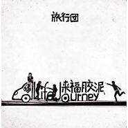

来福胶泥Life Journey
============================

|  |  |
| :--: | :-- |
| [ 来福胶泥Life Journey](https://emumo.xiami.com/album/168528) | **艺人**: [旅行团](../index.md) **语种**: 国语 **唱片公司**: 摩登天空 **发行时间**: 2008年05月08日 **专辑类别**: 录音室专辑 **专辑风格**: 城市民谣 Urban Folk **播放数**: 7271895 **收藏数**: 2890 **评论数**: 254  |

## 简介

2005年签约摩登天空的旅行团乐队(The LifeJourney)来自于广西柳州。他们生活在繁华都市，却偏爱围绕城郊的稻田间，在生活上随意自然，在音乐创作上也秉承轻松态度，酝酿出清新怡人的旋律和胶泥式的编曲。聆听旅行团的音乐，会让人有游走于世界各地美丽风光的奇妙之感，阳光、快乐、清新、松弛，是他们想要表达的。主唱孔阳略带腼腆、甘甜的声线会让人置身于阳光与水之间，惹人遐想，而几句突如其来的家乡话又会将梯田农耕的繁忙景象勾勒在听者眼前。正是这独具一格的田园气息中弥漫出的时髦感觉，把旅行团和时下诸多乐队区分开来。  
  
旅行团乐队首张专辑《来福胶泥》所收录歌曲，正如乐队名字那样，在创作上极尽浪漫。从幻想出来的“巴巴拉拉的城堡”到旅途中短暂停歇的“中央花园”，从灼热乾烈（暴烈乾燥）的“沙漠”到黎明村庄的“稻田间”，再到留下过伤心故事的“罗马假日”，都成为旅行团创作的灵感。而“全世界都在水里游”的梦幻意向更让旅行团跳出真实世界，选择了一条专属自己的旅行路线。  
  
除了后来加入的鼓手段然是个北京孩子之外，乐队其他四名成员都来自广西柳州。主唱孔阳是一个不抽烟、不喝酒、不爱说话、有着很浓重的复古情节的男生，说起话来容易紧张害羞。喜欢做恶搞设计，喜欢收集唱片和电影，喜欢享受各种美食，更是一个Kop级利物浦球迷，每个星期都会用尽万种方式极力避免错过每场赛事直播。吉他手子君是乐队中话最多的一位，但就是普通话说得不好。喜欢旅游、烹饪、踢球，崇尚创新，推崇和谐，对未来有过分追求和幻想，现实经常与自我脱节。键盘手韦伟酷爱稀奇古怪的东西，性格似石器时代人类，怀旧情结严重，爱好胡思乱想，喜爱各种美食，在从事音乐工作的同时还致力于酒的研究以及酿制，不可靠消息称其名下拥有多间家庭酿酒作坊。贝斯手“P型”小时候的愿望是死的时候能拥有一屋子的贝斯，现在已藏集有不下30把琴和铺开了房间一地板的效果器。他只喜欢34B以下胸围的女生、百事可乐、统一蜜桃多、伊利草莓奶的粉色系男生。相比之下，鼓手段然的特点没有其他成员那么明显，音乐是他唯一的爱好，并且梦想着音乐可以作为他一生的工作，按部就班地做事情是他最大的优点。  
  
专辑名称“来福胶泥”，实际上是乐队英文名字“Life journey”的音译，仅从这名字，就可以闻到旅行团音乐中的乡土气息。实际上，旅行团乐队是目前内地少有的清新乐队，音乐时髦，形象健康，毫无造作。与包装出来的乐队或组合不同，旅行团的受追捧完全是靠一场场精彩的演出赢得的，而喜欢旅行团的乐迷虽然仍属小众，但却大多素质很高，不是盲目迷恋男色的冲动者。有资深乐迷这么评价旅行团：“音乐有如温顺的魔咒，但偏偏不乏绮幻的瑰丽。主唱孔阳有惊艳的嗓音和不抵抗的眼神。头发柔软并且带有轻微的曲线，微笑轻柔而贴心，腼腆又略带拘谨。说话时经常颠倒遗漏，还会看着小抄本唱美妙的法语歌曲。虽未有太鲜明的性格，但不愤怒，不晦涩，不说教，不告诫，是会叫人舒畅的无公害类型。”  
  
旅行团乐队的“风格”很难界定——其实这应该是现在乐坛的一个特性——风格的日趋模糊。旅行团乐队从来不做任何标榜，你甚至可以说他们缺少一般摇滚乐队的风范，但这恰恰是他们的风格。Bossanova、Blues、Rock等多种音乐元素的自由运用，使旅行团的音乐充满不可预知的奇妙性，旅行团乐队用他们特有的清新和淡定歌唱着自己的世界，并周游于其中。可以感觉到旅行团对The Beatles的挚爱，无论是乐队的黄色“甲壳虫”汽车的Logo，还是专辑曲目“中央花园”中对纽约中央公园的歌唱，甚至主唱孔阳在MSN头像上把自己的照片做成列侬早期的风格。如果说《来福胶泥》这张专辑在歌曲上还留有一点遗憾，恐怕是他们对那首名为“利物浦”的歌曲的舍弃，个人认为，那是一首非常优秀的歌曲，足以成为排行榜的冠军曲目。  
  
《来福胶泥》实际上收录了13首歌曲，其中有一首隐藏曲目“Well done”。“回到babalala的城堡”是最浪漫的一次旅程，Babalala们开着Babalala车，巡游着Babalala世界，记录了一次疯狂有趣的旅行和冒险。“The Story of Sun &amp; I”曾收录在《摩登天空5》合辑，这是他们第一次在公众面前露面，也是旅行团乐队对光芒的致敬，在这样一个金色瞬间，Everything you do。“罗马假日”就像电影中所描述的一样，讲述了一次旅行中的邂逅，爱情冲晕两个幸福甜蜜的头脑，现实终究是现实，假期结束，爱情结束。“My Desert”旋律异常优美，每个人内心都会有块枯竭的沙漠，每个人都希望寻找到希望的绿洲。相对于其他歌曲，“Panda”是专辑里比较严肃的作品，旅行团希望藉此表达：存在于世间的一切，都有属于自己存在的意义，都有值得人们去尊重和保护的义务。“Take me away”传达了一个旅行团坚定的信念：I can turn my life。一个分裂的自己，历经了残酷又脆弱的时刻，想要逃脱，离开可能是最好的方式。“稻田间”是一首带有严重思乡情节的歌，他们渴望回到过去，再次行走在群山环绕的稻田间，歌词里的“夏甲啾洛老陀”谐音像“想家就搂老婆”，旅行团称这是一种行之有效的慰籍。“全世界都在水里游”讲述了一个梦境，歌曲里出现的女声，是要告诉了你，世界上真的存在着人鱼，人鱼就像是水里的导游，巡游水下世界带你离开你所存在的星球。“Dog dog dogs”讲述了青春期叛逆的袭击，回忆你经历过的遭遇困难的“狗年月”，现在的自己应该为之庆幸，接下来的时间，多做事，少说话。“中央花园”充满了对六七十年代美国的崇敬和向往，那个时候的美国，是所有年青人所向往的理想国度，歌名对应了纽约的中央公园，那里有约翰列侬的纪念地，有来自五湖四海的人们，有绿树丛荫还有有和谐的一切，尽管这样的美好在现在看来很多都可能是理想中存在的，但是，谁不希望拥有乌托邦式的回忆？Party在新的一天开始中结束，伙伴们都睡去，“Lonely day”上演了，在这个时刻，太阳是唯一的伙伴，时间流逝，一如慢慢逝去的思绪…… 

## 曲目

## 评论

|  |  |  |
| :-- | :-- | :-- |
|  [虾米用户](https://emumo.xiami.com/u/7916875) (￣Д￣)ﾉ 2020-12-15 21:59 赞(0) 踩(0) | 
回来啦
 |
|  [虾米用户](https://emumo.xiami.com/u/447604) ☮️ 2020-12-11 15:26 赞(0) 踩(0) | 
是他们，他们回来了，来福胶泥
 |
|  [虾米用户](https://emumo.xiami.com/u/428487261)  2020-08-12 20:47 赞(0) 踩(0) | 
超级棒
 |
|  [虾米用户](https://emumo.xiami.com/u/2257555) Enoc 2020-08-07 00:07 赞(2) 踩(0) | 
又可以听了？！！！！awsl！！！
 |
|  [虾米用户](https://emumo.xiami.com/u/2257555) Enoc 2020-03-24 02:04 赞(0) 踩(0) | 
最最最喜欢的一张 让我爱上旅行团的一张 让我听到哪怕有一点点相似的音色和和弦时都想反复听的一张 所以现在哪里都听不到了吗？ CD机已经找不到了 实体盘在落灰 还好还好，我的箱底还有当年下载的zip 真是感谢当年机智的我啊！
 |
| ⇒ |  [虾米用户](https://emumo.xiami.com/u/427465451) Our Monday i... 2020-05-07 23:20 赞(0) 踩(0) | 
早期的獨家版權在企鵝！ 
 |
|  [虾米用户](https://emumo.xiami.com/u/355414324) 今天北极猴来中国了吗？ 2019-08-07 22:55 赞(0) 踩(0) | 
版权又回来了？？？
 |
| ⇒ |  [虾米用户](https://emumo.xiami.com/u/3640281) 奔向自由的明天……或者后... 2019-12-03 14:59 赞(0) 踩(0) | 
并没有
 |
|  [虾米用户](https://emumo.xiami.com/u/9286704) A lo lejos..... 2019-08-03 21:48 赞(0) 踩(0) | 
哎，这个专辑陪我度过了人生的低谷
 |
|  [虾米用户](https://emumo.xiami.com/u/1886864) Where words ... 2018-07-31 10:58 赞(0) 踩(0) | 
版权
 |
|  [虾米用户](https://emumo.xiami.com/u/355414324) 今天北极猴来中国了吗？ 2018-05-31 00:14 赞(1) 踩(0) | 
为什么还没有版权
 |
|  [虾米用户](https://emumo.xiami.com/u/187128044) 360º旋转 疯狂跳跃 ... 2018-04-10 00:13 赞(0) 踩(0) | 
版权版权，虾米！！！
 |
| ⇒ |  [虾米用户](https://emumo.xiami.com/u/36101287)  2018-11-03 00:03 赞(0) 踩(0) | 
版权都在qq音乐了 伤心
 |
|  [虾米用户](https://emumo.xiami.com/u/355414324) 今天北极猴来中国了吗？ 2018-03-25 20:28 赞(0) 踩(0) | 
为什么听不了:(
 |
|  [虾米用户](https://emumo.xiami.com/u/4048199)   2018-03-12 11:20 赞(1) 踩(0) | 
认识旅行团是从这张专辑开始的，第一次无意间听到这张专的时候学生时代的美好画面一页一页的浮现出来，无法形容的清新、美好、酸甜夹杂着对时光飞逝的无奈和感伤，于是就爱上了这样一个&amp;ldquo;同班同学&amp;rdquo;一样感觉的乐队
 |
|  [虾米用户](https://emumo.xiami.com/u/40938312) lost at sea 2018-03-10 17:38 赞(0) 踩(0) | 
什么时候有版权 
 |
|  [虾米用户](https://emumo.xiami.com/u/304539) 蘑菇有毒，小心點採。 2017-10-28 00:23 赞(1) 踩(0) | 
那些评价差的朋友们，国内这样的音乐已经很少了，也许旅行团还有很多地方不足，但最起码也努力用心了，我个人认为，一张不好或者很好的专辑，它的背后都相应的有那些制作者的努力，也许你不喜欢，那么请你也不要如此的藐视它，路过就可以了，对于喜欢他/她的朋友，咱们就继续拭目以待更多更好的音乐吧。
 |
|  [虾米用户](https://emumo.xiami.com/u/48898343) 生命已经过期 2017-10-19 18:19 赞(0) 踩(0) | 
最喜欢这一张，为什么没版权呢 
 |
|  [虾米用户](https://emumo.xiami.com/u/30800139) 我在低俗与高雅间活的很尴... 2016-09-25 03:16 赞(0) 踩(0) | 
。
 |
|  [虾米用户](https://emumo.xiami.com/u/15606010) - 2016-06-25 19:23 赞(1) 踩(0) | 
总觉得旅行团之后的专辑质量都没有这张高，最爱的一张 
 |
|  [虾米用户](https://emumo.xiami.com/u/15510454) 日常生活让人挺胸抬头不盯... 2016-06-04 11:31 赞(0) 踩(0) | 
一张不错的专辑大概就是听下来每首都能听，然后还能找到几首特别喜欢的吧。都特别喜欢的话，那就神专了。
 |
|  [虾米用户](https://emumo.xiami.com/u/5087129)   2016-05-05 22:47 赞(0) 踩(0) | 
热评哈哈哈哈太可爱了hhh
 |
|  [虾米用户](https://emumo.xiami.com/u/44529817) 无梦难活 2016-04-08 20:19 赞(0) 踩(0) | 
这张专辑整体水平都好高，而且好适合夏天
 |
|  [虾米用户](https://emumo.xiami.com/u/20147189) 嘘 2016-03-22 22:09 赞(0) 踩(0) | 
热评笑死
 |
|  [虾米用户](https://emumo.xiami.com/u/32277492) 扒妹儿老蒜 2015-12-11 23:36 赞(0) 踩(0) | 
～～～
 |
|  [虾米用户](https://emumo.xiami.com/u/43165113)  2015-12-11 01:48 赞(0) 踩(0) | 
好多人都被炸出来了哈哈哈
 |
|  [虾米用户](https://emumo.xiami.com/u/4911883) 如果你也爱Eason 2015-12-10 18:32 赞(0) 踩(0) | 
下架了一首是什么情况
 |
|  [虾米用户](https://emumo.xiami.com/u/53793891) 为这个音乐的世界… 2015-12-10 16:32 赞(0) 踩(0) | 
天呐！！！！好棒啊(  ˃᷄˶˶̫˶˂᷅  )出专辑的速度让人好想哭……
 |
| ⇒ |  [虾米用户](https://emumo.xiami.com/u/6758075)  2015-12-14 12:24 赞(0) 踩(0) | 
看了一下是旧碟回购 不是新出的
 |
| ⇒ |  [虾米用户](https://emumo.xiami.com/u/53793891) 为这个音乐的世界… 2015-12-14 15:31 赞(0) 踩(0) | 
<q><b>Mian_弥安说：</b></q>
 |
|  [虾米用户](https://emumo.xiami.com/u/6281639)  2015-12-10 15:32 赞(0) 踩(0) | 
非常英伦范的专辑,但为什么今天才通知上架,听了N久了啊 PS:推存下,非常类似的欧美乐团&amp;lt;Two Door Cinema Club&amp;gt;<a href="http://www.xiami.com/artist/70524?spm=a1z1s.6843761.226669510.9.YnvcmO&amp;amp;from=search_popup_artist" target="_blank" rel="nofollow noreferrer noopener">http://www.xiami.com/artist/70524?spm=a1z1s.6843761.226669510.9.YnvcmO&amp;amp;from=search_popup_artist</a>
 |
|  [虾米用户](https://emumo.xiami.com/u/46768290) 此生一梦，此梦一生！ 2015-12-10 10:20 赞(0) 踩(0) | 
什么鬼？
 |
|  [虾米用户](https://emumo.xiami.com/u/22077109) 偏爱独立音乐  2015-12-10 10:05 赞(0) 踩(0) | 
我的高中时期买的CD，珍藏～
 |
|  [虾米用户](https://emumo.xiami.com/u/36576635) 冰岛游客热带地区唯一指定... 2015-12-10 08:24 赞(0) 踩(0) | 
蛤？(我想求10 days(((
 |
|  [虾米用户](https://emumo.xiami.com/u/5742061) 想要的都拥有，得不到的都... 2015-12-10 08:18 赞(1) 踩(0) | 
life journey  来福胶泥哈哈好赞
 |
|  [虾米用户](https://emumo.xiami.com/u/11797723) 究极反则生命体 2015-12-09 23:52 赞(0) 踩(0) | 
这专辑很早就有了
 |
|  [虾米用户](https://emumo.xiami.com/u/11797723) 究极反则生命体 2015-12-09 23:52 赞(0) 踩(0) | 
这专辑很早就有了
 |
|  [虾米用户](https://emumo.xiami.com/u/2947703) 暂无签名~ 2015-12-09 23:36 赞(0) 踩(0) | 
我还以为是新歌 
 |
|  [虾米用户](https://emumo.xiami.com/u/11970559) 音乐有生命。 2015-12-09 22:02 赞(0) 踩(0) | 
来福胶泥，啥时把第12首也胶泥上~XDDD 期待。
 |
|  [虾米用户](https://emumo.xiami.com/u/6122214) 迷因爱音乐。 2015-12-09 20:11 赞(0) 踩(0) | 
rifle teaches you
 |
|  [虾米用户](https://emumo.xiami.com/u/5739325) 看学长笑得多开心呀 2015-12-09 18:47 赞(0) 踩(0) | 
又回来了 
 |
|  [虾米用户](https://emumo.xiami.com/u/3815293) baby Jesus s... 2015-12-09 17:21 赞(5) 踩(0) | 
呀。迷之上架
 |
|  [虾米用户](https://emumo.xiami.com/u/3304289) 卖麻豆的小火柴 2015-12-09 16:29 赞(1) 踩(0) | 
今天操作这么频繁，估计是准备把&amp;lt;10 day&amp;#039;s&amp;gt;弄上架啊。 等啊等
 |
|  [虾米用户](https://emumo.xiami.com/u/1031) asca.lu 2015-12-09 15:02 赞(0) 踩(0) | 
看到通知还以为是新专辑...白高兴一场
 |
|  [虾米用户](https://emumo.xiami.com/u/57349662)  2015-11-21 16:56 赞(1) 踩(0) | 
我的大一
 |
|  [虾米用户](https://emumo.xiami.com/u/17305789)   2015-11-06 14:35 赞(1) 踩(0) | 
天呐我的初中
 |
|  [虾米用户](https://emumo.xiami.com/u/4302754) groovy 2015-11-04 18:27 赞(1) 踩(0) | 
听到旅行团出新歌了 就回来听听~ 怀念当时的自己~单纯的像张白纸~午睡半梦半醒之间被放着罗马假日的学校广播惊醒~ 着了魔一样的问同桌这个歌叫什么~ 这是一切的开始~~~~~~也是一切的结束~~~~~~~~~ 再也回不去了~~~~~~
 |
|  [虾米用户](https://emumo.xiami.com/u/5096058) 在平静中苟活 2015-11-04 13:59 赞(1) 踩(0) | 
刚才听了新歌 立马跑来听第一张砖 说真的 第一张最经典 现在越来越商业
 |
|  [虾米用户](https://emumo.xiami.com/u/48530060)  2015-10-20 07:22 赞(0) 踩(0) | 
怎么可以这么好听！好听到完全不想去上班好么！
 |
|  [虾米用户](https://emumo.xiami.com/u/9067690)  2015-10-19 16:55 赞(0) 踩(0) | 
巴巴拉拉先是在Google音樂聽到的，後來搜到蝦米，從此依賴上了，而Google音樂早已聽不到了
 |
|  [虾米用户](https://emumo.xiami.com/u/5955249)  2015-10-10 13:59 赞(0) 踩(0) | 
还行
 |
|  [虾米用户](https://emumo.xiami.com/u/294340) ( ..缓冲☮)))) 2015-09-29 02:32 赞(1) 踩(0) | 
真是很喜欢很想念这张
 |
|  [虾米用户](https://emumo.xiami.com/u/18130051) 你能成为那个你 2015-09-26 07:08 赞(0) 踩(0) | 
「新开世界」2016年旅行团乐队演唱会 开票了！ 1月1日首度登陆北展剧场！ 成军十周年，2016年，10年零一天， 带来全新专辑《10 Day’s》， 纪念十年如梦旅程！ 欢迎3000个“你”， 与旅行团共同迎接一个崭新开启的世界！ 【票务详情】 大麦网：<a href="http://item.damai.cn/89885.html" target="_blank" rel="nofollow noreferrer noopener">http://item.damai.cn/89885.html</a> 中票在线：<a href="http://www.chinaticket.com/view/23058.html" target="_blank" rel="nofollow noreferrer noopener">http://www.chinaticket.com/view/23058.html</a> 票虫网：<a href="http://www.piaochong.com/view/962.html" target="_blank" rel="nofollow noreferrer noopener">http://www.piaochong.com/view/962.html</a> 豆瓣网：<a href="http://www.douban.com/event/25424946/" target="_blank" rel="nofollow noreferrer noopener">http://www.douban.com/event/25424946/</a>
 |
|  [虾米用户](https://emumo.xiami.com/u/34271220) 我还没想好要写什么... 2015-05-24 13:56 赞(0) 踩(0) | 
儿 好听哦
 |
|  [虾米用户](https://emumo.xiami.com/u/4224650) 最低级的小市民趣味！ 2015-05-22 21:06 赞(0) 踩(0) | 
接着新砖重温了一遍，太适合粗去完的路上听ne....好舒服，，还是稀罕这个！
 |
|  [虾米用户](https://emumo.xiami.com/u/8854264) Hypocrite. 2015-05-22 16:14 赞(1) 踩(0) | 
我是听完新专辑回来重温的
 |
|  [虾米用户](https://emumo.xiami.com/u/32176686) Hugs to ashe... 2015-05-07 10:41 赞(1) 踩(0) | 
美的开心哭了
 |
|  [虾米用户](https://emumo.xiami.com/u/454356) 化作风，自由的旅行…… 2015-04-04 21:56 赞(0) 踩(0) | 
好听
 |
|  [虾米用户](https://emumo.xiami.com/u/14364706) 暂无签名~ 2015-03-31 18:07 赞(0) 踩(0) | 
自由，治愈，超级爱。
 |
|  [虾米用户](https://emumo.xiami.com/u/15076606)  2015-03-18 14:21 赞(0) 踩(0) | 
听着很舒服
 |
|  [虾米用户](https://emumo.xiami.com/u/5591661) ， 2015-03-16 02:43 赞(0) 踩(0) | 
还是感觉这张最好听。
 |
|  [虾米用户](https://emumo.xiami.com/u/1579453)   2015-01-05 13:26 赞(0) 踩(0) | 
数年前的回忆了
 |
|  [虾米用户](https://emumo.xiami.com/u/5050696) 暂无签名~ 2014-12-28 22:02 赞(0) 踩(0) | 
让我爱上他们的一张。
 |
|  [虾米用户](https://emumo.xiami.com/u/24184604)  2014-12-23 21:34 赞(0) 踩(0) | 
听起来让人感觉闲散舒适，不一样的风格，so Bossa Nova~~
 |
|  [虾米用户](https://emumo.xiami.com/u/4342101)  2014-10-31 13:38 赞(0) 踩(0) | 
漫长的感觉
 |
|  [虾米用户](https://emumo.xiami.com/u/2257555) Enoc 2014-10-22 16:18 赞(35) 踩(0) | 
那时孔阳还没变成白胖子，鼓手还是段然，P型还没离队，韦伟还是合照会脸红的害羞小哥……那是去freedom house看完live回不去学校的夏天，是坐在西风瘦马一边听来福胶泥一边踢沱江水的夏天，是我过得最最开心的夏天……
 |
| ⇒ |  [虾米用户](https://emumo.xiami.com/u/3456044) 去体验、去感受、得灵犀、... 2014-11-06 20:42 赞(0) 踩(0) | 
那是青春。
 |
| ⇒ |  [虾米用户](https://emumo.xiami.com/u/426776742) 我还没想好要写什么... 2019-07-02 02:49 赞(0) 踩(0) | 
我以为是我写的评论
 |
| ⇒ |  [虾米用户](https://emumo.xiami.com/u/3965501)  2019-08-08 03:35 赞(0) 踩(0) | 
真浪漫
 |
|  [虾米用户](https://emumo.xiami.com/u/13834102)  2014-08-17 22:26 赞(1) 踩(0) | 
听了会愉悦。
 |
|  [虾米用户](https://emumo.xiami.com/u/20147189) 嘘 2014-08-06 11:25 赞(0) 踩(0) | 
曾经让我中毒的声音。
 |
|  [虾米用户](https://emumo.xiami.com/u/3605526) 还是学不会。 2014-07-21 13:14 赞(0) 踩(0) | 
带有泥土清新气质的Bossa Nova 来自2008年的初夏
 |
|  [虾米用户](https://emumo.xiami.com/u/9286704) A lo lejos..... 2014-07-21 01:24 赞(0) 踩(0) | 
回到了高中啊
 |
|  [虾米用户](https://emumo.xiami.com/u/6946311)  2014-07-03 22:28 赞(0) 踩(0) | 
goodbye tonight~goodbye tonightninenine~
 |
|  [虾米用户](https://emumo.xiami.com/u/34920402) 暂无签名~ 2014-05-31 16:28 赞(0) 踩(0) | 
不错！好听
 |
|  [虾米用户](https://emumo.xiami.com/u/34920402) 暂无签名~ 2014-05-31 16:28 赞(0) 踩(0) | 
好特别！
 |
|  [虾米用户](https://emumo.xiami.com/u/6668551) 沉迷 2014-05-30 11:53 赞(0) 踩(0) | 
<a href="http://emumo.xiami.com/u/937330" target="_blank" rel="nofollow" name_card="937330">@sexycoldblue</a>
 |
| ⇒ |  [虾米用户](https://emumo.xiami.com/u/937330) 麻木幼稚虚伪无聊任性冲动 2014-05-30 14:16 赞(0) 踩(0) | 
这个名字确实是这么来的。
 |
|  [虾米用户](https://emumo.xiami.com/u/34920402) 暂无签名~ 2014-05-24 21:22 赞(0) 踩(0) | 
十分舒服，令人一下子有度假的感觉
 |
|  [虾米用户](https://emumo.xiami.com/u/34920402) 暂无签名~ 2014-05-24 21:06 赞(0) 踩(0) | 
舒服
 |
|  [虾米用户](https://emumo.xiami.com/u/1662786)  2014-05-06 22:33 赞(0) 踩(0) | 
满满都是08年的回忆
 |
|  [虾米用户](https://emumo.xiami.com/u/5955249)  2014-05-06 13:54 赞(0) 踩(0) | 
我有这张 没听过 都发霉了
 |
|  [虾米用户](https://emumo.xiami.com/u/3432324)  2014-04-29 11:34 赞(0) 踩(0) | 
音乐成熟度完爆逃跑计划啊~~~~~~~~~很好的小清新~
 |
|  [虾米用户](https://emumo.xiami.com/u/4412959) fresh steame... 2014-04-20 00:32 赞(0) 踩(0) | 
我想回家吃粉了。
 |
|  [虾米用户](https://emumo.xiami.com/u/5860811) 小飞选的歌，越来越耐听。 2014-04-17 19:10 赞(0) 踩(0) | 
原先还窃以为来福胶尼是类似橡皮泥的东西。。。
 |
|  [虾米用户](https://emumo.xiami.com/u/1609946) 一即一切 2014-04-15 11:00 赞(0) 踩(0) | 
心 境不二
 |
|  [虾米用户](https://emumo.xiami.com/u/5181157) 暂无签名~ 2014-03-17 17:14 赞(0) 踩(0) | 
现在最想听的一张～【我发现我已经开始春困惹T^T下午睡两个小时才能醒。。。】
 |
|  [虾米用户](https://emumo.xiami.com/u/588121) 我还没想好要写什么... 2014-03-08 11:33 赞(64) 踩(0) | 
内容已删除
 |
| ⇒ |  [虾米用户](https://emumo.xiami.com/u/2710484)  2015-06-04 18:37 赞(0) 踩(0) | 
不行，不赞不行！！！
 |
| ⇒ |  [虾米用户](https://emumo.xiami.com/u/588121) 我还没想好要写什么... 2015-06-04 19:08 赞(0) 踩(0) | 
<q><b>无脸人说：</b></q>
 |
| ⇒ |  [虾米用户](https://emumo.xiami.com/u/48825763)  2015-07-26 16:55 赞(0) 踩(0) | 
哈哈哈哈，必须得赞
 |
|  [虾米用户](https://emumo.xiami.com/u/22215275)  2014-02-24 09:58 赞(1) 踩(0) | 
他们生活在繁华都市却偏爱围绕城郊的稻田间 在生活上随意自然在音乐创作上也秉承轻松态度 酝酿出清新怡人的旋律和胶泥式的编曲 聆听旅行团的音乐会让人有游走于世界各地美丽风光的奇妙之感阳光快乐清新松弛是他们想要表达的
 |
|  [虾米用户](https://emumo.xiami.com/u/5651810) Choose your ... 2014-02-19 11:47 赞(0) 踩(0) | 
lonely day.loney day.loney day.what called lonely? no...once u get someone u will never feel alone.even thought he is far away from u or even donot know who r u.how magic it is.
 |
|  [虾米用户](https://emumo.xiami.com/u/32403961)  2014-02-06 13:19 赞(0) 踩(0) | 
舒服
 |
|  [虾米用户](https://emumo.xiami.com/u/25135065)  2014-01-15 21:04 赞(0) 踩(0) | 
回家
 |
|  [虾米用户](https://emumo.xiami.com/u/6642241) never stop 2014-01-10 23:52 赞(0) 踩(0) | 
有没人听deerhunter的，罗马假日后面那段help跟T.H.M很像啊
 |
|  [虾米用户](https://emumo.xiami.com/u/310591) 暂无签名~ 2014-01-06 21:34 赞(0) 踩(0) | 
the best
 |
|  [虾米用户](https://emumo.xiami.com/u/5739325) 看学长笑得多开心呀 2013-12-25 14:28 赞(0) 踩(0) | 
真的是内地不可多得的独立范儿，听来让人开心幸福，做这样的音乐真幸福
 |
|  [虾米用户](https://emumo.xiami.com/u/13269684) 直走不回头。 2013-12-25 09:43 赞(0) 踩(0) | 
最喜欢的一张，太真了。
 |
|  [虾米用户](https://emumo.xiami.com/u/15306839) # 2013-12-14 19:02 赞(0) 踩(0) | 
Set me free.  音符吃掉了我的脑子。
 |
|  [虾米用户](https://emumo.xiami.com/u/2982286) 调调Melody 2013-11-30 07:32 赞(0) 踩(0) | 
大爱的专辑，首首好听。算是一听钟情吧~~~
 |
|  [虾米用户](https://emumo.xiami.com/u/6804881)  2013-11-09 00:51 赞(0) 踩(0) | 
好
 |
|  [虾米用户](https://emumo.xiami.com/u/6804881)  2013-11-09 00:51 赞(0) 踩(0) | 
好！
 |
|  [虾米用户](https://emumo.xiami.com/u/9982974)   2013-09-24 16:15 赞(0) 踩(0) | 
华人的Folk-Rock。。惊艳到了好么！
 |
|  [虾米用户](https://emumo.xiami.com/u/6340830) Made in xi a... 2013-08-30 18:29 赞(0) 踩(0) | 
这张最经典
 |
|  [虾米用户](https://emumo.xiami.com/u/3614277) 在脸上眼圈比眉毛黑。 2013-08-26 14:06 赞(0) 踩(0) | 
难得。虽然法语发音不是太好，但是听着令人放松。至此，谁还纠结发音神马的～
 |
|  [虾米用户](https://emumo.xiami.com/u/3108584) をすにばば 2013-08-20 11:03 赞(0) 踩(0) | 
摇滚？？？
 |
|  [虾米用户](https://emumo.xiami.com/u/9744456) hi, how are ... 2013-08-19 13:54 赞(0) 踩(0) | 
摇滚带感
 |
|  [虾米用户](https://emumo.xiami.com/u/3766449)   2013-08-13 13:21 赞(0) 踩(0) | 
我记得我这张 最喜欢的是PANDA来的哈哈
 |
|  [虾米用户](https://emumo.xiami.com/u/2928117) 你好 2013-08-04 01:42 赞(0) 踩(0) | 
我最喜欢 罗马假日 虽然主唱的声音我不是很喜欢觉得没质感  但是也不反感
 |
|  [虾米用户](https://emumo.xiami.com/u/7937827)  2013-07-19 17:58 赞(0) 踩(0) | 
属于我自己的小旅行
 |
|  [虾米用户](https://emumo.xiami.com/u/14990597)  2013-05-23 17:58 赞(0) 踩(0) | 
感觉到了
 |
|  [虾米用户](https://emumo.xiami.com/u/7464983)   2013-05-10 23:44 赞(0) 踩(0) | 
“我在东北玩泥巴，我在厦门弹吉他~”
 |
|  [虾米用户](https://emumo.xiami.com/u/7464983)   2013-05-10 23:40 赞(0) 踩(0) | 
“我在东北玩泥巴，我在厦门弹吉他~”
 |
|  [虾米用户](https://emumo.xiami.com/u/2486624) Like a star 2013-05-03 13:27 赞(0) 踩(0) | 
午后、阳光、潮湿的梦。。。
 |
|  [虾米用户](https://emumo.xiami.com/u/14317603) 莉亚永远是公主殿下。 2013-04-30 19:06 赞(0) 踩(0) | 
爱音乐 爱旅行团
 |
|  [虾米用户](https://emumo.xiami.com/u/13810622) 有些东西陪着一起走，总归 2013-04-24 21:13 赞(0) 踩(0) | 
一直以来旅行团的风格都很让人沉溺，是一种清新的干净，真的会让人舒服，会让人开心，《来福胶泥》是从豆瓣电台上听到的panda发现的，然后一口气听完，不张扬的摇滚，正是这个年龄的年轻人所持的生活态度。
 |
|  [虾米用户](https://emumo.xiami.com/u/5274372) 我还没想好要写什么... 2013-04-21 22:53 赞(0) 踩(0) | 
Well Done....
 |
|  [虾米用户](https://emumo.xiami.com/u/588121) 我还没想好要写什么... 2013-04-14 19:54 赞(76) 踩(0) | 
内容已删除
 |
| ⇒ |  [虾米用户](https://emumo.xiami.com/u/8240839) ~~ 2013-06-08 16:47 赞(0) 踩(0) | 
这个专辑可真好听的呢，可惜可惜。
 |
|  [虾米用户](https://emumo.xiami.com/u/7519950)  2013-03-14 21:42 赞(0) 踩(0) | 
几年前耳机塞满了来福胶泥 现在听很不一样 全世界在水里游 罗马假日
 |
|  [虾米用户](https://emumo.xiami.com/u/13063431) biubiubiu 2013-02-16 14:54 赞(0) 踩(0) | 
一路走走一路听my desert，时间会很快消磨掉，一个下午不过如此...
 |
|  [虾米用户](https://emumo.xiami.com/u/8642315)  2013-01-28 06:37 赞(0) 踩(0) | 
清新愉快。
 |
|  [虾米用户](https://emumo.xiami.com/u/9067690)  2012-12-28 05:11 赞(0) 踩(0) | 
最早喜欢的是回到巴巴拉拉的城堡
 |
|  [虾米用户](https://emumo.xiami.com/u/4199897)  2012-12-14 13:45 赞(0) 踩(0) | 
轻快
 |
|  [虾米用户](https://emumo.xiami.com/u/4199897)  2012-12-14 13:44 赞(0) 踩(0) | 
轻快，适合阳光的午后。亦可带你走入这样的情境。
 |
|  [虾米用户](https://emumo.xiami.com/u/9362729) Rilkean Hear... 2012-11-23 14:45 赞(0) 踩(0) | 
游来游去~@啊Hersy
 |
|  [虾米用户](https://emumo.xiami.com/u/7862113)  2012-11-11 13:41 赞(0) 踩(0) | 
小清新必备，不解释！
 |
|  [虾米用户](https://emumo.xiami.com/u/4728208) 追风赶月别留情。 2012-11-07 19:36 赞(0) 踩(0) | 
好难得的乐团，音乐真心好。
 |
|  [虾米用户](https://emumo.xiami.com/u/3719355)  2012-10-19 18:54 赞(0) 踩(0) | 
被take me away 吸引过来的，很好听
 |
|  [虾米用户](https://emumo.xiami.com/u/2914479) 唉，没人懂得我的歌。。。 2012-10-17 20:40 赞(0) 踩(0) | 
真心带感的专辑。。。优雅。。。悠闲，，，，悠长。。。。悠扬。。。。喜欢。。。。
 |
|  [虾米用户](https://emumo.xiami.com/u/10809436)  2012-09-26 20:45 赞(0) 踩(0) | 
爱
 |
|  [虾米用户](https://emumo.xiami.com/u/3078328) 像吃了朵过敏的花 2012-09-12 20:10 赞(0) 踩(0) | 
是我的调~
 |
|  [虾米用户](https://emumo.xiami.com/u/3078328) 像吃了朵过敏的花 2012-09-12 20:08 赞(0) 踩(0) | 
不错，爱这个吉他调，而且竟是内地的
 |
|  [虾米用户](https://emumo.xiami.com/u/5476657)  2012-09-01 16:54 赞(0) 踩(0) | 
这个腔调足
 |
|  [虾米用户](https://emumo.xiami.com/u/8954594)   2012-08-30 00:55 赞(0) 踩(0) | 
就为了lonely day值得给五星
 |
|  [虾米用户](https://emumo.xiami.com/u/3758923) 我还没想好要写什么... 2012-08-29 17:51 赞(0) 踩(0) | 
美好的音乐
 |
|  [虾米用户](https://emumo.xiami.com/u/1344561) 昆昆 2012-08-14 01:48 赞(0) 踩(0) | 
.
 |
|  [虾米用户](https://emumo.xiami.com/u/1855738) 为虾米你踮起脚思念... 2012-07-26 12:08 赞(0) 踩(0) | 
life 胶泥
 |
|  [虾米用户](https://emumo.xiami.com/u/1422897)  2012-07-20 22:34 赞(0) 踩(0) | 
被编曲惊艳到
 |
|  [虾米用户](https://emumo.xiami.com/u/9374124)  2012-06-30 16:02 赞(0) 踩(0) | 
喜欢panda
 |
|  [虾米用户](https://emumo.xiami.com/u/352616)  2012-06-16 23:34 赞(0) 踩(0) | 
是因为这张专辑才认识他们,也是因为豆瓣.
 |
|  [虾米用户](https://emumo.xiami.com/u/9225131)  2012-05-19 23:01 赞(0) 踩(0) | 
偶像
 |
|  [虾米用户](https://emumo.xiami.com/u/1495255) 时间是炸弹 2012-05-16 12:44 赞(0) 踩(0) | 
!!!!!!!!!!!!!!!!!
 |
|  [虾米用户](https://emumo.xiami.com/u/8435450)  2012-05-09 21:06 赞(0) 踩(0) | 
一听前奏就爱
 |
|  [虾米用户](https://emumo.xiami.com/u/4305365) 旅行团 2012-05-08 13:59 赞(0) 踩(0) | 
最爱
 |
|  [虾米用户](https://emumo.xiami.com/u/4305365) 旅行团 2012-05-08 13:54 赞(0) 踩(0) | 
好听！！这么好听的歌大家都来听啊！！！
 |
|  [虾米用户](https://emumo.xiami.com/u/1685951) 不相见便可不想念 2012-04-10 00:03 赞(0) 踩(0) | 
很轻哦
 |
|  [虾米用户](https://emumo.xiami.com/u/6133479)  2012-04-06 14:00 赞(0) 踩(0) | 
relaxing
 |
|  [虾米用户](https://emumo.xiami.com/u/8659817)  2012-03-30 14:29 赞(0) 踩(0) | 
warmandnostalgic
 |
|  [虾米用户](https://emumo.xiami.com/u/1289660)  2012-03-13 02:03 赞(0) 踩(0) | 
because they have a special voice. china indie!! best
 |
|  [虾米用户](https://emumo.xiami.com/u/2367658) 不酷 2012-03-04 20:56 赞(0) 踩(0) | 
陪伴我四年的来福胶泥
 |
|  [虾米用户](https://emumo.xiami.com/u/2486624) Like a star 2012-02-06 22:28 赞(0) 踩(0) | 
居然收藏这么一张小清新的专辑............
 |
|  [虾米用户](https://emumo.xiami.com/u/3593057)  2012-01-13 22:48 赞(0) 踩(0) | 
很舒服的音樂~
 |
|  [虾米用户](https://emumo.xiami.com/u/4788608) 世界太小，無處可滾。 2012-01-11 23:41 赞(0) 踩(0) | 
不曉得啦弄撒花頭。
 |
|  [虾米用户](https://emumo.xiami.com/u/7367201) 独悦乐 众悦乐 2012-01-06 14:44 赞(0) 踩(0) | 
因为喜欢独立音乐
 |
|  [虾米用户](https://emumo.xiami.com/u/5487796)  2011-12-15 22:27 赞(0) 踩(0) | 
好旋律，好风景，好心情。
 |
|  [虾米用户](https://emumo.xiami.com/u/2770154)  2011-12-15 01:22 赞(0) 踩(0) | 
喜欢上了
 |
|  [虾米用户](https://emumo.xiami.com/u/3930986)  2011-12-13 13:10 赞(0) 踩(0) | 
“ 懒洋洋，有些神经质，有些孩子气，有些乌托邦。我们大多数时间都在不属于自己的环境和心情里挣扎，被太多无聊琐碎的人事束缚着，想象力被一点一点偷走。幸好还有这样充满幻想和浪漫韵味的音乐。”
 |
|  [虾米用户](https://emumo.xiami.com/u/3766449)   2011-11-27 00:13 赞(0) 踩(0) | 
当时记得很喜欢PANDA~
 |
|  [虾米用户](https://emumo.xiami.com/u/3768760)  2011-11-13 18:33 赞(0) 踩(0) | 
欢乐，心情好
 |
|  [虾米用户](https://emumo.xiami.com/u/1215466) 我要去撞所有的墙 2011-11-11 23:17 赞(0) 踩(0) | 
你知道，我最喜欢这张专辑了。
 |
|  [虾米用户](https://emumo.xiami.com/u/106630) 我还没想好要写什么... 2011-10-30 01:23 赞(0) 踩(0) | 
國內為數不多能給我帶來驚喜的一支樂團~！
 |
|  [虾米用户](https://emumo.xiami.com/u/6442637)   2011-10-26 14:12 赞(0) 踩(0) | 
清新
 |
|  [虾米用户](https://emumo.xiami.com/u/480843)  2011-10-24 23:03 赞(0) 踩(0) | 
慵懒
 |
|  [虾米用户](https://emumo.xiami.com/u/4487888)  2011-10-13 13:23 赞(0) 踩(0) | 
慢慢聆听吧·····旅行团带你进入的那种意境··· 里面好几首主打都不错·
 |
|  [虾米用户](https://emumo.xiami.com/u/5885862)  2011-09-28 21:30 赞(0) 踩(0) | 
懒洋洋的,听着很舒服~.~
 |
|  [虾米用户](https://emumo.xiami.com/u/3796396) 我还没想好要写什么... 2011-09-27 19:55 赞(0) 踩(0) | 
听了他们之后 突然觉得国内的独立音乐 应该还有救
 |
|  [虾米用户](https://emumo.xiami.com/u/1574587) 写了简介你也未必可以了解... 2011-09-27 12:00 赞(0) 踩(0) | 
这个国内的乐队让我小惊喜
 |
|  [虾米用户](https://emumo.xiami.com/u/1903977)  2011-09-23 14:55 赞(0) 踩(0) | 
简单的民谣 听起来非一般的舒服 非常适合这种慵懒的天气泡杯茶看看书的感觉
 |
|  [虾米用户](https://emumo.xiami.com/u/5788196)  2011-09-12 13:31 赞(0) 踩(0) | 
從LonelyDay開始的，帶著一點點朋克，一些些basanova。親愛的璐子，謝謝你讓我認識了旅行團：）
 |
|  [虾米用户](https://emumo.xiami.com/u/5793764)   2011-09-12 04:54 赞(0) 踩(0) | 
第一次发现内地也有这风格的乐队~很不错 可以听到阳光绚烂或是安心睡去~~
 |
|  [虾米用户](https://emumo.xiami.com/u/957710)  2011-09-09 16:43 赞(0) 踩(0) | 
很有自家特色的搖滾
 |
|  [虾米用户](https://emumo.xiami.com/u/3451863) 过往才有时光 2011-08-27 09:37 赞(0) 踩(0) | 
大爱lonely day ,求同类作品
 |
|  [虾米用户](https://emumo.xiami.com/u/5152152)  2011-08-20 18:19 赞(0) 踩(0) | 
还是最喜欢这张专辑
 |
|  [虾米用户](https://emumo.xiami.com/u/1357523)  2011-08-19 16:23 赞(0) 踩(0) | 
当年听的时候还很年轻，很稀罕那种感觉
 |
|  [虾米用户](https://emumo.xiami.com/u/5483149)  2011-08-19 12:10 赞(0) 踩(0) | 
小清新
 |
|  [虾米用户](https://emumo.xiami.com/u/1604587)  2011-08-16 12:47 赞(0) 踩(0) | 
王哲同学推荐
 |
|  [虾米用户](https://emumo.xiami.com/u/1742780)  2011-08-13 19:38 赞(0) 踩(0) | 
20：30广州喜窝旅行团现场，哦啦啦啦~~~~~~~偶要出发了
 |
|  [虾米用户](https://emumo.xiami.com/u/5393150)  2011-08-12 12:10 赞(0) 踩(0) | 
轻松洒脱，我型我素！
 |
|  [虾米用户](https://emumo.xiami.com/u/5185595)  2011-08-10 21:23 赞(0) 踩(0) | 
这张专辑适合在路上听
 |
|  [虾米用户](https://emumo.xiami.com/u/870250)  2011-08-08 19:49 赞(0) 踩(0) | 
感觉像在各种开满野花的小路上，一路向前，心情好得想要跳起来~
 |
|  [虾米用户](https://emumo.xiami.com/u/5103956)  2011-08-03 08:41 赞(0) 踩(0) | 
曲风清新
 |
|  [虾米用户](https://emumo.xiami.com/u/2868997) 等风来 2011-07-29 22:57 赞(0) 踩(0) | 
欢快的清风清风。。
 |
|  [虾米用户](https://emumo.xiami.com/u/934893)  2011-07-25 11:19 赞(0) 踩(0) | 
有一种很舒服的味道
 |
|  [虾米用户](https://emumo.xiami.com/u/4856324)  2011-07-20 09:01 赞(0) 踩(0) | 
据说很有爱
 |
|  [虾米用户](https://emumo.xiami.com/u/4905175)  2011-07-19 09:48 赞(0) 踩(0) | 
适合一个人静静的聆听，也是和一群人寂寞的狂欢
 |
|  [虾米用户](https://emumo.xiami.com/u/4888659)  2011-07-18 18:23 赞(0) 踩(0) | 
爱出色，然后知道这个乐队。不错
 |
|  [虾米用户](https://emumo.xiami.com/u/3255139)  2011-07-16 21:15 赞(0) 踩(0) | 
感觉
 |
|  [虾米用户](https://emumo.xiami.com/u/204337)  2011-07-14 22:27 赞(0) 踩(0) | 
巴拉巴巴，巴拉巴巴
 |
|  [虾米用户](https://emumo.xiami.com/u/4744731)  2011-07-14 17:40 赞(0) 踩(0) | 
充满欢乐的专辑~
 |
|  [虾米用户](https://emumo.xiami.com/u/4744731)  2011-07-14 17:40 赞(0) 踩(0) | 
赞~
 |
|  [虾米用户](https://emumo.xiami.com/u/3372307)  2011-07-13 01:45 赞(0) 踩(0) | 
好聽
 |
|  [虾米用户](https://emumo.xiami.com/u/2757180)  2011-07-12 13:45 赞(0) 踩(0) | 
给我点力量为 我们广西人地骄傲哪
 |
|  [虾米用户](https://emumo.xiami.com/u/3731114)  2011-07-09 13:24 赞(0) 踩(0) | 
life journey
 |
|  [虾米用户](https://emumo.xiami.com/u/4783939)  2011-07-09 10:41 赞(0) 踩(0) | 
来福胶泥 高中时代的回忆
 |
|  [虾米用户](https://emumo.xiami.com/u/3032175)  2011-07-06 23:37 赞(0) 踩(0) | 
不用我多说了吧---你们知道什么是来福胶泥
 |
|  [虾米用户](https://emumo.xiami.com/u/2022341) 懶似精靈。。。。 2011-07-05 20:57 赞(0) 踩(0) | 
很棒
 |
|  [虾米用户](https://emumo.xiami.com/u/3032175)  2011-07-03 23:22 赞(0) 踩(0) | 
来福胶泥
 |
|  [虾米用户](https://emumo.xiami.com/u/3064501)  2011-07-03 17:10 赞(0) 踩(0) | 
好听！！
 |
|  [虾米用户](https://emumo.xiami.com/u/1958079)  2011-07-03 12:15 赞(0) 踩(0) | 
当年听碎南瓜那个感觉突然回来了
 |
|  [虾米用户](https://emumo.xiami.com/u/3474276) 原地打轉。 2011-06-27 22:43 赞(0) 踩(0) | 
感動了。真的很治愈。
 |
|  [虾米用户](https://emumo.xiami.com/u/4413639)  2011-06-25 13:50 赞(0) 踩(0) | 
Take me away.Take me away.
 |
|  [虾米用户](https://emumo.xiami.com/u/682784) 人要去做自己渴望的事，内... 2011-06-23 15:42 赞(0) 踩(0) | 
巴巴巴拉拉。。。好喜欢啊
 |
|  [虾米用户](https://emumo.xiami.com/u/4353347)  2011-06-20 10:25 赞(0) 踩(0) | 
这里有着自由的感觉。。。
 |
|  [虾米用户](https://emumo.xiami.com/u/817384)  2011-06-06 17:13 赞(0) 踩(0) | 
胶泥式清新
 |
|  [虾米用户](https://emumo.xiami.com/u/1052763)  2011-05-31 13:14 赞(0) 踩(0) | 
轻松哦
 |
|  [虾米用户](https://emumo.xiami.com/u/3758923) 我还没想好要写什么... 2011-05-28 18:00 赞(0) 踩(0) | 
旅行团
 |
|  [虾米用户](https://emumo.xiami.com/u/1323922) “大都好物不坚牢,彩云易... 2011-05-11 14:37 赞(0) 踩(0) | 
好听~
 |
|  [虾米用户](https://emumo.xiami.com/u/2760480)  2011-04-23 16:25 赞(0) 踩(0) | 
超有FU~
 |
|  [虾米用户](https://emumo.xiami.com/u/1030568) 乐色撩人 2011-04-19 17:34 赞(0) 踩(0) | 
难得听到男声法语
 |
|  [虾米用户](https://emumo.xiami.com/u/2157098)  2011-04-19 13:38 赞(0) 踩(0) | 
喜欢那种悠闲轻松的歌曲，但是同时又能带来小情绪~
 |
|  [虾米用户](https://emumo.xiami.com/u/166012)  2011-04-16 14:50 赞(0) 踩(0) | 
好专辑..听觉旅游去了.......
 |
|  [虾米用户](https://emumo.xiami.com/u/1641166)  2011-04-08 10:13 赞(0) 踩(0) | 
不错的音乐
 |
|  [虾米用户](https://emumo.xiami.com/u/3272826)  2011-04-04 09:44 赞(0) 踩(0) | 
随意自然  清新怡人 节奏轻快
 |
|  [虾米用户](https://emumo.xiami.com/u/3432705)  2011-04-01 06:13 赞(0) 踩(0) | 
夏日和煦清风和阳光。
 |
|  [虾米用户](https://emumo.xiami.com/u/3430340)  2011-03-31 22:49 赞(0) 踩(0) | 
清新，惬意，慵懒
 |
|  [虾米用户](https://emumo.xiami.com/u/2142967)  2011-03-30 03:50 赞(0) 踩(0) | 
因为舒服，所以喜欢
 |
|  [虾米用户](https://emumo.xiami.com/u/2102779)  2011-03-22 18:11 赞(0) 踩(0) | 
一位虾米说，调子很调皮，同感哈
 |
|  [虾米用户](https://emumo.xiami.com/u/917011)  2011-03-20 14:04 赞(0) 踩(0) | 
小清新~
 |
|  [虾米用户](https://emumo.xiami.com/u/3235304)  2011-03-17 01:02 赞(0) 踩(0) | 
节奏什么的，歌词共鸣
 |
|  [虾米用户](https://emumo.xiami.com/u/2322397)  2011-03-14 16:23 赞(0) 踩(0) | 
就是喜欢
 |
|  [虾米用户](https://emumo.xiami.com/u/1597180)  2011-03-01 21:29 赞(0) 踩(0) | 
清新且自由
 |
|  [虾米用户](https://emumo.xiami.com/u/2027886)  2011-02-16 14:07 赞(0) 踩(0) | 
在水里游啊游啊
 |
|  [虾米用户](https://emumo.xiami.com/u/42136)  2011-02-13 22:39 赞(0) 踩(0) | 
最近迷上这张专辑
 |
|  [虾米用户](https://emumo.xiami.com/u/420716) 我还没想好要写什么... 2011-02-03 14:49 赞(0) 踩(0) | 
广西的...好样的
 |
|  [虾米用户](https://emumo.xiami.com/u/2623193)  2011-01-28 10:00 赞(0) 踩(0) | 
喜欢那点点小小的感觉，干净，清新～～～
 |
|  [虾米用户](https://emumo.xiami.com/u/1555539) 我还没想好要写什么... 2011-01-22 22:41 赞(0) 踩(0) | 
美好的味道
 |
|  [虾米用户](https://emumo.xiami.com/u/148636) 我一直在等 已经筋疲力尽... 2011-01-19 13:18 赞(0) 踩(0) | 
懒懒的。。
 |
|  [虾米用户](https://emumo.xiami.com/u/2127281)  2011-01-10 05:57 赞(0) 踩(0) | 
清新
 |
|  [虾米用户](https://emumo.xiami.com/u/679295)  2011-01-07 23:07 赞(0) 踩(0) | 
非常经典的一张，到处都充满着阳光的味道和闲散的心情。不同于一堆到处刻意歌颂生活美好的小清新，歌曲里面的bossanova风很自然的将人带向了愉悦。编曲很特别，bass挺复杂，曲调很讨好，更重要的是孔阳的声音太魅力，老少皆爱～
 |
|  [虾米用户](https://emumo.xiami.com/u/226621)  2011-01-03 17:27 赞(0) 踩(0) | 
必顶的啊！
 |
|  [虾米用户](https://emumo.xiami.com/u/182462)  2010-11-18 17:53 赞(0) 踩(0) | 
居住在新加坡的朋友请注意，旅行团将在来临的12月2日在滨海艺术中心音乐室演出。门票可在sistic售票处购得。
 |
|  [虾米用户](https://emumo.xiami.com/u/1146392)  2010-11-18 08:09 赞(0) 踩(0) | 
以前听觉得像Tomas wells，现在听，怎么觉得很像谭杰希。。。。很雷。。。
 |
|  [虾米用户](https://emumo.xiami.com/u/933522)  2010-11-15 08:54 赞(0) 踩(0) | 
多美啊，多美的唱腔，多性灵的旋律~你们不适合摩登~去东乐吧~~~~~~
 |
|  [虾米用户](https://emumo.xiami.com/u/1020194)   2010-08-29 15:34 赞(0) 踩(0) | 
赞。
 |
|  [虾米用户](https://emumo.xiami.com/u/294864) 少年の小飛行。 2010-08-05 18:23 赞(0) 踩(0) | 
一张质量很高的专辑~~不错。。。虽说旅行团比较小众，但是歌曲很有共鸣~~有点和gala一样的风格。但是唱功比gala好
 |
|  [虾米用户](https://emumo.xiami.com/u/1065421)  2010-06-27 17:45 赞(0) 踩(0) | 
广西人 ！！！柳州仔!!! 顶
 |
|  [虾米用户](https://emumo.xiami.com/u/410809)  2010-05-27 11:29 赞(0) 踩(0) | 
这张还是最喜欢Panda
 |
|  [虾米用户](https://emumo.xiami.com/u/703408) 如果身边有个歌曲爱好一样... 2010-03-05 10:14 赞(0) 踩(0) | 
OMG 广西的？ 老乡 支持下 我喜欢的风格
 |
|  [虾米用户](https://emumo.xiami.com/u/567612)  2009-12-11 10:27 赞(0) 踩(0) | 
比较适合开车旅行时听
 |
|  [虾米用户](https://emumo.xiami.com/u/567612)  2009-12-11 10:25 赞(0) 踩(0) | 
比较适合开车旅行时听
 |
|  [虾米用户](https://emumo.xiami.com/u/382937)  2009-09-13 15:26 赞(0) 踩(0) | 
我喜欢的风格~~
 |
|  [虾米用户](https://emumo.xiami.com/u/66949)  2009-07-26 22:02 赞(0) 踩(0) | 
2008夏天 LA 陽光下暴走的我
 |
|  [虾米用户](https://emumo.xiami.com/u/120568) 如实观照 2009-07-22 10:12 赞(0) 踩(0) | 
还是最喜欢Lonely day
 |
|  [虾米用户](https://emumo.xiami.com/u/194132)  2009-06-15 23:20 赞(0) 踩(0) | 
去旅行吧
 |
|  [虾米用户](https://emumo.xiami.com/u/6034)  2009-06-10 02:49 赞(0) 踩(0) | 
英文歌词……应该避短呢
 |
|  [虾米用户](https://emumo.xiami.com/u/171944) 心在人间 2009-05-26 17:13 赞(0) 踩(0) | 
有清新花草的感觉而又毫不单调
 |
|  [虾米用户](https://emumo.xiami.com/u/164061) 一转眼虾米就要走了，感谢... 2009-05-25 20:23 赞(0) 踩(0) | 
呵呵，前天刚有机会看到他们的现场，我最喜欢他们帅气的DJ，那彩色的袜子！那逗趣的胡子！呵呵
 |
|  [虾米用户](https://emumo.xiami.com/u/140540) 生命是花，音乐是蜜。 2009-05-10 14:55 赞(0) 踩(0) | 
音质...有点差
 |
|  [虾米用户](https://emumo.xiami.com/u/130321)  2009-05-06 15:41 赞(0) 踩(0) | 
孔阳的声音
 |
|  [虾米用户](https://emumo.xiami.com/u/3228) 虾米也变得莫名其妙 2009-04-14 09:42 赞(0) 踩(0) | 
想看演出~
 |
|  [虾米用户](https://emumo.xiami.com/u/71501)  2009-04-10 11:05 赞(0) 踩(0) | 
阳光，快乐，生活。
 |
|  [虾米用户](https://emumo.xiami.com/u/23064)  2009-01-04 11:46 赞(0) 踩(0) | 
跟着旅行团的声音去旅行，坐在原地都有飞扬奔跑漫步悠游溜达闲逛的感觉。 开着车坐着飞机响着火车踏着自行车，工具是什么，又有什么要紧，心情是什么才是王道吧。
 |
