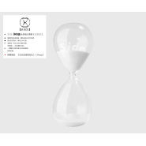

B Side
============================

|  |  |
| :--: | :-- |
| [ B Side](https://emumo.xiami.com/album/1916362721) | **艺人**: [旅行团](../index.md) **语种**: 国语 **唱片公司**: 来福胶泥工作室 **发行时间**: 2015年05月15日 **专辑类别**: 录音室专辑 **专辑风格**: 流行摇滚 Pop Rock, 独立摇滚 Indie Rock **播放数**: 6964520 **收藏数**: 2767 **评论数**: 369  |

## 简介

IIIIIIIIIIIIIIIIIIIIIIIIIIIIIIIIIIIIIIII 虾米音乐人·独家首发 IIIIIIIIIIIIIIIIIIIIIIIIIIIIIIIIIIIIIIII  
2015，旅行团 全新概念专辑《B-SIDE》  
出道十年的旅行团乐队，以一曲《生命是场马拉松》开场，为我们推开了一扇独特的音乐之门。  
  
<embed type="application/x-shockwave-flash" pluginspage="http://www.macromedia.com/go/getflashplayer" src="http://www.tudou.com/v/Jg6FKjY1YAw/&amp;resourceId=0_04_05_99/v.swf" width="700" height="500" wmode="transparent" play="true" loop="true" menu="true">  
  
关于视角  
  
B-SIDE：寓为收藏另一面的自己。  
当轻柔的曲风渐缓，转为强劲起伏的旋律，当治愈的歌词，转为生命主题，旅行团四位成员倾力制作，呈现了一张关于诠释时间的概念式音乐专辑。  
黑白：“苍天如圆盖，陆地似棋局；世人黑白分，往来争荣辱：荣者自安安，辱者定碌碌。”——出自诸葛亮。  
灰：这个世间早已不以黑白为界限，更多的人与事过渡在灰色之间。  
我们思考了这个过渡的边缘，思考了流逝于双手的时间，将心底最真实的感受落于琴弦。  
这像是一部未上映的电影的原声，  而每个人，即是电影本身。让每一首歌带你进入不同的情境，去听，去想，去释放……  
  
关于曲目  
  
1、 生命是场马拉松 ——我有一个故事 它没有名字 渴望吐露却 欲言又止  
2、 SLEEP ——空气里弥漫着尘烟 整个城市已倦  
3、 时间的手 ——抓着时间的手 停下就是尽头 一直走  
4、 悲伤珊瑚群 ——谁打捞我的尸体 谁看到我的诗集  
5、 问号 ——机器赶着黎明 包裹速冻的你  
6、 轮廓 ——火焰把一切 送入了土里  时间在土地凝出了黄金  
7、 红色的雅儒路体校 ——(出自韦伟的一首忧伤DEMO)  
8、 控 ——车我们开着车 穿越着荒漠 快得与时间脱落  
9、 驾 ——大部分勤奋的人民 筑起新一道的天地 信念垒起了金字塔游戏  
10、 生命是场马拉松 Instrumental  
11、  Sleep Intrumental  
12、 悲伤珊瑚群 Intrumental  
13、 轮廓 Intrumental

## 曲目

## 评论

|  |  |  |
| :-- | :-- | :-- |
|  [虾米用户](https://emumo.xiami.com/u/44743196) 听虾米记得收藏～ 2020-08-15 04:03 赞(1) 踩(0) | 
回来了！
 |
|  [虾米用户](https://emumo.xiami.com/u/7023231) 多盼能送君千里 2020-07-01 22:45 赞(0) 踩(0) | 
独家居然没版权&amp;copy;？？？？？
 |
|  [虾米用户](https://emumo.xiami.com/u/6385284) 我还没想好要写什么... 2019-08-20 07:24 赞(1) 踩(0) | 
这是张低调的神专啊
 |
|  [虾米用户](https://emumo.xiami.com/u/17575113) 五音不全 五穀不分 2019-06-24 18:06 赞(0) 踩(0) | 
独家？
 |
|  [虾米用户](https://emumo.xiami.com/u/246543420) 穿上风衣我推门出去 2019-04-03 01:56 赞(0) 踩(0) | 
没有版权为什么还是 独家 ？
 |
|  [虾米用户](https://emumo.xiami.com/u/1973685)  2019-03-21 14:45 赞(0) 踩(0) | 
每次内心需要安慰的时候就来听这张专辑，很像深沉的包容的温暖的海洋。
 |
|  [虾米用户](https://emumo.xiami.com/u/45699409) 暗街燈也在想你 2018-11-16 01:04 赞(0) 踩(0) | 
一天天的只见下架咋没见版权回来过呢（挠头
 |
|  [虾米用户](https://emumo.xiami.com/u/65835) 如果没人看着我，该有多快... 2018-06-24 21:40 赞(0) 踩(0) | 
为什么写着独家，还有那么多首歌不能听？！
 |
|  [虾米用户](https://emumo.xiami.com/u/45699409) 暗街燈也在想你 2018-04-02 18:28 赞(0) 踩(0) | 
轮廓好听
 |
|  [虾米用户](https://emumo.xiami.com/u/28091184) 我不是归人 我是过客 2017-10-30 10:03 赞(1) 踩(0) | 
新专辑不走小清新风了。挺棒的。可惜新专巡演没西安。好像去看。
 |
|  [虾米用户](https://emumo.xiami.com/u/48188348) 暂无签名~ 2017-10-30 09:49 赞(1) 踩(0) | 
记得开始觉得这个乐队好小清新，并不太喜欢。直到第一次看现场，便深深爱上了。那次正好发行这个专辑，也是我最喜欢的一个专辑。总感觉贴近灵魂，睡前听一遍觉得人都安静了，疲惫的身心也解脱了，然后安然睡去，迎接新的一天～
 |
|  [虾米用户](https://emumo.xiami.com/u/9538005) 具島直子歌迷 2017-10-27 23:33 赞(1) 踩(0) | 
毕竟我是旅游团的脑残粉，大家都这么说，还不是他们赠送我签名笔记本，或是包装华丽的专辑，脱粉的话都不好意思惹，我会好好粉下去哒！
 |
|  [虾米用户](https://emumo.xiami.com/u/45850605)   2017-08-22 21:52 赞(1) 踩(0) | 
&amp;ldquo;新专怎么样&amp;rdquo;&amp;ldquo;很好啊有一些转变 非常成熟的乐队了&amp;rdquo;&amp;ldquo;是 我也觉得&amp;rdquo;&amp;ldquo;呃呃呃呃不过我更喜欢bside那张&amp;rdquo;（笑）&amp;ldquo;嘻嘻&amp;rdquo;（笑）
 |
|  [虾米用户](https://emumo.xiami.com/u/182488740) best wishes ... 2017-06-30 12:20 赞(16) 踩(0) | 
独家没有版权  哈哈哈哈哈哈哈
 |
|  [虾米用户](https://emumo.xiami.com/u/23572171)   2017-06-29 16:56 赞(0) 踩(0) | 
这张什么时候能回来
 |
|  [虾米用户](https://emumo.xiami.com/u/45501065) 基围虾 2017-06-29 13:23 赞(0) 踩(0) | 
独家不能听。
 |
|  [虾米用户](https://emumo.xiami.com/u/45501065) 基围虾 2017-06-29 13:20 赞(0) 踩(0) | 
独家科学
 |
|  [虾米用户](https://emumo.xiami.com/u/2243439)  2017-03-19 15:43 赞(0) 踩(0) | 
最爱这张，怎么下架了  
 |
|  [虾米用户](https://emumo.xiami.com/u/12210383) 听得很杂 什么都听  跨... 2017-01-04 19:44 赞(0) 踩(0) | 
下架了还独家个鬼
 |
|  [虾米用户](https://emumo.xiami.com/u/842188)   2016-12-30 14:57 赞(1) 踩(0) | 
写着独家然后下架
 |
|  [虾米用户](https://emumo.xiami.com/u/54393071)   2016-09-24 12:52 赞(0) 踩(0) | 
谁能告诉我去哪听！！！
 |
| ⇒ |  [虾米用户](https://emumo.xiami.com/u/2279444) 爱在左，同情在右。 2016-09-27 12:05 赞(0) 踩(0) | 
网易云
 |
|  [虾米用户](https://emumo.xiami.com/u/16019571) 暂无签名~ 2016-09-21 20:20 赞(0) 踩(0) | 
突然想听了
 |
|  [虾米用户](https://emumo.xiami.com/u/16019571) 暂无签名~ 2016-09-21 20:20 赞(0) 踩(0) | 
说好的独家呢。。。。
 |
|  [虾米用户](https://emumo.xiami.com/u/14333598) 假装在北京 2016-09-11 09:15 赞(0) 踩(0) | 
没版权了，呵呵哒
 |
|  [虾米用户](https://emumo.xiami.com/u/9317511) 一枚悲烈的女子。 2016-09-05 18:45 赞(0) 踩(0) | 
为啥下架了
 |
|  [虾米用户](https://emumo.xiami.com/u/11639180) 因为听音乐不需要动脑 2016-05-25 02:46 赞(0) 踩(0) | 
很负责任说一句：热门那个土摇流行逼琪叔留的言是屎。
 |
|  [虾米用户](https://emumo.xiami.com/u/11774925) 。 2016-05-01 01:28 赞(1) 踩(0) | 
不可以换主唱！他会英语法语闽南语普通话作曲作词好屌的！
 |
| ⇒ |  [虾米用户](https://emumo.xiami.com/u/8212576) If I just la... 2016-05-05 22:16 赞(0) 踩(0) | 
哈哈哈 不会换的
 |
|  [虾米用户](https://emumo.xiami.com/u/18130051) 你能成为那个你 2016-04-13 00:13 赞(1) 踩(0) | 
有《大事发声》！！！ 【旅行团乐队X 魏如萱 】 最用心改编+最具挑战性的“同期录音”（Live Recording)，  就在4/13 晚八点 @腾讯视频 有《大事发声》期待您的收看！
 |
|  [虾米用户](https://emumo.xiami.com/u/3496718) idle space 2016-03-29 20:15 赞(0) 踩(0) | 
你值得拥有的一专~~~~
 |
|  [虾米用户](https://emumo.xiami.com/u/3496718) idle space 2016-03-29 20:15 赞(0) 踩(0) | 
你值得拥有的一专~~~~
 |
|  [虾米用户](https://emumo.xiami.com/u/33273023)   2016-03-26 16:19 赞(0) 踩(0) | 
好听~~~~~~
 |
|  [虾米用户](https://emumo.xiami.com/u/54619486)  2016-02-17 23:01 赞(0) 踩(0) | 
很喜欢珊瑚群
 |
|  [虾米用户](https://emumo.xiami.com/u/46300977)  2016-01-10 09:19 赞(0) 踩(0) | 
每首都喜欢 
 |
|  [虾米用户](https://emumo.xiami.com/u/51706980) ✨Carpe Diem✨ 2015-12-28 18:43 赞(0) 踩(0) | 

 |
|  [虾米用户](https://emumo.xiami.com/u/11639180) 因为听音乐不需要动脑 2015-12-24 10:38 赞(0) 踩(0) | 
新专没怎么走心吧 我又来听这张了
 |
|  [虾米用户](https://emumo.xiami.com/u/57854698)  2015-12-22 15:11 赞(0) 踩(0) | 
喔 算你牛逼奥 
 |
|  [虾米用户](https://emumo.xiami.com/u/843367)  2015-12-13 18:36 赞(5) 踩(0) | 
四星半。旅行团的旋律是陈绮贞级别的——无论怎样都不会觉得难听。
 |
|  [虾米用户](https://emumo.xiami.com/u/10345973) 我还没想好要写什么... 2015-12-09 01:27 赞(0) 踩(0) | 
港真这个乐队能换主唱吗 编曲倒都很棒 我都快不认识清澈音了
 |
|  [虾米用户](https://emumo.xiami.com/u/28769572)   2015-11-30 11:29 赞(0) 踩(0) | 
棒棒棒 。看到你们的改变跟进步~
 |
|  [虾米用户](https://emumo.xiami.com/u/588121) 我还没想好要写什么... 2015-11-10 02:31 赞(1) 踩(0) | 
悲伤珊瑚群， 写出这歌 也算你们哦了
 |
|  [虾米用户](https://emumo.xiami.com/u/42183329)  2015-11-01 20:51 赞(0) 踩(0) | 
封面很有国际清新范儿，配乐想起听过的很多国外纯音乐。
 |
|  [虾米用户](https://emumo.xiami.com/u/16294585)  2015-10-25 00:16 赞(1) 踩(0) | 
马拉松的热烈，珊瑚礁的空灵，轮廓的思辨，风格的迥异就是旅行团的风格吧？在音乐上随他们去旅行，跑过荒凉的西域，游过清亮的海底，划过流光的天际，感觉眼界和耳朵都洞开了呢！
 |
|  [虾米用户](https://emumo.xiami.com/u/7322777) ∮ 2015-10-15 17:36 赞(0) 踩(0) | 
...A...
 |
|  [虾米用户](https://emumo.xiami.com/u/8838073) 嘘 2015-10-13 11:50 赞(3) 踩(0) | 
还好旅行团一直都在，没有退步，很难得了
 |
|  [虾米用户](https://emumo.xiami.com/u/30617820) 窝列大窝列大哟 2015-10-12 13:15 赞(0) 踩(0) | 
。
 |
|  [虾米用户](https://emumo.xiami.com/u/11639180) 因为听音乐不需要动脑 2015-09-26 11:33 赞(3) 踩(0) | 
热评第三那位土摇听多了 觉得什么都是土摇 
 |
|  [虾米用户](https://emumo.xiami.com/u/18130051) 你能成为那个你 2015-09-26 07:05 赞(4) 踩(0) | 
「新开世界」2016年旅行团乐队演唱会 开票了！ 1月1日首度登陆北展剧场！ 成军十周年，2016年，10年零一天， 带来全新专辑《10 Day’s》， 纪念十年如梦旅程！ 欢迎3000个“你”， 与旅行团共同迎接一个崭新开启的世界！ 【票务详情】 大麦网：<a href="http://item.damai.cn/89885.html" target="_blank" rel="nofollow noreferrer noopener">http://item.damai.cn/89885.html</a> 中票在线：<a href="http://www.chinaticket.com/view/23058.html" target="_blank" rel="nofollow noreferrer noopener">http://www.chinaticket.com/view/23058.html</a> 票虫网：<a href="http://www.piaochong.com/view/962.html" target="_blank" rel="nofollow noreferrer noopener">http://www.piaochong.com/view/962.html</a> 豆瓣网：<a href="http://www.douban.com/event/25424946/" target="_blank" rel="nofollow noreferrer noopener">http://www.douban.com/event/25424946/</a>
 |
|  [虾米用户](https://emumo.xiami.com/u/9166353)  2015-09-23 21:15 赞(1) 踩(0) | 
阿绿推荐哒，她说听到这种完全把持不住想谈恋爱哈哈哈哈哈
 |
|  [虾米用户](https://emumo.xiami.com/u/6037043) YOLO 2015-09-02 20:04 赞(2) 踩(0) | 
轮廓，好好听啊！
 |
|  [虾米用户](https://emumo.xiami.com/u/12043672) 走路不如飞的快 2015-08-29 20:58 赞(0) 踩(0) | 
懒懒散散的好好听
 |
|  [虾米用户](https://emumo.xiami.com/u/10185970) 我最棒  : ) 2015-08-28 11:33 赞(0) 踩(0) | 
真的太嚎听辣
 |
|  [虾米用户](https://emumo.xiami.com/u/8226204) ≡ 2015-08-26 21:59 赞(0) 踩(0) | 
喜欢
 |
|  [虾米用户](https://emumo.xiami.com/u/7943989)  2015-08-13 11:59 赞(0) 踩(0) | 
赞，越来越喜欢旅行团的风格了  大爱啊
 |
|  [虾米用户](https://emumo.xiami.com/u/7943989)  2015-08-13 11:58 赞(0) 踩(0) | 
赞，越来越喜欢旅行团的风格了  大爱啊
 |
|  [虾米用户](https://emumo.xiami.com/u/4196276) 下点雨吧 2015-08-07 20:47 赞(0) 踩(0) | 
马拉松 不错
 |
|  [虾米用户](https://emumo.xiami.com/u/37678017) 无摇滚，不青春！ 2015-07-14 16:44 赞(2) 踩(0) | 
个人感觉整体的逼音乐表达比淘宝计划的《世界》要好。。。  但正也因为如此独立，旅行团注定是不会像淘宝计划那样烂大街。喜闻乐见。。。
 |
|  [虾米用户](https://emumo.xiami.com/u/901317) 我还没想好要写什么... 2015-07-13 23:17 赞(0) 踩(0) | 
好听好听好听，感谢虾米推送，让我知道这支乐队
 |
|  [虾米用户](https://emumo.xiami.com/u/7813056)   2015-07-12 18:54 赞(0) 踩(0) | 
我就是马拉松中的一员(=ﾟωﾟ)ﾉ
 |
|  [虾米用户](https://emumo.xiami.com/u/7813056)   2015-07-12 18:43 赞(0) 踩(0) | 
   
 |
|  [虾米用户](https://emumo.xiami.com/u/4310328)  2015-07-12 10:33 赞(1) 踩(0) | 
@旅行团乐队  总是在细节处给人惊喜…可惜听晚了，庆幸没错过。
 |
|  [虾米用户](https://emumo.xiami.com/u/2646376)  2015-07-04 22:35 赞(0) 踩(0) | 
青春依旧
 |
|  [虾米用户](https://emumo.xiami.com/u/7456530)  2015-07-02 18:58 赞(0) 踩(0) | 
最爱的乐队
 |
|  [虾米用户](https://emumo.xiami.com/u/5077544)   2015-06-25 23:29 赞(1) 踩(0) | 
folk rock，indie rock,旅行团就是摇滚乐队中的小清新，最重要的是主唱有一把干净的嗓音，charms me
 |
| ⇒ |  [虾米用户](https://emumo.xiami.com/u/5854347) 神遊 丷  有感° 2015-08-06 21:52 赞(0) 踩(0) | 
觉得听过现场乃就不会说小清新啦2333333
 |
|  [虾米用户](https://emumo.xiami.com/u/3905154)  2015-06-24 17:07 赞(0) 踩(0) | 
这张砖也是腻害得不行不行的！！
 |
|  [虾米用户](https://emumo.xiami.com/u/3905154)  2015-06-24 17:07 赞(0) 踩(0) | 
这张砖也是腻害得不行不行的！！
 |
|  [虾米用户](https://emumo.xiami.com/u/15510454) 日常生活让人挺胸抬头不盯... 2015-06-15 11:31 赞(3) 踩(0) | 
请坚持做好歌，难得。
 |
|  [虾米用户](https://emumo.xiami.com/u/633065) 一个儿子 2015-06-12 17:50 赞(2) 踩(0) | 
杀了主唱 专攻后朋 可能是该团的一个明智出路
 |
| ⇒ |  [虾米用户](https://emumo.xiami.com/u/46867157) 这家伙很聪明，只留下这句... 2015-07-18 02:05 赞(0) 踩(0) | 
哈哈我也很期待
 |
| ⇒ |  [虾米用户](https://emumo.xiami.com/u/161677) shit~ 2015-08-04 15:18 赞(0) 踩(0) | 
听得我屎涨。。杀了主唱做后腰吧
 |
| ⇒ |  [虾米用户](https://emumo.xiami.com/u/5854347) 神遊 丷  有感° 2015-08-06 21:53 赞(0) 踩(0) | 
不能同意更多
 |
| ⇒ |  [虾米用户](https://emumo.xiami.com/u/37126518) 在每个深夜清晨在每个午后... 2015-11-06 18:16 赞(0) 踩(0) | 
没主唱那是后摇
 |
| ⇒ |  [虾米用户](https://emumo.xiami.com/u/7989473) Ground Contr... 2020-11-17 20:58 赞(0) 踩(0) | 
<q><b>哈哈哈哈哈哈说：</b></q>
 |
|  [虾米用户](https://emumo.xiami.com/u/12233193)  2015-06-09 13:06 赞(0) 踩(0) | 
周六7livehouse见！票已购！ 
 |
| ⇒ |  [虾米用户](https://emumo.xiami.com/u/25458293) 我遇到了我的绝无仅有，在... 2015-06-13 02:44 赞(0) 踩(0) | 
+1
 |
|  [虾米用户](https://emumo.xiami.com/u/46558513) 我还没想好要写什么... 2015-06-08 23:35 赞(0) 踩(0) | 
看完广州场孔阳与我那么近的距离我最近几天无法自拔
 |
|  [虾米用户](https://emumo.xiami.com/u/43253726) 我还没想好要写什么... 2015-06-08 15:46 赞(0) 踩(0) | 
还是比较喜欢等你吃饭
 |
|  [虾米用户](https://emumo.xiami.com/u/3304289) 卖麻豆的小火柴 2015-06-07 22:19 赞(0) 踩(0) | 
看完深圳场再评论一次啊，好爱你们
 |
|  [虾米用户](https://emumo.xiami.com/u/550576) 我还没想好要写什么... 2015-06-06 20:33 赞(0) 踩(0) | 
五月
 |
|  [虾米用户](https://emumo.xiami.com/u/3818634)   2015-06-05 08:36 赞(1) 踩(0) | 
7.10果断mao走起。有木有一起的哇
 |
|  [虾米用户](https://emumo.xiami.com/u/2217926)  2015-06-05 01:32 赞(0) 踩(0) | 
6.5在上课，去不到 
 |
|  [虾米用户](https://emumo.xiami.com/u/48891295) 向下扎根 向上生长 2015-06-04 23:24 赞(0) 踩(0) | 
心水
 |
|  [虾米用户](https://emumo.xiami.com/u/31537778)   2015-06-04 17:31 赞(0) 踩(0) | 
爱爱爱爱爱爱爱爱爱爱爱爱！！！
 |
|  [虾米用户](https://emumo.xiami.com/u/2486624) Like a star 2015-06-04 16:21 赞(0) 踩(0) | 
孔阳好听的歌都是略可爱清新的流行摇滚，这张碟后摇和英伦元素都多了些，很悦耳，唯独和他的嗓音不是很合拍
 |
|  [虾米用户](https://emumo.xiami.com/u/10263780) life is good 2015-06-03 11:31 赞(0) 踩(0) | 
还是很好听的 《生命的马拉松》旋律很酷 歌词也充满了对人生的思考 但是也感觉到了一些无奈
 |
|  [虾米用户](https://emumo.xiami.com/u/1772289)  2015-06-02 22:11 赞(0) 踩(0) | 
封面不是很好看呢
 |
|  [虾米用户](https://emumo.xiami.com/u/1772289)  2015-06-02 22:10 赞(0) 踩(0) | 
有点后摇了呢
 |
|  [虾米用户](https://emumo.xiami.com/u/2625037) 伪电气白兰，嗝叽 2015-06-02 19:29 赞(0) 踩(0) | 
不粉了以后，竟然出了张很棒的砖！
 |
|  [虾米用户](https://emumo.xiami.com/u/3571349)  2015-06-02 00:03 赞(2) 踩(0) | 
悲伤珊瑚群  彻底醉了。（Instrumental) ！！！！
 |
|  [虾米用户](https://emumo.xiami.com/u/10139266)   2015-06-01 22:56 赞(0) 踩(0) | 

 |
|  [虾米用户](https://emumo.xiami.com/u/38616721) 平凡女子一枚 2015-05-31 20:39 赞(0) 踩(0) | 
当下的当下,越听越伤心.
 |
|  [虾米用户](https://emumo.xiami.com/u/36100852) 使黑色的光芒遍布我的心脏... 2015-05-31 01:28 赞(0) 踩(0) | 
。。。
 |
|  [虾米用户](https://emumo.xiami.com/u/672616)  2015-05-30 21:14 赞(0) 踩(0) | 
鼻塞
 |
|  [虾米用户](https://emumo.xiami.com/u/45714009)  2015-05-30 12:19 赞(0) 踩(0) | 
instrumental就好
 |
|  [虾米用户](https://emumo.xiami.com/u/34890556) 我还没想好要写什么... 2015-05-30 02:07 赞(0) 踩(0) | 
主唱大人我来晚啦！
 |
|  [虾米用户](https://emumo.xiami.com/u/18516297)  2015-05-29 18:26 赞(0) 踩(0) | 
我爱你们！！！
 |
|  [虾米用户](https://emumo.xiami.com/u/838399)   2015-05-27 15:14 赞(1) 踩(0) | 
我喜欢的旅行团又回来了
 |
|  [虾米用户](https://emumo.xiami.com/u/9286704) A lo lejos..... 2015-05-27 00:26 赞(1) 踩(0) | 
前面的后摇不错，但是还是觉得旅行团在纠结什么！尽情转型吧！我们一直陪伴着你 
 |
|  [虾米用户](https://emumo.xiami.com/u/161677) shit~ 2015-05-26 08:32 赞(0) 踩(0) | 
矫揉造作！
 |
|  [虾米用户](https://emumo.xiami.com/u/50149630)   2015-05-25 23:37 赞(1) 踩(0) | 
总有新歌 不失水准
 |
|  [虾米用户](https://emumo.xiami.com/u/366311)  2015-05-25 21:51 赞(0) 踩(0) | 
感伤中带着欢快。
 |
|  [虾米用户](https://emumo.xiami.com/u/36576635) 冰岛游客热带地区唯一指定... 2015-05-25 00:54 赞(1) 踩(0) | 
被新专和现场圈成粉了啦wwwww五棵松见！
 |
| ⇒ |  [虾米用户](https://emumo.xiami.com/u/10340704)   2015-05-27 23:26 赞(0) 踩(0) | 
他们会来五棵松吗?
 |
| ⇒ |  [虾米用户](https://emumo.xiami.com/u/36576635) 冰岛游客热带地区唯一指定... 2015-05-27 23:38 赞(0) 踩(0) | 
<q><b>悟空你慢点走说：</b></q>
 |
| ⇒ |  [虾米用户](https://emumo.xiami.com/u/10340704)   2015-05-27 23:41 赞(0) 踩(0) | 
<q><b>chinvan说：</b></q>
 |
|  [虾米用户](https://emumo.xiami.com/u/2279444) 爱在左，同情在右。 2015-05-24 23:56 赞(0) 踩(0) | 
刚从61回来啊，人气很高，基本上每首歌都很共鸣，让人很舒服的乐队，买了《于是我不再唱歌》和《B-Side》两张专辑签名，还和孔阳合了影，开心的一天！
 |
|  [虾米用户](https://emumo.xiami.com/u/3580032)  2015-05-24 23:53 赞(1) 踩(0) | 
最喜欢的还是来福胶泥那张专辑
 |
|  [虾米用户](https://emumo.xiami.com/u/31287589)  2015-05-24 23:45 赞(0) 踩(0) | 
好喜欢好喜欢悲伤珊瑚群
 |
| ⇒ |  [虾米用户](https://emumo.xiami.com/u/7686509)  2015-05-31 01:51 赞(0) 踩(0) | 
我也是
 |
|  [虾米用户](https://emumo.xiami.com/u/11143987)   2015-05-24 22:27 赞(0) 踩(0) | 
孔阳声音太娘 
 |
| ⇒ |  [虾米用户](https://emumo.xiami.com/u/11143987)   2015-06-11 22:36 赞(0) 踩(0) | 
你才娘
 |
|  [虾米用户](https://emumo.xiami.com/u/3439635)  2015-05-24 18:29 赞(0) 踩(0) | 
这张专辑真的用了心
 |
|  [虾米用户](https://emumo.xiami.com/u/1281395)  2015-05-24 15:59 赞(1) 踩(0) | 
囧，刚买完了才发现是8元一首……anyway还是要支持一下的~
 |
|  [虾米用户](https://emumo.xiami.com/u/34638187) 野鹤无粮天地宽 2015-05-24 14:18 赞(0) 踩(0) | 
很喜欢的一个乐队！
 |
|  [虾米用户](https://emumo.xiami.com/u/43558685) 别找我聊天。我会吃人 2015-05-24 10:49 赞(0) 踩(0) | 
非常好听的i一张专辑，对我的胃口
 |
|  [虾米用户](https://emumo.xiami.com/u/49125172) Nothing last... 2015-05-24 10:34 赞(0) 踩(0) | 
超赞！！
 |
|  [虾米用户](https://emumo.xiami.com/u/5680342) 我还没想好要写什么... 2015-05-24 10:34 赞(1) 踩(0) | 
出乎意料的好听。私以为这张达到了中国大陆独立流行摇滚的最高水准。
 |
|  [虾米用户](https://emumo.xiami.com/u/5680342) 我还没想好要写什么... 2015-05-24 10:29 赞(1) 踩(0) | 
私以为 旅行团这张专辑到达了中国大陆独立流行摇滚最高水准。
 |
|  [虾米用户](https://emumo.xiami.com/u/2928117) 你好 2015-05-24 10:28 赞(1) 踩(0) | 
很多人把给予读成“geiyu &amp;quot;,还好孔阳唱成”jiyu&amp;quot;
 |
|  [虾米用户](https://emumo.xiami.com/u/721333)   2015-05-24 09:49 赞(0) 踩(0) | 

 |
|  [虾米用户](https://emumo.xiami.com/u/19210836) Musicstorm 2015-05-24 09:20 赞(0) 踩(0) | 
#虾米音乐台#好稀饭旅行团和这张新辑子[爱你][爱你][爱你]@旅行团乐队
 |
|  [虾米用户](https://emumo.xiami.com/u/19210836) Musicstorm 2015-05-24 09:14 赞(0) 踩(0) | 
#虾米音乐台#好稀饭旅行团和这张新辑子[爱你][爱你][爱你]@旅行团乐队
 |
|  [虾米用户](https://emumo.xiami.com/u/39619356) 宇宙 始终 未来 自由 2015-05-23 23:52 赞(0) 踩(0) | 
旅行团好棒♥ 
 |
|  [虾米用户](https://emumo.xiami.com/u/3976158)  2015-05-23 23:01 赞(0) 踩(0) | 
有被打动。
 |
|  [虾米用户](https://emumo.xiami.com/u/842672) yoyodai 2015-05-23 21:33 赞(0) 踩(0) | 
很不错啊啊啊
 |
|  [虾米用户](https://emumo.xiami.com/u/49492050) 中国电子音乐独立厂牌 2015-05-23 20:42 赞(0) 踩(0) | 
~
 |
|  [虾米用户](https://emumo.xiami.com/u/691233) 过去的已灭 未来的未生 ... 2015-05-23 19:06 赞(0) 踩(0) | 
做后摇啊 
 |
|  [虾米用户](https://emumo.xiami.com/u/45329934) 音域 2015-05-23 18:52 赞(0) 踩(0) | 
awesome
 |
|  [虾米用户](https://emumo.xiami.com/u/12698508)  2015-05-23 18:17 赞(0) 踩(0) | 
真的棒，他妈的就是不支持下载我凑
 |
|  [虾米用户](https://emumo.xiami.com/u/50275640) T-ara 张国荣 2015-05-23 15:38 赞(0) 踩(0) | 
旅行歌曲
 |
|  [虾米用户](https://emumo.xiami.com/u/4341569)  2015-05-23 15:34 赞(0) 踩(0) | 
已经循环了整张专辑n遍
 |
|  [虾米用户](https://emumo.xiami.com/u/5854347) 神遊 丷  有感° 2015-05-23 13:45 赞(0) 踩(0) | 
谁打捞我尸体
 |
|  [虾米用户](https://emumo.xiami.com/u/5854347) 神遊 丷  有感° 2015-05-23 13:19 赞(0) 踩(0) | 
awesome
 |
|  [虾米用户](https://emumo.xiami.com/u/47711130) 让她降落。 2015-05-23 12:30 赞(0) 踩(0) | 
去看郑州
 |
| ⇒ |  [虾米用户](https://emumo.xiami.com/u/39959864)  2015-05-25 15:54 赞(0) 踩(0) | 
一起啊
 |
| ⇒ |  [虾米用户](https://emumo.xiami.com/u/47711130) 让她降落。 2015-05-26 13:33 赞(0) 踩(0) | 
<q><b>joyjoy乔依说：</b></q>
 |
|  [虾米用户](https://emumo.xiami.com/u/1232652)  2015-05-23 10:21 赞(1) 踩(0) | 
很好的编曲 流行又不失小众特色 喜欢
 |
|  [虾米用户](https://emumo.xiami.com/u/1296741) 我还没想好要写什么... 2015-05-23 01:03 赞(0) 踩(0) | 
这张专辑做的真的很棒！和之前的一样，可以听出非常用心！
 |
|  [虾米用户](https://emumo.xiami.com/u/5809181)  2015-05-23 00:58 赞(0) 踩(0) | 
太有才华了
 |
|  [虾米用户](https://emumo.xiami.com/u/337703)  2015-05-23 00:53 赞(0) 踩(0) | 
巡演吧来！
 |
|  [虾米用户](https://emumo.xiami.com/u/337703)  2015-05-23 00:52 赞(0) 踩(0) | 
发新传了，好开心噢！
 |
|  [虾米用户](https://emumo.xiami.com/u/5925350)  2015-05-23 00:00 赞(1) 踩(0) | 
编曲制作很不错了，词再推敲可很上乘，加油，还很年轻，不用追他人的脚步，喜欢的就是这样的你
 |
|  [虾米用户](https://emumo.xiami.com/u/1960733)  2015-05-22 22:13 赞(1) 踩(0) | 
还行哦，好久不见，你还在听吗
 |
|  [虾米用户](https://emumo.xiami.com/u/2003179) 我不难过，我没有说谎。 2015-05-22 22:07 赞(0) 踩(0) | 
你们的专辑终于出了，而我还没来得及去旅行。
 |
|  [虾米用户](https://emumo.xiami.com/u/43587949) 音乐是美好的药 2015-05-22 16:48 赞(0) 踩(0) | 
几年前听marry 感觉要肝肠寸断 呵呵  好干净
 |
|  [虾米用户](https://emumo.xiami.com/u/8854264) Hypocrite. 2015-05-22 16:11 赞(0) 踩(0) | 
妈呀听完丘比再来听旅行团 嗓音上一点没有违和感。。从初中开始听旅行团 真心觉得 无论从编曲上还是传达的理念上都一直在深化在变得成熟 认真做音乐的乐队 虽然我还是最喜欢来福胶泥时期的单纯快乐
 |
|  [虾米用户](https://emumo.xiami.com/u/15492520)   2015-05-22 15:21 赞(0) 踩(0) | 
好不一样的旅行团
 |
|  [虾米用户](https://emumo.xiami.com/u/13784855)  2015-05-22 15:08 赞(0) 踩(0) | 
要什么理由
 |
|  [虾米用户](https://emumo.xiami.com/u/6410567)   2015-05-22 14:53 赞(0) 踩(0) | 
真喜欢嘤嘤嘤
 |
|  [虾米用户](https://emumo.xiami.com/u/49495181)   2015-05-22 13:46 赞(0) 踩(0) | 
永远喜欢的乐队
 |
|  [虾米用户](https://emumo.xiami.com/u/3304289) 卖麻豆的小火柴 2015-05-22 12:31 赞(3) 踩(0) | 
热评说的外表大于内在，孝死我噜，你瞎吗
 |
|  [虾米用户](https://emumo.xiami.com/u/1662786)  2015-05-22 12:09 赞(0) 踩(0) | 

 |
|  [虾米用户](https://emumo.xiami.com/u/4364468)  2015-05-22 09:37 赞(0) 踩(0) | 
大爱旅行团！
 |
|  [虾米用户](https://emumo.xiami.com/u/4364468)  2015-05-22 09:37 赞(0) 踩(0) | 
静等7月来上海~~
 |
|  [虾米用户](https://emumo.xiami.com/u/4350683)  2015-05-22 09:00 赞(0) 踩(0) | 
还不错，最感触的还是“控”里面的粤语，哎，想家，想念那种语言……
 |
|  [虾米用户](https://emumo.xiami.com/u/13489942)  2015-05-21 23:42 赞(0) 踩(0) | 
  
 |
|  [虾米用户](https://emumo.xiami.com/u/10811234) Love Mucic 2015-05-21 23:26 赞(0) 踩(0) | 
还不错
 |
|  [虾米用户](https://emumo.xiami.com/u/13910752)  2015-05-21 22:58 赞(2) 踩(0) | 
所有的instrumental都很棒！
 |
|  [虾米用户](https://emumo.xiami.com/u/15451544) 暂无签名~ 2015-05-21 22:51 赞(0) 踩(0) | 
难得好专辑好歌
 |
|  [虾米用户](https://emumo.xiami.com/u/1415925) 有音樂生活總是那麼多驚喜 2015-05-21 22:51 赞(0) 踩(0) | 
关注他们有些年头了，越来越棒了！
 |
|  [虾米用户](https://emumo.xiami.com/u/47863107) 你是从诗三百篇中褰裳涉水... 2015-05-21 22:46 赞(0) 踩(0) | 
孔阳的声音简直让人着迷！
 |
|  [虾米用户](https://emumo.xiami.com/u/41243729)  2015-05-21 22:40 赞(0) 踩(0) | 
概念专辑啊，好喜欢，我觉得是值得入正版的抓专辑
 |
|  [虾米用户](https://emumo.xiami.com/u/41243729)  2015-05-21 22:37 赞(0) 踩(0) | 
好喜欢的音乐
 |
|  [虾米用户](https://emumo.xiami.com/u/25872522) 我还没想好要写什么... 2015-05-21 20:39 赞(0) 踩(0) | 
好爱这张专     
 |
|  [虾米用户](https://emumo.xiami.com/u/45714009)  2015-05-21 19:39 赞(0) 踩(0) | 
％
 |
|  [虾米用户](https://emumo.xiami.com/u/1963119) 全然的倾听。 2015-05-21 18:39 赞(0) 踩(0) | 
啊～！！！！ 竟然才来听
 |
|  [虾米用户](https://emumo.xiami.com/u/10811322) 我还没想好要写什么... 2015-05-21 18:27 赞(0) 踩(0) | 
休息的夜晚，听一听旅行团乐队的新专辑吧
 |
|  [虾米用户](https://emumo.xiami.com/u/5809446) 带上自己的太阳走 2015-05-21 17:08 赞(0) 踩(0) | 
2015515这个日期好特别，我第一次听他们的歌，感觉不错
 |
| ⇒ |  [虾米用户](https://emumo.xiami.com/u/11522847)  2015-05-21 22:28 赞(0) 踩(0) | 
还是周五
 |
|  [虾米用户](https://emumo.xiami.com/u/48964021)  2015-05-21 15:18 赞(0) 踩(0) | 
good
 |
|  [虾米用户](https://emumo.xiami.com/u/27530688)  2015-05-21 14:44 赞(1) 踩(0) | 
一如既往
 |
|  [虾米用户](https://emumo.xiami.com/u/3469115) 听听听 2015-05-21 14:27 赞(0) 踩(0) | 
居然觉得这么好听
 |
|  [虾米用户](https://emumo.xiami.com/u/48467933)  2015-05-21 13:26 赞(2) 踩(0) | 
虽然我不是你的主打歌，但我是B面第一首啊。@旅行团乐队《B Side》 每一首都是主打歌 好听到要哭了
 |
|  [虾米用户](https://emumo.xiami.com/u/48467933)  2015-05-21 13:24 赞(0) 踩(0) | 
虽然我不是你的主打歌，但我是B面第一首啊。 @旅行团乐队《B Side》每一首都是主打歌 好听到要哭了
 |
|  [虾米用户](https://emumo.xiami.com/u/48467933)  2015-05-21 13:16 赞(0) 踩(0) | 
虽然我不是你的主打歌，但我是B面第一首啊。@旅行团乐队 《Bside》每一首都是主打歌  you tell me why #寂寞珊瑚群#怎么唱得那么好听
 |
|  [虾米用户](https://emumo.xiami.com/u/614026)  2015-05-21 13:15 赞(0) 踩(0) | 
好听
 |
|  [虾米用户](https://emumo.xiami.com/u/17201159)  2015-05-21 11:47 赞(0) 踩(0) | 
平静
 |
|  [虾米用户](https://emumo.xiami.com/u/9847918) 能不自觉想起的就是好音乐 2015-05-21 11:44 赞(0) 踩(0) | 
封面真的很重要！！！！
 |
|  [虾米用户](https://emumo.xiami.com/u/724515)  2015-05-21 11:26 赞(0) 踩(0) | 
听了一首歌，绝的有点英国乐队的味道
 |
|  [虾米用户](https://emumo.xiami.com/u/292156) 如果我听歌可眼红 何以待... 2015-05-21 10:48 赞(0) 踩(0) | 
問題不複雜，是人複雜，好嗎。
 |
|  [虾米用户](https://emumo.xiami.com/u/3400612)  2015-05-21 10:44 赞(0) 踩(0) | 
好听，唱功比来福胶泥时进步了不少
 |
|  [虾米用户](https://emumo.xiami.com/u/1489142) 我还没想好要写什么... 2015-05-21 10:11 赞(0) 踩(0) | 
听完A面听B面哈哈哈哈
 |
|  [虾米用户](https://emumo.xiami.com/u/14283437) Hope you nev... 2015-05-21 09:59 赞(0) 踩(0) | 
六月深圳 要去 //
 |
| ⇒ |  [虾米用户](https://emumo.xiami.com/u/16071194) 岁月浓淡总相宜   人生... 2015-05-22 22:21 赞(0) 踩(0) | 
嗯一定去
 |
|  [虾米用户](https://emumo.xiami.com/u/4233247)  2015-05-21 09:51 赞(0) 踩(0) | 
轮廓的伴奏可以当后摇听！
 |
|  [虾米用户](https://emumo.xiami.com/u/30131499) 我可以只是风景，被路过被... 2015-05-21 09:12 赞(0) 踩(0) | 
课上听了悲伤珊瑚群有种想哭的冲动
 |
|  [虾米用户](https://emumo.xiami.com/u/35461885)  2015-05-21 09:01 赞(0) 踩(0) | 
完蛋我一步一步变成旅行团脑残粉(￣^￣)ゞ @旅行团孔阳
 |
|  [虾米用户](https://emumo.xiami.com/u/1105105) 精选集其实就是一段日子的... 2015-05-21 08:29 赞(0) 踩(0) | 
新专辑最喜欢控 其次是轮廓
 |
|  [虾米用户](https://emumo.xiami.com/u/35025993) 暂无签名~ 2015-05-21 08:08 赞(0) 踩(0) | 
终于等到啦
 |
|  [虾米用户](https://emumo.xiami.com/u/1366353)  2015-05-21 05:58 赞(0) 踩(0) | 
哦耶首页！你们太棒了！
 |
|  [虾米用户](https://emumo.xiami.com/u/518654)  2015-05-21 04:38 赞(0) 踩(0) | 
舒服的歌 喜欢
 |
|  [虾米用户](https://emumo.xiami.com/u/12996076) 我还没想好要写什么... 2015-05-21 02:32 赞(0) 踩(0) | 
终于听全了。。
 |
|  [虾米用户](https://emumo.xiami.com/u/812392) 【封面控】毛驴牌❤小众好... 2015-05-21 00:50 赞(0) 踩(0) | 
#午夜乐行#哇塞 大晚上看到旅行团发新专了(o^^o)♪
 |
|  [虾米用户](https://emumo.xiami.com/u/6213248)  2015-05-21 00:45 赞(0) 踩(0) | 
哇塞    深夜看见喜欢的旅行团的新专  买买买~
 |
|  [虾米用户](https://emumo.xiami.com/u/9319426) Love Beibei 2015-05-21 00:14 赞(0) 踩(0) | 
Excellent performance. I do really like song sleep.  Feeling very tired everyday, but could not get to sleep easily. Supportin twice.
 |
|  [虾米用户](https://emumo.xiami.com/u/999506)  2015-05-20 23:36 赞(0) 踩(0) | 
红色的雅儒路体校！！！
 |
|  [虾米用户](https://emumo.xiami.com/u/4706598) 我还没想好要写什么... 2015-05-20 23:09 赞(0) 踩(0) | 
听完睡觉
 |
|  [虾米用户](https://emumo.xiami.com/u/1636126) 我还没想好要写什么... 2015-05-20 22:40 赞(0) 踩(0) | 
问好 ❓ 太棒了
 |
|  [虾米用户](https://emumo.xiami.com/u/8290066) ″___喵呜。 2015-05-20 21:34 赞(0) 踩(0) | 
旅行团全新专辑✌️
 |
|  [虾米用户](https://emumo.xiami.com/u/49086299) 语虚，何以言知 2015-05-20 21:15 赞(0) 踩(0) | 
专辑已经在来得路上了，今天晚上先听为快吧!用一首歌的名字来形容对旅行团的爱 -----killing me softly with his song(s)
 |
|  [虾米用户](https://emumo.xiami.com/u/517042) 迷宮livehouse 2015-05-20 20:25 赞(0) 踩(0) | 
生命之旅
 |
|  [虾米用户](https://emumo.xiami.com/u/42774580) 城市很小装满了我的难过。... 2015-05-20 20:22 赞(0) 踩(0) | 
我有一个故事，他没有名字。
 |
|  [虾米用户](https://emumo.xiami.com/u/13522002)  2015-05-20 20:22 赞(0) 踩(0) | 
下个月广州见
 |
|  [虾米用户](https://emumo.xiami.com/u/2928117) 你好 2015-05-20 20:08 赞(4) 踩(0) | 
孔阳的声音少了点质感，绵绵的，年纪虽然比我小几个月，但还是大男孩般的声音。 我觉得旅行团的音乐谈不上创新，但自成一派，旋律、歌词、编曲都在一定水准之上。 音乐能打动我的心，这就是好音乐了。 胃不好后就再也没吃过螺蛳粉。 我有一天一定会去看旅行团，这一定是美妙的音乐之旅。 为什么喜欢旅行团，因为他们的纯真，我特别想接近这份纯真。
 |
|  [虾米用户](https://emumo.xiami.com/u/881774)  2015-05-20 19:31 赞(0) 踩(0) | 
来厦门吧
 |
|  [虾米用户](https://emumo.xiami.com/u/881774)  2015-05-20 19:31 赞(0) 踩(0) | 
Xx
 |
|  [虾米用户](https://emumo.xiami.com/u/8082941)   2015-05-20 19:18 赞(0) 踩(0) | 

 |
|  [虾米用户](https://emumo.xiami.com/u/1730251)  2015-05-20 18:56 赞(0) 踩(0) | 
等了好久终于等到今天
 |
|  [虾米用户](https://emumo.xiami.com/u/36069782) 我非君子，戏言而已。 2015-05-20 18:54 赞(0) 踩(0) | 
要听呀
 |
|  [虾米用户](https://emumo.xiami.com/u/4715136)  2015-05-20 18:54 赞(0) 踩(0) | 
终于有手机客户端的试听版本了！果断用流量下了首《时间的手》，太喜欢这首歌。手机铃声也是这首
 |
|  [虾米用户](https://emumo.xiami.com/u/41774270)  2015-05-20 18:52 赞(0) 踩(0) | 
这张专辑真的很棒~祝巡演成功~~
 |
|  [虾米用户](https://emumo.xiami.com/u/4309062) 啦啦啦 2015-05-20 18:50 赞(2) 踩(0) | 
棒棒哒，巡演又来成都吧
 |
|  [虾米用户](https://emumo.xiami.com/u/38456387)  2015-05-20 18:15 赞(0) 踩(0) | 
越来越喜欢他们了，静静聆听就可以，思绪飞扬。。
 |
|  [虾米用户](https://emumo.xiami.com/u/49630856)  2015-05-20 17:40 赞(0) 踩(0) | 
无切歌的全部听完，而且循环着听
 |
|  [虾米用户](https://emumo.xiami.com/u/341091) 偶爱我们呢~ 2015-05-20 17:36 赞(0) 踩(0) | 
看了一下居然只有2首没收藏，质量很高的一张专辑，纯粹干净
 |
|  [虾米用户](https://emumo.xiami.com/u/1675137) 爱谁谁 2015-05-20 17:32 赞(0) 踩(0) | 
我喜欢的调调~
 |
|  [虾米用户](https://emumo.xiami.com/u/1675137) 爱谁谁 2015-05-20 17:30 赞(0) 踩(0) | 
大爱这张专辑，好听好听O(∩_∩)O！！
 |
|  [虾米用户](https://emumo.xiami.com/u/25958974) 今天今天星闪闪 2015-05-20 16:48 赞(0) 踩(0) | 
#旅行团 全新概念专辑《B SIDE》#
 |
|  [虾米用户](https://emumo.xiami.com/u/127842) Gigi 2015-05-20 16:04 赞(0) 踩(0) | 
特别喜欢 轮廓
 |
|  [虾米用户](https://emumo.xiami.com/u/26325540) 我还没想好要写什么... 2015-05-20 16:03 赞(1) 踩(0) | 
✨✨✨
 |
|  [虾米用户](https://emumo.xiami.com/u/3592527)  2015-05-20 15:54 赞(0) 踩(0) | 
他们唱的是生活，美好的，现实的，希望的，浪漫的。
 |
|  [虾米用户](https://emumo.xiami.com/u/2279444) 爱在左，同情在右。 2015-05-20 15:13 赞(3) 踩(0) | 
发现个有趣的事，Instrumental单独拿出来听竟然听出了后摇的味道，再回去听整歌，又是不一样的感觉，就是流行摇滚，或是独立流行。p.s.星期天来61，可是又有英超最后一轮，好纠结，晚上还有饭局，有点乱，让我捋一捋
 |
|  [虾米用户](https://emumo.xiami.com/u/49492050) 中国电子音乐独立厂牌 2015-05-20 15:01 赞(0) 踩(0) | 

 |
|  [虾米用户](https://emumo.xiami.com/u/4478476)  2015-05-20 14:08 赞(0) 踩(0) | 
就第一首好听
 |
|  [虾米用户](https://emumo.xiami.com/u/7779876) 我还没想好要写什么... 2015-05-20 14:02 赞(2) 踩(0) | 
极力推荐这张！真的很赞
 |
|  [虾米用户](https://emumo.xiami.com/u/7839878) 刮风这天 我试着握着你手 2015-05-20 13:31 赞(0) 踩(0) | 
好听好听好听！！！！！喜欢啊！！！！！
 |
|  [虾米用户](https://emumo.xiami.com/u/7757466) 只想好好当个垃圾✓ 2015-05-20 13:19 赞(0) 踩(0) | 
.
 |
|  [虾米用户](https://emumo.xiami.com/u/12304994)   2015-05-20 13:16 赞(0) 踩(0) | 
15号第一次听现场 生日这天新专辑就出来了！夏天有你们真好❤️
 |
|  [虾米用户](https://emumo.xiami.com/u/1261377) 泛滥私情，陷于自伤 2015-05-20 12:53 赞(0) 踩(0) | 
评分竟然没上9，简直了...
 |
|  [虾米用户](https://emumo.xiami.com/u/341810) 闷声听歌 2015-05-20 12:30 赞(0) 踩(0) | 
我们大柳州除了螺蛳粉还有旅行团！我们大柳州除了螺蛳粉还有旅行团！我们大柳州除了螺蛳粉还有旅行团！重要的事情说三遍！
 |
| ⇒ |  [虾米用户](https://emumo.xiami.com/u/9953751) 我还没想好要写什么... 2015-05-20 12:33 赞(0) 踩(0) | 
是螺蛳sī粉
 |
|  [虾米用户](https://emumo.xiami.com/u/10135948) ⭐️ 2015-05-20 12:10 赞(0) 踩(0) | 
真的很棒不是吗
 |
|  [虾米用户](https://emumo.xiami.com/u/10135948) ⭐️ 2015-05-20 11:58 赞(0) 踩(0) | 
嘤
 |
|  [虾米用户](https://emumo.xiami.com/u/11974485) 温柔是因为喜欢～ 2015-05-20 11:51 赞(0) 踩(0) | 
没爱错
 |
|  [虾米用户](https://emumo.xiami.com/u/1674456)  2015-05-20 11:08 赞(0) 踩(0) | 
仅虾币 差评
 |
|  [虾米用户](https://emumo.xiami.com/u/8943891) 你咋那么可爱？ 2015-05-20 11:07 赞(0) 踩(0) | 
先马再听
 |
|  [虾米用户](https://emumo.xiami.com/u/429161)   2015-05-20 11:05 赞(0) 踩(0) | 
依然棒(*^__^*)
 |
|  [虾米用户](https://emumo.xiami.com/u/25958974) 今天今天星闪闪 2015-05-20 11:01 赞(0) 踩(0) | 
听完整张专辑会变得放松与释然
 |
|  [虾米用户](https://emumo.xiami.com/u/25958974) 今天今天星闪闪 2015-05-20 11:00 赞(0) 踩(0) | 
听完整张专辑整个人会变的放松与释然。
 |
|  [虾米用户](https://emumo.xiami.com/u/4793008)  2015-05-20 11:00 赞(2) 踩(0) | 
孔阳声音太舒服太迷人，nice。
 |
|  [虾米用户](https://emumo.xiami.com/u/14661433)   2015-05-20 10:44 赞(0) 踩(0) | 
喜！欢！啊！
 |
|  [虾米用户](https://emumo.xiami.com/u/48906071)   2015-05-19 10:55 赞(0) 踩(0) | 
周末要去看旅行团演出啦
 |
|  [虾米用户](https://emumo.xiami.com/u/6409521)  2015-05-14 09:51 赞(0) 踩(0) | 
马拉松？是夸父追日叭
 |
|  [虾米用户](https://emumo.xiami.com/u/6409521)  2015-05-14 09:51 赞(0) 踩(0) | 
马拉松？是夸父追日叭
 |
|  [虾米用户](https://emumo.xiami.com/u/30924062)   2015-05-11 14:57 赞(0) 踩(0) | 
好听好听！
 |
|  [虾米用户](https://emumo.xiami.com/u/7234637) 签到~ 2015-05-09 09:32 赞(0) 踩(0) | 
为封面点赞！！
 |
|  [虾米用户](https://emumo.xiami.com/u/32532978) 后来故事怎么了 2015-05-06 01:03 赞(0) 踩(0) | 
词赞爆，编曲也很赞。孔阳的声音太令人着迷了！
 |
|  [虾米用户](https://emumo.xiami.com/u/13991377)  2015-04-29 15:39 赞(0) 踩(0) | 
”想要个起点，浓浓的黑夜，闷头穿过世界“
 |
|  [虾米用户](https://emumo.xiami.com/u/46268042) 我还没想好要写什么... 2015-04-23 12:25 赞(0) 踩(0) | 
好听
 |
|  [虾米用户](https://emumo.xiami.com/u/14364706) 暂无签名~ 2015-03-31 18:02 赞(0) 踩(0) | 
在路上，生命就像马拉松
 |
|  [虾米用户](https://emumo.xiami.com/u/141778) 人无癖不可与交 2015-03-27 08:57 赞(0) 踩(0) | 
今年上海草莓还来不～
 |
|  [虾米用户](https://emumo.xiami.com/u/27190)  2015-03-19 14:32 赞(1) 踩(0) | 
每次听这首歌，都澎湃难忍，掩面而泣，内心如揉碎了般重建的感觉，马拉松彻底进入了我的生活
 |
|  [虾米用户](https://emumo.xiami.com/u/13816404) 可爱的人难道不是我吗 2015-03-14 15:10 赞(0) 踩(0) | 
草莓节能不能看到你们！？
 |
|  [虾米用户](https://emumo.xiami.com/u/35311963) 恩？ 2015-03-07 20:06 赞(0) 踩(0) | 
痛苦伺机而来无以排遣 2015.03.07
 |
|  [虾米用户](https://emumo.xiami.com/u/1679301)  2015-01-22 00:39 赞(0) 踩(0) | 
主播唱首星球之光
 |
|  [虾米用户](https://emumo.xiami.com/u/12103011) 我还没想好要写什么... 2015-01-16 23:12 赞(0) 踩(0) | 
好听～
 |
|  [虾米用户](https://emumo.xiami.com/u/255165)  2015-01-14 22:18 赞(0) 踩(0) | 
歌词很打动人，主唱的声音很好听~
 |
|  [虾米用户](https://emumo.xiami.com/u/12996076) 我还没想好要写什么... 2015-01-04 00:16 赞(0) 踩(0) | 
快来广州或者回柳州开唱～～
 |
|  [虾米用户](https://emumo.xiami.com/u/15261507)   2014-12-20 13:22 赞(0) 踩(0) | 
很耐听，心里感应挺强烈的，我很喜欢
 |
|  [虾米用户](https://emumo.xiami.com/u/15261507)   2014-12-20 13:21 赞(0) 踩(0) | 
漂亮~很舒服
 |
|  [虾米用户](https://emumo.xiami.com/u/30622452) 暂无签名~ 2014-12-20 10:10 赞(1) 踩(0) | 
太好听了，而且词特好。
 |
|  [虾米用户](https://emumo.xiami.com/u/7813555) fukc you. 2014-12-18 15:10 赞(1) 踩(0) | 
曲怎么那么好，太棒了
 |
|  [虾米用户](https://emumo.xiami.com/u/995967)  2014-12-10 20:16 赞(1) 踩(0) | 
耐听
 |
|  [虾米用户](https://emumo.xiami.com/u/11347485) 我还没想好要写什么... 2014-12-10 02:37 赞(0) 踩(0) | 
旅行团，看到了你们一步一步的飞跃！偶像的力量，追随你们！
 |
|  [虾米用户](https://emumo.xiami.com/u/3249677)  2014-12-08 13:18 赞(0) 踩(0) | 
说说你喜欢它的理由，没什么理由
 |
|  [虾米用户](https://emumo.xiami.com/u/155947) 一期一会 2014-12-04 20:26 赞(0) 踩(0) | 
专辑文案很赞，跑步的人会懂，今年北京草莓音乐节上，跟着旅行风中大合唱
 |
|  [虾米用户](https://emumo.xiami.com/u/36655779) 爱你，爱音乐 2014-12-04 00:00 赞(0) 踩(0) | 
一直很爱旅行团
 |
|  [虾米用户](https://emumo.xiami.com/u/11811199) 多少唏嘘的你在人海　 2014-12-03 10:22 赞(0) 踩(0) | 
持续火热的关注，对旅行团的喜爱就像一场马拉松，我一直在路上！
 |
|  [虾米用户](https://emumo.xiami.com/u/2386476)  2014-12-01 20:12 赞(1) 踩(0) | 
誰說生命是場馬拉松？？？？？<a href="http://v.youku.com/v_show/id_XNzExNzAwMzEy.html?from=y1.2-1-102.3.5-1.1-1-1-4" target="_blank" rel="nofollow noreferrer noopener">http://v.youku.com/v_show/id_XNzExNzAwMzEy.html?from=y1.2-1-102.3.5-1.1-1-1-4</a>
 |
| ⇒ |  [虾米用户](https://emumo.xiami.com/u/155947) 一期一会 2014-12-04 20:27 赞(0) 踩(0) | 
激燃的广告片
 |
| ⇒ |  [虾米用户](https://emumo.xiami.com/u/4820360)  2014-12-13 16:47 赞(0) 踩(0) | 
佐佐木小次郎！
 |
|  [虾米用户](https://emumo.xiami.com/u/8670108)  2014-11-30 01:51 赞(1) 踩(0) | 
歌曲本身很喜欢，可惜每次听到“胆怯”被唱成“胆却”就一万个不舒服，这到底是谁教的发音啊？
 |
|  [虾米用户](https://emumo.xiami.com/u/40946577) 暂无签名~ 2014-11-29 22:26 赞(0) 踩(0) | 
火钳刘明
 |
|  [虾米用户](https://emumo.xiami.com/u/3394278) 我还没想好要写什么... 2014-11-28 20:49 赞(1) 踩(0) | 
只能说好久没有听到这种一开始就让人混身细胞共鸣到发麻的音乐了
 |
|  [虾米用户](https://emumo.xiami.com/u/42873139)  2014-11-27 23:40 赞(0) 踩(0) | 
对此歌一见钟情的感觉  喜欢
 |
|  [虾米用户](https://emumo.xiami.com/u/44145269)  2014-11-27 13:23 赞(0) 踩(0) | 
新歌 有感觉！
 |
|  [虾米用户](https://emumo.xiami.com/u/27730810)   2014-11-26 23:06 赞(0) 踩(0) | 
词好赞！！
 |
|  [虾米用户](https://emumo.xiami.com/u/570511) 一支来自北方的奇怪乐队 2014-11-26 11:20 赞(0) 踩(0) | 
要火的节奏！
 |
|  [虾米用户](https://emumo.xiami.com/u/298789)   2014-11-25 21:16 赞(1) 踩(0) | 
好喜欢那一句：想要个起点，浓浓的黑夜，闷头穿过世界....
 |
|  [虾米用户](https://emumo.xiami.com/u/11294302) 音乐里是静止的年华。 2014-11-25 12:18 赞(0) 踩(0) | 
棒！
 |
|  [虾米用户](https://emumo.xiami.com/u/5956291) 暂无签名~ 2014-11-25 11:51 赞(0) 踩(0) | 
太棒了！热爱跑步的我听到简直激动的要落泪！
 |
|  [虾米用户](https://emumo.xiami.com/u/2424245) 我还没想好要写什么... 2014-11-24 23:26 赞(0) 踩(0) | 

 |
|  [虾米用户](https://emumo.xiami.com/u/42574785) 没头脑也很高兴 2014-11-24 10:34 赞(1) 踩(0) | 
阳仔的声音跟以前真真儿的不一样了
 |
|  [虾米用户](https://emumo.xiami.com/u/27399279)  2014-11-23 11:01 赞(0) 踩(0) | 
很应景
 |
|  [虾米用户](https://emumo.xiami.com/u/27399279)  2014-11-23 11:01 赞(0) 踩(0) | 
很应景
 |
|  [虾米用户](https://emumo.xiami.com/u/24061971)  2014-11-23 10:41 赞(0) 踩(0) | 
那种 感觉......
 |
|  [虾米用户](https://emumo.xiami.com/u/15107919) 音乐人最希望有知音 2014-11-23 10:12 赞(0) 踩(0) | 
封面很特别
 |
|  [虾米用户](https://emumo.xiami.com/u/14885284) 二十亿光年的孤独 2014-11-22 10:32 赞(1) 踩(0) | 
会去想看歌词的一首歌。
 |
|  [虾米用户](https://emumo.xiami.com/u/9443743)  2014-11-22 09:12 赞(0) 踩(0) | 
越听越喜欢，不断循环播放。
 |
|  [虾米用户](https://emumo.xiami.com/u/12281)  2014-11-21 14:11 赞(0) 踩(0) | 
封面真是赞啊！！
 |
|  [虾米用户](https://emumo.xiami.com/u/17169053)  2014-11-21 12:28 赞(0) 踩(0) | 
曲子像朴树
 |
|  [虾米用户](https://emumo.xiami.com/u/6680916)  君为袖手旁观客，我亦逢... 2014-11-21 10:58 赞(0) 踩(0) | 
很耐听，又一首大合唱曲目
 |
|  [虾米用户](https://emumo.xiami.com/u/166435) new music ne... 2014-11-21 00:56 赞(3) 踩(0) | 
活着只不过是一场游戏，哪里有什么输赢和标准答案，能决定游戏乐趣的人只有自己，拉上那个不好的自己，别让他活在可怕的习惯里。
 |
|  [虾米用户](https://emumo.xiami.com/u/42547445) 旅行团螺狮粉 2014-11-21 00:35 赞(0) 踩(0) | 
新专什么时候发？
 |
|  [虾米用户](https://emumo.xiami.com/u/13766107) Calm down  2014-11-21 00:23 赞(0) 踩(0) | 
加油
 |
|  [虾米用户](https://emumo.xiami.com/u/40978613) 暂无签名~ 2014-11-20 23:04 赞(0) 踩(0) | 
喜欢
 |
|  [虾米用户](https://emumo.xiami.com/u/33634014) 网易云音乐：乌昂科尔 2014-11-20 22:11 赞(0) 踩(0) | 
新单来了，新专还会远吗？
 |
|  [虾米用户](https://emumo.xiami.com/u/11885793)  2014-11-20 18:51 赞(0) 踩(0) | 
很清爽的味道 好听
 |
|  [虾米用户](https://emumo.xiami.com/u/10484379) 一花一世界 2014-11-20 18:15 赞(1) 踩(0) | 
海涛的词很赞！
 |
|  [虾米用户](https://emumo.xiami.com/u/43803516) 喜欢一个人孤独的时候 但... 2014-11-20 17:46 赞(0) 踩(0) | 
一开嗓我就全身发麻了！！旋律太喜欢！！！
 |
|  [虾米用户](https://emumo.xiami.com/u/8497880) 阳光不会普照，除非你成为... 2014-11-20 16:35 赞(0) 踩(0) | 
旅行团，加油
 |
|  [虾米用户](https://emumo.xiami.com/u/5030862) where are u 2014-11-20 15:40 赞(0) 踩(0) | 
爱情一旦结束，曾经一切的幻想，都会突然停止，停在空中，你再也不敢去碰它，你轻轻想多一下都会痛。只能让它搁置那里。<a href="http://www.xiami.com/collect/37456326?spm=a1z1s.6929273.1561534893.1.pHJNYC" target="_blank" rel="nofollow noreferrer noopener">http://www.xiami.com/collect/37456326?spm=a1z1s.6929273.1561534893.1.pHJNYC</a>
 |
|  [虾米用户](https://emumo.xiami.com/u/398739)  2014-11-20 14:51 赞(0) 踩(0) | 
好听~
 |
|  [虾米用户](https://emumo.xiami.com/u/7345510) 我真的喜欢吃虾 2014-11-20 14:30 赞(0) 踩(0) | 
的确是马拉松，太耗体力了！
 |
|  [虾米用户](https://emumo.xiami.com/u/11104094) 我还没想好要写什么... 2014-11-20 14:20 赞(0) 踩(0) | 
好棒！！！
 |
|  [虾米用户](https://emumo.xiami.com/u/6500390)  2014-11-20 10:19 赞(0) 踩(0) | 
好听 越听越着迷
 |
|  [虾米用户](https://emumo.xiami.com/u/40517037) 暂无签名~ 2014-11-20 09:37 赞(0) 踩(0) | 
孤独的跑在路上
 |
|  [虾米用户](https://emumo.xiami.com/u/30314268) 春来花自青，秋至叶飘零 2014-11-20 09:22 赞(0) 踩(0) | 
Would
 |
|  [虾米用户](https://emumo.xiami.com/u/2293007)  2014-11-20 04:04 赞(0) 踩(0) | 
和声编的很棒。整体又大气了。十二月巡演见。
 |
| ⇒ |  [虾米用户](https://emumo.xiami.com/u/425346) 我还没想好要写什么... 2014-11-20 08:44 赞(0) 踩(0) | 
12月份在西安有演出吗？
 |
| ⇒ |  [虾米用户](https://emumo.xiami.com/u/2293007)  2014-11-20 19:53 赞(0) 踩(0) | 
<q><b>慢慢才说：</b></q>
 |
|  [虾米用户](https://emumo.xiami.com/u/35410419) 我不知会遇见你，却偏偏遇... 2014-11-20 01:05 赞(0) 踩(0) | 
才来听，喜欢！
 |
|  [虾米用户](https://emumo.xiami.com/u/20147189) 嘘 2014-11-19 22:56 赞(0) 踩(0) | 
好久没听旅行团
 |
|  [虾米用户](https://emumo.xiami.com/u/13766107) Calm down  2014-11-19 22:51 赞(1) 踩(0) | 
去年正处低谷时发了新专：我不再唱歌。今年处在低谷恢复期时正巧发了新歌。 瞬间动力来了 谢谢
 |
|  [虾米用户](https://emumo.xiami.com/u/13766107) Calm down  2014-11-19 22:50 赞(0) 踩(0) | 
去年正处低谷时发了新专：我不再唱歌。今年处在低谷恢复期时正巧发了新歌。 瞬间动力来了 谢谢
 |
|  [虾米用户](https://emumo.xiami.com/u/1473093)  2014-11-19 22:50 赞(0) 踩(0) | 
我想要个起点 浓浓的黑夜 闷头穿过世界
 |
|  [虾米用户](https://emumo.xiami.com/u/13766107) Calm down  2014-11-19 22:44 赞(0) 踩(0) | 
等了一年啊
 |
|  [虾米用户](https://emumo.xiami.com/u/1017492)  2014-11-19 22:43 赞(21) 踩(0) | 
旅行团向来被称作一个打着英伦牌子的土摇乐队 外表大于内在 不过这首歌还是真心不错的
 |
| ⇒ |  [虾米用户](https://emumo.xiami.com/u/4350683)  2015-05-22 07:09 赞(0) 踩(0) | 
的确外表大于内在，不过国内能做到这样也算可以了……
 |
|  [虾米用户](https://emumo.xiami.com/u/39968630) Harder,bette... 2014-11-19 22:03 赞(0) 踩(0) | 
棒呆
 |
|  [虾米用户](https://emumo.xiami.com/u/1019008)  2014-11-19 21:52 赞(0) 踩(0) | 
好棒！！
 |
|  [虾米用户](https://emumo.xiami.com/u/12311685)  2014-11-19 21:37 赞(0) 踩(0) | 
爱旅行团。
 |
| ⇒ |  [虾米用户](https://emumo.xiami.com/u/1019008)  2014-11-19 21:51 赞(0) 踩(0) | 
好棒！！！
 |
|  [虾米用户](https://emumo.xiami.com/u/43257460) 唯美食与爱不可辜负 2014-11-19 21:35 赞(0) 踩(0) | 
喜欢这歌的感觉
 |
|  [虾米用户](https://emumo.xiami.com/u/42404145) 乐水山人 2014-11-19 21:33 赞(0) 踩(0) | 
喜欢这节奏
 |
|  [虾米用户](https://emumo.xiami.com/u/43887175)  2014-11-19 21:03 赞(0) 踩(0) | 
有深度。
 |
|  [虾米用户](https://emumo.xiami.com/u/10435106) 听靓歌 2014-11-19 20:58 赞(0) 踩(0) | 
不错。
 |
|  [虾米用户](https://emumo.xiami.com/u/39100451) 暂无签名~ 2014-11-19 20:33 赞(0) 踩(0) | 
奔跑的节奏，赞
 |
|  [虾米用户](https://emumo.xiami.com/u/9080508) 可知道 你的光 耀了我 2014-11-19 20:33 赞(0) 踩(0) | 
不错 循环了几遍
 |
|  [虾米用户](https://emumo.xiami.com/u/36182350) 别盯着太阳看 2014-11-19 18:44 赞(0) 踩(0) | 

 |
|  [虾米用户](https://emumo.xiami.com/u/1445965)   2014-11-19 18:08 赞(0) 踩(0) | 
王海涛写的不错啊
 |
|  [虾米用户](https://emumo.xiami.com/u/9296631) _(:зゝ∠)_ 2014-11-19 18:05 赞(0) 踩(0) | 
这个风格让我想起之前去听你们的live但是没有唱我最爱的岛QAQ
 |
|  [虾米用户](https://emumo.xiami.com/u/30808132)  2014-11-19 17:31 赞(0) 踩(0) | 
不知不觉独立乐队让人越来越有感觉
 |
|  [虾米用户](https://emumo.xiami.com/u/18130051) 你能成为那个你 2014-11-19 17:17 赞(72) 踩(0) | 
生命是场马拉松
 |
| ⇒ |  [虾米用户](https://emumo.xiami.com/u/1730251)  2014-11-19 19:59 赞(0) 踩(0) | 
怎么不是摩登天空发了
 |
| ⇒ |  [虾米用户](https://emumo.xiami.com/u/15482416)  2014-11-19 23:51 赞(0) 踩(0) | 
你看，大家都很喜欢的说！加油！
 |
|  [虾米用户](https://emumo.xiami.com/u/1155340)  2014-11-19 16:58 赞(0) 踩(0) | 
诗
 |
|  [虾米用户](https://emumo.xiami.com/u/1155340)  2014-11-19 16:52 赞(0) 踩(0) | 
耳朵怀孕唠！！！！
 |
|  [虾米用户](https://emumo.xiami.com/u/43388915) 我还没想好要写什么... 2014-11-19 16:48 赞(0) 踩(0) | 
我的孤独 我的路
 |
|  [虾米用户](https://emumo.xiami.com/u/24304034)  2014-11-19 16:36 赞(0) 踩(0) | 
终于出新歌了 所以问题来了 阳阳你们啥时候来成都@旅行团孔阳
 |
|  [虾米用户](https://emumo.xiami.com/u/11817836) 暂无签名~ 2014-11-19 16:28 赞(0) 踩(0) | 
好听
 |
|  [虾米用户](https://emumo.xiami.com/u/1674456)  2014-11-19 16:09 赞(0) 踩(0) | 
好听 旅行团越来越好了
 |
|  [虾米用户](https://emumo.xiami.com/u/16476066) / /// 2014-11-19 15:37 赞(181) 踩(0) | 
越来越觉得 大陆的独立乐队比主流歌手更知道 如何用音乐表达哲学
 |
| ⇒ |  [虾米用户](https://emumo.xiami.com/u/41243729)  2015-05-21 22:36 赞(0) 踩(0) | 
所以现在听歌都听这类小众音乐了
 |
| ⇒ |  [虾米用户](https://emumo.xiami.com/u/617686) 林崇翼 2015-05-27 04:22 赞(0) 踩(0) | 
哲学。。。
 |
|  [虾米用户](https://emumo.xiami.com/u/19282099) Music saves ... 2014-11-19 14:46 赞(0) 踩(0) | 
太棒了！一針見血的療癒系！
 |
|  [虾米用户](https://emumo.xiami.com/u/8330311)  2014-11-19 14:24 赞(0) 踩(0) | 
无法拒绝这个声音，歌词什么的都不重要了，旋律和声线太青春，像是更少年的朴树。
 |
|  [虾米用户](https://emumo.xiami.com/u/3342890) 音乐是传送门 2014-11-19 14:22 赞(0) 踩(0) | 
就是好棒！
 |
|  [虾米用户](https://emumo.xiami.com/u/36875656)   2014-11-19 13:57 赞(0) 踩(0) | 
赞赞赞！
 |
|  [虾米用户](https://emumo.xiami.com/u/24330306) 暂无签名~ 2014-11-19 13:22 赞(0) 踩(0) | 
超级棒！！！
 |
|  [虾米用户](https://emumo.xiami.com/u/412810)  2014-11-19 13:16 赞(0) 踩(0) | 
good~~~
 |
|  [虾米用户](https://emumo.xiami.com/u/26150922) @ 2014-11-19 13:07 赞(0) 踩(0) | 
Good
 |
|  [虾米用户](https://emumo.xiami.com/u/26150922) @ 2014-11-19 13:07 赞(0) 踩(0) | 
Good
 |
|  [虾米用户](https://emumo.xiami.com/u/9710770)  2014-11-19 12:54 赞(0) 踩(0) | 
曲和词都赞，耐不耐听先循环起来吧哈哈哈
 |
|  [虾米用户](https://emumo.xiami.com/u/2451585)  2014-11-19 12:02 赞(0) 踩(0) | 
唔
 |
|  [虾米用户](https://emumo.xiami.com/u/3423193)  2014-11-19 11:47 赞(0) 踩(0) | 
...封面是公益海报么
 |
|  [虾米用户](https://emumo.xiami.com/u/5514756) 我可不是随便赞的 2014-11-19 11:24 赞(0) 踩(0) | 
生命的拥有和虚无……刨去音乐，这也是首诗
 |
|  [虾米用户](https://emumo.xiami.com/u/11230551)  2014-11-19 11:20 赞(0) 踩(0) | 
好听
 |
|  [虾米用户](https://emumo.xiami.com/u/35904030)  2014-11-19 11:17 赞(0) 踩(0) | 
喜欢
 |
|  [虾米用户](https://emumo.xiami.com/u/1038814) 世界以痛吻我 我报之以歌 2014-11-19 11:15 赞(0) 踩(0) | 
享受奔跑中的理智与孤独
 |
|  [虾米用户](https://emumo.xiami.com/u/35732440) 我的失败与伟大。 2014-11-19 11:09 赞(0) 踩(0) | 
好听！！！！！
 |
|  [虾米用户](https://emumo.xiami.com/u/1038814) 世界以痛吻我 我报之以歌 2014-11-19 10:57 赞(0) 踩(0) | 
挺好的，温情大大的
 |
|  [虾米用户](https://emumo.xiami.com/u/2468619) 老鼠爱虾米 2014-11-19 10:55 赞(0) 踩(0) | 
赞
 |
|  [虾米用户](https://emumo.xiami.com/u/7889480) 音乐治愈我。 2014-11-19 10:52 赞(0) 踩(0) | 
好听 喜欢
 |
|  [虾米用户](https://emumo.xiami.com/u/2890857)  2014-11-19 10:52 赞(0) 踩(0) | 
好听不累，不错
 |
|  [虾米用户](https://emumo.xiami.com/u/12025892) 我还没想好要写什么... 2014-11-19 10:47 赞(0) 踩(0) | 
好听诶
 |
|  [虾米用户](https://emumo.xiami.com/u/2009052) 我还没想好要写什么... 2014-11-19 10:12 赞(0) 踩(0) | 
图片打不开？
 |
