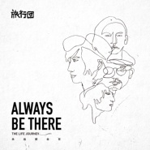

永远都会在Always Be There
============================

|  |  |
| :--: | :-- |
| [ 永远都会在Always Be There](https://emumo.xiami.com/album/2102773505) | **艺人**: [旅行团](../index.md) **语种**: 国语 **唱片公司**: StreetVoice **发行时间**: 2017年07月06日 **专辑类别**: 录音室专辑 **专辑风格**: 独立流行 Indie Pop, 独立摇滚 Indie Rock **播放数**: 2963750 **收藏数**: 1122 **评论数**: 160  |

## 简介

旅行团乐队《永远都会在》  
2017年7月6号发行  
  
孔阳（主唱/吉他）、韦伟（键盘/和声）、黄子君（吉他/和声）、徐彪（鼓手）  
  
与其说《永远都会在》是张专辑，不如说是一本用听的日记。对我们来说，这是一本关于4位三十而立的大男孩，用自己擅长语言所写的交换日记。这些故事的摇滚味浓厚了些，但这已经不是在说我们的热血理想或对世界的想像，而是一种经过岁月积累，面对过去种种的沉淀与省思，这些反省源于彼此间共存经历的感受，各种悲怆、懊悔、迷惘、挫败、傻劲与勇气并存的複杂情绪交错在词曲中，看似消极负面，其实是种释放。  
  
《永远都会在》更贴切的比喻，像是日记写到最后，情绪做了完整收拾而画下句号，押上日期与署名后，还欲言又止的最后一句话，这句话赤裸真诚且意义深远，怕是写出来显得矫情，于是我们自用己擅长的语言来表达。在倾心的独白与对话词句间；重刷吉他与轻拨细弦间；黑与白的琴键交错间；大鼓与小鼓含蓄交错敲击间，把情绪表达得真切。当结束一首作品，亦讲完一篇日记，传达彼此心意，剩下的涟漪，便来自于你的情感投递。  
  
「三十而立，问题而来」孔阳轻描淡写的说，我们知道无论接下来还有多少千千万万种问题，有這顆心在，任何問題都會迎刃而解。正如旅行团和螺蛳粉们一起完成一首歌的合唱录音，一起为唱片写下最真实的心情寄语。就这样，乐队与大家永远都会在。如果问这张专辑会带给听众甚麽感触，其实难有个标准答案，《永远都会在》对听众来说，可能比较像是个静止的湖，听众在这个湖边，听著湖面下我们奔腾激昂的故事，但湖面上倒映出的会是属于你的故事。这些作品可能会让大家反省过去，反思自己，亦或让你想起往年那群热血与共的挚友，所以我们其实更想知道，这些作品会带你回想到哪些往事与情境，如果可以，我们把笔，把琴，把鼓，把吉他交给你，换你说，我们听。  
  
  
版权：北京中子街声文化发展有限公司  
Copyright：StreetVoice International Limited  
监制：封夜  
Executive Producer：Feng Ye  
制作人：韦伟（旅行团乐队）  
Produced by：Oldbanana（The Lifejourney）  
录音棚：Tweak Tone Lab/大陆桥声音工作室  
Recording Studio：Tweak Tone Lab/LIC SoundLab  
录音师：李耀文(香港)/王云青/祝薇/李越  
Recording Engineer：Simon Li/Chris Wang/Avi Zhu/Peter Li  
混音师：李耀文(香港)/李越（《此刻是唯一的意义》）  
Mixing Engineer：Simon Li(Hong Kong)/Peter Li(《The moment is eternal》)  
母带：nOiz Studio(香港)  
Mastering Engineer：nOiz Studio(Hong Kong)  
现场调音团队：山弧工作组   
Live Sound Engineer Team：Coral Works  
  
艺人经纪：来福胶泥工作室  
Artist Management director：The Lifejourney Studio  
艺人经纪：封夜  
Artist Manager：Feng Ye  
商务：桃桃  
Studio Business：Ray Ray  
媒体宣传：北京中子街声文化发展有限公司/来福胶泥工作室  
Media Promotions：StreetVoice International Limited/The Lifejourney Studio  
发行：北京中子街声文化发展有限公司  
Distribution：StreetVoice International Limited  
摄影：薇白  
Photography：VBAI Image  
美术设计：木小雨  
Artistic Design：Asaph  
唱片设计：赵宏韬/孔阳  
Graphic Design：AnnSey/Yann  
  
主唱/吉他：孔阳  
Vocal/Guitar：Yann  
吉他：子君  
Guitar/Bass：Mali  
键盘：韦伟  
Keyboard：Oldbanana  
鼓手/打击乐：徐彪  
Drum/Harmonica：Xu Biao  
贝司/吉他：朱筱毅  
Bass/Guitar：Paul Chu  
小号：尹小晖  
Trumpet：Yin Xiao Hui  
  
和声：旅行团乐队/李越/祝薇/桃桃/武玥/刘巧娜/尹赟丽/武仕恒/闫泽敏/韩易燃/商娜/  
杨彬/黄琛琦/立夏夏/邓文妍/许雯/侨俏/阿飘/刘硕/夏悰/付裕/33岛/申利杰/宁迎/  
Harmony：The Lifejourney/ Peter Li /Avi Zhu/Ray Ray/Wu Yue/Liu Qiao Na/Yin Yun Li/Wu Shi Heng/Yan Ze Min/Han Yi Ran/Shang Na/Yang Bin/Huang Chen Qi/Li Xia Xia/Deng Wen Yan/Xu Wen/Qiao Qiao/A Piao/Liu Shuo/Xia Cong/Fu Yu/33 Island/Shen Li Jie/Ning Ying  
  
微博：<a href="http://weibo.com/ljmusic" target="_blank" rel="nofollow noreferrer noopener">http://weibo.com/ljmusic</a>  
微信公共号：lifejourney2005  
  
  
感谢阳光，空气和水；  
感谢我们的家人，爱人和朋友。  
 

## 曲目

## 评论

|  |  |  |  |
| :-- | :-- | :-- | :-- |
|  [虾米用户](https://emumo.xiami.com/u/290219495) 一首一回意，音乐时光机 2020-04-09 04:36 赞(0) 踩(0) | 
淡淡的忧伤，平淡的表达，词写的很棒，谢谢你们！
 |
|  [虾米用户](https://emumo.xiami.com/u/412727097) 所谓幸福寻无踪迹 却又无... 2020-04-06 15:46 赞(0) 踩(0) | 
看歌手第一次听到这首歌，很好听，希望会火！
 |
|  [虾米用户](https://emumo.xiami.com/u/15563327)  2019-11-21 13:43 赞(0) 踩(0) | 
很有意境，唱到心里去了。朋友~你有此同感吗？
 |
|  [虾米用户](https://emumo.xiami.com/u/376776353)  2019-08-05 10:39 赞(0) 踩(0) | 
铁粉儿
 |
|  [虾米用户](https://emumo.xiami.com/u/425084324) 我还没想好要写什么... 2019-07-16 12:00 赞(0) 踩(0) | 
好听
 |
|  [虾米用户](https://emumo.xiami.com/u/32532978) 后来故事怎么了 2019-06-22 11:58 赞(0) 踩(0) | 
最爱的乐队
 |
|  [虾米用户](https://emumo.xiami.com/u/201093859) 丢丢丢手绢轻轻的放在小朋... 2019-04-13 00:01 赞(0) 踩(0) | 
生活就是这样子
 |
|  [虾米用户](https://emumo.xiami.com/u/3469393)  2018-02-13 23:23 赞(0) 踩(0) | 
乐队需要成长，新尝试未尝不可。作为为数不多的独立乐队常青树，能保持这样，已经很不错了。他们基础曲风还在的，但是damo成曲的歌确实会少些。可以多些尝试，小发布。哈哈哈
 |
|  [虾米用户](https://emumo.xiami.com/u/240463040) 唯有温暖不可负 2017-11-17 10:43 赞(0) 踩(0) | 
哎，糟糕啊，编曲不行
 |
| ⇒ |  [虾米用户](https://emumo.xiami.com/u/334842259)  2019-07-22 20:10 赞(0) 踩(0) | 
韦伟的编曲不行，来开玩笑的吧
 |
| ⇒ |  [虾米用户](https://emumo.xiami.com/u/4771470) 暂无签名~ 2019-08-04 04:08 赞(0) 踩(0) | 
什么聋子？？？
 |
|  [虾米用户](https://emumo.xiami.com/u/6588061) 我们不懂这星辰 只陪伴一... 2017-10-20 00:49 赞(0) 踩(0) | 
这专陪我一起度过七月八月的快乐幸福时光。
 |
|  [虾米用户](https://emumo.xiami.com/u/47329293) 我还没想好要写什么... 2017-09-10 17:41 赞(0) 踩(0) | 
有几首声音听不清晰啊 总感觉有雾隔着
 |
|  [虾米用户](https://emumo.xiami.com/u/66958462) 心理学家 2017-09-07 01:26 赞(0) 踩(0) | 
很棒
 |
|  [虾米用户](https://emumo.xiami.com/u/45964919) Ltq耳机舞台 监听耳机... 2017-09-01 11:42 赞(0) 踩(0) | 
为什么买了它这么久了，还是无法下载无损音质？？？也无法在线听。             
 |
|  [虾米用户](https://emumo.xiami.com/u/39965300)  2017-08-28 23:24 赞(0) 踩(0) | 
主打歌太棒了 感动地想哭 
 |
|  [虾米用户](https://emumo.xiami.com/u/1963119) 全然的倾听。 2017-08-26 19:51 赞(0) 踩(0) | 
又等来啦~~~无脑推荐！！
 |
|  [虾米用户](https://emumo.xiami.com/u/1579453)   2017-08-11 23:15 赞(0) 踩(0) | 
刚刚听完回来
 |
|  [虾米用户](https://emumo.xiami.com/u/46946636)  2017-08-10 23:28 赞(1) 踩(0) | 
明天晚上小酒馆见2333
 |
|  [虾米用户](https://emumo.xiami.com/u/14015443)  2017-08-09 22:35 赞(0) 踩(0) | 
好不好听自己心里没点b数吗？强烈推荐《永远都会在》《你》《滚》这三首
 |
|  [虾米用户](https://emumo.xiami.com/u/8588689) 我还没想好要写什么... 2017-08-03 21:09 赞(0) 踩(0) | 
有人去看8月6号广州TUTU旅行团的演出吗
 |
|  [虾米用户](https://emumo.xiami.com/u/43636470) 业余选手 2017-08-01 10:28 赞(0) 踩(0) | 
正面
 |
|  [虾米用户](https://emumo.xiami.com/u/19883617)  2017-07-31 19:45 赞(1) 踩(0) | 
这张专辑永远都会在么 
 |
|  [虾米用户](https://emumo.xiami.com/u/1730199) 暂无签名~ 2017-07-31 09:56 赞(3) 踩(0) | 
额，听完整张专辑，感觉没有B side 好，越来越流行的趋势和严重的混音反而把孔阳干净的声线给埋没了，略失望 3.5星吧....
 |
|  [虾米用户](https://emumo.xiami.com/u/283082987) 死 2017-07-20 18:46 赞(1) 踩(0) | 
king of summer！！
 |
|  [虾米用户](https://emumo.xiami.com/u/75885500)  2017-07-20 05:25 赞(0) 踩(0) | 
瑰丽卡门家属力挺 
 |
|  [虾米用户](https://emumo.xiami.com/u/7766692) 念起即觉 觉起不随 2017-07-19 09:05 赞(5) 踩(0) | 
内地真心真意做音乐的不多了 找到一个珍惜一个算一个吧
 |
|  [虾米用户](https://emumo.xiami.com/u/11025002) 还没有什么，能比音乐更让... 2017-07-17 00:29 赞(0) 踩(0) | 
大家好！ 
 |
|  [虾米用户](https://emumo.xiami.com/u/1715156) 我还没想好要写什么... 2017-07-15 23:51 赞(0) 踩(0) | 
现场归来！坐标杭州
 |
|  [虾米用户](https://emumo.xiami.com/u/2682475)  2017-07-13 14:22 赞(0) 踩(0) | 
哇！新专辑！又要开始巡回LIVE啦！！
 |
|  [虾米用户](https://emumo.xiami.com/u/8447203) 暂无签名~ 2017-07-12 13:56 赞(0) 踩(0) | 
我是338
 |
|  [虾米用户](https://emumo.xiami.com/u/45052377) 以樂為樂 2017-07-11 20:59 赞(0) 踩(0) | 
先买下来细细品味.应该会越品越有味. 
 |
|  [虾米用户](https://emumo.xiami.com/u/7061466) 好歌都在我的收藏，慢慢听... 2017-07-10 16:28 赞(0) 踩(0) | 
还是这么好听
 |
|  [虾米用户](https://emumo.xiami.com/u/3131400)  2017-07-09 08:52 赞(3) 踩(0) | 
从豆瓣上发现旅行团的来福胶泥，然后大四从武汉坐一夜火车赶来北京看音乐会，十月的海淀公园蓝天白云绿草地，偶然又听到holiday，整个世界都愉快的要飞起来。很开心成为第520位支持者。
 |
|  [虾米用户](https://emumo.xiami.com/u/5044438) 今天白嘟出雙人曲了嗎？ 2017-07-08 09:42 赞(1) 踩(0) | 
一打开app看到这封面以为是peterpan complex的碟&amp;hellip;&amp;hellip;
 |
| ⇒ |  [虾米用户](https://emumo.xiami.com/u/25246571) 岁月已向我们洒下天罗地网... 2017-07-08 11:36 赞(0) 踩(0) | 
你
 |
|  [虾米用户](https://emumo.xiami.com/u/297635792) 。 2017-07-08 01:10 赞(1) 踩(0) | 
第一次听就喜欢上了，想买CD。
 |
|  [虾米用户](https://emumo.xiami.com/u/35354083)   2017-07-07 21:06 赞(1) 踩(0) | 
虾米怎么了？网络播放器动不动不好使了？虾米不知道吗？
 |
|  [虾米用户](https://emumo.xiami.com/u/20016525)  2017-07-07 16:49 赞(5) 踩(0) | 
好听好听
 |
| ⇒ |  [虾米用户](https://emumo.xiami.com/u/276817827)  2017-07-08 09:32 赞(0) 踩(0) | 
醃
 |
|  [虾米用户](https://emumo.xiami.com/u/9948064) 这是唯一听到我脑电波的机... 2017-07-07 11:02 赞(1) 踩(0) | 
这张也太好听了
 |
|  [虾米用户](https://emumo.xiami.com/u/6731030)  2017-07-07 08:40 赞(3) 踩(0) | 
不知道为什么，总觉得一股子tfboy的既视感 
 |
|  [虾米用户](https://emumo.xiami.com/u/34485918) 你能感受到那种愉悦吗 2017-07-07 08:15 赞(1) 踩(0) | 
为了螺蛳粉
 |
|  [虾米用户](https://emumo.xiami.com/u/36576635) 冰岛游客热带地区唯一指定... 2017-07-07 02:37 赞(4) 踩(0) | 
10 Day&amp;#39;s &amp;lt; 永远都会在 &amp;lt; B Side
 |
| ⇒ |  [虾米用户](https://emumo.xiami.com/u/36576635) 冰岛游客热带地区唯一指定... 2017-07-07 02:44 赞(0) 踩(0) | 
但是小P回来了那就排到和B Side并列吧(
 |
|  [虾米用户](https://emumo.xiami.com/u/43137226) 唯有好音乐不可辜负。 2017-07-07 00:14 赞(2) 踩(0) | 
你给我试听三十秒再买也行啊
 |
| ⇒ |  [虾米用户](https://emumo.xiami.com/u/24902362)   2017-07-07 00:22 赞(0) 踩(0) | 
第一首可以听？
 |
| ⇒ |  [虾米用户](https://emumo.xiami.com/u/43137226) 唯有好音乐不可辜负。 2017-07-07 00:23 赞(0) 踩(0) | 
<q><b>张兵说：</b></q>
 |
| ⇒ |  [虾米用户](https://emumo.xiami.com/u/295310485)  2017-07-08 12:26 赞(0) 踩(0) | 
<q><b>张兵说：</b></q>
 |
| ⇒ |  [虾米用户](https://emumo.xiami.com/u/283544729)  2017-07-08 12:54 赞(0) 踩(0) | 
<q><b>‖▍、对着残阳骄傲说：</b></q>
 |
| ⇒ |  [虾米用户](https://emumo.xiami.com/u/254949994)  2017-07-08 15:06 赞(0) 踩(0) | 
<q><b>‖▍、对着残阳骄傲说：</b></q>
 |
|  [虾米用户](https://emumo.xiami.com/u/1579453)   2017-07-06 23:17 赞(1) 踩(0) | 
8月11 成都见  
 |
|  [虾米用户](https://emumo.xiami.com/u/13691875) 谁的感叹 偶然合拍 2017-07-06 23:16 赞(1) 踩(0) | 
配合巡演，收了收了
 |
|  [虾米用户](https://emumo.xiami.com/u/310251537)   2017-07-06 22:44 赞(0) 踩(0) | 
3星
 |
|  [虾米用户](https://emumo.xiami.com/u/25471222) 对自由有多大的理解 就有... 2017-07-06 22:13 赞(0) 踩(0) | 
227位
 |
|  [虾米用户](https://emumo.xiami.com/u/189063412)  2017-07-06 21:35 赞(0) 踩(0) | 
第221位支持者。
 |
|  [虾米用户](https://emumo.xiami.com/u/96055644)  2017-07-06 20:36 赞(1) 踩(0) | 
这周火锅不吃了。买专辑。
 |
|  [虾米用户](https://emumo.xiami.com/u/291251708) 家世界妈妈所有人我爱你 2017-07-06 19:06 赞(1) 踩(0) | 
家哥哥家老爸世界那出来
 |
|  [虾米用户](https://emumo.xiami.com/u/3056834) 我还没想好要写什么... 2017-07-06 18:53 赞(1) 踩(0) | 
新专辑很惊艳
 |
|  [虾米用户](https://emumo.xiami.com/u/6669132) 我还没想好要写什么... 2017-07-06 17:56 赞(58) 踩(0) | 
今天在三个平台都买了三张，多出6张送给朋友。我希望更多的人听到旅行团。虽然我不懂音乐，是个无条件买单全盘支持的螺蛳粉，写不出专业的乐评，但我就是喜欢，各种喜欢，喜欢需要什么理由呢~
 |
| ⇒ |  [虾米用户](https://emumo.xiami.com/u/299489913)  2017-07-06 22:50 赞(0) 踩(0) | 
门店额
 |
| ⇒ |  [虾米用户](https://emumo.xiami.com/u/157415920)   2017-07-11 21:55 赞(0) 踩(0) | 
找见你了
 |
| ⇒ |  [虾米用户](https://emumo.xiami.com/u/6669132) 我还没想好要写什么... 2017-07-12 01:17 赞(0) 踩(0) | 
<q><b>sofialan说：</b></q>
 |
| ⇒ |  [虾米用户](https://emumo.xiami.com/u/929153)  2017-08-07 11:07 赞(0) 踩(0) | 
求一个
 |
| ⇒ |  [虾米用户](https://emumo.xiami.com/u/266181401)  2017-08-14 20:15 赞(0) 踩(0) | 
求一个
 |
| ⇒ |  [虾米用户](https://emumo.xiami.com/u/320462604)  2017-08-20 14:51 赞(0) 踩(0) | 
求一
 |
| ⇒ |  [虾米用户](https://emumo.xiami.com/u/261301937) 摇滚文青 2020-04-12 16:45 赞(0) 踩(0) | 
去你所愿，旅行团好听的音乐越来越多的人喜欢听了。我是去年才入坑旅行团的，谢谢《乐队的夏天》让我懂得旅行团并爱上它！
 |
|  [虾米用户](https://emumo.xiami.com/u/291251708) 家世界妈妈所有人我爱你 2017-07-06 17:38 赞(1) 踩(0) | 
胖子电话多少打龙
 |
|  [虾米用户](https://emumo.xiami.com/u/16025728)  2017-07-06 17:28 赞(31) 踩(0) | 
《滚》，名字太好了。我正好可以送给没有用心感受就胡喷的那些人。批评指正当然欢迎，恶意中伤用词不堪就如题吧。 
 |
| ⇒ |  [虾米用户](https://emumo.xiami.com/u/1489142) 我还没想好要写什么... 2017-07-06 23:11 赞(0) 踩(0) | 
微笑姐赞咧～
 |
| ⇒ |  [虾米用户](https://emumo.xiami.com/u/16025728)  2017-07-07 07:55 赞(0) 踩(0) | 
<q><b>小葵说：</b></q>
 |
| ⇒ |  [虾米用户](https://emumo.xiami.com/u/161716484)  2017-07-08 11:39 赞(0) 踩(0) | 
好
 |
|  [虾米用户](https://emumo.xiami.com/u/16025728)  2017-07-06 17:24 赞(4) 踩(0) | 
《你》，写给多年来默默站在身后的爱人。用情至深，饱含愧疚。主唱说会在演出时唱哭的一首歌。
 |
| ⇒ |  [虾米用户](https://emumo.xiami.com/u/263368902)  2017-07-06 21:51 赞(0) 踩(0) | 
。
 |
|  [虾米用户](https://emumo.xiami.com/u/16025728)  2017-07-06 17:21 赞(4) 踩(0) | 
期待了大半年，听过前两首主打，更迫不及待想要听到整张专辑。
 |
|  [虾米用户](https://emumo.xiami.com/u/8315742) 虾米的版权逐渐让我心碎 2017-07-06 15:30 赞(3) 踩(0) | 
什么鬼 旅行团被经纪人带偏了吧
 |
| ⇒ |  [虾米用户](https://emumo.xiami.com/u/36576635) 冰岛游客热带地区唯一指定... 2017-07-07 02:07 赞(0) 踩(0) | 
经纪人哪位...
 |
| ⇒ |  [虾米用户](https://emumo.xiami.com/u/65835) 如果没人看着我，该有多快... 2017-07-31 01:27 赞(0) 踩(0) | 
<q><b>chinvan说：</b></q>
 |
|  [虾米用户](https://emumo.xiami.com/u/50463676) 一半是海水，一半是火焰。 2017-07-06 15:00 赞(0) 踩(0) | 
开心！迎接暑假第一波啊！
 |
| ⇒ |  [虾米用户](https://emumo.xiami.com/u/248426523)  2017-07-06 19:02 赞(0) 踩(0) | 
x&amp;lt;wmmjmmmjmmjmmmmmmmmmjmmjjjmmmmmmnmjmjmmmmjmmjm?mmmj?mmjmjmjmjjmmj?mmm
 |
| ⇒ |  [虾米用户](https://emumo.xiami.com/u/270422956)  2017-07-07 07:03 赞(0) 踩(0) | 
<q><b>＿说：</b></q>
 |
| ⇒ |  [虾米用户](https://emumo.xiami.com/u/294773843)  2017-07-08 16:34 赞(0) 踩(0) | 
<q><b>可艾妈妈说：</b></q>
 |
|  [虾米用户](https://emumo.xiami.com/u/2203048)   2017-07-06 14:42 赞(0) 踩(0) | 
蓝天海风夏天 ！
 |
|  [虾米用户](https://emumo.xiami.com/u/23572171)   2017-07-06 13:16 赞(4) 踩(0) | 
为啥很多歌都很五月天&amp;hellip;
 |
|  [虾米用户](https://emumo.xiami.com/u/9103905) 五月天 周杰伦 Nell... 2017-07-06 13:05 赞(2) 踩(0) | 
明显制作高大上了 忘记了是几年前的某个夏日开始听到孔阳的声音开始关注他们 听他们的歌每次都可以想到大海蓝天沙滩白云岛屿和柏油公路
 |
|  [虾米用户](https://emumo.xiami.com/u/200140496) 好甜( • ̀ω•́ )... 2017-07-06 12:59 赞(4) 踩(0) | 
感觉新专辑跟之前差蛮大，不是说风格上的不好，是唱法上吧，好像加了很多伴唱或者说是重音，还是喜欢主唱单独声音的清新感，真的不要加太多混音吧，主唱声音那么棒，很喜欢啊，像之前那样多好。还是会继续支持，期待更多优秀作品。
 |
| ⇒ |  [虾米用户](https://emumo.xiami.com/u/294342778) :) 2017-07-06 19:13 赞(0) 踩(0) | 
我v哈哈你姐姐厘米秀
 |
|  [虾米用户](https://emumo.xiami.com/u/182488740) best wishes ... 2017-07-06 12:10 赞(3) 踩(0) | 
希望付费就一直付费  别没买几天就免费了
 |
|  [虾米用户](https://emumo.xiami.com/u/3614053)  2017-07-06 12:02 赞(0) 踩(0) | 
有没有搞错&amp;hellip;&amp;hellip;封面都抄pacific!的专辑&amp;hellip;&amp;hellip;没有一丁点诚意
 |
| ⇒ |  [虾米用户](https://emumo.xiami.com/u/4786778)  2017-07-07 11:27 赞(0) 踩(0) | 
Beatles的revolver吧？。
 |
| ⇒ |  [虾米用户](https://emumo.xiami.com/u/3614053)  2017-07-07 12:27 赞(0) 踩(0) | 
<q><b>Jimmy Lee说：</b></q>
 |
|  [虾米用户](https://emumo.xiami.com/u/4838142) ʕ •ᴥ•ʔ 2017-07-06 11:50 赞(2) 踩(0) | 
呃  我以为旅行团换人了 听了两遍愣是没听出来 这是唱厦门之夏的那个团
 |
| ⇒ |  [虾米用户](https://emumo.xiami.com/u/275734077)  2017-07-06 16:37 赞(0) 踩(0) | 
卡的北
 |
|  [虾米用户](https://emumo.xiami.com/u/341091) 偶爱我们呢~ 2017-07-06 11:31 赞(4) 踩(0) | 
想想感觉好像还真是，B side是目前最后一张没有正能量爆棚的专辑了，《轮廓》几乎是神来之笔。现在的歌总是这么励志，很怀疑旅行团的各位是不是刚从抑郁里走出来。
 |
|  [虾米用户](https://emumo.xiami.com/u/28769572)   2017-07-06 11:31 赞(1) 踩(0) | 
棒~从第一张专辑到现在，编曲越来越丰富，歌也越来越有内涵。棒。 
 |
|  [虾米用户](https://emumo.xiami.com/u/6122) Chang解High 2017-07-06 11:19 赞(2) 踩(0) | 
认真的做音乐才会有这样的精品！支持旅行团！
 |
|  [虾米用户](https://emumo.xiami.com/u/13704947) 豆瓣见：无悲渊。 2017-07-06 10:40 赞(0) 踩(0) | 
三次支付失败！！！
 |
| ⇒ |  [虾米用户](https://emumo.xiami.com/u/78567) тоска, одино 2017-07-06 10:42 赞(0) 踩(0) | 
呃 是IOS客户端吗 苹果账户绑定支付宝就可以了呀
 |
| ⇒ |  [虾米用户](https://emumo.xiami.com/u/13704947) 豆瓣见：无悲渊。 2017-07-06 10:55 赞(0) 踩(0) | 
<q><b>▲ боль说：</b></q>
 |
| ⇒ |  [虾米用户](https://emumo.xiami.com/u/298742993)  2017-07-06 15:10 赞(0) 踩(0) | 
也――
 |
| ⇒ |  [虾米用户](https://emumo.xiami.com/u/220628649)  2017-07-06 20:26 赞(0) 踩(0) | 
<q><b>八叶草20说：</b></q>
 |
|  [虾米用户](https://emumo.xiami.com/u/6727127)  2017-07-06 10:37 赞(2) 踩(0) | 
新专辑终于来了！
 |
|  [虾米用户](https://emumo.xiami.com/u/39619356) 宇宙 始终 未来 自由 2017-07-06 10:37 赞(1) 踩(0) | 
我还是去听听来福胶泥和BSIDE找找感觉吧....
 |
|  [虾米用户](https://emumo.xiami.com/u/39619356) 宇宙 始终 未来 自由 2017-07-06 10:35 赞(1) 踩(0) | 
略失望？为啥越写越烂了...
 |
|  [虾米用户](https://emumo.xiami.com/u/6925221) Roc 2017-07-06 10:19 赞(19) 踩(0) | 
我只想说，这个乐队的第一张专辑和后面的为啥水平差距可以如此之大。第一张除了一些英文发音不标准完，每一首都很棒，无论旋律编曲还是制作上。后面专辑的歌越来越差劲，旋律没有特色，是江郎才尽了吗？？？
 |
| ⇒ |  [虾米用户](https://emumo.xiami.com/u/2393294) 和彭彭一起加油! 2017-07-06 10:45 赞(0) 踩(0) | 
同感，虽然前两张不是所有歌都喜欢 但至少有一半都觉得随时翻出来听很好听  能循环很多遍，越来越流行，调子也完全不勾魂，要么就不停重复副歌，风格太励志，励志得出血。已取关。
 |
| ⇒ |  [虾米用户](https://emumo.xiami.com/u/286856349)  2017-07-06 14:20 赞(0) 踩(0) | 
bb
 |
| ⇒ |  [虾米用户](https://emumo.xiami.com/u/61791292) 我还没想好要写什么... 2017-07-07 19:08 赞(0) 踩(0) | 
第一张专辑简直神了
 |
| ⇒ |  [虾米用户](https://emumo.xiami.com/u/292547273)  2017-07-08 16:56 赞(0) 踩(0) | 
ukulele路
 |
| ⇒ |  [虾米用户](https://emumo.xiami.com/u/588121) 我还没想好要写什么... 2017-07-30 18:06 赞(0) 踩(0) | 
他们也有努力的写歌 在不停创作，但是真拿不出让人满意的作品
 |
|  [虾米用户](https://emumo.xiami.com/u/1115247) @Nebula_7293 2017-07-06 10:17 赞(1) 踩(0) | 
开心～么么哒 
 |
|  [虾米用户](https://emumo.xiami.com/u/16025728)  2017-07-06 10:16 赞(0) 踩(0) | 
新专辑终于到了！！！
 |
|  [虾米用户](https://emumo.xiami.com/u/17077682) 滚去spotify了。C... 2017-07-06 10:11 赞(0) 踩(0) | 
➿
 |
|  [虾米用户](https://emumo.xiami.com/u/49000802)   2017-07-06 10:03 赞(0) 踩(0) | 
  
 |
|  [虾米用户](https://emumo.xiami.com/u/10128210) 听歌就好 2017-07-06 00:27 赞(1) 踩(0) | 
螺蛳粉表示，旅行团的歌够味道
 |
|  [虾米用户](https://emumo.xiami.com/u/2928117) 你好 2017-07-03 20:56 赞(1) 踩(0) | 
这首歌好感动啊~~我要去看巡演~~~~孔阳的声音变清亮且有力量了
 |
|  [虾米用户](https://emumo.xiami.com/u/45452251)  2017-07-03 11:23 赞(0) 踩(0) | 
我生日呢！！！
 |
|  [虾米用户](https://emumo.xiami.com/u/24838376) ++++++++++++ 2017-07-02 21:02 赞(1) 踩(0) | 
依然温暖的旅行团。依然最爱囧和孔阳大大。
 |
|  [虾米用户](https://emumo.xiami.com/u/43137226) 唯有好音乐不可辜负。 2017-07-02 00:58 赞(0) 踩(0) | 
去年又来我们学校 广西财经学院相思湖校区校园巡演，可惜我有事错过了！
 |
|  [虾米用户](https://emumo.xiami.com/u/2388452)  2017-07-01 21:17 赞(1) 踩(0) | 
P型回来吧
 |
| ⇒ |  [虾米用户](https://emumo.xiami.com/u/308996901)  2017-07-06 10:55 赞(0) 踩(0) | 
。你，
 |
|  [虾米用户](https://emumo.xiami.com/u/278966972)   2017-07-01 20:59 赞(2) 踩(0) | 
旅行团的歌曲总感觉一直很适合在夏天听，在海边，吹着风，好像听着听着，烦恼都没有了，有了希望。
 |
|  [虾米用户](https://emumo.xiami.com/u/285804460)  2017-07-01 19:53 赞(3) 踩(0) | 
第一遍听感觉有些单调但，这首歌魅力就在你把它关掉的一刹那显现出来你的脑子里会不停的回响起这段歌词，这些旋律然后，无限的单曲循环就此开始
 |
|  [虾米用户](https://emumo.xiami.com/u/1115247) @Nebula_7293 2017-06-30 21:59 赞(2) 踩(0) | 
前奏那几秒真是越听越好听
 |
|  [虾米用户](https://emumo.xiami.com/u/420341) 盛夏夜里绽放最耀眼的花火 2017-06-30 21:29 赞(0) 踩(0) | 
终于又出了新歌
 |
|  [虾米用户](https://emumo.xiami.com/u/28984380) 宜善而行，怀远致明。 2017-06-30 19:13 赞(1) 踩(0) | 
喜欢5年了，从叛逆到长大十八岁。
 |
|  [虾米用户](https://emumo.xiami.com/u/674562)   2017-06-30 17:26 赞(2) 踩(0) | 
一直支持
 |
|  [虾米用户](https://emumo.xiami.com/u/1105139) 你听过千百首歌，真实的日... 2017-06-30 17:03 赞(0) 踩(0) | 
一堆人被老板莫名其妙训了一通，感觉气得嗓子要冒烟，听这首听得我要哭~
 |
|  [虾米用户](https://emumo.xiami.com/u/15251090)  2017-06-30 16:11 赞(0) 踩(0) | 
励志 青年团体
 |
|  [虾米用户](https://emumo.xiami.com/u/29245347)  2017-06-30 13:18 赞(0) 踩(0) | 
一如既往，挺有他们的风格，没有让人失望。
 |
|  [虾米用户](https://emumo.xiami.com/u/132119586)  2017-06-30 03:41 赞(0) 踩(0) | 
2017-6-30 03:41
 |
|  [虾米用户](https://emumo.xiami.com/u/307446881)  2017-06-30 01:47 赞(0) 踩(0) | 
晚安
 |
|  [虾米用户](https://emumo.xiami.com/u/14283437) Hope you nev... 2017-06-29 23:47 赞(0) 踩(0) | 
全世界最温暖的旅行团
 |
|  [虾米用户](https://emumo.xiami.com/u/53904109)   2017-06-29 23:10 赞(0) 踩(0) | 
这张专辑来得及时给自己打气
 |
|  [虾米用户](https://emumo.xiami.com/u/478849)  2017-06-29 21:46 赞(0) 踩(0) | 
这歌描写的就是当下的我啊！！！！找到共鸣，给自己加油！！！
 |
|  [虾米用户](https://emumo.xiami.com/u/144620702)  2017-06-29 21:45 赞(0) 踩(0) | 
2017.6.29. 
 |
|  [虾米用户](https://emumo.xiami.com/u/144620702)  2017-06-29 21:44 赞(0) 踩(0) | 
你永远都在我身边 &amp;hellip;&amp;hellip;
 |
|  [虾米用户](https://emumo.xiami.com/u/31537778)   2017-06-29 21:13 赞(0) 踩(0) | 
封面谁画的啊喵～
 |
|  [虾米用户](https://emumo.xiami.com/u/32125734) weibo：白菜y少女  2017-06-29 19:45 赞(0) 踩(0) | 
要来巡演了哦
 |
|  [虾米用户](https://emumo.xiami.com/u/1171016) 人们活着.静如止水 2017-06-29 19:08 赞(0) 踩(0) | 

 |
|  [虾米用户](https://emumo.xiami.com/u/111870876) 我，爱这生活。 2017-06-29 19:02 赞(0) 踩(0) | 
您们五个，注意是五个，永远都会在 
 |
|  [虾米用户](https://emumo.xiami.com/u/14057233) 我明白有些感情难再体会。 2017-06-29 18:18 赞(1) 踩(0) | 
这首歌有得收费吗，我想支持(:з」&amp;ang;)_
 |
|  [虾米用户](https://emumo.xiami.com/u/446413)  2017-06-29 17:59 赞(0) 踩(0) | 
旋律是不是有点儿像李白
 |
| ⇒ |  [虾米用户](https://emumo.xiami.com/u/48825763)  2017-06-29 22:49 赞(0) 踩(0) | 
不是&amp;rarr;
 |
|  [虾米用户](https://emumo.xiami.com/u/308029263) 一只愉快的比熊 2017-06-29 17:21 赞(0) 踩(0) | 
嘻嘻 支持我团的新歌～
 |
|  [虾米用户](https://emumo.xiami.com/u/8447203) 暂无签名~ 2017-06-29 15:42 赞(0) 踩(0) | 
前排打卡
 |
|  [虾米用户](https://emumo.xiami.com/u/11890556)  2017-06-29 14:05 赞(2) 踩(0) | 
在毕业季这歌发的真是时候&amp;middot;&amp;middot;&amp;middot;&amp;middot;&amp;middot;&amp;middot;&amp;middot;&amp;middot;
 |
|  [虾米用户](https://emumo.xiami.com/u/10009500)  2017-06-29 13:18 赞(0) 踩(0) | 
好好听！
 |
|  [虾米用户](https://emumo.xiami.com/u/3815293) baby Jesus s... 2017-06-29 12:42 赞(2) 踩(0) | 
.
 |
|  [虾米用户](https://emumo.xiami.com/u/4305606) Isak小世界 2017-06-29 12:35 赞(0) 踩(0) | 
随时随地的follow
 |
|  [虾米用户](https://emumo.xiami.com/u/252052526) 江河万里，有酒辛烈 2017-06-29 12:27 赞(0) 踩(0) | 
真是越来越爱旅行团了    
 |
|  [虾米用户](https://emumo.xiami.com/u/49000802)   2017-06-29 12:26 赞(0) 踩(0) | 
   
 |
|  [虾米用户](https://emumo.xiami.com/u/12284074) hakunamatata 2017-06-29 12:16 赞(0) 踩(0) | 
支持支持!好喜欢呀
 |
|  [虾米用户](https://emumo.xiami.com/u/19883617)  2017-06-29 12:08 赞(0) 踩(0) | 
前排支持！
 |
|  [虾米用户](https://emumo.xiami.com/u/42759745) 我还没想好要写什么... 2017-06-29 12:06 赞(0) 踩(0) | 
以梦为马的旅行团 always
 |
|  [虾米用户](https://emumo.xiami.com/u/13327571) 願愛無憂 2017-06-29 12:04 赞(0) 踩(0) | 
不知道走多少数不清的春秋                                      总会有很多个你在身后                                           愿我们与旅行团的音乐永远都会在
 |
|  [虾米用户](https://emumo.xiami.com/u/31537778)   2017-06-29 12:03 赞(0) 踩(0) | 
妈呀新歌！！！
 |
|  [虾米用户](https://emumo.xiami.com/u/13327571) 願愛無憂 2017-06-29 12:01 赞(0) 踩(0) | 
生活似海，起伏不定，无边，总是看不到头；我欲乘风，浪迹远方，因为，我并不平凡普通；忙忙碌碌，反反复复，那是，我的言不由衷；勇敢为你，无畏地做，只做，少年心气的我。
 |
|  [虾米用户](https://emumo.xiami.com/u/17077682) 滚去spotify了。C... 2017-06-29 12:00 赞(0) 踩(0) | 
wow
 |
|  [虾米用户](https://emumo.xiami.com/u/11046721) Spotify：Unwi... 2017-06-29 12:00 赞(0) 踩(0) | 
内容已删除
 |
| ⇒ |  [虾米用户](https://emumo.xiami.com/u/17077682) 滚去spotify了。C... 2017-06-29 12:01 赞(0) 踩(0) | 
非常快
 |
