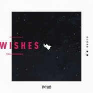

情书
============================

|  |  |
| :--: | :-- |
| [ 情书](https://emumo.xiami.com/album/2103745717) | **艺人**: [旅行团](../index.md) **语种**: 国语 **唱片公司**: StreetVoice **发行时间**: 2018年06月13日 **专辑类别**: EP, 单曲 **专辑风格**: 阳光流行 Sunshine Pop, 独立流行 Indie Pop **播放数**: 245780 **收藏数**: 72 **评论数**: 14  |

## 简介

学生时代的我们，用情书表白，纯真又简单，最坏的结果无非是不用你开口，我也能给你浪漫。爱情是生活的全部，相爱就要永远在一起。长大后才发现，即使情比金坚，但在生活面前依旧不堪一击，最坏的结果变成了：我们相爱，却相隔万里。  
  
在不同的城市相爱，即便前路未卜，但谁也不愿说破。每个人都认为自己是爱的更多的一方，却说不出口，将说不出口的话写成情书，在梦里告诉对方：想一个人的时候是最孤单的，想你的时候常常做梦，因为“梦醒来的我们，不后悔相遇在”。  
  
希望听首歌的人，能放下复杂，去感受最纯粹简单的爱情。其实很简单，爱情就是那种男女纠葛相吸的感觉，不会随着时间地点环境的改变下而改变，历经沧海桑田却亘古不变。  
  
即便相隔万里，只要莫逆于心就足够了。  
  
 

## 曲目

## 评论

|  |  |  |  |
| :-- | :-- | :-- | :-- |
|  [虾米用户](https://emumo.xiami.com/u/332294174) 最重要的小事。 2020-02-16 21:08 赞(0) 踩(0) | 
看到一个少年要表白的心 那么温柔美好又坚定
 |
|  [虾米用户](https://emumo.xiami.com/u/302765718)  2019-06-26 10:14 赞(0) 踩(0) | 
水墨
 |
|  [虾米用户](https://emumo.xiami.com/u/47191452) listening 2018-10-30 14:18 赞(1) 踩(0) | 
久违的感觉
 |
| ⇒ |  [虾米用户](https://emumo.xiami.com/u/180342264)  2018-10-30 14:27 赞(0) 踩(0) | 
是不是听到了爱情
 |
| ⇒ |  [虾米用户](https://emumo.xiami.com/u/47191452) listening 2018-11-03 22:21 赞(0) 踩(0) | 
<q><b>未知生物说：</b></q>
 |
|  [虾米用户](https://emumo.xiami.com/u/96318180)  . 2018-08-01 01:45 赞(0) 踩(0) | 
好听！！！！
 |
|  [虾米用户](https://emumo.xiami.com/u/53718156) 盲目平淡喜欢一滴点波澜 2018-06-14 14:03 赞(0) 踩(0) | 
我来啦
 |
|  [虾米用户](https://emumo.xiami.com/u/16206377) rabbit_❀moon 2018-06-14 00:48 赞(0) 踩(0) | 
还行
 |
|  [虾米用户](https://emumo.xiami.com/u/221049957) 这里阿星，五个音乐app... 2018-06-13 17:36 赞(0) 踩(0) | 
温暖的声音～
 |
|  [虾米用户](https://emumo.xiami.com/u/17077682) 滚去spotify了。C... 2018-06-13 16:33 赞(1) 踩(0) | 
孔阳真的不打算再写歌了么&amp;hellip;&amp;hellip; 这哪里还是旅行团啊
 |
|  [虾米用户](https://emumo.xiami.com/u/11421497) dont act lik... 2018-06-13 13:13 赞(0) 踩(0) | 
好
 |
|  [虾米用户](https://emumo.xiami.com/u/15306839) # 2018-06-13 11:10 赞(1) 踩(0) | 
曲子让人有些新的体验，感觉依旧温暖如初，越来越棒了
 |
|  [虾米用户](https://emumo.xiami.com/u/51791280)  2018-06-13 10:58 赞(0) 踩(0) | 
快来北京吧！！
 |
|  [虾米用户](https://emumo.xiami.com/u/6680899)  2018-06-13 10:00 赞(0) 踩(0) | 
好听
 |
