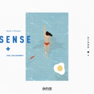

感+
============================

|  |  |
| :--: | :-- |
| [ 感+](https://emumo.xiami.com/album/2103752594) | **艺人**: [旅行团](../index.md) **语种**: 国语 **唱片公司**: StreetVoice **发行时间**: 2018年06月21日 **专辑类别**: 录音室专辑 **专辑风格**: 独立流行 Indie Pop, 阳光流行 Sunshine Pop **播放数**: 140397 **收藏数**: 953 **评论数**: 112  |

## 简介

我们看似生活在同一个世界，每天面对着同样的钢筋水泥而忙忙碌碌，互联网飞速运转的大数据记录着我们的一切；但我们又好像都生活在不同的世界里，每个人的体验和感受有着千差万别，同样一碗螺蛳粉，有的人无法接受，也有人奉若至宝 。  
  
我们每个人都是大世界里一个个不同的小世界，音乐就是我们之间最好的沟通桥梁。旅行团全新专辑《感+》，灵感来源于对生活细节的微小感受，有楼上装修数日的崩溃，也有因隔壁情侣吵架而突然冒出的人生哲学等等，这些创作过程看似充满机缘巧合，其实都是对生活细节的捕捉。  
  
在普吉录音期间美好的体验也给《感+》这张专辑添加了不一样的元素。一首首出生在急促烦躁的城市的歌，在普吉美丽风景和悠闲生活的加持之下变的美好起来。身边环境的改变，表达和感受也会相应的随之改变，希望听这张专辑的你能感受到其中的不同。  
  
旅行团把对生活的感悟写成歌，与大家分享我们对生活的感触，更是想唤醒大家对生活独有的感觉。一千个读者眼中有一千个哈姆雷特，一千个人听同一首歌也会有一千种不同的感悟，希望《感+》能够带动所有人的不同的感触。  
  
这些感触可能转瞬即逝，却也是我们生活的美好所在，把生活中不同的感触转变成相同的感动，换化成音符，就是音乐的意义。  
  
 

## 曲目

- [My Shadow](./2103752594/8ItDiU17244.md)

## 评论

|  |  |  |  |
| :-- | :-- | :-- | :-- |
|  [虾米用户](https://emumo.xiami.com/u/82381998) 我还没想好要写什么... 2020-11-09 14:37 赞(0) 踩(0) | 
刚好是去海边的那天买的，一路上心情更棒了
 |
|  [虾米用户](https://emumo.xiami.com/u/176840976)   2020-02-18 16:38 赞(0) 踩(0) | 
每首歌都好听，闭上眼是海风微咸夏季的蝉鸣
 |
|  [虾米用户](https://emumo.xiami.com/u/126827620) …… 2019-12-14 18:59 赞(0) 踩(0) | 
洗脑了 
 |
|  [虾米用户](https://emumo.xiami.com/u/6025431) 咖啡不在西雅图 2019-09-17 07:44 赞(3) 踩(0) | 
什么时候线上音乐能跟实体CD打通，买了实体CD输个密码能解锁线上音乐。实体CD虽然很好看好玩，真的很贵啊，差钱
 |
|  [虾米用户](https://emumo.xiami.com/u/123896256) 啼笑皆非的孤单 2019-09-08 13:38 赞(1) 踩(0) | 
精致好听
 |
|  [虾米用户](https://emumo.xiami.com/u/6385284) 我还没想好要写什么... 2019-08-20 07:20 赞(1) 踩(0) | 
快红吧，根本就不是小众专辑
 |
|  [虾米用户](https://emumo.xiami.com/u/16823384)  我希望有一颗透明的心灵... 2019-08-12 10:03 赞(1) 踩(0) | 
喜欢！喜欢！旅行团加油
 |
|  [虾米用户](https://emumo.xiami.com/u/37698101)  2019-08-11 15:03 赞(1) 踩(0) | 
忘了给专辑打分，这就是喜欢的音乐，这就是喜欢的乐队      
 |
|  [虾米用户](https://emumo.xiami.com/u/37698101)  2019-08-11 14:53 赞(1) 踩(0) | 
对喜欢的乐队最好的支持就是购买正版，微薄之力，希望旅行团可以为梦想而继续前行
 |
|  [虾米用户](https://emumo.xiami.com/u/14803445)  2019-08-04 17:00 赞(1) 踩(0) | 
因为这首歌买了专辑
 |
|  [虾米用户](https://emumo.xiami.com/u/123896256) 啼笑皆非的孤单 2019-08-03 01:04 赞(0) 踩(0) | 
夏天来了，每天都在放，心情好好的
 |
|  [虾米用户](https://emumo.xiami.com/u/334623851) 我想你 2019-07-23 17:01 赞(0) 踩(0) | 
感谢乐队的夏天，让我认识你们。
 |
|  [虾米用户](https://emumo.xiami.com/u/2781185) 我还没想好要写什么... 2019-07-18 21:53 赞(0) 踩(0) | 
全专循环 
 |
|  [虾米用户](https://emumo.xiami.com/u/321215581) 好爱帅哥 2019-07-07 02:49 赞(0) 踩(0) | 
爱！
 |
|  [虾米用户](https://emumo.xiami.com/u/424054112)  2019-07-04 11:40 赞(0) 踩(0) | 
你值得拥有 夏天就应该拥有旅行团
 |
|  [虾米用户](https://emumo.xiami.com/u/2401889) 温暖我的温暖。 2019-06-09 16:06 赞(0) 踩(0) | 
夏天的感觉
 |
|  [虾米用户](https://emumo.xiami.com/u/381034) 庸人自扰.. 2019-05-29 10:18 赞(0) 踩(0) | 
螺蛳粉在淘宝都全网爆款了， 你们什么时候也爆发一波鸭～
 |
|  [虾米用户](https://emumo.xiami.com/u/2947599)  2019-03-31 00:39 赞(0) 踩(0) | 
听到了Live 整张专辑超棒！你值得拥有～
 |
|  [虾米用户](https://emumo.xiami.com/u/220075) 老老实实或者不老老实实的... 2019-03-27 16:07 赞(0) 踩(0) | 
看完live本少女表示更爱这张专辑辣！ 
 |
|  [虾米用户](https://emumo.xiami.com/u/1268848)  2019-03-15 12:24 赞(1) 踩(0) | 
我被撩晕了，可能是夏天最好的礼物
 |
|  [虾米用户](https://emumo.xiami.com/u/363109713)  2019-02-28 09:06 赞(0) 踩(0) | 
一百昏一百昏
 |
|  [虾米用户](https://emumo.xiami.com/u/49925610) ☆彡(^･ᴗ･^)新年快... 2019-01-13 23:56 赞(0) 踩(0) | 
好听
 |
|  [虾米用户](https://emumo.xiami.com/u/57811488) My weeble-wo... 2018-12-16 21:41 赞(0) 踩(0) | 
蟹蟹旅行团。❤️
 |
|  [虾米用户](https://emumo.xiami.com/u/108564)   2018-10-13 17:19 赞(3) 踩(0) | 
三十三了 在知乎被问如何保持少女感 ----当然是一直听旅行团的歌啦
 |
|  [虾米用户](https://emumo.xiami.com/u/154708)  2018-09-12 00:37 赞(0) 踩(0) | 
这年头的人花12块钱买11首歌听都要瞎矫情半天了？
 |
|  [虾米用户](https://emumo.xiami.com/u/49993261)  2018-08-23 13:48 赞(1) 踩(0) | 
第一首很魔性～～听了停不下来
 |
|  [虾米用户](https://emumo.xiami.com/u/43687483) 我还没想好要写什么... 2018-08-21 15:39 赞(0) 踩(0) | 
我坐在办公室18&amp;deg;C空调出风口下面，捧着热水杯，听着圣地亚哥，笑
 |
|  [虾米用户](https://emumo.xiami.com/u/66958462) 心理学家 2018-08-10 15:06 赞(0) 踩(0) | 
喜欢
 |
|  [虾米用户](https://emumo.xiami.com/u/96318180)  . 2018-08-01 01:43 赞(0) 踩(0) | 
好听的啊！！
 |
|  [虾米用户](https://emumo.xiami.com/u/200140496) 好甜( • ̀ω•́ )... 2018-07-28 11:22 赞(0) 踩(0) | 
真的，感觉又回来了，很棒
 |
|  [虾米用户](https://emumo.xiami.com/u/78313992)   2018-07-14 02:19 赞(1) 踩(0) | 
为什么不出一点点音频试听啊？张口就要钱也不知道值不值
 |
| ⇒ |  [虾米用户](https://emumo.xiami.com/u/817547)   2018-07-24 15:55 赞(0) 踩(0) | 
我以前也有这想法，但是现在我真的很喜欢这乐队或者歌手的话我毫不犹豫就买了，反正12块也没多少。  这专辑我是第一个买的人  哈哈哈哈哈
 |
|  [虾米用户](https://emumo.xiami.com/u/377757511)  2018-07-11 14:54 赞(0) 踩(0) | 
挺好的
 |
|  [虾米用户](https://emumo.xiami.com/u/82381998) 我还没想好要写什么... 2018-07-10 07:26 赞(0) 踩(0) | 
买了为啥听不了现在
 |
|  [虾米用户](https://emumo.xiami.com/u/377331867)  2018-07-08 23:05 赞(2) 踩(0) | 
不能试听鬼知道值不值
 |
|  [虾米用户](https://emumo.xiami.com/u/10061515)   2018-07-04 08:08 赞(0) 踩(0) | 
汽车发动，开始播放旅行团，带上冲浪板和你还有西瓜，往大海的方向出发。
 |
|  [虾米用户](https://emumo.xiami.com/u/36719167)  2018-06-30 11:08 赞(0) 踩(0) | 
去一趟普吉岛是值得的 
 |
|  [虾米用户](https://emumo.xiami.com/u/36719167)  2018-06-30 10:00 赞(1) 踩(0) | 
是一张复古风格的专辑，有日本city pop 音乐的感觉，伴奏有很多电音因素，音质也故意做旧的感觉，也有可能是我耳机不好，还是希望能提高音质
 |
|  [虾米用户](https://emumo.xiami.com/u/14035899) major Tom 2018-06-29 17:41 赞(3) 踩(0) | 
孔阳和子君的作品混在一起觉得很跳，因为风格差别太明显了，专辑最爱还是搬给周末玩具。Bside之后的旅行团，我的热情已经褪去大半。
 |
|  [虾米用户](https://emumo.xiami.com/u/79977660)  2018-06-26 10:23 赞(0) 踩(0) | 
对旅行团印象很好，所以买了专辑，但是这张专辑有一点失望（从周末玩具得到了快乐）
 |
|  [虾米用户](https://emumo.xiami.com/u/4093479) 暂无签名~ 2018-06-25 12:41 赞(1) 踩(0) | 
完全不能试听吗？？
 |
|  [虾米用户](https://emumo.xiami.com/u/15306839) # 2018-06-24 23:46 赞(0) 踩(0) | 
标签变成了pop么，那么好听可爱的pop哪里找  
 |
|  [虾米用户](https://emumo.xiami.com/u/8385945) same here 2018-06-24 19:23 赞(0) 踩(0) | 
夏至那天的礼物 
 |
|  [虾米用户](https://emumo.xiami.com/u/7624702)  2018-06-24 00:37 赞(1) 踩(0) | 
你进入得了我的身体，却进入不了我的世界。是这个意思吧，音乐开起，手纸放起，三角键点起
 |
|  [虾米用户](https://emumo.xiami.com/u/55298997) 虾米制造惊喜，网易保管回... 2018-06-24 00:20 赞(1) 踩(0) | 
只过了两天时间回来看，已经听不到了 ，虽然有点意犹未尽，但我会忍着，购买专辑对我来说是实在个填不完的坑！
 |
|  [虾米用户](https://emumo.xiami.com/u/1480632)   2018-06-23 21:06 赞(2) 踩(0) | 
总结一下，先前发行的专辑ep有部分算是新专里中下等好听的，所以不要犹豫，快买了听其他歌啊
 |
|  [虾米用户](https://emumo.xiami.com/u/6280279) 爱音乐，爱生活。 2018-06-23 11:37 赞(0) 踩(0) | 
在哪里可以先试听？
 |
|  [虾米用户](https://emumo.xiami.com/u/256209352)  2018-06-23 00:49 赞(0) 踩(0) | 
厦门厦门一起啊！！！！
 |
|  [虾米用户](https://emumo.xiami.com/u/1171016) 人们活着.静如止水 2018-06-22 23:27 赞(0) 踩(0) | 
新专辑实体哪里买？
 |
|  [虾米用户](https://emumo.xiami.com/u/65835) 如果没人看着我，该有多快... 2018-06-22 22:13 赞(0) 踩(0) | 
请问这张专辑的制作人是谁呀？
 |
|  [虾米用户](https://emumo.xiami.com/u/4249527)  2018-06-22 17:33 赞(1) 踩(0) | 
这专辑比我想象中洗脑 怎么办 根本停不下来&amp;hellip;&amp;hellip;
 |
|  [虾米用户](https://emumo.xiami.com/u/43007413) 我还没想好要写什么... 2018-06-22 16:08 赞(1) 踩(0) | 
2013年我不够好，我有希望没有尽力去实现但起码有一点好，我喜欢@旅行团乐队我把整个高中的自己托付给《岛屿》2018年，我觉得可以说自己好多啦新的旅行团可喜地还是旅行团，我还是愿意将这个年纪的自己托付于他们歌一首 
 |
|  [虾米用户](https://emumo.xiami.com/u/30915663)   2018-06-22 12:39 赞(0) 踩(0) | 
369嘻嘻嘻
 |
|  [虾米用户](https://emumo.xiami.com/u/221049957) 这里阿星，五个音乐app... 2018-06-22 11:03 赞(1) 踩(0) | 
最近的歌和专辑封面，都超有sense呀～～
 |
|  [虾米用户](https://emumo.xiami.com/u/48285762)  2018-06-22 09:55 赞(0) 踩(0) | 
夏天必须要有团
 |
|  [虾米用户](https://emumo.xiami.com/u/82381998) 我还没想好要写什么... 2018-06-22 08:07 赞(1) 踩(0) | 
哈哈哈，很迷幻很电子
 |
|  [虾米用户](https://emumo.xiami.com/u/235456621)  2018-06-22 07:42 赞(0) 踩(0) | 
最爱旅行团么么哒～
 |
|  [虾米用户](https://emumo.xiami.com/u/43007413) 我还没想好要写什么... 2018-06-22 07:21 赞(1) 踩(0) | 
就是旅行团啊，是他们
 |
|  [虾米用户](https://emumo.xiami.com/u/9103905) 五月天 周杰伦 Nell... 2018-06-22 06:50 赞(0) 踩(0) | 
一大早来一张清新的专 最初的旅行团 我爱孔阳 
 |
|  [虾米用户](https://emumo.xiami.com/u/37977)   2018-06-22 01:53 赞(1) 踩(0) | 
没有试听就直接买了，12块钱简直超值，完全没让我失望，封面也很喜欢
 |
|  [虾米用户](https://emumo.xiami.com/u/44572402) 感谢永远有歌 2018-06-22 00:37 赞(1) 踩(0) | 
什么都没想就支付了
 |
|  [虾米用户](https://emumo.xiami.com/u/18556953) 真诚才是最大本领 2018-06-21 23:53 赞(0) 踩(0) | 
299打卡！
 |
|  [虾米用户](https://emumo.xiami.com/u/34890556) 我还没想好要写什么... 2018-06-21 23:16 赞(0) 踩(0) | 
下周46见哦！
 |
|  [虾米用户](https://emumo.xiami.com/u/1904683)  2018-06-21 22:22 赞(0) 踩(0) | 
适合夏天听的专辑
 |
|  [虾米用户](https://emumo.xiami.com/u/3340875) 活着 2018-06-21 20:53 赞(1) 踩(0) | 
刚看到公告栏，&amp;ldquo;夏之恋&amp;rdquo;首场6月29号在厦门，而我刚好当天飞到厦门参加一个非常重要的婚礼，就像曾经错过这个女孩子一样又要错过旅行团。那天我会带上耳机听着《厦门之夏》，假装和她一起听我们的夏之恋
 |
| ⇒ |  [虾米用户](https://emumo.xiami.com/u/65835) 如果没人看着我，该有多快... 2018-06-22 22:08 赞(0) 踩(0) | 
亲，30日团在福州巡演，你可以动车从厦门来福州看哦
 |
| ⇒ |  [虾米用户](https://emumo.xiami.com/u/3340875) 活着 2018-06-22 22:51 赞(0) 踩(0) | 
<q><b>Airy说：</b></q>
 |
|  [虾米用户](https://emumo.xiami.com/u/3340875) 活着 2018-06-21 20:39 赞(0) 踩(0) | 
去年《永远都会在》发行后有来南京，今年还会来南京live house吗？
 |
|  [虾米用户](https://emumo.xiami.com/u/355414324) 今天北极猴来中国了吗？ 2018-06-21 20:10 赞(0) 踩(0) | 
an album for summer
 |
|  [虾米用户](https://emumo.xiami.com/u/5947031) 我还没想好要写什么... 2018-06-21 19:23 赞(0) 踩(0) | 
自从听了《勇》之后，就已经入迷了
 |
|  [虾米用户](https://emumo.xiami.com/u/49949966) 我还没想好要写什么... 2018-06-21 18:30 赞(0) 踩(0) | 
没有上一张专辑吵闹，很喜欢了。夏天就需要你呀。
 |
|  [虾米用户](https://emumo.xiami.com/u/7369846) 好听就行 2018-06-21 17:48 赞(0) 踩(0) | 
和上一张专辑比起来，这张专辑好甜呀！希望我们都越来越好
 |
|  [虾米用户](https://emumo.xiami.com/u/739528)  2018-06-21 17:45 赞(2) 踩(0) | 
在路上还没听，有点好奇爱情的模样是怎样一首歌？因为我真的掏心窝子喜欢月份团的同名曲
 |
|  [虾米用户](https://emumo.xiami.com/u/7686338) 静静深夜 月涌江流 2018-06-21 17:44 赞(1) 踩(0) | 
我知道都会很好听&amp;hellip;但心里却默认不会再有好听过逝去的歌的了..
 |
|  [虾米用户](https://emumo.xiami.com/u/739528)  2018-06-21 17:44 赞(0) 踩(0) | 
King of summer团！闭眼买！
 |
|  [虾米用户](https://emumo.xiami.com/u/36522222) 我还没想好要写什么... 2018-06-21 17:29 赞(2) 踩(0) | 
旅行团是夏至的雷阵雨 咕嘟嘟的波子汽水 轻轻吹的小风扇 冰凉凉的酸奶 颠簸巴士倒退街景中容易出神的旋律
 |
|  [虾米用户](https://emumo.xiami.com/u/124341790) 我还没想好要写什么... 2018-06-21 17:18 赞(0) 踩(0) | 
！
 |
|  [虾米用户](https://emumo.xiami.com/u/374090571)  2018-06-21 16:04 赞(0) 踩(0) | 
非常值得
 |
|  [虾米用户](https://emumo.xiami.com/u/95680) 伤风而来 败俗而去 2018-06-21 13:46 赞(33) 踩(0) | 
12块买不了吃亏买不了上当，买一碗螺蛳粉妥妥的
 |
|  [虾米用户](https://emumo.xiami.com/u/50680392) 我还没想好要写什么... 2018-06-21 13:18 赞(1) 踩(0) | 
101位支持者，没多想就买了
 |
|  [虾米用户](https://emumo.xiami.com/u/15662111)   2018-06-21 13:15 赞(4) 踩(0) | 
螺蛳粉乐队发新专啦！～祝贺
 |
|  [虾米用户](https://emumo.xiami.com/u/40637994) 这家伙很聪明什么也没留下... 2018-06-21 13:11 赞(2) 踩(0) | 
死忠就是不管有没有试听闭着眼就会买的！
 |
|  [虾米用户](https://emumo.xiami.com/u/40415712) 暂无签名~ 2018-06-21 12:22 赞(1) 踩(0) | 
555555太喜欢
 |
|  [虾米用户](https://emumo.xiami.com/u/13048328) 暂无签名~ 2018-06-21 11:45 赞(4) 踩(0) | 
买了可以听啦 就捂住耳朵看着封面也想买QVQ
 |
|  [虾米用户](https://emumo.xiami.com/u/3100682)   2018-06-21 11:27 赞(2) 踩(0) | 
内容已删除
 |
| ⇒ |  [虾米用户](https://emumo.xiami.com/u/78567) тоска, одино 2018-06-21 14:10 赞(0) 踩(0) | 
都能听啊 请问哪首不能听呢
 |
|  [虾米用户](https://emumo.xiami.com/u/1489142) 我还没想好要写什么... 2018-06-21 11:23 赞(1) 踩(0) | 
买了，播放不了&amp;hellip;
 |
|  [虾米用户](https://emumo.xiami.com/u/3704365)  2018-06-21 11:12 赞(1) 踩(0) | 
当然闭眼买啊！
 |
|  [虾米用户](https://emumo.xiami.com/u/5541880) ⌇ 2018-06-21 11:01 赞(1) 踩(0) | 
-
 |
|  [虾米用户](https://emumo.xiami.com/u/43316928) 十月初五 2018-06-21 10:47 赞(2) 踩(0) | 
连试听都没，怎么掏钱阿。
 |
| ⇒ |  [虾米用户](https://emumo.xiami.com/u/37678114)  2018-06-21 10:55 赞(0) 踩(0) | 
我可以试听全部专辑啊&amp;hellip;&amp;hellip;（没付钱 ）
 |
| ⇒ |  [虾米用户](https://emumo.xiami.com/u/10342583)   2018-06-21 10:58 赞(0) 踩(0) | 
<q><b>潮水無言说：</b></q>
 |
| ⇒ |  [虾米用户](https://emumo.xiami.com/u/5947031) 我还没想好要写什么... 2018-06-21 19:22 赞(0) 踩(0) | 
那你还不是掏钱了哈哈哈
 |
|  [虾米用户](https://emumo.xiami.com/u/337107715) 我还没想好要写什么... 2018-06-21 10:43 赞(1) 踩(0) | 
今天夏至。吃着冰西瓜，听着旅行团。
 |
|  [虾米用户](https://emumo.xiami.com/u/55298997) 虾米制造惊喜，网易保管回... 2018-06-21 10:35 赞(3) 踩(0) | 
这张专辑来的真及时，现在的天气热死人了，来游个泳，喝瓶冰镇可乐～
 |
|  [虾米用户](https://emumo.xiami.com/u/316878546) 像是墓碑上刻着微笑 2018-06-21 10:31 赞(1) 踩(0) | 
这张砖有点十天那张的感觉
 |
|  [虾米用户](https://emumo.xiami.com/u/124515996)  2018-06-21 10:27 赞(1) 踩(0) | 
嘻嘻嘻
 |
|  [虾米用户](https://emumo.xiami.com/u/7953495) 樱桃 2018-06-21 10:21 赞(1) 踩(0) | 
超喜欢！
 |
|  [虾米用户](https://emumo.xiami.com/u/3555435)   2018-06-21 10:19 赞(2) 踩(0) | 
加油 来自螺蛳粉的祝福
 |
|  [虾米用户](https://emumo.xiami.com/u/85165792) COMING 2018-06-21 10:18 赞(1) 踩(0) | 
.
 |
|  [虾米用户](https://emumo.xiami.com/u/53006422) 不是个好人 2018-06-21 10:15 赞(1) 踩(0) | 
夏日气息
 |
|  [虾米用户](https://emumo.xiami.com/u/16025728)  2018-06-21 10:13 赞(1) 踩(0) | 
爱！
 |
|  [虾米用户](https://emumo.xiami.com/u/49000802)   2018-06-21 10:09 赞(1) 踩(0) | 
我来啦！
 |
|  [虾米用户](https://emumo.xiami.com/u/13846145) 她的心是一个世界，一盏烛... 2018-06-21 10:08 赞(13) 踩(0) | 
我喜欢的旅行团最初的样子回来了
 |
| ⇒ |  [虾米用户](https://emumo.xiami.com/u/26600480) 我还没想好要写什么... 2018-06-21 21:34 赞(0) 踩(0) | 
好听
 |
|  [虾米用户](https://emumo.xiami.com/u/13173319) mmmm hasjmj 2018-06-21 10:08 赞(1) 踩(0) | 
啦啦啦
 |
|  [虾米用户](https://emumo.xiami.com/u/256209352)  2018-06-21 10:07 赞(1) 踩(0) | 
我是第七个
 |
|  [虾米用户](https://emumo.xiami.com/u/817547)   2018-06-21 10:02 赞(2) 踩(0) | 
第一个购买才是最吊的  就是我
 |
| ⇒ |  [虾米用户](https://emumo.xiami.com/u/318519999)  2018-06-22 21:02 赞(0) 踩(0) | 
3
 |
| ⇒ |  [虾米用户](https://emumo.xiami.com/u/318519999)  2018-06-22 21:03 赞(0) 踩(0) | 
<q><b>如一LOVE说：</b></q>
 |
|  [虾米用户](https://emumo.xiami.com/u/17077682) 滚去spotify了。C... 2018-06-21 10:01 赞(2) 踩(0) | 
-
 |
|  [虾米用户](https://emumo.xiami.com/u/6680899)  2018-06-21 10:00 赞(2) 踩(0) | 
茶几
 |
|  [虾米用户](https://emumo.xiami.com/u/6372143) 我还没想好要写什么... 2018-06-20 14:17 赞(2) 踩(0) | 
沙...沙发！o(ﾟДﾟ)っ
 |
