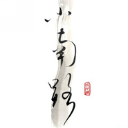

小南xiaonan
============================

|  |  |
| :--: | :-- |
| [ 小南xiaonan](https://emumo.xiami.com/album/370800) | **艺人**: [旅行团](../index.md) **语种**: 国语 **唱片公司**: 摩登天空 **发行时间**: 2010年02月13日 **专辑类别**: EP, 单曲 **专辑风格**: 城市民谣 Urban Folk **播放数**: 619973 **收藏数**: 595 **评论数**: 56  |

## 简介

这首即将于春节推出的单曲小南可能对于部分歌迷来说早就不陌生了，在经过重新编曲和填词后，这首歌被乐队进行了一次全新的诠释。缓缓进行的旋律、时有时无的马林巴的合奏，向我们呈现了一副冬日暖阳下小河融化流动的画面，歌曲中那些晶莹剔透的声音像极了小河边那些还未融化的冰晶反射出的暖阳的色彩，整首歌如同冬日里的一杯红茶，温暖、放松。听过之后令人心情舒畅。而主唱孔阳正是在这样的一个意境下用他干净透彻的声音像我们描绘着旅行团对幸福和人生的感悟。  
在经历过09年一系列疯狂和忙碌后，乐队却难能可贵的保持着内心平静，有条不紊的进行着创作。而这首小南的歌词则是乐队内心世界的最好体现。整篇词看起来更像是一封孔阳写给自己的信，配合着歌曲动听的旋律将内心的旁白向听者娓娓道来。然而，细究之下便会发现，歌曲的内涵如同滴撒在宣纸上的浓墨，一点一点的扩散开来的。歌词以小见大的像我们展示了乐队对生活的感悟以及几年漂泊生活中那些心态上的体味。折射出那些漂泊远方的南方游子们的内心以及对春满花开的安稳生后的期盼。孔阳透过歌词像我们诠释了他对人生的理解，那就是生活不论再怎么起伏跌宕，最终还是会回到原点归于简单。  
《小南》  
曲：子君  
词：孔阳  
生活是如此简单  
音乐里 是你的旁白  
时间就 像 流水一样 缓缓  
生命就 像 春天一样 烂漫  
记忆在 来回流窜  
画面里 是你和山川  
就这样 绿树成荫 自然  
就这样 来来去去 而安  
它被你引来 心门被你打开  
寂寞吞噬着空白 孤独跟着旋转  
明净的河岸 倒影我的未来  
这是生活的灵感 这是爱的姿态  
淡 随欲而安 就像你一样 简单  
白 是你的颜色 就将潇然都吹散 酒暖  
明净的河岸 倒影我的未来  
这是生活的灵感 这是爱的姿态  
我属于自然 只想活得简单  
谁会在最后行来 不平凡  
生活是 如此简单  
音乐里 是你的旁白  
时间就 像流水一样 缓缓  
生命就 像春天一样 烂漫  
就像你 一样　　 

## 曲目

## 评论

|  |  |  |  |
| :-- | :-- | :-- | :-- |
|  [虾米用户](https://emumo.xiami.com/u/49438226)  2020-04-11 00:41 赞(0) 踩(0) | 
时至今日唯一还记得的一首
 |
|  [虾米用户](https://emumo.xiami.com/u/39695168)   2019-07-04 12:03 赞(0) 踩(0) | 
失落但又没关系
 |
|  [虾米用户](https://emumo.xiami.com/u/18130051) 你能成为那个你 2015-09-26 07:08 赞(2) 踩(0) | 
「新开世界」2016年旅行团乐队演唱会 开票了！ 1月1日首度登陆北展剧场！ 成军十周年，2016年，10年零一天， 带来全新专辑《10 Day’s》， 纪念十年如梦旅程！ 欢迎3000个“你”， 与旅行团共同迎接一个崭新开启的世界！【票务详情】大麦网：<a href="http://item.damai.cn/89885.html" target="_blank" rel="nofollow noreferrer noopener">http://item.damai.cn/89885.html</a>中票在线：<a href="http://www.chinaticket.com/view/23058.html" target="_blank" rel="nofollow noreferrer noopener">http://www.chinaticket.com/view/23058.html</a>票虫网：<a href="http://www.piaochong.com/view/962.html" target="_blank" rel="nofollow noreferrer noopener">http://www.piaochong.com/view/962.html</a>豆瓣网：<a href="http://www.douban.com/event/25424946/" target="_blank" rel="nofollow noreferrer noopener">http://www.douban.com/event/25424946/</a>
 |
|  [虾米用户](https://emumo.xiami.com/u/341091) 偶爱我们呢~ 2015-06-10 10:49 赞(2) 踩(0) | 
在我不知所措的夏天里，这首歌做了几个月的镇定剂
 |
|  [虾米用户](https://emumo.xiami.com/u/32176686) Hugs to ashe... 2015-05-07 09:42 赞(0) 踩(0) | 
美的都快哭了
 |
|  [虾米用户](https://emumo.xiami.com/u/3769677)  2015-05-01 20:40 赞(0) 踩(0) | 
沉浸在音乐的流淌中，时光散漫了起来！
 |
|  [虾米用户](https://emumo.xiami.com/u/3769677)  2015-05-01 20:40 赞(0) 踩(0) | 
沉浸在音乐的流淌中，时光散漫了起来！
 |
|  [虾米用户](https://emumo.xiami.com/u/14364706) 暂无签名~ 2015-03-31 17:48 赞(0) 踩(0) | 
爱上旅行团啦，喜欢！
 |
|  [虾米用户](https://emumo.xiami.com/u/42547445) 旅行团螺狮粉 2014-10-20 14:36 赞(0) 踩(0) | 
最爱小南～
 |
|  [虾米用户](https://emumo.xiami.com/u/75718)  2014-09-23 15:04 赞(0) 踩(0) | 
音不准！！
 |
|  [虾米用户](https://emumo.xiami.com/u/7361996) 呵 2014-08-12 18:26 赞(0) 踩(0) | 
听着旋律耳熟，是改编的歌嘛
 |
|  [虾米用户](https://emumo.xiami.com/u/8007302) As I move in... 2014-04-04 11:41 赞(0) 踩(0) | 
来自广西柳州小南路
 |
|  [虾米用户](https://emumo.xiami.com/u/2319771)  2014-03-17 17:13 赞(0) 踩(0) | 
晶莹剔透，像枚掉落在青草河滩边的旧水晶。
 |
|  [虾米用户](https://emumo.xiami.com/u/4412959) fresh steame... 2014-03-17 15:26 赞(0) 踩(0) | 
我等着他唱生活是如此艰难，没想到他唱的是生活是如此简单。螺蛳粉先生，你让我失望了！
 |
|  [虾米用户](https://emumo.xiami.com/u/1258781)   2014-01-18 01:06 赞(13) 踩(0) | 
这大概是旅行团的歌里我最喜欢的一首，听着就会很放松。刚听这歌的那一年，整个人充满正能量，内心温暖，生活简单，每天看书睡觉，看一场心仪的现场也能乐上一整月，日子平淡且满足。随着年龄的增长，做人反而愈发疯狂。其实你得到多少与你不相符原本就不属于你的快乐，日后必会以双倍的失落和难过来偿还。早就明白[月亮]
 |
|  [虾米用户](https://emumo.xiami.com/u/2718342) 我決定快樂起來 我今天就... 2013-10-01 21:30 赞(0) 踩(0) | 
refreshing
 |
|  [虾米用户](https://emumo.xiami.com/u/2320612)  2013-05-15 09:15 赞(0) 踩(0) | 
fensi
 |
|  [虾米用户](https://emumo.xiami.com/u/13191483) 爱音乐，爱生活 2013-04-01 12:00 赞(0) 踩(0) | 
自然舒服就是旅行团的特色
 |
|  [虾米用户](https://emumo.xiami.com/u/8573800) 签名如昵称 2013-02-15 17:26 赞(0) 踩(0) | 
最爱
 |
|  [虾米用户](https://emumo.xiami.com/u/9657806) Music Makes ... 2013-02-11 22:34 赞(0) 踩(0) | 
清新，百听不厌
 |
|  [虾米用户](https://emumo.xiami.com/u/3343400)  2013-01-28 03:53 赞(0) 踩(0) | 
我想说他们每一首都好惊艳。。。@Lohas蛋 你有这首单曲吗？我下不到。
 |
|  [虾米用户](https://emumo.xiami.com/u/12197099)  2013-01-18 00:42 赞(0) 踩(0) | 
他们我最喜欢的一首。
 |
|  [虾米用户](https://emumo.xiami.com/u/7486571)  2013-01-04 13:45 赞(0) 踩(0) | 
孔阳很优秀
 |
|  [虾米用户](https://emumo.xiami.com/u/10604840) 活着 die a lon 2012-10-05 13:25 赞(0) 踩(0) | 
旅行团最舒服的就是温和，虽然有点小男孩，但是很温暖
 |
|  [虾米用户](https://emumo.xiami.com/u/9772751)  2012-07-21 10:48 赞(0) 踩(0) | 
清新，听起来很舒服，配上吉他，美呆了。
 |
|  [虾米用户](https://emumo.xiami.com/u/9107240)   2012-07-03 00:52 赞(0) 踩(0) | 
你留恋商店   我忘返花园
 |
|  [虾米用户](https://emumo.xiami.com/u/6326772)  2012-04-17 15:21 赞(0) 踩(0) | 
最喜欢的一首。
 |
|  [虾米用户](https://emumo.xiami.com/u/5487796)  2012-01-05 18:42 赞(0) 踩(0) | 
孔阳真的好棒好厉害。
 |
|  [虾米用户](https://emumo.xiami.com/u/7188977)  2011-12-12 20:42 赞(0) 踩(0) | 
喜欢这种淡淡幽幽 清清爽爽 年轻的味道
 |
|  [虾米用户](https://emumo.xiami.com/u/2256721)   2011-11-17 13:29 赞(1) 踩(0) | 
还以为是棒球英豪的那个小南
 |
|  [虾米用户](https://emumo.xiami.com/u/5709327)  2011-09-04 23:59 赞(0) 踩(0) | 
温柔的感觉
 |
|  [虾米用户](https://emumo.xiami.com/u/806178)  2011-08-26 11:41 赞(0) 踩(0) | 
喜欢
 |
|  [虾米用户](https://emumo.xiami.com/u/3439635)  2011-08-18 23:39 赞(0) 踩(0) | 
就在刚刚我又烦躁了,radio里突然放了旅行团 的《小南》，“明净的河岸 倒影我的未来 这是生活的灵感 这是爱的姿态”我开始享受接受现在的一切...
 |
|  [虾米用户](https://emumo.xiami.com/u/3528036)   2011-08-10 23:37 赞(0) 踩(0) | 
因为名字  听后  因为音乐
 |
|  [虾米用户](https://emumo.xiami.com/u/5009062)  2011-08-08 00:41 赞(0) 踩(0) | 
这名字 是 缘分啊
 |
|  [虾米用户](https://emumo.xiami.com/u/5009062)  2011-08-08 00:40 赞(0) 踩(0) | 
简简单单的生活 就是我的追求 fighting
 |
|  [虾米用户](https://emumo.xiami.com/u/3049271) 最近我走的是复古风~ 2011-07-20 08:26 赞(0) 踩(0) | 
喜欢这个干净的声音
 |
|  [虾米用户](https://emumo.xiami.com/u/3255139)  2011-07-16 21:16 赞(0) 踩(0) | 
感觉
 |
|  [虾米用户](https://emumo.xiami.com/u/1958079)  2011-07-02 13:50 赞(0) 踩(0) | 
一首慵懒的诗
 |
|  [虾米用户](https://emumo.xiami.com/u/3730993)  2011-05-17 00:28 赞(0) 踩(0) | 
干净
 |
|  [虾米用户](https://emumo.xiami.com/u/3792581)  2011-05-16 21:12 赞(0) 踩(0) | 
小曲儿
 |
|  [虾米用户](https://emumo.xiami.com/u/2355976)  2011-04-24 12:36 赞(0) 踩(0) | 
hh
 |
|  [虾米用户](https://emumo.xiami.com/u/1532700)  2011-04-20 15:44 赞(0) 踩(0) | 
好喜欢…会轻轻点着下巴 跟着旋律
 |
|  [虾米用户](https://emumo.xiami.com/u/3671937)  2011-04-20 15:00 赞(0) 踩(0) | 
摩登天空
 |
|  [虾米用户](https://emumo.xiami.com/u/2064785)  2011-04-20 00:39 赞(0) 踩(0) | 
其实写的是柳州的水南路，那段路很美，但是现在变了，变得铜臭和迂腐！
 |
|  [虾米用户](https://emumo.xiami.com/u/364473)  2011-03-29 15:24 赞(0) 踩(0) | 
旅行团的音乐，有林一峰的味道
 |
|  [虾米用户](https://emumo.xiami.com/u/3194492)   2011-03-19 15:14 赞(0) 踩(0) | 
没理由
 |
|  [虾米用户](https://emumo.xiami.com/u/2702923)  2011-02-12 13:48 赞(0) 踩(0) | 
漂亮的封面
 |
|  [虾米用户](https://emumo.xiami.com/u/210673)  2010-10-08 14:44 赞(0) 踩(0) | 
第一次听他们～
 |
|  [虾米用户](https://emumo.xiami.com/u/317945)  2010-10-03 02:06 赞(0) 踩(0) | 
我家就在小南路，喜欢你们的诠释。
 |
|  [虾米用户](https://emumo.xiami.com/u/1206695)  2010-07-21 19:14 赞(0) 踩(0) | 
喜欢你们的自由清新
 |
|  [虾米用户](https://emumo.xiami.com/u/1030836)  2010-07-01 16:17 赞(0) 踩(0) | 
很喜欢
 |
|  [虾米用户](https://emumo.xiami.com/u/596601)  2010-05-08 21:37 赞(0) 踩(0) | 
和谐
 |
|  [虾米用户](https://emumo.xiami.com/u/100001) 卢瑟 2010-03-13 16:48 赞(0) 踩(0) | 
温暖
 |
|  [虾米用户](https://emumo.xiami.com/u/333888)  2010-03-12 22:15 赞(0) 踩(0) | 
等了一年呢几乎~~   就是少了点   沉沉了许多   虽没有多少惊喜 不过还是喜欢的
 |
|  [虾米用户](https://emumo.xiami.com/u/649357)  2010-03-12 12:50 赞(1) 踩(0) | 
暖阳中懒洋洋的时候听到这首歌，心也跟着悠闲起来。推荐！
 |
