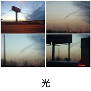

光
============================

|  |  |
| :--: | :-- |
| [ 光](https://emumo.xiami.com/album/431939) | **艺人**: [旅行团](../index.md) **语种**: 国语 **唱片公司**: 摩登天空 **发行时间**: 2009年12月13日 **专辑类别**: EP, 单曲 **专辑风格**: 城市民谣 Urban Folk **播放数**: 142353 **收藏数**: 488 **评论数**: 40  |

## 简介

因被称为“人类拯救自己的最后机会”而备受瞩目的联合国气候变化大会已经进入了尾声，而在地球另一端的北京，旅行团乐队全新公益单曲也如期出炉了，这首全新单曲是和著名国际公益组织乐施会共同合作完成的。   
  
这首以“为贫穷人抵抗气候变化”为主线索的歌曲早在09年年底就开始酝酿了，作为气候变化代表的乐施会工作人员找到了摩登天空，并希望旗下艺人旅行团乐队能够参与到这项活动中并合作创作一首主题曲。在经过反复讨论和修改后，最终的版本在11月底录制完成并在12月13日完成了全部的缩混工作。   
  
主创孔阳在谈到这次合作时表示：“通过这次的合作，对公益事业在心理上产生了一些变化。尽管，从小就被父母告知要注意节约、爱护环境，但是，通过这样的一件事情，才真正感到为环境做出了自己的贡献。而且，之前总觉得那些个口号和广告离自己太远了，只有在看到这些现实的画面后，才能真正的发现这个地球已经被摧残的很严重了。这首歌曲的动机来自一个非洲原始部落，那个部落的信仰是太阳神，部落的人相信一切的力量都是太阳给予的。光给予了一切生命，能够将事物都紧密联系着，人们也相信，通过凝聚团结互助，才能让部落越来越兴旺。”

## 曲目

## 评论

|  |  |  |  |
| :-- | :-- | :-- | :-- |
|  [虾米用户](https://emumo.xiami.com/u/18130051) 你能成为那个你 2015-09-26 07:08 赞(1) 踩(0) | 
「新开世界」2016年旅行团乐队演唱会 开票了！ 1月1日首度登陆北展剧场！ 成军十周年，2016年，10年零一天， 带来全新专辑《10 Day’s》， 纪念十年如梦旅程！ 欢迎3000个“你”， 与旅行团共同迎接一个崭新开启的世界！【票务详情】大麦网：<a href="http://item.damai.cn/89885.html" target="_blank" rel="nofollow noreferrer noopener">http://item.damai.cn/89885.html</a>中票在线：<a href="http://www.chinaticket.com/view/23058.html" target="_blank" rel="nofollow noreferrer noopener">http://www.chinaticket.com/view/23058.html</a>票虫网：<a href="http://www.piaochong.com/view/962.html" target="_blank" rel="nofollow noreferrer noopener">http://www.piaochong.com/view/962.html</a>豆瓣网：<a href="http://www.douban.com/event/25424946/" target="_blank" rel="nofollow noreferrer noopener">http://www.douban.com/event/25424946/</a>
 |
|  [虾米用户](https://emumo.xiami.com/u/321406)  2014-10-27 11:43 赞(0) 踩(0) | 
就像旅行团自己的名字一样，每一首歌都与每个地方有关，像是足印留在那个地方的记忆，既温暖又清晰，渴望更远的旅行
 |
|  [虾米用户](https://emumo.xiami.com/u/11919257)  2014-02-17 00:03 赞(0) 踩(0) | 
让爱融化冰冷火一样的光力量来自四面各方我们一起积蓄明天的力量筑起一道信仰的墙
 |
|  [虾米用户](https://emumo.xiami.com/u/9080508) 可知道 你的光 耀了我 2014-01-14 13:46 赞(0) 踩(0) | 
难得出了 好喜欢封面 看着就想去旅游了
 |
|  [虾米用户](https://emumo.xiami.com/u/19489804)  2013-08-16 21:55 赞(0) 踩(0) | 
caide
 |
|  [虾米用户](https://emumo.xiami.com/u/17297084)  2013-07-25 10:57 赞(1) 踩(0) | 
孔阳啊你真的很优秀。
 |
|  [虾米用户](https://emumo.xiami.com/u/15274262) 完成一次完美的旅行... 2013-06-07 17:37 赞(0) 踩(0) | 
有正的能量..
 |
|  [虾米用户](https://emumo.xiami.com/u/14712007) .中国 2013-05-08 11:35 赞(0) 踩(0) | 
like
 |
|  [虾米用户](https://emumo.xiami.com/u/8915545)  2013-04-25 10:38 赞(0) 踩(0) | 
力量来自四面八方  我们一起积蓄明天的力量 加油！~
 |
|  [虾米用户](https://emumo.xiami.com/u/8915545)  2013-04-25 10:36 赞(1) 踩(0) | 
最好听的公益歌！！！
 |
|  [虾米用户](https://emumo.xiami.com/u/13191483) 爱音乐，爱生活 2013-04-01 11:54 赞(0) 踩(0) | 
灰常正能量的说，自由惬意，适合星期一哈，大爱旅行团
 |
|  [虾米用户](https://emumo.xiami.com/u/12442312) #美人與花 #甜中帶苦 ... 2013-01-15 12:18 赞(0) 踩(0) | 
优雅的复古风
 |
|  [虾米用户](https://emumo.xiami.com/u/7486571)  2013-01-04 13:41 赞(0) 踩(0) | 
很有爱的歌
 |
|  [虾米用户](https://emumo.xiami.com/u/325488)  2012-12-03 11:36 赞(0) 踩(0) | 
封面好美
 |
|  [虾米用户](https://emumo.xiami.com/u/1158090) 功不唐捐 2012-11-19 23:51 赞(0) 踩(0) | 
听完后似乎充满力量
 |
|  [虾米用户](https://emumo.xiami.com/u/196769) sunzongrui 2012-10-19 20:55 赞(0) 踩(0) | 
流行
 |
|  [虾米用户](https://emumo.xiami.com/u/5032318) 暖暖 2012-10-16 21:47 赞(0) 踩(0) | 
适合做背景音乐
 |
|  [虾米用户](https://emumo.xiami.com/u/9772751)  2012-07-21 10:49 赞(0) 踩(0) | 
好听啊
 |
|  [虾米用户](https://emumo.xiami.com/u/2590191) 我还没想好要写什么... 2012-07-16 10:44 赞(0) 踩(0) | 
好治愈 (*￣︶￣)y
 |
|  [虾米用户](https://emumo.xiami.com/u/9670414)  2012-07-02 22:50 赞(0) 踩(0) | 
最近精神太紧绷，作为精神食粮之一的音乐，每次聆听他们的音乐，会让人有种不被束缚着的心灵有种松弛而随意的奇妙之感，阳光、快乐、清新、松弛，是他们想要表达的！@旅行团乐队
 |
|  [虾米用户](https://emumo.xiami.com/u/6988443)  2012-04-30 10:04 赞(0) 踩(0) | 
温暖的力量
 |
|  [虾米用户](https://emumo.xiami.com/u/712013)  2012-02-04 20:50 赞(0) 踩(0) | 
听到后面觉得好暖。
 |
|  [虾米用户](https://emumo.xiami.com/u/7126401) 借我奋不顾身的勇敢 2011-12-06 20:34 赞(0) 踩(0) | 
喜欢这张专辑的封边。美好的希望被旅行团变得如此简单。
 |
|  [虾米用户](https://emumo.xiami.com/u/7126401) 借我奋不顾身的勇敢 2011-12-06 20:33 赞(0) 踩(0) | 
美好的希望被旅行团变得如此简单。
 |
|  [虾米用户](https://emumo.xiami.com/u/3830741)  2011-12-01 09:57 赞(0) 踩(0) | 
很温暖，很有力量
 |
|  [虾米用户](https://emumo.xiami.com/u/384269) 要是可以一直这样该有多好 2011-11-30 19:42 赞(0) 踩(0) | 
小任务
 |
|  [虾米用户](https://emumo.xiami.com/u/6519762) 一条打鼓的民谣狗 2011-10-31 20:36 赞(0) 踩(0) | 
旅行团的所有歌里，最喜欢的一首，彪子加油
 |
|  [虾米用户](https://emumo.xiami.com/u/5963725) 哪里是你永远的拥抱 2011-10-29 14:15 赞(0) 踩(0) | 
他们的声音听了就轻松
 |
|  [虾米用户](https://emumo.xiami.com/u/437710)  2011-09-19 20:54 赞(0) 踩(0) | 
很好听！
 |
|  [虾米用户](https://emumo.xiami.com/u/3255139)  2011-07-16 21:16 赞(0) 踩(0) | 
感觉
 |
|  [虾米用户](https://emumo.xiami.com/u/4781057)  2011-07-11 10:31 赞(0) 踩(0) | 
喜欢还需要理由
 |
|  [虾米用户](https://emumo.xiami.com/u/845004)  2011-06-08 14:28 赞(0) 踩(0) | 
公益歌曲。
 |
|  [虾米用户](https://emumo.xiami.com/u/1224366)  2011-04-30 20:32 赞(0) 踩(0) | 
旅行团。。光 唱出简单和希望。。绝对的好音乐
 |
|  [虾米用户](https://emumo.xiami.com/u/1224366)  2011-04-30 11:35 赞(0) 踩(0) | 
ep 光。。
 |
|  [虾米用户](https://emumo.xiami.com/u/3671937)  2011-04-20 14:59 赞(0) 踩(0) | 
摩登天空
 |
|  [虾米用户](https://emumo.xiami.com/u/1365196)  2011-04-04 17:51 赞(0) 踩(0) | 
听到就会想推荐,近乎完美的编曲,,,,
 |
|  [虾米用户](https://emumo.xiami.com/u/1365196)  2011-03-26 13:11 赞(0) 踩(0) | 
光
 |
|  [虾米用户](https://emumo.xiami.com/u/1364164) 我还没想好要写什么... 2011-03-25 22:16 赞(0) 踩(0) | 
平静。
 |
|  [虾米用户](https://emumo.xiami.com/u/1373049)  2011-03-24 21:16 赞(0) 踩(0) | 
^_^。。。
 |
|  [虾米用户](https://emumo.xiami.com/u/71884)  2011-03-24 19:04 赞(0) 踩(0) | 
很温暖
 |
