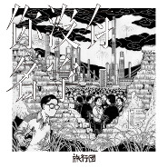

你没有名字
============================

|  |  |
| :--: | :-- |
| [ 你没有名字](https://emumo.xiami.com/album/5021099525) | **艺人**: [旅行团](../index.md) **语种**: 国语 **唱片公司**: StreetVoice **发行时间**: 2020年08月10日 **专辑类别**: EP, 单曲 **专辑风格**: 独立摇滚 Indie Rock **播放数**: 161080 **收藏数**: 29 **评论数**: 12  |

## 简介

有时候，我们质问生活，不会得到一个答案，而是得到更猛烈的一巴掌。生活不知道我们是谁，时代不记得我们的名字，我们组成了这个世界的声响，却被浪潮裹挟，面目模糊地存在着。

但在无数个始料未及的时刻，我们这群看似没有名字的普通人，共同面对了生命中最不可捉摸的造化，努力过后再努力，拼尽全力在生活的巴掌面前幸存。失望过，但要再把希望找回；消失过，但要再次写下自己的名字。

旅行团在《你没有名字》中成为真实的演员，用音乐搭建无法逃避的世界。他们成为齿轮、成为噩耗、成为那些突如其来的电闪雷鸣，而最终，他们是希望、是对抗、是努力将自己的名字刻在这个时代的“旅行团”。

词作者王海涛娓娓道来，与旅行团呼应，一起写下这首唱给普通人的歌。

希望我们都努力地带着自己的名字，使劲地、兴高采烈地，活下去。

## 曲目

## 评论

|  |  |  |
| :-- | :-- | :-- |
|  [虾米用户](https://emumo.xiami.com/u/10319676)   2020-09-17 12:22 赞(0) 踩(0) | 
超爱这种风格的，给你八分，怕你骄傲 
 |
|  [虾米用户](https://emumo.xiami.com/u/341091) 偶爱我们呢~ 2020-09-16 17:52 赞(0) 踩(0) | 
太不耐听了，感觉有失水准
 |
|  [虾米用户](https://emumo.xiami.com/u/851674)  2020-08-13 17:46 赞(2) 踩(0) | 
最近这两首如果是新专先行曲的话，那我还蛮期待的！
 |
|  [虾米用户](https://emumo.xiami.com/u/3845059)  2020-08-13 01:58 赞(1) 踩(0) | 
非常棒
 |
|  [虾米用户](https://emumo.xiami.com/u/10501201)  2020-08-12 21:44 赞(0) 踩(0) | 
有点八十年代的风格
 |
|  [虾米用户](https://emumo.xiami.com/u/287348397) 我是永远向着远方独行的浪... 2020-08-11 14:33 赞(0) 踩(0) | 
没什么特别的感觉
 |
|  [虾米用户](https://emumo.xiami.com/u/198117992)  2020-08-11 10:36 赞(1) 踩(0) | 
超级赞，尤其是在结尾处不断循环的你没有名字，在虚拟与现实中游走
 |
|  [虾米用户](https://emumo.xiami.com/u/349493699)  2020-08-10 23:18 赞(0) 踩(0) | 
是我爱的，没错了
 |
|  [虾米用户](https://emumo.xiami.com/u/22430760) 这家伙很特别什么也没留下... 2020-08-10 13:48 赞(0) 踩(0) | 
阅
 |
|  [虾米用户](https://emumo.xiami.com/u/48658719) 风吹散，说晚安，不再见。 2020-08-10 10:09 赞(1) 踩(0) | 
编曲有点disco的味道，有意思
 |
|  [虾米用户](https://emumo.xiami.com/u/110088060) 作为报答、我吔给泥放点、... 2020-08-10 10:03 赞(0) 踩(0) | 
来了
 |
|  [虾米用户](https://emumo.xiami.com/u/12996076) 我还没想好要写什么... 2020-08-10 10:02 赞(0) 踩(0) | 
来了！
 |
