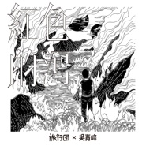

红色的河（旅行团 & 吴青峰）
============================

|  |  |
| :--: | :-- |
| [ 红色的河（旅行团 & 吴青峰）](https://emumo.xiami.com/album/5021144168) | **艺人**: [旅行团](../index.md) **语种**: 国语 **唱片公司**: StreetVoice **发行时间**: 2020年07月23日 **专辑类别**: EP, 单曲 **专辑风格**: 国语流行 Mandarin Pop **播放数**: 2227996 **收藏数**: 76 **评论数**: 54  |

## 简介

河流燃烧起来了。

红色的河或许此刻正流过身边，而你和我却并没有意识到。

面对红色的河，我们怀抱着只属于自己的心绪。曾经被同一簇野火燃烧，但我们可能再也不会航向同一处地方。

旅行团乐队成员之外，吴青峰是这首作品的第一位听众。唱过后，青峰在没有标准解答的音乐中，得到了不可名状的安慰。

在寂静中燃烧，在炙热中浸润，红色的河倒映出五位音乐人各不相同的故事。

旅行团X吴青峰合作单曲，开启2020年创作专辑的新世界。

踏入《红色的河》，你看到的是怎样的景色？

## 曲目

## 评论

|  |  |  |
| :-- | :-- | :-- |
|  [虾米用户](https://emumo.xiami.com/u/35141236) 魚缸是我的敵人  2020-09-08 17:00 赞(0) 踩(0) | 
求費洛蒙小姐
 |
|  [虾米用户](https://emumo.xiami.com/u/11349357)  2020-08-26 23:05 赞(0) 踩(0) | 
一下子就抓住了我们的共鸣。
 |
|  [虾米用户](https://emumo.xiami.com/u/1520711) 泽塘飞鸿拂晓月 2020-08-12 22:53 赞(0) 踩(0) | 
吴青峰的声音太有辨识度了，像一把利刃， 温柔得刺到心里去。
 |
|  [虾米用户](https://emumo.xiami.com/u/69436188) 我还没想好要写什么... 2020-08-11 21:49 赞(0) 踩(0) | 
太好了……已经单曲循环一整天了
 |
|  [虾米用户](https://emumo.xiami.com/u/71839580) 极其业余音乐爱好者. 2020-08-04 00:21 赞(1) 踩(0) | 
言说时却陷入沉默，好听的歌却不知道怎么夸。
 |
|  [虾米用户](https://emumo.xiami.com/u/3353037)  2020-07-31 19:26 赞(1) 踩(0) | 
太好听了，感到温暖，想哭，好像和歌者一起在时空之海中川流，在不确定中却又有希望和坚持与守候，有一次出去一直耳机里单曲循环，舍不得取下来。。。现在正在从舟山群岛往回走的路上，两边一望无际的大海，一回头山岛下星星点点的温暖灯光，如此应景，心中一震却又感动到想要落泪。想严肃地听这首歌，里面的遇见，擦肩，相错，等候是每个人生命中也许会出现的难得一遇，可遇不可求，有时一遇就是灵魂的震动直到一生，如此简单却又如此深邃，一眼万年，萍水相逢又命中注定，是无奈还是洒脱？歌者婉婉诉说着红色和黑色交错的故事。最后借用网友一句：这是什么神仙组合？！太神仙了有木有，这个夏天有着落了，太满足了，谢啦！！！
 |
|  [虾米用户](https://emumo.xiami.com/u/8879490) 雨夜，又看见那只萤火虫。 2020-07-31 10:47 赞(0) 踩(0) | 
必须满分，曲调柔美，音乐好听，很迷蒙。
 |
|  [虾米用户](https://emumo.xiami.com/u/40294907) 多一些好运气！ 2020-07-28 09:51 赞(0) 踩(0) | 
喜欢青峰，声音超级好听，而且细腻，爱死他了！
 |
|  [虾米用户](https://emumo.xiami.com/u/10831382)  2020-07-28 08:21 赞(0) 踩(0) | 
好听，好听，好听，一直循环播放，还是好听❤️
 |
|  [虾米用户](https://emumo.xiami.com/u/355734113)  2020-07-27 21:59 赞(0) 踩(0) | 
好听，青峰最棒
 |
|  [虾米用户](https://emumo.xiami.com/u/69076)  2020-07-26 20:06 赞(0) 踩(0) | 
只是时晨未到……
 |
|  [虾米用户](https://emumo.xiami.com/u/263446708) 这个人很懒，什么也没留下... 2020-07-26 19:21 赞(1) 踩(0) | 
佩戴耳机聆听，享受独属自己的那份美好，仙气满满的感jio.
 |
|  [虾米用户](https://emumo.xiami.com/u/8811077) 星空下沉，四海升腾，归去... 2020-07-26 17:17 赞(0) 踩(0) | 
这么好听的歌，必须满分推荐！
 |
|  [虾米用户](https://emumo.xiami.com/u/328047347)  2020-07-26 15:10 赞(0) 踩(0) | 
好听
 |
|  [虾米用户](https://emumo.xiami.com/u/2410945)  2020-07-25 20:06 赞(0) 踩(0) | 
好听的旋律，悄悄地，就这样悄悄地～
 |
|  [虾米用户](https://emumo.xiami.com/u/332607557) 别来爱我 2020-07-25 11:16 赞(0) 踩(0) | 
像随着河水流淌，心中充满红色的歌，一路漂流下去
 |
|  [虾米用户](https://emumo.xiami.com/u/311140843)  2020-07-24 22:30 赞(0) 踩(0) | 
我觉得完美
 |
|  [虾米用户](https://emumo.xiami.com/u/265073822) 世上无难事，只要肯放弃 2020-07-24 19:12 赞(3) 踩(0) | 
毫无违和感的作品，契合度高，是确认过眼神，是直击灵魂深处的音乐。
 |
|  [虾米用户](https://emumo.xiami.com/u/60455036)   2020-07-24 18:02 赞(0) 踩(0) | 
仿佛是梦中那个热情却看不清五官的情人
 |
|  [虾米用户](https://emumo.xiami.com/u/325763180) 我还没想好要写什么... 2020-07-24 15:53 赞(0) 踩(0) | 

 |
|  [虾米用户](https://emumo.xiami.com/u/190211425)  2020-07-24 13:10 赞(0) 踩(0) | 
一下子摸到心头的感觉，爱了爱了，都是我喜欢的人，还合作了，开心！
 |
|  [虾米用户](https://emumo.xiami.com/u/48974418) 无乐不欢 2020-07-24 11:59 赞(0) 踩(0) | 
和声很棒，与其说是合唱，其实是帮青峰和声，青峰是大主角
 |
|  [虾米用户](https://emumo.xiami.com/u/260167529) 爱音乐的疯子 2020-07-24 10:56 赞(1) 踩(0) | 
因为乐队的夏天认识到现在的合作 缘分是奇妙的 这首歌很旅行团
 |
|  [虾米用户](https://emumo.xiami.com/u/318414893) Can’t live w... 2020-07-24 09:38 赞(0) 踩(0) | 
词，写得痛侧心扉，曲，听到肝肠寸断。应该是2020年度最爱歌单top1吧&amp;hellip;&amp;hellip;
 |
|  [虾米用户](https://emumo.xiami.com/u/49856674)  2020-07-24 09:29 赞(0) 踩(0) | 
已经存到苏打绿的趴间，嘻嘻嘻
 |
|  [虾米用户](https://emumo.xiami.com/u/333250411) 我说所有的酒，都不如你 2020-07-24 08:37 赞(0) 踩(0) | 
这个神仙合作立马十分
 |
|  [虾米用户](https://emumo.xiami.com/u/30830) 我还没想好要写什么... 2020-07-24 06:48 赞(1) 踩(0) | 
空灵的旋律加上青峰独特的嗓音，很好听啊！
 |
|  [虾米用户](https://emumo.xiami.com/u/334785884) 我还没想好要写什么... 2020-07-24 02:09 赞(1) 踩(0) | 
以为自己心无波澜，其实等你那么迫切，如果连句结束都没有，你又何苦在彼此心中埋下墓碑，连名字都不配拥有。
 |
|  [虾米用户](https://emumo.xiami.com/u/313745021)  2020-07-24 01:24 赞(0) 踩(0) | 

 |
|  [虾米用户](https://emumo.xiami.com/u/17806314) 以梦为马 以己为光 2020-07-24 01:08 赞(0) 踩(0) | 
_(:з」&amp;ang;)_
 |
|  [虾米用户](https://emumo.xiami.com/u/124998020)   2020-07-24 00:48 赞(0) 踩(0) | 
没有理由的喜欢
 |
|  [虾米用户](https://emumo.xiami.com/u/14408942) 这家伙很聪明什么也没留下... 2020-07-23 23:19 赞(0) 踩(0) | 

 |
|  [虾米用户](https://emumo.xiami.com/u/42963872) 我还没想好要写什么... 2020-07-23 20:55 赞(0) 踩(0) | 
楼上不要这样 
 |
|  [虾米用户](https://emumo.xiami.com/u/409703139) 用不着看这里，听我歌单就... 2020-07-23 20:08 赞(1) 踩(0) | 
猜猜什么时候下架吧
 |
|  [虾米用户](https://emumo.xiami.com/u/23091801) 心有猛虎，细嗅蔷薇。 2020-07-23 18:09 赞(3) 踩(0) | 
我看到了，在水一方的蒹葭伊人，雨巷路过的丁香姑娘。我在红与黑之间两难，我追求的应该没有改变，永远只是我爱恨交织的梦与理想。
 |
|  [虾米用户](https://emumo.xiami.com/u/5867250) 生死看淡 不服就干 2020-07-23 17:54 赞(0) 踩(0) | 
唱到心扉深处 情不能自已。。。
 |
|  [虾米用户](https://emumo.xiami.com/u/44849251) 我还没想好要写什么... 2020-07-23 16:49 赞(0) 踩(0) | 
红色既是崩裂的碎片，亦是不灭的希望。 所有的不安和美妙永远相携相伴，在宇宙的广袤无垠中浅浅浮现，渐渐飘远。
 |
|  [虾米用户](https://emumo.xiami.com/u/29845054) 休息追剧看小说玩游戏出游... 2020-07-23 16:35 赞(0) 踩(0) | 

 |
|  [虾米用户](https://emumo.xiami.com/u/236199014) 这是个好主意 2020-07-23 16:23 赞(0) 踩(0) | 
感受到了这首歌的温度
 |
|  [虾米用户](https://emumo.xiami.com/u/324070891) 这么多的神仙里 最爱黄家... 2020-07-23 15:27 赞(0) 踩(0) | 
超棒！好听
 |
|  [虾米用户](https://emumo.xiami.com/u/353722630) 一生所爱     至死不... 2020-07-23 14:06 赞(1) 踩(0) | 

 |
|  [虾米用户](https://emumo.xiami.com/u/424047486) 想吃火锅 2020-07-23 13:45 赞(0) 踩(0) | 
开启单曲循环模式
 |
|  [虾米用户](https://emumo.xiami.com/u/47494497) 李志、陈升，“虾米也没有... 2020-07-23 13:32 赞(0) 踩(0) | 
有thirteen senses的感觉
 |
|  [虾米用户](https://emumo.xiami.com/u/328657369) 风格随心而变、 2020-07-23 12:44 赞(0) 踩(0) | 
i了i了
 |
|  [虾米用户](https://emumo.xiami.com/u/281139730) 此时情绪此时天 无事小神... 2020-07-23 12:41 赞(0) 踩(0) | 
bravo⭐
 |
|  [虾米用户](https://emumo.xiami.com/u/267328845)  2020-07-23 12:37 赞(0) 踩(0) | 
好搭的声线！一如既往的旅行团风格
 |
|  [虾米用户](https://emumo.xiami.com/u/261706959)  2020-07-23 12:35 赞(0) 踩(0) | 

 |
|  [虾米用户](https://emumo.xiami.com/u/15306839) # 2020-07-23 12:30 赞(0) 踩(0) | 
我 了
 |
|  [虾米用户](https://emumo.xiami.com/u/11157355) 榕树长青 2020-07-23 12:22 赞(0) 踩(0) | 

 |
|  [虾米用户](https://emumo.xiami.com/u/257908344) 我还没想好要写什么... 2020-07-23 12:15 赞(0) 踩(0) | 
赞 
 |
|  [虾米用户](https://emumo.xiami.com/u/348750095)  2020-07-23 12:13 赞(0) 踩(0) | 
好听好听
 |
|  [虾米用户](https://emumo.xiami.com/u/205195976) 暂时想不到什么矫情的话。 2020-07-23 12:12 赞(0) 踩(0) | 

 |
|  [虾米用户](https://emumo.xiami.com/u/378977252) 梵音在弦外／醉翁意韵妙 2020-07-23 12:12 赞(0) 踩(0) | 
second
 |
|  [虾米用户](https://emumo.xiami.com/u/3407174)   2020-07-23 12:02 赞(0) 踩(0) | 
❤️
 |
