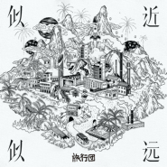

似近似远
============================

|  |  |
| :--: | :-- |
| [ 似近似远](https://emumo.xiami.com/album/5021409333) | **艺人**: [旅行团](../index.md) **语种**: 国语 **唱片公司**: StreetVoice **发行时间**: 2020年09月16日 **专辑类别**: 录音室专辑 **专辑风格**: 独立摇滚 Indie Rock, 独立流行 Indie Pop **播放数**: 274523 **收藏数**: 595 **评论数**: 73  |

## 简介

我们常常祈求一个确切的状态，将自己准确地安放在世界的某个位置上，希望所有追逐的都尽收囊中，期待面对的问题与选择都有对应的答案。

然而我们所希望的、我们习以为常的、我们以为唾手可得的，忽然在某一刻，遁入了迷雾中。

那些人事物似乎很近，却逐渐远去，不知道什么时候又再次掉转方向来到我们面前，但没有人能确定，这是不是最终的结局。

 

慢慢会知道，变幻莫测是人生常态的一种。我们无法定义反复落下的那场雨，就默默感受它的降临与消逝。总要继续走下去，才能看到那场雨掉在了过去或未来的哪一处、形成了怎样的形状。

旅行团乐队2020年新专辑《似近似远》，用八首作品剖开生活的纵深，记录没有解答的人世间。透过八首歌，看一看这个从未有过确切样貌的世界。

这是旅行团乐队的十五周年，创作的寻常日子累积到此刻，旅行依然在继续。《似近似远》只是一个开始，八首歌之外，有更多值得书写、等待歌唱的故事……

## 曲目

## 评论

|  |  |  |
| :-- | :-- | :-- |
|  [虾米用户](https://emumo.xiami.com/u/29679405) into the sky 2021-01-09 10:15 赞(0) 踩(0) | 
封面夹带私货
 |
|  [虾米用户](https://emumo.xiami.com/u/7327493)  2020-12-23 02:21 赞(0) 踩(0) | 
打开旅行团的歌 就像打开邻居哥哥的日记本 或快或慢 或激昂或悲伤 用不同的情感 诉说自己不同的心情或故事
 |
|  [虾米用户](https://emumo.xiami.com/u/89462096) 很高兴遇见你，也很高兴离... 2020-12-02 16:37 赞(0) 踩(0) | 
旅行团似乎有种魔力，很多歌听起来普普，但是听完就很容易再想起来，一次又一次播放。红色的河这样，温柔的代价也是这样，像流水一样拥有温柔又坚定的力量传递
 |
|  [虾米用户](https://emumo.xiami.com/u/444571639) 一团 2020-11-11 11:58 赞(0) 踩(0) | 
一般
 |
|  [虾米用户](https://emumo.xiami.com/u/442329330)  2020-11-10 19:21 赞(0) 踩(0) | 
好！
 |
|  [虾米用户](https://emumo.xiami.com/u/6506233)  2020-10-21 23:05 赞(0) 踩(0) | 
来支持了
 |
|  [虾米用户](https://emumo.xiami.com/u/32324791) vx：GUOYD116 2020-10-18 10:18 赞(0) 踩(0) | 
我来了
 |
|  [虾米用户](https://emumo.xiami.com/u/247281711)  2020-10-04 20:32 赞(0) 踩(0) | 
越听越好听，循环不出去了
 |
|  [虾米用户](https://emumo.xiami.com/u/38282328)  2020-10-03 11:07 赞(1) 踩(0) | 
好听！封面我爱了！
 |
|  [虾米用户](https://emumo.xiami.com/u/60247552)  2020-10-03 03:34 赞(0) 踩(0) | 
2020听过最喜欢的一张专辑
 |
|  [虾米用户](https://emumo.xiami.com/u/30846558)   2020-09-29 19:20 赞(0) 踩(0) | 
很难听
 |
| ⇒ |  [虾米用户](https://emumo.xiami.com/u/258170000) 黄昏在等一座空城，像咖啡... 2020-10-01 23:17 赞(0) 踩(0) | 
那你很棒棒哦
 |
|  [虾米用户](https://emumo.xiami.com/u/6546288) 世间有你乱放的歌谣…… 2020-09-26 10:08 赞(3) 踩(0) | 
8首歌，首首都喜欢，20岁以后很少这么爱听一整张专辑，每天听，已持续一周。想起乐夏有一期一禅在演出尾声时的痛哭，是不是因为外婆的离开？
 |
|  [虾米用户](https://emumo.xiami.com/u/7651083) 不知不觉中，已经在虾米上... 2020-09-24 21:44 赞(0) 踩(0) | 
每一首都对脾气
 |
|  [虾米用户](https://emumo.xiami.com/u/9883444) 时时彻知无常 2020-09-23 17:28 赞(0) 踩(0) | 
熟了！
 |
|  [虾米用户](https://emumo.xiami.com/u/140797)  2020-09-22 12:03 赞(0) 踩(0) | 
越听越有味
 |
|  [虾米用户](https://emumo.xiami.com/u/604774)   2020-09-19 20:14 赞(2) 踩(0) | 
谢谢旅行团!谢谢青峰!你们都是天使!!
 |
|  [虾米用户](https://emumo.xiami.com/u/417260843)  2020-09-19 10:51 赞(0) 踩(0) | 
闭上眼 我就起飞了
 |
|  [虾米用户](https://emumo.xiami.com/u/339694380)  2020-09-18 11:36 赞(0) 踩(0) | 
完美
 |
|  [虾米用户](https://emumo.xiami.com/u/60395) 春种一粒粟 2020-09-18 09:06 赞(0) 踩(0) | 
可以反复听了的专辑，反反复复，都好听，既不影响工作不吵闹，总有几段抓耳的又让我被吸引，跟着晃动起脑袋。看你们一直在写，一直出好听的歌，听了就好想回去写自己的歌。
 |
|  [虾米用户](https://emumo.xiami.com/u/49275667)   2020-09-18 02:00 赞(0) 踩(0) | 
超棒
 |
|  [虾米用户](https://emumo.xiami.com/u/440388038)  2020-09-17 23:00 赞(0) 踩(0) | 
第一次听他们的歌，如今这个浮躁的华语乐坛已经很难再出经典，我们只能缅怀过去，而这张专辑能让人想起90年代华语乐坛的旋律。虽然没有太多惊喜，但悦耳又不让人排斥，在2020年的华语专辑里已经算不可多得了
 |
|  [虾米用户](https://emumo.xiami.com/u/812392) 【封面控】毛驴牌❤小众好... 2020-09-17 14:10 赞(2) 踩(0) | 
哇~新专了，别忘了回来南宁巡演
 |
|  [虾米用户](https://emumo.xiami.com/u/14390409) 让我和后朋克死在一起！ 2020-09-17 11:16 赞(0) 踩(0) | 
出新专辑那就快巡演吧！！！（虽然可能会抢不到票的那种
 |
|  [虾米用户](https://emumo.xiami.com/u/1975635)  2020-09-17 10:57 赞(0) 踩(0) | 
蹲一场广州的live 期待
 |
|  [虾米用户](https://emumo.xiami.com/u/1975635)  2020-09-17 10:51 赞(0) 踩(0) | 
太棒了
 |
|  [虾米用户](https://emumo.xiami.com/u/124341790) 我还没想好要写什么... 2020-09-17 10:12 赞(0) 踩(0) | 

 |
|  [虾米用户](https://emumo.xiami.com/u/9605148)  2020-09-17 08:08 赞(0) 踩(0) | 
温柔的代价，好温柔的声音
 |
|  [虾米用户](https://emumo.xiami.com/u/2682475)  2020-09-16 23:04 赞(1) 踩(0) | 
新专辑终于来啦(●°u°●)​&nbsp;」
 |
|  [虾米用户](https://emumo.xiami.com/u/332544806) 我还没想好要写什么... 2020-09-16 22:44 赞(0) 踩(0) | 
恭喜
 |
|  [虾米用户](https://emumo.xiami.com/u/147087052) flutist 2020-09-16 22:17 赞(0) 踩(0) | 
专辑引言题得太好了！特别钟爱专辑封面的工笔版画：太像鼓浪屿版的天空之城咧！！！☘️
 |
|  [虾米用户](https://emumo.xiami.com/u/419492270)  2020-09-16 21:58 赞(0) 踩(0) | 
彪哥&amp;ldquo;15周年无需设想什么，只要决定好眼前的每一个选择。&amp;rdquo;-摘自街声
 |
|  [虾米用户](https://emumo.xiami.com/u/419492270)  2020-09-16 21:58 赞(0) 踩(0) | 
子君&amp;ldquo;这张唱片有描写最普通的情感，也有最普遍的社会问题。乐队成立以来第一次零排练制作唱片，一切都是未知。&amp;rdquo;-摘自街声
 |
|  [虾米用户](https://emumo.xiami.com/u/419492270)  2020-09-16 21:57 赞(0) 踩(0) | 
韦伟&amp;ldquo;感动使乐队一直能保持旺盛的创作力，有趣的是大家始终在很多事情上保持那种幼稚、拒绝长大的样子。&amp;rdquo;-摘自街声
 |
|  [虾米用户](https://emumo.xiami.com/u/419492270)  2020-09-16 21:57 赞(0) 踩(0) | 
孔一蝉说：&amp;ldquo;专辑里的很多歌创作于这个特殊时期，都是对生活的反射和记录，音乐人是记录者，其次才是传播者，世界在分裂，而我在为这一切尝试缝合。&amp;rdquo;-摘自街声
 |
|  [虾米用户](https://emumo.xiami.com/u/419492270)  2020-09-16 21:56 赞(0) 踩(0) | 
希望大家都可以听旅行团乐队歌里的故事 这张专辑真的来之不易
 |
|  [虾米用户](https://emumo.xiami.com/u/2857216) 就像水底沉默的珊瑚 2020-09-16 19:54 赞(1) 踩(0) | 
发新砖了，看来离巡演不远了
 |
|  [虾米用户](https://emumo.xiami.com/u/419492270)  2020-09-16 19:18 赞(0) 踩(0) | 
旅行団总是把心掏出来给大家，用最深的感受去创作！他们又一次将很不一样的旅行団和我们见面！旅行団每次都给我最深最真的感动[心]谢谢旅行団的温柔有力的发声
 |
|  [虾米用户](https://emumo.xiami.com/u/721080)  2020-09-16 18:08 赞(1) 踩(0) | 
还不错
 |
|  [虾米用户](https://emumo.xiami.com/u/29693052)  2020-09-16 18:04 赞(0) 踩(0) | 
有点中国风元素哦
 |
|  [虾米用户](https://emumo.xiami.com/u/32258060)  2020-09-16 17:45 赞(2) 踩(0) | 
跟以前的比起来，真的一般
 |
|  [虾米用户](https://emumo.xiami.com/u/16206377) rabbit_❀moon 2020-09-16 17:39 赞(0) 踩(0) | 
这专辑我最喜欢温柔的代价，很特别的一个风格创新尝试 &amp;ldquo;你没有名字&amp;rdquo;和&amp;ldquo;红色的河&amp;rdquo;是往期专辑收录，我不算在评价里
 |
|  [虾米用户](https://emumo.xiami.com/u/65835) 如果没人看着我，该有多快... 2020-09-16 17:14 赞(0) 踩(0) | 
今天是生日，团儿出15周年新专，感觉是最棒的生日礼物
 |
|  [虾米用户](https://emumo.xiami.com/u/252832936) 声音直接撞击的是人的灵魂 2020-09-16 16:35 赞(0) 踩(0) | 
一整张听下来，很舒服
 |
|  [虾米用户](https://emumo.xiami.com/u/268115215)  2020-09-16 16:27 赞(0) 踩(0) | 
最喜欢红色的河
 |
|  [虾米用户](https://emumo.xiami.com/u/8451559)  2020-09-16 16:13 赞(0) 踩(0) | 
终于等来新砖 
 |
|  [虾米用户](https://emumo.xiami.com/u/36936429)  2020-09-16 15:56 赞(0) 踩(0) | 
/
 |
|  [虾米用户](https://emumo.xiami.com/u/110088060) 作为报答、我吔给泥放点、... 2020-09-16 15:55 赞(0) 踩(0) | 
好
 |
|  [虾米用户](https://emumo.xiami.com/u/331625266) 曲尽陈情... 2020-09-16 15:50 赞(0) 踩(0) | 

 |
|  [虾米用户](https://emumo.xiami.com/u/6421113) 無利可圖路人甲 2020-09-16 15:30 赞(0) 踩(0) | 
這張專輯 可以聽的出來 非常用心 但是 ...我還是最愛青峰的聲音XDD
 |
|  [虾米用户](https://emumo.xiami.com/u/13704947) 豆瓣见：无悲渊。 2020-09-16 14:29 赞(0) 踩(0) | 
惊艳。
 |
|  [虾米用户](https://emumo.xiami.com/u/59784222) 努力～自信～不放弃 2020-09-16 13:43 赞(0) 踩(0) | 
内容很丰富的一张专辑 风格特别旅行团！
 |
|  [虾米用户](https://emumo.xiami.com/u/246543420) 穿上风衣我推门出去 2020-09-16 13:21 赞(0) 踩(0) | 
阿发螺蛳粉  胶泥炼丹炉
 |
|  [虾米用户](https://emumo.xiami.com/u/42963872) 我还没想好要写什么... 2020-09-16 13:11 赞(0) 踩(0) | 

 |
|  [虾米用户](https://emumo.xiami.com/u/346492287) 虾米不要离开我！ 2020-09-16 12:43 赞(0) 踩(0) | 
相当丰富的一张专辑啊！值得一听！
 |
|  [虾米用户](https://emumo.xiami.com/u/444854961)  2020-09-16 12:35 赞(0) 踩(0) | 
好听！
 |
|  [虾米用户](https://emumo.xiami.com/u/324070891) 这么多的神仙里 最爱黄家... 2020-09-16 12:31 赞(0) 踩(0) | 
赞
 |
|  [虾米用户](https://emumo.xiami.com/u/39953713) 暂无签名~ 2020-09-16 12:09 赞(0) 踩(0) | 
出差遇见旅行团
 |
|  [虾米用户](https://emumo.xiami.com/u/2768391) 吾人知悉二掌相击之声，然... 2020-09-16 11:59 赞(0) 踩(0) | 
棒
 |
|  [虾米用户](https://emumo.xiami.com/u/1970044)  2020-09-16 11:29 赞(0) 踩(0) | 
这张专辑有点牛逼
 |
|  [虾米用户](https://emumo.xiami.com/u/31308603) 重来也不会好过现在 2020-09-16 11:29 赞(0) 踩(0) | 
第十年，永远都会在！
 |
|  [虾米用户](https://emumo.xiami.com/u/16060404) 在有限世界中做自由人 2020-09-16 11:18 赞(0) 踩(0) | 
前排占座
 |
|  [虾米用户](https://emumo.xiami.com/u/857080) 讲不出再见，虾米有缘江湖... 2020-09-16 11:12 赞(0) 踩(0) | 
赶紧听
 |
|  [虾米用户](https://emumo.xiami.com/u/206919) 本命grunge 捎带s... 2020-09-16 11:10 赞(0) 踩(0) | 
质量很高 椰林很棒
 |
|  [虾米用户](https://emumo.xiami.com/u/610625) 暮雪朝霜，毋改英雄意气 2020-09-16 10:53 赞(0) 踩(0) | 
为&amp;ldquo;你没有名字&amp;rdquo;而来~
 |
|  [虾米用户](https://emumo.xiami.com/u/5680967) 暂无签名~ 2020-09-16 10:51 赞(0) 踩(0) | 
大爱整张专辑的所有歌词 为我点一盏灯
 |
|  [虾米用户](https://emumo.xiami.com/u/267328845)  2020-09-16 10:42 赞(1) 踩(0) | 
居然在我生日这条蹲到了新专辑（｡ò ∀ ó｡）
 |
|  [虾米用户](https://emumo.xiami.com/u/14823404)   2020-09-16 10:41 赞(0) 踩(0) | 
旅行团的每次创作都能给人带来惊喜和感动！就连专辑的封面也都是自己精心设计，真的很好听，谢谢你们的音乐！
 |
|  [虾米用户](https://emumo.xiami.com/u/1658342) 我还没想好要写什么... 2020-09-16 10:18 赞(0) 踩(0) | 
彪子彪子
 |
|  [虾米用户](https://emumo.xiami.com/u/3225732) in my life I... 2020-09-16 10:10 赞(1) 踩(0) | 
期待已久 
 |
|  [虾米用户](https://emumo.xiami.com/u/100325256)  2020-09-16 10:07 赞(0) 踩(0) | 
来了来了
 |
|  [虾米用户](https://emumo.xiami.com/u/3553665) We can be He... 2020-09-16 10:06 赞(0) 踩(0) | 
♡
 |
|  [虾米用户](https://emumo.xiami.com/u/12996076) 我还没想好要写什么... 2020-09-16 10:03 赞(0) 踩(0) | 
来啦
 |
