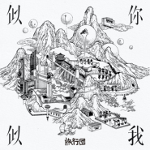

似你似我
============================

|  |  |
| :--: | :-- |
| [ 似你似我](https://emumo.xiami.com/album/5021948728) | **艺人**: [旅行团](../index.md) **语种**: 国语 **唱片公司**: StreetVoice **发行时间**: 2020年11月30日 **专辑类别**: 录音室专辑 **专辑风格**: 国语流行 Mandarin Pop **播放数**: 106333 **收藏数**: 361 **评论数**: 25  |

## 简介

如果说《似近似远》是我们对世界的观察与记录，《似你似我》则是我们想要分享给你的情绪与感受。

《似你似我》中的这些故事，来自我们自己，相信也属于你。它们是亲情、友情、爱情，是每一种不同生活里，可以找得到的相同。

我们的小宇宙围绕着他和她和更多的人，不停旋转，太阳东升西落，未来的光永远会照进心里。

我们下潜到这个世界的深处，写下看到的每一寸肌理。

更想与你一起保持血液的热度，填补生命中不期而遇的缝隙。

旅行团乐队的旅行还在继续，下一次见面，期待你、期待我们自己的再一次进化。

## 曲目

## 评论

|  |  |  |
| :-- | :-- | :-- |
|  [虾米用户](https://emumo.xiami.com/u/144245188)  2020-12-19 07:31 赞(0) 踩(0) | 
这张专辑词曲都差点意思。
 |
|  [虾米用户](https://emumo.xiami.com/u/5739325) 看学长笑得多开心呀 2020-12-18 14:58 赞(0) 踩(0) | 
熟悉的老配方，老朋友
 |
|  [虾米用户](https://emumo.xiami.com/u/312536347) 力挺虾米!!! 2020-12-17 22:38 赞(0) 踩(0) | 
太喜欢了
 |
|  [虾米用户](https://emumo.xiami.com/u/21164297) 您，懂我的虾米❤️995 2020-12-17 15:08 赞(1) 踩(0) | 
从乐夏认识的一支阳光乐队
 |
|  [虾米用户](https://emumo.xiami.com/u/809218)  2020-12-17 14:40 赞(1) 踩(0) | 
感觉旅行团一直都在尝试不同的风格，也依然保持独特的感性
 |
|  [虾米用户](https://emumo.xiami.com/u/353979172)  2020-12-17 04:00 赞(0) 踩(0) | 
Z
 |
|  [虾米用户](https://emumo.xiami.com/u/150083)  2020-12-16 10:42 赞(0) 踩(0) | 
高产！
 |
|  [虾米用户](https://emumo.xiami.com/u/364838123) 没错我就是为五月天下了虾... 2020-12-16 09:33 赞(0) 踩(0) | 
可终于有版权了开心
 |
|  [虾米用户](https://emumo.xiami.com/u/7402157) 你先让我躺一会 2020-12-16 03:33 赞(0) 踩(0) | 
旅行团有独特的气质，喜欢
 |
|  [虾米用户](https://emumo.xiami.com/u/1864399) 抱歉，应版权方要求，虾米... 2020-12-15 22:42 赞(0) 踩(0) | 
虾米，好久不见
 |
|  [虾米用户](https://emumo.xiami.com/u/335211346)  2020-12-15 20:38 赞(0) 踩(0) | 
完美生活，完美旅行团
 |
|  [虾米用户](https://emumo.xiami.com/u/3340875) 活着 2020-12-15 14:35 赞(1) 踩(0) | 
来了来了！我的快乐我的感动又回来了！
 |
|  [虾米用户](https://emumo.xiami.com/u/353004624)  2020-12-15 13:26 赞(1) 踩(0) | 
一直在，一直陪伴
 |
|  [虾米用户](https://emumo.xiami.com/u/40637994) 这家伙很聪明什么也没留下... 2020-12-14 22:44 赞(2) 踩(0) | 
我以为只有扣扣音乐有 我哥的歌世界第一好听！
 |
|  [虾米用户](https://emumo.xiami.com/u/746612)  2020-12-14 21:22 赞(0) 踩(0) | 
最近好高产阿
 |
|  [虾米用户](https://emumo.xiami.com/u/12701152)  2020-12-14 18:29 赞(0) 踩(0) | 
今年最爱的专辑
 |
|  [虾米用户](https://emumo.xiami.com/u/221714637) 色拉生活！麦 2020-12-14 14:18 赞(0) 踩(0) | 
终于上啦
 |
|  [虾米用户](https://emumo.xiami.com/u/9103905) 五月天 周杰伦 Nell... 2020-12-14 10:54 赞(14) 踩(0) | 
谁能想到最开始用虾米不是为了五月天 而是旅行团 至今记得是高中的某一年夏天的某一天遇见了旅行团 他们就是夏天的味道
 |
| ⇒ |  [虾米用户](https://emumo.xiami.com/u/186437644) 任他们多漂亮 未及你矜贵... 2020-12-16 23:17 赞(0) 踩(0) | 
可是你的ID还叫陈信宏哈哈哈哈
 |
| ⇒ |  [虾米用户](https://emumo.xiami.com/u/9103905) 五月天 周杰伦 Nell... 2020-12-23 21:54 赞(0) 踩(0) | 
<q><b>LLLLLeslie_说：</b></q>
 |
|  [虾米用户](https://emumo.xiami.com/u/31531934) 恋の道に近道はない 2020-12-14 10:50 赞(0) 踩(0) | 

 |
|  [虾米用户](https://emumo.xiami.com/u/11157355) 榕树长青 2020-12-14 10:49 赞(1) 踩(0) | 
好
 |
|  [虾米用户](https://emumo.xiami.com/u/443982120) that's that 2020-12-14 10:30 赞(0) 踩(0) | 
是我是你
 |
|  [虾米用户](https://emumo.xiami.com/u/269760923) 真正的自由是迷人的愿你我... 2020-12-14 10:28 赞(0) 踩(0) | 

 |
|  [虾米用户](https://emumo.xiami.com/u/44764055) 谁能告诉我我是谁 2020-12-14 10:13 赞(0) 踩(0) | 
哇
 |
