旅行团
============================

|  |  |
| :--: | :-- |
| [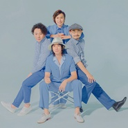 旅行团](https://i.xiami.com/lifejourney) | **地区**: China 中国大陆 **风格**: 阳光流行 Sunshine Pop, 独立流行 Indie Pop, 独立摇滚 Indie Rock **播放数**: 137333750 **粉丝数**: 58639 **评论数**: 1519  |

## 档案

旅行团乐队 
The Life Journey 
主唱：孔一蝉 Vocal: Yann 
吉他：子君 Guitar: Mali 
键盘：韦伟 Keyboard: Old Banana 
鼓手：徐彪 Drums: Xu Biao 
乐 队 介 绍 
收录在05年摩登天空合辑中的一首“The Storyof Sun and I”令歌迷们认识了旅行团。怀古的曲风、摇摆的旋律、穿梭往来的劲爽SOLO以及主唱令人难忘的演唱，使得合辑的听众们对这支突如其来的乐队充满了好奇和期待。时至08年乐队推出三年磨一剑的首张专辑《来福胶泥》。轻柔的曲风和多重元素的巧妙混搭不仅令这张专辑成为了当年各媒体眼中的TOP10，而乐队也因此在当时那个车库摇滚倍出的时期显得独特且自然。09年乐队推出名为《等你吃饭》的全新EP。整张EP听起来与首张专辑差别很大，Urban-Folk打底，对日常生活的关注和体味作为笔触，颇具感染力。EP推出后好评如潮，尤其是“悠长假期”和“等你吃饭”更是爬上了内地很多城市电台排行榜的前5名。此后，接连不断的大小演出和与不同音乐人的交流令乐队对音乐有了更多的想法和体会.时隔两年，旅行团终于推出了令歌迷们期待已久的全新专辑《WonderfulDay》，独立音乐元素比重的增加也让他们离之前树立的小清新形象越来越远。新专辑更像是一次内省之旅，乐队通过音符传达着对成长、社会、人生以及爱情的体会和想法。2012年一直奔走在路上的旅行团乐队将创作的灵感放回了他们生活的这座城市——北京。暑末推出单曲《北京夏夜》，悠扬的手风琴简单的木吉他，唯美的MV,让这首单曲一经推出，便迅速获得极大反响与好评。2013年乐队在“第13届音乐风云榜年度盛典”中斩获两项大奖！年度最佳摇滚乐队及最佳摇滚歌曲《北京夏夜》。2013年底全新EP《于是我不再唱歌》正式发行。同名主打歌“于是我不再唱歌”获第四届“阿比鹿”音乐奖年度最受欢迎摇滚单曲奖。2014年旅行团全面独立发展，成立来福胶泥 工作室。2015年正值乐队发展十周年之际，5月发行全新概念专辑《B-SIDE》，随即开启十城巡演，与更多人分享关于音乐和时间的旅行。2015年12月乐队发行出道十年精装大碟《10 Day’s》，满载着成员十年间成长的思考和感悟，将十年化作十首歌，成为十段不同的旅程。12月正式启动【来福胶泥电台】，与大家分享“来自世界不同的声音”。2016年1月1日，旅行团用一场被外界评为“站在云端、绚烂到极致”的【新开世界】专场演唱会纪念了自己十年如梦般旅程。并斩获2015年度蒙牛酸酸乳#MusicRadio中国TOP音乐盛典#年度最佳乐团大奖。随即5月启动全国【新开世界】剧场巡回演唱会。2017年旅行团马不停蹄以迅猛之势开启新唱片《永远都会在》制作发行及全国巡演。2018年乐队带着更广阔的创作视角先后推出《亲爱的》，《周末玩具》两首单曲，一经发布广获好评，更是占据腾讯音乐人原创榜等榜单TOP。6月21日推出全新唱片《感+》，把生活中不同的感触转变成相同的感动，换化成音符去表达生活的美好。6月29日开启“夏之恋”全国巡演，恰逢盛夏走过全国8座城市，被广大粉丝称为“最有夏日气息的乐队”。 
p.p1 {margin: 0.0px 0.0px 0.0px 0.0px; line-height: 24.0px; font: 14.0px 'Arial Unicode MS'; color: #424242} 
p.p2 {margin: 0.0px 0.0px 0.0px 0.0px; line-height: 24.0px; font: 14.0px 'Times New Roman'; color: #424242; min-height: 16.0px} 
p.p3 {margin: 0.0px 0.0px 0.0px 0.0px; font: 14.0px 'Arial Unicode MS'; color: #424242} 
span.s1 {font: 14.0px 'Times New Roman'} 
span.Apple-tab-span {white-space:pre}

## 专辑

| 名称 | 语种 | 唱片公司 | 发行时间 | 专辑类别 | 专辑风格 |
| :--: | :-- | :-- | :-- | :-- | :-- |
| [ 走在回家的路上](./albums/5022115795.md) | 国语 | StreetVoice, 来福胶尼 | 2020年12月07日 | EP, 单曲 | 国语流行 Mandarin Pop |
| [ 似你似我](./albums/5021948728.md) | 国语 | StreetVoice | 2020年11月30日 | 录音室专辑 | 国语流行 Mandarin Pop |
| [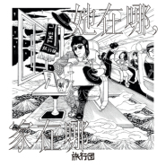 她在哪，家在哪](./albums/5021900188.md) | 国语 | StreetVoice | 2020年11月16日 | EP, 单曲 | 国语流行 Mandarin Pop, 独立流行 Indie Pop |
| [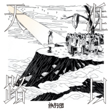 天涯路口](./albums/5021847462.md) | 国语 | StreetVoice | 2020年11月09日 | EP, 单曲 | 国语流行 Mandarin Pop |
| [ 似近似远](./albums/5021409333.md) | 国语 | StreetVoice | 2020年09月16日 | 录音室专辑 | 独立摇滚 Indie Rock, 独立流行 Indie Pop |
| [ 你没有名字](./albums/5021099525.md) | 国语 | StreetVoice | 2020年08月10日 | EP, 单曲 | 独立摇滚 Indie Rock |
| [ 红色的河（旅行团 & 吴青峰）](./albums/5021144168.md) | 国语 | StreetVoice | 2020年07月23日 | EP, 单曲 | 国语流行 Mandarin Pop |
| [ 环游世界](./albums/2108394019.md) | 国语 | StreetVoice, 摩登天空 | 2020年01月21日 | EP, 单曲 | 流行 Pop |
| [ 梦幻人生](./albums/2105159463.md) | 国语 | 勇士传奇 | 2019年08月18日 | EP, 单曲 |  |
| [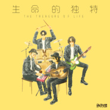 生命的独特](./albums/2105125415.md) | 国语 | StreetVoice, 来福胶尼 | 2019年08月09日 | EP, 单曲 |  |
| [ 印象夏日](./albums/2105003071.md) | 国语 | StreetVoice, 来福胶泥工作室 | 2019年07月24日 | EP, 单曲 |  |
| [ 感+](./albums/2103752594.md) | 国语 | StreetVoice | 2018年06月21日 | 录音室专辑 | 独立流行 Indie Pop, 阳光流行 Sunshine Pop |
| [ 情书](./albums/2103745717.md) | 国语 | StreetVoice | 2018年06月13日 | EP, 单曲 | 阳光流行 Sunshine Pop, 独立流行 Indie Pop |
| [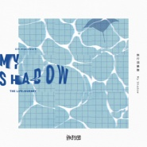 My Shadow](./albums/2103729292.md) | 国语 | StreetVoice | 2018年06月05日 | EP, 单曲 | 独立流行 Indie Pop |
| [ 勇 (Abbey Road 版)](./albums/2103694562.md) | 国语 | StreetVoice | 2018年04月25日 | EP, 单曲 | 独立流行 Indie Pop |
| [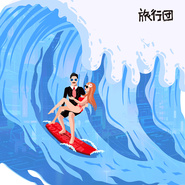 周末玩具](./albums/2103583550.md) | 国语 | StreetVoice | 2018年03月06日 | EP, 单曲 | 独立流行 Indie Pop |
| [ 亲爱的](./albums/2103495927.md) | 国语 | StreetVoice | 2018年01月23日 | EP, 单曲 | 独立流行 Indie Pop |
| [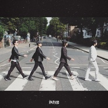 靠近一点](./albums/2102931851.md) | 国语 | 华宇世博 | 2017年11月15日 | EP, 单曲 |  |
| [ 永远都会在Always Be There](./albums/2102773505.md) | 国语 | StreetVoice | 2017年07月06日 | 录音室专辑 | 独立流行 Indie Pop, 独立摇滚 Indie Rock |
| [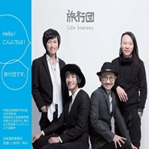 HELLO](./albums/2102653985.md) | 国语 | 来福胶泥工作室 | 2016年11月17日 | EP, 单曲 | 独立摇滚 Indie Rock |
| [ 双11购物指南](./albums/2102643311.md) | 国语 | 来福胶泥工作室 | 2016年11月02日 | EP, 单曲 |  |
| [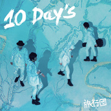 10 Day's](./albums/2100232044.md) | 国语 | 大牌佳音, 来福胶泥工作室 | 2015年12月21日 | 录音室专辑 | 流行摇滚 Pop Rock, 独立摇滚 Indie Rock |
| [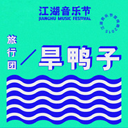 旱鸭子](./albums/2100220284.md) | 国语 | 来福胶泥工作室 | 2015年10月15日 | EP, 单曲 | 摇滚 Rock & Roll |
| [ B Side](./albums/1916362721.md) | 国语 | 来福胶泥工作室 | 2015年05月15日 | 录音室专辑 | 流行摇滚 Pop Rock, 独立摇滚 Indie Rock |
| [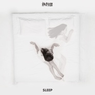 Sleep](./albums/327163672.md) | 国语 | 来福胶泥工作室 | 2015年03月24日 | EP, 单曲 | 独立流行 Indie Pop |
| [ 于是我不再唱歌](./albums/1787273421.md) | 国语 | 摩登天空 | 2013年12月28日 | EP, 单曲 |  |
| [ Wonderful Day奇妙一天](./albums/449091.md) | 国语 | 摩登天空 | 2011年06月24日 | 录音室专辑 | 城市民谣 Urban Folk |
| [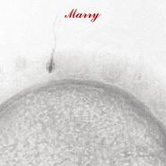 Marry](./albums/370938.md) | 国语 | 摩登天空 | 2010年02月14日 | EP, 单曲 | 城市民谣 Urban Folk |
| [ 小南xiaonan](./albums/370800.md) | 国语 | 摩登天空 | 2010年02月13日 | EP, 单曲 | 城市民谣 Urban Folk |
| [ 光](./albums/431939.md) | 国语 | 摩登天空 | 2009年12月13日 | EP, 单曲 | 城市民谣 Urban Folk |
| [ 等你吃饭](./albums/326199.md) | 国语 | 摩登天空 | 2009年04月17日 | EP, 单曲 | 城市民谣 Urban Folk |
| [ 来福胶泥Life Journey](./albums/168528.md) | 国语 | 摩登天空 | 2008年05月08日 | 录音室专辑 | 城市民谣 Urban Folk |

## 评论

|  |  |  |
| :-- | :-- | :-- |
|  [虾米用户](https://emumo.xiami.com/u/445153599)  2020-12-16 22:07 赞(0) 踩(0) | 
nice
 |
|  [虾米用户](https://emumo.xiami.com/u/43065773) music and su... 2020-12-12 12:47 赞(0) 踩(0) | 
旅行团的TA-长大的成年人
 |
|  [虾米用户](https://emumo.xiami.com/u/435168873) wyid：stanchi... 2020-12-04 01:19 赞(2) 踩(0) | 
我是柳州人，你们也是柳州人。
 |
|  [虾米用户](https://emumo.xiami.com/u/7989473) Ground Contr... 2020-11-16 00:13 赞(0) 踩(0) | 
期待看现场！ 
 |
|  [虾米用户](https://emumo.xiami.com/u/1948315)  2020-11-09 14:02 赞(0) 踩(0) | 
进来存好看的黑白画封面的，结果发现是老乡
 |
|  [虾米用户](https://emumo.xiami.com/u/41144425)   2020-10-26 09:17 赞(0) 踩(0) | 
音乐节上键盘手巨骚哈哈哈 碾压了阿肆的车祸现场
 |
|  [虾米用户](https://emumo.xiami.com/u/41144425)   2020-10-26 09:15 赞(0) 踩(0) | 
我刚发现这不是跟阿肆一起玩的那个骚气键盘手么
 |
|  [虾米用户](https://emumo.xiami.com/u/445242545) 我还没想好要写什么... 2020-10-06 23:20 赞(0) 踩(0) | 
10年前第一次听的歌 现在终于找回来了
 |
|  [虾米用户](https://emumo.xiami.com/u/2393294) 和彭彭一起加油! 2020-09-22 09:59 赞(1) 踩(0) | 
原来这个团的团员个个都是写歌好手啊
 |
|  [虾米用户](https://emumo.xiami.com/u/252010213)  2020-08-28 19:54 赞(1) 踩(0) | 
一尘不染的声音
 |
|  [虾米用户](https://emumo.xiami.com/u/362083809) 尘归尘 2020-07-30 14:57 赞(0) 踩(0) | 
喜欢很久了，留下一朵，某天再来的时候，会想起今天再次来过的我。
 |
|  [虾米用户](https://emumo.xiami.com/u/52351140) 麻烦司马给我头像安排一张... 2020-07-27 21:30 赞(1) 踩(0) | 
不错不错 虾米给排面了
 |
|  [虾米用户](https://emumo.xiami.com/u/2373624) 我还没想好要写什么... 2020-07-25 12:34 赞(1) 踩(0) | 
棒棒哒！！资源回来了
 |
|  [虾米用户](https://emumo.xiami.com/u/379162683) 我想要记住你们，我想要你... 2020-07-22 11:59 赞(0) 踩(0) | 
；）
 |
|  [虾米用户](https://emumo.xiami.com/u/8834987) 我还没想好要写什么... 2020-07-15 02:50 赞(0) 踩(0) | 
bye bye 的演绎无敌牛逼
 |
|  [虾米用户](https://emumo.xiami.com/u/443844839)  2020-06-26 16:40 赞(0) 踩(0) | 
啊啊 旅行團的詞和編曲都完全在我審美點上了哎 好喜歡
 |
|  [虾米用户](https://emumo.xiami.com/u/5394363) 滑板 冲浪 拍照 2020-04-22 05:59 赞(3) 踩(0) | 
不要让爱奇艺影响冲浪了，我从02年就开始你们了，他们让你赚了钱，但是你们觉得是真的么？这个社会给所有人太多改变了，我的发声我只是喝酒里流淌的水，但是真的，你们渴求世界还有点真的话，请把我的微信推给马东，我希望他能理解我们浪人，而不是用流量来冲击整个文化，感谢你们对音乐的付出，但是这个真的不一样！
 |
|  [虾米用户](https://emumo.xiami.com/u/49438226)  2020-04-11 00:39 赞(0) 踩(0) | 
10年前在北京草莓，10年后在广电T2
 |
|  [虾米用户](https://emumo.xiami.com/u/345698167)   2020-03-15 11:01 赞(1) 踩(0) | 
这个乐队太美好了！
 |
|  [虾米用户](https://emumo.xiami.com/u/419135606)  2020-02-19 11:24 赞(1) 踩(0) | 
喜欢旅行团的最重要一点 笑把眼泪当成歌
 |
|  [虾米用户](https://emumo.xiami.com/u/269248152)  2020-01-07 20:27 赞(0) 踩(0) | 
主唱声音真真是我男神的声音呀
 |
|  [虾米用户](https://emumo.xiami.com/u/255692362) Work hard pl... 2019-11-12 20:52 赞(1) 踩(0) | 
“我们就是世界”
 |
|  [虾米用户](https://emumo.xiami.com/u/34758772)  And I will ... 2019-10-17 12:55 赞(0) 踩(0) | 
发小唱了这首歌，好听
 |
|  [虾米用户](https://emumo.xiami.com/u/52621992) 愛要謙卑 2019-10-10 00:15 赞(0) 踩(0) | 
听了简单生活节被圈粉了！！！这个乐队每一首歌都好听啊，太厉害了。然后重新看了一下乐队的夏天，当时第一集对他们没印象，但是对高晓松的点评有印象，回过头会觉得“啊原来这段评语是在夸他们啊”～ 说的挺对的 把旋律写得好听是件了不起的事！
 |
|  [虾米用户](https://emumo.xiami.com/u/6385284) 我还没想好要写什么... 2019-08-24 20:50 赞(0) 踩(0) | 
最大的感想是这团除了歌词各方面都是一流又有特点的水平。。。 全栽在歌词上了。。。
 |
|  [虾米用户](https://emumo.xiami.com/u/358104299) 悲观的唯心存在现实解构虚... 2019-08-11 00:32 赞(0) 踩(0) | 
，
 |
|  [虾米用户](https://emumo.xiami.com/u/244813131)  2019-08-10 15:59 赞(4) 踩(0) | 
流行怎么了，乐队就不能流行吗。好听才是检验歌曲的唯一标准。
 |
|  [虾米用户](https://emumo.xiami.com/u/2796166) 最爱莫文蔚..... 2019-08-10 00:00 赞(1) 踩(0) | 
加油~~~
 |
|  [虾米用户](https://emumo.xiami.com/u/8821299)  2019-08-04 00:21 赞(2) 踩(0) | 
虾米是把版权买来了？
 |
|  [虾米用户](https://emumo.xiami.com/u/43261751) 偷看没用，你已经忘不了我... 2019-07-31 09:00 赞(1) 踩(0) | 
你们都是音乐里的孩子，带给我们最真诚的感动！感谢你们，旅行团的赤子们 
 |
|  [虾米用户](https://emumo.xiami.com/u/38768511) 暂无签名~ 2019-07-30 23:00 赞(2) 踩(0) | 
太喜欢韦伟啦啊啊啊啊啊啊啊啊啊
 |
|  [虾米用户](https://emumo.xiami.com/u/610625) 暮雪朝霜，毋改英雄意气 2019-07-29 12:47 赞(2) 踩(0) | 
奇怪的是，每次孔一禅的声音一出来，就很想哭。 编曲也很特别，总有种被&amp;ldquo;夏日时节，居海中央；回首往事，皆可放下&amp;rdquo;的情绪包围。 但就是想哭。只是知道哭完一切都会变得更好。 时光不复！ 你，我也不曾负！
 |
|  [虾米用户](https://emumo.xiami.com/u/3593768)  2019-07-28 11:48 赞(4) 踩(0) | 
在厦门简单音乐节上知道了旅行团，后来越听越好听，是认真在做音乐的乐队。 乐夏上改编的鲁冰花是非常棒的改编。鲁冰花编成好几个版本穿插在歌曲里，纯男声的鲁冰花可以这样美！ 可能有人会说主唱利用情感在拉票，但这样的真情流露是真实的。 会一直支持你们，旅行团！
 |
|  [虾米用户](https://emumo.xiami.com/u/425346) 我还没想好要写什么... 2019-07-22 11:37 赞(0) 踩(0) | 
听旅行团乐队的老乐迷都结婚生子了
 |
|  [虾米用户](https://emumo.xiami.com/u/409843542)  2019-07-20 13:49 赞(1) 踩(0) | 
下载虾米是为了听旅行团的前身“西门电子室” 
 |
|  [虾米用户](https://emumo.xiami.com/u/166602960)  2019-07-18 15:20 赞(0) 踩(0) | 
《逝去的歌》暖到我了，七年了，一直沉浸在思念中，但是当我听到逝去的人“住在心间”“不曾走远”，心里就又有了力量 
 |
|  [虾米用户](https://emumo.xiami.com/u/9103905) 五月天 周杰伦 Nell... 2019-07-15 18:50 赞(1) 踩(0) | 
转眼间来福胶泥都十一年了 最初跑来虾米音乐听歌还是因为旅行团而不是五月天 
 |
|  [虾米用户](https://emumo.xiami.com/u/314517562)  2019-07-14 00:51 赞(0) 踩(0) | 
喜欢！
 |
|  [虾米用户](https://emumo.xiami.com/u/22711777) 这家伙很聪明什么也没留下 2019-07-13 16:23 赞(1) 踩(0) | 
啊……错过旅行团好多年，错过了一个在B站有团综的宝藏乐队
 |
|  [虾米用户](https://emumo.xiami.com/u/335094935) 我还没想好要写什么... 2019-07-08 13:19 赞(30) 踩(0) | 
有多少是看了乐队的夏天来的呀，举爪
 |
|  [虾米用户](https://emumo.xiami.com/u/245280261) 要能做到:不以物喜不以己... 2019-07-06 17:38 赞(1) 踩(0) | 
超喜欢韦伟哈哈哈
 |
|  [虾米用户](https://emumo.xiami.com/u/72866660)   2019-07-04 09:05 赞(2) 踩(0) | 
韦伟超可爱der
 |
|  [虾米用户](https://emumo.xiami.com/u/4048199)   2019-06-15 00:12 赞(1) 踩(0) | 
以前听旅行团，现在是，以后也是
 |
|  [虾米用户](https://emumo.xiami.com/u/11512578)  2019-06-12 21:29 赞(0) 踩(0) | 
从每日推荐挖到宝啦！！超喜欢！
 |
|  [虾米用户](https://emumo.xiami.com/u/39035259) 暂无签名~ 2019-05-23 22:08 赞(0) 踩(0) | 
快点把版权买到呀，痛苦
 |
|  [虾米用户](https://emumo.xiami.com/u/25471222) 对自由有多大的理解 就有... 2019-05-02 21:38 赞(0) 踩(0) | 
为什么柳州的乐队 竟然从不回柳州演出 我不懂。。
 |
| ⇒ |  [虾米用户](https://emumo.xiami.com/u/199210) 祈福蝦米不要倒閉⋯ 2019-07-07 02:53 赞(0) 踩(0) | 
柳州受众不够多，Tour也要算成本的啦，他们以前也在柳有演出的
 |
|  [虾米用户](https://emumo.xiami.com/u/47494497) 李志、陈升，“虾米也没有... 2019-05-01 20:37 赞(0) 踩(0) | 
后劲不足
 |
|  [虾米用户](https://emumo.xiami.com/u/8125164) 我还没想好要写什么... 2019-04-18 13:07 赞(0) 踩(0) | 
啥时候能听鸭
 |
|  [虾米用户](https://emumo.xiami.com/u/8821299)  2019-04-02 09:33 赞(1) 踩(0) | 
虾米快去把版权买来吧，我好继续充会员
 |
|  [虾米用户](https://emumo.xiami.com/u/4487129)  2019-03-15 08:31 赞(0) 踩(0) | 
！！！
 |
|  [虾米用户](https://emumo.xiami.com/u/93234186)  2019-01-15 15:47 赞(1) 踩(0) | 
什么时候来广州！
 |
|  [虾米用户](https://emumo.xiami.com/u/218261246) 寻找隐秘小角落…… 2018-12-15 10:57 赞(2) 踩(0) | 
居然现在才发现旅行团是柳州的乐队，怎么辣么厉害的！
 |
|  [虾米用户](https://emumo.xiami.com/u/4771536) I like the v... 2018-12-12 09:29 赞(3) 踩(0) | 
我还一直以为旅行团是湾湾的呢
 |
|  [虾米用户](https://emumo.xiami.com/u/31440002) 哈哈哈 加油啊  2018-11-28 21:20 赞(0) 踩(0) | 
喜欢 喜欢 好喜欢
 |
|  [虾米用户](https://emumo.xiami.com/u/31440002) 哈哈哈 加油啊  2018-11-25 17:30 赞(1) 踩(0) | 
理想中的乐团终于出现了
 |
|  [虾米用户](https://emumo.xiami.com/u/31440002) 哈哈哈 加油啊  2018-11-25 17:19 赞(0) 踩(0) | 
咬字很自然
 |
|  [虾米用户](https://emumo.xiami.com/u/27398820)  2018-10-30 23:41 赞(0) 踩(0) | 
来深圳吧
 |
|  [虾米用户](https://emumo.xiami.com/u/27398820)  2018-10-30 23:40 赞(0) 踩(0) | 
2年前知道…现在越来越喜欢
 |
|  [虾米用户](https://emumo.xiami.com/u/68935180) 但愿你 旅途漫长 2018-10-22 19:40 赞(2) 踩(0) | 
marry听不到了 
 |
|  [虾米用户](https://emumo.xiami.com/u/49565030) - 2018-08-16 23:46 赞(0) 踩(0) | 
唱歌太温暖了吧
 |
|  [虾米用户](https://emumo.xiami.com/u/121910914) 我想好好睡个觉 2018-08-11 17:45 赞(0) 踩(0) | 
❤️
 |
|  [虾米用户](https://emumo.xiami.com/u/3550322) 不喧哗。 2018-08-11 11:41 赞(3) 踩(0) | 
不吹不黑，就喜欢这种阳光接地气不装叉耍酷的乐队。
 |
|  [虾米用户](https://emumo.xiami.com/u/97689234) 我希望长存单纯之心，并要... 2018-08-08 08:53 赞(0) 踩(0) | 
昨天在央视看到旅行团，发现已经好久没听过他们的歌了。 实习以来的这段时间令人心生迷茫， 我该找个时间静静坐着听歌。让自己逃离一会儿
 |
|  [虾米用户](https://emumo.xiami.com/u/271717211) 明明绝配 犯众憎便放开 2018-07-28 17:21 赞(0) 踩(0) | 
温柔又温暖
 |
|  [虾米用户](https://emumo.xiami.com/u/22673793)  2018-06-26 16:03 赞(0) 踩(0) | 
希望巡演来杭州
 |
|  [虾米用户](https://emumo.xiami.com/u/22673793)  2018-06-26 16:02 赞(0) 踩(0) | 
很好
 |
|  [虾米用户](https://emumo.xiami.com/u/29045154) 新的一年 继续爱着顾医生 2018-06-23 00:45 赞(0) 踩(0) | 
期待7月一日长沙的演出 票已买好 有同行的吗 想想最先开始听旅行团的歌听的是lonely day转眼过去五年 终于能看次现场了
 |
| ⇒ |  [虾米用户](https://emumo.xiami.com/u/4177478) diversity 2018-07-01 09:08 赞(0) 踩(0) | 
同长沙hhh我刚刚才听然后果断就买了很好听呀
 |
|  [虾米用户](https://emumo.xiami.com/u/1171016) 人们活着.静如止水 2018-06-22 23:27 赞(0) 踩(0) | 
新专辑哪里买？
 |
|  [虾米用户](https://emumo.xiami.com/u/220075) 老老实实或者不老老实实的... 2018-06-21 20:22 赞(0) 踩(0) | 
啥时候来深圳啊亲爱的们
 |
|  [虾米用户](https://emumo.xiami.com/u/261981065)  2018-06-13 13:05 赞(3) 踩(0) | 
仅凭一首 lonely day 就足够我一直关注你们
 |
|  [虾米用户](https://emumo.xiami.com/u/9969587)   2018-06-12 18:54 赞(0) 踩(0) | 
为什么不来上海？？！好气哦
 |
|  [虾米用户](https://emumo.xiami.com/u/817547)   2018-06-11 22:10 赞(0) 踩(0) | 
意思今夏不来广州是吧  好气ᕕ(ᐛ)ᕗ
 |
| ⇒ |  [虾米用户](https://emumo.xiami.com/u/68935180) 但愿你 旅途漫长 2018-06-11 23:32 赞(0) 踩(0) | 
同气
 |
|  [虾米用户](https://emumo.xiami.com/u/30622452) 暂无签名~ 2018-05-22 21:09 赞(0) 踩(0) | 
据说新专辑要出了，啥时候巡演啊
 |
|  [虾米用户](https://emumo.xiami.com/u/46970481)  2018-05-04 16:09 赞(0) 踩(0) | 
好久没听你们啦没想到今天在部门会议上跟大家一起看你们的视频
 |
|  [虾米用户](https://emumo.xiami.com/u/357979713) 我们一直在等有趣的你/2... 2018-04-23 09:31 赞(0) 踩(0) | 
开心 即将可以在MTA天漠音乐节第一次看旅行团表演
 |
|  [虾米用户](https://emumo.xiami.com/u/348872657)  2018-04-07 21:36 赞(1) 踩(0) | 
很干净，适合在安静的午后听上一首
 |
|  [虾米用户](https://emumo.xiami.com/u/311538642) 回到現實吧孩子 2018-03-09 13:59 赞(0) 踩(0) | 
为什么好多歌还是没有版权 说好的大同呢 
 |
|  [虾米用户](https://emumo.xiami.com/u/2047309)  2018-03-06 09:52 赞(0) 踩(0) | 
新歌 周末玩具怎么不见了？？
 |
|  [虾米用户](https://emumo.xiami.com/u/2452862) 像时间一样的爱你 2018-03-05 13:28 赞(2) 踩(0) | 
歌呢，。？？？
 |
|  [虾米用户](https://emumo.xiami.com/u/275454622) 装 2018-02-06 00:47 赞(2) 踩(0) | 
把旅行团分支到后摇里真是个大胆的选择
 |
|  [虾米用户](https://emumo.xiami.com/u/31066726) 生命將荒，唯精神永存 2018-02-05 14:52 赞(0) 踩(0) | 
Sunshine Pop 
 |
|  [虾米用户](https://emumo.xiami.com/u/202160717) 泛舟当歌 2017-12-24 22:11 赞(0) 踩(0) | 
我最喜欢永远都会在 我永远都会在
 |
|  [虾米用户](https://emumo.xiami.com/u/55396963)  2017-12-23 10:22 赞(2) 踩(0) | 
表白旅行团♡下载过音乐APP里能下载的每一首歌反反复复的听，似乎只要打上旅行团的名字就一定是安心的好作品。每一首歌都契合不同的心情，有不羁，有忧伤，有怀念，有温暖，有肆意的年轻也有沉稳的心。_(:з」&amp;ang;)_最后祝旅行团越来越好，各位要天天开心！
 |
|  [虾米用户](https://emumo.xiami.com/u/50593447) 画面里是你和山川 2017-12-18 11:23 赞(3) 踩(0) | 
我们有螺蛳粉微信群 我可以拉大家进群每天说活动 分享视频什么 我微信yxt15192576742~welcome~ 
 |
|  [虾米用户](https://emumo.xiami.com/u/84010550)   2017-12-10 11:26 赞(0) 踩(0) | 
今天第一次听到，还蛮好听的，加油(ง &amp;bull;̀_&amp;bull;́)ง
 |
|  [虾米用户](https://emumo.xiami.com/u/61054902) 歌单很乱 2017-11-30 22:19 赞(0) 踩(0) | 
没有版权很难受 
 |
|  [虾米用户](https://emumo.xiami.com/u/337218572)  2017-11-29 02:07 赞(0) 踩(0) | 
爱你们
 |
|  [虾米用户](https://emumo.xiami.com/u/20147189) 嘘 2017-11-21 16:06 赞(2) 踩(0) | 
喜欢旅行团的时候是高中时代 一转眼已经这么久了 错过了无数次live
 |
|  [虾米用户](https://emumo.xiami.com/u/199210) 祈福蝦米不要倒閉⋯ 2017-11-15 15:56 赞(3) 踩(0) | 
阳光流行 Sunshine Pop , 后摇 Post-Rock 虾米的tag一直很逗儿
 |
|  [虾米用户](https://emumo.xiami.com/u/178884024) 哟 你来了 2017-11-08 19:06 赞(0) 踩(0) | 
依旧治愈依旧给我力量
 |
|  [虾米用户](https://emumo.xiami.com/u/268441823)  2017-11-04 22:28 赞(2) 踩(0) | 
喜欢你们的奔跑在孤傲的路上，明天你们在我学校演唱会，超想去
 |
|  [虾米用户](https://emumo.xiami.com/u/1517621)  2017-10-30 10:07 赞(1) 踩(0) | 
他们的歌似乎不错呢~塞耳机听还不错~上回现场没好好听~@小小栗呢 来听听乃小清新老乡乐队滴歌~@朱德不是裘德也不是朱拗 咩哈哈
 |
|  [虾米用户](https://emumo.xiami.com/u/118122530) 我还没想好要写什么... 2017-10-29 20:45 赞(1) 踩(0) | 

 |
|  [虾米用户](https://emumo.xiami.com/u/42794253)  2017-10-28 00:23 赞(1) 踩(0) | 
旅行团五月二十三号常州迷宫站很吊，太喜欢。。正能量乐团    
 |
|  [虾米用户](https://emumo.xiami.com/u/3829442) 我还没想好要写什么... 2017-10-28 00:20 赞(1) 踩(0) | 
中国 一个面向全世界的 多元的国家。她母体内滋养的人们 可爱的人们 总能给我新鲜还有惊喜。要从新开始复习法语了吗我呀 他们让我想拾起来了。
 |
|  [虾米用户](https://emumo.xiami.com/u/9286704) A lo lejos..... 2017-10-28 00:02 赞(1) 踩(0) | 
高二开始六年前开始听你们的歌，当时感觉小清新但是也透着一股神经质，最近你们要转型了吗？后摇什么的，如果要转就坚决点吧、
 |
|  [虾米用户](https://emumo.xiami.com/u/8186288) 就这样走下去吧，不急。 2017-10-27 23:25 赞(0) 踩(0) | 
广西老乡给个赞~竟然来过好多次西安了，下次还来西安我会考虑去看看表演的~~
 |
|  [虾米用户](https://emumo.xiami.com/u/1993271) Cool夏days 2017-10-27 23:21 赞(0) 踩(0) | 
好喜欢，好喜欢，你送我的第一个CD。北京。**。
 |
|  [虾米用户](https://emumo.xiami.com/u/29127461) 你来人间一趟 2017-10-27 23:01 赞(0) 踩(0) | 
哈哈  壮哉 我大柳州啊哈哈   大爱旅行团 回来卖螺蛳粉吧 要不回柳州开演唱会吧   我一定去
 |
|  [虾米用户](https://emumo.xiami.com/u/27804577) Stay simple,... 2017-10-11 17:02 赞(0) 踩(0) | 
每次心情不好的时候都被你们的歌治愈，可惜一直错过你们的演出，下次你们来苏州一定不能错过
 |
|  [虾米用户](https://emumo.xiami.com/u/250641995) 我还没想好要写什么... 2017-10-10 19:45 赞(2) 踩(0) | 
第一次听旅行团的歌在森林音乐节 南京 冒雨演出 很棒 很好听
 |
|  [虾米用户](https://emumo.xiami.com/u/170726) 不安之书 2017-10-09 13:35 赞(0) 踩(0) | 
穿衣打扮
 |
|  [虾米用户](https://emumo.xiami.com/u/48874735) 这家伙很笨什么也没留下… 2017-10-01 21:08 赞(0) 踩(0) | 
你们很棒。
 |
|  [虾米用户](https://emumo.xiami.com/u/36576635) 冰岛游客热带地区唯一指定... 2017-09-16 21:42 赞(1) 踩(0) | 
北京小演唱会竟然没有签售..._(:з」&amp;ang;)_错过上次Modernsky Lab的签售之后好像就很少来北京的livehouse了...抱着两张CD在观众席坐着嗨的我_(:з」&amp;ang;)_
 |
|  [虾米用户](https://emumo.xiami.com/u/39965300)  2017-08-28 23:25 赞(0) 踩(0) | 
喜欢他们！
 |
|  [虾米用户](https://emumo.xiami.com/u/12493801)  2017-08-26 09:38 赞(1) 踩(0) | 
期待今天郑州站的表演！
 |
|  [虾米用户](https://emumo.xiami.com/u/317757693)  2017-08-22 16:01 赞(0) 踩(0) | 
加油。
 |
|  [虾米用户](https://emumo.xiami.com/u/215765615)  也许 我不是在等待她爱... 2017-08-20 22:44 赞(0) 踩(0) | 
我居然错过了旅行团杭州的演出  
 |
|  [虾米用户](https://emumo.xiami.com/u/46946636)  2017-08-10 23:33 赞(0) 踩(0) | 
明天成都见 o(*≧▽≦)ツ ~ ┴┴
 |
|  [虾米用户](https://emumo.xiami.com/u/111870876) 我，爱这生活。 2017-08-05 02:25 赞(0) 踩(0) | 
今晚突发情况，大家都顶过来了，真棒
 |
|  [虾米用户](https://emumo.xiami.com/u/42508132) 正在输入… 2017-08-05 00:40 赞(0) 踩(0) | 
今晚去听了我希望还有下次我要去到最前面啊啊啊你们我们永远都会在。
 |
|  [虾米用户](https://emumo.xiami.com/u/11774925) 。 2017-08-02 21:22 赞(1) 踩(0) | 
感觉抑郁了，只喜欢听岛屿这种颓颓的
 |
|  [虾米用户](https://emumo.xiami.com/u/253132123)  2017-07-24 19:54 赞(0) 踩(0) | 
8月4深圳等你们
 |
|  [虾米用户](https://emumo.xiami.com/u/45850605)   2017-07-21 19:56 赞(2) 踩(0) | 
因为旅行团 我竟然产生了 要变亿万富翁 给我喜欢的乐队开场馆演唱会的 傻念头 虽然我很喜欢livehouse里的他们
 |
|  [虾米用户](https://emumo.xiami.com/u/7718598) 尚好的青春都是你。 2017-07-16 09:26 赞(1) 踩(0) | 
看了杭州的live house被鼓手圈粉了 QAQ
 |
| ⇒ |  [虾米用户](https://emumo.xiami.com/u/42508132) 正在输入… 2017-08-05 00:40 赞(0) 踩(0) | 
鼓手特卖力特可爱(๑&amp;bull; . &amp;bull;๑)
 |
|  [虾米用户](https://emumo.xiami.com/u/22882185) 小爷去寻欢作乐了。。 2017-07-10 22:49 赞(0) 踩(0) | 
好想听现场，什么时候来成都啊
 |
| ⇒ |  [虾米用户](https://emumo.xiami.com/u/199210) 祈福蝦米不要倒閉⋯ 2017-07-14 09:14 赞(0) 踩(0) | 
8.11
 |
| ⇒ |  [虾米用户](https://emumo.xiami.com/u/22882185) 小爷去寻欢作乐了。。 2017-07-16 00:15 赞(0) 踩(0) | 
<q><b>Eros说：</b></q>
 |
| ⇒ |  [虾米用户](https://emumo.xiami.com/u/199210) 祈福蝦米不要倒閉⋯ 2017-07-16 07:14 赞(0) 踩(0) | 
<q><b>momoko说：</b></q>
 |
|  [虾米用户](https://emumo.xiami.com/u/4048199)   2017-07-10 11:37 赞(0) 踩(0) | 
新专辑10张入手 
 |
|  [虾米用户](https://emumo.xiami.com/u/203710305) 这家伙很聪明什么也没留下... 2017-07-09 13:12 赞(0) 踩(0) | 
《永远都会在》加油！ 
 |
|  [虾米用户](https://emumo.xiami.com/u/52810648) 認真點 2017-07-08 18:04 赞(2) 踩(0) | 
旅行团早期粉  真爱第一张专
 |
|  [虾米用户](https://emumo.xiami.com/u/7510020) 超越自卑和自尊。 2017-07-03 20:41 赞(0) 踩(0) | 
没有全国预售链接吗。。。。。。。。。。。我已经买错票了。。。。。。。南京站的有要的吗。。。。。。。。。。。。。
 |
| ⇒ |  [虾米用户](https://emumo.xiami.com/u/12043570) vx：mixergym 2017-07-14 23:28 赞(0) 踩(0) | 
你买的南京站的票？
 |
| ⇒ |  [虾米用户](https://emumo.xiami.com/u/7510020) 超越自卑和自尊。 2017-07-16 14:49 赞(0) 踩(0) | 
<q><b>Hulkmixer说：</b></q>
 |
| ⇒ |  [虾米用户](https://emumo.xiami.com/u/12043570) vx：mixergym 2017-07-17 10:17 赞(0) 踩(0) | 
<q><b>Vague说：</b></q>
 |
| ⇒ |  [虾米用户](https://emumo.xiami.com/u/7510020) 超越自卑和自尊。 2017-07-18 08:25 赞(0) 踩(0) | 
<q><b>Hulkmixer说：</b></q>
 |
| ⇒ |  [虾米用户](https://emumo.xiami.com/u/12043570) vx：mixergym 2017-07-18 08:43 赞(0) 踩(0) | 
<q><b>Vague说：</b></q>
 |
|  [虾米用户](https://emumo.xiami.com/u/6767293) 我还没想好要写什么... 2017-07-03 17:02 赞(1) 踩(0) | 
后摇这个标签是谁加的？
 |
| ⇒ |  [虾米用户](https://emumo.xiami.com/u/6533545)  2017-07-18 11:50 赞(0) 踩(0) | 
同问&amp;hellip;&amp;hellip;
 |
| ⇒ |  [虾米用户](https://emumo.xiami.com/u/71670866) 如果我听歌可眼红 2017-07-30 02:57 赞(0) 踩(0) | 
我还是因为后摇的标签进来的   真的没有后摇吗？
 |
| ⇒ |  [虾米用户](https://emumo.xiami.com/u/36576635) 冰岛游客热带地区唯一指定... 2017-08-05 11:44 赞(0) 踩(0) | 
可能是因为红色的雅儒路体校吧2333
 |
|  [虾米用户](https://emumo.xiami.com/u/221511321) 深海人鱼 浴缸鸣唱 2017-07-02 21:57 赞(0) 踩(0) | 
此团要火！ 
 |
|  [虾米用户](https://emumo.xiami.com/u/94799648) 黯淡 2017-07-02 19:47 赞(0) 踩(0) | 
音乐旋律很好
 |
|  [虾米用户](https://emumo.xiami.com/u/7603700) 我还没想好要写什么... 2017-07-01 22:08 赞(0) 踩(0) | 
哎呀 旅行团 好久不见 好久没听啦！我好像看到以前那个很喜欢你们的样子唉
 |
|  [虾米用户](https://emumo.xiami.com/u/9766516)   2017-07-01 10:45 赞(0) 踩(0) | 
真是一个温暖的乐队啊，7月19来苏州，等待
 |
| ⇒ |  [虾米用户](https://emumo.xiami.com/u/283082987) 死 2017-07-09 20:57 赞(0) 踩(0) | 
！！我也想去来着 好棒
 |
|  [虾米用户](https://emumo.xiami.com/u/68579350)  2017-06-30 15:33 赞(0) 踩(0) | 
想到上次孔阳来我们学校我要了签名要了拥抱我就傻乐
 |
|  [虾米用户](https://emumo.xiami.com/u/1115247) @Nebula_7293 2017-06-30 00:18 赞(1) 踩(0) | 
8/12 重庆坚果
 |
|  [虾米用户](https://emumo.xiami.com/u/42333368) 飞累了，就在风里睡一下…... 2017-06-29 23:22 赞(0) 踩(0) | 
啊啊啊，周围没有朋友喜欢旅行团，有人约一波 ，今年八月的旅行团演唱会么？我是boy
 |
|  [虾米用户](https://emumo.xiami.com/u/48715101)  2017-06-29 22:27 赞(0) 踩(0) | 
有你们一直相伴真幸运
 |
|  [虾米用户](https://emumo.xiami.com/u/29045154) 新的一年 继续爱着顾医生 2017-06-29 20:07 赞(0) 踩(0) | 
为什么看不到巡演信息 会不会来长沙?
 |
|  [虾米用户](https://emumo.xiami.com/u/215486527) 我还没想好要写什么... 2017-06-29 18:39 赞(0) 踩(0) | 
请问哪里买票！！！
 |
| ⇒ |  [虾米用户](https://emumo.xiami.com/u/9766516)   2017-07-01 10:46 赞(0) 踩(0) | 
乐童音乐app
 |
|  [虾米用户](https://emumo.xiami.com/u/13691875) 谁的感叹 偶然合拍 2017-06-29 15:55 赞(1) 踩(0) | 
好的，武汉8月，又有期待了   
 |
|  [虾米用户](https://emumo.xiami.com/u/42799966) 两棵朝圣的树。 2017-06-13 17:07 赞(1) 踩(0) | 
〔坡上村〕、〔丢火车乐队〕、〔旅行团〕、〔不可撤销〕大红大紫，成名在望。
 |
|  [虾米用户](https://emumo.xiami.com/u/40342696) NEVER KNOWS ... 2017-06-07 18:14 赞(0) 踩(0) | 
等新歌( &amp;acute;▽` )ﾉ
 |
|  [虾米用户](https://emumo.xiami.com/u/298040536) 她不漂亮，她也不涂胭脂。 2017-05-25 13:23 赞(1) 踩(0) | 
非法同居
 |
|  [虾米用户](https://emumo.xiami.com/u/53899404)   2017-04-30 03:32 赞(0) 踩(0) | 
w
 |
|  [虾米用户](https://emumo.xiami.com/u/3140019) 天马行空 2017-04-25 16:11 赞(0) 踩(0) | 
原来这首歌叫80
 |
|  [虾米用户](https://emumo.xiami.com/u/2932859)  2017-04-13 17:20 赞(1) 踩(0) | 
这个乐团会大火，有种预感
 |
|  [虾米用户](https://emumo.xiami.com/u/28984380) 宜善而行，怀远致明。 2017-03-26 13:59 赞(0) 踩(0) | 
%&amp;amp;&amp;amp;;：这是我认识旅行团乐队的第五年，在我十二岁时听到了marry.满脑掠过都是海风的味道，那时候我很颓丧，因为一些现在看起来及其矫情的小事。旅行团的歌总有一种安和温暖的味道，让人觉得很安全，而我第一首想学的吉他曲就是小南，旅行团是我见过的，最最温暖的大男孩。现在我十七岁，还有72天高考，我很幸运，我遇见旅行团。这是我见过的，不忘初心，坚持本心的乐队。我的梦想是作家，而在我孤独的时候，回头看，有人在陪我奔跑，奔跑在孤傲的路上。
 |
|  [虾米用户](https://emumo.xiami.com/u/36139564)   2017-03-12 01:56 赞(0) 踩(0) | 
今儿在糖果看见了孔阳和牛奶咖啡的格非，孔阳真特么帅！
 |
|  [虾米用户](https://emumo.xiami.com/u/46970481)  2017-02-17 21:48 赞(0) 踩(0) | 
忘了怎么开始听你们的又忘了怎么忘了你们的
 |
|  [虾米用户](https://emumo.xiami.com/u/85928852) 穷极一生 追求快乐 2017-02-06 19:04 赞(0) 踩(0) | 
好温暖 
 |
|  [虾米用户](https://emumo.xiami.com/u/83893196) 我还没想好要写什么... 2017-02-02 15:51 赞(1) 踩(0) | 
为什么旅行团歌单下面有那么多别人的歌？而他们自己的歌都不全 什么鬼
 |
|  [虾米用户](https://emumo.xiami.com/u/47494497) 李志、陈升，“虾米也没有... 2017-02-02 01:13 赞(0) 踩(0) | 
你能成为那个你
 |
|  [虾米用户](https://emumo.xiami.com/u/83893196) 我还没想好要写什么... 2016-12-24 19:08 赞(0) 踩(0) | 
旅行团的歌回来了？！
 |
|  [虾米用户](https://emumo.xiami.com/u/167184790) 一生一世追随我心中的校园... 2016-12-09 19:48 赞(0) 踩(0) | 

 |
|  [虾米用户](https://emumo.xiami.com/u/167184790) 一生一世追随我心中的校园... 2016-12-09 19:47 赞(0) 踩(0) | 

 |
|  [虾米用户](https://emumo.xiami.com/u/13704947) 豆瓣见：无悲渊。 2016-12-07 14:47 赞(1) 踩(0) | 
版权回来了！！！奔走相告！！！
 |
| ⇒ |  [虾米用户](https://emumo.xiami.com/u/32176686) Hugs to ashe... 2017-03-31 11:31 赞(0) 踩(0) | 
你也。。。
 |
|  [虾米用户](https://emumo.xiami.com/u/16135450)  2016-11-20 23:00 赞(0) 踩(0) | 
5801
 |
|  [虾米用户](https://emumo.xiami.com/u/8819461) 对于没有办法放弃的事情 ... 2016-11-17 16:22 赞(0) 踩(0) | 
为什么淘宝店没有人理我 
 |
|  [虾米用户](https://emumo.xiami.com/u/83893196) 我还没想好要写什么... 2016-11-10 22:27 赞(0) 踩(0) | 
呼呼呼好喜欢你们的 竟然下架了 哭
 |
|  [虾米用户](https://emumo.xiami.com/u/8996459) 晴夜露台 2016-10-04 23:08 赞(0) 踩(0) | 
刚从简单生活回来，竟然旅行团都下架了！不买vip了！口亨！
 |
|  [虾米用户](https://emumo.xiami.com/u/33713799) 微整形的宇宙 2016-10-02 12:58 赞(0) 踩(0) | 
我从没想过 旅行团的歌会下架 我真的$）？/；
 |
|  [虾米用户](https://emumo.xiami.com/u/221906325)  2016-09-30 13:56 赞(1) 踩(0) | 
广西小骄傲  
 |
|  [虾米用户](https://emumo.xiami.com/u/20097802) 鱼... 2016-09-28 11:25 赞(0) 踩(0) | 
我说最近怎么没给我推他们的歌。。。妈蛋。。。
 |
|  [虾米用户](https://emumo.xiami.com/u/12690979)  2016-09-24 13:09 赞(2) 踩(0) | 
我不是很明白 为什么虾米音乐人的歌曲都下架了？？你收费也没问题啊，为什么会下架？？？
 |
|  [虾米用户](https://emumo.xiami.com/u/6642241) never stop 2016-09-16 20:49 赞(2) 踩(0) | 
为毛现在旅行团也被贴上了后摇的标签
 |
|  [虾米用户](https://emumo.xiami.com/u/14698003)   2016-09-04 10:31 赞(1) 踩(0) | 
救命啊歌都下架了！
 |
|  [虾米用户](https://emumo.xiami.com/u/8540221) 这个人很懒什么也没留下 2016-09-01 19:29 赞(0) 踩(0) | 
为什么好多歌听不了？
 |
|  [虾米用户](https://emumo.xiami.com/u/774208) 我还没想好要写什么... 2016-08-24 11:49 赞(0) 踩(0) | 
旅行团将于10月4日于上海简单生活节演出！  10月4-6日 上海世博公园 简单生活节  陈绮贞、张震岳、徐佳莹、李荣浩、许巍、李志、老狼、窦靖童、陈粒、王若琳、赵雷、苏慧伦、陶晶莹、关淑怡、梁博、韦礼安、Faye飞、邱比、陈珊妮 feat 蔡健雅、MATZKA feat A-Lin、魏如萱 feat 马頔、杨乃文 feat 高旗、HUSH feat 阿肆、草东没有派对、万能青年旅店、逃跑计划、好妹妹、旅行团、果味VC、谢震廷、Hello Nico、声音玩具……众星云集！  微博：@简单生活节上海 <a href="http://weibo.com/simplelifeshanghai" target="_blank" rel="nofollow noreferrer noopener">http://weibo.com/simplelifeshanghai</a>
 |
|  [虾米用户](https://emumo.xiami.com/u/8133569)  2016-08-15 12:34 赞(0) 踩(0) | 
爵士小调
 |
|  [虾米用户](https://emumo.xiami.com/u/47461486)   2016-08-09 21:03 赞(0) 踩(0) | 
沉迷于这个旅行团，希望大家都不要来搜来听。
 |
|  [虾米用户](https://emumo.xiami.com/u/204734298)  2016-07-28 13:51 赞(0) 踩(0) | 
旅行团唱的歌最好听
 |
| ⇒ |  [虾米用户](https://emumo.xiami.com/u/12996076) 我还没想好要写什么... 2016-08-03 08:46 赞(0) 踩(0) | 
主场果然够嗨hhh
 |
|  [虾米用户](https://emumo.xiami.com/u/50680392) 我还没想好要写什么... 2016-07-23 22:15 赞(0) 踩(0) | 
就冲这音色我从了
 |
|  [虾米用户](https://emumo.xiami.com/u/43341808)  2016-07-21 16:04 赞(0) 踩(0) | 
嘿;-) 转了一圈我又回来了
 |
|  [虾米用户](https://emumo.xiami.com/u/48907092) 。 2016-07-17 01:04 赞(0) 踩(0) | 
什么时候回柳州哇.......
 |
| ⇒ |  [虾米用户](https://emumo.xiami.com/u/12996076) 我还没想好要写什么... 2016-07-21 15:17 赞(0) 踩(0) | 
月底柳州魔马音乐节有旅行团啊！！
 |
| ⇒ |  [虾米用户](https://emumo.xiami.com/u/5586779) be nice,be c... 2016-07-25 18:15 赞(0) 踩(0) | 
<q><b>-说：</b></q>
 |
|  [虾米用户](https://emumo.xiami.com/u/5115913)  2016-07-11 16:14 赞(0) 踩(0) | 
炎炎夏日的码字伴侣~
 |
|  [虾米用户](https://emumo.xiami.com/u/1115247) @Nebula_7293 2016-06-26 18:52 赞(0) 踩(0) | 
what the fuck？ 又下了这么多歌？？？？
 |
|  [虾米用户](https://emumo.xiami.com/u/125359776)  2016-06-22 11:42 赞(0) 踩(0) | 
喜欢 从高中起就听了 
 |
|  [虾米用户](https://emumo.xiami.com/u/72666568)  2016-06-15 18:51 赞(0) 踩(0) | 
飞行。
 |
|  [虾米用户](https://emumo.xiami.com/u/13522002)  2016-06-13 23:05 赞(0) 踩(0) | 
每年来广州live都必定到场支持！！！
 |
| ⇒ |  [虾米用户](https://emumo.xiami.com/u/125359776)  2016-06-22 11:43 赞(0) 踩(0) | 

 |
|  [虾米用户](https://emumo.xiami.com/u/1105139) 你听过千百首歌，真实的日... 2016-06-12 18:43 赞(0) 踩(0) | 
旋律那么棒又高产又一直在进步的乐队已经不多见了呀，炒鸡棒！
 |
|  [虾米用户](https://emumo.xiami.com/u/1115247) @Nebula_7293 2016-06-12 00:50 赞(0) 踩(0) | 
今晚重庆的演出 谢谢你们~
 |
|  [虾米用户](https://emumo.xiami.com/u/48888270) 中文饶舌像史诗一样浪漫；... 2016-06-08 00:57 赞(0) 踩(0) | 
陽光流行 嘻嘻
 |
|  [虾米用户](https://emumo.xiami.com/u/3376323)  2016-06-06 09:38 赞(0) 踩(0) | 
卧槽？下架了
 |
| ⇒ |  [虾米用户](https://emumo.xiami.com/u/9376227) “宇宙裡有什麼不是暫時 2016-06-06 17:14 赞(0) 踩(0) | 
没下架吧 点进去 付费可听
 |
|  [虾米用户](https://emumo.xiami.com/u/1489142) 我还没想好要写什么... 2016-06-05 23:53 赞(0) 踩(0) | 
昨天广州live合唱了panda，那是我第一首喜欢的团的歌。
 |
|  [虾米用户](https://emumo.xiami.com/u/40342696) NEVER KNOWS ... 2016-06-05 23:21 赞(1) 踩(0) | 
孔阳：我们是 厦门的本土乐队wwwwwww
 |
|  [虾米用户](https://emumo.xiami.com/u/3725242) 不听音乐会死 | 微信公... 2016-06-05 01:59 赞(0) 踩(0) | 
新开世界巡演广州乐府 live house 场棒得一塌糊涂   
 |
|  [虾米用户](https://emumo.xiami.com/u/152235) 行走的背景乐 2016-06-04 23:30 赞(0) 踩(0) | 
刚参加完广州巡演。虾米听那么久还真的是第一次看live啊。不想总是小清新的，就狂野地脱哈哈！多跟糙汉子合作拼歌嘛，（风格）自然就硬起来了哈哈……全场唯一对一句印象超级深刻，当主唱marry时候"你-在我的身体里……" 笑喷，一秒出戏哈哈哈哈哈 加油吧，世界很大，人很多，闯吧
 |
|  [虾米用户](https://emumo.xiami.com/u/7234637) 签到~ 2016-06-04 11:30 赞(0) 踩(0) | 
现场真的好好听哦  视觉也做的很棒哦
 |
|  [虾米用户](https://emumo.xiami.com/u/456603) 我还没想好要写什么... 2016-06-04 01:55 赞(1) 踩(0) | 
今晚去听旅行团了，现场乐感很棒。结束的时候本来想找旅行团成员签字写祝福，因为今天我离职了，明天就要去旅行，可还是没鼓起勇气去找签字，想想有些小遗憾～期待下次深圳站再次的演出！
 |
|  [虾米用户](https://emumo.xiami.com/u/30997128) 我不想谋生，我想生活。 2016-05-14 20:54 赞(0) 踩(0) | 
清新独立
 |
|  [虾米用户](https://emumo.xiami.com/u/111870876) 我，爱这生活。 2016-05-14 18:57 赞(0) 踩(0) | 
等你们广州的演出哦～迫不及待啦～   
 |
| ⇒ |  [虾米用户](https://emumo.xiami.com/u/21764729)  2016-05-18 00:21 赞(0) 踩(0) | 
6/4乐府啊啊啊啊
 |
|  [虾米用户](https://emumo.xiami.com/u/8070377) 爱雾瑞性维欧腐漏 2016-05-13 14:37 赞(0) 踩(0) | 
这音区挺仙儿哒
 |
|  [虾米用户](https://emumo.xiami.com/u/50611514) 明媚。 2016-05-13 01:55 赞(0) 踩(0) | 
我刚离开重庆你们就要去了 
 |
|  [虾米用户](https://emumo.xiami.com/u/1115247) @Nebula_7293 2016-05-12 18:57 赞(1) 踩(0) | 
今天下午和孔阳一起唱轮廓  好开心
 |
|  [虾米用户](https://emumo.xiami.com/u/4021936) 经典错误 标准零分 2016-05-10 07:43 赞(0) 踩(0) | 
旅行团的很多歌总觉得少了点什么……先关注乐队好了……
 |
|  [虾米用户](https://emumo.xiami.com/u/5087129)   2016-05-05 22:48 赞(0) 踩(0) | 
这乐团好灵！！听起来
 |
|  [虾米用户](https://emumo.xiami.com/u/57657934) 持有宇宙房产证的唯一地球... 2016-04-30 01:47 赞(0) 踩(0) | 
 
 |
|  [虾米用户](https://emumo.xiami.com/u/40342696) NEVER KNOWS ... 2016-04-30 01:09 赞(0) 踩(0) | 
厦门~厦门~
 |
|  [虾米用户](https://emumo.xiami.com/u/142817380)  2016-04-27 14:16 赞(0) 踩(0) | 
她介绍的
 |
|  [虾米用户](https://emumo.xiami.com/u/8622891)  2016-04-22 12:53 赞(0) 踩(0) | 
好爱旅行团
 |
|  [虾米用户](https://emumo.xiami.com/u/124460310)  2016-04-19 16:48 赞(0) 踩(0) | 
LifeJourney
 |
|  [虾米用户](https://emumo.xiami.com/u/27804577) Stay simple,... 2016-04-14 13:00 赞(3) 踩(0) | 
虽然我有朋友吐槽主唱声线，但是我听来听去，还是旅行团最治愈 
 |
|  [虾米用户](https://emumo.xiami.com/u/49229961) 暂无签名~ 2016-04-13 11:59 赞(0) 踩(0) | 
公告如何展开？
 |
| ⇒ |  [虾米用户](https://emumo.xiami.com/u/1115247) @Nebula_7293 2016-05-12 18:59 赞(0) 踩(0) | 
右上角有一个详细
 |
| ⇒ |  [虾米用户](https://emumo.xiami.com/u/49229961) 暂无签名~ 2016-05-13 09:58 赞(0) 踩(0) | 
<q><b>Nebula_7293说：</b></q>
 |
|  [虾米用户](https://emumo.xiami.com/u/3725242) 不听音乐会死 | 微信公... 2016-04-13 10:00 赞(1) 踩(0) | 
买票啦啦啦啦，期待
 |
|  [虾米用户](https://emumo.xiami.com/u/103616354)   2016-04-01 16:16 赞(0) 踩(0) | 
曲风和声音都好听
 |
|  [虾米用户](https://emumo.xiami.com/u/627423) 凸虾米你妹！ 2016-03-28 16:21 赞(1) 踩(0) | 
6.10 昆明见
 |
|  [虾米用户](https://emumo.xiami.com/u/9376227) “宇宙裡有什麼不是暫時 2016-03-28 13:05 赞(0) 踩(0) | 
三月已經快結束了 六月應該特很快的
 |
|  [虾米用户](https://emumo.xiami.com/u/6491091) 看见了轮廓就当作宇宙 2016-03-26 15:00 赞(0) 踩(0) | 
没有武汉！！为什么！
 |
|  [虾米用户](https://emumo.xiami.com/u/154708)  2016-03-26 08:58 赞(2) 踩(0) | 
取消关注还得留个言装个b的是自己需要被关注吧
 |
|  [虾米用户](https://emumo.xiami.com/u/3496718) idle space 2016-03-25 23:16 赞(0) 踩(0) | 
快来关注他们吧，是个很不错的乐队~~~
 |
|  [虾米用户](https://emumo.xiami.com/u/4274466) 把酒黄昏后  醉卧水云间 2016-03-22 10:11 赞(0) 踩(0) | 
太多的借鉴 模仿的痕迹很多  本来收藏了，听了半天后果断取消关注
 |
| ⇒ |  [虾米用户](https://emumo.xiami.com/u/627423) 凸虾米你妹！ 2016-03-28 16:22 赞(0) 踩(0) | 
举个栗子呗
 |
| ⇒ |  [虾米用户](https://emumo.xiami.com/u/4274466) 把酒黄昏后  醉卧水云间 2016-03-29 08:11 赞(0) 踩(0) | 
<q><b>苏小拉说：</b></q>
 |
| ⇒ |  [虾米用户](https://emumo.xiami.com/u/627423) 凸虾米你妹！ 2016-03-29 08:57 赞(0) 踩(0) | 
<q><b>心随风哼哼说：</b></q>
 |
| ⇒ |  [虾米用户](https://emumo.xiami.com/u/4274466) 把酒黄昏后  醉卧水云间 2016-04-09 08:35 赞(0) 踩(0) | 
<q><b>苏小拉说：</b></q>
 |
|  [虾米用户](https://emumo.xiami.com/u/1115247) @Nebula_7293 2016-03-21 01:05 赞(0) 踩(0) | 
每次心情不好听旅行团的歌什么烦恼都不会想了
 |
|  [虾米用户](https://emumo.xiami.com/u/1115247) @Nebula_7293 2016-03-21 01:04 赞(0) 踩(0) | 
重庆重庆 耶耶耶~~
 |
|  [虾米用户](https://emumo.xiami.com/u/8052954)  2016-03-20 16:49 赞(0) 踩(0) | 
上海呢！
 |
|  [虾米用户](https://emumo.xiami.com/u/34890556) 我还没想好要写什么... 2016-03-19 22:18 赞(0) 踩(0) | 
都多久没来过长沙了啊你们！
 |
|  [虾米用户](https://emumo.xiami.com/u/18985669) 悲观过界 2016-03-19 11:01 赞(0) 踩(0) | 
广州！
 |
|  [虾米用户](https://emumo.xiami.com/u/1171016) 人们活着.静如止水 2016-03-19 10:31 赞(1) 踩(0) | 
新巡演咋不来上海圈钱呢！   
 |
|  [虾米用户](https://emumo.xiami.com/u/4793008)  2016-03-19 10:22 赞(0) 踩(0) | 
6.11 重庆等你们！
 |
|  [虾米用户](https://emumo.xiami.com/u/18130051) 你能成为那个你 2016-03-19 09:44 赞(2) 踩(0) | 
【万有音乐系】“新开世界”—旅行团乐队2016年巡回演唱会： [南宁 2016-05-20 周五 19:30] [深圳 2016-06-03 周五 19:30] [广州 2016-06-04 周六 20:00] [厦门 2016-06-05 周日 19:30] [昆明 2016-06-10 周五 19:30] [重庆 2016-06-11 周六 19:30] [成都 2016-06-12 周日 19:30] 票务详情登陆：<a href="http://www.musikid.com/tour/3825" target="_blank" rel="nofollow noreferrer noopener">http://www.musikid.com/tour/3825</a>
 |
|  [虾米用户](https://emumo.xiami.com/u/32025162)  2016-03-12 00:21 赞(0) 踩(0) | 
声音听怀孕
 |
|  [虾米用户](https://emumo.xiami.com/u/1375269) 吾识郁 2016-03-10 16:01 赞(0) 踩(0) | 
lonely day 一直是我大学毕业至权力的游戏出现之前的手机铃声(*￣▽￣)y
 |
|  [虾米用户](https://emumo.xiami.com/u/6745743)  2016-03-06 19:22 赞(0) 踩(0) | 
有一种朴树的感觉！路转粉
 |
|  [虾米用户](https://emumo.xiami.com/u/721333)   2016-03-01 23:23 赞(2) 踩(0) | 
2016来长沙啊 等着你们  
 |
|  [虾米用户](https://emumo.xiami.com/u/46970481)  2016-02-26 13:56 赞(0) 踩(0) | 
螺蛳粉超好吃⊙▽⊙
 |
|  [虾米用户](https://emumo.xiami.com/u/47210919) ᛉ 2016-02-23 12:21 赞(0) 踩(0) | 
柳州老乡？
 |
|  [虾米用户](https://emumo.xiami.com/u/42818899) 有音乐相伴，慢悠悠。 2016-02-19 17:10 赞(0) 踩(0) | 
精神领袖
 |
|  [虾米用户](https://emumo.xiami.com/u/30589562) 夜 已经沉了 2016-02-18 22:10 赞(0) 踩(0) | 
屌屌的中文歌
 |
|  [虾米用户](https://emumo.xiami.com/u/19462503) 内部装修中…… 2016-02-16 05:20 赞(0) 踩(0) | 
为什么！现在阿猫阿狗都贴后摇标签啊！
 |
|  [虾米用户](https://emumo.xiami.com/u/24287819) 暗戀 2016-02-14 22:33 赞(2) 踩(0) | 
刷练习册到昏天暗地，听到歌的时候真的都想哭了
 |
| ⇒ |  [虾米用户](https://emumo.xiami.com/u/40902637)  2016-02-18 20:45 赞(0) 踩(0) | 
同…
 |
| ⇒ |  [虾米用户](https://emumo.xiami.com/u/532333) braid 2016-02-22 04:15 赞(0) 踩(0) | 
哈哈 such a lonely day
 |
|  [虾米用户](https://emumo.xiami.com/u/88767924) Thanks. 2016-02-12 17:55 赞(0) 踩(0) | 
#期待在深圳遇见旅行团# 清新温暖，恰好击中内心的柔软。愿跟随团儿一起去旅行，一起去新开世界。
 |
|  [虾米用户](https://emumo.xiami.com/u/28984380) 宜善而行，怀远致明。 2016-02-09 21:00 赞(0) 踩(0) | 
永远温暖的声音，旋律里有海风的咸味。
 |
|  [虾米用户](https://emumo.xiami.com/u/22353890)  2016-02-04 15:31 赞(0) 踩(0) | 
特别
 |
|  [虾米用户](https://emumo.xiami.com/u/22353890)  2016-02-04 15:31 赞(0) 踩(0) | 
特别
 |
|  [虾米用户](https://emumo.xiami.com/u/15253814) 爱属性吸收 2016-02-02 01:10 赞(0) 踩(0) | 
最新的爱
 |
|  [虾米用户](https://emumo.xiami.com/u/29217341)   2016-02-01 12:44 赞(0) 踩(0) | 
骄傲
 |
|  [虾米用户](https://emumo.xiami.com/u/583786)  2016-01-30 03:02 赞(33) 踩(0) | 
想了很久，跑来写下一点想法。我之前说“旅行团是唯一能听进去的正能量了”，后来我好好想了下“正能量”。写歌其实没那么难，表达点情绪，发发牢骚，这个地步很多人都能做到，但是要写一首正能量的好歌，真的很难很难。 写正能量的歌很容易落俗，很容易假大空，“坚强、力量、勇敢”这种词一出来就感觉太苍白了，可以联想下自己安慰面对人生挫折的朋友的那种无力感。类似《春天里》这样的歌，要说也算正能量，但是太沉郁，主要是激发人的一种悲愤。旅行团的歌，大都真诚不作，不激不悲，面对现实有种傻乎乎的浪漫。他们居然还在试图温暖一些素未谋面的人，所以我能听进去。 我宁愿相信他们是几个永远不会有烦恼的人，所以请一定保持微笑。
 |
| ⇒ |  [虾米用户](https://emumo.xiami.com/u/583786)  2016-02-03 15:14 赞(0) 踩(0) | 
<q><b>_Reckless说：</b></q>
 |
| ⇒ |  [虾米用户](https://emumo.xiami.com/u/2156822) Serenade 2016-02-04 00:14 赞(0) 踩(0) | 
<q><b>谁是我的MP3说：</b></q>
 |
| ⇒ |  [虾米用户](https://emumo.xiami.com/u/2156822) Serenade 2017-10-28 00:43 赞(0) 踩(0) | 
我觉得近年来听过唯一特别特别优秀的正能量新歌就是夜空中最亮的星 别的再没有了
 |
|  [虾米用户](https://emumo.xiami.com/u/8373666) 白白净净圆圆胖胖 2016-01-28 18:36 赞(0) 踩(0) | 
终于要成为后摇团了吗[带墨镜笑]期待
 |
|  [虾米用户](https://emumo.xiami.com/u/93326036)  2016-01-28 09:22 赞(0) 踩(0) | 
旅行团旅行团爱你们爱你们
 |
|  [虾米用户](https://emumo.xiami.com/u/49719929) *******，****... 2016-01-26 01:33 赞(0) 踩(0) | 
今天才知道原来掏粪男孩走的是阳光流行路线…
 |
|  [虾米用户](https://emumo.xiami.com/u/82960490) 借我十年，借我生猛与莽撞... 2016-01-20 21:06 赞(0) 踩(0) | 
好想嫁孔阳，但是差好多岁  孔阳我要给你生猴子！！！！ 
 |
| ⇒ |  [虾米用户](https://emumo.xiami.com/u/82960490) 借我十年，借我生猛与莽撞... 2016-01-26 20:00 赞(0) 踩(0) | 
<q><b>说：</b></q>
 |
| ⇒ |  [虾米用户](https://emumo.xiami.com/u/82960490) 借我十年，借我生猛与莽撞... 2016-01-26 20:53 赞(0) 踩(0) | 
<q><b>说：</b></q>
 |
|  [虾米用户](https://emumo.xiami.com/u/32372247) she can turn... 2016-01-20 16:45 赞(1) 踩(0) | 
标签什么鬼，旅行团后摇？
 |
| ⇒ |  [虾米用户](https://emumo.xiami.com/u/82960490) 借我十年，借我生猛与莽撞... 2016-01-20 21:06 赞(0) 踩(0) | 
以前是的，最近偏流行
 |
| ⇒ |  [虾米用户](https://emumo.xiami.com/u/32372247) she can turn... 2016-01-21 10:26 赞(0) 踩(0) | 
<q><b>hey说：</b></q>
 |
| ⇒ |  [虾米用户](https://emumo.xiami.com/u/82960490) 借我十年，借我生猛与莽撞... 2016-01-21 19:23 赞(0) 踩(0) | 
<q><b>黄怡猫说：</b></q>
 |
| ⇒ |  [虾米用户](https://emumo.xiami.com/u/32372247) she can turn... 2016-01-22 09:13 赞(0) 踩(0) | 
<q><b>hey说：</b></q>
 |
|  [虾米用户](https://emumo.xiami.com/u/100063868) 我还没想好要写什么... 2016-01-19 15:54 赞(0) 踩(0) | 
来上海演出吧
 |
|  [虾米用户](https://emumo.xiami.com/u/96306770) 嘿，要勇敢！ 2016-01-15 11:22 赞(0) 踩(0) | 
蛮喜欢的声音
 |
|  [虾米用户](https://emumo.xiami.com/u/47008211) (´･_･`) 2016-01-14 03:47 赞(0) 踩(0) | 
主唱声音好像薄荷糖~
 |
|  [虾米用户](https://emumo.xiami.com/u/57264402)  2016-01-10 11:36 赞(0) 踩(0) | 
旅行团的歌有毒！
 |
|  [虾米用户](https://emumo.xiami.com/u/3496718) idle space 2016-01-09 12:35 赞(0) 踩(0) | 
听着这小资情调，怕要颓废呀，呵呵
 |
|  [虾米用户](https://emumo.xiami.com/u/3496718) idle space 2016-01-09 11:20 赞(0) 踩(0) | 
越听越特别的一组合~~
 |
|  [虾米用户](https://emumo.xiami.com/u/3496718) idle space 2016-01-09 11:07 赞(1) 踩(0) | 
越来越爱旅行团，后悔这么久才邂逅~~~
 |
|  [虾米用户](https://emumo.xiami.com/u/82960490) 借我十年，借我生猛与莽撞... 2016-01-08 21:54 赞(0) 踩(0) | 
第一次知道旅行团是于是我不再唱歌当时就好爱主唱的声音不过只是喜欢而已现在因为这张新专辑爱上了好暖好友趣好可爱想去看你们的演唱会
 |
|  [虾米用户](https://emumo.xiami.com/u/5424865)   2016-01-08 20:27 赞(0) 踩(0) | 
喜欢
 |
|  [虾米用户](https://emumo.xiami.com/u/82960490) 借我十年，借我生猛与莽撞... 2016-01-06 22:34 赞(0) 踩(0) | 
新专辑棒出新高度 
 |
|  [虾米用户](https://emumo.xiami.com/u/49086299) 语虚，何以言知 2016-01-05 15:47 赞(1) 踩(0) | 
嗨爆北展！！
 |
|  [虾米用户](https://emumo.xiami.com/u/37160517) 我不是女神啦 2016-01-05 14:55 赞(1) 踩(0) | 
主唱喜欢男生么
 |
|  [虾米用户](https://emumo.xiami.com/u/20453749) 我知道你知道我的秘密 2016-01-03 13:46 赞(0) 踩(0) | 
kop加油啊
 |
|  [虾米用户](https://emumo.xiami.com/u/89307924)  2016-01-03 12:53 赞(0) 踩(0) | 
国内少见的风格，大爱！
 |
|  [虾米用户](https://emumo.xiami.com/u/160626)  2016-01-02 20:10 赞(1) 踩(0) | 
多希望时间能倒转，回到24小时以前。现在的我，两个多小时后就要上火车了，不知道下次见面是什么时候了。希望十年后的自己，还能顶着要来的台风，飞去上海见你们。
 |
|  [虾米用户](https://emumo.xiami.com/u/108363) 不捨蝦米的一切 有意wx... 2016-01-02 11:12 赞(0) 踩(0) | 
昨晚去看你們了 很感動很好聽
 |
|  [虾米用户](https://emumo.xiami.com/u/31811417) 我还没想好要写什么... 2016-01-02 01:38 赞(1) 踩(0) | 
北展 美妙的一晚
 |
|  [虾米用户](https://emumo.xiami.com/u/7056029) 再 见 2016-01-02 00:59 赞(1) 踩(0) | 
都没完整听完新专就去看演唱会的我该死，月总一晚上都在抱怨没拿到手幅不开心
 |
|  [虾米用户](https://emumo.xiami.com/u/8082941)   2016-01-02 00:23 赞(1) 踩(0) | 
今晚超棒 都脱了哈哈哈
 |
|  [虾米用户](https://emumo.xiami.com/u/45562263) 可能是最不靠谱的师兄 2016-01-01 23:34 赞(1) 踩(0) | 
刚刚从北展回来，旅行团棒棒的！
 |
|  [虾米用户](https://emumo.xiami.com/u/19912156) polyester ab... 2016-01-01 23:28 赞(0) 踩(0) | 
纪念一下 一月一日新开世界 
 |
|  [虾米用户](https://emumo.xiami.com/u/49773032)   2016-01-01 22:33 赞(0) 踩(0) | 
啊啊啊啊啊啊啊演唱会！！太棒了啊啊啊啊啊希望再过十年我还能去看你们的演唱会！！
 |
|  [虾米用户](https://emumo.xiami.com/u/23754052) 你听过千百首歌，真实的日... 2016-01-01 22:00 赞(1) 踩(0) | 
虽然新专有点失望--不过你说那个什么妹妹组合都能上工体了,旅行团十年只能去北展！！！
 |
|  [虾米用户](https://emumo.xiami.com/u/2279444) 爱在左，同情在右。 2015-12-31 09:22 赞(0) 踩(0) | 
演出时贝斯是谁
 |
|  [虾米用户](https://emumo.xiami.com/u/4978110) 暂无签名~ 2015-12-27 23:09 赞(0) 踩(0) | 
后摇？？？哪首歌？？？
 |
| ⇒ |  [虾米用户](https://emumo.xiami.com/u/5854347) 神遊 丷  有感° 2016-01-01 17:44 赞(0) 踩(0) | 
B SIDE
 |
|  [虾米用户](https://emumo.xiami.com/u/6988928)  2015-12-27 16:56 赞(0) 踩(0) | 
我之前一直在想唱狐妖小红娘op的孔阳是不是旅行团的孔阳，结果今天再看的时候，发现加了个前缀旅行团乐队，没想到果然是你啊 赞
 |
|  [虾米用户](https://emumo.xiami.com/u/4306305) 你听过千百首歌 2015-12-26 22:45 赞(0) 踩(0) | 
我还以为旅行者出新专辑了，一听前奏就知道我认错了
 |
|  [虾米用户](https://emumo.xiami.com/u/294340) ( ..缓冲☮)))) 2015-12-25 02:54 赞(1) 踩(0) | 
求来荷兰 德国也可以
 |
|  [虾米用户](https://emumo.xiami.com/u/7156658) 听歌是人世间最美好的事情... 2015-12-24 13:51 赞(0) 踩(0) | 
或许吧
 |
|  [虾米用户](https://emumo.xiami.com/u/86) 我一直假装自己是个机器人... 2015-12-24 11:31 赞(1) 踩(0) | 
圣诞福利：12.25日下午4点，旅行团亲临社区跟歌迷互动交流，并亲手准备了奖品：新专辑2张；旅行团拍立得签名照3套，演唱会门票4张，去虾米音乐app－乐馆－社区－大牌来发歌栏目，发布想对旅行团说的话 ，就有机会获得哦！
 |
|  [虾米用户](https://emumo.xiami.com/u/86) 我一直假装自己是个机器人... 2015-12-23 14:27 赞(1) 踩(0) | 
这是旅行团成军的第十个年头，发布第六张录音室专辑《10 Day’s》，并将为虾米用户送上圣诞节福利，12.25日下午4点，虾米音乐app－乐馆－社区，旅行团亲临社区跟歌迷互动交流，你想问他们什么，欢迎去社区－大牌来发歌栏目发布哦，就有机会跟旅行团亲密互动哦～！
 |
|  [虾米用户](https://emumo.xiami.com/u/47504761)  2015-12-22 11:20 赞(0) 踩(0) | 
主唱声音真独特，我喜欢
 |
|  [虾米用户](https://emumo.xiami.com/u/1808335)  2015-12-22 10:15 赞(0) 踩(0) | 
旅行团永远都能给我正能量
 |
|  [虾米用户](https://emumo.xiami.com/u/6742729) 地球人 2015-12-21 17:38 赞(0) 踩(0) | 
感谢我吧！
 |
|  [虾米用户](https://emumo.xiami.com/u/7156658) 听歌是人世间最美好的事情... 2015-12-21 15:51 赞(0) 踩(0) | 
旅行团是后摇吗 ？虾米这分类是怎么了？我怎么都觉得不是呢？有谁给我个理由吗？
 |
| ⇒ |  [虾米用户](https://emumo.xiami.com/u/8082941)   2015-12-23 11:59 赞(0) 踩(0) | 
大概是对自己的新定位吧
 |
| ⇒ |  [虾米用户](https://emumo.xiami.com/u/583786)  2015-12-29 19:33 赞(0) 踩(0) | 
风格划分只是在检索信息时提供一点参考而已，其实没有必要、也确实很难做出具体的划分。喜欢就好。不要在意这些细节。 
 |
| ⇒ |  [虾米用户](https://emumo.xiami.com/u/7156658) 听歌是人世间最美好的事情... 2016-01-03 17:04 赞(0) 踩(0) | 
<q><b>谁是我的MP3说：</b></q>
 |
| ⇒ |  [虾米用户](https://emumo.xiami.com/u/583786)  2016-01-06 00:14 赞(0) 踩(0) | 
<q><b>陈涛说：</b></q>
 |
|  [虾米用户](https://emumo.xiami.com/u/46758368)   2015-12-18 22:16 赞(0) 踩(0) | 
想唱着Marry跟你走到一起
 |
|  [虾米用户](https://emumo.xiami.com/u/40207405) 我还没想好要写什么... 2015-12-17 18:00 赞(0) 踩(0) | 
声音好魔幻。好听。
 |
|  [虾米用户](https://emumo.xiami.com/u/65835) 如果没人看着我，该有多快... 2015-12-14 18:23 赞(1) 踩(0) | 
新专辑到手！设计得大赞！
 |
|  [虾米用户](https://emumo.xiami.com/u/8082941)   2015-12-12 14:04 赞(0) 踩(0) | 
所以新专辑是在网上听不到了吗
 |
| ⇒ |  [虾米用户](https://emumo.xiami.com/u/43173766) 算了我放下了   再会吧... 2015-12-12 15:56 赞(0) 踩(0) | 
版权
 |
|  [虾米用户](https://emumo.xiami.com/u/6862544) 你的背影还是我的夏天 2015-12-09 16:48 赞(0) 踩(0) | 
没法到现场看演唱会的我只好买专辑支持你们 
 |
|  [虾米用户](https://emumo.xiami.com/u/11639180) 因为听音乐不需要动脑 2015-12-09 16:41 赞(1) 踩(0) | 
后摇是乐队对自己的新方向要求吗
 |
|  [虾米用户](https://emumo.xiami.com/u/45800421)  2015-12-06 21:57 赞(0) 踩(0) | 
喜欢《生命是场马拉松》和《悲伤珊瑚群》及它们的instrument,真心赞
 |
|  [虾米用户](https://emumo.xiami.com/u/39563509)  2015-12-06 21:36 赞(0) 踩(0) | 
来我们学校都不讲一下  于是我在宿舍写着论文错过了你们
 |
|  [虾米用户](https://emumo.xiami.com/u/6182609) 我还没想好要写什么... 2015-12-06 21:19 赞(0) 踩(0) | 
话你喜欢你们 
 |
|  [虾米用户](https://emumo.xiami.com/u/49091284)   2015-12-05 09:51 赞(0) 踩(0) | 
好听的
 |
|  [虾米用户](https://emumo.xiami.com/u/9710770)  2015-12-04 14:17 赞(0) 踩(0) | 
越来越棒，越走越好，被强烈吸粉 哈哈哈
 |
|  [虾米用户](https://emumo.xiami.com/u/52879469) 乌塔。 2015-12-04 00:24 赞(0) 踩(0) | 
黄队生日快乐
 |
|  [虾米用户](https://emumo.xiami.com/u/29361740)  2015-12-03 15:19 赞(0) 踩(0) | 
好像去北展 可惜了
 |
|  [虾米用户](https://emumo.xiami.com/u/8082941)   2015-12-02 10:10 赞(0) 踩(0) | 
新歌呢
 |
|  [虾米用户](https://emumo.xiami.com/u/3304289) 卖麻豆的小火柴 2015-12-01 16:02 赞(1) 踩(0) | 
等了一天了。wuli #10 day&amp;#039;s#怎么还没动静
 |
|  [虾米用户](https://emumo.xiami.com/u/5808043)  2015-12-01 08:40 赞(0) 踩(0) | 
很喜欢旅行团轻松的曲风
 |
|  [虾米用户](https://emumo.xiami.com/u/17077682) 滚去spotify了。C... 2015-11-28 18:21 赞(0) 踩(0) | 
为啥没放10Days？！
 |
|  [虾米用户](https://emumo.xiami.com/u/38864755) haha hoho 2015-11-26 23:31 赞(0) 踩(0) | 
好喜欢孔阳的声音，暖暖阳光在歌里
 |
|  [虾米用户](https://emumo.xiami.com/u/23415284)  2015-11-25 22:28 赞(0) 踩(0) | 
发现了个好听的国内乐队
 |
|  [虾米用户](https://emumo.xiami.com/u/20483027)  2015-11-24 08:44 赞(0) 踩(0) | 
Discover it. Enjoy ..... very ....much! THANKS : )
 |
|  [虾米用户](https://emumo.xiami.com/u/83893196) 我还没想好要写什么... 2015-11-19 14:46 赞(0) 踩(0) | 
喜欢你们 很赞 
 |
|  [虾米用户](https://emumo.xiami.com/u/12321478) 中二病好不了了 2015-11-18 17:10 赞(0) 踩(0) | 
很暖的声音
 |
|  [虾米用户](https://emumo.xiami.com/u/44196184)   2015-11-10 01:15 赞(0) 踩(0) | 
第三年的绿野，明年回家的演唱会我一定去看！  
 |
| ⇒ |  [虾米用户](https://emumo.xiami.com/u/588121) 我还没想好要写什么... 2015-11-10 02:26 赞(0) 踩(0) | 
卵啊，唱的还是跟前年一样的歌，一样的哽咽。。 失望完
 |
|  [虾米用户](https://emumo.xiami.com/u/75701320) 但愿总有阳光照进回忆，青... 2015-11-09 10:57 赞(1) 踩(0) | 
妹呀，阿哥想你想得睡不着。昨晚绿野好棒，欢迎回家！明年见～
 |
|  [虾米用户](https://emumo.xiami.com/u/10471420)  2015-11-08 00:33 赞(0) 踩(0) | 
喜欢
 |
|  [虾米用户](https://emumo.xiami.com/u/1730251)  2015-11-06 20:33 赞(0) 踩(0) | 
成为独立工作室后出歌真快~
 |
|  [虾米用户](https://emumo.xiami.com/u/13155574) 这家伙很懒 2015-11-06 19:35 赞(0) 踩(0) | 
随着乐队火起来后，小清新的四格照片被取代了，《厦门之夏》居然也落到了榜单第四名。
 |
|  [虾米用户](https://emumo.xiami.com/u/10686071) crazy diamon... 2015-11-02 14:29 赞(0) 踩(0) | 
这是一个讨喜的乐队。哎
 |
| ⇒ |  [虾米用户](https://emumo.xiami.com/u/588121) 我还没想好要写什么... 2015-11-10 02:27 赞(0) 踩(0) | 
你是卵大瞎
 |
| ⇒ |  [虾米用户](https://emumo.xiami.com/u/10686071) crazy diamon... 2015-11-10 05:33 赞(0) 踩(0) | 
<q><b>叶公瑾说：</b></q>
 |
| ⇒ |  [虾米用户](https://emumo.xiami.com/u/588121) 我还没想好要写什么... 2015-11-10 10:19 赞(0) 踩(0) | 
<q><b>毛毛是个好姑娘说：</b></q>
 |
|  [虾米用户](https://emumo.xiami.com/u/1626495)  2015-10-31 17:18 赞(0) 踩(0) | 
赞！！！！
 |
|  [虾米用户](https://emumo.xiami.com/u/18985669) 悲观过界 2015-10-30 22:14 赞(0) 踩(0) | 
我不管我要和孔阳约会我要和他一起卖螺蛳粉我要和他一起去跑马拉松他是旱鸭子我是深海鲸鱼我要和他过个summer holiday
 |
|  [虾米用户](https://emumo.xiami.com/u/33526842) 乐手与人生 2015-10-29 03:09 赞(0) 踩(0) | 
哎，北展阿，离家好近。 在国外的留学僧伤不起t t
 |
|  [虾米用户](https://emumo.xiami.com/u/48083555) 嗨，好喜欢你 2015-10-28 22:45 赞(0) 踩(0) | 
最爱于是我不再唱歌
 |
|  [虾米用户](https://emumo.xiami.com/u/675670) 我不会再来这里 2015-10-28 13:35 赞(0) 踩(0) | 
难得的开心
 |
|  [虾米用户](https://emumo.xiami.com/u/37509953) 生生不息，奋斗不已 2015-10-26 13:10 赞(0) 踩(0) | 
我也喜欢这乐队。。太赞了！
 |
|  [虾米用户](https://emumo.xiami.com/u/37509953) 生生不息，奋斗不已 2015-10-26 13:10 赞(0) 踩(0) | 
我也喜欢这乐队。。太赞了！
 |
|  [虾米用户](https://emumo.xiami.com/u/2351903) 你可知我从此居无定所。 2015-10-25 17:17 赞(0) 踩(0) | 
唱得好
 |
|  [虾米用户](https://emumo.xiami.com/u/11935191)   2015-10-23 09:57 赞(1) 踩(0) | 
我亲爱的冷漠和热烈。
 |
|  [虾米用户](https://emumo.xiami.com/u/822049) 我还没想好要写什么... 2015-10-20 12:02 赞(0) 踩(0) | 
桂林人民发来贺电
 |
|  [虾米用户](https://emumo.xiami.com/u/7603700) 我还没想好要写什么... 2015-10-19 23:42 赞(0) 踩(0) | 
這是一個神奇的組合，讓我看到了新世界
 |
|  [虾米用户](https://emumo.xiami.com/u/8082941)   2015-10-19 12:17 赞(0) 踩(0) | 
北京见
 |
|  [虾米用户](https://emumo.xiami.com/u/13149909) 愿我是爱得更多的那人。 2015-10-16 01:22 赞(1) 踩(0) | 
已抢到北京的八十元便宜票。开心。2016开年见！
 |
|  [虾米用户](https://emumo.xiami.com/u/10151683)  2015-10-15 16:32 赞(1) 踩(0) | 
自由，随意的感觉，歌词很贴近生活
 |
|  [虾米用户](https://emumo.xiami.com/u/1587647)  2015-10-06 21:48 赞(0) 踩(0) | 
在简单生活节被圈粉了！特来报道！新歌 我们的爱在地震带 很赞！！现场好棒！！
 |
|  [虾米用户](https://emumo.xiami.com/u/3056834) 我还没想好要写什么... 2015-10-04 21:35 赞(0) 踩(0) | 
永远支持你们！！！
 |
|  [虾米用户](https://emumo.xiami.com/u/71525746)  2015-10-04 10:25 赞(1) 踩(0) | 
男生清亮的声音，曲风较为舒缓轻柔
 |
|  [虾米用户](https://emumo.xiami.com/u/20147189) 嘘 2015-10-03 02:20 赞(0) 踩(0) | 
明天海边但是想听的来福胶泥只有一首 
 |
|  [虾米用户](https://emumo.xiami.com/u/332372) 执执念而生。 2015-10-02 22:24 赞(0) 踩(0) | 
明晚珠海见。终于要见到你们。
 |
|  [虾米用户](https://emumo.xiami.com/u/320011)  2015-10-02 20:24 赞(0) 踩(0) | 
nice songs!
 |
|  [虾米用户](https://emumo.xiami.com/u/45355587)   2015-10-02 12:07 赞(0) 踩(0) | 
加油
 |
|  [虾米用户](https://emumo.xiami.com/u/1186358)  2015-09-30 09:57 赞(0) 踩(0) | 
summer holiday
 |
|  [虾米用户](https://emumo.xiami.com/u/294340) ( ..缓冲☮)))) 2015-09-29 02:27 赞(0) 踩(0) | 
求新歌
 |
|  [虾米用户](https://emumo.xiami.com/u/13149909) 愿我是爱得更多的那人。 2015-09-27 09:31 赞(0) 踩(0) | 
北京见！
 |
|  [虾米用户](https://emumo.xiami.com/u/1618680) Survive to m... 2015-09-24 11:25 赞(3) 踩(0) | 
终于等到北京演唱会！泪！目！
 |
|  [虾米用户](https://emumo.xiami.com/u/41716342)   2015-09-24 11:09 赞(2) 踩(0) | 
10.3沙滩音乐节见 
 |
|  [虾米用户](https://emumo.xiami.com/u/55029394) 一只生于夏末初秋的妖怪 ... 2015-09-22 07:48 赞(42) 踩(0) | 
一个不再唱歌 要去卖螺蛳粉的乐队 惊艳了我
 |
|  [虾米用户](https://emumo.xiami.com/u/774208) 我还没想好要写什么... 2015-09-12 22:58 赞(1) 踩(0) | 
10.5（一） 上海 简单生活节 街声舞台 13:20-14:10  大麦：<a href="http://item.damai.cn/85484.html" target="_blank" rel="nofollow noreferrer noopener">http://item.damai.cn/85484.html</a>
 |
|  [虾米用户](https://emumo.xiami.com/u/8563410) 世界之大我却不知其折或远 2015-09-11 19:43 赞(0) 踩(0) | 
谢谢！
 |
|  [虾米用户](https://emumo.xiami.com/u/3851702) 爱我就给我看你的播放列表 2015-09-09 09:33 赞(1) 踩(0) | 
【10.3（六）珠海 国际沙滩音乐节】求同行啊啊啊啊
 |
|  [虾米用户](https://emumo.xiami.com/u/15306839) # 2015-09-08 15:43 赞(2) 踩(0) | 
啊~我团的演出新公告，真真是完美的错过了任何一场.....哭没累
 |
|  [虾米用户](https://emumo.xiami.com/u/9806134)  2015-09-08 12:27 赞(0) 踩(0) | 
｡･ω･
 |
|  [虾米用户](https://emumo.xiami.com/u/8725296) 音乐展览／everybo... 2015-09-07 14:15 赞(0) 踩(0) | 
好棒
 |
|  [虾米用户](https://emumo.xiami.com/u/8563410) 世界之大我却不知其折或远 2015-09-06 08:16 赞(2) 踩(0) | 
有人听过狐妖小红娘的片头曲么 好喜欢但找不到 
 |
| ⇒ |  [虾米用户](https://emumo.xiami.com/u/51782529) 这树穿花，你还在吗 2015-09-09 16:20 赞(0) 踩(0) | 
酷狗有TV版 狐妖小红娘 - 爱you Ready 爱我ready - Tv版 真的很好听，推荐给你们！（来自 @酷狗音乐 海量曲库，极致音质）<a href="http://t.kugou.com/1cggsrfe" target="_blank" rel="nofollow noreferrer noopener">http://t.kugou.com/1cggsrfe</a>
 |
| ⇒ |  [虾米用户](https://emumo.xiami.com/u/36576635) 冰岛游客热带地区唯一指定... 2015-09-10 09:13 赞(0) 踩(0) | 
用听歌识曲试试
 |
| ⇒ |  [虾米用户](https://emumo.xiami.com/u/8563410) 世界之大我却不知其折或远 2015-09-11 19:43 赞(0) 踩(0) | 
<q><b>chinvan说：</b></q>
 |
|  [虾米用户](https://emumo.xiami.com/u/33242961) 饮风抿雪 2015-09-05 07:30 赞(0) 踩(0) | 
最爱《生命是场马拉松》。《于是我不再唱歌》。《悲伤珊瑚群》。嘿嘿。不过他们每首歌都很好听。⊙▽⊙
 |
|  [虾米用户](https://emumo.xiami.com/u/4756615) 我还没想好要写什么... 2015-08-30 20:16 赞(0) 踩(0) | 
独立摇滚
 |
|  [虾米用户](https://emumo.xiami.com/u/2648598) 无话可说 2015-08-25 16:20 赞(0) 踩(0) | 
旅行团还扪得浪完嘛 等拧回家啊
 |
|  [虾米用户](https://emumo.xiami.com/u/32878145)  2015-08-21 11:49 赞(0) 踩(0) | 
JAZZ 温柔男声
 |
|  [虾米用户](https://emumo.xiami.com/u/16255463) @Revolution9... 2015-08-18 15:34 赞(2) 踩(0) | 
10/3 珠海国际沙滩音乐节[带墨镜笑]
 |
| ⇒ |  [虾米用户](https://emumo.xiami.com/u/49777724)  2015-08-21 20:23 赞(0) 踩(0) | 
珠海见！
 |
| ⇒ |  [虾米用户](https://emumo.xiami.com/u/49777724)  2015-08-21 20:23 赞(0) 踩(0) | 
珠海见！
 |
|  [虾米用户](https://emumo.xiami.com/u/37149364) 我不是不爱你 看不到自己... 2015-08-15 15:30 赞(0) 踩(0) | 
清新 治愈
 |
|  [虾米用户](https://emumo.xiami.com/u/4977295) Living in th... 2015-07-29 19:09 赞(0) 踩(0) | 
声音治愈人心
 |
|  [虾米用户](https://emumo.xiami.com/u/42491118) 梦想仗剑走天涯，以梦为马... 2015-07-24 16:56 赞(3) 踩(0) | 
我爱孔阳 
 |
|  [虾米用户](https://emumo.xiami.com/u/892282)  2015-07-23 20:44 赞(0) 踩(0) | 
longly day
 |
|  [虾米用户](https://emumo.xiami.com/u/10269512) 我还没想好要写什么... 2015-07-20 20:05 赞(0) 踩(0) | 
最爱《悲伤珊瑚群》，支持旅行团！
 |
|  [虾米用户](https://emumo.xiami.com/u/12969124) mansun 2015-07-19 20:57 赞(1) 踩(0) | 
貌似只喜欢一首 岛屿 我觉得岛屿还是相当好的
 |
|  [虾米用户](https://emumo.xiami.com/u/51520575)  2015-07-13 17:42 赞(4) 踩(0) | 
岛屿很惊艳
 |
|  [虾米用户](https://emumo.xiami.com/u/1730199) 暂无签名~ 2015-07-12 23:11 赞(2) 踩(0) | 
星期五的时候在台风降临的周五中去Maolivehouse听你们的演出，棒极了。
 |
|  [虾米用户](https://emumo.xiami.com/u/7813056)   2015-07-12 18:42 赞(0) 踩(0) | 
 赞，成粉丝了
 |
|  [虾米用户](https://emumo.xiami.com/u/39065058)   2015-07-11 07:43 赞(1) 踩(0) | 
居然是柳州的乐队yooooo！
 |
|  [虾米用户](https://emumo.xiami.com/u/6251920)  2015-07-10 12:49 赞(0) 踩(0) | 
为什么要赶上超超超强台风…
 |
|  [虾米用户](https://emumo.xiami.com/u/14283437) Hope you nev... 2015-07-08 22:49 赞(13) 踩(0) | 
如何从&amp;quot;一天到晚只想听旅行团&amp;quot;中抽离出来。。。
 |
|  [虾米用户](https://emumo.xiami.com/u/8226204) ≡ 2015-07-08 13:24 赞(0) 踩(0) | 
ok
 |
|  [虾米用户](https://emumo.xiami.com/u/1896983)  2015-07-05 10:11 赞(2) 踩(0) | 
7/10 SH Mao Livehouse 不见不散~
 |
| ⇒ |  [虾米用户](https://emumo.xiami.com/u/6682723) 我还没想好要写什么... 2015-07-08 13:39 赞(0) 踩(0) | 
不见不散
 |
|  [虾米用户](https://emumo.xiami.com/u/2782231) :-( 2015-07-04 13:50 赞(2) 踩(0) | 
昨晚厦门的演出很可爱 ～开心
 |
|  [虾米用户](https://emumo.xiami.com/u/36536789) 深锁广寒宫殿 2015-07-02 00:30 赞(1) 踩(0) | 
红红火火
 |
|  [虾米用户](https://emumo.xiami.com/u/3242167)   2015-06-30 00:28 赞(1) 踩(0) | 
依然爱你们 7.3见
 |
|  [虾米用户](https://emumo.xiami.com/u/3231458)  2015-06-28 14:39 赞(1) 踩(0) | 
随机选了一组的歌，听了几首好喜欢，点开都是他们的。喜欢~~
 |
|  [虾米用户](https://emumo.xiami.com/u/583786)  2015-06-26 01:09 赞(2) 踩(0) | 
因为穷，我错过你们的演出。
 |
| ⇒ |  [虾米用户](https://emumo.xiami.com/u/13495606) 口味专一 2015-06-27 10:53 赞(0) 踩(0) | 
不是壕，但还是去听了现场
 |
| ⇒ |  [虾米用户](https://emumo.xiami.com/u/12690979)  2015-07-07 13:15 赞(0) 踩(0) | 
其实我想说 开的起vip绝对不能是穷！
 |
| ⇒ |  [虾米用户](https://emumo.xiami.com/u/583786)  2015-07-07 14:00 赞(0) 踩(0) | 
<q><b>农村包围城市说：</b></q>
 |
| ⇒ |  [虾米用户](https://emumo.xiami.com/u/12690979)  2015-07-07 14:15 赞(0) 踩(0) | 
<q><b>谁是我的MP3说：</b></q>
 |
|  [虾米用户](https://emumo.xiami.com/u/8485469)  2015-06-24 21:32 赞(3) 踩(0) | 
听过现场，听不太清楚歌词，只是觉得很high。现在仔细听，觉得每首歌都像是在听一个故事
 |
|  [虾米用户](https://emumo.xiami.com/u/42840664) 这个世界会好吗？ 2015-06-23 23:58 赞(2) 踩(0) | 
于是我不再唱歌！
 |
|  [虾米用户](https://emumo.xiami.com/u/7460176) 눈_눈 2015-06-22 01:45 赞(1) 踩(0) | 

 |
|  [虾米用户](https://emumo.xiami.com/u/50022700) 心静 则顺 2015-06-20 23:24 赞(3) 踩(0) | 
听他缓缓道来的声音，会治愈你不开心。每个未知前路迷茫，只好一直往前走的青年们，都会有在心底的煎熬，挣扎，想要尖叫着，发泄出来，他却能够用一种很平和的心超出你所想要表达地一腔牢骚话～
 |
|  [虾米用户](https://emumo.xiami.com/u/13781596)  2015-06-19 10:31 赞(1) 踩(0) | 
支持柳州的乐队！！好听停不下来~！
 |
|  [虾米用户](https://emumo.xiami.com/u/51344839) dreaming all... 2015-06-19 09:59 赞(1) 踩(0) | 
从来福胶泥就喜欢旅行团，很有特色也很舒服 
 |
|  [虾米用户](https://emumo.xiami.com/u/176046) 人间正道是沧桑 2015-06-14 01:36 赞(2) 踩(0) | 
In 7.现场版的悠长假期简直快要嗨死。
 |
|  [虾米用户](https://emumo.xiami.com/u/15466184) Niceboy 2015-06-13 23:38 赞(2) 踩(0) | 
刚刚看完现场，大加分！最值票的旅行团
 |
|  [虾米用户](https://emumo.xiami.com/u/3215473) I'm a crêpe. 2015-06-13 14:31 赞(1) 踩(0) | 
今晚就去看你们！！！
 |
|  [虾米用户](https://emumo.xiami.com/u/8613153) 感谢遇到每一位分享音乐的... 2015-06-10 23:24 赞(1) 踩(0) | 
613郑州。有合肥的伙伴么？一起啊。。
 |
|  [虾米用户](https://emumo.xiami.com/u/8042601)   2015-06-08 00:49 赞(1) 踩(0) | 
睇完广州场，觉得你地好鬼死型啊！有才！
 |
|  [虾米用户](https://emumo.xiami.com/u/39619356) 宇宙 始终 未来 自由 2015-06-07 23:28 赞(1) 踩(0) | 
1111 
 |
|  [虾米用户](https://emumo.xiami.com/u/3304289) 卖麻豆的小火柴 2015-06-07 22:34 赞(1) 踩(0) | 
看完深圳场对新歌期待值爆表！ 奔跑的孤傲的路上和tonya
 |
|  [虾米用户](https://emumo.xiami.com/u/38743269) 瞎jb听听 2015-06-06 08:18 赞(2) 踩(0) | 
看完广州场。更爱你们。
 |
|  [虾米用户](https://emumo.xiami.com/u/30661087) 天真得体 2015-06-06 00:48 赞(15) 踩(0) | 
广州场结束，一出红专厂就看到一家广西螺蛳粉的店面，非常可爱
 |
| ⇒ |  [虾米用户](https://emumo.xiami.com/u/4233247)  2015-06-06 13:00 赞(0) 踩(0) | 
那家不正宗！
 |
|  [虾米用户](https://emumo.xiami.com/u/4288924)   2015-06-05 02:13 赞(1) 踩(0) | 
今晚见！
 |
|  [虾米用户](https://emumo.xiami.com/u/12786242)  2015-06-04 16:29 赞(1) 踩(0) | 
就住在红专厂附近，好想去但是没去过啊囧······
 |
|  [虾米用户](https://emumo.xiami.com/u/11892450) 绕个远路吧 2015-06-03 20:23 赞(1) 踩(0) | 
21号成都见啦：-p
 |
|  [虾米用户](https://emumo.xiami.com/u/11496286)  2015-06-02 23:02 赞(1) 踩(0) | 
一点不lonely的广西乐队里的bonne nuit歌~
 |
|  [虾米用户](https://emumo.xiami.com/u/16072697) 我愿，就此别离。 2015-06-01 20:41 赞(1) 踩(0) | 
一种轻松的感觉油然而生。
 |
|  [虾米用户](https://emumo.xiami.com/u/6609023) 和后摇摇到生命的尽头至死... 2015-05-31 10:13 赞(3) 踩(0) | 
有人可以告诉我huhaleituo的意思吗？
 |
|  [虾米用户](https://emumo.xiami.com/u/36673521) a shi sou r ... 2015-05-30 20:23 赞(1) 踩(0) | 
啥时候来来山东咯 
 |
|  [虾米用户](https://emumo.xiami.com/u/2870412)  2015-05-30 17:58 赞(1) 踩(0) | 
广州场来约呀
 |
| ⇒ |  [虾米用户](https://emumo.xiami.com/u/4282950) 一种生活习惯必须每日听歌... 2015-06-02 23:21 赞(0) 踩(0) | 
约吗 ？亲
 |
| ⇒ |  [虾米用户](https://emumo.xiami.com/u/2870412)  2015-06-03 15:59 赞(0) 踩(0) | 
<q><b>pinkylam说：</b></q>
 |
| ⇒ |  [虾米用户](https://emumo.xiami.com/u/12786242)  2015-06-04 16:16 赞(0) 踩(0) | 
<q><b>尘尘尘尘尘说：</b></q>
 |
| ⇒ |  [虾米用户](https://emumo.xiami.com/u/2870412)  2015-06-04 17:16 赞(0) 踩(0) | 
<q><b>笨-笨狗说：</b></q>
 |
|  [虾米用户](https://emumo.xiami.com/u/39619356) 宇宙 始终 未来 自由 2015-05-30 16:43 赞(2) 踩(0) | 
并不觉得我团要转后摇好咩 本来不就什么类型都做嘛
 |
|  [虾米用户](https://emumo.xiami.com/u/7813555) fukc you. 2015-05-29 14:46 赞(1) 踩(0) | 
来广州了。。。到底要不要去啊。。。。
 |
|  [虾米用户](https://emumo.xiami.com/u/8871043) ╭(·▽·)╯ 2015-05-29 09:32 赞(1) 踩(0) | 
眞牛逼！！！！
 |
|  [虾米用户](https://emumo.xiami.com/u/35901094) I still lovi... 2015-05-28 11:45 赞(2) 踩(0) | 
真的很喜欢这个乐队 你能成为那个你 我能成为那个我
 |
|  [虾米用户](https://emumo.xiami.com/u/1084737) 我还没想好要写什么... 2015-05-25 14:20 赞(1) 踩(0) | 
听完现场的我 入坑太深 完全没抵抗力
 |
|  [虾米用户](https://emumo.xiami.com/u/6637226)  2015-05-25 12:44 赞(1) 踩(0) | 
现场很high啊 主唱也很稳~
 |
|  [虾米用户](https://emumo.xiami.com/u/36576635) 冰岛游客热带地区唯一指定... 2015-05-24 18:58 赞(1) 踩(0) | 
噢虽然很好听但是不敢听太多遍啦怕听腻_(:3」∠)_
 |
|  [虾米用户](https://emumo.xiami.com/u/8042601)   2015-05-24 00:22 赞(2) 踩(0) | 
感觉好多人去广州场～约啊约！
 |
|  [虾米用户](https://emumo.xiami.com/u/10558777) 一直活在死亡里 2015-05-22 19:09 赞(1) 踩(0) | 
不矫情就喜欢，比一般的流行团更有品质
 |
|  [虾米用户](https://emumo.xiami.com/u/10558777) 一直活在死亡里 2015-05-22 19:09 赞(1) 踩(0) | 
不矫情就喜欢，比一般的流行团更有品质
 |
|  [虾米用户](https://emumo.xiami.com/u/3242167)   2015-05-21 22:24 赞(1) 踩(0) | 
2011年8.6号看过的巡演，现在你们又要开始巡演。我还想回到那时候。
 |
|  [虾米用户](https://emumo.xiami.com/u/11892450) 绕个远路吧 2015-05-21 21:43 赞(2) 踩(0) | 
新专太棒了！主唱肯定偷偷练嗓了（嘻嘻嘻~ 另外增加个成都站可好
 |
|  [虾米用户](https://emumo.xiami.com/u/6901770) 过程是风景结果是明信片 2015-05-21 15:22 赞(3) 踩(0) | 
鼓浪屿沙滩还有她
 |
|  [虾米用户](https://emumo.xiami.com/u/48478294) 暂无签名~ 2015-05-21 12:14 赞(1) 踩(0) | 
饶恕我的见识短了点……第一次听他们歌儿，但是已无法自拔了！！
 |
|  [虾米用户](https://emumo.xiami.com/u/37045091) 你底眼睛看见这一场火灾，... 2015-05-21 10:40 赞(2) 踩(0) | 
33521
 |
|  [虾米用户](https://emumo.xiami.com/u/2565445) (●°u°●)​ 」 2015-05-21 09:23 赞(2) 踩(0) | 
听了这么久还是好喜欢新砖超级棒么么哒
 |
|  [虾米用户](https://emumo.xiami.com/u/13940692) 暂无签名~ 2015-05-21 09:17 赞(2) 踩(0) | 
快来西安！！
 |
|  [虾米用户](https://emumo.xiami.com/u/7330744)  2015-05-21 08:43 赞(2) 踩(0) | 
主唱的声音喜欢
 |
|  [虾米用户](https://emumo.xiami.com/u/3017711)   2015-05-20 16:57 赞(4) 踩(0) | 
心动的声音，如少年般...
 |
|  [虾米用户](https://emumo.xiami.com/u/3320594) 矛盾综合体 2015-05-20 16:23 赞(9) 踩(0) | 
杰队离开利物浦了，不准备为杰队写首歌吗？
 |
|  [虾米用户](https://emumo.xiami.com/u/21255023) . 2015-05-20 15:28 赞(1) 踩(0) | 
乐谷和首发好像都唱了的那首 奔跑在孤傲的路上 哪去了
 |
|  [虾米用户](https://emumo.xiami.com/u/341091) 偶爱我们呢~ 2015-05-20 11:43 赞(2) 踩(0) | 
生命是场马拉松才发几天就到第三了……
 |
|  [虾米用户](https://emumo.xiami.com/u/8943891) 你咋那么可爱？ 2015-05-20 11:20 赞(2) 踩(0) | 
从 厦门之夏 开始喜欢你们
 |
|  [虾米用户](https://emumo.xiami.com/u/12996076) 我还没想好要写什么... 2015-05-19 21:28 赞(1) 踩(0) | 
虽说是家乡的乐队 但前几年旅行团在柳州开唱的时候并不太了解他们没有去看。恩 这次在广州不会错过啦:) （天呐第一次在PC版看到表情越来那么大2333
 |
| ⇒ |  [虾米用户](https://emumo.xiami.com/u/4233247)  2015-05-21 09:50 赞(0) 踩(0) | 
柳州阿妹你好~广州站约咩？
 |
| ⇒ |  [虾米用户](https://emumo.xiami.com/u/12996076) 我还没想好要写什么... 2015-05-22 01:22 赞(0) 踩(0) | 
<q><b>Bimgle说：</b></q>
 |
| ⇒ |  [虾米用户](https://emumo.xiami.com/u/4233247)  2015-05-29 13:38 赞(0) 踩(0) | 
<q><b>-说：</b></q>
 |
| ⇒ |  [虾米用户](https://emumo.xiami.com/u/12996076) 我还没想好要写什么... 2015-06-01 21:24 赞(0) 踩(0) | 
<q><b>Bimgle说：</b></q>
 |
| ⇒ |  [虾米用户](https://emumo.xiami.com/u/4233247)  2015-06-02 12:25 赞(0) 踩(0) | 
<q><b>-说：</b></q>
 |
| ⇒ |  [虾米用户](https://emumo.xiami.com/u/12996076) 我还没想好要写什么... 2015-06-02 21:30 赞(0) 踩(0) | 
<q><b>Bimgle说：</b></q>
 |
|  [虾米用户](https://emumo.xiami.com/u/48906071)   2015-05-19 15:46 赞(1) 踩(0) | 
星期天南京看演出
 |
| ⇒ |  [虾米用户](https://emumo.xiami.com/u/4092687) 快要二十岁 有点慌 2015-05-24 00:12 赞(0) 踩(0) | 
同
 |
|  [虾米用户](https://emumo.xiami.com/u/50132483)  2015-05-19 15:38 赞(1) 踩(0) | 
回来广西开一场吧
 |
|  [虾米用户](https://emumo.xiami.com/u/15482416)  2015-05-17 23:36 赞(3) 踩(0) | 
啥时候把bside放上来啊，每首都好赞，最喜欢轮廓了
 |
|  [虾米用户](https://emumo.xiami.com/u/8248411) 月光晒了很凉快 2015-05-16 19:20 赞(1) 踩(0) | 
6月6号见 
 |
|  [虾米用户](https://emumo.xiami.com/u/812346) 我还没想好要写什么... 2015-05-16 18:06 赞(2) 踩(0) | 
什么时候回柳州开
 |
|  [虾米用户](https://emumo.xiami.com/u/36576635) 冰岛游客热带地区唯一指定... 2015-05-16 00:26 赞(2) 踩(0) | 
耶今晚超棒！
 |
|  [虾米用户](https://emumo.xiami.com/u/44689557) 你是谁，你就会遇见谁… 2015-05-08 00:33 赞(1) 踩(0) | 
超爱啊！6.6 去看现场   
 |
| ⇒ |  [虾米用户](https://emumo.xiami.com/u/8190976) 温柔好比你的脸 2015-05-10 17:00 赞(0) 踩(0) | 
虾米居然可以发表情
 |
| ⇒ |  [虾米用户](https://emumo.xiami.com/u/16071194) 岁月浓淡总相宜   人生... 2015-05-12 09:06 赞(0) 踩(0) | 
6 6深圳A8是别的乐队他们改改时间了6 14  这次一定要去看现场[带墨镜笑]
 |
| ⇒ |  [虾米用户](https://emumo.xiami.com/u/44689557) 你是谁，你就会遇见谁… 2015-05-13 19:45 赞(0) 踩(0) | 
<q><b>蔡市场说：</b></q>
 |
| ⇒ |  [虾米用户](https://emumo.xiami.com/u/16071194) 岁月浓淡总相宜   人生... 2015-05-13 20:29 赞(0) 踩(0) | 
<q><b>呆呆Doc说：</b></q>
 |
| ⇒ |  [虾米用户](https://emumo.xiami.com/u/44689557) 你是谁，你就会遇见谁… 2015-05-13 20:30 赞(0) 踩(0) | 
<q><b>蔡市场说：</b></q>
 |
| ⇒ |  [虾米用户](https://emumo.xiami.com/u/16071194) 岁月浓淡总相宜   人生... 2015-05-14 20:29 赞(0) 踩(0) | 
<q><b>呆呆Doc说：</b></q>
 |
| ⇒ |  [虾米用户](https://emumo.xiami.com/u/16071194) 岁月浓淡总相宜   人生... 2015-05-14 20:30 赞(0) 踩(0) | 
<q><b>呆呆Doc说：</b></q>
 |
| ⇒ |  [虾米用户](https://emumo.xiami.com/u/552826) 幽微灵秀地，无可奈何天。 2015-06-12 15:58 赞(0) 踩(0) | 
<q><b>1只莉说：</b></q>
 |
|  [虾米用户](https://emumo.xiami.com/u/7261112) 你..好吗 2015-05-07 14:32 赞(1) 踩(0) | 
确实没有柳州口音嗯
 |
|  [虾米用户](https://emumo.xiami.com/u/7261112) 你..好吗 2015-05-07 14:31 赞(1) 踩(0) | 
呵呵呵，嗯
 |
|  [虾米用户](https://emumo.xiami.com/u/9604319) Dreamer 2015-05-06 11:56 赞(1) 踩(0) | 
5月24日，南京见！
 |
|  [虾米用户](https://emumo.xiami.com/u/13522002)  2015-05-04 22:14 赞(2) 踩(0) | 
真好，终于来广州了，抢了张预售票，6月5号见
 |
| ⇒ |  [虾米用户](https://emumo.xiami.com/u/12996076) 我还没想好要写什么... 2015-05-16 14:12 赞(0) 踩(0) | 
在哪抢！还有么TAT
 |
| ⇒ |  [虾米用户](https://emumo.xiami.com/u/8248411) 月光晒了很凉快 2015-05-16 19:34 赞(0) 踩(0) | 
<q><b>-说：</b></q>
 |
|  [虾米用户](https://emumo.xiami.com/u/517042) 迷宮livehouse 2015-04-29 19:05 赞(1) 踩(0) | 
2015年5月23号旅行团乐队新专辑全国巡演常州迷宫livehouse
 |
|  [虾米用户](https://emumo.xiami.com/u/6079440)   2015-04-13 18:08 赞(2) 踩(0) | 
舒服
 |
|  [虾米用户](https://emumo.xiami.com/u/10210984)   2015-04-13 16:24 赞(1) 踩(0) | 
听生命是场马拉松，有点朴树的调调~
 |
|  [虾米用户](https://emumo.xiami.com/u/1301955) 我拥有的都是侥幸啊 2015-04-10 00:58 赞(2) 踩(0) | 
5月2日演出！！！那天表哥结婚啊，不在北京看不到了啊！我是不是该在婚礼上放你们的 Marry  啊~~~
 |
|  [虾米用户](https://emumo.xiami.com/u/36057872) 网易/BC: Breat... 2015-04-08 07:36 赞(1) 踩(0) | 
~
 |
|  [虾米用户](https://emumo.xiami.com/u/3985463)  2015-04-05 23:10 赞(1) 踩(0) | 
喜欢这调调。
 |
|  [虾米用户](https://emumo.xiami.com/u/9835402) BE NICE BE K... 2015-04-05 17:29 赞(77) 踩(0) | 
因为旅行团才来广西上学 可是为什么你们都不回来演出！哭！
 |
| ⇒ |  [虾米用户](https://emumo.xiami.com/u/4793523)   2017-10-28 00:36 赞(0) 踩(0) | 
你应该来北京的，他们都不在广西
 |
| ⇒ |  [虾米用户](https://emumo.xiami.com/u/44306819) 耳朵是用来宠的。 2018-07-10 09:22 赞(0) 踩(0) | 
哎呀，这个很可以了 
 |
| ⇒ |  [虾米用户](https://emumo.xiami.com/u/318627388) 是波澜或是惊涛骇浪，最终... 2020-02-16 12:22 赞(0) 踩(0) | 
你好可爱呀
 |
|  [虾米用户](https://emumo.xiami.com/u/33794594) 呼啦啦呼啦啦呼啦呼啦嘿 2015-04-05 12:06 赞(2) 踩(0) | 
想听现场
 |
|  [虾米用户](https://emumo.xiami.com/u/43332926)  2015-04-03 22:14 赞(1) 踩(0) | 
心情不好的时候就喜欢听听悠长假期，想象自己在到处走的感觉，能轻松翻篇
 |
|  [虾米用户](https://emumo.xiami.com/u/7661454) 为宝我的爱 2015-04-03 16:16 赞(2) 踩(0) | 
路转粉
 |
|  [虾米用户](https://emumo.xiami.com/u/26529882) 旅居 2015-04-01 10:06 赞(1) 踩(0) | 
个人最喜欢的国内乐队
 |
|  [虾米用户](https://emumo.xiami.com/u/46478796)  2015-03-31 10:17 赞(1) 踩(0) | 
生命是场马拉松 感动了我
 |
|  [虾米用户](https://emumo.xiami.com/u/27697515) 沉湎 在自我里 2015-03-30 17:47 赞(3) 踩(0) | 
自从知道旅行团以后，就很想吃一次螺丝粉。
 |
|  [虾米用户](https://emumo.xiami.com/u/33474914) 不要偷窥，谢谢。 2015-03-30 12:41 赞(1) 踩(0) | 
真的是 听五首歌就会喜欢上的乐队
 |
|  [虾米用户](https://emumo.xiami.com/u/44427619) 时不我待 2015-03-30 12:36 赞(1) 踩(0) | 
新歌太棒惹
 |
|  [虾米用户](https://emumo.xiami.com/u/10135948) ⭐️ 2015-03-29 09:18 赞(1) 踩(0) | 
嘿
 |
|  [虾米用户](https://emumo.xiami.com/u/13784855)  2015-03-26 15:17 赞(1) 踩(0) | 

 |
|  [虾米用户](https://emumo.xiami.com/u/11892450) 绕个远路吧 2015-03-24 22:55 赞(2) 踩(0) | 
什么时候再来成都啊 我要去听现场！
 |
|  [虾米用户](https://emumo.xiami.com/u/24069391) 有两个我在不断拉扯 2015-03-24 19:54 赞(1) 踩(0) | 
舒服呀
 |
|  [虾米用户](https://emumo.xiami.com/u/48453757)  2015-03-24 14:48 赞(1) 踩(0) | 
清新又重口的道理
 |
|  [虾米用户](https://emumo.xiami.com/u/9360414) 我比一只昆虫小 2015-03-07 21:42 赞(5) 踩(0) | 
就是干净，国内大部分乐队都没有的干净。
 |
|  [虾米用户](https://emumo.xiami.com/u/8589018) 这家伙很聪明什么也没留下... 2015-03-05 19:06 赞(2) 踩(0) | 
因为韦伟所以喜欢
 |
|  [虾米用户](https://emumo.xiami.com/u/37857780) 呵呵哒 2015-02-15 15:35 赞(1) 踩(0) | 
喜欢～
 |
|  [虾米用户](https://emumo.xiami.com/u/45285267) 傻蛋是好好萌聪明蛋是大花... 2015-02-13 11:17 赞(1) 踩(0) | 
牛逼
 |
|  [虾米用户](https://emumo.xiami.com/u/23754052) 你听过千百首歌，真实的日... 2015-02-09 08:52 赞(1) 踩(0) | 
加油
 |
|  [虾米用户](https://emumo.xiami.com/u/23754052) 你听过千百首歌，真实的日... 2015-02-09 08:52 赞(2) 踩(0) | 
人生的一次挫折，还是要听你们
 |
|  [虾米用户](https://emumo.xiami.com/u/9604319) Dreamer 2015-01-08 13:16 赞(1) 踩(0) | 
安静，舒服的声音和文字。
 |
|  [虾米用户](https://emumo.xiami.com/u/10322866) 云淡风轻 2015-01-04 10:49 赞(2) 踩(0) | 
轻快的音乐，温柔的声音，清新的打扮，喜欢这个团。
 |
|  [虾米用户](https://emumo.xiami.com/u/5386201)  2015-01-04 00:39 赞(1) 踩(0) | 
旅行团2015年首演： 北京雍和宫糖果三层 2015-01-11 周日 19:30 乐童售票地址：<a href="http://www.musikid.com/tour/326" target="_blank" rel="nofollow noreferrer noopener">http://www.musikid.com/tour/326</a>
 |
|  [虾米用户](https://emumo.xiami.com/u/14038072) 我还没想好要写什么... 2015-01-03 21:01 赞(1) 踩(0) | 
在家乡的现场唱哭了 也是蛮感人的
 |
|  [虾米用户](https://emumo.xiami.com/u/1323168) 世界在下沉,我们在狂欢 2015-01-01 21:01 赞(1) 踩(0) | 
封面太难看
 |
|  [虾米用户](https://emumo.xiami.com/u/43927820)  2014-12-28 16:19 赞(1) 踩(0) | 
O(∩_∩)O
 |
|  [虾米用户](https://emumo.xiami.com/u/8037668) 爱上小爱克 2014-12-28 05:36 赞(1) 踩(0) | 
我也喜歡電音噢
 |
|  [虾米用户](https://emumo.xiami.com/u/8037668) 爱上小爱克 2014-12-28 05:36 赞(0) 踩(0) | 
(≧^ω^≦)(≧^ω^≦)(≧^ω^≦)
 |
|  [虾米用户](https://emumo.xiami.com/u/8037668) 爱上小爱克 2014-12-28 05:36 赞(0) 踩(0) | 
愛你，韋偉
 |
|  [虾米用户](https://emumo.xiami.com/u/8972376)  2014-12-27 09:18 赞(2) 踩(0) | 
昨晚天津现场很棒
 |
|  [虾米用户](https://emumo.xiami.com/u/8833102) 伟❤️375882267 2014-12-25 01:02 赞(3) 踩(0) | 
創作能量很強, 接地氣接得恰到好處. 繼續翻滾吧!!
 |
|  [虾米用户](https://emumo.xiami.com/u/8037668) 爱上小爱克 2014-12-24 22:15 赞(0) 踩(0) | 
青島有木有去的，組團噢親～今晚我訂票
 |
|  [虾米用户](https://emumo.xiami.com/u/8226204) ≡ 2014-12-21 15:02 赞(1) 踩(0) | 
！
 |
|  [虾米用户](https://emumo.xiami.com/u/3690761) 愿你成为自己的太阳 2014-12-19 17:37 赞(1) 踩(0) | 
昨晚上海Mao很棒！
 |
|  [虾米用户](https://emumo.xiami.com/u/31749205)  2014-12-17 22:48 赞(1) 踩(0) | 
******
 |
|  [虾米用户](https://emumo.xiami.com/u/11300175)   2014-12-11 13:37 赞(0) 踩(0) | 
晚上，光圈见
 |
|  [虾米用户](https://emumo.xiami.com/u/31362687)  2014-12-10 22:50 赞(0) 踩(0) | 
为什么没有sleep
 |
|  [虾米用户](https://emumo.xiami.com/u/33769435)  2014-12-08 20:15 赞(0) 踩(0) | 
爱
 |
|  [虾米用户](https://emumo.xiami.com/u/43110081)  2014-12-07 12:52 赞(0) 踩(0) | 
这是一个对音乐没有音质要求的时代。
 |
|  [虾米用户](https://emumo.xiami.com/u/32631432)   2014-12-05 12:37 赞(0) 踩(0) | 
他们还是不错的。中文
 |
|  [虾米用户](https://emumo.xiami.com/u/12175292) 前已无通路，后不见归途。 2014-12-03 16:15 赞(0) 踩(0) | 
12.18魔都mao livehouse，有一起的吗  包接包送~~~
 |
| ⇒ |  [虾米用户](https://emumo.xiami.com/u/32907594)  2014-12-14 12:01 赞(0) 踩(0) | 
有去的 已经订好票了
 |
|  [虾米用户](https://emumo.xiami.com/u/9360414) 我比一只昆虫小 2014-12-03 14:00 赞(0) 踩(0) | 
在大概就是心中的乌托邦
 |
|  [虾米用户](https://emumo.xiami.com/u/3781923) 别拒绝上帝。 2014-12-01 20:00 赞(0) 踩(0) | 
音乐不错！ 顶了
 |
|  [虾米用户](https://emumo.xiami.com/u/33810698) . 2014-11-23 16:00 赞(0) 踩(0) | 
真棒！！！！
 |
|  [虾米用户](https://emumo.xiami.com/u/39499468)  2014-11-21 15:06 赞(0) 踩(0) | 
旅行团陪我度过，红楼的那段日子。。。
 |
|  [虾米用户](https://emumo.xiami.com/u/12295261)  2014-11-20 15:30 赞(0) 踩(0) | 
no reason
 |
|  [虾米用户](https://emumo.xiami.com/u/39452300) ♥西非厚♥  你是一朵花 2014-11-19 16:14 赞(0) 踩(0) | 
小清新
 |
|  [虾米用户](https://emumo.xiami.com/u/25506632) 等你吃饭 2014-11-19 14:14 赞(0) 踩(0) | 
旅行团
 |
|  [虾米用户](https://emumo.xiami.com/u/33170705)  2014-11-11 14:32 赞(0) 踩(0) | 
什么，竟然还这么帅？
 |
|  [虾米用户](https://emumo.xiami.com/u/32895048)   2014-11-04 13:02 赞(0) 踩(0) | 
哇，愉悦的心情！
 |
|  [虾米用户](https://emumo.xiami.com/u/2257555) Enoc 2014-10-25 10:29 赞(0) 踩(0) | 
世界唯一的旅行团，唯一的治愈良药。
 |
|  [虾米用户](https://emumo.xiami.com/u/12482701) 向着软萌之路进发（好像没... 2014-10-24 22:41 赞(0) 踩(0) | 
好温暖的感觉～ （＞ｙ＜） 有机会一定要看现场
 |
| ⇒ |  [虾米用户](https://emumo.xiami.com/u/2257555) Enoc 2014-10-25 10:30 赞(0) 踩(0) | 
他们的现场真的赞到爆！不过现在好红，几乎看不到小剧场的live show了。。。
 |
| ⇒ |  [虾米用户](https://emumo.xiami.com/u/34890556) 我还没想好要写什么... 2014-11-21 10:12 赞(0) 踩(0) | 
<q><b>shadow说：</b></q>
 |
|  [虾米用户](https://emumo.xiami.com/u/38557564) 我們都自由自在的吧。 2014-10-10 23:58 赞(0) 踩(0) | 
好喜欢这种调调~
 |
|  [虾米用户](https://emumo.xiami.com/u/23754052) 你听过千百首歌，真实的日... 2014-10-01 08:14 赞(0) 踩(0) | 
脑残粉飘过
 |
|  [虾米用户](https://emumo.xiami.com/u/17157808) It's ok, I a... 2014-09-30 02:13 赞(0) 踩(0) | 
我记得有首粤语歌的，在哪里呢？
 |
| ⇒ |  [虾米用户](https://emumo.xiami.com/u/9360414) 我比一只昆虫小 2014-10-17 01:40 赞(0) 踩(0) | 
不知道你是不是想找《残酷青春》，虽然这个不是粤语
 |
| ⇒ |  [虾米用户](https://emumo.xiami.com/u/33634014) 网易云音乐：乌昂科尔 2014-10-23 16:14 赞(0) 踩(0) | 
oh my story
 |
|  [虾米用户](https://emumo.xiami.com/u/41772613) 邓敬融 2014-09-29 21:33 赞(0) 踩(0) | 
8年
 |
|  [虾米用户](https://emumo.xiami.com/u/28091184) 我不是归人 我是过客 2014-09-22 19:57 赞(0) 踩(0) | 
世园音乐节棒啊！孔阳我要给你生猴子！
 |
|  [虾米用户](https://emumo.xiami.com/u/9696232) who are U？别跟... 2014-09-22 12:04 赞(0) 踩(0) | 
除了lonely day和于是我不再唱歌 最爱 panda
 |
|  [虾米用户](https://emumo.xiami.com/u/1730251)  2014-09-21 12:35 赞(0) 踩(0) | 
什么时候来深圳
 |
|  [虾米用户](https://emumo.xiami.com/u/2165687) 我喜欢浪，我也喜欢海 2014-09-20 22:06 赞(0) 踩(0) | 
哈哈哈，安会老乡乐队
 |
|  [虾米用户](https://emumo.xiami.com/u/2271457)   2014-09-19 05:47 赞(0) 踩(0) | 
家乡骄傲:)
 |
|  [虾米用户](https://emumo.xiami.com/u/34271220) 我还没想好要写什么... 2014-09-18 23:06 赞(0) 踩(0) | 
甜美的声线
 |
|  [虾米用户](https://emumo.xiami.com/u/4709960) Hold On, Pai... 2014-09-17 08:40 赞(0) 踩(0) | 
脑残粉飘过一下
 |
|  [虾米用户](https://emumo.xiami.com/u/41279156)   2014-09-16 14:17 赞(0) 踩(0) | 
旅行团赞赞。爱到爆！！
 |
|  [虾米用户](https://emumo.xiami.com/u/15853748)  2014-09-14 23:57 赞(0) 踩(0) | 
主唱声音好甜美~
 |
|  [虾米用户](https://emumo.xiami.com/u/8422716)  2014-09-13 21:57 赞(1) 踩(0) | 
广西那边出音乐人和乐队比较多啊，我发现我喜欢的乐队和歌手很多都是广西的
 |
| ⇒ |  [虾米用户](https://emumo.xiami.com/u/14038072) 我还没想好要写什么... 2015-01-03 20:59 赞(0) 踩(0) | 
有眼光
 |
|  [虾米用户](https://emumo.xiami.com/u/10735252) keep running 2014-09-10 11:37 赞(1) 踩(0) | 
于是我不再唱歌的时候正好期末，每天单曲循环啊，好听到要死，不解释
 |
|  [虾米用户](https://emumo.xiami.com/u/143338) ~~~~~~~~~~~~ 2014-08-30 19:48 赞(4) 踩(0) | 
第一次听到旅行团就是在现场，去年的长春恒大星光音乐节，和妹子一起去的  厦门之夏 Byebye 这两首歌印象比较深刻  现在妹子是我女朋友^_^
 |
| ⇒ |  [虾米用户](https://emumo.xiami.com/u/895210)  2014-09-04 09:17 赞(0) 踩(0) | 
好幸福啊~祝福祝福！
 |
| ⇒ |  [虾米用户](https://emumo.xiami.com/u/5642927)  2014-11-11 22:53 赞(0) 踩(0) | 
除了祝福不知道能说什么
 |
|  [虾米用户](https://emumo.xiami.com/u/9114732) 这里不错呢 2014-08-30 15:52 赞(0) 踩(0) | 
纯
 |
|  [虾米用户](https://emumo.xiami.com/u/4177567) 我还没想好要写什么... 2014-08-29 20:44 赞(0) 踩(0) | 
从初中喜欢旅行团到现在高中毕业总算要见到活的了（笑） 再次表示期待橘洲音乐节~
 |
| ⇒ |  [虾米用户](https://emumo.xiami.com/u/34890556) 我还没想好要写什么... 2014-11-23 00:30 赞(0) 踩(0) | 
同在长沙的粉握个手
 |
|  [虾米用户](https://emumo.xiami.com/u/35565765)  2014-08-22 20:10 赞(0) 踩(0) | 
新砖何时发啊？好期待
 |
| ⇒ |  [虾米用户](https://emumo.xiami.com/u/18130051) 你能成为那个你 2014-08-26 21:13 赞(0) 踩(0) | 
唱片已经在筹备 希望2015发行
 |
| ⇒ |  [虾米用户](https://emumo.xiami.com/u/8248411) 月光晒了很凉快 2014-08-27 19:39 赞(0) 踩(0) | 
<q><b>旅行团说：</b></q>
 |
|  [虾米用户](https://emumo.xiami.com/u/13552)  2014-08-19 08:38 赞(0) 踩(0) | 
***
 |
|  [虾米用户](https://emumo.xiami.com/u/20147189) 嘘 2014-08-12 17:23 赞(2) 踩(0) | 
孔阳你超嗲！！！
 |
|  [虾米用户](https://emumo.xiami.com/u/20147189) 嘘 2014-08-05 16:48 赞(0) 踩(0) | 
&amp;gt;/////////&amp;lt;
 |
|  [虾米用户](https://emumo.xiami.com/u/4308674) (๑و•̀ㅂ•́๑)و✧... 2014-08-01 02:08 赞(0) 踩(0) | 
新歌呢o&amp;gt;_
 |
|  [虾米用户](https://emumo.xiami.com/u/3722040) 一期一会，会者定离 2014-07-27 20:43 赞(0) 踩(0) | 
遇见太多次了 寻光集 那首歌赞  果然是温暖又快乐的
 |
|  [虾米用户](https://emumo.xiami.com/u/33106821) 口口相传的爱情，真是荒谬... 2014-07-27 09:45 赞(0) 踩(0) | 
声音很对胃口
 |
|  [虾米用户](https://emumo.xiami.com/u/4292846) 没有音乐会犯病 2014-07-26 00:08 赞(0) 踩(0) | 
好喜欢孔阳的声音
 |
|  [虾米用户](https://emumo.xiami.com/u/2459) Nia? 2014-07-23 18:40 赞(0) 踩(0) | 
<a href="http://talk.weibo.com/ft/2014072412615" target="_blank" rel="nofollow noreferrer noopener">http://talk.weibo.com/ft/2014072412615</a> 明天他们会参加寻光集的微访谈哦~
 |
|  [虾米用户](https://emumo.xiami.com/u/460880) 有声读物 2014-07-23 09:34 赞(0) 踩(0) | 
么么哒~
 |
|  [虾米用户](https://emumo.xiami.com/u/4912413)  2014-07-22 15:03 赞(0) 踩(0) | 
听起来很不错.
 |
|  [虾米用户](https://emumo.xiami.com/u/4106760)   2014-07-21 15:58 赞(0) 踩(0) | 
好热啊，我在厦门弹吉他。
 |
|  [虾米用户](https://emumo.xiami.com/u/391595) 啥都听 2014-07-21 09:57 赞(0) 踩(0) | 
终于又来长沙了！
 |
|  [虾米用户](https://emumo.xiami.com/u/4177567) 我还没想好要写什么... 2014-07-21 08:37 赞(0) 踩(0) | 
橘洲音乐节！！太棒！
 |
|  [虾米用户](https://emumo.xiami.com/u/2928117) 你好 2014-07-19 10:59 赞(0) 踩(0) | 
可惜少了一个队员
 |
|  [虾米用户](https://emumo.xiami.com/u/2928117) 你好 2014-07-19 10:58 赞(0) 踩(0) | 
虾米网页写的是“江西柳州”，笑死人了
 |
|  [虾米用户](https://emumo.xiami.com/u/7632402)  2014-07-19 10:38 赞(0) 踩(0) | 
厦门之夏刚出来的时候认识旅行团，一发不可收拾。治愈的音乐，治愈的声音，大爱！
 |
|  [虾米用户](https://emumo.xiami.com/u/355865) Let it go, l... 2014-07-19 09:00 赞(0) 踩(0) | 
看了一下寻光集的专访，发现旅行团的专访是最有诚意的一个。之前没怎么听你们的作品，从今天开始关注一下。
 |
|  [虾米用户](https://emumo.xiami.com/u/36928575)   2014-07-15 20:47 赞(0) 踩(0) | 
新歌什么时候发！孔阳你嗦发！
 |
|  [虾米用户](https://emumo.xiami.com/u/25506632) 等你吃饭 2014-07-15 19:09 赞(0) 踩(0) | 
旅行团
 |
|  [虾米用户](https://emumo.xiami.com/u/20814319) 但愿总有阳光照进回忆 2014-07-13 18:31 赞(0) 踩(0) | 
喜欢需要什么么？
 |
|  [虾米用户](https://emumo.xiami.com/u/31898327) 暂无签名~ 2014-07-13 10:35 赞(0) 踩(0) | 
挺喜欢的～
 |
|  [虾米用户](https://emumo.xiami.com/u/3990204)  2014-07-10 10:43 赞(0) 踩(0) | 
终于又找到了听歌的兴趣
 |
|  [虾米用户](https://emumo.xiami.com/u/38619029) 食蚁兽是虾爬子 2014-07-08 00:50 赞(0) 踩(0) | 
宁ko以再牛逼点咩，什么时候作为柳州人，是如此欢喜，没讲料，克嗦碗粉先
 |
|  [虾米用户](https://emumo.xiami.com/u/38619029) 食蚁兽是虾爬子 2014-07-08 00:47 赞(1) 踩(0) | 
罗马假日无疑是我最喜欢的一首，戴着耳机走在五星街，想不想走走他们原来走过的路，湖南卫视看到他们的名字，心中每每泛起“柳州仔就是牛逼好咩”的叫喊
 |
|  [虾米用户](https://emumo.xiami.com/u/37046217) 我还没想好要写什么... 2014-07-07 14:40 赞(0) 踩(0) | 
同乡人 必须顶起！
 |
|  [虾米用户](https://emumo.xiami.com/u/14015768) 暂无签名~ 2014-07-05 17:11 赞(0) 踩(0) | 
好喜欢这个声音！！
 |
|  [虾米用户](https://emumo.xiami.com/u/37428045)  2014-07-02 10:58 赞(0) 踩(0) | 
很清新
 |
|  [虾米用户](https://emumo.xiami.com/u/12502034) 友人 岁月如歌。 2014-06-29 12:30 赞(0) 踩(0) | 
摇滚 向上
 |
|  [虾米用户](https://emumo.xiami.com/u/5528227)  2014-06-22 16:38 赞(0) 踩(0) | 
超级可爱现场超棒！
 |
|  [虾米用户](https://emumo.xiami.com/u/18472657)  2014-06-19 18:38 赞(0) 踩(0) | 
柳州人顶起
 |
|  [虾米用户](https://emumo.xiami.com/u/6545705) ooooo……在于不不不 2014-06-17 15:15 赞(0) 踩(0) | 
Ep
 |
|  [虾米用户](https://emumo.xiami.com/u/3543991)  2014-06-13 22:01 赞(0) 踩(0) | 
西湖音乐节爱上的乐队
 |
| ⇒ |  [虾米用户](https://emumo.xiami.com/u/6545705) ooooo……在于不不不 2014-06-17 15:14 赞(0) 踩(0) | 
Subclassm slyyh
 |
|  [虾米用户](https://emumo.xiami.com/u/22533521)  2014-06-13 04:21 赞(0) 踩(0) | 
I am late to follow up on these guys.
 |
|  [虾米用户](https://emumo.xiami.com/u/2014596) 未来中国期神 2014-06-09 14:28 赞(0) 踩(0) | 
马伊琍的“且行且珍惜”原来出自旅行团的“于是我不再唱歌” 呵呵
 |
|  [虾米用户](https://emumo.xiami.com/u/361451)  2014-06-06 22:12 赞(0) 踩(0) | 
小清新。。
 |
|  [虾米用户](https://emumo.xiami.com/u/11912828) I have loved... 2014-06-01 20:02 赞(0) 踩(0) | 
会吧，只要能够安全的走过一条很长很长的公路，那么也会看到那么多小小的船
 |
|  [虾米用户](https://emumo.xiami.com/u/12980424) 温柔地对待这个世界，也温... 2014-05-31 22:01 赞(0) 踩(0) | 
罗马假日，意外的好听呢。挑不出毛病，耳朵非常舒服。循环中。。
 |
|  [虾米用户](https://emumo.xiami.com/u/11521162) 诶u( ^_^ )不错哦 2014-05-31 09:13 赞(0) 踩(0) | 
无条件顶 不只因为好听，大柳州 大八桂
 |
|  [虾米用户](https://emumo.xiami.com/u/5604492) ‪‪♬✧訂閱號：Morn... 2014-05-30 22:07 赞(0) 踩(0) | 
啊！不来成都！
 |
|  [虾米用户](https://emumo.xiami.com/u/8366783) 非理性的音乐，感情生根，... 2014-05-29 21:40 赞(0) 踩(0) | 

 |
|  [虾米用户](https://emumo.xiami.com/u/18265880)  2014-05-28 12:40 赞(0) 踩(0) | 
···
 |
|  [虾米用户](https://emumo.xiami.com/u/644624)  2014-05-28 10:27 赞(0) 踩(0) | 
好听
 |
|  [虾米用户](https://emumo.xiami.com/u/37063826)  2014-05-26 18:25 赞(0) 踩(0) | 
超爱！
 |
|  [虾米用户](https://emumo.xiami.com/u/16094167) 听电子拒绝味精味严重的美... 2014-05-26 16:47 赞(0) 踩(0) | 
不错的，为中国indie rock赞一个
 |
|  [虾米用户](https://emumo.xiami.com/u/1301549) 青春请摇滚 2014-05-26 15:06 赞(0) 踩(0) | 
非常好听、希望支持你们一路。
 |
|  [虾米用户](https://emumo.xiami.com/u/36928575)   2014-05-26 11:11 赞(0) 踩(0) | 
啊啊啊啊啊喜欢啊啊啊啊啊
 |
|  [虾米用户](https://emumo.xiami.com/u/12337323) 只是想听一些声音 2014-05-25 14:43 赞(0) 踩(0) | 
今日闷热，他们好像带来了旅途中清爽的风。
 |
|  [虾米用户](https://emumo.xiami.com/u/14732637) 我爱故我在 2014-05-25 11:49 赞(0) 踩(0) | 
推荐给大家的夏天必备曲~
 |
|  [虾米用户](https://emumo.xiami.com/u/11870332) talk is chea... 2014-05-22 17:45 赞(0) 踩(0) | 
第一次听是等你吃饭和lonely day&amp;gt; &amp;lt;都是夏天的时候 原本以为是南拳妈妈之类的台湾组合 后面又以为是厦门的 最后才知道是柳州的哈哈
 |
|  [虾米用户](https://emumo.xiami.com/u/7439332)  2014-05-21 21:59 赞(0) 踩(0) | 
\(^o^)/~ 抱走啦
 |
|  [虾米用户](https://emumo.xiami.com/u/33341526)  2014-05-21 18:29 赞(0) 踩(0) | 
真是，居然在柳州唉，桂林怎么没有出名的乐队啊，还是我不知道？
 |
| ⇒ |  [虾米用户](https://emumo.xiami.com/u/1489142) 我还没想好要写什么... 2015-04-01 14:58 赞(0) 踩(0) | 
misswomen呀。
 |
|  [虾米用户](https://emumo.xiami.com/u/8671336) 谢谢你能来，也不遗憾你离... 2014-05-17 15:28 赞(0) 踩(0) | 
Lonely day
 |
|  [虾米用户](https://emumo.xiami.com/u/27105701) 小海 2014-05-13 12:12 赞(0) 踩(0) | 
如我爱你，请莫弃我
 |
|  [虾米用户](https://emumo.xiami.com/u/20097049)   2014-05-12 22:07 赞(0) 踩(0) | 
啦啦
 |
|  [虾米用户](https://emumo.xiami.com/u/36040479)   2014-05-11 09:38 赞(0) 踩(0) | 
他们的歌都好舒服(*&amp;#039;▽&amp;#039;*)♪
 |
|  [虾米用户](https://emumo.xiami.com/u/10112665) 没什么可以留下 2014-05-10 13:36 赞(0) 踩(0) | 
喜欢～
 |
|  [虾米用户](https://emumo.xiami.com/u/35989888) 是第一次的青提，第一次听... 2014-05-09 13:15 赞(0) 踩(0) | 
ヽ(○´∀`)ﾉ♪
 |
|  [虾米用户](https://emumo.xiami.com/u/4186221)  2014-05-08 16:04 赞(0) 踩(0) | 
hao
 |
|  [虾米用户](https://emumo.xiami.com/u/36326172) 数不尽的腐朽 2014-05-07 17:13 赞(0) 踩(0) | 
导游们，我是那个脑残粉
 |
|  [虾米用户](https://emumo.xiami.com/u/1301955) 我拥有的都是侥幸啊 2014-05-07 17:07 赞(0) 踩(0) | 
我知道你们肯定还没下线，说不定还在网吧里泡着吧哈哈，爱你们！工体见！完了我们出去喝酒！我带你们去护国寺吃螺蛳粉！
 |
| ⇒ |  [虾米用户](https://emumo.xiami.com/u/10172209)  2014-05-19 21:08 赞(0) 踩(0) | 
北京也有螺蛳粉啊？正宗咩啦？
 |
| ⇒ |  [虾米用户](https://emumo.xiami.com/u/1301955) 我拥有的都是侥幸啊 2014-05-19 23:12 赞(0) 踩(0) | 
<q><b>绵羊猫(&gt;^ω^&lt;)说：</b></q>
 |
| ⇒ |  [虾米用户](https://emumo.xiami.com/u/10172209)  2014-05-20 19:11 赞(0) 踩(0) | 
<q><b>Chianti豆子说：</b></q>
 |
|  [虾米用户](https://emumo.xiami.com/u/9544180)  2014-05-07 14:42 赞(0) 踩(0) | 
很少听国语歌 原来国内也会有不错的独立音乐团队
 |
|  [虾米用户](https://emumo.xiami.com/u/22219308) 笑一个吧！~ 2014-05-06 18:31 赞(0) 踩(0) | 
我爱你 何止三个强度~
 |
|  [虾米用户](https://emumo.xiami.com/u/3420129) 人间值得个屁 2014-05-03 18:50 赞(0) 踩(0) | 
酷爱回来次螺蛳粉!!!!
 |
| ⇒ |  [虾米用户](https://emumo.xiami.com/u/4298941)   2014-05-06 15:56 赞(0) 踩(0) | 
加辣加腐竹加卤蛋不要粉！哈哈哈哈哈哈哈哈
 |
| ⇒ |  [虾米用户](https://emumo.xiami.com/u/3420129) 人间值得个屁 2014-05-06 17:49 赞(0) 踩(0) | 
<q><b>炸鸡块说：</b></q>
 |
| ⇒ |  [虾米用户](https://emumo.xiami.com/u/4298941)   2014-05-06 18:26 赞(0) 踩(0) | 
<q><b>立花屁屁说：</b></q>
 |
|  [虾米用户](https://emumo.xiami.com/u/28567545)   2014-05-01 07:51 赞(0) 踩(0) | 

 |
|  [虾米用户](https://emumo.xiami.com/u/9134106) 暂无签名~ 2014-04-29 23:33 赞(0) 踩(0) | 
我还去柳江钓过鱼，哈哈
 |
|  [虾米用户](https://emumo.xiami.com/u/3449737) ww 2014-04-29 20:50 赞(0) 踩(0) | 
出首《杭州之西湖醋鱼》吧~~
 |
| ⇒ |  [虾米用户](https://emumo.xiami.com/u/9309) goodnight，bo... 2014-05-06 21:23 赞(0) 踩(0) | 
哈哈哈~~再来只叫化鸡~
 |
|  [虾米用户](https://emumo.xiami.com/u/23197483)  2014-04-21 19:48 赞(0) 踩(0) | 
轻松惬意，因为我是个旅人。
 |
|  [虾米用户](https://emumo.xiami.com/u/3848432)   2014-04-21 14:34 赞(0) 踩(0) | 
开始有未来了，有谁会祝福我？
 |
|  [虾米用户](https://emumo.xiami.com/u/33808812)  2014-04-19 22:52 赞(0) 踩(0) | 
小南
 |
|  [虾米用户](https://emumo.xiami.com/u/177444) 这个家伙很聪明神马也没留... 2014-04-19 01:18 赞(0) 踩(0) | 
很久以前很喜欢一直听听到觉得腻，突然又听又喜欢上啦
 |
|  [虾米用户](https://emumo.xiami.com/u/11648464) ~ 2014-04-16 14:41 赞(0) 踩(0) | 
~~~~~
 |
|  [虾米用户](https://emumo.xiami.com/u/29901699)  2014-04-15 17:58 赞(0) 踩(0) | 
是我寻找你 还是你寻找我 还是我根本找不到我自己
 |
|  [虾米用户](https://emumo.xiami.com/u/658922) 暂无签名~ 2014-04-15 16:02 赞(0) 踩(0) | 
可爱的小清新，现场非常有活力~~~~
 |
|  [虾米用户](https://emumo.xiami.com/u/4383509) 收集狂 2014-04-14 13:05 赞(0) 踩(0) | 
真的很不错耶！！！
 |
|  [虾米用户](https://emumo.xiami.com/u/6855780)  2014-04-13 11:02 赞(0) 踩(0) | 
小清新
 |
|  [虾米用户](https://emumo.xiami.com/u/6691078)  2014-04-11 10:09 赞(0) 踩(0) | 
安静的日常
 |
|  [虾米用户](https://emumo.xiami.com/u/15475746)  2014-04-07 00:24 赞(2) 踩(0) | 
一直期待看他们的live却总会错过，第一次在中国独立乐队中找到一支自己从头到尾的歌都喜欢无限循环的乐队
 |
|  [虾米用户](https://emumo.xiami.com/u/1448502) 放开我跟你拼了 2014-04-04 16:06 赞(0) 踩(0) | 
小清新的不行~喜欢~
 |
|  [虾米用户](https://emumo.xiami.com/u/3027585) 暂无签名~ 2014-04-02 21:42 赞(0) 踩(0) | 
旅行团,
 |
|  [虾米用户](https://emumo.xiami.com/u/21255023) . 2014-04-01 10:54 赞(0) 踩(0) | 
怎么办。。无法自拔了
 |
|  [虾米用户](https://emumo.xiami.com/u/14091472)  2014-03-10 10:16 赞(1) 踩(0) | 
这是迄今为止唯一打动我的中国独立乐队！！蛮赞的！
 |
|  [虾米用户](https://emumo.xiami.com/u/14667630) 喜欢就行 2014-03-09 21:36 赞(0) 踩(0) | 
#推歌#被@Austin_脑洞小能手 推荐
 |
|  [虾米用户](https://emumo.xiami.com/u/5691092) 爱生活 爱音乐 爱影视 2014-03-04 11:55 赞(0) 踩(0) | 
大大的喜欢
 |
|  [虾米用户](https://emumo.xiami.com/u/33446447)  2014-03-02 21:15 赞(0) 踩(0) | 
真的有种 旅行的感觉 好棒
 |
|  [虾米用户](https://emumo.xiami.com/u/13417331)   2014-02-28 09:52 赞(0) 踩(0) | 
原来孔阳是KOP
 |
|  [虾米用户](https://emumo.xiami.com/u/11221879) time comes a... 2014-02-21 14:55 赞(0) 踩(0) | 
神经小孩的自言自语~~喜欢~~
 |
|  [虾米用户](https://emumo.xiami.com/u/8315742) 虾米的版权逐渐让我心碎 2014-02-19 22:45 赞(2) 踩(0) | 
除了孔阳我爱不上别人了  怎么办啊
 |
|  [虾米用户](https://emumo.xiami.com/u/32890061) hao 2014-02-17 18:19 赞(0) 踩(0) | 
纯净
 |
|  [虾米用户](https://emumo.xiami.com/u/24304034)  2014-02-17 10:45 赞(1) 踩(0) | 
15号在小酒馆是第一次看你们的演出，第一次听到你们的现场，第一次跟明星握手，太多的第一次，太多的感动和温暖，于是我决定从那天起我一直跟着你们旅行。爱你们每一个人。
 |
|  [虾米用户](https://emumo.xiami.com/u/7633409)  2014-02-13 23:00 赞(1) 踩(0) | 
后天晚上 我会拿着我的相机  在成都小酒馆等待你们的出现 就为了 《等你吃饭》  膜拜
 |
| ⇒ |  [虾米用户](https://emumo.xiami.com/u/13080214) fly me to …… 2014-02-17 10:12 赞(0) 踩(0) | 
我也去了：） 真的很棒 新帽子牛逼！
 |
| ⇒ |  [虾米用户](https://emumo.xiami.com/u/7633409)  2017-10-27 23:57 赞(0) 踩(0) | 
<q><b>短发子泡泡酱说：</b></q>
 |
|  [虾米用户](https://emumo.xiami.com/u/13504319) 不太喜欢现在的流行音乐 2014-02-09 21:18 赞(0) 踩(0) | 
我们柳州人自己的乐队
 |
|  [虾米用户](https://emumo.xiami.com/u/4412959) fresh steame... 2014-01-26 17:38 赞(0) 踩(0) | 
听你讲话越听越好玩，「没懂楞天在北京武武武 武吗卵」。
 |
|  [虾米用户](https://emumo.xiami.com/u/7802006)  2014-01-26 09:23 赞(1) 踩(0) | 
小爷我喜欢了六年的乐队啊！！！！！！！！！！！！！！！！！！！！ ！！！！！！！QAQ！！！！
 |
| ⇒ |  [虾米用户](https://emumo.xiami.com/u/9163738) 我还没想好要写什么... 2014-02-15 14:11 赞(0) 踩(0) | 
同六年！！！！！今晚去live现场~
 |
|  [虾米用户](https://emumo.xiami.com/u/29221851)  2014-01-21 15:13 赞(0) 踩(0) | 
好听
 |
|  [虾米用户](https://emumo.xiami.com/u/1878296)  2014-01-17 12:23 赞(0) 踩(0) | 
小清新而不作
 |
|  [虾米用户](https://emumo.xiami.com/u/2944666)  2014-01-17 10:30 赞(1) 踩(0) | 
听哭
 |
|  [虾米用户](https://emumo.xiami.com/u/12476111) 让我们紧紧依靠在一起 2014-01-12 09:42 赞(0) 踩(0) | 
哈哈
 |
|  [虾米用户](https://emumo.xiami.com/u/31342189) 飞去南方。 2014-01-09 17:32 赞(0) 踩(0) | 
一个不小心，陷入温暖。
 |
|  [虾米用户](https://emumo.xiami.com/u/6375001)  2014-01-08 17:55 赞(0) 踩(0) | 
现身
 |
|  [虾米用户](https://emumo.xiami.com/u/18130051) 你能成为那个你 2014-01-08 17:27 赞(1) 踩(0) | 
敬请大家关注！ 【唱片官网购买：<a href="http://buy.modernsky.com/index.php?controller=site&amp;amp;action=products&amp;amp;id=242" target="_blank" rel="nofollow noreferrer noopener">http://buy.modernsky.com/index.php?controller=site&amp;amp;action=products&amp;amp;id=242</a>】 【巡演官方预售：<a href="http://buy.modernsky.com/index.php?controller=site&amp;amp;action=products&amp;amp;id=237" target="_blank" rel="nofollow noreferrer noopener">http://buy.modernsky.com/index.php?controller=site&amp;amp;action=products&amp;amp;id=237</a>】
 |
|  [虾米用户](https://emumo.xiami.com/u/31241795)  2014-01-07 14:46 赞(0) 踩(0) | 
喜欢主唱有吸引力的声音·····
 |
|  [虾米用户](https://emumo.xiami.com/u/7203901)  2014-01-05 18:07 赞(0) 踩(0) | 
小清新到不行，整的很治愈=w=
 |
|  [虾米用户](https://emumo.xiami.com/u/11322272) 我还没想好要写什么... 2014-01-04 00:07 赞(1) 踩(0) | 
太过清新，自觉退出。。。
 |
|  [虾米用户](https://emumo.xiami.com/u/30954332)  2014-01-02 22:07 赞(0) 踩(0) | 
11号来长沙，去看你们~有多少长沙的一起？
 |
|  [虾米用户](https://emumo.xiami.com/u/9810085)  2014-01-02 18:38 赞(0) 踩(0) | 
熊美女推荐的，果断搜藏了咯~~~
 |
|  [虾米用户](https://emumo.xiami.com/u/3465037) stay gold 2014-01-01 23:43 赞(1) 踩(0) | 
最喜欢的歌排名无先后：于是我不再唱歌 悠长假期 marry 厦门之夏 bye bye 等你吃饭 然后Live的话就所有歌都好听了 么么哒 希望今年还能见到哟
 |
|  [虾米用户](https://emumo.xiami.com/u/30444250)  2013-12-31 17:12 赞(0) 踩(0) | 
清新小调~
 |
|  [虾米用户](https://emumo.xiami.com/u/6340830) Made in xi a... 2013-12-31 09:04 赞(0) 踩(0) | 
旅行团总能带来惊喜
 |
|  [虾米用户](https://emumo.xiami.com/u/6360873) 不打扰 是我仅有的礼貌 2013-12-30 16:22 赞(0) 踩(0) | 
再次關注
 |
|  [虾米用户](https://emumo.xiami.com/u/3621255)  2013-12-30 10:37 赞(0) 踩(0) | 
于是我开始卖螺蛳粉了0 0……你就回来卖螺蛳粉啊！【会爆赚。
 |
|  [虾米用户](https://emumo.xiami.com/u/4962132)  2013-12-30 00:15 赞(0) 踩(0) | 
听到小龙人了
 |
|  [虾米用户](https://emumo.xiami.com/u/101322) 不怎么听歌了 2013-12-29 14:27 赞(0) 踩(0) | 
哎
 |
|  [虾米用户](https://emumo.xiami.com/u/12327077) 嘿！ 2013-12-28 21:51 赞(0) 踩(0) | 
有自由的感觉
 |
|  [虾米用户](https://emumo.xiami.com/u/9430725) 当为神所佑 2013-12-28 13:40 赞(0) 踩(0) | 
这个乐队真好，有自己的音乐态度和创作坚持。
 |
|  [虾米用户](https://emumo.xiami.com/u/4269718) 人生如秋花，笑淡之则平之 2013-12-27 10:30 赞(0) 踩(0) | 
守住内心中的那份干净的空气与纯净
 |
|  [虾米用户](https://emumo.xiami.com/u/15830004) 我还没想好要写什么... 2013-12-26 16:56 赞(1) 踩(0) | 
独立音乐？
 |
|  [虾米用户](https://emumo.xiami.com/u/4289123)  2013-12-26 13:20 赞(0) 踩(0) | 
既然是广西的，当然要关注啦
 |
|  [虾米用户](https://emumo.xiami.com/u/11389234) 暂无签名~ 2013-12-26 10:18 赞(0) 踩(0) | 
很开心有柳州人组合出这么给力的乐队，家乡的兄弟们，加油！
 |
|  [虾米用户](https://emumo.xiami.com/u/11234792)  2013-12-25 23:51 赞(0) 踩(0) | 
当年听lonely day...惊艳了...没想到有如此有潜质的中国乐队...太赞
 |
|  [虾米用户](https://emumo.xiami.com/u/158566) 忙也要常上来看看呀！我在... 2013-12-25 20:33 赞(0) 踩(0) | 
就是喜欢
 |
|  [虾米用户](https://emumo.xiami.com/u/29711598) 唐维 2013-12-24 16:26 赞(0) 踩(0) | 
听着很舒服
 |
|  [虾米用户](https://emumo.xiami.com/u/3609691)  2013-12-24 16:22 赞(0) 踩(0) | 
真期待明年巡演~~
 |
|  [虾米用户](https://emumo.xiami.com/u/5473912) 带刀了吗 2013-12-22 18:49 赞(1) 踩(0) | 
十六岁那年跟初恋一起喜欢的乐队 转眼我就要二十岁了 初恋不见了 那时候旅行团只有两张专辑 现在已经这么多了~
 |
|  [虾米用户](https://emumo.xiami.com/u/3326223)  2013-12-20 21:18 赞(0) 踩(0) | 
轻柔舒缓
 |
|  [虾米用户](https://emumo.xiami.com/u/2975746) 1sy come 1sy... 2013-12-19 16:12 赞(0) 踩(0) | 
希望你们一直这样唱下去~~~唱这么舒服的歌~~~
 |
|  [虾米用户](https://emumo.xiami.com/u/14484787)  2013-12-19 16:01 赞(0) 踩(0) | 
温暖旅行团，永远支持！
 |
|  [虾米用户](https://emumo.xiami.com/u/8240839) ~~ 2013-12-19 14:08 赞(0) 踩(0) | 
我真是好喜欢这支乐队，音乐做得好精美！
 |
|  [虾米用户](https://emumo.xiami.com/u/18797295) 我还没想好要写什么... 2013-12-18 17:27 赞(0) 踩(0) | 
中国式摇滚乐团  加油吧少年 :）
 |
|  [虾米用户](https://emumo.xiami.com/u/3624391) 幸好还有音乐。 2013-12-18 16:07 赞(0) 踩(0) | 
求风格不要变。
 |
|  [虾米用户](https://emumo.xiami.com/u/341810) 闷声听歌 2013-12-18 15:02 赞(0) 踩(0) | 
柳州！噢耶！终于找到老乡了！
 |
| ⇒ |  [虾米用户](https://emumo.xiami.com/u/5850636) 暂无签名~ 2013-12-22 22:52 赞(0) 踩(0) | 
ME 2!
 |
| ⇒ |  [虾米用户](https://emumo.xiami.com/u/4197940)  2013-12-23 17:30 赞(0) 踩(0) | 
<q><b>ParadisePig说：</b></q>
 |
| ⇒ |  [虾米用户](https://emumo.xiami.com/u/11090928)  2013-12-24 17:19 赞(0) 踩(0) | 
<q><b>吖浅说：</b></q>
 |
|  [虾米用户](https://emumo.xiami.com/u/3419263) 路，一直都在... 2013-12-18 13:44 赞(0) 踩(0) | 
旅行团
 |
|  [虾米用户](https://emumo.xiami.com/u/4138223)  2013-12-18 13:41 赞(0) 踩(0) | 
旅行团
 |
|  [虾米用户](https://emumo.xiami.com/u/2712838) 来福胶泥 2013-12-18 10:06 赞(1) 踩(0) | 
听完于是我不再唱歌，我只能用厦门之夏调节一下。。。。一天的心情基调啊。。。。
 |
|  [虾米用户](https://emumo.xiami.com/u/6586753) 冷起来是个迷 2013-12-18 10:03 赞(0) 踩(0) | 
我也最喜欢  他们 翻唱新裤子的《我不想失去你》
 |
|  [虾米用户](https://emumo.xiami.com/u/73) 等风景都看透 谁陪我看细... 2013-12-17 13:12 赞(0) 踩(0) | 
【2013-2014全新ep《于是我不再唱歌》全国巡演】 上海 12.27 MAO（周五）（首发站） 广州 12.28酒球会(周六)  公告栏里写错了 28号酒球会应该是杭州
 |
|  [虾米用户](https://emumo.xiami.com/u/15306839) # 2013-12-10 22:25 赞(0) 踩(0) | 
暖风。
 |
|  [虾米用户](https://emumo.xiami.com/u/3289828)  2013-12-09 13:12 赞(0) 踩(0) | 
旅行团
 |
|  [虾米用户](https://emumo.xiami.com/u/10161023)  2013-12-04 05:23 赞(0) 踩(0) | 
nice
 |
|  [虾米用户](https://emumo.xiami.com/u/17081159)  2013-12-03 22:03 赞(0) 踩(0) | 
超喜欢的乐队~
 |
|  [虾米用户](https://emumo.xiami.com/u/12729600)  2013-12-02 18:34 赞(0) 踩(0) | 
绿野绿野绿野绿野绿野他妈的他妈的他妈的他妈的表现的真他妈的他妈的他妈的棒！！！！！！！！！！！！！！！
 |
|  [虾米用户](https://emumo.xiami.com/u/10648874) ——谢谢大家，祝大家新年... 2013-12-02 15:28 赞(0) 踩(0) | 
年轻的声音。
 |
|  [虾米用户](https://emumo.xiami.com/u/26246185)  2013-11-30 09:50 赞(0) 踩(0) | 
很happy的曲风·
 |
|  [虾米用户](https://emumo.xiami.com/u/24491741) Your love is... 2013-11-28 16:02 赞(0) 踩(0) | 
喜欢，觉得有一种特别的感觉。。。。
 |
|  [虾米用户](https://emumo.xiami.com/u/12727116)   2013-11-27 22:24 赞(0) 踩(0) | 
一般人都会喜欢的小清新类型，听得也酥服~
 |
|  [虾米用户](https://emumo.xiami.com/u/11275848) 往柳暗花明山穷水尽去 2013-11-27 20:19 赞(0) 踩(0) | 
复习疲软今天shuffle到这个就完！全！停！不！下！来！了！   super fuuuuuuuuuuuuuuuuuuuuuuuuuuuuuuuuuuuuuuu uun!!! 大like!!!!!!!!!!!!!!!!!!!!!!!!!!!!!!!!!!
 |
| ⇒ |  [虾米用户](https://emumo.xiami.com/u/3910283) 基本款 2013-11-28 19:47 赞(0) 踩(0) | 
蛋定蛋定
 |
|  [虾米用户](https://emumo.xiami.com/u/1341405) 爱一个人，会吻她的缺点 2013-11-26 20:00 赞(0) 踩(0) | 
很慢很摇～～～
 |
|  [虾米用户](https://emumo.xiami.com/u/737826) 交流－分享 2013-11-25 17:50 赞(0) 踩(0) | 
好听，舒服，小清新。
 |
|  [虾米用户](https://emumo.xiami.com/u/5848254) 网易云音乐（之后可能会开... 2013-11-20 16:14 赞(0) 踩(0) | 
三个强度~三个强度~三个强强度~
 |
|  [虾米用户](https://emumo.xiami.com/u/27939648)  2013-11-19 07:14 赞(0) 踩(0) | 
m
 |
|  [虾米用户](https://emumo.xiami.com/u/7439453)  2013-11-18 23:48 赞(0) 踩(0) | 
稍微想到沈肯尼了，因为柳州和厦门什么的都靠近海边······
 |
|  [虾米用户](https://emumo.xiami.com/u/6008832)  2013-11-17 00:26 赞(0) 踩(0) | 
民谣,独立
 |
|  [虾米用户](https://emumo.xiami.com/u/16275006)  2013-11-15 17:47 赞(0) 踩(0) | 
摇滚风
 |
|  [虾米用户](https://emumo.xiami.com/u/27648049) 鄢盼盼 2013-11-15 11:22 赞(0) 踩(0) | 
背上背包去旅行吧！
 |
|  [虾米用户](https://emumo.xiami.com/u/18086807)  2013-11-11 18:57 赞(1) 踩(0) | 
孔阳的嗓音，听上去让人感觉很舒服，干干净净的感觉
 |
|  [虾米用户](https://emumo.xiami.com/u/8086478) 听 2013-11-09 12:18 赞(0) 踩(0) | 
好听！
 |
|  [虾米用户](https://emumo.xiami.com/u/8240839) ~~ 2013-11-09 00:29 赞(0) 踩(0) | 
什么时候有新专，等得我脖子都长了，劲爱旅行团的音乐！
 |
|  [虾米用户](https://emumo.xiami.com/u/26333022) 赶在霓虹遍满城市前。 2013-11-08 16:52 赞(0) 踩(0) | 
旅行社
 |
|  [虾米用户](https://emumo.xiami.com/u/13898201) 爱音乐爱生活 2013-11-04 20:21 赞(0) 踩(0) | 
喜欢！
 |
|  [虾米用户](https://emumo.xiami.com/u/17601536) ！ 2013-11-02 17:55 赞(0) 踩(0) | 
~
 |
|  [虾米用户](https://emumo.xiami.com/u/10301081)  2013-10-29 15:44 赞(0) 踩(0) | 
我家小笨笨喜欢我就喜欢。 各种小清新让我找回高中的那个大笨笨。
 |
|  [虾米用户](https://emumo.xiami.com/u/11016221) 爱英伦 爱摇滚 2013-10-29 12:11 赞(0) 踩(0) | 
大爱
 |
|  [虾米用户](https://emumo.xiami.com/u/25125563) 伪文艺真汉子的酒窝君 2013-10-22 20:31 赞(1) 踩(0) | 
小清新
 |
|  [虾米用户](https://emumo.xiami.com/u/7640610) 嘿 2013-10-22 02:03 赞(0) 踩(0) | 
最喜欢的独立！没有之一！
 |
|  [虾米用户](https://emumo.xiami.com/u/6654497)   2013-10-21 22:55 赞(0) 踩(0) | 
能听见海
 |
|  [虾米用户](https://emumo.xiami.com/u/7382610) 谁的等待 恰逢花开 2013-10-16 16:08 赞(1) 踩(0) | 
在这萧瑟的秋日里 温暖了我
 |
|  [虾米用户](https://emumo.xiami.com/u/13795972) 音乐制作人 2013-10-15 16:08 赞(0) 踩(0) | 
罗马假日前面很funky哈~~
 |
|  [虾米用户](https://emumo.xiami.com/u/24451128)  2013-10-14 11:53 赞(0) 踩(0) | 
舒服的调调
 |
|  [虾米用户](https://emumo.xiami.com/u/9715875) 加币 2013-10-11 12:27 赞(0) 踩(0) | 
我也想去看现场  生快~
 |
|  [虾米用户](https://emumo.xiami.com/u/6213248)  2013-10-11 00:17 赞(0) 踩(0) | 
来福就你
 |
|  [虾米用户](https://emumo.xiami.com/u/3496085)  2013-10-09 16:16 赞(0) 踩(0) | 
继续努力 ！
 |
|  [虾米用户](https://emumo.xiami.com/u/4282950) 一种生活习惯必须每日听歌... 2013-10-08 00:10 赞(0) 踩(0) | 
生快~！！
 |
|  [虾米用户](https://emumo.xiami.com/u/6341497) korea music 2013-10-07 16:14 赞(0) 踩(0) | 
just like this style
 |
|  [虾米用户](https://emumo.xiami.com/u/5471647)  2013-10-07 09:39 赞(1) 踩(0) | 
生快！记得第一次在车上听wonderful day，伴着田间朝霞，感觉太棒了！
 |
|  [虾米用户](https://emumo.xiami.com/u/20513810) LINSANNNN 2013-10-06 21:09 赞(0) 踩(0) | 
hao
 |
|  [虾米用户](https://emumo.xiami.com/u/6429584) 请让我延续 所有的思念 2013-10-06 11:59 赞(0) 踩(0) | 
生快哦~~
 |
|  [虾米用户](https://emumo.xiami.com/u/15851046)   2013-10-05 12:11 赞(0) 踩(0) | 
现场太牛逼了！！都把我感动哭了！！瞬间路人转粉
 |
| ⇒ |  [虾米用户](https://emumo.xiami.com/u/5492729)  2013-10-07 15:41 赞(0) 踩(0) | 
+1 我也是看了现场才喜欢的
 |
| ⇒ |  [虾米用户](https://emumo.xiami.com/u/15851046)   2013-10-07 18:03 赞(0) 踩(0) | 
<q><b>毛猴说：</b></q>
 |
|  [虾米用户](https://emumo.xiami.com/u/7492419) 再也不去音乐节了 2013-10-04 18:07 赞(0) 踩(0) | 
生快、
 |
|  [虾米用户](https://emumo.xiami.com/u/22773484)  2013-10-04 14:32 赞(0) 踩(0) | 
!
 |
|  [虾米用户](https://emumo.xiami.com/u/3228470)  2013-10-03 19:47 赞(0) 踩(0) | 
现场好嗨！！！
 |
|  [虾米用户](https://emumo.xiami.com/u/18059859)  2013-10-03 18:23 赞(0) 踩(0) | 
2013.10.2 绿野，我记住了这个名字
 |
|  [虾米用户](https://emumo.xiami.com/u/2523173)  2013-10-03 13:40 赞(2) 踩(0) | 
《于是我不再唱歌》昨天晚上绿野音乐节听到了！！
 |
| ⇒ |  [虾米用户](https://emumo.xiami.com/u/3228470)  2013-10-03 19:45 赞(0) 踩(0) | 
我也去啦！很棒
 |
| ⇒ |  [虾米用户](https://emumo.xiami.com/u/588121) 我还没想好要写什么... 2013-10-04 01:44 赞(0) 踩(0) | 
哭卵跌克
 |
| ⇒ |  [虾米用户](https://emumo.xiami.com/u/23677133)  2013-10-04 23:03 赞(0) 踩(0) | 
<q><b>andreio说：</b></q>
 |
| ⇒ |  [虾米用户](https://emumo.xiami.com/u/6081586) 不停止休息的耳膜  聋掉... 2013-10-04 23:40 赞(0) 踩(0) | 
哭死哦~
 |
| ⇒ |  [虾米用户](https://emumo.xiami.com/u/200119)  2013-10-05 18:44 赞(0) 踩(0) | 
是呀是呀，挺感动，广西的本土乐队嘛。
 |
|  [虾米用户](https://emumo.xiami.com/u/1332888)  2013-10-03 04:49 赞(0) 踩(0) | 
2013年全新EP《于是我不再唱歌》预计九月与大家见面 ?
 |
|  [虾米用户](https://emumo.xiami.com/u/9599560) 一起玩耍吧 2013-10-02 16:34 赞(0) 踩(0) | 
生快！
 |
|  [虾米用户](https://emumo.xiami.com/u/795119) 囧 2013-10-02 00:07 赞(0) 踩(0) | 
柳州人路过 祝旅行团生日快乐
 |
|  [虾米用户](https://emumo.xiami.com/u/2718342) 我決定快樂起來 我今天就... 2013-10-01 21:31 赞(0) 踩(0) | 
继续延续你们的风格~　　生快祝好　：）
 |
|  [虾米用户](https://emumo.xiami.com/u/7424381) 去则留，存则忘 2013-10-01 20:21 赞(0) 踩(0) | 
生日快乐~旅行团
 |
|  [虾米用户](https://emumo.xiami.com/u/7316506)  2013-10-01 20:11 赞(0) 踩(0) | 
生快！！
 |
|  [虾米用户](https://emumo.xiami.com/u/9982346) 陷落电子 2013-10-01 18:47 赞(0) 踩(0) | 
happy birthday!!!!!!
 |
|  [虾米用户](https://emumo.xiami.com/u/10135948) ⭐️ 2013-10-01 17:57 赞(0) 踩(0) | 
alei生快
 |
|  [虾米用户](https://emumo.xiami.com/u/9297677) ：） 2013-10-01 17:34 赞(0) 踩(0) | 
原来今天是生日……生快！
 |
|  [虾米用户](https://emumo.xiami.com/u/2691139)  2013-10-01 17:26 赞(0) 踩(0) | 
么么哒生日快乐！
 |
|  [虾米用户](https://emumo.xiami.com/u/11826524)  2013-10-01 17:03 赞(0) 踩(0) | 
生日快乐，喜欢你们清新的音乐和声音
 |
|  [虾米用户](https://emumo.xiami.com/u/2001018) 我还没想好要写什么... 2013-10-01 13:05 赞(0) 踩(0) | 
生日快乐！！
 |
|  [虾米用户](https://emumo.xiami.com/u/10509124)  2013-10-01 10:58 赞(1) 踩(0) | 
生日快乐哦~
 |
|  [虾米用户](https://emumo.xiami.com/u/1301955) 我拥有的都是侥幸啊 2013-10-01 10:53 赞(1) 踩(0) | 
生日快乐~（虽然只是注册的时间吧……）昨天晚上还是听着goodbye tonight入睡的~
 |
|  [虾米用户](https://emumo.xiami.com/u/681476) 衣不如新，人不如故 2013-10-01 09:49 赞(1) 踩(0) | 
生日快乐，多出好歌^^
 |
|  [虾米用户](https://emumo.xiami.com/u/1564725) 闪闪发光的神经病。 2013-10-01 09:20 赞(1) 踩(0) | 
HIAHIA
 |
|  [虾米用户](https://emumo.xiami.com/u/1259601) 猪头不卖猪鞭要不要 2013-10-01 09:18 赞(1) 踩(0) | 
生日快乐哈哈哈
 |
|  [虾米用户](https://emumo.xiami.com/u/3978612) 啦啦啦啦 2013-10-01 08:30 赞(1) 踩(0) | 
虾米国庆通知：生日快乐
 |
|  [虾米用户](https://emumo.xiami.com/u/5708413) 音乐是个好东西 2013-10-01 07:32 赞(1) 踩(0) | 
旅行团的生日是怎么算的？
 |
| ⇒ |  [虾米用户](https://emumo.xiami.com/u/5587018)  2013-10-01 17:12 赞(0) 踩(0) | 
我也好奇，难道是加权平均数什么的
 |
|  [虾米用户](https://emumo.xiami.com/u/7322777) ∮ 2013-10-01 05:01 赞(0) 踩(0) | 
蝦米通知:  生日快樂
 |
|  [虾米用户](https://emumo.xiami.com/u/6658838)  2013-09-30 21:47 赞(0) 踩(0) | 
音乐节我站在第一排听见你唱岛屿 我特别想哭
 |
|  [虾米用户](https://emumo.xiami.com/u/7492419) 再也不去音乐节了 2013-09-30 20:13 赞(1) 踩(0) | 
音乐节上站在第一排 《于是我不再唱歌》然后旁边陌生的男孩子开始掉眼泪
 |
|  [虾米用户](https://emumo.xiami.com/u/7852926)  2013-09-29 12:30 赞(0) 踩(0) | 
09年在武汉上大学那会跟同学玩乐队 旅行团的悠长假期 在楚天音乐广播打榜 喜欢上旅行团 同年还在vox看了他们的专场！ 记得之前他们跟着彭坦   来过一次vox ！
 |
|  [虾米用户](https://emumo.xiami.com/u/11033175)  2013-09-28 14:28 赞(0) 踩(0) | 
配乐像极了谁
 |
|  [虾米用户](https://emumo.xiami.com/u/11248970) 任好壞開花結果。 2013-09-27 22:06 赞(0) 踩(0) | 
@蘇打綠阿福 無論你是否聽說過他們，好的音樂多分享也無妨。這就是北京簽售會當天執意向你推薦的，我很喜歡的一個內地樂隊。你聽完之後，也可以來與我分享真切的感受：）
 |
|  [虾米用户](https://emumo.xiami.com/u/7415023)  2013-09-25 19:45 赞(0) 踩(0) | 
第一次听他们的歌曲就是《罗马假日》
 |
|  [虾米用户](https://emumo.xiami.com/u/9982974)   2013-09-24 16:17 赞(0) 踩(0) | 
遇见你，好开森
 |
|  [虾米用户](https://emumo.xiami.com/u/2705809)  2013-09-23 00:15 赞(0) 踩(0) | 
昆明见
 |
|  [虾米用户](https://emumo.xiami.com/u/22585144) hey 2013-09-21 17:19 赞(0) 踩(0) | 
调调不错
 |
|  [虾米用户](https://emumo.xiami.com/u/21899732) 爱摇滚的疯子 2013-09-21 01:31 赞(0) 踩(0) | 
就喜欢这调调
 |
|  [虾米用户](https://emumo.xiami.com/u/1963119) 全然的倾听。 2013-09-18 14:02 赞(0) 踩(0) | 
国内我最喜欢的乐队之一~~~ 昆明乐堡见！！！ HOOOH
 |
|  [虾米用户](https://emumo.xiami.com/u/16085977) 向往你！ 2013-09-15 20:17 赞(0) 踩(0) | 
旅行团
 |
|  [虾米用户](https://emumo.xiami.com/u/20103784)  2013-08-30 11:24 赞(0) 踩(0) | 
厦门之夏
 |
|  [虾米用户](https://emumo.xiami.com/u/3449737) ww 2013-08-27 22:37 赞(0) 踩(0) | 
原来谭某某的曲来自利物浦!!!!!!
 |
|  [虾米用户](https://emumo.xiami.com/u/15434543) 这个家伙很傻，什么都没有... 2013-08-23 10:46 赞(0) 踩(0) | 
罗马假日。
 |
|  [虾米用户](https://emumo.xiami.com/u/7768540)  2013-08-20 16:38 赞(1) 踩(0) | 
比大陆大部分的乐队都好。
 |
|  [虾米用户](https://emumo.xiami.com/u/5545404)  2013-08-17 19:44 赞(0) 踩(0) | 
不错不错 希望有更多坚持自己的乐队
 |
|  [虾米用户](https://emumo.xiami.com/u/7767409) 目標：和喜歡的一切在一起... 2013-08-16 15:04 赞(0) 踩(0) | 
什麽都不說了！喜歡風格，旋律、詞，還有主唱的聲音！
 |
|  [虾米用户](https://emumo.xiami.com/u/1448502) 放开我跟你拼了 2013-08-16 12:04 赞(0) 踩(0) | 
所以我在这里留言的话！旅行团是会回我么！！
 |
|  [虾米用户](https://emumo.xiami.com/u/9268084) 哈哈，滚～ 2013-08-14 13:44 赞(0) 踩(0) | 
come on liverpool ！加油旅行团，求首胜！
 |
|  [虾米用户](https://emumo.xiami.com/u/9240553) - 2013-08-13 14:19 赞(0) 踩(0) | 
属于他们的小情调
 |
|  [虾米用户](https://emumo.xiami.com/u/9240553) - 2013-08-13 14:19 赞(0) 踩(0) | 
属于他们的小情调
 |
|  [虾米用户](https://emumo.xiami.com/u/886551)  2013-08-12 14:55 赞(0) 踩(0) | 
新头像   =w=
 |
|  [虾米用户](https://emumo.xiami.com/u/13891823)  2013-08-12 00:05 赞(0) 踩(0) | 
close to you
 |
|  [虾米用户](https://emumo.xiami.com/u/18963818)   2013-08-10 20:50 赞(0) 踩(0) | 
小龙人挺逗的
 |
|  [虾米用户](https://emumo.xiami.com/u/1224725) 最近很忙啷里个啷，奖励自... 2013-08-04 18:00 赞(0) 踩(0) | 
等你吃饭那会儿还那么小众，突然突然就火了？
 |
|  [虾米用户](https://emumo.xiami.com/u/252018) 恋上高海拔 2013-08-01 17:28 赞(0) 踩(0) | 
今天仔细看了下，才发现没一个是女的。。。之前一直以为有1-2个是女的。。。。呃不好意思！
 |
|  [虾米用户](https://emumo.xiami.com/u/6340830) Made in xi a... 2013-08-01 13:03 赞(0) 踩(0) | 
旅行团真好
 |
|  [虾米用户](https://emumo.xiami.com/u/13913474)   2013-07-31 17:07 赞(0) 踩(0) | 
终于来虾米啦
 |
|  [虾米用户](https://emumo.xiami.com/u/3449737) ww 2013-07-30 21:24 赞(0) 踩(0) | 
欢迎！！！！！！！！！！！！！！！！！！
 |
|  [虾米用户](https://emumo.xiami.com/u/9468864)  2013-07-30 14:24 赞(0) 踩(0) | 
淡淡的小清新~
 |
|  [虾米用户](https://emumo.xiami.com/u/5708413) 音乐是个好东西 2013-07-30 10:10 赞(0) 踩(0) | 
最喜欢lonely day
 |
|  [虾米用户](https://emumo.xiami.com/u/1747310) 小2号 2013-07-29 22:29 赞(0) 踩(0) | 
希望旅行团能够保持第一张专辑“等你吃饭”的风格，坚持英伦范儿~永远支持你们！
 |
|  [虾米用户](https://emumo.xiami.com/u/6281639)  2013-07-29 19:20 赞(0) 踩(0) | 
华语乐坛新作品难得让我耳目一新的作品和乐队!旅行团算一个. 希望不要学周董,虽然他依旧很红,但是曲风已经向市场妥协了,对我来说没有追的意义了.最喜欢他还是第一张的印第安老斑鸠. 希望旅行团坚持英伦范,不要向市场妥协!
 |
|  [虾米用户](https://emumo.xiami.com/u/9306238) 一念清静，烈焰城池 2013-07-29 16:39 赞(0) 踩(0) | 
一直停留在《take me away》，这次听了发现颇有感触
 |
|  [虾米用户](https://emumo.xiami.com/u/73) 等风景都看透 谁陪我看细... 2013-07-29 10:59 赞(0) 踩(0) | 
耶，你们来了！欢迎欢迎！！！
 |
|  [虾米用户](https://emumo.xiami.com/u/1368035) 只有音乐才是我的解药 2013-07-29 10:41 赞(1) 踩(0) | 
夏日首选消暑良品！
 |
|  [虾米用户](https://emumo.xiami.com/u/660968) 一起去狗带 2013-07-29 10:19 赞(0) 踩(0) | 
就等你们啦
 |
|  [虾米用户](https://emumo.xiami.com/u/2746539)   2013-07-29 01:14 赞(0) 踩(0) | 
啊啊啊啊啊撒花！！！！！
 |
|  [虾米用户](https://emumo.xiami.com/u/8337431) 以乐会友 2013-07-29 00:28 赞(0) 踩(0) | 
广西人民发来贺电 1479277,16451,673
 |
|  [虾米用户](https://emumo.xiami.com/u/3094486)  2013-07-28 23:47 赞(0) 踩(0) | 
我大柳州的乐队很棒啊~加油！！！！！
 |
|  [虾米用户](https://emumo.xiami.com/u/2513986) 好久好久     没来遛... 2013-07-28 23:28 赞(0) 踩(0) | 
加油~
 |
|  [虾米用户](https://emumo.xiami.com/u/9163738) 我还没想好要写什么... 2013-07-28 20:43 赞(0) 踩(0) | 
终于入驻啦！
 |
|  [虾米用户](https://emumo.xiami.com/u/2712838) 来福胶泥 2013-07-28 19:18 赞(0) 踩(0) | 
入驻啦！欢心！！！撒花！！！
 |
|  [虾米用户](https://emumo.xiami.com/u/10537062) 一买补签必断签 2013-07-28 17:23 赞(0) 踩(0) | 
五十六个民族，五十六之花~
 |
|  [虾米用户](https://emumo.xiami.com/u/5184452) 2012-2021我们仍... 2013-07-28 17:11 赞(0) 踩(0) | 
我是入驻后的第一名么TAT 鸡冻... 永远支持你们
 |
|  [虾米用户](https://emumo.xiami.com/u/9049350) 太多的念想 2013-07-27 18:29 赞(0) 踩(0) | 
摇摆在旅行团的池塘里~
 |
|  [虾米用户](https://emumo.xiami.com/u/9175996) 春水初生，春林初盛，春风... 2013-07-23 01:14 赞(0) 踩(0) | 
喜欢这种风格，这种小清新
 |
|  [虾米用户](https://emumo.xiami.com/u/9175996) 春水初生，春林初盛，春风... 2013-07-23 01:12 赞(0) 踩(0) | 
喜欢歌词，喜欢这种感觉
 |
|  [虾米用户](https://emumo.xiami.com/u/521374)  2013-07-21 11:15 赞(0) 踩(0) | 
柳州出了旅行团和后弦
 |
|  [虾米用户](https://emumo.xiami.com/u/13941712)  2013-07-19 18:50 赞(0) 踩(0) | 
支持个
 |
|  [虾米用户](https://emumo.xiami.com/u/6960777)  2013-07-18 22:00 赞(0) 踩(0) | 
隨意點開了旅行團，當播到SUMMER HOLIDAY---Hey, hey summer holiday~~我想起了在西安的日子，音樂節現場聽旅行團真的好high~在家聽音頻真的很不一樣，有一種很適合午後在Cafe聽的感覺.....
 |
|  [虾米用户](https://emumo.xiami.com/u/6960777)  2013-07-18 21:47 赞(0) 踩(0) | 
隨意點開了旅行團，當播到SUMMER HOLIDAY---Hey, hey summer holiday~~我想起了在西安的日子，音樂節現場聽旅行團真的好high~在家聽音頻真的很不一樣，有一種很適合午後在Cafe聽的感覺.....
 |
|  [虾米用户](https://emumo.xiami.com/u/5884908) ⌛️ 2013-07-17 15:54 赞(0) 踩(0) | 
大青春
 |
|  [虾米用户](https://emumo.xiami.com/u/5524461)  2013-07-14 09:20 赞(0) 踩(0) | 
good
 |
|  [虾米用户](https://emumo.xiami.com/u/16602133)  2013-07-11 18:23 赞(0) 踩(0) | 
一个背包 一本书 一个下午 一杯咖啡 换一个心情
 |
|  [虾米用户](https://emumo.xiami.com/u/1397580)  2013-07-10 19:04 赞(0) 踩(0) | 
超喜欢的乐队~~听着就正能量爆棚~~
 |
|  [虾米用户](https://emumo.xiami.com/u/2320612)  2013-07-03 16:38 赞(0) 踩(0) | 
听了两年了，一如既往的清新.......啦啦啦........主唱嗓音太无敌了，心里暖暖的.......
 |
|  [虾米用户](https://emumo.xiami.com/u/2319771)  2013-07-01 19:33 赞(0) 踩(0) | 
喜欢主唱的声音。
 |
|  [虾米用户](https://emumo.xiami.com/u/275850)  2013-06-29 22:41 赞(0) 踩(0) | 
巨蟹男的既视感
 |
|  [虾米用户](https://emumo.xiami.com/u/7390851) - 2013-06-29 20:58 赞(0) 踩(0) | 
温暖滴小清新,听着很开心~~\(≧▽≦)/
 |
|  [虾米用户](https://emumo.xiami.com/u/1569128) 暂无签名~ 2013-06-29 20:45 赞(0) 踩(0) | 
边走边唱~
 |
|  [虾米用户](https://emumo.xiami.com/u/1332888)  2013-06-26 22:51 赞(0) 踩(0) | 
Best band in Mainland China
 |
|  [虾米用户](https://emumo.xiami.com/u/16027302) 自得其乐 2013-06-26 14:22 赞(0) 踩(0) | 
不要忘记我
 |
|  [虾米用户](https://emumo.xiami.com/u/10942170)  2013-06-25 11:53 赞(0) 踩(0) | 
轻松愉快，身体随之舞动~
 |
|  [虾米用户](https://emumo.xiami.com/u/16242408) 你是我生命中最壮丽的记忆 2013-06-23 14:16 赞(0) 踩(0) | 
。
 |
|  [虾米用户](https://emumo.xiami.com/u/4698769) 这是一段沉默的时光。 2013-06-20 16:23 赞(0) 踩(0) | 
love the fredom
 |
|  [虾米用户](https://emumo.xiami.com/u/16117429)  2013-06-20 12:45 赞(0) 踩(0) | 
因为她也喜欢
 |
|  [虾米用户](https://emumo.xiami.com/u/13729071)   2013-06-17 18:10 赞(0) 踩(0) | 
温暖的小曲最好听
 |
|  [虾米用户](https://emumo.xiami.com/u/8316910)  2013-06-15 15:39 赞(0) 踩(0) | 
突然好爱
 |
|  [虾米用户](https://emumo.xiami.com/u/9142155) 郝虾米 未知生物是敏感词 2013-06-14 19:27 赞(0) 踩(0) | 
如此高产
 |
|  [虾米用户](https://emumo.xiami.com/u/15808523) 一口 2013-06-14 13:34 赞(0) 踩(0) | 
广西柳州的呢。。广西人支持一把！
 |
|  [虾米用户](https://emumo.xiami.com/u/9671087)   2013-06-13 23:43 赞(0) 踩(0) | 
不能更爱主唱的声音啊~好棒~
 |
|  [虾米用户](https://emumo.xiami.com/u/14378971)  2013-06-13 22:08 赞(0) 踩(0) | 
夏天到了，就该听旅行团，悠悠闲闲过summer~
 |
|  [虾米用户](https://emumo.xiami.com/u/1036823) 无风放筝 2013-06-10 06:52 赞(0) 踩(0) | 
不知那首好听
 |
|  [虾米用户](https://emumo.xiami.com/u/6301974) 看什么看 2013-06-09 17:46 赞(0) 踩(0) | 
想你们去武汉
 |
|  [虾米用户](https://emumo.xiami.com/u/5051157)  2013-06-08 22:31 赞(0) 踩(0) | 
Je suis tout de suite tombée  amoureuse à cette voix! 哇，又是听的就停不下的声音啊！可惜不来草莓。。。哎
 |
|  [虾米用户](https://emumo.xiami.com/u/5051157)  2013-06-08 22:24 赞(0) 踩(0) | 
Je suis tombée tout de suite amoureuse à cette voix! 哇，又是听的就停不下的声音啊！可惜不来草莓。。。哎
 |
|  [虾米用户](https://emumo.xiami.com/u/15274262) 完成一次完美的旅行... 2013-06-07 17:38 赞(0) 踩(0) | 
喜欢
 |
|  [虾米用户](https://emumo.xiami.com/u/15817688)  2013-06-07 11:19 赞(0) 踩(0) | 
可能是因为先是在现场认识他们的，所以觉得孔阳又萌又man的，可是刚给舍友听，她居然问我是女生吗，，，，，孔阳大暖男你真的很娘炮吗
 |
|  [虾米用户](https://emumo.xiami.com/u/10576002) 没心没肺，才能活着不累！ 2013-06-06 21:04 赞(0) 踩(0) | 
夏天的感觉，喜欢！慢慢习惯主唱的声音。
 |
|  [虾米用户](https://emumo.xiami.com/u/13257207) 不愿活的过分实实在在。 2013-06-06 14:41 赞(0) 踩(0) | 
总是那么轻快和愉悦
 |
|  [虾米用户](https://emumo.xiami.com/u/6301974) 看什么看 2013-06-04 10:44 赞(0) 踩(0) | 
波波
 |
|  [虾米用户](https://emumo.xiami.com/u/1831771)   2013-06-04 10:04 赞(0) 踩(0) | 
出色~
 |
|  [虾米用户](https://emumo.xiami.com/u/1746488)  2013-05-31 15:43 赞(0) 踩(0) | 
挺不错
 |
|  [虾米用户](https://emumo.xiami.com/u/5279156) 车万天下第一 2013-05-29 22:00 赞(0) 踩(0) | 
柳州仔！
 |
|  [虾米用户](https://emumo.xiami.com/u/1131290) 我还没想好要写什么... 2013-05-27 19:56 赞(1) 踩(0) | 
孔阳的这个嗓音啊……清新又沙哑又娘炮什么的……
 |
|  [虾米用户](https://emumo.xiami.com/u/5826006)  2013-05-26 20:31 赞(0) 踩(0) | 
主唱声音雌雄难辨的感觉~~~~可是，老娘就喜欢这种感脚啊！！
 |
|  [虾米用户](https://emumo.xiami.com/u/15356524)  2013-05-20 20:56 赞(0) 踩(0) | 
爱孔洋声音
 |
|  [虾米用户](https://emumo.xiami.com/u/7439615)  2013-05-18 12:55 赞(0) 踩(0) | 
直率 是国内难得保持清新的乐队~
 |
|  [虾米用户](https://emumo.xiami.com/u/4182003)  2013-05-16 19:32 赞(0) 踩(0) | 
啦V 啦噜
 |
|  [虾米用户](https://emumo.xiami.com/u/3023861) 骑美一天 2013-05-15 14:25 赞(0) 踩(0) | 
雨后阳光 听听他们的旋律
 |
|  [虾米用户](https://emumo.xiami.com/u/1332888)  2013-05-14 00:35 赞(0) 踩(0) | 
So Different
 |
|  [虾米用户](https://emumo.xiami.com/u/8084754) 这很OK。 2013-05-13 19:03 赞(0) 踩(0) | 
Lonely  day好棒！法语好惊艳！
 |
|  [虾米用户](https://emumo.xiami.com/u/10747713) 心存奇迹 爱必光明 2013-05-11 22:22 赞(0) 踩(0) | 
风格
 |
|  [虾米用户](https://emumo.xiami.com/u/910530)  2013-05-11 14:23 赞(0) 踩(0) | 
好喜欢他们的厦门之夏哇~
 |
|  [虾米用户](https://emumo.xiami.com/u/1660710)  2013-05-10 22:18 赞(0) 踩(0) | 
哦！~喔！~噢噢噢！~~~~~不错呦，这个世界真是联系的越来越紧了~好东西不经意间就会飘到你耳前~~
 |
|  [虾米用户](https://emumo.xiami.com/u/702742) 生活持有偏見…… 2013-05-05 16:04 赞(1) 踩(0) | 
2013.05.04 深圳B10 初次見面…… 而那晚剛好是 P先生 最後一次演出
 |
|  [虾米用户](https://emumo.xiami.com/u/10763876) Music up. 2013-05-05 14:01 赞(0) 踩(0) | 
草莓音乐节的邂逅。
 |
| ⇒ |  [虾米用户](https://emumo.xiami.com/u/1834322)  2013-05-18 22:33 赞(0) 踩(0) | 
我也是。
 |
| ⇒ |  [虾米用户](https://emumo.xiami.com/u/1866201) Color my lif... 2013-05-19 10:11 赞(0) 踩(0) | 
<q><b>x.2y说：</b></q>
 |
| ⇒ |  [虾米用户](https://emumo.xiami.com/u/15817688)  2013-06-04 00:06 赞(0) 踩(0) | 
举手
 |
|  [虾米用户](https://emumo.xiami.com/u/13756021) 我們會一天天變老然後死掉 2013-05-05 13:48 赞(0) 踩(0) | 
夏天的味道
 |
|  [虾米用户](https://emumo.xiami.com/u/1512770) Im stanper 2013-05-05 13:25 赞(0) 踩(0) | 
矮油，温暖..
 |
|  [虾米用户](https://emumo.xiami.com/u/13383270) 有热爱就不会死暂时 2013-05-05 04:05 赞(0) 踩(0) | 
小P走了 T.T
 |
|  [虾米用户](https://emumo.xiami.com/u/9156368) 我想我喜欢你 2013-05-04 10:44 赞(0) 踩(0) | 
广州的现场好棒 果然乐队就是要听现场 好棒
 |
|  [虾米用户](https://emumo.xiami.com/u/1256330) 暂无签名~ 2013-05-03 16:54 赞(0) 踩(0) | 
行走时，我愉快地歌唱
 |
|  [虾米用户](https://emumo.xiami.com/u/14378971)  2013-05-02 23:03 赞(0) 踩(0) | 
给我最悠闲感觉的旅行团，一群优哉游哉的音乐人，乘着他们的歌多烦躁都消失了~
 |
|  [虾米用户](https://emumo.xiami.com/u/2236539)  2013-05-01 16:19 赞(0) 踩(0) | 
诶就是觉得一群人一起做一件事情感觉太棒~
 |
|  [虾米用户](https://emumo.xiami.com/u/1493697)  2013-05-01 12:22 赞(2) 踩(0) | 
29号草莓台上灯光坏掉，然后台下群机闪耀~
 |
|  [虾米用户](https://emumo.xiami.com/u/14273050)  2013-04-30 14:11 赞(0) 踩(0) | 
温暖真诚的音乐，超级治愈
 |
|  [虾米用户](https://emumo.xiami.com/u/218674)  2013-04-29 23:56 赞(0) 踩(0) | 
今天草莓唱的歌在哪里找？
 |
|  [虾米用户](https://emumo.xiami.com/u/4203918)  2013-04-29 23:13 赞(0) 踩(0) | 
靠我以前还以为这小清新乐队应该是台湾还是马来西亚的。。。今天草莓看了他们的live，非常棒。话说广西出了不少优秀的音乐人啊
 |
|  [虾米用户](https://emumo.xiami.com/u/2288372) 我还没想好要写什么... 2013-04-29 21:59 赞(0) 踩(0) | 
明天草莓去看你们！
 |
|  [虾米用户](https://emumo.xiami.com/u/1225255) 世道在变 处女永存 2013-04-29 17:58 赞(0) 踩(0) | 
柳州音乐真不差，柳州也是个好地方。好想在回去。但再也回不去了。
 |
|  [虾米用户](https://emumo.xiami.com/u/11009271) 热爱艺术 2013-04-28 12:08 赞(0) 踩(0) | 
喜欢
 |
|  [虾米用户](https://emumo.xiami.com/u/14122241)  2013-04-26 15:40 赞(0) 踩(0) | 
自由清新
 |
|  [虾米用户](https://emumo.xiami.com/u/8218821)  2013-04-26 11:08 赞(0) 踩(0) | 
顶，家乡的音乐人，需要理由吗？ 每一张EP从封面到内容都体现文艺与内涵，简洁与精致。很难得，Marry单曲很味道。永远支持他们。
 |
|  [虾米用户](https://emumo.xiami.com/u/9437426) 世间所有的相遇都是久别重 2013-04-23 17:57 赞(0) 踩(0) | 
啊咧咧咧~~~！！国产小清新，真不错呢~
 |
|  [虾米用户](https://emumo.xiami.com/u/10131863)  2013-04-18 19:26 赞(0) 踩(0) | 
哈听到就很开心
 |
|  [虾米用户](https://emumo.xiami.com/u/10612176)  2013-04-16 10:43 赞(0) 踩(0) | 
听到了一首特别的歌，发现了这个特别的乐队
 |
|  [虾米用户](https://emumo.xiami.com/u/6791794) 爱你，不是因为你的美而已... 2013-04-16 10:40 赞(0) 踩(0) | 
好听
 |
|  [虾米用户](https://emumo.xiami.com/u/3910283) 基本款 2013-04-16 00:32 赞(0) 踩(0) | 
这就是旅行团！孔阳的嗓音去唱别人的歌，或者别人来唱旅行团的歌，都是没味道的。
 |
| ⇒ |  [虾米用户](https://emumo.xiami.com/u/1144010) 在微博再见吧：LZYxL... 2013-04-16 12:32 赞(0) 踩(0) | 
他们唱过新裤子的歌，还挺有味道。
 |
|  [虾米用户](https://emumo.xiami.com/u/1911134)  2013-04-14 20:22 赞(0) 踩(0) | 
很好听！什么时候发新片？？
 |
|  [虾米用户](https://emumo.xiami.com/u/588121) 我还没想好要写什么... 2013-04-14 19:53 赞(2) 踩(0) | 
老板,二两螺丝粉,菜多粉少.. 加辣 加卤蛋...
 |
|  [虾米用户](https://emumo.xiami.com/u/12446522)  2013-04-07 00:11 赞(0) 踩(0) | 
调子很喜欢
 |
|  [虾米用户](https://emumo.xiami.com/u/7973237) 思想总转向希望 2013-04-05 21:14 赞(0) 踩(0) | 
旅行的梦，永远在飞翔，海岸的花，夏天的树影，苍茫的景，远远地推来，写意生活。
 |
|  [虾米用户](https://emumo.xiami.com/u/214187) 我还没想好要写什么... 2013-04-05 12:10 赞(0) 踩(0) | 
好想去看你们的现场！！！！！！！！
 |
|  [虾米用户](https://emumo.xiami.com/u/8166897) life of pi 2013-03-31 21:55 赞(1) 踩(0) | 
我快融化
 |
|  [虾米用户](https://emumo.xiami.com/u/9989)  2013-03-31 17:52 赞(0) 踩(0) | 
小清新
 |
|  [虾米用户](https://emumo.xiami.com/u/1929915)  2013-03-23 17:46 赞(0) 踩(0) | 
大爱旅行团，这才是真正的音乐。
 |
|  [虾米用户](https://emumo.xiami.com/u/5853203) 暂无签名~ 2013-03-21 08:49 赞(0) 踩(0) | 
这不算民谣 应该算爵士
 |
| ⇒ |  [虾米用户](https://emumo.xiami.com/u/588121) 我还没想好要写什么... 2013-04-14 19:53 赞(0) 踩(0) | 
........
 |
| ⇒ |  [虾米用户](https://emumo.xiami.com/u/1170362)  2013-04-18 16:44 赞(0) 踩(0) | 
够了。。
 |
|  [虾米用户](https://emumo.xiami.com/u/11835000) 承受岁月蹉跎 2013-03-21 00:07 赞(0) 踩(0) | 
干净
 |
|  [虾米用户](https://emumo.xiami.com/u/11826524)  2013-03-20 20:53 赞(0) 踩(0) | 
喜欢lonely day
 |
|  [虾米用户](https://emumo.xiami.com/u/8971427)  2013-03-19 22:28 赞(0) 踩(0) | 
青春的味道，我喜欢
 |
|  [虾米用户](https://emumo.xiami.com/u/7825305) I\'m sorry 2013-03-18 19:07 赞(0) 踩(0) | 
听旅行团的歌也有三四年了，不过不知道为什么QQ音乐永远只有那2首歌#QQ音乐不靠谱#
 |
| ⇒ |  [虾米用户](https://emumo.xiami.com/u/4706638) 广州独立摇滚乐队 2013-05-02 12:12 赞(0) 踩(0) | 
因为要请你们支持正版！
 |
|  [虾米用户](https://emumo.xiami.com/u/9116971)  2013-03-17 22:49 赞(115) 踩(0) | 
听旅行团的第一首歌是翻唱新裤子的《我不想失去你》，今天单独搜了下乐队，是喜欢的风格，然后居然是柳州的乐队……牛！！！
 |
| ⇒ |  [虾米用户](https://emumo.xiami.com/u/252018) 恋上高海拔 2013-08-01 17:26 赞(0) 踩(0) | 
+1
 |
|  [虾米用户](https://emumo.xiami.com/u/2850671)  2013-03-17 16:04 赞(0) 踩(0) | 
hocc作詞人
 |
|  [虾米用户](https://emumo.xiami.com/u/10541307)  2013-03-10 21:52 赞(0) 踩(0) | 
哇，不错，惊倒了……适合为了听它，专门找一个地方
 |
|  [虾米用户](https://emumo.xiami.com/u/13442020) too simple t... 2013-03-09 18:28 赞(0) 踩(0) | 
Wonderful Day
 |
|  [虾米用户](https://emumo.xiami.com/u/8672563)  2013-03-04 17:18 赞(0) 踩(0) | 
他们生活在繁华都市，却偏爱围绕城郊的稻田间，在生活上随意自然，在音乐创作上也秉承轻松态度，酝酿出清新怡人的旋律和胶泥式的编曲。
 |
|  [虾米用户](https://emumo.xiami.com/u/3736436)  2013-02-24 17:19 赞(226) 踩(0) | 
全世界最温暖的旅行团，跟随你们一辈子的漫游。
 |
| ⇒ |  [虾米用户](https://emumo.xiami.com/u/12234441)  2016-01-02 18:57 赞(0) 踩(0) | 
淮北 淮水。
 |
| ⇒ |  [虾米用户](https://emumo.xiami.com/u/12234441)  2016-01-02 18:57 赞(0) 踩(0) | 
淮中。
 |
| ⇒ |  [虾米用户](https://emumo.xiami.com/u/12234441)  2016-01-02 19:00 赞(0) 踩(0) | 
树瑞。
 |
| ⇒ |  [虾米用户](https://emumo.xiami.com/u/320770027)  2018-06-06 07:09 赞(0) 踩(0) | 
your
 |
|  [虾米用户](https://emumo.xiami.com/u/13063431) biubiubiu 2013-02-16 14:52 赞(0) 踩(0) | 
喝咖啡听来福胶泥不应该吗~~~下午忙里偷闲不应该吗~~~      其实，都好。
 |
|  [虾米用户](https://emumo.xiami.com/u/8573800) 签名如昵称 2013-02-15 18:02 赞(0) 踩(0) | 
简单
 |
|  [虾米用户](https://emumo.xiami.com/u/8680155) 画画  看书   拍照片 2013-02-05 00:08 赞(0) 踩(0) | 
轻松、阳光、自由的感觉~难得的很赞的国内乐队
 |
|  [虾米用户](https://emumo.xiami.com/u/12823825) 暂无签名~ 2013-02-01 19:26 赞(1) 踩(0) | 
喜欢主唱的声音
 |
|  [虾米用户](https://emumo.xiami.com/u/4118164) 我还没想好要写什么... 2013-01-23 15:16 赞(0) 踩(0) | 
每次听到marry都有忍不住想哭的冲动
 |
|  [虾米用户](https://emumo.xiami.com/u/9633967) pink floyd 2013-01-20 20:49 赞(0) 踩(0) | 
可媲美欧美的乐队，清新的曲子，就像在路途的路上
 |
|  [虾米用户](https://emumo.xiami.com/u/634749)  2013-01-20 04:57 赞(0) 踩(0) | 
瞬间就年轻 ； 立马就在路上了~~~
 |
|  [虾米用户](https://emumo.xiami.com/u/10560368)  2013-01-15 18:58 赞(0) 踩(0) | 
我在东北玩泥巴……
 |
|  [虾米用户](https://emumo.xiami.com/u/5158054) 大不同 2013-01-10 12:40 赞(0) 踩(0) | 
半梦半醒时的絮语
 |
|  [虾米用户](https://emumo.xiami.com/u/4359079) 暂无签名~ 2013-01-09 18:10 赞(0) 踩(0) | 
Lonely Day。我就说出我第一次听这首的感觉：天哪，我不敢相信！
 |
|  [虾米用户](https://emumo.xiami.com/u/1564725) 闪闪发光的神经病。 2013-01-06 10:23 赞(0) 踩(0) | 
国内有这样的乐队让人欣慰。
 |
|  [虾米用户](https://emumo.xiami.com/u/5616707)  2013-01-03 22:28 赞(0) 踩(0) | 
很自由的歌
 |
|  [虾米用户](https://emumo.xiami.com/u/9728313) ArmJ 2013-01-02 17:40 赞(0) 踩(0) | 
能让人感到轻松 有被治愈到
 |
|  [虾米用户](https://emumo.xiami.com/u/2816305) 彪悍的人生，不需要解释 2012-12-26 22:47 赞(0) 踩(0) | 
音乐风格自由，惬意
 |
|  [虾米用户](https://emumo.xiami.com/u/4777436)  2012-12-22 17:26 赞(0) 踩(0) | 
最近比较热爱的小清新乐队了。清新的曲调和演绎方式，冬日里抱着暖气必备啊。
 |
|  [虾米用户](https://emumo.xiami.com/u/9327494) http://www.x... 2012-12-19 11:14 赞(0) 踩(0) | 
love
 |
|  [虾米用户](https://emumo.xiami.com/u/11925455) 哇咔咔 2012-12-14 15:56 赞(0) 踩(0) | 
不需要原因嘞  就是喜欢上了
 |
|  [虾米用户](https://emumo.xiami.com/u/1258790) 暗之玺 2012-12-13 11:37 赞(0) 踩(0) | 
非常喜欢！
 |
|  [虾米用户](https://emumo.xiami.com/u/4210852)  2012-12-13 00:40 赞(0) 踩(0) | 
lonely day
 |
|  [虾米用户](https://emumo.xiami.com/u/1688172) 不留 2012-12-09 22:33 赞(0) 踩(0) | 
声音好好听
 |
|  [虾米用户](https://emumo.xiami.com/u/2376577)  2012-12-09 16:15 赞(0) 踩(0) | 
Bossanova，newstyle perfect！！
 |
|  [虾米用户](https://emumo.xiami.com/u/11357559) 我要歌唱 2012-12-08 23:50 赞(0) 踩(0) | 
一句summer holiday 让冬日的我依然温暖……
 |
|  [虾米用户](https://emumo.xiami.com/u/4009831) 安静地听歌而已 2012-12-05 18:15 赞(0) 踩(0) | 
好好听
 |
|  [虾米用户](https://emumo.xiami.com/u/10626523)  2012-12-01 18:16 赞(0) 踩(0) | 
最爱旅行团，无敌合口味
 |
|  [虾米用户](https://emumo.xiami.com/u/7114872)  2012-11-30 15:00 赞(0) 踩(0) | 
最爱的组合之一
 |
|  [虾米用户](https://emumo.xiami.com/u/11363266) One day . 2012-11-30 13:41 赞(0) 踩(0) | 
轻声音  最爱  。
 |
|  [虾米用户](https://emumo.xiami.com/u/11363266) One day . 2012-11-30 13:41 赞(0) 踩(0) | 
轻声音 。
 |
|  [虾米用户](https://emumo.xiami.com/u/9033811) new me , bet... 2012-11-27 13:30 赞(0) 踩(0) | 
额，听见这首歌，一下子就变懒了 这时候就应该抱一杯牛奶或者咖啡躺在沙发上看杂志啊
 |
|  [虾米用户](https://emumo.xiami.com/u/2579864)  2012-11-25 06:54 赞(0) 踩(0) | 
10年開始愛的樂隊。
 |
|  [虾米用户](https://emumo.xiami.com/u/2579864)  2012-11-25 06:32 赞(0) 踩(0) | 
喜歡主唱的聲音。
 |
|  [虾米用户](https://emumo.xiami.com/u/11471230) 不插电的Young 2012-11-21 10:00 赞(0) 踩(0) | 
很喜欢这种轻松的音乐
 |
|  [虾米用户](https://emumo.xiami.com/u/8316412) 在风中眺望，在海里呼吸。 2012-11-17 10:44 赞(0) 踩(0) | 
很不错的中国独立民谣！^ ^ !
 |
|  [虾米用户](https://emumo.xiami.com/u/8316412) 在风中眺望，在海里呼吸。 2012-11-17 10:26 赞(0) 踩(0) | 
发掘了一个不错的中国独立民谣乐队^ ^
 |
|  [虾米用户](https://emumo.xiami.com/u/3606998)   2012-11-14 19:00 赞(0) 踩(0) | 
好听
 |
|  [虾米用户](https://emumo.xiami.com/u/11422055) 靡不有初 鲜克有终 2012-11-11 00:14 赞(0) 踩(0) | 
音乐是一大团棉花糖，谁是那中间的小木棍儿哈？
 |
| ⇒ |  [虾米用户](https://emumo.xiami.com/u/4412959) fresh steame... 2012-11-21 22:15 赞(0) 踩(0) | 
你家棉花糖一定要棍吗
 |
|  [虾米用户](https://emumo.xiami.com/u/2696887)  2012-11-10 22:23 赞(0) 踩(0) | 
歌词好，歌曲好，声音好，风格好
 |
|  [虾米用户](https://emumo.xiami.com/u/10995065)  2012-11-10 13:08 赞(0) 踩(0) | 
超好听~！好喜欢~！
 |
|  [虾米用户](https://emumo.xiami.com/u/2882027)  2012-11-07 20:41 赞(0) 踩(0) | 
就是喜欢
 |
|  [虾米用户](https://emumo.xiami.com/u/10148431)  2012-11-05 15:06 赞(0) 踩(0) | 
东北玩泥巴厦门弹吉他
 |
|  [虾米用户](https://emumo.xiami.com/u/11345371) So eager. 2012-11-04 11:46 赞(0) 踩(0) | 
爱它的歌词，清新淡雅，像旅人满意的心境。青春唱出来的歌，本应如此。
 |
|  [虾米用户](https://emumo.xiami.com/u/3094486)  2012-11-04 00:23 赞(1) 踩(0) | 
这都是柳州仔！ 柳州的乐队柳州的柳州的！！！！ 各种美好的旋律我喜欢=3=~
 |
|  [虾米用户](https://emumo.xiami.com/u/6418331) love music 2012-11-03 23:25 赞(0) 踩(0) | 
音乐节认识的 感觉很不错
 |
|  [虾米用户](https://emumo.xiami.com/u/11287622)  2012-11-01 13:38 赞(0) 踩(0) | 
萌
 |
|  [虾米用户](https://emumo.xiami.com/u/4302754) groovy 2012-10-29 01:39 赞(0) 踩(0) | 
岛屿排名好靠后.... 罗马假日呢??????都不见了.............
 |
|  [虾米用户](https://emumo.xiami.com/u/3960291)  2012-10-22 23:10 赞(0) 踩(0) | 
适合休假听
 |
|  [虾米用户](https://emumo.xiami.com/u/3110390)  2012-10-21 18:46 赞(0) 踩(0) | 
脑残粉
 |
|  [虾米用户](https://emumo.xiami.com/u/3719355)  2012-10-19 18:50 赞(0) 踩(0) | 
teke me away ，很清新的歌曲
 |
|  [虾米用户](https://emumo.xiami.com/u/489729) 因为在乎所以执着 2012-10-18 22:14 赞(0) 踩(0) | 
就是因为喜欢summer holiday ~ holding me, don\'t let me down!
 |
|  [虾米用户](https://emumo.xiami.com/u/489729) 因为在乎所以执着 2012-10-18 22:12 赞(0) 踩(0) | 
就是因为喜欢summer holiday ~ holding me, don\'t let me down!
 |
|  [虾米用户](https://emumo.xiami.com/u/4786370) 从此醉 2012-10-18 22:04 赞(0) 踩(0) | 
这清爽，情不自已。
 |
|  [虾米用户](https://emumo.xiami.com/u/11069950) 喜欢你现在的样子 2012-10-16 20:20 赞(0) 踩(0) | 
lonely day
 |
|  [虾米用户](https://emumo.xiami.com/u/6100747)  2012-10-13 15:14 赞(0) 踩(0) | 
主唱好可爱啊~~~！！！
 |
|  [虾米用户](https://emumo.xiami.com/u/5663624)  2012-10-11 21:35 赞(0) 踩(0) | 
懒惰
 |
|  [虾米用户](https://emumo.xiami.com/u/9004080)  2012-10-10 17:33 赞(0) 踩(0) | 
居然是柳州的！
 |
|  [虾米用户](https://emumo.xiami.com/u/10552698) 我鐘意既歌同買M巾一樣！ 2012-10-09 20:40 赞(0) 踩(0) | 
一起去旅行吧
 |
|  [虾米用户](https://emumo.xiami.com/u/10435106) 听靓歌 2012-10-08 00:01 赞(0) 踩(0) | 
有点英伦风格，不错。
 |
|  [虾米用户](https://emumo.xiami.com/u/6865113) 我亲爱的偏执狂。 2012-10-06 20:06 赞(0) 踩(0) | 
果然就很喜欢~
 |
|  [虾米用户](https://emumo.xiami.com/u/1689074)  2012-10-06 09:19 赞(0) 踩(0) | 
wonderful day
 |
|  [虾米用户](https://emumo.xiami.com/u/10940617) 没有签名 2012-10-05 22:46 赞(0) 踩(0) | 
听旅行团的歌，总是让我静下来。
 |
|  [虾米用户](https://emumo.xiami.com/u/10102062) 潮湿的午后，和你的温柔。 2012-10-04 23:20 赞(0) 踩(0) | 
不 错
 |
|  [虾米用户](https://emumo.xiami.com/u/1157891)  2012-10-04 14:56 赞(0) 踩(0) | 
小清新，舒适
 |
|  [虾米用户](https://emumo.xiami.com/u/10882151) 安安静静的一个角落里 2012-10-01 16:16 赞(0) 踩(0) | 
喜欢这种感觉。云淡风轻的~
 |
|  [虾米用户](https://emumo.xiami.com/u/796590) 姑娘，请你慢慢来。 2012-09-29 09:31 赞(0) 踩(0) | 
大爱！
 |
|  [虾米用户](https://emumo.xiami.com/u/2024517) 潮流易逝，风格永存。 2012-09-25 19:40 赞(0) 踩(0) | 
ba ba la ba la ba la ba ba ba ba ba~~~
 |
|  [虾米用户](https://emumo.xiami.com/u/10785432) 大Z同学 2012-09-25 11:30 赞(0) 踩(0) | 
阳光、快乐、清新、松弛
 |
|  [虾米用户](https://emumo.xiami.com/u/7536085) 无楽不悦 2012-09-25 09:42 赞(0) 踩(0) | 
oh，MY story your Song
 |
|  [虾米用户](https://emumo.xiami.com/u/10676786)  2012-09-19 16:13 赞(0) 踩(0) | 
舒服
 |
|  [虾米用户](https://emumo.xiami.com/u/625875) 这家伙很聪明 2012-09-18 18:08 赞(0) 踩(0) | 
我属于自然，只想活得简单
 |
|  [虾米用户](https://emumo.xiami.com/u/5704733)  2012-09-15 22:41 赞(0) 踩(0) | 
喜欢啦
 |
|  [虾米用户](https://emumo.xiami.com/u/10609062)  2012-09-14 09:54 赞(0) 踩(0) | 
唱到心里去了
 |
|  [虾米用户](https://emumo.xiami.com/u/7018168)  2012-09-13 23:44 赞(0) 踩(0) | 
真符合这个乐队的名字。
 |
|  [虾米用户](https://emumo.xiami.com/u/9184471)  2012-09-12 23:12 赞(0) 踩(0) | 
我爱oh my story
 |
|  [虾米用户](https://emumo.xiami.com/u/6631704)   2012-09-10 21:59 赞(0) 踩(0) | 
一度对于厦门的狂热，让我听到了《厦门之夏》，非常赞~好好加油吧~
 |
|  [虾米用户](https://emumo.xiami.com/u/6471577) 爱听歌~~ 2012-09-08 17:14 赞(0) 踩(0) | 
赞！
 |
|  [虾米用户](https://emumo.xiami.com/u/6638261) 已下架。。。。20200... 2012-09-07 11:19 赞(0) 踩(0) | 
老乡当然要支持
 |
|  [虾米用户](https://emumo.xiami.com/u/342052)   2012-09-02 12:04 赞(0) 踩(0) | 
中国摇滚
 |
|  [虾米用户](https://emumo.xiami.com/u/6689411)  2012-08-31 12:21 赞(1) 踩(0) | 
发现中国的独立音乐普遍做得比潮流商业音乐好太多了。
 |
|  [虾米用户](https://emumo.xiami.com/u/10435780)  2012-08-31 00:42 赞(0) 踩(0) | 
好听
 |
|  [虾米用户](https://emumo.xiami.com/u/6090413) Top it with ... 2012-08-24 22:49 赞(0) 踩(0) | 
超赞！樱井酱推荐给我的乐队，出人意料的好听，超惊喜！！华语歌能有这么干净纯粹的音乐，打动我了啊魂淡！！！
 |
|  [虾米用户](https://emumo.xiami.com/u/7267977) 我还没想好要写什么... 2012-08-22 23:46 赞(0) 踩(0) | 
贊!
 |
|  [虾米用户](https://emumo.xiami.com/u/10212689) 会是枯燥或是隽永 2012-08-20 10:23 赞(0) 踩(0) | 
赞
 |
|  [虾米用户](https://emumo.xiami.com/u/5070860) 嗨。 2012-08-17 18:31 赞(0) 踩(0) | 
小南
 |
|  [虾米用户](https://emumo.xiami.com/u/5875075)  2012-08-08 21:36 赞(0) 踩(0) | 
喜欢
 |
|  [虾米用户](https://emumo.xiami.com/u/483324) 永远到底有多远？ 2012-08-07 17:23 赞(0) 踩(0) | 
不得不赞咯
 |
|  [虾米用户](https://emumo.xiami.com/u/4479736)  2012-08-07 15:05 赞(0) 踩(0) | 
好听舒服
 |
|  [虾米用户](https://emumo.xiami.com/u/10099966)  2012-08-05 21:03 赞(0) 踩(0) | 
第一次接觸中國的獨立樂團,滿喜歡這個團的曲風
 |
|  [虾米用户](https://emumo.xiami.com/u/9054428)  2012-08-05 13:24 赞(0) 踩(0) | 
life journey 阳光般的明亮 清新却不小清新
 |
|  [虾米用户](https://emumo.xiami.com/u/8257521)  2012-08-02 08:54 赞(0) 踩(0) | 
够创意，我喜欢
 |
|  [虾米用户](https://emumo.xiami.com/u/6744967) 音乐无国界，你爱我也爱。 2012-07-29 10:38 赞(0) 踩(0) | 
谢谢
 |
|  [虾米用户](https://emumo.xiami.com/u/984016) 牙齿的密度是我爱你的深度 2012-07-25 21:20 赞(0) 踩(0) | 
喜欢中风格
 |
|  [虾米用户](https://emumo.xiami.com/u/800737)  2012-07-23 11:22 赞(0) 踩(0) | 
嗯 柳州的！！！！！！加油！！！！！
 |
|  [虾米用户](https://emumo.xiami.com/u/3861114)  2012-07-17 22:51 赞(0) 踩(0) | 
家乡的支持！！！
 |
|  [虾米用户](https://emumo.xiami.com/u/8396618)  2012-07-16 23:53 赞(0) 踩(0) | 
ROCK
 |
|  [虾米用户](https://emumo.xiami.com/u/8203598)  2012-07-16 09:59 赞(0) 踩(0) | 
HAOTING
 |
|  [虾米用户](https://emumo.xiami.com/u/8704733)  2012-07-08 11:57 赞(0) 踩(0) | 
00
 |
|  [虾米用户](https://emumo.xiami.com/u/6573154)  2012-07-02 00:42 赞(0) 踩(0) | 
listen to nature
 |
|  [虾米用户](https://emumo.xiami.com/u/2220760)  2012-06-28 11:40 赞(0) 踩(0) | 
hao 喜欢 厦门的感觉
 |
|  [虾米用户](https://emumo.xiami.com/u/4356665)  2012-06-27 19:14 赞(0) 踩(0) | 
hen
 |
|  [虾米用户](https://emumo.xiami.com/u/5031586)  2012-06-22 20:52 赞(0) 踩(0) | 
爽~~~~~~~
 |
|  [虾米用户](https://emumo.xiami.com/u/2217014)  2012-06-21 21:37 赞(0) 踩(0) | 
我就不说~
 |
|  [虾米用户](https://emumo.xiami.com/u/483168)  2012-06-20 15:45 赞(0) 踩(0) | 
柳州的。。。。。。。。
 |
|  [虾米用户](https://emumo.xiami.com/u/1322162) 介样就好了小盆宇 2012-06-19 23:38 赞(0) 踩(0) | 
小清新
 |
|  [虾米用户](https://emumo.xiami.com/u/6893175)  2012-06-19 11:11 赞(0) 踩(0) | 
很好听
 |
|  [虾米用户](https://emumo.xiami.com/u/9115060)  2012-06-11 22:44 赞(0) 踩(0) | 
风格还蛮独特的，很清新，太阳下青草地的味道
 |
|  [虾米用户](https://emumo.xiami.com/u/7786748) Be simple, b... 2012-06-10 01:49 赞(0) 踩(0) | 
好
 |
|  [虾米用户](https://emumo.xiami.com/u/579796) 小手抓宝 2012-06-07 14:06 赞(0) 踩(0) | 
不错~
 |
|  [虾米用户](https://emumo.xiami.com/u/2235824)  2012-06-06 00:10 赞(0) 踩(0) | 
喜欢这个声音~~
 |
|  [虾米用户](https://emumo.xiami.com/u/64350) 我还没想好要写什么... 2012-06-02 16:43 赞(0) 踩(0) | 
岛屿
 |
|  [虾米用户](https://emumo.xiami.com/u/9346796)  2012-06-01 14:20 赞(0) 踩(0) | 
清新随性
 |
|  [虾米用户](https://emumo.xiami.com/u/8928244) 荒草丛生，不必过问。 2012-05-31 23:02 赞(0) 踩(0) | 
旅行团
 |
|  [虾米用户](https://emumo.xiami.com/u/8017522)  2012-05-29 23:42 赞(0) 踩(0) | 
欢乐多多~
 |
|  [虾米用户](https://emumo.xiami.com/u/4372461)  2012-05-29 10:32 赞(0) 踩(0) | 
让人感到很轻松
 |
|  [虾米用户](https://emumo.xiami.com/u/9296776)  2012-05-27 13:58 赞(0) 踩(0) | 
咱就是小清新与小文艺咋啦
 |
|  [虾米用户](https://emumo.xiami.com/u/8170368)  2012-05-26 09:39 赞(0) 踩(0) | 
放松的歌
 |
|  [虾米用户](https://emumo.xiami.com/u/2486624) Like a star 2012-05-24 21:46 赞(0) 踩(0) | 
lonely day.... 闹钟铃声  等你吃饭 来电铃声。。
 |
|  [虾米用户](https://emumo.xiami.com/u/1495255) 时间是炸弹 2012-05-16 12:41 赞(0) 踩(0) | 
一直都很喜欢你们!!!!!!!!!!!!!!!!!!!
 |
|  [虾米用户](https://emumo.xiami.com/u/9156368) 我想我喜欢你 2012-05-13 13:56 赞(0) 踩(0) | 
喜欢的乐队
 |
|  [虾米用户](https://emumo.xiami.com/u/2625037) 伪电气白兰，嗝叽 2012-05-04 23:01 赞(1) 踩(0) | 
旅行团和摩登天空这俩名字都很不错啊
 |
|  [虾米用户](https://emumo.xiami.com/u/6530109) 抓牢最重要的向前奔跑就好 2012-05-03 22:29 赞(0) 踩(0) | 
喜欢。
 |
|  [虾米用户](https://emumo.xiami.com/u/1737268) 我还没想好要写什么... 2012-05-03 10:40 赞(0) 踩(0) | 
舒服的声音干净 只有这样的童年是每个人都渴望永恒的
 |
|  [虾米用户](https://emumo.xiami.com/u/1737268) 我还没想好要写什么... 2012-05-03 10:40 赞(0) 踩(0) | 
舒服的声音干净 只有这样的童年是每个人都渴望永恒的
 |
|  [虾米用户](https://emumo.xiami.com/u/1737268) 我还没想好要写什么... 2012-05-03 10:40 赞(0) 踩(0) | 
舒服的声音干净 只有这样的童年是每个人都渴望永恒的
 |
|  [虾米用户](https://emumo.xiami.com/u/1737268) 我还没想好要写什么... 2012-05-03 10:39 赞(0) 踩(0) | 
舒服的声音干净 只有这样的童年是每个人都渴望永恒的
 |
|  [虾米用户](https://emumo.xiami.com/u/1447912)  2012-05-02 11:15 赞(0) 踩(0) | 
夏夜晚风般的调调
 |
|  [虾米用户](https://emumo.xiami.com/u/8422313)  2012-05-02 11:05 赞(0) 踩(0) | 
summer holiday
 |
|  [虾米用户](https://emumo.xiami.com/u/5950954)  2012-05-01 11:20 赞(0) 踩(0) | 
like you the best
 |
|  [虾米用户](https://emumo.xiami.com/u/3571618)  2012-04-30 16:35 赞(0) 踩(0) | 
低调的张扬，恣意的喧哗
 |
|  [虾米用户](https://emumo.xiami.com/u/8986384)  2012-04-29 12:59 赞(0) 踩(0) | 
内6难得的清风
 |
|  [虾米用户](https://emumo.xiami.com/u/6157755) 沉 2012-04-29 01:57 赞(0) 踩(0) | 
爱死了~
 |
|  [虾米用户](https://emumo.xiami.com/u/2877023)  2012-04-28 22:43 赞(0) 踩(0) | 
来福胶泥~
 |
|  [虾米用户](https://emumo.xiami.com/u/3668748)  2012-04-28 21:10 赞(0) 踩(0) | 
我喜欢的小慵懒
 |
|  [虾米用户](https://emumo.xiami.com/u/8893321)  2012-04-27 15:20 赞(0) 踩(0) | 
轻快随意自然
 |
|  [虾米用户](https://emumo.xiami.com/u/2722179) 我还没想好要写什么... 2012-04-24 21:28 赞(0) 踩(0) | 
一直 摇头 嘛。
 |
|  [虾米用户](https://emumo.xiami.com/u/2888700) 我还没想好要写什么... 2012-04-22 22:08 赞(0) 踩(0) | 
好听
 |
|  [虾米用户](https://emumo.xiami.com/u/3008402)  2012-04-22 14:05 赞(0) 踩(0) | 
听他们的歌好像跟着他们一起去旅行了一样，夏天的赶脚~~~~
 |
|  [虾米用户](https://emumo.xiami.com/u/7962702)  2012-04-21 15:59 赞(0) 踩(0) | 
周末猛翻音乐
 |
|  [虾米用户](https://emumo.xiami.com/u/4265592) 斯达尔。 2012-04-21 14:12 赞(0) 踩(0) | 
他们，的确用声音，带我们去旅行ing。
 |
|  [虾米用户](https://emumo.xiami.com/u/7028554)  2012-04-19 14:57 赞(0) 踩(0) | 
good
 |
|  [虾米用户](https://emumo.xiami.com/u/2173149) Go to Boston 2012-04-18 09:33 赞(0) 踩(0) | 
啊啊啊，老乡老乡！！！哈哈啊哈哈，太清新了
 |
|  [虾米用户](https://emumo.xiami.com/u/2173149) Go to Boston 2012-04-18 09:30 赞(0) 踩(0) | 
太正了！！老乡的乐队！！风格很清新，哈哈~
 |
|  [虾米用户](https://emumo.xiami.com/u/8393928) 与人为善说好话，从善如做 2012-04-17 22:59 赞(0) 踩(0) | 
哇！来自家乡的旅行团。惊艳！！！
 |
|  [虾米用户](https://emumo.xiami.com/u/7767409) 目標：和喜歡的一切在一起... 2012-04-15 11:55 赞(0) 踩(0) | 
清新舒服的旋律，主唱的声音听着很舒服，编曲也很清新
 |
|  [虾米用户](https://emumo.xiami.com/u/4767141) 我还没想好要写什么... 2012-04-14 19:28 赞(0) 踩(0) | 
大一去草莓听到的，现在才收藏是不是有点晚………………
 |
|  [虾米用户](https://emumo.xiami.com/u/1576812)  2012-04-13 11:10 赞(0) 踩(0) | 
我在东北玩泥巴的时候怎么就没听到你们弹吉他呢~~~~
 |
|  [虾米用户](https://emumo.xiami.com/u/6868343)  2012-04-11 09:03 赞(0) 踩(0) | 
简单干净的声音
 |
|  [虾米用户](https://emumo.xiami.com/u/364391) Moral Peanut 2012-04-10 22:40 赞(0) 踩(0) | 
谭某某是翻唱旅行团的歌，今天唱K才听到。
 |
|  [虾米用户](https://emumo.xiami.com/u/7787908)  2012-04-01 00:06 赞(0) 踩(0) | 
楼下的，我也很hig~
 |
|  [虾米用户](https://emumo.xiami.com/u/1368035) 只有音乐才是我的解药 2012-03-31 23:18 赞(1) 踩(0) | 
今晚嗨爆了~爱生活爱旅行团！！！！！！！！
 |
|  [虾米用户](https://emumo.xiami.com/u/2176368)  2012-03-31 13:14 赞(0) 踩(0) | 
就是喜欢这小清新pop~
 |
|  [虾米用户](https://emumo.xiami.com/u/1000925) 其实我是那谁谁谁。 2012-03-30 00:49 赞(0) 踩(0) | 
听着入睡~夏天要来喽~
 |
|  [虾米用户](https://emumo.xiami.com/u/7033726)  2012-03-27 16:03 赞(0) 踩(0) | 
特别的感觉，跟着声音，来一段舒适的旅行，一段放松的神游
 |
|  [虾米用户](https://emumo.xiami.com/u/6436965)  2012-03-20 17:23 赞(0) 踩(0) | 
很有旅行的赶脚。
 |
|  [虾米用户](https://emumo.xiami.com/u/8053074)  2012-03-13 19:53 赞(0) 踩(0) | 
风格
 |
|  [虾米用户](https://emumo.xiami.com/u/7722324)  2012-03-11 16:43 赞(0) 踩(0) | 
真是太赞了
 |
|  [虾米用户](https://emumo.xiami.com/u/7722324)  2012-03-11 16:21 赞(0) 踩(0) | 
~
 |
|  [虾米用户](https://emumo.xiami.com/u/5188024) 柔软的时光，还会再来吗？ 2012-03-07 08:49 赞(0) 踩(0) | 
很难去定义这是一种怎样的风格。但唯一可以肯定的是，是我喜欢的。旅行团乐队，好名字~
 |
|  [虾米用户](https://emumo.xiami.com/u/3709390) 暂无签名~ 2012-03-05 21:31 赞(0) 踩(0) | 
厦门之夏~~~~
 |
|  [虾米用户](https://emumo.xiami.com/u/6562005) 暂无签名~ 2012-02-29 21:20 赞(0) 踩(0) | 
我喜欢的这样的感觉。。
 |
|  [虾米用户](https://emumo.xiami.com/u/317933)  2012-02-26 23:35 赞(0) 踩(0) | 
旅行团
 |
|  [虾米用户](https://emumo.xiami.com/u/2100346)  2012-02-24 21:18 赞(0) 踩(0) | 
我喜欢的这样的感觉。。
 |
|  [虾米用户](https://emumo.xiami.com/u/3767673) __只要就这么远远看着。 2012-02-23 20:43 赞(0) 踩(0) | 
虾米网真特么时尚。
 |
|  [虾米用户](https://emumo.xiami.com/u/4879316)  2012-02-21 14:24 赞(0) 踩(0) | 
life journey
 |
|  [虾米用户](https://emumo.xiami.com/u/8068499)  2012-02-16 16:48 赞(0) 踩(0) | 
等你吃饭~
 |
|  [虾米用户](https://emumo.xiami.com/u/7773113)  2012-02-16 03:16 赞(0) 踩(0) | 
出乎我的意料。
 |
|  [虾米用户](https://emumo.xiami.com/u/7228394) 暂无签名~ 2012-02-12 13:51 赞(0) 踩(0) | 
喜欢你没有道理
 |
|  [虾米用户](https://emumo.xiami.com/u/7228394) 暂无签名~ 2012-02-12 13:49 赞(0) 踩(0) | 
终于找到他们的歌，啦啦啦
 |
|  [虾米用户](https://emumo.xiami.com/u/7880765) 何康睿  我喜欢你   2012-02-07 18:53 赞(0) 踩(0) | 
嗯 不错的乐团
 |
|  [虾米用户](https://emumo.xiami.com/u/2551919)  2012-02-05 15:57 赞(0) 踩(0) | 
想听他们的现场
 |
|  [虾米用户](https://emumo.xiami.com/u/7893558)  2012-02-03 17:20 赞(0) 踩(0) | 
舒服 独立 喜欢
 |
|  [虾米用户](https://emumo.xiami.com/u/7874823) 不再沉溺，做个温暖别人的... 2012-02-01 23:37 赞(0) 踩(0) | 
。
 |
|  [虾米用户](https://emumo.xiami.com/u/2486624) Like a star 2012-01-31 00:03 赞(0) 踩(0) | 
好~~小~~清~~新~~~~
 |
|  [虾米用户](https://emumo.xiami.com/u/2439023) 杂食动物 2012-01-30 22:52 赞(0) 踩(0) | 
乡村，自由
 |
|  [虾米用户](https://emumo.xiami.com/u/7812544) 暂无签名~ 2012-01-27 17:13 赞(0) 踩(0) | 
赞
 |
|  [虾米用户](https://emumo.xiami.com/u/6123435)  2012-01-11 19:36 赞(0) 踩(0) | 
很不错   边吃螺蛳粉边听歌  哈哈
 |
|  [虾米用户](https://emumo.xiami.com/u/428917)   2012-01-08 18:48 赞(0) 踩(0) | 
内地乐团里能排上TOP5了~
 |
|  [虾米用户](https://emumo.xiami.com/u/2402084)  2012-01-07 19:18 赞(0) 踩(0) | 
自果味后喜欢的第二个国产band...=。=其实我也不知道这俩团出来的先后顺序...摊手=v=
 |
|  [虾米用户](https://emumo.xiami.com/u/3266748) 矫情不是好习惯 2012-01-02 22:20 赞(0) 踩(0) | 
美好不解释~
 |
|  [虾米用户](https://emumo.xiami.com/u/836054)  2011-12-30 10:02 赞(0) 踩(0) | 
难得看到国内有唱爵士的乐队。而且水平不错的说。好多Pop Jazz的东西在曲子里面。还有英伦的东西。感觉就是身边很亲切哥们儿。
 |
|  [虾米用户](https://emumo.xiami.com/u/6326772)  2011-12-26 13:34 赞(0) 踩(0) | 
当初一首小南唱出江南的小情调
 |
|  [虾米用户](https://emumo.xiami.com/u/1820170)  2011-12-13 14:01 赞(0) 踩(0) | 
很舒服的乐队
 |
|  [虾米用户](https://emumo.xiami.com/u/6938501)  2011-12-12 14:01 赞(0) 踩(0) | 
犯困的时候很适合听
 |
|  [虾米用户](https://emumo.xiami.com/u/6832635) 我还没想好要写什么... 2011-12-11 03:13 赞(0) 踩(0) | 
这个真的不错！！！咱广西的
 |
|  [虾米用户](https://emumo.xiami.com/u/7126401) 借我奋不顾身的勇敢 2011-12-06 20:24 赞(0) 踩(0) | 
很舒服的曲调。喜欢在深夜和清晨听这样清澈、干净的声音。
 |
|  [虾米用户](https://emumo.xiami.com/u/4080274) 洗刷生活裡沉了土的舊時代 2011-12-04 16:22 赞(0) 踩(0) | 
正愁我那个“轻快高速公路”的精选集里没什么歌呢，就来到了这...旅行团还真是适合在路上听~
 |
|  [虾米用户](https://emumo.xiami.com/u/6151681)  2011-12-03 23:43 赞(0) 踩(0) | 
婷婷玉立
 |
|  [虾米用户](https://emumo.xiami.com/u/3597798)  2011-12-03 13:26 赞(0) 踩(0) | 
so good❤
 |
|  [虾米用户](https://emumo.xiami.com/u/535078)  2011-11-26 16:27 赞(0) 踩(0) | 
我在东北玩泥巴~~~~
 |
|  [虾米用户](https://emumo.xiami.com/u/6131008)  2011-11-20 01:31 赞(0) 踩(0) | 
中国的Beatles
 |
|  [虾米用户](https://emumo.xiami.com/u/3848756)  2011-11-16 15:54 赞(0) 踩(0) | 
老乡啦~加油
 |
|  [虾米用户](https://emumo.xiami.com/u/1474828) 潜入深海 2011-11-16 01:14 赞(0) 踩(0) | 
噢，孔阳~~
 |
|  [虾米用户](https://emumo.xiami.com/u/5487796)  2011-11-15 20:15 赞(1) 踩(0) | 
每首歌听起来都超级有画面感。可以一个人在安静中在大脑里想象着属于自己的电影。全部都是长镜头光视角的漂亮景色。就像在海边听着海浪拍打礁石，看着漫空繁星；在广阔的草原上，享受微风吹拂；又或是自由的穿梭；又或是快活的畅游；飘逸感升华，她适度，踏实感十足。梦幻之后，醒来之前……
 |
|  [虾米用户](https://emumo.xiami.com/u/6767599) 我还没想好要写什么... 2011-11-15 16:36 赞(0) 踩(0) | 
小清新丫、
 |
|  [虾米用户](https://emumo.xiami.com/u/3930120) 我还没想好要写什么... 2011-11-14 16:00 赞(0) 踩(0) | 
ddffd
 |
|  [虾米用户](https://emumo.xiami.com/u/6769849)  2011-11-14 00:45 赞(0) 踩(0) | 
有一种躺在午后的原始草原的感觉。
 |
|  [虾米用户](https://emumo.xiami.com/u/6083399)  2011-11-12 17:35 赞(0) 踩(0) | 
小清新啊小清新！
 |
|  [虾米用户](https://emumo.xiami.com/u/2799185) Imaginist 2011-11-09 19:57 赞(0) 踩(0) | 
和风一般
 |
|  [虾米用户](https://emumo.xiami.com/u/6638287)  2011-11-06 13:21 赞(0) 踩(0) | 
yeah
 |
|  [虾米用户](https://emumo.xiami.com/u/6589739)  2011-11-06 11:21 赞(0) 踩(0) | 
还能唱闽南语啊，不错不错~~
 |
|  [虾米用户](https://emumo.xiami.com/u/6529525)  2011-11-05 11:20 赞(0) 踩(0) | 
有个性
 |
|  [虾米用户](https://emumo.xiami.com/u/2888100)  2011-11-03 22:53 赞(0) 踩(0) | 
我最早把他们跟旅行者搞混了，柳州啊，还有水水也是在柳州，英伦摇滚，还真的蛮像苏打绿的。
 |
|  [虾米用户](https://emumo.xiami.com/u/6327800)  2011-11-02 19:03 赞(0) 踩(0) | 
喜欢
 |
|  [虾米用户](https://emumo.xiami.com/u/2170988) 人在道中，道在人中。 2011-11-01 22:44 赞(0) 踩(0) | 
不错
 |
|  [虾米用户](https://emumo.xiami.com/u/952845)  2011-11-01 14:24 赞(0) 踩(0) | 
民谣摇滚
 |
|  [虾米用户](https://emumo.xiami.com/u/3901761) 懵懂顽童，游手好闲 2011-10-31 21:36 赞(0) 踩(0) | 
要到签名了哦！！不过签售的时候去晚了。。。哭
 |
|  [虾米用户](https://emumo.xiami.com/u/2839586)  2011-10-31 09:37 赞(0) 踩(0) | 
昨天草莓看了你们的现场~~~~好喜欢哦~~~~嘎嘎
 |
|  [虾米用户](https://emumo.xiami.com/u/6408248)  2011-10-30 21:45 赞(0) 踩(0) | 
xihu
 |
|  [虾米用户](https://emumo.xiami.com/u/1110892)  2011-10-28 10:04 赞(0) 踩(0) | 
刚开始是听来福胶泥。。。一直觉得应该是很有档次的一个乐队。。
 |
|  [虾米用户](https://emumo.xiami.com/u/1110892)  2011-10-28 10:03 赞(0) 踩(0) | 
虽然编曲的功力什么的没苏大绿强大。。但有自己的风格和做音乐的态度。。。歌曲也小清新的不可复制。。。。赤子的音乐
 |
|  [虾米用户](https://emumo.xiami.com/u/5454752) 暂无签名~ 2011-10-26 09:27 赞(0) 踩(0) | 
上次无意间买到的CD。
 |
|  [虾米用户](https://emumo.xiami.com/u/3923285) 我还没想好要写什么... 2011-10-24 00:56 赞(0) 踩(0) | 
自然又质朴、
 |
|  [虾米用户](https://emumo.xiami.com/u/6358569)  2011-10-21 12:54 赞(0) 踩(0) | 
旅行就是生活，生活就是旅行！
 |
|  [虾米用户](https://emumo.xiami.com/u/5909814)  2011-10-18 19:53 赞(0) 踩(0) | 
they rock
 |
|  [虾米用户](https://emumo.xiami.com/u/6293785)  2011-10-17 12:50 赞(0) 踩(0) | 
goog
 |
|  [虾米用户](https://emumo.xiami.com/u/5998203)  2011-10-15 10:41 赞(0) 踩(0) | 
孔洋洋先森去越南度假了。好想念。。。
 |
|  [虾米用户](https://emumo.xiami.com/u/4487888)  2011-10-13 13:20 赞(0) 踩(0) | 
他们的歌给人的感觉总是那么自由·放松····
 |
|  [虾米用户](https://emumo.xiami.com/u/5471418)  2011-10-12 13:39 赞(0) 踩(0) | 
人生如旅行团
 |
|  [虾米用户](https://emumo.xiami.com/u/5812037)  2011-10-12 11:04 赞(0) 踩(0) | 
真心的好听
 |
|  [虾米用户](https://emumo.xiami.com/u/6208710)  2011-10-11 19:15 赞(0) 踩(0) | 
温柔的男声，随意而轻松的曲风
 |
|  [虾米用户](https://emumo.xiami.com/u/6206051)  2011-10-11 16:59 赞(0) 踩(0) | 
中国的，支持一下
 |
|  [虾米用户](https://emumo.xiami.com/u/6015381)  2011-10-11 12:46 赞(0) 踩(0) | 
松弛 清新 自由 无拘无束
 |
|  [虾米用户](https://emumo.xiami.com/u/6034341)  2011-10-09 21:09 赞(0) 踩(0) | 
广西柳州出来的喔。
 |
|  [虾米用户](https://emumo.xiami.com/u/5434293)  2011-10-05 14:43 赞(0) 踩(0) | 
小清新
 |
|  [虾米用户](https://emumo.xiami.com/u/1638956) I am a creep 2011-10-04 16:36 赞(0) 踩(0) | 
昨天草莓上超级HIGH！！！
 |
|  [虾米用户](https://emumo.xiami.com/u/2318689)  2011-10-04 14:05 赞(0) 踩(0) | 
昨天在草莓音乐节第一次听到他们的歌就爱上了
 |
|  [虾米用户](https://emumo.xiami.com/u/924577)  2011-10-03 20:15 赞(0) 踩(0) | 
噢~~柳州仔啊，来顶一下
 |
|  [虾米用户](https://emumo.xiami.com/u/5963264)   2011-10-03 20:12 赞(0) 踩(0) | 
一听心情就好！
 |
|  [虾米用户](https://emumo.xiami.com/u/4472323)  2011-10-02 09:51 赞(0) 踩(0) | 
小清新、小安逸
 |
|  [虾米用户](https://emumo.xiami.com/u/479840)  2011-10-01 16:20 赞(0) 踩(0) | 
快乐的小嗓音。快乐的小青年。
 |
|  [虾米用户](https://emumo.xiami.com/u/6016259)  2011-09-28 21:17 赞(0) 踩(0) | 
marry. 在去乌镇的路上。
 |
|  [虾米用户](https://emumo.xiami.com/u/5904635) 无 2011-09-24 09:09 赞(0) 踩(0) | 
难得的中国内地的乐团 令我喜欢
 |
|  [虾米用户](https://emumo.xiami.com/u/5129976) 我还没想好要写什么... 2011-09-23 11:06 赞(0) 踩(0) | 
来福胶泥这张最棒
 |
|  [虾米用户](https://emumo.xiami.com/u/3303748)   2011-09-20 23:05 赞(0) 踩(0) | 
从中央花园开始····
 |
|  [虾米用户](https://emumo.xiami.com/u/1903218) 会用钢笔绘五线谱的鼓手 2011-09-15 13:56 赞(0) 踩(0) | 
诶，喜欢很久了，MY DESERT。。
 |
|  [虾米用户](https://emumo.xiami.com/u/2715864)  2011-09-09 19:52 赞(0) 踩(0) | 
在西安听现场比专辑还好听。。
 |
|  [虾米用户](https://emumo.xiami.com/u/5514012)  2011-09-08 19:14 赞(0) 踩(0) | 
三个强度~~~三个强度~
 |
|  [虾米用户](https://emumo.xiami.com/u/5748225)  2011-09-08 14:02 赞(0) 踩(0) | 
热爱孔阳的声音
 |
|  [虾米用户](https://emumo.xiami.com/u/1013534)  2011-09-07 23:55 赞(0) 踩(0) | 
屋顶花园的完美现场
 |
|  [虾米用户](https://emumo.xiami.com/u/5722877)   2011-09-07 15:48 赞(0) 踩(0) | 
喜欢这样的风格。我们都是独立的。
 |
|  [虾米用户](https://emumo.xiami.com/u/4033593)  2011-09-07 09:24 赞(0) 踩(0) | 
轻快 摇滚 独立乐队 厦门之夏
 |
|  [虾米用户](https://emumo.xiami.com/u/5669733)  2011-09-07 08:23 赞(0) 踩(0) | 
现场爆发力十足
 |
|  [虾米用户](https://emumo.xiami.com/u/173937)  2011-09-06 20:27 赞(0) 踩(0) | 
还是很有诚意的
 |
|  [虾米用户](https://emumo.xiami.com/u/5722877)   2011-09-06 09:07 赞(0) 踩(0) | 
Lonely Day
 |
|  [虾米用户](https://emumo.xiami.com/u/5698348)  2011-09-04 12:49 赞(0) 踩(0) | 
超级喜欢啊 清新自然的感觉 而且制作很棒的说！
 |
|  [虾米用户](https://emumo.xiami.com/u/1950958)  2011-08-29 11:51 赞(0) 踩(0) | 
因为喜欢小清新
 |
|  [虾米用户](https://emumo.xiami.com/u/1950958)  2011-08-29 11:45 赞(0) 踩(0) | 
就是喜欢清新的
 |
|  [虾米用户](https://emumo.xiami.com/u/4092687) 快要二十岁 有点慌 2011-08-28 16:39 赞(0) 踩(0) | 
男声很喜欢，旅途中听到了
 |
|  [虾米用户](https://emumo.xiami.com/u/4459763)  2011-08-27 01:10 赞(0) 踩(0) | 
永远在路上的感觉
 |
|  [虾米用户](https://emumo.xiami.com/u/1727134)  2011-08-27 01:03 赞(0) 踩(0) | 
今天跑去听了现场~蛮棒的~~~&amp;gt;.&amp;lt;
 |
|  [虾米用户](https://emumo.xiami.com/u/5556140) keep indepen... 2011-08-24 19:33 赞(0) 踩(0) | 
舒服。。。
 |
|  [虾米用户](https://emumo.xiami.com/u/3806391)  2011-08-23 10:57 赞(0) 踩(0) | 
轻松温暖
 |
|  [虾米用户](https://emumo.xiami.com/u/5037287)  2011-08-23 09:45 赞(0) 踩(0) | 
enjoy
 |
|  [虾米用户](https://emumo.xiami.com/u/2718857)   2011-08-21 21:36 赞(0) 踩(0) | 
随意的，自然的，好优雅。
 |
|  [虾米用户](https://emumo.xiami.com/u/869738)  2011-08-20 10:30 赞(0) 踩(0) | 
太有国际范儿了～～为有这样有才的老乡感到无比骄傲和自豪！！
 |
|  [虾米用户](https://emumo.xiami.com/u/1481725)  2011-08-20 10:01 赞(0) 踩(0) | 
每天都是lonely day
 |
|  [虾米用户](https://emumo.xiami.com/u/4806905) 明日的荣耀 2011-08-19 11:02 赞(0) 踩(0) | 
小清新小清新小清新~
 |
|  [虾米用户](https://emumo.xiami.com/u/5158913)  2011-08-19 00:02 赞(0) 踩(0) | 
life journey 很棒的英伦风
 |
|  [虾米用户](https://emumo.xiami.com/u/5476416)  2011-08-18 20:44 赞(0) 踩(0) | 
慵懒的调调
 |
|  [虾米用户](https://emumo.xiami.com/u/5421792)  2011-08-18 14:36 赞(0) 踩(0) | 
喜欢就是喜欢。
 |
|  [虾米用户](https://emumo.xiami.com/u/4891994)  2011-08-14 11:16 赞(0) 踩(0) | 
自由的
 |
|  [虾米用户](https://emumo.xiami.com/u/4146694)  2011-08-13 01:40 赞(0) 踩(0) | 
不要使劲向欧美靠啦~用中文唱会更有感触的。
 |
|  [虾米用户](https://emumo.xiami.com/u/5149056)  2011-08-12 20:14 赞(0) 踩(0) | 
十分清爽啊，像绿色的阳光和海浪一样
 |
|  [虾米用户](https://emumo.xiami.com/u/5185694)  2011-08-11 23:41 赞(0) 踩(0) | 
有力的鼓手，强大的爆发力
 |
|  [虾米用户](https://emumo.xiami.com/u/4957210)  2011-08-10 14:32 赞(0) 踩(0) | 
\'非常\' \'好听\' \'很舒服\\\'
 |
|  [虾米用户](https://emumo.xiami.com/u/2537430)  2011-08-10 13:35 赞(0) 踩(0) | 
Rock
 |
|  [虾米用户](https://emumo.xiami.com/u/2968001)  2011-08-10 02:06 赞(0) 踩(0) | 
慵懒的环游世界
 |
|  [虾米用户](https://emumo.xiami.com/u/5009628) liu lang ... 2011-08-08 16:23 赞(0) 踩(0) | 
调调。。
 |
|  [虾米用户](https://emumo.xiami.com/u/1572021)  2011-08-07 20:58 赞(0) 踩(0) | 
夏天愉悦的小清新。
 |
|  [虾米用户](https://emumo.xiami.com/u/5063122)  2011-08-07 15:57 赞(0) 踩(0) | 
慢活的音樂
 |
|  [虾米用户](https://emumo.xiami.com/u/5168009)  2011-08-07 13:38 赞(0) 踩(0) | 
小清新
 |
|  [虾米用户](https://emumo.xiami.com/u/1572021)  2011-08-07 12:57 赞(0) 踩(0) | 
夏天愉悦的小清新。
 |
|  [虾米用户](https://emumo.xiami.com/u/2657266)  2011-08-07 11:42 赞(0) 踩(0) | 
家乡人啊~~~~~
 |
|  [虾米用户](https://emumo.xiami.com/u/5132638)  2011-08-06 17:37 赞(0) 踩(0) | 
阳光、快乐、清新、松弛
 |
|  [虾米用户](https://emumo.xiami.com/u/2203121)   2011-08-06 12:31 赞(0) 踩(0) | 
好听~
 |
|  [虾米用户](https://emumo.xiami.com/u/5132638)  2011-08-06 09:41 赞(0) 踩(0) | 
好喜欢这种感觉 旅行
 |
|  [虾米用户](https://emumo.xiami.com/u/2705493) 我喜欢看你笑。 2011-08-04 10:48 赞(0) 踩(0) | 
真心喜欢。
 |
|  [虾米用户](https://emumo.xiami.com/u/667839)  2011-08-04 00:01 赞(0) 踩(0) | 
有柴
 |
|  [虾米用户](https://emumo.xiami.com/u/4346755)  2011-08-03 20:32 赞(0) 踩(0) | 
一个洒满阳光的下午
 |
|  [虾米用户](https://emumo.xiami.com/u/4090353)  2011-08-03 07:38 赞(0) 踩(0) | 
难得的好声音好音乐~
 |
|  [虾米用户](https://emumo.xiami.com/u/2803323)  2011-08-03 00:11 赞(0) 踩(0) | 
一中的柳州崽顶二中的柳州崽，哈哈
 |
|  [虾米用户](https://emumo.xiami.com/u/3237373)  2011-08-02 17:52 赞(0) 踩(0) | 
马上就能听你现场了，兴奋~
 |
|  [虾米用户](https://emumo.xiami.com/u/5107612)   2011-08-02 16:15 赞(0) 踩(0) | 
感觉
 |
|  [虾米用户](https://emumo.xiami.com/u/2688180) 喜新不厌旧 2011-08-01 15:24 赞(0) 踩(0) | 
旅行团，还真是柳州的，不顶怎么行？
 |
|  [虾米用户](https://emumo.xiami.com/u/4051783)  2011-07-29 20:02 赞(0) 踩(0) | 
利物浦 哇奥 好听
 |
|  [虾米用户](https://emumo.xiami.com/u/753582)  2011-07-29 20:02 赞(0) 踩(0) | 
一帮柳州仔。。。 柳州仔最爱装B 不过柳州妹蛮靓的 就是骚点。
 |
|  [虾米用户](https://emumo.xiami.com/u/4761499)  2011-07-26 22:09 赞(0) 踩(0) | 
看过现场，，超有感染力
 |
|  [虾米用户](https://emumo.xiami.com/u/5023726)  2011-07-26 17:38 赞(0) 踩(0) | 
小竹子介绍的小清新
 |
|  [虾米用户](https://emumo.xiami.com/u/5009062)  2011-07-25 14:47 赞(0) 踩(0) | 
跟性格有关吧 我喜欢简单的音乐 生活已经很辛苦 简单的音符 悦耳的音乐 可以让我好好休息一下
 |
|  [虾米用户](https://emumo.xiami.com/u/4958303)  2011-07-24 11:32 赞(0) 踩(0) | 
xh
 |
|  [虾米用户](https://emumo.xiami.com/u/4986493) 我还没想好要写什么... 2011-07-23 13:43 赞(0) 踩(0) | 
很温暖
 |
|  [虾米用户](https://emumo.xiami.com/u/3602406)  2011-07-22 11:57 赞(0) 踩(0) | 
good
 |
|  [虾米用户](https://emumo.xiami.com/u/2512277) 噢，乖！ 2011-07-21 22:39 赞(0) 踩(0) | 
他们应该找人把MV拍得好点。。。歌那么好~MV那么挫。。。
 |
|  [虾米用户](https://emumo.xiami.com/u/849287)   2011-07-21 20:40 赞(0) 踩(0) | 
想出去走走了……
 |
|  [虾米用户](https://emumo.xiami.com/u/1427719)  2011-07-21 20:36 赞(0) 踩(0) | 
期待这周六的现场！
 |
|  [虾米用户](https://emumo.xiami.com/u/4856324)  2011-07-20 09:00 赞(0) 踩(0) | 
第一次如此喜欢旅行团
 |
|  [虾米用户](https://emumo.xiami.com/u/4089625)  2011-07-18 22:01 赞(0) 踩(0) | 
比较喜欢这首歌……好喜欢以前的吉他，那个眼镜都厚成那样了还不穿鞋的人，不过有点纠结为什么现场人声不怎么一样呢……
 |
|  [虾米用户](https://emumo.xiami.com/u/4880070)  2011-07-17 19:45 赞(0) 踩(0) | 
舒服
 |
|  [虾米用户](https://emumo.xiami.com/u/4880070)  2011-07-17 19:44 赞(0) 踩(0) | 
好喜欢他们的歌
 |
|  [虾米用户](https://emumo.xiami.com/u/4873838)  2011-07-17 10:46 赞(0) 踩(0) | 
爱到死了
 |
|  [虾米用户](https://emumo.xiami.com/u/796212)  2011-07-16 13:24 赞(0) 踩(0) | 
三个强度 .san ge 强度
 |
|  [虾米用户](https://emumo.xiami.com/u/4094791) 无事来听歌。 2011-07-16 13:18 赞(0) 踩(0) | 
旅行呀
 |
|  [虾米用户](https://emumo.xiami.com/u/4857115)  2011-07-15 21:23 赞(0) 踩(0) | 
小清新，柳州
 |
|  [虾米用户](https://emumo.xiami.com/u/4857115)  2011-07-15 21:22 赞(0) 踩(0) | 
柳州的骄傲，支持你~~
 |
|  [虾米用户](https://emumo.xiami.com/u/2593255)  2011-07-15 18:02 赞(0) 踩(0) | 
like
 |
|  [虾米用户](https://emumo.xiami.com/u/3254944) 我还没想好要写什么... 2011-07-15 17:41 赞(0) 踩(0) | 
不错诶
 |
|  [虾米用户](https://emumo.xiami.com/u/204337)  2011-07-14 22:30 赞(0) 踩(0) | 
cute
 |
|  [虾米用户](https://emumo.xiami.com/u/4841917)  2011-07-14 12:40 赞(0) 踩(0) | 
我爱柳州！！！我爱旅行团音乐！！！我爱旅行团乐队的音乐！！！
 |
|  [虾米用户](https://emumo.xiami.com/u/4076389)  2011-07-13 19:10 赞(0) 踩(0) | 
遇上了就要愛
 |
|  [虾米用户](https://emumo.xiami.com/u/4795353) 人情世故要看透 赤子之心... 2011-07-13 14:37 赞(0) 踩(0) | 
~
 |
|  [虾米用户](https://emumo.xiami.com/u/1546573)  2011-07-13 12:17 赞(0) 踩(0) | 
喜欢这style~
 |
|  [虾米用户](https://emumo.xiami.com/u/3372307)  2011-07-13 01:45 赞(0) 踩(0) | 
好聽
 |
|  [虾米用户](https://emumo.xiami.com/u/4767316)  2011-07-12 23:16 赞(0) 踩(0) | 
听着舒服。。。
 |
|  [虾米用户](https://emumo.xiami.com/u/320033)   2011-07-12 18:19 赞(0) 踩(0) | 
支持下内地清新，呵呵~挺不错的
 |
|  [虾米用户](https://emumo.xiami.com/u/1936049) 假装我未曾来过 或 我不... 2011-07-12 16:00 赞(0) 踩(0) | 
在这个喧嚣城市 累了 就戴上耳机 用心来静静聆听 这一片宁静//  阳光 清新 或浅浅的低吟 总会触动你心//  欢迎来我的电台 <a href="http://www.xiami.com/radio/play/type/4/oid/1936049" target="_blank" rel="nofollow noreferrer noopener">http://www.xiami.com/radio/play/type/4/oid/1936049</a>
 |
|  [虾米用户](https://emumo.xiami.com/u/2839586)  2011-07-12 15:59 赞(0) 踩(0) | 
不错~~
 |
|  [虾米用户](https://emumo.xiami.com/u/948885) 肖瀛、龙飞、Luka 2011-07-12 09:40 赞(0) 踩(0) | 
酷
 |
|  [虾米用户](https://emumo.xiami.com/u/4328052)  2011-07-10 23:25 赞(0) 踩(0) | 
舒服
 |
|  [虾米用户](https://emumo.xiami.com/u/3931256)  2011-07-10 16:16 赞(0) 踩(0) | 
听来，觉得《船》最有感觉.
 |
|  [虾米用户](https://emumo.xiami.com/u/4701615) 喜欢在寂静的夜里 室友都... 2011-07-10 16:06 赞(0) 踩(0) | 
好听
 |
|  [虾米用户](https://emumo.xiami.com/u/4198169)  2011-07-09 21:33 赞(0) 踩(0) | 
算是小清新了
 |
|  [虾米用户](https://emumo.xiami.com/u/4788193)  2011-07-09 17:19 赞(0) 踩(0) | 
曲风不错，支持一下
 |
|  [虾米用户](https://emumo.xiami.com/u/3396120)  2011-07-09 17:05 赞(0) 踩(0) | 
旅行团 ❤
 |
|  [虾米用户](https://emumo.xiami.com/u/4341408)  2011-07-08 20:18 赞(0) 踩(0) | 
~~~~ 0.0
 |
|  [虾米用户](https://emumo.xiami.com/u/1448502) 放开我跟你拼了 2011-07-08 16:04 赞(0) 踩(0) | 
喜欢~~~小众~
 |
|  [虾米用户](https://emumo.xiami.com/u/481416)  2011-07-08 12:20 赞(0) 踩(0) | 
不错啊
 |
|  [虾米用户](https://emumo.xiami.com/u/4766809)  2011-07-08 09:07 赞(0) 踩(0) | 
旅行团
 |
|  [虾米用户](https://emumo.xiami.com/u/3904919)  2011-07-07 23:14 赞(0) 踩(0) | 
22
 |
|  [虾米用户](https://emumo.xiami.com/u/4754309)  2011-07-07 21:21 赞(0) 踩(0) | 
小清新
 |
|  [虾米用户](https://emumo.xiami.com/u/3046770)  2011-07-07 13:11 赞(0) 踩(0) | 
听到就有一种旅行的感觉。。。
 |
|  [虾米用户](https://emumo.xiami.com/u/4715634) Miss.夜礼服假面. 2011-07-07 11:56 赞(0) 踩(0) | 
哈 男声的小清新之最嗷。
 |
|  [虾米用户](https://emumo.xiami.com/u/3900374)  2011-07-07 11:00 赞(0) 踩(0) | 
很厦门我喜欢
 |
|  [虾米用户](https://emumo.xiami.com/u/795896) 酒徒云散，佳人天远。 2011-07-07 08:59 赞(0) 踩(0) | 
二专。
 |
|  [虾米用户](https://emumo.xiami.com/u/4346914) 又忙又穷，生人勿近 2011-07-05 19:53 赞(0) 踩(0) | 
有晴天的感觉
 |
|  [虾米用户](https://emumo.xiami.com/u/4375490) 你是此生最美的风景 2011-07-05 11:51 赞(0) 踩(0) | 
好听
 |
|  [虾米用户](https://emumo.xiami.com/u/4024456) ♪ 2011-07-05 11:23 赞(0) 踩(0) | 
带我走
 |
|  [虾米用户](https://emumo.xiami.com/u/2675212) 我还没想好要写什么... 2011-07-05 07:42 赞(0) 踩(0) | 
1
 |
|  [虾米用户](https://emumo.xiami.com/u/4368052) 打个喷嚏 2011-07-04 17:37 赞(0) 踩(0) | 
分明就是小清新嘛。
 |
|  [虾米用户](https://emumo.xiami.com/u/1040344)  2011-07-04 15:27 赞(0) 踩(0) | 
表示关注。
 |
|  [虾米用户](https://emumo.xiami.com/u/3531992)  2011-07-04 12:35 赞(0) 踩(0) | 
好特别，
 |
|  [虾米用户](https://emumo.xiami.com/u/3592704)  2011-07-04 10:20 赞(0) 踩(0) | 
混音好
 |
|  [虾米用户](https://emumo.xiami.com/u/4296710)  2011-07-03 22:48 赞(0) 踩(0) | 
聽Soft Liu時認識了旅行團。
 |
|  [虾米用户](https://emumo.xiami.com/u/785416)  2011-07-03 17:44 赞(0) 踩(0) | 
清新多元
 |
|  [虾米用户](https://emumo.xiami.com/u/2635212)  2011-07-02 22:58 赞(0) 踩(0) | 
喜欢他们
 |
|  [虾米用户](https://emumo.xiami.com/u/153755) 暂无签名~ 2011-07-02 13:26 赞(0) 踩(0) | 
从80开始喜欢的
 |
|  [虾米用户](https://emumo.xiami.com/u/370544) 我还没想好要写什么... 2011-07-02 10:53 赞(0) 踩(0) | 
原来是广西人，支持
 |
|  [虾米用户](https://emumo.xiami.com/u/820304)  2011-07-01 22:29 赞(0) 踩(0) | 
好干净的声音
 |
|  [虾米用户](https://emumo.xiami.com/u/532570)  2011-07-01 18:32 赞(0) 踩(0) | 
聆听旅行团的音乐，会让人有游走于世界各地美丽风光的奇妙之感，阳光、快乐、清新、松弛，是他们想要表达的。
 |
|  [虾米用户](https://emumo.xiami.com/u/1607710)  2011-07-01 16:33 赞(0) 踩(0) | 
喜欢他们的音乐带来的感觉。
 |
|  [虾米用户](https://emumo.xiami.com/u/530459)  2011-07-01 15:35 赞(0) 踩(0) | 
陪你吃饭、听歌、发呆
 |
|  [虾米用户](https://emumo.xiami.com/u/2434686)  2011-06-30 23:28 赞(0) 踩(0) | 
对于他们绝对的支持啊~ 螺蛳粉！狗肉！没懂他们的柳州话还正宗咩？
 |
|  [虾米用户](https://emumo.xiami.com/u/4490481)  2011-06-30 11:40 赞(0) 踩(0) | 
等。。
 |
|  [虾米用户](https://emumo.xiami.com/u/1068959)  2011-06-29 09:36 赞(0) 踩(0) | 
新专辑快来
 |
|  [虾米用户](https://emumo.xiami.com/u/2360162) 九月授衣 2011-06-28 16:25 赞(0) 踩(0) | 
《wonderful day》什么时候会有呢。。。
 |
|  [虾米用户](https://emumo.xiami.com/u/4009237)  2011-06-28 15:06 赞(0) 踩(0) | 
王德福呆呢(≧へ≦)
 |
|  [虾米用户](https://emumo.xiami.com/u/296251)  2011-06-28 11:19 赞(0) 踩(0) | 
旅行团
 |
|  [虾米用户](https://emumo.xiami.com/u/208279) 保持清醒，怀疑一切。 2011-06-28 10:49 赞(0) 踩(0) | 
坐等王德福呆啊(￣△￣）
 |
|  [虾米用户](https://emumo.xiami.com/u/3474276) 原地打轉。 2011-06-27 22:34 赞(0) 踩(0) | 
治癒系的！！！
 |
|  [虾米用户](https://emumo.xiami.com/u/4409019)  2011-06-27 19:45 赞(0) 踩(0) | 
来福胶泥
 |
|  [虾米用户](https://emumo.xiami.com/u/4426889) 梵 高 先 生 。 2011-06-26 16:11 赞(0) 踩(0) | 
舒服。。。
 |
|  [虾米用户](https://emumo.xiami.com/u/1859643) 听歌喜好变成了一个怪圈 2011-06-24 21:58 赞(0) 踩(0) | 
陪伴我度过高三一年的Lonele Day.Take me away
 |
|  [虾米用户](https://emumo.xiami.com/u/2955954)  2011-06-23 19:01 赞(0) 踩(0) | 
喜欢的声音
 |
|  [虾米用户](https://emumo.xiami.com/u/3116414)  2011-06-23 12:52 赞(0) 踩(0) | 
阳光、快乐、清新、松弛，是他们想要表达的。
 |
|  [虾米用户](https://emumo.xiami.com/u/3228576)  2011-06-22 12:32 赞(0) 踩(0) | 
旅行团乐队 新专辑 巡演路线  旅行团乐队2011年全国巡演路线  7月1日   大连  酒窝 7月2日   沈阳  大鱼音乐餐吧 7月16日  天津  13Club 7月22日  南京  61House 7月23日  上海  MAO LIVE 7月24日  杭州  酷电空间 7月30日  武汉  Vox 7月31日  长沙  FREEDOM HOUSE 8月03日  南昌  黑铁酒吧 8月05日  福州  海摇LIVE HOUSE 8月06日  厦门  梦旅人音乐客栈 8月12日  深圳  后青年 8月13日  广州  Tu凸空间 8月14日  香港  Hidden Agenda 8月19日  南宁  场地近期公布 8月20日  桂林  郎聚酒吧 8月27日  贵阳  场地近期公布 8月28日  昆明 9月02日  重庆  坚果俱乐部 9月03日  成都  小酒馆 9月04日  西安  光圈
 |
|  [虾米用户](https://emumo.xiami.com/u/4369739)  2011-06-21 21:26 赞(0) 踩(0) | 
fresh
 |
|  [虾米用户](https://emumo.xiami.com/u/3110380) 敏感无趣冷幽默，矫情幼稚... 2011-06-20 21:32 赞(0) 踩(0) | 
当年在猫扑爱听的时候听过……留念。
 |
|  [虾米用户](https://emumo.xiami.com/u/4351183)  2011-06-20 16:38 赞(0) 踩(0) | 
音乐有种郊游的感觉，乡村、古堡、风车，很是优美！
 |
|  [虾米用户](https://emumo.xiami.com/u/97031)  2011-06-20 12:55 赞(0) 踩(0) | 
声音还能更治愈么~~~
 |
|  [虾米用户](https://emumo.xiami.com/u/401488)  2011-06-20 01:36 赞(0) 踩(0) | 
孩子气的纯净
 |
|  [虾米用户](https://emumo.xiami.com/u/682610)  2011-06-19 02:09 赞(0) 踩(0) | 
太棒的乐队
 |
|  [虾米用户](https://emumo.xiami.com/u/3148822)   2011-06-15 14:22 赞(0) 踩(0) | 
温温吞吞的杀死坏情绪
 |
|  [虾米用户](https://emumo.xiami.com/u/150800)  2011-06-15 10:57 赞(0) 踩(0) | 
国产好货
 |
|  [虾米用户](https://emumo.xiami.com/u/1624065)   2011-06-13 21:09 赞(0) 踩(0) | 
还是被这样的男声所吸引
 |
|  [虾米用户](https://emumo.xiami.com/u/4268176)  2011-06-12 20:34 赞(0) 踩(0) | 
輕搖慢滾 小清新
 |
|  [虾米用户](https://emumo.xiami.com/u/3471370)   2011-06-12 01:36 赞(0) 踩(0) | 
非常喜欢啊！！！就一开始的Lonelt day就喜欢上了。这就是我们的小清新
 |
|  [虾米用户](https://emumo.xiami.com/u/3091794)  2011-06-11 21:19 赞(0) 踩(0) | 
小清新
 |
|  [虾米用户](https://emumo.xiami.com/u/1558525)  2011-06-10 20:57 赞(0) 踩(0) | 
很好的声音，很好的旋律
 |
|  [虾米用户](https://emumo.xiami.com/u/836054)  2011-06-08 15:47 赞(0) 踩(0) | 
适合旅行时候听~相当开放的曲风
 |
|  [虾米用户](https://emumo.xiami.com/u/2119728)  2011-06-07 23:47 赞(0) 踩(0) | 
新专辑呢？！新专辑呢？！
 |
|  [虾米用户](https://emumo.xiami.com/u/4194438)   2011-06-07 22:08 赞(0) 踩(0) | 
不知道为什么，一直以为是外国乐队
 |
|  [虾米用户](https://emumo.xiami.com/u/4176690)  2011-06-05 15:30 赞(0) 踩(0) | 
慵懒的刚刚好啊
 |
|  [虾米用户](https://emumo.xiami.com/u/4162408) 我还没想好要写什么... 2011-06-03 15:03 赞(0) 踩(0) | 
青春洋溢
 |
|  [虾米用户](https://emumo.xiami.com/u/906592)  2011-06-02 21:40 赞(0) 踩(0) | 
【小南】：我在 【来福胶泥】【等你吃饭】……
 |
|  [虾米用户](https://emumo.xiami.com/u/817384)  2011-06-02 21:39 赞(0) 踩(0) | 
如踏雪飞鸿
 |
|  [虾米用户](https://emumo.xiami.com/u/824334)  2011-05-31 16:29 赞(0) 踩(0) | 
主场的动静儿太销魂了。哈哈
 |
|  [虾米用户](https://emumo.xiami.com/u/1568069)  2011-05-30 15:16 赞(0) 踩(0) | 
这声音~~~
 |
|  [虾米用户](https://emumo.xiami.com/u/2817872)  2011-05-30 13:28 赞(0) 踩(0) | 
小清新
 |
|  [虾米用户](https://emumo.xiami.com/u/1698845)  2011-05-30 10:38 赞(0) 踩(0) | 
无敌小清新低炭乐队！
 |
|  [虾米用户](https://emumo.xiami.com/u/2175316)  2011-05-29 18:51 赞(0) 踩(0) | 
略带腼腆、甘甜的声线会让人置身于阳光与水之间,犹如在旅行
 |
|  [虾米用户](https://emumo.xiami.com/u/3758923) 我还没想好要写什么... 2011-05-28 17:59 赞(0) 踩(0) | 
几年了  支持
 |
|  [虾米用户](https://emumo.xiami.com/u/2243493)  2011-05-25 23:48 赞(0) 踩(0) | 
很有想法的乐队(*^__^*)
 |
|  [虾米用户](https://emumo.xiami.com/u/4050508) 我不是流行歌手。 2011-05-24 19:25 赞(0) 踩(0) | 
小清新啊小清新！！
 |
|  [虾米用户](https://emumo.xiami.com/u/3935422)  2011-05-23 23:27 赞(0) 踩(0) | 
我们柳州的！~~
 |
|  [虾米用户](https://emumo.xiami.com/u/1493697)  2011-05-23 18:47 赞(0) 踩(0) | 
中国难得的清新男声
 |
|  [虾米用户](https://emumo.xiami.com/u/4003390)  2011-05-20 21:58 赞(0) 踩(0) | 
神马时候跟疼讯微博绑定了囧，罢了，再来个国产今日寻觅暂停。
 |
|  [虾米用户](https://emumo.xiami.com/u/1953222)  2011-05-19 20:03 赞(0) 踩(0) | 
大陆也是有好乐队的~~~~好听   好久没听到这么好的中文歌了~~
 |
|  [虾米用户](https://emumo.xiami.com/u/3794178)  2011-05-19 14:17 赞(0) 踩(0) | 
音乐表达了一种生活态度
 |
|  [虾米用户](https://emumo.xiami.com/u/3794178)  2011-05-19 14:16 赞(0) 踩(0) | 
独特的曲风，一听就知道是 旅行团
 |
|  [虾米用户](https://emumo.xiami.com/u/3408183) 暂无签名~ 2011-05-19 00:45 赞(0) 踩(0) | 
第一次听巴巴拉拉的城堡以为主唱是个女的，没想到是个很有个性的组合，他们的歌都很不错~
 |
|  [虾米用户](https://emumo.xiami.com/u/3909745)  2011-05-16 22:51 赞(0) 踩(0) | 
时而温暖 时而忧伤的帅裤子主唱！
 |
|  [虾米用户](https://emumo.xiami.com/u/3909745)  2011-05-16 22:46 赞(0) 踩(0) | 
主唱裤子很帅
 |
|  [虾米用户](https://emumo.xiami.com/u/1223526) 活到老，学到老 2011-05-16 13:07 赞(0) 踩(0) | 
好舒服！
 |
|  [虾米用户](https://emumo.xiami.com/u/3937641) 毋庸置疑的脑残粉 2011-05-15 12:35 赞(0) 踩(0) | 
歌是还挺舒服的。但模仿痕迹有点重啊
 |
|  [虾米用户](https://emumo.xiami.com/u/3942523)  2011-05-14 23:16 赞(0) 踩(0) | 
带我去旅行吧
 |
|  [虾米用户](https://emumo.xiami.com/u/3764890)  2011-05-13 13:27 赞(0) 踩(0) | 
旅行的味道
 |
|  [虾米用户](https://emumo.xiami.com/u/1323922) “大都好物不坚牢,彩云易... 2011-05-11 14:37 赞(0) 踩(0) | 
轻松~
 |
|  [虾米用户](https://emumo.xiami.com/u/3631875)   2011-05-11 10:26 赞(0) 踩(0) | 
小清新
 |
|  [虾米用户](https://emumo.xiami.com/u/558365)  2011-05-10 20:41 赞(0) 踩(0) | 
夏天旅行的味道
 |
|  [虾米用户](https://emumo.xiami.com/u/3097211)  2011-05-08 20:25 赞(0) 踩(0) | 
淡淡的
 |
|  [虾米用户](https://emumo.xiami.com/u/2857257) 从现在到永远 2011-05-08 01:06 赞(0) 踩(0) | 
从电影插曲里知道的旅行团，然后就喜欢上了。。。很慵懒洒脱的感觉 很舒服。
 |
|  [虾米用户](https://emumo.xiami.com/u/3865154)  2011-05-07 18:03 赞(0) 踩(0) | 
看看再说
 |
|  [虾米用户](https://emumo.xiami.com/u/1555539) 我还没想好要写什么... 2011-05-07 00:59 赞(0) 踩(0) | 
很美好，很干净。。。
 |
|  [虾米用户](https://emumo.xiami.com/u/3631875)   2011-05-07 00:45 赞(0) 踩(0) | 
你喜欢的  小清新~
 |
|  [虾米用户](https://emumo.xiami.com/u/150800)  2011-05-06 20:22 赞(0) 踩(0) | 
蛮有爱的，来福胶泥
 |
|  [虾米用户](https://emumo.xiami.com/u/3779429)  2011-05-06 09:00 赞(0) 踩(0) | 
支持国内的摇滚音乐
 |
|  [虾米用户](https://emumo.xiami.com/u/3228576)  2011-05-05 16:00 赞(0) 踩(0) | 
原因太多了
 |
|  [虾米用户](https://emumo.xiami.com/u/1937860)  2011-05-02 00:32 赞(0) 踩(0) | 
英伦风我的菜！！
 |
|  [虾米用户](https://emumo.xiami.com/u/3775266)  2011-05-01 09:02 赞(0) 踩(0) | 
朋友推荐   准备好好听听~
 |
|  [虾米用户](https://emumo.xiami.com/u/2183708) 暂无签名~ 2011-04-26 16:47 赞(0) 踩(0) | 
喜欢这种乡村风味
 |
|  [虾米用户](https://emumo.xiami.com/u/2149347)  2011-04-25 20:27 赞(0) 踩(0) | 
让我在西安炎热的夏天，感觉浑身清凉的舒爽。
 |
|  [虾米用户](https://emumo.xiami.com/u/3697087)  2011-04-25 17:25 赞(0) 踩(0) | 
柳州的旅行团
 |
|  [虾米用户](https://emumo.xiami.com/u/2355976)  2011-04-24 12:37 赞(0) 踩(0) | 
hh
 |
|  [虾米用户](https://emumo.xiami.com/u/3497289)  2011-04-23 21:55 赞(0) 踩(0) | 
独立音乐。
 |
|  [虾米用户](https://emumo.xiami.com/u/3453619)  2011-04-23 21:15 赞(0) 踩(0) | 
随便听听
 |
|  [虾米用户](https://emumo.xiami.com/u/3597809)  2011-04-22 02:01 赞(0) 踩(0) | 
总是能让我心情变好
 |
|  [虾米用户](https://emumo.xiami.com/u/1030568) 乐色撩人 2011-04-21 19:51 赞(0) 踩(0) | 
放空的声音，放空的心情。
 |
|  [虾米用户](https://emumo.xiami.com/u/1241630)  2011-04-21 14:45 赞(0) 踩(0) | 
午后小憩时温暖的音乐~
 |
|  [虾米用户](https://emumo.xiami.com/u/3160493)  2011-04-21 12:53 赞(0) 踩(0) | 
好清新啊……
 |
|  [虾米用户](https://emumo.xiami.com/u/3651117)   2011-04-18 14:11 赞(0) 踩(0) | 
朋友推介
 |
| ⇒ |  [虾米用户](https://emumo.xiami.com/u/2904817)   2011-04-21 10:56 赞(0) 踩(0) | 
哈哈 你有点喜剧
 |
|  [虾米用户](https://emumo.xiami.com/u/2904817)   2011-04-18 13:07 赞(0) 踩(0) | 
继续写新歌  加油
 |
|  [虾米用户](https://emumo.xiami.com/u/3543073)  2011-04-17 20:59 赞(0) 踩(0) | 
柳州仔呗~
 |
|  [虾米用户](https://emumo.xiami.com/u/3475063)  2011-04-17 18:18 赞(0) 踩(0) | 
有故事的音乐
 |
|  [虾米用户](https://emumo.xiami.com/u/1762722)  2011-04-17 16:54 赞(0) 踩(0) | 
很纯净的声音
 |
|  [虾米用户](https://emumo.xiami.com/u/816216)  2011-04-17 00:38 赞(0) 踩(0) | 
慵懒的声音
 |
|  [虾米用户](https://emumo.xiami.com/u/2888753)  2011-04-16 19:19 赞(0) 踩(0) | 
旅行
 |
|  [虾米用户](https://emumo.xiami.com/u/948758)  2011-04-16 13:35 赞(0) 踩(0) | 
纷繁复杂的生活里，我们需要去旅行，听着音乐去旅行~~~~~
 |
|  [虾米用户](https://emumo.xiami.com/u/3608827)   2011-04-15 12:34 赞(0) 踩(0) | 
大爱
 |
|  [虾米用户](https://emumo.xiami.com/u/676512) ¤電波星¤ 2011-04-14 17:56 赞(0) 踩(0) | 
早收藏了才对···以前居然忘了，~~( ﹁ ﹁ ) ~~~
 |
|  [虾米用户](https://emumo.xiami.com/u/1142559) 暂无签名~ 2011-04-14 13:31 赞(0) 踩(0) | 
马克
 |
|  [虾米用户](https://emumo.xiami.com/u/2849708) 年轻且优秀 颓废且积极 2011-04-13 18:42 赞(0) 踩(0) | 
偶然机会认识他们..从此就喜欢他们的音乐 跟团一起去旅行吧!!!!
 |
|  [虾米用户](https://emumo.xiami.com/u/3342890) 音乐是传送门 2011-04-12 06:58 赞(0) 踩(0) | 
是我一个人还是怎样，突然听出了FREE TEMPO的风格？？？有木有！！！
 |
|  [虾米用户](https://emumo.xiami.com/u/3496107)  2011-04-10 19:24 赞(0) 踩(0) | 
孔阳我要嫁给你!!!!!
 |
|  [虾米用户](https://emumo.xiami.com/u/3405829)  2011-04-08 16:41 赞(0) 踩(0) | 
喜欢
 |
|  [虾米用户](https://emumo.xiami.com/u/3489186)  2011-04-06 13:29 赞(0) 踩(0) | 
清新
 |
|  [虾米用户](https://emumo.xiami.com/u/1207907) 心依旧 2011-04-05 14:41 赞(0) 踩(0) | 
独立乐团
 |
|  [虾米用户](https://emumo.xiami.com/u/1052461) @blinK4sy- 2011-04-05 13:24 赞(0) 踩(0) | 
以前很喜欢Lonely Day.. 其实还好吧.
 |
|  [虾米用户](https://emumo.xiami.com/u/3485550)  2011-04-05 09:11 赞(0) 踩(0) | 
旅行
 |
|  [虾米用户](https://emumo.xiami.com/u/2814776)  2011-04-03 21:37 赞(0) 踩(0) | 
会买他们的专辑
 |
|  [虾米用户](https://emumo.xiami.com/u/1900001)  2011-04-03 09:45 赞(0) 踩(0) | 
哈
 |
|  [虾米用户](https://emumo.xiami.com/u/3428682)  2011-04-02 10:59 赞(0) 踩(0) | 
柔摇，很舒缓。而且对复古音乐的定义运用非常棒！值得一听
 |
|  [虾米用户](https://emumo.xiami.com/u/3415170)  2011-03-31 00:35 赞(0) 踩(0) | 
主唱声线勾人心弦
 |
|  [虾米用户](https://emumo.xiami.com/u/2399706)  2011-03-29 23:22 赞(0) 踩(0) | 
3/29 23:21
 |
|  [虾米用户](https://emumo.xiami.com/u/1594192) 我是女菩萨 2011-03-29 08:31 赞(0) 踩(0) | 
小清新
 |
|  [虾米用户](https://emumo.xiami.com/u/2145667) 我还没想好要写什么... 2011-03-25 10:04 赞(0) 踩(0) | 
慵懒中的飞翔
 |
|  [虾米用户](https://emumo.xiami.com/u/2623078)  2011-03-24 23:11 赞(0) 踩(0) | 
喜欢呢
 |
|  [虾米用户](https://emumo.xiami.com/u/1205546) 温澜潮生 2011-03-24 19:17 赞(0) 踩(0) | 
惊喜地发现 在专辑中有几首JAZZ风格的歌  聆听旅行团的音乐，会让人有游走于世界各地美丽风光的奇妙之感，阳光、快乐、清新、松弛，是他们想要表达的。主唱孔阳略带腼腆、甘甜的声线会让人置身于阳光与水之间，惹人遐想
 |
|  [虾米用户](https://emumo.xiami.com/u/236102) 我还没想好要写什么... 2011-03-24 14:20 赞(0) 踩(0) | 
喜欢。。 。
 |
|  [虾米用户](https://emumo.xiami.com/u/194794) R U tryin’2 ... 2011-03-24 13:50 赞(0) 踩(0) | 
2011-03-24
 |
|  [虾米用户](https://emumo.xiami.com/u/1806661)  2011-03-23 21:10 赞(0) 踩(0) | 
别样的感觉~
 |
|  [虾米用户](https://emumo.xiami.com/u/2138459)  2011-03-22 20:40 赞(0) 踩(0) | 
早年在柳州的时候，怎么就没去听听他们的现场呢，遗憾啊！音质真的不错！！赞！
 |
|  [虾米用户](https://emumo.xiami.com/u/2102779)  2011-03-22 18:13 赞(0) 踩(0) | 
独立音乐
 |
|  [虾米用户](https://emumo.xiami.com/u/3307121)  2011-03-22 10:11 赞(0) 踩(0) | 
******
 |
|  [虾米用户](https://emumo.xiami.com/u/3300585)  2011-03-21 22:59 赞(0) 踩(0) | 
因为是广西的！
 |
|  [虾米用户](https://emumo.xiami.com/u/46850)  2011-03-21 18:27 赞(0) 踩(0) | 
目前听到觉得是国内最好的JAZZ乐
 |
|  [虾米用户](https://emumo.xiami.com/u/3104912)  2011-03-20 22:15 赞(0) 踩(0) | 
很喜欢《全世界都在水里游》后面的女声
 |
|  [虾米用户](https://emumo.xiami.com/u/3104912)  2011-03-20 22:15 赞(0) 踩(0) | 
主唱的声音还蛮慵懒的
 |
|  [虾米用户](https://emumo.xiami.com/u/3275685)   2011-03-20 00:22 赞(0) 踩(0) | 
孔阳：“无迷不觉，无觉不迷。”爱上只要一瞬间。
 |
|  [虾米用户](https://emumo.xiami.com/u/1197064)  2011-03-19 13:39 赞(0) 踩(0) | 
panda
 |
|  [虾米用户](https://emumo.xiami.com/u/1533635)  2011-03-18 15:20 赞(0) 踩(0) | 
随意随意
 |
|  [虾米用户](https://emumo.xiami.com/u/2876947) all for you 2011-03-18 12:50 赞(0) 踩(0) | 
很喜欢的感觉。
 |
|  [虾米用户](https://emumo.xiami.com/u/2388256)  2011-03-17 14:25 赞(0) 踩(0) | 
(*^__^*) 嘻嘻……
 |
|  [虾米用户](https://emumo.xiami.com/u/3234291)  2011-03-16 23:16 赞(0) 踩(0) | 
travelling
 |
|  [虾米用户](https://emumo.xiami.com/u/1400755)  2011-03-13 20:26 赞(0) 踩(0) | 
想起了另一个乐队，水晶湖
 |
| ⇒ |  [虾米用户](https://emumo.xiami.com/u/5597345)  2012-02-02 23:31 赞(0) 踩(0) | 
=。=原来是叫“水晶湖”！！！我一直以为叫“水晶壶”OTZ怪不得我找了那么久找不着这乐队....
 |
|  [虾米用户](https://emumo.xiami.com/u/3152121)  2011-03-10 23:16 赞(0) 踩(0) | 
国内一直不错的英伦乐队
 |
|  [虾米用户](https://emumo.xiami.com/u/3023861) 骑美一天 2011-03-10 18:21 赞(0) 踩(0) | 
喜欢
 |
|  [虾米用户](https://emumo.xiami.com/u/399843)  2011-03-09 17:34 赞(0) 踩(0) | 
我喜欢的调调
 |
|  [虾米用户](https://emumo.xiami.com/u/2687727)  2011-03-09 13:46 赞(0) 踩(0) | 
大爱！！
 |
|  [虾米用户](https://emumo.xiami.com/u/1104977)  2011-03-08 14:51 赞(0) 踩(0) | 
中国乐队！
 |
|  [虾米用户](https://emumo.xiami.com/u/1087935) 暂无签名~ 2011-03-07 20:45 赞(0) 踩(0) | 
喜欢的调调
 |
|  [虾米用户](https://emumo.xiami.com/u/2954896)  2011-03-02 10:09 赞(0) 踩(0) | 
panda
 |
|  [虾米用户](https://emumo.xiami.com/u/1530928)  2011-03-01 14:58 赞(0) 踩(0) | 
小清新 自然
 |
|  [虾米用户](https://emumo.xiami.com/u/154708)  2011-02-25 23:27 赞(0) 踩(0) | 
这是大陆的音乐和小乐团。。！！？？？
 |
|  [虾米用户](https://emumo.xiami.com/u/2977748)  2011-02-25 21:55 赞(0) 踩(0) | 
太清新了~~~大爱啊
 |
|  [虾米用户](https://emumo.xiami.com/u/837095) 这个家伙很懒，要你管～ 2011-02-24 17:38 赞(0) 踩(0) | 
喜欢你们~~~
 |
|  [虾米用户](https://emumo.xiami.com/u/2947526)  2011-02-23 14:40 赞(0) 踩(0) | 
柳州。
 |
|  [虾米用户](https://emumo.xiami.com/u/2902127)   2011-02-19 19:06 赞(0) 踩(0) | 
悠闲
 |
|  [虾米用户](https://emumo.xiami.com/u/2959)  2011-02-16 15:52 赞(0) 踩(0) | 
lonely day
 |
|  [虾米用户](https://emumo.xiami.com/u/968004) . 2011-02-16 13:29 赞(0) 踩(0) | 
xih
 |
|  [虾米用户](https://emumo.xiami.com/u/1364164) 我还没想好要写什么... 2011-02-15 23:57 赞(0) 踩(0) | 
小小地懒惰和缓慢，就算是跳动的节奏也比较安静。
 |
|  [虾米用户](https://emumo.xiami.com/u/2849257)  2011-02-15 15:06 赞(0) 踩(0) | 
一点不造作，很自然，编曲风格很喜欢
 |
|  [虾米用户](https://emumo.xiami.com/u/1866731)   2011-02-15 05:07 赞(0) 踩(0) | 
挺不错诶
 |
|  [虾米用户](https://emumo.xiami.com/u/1866731)   2011-02-15 05:05 赞(0) 踩(0) | 
中国大陆现在的独立音乐也越来越好了，开心！
 |
|  [虾米用户](https://emumo.xiami.com/u/2829293) 我还没想好要写什么... 2011-02-13 18:46 赞(0) 踩(0) | 
小独立
 |
|  [虾米用户](https://emumo.xiami.com/u/2812252)  2011-02-12 11:43 赞(0) 踩(0) | 
旅行
 |
|  [虾米用户](https://emumo.xiami.com/u/2796562)  2011-02-11 00:14 赞(0) 踩(0) | 
喜欢的风格
 |
|  [虾米用户](https://emumo.xiami.com/u/1052859)  2011-02-10 17:08 赞(0) 踩(0) | 
很好听啊很喜欢
 |
|  [虾米用户](https://emumo.xiami.com/u/304539) 蘑菇有毒，小心點採。 2011-02-08 13:37 赞(0) 踩(0) | 
很愜意隨性的音樂
 |
|  [虾米用户](https://emumo.xiami.com/u/849908)  2011-02-04 23:04 赞(0) 踩(0) | 
恬淡
 |
|  [虾米用户](https://emumo.xiami.com/u/2345746)  2011-02-01 07:20 赞(0) 踩(0) | 
...u guys...still full of freedom.
 |
|  [虾米用户](https://emumo.xiami.com/u/2674280) 永远心疼做过的梦 2011-01-31 01:51 赞(0) 踩(0) | 
喜欢他们的音乐气质
 |
|  [虾米用户](https://emumo.xiami.com/u/845245) 不告诉你 2011-01-29 22:02 赞(0) 踩(0) | 
旅行团，这是一支我们广西柳州的本土乐队，今天去看他们的现场演出，rock兔you，我替没能去的盆友默哀一下，表示没能去的这一年必定很遗憾。
 |
| ⇒ |  [虾米用户](https://emumo.xiami.com/u/35253) 朝与同歌暮与酒。 2011-01-30 20:19 赞(0) 踩(0) | 
我去看了  很嗨  喵的今天新播报采访的歌迷其中有一个就是我  = =
 |
| ⇒ |  [虾米用户](https://emumo.xiami.com/u/845245) 不告诉你 2011-01-31 10:52 赞(0) 踩(0) | 
<q><b>NIN说：</b></q>
 |
| ⇒ |  [虾米用户](https://emumo.xiami.com/u/588121) 我还没想好要写什么... 2011-01-31 15:01 赞(0) 踩(0) | 
<q><b>NIN说：</b></q>
 |
| ⇒ |  [虾米用户](https://emumo.xiami.com/u/35253) 朝与同歌暮与酒。 2011-01-31 15:46 赞(0) 踩(0) | 
<q><b>叶公瑾说：</b></q>
 |
| ⇒ |  [虾米用户](https://emumo.xiami.com/u/805709)  2011-02-03 20:37 赞(0) 踩(0) | 
哈哈哈哈我也去了！！！爱死子君了！！！
 |
| ⇒ |  [虾米用户](https://emumo.xiami.com/u/845245) 不告诉你 2011-02-03 21:41 赞(0) 踩(0) | 
<q><b>nail chou说：</b></q>
 |
|  [虾米用户](https://emumo.xiami.com/u/2655237)  2011-01-28 15:28 赞(0) 踩(0) | 
一个音乐会
 |
|  [虾米用户](https://emumo.xiami.com/u/30041)  2011-01-27 17:00 赞(0) 踩(0) | 
中国大陆也有不随波逐流的主~~~
 |
|  [虾米用户](https://emumo.xiami.com/u/1420995)  2011-01-27 15:56 赞(0) 踩(0) | 
随意的曲调
 |
|  [虾米用户](https://emumo.xiami.com/u/2612502)  2011-01-25 14:51 赞(0) 踩(0) | 
轻摇滚，小品。。
 |
|  [虾米用户](https://emumo.xiami.com/u/2170295)  2011-01-24 21:38 赞(0) 踩(0) | 
喜欢
 |
|  [虾米用户](https://emumo.xiami.com/u/2591006)  2011-01-23 20:00 赞(0) 踩(0) | 
lonely day
 |
|  [虾米用户](https://emumo.xiami.com/u/1164789)  2011-01-22 22:21 赞(0) 踩(0) | 
一听就喜欢了
 |
|  [虾米用户](https://emumo.xiami.com/u/2542117)  2011-01-22 21:06 赞(0) 踩(0) | 
就是喜欢
 |
|  [虾米用户](https://emumo.xiami.com/u/2145003)  2011-01-20 19:56 赞(0) 踩(0) | 
一直坚持自己梦想的5个人
 |
|  [虾米用户](https://emumo.xiami.com/u/2540588)  2011-01-19 20:17 赞(0) 踩(0) | 
难得
 |
|  [虾米用户](https://emumo.xiami.com/u/976724)  2011-01-16 22:09 赞(0) 踩(0) | 
indie
 |
|  [虾米用户](https://emumo.xiami.com/u/2502282)  2011-01-15 14:28 赞(0) 踩(0) | 
很清淡的音乐 不抢眼 但也不拖沓 舒服
 |
|  [虾米用户](https://emumo.xiami.com/u/2461804) 红着眼睛 2011-01-11 21:29 赞(0) 踩(0) | 
喜欢孔阳的声音几乎每张专辑每首歌都下载下来了.
 |
|  [虾米用户](https://emumo.xiami.com/u/2450912)  2011-01-10 17:38 赞(0) 踩(0) | 
good music
 |
|  [虾米用户](https://emumo.xiami.com/u/2108100)  2011-01-10 02:33 赞(0) 踩(0) | 
味道十足
 |
|  [虾米用户](https://emumo.xiami.com/u/906956)  2011-01-08 17:53 赞(0) 踩(0) | 
说真的 他们的歌并不差苏打绿
 |
| ⇒ |  [虾米用户](https://emumo.xiami.com/u/1042660)  2011-01-18 17:49 赞(0) 踩(0) | 
什么叫不差！  绝对好过苏打绿。。。。
 |
| ⇒ |  [虾米用户](https://emumo.xiami.com/u/906956)  2011-01-18 20:21 赞(0) 踩(0) | 
<q><b>ctjim说：</b></q>
 |
|  [虾米用户](https://emumo.xiami.com/u/2087742) 我还没想好要写什么... 2011-01-04 17:48 赞(0) 踩(0) | 
great
 |
|  [虾米用户](https://emumo.xiami.com/u/632046) 畅聊音乐吧，joe861... 2010-12-24 13:55 赞(0) 踩(0) | 
广西走出来的英伦乐队，不容易，继续加油呀
 |
|  [虾米用户](https://emumo.xiami.com/u/1503392)  2010-12-05 18:19 赞(0) 踩(0) | 
真好~
 |
|  [虾米用户](https://emumo.xiami.com/u/563180) 彩虹山下尽彩虹，寒心寺里... 2010-12-03 17:19 赞(0) 踩(0) | 
蛮好听的
 |
|  [虾米用户](https://emumo.xiami.com/u/642259)  2010-12-02 21:50 赞(0) 踩(0) | 
感觉自在，悠闲的乐队，很喜欢。 看了电影《爱出色》才知道有这么一出，差点错过了一只这么好的乐队~~~
 |
| ⇒ |  [虾米用户](https://emumo.xiami.com/u/977300) 虾米，我也爱你！谢谢虾米... 2010-12-18 17:58 赞(0) 踩(0) | 
同感啊
 |
|  [虾米用户](https://emumo.xiami.com/u/1548361)  2010-11-22 19:22 赞(0) 踩(0) | 
lonely day,全世界都在水里游 纯净，简单，轻松还带点小悲伤的声音陪我度过了08一段不一般的日子 今天才知道是柳州的乐队，离我还挺近的
 |
|  [虾米用户](https://emumo.xiami.com/u/224709)  2010-11-20 22:21 赞(0) 踩(0) | 
大爱啊  主唱的嗓音太棒了   刚刚听旅行团的时候貌似感觉有点像苏打绿。。。尤其是主唱的声音  不过还是比较喜欢旅行团
 |
|  [虾米用户](https://emumo.xiami.com/u/1020194)   2010-11-13 00:26 赞(0) 踩(0) | 
再次吼吼  大爱~\(≧▽≦)/~
 |
|  [虾米用户](https://emumo.xiami.com/u/1223782)  2010-10-22 10:00 赞(0) 踩(0) | 
可爱。可爱。你们的古典国外情怀。
 |
|  [虾米用户](https://emumo.xiami.com/u/942856)  2010-10-10 12:00 赞(0) 踩(0) | 
好喜欢
 |
|  [虾米用户](https://emumo.xiami.com/u/1106316)  2010-09-30 05:55 赞(0) 踩(0) | 
我靠，居然是男声？看到了照片才知道，。震撼了我一下~~
 |
|  [虾米用户](https://emumo.xiami.com/u/1425256) 随便说说，不要当真。 2010-09-10 18:58 赞(0) 踩(0) | 
罗马假日真的很好听啊……其它歌也让人有种很轻松的感觉
 |
| ⇒ |  [虾米用户](https://emumo.xiami.com/u/1460349)  2010-09-24 10:23 赞(0) 踩(0) | 
恩恩
 |
|  [虾米用户](https://emumo.xiami.com/u/446668) 我还没想好要写什么... 2010-08-30 16:10 赞(0) 踩(0) | 
哇哈哈。我的菜啊。~\(≧▽≦)/~啦啦啦
 |
| ⇒ |  [虾米用户](https://emumo.xiami.com/u/1460349)  2010-09-24 10:23 赞(0) 踩(0) | 
啊啊啊 啊，又见你啊
 |
| ⇒ |  [虾米用户](https://emumo.xiami.com/u/446668) 我还没想好要写什么... 2010-09-24 22:32 赞(0) 踩(0) | 
<q><b>no name说：</b></q>
 |
|  [虾米用户](https://emumo.xiami.com/u/418913) 春天要起床！ 2010-08-30 12:59 赞(0) 踩(0) | 
国内难得啊。。。 前天刚刚感叹完除了陈绮贞中国难道就没有独立一些的人了。。。
 |
| ⇒ |  [虾米用户](https://emumo.xiami.com/u/937561)  2010-10-16 22:39 赞(0) 踩(0) | 
陈绮贞称独立？<a href="http://www.xiami.com/song/showcollect/id/1494971" target="_blank" rel="nofollow noreferrer noopener">http://www.xiami.com/song/showcollect/id/1494971</a>
 |
| ⇒ |  [虾米用户](https://emumo.xiami.com/u/418913) 春天要起床！ 2010-10-17 12:40 赞(0) 踩(0) | 
<q><b>echo798说：</b></q>
 |
|  [虾米用户](https://emumo.xiami.com/u/1020194)   2010-08-29 13:09 赞(0) 踩(0) | 
好听。(*^__^*)
 |
|  [虾米用户](https://emumo.xiami.com/u/1160360)  2010-07-15 17:16 赞(0) 踩(0) | 
很棒，很难得！ 最喜欢罗马假日~
 |
|  [虾米用户](https://emumo.xiami.com/u/152235) 行走的背景乐 2010-07-06 21:24 赞(0) 踩(0) | 
听着很温暖 然后每次听 我就想到女生 咖啡 棉衣... 想得最多的还是女生.....= =||
 |
|  [虾米用户](https://emumo.xiami.com/u/653215) 无须解释 2010-06-21 20:29 赞(0) 踩(0) | 
这是我支持的唯一一只国内乐队.一直默默地支持着他们,可能跟自己与他们中的一位有着未曾谋面的缘分有关. 相信他们会越走越好.
 |
|  [虾米用户](https://emumo.xiami.com/u/632129)  2010-05-06 17:55 赞(0) 踩(0) | 
干净的声音，赞~
 |
|  [虾米用户](https://emumo.xiami.com/u/626275)  2010-03-12 21:28 赞(0) 踩(0) | 
让人惊喜。
 |
|  [虾米用户](https://emumo.xiami.com/u/102182) 最近我常常陷入回忆，每个... 2010-01-26 20:10 赞(0) 踩(0) | 
乐队范儿不错
 |
|  [虾米用户](https://emumo.xiami.com/u/521110)  2009-11-26 18:02 赞(0) 踩(0) | 
好听：D
 |
|  [虾米用户](https://emumo.xiami.com/u/121227)  2009-11-22 20:42 赞(0) 踩(0) | 
老乡~当然要支持！更何况是我喜欢的类型：）
 |
|  [虾米用户](https://emumo.xiami.com/u/458194)  2009-11-07 21:21 赞(0) 踩(0) | 
广西柳州的。惊奇+喜欢。
 |
|  [虾米用户](https://emumo.xiami.com/u/286029) 我还没想好要写什么... 2009-09-06 11:23 赞(1) 踩(0) | 
一个利物浦球迷 一个阿森纳 还有曼城。。。。 我喜欢曼联啊！啊啊啊啊啊
 |
