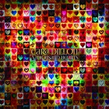

Cara Dillon
============================

|  |  |
| :--: | :-- |
| [<br>Cara Dillon](https://i.xiami.com/caradillon) | **地区**: Ireland 爱尔兰<br>**风格**: 民谣流行 Folk Pop, 凯尔特民谣 Celtic Folk, 爱尔兰民谣 Irish Folk, 当代民谣 Contemporary Folk<br>**播放数**: 28869748<br>**粉丝数**: 32245<br>**评论数**: 1275<br> |

## 档案

<div>
“她的歌声感动了整个爱尔兰！”这是爱尔兰人民对她的评价。<br>
她是爱尔兰国宝级民谣歌手——Cara Dillon。她因《Craigie Hill》享誉爱尔兰。<br>
《Craigie Hill》在世界范围被推崇，不仅仅因为它曲调上的清新，作词上的优美（歌词源于古老的英国诗歌），更反映出了爱情的可贵和为自由付出的代价。正是因为这样的普世价值，感动着全世界听过她的人。<br>
Cara Dillon（卡拉·狄龙/卡兰·迪伦）出生于1975年，来自一个爱尔兰传统音乐世家，幼年时期便展露出惊人的声乐能力，在14时便赢得了全爱尔兰传统歌唱比赛的冠军。1995年，Cara Dillon加入了当时极负盛名的民谣超级乐队Equation，之后她与乐队成员Sam Lakeman离开了乐队，组建了Polar Star组合。<br>
2001年，她推出了首张同名专辑《Cara Dillon》，此张专辑广受好评，并获得了BBC电台2频道的最佳传统曲目奖，地平线奖，Big Buzz和Hot Press杂志的最佳传统音乐奖以及Irish Tatler的年度女性奖等多个音乐大奖。在2004年，Cara Dillon获得了爱尔兰流星音乐奖。<br>
2008年，Cara自立厂牌Charcoal Records，决心创作属于自己、忠于内心的音乐。并与第二年在自己旗下发表专辑《Hill Of Thieves》。这张专辑在2010年获得BBC民谣奖最佳专辑奖。<br>
令人相见恨晚的天籁之音<br>
Cara Dillon拥有令人难以置信的天赋，她清澈自然的声音感染力赋予了古老的凯尔特民谣新的生命力。风琴木吉他钢琴，器乐使用简单，更衬托她声音中清澈纯朴的特质。<br>
短短几年的时间，Cara Dillon凭借她震撼人心的表演和成熟迷人的声音赢得了全世界无数人的心，她的歌曲借鉴引入了多个民族音乐特有的元素，并融入自己天然的个性和魅力，在歌曲中叙述一则则美妙的故事，更是其独特的创意。<br>
Cara Dillon与中国乐迷的一年之约<br>
2014年，Cara Dillon发布了专辑《A Thousand Hearts》，这张万众期待的专辑由Cara Dillon自己的音乐公司Charcoal Records与Sony音乐合作完成。2015年Cara Dillon带着这张融合传统与现代的惊艳之作开启了首次中国巡演之旅，并成功的俘获了中国乐迷的心。2016年10月Cara Dillon第二次造访中国，将清澈纯净的音符带给中国乐迷。<br>
2017年，Cara Dillon正式签约星外星音乐，她的经典专辑《Cara Dillon》已由星外星音乐独家引进，并有望于下半年在国内上架发行。同时，Cara Dillon不忘与中国乐迷的一年之约，将再度开启中国巡演之旅。就让Cara Dillon清澈的歌声，再次感动你我的心灵吧！
</div>

## 专辑

| 名称 | 语种 | 唱片公司 | 发行时间 | 专辑类别 | 专辑风格 |
| :--: | :-- | :-- | :-- | :-- | :-- |
| [<br>Upon A Winter's Night在一个冬夜里](./albums/2103514222.md) | 英语 | 星外星音乐 | 2018年01月01日 | 录音室专辑 | 民谣 Folk, 当代民谣 Contemporary Folk, 民谣流行 Folk Pop |
| [<br>Wanderer](./albums/88673.md) | 英语 | 星外星音乐 | 2017年10月13日 | 录音室专辑 | 爱尔兰民谣 Irish Folk, 凯尔特民谣 Celtic Folk |
| [<br>A Thousand Hearts](./albums/197474633.md) | 英语 | 星外星音乐 | 2014年05月19日 | 录音室专辑 | 世界音乐 World Music |
| [<br>Live at the Grand Opera House](./albums/424571.md) | 英语 | 星外星音乐 | 2010年11月29日 | 现场专辑 | 民谣流行 Folk Pop, 凯尔特民谣 Celtic Folk, 爱尔兰民谣 Irish Folk, 当代民谣 Contemporary Folk |
| [<br>Hill Of Thieves](./albums/309771.md) | 英语 | 星外星音乐 | 2009年01月26日 | 录音室专辑 | 民谣流行 Folk Pop, 凯尔特民谣 Celtic Folk, 爱尔兰民谣 Irish Folk, 当代民谣 Contemporary Folk, 当代唱作人 Contemporary Singer-Songwriter |
| [<br>If I Prove False](./albums/184349.md) | 英语 | Charcoal Records | 2008年05月19日 | EP, 单曲 | 民谣流行 Folk Pop, 凯尔特民谣 Celtic Folk, 爱尔兰民谣 Irish Folk, 当代民谣 Contemporary Folk |
| [<br>Black is the Colour](./albums/2103786963.md) | 英语 | Anjunabeats | 2006年12月04日 | EP, 单曲 |  |
| [<br>After The Morning](./albums/169106.md) | 英语 | 星外星音乐 | 2006年02月27日 | 录音室专辑 | 民谣流行 Folk Pop, 凯尔特民谣 Celtic Folk, 爱尔兰民谣 Irish Folk |
| [<br>Sweet Liberty甜蜜的自由](./albums/169105.md) | 英语 | 星外星音乐 | 2003年09月22日 | 录音室专辑 | 民谣流行 Folk Pop, 凯尔特民谣 Celtic Folk, 爱尔兰民谣 Irish Folk, 当代民谣 Contemporary Folk |
| [<br>Cara Dillon](./albums/169102.md) | 英语 | 星外星音乐 | 2001年07月16日 | 录音室专辑 | 民谣流行 Folk Pop, 凯尔特民谣 Celtic Folk, 爱尔兰民谣 Irish Folk, 当代民谣 Contemporary Folk |

## 评论

|  |  |  |
| :-- | :-- | :-- |
| <br>[虾米用户](https://emumo.xiami.com/u/441560822)<br><br>2020-03-31 14:38<br>赞(1) 踩(0) | <div>很想去看一次她的演唱会</div> |
| <br>[虾米用户](https://emumo.xiami.com/u/53718156)<br>盲目平淡喜欢一滴点波澜<br>2020-01-02 17:41<br>赞(0) 踩(0) | <div>啥时候来中国啊</div> |
| <br>[虾米用户](https://emumo.xiami.com/u/400083522)<br><br>2019-12-06 18:27<br>赞(0) 踩(0) | <div>什么时候还会再来？</div> |
| <br>[虾米用户](https://emumo.xiami.com/u/400656368)<br><br>2019-12-03 20:15<br>赞(0) 踩(0) | <div>新专辑即将发行</div> |
| <br>[虾米用户](https://emumo.xiami.com/u/35306315)<br><br>2019-09-23 22:46<br>赞(1) 踩(0) | <div>希望再次听到现场</div> |
| <br>[虾米用户](https://emumo.xiami.com/u/420831355)<br>音乐制作人，DJ，努力中<br>2019-08-29 22:21<br>赞(2) 踩(0) | <div>神仙级声音</div> |
| <br>[虾米用户](https://emumo.xiami.com/u/428235557)<br><br>2019-08-14 17:32<br>赞(0) 踩(0) | <div>很喜欢</div> |
| <br>[虾米用户](https://emumo.xiami.com/u/412132505)<br>我还没想好要写什么...<br>2019-07-18 08:01<br>赞(1) 踩(0) | <div>Cara you are so good</div> |
| <br>[虾米用户](https://emumo.xiami.com/u/53718156)<br>盲目平淡喜欢一滴点波澜<br>2019-07-10 10:33<br>赞(3) 踩(0) | <div>希望她再来中国，我不会再错过了。</div> |
| <br>[虾米用户](https://emumo.xiami.com/u/53718156)<br>盲目平淡喜欢一滴点波澜<br>2019-07-10 10:33<br>赞(6) 踩(0) | <div>我经常会给六七年前评论过的人点赞，如果他们还在，还看得到我的点赞，应该再回想起六七年前听这首歌的感动，那是真的感动吧...</div> |
| ⇒ | <br>[虾米用户](https://emumo.xiami.com/u/307215046)<br>人生最美的风景是自己的未...<br>2020-03-09 12:50<br>赞(0) 踩(0) | <div>me too</div> |
| <br>[虾米用户](https://emumo.xiami.com/u/2491956)<br>我还没想好要写什么...<br>2019-04-27 14:53<br>赞(0) 踩(0) | <div>她的声音是真正爱尔兰的声音！</div> |
| <br>[虾米用户](https://emumo.xiami.com/u/402901114)<br><br>2019-03-23 00:32<br>赞(1) 踩(0) | <div>2019还来中国么？</div> |
| <br>[虾米用户](https://emumo.xiami.com/u/296473046)<br><br>2019-01-21 01:16<br>赞(1) 踩(0) | <div>You want me to fill in your song in Chinese.</div> |
| <br>[虾米用户](https://emumo.xiami.com/u/409910028)<br><br>2019-01-15 19:35<br>赞(2) 踩(0) | <div>每个人的评论不决定音乐它的优劣</div> |
| <br>[虾米用户](https://emumo.xiami.com/u/337746853)<br><br>2018-12-25 22:35<br>赞(1) 踩(0) | <div>******</div> |
| <br>[虾米用户](https://emumo.xiami.com/u/6459825)<br><br>2018-11-24 06:40<br>赞(1) 踩(0) | <div></div> |
| <br>[虾米用户](https://emumo.xiami.com/u/862929)<br><br>2018-11-09 20:03<br>赞(0) 踩(0) | <div>一直就着她的歌声看地海传奇</div> |
| <br>[虾米用户](https://emumo.xiami.com/u/406850507)<br><br>2018-10-25 16:43<br>赞(0) 踩(0) | <div>2018 还来北京吗？错过了真是可惜</div> |
| <br>[虾米用户](https://emumo.xiami.com/u/4234256)<br><br>2018-09-21 00:18<br>赞(1) 踩(0) | <div>中学时期发现的 当时这嗓音惊为天人 现在听不少都是回忆</div> |
| ⇒ | <br>[虾米用户](https://emumo.xiami.com/u/406541517)<br><br>2018-10-22 09:34<br>赞(0) 踩(0) | <div>我也是，至今每次听都能找到熟悉的宁静，在家复习考研听，恍惚间像回到高中自习室。</div> |
| ⇒ | <br>[虾米用户](https://emumo.xiami.com/u/4234256)<br><br>2018-10-22 12:07<br>赞(0) 踩(0) | <div><q><b>浪漫的土豆说：</b></q></div> |
| <br>[虾米用户](https://emumo.xiami.com/u/404124062)<br><br>2018-09-16 00:47<br>赞(1) 踩(0) | <div>寻找你好久了，感谢再次遇见你，这次不会丢了你</div> |
| <br>[虾米用户](https://emumo.xiami.com/u/324879742)<br> <br>2018-08-28 07:23<br>赞(2) 踩(0) | <div>.</div> |
| <br>[虾米用户](https://emumo.xiami.com/u/349659834)<br>身披浴血的蔷薇<br>2018-08-25 09:18<br>赞(0) 踩(0) | <div>温暖而善良</div> |
| <br>[虾米用户](https://emumo.xiami.com/u/16206377)<br>rabbit_❀moon<br>2018-06-15 08:04<br>赞(2) 踩(0) | <div>老粉发现她入驻了虾米音乐人0.0</div> |
| <br>[虾米用户](https://emumo.xiami.com/u/8635478)<br>换个地方思考<br>2018-06-09 09:38<br>赞(0) 踩(0) | <div>哎呀，10.03/广州 星海音乐厅演奏大厅 错过了呀</div> |
| <br>[虾米用户](https://emumo.xiami.com/u/78519234)<br>我还没想好要写什么...<br>2018-06-08 18:54<br>赞(0) 踩(0) | <div></div> |
| <br>[虾米用户](https://emumo.xiami.com/u/8769211)<br>暂无签名~<br>2018-05-29 22:59<br>赞(0) 踩(0) | <div>今年还来嘛，怎么还没动静</div> |
| <br>[虾米用户](https://emumo.xiami.com/u/335015922)<br><br>2018-05-25 22:07<br>赞(0) 踩(0) | <div>太爱了大爱</div> |
| <br>[虾米用户](https://emumo.xiami.com/u/10108127)<br>大和女性女声摇滚-激燃魅...<br>2018-05-07 09:20<br>赞(1) 踩(0) | <div>干净</div> |
| <br>[虾米用户](https://emumo.xiami.com/u/43669851)<br>不一样的我，不抽烟也不带...<br>2018-04-20 13:37<br>赞(0) 踩(0) | <div>因为这首音乐让我相信这英伦风中不一样的天籁之音！</div> |
| <br>[虾米用户](https://emumo.xiami.com/u/8635478)<br>换个地方思考<br>2018-04-03 09:48<br>赞(0) 踩(0) | <div>为什么拥有女神般嗓音的人都是那么老了，难道是因为这样的声音年轻的人练不出来？</div> |
| <br>[虾米用户](https://emumo.xiami.com/u/228843687)<br>懒惰统治人间<br>2018-03-26 12:12<br>赞(1) 踩(0) | <div>不食人间烟火</div> |
| <br>[虾米用户](https://emumo.xiami.com/u/69066576)<br><br>2018-03-25 11:54<br>赞(1) 踩(0) | <div>18年还有中国巡演吗？</div> |
| <br>[虾米用户](https://emumo.xiami.com/u/6058168)<br>宁波丨秋老师吉他私塾<br>2018-02-20 11:03<br>赞(0) 踩(0) | <div>上帝亲吻过的声音！</div> |
| <br>[虾米用户](https://emumo.xiami.com/u/257885151)<br><br>2018-02-07 00:55<br>赞(0) 踩(0) | <div>irish angel</div> |
| <br>[虾米用户](https://emumo.xiami.com/u/346101962)<br><br>2018-01-27 02:15<br>赞(0) 踩(0) | <div>喜欢这姑娘的听众，估计你们也会爱上Juliw Fowlis。</div> |
| <br>[虾米用户](https://emumo.xiami.com/u/53718156)<br>盲目平淡喜欢一滴点波澜<br>2018-01-14 01:08<br>赞(0) 踩(0) | <div>上帝亲吻过的声音！ </div> |
| <br>[虾米用户](https://emumo.xiami.com/u/335545323)<br><br>2017-12-04 19:57<br>赞(0) 踩(0) | <div>国考路上，不小心收藏了Cara 两首歌，谢谢 </div> |
| <br>[虾米用户](https://emumo.xiami.com/u/333004838)<br><br>2017-11-12 23:18<br>赞(1) 踩(0) | <div>15年了，呵呵又听到这首歌。 <br>时间真是一个奇妙的东西，下一个十年又会怎样真是期待。</div> |
| <br>[虾米用户](https://emumo.xiami.com/u/5831503)<br>暂无签名~<br>2017-10-30 10:15<br>赞(0) 踩(0) | <div>她要来中国了 Craigie Hill 真是把我听哭了 那时候我还是个多愁善感的少年诶 只是已经厌倦了去北京看演出了 广州见</div> |
| <br>[虾米用户](https://emumo.xiami.com/u/5831503)<br>暂无签名~<br>2017-10-30 10:15<br>赞(2) 踩(0) | <div>她要来中国了 Craigie Hill 真是把我听哭了 那时候我还是个多愁善感的少年诶 只是已经厌倦了去北京看演出了 广州见</div> |
| <br>[虾米用户](https://emumo.xiami.com/u/1003407)<br><br>2017-10-30 10:14<br>赞(1) 踩(0) | <div>听了5年的歌！！！！！记得当年整个年级去井冈山的时候，山里美妙的空气和她的歌声，让我一辈子也忘不了那种美好~</div> |
| <br>[虾米用户](https://emumo.xiami.com/u/1430876)<br>我就不靠谱和爱折腾<br>2017-10-30 10:02<br>赞(4) 踩(0) | <div>Cara Dillon冷酷却富有感染力的声音包含着她对家乡的热情和对国家的热爱。Cara Dillon有着极少数人才有的美妙嗓音。她天生的性格拥有罕见的让人无法抗拒的魅力，她能够把宏大的故事融入歌曲当中，摄人心魄，她那包罗万象的品质跨越了国家、文化、甚至是语言的界限。</div> |
| <br>[虾米用户](https://emumo.xiami.com/u/485638)<br><br>2017-10-28 00:32<br>赞(3) 踩(0) | <div>好几个乐迷说不敢相信cara居然来中国演出。一位从辽宁歌迷专程来北京看演出，凌晨4点就要登上回去的火车。有兴趣的歌迷应该去现场感受一下凯尔特音乐的魔力。</div> |
| <br>[虾米用户](https://emumo.xiami.com/u/601978)<br><br>2017-10-28 00:32<br>赞(11) 踩(0) | <div>爱尔兰民谣歌手Cara Dillon 2013年12月中国巡演<br>12月12日，西安音乐厅 ，12月13日：北京 麻雀瓦舍 ，12月14日：上海 MAOlivehouse ，12月15日：广州 TU凸空间 。<br>Cara Dillon - Live@Mako Livehouse,Beijing 20131213  <a href="http://www.tudou.com/programs/view/B_rxbO7_7sE/" target="_blank" rel="nofollow noreferrer noopener">http://www.tudou.com/programs/view/B_rxbO7_7sE/</a></div> |
| <br>[虾米用户](https://emumo.xiami.com/u/601978)<br><br>2017-10-28 00:32<br>赞(3) 踩(0) | <div>爱尔兰民谣歌手Cara Dillon 2013年12月中国巡演<br>12月12日，西安音乐厅 ，12月13日：北京 麻雀瓦舍 ，12月14日：上海 MAOlivehouse ，12月15日：广州 TU凸空间 。购票网址 <a href="http://e.mosh.cn/21270" target="_blank" rel="nofollow noreferrer noopener">http://e.mosh.cn/21270</a> 豆瓣同城活动<a href="http://www.douban.com/event/19183379/" target="_blank" rel="nofollow noreferrer noopener">http://www.douban.com/event/19183379/</a></div> |
| <br>[虾米用户](https://emumo.xiami.com/u/567221)<br><br>2017-10-28 00:23<br>赞(1) 踩(0) | <div>当年她的一首blue mountain river 简直让我痴迷，曾经以为她很遥远，没有想到她这么近</div> |
| <br>[虾米用户](https://emumo.xiami.com/u/1342581)<br><br>2017-10-28 00:21<br>赞(2) 踩(0) | <div>爱尔兰莺歌天使·Cara Dillon(卡拉迪伦)...她用冷酷的线条传播温暖...用简单的黑色编织一幅幅五彩缤纷的梦境...她用歌声倾诉她对她的国家,她的民族,她的家人...最本真的爱!</div> |
| <br>[虾米用户](https://emumo.xiami.com/u/20565415)<br>a creep,a we...<br>2017-10-28 00:05<br>赞(2) 踩(0) | <div>去了大华的现场，人美歌声赞，声音清澈温暖，团队成员都亲切随和，四人的签名都有了，哈哈，如果以后还来中国，我还要去去去。</div> |
| <br>[虾米用户](https://emumo.xiami.com/u/3564226)<br>我想想..<br>2017-10-27 23:30<br>赞(1) 踩(0) | <div>有段时间听她所有的歌，基本每首都喜欢，直到听到她的声音就腻。。现在听却又爱上了。。。你是经典，经典就是腻了又爱，爱了又腻。。。</div> |
| <br>[虾米用户](https://emumo.xiami.com/u/11268766)<br><br>2017-10-27 23:14<br>赞(1) 踩(0) | <div>她震撼人心的表演和成熟迷人的声音赢得了整个国家观众的心，以及其他几个国家的观众，因为她的表演能穿越国界，文化和语言。</div> |
| <br>[虾米用户](https://emumo.xiami.com/u/298948030)<br>中國詩音樂電影创始人作曲...<br>2017-10-17 21:56<br>赞(1) 踩(0) | <div>你好</div> |
| <br>[虾米用户](https://emumo.xiami.com/u/27684693)<br><br>2017-10-16 22:29<br>赞(3) 踩(0) | <div>******</div> |
| ⇒ | <br>[虾米用户](https://emumo.xiami.com/u/333004838)<br><br>2017-11-12 23:22<br>赞(0) 踩(0) | <div>哈哈，我正在做这件事。</div> |
| <br>[虾米用户](https://emumo.xiami.com/u/85568296)<br>只有阳光而无阴影 只有欢...<br>2017-10-16 12:24<br>赞(1) 踩(0) | <div>声音迷人</div> |
| <br>[虾米用户](https://emumo.xiami.com/u/257885151)<br><br>2017-10-15 17:41<br>赞(2) 踩(0) | <div>her wanderer is out</div> |
| <br>[虾米用户](https://emumo.xiami.com/u/50163847)<br><br>2017-10-06 02:39<br>赞(1) 踩(0) | <div>2017.10.5上海归来，一如既往地美丽，好温柔好漂亮，歌声真的好治愈 </div> |
| <br>[虾米用户](https://emumo.xiami.com/u/10374996)<br>weixin: pola...<br>2017-10-04 11:22<br>赞(1) 踩(0) | <div>就是明天了啊&amp;hellip;&amp;hellip;时间过得真快</div> |
| <br>[虾米用户](https://emumo.xiami.com/u/47875288)<br>瓜季少女  杂食<br>2017-10-04 09:37<br>赞(1) 踩(0) | <div>20171003广州</div> |
| <br>[虾米用户](https://emumo.xiami.com/u/47875288)<br>瓜季少女  杂食<br>2017-10-03 19:49<br>赞(1) 踩(0) | <div>等待女神ing&amp;hellip;</div> |
| <br>[虾米用户](https://emumo.xiami.com/u/15247133)<br>我还没想好要写什么...<br>2017-10-03 09:00<br>赞(1) 踩(0) | <div>20171002深圳</div> |
| <br>[虾米用户](https://emumo.xiami.com/u/228428006)<br><br>2017-10-02 19:02<br>赞(1) 踩(0) | <div>10月2号深圳飘过</div> |
| <br>[虾米用户](https://emumo.xiami.com/u/14019177)<br>家住欢城<br>2017-09-29 12:12<br>赞(1) 踩(0) | <div>广州为什么还不能买票？</div> |
| <br>[虾米用户](https://emumo.xiami.com/u/15849880)<br>我还没想好要写什么...<br>2017-09-28 18:40<br>赞(1) 踩(0) | <div>上海10.5号看</div> |
| <br>[虾米用户](https://emumo.xiami.com/u/73210420)<br>满足坏人一个<br>2017-09-27 21:58<br>赞(2) 踩(0) | <div>12.30大连680<br>三排二号</div> |
| <br>[虾米用户](https://emumo.xiami.com/u/24968228)<br><br>2017-09-26 22:55<br>赞(1) 踩(0) | <div>10月1号系番禺的图乐剧场?边度黎噶！?本地人都唔知&amp;rarr;_&amp;rarr;广州场期待中</div> |
| <br>[虾米用户](https://emumo.xiami.com/u/274913113)<br><br>2017-09-13 08:21<br>赞(1) 踩(0) | <div>妈蛋，老板只给我们放三天，四号去不了北京了，</div> |
| <br>[虾米用户](https://emumo.xiami.com/u/16206377)<br>rabbit_❀moon<br>2017-09-11 01:22<br>赞(4) 踩(0) | <div>广州280已购坐等，前几年总是一直错过这次终于赶上了 </div> |
| ⇒ | <br>[虾米用户](https://emumo.xiami.com/u/257885151)<br><br>2017-11-14 01:16<br>赞(0) 踩(0) | <div>hi</div> |
| <br>[虾米用户](https://emumo.xiami.com/u/3196312)<br>我在河山在。<br>2017-09-10 18:37<br>赞(1) 踩(0) | <div>很多年前。</div> |
| <br>[虾米用户](https://emumo.xiami.com/u/7133174)<br>我还没想好要写什么...<br>2017-08-30 00:12<br>赞(2) 踩(0) | <div>已购280有同行的咩</div> |
| <br>[虾米用户](https://emumo.xiami.com/u/13327353)<br>唯爱与妹子及音乐不可辜负<br>2017-08-29 16:14<br>赞(1) 踩(0) | <div>没魔都？！</div> |
| <br>[虾米用户](https://emumo.xiami.com/u/242406841)<br>美妙歌声<br>2017-08-28 16:25<br>赞(1) 踩(0) | <div>我也想知道她广州演唱会是什么时候！太喜欢这声音了！</div> |
| <br>[虾米用户](https://emumo.xiami.com/u/47875288)<br>瓜季少女  杂食<br>2017-08-19 22:20<br>赞(1) 踩(0) | <div>广州的什么时候能买票，好着急 </div> |
| <br>[虾米用户](https://emumo.xiami.com/u/59249636)<br>山海之上，六道左归<br>2017-08-15 12:46<br>赞(1) 踩(0) | <div>演唱会等着我</div> |
| <br>[虾米用户](https://emumo.xiami.com/u/8538056)<br>Absolutely<br>2017-08-14 22:10<br>赞(1) 踩(0) | <div>要来北京啦~</div> |
| ⇒ | <br>[虾米用户](https://emumo.xiami.com/u/274913113)<br><br>2017-09-12 21:43<br>赞(0) 踩(0) | <div>北京的买一楼的还是二楼的啊？</div> |
| <br>[虾米用户](https://emumo.xiami.com/u/210737057)<br>Miracle<br>2017-07-25 03:17<br>赞(2) 踩(0) | <div>that&amp;#39;s the sound I love so much always these years from the moment I listening to the first song</div> |
| <br>[虾米用户](https://emumo.xiami.com/u/260023697)<br><br>2017-06-22 06:48<br>赞(1) 踩(0) | <div></div> |
| <br>[虾米用户](https://emumo.xiami.com/u/7795058)<br>弦如字画，或空月过鸟<br>2017-06-11 20:59<br>赞(1) 踩(0) | <div>赞~~~~~~~</div> |
| <br>[虾米用户](https://emumo.xiami.com/u/14172157)<br><br>2017-06-07 11:09<br>赞(1) 踩(0) | <div>就是喜欢</div> |
| <br>[虾米用户](https://emumo.xiami.com/u/35509231)<br>提灯天后  策马小僧<br>2017-05-17 09:14<br>赞(31) 踩(0) | <div>如果天使会说话，大概就是她的声音。</div> |
| <br>[虾米用户](https://emumo.xiami.com/u/131487244)<br>Sone/霉粉/北欧乐队...<br>2017-05-16 09:56<br>赞(1) 踩(0) | <div>sweet lark from Ireland</div> |
| <br>[虾米用户](https://emumo.xiami.com/u/289733390)<br><br>2017-05-06 23:29<br>赞(4) 踩(0) | <div>真的是天籁之音！最适合需要静心时听，听完她的歌整个人都温柔了。。。</div> |
| <br>[虾米用户](https://emumo.xiami.com/u/4346758)<br>音乐让我们相聚<br>2017-04-25 10:16<br>赞(2) 踩(0) | <div>出新砖了吧？upon a winter&amp;amp;#039;s night</div> |
| <br>[虾米用户](https://emumo.xiami.com/u/66977974)<br><br>2017-04-17 12:32<br>赞(1) 踩(0) | <div>完美女神！</div> |
| <br>[虾米用户](https://emumo.xiami.com/u/10839579)<br><br>2017-03-16 19:49<br>赞(1) 踩(0) | <div>爱尔兰传统音乐</div> |
| <br>[虾米用户](https://emumo.xiami.com/u/280310719)<br><br>2017-03-14 15:39<br>赞(2) 踩(0) | <div>这声音，喜欢</div> |
| <br>[虾米用户](https://emumo.xiami.com/u/254194687)<br><br>2017-03-04 23:53<br>赞(1) 踩(0) | <div>这是什么？</div> |
| <br>[虾米用户](https://emumo.xiami.com/u/14019177)<br>家住欢城<br>2017-03-02 22:14<br>赞(2) 踩(0) | <div>2017什么时候来广州？</div> |
| ⇒ | <br>[虾米用户](https://emumo.xiami.com/u/1143360)<br>到头来 还是感谢虾米一切...<br>2017-08-15 09:31<br>赞(0) 踩(0) | <div>2017.10.03</div> |
| ⇒ | <br>[虾米用户](https://emumo.xiami.com/u/14019177)<br>家住欢城<br>2017-08-30 13:57<br>赞(0) 踩(0) | <div><q><b>sisi奈说：</b></q></div> |
| <br>[虾米用户](https://emumo.xiami.com/u/41862267)<br><br>2017-02-27 14:24<br>赞(2) 踩(0) | <div>爱尔兰女歌手</div> |
| <br>[虾米用户](https://emumo.xiami.com/u/43069923)<br><br>2017-02-26 00:01<br>赞(1) 踩(0) | <div>好听</div> |
| <br>[虾米用户](https://emumo.xiami.com/u/275270873)<br><br>2017-02-24 14:19<br>赞(1) 踩(0) | <div>soft, deep, flowing with wind, with little river</div> |
| <br>[虾米用户](https://emumo.xiami.com/u/73669322)<br><br>2017-02-19 17:19<br>赞(1) 踩(0) | <div>喜欢 3/4拍4/4来回转换的 有格调</div> |
| <br>[虾米用户](https://emumo.xiami.com/u/207626626)<br>Derek<br>2017-01-11 19:02<br>赞(1) 踩(0) | <div>好聽 </div> |
| <br>[虾米用户](https://emumo.xiami.com/u/192004508)<br><br>2016-12-24 13:53<br>赞(1) 踩(0) | <div>相见恨晚</div> |
| <br>[虾米用户](https://emumo.xiami.com/u/23618525)<br>心净无染  自然<br>2016-12-20 11:28<br>赞(1) 踩(0) | <div>对北欧民族音乐有特别的偏爱</div> |
| <br>[虾米用户](https://emumo.xiami.com/u/5496438)<br>凡尘俗事，改变了你我！<br>2016-12-12 21:03<br>赞(1) 踩(0) | <div>纯净</div> |
| <br>[虾米用户](https://emumo.xiami.com/u/39915486)<br>Life for Ren...<br>2016-12-07 23:27<br>赞(1) 踩(0) | <div>纯净美好</div> |
| <br>[虾米用户](https://emumo.xiami.com/u/188036600)<br><br>2016-12-04 16:41<br>赞(1) 踩(0) | <div>音之美,心醉之</div> |
| <br>[虾米用户](https://emumo.xiami.com/u/10469261)<br>Hey  Xiami ;...<br>2016-12-03 14:57<br>赞(1) 踩(0) | <div></div> |
| <br>[虾米用户](https://emumo.xiami.com/u/35306315)<br><br>2016-10-17 21:25<br>赞(2) 踩(0) | <div>15号在广州现场，感动。。</div> |
| <br>[虾米用户](https://emumo.xiami.com/u/1513798)<br><br>2016-10-14 17:52<br>赞(2) 踩(0) | <div>晚上见</div> |
| <br>[虾米用户](https://emumo.xiami.com/u/80780068)<br>90后 pretty b...<br>2016-10-12 08:33<br>赞(1) 踩(0) | <div>这么火</div> |
| <br>[虾米用户](https://emumo.xiami.com/u/9060789)<br>人生无常 世界荒凉<br>2016-10-11 14:00<br>赞(2) 踩(0) | <div>有上海10.14去听的吗</div> |
| ⇒ | <br>[虾米用户](https://emumo.xiami.com/u/2204272)<br>只听歌，没有故事。<br>2016-10-11 15:51<br>赞(0) 踩(0) | <div>我~</div> |
| <br>[虾米用户](https://emumo.xiami.com/u/5555925)<br>而我在這裏等<br>2016-10-09 03:36<br>赞(1) 踩(0) | <div>天籁不过如此 </div> |
| <br>[虾米用户](https://emumo.xiami.com/u/10279073)<br>永不停止地奔跑。<br>2016-10-09 01:14<br>赞(1) 踩(0) | <div>广州10.15的有吗？</div> |
| ⇒ | <br>[虾米用户](https://emumo.xiami.com/u/1648224)<br>我还没想好要写什么...<br>2016-10-11 12:14<br>赞(0) 踩(0) | <div>有！</div> |
| <br>[虾米用户](https://emumo.xiami.com/u/874202)<br>爱是这世界唯一的解药<br>2016-09-19 12:03<br>赞(1) 踩(0) | <div>(*@ο@*) 哇～，演出了</div> |
| <br>[虾米用户](https://emumo.xiami.com/u/47258099)<br><br>2016-09-19 12:00<br>赞(56) 踩(0) | <div>CARA&amp;#039;S CHRISTMAS ALBUM<br><br>If you&amp;#039;ve ever longed for an atmospheric and cinematic soundtrack to accompany the legend and faith abound in the Christmas story then look no further. We&amp;#039;re thrilled to announce Cara will be releasing her very first Christmas album in late November 2016.</div> |
| ⇒ | <br>[虾米用户](https://emumo.xiami.com/u/231487244)<br><br>2019-12-01 08:51<br>赞(0) 踩(0) | <div>你的声音犹如天籁</div> |
| <br>[虾米用户](https://emumo.xiami.com/u/30074304)<br>寄蜉蝣于天地，渺沧海之一...<br>2016-09-15 19:49<br>赞(1) 踩(0) | <div></div> |
| <br>[虾米用户](https://emumo.xiami.com/u/606760)<br>魂牵一线<br>2016-09-13 23:34<br>赞(1) 踩(0) | <div>听</div> |
| <br>[虾米用户](https://emumo.xiami.com/u/28984380)<br>宜善而行，怀远致明。<br>2016-08-03 20:40<br>赞(2) 踩(0) | <div>清澈不娇柔，清丽而美好，你可以感受到风，想想风吧</div> |
| <br>[虾米用户](https://emumo.xiami.com/u/29803141)<br>青い、リンドウ。<br>2016-07-14 15:04<br>赞(2) 踩(0) | <div>3.14生日那天去了，没想到10月份又要来，欢迎~</div> |
| ⇒ | <br>[虾米用户](https://emumo.xiami.com/u/2204272)<br>只听歌，没有故事。<br>2016-09-28 22:59<br>赞(0) 踩(0) | <div>那天也是白色情人节</div> |
| <br>[虾米用户](https://emumo.xiami.com/u/9052628)<br>听歌的故事<br>2016-07-05 14:13<br>赞(3) 踩(0) | <div>10、17西安演唱会，有点想去</div> |
| <br>[虾米用户](https://emumo.xiami.com/u/89767394)<br>'   Sweet<br>2016-07-02 22:35<br>赞(1) 踩(0) | <div></div> |
| <br>[虾米用户](https://emumo.xiami.com/u/52056952)<br>人生即是到來、相遇、陪伴...<br>2016-07-02 11:56<br>赞(0) 踩(0) | <div></div> |
| <br>[虾米用户](https://emumo.xiami.com/u/32206452)<br> <br>2016-06-04 05:52<br>赞(0) 踩(0) | <div>民谣</div> |
| <br>[虾米用户](https://emumo.xiami.com/u/122345786)<br>一条学法律的狗！<br>2016-05-19 12:22<br>赞(0) 踩(0) | <div>s</div> |
| <br>[虾米用户](https://emumo.xiami.com/u/27678903)<br>让银疯一会儿<br>2016-05-12 11:47<br>赞(0) 踩(0) | <div>2323</div> |
| <br>[虾米用户](https://emumo.xiami.com/u/61304158)<br>永别了，虾米，感你陪伴了...<br>2016-04-13 03:00<br>赞(0) 踩(0) | <div>北爱尔兰现在是英国的领地。。</div> |
| <br>[虾米用户](https://emumo.xiami.com/u/49105721)<br><br>2016-04-05 07:59<br>赞(0) 踩(0) | <div>改论文，呵呵呵呵呵呵呵呵呵呵</div> |
| <br>[虾米用户](https://emumo.xiami.com/u/3063702)<br><br>2016-03-23 22:07<br>赞(1) 踩(0) | <div>缥缈空灵的凯尔特风格，爱尔兰真是个迷人的国度</div> |
| <br>[虾米用户](https://emumo.xiami.com/u/60039388)<br><br>2016-03-13 23:05<br>赞(0) 踩(0) | <div>好听</div> |
| <br>[虾米用户](https://emumo.xiami.com/u/8179400)<br><br>2016-03-12 16:50<br>赞(0) 踩(0) | <div>好</div> |
| <br>[虾米用户](https://emumo.xiami.com/u/7909558)<br><br>2016-03-08 08:37<br>赞(0) 踩(0) | <div>good</div> |
| <br>[虾米用户](https://emumo.xiami.com/u/90830230)<br><br>2016-02-04 16:30<br>赞(0) 踩(0) | <div></div> |
| <br>[虾米用户](https://emumo.xiami.com/u/45621221)<br>卸载状态。<br>2016-01-29 01:30<br>赞(0) 踩(0) | <div>=</div> |
| <br>[虾米用户](https://emumo.xiami.com/u/11660896)<br>这个人很懒  什么都没留...<br>2016-01-22 01:11<br>赞(1) 踩(0) | <div>美的我想哭</div> |
| <br>[虾米用户](https://emumo.xiami.com/u/78519234)<br>我还没想好要写什么...<br>2015-12-09 21:51<br>赞(0) 踩(0) | <div></div> |
| <br>[虾米用户](https://emumo.xiami.com/u/44358014)<br><br>2015-11-29 09:23<br>赞(1) 踩(0) | <div>感觉不错</div> |
| <br>[虾米用户](https://emumo.xiami.com/u/1638941)<br>最美不过鸡腿啊菇<br>2015-11-28 12:43<br>赞(0) 踩(0) | <div>记忆 唤醒</div> |
| <br>[虾米用户](https://emumo.xiami.com/u/46205545)<br>音乐赶走了孤独～<br>2015-11-28 10:53<br>赞(0) 踩(0) | <div></div> |
| <br>[虾米用户](https://emumo.xiami.com/u/115238)<br><br>2015-11-23 23:04<br>赞(0) 踩(0) | <div>微风吹过原野，细雨洗去纤尘。</div> |
| <br>[虾米用户](https://emumo.xiami.com/u/4334329)<br><br>2015-11-17 20:56<br>赞(0) 踩(0) | <div>最喜欢的歌手</div> |
| <br>[虾米用户](https://emumo.xiami.com/u/60091844)<br><br>2015-10-30 11:09<br>赞(0) 踩(0) | <div>好听 </div> |
| <br>[虾米用户](https://emumo.xiami.com/u/11867156)<br>一位普通人。<br>2015-10-29 18:13<br>赞(0) 踩(0) | <div>好听。</div> |
| <br>[虾米用户](https://emumo.xiami.com/u/8146093)<br><br>2015-10-29 10:52<br>赞(0) 踩(0) | <div>比较喜欢的歌手</div> |
| <br>[虾米用户](https://emumo.xiami.com/u/8538056)<br>Absolutely<br>2015-10-12 19:55<br>赞(0) 踩(0) | <div>I Wish You Well</div> |
| <br>[虾米用户](https://emumo.xiami.com/u/52771475)<br><br>2015-10-07 15:47<br>赞(2) 踩(0) | <div>爱尔兰给我感觉每个人都会唱歌</div> |
| <br>[虾米用户](https://emumo.xiami.com/u/48121237)<br>弃坑虾米了，转战网易。<br>2015-10-03 10:25<br>赞(0) 踩(0) | <div>好单纯的妹子啊！</div> |
| <br>[虾米用户](https://emumo.xiami.com/u/13097036)<br>Y(^_^)Y誰也和我一...<br>2015-10-02 23:49<br>赞(7) 踩(0) | <div>听说虾米上能找到合适自己的男朋友哦！ 特求男友啦～～～～请批示..</div> |
| ⇒ | <br>[虾米用户](https://emumo.xiami.com/u/33816736)<br>音乐&电影<br>2015-10-03 20:13<br>赞(0) 踩(0) | <div>可是你处女座啊 </div> |
| ⇒ | <br>[虾米用户](https://emumo.xiami.com/u/182939)<br><br>2015-11-25 17:08<br>赞(0) 踩(0) | <div>山西太远啦，不然还可以约一下哦</div> |
| ⇒ | <br>[虾米用户](https://emumo.xiami.com/u/13097036)<br>Y(^_^)Y誰也和我一...<br>2015-11-25 17:55<br>赞(0) 踩(0) | <div><q><b>云梦者说：</b></q></div> |
| ⇒ | <br>[虾米用户](https://emumo.xiami.com/u/9065076)<br>我还没想好要写什么...<br>2016-02-13 00:52<br>赞(0) 踩(0) | <div>哈哈，批 </div> |
| ⇒ | <br>[虾米用户](https://emumo.xiami.com/u/2821733)<br>懒惰不会使人一下跌倒<br>2017-09-28 03:51<br>赞(0) 踩(0) | <div>歌听不到一起～ </div> |
| <br>[虾米用户](https://emumo.xiami.com/u/1276949)<br><br>2015-09-25 10:27<br>赞(0) 踩(0) | <div>Cara Dillon(卡拉·迪伦）</div> |
| <br>[虾米用户](https://emumo.xiami.com/u/8475225)<br><br>2015-09-17 11:02<br>赞(0) 踩(0) | <div>[[[[[[[[[[[[oooooOooooo]]]]]]]<br>]]]]]]</div> |
| <br>[虾米用户](https://emumo.xiami.com/u/59561020)<br><br>2015-08-31 13:14<br>赞(0) 踩(0) | <div>声音真美</div> |
| <br>[虾米用户](https://emumo.xiami.com/u/50444101)<br>音乐穷三代， 摇滚毁一生...<br>2015-08-23 22:21<br>赞(0) 踩(0) | <div>爱尔兰流行民谣</div> |
| <br>[虾米用户](https://emumo.xiami.com/u/41107018)<br><br>2015-08-20 16:25<br>赞(0) 踩(0) | <div>就是因为好听</div> |
| <br>[虾米用户](https://emumo.xiami.com/u/2866009)<br><br>2015-08-16 18:14<br>赞(0) 踩(0) | <div>太美妙的声音</div> |
| <br>[虾米用户](https://emumo.xiami.com/u/2866009)<br><br>2015-08-16 18:03<br>赞(0) 踩(0) | <div>竟然能有这么美妙的声音</div> |
| <br>[虾米用户](https://emumo.xiami.com/u/47365062)<br>windy<br>2015-08-10 17:43<br>赞(0) 踩(0) | <div>美</div> |
| <br>[虾米用户](https://emumo.xiami.com/u/41574873)<br><br>2015-08-05 23:07<br>赞(0) 踩(0) | <div>听完她的音乐 整个人都放松了</div> |
| <br>[虾米用户](https://emumo.xiami.com/u/1320669)<br>ツ<br>2015-08-02 03:01<br>赞(0) 踩(0) | <div>0.0</div> |
| <br>[虾米用户](https://emumo.xiami.com/u/9535840)<br><br>2015-07-31 11:09<br>赞(0) 踩(0) | <div>民谣</div> |
| <br>[虾米用户](https://emumo.xiami.com/u/39074354)<br>等到风景都看透....<br>2015-07-30 14:25<br>赞(0) 踩(0) | <div>好听</div> |
| <br>[虾米用户](https://emumo.xiami.com/u/53538147)<br>Buried in mu...<br>2015-07-29 13:55<br>赞(0) 踩(0) | <div>老了</div> |
| <br>[虾米用户](https://emumo.xiami.com/u/11151712)<br><br>2015-07-24 09:14<br>赞(0) 踩(0) | <div>君生我未生</div> |
| <br>[虾米用户](https://emumo.xiami.com/u/52789987)<br><br>2015-07-21 11:20<br>赞(0) 踩(0) | <div>分享  Flo Rida;T-Pain 的歌曲《Low》<a href="http://www.xiami.com/song/2654394" target="_blank" rel="nofollow noreferrer noopener">http://www.xiami.com/song/2654394</a>（分享自@虾米音乐）</div> |
| <br>[虾米用户](https://emumo.xiami.com/u/13445121)<br><br>2015-07-20 22:21<br>赞(1) 踩(0) | <div>很纯净的声音</div> |
| <br>[虾米用户](https://emumo.xiami.com/u/6506502)<br>所谓伊人，在水之湄<br>2015-07-17 18:14<br>赞(0) 踩(0) | <div>第一次听的时候还以为王菲，没注意。。。</div> |
| <br>[虾米用户](https://emumo.xiami.com/u/50519364)<br><br>2015-07-04 12:35<br>赞(0) 踩(0) | <div>听久了有点抖</div> |
| <br>[虾米用户](https://emumo.xiami.com/u/51859398)<br>时间比眼睛更会看！<br>2015-06-28 23:06<br>赞(1) 踩(0) | <div>纯净空灵</div> |
| <br>[虾米用户](https://emumo.xiami.com/u/35714790)<br><br>2015-06-22 21:46<br>赞(1) 踩(0) | <div>赏一曲沁人心扉</div> |
| <br>[虾米用户](https://emumo.xiami.com/u/18522387)<br><br>2015-06-14 21:50<br>赞(0) 踩(0) | <div>like</div> |
| <br>[虾米用户](https://emumo.xiami.com/u/11859453)<br><br>2015-05-26 21:12<br>赞(1) 踩(0) | <div>虾米好强大，竟然入驻了</div> |
| <br>[虾米用户](https://emumo.xiami.com/u/29197411)<br>我还没想好要写什么...<br>2015-05-24 20:40<br>赞(0) 踩(0) | <div>无感</div> |
| <br>[虾米用户](https://emumo.xiami.com/u/8402406)<br><br>2015-05-13 12:37<br>赞(0) 踩(0) | <div>NICE</div> |
| <br>[虾米用户](https://emumo.xiami.com/u/12191049)<br>假装很酷 反正不会回复的<br>2015-05-13 10:31<br>赞(1) 踩(0) | <div>编曲好适合做欧美古装文艺片的OST啊啊<br><br>人声很好，就是听久了会觉得腻</div> |
| <br>[虾米用户](https://emumo.xiami.com/u/48973824)<br><br>2015-05-07 14:20<br>赞(0) 踩(0) | <div>edge</div> |
| <br>[虾米用户](https://emumo.xiami.com/u/46220775)<br>买水泥找齐彬<br>2015-04-17 22:08<br>赞(0) 踩(0) | <div>含糖量太高，爆表了</div> |
| <br>[虾米用户](https://emumo.xiami.com/u/42208968)<br><br>2015-04-12 21:30<br>赞(1) 踩(0) | <div>迷人清澈的声音，像森林里一抹阳光，清新感，赞赞的！</div> |
| <br>[虾米用户](https://emumo.xiami.com/u/6375713)<br><br>2015-04-10 22:56<br>赞(0) 踩(0) | <div>FRESH PURE.</div> |
| <br>[虾米用户](https://emumo.xiami.com/u/2102200)<br>When you wis...<br>2015-04-08 14:09<br>赞(1) 踩(0) | <div>她这种风格开始听像天籁 再听好厌 像自闭症发了的小清新 虽然以前很喜欢</div> |
| ⇒ | <br>[虾米用户](https://emumo.xiami.com/u/257432)<br>偷走你的灵魂！<br>2015-04-24 00:38<br>赞(0) 踩(0) | <div>早期的确如此，我一度对这个歌手无感就是因为看到推荐的都是她的早期作品，听起来太嗲了。不过这几年唱得好多了，曲风也更趋于传统民乐。</div> |
| <br>[虾米用户](https://emumo.xiami.com/u/47597144)<br><br>2015-04-03 19:53<br>赞(1) 踩(0) | <div>太好听了，清泉般</div> |
| <br>[虾米用户](https://emumo.xiami.com/u/16012805)<br>我还没想好要写什么...<br>2015-03-17 08:22<br>赞(1) 踩(0) | <div>又一个天籁女声，值得好好收藏的声音。</div> |
| <br>[虾米用户](https://emumo.xiami.com/u/2709002)<br><br>2015-03-17 00:00<br>赞(0) 踩(0) | <div>去了现场，果然是人美歌赞~</div> |
| <br>[虾米用户](https://emumo.xiami.com/u/9080939)<br>不为无益之事，何遣有涯之...<br>2015-03-16 21:24<br>赞(0) 踩(0) | <div>在VOX现场啊</div> |
| <br>[虾米用户](https://emumo.xiami.com/u/8454705)<br>shut up and ...<br>2015-03-16 15:23<br>赞(0) 踩(0) | <div>没去成演唱会，希望以后还有这样的机会TAT</div> |
| <br>[虾米用户](https://emumo.xiami.com/u/9908904)<br><br>2015-03-15 00:22<br>赞(0) 踩(0) | <div>演唱会因为随机过程错过噜，不开熏QVQ希望明年还来</div> |
| <br>[虾米用户](https://emumo.xiami.com/u/13803138)<br>只有在我们不需要别人的赞...<br>2015-03-15 00:20<br>赞(0) 踩(0) | <div>吹 拉 弹 唱 跳 五样俱全，真</div> |
| <br>[虾米用户](https://emumo.xiami.com/u/46259988)<br>永遠の噓をついてくれ<br>2015-03-14 23:05<br>赞(0) 踩(0) | <div>刚刚听完现场回来，震撼！吉他手不能更帅！</div> |
| ⇒ | <br>[虾米用户](https://emumo.xiami.com/u/6462936)<br><br>2015-03-14 23:50<br>赞(0) 踩(0) | <div>借问一下 今晚Cara开玩笑说她宝宝都听厌了的lullaby是什么歌 你知道么</div> |
| ⇒ | <br>[虾米用户](https://emumo.xiami.com/u/46259988)<br>永遠の噓をついてくれ<br>2015-03-15 00:00<br>赞(0) 踩(0) | <div><q><b>嚣落说：</b></q></div> |
| ⇒ | <br>[虾米用户](https://emumo.xiami.com/u/6462936)<br><br>2015-03-15 00:12<br>赞(0) 踩(0) | <div><q><b>知诺说：</b></q></div> |
| ⇒ | <br>[虾米用户](https://emumo.xiami.com/u/46259988)<br>永遠の噓をついてくれ<br>2015-03-15 00:21<br>赞(0) 踩(0) | <div><q><b>嚣落说：</b></q></div> |
| ⇒ | <br>[虾米用户](https://emumo.xiami.com/u/257432)<br>偷走你的灵魂！<br>2015-03-20 21:44<br>赞(0) 踩(0) | <div><q><b>嚣落说：</b></q></div> |
| ⇒ | <br>[虾米用户](https://emumo.xiami.com/u/6462936)<br><br>2015-03-23 10:29<br>赞(0) 踩(0) | <div><q><b>耳机坏了说：</b></q></div> |
| <br>[虾米用户](https://emumo.xiami.com/u/141580)<br>喜欢new age,世界...<br>2015-03-14 15:38<br>赞(3) 踩(0) | <div>刚刚和Cara聊天和合影啦 长得非常年轻啊！音乐的力量~<br>她的声音非常独特，亦如爱尔兰西北部的石岸，更如那里濒临大西洋的无垠悬崖，美得触不可及，更空灵的高不可攀。在爱尔兰的那几年是我最美好的回忆，当初去是为了爱尔兰的音乐，离去最不舍的也是爱尔兰的凯尔特音乐。<br>Cara和其他爱尔兰女孩一样，有着黑色的头发黑色的眼睛和蓝色的声线。如果有机会，会回去在Cara的老家北爱听她的回归演唱会的</div> |
| <br>[虾米用户](https://emumo.xiami.com/u/8419006)<br>Darkness my ...<br>2015-03-14 15:21<br>赞(0) 踩(0) | <div>昨晚去听了演唱会，声音一如CD中那般清澈，返场时唱了Craigie Hill。结束后买了张签售的同名专辑，然后合了张影，还被拉进了某个微信群，很是happy~~~<br>帝都的魅力大概就在于，即便我周围没有一个人知道的歌手，到了这儿还是能开一场挤满粉丝的演唱会。<br>ps:回家一数钱包，小半月助研费没了......哈哈，其实我更想买到蛤蛤和局座的签售书</div> |
| ⇒ | <br>[虾米用户](https://emumo.xiami.com/u/48101407)<br><br>2015-03-17 18:32<br>赞(0) 踩(0) | <div>武汉也是一样，拒绝千篇一律的流行歌曲，在民谣摇滚独立爵士中寻找更多的音乐可能性</div> |
| <br>[虾米用户](https://emumo.xiami.com/u/6462936)<br><br>2015-03-14 12:57<br>赞(0) 踩(0) | <div>上海站有同去的么~~</div> |
| <br>[虾米用户](https://emumo.xiami.com/u/15313079)<br><br>2015-03-13 23:41<br>赞(0) 踩(0) | <div>没有标签，就是喜欢</div> |
| <br>[虾米用户](https://emumo.xiami.com/u/9895352)<br><br>2015-03-13 21:29<br>赞(0) 踩(0) | <div>bird</div> |
| <br>[虾米用户](https://emumo.xiami.com/u/26265603)<br><br>2015-03-13 09:42<br>赞(0) 踩(0) | <div>声音空灵</div> |
| <br>[虾米用户](https://emumo.xiami.com/u/1091041)<br>慢慢来，才会快<br>2015-03-12 12:43<br>赞(2) 踩(0) | <div>成都站已与cara dillon合影，我是来拉仇恨的</div> |
| ⇒ | <br>[虾米用户](https://emumo.xiami.com/u/4962350)<br>我还没想好要写什么...<br>2015-03-12 21:31<br>赞(0) 踩(0) | <div>告诉我秘笈，上海那场想去</div> |
| ⇒ | <br>[虾米用户](https://emumo.xiami.com/u/848618)<br>像花虽未红，如冰虽不冻<br>2015-03-12 21:58<br>赞(0) 踩(0) | <div>我怎么不知道！！</div> |
| <br>[虾米用户](https://emumo.xiami.com/u/339625)<br> <br>2015-03-12 10:48<br>赞(0) 踩(0) | <div>I</div> |
| <br>[虾米用户](https://emumo.xiami.com/u/10351119)<br><br>2015-03-11 11:51<br>赞(0) 踩(0) | <div>今晚广州见。嘿嘿</div> |
| <br>[虾米用户](https://emumo.xiami.com/u/36189124)<br>我还没想好要写什么...<br>2015-03-10 18:06<br>赞(0) 踩(0) | <div>316 武汉 Ta的爱</div> |
| <br>[虾米用户](https://emumo.xiami.com/u/11299619)<br><br>2015-03-10 12:13<br>赞(0) 踩(0) | <div>久违的声音</div> |
| <br>[虾米用户](https://emumo.xiami.com/u/5037821)<br> <br>2015-03-10 11:19<br>赞(0) 踩(0) | <div>票已败，周五见</div> |
| <br>[虾米用户](https://emumo.xiami.com/u/46259988)<br>永遠の噓をついてくれ<br>2015-03-09 23:35<br>赞(0) 踩(0) | <div>一生挚爱</div> |
| <br>[虾米用户](https://emumo.xiami.com/u/34012310)<br>V: Jsong108 ...<br>2015-03-07 13:48<br>赞(0) 踩(0) | <div>每次一听cara 整个人都可以静下来 就会觉得世界这么大 还有那么长的路要走 眼前的烦心事 没什么大不了</div> |
| <br>[虾米用户](https://emumo.xiami.com/u/4234256)<br><br>2015-03-02 19:23<br>赞(0) 踩(0) | <div>巡演！第一个喜欢的外语女歌手！</div> |
| <br>[虾米用户](https://emumo.xiami.com/u/5786740)<br><br>2015-03-02 10:03<br>赞(0) 踩(0) | <div>期待上海站 开心</div> |
| <br>[虾米用户](https://emumo.xiami.com/u/3328462)<br><br>2015-03-01 23:50<br>赞(0) 踩(0) | <div>2132</div> |
| <br>[虾米用户](https://emumo.xiami.com/u/2709002)<br><br>2015-03-01 20:07<br>赞(0) 踩(0) | <div>武汉+1</div> |
| ⇒ | <br>[虾米用户](https://emumo.xiami.com/u/36189124)<br>我还没想好要写什么...<br>2015-03-10 18:00<br>赞(0) 踩(0) | <div>武汉求组队</div> |
| <br>[虾米用户](https://emumo.xiami.com/u/257432)<br>偷走你的灵魂！<br>2015-02-27 21:57<br>赞(0) 踩(0) | <div>武汉离得近，准备去啊！</div> |
| <br>[虾米用户](https://emumo.xiami.com/u/3367855)<br>指輪<br>2015-02-27 17:50<br>赞(0) 踩(0) | <div>武汉举爪!!!</div> |
| <br>[虾米用户](https://emumo.xiami.com/u/32405529)<br>我还没想好要写什么...<br>2015-02-27 17:00<br>赞(0) 踩(0) | <div>武汉</div> |
| <br>[虾米用户](https://emumo.xiami.com/u/34042099)<br>马钻马钻，新专不烂<br>2015-02-27 16:34<br>赞(0) 踩(0) | <div>怎么回事。。。爱尔兰民谣歌手被虾米收了</div> |
| <br>[虾米用户](https://emumo.xiami.com/u/36805635)<br>从重金属到J - POP...<br>2015-02-27 15:41<br>赞(0) 踩(0) | <div>广州的，求组团！！！</div> |
| ⇒ | <br>[虾米用户](https://emumo.xiami.com/u/7773437)<br>Sienna loves...<br>2015-02-28 21:14<br>赞(0) 踩(0) | <div>我也是广州！我也想去！一起吧？？？</div> |
| ⇒ | <br>[虾米用户](https://emumo.xiami.com/u/36805635)<br>从重金属到J - POP...<br>2015-03-01 00:44<br>赞(0) 踩(0) | <div><q><b>Sienna Elena Tsui说：</b></q></div> |
| ⇒ | <br>[虾米用户](https://emumo.xiami.com/u/7773437)<br>Sienna loves...<br>2015-03-01 13:58<br>赞(0) 踩(0) | <div><q><b>Kuolema说：</b></q></div> |
| ⇒ | <br>[虾米用户](https://emumo.xiami.com/u/36805635)<br>从重金属到J - POP...<br>2015-03-01 16:15<br>赞(0) 踩(0) | <div><q><b>Sienna Elena Tsui说：</b></q></div> |
| <br>[虾米用户](https://emumo.xiami.com/u/47258099)<br><br>2015-02-26 11:37<br>赞(90) 踩(0) | <div>我刚入驻了虾米音乐人，欢迎大家来我的个人主页，收听我的最新音乐</div> |
| ⇒ | <br>[虾米用户](https://emumo.xiami.com/u/32043388)<br>我今天才知道，我之所以漂...<br>2015-02-26 23:26<br>赞(0) 踩(0) | <div>嘿嘿，西安演唱会</div> |
| ⇒ | <br>[虾米用户](https://emumo.xiami.com/u/6869393)<br><br>2015-02-27 09:05<br>赞(0) 踩(0) | <div>WOW!</div> |
| ⇒ | <br>[虾米用户](https://emumo.xiami.com/u/1482627)<br><br>2015-02-27 10:49<br>赞(0) 踩(0) | <div>Please come to Shenzhen or Hongkong !!!</div> |
| ⇒ | <br>[虾米用户](https://emumo.xiami.com/u/8337431)<br>以乐会友<br>2015-02-27 23:42<br>赞(0) 踩(0) | <div>演唱会能送张票不？送票俺就去买机票，嘿嘿。</div> |
| ⇒ | <br>[虾米用户](https://emumo.xiami.com/u/15355303)<br>莫失莫忘 不离不弃<br>2015-03-03 16:56<br>赞(0) 踩(0) | <div><q><b>无本说：</b></q></div> |
| ⇒ | <br>[虾米用户](https://emumo.xiami.com/u/8337431)<br>以乐会友<br>2015-03-04 07:24<br>赞(0) 踩(0) | <div><q><b>红中侠说：</b></q></div> |
| ⇒ | <br>[虾米用户](https://emumo.xiami.com/u/8337431)<br>以乐会友<br>2015-03-04 22:58<br>赞(0) 踩(0) | <div><q><b>红中侠说：</b></q></div> |
| ⇒ | <br>[虾米用户](https://emumo.xiami.com/u/15355303)<br>莫失莫忘 不离不弃<br>2015-03-05 01:08<br>赞(0) 踩(0) | <div><q><b>无本说：</b></q></div> |
| ⇒ | <br>[虾米用户](https://emumo.xiami.com/u/8337431)<br>以乐会友<br>2015-03-05 01:31<br>赞(0) 踩(0) | <div><q><b>红中侠说：</b></q></div> |
| ⇒ | <br>[虾米用户](https://emumo.xiami.com/u/15355303)<br>莫失莫忘 不离不弃<br>2017-10-27 23:56<br>赞(0) 踩(0) | <div><q><b>无本说：</b></q></div> |
| ⇒ | <br>[虾米用户](https://emumo.xiami.com/u/302021510)<br><br>2018-12-01 17:36<br>赞(0) 踩(0) | <div>假的</div> |
| ⇒ | <br>[虾米用户](https://emumo.xiami.com/u/357317769)<br><br>2020-05-05 00:45<br>赞(0) 踩(0) | <div>虽然听不懂歌词，但就是非常喜欢你的歌声</div> |
| <br>[虾米用户](https://emumo.xiami.com/u/3442631)<br>你是我的光。<br>2015-02-24 14:41<br>赞(2) 踩(0) | <div>她终于要来武汉演出了，生命里的不期而遇，我因为她的到来激动了一个下午，好像期待了十年的感觉。</div> |
| <br>[虾米用户](https://emumo.xiami.com/u/16745497)<br>我还没想好要写什么...<br>2015-02-23 12:15<br>赞(1) 踩(0) | <div>入驻虾米，好评!!!!</div> |
| <br>[虾米用户](https://emumo.xiami.com/u/8337431)<br>以乐会友<br>2015-02-20 06:02<br>赞(0) 踩(0) | <div>看来虾米是越来越强大了<br>7742175，,20496,1041</div> |
| <br>[虾米用户](https://emumo.xiami.com/u/8811330)<br>竟然被你找到了<br>2015-02-19 16:18<br>赞(1) 踩(0) | <div>小酒馆求约</div> |
| <br>[虾米用户](https://emumo.xiami.com/u/2857420)<br>昨天晚上我梦见你<br>2015-02-19 10:49<br>赞(2) 踩(0) | <div>女神你好！！！！！！从初中的时候就为你倾倒咯！！！！❤</div> |
| <br>[虾米用户](https://emumo.xiami.com/u/919960)<br>再見了 蝦米<br>2015-02-17 03:36<br>赞(0) 踩(0) | <div>OH ???!</div> |
| <br>[虾米用户](https://emumo.xiami.com/u/15355303)<br>莫失莫忘 不离不弃<br>2015-02-17 01:38<br>赞(0) 踩(0) | <div>公告栏把人家名字写错，消息还这么旧，是不是得改一改，换一换？</div> |
| <br>[虾米用户](https://emumo.xiami.com/u/2717987)<br>I'll drive a...<br>2015-02-17 00:36<br>赞(0) 踩(0) | <div>哇</div> |
| <br>[虾米用户](https://emumo.xiami.com/u/880490)<br>其实我姓“曰”<br>2015-02-16 23:47<br>赞(0) 踩(0) | <div>Is it……？What？！</div> |
| <br>[虾米用户](https://emumo.xiami.com/u/4346758)<br>音乐让我们相聚<br>2015-02-16 23:41<br>赞(0) 踩(0) | <div>I love Ireland . I love Irish folk .And I Love U.</div> |
| <br>[虾米用户](https://emumo.xiami.com/u/8246136)<br>很高兴给你带来短暂的快乐...<br>2015-02-16 22:22<br>赞(0) 踩(0) | <div>WOW 欢迎……</div> |
| <br>[虾米用户](https://emumo.xiami.com/u/2351903)<br>你可知我从此居无定所。<br>2015-02-16 22:11<br>赞(0) 踩(0) | <div>MY GOD...</div> |
| <br>[虾米用户](https://emumo.xiami.com/u/1144521)<br>Another life<br>2015-02-16 22:05<br>赞(0) 踩(0) | <div>Welcome to Xiami!!!</div> |
| <br>[虾米用户](https://emumo.xiami.com/u/9924762)<br><br>2015-02-16 21:50<br>赞(0) 踩(0) | <div>入驻虾米音乐人辣www</div> |
| <br>[虾米用户](https://emumo.xiami.com/u/13749774)<br>一生懸命<br>2015-02-16 21:15<br>赞(0) 踩(0) | <div>入驻.....</div> |
| <br>[虾米用户](https://emumo.xiami.com/u/2864221)<br>无聊的人是可耻的<br>2015-02-16 20:19<br>赞(0) 踩(0) | <div>卧槽！</div> |
| <br>[虾米用户](https://emumo.xiami.com/u/5398540)<br>民歌警察出警中<br>2015-02-16 19:11<br>赞(0) 踩(0) | <div>居然入驻了。。</div> |
| <br>[虾米用户](https://emumo.xiami.com/u/16961759)<br>永远长不大的少年<br>2015-02-16 18:55<br>赞(0) 踩(0) | <div>哇，竟然入驻虾米了耶~~~</div> |
| ⇒ | <br>[虾米用户](https://emumo.xiami.com/u/7187271)<br>Invoke(this)...<br>2015-02-18 00:06<br>赞(0) 踩(0) | <div>= =</div> |
| ⇒ | <br>[虾米用户](https://emumo.xiami.com/u/16961759)<br>永远长不大的少年<br>2015-02-18 07:44<br>赞(0) 踩(0) | <div><q><b>Porphyah说：</b></q></div> |
| ⇒ | <br>[虾米用户](https://emumo.xiami.com/u/7187271)<br>Invoke(this)...<br>2015-02-18 10:27<br>赞(0) 踩(0) | <div><q><b>爆裂魔法使胡说兔说：</b></q></div> |
| ⇒ | <br>[虾米用户](https://emumo.xiami.com/u/16961759)<br>永远长不大的少年<br>2015-02-18 17:34<br>赞(0) 踩(0) | <div><q><b>Porphyah说：</b></q></div> |
| <br>[虾米用户](https://emumo.xiami.com/u/1300372)<br>Mad fer it~<br>2015-02-16 18:32<br>赞(0) 踩(0) | <div>这次是真的来了吧？！~</div> |
| <br>[虾米用户](https://emumo.xiami.com/u/5946336)<br>here she is ...<br>2015-02-16 17:30<br>赞(0) 踩(0) | <div>呀</div> |
| <br>[虾米用户](https://emumo.xiami.com/u/417357)<br>庄生晓梦<br>2015-02-16 17:19<br>赞(0) 踩(0) | <div>所以说 只要有巡演 虾米就会拉过来咩  超激动，欢迎入驻~~~·</div> |
| <br>[虾米用户](https://emumo.xiami.com/u/5822580)<br>Hard work pa...<br>2015-02-16 16:54<br>赞(0) 踩(0) | <div>我来留一脚，话说310在成都诶</div> |
| <br>[虾米用户](https://emumo.xiami.com/u/2659823)<br>人間發電所<br>2015-02-16 16:32<br>赞(0) 踩(0) | <div>虾米神了！</div> |
| <br>[虾米用户](https://emumo.xiami.com/u/601978)<br><br>2015-02-16 16:28<br>赞(2) 踩(0) | <div>爱尔兰国宝级民谣歌手Cara Dillon 全新专辑《A Thousand Hearts》2015中国巡演路线：<br><br>3.10 成都 小酒馆【芳沁店】<br>3.11 广州 Tu凸空间<br>3.13 北京 糖果三层<br>3.14 上海 浅水湾文化艺术中心<br>3.15 西安 大华·1935小剧场集群玖剧场<br>3.16 武汉 VOX Live House<br><br>详情：<a href="http://www.douban.com/event/21827421/" target="_blank" rel="nofollow noreferrer noopener">http://www.douban.com/event/21827421/</a></div> |
| <br>[虾米用户](https://emumo.xiami.com/u/124265)<br>我可能听了假歌。<br>2015-02-16 16:20<br>赞(0) 踩(0) | <div>这么厉害，成虾米音乐人了！！！感谢虾米，鼓掌鼓掌、</div> |
| <br>[虾米用户](https://emumo.xiami.com/u/7187271)<br>Invoke(this)...<br>2015-02-16 16:09<br>赞(0) 踩(0) | <div>= =！<br>入驻啦？【虾米有点厉害啊</div> |
| <br>[虾米用户](https://emumo.xiami.com/u/6594496)<br><br>2015-02-16 16:04<br>赞(0) 踩(0) | <div>ao</div> |
| <br>[虾米用户](https://emumo.xiami.com/u/8402406)<br><br>2015-02-16 13:37<br>赞(0) 踩(0) | <div>NICE</div> |
| <br>[虾米用户](https://emumo.xiami.com/u/339625)<br> <br>2015-02-14 15:49<br>赞(0) 踩(0) | <div>白色情人节魔都见(*^_^*)</div> |
| <br>[虾米用户](https://emumo.xiami.com/u/33841656)<br><br>2015-02-12 14:36<br>赞(8) 踩(0) | <div>爱尔兰国宝级民谣歌手Cara Dillon 全新专辑《A Thousand Hearts》2015中国巡演路线：<br><br>3.10 成都 小酒馆【芳沁店】<br>3.11 广州 Tu凸空间<br>3.13 北京 糖果三层<br>3.14 上海 浅水湾文化艺术中心<br>3.15 西安 大华·1935小剧场集群玖剧场<br>3.16 武汉 VOX Live House<br><br>详情：<a href="http://www.douban.com/event/21827421/" target="_blank" rel="nofollow noreferrer noopener">http://www.douban.com/event/21827421/</a></div> |
| <br>[虾米用户](https://emumo.xiami.com/u/13803138)<br>只有在我们不需要别人的赞...<br>2015-01-30 19:41<br>赞(0) 踩(0) | <div>我买到3月14号，在上海的票了。哈哈哈 ！！！！！</div> |
| ⇒ | <br>[虾米用户](https://emumo.xiami.com/u/7656324)<br><br>2015-02-04 00:03<br>赞(0) 踩(0) | <div>怎么购买？</div> |
| ⇒ | <br>[虾米用户](https://emumo.xiami.com/u/13803138)<br>只有在我们不需要别人的赞...<br>2015-02-06 20:11<br>赞(0) 踩(0) | <div><q><b>蜕化之躯说：</b></q></div> |
| ⇒ | <br>[虾米用户](https://emumo.xiami.com/u/6406413)<br>Twisted<br>2015-02-12 20:57<br>赞(0) 踩(0) | <div>我也买了，约么？哈哈哈</div> |
| ⇒ | <br>[虾米用户](https://emumo.xiami.com/u/13803138)<br>只有在我们不需要别人的赞...<br>2015-03-03 21:42<br>赞(0) 踩(0) | <div><q><b>ipure说：</b></q></div> |
| ⇒ | <br>[虾米用户](https://emumo.xiami.com/u/6406413)<br>Twisted<br>2015-03-10 20:00<br>赞(0) 踩(0) | <div><q><b>伊戈说：</b></q></div> |
| ⇒ | <br>[虾米用户](https://emumo.xiami.com/u/13803138)<br>只有在我们不需要别人的赞...<br>2015-03-10 20:18<br>赞(0) 踩(0) | <div><q><b>ipure说：</b></q></div> |
| <br>[虾米用户](https://emumo.xiami.com/u/7056029)<br>再 见<br>2015-01-27 21:51<br>赞(0) 踩(0) | <div>所以说，要来了吗</div> |
| <br>[虾米用户](https://emumo.xiami.com/u/2264609)<br>我还没想好要写什么...<br>2015-01-13 02:08<br>赞(1) 踩(0) | <div>最爱的女声</div> |
| <br>[虾米用户](https://emumo.xiami.com/u/23422210)<br>我还没想好要写什么...<br>2015-01-12 16:18<br>赞(0) 踩(0) | <div>she's like the swallow很好听，不在热门T^T</div> |
| <br>[虾米用户](https://emumo.xiami.com/u/13016246)<br>宁静以致远。。<br>2015-01-10 12:06<br>赞(0) 踩(0) | <div>声音为何如此甜美。。。</div> |
| <br>[虾米用户](https://emumo.xiami.com/u/10471420)<br><br>2015-01-06 14:06<br>赞(0) 踩(0) | <div>好听</div> |
| <br>[虾米用户](https://emumo.xiami.com/u/35653329)<br>虾米下架太厉害已不能忍，...<br>2015-01-05 23:17<br>赞(0) 踩(0) | <div>好soft的声音</div> |
| <br>[虾米用户](https://emumo.xiami.com/u/5103611)<br>我还没想好要写什么...<br>2015-01-05 14:43<br>赞(0) 踩(0) | <div>2014.07.22 かがやく。</div> |
| <br>[虾米用户](https://emumo.xiami.com/u/12830847)<br><br>2014-12-28 23:57<br>赞(0) 踩(0) | <div>上次创意园的LIVE赞爆了....</div> |
| <br>[虾米用户](https://emumo.xiami.com/u/122756)<br><br>2014-12-17 22:34<br>赞(0) 踩(0) | <div>民谣很有味道。</div> |
| <br>[虾米用户](https://emumo.xiami.com/u/42728857)<br>愛音樂愛陽光愛生活<br>2014-12-11 18:21<br>赞(0) 踩(0) | <div>當初買了你的十盤專輯，如今在蝦米偶遇你才發現這麼多年還是最愛你呀！</div> |
| <br>[虾米用户](https://emumo.xiami.com/u/5037821)<br> <br>2014-12-06 22:51<br>赞(0) 踩(0) | <div>还是少听为好，越听越上瘾，快不行了</div> |
| <br>[虾米用户](https://emumo.xiami.com/u/3939040)<br>Radical Drea...<br>2014-12-01 20:01<br>赞(0) 踩(0) | <div>毒药！</div> |
| <br>[虾米用户](https://emumo.xiami.com/u/9489222)<br><br>2014-11-30 17:44<br>赞(0) 踩(0) | <div>黑旗里的结束曲the parting glass配上爱德华传奇的一生和最后尘埃落定的沧桑和淡淡的伤感，真是绝了。。无法说出的悲伤。尼玛玩个游戏都想哭，育碧真是。。</div> |
| <br>[虾米用户](https://emumo.xiami.com/u/13327353)<br>唯爱与妹子及音乐不可辜负<br>2014-11-30 13:22<br>赞(0) 踩(0) | <div>卿生我未生，我生卿已老 卿恨我生迟，我恨卿生早<br>卿生我未生，我生卿已老 恨不生同时，日日与卿好<br>我生卿未生，卿生我已老 我离卿天涯，卿隔我海角<br>我生卿未生，卿生我已老 化蝶去寻花，夜夜栖芳草</div> |
| <br>[虾米用户](https://emumo.xiami.com/u/9143170)<br><br>2014-11-26 20:42<br>赞(0) 踩(0) | <div>卡拉是北爱的，不是爱尔兰的，个人简介有误啊。</div> |
| <br>[虾米用户](https://emumo.xiami.com/u/7994074)<br>中二病，只有爱才能医治。<br>2014-11-26 14:22<br>赞(0) 踩(0) | <div>千万可别下架啊。。。最近好多歌手的专辑都被删了</div> |
| <br>[虾米用户](https://emumo.xiami.com/u/36053254)<br><br>2014-11-21 20:24<br>赞(0) 踩(0) | <div>清澈透亮，温柔悠远。在她的歌声里，能听到自然和人心。</div> |
| <br>[虾米用户](https://emumo.xiami.com/u/4816476)<br>暂无签名~<br>2014-10-29 15:07<br>赞(0) 踩(0) | <div>超级美妙的女声。清澈甜美。</div> |
| <br>[虾米用户](https://emumo.xiami.com/u/11207876)<br><br>2014-10-25 21:35<br>赞(0) 踩(0) | <div>真是厉害的女声  =w=</div> |
| <br>[虾米用户](https://emumo.xiami.com/u/32650615)<br>yuan<br>2014-10-25 11:54<br>赞(0) 踩(0) | <div>哇哦</div> |
| <br>[虾米用户](https://emumo.xiami.com/u/6958453)<br><br>2014-10-03 20:56<br>赞(0) 踩(0) | <div>An eye for an eye<br>That was all that filled their minds<br>And another eye for another eye<br>Till everyone was blind<br>I wonder just how many wars<br>Are fought between good friends<br>这话说的真好。</div> |
| ⇒ | <br>[虾米用户](https://emumo.xiami.com/u/9489222)<br><br>2014-11-30 17:42<br>赞(0) 踩(0) | <div>哪首歌的</div> |
| ⇒ | <br>[虾米用户](https://emumo.xiami.com/u/6958453)<br><br>2014-12-02 15:29<br>赞(0) 踩(0) | <div><q><b>安世珍说：</b></q></div> |
| <br>[虾米用户](https://emumo.xiami.com/u/6406413)<br>Twisted<br>2014-09-26 12:28<br>赞(0) 踩(0) | <div>居然要来中国！</div> |
| ⇒ | <br>[虾米用户](https://emumo.xiami.com/u/43722266)<br><br>2014-11-15 16:28<br>赞(0) 踩(0) | <div>什么时候</div> |
| ⇒ | <br>[虾米用户](https://emumo.xiami.com/u/6406413)<br>Twisted<br>2014-11-15 17:32<br>赞(0) 踩(0) | <div><q><b>局外人莫尔索说：</b></q></div> |
| ⇒ | <br>[虾米用户](https://emumo.xiami.com/u/43722266)<br><br>2014-11-16 13:24<br>赞(0) 踩(0) | <div><q><b>ipure说：</b></q></div> |
| ⇒ | <br>[虾米用户](https://emumo.xiami.com/u/6406413)<br>Twisted<br>2014-11-18 12:28<br>赞(0) 踩(0) | <div><q><b>局外人莫尔索说：</b></q></div> |
| ⇒ | <br>[虾米用户](https://emumo.xiami.com/u/6406413)<br>Twisted<br>2015-01-23 22:22<br>赞(0) 踩(0) | <div><q><b>局外人莫尔索说：</b></q></div> |
| <br>[虾米用户](https://emumo.xiami.com/u/4065436)<br><br>2014-09-25 23:11<br>赞(0) 踩(0) | <div>干净的声音</div> |
| <br>[虾米用户](https://emumo.xiami.com/u/1416951)<br><br>2014-09-25 08:26<br>赞(0) 踩(0) | <div>好听的爱尔兰民谣</div> |
| <br>[虾米用户](https://emumo.xiami.com/u/32196713)<br>辛勤的懒人.<br>2014-09-25 06:26<br>赞(0) 踩(0) | <div>1.</div> |
| <br>[虾米用户](https://emumo.xiami.com/u/16415125)<br>我们将死于自己热爱的事物<br>2014-09-24 21:15<br>赞(0) 踩(0) | <div>#10.20爱尔兰国宝级民谣歌手Cara Dillon全新专辑2014中国巡演广州站@广州TU凸空间！#《A Thousand Hearts》是一张值得等待的专辑，由Cara Dillon自己的音乐公司Charcoal Records与Sony音乐合作完成。Cara Dillon这张专辑将传统与现代进行了完美的融合。详情：<a href="http://t.cn/RhfX3GK" target="_blank" rel="nofollow noreferrer noopener">http://t.cn/RhfX3GK</a>。预售： <a href="http://t.cn/7VTbl" target="_blank" rel="nofollow noreferrer noopener">http://t.cn/7VTbl</a> 。</div> |
| <br>[虾米用户](https://emumo.xiami.com/u/25301136)<br>Elves<br>2014-09-24 15:43<br>赞(0) 踩(0) | <div>lark in clear air  非常好听</div> |
| <br>[虾米用户](https://emumo.xiami.com/u/41356706)<br><br>2014-09-19 12:10<br>赞(0) 踩(0) | <div>There were roses</div> |
| <br>[虾米用户](https://emumo.xiami.com/u/41329265)<br><br>2014-09-18 16:54<br>赞(0) 踩(0) | <div>qingce</div> |
| <br>[虾米用户](https://emumo.xiami.com/u/1705789)<br>清浊自甚，神灵明鉴。<br>2014-09-05 19:24<br>赞(0) 踩(0) | <div>10.19. VOX !!!</div> |
| <br>[虾米用户](https://emumo.xiami.com/u/3319668)<br><br>2014-09-04 10:13<br>赞(0) 踩(0) | <div>去年的歌友会没去成好遗憾，不知道她什么时候再来中国。</div> |
| ⇒ | <br>[虾米用户](https://emumo.xiami.com/u/37582246)<br>哈哈哈，还是过好大二吧<br>2014-09-11 20:50<br>赞(0) 踩(0) | <div>请问是在哪的歌友会啊？</div> |
| ⇒ | <br>[虾米用户](https://emumo.xiami.com/u/3319668)<br><br>2014-09-11 21:01<br>赞(0) 踩(0) | <div><q><b>chargingself说：</b></q></div> |
| ⇒ | <br>[虾米用户](https://emumo.xiami.com/u/3319668)<br><br>2014-09-11 21:09<br>赞(0) 踩(0) | <div><q><b>chargingself说：</b></q></div> |
| ⇒ | <br>[虾米用户](https://emumo.xiami.com/u/37582246)<br>哈哈哈，还是过好大二吧<br>2014-09-12 10:35<br>赞(0) 踩(0) | <div><q><b>gycptc说：</b></q></div> |
| <br>[虾米用户](https://emumo.xiami.com/u/2493176)<br>单机游戏领主<br>2014-08-31 19:01<br>赞(0) 踩(0) | <div>『14岁的时候，Cara Dillon就赢得了全爱尔兰传统歌唱比赛冠军』T▽T大神请收下我的膝盖！</div> |
| <br>[虾米用户](https://emumo.xiami.com/u/7056029)<br>再 见<br>2014-08-28 14:23<br>赞(0) 踩(0) | <div>来了来啦</div> |
| <br>[虾米用户](https://emumo.xiami.com/u/2787950)<br>我还没想好要写什么...<br>2014-08-28 10:13<br>赞(0) 踩(0) | <div>爱尔兰民谣小歌手（女）</div> |
| <br>[虾米用户](https://emumo.xiami.com/u/13552)<br><br>2014-08-27 15:30<br>赞(0) 踩(0) | <div>There Were Roses</div> |
| <br>[虾米用户](https://emumo.xiami.com/u/31876960)<br>再见虾米，再见我的音乐之...<br>2014-08-27 13:49<br>赞(0) 踩(0) | <div>10月19武汉VOX好想去呀～可是好晚呐，露宿街头的节奏。有没有武汉的一起去呀</div> |
| <br>[虾米用户](https://emumo.xiami.com/u/8928661)<br><br>2014-08-26 20:15<br>赞(0) 踩(0) | <div>声音特别好听</div> |
| <br>[虾米用户](https://emumo.xiami.com/u/40188074)<br><br>2014-08-20 15:08<br>赞(0) 踩(0) | <div>还是因为尺渡</div> |
| <br>[虾米用户](https://emumo.xiami.com/u/9080939)<br>不为无益之事，何遣有涯之...<br>2014-08-17 07:17<br>赞(0) 踩(0) | <div>10.19武汉VOX现场</div> |
| <br>[虾米用户](https://emumo.xiami.com/u/40056147)<br>期待<br>2014-08-16 14:58<br>赞(0) 踩(0) | <div>民谣,爱尔兰,空灵,Cara Dillon,</div> |
| <br>[虾米用户](https://emumo.xiami.com/u/3038371)<br>生命是一场神经兮兮的旅程<br>2014-08-14 08:05<br>赞(0) 踩(0) | <div>这首早期在Warners时的作品，<a href="http://www.xiami.com/song/1822858?spm=a1z1s.6659509.0.0.6eKq9W" target="_blank" rel="nofollow noreferrer noopener">http://www.xiami.com/song/1822858?spm=a1z1s.6659509.0.0.6eKq9W</a><br>非常好听，mike oldfield的作品。</div> |
| <br>[虾米用户](https://emumo.xiami.com/u/32119270)<br>音乐，我的第二生命<br>2014-07-24 18:56<br>赞(0) 踩(0) | <div>哇哦</div> |
| <br>[虾米用户](https://emumo.xiami.com/u/12858453)<br>今天开始我会认真活<br>2014-07-13 15:37<br>赞(0) 踩(0) | <div>人美，声音也美</div> |
| <br>[虾米用户](https://emumo.xiami.com/u/7581963)<br><br>2014-07-10 09:54<br>赞(0) 踩(0) | <div>hao</div> |
| <br>[虾米用户](https://emumo.xiami.com/u/305651)<br>攒钱买碟的路遥遥无期<br>2014-07-04 17:17<br>赞(0) 踩(0) | <div>真要来！！</div> |
| <br>[虾米用户](https://emumo.xiami.com/u/4706292)<br>暂无签名~<br>2014-06-30 10:41<br>赞(12) 踩(0) | <div>█Cara Dillon 2014年10月中国巡演█<br><br>10.17上海 <a href="http://www.douban.com/event/21839717/" target="_blank" rel="nofollow noreferrer noopener">http://www.douban.com/event/21839717/</a><br>10.18 北京 <a href="http://www.douban.com/event/21839807/" target="_blank" rel="nofollow noreferrer noopener">http://www.douban.com/event/21839807/</a><br>10.19武汉 <a href="http://www.douban.com/event/21839965/" target="_blank" rel="nofollow noreferrer noopener">http://www.douban.com/event/21839965/</a><br>10.20广州 <a href="http://www.douban.com/event/21840030/" target="_blank" rel="nofollow noreferrer noopener">http://www.douban.com/event/21840030/</a><br>10.21深圳 <a href="http://www.douban.com/event/21840170/" target="_blank" rel="nofollow noreferrer noopener">http://www.douban.com/event/21840170/</a></div> |
| ⇒ | <br>[虾米用户](https://emumo.xiami.com/u/3500003)<br>你是浪子，别泊岸。<br>2014-07-07 11:27<br>赞(0) 踩(0) | <div>赞</div> |
| ⇒ | <br>[虾米用户](https://emumo.xiami.com/u/2204859)<br><br>2014-07-10 15:35<br>赞(0) 踩(0) | <div>( ⊙o⊙ )哇，真的诶！</div> |
| ⇒ | <br>[虾米用户](https://emumo.xiami.com/u/4260197)<br>nice to hear...<br>2014-07-20 00:04<br>赞(0) 踩(0) | <div>god 真的嘛！</div> |
| <br>[虾米用户](https://emumo.xiami.com/u/4706292)<br>暂无签名~<br>2014-06-30 10:41<br>赞(4) 踩(0) | <div>10.22香港 <a href="http://www.douban.com/event/21840402/" target="_blank" rel="nofollow noreferrer noopener">http://www.douban.com/event/21840402/</a></div> |
| <br>[虾米用户](https://emumo.xiami.com/u/35241841)<br>暂无签名~<br>2014-06-24 14:29<br>赞(0) 踩(0) | <div>空灵的嗓音...</div> |
| <br>[虾米用户](https://emumo.xiami.com/u/35241841)<br>暂无签名~<br>2014-06-24 14:28<br>赞(0) 踩(0) | <div>声音超棒。</div> |
| <br>[虾米用户](https://emumo.xiami.com/u/1202216)<br><br>2014-06-22 13:47<br>赞(0) 踩(0) | <div>爱尔兰传统音乐。清透美丽极具风格，</div> |
| <br>[虾米用户](https://emumo.xiami.com/u/18707669)<br> <br>2014-06-12 17:32<br>赞(0) 踩(0) | <div>辨识度极高的清新女声，在看过现场之后更加爱上</div> |
| <br>[虾米用户](https://emumo.xiami.com/u/1049751)<br>我自风情万种，与世无争。<br>2014-06-10 16:41<br>赞(0) 踩(0) | <div>凯尔特民谣</div> |
| <br>[虾米用户](https://emumo.xiami.com/u/31944159)<br>风筝有风 海豚有海<br>2014-06-10 13:19<br>赞(0) 踩(0) | <div>最喜欢 there were roses 温柔的歌声讲了一个残忍的故事…</div> |
| <br>[虾米用户](https://emumo.xiami.com/u/10605256)<br><br>2014-06-09 01:30<br>赞(0) 踩(0) | <div>她的声音就像云雀一样，悦耳清冽</div> |
| <br>[虾米用户](https://emumo.xiami.com/u/12293365)<br>=3=<br>2014-06-06 23:13<br>赞(0) 踩(0) | <div>如小溪般干净清澈</div> |
| <br>[虾米用户](https://emumo.xiami.com/u/11099657)<br><br>2014-05-29 09:16<br>赞(0) 踩(0) | <div>柔弱细腻的声音里面却蕴藏着巨大的能量 很有四两拨千斤的赶脚~</div> |
| <br>[虾米用户](https://emumo.xiami.com/u/15355303)<br>莫失莫忘 不离不弃<br>2014-05-24 17:07<br>赞(1) 踩(0) | <div>Cara Dillon豆瓣音乐小站最新消息：11月，Cara 将带着新专辑来中国巡演！大伙儿攒钱排档期啊，早做准备走起呀！</div> |
| ⇒ | <br>[虾米用户](https://emumo.xiami.com/u/22265117)<br>“如果还是木薯粉，我就杀...<br>2014-05-25 00:00<br>赞(0) 踩(0) | <div>棒！</div> |
| <br>[虾米用户](https://emumo.xiami.com/u/8599575)<br><br>2014-05-18 15:05<br>赞(0) 踩(0) | <div>pure and genuine</div> |
| <br>[虾米用户](https://emumo.xiami.com/u/3510038)<br>海天之恋<br>2014-05-18 10:04<br>赞(0) 踩(0) | <div>卧槽 头像眼袋好严重！</div> |
| <br>[虾米用户](https://emumo.xiami.com/u/2393790)<br>一只少女<br>2014-05-06 11:04<br>赞(0) 踩(0) | <div>被声音萌化了啊</div> |
| <br>[虾米用户](https://emumo.xiami.com/u/4774164)<br>大虾仁<br>2014-05-05 13:42<br>赞(0) 踩(0) | <div>Bonny Bonny</div> |
| <br>[虾米用户](https://emumo.xiami.com/u/4835849)<br>芙蓉江上芙蓉花。<br>2014-05-04 00:48<br>赞(1) 踩(0) | <div>我喜歡她給我帶來的美好回憶，包括那些日子走過的路。<br>她的聲音太能攝人魂魄，沉迷其中不自知。</div> |
| <br>[虾米用户](https://emumo.xiami.com/u/8511698)<br><br>2014-05-01 22:18<br>赞(0) 踩(0) | <div>天籁</div> |
| <br>[虾米用户](https://emumo.xiami.com/u/30170917)<br>我还没想好要写什么...<br>2014-04-29 13:25<br>赞(1) 踩(0) | <div>cara之音，若丝，若玄，若沌，空灵得如同源自宇宙的深处，又温暖得如同源自自己的内心……</div> |
| <br>[虾米用户](https://emumo.xiami.com/u/10478953)<br><br>2014-04-28 14:02<br>赞(0) 踩(0) | <div>高中时的大爱！那时心里还是充满幻想的孩子！</div> |
| <br>[虾米用户](https://emumo.xiami.com/u/4346758)<br>音乐让我们相聚<br>2014-04-23 10:52<br>赞(0) 踩(0) | <div>cara dillon第五张专辑a thousand hearts5月19号要发布了</div> |
| <br>[虾米用户](https://emumo.xiami.com/u/2752053)<br>哥伦比亚大学华人音乐社<br>2014-04-23 07:15<br>赞(0) 踩(0) | <div>最美的爱尔兰女声，不过和爱尔兰室友生活一年后主页君表示，还是刻板印象中的爱尔兰美好啊。。。</div> |
| <br>[虾米用户](https://emumo.xiami.com/u/2752053)<br>哥伦比亚大学华人音乐社<br>2014-04-23 07:13<br>赞(0) 踩(0) | <div>最喜欢的爱尔兰女声，尤其是当唱到反战歌曲的时候，没有之一。</div> |
| <br>[虾米用户](https://emumo.xiami.com/u/5940743)<br><br>2014-04-18 18:26<br>赞(0) 踩(0) | <div>清透明亮嘅声音</div> |
| <br>[虾米用户](https://emumo.xiami.com/u/33875671)<br>恒產無ければ恒心無し<br>2014-04-14 18:48<br>赞(0) 踩(0) | <div>凯尔特民谣 Celtic Folk, 爱尔兰民谣 Irish Folk</div> |
| <br>[虾米用户](https://emumo.xiami.com/u/34865875)<br>哟吼，是吗<br>2014-04-03 21:48<br>赞(0) 踩(0) | <div>音乐仙女……我的女神。</div> |
| <br>[虾米用户](https://emumo.xiami.com/u/28062076)<br>心随乐动<br>2014-04-01 20:32<br>赞(0) 踩(0) | <div>喜欢的调调 声音清澈 空灵~</div> |
| <br>[虾米用户](https://emumo.xiami.com/u/34743875)<br><br>2014-03-31 23:57<br>赞(0) 踩(0) | <div>纯粹</div> |
| <br>[虾米用户](https://emumo.xiami.com/u/13327353)<br>唯爱与妹子及音乐不可辜负<br>2014-03-27 17:47<br>赞(0) 踩(0) | <div>如果我们都是在最美好的年代相遇就好了。</div> |
| <br>[虾米用户](https://emumo.xiami.com/u/10547530)<br>生于白昼，隐与黑夜。<br>2014-03-26 14:18<br>赞(1) 踩(0) | <div>高山清澈的流水，婉转动人。爱尔兰的画眉大抵应是如此。</div> |
| <br>[虾米用户](https://emumo.xiami.com/u/3491224)<br><br>2014-03-24 23:06<br>赞(0) 踩(0) | <div>高三，大一的学姐学长为我们制作了一个加油视频，学校的传统。背景音乐，Cara缓缓流淌的声音好似抚慰着每一个高三学子的心灵，在那个充满焦灼、浮躁、压力的大时段，仿佛那个三四分钟我们跳脱出来，触到内心里那个柔软、平静、至深的自己。之后Leona Lewis、年轻的战场、蜗牛，真难忘。</div> |
| <br>[虾米用户](https://emumo.xiami.com/u/8104858)<br><br>2014-03-22 20:00<br>赞(0) 踩(0) | <div>好听的声音 心里舒服多了</div> |
| <br>[虾米用户](https://emumo.xiami.com/u/2313251)<br><br>2014-03-22 16:46<br>赞(0) 踩(0) | <div>the Angel of Ireland</div> |
| <br>[虾米用户](https://emumo.xiami.com/u/11712914)<br>欧美流行歌曲<br>2014-03-22 14:46<br>赞(0) 踩(0) | <div>寻找好久的声音  实在太美了  就如 black is the color</div> |
| <br>[虾米用户](https://emumo.xiami.com/u/310309)<br>我观我自在<br>2014-03-19 19:52<br>赞(0) 踩(0) | <div>好听</div> |
| <br>[虾米用户](https://emumo.xiami.com/u/626275)<br><br>2014-03-19 04:38<br>赞(0) 踩(0) | <div>头像这张有点儿像女版奥兰多布鲁姆……精灵女子</div> |
| <br>[虾米用户](https://emumo.xiami.com/u/3256886)<br><br>2014-03-12 17:08<br>赞(0) 踩(0) | <div>就是这么好听~</div> |
| <br>[虾米用户](https://emumo.xiami.com/u/10821885)<br>rsvp<br>2014-03-12 09:43<br>赞(0) 踩(0) | <div>民族的世界的</div> |
| <br>[虾米用户](https://emumo.xiami.com/u/4163880)<br><br>2014-03-05 12:30<br>赞(0) 踩(0) | <div>只有我一个人觉得她的声音有点像杨幂么。。。。好单薄_(:зゝ∠)_</div> |
| ⇒ | <br>[虾米用户](https://emumo.xiami.com/u/22230922)<br><br>2014-03-07 15:44<br>赞(0) 踩(0) | <div>她的vocal一点都不弱，甚至可以称为有爆发力。<br>可以看看她的black is the color和where are you的现场。</div> |
| ⇒ | <br>[虾米用户](https://emumo.xiami.com/u/4163880)<br><br>2014-03-08 00:15<br>赞(0) 踩(0) | <div><q><b>兴冲冲的绿豆说：</b></q></div> |
| ⇒ | <br>[虾米用户](https://emumo.xiami.com/u/4163880)<br><br>2014-03-08 00:18<br>赞(0) 踩(0) | <div><q><b>兴冲冲的绿豆说：</b></q></div> |
| <br>[虾米用户](https://emumo.xiami.com/u/16073592)<br><br>2014-02-24 13:41<br>赞(0) 踩(0) | <div>声音细腻婉转</div> |
| <br>[虾米用户](https://emumo.xiami.com/u/32970134)<br>伤城不只是冷空气和泪滴<br>2014-02-19 16:08<br>赞(0) 踩(0) | <div>超棒的嗓音</div> |
| <br>[虾米用户](https://emumo.xiami.com/u/2972698)<br><br>2014-02-17 17:53<br>赞(0) 踩(0) | <div>1</div> |
| <br>[虾米用户](https://emumo.xiami.com/u/17890411)<br>音以类聚  乐以群分<br>2014-02-17 13:01<br>赞(0) 踩(0) | <div>1</div> |
| <br>[虾米用户](https://emumo.xiami.com/u/8918992)<br><br>2014-02-16 18:59<br>赞(0) 踩(0) | <div>今年有巡演</div> |
| <br>[虾米用户](https://emumo.xiami.com/u/4451938)<br>人生人生总有不期而遇的温...<br>2014-02-14 22:28<br>赞(0) 踩(0) | <div>爱尔兰 干净 清澈</div> |
| <br>[虾米用户](https://emumo.xiami.com/u/11141045)<br>soft snow<br>2014-02-13 21:48<br>赞(0) 踩(0) | <div>beautiful    clean      soul</div> |
| <br>[虾米用户](https://emumo.xiami.com/u/13440774)<br> <br>2014-02-07 15:49<br>赞(0) 踩(0) | <div>美</div> |
| <br>[虾米用户](https://emumo.xiami.com/u/446534)<br>年和月都太类似<br>2014-01-23 21:11<br>赞(0) 踩(0) | <div>人美声音也美···~~！</div> |
| <br>[虾米用户](https://emumo.xiami.com/u/31204923)<br><br>2014-01-23 15:47<br>赞(0) 踩(0) | <div>Irish music</div> |
| <br>[虾米用户](https://emumo.xiami.com/u/2678404)<br><br>2014-01-22 08:55<br>赞(0) 踩(0) | <div>好爽</div> |
| <br>[虾米用户](https://emumo.xiami.com/u/6944974)<br>清茶计划<br>2014-01-18 17:29<br>赞(0) 踩(0) | <div>好空灵</div> |
| <br>[虾米用户](https://emumo.xiami.com/u/31706171)<br><br>2014-01-16 22:18<br>赞(0) 踩(0) | <div>天籁般的声音    歌词很美</div> |
| <br>[虾米用户](https://emumo.xiami.com/u/7792080)<br>青山陆的女人绝不认输！<br>2014-01-14 11:51<br>赞(0) 踩(0) | <div>天籁之音~~</div> |
| <br>[虾米用户](https://emumo.xiami.com/u/14850573)<br><br>2014-01-12 18:27<br>赞(0) 踩(0) | <div>just like</div> |
| <br>[虾米用户](https://emumo.xiami.com/u/16019394)<br><br>2014-01-11 13:58<br>赞(0) 踩(0) | <div>听著听著 迷上了</div> |
| <br>[虾米用户](https://emumo.xiami.com/u/10596554)<br>狐狸怕不怕<br>2014-01-09 21:02<br>赞(1) 踩(0) | <div>清新的女声，干净的如那纯蓝的国家</div> |
| <br>[虾米用户](https://emumo.xiami.com/u/9495338)<br><br>2014-01-07 13:55<br>赞(0) 踩(0) | <div>cara有一首歌 《the king and the fair maid》很俏皮 值得一听</div> |
| <br>[虾米用户](https://emumo.xiami.com/u/8008346)<br><br>2014-01-03 05:32<br>赞(0) 踩(0) | <div>I like her voice.</div> |
| <br>[虾米用户](https://emumo.xiami.com/u/2357502)<br>偷得浮生半日闲<br>2014-01-02 20:37<br>赞(0) 踩(0) | <div>从小学就喜欢的空灵~</div> |
| <br>[虾米用户](https://emumo.xiami.com/u/6655076)<br>采采流水，蓬蓬远春<br>2013-12-31 13:39<br>赞(274) 踩(0) | <div>美不美</div> |
| <br>[虾米用户](https://emumo.xiami.com/u/11164180)<br>不忘初心，不变随缘。<br>2013-12-22 13:28<br>赞(0) 踩(0) | <div>清澈韵味的声音震撼人心</div> |
| <br>[虾米用户](https://emumo.xiami.com/u/6036213)<br><br>2013-12-21 13:15<br>赞(0) 踩(0) | <div>和她握手了。。哈哈</div> |
| <br>[虾米用户](https://emumo.xiami.com/u/1239084)<br>心之所向，微微芬芳。<br>2013-12-19 18:05<br>赞(0) 踩(0) | <div>声音太醉人，清新</div> |
| <br>[虾米用户](https://emumo.xiami.com/u/1849136)<br> <br>2013-12-17 11:15<br>赞(0) 踩(0) | <div>现场不输录音棚嘛</div> |
| <br>[虾米用户](https://emumo.xiami.com/u/10166016)<br>流年浮絮若烟。唯有愿生。<br>2013-12-16 13:25<br>赞(0) 踩(0) | <div>随意听到的一首曲子，就辨认出她该是很久以前听那首Craigie Hill 的演唱者。果不其然。收了。</div> |
| <br>[虾米用户](https://emumo.xiami.com/u/556640)<br><br>2013-12-15 23:46<br>赞(2) 踩(0) | <div>谢谢Cara ，今晚真的好美好令人陶醉</div> |
| <br>[虾米用户](https://emumo.xiami.com/u/539899)<br><br>2013-12-14 16:44<br>赞(0) 踩(0) | <div>明天是她最后一站，肯定挺辛苦吧，期待明天~</div> |
| <br>[虾米用户](https://emumo.xiami.com/u/830100)<br>haibara<br>2013-12-14 12:33<br>赞(192) 踩(0) | <div>美</div> |
| <br>[虾米用户](https://emumo.xiami.com/u/10360295)<br><br>2013-12-14 08:35<br>赞(0) 踩(0) | <div>空灵</div> |
| <br>[虾米用户](https://emumo.xiami.com/u/4926916)<br>青山白云 各自无言<br>2013-12-13 21:38<br>赞(0) 踩(0) | <div>cara dillion</div> |
| <br>[虾米用户](https://emumo.xiami.com/u/4113876)<br>音乐让灵魂得到沐浴<br>2013-12-11 21:13<br>赞(0) 踩(0) | <div>丽红</div> |
| <br>[虾米用户](https://emumo.xiami.com/u/10064653)<br>.<br>2013-12-09 18:26<br>赞(0) 踩(0) | <div>13号就要去看她了~好激动~她把我带进民谣的世界、、</div> |
| <br>[虾米用户](https://emumo.xiami.com/u/5774103)<br><br>2013-12-09 13:11<br>赞(0) 踩(0) | <div>这是精灵来着</div> |
| <br>[虾米用户](https://emumo.xiami.com/u/2179520)<br><br>2013-12-07 23:29<br>赞(0) 踩(0) | <div>钢妹推荐·~~~~</div> |
| <br>[虾米用户](https://emumo.xiami.com/u/11962785)<br><br>2013-12-05 21:46<br>赞(0) 踩(0) | <div>干净的嗓音</div> |
| <br>[虾米用户](https://emumo.xiami.com/u/11962785)<br><br>2013-12-05 21:46<br>赞(0) 踩(0) | <div>干净的嗓音</div> |
| <br>[虾米用户](https://emumo.xiami.com/u/29063657)<br> <br>2013-12-05 13:11<br>赞(0) 踩(0) | <div>Cara Dillon</div> |
| <br>[虾米用户](https://emumo.xiami.com/u/28996032)<br><br>2013-12-05 10:18<br>赞(0) 踩(0) | <div>干净的声音</div> |
| <br>[虾米用户](https://emumo.xiami.com/u/685594)<br>我还没想好要写什么...<br>2013-12-01 20:32<br>赞(0) 踩(0) | <div>即将来上海。。。期待</div> |
| <br>[虾米用户](https://emumo.xiami.com/u/8477501)<br><br>2013-12-01 20:16<br>赞(0) 踩(0) | <div>Craigie Hill的現場版比CD更棒，聖潔純潔的聲音！</div> |
| <br>[虾米用户](https://emumo.xiami.com/u/2966582)<br><br>2013-11-29 22:24<br>赞(0) 踩(0) | <div>o</div> |
| <br>[虾米用户](https://emumo.xiami.com/u/9115479)<br><br>2013-11-26 12:04<br>赞(0) 踩(0) | <div>爱自由，爱生活，爱民谣。</div> |
| <br>[虾米用户](https://emumo.xiami.com/u/6251957)<br>今早的容颜老于昨晚<br>2013-11-23 15:48<br>赞(0) 踩(0) | <div>纯净，技巧。</div> |
| <br>[虾米用户](https://emumo.xiami.com/u/23309622)<br><br>2013-11-23 13:32<br>赞(0) 踩(0) | <div>女神</div> |
| <br>[虾米用户](https://emumo.xiami.com/u/3807650)<br>我是街上的游魂你是闻到我...<br>2013-11-22 20:42<br>赞(0) 踩(0) | <div>这声音我喜欢</div> |
| <br>[虾米用户](https://emumo.xiami.com/u/7291690)<br>littlemimi<br>2013-11-16 11:19<br>赞(0) 踩(0) | <div>pure</div> |
| <br>[虾米用户](https://emumo.xiami.com/u/25893916)<br>你的蓝图里从来就没有我。<br>2013-11-14 16:54<br>赞(0) 踩(0) | <div>我说这个唱腔肿么会这么这么熟悉啊小枫童鞋！！！</div> |
| <br>[虾米用户](https://emumo.xiami.com/u/250504)<br><br>2013-11-12 23:20<br>赞(0) 踩(0) | <div>天使的温暖</div> |
| <br>[虾米用户](https://emumo.xiami.com/u/11841778)<br><br>2013-11-08 12:06<br>赞(0) 踩(0) | <div>女声</div> |
| <br>[虾米用户](https://emumo.xiami.com/u/4338846)<br><br>2013-11-03 18:10<br>赞(0) 踩(0) | <div>嗓音清透</div> |
| <br>[虾米用户](https://emumo.xiami.com/u/10197530)<br><br>2013-11-03 11:06<br>赞(0) 踩(0) | <div>爱尔兰的声音，我女神</div> |
| <br>[虾米用户](https://emumo.xiami.com/u/4262059)<br><br>2013-11-01 13:19<br>赞(0) 踩(0) | <div>爱尔兰  女生</div> |
| <br>[虾米用户](https://emumo.xiami.com/u/11699681)<br><br>2013-10-29 16:16<br>赞(0) 踩(0) | <div>收了</div> |
| <br>[虾米用户](https://emumo.xiami.com/u/4011241)<br><br>2013-10-26 19:19<br>赞(0) 踩(0) | <div>听起来让人能放松下来</div> |
| <br>[虾米用户](https://emumo.xiami.com/u/10107502)<br> <br>2013-10-24 09:54<br>赞(0) 踩(0) | <div>很适合安静的时候听</div> |
| <br>[虾米用户](https://emumo.xiami.com/u/2794844)<br>暂无签名~<br>2013-10-22 23:04<br>赞(1) 踩(0) | <div>这才是民谣，让虾米上那些什么阿肆宋冬野怎么和你比？</div> |
| <br>[虾米用户](https://emumo.xiami.com/u/7204188)<br><br>2013-10-22 14:05<br>赞(0) 踩(0) | <div>摄人心弦</div> |
| <br>[虾米用户](https://emumo.xiami.com/u/5604569)<br><br>2013-10-19 23:39<br>赞(0) 踩(0) | <div>ooo</div> |
| <br>[虾米用户](https://emumo.xiami.com/u/6505184)<br><br>2013-10-17 23:06<br>赞(0) 踩(0) | <div>Travel from CRAIGIE HILL to BLUE MOUNTAIN RIVER, listen to the LARK IN THE AIR when THERE WERE ROSES, Cara is always the special one ever.</div> |
| <br>[虾米用户](https://emumo.xiami.com/u/12688869)<br><br>2013-10-15 18:19<br>赞(20) 踩(0) | <div>2013Cara Dillon西安音乐会<br>时间：12月12日<br>地点：西安音乐厅<br>票价: 30(学生票）60 90 120 150<br>购票电话： 134 8846 6727<br>地址：高新区科技路20号萨菲尔名邸A座1401 [科技路小区站下车]</div> |
| ⇒ | <br>[虾米用户](https://emumo.xiami.com/u/685594)<br>我还没想好要写什么...<br>2013-12-01 20:32<br>赞(0) 踩(0) | <div>天理何在啊。。。才30啊。。。上海卖200</div> |
| <br>[虾米用户](https://emumo.xiami.com/u/23512461)<br><br>2013-10-15 09:32<br>赞(0) 踩(0) | <div>清新的女声</div> |
| <br>[虾米用户](https://emumo.xiami.com/u/107848)<br>柳<br>2013-10-13 00:05<br>赞(0) 踩(0) | <div>【爱尔兰的精灵</div> |
| <br>[虾米用户](https://emumo.xiami.com/u/5824790)<br><br>2013-10-08 15:14<br>赞(0) 踩(0) | <div>怀旧</div> |
| <br>[虾米用户](https://emumo.xiami.com/u/5831503)<br>暂无签名~<br>2013-10-03 23:06<br>赞(0) 踩(0) | <div>抽了</div> |
| <br>[虾米用户](https://emumo.xiami.com/u/9005048)<br><br>2013-10-03 18:58<br>赞(0) 踩(0) | <div>她与 Celine Dion 是什么关系</div> |
| ⇒ | <br>[虾米用户](https://emumo.xiami.com/u/2446953)<br><br>2013-10-17 14:32<br>赞(0) 踩(0) | <div>还有Christian Dior</div> |
| <br>[虾米用户](https://emumo.xiami.com/u/13974748)<br>只叙温暖  不言殇<br>2013-09-29 20:35<br>赞(0) 踩(0) | <div>收了，喜欢</div> |
| <br>[虾米用户](https://emumo.xiami.com/u/21739698)<br><br>2013-09-26 23:06<br>赞(0) 踩(0) | <div>新女神！！！</div> |
| <br>[虾米用户](https://emumo.xiami.com/u/20623712)<br><br>2013-09-26 21:03<br>赞(0) 踩(0) | <div>声音清新！</div> |
| <br>[虾米用户](https://emumo.xiami.com/u/6012054)<br><br>2013-09-25 14:18<br>赞(0) 踩(0) | <div>一个不寻常的天才</div> |
| <br>[虾米用户](https://emumo.xiami.com/u/7934603)<br>horseface in...<br>2013-09-24 14:36<br>赞(0) 踩(0) | <div>女声</div> |
| <br>[虾米用户](https://emumo.xiami.com/u/15309543)<br><br>2013-09-22 22:20<br>赞(0) 踩(0) | <div>透彻，空灵。</div> |
| <br>[虾米用户](https://emumo.xiami.com/u/6139895)<br>一定要幸福~<br>2013-09-18 09:52<br>赞(0) 踩(0) | <div>清澈透明的女声，如何不动容</div> |
| <br>[虾米用户](https://emumo.xiami.com/u/2690334)<br><br>2013-09-14 21:39<br>赞(0) 踩(0) | <div>她简直就是爱尔兰的精灵！每次一听到她的声音，我总会联想到托尔金笔下《魔戒》里的这种绝美生物！</div> |
| <br>[虾米用户](https://emumo.xiami.com/u/16258020)<br>likeHELL<br>2013-09-14 17:37<br>赞(0) 踩(0) | <div>音乐圈初心……craigie hill美极了</div> |
| <br>[虾米用户](https://emumo.xiami.com/u/8779801)<br><br>2013-08-31 20:49<br>赞(0) 踩(0) | <div>轻松</div> |
| <br>[虾米用户](https://emumo.xiami.com/u/5729058)<br><br>2013-08-19 11:53<br>赞(0) 踩(0) | <div>like her</div> |
| <br>[虾米用户](https://emumo.xiami.com/u/19127862)<br><br>2013-08-12 18:34<br>赞(0) 踩(0) | <div>无条件喜欢。</div> |
| <br>[虾米用户](https://emumo.xiami.com/u/19127862)<br><br>2013-08-12 18:34<br>赞(0) 踩(0) | <div>无条件喜欢。</div> |
| <br>[虾米用户](https://emumo.xiami.com/u/7278005)<br>我还没想好要写什么...<br>2013-08-04 21:29<br>赞(0) 踩(0) | <div>好大的眼睛</div> |
| <br>[虾米用户](https://emumo.xiami.com/u/8384740)<br>爱音乐,爱电影,爱生活,<br>2013-08-02 13:49<br>赞(0) 踩(0) | <div>超喜欢</div> |
| <br>[虾米用户](https://emumo.xiami.com/u/2376315)<br><br>2013-08-01 23:37<br>赞(0) 踩(0) | <div>最爱的女声</div> |
| <br>[虾米用户](https://emumo.xiami.com/u/1997808)<br>怀旧是一种情怀<br>2013-08-01 21:51<br>赞(0) 踩(0) | <div>最近太假了，每天都有新的入驻，每次都像打广告一样的发站内信</div> |
| <br>[虾米用户](https://emumo.xiami.com/u/9636090)<br><br>2013-08-01 19:29<br>赞(0) 踩(0) | <div>演唱会有人去么，求组队啊</div> |
| ⇒ | <br>[虾米用户](https://emumo.xiami.com/u/3002042)<br>音乐是最好的情人……因为...<br>2013-08-01 21:24<br>赞(0) 踩(0) | <div>我想去诶</div> |
| ⇒ | <br>[虾米用户](https://emumo.xiami.com/u/225499)<br>こんなに 大好きなのに。<br>2013-08-01 21:59<br>赞(0) 踩(0) | <div>果断去，广州站！</div> |
| ⇒ | <br>[虾米用户](https://emumo.xiami.com/u/9636090)<br><br>2013-08-02 12:38<br>赞(0) 踩(0) | <div><q><b>明说：</b></q></div> |
| ⇒ | <br>[虾米用户](https://emumo.xiami.com/u/9636090)<br><br>2013-08-02 12:39<br>赞(0) 踩(0) | <div><q><b>小渔说：</b></q></div> |
| <br>[虾米用户](https://emumo.xiami.com/u/220719)<br>自知不自見，自愛不自貴<br>2013-08-01 19:12<br>赞(0) 踩(0) | <div>我想問一下，蝦米 是打算要將藝人板塊變成代理機構或者唱片公司的宣傳和收費頁面嗎？<br>看看你們以這些藝人的名義發來的巡演信息吧，就算是他們懂得中文，也不會那個樣子寫吧？<br>蝦米音樂人 是否已經開始變質？或者應該再開設一個 版權代理人 的板塊？</div> |
| ⇒ | <br>[虾米用户](https://emumo.xiami.com/u/5289881)<br><br>2013-08-01 19:34<br>赞(0) 踩(0) | <div>这也是虾米的一个野心。。。<br>整合艺人和歌迷资源，然后和淘宝合作，深化平台的经营方式。。。</div> |
| ⇒ | <br>[虾米用户](https://emumo.xiami.com/u/10904636)<br>Love is The ...<br>2013-08-02 13:55<br>赞(0) 踩(0) | <div><q><b>阿家原来是个吃货°F说：</b></q></div> |
| ⇒ | <br>[虾米用户](https://emumo.xiami.com/u/7397144)<br>清歌一片,可惜付与黄昏<br>2013-08-02 14:57<br>赞(0) 踩(0) | <div><q><b>Rorschach说：</b></q></div> |
| ⇒ | <br>[虾米用户](https://emumo.xiami.com/u/5289881)<br><br>2013-08-02 21:33<br>赞(0) 踩(0) | <div><q><b>Rorschach说：</b></q></div> |
| <br>[虾米用户](https://emumo.xiami.com/u/13440774)<br> <br>2013-08-01 17:55<br>赞(0) 踩(0) | <div>nice</div> |
| <br>[虾米用户](https://emumo.xiami.com/u/9741887)<br><br>2013-08-01 17:55<br>赞(0) 踩(0) | <div>说、是不是被虾米绑架来的</div> |
| ⇒ | <br>[虾米用户](https://emumo.xiami.com/u/220719)<br>自知不自見，自愛不自貴<br>2013-08-01 19:26<br>赞(0) 踩(0) | <div>是被内地代理機構綁架的</div> |
| <br>[虾米用户](https://emumo.xiami.com/u/9661921)<br> <br>2013-08-01 17:08<br>赞(0) 踩(0) | <div>纳尼！！！！！！！</div> |
| <br>[虾米用户](https://emumo.xiami.com/u/904461)<br><br>2013-08-01 16:11<br>赞(0) 踩(0) | <div>怎么链接点开说不存在</div> |
| <br>[虾米用户](https://emumo.xiami.com/u/660968)<br>一起去狗带<br>2013-08-01 16:05<br>赞(0) 踩(0) | <div>0.0你也来了</div> |
| <br>[虾米用户](https://emumo.xiami.com/u/1936926)<br><br>2013-08-01 15:13<br>赞(13) 踩(0) | <div>非法内容带动合法收益，虾米有大智慧啊，我看好你们哦</div> |
| <br>[虾米用户](https://emumo.xiami.com/u/10904636)<br>Love is The ...<br>2013-08-01 13:47<br>赞(0) 踩(0) | <div>怎么个入驻法?本人的话不科学啊。</div> |
| ⇒ | <br>[虾米用户](https://emumo.xiami.com/u/220719)<br>自知不自見，自愛不自貴<br>2013-08-01 17:27<br>赞(0) 踩(0) | <div>估計是内地公司代理的進駐吧，我這麽推測。</div> |
| <br>[虾米用户](https://emumo.xiami.com/u/1091873)<br>最多12个字符。<br>2013-08-01 13:45<br>赞(0) 踩(0) | <div>welcome</div> |
| <br>[虾米用户](https://emumo.xiami.com/u/6107329)<br><br>2013-08-01 13:42<br>赞(0) 踩(0) | <div>美妙的精灵</div> |
| <br>[虾米用户](https://emumo.xiami.com/u/5828782)<br>一眼可载几多剑<br>2013-08-01 13:34<br>赞(0) 踩(0) | <div>:)</div> |
| <br>[虾米用户](https://emumo.xiami.com/u/6132000)<br>地狱空荡荡，魔鬼在人间。<br>2013-08-01 13:16<br>赞(0) 踩(0) | <div>真的入住了？</div> |
| <br>[虾米用户](https://emumo.xiami.com/u/1007657)<br>懒懒一枚。。。<br>2013-08-01 13:06<br>赞(1) 踩(0) | <div>入驻了！！！是本尊么？超爱你的声音啊~~~Welcome to Xiami~~~</div> |
| <br>[虾米用户](https://emumo.xiami.com/u/1381909)<br><br>2013-08-01 12:44<br>赞(0) 踩(0) | <div>hello  welcome to xiami</div> |
| <br>[虾米用户](https://emumo.xiami.com/u/3235848)<br><br>2013-08-01 12:44<br>赞(1) 踩(0) | <div>入驻了。。可以中文聊天么？</div> |
| ⇒ | <br>[虾米用户](https://emumo.xiami.com/u/318132)<br>抠啦<br>2013-08-01 12:58<br>赞(0) 踩(0) | <div>你也来了</div> |
| ⇒ | <br>[虾米用户](https://emumo.xiami.com/u/3235848)<br><br>2013-08-01 16:39<br>赞(0) 踩(0) | <div><q><b>正小守说：</b></q></div> |
| <br>[虾米用户](https://emumo.xiami.com/u/5137232)<br><br>2013-07-30 19:39<br>赞(0) 踩(0) | <div>很好天籁</div> |
| <br>[虾米用户](https://emumo.xiami.com/u/6748969)<br><br>2013-07-30 16:17<br>赞(0) 踩(0) | <div>好可爱的声线！！</div> |
| <br>[虾米用户](https://emumo.xiami.com/u/11222354)<br><br>2013-07-27 16:17<br>赞(0) 踩(0) | <div>听品质</div> |
| <br>[虾米用户](https://emumo.xiami.com/u/16388214)<br><br>2013-07-26 16:07<br>赞(0) 踩(0) | <div>美丽</div> |
| <br>[虾米用户](https://emumo.xiami.com/u/4484973)<br><br>2013-07-23 16:51<br>赞(0) 踩(0) | <div>纯粹的声音，喜欢</div> |
| <br>[虾米用户](https://emumo.xiami.com/u/4844734)<br><br>2013-07-22 11:42<br>赞(0) 踩(0) | <div>甜美</div> |
| <br>[虾米用户](https://emumo.xiami.com/u/601978)<br><br>2013-07-19 21:51<br>赞(0) 踩(0) | <div>爱尔兰民谣歌手Cara Dillon 2013年首次中国巡演 北京、上海、广州站 已开票 <a href="http://dou.bz/2qgp4a" target="_blank" rel="nofollow noreferrer noopener">http://dou.bz/2qgp4a</a> 每站前50名，送口袋唱片引进版一张。</div> |
| ⇒ | <br>[虾米用户](https://emumo.xiami.com/u/5848254)<br>网易云音乐（之后可能会开...<br>2013-07-20 14:04<br>赞(0) 踩(0) | <div>活动开始时间：2013-12-13  ...........<br>.......................，你们办活动.<br>........还是等等在买吧。。。</div> |
| <br>[虾米用户](https://emumo.xiami.com/u/601978)<br><br>2013-07-19 21:51<br>赞(0) 踩(0) | <div>爱尔兰民谣歌手CaraDillon北京站暖场嘉宾：吴虹飞与幸福大街 小站是<a href="http://dou.bz/3i8Ufd" target="_blank" rel="nofollow noreferrer noopener">http://dou.bz/3i8Ufd</a> 8点开始演出。演出25分钟。</div> |
| <br>[虾米用户](https://emumo.xiami.com/u/11222354)<br><br>2013-07-19 08:36<br>赞(0) 踩(0) | <div>不错！！！不错！！！不错！！！</div> |
| <br>[虾米用户](https://emumo.xiami.com/u/11222354)<br><br>2013-07-19 08:36<br>赞(0) 踩(0) | <div>不错！！！不错！！！</div> |
| <br>[虾米用户](https://emumo.xiami.com/u/7167283)<br>我还没想好要写什么...<br>2013-07-16 10:06<br>赞(0) 踩(0) | <div>天籁之声</div> |
| <br>[虾米用户](https://emumo.xiami.com/u/5759465)<br><br>2013-07-15 23:29<br>赞(0) 踩(0) | <div>现在一听到这首就想到SBR的结局QAQ</div> |
| <br>[虾米用户](https://emumo.xiami.com/u/5143195)<br><br>2013-07-14 18:17<br>赞(0) 踩(0) | <div>唯美之声。爱尔兰歌手。</div> |
| <br>[虾米用户](https://emumo.xiami.com/u/2241336)<br><br>2013-07-06 10:29<br>赞(0) 踩(0) | <div>美美的少女情怀</div> |
| <br>[虾米用户](https://emumo.xiami.com/u/2241336)<br><br>2013-07-06 10:28<br>赞(0) 踩(0) | <div>美美的少女情怀····</div> |
| <br>[虾米用户](https://emumo.xiami.com/u/8231704)<br><br>2013-07-04 15:15<br>赞(0) 踩(0) | <div>nature</div> |
| <br>[虾米用户](https://emumo.xiami.com/u/9430725)<br>当为神所佑<br>2013-06-29 20:18<br>赞(0) 踩(0) | <div>音色略尖~但是曲风不错~~</div> |
| <br>[虾米用户](https://emumo.xiami.com/u/3765954)<br>装下那片湖<br>2013-06-27 19:32<br>赞(0) 踩(0) | <div>一双美丽的眼睛就可以征服我了。</div> |
| <br>[虾米用户](https://emumo.xiami.com/u/5648252)<br><br>2013-06-27 11:17<br>赞(0) 踩(0) | <div>cara dillon 2013 中国巡演<br><a href="http://www.douban.com/event/19183379/" target="_blank" rel="nofollow noreferrer noopener">http://www.douban.com/event/19183379/</a><br><br>官方小站<br><a href="http://site.douban.com/caradillon/" target="_blank" rel="nofollow noreferrer noopener">http://site.douban.com/caradillon/</a></div> |
| <br>[虾米用户](https://emumo.xiami.com/u/11665835)<br>凡事随心，只为悦己。<br>2013-06-25 22:08<br>赞(0) 踩(0) | <div>很干净的声音，治愈系</div> |
| <br>[虾米用户](https://emumo.xiami.com/u/15255777)<br><br>2013-06-25 01:53<br>赞(0) 踩(0) | <div>music音乐music音乐[音乐盒] </div> |
| <br>[虾米用户](https://emumo.xiami.com/u/10547530)<br>生于白昼，隐与黑夜。<br>2013-06-24 19:24<br>赞(0) 踩(0) | <div>爱尔兰夜莺。只因为你的声音，让所有从心灵废墟走出来的人都能如同维多利亚女王一样快乐。</div> |
| <br>[虾米用户](https://emumo.xiami.com/u/7981670)<br><br>2013-06-23 15:34<br>赞(0) 踩(0) | <div>太喜欢了</div> |
| <br>[虾米用户](https://emumo.xiami.com/u/3583197)<br><br>2013-06-22 11:49<br>赞(0) 踩(0) | <div>纯净</div> |
| <br>[虾米用户](https://emumo.xiami.com/u/15997843)<br><br>2013-06-19 22:28<br>赞(0) 踩(0) | <div>偏爱爱尔兰空灵风~</div> |
| <br>[虾米用户](https://emumo.xiami.com/u/765686)<br><br>2013-06-18 23:35<br>赞(0) 踩(0) | <div>空灵，纯洁</div> |
| <br>[虾米用户](https://emumo.xiami.com/u/4346758)<br>音乐让我们相聚<br>2013-06-18 17:32<br>赞(0) 踩(0) | <div>她还有个双胞胎姐姐，Mary Dillon，也是个歌手，在Déanta主唱过，声音和她一样一样的，都很感人。</div> |
| <br>[虾米用户](https://emumo.xiami.com/u/9437616)<br>al-tommy<br>2013-06-18 13:59<br>赞(0) 踩(0) | <div>空灵</div> |
| <br>[虾米用户](https://emumo.xiami.com/u/601978)<br><br>2013-06-15 12:14<br>赞(0) 踩(0) | <div>喜欢吗？</div> |
| <br>[虾米用户](https://emumo.xiami.com/u/8435151)<br>治愈系<br>2013-06-14 21:20<br>赞(0) 踩(0) | <div>Cara Dillon</div> |
| <br>[虾米用户](https://emumo.xiami.com/u/9944410)<br>111111111111<br>2013-06-14 13:35<br>赞(0) 踩(0) | <div>好甜美！</div> |
| <br>[虾米用户](https://emumo.xiami.com/u/5816221)<br>『実におもしろい』<br>2013-06-13 23:22<br>赞(1) 踩(0) | <div>=、= 为什么会一直没收藏呢！<br>我的爱爱爱尔兰偏爱爱爱啊啊啊</div> |
| <br>[虾米用户](https://emumo.xiami.com/u/15976440)<br><br>2013-06-11 21:21<br>赞(0) 踩(0) | <div>好听的声音。。。</div> |
| <br>[虾米用户](https://emumo.xiami.com/u/8538056)<br>Absolutely<br>2013-06-11 15:42<br>赞(0) 踩(0) | <div>I Wish You Well 竟然没进前十。。。</div> |
| <br>[虾米用户](https://emumo.xiami.com/u/1272599)<br>o_OL.pinme<br>2013-06-08 11:51<br>赞(0) 踩(0) | <div>声音蛮好听，不过就不能换张头像么，好惊悚的眼睛=。=</div> |
| <br>[虾米用户](https://emumo.xiami.com/u/11377795)<br>热爱，所以执迷不悟<br>2013-06-08 11:34<br>赞(0) 踩(0) | <div>好喜欢的声音啊！</div> |
| <br>[虾米用户](https://emumo.xiami.com/u/6413845)<br><br>2013-06-07 00:51<br>赞(0) 踩(0) | <div>天籁</div> |
| <br>[虾米用户](https://emumo.xiami.com/u/12757656)<br><br>2013-06-03 21:22<br>赞(0) 踩(0) | <div>天籁</div> |
| <br>[虾米用户](https://emumo.xiami.com/u/15405786)<br><br>2013-06-03 12:31<br>赞(0) 踩(0) | <div>好声音</div> |
| <br>[虾米用户](https://emumo.xiami.com/u/10145626)<br><br>2013-06-02 20:51<br>赞(0) 踩(0) | <div>声音好好听</div> |
| <br>[虾米用户](https://emumo.xiami.com/u/15523556)<br><br>2013-05-31 11:01<br>赞(0) 踩(0) | <div>^^</div> |
| <br>[虾米用户](https://emumo.xiami.com/u/4299168)<br>酷酷的<br>2013-05-30 21:50<br>赞(0) 踩(0) | <div>声音好好听</div> |
| <br>[虾米用户](https://emumo.xiami.com/u/13979334)<br>夜八郎<br>2013-05-28 00:48<br>赞(0) 踩(0) | <div>......</div> |
| <br>[虾米用户](https://emumo.xiami.com/u/2706907)<br><br>2013-05-27 22:48<br>赞(0) 踩(0) | <div>。</div> |
| <br>[虾米用户](https://emumo.xiami.com/u/3268924)<br>朴素且真实吧<br>2013-05-27 21:39<br>赞(0) 踩(0) | <div>如此清脆</div> |
| <br>[虾米用户](https://emumo.xiami.com/u/1973862)<br>听虾米的时候决不带着辩证...<br>2013-05-26 12:12<br>赞(0) 踩(0) | <div>最爱。</div> |
| <br>[虾米用户](https://emumo.xiami.com/u/2165208)<br>Never dreame...<br>2013-05-25 17:25<br>赞(0) 踩(0) | <div>overrate</div> |
| <br>[虾米用户](https://emumo.xiami.com/u/5975971)<br><br>2013-05-24 16:58<br>赞(0) 踩(0) | <div>來自愛爾蘭的小精靈，好似在炎炎夏日，配一杯清涼的水果冰。</div> |
| <br>[虾米用户](https://emumo.xiami.com/u/3947410)<br><br>2013-05-20 18:51<br>赞(0) 踩(0) | <div>这个妞儿的声音够清透灵动~  夏日里一股冷冽甘甜的清泉哇... 舒服~~~ ❤</div> |
| <br>[虾米用户](https://emumo.xiami.com/u/3947410)<br><br>2013-05-20 18:48<br>赞(0) 踩(0) | <div>这个妞儿的声音够清透灵动~  舒服~~~</div> |
| <br>[虾米用户](https://emumo.xiami.com/u/14807281)<br><br>2013-05-20 13:03<br>赞(0) 踩(0) | <div>空灵的声音，静静聆听，可以被她的歌声带到另一个空灵宁静的世界</div> |
| <br>[虾米用户](https://emumo.xiami.com/u/306010)<br>小丑<br>2013-05-19 18:38<br>赞(0) 踩(0) | <div>好清爽~</div> |
| <br>[虾米用户](https://emumo.xiami.com/u/6417016)<br><br>2013-05-18 16:36<br>赞(0) 踩(0) | <div>爱尔兰的风笛</div> |
| <br>[虾米用户](https://emumo.xiami.com/u/11166481)<br>聆听天籁<br>2013-05-18 10:12<br>赞(0) 踩(0) | <div>44455</div> |
| <br>[虾米用户](https://emumo.xiami.com/u/7490109)<br><br>2013-05-18 00:40<br>赞(0) 踩(0) | <div>空灵天籁</div> |
| <br>[虾米用户](https://emumo.xiami.com/u/11888819)<br>red<br>2013-05-14 21:39<br>赞(0) 踩(0) | <div>她出生于1975年，来自一个爱尔兰传统音乐世家。她的声音如此清透美丽而极具风格，让观众们觉得相间恨晚。用这样一句话来形容Cara Dillon不足为过：Cara Dillon是个不寻常的天才！</div> |
| <br>[虾米用户](https://emumo.xiami.com/u/5599443)<br><br>2013-05-14 15:55<br>赞(0) 踩(0) | <div>随便说点吧</div> |
| <br>[虾米用户](https://emumo.xiami.com/u/6429751)<br><br>2013-05-14 13:30<br>赞(0) 踩(0) | <div>觉得她的声音像彩色透明的水果糖~</div> |
| <br>[虾米用户](https://emumo.xiami.com/u/6708168)<br><br>2013-05-13 23:35<br>赞(0) 踩(0) | <div>歌声纯净透彻且甜美，从The Corrs起，一直蛮喜欢爱尔兰民谣</div> |
| <br>[虾米用户](https://emumo.xiami.com/u/11888819)<br>red<br>2013-05-13 22:34<br>赞(0) 踩(0) | <div>Cara Dillon凭借她震撼人心的表演和成熟迷人的声音赢得了整个国家观众的心，她出生于1975年，来自一个爱尔兰传统音乐世家。她的声音如此清透美丽而极具风格，让观众们觉得相间恨晚。用这样一句话来形容Cara Dillon不足为过：Cara Dillon是个不寻常的天才！</div> |
| <br>[虾米用户](https://emumo.xiami.com/u/2925861)<br><br>2013-05-13 21:02<br>赞(0) 踩(0) | <div>说天籁不为过，美妙的声音无需识人也愿意想象她是位仙女。</div> |
| <br>[虾米用户](https://emumo.xiami.com/u/11163470)<br><br>2013-05-13 00:24<br>赞(0) 踩(0) | <div>安静</div> |
| <br>[虾米用户](https://emumo.xiami.com/u/13707738)<br>安静！<br>2013-05-08 14:07<br>赞(0) 踩(0) | <div>如果在森林里听这首歌曲，会非常的动听！！</div> |
| <br>[虾米用户](https://emumo.xiami.com/u/13707738)<br>安静！<br>2013-05-08 14:06<br>赞(0) 踩(0) | <div>清新</div> |
| <br>[虾米用户](https://emumo.xiami.com/u/3526948)<br><br>2013-05-07 21:54<br>赞(0) 踩(0) | <div>Cara Dillon</div> |
| <br>[虾米用户](https://emumo.xiami.com/u/8163265)<br>这家伙很懒 什么都不想留<br>2013-05-06 15:06<br>赞(0) 踩(0) | <div>小清新</div> |
| <br>[虾米用户](https://emumo.xiami.com/u/6132000)<br>地狱空荡荡，魔鬼在人间。<br>2013-05-05 14:50<br>赞(0) 踩(0) | <div>只听那首Craigie Hill</div> |
| <br>[虾米用户](https://emumo.xiami.com/u/14274279)<br>QD<br>2013-05-04 18:22<br>赞(0) 踩(0) | <div>触动心灵的声音。</div> |
| <br>[虾米用户](https://emumo.xiami.com/u/9753775)<br><br>2013-05-04 10:45<br>赞(0) 踩(0) | <div>想到了藤田绘美</div> |
| <br>[虾米用户](https://emumo.xiami.com/u/6788176)<br><br>2013-05-03 17:22<br>赞(0) 踩(0) | <div>喜欢</div> |
| <br>[虾米用户](https://emumo.xiami.com/u/12841253)<br> <br>2013-05-02 12:34<br>赞(0) 踩(0) | <div>触心的声音</div> |
| <br>[虾米用户](https://emumo.xiami.com/u/12486140)<br> <br>2013-04-25 23:05<br>赞(0) 踩(0) | <div>声音好听</div> |
| <br>[虾米用户](https://emumo.xiami.com/u/1820708)<br><br>2013-04-25 22:11<br>赞(0) 踩(0) | <div>******</div> |
| <br>[虾米用户](https://emumo.xiami.com/u/2753937)<br>单细胞 对我好<br>2013-04-23 11:34<br>赞(0) 踩(0) | <div>清新</div> |
| <br>[虾米用户](https://emumo.xiami.com/u/542207)<br><br>2013-04-22 17:28<br>赞(0) 踩(0) | <div>ai</div> |
| <br>[虾米用户](https://emumo.xiami.com/u/12254597)<br>Vic<br>2013-04-18 10:53<br>赞(0) 踩(0) | <div>Cara Dillon</div> |
| <br>[虾米用户](https://emumo.xiami.com/u/1321383)<br><br>2013-04-14 21:41<br>赞(0) 踩(0) | <div>为什么女神很久没有新作品了</div> |
| <br>[虾米用户](https://emumo.xiami.com/u/3274574)<br><br>2013-04-14 14:07<br>赞(0) 踩(0) | <div>爱尔兰,空灵,清新,</div> |
| <br>[虾米用户](https://emumo.xiami.com/u/8782582)<br><br>2013-04-13 22:50<br>赞(0) 踩(0) | <div>不经意地听仍然被深深吸引了.</div> |
| <br>[虾米用户](https://emumo.xiami.com/u/13726546)<br><br>2013-04-13 03:25<br>赞(0) 踩(0) | <div>好听</div> |
| <br>[虾米用户](https://emumo.xiami.com/u/1892998)<br><br>2013-04-12 23:58<br>赞(0) 踩(0) | <div>小鱼儿干的，与我无关</div> |
| <br>[虾米用户](https://emumo.xiami.com/u/1611237)<br><br>2013-04-12 10:14<br>赞(0) 踩(0) | <div>好</div> |
| <br>[虾米用户](https://emumo.xiami.com/u/9415430)<br> <br>2013-04-09 14:20<br>赞(0) 踩(0) | <div>好听</div> |
| <br>[虾米用户](https://emumo.xiami.com/u/3209248)<br> <br>2013-04-09 11:18<br>赞(0) 踩(0) | <div>天籁。。今天最大的收获。。</div> |
| <br>[虾米用户](https://emumo.xiami.com/u/4471466)<br><br>2013-04-08 11:39<br>赞(0) 踩(0) | <div>高中时候超喜欢的声音~~~</div> |
| <br>[虾米用户](https://emumo.xiami.com/u/3466867)<br>琴瑟在御，莫不静好。<br>2013-04-01 02:17<br>赞(0) 踩(0) | <div>好甜~</div> |
| <br>[虾米用户](https://emumo.xiami.com/u/8549425)<br><br>2013-03-31 17:47<br>赞(0) 踩(0) | <div>绝妙民谣！</div> |
| <br>[虾米用户](https://emumo.xiami.com/u/13583594)<br>在路上<br>2013-03-29 21:28<br>赞(0) 踩(0) | <div>清澈</div> |
| <br>[虾米用户](https://emumo.xiami.com/u/2418454)<br>在地狱里称王，胜于在天堂...<br>2013-03-25 20:48<br>赞(0) 踩(0) | <div>原来她就是天使！！！</div> |
| <br>[虾米用户](https://emumo.xiami.com/u/13622296)<br>for you<br>2013-03-21 16:26<br>赞(0) 踩(0) | <div>爱</div> |
| <br>[虾米用户](https://emumo.xiami.com/u/10435106)<br>听靓歌<br>2013-03-21 00:23<br>赞(0) 踩(0) | <div>喜欢。</div> |
| <br>[虾米用户](https://emumo.xiami.com/u/10069028)<br>那个啊那个~<br>2013-03-18 12:47<br>赞(0) 踩(0) | <div>清澈的天籁之音</div> |
| <br>[虾米用户](https://emumo.xiami.com/u/13341006)<br><br>2013-03-13 13:56<br>赞(0) 踩(0) | <div>,</div> |
| <br>[虾米用户](https://emumo.xiami.com/u/13490821)<br><br>2013-03-12 22:28<br>赞(0) 踩(0) | <div>爱尔兰</div> |
| <br>[虾米用户](https://emumo.xiami.com/u/9345581)<br>Trekkie<br>2013-03-12 20:58<br>赞(0) 踩(0) | <div>她的嗓音就像山涧的清泉般清爽，天空中的云雀般婉转，爱尔兰是一个神奇的地方！！</div> |
| <br>[虾米用户](https://emumo.xiami.com/u/8337431)<br>以乐会友<br>2013-03-02 06:09<br>赞(0) 踩(0) | <div>天籁女声</div> |
| <br>[虾米用户](https://emumo.xiami.com/u/13266803)<br><br>2013-02-28 11:09<br>赞(0) 踩(0) | <div>好听，</div> |
| <br>[虾米用户](https://emumo.xiami.com/u/9287047)<br><br>2013-02-26 11:11<br>赞(0) 踩(0) | <div>好听</div> |
| <br>[虾米用户](https://emumo.xiami.com/u/13125804)<br><br>2013-02-25 17:08<br>赞(0) 踩(0) | <div>声音很好听</div> |
| <br>[虾米用户](https://emumo.xiami.com/u/5794234)<br><br>2013-02-22 13:34<br>赞(0) 踩(0) | <div>优美的音色</div> |
| <br>[虾米用户](https://emumo.xiami.com/u/13059829)<br><br>2013-02-20 22:51<br>赞(1) 踩(0) | <div>高三每晚都躺在床上听~~然后看着天花板幻想自己在仰望星空</div> |
| <br>[虾米用户](https://emumo.xiami.com/u/996236)<br><br>2013-02-20 11:50<br>赞(0) 踩(0) | <div>很清澈的歌声，就像河水流过无风的原野</div> |
| <br>[虾米用户](https://emumo.xiami.com/u/2149589)<br><br>2013-02-16 20:13<br>赞(0) 踩(0) | <div>很舒服的声音喜欢适合一个人静静地听</div> |
| <br>[虾米用户](https://emumo.xiami.com/u/7111610)<br><br>2013-02-16 17:19<br>赞(0) 踩(0) | <div>这嗓子迷死人不要钱……</div> |
| <br>[虾米用户](https://emumo.xiami.com/u/5800174)<br><br>2013-02-14 01:02<br>赞(0) 踩(0) | <div>慢慢听 慢慢听 世间难再有</div> |
| <br>[虾米用户](https://emumo.xiami.com/u/5013095)<br><br>2013-02-07 19:30<br>赞(0) 踩(0) | <div>爱尔兰音乐，甘之如饴。</div> |
| <br>[虾米用户](https://emumo.xiami.com/u/3155297)<br><br>2013-02-07 13:35<br>赞(0) 踩(0) | <div>耐听。</div> |
| <br>[虾米用户](https://emumo.xiami.com/u/9077607)<br>因为是你，所以我拼命微笑<br>2013-02-05 12:55<br>赞(0) 踩(0) | <div>嘻嘻</div> |
| <br>[虾米用户](https://emumo.xiami.com/u/12795689)<br>音乐无国界生命有你更精<br>2013-01-31 12:40<br>赞(1) 踩(0) | <div>爱尔兰的卡拉迪伦，凭借她震撼人心的表演和成熟迷人的声音而赢得了观众的心，她的声音如此清透美丽而极具风格，让我觉得相间恨晚，真可为一个不寻常的音乐天才！</div> |
| <br>[虾米用户](https://emumo.xiami.com/u/12796355)<br>流行飘过~~<br>2013-01-31 11:49<br>赞(0) 踩(0) | <div>喜欢就是喜欢</div> |
| <br>[虾米用户](https://emumo.xiami.com/u/1137315)<br>美美的听<br>2013-01-28 11:26<br>赞(0) 踩(0) | <div>没理由，就收藏了吧   好听</div> |
| <br>[虾米用户](https://emumo.xiami.com/u/12491886)<br>暂无签名~<br>2013-01-18 13:36<br>赞(0) 踩(0) | <div>《Craigie Hill》大爱啊~~</div> |
| <br>[虾米用户](https://emumo.xiami.com/u/316466)<br>经历过的真实，回避算不得...<br>2013-01-15 00:50<br>赞(0) 踩(0) | <div>干净</div> |
| <br>[虾米用户](https://emumo.xiami.com/u/12387310)<br><br>2013-01-13 16:06<br>赞(0) 踩(0) | <div>婉转入魂</div> |
| <br>[虾米用户](https://emumo.xiami.com/u/11231574)<br>虾米谢谢你，再见<br>2013-01-13 00:17<br>赞(0) 踩(0) | <div>舒服</div> |
| <br>[虾米用户](https://emumo.xiami.com/u/10929131)<br>To Be Found~<br>2013-01-12 16:33<br>赞(0) 踩(0) | <div>Celtic, Irish</div> |
| <br>[虾米用户](https://emumo.xiami.com/u/11348838)<br><br>2013-01-12 06:41<br>赞(0) 踩(0) | <div>她的聲音很乾淨，清澈明亮，聽她的歌可以舒緩情緒，閉上眼睛就像站在愛爾蘭某座山頭的古堡之上……</div> |
| <br>[虾米用户](https://emumo.xiami.com/u/6400837)<br>浅语道安然<br>2013-01-12 03:36<br>赞(0) 踩(0) | <div>喜欢</div> |
| <br>[虾米用户](https://emumo.xiami.com/u/12360469)<br>暂无签名~<br>2013-01-11 16:47<br>赞(0) 踩(0) | <div>清澈的声音</div> |
| <br>[虾米用户](https://emumo.xiami.com/u/3121427)<br>等，我们自己，一起前行…<br>2013-01-11 09:40<br>赞(0) 踩(0) | <div>声音质朴灵动，很有感觉</div> |
| <br>[虾米用户](https://emumo.xiami.com/u/12302086)<br><br>2013-01-07 18:36<br>赞(0) 踩(0) | <div>轻轻</div> |
| <br>[虾米用户](https://emumo.xiami.com/u/3998067)<br><br>2013-01-05 18:04<br>赞(0) 踩(0) | <div>超喜欢</div> |
| <br>[虾米用户](https://emumo.xiami.com/u/9120688)<br><br>2013-01-04 11:48<br>赞(0) 踩(0) | <div>Calm me down</div> |
| <br>[虾米用户](https://emumo.xiami.com/u/8057872)<br><br>2012-12-30 18:45<br>赞(0) 踩(0) | <div>清澈 婉转</div> |
| <br>[虾米用户](https://emumo.xiami.com/u/2019517)<br>simple man<br>2012-12-28 21:57<br>赞(0) 踩(0) | <div>voice wonderful</div> |
| <br>[虾米用户](https://emumo.xiami.com/u/11700936)<br>SunDay<br>2012-12-27 09:39<br>赞(0) 踩(0) | <div>好物</div> |
| <br>[虾米用户](https://emumo.xiami.com/u/12020553)<br>霹雳大宝<br>2012-12-20 22:03<br>赞(0) 踩(0) | <div>大爱</div> |
| <br>[虾米用户](https://emumo.xiami.com/u/11947105)<br><br>2012-12-17 21:52<br>赞(0) 踩(0) | <div>pure</div> |
| <br>[虾米用户](https://emumo.xiami.com/u/11729690)<br><br>2012-12-12 19:46<br>赞(0) 踩(0) | <div>11</div> |
| <br>[虾米用户](https://emumo.xiami.com/u/1927403)<br><br>2012-12-06 13:44<br>赞(0) 踩(0) | <div>00</div> |
| <br>[虾米用户](https://emumo.xiami.com/u/11198531)<br>瞎哼哼咕~~(╯﹏╰)b<br>2012-12-05 17:46<br>赞(0) 踩(0) | <div>果然国人大部分爱慢曲</div> |
| <br>[虾米用户](https://emumo.xiami.com/u/11198531)<br>瞎哼哼咕~~(╯﹏╰)b<br>2012-12-05 17:45<br>赞(0) 踩(0) | <div>看我收了她</div> |
| <br>[虾米用户](https://emumo.xiami.com/u/7118978)<br>我们都生活在阴沟里，但仍...<br>2012-12-05 10:53<br>赞(0) 踩(0) | <div>长长耳朵的精灵</div> |
| <br>[虾米用户](https://emumo.xiami.com/u/660505)<br><br>2012-12-02 14:40<br>赞(0) 踩(0) | <div>3</div> |
| <br>[虾米用户](https://emumo.xiami.com/u/19560)<br><br>2012-12-01 10:41<br>赞(0) 踩(0) | <div>一直超喜欢，精灵歌姬</div> |
| <br>[虾米用户](https://emumo.xiami.com/u/1090)<br><br>2012-11-30 14:49<br>赞(0) 踩(0) | <div>喜欢一个歌手需要理由吗？哈哈</div> |
| <br>[虾米用户](https://emumo.xiami.com/u/6359913)<br>穿透时间的眼<br>2012-11-30 14:37<br>赞(0) 踩(0) | <div>我相信，不管何种形式的美都是真实的，值得追寻，值得崇敬的，卡拉迪伦，这个可以用歌声描绘纯净画卷的小女人，声音美的那么纯粹，治愈性的消磨已有的悲伤。</div> |
| <br>[虾米用户](https://emumo.xiami.com/u/960660)<br>你好，这里是牙买加<br>2012-11-30 00:47<br>赞(0) 踩(0) | <div>很久就听的歌 怎么就今天才找到</div> |
| <br>[虾米用户](https://emumo.xiami.com/u/8694799)<br>暂无签名~<br>2012-11-29 18:36<br>赞(0) 踩(0) | <div>声音美爆了！！！！</div> |
| <br>[虾米用户](https://emumo.xiami.com/u/8621143)<br>fake<br>2012-11-29 03:42<br>赞(0) 踩(0) | <div>save for dl</div> |
| <br>[虾米用户](https://emumo.xiami.com/u/3672988)<br><br>2012-11-27 10:54<br>赞(0) 踩(0) | <div>清新 空灵 天籁之音</div> |
| <br>[虾米用户](https://emumo.xiami.com/u/1575530)<br><br>2012-11-25 09:35<br>赞(0) 踩(0) | <div>爱尔兰声音</div> |
| <br>[虾米用户](https://emumo.xiami.com/u/1575530)<br><br>2012-11-25 09:32<br>赞(0) 踩(0) | <div>爱尔兰的清新声音</div> |
| <br>[虾米用户](https://emumo.xiami.com/u/10717173)<br><br>2012-11-24 10:41<br>赞(0) 踩(0) | <div>纯净 清新 空灵 天籁之音 好</div> |
| <br>[虾米用户](https://emumo.xiami.com/u/11493188)<br><br>2012-11-23 22:33<br>赞(0) 踩(0) | <div>曾经</div> |
| <br>[虾米用户](https://emumo.xiami.com/u/3996649)<br><br>2012-11-22 21:56<br>赞(0) 踩(0) | <div>很清澈的声音！</div> |
| <br>[虾米用户](https://emumo.xiami.com/u/11360406)<br>小小虾米<br>2012-11-17 08:37<br>赞(0) 踩(0) | <div>爱尔兰,</div> |
| <br>[虾米用户](https://emumo.xiami.com/u/11520763)<br><br>2012-11-16 22:58<br>赞(0) 踩(0) | <div>幽静唯美</div> |
| <br>[虾米用户](https://emumo.xiami.com/u/6960709)<br><br>2012-11-12 02:01<br>赞(0) 踩(0) | <div>什么时候再出新专啊。。。等的花都谢了啊啊啊！！！</div> |
| <br>[虾米用户](https://emumo.xiami.com/u/1140935)<br> <br>2012-11-11 00:28<br>赞(0) 踩(0) | <div>小虾小虾~~为我们的Cara Dillon换个头像吧，现在这个看着太萌了~~</div> |
| <br>[虾米用户](https://emumo.xiami.com/u/6489065)<br><br>2012-11-10 20:16<br>赞(0) 踩(0) | <div>慵懒</div> |
| <br>[虾米用户](https://emumo.xiami.com/u/11339910)<br><br>2012-11-05 12:16<br>赞(0) 踩(0) | <div>听一次就难以忘记的美丽嗓音，仙女的声音应该就是这样的吧。</div> |
| <br>[虾米用户](https://emumo.xiami.com/u/6756751)<br><br>2012-11-03 00:24<br>赞(0) 踩(0) | <div>干净的声音。</div> |
| <br>[虾米用户](https://emumo.xiami.com/u/9175911)<br><br>2012-11-01 22:24<br>赞(0) 踩(0) | <div>好听不解释。</div> |
| <br>[虾米用户](https://emumo.xiami.com/u/1968355)<br><br>2012-11-01 21:44<br>赞(0) 踩(0) | <div>好听吗</div> |
| <br>[虾米用户](https://emumo.xiami.com/u/2835642)<br>山水无常属，闲者是主人。<br>2012-10-29 12:17<br>赞(0) 踩(0) | <div>天籁之声</div> |
| <br>[虾米用户](https://emumo.xiami.com/u/11230346)<br><br>2012-10-27 19:49<br>赞(0) 踩(0) | <div>天籁之音</div> |
| <br>[虾米用户](https://emumo.xiami.com/u/10370893)<br><br>2012-10-26 00:27<br>赞(0) 踩(0) | <div>喜欢的风格</div> |
| <br>[虾米用户](https://emumo.xiami.com/u/489565)<br><br>2012-10-25 17:32<br>赞(0) 踩(0) | <div>声音纯洁</div> |
| <br>[虾米用户](https://emumo.xiami.com/u/2409614)<br><br>2012-10-23 16:30<br>赞(0) 踩(0) | <div>Bonny Bonny</div> |
| <br>[虾米用户](https://emumo.xiami.com/u/6129694)<br><br>2012-10-21 17:20<br>赞(0) 踩(0) | <div>嗓音太棒了</div> |
| <br>[虾米用户](https://emumo.xiami.com/u/11143972)<br><br>2012-10-21 16:04<br>赞(0) 踩(0) | <div>音色清澈凄美</div> |
| <br>[虾米用户](https://emumo.xiami.com/u/4041279)<br>love music<br>2012-10-21 10:50<br>赞(0) 踩(0) | <div>cara dillon</div> |
| <br>[虾米用户](https://emumo.xiami.com/u/4808069)<br>アキラ<br>2012-10-20 11:07<br>赞(0) 踩(0) | <div>爱尔兰精灵</div> |
| <br>[虾米用户](https://emumo.xiami.com/u/5717618)<br><br>2012-10-19 14:51<br>赞(1) 踩(0) | <div>很久以前就喜欢的声音</div> |
| <br>[虾米用户](https://emumo.xiami.com/u/8330082)<br> <br>2012-10-18 09:08<br>赞(0) 踩(0) | <div>relaxing music</div> |
| <br>[虾米用户](https://emumo.xiami.com/u/11099610)<br><br>2012-10-18 01:20<br>赞(0) 踩(0) | <div>本命</div> |
| <br>[虾米用户](https://emumo.xiami.com/u/11091188)<br>慵懒地呼吸空气<br>2012-10-17 13:13<br>赞(0) 踩(0) | <div>柔美的歌声，美丽的歌词</div> |
| <br>[虾米用户](https://emumo.xiami.com/u/11085351)<br><br>2012-10-16 23:04<br>赞(0) 踩(0) | <div>纯净</div> |
| <br>[虾米用户](https://emumo.xiami.com/u/7102904)<br>暂无签名~<br>2012-10-16 22:57<br>赞(0) 踩(0) | <div>很清新的声音~</div> |
| <br>[虾米用户](https://emumo.xiami.com/u/3256009)<br>愛は死んでいる<br>2012-10-16 19:23<br>赞(0) 踩(0) | <div>爱尔兰传统音乐世家。她的声音如此清透美丽而极具风格，让观众们觉得相间恨晚。用这样一句话来形容Cara Dillon不足为过：Cara Dillon是个不寻常的天才！</div> |
| <br>[虾米用户](https://emumo.xiami.com/u/11079213)<br>辞。<br>2012-10-16 14:13<br>赞(0) 踩(0) | <div>童话传说一般的歌词，令人心醉的嗓音</div> |
| <br>[虾米用户](https://emumo.xiami.com/u/11059439)<br><br>2012-10-14 21:10<br>赞(0) 踩(0) | <div>澄澈~清新~~</div> |
| <br>[虾米用户](https://emumo.xiami.com/u/6749201)<br><br>2012-10-14 19:40<br>赞(0) 踩(0) | <div>熟悉~~</div> |
| <br>[虾米用户](https://emumo.xiami.com/u/10750791)<br><br>2012-10-14 11:17<br>赞(0) 踩(0) | <div>美</div> |
| <br>[虾米用户](https://emumo.xiami.com/u/10066487)<br><br>2012-10-11 00:26<br>赞(0) 踩(0) | <div>很爱，很爱</div> |
| <br>[虾米用户](https://emumo.xiami.com/u/1561842)<br><br>2012-10-10 15:08<br>赞(0) 踩(0) | <div>昏昏欲睡的下午 一边进行繁琐的工作一边带着耳机随意打开某推荐精选集来听 在一个个风格各异的声音当中 这个声音一出来 立即被吸引 太漂亮的声音 真美好</div> |
| <br>[虾米用户](https://emumo.xiami.com/u/10435106)<br>听靓歌<br>2012-10-09 02:34<br>赞(0) 踩(0) | <div>非常动听，非常喜欢。</div> |
| <br>[虾米用户](https://emumo.xiami.com/u/1437871)<br><br>2012-10-07 17:13<br>赞(0) 踩(0) | <div>天哪，我可爱的小仙女</div> |
| <br>[虾米用户](https://emumo.xiami.com/u/8715952)<br><br>2012-10-07 09:03<br>赞(0) 踩(0) | <div>很好的声音</div> |
| <br>[虾米用户](https://emumo.xiami.com/u/6497415)<br>山有起伏<br>2012-10-06 20:47<br>赞(0) 踩(0) | <div>凯尔特风扑面而来.......</div> |
| <br>[虾米用户](https://emumo.xiami.com/u/10953538)<br>love ukulele<br>2012-10-06 20:08<br>赞(0) 踩(0) | <div>walls~~~</div> |
| <br>[虾米用户](https://emumo.xiami.com/u/8533551)<br><br>2012-10-05 23:00<br>赞(0) 踩(0) | <div>爱尔兰民谣，晴空的云雀</div> |
| <br>[虾米用户](https://emumo.xiami.com/u/10328653)<br>易子淳<br>2012-10-02 00:50<br>赞(0) 踩(0) | <div>舒服</div> |
| <br>[虾米用户](https://emumo.xiami.com/u/10872123)<br><br>2012-10-01 22:03<br>赞(0) 踩(0) | <div>清新</div> |
| <br>[虾米用户](https://emumo.xiami.com/u/7081023)<br>人类love<br>2012-09-30 16:07<br>赞(0) 踩(0) | <div>good</div> |
| <br>[虾米用户](https://emumo.xiami.com/u/7628539)<br> <br>2012-09-30 15:08<br>赞(0) 踩(0) | <div>Cara Dillon这么美的声音怎么能忽视~</div> |
| <br>[虾米用户](https://emumo.xiami.com/u/341380)<br>任劳容易，任怨难<br>2012-09-30 08:43<br>赞(0) 踩(0) | <div>仙女气息。</div> |
| <br>[虾米用户](https://emumo.xiami.com/u/7326069)<br>好大的雪<br>2012-09-29 20:56<br>赞(0) 踩(0) | <div>欣赏她。当然，还有CHEO。。</div> |
| <br>[虾米用户](https://emumo.xiami.com/u/1091041)<br>慢慢来，才会快<br>2012-09-29 17:23<br>赞(1) 踩(0) | <div>Cara Dillon绝对的天籁之音，清澈、空灵</div> |
| <br>[虾米用户](https://emumo.xiami.com/u/3456595)<br>讓我與你一並存在<br>2012-09-29 10:31<br>赞(0) 踩(0) | <div>喜欢她清澈的声音！</div> |
| <br>[虾米用户](https://emumo.xiami.com/u/10435106)<br>听靓歌<br>2012-09-28 02:31<br>赞(0) 踩(0) | <div>喜欢。</div> |
| <br>[虾米用户](https://emumo.xiami.com/u/10813374)<br><br>2012-09-26 23:59<br>赞(0) 踩(0) | <div>安静</div> |
| <br>[虾米用户](https://emumo.xiami.com/u/4766310)<br><br>2012-09-26 17:11<br>赞(0) 踩(0) | <div>喜欢</div> |
| <br>[虾米用户](https://emumo.xiami.com/u/2977928)<br><br>2012-09-25 22:00<br>赞(0) 踩(0) | <div>听她的歌好像在吃抹茶味的冰激凌</div> |
| <br>[虾米用户](https://emumo.xiami.com/u/1701734)<br><br>2012-09-24 22:11<br>赞(0) 踩(0) | <div>爱尔兰女声</div> |
| <br>[虾米用户](https://emumo.xiami.com/u/10742622)<br>以音乐，滋养灵魂<br>2012-09-24 14:59<br>赞(0) 踩(0) | <div>怎么成为粉丝啊，难得很多歌都很赞哦</div> |
| <br>[虾米用户](https://emumo.xiami.com/u/10757362)<br>yyu<br>2012-09-23 19:20<br>赞(0) 踩(0) | <div>bonny bonny</div> |
| <br>[虾米用户](https://emumo.xiami.com/u/48929)<br><br>2012-09-21 17:52<br>赞(0) 踩(0) | <div>推荐The Hill of Thieves</div> |
| <br>[虾米用户](https://emumo.xiami.com/u/10654628)<br><br>2012-09-17 23:50<br>赞(0) 踩(0) | <div>这声音实在太美了，crystalline</div> |
| <br>[虾米用户](https://emumo.xiami.com/u/10604114)<br>界面很漂亮<br>2012-09-14 16:04<br>赞(0) 踩(0) | <div>纯净如水晶般的声音。</div> |
| <br>[虾米用户](https://emumo.xiami.com/u/1925486)<br>我的包里装满了你的歌，和...<br>2012-09-12 17:36<br>赞(0) 踩(0) | <div>哎哟 这小声音诶~</div> |
| <br>[虾米用户](https://emumo.xiami.com/u/8563773)<br><br>2012-09-11 14:31<br>赞(0) 踩(0) | <div>她的声音如此清透美丽而极具风格，让观众们觉得相间恨晚。用这样一句话来形容Cara Dillon不足为过：Cara Dillon是个不寻常的天才！</div> |
| <br>[虾米用户](https://emumo.xiami.com/u/10278803)<br><br>2012-09-09 14:15<br>赞(0) 踩(0) | <div>lark</div> |
| <br>[虾米用户](https://emumo.xiami.com/u/3827810)<br><br>2012-09-08 15:56<br>赞(0) 踩(0) | <div>多么富有想象力的声音啊！</div> |
| <br>[虾米用户](https://emumo.xiami.com/u/6216135)<br><br>2012-09-05 20:54<br>赞(0) 踩(0) | <div>天籁女声</div> |
| <br>[虾米用户](https://emumo.xiami.com/u/1272560)<br><br>2012-09-03 22:51<br>赞(0) 踩(0) | <div>清澈空灵甜美，喜欢了好多年的声音</div> |
| <br>[虾米用户](https://emumo.xiami.com/u/10474186)<br><br>2012-09-02 19:53<br>赞(0) 踩(0) | <div>Lovely</div> |
| <br>[虾米用户](https://emumo.xiami.com/u/2529816)<br><br>2012-08-30 09:40<br>赞(0) 踩(0) | <div>多么迷人的声音、眼睛。。</div> |
| <br>[虾米用户](https://emumo.xiami.com/u/7924487)<br><br>2012-08-28 13:50<br>赞(0) 踩(0) | <div>纯净的音色，安静的曲风，大爱</div> |
| <br>[虾米用户](https://emumo.xiami.com/u/10365696)<br><br>2012-08-26 08:12<br>赞(0) 踩(0) | <div>干净</div> |
| <br>[虾米用户](https://emumo.xiami.com/u/10358002)<br>WENDY<br>2012-08-25 10:22<br>赞(0) 踩(0) | <div>聲音清亮空靈，像細水一樣，感覺很舒服</div> |
| <br>[虾米用户](https://emumo.xiami.com/u/9932195)<br><br>2012-08-25 10:02<br>赞(0) 踩(0) | <div>安静</div> |
| <br>[虾米用户](https://emumo.xiami.com/u/3625203)<br><br>2012-08-24 11:15<br>赞(0) 踩(0) | <div>空灵</div> |
| <br>[虾米用户](https://emumo.xiami.com/u/4087876)<br> <br>2012-08-23 16:09<br>赞(0) 踩(0) | <div>喜欢她的声音</div> |
| <br>[虾米用户](https://emumo.xiami.com/u/10299831)<br><br>2012-08-21 11:12<br>赞(0) 踩(0) | <div>我爱你的清澈和空灵。</div> |
| <br>[虾米用户](https://emumo.xiami.com/u/5786740)<br><br>2012-08-20 22:33<br>赞(0) 踩(0) | <div>据说 身体是世界性的语言 音乐更是嗦 ~(@^_^@)~</div> |
| <br>[虾米用户](https://emumo.xiami.com/u/1002413)<br>陌上花开<br>2012-08-20 12:20<br>赞(0) 踩(0) | <div>天籁般饱满清凉的声音</div> |
| <br>[虾米用户](https://emumo.xiami.com/u/9370138)<br><br>2012-08-19 12:17<br>赞(0) 踩(0) | <div>凯尔特音乐</div> |
| <br>[虾米用户](https://emumo.xiami.com/u/9145709)<br>uNEXpEcTEd<br>2012-08-18 16:44<br>赞(0) 踩(0) | <div>这个声音就像一块透明的玻璃。为什么以前不知道。。。</div> |
| <br>[虾米用户](https://emumo.xiami.com/u/10261389)<br><br>2012-08-18 10:22<br>赞(0) 踩(0) | <div>空灵脱俗的声音</div> |
| <br>[虾米用户](https://emumo.xiami.com/u/5489494)<br>今天忘吃药感觉自己萌萌哒<br>2012-08-16 18:10<br>赞(0) 踩(0) | <div>75年的阿姨还能有这样的嗓子，不得不服啊</div> |
| <br>[虾米用户](https://emumo.xiami.com/u/9100698)<br>天地之间，有你有我。<br>2012-08-16 16:11<br>赞(0) 踩(0) | <div>天籁的声音，纯洁的面庞</div> |
| <br>[虾米用户](https://emumo.xiami.com/u/5517326)<br><br>2012-08-10 12:16<br>赞(0) 踩(0) | <div>小清新。</div> |
| <br>[虾米用户](https://emumo.xiami.com/u/4219794)<br><br>2012-08-05 23:40<br>赞(0) 踩(0) | <div>清澈的声音沁人心脾！</div> |
| <br>[虾米用户](https://emumo.xiami.com/u/3712256)<br><br>2012-08-05 22:17<br>赞(0) 踩(0) | <div>歌声使人舒服</div> |
| <br>[虾米用户](https://emumo.xiami.com/u/6341410)<br>柔情缱绻，似水年华<br>2012-08-04 22:18<br>赞(0) 踩(0) | <div>清澈美妙的声音</div> |
| <br>[虾米用户](https://emumo.xiami.com/u/9954622)<br>我还没想好要写什么...<br>2012-07-31 12:41<br>赞(0) 踩(0) | <div>朋友推荐</div> |
| <br>[虾米用户](https://emumo.xiami.com/u/134407)<br>我听音乐很自由，喜欢的很...<br>2012-07-31 09:41<br>赞(0) 踩(0) | <div>忘了收藏她了~</div> |
| <br>[虾米用户](https://emumo.xiami.com/u/7973237)<br>思想总转向希望<br>2012-07-30 15:33<br>赞(1) 踩(0) | <div>洁净的双脚抵达云端，在空中跳跃、舞动，空灵的歌声，在灵魂的高处飘扬回荡，音乐有一个天使，有一个亲近而自然，美妙而纯粹的地方。爱尔兰的风情，优雅而清新，像在归乡的小路，芬芳而安宁。</div> |
| <br>[虾米用户](https://emumo.xiami.com/u/6547845)<br><br>2012-07-26 22:07<br>赞(95) 踩(0) | <div>声音清澈若水！</div> |
| ⇒ | <br>[虾米用户](https://emumo.xiami.com/u/20386514)<br><br>2016-12-21 15:08<br>赞(0) 踩(0) | <div>不如 Cécile Corbel</div> |
| <br>[虾米用户](https://emumo.xiami.com/u/9806694)<br><br>2012-07-23 23:26<br>赞(1) 踩(0) | <div>天籁美声</div> |
| <br>[虾米用户](https://emumo.xiami.com/u/6878541)<br>音乐的美好，就在你我之间<br>2012-07-23 20:36<br>赞(1) 踩(0) | <div>哦！好清新！</div> |
| <br>[虾米用户](https://emumo.xiami.com/u/6506939)<br><br>2012-07-21 19:21<br>赞(1) 踩(0) | <div>又发现了美好的歌声</div> |
| <br>[虾米用户](https://emumo.xiami.com/u/652547)<br><br>2012-07-21 00:46<br>赞(0) 踩(0) | <div>Bonny</div> |
| <br>[虾米用户](https://emumo.xiami.com/u/2454668)<br><br>2012-07-17 15:05<br>赞(0) 踩(0) | <div>fascinating~~</div> |
| <br>[虾米用户](https://emumo.xiami.com/u/2454668)<br><br>2012-07-17 15:02<br>赞(0) 踩(0) | <div>fascinating~~</div> |
| <br>[虾米用户](https://emumo.xiami.com/u/7786748)<br>Be simple, b...<br>2012-07-16 15:39<br>赞(0) 踩(0) | <div>Good</div> |
| <br>[虾米用户](https://emumo.xiami.com/u/9766856)<br>孤独终老，忧伤啊忧伤<br>2012-07-15 22:43<br>赞(0) 踩(0) | <div>清新温柔</div> |
| <br>[虾米用户](https://emumo.xiami.com/u/15573)<br><br>2012-07-14 11:54<br>赞(0) 踩(0) | <div>空灵，cultural, 美丽</div> |
| <br>[虾米用户](https://emumo.xiami.com/u/7856997)<br><br>2012-07-07 21:19<br>赞(0) 踩(0) | <div>真漂亮~</div> |
| <br>[虾米用户](https://emumo.xiami.com/u/5941754)<br> <br>2012-07-07 12:23<br>赞(0) 踩(0) | <div>很好啊~</div> |
| <br>[虾米用户](https://emumo.xiami.com/u/2510826)<br> <br>2012-07-06 13:25<br>赞(0) 踩(0) | <div>来自爱尔兰的天籁之声</div> |
| <br>[虾米用户](https://emumo.xiami.com/u/9660898)<br> <br>2012-07-02 22:41<br>赞(0) 踩(0) | <div>清风一般的声音……</div> |
| <br>[虾米用户](https://emumo.xiami.com/u/1714502)<br><br>2012-07-02 19:39<br>赞(0) 踩(0) | <div>爱尔兰的水中仙~</div> |
| <br>[虾米用户](https://emumo.xiami.com/u/9500684)<br><br>2012-06-29 02:20<br>赞(1) 踩(0) | <div>实在是好沉醉她空灵的声音，钢琴配上小提琴的悠然，爱尔兰民谣的温柔旋律，不管什么时候听到这样的声音，都是一种涤荡。</div> |
| <br>[虾米用户](https://emumo.xiami.com/u/9610688)<br><br>2012-06-27 21:08<br>赞(0) 踩(0) | <div>******</div> |
| <br>[虾米用户](https://emumo.xiami.com/u/4745848)<br>让时间停止在这一秒<br>2012-06-25 01:40<br>赞(0) 踩(0) | <div>晴空的云雀</div> |
| <br>[虾米用户](https://emumo.xiami.com/u/9490070)<br><br>2012-06-24 11:01<br>赞(0) 踩(0) | <div>此曲只应天上有</div> |
| <br>[虾米用户](https://emumo.xiami.com/u/3805680)<br>依旧暂无签名~<br>2012-06-23 18:54<br>赞(0) 踩(0) | <div>标记待听</div> |
| <br>[虾米用户](https://emumo.xiami.com/u/3967916)<br><br>2012-06-20 22:09<br>赞(0) 踩(0) | <div>凯尔特民谣加上甜美的声音</div> |
| <br>[虾米用户](https://emumo.xiami.com/u/9500684)<br><br>2012-06-17 22:41<br>赞(0) 踩(0) | <div>Afternoon Black Tea</div> |
| <br>[虾米用户](https://emumo.xiami.com/u/3475057)<br>不甘寂静<br>2012-06-15 19:27<br>赞(0) 踩(0) | <div>ki</div> |
| <br>[虾米用户](https://emumo.xiami.com/u/7379324)<br><br>2012-06-15 17:55<br>赞(0) 踩(0) | <div>经典</div> |
| <br>[虾米用户](https://emumo.xiami.com/u/8033621)<br><br>2012-06-15 11:33<br>赞(0) 踩(0) | <div>love most of the singer from Ireland like Enya.</div> |
| <br>[虾米用户](https://emumo.xiami.com/u/18836)<br><br>2012-06-15 09:35<br>赞(0) 踩(0) | <div>好美的声音</div> |
| <br>[虾米用户](https://emumo.xiami.com/u/6121541)<br>暂无签名~<br>2012-06-12 12:56<br>赞(0) 踩(0) | <div>Cara Dillon</div> |
| <br>[虾米用户](https://emumo.xiami.com/u/5142082)<br><br>2012-06-11 20:57<br>赞(0) 踩(0) | <div>很喜欢她声音</div> |
| <br>[虾米用户](https://emumo.xiami.com/u/8065398)<br>戴上耳机，世界真安静～～<br>2012-06-10 22:39<br>赞(0) 踩(0) | <div>纯净</div> |
| <br>[虾米用户](https://emumo.xiami.com/u/9413368)<br><br>2012-06-09 10:20<br>赞(0) 踩(0) | <div>空灵的声音，很舒服</div> |
| <br>[虾米用户](https://emumo.xiami.com/u/9378879)<br>大爱虾米<br>2012-06-08 23:59<br>赞(0) 踩(0) | <div>angel</div> |
| <br>[虾米用户](https://emumo.xiami.com/u/8301837)<br><br>2012-06-08 14:15<br>赞(0) 踩(0) | <div>喜欢这个声音</div> |
| <br>[虾米用户](https://emumo.xiami.com/u/9238449)<br><br>2012-06-06 17:57<br>赞(0) 踩(0) | <div>好清新的感觉 ..</div> |
| <br>[虾米用户](https://emumo.xiami.com/u/3544361)<br><br>2012-06-06 13:16<br>赞(0) 踩(0) | <div>甜美治愈</div> |
| <br>[虾米用户](https://emumo.xiami.com/u/2140496)<br><br>2012-06-03 17:14<br>赞(0) 踩(0) | <div>声音好</div> |
| <br>[虾米用户](https://emumo.xiami.com/u/5919992)<br><br>2012-06-03 09:51<br>赞(0) 踩(0) | <div>鸡皮疙瘩</div> |
| <br>[虾米用户](https://emumo.xiami.com/u/3033289)<br><br>2012-06-01 22:49<br>赞(0) 踩(0) | <div>声音好清新啊</div> |
| <br>[虾米用户](https://emumo.xiami.com/u/4298941)<br> <br>2012-05-31 13:09<br>赞(0) 踩(0) | <div>第一次听到这首歌是在QQ音乐的精选集上，一下就爱上了。清透纯净的嗓音，仿佛带我去到了爱尔兰。</div> |
| <br>[虾米用户](https://emumo.xiami.com/u/7771623)<br><br>2012-05-30 23:00<br>赞(0) 踩(0) | <div>迷人的声音</div> |
| <br>[虾米用户](https://emumo.xiami.com/u/8928244)<br>荒草丛生，不必过问。<br>2012-05-30 16:45<br>赞(0) 踩(0) | <div>Cara Dillon</div> |
| <br>[虾米用户](https://emumo.xiami.com/u/9321170)<br><br>2012-05-29 20:36<br>赞(0) 踩(0) | <div>声音</div> |
| <br>[虾米用户](https://emumo.xiami.com/u/9304287)<br><br>2012-05-27 23:53<br>赞(0) 踩(0) | <div>清新纯净</div> |
| <br>[虾米用户](https://emumo.xiami.com/u/9185255)<br>didicao<br>2012-05-27 17:44<br>赞(0) 踩(0) | <div>love</div> |
| <br>[虾米用户](https://emumo.xiami.com/u/6110813)<br>小丸子双手合十，内牛满面<br>2012-05-27 13:43<br>赞(0) 踩(0) | <div>高三的救赎。。</div> |
| <br>[虾米用户](https://emumo.xiami.com/u/6110813)<br>小丸子双手合十，内牛满面<br>2012-05-27 13:43<br>赞(0) 踩(0) | <div>不爱学习的孩子的福音~</div> |
| <br>[虾米用户](https://emumo.xiami.com/u/6723899)<br><br>2012-05-26 20:05<br>赞(0) 踩(0) | <div>New</div> |
| <br>[虾米用户](https://emumo.xiami.com/u/2158637)<br><br>2012-05-25 23:35<br>赞(0) 踩(0) | <div>爱尔兰民谣好像小说里的瓦尔登湖</div> |
| <br>[虾米用户](https://emumo.xiami.com/u/5681915)<br>为了保护心脏..从此以后...<br>2012-05-22 19:54<br>赞(0) 踩(0) | <div>高三的救赎</div> |
| <br>[虾米用户](https://emumo.xiami.com/u/3211341)<br><br>2012-05-22 01:17<br>赞(0) 踩(0) | <div>嗓音太好听</div> |
| <br>[虾米用户](https://emumo.xiami.com/u/3549659)<br>清谈<br>2012-05-21 10:17<br>赞(0) 踩(0) | <div>喜欢</div> |
| <br>[虾米用户](https://emumo.xiami.com/u/3495534)<br><br>2012-05-20 23:09<br>赞(0) 踩(0) | <div>让我想起了那曾为她而落的泪。非成熟的季节</div> |
| <br>[虾米用户](https://emumo.xiami.com/u/2734590)<br>在国企上班的咖啡师.<br>2012-05-20 16:35<br>赞(0) 踩(0) | <div>喜欢安静，喜欢她的声音</div> |
| <br>[虾米用户](https://emumo.xiami.com/u/3315646)<br>武汉海口郑州长春Next<br>2012-05-17 19:32<br>赞(0) 踩(0) | <div>Craigie Hill,K歌Cara必点~~~</div> |
| <br>[虾米用户](https://emumo.xiami.com/u/291375)<br><br>2012-05-17 14:19<br>赞(0) 踩(0) | <div>真的很好听，craigie Hill  眼眶湿了。</div> |
| <br>[虾米用户](https://emumo.xiami.com/u/248079)<br>就要补一样<br>2012-05-17 04:09<br>赞(0) 踩(0) | <div>舒服</div> |
| <br>[虾米用户](https://emumo.xiami.com/u/42559)<br>二次元狂热爱好者！<br>2012-05-15 16:55<br>赞(0) 踩(0) | <div>失恋一直听。 听了快4年了</div> |
| <br>[虾米用户](https://emumo.xiami.com/u/9108283)<br><br>2012-05-15 13:05<br>赞(0) 踩(0) | <div>寂静的夜晚听 更棒</div> |
| <br>[虾米用户](https://emumo.xiami.com/u/3174776)<br><br>2012-05-15 04:01<br>赞(0) 踩(0) | <div>sound of IRELAND</div> |
| <br>[虾米用户](https://emumo.xiami.com/u/724118)<br><br>2012-05-14 00:24<br>赞(0) 踩(0) | <div>经典的女歌手</div> |
| <br>[虾米用户](https://emumo.xiami.com/u/5967530)<br>行到水穷处，坐看云起时。<br>2012-05-08 20:01<br>赞(0) 踩(0) | <div>超级甜美的声音，每次听都那么动听。。。</div> |
| <br>[虾米用户](https://emumo.xiami.com/u/8636279)<br><br>2012-05-06 21:30<br>赞(0) 踩(0) | <div>空灵哦</div> |
| <br>[虾米用户](https://emumo.xiami.com/u/2398393)<br>这家伙很懒,个人介绍也没<br>2012-05-05 12:22<br>赞(0) 踩(0) | <div>声音太美了</div> |
| <br>[虾米用户](https://emumo.xiami.com/u/8150574)<br><br>2012-05-04 22:09<br>赞(0) 踩(0) | <div>安静</div> |
| <br>[虾米用户](https://emumo.xiami.com/u/8225107)<br>世上本无事，庸人自扰之<br>2012-05-04 16:25<br>赞(0) 踩(0) | <div>清亮</div> |
| <br>[虾米用户](https://emumo.xiami.com/u/8916894)<br><br>2012-05-03 10:56<br>赞(0) 踩(0) | <div>******</div> |
| <br>[虾米用户](https://emumo.xiami.com/u/9060416)<br><br>2012-05-03 01:36<br>赞(0) 踩(0) | <div>11keherqu1etness</div> |
| <br>[虾米用户](https://emumo.xiami.com/u/9055606)<br><br>2012-05-02 14:21<br>赞(0) 踩(0) | <div>greatv01ce</div> |
| <br>[虾米用户](https://emumo.xiami.com/u/979117)<br>终于闪耀着你了么，我旅途...<br>2012-05-01 16:07<br>赞(0) 踩(0) | <div>仿佛在云端……</div> |
| <br>[虾米用户](https://emumo.xiami.com/u/2701071)<br>暂无签名~<br>2012-05-01 12:32<br>赞(0) 踩(0) | <div>声音清新天籁，最喜欢的还是她的第一张专辑。。</div> |
| <br>[虾米用户](https://emumo.xiami.com/u/7438351)<br><br>2012-04-30 23:48<br>赞(0) 踩(0) | <div>很轻很清...</div> |
| <br>[虾米用户](https://emumo.xiami.com/u/737226)<br>就算地球爆炸，对外星人来<br>2012-04-28 10:51<br>赞(0) 踩(0) | <div>声音很美~</div> |
| <br>[虾米用户](https://emumo.xiami.com/u/8217557)<br><br>2012-04-28 02:07<br>赞(0) 踩(0) | <div>清新</div> |
| <br>[虾米用户](https://emumo.xiami.com/u/8301115)<br><br>2012-04-25 18:28<br>赞(0) 踩(0) | <div>她的声音如此清透美丽而极具风格，让观众们觉得相间恨晚。</div> |
| <br>[虾米用户](https://emumo.xiami.com/u/8479009)<br><br>2012-04-25 18:27<br>赞(0) 踩(0) | <div>她的声音如此清透美丽而极具风格，让观众们觉得相间恨晚。</div> |
| <br>[虾米用户](https://emumo.xiami.com/u/581036)<br><br>2012-04-25 02:40<br>赞(0) 踩(0) | <div>cara dillon</div> |
| <br>[虾米用户](https://emumo.xiami.com/u/5667441)<br>在虾米认识的朋友们呢。<br>2012-04-24 23:11<br>赞(0) 踩(0) | <div>觉得孤独了  最近大学同班同学竟然已经得到求婚了...</div> |
| <br>[虾米用户](https://emumo.xiami.com/u/8950215)<br>晨枫<br>2012-04-23 17:23<br>赞(0) 踩(0) | <div>清新的女声</div> |
| <br>[虾米用户](https://emumo.xiami.com/u/8658502)<br><br>2012-04-21 12:30<br>赞(0) 踩(0) | <div>喜欢这种清新的女声。</div> |
| <br>[虾米用户](https://emumo.xiami.com/u/2159491)<br><br>2012-04-20 13:36<br>赞(0) 踩(0) | <div>喜欢这样的音乐</div> |
| <br>[虾米用户](https://emumo.xiami.com/u/7640154)<br><br>2012-04-19 22:14<br>赞(0) 踩(0) | <div>there were roses!!</div> |
| <br>[虾米用户](https://emumo.xiami.com/u/6892163)<br>我还没想好要写什么...<br>2012-04-19 21:36<br>赞(0) 踩(0) | <div>craigie gill</div> |
| <br>[虾米用户](https://emumo.xiami.com/u/8457786)<br><br>2012-04-19 20:58<br>赞(0) 踩(0) | <div>声音轻柔，好听</div> |
| <br>[虾米用户](https://emumo.xiami.com/u/1701462)<br>Safrina<br>2012-04-19 20:42<br>赞(0) 踩(0) | <div>原来声音可以这么干净的</div> |
| <br>[虾米用户](https://emumo.xiami.com/u/8629390)<br><br>2012-04-17 13:04<br>赞(0) 踩(0) | <div>很宁静</div> |
| <br>[虾米用户](https://emumo.xiami.com/u/5131740)<br>暂无签名~<br>2012-04-17 12:12<br>赞(0) 踩(0) | <div>你还相信什么？从她的歌里你能找到。</div> |
| <br>[虾米用户](https://emumo.xiami.com/u/5841745)<br>似水 流年<br>2012-04-17 11:06<br>赞(0) 踩(0) | <div>清新 干净的声音</div> |
| <br>[虾米用户](https://emumo.xiami.com/u/3548066)<br><br>2012-04-17 10:26<br>赞(0) 踩(0) | <div>❤❤❤❤❤❤❤❤❤</div> |
| <br>[虾米用户](https://emumo.xiami.com/u/5052870)<br><br>2012-04-16 05:22<br>赞(0) 踩(0) | <div>成熟的绝美悦耳女声</div> |
| <br>[虾米用户](https://emumo.xiami.com/u/8838832)<br>where we go<br>2012-04-14 15:08<br>赞(0) 踩(0) | <div>罄竹难书</div> |
| <br>[虾米用户](https://emumo.xiami.com/u/8847364)<br>我的戏我演<br>2012-04-13 14:57<br>赞(0) 踩(0) | <div>如同清新版的newage风格舒缓平静悠扬</div> |
| <br>[虾米用户](https://emumo.xiami.com/u/767405)<br>读你千遍也不厌倦。<br>2012-04-11 22:27<br>赞(0) 踩(0) | <div>心动的声音。</div> |
| <br>[虾米用户](https://emumo.xiami.com/u/678989)<br>音乐改变生活<br>2012-04-11 22:22<br>赞(0) 踩(0) | <div>声音很好听</div> |
| <br>[虾米用户](https://emumo.xiami.com/u/8826126)<br><br>2012-04-11 16:16<br>赞(0) 踩(0) | <div>这是心的声音</div> |
| <br>[虾米用户](https://emumo.xiami.com/u/8538056)<br>Absolutely<br>2012-04-10 11:41<br>赞(0) 踩(0) | <div>I Wish You Well 怎么排名这么靠后。。。</div> |
| <br>[虾米用户](https://emumo.xiami.com/u/4703267)<br> <br>2012-04-10 10:00<br>赞(0) 踩(0) | <div>声音清透美丽，极具风格</div> |
| <br>[虾米用户](https://emumo.xiami.com/u/8497826)<br><br>2012-04-10 09:02<br>赞(0) 踩(0) | <div>天籁般的声音</div> |
| <br>[虾米用户](https://emumo.xiami.com/u/8583581)<br>音乐赋予了我们情感<br>2012-04-09 22:36<br>赞(0) 踩(0) | <div>清新</div> |
| <br>[虾米用户](https://emumo.xiami.com/u/438703)<br>用自己的方式静静的歌唱<br>2012-04-09 07:00<br>赞(0) 踩(0) | <div>可以感动整个爱尔兰的声音</div> |
| <br>[虾米用户](https://emumo.xiami.com/u/7071707)<br><br>2012-04-07 14:19<br>赞(0) 踩(0) | <div>其实不太喜欢这么甜美的声音，但是她的例外，太美了</div> |
| <br>[虾米用户](https://emumo.xiami.com/u/2690334)<br><br>2012-04-07 07:39<br>赞(0) 踩(0) | <div>美丽悠畅的声音，一听就喜欢上了</div> |
| <br>[虾米用户](https://emumo.xiami.com/u/8765559)<br><br>2012-04-06 20:56<br>赞(0) 踩(0) | <div>free</div> |
| <br>[虾米用户](https://emumo.xiami.com/u/4178633)<br>rock是一种态度、武侠...<br>2012-04-04 23:01<br>赞(0) 踩(0) | <div>声音太美了</div> |
| <br>[虾米用户](https://emumo.xiami.com/u/1673322)<br><br>2012-04-03 22:45<br>赞(0) 踩(0) | <div>从声音到外形，极其清透美丽</div> |
| <br>[虾米用户](https://emumo.xiami.com/u/2668437)<br><br>2012-04-03 00:01<br>赞(0) 踩(0) | <div>Cara Dillon</div> |
| <br>[虾米用户](https://emumo.xiami.com/u/3318080)<br><br>2012-04-02 09:57<br>赞(0) 踩(0) | <div>純淨</div> |
| <br>[虾米用户](https://emumo.xiami.com/u/8674598)<br><br>2012-04-01 08:28<br>赞(0) 踩(0) | <div>清新</div> |
| <br>[虾米用户](https://emumo.xiami.com/u/5620938)<br><br>2012-03-30 18:24<br>赞(0) 踩(0) | <div>好听</div> |
| <br>[虾米用户](https://emumo.xiami.com/u/8554809)<br><br>2012-03-23 13:34<br>赞(0) 踩(0) | <div>很不错</div> |
| <br>[虾米用户](https://emumo.xiami.com/u/4975797)<br><br>2012-03-21 15:28<br>赞(0) 踩(0) | <div>声音好好听喔！</div> |
| <br>[虾米用户](https://emumo.xiami.com/u/1942600)<br><br>2012-03-21 11:41<br>赞(0) 踩(0) | <div>喜欢</div> |
| <br>[虾米用户](https://emumo.xiami.com/u/8466863)<br><br>2012-03-20 11:43<br>赞(0) 踩(0) | <div>据说是可以感动整个爱尔兰的声音</div> |
| <br>[虾米用户](https://emumo.xiami.com/u/2210661)<br><br>2012-03-19 13:09<br>赞(0) 踩(0) | <div>folk free</div> |
| <br>[虾米用户](https://emumo.xiami.com/u/8490294)<br>悠悠生活！<br>2012-03-18 22:31<br>赞(0) 踩(0) | <div>乡村~</div> |
| <br>[虾米用户](https://emumo.xiami.com/u/6746005)<br>～<br>2012-03-18 16:09<br>赞(0) 踩(0) | <div>喜欢</div> |
| <br>[虾米用户](https://emumo.xiami.com/u/972793)<br>暂无签名~<br>2012-03-18 00:59<br>赞(0) 踩(0) | <div>清新干净的女声。</div> |
| <br>[虾米用户](https://emumo.xiami.com/u/3165562)<br>最近风格凌乱了<br>2012-03-17 16:48<br>赞(0) 踩(0) | <div>= = 终于找到了哇~！</div> |
| <br>[虾米用户](https://emumo.xiami.com/u/1807400)<br>我的阁楼<br>2012-03-17 00:01<br>赞(0) 踩(0) | <div>H</div> |
| <br>[虾米用户](https://emumo.xiami.com/u/8434579)<br><br>2012-03-16 09:20<br>赞(0) 踩(0) | <div>小清新啊</div> |
| <br>[虾米用户](https://emumo.xiami.com/u/8434783)<br><br>2012-03-15 11:31<br>赞(0) 踩(0) | <div>大爱。</div> |
| <br>[虾米用户](https://emumo.xiami.com/u/2595353)<br>微笑，给你<br>2012-03-14 10:52<br>赞(0) 踩(0) | <div>让人折服的声线</div> |
| <br>[虾米用户](https://emumo.xiami.com/u/8416541)<br><br>2012-03-13 17:29<br>赞(0) 踩(0) | <div>就是喜欢</div> |
| <br>[虾米用户](https://emumo.xiami.com/u/8348170)<br><br>2012-03-12 22:21<br>赞(0) 踩(0) | <div>喜欢</div> |
| <br>[虾米用户](https://emumo.xiami.com/u/4734111)<br><br>2012-03-12 10:40<br>赞(0) 踩(0) | <div>声音干净。</div> |
| <br>[虾米用户](https://emumo.xiami.com/u/7627213)<br><br>2012-03-11 19:09<br>赞(0) 踩(0) | <div>bluemountain river</div> |
| <br>[虾米用户](https://emumo.xiami.com/u/1324976)<br>我是爱听歌但不会唱的过客<br>2012-03-10 11:45<br>赞(1) 踩(0) | <div>Cara Dillon凭借她震撼人心的表演和成熟迷人的声音赢得了整个国家观众的心，以及其他几个国家的观众，因为她的表演能穿越国界，文化和语言。 她出生于1975年，来自一个爱尔兰传统音乐世家。她的声音如此清透美丽而极具风格，让观众们觉得相见恨晚。</div> |
| <br>[虾米用户](https://emumo.xiami.com/u/5029652)<br><br>2012-03-10 05:20<br>赞(0) 踩(0) | <div>清純的聲音</div> |
| <br>[虾米用户](https://emumo.xiami.com/u/1796208)<br><br>2012-03-08 20:06<br>赞(0) 踩(0) | <div>飘渺~~</div> |
| <br>[虾米用户](https://emumo.xiami.com/u/8204786)<br><br>2012-03-08 10:42<br>赞(0) 踩(0) | <div>天使的歌声</div> |
| <br>[虾米用户](https://emumo.xiami.com/u/8341551)<br><br>2012-03-08 10:11<br>赞(0) 踩(0) | <div>天籁之声</div> |
| <br>[虾米用户](https://emumo.xiami.com/u/473665)<br><br>2012-03-07 13:44<br>赞(0) 踩(0) | <div>清灵的声音，不得不喜欢</div> |
| <br>[虾米用户](https://emumo.xiami.com/u/8211998)<br><br>2012-03-05 12:52<br>赞(0) 踩(0) | <div>最近又开始听清新风了~~</div> |
| <br>[虾米用户](https://emumo.xiami.com/u/3584594)<br><br>2012-03-04 16:29<br>赞(0) 踩(0) | <div>like her voice</div> |
| <br>[虾米用户](https://emumo.xiami.com/u/7737633)<br><br>2012-03-04 10:47<br>赞(0) 踩(0) | <div>感动</div> |
| <br>[虾米用户](https://emumo.xiami.com/u/7081955)<br><br>2012-03-03 13:17<br>赞(0) 踩(0) | <div>声音好清灵</div> |
| <br>[虾米用户](https://emumo.xiami.com/u/4232285)<br><br>2012-03-03 10:07<br>赞(0) 踩(0) | <div>清澈、干净、纯粹的声音</div> |
| <br>[虾米用户](https://emumo.xiami.com/u/8257313)<br><br>2012-03-02 13:46<br>赞(0) 踩(0) | <div>感觉像是躺在柔软的草地上看天上云卷云舒，不带杂质的嗓音不禁让人想到爱尔兰那迷人的风光</div> |
| <br>[虾米用户](https://emumo.xiami.com/u/6476038)<br><br>2012-03-01 13:50<br>赞(0) 踩(0) | <div>Cara Dillon</div> |
| <br>[虾米用户](https://emumo.xiami.com/u/8217557)<br><br>2012-02-28 11:59<br>赞(0) 踩(0) | <div>清新</div> |
| <br>[虾米用户](https://emumo.xiami.com/u/8135490)<br><br>2012-02-24 12:20<br>赞(0) 踩(0) | <div>很喜欢这种清新自然的风格</div> |
| <br>[虾米用户](https://emumo.xiami.com/u/8149033)<br><br>2012-02-24 12:13<br>赞(0) 踩(0) | <div>beautiful</div> |
| <br>[虾米用户](https://emumo.xiami.com/u/5148909)<br><br>2012-02-23 16:42<br>赞(0) 踩(0) | <div>多年的挚爱。。</div> |
| <br>[虾米用户](https://emumo.xiami.com/u/7655063)<br>盔甲里的我常常泪流满面<br>2012-02-21 23:28<br>赞(0) 踩(0) | <div>清新得足以拂去内心的尘螨....</div> |
| <br>[虾米用户](https://emumo.xiami.com/u/8131490)<br><br>2012-02-21 19:07<br>赞(0) 踩(0) | <div>喜欢这种声音</div> |
| <br>[虾米用户](https://emumo.xiami.com/u/315602)<br><br>2012-02-21 16:27<br>赞(0) 踩(0) | <div>大爱</div> |
| <br>[虾米用户](https://emumo.xiami.com/u/8014260)<br><br>2012-02-20 20:42<br>赞(0) 踩(0) | <div>真的很好听</div> |
| <br>[虾米用户](https://emumo.xiami.com/u/7665847)<br><br>2012-02-20 15:46<br>赞(0) 踩(0) | <div>一直喜欢寻找的感觉清丝</div> |
| <br>[虾米用户](https://emumo.xiami.com/u/85241)<br><br>2012-02-19 17:49<br>赞(0) 踩(0) | <div>纯澈到极致。</div> |
| <br>[虾米用户](https://emumo.xiami.com/u/2027417)<br><br>2012-02-19 13:04<br>赞(0) 踩(0) | <div>Ireland 爱尔兰</div> |
| <br>[虾米用户](https://emumo.xiami.com/u/7141444)<br>谨言慎行<br>2012-02-18 18:20<br>赞(0) 踩(0) | <div>超美超治愈的声音 T T</div> |
| <br>[虾米用户](https://emumo.xiami.com/u/7365460)<br><br>2012-02-17 00:43<br>赞(0) 踩(0) | <div>小清新</div> |
| <br>[虾米用户](https://emumo.xiami.com/u/1815604)<br><br>2012-02-16 21:59<br>赞(0) 踩(0) | <div>很平静</div> |
| <br>[虾米用户](https://emumo.xiami.com/u/3931356)<br><br>2012-02-15 20:19<br>赞(0) 踩(0) | <div>这个声音，听了可以忘忧</div> |
| <br>[虾米用户](https://emumo.xiami.com/u/2429264)<br>朝闻游子唱离歌,昨夜微霜...<br>2012-02-15 02:53<br>赞(0) 踩(0) | <div>轻轻柔柔揉揉肉肉，背后有些痒。。。。。。。。</div> |
| <br>[虾米用户](https://emumo.xiami.com/u/7957636)<br><br>2012-02-13 21:16<br>赞(0) 踩(0) | <div>爱民谣不解释</div> |
| <br>[虾米用户](https://emumo.xiami.com/u/4318027)<br><br>2012-02-12 20:56<br>赞(0) 踩(0) | <div>非常喜欢</div> |
| <br>[虾米用户](https://emumo.xiami.com/u/6712232)<br><br>2012-02-09 11:36<br>赞(0) 踩(0) | <div>好听</div> |
| <br>[虾米用户](https://emumo.xiami.com/u/455184)<br><br>2012-02-08 21:55<br>赞(0) 踩(0) | <div>....</div> |
| <br>[虾米用户](https://emumo.xiami.com/u/6939822)<br><br>2012-02-08 12:13<br>赞(0) 踩(0) | <div>想一个人安静的听歌，就选她了。。。</div> |
| <br>[虾米用户](https://emumo.xiami.com/u/7945264)<br><br>2012-02-07 01:35<br>赞(0) 踩(0) | <div>天籁的声音</div> |
| <br>[虾米用户](https://emumo.xiami.com/u/7912061)<br><br>2012-02-04 16:36<br>赞(0) 踩(0) | <div>声音真好</div> |
| <br>[虾米用户](https://emumo.xiami.com/u/6096830)<br><br>2012-02-03 20:26<br>赞(0) 踩(0) | <div>可以称作天籁的好声音</div> |
| <br>[虾米用户](https://emumo.xiami.com/u/661906)<br><br>2012-01-31 21:22<br>赞(0) 踩(0) | <div>很民族的歌手，歌曲像故事</div> |
| <br>[虾米用户](https://emumo.xiami.com/u/7800257)<br><br>2012-01-26 22:41<br>赞(0) 踩(0) | <div>非常喜欢 卡拉迪伦 的歌 她的歌听起来非常的舒服 记得在我高三面临高考的时候 我就是 听着她的歌 陪伴着我写作业 度过高三最后的时光的 哈哈哈</div> |
| <br>[虾米用户](https://emumo.xiami.com/u/7782540)<br><br>2012-01-24 18:31<br>赞(0) 踩(0) | <div>好听</div> |
| <br>[虾米用户](https://emumo.xiami.com/u/5800966)<br>Comedy biaaa...<br>2012-01-22 14:34<br>赞(0) 踩(0) | <div>A singer of soul.</div> |
| <br>[虾米用户](https://emumo.xiami.com/u/7515007)<br>有些恨 挫骨扬灰不后悔<br>2012-01-17 16:23<br>赞(0) 踩(0) | <div>folk soul</div> |
| <br>[虾米用户](https://emumo.xiami.com/u/5722974)<br><br>2012-01-16 11:09<br>赞(0) 踩(0) | <div>爱尔兰 清新 有些歌可以做背景音乐</div> |
| <br>[虾米用户](https://emumo.xiami.com/u/846526)<br><br>2012-01-15 21:03<br>赞(0) 踩(0) | <div>clear voice and nice face</div> |
| <br>[虾米用户](https://emumo.xiami.com/u/5599639)<br><br>2012-01-13 20:42<br>赞(0) 踩(0) | <div>纯净的女声，美</div> |
| <br>[虾米用户](https://emumo.xiami.com/u/665706)<br>好久不来，发现好友不在了...<br>2012-01-13 11:35<br>赞(0) 踩(0) | <div>清新</div> |
| <br>[虾米用户](https://emumo.xiami.com/u/7294702)<br><br>2012-01-12 21:42<br>赞(0) 踩(0) | <div>好听</div> |
| <br>[虾米用户](https://emumo.xiami.com/u/5017300)<br><br>2012-01-12 20:52<br>赞(0) 踩(0) | <div>干净</div> |
| <br>[虾米用户](https://emumo.xiami.com/u/463807)<br>所有真实的人生，皆是相遇<br>2012-01-12 15:34<br>赞(0) 踩(0) | <div>治愈系。。</div> |
| <br>[虾米用户](https://emumo.xiami.com/u/477251)<br><br>2012-01-12 12:56<br>赞(0) 踩(0) | <div>我怎么把你给忘了。</div> |
| <br>[虾米用户](https://emumo.xiami.com/u/2544536)<br>暂无签名~<br>2012-01-12 10:17<br>赞(0) 踩(0) | <div>這個聲音有點中國。</div> |
| <br>[虾米用户](https://emumo.xiami.com/u/2443072)<br>music purifi...<br>2012-01-09 11:43<br>赞(0) 踩(0) | <div>Cara Dillon</div> |
| <br>[虾米用户](https://emumo.xiami.com/u/7215824)<br><br>2012-01-09 11:23<br>赞(0) 踩(0) | <div>我发觉要听这么好听的声音，心境实在难以复合</div> |
| <br>[虾米用户](https://emumo.xiami.com/u/7070492)<br><br>2012-01-08 22:22<br>赞(0) 踩(0) | <div>空灵   原生态</div> |
| <br>[虾米用户](https://emumo.xiami.com/u/5842383)<br><br>2012-01-08 12:53<br>赞(0) 踩(0) | <div>漂亮</div> |
| <br>[虾米用户](https://emumo.xiami.com/u/3866710)<br><br>2012-01-07 04:33<br>赞(0) 踩(0) | <div>忒别的声音，婉如天籁啊！</div> |
| <br>[虾米用户](https://emumo.xiami.com/u/6438474)<br><br>2012-01-06 16:52<br>赞(0) 踩(0) | <div>一首Craigie Hill  蔓延在我的神经里，，，</div> |
| <br>[虾米用户](https://emumo.xiami.com/u/7285974)<br><br>2012-01-02 17:34<br>赞(0) 踩(0) | <div>纯净</div> |
| <br>[虾米用户](https://emumo.xiami.com/u/1414907)<br><br>2011-12-27 15:59<br>赞(0) 踩(0) | <div>听着真舒服啊</div> |
| <br>[虾米用户](https://emumo.xiami.com/u/2515491)<br><br>2011-12-27 15:16<br>赞(0) 踩(0) | <div>celtic</div> |
| <br>[虾米用户](https://emumo.xiami.com/u/5699062)<br>褶的深意<br>2011-12-26 18:30<br>赞(0) 踩(0) | <div>甜美</div> |
| <br>[虾米用户](https://emumo.xiami.com/u/7404784)<br><br>2011-12-25 23:53<br>赞(0) 踩(0) | <div>相見恨晚</div> |
| <br>[虾米用户](https://emumo.xiami.com/u/7193839)<br><br>2011-12-24 18:46<br>赞(0) 踩(0) | <div>111</div> |
| <br>[虾米用户](https://emumo.xiami.com/u/395109)<br>暂无签名~<br>2011-12-23 20:04<br>赞(0) 踩(0) | <div>第一次听她的歌就喜欢</div> |
| <br>[虾米用户](https://emumo.xiami.com/u/104825)<br><br>2011-12-22 20:47<br>赞(0) 踩(0) | <div>喜欢这美丽的声音</div> |
| <br>[虾米用户](https://emumo.xiami.com/u/7131188)<br><br>2011-12-22 15:04<br>赞(0) 踩(0) | <div>空灵</div> |
| <br>[虾米用户](https://emumo.xiami.com/u/7332260)<br><br>2011-12-20 22:14<br>赞(0) 踩(0) | <div>fav</div> |
| <br>[虾米用户](https://emumo.xiami.com/u/6123290)<br><br>2011-12-18 20:54<br>赞(0) 踩(0) | <div>落入凡间的天使</div> |
| <br>[虾米用户](https://emumo.xiami.com/u/6335321)<br> <br>2011-12-18 10:44<br>赞(0) 踩(0) | <div>喜欢她空灵的声音太好听啦~~~</div> |
| <br>[虾米用户](https://emumo.xiami.com/u/7087063)<br>不垢不净<br>2011-12-17 23:03<br>赞(0) 踩(0) | <div>治愈</div> |
| <br>[虾米用户](https://emumo.xiami.com/u/5132601)<br><br>2011-12-17 03:11<br>赞(0) 踩(0) | <div>好听，</div> |
| <br>[虾米用户](https://emumo.xiami.com/u/4443736)<br><br>2011-12-16 21:36<br>赞(0) 踩(0) | <div>空灵，很好听</div> |
| <br>[虾米用户](https://emumo.xiami.com/u/4817249)<br><br>2011-12-13 10:59<br>赞(0) 踩(0) | <div>凯尔特</div> |
| <br>[虾米用户](https://emumo.xiami.com/u/7054320)<br><br>2011-12-13 07:54<br>赞(0) 踩(0) | <div>直达心理</div> |
| <br>[虾米用户](https://emumo.xiami.com/u/2912769)<br><br>2011-12-11 22:43<br>赞(0) 踩(0) | <div>清新</div> |
| <br>[虾米用户](https://emumo.xiami.com/u/2912769)<br><br>2011-12-11 22:43<br>赞(0) 踩(0) | <div>很久以前就听过Craigie Hill，今天突然又发现了它，真是觉得很舒服啊</div> |
| <br>[虾米用户](https://emumo.xiami.com/u/5952982)<br><br>2011-12-11 19:29<br>赞(0) 踩(0) | <div>like.........</div> |
| <br>[虾米用户](https://emumo.xiami.com/u/7193007)<br><br>2011-12-11 11:21<br>赞(0) 踩(0) | <div>小清新啊</div> |
| <br>[虾米用户](https://emumo.xiami.com/u/2659823)<br>人間發電所<br>2011-12-11 08:55<br>赞(0) 踩(0) | <div>太美妙的声音！</div> |
| <br>[虾米用户](https://emumo.xiami.com/u/6995256)<br><br>2011-12-06 06:35<br>赞(0) 踩(0) | <div>清新到无比</div> |
| <br>[虾米用户](https://emumo.xiami.com/u/1328589)<br>享受成长的愉悦与幸福<br>2011-12-04 15:27<br>赞(0) 踩(0) | <div>好听</div> |
| <br>[虾米用户](https://emumo.xiami.com/u/1209219)<br>怎么办，啥都听不进去<br>2011-12-02 19:50<br>赞(0) 踩(0) | <div>多么爱尔兰的声音啊</div> |
| <br>[虾米用户](https://emumo.xiami.com/u/2754653)<br><br>2011-12-01 22:27<br>赞(0) 踩(0) | <div>初中的记忆了</div> |
| <br>[虾米用户](https://emumo.xiami.com/u/1113706)<br><br>2011-11-30 12:48<br>赞(0) 踩(0) | <div>P Stands For Paddy，真不错，我爱上这风格了～～</div> |
| <br>[虾米用户](https://emumo.xiami.com/u/125601)<br><br>2011-11-30 10:31<br>赞(0) 踩(0) | <div>cara</div> |
| <br>[虾米用户](https://emumo.xiami.com/u/5402805)<br>永远年轻，永远热泪盈眶！<br>2011-11-30 00:40<br>赞(0) 踩(0) | <div>特别好听！！！</div> |
| <br>[虾米用户](https://emumo.xiami.com/u/3991218)<br><br>2011-11-28 23:02<br>赞(0) 踩(0) | <div>干干净净的女生，永远喜欢民谣~</div> |
| <br>[虾米用户](https://emumo.xiami.com/u/5919484)<br><br>2011-11-27 23:10<br>赞(0) 踩(0) | <div>以前失眠的时候听的~</div> |
| <br>[虾米用户](https://emumo.xiami.com/u/6911189)<br> <br>2011-11-24 20:21<br>赞(0) 踩(0) | <div>喜欢她的声音</div> |
| <br>[虾米用户](https://emumo.xiami.com/u/3422216)<br><br>2011-11-24 11:11<br>赞(0) 踩(0) | <div>clear</div> |
| <br>[虾米用户](https://emumo.xiami.com/u/6780619)<br><br>2011-11-23 19:23<br>赞(0) 踩(0) | <div>so like！</div> |
| <br>[虾米用户](https://emumo.xiami.com/u/6833158)<br><br>2011-11-21 07:04<br>赞(0) 踩(0) | <div>craigie hill 拨动我心弦.</div> |
| <br>[虾米用户](https://emumo.xiami.com/u/5800966)<br>Comedy biaaa...<br>2011-11-20 10:40<br>赞(0) 踩(0) | <div>great voice.</div> |
| <br>[虾米用户](https://emumo.xiami.com/u/5928442)<br><br>2011-11-20 08:30<br>赞(0) 踩(0) | <div>很安静的一首歌，很好听。</div> |
| <br>[虾米用户](https://emumo.xiami.com/u/5796819)<br><br>2011-11-20 00:09<br>赞(0) 踩(0) | <div>好清新的声音。。。</div> |
| <br>[虾米用户](https://emumo.xiami.com/u/6523143)<br><br>2011-11-19 22:44<br>赞(0) 踩(0) | <div>There were Roses  Lark In The Clear Air   my  love</div> |
| <br>[虾米用户](https://emumo.xiami.com/u/644808)<br><br>2011-11-19 18:27<br>赞(0) 踩(0) | <div>更喜欢donny donny~</div> |
| <br>[虾米用户](https://emumo.xiami.com/u/3172168)<br><br>2011-11-19 17:30<br>赞(0) 踩(0) | <div>There were Roses,这首歌听到高潮时，第一句There were roses让我心旷神怡，第二句There were roses让我神魂颠倒，第三句There were roses我起了一身的鸡皮疙瘩--这处理的也太夸张了吧，把美好的辞段反复整整三次，这不是突出，这是扼杀。</div> |
| <br>[虾米用户](https://emumo.xiami.com/u/2122721)<br><br>2011-11-19 12:41<br>赞(0) 踩(0) | <div>清澈</div> |
| <br>[虾米用户](https://emumo.xiami.com/u/581253)<br><br>2011-11-18 13:41<br>赞(0) 踩(0) | <div>最温暖纯净的声音</div> |
| <br>[虾米用户](https://emumo.xiami.com/u/6085701)<br><br>2011-11-16 17:06<br>赞(0) 踩(0) | <div>让心灵澄净的声音</div> |
| <br>[虾米用户](https://emumo.xiami.com/u/2228770)<br><br>2011-11-15 20:04<br>赞(0) 踩(0) | <div>又是爱尔兰歌手！</div> |
| <br>[虾米用户](https://emumo.xiami.com/u/2228770)<br><br>2011-11-15 20:00<br>赞(0) 踩(0) | <div>天籁之声</div> |
| <br>[虾米用户](https://emumo.xiami.com/u/6711384)<br>活在空中<br>2011-11-13 15:51<br>赞(0) 踩(0) | <div>爱尔兰歌手</div> |
| <br>[虾米用户](https://emumo.xiami.com/u/1315625)<br><br>2011-11-12 13:10<br>赞(0) 踩(0) | <div>爱尔兰</div> |
| <br>[虾米用户](https://emumo.xiami.com/u/6491687)<br><br>2011-11-08 22:05<br>赞(0) 踩(0) | <div>很轻灵、干净</div> |
| <br>[虾米用户](https://emumo.xiami.com/u/6005909)<br><br>2011-11-08 18:50<br>赞(0) 踩(0) | <div>纯净的声音</div> |
| <br>[虾米用户](https://emumo.xiami.com/u/6639360)<br><br>2011-11-06 00:51<br>赞(0) 踩(0) | <div>最爱craige hill</div> |
| <br>[虾米用户](https://emumo.xiami.com/u/6511685)<br><br>2011-11-05 22:40<br>赞(0) 踩(0) | <div>非常轻透美丽的声音，有种清冽的意蕴</div> |
| <br>[虾米用户](https://emumo.xiami.com/u/514357)<br><br>2011-11-02 19:42<br>赞(0) 踩(0) | <div>喜欢她声音的空灵和来自爱尔兰这个地方，OVER~</div> |
| <br>[虾米用户](https://emumo.xiami.com/u/6548936)<br><br>2011-11-01 14:54<br>赞(0) 踩(0) | <div>天籁</div> |
| <br>[虾米用户](https://emumo.xiami.com/u/6452899)<br><br>2011-10-30 00:25<br>赞(0) 踩(0) | <div>暂时收藏</div> |
| <br>[虾米用户](https://emumo.xiami.com/u/5784395)<br>沉没在音乐里，不要回首<br>2011-10-27 20:15<br>赞(0) 踩(0) | <div>nice</div> |
| <br>[虾米用户](https://emumo.xiami.com/u/990492)<br>爱音乐。爱生活。<br>2011-10-27 00:26<br>赞(0) 踩(0) | <div>酷</div> |
| <br>[虾米用户](https://emumo.xiami.com/u/2342341)<br><br>2011-10-26 15:38<br>赞(0) 踩(0) | <div>哦可   来了来了</div> |
| <br>[虾米用户](https://emumo.xiami.com/u/6390455)<br><br>2011-10-26 10:12<br>赞(0) 踩(0) | <div>声音很美丽</div> |
| <br>[虾米用户](https://emumo.xiami.com/u/6426121)<br><br>2011-10-25 15:08<br>赞(0) 踩(0) | <div>浮躁的生活  需要你</div> |
| <br>[虾米用户](https://emumo.xiami.com/u/2668995)<br>暂无签名~<br>2011-10-21 20:58<br>赞(0) 踩(0) | <div>小清新。</div> |
| <br>[虾米用户](https://emumo.xiami.com/u/5050954)<br><br>2011-10-20 23:03<br>赞(0) 踩(0) | <div>声音</div> |
| <br>[虾米用户](https://emumo.xiami.com/u/3181697)<br><br>2011-10-19 22:55<br>赞(0) 踩(0) | <div>声音太纯洁了 李赫不哭</div> |
| <br>[虾米用户](https://emumo.xiami.com/u/1259672)<br>冷水浇头 踏步向前<br>2011-10-18 11:39<br>赞(0) 踩(0) | <div>一段故事。</div> |
| <br>[虾米用户](https://emumo.xiami.com/u/6306349)<br><br>2011-10-18 05:21<br>赞(0) 踩(0) | <div>如果有天使，她一定会拥有Cara Dillon的声音</div> |
| <br>[虾米用户](https://emumo.xiami.com/u/4162984)<br><br>2011-10-14 17:03<br>赞(0) 踩(0) | <div>清澈</div> |
| <br>[虾米用户](https://emumo.xiami.com/u/3389053)<br>让我再看你一遍，从南到北...<br>2011-10-11 23:35<br>赞(0) 踩(0) | <div>很特别！</div> |
| <br>[虾米用户](https://emumo.xiami.com/u/3329456)<br><br>2011-10-11 20:02<br>赞(0) 踩(0) | <div>好透亮的嗓音~~</div> |
| <br>[虾米用户](https://emumo.xiami.com/u/5463372)<br><br>2011-10-11 01:14<br>赞(0) 踩(0) | <div>听听</div> |
| <br>[虾米用户](https://emumo.xiami.com/u/6153257)<br><br>2011-10-11 00:46<br>赞(0) 踩(0) | <div>CARA LOVE</div> |
| <br>[虾米用户](https://emumo.xiami.com/u/6101475)<br><br>2011-10-10 17:35<br>赞(0) 踩(0) | <div>穿透力很强的声音</div> |
| <br>[虾米用户](https://emumo.xiami.com/u/5857541)<br><br>2011-10-10 07:01<br>赞(0) 踩(0) | <div>治愈系</div> |
| <br>[虾米用户](https://emumo.xiami.com/u/6183030)<br><br>2011-10-09 23:51<br>赞(0) 踩(0) | <div>So clear her voice is that my soul may follow the melody into Ireland\'s hills.</div> |
| <br>[虾米用户](https://emumo.xiami.com/u/1516710)<br><br>2011-10-09 19:15<br>赞(0) 踩(0) | <div>LOVE</div> |
| <br>[虾米用户](https://emumo.xiami.com/u/5478915)<br><br>2011-10-07 14:34<br>赞(0) 踩(0) | <div>beautiful</div> |
| <br>[虾米用户](https://emumo.xiami.com/u/6127088)<br><br>2011-10-06 12:53<br>赞(0) 踩(0) | <div>声音清透美丽，极富感染力</div> |
| <br>[虾米用户](https://emumo.xiami.com/u/6093330)<br><br>2011-10-03 21:46<br>赞(0) 踩(0) | <div>听见她的歌会有不知名的感受在心里蔓延……你会想很多很多，会看到另一时的你……</div> |
| <br>[虾米用户](https://emumo.xiami.com/u/6075497)<br><br>2011-10-03 15:14<br>赞(0) 踩(0) | <div>干净</div> |
| <br>[虾米用户](https://emumo.xiami.com/u/1159872)<br><br>2011-10-02 20:55<br>赞(0) 踩(0) | <div>爱尔兰</div> |
| <br>[虾米用户](https://emumo.xiami.com/u/2761179)<br><br>2011-10-01 14:10<br>赞(0) 踩(0) | <div>一直喜欢啊~~</div> |
| <br>[虾米用户](https://emumo.xiami.com/u/5945188)<br><br>2011-09-28 15:49<br>赞(0) 踩(0) | <div>sound of natrue</div> |
| <br>[虾米用户](https://emumo.xiami.com/u/5945188)<br><br>2011-09-28 10:34<br>赞(0) 踩(0) | <div>sound of nature</div> |
| <br>[虾米用户](https://emumo.xiami.com/u/4842001)<br><br>2011-09-28 10:17<br>赞(0) 踩(0) | <div>Cara Dillon，一位来自北爱尔兰的歌手，Declan也是半个爱尔兰人呢，Cara Dillon 的歌有一种轻柔清新的感觉。</div> |
| <br>[虾米用户](https://emumo.xiami.com/u/6008955)<br><br>2011-09-27 23:42<br>赞(0) 踩(0) | <div>推荐过来的，听听</div> |
| <br>[虾米用户](https://emumo.xiami.com/u/5587393)<br><br>2011-09-26 21:41<br>赞(0) 踩(0) | <div>脑海里想到拨云见日</div> |
| <br>[虾米用户](https://emumo.xiami.com/u/5727536)<br><br>2011-09-26 11:42<br>赞(0) 踩(0) | <div>清透美丽</div> |
| <br>[虾米用户](https://emumo.xiami.com/u/1290405)<br><br>2011-09-24 11:51<br>赞(0) 踩(0) | <div>每首歌都是一首优美的爱尔兰诗歌。</div> |
| <br>[虾米用户](https://emumo.xiami.com/u/1569033)<br><br>2011-09-23 12:29<br>赞(0) 踩(0) | <div>很好听，甜美。</div> |
| <br>[虾米用户](https://emumo.xiami.com/u/5905604)<br><br>2011-09-23 09:38<br>赞(0) 踩(0) | <div>气质感觉</div> |
| <br>[虾米用户](https://emumo.xiami.com/u/5565073)<br><br>2011-09-21 15:40<br>赞(0) 踩(0) | <div>空灵、美妙</div> |
| <br>[虾米用户](https://emumo.xiami.com/u/4870366)<br><br>2011-09-17 12:55<br>赞(0) 踩(0) | <div>美女</div> |
| <br>[虾米用户](https://emumo.xiami.com/u/747669)<br><br>2011-09-16 21:25<br>赞(0) 踩(0) | <div>空灵 轻盈</div> |
| <br>[虾米用户](https://emumo.xiami.com/u/5207881)<br><br>2011-09-16 15:43<br>赞(0) 踩(0) | <div>灵动的声音！</div> |
| <br>[虾米用户](https://emumo.xiami.com/u/2139423)<br>若妳喜欢怪人,其实我很美<br>2011-09-15 10:28<br>赞(0) 踩(0) | <div>古尔特人的灵魂！</div> |
| <br>[虾米用户](https://emumo.xiami.com/u/5771298)<br><br>2011-09-14 16:29<br>赞(0) 踩(0) | <div>小清新啊</div> |
| <br>[虾米用户](https://emumo.xiami.com/u/3402959)<br><br>2011-09-12 00:57<br>赞(0) 踩(0) | <div>清新</div> |
| <br>[虾米用户](https://emumo.xiami.com/u/5516845)<br><br>2011-09-06 19:12<br>赞(0) 踩(0) | <div>清新风格~</div> |
| <br>[虾米用户](https://emumo.xiami.com/u/5161687)<br><br>2011-09-06 16:53<br>赞(0) 踩(0) | <div>******</div> |
| <br>[虾米用户](https://emumo.xiami.com/u/620321)<br><br>2011-09-04 23:38<br>赞(0) 踩(0) | <div>透明的声音，特喜欢她</div> |
| <br>[虾米用户](https://emumo.xiami.com/u/3621664)<br><br>2011-09-04 15:58<br>赞(0) 踩(0) | <div>Bonny Bonny是第一首我听到的她的歌，我的灵魂一下子就被吸引了，掉入了一个充满了爱尔兰风情的世界，阳光明媚，万物复苏，生命涌动在那些干枯的躯体之中。。。。第一次有这种感觉还是在看《勇敢的心》的时候</div> |
| ⇒ | <br>[虾米用户](https://emumo.xiami.com/u/2139423)<br>若妳喜欢怪人,其实我很美<br>2011-09-19 11:01<br>赞(0) 踩(0) | <div>《勇敢的心》让我开始了解到凯尔特音乐~~握手~~</div> |
| ⇒ | <br>[虾米用户](https://emumo.xiami.com/u/3621664)<br><br>2011-09-19 12:29<br>赞(0) 踩(0) | <div><q><b>憍陈如说：</b></q></div> |
| ⇒ | <br>[虾米用户](https://emumo.xiami.com/u/2139423)<br>若妳喜欢怪人,其实我很美<br>2011-09-19 12:35<br>赞(0) 踩(0) | <div><q><b>会有那么一天说：</b></q></div> |
| ⇒ | <br>[虾米用户](https://emumo.xiami.com/u/2139423)<br>若妳喜欢怪人,其实我很美<br>2011-09-20 21:01<br>赞(0) 踩(0) | <div><q><b>会有那么一天说：</b></q></div> |
| ⇒ | <br>[虾米用户](https://emumo.xiami.com/u/2139423)<br>若妳喜欢怪人,其实我很美<br>2011-09-21 15:17<br>赞(0) 踩(0) | <div><q><b>说：</b></q></div> |
| ⇒ | <br>[虾米用户](https://emumo.xiami.com/u/3621664)<br><br>2011-09-22 12:09<br>赞(0) 踩(0) | <div><q><b>憍陈如说：</b></q></div> |
| ⇒ | <br>[虾米用户](https://emumo.xiami.com/u/3621664)<br><br>2017-07-13 14:22<br>赞(0) 踩(0) | <div><q><b>憍陈如说：</b></q></div> |
| <br>[虾米用户](https://emumo.xiami.com/u/5482258)<br><br>2011-09-02 11:30<br>赞(0) 踩(0) | <div>纯净、磁场</div> |
| <br>[虾米用户](https://emumo.xiami.com/u/5482258)<br><br>2011-09-02 11:29<br>赞(0) 踩(0) | <div>纯净、磁场般的声线～～Cara Dillon凭借震撼人心的表演和成熟迷人的声音赢得了整个爱尔兰的心，以及其他几个国家的观众，她的表演穿越国界，文化和语言。 出生于1975年，来自一个爱尔兰传统音乐世家。</div> |
| <br>[虾米用户](https://emumo.xiami.com/u/5382540)<br>暂无签名~<br>2011-08-31 10:58<br>赞(0) 踩(0) | <div>喜欢爱尔兰风格，喜欢婉转干净动人的声音。</div> |
| <br>[虾米用户](https://emumo.xiami.com/u/245404)<br><br>2011-08-31 03:36<br>赞(0) 踩(0) | <div>纯净的声音</div> |
| <br>[虾米用户](https://emumo.xiami.com/u/5418708)<br><br>2011-08-30 18:23<br>赞(0) 踩(0) | <div>LOVE</div> |
| <br>[虾米用户](https://emumo.xiami.com/u/5562915)<br><br>2011-08-30 16:28<br>赞(0) 踩(0) | <div>就是好听！</div> |
| <br>[虾米用户](https://emumo.xiami.com/u/3797458)<br><br>2011-08-29 16:41<br>赞(0) 踩(0) | <div>爱尔兰精灵</div> |
| <br>[虾米用户](https://emumo.xiami.com/u/5614766)<br><br>2011-08-28 22:30<br>赞(0) 踩(0) | <div>舒缓</div> |
| <br>[虾米用户](https://emumo.xiami.com/u/4880656)<br><br>2011-08-28 17:07<br>赞(0) 踩(0) | <div>很干净的声音，很乡村的曲调。</div> |
| <br>[虾米用户](https://emumo.xiami.com/u/5574654)<br><br>2011-08-27 13:33<br>赞(0) 踩(0) | <div>\'Cara Dillon\'</div> |
| <br>[虾米用户](https://emumo.xiami.com/u/729171)<br><br>2011-08-27 00:15<br>赞(0) 踩(0) | <div>干净清澈的声音，喜欢……</div> |
| <br>[虾米用户](https://emumo.xiami.com/u/1982857)<br><br>2011-08-26 21:22<br>赞(0) 踩(0) | <div>空灵而震撼灵魂</div> |
| <br>[虾米用户](https://emumo.xiami.com/u/3775725)<br><br>2011-08-26 16:43<br>赞(0) 踩(0) | <div>爱尔兰精灵</div> |
| <br>[虾米用户](https://emumo.xiami.com/u/5200833)<br><br>2011-08-25 16:29<br>赞(0) 踩(0) | <div>slow melody</div> |
| <br>[虾米用户](https://emumo.xiami.com/u/5507777)<br><br>2011-08-23 19:26<br>赞(0) 踩(0) | <div>空灵！</div> |
| <br>[虾米用户](https://emumo.xiami.com/u/4750711)<br>感谢虾米让我们遇见…换头...<br>2011-08-22 11:05<br>赞(0) 踩(0) | <div>好喜欢！！！</div> |
| <br>[虾米用户](https://emumo.xiami.com/u/3607626)<br><br>2011-08-21 23:11<br>赞(0) 踩(0) | <div>对她的，bonny bonny 的印象最为深刻。浓郁的苏格兰风情~~~~</div> |
| <br>[虾米用户](https://emumo.xiami.com/u/638314)<br><br>2011-08-20 21:47<br>赞(0) 踩(0) | <div>人靓声甜</div> |
| <br>[虾米用户](https://emumo.xiami.com/u/1052121)<br><br>2011-08-19 22:26<br>赞(0) 踩(0) | <div>纯净</div> |
| <br>[虾米用户](https://emumo.xiami.com/u/1931977)<br><br>2011-08-17 21:37<br>赞(0) 踩(0) | <div>很清澈的声音，友人推荐的，喜欢</div> |
| <br>[虾米用户](https://emumo.xiami.com/u/556739)<br>坐在雅致的庭院里，喝着咖...<br>2011-08-15 11:47<br>赞(0) 踩(0) | <div>沁人心脾，直入心扉</div> |
| <br>[虾米用户](https://emumo.xiami.com/u/5421526)<br><br>2011-08-14 19:06<br>赞(0) 踩(0) | <div>很喜欢她~</div> |
| <br>[虾米用户](https://emumo.xiami.com/u/2712234)<br> <br>2011-08-10 22:39<br>赞(0) 踩(0) | <div>舒服</div> |
| <br>[虾米用户](https://emumo.xiami.com/u/3770403)<br><br>2011-08-09 20:09<br>赞(0) 踩(0) | <div>她出生于1975年，来自一个爱尔兰传统音乐世家。她的声音如此清透美丽而极具风格，让观众们觉得相间恨晚。用这样一句话来形容Cara Dillon不足为过：Cara Dillon是个不寻常的天才</div> |
| <br>[虾米用户](https://emumo.xiami.com/u/2243300)<br><br>2011-08-09 16:38<br>赞(0) 踩(0) | <div>一辈子都会喜欢的CRAGIE HILL</div> |
| <br>[虾米用户](https://emumo.xiami.com/u/5184227)<br><br>2011-08-08 18:34<br>赞(0) 踩(0) | <div>天籁之音</div> |
| <br>[虾米用户](https://emumo.xiami.com/u/5141904)<br><br>2011-08-05 22:52<br>赞(0) 踩(0) | <div>=3=</div> |
| <br>[虾米用户](https://emumo.xiami.com/u/4987735)<br><br>2011-08-05 14:12<br>赞(0) 踩(0) | <div>飘渺空灵的声音穿透空气</div> |
| <br>[虾米用户](https://emumo.xiami.com/u/803810)<br><br>2011-07-31 21:48<br>赞(0) 踩(0) | <div>还好。还算喜欢这个声音。</div> |
| <br>[虾米用户](https://emumo.xiami.com/u/5059493)<br><br>2011-07-30 11:33<br>赞(0) 踩(0) | <div>很美</div> |
| <br>[虾米用户](https://emumo.xiami.com/u/1725824)<br>暂无签名~<br>2011-07-29 09:51<br>赞(0) 踩(0) | <div>很好听</div> |
| <br>[虾米用户](https://emumo.xiami.com/u/5048925)<br><br>2011-07-28 20:10<br>赞(0) 踩(0) | <div>凡间的百灵鸟</div> |
| <br>[虾米用户](https://emumo.xiami.com/u/4953072)<br><br>2011-07-27 20:04<br>赞(0) 踩(0) | <div>爱尔兰民谣。 清澈。</div> |
| <br>[虾米用户](https://emumo.xiami.com/u/5009157)<br><br>2011-07-25 13:36<br>赞(0) 踩(0) | <div>唯美的声音。</div> |
| <br>[虾米用户](https://emumo.xiami.com/u/3423085)<br>high起来！<br>2011-07-24 17:34<br>赞(0) 踩(0) | <div>哇~</div> |
| <br>[虾米用户](https://emumo.xiami.com/u/2150178)<br><br>2011-07-24 08:59<br>赞(0) 踩(0) | <div>喜欢很久了，清澈的嗓音~</div> |
| <br>[虾米用户](https://emumo.xiami.com/u/4760155)<br><br>2011-07-21 01:05<br>赞(0) 踩(0) | <div>空灵.难得.</div> |
| <br>[虾米用户](https://emumo.xiami.com/u/1372167)<br><br>2011-07-18 18:33<br>赞(0) 踩(0) | <div>声音。</div> |
| <br>[虾米用户](https://emumo.xiami.com/u/4864830)<br><br>2011-07-16 13:39<br>赞(0) 踩(0) | <div>很舒服的聲音和音樂</div> |
| <br>[虾米用户](https://emumo.xiami.com/u/1242869)<br><br>2011-07-15 16:02<br>赞(0) 踩(0) | <div>i  love</div> |
| <br>[虾米用户](https://emumo.xiami.com/u/4827862)<br>暂无签名~<br>2011-07-13 08:25<br>赞(0) 踩(0) | <div>声音很美</div> |
| <br>[虾米用户](https://emumo.xiami.com/u/4788977)<br><br>2011-07-12 23:09<br>赞(0) 踩(0) | <div>音质  干净  清澈</div> |
| <br>[虾米用户](https://emumo.xiami.com/u/1306292)<br><br>2011-07-10 19:57<br>赞(0) 踩(0) | <div>喜欢</div> |
| <br>[虾米用户](https://emumo.xiami.com/u/3974000)<br><br>2011-07-10 15:31<br>赞(0) 踩(0) | <div>美妙到无法言语</div> |
| <br>[虾米用户](https://emumo.xiami.com/u/46645)<br><br>2011-07-10 11:34<br>赞(0) 踩(0) | <div>声音清澈纯洁，恍如天籁</div> |
| <br>[虾米用户](https://emumo.xiami.com/u/1674050)<br>我爱吃鸡蛋。<br>2011-07-10 00:43<br>赞(0) 踩(0) | <div>声音紧紧抓人心</div> |
| <br>[虾米用户](https://emumo.xiami.com/u/680672)<br><br>2011-07-05 14:29<br>赞(0) 踩(0) | <div>浓郁的凯尔特风情</div> |
| <br>[虾米用户](https://emumo.xiami.com/u/3777102)<br><br>2011-06-30 15:22<br>赞(0) 踩(0) | <div>超好聽的啦!!</div> |
| <br>[虾米用户](https://emumo.xiami.com/u/4379180)<br><br>2011-06-30 01:12<br>赞(0) 踩(0) | <div>凯尔特的音乐灵魂</div> |
| <br>[虾米用户](https://emumo.xiami.com/u/4308072)<br><br>2011-06-28 17:02<br>赞(0) 踩(0) | <div>清新</div> |
| <br>[虾米用户](https://emumo.xiami.com/u/4317456)<br><br>2011-06-27 12:29<br>赞(0) 踩(0) | <div>神思，冥想；飘渺，释放。</div> |
| <br>[虾米用户](https://emumo.xiami.com/u/2447946)<br>需要阳光音乐<br>2011-06-25 18:04<br>赞(0) 踩(0) | <div>爱尔兰纯净天使</div> |
| <br>[虾米用户](https://emumo.xiami.com/u/3506016)<br><br>2011-06-24 23:23<br>赞(0) 踩(0) | <div>仙女般的声音</div> |
| <br>[虾米用户](https://emumo.xiami.com/u/2914484)<br><br>2011-06-20 21:27<br>赞(0) 踩(0) | <div>清新</div> |
| <br>[虾米用户](https://emumo.xiami.com/u/687833)<br><br>2011-06-16 22:58<br>赞(0) 踩(0) | <div>浓厚的爱尔兰风</div> |
| <br>[虾米用户](https://emumo.xiami.com/u/1364283)<br><br>2011-06-16 21:57<br>赞(0) 踩(0) | <div>好听哦~安静</div> |
| <br>[虾米用户](https://emumo.xiami.com/u/4311638)<br><br>2011-06-16 17:03<br>赞(0) 踩(0) | <div>我喜欢、好奇</div> |
| <br>[虾米用户](https://emumo.xiami.com/u/4302921)<br><br>2011-06-15 21:59<br>赞(0) 踩(0) | <div>能让人沉浸在她柔美的声线中的女声.</div> |
| <br>[虾米用户](https://emumo.xiami.com/u/4115902)<br><br>2011-06-15 21:49<br>赞(0) 踩(0) | <div>清新，爱尔兰气息。。</div> |
| <br>[虾米用户](https://emumo.xiami.com/u/4276934)<br><br>2011-06-15 08:42<br>赞(0) 踩(0) | <div>淡淡的忧伤，淡淡的回想，只有那些玫瑰绽放在空灵的爱尔兰 ！</div> |
| <br>[虾米用户](https://emumo.xiami.com/u/4268410)<br><br>2011-06-14 09:54<br>赞(0) 踩(0) | <div>清甜的声音，好喜欢~</div> |
| <br>[虾米用户](https://emumo.xiami.com/u/1555903)<br><br>2011-06-12 18:28<br>赞(0) 踩(0) | <div>clear &amp;amp; mild</div> |
| <br>[虾米用户](https://emumo.xiami.com/u/3787305)<br>我还没想好要写什么...<br>2011-06-10 19:00<br>赞(0) 踩(0) | <div>感觉像kokia的女歌手~</div> |
| <br>[虾米用户](https://emumo.xiami.com/u/4233112)<br><br>2011-06-09 18:58<br>赞(0) 踩(0) | <div>爱尔兰</div> |
| <br>[虾米用户](https://emumo.xiami.com/u/4168515)<br><br>2011-06-07 19:03<br>赞(0) 踩(0) | <div>干净的歌</div> |
| <br>[虾米用户](https://emumo.xiami.com/u/3519912)<br><br>2011-06-07 10:45<br>赞(0) 踩(0) | <div>爱尔兰的音乐天使--cara dillon</div> |
| <br>[虾米用户](https://emumo.xiami.com/u/4129094)<br><br>2011-06-04 16:31<br>赞(0) 踩(0) | <div>很有意境的嗓音</div> |
| <br>[虾米用户](https://emumo.xiami.com/u/573243)<br><br>2011-06-03 22:50<br>赞(0) 踩(0) | <div>清透美妙的嗓音，大爱！</div> |
| <br>[虾米用户](https://emumo.xiami.com/u/1850353)<br><br>2011-06-03 17:59<br>赞(0) 踩(0) | <div>dear</div> |
| <br>[虾米用户](https://emumo.xiami.com/u/1651096)<br><br>2011-06-03 16:07<br>赞(0) 踩(0) | <div>小爱尔兰</div> |
| <br>[虾米用户](https://emumo.xiami.com/u/1751483)<br><br>2011-06-03 14:15<br>赞(0) 踩(0) | <div>来自爱尔兰的清新空灵的声音</div> |
| <br>[虾米用户](https://emumo.xiami.com/u/1751483)<br><br>2011-06-03 14:12<br>赞(0) 踩(0) | <div>来自爱尔兰清新空灵的声音</div> |
| <br>[虾米用户](https://emumo.xiami.com/u/3222862)<br><br>2011-05-31 13:53<br>赞(0) 踩(0) | <div>干净的女声</div> |
| <br>[虾米用户](https://emumo.xiami.com/u/3861810)<br><br>2011-05-29 16:45<br>赞(0) 踩(0) | <div>pure clean voice</div> |
| <br>[虾米用户](https://emumo.xiami.com/u/3950470)<br><br>2011-05-29 16:24<br>赞(0) 踩(0) | <div>空灵</div> |
| <br>[虾米用户](https://emumo.xiami.com/u/979280)<br><br>2011-05-29 13:43<br>赞(0) 踩(0) | <div>清新的爱尔兰风</div> |
| <br>[虾米用户](https://emumo.xiami.com/u/4042686)<br><br>2011-05-29 13:01<br>赞(0) 踩(0) | <div>迷人的声音，俘获了我的听觉。</div> |
| <br>[虾米用户](https://emumo.xiami.com/u/3080279)<br><br>2011-05-28 10:27<br>赞(0) 踩(0) | <div>清新的小精灵</div> |
| <br>[虾米用户](https://emumo.xiami.com/u/3907262)<br><br>2011-05-25 18:31<br>赞(0) 踩(0) | <div>自然</div> |
| <br>[虾米用户](https://emumo.xiami.com/u/2320728)<br><br>2011-05-25 15:08<br>赞(0) 踩(0) | <div>******</div> |
| <br>[虾米用户](https://emumo.xiami.com/u/2442738)<br><br>2011-05-25 10:47<br>赞(0) 踩(0) | <div>喜欢这样的爱尔兰小清新</div> |
| <br>[虾米用户](https://emumo.xiami.com/u/3870449)<br><br>2011-05-24 01:02<br>赞(0) 踩(0) | <div>Very Nice Voice</div> |
| <br>[虾米用户](https://emumo.xiami.com/u/3633877)<br><br>2011-05-24 00:25<br>赞(0) 踩(0) | <div>没办法，爱</div> |
| <br>[虾米用户](https://emumo.xiami.com/u/1900013)<br><br>2011-05-23 13:25<br>赞(0) 踩(0) | <div>空灵的爱尔兰小精灵</div> |
| <br>[虾米用户](https://emumo.xiami.com/u/1371755)<br> <br>2011-05-21 14:21<br>赞(0) 踩(0) | <div>悠悠的爱尔兰风很棒</div> |
| <br>[虾米用户](https://emumo.xiami.com/u/3298856)<br><br>2011-05-19 23:45<br>赞(0) 踩(0) | <div>唯美空灵的声音，净化浮躁的心灵</div> |
| <br>[虾米用户](https://emumo.xiami.com/u/3977520)<br><br>2011-05-19 12:35<br>赞(0) 踩(0) | <div>空灵，安静</div> |
| <br>[虾米用户](https://emumo.xiami.com/u/3691953)<br><br>2011-05-18 22:46<br>赞(0) 踩(0) | <div>民谣 :D</div> |
| <br>[虾米用户](https://emumo.xiami.com/u/1132353)<br><br>2011-05-18 22:24<br>赞(0) 踩(0) | <div>感觉</div> |
| <br>[虾米用户](https://emumo.xiami.com/u/3907837)<br><br>2011-05-18 12:32<br>赞(0) 踩(0) | <div>不寻常的天才</div> |
| <br>[虾米用户](https://emumo.xiami.com/u/3424728)<br><br>2011-05-18 11:44<br>赞(0) 踩(0) | <div>好干净的声音</div> |
| <br>[虾米用户](https://emumo.xiami.com/u/869276)<br><br>2011-05-17 15:54<br>赞(0) 踩(0) | <div>爱尔兰民谣女歌手，空灵的妙曼声音与音乐，没有谁能超越。。。</div> |
| <br>[虾米用户](https://emumo.xiami.com/u/3644346)<br><br>2011-05-17 13:04<br>赞(0) 踩(0) | <div>爱尔兰除了有Enya，还有Cara Dillon！</div> |
| <br>[虾米用户](https://emumo.xiami.com/u/2657998)<br><br>2011-05-17 11:35<br>赞(0) 踩(0) | <div>爱尔兰民谣</div> |
| <br>[虾米用户](https://emumo.xiami.com/u/840126)<br><br>2011-05-15 14:39<br>赞(0) 踩(0) | <div>听</div> |
| <br>[虾米用户](https://emumo.xiami.com/u/3810280)<br>没事干翻译翻译别人不常翻...<br>2011-05-14 21:55<br>赞(0) 踩(0) | <div>好听</div> |
| <br>[虾米用户](https://emumo.xiami.com/u/1460293)<br><br>2011-05-14 18:10<br>赞(0) 踩(0) | <div>纯净的声音。</div> |
| <br>[虾米用户](https://emumo.xiami.com/u/3281126)<br><br>2011-05-13 23:36<br>赞(0) 踩(0) | <div>cl3wu/</div> |
| <br>[虾米用户](https://emumo.xiami.com/u/2174914)<br><br>2011-05-12 15:53<br>赞(0) 踩(0) | <div>沉浸在每一个音符中</div> |
| <br>[虾米用户](https://emumo.xiami.com/u/320033)<br> <br>2011-05-11 18:11<br>赞(0) 踩(0) | <div>就像美人鱼在海边吟唱般~~~~！！！</div> |
| <br>[虾米用户](https://emumo.xiami.com/u/3904574)<br><br>2011-05-11 12:07<br>赞(0) 踩(0) | <div>就是喜欢</div> |
| <br>[虾米用户](https://emumo.xiami.com/u/3686767)<br><br>2011-05-10 20:06<br>赞(0) 踩(0) | <div>天使声音</div> |
| <br>[虾米用户](https://emumo.xiami.com/u/1070167)<br> <br>2011-05-07 15:28<br>赞(0) 踩(0) | <div>醇</div> |
| <br>[虾米用户](https://emumo.xiami.com/u/1420556)<br><br>2011-05-07 12:15<br>赞(0) 踩(0) | <div>******</div> |
| <br>[虾米用户](https://emumo.xiami.com/u/3677061)<br><br>2011-05-05 22:54<br>赞(0) 踩(0) | <div>大家的评论好像都差不多，还是那两个字吧—空灵！</div> |
| <br>[虾米用户](https://emumo.xiami.com/u/3838723)<br><br>2011-05-05 13:56<br>赞(0) 踩(0) | <div>空灵的感觉，纯静的声音，非常的好听！</div> |
| <br>[虾米用户](https://emumo.xiami.com/u/2894856)<br>知常容容乃公公乃全全乃天...<br>2011-05-05 00:25<br>赞(0) 踩(0) | <div>纯净的声音</div> |
| <br>[虾米用户](https://emumo.xiami.com/u/1585959)<br>❤<br>2011-05-05 00:24<br>赞(0) 踩(0) | <div>来自爱尔兰的纯净声音</div> |
| <br>[虾米用户](https://emumo.xiami.com/u/3716569)<br><br>2011-05-04 16:47<br>赞(0) 踩(0) | <div>好友推荐</div> |
| <br>[虾米用户](https://emumo.xiami.com/u/3783463)<br><br>2011-05-03 19:18<br>赞(0) 踩(0) | <div>最喜欢craigie hill了~</div> |
| <br>[虾米用户](https://emumo.xiami.com/u/2897727)<br><br>2011-05-02 13:59<br>赞(0) 踩(0) | <div>一个字 美</div> |
| <br>[虾米用户](https://emumo.xiami.com/u/1051849)<br><br>2011-05-02 10:34<br>赞(0) 踩(0) | <div>喜欢</div> |
| <br>[虾米用户](https://emumo.xiami.com/u/1898351)<br><br>2011-05-02 09:13<br>赞(0) 踩(0) | <div>想去爱尔兰看一看</div> |
| <br>[虾米用户](https://emumo.xiami.com/u/1574621)<br> <br>2011-05-01 12:24<br>赞(0) 踩(0) | <div>好甜哇～～</div> |
| <br>[虾米用户](https://emumo.xiami.com/u/3535060)<br><br>2011-04-30 18:49<br>赞(0) 踩(0) | <div>卡兰。迪伦，北爱尔兰民谣歌手，英国国籍，天主教徒。</div> |
| <br>[虾米用户](https://emumo.xiami.com/u/1831671)<br><br>2011-04-30 18:05<br>赞(0) 踩(0) | <div>vcv</div> |
| <br>[虾米用户](https://emumo.xiami.com/u/3719569)<br><br>2011-04-27 14:34<br>赞(0) 踩(0) | <div>柔和而纯净，让人心灵平静，感受到大自然的清新气息。</div> |
| <br>[虾米用户](https://emumo.xiami.com/u/3085961)<br>オレンジ果汁<br>2011-04-27 13:33<br>赞(0) 踩(0) | <div>@甜美的声音..</div> |
| <br>[虾米用户](https://emumo.xiami.com/u/459071)<br><br>2011-04-24 22:53<br>赞(0) 踩(0) | <div>宁静的天籁星月</div> |
| <br>[虾米用户](https://emumo.xiami.com/u/1437462)<br><br>2011-04-23 18:57<br>赞(0) 踩(0) | <div>轻轻的</div> |
| <br>[虾米用户](https://emumo.xiami.com/u/1052461)<br>@blinK4sy-<br>2011-04-23 01:29<br>赞(0) 踩(0) | <div>安抚.</div> |
| <br>[虾米用户](https://emumo.xiami.com/u/1213586)<br><br>2011-04-22 14:32<br>赞(0) 踩(0) | <div>忧伤 柔情</div> |
| <br>[虾米用户](https://emumo.xiami.com/u/1900811)<br>暂无签名~<br>2011-04-21 11:52<br>赞(0) 踩(0) | <div>恩...聲音真的下到我了~也太可愛了!!</div> |
| <br>[虾米用户](https://emumo.xiami.com/u/3350267)<br><br>2011-04-20 19:31<br>赞(0) 踩(0) | <div>全心挚爱</div> |
| <br>[虾米用户](https://emumo.xiami.com/u/440010)<br>我们一起<br>2011-04-19 14:00<br>赞(0) 踩(0) | <div>清澈</div> |
| <br>[虾米用户](https://emumo.xiami.com/u/3214709)<br>既生亮何生逾？<br>2011-04-18 23:53<br>赞(0) 踩(0) | <div>好干净。蛮好听的声音</div> |
| <br>[虾米用户](https://emumo.xiami.com/u/2868264)<br><br>2011-04-18 22:08<br>赞(0) 踩(0) | <div>就是喜欢她的天籁之音</div> |
| <br>[虾米用户](https://emumo.xiami.com/u/2545319)<br>因为爱所以爱<br>2011-04-18 15:12<br>赞(0) 踩(0) | <div>XH</div> |
| <br>[虾米用户](https://emumo.xiami.com/u/1290920)<br><br>2011-04-16 21:35<br>赞(0) 踩(0) | <div>清晨湖边散步,那轻言魅惑的精灵</div> |
| <br>[虾米用户](https://emumo.xiami.com/u/1290920)<br><br>2011-04-16 21:02<br>赞(0) 踩(0) | <div>为什么爱尔兰总有这么棒的音乐?</div> |
| <br>[虾米用户](https://emumo.xiami.com/u/2793625)<br>暂无签名~<br>2011-04-16 13:06<br>赞(0) 踩(0) | <div>“空灵”型</div> |
| <br>[虾米用户](https://emumo.xiami.com/u/3378095)<br><br>2011-04-16 12:14<br>赞(0) 踩(0) | <div>风经过爱尔兰。带来了玫瑰花的气息。和神秘、沉睡的天籁之音……</div> |
| <br>[虾米用户](https://emumo.xiami.com/u/2436850)<br><br>2011-04-16 11:29<br>赞(0) 踩(0) | <div>声音很空灵清澈</div> |
| <br>[虾米用户](https://emumo.xiami.com/u/1264436)<br>享受音乐人生<br>2011-04-16 10:56<br>赞(0) 踩(0) | <div>宁静，远离喧嚣的时代</div> |
| <br>[虾米用户](https://emumo.xiami.com/u/3500671)<br><br>2011-04-15 18:25<br>赞(0) 踩(0) | <div>嗓音很不错</div> |
| <br>[虾米用户](https://emumo.xiami.com/u/1520711)<br>泽塘飞鸿拂晓月<br>2011-04-15 10:02<br>赞(0) 踩(0) | <div>清新至死。</div> |
| <br>[虾米用户](https://emumo.xiami.com/u/3575633)<br><br>2011-04-11 23:24<br>赞(0) 踩(0) | <div>清澈，空灵</div> |
| <br>[虾米用户](https://emumo.xiami.com/u/556739)<br>坐在雅致的庭院里，喝着咖...<br>2011-04-11 22:37<br>赞(0) 踩(0) | <div>静静的夜，反复地听，心情很平静。。</div> |
| <br>[虾米用户](https://emumo.xiami.com/u/3400894)<br><br>2011-04-11 11:13<br>赞(0) 踩(0) | <div>清澈空灵之音，大爱。</div> |
| <br>[虾米用户](https://emumo.xiami.com/u/3556037)<br><br>2011-04-10 15:43<br>赞(0) 踩(0) | <div>清澈，空灵</div> |
| <br>[虾米用户](https://emumo.xiami.com/u/3337087)<br><br>2011-04-09 18:12<br>赞(0) 踩(0) | <div>一直都爱着。</div> |
| <br>[虾米用户](https://emumo.xiami.com/u/1375262)<br><br>2011-04-07 12:34<br>赞(0) 踩(0) | <div>空灵的声音，天籁样的歌。</div> |
| <br>[虾米用户](https://emumo.xiami.com/u/118761)<br><br>2011-04-06 21:01<br>赞(0) 踩(0) | <div>一泓清澈</div> |
| <br>[虾米用户](https://emumo.xiami.com/u/245244)<br><br>2011-04-04 19:48<br>赞(0) 踩(0) | <div>非常喜欢</div> |
| <br>[虾米用户](https://emumo.xiami.com/u/3466112)<br><br>2011-04-03 20:04<br>赞(0) 踩(0) | <div>轻柔且坚强</div> |
| <br>[虾米用户](https://emumo.xiami.com/u/2057260)<br><br>2011-04-03 16:27<br>赞(0) 踩(0) | <div>清澈的爱尔兰民谣，让人难以忘记的声音，犹如爱尔兰的湖光山色</div> |
| <br>[虾米用户](https://emumo.xiami.com/u/365189)<br><br>2011-04-02 00:21<br>赞(0) 踩(0) | <div>清新，天赖</div> |
| <br>[虾米用户](https://emumo.xiami.com/u/3350267)<br><br>2011-04-01 19:02<br>赞(0) 踩(0) | <div>挚爱的</div> |
| <br>[虾米用户](https://emumo.xiami.com/u/2202989)<br><br>2011-04-01 11:03<br>赞(0) 踩(0) | <div>像个百灵鸟~</div> |
| <br>[虾米用户](https://emumo.xiami.com/u/3293801)<br><br>2011-04-01 10:10<br>赞(0) 踩(0) | <div>Cara Dillon 的声音很舒服！</div> |
| <br>[虾米用户](https://emumo.xiami.com/u/3148105)<br><br>2011-03-29 10:47<br>赞(0) 踩(0) | <div>sweetest voice ever</div> |
| <br>[虾米用户](https://emumo.xiami.com/u/956085)<br><br>2011-03-28 13:51<br>赞(0) 踩(0) | <div>好纯净的声音，好宁静的感觉~~~</div> |
| <br>[虾米用户](https://emumo.xiami.com/u/3066220)<br><br>2011-03-28 11:01<br>赞(0) 踩(0) | <div>零度空间。。。isheon</div> |
| <br>[虾米用户](https://emumo.xiami.com/u/1632458)<br>胡搞瞎搞胡搞瞎搞~<br>2011-03-27 19:32<br>赞(0) 踩(0) | <div>森林里的百灵鸟。</div> |
| <br>[虾米用户](https://emumo.xiami.com/u/2821867)<br><br>2011-03-27 00:13<br>赞(0) 踩(0) | <div>bucuo !</div> |
| <br>[虾米用户](https://emumo.xiami.com/u/3077007)<br><br>2011-03-26 22:13<br>赞(0) 踩(0) | <div>好慢呢</div> |
| <br>[虾米用户](https://emumo.xiami.com/u/2829552)<br><br>2011-03-26 20:04<br>赞(0) 踩(0) | <div>音乐天使</div> |
| <br>[虾米用户](https://emumo.xiami.com/u/2747146)<br><br>2011-03-25 14:16<br>赞(0) 踩(0) | <div>空灵 天籁</div> |
| <br>[虾米用户](https://emumo.xiami.com/u/3341413)<br><br>2011-03-24 23:07<br>赞(0) 踩(0) | <div>很好听的歌</div> |
| <br>[虾米用户](https://emumo.xiami.com/u/2059635)<br>循環中....升級<br>2011-03-22 15:41<br>赞(0) 踩(0) | <div>一生中☆<br>沒有幾個人能原諒你多次D放錯★既然不願失去☆<br>那就應該好好珍惜★☆★☆★</div> |
| <br>[虾米用户](https://emumo.xiami.com/u/1861868)<br><br>2011-03-20 14:17<br>赞(0) 踩(0) | <div>清澈，干净</div> |
| <br>[虾米用户](https://emumo.xiami.com/u/2991759)<br><br>2011-03-18 20:02<br>赞(0) 踩(0) | <div>这是个清澈到灵魂的干净的声音，喜欢她还因为，爱尔兰这个国度，有我在乎的人，虽然，他不知道。</div> |
| <br>[虾米用户](https://emumo.xiami.com/u/2448183)<br><br>2011-03-17 14:35<br>赞(0) 踩(0) | <div>舒服</div> |
| <br>[虾米用户](https://emumo.xiami.com/u/2504728)<br><br>2011-03-16 22:54<br>赞(0) 踩(0) | <div>清新干净</div> |
| <br>[虾米用户](https://emumo.xiami.com/u/3137018)<br><br>2011-03-14 13:54<br>赞(0) 踩(0) | <div>My favourate voice~</div> |
| <br>[虾米用户](https://emumo.xiami.com/u/3196263)<br><br>2011-03-13 21:26<br>赞(0) 踩(0) | <div>干净</div> |
| <br>[虾米用户](https://emumo.xiami.com/u/3192794)<br><br>2011-03-13 20:03<br>赞(0) 踩(0) | <div>听着跟仙女似的</div> |
| <br>[虾米用户](https://emumo.xiami.com/u/3172737)<br><br>2011-03-12 10:32<br>赞(0) 踩(0) | <div>好听啊</div> |
| <br>[虾米用户](https://emumo.xiami.com/u/2990072)<br><br>2011-03-12 08:46<br>赞(0) 踩(0) | <div>没听过</div> |
| <br>[虾米用户](https://emumo.xiami.com/u/1548429)<br> <br>2011-03-12 00:20<br>赞(0) 踩(0) | <div>很干净的声音</div> |
| <br>[虾米用户](https://emumo.xiami.com/u/3117618)<br><br>2011-03-07 22:13<br>赞(0) 踩(0) | <div>声音</div> |
| <br>[虾米用户](https://emumo.xiami.com/u/3109080)<br><br>2011-03-07 10:57<br>赞(0) 踩(0) | <div>非常自愈的声音</div> |
| <br>[虾米用户](https://emumo.xiami.com/u/2187907)<br><br>2011-03-06 20:55<br>赞(0) 踩(0) | <div>原来,所有爱尔兰音乐我爱着的原因,是自由,深情,不乏空灵,都是音乐的天使.</div> |
| ⇒ | <br>[虾米用户](https://emumo.xiami.com/u/1516023)<br><br>2011-03-08 23:09<br>赞(0) 踩(0) | <div>哈哈，我也发现我喜欢的歌手好多都是爱尔兰人~</div> |
| ⇒ | <br>[虾米用户](https://emumo.xiami.com/u/2139423)<br>若妳喜欢怪人,其实我很美<br>2011-04-11 12:30<br>赞(0) 踩(0) | <div>爱尔兰，音乐的国度。欧洲的乡村！</div> |
| <br>[虾米用户](https://emumo.xiami.com/u/3065298)<br><br>2011-03-06 20:52<br>赞(0) 踩(0) | <div>最爱 纯净的声音</div> |
| <br>[虾米用户](https://emumo.xiami.com/u/3091969)<br><br>2011-03-06 12:58<br>赞(0) 踩(0) | <div>天籁~奸笑~</div> |
| <br>[虾米用户](https://emumo.xiami.com/u/1794088)<br><br>2011-03-06 03:36<br>赞(0) 踩(0) | <div>漂亮 甜~~</div> |
| <br>[虾米用户](https://emumo.xiami.com/u/2814680)<br>Elen sila lu...<br>2011-03-05 14:12<br>赞(0) 踩(0) | <div>超级干净的声音</div> |
| <br>[虾米用户](https://emumo.xiami.com/u/3079994)<br>沉默有时候挺好<br>2011-03-05 12:11<br>赞(0) 踩(0) | <div>安静的温甜的声音</div> |
| <br>[虾米用户](https://emumo.xiami.com/u/3075958)<br><br>2011-03-04 23:12<br>赞(0) 踩(0) | <div>就是喜欢</div> |
| <br>[虾米用户](https://emumo.xiami.com/u/3068886)<br><br>2011-03-04 14:37<br>赞(0) 踩(0) | <div>很喜欢她的声音</div> |
| <br>[虾米用户](https://emumo.xiami.com/u/2781218)<br>来者何来 去者何去<br>2011-03-01 23:47<br>赞(0) 踩(0) | <div>实在太喜欢她了，每次都听得好感动</div> |
| <br>[虾米用户](https://emumo.xiami.com/u/1761067)<br><br>2011-03-01 00:14<br>赞(0) 踩(0) | <div>爱尔兰风笛</div> |
| <br>[虾米用户](https://emumo.xiami.com/u/2877890)<br>暂无签名~<br>2011-02-28 02:35<br>赞(0) 踩(0) | <div>的确是 棒</div> |
| <br>[虾米用户](https://emumo.xiami.com/u/2364052)<br><br>2011-02-25 20:32<br>赞(0) 踩(0) | <div>清越动人</div> |
| <br>[虾米用户](https://emumo.xiami.com/u/2393735)<br><br>2011-02-25 17:01<br>赞(0) 踩(0) | <div>pure.</div> |
| <br>[虾米用户](https://emumo.xiami.com/u/2961076)<br><br>2011-02-24 16:38<br>赞(0) 踩(0) | <div>她的声音很轻很安静</div> |
| <br>[虾米用户](https://emumo.xiami.com/u/1381263)<br><br>2011-02-24 15:49<br>赞(0) 踩(0) | <div>她的音乐很好听，感觉很耐听的</div> |
| <br>[虾米用户](https://emumo.xiami.com/u/2889033)<br>唯有音乐象征占据了全部内...<br>2011-02-22 22:04<br>赞(0) 踩(0) | <div>喜欢 空灵的感觉</div> |
| <br>[虾米用户](https://emumo.xiami.com/u/2194893)<br><br>2011-02-22 18:00<br>赞(0) 踩(0) | <div>一个婉转低回地哼唱着忧伤与苍凉的女孩，一首清透美丽让人陶醉的天籁之音，清脆的钢琴前奏，配合清脆的嗓音，将心灵上的孤独携往远方......</div> |
| <br>[虾米用户](https://emumo.xiami.com/u/2932428)<br><br>2011-02-22 17:20<br>赞(0) 踩(0) | <div>纯净</div> |
| <br>[虾米用户](https://emumo.xiami.com/u/2542662)<br><br>2011-02-22 02:45<br>赞(0) 踩(0) | <div>~~~</div> |
| <br>[虾米用户](https://emumo.xiami.com/u/1754832)<br>。<br>2011-02-21 20:45<br>赞(0) 踩(0) | <div>爱~各种爱~</div> |
| <br>[虾米用户](https://emumo.xiami.com/u/2863100)<br>前尘湮灭,化作乌有.<br>2011-02-20 18:28<br>赞(0) 踩(0) | <div>声音好听</div> |
| <br>[虾米用户](https://emumo.xiami.com/u/2890589)<br><br>2011-02-20 13:10<br>赞(0) 踩(0) | <div>天使!</div> |
| <br>[虾米用户](https://emumo.xiami.com/u/2643666)<br><br>2011-02-18 19:10<br>赞(0) 踩(0) | <div>听见天使的声音在诉说故事</div> |
| <br>[虾米用户](https://emumo.xiami.com/u/2877890)<br>暂无签名~<br>2011-02-17 18:50<br>赞(0) 踩(0) | <div>你喜欢就····棒··</div> |
| <br>[虾米用户](https://emumo.xiami.com/u/2844693)<br><br>2011-02-15 23:09<br>赞(0) 踩(0) | <div>很多人都說距の聲音系天籟之聲``好吧，我是非常の贊同```經常在輕鬆休閒の下午時光聽```</div> |
| <br>[虾米用户](https://emumo.xiami.com/u/2750928)<br><br>2011-02-14 13:09<br>赞(0) 踩(0) | <div>一直以为她是天籁。</div> |
| <br>[虾米用户](https://emumo.xiami.com/u/2817273)<br><br>2011-02-12 17:54<br>赞(0) 踩(0) | <div>听着她的音乐，浮躁之心突然感觉到一丝沉浸，好久没这种感觉了</div> |
| <br>[虾米用户](https://emumo.xiami.com/u/1401542)<br><br>2011-02-09 22:22<br>赞(0) 踩(0) | <div>心境</div> |
| <br>[虾米用户](https://emumo.xiami.com/u/2561496)<br><br>2011-02-06 16:21<br>赞(0) 踩(0) | <div>让我愿意静下来好好听</div> |
| <br>[虾米用户](https://emumo.xiami.com/u/1284735)<br><br>2011-02-06 10:23<br>赞(0) 踩(0) | <div>声音太纯净了。。。</div> |
| <br>[虾米用户](https://emumo.xiami.com/u/457441)<br><br>2011-02-04 02:01<br>赞(0) 踩(0) | <div>声音清澄</div> |
| <br>[虾米用户](https://emumo.xiami.com/u/2700804)<br><br>2011-02-01 09:56<br>赞(0) 踩(0) | <div>好久没有找到这样的声音了 让我愿意静下来好好听听</div> |
| <br>[虾米用户](https://emumo.xiami.com/u/2678125)<br><br>2011-01-30 12:58<br>赞(0) 踩(0) | <div>此声只应天上有</div> |
| ⇒ | <br>[虾米用户](https://emumo.xiami.com/u/1748687)<br>欢迎互粉，网易云id：虾...<br>2011-02-10 16:59<br>赞(0) 踩(0) | <div>嘿嘿  在这看见你了~</div> |
| ⇒ | <br>[虾米用户](https://emumo.xiami.com/u/2678125)<br><br>2011-02-11 23:20<br>赞(0) 踩(0) | <div><q><b>浪味仙说：</b></q></div> |
| ⇒ | <br>[虾米用户](https://emumo.xiami.com/u/1748687)<br>欢迎互粉，网易云id：虾...<br>2011-02-12 13:09<br>赞(0) 踩(0) | <div><q><b>舒十六说：</b></q></div> |
| <br>[虾米用户](https://emumo.xiami.com/u/2447363)<br><br>2011-01-30 08:05<br>赞(0) 踩(0) | <div>纯净的声音</div> |
| <br>[虾米用户](https://emumo.xiami.com/u/2447363)<br><br>2011-01-30 08:03<br>赞(0) 踩(0) | <div>她的声音很纯</div> |
| <br>[虾米用户](https://emumo.xiami.com/u/933517)<br><br>2011-01-28 08:35<br>赞(0) 踩(0) | <div>最爱</div> |
| <br>[虾米用户](https://emumo.xiami.com/u/2624441)<br><br>2011-01-27 16:00<br>赞(0) 踩(0) | <div>独乐乐不如众乐乐</div> |
| <br>[虾米用户](https://emumo.xiami.com/u/2624441)<br><br>2011-01-27 15:58<br>赞(0) 踩(0) | <div>我爱死她了</div> |
| <br>[虾米用户](https://emumo.xiami.com/u/2633506)<br><br>2011-01-26 22:52<br>赞(0) 踩(0) | <div>天籁之音</div> |
| <br>[虾米用户](https://emumo.xiami.com/u/737552)<br><br>2011-01-20 20:26<br>赞(0) 踩(0) | <div>沁人心脾的声音</div> |
| <br>[虾米用户](https://emumo.xiami.com/u/1996621)<br><br>2011-01-20 11:20<br>赞(0) 踩(0) | <div>邻家，自然，童年</div> |
| <br>[虾米用户](https://emumo.xiami.com/u/1121349)<br><br>2011-01-18 19:46<br>赞(0) 踩(0) | <div>空灵纯粹</div> |
| <br>[虾米用户](https://emumo.xiami.com/u/2358262)<br><br>2011-01-16 01:30<br>赞(0) 踩(0) | <div>空灵。。</div> |
| <br>[虾米用户](https://emumo.xiami.com/u/2136822)<br><br>2011-01-15 06:47<br>赞(0) 踩(0) | <div>很喜欢她的嗓音。</div> |
| <br>[虾米用户](https://emumo.xiami.com/u/1695712)<br>2017.0922因为毛...<br>2011-01-14 12:32<br>赞(0) 踩(0) | <div>空灵 ··· 维克多山 听了百遍依旧不腻</div> |
| <br>[虾米用户](https://emumo.xiami.com/u/2436193)<br>理想生活实验室<br>2011-01-14 01:14<br>赞(0) 踩(0) | <div>小清新呀小清新</div> |
| <br>[虾米用户](https://emumo.xiami.com/u/2471779)<br><br>2011-01-12 17:06<br>赞(0) 踩(0) | <div>喜欢她空灵 干净的声音 ~~~</div> |
| <br>[虾米用户](https://emumo.xiami.com/u/1688934)<br>自由鼓捣人。<br>2011-01-11 14:22<br>赞(0) 踩(0) | <div>Cara Dillon(卡兰 迪伦)</div> |
| <br>[虾米用户](https://emumo.xiami.com/u/2353730)<br><br>2011-01-09 15:19<br>赞(0) 踩(0) | <div>很舒服的声音 爱尔兰音乐</div> |
| <br>[虾米用户](https://emumo.xiami.com/u/2353730)<br><br>2011-01-09 15:18<br>赞(0) 踩(0) | <div>很舒服的声音</div> |
| <br>[虾米用户](https://emumo.xiami.com/u/823862)<br>我还没想好要写什么...<br>2011-01-08 13:21<br>赞(0) 踩(0) | <div>有点忧伤的甜美</div> |
| <br>[虾米用户](https://emumo.xiami.com/u/1972130)<br><br>2011-01-03 20:57<br>赞(0) 踩(0) | <div>天！ The lark 我竟然早就听过！感慨一大堆……如果说第一次听她的Salley Gardens会被惊艳到。</div> |
| <br>[虾米用户](https://emumo.xiami.com/u/564335)<br>每一个缺少音乐相伴的日子...<br>2010-12-28 15:03<br>赞(0) 踩(0) | <div>爱尔兰清晨的玫瑰，清新自语般的咏唱。</div> |
| <br>[虾米用户](https://emumo.xiami.com/u/967798)<br><br>2010-10-19 00:56<br>赞(0) 踩(0) | <div>luv this kind of voice~~~~~ &amp;gt;3&amp;lt;</div> |
| <br>[虾米用户](https://emumo.xiami.com/u/403430)<br>天空一无所有，为何给我安...<br>2010-09-23 19:40<br>赞(0) 踩(0) | <div>有么多民谣女歌手，声线可比肩她的也不少，可无人能出其右，就是因为爱尔兰的山水滋养了她的声音，歌声与自然真切融合，不是那些期期艾艾卿卿我我的都市小民谣能比的</div> |
| ⇒ | <br>[虾米用户](https://emumo.xiami.com/u/1437463)<br><br>2010-10-01 14:50<br>赞(0) 踩(0) | <div>各自有各自的喜好，甜美固然是她的优势，但你能否认那些更有磁性嗓音不是上帝之手？那些粗犷豪放的音乐不是传世之作？你可以尽情赞美自己的所爱，但请你不要自取无聊的做这些无用的比较，没有任何意义！</div> |
| <br>[虾米用户](https://emumo.xiami.com/u/1365662)<br><br>2010-08-29 16:57<br>赞(0) 踩(0) | <div>大爱 ~\(≧▽≦)/~</div> |
| <br>[虾米用户](https://emumo.xiami.com/u/1363021)<br><br>2010-08-28 14:08<br>赞(0) 踩(0) | <div>如果说甜美，Cara Dillon准确地给这个词下了一个定义。她的歌大多是民谣，但如此干净的民谣还是独一无二的。记得第一次听她的歌是Lark In The Clear Air，当时彻底被她的声音所折服，心情也越发地平静了。爱这种清晨的宁静……</div> |
| <br>[虾米用户](https://emumo.xiami.com/u/1132248)<br> <br>2010-08-14 13:54<br>赞(0) 踩(0) | <div>天籁之音的最完美诠释！</div> |
| <br>[虾米用户](https://emumo.xiami.com/u/1289873)<br><br>2010-08-09 09:04<br>赞(0) 踩(0) | <div>好干净的声音！</div> |
| <br>[虾米用户](https://emumo.xiami.com/u/822742)<br><br>2010-08-07 21:57<br>赞(0) 踩(0) | <div>声音清澈美丽，犹如天籁</div> |
| <br>[虾米用户](https://emumo.xiami.com/u/1039076)<br><br>2010-08-05 21:42<br>赞(0) 踩(0) | <div>好哟~</div> |
| <br>[虾米用户](https://emumo.xiami.com/u/1018351)<br>朝闻道夕死可矣<br>2010-07-30 15:17<br>赞(0) 踩(0) | <div>很赞的声音<br>清澈干净</div> |
| <br>[虾米用户](https://emumo.xiami.com/u/509825)<br><br>2010-07-30 11:01<br>赞(0) 踩(0) | <div>一听就喜欢上，喜欢这个声音~</div> |
| <br>[虾米用户](https://emumo.xiami.com/u/1190651)<br><br>2010-07-18 10:50<br>赞(0) 踩(0) | <div>都是好棒的音乐，干净的声音，洁净的犹如班得瑞乐团的音乐，空旷的声音，空旷的犹如Enya，这些才是真正的音乐。持续关注</div> |
| <br>[虾米用户](https://emumo.xiami.com/u/632129)<br><br>2010-07-09 22:40<br>赞(0) 踩(0) | <div>飄渺空靈的聲音~</div> |
| <br>[虾米用户](https://emumo.xiami.com/u/1041301)<br><br>2010-06-18 17:05<br>赞(0) 踩(0) | <div>07年听过lark in the clear air，放在博客上，然后把博客忘了3年，今天上博客又听到了，声音太美。</div> |
| <br>[虾米用户](https://emumo.xiami.com/u/143594)<br><br>2010-06-15 01:40<br>赞(0) 踩(0) | <div>很舒服的声音。</div> |
| <br>[虾米用户](https://emumo.xiami.com/u/749732)<br>陽光裡，風大<br>2010-06-09 18:19<br>赞(0) 踩(0) | <div>收藏只怪她太流行。</div> |
| <br>[虾米用户](https://emumo.xiami.com/u/156873)<br> <br>2010-06-09 13:44<br>赞(0) 踩(0) | <div>又应验了一句老话，一方水土养一方人。</div> |
| <br>[虾米用户](https://emumo.xiami.com/u/203808)<br>rainy day<br>2010-06-08 17:43<br>赞(0) 踩(0) | <div>每次一听到清新、自然这类形容词，第一个想到的就是她==<br>喜欢她特别的滑音..很民谣，很甜美~</div> |
| <br>[虾米用户](https://emumo.xiami.com/u/79438)<br><br>2010-05-21 15:51<br>赞(0) 踩(0) | <div>不知为何啊  可能是耳机的原因，狄龙的声音有点儿像杨钰莹的。囧。和在CCTV音乐频道听的演晚会版，不同啊~<br><br><br>为什么？为什么？为什么？为什么？为什么？为什么？为什么？为什么？为什么？为什么？为什么？</div> |
| <br>[虾米用户](https://emumo.xiami.com/u/891312)<br><br>2010-05-17 13:24<br>赞(0) 踩(0) | <div>Craigie Hill 超赞，天籁之音</div> |
| <br>[虾米用户](https://emumo.xiami.com/u/619210)<br>你是否依然美丽。<br>2010-04-28 13:15<br>赞(0) 踩(0) | <div>超爱她的【bonny bonny】</div> |
| <br>[虾米用户](https://emumo.xiami.com/u/743322)<br>暂无签名~<br>2010-03-23 17:15<br>赞(0) 踩(0) | <div>欧美女歌手当中最棒的声音了吧</div> |
| <br>[虾米用户](https://emumo.xiami.com/u/347473)<br>闭站前好友打捞计划正式启...<br>2010-01-17 17:20<br>赞(0) 踩(0) | <div>又是爱尔兰。。太美丽的国度了！</div> |
| ⇒ | <br>[虾米用户](https://emumo.xiami.com/u/304012)<br>女人说到做到<br>2010-04-25 09:25<br>赞(0) 踩(0) | <div>向往……神往……</div> |
| ⇒ | <br>[虾米用户](https://emumo.xiami.com/u/886021)<br><br>2010-06-06 16:28<br>赞(0) 踩(0) | <div><q><b>云de妆说：</b></q></div> |
| <br>[虾米用户](https://emumo.xiami.com/u/102078)<br><br>2009-11-27 18:06<br>赞(0) 踩(0) | <div>可以穿透心田的空灵天籁~</div> |
