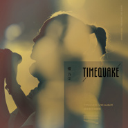

TIMEQUAKE 演唱会现场实录
============================

|  |  |
| :--: | :-- |
| [ TIMEQUAKE 演唱会现场实录](https://emumo.xiami.com/album/1274476393) | **艺人**: [杨乃文](../index.md) **语种**: 国语 **唱片公司**: 亚神音乐 **发行时间**: 2015年06月05日 **专辑类别**: 现场专辑 **专辑风格**: 流行摇滚 Pop Rock, 国语流行 Mandarin Pop **播放数**: 5434895 **收藏数**: 4146 **评论数**: 404  |

## 简介

杨乃文 TIMEQUAKE 演唱会现场实录 2CD  
  
独家曝光！全新单曲[可惜爱]现场演唱版  
精彩收录！杨乃文v.s. 伍佰合体演唱 [一个人][爱情限时批]  
  
出道首张·严选26首经典曲目 ·2CD 原音重现  
06.05 正式发行  
  
创作歌手 韦礼安  
“华语流行乐坛就像武林一般，不同门派各据山头，各有其独门的武功祕技。然而飘然在这些门派之外的，是少数特立独行、自成一格的浪子游侠。杨乃文就是这等女爵。冷冽诡谲的摇滚内力本已足够，这次Live又加上了令人惊喜的电子元素。听了如同醍醐灌顶，貌似冷若冰霜的音符却是让人内心翻搅沸腾的最适温度。”  
  
服装设计师 詹朴  
一直以来都喜欢乃文的歌，喜欢她呈现的方式。 那样的率性，那样的自我。 用自己相信的声音来表达，那些想要传递的情感。 时间的震动，重新拆解建构的顺序， 一段又一段，倒回或似曾相似的篇章。 很荣幸也成为拼起这故事的其中一片， 编织了同样打散了时间的，复古或未来的，科幻或奇幻的服装。乃文用歌，引领了这些元素，串起了属于自己的时空隧道。 感谢她，我们得以藉此穿梭其中，然后暂时遗忘那些不确定的现实界线。  
  
乐评人 叶云平&nbsp;  
没有想过，杨乃文会由詹朴操刀，以一身耀眼的雪白登场；也未料到，电气节拍加DJ搭配弦乐，交织成瑰丽又冷冽的庞大音场，会是当晚开场的重要编排 ── 九首歌过去，乐队方现身，电吉他姗姗响起 ── 这是我们惯悉的，一向伏于暗黑而锐利的摇滚女皇？更不用说，之后前所未闻的台语献唱！在这“现场演出”远超越宣传、记录功能的王道体验年代，“演唱会”本身已独立为全新全面的自体作品，需要《TIMEQUAKE》般的开阔思维与重构能力，让颠覆性的杨乃文再一次颠覆自己，惊艳你我。  
  
KKBOX音乐志 制作统筹 柯亭竹  
在大多数歌手都是这沾一点那沾一点并且以为自己每种风格都很擅长的华语乐坛，杨乃文的存在显得那么独特和珍贵，她始终如一的贯彻着自己的摇滚风格，多年下来你会知道那不是包装不是操作，而是人与音乐融合成一体的真诚存在，无疑的她是华语乐坛“摇滚女歌手”第一人！于是那么喜爱听摇滚乐的我们、那么羡慕着她率真直接而鼓舞着自己不要这么怯懦的我们，才能够在每一次聆听杨乃文的过程中，感到释放与救赎！  
  
LEGACY TAIPEI 总监 Arthur  
以不认识杨乃文本人的人而言，以下字眼是你们会常用到的：冷艳、女王、酷、少话、怕生、不知所措！我认识的杨乃文其实比较接近她在舞台上的样子：时而冷静、 时而疯狂, 专注、俏皮、自信、律动、娇羞、不顾一切！所以你若没有机会跟她吃饭喝酒看电影的话，要认识真正的乃文非得去看场她的live演出，你可以在她恣意摆动的举手投足间了解她的个性，你可以在她坚定固执的眼瞳里看穿她的灵魂！她为舞台而生、请重新在舞台上认识杨乃文。  
  
BACK TO LIVE. BACK TO MUSIC.  
之于音乐，之于信仰，之于我们共同编织的“极致又纯粹的摇滚时代”。  
杨乃文 出道首张·原音重现·‘TIMEQUAKE’演唱会现场实录&nbsp;  
  
‘TIMEQUAKE’一词源于科幻小说家冯内果的文学着作，意指时间发生大地震，过去现在未来，次序错位，逆行重复，既存的宇宙迸发了新的虚实意义。而这个反叛现实的大胆假设，被巧妙地运用在此次演唱会里，成为重要的精髓梗概。突破框架玩味新意，重现音乐的真实本质，贯穿于‘原味经典’与‘实验创新’之间，彻底展现杨乃文独特的音乐魅力与无法取代的现场表演风格。  
  
开场由[鹦鹉]一曲揭开神秘序幕。实验电气与古典弦乐相互激荡，乐音祭出旋即凝聚全场注目，杨乃文时而爆裂时而低吟的嗓音，在冷调合成器音效与悠扬弦乐中穿梭摆荡，未来与复古的实验混搭，交织成一篇饱满戏剧效果的黑色乐章。正当众人沈浸于惊艳幻化气氛之际，时空移转，乐器配置巧妙走入unplugged表演形式，[祝我幸福]前奏响起，一波清新音浪席卷而来，杨乃文透明纯净的声线，搭载着民谣吉他音色，缓缓带领我们悠游一处静谧无扰的平行宇宙。演唱[未接来电]时作曲人张震岳以吉他助阵，掀起第一波热潮，两人首度同场表演此曲，弹唱和鸣的画面牵动所有人跟着低回吟唱，如痴如醉。  
  
演唱会行进中段，场馆气氛再次更迭扭转，挥开前段暗黑沉缓的气息，霎时变身自由奔放、呐喊摇滚的高分贝场域，杨乃文接连演唱多首脍炙人口经典曲，以强劲乐音率性直入爆炸时代，[女爵] [MONSTER] [ SILENCE] 霸气姿态撼动现场，带领群众随着重拍跳动，随着节奏摇摆，就在众人彻底解放情绪高涨之时，演唱会掀起另一波极致高潮，摇滚天王伍佰傲然现身，双霸合体高唱[一个人][爱情限时批]，同台机会实属难得，全场爆表欢声雷动。而后杨乃文续领大夥齐声唱和[QUEEN][静止]以及成名曲[星星堆满天]，观众情绪激昂回荡，狂热翻腾热浪无法遏止。最终以一曲意料之外的安可曲[AFTER HOURS] 玩味收场，巧妙呼应TIMEQUAKE之时间寓意，也为演唱会刻下完美句点。  
  
对于音乐作品求精不求量的杨乃文，时至今日才发行个人第一张演唱会现场专辑，她说：“这与录制全新专辑的心态迥然不同，但相同是对作品的坚持与严谨，等于是与整个乐团、台前幕后工作人员齐聚一堂，全力以赴地在2小时内完成这张专辑，只许一次无法重来，任何不可预期或是想像之外的事情，发生的瞬间都是真实深刻且美丽的。”  
‘TIMEQUAKE’演唱会不以华服取胜，少了特效烟硝味，以音乐文本，精新布局的编曲与乐器编制，层次有致高潮迭起的音乐呈现，揉和着我们熟悉的杨乃文，也有我们惊艳的杨乃文，游移在独立与主流的混沌时代，一场飘扬在过去、现在、未来错置的TIMEQUAKE演唱会，让我们在灯光亮起时，都回到记忆中的美好舞台。  
  
一场TIMEQUAKE，时间的大地震，  
让所有人的美好时刻因此相互震荡与重置，回到那个“极致又纯粹的摇滚时代”。

## 曲目

- [鹦鹉 (Live)](./1274476393/8GvRqu18de6.md)
- [鹦鹉 (现场)](./1274476393/nmZS6g72632.md)
- [小心我撒野 (Live)](./1274476393/U5ROT52b1a6.md)
- [小心我撒野 (现场)](./1274476393/nmZYy94e462.md)
- [应该 (Live)](./1274476393/xLAS1M9aa6f.md)
- [应该 (现场)](./1274476393/9c5ViC18f2f.md)
- [分开 (Live)](./1274476393/bqvxM6H39887.md)
- [分开 (现场)](./1274476393/JXqP4e24a0e.md)
- [Somebody (Live)](./1274476393/xLAS1Obcc8b.md)
- [Somebdy (现场)](./1274476393/yhKVOAc52cb.md)
- [你就是吃定我 (Live)](./1274476393/mQPTDp730d8.md)
- [你就是吃定我 (现场)](./1274476393/nmZSUo80a5f.md)
- [祝我幸福 (Live)](./1274476393/xLAS1Qd19b8.md)
- [祝我幸福 (现场)](./1274476393/nmZTjH779e7.md)
- [放轻点 (Live)](./1274476393/xLAS1Ra8e6c.md)
- [放轻点 (现场)](./1274476393/bC7dJGy77a00.md)
- [未接来电 (Live)](./1274476393/8GvRq2f93fa.md)
- [未接来电 (现场)](./1274476393/nmZUef58b38.md)
- [小丑的姿态 (Live)](./1274476393/mQPTDt672e2.md)
- [小丑的姿态 (现场)](./1274476393/USbPAQ3ebdb.md)
- [日落西沉 (Live)](./1274476393/mQPTDu8d915.md)
- [日落西沉 (现场)](./1274476393/USbOPv2b66b.md)
- [女爵 (Live)](./1274476393/8GvRq5f208c.md)
- [女爵 (现场)](./1274476393/9c5WzNedcf2.md)
- [证据 (Live)](./1274476393/xLAS1Wce3f0.md)
- [证据 (现场)](./1274476393/nmZS6h5ff59.md)
- [Silence (现场)](./1274476393/nmZYyA76862.md)
- [Monster (现场)](./1274476393/9c5V6je1d3a.md)
- [可惜爱 (现场)](./1274476393/yhKTV6df408.md)
- [今天清晨 (现场)](./1274476393/nmZWxl5f0bd.md)
- [漂着 (现场)](./1274476393/yhKQH7afc27.md)
- [空气 (现场)](./1274476393/9c5UyHec3b5.md)
- [静止 (现场)](./1274476393/yhKXBof194c.md)
- [一个人 (现场)](./1274476393/USbNjs26c7c.md)
- [爱情限时批 (现场)](./1274476393/bC7dMyY4a9c6.md)
- [不要告别 (现场)](./1274476393/yhKRmC236e1.md)
- [Queen (现场)](./1274476393/nmZWSE7af61.md)
- [星星堆满天 (现场)](./1274476393/USbTEV291ea.md)
- [After Hours (现场)](./1274476393/yhKX3ic849d.md)
- [Silence (Live)](./1274476393/xLAS1Xf8feb.md)
- [Monster (Live)](./1274476393/mQPTDy5dfd6.md)
- [可惜爱 (Live)MV电影《回到爱开始的地方》主题曲](./1274476393/8Gmoek2f4a8.md)
- [今天清晨 (Live)](./1274476393/xLAS2ad2823.md)
- [漂着 (Live)](./1274476393/mQPTD1a33c5.md)
- [空气 (Live)](./1274476393/mQPTD287f34.md)
- [静止 (Live)](./1274476393/JBgQfn20a05.md)
- [一个人 (Live)](./1274476393/8GvRqEffc2f.md)
- [爱情限时批 (Live)](./1274476393/bCkTKkj77f2d.md)
- [不要告别 (Live)](./1274476393/8GvRqGf3c2e.md)
- [Queen (Live)](./1274476393/xLAS2hdf71e.md)
- [星星堆满天 (Live)MV](./1274476393/8GvRqIed18b.md)
- [After Hours (Live)](./1274476393/xLAS2j13ad2.md)

## 评论

|  |  |  |
| :-- | :-- | :-- |
|  [虾米用户](https://emumo.xiami.com/u/11701306) 哎嘿 2020-05-23 23:01 赞(0) 踩(0) | 
嗓音特别，现场没的说
 |
|  [虾米用户](https://emumo.xiami.com/u/72663342) then go and ... 2020-02-29 05:43 赞(0) 踩(0) | 
我也好爱这一场
 |
|  [虾米用户](https://emumo.xiami.com/u/418976808) 22岁，我就应该考试了。 2019-11-10 19:47 赞(1) 踩(0) | 
现在不能版权，3月10号能够版权最后一次听。
 |
|  [虾米用户](https://emumo.xiami.com/u/418976808) 22岁，我就应该考试了。 2019-11-10 19:47 赞(1) 踩(0) | 
现在唱片公司已经收到版权了吗？
 |
|  [虾米用户](https://emumo.xiami.com/u/42847894)   2019-10-25 20:08 赞(0) 踩(0) | 
棒的
 |
|  [虾米用户](https://emumo.xiami.com/u/3262375) 我还没想好要写什么... 2019-10-23 20:31 赞(0) 踩(0) | 
谁说杨乃文是录音室歌手，明明现场比唱片好！
 |
|  [虾米用户](https://emumo.xiami.com/u/346165752)  2019-03-05 23:22 赞(1) 踩(0) | 
求上传
 |
|  [虾米用户](https://emumo.xiami.com/u/55067802) εїз 2019-02-07 21:44 赞(0) 踩(0) | 
怎么下架了？？？
 |
|  [虾米用户](https://emumo.xiami.com/u/46113486) 马路戏院商店天空海阔 任... 2018-11-06 12:30 赞(0) 踩(0) | 
又下架了……虾米下架了太多。‍♂️
 |
|  [虾米用户](https://emumo.xiami.com/u/12966527) 我还没想好要写什么... 2018-11-01 18:15 赞(0) 踩(0) | 
？？为啥下架了
 |
|  [虾米用户](https://emumo.xiami.com/u/115635164) 我还没想好要写什么... 2018-09-24 15:49 赞(2) 踩(0) | 
声音真的没话说
 |
|  [虾米用户](https://emumo.xiami.com/u/115853) 我对你付出的青春，这么多... 2018-07-05 00:37 赞(2) 踩(0) | 
记得在惠州的那段日子，每天下班要做很久的车回家，然后还要走很长的一段路，那段路很宽，很静，很多次听到这首祝我幸福都不知不觉的留下眼泪，我知道我爱你很深，可是我只能陪你走一程，很多年后，我在一个离你很远的城市生活，写下这段话不是为了怀念过去的爱情，而是怀念当初那个勇敢，为爱执着痴狂的自己，我曾祝你笑靥如花，岁月静好，现在我只想祝我幸福！
 |
|  [虾米用户](https://emumo.xiami.com/u/13186937) 今朝有酒今朝醉 2018-07-02 16:47 赞(0) 踩(0) | 
乃文现场太强大了。呜呜呜，为什么我只在草莓听过一次live，我哭
 |
|  [虾米用户](https://emumo.xiami.com/u/11603315) K-indie | 靓橙... 2018-06-24 03:06 赞(0) 踩(0) | 
跪了
 |
|  [虾米用户](https://emumo.xiami.com/u/368916693)  2018-06-05 09:36 赞(0) 踩(0) | 
张震岳不《我给的爱》吗？
 |
| ⇒ |  [虾米用户](https://emumo.xiami.com/u/33720879) 暂无签名~ 2018-08-27 19:02 赞(0) 踩(0) | 
可是为什么这里面没有收录我给的爱阿？？我记得合唱了啊
 |
|  [虾米用户](https://emumo.xiami.com/u/199516637)  2018-06-01 12:51 赞(0) 踩(0) | 
哪里有视频，想看杨乃文跟张震岳同台，未接来电，张震岳弹的吉他
 |
| ⇒ |  [虾米用户](https://emumo.xiami.com/u/368916693)  2018-06-05 09:37 赞(0) 踩(0) | 
张震岳给杨乃文的《我给的爱》
 |
|  [虾米用户](https://emumo.xiami.com/u/368916693)  2018-06-01 07:05 赞(0) 踩(0) | 
6.1儿童节快乐
 |
|  [虾米用户](https://emumo.xiami.com/u/2022341) 懶似精靈。。。。 2018-05-14 17:47 赞(0) 踩(0) | 
彻底爱上杨乃文啊啊啊啊
 |
|  [虾米用户](https://emumo.xiami.com/u/32167961)  再说吧 2018-03-23 08:11 赞(0) 踩(0) | 
时震
 |
|  [虾米用户](https://emumo.xiami.com/u/1009164) 我还没想好要写什么... 2018-02-19 15:56 赞(1) 踩(0) | 
这才叫完美的现场，根本听不出现场的痕迹。
 |
|  [虾米用户](https://emumo.xiami.com/u/12305243)  2018-01-04 13:31 赞(2) 踩(0) | 
不知道摇滚，不知道流行，听着这张专辑，我能静下心来睡午觉。很棒棒
 |
|  [虾米用户](https://emumo.xiami.com/u/12305243)  2018-01-04 13:30 赞(0) 踩(0) | 
我不知道在哪里点五星， 
 |
|  [虾米用户](https://emumo.xiami.com/u/25891560) ♪blow mymind 2017-12-08 10:49 赞(2) 踩(0) | 
这张live专真的很奇妙～
 |
|  [虾米用户](https://emumo.xiami.com/u/4159615)  2017-10-27 23:55 赞(1) 踩(0) | 
基佬们还不赶紧用评论占领首页！
 |
|  [虾米用户](https://emumo.xiami.com/u/127211654) 天佑我爱人 2017-09-07 18:58 赞(1) 踩(0) | 
大爱乃文
 |
|  [虾米用户](https://emumo.xiami.com/u/88035368)  2017-08-15 01:29 赞(0) 踩(0) | 
最爱的湾湾女歌手
 |
|  [虾米用户](https://emumo.xiami.com/u/6522377) 乘风破浪 2017-07-11 18:24 赞(0) 踩(0) | 
0813来迷醉
 |
|  [虾米用户](https://emumo.xiami.com/u/134697)  2017-06-15 20:24 赞(0) 踩(0) | 
^_^
 |
|  [虾米用户](https://emumo.xiami.com/u/204075702) 我只想活的热烈一点 2017-05-28 09:46 赞(0) 踩(0) | 
什么时候再开一次啊&amp;hellip;&amp;hellip;
 |
|  [虾米用户](https://emumo.xiami.com/u/34197044) 来路无从流连，驻足高山流... 2017-04-21 21:12 赞(0) 踩(0) | 
超震撼，后悔没去现场
 |
|  [虾米用户](https://emumo.xiami.com/u/702590)  2017-03-29 00:59 赞(0) 踩(0) | 
耳朵已怀孕
 |
|  [虾米用户](https://emumo.xiami.com/u/13211992) 你有你的网易云，我有我的... 2017-03-16 22:33 赞(2) 踩(0) | 
好听好听，宁要耳机不要女朋友
 |
|  [虾米用户](https://emumo.xiami.com/u/10253200) 如是我闻 2017-01-30 22:08 赞(0) 踩(0) | 
-
 |
|  [虾米用户](https://emumo.xiami.com/u/15945590) ～ 2017-01-17 11:12 赞(0) 踩(0) | 
优秀
 |
|  [虾米用户](https://emumo.xiami.com/u/48389758) Nittens前吉他手 2016-12-30 13:50 赞(3) 踩(0) | 
台湾最值得听的女声TOP3
 |
|  [虾米用户](https://emumo.xiami.com/u/173068258) 随便找一个方向转身 2016-12-25 21:06 赞(0) 踩(0) | 
表白乃文~
 |
|  [虾米用户](https://emumo.xiami.com/u/2781312) 我还没想好要写什么... 2016-12-22 17:52 赞(2) 踩(0) | 
不给5星还是人？
 |
|  [虾米用户](https://emumo.xiami.com/u/13648822)  2016-12-13 13:12 赞(0) 踩(0) | 
 
 |
|  [虾米用户](https://emumo.xiami.com/u/46945570)  2016-12-13 09:18 赞(1) 踩(0) | 
我真的觉得现场比录音版更好听，更突出乃文的音质好
 |
|  [虾米用户](https://emumo.xiami.com/u/4358494) 签名？ 2016-11-20 22:30 赞(0) 踩(0) | 
又翻出来这张听。仔细看了一遍词曲作者。希望大王以后还能拿到好歌。
 |
|  [虾米用户](https://emumo.xiami.com/u/217649422)  2016-11-16 14:49 赞(0) 踩(0) | 
这个编曲真的很棒
 |
|  [虾米用户](https://emumo.xiami.com/u/229718662)  2016-10-23 23:32 赞(0) 踩(0) | 
大 事  发  生
 |
|  [虾米用户](https://emumo.xiami.com/u/30800139) 我在低俗与高雅间活的很尴... 2016-10-20 00:41 赞(0) 踩(0) | 
。
 |
|  [虾米用户](https://emumo.xiami.com/u/3583995) 一個人的戰爭 2016-10-18 04:10 赞(0) 踩(0) | 

 |
|  [虾米用户](https://emumo.xiami.com/u/14491772)  2016-05-31 19:38 赞(1) 踩(0) | 
这个现场没有&amp;lt;我给的爱&amp;gt;,倒是还有和伍佰合唱的&amp;lt;爱情限时批&amp;gt;??
 |
|  [虾米用户](https://emumo.xiami.com/u/4176549) Don’t turn o... 2016-05-23 20:47 赞(1) 踩(0) | 
漂着 现场版特别棒！
 |
|  [虾米用户](https://emumo.xiami.com/u/3380752) 寻找纳凉处 2016-05-01 22:12 赞(2) 踩(0) | 
现场唱功好棒啊啊啊啊啊啊啊啊
 |
|  [虾米用户](https://emumo.xiami.com/u/36114320)  2016-03-02 17:05 赞(1) 踩(0) | 
有机会应该听听杨乃文的现场！沸腾的感觉！
 |
|  [虾米用户](https://emumo.xiami.com/u/3559771)  2016-02-20 14:59 赞(0) 踩(0) | 
我給的愛
 |
|  [虾米用户](https://emumo.xiami.com/u/20598887)   2016-02-17 09:20 赞(0) 踩(0) | 
喜欢 就是喜欢
 |
|  [虾米用户](https://emumo.xiami.com/u/12852028) 国家级爱情退堂鼓专业鼓手... 2016-01-27 22:05 赞(4) 踩(0) | 
之前和一个朋友说她现场不稳定 我现在道歉 因为那个朋友对杨乃文路人粉转粉 果然 年轻的时候听不出东西 现在心态真的完全不一样 满满的都是故事
 |
| ⇒ |  [虾米用户](https://emumo.xiami.com/u/48175)  2016-06-16 15:32 赞(0) 踩(0) | 
******
 |
| ⇒ |  [虾米用户](https://emumo.xiami.com/u/12852028) 国家级爱情退堂鼓专业鼓手... 2016-06-18 01:53 赞(0) 踩(0) | 
<q><b>未知生物说：</b></q>
 |
| ⇒ |  [虾米用户](https://emumo.xiami.com/u/18282119) 我就是我，独一无二 2016-10-16 21:10 赞(0) 踩(0) | 
<q><b>谢谢谢谢尔莫说：</b></q>
 |
|  [虾米用户](https://emumo.xiami.com/u/41190273) 你！到底，怎么肥四啊？！ 2016-01-25 21:17 赞(2) 踩(0) | 
这张现场真的太棒了！
 |
|  [虾米用户](https://emumo.xiami.com/u/8817564)  2016-01-15 12:52 赞(0) 踩(0) | 
哇塞
 |
|  [虾米用户](https://emumo.xiami.com/u/70051074)  2015-12-16 18:00 赞(0) 踩(0) | 
一般般啦，没那么夸张。
 |
|  [虾米用户](https://emumo.xiami.com/u/3114058) 我还没想好要写什么... 2015-12-14 12:53 赞(3) 踩(0) | 
依然是特立纯粹的杨乃文，钟意十八年至今……
 |
|  [虾米用户](https://emumo.xiami.com/u/39545845)  2015-12-04 15:41 赞(0) 踩(0) | 
现场好过CD
 |
|  [虾米用户](https://emumo.xiami.com/u/5440629)  2015-11-23 22:23 赞(0) 踩(0) | 
心情不好的时候总会跳出这些喜欢的歌声~
 |
|  [虾米用户](https://emumo.xiami.com/u/13834027) 音乐描述的人生 2015-10-31 13:03 赞(0) 踩(0) | 
妈蛋，给我听哭了。
 |
|  [虾米用户](https://emumo.xiami.com/u/48932597)  2015-10-24 08:45 赞(1) 踩(0) | 
现场如此的震撼
 |
|  [虾米用户](https://emumo.xiami.com/u/47405071) 等你清楚看见我的美 2015-10-14 22:46 赞(0) 踩(0) | 
超赞的一场Live
 |
|  [虾米用户](https://emumo.xiami.com/u/32905621) 记得法克和钢琴的第89键 2015-09-29 21:27 赞(0) 踩(0) | 
另类女歌手
 |
|  [虾米用户](https://emumo.xiami.com/u/32905621) 记得法克和钢琴的第89键 2015-09-29 21:27 赞(0) 踩(0) | 
另类女歌手
 |
|  [虾米用户](https://emumo.xiami.com/u/8427348) 暂无签名~ 2015-09-25 23:25 赞(3) 踩(0) | 
上天呀！ 造化呀！ 如果窦唯和王菲组个乐队一直唱到現在，地球人有耳福和眼福了！ 宝岛的楊乃文和吉他手愛人的乐队实現了！
 |
|  [虾米用户](https://emumo.xiami.com/u/7978738)  2015-08-31 05:20 赞(0) 踩(0) | 
Live跟Studio最重要的区别显然是观众的存在，这张Live里把观众剪得完全没有存在感，在选取方面慢歌为主的前提下，整张听起来就变得非常无趣。
 |
| ⇒ |  [虾米用户](https://emumo.xiami.com/u/3497578)  2016-11-07 20:09 赞(0) 踩(0) | 
你懂个锤子
 |
| ⇒ |  [虾米用户](https://emumo.xiami.com/u/702590)  2017-03-29 01:03 赞(0) 踩(0) | 
乃文的演唱会不怎么跟观众说话交流的，跟王菲有点像，那首一个人跟伍佰合唱，就很好地录下观众的情绪反应
 |
|  [虾米用户](https://emumo.xiami.com/u/2627008) 再见了，朋友们 2015-08-30 11:35 赞(1) 踩(0) | 
认识你太晚
 |
|  [虾米用户](https://emumo.xiami.com/u/10277746) 死去的鱼才会随波逐流！ 2015-08-25 13:49 赞(1) 踩(0) | 
超喜欢她的清亮和决绝！
 |
|  [虾米用户](https://emumo.xiami.com/u/41170273)   2015-08-21 12:57 赞(0) 踩(0) | 
居然有喜欢的不要告别，心已沉沦
 |
|  [虾米用户](https://emumo.xiami.com/u/6152672) 一路走来，终于丢弃掉一些... 2015-08-05 20:12 赞(0) 踩(0) | 
豪听
 |
|  [虾米用户](https://emumo.xiami.com/u/3465037) stay gold 2015-07-29 23:42 赞(0) 踩(0) | 
真的是棒极了，这张专辑。真的很完美。
 |
|  [虾米用户](https://emumo.xiami.com/u/2520592)   2015-07-28 21:15 赞(0) 踩(0) | 
太好听
 |
|  [虾米用户](https://emumo.xiami.com/u/39819347) 都是本地狐狸，你又何必跟... 2015-07-25 03:13 赞(0) 踩(0) | 
为什么不唱（我给的爱）和（那天）？
 |
|  [虾米用户](https://emumo.xiami.com/u/1182761) 松任谷由实的迷弟 2015-07-18 22:33 赞(1) 踩(0) | 
今天清晨 是唯一能听完的一首 其他都很无聊。意料之中
 |
|  [虾米用户](https://emumo.xiami.com/u/102827) Play it loud... 2015-07-17 22:26 赞(0) 踩(0) | 
超级爱 10个 
 |
|  [虾米用户](https://emumo.xiami.com/u/31725465) 凡事不凡是 2015-07-11 14:07 赞(0) 踩(0) | 
爱情限时批，啦啦啦(≧▽≦)
 |
|  [虾米用户](https://emumo.xiami.com/u/6764340) 我还没想好要写什么... 2015-07-08 17:39 赞(3) 踩(0) | 
专辑买了，我电脑没光驱！！！
 |
|  [虾米用户](https://emumo.xiami.com/u/2223122) 我还没想好要写什么... 2015-07-07 18:30 赞(1) 踩(0) | 
哈哈哈哈我发现一件事 豆瓣这张的热门评论里 前六个人有三个都是彩虹头像耶 你们快去看
 |
| ⇒ |  [虾米用户](https://emumo.xiami.com/u/4197940)  2015-07-15 15:28 赞(0) 踩(0) | 
彩虹头像是什么缘由
 |
| ⇒ |  [虾米用户](https://emumo.xiami.com/u/2223122) 我还没想好要写什么... 2015-07-16 16:02 赞(0) 踩(0) | 
<q><b>吖浅说：</b></q>
 |
| ⇒ |  [虾米用户](https://emumo.xiami.com/u/11773373) 我还没想好要写什么... 2015-08-21 16:30 赞(0) 踩(0) | 
我也发现这个问题，她微博粉丝也有很多彩虹头像…
 |
|  [虾米用户](https://emumo.xiami.com/u/22885754) 浪子把头都给浪掉了 2015-07-04 00:32 赞(0) 踩(0) | 
女王在去年底的 Live 里水准频频失常 当时惊愕又叹惋 这专发出来完全放下了担心 杨乃文 还是杨乃文 发布会上得知去年做了手术 OK 没关系了 地位完全不动摇 越来越萌的乃乃：0
 |
|  [虾米用户](https://emumo.xiami.com/u/1534348)  2015-06-24 19:57 赞(0) 踩(0) | 
2015上半年最佳现场专辑
 |
|  [虾米用户](https://emumo.xiami.com/u/7768916)  2015-06-24 02:19 赞(1) 踩(0) | 
我擦，现场比专辑好听！！
 |
|  [虾米用户](https://emumo.xiami.com/u/1534348)  2015-06-24 00:34 赞(1) 踩(0) | 
2015年上半年最佳现场专辑
 |
|  [虾米用户](https://emumo.xiami.com/u/1534348)  2015-06-24 00:32 赞(0) 踩(0) | 
2015年前半年最佳现场专辑
 |
|  [虾米用户](https://emumo.xiami.com/u/6617922)  2015-06-22 21:26 赞(0) 踩(0) | 
因为杨乃文
 |
|  [虾米用户](https://emumo.xiami.com/u/10338176)  2015-06-20 09:38 赞(0) 踩(0) | 
开口音让我欲罢不能
 |
|  [虾米用户](https://emumo.xiami.com/u/27819208)   2015-06-18 15:23 赞(2) 踩(0) | 
《可惜爱》开头太赞…
 |
|  [虾米用户](https://emumo.xiami.com/u/11761284) 听歌只听丢菜卡” 2015-06-17 23:41 赞(0) 踩(0) | 
我爱你
 |
|  [虾米用户](https://emumo.xiami.com/u/8161591)  2015-06-17 21:06 赞(0) 踩(0) | 
女爵
 |
|  [虾米用户](https://emumo.xiami.com/u/34166373) we should ru... 2015-06-17 13:01 赞(1) 踩(0) | 
看过她的live路人转粉  太赞
 |
|  [虾米用户](https://emumo.xiami.com/u/50857524) While there ... 2015-06-16 15:41 赞(0) 踩(0) | 
听不够
 |
|  [虾米用户](https://emumo.xiami.com/u/32500578)   2015-06-15 12:35 赞(1) 踩(0) | 
白白激动了一下，以为杨乃文出了新专辑。想想现在一切都好了，我应该去看一场杨乃文的演唱会。还有最近又开始萦绕的念头，去往那一个男人带刀的西北偏北。
 |
|  [虾米用户](https://emumo.xiami.com/u/1730199) 暂无签名~ 2015-06-14 12:22 赞(0) 踩(0) | 
女王的现场总是略弱但还是爱啊
 |
|  [虾米用户](https://emumo.xiami.com/u/30471160)  2015-06-13 16:05 赞(1) 踩(0) | 
应该是今年国内Live砖最佳了吧
 |
| ⇒ |  [虾米用户](https://emumo.xiami.com/u/29053890)  2015-06-14 14:04 赞(0) 踩(0) | 
国内是指大陆的话，就不是国内喔。
 |
| ⇒ |  [虾米用户](https://emumo.xiami.com/u/30471160)  2015-06-14 16:03 赞(0) 踩(0) | 
<q><b>開唱片店的金牛座说：</b></q>
 |
|  [虾米用户](https://emumo.xiami.com/u/947160)  2015-06-12 23:30 赞(1) 踩(0) | 
I want have you DVD
 |
|  [虾米用户](https://emumo.xiami.com/u/947160)  2015-06-12 23:28 赞(0) 踩(0) | 
good
 |
|  [虾米用户](https://emumo.xiami.com/u/8902770)  2015-06-12 04:25 赞(0) 踩(0) | 
喜欢的打滚啊！！！
 |
|  [虾米用户](https://emumo.xiami.com/u/35732440) 我的失败与伟大。 2015-06-12 00:06 赞(0) 踩(0) | 
太爱她
 |
|  [虾米用户](https://emumo.xiami.com/u/1349413)  2015-06-11 20:59 赞(0) 踩(0) | 
近十年华语女歌手演唱会最棒的现场，果然没有让歌迷失望，满分。
 |
|  [虾米用户](https://emumo.xiami.com/u/6870158)  2015-06-11 20:55 赞(0) 踩(0) | 
好听到不得了，18年第一次live record！
 |
|  [虾米用户](https://emumo.xiami.com/u/2599051)  2015-06-11 15:55 赞(0) 踩(0) | 
工作日的下午，反复听LIVE，提神！
 |
|  [虾米用户](https://emumo.xiami.com/u/2535958) Be ur right 2015-06-11 13:20 赞(0) 踩(0) | 
不需要理由……
 |
|  [虾米用户](https://emumo.xiami.com/u/1171016) 人们活着.静如止水 2015-06-11 02:09 赞(0) 踩(0) | 
孤独的飘…
 |
|  [虾米用户](https://emumo.xiami.com/u/5822580) Hard work pa... 2015-06-10 21:27 赞(0) 踩(0) | 
现场功力。。。不得不叹服
 |
|  [虾米用户](https://emumo.xiami.com/u/24195194)  2015-06-10 19:23 赞(0) 踩(0) | 
我爱你乃文
 |
|  [虾米用户](https://emumo.xiami.com/u/11761284) 听歌只听丢菜卡” 2015-06-10 06:06 赞(1) 踩(0) | 
多大岁数了
 |
| ⇒ |  [虾米用户](https://emumo.xiami.com/u/32061551) Laus Deo 2015-06-17 19:19 赞(0) 踩(0) | 
40了…
 |
|  [虾米用户](https://emumo.xiami.com/u/6287898) Love never f... 2015-06-10 00:59 赞(0) 踩(0) | 
马！
 |
|  [虾米用户](https://emumo.xiami.com/u/21901083)  2015-06-09 23:35 赞(0) 踩(0) | 
ヽ(´o｀；
 |
|  [虾米用户](https://emumo.xiami.com/u/504854) 愿安好！ 2015-06-09 23:11 赞(1) 踩(0) | 
live比CD还好听，好希望来重庆开演唱会
 |
| ⇒ |  [虾米用户](https://emumo.xiami.com/u/16819394)   2015-06-11 16:34 赞(0) 踩(0) | 
对头！！快来重庆开唱啊！！哪怕是个小型的都愿意去[带墨镜笑][带墨镜笑]
 |
|  [虾米用户](https://emumo.xiami.com/u/437950) 身寸 2015-06-09 21:31 赞(0) 踩(0) | 
下巴和衣领之间，是嘴。
 |
|  [虾米用户](https://emumo.xiami.com/u/413790) 惜知音再难觅 2015-06-09 20:58 赞(0) 踩(0) | 
好多歌都是cheer给写的~
 |
|  [虾米用户](https://emumo.xiami.com/u/7032155)   2015-06-09 20:43 赞(0) 踩(0) | 
可惜爱
 |
|  [虾米用户](https://emumo.xiami.com/u/2121988)   2015-06-09 19:53 赞(0) 踩(0) | 
实际上现场也时常破音的 修很大
 |
|  [虾米用户](https://emumo.xiami.com/u/3491810) There is ART... 2015-06-09 17:48 赞(0) 踩(0) | 
完全是录音棚效果
 |
|  [虾米用户](https://emumo.xiami.com/u/13348204)   2015-06-09 17:11 赞(0) 踩(0) | 
时震
 |
|  [虾米用户](https://emumo.xiami.com/u/13348204)   2015-06-09 17:09 赞(0) 踩(0) | 
时震
 |
|  [虾米用户](https://emumo.xiami.com/u/54518)  2015-06-09 15:44 赞(1) 踩(0) | 
上
 |
|  [虾米用户](https://emumo.xiami.com/u/3513351) Games We Pla... 2015-06-09 14:27 赞(1) 踩(0) | 
现场唱应该和今天清晨的机会真的不多见啊 好好听好好听！！！！！
 |
|  [虾米用户](https://emumo.xiami.com/u/47095840)  2015-06-09 13:21 赞(0) 踩(0) | 
为什么没有《明天》《那天》呢。两首神作！
 |
|  [虾米用户](https://emumo.xiami.com/u/3226709) 音乐重于泰山 2015-06-09 10:50 赞(0) 踩(0) | 
没有理由不爱这张
 |
|  [虾米用户](https://emumo.xiami.com/u/6381488)  2015-06-09 09:38 赞(0) 踩(0) | 
在背后付出了多少努力才能唱得这么好
 |
|  [虾米用户](https://emumo.xiami.com/u/8133145) o my sky 2015-06-09 02:27 赞(0) 踩(0) | 
- -你们都不知道现在现场也是可以修音的吗，而且这个，有些音修的太明显了，估计是唱的时候跑太远 修的都不自然了
 |
|  [虾米用户](https://emumo.xiami.com/u/45535345)  2015-06-09 01:14 赞(0) 踩(0) | 
草莓最期待的…
 |
|  [虾米用户](https://emumo.xiami.com/u/48756497) 我还不是想你跟我说话萌萌... 2015-06-08 23:07 赞(0) 踩(0) | 
Like 特别还收录普洱宣传电影的主题歌 可惜爱现场 good
 |
|  [虾米用户](https://emumo.xiami.com/u/12216147) 音乐杂食动物 2015-06-08 22:42 赞(0) 踩(0) | 
超级好听
 |
|  [虾米用户](https://emumo.xiami.com/u/33241093)  2015-06-08 22:36 赞(0) 踩(0) | 
超级无敌霹雳棒棒棒！现场为什么可以这么棒！！！有生之年一定要听一次她的现场！！
 |
|  [虾米用户](https://emumo.xiami.com/u/6844638)  2015-06-08 21:29 赞(0) 踩(0) | 
无需多言，收藏便是。
 |
|  [虾米用户](https://emumo.xiami.com/u/3933648)  2015-06-08 21:24 赞(0) 踩(0) | 
华语乐坛唯一认证女王，其他的都是假冒伪劣
 |
|  [虾米用户](https://emumo.xiami.com/u/293540)  2015-06-08 20:37 赞(1) 踩(0) | 
好听哭了。那个唱着《星星堆满天》的杨乃文终于回来了。所有歌都是听到前奏的吉他或者鼓点就知道名字，感动的要死。在下班路上听的整个人都活过来了。已经完全原谅她之前出过一张烂俗英文翻唱专辑的事情了。
 |
|  [虾米用户](https://emumo.xiami.com/u/2330604)  2015-06-08 20:23 赞(0) 踩(0) | 
今年状态这么好不来长沙草莓我已哭瞎。
 |
|  [虾米用户](https://emumo.xiami.com/u/566308)  2015-06-08 20:12 赞(0) 踩(0) | 

 |
|  [虾米用户](https://emumo.xiami.com/u/64350) 我还没想好要写什么... 2015-06-08 18:58 赞(0) 踩(0) | 
超爱
 |
|  [虾米用户](https://emumo.xiami.com/u/15107919) 音乐人最希望有知音 2015-06-08 18:10 赞(0) 踩(0) | 
哇靠，第一首鹦鹉开始的编曲不错惹，就是喜欢杨乃文的那种冷清样，女爵的主歌的，为你巴拉巴拉，这段我一直很喜欢
 |
|  [虾米用户](https://emumo.xiami.com/u/5592723)   2015-06-08 17:28 赞(0) 踩(0) | 
女王发声！编曲赞！[飞个吻]
 |
|  [虾米用户](https://emumo.xiami.com/u/127990) 我还没想好要写什么... 2015-06-08 16:18 赞(0) 踩(0) | 

 |
|  [虾米用户](https://emumo.xiami.com/u/2231127) Bleh 个性古怪 2015-06-08 15:21 赞(1) 踩(0) | 
声音一出来就甩了情歌装嫩组几条街 还是live！实在太屌！
 |
|  [虾米用户](https://emumo.xiami.com/u/11526432)   2015-06-08 15:20 赞(0) 踩(0) | 
/又冷又燃/
 |
|  [虾米用户](https://emumo.xiami.com/u/8728458) 听其所有 2015-06-08 14:07 赞(0) 踩(0) | 
有的听咯～
 |
|  [虾米用户](https://emumo.xiami.com/u/47943729)   2015-06-08 13:47 赞(0) 踩(0) | 
没办法不关注。
 |
|  [虾米用户](https://emumo.xiami.com/u/31278076)   2015-06-08 12:10 赞(1) 踩(0) | 
怎么觉得…每首歌的故事都是“我爱的人不会爱我的”
 |
|  [虾米用户](https://emumo.xiami.com/u/1625512)  2015-06-08 10:42 赞(1) 踩(0) | 
去年底刚听过 现场确实很赞 而且比录音棚的声音更有感情
 |
|  [虾米用户](https://emumo.xiami.com/u/1014240) 岁月不知人间多少的忧伤，... 2015-06-08 10:03 赞(0) 踩(0) | 
外表散发着冷傲的气场，声音却散发着强烈的暖流......
 |
|  [虾米用户](https://emumo.xiami.com/u/1326565)  2015-06-08 09:15 赞(0) 踩(0) | 
听过一回乃文的现场，真的是爆赞，感觉CD完全无法体现那种张力和爆发力。
 |
|  [虾米用户](https://emumo.xiami.com/u/6232148) 在虾米坚持到最后一秒 2015-06-08 01:25 赞(0) 踩(0) | 
忽然想起曾听过这样的评论 杨乃文是摇滚版的刘若英 感觉是又不是 个性 也更冷
 |
|  [虾米用户](https://emumo.xiami.com/u/3963025)  2015-06-08 00:47 赞(0) 踩(0) | 
想去听现场
 |
|  [虾米用户](https://emumo.xiami.com/u/16225556) 迟钝重症患者 2015-06-08 00:21 赞(0) 踩(0) | 
她的歌一定要看现场啊。编曲有几首做了带电子的改编，现场一定不是我听到那个样子。
 |
|  [虾米用户](https://emumo.xiami.com/u/8928025) 只摇不滚。 2015-06-07 23:08 赞(0) 踩(0) | 
杨乃文的现场很好听，嗓音太棒了
 |
|  [虾米用户](https://emumo.xiami.com/u/8928025) 只摇不滚。 2015-06-07 23:08 赞(3) 踩(0) | 
看过乃文的现场以后对现场那充满灵性的声音就没有办法忘记，而且觉得她也是一个很赞的人，没有架子 和粉丝一起淋雨
 |
|  [虾米用户](https://emumo.xiami.com/u/50595633) 我还没想好要写什么... 2015-06-07 21:10 赞(0) 踩(0) | 
还是忍不住想分享，
 |
|  [虾米用户](https://emumo.xiami.com/u/1287027)  2015-06-07 20:55 赞(0) 踩(0) | 
双鱼
 |
|  [虾米用户](https://emumo.xiami.com/u/11517879)  2015-06-07 17:08 赞(0) 踩(0) | 
这个声音，什么都够了。
 |
|  [虾米用户](https://emumo.xiami.com/u/5515494)  2015-06-07 16:56 赞(0) 踩(0) | 
有伍佰怎么不唱最初的地方
 |
|  [虾米用户](https://emumo.xiami.com/u/3273196) 暂无签名~ 2015-06-07 14:47 赞(1) 踩(0) | 
没有唱 我给的爱？！
 |
| ⇒ |  [虾米用户](https://emumo.xiami.com/u/7617434) 回家的路好远 要如何才能... 2015-06-07 16:00 赞(0) 踩(0) | 
唱了。。而且请来了嘉宾张震岳 两个人一起唱的『我给的爱』。。不理解为什么没有收录进这张live
 |
| ⇒ |  [虾米用户](https://emumo.xiami.com/u/3513351) Games We Pla... 2015-06-13 08:30 赞(0) 踩(0) | 
<q><b>很好背的诗说：</b></q>
 |
| ⇒ |  [虾米用户](https://emumo.xiami.com/u/76493)  2015-11-21 20:39 赞(0) 踩(0) | 
<q><b>很好背的诗说：</b></q>
 |
|  [虾米用户](https://emumo.xiami.com/u/6688315)  2015-06-07 14:16 赞(0) 踩(0) | 
嗓子状态相当好，堪比录音室专辑
 |
|  [虾米用户](https://emumo.xiami.com/u/2070277) 暂无签名~ 2015-06-07 12:43 赞(0) 踩(0) | 
好想听现场啊女神！
 |
|  [虾米用户](https://emumo.xiami.com/u/8356658)  2015-06-07 11:16 赞(0) 踩(0) | 
只听过一次乃文的现场，是北京滚石三十演唱会，太赞了
 |
|  [虾米用户](https://emumo.xiami.com/u/9668104) =w= 2015-06-07 10:58 赞(0) 踩(0) | 
好听惹
 |
|  [虾米用户](https://emumo.xiami.com/u/7047883) 听一百首孤独 2015-06-07 10:49 赞(0) 踩(0) | 
每次听 都感性到不得了
 |
|  [虾米用户](https://emumo.xiami.com/u/6054762) 谁杀了古典音乐 2015-06-07 10:11 赞(0) 踩(0) | 
难得欣赏的流行乐手，现场演唱还是很有实力。
 |
|  [虾米用户](https://emumo.xiami.com/u/15107919) 音乐人最希望有知音 2015-06-07 09:44 赞(1) 踩(0) | 
天了撸，基佬婊示受到了伤害惹~
 |
|  [虾米用户](https://emumo.xiami.com/u/6796991) 我还没想好要写什么... 2015-06-07 02:00 赞(0) 踩(0) | 
签了摩登 但为何用亚神出碟
 |
|  [虾米用户](https://emumo.xiami.com/u/37366945)   2015-06-07 00:17 赞(0) 踩(0) | 
太棒了
 |
|  [虾米用户](https://emumo.xiami.com/u/50620637)  2015-06-06 23:50 赞(0) 踩(0) | 
喜欢她唱歌传递的感觉
 |
|  [虾米用户](https://emumo.xiami.com/u/3371317)   2015-06-06 23:43 赞(0) 踩(0) | 
Great！！
 |
|  [虾米用户](https://emumo.xiami.com/u/135051)   2015-06-06 23:34 赞(0) 踩(0) | 
什么时候能听场女神的演唱会呀…
 |
|  [虾米用户](https://emumo.xiami.com/u/16773248)   2015-06-06 23:23 赞(0) 踩(0) | 
不好听 来砍我~
 |
|  [虾米用户](https://emumo.xiami.com/u/7181629) 暂无签名~ 2015-06-06 23:15 赞(0) 踩(0) | 
什么时候能去听一次你的现场
 |
|  [虾米用户](https://emumo.xiami.com/u/1733733) 大学毕业了、有3个孩子 2015-06-06 22:59 赞(0) 踩(0) | 
拜托了下一个演唱会在哪里~
 |
|  [虾米用户](https://emumo.xiami.com/u/1459775)  2015-06-06 22:43 赞(0) 踩(0) | 
老杨现场进步了还是后期修的好的缘故？？？？嗓子还是那把戳心的嗓子！
 |
| ⇒ |  [虾米用户](https://emumo.xiami.com/u/21078522) 爱音乐。 2015-06-07 00:31 赞(0) 踩(0) | 
去年在北京听过她的现场比这张实录还好！可能因为是迷你演唱会的关系吧。
 |
| ⇒ |  [虾米用户](https://emumo.xiami.com/u/1459775)  2015-06-08 12:16 赞(0) 踩(0) | 
<q><b>TONY东说：</b></q>
 |
|  [虾米用户](https://emumo.xiami.com/u/1835927)  2015-06-06 22:24 赞(0) 踩(0) | 
超级好听！
 |
|  [虾米用户](https://emumo.xiami.com/u/697433)  2015-06-06 22:12 赞(0) 踩(0) | 
☀️
 |
|  [虾米用户](https://emumo.xiami.com/u/31326273) Into the sta... 2015-06-06 20:32 赞(0) 踩(0) | 
没去现场真是遗憾啊 
 |
|  [虾米用户](https://emumo.xiami.com/u/3738089)  2015-06-06 20:15 赞(3) 踩(0) | 
只听过杨乃文一次live，在滚石三十南京场，期待还能再听到，想听《之前》。
 |
|  [虾米用户](https://emumo.xiami.com/u/3738089)  2015-06-06 20:09 赞(0) 踩(0) | 
好想看乃文的演唱会
 |
|  [虾米用户](https://emumo.xiami.com/u/28134176)  2015-06-06 18:44 赞(0) 踩(0) | 
爱死杨乃文
 |
|  [虾米用户](https://emumo.xiami.com/u/1445200)  2015-06-06 18:11 赞(0) 踩(0) | 
记得初中时是因为看到一个好看的专辑封面喜欢上了杨乃文的歌。她的现场演唱真的好棒。
 |
|  [虾米用户](https://emumo.xiami.com/u/1637876) 骚骚骚骚骚骚骚骚骚~~~ 2015-06-06 18:04 赞(0) 踩(0) | 
大爱~啥时候来东北呀~~~~
 |
|  [虾米用户](https://emumo.xiami.com/u/49609395) 有点龟毛的曲库 2015-06-06 17:56 赞(0) 踩(0) | 
带劲儿
 |
|  [虾米用户](https://emumo.xiami.com/u/5831599) 强硬到自满 2015-06-06 17:09 赞(0) 踩(0) | 
有没有aac DL。。。？
 |
|  [虾米用户](https://emumo.xiami.com/u/9368881)   2015-06-06 16:44 赞(0) 踩(0) | 
我就知道会有伍佰
 |
|  [虾米用户](https://emumo.xiami.com/u/11424736)  2015-06-06 16:13 赞(0) 踩(0) | 
可以听了！！！！！！感人至深！！！喜大普奔啊！！！
 |
|  [虾米用户](https://emumo.xiami.com/u/9958261) 不听音乐我会死 2015-06-06 15:32 赞(0) 踩(0) | 
杨乃文 何韵诗  ，我经常搞错
 |
|  [虾米用户](https://emumo.xiami.com/u/31278076)   2015-06-06 15:19 赞(0) 踩(0) | 
一张live彻底爱上！屌！！
 |
|  [虾米用户](https://emumo.xiami.com/u/236929)  2015-06-06 15:09 赞(0) 踩(0) | 
上
 |
|  [虾米用户](https://emumo.xiami.com/u/8901224) 一滴露水也来歌唱！ 2015-06-06 13:29 赞(0) 踩(0) | 
@小风烧的咆哮 虽然肯定是修过但好好听
 |
|  [虾米用户](https://emumo.xiami.com/u/6151506)  真诚的好色男，自由主义... 2015-06-06 13:27 赞(0) 踩(0) | 
杨乃文就要听现场！去年她在北京的Mini Live我在现场听的非常嗨！
 |
|  [虾米用户](https://emumo.xiami.com/u/16216484) 我还没想好要写什么... 2015-06-06 12:55 赞(0) 踩(0) | 

 |
|  [虾米用户](https://emumo.xiami.com/u/11552826) 我还没想好要写什么... 2015-06-06 11:23 赞(0) 踩(0) | 
现场很棒！
 |
|  [虾米用户](https://emumo.xiami.com/u/4114839) Music is eve... 2015-06-06 10:31 赞(0) 踩(0) | 
一颗热的心 披着冰冷外衣
 |
|  [虾米用户](https://emumo.xiami.com/u/4114839) Music is eve... 2015-06-06 10:26 赞(0) 踩(0) | 
一颗热的心 披着冰冷外衣
 |
|  [虾米用户](https://emumo.xiami.com/u/3549954)  2015-06-06 10:18 赞(0) 踩(0) | 
有几首现场唱的很不错 比如日落西沉
 |
|  [虾米用户](https://emumo.xiami.com/u/5667996) 我还没想好要写什么... 2015-06-06 09:22 赞(1) 踩(0) | 
华语歌坛最有态度diva米有之一
 |
|  [虾米用户](https://emumo.xiami.com/u/50261485)  2015-06-06 08:48 赞(0) 踩(0) | 
原来还是有这么多人喜欢乃文
 |
|  [虾米用户](https://emumo.xiami.com/u/7825365) (°ー°〃) 2015-06-06 07:39 赞(0) 踩(0) | 
杨乃文！！初中最爱…
 |
|  [虾米用户](https://emumo.xiami.com/u/29303841) Nanaliu 2015-06-06 04:43 赞(0) 踩(0) | 
听过她live！超棒！
 |
|  [虾米用户](https://emumo.xiami.com/u/4112693) Rihanna、张惠妹 2015-06-06 02:18 赞(0) 踩(0) | 
DVD在哪呢 
 |
|  [虾米用户](https://emumo.xiami.com/u/6688315)  2015-06-06 01:11 赞(0) 踩(0) | 
xiami这张碟的音频好像有些问题，显得声音离话筒特别远，听起来发虚
 |
| ⇒ |  [虾米用户](https://emumo.xiami.com/u/18282119) 我就是我，独一无二 2015-06-06 11:02 赞(0) 踩(0) | 
我这是iTunes的AAC压制的，要说有问题也是AAC有问题。
 |
|  [虾米用户](https://emumo.xiami.com/u/6688315)  2015-06-06 00:43 赞(0) 踩(0) | 
2014.12.20 台北南港展览馆
 |
|  [虾米用户](https://emumo.xiami.com/u/917224) 越过谎言去拥抱你。 2015-06-06 00:09 赞(0) 踩(0) | 
昨天失恋了 一直忍着不去想 今晚入睡的时候 无意发现了杨乃文的live专辑 听了那首 分开 一下子就崩溃了 
 |
|  [虾米用户](https://emumo.xiami.com/u/573673) 世人都爱我，是人都爱我 2015-06-05 23:51 赞(0) 踩(0) | 
就是喜歡。
 |
|  [虾米用户](https://emumo.xiami.com/u/3900738) 我还没想好要写什么... 2015-06-05 23:48 赞(0) 踩(0) | 
唱的真好
 |
|  [虾米用户](https://emumo.xiami.com/u/14467429) 带上耳机世界与我无关 2015-06-05 23:46 赞(1) 踩(0) | 
我很庆幸18年前的夏天邂逅了这个好歌手。
 |
| ⇒ |  [虾米用户](https://emumo.xiami.com/u/31356876) 我还没想好要写什么... 2015-06-09 19:44 赞(0) 踩(0) | 
同感
 |
|  [虾米用户](https://emumo.xiami.com/u/3989356)  2015-06-05 23:44 赞(0) 踩(0) | 
没有我离开我自己
 |
|  [虾米用户](https://emumo.xiami.com/u/3553665) We can be He... 2015-06-05 23:32 赞(0) 踩(0) | 
         
 |
|  [虾米用户](https://emumo.xiami.com/u/596444) Null 2015-06-05 23:10 赞(1) 踩(0) | 
听过的现场中，感染力第一名，男的是彭坦，女的就是杨乃文。
 |
| ⇒ |  [虾米用户](https://emumo.xiami.com/u/2737024) 不是僵尸号，台湾流行乐爱... 2015-06-06 00:30 赞(0) 踩(0) | 
天啊 我最喜欢的男歌手就是彭坦 女歌手就是杨乃文 突然好想认识你！
 |
| ⇒ |  [虾米用户](https://emumo.xiami.com/u/15889713) Music is hom... 2015-06-08 11:51 赞(0) 踩(0) | 
<q><b>为了浏览方便才注册这账号说：</b></q>
 |
| ⇒ |  [虾米用户](https://emumo.xiami.com/u/2737024) 不是僵尸号，台湾流行乐爱... 2015-06-08 12:39 赞(0) 踩(0) | 
<q><b>Marc说：</b></q>
 |
|  [虾米用户](https://emumo.xiami.com/u/10811234) Love Mucic 2015-06-05 22:42 赞(0) 踩(0) | 
赞
 |
|  [虾米用户](https://emumo.xiami.com/u/12099262)  2015-06-05 22:31 赞(0) 踩(0) | 
ya
 |
|  [虾米用户](https://emumo.xiami.com/u/2527832) 超越生命 解放自由 2015-06-05 21:08 赞(0) 踩(0) | 
没想这么好，膜拜 
 |
|  [虾米用户](https://emumo.xiami.com/u/794813)  2015-06-05 20:58 赞(0) 踩(0) | 
good
 |
|  [虾米用户](https://emumo.xiami.com/u/41176935) 我还没想好要写什么... 2015-06-05 20:37 赞(0) 踩(0) | 
好酷！！
 |
|  [虾米用户](https://emumo.xiami.com/u/2527832) 超越生命 解放自由 2015-06-05 20:36 赞(0) 踩(0) | 
我刚开始听，激动！！
 |
|  [虾米用户](https://emumo.xiami.com/u/8920871)  2015-06-05 20:33 赞(0) 踩(0) | 
脑残粉一生推。。。
 |
|  [虾米用户](https://emumo.xiami.com/u/1787750)  2015-06-05 20:32 赞(0) 踩(0) | 
乃文！！！！！！！好懷念去年的這場演唱會啊～～～～～～
 |
|  [虾米用户](https://emumo.xiami.com/u/3605276)  2015-06-05 20:32 赞(0) 踩(0) | 
当今乐坛现场能唱的这么好的女人不多了
 |
|  [虾米用户](https://emumo.xiami.com/u/2527832) 超越生命 解放自由 2015-06-05 20:29 赞(0) 踩(0) | 
通知一下蹦出来好几条。终于能听了！
 |
|  [虾米用户](https://emumo.xiami.com/u/32052730) 虾米虾米？ 2015-06-05 19:54 赞(0) 踩(0) | 
乃文现场太好听
 |
|  [虾米用户](https://emumo.xiami.com/u/32052730) 虾米虾米？ 2015-06-05 19:54 赞(0) 踩(0) | 
乃文现场太好听
 |
|  [虾米用户](https://emumo.xiami.com/u/433737)  2015-06-05 19:51 赞(0) 踩(0) | 
总体是非常棒了
 |
|  [虾米用户](https://emumo.xiami.com/u/8077112) 谁喧闹梦想/我独自寻光 2015-06-05 19:40 赞(4) 踩(0) | 
杨乃文真的是为数不多让我有机会想去听其现场的歌手之一，怎么会有一个这么冷、又rock有力量却又不失情感的女声。这张必须要收一下，因为很棒！不过真是同情那些好喜欢她的人，18年出一张live辑也是醉了。。。
 |
|  [虾米用户](https://emumo.xiami.com/u/433737)  2015-06-05 19:37 赞(0) 踩(0) | 
如果说有不满意的话，就是不该把爱情限时批收进来，因为万芳和伍佰合作的那一版太过经典好听，会把这个秒杀掉。其余作品都是没的挑了
 |
|  [虾米用户](https://emumo.xiami.com/u/8077112) 谁喧闹梦想/我独自寻光 2015-06-05 19:31 赞(1) 踩(0) | 
杨乃文真的是为数不多让我有机会想去听其现场的歌手之一，怎么会有一个这么冷、又rock有力量却又不失情感的女声。这张必须要收一下，因为很棒！不过真是同情那些好喜欢她的人，18年出一张live辑也是醉了。。。
 |
|  [虾米用户](https://emumo.xiami.com/u/8077112) 谁喧闹梦想/我独自寻光 2015-06-05 18:53 赞(0) 踩(0) | 
杨乃文真的是为数不多让我有机会想去听其现场的歌手之一，怎么会有一个这么冷、又rock有力量却又不失情感的女声。这张必须要收一下，因为很棒！不过真是同情那些好喜欢她的人，18年出一张live辑也是醉了。。。
 |
|  [虾米用户](https://emumo.xiami.com/u/24381227) 幻觉与对幻觉的迷恋 2015-06-05 18:45 赞(1) 踩(0) | 
想听 你给的爱 啊
 |
|  [虾米用户](https://emumo.xiami.com/u/5617607) 只剩一句感谢，和一句再见... 2015-06-05 18:42 赞(0) 踩(0) | 
喜欢
 |
|  [虾米用户](https://emumo.xiami.com/u/24381227) 幻觉与对幻觉的迷恋 2015-06-05 18:40 赞(0) 踩(0) | 
终于出现啦！
 |
|  [虾米用户](https://emumo.xiami.com/u/765377) 世界原本就是你脑中的投影 2015-06-05 18:10 赞(0) 踩(0) | 
没有便利商店的电视机，差评！
 |
|  [虾米用户](https://emumo.xiami.com/u/45056928)   2015-06-05 17:46 赞(0) 踩(0) | 
＾＾
 |
|  [虾米用户](https://emumo.xiami.com/u/12191049) 假装很酷 反正不会回复的 2015-06-05 17:22 赞(0) 踩(0) | 
杨乃文的死忠脑残粉就是我了
 |
|  [虾米用户](https://emumo.xiami.com/u/13549273) you don't se... 2015-06-05 17:16 赞(0) 踩(0) | 
看评论勉强听一下吧～ 
 |
|  [虾米用户](https://emumo.xiami.com/u/9592493) 我还没想好要写什么... 2015-06-05 16:57 赞(0) 踩(0) | 
Mark
 |
|  [虾米用户](https://emumo.xiami.com/u/42375150)   2015-06-05 16:49 赞(0) 踩(0) | 
该出个录音室专辑了
 |
|  [虾米用户](https://emumo.xiami.com/u/1792547) 我还没想好要写什么... 2015-06-05 16:29 赞(0) 踩(0) | 
现场大赞，求出专辑~~~
 |
|  [虾米用户](https://emumo.xiami.com/u/48071555) 不睡。 2015-06-05 16:23 赞(0) 踩(0) | 
终于有了
 |
|  [虾米用户](https://emumo.xiami.com/u/941687) 烧完美好青春换一个老伴。 2015-06-05 16:09 赞(0) 踩(0) | 
简直不能更爱~❤
 |
|  [虾米用户](https://emumo.xiami.com/u/5831599) 强硬到自满 2015-06-05 16:07 赞(0) 踩(0) | 
没出DVD？
 |
|  [虾米用户](https://emumo.xiami.com/u/7941315)  2015-06-05 16:06 赞(0) 踩(0) | 
真正在唱的演唱会
 |
|  [虾米用户](https://emumo.xiami.com/u/9) 不来都得死 2015-06-05 15:55 赞(1) 踩(0) | 
太可惜了，专辑介绍也不说一下现场的音乐班底是谁，古典+电子营造的空灵氛围多好啊
 |
|  [虾米用户](https://emumo.xiami.com/u/13567606) 有些歌再不听就忘了。 2015-06-05 15:39 赞(0) 踩(0) | 
好想看live！！ 
 |
|  [虾米用户](https://emumo.xiami.com/u/36029) ½ 2015-06-05 15:35 赞(0) 踩(0) | 
来晚了0.0
 |
|  [虾米用户](https://emumo.xiami.com/u/1296817) 我还没想好要写什么... 2015-06-05 15:35 赞(0) 踩(0) | 
怎么没有我给的爱？
 |
|  [虾米用户](https://emumo.xiami.com/u/1178913) 我还没想好要写什么... 2015-06-05 15:13 赞(0) 踩(0) | 
出乎意料的好
 |
|  [虾米用户](https://emumo.xiami.com/u/451608) 抢钱！抢粮！！抢娘们儿！... 2015-06-05 14:54 赞(0) 踩(0) | 
可算等来~
 |
|  [虾米用户](https://emumo.xiami.com/u/1716769) YO 2015-06-05 14:52 赞(0) 踩(0) | 
啊啊啊
 |
|  [虾米用户](https://emumo.xiami.com/u/4506470)  2015-06-05 14:47 赞(1) 踩(0) | 
出道18年，首张live。当她身穿白色连衣裙，脚踩高跟鞋 穿着破洞丝袜一脸横肉的出现，我就彻底沦陷了，她就是Queen!
 |
|  [虾米用户](https://emumo.xiami.com/u/15958033)  2015-06-05 14:44 赞(0) 踩(0) | 
赞！
 |
|  [虾米用户](https://emumo.xiami.com/u/37133230)   2015-06-05 14:30 赞(0) 踩(0) | 
终于等到，乃文棒棒~~~
 |
|  [虾米用户](https://emumo.xiami.com/u/4122967) 守得云开见月明 2015-06-05 14:20 赞(0) 踩(0) | 
快出DVD啊女爵大人!
 |
|  [虾米用户](https://emumo.xiami.com/u/4122967) 守得云开见月明 2015-06-05 14:17 赞(0) 踩(0) | 
真的爆炸了! 好多喜欢的歌受不了了!
 |
|  [虾米用户](https://emumo.xiami.com/u/22444238) 邱比官方虾米 2015-06-05 14:16 赞(0) 踩(0) | 
Get .
 |
|  [虾米用户](https://emumo.xiami.com/u/4122967) 守得云开见月明 2015-06-05 14:16 赞(0) 踩(0) | 
妈呀!
 |
|  [虾米用户](https://emumo.xiami.com/u/4358494) 签名？ 2015-06-05 13:45 赞(0) 踩(0) | 
女王大人(づ￣ 3￣)づ
 |
|  [虾米用户](https://emumo.xiami.com/u/156804) 没有如果 2015-06-05 13:44 赞(0) 踩(0) | 
❤️
 |
|  [虾米用户](https://emumo.xiami.com/u/3945147) 易 冷 2015-06-05 13:35 赞(0) 踩(0) | 
简直跪了
 |
|  [虾米用户](https://emumo.xiami.com/u/45447884) 笑里融着甜 2015-06-05 13:32 赞(0) 踩(0) | 
现场版，真好听   
 |
|  [虾米用户](https://emumo.xiami.com/u/49149524)   2015-06-05 13:21 赞(0) 踩(0) | 
刷下评论也是快哭了！大家都等了乃文好多年！一直爱下去吧   
 |
|  [虾米用户](https://emumo.xiami.com/u/1603133)  2015-06-05 13:07 赞(56) 踩(0) | 
18年一次的live专辑，怎能不优秀？
 |
|  [虾米用户](https://emumo.xiami.com/u/7893102)   2015-06-05 12:57 赞(0) 踩(0) | 
弱弱的问一句这是几时的live？我居然不知道！
 |
| ⇒ |  [虾米用户](https://emumo.xiami.com/u/31110730) 我的最爱王菲杨乃文萧亚轩... 2015-06-05 13:06 赞(0) 踩(0) | 
去年12月
 |
| ⇒ |  [虾米用户](https://emumo.xiami.com/u/7893102)   2015-06-05 13:28 赞(0) 踩(0) | 
<q><b>wizenland说：</b></q>
 |
| ⇒ |  [虾米用户](https://emumo.xiami.com/u/31110730) 我的最爱王菲杨乃文萧亚轩... 2015-06-05 16:34 赞(0) 踩(0) | 
<q><b>Shiro说：</b></q>
 |
|  [虾米用户](https://emumo.xiami.com/u/5831599) 强硬到自满 2015-06-05 12:54 赞(0) 踩(0) | 
妈呀还原cd？
 |
| ⇒ |  [虾米用户](https://emumo.xiami.com/u/18282119) 我就是我，独一无二 2015-06-05 12:56 赞(0) 踩(0) | 
这个有发行过CD的。
 |
| ⇒ |  [虾米用户](https://emumo.xiami.com/u/5831599) 强硬到自满 2015-06-05 12:57 赞(0) 踩(0) | 
<q><b>______说：</b></q>
 |
| ⇒ |  [虾米用户](https://emumo.xiami.com/u/18282119) 我就是我，独一无二 2015-06-05 12:59 赞(0) 踩(0) | 
<q><b>ahcrap说：</b></q>
 |
| ⇒ |  [虾米用户](https://emumo.xiami.com/u/5831599) 强硬到自满 2015-06-05 16:00 赞(0) 踩(0) | 
<q><b>______说：</b></q>
 |
| ⇒ |  [虾米用户](https://emumo.xiami.com/u/18282119) 我就是我，独一无二 2015-06-05 16:30 赞(0) 踩(0) | 
<q><b>ahcrap说：</b></q>
 |
|  [虾米用户](https://emumo.xiami.com/u/15422043)   2015-06-05 12:47 赞(0) 踩(0) | 
现场赞
 |
|  [虾米用户](https://emumo.xiami.com/u/35232022)   2015-06-05 12:42 赞(0) 踩(0) | 
这么多年终于等来的live专辑，也是个性子别扭的人呢
 |
|  [虾米用户](https://emumo.xiami.com/u/12742923) JMY要搭上一架会爆炸的... 2015-06-05 12:40 赞(0) 踩(0) | 
一直听说杨乃文现场唱得不错 总算是听到了
 |
|  [虾米用户](https://emumo.xiami.com/u/32541850)  2015-06-05 12:39 赞(0) 踩(0) | 
编曲前卫又不失大气与精细，演绎也很精彩！
 |
|  [虾米用户](https://emumo.xiami.com/u/31110730) 我的最爱王菲杨乃文萧亚轩... 2015-06-05 12:37 赞(0) 踩(0) | 
众多新编曲好像听得一张新专辑！
 |
|  [虾米用户](https://emumo.xiami.com/u/7297420) 要听的歌还是太多 2015-06-05 12:37 赞(0) 踩(0) | 
终于能听了。最后悔的事情就是为什么不早点接触杨乃文
 |
|  [虾米用户](https://emumo.xiami.com/u/3002759)   2015-06-05 12:28 赞(1) 踩(0) | 
没有我离开我自己！！？？QAQ
 |
| ⇒ |  [虾米用户](https://emumo.xiami.com/u/2497713)  2015-06-05 15:36 赞(0) 踩(0) | 
我也想问这一句！
 |
|  [虾米用户](https://emumo.xiami.com/u/7617434) 回家的路好远 要如何才能... 2015-06-05 12:27 赞(0) 踩(0) | 
在台北南港展览馆 亲自经历的一个现场。 乃文宝贝 继续加油吖
 |
|  [虾米用户](https://emumo.xiami.com/u/50022537)   2015-06-05 12:22 赞(1) 踩(0) | 
出道十八年来首张live专辑！！！(・ω・)ノ
 |
|  [虾米用户](https://emumo.xiami.com/u/9705610) 暂无签名~ 2015-06-05 12:21 赞(0) 踩(0) | 
好棒！  
 |
|  [虾米用户](https://emumo.xiami.com/u/50022537)   2015-06-05 12:21 赞(1) 踩(0) | 
天呐！！！！出道18年来首张live专辑
 |
|  [虾米用户](https://emumo.xiami.com/u/50022537)   2015-06-05 12:20 赞(0) 踩(0) | 
Omg!!!!
 |
|  [虾米用户](https://emumo.xiami.com/u/31327629)   2015-06-05 12:19 赞(0) 踩(0) | 
出来了 出来了
 |
|  [虾米用户](https://emumo.xiami.com/u/5412030)   2015-06-05 12:17 赞(0) 踩(0) | 
太棒了
 |
|  [虾米用户](https://emumo.xiami.com/u/1924778)  2015-06-05 12:07 赞(0) 踩(0) | 
只想说  你一定要唱下去
 |
|  [虾米用户](https://emumo.xiami.com/u/8825007)  2015-06-05 12:06 赞(1) 踩(0) | 
记得13年在滚石30演唱会现场听到乃文的星星堆满天，眼泪都快掉下来了
 |
|  [虾米用户](https://emumo.xiami.com/u/5046315) damn you 2015-06-05 12:00 赞(0) 踩(0) | 
~
 |
|  [虾米用户](https://emumo.xiami.com/u/12191049) 假装很酷 反正不会回复的 2015-06-05 11:55 赞(0) 踩(0) | 
一看到乃文的名字马上点进来听！
 |
|  [虾米用户](https://emumo.xiami.com/u/47057197)   2015-06-05 11:52 赞(0) 踩(0) | 
棒
 |
|  [虾米用户](https://emumo.xiami.com/u/50578144) 不等了。 2015-06-05 11:51 赞(0) 踩(0) | 
終於有演唱會專輯了 
 |
|  [虾米用户](https://emumo.xiami.com/u/2231127) Bleh 个性古怪 2015-06-05 11:46 赞(0) 踩(0) | 
去年她和Lala在北京的live前后两天，听完后对她们俩都一直爱得停不下来，mic开这么大live还能唱得这么好的女歌手真的不多了！
 |
|  [虾米用户](https://emumo.xiami.com/u/13768064)  2015-06-05 11:40 赞(0) 踩(0) | 
没有DVD吗
 |
|  [虾米用户](https://emumo.xiami.com/u/5416651) 一切皆是虚无 2015-06-05 11:33 赞(0) 踩(0) | 
我不行 我爱死她了
 |
|  [虾米用户](https://emumo.xiami.com/u/5416651) 一切皆是虚无 2015-06-05 11:27 赞(0) 踩(0) | 
太赞
 |
|  [虾米用户](https://emumo.xiami.com/u/61932) 我还没想好要写什么... 2015-06-05 11:27 赞(0) 踩(0) | 
往事翻动，直抵内心。
 |
|  [虾米用户](https://emumo.xiami.com/u/8244559)  2015-06-05 11:24 赞(0) 踩(0) | 
******
 |
|  [虾米用户](https://emumo.xiami.com/u/3845) 音乐就如男人，必需品！ 2015-06-05 11:23 赞(0) 踩(0) | 
女神！
 |
|  [虾米用户](https://emumo.xiami.com/u/40090013) 好音乐尽在虾米音乐 2015-06-05 11:22 赞(0) 踩(0) | 
小巨蛋这场一听就是下了不少功夫
 |
|  [虾米用户](https://emumo.xiami.com/u/40090013) 好音乐尽在虾米音乐 2015-06-05 11:21 赞(0) 踩(0) | 
虾米太给力了！！
 |
|  [虾米用户](https://emumo.xiami.com/u/94163)  2015-06-05 11:20 赞(0) 踩(0) | 
乃文
 |
|  [虾米用户](https://emumo.xiami.com/u/94163)  2015-06-05 11:19 赞(0) 踩(0) | 
永远的女神！
 |
|  [虾米用户](https://emumo.xiami.com/u/5575234)  2015-06-05 11:15 赞(0) 踩(0) | 

 |
|  [虾米用户](https://emumo.xiami.com/u/933763)   2015-06-05 11:11 赞(0) 踩(0) | 
越听越爱
 |
|  [虾米用户](https://emumo.xiami.com/u/933763)   2015-06-05 11:09 赞(0) 踩(0) | 
越听越爱
 |
|  [虾米用户](https://emumo.xiami.com/u/5960764) 这家伙很聪明什么也没留下... 2015-06-05 11:06 赞(0) 踩(0) | 

 |
|  [虾米用户](https://emumo.xiami.com/u/18395771) 没头没尾又甜又美 2015-06-05 11:05 赞(0) 踩(0) | 

 |
|  [虾米用户](https://emumo.xiami.com/u/39693170) 我还没想好要写什么... 2015-06-05 10:51 赞(0) 踩(0) | 
太棒了！
 |
|  [虾米用户](https://emumo.xiami.com/u/2479717)  2015-06-05 10:47 赞(0) 踩(0) | 
哇  真的有机会要听下现场啊
 |
|  [虾米用户](https://emumo.xiami.com/u/28559968) 额 不知道如何定义 2015-06-05 10:45 赞(0) 踩(0) | 
太棒了
 |
|  [虾米用户](https://emumo.xiami.com/u/21806925)   2015-06-05 10:44 赞(0) 踩(0) | 
好！听！炸！
 |
|  [虾米用户](https://emumo.xiami.com/u/18282119) 我就是我，独一无二 2015-06-05 10:42 赞(1) 踩(0) | 
<a href="http://emumo.xiami.com/u/4275776" target="_blank" rel="nofollow" name_card="4275776">@320K专门店</a> AAC压制合格320K，请收藏！！！
 |
|  [虾米用户](https://emumo.xiami.com/u/16937233) 滚逼 2015-06-05 10:31 赞(0) 踩(0) | 
这是故意的吗？
 |
| ⇒ |  [虾米用户](https://emumo.xiami.com/u/18282119) 我就是我，独一无二 2015-06-05 10:41 赞(0) 踩(0) | 
可能前两位发的都是不合格的音频，我的是AAC自压。
 |
|  [虾米用户](https://emumo.xiami.com/u/21806925)   2015-06-05 10:30 赞(0) 踩(0) | 
怎么又下不了了……
 |
| ⇒ |  [虾米用户](https://emumo.xiami.com/u/18282119) 我就是我，独一无二 2015-06-05 10:41 赞(0) 踩(0) | 
可能前两位发的都是不合格的音频，我的是AAC自压。
 |
| ⇒ |  [虾米用户](https://emumo.xiami.com/u/21806925)   2015-06-05 10:41 赞(0) 踩(0) | 
<q><b>______说：</b></q>
 |
| ⇒ |  [虾米用户](https://emumo.xiami.com/u/18282119) 我就是我，独一无二 2015-06-05 10:43 赞(0) 踩(0) | 
<q><b>Von.说：</b></q>
 |
|  [虾米用户](https://emumo.xiami.com/u/5806141)  2015-06-05 06:59 赞(35) 踩(0) | 
怎么现场 唱的这么好了？
 |
| ⇒ |  [虾米用户](https://emumo.xiami.com/u/13768064)  2015-06-05 10:26 赞(0) 踩(0) | 
我也好想问一句。去年上海简单生活音乐节，感觉状态很不好啊
 |
| ⇒ |  [虾米用户](https://emumo.xiami.com/u/2937029)  2015-06-05 21:56 赞(0) 踩(0) | 
以前唱的不好吗？
 |
| ⇒ |  [虾米用户](https://emumo.xiami.com/u/5806141)  2015-06-05 21:57 赞(0) 踩(0) | 
<q><b>Juana说：</b></q>
 |
| ⇒ |  [虾米用户](https://emumo.xiami.com/u/2937029)  2015-06-06 12:43 赞(0) 踩(0) | 
<q><b>超越说：</b></q>
 |
| ⇒ |  [虾米用户](https://emumo.xiami.com/u/5806141)  2015-06-06 12:53 赞(0) 踩(0) | 
<q><b>Juana说：</b></q>
 |
| ⇒ |  [虾米用户](https://emumo.xiami.com/u/3297715) 木头人卜卜 2015-06-06 15:54 赞(0) 踩(0) | 
同样讶异中
 |
| ⇒ |  [虾米用户](https://emumo.xiami.com/u/413790) 惜知音再难觅 2015-06-09 21:03 赞(0) 踩(0) | 
修过的
 |
| ⇒ |  [虾米用户](https://emumo.xiami.com/u/40090013) 好音乐尽在虾米音乐 2015-06-09 23:56 赞(0) 踩(0) | 
练了就唱的好了被、一次不好又不代表每次都不好
 |
| ⇒ |  [虾米用户](https://emumo.xiami.com/u/5806141)  2015-06-10 00:24 赞(0) 踩(0) | 
<q><b>有猫饼说：</b></q>
 |
| ⇒ |  [虾米用户](https://emumo.xiami.com/u/5806141)  2015-06-10 00:24 赞(0) 踩(0) | 
<q><b>Levon说：</b></q>
 |
| ⇒ |  [虾米用户](https://emumo.xiami.com/u/2141441) 我还没想好要写什么... 2015-06-10 10:49 赞(0) 踩(0) | 
本来现场就好！我第一次听她现场完全被震撼！第二次专门去听她现场一样的好！她声音真的太好！
 |
| ⇒ |  [虾米用户](https://emumo.xiami.com/u/5806141)  2015-06-10 11:25 赞(0) 踩(0) | 
<q><b>Go Go Brown说：</b></q>
 |
| ⇒ |  [虾米用户](https://emumo.xiami.com/u/121821262) 秉烛夜游 2017-03-21 17:27 赞(0) 踩(0) | 
啥时候唱的不好？
 |
| ⇒ |  [虾米用户](https://emumo.xiami.com/u/17705421) 不如就让我来介绍一下我们... 2017-12-18 12:26 赞(0) 踩(0) | 
<q><b>Juana说：</b></q>
 |
| ⇒ |  [虾米用户](https://emumo.xiami.com/u/10103611)  2018-07-02 13:36 赞(0) 踩(0) | 
<q><b>Levon说：</b></q>
 |
|  [虾米用户](https://emumo.xiami.com/u/21935368)  2015-06-05 01:39 赞(0) 踩(0) | 
杨乃文 - 可惜爱 (Live)
 |
|  [虾米用户](https://emumo.xiami.com/u/31110730) 我的最爱王菲杨乃文萧亚轩... 2015-06-04 22:56 赞(0) 踩(0) | 
夏日午后，冬季街头，可能重逢场所…表面越是冷酷，内心的温柔越释放时让人惊艳与沉迷
 |
|  [虾米用户](https://emumo.xiami.com/u/4122967) 守得云开见月明 2015-06-04 22:52 赞(1) 踩(0) | 
开口五星!
 |
|  [虾米用户](https://emumo.xiami.com/u/4122967) 守得云开见月明 2015-06-04 22:52 赞(1) 踩(0) | 
啊啊啊啊啊! 要爆炸!
 |
|  [虾米用户](https://emumo.xiami.com/u/4729481)  2015-06-04 22:44 赞(0) 踩(0) | 
成都草莓音乐节见！
 |
|  [虾米用户](https://emumo.xiami.com/u/2527832) 超越生命 解放自由 2015-06-04 22:00 赞(0) 踩(0) | 
  
 |
|  [虾米用户](https://emumo.xiami.com/u/7322777) ∮ 2015-06-04 16:39 赞(0) 踩(0) | 
夏收
 |
|  [虾米用户](https://emumo.xiami.com/u/50196902)  2015-06-04 16:29 赞(0) 踩(0) | 
她的歌声是有故事的。听她的歌是在听一个故事。
 |
|  [虾米用户](https://emumo.xiami.com/u/7797443) / / 2015-06-04 16:23 赞(2) 踩(0) | 
边听边情绪泛滥
 |
|  [虾米用户](https://emumo.xiami.com/u/50196902)  2015-06-04 16:21 赞(0) 踩(0) | 
等好久了！
 |
|  [虾米用户](https://emumo.xiami.com/u/2235917)   2015-06-04 14:06 赞(0) 踩(0) | 
要去演唱会
 |
|  [虾米用户](https://emumo.xiami.com/u/2009357) 最近还好吗？你们 2015-06-04 13:37 赞(0) 踩(0) | 
歌声一想起，就爱上了
 |
|  [虾米用户](https://emumo.xiami.com/u/429161)   2015-06-04 13:34 赞(0) 踩(0) | 
T T马克
 |
|  [虾米用户](https://emumo.xiami.com/u/1716769) YO 2015-06-04 13:17 赞(0) 踩(0) | 
，，，
 |
|  [虾米用户](https://emumo.xiami.com/u/5016693) 我是大侠，一二三，呀呀呀 2015-06-04 13:03 赞(0) 踩(0) | 
气场很好。
 |
|  [虾米用户](https://emumo.xiami.com/u/1261377) 泛滥私情，陷于自伤 2015-06-04 13:02 赞(0) 踩(0) | 
好听
 |
|  [虾米用户](https://emumo.xiami.com/u/1882463) 我还没想好要写什么... 2015-06-04 12:50 赞(0) 踩(0) | 
好想去现场听。
 |
|  [虾米用户](https://emumo.xiami.com/u/27224237) 永远在寻找能唤醒我耳朵的... 2015-06-04 12:38 赞(0) 踩(0) | 
女神 
 |
|  [虾米用户](https://emumo.xiami.com/u/28559968) 额 不知道如何定义 2015-06-04 12:23 赞(1) 踩(0) | 
很久没有听到如此让人动容的一首歌 很爱你的声音
 |
|  [虾米用户](https://emumo.xiami.com/u/5046315) damn you 2015-06-04 12:17 赞(0) 踩(0) | 
!
 |
|  [虾米用户](https://emumo.xiami.com/u/32052730) 虾米虾米？ 2015-06-04 12:06 赞(0) 踩(0) | 
啊啊啊宝贝终于发了！
 |
|  [虾米用户](https://emumo.xiami.com/u/50554319)   2015-06-04 11:35 赞(0) 踩(0) | 
代表我当时心情
 |
|  [虾米用户](https://emumo.xiami.com/u/16255463) @Revolution9... 2015-06-04 11:10 赞(0) 踩(0) | 
。
 |
|  [虾米用户](https://emumo.xiami.com/u/483409) 牛继续吹 2015-06-04 10:53 赞(0) 踩(0) | 
不看介绍还以为是：柯以敏.......................
 |
|  [虾米用户](https://emumo.xiami.com/u/8047309) 太阳能维修 2015-06-04 10:48 赞(0) 踩(0) | 
终于在虾米听到了
 |
|  [虾米用户](https://emumo.xiami.com/u/94163)  2015-06-04 10:36 赞(0) 踩(0) | 
真的等了好久
 |
|  [虾米用户](https://emumo.xiami.com/u/5960764) 这家伙很聪明什么也没留下... 2015-06-04 10:21 赞(0) 踩(0) | 
lalala
 |
|  [虾米用户](https://emumo.xiami.com/u/28923588) 空 2015-06-04 10:18 赞(0) 踩(0) | 
。
 |
|  [虾米用户](https://emumo.xiami.com/u/37132815)   2015-06-04 10:18 赞(0) 踩(0) | 
企鹅音乐听过
 |
|  [虾米用户](https://emumo.xiami.com/u/3325719) 我还没想好要写什么... 2015-06-04 10:18 赞(0) 踩(0) | 
因为出Live专辑所以才有收录的
 |
|  [虾米用户](https://emumo.xiami.com/u/5660107) 请你不要吃我，我给你唱一... 2015-06-04 10:16 赞(65) 踩(0) | 
不听后悔！
 |
|  [虾米用户](https://emumo.xiami.com/u/28607818) core、punk、dj... 2015-06-04 10:12 赞(0) 踩(0) | 
这也隔太久才发出来
 |
|  [虾米用户](https://emumo.xiami.com/u/9932102)   2015-06-04 10:11 赞(0) 踩(0) | 
前奏好棒
 |
|  [虾米用户](https://emumo.xiami.com/u/3255388) 自由女神经 2015-06-04 10:07 赞(0) 踩(0) | 
回到爱开始的地方
 |
|  [虾米用户](https://emumo.xiami.com/u/258222) Hello, It's ... 2015-06-02 03:53 赞(0) 踩(0) | 
快發布吧！！！
 |
|  [虾米用户](https://emumo.xiami.com/u/5759356)  2014-10-30 14:05 赞(0) 踩(0) | 
怎么还没发布啊 好想听啊啊 为电影增色不少 大爱
 |
|  [虾米用户](https://emumo.xiami.com/u/22991314)  2014-03-05 17:17 赞(0) 踩(0) | 
杨乃文的独特声线让我一直很爱听她的歌。
 |
|  [虾米用户](https://emumo.xiami.com/u/5846015)  2014-01-07 17:52 赞(0) 踩(0) | 
试听１
 |
|  [虾米用户](https://emumo.xiami.com/u/8096482)   2014-01-02 10:05 赞(0) 踩(0) | 
因为这部电影······感动了一塌糊涂······
 |
| ⇒ |  [虾米用户](https://emumo.xiami.com/u/5657731) 在音乐面前语言很苍白 2015-06-04 11:09 赞(0) 踩(0) | 
什么电影
 |
| ⇒ |  [虾米用户](https://emumo.xiami.com/u/8096482)   2015-06-04 20:07 赞(0) 踩(0) | 
<q><b>Doris说：</b></q>
 |
|  [虾米用户](https://emumo.xiami.com/u/2527832) 超越生命 解放自由 2013-12-24 18:23 赞(1) 踩(0) | 
唉
 |
|  [虾米用户](https://emumo.xiami.com/u/2527832) 超越生命 解放自由 2013-12-24 14:35 赞(0) 踩(0) | 
發佈中.. ?
 |
|  [虾米用户](https://emumo.xiami.com/u/766950)  2013-12-22 09:52 赞(0) 踩(0) | 
大爱！
 |
|  [虾米用户](https://emumo.xiami.com/u/4825247)  2013-09-30 10:37 赞(0) 踩(0) | 
快出专辑吧
 |
|  [虾米用户](https://emumo.xiami.com/u/9832552) hey hey hey~ 2013-08-24 21:52 赞(0) 踩(0) | 
很喜欢的一部电影，很喜欢的一首歌！
 |
|  [虾米用户](https://emumo.xiami.com/u/18284094)  2013-08-17 14:43 赞(0) 踩(0) | 
QQ音乐听了，还不错
 |
|  [虾米用户](https://emumo.xiami.com/u/2666958) 做最好的自己 2013-08-05 09:51 赞(0) 踩(0) | 
感觉好像是在向某一首老歌致敬
 |
| ⇒ |  [虾米用户](https://emumo.xiami.com/u/3255388) 自由女神经 2015-06-04 10:05 赞(0) 踩(0) | 
《喜欢你》
 |
| ⇒ |  [虾米用户](https://emumo.xiami.com/u/3255388) 自由女神经 2015-06-04 10:07 赞(0) 踩(0) | 
还有《因为爱情》
 |
|  [虾米用户](https://emumo.xiami.com/u/7607) 我还没想好要写什么... 2013-08-01 20:28 赞(0) 踩(0) | 
抢个坐
 |
|  [虾米用户](https://emumo.xiami.com/u/47521)  2013-07-29 11:21 赞(1) 踩(0) | 
好不搭好惊悚
 |
|  [虾米用户](https://emumo.xiami.com/u/172902)   2013-07-22 21:21 赞(0) 踩(0) | 
还不出 很喜欢
 |
