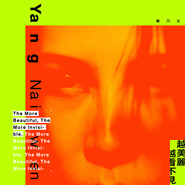
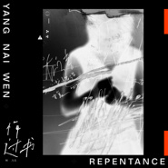
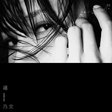
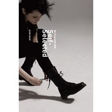
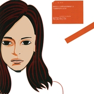
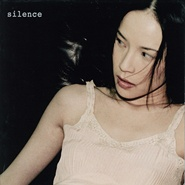

杨乃文
============================

|  |  |
| :--: | :-- |
| [ 杨乃文](https://i.xiami.com/yangnaiwen) | **地区**: Taiwan, PRC 中国台湾 **风格**: 流行摇滚 Pop Rock, 国语流行 Mandarin Pop **播放数**: 57644320 **粉丝数**: 76193 **评论数**: 1296  |

## 档案

姓名：杨乃文 
生日：  1974  年  3  月  2  日 
毕业院校：     澳大利亚悉尼大学     。 
杨乃文  6  岁开始学钢琴，此外，她还会演奏琵琶、三弦、鼓、长笛等乐器，为她之后的演艺生涯奠定了良好的基础。 
1997  年  7  月  29  日，推出首张个人音乐专辑《    One    》，从而正式出道。 
1999  年  9  月  9  日，推出第二张个人音乐专辑《    SILENCE    》。 
2000  年，凭借专辑《    SILENCE    》获得第  11  届  “  金曲奖  ”  最佳女演唱人奖。 
2001  年  5  月  3  日，推出第三张个人音乐专辑《     应该     》；同年  7  月  7  日，在台北市台大综合体育馆举办了名为  “Back to Music”  的首次个人售票演唱会。 
2004  年  1  月  9  日，推出首张个人精选辑《杨乃文第一张精选》。 
2006  年  12  月  1  日，推出第四张个人音乐专辑《     女爵     》。 
2009  年  4  月  10  日，推出第二张个人精选辑《  Self-selected  我自选》，收录了包括了《  Miss Underwater  》、《    Falling Slowly    》等在内的  10  首英文歌曲。 
2013  年  12  月，推出第五张个人音乐专辑《  ZERO  》。 
2016  年  11  月，推出第六张个人音乐专辑  《     离心力     》。 
2019  年  11  月，发行高品质音乐专辑《越美丽越看不见》。 
杨乃文具有独特的气场和嗓音以及超强的现场演唱实力，酷酷的外表下有着超脱音乐才华，是华语乐坛不可复制的“摇滚女王”。

## 专辑

| 名称 | 语种 | 唱片公司 | 发行时间 | 专辑类别 | 专辑风格 |
| :--: | :-- | :-- | :-- | :-- | :-- |
| [ 越美丽越看不见The More Beautiful, The More Invisible](./albums/2105375718.md) | 国语 | 亚神音乐 | 2019年11月15日 | 录音室专辑 | 国语流行 Mandarin Pop |
| [ 贵族的挽歌A Requiem For The Nobles](./albums/2105418501.md) | 国语 | 亚神音乐 | 2019年11月08日 | EP, 单曲 | 流行摇滚 Pop Rock, 国语流行 Mandarin Pop |
| [ 悔过书Repentance](./albums/2105375876.md) | 国语 | 亚神音乐 | 2019年10月25日 | EP, 单曲 | 流行摇滚 Pop Rock, 国语流行 Mandarin Pop |
| [ 逃兵](./albums/2102719712.md) | 国语 | 鲜花盛开影业 | 2017年03月23日 | EP, 单曲 | 国语流行 Mandarin Pop, 电影原声 Film Score |
| [ 离心力Centrifugal Force](./albums/2102455490.md) | 国语 | 亚神音乐 | 2016年11月16日 | 录音室专辑 | 国语流行 Mandarin Pop, 流行摇滚 Pop Rock |
| [ TIMEQUAKE 演唱会现场实录](./albums/1274476393.md) | 国语 | 亚神音乐 | 2015年06月05日 | 现场专辑 | 流行摇滚 Pop Rock, 国语流行 Mandarin Pop |
| [ ZERO](./albums/686128603.md) | 国语 | 亚神音乐 | 2013年12月20日 | 录音室专辑 | 流行摇滚 Pop Rock, 国语流行 Mandarin Pop |
| [ Self-Selected我自选 选自我](./albums/323474.md) | 英语 | 新力音乐 | 2009年04月17日 | 录音室专辑 | 流行摇滚 Pop Rock |
| [ 女爵](./albums/12693.md) | 国语 | 亚神音乐 | 2006年12月01日 | 录音室专辑 | 流行摇滚 Pop Rock, 国语流行 Mandarin Pop, 华语唱作人 Chinese Singer-Songwriter |
| [ 第一张精选](./albums/12694.md) | 国语 | 滚石唱片 | 2004年01月09日 | 精选集 | 国语流行 Mandarin Pop, 流行摇滚 Pop Rock, 华语唱作人 Chinese Singer-Songwriter |
| [ 应该](./albums/12695.md) | 国语 | 魔岩唱片 | 2001年05月03日 | 录音室专辑 | 国语流行 Mandarin Pop, 流行摇滚 Pop Rock, 华语唱作人 Chinese Singer-Songwriter |
| [ Silence](./albums/12696.md) | 国语 | 魔岩唱片 | 1999年09月09日 | 录音室专辑 | 国语流行 Mandarin Pop, 流行摇滚 Pop Rock, 华语唱作人 Chinese Singer-Songwriter |
| [ One](./albums/12697.md) | 国语 | 魔岩唱片 | 1997年07月29日 | 录音室专辑 | 流行摇滚 Pop Rock, 国语流行 Mandarin Pop, 华语唱作人 Chinese Singer-Songwriter |

## 评论

|  |  |  |
| :-- | :-- | :-- |
|  [虾米用户](https://emumo.xiami.com/u/309495518)  2021-01-31 21:43 赞(0) 踩(0) | 
长得漂亮唱歌又好听的小姐姐 
 |
|  [虾米用户](https://emumo.xiami.com/u/9062060) 此生没拿一个亿来爱虾米是... 2021-01-08 17:02 赞(0) 踩(0) | 

 |
|  [虾米用户](https://emumo.xiami.com/u/6215850) 於無聲處聽驚雷 2021-01-07 08:26 赞(1) 踩(0) | 
再也不能在蝦米聽乃文寶貝了，我哭得好大聲  
 |
|  [虾米用户](https://emumo.xiami.com/u/260520897)  2021-01-05 12:13 赞(0) 踩(0) | 
2020乃文的歌陪我走过，还有一个月，虾米再见！
 |
|  [虾米用户](https://emumo.xiami.com/u/358104299) 悲观的唯心存在现实解构虚... 2020-12-31 12:15 赞(0) 踩(0) | 
19480
 |
|  [虾米用户](https://emumo.xiami.com/u/44619445)  2020-10-29 23:56 赞(0) 踩(0) | 
自由自在，爱
 |
|  [虾米用户](https://emumo.xiami.com/u/108518042) 安安静静的听歌，平平淡淡... 2020-10-11 13:06 赞(0) 踩(0) | 
❤️
 |
|  [虾米用户](https://emumo.xiami.com/u/3140019) 天马行空 2020-08-13 22:58 赞(1) 踩(0) | 
封面的发际线认真吗
 |
|  [虾米用户](https://emumo.xiami.com/u/46283202) 我还没想好要写什么... 2020-08-12 20:53 赞(0) 踩(0) | 
第一次听她的歌 是静止 蛮喜欢的 可。。。才发现 她就一首这样的  不过后面我喜欢了她所有音乐
 |
|  [虾米用户](https://emumo.xiami.com/u/288929130)  2020-08-06 07:37 赞(0) 踩(0) | 
我的女神！
 |
|  [虾米用户](https://emumo.xiami.com/u/24195194)  2020-07-30 09:44 赞(0) 踩(0) | 
比王菲有魅力的女人
 |
|  [虾米用户](https://emumo.xiami.com/u/405576327) René成*全 2020-07-15 13:23 赞(1) 踩(0) | 
从Queer到女爵再到贵族，外表冰冷，内心狂热，唯有杨乃文啦.
 |
|  [虾米用户](https://emumo.xiami.com/u/279653057)  2020-07-10 13:27 赞(0) 踩(0) | 
需yvyvmvycgjvvggkvvvvgvvkjvvvvvvvvgvbvghgvvjvvvvvghVvgvvvvvvbdvyvvvvvvvvvvgivvakgiovygvlavvv与 vvv 为 vvvvvvvvvvv 绿 v vvvvvvv 此次 vvvvvvv 把 vvvvvvvvvvvvvvgssbfyvvvakgvsaylgahvv
 |
|  [虾米用户](https://emumo.xiami.com/u/49895220) 一念静心花开遍世界 2020-04-29 16:57 赞(1) 踩(0) | 
今天才发现杨乃文的歌这么个性
 |
|  [虾米用户](https://emumo.xiami.com/u/12270530)  2020-04-25 20:30 赞(0) 踩(0) | 
有版权了！太棒了！
 |
|  [虾米用户](https://emumo.xiami.com/u/268984) byebye my lo... 2020-04-09 21:13 赞(2) 踩(0) | 
从《证据》开始听杨乃文，一开始听这首歌，音乐竟然有陈绮贞的感觉。但是杨乃文嗓音独有的杀伤在我身上起了作用，我太吃她这套了，爱了。
 |
|  [虾米用户](https://emumo.xiami.com/u/28552334) Gibran 2020-03-28 11:28 赞(0) 踩(0) | 
skr，好听，
 |
|  [虾米用户](https://emumo.xiami.com/u/45258530) 万人如海一身藏  2020-03-27 02:07 赞(0) 踩(0) | 
感天动地！！ 终于可以在虾米听杨乃文的歌了
 |
|  [虾米用户](https://emumo.xiami.com/u/7370573)  2020-03-26 11:42 赞(1) 踩(0) | 
我爱杨乃文！
 |
|  [虾米用户](https://emumo.xiami.com/u/260520897)  2020-03-17 16:26 赞(2) 踩(0) | 
原来那个封面那么好看，怎么换了
 |
|  [虾米用户](https://emumo.xiami.com/u/246543420) 穿上风衣我推门出去 2020-03-11 23:15 赞(4) 踩(0) | 
哭了乃文有版权了！！
 |
|  [虾米用户](https://emumo.xiami.com/u/318132) 抠啦 2020-03-10 12:10 赞(11) 踩(0) | 
欢迎杨乃文的专辑版权回归虾米音乐，撒花
 |
|  [虾米用户](https://emumo.xiami.com/u/345873482)  2020-03-02 19:57 赞(0) 踩(0) | 
生日快乐
 |
|  [虾米用户](https://emumo.xiami.com/u/37827578) 暂无签名~ 2020-03-02 13:19 赞(1) 踩(0) | 
來深圳開演唱會  
 |
|  [虾米用户](https://emumo.xiami.com/u/1632225) 南茶坊和大昭寺 2020-03-02 11:55 赞(0) 踩(0) | 
阿文，生日快乐！
 |
|  [虾米用户](https://emumo.xiami.com/u/334929836) try 2020-03-02 10:35 赞(1) 踩(0) | 
认真的发一遍，生日快乐！杨乃文！16年认识你的，时光匆匆，愿更多美好回忆，发生在你，我她之间…
 |
|  [虾米用户](https://emumo.xiami.com/u/121453884) 我们生来就是孤独 2020-03-02 10:13 赞(0) 踩(0) | 
飘着。
 |
|  [虾米用户](https://emumo.xiami.com/u/15354170) In my BGM, I... 2020-03-02 10:06 赞(0) 踩(0) | 
Faith Yang.生日快乐！ 
 |
|  [虾米用户](https://emumo.xiami.com/u/64689804) 我 没有我 2020-03-02 10:02 赞(0) 踩(0) | 
生日快乐
 |
|  [虾米用户](https://emumo.xiami.com/u/36413983) 我还没想好要写什么... 2020-03-02 10:01 赞(0) 踩(0) | 
乃文生日快乐虾米推送集合
 |
|  [虾米用户](https://emumo.xiami.com/u/24480814) stale milk a... 2020-03-02 10:01 赞(0) 踩(0) | 
生日快乐乃文宝贝
 |
|  [虾米用户](https://emumo.xiami.com/u/718652)   2020-03-02 10:00 赞(0) 踩(0) | 
乃文宝贝生日快乐         
 |
|  [虾米用户](https://emumo.xiami.com/u/15634893) 暂无签名~ 2019-11-26 10:15 赞(2) 踩(0) | 
乃文我们需要你
 |
|  [虾米用户](https://emumo.xiami.com/u/8226204) ≡ 2019-10-25 17:58 赞(1) 踩(0) | 
新专辑11月15日发布。
 |
|  [虾米用户](https://emumo.xiami.com/u/38086631) 版权就和自由一样，永远属... 2019-09-09 01:46 赞(1) 踩(0) | 
理想，现实，还是得先活着
 |
|  [虾米用户](https://emumo.xiami.com/u/154734994) 生命常有缺憾，幸好音乐能... 2019-09-08 22:42 赞(1) 踩(0) | 
声音太好听了  
 |
|  [虾米用户](https://emumo.xiami.com/u/99252540) 站在人生的米字路口上 2019-08-17 22:07 赞(0) 踩(0) | 
想你了
 |
|  [虾米用户](https://emumo.xiami.com/u/53718156) 盲目平淡喜欢一滴点波澜 2019-08-15 16:05 赞(0) 踩(0) | 
喋喋不休
 |
|  [虾米用户](https://emumo.xiami.com/u/199328476)  2019-07-24 23:15 赞(0) 踩(0) | 
最喜欢的作家：冯内古特
 |
|  [虾米用户](https://emumo.xiami.com/u/358104299) 悲观的唯心存在现实解构虚... 2019-07-14 02:44 赞(0) 踩(0) | 
12585
 |
|  [虾米用户](https://emumo.xiami.com/u/7895949) 我还没想好要写什么... 2019-07-10 17:52 赞(0) 踩(0) | 
今年会有新专吧
 |
|  [虾米用户](https://emumo.xiami.com/u/411931352) 我还没想好要写什么... 2019-07-08 21:17 赞(0) 踩(0) | 
喜欢杨乃文的歌，永远支持你。。。。。。         
 |
|  [虾米用户](https://emumo.xiami.com/u/377230062)  2019-07-06 20:43 赞(1) 踩(0) | 
这才是唱歌，现在的歌都什么玩意
 |
|  [虾米用户](https://emumo.xiami.com/u/245280261) 要能做到:不以物喜不以己... 2019-06-21 10:55 赞(0) 踩(0) | 
宝藏啦
 |
|  [虾米用户](https://emumo.xiami.com/u/356482549)  2019-06-12 18:03 赞(0) 踩(0) | 
在高中的时候听到你的歌就喜欢了，作为一个男生，我以前一直以为是自己内心的忧郁，让自己对你的歌有感触，现在工作五年了，才发现，对没错，真的是因为一直以来内心的悲伤。
 |
|  [虾米用户](https://emumo.xiami.com/u/425721971)  2019-06-09 05:38 赞(0) 踩(0) | 
听不腻很重要
 |
|  [虾米用户](https://emumo.xiami.com/u/15577171) 不同的心境，不同的音乐～... 2019-06-01 19:03 赞(1) 踩(0) | 
才认识你，真是有点晚了，从现在，可能还不算晚
 |
|  [虾米用户](https://emumo.xiami.com/u/1013303) 我还没想好要写什么... 2019-05-26 12:10 赞(1) 踩(0) | 
今天麦田见！
 |
|  [虾米用户](https://emumo.xiami.com/u/49092861)  2019-05-16 23:26 赞(1) 踩(0) | 
喜欢你的歌很久了，大学就开始，陪我迎来送去好几个她 
 |
|  [虾米用户](https://emumo.xiami.com/u/2796166) 最爱莫文蔚..... 2019-04-16 00:13 赞(1) 踩(0) | 
加油~~~~
 |
|  [虾米用户](https://emumo.xiami.com/u/71178106) 塵世や 酒、風呂を抜け ... 2019-04-12 10:05 赞(2) 踩(0) | 
♡
 |
|  [虾米用户](https://emumo.xiami.com/u/420074970)  2019-04-09 00:36 赞(2) 踩(0) | 
感觉伍佰很欣赏杨乃文！ 
 |
|  [虾米用户](https://emumo.xiami.com/u/368916693)  2019-04-06 12:35 赞(0) 踩(0) | 
伍佰&amp;amp;CHINA BLUE5月在上海和杭州都有演唱会，特别杭州站是伍佰出道30年来第一次在杭州举办专属演唱会。
 |
|  [虾米用户](https://emumo.xiami.com/u/44403883)   2019-04-05 08:43 赞(1) 踩(0) | 
乃文喜欢的作家是冯内古特
 |
|  [虾米用户](https://emumo.xiami.com/u/46970481)  2019-03-30 23:18 赞(0) 踩(0) | 
被她这次的颜圈饭了
 |
|  [虾米用户](https://emumo.xiami.com/u/9152977) 不合群的音谋者。 2019-03-11 12:57 赞(2) 踩(0) | 
想組個band（找同樣喜歡聽奶文的歌的人）在街頭賣唱 唱著奶文的歌 揮灑著青春的汗水 喊著撕心裂肺的歌詞 儘管什麼都不會 接受無償 但那一定是我二十幾年來活得最有意義的一天
 |
|  [虾米用户](https://emumo.xiami.com/u/35949246) WEI KUO 2019-03-10 13:09 赞(1) 踩(0) | 
乃文乃文乃文
 |
|  [虾米用户](https://emumo.xiami.com/u/35949246) WEI KUO 2019-03-10 12:45 赞(1) 踩(0) | 
楊乃文！你要不要这么优秀！
 |
|  [虾米用户](https://emumo.xiami.com/u/418511155)  2019-03-10 01:33 赞(2) 踩(0) | 
内地巡回演出吧！！给支持你的歌迷一个机会！！
 |
| ⇒ |  [虾米用户](https://emumo.xiami.com/u/9152977) 不合群的音谋者。 2019-03-11 12:59 赞(0) 踩(0) | 
咪咕現場3.8深圳我去了 接下來好像就是福州了
 |
|  [虾米用户](https://emumo.xiami.com/u/48084409) 我还没想好要写什么.. 2019-03-09 00:21 赞(1) 踩(0) | 
年轻时迷恋过的女神们都已渐渐老了
 |
|  [虾米用户](https://emumo.xiami.com/u/49959840) 无聊人 2019-03-08 16:49 赞(1) 踩(0) | 

 |
|  [虾米用户](https://emumo.xiami.com/u/2491956) 我还没想好要写什么... 2019-03-06 10:10 赞(2) 踩(0) | 
杨乃文的声音特别性感！
 |
|  [虾米用户](https://emumo.xiami.com/u/3135626) 我还没想好要写什么... 2019-03-04 17:02 赞(4) 踩(0) | 
喜欢的歌手经大众节目检验其为小众的感觉竟然挺好
 |
|  [虾米用户](https://emumo.xiami.com/u/1281535) 妈妈一起飞吧 2019-03-04 16:16 赞(1) 踩(0) | 
喜欢乃文的，注定会一辈子喜欢的，不喜欢的人请绕道别bb（最近看那个歌手的节目真是把我气到了！）
 |
|  [虾米用户](https://emumo.xiami.com/u/230803304) 三观正又爱国的成都宝藏男... 2019-03-03 11:25 赞(0) 踩(0) | 
生日快乐
 |
|  [虾米用户](https://emumo.xiami.com/u/27451579) 这家伙很聪明什么也没留下... 2019-03-03 08:30 赞(1) 踩(0) | 
喜欢你
 |
|  [虾米用户](https://emumo.xiami.com/u/9078867)  2019-03-03 06:42 赞(0) 踩(0) | 
生快，我的宝藏
 |
|  [虾米用户](https://emumo.xiami.com/u/267746808) 生活不止眼前的苟且 2019-03-02 22:13 赞(0) 踩(0) | 
初中就疯狂喜欢上了，自从看到了一个人的MV后 继续永远不做大多数
 |
|  [虾米用户](https://emumo.xiami.com/u/14315105) 暂无签名~ 2019-03-02 14:26 赞(0) 踩(0) | 
Happy birthday乃文
 |
|  [虾米用户](https://emumo.xiami.com/u/28425834)   2019-03-02 14:25 赞(1) 踩(0) | 
谢谢虾米音乐提示三月二日是杨乃文的生日，我还真不知道。生日快乐，女王陛下！
 |
|  [虾米用户](https://emumo.xiami.com/u/329813215) 听，最内心的声音！ 2019-03-02 13:47 赞(1) 踩(0) | 
竟然被淘汰了，歌手你这是要疯啊？？
 |
|  [虾米用户](https://emumo.xiami.com/u/6498265) 这家伙很聪明什么也没留下... 2019-03-02 12:19 赞(0) 踩(0) | 
好喜欢你唱歌
 |
|  [虾米用户](https://emumo.xiami.com/u/15412349) for what 2019-03-02 12:11 赞(0) 踩(0) | 
  
 |
|  [虾米用户](https://emumo.xiami.com/u/49496128) 用音乐充实自己的心灵 2019-03-02 11:46 赞(0) 踩(0) | 
小乃文 生日快乐
 |
|  [虾米用户](https://emumo.xiami.com/u/246543420) 穿上风衣我推门出去 2019-03-02 11:29 赞(0) 踩(0) | 
乃文生日快乐
 |
|  [虾米用户](https://emumo.xiami.com/u/215441681)  2019-03-02 10:56 赞(0) 踩(0) | 
生日快乐
 |
|  [虾米用户](https://emumo.xiami.com/u/36067046) 他是对面大厦 我想住进去... 2019-03-02 10:51 赞(0) 踩(0) | 
生日快乐，最终你还是藏不住了。
 |
|  [虾米用户](https://emumo.xiami.com/u/128079550)  2019-03-02 10:41 赞(0) 踩(0) | 
杨乃文，就是独特的她。
 |
|  [虾米用户](https://emumo.xiami.com/u/35907441)  2019-03-02 10:41 赞(0) 踩(0) | 
喜欢你的自由随意 喜欢你的紧张不安 喜欢你的简单干脆 喜欢你愿意做一些挑战，走出舒适圈 希望能一直默默陪伴 本来想去深圳的，可是由于各种事情还是未能成行 希望能现场听一次我离开我自己 生快~
 |
|  [虾米用户](https://emumo.xiami.com/u/302881898) 爱音乐的善良小孩 2019-03-02 10:36 赞(0) 踩(0) | 
乃文啊，真是一位宝藏歌手，祝你生日快乐
 |
|  [虾米用户](https://emumo.xiami.com/u/9278888)  2019-03-02 10:30 赞(0) 踩(0) | 
爱你啦
 |
|  [虾米用户](https://emumo.xiami.com/u/47039333) 我还没想好要写什么... 2019-03-02 10:28 赞(0) 踩(0) | 
喜欢你   
 |
|  [虾米用户](https://emumo.xiami.com/u/7409057) 万籁有声，天地无言！ 2019-03-02 10:14 赞(0) 踩(0) | 
生日快乐！枯绝天外……
 |
|  [虾米用户](https://emumo.xiami.com/u/48440658) 转战Spotify—Ut... 2019-03-02 10:14 赞(0) 踩(0) | 
生日快乐啊啊啊啊女神！悄咪咪听你！
 |
|  [虾米用户](https://emumo.xiami.com/u/866525) 最好的时光才刚刚开始！≥... 2019-03-02 10:14 赞(0) 踩(0) | 
乃文生日快乐
 |
|  [虾米用户](https://emumo.xiami.com/u/510533)  2019-03-02 10:13 赞(0) 踩(0) | 
女神，生日快乐啊
 |
|  [虾米用户](https://emumo.xiami.com/u/47411) 一时自私的快乐是短暂的，... 2019-03-02 10:12 赞(0) 踩(0) | 
越沉默越有力量，最长情的歌者。生日快乐！
 |
|  [虾米用户](https://emumo.xiami.com/u/279232277)  2019-03-02 10:09 赞(0) 踩(0) | 
生日快乐Faith！
 |
|  [虾米用户](https://emumo.xiami.com/u/28204293) 我还没想好要写什么... 2019-03-02 10:09 赞(0) 踩(0) | 
生日快乐有看我是歌手，超级酷的女生了，女爵特别好听，我最爱的还是未接来电
 |
|  [虾米用户](https://emumo.xiami.com/u/8811077) 星空下沉，四海升腾，归去... 2019-03-02 10:05 赞(0) 踩(0) | 
生日快乐
 |
|  [虾米用户](https://emumo.xiami.com/u/113079600) hello,how ar... 2019-03-02 10:05 赞(0) 踩(0) | 
生快
 |
|  [虾米用户](https://emumo.xiami.com/u/11773373) 我还没想好要写什么... 2019-03-02 10:04 赞(0) 踩(0) | 
宝贝生日快乐啊，昨晚浪里游超好听的我妈都被震撼到了 永远爱你   
 |
|  [虾米用户](https://emumo.xiami.com/u/407859749)  2019-03-02 10:03 赞(0) 踩(0) | 
生快
 |
|  [虾米用户](https://emumo.xiami.com/u/266071074) 享受音樂！熱愛生活！ 2019-03-02 10:02 赞(0) 踩(0) | 
生日快乐
 |
|  [虾米用户](https://emumo.xiami.com/u/1091873) 最多12个字符。 2019-03-02 10:02 赞(0) 踩(0) | 
生日快乐
 |
|  [虾米用户](https://emumo.xiami.com/u/492242)  2019-03-02 10:02 赞(0) 踩(0) | 
生日快乐，永远爱你。
 |
|  [虾米用户](https://emumo.xiami.com/u/343365031) 倾听别人的声音 2019-03-02 10:02 赞(0) 踩(0) | 

 |
|  [虾米用户](https://emumo.xiami.com/u/324639630) Mrvica、我爱成都 2019-03-02 10:02 赞(0) 踩(0) | 

 |
|  [虾米用户](https://emumo.xiami.com/u/51956981) 我还没想好要写什么... 2019-03-02 10:02 赞(0) 踩(0) | 
乃文生日快乐呀
 |
|  [虾米用户](https://emumo.xiami.com/u/115635164) 我还没想好要写什么... 2019-03-02 10:01 赞(0) 踩(0) | 
继续加油呀 期待更好的作品啦
 |
|  [虾米用户](https://emumo.xiami.com/u/718652)   2019-03-02 10:01 赞(0) 踩(0) | 
生日快乐                                                                          
 |
|  [虾米用户](https://emumo.xiami.com/u/346492287) 虾米不要离开我！ 2019-03-02 01:05 赞(3) 踩(0) | 
群演怎么会听得懂杨乃文？
 |
|  [虾米用户](https://emumo.xiami.com/u/38918617) 你相信我，我相信你 2019-03-02 00:41 赞(3) 踩(0) | 
耳帝: 《歌手》舞台是一个很特殊的环境，这是内地综艺制作水平近些年突飞猛进的结果，它比的是现场，但这个现场不像音乐节、演唱会或者Live House，它收音的精细度与敏锐度却完全不比录音室差。这种场合一定给了杨乃文巨大的心理压力，她是一个极度容易紧张且害羞的人，记得她曾说自己在出道时的第一场表演，台下坐着公司高管与众多业界资深人士，整个表演她唱得暗无天日，全程二十分钟没敢睁眼，这种心理状态一直持续到如今。
 |
|  [虾米用户](https://emumo.xiami.com/u/38918617) 你相信我，我相信你 2019-03-02 00:39 赞(2) 踩(0) | 
耳帝: 在传统的现场中，唱得粗枝大叶、不修边幅，也许存在很多的不可推敲的细节，但整体的大意与上述几点能做到，基本就合格，尤其是身在现场听，嘈杂的氛围也掩饰掉很多出错的细节与瑕疵，而在录音室里，尽管可以修音、剪辑与不断重来，并且还有制作人与录音师的即时把控，但因为收音环境的纤毫毕现，歌手要更加精确且真诚地呈现出更多的内容与细节，“大意”式的演唱在录音室中就不合适了。杨乃文后来索性认为，连唱片都不想去追求“完美”了，因为为了精细完美的细节不断重来，不断进行片段的修补，到最后都不知道自己究竟想表达什么。
 |
|  [虾米用户](https://emumo.xiami.com/u/38918617) 你相信我，我相信你 2019-03-02 00:38 赞(3) 踩(0) | 
耳帝: 杨乃文是一个出色的唱片歌手，现场也很有感染力，她曾在采访中说过自己唱录音与唱现场是两种方法：在录音室中，她唱得小心翼翼，因为收音太清楚；而在现场，却会唱得不修边幅，随性而外放。  这是技术尚未炉火纯青不能将现场与唱片统一的歌手，采用的一种本能而聪明的在两种环境里适应与转换的方式，因为现场与唱片是两种形态，首先音乐性都是基础，然而现场更侧重于感染力、听觉刺激、视听氛围、即兴的灵光与新意，而唱片则更侧重于耐听度、回味性、平衡感、声音人格、深层次的意义与表达。
 |
|  [虾米用户](https://emumo.xiami.com/u/346606207)  2019-03-01 08:07 赞(0) 踩(0) | 
2000年玩兒的滾石音樂節拍機，裡面收錄了monster，從此不能自拔。
 |
|  [虾米用户](https://emumo.xiami.com/u/412928133) 我还没想好要写什么... 2019-02-24 15:13 赞(0) 踩(0) | 
好听，力量感的声音，冷峻温柔
 |
|  [虾米用户](https://emumo.xiami.com/u/36924752)  2019-02-24 00:33 赞(0) 踩(0) | 
大爱
 |
|  [虾米用户](https://emumo.xiami.com/u/252618098)  2019-02-22 23:48 赞(0) 踩(0) | 
天呐!……!
 |
|  [虾米用户](https://emumo.xiami.com/u/11464083) always awake 2019-02-20 00:45 赞(0) 踩(0) | 
希望她再来上海开演唱会！！
 |
|  [虾米用户](https://emumo.xiami.com/u/47221582) 还有音乐就好。 2019-02-17 09:54 赞(4) 踩(0) | 
女爵版权买回来吧！求求霸霸了！
 |
|  [虾米用户](https://emumo.xiami.com/u/853523)  2019-02-16 15:12 赞(1) 踩(0) | 
乃文宝贝的演唱会门票要高涨啦～
 |
|  [虾米用户](https://emumo.xiami.com/u/368790907)  2019-02-16 10:07 赞(1) 踩(0) | 
上歌手啦！！
 |
|  [虾米用户](https://emumo.xiami.com/u/49445796) 幻听 2019-02-15 17:24 赞(0) 踩(0) | 
入股不亏！歌手等你
 |
|  [虾米用户](https://emumo.xiami.com/u/11552826) 我还没想好要写什么... 2019-02-15 08:12 赞(2) 踩(0) | 
女神加油，上歌手大杀四方 
 |
|  [虾米用户](https://emumo.xiami.com/u/53635252) 活着活着就老了。 2019-02-14 23:52 赞(2) 踩(0) | 
杨乃文要上歌手了吗？   那我得看，    只要是那个年代滚石的歌手 我都要看
 |
|  [虾米用户](https://emumo.xiami.com/u/44539750)  2019-02-14 00:52 赞(0) 踩(0) | 
啊啊啊是真的！好快乐！
 |
|  [虾米用户](https://emumo.xiami.com/u/67964378) 我还没想好要写什么... 2019-02-13 21:49 赞(4) 踩(0) | 
乃文补位歌手是真实存在的吗？？！！分分钟滚回来听了
 |
|  [虾米用户](https://emumo.xiami.com/u/323721153)    乃文。。 2019-01-29 14:03 赞(0) 踩(0) | 
爱你 千千万
 |
|  [虾米用户](https://emumo.xiami.com/u/4142885) 我还没想好要写什么... 2018-12-15 23:02 赞(3) 踩(0) | 
歌如其人，情感表达真实、直接，不矫情不做作不夸张不拐弯抹角。
 |
|  [虾米用户](https://emumo.xiami.com/u/330652816) 心灵有耳，聆听美好 2018-12-03 01:11 赞(1) 踩(0) | 
就这样爱着你
 |
|  [虾米用户](https://emumo.xiami.com/u/11235021) 纵贯线王菲熊光KOKIA... 2018-11-08 23:51 赞(2) 踩(0) | 
相册里有一张和伍佰的合照
 |
|  [虾米用户](https://emumo.xiami.com/u/191941579)  2018-10-29 00:25 赞(1) 踩(0) | 
当年刚出证据和女爵在ChannelV播放，才小学的我记住了这个特别的姐姐，互联网发达的今天重新找回。
 |
|  [虾米用户](https://emumo.xiami.com/u/23673686) 走到生活中去 2018-10-26 15:31 赞(0) 踩(0) | 
我也后悔没有去了 呜呜
 |
|  [虾米用户](https://emumo.xiami.com/u/23673686) 走到生活中去 2018-10-26 15:31 赞(0) 踩(0) | 
女神啊
 |
|  [虾米用户](https://emumo.xiami.com/u/258229701)   2018-10-21 22:56 赞(0) 踩(0) | 
好听
 |
|  [虾米用户](https://emumo.xiami.com/u/1024746) 灵魂不该屈服 2018-10-18 12:04 赞(1) 踩(0) | 
女爵，只给有缘人
 |
|  [虾米用户](https://emumo.xiami.com/u/36067046) 他是对面大厦 我想住进去... 2018-10-18 09:15 赞(0) 踩(0) | 
就错过了你到重庆，想哭。
 |
|  [虾米用户](https://emumo.xiami.com/u/30317737) 我还没想好要写什么... 2018-10-18 07:00 赞(0) 踩(0) | 
简约又华丽
 |
|  [虾米用户](https://emumo.xiami.com/u/18619292) 我的舒适空间 2018-10-16 21:46 赞(0) 踩(0) | 
我是真的超爱你！！！
 |
|  [虾米用户](https://emumo.xiami.com/u/8955479)   2018-10-14 15:22 赞(0) 踩(0) | 
刚看完福州场 现场比cd还要棒啊  
 |
|  [虾米用户](https://emumo.xiami.com/u/374835550) 我就是我—— 2018-10-13 19:37 赞(2) 踩(0) | 
我现在在福州体育馆啊啊啊啊啊a
 |
|  [虾米用户](https://emumo.xiami.com/u/355620147)  2018-10-13 17:26 赞(0) 踩(0) | 
成熟而不失天真，孤傲而又不缺柔情。真是............好！
 |
|  [虾米用户](https://emumo.xiami.com/u/347788868) 我还没想好要写什么... 2018-10-13 05:40 赞(2) 踩(0) | 
女伍佰
 |
|  [虾米用户](https://emumo.xiami.com/u/318132) 抠啦 2018-10-10 23:21 赞(1) 踩(0) | 
刚看完天津的演出，一连串唱了这么多首歌简直太值票价了，而且嗓音唱现场跟听cd一样，超级棒，听到了我最喜欢的女爵 
 |
|  [虾米用户](https://emumo.xiami.com/u/856026) to the moon 2018-10-05 18:06 赞(0) 踩(0) | 
乃文寶貝
 |
|  [虾米用户](https://emumo.xiami.com/u/29652809) 我还没想好要写什么... 2018-09-02 23:36 赞(0) 踩(0) | 
恋人的絮语版权什么时候有啊  
 |
|  [虾米用户](https://emumo.xiami.com/u/186466150) 我还没想好要写什么... 2018-09-02 13:17 赞(1) 踩(0) | 
江浙沪的演出什么时候有啊 
 |
|  [虾米用户](https://emumo.xiami.com/u/192303050) 我还没想好要写什么... 2018-08-07 23:44 赞(0) 踩(0) | 
什么时候再认真地出一张专辑给我们听
 |
|  [虾米用户](https://emumo.xiami.com/u/103564708) 我还没想好要写什么... 2018-08-07 13:41 赞(0) 踩(0) | 
乃文寳贝
 |
|  [虾米用户](https://emumo.xiami.com/u/25552718) 带着银子和故事来看我. 2018-08-05 01:08 赞(0) 踩(0) | 
乃文寶貝
 |
|  [虾米用户](https://emumo.xiami.com/u/324526907)  2018-07-22 16:15 赞(0) 踩(0) | 
美女阿姨     好喜欢她短发造型，锁骨很美
 |
|  [虾米用户](https://emumo.xiami.com/u/2154638) 明心见性 遇见真的自己 2018-07-09 00:40 赞(1) 踩(0) | 
这样的声音很，适合&amp;ldquo;女爵&amp;rdquo;两个字， 令我猝不及防 ～ 想起你
 |
|  [虾米用户](https://emumo.xiami.com/u/66823378)  2018-06-29 18:31 赞(1) 踩(0) | 
离心力
 |
|  [虾米用户](https://emumo.xiami.com/u/48084409) 我还没想好要写什么.. 2018-06-23 21:00 赞(0) 踩(0) | 
一位低调的声音辨识度极高的理性感性并存的女歌手，希望华语乐坛多些这样的女歌手而不是什么天后
 |
|  [虾米用户](https://emumo.xiami.com/u/43324636) 杨乃文粉丝 2018-06-11 18:56 赞(7) 踩(0) | 
乃文寶貝最新演出了解一下：【楊乃文 BACK TO FAITH 演唱會 香港站 】 時間 : 2018年6月27日 (星期三) 晚上8時15分 地點 : 九龍灣國際展貿中心-匯星 票價 : $680 / $480 / $380 购票链接 <a href="http://www.hkticketing.com/events/KBBACKT0618" target="_blank" rel="nofollow noreferrer noopener">http://www.hkticketing.com/events/KBBACKT0618</a> 重点来了：（超大声）福州、重慶、南京、武漢、天津 coming soon&amp;hellip;&amp;hellip;   
 |
|  [虾米用户](https://emumo.xiami.com/u/2001520) Song for you... 2018-05-29 14:54 赞(0) 踩(0) | 
希望乃文有一天能来深圳！
 |
| ⇒ |  [虾米用户](https://emumo.xiami.com/u/261264985)   2018-07-21 22:25 赞(0) 踩(0) | 
嗯哼，到了记得@我。
 |
|  [虾米用户](https://emumo.xiami.com/u/368916693)  2018-05-20 17:20 赞(0) 踩(0) | 
虾米
 |
|  [虾米用户](https://emumo.xiami.com/u/104382818) 似乎快要受不了 2018-05-17 22:18 赞(0) 踩(0) | 
~~
 |
|  [虾米用户](https://emumo.xiami.com/u/39548287) Spotify&QQ同名... 2018-05-11 00:11 赞(0) 踩(0) | 
⌬
 |
|  [虾米用户](https://emumo.xiami.com/u/46806159) 我还没想好要写什么... 2018-05-07 13:22 赞(0) 踩(0) | 
很酷诶！
 |
|  [虾米用户](https://emumo.xiami.com/u/353335157)  2018-05-04 00:16 赞(1) 踩(0) | 
有点像彭佳慧，好听，声音犹如幽静的山谷中传来，饱满
 |
|  [虾米用户](https://emumo.xiami.com/u/260067335) 夜空中最亮的两颗星星，哥... 2018-04-26 21:14 赞(0) 踩(0) | 
说实话，女歌手喜欢的不多，在我心中第一永远是梅艳芳，再就是杨乃文，林忆莲
 |
|  [虾米用户](https://emumo.xiami.com/u/47369773) 我还没想好要写什么... 2018-04-05 02:11 赞(0) 踩(0) | 
oh my sweetie
 |
|  [虾米用户](https://emumo.xiami.com/u/354960048)  2018-03-26 22:59 赞(0) 踩(0) | 
爱你 
 |
|  [虾米用户](https://emumo.xiami.com/u/275693365) Wubba Lubba ... 2018-02-05 17:20 赞(1) 踩(0) | 
简直是给一个homie写的  压榨的老板是天蝎  他是双鱼  他们一起喝过红酒  被要求无休止的加班 没有自由
 |
|  [虾米用户](https://emumo.xiami.com/u/47570236)  　⠀ 2018-02-05 04:04 赞(0) 踩(0) | 

 |
|  [虾米用户](https://emumo.xiami.com/u/246145153) - 2018-01-17 09:26 赞(1) 踩(0) | 
为什么好多歌又下架了 
 |
|  [虾米用户](https://emumo.xiami.com/u/151374390) Do all that ... 2018-01-05 08:44 赞(1) 踩(0) | 
這個女人不簡單
 |
|  [虾米用户](https://emumo.xiami.com/u/676877) 佛曰：Let it be... 2018-01-01 01:39 赞(35) 踩(0) | 
听杨乃文的歌 最少得准备两盒烟 有点听不起了
 |
| ⇒ |  [虾米用户](https://emumo.xiami.com/u/311765126)  2018-02-07 20:49 赞(0) 踩(0) | 
我买给你
 |
| ⇒ |  [虾米用户](https://emumo.xiami.com/u/97740286) 轻声道别离，后悔后知后觉... 2018-12-14 19:33 赞(0) 踩(0) | 
哈哈哈哈 今天去现场 好开心 但却忘了买烟
 |
|  [虾米用户](https://emumo.xiami.com/u/8444797) 保持微笑～明天会更好 2017-12-20 07:51 赞(0) 踩(0) | 
哈哈
 |
|  [虾米用户](https://emumo.xiami.com/u/2246028) 本无常  2017-12-02 22:34 赞(2) 踩(0) | 
没有人比我更喜欢乃文了
 |
| ⇒ |  [虾米用户](https://emumo.xiami.com/u/123560240)   2017-12-16 18:25 赞(0) 踩(0) | 
我啊
 |
| ⇒ |  [虾米用户](https://emumo.xiami.com/u/7121360) 高山流水知音难觅 2018-01-28 17:08 赞(0) 踩(0) | 
具体表现，别吹牛皮
 |
|  [虾米用户](https://emumo.xiami.com/u/165025368)  2017-11-25 23:09 赞(0) 踩(0) | 
讲述了一个故事
 |
|  [虾米用户](https://emumo.xiami.com/u/203265260)  2017-11-19 19:38 赞(0) 踩(0) | 
无法自拔
 |
|  [虾米用户](https://emumo.xiami.com/u/8108665) - 2017-11-17 15:01 赞(0) 踩(0) | 
qangla wl我想你了
 |
|  [虾米用户](https://emumo.xiami.com/u/42810132) Aprés l'amou... 2017-11-01 07:34 赞(0) 踩(0) | 
何厚铧
 |
|  [虾米用户](https://emumo.xiami.com/u/3549659) 清谈 2017-10-28 00:34 赞(5) 踩(0) | 
人难免要妥协，谁也不例外，前3张魔岩的杨乃文张力十足，摇滚精神极佳，但成名后滚石时期为了商业机制没有任何突破，在歌迷的口味中游走挣扎，至今依然风格路线还是老一套，这样的格局谁造成的？还是广大歌迷造成的，唱片制作人正因为吃准了又要另类，又不能太另类的规则，连续炮制出一系列杨乃文现象。但作为华语女歌星的一员，她又有别于其他新俗歌。在冷酷中扮演神秘偶像，而这样的所谓神秘不能掩盖的集合了所有歌迷群落的全部弊病！
 |
| ⇒ |  [虾米用户](https://emumo.xiami.com/u/10166427)   2017-11-14 12:29 赞(0) 踩(0) | 
大哥 建议你把语病都清理完了 再来假装高谈阔论。装得可能会像一点。
 |
| ⇒ |  [虾米用户](https://emumo.xiami.com/u/31110730) 我的最爱王菲杨乃文萧亚轩... 2017-12-07 20:11 赞(0) 踩(0) | 
呵呵
 |
| ⇒ |  [虾米用户](https://emumo.xiami.com/u/2928767) 这个家伙很聪明，什么都没... 2018-07-24 07:54 赞(0) 踩(0) | 
转型要被骂，不转型也要被骂，哈哈
 |
| ⇒ |  [虾米用户](https://emumo.xiami.com/u/3549659) 清谈 2018-07-24 11:11 赞(0) 踩(0) | 
<q><b>张筱柏说：</b></q>
 |
| ⇒ |  [虾米用户](https://emumo.xiami.com/u/2928767) 这个家伙很聪明，什么都没... 2018-07-25 20:02 赞(0) 踩(0) | 
<q><b>清谈说：</b></q>
 |
|  [虾米用户](https://emumo.xiami.com/u/641829) 暂无签名~ 2017-10-27 23:56 赞(1) 踩(0) | 
可惜近年好歌不多了
 |
|  [虾米用户](https://emumo.xiami.com/u/43287)  2017-10-27 23:23 赞(0) 踩(0) | 
从贾敏恕找到杨乃文，只恨现在才听杨。 终于一个太对口的女声！！！！！！！！ 果然贾敏恕是个伯乐！！！！！！！！！！ 贾敏恕的集子找的我快炸了！！！！！！！！！ 强烈建议大家上传资料是标明制作人！！！！！！
 |
|  [虾米用户](https://emumo.xiami.com/u/549204) 我还没想好要写什么... 2017-10-27 23:08 赞(0) 踩(0) | 
再不出声，我们就疯了。。哈哈 喜欢你歌。
 |
|  [虾米用户](https://emumo.xiami.com/u/3549659) 清谈 2017-10-27 23:06 赞(2) 踩(0) | 
1997年开始一度扮演女权主义者和怨妇角色 充当所谓传媒所宣扬的前卫音乐 被绝大多数伪前卫时尚者认可。但不得不说的是 有部分作品依然曲调接近都市摇滚 在繁杂扭曲的流行歌市场中可称其为佼佼者
 |
|  [虾米用户](https://emumo.xiami.com/u/32448108)  2017-10-20 13:18 赞(2) 踩(0) | 
证据  我离开我自己 爱上你只是我的错
 |
|  [虾米用户](https://emumo.xiami.com/u/47760010) ceremonial 2017-10-16 00:12 赞(3) 踩(0) | 
贵族的质感
 |
|  [虾米用户](https://emumo.xiami.com/u/84967250) 虚无而已 2017-10-14 10:28 赞(3) 踩(0) | 
求推开世界的门的版权啊  等了好久了
 |
|  [虾米用户](https://emumo.xiami.com/u/48994572) 633的消瘦肥皂 流泪毛... 2017-10-13 01:07 赞(1) 踩(0) | 
杨乃文 蔡健雅
 |
|  [虾米用户](https://emumo.xiami.com/u/240067221) 简单 2017-09-24 02:49 赞(4) 踩(0) | 
她的歌可以让人上瘾
 |
|  [虾米用户](https://emumo.xiami.com/u/9100936) thrash my fu... 2017-09-23 11:16 赞(0) 踩(0) | 
又TM全下了。
 |
|  [虾米用户](https://emumo.xiami.com/u/234608122)  2017-09-21 18:18 赞(0) 踩(0) | 

 |
|  [虾米用户](https://emumo.xiami.com/u/283375722)  2017-09-20 08:15 赞(1) 踩(0) | 
杨乃文的声音很沙哑空灵，是少数喜欢的中文演唱女歌手之一！她的声音适合一个人的时候静静的欣赏，你会感觉到好像她在给你诉说着世界上某个角落发生着的故事，也许你就是其中一个主角。
 |
|  [虾米用户](https://emumo.xiami.com/u/4355033)  2017-09-11 13:00 赞(11) 踩(0) | 
王菲杨乃文范晓萱 华语最爱三大女歌手  
 |
|  [虾米用户](https://emumo.xiami.com/u/2635897)  2017-09-07 11:54 赞(3) 踩(0) | 
谢谢，让我星星堆满天。
 |
|  [虾米用户](https://emumo.xiami.com/u/219113575)   2017-09-05 18:42 赞(2) 踩(0) | 
必须要支持 
 |
|  [虾米用户](https://emumo.xiami.com/u/99698486) 林憶蓮新專輯【0】12月... 2017-09-02 21:07 赞(2) 踩(0) | 
昨晚成都記憶中心好棒   好喜歡     尬聊的也有趣
 |
|  [虾米用户](https://emumo.xiami.com/u/99698486) 林憶蓮新專輯【0】12月... 2017-09-02 21:06 赞(0) 踩(0) | 

 |
|  [虾米用户](https://emumo.xiami.com/u/6767955) 求存是異種 2017-08-29 00:07 赞(1) 踩(0) | 
杨乃文是我少数喜欢的女歌手   
 |
|  [虾米用户](https://emumo.xiami.com/u/4355033)  2017-08-22 13:00 赞(1) 踩(0) | 
好喜欢
 |
|  [虾米用户](https://emumo.xiami.com/u/182488740) best wishes ... 2017-08-21 20:54 赞(22) 踩(0) | 
乃文宝贝已经连续一个月虾米热搜了....不知道发生了什么的我
 |
| ⇒ |  [虾米用户](https://emumo.xiami.com/u/11773373) 我还没想好要写什么... 2018-01-30 13:26 赞(0) 踩(0) | 
我也想知道是为什么&amp;hellip;&amp;hellip;
 |
|  [虾米用户](https://emumo.xiami.com/u/47329293) 我还没想好要写什么... 2017-08-16 09:27 赞(1) 踩(0) | 
外表看起来真不像双鱼
 |
| ⇒ |  [虾米用户](https://emumo.xiami.com/u/13688294) 我还没想好要写什么... 2017-08-16 18:55 赞(0) 踩(0) | 
还有范晓萱
 |
|  [虾米用户](https://emumo.xiami.com/u/23424682) 我还没想好要写什么... 2017-08-13 16:19 赞(0) 踩(0) | 

 |
|  [虾米用户](https://emumo.xiami.com/u/1026853) 努力勇敢 2017-07-31 18:31 赞(0) 踩(0) | 
813上海演唱会有人拼票吗？三缺一 三个人1280
 |
|  [虾米用户](https://emumo.xiami.com/u/24079016) 也许像星星。 2017-07-23 14:40 赞(1) 踩(0) | 
很喜欢她的声音
 |
|  [虾米用户](https://emumo.xiami.com/u/313188804)  2017-07-22 21:08 赞(0) 踩(0) | 
喜欢你的歌声
 |
|  [虾米用户](https://emumo.xiami.com/u/31616387) 浮生面具三千个，谁人与我... 2017-07-20 20:47 赞(0) 踩(0) | 
那种酷酷的感觉。。。太吸引了     
 |
|  [虾米用户](https://emumo.xiami.com/u/31616387) 浮生面具三千个，谁人与我... 2017-07-20 20:46 赞(3) 踩(0) | 
看到蒙面唱将年度盛典最后和大张伟合唱《静止》，杨乃文真是帅爆了  酷毙了 立刻来虾米，路转粉
 |
|  [虾米用户](https://emumo.xiami.com/u/182488740) best wishes ... 2017-07-18 12:46 赞(1) 踩(0) | 
乃文宝贝这几天接连上热搜  怎么肥四？ 
 |
| ⇒ |  [虾米用户](https://emumo.xiami.com/u/182488740) best wishes ... 2017-07-19 14:06 赞(0) 踩(0) | 
<q><b>说：</b></q>
 |
|  [虾米用户](https://emumo.xiami.com/u/2057447)  2017-07-18 11:39 赞(0) 踩(0) | 
8月13日，杨乃文在上海有演唱会，有人一起吗？这样买票便宜很多耶~
 |
| ⇒ |  [虾米用户](https://emumo.xiami.com/u/3417774) 暂无签名~ 2017-07-18 23:54 赞(0) 踩(0) | 
又凑的吗？我也要买！
 |
| ⇒ |  [虾米用户](https://emumo.xiami.com/u/2057447)  2017-07-19 11:50 赞(0) 踩(0) | 
<q><b>Pan说：</b></q>
 |
| ⇒ |  [虾米用户](https://emumo.xiami.com/u/199447965)  2017-08-18 01:48 赞(0) 踩(0) | 
<q><b>重瓣樱花说：</b></q>
 |
|  [虾米用户](https://emumo.xiami.com/u/311327846)  2017-07-11 08:26 赞(0) 踩(0) | 
原来都在虾米音乐
 |
|  [虾米用户](https://emumo.xiami.com/u/265411607)  2017-07-07 15:23 赞(1) 踩(0) | 
封面像刘若英
 |
|  [虾米用户](https://emumo.xiami.com/u/5421679) 每个人都有自己的故事、 2017-06-29 13:36 赞(0) 踩(0) | 
声音有点像孙燕姿啊。不对，声音跟孙燕姿的有点像~！
 |
|  [虾米用户](https://emumo.xiami.com/u/182488740) best wishes ... 2017-06-25 04:40 赞(0) 踩(0) | 
恭喜离心力获得最佳作曲人奖～
 |
|  [虾米用户](https://emumo.xiami.com/u/291745) 郁版林黛玉 2017-06-23 13:16 赞(0) 踩(0) | 
乃文宝贝最棒~
 |
|  [虾米用户](https://emumo.xiami.com/u/85165792) COMING 2017-06-23 12:45 赞(0) 踩(0) | 
：
 |
|  [虾米用户](https://emumo.xiami.com/u/39530099) 而我们应该长大 2017-06-22 12:04 赞(0) 踩(0) | 
哇 这次的封面太好看了
 |
|  [虾米用户](https://emumo.xiami.com/u/289545298)  2017-05-30 00:42 赞(0) 踩(0) | 
        
 |
|  [虾米用户](https://emumo.xiami.com/u/173612652) 爱音乐爱生活 2017-05-27 22:39 赞(0) 踩(0) | 
双鱼座的你 内向 个性 感伤 不在意别人的眼光
 |
| ⇒ |  [虾米用户](https://emumo.xiami.com/u/44379681) 天种庄稼人做梦 2017-05-28 03:14 赞(0) 踩(0) | 
不作死就不会死de星座，近距离感受过才懂的。
 |
| ⇒ |  [虾米用户](https://emumo.xiami.com/u/173612652) 爱音乐爱生活 2017-06-02 06:36 赞(0) 踩(0) | 
<q><b>zxb927说：</b></q>
 |
| ⇒ |  [虾米用户](https://emumo.xiami.com/u/173612652) 爱音乐爱生活 2017-06-02 06:37 赞(0) 踩(0) | 
<q><b>zxb927说：</b></q>
 |
|  [虾米用户](https://emumo.xiami.com/u/177968024)  2017-05-26 12:39 赞(0) 踩(0) | 
一直喜欢张某某的歌，被他感染了，来听乃文的。我心疼张张。喜欢你加油
 |
|  [虾米用户](https://emumo.xiami.com/u/103927422)  2017-05-17 13:14 赞(0) 踩(0) | 
恭喜，期待你下半年的巡演哟～
 |
|  [虾米用户](https://emumo.xiami.com/u/182488740) best wishes ... 2017-05-16 19:24 赞(34) 踩(0) | 
恭喜乃文宝贝新专辑金曲奖四项提名 
 |
|  [虾米用户](https://emumo.xiami.com/u/291400220)  2017-05-16 19:16 赞(0) 踩(0) | 
一个人的时候最喜欢她的歌
 |
|  [虾米用户](https://emumo.xiami.com/u/29531573) 月亮被吃了 2017-05-16 00:01 赞(0) 踩(0) | 
声音太喜欢
 |
|  [虾米用户](https://emumo.xiami.com/u/250614025) 没关系，你也不用给我机会... 2017-05-11 10:46 赞(1) 踩(0) | 
真喜欢这样的很个性的唱法呢！
 |
|  [虾米用户](https://emumo.xiami.com/u/98204314) 我还没想好要写什么... 2017-05-09 18:56 赞(1) 踩(0) | 
好喜欢
 |
|  [虾米用户](https://emumo.xiami.com/u/93071448) 一曲忘忧，一曲忘情，一曲... 2017-05-06 21:48 赞(1) 踩(0) | 
喜欢  
 |
|  [虾米用户](https://emumo.xiami.com/u/285714890)  2017-05-01 08:17 赞(1) 踩(0) | 
好听
 |
|  [虾米用户](https://emumo.xiami.com/u/276306130) 藏器于身，待时而动 2017-05-01 00:27 赞(1) 踩(0) | 
逃兵很好听
 |
|  [虾米用户](https://emumo.xiami.com/u/4187272) 多洗心灵少洗脑 2017-04-21 15:56 赞(3) 踩(0) | 
还是更喜欢在魔岩的杨乃文
 |
|  [虾米用户](https://emumo.xiami.com/u/45625829) 各有各去向，却有笑意共记... 2017-04-21 12:27 赞(58) 踩(0) | 
杨乃文唱歌这么好听，我以前都在干嘛居然没发现？？
 |
| ⇒ |  [虾米用户](https://emumo.xiami.com/u/312423967)  2017-09-06 22:35 赞(0) 踩(0) | 
我听了快20年，真的特别好听
 |
| ⇒ |  [虾米用户](https://emumo.xiami.com/u/2635897)  2017-09-07 11:56 赞(0) 踩(0) | 
rock  
 |
| ⇒ |  [虾米用户](https://emumo.xiami.com/u/260067335) 夜空中最亮的两颗星星，哥... 2018-04-26 21:16 赞(0) 踩(0) | 
因为伍佰老师的歌，喜欢上杨乃文，一个人，最初的地方，个人觉得摇滚方面，杨乃文唱的比黄小琥好听 
 |
|  [虾米用户](https://emumo.xiami.com/u/182488740) best wishes ... 2017-04-16 12:38 赞(1) 踩(0) | 
高冷的可爱
 |
|  [虾米用户](https://emumo.xiami.com/u/286805591)  2017-04-12 20:16 赞(2) 踩(0) | 
不错很喜欢呢
 |
|  [虾米用户](https://emumo.xiami.com/u/287623193)   2017-04-11 12:12 赞(2) 踩(0) | 
你的温柔你的可爱！喜欢
 |
|  [虾米用户](https://emumo.xiami.com/u/2928767) 这个家伙很聪明，什么都没... 2017-04-09 21:40 赞(3) 踩(0) | 
不知道听谁的时候就默默地打开了乃文频道
 |
|  [虾米用户](https://emumo.xiami.com/u/93721694) 我很好只是你不知道 2017-04-06 17:58 赞(0) 踩(0) | 

 |
|  [虾米用户](https://emumo.xiami.com/u/2627008) 再见了，朋友们 2017-04-06 17:32 赞(0) 踩(0) | 
短发很适合你，和歌声一样搭
 |
|  [虾米用户](https://emumo.xiami.com/u/253538949)  2017-04-04 21:08 赞(0) 踩(0) | 
好听
 |
|  [虾米用户](https://emumo.xiami.com/u/285119776)  2017-04-02 16:09 赞(0) 踩(0) | 
特别的声音
 |
|  [虾米用户](https://emumo.xiami.com/u/702590)  2017-03-27 23:22 赞(1) 踩(0) | 
真心觉得乃文的人中和耳垂长得很好，亿万人中也难觅，也许因此有特别的艺术细胞吧
 |
|  [虾米用户](https://emumo.xiami.com/u/702590)  2017-03-27 23:19 赞(1) 踩(0) | 
这张照片美翻了
 |
|  [虾米用户](https://emumo.xiami.com/u/278211838)   2017-03-27 21:09 赞(0) 踩(0) | 
棒棒哒
 |
|  [虾米用户](https://emumo.xiami.com/u/283411066)  2017-03-26 03:12 赞(0) 踩(0) | 
好唱功
 |
|  [虾米用户](https://emumo.xiami.com/u/16752995)  2017-03-25 16:10 赞(0) 踩(0) | 
祝我幸福
 |
|  [虾米用户](https://emumo.xiami.com/u/282783544)  2017-03-23 21:49 赞(8) 踩(0) | 
除了王菲，第一个爱听的女歌手
 |
|  [虾米用户](https://emumo.xiami.com/u/255554427)  2017-02-27 21:53 赞(1) 踩(0) | 
只怪我喜欢的太晚！ 
 |
|  [虾米用户](https://emumo.xiami.com/u/21216195) 我还没想好要写什么... 2017-02-23 11:24 赞(2) 踩(0) | 
最爱《我从来不懂你的幽默》。
 |
|  [虾米用户](https://emumo.xiami.com/u/173068258) 随便找一个方向转身 2017-02-06 10:17 赞(2) 踩(0) | 
乃文，我爱你~
 |
|  [虾米用户](https://emumo.xiami.com/u/264283064) bye  2017-01-31 08:45 赞(0) 踩(0) | 
△
 |
|  [虾米用户](https://emumo.xiami.com/u/84967250) 虚无而已 2017-01-24 19:00 赞(2) 踩(0) | 
哈哈网易云里没有杨乃文的版权我很开心
 |
| ⇒ |  [虾米用户](https://emumo.xiami.com/u/18282119) 我就是我，独一无二 2017-03-04 08:23 赞(0) 踩(0) | 
不是网易云独家亚神音乐吗？
 |
| ⇒ |  [虾米用户](https://emumo.xiami.com/u/18282119) 我就是我，独一无二 2017-03-04 08:23 赞(0) 踩(0) | 
难道我记错了？
 |
| ⇒ |  [虾米用户](https://emumo.xiami.com/u/84967250) 虚无而已 2017-03-04 19:02 赞(0) 踩(0) | 
<q><b>______说：</b></q>
 |
| ⇒ |  [虾米用户](https://emumo.xiami.com/u/18282119) 我就是我，独一无二 2017-03-04 19:03 赞(0) 踩(0) | 
<q><b>董鸽-说：</b></q>
 |
| ⇒ |  [虾米用户](https://emumo.xiami.com/u/84967250) 虚无而已 2017-03-04 19:16 赞(0) 踩(0) | 
<q><b>说：</b></q>
 |
| ⇒ |  [虾米用户](https://emumo.xiami.com/u/18282119) 我就是我，独一无二 2017-03-04 19:16 赞(0) 踩(0) | 
<q><b>董鸽-说：</b></q>
 |
| ⇒ |  [虾米用户](https://emumo.xiami.com/u/227644788) 养狗，工作，周游世界。 2017-03-24 07:18 赞(0) 踩(0) | 
<q><b>董鸽-说：</b></q>
 |
|  [虾米用户](https://emumo.xiami.com/u/103181698) 我还没想好要写什么... 2017-01-18 15:20 赞(7) 踩(0) | 
王菲钦点的歌手
 |
| ⇒ |  [虾米用户](https://emumo.xiami.com/u/334447745)  2017-11-24 16:17 赞(0) 踩(0) | 
怎么说?
 |
|  [虾米用户](https://emumo.xiami.com/u/260167529) 爱音乐的疯子 2017-01-13 23:03 赞(0) 踩(0) | 
去年蒙面惊现女爵一枚 要不要也去我是歌手玩下呀 要大张伟当经纪人 那又是活久见啊
 |
|  [虾米用户](https://emumo.xiami.com/u/259651)   2017-01-08 23:37 赞(1) 踩(0) | 
幽怨清冽
 |
|  [虾米用户](https://emumo.xiami.com/u/259883287)  2017-01-06 17:11 赞(0) 踩(0) | 
我喜欢你，我要和你
 |
|  [虾米用户](https://emumo.xiami.com/u/12221090) 逍遥于天地而心意自得 2016-12-29 16:04 赞(0) 踩(0) | 
赞
 |
|  [虾米用户](https://emumo.xiami.com/u/8811330) 竟然被你找到了 2016-12-18 21:37 赞(3) 踩(0) | 
杨乃文的每一首歌 词都真实的可怕
 |
|  [虾米用户](https://emumo.xiami.com/u/268187) 永远不能成熟的耳朵 2016-12-05 10:27 赞(31) 踩(0) | 
大俗大雅，杨乃文把让人犯尴尬癌的歌词唱得气质脱俗
 |
|  [虾米用户](https://emumo.xiami.com/u/88725398)  2016-12-02 10:32 赞(6) 踩(0) | 
女神，最个性的声音
 |
|  [虾米用户](https://emumo.xiami.com/u/6096269) Listen to Ea... 2016-11-28 19:45 赞(4) 踩(0) | 
气质独特。超爱
 |
|  [虾米用户](https://emumo.xiami.com/u/45298985) Wechat:dqx19... 2016-11-23 17:42 赞(0) 踩(0) | 
+
 |
|  [虾米用户](https://emumo.xiami.com/u/118489)  2016-11-21 15:26 赞(7) 踩(0) | 
居然去上蒙面 哈哈哈
 |
|  [虾米用户](https://emumo.xiami.com/u/4745926)  2016-11-14 00:36 赞(0) 踩(0) | 
今晚转台刚好看到，过来听听
 |
|  [虾米用户](https://emumo.xiami.com/u/41305980) 暂无签名~ 2016-11-14 00:30 赞(11) 踩(0) | 
从她出道就追到现在，19年了……能让我这么长情的只有杨乃文了。喜欢她真不需要理由，就是瞬间被她击中，面无表情的冷酷，歌声里蕴藏的力量，凛冽中深陷的情感……只要是她站在那里唱歌就可以
 |
|  [虾米用户](https://emumo.xiami.com/u/2393294) 和彭彭一起加油! 2016-11-11 10:54 赞(0) 踩(0) | 
好像是 纯粹听她唱的曲和嗓音
 |
|  [虾米用户](https://emumo.xiami.com/u/38765002) 自由爱恨 只因荣幸 2016-10-28 08:05 赞(3) 踩(0) | 
新专辑离心力要来啦！同名单曲已经首播了好听哭
 |
|  [虾米用户](https://emumo.xiami.com/u/2737024) 不是僵尸号，台湾流行乐爱... 2016-10-28 00:12 赞(3) 踩(0) | 
乃文新专辑要来了！
 |
|  [虾米用户](https://emumo.xiami.com/u/836741)  2016-10-23 18:09 赞(25) 踩(0) | 
每隔一段时间，我都会爱上她一次，跑回来听她的专辑，整张整张的听。。。听腻了再和她分手，把她从播放列表里删除，就好像从来没存在过一样。。。然后在过了一段时间之后，我又鬼使神差的点开她的专辑
 |
|  [虾米用户](https://emumo.xiami.com/u/3583995) 一個人的戰爭 2016-10-20 04:16 赞(0) 踩(0) | 

 |
|  [虾米用户](https://emumo.xiami.com/u/7544760)  陪伴者 2016-10-14 17:30 赞(10) 踩(0) | 
摇滚界有比乃文美的吗？并没有！
 |
| ⇒ |  [虾米用户](https://emumo.xiami.com/u/203527512) 我很好，那么你呢 2016-11-27 06:50 赞(0) 踩(0) | 
范晓萱
 |
|  [虾米用户](https://emumo.xiami.com/u/9100936) thrash my fu... 2016-10-10 20:21 赞(2) 踩(0) | 
在KTV唱证据唱了90.05啊！
 |
|  [虾米用户](https://emumo.xiami.com/u/47966209) 愿能做喜欢的事，爱喜欢的... 2016-09-30 19:55 赞(0) 踩(0) | 
好喜欢，……
 |
|  [虾米用户](https://emumo.xiami.com/u/44008091) 再见明天 2016-09-22 02:10 赞(1) 踩(0) | 
我回来了乃文这两天特别想你
 |
|  [虾米用户](https://emumo.xiami.com/u/48403283)  2016-09-18 22:08 赞(0) 踩(0) | 
分开
 |
|  [虾米用户](https://emumo.xiami.com/u/49265597) 我还没想好要写什么... 2016-09-10 20:49 赞(0) 踩(0) | 

 |
|  [虾米用户](https://emumo.xiami.com/u/205181380)   2016-09-08 23:38 赞(0) 踩(0) | 
1001
 |
|  [虾米用户](https://emumo.xiami.com/u/47268595) 暂无签名~ 2016-09-07 22:07 赞(0) 踩(0) | 
我要用最温柔的复仇 让你一无所有
 |
|  [虾米用户](https://emumo.xiami.com/u/47268595) 暂无签名~ 2016-09-07 22:06 赞(0) 踩(0) | 
我爱你
 |
|  [虾米用户](https://emumo.xiami.com/u/47268595) 暂无签名~ 2016-09-07 22:06 赞(0) 踩(0) | 
喜欢+2！
 |
|  [虾米用户](https://emumo.xiami.com/u/47268595) 暂无签名~ 2016-09-07 22:06 赞(0) 踩(0) | 
喜欢+1！
 |
|  [虾米用户](https://emumo.xiami.com/u/47268595) 暂无签名~ 2016-09-07 22:06 赞(0) 踩(0) | 
喜欢！
 |
|  [虾米用户](https://emumo.xiami.com/u/47268595) 暂无签名~ 2016-09-07 22:06 赞(0) 踩(0) | 
刷！！！！！
 |
|  [虾米用户](https://emumo.xiami.com/u/47268595) 暂无签名~ 2016-09-07 22:05 赞(0) 踩(0) | 
刷！！！！
 |
|  [虾米用户](https://emumo.xiami.com/u/47268595) 暂无签名~ 2016-09-07 22:05 赞(0) 踩(0) | 
刷！！！
 |
|  [虾米用户](https://emumo.xiami.com/u/47268595) 暂无签名~ 2016-09-07 22:05 赞(0) 踩(0) | 
刷！！
 |
|  [虾米用户](https://emumo.xiami.com/u/47268595) 暂无签名~ 2016-09-07 22:05 赞(0) 踩(0) | 
刷！
 |
|  [虾米用户](https://emumo.xiami.com/u/47268595) 暂无签名~ 2016-09-07 22:04 赞(0) 踩(0) | 
竟然没有999+？？！！
 |
|  [虾米用户](https://emumo.xiami.com/u/774208) 我还没想好要写什么... 2016-09-02 15:45 赞(1) 踩(0) | 
杨乃文将于10月6日于上海简单生活节演出！  10月4-6日 上海世博公园 简单生活节  刘若英、陈绮贞、郑秀文、张震岳、徐佳莹、朴树、李荣浩、许巍、李志、老狼、窦靖童、陈粒、王若琳、赵雷、苏慧伦、陶晶莹、关淑怡、梁博、韦礼安、Faye飞、邱比、陈珊妮 feat 蔡健雅、MATZKA feat A-Lin、魏如萱 feat 马頔、杨乃文 feat 高旗、HUSH feat 阿肆、草东没有派对、万能青年旅店、逃跑计划、好妹妹、旅行团、果味VC、Hello Nico、声音玩具……众星云集！  微博：@简单生活节上海 <a href="http://weibo.com/simplelifeshanghai" target="_blank" rel="nofollow noreferrer noopener">http://weibo.com/simplelifeshanghai</a>
 |
| ⇒ |  [虾米用户](https://emumo.xiami.com/u/226895275)  2017-03-28 00:21 赞(0) 踩(0) | 
都是我喜欢的 
 |
|  [虾米用户](https://emumo.xiami.com/u/182488740) best wishes ... 2016-08-28 12:36 赞(0) 踩(0) | 
棒
 |
|  [虾米用户](https://emumo.xiami.com/u/182488740) best wishes ... 2016-08-28 12:34 赞(2) 踩(0) | 
乃文的歌适合冬天听
 |
|  [虾米用户](https://emumo.xiami.com/u/182488740) best wishes ... 2016-08-25 19:46 赞(4) 踩(0) | 
华语乐坛最酷的歌手，没有之一
 |
|  [虾米用户](https://emumo.xiami.com/u/182488740) best wishes ... 2016-08-23 19:17 赞(0) 踩(0) | 
又要出新碟了，好棒！
 |
|  [虾米用户](https://emumo.xiami.com/u/13076487) 暂无签名~ 2016-08-18 00:20 赞(0) 踩(0) | 
喜欢
 |
|  [虾米用户](https://emumo.xiami.com/u/44176559)   2016-08-08 22:54 赞(1) 踩(0) | 
杨乃文是我女朋友！
 |
|  [虾米用户](https://emumo.xiami.com/u/182488740) best wishes ... 2016-08-08 11:39 赞(0) 踩(0) | 
杨乃文的唱功从不以她出过的专辑计数    
 |
|  [虾米用户](https://emumo.xiami.com/u/54686131) 要听更多喜欢的歌~~~ 2016-08-01 23:13 赞(0) 踩(0) | 
+1
 |
|  [虾米用户](https://emumo.xiami.com/u/41045370)   2016-07-29 22:38 赞(0) 踩(0) | 
滚石
 |
|  [虾米用户](https://emumo.xiami.com/u/8792791) 我一直都不在 2016-07-22 00:51 赞(0) 踩(0) | 
现场最棒女声
 |
|  [虾米用户](https://emumo.xiami.com/u/181987522)   2016-07-20 22:59 赞(0) 踩(0) | 
求演唱会新专辑
 |
|  [虾米用户](https://emumo.xiami.com/u/199707177) 音乐，开心时入耳，伤心时... 2016-07-11 14:09 赞(1) 踩(0) | 
女神
 |
|  [虾米用户](https://emumo.xiami.com/u/7270061) 我最多只是想拖你的手 过... 2016-07-03 21:16 赞(1) 踩(0) | 
求来广州！
 |
|  [虾米用户](https://emumo.xiami.com/u/4742362) 即刻惜取 转眼就忘 2016-07-02 00:22 赞(0) 踩(0) | 

 |
|  [虾米用户](https://emumo.xiami.com/u/85501218)   2016-06-09 16:53 赞(0) 踩(0) | 
独特
 |
|  [虾米用户](https://emumo.xiami.com/u/72666568)  2016-05-30 23:12 赞(0) 踩(0) | 
repeat。照亮我身体
 |
|  [虾米用户](https://emumo.xiami.com/u/3916516) 成为自己 2016-05-30 02:41 赞(10) 踩(0) | 
杨乃文绝对是华语音乐不可多得的歌者！酷！最喜欢的两个女歌手就是张悬和杨乃文！
 |
|  [虾米用户](https://emumo.xiami.com/u/147696176)  2016-05-26 07:50 赞(2) 踩(0) | 
女版陈奕迅，，，
 |
|  [虾米用户](https://emumo.xiami.com/u/48270037) 善良的坏人 2016-05-20 22:20 赞(0) 踩(0) | 
太帅了
 |
|  [虾米用户](https://emumo.xiami.com/u/549204) 我还没想好要写什么... 2016-05-15 13:47 赞(2) 踩(0) | 
听腻听烦到删掉，隔段时间又下载，又听，又删，又下……如此周而复始……
 |
|  [虾米用户](https://emumo.xiami.com/u/510752) 佛系阿姨 2016-05-08 20:28 赞(0) 踩(0) | 
一首一首听腻听烦就是不舍得删
 |
|  [虾米用户](https://emumo.xiami.com/u/30617820) 窝列大窝列大哟 2016-05-06 15:42 赞(1) 踩(0) | 
高中一个姐姐推荐的 女爵 那个时候爱死了
 |
|  [虾米用户](https://emumo.xiami.com/u/6522420) 我还没想好要写什么... 2016-04-29 00:40 赞(0) 踩(0) | 
爱你
 |
|  [虾米用户](https://emumo.xiami.com/u/80854916) 890年代港乐迷，林忆莲... 2016-04-18 23:16 赞(1) 踩(0) | 
机器一般冰冷的声音。想到了小红莓，一样的冰冷高贵。
 |
|  [虾米用户](https://emumo.xiami.com/u/49652305) 试管婴儿 2016-04-18 12:06 赞(0) 踩(0) | 
长的好美，美的好特别
 |
|  [虾米用户](https://emumo.xiami.com/u/99371062) 我还没想好要写什么... 2016-04-03 08:58 赞(0) 踩(0) | 
喜欢
 |
|  [虾米用户](https://emumo.xiami.com/u/33009066) 豬小小 2016-03-27 14:16 赞(0) 踩(0) | 
love
 |
|  [虾米用户](https://emumo.xiami.com/u/9989080)  2016-03-07 17:57 赞(0) 踩(0) | 
00000
 |
|  [虾米用户](https://emumo.xiami.com/u/115331930) 随心 2016-03-05 20:40 赞(0) 踩(0) | 
一直爱的女神太有味道
 |
|  [虾米用户](https://emumo.xiami.com/u/13865957) 哦 2016-02-29 02:32 赞(2) 踩(0) | 
未接来电下架了？？？？
 |
|  [虾米用户](https://emumo.xiami.com/u/13235517) 暂无签名~ 2016-02-25 03:22 赞(0) 踩(0) | 
看发光错过女神live 但是路上听到她的声音还是很感动
 |
|  [虾米用户](https://emumo.xiami.com/u/94350620)  2016-02-24 21:27 赞(0) 踩(0) | 
好听
 |
|  [虾米用户](https://emumo.xiami.com/u/32061551) Laus Deo 2016-02-24 11:48 赞(0) 踩(0) | 
前三张是永远的经典！永远的！！！
 |
|  [虾米用户](https://emumo.xiami.com/u/48769733) life goes on... 2016-02-16 13:30 赞(0) 踩(0) | 
一直是我的女神
 |
|  [虾米用户](https://emumo.xiami.com/u/44521955)   2016-02-06 15:06 赞(10) 踩(0) | 
听个杨乃文 还得把网易云和虾米拼起来用
 |
| ⇒ |  [虾米用户](https://emumo.xiami.com/u/20458921) 。 2016-02-08 23:32 赞(0) 踩(0) | 
哈哈好难受
 |
|  [虾米用户](https://emumo.xiami.com/u/549323) 暂无签名~ 2016-01-23 23:29 赞(4) 踩(0) | 
女王去我是歌手吧
 |
|  [虾米用户](https://emumo.xiami.com/u/43484145)  2016-01-20 16:28 赞(0) 踩(0) | 
至今喜欢的0ne
 |
|  [虾米用户](https://emumo.xiami.com/u/16876753) 食草 2016-01-18 17:27 赞(0) 踩(0) | 
.
 |
|  [虾米用户](https://emumo.xiami.com/u/9483191) rain 2016-01-14 11:44 赞(0) 踩(0) | 
超喜欢：未接电话！
 |
| ⇒ |  [虾米用户](https://emumo.xiami.com/u/14252639) . 2016-02-24 12:35 赞(0) 踩(0) | 
未接来电
 |
|  [虾米用户](https://emumo.xiami.com/u/2928767) 这个家伙很聪明，什么都没... 2016-01-04 19:59 赞(0) 踩(0) | 
冬天听乃文觉得更冷 
 |
|  [虾米用户](https://emumo.xiami.com/u/11873617) 不耐听的都不算好歌。 2015-12-31 14:29 赞(1) 踩(0) | 
哈哈哈卧槽，为什么这么好听一歌手热门评论第一给你们顶这么一条出来...
 |
|  [虾米用户](https://emumo.xiami.com/u/550969) 雞翅如我 2015-12-26 18:31 赞(0) 踩(0) | 
945
 |
|  [虾米用户](https://emumo.xiami.com/u/836741)  2015-12-23 16:45 赞(0) 踩(0) | 
每过一段时间就喜欢听听，奇怪啊，难道因为我是巨蟹？
 |
|  [虾米用户](https://emumo.xiami.com/u/9166899) 我还没想好要写什么... 2015-12-15 15:29 赞(0) 踩(0) | 
女爵呢
 |
|  [虾米用户](https://emumo.xiami.com/u/939390)  2015-12-12 14:24 赞(1) 踩(0) | 
此宝竟到今日才被贫尼寻着！
 |
| ⇒ |  [虾米用户](https://emumo.xiami.com/u/4007652) 诗酒趁年华 2015-12-17 21:54 赞(0) 踩(0) | 
师太，未晚
 |
| ⇒ |  [虾米用户](https://emumo.xiami.com/u/939390)  2015-12-19 13:42 赞(0) 踩(0) | 
<q><b>酒圣茶魔说：</b></q>
 |
| ⇒ |  [虾米用户](https://emumo.xiami.com/u/4007652) 诗酒趁年华 2017-10-27 23:50 赞(0) 踩(0) | 
<q><b>苹果说：</b></q>
 |
|  [虾米用户](https://emumo.xiami.com/u/8727928) 千百首歌 真實生活 2015-12-08 22:04 赞(0) 踩(0) | 
不知道怎麼說。
 |
|  [虾米用户](https://emumo.xiami.com/u/29866413)  2015-12-04 10:09 赞(0) 踩(0) | 
爱你
 |
|  [虾米用户](https://emumo.xiami.com/u/1363064)  2015-12-02 23:26 赞(0) 踩(0) | 
想听她唱花房姑娘。。。
 |
|  [虾米用户](https://emumo.xiami.com/u/39504157)   2015-11-30 11:41 赞(0) 踩(0) | 
女神 女神 女神 么么大 
 |
|  [虾米用户](https://emumo.xiami.com/u/34012248) 我还没想好要写什么... 2015-11-23 14:04 赞(0) 踩(0) | 
“静止”
 |
|  [虾米用户](https://emumo.xiami.com/u/58013306) 音乐是我的烟 2015-11-22 17:12 赞(0) 踩(0) | 

 |
|  [虾米用户](https://emumo.xiami.com/u/81831318) Gemini星球霸王花 ... 2015-11-18 19:12 赞(0) 踩(0) | 
大概是初中？开始喜欢她 一直一直 那时 还不能读懂全部关于感情的歌词 现在却也渐渐感同身受 让我重新认识她的歌 和自己
 |
|  [虾米用户](https://emumo.xiami.com/u/81831318) Gemini星球霸王花 ... 2015-11-18 19:09 赞(1) 踩(0) | 
初中开始爱她 虽然 以前听不懂很多关于感情的歌词 现在却能感同身受 重新认识了一下她 和自己
 |
|  [虾米用户](https://emumo.xiami.com/u/36081194) 酷狗音乐，一个有老歌的地... 2015-11-08 22:38 赞(0) 踩(0) | 
喜欢
 |
|  [虾米用户](https://emumo.xiami.com/u/1811524) 听---- 2015-11-07 22:57 赞(1) 踩(0) | 
怎么办，魔性般的声音，性感又迷人。。。
 |
|  [虾米用户](https://emumo.xiami.com/u/11172558)  2015-11-07 21:59 赞(36) 踩(0) | 
在那帮含糖量明显偏高的港台女歌手中，她是个例外，更像烈酒，像刀锋。
 |
|  [虾米用户](https://emumo.xiami.com/u/2372253)   2015-11-06 20:34 赞(2) 踩(0) | 
她的声音像一杯酒，时而醇厚，时而浓烈，时而淡雅，但一直芬香
 |
|  [虾米用户](https://emumo.xiami.com/u/44008091) 再见明天 2015-11-04 23:13 赞(0) 踩(0) | 
我的乃文宝贝
 |
|  [虾米用户](https://emumo.xiami.com/u/17154820) 住在心里孤独的海怪 2015-11-04 13:44 赞(0) 踩(0) | 
2015南方草莓音乐节门票~戳戳链接购买：<a href="http://m.hulianxk.com/index_show.html?showId=185&amp;amp;referrers=index&amp;amp;agentId=457" target="_blank" rel="nofollow noreferrer noopener">http://m.hulianxk.com/index_show.html?showId=185&amp;amp;referrers=index&amp;amp;agentId=457</a>
 |
|  [虾米用户](https://emumo.xiami.com/u/38801880)   2015-10-18 19:10 赞(0) 踩(0) | 
^_^
 |
|  [虾米用户](https://emumo.xiami.com/u/36081194) 酷狗音乐，一个有老歌的地... 2015-10-14 21:49 赞(0) 踩(0) | 
喜欢
 |
|  [虾米用户](https://emumo.xiami.com/u/36081194) 酷狗音乐，一个有老歌的地... 2015-10-13 13:03 赞(0) 踩(0) | 
喜欢
 |
|  [虾米用户](https://emumo.xiami.com/u/3661362)  2015-10-07 20:07 赞(2) 踩(0) | 
据说田某在学她？
 |
|  [虾米用户](https://emumo.xiami.com/u/9708809)  2015-10-07 16:40 赞(0) 踩(0) | 
好聽
 |
|  [虾米用户](https://emumo.xiami.com/u/1286980)  2015-10-07 11:05 赞(1) 踩(0) | 
很像林熙蕾
 |
|  [虾米用户](https://emumo.xiami.com/u/32297083) 一个独立品味的音乐爱好者... 2015-10-06 11:06 赞(8) 踩(0) | 
王菲都非常欣赏的歌手  
 |
|  [虾米用户](https://emumo.xiami.com/u/32174991) 我还没想好要写什么... 2015-10-04 19:19 赞(1) 踩(0) | 
她聲音好冷喔
 |
|  [虾米用户](https://emumo.xiami.com/u/3452041)   2015-09-27 19:48 赞(1) 踩(0) | 
音乐节第一次听到她 醉了
 |
|  [虾米用户](https://emumo.xiami.com/u/32448108)  2015-09-27 16:36 赞(1) 踩(0) | 
好漂亮，歌也好好听！
 |
|  [虾米用户](https://emumo.xiami.com/u/42818535) 暂无签名~ 2015-09-25 23:27 赞(2) 踩(0) | 
封面吴彦祖！
 |
| ⇒ |  [虾米用户](https://emumo.xiami.com/u/13138202) 我还没想好要写什么... 2015-09-27 12:14 赞(0) 踩(0) | 
还刘若英呢。。。
 |
|  [虾米用户](https://emumo.xiami.com/u/21376367) 最爱的是电音，其次才是其... 2015-09-25 14:13 赞(0) 踩(0) | 
很喜欢，有个性，记得初中时期就听过她的歌，那时候周杰伦才出娘子的MV 
 |
|  [虾米用户](https://emumo.xiami.com/u/23497945) ÷ 2015-09-25 10:44 赞(0) 踩(0) | 
我中了你的毒
 |
|  [虾米用户](https://emumo.xiami.com/u/1720629) 音乐无偏见。 2015-09-14 09:44 赞(0) 踩(0) | 
声音好有韵味，辨识性很高。
 |
|  [虾米用户](https://emumo.xiami.com/u/8696015) Anata，oisi. 2015-09-04 21:56 赞(0) 踩(0) | 
翻唱挺多的！
 |
|  [虾米用户](https://emumo.xiami.com/u/3300536) 喜欢睡觉因为梦里什么都有 2015-08-23 21:57 赞(1) 踩(0) | 
杨乃文的声音，，，听的喉咙好难受- -
 |
|  [虾米用户](https://emumo.xiami.com/u/9911415)  2015-08-22 09:57 赞(1) 踩(0) | 
为什么我觉得她长得像林宥嘉
 |
|  [虾米用户](https://emumo.xiami.com/u/41325511) 谁没有故事？ 2015-08-20 23:36 赞(0) 踩(0) | 
可摇滚 可忧伤 可治愈 可清新
 |
|  [虾米用户](https://emumo.xiami.com/u/52704963)  2015-08-17 23:04 赞(1) 踩(0) | 
超喜欢她的歌，很多年了
 |
|  [虾米用户](https://emumo.xiami.com/u/40161948) 我要吃东西 2015-08-15 23:45 赞(0) 踩(0) | 

 |
|  [虾米用户](https://emumo.xiami.com/u/42391602) 我还没想好要写什么... 2015-08-12 22:17 赞(0) 踩(0) | 
高贵冷艳
 |
|  [虾米用户](https://emumo.xiami.com/u/5831599) 强硬到自满 2015-08-09 00:33 赞(0) 踩(0) | 
越来越爱你咯
 |
|  [虾米用户](https://emumo.xiami.com/u/31110730) 我的最爱王菲杨乃文萧亚轩... 2015-08-06 09:22 赞(0) 踩(0) | 
说乃文的声音沙哑也………偏太远了吧………
 |
|  [虾米用户](https://emumo.xiami.com/u/7661454) 为宝我的爱 2015-07-30 13:38 赞(0) 踩(0) | 
我去，杨乃文是74年的啊
 |
|  [虾米用户](https://emumo.xiami.com/u/2130049) 流尽年华 洗净铅华 2015-07-20 10:10 赞(1) 踩(0) | 
很难有哪个歌手能把每首歌都唱出感情，杨乃文做到了，所以我喜欢她
 |
| ⇒ |  [虾米用户](https://emumo.xiami.com/u/13138202) 我还没想好要写什么... 2015-09-27 12:14 赞(0) 踩(0) | 
每个人听的感情都不一样
 |
|  [虾米用户](https://emumo.xiami.com/u/50116816) 空城 2015-07-20 08:56 赞(1) 踩(0) | 
窖藏30年。闻一闻。满脑子的余韵。
 |
|  [虾米用户](https://emumo.xiami.com/u/5132011) 我繼續  你要隨意 2015-07-19 21:50 赞(0) 踩(0) | 
我愛她 aka乃文寶貝
 |
|  [虾米用户](https://emumo.xiami.com/u/50614105) 我不希望仅仅作为旁观者存... 2015-07-16 11:15 赞(1) 踩(0) | 
嗯我喜欢她特别喜欢
 |
|  [虾米用户](https://emumo.xiami.com/u/50614105) 我不希望仅仅作为旁观者存... 2015-07-16 11:15 赞(0) 踩(0) | 
嗯我喜欢她
 |
|  [虾米用户](https://emumo.xiami.com/u/668729) 我正百无聊赖你正美丽 2015-07-16 02:43 赞(0) 踩(0) | 

 |
|  [虾米用户](https://emumo.xiami.com/u/43453995)   2015-07-06 01:46 赞(0) 踩(0) | 
特别的爱给特别的你
 |
|  [虾米用户](https://emumo.xiami.com/u/43453995)   2015-07-06 01:45 赞(0) 踩(0) | 
特别爱你
 |
|  [虾米用户](https://emumo.xiami.com/u/22885754) 浪子把头都给浪掉了 2015-07-04 00:06 赞(0) 踩(0) | 
My Queen
 |
|  [虾米用户](https://emumo.xiami.com/u/718652)   2015-07-01 00:44 赞(0) 踩(0) | 
喜欢她的声音，已中毒
 |
|  [虾米用户](https://emumo.xiami.com/u/11783094)   2015-06-22 00:39 赞(0) 踩(0) | 
很特别的女歌手。
 |
|  [虾米用户](https://emumo.xiami.com/u/8851491) 暂无签名~ 2015-06-20 00:04 赞(0) 踩(0) | 
自己如她般~
 |
|  [虾米用户](https://emumo.xiami.com/u/44934127)   2015-06-16 14:28 赞(0) 踩(0) | 
看了现场 爱上了
 |
|  [虾米用户](https://emumo.xiami.com/u/12860581) xia'mi我回来啦 2015-06-14 23:59 赞(2) 踩(0) | 
今天看了现场，好棒。喜欢她的气质
 |
|  [虾米用户](https://emumo.xiami.com/u/30471160)  2015-06-13 16:04 赞(0) 踩(0) | 
独一无二，无法复制
 |
|  [虾米用户](https://emumo.xiami.com/u/8070377) 爱雾瑞性维欧腐漏 2015-06-12 22:46 赞(0) 踩(0) | 
听下
 |
|  [虾米用户](https://emumo.xiami.com/u/50668556)  2015-06-08 22:20 赞(0) 踩(0) | 
太棒了
 |
|  [虾米用户](https://emumo.xiami.com/u/2797306)  2015-06-08 21:27 赞(4) 踩(0) | 
和杨乃武到底是什么关系
 |
|  [虾米用户](https://emumo.xiami.com/u/15275403) you can find... 2015-06-08 04:22 赞(0) 踩(0) | 
嗯她比我高，我是男的
 |
|  [虾米用户](https://emumo.xiami.com/u/30813789) 广告摊位招租！ 2015-06-06 18:55 赞(0) 踩(0) | 
痒乃吻
 |
|  [虾米用户](https://emumo.xiami.com/u/10414131) jack is me 2015-06-06 16:37 赞(0) 踩(0) | 
你的歌有毒，让我停不下来。
 |
|  [虾米用户](https://emumo.xiami.com/u/13704947) 豆瓣见：无悲渊。 2015-06-06 15:40 赞(3) 踩(0) | 
就想问她嫁不嫁我，不然我就要嫁给她了！！！！！
 |
| ⇒ |  [虾米用户](https://emumo.xiami.com/u/5185184)  2015-06-18 05:21 赞(0) 踩(0) | 
哈哈哈哈哈哈哈哈同感！！！
 |
|  [虾米用户](https://emumo.xiami.com/u/1317191) 暂无签名~ 2015-06-05 13:16 赞(0) 踩(0) | 
一直很喜欢很喜欢的杨乃文！！！期待出新专辑
 |
|  [虾米用户](https://emumo.xiami.com/u/2527832) 超越生命 解放自由 2015-06-04 20:27 赞(1) 踩(0) | 
这个热门歌曲我看不懂，「爱上你只是我的错」在哪？
 |
| ⇒ |  [虾米用户](https://emumo.xiami.com/u/18282119) 我就是我，独一无二 2015-06-05 10:54 赞(0) 踩(0) | 
在这里：<a href="http://www.xiami.com/song/177480" target="_blank" rel="nofollow noreferrer noopener">http://www.xiami.com/song/177480</a>
 |
| ⇒ |  [虾米用户](https://emumo.xiami.com/u/2527832) 超越生命 解放自由 2015-06-05 20:27 赞(0) 踩(0) | 
<q><b>______说：</b></q>
 |
| ⇒ |  [虾米用户](https://emumo.xiami.com/u/18282119) 我就是我，独一无二 2015-06-05 20:30 赞(0) 踩(0) | 
<q><b>幸运的失败者说：</b></q>
 |
| ⇒ |  [虾米用户](https://emumo.xiami.com/u/2527832) 超越生命 解放自由 2015-06-05 20:34 赞(0) 踩(0) | 
<q><b>______说：</b></q>
 |
| ⇒ |  [虾米用户](https://emumo.xiami.com/u/18282119) 我就是我，独一无二 2015-06-05 20:44 赞(0) 踩(0) | 
<q><b>幸运的失败者说：</b></q>
 |
| ⇒ |  [虾米用户](https://emumo.xiami.com/u/2527832) 超越生命 解放自由 2015-06-05 20:53 赞(0) 踩(0) | 
<q><b>______说：</b></q>
 |
| ⇒ |  [虾米用户](https://emumo.xiami.com/u/18282119) 我就是我，独一无二 2015-06-05 20:57 赞(0) 踩(0) | 
<q><b>幸运的失败者说：</b></q>
 |
| ⇒ |  [虾米用户](https://emumo.xiami.com/u/2527832) 超越生命 解放自由 2015-06-05 21:01 赞(0) 踩(0) | 
<q><b>______说：</b></q>
 |
| ⇒ |  [虾米用户](https://emumo.xiami.com/u/18282119) 我就是我，独一无二 2015-06-05 21:02 赞(0) 踩(0) | 
<q><b>幸运的失败者说：</b></q>
 |
|  [虾米用户](https://emumo.xiami.com/u/16255463) @Revolution9... 2015-06-04 13:43 赞(1) 踩(0) | 
期待来广州
 |
| ⇒ |  [虾米用户](https://emumo.xiami.com/u/9587959)  2015-11-23 00:14 赞(0) 踩(0) | 
总遗憾很晚才发现一些特别棒的声音，希望来广州。
 |
|  [虾米用户](https://emumo.xiami.com/u/10565107) 相忘于江湖 2015-06-04 13:23 赞(0) 踩(0) | 
喜欢乃文直白的歌词和声音 很勇敢很无赖~
 |
|  [虾米用户](https://emumo.xiami.com/u/1716769) YO 2015-06-04 13:23 赞(1) 踩(0) | 
音乐很喜欢 嗓音很酷的歌手
 |
|  [虾米用户](https://emumo.xiami.com/u/2170510) 在动物园散步才是正经事 2015-05-22 23:37 赞(0) 踩(0) | 
高冷
 |
|  [虾米用户](https://emumo.xiami.com/u/5390084)  2015-05-22 14:30 赞(1) 踩(0) | 
这么多年依然喜欢
 |
|  [虾米用户](https://emumo.xiami.com/u/15358383)   2015-05-20 13:36 赞(1) 踩(0) | 
想听她live
 |
|  [虾米用户](https://emumo.xiami.com/u/16930591)   2015-05-16 23:09 赞(3) 踩(0) | 
这照片有点像吴尊
 |
|  [虾米用户](https://emumo.xiami.com/u/35229850) 我愛過別人，就像我恨過自... 2015-05-13 02:30 赞(0) 踩(0) | 
自帶電音的女王范
 |
|  [虾米用户](https://emumo.xiami.com/u/4329943) 口味很杂。  顺耳就行，... 2015-05-09 17:16 赞(0) 踩(0) | 
不是女爵，是女王。
 |
|  [虾米用户](https://emumo.xiami.com/u/4329943) 口味很杂。  顺耳就行，... 2015-05-09 17:15 赞(1) 踩(0) | 
什么时候来武汉开专场演唱会？期待
 |
|  [虾米用户](https://emumo.xiami.com/u/4329943) 口味很杂。  顺耳就行，... 2015-05-09 17:14 赞(0) 踩(0) | 
武汉草莓上很帅气。
 |
|  [虾米用户](https://emumo.xiami.com/u/8047309) 太阳能维修 2015-05-08 11:53 赞(0) 踩(0) | 
希望今年还有机会听到你的演唱会~~~~~~~~~~~~~~~~~~
 |
|  [虾米用户](https://emumo.xiami.com/u/32052730) 虾米虾米？ 2015-05-05 22:20 赞(1) 踩(0) | 
乃文说了不会参加我歌真是太好了。而且说今年年末有专辑，一起期待吧！！……看过live以后由音饭转颜饭……乃文的好看是那种美中带着帅气，帅气中带着冷艳的好看。攻受自如转换也是醉了……
 |
|  [虾米用户](https://emumo.xiami.com/u/5814666)  2015-05-04 00:08 赞(0) 踩(0) | 
棒
 |
|  [虾米用户](https://emumo.xiami.com/u/32052730) 虾米虾米？ 2015-05-02 23:48 赞(0) 踩(0) | 
今晚演唱会我做好了精选集 欢迎视奸 么么哒
 |
|  [虾米用户](https://emumo.xiami.com/u/549204) 我还没想好要写什么... 2015-05-02 09:53 赞(0) 踩(0) | 
要问我喜欢的华语歌手。不多。太少。不到五个吧！但总会保留她的歌曲！
 |
|  [虾米用户](https://emumo.xiami.com/u/8946950) 灌不饱的耳朵 2015-04-29 21:29 赞(1) 踩(0) | 
会参加我是歌手嘛？
 |
|  [虾米用户](https://emumo.xiami.com/u/12207778) 我还没想好要写什么... 2015-04-27 12:34 赞(0) 踩(0) | 

 |
|  [虾米用户](https://emumo.xiami.com/u/12207778) 我还没想好要写什么... 2015-04-27 12:34 赞(0) 踩(0) | 
+3
 |
|  [虾米用户](https://emumo.xiami.com/u/2486189) 唯有音乐与爱不可辜负 2015-04-22 11:44 赞(0) 踩(0) | 
草莓音乐节就等听你唱歌了
 |
|  [虾米用户](https://emumo.xiami.com/u/3736075) 非冷即暖 2015-04-19 15:24 赞(2) 踩(0) | 
明明声音很有力量，唱歌的情绪却很收敛，干净利落直切人心。
 |
|  [虾米用户](https://emumo.xiami.com/u/17719900) 请把我的歌带回你的家 2015-04-13 18:54 赞(0) 踩(0) | 
头像好惊艳
 |
|  [虾米用户](https://emumo.xiami.com/u/46501843) 喉咙痒、 2015-04-09 14:36 赞(0) 踩(0) | 
独特的你
 |
|  [虾米用户](https://emumo.xiami.com/u/5046315) damn you 2015-04-03 16:51 赞(0) 踩(0) | 
什么时候出新砖啊啊啊啊啊啊啊啊啊啊啊啊啊啊啊啊啊啊啊啊啊啊啊啊啊啊啊啊啊
 |
|  [虾米用户](https://emumo.xiami.com/u/7680788) 我的夜晚是你的白天，当我... 2015-04-01 14:25 赞(0) 踩(0) | 
赢在声音
 |
|  [虾米用户](https://emumo.xiami.com/u/2661223) 你快听听 2015-04-01 00:46 赞(0) 踩(0) | 
喜欢你
 |
|  [虾米用户](https://emumo.xiami.com/u/11605880) 李bb脑残粉 2015-03-31 11:07 赞(0) 踩(0) | 
草莓
 |
|  [虾米用户](https://emumo.xiami.com/u/37133230)   2015-03-30 23:48 赞(1) 踩(0) | 
冷冽的声音
 |
|  [虾米用户](https://emumo.xiami.com/u/844763) 额呵呵呵呵 2015-03-20 15:12 赞(0) 踩(0) | 
高中时候在电视上听到星星堆满天，确实是震的我浑身掉渣，虽然后来的那几张专辑也还算可以，却没有星星堆满天的过电感了，咩！
 |
|  [虾米用户](https://emumo.xiami.com/u/35629621) 我还没想好要写什么... 2015-03-17 19:44 赞(0) 踩(0) | 
很不一样的歌手
 |
|  [虾米用户](https://emumo.xiami.com/u/786187)  2015-03-17 11:23 赞(0) 踩(0) | 
没人觉得女爵的唱法有点模仿Dido吗
 |
|  [虾米用户](https://emumo.xiami.com/u/12996076) 我还没想好要写什么... 2015-02-27 13:06 赞(0) 踩(0) | 
越听越喜欢
 |
|  [虾米用户](https://emumo.xiami.com/u/44965093) 我是个百依百顺的孩子 至... 2015-02-26 13:39 赞(0) 踩(0) | 
她结婚了吗
 |
| ⇒ |  [虾米用户](https://emumo.xiami.com/u/40813842)  2015-05-05 06:28 赞(0) 踩(0) | 
没有
 |
|  [虾米用户](https://emumo.xiami.com/u/5831599) 强硬到自满 2015-02-15 13:23 赞(0) 踩(0) | 
有种倔强有种力量
 |
|  [虾米用户](https://emumo.xiami.com/u/14453932) no personali... 2015-02-15 00:34 赞(0) 踩(0) | 
噗 说错了 是one和silence
 |
|  [虾米用户](https://emumo.xiami.com/u/14453932) no personali... 2015-02-15 00:34 赞(0) 踩(0) | 
zero神砖
 |
|  [虾米用户](https://emumo.xiami.com/u/881684) 我还没想好要写什么... 2015-02-01 15:13 赞(0) 踩(0) | 
老杨老杨~也对你执着十几年~~从一个人、星星堆满天至今。依然爱用《ONE》这张专辑封面做头像。
 |
|  [虾米用户](https://emumo.xiami.com/u/2070277) 暂无签名~ 2015-02-01 15:04 赞(0) 踩(0) | 
女神，一如既往的爱你。
 |
|  [虾米用户](https://emumo.xiami.com/u/31975753)   2015-01-29 09:13 赞(0) 踩(0) | 
有韧性又有爆发力，这个声音，太好了。
 |
|  [虾米用户](https://emumo.xiami.com/u/3680176) 有时简单的往往是持久的。 2015-01-25 09:58 赞(0) 踩(0) | 
听着她的声线真舒服…
 |
|  [虾米用户](https://emumo.xiami.com/u/39312188) 一十一 2015-01-16 12:02 赞(0) 踩(0) | 
有空听一下
 |
|  [虾米用户](https://emumo.xiami.com/u/12875063) 巴拉巴拉 2015-01-16 09:24 赞(0) 踩(0) | 
走心 不说
 |
|  [虾米用户](https://emumo.xiami.com/u/39399255)  2015-01-10 15:48 赞(0) 踩(0) | 
獨立創作
 |
|  [虾米用户](https://emumo.xiami.com/u/44168189) 瞎j8听！ 2015-01-06 22:25 赞(0) 踩(0) | 
piaoliang
 |
|  [虾米用户](https://emumo.xiami.com/u/31110730) 我的最爱王菲杨乃文萧亚轩... 2014-12-28 20:07 赞(0) 踩(0) | 
又进入盼望新专辑的时节了，好担心又是一个几年……话说Timequake演唱会出碟就好了，faith's live，值得拥有！
 |
|  [虾米用户](https://emumo.xiami.com/u/8388977)   2014-12-28 19:38 赞(0) 踩(0) | 
喜欢她
 |
|  [虾米用户](https://emumo.xiami.com/u/836741)  2014-12-23 15:12 赞(0) 踩(0) | 
虽然以前听过，但是最近特别喜欢
 |
|  [虾米用户](https://emumo.xiami.com/u/12855998)  2014-12-06 12:53 赞(1) 踩(0) | 
听她的歌，一边有种“这啥玩意儿歌手”的感觉，一边有种“仔细听听其实唱的还不错啦”。真是奇异的感觉啊。。。
 |
| ⇒ |  [虾米用户](https://emumo.xiami.com/u/5677191) 个性签名什么的未填写就可... 2015-04-21 00:08 赞(0) 踩(0) | 
我第一次听她歌的感受  一毛一样   然后那个调子会留在脑子里越听越喜欢
 |
|  [虾米用户](https://emumo.xiami.com/u/44481899)  2014-12-06 11:58 赞(0) 踩(0) | 
推薦 女爵 我給的❤️
 |
|  [虾米用户](https://emumo.xiami.com/u/26108868) 努力让生活变的更美好。。 2014-11-14 16:09 赞(0) 踩(0) | 
特别的歌手~~~
 |
|  [虾米用户](https://emumo.xiami.com/u/5906412)  2014-11-14 10:42 赞(0) 踩(0) | 
z最喜欢“应该”
 |
|  [虾米用户](https://emumo.xiami.com/u/35182913) 热爱音乐 2014-11-12 21:58 赞(0) 踩(0) | 
总觉得尚雯婕的声音和唱法有点和杨乃文有点像
 |
| ⇒ |  [虾米用户](https://emumo.xiami.com/u/5906412)  2014-11-14 10:42 赞(0) 踩(0) | 
确实近似
 |
| ⇒ |  [虾米用户](https://emumo.xiami.com/u/35232022)   2014-12-17 23:18 赞(0) 踩(0) | 
一个浓雾粘腻感，一个清冽金属感，如何相似？
 |
|  [虾米用户](https://emumo.xiami.com/u/38881044)  2014-11-12 20:08 赞(0) 踩(0) | 
态度女声
 |
|  [虾米用户](https://emumo.xiami.com/u/4163880)  2014-11-12 15:25 赞(5) 踩(0) | 
一直以为杨乃文这么拽，一定是全创作歌手，结果点开热门歌曲发现几乎全不是……醉了= = 不创作的摇滚歌手不是好流行╭(╯^╰)╮
 |
| ⇒ |  [虾米用户](https://emumo.xiami.com/u/2523557) Shush please... 2014-12-09 23:42 赞(0) 踩(0) | 
同意！！
 |
| ⇒ |  [虾米用户](https://emumo.xiami.com/u/4163880)  2014-12-10 17:38 赞(0) 踩(0) | 
<q><b>既然可以改说：</b></q>
 |
|  [虾米用户](https://emumo.xiami.com/u/37101860)   2014-11-12 09:27 赞(0) 踩(0) | 
未接来电是你给我匿名的关心
 |
|  [虾米用户](https://emumo.xiami.com/u/43130288) 卖螺蛳粉的王阿姨 2014-11-09 14:10 赞(0) 踩(0) | 
未接来电是张震岳写的呢，难怪一听就好奇这旋律，果真！
 |
|  [虾米用户](https://emumo.xiami.com/u/5669991) 静水流深 2014-10-23 10:31 赞(0) 踩(0) | 
hi
 |
|  [虾米用户](https://emumo.xiami.com/u/3549659) 清谈 2014-10-16 21:15 赞(0) 踩(0) | 
对以下所有简单评论持不同意观点：）
 |
|  [虾米用户](https://emumo.xiami.com/u/21806925)   2014-10-14 20:46 赞(2) 踩(0) | 
唯一一個聽過的live比錄音唱功還好的⋯⋯
 |
|  [虾米用户](https://emumo.xiami.com/u/36767215) 我还没想好要写什么... 2014-10-12 21:53 赞(0) 踩(0) | 
可能是受老爸影响，从第一首《I leave myself》开始就喜欢的一发不可收拾。
 |
|  [虾米用户](https://emumo.xiami.com/u/1270619)  2014-10-11 10:05 赞(0) 踩(0) | 
女爵
 |
| ⇒ |  [虾米用户](https://emumo.xiami.com/u/3666401)  2014-10-24 20:46 赞(0) 踩(0) | 
女爵 hi~~
 |
|  [虾米用户](https://emumo.xiami.com/u/1760542)  2014-10-07 15:48 赞(1) 踩(0) | 
2014.10.05 简单音乐节 终于满足了心愿 听了乃文的现场 超级赞 期待来开演唱会
 |
| ⇒ |  [虾米用户](https://emumo.xiami.com/u/41570807)  2014-10-28 23:07 赞(0) 踩(0) | 
我也在现场，不过是星空舞台的苏打绿，很遗憾没听上她。
 |
| ⇒ |  [虾米用户](https://emumo.xiami.com/u/1760542)  2014-11-01 13:15 赞(0) 踩(0) | 
<q><b>walkingonasunnyday说：</b></q>
 |
|  [虾米用户](https://emumo.xiami.com/u/22432103) 还请不负今朝 2014-10-01 23:17 赞(0) 踩(0) | 
爱
 |
|  [虾米用户](https://emumo.xiami.com/u/4900743)  2014-09-30 18:07 赞(0) 踩(0) | 
澳洲雪梨大学。。。
 |
| ⇒ |  [虾米用户](https://emumo.xiami.com/u/6531780) 想要变成你 2014-10-23 15:14 赞(0) 踩(0) | 
The University of Sydney
 |
|  [虾米用户](https://emumo.xiami.com/u/9488454)   2014-09-23 16:54 赞(0) 踩(0) | 
头像还以为是刘若英
 |
|  [虾米用户](https://emumo.xiami.com/u/157815) 日光之下 并无新事。 2014-09-21 01:36 赞(0) 踩(0) | 
09.20 长沙红咖 现场很赞 唱了很多老歌
 |
|  [虾米用户](https://emumo.xiami.com/u/28885659)  2014-09-17 17:00 赞(0) 踩(0) | 
没有人觉得张碧晨的声音有点像她么？
 |
|  [虾米用户](https://emumo.xiami.com/u/5482499) 太空。 2014-09-16 13:50 赞(1) 踩(0) | 
我双鱼天蝎为何要恨我
 |
|  [虾米用户](https://emumo.xiami.com/u/8305765) 人体ETC 2014-09-10 21:26 赞(0) 踩(0) | 
很特别的女子
 |
|  [虾米用户](https://emumo.xiami.com/u/20588948) 非善戲 無端正 2014-09-08 03:28 赞(0) 踩(0) | 
一霎风雨我爱过你    几度雨停我爱自己
 |
|  [虾米用户](https://emumo.xiami.com/u/37892423) 我还没想好要写什么... 2014-09-03 23:56 赞(0) 踩(0) | 
我离开我自己
 |
|  [虾米用户](https://emumo.xiami.com/u/40012379)  2014-09-01 20:34 赞(0) 踩(0) | 
@######$56644@#$
 |
|  [虾米用户](https://emumo.xiami.com/u/16456403) 我还没想好要写什么... 2014-08-22 16:32 赞(1) 踩(0) | 
《证据》 换来的咒骂喋喋不休，你骂的 还不够吗？ 听成，你妈的，还不够吗？ 拜拜……
 |
| ⇒ |  [虾米用户](https://emumo.xiami.com/u/40090013) 好音乐尽在虾米音乐 2014-08-22 18:15 赞(0) 踩(0) | 
哈哈 我也是醉了 哈哈哈
 |
| ⇒ |  [虾米用户](https://emumo.xiami.com/u/6921802) 感谢永远有歌把心境道破. 2014-08-25 11:06 赞(0) 踩(0) | 
我也是听错了...特地点回去看歌词....
 |
|  [虾米用户](https://emumo.xiami.com/u/4353968) cocking ear! 2014-08-18 21:07 赞(0) 踩(0) | 
2006年，骚年时代，俺买了一盘卡带，冲着封面买的---《女爵》。听一耳，快要吐了：唱得像鬼哭一样，觉得女人不应该这样唱歌，就应该要甜甜的；怕做恶梦，扔了。工作了，却发现越来越喜欢特别的声音，甜甜的再也不感兴趣了，逆耳。----所以很喜欢听杨乃文。是童真没了？是成熟了？
 |
| ⇒ |  [虾米用户](https://emumo.xiami.com/u/38590699) 风一样得男子 2014-08-24 03:04 赞(0) 踩(0) | 
是啊，女爵认识了她
 |
| ⇒ |  [虾米用户](https://emumo.xiami.com/u/3870363)   2014-08-27 01:07 赞(0) 踩(0) | 
安啦，是你骚年时没品味。
 |
| ⇒ |  [虾米用户](https://emumo.xiami.com/u/34560345)  2014-08-29 00:38 赞(0) 踩(0) | 
the same～过早认识 现才明白
 |
| ⇒ |  [虾米用户](https://emumo.xiami.com/u/46297768)  2015-01-21 09:37 赞(0) 踩(0) | 
年轻的时候听陈绮贞，现在听杨乃文。
 |
|  [虾米用户](https://emumo.xiami.com/u/5046315) damn you 2014-08-15 00:19 赞(0) 踩(0) | 
唱腔挺特别，越听越有味道
 |
|  [虾米用户](https://emumo.xiami.com/u/12153896)  2014-08-13 11:12 赞(0) 踩(0) | 
音乐风格~
 |
|  [虾米用户](https://emumo.xiami.com/u/3343189) 我愛你 老婆！麼麼麼哈哈... 2014-08-10 17:21 赞(4) 踩(0) | 
昨晚看了乃文的现场，觉得她是一个气场很强大，我行我束的人，不会为了红不红去参加某些节目提高知名度，她的味道真的很独特！也许你不会喜欢她的歌，但你会爱上她的现场。
 |
| ⇒ |  [虾米用户](https://emumo.xiami.com/u/2737024) 不是僵尸号，台湾流行乐爱... 2014-09-16 12:22 赞(0) 踩(0) | 
太想去看他的现场了！！！网上有视频么！！！
 |
|  [虾米用户](https://emumo.xiami.com/u/11157418) 暂无签名~ 2014-08-10 16:42 赞(0) 踩(0) | 
认长的是不错，但这也唱得太难听了吧
 |
| ⇒ |  [虾米用户](https://emumo.xiami.com/u/275850)  2014-08-11 01:43 赞(0) 踩(0) | 
(=^ω^=)
 |
|  [虾米用户](https://emumo.xiami.com/u/9531279) 极简 2014-08-04 13:07 赞(0) 踩(0) | 
有人也觉得乃文和馨仪的长相和声线都有点像吗
 |
|  [虾米用户](https://emumo.xiami.com/u/9705610) 暂无签名~ 2014-07-26 08:27 赞(0) 踩(0) | 
昨晚听了现场，失眠到四点
 |
| ⇒ |  [虾米用户](https://emumo.xiami.com/u/275850)  2014-07-27 22:40 赞(0) 踩(0) | 
亲，在成都
 |
|  [虾米用户](https://emumo.xiami.com/u/11620092) 祐娘 2014-07-22 09:57 赞(0) 踩(0) | 
這樣的聲音就是一種獨特氣質的表現
 |
|  [虾米用户](https://emumo.xiami.com/u/39184498)  2014-07-20 22:57 赞(0) 踩(0) | 
一直听，不停的放
 |
|  [虾米用户](https://emumo.xiami.com/u/4033676) 我要把你放在我心，就像虹... 2014-07-17 16:35 赞(0) 踩(0) | 
这样的吐字，挺让人难受的。嘴巴里干干的能喝点水吗？
 |
|  [虾米用户](https://emumo.xiami.com/u/205268)  2014-07-16 23:41 赞(0) 踩(0) | 
在直播间听到，一开始只是觉得还行，但听下去发现这种感觉十分吸引人啊
 |
|  [虾米用户](https://emumo.xiami.com/u/37140962) 孤独热闹共享 2014-07-16 19:43 赞(0) 踩(0) | 
用天真换一根烟的光阴 我离开我自己
 |
|  [虾米用户](https://emumo.xiami.com/u/3343189) 我愛你 老婆！麼麼麼哈哈... 2014-07-16 14:54 赞(0) 踩(0) | 
她的声音要慢慢品
 |
|  [虾米用户](https://emumo.xiami.com/u/39030650)  2014-07-15 21:57 赞(0) 踩(0) | 
草莓音乐节~
 |
|  [虾米用户](https://emumo.xiami.com/u/9804642) 每天都要聽音樂 2014-07-11 09:00 赞(2) 踩(0) | 
寂靜與奔放、灑脫的帥氣與冷豔美的組合。
 |
|  [虾米用户](https://emumo.xiami.com/u/3476135)  2014-07-10 20:49 赞(0) 踩(0) | 
杨乃文
 |
|  [虾米用户](https://emumo.xiami.com/u/38740267)  2014-07-08 21:19 赞(0) 踩(0) | 
唱腔独特，歌曲耐听。
 |
|  [虾米用户](https://emumo.xiami.com/u/10398451)  2014-07-08 13:39 赞(0) 踩(0) | 
喜欢~~
 |
|  [虾米用户](https://emumo.xiami.com/u/12698665) 但也许人生也就这么差不多... 2014-06-27 21:03 赞(0) 踩(0) | 
非常有态度的声音，每首摇滚都很耐听，有很强的生命力！
 |
|  [虾米用户](https://emumo.xiami.com/u/3734009)  2014-06-25 08:59 赞(0) 踩(0) | 
难得的好声音
 |
|  [虾米用户](https://emumo.xiami.com/u/1383972) 世事如歌，而我偏爱这一首 2014-06-24 15:20 赞(0) 踩(0) | 
爱你 终于要见到你了）））
 |
|  [虾米用户](https://emumo.xiami.com/u/1596009)  2014-06-23 10:30 赞(0) 踩(0) | 
虾米推荐摇滚女声，没听出来。。。感觉很不摇滚啊，不过还蛮好听
 |
|  [虾米用户](https://emumo.xiami.com/u/31490324)   2014-06-22 19:53 赞(0) 踩(0) | 
nice
 |
|  [虾米用户](https://emumo.xiami.com/u/9224393)  2014-06-18 01:34 赞(0) 踩(0) | 
有态度，有力量的声音
 |
|  [虾米用户](https://emumo.xiami.com/u/7853009)  2014-06-14 19:16 赞(0) 踩(0) | 
我的新女神
 |
|  [虾米用户](https://emumo.xiami.com/u/832238)  2014-06-04 10:05 赞(0) 踩(0) | 
把陈绮贞的烟火改的面目全非
 |
| ⇒ |  [虾米用户](https://emumo.xiami.com/u/3788601)   2014-06-05 02:54 赞(0) 踩(0) | 
这首歌是陈绮贞写给乃文的，后来cheer才又重填了词收录于专辑《太阳》，乃文的演绎耐人寻味，两者各有味道，从发行时间看，也该是陈绮贞改杨乃文吧...
 |
| ⇒ |  [虾米用户](https://emumo.xiami.com/u/832238)  2014-06-05 09:08 赞(0) 踩(0) | 
<q><b>wizenland说：</b></q>
 |
| ⇒ |  [虾米用户](https://emumo.xiami.com/u/37386460) 媽了個比... 2014-07-20 05:37 赞(0) 踩(0) | 
<q><b>未知生物说：</b></q>
 |
|  [虾米用户](https://emumo.xiami.com/u/2307526) 连接比特与像素的造梦师！ 2014-06-03 17:03 赞(0) 踩(0) | 
Moon River!
 |
|  [虾米用户](https://emumo.xiami.com/u/550969) 雞翅如我 2014-06-03 08:41 赞(0) 踩(0) | 
專輯得分都好高喔。讚
 |
|  [虾米用户](https://emumo.xiami.com/u/2604931) 我还没想好要写什么... 2014-05-29 22:40 赞(0) 踩(0) | 
性格女声
 |
|  [虾米用户](https://emumo.xiami.com/u/34783522) 人生海海，迦蓝沉悟 2014-05-29 09:06 赞(0) 踩(0) | 
大爱
 |
|  [虾米用户](https://emumo.xiami.com/u/36813226) R 2014-05-27 16:47 赞(0) 踩(0) | 
完美女歌手
 |
|  [虾米用户](https://emumo.xiami.com/u/1406878) 情难为 2014-05-23 15:03 赞(1) 踩(0) | 
喜欢杨乃文的人们也喜欢的相似艺人里该有何韵诗吧
 |
|  [虾米用户](https://emumo.xiami.com/u/31110730) 我的最爱王菲杨乃文萧亚轩... 2014-05-20 23:45 赞(1) 踩(0) | 
恭喜乃文入围金曲奖！
 |
|  [虾米用户](https://emumo.xiami.com/u/2503362)  2014-05-19 21:26 赞(0) 踩(0) | 
惊艳的女声过耳不忘，很适合安静的夜里静静聆听！
 |
|  [虾米用户](https://emumo.xiami.com/u/32449077)   2014-05-19 16:27 赞(2) 踩(0) | 
少了一首&amp;quot;可惜爱&amp;quot; 多好听的歌 挺可惜的诶
 |
| ⇒ |  [虾米用户](https://emumo.xiami.com/u/3513351) Games We Pla... 2014-08-11 16:01 赞(0) 踩(0) | 
同意
 |
|  [虾米用户](https://emumo.xiami.com/u/5008362)  2014-05-17 20:26 赞(0) 踩(0) | 
明天要去mao live了，今晚预热下
 |
|  [虾米用户](https://emumo.xiami.com/u/33570603)  2014-05-16 17:11 赞(0) 踩(0) | 
好
 |
|  [虾米用户](https://emumo.xiami.com/u/3971265)  2014-05-16 12:29 赞(2) 踩(0) | 
one是一个人，zero是没有人。
 |
|  [虾米用户](https://emumo.xiami.com/u/36170762) show me your... 2014-05-15 13:09 赞(0) 踩(0) | 
冷凉卡好
 |
|  [虾米用户](https://emumo.xiami.com/u/8666124) 世界与我无关 2014-05-14 10:53 赞(0) 踩(0) | 
一把好嗓子~大爱~
 |
|  [虾米用户](https://emumo.xiami.com/u/8535951) 不悔梦归处只恨太匆匆 2014-05-13 10:34 赞(0) 踩(0) | 
安静的时候听
 |
|  [虾米用户](https://emumo.xiami.com/u/2307526) 连接比特与像素的造梦师！ 2014-05-12 17:12 赞(2) 踩(0) | 
跟杨乃武有啥关系？
 |
| ⇒ |  [虾米用户](https://emumo.xiami.com/u/3209323) 在所有不被想起的快乐里，... 2014-05-22 21:26 赞(0) 踩(0) | 
哈哈 你太有才
 |
| ⇒ |  [虾米用户](https://emumo.xiami.com/u/2307526) 连接比特与像素的造梦师！ 2014-05-23 09:14 赞(0) 踩(0) | 
<q><b>有机翔说：</b></q>
 |
|  [虾米用户](https://emumo.xiami.com/u/11488418) 与音乐有关 2014-05-09 09:44 赞(1) 踩(0) | 
很久以前听到的一首特别喜欢的歌，原来是你写
 |
| ⇒ |  [虾米用户](https://emumo.xiami.com/u/7680788) 我的夜晚是你的白天，当我... 2014-07-12 19:15 赞(0) 踩(0) | 
什么歌？
 |
|  [虾米用户](https://emumo.xiami.com/u/1376401)  2014-05-08 11:19 赞(0) 踩(0) | 
杨乃文,
 |
|  [虾米用户](https://emumo.xiami.com/u/8495224)  2014-05-07 15:59 赞(1) 踩(0) | 
几年前在深夜电台偶然听到《我离开我自己》 此后每每听这首歌都不禁潸然泪下 或许是因为百转千回的歌词和略带哭腔的声音总会勾起一些回忆吧。
 |
|  [虾米用户](https://emumo.xiami.com/u/28213976) 好歌，快到耳朵来 2014-05-05 11:48 赞(0) 踩(0) | 
她的歌要慢慢听，细细品味，会发现越听越有味道
 |
|  [虾米用户](https://emumo.xiami.com/u/8820582) ？ 2014-05-04 23:58 赞(0) 踩(0) | 
以前喜欢你，现在喜欢你，未来依旧喜欢你。
 |
|  [虾米用户](https://emumo.xiami.com/u/24030374) 暂无签名~ 2014-05-02 09:56 赞(0) 踩(0) | 
大爱
 |
|  [虾米用户](https://emumo.xiami.com/u/2111377)  2014-04-24 10:21 赞(0) 踩(0) | 
我女神
 |
|  [虾米用户](https://emumo.xiami.com/u/3166275) 暂无签名~ 2014-04-21 23:57 赞(0) 踩(0) | 
我要好好听她
 |
|  [虾米用户](https://emumo.xiami.com/u/1448502) 放开我跟你拼了 2014-04-21 13:15 赞(0) 踩(0) | 
她不红一点道理都没有啊！明明声线棒！唱功佳！唱的了高音 控制的了低音！！！
 |
| ⇒ |  [虾米用户](https://emumo.xiami.com/u/3513351) Games We Pla... 2014-05-02 08:19 赞(0) 踩(0) | 
她不算高音吧 只能说她能把声音控制地很好
 |
| ⇒ |  [虾米用户](https://emumo.xiami.com/u/36983874)   2014-05-24 18:34 赞(0) 踩(0) | 
他还不红啊
 |
|  [虾米用户](https://emumo.xiami.com/u/31110730) 我的最爱王菲杨乃文萧亚轩... 2014-04-20 16:54 赞(0) 踩(0) | 
王菲外的最爱！
 |
|  [虾米用户](https://emumo.xiami.com/u/13345377)  2014-04-20 14:01 赞(0) 踩(0) | 
喜欢喜欢 越听越好听
 |
|  [虾米用户](https://emumo.xiami.com/u/774208) 我还没想好要写什么... 2014-04-19 20:01 赞(1) 踩(0) | 
2014年5月18日 杨乃文ZERO Mini Live音乐会 上海MAO Livehouse <a href="http://www.douban.com/event/21376011/" target="_blank" rel="nofollow noreferrer noopener">http://www.douban.com/event/21376011/</a>
 |
|  [虾米用户](https://emumo.xiami.com/u/4135931) 拂了一身还满 2014-04-18 20:21 赞(0) 踩(0) | 
听过就被迷住
 |
|  [虾米用户](https://emumo.xiami.com/u/19928456) frank freak 2014-04-17 02:15 赞(0) 踩(0) | 
独立，个性，冷然
 |
|  [虾米用户](https://emumo.xiami.com/u/30574191)  2014-04-15 12:40 赞(0) 踩(0) | 
不经意间听了她的歌,马上抓住了I的心.
 |
|  [虾米用户](https://emumo.xiami.com/u/3256886)  2014-04-14 13:43 赞(0) 踩(0) | 
质尚独行 注定 曲高和寡~
 |
|  [虾米用户](https://emumo.xiami.com/u/926931)  2014-04-12 23:07 赞(1) 踩(0) | 
总有些歌，会陪你走过一段曾近，不经意的相遇，然后永远的停留在某个记忆的节点。
 |
|  [虾米用户](https://emumo.xiami.com/u/11180501)  2014-04-11 21:01 赞(1) 踩(0) | 
通过音乐而知道杨乃文的人，这辈子耳朵都会很幸福！
 |
|  [虾米用户](https://emumo.xiami.com/u/6586753) 冷起来是个迷 2014-04-11 18:55 赞(0) 踩(0) | 
中国女摇鼻祖~~~~~~~~~~~~
 |
|  [虾米用户](https://emumo.xiami.com/u/13839506)  2014-04-04 23:07 赞(0) 踩(0) | 
最爱
 |
|  [虾米用户](https://emumo.xiami.com/u/927899) 耳际。 2014-04-04 19:53 赞(1) 踩(0) | 
你的歌声让人想起过去，却怎么也过不去。
 |
|  [虾米用户](https://emumo.xiami.com/u/4325181) 为了买船而奋斗中~ 2014-03-31 22:47 赞(0) 踩(0) | 
喜欢
 |
|  [虾米用户](https://emumo.xiami.com/u/34269714) 低头闻香 2014-03-29 16:38 赞(0) 踩(0) | 
我只喜欢你一点点
 |
|  [虾米用户](https://emumo.xiami.com/u/10169700) 淘爱SKY 2014-03-25 10:07 赞(0) 踩(0) | 
摇滚和婉转的歌声
 |
|  [虾米用户](https://emumo.xiami.com/u/331443)  2014-03-21 14:19 赞(0) 踩(0) | 
难得的女声
 |
|  [虾米用户](https://emumo.xiami.com/u/1782824)  2014-03-20 18:48 赞(0) 踩(0) | 
forever love
 |
|  [虾米用户](https://emumo.xiami.com/u/4051781)  2014-03-18 07:31 赞(0) 踩(0) | 
超赞诶！
 |
|  [虾米用户](https://emumo.xiami.com/u/15445366)  2014-03-16 18:39 赞(0) 踩(0) | 
她高个凛冽，有女爵这般的范儿，同样也有悲伤，只是没有扭捏造作的悲伤，直白坦然。是我爱的性情。
 |
|  [虾米用户](https://emumo.xiami.com/u/34082891)  2014-03-15 12:11 赞(0) 踩(0) | 
酷 第一把搖滾女聲
 |
|  [虾米用户](https://emumo.xiami.com/u/22991314)  2014-03-14 03:14 赞(0) 踩(0) | 
这是一张有个性的专辑。
 |
|  [虾米用户](https://emumo.xiami.com/u/28521780)  2014-03-09 13:48 赞(0) 踩(0) | 
实力派，收藏一首。
 |
|  [虾米用户](https://emumo.xiami.com/u/24643729) relax～ 2014-03-06 22:49 赞(0) 踩(0) | 
冷冽有个性~我喜欢
 |
|  [虾米用户](https://emumo.xiami.com/u/15474157) 你是人间四月天~ 2014-03-06 18:56 赞(0) 踩(0) | 
和我同一天生日，喜欢~
 |
|  [虾米用户](https://emumo.xiami.com/u/2026318) rock 2014-03-03 08:48 赞(0) 踩(0) | 
超酷！
 |
|  [虾米用户](https://emumo.xiami.com/u/522205) 一切很美，音為有你﹏ 2014-03-02 23:45 赞(0) 踩(0) | 
今天是你的生日，我永远的摇滚女爵~
 |
|  [虾米用户](https://emumo.xiami.com/u/8486947) 闹腾...休息.. 2014-03-02 22:21 赞(0) 踩(0) | 
kuaile
 |
|  [虾米用户](https://emumo.xiami.com/u/4867723) 庆幸在短暂的人生中曾在这... 2014-03-02 17:57 赞(0) 踩(0) | 
生日快乐！我的女神~
 |
|  [虾米用户](https://emumo.xiami.com/u/2424439)   2014-03-02 17:40 赞(0) 踩(0) | 
生日快乐
 |
|  [虾米用户](https://emumo.xiami.com/u/1433841)  2014-03-02 14:34 赞(0) 踩(0) | 
生日快乐，应该去中国好歌手亮亮啊
 |
|  [虾米用户](https://emumo.xiami.com/u/3486450) 勇气和柔软，也可以共谱和... 2014-02-23 13:34 赞(0) 踩(0) | 
各种风格都hold住，太强悍了！！！
 |
|  [虾米用户](https://emumo.xiami.com/u/2527832) 超越生命 解放自由 2014-02-19 22:42 赞(0) 踩(0) | 
「日落西沉」冲击TOP10!
 |
|  [虾米用户](https://emumo.xiami.com/u/12379515)  2014-02-18 21:58 赞(2) 踩(0) | 
你嗎的~你嗎的~還不夠嗎?(證據 噢 不 忍不住就去想了 笑死
 |
|  [虾米用户](https://emumo.xiami.com/u/5604569)  2014-02-18 20:00 赞(0) 踩(0) | 
ooo
 |
|  [虾米用户](https://emumo.xiami.com/u/8219208) 歌吧，无论快乐悲伤。 2014-02-16 10:34 赞(0) 踩(0) | 
最爱之一
 |
|  [虾米用户](https://emumo.xiami.com/u/31064458)  2014-02-15 11:23 赞(0) 踩(0) | 
就是喜歡
 |
|  [虾米用户](https://emumo.xiami.com/u/5846015)  2014-02-10 21:37 赞(0) 踩(0) | 
大家觉得杨乃文会在马桶台唱哪首？ 21:52更新，我错了，那些都是假象。
 |
|  [虾米用户](https://emumo.xiami.com/u/632046) 畅聊音乐吧，joe861... 2014-02-10 19:38 赞(0) 踩(0) | 
真的要来我是歌手麼？？ 希望大陆的乐迷不要错过这样一个好声音
 |
|  [虾米用户](https://emumo.xiami.com/u/23778903)  2014-02-08 18:55 赞(0) 踩(0) | 
期待在《我是歌手》的表现
 |
| ⇒ |  [虾米用户](https://emumo.xiami.com/u/2866724) 一大大二大大三大大四大爷 2014-02-08 19:52 赞(0) 踩(0) | 
什么情况？
 |
| ⇒ |  [虾米用户](https://emumo.xiami.com/u/23778903)  2014-02-15 14:15 赞(0) 踩(0) | 
<q><b>Mu 贼客说：</b></q>
 |
|  [虾米用户](https://emumo.xiami.com/u/15991072) 暂无签名~ 2014-01-28 22:17 赞(0) 踩(0) | 
.
 |
|  [虾米用户](https://emumo.xiami.com/u/2138617)  2014-01-26 23:33 赞(0) 踩(0) | 
******
 |
|  [虾米用户](https://emumo.xiami.com/u/22540251)  2014-01-26 02:44 赞(0) 踩(0) | 
女人味
 |
|  [虾米用户](https://emumo.xiami.com/u/32087757)  2014-01-24 15:01 赞(0) 踩(0) | 
like
 |
|  [虾米用户](https://emumo.xiami.com/u/580374)  2014-01-22 14:31 赞(0) 踩(0) | 
国内最爱女歌手NO.1!!!!!没有之一！
 |
|  [虾米用户](https://emumo.xiami.com/u/3765954) 装下那片湖 2014-01-15 22:34 赞(0) 踩(0) | 
Faith的作品有灵魂。
 |
|  [虾米用户](https://emumo.xiami.com/u/332432)  2014-01-15 21:35 赞(0) 踩(0) | 
如果唱Bjork的歌会怎样？
 |
|  [虾米用户](https://emumo.xiami.com/u/5708413) 音乐是个好东西 2014-01-13 22:06 赞(1) 踩(0) | 
第一次听说杨乃文是从康熙那里，真正听杨乃文，是因为好声音有个正太唱《证据》，哇，一开始觉得陈绮贞唱得好听多了，但是听了十次后，觉得还是杨乃文唱得好，哈哈。 不得不说她真的很美，但是要反复看她的照片好多次才会慢慢觉得，就像她的歌。。。。
 |
|  [虾米用户](https://emumo.xiami.com/u/2737024) 不是僵尸号，台湾流行乐爱... 2014-01-06 17:22 赞(3) 踩(0) | 
貌似大家都是从女爵开始才认识杨乃文的么？她的前几张专辑才张张经典啊！
 |
|  [虾米用户](https://emumo.xiami.com/u/29237998)  2014-01-04 21:02 赞(1) 踩(0) | 
空虚敲打着意志
 |
|  [虾米用户](https://emumo.xiami.com/u/541124)  2013-12-31 22:44 赞(0) 踩(0) | 
棱角
 |
|  [虾米用户](https://emumo.xiami.com/u/2737024) 不是僵尸号，台湾流行乐爱... 2013-12-29 22:47 赞(0) 踩(0) | 
头像怎么可以如此少女！↖(^ω^)↗
 |
|  [虾米用户](https://emumo.xiami.com/u/35314)  2013-12-29 19:30 赞(0) 踩(0) | 
这两天大爱这个声音
 |
|  [虾米用户](https://emumo.xiami.com/u/3486450) 勇气和柔软，也可以共谱和... 2013-12-28 22:45 赞(1) 踩(0) | 
认真的声音迟早会被听到的~~~
 |
|  [虾米用户](https://emumo.xiami.com/u/5621283) Zufall 2013-12-27 11:44 赞(2) 踩(0) | 
不惑之年back to zero
 |
|  [虾米用户](https://emumo.xiami.com/u/8845308)  2013-12-27 10:59 赞(0) 踩(0) | 
清冽。
 |
|  [虾米用户](https://emumo.xiami.com/u/4745926)  2013-12-26 19:21 赞(0) 踩(0) | 
天气虽冷，但还是喜欢听她这把冷冽的声音
 |
|  [虾米用户](https://emumo.xiami.com/u/10061073) • 2013-12-26 18:24 赞(0) 踩(0) | 
还是最喜欢女爵
 |
|  [虾米用户](https://emumo.xiami.com/u/4095521) 善行无辙迹 2013-12-26 14:49 赞(0) 踩(0) | 
听过，然后喜欢。
 |
|  [虾米用户](https://emumo.xiami.com/u/9024240) 谁说癞蛤蟆不是蛤蟆 2013-12-25 19:55 赞(0) 踩(0) | 
我以为时中国好声音的王乃恩
 |
|  [虾米用户](https://emumo.xiami.com/u/9345581) Trekkie 2013-12-25 19:46 赞(0) 踩(0) | 
最近喜欢听这姐们儿个歌了
 |
|  [虾米用户](https://emumo.xiami.com/u/6586753) 冷起来是个迷 2013-12-25 16:16 赞(0) 踩(0) | 
台湾女摇鼻祖
 |
|  [虾米用户](https://emumo.xiami.com/u/3549954)  2013-12-20 10:41 赞(0) 踩(0) | 
声音好哑了啊  以前是浑厚中有清亮  现在清亮穿透的部分消失殆尽了...
 |
| ⇒ |  [虾米用户](https://emumo.xiami.com/u/617777)  2013-12-27 13:32 赞(0) 踩(0) | 
毕竟快四十了啊
 |
|  [虾米用户](https://emumo.xiami.com/u/26259776)  2013-12-19 11:06 赞(0) 踩(0) | 
曲風迷幻~歌聲圖特
 |
|  [虾米用户](https://emumo.xiami.com/u/28623160)  2013-12-15 14:49 赞(0) 踩(0) | 
这个歌手就不说什么了，让时间去证明吧
 |
|  [虾米用户](https://emumo.xiami.com/u/25352898)  2013-12-13 11:50 赞(247) 踩(0) | 
从one到zero 是攻受自由转换的节奏了吗？
 |
| ⇒ |  [虾米用户](https://emumo.xiami.com/u/41107989) 超爱Rihanna 2015-06-30 19:21 赞(0) 踩(0) | 
从one到zero是攻受自由转换的节奏了吗
 |
| ⇒ |  [虾米用户](https://emumo.xiami.com/u/25352898)  2015-07-11 10:38 赞(0) 踩(0) | 
<q><b>Harvey说：</b></q>
 |
| ⇒ |  [虾米用户](https://emumo.xiami.com/u/52990352) 很想知道，当我的名字滑过... 2017-10-18 22:20 赞(0) 踩(0) | 
看到是成都的，我一切都明白了哈哈哈哈哈哈哈哈哈哈哈哈
 |
| ⇒ |  [虾米用户](https://emumo.xiami.com/u/25352898)  2017-10-19 22:09 赞(0) 踩(0) | 
<q><b>Leon 说：</b></q>
 |
| ⇒ |  [虾米用户](https://emumo.xiami.com/u/52990352) 很想知道，当我的名字滑过... 2017-10-19 23:17 赞(0) 踩(0) | 
<q><b>xIannn_说：</b></q>
 |
| ⇒ |  [虾米用户](https://emumo.xiami.com/u/25923000)  2017-10-27 23:41 赞(0) 踩(0) | 
这位好邪恶蛤蛤蛤
 |
| ⇒ |  [虾米用户](https://emumo.xiami.com/u/203265260)  2017-11-19 19:36 赞(0) 踩(0) | 
哈哈哈哈这个解释好
 |
| ⇒ |  [虾米用户](https://emumo.xiami.com/u/9152977) 不合群的音谋者。 2019-03-11 12:58 赞(0) 踩(0) | 
四川重慶東北最多lgbt了 哈哈
 |
|  [虾米用户](https://emumo.xiami.com/u/11512494) 默默令耳垂动荡 2013-12-04 23:25 赞(0) 踩(0) | 
期待！
 |
|  [虾米用户](https://emumo.xiami.com/u/15434463)  2013-11-30 17:12 赞(1) 踩(0) | 
典型一张双鱼的脸
 |
|  [虾米用户](https://emumo.xiami.com/u/2866724) 一大大二大大三大大四大爷 2013-11-26 22:34 赞(0) 踩(0) | 
忘了收藏
 |
|  [虾米用户](https://emumo.xiami.com/u/4826842) 恩~不说了~ 2013-11-26 13:02 赞(1) 踩(0) | 
不要告别尽然没在前十？？？
 |
|  [虾米用户](https://emumo.xiami.com/u/3380485)  2013-11-26 11:13 赞(0) 踩(0) | 
她的声音总是能轻易击中我的泪腺。
 |
|  [虾米用户](https://emumo.xiami.com/u/11581413) 爱情就是没有目的的旅行 2013-11-22 21:38 赞(0) 踩(0) | 
独特的声音
 |
|  [虾米用户](https://emumo.xiami.com/u/3882789)  2013-11-22 08:39 赞(0) 踩(0) | 
一听她的歌，心就碎了一地，泪流满面。
 |
|  [虾米用户](https://emumo.xiami.com/u/5604569)  2013-11-18 23:50 赞(0) 踩(0) | 
不错
 |
|  [虾米用户](https://emumo.xiami.com/u/8701315)  2013-11-18 21:32 赞(0) 踩(0) | 
如果记忆是条路 我愿走到深处
 |
|  [虾米用户](https://emumo.xiami.com/u/414740) 打开知觉的大门 2013-11-17 12:31 赞(0) 踩(0) | 
我以为我看到了中谷美纪
 |
|  [虾米用户](https://emumo.xiami.com/u/1811524) 听---- 2013-11-11 16:54 赞(0) 踩(0) | 
声音别致·
 |
|  [虾米用户](https://emumo.xiami.com/u/14620955) 叫我短笛大魔王 2013-10-29 13:11 赞(0) 踩(0) | 
嘟嘟嘟嘟嘟嘟~
 |
|  [虾米用户](https://emumo.xiami.com/u/2121693)  2013-10-25 18:14 赞(0) 踩(0) | 
如此特别的声音，慵懒又认真，宣泄感情出口的独特方式。
 |
|  [虾米用户](https://emumo.xiami.com/u/4134765)  2013-10-21 13:19 赞(0) 踩(0) | 
我爱的声音
 |
|  [虾米用户](https://emumo.xiami.com/u/4315075) 人寧願金魚般記性 2013-10-20 18:02 赞(0) 踩(0) | 
聲線和態度非常吸引人
 |
|  [虾米用户](https://emumo.xiami.com/u/6689411)  2013-10-13 18:56 赞(0) 踩(0) | 
当年被爱上你只是我的错惊艳了。。。然后是女爵
 |
|  [虾米用户](https://emumo.xiami.com/u/2925823)   2013-10-07 11:55 赞(0) 踩(0) | 
說好的新專輯呢！！！
 |
|  [虾米用户](https://emumo.xiami.com/u/11370518)  2013-10-05 13:29 赞(0) 踩(0) | 
旋律很棒
 |
|  [虾米用户](https://emumo.xiami.com/u/1169657)  2013-09-18 23:22 赞(0) 踩(0) | 
我喜欢的“厚”声音，另外原来【女爵】是吴青峰担任创作的，我越来越喜欢吴了。
 |
|  [虾米用户](https://emumo.xiami.com/u/2953992)  2013-09-15 23:38 赞(0) 踩(0) | 
好独特的声音和唱腔 听杨乃文就会觉得音乐真的很讲究天分 第二张专辑就可以拿金曲奖 每张专辑质量高
 |
|  [虾米用户](https://emumo.xiami.com/u/2913131)  2013-09-15 21:59 赞(0) 踩(0) | 
我离开我自己~
 |
|  [虾米用户](https://emumo.xiami.com/u/5511540)  2013-09-03 14:41 赞(0) 踩(0) | 
啊啊啊
 |
|  [虾米用户](https://emumo.xiami.com/u/18902384)  2013-09-02 17:25 赞(0) 踩(0) | 
安静
 |
|  [虾米用户](https://emumo.xiami.com/u/17360384)  2013-08-31 16:20 赞(0) 踩(0) | 
你最特别
 |
|  [虾米用户](https://emumo.xiami.com/u/10752748)  2013-08-30 13:53 赞(0) 踩(0) | 
小學喜歡到現在
 |
|  [虾米用户](https://emumo.xiami.com/u/19343053)  2013-08-27 22:45 赞(0) 踩(0) | 
女神~
 |
|  [虾米用户](https://emumo.xiami.com/u/15831865) 音乐是酒，电影是肉，文字... 2013-08-26 19:53 赞(0) 踩(0) | 
喜欢女汉子
 |
|  [虾米用户](https://emumo.xiami.com/u/2070277) 暂无签名~ 2013-08-25 20:34 赞(0) 踩(0) | 
“老子中了你滴邪！”每过一段时间就要过来洗脑循环几天~前三张专辑首首歌都是心水~
 |
|  [虾米用户](https://emumo.xiami.com/u/3738089)  2013-08-25 13:44 赞(0) 踩(0) | 
快出新专辑吧。。。
 |
|  [虾米用户](https://emumo.xiami.com/u/3765954) 装下那片湖 2013-08-23 20:41 赞(1) 踩(0) | 
是谁改了头像，虾小米，你最好了！
 |
|  [虾米用户](https://emumo.xiami.com/u/19480173) 自由自在 2013-08-21 22:05 赞(0) 踩(0) | 
歌好廳
 |
|  [虾米用户](https://emumo.xiami.com/u/19763989)  2013-08-20 10:32 赞(0) 踩(0) | 
i love her
 |
|  [虾米用户](https://emumo.xiami.com/u/18342) Bye bye Pill... 2013-08-18 13:44 赞(0) 踩(0) | 
杨奶头(￣▽￣&amp;quot;)
 |
|  [虾米用户](https://emumo.xiami.com/u/1074667) ekawa yats 2013-08-15 17:39 赞(0) 踩(0) | 
女神哦
 |
|  [虾米用户](https://emumo.xiami.com/u/12384384) 我知了,知了 2013-08-14 13:25 赞(0) 踩(0) | 
高中的时候陪了我很久的声音
 |
|  [虾米用户](https://emumo.xiami.com/u/12384384) 我知了,知了 2013-08-14 13:25 赞(0) 踩(0) | 
高中的时候陪了我很久的声音
 |
|  [虾米用户](https://emumo.xiami.com/u/6292141)  2013-08-11 23:56 赞(0) 踩(0) | 
现在才发现这个同是3月2日双鱼座的声音 有点晚？。
 |
|  [虾米用户](https://emumo.xiami.com/u/3256886)  2013-08-09 23:59 赞(0) 踩(0) | 
为啥我的最爱-之前 没进前十~
 |
|  [虾米用户](https://emumo.xiami.com/u/3256886)  2013-08-09 23:58 赞(0) 踩(0) | 
色不倾城 质尙独行~
 |
|  [虾米用户](https://emumo.xiami.com/u/6165710)  2013-08-02 12:09 赞(0) 踩(0) | 
音色
 |
|  [虾米用户](https://emumo.xiami.com/u/17811882) NO NAME 2013-07-29 23:36 赞(0) 踩(0) | 
没有人像她
 |
|  [虾米用户](https://emumo.xiami.com/u/16149794)  2013-07-24 14:51 赞(0) 踩(0) | 
獨自孤堡
 |
|  [虾米用户](https://emumo.xiami.com/u/161788) 总是在清晨出走 2013-07-22 20:38 赞(0) 踩(0) | 
女王 爱你
 |
|  [虾米用户](https://emumo.xiami.com/u/16954294) 出价狂人 2013-07-19 16:20 赞(0) 踩(0) | 
很独特的一个歌者。
 |
|  [虾米用户](https://emumo.xiami.com/u/2925823)   2013-07-17 22:26 赞(0) 踩(0) | 
好期待新专
 |
|  [虾米用户](https://emumo.xiami.com/u/5158673)  2013-07-16 21:10 赞(1) 踩(0) | 
女版张宇
 |
|  [虾米用户](https://emumo.xiami.com/u/5891791)  2013-07-13 17:02 赞(0) 踩(0) | 
要出新砖了 ~~~
 |
|  [虾米用户](https://emumo.xiami.com/u/1906287)  2013-07-12 14:05 赞(0) 踩(0) | 
like
 |
|  [虾米用户](https://emumo.xiami.com/u/3765954) 装下那片湖 2013-07-09 11:53 赞(0) 踩(0) | 
希望听到她的现场
 |
|  [虾米用户](https://emumo.xiami.com/u/5927474)  2013-07-08 23:38 赞(0) 踩(0) | 
杨乃文。。。最近大爱。
 |
|  [虾米用户](https://emumo.xiami.com/u/2527832) 超越生命 解放自由 2013-07-08 14:56 赞(0) 踩(0) | 
記憶中忘不掉的兩位歌手,一個蔡健雅,另一個就是楊乃文了! 這次來聽是因為幾天不聽心裡癢癢了,來解饞.
 |
|  [虾米用户](https://emumo.xiami.com/u/13755653)  2013-07-04 15:53 赞(0) 踩(0) | 
好好听。
 |
|  [虾米用户](https://emumo.xiami.com/u/16073766) 暂无签名~ 2013-07-04 11:17 赞(0) 踩(0) | 
我的女王
 |
|  [虾米用户](https://emumo.xiami.com/u/11970559) 音乐有生命。 2013-07-01 14:15 赞(0) 踩(0) | 
有些人，时间越久，越是淡；有些人，时间越久，越是爱。乃文自是后者。
 |
|  [虾米用户](https://emumo.xiami.com/u/1387882) Play ur role 2013-06-26 21:21 赞(0) 踩(0) | 
大气，独到
 |
|  [虾米用户](https://emumo.xiami.com/u/1282087)  2013-06-25 12:43 赞(0) 踩(0) | 
不需要理由，女爵。
 |
|  [虾米用户](https://emumo.xiami.com/u/7944957)  2013-06-21 02:32 赞(0) 踩(0) | 
女爵
 |
|  [虾米用户](https://emumo.xiami.com/u/8728451)   2013-06-18 13:42 赞(0) 踩(0) | 
漆上多少褪色的情节
 |
|  [虾米用户](https://emumo.xiami.com/u/14851468) jay 2013-06-09 11:10 赞(0) 踩(0) | 
很特別的歌手, 喜歡
 |
|  [虾米用户](https://emumo.xiami.com/u/6586753) 冷起来是个迷 2013-06-09 09:28 赞(0) 踩(0) | 
会计说6月份能开5.8万的税是啥意思
 |
|  [虾米用户](https://emumo.xiami.com/u/617777)  2013-06-08 22:25 赞(0) 踩(0) | 
湾湾最有态度的女生 她怎么这么美
 |
|  [虾米用户](https://emumo.xiami.com/u/8934058) 我就是我~ 2013-06-08 10:45 赞(0) 踩(0) | 
独特的嗓音
 |
|  [虾米用户](https://emumo.xiami.com/u/3738089)  2013-06-07 22:19 赞(0) 踩(0) | 
我喜欢《之前》
 |
|  [虾米用户](https://emumo.xiami.com/u/2104186)  2013-06-06 16:54 赞(0) 踩(0) | 
我爱你
 |
|  [虾米用户](https://emumo.xiami.com/u/9084249) 去远方。 2013-06-05 20:01 赞(0) 踩(0) | 
好久没新歌了
 |
|  [虾米用户](https://emumo.xiami.com/u/97527)  2013-06-04 16:59 赞(0) 踩(0) | 
你的酷对我是致命的吸引
 |
|  [虾米用户](https://emumo.xiami.com/u/3765954) 装下那片湖 2013-05-23 08:04 赞(0) 踩(0) | 
听第一首女爵的时候就喜欢上了，是风吹进了我的眼睛，还是歌吹进了我的心里，
 |
|  [虾米用户](https://emumo.xiami.com/u/10894638) 有时用脑，有时用心。 2013-05-22 13:11 赞(0) 踩(0) | 
My new favorite.
 |
|  [虾米用户](https://emumo.xiami.com/u/581402)  2013-05-20 14:38 赞(0) 踩(0) | 
没人喜欢“应该”吗？！最好的明明是：应该、静止、我给的爱
 |
|  [虾米用户](https://emumo.xiami.com/u/13085264)  2013-05-18 20:42 赞(0) 踩(0) | 
有特色
 |
|  [虾米用户](https://emumo.xiami.com/u/9031473)  2013-05-16 01:41 赞(0) 踩(0) | 
女爵击溃
 |
|  [虾米用户](https://emumo.xiami.com/u/13522698)  2013-05-15 05:38 赞(0) 踩(0) | 
淨澈卻充滿力量
 |
|  [虾米用户](https://emumo.xiami.com/u/5581651)  2013-05-14 10:38 赞(0) 踩(0) | 
好聽!!但已經沒出專輯了
 |
|  [虾米用户](https://emumo.xiami.com/u/6378107)  2013-05-12 18:11 赞(0) 踩(0) | 
我只能说 这嗓音  这乐感 这曲风,不是特么随便什么人能达到的, 天赋与培养是缺一不可滴,好的歌手选秀是选不出来的,偌大的华语乐坛,真正能称谓歌手又有几个!!! 洗剪吹些搞紧爬远些,  爱上你只是我的错/明天/你就是吃定我/你懂吗/我给的爱/祝我幸福
 |
| ⇒ |  [虾米用户](https://emumo.xiami.com/u/1431636)  2013-06-05 21:10 赞(0) 踩(0) | 
恩,感觉是这样。。。。。。
 |
|  [虾米用户](https://emumo.xiami.com/u/13018297) 動漫大好☆ 2013-05-12 11:11 赞(0) 踩(0) | 
聲音很特別,女爵超好聽
 |
|  [虾米用户](https://emumo.xiami.com/u/859938)  2013-05-10 20:29 赞(0) 踩(0) | 
静止！！！！
 |
|  [虾米用户](https://emumo.xiami.com/u/14816416)  2013-05-10 00:02 赞(0) 踩(0) | 
個性
 |
|  [虾米用户](https://emumo.xiami.com/u/664842)  2013-04-30 15:27 赞(0) 踩(0) | 
明天很好听，还有monster
 |
|  [虾米用户](https://emumo.xiami.com/u/6158527)  2013-04-29 13:49 赞(0) 踩(0) | 
unique
 |
|  [虾米用户](https://emumo.xiami.com/u/14972) 我还没想好要写什么... 2013-04-28 14:47 赞(0) 踩(0) | 
我居然没有收藏她
 |
|  [虾米用户](https://emumo.xiami.com/u/1065176)  2013-04-24 09:33 赞(0) 踩(0) | 
最爱《祝我幸福》，没有之一。
 |
|  [虾米用户](https://emumo.xiami.com/u/13746029) Sommer kommt 2013-04-21 10:41 赞(0) 踩(0) | 
女爵
 |
|  [虾米用户](https://emumo.xiami.com/u/1886263) 有音乐，有生活。 2013-04-19 14:42 赞(0) 踩(0) | 
唯一不腻的声音。
 |
|  [虾米用户](https://emumo.xiami.com/u/3435421)  2013-04-18 14:57 赞(0) 踩(0) | 
清新
 |
|  [虾米用户](https://emumo.xiami.com/u/5884102) 反 人类 2013-04-16 11:37 赞(0) 踩(0) | 
最爱 没有之一
 |
|  [虾米用户](https://emumo.xiami.com/u/9318868)  2013-04-15 22:09 赞(0) 踩(0) | 
超好听
 |
|  [虾米用户](https://emumo.xiami.com/u/10547530) 生于白昼，隐与黑夜。 2013-03-31 19:18 赞(5) 踩(0) | 
在所有听过的华语女歌手中，她是最有御姐范儿，也是最努力做自己的人。然而，很可惜，除了女爵之外，她还没有找到其他属于自己的歌。——诚然，她的声音早已征服了我。
 |
| ⇒ |  [虾米用户](https://emumo.xiami.com/u/7949648)   2013-08-09 18:58 赞(0) 踩(0) | 
还有Miss Underwater这首
 |
| ⇒ |  [虾米用户](https://emumo.xiami.com/u/3246148)  2013-12-05 19:31 赞(0) 踩(0) | 
<q><b>Miraggio说：</b></q>
 |
| ⇒ |  [虾米用户](https://emumo.xiami.com/u/3256886)  2013-12-25 19:44 赞(0) 踩(0) | 
脑残粉表示不服~
 |
| ⇒ |  [虾米用户](https://emumo.xiami.com/u/10547530) 生于白昼，隐与黑夜。 2013-12-25 23:07 赞(0) 踩(0) | 
<q><b>浮生说：</b></q>
 |
| ⇒ |  [虾米用户](https://emumo.xiami.com/u/3256886)  2013-12-25 23:11 赞(0) 踩(0) | 
<q><b>想飞越的橙子同学说：</b></q>
 |
|  [虾米用户](https://emumo.xiami.com/u/3083966)  2013-03-20 12:10 赞(1) 踩(0) | 
最喜欢祝我幸福这首歌啦
 |
| ⇒ |  [虾米用户](https://emumo.xiami.com/u/1065176)  2013-04-24 09:32 赞(0) 踩(0) | 
米突。。
 |
|  [虾米用户](https://emumo.xiami.com/u/226338)  2013-03-19 16:12 赞(0) 踩(0) | 
中毒很深
 |
|  [虾米用户](https://emumo.xiami.com/u/1415395)  2013-03-18 14:03 赞(1) 踩(0) | 
怀旧
 |
|  [虾米用户](https://emumo.xiami.com/u/8010655)  2013-03-14 15:12 赞(1) 踩(0) | 
喜欢
 |
|  [虾米用户](https://emumo.xiami.com/u/13414935) Angel 2013-03-14 01:58 赞(1) 踩(0) | 
good
 |
|  [虾米用户](https://emumo.xiami.com/u/13414935) Angel 2013-03-12 13:09 赞(0) 踩(0) | 
good
 |
|  [虾米用户](https://emumo.xiami.com/u/10231881) 天天UP~~!~~ 2013-03-10 00:47 赞(1) 踩(0) | 
回顾听咋么觉得！乃文的 我给的爱！ 和zj的 这就是爱！ 副歌结构上挺像！
 |
|  [虾米用户](https://emumo.xiami.com/u/2070350) 我不介意被人长期误会 2013-03-07 09:15 赞(0) 踩(0) | 
0 0
 |
|  [虾米用户](https://emumo.xiami.com/u/6652575) mbz2006 2013-03-06 20:39 赞(0) 踩(0) | 
生日快乐！
 |
|  [虾米用户](https://emumo.xiami.com/u/11482198)  2013-03-06 00:10 赞(1) 踩(0) | 
用天真换一根烟的光阴。
 |
|  [虾米用户](https://emumo.xiami.com/u/4411623) 搞band啊！ 2013-03-04 21:54 赞(0) 踩(0) | 
生日快乐！
 |
|  [虾米用户](https://emumo.xiami.com/u/13249586) 记住伤心时听的那首 2013-03-03 21:35 赞(0) 踩(0) | 
生日快乐！
 |
|  [虾米用户](https://emumo.xiami.com/u/1006934) 我还没想好要写什么... 2013-03-03 18:47 赞(0) 踩(0) | 
生日快乐了，好久没出现了啊
 |
|  [虾米用户](https://emumo.xiami.com/u/1483913)  2013-03-03 13:24 赞(0) 踩(0) | 
乃文  生日快乐！
 |
|  [虾米用户](https://emumo.xiami.com/u/11513924) dadada~ 2013-03-03 13:01 赞(0) 踩(0) | 
生日快乐！
 |
|  [虾米用户](https://emumo.xiami.com/u/522205) 一切很美，音為有你﹏ 2013-03-03 00:08 赞(0) 踩(0) | 
有生之年，乃文快乐，生日祝福。。。
 |
|  [虾米用户](https://emumo.xiami.com/u/11420948)  2013-03-02 23:58 赞(0) 踩(0) | 
生日快乐
 |
|  [虾米用户](https://emumo.xiami.com/u/2917044) 离回忆太近，离自由太远 2013-03-02 21:47 赞(0) 踩(0) | 
很好的声
 |
|  [虾米用户](https://emumo.xiami.com/u/326992)   2013-03-02 21:45 赞(0) 踩(0) | 
生日快乐
 |
|  [虾米用户](https://emumo.xiami.com/u/6138397) 无 2013-03-02 18:31 赞(0) 踩(0) | 
生快！
 |
|  [虾米用户](https://emumo.xiami.com/u/3562785)  2013-03-02 18:21 赞(0) 踩(0) | 
生日快乐~！
 |
|  [虾米用户](https://emumo.xiami.com/u/1028456)  2013-03-02 18:00 赞(0) 踩(0) | 
乃文生日快乐，谢谢你与我们分享好音乐
 |
|  [虾米用户](https://emumo.xiami.com/u/2078659)  2013-03-02 17:19 赞(0) 踩(0) | 
Happy birthday !
 |
|  [虾米用户](https://emumo.xiami.com/u/4337545) 只在我心中感动 2013-03-02 16:34 赞(0) 踩(0) | 
生日快乐
 |
|  [虾米用户](https://emumo.xiami.com/u/1517721) 你说我的谬论一无是处。 2013-03-02 15:43 赞(0) 踩(0) | 
生日快乐~
 |
|  [虾米用户](https://emumo.xiami.com/u/2030107) 做人最重要是开心嘛！！！ 2013-03-02 15:10 赞(0) 踩(0) | 
我心中女爵 生日快乐~
 |
|  [虾米用户](https://emumo.xiami.com/u/1182761) 松任谷由实的迷弟 2013-03-02 15:07 赞(0) 踩(0) | 
最适合她的，还是林暐哲写的歌。比如每首歌都爱的第一张专辑。
 |
|  [虾米用户](https://emumo.xiami.com/u/9099824)  2013-03-02 14:46 赞(0) 踩(0) | 
生日快乐！
 |
|  [虾米用户](https://emumo.xiami.com/u/7192156) Quixotic 2013-03-02 14:35 赞(0) 踩(0) | 
陌生人的生日祝福
 |
|  [虾米用户](https://emumo.xiami.com/u/7715811)   2013-03-02 14:08 赞(0) 踩(0) | 
生日快乐！
 |
|  [虾米用户](https://emumo.xiami.com/u/13325569) 静心于生命的旅途 . 2013-03-02 13:38 赞(0) 踩(0) | 
特别的声音，特别的动听。
 |
|  [虾米用户](https://emumo.xiami.com/u/952574)   2013-03-02 13:13 赞(0) 踩(0) | 
生日快乐！今天听你的歌儿！
 |
|  [虾米用户](https://emumo.xiami.com/u/5087129)   2013-03-02 13:00 赞(0) 踩(0) | 
生日快乐！
 |
|  [虾米用户](https://emumo.xiami.com/u/4910029)  2013-03-02 12:39 赞(0) 踩(0) | 
生日快乐
 |
|  [虾米用户](https://emumo.xiami.com/u/6307202)  2013-03-02 12:32 赞(0) 踩(0) | 
生日快乐。。
 |
|  [虾米用户](https://emumo.xiami.com/u/2361171) 音乐响起.又是美好的一天 2013-03-02 11:09 赞(0) 踩(0) | 
文姐姐 嗨皮波斯带!~
 |
|  [虾米用户](https://emumo.xiami.com/u/2689579)  2013-03-02 10:50 赞(0) 踩(0) | 
生日快乐！！！等了好久！！！
 |
|  [虾米用户](https://emumo.xiami.com/u/2617510) secret stand 2013-03-02 10:32 赞(0) 踩(0) | 
文姐生日快乐
 |
|  [虾米用户](https://emumo.xiami.com/u/8252323)  2013-03-02 10:26 赞(0) 踩(0) | 
Happy Birthday.....
 |
|  [虾米用户](https://emumo.xiami.com/u/2539987) 我还没想好要写什么... 2013-03-02 10:06 赞(0) 踩(0) | 
生日快乐！
 |
|  [虾米用户](https://emumo.xiami.com/u/5604492) ‪‪♬✧訂閱號：Morn... 2013-03-02 10:00 赞(0) 踩(0) | 
生日快乐！！！！！！！！！！！
 |
|  [虾米用户](https://emumo.xiami.com/u/3108386) 若无闲事挂心头 便是人间... 2013-03-02 09:46 赞(0) 踩(0) | 
生日快乐！
 |
|  [虾米用户](https://emumo.xiami.com/u/6462299)  2013-03-02 09:26 赞(0) 踩(0) | 
喜欢你唱的歌，祝你幸福，生日快乐
 |
|  [虾米用户](https://emumo.xiami.com/u/4376645) 我还没想好要写什么... 2013-03-02 09:25 赞(0) 踩(0) | 
生日快乐。❤
 |
|  [虾米用户](https://emumo.xiami.com/u/250333) And ne forht... 2013-03-02 08:23 赞(0) 踩(0) | 
哈皮波斯带
 |
|  [虾米用户](https://emumo.xiami.com/u/7562991)  2013-03-02 05:13 赞(0) 踩(0) | 
文姐姐的生日到了，送上我的一份祝福吧。 ~~愿你的事业如日中天，愿你的风范可以作为华人女性的骄傲~~
 |
|  [虾米用户](https://emumo.xiami.com/u/9361178) 优美的低于生活。 2013-03-01 18:02 赞(0) 踩(0) | 
声音吸引人！
 |
|  [虾米用户](https://emumo.xiami.com/u/4412959) fresh steame... 2013-02-25 15:53 赞(0) 踩(0) | 
我聽“證據”的時候聽到“你媽的”，一看，居然是“你罵的”。驚。
 |
|  [虾米用户](https://emumo.xiami.com/u/13017059) 我还没想好要写什么... 2013-02-15 16:35 赞(0) 踩(0) | 
中文里不多数入耳女声之一.
 |
|  [虾米用户](https://emumo.xiami.com/u/11859000)  2013-02-13 11:42 赞(0) 踩(0) | 
喜欢 不要告别！
 |
|  [虾米用户](https://emumo.xiami.com/u/1782568) 100% 2013-02-06 17:34 赞(0) 踩(0) | 
用她的歌声来帮我们讲故事
 |
|  [虾米用户](https://emumo.xiami.com/u/362975) 暂无签名~ 2013-02-05 13:32 赞(0) 踩(0) | 
随心
 |
|  [虾米用户](https://emumo.xiami.com/u/1217691) 再黑的夜，也无法阻止光亮 2013-01-17 16:20 赞(0) 踩(0) | 
证据   /   太有感觉了。
 |
|  [虾米用户](https://emumo.xiami.com/u/6586753) 冷起来是个迷 2013-01-13 20:52 赞(0) 踩(0) | 
中国摇滚女爵！1！！
 |
|  [虾米用户](https://emumo.xiami.com/u/6036021) 从心  2013-01-08 18:39 赞(0) 踩(0) | 
一个字一句话清楚地念唱
 |
|  [虾米用户](https://emumo.xiami.com/u/1583983)  2012-12-25 18:18 赞(0) 踩(0) | 
杨乃文
 |
|  [虾米用户](https://emumo.xiami.com/u/12092580)  2012-12-25 15:05 赞(0) 踩(0) | 
听过几首不错的。
 |
|  [虾米用户](https://emumo.xiami.com/u/248878) 高手寂寞 2012-12-16 01:59 赞(0) 踩(0) | 
你曾是我最想落脚的终点 呵 这也是很久以前了
 |
|  [虾米用户](https://emumo.xiami.com/u/3825909)  2012-12-14 20:26 赞(0) 踩(0) | 
很特别的声音...喜欢
 |
|  [虾米用户](https://emumo.xiami.com/u/959064)  2012-12-11 12:41 赞(0) 踩(0) | 
我离开我自己
 |
|  [虾米用户](https://emumo.xiami.com/u/7190464) 再见，爱你❤️ 2012-12-06 11:32 赞(0) 踩(0) | 
！
 |
|  [虾米用户](https://emumo.xiami.com/u/875406) 越荒谬 越值得 2012-12-06 00:36 赞(0) 踩(0) | 
她真的唱好多慢板抒情摇滚 编曲简直都是完美无缺 开始渐渐习惯她带点神经质的声线 呐喊之中的沉吟 铺陈之后的撕裂 都是自我剖析的坦诚与释然
 |
|  [虾米用户](https://emumo.xiami.com/u/875406) 越荒谬 越值得 2012-12-06 00:35 赞(0) 踩(0) | 
我还记得我第一次听她的歌，还是在天籁村里看到《我给的爱》MV（很古老的节目不是吗）。那是她第一张精选集，2004年发行的，那时候我也才上高一。只记得屏幕里那个瘦削而冷艳的白色身影，撕心裂肺地唱着。很难有一首歌，时隔八年再次重温，居然还是这么喜欢。真正的好歌，果然经得起时间的历练。
 |
|  [虾米用户](https://emumo.xiami.com/u/10417196) 再见，大家再见 2012-11-28 14:02 赞(1) 踩(0) | 
那个倔强的女声和我的青春
 |
|  [虾米用户](https://emumo.xiami.com/u/11025392)  2012-11-28 11:40 赞(0) 踩(0) | 
声音可模仿
 |
|  [虾米用户](https://emumo.xiami.com/u/2433660) 作曲 2012-11-27 08:34 赞(0) 踩(0) | 
说今年出的新专辑呢？
 |
|  [虾米用户](https://emumo.xiami.com/u/1434546)  2012-11-21 23:22 赞(0) 踩(0) | 
太晚了
 |
|  [虾米用户](https://emumo.xiami.com/u/11591058)  2012-11-21 16:58 赞(0) 踩(0) | 
你是于默
 |
|  [虾米用户](https://emumo.xiami.com/u/8175775)  2012-11-20 19:50 赞(0) 踩(0) | 
来得太晚了，乃文我爱你
 |
|  [虾米用户](https://emumo.xiami.com/u/11552826) 我还没想好要写什么... 2012-11-19 10:59 赞(0) 踩(0) | 
等新歌等到心慌
 |
|  [虾米用户](https://emumo.xiami.com/u/11544202) 嘹啤 2012-11-18 13:10 赞(0) 踩(0) | 
星星mark
 |
|  [虾米用户](https://emumo.xiami.com/u/7696482)  2012-11-17 23:36 赞(0) 踩(0) | 
划过清冷的心际
 |
|  [虾米用户](https://emumo.xiami.com/u/522205) 一切很美，音為有你﹏ 2012-11-16 22:29 赞(0) 踩(0) | 
独立歌者，音乐女爵~
 |
|  [虾米用户](https://emumo.xiami.com/u/4293570) 虾小米能不能加点油拿多点... 2012-11-15 23:11 赞(156) 踩(0) | 
杨乃文的声音很沙哑空灵，是少数喜欢的中文演唱女歌手之一！她的声音适合一个人的时候静静的欣赏，你会感觉到好像她在给你诉说着世界上某个角落发生着的故事，也许你就是其中一个主角。
 |
| ⇒ |  [虾米用户](https://emumo.xiami.com/u/10130471) 我爱生活。 2014-07-05 09:38 赞(0) 踩(0) | 
对对对
 |
| ⇒ |  [虾米用户](https://emumo.xiami.com/u/51624) 音乐没停，我要舞下去 2015-10-18 22:39 赞(0) 踩(0) | 
沙哑空灵。。。囧
 |
| ⇒ |  [虾米用户](https://emumo.xiami.com/u/103181698) 我还没想好要写什么... 2017-01-18 15:22 赞(0) 踩(0) | 
同感
 |
| ⇒ |  [虾米用户](https://emumo.xiami.com/u/305678230) 自由呼吸 2017-07-31 11:13 赞(0) 踩(0) | 
同感，很喜欢！！！
 |
|  [虾米用户](https://emumo.xiami.com/u/9174984)  2012-11-13 12:45 赞(0) 踩(0) | 
多么坚强的声音~
 |
|  [虾米用户](https://emumo.xiami.com/u/10947158) leokidd 2012-11-09 00:45 赞(0) 踩(0) | 
无可言状的喜欢
 |
|  [虾米用户](https://emumo.xiami.com/u/8792791) 我一直都不在 2012-11-08 22:50 赞(0) 踩(0) | 
我的最爱，没有之一
 |
|  [虾米用户](https://emumo.xiami.com/u/1716769) YO 2012-11-08 12:18 赞(0) 踩(0) | 
独立
 |
|  [虾米用户](https://emumo.xiami.com/u/1925486) 我的包里装满了你的歌，和... 2012-11-02 07:12 赞(0) 踩(0) | 
最近耳朵感觉怪怪的 蛮喜欢
 |
|  [虾米用户](https://emumo.xiami.com/u/3685356)  2012-11-01 23:46 赞(0) 踩(0) | 
坚强的声线
 |
|  [虾米用户](https://emumo.xiami.com/u/2522657)  2012-11-01 22:02 赞(0) 踩(0) | 
双鱼座
 |
|  [虾米用户](https://emumo.xiami.com/u/3147452) 我爱虾米？ 2012-10-27 09:12 赞(0) 踩(0) | 
个性
 |
|  [虾米用户](https://emumo.xiami.com/u/11006553)  2012-10-24 11:13 赞(151) 踩(0) | 
獨特不做作
 |
| ⇒ |  [虾米用户](https://emumo.xiami.com/u/279174310)  2017-03-28 14:49 赞(0) 踩(0) | 

 |
|  [虾米用户](https://emumo.xiami.com/u/5988237)  2012-10-22 21:28 赞(1) 踩(0) | 
在金曲奖还没有开始变成分猪肉的时候拿过的女人。
 |
|  [虾米用户](https://emumo.xiami.com/u/6093369)  2012-10-22 21:09 赞(0) 踩(0) | 
这个女人真的超有味道。墙裂推荐。
 |
|  [虾米用户](https://emumo.xiami.com/u/9383358)  2012-10-21 14:19 赞(0) 踩(0) | 
喜欢这种独立，略冷静的风格，同是双鱼座这种理由就不用提了
 |
|  [虾米用户](https://emumo.xiami.com/u/7022882)  2012-10-20 20:32 赞(0) 踩(0) | 
xihuan
 |
|  [虾米用户](https://emumo.xiami.com/u/10665143) 爱音乐 2012-10-20 17:08 赞(0) 踩(0) | 
喜欢。
 |
|  [虾米用户](https://emumo.xiami.com/u/11109768)  2012-10-20 13:33 赞(0) 踩(0) | 
温暖的声音很动人
 |
|  [虾米用户](https://emumo.xiami.com/u/6587178)  2012-10-16 18:53 赞(0) 踩(0) | 
女王
 |
|  [虾米用户](https://emumo.xiami.com/u/3549659) 清谈 2012-10-16 05:30 赞(0) 踩(0) | 
喜欢
 |
|  [虾米用户](https://emumo.xiami.com/u/8959397)  2012-10-12 02:22 赞(0) 踩(0) | 
真漂亮
 |
|  [虾米用户](https://emumo.xiami.com/u/7562991)  2012-10-09 14:48 赞(0) 踩(0) | 
坚韧的表情，受伤的心。
 |
|  [虾米用户](https://emumo.xiami.com/u/8834796) ☞音樂 讀書 旅行 咖啡... 2012-10-09 00:30 赞(0) 踩(0) | 
独一无二的声线
 |
|  [虾米用户](https://emumo.xiami.com/u/7114641)  2012-10-05 21:54 赞(0) 踩(0) | 
你懂嗎？
 |
|  [虾米用户](https://emumo.xiami.com/u/10911320)  2012-10-03 21:12 赞(0) 踩(0) | 
高高挂
 |
|  [虾米用户](https://emumo.xiami.com/u/4051682) 一往无前 2012-10-03 14:28 赞(0) 踩(0) | 
我很喜欢她的声音
 |
|  [虾米用户](https://emumo.xiami.com/u/10435106) 听靓歌 2012-09-27 15:42 赞(0) 踩(0) | 
不错，喜欢。
 |
| ⇒ |  [虾米用户](https://emumo.xiami.com/u/7399924) 旋律 2012-10-14 23:47 赞(0) 踩(0) | 
到哪里都有你啊！ 呵呵
 |
| ⇒ |  [虾米用户](https://emumo.xiami.com/u/10435106) 听靓歌 2012-10-15 00:13 赞(0) 踩(0) | 
<q><b>狼与香辛料说：</b></q>
 |
|  [虾米用户](https://emumo.xiami.com/u/9297704) vanice 2012-09-25 22:04 赞(0) 踩(0) | 
迷幻摇滚+华丽黑色
 |
|  [虾米用户](https://emumo.xiami.com/u/9941334) 爱自己 2012-09-25 21:06 赞(0) 踩(0) | 
杨乃文的声音，带有一种特别的气质，替我叙述我也想叙述的内容，感觉她的声音里藏着一个很坦白的女人。
 |
|  [虾米用户](https://emumo.xiami.com/u/2278977) the owner of... 2012-09-23 14:38 赞(0) 踩(0) | 
说实话 当太多人喜欢她的时候我就没那么喜欢她了
 |
| ⇒ |  [虾米用户](https://emumo.xiami.com/u/519720)   2012-10-03 12:25 赞(0) 踩(0) | 
嗯 明白的
 |
|  [虾米用户](https://emumo.xiami.com/u/9773948)  2012-09-21 23:47 赞(1) 踩(0) | 
有些歌手只有在你经过岁月的沉淀后才会爱上
 |
|  [虾米用户](https://emumo.xiami.com/u/2917044) 离回忆太近，离自由太远 2012-09-21 15:55 赞(0) 踩(0) | 
好音
 |
|  [虾米用户](https://emumo.xiami.com/u/4246078) 我还没想好要写什么... 2012-09-15 21:00 赞(0) 踩(0) | 
Charming
 |
|  [虾米用户](https://emumo.xiami.com/u/10224868) 你有着不能缚的性子 2012-09-14 00:51 赞(0) 踩(0) | 
女爵
 |
|  [虾米用户](https://emumo.xiami.com/u/10604840) 活着 die a lon 2012-09-13 21:05 赞(0) 踩(0) | 
不需要解释的青春
 |
|  [虾米用户](https://emumo.xiami.com/u/10590587) 口味时轻时重 2012-09-13 10:32 赞(0) 踩(0) | 
声音辨识度很高，特别
 |
|  [虾米用户](https://emumo.xiami.com/u/7476261)  2012-09-10 16:18 赞(0) 踩(0) | 
性感的声线，永远的女爵
 |
|  [虾米用户](https://emumo.xiami.com/u/9496273)  2012-09-08 15:12 赞(0) 踩(0) | 
super impressed
 |
|  [虾米用户](https://emumo.xiami.com/u/3869526)  2012-09-02 23:00 赞(0) 踩(0) | 
独特的女声
 |
|  [虾米用户](https://emumo.xiami.com/u/8624958)  2012-08-31 23:24 赞(0) 踩(0) | 
没有理由的喜欢
 |
|  [虾米用户](https://emumo.xiami.com/u/9746776)  2012-08-29 11:58 赞(0) 踩(0) | 
..
 |
|  [虾米用户](https://emumo.xiami.com/u/9565043)   2012-08-27 15:33 赞(0) 踩(0) | 
@-LIULU- 从高中到大学 最熟悉的声音 满满的回忆 最后一年好好加油 我和我的衣服长相厮守 老妹你要幸福哦
 |
|  [虾米用户](https://emumo.xiami.com/u/9565043)   2012-08-27 15:25 赞(0) 踩(0) | 
@-LIULU-从高中到大学 最熟悉的声音 满满的回忆 最后一年好好加油 我和我的衣服长相厮守 老妹你要幸福哦
 |
|  [虾米用户](https://emumo.xiami.com/u/1503714) 尋找寶藏 2012-08-26 12:20 赞(0) 踩(0) | 
现场很给力呀！很咖！
 |
|  [虾米用户](https://emumo.xiami.com/u/3707478)  2012-08-23 13:49 赞(0) 踩(0) | 
躺听~
 |
|  [虾米用户](https://emumo.xiami.com/u/10061276)  2012-08-23 13:30 赞(0) 踩(0) | 
个性
 |
|  [虾米用户](https://emumo.xiami.com/u/4354823)  2012-08-20 14:28 赞(0) 踩(0) | 
抒情摇滚的天后级人物
 |
|  [虾米用户](https://emumo.xiami.com/u/6506494)  2012-08-17 17:09 赞(0) 踩(0) | 
新专还要等几百年？
 |
| ⇒ |  [虾米用户](https://emumo.xiami.com/u/4825247)  2012-08-20 21:28 赞(0) 踩(0) | 
就是   等死了
 |
|  [虾米用户](https://emumo.xiami.com/u/10141232)  2012-08-16 09:42 赞(0) 踩(0) | 
喜欢她的声音
 |
|  [虾米用户](https://emumo.xiami.com/u/9891316)  2012-08-04 17:03 赞(0) 踩(0) | 
Queen
 |
|  [虾米用户](https://emumo.xiami.com/u/8613759)  2012-08-02 23:19 赞(0) 踩(0) | 
性格女声
 |
|  [虾米用户](https://emumo.xiami.com/u/5881317)  2012-08-01 18:30 赞(0) 踩(0) | 
；！
 |
|  [虾米用户](https://emumo.xiami.com/u/8666124) 世界与我无关 2012-08-01 16:12 赞(0) 踩(0) | 
性感的声音应该是这样的才是，小小霸气一下么~
 |
|  [虾米用户](https://emumo.xiami.com/u/1533635)  2012-07-28 22:52 赞(0) 踩(0) | 
好音乐 无界限
 |
|  [虾米用户](https://emumo.xiami.com/u/2901270) 醉眼看世界，世界为我陶醉 2012-07-18 11:14 赞(0) 踩(0) | 
充满魅力的声音，冷冽的气质，刺骨的旋律
 |
|  [虾米用户](https://emumo.xiami.com/u/9843564)  2012-07-17 10:36 赞(0) 踩(0) | 
喜欢
 |
|  [虾米用户](https://emumo.xiami.com/u/4902651)  2012-07-15 22:05 赞(0) 踩(0) | 
有自己的个性
 |
|  [虾米用户](https://emumo.xiami.com/u/8495224)  2012-07-13 13:42 赞(0) 踩(0) | 
我离开我自己——认为中文歌曲填词最好最有意境的一首
 |
|  [虾米用户](https://emumo.xiami.com/u/9768586) 我还没想好要写什么... 2012-07-12 16:23 赞(0) 踩(0) | 
我离开我自己
 |
|  [虾米用户](https://emumo.xiami.com/u/9780013)  2012-07-12 13:43 赞(0) 踩(0) | 
个性，颠覆，自我
 |
|  [虾米用户](https://emumo.xiami.com/u/617777)  2012-07-11 23:48 赞(0) 踩(0) | 
杨乃文太有灵气了~
 |
|  [虾米用户](https://emumo.xiami.com/u/9207071)  2012-07-09 05:19 赞(0) 踩(0) | 
3
 |
|  [虾米用户](https://emumo.xiami.com/u/466986)  2012-07-05 22:34 赞(0) 踩(0) | 
收藏美妙的声音
 |
|  [虾米用户](https://emumo.xiami.com/u/9672755) 少说点。 2012-07-05 22:18 赞(0) 踩(0) | 
洒脱，自然
 |
|  [虾米用户](https://emumo.xiami.com/u/1169753)  2012-06-25 13:06 赞(0) 踩(0) | 
曲风个性
 |
|  [虾米用户](https://emumo.xiami.com/u/1076627)   2012-06-20 21:55 赞(0) 踩(0) | 
没有你的日子    我好无聊
 |
|  [虾米用户](https://emumo.xiami.com/u/5087129)   2012-06-14 10:12 赞(0) 踩(0) | 
有质感
 |
|  [虾米用户](https://emumo.xiami.com/u/3325176)  2012-06-13 19:22 赞(0) 踩(0) | 
+
 |
|  [虾米用户](https://emumo.xiami.com/u/8519740) 在动物园散步才是正经事 2012-06-11 12:50 赞(0) 踩(0) | 
有质感并沧桑的女声
 |
|  [虾米用户](https://emumo.xiami.com/u/3490210) ♥ 女孩與機器人 2012-06-05 15:49 赞(0) 踩(0) | 
♥,
 |
|  [虾米用户](https://emumo.xiami.com/u/9372320)  2012-06-04 00:28 赞(0) 踩(0) | 
11ke
 |
|  [虾米用户](https://emumo.xiami.com/u/321478) 无 2012-05-31 11:29 赞(0) 踩(0) | 
今夜的风 冷冷无情 觉得夜昏暗
 |
|  [虾米用户](https://emumo.xiami.com/u/1684165)  2012-05-30 18:35 赞(0) 踩(0) | 
...
 |
|  [虾米用户](https://emumo.xiami.com/u/5952618) 吃多想吐 2012-05-27 07:36 赞(0) 踩(0) | 
Ｓｏｍｅｔｈｉｎｇ　ｌｉｋｅ　ｙｏｕ
 |
|  [虾米用户](https://emumo.xiami.com/u/47411) 一时自私的快乐是短暂的，... 2012-05-26 22:48 赞(0) 踩(0) | 
女爵
 |
|  [虾米用户](https://emumo.xiami.com/u/9286123) atta 2012-05-26 14:22 赞(0) 踩(0) | 
祝我幸福
 |
|  [虾米用户](https://emumo.xiami.com/u/9247764)  2012-05-25 13:19 赞(0) 踩(0) | 
超級好聽可惜很久沒出專輯
 |
|  [虾米用户](https://emumo.xiami.com/u/201509)  2012-05-24 16:59 赞(0) 踩(0) | 
等待新专辑
 |
|  [虾米用户](https://emumo.xiami.com/u/9122885)  2012-05-24 15:19 赞(0) 踩(0) | 
好聲音。
 |
|  [虾米用户](https://emumo.xiami.com/u/6159636)  2012-05-20 19:14 赞(0) 踩(0) | 
独立
 |
|  [虾米用户](https://emumo.xiami.com/u/1153414) 暂无签名~ 2012-05-20 09:04 赞(0) 踩(0) | 
個性的好聲音
 |
|  [虾米用户](https://emumo.xiami.com/u/6300471)  2012-05-13 02:12 赞(0) 踩(0) | 
另外的世界
 |
|  [虾米用户](https://emumo.xiami.com/u/7167839) 特蕾莎感到她灵魂的船员冲 2012-05-12 23:25 赞(0) 踩(0) | 
独特的嗓音。治愈系。
 |
|  [虾米用户](https://emumo.xiami.com/u/3647708) 世事如棋 2012-05-11 00:51 赞(0) 踩(0) | 
喜欢她
 |
|  [虾米用户](https://emumo.xiami.com/u/3174776)  2012-05-10 02:59 赞(0) 踩(0) | 
烦呐，听她的声音就觉得解恨。。。
 |
|  [虾米用户](https://emumo.xiami.com/u/4820479)  2012-05-09 02:11 赞(0) 踩(0) | 
之所以我也喜欢她，是因为我的星座和她最配啦。
 |
|  [虾米用户](https://emumo.xiami.com/u/3941195)  2012-05-08 20:19 赞(0) 踩(0) | 
非常喜欢她的飘渺，可能是同一个星座的原因吧
 |
|  [虾米用户](https://emumo.xiami.com/u/6176794)  2012-05-08 11:01 赞(0) 踩(0) | 
个性如是说
 |
|  [虾米用户](https://emumo.xiami.com/u/849435) 双魚 2012-05-05 19:19 赞(0) 踩(0) | 
杨乃文新歌 <a href="http://www.xiami.com/song/1770777159" target="_blank" rel="nofollow noreferrer noopener">http://www.xiami.com/song/1770777159</a>
 |
|  [虾米用户](https://emumo.xiami.com/u/1993271) Cool夏days 2012-05-03 09:33 赞(0) 踩(0) | 
而感情是唯一的救赎
 |
|  [虾米用户](https://emumo.xiami.com/u/7718629)   2012-05-02 08:42 赞(0) 踩(0) | 
哎哟，竟然一直忘了收藏女神
 |
|  [虾米用户](https://emumo.xiami.com/u/68903)  2012-05-02 00:16 赞(0) 踩(0) | 
果然双鱼
 |
|  [虾米用户](https://emumo.xiami.com/u/2659153)  2012-04-26 20:04 赞(0) 踩(0) | 
我离开 我自己
 |
|  [虾米用户](https://emumo.xiami.com/u/1291988)  2012-04-21 15:19 赞(0) 踩(0) | 
我没收藏她吗???怎么会!
 |
|  [虾米用户](https://emumo.xiami.com/u/5694148)  2012-04-20 13:04 赞(0) 踩(0) | 
不喜歡真是對不起自己的耳朵。
 |
|  [虾米用户](https://emumo.xiami.com/u/4748180)  2012-04-19 15:18 赞(0) 踩(0) | 
现在在想买她的CD基本上很难了......除了翻唱碟......
 |
|  [虾米用户](https://emumo.xiami.com/u/4748180)  2012-04-19 15:17 赞(0) 踩(0) | 
作品少，精品多。
 |
|  [虾米用户](https://emumo.xiami.com/u/4064396)  2012-04-18 11:04 赞(0) 踩(0) | 
神秘 个性
 |
|  [虾米用户](https://emumo.xiami.com/u/8250375)  2012-04-17 13:21 赞(0) 踩(0) | 
大爱~~
 |
|  [虾米用户](https://emumo.xiami.com/u/1105139) 你听过千百首歌，真实的日... 2012-04-16 20:16 赞(0) 踩(0) | 
好女王啊。。。
 |
|  [虾米用户](https://emumo.xiami.com/u/5052870)  2012-04-16 04:07 赞(0) 踩(0) | 
天生一把独特的好声音，嗓子透露着一种蓄势待发的张力
 |
|  [虾米用户](https://emumo.xiami.com/u/7155858)  2012-04-12 15:10 赞(0) 踩(0) | 
充满力量的声音
 |
|  [虾米用户](https://emumo.xiami.com/u/8817564)  2012-04-10 23:30 赞(0) 踩(0) | 
祝我幸福
 |
|  [虾米用户](https://emumo.xiami.com/u/6400741)  2012-04-10 21:04 赞(0) 踩(0) | 
学生时代的回忆
 |
|  [虾米用户](https://emumo.xiami.com/u/7901479)  2012-04-07 12:07 赞(0) 踩(0) | 
kankan
 |
|  [虾米用户](https://emumo.xiami.com/u/3380385) 自我浪漫的人 2012-04-05 20:39 赞(0) 踩(0) | 
女爵
 |
|  [虾米用户](https://emumo.xiami.com/u/7608073)   2012-03-31 15:31 赞(0) 踩(0) | 
女爵
 |
|  [虾米用户](https://emumo.xiami.com/u/4322257)  2012-03-28 03:00 赞(0) 踩(0) | 
爱她！
 |
|  [虾米用户](https://emumo.xiami.com/u/2152416) 暂无签名~ 2012-03-27 11:59 赞(0) 踩(0) | 
又发现了一个喜欢的声音 赞！
 |
|  [虾米用户](https://emumo.xiami.com/u/1047476)  2012-03-23 13:26 赞(0) 踩(0) | 
祝我幸福
 |
|  [虾米用户](https://emumo.xiami.com/u/11430) 听歌，晒太阳；睡觉，享自... 2012-03-10 17:59 赞(0) 踩(0) | 
祝我幸福！！
 |
|  [虾米用户](https://emumo.xiami.com/u/7077215)  2012-03-08 16:36 赞(0) 踩(0) | 
女爵
 |
|  [虾米用户](https://emumo.xiami.com/u/6558452)   2012-03-06 22:31 赞(0) 踩(0) | 
挺轻柔的
 |
|  [虾米用户](https://emumo.xiami.com/u/1350640)  2012-03-03 14:18 赞(0) 踩(0) | 
求杨乃文的LOVE专辑中情人节上映的电影赵薇 / 舒淇的《爱love》片尾曲
 |
| ⇒ |  [虾米用户](https://emumo.xiami.com/u/4180078)  2012-03-09 15:58 赞(0) 踩(0) | 
杨乃文《放轻点》
 |
|  [虾米用户](https://emumo.xiami.com/u/820973)  2012-02-29 13:01 赞(0) 踩(0) | 
@NaiWen寶貝  最爱的歌手之一，期待快出新专辑
 |
|  [虾米用户](https://emumo.xiami.com/u/820973)  2012-02-29 12:58 赞(0) 踩(0) | 
最爱的歌手 之一
 |
|  [虾米用户](https://emumo.xiami.com/u/75696)  2012-02-27 13:03 赞(0) 踩(0) | 
放轻点···
 |
|  [虾米用户](https://emumo.xiami.com/u/5515494)  2012-02-24 20:58 赞(0) 踩(0) | 
我离开我自己
 |
|  [虾米用户](https://emumo.xiami.com/u/8141208)  2012-02-22 15:45 赞(0) 踩(0) | 
·
 |
|  [虾米用户](https://emumo.xiami.com/u/6054516)  2012-02-22 08:41 赞(0) 踩(0) | 
对路
 |
|  [虾米用户](https://emumo.xiami.com/u/7468662)  2012-02-21 20:19 赞(0) 踩(0) | 
女爵
 |
|  [虾米用户](https://emumo.xiami.com/u/2579292)  2012-02-20 23:21 赞(0) 踩(0) | 
我觉得小众音乐她应该是鼻祖之一吧
 |
|  [虾米用户](https://emumo.xiami.com/u/6045648)  2012-02-20 21:38 赞(0) 踩(0) | 
独特
 |
|  [虾米用户](https://emumo.xiami.com/u/8101333)  2012-02-19 11:30 赞(0) 踩(0) | 
瀑布般的声音
 |
|  [虾米用户](https://emumo.xiami.com/u/3099737)  2012-02-14 16:15 赞(0) 踩(0) | 
学生物的孩子
 |
|  [虾米用户](https://emumo.xiami.com/u/6004050)  2012-02-12 17:32 赞(0) 踩(0) | 
very gd
 |
|  [虾米用户](https://emumo.xiami.com/u/4052616)  2012-02-09 21:31 赞(0) 踩(0) | 
特别，帅气，个性...
 |
|  [虾米用户](https://emumo.xiami.com/u/6262238)  2012-02-08 10:39 赞(0) 踩(0) | 
vv
 |
|  [虾米用户](https://emumo.xiami.com/u/6897016)  2012-02-04 10:09 赞(0) 踩(0) | 
安静，喜欢憨憨的转音
 |
|  [虾米用户](https://emumo.xiami.com/u/7889117)  2012-02-02 20:38 赞(0) 踩(0) | 
就是喜欢喽。
 |
|  [虾米用户](https://emumo.xiami.com/u/2733663)  2012-02-01 16:56 赞(0) 踩(0) | 
我很喜欢
 |
|  [虾米用户](https://emumo.xiami.com/u/1181478) 嘿~ 2012-02-01 16:02 赞(0) 踩(0) | 
再听一听杨乃文小姐，你的歌永远不过时。
 |
|  [虾米用户](https://emumo.xiami.com/u/7869644)   2012-02-01 10:17 赞(0) 踩(0) | 
陪伴
 |
|  [虾米用户](https://emumo.xiami.com/u/7307592)  2012-01-25 19:12 赞(0) 踩(0) | 
个性
 |
|  [虾米用户](https://emumo.xiami.com/u/7702298)  2012-01-17 10:47 赞(0) 踩(0) | 
為什麼喜歡楊乃文?因為 她是 Faith楊乃文
 |
|  [虾米用户](https://emumo.xiami.com/u/5687128)  2012-01-11 10:10 赞(0) 踩(0) | 
自由 不做作
 |
|  [虾米用户](https://emumo.xiami.com/u/392773) Finding U. 2012-01-09 14:51 赞(0) 踩(0) | 
鼻音有点像张信哲
 |
|  [虾米用户](https://emumo.xiami.com/u/7589096)  2012-01-08 20:49 赞(0) 踩(0) | 
一个时代
 |
|  [虾米用户](https://emumo.xiami.com/u/6003708)  2012-01-08 13:47 赞(0) 踩(0) | 
杨乃文
 |
|  [虾米用户](https://emumo.xiami.com/u/1993947)  2012-01-07 12:09 赞(0) 踩(0) | 
杨乃文,
 |
|  [虾米用户](https://emumo.xiami.com/u/7395936)  2012-01-03 21:58 赞(0) 踩(0) | 
不错
 |
|  [虾米用户](https://emumo.xiami.com/u/3276899) 我还没想好要写什么... 2011-12-30 10:32 赞(0) 踩(0) | 
那最好不过了~
 |
|  [虾米用户](https://emumo.xiami.com/u/7128761)  2011-12-29 23:47 赞(0) 踩(0) | 
感谢帮我发现她的人！
 |
|  [虾米用户](https://emumo.xiami.com/u/6237819)  2011-12-29 20:39 赞(0) 踩(0) | 
原来和陈珊妮吴青峰都是一路人……怪不得一见钟情
 |
|  [虾米用户](https://emumo.xiami.com/u/7416720)  2011-12-26 22:34 赞(0) 踩(0) | 
我双鱼为什么天蝎要恨我
 |
| ⇒ |  [虾米用户](https://emumo.xiami.com/u/3276899) 我还没想好要写什么... 2011-12-28 13:53 赞(0) 踩(0) | 
蝎子最恨不忠，而双鱼正好又比较百搭。我是天蝎，身边正好有双鱼，我们关系也是时好时坏，也谈不上讨厌，就是很好奇双鱼能同时跟很多人在一起是怎么做到的……
 |
| ⇒ |  [虾米用户](https://emumo.xiami.com/u/7375864) grizzly land 2011-12-29 18:46 赞(0) 踩(0) | 
<q><b>wendy说：</b></q>
 |
|  [虾米用户](https://emumo.xiami.com/u/6623941)  2011-12-26 20:41 赞(0) 踩(0) | 
酷
 |
|  [虾米用户](https://emumo.xiami.com/u/7319690)  2011-12-21 15:20 赞(0) 踩(0) | 
TEBIE
 |
|  [虾米用户](https://emumo.xiami.com/u/743137)  2011-12-20 16:11 赞(0) 踩(0) | 
中意你~喜欢你，睇住你~
 |
|  [虾米用户](https://emumo.xiami.com/u/7009770)  2011-12-17 22:30 赞(0) 踩(0) | 
最爱女爵！
 |
| ⇒ |  [虾米用户](https://emumo.xiami.com/u/5687128)  2012-01-11 10:11 赞(0) 踩(0) | 
同感！！！
 |
|  [虾米用户](https://emumo.xiami.com/u/5465225) 你说那是青春，其实是梦 2011-12-15 03:00 赞(0) 踩(0) | 
你爱她的声音,如同你爱你自己.不曾遗忘.
 |
|  [虾米用户](https://emumo.xiami.com/u/7114641)  2011-12-06 00:03 赞(0) 踩(0) | 
爆炸性～
 |
|  [虾米用户](https://emumo.xiami.com/u/6897516)   2011-12-04 21:59 赞(0) 踩(0) | 
证据。
 |
|  [虾米用户](https://emumo.xiami.com/u/7066878)  2011-12-03 01:00 赞(0) 踩(0) | 
如果。。
 |
|  [虾米用户](https://emumo.xiami.com/u/2318545) 不想变老 2011-12-02 14:36 赞(0) 踩(0) | 
声音
 |
|  [虾米用户](https://emumo.xiami.com/u/3126718)  系 没错 2011-11-30 21:05 赞(0) 踩(0) | 
ok
 |
|  [虾米用户](https://emumo.xiami.com/u/5602245)   2011-11-29 23:21 赞(0) 踩(0) | 
曾经，有人说那是一把好嗓子
 |
|  [虾米用户](https://emumo.xiami.com/u/7006713)  2011-11-28 22:21 赞(0) 踩(0) | 
喜欢那个证据.
 |
|  [虾米用户](https://emumo.xiami.com/u/3524366)  2011-11-26 11:56 赞(0) 踩(0) | 
华语难得的实力歌手，很喜欢~
 |
|  [虾米用户](https://emumo.xiami.com/u/2430323)  2011-11-25 20:22 赞(0) 踩(0) | 
纯喜欢
 |
|  [虾米用户](https://emumo.xiami.com/u/849435) 双魚 2011-11-25 12:37 赞(0) 踩(0) | 
事实就是事实 美丽永远美丽
 |
|  [虾米用户](https://emumo.xiami.com/u/743137)  2011-11-22 16:41 赞(0) 踩(0) | 
喜欢就是喜欢没条件~
 |
|  [虾米用户](https://emumo.xiami.com/u/6617922)  2011-11-22 16:27 赞(0) 踩(0) | 
没有理由，就是喜欢
 |
|  [虾米用户](https://emumo.xiami.com/u/2595353) 微笑，给你 2011-11-22 04:04 赞(0) 踩(0) | 
沉
 |
|  [虾米用户](https://emumo.xiami.com/u/5556146)  2011-11-20 23:53 赞(0) 踩(0) | 
直觉
 |
|  [虾米用户](https://emumo.xiami.com/u/2786163)  2011-11-19 21:59 赞(0) 踩(0) | 
`
 |
|  [虾米用户](https://emumo.xiami.com/u/6674200) 每个劫数时间会善后。 2011-11-19 13:34 赞(0) 踩(0) | 
最爱
 |
|  [虾米用户](https://emumo.xiami.com/u/6367044)  2011-11-18 22:22 赞(0) 踩(0) | 
我给的爱
 |
|  [虾米用户](https://emumo.xiami.com/u/1132248)   2011-11-12 22:34 赞(0) 踩(0) | 
我有一个虾友的空间头像就是她。 那时，还不知她是谁。 现在了了。
 |
|  [虾米用户](https://emumo.xiami.com/u/3476355) 时光未央，岁月静好。 2011-11-12 13:30 赞(0) 踩(0) | 
因为特别
 |
|  [虾米用户](https://emumo.xiami.com/u/2980350)  2011-11-11 12:59 赞(0) 踩(0) | 
哦
 |
|  [虾米用户](https://emumo.xiami.com/u/791555)  2011-11-10 19:47 赞(0) 踩(0) | 
好爱
 |
|  [虾米用户](https://emumo.xiami.com/u/6634822) go along…be ... 2011-11-05 22:00 赞(0) 踩(0) | 
喜欢
 |
|  [虾米用户](https://emumo.xiami.com/u/6438886) 生活异常焦躁音乐万分美好 2011-11-05 12:22 赞(0) 踩(0) | 
忽然听到 声音蛮特别的
 |
|  [虾米用户](https://emumo.xiami.com/u/4369070)  2011-11-03 12:49 赞(0) 踩(0) | 
正
 |
|  [虾米用户](https://emumo.xiami.com/u/4106948)  2011-11-02 20:08 赞(0) 踩(0) | 
非常非常喜欢女爵
 |
|  [虾米用户](https://emumo.xiami.com/u/1206270)  2011-11-02 15:55 赞(0) 踩(0) | 
喜欢坚毅带些孤寂的女子~
 |
|  [虾米用户](https://emumo.xiami.com/u/1555516)  2011-11-01 13:35 赞(0) 踩(0) | 
打动心底的声音和旋律
 |
|  [虾米用户](https://emumo.xiami.com/u/6230145)  2011-10-30 22:14 赞(0) 踩(0) | 
独立。
 |
|  [虾米用户](https://emumo.xiami.com/u/4357814)   2011-10-29 21:22 赞(0) 踩(0) | 
我离开我自己
 |
|  [虾米用户](https://emumo.xiami.com/u/5485534)  2011-10-29 16:33 赞(0) 踩(0) | 
超级的喜欢~~~~~
 |
|  [虾米用户](https://emumo.xiami.com/u/2374630) 忍受冷酷的冬天，期待美丽... 2011-10-29 15:59 赞(0) 踩(0) | 
可以去听听Maximilian Hecker 版本的MISS UNDERWATER，太温柔的男声
 |
|  [虾米用户](https://emumo.xiami.com/u/4996952)  2011-10-29 10:18 赞(0) 踩(0) | 
挺不错的，我们家小花爱唱她的歌&amp;gt;..&amp;lt;
 |
|  [虾米用户](https://emumo.xiami.com/u/6293139) 喜欢听完想法克鱿的音乐 2011-10-27 13:59 赞(0) 踩(0) | 
唱到心里去了。。。
 |
|  [虾米用户](https://emumo.xiami.com/u/403283)  2011-10-25 10:59 赞(0) 踩(0) | 
Stars. But the moon
 |
|  [虾米用户](https://emumo.xiami.com/u/879106) 不要停止摇摆 2011-10-23 23:16 赞(0) 踩(0) | 
杨小姐的气质与音乐不用解释
 |
|  [虾米用户](https://emumo.xiami.com/u/6129620)  2011-10-22 22:03 赞(0) 踩(0) | 
一种倔强的妩媚
 |
|  [虾米用户](https://emumo.xiami.com/u/4369285) 土黄色的尘埃找到了肺～但... 2011-10-22 12:45 赞(0) 踩(0) | 
音拉的、、、、、、、、、长、、、
 |
|  [虾米用户](https://emumo.xiami.com/u/242695)  2011-10-20 16:32 赞(0) 踩(0) | 
喜欢
 |
|  [虾米用户](https://emumo.xiami.com/u/877309)  2011-10-19 21:13 赞(0) 踩(0) | 
声音很悠长悠长悠长悠长，有时候又很霸气霸气霸气。。。
 |
|  [虾米用户](https://emumo.xiami.com/u/1814727) Neverland 2011-10-14 06:14 赞(0) 踩(0) | 
我爱她,,
 |
|  [虾米用户](https://emumo.xiami.com/u/4807761)  2011-10-13 17:58 赞(0) 踩(0) | 
miss underwater
 |
|  [虾米用户](https://emumo.xiami.com/u/3161461)  2011-10-13 13:11 赞(0) 踩(0) | 
应该去爱的那种女人
 |
|  [虾米用户](https://emumo.xiami.com/u/5492791)  2011-10-13 02:28 赞(0) 踩(0) | 
.
 |
|  [虾米用户](https://emumo.xiami.com/u/6160839)  2011-10-11 20:53 赞(0) 踩(0) | 
一见钟情
 |
|  [虾米用户](https://emumo.xiami.com/u/5624135)  2011-10-11 19:33 赞(0) 踩(0) | 
ll
 |
|  [虾米用户](https://emumo.xiami.com/u/766950)  2011-10-11 09:52 赞(0) 踩(0) | 
she has steel eyes
 |
|  [虾米用户](https://emumo.xiami.com/u/360211) Better Man。 2011-10-10 17:56 赞(0) 踩(0) | 
翻唱了perfect day！！！
 |
|  [虾米用户](https://emumo.xiami.com/u/6153118)  2011-10-07 22:41 赞(0) 踩(0) | 
声音如人，感觉有霸气，大气！
 |
|  [虾米用户](https://emumo.xiami.com/u/5699325)  2011-10-07 13:37 赞(0) 踩(0) | 
觉得她的声音非常有特点！
 |
|  [虾米用户](https://emumo.xiami.com/u/4375991) 讨厌那些烂发收藏集的家伙 2011-10-03 23:48 赞(0) 踩(0) | 
听来听去，还是只喜欢 星星堆满天
 |
|  [虾米用户](https://emumo.xiami.com/u/5860490)  2011-10-02 08:47 赞(0) 踩(0) | 
搖滾
 |
|  [虾米用户](https://emumo.xiami.com/u/2816220)  2011-09-29 16:41 赞(0) 踩(0) | 
特別
 |
|  [虾米用户](https://emumo.xiami.com/u/1292036) 我还没想好要写什么... 2011-09-23 20:37 赞(0) 踩(0) | 
我离开我自己
 |
|  [虾米用户](https://emumo.xiami.com/u/2444507)  2011-09-22 21:38 赞(0) 踩(0) | 
55
 |
|  [虾米用户](https://emumo.xiami.com/u/2444507)  2011-09-22 21:38 赞(0) 踩(0) | 
...
 |
|  [虾米用户](https://emumo.xiami.com/u/2444507)  2011-09-22 21:16 赞(0) 踩(0) | 
1212
 |
|  [虾米用户](https://emumo.xiami.com/u/5779318)  2011-09-20 11:48 赞(0) 踩(0) | 
轻缓
 |
|  [虾米用户](https://emumo.xiami.com/u/5515494)  2011-09-18 13:38 赞(0) 踩(0) | 
一刹风雨我爱过你，几度雨停我爱自己
 |
|  [虾米用户](https://emumo.xiami.com/u/4859395)  2011-09-16 23:55 赞(0) 踩(0) | 
one
 |
|  [虾米用户](https://emumo.xiami.com/u/5784175)  2011-09-16 16:25 赞(0) 踩(0) | 
she is my beauty
 |
|  [虾米用户](https://emumo.xiami.com/u/173937)  2011-09-09 13:19 赞(0) 踩(0) | 
强烈迷漫
 |
|  [虾米用户](https://emumo.xiami.com/u/3932783)  2011-09-08 16:50 赞(0) 踩(0) | 
迷离
 |
|  [虾米用户](https://emumo.xiami.com/u/3618274)   2011-09-06 21:38 赞(0) 踩(0) | 
高中喜欢的女歌手
 |
|  [虾米用户](https://emumo.xiami.com/u/2781301)  2011-09-04 13:33 赞(0) 踩(0) | 
女爵不需要证据
 |
|  [虾米用户](https://emumo.xiami.com/u/5485174)  2011-09-03 19:28 赞(0) 踩(0) | 
k歌的时候只有那首星星堆满天能勉强唱下去，其他的嗓子都不够格，形象与歌声都让我喜欢了好多年，从高中到现在的老人家。。。一直喜欢，这种苍白无血色瓷器般的皮肤 锐利的眼神 消瘦的轮廓 好喜欢~~
 |
|  [虾米用户](https://emumo.xiami.com/u/5635928)  2011-09-02 02:25 赞(0) 踩(0) | 
唯一的女爵。。
 |
|  [虾米用户](https://emumo.xiami.com/u/4897229)  2011-09-01 21:15 赞(0) 踩(0) | 
( ^_^ )不错嘛~~
 |
|  [虾米用户](https://emumo.xiami.com/u/791555)  2011-09-01 18:01 赞(0) 踩(0) | 
一直喜欢她
 |
|  [虾米用户](https://emumo.xiami.com/u/1555469) 心有猛虎，细嗅蔷薇。 2011-09-01 17:27 赞(0) 踩(0) | 
爱你四年了。你的声音凛冽而清澈，有直抵人心的力量 。
 |
|  [虾米用户](https://emumo.xiami.com/u/724) 沉默如谜的呼吸..... 2011-09-01 11:56 赞(0) 踩(0) | 
我离开我自己，像倦鸟归去留下的空寂，安安静静。
 |
|  [虾米用户](https://emumo.xiami.com/u/5653263)  2011-08-31 23:03 赞(0) 踩(0) | 
声音好听
 |
|  [虾米用户](https://emumo.xiami.com/u/455686) 泡一杯绿茶，翻两本闲书，... 2011-08-31 22:09 赞(0) 踩(0) | 
like
 |
|  [虾米用户](https://emumo.xiami.com/u/5607011) 暂无签名~ 2011-08-30 20:16 赞(0) 踩(0) | 
她是我的女神,无可取代!金属感十足的嗓音,让我欲罢不能!
 |
|  [虾米用户](https://emumo.xiami.com/u/2030107) 做人最重要是开心嘛！！！ 2011-08-30 12:45 赞(0) 踩(0) | 
慢慢的午后 慢慢的情调~
 |
|  [虾米用户](https://emumo.xiami.com/u/2562296)  2011-08-30 10:34 赞(0) 踩(0) | 
声音很有特点，喜欢星星堆满天~
 |
|  [虾米用户](https://emumo.xiami.com/u/5530857)  2011-08-26 20:22 赞(0) 踩(0) | 
很有个性，《一个人》  是摇滚中经典~~
 |
|  [虾米用户](https://emumo.xiami.com/u/4000795)  2011-08-23 20:48 赞(0) 踩(0) | 
独立
 |
|  [虾米用户](https://emumo.xiami.com/u/5004965)  2011-08-20 07:44 赞(0) 踩(0) | 
女声也疯狂
 |
|  [虾米用户](https://emumo.xiami.com/u/5472885)  2011-08-19 11:02 赞(0) 踩(0) | 
祝我幸福~
 |
|  [虾米用户](https://emumo.xiami.com/u/4764189)  2011-08-18 11:13 赞(0) 踩(0) | 
非常非常有特征的声音
 |
|  [虾米用户](https://emumo.xiami.com/u/2403528) 你们点赞，我就再听一遍，... 2011-08-16 20:14 赞(0) 踩(0) | 
只有听她的歌我才会安静
 |
|  [虾米用户](https://emumo.xiami.com/u/4910029)  2011-08-16 13:44 赞(0) 踩(0) | 
同龄带来的共鸣
 |
|  [虾米用户](https://emumo.xiami.com/u/5425974)  2011-08-15 21:29 赞(0) 踩(0) | 
喜歡
 |
|  [虾米用户](https://emumo.xiami.com/u/3758923) 我还没想好要写什么... 2011-08-14 13:27 赞(0) 踩(0) | 
杨乃文
 |
|  [虾米用户](https://emumo.xiami.com/u/4849328)  2011-08-14 04:01 赞(0) 踩(0) | 
說到楊乃文.想當然首推這首...祝我幸福.. 雖是祝我幸福...可歌裡還是有著不捨.....帶著感傷...很棒的一首歌
 |
|  [虾米用户](https://emumo.xiami.com/u/4849328)  2011-08-14 04:01 赞(0) 踩(0) | 
看起來很有個性的女生...
 |
|  [虾米用户](https://emumo.xiami.com/u/4974487)  2011-08-13 20:33 赞(0) 踩(0) | 
难以驾驭的声音 自由浪漫
 |
|  [虾米用户](https://emumo.xiami.com/u/1342362) 喵。 2011-08-13 12:48 赞(0) 踩(0) | 
好爱她，什么时候能再出新专辑呢。
 |
|  [虾米用户](https://emumo.xiami.com/u/4146694)  2011-08-13 01:28 赞(0) 踩(0) | 
喜欢女爵之后的专辑，之前的似乎不太懂~
 |
|  [虾米用户](https://emumo.xiami.com/u/913499)  2011-08-12 22:12 赞(0) 踩(0) | 
我
 |
|  [虾米用户](https://emumo.xiami.com/u/3858034)  一个只储存想念的银行 2011-08-11 13:52 赞(0) 踩(0) | 
喜欢她面相的狠劲！
 |
|  [虾米用户](https://emumo.xiami.com/u/1647606) 爱音乐，爱生活。 2011-08-11 09:35 赞(0) 踩(0) | 
声音有力量。
 |
|  [虾米用户](https://emumo.xiami.com/u/4855499)   2011-08-10 19:39 赞(0) 踩(0) | 
实力派，特色，百听不厌
 |
|  [虾米用户](https://emumo.xiami.com/u/1327157)  2011-08-10 08:51 赞(0) 踩(0) | 
非常有个性，和想法
 |
|  [虾米用户](https://emumo.xiami.com/u/38571) Gypsy 2011-08-06 17:38 赞(0) 踩(0) | 
女王
 |
|  [虾米用户](https://emumo.xiami.com/u/3042640)  2011-08-06 13:45 赞(0) 踩(0) | 
百听不厌~~!!!闲来无事我就想听到她的声音~~!!上瘾的啊亲~~!!
 |
|  [虾米用户](https://emumo.xiami.com/u/3145745)  2011-08-05 04:22 赞(0) 踩(0) | 
很酷的歌手
 |
|  [虾米用户](https://emumo.xiami.com/u/4771784)  2011-08-02 09:17 赞(0) 踩(0) | 
她多么的好听啊，怎么就不红呢。
 |
|  [虾米用户](https://emumo.xiami.com/u/5013683)  2011-07-27 20:49 赞(0) 踩(0) | 
实力派
 |
|  [虾米用户](https://emumo.xiami.com/u/4953072)  2011-07-27 16:09 赞(0) 踩(0) | 
名字,声音,风格.都是我的菜啊... 而且唱了许多我喜欢的人写的歌.
 |
|  [虾米用户](https://emumo.xiami.com/u/5018865)  2011-07-27 15:42 赞(0) 踩(0) | 
声音   风格  很喜欢
 |
|  [虾米用户](https://emumo.xiami.com/u/4845159)  2011-07-27 11:11 赞(0) 踩(0) | 
aiaiai爱
 |
|  [虾米用户](https://emumo.xiami.com/u/4961123)  2011-07-25 13:20 赞(0) 踩(0) | 
\'独立\'
 |
|  [虾米用户](https://emumo.xiami.com/u/3782812)  2011-07-23 03:43 赞(0) 踩(0) | 
GUD
 |
|  [虾米用户](https://emumo.xiami.com/u/4457061)  2011-07-22 09:48 赞(0) 踩(0) | 
冷热交织的声音
 |
|  [虾米用户](https://emumo.xiami.com/u/4871741) 孤独的我就在那海上撑着船 2011-07-17 18:32 赞(0) 踩(0) | 
女爵
 |
|  [虾米用户](https://emumo.xiami.com/u/1515013)  2011-07-17 10:35 赞(0) 踩(0) | 
因为当年的女爵喜欢她，好声音
 |
|  [虾米用户](https://emumo.xiami.com/u/4865015)  2011-07-16 13:12 赞(0) 踩(0) | 
个性
 |
|  [虾米用户](https://emumo.xiami.com/u/4845159)  2011-07-14 17:36 赞(0) 踩(0) | 
Amazing
 |
|  [虾米用户](https://emumo.xiami.com/u/1574069) 我还没想好要写什么... 2011-07-13 20:55 赞(0) 踩(0) | 
空旷的呐喊，温柔的声线，很少的作品，却是永不褪色的独立经典！
 |
|  [虾米用户](https://emumo.xiami.com/u/564476) Normal is bo... 2011-07-12 21:09 赞(0) 踩(0) | 
多年前，还是个DJ的时候，她还是个新人，一首唱片公司寄来的星星堆满天，在一片俗艳的声音中，旋即动容，许多年过去，从未特别想起她 ，却是从未忘记过
 |
|  [虾米用户](https://emumo.xiami.com/u/4772704) VIVA 2011-07-12 20:42 赞(0) 踩(0) | 
大正妹
 |
|  [虾米用户](https://emumo.xiami.com/u/3222211)  2011-07-12 17:04 赞(0) 踩(0) | 
女爵
 |
|  [虾米用户](https://emumo.xiami.com/u/3377171)  2011-07-12 07:50 赞(0) 踩(0) | 
喜欢听女爵
 |
|  [虾米用户](https://emumo.xiami.com/u/2567580)  2011-07-11 14:34 赞(0) 踩(0) | 
就是喜欢她  没理由
 |
|  [虾米用户](https://emumo.xiami.com/u/2567580)  2011-07-11 14:33 赞(0) 踩(0) | 
自从她是CHANNEL [V]音乐总监 就关注她了 虽然她的歌不是走主流路线的 但是我喜欢
 |
|  [虾米用户](https://emumo.xiami.com/u/3797280)  2011-07-09 13:14 赞(0) 踩(0) | 
听名字就喜欢，当然音乐更棒
 |
|  [虾米用户](https://emumo.xiami.com/u/1689285)  2011-07-08 21:40 赞(0) 踩(0) | 
~没理由~
 |
|  [虾米用户](https://emumo.xiami.com/u/4327484)  2011-07-07 10:46 赞(0) 踩(0) | 
很特别
 |
|  [虾米用户](https://emumo.xiami.com/u/4233940)  2011-07-06 19:54 赞(0) 踩(0) | 
嗓音独特，气质非凡的个性，喜欢。
 |
|  [虾米用户](https://emumo.xiami.com/u/4145510) 我还没想好要写什么... 2011-07-04 18:35 赞(0) 踩(0) | 
液态金属一般
 |
|  [虾米用户](https://emumo.xiami.com/u/4271238)  2011-07-03 22:48 赞(0) 踩(0) | 
感觉比较清凉啊
 |
|  [虾米用户](https://emumo.xiami.com/u/959064)  2011-07-03 22:24 赞(0) 踩(0) | 
什么时候会出新专辑呢
 |
|  [虾米用户](https://emumo.xiami.com/u/4301414) 我还没想好要写什么... 2011-07-03 01:11 赞(0) 踩(0) | 
青峰词曲一级的
 |
|  [虾米用户](https://emumo.xiami.com/u/4512091)  2011-07-02 18:54 赞(0) 踩(0) | 
特別的聲音，最喜歡女爵這首
 |
|  [虾米用户](https://emumo.xiami.com/u/3020720)  2011-07-01 09:23 赞(0) 踩(0) | 
/
 |
|  [虾米用户](https://emumo.xiami.com/u/3860094)  2011-06-30 12:48 赞(0) 踩(0) | 
喜欢她的气质和歌曲的风格
 |
|  [虾米用户](https://emumo.xiami.com/u/1846661)  2011-06-29 23:58 赞(0) 踩(0) | 
女爵
 |
|  [虾米用户](https://emumo.xiami.com/u/4440632)  2011-06-29 00:53 赞(0) 踩(0) | 
挺有劲儿的歌手，有不少好听的歌
 |
|  [虾米用户](https://emumo.xiami.com/u/4461083)  2011-06-27 16:15 赞(0) 踩(0) | 
唱的太好了
 |
|  [虾米用户](https://emumo.xiami.com/u/2514078)  2011-06-25 17:29 赞(0) 踩(0) | 
喜欢女爵
 |
|  [虾米用户](https://emumo.xiami.com/u/4417816)  2011-06-25 17:09 赞(0) 踩(0) | 
声音很深厚
 |
|  [虾米用户](https://emumo.xiami.com/u/4098646)  2011-06-25 13:02 赞(0) 踩(0) | 
今年2011年   您该出新专辑了吧
 |
|  [虾米用户](https://emumo.xiami.com/u/4363925) 我还没想好要写什么... 2011-06-23 20:43 赞(0) 踩(0) | 
喜欢
 |
|  [虾米用户](https://emumo.xiami.com/u/3963025)  2011-06-22 19:33 赞(0) 踩(0) | 
喜欢有个性的人！PS：爱吃还那么瘦！
 |
|  [虾米用户](https://emumo.xiami.com/u/1674672)  2011-06-21 22:27 赞(0) 踩(0) | 
cool
 |
|  [虾米用户](https://emumo.xiami.com/u/4362934)  2011-06-21 06:53 赞(0) 踩(0) | 
喜欢低沉嗓音的孩子
 |
|  [虾米用户](https://emumo.xiami.com/u/3498750)  2011-06-21 00:13 赞(0) 踩(0) | 
女人味又率性的帥氣嗓音
 |
|  [虾米用户](https://emumo.xiami.com/u/4331500)  2011-06-20 22:02 赞(0) 踩(0) | 
依然及的“祝你幸福”依然在听“女爵”
 |
|  [虾米用户](https://emumo.xiami.com/u/3385613)  2011-06-15 09:55 赞(0) 踩(0) | 
还是御姐啊！
 |
|  [虾米用户](https://emumo.xiami.com/u/2569045)  2011-06-14 20:53 赞(0) 踩(0) | 
喜欢那种冷冷的忧愁
 |
|  [虾米用户](https://emumo.xiami.com/u/2026637)  2011-06-14 16:21 赞(0) 踩(0) | 
听说了她
 |
|  [虾米用户](https://emumo.xiami.com/u/3875675) 步履不停 2011-06-12 16:00 赞(0) 踩(0) | 
特质
 |
|  [虾米用户](https://emumo.xiami.com/u/4243256) Ma Vie... 2011-06-10 18:20 赞(0) 踩(0) | 
有个性的声音是天赐的！
 |
|  [虾米用户](https://emumo.xiami.com/u/2408098)  2011-06-08 19:59 赞(0) 踩(0) | 
魑魅魍魉
 |
|  [虾米用户](https://emumo.xiami.com/u/4213518)  2011-06-07 22:16 赞(0) 踩(0) | 
独特的声线
 |
|  [虾米用户](https://emumo.xiami.com/u/4207985)  2011-06-07 15:44 赞(0) 踩(0) | 
冷，艳
 |
|  [虾米用户](https://emumo.xiami.com/u/4201402)  2011-06-06 21:19 赞(0) 踩(0) | 
仿佛就是，不经意就喜欢上了，很真的一个女人，表达的感情很直白。
 |
|  [虾米用户](https://emumo.xiami.com/u/4164463)  2011-06-05 12:11 赞(0) 踩(0) | 
.
 |
|  [虾米用户](https://emumo.xiami.com/u/3851084)  2011-06-04 19:13 赞(0) 踩(0) | 
大学时那么喜欢
 |
|  [虾米用户](https://emumo.xiami.com/u/2592703)  2011-06-04 14:20 赞(0) 踩(0) | 
从星星堆满天就开始喜欢她.这么多年一直没变的好声音和独立姿态
 |
|  [虾米用户](https://emumo.xiami.com/u/4120471)  2011-05-31 09:24 赞(0) 踩(0) | 
就是喜欢，没道理！
 |
|  [虾米用户](https://emumo.xiami.com/u/3252022)  2011-05-26 14:35 赞(0) 踩(0) | 
个性
 |
|  [虾米用户](https://emumo.xiami.com/u/3961027)  2011-05-26 08:06 赞(0) 踩(0) | 
声音很特别
 |
|  [虾米用户](https://emumo.xiami.com/u/3977520)  2011-05-24 12:08 赞(0) 踩(0) | 
乃文，独立
 |
|  [虾米用户](https://emumo.xiami.com/u/3596630)  2011-05-23 04:50 赞(0) 踩(0) | 
爽朗洒脱的声音
 |
|  [虾米用户](https://emumo.xiami.com/u/1504485) 暂无签名~ 2011-05-21 21:59 赞(0) 踩(0) | 
从《one》开始，就爱独一无二的杨乃文
 |
|  [虾米用户](https://emumo.xiami.com/u/3937937)  2011-05-20 12:45 赞(0) 踩(0) | 
特 独 中性
 |
|  [虾米用户](https://emumo.xiami.com/u/3976653)  2011-05-18 10:33 赞(0) 踩(0) | 
酷
 |
|  [虾米用户](https://emumo.xiami.com/u/902250)  2011-05-14 22:46 赞(0) 踩(0) | 
一种独立气场叫杨乃文.
 |
|  [虾米用户](https://emumo.xiami.com/u/3891031)  2011-05-13 13:37 赞(0) 踩(0) | 
cool
 |
|  [虾米用户](https://emumo.xiami.com/u/3917356) rainny 2011-05-12 17:38 赞(0) 踩(0) | 
COOL
 |
|  [虾米用户](https://emumo.xiami.com/u/3917356) rainny 2011-05-12 17:38 赞(0) 踩(0) | 
楊乃文 酷!
 |
|  [虾米用户](https://emumo.xiami.com/u/2350055) 厌世梦 2011-05-11 09:34 赞(0) 踩(0) | 
杨乃文
 |
|  [虾米用户](https://emumo.xiami.com/u/3893996) 我还没想好要写什么... 2011-05-10 11:58 赞(0) 踩(0) | 
另一个空间
 |
|  [虾米用户](https://emumo.xiami.com/u/2667796)   2011-05-09 22:32 赞(0) 踩(0) | 
个性女声？个性女声……
 |
|  [虾米用户](https://emumo.xiami.com/u/2879146)  2011-05-09 21:50 赞(0) 踩(0) | 
能够听很多年的声音
 |
|  [虾米用户](https://emumo.xiami.com/u/1467743)  2011-05-08 22:53 赞(0) 踩(0) | 
就是喜欢
 |
|  [虾米用户](https://emumo.xiami.com/u/3849030) 千回百转 2011-05-06 12:47 赞(0) 踩(0) | 
ai
 |
|  [虾米用户](https://emumo.xiami.com/u/3847539) 暂无签名~ 2011-05-06 10:42 赞(0) 踩(0) | 
对TUNE~
 |
|  [虾米用户](https://emumo.xiami.com/u/933522)  2011-05-05 16:45 赞(0) 踩(0) | 
让便利继续为你写歌吧
 |
|  [虾米用户](https://emumo.xiami.com/u/146097)  2011-05-05 09:26 赞(0) 踩(0) | 
老清新
 |
|  [虾米用户](https://emumo.xiami.com/u/1499751)  2011-05-04 03:30 赞(0) 踩(0) | 
让我泪奔的情感之波
 |
|  [虾米用户](https://emumo.xiami.com/u/3540859)   2011-05-03 22:50 赞(0) 踩(0) | 
queen~
 |
|  [虾米用户](https://emumo.xiami.com/u/3228218)  2011-05-03 05:33 赞(0) 踩(0) | 
台湾女爵
 |
|  [虾米用户](https://emumo.xiami.com/u/551224)  2011-05-02 20:04 赞(0) 踩(0) | 
很有特色的一名歌手
 |
|  [虾米用户](https://emumo.xiami.com/u/2440778)  2011-04-30 22:56 赞(0) 踩(0) | 
杨乃文  噢噢噢噢
 |
|  [虾米用户](https://emumo.xiami.com/u/3395113)   2011-04-29 20:38 赞(0) 踩(0) | 
支持
 |
|  [虾米用户](https://emumo.xiami.com/u/3304053)  2011-04-29 12:17 赞(0) 踩(0) | 
no reasons
 |
|  [虾米用户](https://emumo.xiami.com/u/980644)  2011-04-28 19:12 赞(0) 踩(0) | 
冷漠的坚强
 |
|  [虾米用户](https://emumo.xiami.com/u/1674246) 何必一切都需要意义。 2011-04-28 15:13 赞(0) 踩(0) | 
可惜很久不出新专辑了
 |
|  [虾米用户](https://emumo.xiami.com/u/2643944)  2011-04-27 10:32 赞(0) 踩(0) | 
乃文
 |
|  [虾米用户](https://emumo.xiami.com/u/1095184)  2011-04-26 10:52 赞(0) 踩(0) | 
喜欢～
 |
|  [虾米用户](https://emumo.xiami.com/u/3474416)  2011-04-25 17:10 赞(0) 踩(0) | 
。。。
 |
|  [虾米用户](https://emumo.xiami.com/u/1184332)  2011-04-21 11:30 赞(0) 踩(0) | 
发现了一把我喜欢的声音
 |
|  [虾米用户](https://emumo.xiami.com/u/3669025)  2011-04-20 09:44 赞(0) 踩(0) | 
就不告诉你
 |
|  [虾米用户](https://emumo.xiami.com/u/3637454)   2011-04-17 21:12 赞(0) 踩(0) | 
太好听的声音
 |
|  [虾米用户](https://emumo.xiami.com/u/121700)  2011-04-17 16:49 赞(0) 踩(0) | 
流水般的好声音
 |
|  [虾米用户](https://emumo.xiami.com/u/1263462)  2011-04-13 18:51 赞(0) 踩(0) | 
声音真好听～
 |
|  [虾米用户](https://emumo.xiami.com/u/3572792)  2011-04-11 20:55 赞(0) 踩(0) | 
love
 |
|  [虾米用户](https://emumo.xiami.com/u/1259073) 线段 2011-04-10 19:08 赞(0) 踩(0) | 
杨乃文的声音听一遍就会记得深刻。
 |
|  [虾米用户](https://emumo.xiami.com/u/288807)  2011-04-10 09:46 赞(0) 踩(0) | 
欣赏她
 |
|  [虾米用户](https://emumo.xiami.com/u/3382592)  2011-04-09 14:17 赞(0) 踩(0) | 
cool
 |
|  [虾米用户](https://emumo.xiami.com/u/3473699)  2011-04-09 13:52 赞(0) 踩(0) | 
率真而暴戾的人，赞。
 |
|  [虾米用户](https://emumo.xiami.com/u/1376320)  2011-04-07 22:28 赞(0) 踩(0) | 
我们喜欢的
 |
|  [虾米用户](https://emumo.xiami.com/u/766248) 我是谁的他 2011-04-07 12:44 赞(0) 踩(0) | 
女爵！
 |
|  [虾米用户](https://emumo.xiami.com/u/3500925)  2011-04-06 14:10 赞(0) 踩(0) | 
女爵，证据
 |
|  [虾米用户](https://emumo.xiami.com/u/3285907)  2011-04-04 21:10 赞(0) 踩(0) | 
女爵！
 |
|  [虾米用户](https://emumo.xiami.com/u/3406680)  2011-04-04 12:18 赞(0) 踩(0) | 
充满回忆的声音
 |
|  [虾米用户](https://emumo.xiami.com/u/3472660)  2011-04-04 09:23 赞(0) 踩(0) | 
喜欢
 |
|  [虾米用户](https://emumo.xiami.com/u/3294643)  2011-04-04 00:12 赞(0) 踩(0) | 
厚实的声音 听她的歌感觉很痛快
 |
|  [虾米用户](https://emumo.xiami.com/u/3466112)  2011-04-03 19:51 赞(0) 踩(0) | 
寂寞的女人在唱歌
 |
|  [虾米用户](https://emumo.xiami.com/u/1181082)  2011-04-03 16:21 赞(0) 踩(0) | 
多年后以后依旧喜欢～不管心境如何～经历多少～这个声音还是能让我迷恋～
 |
|  [虾米用户](https://emumo.xiami.com/u/2899812) 坏人应得天人律法的惩罚。 2011-04-01 12:22 赞(0) 踩(0) | 
苏芮加王菲等于杨乃文。
 |
|  [虾米用户](https://emumo.xiami.com/u/3265416) 嘿～ 2011-03-30 18:56 赞(0) 踩(0) | 
酷酷的
 |
|  [虾米用户](https://emumo.xiami.com/u/206453)  2011-03-27 10:43 赞(0) 踩(0) | 
乃爵
 |
|  [虾米用户](https://emumo.xiami.com/u/2969968)  2011-03-27 00:01 赞(0) 踩(0) | 
声音，奏是这声音
 |
|  [虾米用户](https://emumo.xiami.com/u/504928)  2011-03-26 23:56 赞(0) 踩(0) | 
中气足，嗓子润。难得。
 |
|  [虾米用户](https://emumo.xiami.com/u/3369777)  2011-03-26 22:45 赞(0) 踩(0) | 
好
 |
|  [虾米用户](https://emumo.xiami.com/u/3220139)  2011-03-25 18:24 赞(0) 踩(0) | 
就是喜欢，没有理由
 |
|  [虾米用户](https://emumo.xiami.com/u/3138263)  2011-03-23 18:00 赞(0) 踩(0) | 
有个性而又温暖的好声音呢
 |
|  [虾米用户](https://emumo.xiami.com/u/803534)  2011-03-23 15:30 赞(0) 踩(0) | 
有个性的女声
 |
|  [虾米用户](https://emumo.xiami.com/u/1218913) 好歌好曲多得来不及欣赏 2011-03-21 00:25 赞(0) 踩(0) | 
我喜欢的风格
 |
|  [虾米用户](https://emumo.xiami.com/u/3264199)  2011-03-20 21:48 赞(0) 踩(0) | 
没有被庸俗淹没
 |
|  [虾米用户](https://emumo.xiami.com/u/2355861) 做只狐狸 2011-03-20 20:58 赞(0) 踩(0) | 
超级爱！
 |
|  [虾米用户](https://emumo.xiami.com/u/3274546)  2011-03-19 23:07 赞(0) 踩(0) | 
声音感动人
 |
|  [虾米用户](https://emumo.xiami.com/u/2213494)  2011-03-19 16:46 赞(0) 踩(0) | 
很深沉的女人
 |
|  [虾米用户](https://emumo.xiami.com/u/1871222)  2011-03-19 15:06 赞(0) 踩(0) | 
女摇
 |
|  [虾米用户](https://emumo.xiami.com/u/2809277)  2011-03-18 20:22 赞(0) 踩(0) | 
喜欢的女歌手之一
 |
|  [虾米用户](https://emumo.xiami.com/u/862479)  2011-03-18 09:31 赞(0) 踩(0) | 
咏叹调
 |
|  [虾米用户](https://emumo.xiami.com/u/3234291)  2011-03-16 23:19 赞(0) 踩(0) | 
so cool
 |
|  [虾米用户](https://emumo.xiami.com/u/2530645)  2011-03-15 16:50 赞(0) 踩(0) | 
独特的嗓音，总能听见冷静
 |
|  [虾米用户](https://emumo.xiami.com/u/2455042)  2011-03-15 11:17 赞(0) 踩(0) | 
冷艳的女王
 |
|  [虾米用户](https://emumo.xiami.com/u/346759)  2011-03-15 10:07 赞(0) 踩(0) | 
温暖 感性 坚强
 |
|  [虾米用户](https://emumo.xiami.com/u/596357)  2011-03-14 22:45 赞(0) 踩(0) | 
特别的声音，独立，率性，又感性
 |
|  [虾米用户](https://emumo.xiami.com/u/3207468)  2011-03-14 21:18 赞(0) 踩(0) | 
特立独行，嗓音独特，唱到了我的心里
 |
|  [虾米用户](https://emumo.xiami.com/u/2363616) 暂无签名~ 2011-03-14 18:43 赞(0) 踩(0) | 
个性
 |
|  [虾米用户](https://emumo.xiami.com/u/3192410)  2011-03-13 16:50 赞(0) 踩(0) | 
一种彪悍的姿态，然而是脆弱的情感~~
 |
|  [虾米用户](https://emumo.xiami.com/u/2179739)  2011-03-13 15:37 赞(0) 踩(0) | 
磁性
 |
|  [虾米用户](https://emumo.xiami.com/u/3005614)  2011-03-12 17:45 赞(0) 踩(0) | 
2
 |
|  [虾米用户](https://emumo.xiami.com/u/2881662)  2011-03-11 17:27 赞(0) 踩(0) | 
不错
 |
|  [虾米用户](https://emumo.xiami.com/u/441858) 清风拂过，人生多好 2011-03-09 23:45 赞(0) 踩(0) | 
那清澈的声音，让人一听回到过去
 |
|  [虾米用户](https://emumo.xiami.com/u/2545319) 因为爱所以爱 2011-03-09 18:27 赞(0) 踩(0) | 
喜欢
 |
|  [虾米用户](https://emumo.xiami.com/u/3018662)  2011-03-09 08:24 赞(0) 踩(0) | 
听听
 |
|  [虾米用户](https://emumo.xiami.com/u/3130842)  2011-03-08 23:15 赞(0) 踩(0) | 
N多年前听到她的那首《一个人》，当即感觉是台湾又出了一个苏芮！
 |
|  [虾米用户](https://emumo.xiami.com/u/1742502)  2011-03-07 20:04 赞(0) 踩(0) | 
祝我幸福
 |
|  [虾米用户](https://emumo.xiami.com/u/2674385)   2011-03-06 14:20 赞(0) 踩(0) | 
不要告別
 |
|  [虾米用户](https://emumo.xiami.com/u/1527969)  2011-03-06 10:56 赞(0) 踩(0) | 
迷人的嗓音
 |
|  [虾米用户](https://emumo.xiami.com/u/2629197)  2011-03-04 10:47 赞(0) 踩(0) | 
只有更喜欢。
 |
|  [虾米用户](https://emumo.xiami.com/u/522205) 一切很美，音為有你﹏ 2011-03-03 07:59 赞(0) 踩(0) | 
虽然评论里大多都说她外刚内柔、声音冷艳，但当你真正懂得了她之后会发觉那其实是一种可爱，一种另类的可爱，实际上回归到真实的照片和性情里，也正是如此的简单而可爱！！
 |
|  [虾米用户](https://emumo.xiami.com/u/522205) 一切很美，音為有你﹏ 2011-03-03 07:57 赞(0) 踩(0) | 
杨乃文，其实之前早有耳闻，还知道她与陈绮贞是对好姐妹，也都是台湾独立音乐的代表人物，不过真正感受她d魅力还是最近几个月的事了，自从听了她的一些歌后才发觉我又掉落到了另一个女人的怀中 ^__^0  如果说遇到 陈绮贞 是偶然，那么认识杨乃文则是必然了（因为她与陈绮贞的关系以及那么多的相似之处） 而现在的我却发觉欣赏她甚至有过陈绮贞之多，当然她们的风格是完全不同的2个人， 陈绮贞是带些小资和甜蜜，而她则是多一些个性和冷静  而看照片和她的声音又完全对不上，她的样子看上去是那么简单而普通的一个女生，大概也正因为如此纯粹和干净，所以她的歌声才如此冷静而犀利！
 |
|  [虾米用户](https://emumo.xiami.com/u/522205) 一切很美，音為有你﹏ 2011-03-03 07:57 赞(0) 踩(0) | 
非常喜欢她的《我离开我自己》，陈晓娟+李雨寰 的组合就是不一样啊，此歌也是我听到的最动人的慢歌之一，之前也是李雨寰作曲陈绮贞作词莫文蔚演唱的那首《不要爱我》也很打动我。  《我离开我自己》此曲非常深具内伤力，简单的钢琴伴奏+极富个性化的女声，演绎出不一样的给力触觉，沉静却有力，伤感而优雅，柔肠百转的低吟浅唱中仍不失那犀利的自我表达和坚持，真是让人爱不释耳的一曲佳作。
 |
|  [虾米用户](https://emumo.xiami.com/u/3009170)  2011-03-02 14:35 赞(0) 踩(0) | 
她，是 我喜欢的音色
 |
|  [虾米用户](https://emumo.xiami.com/u/1342560)  2011-03-02 14:06 赞(0) 踩(0) | 
爱的糊涂，爱的清醒，清醒的爱，糊涂的爱~~~~~
 |
|  [虾米用户](https://emumo.xiami.com/u/2739414) RiSK to WiN 2011-03-01 18:08 赞(0) 踩(0) | 
倔强的声音。
 |
|  [虾米用户](https://emumo.xiami.com/u/2913917)  2011-02-27 09:55 赞(0) 踩(0) | 
声音购厚重;唱功佳
 |
|  [虾米用户](https://emumo.xiami.com/u/880596)  2011-02-23 07:35 赞(0) 踩(0) | 
总觉得她的歌透着一种霸气！！！
 |
|  [虾米用户](https://emumo.xiami.com/u/2400750)  2011-02-20 16:51 赞(0) 踩(0) | 
无需理由
 |
|  [虾米用户](https://emumo.xiami.com/u/2852197)  2011-02-19 11:27 赞(0) 踩(0) | 
成熟
 |
|  [虾米用户](https://emumo.xiami.com/u/2731787) 暂无签名~ 2011-02-16 19:43 赞(0) 踩(0) | 
魔岩
 |
|  [虾米用户](https://emumo.xiami.com/u/2858469)  2011-02-16 04:02 赞(0) 踩(0) | 
曲风很美
 |
|  [虾米用户](https://emumo.xiami.com/u/2812195)  2011-02-14 18:59 赞(0) 踩(0) | 
haogting
 |
|  [虾米用户](https://emumo.xiami.com/u/1905110)  2011-02-14 03:15 赞(0) 踩(0) | 
冷酷
 |
|  [虾米用户](https://emumo.xiami.com/u/196704)  2011-02-13 20:33 赞(0) 踩(0) | 
一上网就看到这么欢乐的文章，兄弟我不禁虎躯一震。我以前现在将来都不认识作者自插双目，扶墙而出
 |
|  [虾米用户](https://emumo.xiami.com/u/2788756)  2011-02-12 15:21 赞(0) 踩(0) | 
个性
 |
|  [虾米用户](https://emumo.xiami.com/u/2787351)  2011-02-11 23:29 赞(0) 踩(0) | 
有个性的声音
 |
|  [虾米用户](https://emumo.xiami.com/u/2254735)  2011-02-10 21:25 赞(0) 踩(0) | 
就喜欢这样有个性的歌手！
 |
|  [虾米用户](https://emumo.xiami.com/u/2510510)  2011-02-08 23:49 赞(0) 踩(0) | 
喜欢海需要什么理由
 |
|  [虾米用户](https://emumo.xiami.com/u/1379268)  2011-02-07 12:10 赞(0) 踩(0) | 
有个性  不做作
 |
|  [虾米用户](https://emumo.xiami.com/u/2460149)  2011-02-05 14:24 赞(0) 踩(0) | 
有力量
 |
|  [虾米用户](https://emumo.xiami.com/u/2563404)  2011-01-28 10:36 赞(0) 踩(0) | 
另类，特别的女歌手
 |
|  [虾米用户](https://emumo.xiami.com/u/2038522)  2011-01-26 22:08 赞(0) 踩(0) | 
有個性
 |
|  [虾米用户](https://emumo.xiami.com/u/2086552)  2011-01-26 11:24 赞(0) 踩(0) | 
音乐具有独特性
 |
|  [虾米用户](https://emumo.xiami.com/u/220719) 自知不自見，自愛不自貴 2011-01-25 17:35 赞(0) 踩(0) | 
她在第一張唱片的內頁寫道：曾經，我問自己，畢業後能做什麼？現在，我毫無疑問。（不保證全對，因為我沒有翻出唱片來對照）
 |
| ⇒ |  [虾米用户](https://emumo.xiami.com/u/2671590)  2011-01-29 22:19 赞(0) 踩(0) | 
一字不差~~~~
 |
|  [虾米用户](https://emumo.xiami.com/u/2600850)  2011-01-24 16:58 赞(0) 踩(0) | 
爱独一无二的女爵
 |
|  [虾米用户](https://emumo.xiami.com/u/2376508)   2011-01-24 14:24 赞(0) 踩(0) | 
有时候，优秀的人和非常的人之间就差这么一点个性，一点追逐自我的勇气。
 |
|  [虾米用户](https://emumo.xiami.com/u/555971)  2011-01-24 03:42 赞(0) 踩(0) | 
无意中看到她想起小时候多么喜欢听她的磁带啊
 |
|  [虾米用户](https://emumo.xiami.com/u/383487)  2011-01-23 10:14 赞(0) 踩(0) | 
女爵
 |
|  [虾米用户](https://emumo.xiami.com/u/2573355)  2011-01-22 10:09 赞(0) 踩(0) | 
蛮好的
 |
|  [虾米用户](https://emumo.xiami.com/u/2569500)  2011-01-22 00:16 赞(0) 踩(0) | 
很有吸引力的歌聲
 |
|  [虾米用户](https://emumo.xiami.com/u/2421185)  2011-01-21 15:03 赞(0) 踩(0) | 
女爵，好听！<a href="http://www.amandashoeswholesale.com/" target="_blank" rel="nofollow noreferrer noopener">http://www.amandashoeswholesale.com/</a>
 |
|  [虾米用户](https://emumo.xiami.com/u/2560145) 666 2011-01-20 23:45 赞(0) 踩(0) | 
听
 |
|  [虾米用户](https://emumo.xiami.com/u/2485599) 柔软 2011-01-20 22:50 赞(0) 踩(0) | 
女爵还是很有气势
 |
|  [虾米用户](https://emumo.xiami.com/u/30644)  2011-01-20 20:17 赞(0) 踩(0) | 
女王
 |
|  [虾米用户](https://emumo.xiami.com/u/2316456)  2011-01-20 16:20 赞(0) 踩(0) | 
性格音乐女生
 |
|  [虾米用户](https://emumo.xiami.com/u/2550263)  2011-01-20 02:59 赞(0) 踩(0) | 
靈魂
 |
|  [虾米用户](https://emumo.xiami.com/u/2272532)  2011-01-19 19:44 赞(0) 踩(0) | 
我家乃文·····
 |
|  [虾米用户](https://emumo.xiami.com/u/2536063)  2011-01-18 19:55 赞(0) 踩(0) | 
你是女爵
 |
|  [虾米用户](https://emumo.xiami.com/u/1383972) 世事如歌，而我偏爱这一首 2011-01-14 21:07 赞(0) 踩(0) | 
为什么没有 我给的爱 呢~
 |
| ⇒ |  [虾米用户](https://emumo.xiami.com/u/5687128)  2012-01-11 11:15 赞(0) 踩(0) | 
这个必须有！！
 |
|  [虾米用户](https://emumo.xiami.com/u/1539932) 长把桃花换酒钱 2011-01-13 20:46 赞(0) 踩(0) | 
无法言说，命运般的女音，让我认清自己的不淡定
 |
|  [虾米用户](https://emumo.xiami.com/u/2471569)  2011-01-12 17:57 赞(0) 踩(0) | 
@风风飞飞       推荐的哈！
 |
|  [虾米用户](https://emumo.xiami.com/u/2471569)  2011-01-12 17:56 赞(0) 踩(0) | 
是的飞
 |
|  [虾米用户](https://emumo.xiami.com/u/2471569)  2011-01-12 17:55 赞(0) 踩(0) | 
@风风飞飞推荐的~！
 |
|  [虾米用户](https://emumo.xiami.com/u/1931921) 指间流年 心上人 2011-01-12 15:45 赞(0) 踩(0) | 
嗓音有辨识度，合我的耳朵
 |
|  [虾米用户](https://emumo.xiami.com/u/2276796)  2011-01-12 11:16 赞(0) 踩(0) | 
ㄒ
 |
|  [虾米用户](https://emumo.xiami.com/u/2452232)  2011-01-11 12:09 赞(0) 踩(0) | 
女音
 |
|  [虾米用户](https://emumo.xiami.com/u/2288159)  2011-01-10 19:07 赞(0) 踩(0) | 
能挑战虚伪的女人
 |
|  [虾米用户](https://emumo.xiami.com/u/2421622)  2011-01-07 20:04 赞(0) 踩(0) | 
极具个人魅力的女歌手，可惜上次上海的演唱会取消了...
 |
|  [虾米用户](https://emumo.xiami.com/u/2303210)  2011-01-01 14:12 赞(0) 踩(0) | 
自始自终最爱的女歌手
 |
|  [虾米用户](https://emumo.xiami.com/u/397355)  2010-12-29 21:34 赞(0) 踩(0) | 
这首在柯有伦新专辑中合作的《我恨你》很杨乃文，2000年左右的乃文
 |
|  [虾米用户](https://emumo.xiami.com/u/650450)  2010-12-29 00:46 赞(0) 踩(0) | 
啥时候出新砖啊！！！！！！！！！
 |
|  [虾米用户](https://emumo.xiami.com/u/275850)  2010-12-17 17:12 赞(0) 踩(0) | 
miss underwater看成miss underwear了。羞死了
 |
|  [虾米用户](https://emumo.xiami.com/u/433834)  2010-12-11 02:15 赞(0) 踩(0) | 
那年初中毕业 我听了一个暑假的不要告别 当年那128M的MP3里面唯一一位女歌手的歌。 然后认识了静止 然后星星堆满天 然后。。然后。。
 |
|  [虾米用户](https://emumo.xiami.com/u/536692) 回家是八首歌的距离 2010-12-09 01:34 赞(0) 踩(0) | 
深更半夜来听她的星星堆满天，这下好了，更睡不着了。
 |
|  [虾米用户](https://emumo.xiami.com/u/625630)  2010-11-04 11:28 赞(0) 踩(0) | 
想你了，就来看看。
 |
|  [虾米用户](https://emumo.xiami.com/u/356408)  2010-10-10 15:57 赞(0) 踩(0) | 
很久不见她  不晓得在干嘛呢
 |
|  [虾米用户](https://emumo.xiami.com/u/1224725) 最近很忙啷里个啷，奖励自... 2010-08-26 18:16 赞(0) 踩(0) | 
因为Cheer写的漂着爱上她  她的歌很有味道 耐品
 |
|  [虾米用户](https://emumo.xiami.com/u/853616)  2010-08-25 01:28 赞(0) 踩(0) | 
杨乃文本身气质极佳，结果拍了一堆烂俗的照片，真TMD气人。
 |
|  [虾米用户](https://emumo.xiami.com/u/50043) 都是有原因的 2010-08-06 13:35 赞(0) 踩(0) | 
心情抑郁的时候跑来听。 嗯。 还是很不错的~~
 |
|  [虾米用户](https://emumo.xiami.com/u/861053)  2010-07-28 09:23 赞(0) 踩(0) | 
今天突然想到她的歌，进来重温一下。
 |
|  [虾米用户](https://emumo.xiami.com/u/866525) 最好的时光才刚刚开始！≥... 2010-07-04 20:46 赞(0) 踩(0) | 
乃文。。乃文。。我的。。
 |
|  [虾米用户](https://emumo.xiami.com/u/1065542)   2010-06-22 17:35 赞(0) 踩(0) | 
喜欢她这么清清瘦瘦，爆发力十足
 |
|  [虾米用户](https://emumo.xiami.com/u/558689) 冰冷的热烈 2010-06-07 20:21 赞(0) 踩(0) | 
蛮好听的，惊喜
 |
|  [虾米用户](https://emumo.xiami.com/u/441516)  2009-11-23 15:28 赞(0) 踩(0) | 
歌唱的蛮好听的.
 |
|  [虾米用户](https://emumo.xiami.com/u/37604)  2009-03-03 10:40 赞(0) 踩(0) | 
以为杨乃文是爆裂女 没想到还有这么优美的宁静
 |
| ⇒ |  [虾米用户](https://emumo.xiami.com/u/246887) 音乐是一种想象 2009-08-25 17:26 赞(0) 踩(0) | 
- = 您想象力好丰富~
 |
| ⇒ |  [虾米用户](https://emumo.xiami.com/u/333188) 我还没想好要写什么... 2009-10-22 09:52 赞(0) 踩(0) | 
确实，你是看别人长相就下定论
 |
| ⇒ |  [虾米用户](https://emumo.xiami.com/u/214580)  2010-02-15 19:26 赞(0) 踩(0) | 
<q><b>南郭说：</b></q>
 |
