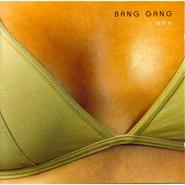
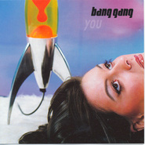

Bang Gang
============================

|  |  |
| :--: | :-- |
| [ Bang Gang](https://i.xiami.com/banggang) | **地区**: Iceland 冰岛 **风格**: 神游舞曲 Trip Hop, 缓拍 Downtempo, 电子 Electronic, 独立流行 Indie Pop **播放数**: 10030740 **粉丝数**: 65226 **评论数**: 1541  |

## 档案

“仿佛触摸到一个暖暖内含光般忧郁的灵魂” 
你已经找到完美的音乐伴随着你在漫长的黑夜中跳舞，眼前黑暗，但仍然充满着光和难忘的声音，音乐流露出如钻石般锐利的伤感，强烈的情感表达和电子乐的组合构成了BANG GANG。 
冰岛，这个人口只有20万左右的国家，在最近几年里却不断涌现出一批个性张扬桀骜不羁的优秀乐队，如Bjork、Gus Gus、Sigur ros、Aria、Singapore Sling、Emilana等，有意思的是，这些乐队的名字只频繁出现在电子和后摇类型中，而不是其他的类型。Bang Gang就是其中一支在Trip-Hop领域里浸淫很深的乐队。 
如果追溯Bang Gang的前身，实际上是由Bardi Johannsson和朋友Henrik Baldvin Bjornsson两人组成，并且是一个标准的Surf-band，在1996年推出的第一张EP《Listen Baby》为他们带来了最初的声誉，同时也宣告两人的合作关系就此结束。Bardi找来了一个来自冰岛的女声Esther Talia Casey，组成了一个新乐队并且为此命名为“Bang Gang&，乐队灵魂自然非Bardi Johannsson莫属。乐队在1998年由法国着名的Downtempo厂牌Yellow出版发行了首张大碟《You》的冰岛和韩国版，随后在2000年Yellow公司又发行了《You》的法国版。法国版的《You》相比98年的版本要多出两首混音的版本，分别是由Kid Loco操刀混音的“In heaven”和Doctor L跨刀混音的“Liar”。很多人以为Bardi和Kid Loco等人很熟悉，其实不然，对此Bardi曾经在采访中这么说道：“我并不知道他但我们同签约在一家法国的唱片公司，仅此而已。”对于这个法国Downtempo界的红人，Bardi的表现并不象一些人所想的那般很激动，Bardi接着说道：“我觉得Kid Loco的混音还不错，但我更喜欢他自己的唱片里的音乐，唱片公司寄给我们许多准备帮我们做混音的法国乐队的录音带，但我们听下来都不太喜欢。” 
Bardi对乐队在冰岛的唱片销售情况感到基本满意，他说：“《You》在冰岛一共卖出了2000张，差不多就是百分之一的冰岛人已经购买了我们的唱片。”但在冰岛他们还是属于比较地下的，不太知名，但随着最近这段时间频繁的一些欧洲国家之间的演出，相信他们已经开始越来越受人瞩目。更何况他们签约的是一家在法国乃至整个欧洲都很知名的厂牌：Yellow。 
Bardi Johannsson在音乐上的构想正好是如今风靡电子界的模式：鼓机节拍+女声。 
在Bardi的感觉中，女声要远比男声更富有吸引力，对听众来说也更乐意接受。虽然在他们的唱片《You》中你还可以找到另外两个女声Vietis和Sarah，但Bardi显然还不满足于这些女声的选择，他希望在今后能有机会和Hope Sandoval (Mazzy Star), Nina Person (Cardigans), Kim Deal (Breeders)这些乐队的女主唱合作。 
而在节拍的掌握感觉上，并不黑暗沉重，和Sneaker Pimps，Puracane等乐队一样，节拍上要比一般而言的Trip-Hop中习惯的节拍要快一些，飘一些。甚至偶尔也会有Drum&Bass的拍子出现在作品中。但总体而言，Bardi还是认为自己的音乐是以Trip-Hop为主，他这么来形容自己的音乐： 
“是以Trip-Hop为主，但同时受很多影响尤其是80年代的一些音乐元素，非常适合在做爱中播放的一种音乐。” 
封套的设计上是一个戴着胸罩的女性丰满胸部特写，其音乐是否也一样性感呢？让我们还是耳听为实： 
“Liar”的开头充满了妖气，一把提琴拉得旖旎妖艳风情万种，配上松脆的节拍，婉转的女声，又是一首很Easy Listening的作品。乐队很喜欢在作品中保留一段无人声的纯节拍，比如“Hazing Out”“Sleep”。 
“Falling Apart”的高潮曲调相当流畅动听，而且极易让人跟着旋律哼唱，如果放在一些KTV里或许算是一首很热门的点播歌曲。 
“Never Ever”是整张大碟中最出挑也是我最喜欢的一首作品，相对之前提到的“Liar”来说，这首作品缠绕的妖气要浓的多。单看歌词已经是五毒俱全，“crack your head/eat your heart/eat your shit/fuck me up bad”用词又狠又毒，一幅拼死拼活极尽恶毒的模样，虽然整首作品看起来描述的似乎是一个在感情迷雾中徘徊又怨又恨又爱又怜的复杂情绪，但在器乐和节拍的构筑上却相当妖魔化。从一开始的贝司Solo铺垫，然后是打击乐器的融入，再是两个低沉黑暗的男声切入，音调上介于走音的边缘上，轮到之后女声的正式加入时，其曲和唱腔上的配合着实让我惊艳了一把，节拍也回归到慢而重的Trip-Hop感觉上，一切都恰到好处。之后照例是一段纯节拍的过门，让我惊喜的是又一次听到了熟悉的老唱片杂音和开头的贝司声，这锅靓汤至此才算终于熬出了鲜味。 
令我惊喜的还有Bardi Johannsson和电影上的合作联系，很早Bardi就和David Lynch（国内翻译为大卫林奇）有过一次合作：为David Lynch的电影作品《Eraserhead》（国内翻译为《橡皮头》）创作过一首作品&In heaven& 。此后他的一首作品“Hazing Out”又入选了电影 &Blossi 810551&的原声。后来看采访才得知Bardi本人相当喜欢艺术电影，并且专门在一家冰岛报纸上写一些影评，他喜欢一些有着黑暗诡异氛围，结构奇特妖艳的导演作品，如David Cronenberg, David Lynch, Dario Argento等等。就Trip-Hop这种有着黑暗颓靡的气质音乐本身来说，确实相当适合拿来做这些拥有着同样气质电影的原声。 
距离发表处女大碟《You》已经有三年时间，Bardi Johannsson终于再次送上了他们的新作《Something Wrong》。仅从这次精心设计的封套上就可推测出新专辑将继续延续上张专辑荒芜孤寂的路线，但如果你有机会看过“Stop In The Name Of Love”这个作品的Video的话，你就会发现他们温存的一面。 
此外，这次最显着的变化来自于对真乐器的大量运用，和Archive、Blue States这些乐队一样，如果你没听过他们的早期作品，多半会误以为这是一支新晋英式乐队呢。由Esther主唱的开篇曲“Inside”，慢条斯理的真鼓节奏，略带悲伤的弦乐，让我们再次重温了一遍标准的Bang Gang味道。“ 
Something Wrong”的开头象是步入了一个曲径通幽的花园，但随后就让人大失所望。到是“Forward And Reverse”结尾部分的鼓击听来相当大气，富有气势。虽然有小猫般富有特色的女声Esther，但这次Bardi还是夺回了大多数作品的人声权利，不过老实说，他的声音太软太糯了，不太适合激烈的吉他伴奏，如果能找到一个更妖娆的男声的话，凭借“Find What You Get”这首英式吉他作品说不定都可以入围英国水星音乐奖。 
行文到最后，就让我们往唱片机里放上一张Bang Gang的唱片，象Bang Gang一样性感。 
Bang Gang, an Icelandic wonder, is actually a one-man band. The voice, instrumentalist, arranger and producer Bardi Johannsson began his silent career in a surf band, together with his friend Henrik Baldvin Bjornsson, who has later formed a band called Singapore Sling. Bardi started to dedicate himself to pop sound, collaborating with female singers, such as Esther Talia Casey and Vedis Hervor Arnadottir. His major works include a score and contributed songs to Ragnar Bragason’s first feature film, “Fiasco”, first album “You” (2000.)-including remixes by Kid Loco, and “Something Wrong” (2003).

## 专辑

| 名称 | 语种 | 唱片公司 | 发行时间 | 专辑类别 | 专辑风格 |
| :--: | :-- | :-- | :-- | :-- | :-- |
| [ Gucci](./albums/5021074902.md) | 英语 | Deep Bear | 2020年06月24日 | 录音室专辑 | 流行舞曲 Dance-Pop |
| [ Dive into the Deep Blue Sea](./albums/2102674393.md) | 英语 | Bang ehf. | 2016年11月14日 | EP, 单曲 |  |
| [ The Wolves Are Whispering](./albums/1333484563.md) | 英语 | Bangehf | 2015年06月23日 | 录音室专辑 | 神游舞曲 Trip Hop, 独立流行 Indie Pop |
| [ De toutes nos forcesThe Finishers](./albums/2102772231.md) | 纯音乐 | Nord-Ouest Films | 2014年03月24日 | 原声带, 影视音乐 |  |
| [ Sacred Universe - EP](./albums/2102772224.md) | 纯音乐 | Bang ehf | 2014年01月13日 | 原声带, 影视音乐 |  |
| [ W Y R (Original Motion Picture Score)](./albums/2102772211.md) | 纯音乐 | Bang ehf & Daniel Hunt | 2013年02月18日 | 原声带, 影视音乐 |  |
| [ Best of Bang Gang](./albums/1997545301.md) | 英语 | Bang ehf | 2012年07月09日 | 精选集 |  |
| [ The World Is Grey](./albums/5021070458.md) | 其他 | Discograph | 2009年01月12日 | 录音室专辑 | 另类摇滚 Alternative Rock |
| [ Ghosts From The Past](./albums/171705.md) | 英语 | Cod Music | 2008年05月21日 | 录音室专辑 | 神游舞曲 Trip Hop, 缓拍 Downtempo, 独立流行 Indie Pop |
| [ Find What You Get](./albums/534966.md) | 英语 | Bang ehf | 2006年11月06日 | EP, 单曲 | 神游舞曲 Trip Hop, 缓拍 Downtempo, 独立流行 Indie Pop |
| [ Something Wrong](./albums/169550.md) | 英语 | Bang ehf | 2003年06月01日 | 录音室专辑 | 神游舞曲 Trip Hop, 缓拍 Downtempo, 独立流行 Indie Pop |
| [ You](./albums/342569.md) | 英语 | East West, Sproti | 1998年11月01日 | 录音室专辑 | 神游舞曲 Trip Hop, 缓拍 Downtempo, 独立流行 Indie Pop |
| [ 【合并】You冰岛版](./albums/169548.md) | 英语 | Sproti | 1998年11月01日 | 录音室专辑 | 神游舞曲 Trip Hop, 缓拍 Downtempo, 独立流行 Indie Pop |

## 评论

|  |  |  |
| :-- | :-- | :-- |
|  [虾米用户](https://emumo.xiami.com/u/30074304) 寄蜉蝣于天地，渺沧海之一... 2021-01-02 22:15 赞(0) 踩(0) | 
✈
 |
|  [虾米用户](https://emumo.xiami.com/u/3008874) 什么时候遇见外星人/回宇... 2020-10-10 20:56 赞(1) 踩(0) | 
听了十多年了。
 |
|  [虾米用户](https://emumo.xiami.com/u/26033632) 一个纯粹的理想主义者～ 2020-08-22 17:53 赞(1) 踩(0) | 
网易云没版权只能来这听了
 |
|  [虾米用户](https://emumo.xiami.com/u/257103143) 音乐爱好者~ 2020-05-14 23:12 赞(0) 踩(0) | 
Added
 |
|  [虾米用户](https://emumo.xiami.com/u/355225671)   2020-05-08 13:30 赞(0) 踩(0) | 
2018年7月11日的上海场，你就站在我前边，你还记得吗？你在这里吗？
 |
|  [虾米用户](https://emumo.xiami.com/u/326648321)  2020-02-14 17:53 赞(0) 踩(0) | 
来西安了我都不知道 
 |
|  [虾米用户](https://emumo.xiami.com/u/374949008) 想将春天的花香揉碎进眼睛... 2020-02-12 18:48 赞(0) 踩(0) | 
我还是没办法去看唉
 |
|  [虾米用户](https://emumo.xiami.com/u/8144140) 我还没想好要写什么... 2020-02-05 19:44 赞(0) 踩(0) | 
邪恶的乐队名
 |
|  [虾米用户](https://emumo.xiami.com/u/31200738)  2020-01-21 15:18 赞(0) 踩(0) | 
啊
 |
|  [虾米用户](https://emumo.xiami.com/u/3855996) 昭和男儿 2020-01-11 07:14 赞(0) 踩(0) | 
乍看乐队名吓一激灵
 |
|  [虾米用户](https://emumo.xiami.com/u/6805789)  2019-07-28 21:58 赞(0) 踩(0) | 
我记得这家伙现场看起来也冷冷的哈哈，妹子很可爱。
 |
|  [虾米用户](https://emumo.xiami.com/u/9523997) 天地为炉 2019-06-06 15:38 赞(0) 踩(0) | 
来演出吧
 |
|  [虾米用户](https://emumo.xiami.com/u/46467302)  2019-06-03 03:07 赞(0) 踩(0) | 
Ö
 |
|  [虾米用户](https://emumo.xiami.com/u/11446884) New York MoM... 2019-06-02 22:16 赞(0) 踩(0) | 
原来我以前就认识大神了。听的最多的就是forever now。
 |
|  [虾米用户](https://emumo.xiami.com/u/330900828) 高舉一面五星紅旗在蝦米！ 2019-05-24 13:53 赞(0) 踩(0) | 

 |
|  [虾米用户](https://emumo.xiami.com/u/320754158)  2019-05-12 13:38 赞(1) 踩(0) | 
过
 |
|  [虾米用户](https://emumo.xiami.com/u/340903899) 我还没想好要写什么... 2019-05-03 19:44 赞(2) 踩(0) | 
。
 |
|  [虾米用户](https://emumo.xiami.com/u/418947751) 嘿 你也抽烟吗 2019-04-19 23:09 赞(1) 踩(0) | 
lady&amp;bird
 |
|  [虾米用户](https://emumo.xiami.com/u/276944698) 不要自我设限..... 2019-04-06 12:24 赞(1) 踩(0) | 
1224
 |
|  [虾米用户](https://emumo.xiami.com/u/23597938) 我爱的女人过于优秀了 2019-04-02 19:24 赞(0) 踩(0) | 
卧槽，这是只有虾米有版权吗
 |
|  [虾米用户](https://emumo.xiami.com/u/11856095) 正 是 2019-03-21 03:48 赞(1) 踩(0) | 
17年错过了 来巡演吧
 |
|  [虾米用户](https://emumo.xiami.com/u/3008874) 什么时候遇见外星人/回宇... 2019-03-10 11:24 赞(1) 踩(0) | 
高中时候很喜欢的乐队。
 |
|  [虾米用户](https://emumo.xiami.com/u/350262065)  2019-02-14 21:01 赞(0) 踩(0) | 
来南昌吧，
 |
|  [虾米用户](https://emumo.xiami.com/u/18614661) 2013.11.26 2019-02-09 10:47 赞(0) 踩(0) | 
/
 |
|  [虾米用户](https://emumo.xiami.com/u/316509349) 梦是不死的欲望 2018-12-27 10:54 赞(0) 踩(0) | 
错过
 |
|  [虾米用户](https://emumo.xiami.com/u/46844027) 礼帽与盾 2018-10-28 20:55 赞(21) 踩(0) | 
不想让别人喜欢自己喜欢的乐队是什么想法啊，你们是想让歌手用爱发电吗，维护乐队不用钱吗，发专辑不用钱吗？为了自己一点“小众”的虚荣心天天希望喜欢的乐队没人喜欢最后解散吗，哪个做音乐的不希望得到别人的认可啊，真是奇奇怪怪又自私的心理啊。。。
 |
| ⇒ |  [虾米用户](https://emumo.xiami.com/u/751372)  2019-03-22 23:11 赞(0) 踩(0) | 
能理解但是不認同，任何藝術不擁抱商業都是悲劇，看看歐洲美術史就想通了
 |
| ⇒ |  [虾米用户](https://emumo.xiami.com/u/224280740) 我还没想好要写什么... 2020-06-19 01:06 赞(0) 踩(0) | 
感觉这种想法的人就是装逼啊。好像乐队被大多人知道就后显不出自己多独特似的。
 |
|  [虾米用户](https://emumo.xiami.com/u/7202885) 不能救我，只能爱我。 2018-10-17 09:54 赞(1) 踩(0) | 
想跟他分享。算了。不可能了。
 |
|  [虾米用户](https://emumo.xiami.com/u/339191478)   2018-10-14 09:34 赞(2) 踩(0) | 
❤
 |
|  [虾米用户](https://emumo.xiami.com/u/7202885) 不能救我，只能爱我。 2018-10-13 17:56 赞(0) 踩(0) | 
等下次来
 |
|  [虾米用户](https://emumo.xiami.com/u/349659834) 身披浴血的蔷薇 2018-08-31 15:31 赞(0) 踩(0) | 
啊啊啊找到他了(ಥ_ಥ)
 |
|  [虾米用户](https://emumo.xiami.com/u/38626334) 可能 或许 大概 是个好... 2018-08-29 03:09 赞(3) 踩(0) | 
五十岁之前你要是还没结婚，我就去找你，还有七年，我会坦然面对八千多公里的距离，过完没有你的七年之痒，分开一年了，还会分开很多年，我很难过，我爱你
 |
|  [虾米用户](https://emumo.xiami.com/u/306248939) . 2018-08-23 23:58 赞(0) 踩(0) | 
喜歡
 |
|  [虾米用户](https://emumo.xiami.com/u/329437353) 银河修理员 2018-08-21 18:49 赞(0) 踩(0) | 
有点帅
 |
|  [虾米用户](https://emumo.xiami.com/u/10028400) 我还没想好要写什么... 2018-08-08 06:01 赞(0) 踩(0) | 

 |
|  [虾米用户](https://emumo.xiami.com/u/287003937)  2018-07-20 21:45 赞(0) 踩(0) | 
久违了的冰岛！
 |
|  [虾米用户](https://emumo.xiami.com/u/2155242) 我还没想好要写什么... 2018-07-13 17:32 赞(0) 踩(0) | 
今晚见
 |
|  [虾米用户](https://emumo.xiami.com/u/21573835) Can YOU Stay 2018-07-13 12:11 赞(0) 踩(0) | 
明晚深圳见 
 |
|  [虾米用户](https://emumo.xiami.com/u/318592912)  2018-07-12 11:30 赞(0) 踩(0) | 
明天晚上广州mao live，有一张赠票，需要的私聊
 |
|  [虾米用户](https://emumo.xiami.com/u/10904821) 小郭侦探社美男助理 2018-07-09 11:03 赞(0) 踩(0) | 
半价出两张广州 
 |
|  [虾米用户](https://emumo.xiami.com/u/30116982)  2018-06-28 14:18 赞(0) 踩(0) | 
7月见
 |
|  [虾米用户](https://emumo.xiami.com/u/9970143) 虾米爱你 2018-06-26 08:12 赞(0) 踩(0) | 
ST暗白
 |
|  [虾米用户](https://emumo.xiami.com/u/1929787) 让一部分非洲大人富起来，... 2018-06-17 15:47 赞(0) 踩(0) | 
冰岛足球现在也好猛啊
 |
|  [虾米用户](https://emumo.xiami.com/u/39850091) 死于心碎  2018-06-11 02:51 赞(0) 踩(0) | 
。
 |
|  [虾米用户](https://emumo.xiami.com/u/73790620)  2018-06-07 15:44 赞(0) 踩(0) | 
只有四城呐 
 |
|  [虾米用户](https://emumo.xiami.com/u/321098961) 向内认知，向外行走 2018-06-04 00:46 赞(1) 踩(0) | 
曲风不同，做不了朋友
 |
|  [虾米用户](https://emumo.xiami.com/u/321098961) 向内认知，向外行走 2018-06-04 00:46 赞(2) 踩(0) | 
孤独的人只想和孤独的人做朋友
 |
|  [虾米用户](https://emumo.xiami.com/u/321098961) 向内认知，向外行走 2018-06-04 00:45 赞(2) 踩(0) | 
孤独的人只愿意遇到孤独的人
 |
|  [虾米用户](https://emumo.xiami.com/u/250847378) 虾米的每次改版我都看在眼... 2018-05-29 00:50 赞(0) 踩(0) | 
【2018巡演】7月10日北京@糖果_TANGO 、7月11日上海@ModernSkyLAB上海、 7月13日廣州 @MAOLivehouse廣州 、7月14日深圳 @A8Live 購片鏈接:<a href="http://t.cn/R3dWMU8" target="_blank" rel="nofollow noreferrer noopener">http://t.cn/R3dWMU8</a> 全平台同時上線！各大票務網站都可購票@大麥網 @秀動ShowStart @格瓦拉生活 @247tickets 更多詳情請關注@騰踔娛樂
 |
|  [虾米用户](https://emumo.xiami.com/u/1689069)  2018-05-28 19:17 赞(0) 踩(0) | 
大麦有票务，已下单
 |
|  [虾米用户](https://emumo.xiami.com/u/2156426) 天天听歌，佛系交友 2018-05-24 01:01 赞(1) 踩(0) | 
又要来啦？
 |
|  [虾米用户](https://emumo.xiami.com/u/68935180) 但愿你 旅途漫长 2018-05-20 08:52 赞(0) 踩(0) | 
7月见
 |
|  [虾米用户](https://emumo.xiami.com/u/8542277) 一 2018-05-18 11:28 赞(0) 踩(0) | 
要来咯7月
 |
|  [虾米用户](https://emumo.xiami.com/u/54667291) 我还没想好要写什么... 2018-05-18 00:00 赞(0) 踩(0) | 
觉得很温柔
 |
|  [虾米用户](https://emumo.xiami.com/u/10000610) 有人造屋 有人绣花 有人... 2018-05-03 19:41 赞(0) 踩(0) | 
比心❤
 |
|  [虾米用户](https://emumo.xiami.com/u/33923461) 00:00 2018-05-02 00:52 赞(0) 踩(0) | 
❤️
 |
|  [虾米用户](https://emumo.xiami.com/u/73790620)  2018-04-12 17:12 赞(0) 踩(0) | 
今年来演出吗
 |
| ⇒ |  [虾米用户](https://emumo.xiami.com/u/8542277) 一 2018-05-18 11:28 赞(0) 踩(0) | 
7月
 |
|  [虾米用户](https://emumo.xiami.com/u/66823378)  2018-04-06 23:19 赞(0) 踩(0) | 

 |
|  [虾米用户](https://emumo.xiami.com/u/20177386) 感谢一切美好的遇见❤️ 2018-03-29 14:48 赞(0) 踩(0) | 

 |
|  [虾米用户](https://emumo.xiami.com/u/3250268) 一首好歌都比爱一个人长久... 2018-03-22 23:00 赞(2) 踩(0) | 
我真的 真的超级 超级喜欢bang gang
 |
|  [虾米用户](https://emumo.xiami.com/u/10671027) sos 2018-03-19 22:56 赞(2) 踩(0) | 
再也不想错过现场
 |
|  [虾米用户](https://emumo.xiami.com/u/40043797) 世界游民 2018-03-07 23:40 赞(1) 踩(0) | 
本命
 |
|  [虾米用户](https://emumo.xiami.com/u/44549461)  2018-02-11 00:24 赞(3) 踩(0) | 
看过一次现场，好像再去一次啊
 |
|  [虾米用户](https://emumo.xiami.com/u/262249056) Life & I are... 2018-01-24 23:18 赞(21) 踩(0) | 
第一次看歌手艺名的时候看成了「Gang Bang」，心想这也太奔放了吧
 |
| ⇒ |  [虾米用户](https://emumo.xiami.com/u/349501932)  2019-02-11 20:16 赞(0) 踩(0) | 
+1
 |
| ⇒ |  [虾米用户](https://emumo.xiami.com/u/124729682) 谁说我头像画的不好？ 2019-04-05 12:34 赞(0) 踩(0) | 
<q><b>二维子vivi说：</b></q>
 |
|  [虾米用户](https://emumo.xiami.com/u/3556002) wubba lubba 2018-01-18 18:14 赞(0) 踩(0) | 
☁️
 |
|  [虾米用户](https://emumo.xiami.com/u/296452638)  2018-01-16 03:43 赞(3) 踩(0) | 
太喜欢这种丧中带甜的感觉了！
 |
|  [虾米用户](https://emumo.xiami.com/u/49748006) Fly me to th... 2017-12-31 12:05 赞(1) 踩(0) | 
-
 |
|  [虾米用户](https://emumo.xiami.com/u/973635) 杂食动物 2017-12-26 11:34 赞(0) 踩(0) | 
泪目
 |
|  [虾米用户](https://emumo.xiami.com/u/40043797) 世界游民 2017-12-18 21:49 赞(1) 踩(0) | 
在艰难的日子里陪着我的
 |
|  [虾米用户](https://emumo.xiami.com/u/257592995) 身未动，心以远 2017-12-14 07:13 赞(0) 踩(0) | 
弗朗基米尔
 |
|  [虾米用户](https://emumo.xiami.com/u/9154037) 到水星散心去了。 2017-11-30 12:31 赞(2) 踩(0) | 
好久不听了...哈
 |
|  [虾米用户](https://emumo.xiami.com/u/10028400) 我还没想好要写什么... 2017-11-26 09:41 赞(0) 踩(0) | 

 |
|  [虾米用户](https://emumo.xiami.com/u/35660305)   2017-10-30 10:01 赞(5) 踩(0) | 
想弄个微信群 大家一起分享好听的歌 我喜欢nirvana、the beatles、radiohead、banggang 等等 有感兴趣的吗 我这儿人少 加我 告诉我你是虾米看到的
 |
|  [虾米用户](https://emumo.xiami.com/u/420330) 乌克兰后摇乐队，签约中国... 2017-10-28 00:01 赞(2) 踩(0) | 
冰岛乐队Bang Gang 2014“Forever Now”中国巡演 9.26 北京 愚公移山; 9.27 上海 浅水湾文化艺术中心; 9.28 深圳 B10现场; 9.30 香港 Music Zone; 10.2 广州 TU凸空间 购票： <a href="http://www.douban.com/event/21791786/" target="_blank" rel="nofollow noreferrer noopener">http://www.douban.com/event/21791786/</a> <a href="http://www.zhongchou.cn/deals/r-di-k-bang" target="_blank" rel="nofollow noreferrer noopener">http://www.zhongchou.cn/deals/r-di-k-bang</a>
 |
|  [虾米用户](https://emumo.xiami.com/u/32320260) kiss me 2017-10-27 23:33 赞(0) 踩(0) | 
BG的微博回复我说并没有下架 但是虾米的确是下架了 个中缘由可能只有代理知道 呵呵
 |
| ⇒ |  [虾米用户](https://emumo.xiami.com/u/38626334) 可能 或许 大概 是个好... 2017-12-03 21:01 赞(0) 踩(0) | 
被之前的负责团队骗了。把他的版权卖了。他本人是不知情的。
 |
|  [虾米用户](https://emumo.xiami.com/u/41250049)  2017-10-27 23:31 赞(1) 踩(0) | 
冰岛乐队BangGang2015年新专辑首发中国巡演路线 【上海站】<a href="http://www.douban.com/event/24509482/?qq-pf-to=pcqq.c2c" target="_blank" rel="nofollow noreferrer noopener">http://www.douban.com/event/24509482/?qq-pf-to=pcqq.c2c</a> 【时间】 2015年11月14日 周六 【票价】预售票：240元/人 现场票：300元/人 【场地】 MAO LiveHouse 【地址】上海黄浦区重庆南路308号3楼(近建国中路)
 |
|  [虾米用户](https://emumo.xiami.com/u/41250049)  2017-10-27 23:31 赞(1) 踩(0) | 
冰岛乐队BangGang2015年新专辑首发中国巡演路线： 【重庆站】<a href="http://www.douban.com/event/24509859/?qq-pf-to=pcqq.c2c" target="_blank" rel="nofollow noreferrer noopener">http://www.douban.com/event/24509859/?qq-pf-to=pcqq.c2c</a> 【时间】 2015年11月18日 周三 【票价】预售票：130元/人 现场票：160元/人 【场地】 坚果live house 【地址】渝中区较场口得意潮馆B1-21
 |
|  [虾米用户](https://emumo.xiami.com/u/49989091)  2017-10-27 23:00 赞(6) 踩(0) | 
2015年bang gang中国巡演各站签售排号 链接：<a href="https://item.taobao.com/item.htm?spm=a1z10.1-c.w4004-12427955624.26.0NDInp&amp;id=522030383696" target="_blank" rel="nofollow noreferrer noopener">https://item.taobao.com/item.htm?spm=a1z10.1-c.w4004-12427955624.26.0NDInp&amp;id=522030383696</a>  【EyesWideOpen呈现】冰岛乐队BangGang2015年中国巡演 预售票链接：<a href="https://item.taobao.com/item.htm?spm=a1z10.1-c.w4004-12427955624.2.0NDInp&amp;id=522047361281" target="_blank" rel="nofollow noreferrer noopener">https://item.taobao.com/item.htm?spm=a1z10.1-c.w4004-12427955624.2.0NDInp&amp;id=522047361281</a>
 |
|  [虾米用户](https://emumo.xiami.com/u/7716224) 我等你 2017-10-27 22:59 赞(1) 踩(0) | 
新砖歌词快来哪位大大搞上去，11.18重庆坚果，本宝宝要去膜拜 
 |
|  [虾米用户](https://emumo.xiami.com/u/2863100) 前尘湮灭,化作乌有. 2017-10-24 15:03 赞(3) 踩(0) | 
时隔那么多年再听到这永不会忘的旋律，还是没忍住红了眼眶，毕竟过去是真沉浸在这其中太久，bang gang的歌就像他们的封面一样，给我一种灰色地带的安全感。现在回想起来，喜欢听Bang Gang歌的人大多都有一颗空荡得只能住下音乐的心，飘忽的眼神，沉默的嘴角.......7年多来，手机里一直有bang gang的歌，但每播到几个音符前奏，我总立马切歌跳过，是不想听歌，也是不想听回忆了，但也是每一次内存不够也决不会删的歌。也许是我喜新厌旧，也许是我心态变了，有很多也许......他一直活在我的手机里，也活在我的过去里，某种角度来说，我再不会主动去听bang gang曾经的歌 ，于我而言，该是好的。
 |
|  [虾米用户](https://emumo.xiami.com/u/1182761) 松任谷由实的迷弟 2017-10-14 21:51 赞(1) 踩(0) | 
著名“通州乐队"
 |
|  [虾米用户](https://emumo.xiami.com/u/66823378)  2017-10-14 10:20 赞(2) 踩(0) | 

 |
|  [虾米用户](https://emumo.xiami.com/u/49959840) 无聊人 2017-10-04 20:16 赞(1) 踩(0) | 
☁️
 |
| ⇒ |  [虾米用户](https://emumo.xiami.com/u/321098961) 向内认知，向外行走 2018-06-04 13:28 赞(0) 踩(0) | 
你头像真好看
 |
|  [虾米用户](https://emumo.xiami.com/u/31793977)  2017-09-24 09:08 赞(1) 踩(0) | 
淡淡的忧伤
 |
|  [虾米用户](https://emumo.xiami.com/u/18584625) 单念dàn ：拜托 ） 2017-09-15 22:22 赞(3) 踩(0) | 
这一秒钟好想哭
 |
|  [虾米用户](https://emumo.xiami.com/u/50093825) 。 2017-09-12 01:49 赞(1) 踩(0) | 
: )
 |
|  [虾米用户](https://emumo.xiami.com/u/2495753) 暂无签名~ 2017-09-06 04:07 赞(1) 踩(0) | 
还以为是十几二十年前的乐队
 |
| ⇒ |  [虾米用户](https://emumo.xiami.com/u/1689069)  2018-07-10 18:24 赞(0) 踩(0) | 
有十几年了
 |
|  [虾米用户](https://emumo.xiami.com/u/312874366) 我还没想好要写什么... 2017-09-03 13:10 赞(1) 踩(0) | 
试听
 |
|  [虾米用户](https://emumo.xiami.com/u/3679082)   2017-08-20 21:21 赞(3) 踩(0) | 
喜欢gang bang
 |
| ⇒ |  [虾米用户](https://emumo.xiami.com/u/32549553)   2017-09-25 23:46 赞(0) 踩(0) | 
banggang似乎和gangbang有不解之缘
 |
|  [虾米用户](https://emumo.xiami.com/u/124017858) 我还没想好要写什么... 2017-08-11 16:40 赞(0) 踩(0) | 
从初中用小诺基亚的时候手机里就存满了他们的歌  现在已经高中毕业  我这个人私心很重  看到他们越来越火  感觉自己在心中小心翼翼保护的小天地被公之于众
 |
|  [虾米用户](https://emumo.xiami.com/u/89145302) 讚美黑夜。榮耀歸於吾主。 2017-07-13 10:36 赞(0) 踩(0) | 
iamx的翻版
 |
|  [虾米用户](https://emumo.xiami.com/u/89145302) 讚美黑夜。榮耀歸於吾主。 2017-07-13 10:35 赞(1) 踩(0) | 

 |
|  [虾米用户](https://emumo.xiami.com/u/2734590) 在国企上班的咖啡师. 2017-07-07 22:58 赞(1) 踩(0) | 
这首歌真是听多少次都想哭。
 |
|  [虾米用户](https://emumo.xiami.com/u/11865653) 要成为理想世界的缔造者和... 2017-05-22 10:07 赞(0) 踩(0) | 
跟Lady &amp;amp;amp; Bird什么关系！这个男的我认出来了，妹子也是同一个人吗？
 |
| ⇒ |  [虾米用户](https://emumo.xiami.com/u/38626334) 可能 或许 大概 是个好... 2017-05-25 00:42 赞(0) 踩(0) | 
他有三个乐队，L&amp;amp;B是其中一个。他们是好朋友。
 |
| ⇒ |  [虾米用户](https://emumo.xiami.com/u/11865653) 要成为理想世界的缔造者和... 2017-05-25 01:16 赞(0) 踩(0) | 
<q><b>LILIHILILIHI说：</b></q>
 |
| ⇒ |  [虾米用户](https://emumo.xiami.com/u/1689069)  2018-07-10 18:25 赞(0) 踩(0) | 
<q><b>星野结夏说：</b></q>
 |
| ⇒ |  [虾米用户](https://emumo.xiami.com/u/6805789)  2019-07-28 22:00 赞(0) 踩(0) | 
妹子不是同一个
 |
| ⇒ |  [虾米用户](https://emumo.xiami.com/u/11865653) 要成为理想世界的缔造者和... 2019-07-28 22:16 赞(0) 踩(0) | 
<q><b>nomili说：</b></q>
 |
|  [虾米用户](https://emumo.xiami.com/u/288957210)  2017-05-19 18:31 赞(0) 踩(0) | 
呵
 |
|  [虾米用户](https://emumo.xiami.com/u/38626334) 可能 或许 大概 是个好... 2017-05-11 12:13 赞(2) 踩(0) | 
Bang Gang 唯一官方微信粉丝群。入群请私信。❤️
 |
| ⇒ |  [虾米用户](https://emumo.xiami.com/u/8248617)   2017-05-21 17:11 赞(0) 踩(0) | 
舉手
 |
| ⇒ |  [虾米用户](https://emumo.xiami.com/u/20602973) ○ω● ＞﹏＜ 2017-08-25 20:53 赞(0) 踩(0) | 
我也要我也要
 |
|  [虾米用户](https://emumo.xiami.com/u/6551425)  降落 2017-05-10 04:10 赞(1) 踩(0) | 
现场沉醉如诗。
 |
|  [虾米用户](https://emumo.xiami.com/u/12516980) 每天刷歌一小时 2017-05-09 15:28 赞(1) 踩(0) | 
大概会是今夏最爱的声音
 |
|  [虾米用户](https://emumo.xiami.com/u/46598489) 你好吗 2017-05-07 23:49 赞(1) 踩(0) | 
今晚广州 感恩
 |
|  [虾米用户](https://emumo.xiami.com/u/868750)  2017-05-07 09:25 赞(1) 踩(0) | 
Trip Hop 和 后摇（Post Rock） <a href="https://www.zhihu.com/question/28611088" target="_blank" rel="nofollow noreferrer noopener">https://www.zhihu.com/question/28611088</a>
 |
|  [虾米用户](https://emumo.xiami.com/u/5755327)  2017-05-06 23:56 赞(2) 踩(0) | 
一个人就去听了，收获满满的回来，最后的飞吻真是甜炸！
 |
|  [虾米用户](https://emumo.xiami.com/u/235409281)  2017-05-06 23:28 赞(3) 踩(0) | 
为了听现场特意从南京跑到上海&amp;hellip;&amp;hellip;结束后感觉一切都太值得了！没有想到真的会返场，听到It&amp;#39;s alright的时候差点哭出来。不论是从Bardi，整个乐队还是大家那里，都感受到了满满的爱(*˘︶˘*).。.:*♡
 |
| ⇒ |  [虾米用户](https://emumo.xiami.com/u/38939973)   2017-05-08 22:09 赞(0) 踩(0) | 
同喜爱it&amp;#39;s alright
 |
| ⇒ |  [虾米用户](https://emumo.xiami.com/u/235409281)  2017-05-09 19:51 赞(0) 踩(0) | 
<q><b>PAULA07说：</b></q>
 |
| ⇒ |  [虾米用户](https://emumo.xiami.com/u/38939973)   2017-05-09 19:55 赞(0) 踩(0) | 
<q><b>远移说：</b></q>
 |
|  [虾米用户](https://emumo.xiami.com/u/18139018) 再见啦 2017-05-06 19:31 赞(1) 踩(0) | 
5.7廣州有人一起麼
 |
| ⇒ |  [虾米用户](https://emumo.xiami.com/u/50792813) 爱你 虾米 2017-05-06 20:02 赞(0) 踩(0) | 
我
 |
|  [虾米用户](https://emumo.xiami.com/u/5486926) 阿 梭 2017-05-06 08:29 赞(4) 踩(0) | 
昨天的Bardi出乎意料好温柔，看着一副超级冷淡的样子，唱到后来问大家找一下调音夹，所有人指着话筒架说这这这，他就不好意思笑说自己不擅长找东西。还因为自己要换琴把女声拉出来和大家学中文，开口问大家sweet怎么说，有人答you，好啦大家都很sweet了。
 |
|  [虾米用户](https://emumo.xiami.com/u/9240235)  2017-05-06 00:59 赞(2) 踩(0) | 
北京站糖果live归来，现场好的漂亮妹子 
 |
|  [虾米用户](https://emumo.xiami.com/u/9113599) 在最后审判中 仅有眼泪可... 2017-05-05 17:10 赞(1) 踩(0) | 
今晚我们单枪匹马北京见
 |
|  [虾米用户](https://emumo.xiami.com/u/42989678) 勇敢 2017-05-04 13:31 赞(2) 踩(0) | 
广州 走起
 |
|  [虾米用户](https://emumo.xiami.com/u/9557138) 失我焉支山，令我妇女无颜... 2017-05-04 10:05 赞(0) 踩(0) | 
有人整理过昨天成都站演出曲目吗？有一首好像没听过，找不到&amp;hellip;&amp;hellip;
 |
|  [虾米用户](https://emumo.xiami.com/u/5114540) 我还没想好要写什么... 2017-05-03 23:30 赞(2) 踩(0) | 
安可国际通用
 |
|  [虾米用户](https://emumo.xiami.com/u/5114540) 我还没想好要写什么... 2017-05-03 23:30 赞(3) 踩(0) | 
成都今天嗨爆
 |
|  [虾米用户](https://emumo.xiami.com/u/4993888) 、 2017-05-03 20:19 赞(0) 踩(0) | 
今天谁在。cd 。。。
 |
|  [虾米用户](https://emumo.xiami.com/u/1115247) @Nebula_7293 2017-05-01 18:00 赞(1) 踩(0) | 
5.2 重庆有人一起吗
 |
|  [虾米用户](https://emumo.xiami.com/u/8715231)  2017-04-29 14:30 赞(1) 踩(0) | 
5.6上海好想去啊呜呜呜呜呜
 |
| ⇒ |  [虾米用户](https://emumo.xiami.com/u/34961561) 我希望音乐没有间隙 我不... 2017-05-05 09:57 赞(0) 踩(0) | 
同哭哭
 |
|  [虾米用户](https://emumo.xiami.com/u/7707219) 我想知道如何用爱换取爱，... 2017-04-29 08:22 赞(1) 踩(0) | 
成都
 |
|  [虾米用户](https://emumo.xiami.com/u/240451761)  2017-04-26 11:59 赞(0) 踩(0) | 
西安的 5.1有人一起吗
 |
| ⇒ |  [虾米用户](https://emumo.xiami.com/u/133290486) 问心只妄想跟你快乐牧羊 2017-04-30 12:06 赞(0) 踩(0) | 
有！
 |
| ⇒ |  [虾米用户](https://emumo.xiami.com/u/11662974) All for you 2017-05-01 19:27 赞(0) 踩(0) | 
<q><b>两行波德莱尔说：</b></q>
 |
|  [虾米用户](https://emumo.xiami.com/u/5486926) 阿 梭 2017-04-25 13:14 赞(0) 踩(0) | 
要一個人去糖果看BG了耶
 |
|  [虾米用户](https://emumo.xiami.com/u/370589)   2017-04-23 09:57 赞(1) 踩(0) | 
30号草莓
 |
|  [虾米用户](https://emumo.xiami.com/u/1718024)  2017-04-13 07:49 赞(0) 踩(0) | 
出两张4.15 伦敦场的票 Rachael Yamagata
 |
|  [虾米用户](https://emumo.xiami.com/u/2993956) 可掌握奇異能量 2017-04-11 21:34 赞(1) 踩(0) | 
北京已买
 |
|  [虾米用户](https://emumo.xiami.com/u/54537050) 我还没想好要写什么... 2017-04-10 19:16 赞(0) 踩(0) | 
☁
 |
|  [虾米用户](https://emumo.xiami.com/u/8793244) 我是天才 2017-04-10 17:29 赞(0) 踩(0) | 
五一要搞什么数模比赛去不了呀好烦( ๑ŏ ﹏ ŏ๑ )
 |
|  [虾米用户](https://emumo.xiami.com/u/14842075) Trust is ear... 2017-04-10 09:11 赞(0) 踩(0) | 
今年的票价太贵了。。。
 |
|  [虾米用户](https://emumo.xiami.com/u/33864541) 我头像像不像CD 2017-04-09 18:39 赞(0) 踩(0) | 
其实最早一次巴蒂来我还是很喜欢他音乐和人的。后来几番动作和表述&amp;hellip;&amp;hellip;他可能对他在中国的受众和他现在的位置有点点误解。好啦还是好好听歌吧
 |
| ⇒ |  [虾米用户](https://emumo.xiami.com/u/38626334) 可能 或许 大概 是个好... 2017-05-01 09:34 赞(0) 踩(0) | 
？？？？？ Bardi怎么了? 他很喜欢中国啊 而且巡演的思吉他一点也不了解 都是国内承办商给他安排的 他连门票多少钱都不知道
 |
|  [虾米用户](https://emumo.xiami.com/u/33397434) 我还没想好要写什么... 2017-04-09 17:11 赞(3) 踩(0) | 
广州约起来
 |
|  [虾米用户](https://emumo.xiami.com/u/71093054) 我还没想好要写什么... 2017-04-09 12:03 赞(2) 踩(0) | 
西安站，已买。
 |
| ⇒ |  [虾米用户](https://emumo.xiami.com/u/2658935)  2017-04-14 09:42 赞(0) 踩(0) | 
哪儿买的能说下么？
 |
| ⇒ |  [虾米用户](https://emumo.xiami.com/u/71093054) 我还没想好要写什么... 2017-04-14 09:42 赞(0) 踩(0) | 
<q><b>瀛川说：</b></q>
 |
|  [虾米用户](https://emumo.xiami.com/u/12495473)   2017-04-09 11:47 赞(1) 踩(0) | 
又来广州啦。来个女生一起去
 |
|  [虾米用户](https://emumo.xiami.com/u/40441728) 我们的孤独像是一种与生俱... 2017-04-09 11:24 赞(3) 踩(0) | 
实在感谢来西安，banggang 是冰岛除了sigur ros 最喜欢的一个乐队。早上买票的时候差点激动到哭出来。我买痛仰票的时候都没这么积极。啊真是感谢
 |
| ⇒ |  [虾米用户](https://emumo.xiami.com/u/277150100) 我还没想好要写什么... 2017-05-01 15:32 赞(0) 踩(0) | 
这两个乐队也是我的心头肉啊嘤嘤嘤
 |
| ⇒ |  [虾米用户](https://emumo.xiami.com/u/11662974) All for you 2017-05-01 19:29 赞(0) 踩(0) | 
哈哈哈 我也是 痛仰能见到的机会太多 BG在西安真是难得
 |
|  [虾米用户](https://emumo.xiami.com/u/7987622) 暂无签名~ 2017-04-09 10:49 赞(0) 踩(0) | 
新巡演诶！然而没南京
 |
|  [虾米用户](https://emumo.xiami.com/u/44549461)  2017-04-05 21:37 赞(1) 踩(0) | 
西安！
 |
| ⇒ |  [虾米用户](https://emumo.xiami.com/u/1866707) 音乐果然什么都能治愈~ 2017-04-09 11:08 赞(0) 踩(0) | 
知道哪里有卖票的吗？为什么音乐厅官网没显示有这场啊。。。
 |
| ⇒ |  [虾米用户](https://emumo.xiami.com/u/40441728) 我们的孤独像是一种与生俱... 2017-04-09 11:26 赞(0) 踩(0) | 
<q><b>紫说：</b></q>
 |
| ⇒ |  [虾米用户](https://emumo.xiami.com/u/1866707) 音乐果然什么都能治愈~ 2017-04-09 11:33 赞(0) 踩(0) | 
<q><b>方糖加水说：</b></q>
 |
| ⇒ |  [虾米用户](https://emumo.xiami.com/u/40441728) 我们的孤独像是一种与生俱... 2017-04-09 11:34 赞(0) 踩(0) | 
<q><b>紫说：</b></q>
 |
|  [虾米用户](https://emumo.xiami.com/u/36471014) oi to the wo... 2017-04-03 10:32 赞(0) 踩(0) | 
上海 上海！
 |
|  [虾米用户](https://emumo.xiami.com/u/248591833) 玩音乐，看演出，找乐子 2017-03-31 11:54 赞(3) 踩(0) | 
【inSide呈现】2017年冰岛Bang Gang中国巡演 <a href="http://www.gopiaowu.cn/index_show.html?id=4544&amp;amp;amp;referrers=index" target="_blank" rel="nofollow noreferrer noopener">http://www.gopiaowu.cn/index_show.html?id=4544&amp;amp;amp;referrers=index</a> 5月2日重庆 场地：mao live house 5月3日成都 场地：小酒馆空间 5月5日 北京 场地：糖果一层（格瓦拉生活：糖果live） 5月6日 上海 场地：浅水湾小剧场（万代南梦宫） 5月7日 广州 场地：TU空间
 |
| ⇒ |  [虾米用户](https://emumo.xiami.com/u/35088550) 对不起。 2017-04-09 10:52 赞(0) 踩(0) | 
没武汉
 |
|  [虾米用户](https://emumo.xiami.com/u/13526500) Comment ça v... 2017-03-20 07:09 赞(3) 踩(0) | 
额...上海有人组团么  飘过问一下
 |
| ⇒ |  [虾米用户](https://emumo.xiami.com/u/39331279)   2017-04-21 18:42 赞(0) 踩(0) | 
有吗 算我 
 |
| ⇒ |  [虾米用户](https://emumo.xiami.com/u/13526500) Comment ça v... 2017-04-22 22:55 赞(0) 踩(0) | 
<q><b>Fu说：</b></q>
 |
|  [虾米用户](https://emumo.xiami.com/u/180847) 只有心知道 岁月不宽宏 2017-03-12 15:24 赞(1) 踩(0) | 
你大爷的崔人予，那么贵
 |
|  [虾米用户](https://emumo.xiami.com/u/36465400) Undefined 2017-03-07 22:58 赞(0) 踩(0) | 
上海！
 |
|  [虾米用户](https://emumo.xiami.com/u/12288595) 迁移至网易云ONEand... 2017-03-01 11:23 赞(0) 踩(0) | 
现在，他们的版权虾米都买回来了吗？
 |
| ⇒ |  [虾米用户](https://emumo.xiami.com/u/601978)  2017-03-23 15:28 赞(0) 踩(0) | 
没有，还是盗版
 |
|  [虾米用户](https://emumo.xiami.com/u/12288595) 迁移至网易云ONEand... 2017-03-01 11:21 赞(0) 踩(0) | 
抑郁的时候一直听的他们，他们的音乐带点伤感又不至于很浓，夹杂着一些明快，所以很能抚慰心灵。那个时候我还没有进虾米，一转四年过去了今天才看到这个我听了无数的乐队，点了迟到的关注。世事变迁，忆起很多&amp;hellip;&amp;hellip;
 |
|  [虾米用户](https://emumo.xiami.com/u/1183305)  2017-02-28 22:51 赞(0) 踩(0) | 
5.3成都约起来呀
 |
|  [虾米用户](https://emumo.xiami.com/u/85989080) 我想要看多一点世界。fi... 2017-02-26 23:49 赞(0) 踩(0) | 
曾经最喜欢的一个组合之一
 |
|  [虾米用户](https://emumo.xiami.com/u/3992914)   2017-02-23 00:35 赞(0) 踩(0) | 
2017.5.1 西安站 有没人 <a href="http://wapp.xianch.com/wap/allShow.rcp?actionMethod=viewWareDetail&amp;amp;amp;wareId=1115" target="_blank" rel="nofollow noreferrer noopener">http://wapp.xianch.com/wap/allShow.rcp?actionMethod=viewWareDetail&amp;amp;amp;wareId=1115</a>
 |
| ⇒ |  [虾米用户](https://emumo.xiami.com/u/12007852) 我还没想好要写什么... 2017-02-24 05:27 赞(0) 踩(0) | 
票早都到手了 话说没有vip见面合影的机会吗？
 |
| ⇒ |  [虾米用户](https://emumo.xiami.com/u/601978)  2017-03-23 15:28 赞(0) 踩(0) | 
<q><b>_Roseeyeball说：</b></q>
 |
| ⇒ |  [虾米用户](https://emumo.xiami.com/u/5433727) 我还没想好要写什么... 2017-03-30 10:34 赞(0) 踩(0) | 
举手 西安
 |
| ⇒ |  [虾米用户](https://emumo.xiami.com/u/49965764) Unforgiven 2017-04-01 00:38 赞(0) 踩(0) | 
<q><b>Radiofloyd说：</b></q>
 |
| ⇒ |  [虾米用户](https://emumo.xiami.com/u/1866707) 音乐果然什么都能治愈~ 2017-04-09 11:08 赞(0) 踩(0) | 
西安的在哪买啊？
 |
| ⇒ |  [虾米用户](https://emumo.xiami.com/u/40441728) 我们的孤独像是一种与生俱... 2017-04-09 11:26 赞(0) 踩(0) | 
<q><b>紫说：</b></q>
 |
|  [虾米用户](https://emumo.xiami.com/u/4074318) 虾米不要走... 2017-02-17 15:04 赞(0) 踩(0) | 
5.3成都站有一起的吗
 |
| ⇒ |  [虾米用户](https://emumo.xiami.com/u/2386251)  2017-02-20 14:36 赞(0) 踩(0) | 
有啊~
 |
|  [虾米用户](https://emumo.xiami.com/u/8094301) Bye bye wx n... 2017-02-16 22:03 赞(0) 踩(0) | 
来吧
 |
|  [虾米用户](https://emumo.xiami.com/u/35052215) 双性恋丧偶 2017-02-15 11:25 赞(0) 踩(0) | 
2017广州站有一起的吗 
 |
| ⇒ |  [虾米用户](https://emumo.xiami.com/u/3325880)   2017-02-18 11:10 赞(0) 踩(0) | 
走起
 |
| ⇒ |  [虾米用户](https://emumo.xiami.com/u/4485720) take me back... 2017-02-24 16:53 赞(0) 踩(0) | 
买票啦~走起
 |
| ⇒ |  [虾米用户](https://emumo.xiami.com/u/74030070) 我还没想好要写什么... 2017-02-25 00:45 赞(0) 踩(0) | 
<q><b>下弦月说：</b></q>
 |
| ⇒ |  [虾米用户](https://emumo.xiami.com/u/106001894)  2017-03-17 23:35 赞(0) 踩(0) | 
广州哪？什么时候？
 |
| ⇒ |  [虾米用户](https://emumo.xiami.com/u/2584283) 嗡嗡嗡···嗡··· 2017-03-19 11:09 赞(0) 踩(0) | 
<q><b>JANE。Y说：</b></q>
 |
|  [虾米用户](https://emumo.xiami.com/u/77999704) ᴡɪʟʟ ᴄᴏᴍᴇ 2017-02-10 21:07 赞(0) 踩(0) | 
㔿
 |
|  [虾米用户](https://emumo.xiami.com/u/14265718) wx:osakarock... 2017-01-21 23:28 赞(0) 踩(0) | 
巡演成都...在  周三qwq哭
 |
|  [虾米用户](https://emumo.xiami.com/u/8070377) 爱雾瑞性维欧腐漏 2017-01-14 23:16 赞(0) 踩(0) | 
好久没听你了
 |
|  [虾米用户](https://emumo.xiami.com/u/261059400)  2017-01-13 20:37 赞(0) 踩(0) | 
rll0
 |
|  [虾米用户](https://emumo.xiami.com/u/261059400)  2017-01-13 20:37 赞(0) 踩(0) | 
rll0
 |
|  [虾米用户](https://emumo.xiami.com/u/7854789)   2017-01-07 15:41 赞(0) 踩(0) | 
版权什么时候能回来啊，想听却发现都下线了
 |
|  [虾米用户](https://emumo.xiami.com/u/225333) 笑而不语 2016-12-31 10:32 赞(0) 踩(0) | 
我每次都可以完美的错过他们在中国的每一站巡演
 |
|  [虾米用户](https://emumo.xiami.com/u/3851559) 没密密麻麻密密麻 2016-11-26 15:19 赞(0) 踩(0) | 
出新专辑了呀，怎么没有看到？？Dive into the Deep Blue Sea.
 |
|  [虾米用户](https://emumo.xiami.com/u/1250150) 个 2016-11-20 22:22 赞(1) 踩(0) | 
2017.5.5 北京
 |
|  [虾米用户](https://emumo.xiami.com/u/44140680) 旅途愉快 2016-11-18 22:51 赞(0) 踩(0) | 
⚫️
 |
|  [虾米用户](https://emumo.xiami.com/u/11917054) 『常年卧底医院并乔装成医... 2016-11-18 18:56 赞(0) 踩(0) | 
『get√U』
 |
|  [虾米用户](https://emumo.xiami.com/u/773393) GALAXY 2016-10-29 15:58 赞(1) 踩(0) | 
挺久没听banggang了。。。 突然留意到巡演票价越来越贵了 - - 幸亏第一次就看了，无憾
 |
|  [虾米用户](https://emumo.xiami.com/u/601978)  2016-10-23 10:14 赞(2) 踩(0) | 
2017年bang gang巡演即将公布，请关注主办方微博：<a href="http://weibo.com/2632155903" target="_blank" rel="nofollow noreferrer noopener">http://weibo.com/2632155903</a>
 |
|  [虾米用户](https://emumo.xiami.com/u/18584625) 单念dàn ：拜托 ） 2016-10-09 05:37 赞(2) 踩(0) | 
被迫转战网易云
 |
|  [虾米用户](https://emumo.xiami.com/u/5929688)  2016-09-30 05:03 赞(0) 踩(0) | 
有人推荐
 |
|  [虾米用户](https://emumo.xiami.com/u/8393848)  2016-09-22 08:49 赞(0) 踩(0) | 
I like the smooth rhythm of the song,&amp;lt;everytime i look in your eyes&amp;gt;
 |
|  [虾米用户](https://emumo.xiami.com/u/8393848)  2016-09-22 08:49 赞(0) 踩(0) | 
I like the smooth rhythm of the song,&amp;lt;everytime i look in your eyes&amp;gt;
 |
|  [虾米用户](https://emumo.xiami.com/u/28076690)   2016-08-05 20:04 赞(0) 踩(0) | 
之前下载了后来重装了虾米发现都下架了，快回来  
 |
|  [虾米用户](https://emumo.xiami.com/u/83281570)  2016-07-29 16:10 赞(0) 踩(0) | 
换口味了 所以出碟 欧版仅拆封 有意私聊
 |
|  [虾米用户](https://emumo.xiami.com/u/33552517) 偏好、 2016-07-26 11:39 赞(0) 踩(0) | 

 |
|  [虾米用户](https://emumo.xiami.com/u/30617820) 窝列大窝列大哟 2016-07-23 00:17 赞(0) 踩(0) | 
。。
 |
|  [虾米用户](https://emumo.xiami.com/u/3851559) 没密密麻麻密密麻 2016-07-12 17:53 赞(0) 踩(0) | 
哎呀，没了没了，全没了啊w(ﾟДﾟ)w
 |
|  [虾米用户](https://emumo.xiami.com/u/29197411) 我还没想好要写什么... 2016-06-04 20:28 赞(0) 踩(0) | 
怎么就这一首歌了啊
 |
|  [虾米用户](https://emumo.xiami.com/u/48270037) 善良的坏人 2016-05-30 12:18 赞(0) 踩(0) | 
最经典的歌都没有听什么~！
 |
|  [虾米用户](https://emumo.xiami.com/u/3536526) Hey...音乐，一直在 2016-05-24 11:41 赞(1) 踩(0) | 
怎么又都下架了。往死里逼啊
 |
|  [虾米用户](https://emumo.xiami.com/u/53636953) T 2016-05-20 22:44 赞(1) 踩(0) | 
nice，又能听了
 |
| ⇒ |  [虾米用户](https://emumo.xiami.com/u/6368908) easy come,ea... 2016-05-22 00:27 赞(0) 踩(0) | 
赞一个
 |
|  [虾米用户](https://emumo.xiami.com/u/4323378)  2016-05-18 13:07 赞(1) 踩(0) | 
woca 歌都下架完了？
 |
|  [虾米用户](https://emumo.xiami.com/u/3536526) Hey...音乐，一直在 2016-05-16 13:03 赞(0) 踩(0) | 
男神……。
 |
|  [虾米用户](https://emumo.xiami.com/u/12034309) 一直在一起 2016-04-30 14:58 赞(1) 踩(0) | 
求虾米买回来   
 |
|  [虾米用户](https://emumo.xiami.com/u/15420504) - 2016-04-16 15:24 赞(2) 踩(0) | 
第一次看到bang gang就想到了gang bang...男神我對不起你..
 |
|  [虾米用户](https://emumo.xiami.com/u/43547593) ♡ 2016-04-12 01:37 赞(0) 踩(0) | 

 |
|  [虾米用户](https://emumo.xiami.com/u/10118701)  2016-04-08 01:48 赞(0) 踩(0) | 
2010年阿 感觉就是昨天
 |
|  [虾米用户](https://emumo.xiami.com/u/28381021) 所有人都跟我没关系 2016-04-07 00:13 赞(0) 踩(0) | 

 |
|  [虾米用户](https://emumo.xiami.com/u/13691875) 谁的感叹 偶然合拍 2016-04-04 00:07 赞(2) 踩(0) | 
虾米这事儿怎么办的，前两张的版权不买！不买？？？   
 |
|  [虾米用户](https://emumo.xiami.com/u/74850582)   2016-03-22 16:50 赞(0) 踩(0) | 
到处都不能听…
 |
|  [虾米用户](https://emumo.xiami.com/u/8943891) 你咋那么可爱？ 2016-03-21 15:53 赞(0) 踩(0) | 
I
 |
|  [虾米用户](https://emumo.xiami.com/u/8215361) 蔻娜[傲雪凌霜] 又新增... 2016-03-05 09:26 赞(0) 踩(0) | 
全是灰色，虾米泥垢了！
 |
|  [虾米用户](https://emumo.xiami.com/u/37326976) 只要音药 2016-03-03 18:26 赞(0) 踩(0) | 
!
 |
|  [虾米用户](https://emumo.xiami.com/u/9028760) 豆瓣见 spotify ... 2016-02-26 12:38 赞(0) 踩(0) | 
☄哇 气死
 |
|  [虾米用户](https://emumo.xiami.com/u/43628259) kill the mom... 2016-02-11 22:30 赞(0) 踩(0) | 
上架后又下架了
 |
|  [虾米用户](https://emumo.xiami.com/u/12882203) 真的就只有这些歌吗 2016-01-29 02:34 赞(1) 踩(0) | 
还给我好吗
 |
|  [虾米用户](https://emumo.xiami.com/u/33845288) 这个人很懒，什么都没有留... 2016-01-24 09:48 赞(0) 踩(0) | 
又是大批音乐下架 心痛！！
 |
|  [虾米用户](https://emumo.xiami.com/u/4963407)   2016-01-19 19:46 赞(0) 踩(0) | 

 |
|  [虾米用户](https://emumo.xiami.com/u/40034064)   2016-01-13 23:55 赞(0) 踩(0) | 
这个也能下架？！
 |
|  [虾米用户](https://emumo.xiami.com/u/13816404) 可爱的人难道不是我吗 2016-01-01 11:52 赞(0) 踩(0) | 
虾米什么鬼
 |
|  [虾米用户](https://emumo.xiami.com/u/168368) 原谅我渐渐少去的问候 2015-12-26 19:58 赞(0) 踩(0) | 
都下架了啊啊啊
 |
|  [虾米用户](https://emumo.xiami.com/u/41163024) I’m done. 2015-12-24 03:04 赞(0) 踩(0) | 
妈的倒是上架啊
 |
|  [虾米用户](https://emumo.xiami.com/u/34645681) 没有音乐可以死了！ 2015-12-20 12:44 赞(0) 踩(0) | 
good
 |
|  [虾米用户](https://emumo.xiami.com/u/34089759) 带上思考帽 2015-12-11 23:41 赞(0) 踩(0) | 
虾米不愧是虾米
 |
|  [虾米用户](https://emumo.xiami.com/u/1456871) 我还没想好要写什么... 2015-12-04 23:54 赞(2) 踩(0) | 
之前还在听，刚刚发现不能听了！没下载习惯喜欢在线听的真是伤不起阿!好崩溃！无法接受！   
 |
|  [虾米用户](https://emumo.xiami.com/u/13347542) 好锤子哦 2015-12-04 20:59 赞(3) 踩(0) | 
都下载了的举手
 |
|  [虾米用户](https://emumo.xiami.com/u/43731885)   2015-11-26 07:13 赞(0) 踩(0) | 
谢谢  
 |
|  [虾米用户](https://emumo.xiami.com/u/43331756) Shoot the po... 2015-11-25 13:55 赞(0) 踩(0) | 
还好我下载了 
 |
|  [虾米用户](https://emumo.xiami.com/u/43731885)   2015-11-24 23:22 赞(0) 踩(0) | 
上海站最后那首没有歌词很有爆炸氛围的歌名是？？
 |
| ⇒ |  [虾米用户](https://emumo.xiami.com/u/43292375)   2015-12-22 11:39 赞(0) 踩(0) | 
Lost in wonderland?有一首end title不燃但特别好听。
 |
|  [虾米用户](https://emumo.xiami.com/u/16135321) 祖尔雅集 2015-11-23 09:06 赞(0) 踩(0) | 
是，我拍了好几张他好萌的大头照
 |
|  [虾米用户](https://emumo.xiami.com/u/16135321) 祖尔雅集 2015-11-23 09:05 赞(0) 踩(0) | 
开了个微信粉丝群，有兴趣@Joyartliang , 加请标注：BangGang fans
 |
|  [虾米用户](https://emumo.xiami.com/u/70543924) 不造还有木有机会再见到那... 2015-11-20 11:42 赞(1) 踩(0) | 
虽然不知道他们每个人的名字，但广州场我握到了贝斯手的手！就在他下场的辣一刻，感动哭     ，16年还来的好么，他们都说了，see you next year 
 |
|  [虾米用户](https://emumo.xiami.com/u/637570)  2015-11-20 09:03 赞(0) 踩(0) | 
去看了重庆专场，激动得快落泪，陪我度过的青春岁月。爱你。
 |
|  [虾米用户](https://emumo.xiami.com/u/16135321) 祖尔雅集 2015-11-19 14:40 赞(1) 踩(0) | 
广州乐府场的听得热泪快流了～
 |
|  [虾米用户](https://emumo.xiami.com/u/1293322)   2015-11-18 21:56 赞(1) 踩(0) | 
so.....
 |
| ⇒ |  [虾米用户](https://emumo.xiami.com/u/41693711)   2015-11-18 23:07 赞(0) 踩(0) | 
哈哈哈so what？
 |
|  [虾米用户](https://emumo.xiami.com/u/32320260) kiss me 2015-11-18 01:50 赞(0) 踩(0) | 
今晚真是棒哭了
 |
|  [虾米用户](https://emumo.xiami.com/u/46335376) 美丽废柴 2015-11-18 00:29 赞(0) 踩(0) | 
现场太棒了
 |
|  [虾米用户](https://emumo.xiami.com/u/28959981) 暂无签名~ 2015-11-16 19:01 赞(1) 踩(0) | 
虾米快去买版权
 |
|  [虾米用户](https://emumo.xiami.com/u/28959981) 暂无签名~ 2015-11-16 18:59 赞(2) 踩(0) | 
在北京超近距离见到了bang gang，并不像想象的那么高冷，bardi好萌
 |
|  [虾米用户](https://emumo.xiami.com/u/45125591)  2015-11-16 18:02 赞(0) 踩(0) | 
明天成都见
 |
|  [虾米用户](https://emumo.xiami.com/u/405959) Ingolf 2015-11-16 17:37 赞(2) 踩(0) | 
演唱会前夕在化妆间碰到Barði了 打了个招呼 演唱会中间又是第一排正对他的位置 还教了他中文 明年去冰岛说不定还能碰到
 |
|  [虾米用户](https://emumo.xiami.com/u/7043687)   2015-11-16 11:37 赞(2) 踩(0) | 
现场唱片背面写着是声演坊和口袋唱片出品的bang gang唱片慎入！都被气死了，简直在利用乐迷的爱在赚钱好吗！！新专是欧版的就没问题。
 |
| ⇒ |  [虾米用户](https://emumo.xiami.com/u/10842370)  2015-11-16 15:34 赞(0) 踩(0) | 
我后面去看的时候 新专都没了 以往的那些都没买
 |
| ⇒ |  [虾米用户](https://emumo.xiami.com/u/11413048)  2015-11-16 18:09 赞(0) 踩(0) | 
质量不够用心，拿给人签名的时候内心是窘的
 |
| ⇒ |  [虾米用户](https://emumo.xiami.com/u/41163024) I’m done. 2015-11-16 18:45 赞(0) 踩(0) | 
看了下我的并不是啊……made in E.U.
 |
| ⇒ |  [虾米用户](https://emumo.xiami.com/u/13444143)  2015-11-21 09:37 赞(0) 踩(0) | 
新专是原版以前的专是引进版 卖的人都有说啊0.0
 |
|  [虾米用户](https://emumo.xiami.com/u/11159124) 今生都是第一次。 2015-11-16 10:13 赞(0) 踩(0) | 
(~_^)昨晚看了现场，超可爱的一人，跟他的哥完全不像啊啊啊。
 |
|  [虾米用户](https://emumo.xiami.com/u/48715286) Fuck your mi... 2015-11-16 05:30 赞(0) 踩(0) | 
100转一张成都场的票，有人要吗？
 |
|  [虾米用户](https://emumo.xiami.com/u/44403883)   2015-11-16 01:48 赞(0) 踩(0) | 
广州
 |
|  [虾米用户](https://emumo.xiami.com/u/1454034) 南无阿弥陀佛 2015-11-16 00:55 赞(0) 踩(0) | 
专门奔到广州，超棒！只是没听到女声有点遗憾。
 |
|  [虾米用户](https://emumo.xiami.com/u/11413048)  2015-11-16 00:07 赞(0) 踩(0) | 
广州场结束，期待下次
 |
|  [虾米用户](https://emumo.xiami.com/u/25149304) Fin 2015-11-15 23:10 赞(0) 踩(0) | 
广州场ending了 
 |
|  [虾米用户](https://emumo.xiami.com/u/73005162) 胡子 2015-11-15 16:45 赞(0) 踩(0) | 
求广州的转票给我～
 |
|  [虾米用户](https://emumo.xiami.com/u/73005162) 胡子 2015-11-15 09:51 赞(0) 踩(0) | 
广州的！求被捡起来！
 |
|  [虾米用户](https://emumo.xiami.com/u/579700) 不可描述 2015-11-15 05:52 赞(0) 踩(0) | 
神游？
 |
|  [虾米用户](https://emumo.xiami.com/u/31377777) 暂无签名~ 2015-11-15 04:28 赞(2) 踩(0) | 
签售完了之后死在了bardi的眼神和气质里。。
 |
|  [虾米用户](https://emumo.xiami.com/u/2690788) 偏爱小清新 独立 摇滚 2015-11-15 02:33 赞(2) 踩(0) | 
其实我觉得下架无可厚非，没有免费的午餐，人家出一张砖隔了7年，这得多难啊？！评价还是9.1，容易么张张都9.0以上，所以明天广州站的小伙伴我们约起来嗨起来呀哈哈哈
 |
|  [虾米用户](https://emumo.xiami.com/u/3496847) 夢醒了，所以心碎了。 2015-11-14 23:57 赞(2) 踩(0) | 
求再来中国再来中国再来中国！！！ 刚听完Mao的现场回来，虽然主唱真的真的真的很冷，但是真的真的真的很赞！！！ High劲都还没过，再听一会XD
 |
| ⇒ |  [虾米用户](https://emumo.xiami.com/u/41163024) I’m done. 2015-11-15 00:08 赞(0) 踩(0) | 
高冷地说了好多个thank u23333
 |
| ⇒ |  [虾米用户](https://emumo.xiami.com/u/3496847) 夢醒了，所以心碎了。 2015-11-15 00:36 赞(0) 踩(0) | 
<q><b>shiitake说：</b></q>
 |
| ⇒ |  [虾米用户](https://emumo.xiami.com/u/41163024) I’m done. 2015-11-15 00:40 赞(0) 踩(0) | 
<q><b>木頭吉娜说：</b></q>
 |
| ⇒ |  [虾米用户](https://emumo.xiami.com/u/3496847) 夢醒了，所以心碎了。 2015-11-15 00:52 赞(0) 踩(0) | 
<q><b>shiitake说：</b></q>
 |
| ⇒ |  [虾米用户](https://emumo.xiami.com/u/41163024) I’m done. 2015-11-15 00:55 赞(0) 踩(0) | 
<q><b>木頭吉娜说：</b></q>
 |
| ⇒ |  [虾米用户](https://emumo.xiami.com/u/6569477) ☁️ID：-柴北- 2015-11-15 14:06 赞(0) 踩(0) | 
广州站今晚去今晚去 期待期待，吉娜那边的上海站是14号咩
 |
| ⇒ |  [虾米用户](https://emumo.xiami.com/u/3496847) 夢醒了，所以心碎了。 2015-11-16 08:48 赞(0) 踩(0) | 
<q><b>柴北说：</b></q>
 |
| ⇒ |  [虾米用户](https://emumo.xiami.com/u/3496847) 夢醒了，所以心碎了。 2015-11-16 08:50 赞(0) 踩(0) | 
<q><b>shiitake说：</b></q>
 |
| ⇒ |  [虾米用户](https://emumo.xiami.com/u/6569477) ☁️ID：-柴北- 2015-11-16 10:23 赞(0) 踩(0) | 
<q><b>木頭吉娜说：</b></q>
 |
| ⇒ |  [虾米用户](https://emumo.xiami.com/u/41163024) I’m done. 2015-11-16 18:02 赞(0) 踩(0) | 
<q><b>木頭吉娜说：</b></q>
 |
| ⇒ |  [虾米用户](https://emumo.xiami.com/u/3496847) 夢醒了，所以心碎了。 2015-11-16 18:09 赞(0) 踩(0) | 
<q><b>柴北说：</b></q>
 |
| ⇒ |  [虾米用户](https://emumo.xiami.com/u/3496847) 夢醒了，所以心碎了。 2015-11-16 19:35 赞(0) 踩(0) | 
<q><b>shiitake说：</b></q>
 |
| ⇒ |  [虾米用户](https://emumo.xiami.com/u/41163024) I’m done. 2015-11-16 19:38 赞(0) 踩(0) | 
<q><b>木頭吉娜说：</b></q>
 |
| ⇒ |  [虾米用户](https://emumo.xiami.com/u/3496847) 夢醒了，所以心碎了。 2015-11-16 20:20 赞(0) 踩(0) | 
<q><b>shiitake说：</b></q>
 |
| ⇒ |  [虾米用户](https://emumo.xiami.com/u/41163024) I’m done. 2015-11-16 20:34 赞(0) 踩(0) | 
<q><b>木頭吉娜说：</b></q>
 |
| ⇒ |  [虾米用户](https://emumo.xiami.com/u/6569477) ☁️ID：-柴北- 2015-11-16 22:11 赞(0) 踩(0) | 
<q><b>木頭吉娜说：</b></q>
 |
| ⇒ |  [虾米用户](https://emumo.xiami.com/u/3496847) 夢醒了，所以心碎了。 2015-11-16 22:55 赞(0) 踩(0) | 
<q><b>shiitake说：</b></q>
 |
| ⇒ |  [虾米用户](https://emumo.xiami.com/u/3496847) 夢醒了，所以心碎了。 2015-11-16 22:55 赞(0) 踩(0) | 
<q><b>柴北说：</b></q>
 |
| ⇒ |  [虾米用户](https://emumo.xiami.com/u/41163024) I’m done. 2015-11-16 23:00 赞(0) 踩(0) | 
<q><b>木頭吉娜说：</b></q>
 |
| ⇒ |  [虾米用户](https://emumo.xiami.com/u/3496847) 夢醒了，所以心碎了。 2015-11-17 00:04 赞(0) 踩(0) | 
<q><b>shiitake说：</b></q>
 |
| ⇒ |  [虾米用户](https://emumo.xiami.com/u/41163024) I’m done. 2015-11-17 00:34 赞(0) 踩(0) | 
<q><b>木頭吉娜说：</b></q>
 |
| ⇒ |  [虾米用户](https://emumo.xiami.com/u/12861934) 我还没想好要写什么... 2015-11-17 21:06 赞(0) 踩(0) | 
<q><b>shiitake说：</b></q>
 |
| ⇒ |  [虾米用户](https://emumo.xiami.com/u/41163024) I’m done. 2015-11-17 23:37 赞(0) 踩(0) | 
<q><b>無幻说：</b></q>
 |
| ⇒ |  [虾米用户](https://emumo.xiami.com/u/3496847) 夢醒了，所以心碎了。 2015-11-18 18:06 赞(0) 踩(0) | 
<q><b>shiitake说：</b></q>
 |
| ⇒ |  [虾米用户](https://emumo.xiami.com/u/16135321) 祖尔雅集 2015-11-23 09:08 赞(0) 踩(0) | 
<q><b>柴北说：</b></q>
 |
| ⇒ |  [虾米用户](https://emumo.xiami.com/u/2104677) 我还没想好要写什么... 2017-01-25 02:07 赞(0) 踩(0) | 
<q><b>雅逸Joyart说：</b></q>
 |
|  [虾米用户](https://emumo.xiami.com/u/5831379) 过去永远是痛苦和快乐的根... 2015-11-14 23:55 赞(0) 踩(0) | 
又是我一个人 去…现场… 
 |
| ⇒ |  [虾米用户](https://emumo.xiami.com/u/5547345) 我还没想好要写什么... 2015-11-15 07:54 赞(0) 踩(0) | 
听完现场中毒到现在，像是胸口被射了一箭
 |
|  [虾米用户](https://emumo.xiami.com/u/41163024) I’m done. 2015-11-14 23:30 赞(1) 踩(0) | 
_(:3」∠)_我爱上bass了哈哈哈哈 bass太可爱了 好想大声喊我们爱你啊_(:3」∠)_
 |
|  [虾米用户](https://emumo.xiami.com/u/10223494) 再见了。 2015-11-14 22:28 赞(0) 踩(0) | 
被下架了还帮人家做广告，朋友圈被现场婊小视频刷屏真的很烦。
 |
|  [虾米用户](https://emumo.xiami.com/u/23977095) 这个家伙很能吃什么也没留... 2015-11-14 21:16 赞(0) 踩(0) | 
转让一张广州的，120 wechat:nozomisakurai
 |
| ⇒ |  [虾米用户](https://emumo.xiami.com/u/73005162) 胡子 2015-11-15 09:52 赞(0) 踩(0) | 
怎么拿票？
 |
|  [虾米用户](https://emumo.xiami.com/u/43732935)  2015-11-14 12:13 赞(0) 踩(0) | 
重庆的有吗
 |
|  [虾米用户](https://emumo.xiami.com/u/548149) 随便儿 瞎听！ 2015-11-14 08:50 赞(0) 踩(0) | 
 谢谢你！
 |
|  [虾米用户](https://emumo.xiami.com/u/7893388)  2015-11-14 01:37 赞(0) 踩(0) | 
Change the guitar frequently    
 |
|  [虾米用户](https://emumo.xiami.com/u/3093365) 一把火整个世界泛着焦味 2015-11-14 01:21 赞(2) 踩(0) | 
BARDI昨晚依旧是傲娇公举
 |
|  [虾米用户](https://emumo.xiami.com/u/7056029) 再 见 2015-11-14 00:31 赞(1) 踩(0) | 
&amp;quot;Thank U!&amp;quot;
 |
| ⇒ |  [虾米用户](https://emumo.xiami.com/u/3496847) 夢醒了，所以心碎了。 2015-11-14 23:58 赞(0) 踩(0) | 
是不是你也去了现场XD~
 |
| ⇒ |  [虾米用户](https://emumo.xiami.com/u/7056029) 再 见 2015-11-15 11:26 赞(0) 踩(0) | 
<q><b>木頭吉娜说：</b></q>
 |
| ⇒ |  [虾米用户](https://emumo.xiami.com/u/6569477) ☁️ID：-柴北- 2015-11-15 14:08 赞(0) 踩(0) | 
<q><b>会游泳的蜜蜂说：</b></q>
 |
| ⇒ |  [虾米用户](https://emumo.xiami.com/u/3496847) 夢醒了，所以心碎了。 2015-11-16 08:49 赞(0) 踩(0) | 
<q><b>会游泳的蜜蜂说：</b></q>
 |
| ⇒ |  [虾米用户](https://emumo.xiami.com/u/7056029) 再 见 2017-10-27 23:37 赞(0) 踩(0) | 
<q><b>柴北说：</b></q>
 |
|  [虾米用户](https://emumo.xiami.com/u/38164) 钻石牌钻石型钻石牙刷。 2015-11-13 23:13 赞(0) 踩(0) | 
好看 推荐
 |
|  [虾米用户](https://emumo.xiami.com/u/9557138) 失我焉支山，令我妇女无颜... 2015-11-13 16:28 赞(0) 踩(0) | 
如果有重庆的票想转让，跪求！！！
 |
| ⇒ |  [虾米用户](https://emumo.xiami.com/u/4461101) 这家伙很帅 什么都没有留... 2015-11-13 20:52 赞(0) 踩(0) | 
<a href="http://m.jtwsm.cn/proj/166465.html" target="_blank" rel="nofollow noreferrer noopener">http://m.jtwsm.cn/proj/166465.html</a> 这可以买
 |
| ⇒ |  [虾米用户](https://emumo.xiami.com/u/9557138) 失我焉支山，令我妇女无颜... 2015-11-13 23:31 赞(0) 踩(0) | 
<q><b>van说：</b></q>
 |
| ⇒ |  [虾米用户](https://emumo.xiami.com/u/43732935)  2015-11-14 12:26 赞(0) 踩(0) | 
重庆的还可以买啊
 |
| ⇒ |  [虾米用户](https://emumo.xiami.com/u/9557138) 失我焉支山，令我妇女无颜... 2015-11-14 20:36 赞(0) 踩(0) | 
<q><b>SARA也是Summer说：</b></q>
 |
| ⇒ |  [虾米用户](https://emumo.xiami.com/u/43732935)  2015-11-14 20:40 赞(0) 踩(0) | 
<q><b>比尔说：</b></q>
 |
|  [虾米用户](https://emumo.xiami.com/u/9557138) 失我焉支山，令我妇女无颜... 2015-11-13 16:27 赞(0) 踩(0) | 
如果有重庆的票想转让，跪求！！！
 |
|  [虾米用户](https://emumo.xiami.com/u/9557138) 失我焉支山，令我妇女无颜... 2015-11-13 16:26 赞(0) 踩(0) | 
临时有事离开成都，转让17号成都门票一张，120元。
 |
|  [虾米用户](https://emumo.xiami.com/u/9557138) 失我焉支山，令我妇女无颜... 2015-11-13 16:22 赞(0) 踩(0) | 
临时有事离开成都，转让17号成都门票一张，120元。
 |
|  [虾米用户](https://emumo.xiami.com/u/2403901)  2015-11-12 21:12 赞(0) 踩(0) | 
周六有没有杨浦的一起过去
 |
|  [虾米用户](https://emumo.xiami.com/u/41163024) I’m done. 2015-11-12 19:24 赞(0) 踩(0) | 
周六见~~~~
 |
| ⇒ |  [虾米用户](https://emumo.xiami.com/u/2403901)  2015-11-12 21:16 赞(0) 踩(0) | 
同路吗？
 |
| ⇒ |  [虾米用户](https://emumo.xiami.com/u/41163024) I’m done. 2015-11-12 21:19 赞(0) 踩(0) | 
<q><b>endeavour说：</b></q>
 |
|  [虾米用户](https://emumo.xiami.com/u/46335376) 美丽废柴 2015-11-12 16:01 赞(0) 踩(0) | 
这儿这儿 哈哈哈
 |
|  [虾米用户](https://emumo.xiami.com/u/38164) 钻石牌钻石型钻石牙刷。 2015-11-12 11:51 赞(0) 踩(0) | 
啊北京明天。。。
 |
|  [虾米用户](https://emumo.xiami.com/u/11444749)   2015-11-11 20:47 赞(1) 踩(0) | 
北京一起啊啊啊啊
 |
|  [虾米用户](https://emumo.xiami.com/u/1503246) 好音乐,自己会说话 2015-11-11 20:21 赞(0) 踩(0) | 
才发现爸弟有个标准的屁颚……
 |
|  [虾米用户](https://emumo.xiami.com/u/50510321)  2015-11-11 16:51 赞(0) 踩(0) | 
阿这声音
 |
|  [虾米用户](https://emumo.xiami.com/u/25977681) 你来吧 互通有无，你走吧... 2015-11-10 21:31 赞(3) 踩(0) | 
成都成都 17号成都的在哪里 约起来
 |
|  [虾米用户](https://emumo.xiami.com/u/15966120) 我很聪明 什么都不留下！... 2015-11-10 17:34 赞(1) 踩(0) | 
帮人家卖票 好歹也弄几首来听听吧
 |
|  [虾米用户](https://emumo.xiami.com/u/9287073)  2015-11-10 15:19 赞(0) 踩(0) | 
上海十四号有约的小伙伴没有ฅ( ͒ᵕ̳◡ᵕ̳ ͒)｡
 |
|  [虾米用户](https://emumo.xiami.com/u/9287073)  2015-11-10 15:18 赞(0) 踩(0) | 
上海mao这里有一张票本来朋友一起去的结果临时有事~200元便宜卖了∠( ᐛ 」∠)＿有木有要的。。。。
 |
| ⇒ |  [虾米用户](https://emumo.xiami.com/u/47304509) 我能给你的不止是浪漫 2015-11-10 19:43 赞(0) 踩(0) | 
已经买了 
 |
|  [虾米用户](https://emumo.xiami.com/u/50544238) 。。。 2015-11-10 15:13 赞(0) 踩(0) | 
。。。
 |
|  [虾米用户](https://emumo.xiami.com/u/46335376) 美丽废柴 2015-11-10 14:56 赞(0) 踩(0) | 
操操操！ 靠靠靠！ 后悔内存不够没全部下载！
 |
|  [虾米用户](https://emumo.xiami.com/u/10983386) 瘦子 朝夕奔梦 2015-11-10 14:25 赞(2) 踩(0) | 
哈哈，这也下架了，逗逼，虾米
 |
|  [虾米用户](https://emumo.xiami.com/u/2512557) 感谢永远有歌，把心境道破... 2015-11-10 13:29 赞(2) 踩(0) | 
虾米上的音乐天天下架，逼得我去下载了个网易云音乐
 |
|  [虾米用户](https://emumo.xiami.com/u/14265718) wx:osakarock... 2015-11-10 11:14 赞(0) 踩(0) | 
下架？
 |
|  [虾米用户](https://emumo.xiami.com/u/9063013)  2015-11-09 19:56 赞(0) 踩(0) | 
北京站 已购票~
 |
|  [虾米用户](https://emumo.xiami.com/u/11038058)   2015-11-09 17:07 赞(0) 踩(0) | 
有人要11.14上海mao的票吗，一张，我去不了了，220一张谁来买啊啊啊啊啊嫌贵我们可以好商量！！
 |
|  [虾米用户](https://emumo.xiami.com/u/10155087)   2015-11-08 21:54 赞(0) 踩(0) | 
北京北京一起一起
 |
|  [虾米用户](https://emumo.xiami.com/u/9183564)   2015-11-08 18:22 赞(0) 踩(0) | 
又下架了，都是为了钱，音乐也变味了
 |
|  [虾米用户](https://emumo.xiami.com/u/263347) 旦那様、お帰りなさい 2015-11-07 21:41 赞(0) 踩(0) | 
一个人去广州场，有人一起嘛 
 |
| ⇒ |  [虾米用户](https://emumo.xiami.com/u/73005162) 胡子 2015-11-15 09:48 赞(0) 踩(0) | 
去去去！！
 |
|  [虾米用户](https://emumo.xiami.com/u/9287073)  2015-11-07 21:19 赞(0) 踩(0) | 
我这里有两张上海mao的票，本来朋友一起去的，但是朋友有事去不了了，有需要的嘛？。200块钱便宜卖了_(:3」∠)_
 |
| ⇒ |  [虾米用户](https://emumo.xiami.com/u/27674078) 川流不息的人群里 有多少... 2015-11-09 09:06 赞(0) 踩(0) | 
一张卖不卖
 |
| ⇒ |  [虾米用户](https://emumo.xiami.com/u/9287073)  2015-11-09 10:55 赞(0) 踩(0) | 
<q><b>叽里咕噜⑧说：</b></q>
 |
| ⇒ |  [虾米用户](https://emumo.xiami.com/u/27674078) 川流不息的人群里 有多少... 2015-11-09 18:41 赞(0) 踩(0) | 
对了我朋友问是100一张？
 |
| ⇒ |  [虾米用户](https://emumo.xiami.com/u/9287073)  2015-11-09 18:53 赞(0) 踩(0) | 
<q><b>叽里咕噜⑧说：</b></q>
 |
|  [虾米用户](https://emumo.xiami.com/u/80865140) 千变万化的是憎爱，纹丝不... 2015-11-07 14:41 赞(0) 踩(0) | 
所有的歌曲全部下架了。
 |
|  [虾米用户](https://emumo.xiami.com/u/43481446) 音乐就是通用语 2015-11-07 11:44 赞(0) 踩(0) | 
不错不错，超喜欢这种氛围的
 |
|  [虾米用户](https://emumo.xiami.com/u/46754546) Funny i can'... 2015-11-06 22:58 赞(0) 踩(0) | 
15号  广州约约约
 |
|  [虾米用户](https://emumo.xiami.com/u/44130330)   2015-11-05 20:42 赞(0) 踩(0) | 
人在深圳 有一起去广州的嘛(._.)
 |
|  [虾米用户](https://emumo.xiami.com/u/4353208)   2015-11-03 23:09 赞(0) 踩(0) | 
6月就买票了，能想象有多喜欢吗
 |
|  [虾米用户](https://emumo.xiami.com/u/41412190)  2015-11-03 23:03 赞(0) 踩(0) | 
18号重庆  大学城约吗
 |
| ⇒ |  [虾米用户](https://emumo.xiami.com/u/41622438)  2015-11-04 22:55 赞(0) 踩(0) | 
哪个大学？重大吗！
 |
| ⇒ |  [虾米用户](https://emumo.xiami.com/u/41412190)  2015-11-04 22:56 赞(0) 踩(0) | 
<q><b>许多的宝宝说：</b></q>
 |
|  [虾米用户](https://emumo.xiami.com/u/11767299) weirdo 2015-11-03 18:14 赞(0) 踩(0) | 
北京 求组队
 |
|  [虾米用户](https://emumo.xiami.com/u/41495555) 悲袭则惘，狂喜而然。 2015-11-03 17:51 赞(0) 踩(0) | 
日
 |
|  [虾米用户](https://emumo.xiami.com/u/34307444)  2015-11-02 23:43 赞(0) 踩(0) | 
上海有谁去?
 |
|  [虾米用户](https://emumo.xiami.com/u/70989856) 网易云已成一颗毒瘤，大虾... 2015-11-02 14:33 赞(1) 踩(0) | 
成都求组队
 |
| ⇒ |  [虾米用户](https://emumo.xiami.com/u/4353208)   2015-11-03 23:07 赞(0) 踩(0) | 
组啥队嘛，找不到路吗
 |
|  [虾米用户](https://emumo.xiami.com/u/16940016)  一定假装不要知道我是谁 2015-11-01 23:40 赞(0) 踩(0) | 
留下零首
 |
|  [虾米用户](https://emumo.xiami.com/u/37429463) 。。。。。。 2015-11-01 21:29 赞(0) 踩(0) | 
歌怎么又消失了...
 |
|  [虾米用户](https://emumo.xiami.com/u/4363872) 想不起一首歌 2015-11-01 15:23 赞(1) 踩(0) | 
歌全部下架……
 |
|  [虾米用户](https://emumo.xiami.com/u/3351004)  2015-11-01 13:15 赞(0) 踩(0) | 
上海的有没有……
 |
| ⇒ |  [虾米用户](https://emumo.xiami.com/u/34307444)  2015-11-02 23:43 赞(0) 踩(0) | 
有
 |
| ⇒ |  [虾米用户](https://emumo.xiami.com/u/27674078) 川流不息的人群里 有多少... 2015-11-09 09:05 赞(0) 踩(0) | 
<q><b>KIKO圆二囍说：</b></q>
 |
|  [虾米用户](https://emumo.xiami.com/u/8204882) 敏感症候群 2015-11-01 13:09 赞(0) 踩(0) | 
北京的迷妹们约我好吗
 |
| ⇒ |  [虾米用户](https://emumo.xiami.com/u/11767299) weirdo 2015-11-04 18:08 赞(0) 踩(0) | 
约约约！
 |
| ⇒ |  [虾米用户](https://emumo.xiami.com/u/8204882) 敏感症候群 2015-11-04 18:34 赞(0) 踩(0) | 
<q><b>Bloodshake说：</b></q>
 |
|  [虾米用户](https://emumo.xiami.com/u/47329479) 相似度没超过30最好别常... 2015-11-01 11:27 赞(0) 踩(0) | 
票都准备买了结果我要考托福 
 |
|  [虾米用户](https://emumo.xiami.com/u/668729) 我正百无聊赖你正美丽 2015-11-01 09:59 赞(0) 踩(0) | 
这可能是 bang gang 最后一次来中国的巡演
 |
| ⇒ |  [虾米用户](https://emumo.xiami.com/u/820756)  2015-11-18 22:35 赞(0) 踩(0) | 
什么鬼？！！.
 |
| ⇒ |  [虾米用户](https://emumo.xiami.com/u/43292375)   2015-12-22 11:42 赞(0) 踩(0) | 
<q><b>蛋蛋卷说：</b></q>
 |
|  [虾米用户](https://emumo.xiami.com/u/46754546) Funny i can'... 2015-11-01 09:05 赞(0) 踩(0) | 
下架？！！！我靠！
 |
|  [虾米用户](https://emumo.xiami.com/u/2174627)  2015-11-01 03:55 赞(0) 踩(0) | 
什么都听不了，搞什么鬼。虾米好让我失望
 |
|  [虾米用户](https://emumo.xiami.com/u/20588767)   2015-11-01 02:27 赞(0) 踩(0) | 
成都场有人约吗
 |
|  [虾米用户](https://emumo.xiami.com/u/25149304) Fin 2015-10-31 16:12 赞(0) 踩(0) | 
有没有人发现歌曲都下了
 |
|  [虾米用户](https://emumo.xiami.com/u/18708457) ✈️ 2015-10-30 22:06 赞(0) 踩(0) | 
北京组有约的么？
 |
|  [虾米用户](https://emumo.xiami.com/u/6368908) easy come,ea... 2015-10-30 12:32 赞(0) 踩(0) | 
好想去
 |
|  [虾米用户](https://emumo.xiami.com/u/3093365) 一把火整个世界泛着焦味 2015-10-30 11:22 赞(0) 踩(0) | 
爱你从12岁开始
 |
|  [虾米用户](https://emumo.xiami.com/u/15402749)  2015-10-29 00:23 赞(1) 踩(0) | 
又来啦 上海
 |
|  [虾米用户](https://emumo.xiami.com/u/548259) INFP/OKAY 2015-10-27 22:47 赞(0) 踩(0) | 
来上海了，想去ʕ •ᴥ•ʔ～ 不知道到时候是不是自己一个人诶~
 |
|  [虾米用户](https://emumo.xiami.com/u/6081586) 不停止休息的耳膜  聋掉... 2015-10-27 20:44 赞(0) 踩(0) | 
票已入 广州组队抛微信dadaone110 
 |
| ⇒ |  [虾米用户](https://emumo.xiami.com/u/77994412)  2015-10-30 21:50 赞(0) 踩(0) | 
约
 |
| ⇒ |  [虾米用户](https://emumo.xiami.com/u/77994412)  2015-10-30 21:51 赞(0) 踩(0) | 
约
 |
|  [虾米用户](https://emumo.xiami.com/u/6081586) 不停止休息的耳膜  聋掉... 2015-10-27 20:35 赞(0) 踩(0) | 
约约约
 |
|  [虾米用户](https://emumo.xiami.com/u/1106811) 生而为人 我很抱歉 2015-10-27 02:35 赞(0) 踩(0) | 
好想去看巡演 谁请我
 |
|  [虾米用户](https://emumo.xiami.com/u/7350916) 后摇 2015-10-26 23:47 赞(0) 踩(0) | 
今年北京场 求一起！
 |
| ⇒ |  [虾米用户](https://emumo.xiami.com/u/36607290) 为什么要去掉百分比 2015-10-27 16:51 赞(0) 踩(0) | 
请我
 |
| ⇒ |  [虾米用户](https://emumo.xiami.com/u/7350916) 后摇 2015-10-27 22:39 赞(0) 踩(0) | 
<q><b>homme说：</b></q>
 |
| ⇒ |  [虾米用户](https://emumo.xiami.com/u/18708457) ✈️ 2015-10-30 22:07 赞(0) 踩(0) | 
北京场！
 |
| ⇒ |  [虾米用户](https://emumo.xiami.com/u/8204882) 敏感症候群 2015-11-01 13:07 赞(0) 踩(0) | 
同北京 一起吧！
 |
| ⇒ |  [虾米用户](https://emumo.xiami.com/u/7350916) 后摇 2017-12-18 10:27 赞(0) 踩(0) | 
<q><b>Ashram说：</b></q>
 |
|  [虾米用户](https://emumo.xiami.com/u/47223165)  2015-10-26 19:57 赞(0) 踩(0) | 
广州上!
 |
|  [虾米用户](https://emumo.xiami.com/u/869648)  2015-10-26 13:12 赞(1) 踩(0) | 
11.18有没得人一起去重庆坚果LiveHouse，，，打包一起啊
 |
| ⇒ |  [虾米用户](https://emumo.xiami.com/u/14036895)   2015-10-30 15:06 赞(0) 踩(0) | 
必须去！
 |
| ⇒ |  [虾米用户](https://emumo.xiami.com/u/1115247) @Nebula_7293 2015-10-30 15:54 赞(0) 踩(0) | 
必须去！！
 |
| ⇒ |  [虾米用户](https://emumo.xiami.com/u/41412190)  2015-11-03 23:02 赞(0) 踩(0) | 
你哪的   我大学城的
 |
| ⇒ |  [虾米用户](https://emumo.xiami.com/u/41412190)  2015-11-03 23:02 赞(0) 踩(0) | 
你哪的
 |
|  [虾米用户](https://emumo.xiami.com/u/47874821) 故事还长，千万别将就。 2015-10-25 23:31 赞(0) 踩(0) | 

 |
|  [虾米用户](https://emumo.xiami.com/u/14023482)   2015-10-25 19:03 赞(0) 踩(0) | 
上海的！！
 |
|  [虾米用户](https://emumo.xiami.com/u/5149336)  2015-10-25 15:56 赞(0) 踩(0) | 
吼吼吼   去不了！
 |
|  [虾米用户](https://emumo.xiami.com/u/22365953) 迷幻/复古/独立/电子/... 2015-10-25 14:31 赞(0) 踩(0) | 
看着你们约约约，真羡慕  
 |
|  [虾米用户](https://emumo.xiami.com/u/41311341) 非常无趣的人 2015-10-25 13:39 赞(0) 踩(0) | 
然而在重庆的高三狗哭了 呵呵哒
 |
| ⇒ |  [虾米用户](https://emumo.xiami.com/u/41311341) 非常无趣的人 2015-10-26 13:00 赞(0) 踩(0) | 
<q><b>香草天空说：</b></q>
 |
| ⇒ |  [虾米用户](https://emumo.xiami.com/u/7716224) 我等你 2015-10-26 13:07 赞(0) 踩(0) | 
<q><b>吃一年咖喱的怡桑花er说：</b></q>
 |
| ⇒ |  [虾米用户](https://emumo.xiami.com/u/41311341) 非常无趣的人 2015-10-26 21:31 赞(0) 踩(0) | 
<q><b>香草天空说：</b></q>
 |
| ⇒ |  [虾米用户](https://emumo.xiami.com/u/7716224) 我等你 2017-10-27 22:59 赞(0) 踩(0) | 
哈哈，大一狗表示默哀
 |
|  [虾米用户](https://emumo.xiami.com/u/2690788) 偏爱小清新 独立 摇滚 2015-10-25 13:04 赞(0) 踩(0) | 
广州的有小伙伴一起去的吗
 |
| ⇒ |  [虾米用户](https://emumo.xiami.com/u/6081586) 不停止休息的耳膜  聋掉... 2015-10-27 20:34 赞(0) 踩(0) | 
有有有
 |
| ⇒ |  [虾米用户](https://emumo.xiami.com/u/2690788) 偏爱小清新 独立 摇滚 2015-10-28 01:07 赞(0) 踩(0) | 
<q><b>丸蛋说：</b></q>
 |
|  [虾米用户](https://emumo.xiami.com/u/263347) 旦那様、お帰りなさい 2015-10-25 12:05 赞(0) 踩(0) | 
有木有武汉的旁友！！一起一起一起一起一起！！
 |
|  [虾米用户](https://emumo.xiami.com/u/52357512) 世事如书。 2015-10-25 11:24 赞(0) 踩(0) | 
卧槽，我好心碎，为啥不是12月17在成都，我回去不了    
 |
|  [虾米用户](https://emumo.xiami.com/u/6580180)  2015-10-25 01:30 赞(2) 踩(0) | 
这支乐队最近有些缺钱
 |
|  [虾米用户](https://emumo.xiami.com/u/1520214)   2015-10-24 21:24 赞(0) 踩(0) | 
上海上海！
 |
|  [虾米用户](https://emumo.xiami.com/u/16575191) 美术生拯救世界 2015-10-24 09:44 赞(0) 踩(0) | 
我想死在冰岛
 |
|  [虾米用户](https://emumo.xiami.com/u/6728540) 我要去到更远的地方 2015-10-22 17:01 赞(3) 踩(0) | 
机票改签未能回国，转11.14晚上上海Mao预售票一张。：P
 |
| ⇒ |  [虾米用户](https://emumo.xiami.com/u/34307444)  2015-11-02 23:44 赞(0) 踩(0) | 
多少钱?
 |
| ⇒ |  [虾米用户](https://emumo.xiami.com/u/6728540) 我要去到更远的地方 2015-11-02 23:46 赞(0) 踩(0) | 
<q><b>KIKO圆二囍说：</b></q>
 |
|  [虾米用户](https://emumo.xiami.com/u/2251993) 没有指纹的人。 2015-10-19 21:28 赞(0) 踩(0) | 
11月17号成都 小酒馆音乐空间
 |
|  [虾米用户](https://emumo.xiami.com/u/45381570) Nothing left... 2015-10-17 22:17 赞(0) 踩(0) | 
给人沉静的力量。
 |
|  [虾米用户](https://emumo.xiami.com/u/12464922) 我还没想好要写什么... 2015-10-15 11:47 赞(1) 踩(0) | 
重庆的巡演我去，鸡动鸡动
 |
| ⇒ |  [虾米用户](https://emumo.xiami.com/u/7716224) 我等你 2015-10-26 12:44 赞(0) 踩(0) | 
同
 |
|  [虾米用户](https://emumo.xiami.com/u/29621181)  2015-10-15 10:03 赞(0) 踩(0) | 
妈蛋上海约呀
 |
|  [虾米用户](https://emumo.xiami.com/u/580033) Don't Stop M... 2015-10-14 12:37 赞(0) 踩(0) | 
欢迎来上海 (/^▽^)/
 |
|  [虾米用户](https://emumo.xiami.com/u/16949067) 我不愿多说话，我想放纵一... 2015-10-13 18:36 赞(0) 踩(0) | 
我去年去不了！今年一定要去！
 |
|  [虾米用户](https://emumo.xiami.com/u/10155087)   2015-10-13 13:46 赞(0) 踩(0) | 
要去要去
 |
|  [虾米用户](https://emumo.xiami.com/u/8998883)  2015-10-12 01:15 赞(0) 踩(0) | 
明天去买票！
 |
|  [虾米用户](https://emumo.xiami.com/u/23977095) 这个家伙很能吃什么也没留... 2015-10-12 01:06 赞(0) 踩(0) | 
已买
 |
|  [虾米用户](https://emumo.xiami.com/u/40736857) 厉害厉害厉害 2015-10-09 23:19 赞(0) 踩(0) | 
Lady&amp;amp;bird
 |
|  [虾米用户](https://emumo.xiami.com/u/2395266)  2015-10-08 19:04 赞(1) 踩(0) | 
有重庆的妹纸一起去的吗！   
 |
| ⇒ |  [虾米用户](https://emumo.xiami.com/u/2297740) 怪谜日眼 2015-10-15 11:41 赞(0) 踩(0) | 
坐标重庆~
 |
| ⇒ |  [虾米用户](https://emumo.xiami.com/u/12464922) 我还没想好要写什么... 2015-10-15 11:49 赞(0) 踩(0) | 
我我
 |
| ⇒ |  [虾米用户](https://emumo.xiami.com/u/2395266)  2015-10-17 22:43 赞(0) 踩(0) | 
<q><b>Lily_bear说：</b></q>
 |
| ⇒ |  [虾米用户](https://emumo.xiami.com/u/2395266)  2015-10-17 22:43 赞(0) 踩(0) | 
<q><b>雪说：</b></q>
 |
| ⇒ |  [虾米用户](https://emumo.xiami.com/u/7716224) 我等你 2015-10-26 12:43 赞(0) 踩(0) | 
<q><b>Lily_bear说：</b></q>
 |
| ⇒ |  [虾米用户](https://emumo.xiami.com/u/41412190)  2015-11-03 23:03 赞(0) 踩(0) | 
<q><b>香草天空说：</b></q>
 |
| ⇒ |  [虾米用户](https://emumo.xiami.com/u/7716224) 我等你 2015-11-06 11:47 赞(0) 踩(0) | 
<q><b>翡丽的花花世界说：</b></q>
 |
|  [虾米用户](https://emumo.xiami.com/u/42979867) 幻影 2015-10-08 00:09 赞(0) 踩(0) | 
成都约！
 |
|  [虾米用户](https://emumo.xiami.com/u/34936363) 零. 2015-10-07 00:03 赞(0) 踩(0) | 
去年临时取消 今年依旧好想去 不知道能不能成行
 |
|  [虾米用户](https://emumo.xiami.com/u/14821716) 暂无签名~ 2015-10-04 15:05 赞(1) 踩(0) | 
成都的迷妹有没有！！！
 |
| ⇒ |  [虾米用户](https://emumo.xiami.com/u/20588767)   2015-11-01 02:30 赞(0) 踩(0) | 
约
 |
|  [虾米用户](https://emumo.xiami.com/u/1679301)  2015-10-03 01:19 赞(0) 踩(0) | 
原来初中就听过了。。
 |
|  [虾米用户](https://emumo.xiami.com/u/53805412)  2015-10-01 19:15 赞(34) 踩(0) | 
这个世界上最讨厌的事就是看到自己最喜欢的乐队越来越火！！！
 |
| ⇒ |  [虾米用户](https://emumo.xiami.com/u/313050)  2019-04-16 16:17 赞(0) 踩(0) | 
你想喜欢的乐队穷到就地解散是吧
 |
| ⇒ |  [虾米用户](https://emumo.xiami.com/u/34752839) Je vole... 2019-09-02 23:08 赞(0) 踩(0) | 
这是一种很不负责任的观念，为了标榜自己的小众的独特品味就自私的想占有他们，可知道听众对于他们来说意味着什么？可知道市场化的音乐才能让他们存活？不过没有小众的音乐，只有迟到的观众，之前时间的检验罢了
 |
|  [虾米用户](https://emumo.xiami.com/u/64659866) Mickey 2015-09-30 19:53 赞(0) 踩(0) | 
Forever Now - Bang Gang(Barði Jóhannsson)Iceland 冰岛 仿佛触摸到一个暖暖内含光般忧郁的灵魂
 |
|  [虾米用户](https://emumo.xiami.com/u/30716226) 你看 这是嘉兴在下雪 2015-09-27 19:16 赞(1) 踩(0) | 
上海 求妹子一起
 |
| ⇒ |  [虾米用户](https://emumo.xiami.com/u/37568307) Be your own ... 2015-10-02 08:32 赞(0) 踩(0) | 
我买了上海票
 |
| ⇒ |  [虾米用户](https://emumo.xiami.com/u/1520214)   2015-10-24 21:23 赞(0) 踩(0) | 
<q><b>Issac_a说：</b></q>
 |
| ⇒ |  [虾米用户](https://emumo.xiami.com/u/37568307) Be your own ... 2015-10-24 21:30 赞(0) 踩(0) | 
<q><b>Excalibur 说：</b></q>
 |
| ⇒ |  [虾米用户](https://emumo.xiami.com/u/34307444)  2015-11-02 23:44 赞(0) 踩(0) | 
<q><b>Excalibur 说：</b></q>
 |
| ⇒ |  [虾米用户](https://emumo.xiami.com/u/34307444)  2015-11-02 23:45 赞(0) 踩(0) | 
约约
 |
|  [虾米用户](https://emumo.xiami.com/u/51281300) 你不能不认识我 2015-09-22 05:58 赞(0) 踩(0) | 
男的长得跟个变态杀人狂似的…
 |
|  [虾米用户](https://emumo.xiami.com/u/7701817) 喵~ ＞▽＜ 2015-09-21 08:53 赞(0) 踩(0) | 
好帅。。。。。。。。。。。(¯﹃¯)
 |
|  [虾米用户](https://emumo.xiami.com/u/4756308) ♚后摇是最爱♚ 木有之一 2015-09-16 23:30 赞(1) 踩(0) | 
广州去去去～
 |
|  [虾米用户](https://emumo.xiami.com/u/6082125) Standing and... 2015-09-16 19:59 赞(1) 踩(0) | 
这名字起的也是醉了 
 |
|  [虾米用户](https://emumo.xiami.com/u/38626334) 可能 或许 大概 是个好... 2015-09-15 12:31 赞(0) 踩(0) | 
北京的一起一起一起一起
 |
| ⇒ |  [虾米用户](https://emumo.xiami.com/u/39260523) It's shame t... 2015-09-20 00:12 赞(0) 踩(0) | 
约约约
 |
| ⇒ |  [虾米用户](https://emumo.xiami.com/u/15495277) 不要怀念 2015-10-25 10:49 赞(0) 踩(0) | 
北京北京
 |
| ⇒ |  [虾米用户](https://emumo.xiami.com/u/18708457) ✈️ 2015-10-30 22:09 赞(0) 踩(0) | 
北京！
 |
|  [虾米用户](https://emumo.xiami.com/u/50722214)  2015-09-14 14:51 赞(1) 踩(0) | 
广州组
 |
|  [虾米用户](https://emumo.xiami.com/u/4337336) Like I care? 2015-09-14 13:13 赞(0) 踩(0) | 
广州好想去    
 |
| ⇒ |  [虾米用户](https://emumo.xiami.com/u/25149304) Fin 2015-10-17 15:36 赞(0) 踩(0) | 
有票要转 
 |
|  [虾米用户](https://emumo.xiami.com/u/4248826)  2015-09-12 21:45 赞(0) 踩(0) | 
广州组
 |
|  [虾米用户](https://emumo.xiami.com/u/32268916)  2015-09-11 01:45 赞(0) 踩(0) | 
歌不是喜欢的风格，但是这声音开口跪
 |
|  [虾米用户](https://emumo.xiami.com/u/4745934)  2015-09-08 22:29 赞(0) 踩(0) | 
看了纪录片《尖叫的经典》，更加期待11.17了。
 |
|  [虾米用户](https://emumo.xiami.com/u/8128176) 好好活着 2015-09-04 20:27 赞(0) 踩(0) | 
眼神好冷峻
 |
|  [虾米用户](https://emumo.xiami.com/u/10039619) 我相信遗忘是一种美德 2015-09-04 15:54 赞(0) 踩(0) | 
玩的挺深。
 |
|  [虾米用户](https://emumo.xiami.com/u/9739309) wow lovely 2015-08-30 20:36 赞(0) 踩(0) | 
公告好恶心
 |
|  [虾米用户](https://emumo.xiami.com/u/10223494) 再见了。 2015-08-29 17:16 赞(4) 踩(0) | 
讨厌公告的广告……
 |
|  [虾米用户](https://emumo.xiami.com/u/40030770)   2015-08-28 17:07 赞(1) 踩(0) | 
来重庆啦！！
 |
|  [虾米用户](https://emumo.xiami.com/u/32247789)   2015-08-28 15:26 赞(0) 踩(0) | 
真是我的菜……好喜欢这种忧郁又妖娆的风格………
 |
|  [虾米用户](https://emumo.xiami.com/u/41163024) I’m done. 2015-08-28 11:56 赞(0) 踩(0) | 
上海见_(:3」∠)_
 |
| ⇒ |  [虾米用户](https://emumo.xiami.com/u/37568307) Be your own ... 2015-10-08 00:14 赞(0) 踩(0) | 
求一起
 |
| ⇒ |  [虾米用户](https://emumo.xiami.com/u/41163024) I’m done. 2015-10-08 00:16 赞(0) 踩(0) | 
<q><b>Issac_a说：</b></q>
 |
|  [虾米用户](https://emumo.xiami.com/u/2607251) So sad So bl... 2015-08-26 21:01 赞(0) 踩(0) | 
组队广州啊～
 |
|  [虾米用户](https://emumo.xiami.com/u/45075389) 心若是海，浪便是爱 2015-08-24 21:53 赞(0) 踩(0) | 
思绪万千
 |
|  [虾米用户](https://emumo.xiami.com/u/44086051)  2015-08-23 22:21 赞(0) 踩(0) | 
sexy
 |
|  [虾米用户](https://emumo.xiami.com/u/25149304) Fin 2015-08-22 20:40 赞(0) 踩(0) | 
广州的去不去！！！！
 |
| ⇒ |  [虾米用户](https://emumo.xiami.com/u/4248826)  2015-09-12 21:46 赞(0) 踩(0) | 
一起阿，喜欢这个乐队很多年
 |
| ⇒ |  [虾米用户](https://emumo.xiami.com/u/25149304) Fin 2015-09-12 21:46 赞(0) 踩(0) | 
<q><b>Adam_Eli说：</b></q>
 |
| ⇒ |  [虾米用户](https://emumo.xiami.com/u/4248826)  2015-09-12 21:49 赞(0) 踩(0) | 
<q><b>泽明明说：</b></q>
 |
| ⇒ |  [虾米用户](https://emumo.xiami.com/u/25149304) Fin 2015-09-13 00:04 赞(0) 踩(0) | 
<q><b>Adam_Eli说：</b></q>
 |
| ⇒ |  [虾米用户](https://emumo.xiami.com/u/25149304) Fin 2015-09-13 00:05 赞(0) 踩(0) | 
<q><b>Adam_Eli说：</b></q>
 |
| ⇒ |  [虾米用户](https://emumo.xiami.com/u/25149304) Fin 2015-09-13 00:05 赞(0) 踩(0) | 
<q><b>Adam_Eli说：</b></q>
 |
|  [虾米用户](https://emumo.xiami.com/u/25149304) Fin 2015-08-22 20:40 赞(0) 踩(0) | 
广州的去不去！！！！
 |
|  [虾米用户](https://emumo.xiami.com/u/6252084) all things d... 2015-08-21 13:49 赞(0) 踩(0) | 
那个凭备注换票怎么回事啊。。电子票凭什么东西换纸质票？。。以前总买现场票不会弄这个。。求知道的告诉下。。谢谢咯
 |
| ⇒ |  [虾米用户](https://emumo.xiami.com/u/25149304) Fin 2015-08-22 07:46 赞(0) 踩(0) | 
电子二维码
 |
| ⇒ |  [虾米用户](https://emumo.xiami.com/u/25149304) Fin 2015-08-22 07:46 赞(0) 踩(0) | 
电子二维码
 |
| ⇒ |  [虾米用户](https://emumo.xiami.com/u/25149304) Fin 2015-08-22 07:46 赞(0) 踩(0) | 
电子二维码
 |
| ⇒ |  [虾米用户](https://emumo.xiami.com/u/6252084) all things d... 2015-08-22 09:20 赞(0) 踩(0) | 
<q><b>泽明明说：</b></q>
 |
| ⇒ |  [虾米用户](https://emumo.xiami.com/u/10461846) 暂无签名~ 2015-10-01 23:36 赞(0) 踩(0) | 
<q><b>泽明明说：</b></q>
 |
| ⇒ |  [虾米用户](https://emumo.xiami.com/u/25149304) Fin 2015-10-01 23:41 赞(0) 踩(0) | 
<q><b>stardrift说：</b></q>
 |
| ⇒ |  [虾米用户](https://emumo.xiami.com/u/10461846) 暂无签名~ 2015-10-01 23:42 赞(0) 踩(0) | 
<q><b>泽明明说：</b></q>
 |
| ⇒ |  [虾米用户](https://emumo.xiami.com/u/25149304) Fin 2015-10-01 23:43 赞(0) 踩(0) | 
<q><b>stardrift说：</b></q>
 |
| ⇒ |  [虾米用户](https://emumo.xiami.com/u/10461846) 暂无签名~ 2015-10-01 23:43 赞(0) 踩(0) | 
<q><b>泽明明说：</b></q>
 |
|  [虾米用户](https://emumo.xiami.com/u/31039410) ______∅_____... 2015-08-20 23:36 赞(1) 踩(0) | 
◎
 |
|  [虾米用户](https://emumo.xiami.com/u/44403883)   2015-08-19 18:36 赞(0) 踩(0) | 
十一月快来！
 |
|  [虾米用户](https://emumo.xiami.com/u/16255463) @Revolution9... 2015-08-19 14:40 赞(0) 踩(0) | 
看看十一月有没有缘吧 
 |
|  [虾米用户](https://emumo.xiami.com/u/10363618) 歌 书 电影 心情 不易... 2015-08-14 22:00 赞(0) 踩(0) | 
我的爱我的爱我的爱！！！重要的事说三遍！！！
 |
|  [虾米用户](https://emumo.xiami.com/u/15966120) 我很聪明 什么都不留下！... 2015-08-13 03:55 赞(0) 踩(0) | 
今年不来武汉了 去年好可惜没去
 |
|  [虾米用户](https://emumo.xiami.com/u/12034309) 一直在一起 2015-08-12 09:43 赞(0) 踩(0) | 
想去今年的上海站 可是找不到人约
 |
| ⇒ |  [虾米用户](https://emumo.xiami.com/u/36094537)  2015-08-20 01:16 赞(0) 踩(0) | 
我也！求组团！
 |
| ⇒ |  [虾米用户](https://emumo.xiami.com/u/25149304) Fin 2015-08-22 23:58 赞(0) 踩(0) | 
<q><b>启说：</b></q>
 |
| ⇒ |  [虾米用户](https://emumo.xiami.com/u/25149304) Fin 2015-08-22 23:58 赞(0) 踩(0) | 
<q><b>启说：</b></q>
 |
| ⇒ |  [虾米用户](https://emumo.xiami.com/u/25149304) Fin 2015-08-22 23:58 赞(0) 踩(0) | 
<q><b>启说：</b></q>
 |
|  [虾米用户](https://emumo.xiami.com/u/13355634)   2015-08-12 08:48 赞(0) 踩(0) | 
这样的一支**乐队都能有5.7万粉丝  也算是中特社义下受欢迎的吹泡了
 |
| ⇒ |  [虾米用户](https://emumo.xiami.com/u/1645384)  2015-08-18 13:09 赞(0) 踩(0) | 
不喜勿喷
 |
| ⇒ |  [虾米用户](https://emumo.xiami.com/u/13355634)   2015-08-18 14:34 赞(0) 踩(0) | 
<q><b>sang说：</b></q>
 |
|  [虾米用户](https://emumo.xiami.com/u/367837) 活该倒霉恶心臭屎混 2015-08-11 19:25 赞(1) 踩(0) | 
冰岛 一个只有20万人口的国家 音乐做的好合胃口..
 |
|  [虾米用户](https://emumo.xiami.com/u/368924) Wechat:Compo... 2015-08-11 12:55 赞(1) 踩(0) | 
bang gang在燕郊买房了年年巡演
 |
|  [虾米用户](https://emumo.xiami.com/u/36972275) Instagram.co... 2015-08-10 23:38 赞(1) 踩(0) | 
Gang Bang   
 |
|  [虾米用户](https://emumo.xiami.com/u/10073365) 我还没想好要写什么... 2015-08-10 15:29 赞(1) 踩(0) | 
年年来华的乐队之一
 |
|  [虾米用户](https://emumo.xiami.com/u/6314160) 直到世界尽头 2015-08-10 11:41 赞(0) 踩(0) | 
什。么。时。侯。来。大。连。
 |
|  [虾米用户](https://emumo.xiami.com/u/37877820) 但将痛饮酬风月，莫放离歌... 2015-08-09 02:32 赞(18) 踩(0) | 
有时发现自己喜欢的乐队也被讨厌的人喜欢时，深深的觉得她不配听，会玷污这音乐
 |
| ⇒ |  [虾米用户](https://emumo.xiami.com/u/11221608) 最爱民谣！ 2015-08-10 23:03 赞(0) 踩(0) | 
哈哈哈多大仇
 |
| ⇒ |  [虾米用户](https://emumo.xiami.com/u/37877820) 但将痛饮酬风月，莫放离歌... 2017-10-27 23:34 赞(0) 踩(0) | 
<q><b>°  逆天而已说：</b></q>
 |
|  [虾米用户](https://emumo.xiami.com/u/38752771)   2015-08-07 22:03 赞(2) 踩(0) | 
我也想去！
 |
|  [虾米用户](https://emumo.xiami.com/u/40460649) Life is Musi... 2015-08-02 22:06 赞(0) 踩(0) | 
啦啦啦啦啦
 |
|  [虾米用户](https://emumo.xiami.com/u/36517683)  2015-08-01 07:37 赞(0) 踩(0) | 
  
 |
|  [虾米用户](https://emumo.xiami.com/u/16575191) 美术生拯救世界 2015-07-30 22:11 赞(0) 踩(0) | 
哦凑要上高中了去不了现场了
 |
|  [虾米用户](https://emumo.xiami.com/u/41250049)  2015-07-28 20:32 赞(72) 踩(0) | 
Hope to see you all on the concerts and that you already listened to the new album : The Wolves Are Whispering. xxx Bardi
 |
|  [虾米用户](https://emumo.xiami.com/u/41250049)  2015-07-28 20:29 赞(1) 踩(0) | 
冰岛乐队BangGang2015年新专辑首发中国巡演路线 【北京站】<a href="http://www.douban.com/event/24509119/?qq-pf-to=pcqq.c2c" target="_blank" rel="nofollow noreferrer noopener">http://www.douban.com/event/24509119/?qq-pf-to=pcqq.c2c</a> 【时间】 2015年11月13日 周五 【票价】预售票：230元/人 现场票：300元/人 【场地】 雍和宫 糖果三层 【地址】北京东城区和平西街79号 雍和宫桥路北50米 Hit Fm Live·糖果（原雍和宫糖果三层）
 |
| ⇒ |  [虾米用户](https://emumo.xiami.com/u/7043687)   2015-08-14 14:59 赞(0) 踩(0) | 
will you come to HongKong? 
 |
|  [虾米用户](https://emumo.xiami.com/u/3814751) if i could t... 2015-07-28 00:04 赞(0) 踩(0) | 
cocoon的感觉哟～
 |
|  [虾米用户](https://emumo.xiami.com/u/3510738) 晚安、 2015-07-27 16:29 赞(0) 踩(0) | 
此宝贝已下架...
 |
|  [虾米用户](https://emumo.xiami.com/u/34674766)  2015-07-26 02:46 赞(0) 踩(0) | 
Bang Gang
 |
|  [虾米用户](https://emumo.xiami.com/u/64828)   2015-07-19 23:08 赞(1) 踩(0) | 
他的歌 不该算是  TRIP HOP类的吧？  虽然的确我听过几首非常类似于TH的歌。
 |
|  [虾米用户](https://emumo.xiami.com/u/394070)  2015-07-18 20:56 赞(0) 踩(0) | 
弱弱地问一句，他整容了吧……
 |
|  [虾米用户](https://emumo.xiami.com/u/14150920)   2015-07-17 12:29 赞(0) 踩(0) | 
<a href="http://emumo.xiami.com/u/3169477" target="_blank" rel="nofollow" name_card="3169477">@sxyx</a>
 |
| ⇒ |  [虾米用户](https://emumo.xiami.com/u/3169477)  2015-07-17 15:12 赞(0) 踩(0) | 
之前睇過佢live 下次有的話一齊去
 |
|  [虾米用户](https://emumo.xiami.com/u/45875721) 要好好的。 2015-07-14 00:30 赞(0) 踩(0) | 
1001
 |
|  [虾米用户](https://emumo.xiami.com/u/11980672) 全世界在舞蹈  你躲在哪... 2015-07-13 09:35 赞(0) 踩(0) | 
让我凑1000～
 |
|  [虾米用户](https://emumo.xiami.com/u/11980672) 全世界在舞蹈  你躲在哪... 2015-07-13 09:35 赞(0) 踩(0) | 
终于专辑买到手
 |
|  [虾米用户](https://emumo.xiami.com/u/11980672) 全世界在舞蹈  你躲在哪... 2015-07-13 09:34 赞(0) 踩(0) | 
我来了
 |
|  [虾米用户](https://emumo.xiami.com/u/37568307) Be your own ... 2015-07-12 09:33 赞(1) 踩(0) | 
买了2015巡演上海站票，小伙伴们抱紧我，有一起去的可以关注我微博Issac_a（本人坐标杭州）
 |
| ⇒ |  [虾米用户](https://emumo.xiami.com/u/18011910) Struggle 2015-07-22 05:07 赞(0) 踩(0) | 
可否甩个买票链接？ 
 |
| ⇒ |  [虾米用户](https://emumo.xiami.com/u/18011910) Struggle 2015-07-22 08:51 赞(0) 踩(0) | 
<q><b>说：</b></q>
 |
| ⇒ |  [虾米用户](https://emumo.xiami.com/u/18011910) Struggle 2015-07-22 08:51 赞(0) 踩(0) | 
<q><b>说：</b></q>
 |
|  [虾米用户](https://emumo.xiami.com/u/22483587)      2015-07-11 19:10 赞(1) 踩(0) | 
新头像像拔叔
 |
|  [虾米用户](https://emumo.xiami.com/u/35778169) 嘻嘻嘻 2015-07-11 12:22 赞(0) 踩(0) | 
回来了！！！！！
 |
|  [虾米用户](https://emumo.xiami.com/u/47223281) 心有猛虎 2015-07-09 22:56 赞(0) 踩(0) | 
封面第一眼，《剪刀手爱德华》
 |
|  [虾米用户](https://emumo.xiami.com/u/46152277) 温柔！ 2015-07-09 18:10 赞(1) 踩(0) | 
终于找到你了。
 |
|  [虾米用户](https://emumo.xiami.com/u/2640323)   2015-07-07 17:48 赞(0) 踩(0) | 
这个不是本人的账号吧 是不是侵权了请问
 |
|  [虾米用户](https://emumo.xiami.com/u/24942147) 我还没想好要写什么... 2015-07-06 22:45 赞(1) 踩(0) | 
为什么他的认证号好像是别人在用
 |
|  [虾米用户](https://emumo.xiami.com/u/22365953) 迷幻/复古/独立/电子/... 2015-07-06 14:17 赞(1) 踩(0) | 
现在是每天晚上必须听他们的歌，对于我这个失眠者来说，不能安然入睡，至少安之若素
 |
|  [虾米用户](https://emumo.xiami.com/u/39968630) Harder,bette... 2015-07-04 20:49 赞(0) 踩(0) | 
我靠 。。。简直要飘起来
 |
|  [虾米用户](https://emumo.xiami.com/u/6551031)  2015-07-02 11:11 赞(0) 踩(0) | 
神游舞曲，我也是醉了。。。
 |
|  [虾米用户](https://emumo.xiami.com/u/6551031)  2015-07-02 11:11 赞(0) 踩(0) | 
神游舞曲，我也是醉了。。。
 |
|  [虾米用户](https://emumo.xiami.com/u/5608370) chasing 2015-07-01 21:07 赞(0) 踩(0) | 
2015中国巡演：11/13 北京，11/14 上海，11/15 广州，11/17 成都，11/18 重庆
 |
| ⇒ |  [虾米用户](https://emumo.xiami.com/u/2640323)   2015-07-07 17:47 赞(0) 踩(0) | 
！！
 |
| ⇒ |  [虾米用户](https://emumo.xiami.com/u/2640323)   2015-07-07 17:48 赞(0) 踩(0) | 
都是11月？
 |
| ⇒ |  [虾米用户](https://emumo.xiami.com/u/5608370) chasing 2015-07-07 17:50 赞(0) 踩(0) | 
<q><b>BAKA说：</b></q>
 |
| ⇒ |  [虾米用户](https://emumo.xiami.com/u/2640323)   2015-07-07 17:55 赞(0) 踩(0) | 
<q><b>choyee说：</b></q>
 |
| ⇒ |  [虾米用户](https://emumo.xiami.com/u/5608370) chasing 2015-07-07 17:55 赞(0) 踩(0) | 
<q><b>BAKA说：</b></q>
 |
| ⇒ |  [虾米用户](https://emumo.xiami.com/u/28357638) over and ove... 2015-07-07 20:31 赞(0) 踩(0) | 
是真是假
 |
|  [虾米用户](https://emumo.xiami.com/u/51817664)  2015-06-27 20:01 赞(0) 踩(0) | 
 
 |
|  [虾米用户](https://emumo.xiami.com/u/11522857)  2015-06-26 18:01 赞(1) 踩(0) | 
回来了！！！
 |
|  [虾米用户](https://emumo.xiami.com/u/42695089) vb：吴浣甜甜 2015-06-26 02:33 赞(0) 踩(0) | 
。
 |
|  [虾米用户](https://emumo.xiami.com/u/10427083)  2015-06-25 22:05 赞(0) 踩(0) | 
封面这张帅炸了！
 |
|  [虾米用户](https://emumo.xiami.com/u/36057872) 网易/BC: Breat... 2015-06-24 18:11 赞(0) 踩(0) | 
所以回来了~
 |
|  [虾米用户](https://emumo.xiami.com/u/16575191) 美术生拯救世界 2015-06-24 11:48 赞(0) 踩(0) | 
歌又回来了啊啊啊啊好开心
 |
|  [虾米用户](https://emumo.xiami.com/u/44427619) 时不我待 2015-06-24 09:32 赞(0) 踩(0) | 
没有妹子一起听   
 |
|  [虾米用户](https://emumo.xiami.com/u/44927748) 就算有一样的喜好又意味着... 2015-06-23 19:17 赞(0) 踩(0) | 
好几首都好好听
 |
|  [虾米用户](https://emumo.xiami.com/u/27722339) 几年前离开这里去了网易，... 2015-06-22 23:53 赞(1) 踩(0) | 
我现在！激动炸了！BangGang的歌！居然回来了！虾米我爱你！啊啊啊啊啊啊啊啊啊啊啊！人生太美好！
 |
|  [虾米用户](https://emumo.xiami.com/u/4971136) Let me be tr... 2015-06-22 22:24 赞(0) 踩(0) | 
竟然可以听了～
 |
|  [虾米用户](https://emumo.xiami.com/u/47329479) 相似度没超过30最好别常... 2015-06-22 11:41 赞(2) 踩(0) | 
15年什么时候在哪巡演啊啊啊啊告诉我吧     
 |
| ⇒ |  [虾米用户](https://emumo.xiami.com/u/49989091)  2015-08-11 15:27 赞(0) 踩(0) | 
［EyesWideOpen呈现］冰岛乐队BangGang2015年新专辑首发中国巡演<a href="http://www.douban.com/event/24508667/" target="_blank" rel="nofollow noreferrer noopener">http://www.douban.com/event/24508667/</a>
 |
| ⇒ |  [虾米用户](https://emumo.xiami.com/u/47329479) 相似度没超过30最好别常... 2015-08-14 01:12 赞(0) 踩(0) | 
<q><b>Xandria说：</b></q>
 |
|  [虾米用户](https://emumo.xiami.com/u/47329479) 相似度没超过30最好别常... 2015-06-22 11:35 赞(1) 踩(0) | 
whaaaaat要来中国？？？？
 |
| ⇒ |  [虾米用户](https://emumo.xiami.com/u/50806693) 无为 2015-06-25 11:18 赞(0) 踩(0) | 
已經來過啦！現場好聽哭
 |
| ⇒ |  [虾米用户](https://emumo.xiami.com/u/47329479) 相似度没超过30最好别常... 2015-06-25 14:02 赞(0) 踩(0) | 
<q><b>辣忢说：</b></q>
 |
|  [虾米用户](https://emumo.xiami.com/u/29197411) 我还没想好要写什么... 2015-06-21 20:59 赞(1) 踩(0) | 
先听着吧 下架的歌会恢复的
 |
|  [虾米用户](https://emumo.xiami.com/u/27879049) 溜儿圆 2015-06-21 12:51 赞(0) 踩(0) | 
电
 |
|  [虾米用户](https://emumo.xiami.com/u/4200521)   2015-06-21 12:08 赞(9) 踩(0) | 
我的妈，阿里接手虾米是为了让淘宝链接贴得到处都是吗？！！
 |
| ⇒ |  [虾米用户](https://emumo.xiami.com/u/1539457) 暂无签名~ 2015-07-09 10:32 赞(0) 踩(0) | 
是的
 |
| ⇒ |  [虾米用户](https://emumo.xiami.com/u/11159124) 今生都是第一次。 2018-07-14 22:23 赞(0) 踩(0) | 
大公司收购小公司是为了建自己的&amp;quot;护城河&amp;quot;，阿里在音乐产业也是有野心的~
 |
|  [虾米用户](https://emumo.xiami.com/u/13347542) 好锤子哦 2015-06-21 02:14 赞(0) 踩(0) | 
cao ！  回来了。。。
 |
|  [虾米用户](https://emumo.xiami.com/u/7160294) For god sake... 2015-06-19 21:19 赞(2) 踩(0) | 
我快笑死了，你们是有多喜欢中国一年来一次？不过当然是好事。
 |
|  [虾米用户](https://emumo.xiami.com/u/6291899) 神圣的狗屎 2015-06-18 13:50 赞(0) 踩(0) | 
帮干
 |
|  [虾米用户](https://emumo.xiami.com/u/20862728) 柯男 2015-06-17 03:06 赞(0) 踩(0) | 
(ฅ´ω`ฅ) (ฅ´ω`ฅ) (ฅ´ω`ฅ)
 |
|  [虾米用户](https://emumo.xiami.com/u/16087794)   2015-06-17 01:37 赞(0) 踩(0) | 
11月重庆站
 |
|  [虾米用户](https://emumo.xiami.com/u/3216776)  2015-06-16 01:09 赞(0) 踩(0) | 
下架了是个什么鬼。。。。。。
 |
|  [虾米用户](https://emumo.xiami.com/u/1971951) anti social 2015-06-14 23:54 赞(0) 踩(0) | 
哭死
 |
|  [虾米用户](https://emumo.xiami.com/u/3836853)   2015-06-14 22:31 赞(0) 踩(0) | 
今天想再听的。。。结果下架了
 |
|  [虾米用户](https://emumo.xiami.com/u/15331415)  2015-06-14 19:10 赞(0) 踩(0) | 
才华横溢
 |
|  [虾米用户](https://emumo.xiami.com/u/7749061) 人世多风雨，前途自珍重。 2015-06-11 18:06 赞(0) 踩(0) | 
什么鬼！居然下架了！！！！！！！
 |
|  [虾米用户](https://emumo.xiami.com/u/13347542) 好锤子哦 2015-06-09 09:05 赞(0) 踩(0) | 
旧砖都没有还新砖
 |
|  [虾米用户](https://emumo.xiami.com/u/5771419) fun in funer... 2015-06-08 11:21 赞(0) 踩(0) | 
新砖好听，虾米上架前可以先走qq音乐
 |
|  [虾米用户](https://emumo.xiami.com/u/40413019)  2015-06-02 00:07 赞(0) 踩(0) | 
下架了= =什么鬼
 |
|  [虾米用户](https://emumo.xiami.com/u/6728540) 我要去到更远的地方 2015-06-01 15:12 赞(0) 踩(0) | 
新专辑虾米这边还没传上来
 |
|  [虾米用户](https://emumo.xiami.com/u/373362)  2015-05-31 22:02 赞(0) 踩(0) | 
去哪儿了！去哪儿了？！给我回来！！
 |
|  [虾米用户](https://emumo.xiami.com/u/9768883) 见未必为实，听也非为虚 2015-05-26 00:26 赞(1) 踩(0) | 
2015新砖 The Wolves Are Whispering  320K MP3 流出  <a href="http://t.cn/R2tvLur" target="_blank" rel="nofollow noreferrer noopener">http://t.cn/R2tvLur</a>  密码：2627
 |
| ⇒ |  [虾米用户](https://emumo.xiami.com/u/46314382) 虾米逼格太高了我还是回云... 2015-05-26 16:21 赞(0) 踩(0) | 
谢谢啦
 |
|  [虾米用户](https://emumo.xiami.com/u/481960) Be strong ! 2015-05-25 22:38 赞(0) 踩(0) | 
新专辑就这么来了！
 |
|  [虾米用户](https://emumo.xiami.com/u/10687965)  2015-05-25 21:00 赞(1) 踩(0) | 
The Wolves Are Whispering资源已出
 |
|  [虾米用户](https://emumo.xiami.com/u/41622438)  2015-05-22 00:00 赞(0) 踩(0) | 
换了百度音乐,觉得自己萌萌哒
 |
|  [虾米用户](https://emumo.xiami.com/u/41622438)  2015-05-19 06:36 赞(0) 踩(0) | 
今天歌又回来了？
 |
|  [虾米用户](https://emumo.xiami.com/u/601978)  2015-05-15 22:49 赞(1) 踩(0) | 
Bang Gang下半年将会带着第四张新专辑《The Wolves Are Whispering》回到中国进行巡演，6月23日新专辑全球同步发行~届时我们的大开眼界微店也会同步售卖，大家可以关注一下哟→<a href="http://dou.bz/2Omcr4" target="_blank" rel="nofollow noreferrer noopener">http://dou.bz/2Omcr4</a>
 |
| ⇒ |  [虾米用户](https://emumo.xiami.com/u/15331415)  2015-06-14 19:10 赞(0) 踩(0) | 
在哪里巡演
 |
| ⇒ |  [虾米用户](https://emumo.xiami.com/u/601978)  2015-06-14 21:23 赞(0) 踩(0) | 
<q><b>林三腻说：</b></q>
 |
|  [虾米用户](https://emumo.xiami.com/u/13347542) 好锤子哦 2015-05-14 13:27 赞(0) 踩(0) | 
粉丝不经意都这么多了
 |
|  [虾米用户](https://emumo.xiami.com/u/13347542) 好锤子哦 2015-05-14 13:22 赞(0) 踩(0) | 
还好全都下载了！
 |
|  [虾米用户](https://emumo.xiami.com/u/49550918) Hey Shell 2015-04-25 11:10 赞(0) 踩(0) | 
怎么都不能听了 
 |
|  [虾米用户](https://emumo.xiami.com/u/481960) Be strong ! 2015-04-25 00:00 赞(0) 踩(0) | 
新专辑“The Wolves Are Whispering”6月9日正式发行
 |
|  [虾米用户](https://emumo.xiami.com/u/8951837) 我还没想好要写什么... 2015-04-18 15:02 赞(3) 踩(0) | 
怎么全下架了我去哭一会 
 |
|  [虾米用户](https://emumo.xiami.com/u/3632676) Xiao Keai 2015-04-16 21:00 赞(2) 踩(0) | 
虾米 那么多歌都没了 我准备搬家了
 |
| ⇒ |  [虾米用户](https://emumo.xiami.com/u/7706001) ˙Ꙫ˙ 2015-04-20 19:07 赞(0) 踩(0) | 
可以往哪搬？
 |
| ⇒ |  [虾米用户](https://emumo.xiami.com/u/24055115) 无 2015-04-22 14:12 赞(0) 踩(0) | 
<q><b>大啊象说：</b></q>
 |
| ⇒ |  [虾米用户](https://emumo.xiami.com/u/7706001) ˙Ꙫ˙ 2015-04-23 13:32 赞(0) 踩(0) | 
<q><b>MildneSS说：</b></q>
 |
|  [虾米用户](https://emumo.xiami.com/u/42393941) Fernweh 2015-04-16 17:39 赞(2) 踩(0) | 
forever now呢！！
 |
|  [虾米用户](https://emumo.xiami.com/u/45759342) 唯音乐与爱情不可辜负！ 2015-04-15 11:30 赞(0) 踩(0) | 
Bang Gang,冰岛,
 |
|  [虾米用户](https://emumo.xiami.com/u/15928702) SUMS 2015-04-11 14:18 赞(1) 踩(0) | 
放眼望去……你还有什么没下架的 我要搬家了   
 |
|  [虾米用户](https://emumo.xiami.com/u/4895365)   2015-04-10 11:18 赞(1) 踩(0) | 
新单曲out of horizon还没有更新呐？
 |
|  [虾米用户](https://emumo.xiami.com/u/4895035) 没有 2015-04-03 01:12 赞(1) 踩(0) | 
不要灰色   
 |
|  [虾米用户](https://emumo.xiami.com/u/35623490) 都怪宇宙公主@ 2015-04-02 20:25 赞(0) 踩(0) | 
forever now 在哪
 |
| ⇒ |  [虾米用户](https://emumo.xiami.com/u/41250049)  2015-04-23 03:37 赞(0) 踩(0) | 
banggang的豆瓣和微博主页都可以听到 ；）
 |
| ⇒ |  [虾米用户](https://emumo.xiami.com/u/35623490) 都怪宇宙公主@ 2015-05-07 12:30 赞(0) 踩(0) | 
<q><b>Bang Gang说：</b></q>
 |
|  [虾米用户](https://emumo.xiami.com/u/27722339) 几年前离开这里去了网易，... 2015-04-01 21:36 赞(0) 踩(0) | 
这是…歌都回来了？！！！
 |
|  [虾米用户](https://emumo.xiami.com/u/2104186)  2015-03-31 21:31 赞(0) 踩(0) | 
为什么都入驻了 还能没歌？
 |
|  [虾米用户](https://emumo.xiami.com/u/48671818) 求同好求同好求安利歌荒！ 2015-03-30 23:36 赞(0) 踩(0) | 
挺喜欢...
 |
|  [虾米用户](https://emumo.xiami.com/u/10363618) 歌 书 电影 心情 不易... 2015-03-28 09:25 赞(3) 踩(0) | 
简直心碎 太多喜欢的歌全没了 不只这一个人的 其他艺人也是阿
 |
| ⇒ |  [虾米用户](https://emumo.xiami.com/u/27722339) 几年前离开这里去了网易，... 2015-03-31 23:31 赞(0) 踩(0) | 
没错比如说Childs！
 |
|  [虾米用户](https://emumo.xiami.com/u/46063668) 被关注恐惧症. 2015-03-20 04:27 赞(1) 踩(0) | 
……还是一片灰
 |
|  [虾米用户](https://emumo.xiami.com/u/41250049)  2015-03-04 00:56 赞(1) 踩(0) | 
目前豆瓣网和新浪微博都可以听到BangGang的歌曲。新浪微博搜索BangGangOfficial，豆瓣搜索BangGang即可。：）
 |
|  [虾米用户](https://emumo.xiami.com/u/13509923)   2015-02-18 20:32 赞(0) 踩(0) | 
发生了什么....心碎
 |
|  [虾米用户](https://emumo.xiami.com/u/27722339) 几年前离开这里去了网易，... 2015-02-17 13:46 赞(0) 踩(0) | 
听的最多的Forever Now 和 Maraiana 都没有了。怎么回事！
 |
|  [虾米用户](https://emumo.xiami.com/u/7893388)  2015-02-16 12:43 赞(1) 踩(0) | 
操虾米待不下去了
 |
| ⇒ |  [虾米用户](https://emumo.xiami.com/u/7893388)  2015-02-25 20:34 赞(0) 踩(0) | 
<q><b>说：</b></q>
 |
|  [虾米用户](https://emumo.xiami.com/u/1507864) . 2015-02-15 21:48 赞(0) 踩(0) | 
擦
 |
|  [虾米用户](https://emumo.xiami.com/u/38626334) 可能 或许 大概 是个好... 2015-02-14 03:09 赞(0) 踩(0) | 
我大bang gang的歌就这样下架了
 |
|  [虾米用户](https://emumo.xiami.com/u/15465182)  2015-02-13 09:08 赞(0) 踩(0) | 
怎么全下架了
 |
|  [虾米用户](https://emumo.xiami.com/u/3510738) 晚安、 2015-02-11 04:24 赞(0) 踩(0) | 
三月底出新砖...  是这么说的...
 |
|  [虾米用户](https://emumo.xiami.com/u/554445)  2015-02-10 22:27 赞(0) 踩(0) | 
2月2日出新歌了。。Out of Horizon。。苹果店里售卖。。。啊啊啊安卓用户听不到
 |
| ⇒ |  [虾米用户](https://emumo.xiami.com/u/22265117) “如果还是木薯粉，我就杀... 2015-03-07 02:29 赞(0) 踩(0) | 
soundcloud上有的
 |
|  [虾米用户](https://emumo.xiami.com/u/6265746) 嗜睡患者 2015-02-10 20:51 赞(0) 踩(0) | 
怎么好多歌都没了？！
 |
|  [虾米用户](https://emumo.xiami.com/u/19470244) Amazing 2015-02-10 14:39 赞(0) 踩(0) | 
lost in wonderland 呢？ 怎么没了···
 |
|  [虾米用户](https://emumo.xiami.com/u/7915865)  2015-02-09 12:08 赞(1) 踩(0) | 
这样下去，真的很难在这里待下去
 |
|  [虾米用户](https://emumo.xiami.com/u/2966290) 我还没想好要写什么... 2015-02-08 19:33 赞(1) 踩(0) | 
。。。。。。。虾米呆不下去了。。。。
 |
|  [虾米用户](https://emumo.xiami.com/u/11935604)  2015-02-08 16:22 赞(0) 踩(0) | 
什么怎么突然就没了！！！！！！ 前段时间我刚在blue foundation那惊叹版权都没啦！！！！！！！！
 |
|  [虾米用户](https://emumo.xiami.com/u/41250049)  2015-02-08 05:05 赞(0) 踩(0) | 
BangGang微博里可以听到 &amp;lt;Forever Now&amp;gt; ;)
 |
|  [虾米用户](https://emumo.xiami.com/u/6087919) ワイン 2015-02-06 20:57 赞(0) 踩(0) | 
手机上还可以听forever now？
 |
|  [虾米用户](https://emumo.xiami.com/u/5531529) 无音乐会死星人 2015-02-06 00:16 赞(1) 踩(0) | 
我要听forever now!
 |
| ⇒ |  [虾米用户](https://emumo.xiami.com/u/47146403)  2015-02-10 15:36 赞(0) 踩(0) | 
我也超级喜欢forever now
 |
|  [虾米用户](https://emumo.xiami.com/u/41250049)  2015-02-05 21:06 赞(1) 踩(0) | 
新曲抢先听，在这里大家可以听到Bang Gang2月2日发行的 Out of Horizon  <a href="https://itunes.apple.com/album/out-of-horizon-single/id960417004" target="_blank" rel="nofollow noreferrer noopener">https://itunes.apple.com/album/out-of-horizon-single/id960417004</a> itunes.apple.com
 |
|  [虾米用户](https://emumo.xiami.com/u/11340472) 辣鸡强制收藏 2015-02-05 00:38 赞(0) 踩(0) | 
卧槽 歌呢
 |
|  [虾米用户](https://emumo.xiami.com/u/16949067) 我不愿多说话，我想放纵一... 2015-02-04 18:03 赞(0) 踩(0) | 
虾米不想混了吗？
 |
|  [虾米用户](https://emumo.xiami.com/u/16949067) 我不愿多说话，我想放纵一... 2015-02-04 18:03 赞(0) 踩(0) | 
QQ上也没有，虾米也没有
 |
|  [虾米用户](https://emumo.xiami.com/u/35088550) 对不起。 2015-02-04 13:17 赞(0) 踩(0) | 
怎么没有了？
 |
|  [虾米用户](https://emumo.xiami.com/u/16575191) 美术生拯救世界 2015-02-02 14:05 赞(0) 踩(0) | 
换了三个播放器才下到整张Something Wrong我容易吗TAT……
 |
|  [虾米用户](https://emumo.xiami.com/u/4807011) 这种口感是多么细致而高雅 2015-02-02 11:30 赞(0) 踩(0) | 
虾米是不想开了么
 |
|  [虾米用户](https://emumo.xiami.com/u/13027642) ●ｖ● 2015-01-29 12:39 赞(0) 踩(0) | 
艹…！！没有了！
 |
|  [虾米用户](https://emumo.xiami.com/u/45689663)  2015-01-27 13:39 赞(1) 踩(0) | 
为神马这里没有forever now！！！！！！！！差评！！！！！！！！
 |
| ⇒ |  [虾米用户](https://emumo.xiami.com/u/41250049)  2015-01-28 04:39 赞(0) 踩(0) | 
可以先去BangGang的微博去听一下，目前我们正在整理这些歌曲，过段时间全部奉上，请耐心等待一下！
 |
|  [虾米用户](https://emumo.xiami.com/u/44965093) 我是个百依百顺的孩子 至... 2015-01-26 20:58 赞(0) 踩(0) | 
有谁知道到哪里听啊 哭死了
 |
| ⇒ |  [虾米用户](https://emumo.xiami.com/u/41250049)  2015-01-28 04:39 赞(0) 踩(0) | 
可以先去BangGang的微博去听一下，目前我们正在整理这些歌曲，过段时间全部奉上，请耐心等待一下！
 |
|  [虾米用户](https://emumo.xiami.com/u/13541299) 动心忍性。 2015-01-26 00:32 赞(0) 踩(0) | 
歌根本不全好么 差评
 |
|  [虾米用户](https://emumo.xiami.com/u/8955203) 我还没想好要写什么... 2015-01-24 20:32 赞(0) 踩(0) | 
竟然没有forever now (っ˘̩╭╮˘̩)っ 伐开心
 |
|  [虾米用户](https://emumo.xiami.com/u/3442087) Dust To Dust 2015-01-23 10:07 赞(0) 踩(0) | 
怎么都下架了啊？早知道先下载了！！！成了虾米音乐人后居然这样，一点不开森~
 |
|  [虾米用户](https://emumo.xiami.com/u/17090308) :) 2015-01-19 20:02 赞(1) 踩(0) | 
不开心。。。成为虾米音乐人，然后。。。然后。。。好歌就下架了
 |
| ⇒ |  [虾米用户](https://emumo.xiami.com/u/7987622) 暂无签名~ 2017-10-27 22:58 赞(0) 踩(0) | 
大家不要着急～吧嗒在置顶帖里解释了 目前虾米网上BG的音乐已下架，请大家不要多虑，等Bardi开始亲自管理BG的虾米音乐人时，音乐会重新上架为正版，大家可以直接通过虾米来支持Bardi。
 |
|  [虾米用户](https://emumo.xiami.com/u/11901452)  2015-01-17 20:19 赞(0) 踩(0) | 
咦咦，才发现，歌呢~~~~
 |
|  [虾米用户](https://emumo.xiami.com/u/3641551) 暂无签名~ 2015-01-16 20:10 赞(0) 踩(0) | 
公告栏里的淘宝广告是官方发的吗？
 |
|  [虾米用户](https://emumo.xiami.com/u/43732935)  2015-01-15 22:11 赞(0) 踩(0) | 
怎么回事嘛，要疯了，可是我的精神支柱，特别是Forever Now
 |
| ⇒ |  [虾米用户](https://emumo.xiami.com/u/45689663)  2015-01-19 02:29 赞(0) 踩(0) | 
同感   这里找不到这首歌
 |
| ⇒ |  [虾米用户](https://emumo.xiami.com/u/27722339) 几年前离开这里去了网易，... 2015-02-17 13:48 赞(0) 踩(0) | 
Forever Now我手机电脑都下了，有需要找我。手机Bang Gang 歌比较多，电脑只下了三首啊！
 |
| ⇒ |  [虾米用户](https://emumo.xiami.com/u/43732935)  2015-02-17 13:55 赞(0) 踩(0) | 
<q><b>不羁说：</b></q>
 |
|  [虾米用户](https://emumo.xiami.com/u/43732935)  2015-01-15 22:03 赞(0) 踩(0) | 

 |
|  [虾米用户](https://emumo.xiami.com/u/11159124) 今生都是第一次。 2015-01-13 15:11 赞(0) 踩(0) | 
神马情况~
 |
|  [虾米用户](https://emumo.xiami.com/u/6586753) 冷起来是个迷 2015-01-13 12:48 赞(0) 踩(0) | 
这到底是要干哈呢
 |
|  [虾米用户](https://emumo.xiami.com/u/7187271) Invoke(this)... 2015-01-11 19:10 赞(0) 踩(0) | 
卧槽？【论成为虾米音乐人的危害
 |
|  [虾米用户](https://emumo.xiami.com/u/42024301)   2015-01-10 21:41 赞(0) 踩(0) | 
突然歌没了
 |
|  [虾米用户](https://emumo.xiami.com/u/8833102) 伟❤️375882267 2015-01-09 22:58 赞(0) 踩(0) | 
品酒专用 爽的调调
 |
|  [虾米用户](https://emumo.xiami.com/u/7915865)  2015-01-08 23:32 赞(0) 踩(0) | 
悲哀了
 |
|  [虾米用户](https://emumo.xiami.com/u/4895365)   2015-01-04 23:00 赞(0) 踩(0) | 
一大把歌没了
 |
|  [虾米用户](https://emumo.xiami.com/u/6265746) 嗜睡患者 2015-01-04 14:29 赞(0) 踩(0) | 
下架了还是啥
 |
|  [虾米用户](https://emumo.xiami.com/u/15966120) 我很聪明 什么都不留下！... 2015-01-04 05:00 赞(0) 踩(0) | 
我以为就我出现这个问题 没歌了
 |
|  [虾米用户](https://emumo.xiami.com/u/14060229)   2015-01-02 16:48 赞(0) 踩(0) | 
版权还是什么问题，歌越来越少了
 |
|  [虾米用户](https://emumo.xiami.com/u/32320260) kiss me 2015-01-01 16:51 赞(0) 踩(0) | 
saycet和BG一起下架了呵呵
 |
|  [虾米用户](https://emumo.xiami.com/u/632139)  2015-01-01 15:02 赞(0) 踩(0) | 
为毛下架？！
 |
|  [虾米用户](https://emumo.xiami.com/u/652513) weibo:acidta... 2014-12-31 20:19 赞(0) 踩(0) | 
为什么下架了啊。。。
 |
|  [虾米用户](https://emumo.xiami.com/u/331793)   2014-12-29 21:46 赞(0) 踩(0) | 
Bang Gang 說：現場一定要反過來叫我的名字。
 |
|  [虾米用户](https://emumo.xiami.com/u/34003246) 暂无签名~ 2014-12-26 00:10 赞(0) 踩(0) | 
契机
 |
|  [虾米用户](https://emumo.xiami.com/u/8833102) 伟❤️375882267 2014-12-25 01:23 赞(0) 踩(0) | 
这里的歌真好听                       圣诞快乐  ！！！
 |
|  [虾米用户](https://emumo.xiami.com/u/2609555)  2014-12-24 10:31 赞(0) 踩(0) | 
沙哑的嗓音，催人老去。。
 |
|  [虾米用户](https://emumo.xiami.com/u/8833102) 伟❤️375882267 2014-12-23 01:22 赞(0) 踩(0) | 
爱生活 爱音乐 更爱虾米! 路过 支持下。
 |
|  [虾米用户](https://emumo.xiami.com/u/2909222) 别瞎说！ 2014-12-23 00:15 赞(0) 踩(0) | 
虾米越来越傻了.
 |
|  [虾米用户](https://emumo.xiami.com/u/2198269) 是大厨- 2014-12-22 11:23 赞(0) 踩(0) | 
圈钱有这么明显的么？ /再见
 |
|  [虾米用户](https://emumo.xiami.com/u/24030470)  2014-12-20 19:06 赞(0) 踩(0) | 
很好听
 |
|  [虾米用户](https://emumo.xiami.com/u/1503246) 好音乐,自己会说话 2014-12-19 17:38 赞(0) 踩(0) | 
乐队本身根本不用这个号，其实我有种纯粹是来中国圈钱的感觉……
 |
|  [虾米用户](https://emumo.xiami.com/u/1360353)  2014-12-19 07:34 赞(0) 踩(0) | 
公告栏是怎么回事！！这什么公关
 |
| ⇒ |  [虾米用户](https://emumo.xiami.com/u/5395337)   2014-12-19 12:37 赞(0) 踩(0) | 
是啊-_-# 好low 这里是人人吗
 |
|  [虾米用户](https://emumo.xiami.com/u/42344548) 酷狗每晚现场打碟直播，房... 2014-12-11 11:14 赞(0) 踩(0) | 
这样的歌曲听起来很养心，可惜不再更新了 <a href="http://i.xiami.com/djac811111?spm=a1z1s.6659513.0.0.iqOoyq" target="_blank" rel="nofollow noreferrer noopener">http://i.xiami.com/djac811111?spm=a1z1s.6659513.0.0.iqOoyq</a>这里面的歌曲其实也蛮好听的，不信试试？
 |
|  [虾米用户](https://emumo.xiami.com/u/30893598) _(:з」∠)_ 2014-12-06 14:33 赞(0) 踩(0) | 
大爱
 |
|  [虾米用户](https://emumo.xiami.com/u/8943891) 你咋那么可爱？ 2014-12-06 13:57 赞(0) 踩(0) | 
٩(๑ᵒ̴̶̷͈᷄ᗨᵒ̴̶̷͈᷅)و ... . 。o   O     〇
 |
|  [虾米用户](https://emumo.xiami.com/u/4309748) 感谢你，赠我空欢喜。 2014-12-04 21:39 赞(0) 踩(0) | 
起这么容易让我看错的名字是几个意思？
 |
|  [虾米用户](https://emumo.xiami.com/u/39250414) NOCTURNAL BL... 2014-11-29 12:15 赞(0) 踩(0) | 
听醉了
 |
|  [虾米用户](https://emumo.xiami.com/u/746994)  2014-11-27 09:27 赞(4) 踩(0) | 
【主唱Bardi Johannsson官方微博】<a href="http://www.weibo.com/u/5348237737" target="_blank" rel="nofollow noreferrer noopener">http://www.weibo.com/u/5348237737</a> (走过路过请点赞让更多人看到谢谢!)
 |
| ⇒ |  [虾米用户](https://emumo.xiami.com/u/6969843) 喷。弯。 埃菲尔。铁塔。 2014-12-08 23:20 赞(0) 踩(0) | 
手动顶。
 |
|  [虾米用户](https://emumo.xiami.com/u/13964131)  2014-11-25 03:52 赞(0) 踩(0) | 
来自冰岛的乐队，独有的北欧忧郁气质
 |
|  [虾米用户](https://emumo.xiami.com/u/13964131)  2014-11-25 03:46 赞(0) 踩(0) | 
来自北欧冰岛的乐队，独有的北欧孤寂感
 |
|  [虾米用户](https://emumo.xiami.com/u/9785732) DarknessGoth 2014-11-25 00:15 赞(0) 踩(0) | 
仔细看了半天才发觉 原来不是gangbang啊...
 |
|  [虾米用户](https://emumo.xiami.com/u/3628951) 我这盒蜘蛛王可不是闹着玩 2014-11-15 21:45 赞(0) 踩(0) | 
我的颈椎 我该怎么拯救你...............................
 |
|  [虾米用户](https://emumo.xiami.com/u/34060774) 感谢关注 2014-11-15 20:30 赞(0) 踩(0) | 
爱
 |
|  [虾米用户](https://emumo.xiami.com/u/11901452)  2014-11-06 08:52 赞(0) 踩(0) | 
定心丸。一年前的偶遇～～～念
 |
|  [虾米用户](https://emumo.xiami.com/u/420330) 乌克兰后摇乐队，签约中国... 2014-11-03 16:42 赞(0) 踩(0) | 
冰岛乐队Bang Gang - Bardi Johannsson个人微博账号@BangGangBardi
 |
|  [虾米用户](https://emumo.xiami.com/u/2156261) 所以说... 2014-11-03 11:12 赞(0) 踩(0) | 
妖物我爱你
 |
|  [虾米用户](https://emumo.xiami.com/u/31574336)   2014-11-02 13:22 赞(0) 踩(0) | 
吹泡小妖精
 |
|  [虾米用户](https://emumo.xiami.com/u/10158935) 上海師大等著我我來啦！ 2014-11-01 19:32 赞(0) 踩(0) | 
一定要去冰岛一次！！！！
 |
|  [虾米用户](https://emumo.xiami.com/u/27722339) 几年前离开这里去了网易，... 2014-10-28 23:22 赞(0) 踩(0) | 
哭求新磚！雖然Forever Now 夠我循環一輩子了
 |
|  [虾米用户](https://emumo.xiami.com/u/3920685)  2014-10-27 17:14 赞(0) 踩(0) | 
冰岛 独立流行乐
 |
|  [虾米用户](https://emumo.xiami.com/u/773393) GALAXY 2014-10-24 13:59 赞(0) 踩(0) | 
看到促销我果断买买买了！！！
 |
|  [虾米用户](https://emumo.xiami.com/u/1270333) 无目的的快乐 2014-10-24 11:54 赞(0) 踩(0) | 
四个字 买买买买
 |
|  [虾米用户](https://emumo.xiami.com/u/3555107) 我还没想好要写什么... 2014-10-22 14:08 赞(2) 踩(0) | 
别老发站内信 拜托！
 |
|  [虾米用户](https://emumo.xiami.com/u/1502) 小左和小右 2014-10-22 13:44 赞(0) 踩(0) | 
I followed you back cuz you look unlike an spammer. So when you kept sending spam into my inbox I unfollowed you. I think that&amp;#039;s fair well.
 |
|  [虾米用户](https://emumo.xiami.com/u/31438186) oﾟωﾟo 2014-10-22 12:59 赞(0) 踩(0) | 
cheap
 |
|  [虾米用户](https://emumo.xiami.com/u/141825) drowned. 2014-10-22 12:57 赞(0) 踩(0) | 
CD都买齐了才发这封站内..... 我买!!! T^T
 |
|  [虾米用户](https://emumo.xiami.com/u/6880813) 时光飞逝，要用力啊 2014-10-15 19:22 赞(0) 踩(0) | 
仿佛触摸到一个暖暖内含光般忧郁的灵魂
 |
|  [虾米用户](https://emumo.xiami.com/u/42570262) http://ff.wi 2014-10-15 16:43 赞(0) 踩(0) | 
感觉又是一个时期的经典·
 |
|  [虾米用户](https://emumo.xiami.com/u/225462)  2014-10-08 23:24 赞(1) 踩(0) | 
感觉要红了，或者已经红了
 |
|  [虾米用户](https://emumo.xiami.com/u/11362045)  2014-09-30 22:42 赞(2) 踩(0) | 
要哭了。。刚知道他们27号在上海。。。我过去也就半个小时不到啊！！真的超级喜欢forever now啊 啊啊 啊！！这次错过了不知道什么时候有机会了啊  T T 估计这辈子都没机会了 。。( &amp;gt;﹏&amp;lt;。)
 |
| ⇒ |  [虾米用户](https://emumo.xiami.com/u/37315550) 我还没想好要写什么... 2014-10-01 23:15 赞(0) 踩(0) | 
同郁闷！去上海之前在北京啊，我知道之后也是无比怨念各种心塞...QAQ
 |
| ⇒ |  [虾米用户](https://emumo.xiami.com/u/8501522) 欲将心事付瑶琴 2014-10-03 21:33 赞(0) 踩(0) | 
他们取消了广州站···
 |
|  [虾米用户](https://emumo.xiami.com/u/8226204) ≡ 2014-09-28 11:42 赞(1) 踩(0) | 
BG都变成虾米音乐人了= =
 |
| ⇒ |  [虾米用户](https://emumo.xiami.com/u/908539) sigh 2014-10-16 14:12 赞(0) 踩(0) | 
不仅如此 还在贴吧发帖 我简直醉了
 |
|  [虾米用户](https://emumo.xiami.com/u/22265117) “如果还是木薯粉，我就杀... 2014-09-27 22:04 赞(0) 踩(0) | 
现场人真TM多= =
 |
|  [虾米用户](https://emumo.xiami.com/u/16632279) 踏着乐章灵性的音符漫步 2014-09-27 15:12 赞(0) 踩(0) | 
看现场的人们好幸福！
 |
|  [虾米用户](https://emumo.xiami.com/u/24163418) Passiveness. 2014-09-27 12:37 赞(3) 踩(0) | 
昨晚看了他北京的演出，还照了合影，感觉要幸福死了。来虾米上拉仇恨。。嘻嘻
 |
|  [虾米用户](https://emumo.xiami.com/u/1617444)  2014-09-25 14:40 赞(1) 踩(0) | 
还是比较喜欢you和something wrong,觉得之后的作品都没有以前的空灵和神经质了
 |
|  [虾米用户](https://emumo.xiami.com/u/5044438) 今天白嘟出雙人曲了嗎？ 2014-09-25 12:46 赞(2) 踩(0) | 
妈个鸡最近广州tu凸空间到底发生了什么啊喜欢的乐队一直上线还让不让人好好放假回家了啊啊啊啊啊啊啊！！！！！！！！！！！！！！(╯‵□′)╯︵┻━┻
 |
| ⇒ |  [虾米用户](https://emumo.xiami.com/u/10056196)  2014-10-01 19:16 赞(0) 踩(0) | 
哈哈哈哈
 |
|  [虾米用户](https://emumo.xiami.com/u/21926598) peace ☮ 2014-09-25 11:39 赞(1) 踩(0) | 
嗯嗯~
 |
|  [虾米用户](https://emumo.xiami.com/u/4038814) 我还没想好要写什么... 2014-09-25 09:32 赞(0) 踩(0) | 
9月27上海的谁去？求同行
 |
|  [虾米用户](https://emumo.xiami.com/u/284231)  2014-09-24 22:26 赞(0) 踩(0) | 
好期待10月2！！！！
 |
|  [虾米用户](https://emumo.xiami.com/u/4202826)  2014-09-23 15:28 赞(0) 踩(0) | 
那天晚上出去玩了，看不了咯！
 |
|  [虾米用户](https://emumo.xiami.com/u/5778764) 钱婆舔足同好会 2014-09-23 14:22 赞(0) 踩(0) | 
10.02广州banggang，嘿嘿
 |
|  [虾米用户](https://emumo.xiami.com/u/19794942) 有缘再见朋友们 2014-09-22 16:39 赞(0) 踩(0) | 
不来武汉QAQ
 |
|  [虾米用户](https://emumo.xiami.com/u/6451950)   2014-09-21 11:14 赞(0) 踩(0) | 
BG。我爱你们。10.2广州见
 |
|  [虾米用户](https://emumo.xiami.com/u/5468171) 不是每个人都具有良知 2014-09-20 18:08 赞(0) 踩(0) | 
这张略忧郁
 |
|  [虾米用户](https://emumo.xiami.com/u/12500408) ------------ 2014-09-20 15:44 赞(0) 踩(0) | 
10.2~廣州誰去的呀~~~~
 |
| ⇒ |  [虾米用户](https://emumo.xiami.com/u/6451950)   2014-09-21 11:13 赞(0) 踩(0) | 
我(*^__^*)
 |
| ⇒ |  [虾米用户](https://emumo.xiami.com/u/12500408) ------------ 2014-09-23 02:18 赞(0) 踩(0) | 
<q><b>宝力纳纳☽☆☾ 说：</b></q>
 |
| ⇒ |  [虾米用户](https://emumo.xiami.com/u/6451950)   2014-09-26 11:11 赞(0) 踩(0) | 
<q><b>醒覺说：</b></q>
 |
| ⇒ |  [虾米用户](https://emumo.xiami.com/u/6451950)   2014-09-27 22:36 赞(0) 踩(0) | 
<q><b>醒覺说：</b></q>
 |
| ⇒ |  [虾米用户](https://emumo.xiami.com/u/12500408) ------------ 2014-09-28 00:21 赞(0) 踩(0) | 
<q><b>宝力纳纳☽☆☾ 说：</b></q>
 |
| ⇒ |  [虾米用户](https://emumo.xiami.com/u/6451950)   2014-09-28 11:09 赞(0) 踩(0) | 
<q><b>醒覺说：</b></q>
 |
|  [虾米用户](https://emumo.xiami.com/u/13355282) 白日梦是个24小时都可以... 2014-09-20 11:15 赞(0) 踩(0) | 
我想问下有北京的吗？
 |
|  [虾米用户](https://emumo.xiami.com/u/10448092)  2014-09-20 01:04 赞(0) 踩(0) | 
入驻了?bardi你能回复我一发?
 |
|  [虾米用户](https://emumo.xiami.com/u/4125634)  2014-09-19 12:34 赞(0) 踩(0) | 
广州站竟然是国庆期间啊呜呜呜呜去不了了呜呜呜呜QAQ
 |
|  [虾米用户](https://emumo.xiami.com/u/6193601) 听点阳间的东西 2014-09-19 10:34 赞(0) 踩(0) | 
喜大普奔入住了
 |
|  [虾米用户](https://emumo.xiami.com/u/2736229) 乐迷正在绑架他所爱的乐队 2014-09-18 22:48 赞(0) 踩(0) | 
入驻了？真的假的？求现身！
 |
|  [虾米用户](https://emumo.xiami.com/u/33864541) 我头像像不像CD 2014-09-18 22:17 赞(0) 踩(0) | 
天了噜 当面见证了巴弟入驻贴吧 竟然又入驻虾米！ 窝的画你收藏的还好嘛哈哈哈 e`g elska tig
 |
|  [虾米用户](https://emumo.xiami.com/u/22739379)   2014-09-18 14:56 赞(0) 踩(0) | 
27号上海见！！！
 |
| ⇒ |  [虾米用户](https://emumo.xiami.com/u/5739325) 看学长笑得多开心呀 2014-09-19 10:45 赞(0) 踩(0) | 
同见
 |
|  [虾米用户](https://emumo.xiami.com/u/33958392) When you dre... 2014-09-18 14:49 赞(0) 踩(0) | 
Bardi北京见！
 |
|  [虾米用户](https://emumo.xiami.com/u/13347542) 好锤子哦 2014-09-18 13:56 赞(0) 踩(0) | 
这是什么节凑呀   。。
 |
|  [虾米用户](https://emumo.xiami.com/u/4744376) 我还没想好要写什么... 2014-09-18 10:23 赞(0) 踩(0) | 
居然入驻了！
 |
|  [虾米用户](https://emumo.xiami.com/u/141825) drowned. 2014-09-18 09:31 赞(0) 踩(0) | 
简直帅气.... 欢迎入驻啊!! 顺便抱大腿求第四张专辑
 |
|  [虾米用户](https://emumo.xiami.com/u/14842075) Trust is ear... 2014-09-18 09:16 赞(0) 踩(0) | 
一大早来看 竟然入住啦 哈哈哈哈
 |
|  [虾米用户](https://emumo.xiami.com/u/1381909)  2014-09-18 09:08 赞(0) 踩(0) | 
额 入驻音乐人，那 应该say english了么。
 |
|  [虾米用户](https://emumo.xiami.com/u/5998314)  2014-09-18 09:03 赞(0) 踩(0) | 
尼嚎 欢淫尼
 |
|  [虾米用户](https://emumo.xiami.com/u/16137999) 可不可以将你比作一个夏日 2014-09-18 02:03 赞(0) 踩(0) | 
9.28 深圳B10有组队的嘛，有的联系我微博 <a href="http://weibo.com/yahir605" target="_blank" rel="nofollow noreferrer noopener">http://weibo.com/yahir605</a> 个人。
 |
|  [虾米用户](https://emumo.xiami.com/u/2501563) 云袂风襟。微博：璃夏_K... 2014-09-17 23:30 赞(1) 踩(0) | 
竟然入驻了！！吓好几跳！！！不过……欢迎~~~
 |
|  [虾米用户](https://emumo.xiami.com/u/8337431) 以乐会友 2014-09-17 23:12 赞(0) 踩(0) | 
欢迎入住，看到虾米有更多的海外艺人陆续入住，颇感欣喜。 2214454，78612，762
 |
|  [虾米用户](https://emumo.xiami.com/u/7974942) 灵魂永不老去 2014-09-17 22:32 赞(0) 踩(0) | 
在广州静候····
 |
|  [虾米用户](https://emumo.xiami.com/u/3782225) 拔剑四顾心茫然 2014-09-17 22:27 赞(0) 踩(0) | 
嘛，嘛叫入驻？！
 |
|  [虾米用户](https://emumo.xiami.com/u/3269814) 罄 2014-09-17 21:05 赞(0) 踩(0) | 
入驻了！吓尿
 |
|  [虾米用户](https://emumo.xiami.com/u/12758607) @un_ink_orn 2014-09-17 20:58 赞(0) 踩(0) | 
反正永远是北京上海深圳，我喜欢的好像几乎没有到南京来的
 |
| ⇒ |  [虾米用户](https://emumo.xiami.com/u/10917893) 要多睡 2014-09-18 07:43 赞(0) 踩(0) | 
同是南京党哭晕在厕所
 |
|  [虾米用户](https://emumo.xiami.com/u/4974122) 再见虾米，感谢你的陪伴，... 2014-09-17 20:46 赞(0) 踩(0) | 
hey
 |
|  [虾米用户](https://emumo.xiami.com/u/4337336) Like I care? 2014-09-17 20:42 赞(0) 踩(0) | 
wow
 |
|  [虾米用户](https://emumo.xiami.com/u/1503246) 好音乐,自己会说话 2014-09-17 20:24 赞(0) 踩(0) | 
哇~加入我兲巢最大D版音乐网站惹！
 |
|  [虾米用户](https://emumo.xiami.com/u/2217131) 音樂是剝離現實的世外桃源 2014-09-17 19:49 赞(0) 踩(0) | 
好想去愚公QAQ  好想去阿！！！
 |
|  [虾米用户](https://emumo.xiami.com/u/1663406)  2014-09-17 19:00 赞(0) 踩(0) | 
主唱声线总是想起Stars
 |
|  [虾米用户](https://emumo.xiami.com/u/7133174) 我还没想好要写什么... 2014-09-17 17:47 赞(0) 踩(0) | 
Keren Ann 也来吗？算了下到凸空间要花两个半小时216软妹币，值得来吗？
 |
| ⇒ |  [虾米用户](https://emumo.xiami.com/u/7974942) 灵魂永不老去 2014-09-17 22:33 赞(0) 踩(0) | 
Keren应该不会来的，Bang Gang和Lady &amp;amp; Bird是不一样的。
 |
| ⇒ |  [虾米用户](https://emumo.xiami.com/u/7133174) 我还没想好要写什么... 2014-09-18 00:16 赞(0) 踩(0) | 
<q><b>Liv说：</b></q>
 |
|  [虾米用户](https://emumo.xiami.com/u/23999)  2014-09-17 16:53 赞(0) 踩(0) | 
哎 可惜那天不在。。
 |
|  [虾米用户](https://emumo.xiami.com/u/1378876)  2014-09-17 16:32 赞(1) 踩(0) | 
直到我google了gangbang
 |
| ⇒ |  [虾米用户](https://emumo.xiami.com/u/22265117) “如果还是木薯粉，我就杀... 2014-09-17 20:42 赞(0) 踩(0) | 
QAQ
 |
|  [虾米用户](https://emumo.xiami.com/u/580347)  2014-09-17 15:46 赞(0) 踩(0) | 
这是中国总代理？
 |
|  [虾米用户](https://emumo.xiami.com/u/80202) LIKE A ROLLI... 2014-09-17 15:28 赞(0) 踩(0) | 
欢迎入驻，愚公现场见。
 |
|  [虾米用户](https://emumo.xiami.com/u/1618810) 毙 2014-09-17 15:14 赞(0) 踩(0) | 
niu bi da fa le
 |
|  [虾米用户](https://emumo.xiami.com/u/6339700) 世界末日 2014-09-17 15:11 赞(0) 踩(0) | 
。。。
 |
|  [虾米用户](https://emumo.xiami.com/u/6529292) 身在云中不知云。 2014-09-17 15:04 赞(0) 踩(0) | 
我将来的结婚主打曲。欢迎入驻
 |
|  [虾米用户](https://emumo.xiami.com/u/32320260) kiss me 2014-09-17 14:26 赞(0) 踩(0) | 
入住了！
 |
|  [虾米用户](https://emumo.xiami.com/u/3898225)   2014-09-17 14:22 赞(0) 踩(0) | 
awesome！！！！
 |
|  [虾米用户](https://emumo.xiami.com/u/712925) 别扯有的没的 2014-09-17 14:17 赞(0) 踩(0) | 
来巡演所以才顺便入驻么
 |
|  [虾米用户](https://emumo.xiami.com/u/5690312) 这个家伙很聪明，什么也没... 2014-09-17 14:11 赞(0) 踩(0) | 
啊啊啊啊啊！！！！！！
 |
|  [虾米用户](https://emumo.xiami.com/u/4337137) 一小时马尾 2014-09-17 13:26 赞(0) 踩(0) | 
&amp;gt;&amp;lt; 虽然只去过一个live但是很早就喜欢上啦 欢迎入驻Welcome~ 要加油喏
 |
|  [虾米用户](https://emumo.xiami.com/u/16743367) - 4AM SNOW  ... 2014-09-17 13:23 赞(0) 踩(0) | 
激动了
 |
|  [虾米用户](https://emumo.xiami.com/u/261165) 恐縮です。 2014-09-17 13:21 赞(0) 踩(0) | 
虾米屌哦
 |
|  [虾米用户](https://emumo.xiami.com/u/16627660) Fearless 2014-09-17 13:04 赞(0) 踩(0) | 
居然入驻了。。。
 |
|  [虾米用户](https://emumo.xiami.com/u/11159124) 今生都是第一次。 2014-09-17 13:03 赞(0) 踩(0) | 
竟然入驻虾米了，先让我激动会儿。。。
 |
|  [虾米用户](https://emumo.xiami.com/u/280791) @愚細胞 2014-09-17 12:53 赞(0) 踩(0) | 
OAO入驻虾米惹
 |
|  [虾米用户](https://emumo.xiami.com/u/6833836) 为你钟情 2014-09-17 12:36 赞(0) 踩(0) | 
welcome
 |
|  [虾米用户](https://emumo.xiami.com/u/64828)   2014-09-17 12:32 赞(0) 踩(0) | 
Welcome,太欢迎了。喜欢很久的声音。
 |
|  [虾米用户](https://emumo.xiami.com/u/4926807) 你会变成这样都是我害的 2014-09-17 12:32 赞(0) 踩(0) | 
虾米牛逼……
 |
|  [虾米用户](https://emumo.xiami.com/u/3173288) so？ 2014-09-17 12:28 赞(0) 踩(0) | 
愚公见啊！
 |
|  [虾米用户](https://emumo.xiami.com/u/7489847) V9 2014-09-17 12:28 赞(0) 踩(0) | 
来了无数次……
 |
|  [虾米用户](https://emumo.xiami.com/u/9234171) 电音才是男人的浪漫～ 2014-09-17 12:11 赞(0) 踩(0) | 
欢迎进驻虾米 0.0
 |
|  [虾米用户](https://emumo.xiami.com/u/41250049)  2014-09-17 12:09 赞(26) 踩(0) | 
冰岛乐队Bang Gang是Bardi Johannsson构筑的个人世界。绝美、冰冷、性感，自我是他永恒的源泉。 冰岛乐队Bang Gang 2014“Forever Now”中国巡演： 9.26...
 |
|  [虾米用户](https://emumo.xiami.com/u/2838169)  2014-09-17 12:08 赞(0) 踩(0) | 
欢迎入驻虾米
 |
|  [虾米用户](https://emumo.xiami.com/u/89262) 音乐于我这乏味的一生如同... 2014-09-16 23:40 赞(0) 踩(0) | 
^_^
 |
|  [虾米用户](https://emumo.xiami.com/u/3178441)  2014-09-15 20:07 赞(0) 踩(0) | 
广州见
 |
|  [虾米用户](https://emumo.xiami.com/u/13333456)    . 2014-09-12 09:53 赞(0) 踩(0) | 
要来广州啦
 |
|  [虾米用户](https://emumo.xiami.com/u/9639456) 做一个音乐的欣赏者，而不... 2014-09-11 01:37 赞(0) 踩(0) | 
sleep...720
 |
|  [虾米用户](https://emumo.xiami.com/u/11999530) 音乐与贫富无关 2014-09-10 17:32 赞(0) 踩(0) | 
ashamed, first song i&amp;#039;ve heard
 |
|  [虾米用户](https://emumo.xiami.com/u/5483744) 庄周 2014-09-09 18:21 赞(1) 踩(0) | 
北京现场组团走起
 |
|  [虾米用户](https://emumo.xiami.com/u/3631559) 过尽千帆皆不是、 2014-09-08 21:34 赞(0) 踩(0) | 
对滴，我要去听现场，哇咔咔~
 |
|  [虾米用户](https://emumo.xiami.com/u/13620087)  2014-09-08 11:30 赞(0) 踩(0) | 
停下了動作 抬起頭 眼前的景色瞬間變了
 |
|  [虾米用户](https://emumo.xiami.com/u/16415125) 我们将死于自己热爱的事物 2014-09-06 15:47 赞(0) 踩(0) | 
#10.2 冰岛乐队Bang Gang 2014“Forever Now”中国巡演广州站#10.2广州站！敬请期待！详情：<a href="http://t.cn/RhGfx0K" target="_blank" rel="nofollow noreferrer noopener">http://t.cn/RhGfx0K</a>，预售：<a href="http://t.cn/7VTbl" target="_blank" rel="nofollow noreferrer noopener">http://t.cn/7VTbl</a>
 |
|  [虾米用户](https://emumo.xiami.com/u/16396825) do you ? 2014-09-03 20:39 赞(0) 踩(0) | 
0.0
 |
|  [虾米用户](https://emumo.xiami.com/u/10440220) 暂无签名~ 2014-09-03 08:04 赞(0) 踩(0) | 
最近好喜欢trip hip，和jazzhipop,大清早就开始听了~~
 |
|  [虾米用户](https://emumo.xiami.com/u/13552)  2014-09-02 08:28 赞(0) 踩(0) | 
Forever Now, Sacred Things
 |
|  [虾米用户](https://emumo.xiami.com/u/36314494)   2014-09-01 16:13 赞(34) 踩(0) | 
内容已删除
 |
| ⇒ |  [虾米用户](https://emumo.xiami.com/u/58355650) † A pious ch... 2015-08-27 16:26 赞(0) 踩(0) | 
哪里售票？
 |
| ⇒ |  [虾米用户](https://emumo.xiami.com/u/177812804) 起风了，也要努力生存 2017-03-16 20:52 赞(0) 踩(0) | 
这首歌听几年了 ，入迷了，我可能会死吧
 |
|  [虾米用户](https://emumo.xiami.com/u/5697656)  2014-08-31 17:57 赞(0) 踩(0) | 
醉了。
 |
|  [虾米用户](https://emumo.xiami.com/u/32067249) If I got a l... 2014-08-30 21:18 赞(0) 踩(0) | 
迷恋
 |
|  [虾米用户](https://emumo.xiami.com/u/4260197) nice to hear... 2014-08-25 22:14 赞(0) 踩(0) | 
oh~ 听了一天又想去他们专场了！
 |
|  [虾米用户](https://emumo.xiami.com/u/8488903) Polly wants ... 2014-08-25 08:19 赞(0) 踩(0) | 
棒！
 |
|  [虾米用户](https://emumo.xiami.com/u/16011970)   2014-08-23 21:28 赞(0) 踩(0) | 
gang bang。。。
 |
| ⇒ |  [虾米用户](https://emumo.xiami.com/u/35623490) 都怪宇宙公主@ 2014-09-08 10:01 赞(0) 踩(0) | 

 |
|  [虾米用户](https://emumo.xiami.com/u/22696279)  2014-08-07 08:56 赞(0) 踩(0) | 
好期待
 |
|  [虾米用户](https://emumo.xiami.com/u/1929787) 让一部分非洲大人富起来，... 2014-08-06 20:26 赞(0) 踩(0) | 
ghost from the past 最好听 应该排第一
 |
|  [虾米用户](https://emumo.xiami.com/u/9668862) 遗失在你的森林。 2014-07-31 09:52 赞(0) 踩(0) | 
卧槽好迷离的感觉？！！！
 |
|  [虾米用户](https://emumo.xiami.com/u/39484018) 有音乐，不寂寞 2014-07-29 20:13 赞(0) 踩(0) | 
bang gang,,,,,,,,
 |
|  [虾米用户](https://emumo.xiami.com/u/588121) 我还没想好要写什么... 2014-07-28 19:57 赞(1) 踩(0) | 
..循环得 我已经腻了， 再好听的歌 也会有腻的一天
 |
|  [虾米用户](https://emumo.xiami.com/u/1154026) 老夫已光腚很多年 2014-07-25 14:40 赞(0) 踩(0) | 
ST
 |
|  [虾米用户](https://emumo.xiami.com/u/2532102) 边飞边呵呵 2014-07-12 02:17 赞(0) 踩(0) | 
好啊！
 |
|  [虾米用户](https://emumo.xiami.com/u/11359239) 欧美纯音乐 2014-07-02 15:54 赞(0) 踩(0) | 
从哪里来
 |
|  [虾米用户](https://emumo.xiami.com/u/6618205)  2014-06-23 01:21 赞(0) 踩(0) | 
他是不是lady bird那个男的,跟凯伦安限定组合的那个?一听声音就认出来了.这俩的合作也棒啊
 |
| ⇒ |  [虾米用户](https://emumo.xiami.com/u/38854408) 暂无签名~ 2014-07-13 10:52 赞(0) 踩(0) | 
我说他们的歌怎么都那么安静  颓废  原来是一家啊
 |
|  [虾米用户](https://emumo.xiami.com/u/32396839) 爵士爱好者。 2014-06-13 15:04 赞(0) 踩(0) | 
遥遥无期····
 |
|  [虾米用户](https://emumo.xiami.com/u/5765292) 我还没想好要写什么... 2014-06-08 07:52 赞(0) 踩(0) | 
冰电
 |
|  [虾米用户](https://emumo.xiami.com/u/25891560) ♪blow mymind 2014-06-06 13:49 赞(0) 踩(0) | 
“仿佛触摸到一个暖暖内含光般忧郁的灵魂”
 |
|  [虾米用户](https://emumo.xiami.com/u/16044932)  2014-06-04 21:46 赞(0) 踩(0) | 
iceland
 |
|  [虾米用户](https://emumo.xiami.com/u/9417605) 那亲吻与鼻息中隐现的厄运... 2014-05-24 01:58 赞(0) 踩(0) | 
Bang Gang的曲子.......还是最喜欢Another You
 |
|  [虾米用户](https://emumo.xiami.com/u/5013020) 偶尔. 2014-05-20 01:08 赞(0) 踩(0) | 
好懒惰的声音
 |
|  [虾米用户](https://emumo.xiami.com/u/16841927) 我还没想好要写什么... 2014-05-08 16:10 赞(0) 踩(0) | 
心思复杂 我说我第一次见你就喜欢和你一样的品味一样的歌你相信吗
 |
|  [虾米用户](https://emumo.xiami.com/u/14845416) 鹿角轻轻一撇就斷了… 2014-05-06 19:06 赞(0) 踩(0) | 
lady&amp;amp;bird
 |
|  [虾米用户](https://emumo.xiami.com/u/32412596) 20131230 2014-05-02 12:01 赞(0) 踩(0) | 
好听！！sacred things 催情 ~
 |
|  [虾米用户](https://emumo.xiami.com/u/11901452)  2014-04-29 21:19 赞(0) 踩(0) | 
Bang Gang 就是魅力 ,怎么听怎么爱
 |
|  [虾米用户](https://emumo.xiami.com/u/7326352)  2014-04-25 15:24 赞(0) 踩(0) | 
喜欢这种调调
 |
|  [虾米用户](https://emumo.xiami.com/u/6265746) 嗜睡患者 2014-04-24 17:52 赞(0) 踩(0) | 
喜欢的第一个吹泡乐队 从BG爱上
 |
|  [虾米用户](https://emumo.xiami.com/u/5423353) 不挑食 2014-04-20 13:53 赞(0) 踩(0) | 
俺就不明白自己为啥喜欢bang gang。明明平静得要死。
 |
|  [虾米用户](https://emumo.xiami.com/u/10950437) louver 2014-04-11 11:56 赞(0) 踩(0) | 
又是一个冰岛奇才。不过因为有Bjorkde的存在，他还称不上是个怪才。
 |
| ⇒ |  [虾米用户](https://emumo.xiami.com/u/3067860) 我喜欢你是寂静的 2015-09-20 23:23 赞(0) 踩(0) | 
槽点满满我都懒的吐槽…
 |
|  [虾米用户](https://emumo.xiami.com/u/3311905)  2014-04-09 16:51 赞(1) 踩(0) | 
冰岛口水歌就不是口水歌了？  喝喝。还有啊，冰岛人口是30万以上，简介里是20万。别把冰岛搞得跟西藏似的。跟雾霾笼罩的河北一样，都是地球一角。
 |
|  [虾米用户](https://emumo.xiami.com/u/30059933) 漂流中 2014-04-07 19:54 赞(0) 踩(0) | 
舒缓 迷醉 被带入一个醺然发着气泡的世界 音符踮着脚尖在高脚杯杀光舞蹈
 |
|  [虾米用户](https://emumo.xiami.com/u/5444114) @ 2014-04-03 18:09 赞(0) 踩(0) | 
第一次听trip hop
 |
|  [虾米用户](https://emumo.xiami.com/u/2448845)  2014-04-01 00:28 赞(3) 踩(0) | 
以前说喜欢Bang gang 总是被人听成喜欢big bang
 |
| ⇒ |  [虾米用户](https://emumo.xiami.com/u/11901452)  2014-04-06 14:52 赞(0) 踩(0) | 
哈哈哈，真逗，，。
 |
| ⇒ |  [虾米用户](https://emumo.xiami.com/u/31438186) oﾟωﾟo 2014-04-18 10:22 赞(0) 踩(0) | 
没被听成gang bang就万幸了
 |
| ⇒ |  [虾米用户](https://emumo.xiami.com/u/5423353) 不挑食 2014-04-20 13:41 赞(0) 踩(0) | 
就是啊啊啊啊啊啊啊啊啊！
 |
| ⇒ |  [虾米用户](https://emumo.xiami.com/u/22265117) “如果还是木薯粉，我就杀... 2014-07-10 19:55 赞(0) 踩(0) | 
<q><b>呕吐物说：</b></q>
 |
|  [虾米用户](https://emumo.xiami.com/u/9535910) 两只狗 2014-03-27 16:17 赞(0) 踩(0) | 
飘过~
 |
|  [虾米用户](https://emumo.xiami.com/u/34339391)  2014-03-22 12:09 赞(1) 踩(0) | 
精神毒品的感觉......
 |
|  [虾米用户](https://emumo.xiami.com/u/5093929) 我还没想好要写什么... 2014-03-17 15:46 赞(1) 踩(0) | 
整场都一直在盯着贝斯手，，我的男神……
 |
|  [虾米用户](https://emumo.xiami.com/u/773393) GALAXY 2014-03-17 00:49 赞(0) 踩(0) | 
今晚的旋律必將繞樑三日 與我腦內根深蒂固的聲音結合 化作最美的BANGGANG
 |
|  [虾米用户](https://emumo.xiami.com/u/819805) 我们点起火把，烧死爱情。 2014-03-17 00:25 赞(0) 踩(0) | 
现场键盘手被冷落了。然后其他的都很帅！尤其是小卷毛！
 |
| ⇒ |  [虾米用户](https://emumo.xiami.com/u/3981307) 我想去看airwave 2014-03-18 09:09 赞(0) 踩(0) | 
看来大家都迷上了小卷毛...他是leaves乐队主唱ohyeah
 |
| ⇒ |  [虾米用户](https://emumo.xiami.com/u/819805) 我们点起火把，烧死爱情。 2014-03-18 12:29 赞(0) 踩(0) | 
<q><b>鸢紫说：</b></q>
 |
| ⇒ |  [虾米用户](https://emumo.xiami.com/u/2857420) 昨天晚上我梦见你 2014-03-19 00:29 赞(0) 踩(0) | 
<q><b>鸢紫说：</b></q>
 |
|  [虾米用户](https://emumo.xiami.com/u/2857420) 昨天晚上我梦见你 2014-03-16 23:24 赞(1) 踩(0) | 
主唱高冷闷骚傲娇帝！！！！！！！！木吉骚年气场弱了点但是和声超赞啊！！！！！！贝司手太活泼啦和鼓手基情不断啊！！！！！键盘手太远了但据说很帅啊！！！！！！！！！！广州站Bang Gang真心像颗黑衣小炸弹！！！！！！最后的甜蜜蜜喜庆极啦~~~~with Faye
 |
| ⇒ |  [虾米用户](https://emumo.xiami.com/u/819805) 我们点起火把，烧死爱情。 2014-03-17 00:24 赞(0) 踩(0) | 
哈哈。俺也在现场。主唱说话好柔。。
 |
| ⇒ |  [虾米用户](https://emumo.xiami.com/u/773393) GALAXY 2014-03-17 00:26 赞(0) 踩(0) | 
很赞甚至有点超乎预期了！！ 唯一遗憾的是还是没有听到虾米BANGGANG神曲。。。。
 |
| ⇒ |  [虾米用户](https://emumo.xiami.com/u/3351531)  2014-03-17 13:26 赞(0) 踩(0) | 
啊，我也在现场，萌死了啊
 |
| ⇒ |  [虾米用户](https://emumo.xiami.com/u/2857420) 昨天晚上我梦见你 2014-03-19 00:27 赞(0) 踩(0) | 
<q><b>砂子酱说：</b></q>
 |
| ⇒ |  [虾米用户](https://emumo.xiami.com/u/2857420) 昨天晚上我梦见你 2014-03-19 00:27 赞(0) 踩(0) | 
<q><b>炫音说：</b></q>
 |
| ⇒ |  [虾米用户](https://emumo.xiami.com/u/773393) GALAXY 2014-03-19 00:28 赞(0) 踩(0) | 
<q><b>茶茶的茶说：</b></q>
 |
| ⇒ |  [虾米用户](https://emumo.xiami.com/u/2857420) 昨天晚上我梦见你 2017-10-28 00:17 赞(0) 踩(0) | 
<q><b>炫音说：</b></q>
 |
| ⇒ |  [虾米用户](https://emumo.xiami.com/u/2857420) 昨天晚上我梦见你 2017-10-28 00:17 赞(0) 踩(0) | 
<q><b>douglas™说：</b></q>
 |
|  [虾米用户](https://emumo.xiami.com/u/773393) GALAXY 2014-03-16 11:27 赞(0) 踩(0) | 
广州站的小伙伴们纷纷表示要听到FOREVER NOW。。咳咳~~
 |
|  [虾米用户](https://emumo.xiami.com/u/6321298) 上善若洪水 2014-03-15 23:27 赞(4) 踩(0) | 
主唱太逗了,还学会了niubi
 |
| ⇒ |  [虾米用户](https://emumo.xiami.com/u/2709465) 不动如山 动如雷震 2014-03-16 00:12 赞(0) 踩(0) | 
哈，他说的是yaobi
 |
| ⇒ |  [虾米用户](https://emumo.xiami.com/u/6321298) 上善若洪水 2014-03-16 00:22 赞(0) 踩(0) | 
<q><b>BADRED说：</b></q>
 |
| ⇒ |  [虾米用户](https://emumo.xiami.com/u/2562662)   2014-03-16 01:08 赞(0) 踩(0) | 
最后的甜蜜蜜大合唱挺好玩的
 |
| ⇒ |  [虾米用户](https://emumo.xiami.com/u/6321298) 上善若洪水 2014-03-16 01:11 赞(0) 踩(0) | 
<q><b>鱼说：</b></q>
 |
| ⇒ |  [虾米用户](https://emumo.xiami.com/u/2857420) 昨天晚上我梦见你 2014-03-16 23:20 赞(0) 踩(0) | 
<q><b>鱼说：</b></q>
 |
|  [虾米用户](https://emumo.xiami.com/u/773393) GALAXY 2014-03-15 15:50 赞(0) 踩(0) | 
明天去广州站 ！小伙伴在哪里？？
 |
| ⇒ |  [虾米用户](https://emumo.xiami.com/u/702504)  2014-03-15 19:19 赞(0) 踩(0) | 
走起啊~
 |
|  [虾米用户](https://emumo.xiami.com/u/9535910) 两只狗 2014-03-13 16:17 赞(0) 踩(0) | 
bang gang 怎么发音
 |
| ⇒ |  [虾米用户](https://emumo.xiami.com/u/10073677) 我还没想好要写什么... 2014-03-16 21:37 赞(0) 踩(0) | 
ban（第一声）gang（第四声）半杠
 |
| ⇒ |  [虾米用户](https://emumo.xiami.com/u/9535910) 两只狗 2014-03-18 09:44 赞(0) 踩(0) | 
<q><b>有机会一起拉屎说：</b></q>
 |
|  [虾米用户](https://emumo.xiami.com/u/6348100) 尤文蒂娜 2014-03-12 09:41 赞(1) 踩(0) | 
小酒馆的人太文静了，想跳也跳不起来= =
 |
| ⇒ |  [虾米用户](https://emumo.xiami.com/u/5725197) 帅气如我依然屌丝 2014-03-12 17:46 赞(0) 踩(0) | 
就是 没放开哩
 |
| ⇒ |  [虾米用户](https://emumo.xiami.com/u/9535910) 两只狗 2014-03-13 16:18 赞(0) 踩(0) | 
<q><b>飞驰啦！潇年！说：</b></q>
 |
|  [虾米用户](https://emumo.xiami.com/u/5725197) 帅气如我依然屌丝 2014-03-11 23:11 赞(3) 踩(0) | 
刚从小酒馆看完归来，现场真是爽。唯一遗憾的是少了女声。。
 |
| ⇒ |  [虾米用户](https://emumo.xiami.com/u/2857420) 昨天晚上我梦见你 2014-03-16 23:21 赞(0) 踩(0) | 
嗯，不过伴唱合声也赞！和原来style不一样~~
 |
| ⇒ |  [虾米用户](https://emumo.xiami.com/u/5725197) 帅气如我依然屌丝 2014-03-17 23:25 赞(0) 踩(0) | 
<q><b>茶茶的茶说：</b></q>
 |
| ⇒ |  [虾米用户](https://emumo.xiami.com/u/2857420) 昨天晚上我梦见你 2014-03-19 00:26 赞(0) 踩(0) | 
<q><b>飞驰啦！潇年！说：</b></q>
 |
|  [虾米用户](https://emumo.xiami.com/u/9583359)  2014-03-11 15:20 赞(0) 踩(0) | 
表示MAO现场很赞！！wooh~~可以啊~
 |
|  [虾米用户](https://emumo.xiami.com/u/154129) Quaerendo In... 2014-03-10 21:42 赞(1) 踩(0) | 
上海现场赞爆了~
 |
| ⇒ |  [虾米用户](https://emumo.xiami.com/u/7007684) 请关注微博：FaKe_m... 2014-03-11 13:59 赞(0) 踩(0) | 
MAO那天的音响弱爆了，低音非常的冲
 |
| ⇒ |  [虾米用户](https://emumo.xiami.com/u/10525401) 无法活在已知里 2014-03-12 00:45 赞(0) 踩(0) | 
<q><b>FaKer说：</b></q>
 |
|  [虾米用户](https://emumo.xiami.com/u/9587378)  2014-03-10 19:52 赞(0) 踩(0) | 
。
 |
|  [虾米用户](https://emumo.xiami.com/u/13005366) what? 2014-03-10 19:49 赞(0) 踩(0) | 
冰岛。这是一个神奇的地方
 |
|  [虾米用户](https://emumo.xiami.com/u/1128880) 夜半。台灯。半杯水。 2014-03-10 17:02 赞(0) 踩(0) | 
haha  “因为特殊的原因，我不会唱forever now...&amp;quot;  bardi真有个性，我喜欢，哈哈哈
 |
| ⇒ |  [虾米用户](https://emumo.xiami.com/u/1282241) BØ¥ ÐłVł$łØ₦ 2014-03-12 19:14 赞(0) 踩(0) | 
为什么不唱Forever now啊？
 |
| ⇒ |  [虾米用户](https://emumo.xiami.com/u/1128880) 夜半。台灯。半杯水。 2014-03-12 22:47 赞(0) 踩(0) | 
<q><b>SΣΔN说：</b></q>
 |
|  [虾米用户](https://emumo.xiami.com/u/6321298) 上善若洪水 2014-03-09 20:33 赞(0) 踩(0) | 
周六见
 |
|  [虾米用户](https://emumo.xiami.com/u/1084889)  2014-03-09 18:58 赞(0) 踩(0) | 
看完演出后成为脑残粉
 |
| ⇒ |  [虾米用户](https://emumo.xiami.com/u/4337137) 一小时马尾 2014-03-10 21:24 赞(0) 踩(0) | 
同~哈哈 被It&amp;#039;s alright秒杀 被How to say &amp;#039;I speak Chinese&amp;#039; in Chinese秒杀~！
 |
|  [虾米用户](https://emumo.xiami.com/u/7007684) 请关注微博：FaKe_m... 2014-03-09 13:01 赞(0) 踩(0) | 
昨天看完演出，我才发觉乐队的KEYBOARD如此的像THOMYORK！！每次他改用吉他伴奏我立马脑补一段paraonid android中的高潮solo！！！
 |
| ⇒ |  [虾米用户](https://emumo.xiami.com/u/1037128) ze～ro 2014-03-11 13:35 赞(0) 踩(0) | 
我以为后面那个是咱点错了啊啊啊啊啊 是很像腰腰！！！！！
 |
|  [虾米用户](https://emumo.xiami.com/u/8662913) 深夜食堂 2014-03-08 16:04 赞(0) 踩(0) | 
喜欢啊 听了一个高中 不过live的日期怎么这么烦人= =
 |
|  [虾米用户](https://emumo.xiami.com/u/3326738)  2014-03-08 15:02 赞(0) 踩(0) | 
话说长沙场有想一起去的妹子吗？ btw  我也是女的，所以不用担心
 |
| ⇒ |  [虾米用户](https://emumo.xiami.com/u/635483) 白 瘦 漂亮 53257... 2014-03-11 21:36 赞(0) 踩(0) | 
我我我我~
 |
| ⇒ |  [虾米用户](https://emumo.xiami.com/u/635483) 白 瘦 漂亮 53257... 2014-03-11 23:01 赞(0) 踩(0) | 
<q><b>Essa说：</b></q>
 |
| ⇒ |  [虾米用户](https://emumo.xiami.com/u/3326738)  2017-10-30 10:00 赞(0) 踩(0) | 
<q><b>猪肉美。说：</b></q>
 |
|  [虾米用户](https://emumo.xiami.com/u/1540834) 花样作死大赛冠军 2014-03-07 18:35 赞(0) 踩(0) | 
糖果见~
 |
|  [虾米用户](https://emumo.xiami.com/u/10073365) 我还没想好要写什么... 2014-03-07 12:25 赞(0) 踩(0) | 
北京的banggang粉们 今天晚上糖果见
 |
|  [虾米用户](https://emumo.xiami.com/u/666000) 我会永远爱你，虾米的朋友... 2014-03-06 13:47 赞(1) 踩(0) | 
……我竟然一直都没收藏……
 |
|  [虾米用户](https://emumo.xiami.com/u/9557138) 失我焉支山，令我妇女无颜... 2014-03-04 23:24 赞(0) 踩(0) | 
武汉站有人去麽？
 |
| ⇒ |  [虾米用户](https://emumo.xiami.com/u/12715090)  2014-03-06 21:46 赞(0) 踩(0) | 
想去
 |
|  [虾米用户](https://emumo.xiami.com/u/6688475)   2014-03-03 18:00 赞(0) 踩(0) | 
为什么北京180
 |
| ⇒ |  [虾米用户](https://emumo.xiami.com/u/10682069) 呜呜～人生真是荒谬无助。 2017-10-28 00:17 赞(0) 踩(0) | 
北京180且歌最少没惊喜
 |
|  [虾米用户](https://emumo.xiami.com/u/812280)  2014-03-02 21:50 赞(0) 踩(0) | 
我要去成都看！！！！
 |
| ⇒ |  [虾米用户](https://emumo.xiami.com/u/8337700)  2014-03-05 23:24 赞(0) 踩(0) | 
快来，我也要去~
 |
| ⇒ |  [虾米用户](https://emumo.xiami.com/u/13347542) 好锤子哦 2014-03-06 14:01 赞(0) 踩(0) | 
<q><b>抽射我仁球之FM说：</b></q>
 |
| ⇒ |  [虾米用户](https://emumo.xiami.com/u/8337700)  2014-03-06 14:59 赞(0) 踩(0) | 
<q><b>战车说：</b></q>
 |
|  [虾米用户](https://emumo.xiami.com/u/7577732) 我还没想好要写什么... 2014-03-02 16:42 赞(0) 踩(0) | 
bird :3333
 |
|  [虾米用户](https://emumo.xiami.com/u/7915865)  2014-03-01 19:57 赞(0) 踩(0) | 
我不断不断地循环 寻找着那份安慰
 |
|  [虾米用户](https://emumo.xiami.com/u/601978)  2014-03-01 11:09 赞(3) 踩(0) | 
3月7日北京站！在hitfm live（糖果三层，原星光现场）。当晚，Hit FM 全体DJ 将集体亮相，与听众和乐迷共襄盛举！来自冰岛的乐队BangGang 将为Hit FM Live 带来首场演出。抢票地址：<a href="http://t.cn/8F3E8FN" target="_blank" rel="nofollow noreferrer noopener">http://t.cn/8F3E8FN</a>
 |
|  [虾米用户](https://emumo.xiami.com/u/2689980)  2014-02-27 14:22 赞(1) 踩(0) | 
北京演出会不会取消都是个事儿，，，哎
 |
| ⇒ |  [虾米用户](https://emumo.xiami.com/u/601978)  2014-03-01 11:07 赞(0) 踩(0) | 
已拿到批文，已开票。不会取消
 |
|  [虾米用户](https://emumo.xiami.com/u/15967142)   2014-02-26 01:44 赞(0) 踩(0) | 
“仿佛触摸到一个暖暖内含光般忧郁的灵魂”
 |
|  [虾米用户](https://emumo.xiami.com/u/5524334)  2014-02-25 23:22 赞(0) 踩(0) | 
我的菜
 |
|  [虾米用户](https://emumo.xiami.com/u/9988585) 渔王还想继续做渔王 2014-02-25 21:36 赞(0) 踩(0) | 
上海有小伙伴一起么？
 |
|  [虾米用户](https://emumo.xiami.com/u/9988585) 渔王还想继续做渔王 2014-02-25 21:35 赞(0) 踩(0) | 
3月8号见
 |
|  [虾米用户](https://emumo.xiami.com/u/8004519) 你正百無聊賴我正美麗 2014-02-24 14:24 赞(0) 踩(0) | 
2014-3-8   上海Mao
 |
|  [虾米用户](https://emumo.xiami.com/u/13418872)   2014-02-21 19:18 赞(0) 踩(0) | 
七号到北京，有同好之人一起和妹纸搭伴的么，
 |
|  [虾米用户](https://emumo.xiami.com/u/6638261) 已下架。。。。20200... 2014-02-19 00:22 赞(0) 踩(0) | 
lady &amp;amp; bird
 |
|  [虾米用户](https://emumo.xiami.com/u/6638261) 已下架。。。。20200... 2014-02-19 00:20 赞(0) 踩(0) | 
来自冰岛的音符
 |
|  [虾米用户](https://emumo.xiami.com/u/3214150)  2014-02-14 15:55 赞(0) 踩(0) | 
就是喜欢,stop in the name of love.
 |
|  [虾米用户](https://emumo.xiami.com/u/1206293)  2014-02-13 11:52 赞(0) 踩(0) | 
查了资料才知道原来是冰岛的 ( מּ,_מּ)又一个墙头高高竖起(｡･ω･｡)
 |
|  [虾米用户](https://emumo.xiami.com/u/652547)  2014-02-09 14:10 赞(0) 踩(0) | 
3月15日 深圳 B10现场
 |
| ⇒ |  [虾米用户](https://emumo.xiami.com/u/2398174) 暂无签名~ 2014-02-18 15:15 赞(0) 踩(0) | 
！！？确定？啊啊啊 我去搜搜
 |
| ⇒ |  [虾米用户](https://emumo.xiami.com/u/652547)  2014-02-18 22:00 赞(0) 踩(0) | 
<q><b>Doe.说：</b></q>
 |
|  [虾米用户](https://emumo.xiami.com/u/145271) 凡所有相，皆是虛妄。 2014-02-08 08:42 赞(0) 踩(0) | 
隨緣
 |
|  [虾米用户](https://emumo.xiami.com/u/2154638) 明心见性 遇见真的自己 2014-02-07 18:45 赞(0) 踩(0) | 
就是这样
 |
|  [虾米用户](https://emumo.xiami.com/u/6265746) 嗜睡患者 2014-02-05 21:50 赞(0) 踩(0) | 
什么时候出新歌！！
 |
|  [虾米用户](https://emumo.xiami.com/u/12526590) :-) 2014-02-05 01:09 赞(0) 踩(0) | 
初心那些乱七八糟的
 |
|  [虾米用户](https://emumo.xiami.com/u/5725197) 帅气如我依然屌丝 2014-02-02 22:35 赞(0) 踩(0) | 
成都小酒馆走起  话说 预售票木有了么～～
 |
|  [虾米用户](https://emumo.xiami.com/u/601978)  2014-02-02 09:13 赞(0) 踩(0) | 
新春快乐！3月的巡演每场演出送票5张！<a href="http://site.douban.com/soundbloom/widget/notes/1390701/note/329004354/" target="_blank" rel="nofollow noreferrer noopener">http://site.douban.com/soundbloom/widget/notes/1390701/note/329004354/</a>
 |
|  [虾米用户](https://emumo.xiami.com/u/32140060) 阎龙 2014-01-25 22:47 赞(0) 踩(0) | 
范儿
 |
|  [虾米用户](https://emumo.xiami.com/u/2689980)  2014-01-25 00:11 赞(0) 踩(0) | 
北京还有木有预售票卖啊啊啊啊
 |
| ⇒ |  [虾米用户](https://emumo.xiami.com/u/601978)  2014-02-02 09:13 赞(0) 踩(0) | 
等几天
 |
|  [虾米用户](https://emumo.xiami.com/u/4934076)  2014-01-24 14:11 赞(0) 踩(0) | 
0.0
 |
|  [虾米用户](https://emumo.xiami.com/u/6796991) 我还没想好要写什么... 2014-01-22 14:58 赞(0) 踩(0) | 
3月九号的武汉场没掉了QAQ
 |
| ⇒ |  [虾米用户](https://emumo.xiami.com/u/601978)  2014-02-02 09:13 赞(0) 踩(0) | 
有
 |
|  [虾米用户](https://emumo.xiami.com/u/682906) 艺术 音乐 2014-01-21 12:01 赞(0) 踩(0) | 
北京站有人去么
 |
|  [虾米用户](https://emumo.xiami.com/u/814148)   2014-01-19 22:56 赞(0) 踩(0) | 
三月九日武汉站~~~！！
 |
|  [虾米用户](https://emumo.xiami.com/u/7097327) 解构我然后建构你。 2014-01-11 13:52 赞(0) 踩(0) | 
3.8上海MAO早鸟票还剩20张
 |
|  [虾米用户](https://emumo.xiami.com/u/4962963) 吃音.....知音 2014-01-06 16:52 赞(0) 踩(0) | 
哈哦
 |
|  [虾米用户](https://emumo.xiami.com/u/5434262) 暂无签名~ 2013-12-27 20:18 赞(2) 踩(0) | 
都不知道单曲循环过多少次的ghost from the past 好多年
 |
|  [虾米用户](https://emumo.xiami.com/u/8796422) 我还没想好要写什么... 2013-12-23 10:38 赞(0) 踩(0) | 
12/22/13.
 |
|  [虾米用户](https://emumo.xiami.com/u/3457405) danceonmyown 2013-12-21 13:36 赞(0) 踩(0) | 
明年3月7号，见
 |
|  [虾米用户](https://emumo.xiami.com/u/16149794)  2013-12-18 00:01 赞(0) 踩(0) | 
not sleep.
 |
|  [虾米用户](https://emumo.xiami.com/u/18333118)  2013-12-03 16:04 赞(0) 踩(0) | 
其中之一。
 |
|  [虾米用户](https://emumo.xiami.com/u/7269731) 謎樣跨次元喵¤電波星¤ 2013-11-23 10:49 赞(0) 踩(0) | 
感覺以後要好好重聽一次的團。。。
 |
|  [虾米用户](https://emumo.xiami.com/u/3745707)  2013-11-19 14:33 赞(0) 踩(0) | 
暖暖内含光般忧郁的灵魂
 |
|  [虾米用户](https://emumo.xiami.com/u/2794174) everything i... 2013-11-15 20:35 赞(0) 踩(0) | 
神游舞曲
 |
|  [虾米用户](https://emumo.xiami.com/u/5872773)   2013-11-15 12:29 赞(0) 踩(0) | 
banggang 你有多久没有出新歌了！！！TAT
 |
|  [虾米用户](https://emumo.xiami.com/u/12500408) ------------ 2013-11-12 13:44 赞(0) 踩(0) | 
秒收
 |
|  [虾米用户](https://emumo.xiami.com/u/5648301) 麻瓜世界 2013-11-03 00:31 赞(0) 踩(0) | 
来自冰岛的迷幻电子。
 |
|  [虾米用户](https://emumo.xiami.com/u/1520086) 我还没想好要写什么... 2013-11-02 06:13 赞(1) 踩(0) | 
因为音乐而爱上一个地方，不能自拔
 |
|  [虾米用户](https://emumo.xiami.com/u/601978)  2013-10-25 14:44 赞(36) 踩(0) | 
冰岛乐队BangGang2014中国巡演 <a href="http://www.douban.com/event/20034477/" target="_blank" rel="nofollow noreferrer noopener">http://www.douban.com/event/20034477/</a>北京上海广州深圳成都等7站 豆瓣音乐人<a href="http://site.douban.com/banggang/" target="_blank" rel="nofollow noreferrer noopener">http://site.douban.com/banggang/</a>
 |
|  [虾米用户](https://emumo.xiami.com/u/15576437) 空 飘 2013-10-21 13:08 赞(0) 踩(0) | 
冰岛的音乐总是很纯粹
 |
|  [虾米用户](https://emumo.xiami.com/u/3449737) ww 2013-10-08 11:12 赞(0) 踩(0) | 
我总是把这个乐队的名字和Big Bang搅在一起（我错了………………
 |
|  [虾米用户](https://emumo.xiami.com/u/1619861) 只剩下这个角落了 2013-10-03 21:08 赞(0) 踩(0) | 
安静,迷幻,冰岛,Bang Gang,寒雾中，呵一口暖气
 |
|  [虾米用户](https://emumo.xiami.com/u/10713455)  2013-09-27 05:02 赞(0) 踩(0) | 
Bjork、Gus Gus、Sigur ros、Aria、Singapore Sling、Emilana
 |
|  [虾米用户](https://emumo.xiami.com/u/13176539)  2013-09-11 13:13 赞(0) 踩(0) | 
＝。＝ 可憐我一直以為是gangbang.....
 |
|  [虾米用户](https://emumo.xiami.com/u/7691704)  2013-09-07 17:16 赞(0) 踩(0) | 
很赞！！！！！
 |
|  [虾米用户](https://emumo.xiami.com/u/8767363) 我还没想好要写什么... 2013-09-05 01:03 赞(0) 踩(0) | 
偶然听到 sleep 就极力找出这支歌 就认识了他们 两年了 幻觉依旧
 |
|  [虾米用户](https://emumo.xiami.com/u/14004506)  2013-09-04 20:15 赞(0) 踩(0) | 
忧伤的哀鸣，静静流淌，沉溺其中
 |
|  [虾米用户](https://emumo.xiami.com/u/13614875) 随心所欲的前提是刻苦努力... 2013-08-29 12:41 赞(0) 踩(0) | 
很有味道的嗓音唱出淡淡的忧伤
 |
|  [虾米用户](https://emumo.xiami.com/u/773393) GALAXY 2013-08-29 11:14 赞(0) 踩(0) | 
曾经多少个孤独的晚上 循环着这温暖而又悲伤的音符
 |
|  [虾米用户](https://emumo.xiami.com/u/6889748)  2013-08-20 16:12 赞(0) 踩(0) | 
听不懂
 |
|  [虾米用户](https://emumo.xiami.com/u/17133409)  2013-08-12 23:56 赞(0) 踩(0) | 
温暖
 |
|  [虾米用户](https://emumo.xiami.com/u/17133409)  2013-08-12 23:56 赞(0) 踩(0) | 
温暖
 |
|  [虾米用户](https://emumo.xiami.com/u/6833836) 为你钟情 2013-08-12 16:51 赞(0) 踩(0) | 
这时候听这个简直是找死。
 |
|  [虾米用户](https://emumo.xiami.com/u/7845138)  2013-08-12 13:14 赞(0) 踩(0) | 
快点出新啊！！！
 |
|  [虾米用户](https://emumo.xiami.com/u/18848882)  2013-08-09 15:03 赞(0) 踩(0) | 
bang gang  三张原版 限量特价219元 <a href="http://dou.bz/0lCNNI" target="_blank" rel="nofollow noreferrer noopener">http://dou.bz/0lCNNI</a>
 |
|  [虾米用户](https://emumo.xiami.com/u/5556477)  2013-08-08 21:01 赞(0) 踩(0) | 
懒洋洋很安静
 |
|  [虾米用户](https://emumo.xiami.com/u/6586753) 冷起来是个迷 2013-08-08 14:52 赞(0) 踩(0) | 
Stop in the Name of Love
 |
|  [虾米用户](https://emumo.xiami.com/u/13405289)  2013-08-07 10:49 赞(1) 踩(0) | 
一天的歌单只有一首能安抚烦躁的情绪，原来又是Bang Gang。一首Ghost from the past 足够让人沦陷。
 |
|  [虾米用户](https://emumo.xiami.com/u/3079148)  2013-07-31 12:29 赞(17) 踩(0) | 
这是我唯一每天一直单循环而没有听到恶心的歌。每一首歌都是那么喜爱。这也是第一次。喜欢banggang.
 |
| ⇒ |  [虾米用户](https://emumo.xiami.com/u/4337336) Like I care? 2013-10-01 13:39 赞(0) 踩(0) | 
你最喜欢哪首?
 |
|  [虾米用户](https://emumo.xiami.com/u/12795095)  2013-07-24 13:11 赞(1) 踩(0) | 
迷幻
 |
|  [虾米用户](https://emumo.xiami.com/u/1881289)  2013-07-19 23:57 赞(0) 踩(0) | 
喜欢！
 |
|  [虾米用户](https://emumo.xiami.com/u/9551992)  2013-07-18 15:41 赞(1) 踩(0) | 
GangBang ，，大家是不是第一眼都看错了
 |
|  [虾米用户](https://emumo.xiami.com/u/9551992)  2013-07-18 15:36 赞(0) 踩(0) | 
啵一个
 |
|  [虾米用户](https://emumo.xiami.com/u/8382795)  2013-07-03 16:31 赞(0) 踩(0) | 
仿佛触摸到一个暖暖内含光般忧郁的灵魂
 |
|  [虾米用户](https://emumo.xiami.com/u/816626) Nothing spec... 2013-06-29 14:07 赞(0) 踩(0) | 
每次听都会有自杀的念头冒出来
 |
|  [虾米用户](https://emumo.xiami.com/u/6300802) 我 2013-06-26 15:10 赞(0) 踩(0) | 
D...
 |
|  [虾米用户](https://emumo.xiami.com/u/5434262) 暂无签名~ 2013-06-22 14:26 赞(0) 踩(0) | 
可以无限单曲循环每一首歌 最近对GHOST FROM THE PAST的喜爱到达无以复加的地步 每一首歌都是一件不想对别人提起的心事
 |
|  [虾米用户](https://emumo.xiami.com/u/5410933)  2013-06-21 19:03 赞(0) 踩(0) | 
中文系的学生只想提醒一下正确写法是“暧(ài) 暧内含光”（歪楼后捂脸逃出
 |
|  [虾米用户](https://emumo.xiami.com/u/15369060)  2013-06-20 19:40 赞(0) 踩(0) | 
“仿佛触摸到一个暖暖内含光般忧郁的灵魂”
 |
|  [虾米用户](https://emumo.xiami.com/u/9079353) 氓之嗤嗤 2013-06-11 14:14 赞(0) 踩(0) | 
冰岛冰岛
 |
|  [虾米用户](https://emumo.xiami.com/u/5775413) S oppa 2013-06-11 08:47 赞(0) 踩(0) | 
bl
 |
|  [虾米用户](https://emumo.xiami.com/u/3341165)  2013-06-07 20:10 赞(0) 踩(0) | 
静心 独白
 |
|  [虾米用户](https://emumo.xiami.com/u/461716) 魔曲53251062 2013-05-26 01:53 赞(0) 踩(0) | 
欢迎喜欢音乐的各位朋友加入音乐群 魔曲  群号 53251062  大家在一起探讨  好的音乐共享才是王道  音乐无国界 魔曲欢迎你
 |
|  [虾米用户](https://emumo.xiami.com/u/415846)  2013-05-18 20:29 赞(0) 踩(0) | 
mark
 |
|  [虾米用户](https://emumo.xiami.com/u/4782436)  2013-05-14 10:24 赞(0) 踩(0) | 
忧郁，神游
 |
|  [虾米用户](https://emumo.xiami.com/u/2890857)  2013-05-13 17:16 赞(0) 踩(0) | 
it&amp;#039;s alright
 |
|  [虾米用户](https://emumo.xiami.com/u/9644042) 保 持 安 靜 狂 歡 ... 2013-05-13 07:38 赞(0) 踩(0) | 
总是能唱哭。
 |
|  [虾米用户](https://emumo.xiami.com/u/2795876) 我还没想好要写什么... 2013-05-12 11:16 赞(0) 踩(0) | 
good
 |
|  [虾米用户](https://emumo.xiami.com/u/6538415)  2013-05-11 16:13 赞(0) 踩(0) | 
Inner Peace
 |
|  [虾米用户](https://emumo.xiami.com/u/10411260)  2013-05-10 21:38 赞(0) 踩(0) | 
trip-hop
 |
|  [虾米用户](https://emumo.xiami.com/u/8298103)   2013-05-10 18:01 赞(0) 踩(0) | 
喜欢
 |
|  [虾米用户](https://emumo.xiami.com/u/604231)  2013-05-10 15:35 赞(0) 踩(0) | 
cute
 |
|  [虾米用户](https://emumo.xiami.com/u/1512770) Im stanper 2013-05-05 17:37 赞(0) 踩(0) | 
好想和心仪的妹子一起听... 好想和心仪的妹子一起听... 好想和心仪的妹子一起听... →_→  →_→  →_→
 |
|  [虾米用户](https://emumo.xiami.com/u/448091) 一个胖子。 2013-05-05 12:25 赞(0) 踩(0) | 
听上瘾了怎么破？
 |
|  [虾米用户](https://emumo.xiami.com/u/3788824)  2013-05-05 09:25 赞(0) 踩(0) | 
Ghosts from the past...
 |
|  [虾米用户](https://emumo.xiami.com/u/13450914)  2013-05-04 16:11 赞(0) 踩(0) | 
喜欢这个男声
 |
|  [虾米用户](https://emumo.xiami.com/u/1221287)  2013-05-02 14:57 赞(0) 踩(0) | 
trip-hop
 |
|  [虾米用户](https://emumo.xiami.com/u/5862093) 我还没想好要写什么... 2013-04-29 12:39 赞(0) 踩(0) | 
冰岛，这个人口只有20万左右的国家，在最近几年里却不断涌现出一批个性张扬桀骜不羁的优秀乐队！
 |
| ⇒ |  [虾米用户](https://emumo.xiami.com/u/859938)  2013-05-06 03:20 赞(0) 踩(0) | 
爆发了~~
 |
|  [虾米用户](https://emumo.xiami.com/u/13979334) 夜八郎 2013-04-26 23:19 赞(0) 踩(0) | 
hi
 |
|  [虾米用户](https://emumo.xiami.com/u/4729572) Ⅸ 2013-04-26 19:42 赞(0) 踩(0) | 
慢性疾病
 |
|  [虾米用户](https://emumo.xiami.com/u/9721884)  2013-04-26 09:45 赞(0) 踩(0) | 
喜欢在雨天听的声音。
 |
|  [虾米用户](https://emumo.xiami.com/u/5648252)  2013-04-25 15:57 赞(0) 踩(0) | 
“仿佛触摸到一个暖暖内含光般忧郁的灵魂” 你已经找到完美的音乐伴随着你在漫长的黑夜中跳舞，眼前黑暗，但仍然充满着光和难忘的声音，音乐流露出如钻石般锐利的伤感，强烈的情感表达和电子乐的组合构成了BANG GANG。
 |
|  [虾米用户](https://emumo.xiami.com/u/14057998) 越过时间拥抱你。 2013-04-24 21:53 赞(0) 踩(0) | 
我心目中的bird
 |
|  [虾米用户](https://emumo.xiami.com/u/9850219)   2013-04-22 22:44 赞(0) 踩(0) | 
每一首都制作精良 效果惊艳 钻石光泽 超棒的迷幻
 |
|  [虾米用户](https://emumo.xiami.com/u/787065)  2013-04-22 11:34 赞(0) 踩(0) | 
love his songs
 |
|  [虾米用户](https://emumo.xiami.com/u/1434547) 健康是最大的财富！ 2013-04-20 01:41 赞(0) 踩(0) | 
仿佛触摸到一个暖暖内含光般忧郁的灵魂
 |
|  [虾米用户](https://emumo.xiami.com/u/13052988) 。 2013-04-09 22:33 赞(0) 踩(0) | 
好听
 |
|  [虾米用户](https://emumo.xiami.com/u/13472560) 好好玩呀^_^ 2013-04-06 23:35 赞(0) 踩(0) | 
果断先收藏~
 |
|  [虾米用户](https://emumo.xiami.com/u/13414935) Angel 2013-03-29 16:51 赞(0) 踩(0) | 
good
 |
|  [虾米用户](https://emumo.xiami.com/u/8457444)  2013-03-23 22:23 赞(0) 踩(0) | 
冰岛,Bang Gang,迷幻,Trip-Hop,安静,post-rock,Electronic,
 |
|  [虾米用户](https://emumo.xiami.com/u/5763821) 我现在才发现大学时候喜欢... 2013-03-21 15:38 赞(0) 踩(0) | 
特色
 |
|  [虾米用户](https://emumo.xiami.com/u/1092245)   2013-03-20 15:07 赞(0) 踩(0) | 
适合放空的时候听
 |
|  [虾米用户](https://emumo.xiami.com/u/10611204)  2013-03-19 22:17 赞(0) 踩(0) | 
无法形容的声音
 |
|  [虾米用户](https://emumo.xiami.com/u/6707900)   2013-03-17 18:20 赞(0) 踩(0) | 
冰冷的温暖，一个人在漆黑的夜里静静听
 |
|  [虾米用户](https://emumo.xiami.com/u/13229135)  2013-03-17 04:52 赞(0) 踩(0) | 
温暖的灵魂 缩在冰冷的躯壳
 |
|  [虾米用户](https://emumo.xiami.com/u/2050260) 自己觉得好听就是好歌！ 2013-03-11 06:34 赞(0) 踩(0) | 
zj那边拷的
 |
|  [虾米用户](https://emumo.xiami.com/u/13214032)  2013-02-26 12:52 赞(0) 踩(0) | 
Icelandwaitme
 |
|  [虾米用户](https://emumo.xiami.com/u/9785732) DarknessGoth 2013-02-19 13:14 赞(0) 踩(0) | 
名字反过来
 |
|  [虾米用户](https://emumo.xiami.com/u/306307)  2013-02-17 16:44 赞(0) 踩(0) | 
冰島出驚才
 |
|  [虾米用户](https://emumo.xiami.com/u/6861601)   2013-02-15 18:35 赞(0) 踩(0) | 
有一种这才是才子的赶脚阿~~~~  这种王二你也敢嗦你写歌的赶脚又来了。。。
 |
| ⇒ |  [虾米用户](https://emumo.xiami.com/u/336199) that history... 2013-03-06 16:38 赞(0) 踩(0) | 
我刚才在想。。我啥时候在这个页面留言了
 |
| ⇒ |  [虾米用户](https://emumo.xiami.com/u/6861601)   2013-03-06 19:15 赞(0) 踩(0) | 
<q><b>Crushed Lily说：</b></q>
 |
|  [虾米用户](https://emumo.xiami.com/u/4300440)  2013-02-10 21:04 赞(0) 踩(0) | 
好乐队
 |
|  [虾米用户](https://emumo.xiami.com/u/12627702)  2013-02-06 19:41 赞(0) 踩(0) | 
嗲
 |
|  [虾米用户](https://emumo.xiami.com/u/5489396) 哼 2013-02-05 16:53 赞(0) 踩(0) | 
空间背景乐就是 冰岛的forever  男女合唱  恰到好处  有种清晰明亮是温和感。
 |
|  [虾米用户](https://emumo.xiami.com/u/4742942) 不自觉恍惚 更换栖息地 2013-02-01 00:28 赞(0) 踩(0) | 
迷幻
 |
|  [虾米用户](https://emumo.xiami.com/u/3333818) 生命不止音乐不断 2013-01-30 13:23 赞(0) 踩(0) | 
仿佛触摸到一个暖暖内含光般忧郁的灵魂
 |
|  [虾米用户](https://emumo.xiami.com/u/134407) 我听音乐很自由，喜欢的很... 2013-01-25 17:00 赞(0) 踩(0) | 
声音迷幻，一切都迷幻
 |
|  [虾米用户](https://emumo.xiami.com/u/12539261) 干净的死亡 2013-01-20 21:09 赞(0) 踩(0) | 
不羁
 |
|  [虾米用户](https://emumo.xiami.com/u/2084034) 需要力气 2013-01-13 21:32 赞(0) 踩(0) | 
这个家伙的嗓子 好独特，沉的，沙的，又能轻飘飘的......
 |
|  [虾米用户](https://emumo.xiami.com/u/1412453) 少壮不努力老大玩虾米 2013-01-11 19:42 赞(0) 踩(0) | 
赞
 |
|  [虾米用户](https://emumo.xiami.com/u/7159136)  2013-01-10 19:47 赞(0) 踩(0) | 
有种共鸣感
 |
|  [虾米用户](https://emumo.xiami.com/u/2024681) 啦哩滴滴嗒 2013-01-09 10:06 赞(0) 踩(0) | 
是Lady&amp;amp;Bird里的一个吧
 |
|  [虾米用户](https://emumo.xiami.com/u/6874472) ॐ मणिपद्मे ह... 2013-01-07 06:03 赞(0) 踩(0) | 
Genres:Trip hop, Indie pop, Electronic, Downtempo, Shoegaze.
 |
|  [虾米用户](https://emumo.xiami.com/u/4827320) Twilight in ... 2013-01-03 00:32 赞(0) 踩(0) | 
感觉不错呢   这是后摇么？那我该接触接触了~
 |
|  [虾米用户](https://emumo.xiami.com/u/64828)   2013-01-01 01:10 赞(0) 踩(0) | 
the world is grey
 |
|  [虾米用户](https://emumo.xiami.com/u/9295291) without u im... 2012-12-31 15:35 赞(0) 踩(0) | 
bang gang
 |
|  [虾米用户](https://emumo.xiami.com/u/10365179) 我如此努力 为的是拉近彼 2012-12-30 00:17 赞(0) 踩(0) | 
迷离孤独的声音总是那么神秘
 |
|  [虾米用户](https://emumo.xiami.com/u/1106811) 生而为人 我很抱歉 2012-12-29 03:15 赞(0) 踩(0) | 
soul
 |
|  [虾米用户](https://emumo.xiami.com/u/2311517) Bang Bang 2012-12-25 13:40 赞(0) 踩(0) | 
冰岛啊冰岛，等着我。。。
 |
|  [虾米用户](https://emumo.xiami.com/u/1400641) never stop 2012-12-22 14:54 赞(0) 踩(0) | 
wish we could stay forever  have forever now
 |
|  [虾米用户](https://emumo.xiami.com/u/814148)   2012-12-16 00:15 赞(0) 踩(0) | 
最爱不过如此。
 |
|  [虾米用户](https://emumo.xiami.com/u/11827072)  2012-12-15 00:10 赞(0) 踩(0) | 
神游舞曲
 |
|  [虾米用户](https://emumo.xiami.com/u/5699149)  2012-12-12 21:57 赞(0) 踩(0) | 
哇~~大爱~~
 |
|  [虾米用户](https://emumo.xiami.com/u/5699149)  2012-12-12 21:51 赞(0) 踩(0) | 
深入灵魂。
 |
|  [虾米用户](https://emumo.xiami.com/u/4004890)  2012-12-02 11:45 赞(0) 踩(0) | 
暖暖内含光般忧郁的灵魂         棒
 |
|  [虾米用户](https://emumo.xiami.com/u/4004890)  2012-12-02 11:44 赞(0) 踩(0) | 
暖暖内含光般忧郁的灵魂   棒
 |
|  [虾米用户](https://emumo.xiami.com/u/8990095)  2012-11-28 10:43 赞(0) 踩(0) | 
來搖擺吧！
 |
|  [虾米用户](https://emumo.xiami.com/u/11618244) 异 2012-11-23 13:25 赞(0) 踩(0) | 
just
 |
|  [虾米用户](https://emumo.xiami.com/u/632923)   2012-11-19 15:14 赞(1) 踩(0) | 
冰岛听起来真是天堂。。。。。
 |
|  [虾米用户](https://emumo.xiami.com/u/8150574)  2012-11-18 19:47 赞(0) 踩(0) | 
灵魂陷入迷幻的状态 我们深知那就是自己 眼前仿佛黑暗 却又色彩斑斓。。。。
 |
|  [虾米用户](https://emumo.xiami.com/u/685594) 我还没想好要写什么... 2012-11-14 02:39 赞(0) 踩(0) | 
forever now适合两个恋人躺在床上想象是两团液体。。。。看着天花板发呆。。。然后睡着。。又睡不着。。看窗帘。。。白色的窗帘。。。透明的，看得出远处的像山一样的云。。。。
 |
|  [虾米用户](https://emumo.xiami.com/u/7504959) 二十七年了，你还过得好吗 2012-11-13 00:38 赞(0) 踩(0) | 
怪异的名字，妖艳的声音，加上那么点魔幻色彩的Iceland风格 不喜欢都难啊！
 |
|  [虾米用户](https://emumo.xiami.com/u/588121) 我还没想好要写什么... 2012-11-12 13:34 赞(0) 踩(0) | 
FEEL得一千万个B
 |
|  [虾米用户](https://emumo.xiami.com/u/5998313) 杏花春雨江南。 2012-11-07 14:14 赞(0) 踩(0) | 
喜欢了很多年的一个冰岛组合
 |
|  [虾米用户](https://emumo.xiami.com/u/294301)  2012-11-06 13:37 赞(0) 踩(0) | 
Bang Gang 两个词倒过来是啥？
 |
|  [虾米用户](https://emumo.xiami.com/u/11159124) 今生都是第一次。 2012-11-05 15:12 赞(0) 踩(0) | 
你已经找到完美的音乐伴随着你在漫长的黑夜中跳舞，眼前黑暗，但仍然充满着光和难忘的声音，音乐流露出如钻石般锐利的伤感，强烈的情感表达和电子乐的组合构成了BANG GANG。
 |
|  [虾米用户](https://emumo.xiami.com/u/7209243) 她的生命如此灿烂…… 2012-11-04 08:47 赞(0) 踩(0) | 
sleep的缘故，赶快去听听吧。 真的十分有感觉…… 无法想象
 |
|  [虾米用户](https://emumo.xiami.com/u/9901518) 音乐能醉人？！ 2012-11-03 09:15 赞(0) 踩(0) | 
ok
 |
|  [虾米用户](https://emumo.xiami.com/u/4856110)  2012-11-03 09:00 赞(0) 踩(0) | 
旋律怎么这么的Bri-pop = = 非常不冰岛的冰岛团
 |
|  [虾米用户](https://emumo.xiami.com/u/2978124)  2012-11-01 21:37 赞(0) 踩(0) | 
很 清醒，治愈的感觉
 |
|  [虾米用户](https://emumo.xiami.com/u/11259253) 听靓歌 2012-11-01 14:52 赞(0) 踩(0) | 
不错。
 |
|  [虾米用户](https://emumo.xiami.com/u/11291901)  2012-11-01 02:02 赞(0) 踩(0) | 
之后的砖都挺不错的。。。
 |
|  [虾米用户](https://emumo.xiami.com/u/5717618)  2012-10-30 11:18 赞(0) 踩(0) | 
bang gang i love you
 |
|  [虾米用户](https://emumo.xiami.com/u/11239875)  2012-10-28 11:11 赞(0) 踩(0) | 
xihuan
 |
|  [虾米用户](https://emumo.xiami.com/u/8434006) 啊？ 2012-10-27 17:28 赞(0) 踩(0) | 
walking in my sleep so you don\'t have me
 |
|  [虾米用户](https://emumo.xiami.com/u/2496576) music foreve... 2012-10-23 17:04 赞(0) 踩(0) | 
冰岛的孩子，遥远的忧郁
 |
|  [虾米用户](https://emumo.xiami.com/u/76887)  2012-10-21 01:05 赞(0) 踩(0) | 
Bang Gang
 |
|  [虾米用户](https://emumo.xiami.com/u/430398)  2012-10-20 23:51 赞(0) 踩(0) | 
这声音这歌词这旋律，叫人如何不沉迷....
 |
|  [虾米用户](https://emumo.xiami.com/u/8267142)  2012-10-19 12:16 赞(0) 踩(0) | 
仿佛触摸到一个暖暖内含光般忧郁的灵魂~主唱的声音很棒
 |
|  [虾米用户](https://emumo.xiami.com/u/9190934) 我还没想好要写什么... 2012-10-17 13:06 赞(0) 踩(0) | 
心情越低落，越爱听bang gang~ 以毒攻毒，就想懒懒的沉醉其中，让伤心更伤心，让难过更难过，触到底线后会不会反弹？
 |
|  [虾米用户](https://emumo.xiami.com/u/8098655)  2012-10-11 15:55 赞(0) 踩(0) | 
被封面吸引
 |
|  [虾米用户](https://emumo.xiami.com/u/8671974)  2012-10-10 21:54 赞(0) 踩(0) | 
温暖的，忧郁的
 |
|  [虾米用户](https://emumo.xiami.com/u/2198269) 是大厨- 2012-10-10 18:11 赞(0) 踩(0) | 
忧伤的旋律，中味 forever now
 |
|  [虾米用户](https://emumo.xiami.com/u/3330484) 我还没想好要写什么... 2012-10-08 20:41 赞(0) 踩(0) | 
“仿佛触摸到一个暖暖内含光般忧郁的灵魂”
 |
|  [虾米用户](https://emumo.xiami.com/u/4192227) 我还没想好要写什么... 2012-10-05 03:52 赞(0) 踩(0) | 
第一耳听到就喜欢上了！
 |
|  [虾米用户](https://emumo.xiami.com/u/4192227) 我还没想好要写什么... 2012-10-05 03:49 赞(0) 踩(0) | 
听到声儿一出来就喜欢了！
 |
|  [虾米用户](https://emumo.xiami.com/u/1374721) 内心戏多对白少 2012-10-03 01:45 赞(0) 踩(0) | 
爱死了他慵懒的性感
 |
|  [虾米用户](https://emumo.xiami.com/u/6957698) Carpe Diem 2012-09-30 03:51 赞(0) 踩(0) | 
“仿佛触摸到一个暖暖内含光般忧郁的灵魂”
 |
|  [虾米用户](https://emumo.xiami.com/u/3625915) 这家伙很聪明只留下了16... 2012-09-29 12:37 赞(0) 踩(0) | 
冰岛的犹豫温情王子
 |
|  [虾米用户](https://emumo.xiami.com/u/3625915) 这家伙很聪明只留下了16... 2012-09-29 12:33 赞(0) 踩(0) | 
温暖而忧郁的bang gang
 |
|  [虾米用户](https://emumo.xiami.com/u/8372290) take it easy 2012-09-26 21:23 赞(0) 踩(0) | 
也许我只是喜欢他的声音。
 |
|  [虾米用户](https://emumo.xiami.com/u/10620826) 暂无签名~ 2012-09-26 07:33 赞(0) 踩(0) | 
slowly
 |
|  [虾米用户](https://emumo.xiami.com/u/5612254)  2012-09-14 21:06 赞(0) 踩(0) | 
这是寻找已久的侵入灵魂的声音
 |
|  [虾米用户](https://emumo.xiami.com/u/4197640) 不忘初心 2012-09-13 14:40 赞(0) 踩(0) | 
十月五日广州见 ❤
 |
| ⇒ |  [虾米用户](https://emumo.xiami.com/u/722534) 惟恐天下不乱。 2012-09-20 15:14 赞(0) 踩(0) | 
对的。。。
 |
| ⇒ |  [虾米用户](https://emumo.xiami.com/u/576102)  2012-10-01 01:30 赞(0) 踩(0) | 
泱泱大国，竟然容不下几场小小的演出，音乐无国界，这句话现在看来真是很讽刺。
 |
| ⇒ |  [虾米用户](https://emumo.xiami.com/u/4197640) 不忘初心 2012-10-01 21:06 赞(0) 踩(0) | 
<q><b>Mono说：</b></q>
 |
|  [虾米用户](https://emumo.xiami.com/u/4172725) 。 2012-09-12 23:34 赞(0) 踩(0) | 
。
 |
|  [虾米用户](https://emumo.xiami.com/u/8272077) 我在梦里行走！双脚也不会... 2012-09-09 11:54 赞(0) 踩(0) | 
5
 |
|  [虾米用户](https://emumo.xiami.com/u/601978)  2012-09-01 08:04 赞(0) 踩(0) | 
10月2日上海 3日天津 4日武汉  参加梦象音乐节！ 5日广州专场 梦象音乐节 卓尔不群的欢乐聚会，独立音乐的饕鬄盛宴！  【10月2日、3日、4日】 【天津】 【上海】 【武汉】 每个城市三天，每天15个乐队 每个城市都能看到全部45个乐队  2013年计划举办城市北京天津上海武汉等  官方小站：<a href="http://site.douban.com/145743/" target="_blank" rel="nofollow noreferrer noopener">http://site.douban.com/145743/</a> 官方微博：<a href="http://weibo.com/allgoodmusic" target="_blank" rel="nofollow noreferrer noopener">http://weibo.com/allgoodmusic</a>
 |
| ⇒ |  [虾米用户](https://emumo.xiami.com/u/722534) 惟恐天下不乱。 2012-09-20 15:14 赞(0) 踩(0) | 
取消了啊啊啊。
 |
| ⇒ |  [虾米用户](https://emumo.xiami.com/u/987294) 暂无签名~ 2012-10-01 07:58 赞(0) 踩(0) | 
<q><b>朱诺H说：</b></q>
 |
|  [虾米用户](https://emumo.xiami.com/u/4794213) taobao:EChic... 2012-08-30 12:39 赞(0) 踩(0) | 
oh
 |
|  [虾米用户](https://emumo.xiami.com/u/645218) 任性逍遥于有欲无欲之间 2012-08-26 18:54 赞(0) 踩(0) | 
喜欢这个调调
 |
|  [虾米用户](https://emumo.xiami.com/u/10278400)  2012-08-24 20:53 赞(0) 踩(0) | 
但使心有所念，何必尽遂我愿
 |
| ⇒ |  [虾米用户](https://emumo.xiami.com/u/10400880)   2012-11-14 17:29 赞(0) 踩(0) | 
请问 怎解？ 这句话很好啊
 |
|  [虾米用户](https://emumo.xiami.com/u/10350659)  2012-08-24 18:40 赞(0) 踩(0) | 
gd feeling
 |
|  [虾米用户](https://emumo.xiami.com/u/1722823) 暂无签名~ 2012-08-24 13:32 赞(0) 踩(0) | 
Trip-Hop
 |
|  [虾米用户](https://emumo.xiami.com/u/9032829)  2012-08-20 17:13 赞(0) 踩(0) | 
not bad
 |
|  [虾米用户](https://emumo.xiami.com/u/763486)  2012-08-15 23:07 赞(0) 踩(0) | 
十一武汉梦象！！！
 |
|  [虾米用户](https://emumo.xiami.com/u/2472380)  2012-08-15 10:26 赞(0) 踩(0) | 
确实很闷骚
 |
|  [虾米用户](https://emumo.xiami.com/u/10064653) . 2012-08-10 16:34 赞(0) 踩(0) | 
喜欢冰岛风
 |
|  [虾米用户](https://emumo.xiami.com/u/2039982) 音乐响起我一个人演出重复... 2012-08-06 15:19 赞(0) 踩(0) | 
冰岛尽是些诗意、忧郁的闷骚青年么？！
 |
|  [虾米用户](https://emumo.xiami.com/u/761631) 永远在一起 2012-08-04 08:07 赞(0) 踩(0) | 
冰岛怎么都是这种小清新
 |
|  [虾米用户](https://emumo.xiami.com/u/1229373) Xammax 2012-08-03 18:04 赞(0) 踩(0) | 
当我还是个少年的时候 我们就共享灵魂了
 |
|  [虾米用户](https://emumo.xiami.com/u/4956009)  2012-08-02 20:13 赞(0) 踩(0) | 
还是从Gargandi snilld （《尖叫的经典》）中知道的~~~
 |
|  [虾米用户](https://emumo.xiami.com/u/5034911)  2012-07-28 15:26 赞(0) 踩(0) | 
Bang Gang 冰岛 迷幻 Trip-Hop 安静 indie 欧美 .
 |
|  [虾米用户](https://emumo.xiami.com/u/5900573) 不取悦任何人/接纳自己/... 2012-07-27 08:50 赞(0) 踩(0) | 
迷惑的的声音
 |
|  [虾米用户](https://emumo.xiami.com/u/1628715) 呆B 2012-07-26 01:32 赞(154) 踩(0) | 
好想和心仪的妹子一起听...
 |
| ⇒ |  [虾米用户](https://emumo.xiami.com/u/3518864)  2012-08-11 17:20 赞(0) 踩(0) | 
TT^TT 好想和心仪的欧巴一起听...
 |
| ⇒ |  [虾米用户](https://emumo.xiami.com/u/1628715) 呆B 2012-08-11 19:55 赞(0) 踩(0) | 
<q><b>anarkh说：</b></q>
 |
| ⇒ |  [虾米用户](https://emumo.xiami.com/u/3518864)  2012-08-11 20:52 赞(0) 踩(0) | 
<q><b>大邪丸说：</b></q>
 |
| ⇒ |  [虾米用户](https://emumo.xiami.com/u/1498331)   2012-08-17 16:31 赞(0) 踩(0) | 
<q><b>anarkh说：</b></q>
 |
| ⇒ |  [虾米用户](https://emumo.xiami.com/u/4742942) 不自觉恍惚 更换栖息地 2013-02-01 00:34 赞(0) 踩(0) | 
我正想说
 |
| ⇒ |  [虾米用户](https://emumo.xiami.com/u/1427784) 我还没想好要写什么... 2013-04-02 20:29 赞(0) 踩(0) | 
好想和心仪的汉子一起听……
 |
| ⇒ |  [虾米用户](https://emumo.xiami.com/u/1373575) 江门垫底 2013-05-08 08:59 赞(0) 踩(0) | 
4年了，还是找不到心仪的妹子一起听。。。
 |
| ⇒ |  [虾米用户](https://emumo.xiami.com/u/6833836) 为你钟情 2013-08-12 16:50 赞(0) 踩(0) | 
不要说了......伤痛中
 |
| ⇒ |  [虾米用户](https://emumo.xiami.com/u/875331)  2014-08-17 02:22 赞(0) 踩(0) | 
是汉子吧 (*^__^*) 嘻嘻……
 |
| ⇒ |  [虾米用户](https://emumo.xiami.com/u/31438186) oﾟωﾟo 2014-10-22 13:00 赞(0) 踩(0) | 
bitches ain&amp;#039;t shit but hoes n tricks
 |
| ⇒ |  [虾米用户](https://emumo.xiami.com/u/45306927) 听！你品味着我没有的修养... 2015-08-22 23:20 赞(0) 踩(0) | 
等你进化成雷丘吧！
 |
| ⇒ |  [虾米用户](https://emumo.xiami.com/u/31110738) ：） 2015-11-14 01:18 赞(0) 踩(0) | 
点赞次数显示为111 打破这个尴尬的局面 祝幸福
 |
| ⇒ |  [虾米用户](https://emumo.xiami.com/u/1628715) 呆B 2015-11-14 20:36 赞(0) 踩(0) | 
<q><b>低気圧乙女说：</b></q>
 |
| ⇒ |  [虾米用户](https://emumo.xiami.com/u/31110738) ：） 2015-11-14 20:37 赞(0) 踩(0) | 
<q><b>大邪丸说：</b></q>
 |
| ⇒ |  [虾米用户](https://emumo.xiami.com/u/263592343) 最不爱分类了 2017-04-24 20:12 赞(0) 踩(0) | 
广州的 我是女孩子 想找个女孩子一起看
 |
| ⇒ |  [虾米用户](https://emumo.xiami.com/u/83591380) 哼一首淡淡的歌。 2018-03-18 16:45 赞(0) 踩(0) | 

 |
|  [虾米用户](https://emumo.xiami.com/u/1459052) let it be 2012-07-25 13:34 赞(0) 踩(0) | 
原来内首出名的Sleep来自这个乐队。
 |
|  [虾米用户](https://emumo.xiami.com/u/2841604) 感谢陪伴，有缘再见❤️ 2012-07-25 01:45 赞(0) 踩(0) | 
要没有广州的朋友要去Big gang 10月5噶巡演啊？？
 |
| ⇒ |  [虾米用户](https://emumo.xiami.com/u/3022812) ‘A’ 2012-07-27 17:45 赞(0) 踩(0) | 
我也想去
 |
| ⇒ |  [虾米用户](https://emumo.xiami.com/u/2841604) 感谢陪伴，有缘再见❤️ 2012-08-01 15:03 赞(0) 踩(0) | 
<q><b>aten说：</b></q>
 |
|  [虾米用户](https://emumo.xiami.com/u/7733289)  2012-07-23 18:02 赞(0) 踩(0) | 
就是喜欢喜欢喜欢真的很用心的喜欢   bang gang 。
 |
|  [虾米用户](https://emumo.xiami.com/u/4350559) 我还没想好要写什么... 2012-07-22 18:38 赞(0) 踩(0) | 
┏┛┻━━━┛┻┓ ┃　　　　　　　┃ ┃　　　━　　　┃ ┃　┳┛　┗┳　┃ ┃　　　　　　　┃ ┃　　　┻　　　┃ ┃　　　　　　　┃ ┗━┓　　　┏━┛ ┃　　　┃ ┃　　　┃ ┃　　　┗━━━┓ ┃　　　　　　　┣┓ ┃　　　　　　　┏┛ ┗┓┓┏━┳┓┏┛
 |
|  [虾米用户](https://emumo.xiami.com/u/3117435)  2012-07-22 00:27 赞(0) 踩(0) | 
“仿佛触摸到一个暖暖内含光般忧郁的灵魂”      你已经找到完美的音乐伴随着你在漫长的黑夜中跳舞，眼前黑暗，但仍然充满着光和难忘的声音，音乐流露出如钻石般锐利的伤感，强烈的情感表达和电子乐的组合构成了BANG GANG。
 |
|  [虾米用户](https://emumo.xiami.com/u/8337431) 以乐会友 2012-07-14 01:21 赞(0) 踩(0) | 
冰岛清新迷幻电子乐，《The World Is Gray》。
 |
|  [虾米用户](https://emumo.xiami.com/u/9756619)  2012-07-10 13:42 赞(0) 踩(0) | 
HT
 |
|  [虾米用户](https://emumo.xiami.com/u/8863205) Words that h... 2012-07-06 12:54 赞(1) 踩(0) | 
forever now 百听不厌
 |
|  [虾米用户](https://emumo.xiami.com/u/9695231)  2012-07-05 00:15 赞(0) 踩(0) | 
十月
 |
|  [虾米用户](https://emumo.xiami.com/u/6358213) 一棵青松 2012-06-28 18:43 赞(0) 踩(0) | 
[心][心][心]
 |
|  [虾米用户](https://emumo.xiami.com/u/666529)  2012-06-24 17:06 赞(0) 踩(0) | 
情感好 强烈啊
 |
|  [虾米用户](https://emumo.xiami.com/u/5036912) 暂无签名~ 2012-06-19 12:13 赞(0) 踩(0) | 
仿佛触摸到一个暖暖内含光般忧郁的灵魂
 |
|  [虾米用户](https://emumo.xiami.com/u/646576) Are you kidd... 2012-06-14 19:07 赞(0) 踩(0) | 
迷幻
 |
|  [虾米用户](https://emumo.xiami.com/u/1133831) 果酱塞车都叫jam 2012-06-10 15:52 赞(0) 踩(0) | 
GENTLE HURT
 |
|  [虾米用户](https://emumo.xiami.com/u/4372028)  2012-06-09 14:20 赞(1) 踩(0) | 
sleep 大爱，其他的太衰了
 |
|  [虾米用户](https://emumo.xiami.com/u/4372028)  2012-06-09 14:10 赞(0) 踩(0) | 
another you 好另类的风格
 |
|  [虾米用户](https://emumo.xiami.com/u/7771672)  2012-06-09 11:20 赞(0) 踩(0) | 
高中时尽听些骚曲
 |
|  [虾米用户](https://emumo.xiami.com/u/816626) Nothing spec... 2012-06-08 18:29 赞(0) 踩(0) | 
考完了听得老子要哭嘴
 |
|  [虾米用户](https://emumo.xiami.com/u/1354109)  2012-06-07 23:17 赞(0) 踩(0) | 
冰岛出人才
 |
|  [虾米用户](https://emumo.xiami.com/u/6117112)  2012-06-06 14:10 赞(0) 踩(0) | 
轻情歌~
 |
|  [虾米用户](https://emumo.xiami.com/u/3344603)  2012-06-02 22:09 赞(0) 踩(0) | 
fwave
 |
|  [虾米用户](https://emumo.xiami.com/u/9326479)  2012-05-30 12:52 赞(0) 踩(0) | 
她说要去追逐梦想
 |
|  [虾米用户](https://emumo.xiami.com/u/3998031) 可怕的存在 2012-05-29 20:47 赞(0) 踩(0) | 
喜欢
 |
|  [虾米用户](https://emumo.xiami.com/u/9318211)  2012-05-29 14:59 赞(0) 踩(0) | 
喜欢没为什么
 |
|  [虾米用户](https://emumo.xiami.com/u/5804601) t r s 2012-05-29 12:10 赞(0) 踩(0) | 
awe
 |
|  [虾米用户](https://emumo.xiami.com/u/8230188)  2012-05-26 17:39 赞(0) 踩(0) | 
声音很慵懒
 |
|  [虾米用户](https://emumo.xiami.com/u/3450138) 我还没想好要写什么... 2012-05-26 13:09 赞(0) 踩(0) | 
暖暖中 含光般，忧郁的灵魂
 |
|  [虾米用户](https://emumo.xiami.com/u/1590281)  2012-05-22 16:49 赞(0) 踩(0) | 
忧郁的光~
 |
|  [虾米用户](https://emumo.xiami.com/u/2922587)  2012-05-21 16:25 赞(0) 踩(0) | 
Gang Bang，
 |
|  [虾米用户](https://emumo.xiami.com/u/2598594) Miss you, GB... 2012-05-19 22:32 赞(0) 踩(0) | 
听他的声音，只能越来越忧郁。
 |
|  [虾米用户](https://emumo.xiami.com/u/7883153) 你只是墙上的另一块砖 2012-05-19 20:25 赞(0) 踩(0) | 
在遥远的他方听你的呼吸，在每个清晨
 |
|  [虾米用户](https://emumo.xiami.com/u/3668399) i m in here 2012-05-19 16:45 赞(0) 踩(0) | 
bang gang
 |
|  [虾米用户](https://emumo.xiami.com/u/4800594)  2012-05-15 18:22 赞(0) 踩(0) | 
两年没听BANG GANG 了，怀旧下，突然看见了他们的照片，发现男的好像杀人医生
 |
|  [虾米用户](https://emumo.xiami.com/u/1833807)  2012-05-11 21:23 赞(0) 踩(0) | 
慵懒
 |
|  [虾米用户](https://emumo.xiami.com/u/2404943)  2012-05-11 10:06 赞(0) 踩(0) | 
dance dance dance
 |
|  [虾米用户](https://emumo.xiami.com/u/8350157)  2012-05-06 10:39 赞(0) 踩(0) | 
后知后觉
 |
|  [虾米用户](https://emumo.xiami.com/u/5861267) fuck off 2012-05-03 10:33 赞(0) 踩(0) | 
好听！
 |
|  [虾米用户](https://emumo.xiami.com/u/7786748) Be simple, b... 2012-04-29 19:13 赞(0) 踩(0) | 
Good
 |
|  [虾米用户](https://emumo.xiami.com/u/4160598)  2012-04-24 14:43 赞(0) 踩(0) | 
冰岛多迷幻啊。跟Device
 |
|  [虾米用户](https://emumo.xiami.com/u/3220579)  2012-04-21 16:30 赞(0) 踩(0) | 
第一次听到Forever Now就开始沉迷这来自灵魂深处的声音
 |
|  [虾米用户](https://emumo.xiami.com/u/6458427)  2012-04-20 18:48 赞(0) 踩(0) | 
悲伤地睡去
 |
|  [虾米用户](https://emumo.xiami.com/u/5441715)  2012-04-20 17:15 赞(0) 踩(0) | 
Inside 原来是超市夜未眠里面的一首插曲
 |
|  [虾米用户](https://emumo.xiami.com/u/5441715)  2012-04-20 16:50 赞(0) 踩(0) | 
Every Time I Look In Your Eyes
 |
|  [虾米用户](https://emumo.xiami.com/u/3702972)  2012-04-19 06:57 赞(0) 踩(0) | 
憂鬱氣氛中有點空靈的感覺,很特別
 |
|  [虾米用户](https://emumo.xiami.com/u/7451567)   2012-04-16 22:55 赞(0) 踩(0) | 
喜欢这样灵魂深处的音乐没有理由。
 |
|  [虾米用户](https://emumo.xiami.com/u/8210910)   2012-04-15 01:13 赞(0) 踩(0) | 
the world is gray
 |
|  [虾米用户](https://emumo.xiami.com/u/62451) 梦里花落知多少 2012-04-11 11:52 赞(0) 踩(0) | 
仿佛触摸到一个暖暖内含光般忧郁的灵魂
 |
|  [虾米用户](https://emumo.xiami.com/u/7478229) 我还没想好要写什么... 2012-04-08 22:14 赞(0) 踩(0) | 
他们的歌声是深海下的迷幻鱼群。
 |
|  [虾米用户](https://emumo.xiami.com/u/438703) 用自己的方式静静的歌唱 2012-04-08 10:13 赞(0) 踩(0) | 
“仿佛触摸到一个暖暖内含光般忧郁的灵魂”      你已经找到完美的音乐伴随着你在漫长的黑夜中跳舞，眼前黑暗，但仍然充满着光和难忘的声音，音乐流露出如钻石般锐利的伤感，强烈的情感表达和电子乐的组合构成了BANG GANG
 |
|  [虾米用户](https://emumo.xiami.com/u/3094060)  2012-04-07 15:56 赞(0) 踩(0) | 
很棒啊！
 |
|  [虾米用户](https://emumo.xiami.com/u/2555034)  2012-04-03 00:00 赞(0) 踩(0) | 
冰岛就会犹豫吗？迷幻的感觉，收一下
 |
|  [虾米用户](https://emumo.xiami.com/u/4821654)  2012-03-30 21:36 赞(0) 踩(0) | 
just why
 |
|  [虾米用户](https://emumo.xiami.com/u/8538411)  2012-03-30 11:29 赞(0) 踩(0) | 
like
 |
|  [虾米用户](https://emumo.xiami.com/u/8645548)  2012-03-29 14:58 赞(0) 踩(0) | 
forevernow
 |
|  [虾米用户](https://emumo.xiami.com/u/152262)  2012-03-27 20:36 赞(0) 踩(0) | 
如此忧郁
 |
|  [虾米用户](https://emumo.xiami.com/u/3318218)  2012-03-27 13:49 赞(0) 踩(0) | 
迷幻
 |
|  [虾米用户](https://emumo.xiami.com/u/4204019)  2012-03-26 04:16 赞(0) 踩(0) | 
舒服的音乐
 |
|  [虾米用户](https://emumo.xiami.com/u/4175084) 藏 2012-03-26 00:42 赞(0) 踩(0) | 
冰岛
 |
|  [虾米用户](https://emumo.xiami.com/u/8405675)  2012-03-22 23:19 赞(0) 踩(0) | 
喜欢You这张 妖气十足
 |
|  [虾米用户](https://emumo.xiami.com/u/1712087)  2012-03-20 09:16 赞(0) 踩(0) | 
小简介    “仿佛触摸到一个暖暖内含光般忧郁的灵魂”      你已经找到完美的音乐伴随着你在漫长的黑夜中跳舞，眼前黑暗，但仍然充满着光和难忘的声音，音乐流露出如钻石般锐利的伤感，强烈的情感表达和电子乐的组合构成了BANG GANG。
 |
|  [虾米用户](https://emumo.xiami.com/u/2814451)  2012-03-18 19:59 赞(0) 踩(0) | 
十月
 |
|  [虾米用户](https://emumo.xiami.com/u/1327202)  2012-03-18 16:41 赞(0) 踩(0) | 
加上冰岛的因素，更加分了
 |
|  [虾米用户](https://emumo.xiami.com/u/3479550)  2012-03-18 08:29 赞(0) 踩(0) | 
还可以
 |
|  [虾米用户](https://emumo.xiami.com/u/6862943)  2012-03-17 22:11 赞(0) 踩(0) | 
明媚的窒息；抑郁的想死
 |
|  [虾米用户](https://emumo.xiami.com/u/1860756) 一点我就燃 2012-03-17 22:09 赞(0) 踩(0) | 
❤❤❤❤❤❤❤❤❤❤❤感动❤❤❤❤❤❤❤❤❤❤❤❤
 |
|  [虾米用户](https://emumo.xiami.com/u/375113) 满身黑暗，却想给你一点光 2012-03-17 20:41 赞(0) 踩(0) | 
冰岛,迷幻,Trip-Hop,indie,
 |
|  [虾米用户](https://emumo.xiami.com/u/362704)   2012-03-16 18:49 赞(0) 踩(0) | 
我会不会听得哭起来呢？
 |
|  [虾米用户](https://emumo.xiami.com/u/1820564) 方向比速度更重要 2012-03-15 14:59 赞(0) 踩(0) | 
喜欢！
 |
|  [虾米用户](https://emumo.xiami.com/u/7723689)  2012-03-15 10:50 赞(0) 踩(0) | 
大爱Forever Now!!!!
 |
|  [虾米用户](https://emumo.xiami.com/u/8387735)  2012-03-11 15:53 赞(0) 踩(0) | 
声音很好听
 |
|  [虾米用户](https://emumo.xiami.com/u/8297611) 暂无签名~ 2012-03-06 00:10 赞(0) 踩(0) | 
喜欢不需要理由
 |
|  [虾米用户](https://emumo.xiami.com/u/530490) 音乐不说谎。 2012-03-02 16:13 赞(0) 踩(0) | 
音乐流露出如钻石般锐利的伤感，强烈的情感表达和电子乐的组合构成了BANG GANG。
 |
|  [虾米用户](https://emumo.xiami.com/u/8208317)   2012-02-27 20:50 赞(0) 踩(0) | 
冰岛
 |
|  [虾米用户](https://emumo.xiami.com/u/1536370)  2012-02-26 20:07 赞(0) 踩(0) | 
声音很纯净~
 |
|  [虾米用户](https://emumo.xiami.com/u/1580516)  2012-02-21 22:39 赞(0) 踩(0) | 
……
 |
|  [虾米用户](https://emumo.xiami.com/u/5778764) 钱婆舔足同好会 2012-02-19 18:17 赞(0) 踩(0) | 
都好听
 |
|  [虾米用户](https://emumo.xiami.com/u/3101874)  2012-02-15 16:30 赞(0) 踩(0) | 
辅导费付费
 |
|  [虾米用户](https://emumo.xiami.com/u/474240)  2012-02-10 17:11 赞(0) 踩(0) | 
我还记得看杂志 看到他的名字反过来是一个很嗨的意思 我喜欢他的歌词  能想象到画面  太美
 |
|  [虾米用户](https://emumo.xiami.com/u/2443072) music purifi... 2012-02-10 02:45 赞(0) 踩(0) | 
Bang Gang,冰岛,
 |
|  [虾米用户](https://emumo.xiami.com/u/7973237) 思想总转向希望 2012-02-09 19:02 赞(0) 踩(0) | 
昨天，你还在回忆那一段时光，错综而且布满重影。今天，你就仿佛触摸到一个暖暖内含光般忧郁的灵魂。那是谁的诉说，召唤和指引？为何你不再安静会儿，哪怕会变成忧郁的灵魂，而是怎样的声音在漫天轻轻停留。
 |
|  [虾米用户](https://emumo.xiami.com/u/7941203) as your here 2012-02-06 21:03 赞(0) 踩(0) | 
很喜欢BANGGANG~~
 |
|  [虾米用户](https://emumo.xiami.com/u/2888100)  2012-02-03 21:12 赞(0) 踩(0) | 
仿佛触摸到一个暖暖内含光般忧郁的灵魂。
 |
|  [虾米用户](https://emumo.xiami.com/u/7854789)   2012-01-31 16:59 赞(0) 踩(0) | 
静静的冰岛
 |
|  [虾米用户](https://emumo.xiami.com/u/640007)  2012-01-31 12:12 赞(0) 踩(0) | 
内在发光的灵魂
 |
|  [虾米用户](https://emumo.xiami.com/u/305651) 攒钱买碟的路遥遥无期 2012-01-30 22:09 赞(0) 踩(0) | 
仿佛触摸到一个内含光般忧郁的灵魂
 |
|  [虾米用户](https://emumo.xiami.com/u/6189925)  2012-01-27 05:10 赞(0) 踩(0) | 
sleep开始大爱
 |
|  [虾米用户](https://emumo.xiami.com/u/1967300) 暂无签名~ 2012-01-27 03:50 赞(0) 踩(0) | 
Weirdly beautiful
 |
|  [虾米用户](https://emumo.xiami.com/u/1357125) 我还没想好要写什么... 2012-01-25 20:53 赞(0) 踩(0) | 
草 居然现在才想起你
 |
|  [虾米用户](https://emumo.xiami.com/u/7782540)  2012-01-24 18:32 赞(0) 踩(0) | 
好听
 |
|  [虾米用户](https://emumo.xiami.com/u/3887189)  2012-01-24 15:12 赞(0) 踩(0) | 
i think i can try to listen..
 |
|  [虾米用户](https://emumo.xiami.com/u/7715841)  2012-01-21 22:44 赞(0) 踩(0) | 
让你没有理由按下暂停！！！其实我们都知道应该听下去。
 |
| ⇒ |  [虾米用户](https://emumo.xiami.com/u/5639324)  2012-01-22 23:43 赞(0) 踩(0) | 
对！
 |
|  [虾米用户](https://emumo.xiami.com/u/6874375)  2012-01-13 18:23 赞(0) 踩(0) | 
听着很舒服，和谐！
 |
|  [虾米用户](https://emumo.xiami.com/u/223756)  2012-01-13 10:12 赞(0) 踩(0) | 
我可以跟着这旋律长眠在冰岛
 |
|  [虾米用户](https://emumo.xiami.com/u/3585878)  2012-01-12 17:51 赞(0) 踩(0) | 
电音 吟唱，很迷幻“仿佛触摸到一个暖暖内含光般忧郁的灵魂”
 |
|  [虾米用户](https://emumo.xiami.com/u/7634224)  2012-01-12 12:08 赞(0) 踩(0) | 
我能说曾经很迷恋吗
 |
|  [虾米用户](https://emumo.xiami.com/u/1251056) 那些苦涩那些妒忌那些与你... 2012-01-11 20:17 赞(0) 踩(0) | 
低低的吟唱让我陷得更深
 |
|  [虾米用户](https://emumo.xiami.com/u/2027502)  2012-01-09 13:40 赞(0) 踩(0) | 
sloth
 |
|  [虾米用户](https://emumo.xiami.com/u/7547269) 春梦了无痕 2012-01-08 17:43 赞(0) 踩(0) | 
大爱啊冰岛！
 |
|  [虾米用户](https://emumo.xiami.com/u/3794297) 我还没想好要写什么... 2012-01-08 13:24 赞(0) 踩(0) | 
我淘宝店铺的歌曲Forever Now
 |
|  [虾米用户](https://emumo.xiami.com/u/3524366)  2012-01-05 10:16 赞(0) 踩(0) | 
Bang Gang!
 |
|  [虾米用户](https://emumo.xiami.com/u/7543234)  2012-01-04 20:49 赞(0) 踩(0) | 
第一首歌就很好听
 |
|  [虾米用户](https://emumo.xiami.com/u/1359732)  2012-01-01 20:44 赞(0) 踩(0) | 
大爱bang gang
 |
|  [虾米用户](https://emumo.xiami.com/u/6198432)  2011-12-31 04:52 赞(0) 踩(0) | 
和暖光线一样的调子
 |
|  [虾米用户](https://emumo.xiami.com/u/652297)  2011-12-29 23:20 赞(0) 踩(0) | 
“仿佛触摸到一个暖暖内含光般忧郁的灵魂”
 |
|  [虾米用户](https://emumo.xiami.com/u/7437928)  2011-12-28 16:26 赞(0) 踩(0) | 
淡淡的，缓慢的调子
 |
|  [虾米用户](https://emumo.xiami.com/u/7407693)  2011-12-26 11:24 赞(0) 踩(0) | 
清冷而淡漠的声音。
 |
|  [虾米用户](https://emumo.xiami.com/u/2086343) 在路上 2011-12-22 23:12 赞(0) 踩(0) | 
“仿佛触摸到一个暖暖内含光般忧郁的灵魂”，Bang Gang怎么以前木有发现呢
 |
|  [虾米用户](https://emumo.xiami.com/u/4275776) 虾米音质检测督查账号 2011-12-21 16:34 赞(0) 踩(0) | 
冰岛最有名的名字之一。全320K。
 |
|  [虾米用户](https://emumo.xiami.com/u/2594184)  2011-12-20 18:47 赞(0) 踩(0) | 
迷离
 |
|  [虾米用户](https://emumo.xiami.com/u/893383)   2011-12-19 03:59 赞(0) 踩(0) | 
我梦见过他们的歌= =他们的歌成了我梦的背景乐，Forever Now
 |
|  [虾米用户](https://emumo.xiami.com/u/2390798)  2011-12-18 17:39 赞(0) 踩(0) | 
纯净
 |
|  [虾米用户](https://emumo.xiami.com/u/7256280)  2011-12-17 12:01 赞(0) 踩(0) | 
如果你也爱trip-hop, Bang Gang一定是不二之选~
 |
|  [虾米用户](https://emumo.xiami.com/u/4870366)  2011-12-17 08:59 赞(0) 踩(0) | 
好
 |
|  [虾米用户](https://emumo.xiami.com/u/3117435)  2011-12-16 10:30 赞(0) 踩(0) | 
听着不会感觉累，不急不燥的缓慢节奏，陪伴我度过大学生活的歌！
 |
|  [虾米用户](https://emumo.xiami.com/u/7227202)  我是野兽，我将食你血肉... 2011-12-13 18:30 赞(0) 踩(0) | 
fell
 |
|  [虾米用户](https://emumo.xiami.com/u/3288499)  2011-12-10 16:15 赞(0) 踩(0) | 
光与伤感
 |
|  [虾米用户](https://emumo.xiami.com/u/840976)  2011-12-10 10:55 赞(0) 踩(0) | 
trip-pop 的典范之一
 |
|  [虾米用户](https://emumo.xiami.com/u/4017424)  2011-12-09 10:34 赞(0) 踩(0) | 
一听前奏就迷上了。
 |
|  [虾米用户](https://emumo.xiami.com/u/347473) 闭站前好友打捞计划正式启... 2011-12-08 22:27 赞(0) 踩(0) | 
还行
 |
|  [虾米用户](https://emumo.xiami.com/u/7157611)  2011-12-08 20:25 赞(0) 踩(0) | 
随意，自由，安静的感觉
 |
|  [虾米用户](https://emumo.xiami.com/u/2640323)   2011-12-03 12:51 赞(0) 踩(0) | 
DDDDDDDDDDDDDDDDDDDDDDDDDDDDDDDDDDDDDDDD DD
 |
|  [虾米用户](https://emumo.xiami.com/u/1992898) 莫名向左 2011-12-01 19:38 赞(0) 踩(0) | 
一气呵成、、、灵魂微颤
 |
|  [虾米用户](https://emumo.xiami.com/u/1171781) 曾是少年。 2011-12-01 19:19 赞(0) 踩(0) | 
仿佛触摸到一个暖暖内含光般忧郁的灵魂
 |
|  [虾米用户](https://emumo.xiami.com/u/1171781) 曾是少年。 2011-12-01 19:18 赞(0) 踩(0) | 
仿佛触摸到一个暖暖内含光般忧郁的灵魂
 |
|  [虾米用户](https://emumo.xiami.com/u/2727327) 盛夏繁花 2011-12-01 12:57 赞(0) 踩(0) | 
还是收了
 |
|  [虾米用户](https://emumo.xiami.com/u/6988378)  2011-11-29 23:03 赞(0) 踩(0) | 
舒服
 |
|  [虾米用户](https://emumo.xiami.com/u/1237375)  2011-11-28 03:37 赞(0) 踩(0) | 
冰岛的厉害家伙
 |
|  [虾米用户](https://emumo.xiami.com/u/2502046)  2011-11-27 23:47 赞(0) 踩(0) | 
喜欢这样的声音，安静而让人着迷。
 |
|  [虾米用户](https://emumo.xiami.com/u/1171396) 以前办不到的事情，未来也... 2011-11-27 23:22 赞(0) 踩(0) | 
是你
 |
|  [虾米用户](https://emumo.xiami.com/u/478527) 好想跟衣服在洗衣机里滚 2011-11-27 23:22 赞(0) 踩(0) | 
lady&amp;amp;bird\'s 1/2 soul
 |
| ⇒ |  [虾米用户](https://emumo.xiami.com/u/10400880)   2012-11-14 17:44 赞(0) 踩(0) | 
不是因为keren ann的这张专辑 但深爱keren ann
 |
| ⇒ |  [虾米用户](https://emumo.xiami.com/u/478527) 好想跟衣服在洗衣机里滚 2012-11-15 10:12 赞(0) 踩(0) | 
<q><b>Maud说：</b></q>
 |
| ⇒ |  [虾米用户](https://emumo.xiami.com/u/10400880)   2012-11-16 23:46 赞(0) 踩(0) | 
<q><b>WIKI魏说：</b></q>
 |
|  [虾米用户](https://emumo.xiami.com/u/4147810)  2011-11-27 21:47 赞(0) 踩(0) | 
听着听着就悲伤了
 |
|  [虾米用户](https://emumo.xiami.com/u/6496817)  2011-11-27 20:00 赞(0) 踩(0) | 
you\'re killing me
 |
|  [虾米用户](https://emumo.xiami.com/u/5933411) 我才不是后摇狗 2011-11-27 03:12 赞(0) 踩(0) | 
晚上一个人听bang gang 要难过死啊
 |
|  [虾米用户](https://emumo.xiami.com/u/6085444)  2011-11-24 20:09 赞(0) 踩(0) | 
nice
 |
|  [虾米用户](https://emumo.xiami.com/u/110251)  2011-11-23 14:40 赞(0) 踩(0) | 
恩，是因为lady  and bird
 |
|  [虾米用户](https://emumo.xiami.com/u/6201754)  2011-11-23 13:38 赞(0) 踩(0) | 
喜欢而已
 |
|  [虾米用户](https://emumo.xiami.com/u/324600) 心怀理想，踏实践行！ 2011-11-23 12:56 赞(0) 踩(0) | 
少数一首歌就能秒的歌手
 |
|  [虾米用户](https://emumo.xiami.com/u/1459086) Todd？ 2011-11-23 12:27 赞(0) 踩(0) | 
forward and reverse
 |
|  [虾米用户](https://emumo.xiami.com/u/2223605)  2011-11-18 21:16 赞(0) 踩(0) | 
喜欢这个感觉，冷冷地但闷骚着
 |
|  [虾米用户](https://emumo.xiami.com/u/2659823) 人間發電所 2011-11-17 13:43 赞(0) 踩(0) | 
说不上来的很喜欢..悲哀又何妨
 |
|  [虾米用户](https://emumo.xiami.com/u/5480201)  2011-11-15 01:34 赞(0) 踩(0) | 
I don\'t know what is Trip-Hop, but I like them.
 |
|  [虾米用户](https://emumo.xiami.com/u/5735648)  2011-11-10 17:42 赞(0) 踩(0) | 
的确听多了会心情灰暗，偶尔听一听却还是很惊艳
 |
|  [虾米用户](https://emumo.xiami.com/u/6156510)  2011-11-09 16:10 赞(0) 踩(0) | 
likeit
 |
|  [虾米用户](https://emumo.xiami.com/u/4315345)  2011-11-09 12:52 赞(0) 踩(0) | 
仿佛触摸到一个暖暖内含光般忧郁的灵魂
 |
|  [虾米用户](https://emumo.xiami.com/u/6157884) Music makes ... 2011-11-04 20:18 赞(0) 踩(0) | 
\&amp;quot;something wrong\&amp;quot;~ beautiful song ~
 |
|  [虾米用户](https://emumo.xiami.com/u/4851067)  2011-11-04 19:19 赞(0) 踩(0) | 
冰岛
 |
|  [虾米用户](https://emumo.xiami.com/u/1297623) Listen to yo... 2011-11-04 13:05 赞(0) 踩(0) | 
好音乐，但是太闷了。多听不舒服
 |
|  [虾米用户](https://emumo.xiami.com/u/6222921)  2011-11-04 12:54 赞(0) 踩(0) | 
仙境一样的荧光
 |
|  [虾米用户](https://emumo.xiami.com/u/4701293) 生而为人 对不起 2011-11-03 17:56 赞(0) 踩(0) | 
love it
 |
|  [虾米用户](https://emumo.xiami.com/u/6579641)  2011-11-03 01:09 赞(0) 踩(0) | 
寂寞中拥有爆发的声音
 |
|  [虾米用户](https://emumo.xiami.com/u/6555573)  2011-11-01 20:50 赞(0) 踩(0) | 
听第一首歌是forever now，一下就被迷住了。。。
 |
|  [虾米用户](https://emumo.xiami.com/u/1382568)  2011-10-29 19:14 赞(0) 踩(0) | 
似乎从未喜欢过，却不经意间哼出它的旋律。
 |
|  [虾米用户](https://emumo.xiami.com/u/6477215)  2011-10-29 15:46 赞(0) 踩(0) | 
有味道
 |
|  [虾米用户](https://emumo.xiami.com/u/6328554) 挫。。。 2011-10-29 01:01 赞(0) 踩(0) | 
在深夜里听，真的有种在抚摸着心灵的感觉。有点点暖但有冷冷的。。很美
 |
|  [虾米用户](https://emumo.xiami.com/u/710542)  2011-10-28 21:49 赞(0) 踩(0) | 
暖暖内含光般忧郁的灵魂
 |
|  [虾米用户](https://emumo.xiami.com/u/85229) 我还没想好要写什么... 2011-10-26 22:42 赞(0) 踩(0) | 
缓缓的，懒懒的，像一阵微微的搔捞，蛮舒服的
 |
|  [虾米用户](https://emumo.xiami.com/u/459558)  2011-10-26 21:26 赞(0) 踩(0) | 
又是冰岛，又是那种淡淡的忧郁的冷冽的温暖的仙境一般的气息...
 |
|  [虾米用户](https://emumo.xiami.com/u/6415578)  2011-10-24 23:13 赞(0) 踩(0) | 
中意，
 |
|  [虾米用户](https://emumo.xiami.com/u/6060070) 我还没想好要写什么... 2011-10-24 01:18 赞(0) 踩(0) | 
静静的听…Forever Now.
 |
|  [虾米用户](https://emumo.xiami.com/u/1573218)  2011-10-19 14:10 赞(0) 踩(0) | 
这样暖暖的午后，听着这样的歌，就这样，就可以一辈子了
 |
|  [虾米用户](https://emumo.xiami.com/u/2055268)  2011-10-18 01:47 赞(0) 踩(0) | 
原来我曾经喜欢的那个声音就是你~
 |
|  [虾米用户](https://emumo.xiami.com/u/5717618)  2011-10-17 20:31 赞(0) 踩(0) | 
forever now
 |
|  [虾米用户](https://emumo.xiami.com/u/2381247)   2011-10-16 01:25 赞(0) 踩(0) | 
you were my world
 |
|  [虾米用户](https://emumo.xiami.com/u/5778764) 钱婆舔足同好会 2011-10-13 22:35 赞(0) 踩(0) | 
zhenhaoting
 |
|  [虾米用户](https://emumo.xiami.com/u/6021993) 爱上层楼  2011-10-12 13:05 赞(0) 踩(0) | 
aa
 |
|  [虾米用户](https://emumo.xiami.com/u/6167933)  2011-10-09 13:26 赞(0) 踩(0) | 
这个
 |
|  [虾米用户](https://emumo.xiami.com/u/3178698) 青青子衿 2011-10-09 00:42 赞(0) 踩(0) | 
不道人间犹有未招魂
 |
| ⇒ |  [虾米用户](https://emumo.xiami.com/u/10400880)   2012-11-14 17:40 赞(0) 踩(0) | 
怎解？
 |
|  [虾米用户](https://emumo.xiami.com/u/5952324)  2011-10-06 07:27 赞(0) 踩(0) | 
令人感到舒服的聲音!
 |
|  [虾米用户](https://emumo.xiami.com/u/4234819)   2011-10-04 23:50 赞(0) 踩(0) | 
触摸到一个暖暖内含光般忧郁的灵魂
 |
|  [虾米用户](https://emumo.xiami.com/u/3710235) 一一 2011-09-30 18:42 赞(0) 踩(0) | 
独自一人的角落
 |
|  [虾米用户](https://emumo.xiami.com/u/3234727)   2011-09-30 00:21 赞(0) 踩(0) | 
空灵
 |
|  [虾米用户](https://emumo.xiami.com/u/927551)  2011-09-28 23:44 赞(0) 踩(0) | 
！！！
 |
|  [虾米用户](https://emumo.xiami.com/u/1993517)  2011-09-27 01:55 赞(0) 踩(0) | 
这个版本的stop in the name of love已经没人能超越了~
 |
|  [虾米用户](https://emumo.xiami.com/u/5895797)  2011-09-26 19:09 赞(0) 踩(0) | 
很独特的音色
 |
|  [虾米用户](https://emumo.xiami.com/u/2019626)  2011-09-26 12:41 赞(0) 踩(0) | 
理想和现实的完美结合，穿透世俗，直达心灵。
 |
|  [虾米用户](https://emumo.xiami.com/u/428635)  2011-09-24 20:10 赞(0) 踩(0) | 
帅
 |
|  [虾米用户](https://emumo.xiami.com/u/2078510)  2011-09-22 22:45 赞(0) 踩(0) | 
来自冰岛的BANG GANG.歌曲如冰尖,穿过身体,穿过灵魂。伴随着融化的,除了那冰,还有那颗疲倦的心。
 |
|  [虾米用户](https://emumo.xiami.com/u/5876884) 自我填补 吐纳情感 2011-09-21 15:32 赞(0) 踩(0) | 
---
 |
|  [虾米用户](https://emumo.xiami.com/u/3396785)  2011-09-21 09:58 赞(0) 踩(0) | 
强烈的情感表达和电子乐的组合构成了BANG GANG。
 |
|  [虾米用户](https://emumo.xiami.com/u/164715) ... 2011-09-17 22:04 赞(0) 踩(0) | 
我说Banggang听不得，太压抑太颓了。刚听确实太好听，再听就发现它的压抑了，和那个lady&amp;amp;bird很像，请了Keren Ann唱过。冰岛的音乐怎么能这么冷
 |
|  [虾米用户](https://emumo.xiami.com/u/3364099) 风吹疯了一些人 2011-09-17 20:19 赞(0) 踩(0) | 
深深爱
 |
|  [虾米用户](https://emumo.xiami.com/u/2739399)  2011-09-17 16:47 赞(0) 踩(0) | 
this is soul
 |
|  [虾米用户](https://emumo.xiami.com/u/5547217) 殊途同归 各生欢喜 2011-09-15 23:37 赞(0) 踩(0) | 
the  world is gray
 |
|  [虾米用户](https://emumo.xiami.com/u/2375973) 以梦为马，诗酒趁年华 2011-09-13 11:33 赞(0) 踩(0) | 
好安静。。。忧郁到骨子里的寂静音乐
 |
|  [虾米用户](https://emumo.xiami.com/u/97031)  2011-09-12 15:23 赞(0) 踩(0) | 
祝大家中秋节快乐！欢迎喜欢Bang Gang 的多去百度banggang吧转转！
 |
|  [虾米用户](https://emumo.xiami.com/u/5787057)  2011-09-11 18:05 赞(0) 踩(0) | 
就是喜欢
 |
|  [虾米用户](https://emumo.xiami.com/u/2231015)  2011-09-09 23:19 赞(0) 踩(0) | 
大爱北欧啊！北欧乐队总是给人惊喜！
 |
|  [虾米用户](https://emumo.xiami.com/u/5549226) 世事而事实而非。 2011-09-09 12:09 赞(0) 踩(0) | 
ting
 |
|  [虾米用户](https://emumo.xiami.com/u/877336) 我还没想好要写什么... 2011-09-09 02:13 赞(0) 踩(0) | 
北欧迷情 我要成为去那的一只paradisaea
 |
|  [虾米用户](https://emumo.xiami.com/u/5730724) 暂无签名~ 2011-09-08 22:43 赞(0) 踩(0) | 
淡淡的忧郁  浅吟低唱
 |
|  [虾米用户](https://emumo.xiami.com/u/400747)  2011-09-06 18:25 赞(0) 踩(0) | 
时而静谧，时而活跃，却总是处于一种平和的状态~~~我们游走于音乐之中~
 |
|  [虾米用户](https://emumo.xiami.com/u/3647279)  2011-09-04 15:46 赞(0) 踩(0) | 
大爱这支来自冰岛的乐队~静静的忧伤，适合一个人，一杯茶，一本书，一下午，静静听....
 |
|  [虾米用户](https://emumo.xiami.com/u/3797593)  2011-08-31 17:02 赞(0) 踩(0) | 
colour blue
 |
|  [虾米用户](https://emumo.xiami.com/u/5616567)  2011-08-29 03:54 赞(0) 踩(0) | 
仿佛触摸到一个暖暖内含光般忧郁的灵魂
 |
|  [虾米用户](https://emumo.xiami.com/u/5604633)  2011-08-28 10:00 赞(0) 踩(0) | 
Bang Gang
 |
|  [虾米用户](https://emumo.xiami.com/u/5600078)  2011-08-28 02:30 赞(0) 踩(0) | 
好聽~慵懶~
 |
|  [虾米用户](https://emumo.xiami.com/u/4838357) “你会做拷贝箱么？” 2011-08-27 10:14 赞(0) 踩(0) | 
❀❀。
 |
|  [虾米用户](https://emumo.xiami.com/u/3671493)  2011-08-26 11:48 赞(0) 踩(0) | 
我想这么慵懒的待着~~~~
 |
|  [虾米用户](https://emumo.xiami.com/u/3266971)  2011-08-25 08:18 赞(0) 踩(0) | 
好有哥特风。。。
 |
|  [虾米用户](https://emumo.xiami.com/u/474019)  2011-08-23 09:04 赞(0) 踩(0) | 
Bang Gang
 |
|  [虾米用户](https://emumo.xiami.com/u/2125907) 春天该很好，你若尚在场 2011-08-22 23:59 赞(0) 踩(0) | 
三张专都风格迥异，到底有多少面？好期待下一张。
 |
|  [虾米用户](https://emumo.xiami.com/u/3423085) high起来！ 2011-08-21 17:55 赞(0) 踩(0) | 
好美
 |
|  [虾米用户](https://emumo.xiami.com/u/3139015)  2011-08-21 17:55 赞(0) 踩(0) | 
完美灵魂  不知道自己怎么适合了这个声音，携带灵魂上路
 |
|  [虾米用户](https://emumo.xiami.com/u/2337187)  2011-08-20 20:05 赞(0) 踩(0) | 
因为Bang Gang喜欢上Trip-Hop~
 |
|  [虾米用户](https://emumo.xiami.com/u/3364099) 风吹疯了一些人 2011-08-19 01:00 赞(0) 踩(0) | 
魂音
 |
|  [虾米用户](https://emumo.xiami.com/u/1447058) 已迁移至网易云，祝好——... 2011-08-16 19:31 赞(0) 踩(0) | 
凸
 |
|  [虾米用户](https://emumo.xiami.com/u/5436691)  2011-08-15 21:57 赞(0) 踩(0) | 
很好听
 |
|  [虾米用户](https://emumo.xiami.com/u/5430781)  2011-08-15 21:46 赞(0) 踩(0) | 
如耳语般的低吟，但却充满着狂烈的爆发力
 |
|  [虾米用户](https://emumo.xiami.com/u/443674)  2011-08-14 10:54 赞(0) 踩(0) | 
你消失了，在时光中隐居，白天死去，夜晚向过去流浪。
 |
|  [虾米用户](https://emumo.xiami.com/u/5072692) 拾音 2011-08-13 23:06 赞(0) 踩(0) | 
最早听迷幻就是bang gang
 |
|  [虾米用户](https://emumo.xiami.com/u/2602272) 你值得去爱和被爱 2011-08-13 19:51 赞(0) 踩(0) | 
forever .half
 |
|  [虾米用户](https://emumo.xiami.com/u/2727327) 盛夏繁花 2011-08-13 00:34 赞(0) 踩(0) | 
Sleep
 |
|  [虾米用户](https://emumo.xiami.com/u/2111057)  2011-08-10 10:38 赞(0) 踩(0) | 
迷幻的后摇，想溺死其中
 |
|  [虾米用户](https://emumo.xiami.com/u/90416)  2011-08-08 11:15 赞(0) 踩(0) | 
又要来中国了，期待!
 |
|  [虾米用户](https://emumo.xiami.com/u/4740008)  2011-08-08 00:04 赞(0) 踩(0) | 
!
 |
|  [虾米用户](https://emumo.xiami.com/u/1350640)  2011-08-06 15:33 赞(0) 踩(0) | 
bang gang
 |
|  [虾米用户](https://emumo.xiami.com/u/3641681)  2011-08-01 15:06 赞(0) 踩(0) | 
低沉的男声，很舒服。
 |
|  [虾米用户](https://emumo.xiami.com/u/1704201)  2011-07-30 16:50 赞(0) 踩(0) | 
听的人懒懒的～～
 |
|  [虾米用户](https://emumo.xiami.com/u/720231)  2011-07-29 16:28 赞(0) 踩(0) | 
暖暖内含光
 |
|  [虾米用户](https://emumo.xiami.com/u/3429413)  2011-07-29 12:30 赞(0) 踩(0) | 
~
 |
|  [虾米用户](https://emumo.xiami.com/u/4741573)  2011-07-26 13:22 赞(0) 踩(0) | 
There\'s no way i can get out~
 |
|  [虾米用户](https://emumo.xiami.com/u/5014122)  2011-07-25 22:10 赞(0) 踩(0) | 
忧伤、、、、感觉真不一般。
 |
|  [虾米用户](https://emumo.xiami.com/u/2747251)  2011-07-22 15:49 赞(0) 踩(0) | 
冰冷的忧伤。
 |
|  [虾米用户](https://emumo.xiami.com/u/4951089) 半夜喝了葡萄酒的我 2011-07-21 13:08 赞(0) 踩(0) | 
总是忍不住去聆听这样的声音，一种心灵的声音，。
 |
|  [虾米用户](https://emumo.xiami.com/u/1704201)  2011-07-12 10:28 赞(0) 踩(0) | 
迷幻的色彩
 |
|  [虾米用户](https://emumo.xiami.com/u/3723495)  2011-07-12 09:32 赞(0) 踩(0) | 
没有为什么
 |
|  [虾米用户](https://emumo.xiami.com/u/4790639)  2011-07-09 21:43 赞(0) 踩(0) | 
这个最有感觉了~ 0v0
 |
|  [虾米用户](https://emumo.xiami.com/u/4488022) 外面下着雨 2011-07-08 00:55 赞(0) 踩(0) | 
something wrong
 |
|  [虾米用户](https://emumo.xiami.com/u/3803874)  2011-07-08 00:31 赞(0) 踩(0) | 
听完这张专，马上去睡觉！！！
 |
|  [虾米用户](https://emumo.xiami.com/u/2319833)  2011-07-04 17:14 赞(0) 踩(0) | 
天鹅绒一般的声音！
 |
|  [虾米用户](https://emumo.xiami.com/u/4048523) 心无旁贷，甘之若饴。 2011-07-01 16:08 赞(0) 踩(0) | 
“仿佛触摸到一个暖暖内含光般忧郁的灵魂”
 |
|  [虾米用户](https://emumo.xiami.com/u/1639830) 孤独旅伴 2011-06-27 23:04 赞(0) 踩(0) | 
每一首都很赞
 |
|  [虾米用户](https://emumo.xiami.com/u/2837196)   2011-06-26 10:19 赞(0) 踩(0) | 
一开始接触的trip-hop
 |
|  [虾米用户](https://emumo.xiami.com/u/4413830)  2011-06-25 13:21 赞(0) 踩(0) | 
n_n
 |
|  [虾米用户](https://emumo.xiami.com/u/4074359)  2011-06-24 02:30 赞(0) 踩(0) | 
听歌是要在晚上才能听清楚。
 |
|  [虾米用户](https://emumo.xiami.com/u/4375682) 音乐是唯一救赎 2011-06-23 12:31 赞(0) 踩(0) | 
Bang  Gang的音乐总有种孤独。那种忧郁，无法抵触。阳光下，你能听见他的黑暗。温柔着孤独的灵魂。
 |
|  [虾米用户](https://emumo.xiami.com/u/1550249) 我还没想好要写什么... 2011-06-21 14:06 赞(0) 踩(0) | 
说不出什么特色但是会循环听一个下午。
 |
|  [虾米用户](https://emumo.xiami.com/u/4237468)   2011-06-21 00:52 赞(0) 踩(0) | 
能使心灵放空归于宁静的唯一有效药
 |
|  [虾米用户](https://emumo.xiami.com/u/3333020) peace is lie 2011-06-20 14:35 赞(0) 踩(0) | 
“仿佛触摸到一个暖暖内含光般忧郁的灵魂”
 |
|  [虾米用户](https://emumo.xiami.com/u/3110380) 敏感无趣冷幽默，矫情幼稚... 2011-06-17 20:15 赞(0) 踩(0) | 
有点意思。
 |
|  [虾米用户](https://emumo.xiami.com/u/4289135) 万事悠悠当自理 2011-06-15 15:19 赞(0) 踩(0) | 
我喜欢这句话“仿佛触摸到一个暖暖内含光般忧郁的灵魂”~
 |
|  [虾米用户](https://emumo.xiami.com/u/4298775)  2011-06-15 14:04 赞(0) 踩(0) | 
优雅的懒散，自由的迷幻
 |
|  [虾米用户](https://emumo.xiami.com/u/1296328) 。 2011-06-04 20:12 赞(0) 踩(0) | 
为什么虾米的语种分类 BG 是日韩？！
 |
|  [虾米用户](https://emumo.xiami.com/u/2319771)  2011-06-03 11:17 赞(0) 踩(0) | 
冰岛，冰岛
 |
|  [虾米用户](https://emumo.xiami.com/u/491227)  2011-06-01 12:56 赞(0) 踩(0) | 
yesh~ Bang Bang
 |
|  [虾米用户](https://emumo.xiami.com/u/4059076) 喜欢我吧，爱我吧。 2011-05-31 11:47 赞(0) 踩(0) | 
聲音有些。。。陽光。。
 |
|  [虾米用户](https://emumo.xiami.com/u/2838169)  2011-05-27 22:30 赞(0) 踩(0) | 
优秀的乐团  虽然不有名 歌曲曲风多变 淡淡的软软的逐渐下沉的灵魂
 |
|  [虾米用户](https://emumo.xiami.com/u/3296066)  2011-05-23 14:31 赞(0) 踩(0) | 
这个很轻。却很舒坦。
 |
|  [虾米用户](https://emumo.xiami.com/u/3987542) Nothing is. 2011-05-22 21:49 赞(0) 踩(0) | 
............
 |
|  [虾米用户](https://emumo.xiami.com/u/3179793)  2011-05-22 19:49 赞(0) 踩(0) | 
。。。。
 |
|  [虾米用户](https://emumo.xiami.com/u/2688180) 喜新不厌旧 2011-05-22 13:42 赞(0) 踩(0) | 
迷幻，冰岛的Bang Gang
 |
|  [虾米用户](https://emumo.xiami.com/u/3969554)  2011-05-20 12:28 赞(0) 踩(0) | 
nice
 |
|  [虾米用户](https://emumo.xiami.com/u/3872655) 最爱不过MJ&民谣 2011-05-17 01:36 赞(0) 踩(0) | 
000
 |
|  [虾米用户](https://emumo.xiami.com/u/684102) 我还没想好要写什么... 2011-05-16 03:03 赞(0) 踩(0) | 
这个乐队的名字一不小心就念错了
 |
|  [虾米用户](https://emumo.xiami.com/u/3948414) 灯下草虫鸣 2011-05-15 13:55 赞(0) 踩(0) | 
让人心情沉静的音乐，适合烦躁的时候听
 |
|  [虾米用户](https://emumo.xiami.com/u/3188182)  2011-05-14 10:49 赞(0) 踩(0) | 
爱上了爱上了
 |
|  [虾米用户](https://emumo.xiami.com/u/2900459)  2011-05-13 13:16 赞(0) 踩(0) | 
分享了好音樂! 所以收下了~
 |
|  [虾米用户](https://emumo.xiami.com/u/2163113) 暂无签名~ 2011-05-12 21:36 赞(0) 踩(0) | 
ralex
 |
|  [虾米用户](https://emumo.xiami.com/u/701732)  2011-05-12 20:50 赞(0) 踩(0) | 
<a href="http://www.yinyuetai.com/fanclub/15493" target="_blank" rel="nofollow noreferrer noopener">http://www.yinyuetai.com/fanclub/15493</a>
 |
|  [虾米用户](https://emumo.xiami.com/u/3048650)  2011-05-12 12:19 赞(0) 踩(0) | 
木有理由滴喜欢
 |
|  [虾米用户](https://emumo.xiami.com/u/194203) 好 2011-05-11 22:45 赞(0) 踩(0) | 
知道他的声音，从那张Lady&amp;amp;Bird开始。很飘渺的，冷冰冰的，平平淡淡的，微微嘶哑，却温柔暖和。
 |
|  [虾米用户](https://emumo.xiami.com/u/1406728)   2011-05-10 20:52 赞(0) 踩(0) | 
陪伴我的2009年
 |
|  [虾米用户](https://emumo.xiami.com/u/3358688)  2011-05-09 23:51 赞(0) 踩(0) | 
nice~
 |
|  [虾米用户](https://emumo.xiami.com/u/3852678) 不听音乐会死 2011-05-09 10:56 赞(0) 踩(0) | 
Forever Now 听的绝望过
 |
|  [虾米用户](https://emumo.xiami.com/u/3717174)  2011-05-07 18:43 赞(0) 踩(0) | 
rain drop
 |
|  [虾米用户](https://emumo.xiami.com/u/1745291) 何以解忧，唯有后摇。 2011-05-07 08:53 赞(0) 踩(0) | 
bird
 |
|  [虾米用户](https://emumo.xiami.com/u/2478175)  2011-05-05 00:05 赞(0) 踩(0) | 
好听
 |
|  [虾米用户](https://emumo.xiami.com/u/3662382)  2011-05-03 15:25 赞(0) 踩(0) | 
good
 |
|  [虾米用户](https://emumo.xiami.com/u/1805026)  2011-05-02 18:05 赞(0) 踩(0) | 
心境有关
 |
|  [虾米用户](https://emumo.xiami.com/u/3077246) 这世界的愤怒让我只能守护... 2011-05-02 14:02 赞(0) 踩(0) | 
soul
 |
|  [虾米用户](https://emumo.xiami.com/u/3322351)  2011-04-25 21:51 赞(0) 踩(0) | 
虽然是电子，但现场确实不错，值得收藏一下下
 |
|  [虾米用户](https://emumo.xiami.com/u/3733206)  2011-04-25 18:16 赞(0) 踩(0) | 
The World is Grey You\'re all Alone.
 |
|  [虾米用户](https://emumo.xiami.com/u/3710438)  2011-04-23 17:39 赞(0) 踩(0) | 
触到了我的心
 |
|  [虾米用户](https://emumo.xiami.com/u/3692109)  2011-04-23 01:47 赞(0) 踩(0) | 
微風輕拂
 |
|  [虾米用户](https://emumo.xiami.com/u/1695441)  2011-04-22 22:58 赞(0) 踩(0) | 
我的最爱！！！
 |
|  [虾米用户](https://emumo.xiami.com/u/1639830) 孤独旅伴 2011-04-22 09:41 赞(0) 踩(0) | 
噢噢噢噢噢噢 太棒了~
 |
|  [虾米用户](https://emumo.xiami.com/u/764876)  2011-04-21 11:20 赞(0) 踩(0) | 
在世博会欧洲**看他们的表演很不错
 |
|  [虾米用户](https://emumo.xiami.com/u/3041971) 往心里填点煤球 让它烧得... 2011-04-20 15:54 赞(0) 踩(0) | 
常年阴云的天空 风一般的嗓音
 |
|  [虾米用户](https://emumo.xiami.com/u/1708158)   2011-04-14 22:59 赞(0) 踩(0) | 
第一次听的时候没感觉  然后刚刚听那张《you》  恩恩。。我的菜
 |
|  [虾米用户](https://emumo.xiami.com/u/606152)  2011-04-13 20:59 赞(0) 踩(0) | 
** century boy 到底是不是你唱的？
 |
|  [虾米用户](https://emumo.xiami.com/u/2374576) ❤ 2011-04-13 13:53 赞(0) 踩(0) | 
soulmate
 |
|  [虾米用户](https://emumo.xiami.com/u/3159888) /7 2011-04-09 21:23 赞(0) 踩(0) | 
好清澈的声音。
 |
|  [虾米用户](https://emumo.xiami.com/u/3337042)  2011-04-06 14:45 赞(0) 踩(0) | 
发现
 |
|  [虾米用户](https://emumo.xiami.com/u/964660)  2011-04-03 12:02 赞(0) 踩(0) | 
冰岛
 |
|  [虾米用户](https://emumo.xiami.com/u/1619546)  2011-03-31 16:25 赞(0) 踩(0) | 
“仿佛触摸到一个暖暖内含光般忧郁的灵魂”
 |
|  [虾米用户](https://emumo.xiami.com/u/1198886) 我还没想好要写什么... 2011-03-31 08:07 赞(0) 踩(0) | 
第一次接触到的是sleep这首歌。可是一直不知道叫什么名字。找的我好苦啊~
 |
|  [虾米用户](https://emumo.xiami.com/u/3402118)  2011-03-29 19:18 赞(0) 踩(0) | 
xh
 |
|  [虾米用户](https://emumo.xiami.com/u/2043108)  2011-03-28 21:40 赞(0) 踩(0) | 
忧郁在耳边低喃……
 |
|  [虾米用户](https://emumo.xiami.com/u/679445)  2011-03-28 11:02 赞(0) 踩(0) | 
忧郁系列都喜欢
 |
|  [虾米用户](https://emumo.xiami.com/u/3259974)   2011-03-28 00:23 赞(0) 踩(0) | 
太有磁性的声音了，和这音乐的旋律配合爽呆了
 |
|  [虾米用户](https://emumo.xiami.com/u/2950347)  2011-03-27 13:57 赞(0) 踩(0) | 
好听
 |
|  [虾米用户](https://emumo.xiami.com/u/827013)  2011-03-27 00:35 赞(0) 踩(0) | 
很早的时候听到的独立
 |
|  [虾米用户](https://emumo.xiami.com/u/3136701)  2011-03-26 22:33 赞(0) 踩(0) | 
对冰岛音乐无抗拒力！
 |
|  [虾米用户](https://emumo.xiami.com/u/1506235) 所以 最后 还好 有音乐 2011-03-24 20:59 赞(0) 踩(0) | 
冰岛的啊！！意外~
 |
|  [虾米用户](https://emumo.xiami.com/u/3020720)  2011-03-21 22:40 赞(0) 踩(0) | 
/
 |
|  [虾米用户](https://emumo.xiami.com/u/3165562) 最近风格凌乱了 2011-03-18 21:12 赞(0) 踩(0) | 
好喜欢他的声音呐~
 |
|  [虾米用户](https://emumo.xiami.com/u/2749229)  2011-03-16 21:01 赞(0) 踩(0) | 
触摸光
 |
|  [虾米用户](https://emumo.xiami.com/u/3095476)  2011-03-13 11:19 赞(0) 踩(0) | 
哪些过期发霉的心情，或许该服下一粒阿莫西林。
 |
|  [虾米用户](https://emumo.xiami.com/u/345474)  2011-03-12 19:57 赞(0) 踩(0) | 
音乐有时是逃避现实的另一个出口，用变幻的演绎在心中建起一座秘密花园。
 |
|  [虾米用户](https://emumo.xiami.com/u/3103135)  2011-03-12 15:43 赞(0) 踩(0) | 
只為前兩張專輯哇～
 |
|  [虾米用户](https://emumo.xiami.com/u/2545319) 因为爱所以爱 2011-03-11 19:46 赞(0) 踩(0) | 
喜欢
 |
|  [虾米用户](https://emumo.xiami.com/u/1269309)  2011-03-10 20:16 赞(0) 踩(0) | 
有人说“你已经找到完美的音乐伴随着你在漫长的黑夜中跳舞，眼前黑暗，但仍然充满着光和难忘的声音，音乐流露出如钻石般锐利的伤感，强烈的情感表达和电子乐的组合构成了Bang Gang”，
 |
|  [虾米用户](https://emumo.xiami.com/u/3017711)   2011-03-09 01:33 赞(0) 踩(0) | 
it gets me
 |
|  [虾米用户](https://emumo.xiami.com/u/3125152)  2011-03-08 18:02 赞(0) 踩(0) | 
现在听正合适
 |
|  [虾米用户](https://emumo.xiami.com/u/3033713)  2011-03-01 20:26 赞(0) 踩(0) | 
i like forever now.
 |
|  [虾米用户](https://emumo.xiami.com/u/2968322)  2011-02-28 19:26 赞(0) 踩(0) | 
so clear
 |
|  [虾米用户](https://emumo.xiami.com/u/188458) 遗忘是唯一的背叛与原谅。 2011-02-27 00:25 赞(0) 踩(0) | 
有coldplay的影子 可以拓展
 |
| ⇒ |  [虾米用户](https://emumo.xiami.com/u/188458) 遗忘是唯一的背叛与原谅。 2011-03-06 08:54 赞(0) 踩(0) | 
<q><b>说：</b></q>
 |
| ⇒ |  [虾米用户](https://emumo.xiami.com/u/1158706) 我还没想好要写什么... 2011-03-08 12:16 赞(0) 踩(0) | 
<q><b>我的名字去哪了说：</b></q>
 |
| ⇒ |  [虾米用户](https://emumo.xiami.com/u/188458) 遗忘是唯一的背叛与原谅。 2011-03-12 19:53 赞(0) 踩(0) | 
<q><b>TNML说：</b></q>
 |
|  [虾米用户](https://emumo.xiami.com/u/2654182)  2011-02-17 13:47 赞(0) 踩(0) | 
+
 |
|  [虾米用户](https://emumo.xiami.com/u/2810122) 那不重要。 2011-02-16 21:36 赞(0) 踩(0) | 
soul
 |
|  [虾米用户](https://emumo.xiami.com/u/2863100) 前尘湮灭,化作乌有. 2011-02-16 15:00 赞(0) 踩(0) | 
我是声线控= =
 |
| ⇒ |  [虾米用户](https://emumo.xiami.com/u/833135)   2011-02-25 18:47 赞(0) 踩(0) | 
我是声线控= =
 |
|  [虾米用户](https://emumo.xiami.com/u/2044643) 氤氲对你的痴情。 2011-02-15 11:24 赞(0) 踩(0) | 
仿佛触摸到一个暖暖内含光般忧郁的灵魂
 |
|  [虾米用户](https://emumo.xiami.com/u/1385712) whatever…… 2011-02-15 09:58 赞(0) 踩(0) | 
有点想到Zero7~
 |
|  [虾米用户](https://emumo.xiami.com/u/2793680)   2011-02-11 12:27 赞(0) 踩(0) | 
冰岛的让人觉得很舒服，还有sigur ros，bjork
 |
|  [虾米用户](https://emumo.xiami.com/u/2190778)  2011-02-08 18:54 赞(0) 踩(0) | 
像麦斯米兰一样诗意
 |
|  [虾米用户](https://emumo.xiami.com/u/2112504)  2011-02-08 13:22 赞(0) 踩(0) | 
喜欢··
 |
|  [虾米用户](https://emumo.xiami.com/u/2653293)  2011-02-03 16:31 赞(0) 踩(0) | 
渗进灵魂的声音。
 |
|  [虾米用户](https://emumo.xiami.com/u/2669534)  2011-02-02 18:05 赞(0) 踩(0) | 
另类
 |
|  [虾米用户](https://emumo.xiami.com/u/2710132)  2011-02-02 01:20 赞(0) 踩(0) | 
最近新喜欢上的风格   沙哑的嗓音和妖气的调子
 |
|  [虾米用户](https://emumo.xiami.com/u/363836) 唔？ 2011-02-01 10:24 赞(0) 踩(0) | 
**
 |
|  [虾米用户](https://emumo.xiami.com/u/2479021) Dead Inside 2011-01-31 20:04 赞(0) 踩(0) | 
冰冷的安慰
 |
|  [虾米用户](https://emumo.xiami.com/u/1845530)  2011-01-27 23:20 赞(0) 踩(0) | 
听着很自在
 |
|  [虾米用户](https://emumo.xiami.com/u/1533381) 沉浸在更多的音乐里 2011-01-27 21:05 赞(0) 踩(0) | 
\'浅吟低唱\'
 |
|  [虾米用户](https://emumo.xiami.com/u/2581523) 暂无签名~ 2011-01-26 22:11 赞(0) 踩(0) | 
我觉得算是我喜欢的那种什么,
 |
|  [虾米用户](https://emumo.xiami.com/u/2559213)  2011-01-26 14:44 赞(0) 踩(0) | 
爱极了这迷离感，以及这内敛华丽的声音。
 |
|  [虾米用户](https://emumo.xiami.com/u/2562662)   2011-01-26 11:41 赞(0) 踩(0) | 
喜欢的类型
 |
|  [虾米用户](https://emumo.xiami.com/u/2610622)  2011-01-25 22:05 赞(0) 踩(0) | 
声音很棒~~~喜欢~
 |
|  [虾米用户](https://emumo.xiami.com/u/1505025) 心静即声淡，其间无古今。 2011-01-25 14:16 赞(0) 踩(0) | 
Forever Now Bang Gang
 |
|  [虾米用户](https://emumo.xiami.com/u/981310)  2011-01-22 17:24 赞(0) 踩(0) | 
性感？另类？
 |
|  [虾米用户](https://emumo.xiami.com/u/2562070)  2011-01-21 10:46 赞(0) 踩(0) | 
很有感觉
 |
|  [虾米用户](https://emumo.xiami.com/u/1224725) 最近很忙啷里个啷，奖励自... 2011-01-19 17:18 赞(0) 踩(0) | 
听音乐 不就图个感觉么
 |
|  [虾米用户](https://emumo.xiami.com/u/137882) 土象星座土头土脑土人一个 2011-01-17 20:20 赞(0) 踩(0) | 
⊙.⊙ 冰岛，向来就不缺好歌手。。。
 |
|  [虾米用户](https://emumo.xiami.com/u/1082562)  2011-01-17 16:18 赞(0) 踩(0) | 
cool
 |
|  [虾米用户](https://emumo.xiami.com/u/1479875) 微信：eesolo369 2011-01-15 10:14 赞(0) 踩(0) | 
原来是你
 |
|  [虾米用户](https://emumo.xiami.com/u/2464612)  2011-01-12 18:28 赞(0) 踩(0) | 
干净的声音，如同在诉说着来自过去的美好
 |
|  [虾米用户](https://emumo.xiami.com/u/918162)  2011-01-08 23:35 赞(0) 踩(0) | 
深深的男声，
 |
|  [虾米用户](https://emumo.xiami.com/u/1283331) 暂无签名~ 2011-01-07 19:54 赞(0) 踩(0) | 
仿佛触摸到一个暖暖内含光般忧郁的灵魂
 |
|  [虾米用户](https://emumo.xiami.com/u/6561)  2010-10-11 04:57 赞(0) 踩(0) | 
我是比较折衷的——独立音地专访Bardi Johannsson(Bang Gang) 采访时间：2010年10月10日 地点：麻雀瓦舍-北京 提纲起草/采访：吉尔伯茶 协力：James（环球时报） 摄影/音频处理：王纪伟  更多 <a href="http://www.indiechina.com/html/2010-10/1967.htm" target="_blank" rel="nofollow noreferrer noopener">http://www.indiechina.com/html/2010-10/1967.htm</a>  独立音地最近其他专访：逃跑计划、Pg.lost、Olafur Arnalds、钟童茜、花伦、万能青年旅店、Battles 详见专访栏目
 |
|  [虾米用户](https://emumo.xiami.com/u/1408193)  2010-10-09 02:34 赞(0) 踩(0) | 
很棒
 |
|  [虾米用户](https://emumo.xiami.com/u/476259) 我还没想好要写什么... 2010-10-07 12:18 赞(0) 踩(0) | 
BASS声音太特么棒了！
 |
|  [虾米用户](https://emumo.xiami.com/u/987294) 暂无签名~ 2010-10-06 04:53 赞(0) 踩(0) | 
我听不懂我听不懂我听不懂我还听。。
 |
|  [虾米用户](https://emumo.xiami.com/u/1373575) 江门垫底 2010-10-04 00:27 赞(0) 踩(0) | 
清新使我脱离强迫症
 |
|  [虾米用户](https://emumo.xiami.com/u/587223) ILoveWynona 2010-10-03 00:59 赞(0) 踩(0) | 
这个。。谁能解释下风格。。
 |
| ⇒ |  [虾米用户](https://emumo.xiami.com/u/1224304) Wooop 2010-10-03 18:22 赞(0) 踩(0) | 
慢摇？？
 |
| ⇒ |  [虾米用户](https://emumo.xiami.com/u/587223) ILoveWynona 2010-10-03 18:37 赞(0) 踩(0) | 
<q><b>ξ说：</b></q>
 |
| ⇒ |  [虾米用户](https://emumo.xiami.com/u/1496274) 我还没想好要写什么... 2010-10-04 15:56 赞(0) 踩(0) | 
<q><b>Bloomberg说：</b></q>
 |
| ⇒ |  [虾米用户](https://emumo.xiami.com/u/2181603)  2010-12-18 21:25 赞(0) 踩(0) | 
因该算是软摇吧~
 |
| ⇒ |  [虾米用户](https://emumo.xiami.com/u/587223) ILoveWynona 2010-12-18 23:10 赞(0) 踩(0) | 
<q><b>龙幻说：</b></q>
 |
|  [虾米用户](https://emumo.xiami.com/u/68395)  2010-09-29 18:11 赞(0) 踩(0) | 
我真的很佩服听了点儿小调就能写出N多狗屁不通四六不着文字的那些文艺青年。
 |
| ⇒ |  [虾米用户](https://emumo.xiami.com/u/1328741)  2010-10-02 22:57 赞(0) 踩(0) | 
同感
 |
| ⇒ |  [虾米用户](https://emumo.xiami.com/u/74571) best best mu... 2010-12-13 00:00 赞(0) 踩(0) | 
。。。。
 |
|  [虾米用户](https://emumo.xiami.com/u/1120111) 我还没想好要写什么... 2010-09-10 00:09 赞(0) 踩(0) | 
太棒了呃
 |
|  [虾米用户](https://emumo.xiami.com/u/530706)  2010-09-07 11:36 赞(0) 踩(0) | 
10.9 bang gang 广州巡演，找不到同伴...有人想同行么？
 |
|  [虾米用户](https://emumo.xiami.com/u/1052461) @blinK4sy- 2010-08-20 21:39 赞(0) 踩(0) | 
安静的杀死你。
 |
|  [虾米用户](https://emumo.xiami.com/u/837095) 这个家伙很懒，要你管～ 2010-08-19 21:44 赞(0) 踩(0) | 
谁tm说是 heavy-metal的
 |
| ⇒ |  [虾米用户](https://emumo.xiami.com/u/658719) 我还没想好要写什么，就要... 2010-08-31 09:41 赞(0) 踩(0) | 
bang gang 不是Trip-hop么？
 |
| ⇒ |  [虾米用户](https://emumo.xiami.com/u/837095) 这个家伙很懒，要你管～ 2010-09-16 14:49 赞(0) 踩(0) | 
<q><b>nvnv说：</b></q>
 |
| ⇒ |  [虾米用户](https://emumo.xiami.com/u/1218669) 我要当一只快乐的喷子！ 2010-10-08 15:17 赞(0) 踩(0) | 
咳咳，其实是·····DEATH METAL·····
 |
|  [虾米用户](https://emumo.xiami.com/u/675670) 我不会再来这里 2010-08-13 17:35 赞(0) 踩(0) | 
GOOOOOOOOOOOOOD
 |
|  [虾米用户](https://emumo.xiami.com/u/606670) 哈！某人！ 2010-08-09 09:07 赞(0) 踩(0) | 
冰岛，北欧的阳光，你感受到温暖么...
 |
|  [虾米用户](https://emumo.xiami.com/u/368772)  2010-07-31 21:07 赞(0) 踩(0) | 
太美好
 |
|  [虾米用户](https://emumo.xiami.com/u/28990) 离群索居 2010-07-18 22:31 赞(0) 踩(0) | 
治愈系
 |
|  [虾米用户](https://emumo.xiami.com/u/752597)  2010-06-18 13:01 赞(0) 踩(0) | 
邦港
 |
|  [虾米用户](https://emumo.xiami.com/u/784339)  2010-05-24 16:59 赞(0) 踩(0) | 
“仿佛触摸到一个暖暖内含光般忧郁的灵魂”，果然如此。能够感受到藏匿在音乐里想要迸发的灵魂。有种故事感，仿佛像在聆听一个个故事一般。很美的感觉，但很自然。
 |
|  [虾米用户](https://emumo.xiami.com/u/189857)  2010-05-19 00:01 赞(0) 踩(0) | 
bang gang9月要去上海广州啊~~
 |
|  [虾米用户](https://emumo.xiami.com/u/839357)  2010-05-14 10:59 赞(0) 踩(0) | 
the world is gray ---bang gang
 |
|  [虾米用户](https://emumo.xiami.com/u/781148)  2010-04-11 23:01 赞(0) 踩(0) | 
youyouyou .
 |
|  [虾米用户](https://emumo.xiami.com/u/448685) Lucky, unalt... 2010-03-15 13:30 赞(1) 踩(0) | 
没有人比你更美好
 |
|  [虾米用户](https://emumo.xiami.com/u/614597)  2010-01-25 15:12 赞(0) 踩(0) | 
声音的救赎,  它是你的恩赐.
 |
|  [虾米用户](https://emumo.xiami.com/u/536256) 不听音乐会死星人 2009-12-19 10:42 赞(0) 踩(0) | 
好有FEEL！！！
 |
|  [虾米用户](https://emumo.xiami.com/u/469851) 这世间，唯有梦想和好姑娘... 2009-11-09 21:39 赞(0) 踩(0) | 
舒服！
 |
|  [虾米用户](https://emumo.xiami.com/u/369701)  2009-10-17 23:44 赞(0) 踩(0) | 
uuu
 |
