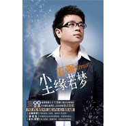

尘缘若梦
============================

|  |  |
| :--: | :-- |
| [ 尘缘若梦](https://emumo.xiami.com/album/169556) | **艺人**: [王强](../index.md) **语种**: 国语 **唱片公司**: TTC国际 **发行时间**: 2008年05月30日 **专辑类别**: EP, 单曲 **专辑风格**:  **播放数**: 282193 **收藏数**: 32 **评论数**: 0  |

## 简介

用真情吐露内心情感 王强新EP《尘缘若梦》  
  
自5•12四川汶川大地震以来，歌手王强就一直在全国各地忙於賑灾义演等慈善活动，积极向灾区同胞伸出援助之手，向灾区人民奉献爱心，其间抽空忙於创作賑灾新歌用心为灾区祈福。按照时间规划表，王强几个月来精心製作的全新EP《尘缘若梦》於5月30日正式发佈。  
  
真实情感造就疗伤情歌  
  
王强的音乐作品纯朴、伤感、深情，不张扬在外但绝对蕴涵於心。此次製作的EP包含了《尘缘若梦》、《圣火•仰望》、《都怪我》三首歌曲，其中前两首由王强亲自操刀作词，新锐音乐人郑暖译全力进行编曲製作，曲风各有特色，旋律婉约凄美，延续了《秋天不回来》、《不想让你哭》以情感人的风格。  
  
蓝色是充满梦幻的色彩，代表著宁静、深邃、忧鬱和智慧。王强的此张新歌EP以深蓝色为基调，歌曲创作来源於王强踏进歌手行列两年来所经历的辛酸往事，包含了王强对种种人生世态的深刻感悟。王强用磁性的嗓音、内敛而高亢的唱腔倾诉那份早已烟消云散的约定，营造一种淡淡忧伤的情绪，为听眾带来了心灵的又一次感动。  
  
第一主打歌曲《尘缘若梦》描述的是“情到深处人孤独，缘将尽，终迷惘”的情感，邀请国家交响乐团录製的全真弦乐铺垫其中，歌曲伤感、唯美而震撼，再一次完美地詮释了强式情歌，是2008年华语乐坛最值得关注的原创流行歌曲。  
  
第二主打歌曲《都怪我》中“让你感觉我不太幽默，而他却能给你快乐；让你感觉到了寂寞，所以你才会给我这结果”， 如泣如诉的旋律表达的正是剖析因感情受挫而深深懺悔、深刻反省的心情，是另一个版本的《不想让你哭》。  
  
EP中重磅呈现的《圣火•仰望》是王强值北京奥运圣火在全球传递之际专门创作的奥运歌曲，该曲用全新的音乐元素切入并结合王强独特的声线，节拍欢快朗朗上口，展现了全国人民虔诚迎接奥运圣火由衷的喜悦心情。  
  
坚持用音乐博得偏爱  
  
没有过多的言辞修饰，没有跌宕激昂的韵律，王强凭借一曲《秋天不回来》一夜间成了大街小巷都耳熟能详的歌手。凭借著《秋天不回来》，王强获得不少奖项的加冕，相继打入2006年度无线音乐颁奖、雪碧榜、华语榜中榜等极具乐坛公信力的大榜。在首届无线音乐颁奖盛典上，一举获得“年度十大畅销金曲奖”；由中央电视臺《中国音乐电视》主办的“2006年度歌坛十大新人评选”中，王强亦以绝对的优势成为十大新人之一。  
  
声势浩大的第二届无线音乐颁奖盛典再次打出“数据说话”的旗号，王强的《不想让你哭》彩铃和振铃以1886万次的下载量再次登顶，获得2007年度无线音乐最畅销网路歌曲奖，《秋天不回来》宝刀不老排名第十。王强继续演绎著歌坛神话，成为中国乐坛唯一  
  
一位两首歌曲进入前十的歌手。  
  
相对低调、朴实的王强根据自己的生活经历创作的歌曲，都是叙说著自己的生活感受和内心的情感总结。作为一个从内地先后到广州、北京打拼才两年有餘的歌手，就凭借《秋天不回来》《不想让你哭》两首歌曲迅速得到广大歌迷朋友的认可，取得了令人艳羡的好成绩，真是很不容易。王强称自己不属於偶像型歌手，所以不会特意追求外型，而是从自己内心深处唱歌，坚持靠歌声打动观眾，继续用呼唤内心的触动博得大眾的偏爱。  
  
过去优异的成绩令人艳羡。“从自己内心深处唱歌”是王强一直秉承的音乐理念，2008年将是王强更上一层楼的一年，因为他将投入百分之二百的热诚以触动心弦的歌曲回报给广大歌迷，进一步巩固新一代情歌王子的地位。  
 

## 曲目

## 评论

|  |  |  |  |
| :-- | :-- | :-- | :-- |
