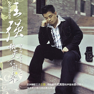

秋天不回来
============================

|  |  |
| :--: | :-- |
| [ 秋天不回来](https://emumo.xiami.com/album/312760) | **艺人**: [王强](../index.md) **语种**: 国语 **唱片公司**: 华谊兄弟 **发行时间**: 2006年12月26日 **专辑类别**: 录音室专辑 **专辑风格**: 国语流行 Mandarin Pop **播放数**: 30498166 **收藏数**: 556 **评论数**: 30  |

## 简介

一个秋天的夜晚，我独自徘徊在城市的老地方，慢慢的发现你已经不在我身旁！记得我们分开的时候你说，明年情人节的时候要回来和我一起过，可是你一走却再无音讯……《秋天不回来》，这首脍炙人口的单曲就是在这样的凄凉的情景下创作出来的，希望能引起您的共鸣！  
  
2005年12月28日首次参加中国移动彩铃唱作大赛广东省赛区总决赛，获得最佳原创。

## 曲目

## 评论

|  |  |  |
| :-- | :-- | :-- |
|  [虾米用户](https://emumo.xiami.com/u/405020633)  2019-11-08 18:44 赞(0) 踩(0) | 
很好听
 |
|  [虾米用户](https://emumo.xiami.com/u/429202287) 喜欢音乐，跳舞 2019-08-28 21:51 赞(0) 踩(0) | 
这部歌很好听，很好听，很好听很
 |
|  [虾米用户](https://emumo.xiami.com/u/2606972)  2019-03-13 08:10 赞(0) 踩(0) | 
这张专辑是用心创作了，当年觉得超好听
 |
|  [虾米用户](https://emumo.xiami.com/u/379739682)  2019-01-09 16:16 赞(0) 踩(0) | 
王强现在在做什么，怎么好久都没歌出？
 |
|  [虾米用户](https://emumo.xiami.com/u/302830785)  2017-12-03 21:24 赞(2) 踩(0) | 
******
 |
|  [虾米用户](https://emumo.xiami.com/u/310311884) 愿听好歌 2017-11-22 16:47 赞(0) 踩(0) | 
经典老歌，好听！
 |
|  [虾米用户](https://emumo.xiami.com/u/8128388)  2017-11-12 23:14 赞(1) 踩(0) | 
在这里听了众多版本的秋天不回来，我觉得只有王强的原装版最有味道，其他的？算了吧
 |
|  [虾米用户](https://emumo.xiami.com/u/253763540) 优衣库 2017-09-12 16:26 赞(0) 踩(0) | 
喝了酒饿了距离
 |
|  [虾米用户](https://emumo.xiami.com/u/309416670)   2017-07-03 15:48 赞(0) 踩(0) | 
好好听啊 
 |
|  [虾米用户](https://emumo.xiami.com/u/74639208) Music is per... 2017-06-22 01:44 赞(1) 踩(0) | 
制作挺精良的
 |
|  [虾米用户](https://emumo.xiami.com/u/213393795) 唯一的一首歌，仅限你和我... 2016-11-28 09:56 赞(4) 踩(0) | 
2006，那年刚上初一 
 |
|  [虾米用户](https://emumo.xiami.com/u/244269989)  2016-11-09 22:00 赞(1) 踩(0) | 
曾听到这首伤情的歌与初恋分手，哭得撕心裂肺！缘分到了尽头，好好聚好好散！现在成了两个孩子的爸，将又有一场缘尽的别离！离婚的代价太大了～求我放过她，我还能做什么？
 |
|  [虾米用户](https://emumo.xiami.com/u/120666512)  2016-03-06 17:07 赞(0) 踩(0) | 
秋天不回来，真的很好听哦
 |
|  [虾米用户](https://emumo.xiami.com/u/47862179)  2015-06-17 14:11 赞(0) 踩(0) | 
PERFECT！！！
 |
|  [虾米用户](https://emumo.xiami.com/u/46135390)  2015-02-04 09:54 赞(0) 踩(0) | 
秋天不回来，，，那个曾经是我的唯一，而现在我已经回来，，，但是她，，，，，，UUS.
 |
|  [虾米用户](https://emumo.xiami.com/u/45309217)  2015-02-01 14:44 赞(0) 踩(0) | 
支持一下强哥
 |
|  [虾米用户](https://emumo.xiami.com/u/39634746)  2014-10-27 21:32 赞(0) 踩(0) | 
能勾起回忆的歌曲
 |
|  [虾米用户](https://emumo.xiami.com/u/130343) 我还没想好要写什么... 2014-06-08 11:42 赞(0) 踩(0) | 
那些年午后的大学时光中，秋天不回来，一直在校园中回荡，多年后，秋天依然回来，可是那些年爱过的女孩，早已不见……
 |
|  [虾米用户](https://emumo.xiami.com/u/3068618)  2014-01-05 20:06 赞(0) 踩(0) | 
大学军训时经常听到的
 |
|  [虾米用户](https://emumo.xiami.com/u/20302228)  2013-09-20 10:25 赞(0) 踩(0) | 
就是喜欢
 |
|  [虾米用户](https://emumo.xiami.com/u/11065541) 从音乐中找感觉 2013-06-22 11:43 赞(0) 踩(0) | 
飞到你身边，这首歌真的很好听，很早我就喜欢这歌。
 |
|  [虾米用户](https://emumo.xiami.com/u/11476481) 音乐让我说 2012-12-11 17:58 赞(0) 踩(0) | 
好听
 |
|  [虾米用户](https://emumo.xiami.com/u/8500875)  2012-03-19 18:41 赞(0) 踩(0) | 
喜欢
 |
|  [虾米用户](https://emumo.xiami.com/u/8166379)  2012-03-13 21:00 赞(0) 踩(0) | 
好听
 |
|  [虾米用户](https://emumo.xiami.com/u/7767913)  2012-01-23 09:30 赞(0) 踩(0) | 
n.kj
 |
|  [虾米用户](https://emumo.xiami.com/u/3591043) 我回来啦 2011-06-08 16:06 赞(0) 踩(0) | 
现在我终于明白了，当初我的转身离去，漠视丢弃了你，是一个多么大的错误，我只能责怪自己，为什么就经不住风雨而放弃你，痛恨自己怎么就舍得轻易离开你？其实，你也知道，离开你是我情非得已，我一直对你心存内疚。
 |
|  [虾米用户](https://emumo.xiami.com/u/2366950)  2011-03-15 10:44 赞(0) 踩(0) | 
好
 |
|  [虾米用户](https://emumo.xiami.com/u/2628770)  2011-02-10 12:01 赞(0) 踩(0) | 
很喜欢这首歌的旋律。
 |
|  [虾米用户](https://emumo.xiami.com/u/70626)  2009-06-10 17:43 赞(1) 踩(0) | 
虾米是不是认为别的地方能下载的歌他这里就不用提供了。
 |
|  [虾米用户](https://emumo.xiami.com/u/36600)  2009-01-23 01:59 赞(0) 踩(0) | 
审核怎么这么慢啊
 |
