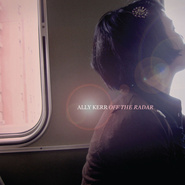

Off The Radar
============================

|  |  |
| :--: | :-- |
| [ Off The Radar](https://emumo.xiami.com/album/173637) | **艺人**: [Ally Kerr](../index.md) **语种**: 英语 **唱片公司**: Much Obliged **发行时间**: 2008年04月14日 **专辑类别**: 录音室专辑 **专辑风格**: 独立流行 Indie Pop **播放数**: 2514724 **收藏数**: 383 **评论数**: 19  |

## 简介

这个夏天怎么能错过了Ally Kerr呢?  
  
《Off The Radar》是Ally Kerr的第2张专辑，Ally Kerr在第一张专辑《Calling Out to You》为热门动漫〈虫师〉录制了一首《The Sore Feet Song》，就因为这一首歌，Ally Kerr在整个东亚地区受到广泛的关注，特别是在日本。2008年上旬，Ally Kerr延续第一张专辑的清新风格发行了单曲《There's A World》，随后发布新专辑《Off The Radar》。Ally Kerr一直以来都是以清新吉他风格为主，并伴随着钢琴点缀，没有太多的乐器，也没有多变的节奏，自然，甘甜，纯正地像夏日的雏菊，淡雅，淳朴，清香。 Ally Kerr的声线温柔的就像薄沙，柔美间又毫不失起本质的坚韧，悠扬和纯美是最直接的感触，而用时间去细细品位，漫漫浮现出的更多是一丝惘然和淡淡的忧伤。 动静间展示出更多的生趣，灵动间更多的是细腻的感情，难怪在苏格兰，人们将他称之为“最富生趣和最创造性的音乐家”。

## 曲目

## 评论

|  |  |  |  |
| :-- | :-- | :-- | :-- |
|  [虾米用户](https://emumo.xiami.com/u/39780360) 唯刀百辟 唯心不易 2019-04-21 09:28 赞(0) 踩(0) | 
很喜欢
 |
|  [虾米用户](https://emumo.xiami.com/u/4487129)  2019-04-20 09:00 赞(0) 踩(0) | 
！！！
 |
|  [虾米用户](https://emumo.xiami.com/u/1864133) 2112 2018-11-15 16:44 赞(1) 踩(0) | 
中性
 |
|  [虾米用户](https://emumo.xiami.com/u/339191478)   2018-08-06 12:01 赞(0) 踩(0) | 
❤
 |
|  [虾米用户](https://emumo.xiami.com/u/45621221) 卸载状态。 2016-01-20 18:47 赞(0) 踩(0) | 
=
 |
|  [虾米用户](https://emumo.xiami.com/u/46025760) 于2016年4月离开虾米 2015-02-03 02:04 赞(0) 踩(0) | 
虫师
 |
|  [虾米用户](https://emumo.xiami.com/u/46025760) 于2016年4月离开虾米 2015-02-03 02:03 赞(0) 踩(0) | 
虫师
 |
|  [虾米用户](https://emumo.xiami.com/u/8320915)  2013-02-15 07:58 赞(0) 踩(0) | 
oh it is too late
 |
|  [虾米用户](https://emumo.xiami.com/u/643332)  2012-07-27 13:46 赞(0) 踩(0) | 
求old friend 歌词啦~
 |
|  [虾米用户](https://emumo.xiami.com/u/8070377) 爱雾瑞性维欧腐漏 2012-07-18 14:44 赞(1) 踩(0) | 
原来是男的 - =
 |
|  [虾米用户](https://emumo.xiami.com/u/3470896)  2012-05-03 20:31 赞(0) 踩(0) | 
夏天就是要听这样的.
 |
|  [虾米用户](https://emumo.xiami.com/u/1171396) 以前办不到的事情，未来也... 2012-04-13 18:24 赞(0) 踩(0) | 
Amorino
 |
|  [虾米用户](https://emumo.xiami.com/u/5911151)  2012-03-05 08:54 赞(0) 踩(0) | 
Sometimes u need a little more fresh air.
 |
|  [虾米用户](https://emumo.xiami.com/u/7256964)  2011-12-15 21:38 赞(0) 踩(0) | 
爱死啦
 |
|  [虾米用户](https://emumo.xiami.com/u/4890276) 暂无签名~ 2011-08-30 23:03 赞(0) 踩(0) | 
声音，治愈。让人感到安静。
 |
|  [虾米用户](https://emumo.xiami.com/u/516962)  2011-01-20 00:28 赞(0) 踩(0) | 
舒眠呢~
 |
|  [虾米用户](https://emumo.xiami.com/u/2347342)  2010-12-31 11:08 赞(0) 踩(0) | 
Footprints is better!
 |
|  [虾米用户](https://emumo.xiami.com/u/282225)  2009-07-22 21:17 赞(1) 踩(0) | 
很温和的人呢。。喜欢 the toothbrush song 好有趣的歌~
 |
|  [虾米用户](https://emumo.xiami.com/u/186370) 大佛顶首楞严经 2009-06-17 11:47 赞(0) 踩(0) | 
推荐04 There`s a World  05 The Toothbrush Song  10 Amorino
 |
