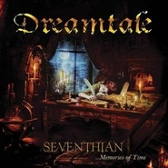
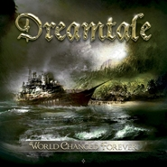
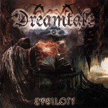
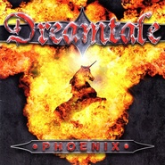
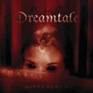
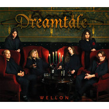
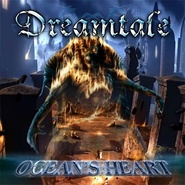
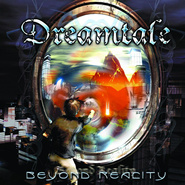

Dreamtale
============================

|  |  |
| :--: | :-- |
| [ Dreamtale](https://i.xiami.com/dreamtale) | **地区**: Finland 芬兰 **风格**: 能量金属 Power Metal **播放数**: 19235139 **粉丝数**: 20736 **评论数**: 782  |

## 档案

组建时间 / 地点    ：1999年 / 坦佩雷，芬兰 
Dreamtale（梦境传说）是来自芬兰的一支力量金属（Power Metal）乐队，由前主唱及吉他手Rami Keränen成立于1999年。 乐队至今已发行了六张专辑。 
乐队成员 
主唱：Erkki Seppanen (Made In Iron,Tuiran Miliisi,KYPCK,Ruinside,ex-Russian Rock Project）（2007-) 
吉他：Rami Keranen（1999-）（也担任1999年至2002年主唱) 
吉他：Seppo Kolehmainen(Ruinside) 
贝司：Heikki Ahonen - Bass （2009-) 
键盘：Akseli Kaasalainen （2006-) 
鼓手：Petteri Rosenbom - Drums （1999-2005,2010-至今) 
乐队历程 
成立于90年代的Dreamtale与Sonata Arctica一样是芬兰新派力量前卫金属代表，虽然各方面仿佛与Sonata Arctica略为逊色，但更多是由于很对人对于这支乐队还不了解，毕竟他们产量不高，到现在（2013年）为止才发行了六张正式专辑。 
1999年，吉他手Rami Keranen想组一支属於自己的乐团，且一开始就已经决定把团名取作Dreamtale，因此在他的积极努力之下，Dreamtale的音乐开始慢慢成形，并在同年秋天录成一卷tape，这也成为後来他们的首张demo ——Shadow of the Frozen Sun。进入2000年，Dreamtale为了让他们的音乐能让更多人听到，在几次团员的更动後，他们参加了多场各式各样的音乐演出，甚至在2000年七月，他们在Sinergy的演唱会担任暖场团体！历经多场的成功演出後，他们录制了第二张demo－Refuge From Reality，这使他们的知名度在芬兰终于被广泛的传开来。2001年八月，在多家与他们接触的唱片公司中，Dreamtale选择与知名金属大厂Spinefarm Records签下合约，并录制完成了他们的首张专辑Beyond Reality。 
首曲"The dawn"以轻柔的键盘贯穿全曲，搭配著壮阔的band sound，彷佛电影情节般的开场intro，波澜浩瀚的场面已出现在想像中，没错！这正是改编自电影「The Rock」的主题曲配乐；接下来的"Memories of time" 与"Refuge from reality"，纯正的melodic power metal迎面袭来，流畅悦耳的编曲架构，主唱纯熟的嗓音，为整张作品带来最好的开始。首支主打歌"Fallen star"，以键盘与鼓的过门开场，令人惊艳的美声女vocal与主唱Tomi的完美搭配合唱，将整首歌的境界推向最高点！"Where the rainbow ends"是另一首主打歌级金属佳作，尤其主唱在此尝试运用各种不同的演唱音色来增加vocal 部分的复杂度，而副歌时的多部合唱与女声合音搭配表情丰富的吉他solo，更让人感到Dreamtale的未来是不可限量的！ 
录音室专辑 
2002          Beyond Reality 
2003          Ocean's Heart 
2005          Difference 
2006          Phoenix 
2011          Epsilon 
2013          World Changed Forever 
英文简介 
Dreamtale was founded by guitarist Rami Keränen in the early months of 1999. Keränen also served as the band's vocalist until 2002. The band first gathered fame by playing as Sinergy's supporting act in Finland, and their second demo, Refuge from Reality, sold out on the day of its release. 
Most of the copies of the demo were sold in Japan, which helped the band make itself known to record labels. Dreamtale started receiving recording deal offers from around the world, and in August 2001 signed a deal with Spinefarm Records. 
In December 2001, Dreamtale started the recordings of Beyond Reality. After finishing the album, Dreamtale went through changes in their line-up: Pasi Ristolainen replaced bassist Alois Weimer, and a new singer, Tomi Viiltola, joined the group. Keränen is the sole founding member to remain with the band. 
Beyond Reality, which was released in Japan in June and elsewhere during July 2002, selling well and gaining the band a following in Japan. To please Japanese fans, the band quickly began recording a second full-length album. 
Recordings for their second album Ocean's Heart were begun in January 2003 at Fantom studios Finland, where the album was then mixed by Samu Oittinen. Finishing touches were added with Mika Jussila's mastering at Finnvox-studios. 
Keyboardist Turkka Vuorinen left the band in 2006 and was replaced by Akseli Kaasalainen.In late 2008, bassist Pasi Ristolainen left the band, mainly because of a lack of motivation. Dreamtale has since replaced him with Heikki Ahonen. 
In 2010, they released samples of songs called Angel Of Light, Reasons Revealed and Strangers' Ode. The 5th album called Epsilon was released in 2011 through the band's own label Secret Door Records. This album saw the return of original drummer, Petteri Rosenbom. With Epsilon released also in Russia by Fono Ltd., the band played their first shows abroad in St. Petersburg and Moscow in October 2011. 
It was announced on the 14th of January, 2013 that their 6th studio album was being recorded. Timo Tolkki mixed the album in February and the tracklist was revealed that same month. The album, World Changed Forever, was released on April 26, 2013.

## 专辑

| 名称 | 语种 | 唱片公司 | 发行时间 | 专辑类别 | 专辑风格 |
| :--: | :-- | :-- | :-- | :-- | :-- |
| [ Seventhian ...Memories of Time](./albums/2102655937.md) | 英语 | Avalon | 2016年12月09日 | 录音室专辑 | 能量金属 Power Metal |
| [ World Changed Forever](./albums/364290992.md) | 英语 | Self-Released | 2013年04月26日 | 录音室专辑 | 能量金属 Power Metal |
| [ Epsilon](./albums/430673.md) | 英语 | Evolution Music | 2011年05月11日 | 录音室专辑 | 能量金属 Power Metal |
| [ Phoenix](./albums/170171.md) | 英语 | Mötley | 2008年06月04日 | 录音室专辑 | 能量金属 Power Metal |
| [ Difference](./albums/169953.md) | 英语 | Spinefarm Records | 2005年02月23日 | 录音室专辑 | 能量金属 Power Metal |
| [ Wellon](./albums/170172.md) | 英语 | Spinefarm Records | 2005年01月19日 | EP, 单曲 | 流行 Pop |
| [ Ocean's Heart](./albums/169950.md) | 英语 | Spinefarm Records | 2003年09月15日 | 录音室专辑 | 能量金属 Power Metal |
| [ Beyond Reality](./albums/169951.md) | 英语 | Spinefarm Records | 2002年12月02日 | 录音室专辑 | 能量金属 Power Metal |

## 评论

|  |  |  |
| :-- | :-- | :-- |
|  [虾米用户](https://emumo.xiami.com/u/404281591)  2021-01-15 20:33 赞(0) 踩(0) | 
回到阔别的开始
 |
|  [虾米用户](https://emumo.xiami.com/u/813637)  2021-01-13 21:00 赞(2) 踩(0) | 
我最爱的乐队之一，别了，虾米！
 |
|  [虾米用户](https://emumo.xiami.com/u/423652627)  2020-12-15 22:00 赞(1) 踩(0) | 
重组了 
 |
|  [虾米用户](https://emumo.xiami.com/u/427384237) 我还没想好要写什么... 2020-08-22 16:29 赞(0) 踩(0) | 
➕
 |
|  [虾米用户](https://emumo.xiami.com/u/440664717) 我还没想好要写什么... 2020-07-17 20:58 赞(0) 踩(0) | 
777
 |
|  [虾米用户](https://emumo.xiami.com/u/440664717) 我还没想好要写什么... 2020-07-17 20:58 赞(0) 踩(0) | 
V
 |
|  [虾米用户](https://emumo.xiami.com/u/5555764) 阿Ken 2020-06-04 17:34 赞(0) 踩(0) | 
 
 |
|  [虾米用户](https://emumo.xiami.com/u/429732797) *面对懒惰的你充满了决心 2020-04-10 16:31 赞(1) 踩(0) | 
燃！燃！还是燃！喜欢
 |
|  [虾米用户](https://emumo.xiami.com/u/438268248) Sorry, how? 2020-01-23 00:33 赞(1) 踩(0) | 
Sleeping Beauty还未上线，梦境的绝响...
 |
|  [虾米用户](https://emumo.xiami.com/u/403986412) 落叶归根 2019-11-10 06:28 赞(1) 踩(0) | 
。
 |
|  [虾米用户](https://emumo.xiami.com/u/43492923) 行到水穷我才开始害怕，夕... 2019-10-22 02:41 赞(1) 踩(0) | 
◇
 |
|  [虾米用户](https://emumo.xiami.com/u/28171213) 我还没想好要写什么... 2019-10-14 20:42 赞(3) 踩(0) | 
2019年10月等了快三年，以为应该有下一张专辑了，没想到是等来了「结束」。希望你Dreamtale还能重生。
 |
|  [虾米用户](https://emumo.xiami.com/u/42963872) 我还没想好要写什么... 2019-08-27 23:11 赞(1) 踩(0) | 
Erkki: ...With Dreamtale we recorded four great albums, played terrific shows all over the Old World of which a sold-out concert in Beijing is among my finest memories. ...
 |
|  [虾米用户](https://emumo.xiami.com/u/42963872) 我还没想好要写什么... 2019-08-27 23:07 赞(2) 踩(0) | 
Dear friends and fans, We are sad to announce that Dreamtale in it's current form has come to an end.  芬兰金属乐队Dreamtale宣布主唱Erkki Seppänen，吉他手Seppo Kolehmainen，贝斯手Heikki Ahonen决定离开乐队。乐队正在寻找新的主唱，吉他手和贝斯手，如果觉得你有能力填补空缺，<a href="mailto:contact@dreamtale.org">contact@dreamtale.org</a>
 |
|  [虾米用户](https://emumo.xiami.com/u/304115872) 伪偏门，真流行乐迷。欢迎... 2019-08-27 20:11 赞(0) 踩(0) | 
解散了
 |
|  [虾米用户](https://emumo.xiami.com/u/276944698) 不要自我设限..... 2019-08-13 11:39 赞(1) 踩(0) | 

 |
|  [虾米用户](https://emumo.xiami.com/u/11827510)  2019-04-10 05:26 赞(0) 踩(0) | 
感觉这团除了那个intro让魔兽搞出了名 其他的作品真的很一般
 |
| ⇒ |  [虾米用户](https://emumo.xiami.com/u/258358702)  2019-05-12 09:03 赞(0) 踩(0) | 
take what the heavens create，farewell...，if you will go，PowerPlay
 |
| ⇒ |  [虾米用户](https://emumo.xiami.com/u/11827510)  2019-06-10 21:44 赞(0) 踩(0) | 
<q><b>龘驫麤鱻羴猋犇说：</b></q>
 |
|  [虾米用户](https://emumo.xiami.com/u/34895701) 我还没想好要写什么... 2018-11-27 07:01 赞(4) 踩(0) | 
刚刚看完《重金属囧途》，赶紧来温习一下。
 |
| ⇒ |  [虾米用户](https://emumo.xiami.com/u/25326675) 无节制的气势 2019-04-01 13:30 赞(0) 踩(0) | 
那是什么啊？泰囧吗？
 |
|  [虾米用户](https://emumo.xiami.com/u/2061329) 星移斗转 唯浮华不变 2018-11-09 00:52 赞(0) 踩(0) | 
我的fallen star呢！
 |
|  [虾米用户](https://emumo.xiami.com/u/32807185) tough and ro... 2018-11-03 02:57 赞(2) 踩(0) | 
因为the dawn这个芬兰n线小队的收藏已经10000+了，而且也来中国巡演过，受到广大群众的热烈欢迎，想想还是挺感动的哈 
 |
|  [虾米用户](https://emumo.xiami.com/u/1255885)  2018-10-30 12:50 赞(1) 踩(0) | 
Hello everyone: i'm very exciting to come to China t. We will have seven amazing concerts there, Come on boys and girls, lets enjoy every show. Tickets link:https:<a href="https://shop112659734.taobao.com" target="_blank" rel="nofollow noreferrer noopener">https://shop112659734.taobao.com</a> Beijing,14th April 2017 Modernsky lab Shanghai, 15th April 2017 Qian Shuiwan lab
 |
|  [虾米用户](https://emumo.xiami.com/u/10851498)  2018-07-17 18:16 赞(0) 踩(0) | 
来打call
 |
|  [虾米用户](https://emumo.xiami.com/u/228843687) 懒惰统治人间 2018-06-23 21:51 赞(0) 踩(0) | 
:-O
 |
|  [虾米用户](https://emumo.xiami.com/u/357674040)  2018-05-04 02:25 赞(0) 踩(0) | 
&amp;dagger;&amp;dagger;&amp;dagger;
 |
|  [虾米用户](https://emumo.xiami.com/u/48625003) / 2018-03-16 16:24 赞(2) 踩(0) | 
可惜现场那天主唱嗓子有点毛病 但还是足够感动
 |
|  [虾米用户](https://emumo.xiami.com/u/43492923) 行到水穷我才开始害怕，夕... 2018-03-14 10:46 赞(0) 踩(0) | 
□
 |
|  [虾米用户](https://emumo.xiami.com/u/43492923) 行到水穷我才开始害怕，夕... 2017-11-19 03:04 赞(0) 踩(0) | 
棒
 |
|  [虾米用户](https://emumo.xiami.com/u/256283632)   2017-11-13 05:06 赞(1) 踩(0) | 
声音实在太性感。忍不住去看了live视频&amp;hellip;&amp;hellip;虽然金属不看脸，虽然现在已经够火了，还是觉得，主唱如果帅一点会更多死心塌地的粉
 |
| ⇒ |  [虾米用户](https://emumo.xiami.com/u/2522525)  2018-03-15 09:16 赞(0) 踩(0) | 
帅有个毛用
 |
| ⇒ |  [虾米用户](https://emumo.xiami.com/u/356454935)  2018-06-26 12:27 赞(0) 踩(0) | 
看看kypck的mv就明白主唱其实很帅
 |
|  [虾米用户](https://emumo.xiami.com/u/8000052)  2017-10-27 23:33 赞(0) 踩(0) | 
感慨， 十多年的岁月这个我一直很喜欢的乐团虽然配器技艺有所增长，但是内涵貌似从青葱的啼鸣演变到了归于平庸。
 |
|  [虾米用户](https://emumo.xiami.com/u/960660) 你好，这里是牙买加 2017-10-27 23:07 赞(2) 踩(0) | 
当最后一艘船消失在遥远的地平线  我在岩石上凝望  任思绪如烟般慢慢弥撒  编制成我的...梦境传说  魔兽世界-亡灵序曲  纪念那些曾经为了艾泽拉斯战斗而牺牲的勇士
 |
|  [虾米用户](https://emumo.xiami.com/u/7481281) 怎么去拥抱一夏天的风。 2017-09-21 19:55 赞(1) 踩(0) | 
很可惜广州场音响有点问题，站前排听不到主唱声音
 |
| ⇒ |  [虾米用户](https://emumo.xiami.com/u/274346108) 从决定组建乐队开始，已经... 2018-03-06 00:58 赞(0) 踩(0) | 
成都的很好，给他们送了一瓶伏特加，而且合影什么的&amp;hellip;&amp;hellip;
 |
| ⇒ |  [虾米用户](https://emumo.xiami.com/u/7481281) 怎么去拥抱一夏天的风。 2018-03-06 08:09 赞(0) 踩(0) | 
<q><b>金属狂想曲说：</b></q>
 |
| ⇒ |  [虾米用户](https://emumo.xiami.com/u/274346108) 从决定组建乐队开始，已经... 2018-03-06 21:57 赞(0) 踩(0) | 
<q><b>Java ❤说：</b></q>
 |
| ⇒ |  [虾米用户](https://emumo.xiami.com/u/7481281) 怎么去拥抱一夏天的风。 2018-03-06 22:34 赞(0) 踩(0) | 
<q><b>金属狂想曲说：</b></q>
 |
|  [虾米用户](https://emumo.xiami.com/u/7446644)  2017-07-14 15:29 赞(3) 踩(0) | 
梦的旋律！弱到强的渐变，心情柔到坚的渐变，然后又回复安宁，梦醒了？不，我们才刚刚开始梦！
 |
|  [虾米用户](https://emumo.xiami.com/u/12221090) 逍遥于天地而心意自得 2017-06-27 21:51 赞(1) 踩(0) | 
赞
 |
|  [虾米用户](https://emumo.xiami.com/u/274304433)  2017-05-29 22:19 赞(2) 踩(0) | 
STSM有ZS，DZ，FS，SS，来ms
 |
| ⇒ |  [虾米用户](https://emumo.xiami.com/u/86407) 小弟，乖！ 2017-07-14 00:11 赞(0) 踩(0) | 
xd要不
 |
|  [虾米用户](https://emumo.xiami.com/u/1618810) 毙 2017-04-25 16:07 赞(0) 踩(0) | 
喜欢 我知道的太晚了
 |
| ⇒ |  [虾米用户](https://emumo.xiami.com/u/7283868) 再见虾了个米。我的青春 2017-04-26 22:12 赞(0) 踩(0) | 
不晚。
 |
| ⇒ |  [虾米用户](https://emumo.xiami.com/u/1618810) 毙 2017-04-26 22:44 赞(0) 踩(0) | 
<q><b>老骨头说：</b></q>
 |
|  [虾米用户](https://emumo.xiami.com/u/6389313)  2017-04-15 23:01 赞(0) 踩(0) | 
广州见~~~
 |
|  [虾米用户](https://emumo.xiami.com/u/596793) endless 2017-04-10 11:46 赞(1) 踩(0) | 
广州求组队.....
 |
|  [虾米用户](https://emumo.xiami.com/u/10086960) adieu 2017-04-05 19:34 赞(0) 踩(0) | 
要去看力量金属了好害怕
 |
|  [虾米用户](https://emumo.xiami.com/u/143913) 他很懒，连签名都懒得写 2017-03-29 19:21 赞(0) 踩(0) | 
有上海的小伙伴嘛0.0
 |
|  [虾米用户](https://emumo.xiami.com/u/100122014) u can't take... 2017-03-24 14:14 赞(0) 踩(0) | 
广州约起来？wechat：SSSUE_555
 |
|  [虾米用户](https://emumo.xiami.com/u/64197728)   2017-03-17 00:48 赞(0) 踩(0) | 
广州见 
 |
|  [虾米用户](https://emumo.xiami.com/u/1166554) 旋律党 2017-03-10 22:51 赞(0) 踩(0) | 
寻一波上海的组织
 |
| ⇒ |  [虾米用户](https://emumo.xiami.com/u/88565) 耳语黑森林 2017-03-18 20:49 赞(0) 踩(0) | 
我我我
 |
|  [虾米用户](https://emumo.xiami.com/u/83116414) 让我住进你的眼睛里 2017-03-10 14:10 赞(0) 踩(0) | 
台北有？
 |
|  [虾米用户](https://emumo.xiami.com/u/50066462) Metal is for... 2017-03-08 09:43 赞(0) 踩(0) | 
jqk
 |
|  [虾米用户](https://emumo.xiami.com/u/66845470)  2017-03-03 13:31 赞(1) 踩(0) | 
广州见？
 |
|  [虾米用户](https://emumo.xiami.com/u/208221276) 讲真虾米在我喜欢的方面比... 2017-02-20 23:51 赞(0) 踩(0) | 
玩奇幻单机很巴适哈。730。
 |
|  [虾米用户](https://emumo.xiami.com/u/5122225) 君は光 2017-02-13 22:25 赞(0) 踩(0) | 
想去来着 有木有小伙伴组个队 一个人慌兮兮的 坐标杭州 
 |
| ⇒ |  [虾米用户](https://emumo.xiami.com/u/1166554) 旋律党 2017-03-10 22:49 赞(0) 踩(0) | 
原来是老乡啊走起啊
 |
|  [虾米用户](https://emumo.xiami.com/u/19249125) 动人的、难以寻觅的、追求 2017-02-13 19:07 赞(0) 踩(0) | 
好想去看受不了   
 |
|  [虾米用户](https://emumo.xiami.com/u/47456900) 我还没想好要写什么... 2017-02-04 20:47 赞(0) 踩(0) | 
北京北京啊啊啊啊开心
 |
|  [虾米用户](https://emumo.xiami.com/u/14265718) wx:osakarock... 2017-01-28 01:03 赞(1) 踩(0) | 
成都举手组队 
 |
|  [虾米用户](https://emumo.xiami.com/u/6389313)  2017-01-23 18:42 赞(0) 踩(0) | 
四月份广州见！！！
 |
|  [虾米用户](https://emumo.xiami.com/u/3218119) 禁忌的爸爸 2017-01-16 22:30 赞(0) 踩(0) | 
4月北京约!
 |
|  [虾米用户](https://emumo.xiami.com/u/9472879) I am me. 2017-01-14 00:17 赞(2) 踩(0) | 
上海的约起！
 |
| ⇒ |  [虾米用户](https://emumo.xiami.com/u/105217560) Your girlfri... 2017-02-01 04:07 赞(0) 踩(0) | 
这里这里
 |
|  [虾米用户](https://emumo.xiami.com/u/1138880)  2017-01-11 11:40 赞(0) 踩(0) | 
一起去现场蹦迪~~
 |
|  [虾米用户](https://emumo.xiami.com/u/1138880)  2017-01-11 11:34 赞(1) 踩(0) | 
北京一起
 |
|  [虾米用户](https://emumo.xiami.com/u/2739265) 金属乐 2017-01-06 19:45 赞(0) 踩(0) | 
4月来中国了
 |
|  [虾米用户](https://emumo.xiami.com/u/122688364) 生在愤坑，长在赤圈；挣脱 2016-12-20 22:29 赞(0) 踩(0) | 
6709
 |
|  [虾米用户](https://emumo.xiami.com/u/10354415) 天地有时尽，宇宙亦轮回 2016-12-20 18:50 赞(1) 踩(0) | 
Welcome to xiami.Welcome to China.My favourite band！
 |
|  [虾米用户](https://emumo.xiami.com/u/27939384) ego cogito 2016-12-19 19:45 赞(1) 踩(0) | 
有没有搞错？这可是亡灵序曲乐队
 |
| ⇒ |  [虾米用户](https://emumo.xiami.com/u/17320713)  2017-01-19 18:51 赞(0) 踩(0) | 
你可真逗
 |
| ⇒ |  [虾米用户](https://emumo.xiami.com/u/48372767)  2017-04-04 11:46 赞(0) 踩(0) | 
又见脑残亡灵序曲，别来这刷存在感
 |
| ⇒ |  [虾米用户](https://emumo.xiami.com/u/27939384) ego cogito 2017-04-04 13:24 赞(0) 踩(0) | 
<q><b>侯雷雷雷说：</b></q>
 |
| ⇒ |  [虾米用户](https://emumo.xiami.com/u/308617390) 这家伙很聪明什么也没留下... 2017-08-01 08:08 赞(0) 踩(0) | 
我知道了，高端黑 
 |
|  [虾米用户](https://emumo.xiami.com/u/37163065) 听歌只是听歌，只是单纯的... 2016-12-17 13:38 赞(0) 踩(0) | 
可惜去不了
 |
|  [虾米用户](https://emumo.xiami.com/u/2597743) 人生五十年,如梦亦如幻, 2016-12-12 14:21 赞(0) 踩(0) | 
神特么淘宝店！哈哈哈~！
 |
|  [虾米用户](https://emumo.xiami.com/u/3269814) 罄 2016-12-11 10:40 赞(0) 踩(0) | 
Welcome~
 |
|  [虾米用户](https://emumo.xiami.com/u/6685177) Yo~ 2016-12-11 02:58 赞(0) 踩(0) | 
     
 |
|  [虾米用户](https://emumo.xiami.com/u/12996076) 我还没想好要写什么... 2016-12-10 08:47 赞(0) 踩(0) | 
啊啊啊啊广州！
 |
|  [虾米用户](https://emumo.xiami.com/u/7504671) 音乐来自于心灵的呼唤 2016-12-10 08:02 赞(0) 踩(0) | 
Welcome to xiami.
 |
|  [虾米用户](https://emumo.xiami.com/u/1931086) 正义，或许会迟到，但永远... 2016-12-09 23:46 赞(0) 踩(0) | 
Dreamtale.Welcome to xiami.
 |
|  [虾米用户](https://emumo.xiami.com/u/50590185) https://www.... 2016-12-09 23:34 赞(0) 踩(0) | 
这评论区。。。有点恶心
 |
|  [虾米用户](https://emumo.xiami.com/u/50590185) https://www.... 2016-12-09 23:01 赞(1) 踩(0) | 
我擦嘞，真入驻了 ，火钳留名！！！
 |
| ⇒ |  [虾米用户](https://emumo.xiami.com/u/19249125) 动人的、难以寻觅的、追求 2017-02-13 19:06 赞(0) 踩(0) | 
23333333
 |
|  [虾米用户](https://emumo.xiami.com/u/4146038)  2016-12-09 22:59 赞(0) 踩(0) | 
收到邮件才发现居然入驻了，还开了淘宝店？
 |
| ⇒ |  [虾米用户](https://emumo.xiami.com/u/729183) 我还没想好要写什么... 2016-12-13 10:03 赞(0) 踩(0) | 
淘宝店是崔人予的……他又要办演出了（手动点蜡
 |
| ⇒ |  [虾米用户](https://emumo.xiami.com/u/3815293) baby Jesus s... 2017-01-16 11:28 赞(0) 踩(0) | 
<q><b>河说：</b></q>
 |
|  [虾米用户](https://emumo.xiami.com/u/10414400) 不知深浅 2016-12-09 21:53 赞(0) 踩(0) | 
lol
 |
|  [虾米用户](https://emumo.xiami.com/u/8610346)  2016-12-09 21:15 赞(0) 踩(0) | 
卧槽真的假的！
 |
|  [虾米用户](https://emumo.xiami.com/u/251564809)  2016-12-09 18:50 赞(118) 踩(0) | 
我刚入驻了虾米音乐人，欢迎大家来我的个人主页，收听我的最新音乐
 |
| ⇒ |  [虾米用户](https://emumo.xiami.com/u/39089376) live a life! 2017-10-19 13:17 赞(0) 踩(0) | 
装毛啊谁还不知道你不是本人
 |
| ⇒ |  [虾米用户](https://emumo.xiami.com/u/50401207) 保罗·班扬的父亲 2017-11-10 12:36 赞(0) 踩(0) | 
<q><b>Eh?说：</b></q>
 |
|  [虾米用户](https://emumo.xiami.com/u/2909071) 你舒得队 2016-12-09 15:57 赞(0) 踩(0) | 
我去，居然真身入驻了
 |
|  [虾米用户](https://emumo.xiami.com/u/7283868) 再见虾了个米。我的青春 2016-12-09 14:29 赞(1) 踩(0) | 
入住虾米了，好棒！
 |
| ⇒ |  [虾米用户](https://emumo.xiami.com/u/30617820) 窝列大窝列大哟 2016-12-09 20:46 赞(0) 踩(0) | 
约约约
 |
| ⇒ |  [虾米用户](https://emumo.xiami.com/u/7283868) 再见虾了个米。我的青春 2016-12-09 20:48 赞(0) 踩(0) | 
<q><b>Deadline说：</b></q>
 |
|  [虾米用户](https://emumo.xiami.com/u/2542364) 再见虾米，以后再会。 2016-12-09 14:13 赞(1) 踩(0) | 
我的天惹？？？！！！
 |
|  [虾米用户](https://emumo.xiami.com/u/5122225) 君は光 2016-12-09 13:48 赞(0) 踩(0) | 
what？入驻？巡演？？
 |
|  [虾米用户](https://emumo.xiami.com/u/5851736) 我们来聊章北海！ 2016-12-09 11:06 赞(0) 踩(0) | 
入住虾米
 |
|  [虾米用户](https://emumo.xiami.com/u/3936282) 要死一起死 2016-12-09 08:26 赞(0) 踩(0) | 
入驻是最骚的
 |
|  [虾米用户](https://emumo.xiami.com/u/2028036) 学习占卜中 2016-12-09 02:14 赞(0) 踩(0) | 
入驻？
 |
|  [虾米用户](https://emumo.xiami.com/u/20316094)  2016-11-24 08:53 赞(0) 踩(0) | 
巡演又是北上广吗 
 |
| ⇒ |  [虾米用户](https://emumo.xiami.com/u/601978)  2016-12-12 17:45 赞(0) 踩(0) | 
还有成都，深圳，香港，台北
 |
|  [虾米用户](https://emumo.xiami.com/u/217019547) 技术残酷死，死才是王道！ 2016-10-31 10:48 赞(0) 踩(0) | 
我多想去芬兰看看啊
 |
| ⇒ |  [虾米用户](https://emumo.xiami.com/u/601978)  2016-11-24 08:10 赞(0) 踩(0) | 
中国首次巡演，2017年4月！
 |
|  [虾米用户](https://emumo.xiami.com/u/7283868) 再见虾了个米。我的青春 2016-10-22 18:04 赞(1) 踩(0) | 
明年四月见!
 |
|  [虾米用户](https://emumo.xiami.com/u/601978)  2016-10-20 15:39 赞(0) 踩(0) | 
新专辑发行在即
 |
|  [虾米用户](https://emumo.xiami.com/u/31447396) 有趣且痛苦 2016-10-19 21:33 赞(1) 踩(0) | 
四月来中国？
 |
|  [虾米用户](https://emumo.xiami.com/u/16742187)  2016-10-03 17:08 赞(0) 踩(0) | 
地狱之歌
 |
|  [虾米用户](https://emumo.xiami.com/u/141588) 活一场。 2016-08-11 16:12 赞(34) 踩(0) | 
那么多牛逼的乐队来自芬兰。 芬兰只五百多万人，才相当于我国一个普通地级市的人口数量。
 |
|  [虾米用户](https://emumo.xiami.com/u/110991902)  2016-07-17 16:04 赞(0) 踩(0) | 
680
 |
|  [虾米用户](https://emumo.xiami.com/u/115255040) 签名太麻烦了吧 2016-07-04 22:03 赞(1) 踩(0) | 
老听你们说the dawn 我以为这队是老式重金属呢 现在一听挺正常的一力量乐队么
 |
|  [虾米用户](https://emumo.xiami.com/u/44261645) 我还没想好要写什么... 2016-05-29 23:16 赞(0) 踩(0) | 
ಥ_ಥ
 |
|  [虾米用户](https://emumo.xiami.com/u/13521200)  2016-05-21 11:46 赞(0) 踩(0) | 
留名
 |
|  [虾米用户](https://emumo.xiami.com/u/27936708)  2016-05-16 23:40 赞(0) 踩(0) | 
好久不出新砖了
 |
|  [虾米用户](https://emumo.xiami.com/u/6675596) Melody Guy 2016-04-30 01:09 赞(2) 踩(0) | 
第一次接触这个团，发现这个男主唱嗓子不是一般的好
 |
|  [虾米用户](https://emumo.xiami.com/u/13984281) 庙小妖风大！ 2016-03-26 10:01 赞(0) 踩(0) | 

 |
|  [虾米用户](https://emumo.xiami.com/u/77797672)  2016-03-21 14:55 赞(74) 踩(0) | 
北欧国家冰天雪地  人们无所事事  就鼓捣出这些乐队了  东北没有那么冷 于是就鼓捣出二人转了
 |
| ⇒ |  [虾米用户](https://emumo.xiami.com/u/11828516) 我还没想好要写什么... 2016-12-05 11:38 赞(0) 踩(0) | 
东北没有那么冷？你查下天气预报看看哪里更冷
 |
| ⇒ |  [虾米用户](https://emumo.xiami.com/u/252794383)  2017-06-30 11:56 赞(0) 踩(0) | 
那新疆吐鲁番45度的天气出什么乐队呢
 |
| ⇒ |  [虾米用户](https://emumo.xiami.com/u/308617390) 这家伙很聪明什么也没留下... 2017-08-01 08:07 赞(0) 踩(0) | 
<q><b>氵乛丿丨乛丶说：</b></q>
 |
| ⇒ |  [虾米用户](https://emumo.xiami.com/u/11828516) 我还没想好要写什么... 2017-08-01 08:24 赞(0) 踩(0) | 
<q><b>万神说：</b></q>
 |
| ⇒ |  [虾米用户](https://emumo.xiami.com/u/308617390) 这家伙很聪明什么也没留下... 2017-08-01 08:30 赞(0) 踩(0) | 
<q><b>氵乛丿丨乛丶说：</b></q>
 |
| ⇒ |  [虾米用户](https://emumo.xiami.com/u/11828516) 我还没想好要写什么... 2017-08-01 09:18 赞(0) 踩(0) | 
<q><b>万神说：</b></q>
 |
| ⇒ |  [虾米用户](https://emumo.xiami.com/u/308617390) 这家伙很聪明什么也没留下... 2017-08-01 11:10 赞(0) 踩(0) | 
<q><b>氵乛丿丨乛丶说：</b></q>
 |
| ⇒ |  [虾米用户](https://emumo.xiami.com/u/11828516) 我还没想好要写什么... 2017-08-01 17:17 赞(0) 踩(0) | 
<q><b>万神说：</b></q>
 |
| ⇒ |  [虾米用户](https://emumo.xiami.com/u/308617390) 这家伙很聪明什么也没留下... 2017-08-01 19:06 赞(0) 踩(0) | 
<q><b>氵乛丿丨乛丶说：</b></q>
 |
| ⇒ |  [虾米用户](https://emumo.xiami.com/u/208375667)   2017-12-14 10:29 赞(0) 踩(0) | 
我们有二手玫瑰
 |
| ⇒ |  [虾米用户](https://emumo.xiami.com/u/315767996)  2017-12-27 23:39 赞(0) 踩(0) | 
有黑麒
 |
|  [虾米用户](https://emumo.xiami.com/u/52127742) 呼。啦啦啦，啦啦啦， 2016-03-18 07:33 赞(0) 踩(0) | 

 |
|  [虾米用户](https://emumo.xiami.com/u/49309294) “哪有开心这一说” 2016-03-16 13:05 赞(0) 踩(0) | 
这个四壁太持久了  完全看不完！
 |
|  [虾米用户](https://emumo.xiami.com/u/34194966) 暂无签名~ 2016-03-12 16:41 赞(0) 踩(0) | 
这个乐队不错，但还是更喜欢雷神之锤。
 |
|  [虾米用户](https://emumo.xiami.com/u/116230348)  2016-03-10 08:26 赞(0) 踩(0) | 
听了第一个主唱退出乐队新加入（组建）的那支乐队，用芬兰语唱好像。
 |
|  [虾米用户](https://emumo.xiami.com/u/2830724) 我們終將不會相遇 都湮滅... 2016-03-05 16:41 赞(0) 踩(0) | 
这就是传说中的评论666么
 |
|  [虾米用户](https://emumo.xiami.com/u/41208164) 每个明天，都是我一个人的... 2016-01-29 22:24 赞(3) 踩(0) | 
真希望能听到梦境传说的现场
 |
| ⇒ |  [虾米用户](https://emumo.xiami.com/u/49848085)  2016-02-23 23:09 赞(0) 踩(0) | 
他们的现场挺惨的，舞台很小
 |
| ⇒ |  [虾米用户](https://emumo.xiami.com/u/2510435) 打工仔们都进来听新歌了 2016-03-18 10:05 赞(0) 踩(0) | 
偷偷告诉你 可能快了
 |
|  [虾米用户](https://emumo.xiami.com/u/41608433)   2016-01-10 15:02 赞(3) 踩(0) | 
夜愿什么东西啊
 |
|  [虾米用户](https://emumo.xiami.com/u/5681460) 金属党党员 2016-01-03 14:28 赞(0) 踩(0) | 
爱！就一个字
 |
|  [虾米用户](https://emumo.xiami.com/u/78519234) 我还没想好要写什么... 2015-12-30 10:23 赞(0) 踩(0) | 

 |
|  [虾米用户](https://emumo.xiami.com/u/49453327) 不同的人有不同的活法 2015-12-23 12:45 赞(0) 踩(0) | 
哈哈哈哈哈哈哈哈哈真是憋不住笑楼下の魔怔b在哪都秀智商
 |
|  [虾米用户](https://emumo.xiami.com/u/35003335)  2015-11-30 22:36 赞(0) 踩(0) | 
One More Shot 乐队成立#一周年#首张EP《Live Forever》即将首发！EP同名歌曲“Live Forever”现已放出正式试听！让我们一起将梦想坚持到底！永不放弃！
 |
|  [虾米用户](https://emumo.xiami.com/u/1454034) 南无阿弥陀佛 2015-11-20 09:25 赞(0) 踩(0) | 
是說芬蘭玩金屬的都是這種長髮披肩的髮型嗎？看照片瞬間以為TK跑來客串~~~
 |
|  [虾米用户](https://emumo.xiami.com/u/7626844) 输入墓志铭... 2015-11-02 20:39 赞(1) 踩(0) | 
才听了几种风格的金属 就开始装B了 真受不了
 |
|  [虾米用户](https://emumo.xiami.com/u/11828516) 我还没想好要写什么... 2015-10-25 01:02 赞(2) 踩(0) | 
芬兰真是个梦幻的国度，如果挪威黑，瑞典死，那芬兰就是梦幻，芬兰哥特也好，芬兰旋死也好，相比另外两国芬兰的团似乎总是更柔美
 |
|  [虾米用户](https://emumo.xiami.com/u/49294028) 为金属而狂 2015-09-10 10:41 赞(0) 踩(0) | 
芬兰的苏联风厄运金属Kypck你们谁听过？Dreamtale现任主唱Ekki自己的乐队。
 |
|  [虾米用户](https://emumo.xiami.com/u/39904335)   2015-09-06 14:32 赞(0) 踩(0) | 

 |
|  [虾米用户](https://emumo.xiami.com/u/30686607) Of darkness ... 2015-09-04 10:52 赞(3) 踩(0) | 
我还在那高兴认识这个乐队的人这么多呢，md原来是两个喷子刷出来的
 |
|  [虾米用户](https://emumo.xiami.com/u/47757659) 我还没想好要写什么... 2015-09-03 13:08 赞(0) 踩(0) | 
留名
 |
|  [虾米用户](https://emumo.xiami.com/u/33202010) 金属心摇滚梦 2015-08-30 17:54 赞(0) 踩(0) | 

 |
|  [虾米用户](https://emumo.xiami.com/u/36375520) Neo-prog & p... 2015-08-22 21:12 赞(1) 踩(0) | 
首专当然很好，接下来几张都不行，直到换最新主唱后又NB了。个人观点~
 |
|  [虾米用户](https://emumo.xiami.com/u/38801880)   2015-08-15 17:56 赞(0) 踩(0) | 
^_^
 |
|  [虾米用户](https://emumo.xiami.com/u/50444101) 音乐穷三代， 摇滚毁一生... 2015-08-14 22:04 赞(0) 踩(0) | 
靠谱
 |
|  [虾米用户](https://emumo.xiami.com/u/34959629) sweet dreams 2015-08-14 18:44 赞(0) 踩(0) | 
对下面的撕X，我真心无语。。。。
 |
|  [虾米用户](https://emumo.xiami.com/u/10619017)  2015-08-03 23:43 赞(0) 踩(0) | 
别阿，你还是让别人看看三大公厕有多牛逼吧。
 |
| ⇒ |  [虾米用户](https://emumo.xiami.com/u/41495555) 悲袭则惘，狂喜而然。 2015-08-03 23:48 赞(0) 踩(0) | 
怎能啊，毕竟北欧三大旋力拿出来多装逼 夜愿也算作旋力了我他妈cob是不是也能算作芬兰第一旋力啊 
 |
| ⇒ |  [虾米用户](https://emumo.xiami.com/u/10619017)  2015-08-03 23:52 赞(0) 踩(0) | 
<q><b>朝生暮死说：</b></q>
 |
| ⇒ |  [虾米用户](https://emumo.xiami.com/u/41495555) 悲袭则惘，狂喜而然。 2015-08-04 00:00 赞(0) 踩(0) | 
<q><b>拾荒说：</b></q>
 |
| ⇒ |  [虾米用户](https://emumo.xiami.com/u/10619017)  2015-08-04 00:02 赞(0) 踩(0) | 
<q><b>说：</b></q>
 |
|  [虾米用户](https://emumo.xiami.com/u/41495555) 悲袭则惘，狂喜而然。 2015-07-26 16:18 赞(0) 踩(0) | 
其实在力量金属中这只团并不是特别出众，但是应该算是在国内知名度最高的金属乐队之一了吧，亡灵序曲亡灵序曲，又有多少人知道是出自这个乐队....不得不感慨一下，突然我觉得我又是多么幸福，听了那么多优秀的金属乐 
 |
| ⇒ |  [虾米用户](https://emumo.xiami.com/u/10619017)  2015-08-03 15:46 赞(0) 踩(0) | 
呵呵，灵云，夜愿，梦境传说是北欧三大旋律力量金属，不出名吗？你说得好像这乐队是你组的一样。
 |
| ⇒ |  [虾米用户](https://emumo.xiami.com/u/41495555) 悲袭则惘，狂喜而然。 2015-08-03 22:05 赞(0) 踩(0) | 
<q><b>拾荒说：</b></q>
 |
| ⇒ |  [虾米用户](https://emumo.xiami.com/u/41495555) 悲袭则惘，狂喜而然。 2015-08-03 22:08 赞(0) 踩(0) | 
<q><b>拾荒说：</b></q>
 |
| ⇒ |  [虾米用户](https://emumo.xiami.com/u/10619017)  2015-08-03 23:04 赞(0) 踩(0) | 
<q><b>朝生暮死说：</b></q>
 |
| ⇒ |  [虾米用户](https://emumo.xiami.com/u/41495555) 悲袭则惘，狂喜而然。 2015-08-03 23:32 赞(0) 踩(0) | 
<q><b>拾荒说：</b></q>
 |
| ⇒ |  [虾米用户](https://emumo.xiami.com/u/10619017)  2015-08-03 23:36 赞(0) 踩(0) | 
<q><b>朝生暮死说：</b></q>
 |
| ⇒ |  [虾米用户](https://emumo.xiami.com/u/41495555) 悲袭则惘，狂喜而然。 2015-08-03 23:38 赞(0) 踩(0) | 
<q><b>拾荒说：</b></q>
 |
| ⇒ |  [虾米用户](https://emumo.xiami.com/u/41495555) 悲袭则惘，狂喜而然。 2015-08-03 23:41 赞(0) 踩(0) | 
<q><b>说：</b></q>
 |
| ⇒ |  [虾米用户](https://emumo.xiami.com/u/10619017)  2015-08-03 23:48 赞(0) 踩(0) | 
<q><b>朝生暮死说：</b></q>
 |
| ⇒ |  [虾米用户](https://emumo.xiami.com/u/10619017)  2015-08-04 00:00 赞(0) 踩(0) | 
<q><b>说：</b></q>
 |
| ⇒ |  [虾米用户](https://emumo.xiami.com/u/10619017)  2015-08-04 00:05 赞(0) 踩(0) | 
<q><b>说：</b></q>
 |
| ⇒ |  [虾米用户](https://emumo.xiami.com/u/41495555) 悲袭则惘，狂喜而然。 2015-08-04 00:24 赞(0) 踩(0) | 
<q><b>拾荒说：</b></q>
 |
| ⇒ |  [虾米用户](https://emumo.xiami.com/u/41495555) 悲袭则惘，狂喜而然。 2015-08-04 00:24 赞(0) 踩(0) | 
<q><b>拾荒说：</b></q>
 |
| ⇒ |  [虾米用户](https://emumo.xiami.com/u/41495555) 悲袭则惘，狂喜而然。 2015-08-04 00:33 赞(0) 踩(0) | 
<q><b>拾荒说：</b></q>
 |
| ⇒ |  [虾米用户](https://emumo.xiami.com/u/41495555) 悲袭则惘，狂喜而然。 2015-08-04 00:39 赞(0) 踩(0) | 
<q><b>拾荒说：</b></q>
 |
| ⇒ |  [虾米用户](https://emumo.xiami.com/u/10619017)  2015-08-04 09:40 赞(0) 踩(0) | 
<q><b>说：</b></q>
 |
| ⇒ |  [虾米用户](https://emumo.xiami.com/u/10619017)  2015-08-04 09:40 赞(0) 踩(0) | 
<q><b>说：</b></q>
 |
| ⇒ |  [虾米用户](https://emumo.xiami.com/u/10619017)  2015-08-04 09:42 赞(0) 踩(0) | 
<q><b>说：</b></q>
 |
| ⇒ |  [虾米用户](https://emumo.xiami.com/u/10619017)  2015-08-04 09:43 赞(0) 踩(0) | 
<q><b>说：</b></q>
 |
| ⇒ |  [虾米用户](https://emumo.xiami.com/u/10619017)  2015-08-04 09:44 赞(0) 踩(0) | 
<q><b>说：</b></q>
 |
| ⇒ |  [虾米用户](https://emumo.xiami.com/u/10619017)  2015-08-04 09:48 赞(0) 踩(0) | 
<q><b>说：</b></q>
 |
| ⇒ |  [虾米用户](https://emumo.xiami.com/u/41495555) 悲袭则惘，狂喜而然。 2015-08-04 10:48 赞(0) 踩(0) | 
<q><b>拾荒说：</b></q>
 |
| ⇒ |  [虾米用户](https://emumo.xiami.com/u/10619017)  2015-08-04 11:12 赞(0) 踩(0) | 
<q><b>朝生暮死说：</b></q>
 |
| ⇒ |  [虾米用户](https://emumo.xiami.com/u/10619017)  2015-08-04 11:12 赞(0) 踩(0) | 
<q><b>说：</b></q>
 |
| ⇒ |  [虾米用户](https://emumo.xiami.com/u/41495555) 悲袭则惘，狂喜而然。 2015-08-04 11:15 赞(0) 踩(0) | 
<q><b>拾荒说：</b></q>
 |
| ⇒ |  [虾米用户](https://emumo.xiami.com/u/10619017)  2015-08-04 11:16 赞(0) 踩(0) | 
<q><b>说：</b></q>
 |
| ⇒ |  [虾米用户](https://emumo.xiami.com/u/41495555) 悲袭则惘，狂喜而然。 2015-08-04 11:17 赞(0) 踩(0) | 
<q><b>拾荒说：</b></q>
 |
| ⇒ |  [虾米用户](https://emumo.xiami.com/u/10619017)  2015-08-04 11:18 赞(0) 踩(0) | 
<q><b>朝生暮死说：</b></q>
 |
| ⇒ |  [虾米用户](https://emumo.xiami.com/u/41495555) 悲袭则惘，狂喜而然。 2015-08-04 11:18 赞(0) 踩(0) | 
<q><b>拾荒说：</b></q>
 |
| ⇒ |  [虾米用户](https://emumo.xiami.com/u/41495555) 悲袭则惘，狂喜而然。 2015-08-04 11:20 赞(0) 踩(0) | 
<q><b>拾荒说：</b></q>
 |
| ⇒ |  [虾米用户](https://emumo.xiami.com/u/10619017)  2015-08-04 11:21 赞(0) 踩(0) | 
<q><b>朝生暮死说：</b></q>
 |
| ⇒ |  [虾米用户](https://emumo.xiami.com/u/41495555) 悲袭则惘，狂喜而然。 2015-08-04 11:23 赞(0) 踩(0) | 
<q><b>拾荒说：</b></q>
 |
| ⇒ |  [虾米用户](https://emumo.xiami.com/u/41495555) 悲袭则惘，狂喜而然。 2015-08-04 11:28 赞(0) 踩(0) | 
<q><b>拾荒说：</b></q>
 |
| ⇒ |  [虾米用户](https://emumo.xiami.com/u/10619017)  2015-08-04 11:34 赞(0) 踩(0) | 
<q><b>朝生暮死说：</b></q>
 |
| ⇒ |  [虾米用户](https://emumo.xiami.com/u/10619017)  2015-08-04 11:39 赞(0) 踩(0) | 
<q><b>朝生暮死说：</b></q>
 |
| ⇒ |  [虾米用户](https://emumo.xiami.com/u/34033528)  2015-08-07 17:42 赞(0) 踩(0) | 
<q><b>朝生暮死说：</b></q>
 |
| ⇒ |  [虾米用户](https://emumo.xiami.com/u/12939923) XSWL Record 2015-08-07 19:26 赞(0) 踩(0) | 
<q><b>拾荒说：</b></q>
 |
| ⇒ |  [虾米用户](https://emumo.xiami.com/u/10619017)  2015-08-08 10:00 赞(0) 踩(0) | 
<q><b>Lukeologist说：</b></q>
 |
| ⇒ |  [虾米用户](https://emumo.xiami.com/u/12939923) XSWL Record 2015-08-08 14:33 赞(0) 踩(0) | 
<q><b>拾荒说：</b></q>
 |
| ⇒ |  [虾米用户](https://emumo.xiami.com/u/10619017)  2015-08-08 14:35 赞(0) 踩(0) | 
<q><b>Lukeologist说：</b></q>
 |
| ⇒ |  [虾米用户](https://emumo.xiami.com/u/34033528)  2015-08-08 14:41 赞(0) 踩(0) | 
<q><b>Lukeologist说：</b></q>
 |
| ⇒ |  [虾米用户](https://emumo.xiami.com/u/12939923) XSWL Record 2015-08-08 15:55 赞(0) 踩(0) | 
<q><b>拾荒说：</b></q>
 |
| ⇒ |  [虾米用户](https://emumo.xiami.com/u/12939923) XSWL Record 2015-08-08 20:58 赞(0) 踩(0) | 
<q><b>拾荒说：</b></q>
 |
| ⇒ |  [虾米用户](https://emumo.xiami.com/u/10619017)  2015-08-09 09:50 赞(0) 踩(0) | 
<q><b>Lukeologist说：</b></q>
 |
| ⇒ |  [虾米用户](https://emumo.xiami.com/u/7283868) 再见虾了个米。我的青春 2015-09-11 11:42 赞(0) 踩(0) | 
<q><b>拾荒说：</b></q>
 |
| ⇒ |  [虾米用户](https://emumo.xiami.com/u/52768746) 我要得到天上的水，而不是... 2015-09-27 09:36 赞(0) 踩(0) | 
<q><b>拾荒说：</b></q>
 |
| ⇒ |  [虾米用户](https://emumo.xiami.com/u/10619017)  2015-09-28 12:11 赞(0) 踩(0) | 
<q><b>Badroom白竹说：</b></q>
 |
| ⇒ |  [虾米用户](https://emumo.xiami.com/u/10619017)  2015-09-28 12:11 赞(0) 踩(0) | 
<q><b>Badroom白竹说：</b></q>
 |
| ⇒ |  [虾米用户](https://emumo.xiami.com/u/39747939)  2015-12-17 18:30 赞(0) 踩(0) | 
<q><b>拾荒说：</b></q>
 |
| ⇒ |  [虾米用户](https://emumo.xiami.com/u/10619017)  2015-12-17 18:45 赞(0) 踩(0) | 
<q><b>最想念的季节说：</b></q>
 |
| ⇒ |  [虾米用户](https://emumo.xiami.com/u/10619017)  2017-10-27 23:34 赞(0) 踩(0) | 
<q><b>Lukeologist说：</b></q>
 |
|  [虾米用户](https://emumo.xiami.com/u/9749063)  2015-07-13 17:02 赞(0) 踩(0) | 
能量金属是什么鬼？城乡结合部么？
 |
|  [虾米用户](https://emumo.xiami.com/u/8070377) 爱雾瑞性维欧腐漏 2015-06-03 09:56 赞(1) 踩(0) | 
蹦迪能量金!!!
 |
|  [虾米用户](https://emumo.xiami.com/u/43132011)  2015-05-27 15:41 赞(0) 踩(0) | 
苗推荐，我就喜欢
 |
|  [虾米用户](https://emumo.xiami.com/u/49294028) 为金属而狂 2015-05-26 11:00 赞(1) 踩(0) | 
作为知名度不在nightwish之下的猛团，dreamtale太低调了，他们的MV和或视频实在是少的可怜，难得的一个MV是take what the heaven create，我真心喜欢ekki的嗓音和rami的吉他solo。
 |
| ⇒ |  [虾米用户](https://emumo.xiami.com/u/7283868) 再见虾了个米。我的青春 2015-09-11 11:40 赞(0) 踩(0) | 
夜愿太商业化了。
 |
| ⇒ |  [虾米用户](https://emumo.xiami.com/u/49294028) 为金属而狂 2015-09-11 12:11 赞(0) 踩(0) | 
<q><b>老骨头说：</b></q>
 |
| ⇒ |  [虾米用户](https://emumo.xiami.com/u/7283868) 再见虾了个米。我的青春 2015-09-11 13:01 赞(0) 踩(0) | 
<q><b>咖喱猫说：</b></q>
 |
|  [虾米用户](https://emumo.xiami.com/u/3882947)  2015-05-15 10:11 赞(0) 踩(0) | 
The Dawn听着让人热血沸腾
 |
|  [虾米用户](https://emumo.xiami.com/u/3019759)  2015-05-09 15:53 赞(0) 踩(0) | 
迪斯科摇滚，我的感觉。
 |
|  [虾米用户](https://emumo.xiami.com/u/37732946)  2015-04-29 14:02 赞(0) 踩(0) | 
******
 |
|  [虾米用户](https://emumo.xiami.com/u/2751793) 弃。 2015-04-26 01:53 赞(0) 踩(0) | 
不错
 |
|  [虾米用户](https://emumo.xiami.com/u/49498255)  2015-04-23 16:01 赞(0) 踩(0) | 
低落的时候调调心态不错
 |
|  [虾米用户](https://emumo.xiami.com/u/11828516) 我还没想好要写什么... 2015-04-19 17:27 赞(0) 踩(0) | 
超好听
 |
|  [虾米用户](https://emumo.xiami.com/u/13012759) 奇葩金属党一枚〜＞_＜〜 2015-04-17 20:18 赞(3) 踩(0) | 
呃，好吧。果然要用一首曲子推动一个乐队的关注量是要靠宣传那首曲子到烂大街的。然而那个乐队的其他好曲子，在慕名而来的人们中，几乎没多少人去听的吧。不管撕逼亡灵序曲还是The Dawn，还请那些瞎BB的人尊重下乐队。好好听歌，好好欣赏，就是对乐队的最大尊敬。
 |
|  [虾米用户](https://emumo.xiami.com/u/9775409)  2015-03-13 00:25 赞(0) 踩(0) | 
金属乐队？NO。这是个专职演奏纯音乐和背景音乐的一个团。 呵呵
 |
| ⇒ |  [虾米用户](https://emumo.xiami.com/u/13012759) 奇葩金属党一枚〜＞_＜〜 2015-04-17 20:05 赞(0) 踩(0) | 
哦，那你跟我说说人家怎么不金属了？
 |
| ⇒ |  [虾米用户](https://emumo.xiami.com/u/8719765)  2016-09-18 21:15 赞(0) 踩(0) | 
说句狗屁不过分
 |
|  [虾米用户](https://emumo.xiami.com/u/41495555) 悲袭则惘，狂喜而然。 2015-03-04 00:46 赞(0) 踩(0) | 
中规中矩，没有惊喜。
 |
|  [虾米用户](https://emumo.xiami.com/u/3128561)  2015-02-25 22:19 赞(0) 踩(0) | 
Melodic Power Metal
 |
| ⇒ |  [虾米用户](https://emumo.xiami.com/u/13012759) 奇葩金属党一枚〜＞_＜〜 2015-04-17 20:06 赞(0) 踩(0) | 
为啥你们的买套都不喜欢打末尾的A= =
 |
| ⇒ |  [虾米用户](https://emumo.xiami.com/u/3128561)  2015-04-17 20:17 赞(0) 踩(0) | 
<q><b>但丁的黑檀木说：</b></q>
 |
| ⇒ |  [虾米用户](https://emumo.xiami.com/u/13012759) 奇葩金属党一枚〜＞_＜〜 2015-04-17 20:21 赞(0) 踩(0) | 
<q><b>THRASH ZONE说：</b></q>
 |
|  [虾米用户](https://emumo.xiami.com/u/5074150) 一直前行 2015-02-18 11:44 赞(0) 踩(0) | 
dremtale，梦境传说、亡灵序曲
 |
|  [虾米用户](https://emumo.xiami.com/u/8286923) 赛赛粉丝 2015-01-30 23:55 赞(0) 踩(0) | 
芬兰出品，必属精品！
 |
|  [虾米用户](https://emumo.xiami.com/u/16575191) 美术生拯救世界 2015-01-30 19:18 赞(2) 踩(0) | 
有多少人是为亡灵序曲才听他们的……
 |
|  [虾米用户](https://emumo.xiami.com/u/40375044) 高雅的音乐，要用心去感受 2015-01-24 12:54 赞(0) 踩(0) | 
作为一个wow狗每次听了the dawn都非常激动(ˉ(∞)ˉ)
 |
|  [虾米用户](https://emumo.xiami.com/u/44613128) 唯有爱可超越时间空间 2015-01-07 09:29 赞(0) 踩(0) | 
Dreamtale（梦境传说）是来自芬兰的一支能量金属（Power Metal）乐队，他们最有名的作品是Intro: The Dawn，钢琴前奏温柔引入，吉他摇滚力量爆发！
 |
|  [虾米用户](https://emumo.xiami.com/u/11340472) 辣鸡强制收藏 2014-12-30 12:01 赞(0) 踩(0) | 
-
 |
|  [虾米用户](https://emumo.xiami.com/u/44100434)  2014-12-27 01:45 赞(0) 踩(0) | 
O(∩_∩)O~
 |
|  [虾米用户](https://emumo.xiami.com/u/7574) 头像代表我的心 2014-12-16 18:27 赞(0) 踩(0) | 
激情
 |
|  [虾米用户](https://emumo.xiami.com/u/6379100)  2014-12-11 17:37 赞(0) 踩(0) | 
我叉，自己打个MARK咋发评论了～各位不要理睬个人Mark而已，已删～哈哈 玩亡灵贼听序曲的感觉很带感啊
 |
|  [虾米用户](https://emumo.xiami.com/u/43221786) 在天堂里仰望地狱 2014-12-05 10:25 赞(0) 踩(0) | 
最喜欢的乐队！
 |
|  [虾米用户](https://emumo.xiami.com/u/9642566) 最悲惨的人生是没有理想 2014-11-16 15:05 赞(1) 踩(0) | 
Where the Rainbow Ends应该排第二！！！
 |
| ⇒ |  [虾米用户](https://emumo.xiami.com/u/45605006) 暂无签名~ 2015-03-10 21:48 赞(0) 踩(0) | 
因为这首歌主唱几乎谁都知道。
 |
|  [虾米用户](https://emumo.xiami.com/u/7760093)  2014-10-31 14:00 赞(0) 踩(0) | 
Electronic Music
 |
|  [虾米用户](https://emumo.xiami.com/u/6171336) 谢谢9年陪伴，你依然是我... 2014-10-30 22:20 赞(0) 踩(0) | 
卧 槽
 |
|  [虾米用户](https://emumo.xiami.com/u/981888) Fvcktheworld 2014-10-16 09:00 赞(1) 踩(0) | 
又是芬兰
 |
|  [虾米用户](https://emumo.xiami.com/u/41669548)  2014-10-02 17:51 赞(0) 踩(0) | 
Dreamtale,
 |
|  [虾米用户](https://emumo.xiami.com/u/13552)  2014-09-05 10:40 赞(0) 踩(0) | 
Intro: The Dawn, Silent Path
 |
|  [虾米用户](https://emumo.xiami.com/u/40531562)  2014-09-02 00:37 赞(0) 踩(0) | 
-
 |
|  [虾米用户](https://emumo.xiami.com/u/40143843)  2014-08-21 23:24 赞(0) 踩(0) | 
战车是power?
 |
|  [虾米用户](https://emumo.xiami.com/u/7937127)  2014-07-31 14:02 赞(0) 踩(0) | 
The Dawn is the reason.
 |
|  [虾米用户](https://emumo.xiami.com/u/12973148) 暂无签名~ 2014-07-26 21:52 赞(1) 踩(0) | 
一曲亡灵序曲就够了
 |
| ⇒ |  [虾米用户](https://emumo.xiami.com/u/34977908) 暂无签名~ 2014-09-08 18:05 赞(0) 踩(0) | 
所有都行
 |
|  [虾米用户](https://emumo.xiami.com/u/2031853) 我还没想好要写什么... 2014-07-22 11:40 赞(0) 踩(0) | 
他们一支MV都没有？？
 |
|  [虾米用户](https://emumo.xiami.com/u/203394) 三分似神，七分似我。 2014-07-18 21:06 赞(2) 踩(0) | 
不了解就安静听歌。尔等不要断章取义胡编乱造扭曲事实。别跟个蚱蜢一样一通乱叫。
 |
|  [虾米用户](https://emumo.xiami.com/u/31608105) 人心是不待风吹而自落的花 2014-07-11 18:23 赞(0) 踩(0) | 
不玩游戏的遗憾就是...我竟然现在才知道这个乐队！
 |
|  [虾米用户](https://emumo.xiami.com/u/9090522) 微信公众号：金属乐头等舱 2014-07-07 18:23 赞(4) 踩(0) | 
Dreamtale（芬兰力量金属） 大多数朋友都是对著名的魔兽亡灵序曲吸引过来的，但是事实并非如此！ 这是dreamtale 02年专辑《Beyond Reality》的开篇曲，改编自电影《勇闯夺命岛》的OTS，然后中国有个war3的UD玩家用这首音乐配合游戏CG动画自己剪辑了一首MV，取名叫做《亡灵序曲》，然后很多朋友就误以为这首音乐叫亡灵序曲，而不知道它的本名叫The Dawn。在此感谢虾友：soph1a的精辟指点！
 |
|  [虾米用户](https://emumo.xiami.com/u/13259301)  2014-06-22 02:36 赞(0) 踩(0) | 
电吉他。配曲很出色。
 |
|  [虾米用户](https://emumo.xiami.com/u/2368634)  2014-06-17 15:39 赞(0) 踩(0) | 
旋律不錯 我喜歡
 |
|  [虾米用户](https://emumo.xiami.com/u/37192928) 我还没想好要写什么... 2014-06-05 16:56 赞(0) 踩(0) | 
好喜欢他们的歌
 |
|  [虾米用户](https://emumo.xiami.com/u/4137788) 活在自己的世界里…… 2014-06-04 01:28 赞(0) 踩(0) | 
有谁有他们的mv???
 |
|  [虾米用户](https://emumo.xiami.com/u/37113328)  2014-06-02 00:02 赞(1) 踩(0) | 
dreamtale是支优秀乐队，可惜北欧优秀的金属乐队太多，dt被淹没在其中。有两首歌和中国古代的思想很像：Where The Rainbow Ends - 桃花源记；Each Time I Die - 庄公梦蝶。北欧的思想还是很古典的 嘿嘿。
 |
| ⇒ |  [虾米用户](https://emumo.xiami.com/u/36346102)   2014-06-20 16:18 赞(0) 踩(0) | 
传说中的国学金属，涨姿势
 |
| ⇒ |  [虾米用户](https://emumo.xiami.com/u/3806614)  2014-07-23 15:02 赞(0) 踩(0) | 
<q><b>未知生物说：</b></q>
 |
|  [虾米用户](https://emumo.xiami.com/u/10512938)  2014-05-24 23:52 赞(1) 踩(0) | 
什么时候来次中国吧。。。强烈要求
 |
|  [虾米用户](https://emumo.xiami.com/u/11005980) 岁月如歌 2014-05-24 17:48 赞(0) 踩(0) | 
Dawn
 |
|  [虾米用户](https://emumo.xiami.com/u/4137788) 活在自己的世界里…… 2014-05-19 03:07 赞(0) 踩(0) | 
为什么没有mv哪？？？ 求解！！！
 |
| ⇒ |  [虾米用户](https://emumo.xiami.com/u/37113328)  2014-06-02 00:03 赞(0) 踩(0) | 
因为乐队知名度不高。。。
 |
| ⇒ |  [虾米用户](https://emumo.xiami.com/u/40143843)  2014-08-21 23:25 赞(0) 踩(0) | 
根本没拍过
 |
|  [虾米用户](https://emumo.xiami.com/u/33341526)  2014-05-07 23:02 赞(0) 踩(0) | 
特激昂，充满黎明前的光明与希望，每当听起就想象那副自由女神的图像。兄弟们！冲啊啊！
 |
|  [虾米用户](https://emumo.xiami.com/u/2116997)  2014-04-25 23:24 赞(0) 踩(0) | 
看见有人为第一首曲子争得脸红脖子粗的还真纳闷。 没玩过花钱的网游，所以序不序曲的也不知道。哈哈
 |
|  [虾米用户](https://emumo.xiami.com/u/11863938) 有你的地方，才是我的方向... 2014-04-13 19:13 赞(0) 踩(0) | 
如上
 |
|  [虾米用户](https://emumo.xiami.com/u/11198531) 瞎哼哼咕~~(╯﹏╰)b 2014-04-04 12:45 赞(1) 踩(0) | 
第一首点击在金属都是排前的
 |
|  [虾米用户](https://emumo.xiami.com/u/9618585) 野蛮生长ฏ๎๎๎๎ 2014-03-13 16:23 赞(0) 踩(0) | 
当年wow25人副本战歌
 |
|  [虾米用户](https://emumo.xiami.com/u/1555162)  2014-03-06 13:06 赞(2) 踩(0) | 
这试听量的差距....
 |
|  [虾米用户](https://emumo.xiami.com/u/7252191) 一个人的峥嵘 2014-02-21 15:53 赞(0) 踩(0) | 
最喜欢的一首是dreamland
 |
|  [虾米用户](https://emumo.xiami.com/u/32865602)  2014-02-17 06:46 赞(1) 踩(0) | 
我什么都不懂，我只知道我喜欢听
 |
|  [虾米用户](https://emumo.xiami.com/u/1561952)  2014-02-14 11:32 赞(0) 踩(0) | 
好大气
 |
|  [虾米用户](https://emumo.xiami.com/u/5691092) 爱生活 爱音乐 爱影视 2014-02-11 12:51 赞(0) 踩(0) | 
亡灵序曲吊炸天。
 |
|  [虾米用户](https://emumo.xiami.com/u/32237062)  2014-01-29 13:26 赞(0) 踩(0) | 
喜欢沉浸在Dreamtale乐队的氛围
 |
|  [虾米用户](https://emumo.xiami.com/u/12939923) XSWL Record 2014-01-25 22:42 赞(16) 踩(0) | 
我不知道 一首intro如此受欢迎 竟然超过乐队本身 很多其他曲子被忽略 是不是乐队某种程度上的失败
 |
| ⇒ |  [虾米用户](https://emumo.xiami.com/u/15977285)   2014-03-14 16:28 赞(0) 踩(0) | 
这不能怪这个乐队
 |
| ⇒ |  [虾米用户](https://emumo.xiami.com/u/10534549) 嗯... 2014-03-27 18:20 赞(0) 踩(0) | 
<q><b>Mizore说：</b></q>
 |
| ⇒ |  [虾米用户](https://emumo.xiami.com/u/15480563)  2015-07-10 03:01 赞(0) 踩(0) | 
问题不是出在乐队上。国内对金属乐这方面的普及太少，某party也不会把摇滚和金属这种的音乐放进音乐教科书，以至于很多人没有意愿去挖掘这类风格。金属在国内也就只是在狭缝中生存，有人拿来做成游戏视频也算是一种推动了。
 |
|  [虾米用户](https://emumo.xiami.com/u/1235674) 有了快感你就喊！ 2014-01-15 18:44 赞(0) 踩(0) | 
DREAMTALE
 |
|  [虾米用户](https://emumo.xiami.com/u/23955823) 我还没想好要写什么... 2014-01-13 20:24 赞(0) 踩(0) | 
芬兰三杰之二
 |
|  [虾米用户](https://emumo.xiami.com/u/15977285)   2014-01-07 16:34 赞(3) 踩(0) | 
试听榜真可怕、
 |
|  [虾米用户](https://emumo.xiami.com/u/279936)   2013-12-30 22:01 赞(0) 踩(0) | 
能量金属，屠龙英雄哈哈
 |
|  [虾米用户](https://emumo.xiami.com/u/13135500) 神经病人思路广 2013-12-24 11:29 赞(1) 踩(0) | 
不听力量还真不知道The Dawn这首曲子竟然是Dreamtale所做。。。真是火星几亿年了。。。。。
 |
|  [虾米用户](https://emumo.xiami.com/u/2799752) 我还没想好要写什么... 2013-12-23 21:08 赞(0) 踩(0) | 
力量金属非常棒的一好手！！！
 |
|  [虾米用户](https://emumo.xiami.com/u/12271750)  2013-12-16 20:38 赞(0) 踩(0) | 
你管我
 |
|  [虾米用户](https://emumo.xiami.com/u/257386) 扭曲的吉他，急躁的鼓点， 2013-12-10 14:19 赞(0) 踩(0) | 
亡灵序曲   我架子鼓的专长
 |
| ⇒ |  [虾米用户](https://emumo.xiami.com/u/38487610)   2014-07-27 10:04 赞(0) 踩(0) | 
正要学……老师给了我两个选择，小苹果或者这首……
 |
|  [虾米用户](https://emumo.xiami.com/u/15830004) 我还没想好要写什么... 2013-12-01 10:20 赞(0) 踩(0) | 
..
 |
|  [虾米用户](https://emumo.xiami.com/u/2699513)  2013-11-19 14:11 赞(0) 踩(0) | 
.....
 |
|  [虾米用户](https://emumo.xiami.com/u/9327494) http://www.x... 2013-11-16 23:15 赞(0) 踩(0) | 
Payback
 |
|  [虾米用户](https://emumo.xiami.com/u/13585144)  2013-11-13 18:55 赞(1) 踩(0) | 
强烈推荐，Silent Path这么好听，竟然拍那么后面，。
 |
|  [虾米用户](https://emumo.xiami.com/u/3849458)  2013-11-12 13:21 赞(1) 踩(0) | 
力量金属的代表
 |
|  [虾米用户](https://emumo.xiami.com/u/275176) 虾米在英国也能用啦 2013-11-08 10:31 赞(0) 踩(0) | 
北欧金属
 |
|  [虾米用户](https://emumo.xiami.com/u/4742308) ´･ω･` 2013-11-08 00:49 赞(37) 踩(0) | 
可悲的不是那首序曲被广传为亡灵序曲，而是至今很少有人知道这曲子是Dreamtale所做，知道的也不愿意去探索这个乐队和力量金属这种风格
 |
|  [虾米用户](https://emumo.xiami.com/u/3270827)  2013-11-03 20:31 赞(0) 踩(0) | 
梦境传说！
 |
|  [虾米用户](https://emumo.xiami.com/u/9710620)  2013-11-03 15:08 赞(0) 踩(0) | 
为什么芬兰乐队的旋律个个都这么好听？
 |
|  [虾米用户](https://emumo.xiami.com/u/25227486) 天气真不错，去晒太阳吧！ 2013-10-29 22:42 赞(0) 踩(0) | 
Intro: The Dawn
 |
|  [虾米用户](https://emumo.xiami.com/u/2736229) 乐迷正在绑架他所爱的乐队 2013-10-27 16:42 赞(3) 踩(0) | 
这点击量的差距，啧啧。。。感觉好悲凉。恐怕不少人还不知道是Dreamtale演奏的吧。。。
 |
|  [虾米用户](https://emumo.xiami.com/u/12227289)  2013-10-20 13:41 赞(1) 踩(0) | 
听了有几年了，这个乐队在中国还是这么不起眼，不错的力量金属啊，。。。不错的摇滚啊。。。网上没有演唱会，没有MV，真心给各位金属党跪了~！求资源。。。。。。。。。。。。。。。。。。。。 。。。。。。。。。。。。。。。。。。。。 。。。。。。。。。。。。。。。。。。。。 。。。。。。。。。。。。。。。。。。。。 。。。。。。。。。。。。。。。。。。。。 。。。。。。。。。。。。。。。。。。。。 。。。。。。。。。。。。。。。。。。。
 |
| ⇒ |  [虾米用户](https://emumo.xiami.com/u/2571428)  2013-12-14 01:17 赞(0) 踩(0) | 
粉丝达9000已经是很辉煌啦，，知足知足
 |
|  [虾米用户](https://emumo.xiami.com/u/18679514)  2013-10-14 22:38 赞(0) 踩(0) | 
Dreamtale
 |
|  [虾米用户](https://emumo.xiami.com/u/11055633) 。。。。。。。 2013-10-12 20:12 赞(1) 踩(0) | 
........................................ ........................................ ........................................ ........................................ ........................................ ........................................ ........................................ ........................................ ........................................ ........................................ ........................................ ........................................ ........................................ ........................................ ........................................ ........................................ ........................................ ........................................ ........................................ ........................................ ........................................ ........................................ ........................................ ........................................ ........................................ ........................................ ........................................ ........................................ ........................................ ........................................ ........................................ ........................................ ........................
 |
|  [虾米用户](https://emumo.xiami.com/u/20008446) Fallbee 2013-10-06 01:15 赞(0) 踩(0) | 
good
 |
|  [虾米用户](https://emumo.xiami.com/u/6037106)   2013-10-01 15:57 赞(0) 踩(0) | 
看到很多人吐槽“亡灵序曲”……这么说吧，如果不是当初那个让多少人不能自已的视频，可能Dreamtale在中国收到的关注会少很多吧，我想这么多年过去了，作为一个虾米用户，我觉得绝大部分用户都是有点基础科普知识的，其实也没必要如此吐槽The Dawn嘛，从音乐角度上来说是一首非常成功的作品，从效应角度上来说，也没什么负面……至于整天就知道一个“亡灵序曲”的，大概是百度MP3吧……好好听就行了，那些来这冒个泡喊个“亡灵赛高”的，也许只是怀念曾经的WOW和曾经的兄弟情吧（唉……），别让少数的脑残毁了The Dawn，毕竟，这又不是Dreamtale的错，何必如此敏感
 |
| ⇒ |  [虾米用户](https://emumo.xiami.com/u/2031853) 我还没想好要写什么... 2013-10-08 00:02 赞(0) 踩(0) | 
照着名字翻译  怎么也该翻译成黎明序曲才对
 |
| ⇒ |  [虾米用户](https://emumo.xiami.com/u/6037106)   2013-10-08 00:51 赞(0) 踩(0) | 
<q><b>KE10说：</b></q>
 |
|  [虾米用户](https://emumo.xiami.com/u/7881039)  2013-09-26 19:26 赞(0) 踩(0) | 
好！
 |
|  [虾米用户](https://emumo.xiami.com/u/10441990) 业余原创音乐人 2013-09-25 14:51 赞(0) 踩(0) | 
传说
 |
|  [虾米用户](https://emumo.xiami.com/u/5555127) im a realist 2013-09-23 19:32 赞(0) 踩(0) | 
无比优秀的金属，糅合古典主义！！好听，牛逼
 |
|  [虾米用户](https://emumo.xiami.com/u/1631214)  2013-09-19 20:18 赞(0) 踩(0) | 
如梦如幻
 |
|  [虾米用户](https://emumo.xiami.com/u/11015465)   2013-09-13 11:13 赞(0) 踩(0) | 
Dreamtale
 |
|  [虾米用户](https://emumo.xiami.com/u/1942116) 暂无签名~ 2013-09-02 00:30 赞(0) 踩(0) | 
震撼音乐合集，绝对抵挡不住。
 |
|  [虾米用户](https://emumo.xiami.com/u/8578781)  2013-09-01 18:45 赞(0) 踩(0) | 
Dreamtale 梦境传说
 |
|  [虾米用户](https://emumo.xiami.com/u/12853899) 地狱天堂尽在人间！！！ 2013-08-28 10:12 赞(0) 踩(0) | 
好久没听他们了！
 |
|  [虾米用户](https://emumo.xiami.com/u/2689564)  2013-08-23 16:20 赞(0) 踩(0) | 
困得直流眼泪..来点儿鸡血吧
 |
|  [虾米用户](https://emumo.xiami.com/u/2031853) 我还没想好要写什么... 2013-08-09 20:32 赞(22) 踩(0) | 
一首the dawn掩盖了多少名作的锋芒。
 |
|  [虾米用户](https://emumo.xiami.com/u/4353208)   2013-08-05 18:32 赞(0) 踩(0) | 
congratulations
 |
|  [虾米用户](https://emumo.xiami.com/u/11147311) Open your mi... 2013-08-01 17:14 赞(0) 踩(0) | 
大爱
 |
|  [虾米用户](https://emumo.xiami.com/u/1412425) 大家好我自閉了 2013-07-31 23:51 赞(1) 踩(0) | 
芬兰金属
 |
|  [虾米用户](https://emumo.xiami.com/u/15251783) 咫尺然后天涯 2013-07-26 10:15 赞(0) 踩(0) | 
规划
 |
|  [虾米用户](https://emumo.xiami.com/u/1820564) 方向比速度更重要 2013-07-08 10:35 赞(0) 踩(0) | 
v.v
 |
|  [虾米用户](https://emumo.xiami.com/u/14827355)  2013-06-25 15:38 赞(0) 踩(0) | 
壮阔
 |
|  [虾米用户](https://emumo.xiami.com/u/8915165)  2013-06-08 14:58 赞(0) 踩(0) | 
大气磅礴
 |
|  [虾米用户](https://emumo.xiami.com/u/808636)  2013-06-06 20:15 赞(0) 踩(0) | 
我会说我刚重温了《勇闯夺命岛》吗，这曲子真的跟亡灵没有半毛钱关系，原作者把自己的曲子改编了一下而已，我现在一听到这曲子，马上想到的是凯奇- -
 |
| ⇒ |  [虾米用户](https://emumo.xiami.com/u/7757144) 懒癌晚期 2013-06-16 23:11 赞(0) 踩(0) | 
+1
 |
| ⇒ |  [虾米用户](https://emumo.xiami.com/u/1170903) 我妖气重我自豪 2013-06-22 13:31 赞(0) 踩(0) | 
<q><b>荒野女巫说：</b></q>
 |
| ⇒ |  [虾米用户](https://emumo.xiami.com/u/7757144) 懒癌晚期 2013-06-22 22:37 赞(0) 踩(0) | 
<q><b>鬼束石燕说：</b></q>
 |
| ⇒ |  [虾米用户](https://emumo.xiami.com/u/4033676) 我要把你放在我心，就像虹... 2013-07-03 15:51 赞(0) 踩(0) | 
你指的是Intro: The Dawn这首曲子吗？这首曲子的原版出自勇闯夺命岛吗？求解
 |
| ⇒ |  [虾米用户](https://emumo.xiami.com/u/808636)  2013-07-05 09:41 赞(0) 踩(0) | 
<q><b>棉鞋棉垫棉帽说：</b></q>
 |
| ⇒ |  [虾米用户](https://emumo.xiami.com/u/17540586)  2013-07-18 20:36 赞(0) 踩(0) | 
<q><b>棉鞋棉垫棉帽说：</b></q>
 |
| ⇒ |  [虾米用户](https://emumo.xiami.com/u/10592056) 啦啦啦的听 2013-07-22 15:21 赞(0) 踩(0) | 
叫亡灵序曲的，只是因为wow而已，不是啥也不懂，wower世界，您不懂，您觉得和你没半毛钱关系的东西多了，但和别人可能有关系。
 |
|  [虾米用户](https://emumo.xiami.com/u/1094287)  2013-06-05 11:42 赞(0) 踩(0) | 
力量而不狂暴
 |
|  [虾米用户](https://emumo.xiami.com/u/8337431) 以乐会友 2013-06-05 02:23 赞(0) 踩(0) | 
芬兰经典前卫旋律重金团梦境传说乐队，If You Will Go，Reasons Revealed。 810110,8151,455
 |
|  [虾米用户](https://emumo.xiami.com/u/11637118)  2013-06-04 23:09 赞(0) 踩(0) | 
亡灵XX,点击第一！！
 |
|  [虾米用户](https://emumo.xiami.com/u/6246886)  2013-06-04 23:06 赞(0) 踩(0) | 
有点金属的味道。
 |
|  [虾米用户](https://emumo.xiami.com/u/250711) 我的内心世界和我所爱音乐... 2013-06-03 21:44 赞(1) 踩(0) | 
= =感觉像铁娘子又像黑暗版的stratovarius
 |
|  [虾米用户](https://emumo.xiami.com/u/250711) 我的内心世界和我所爱音乐... 2013-06-03 21:41 赞(0) 踩(0) | 
Power metal, Heavy metal, Speed metal
 |
|  [虾米用户](https://emumo.xiami.com/u/10354415) 天地有时尽，宇宙亦轮回 2013-06-02 22:46 赞(0) 踩(0) | 
新专反复循环了几十次，果然还是最喜欢tides of war……欢迎大家来dreamtale吧来看看
 |
|  [虾米用户](https://emumo.xiami.com/u/3837855)  2013-05-28 23:41 赞(0) 踩(0) | 
推荐Mirror这首歌，大爱
 |
|  [虾米用户](https://emumo.xiami.com/u/13042219) 白鸟之翼不为青空所染 2013-05-28 16:57 赞(0) 踩(0) | 
大气磅礴的金属乐是他们的专长，非常震撼
 |
|  [虾米用户](https://emumo.xiami.com/u/4800548)  2013-05-26 10:24 赞(0) 踩(0) | 
梦境传说
 |
|  [虾米用户](https://emumo.xiami.com/u/1712211)  2013-05-23 22:26 赞(0) 踩(0) | 
不少金属乐队的instrumental 音乐做的很棒。如   lake of tears 的 “otherwheres”  “to die is to wake”     以及 estatic fear的专辑。
 |
|  [虾米用户](https://emumo.xiami.com/u/681448) 你应该是一棵树，或者一条... 2013-05-22 21:48 赞(0) 踩(0) | 
你妹你妹！
 |
|  [虾米用户](https://emumo.xiami.com/u/15250724)  2013-05-22 20:00 赞(0) 踩(0) | 
这么经典的乐队居然没收藏
 |
|  [虾米用户](https://emumo.xiami.com/u/4401124)  2013-05-22 15:33 赞(1) 踩(0) | 
妈蛋虽然我玩了好几年的WOW但是看到什么亡灵序曲还是忍不住想骂人
 |
| ⇒ |  [虾米用户](https://emumo.xiami.com/u/43467552) 宁静，偏执，扭曲！ 2014-12-06 16:29 赞(0) 踩(0) | 
同感
 |
|  [虾米用户](https://emumo.xiami.com/u/2589004)  2013-05-16 17:34 赞(1) 踩(0) | 
点开dreamtale的主页果然the dawn第一 还好我没看到热门评论里出现亡灵序曲好赞之类的话
 |
| ⇒ |  [虾米用户](https://emumo.xiami.com/u/176468)  2015-04-28 22:51 赞(0) 踩(0) | 
亡灵序曲好赞
 |
|  [虾米用户](https://emumo.xiami.com/u/12717563) . 2013-05-11 12:25 赞(1) 踩(0) | 
亡灵你妹，脑残一大街  随便扯一首歌都给你当主题曲啦，《爱情买卖》拿好不用谢
 |
|  [虾米用户](https://emumo.xiami.com/u/12097522) SOUND HOLIC 2013-05-08 15:12 赞(0) 踩(0) | 
GJ
 |
|  [虾米用户](https://emumo.xiami.com/u/12044926) TOEFL是我一生恨 2013-05-03 18:12 赞(0) 踩(0) | 
喜欢这种风格
 |
|  [虾米用户](https://emumo.xiami.com/u/105294)  2013-04-23 23:22 赞(0) 踩(0) | 
为什么我感觉dreamtale每首歌都好听呢。。这才是神团啊。。
 |
|  [虾米用户](https://emumo.xiami.com/u/4755158)  2013-04-23 09:27 赞(0) 踩(0) | 
标签旋律死亡？！我真呵呵了
 |
|  [虾米用户](https://emumo.xiami.com/u/2641472) 江山图一快，人不见血，刀... 2013-04-16 19:46 赞(2) 踩(0) | 
The Dawn虽然和魔兽没有半毛钱关系，但是其意境和亡灵放在一起还是挺搭配的，就像we are the champion，Seven Nation Army 和足球没有半毛钱关系一样，没必要去纠结这个
 |
|  [虾米用户](https://emumo.xiami.com/u/782508) 公众号：失控的王国 2013-04-14 21:06 赞(0) 踩(0) | 
太棒了
 |
|  [虾米用户](https://emumo.xiami.com/u/13516354)  2013-04-13 21:01 赞(0) 踩(0) | 
牛逼还是不解释
 |
|  [虾米用户](https://emumo.xiami.com/u/13912265) 重金属 2013-04-10 22:40 赞(0) 踩(0) | 
旋律
 |
|  [虾米用户](https://emumo.xiami.com/u/89572)  2013-04-07 13:58 赞(0) 踩(0) | 
無意中聽到\&amp;quot;Intro: The Dawn\&amp;quot;這首電吉他旋律,剎那被觸動了,太讚的電吉他,開始想要聽這個樂團的音樂...
 |
|  [虾米用户](https://emumo.xiami.com/u/8242732)  2013-04-06 19:27 赞(0) 踩(0) | 
为了亡灵序曲
 |
|  [虾米用户](https://emumo.xiami.com/u/12343118) 哈哈哈 2013-03-25 23:46 赞(2) 踩(0) | 
估计一大波人只听过the dawn。。。其实第一张专辑的歌都挺好听
 |
|  [虾米用户](https://emumo.xiami.com/u/12092816) 如果一个人影响到了你的情 2013-03-19 22:21 赞(0) 踩(0) | 
喜欢！  很好听！
 |
|  [虾米用户](https://emumo.xiami.com/u/11239012)  2013-03-15 16:58 赞(0) 踩(0) | 
梦境传说
 |
|  [虾米用户](https://emumo.xiami.com/u/2555305)  2013-03-15 14:00 赞(0) 踩(0) | 
有点像哪个乐队的感觉。不过听了之后完全不一样！
 |
|  [虾米用户](https://emumo.xiami.com/u/3336291) 假装不是龙猫的身材 2013-03-14 20:04 赞(0) 踩(0) | 
拜托大家别把The dawn和War 3搞一块，真的没一毛钱关系
 |
|  [虾米用户](https://emumo.xiami.com/u/4938122) 我还没想好要写什么... 2013-03-09 17:21 赞(0) 踩(0) | 
喜欢就是喜欢~！
 |
|  [虾米用户](https://emumo.xiami.com/u/13433064)  2013-03-09 02:00 赞(0) 踩(0) | 
无法用语言形容
 |
|  [虾米用户](https://emumo.xiami.com/u/7193470)  2013-03-07 19:59 赞(0) 踩(0) | 
很有feel
 |
|  [虾米用户](https://emumo.xiami.com/u/13279231) 感受到的光与雪 2013-02-28 16:09 赞(0) 踩(0) | 
终于找到了，赶紧收藏
 |
|  [虾米用户](https://emumo.xiami.com/u/5628593)  2013-02-27 13:43 赞(0) 踩(0) | 
感觉最令人心潮澎湃的游戏背景音乐啊啊！
 |
| ⇒ |  [虾米用户](https://emumo.xiami.com/u/10354415) 天地有时尽，宇宙亦轮回 2013-06-02 22:34 赞(0) 踩(0) | 
和游戏有什么关系？
 |
|  [虾米用户](https://emumo.xiami.com/u/2576933) 各种技术宅 2013-02-26 19:48 赞(0) 踩(0) | 
.........
 |
|  [虾米用户](https://emumo.xiami.com/u/2425003) 爱音乐 ＆ 爱生活 2013-02-24 13:43 赞(2) 踩(0) | 
亡灵你妹，脑残一大街
 |
|  [虾米用户](https://emumo.xiami.com/u/11999530) 音乐与贫富无关 2013-02-21 18:14 赞(0) 踩(0) | 
喜欢 Forever and ever ，和 eye for an eye。 有需要第一首歌的乐队总谱可找我拿
 |
|  [虾米用户](https://emumo.xiami.com/u/11999530) 音乐与贫富无关 2013-02-21 18:13 赞(0) 踩(0) | 
My Love
 |
|  [虾米用户](https://emumo.xiami.com/u/9877672) 大家好 2013-02-15 07:46 赞(0) 踩(0) | 
ggggg
 |
|  [虾米用户](https://emumo.xiami.com/u/11871253) 不需签名 2013-02-12 15:54 赞(0) 踩(0) | 
新专辑四、五月份就要出了，名字叫做World Changed Forever。
 |
|  [虾米用户](https://emumo.xiami.com/u/7626969) EX~ ~咖喱棒！！！ 2013-02-11 21:08 赞(1) 踩(0) | 
the dawn与勇闯夺命岛OST关系是？
 |
|  [虾米用户](https://emumo.xiami.com/u/9327494) http://www.x... 2013-02-05 13:30 赞(0) 踩(0) | 
love
 |
|  [虾米用户](https://emumo.xiami.com/u/12227289)  2013-02-02 10:32 赞(0) 踩(0) | 
我最喜欢的 力量金属 乐队没有之一
 |
|  [虾米用户](https://emumo.xiami.com/u/11331223)  2013-02-01 21:21 赞(0) 踩(0) | 
力量金属！！！
 |
|  [虾米用户](https://emumo.xiami.com/u/9120688)  2013-01-25 16:28 赞(0) 踩(0) | 
talented,  melodic, powerful
 |
|  [虾米用户](https://emumo.xiami.com/u/7211881)  2013-01-23 22:10 赞(0) 踩(0) | 
THE DAWN
 |
|  [虾米用户](https://emumo.xiami.com/u/10976744) 爱音乐 爱生活 2013-01-23 20:16 赞(0) 踩(0) | 
喜欢纯美钢琴加重金属的味道
 |
|  [虾米用户](https://emumo.xiami.com/u/11610752)   2013-01-23 16:58 赞(0) 踩(0) | 
爱不解释
 |
|  [虾米用户](https://emumo.xiami.com/u/7797142)  2013-01-23 15:54 赞(0) 踩(0) | 
好听！够劲！
 |
|  [虾米用户](https://emumo.xiami.com/u/6153381)   2013-01-22 16:56 赞(0) 踩(0) | 
感受力量金属那种气势
 |
|  [虾米用户](https://emumo.xiami.com/u/12197608)  2013-01-01 20:15 赞(0) 踩(0) | 
...
 |
|  [虾米用户](https://emumo.xiami.com/u/744688)  2012-12-30 12:54 赞(0) 踩(0) | 
2010—至今最爱
 |
|  [虾米用户](https://emumo.xiami.com/u/8563978)  2012-12-22 02:48 赞(0) 踩(0) | 
本来是听旋死的，尼玛，虾米相似艺人居然把梦境传说给相似上了  尼玛，不知道虾米是怎么联系的，梦境和北极相似下我还能理解  这种相似会误导多少听众
 |
|  [虾米用户](https://emumo.xiami.com/u/9921308)  2012-12-21 17:32 赞(0) 踩(0) | 
亡灵序曲
 |
|  [虾米用户](https://emumo.xiami.com/u/9202508) 生活很枯燥，有你在就好 2012-12-17 23:58 赞(0) 踩(0) | 
魔兽
 |
|  [虾米用户](https://emumo.xiami.com/u/9327494) http://www.x... 2012-12-15 23:23 赞(0) 踩(0) | 
love
 |
|  [虾米用户](https://emumo.xiami.com/u/11703994) 怀着心事，漠然地走…… 2012-12-13 14:44 赞(0) 踩(0) | 
梦镜
 |
|  [虾米用户](https://emumo.xiami.com/u/3894488) 海龟先生说男孩，别哭~d... 2012-12-10 17:31 赞(0) 踩(0) | 
Intro: The Dawn，找这个来的
 |
|  [虾米用户](https://emumo.xiami.com/u/5578387)  2012-12-09 18:25 赞(1) 踩(0) | 
为了部落
 |
|  [虾米用户](https://emumo.xiami.com/u/1420577)  2012-12-08 13:55 赞(0) 踩(0) | 
金属~
 |
|  [虾米用户](https://emumo.xiami.com/u/10752439)  2012-12-07 04:25 赞(0) 踩(0) | 
19
 |
|  [虾米用户](https://emumo.xiami.com/u/5792479) 人生不如意，十有八九 2012-12-06 22:54 赞(0) 踩(0) | 
怀旧……就为这一首曲子，乐队收藏了……
 |
|  [虾米用户](https://emumo.xiami.com/u/5792479) 人生不如意，十有八九 2012-12-06 22:52 赞(0) 踩(0) | 
大概是还在上小学还是已经升初中的时候……不记得了，反正我不玩魔兽，但是却听过Intro: The Dawn这首曲子，大概当时正是这首曲子到处疯传火热的时候，现在回想起来突然反应过来……TND这是我听的第一首金属乐吧！！！= =
 |
|  [虾米用户](https://emumo.xiami.com/u/6838141)  2012-12-03 10:57 赞(0) 踩(0) | 
梦境的传说，梦的激情，传说了就有了别人的梦在参乎。
 |
|  [虾米用户](https://emumo.xiami.com/u/7494366)  2012-12-01 11:29 赞(0) 踩(0) | 
学校课间广播天天放THE DAWN  o(╯□╰)o
 |
|  [虾米用户](https://emumo.xiami.com/u/2052156) … 2012-11-30 09:57 赞(1) 踩(0) | 
亡灵序曲笑尿了，哈！ 哈哈！
 |
|  [虾米用户](https://emumo.xiami.com/u/10089558)  2012-11-24 00:40 赞(0) 踩(0) | 
nice
 |
|  [虾米用户](https://emumo.xiami.com/u/10089558)  2012-11-24 00:39 赞(0) 踩(0) | 
nice
 |
|  [虾米用户](https://emumo.xiami.com/u/10351053)  2012-11-23 12:37 赞(0) 踩(0) | 
大爱
 |
|  [虾米用户](https://emumo.xiami.com/u/10351053)  2012-11-23 12:35 赞(0) 踩(0) | 
大爱
 |
|  [虾米用户](https://emumo.xiami.com/u/9327494) http://www.x... 2012-11-22 15:54 赞(0) 踩(0) | 
love
 |
|  [虾米用户](https://emumo.xiami.com/u/10543457) 享受本身就是一种乐趣 2012-11-22 11:49 赞(0) 踩(0) | 
激情澎湃
 |
|  [虾米用户](https://emumo.xiami.com/u/10543457) 享受本身就是一种乐趣 2012-11-22 11:48 赞(0) 踩(0) | 
激情澎湃
 |
|  [虾米用户](https://emumo.xiami.com/u/5889055)  2012-11-20 21:41 赞(0) 踩(0) | 
******
 |
|  [虾米用户](https://emumo.xiami.com/u/2429264) 朝闻游子唱离歌,昨夜微霜... 2012-11-16 15:39 赞(0) 踩(0) | 
进入神界。。。。。。。。。。
 |
|  [虾米用户](https://emumo.xiami.com/u/6713821)  2012-11-16 01:19 赞(0) 踩(0) | 
当最后一艘船消失在地平线，构成我的梦境传说
 |
|  [虾米用户](https://emumo.xiami.com/u/5519411)  2012-11-15 23:47 赞(0) 踩(0) | 
energy
 |
|  [虾米用户](https://emumo.xiami.com/u/11463319)  2012-11-12 19:56 赞(0) 踩(0) | 
很爱很爱
 |
|  [虾米用户](https://emumo.xiami.com/u/7409394)  2012-11-11 18:19 赞(0) 踩(0) | 
梦境传说，或许还是自己去梦
 |
|  [虾米用户](https://emumo.xiami.com/u/863062)  2012-11-10 04:19 赞(222) 踩(0) | 
盘桓凄美 极具层次的旋律道尽了阿尔萨斯王子曲折迂回的一生，从曾经万民爱戴的圣骑士，到被因为仇恨而蒙蔽了心灵，拔出了霜之哀伤，堕落成巫妖王。后半段先是以一段优美宁静的音乐作铺垫，在一个春暖花开的季节，慈祥的泰瑞纳斯国王欣喜地迎接自己凯旋而归的王子，等待他的却是一把冰冷的利剑，阳光照在昔日代表荣耀的王座上，映着如樱花般的鲜血，格外刺眼。。。 其实THE DAWN跟亡灵没太大关系，一切都是魔兽粉丝的想象，希望金属党的同志不要太介意，毕竟他们对金属可能也不大理解，看到他们闹腾笑笑就可以了
 |
| ⇒ |  [虾米用户](https://emumo.xiami.com/u/4456188) BlahBlahBlah 2012-12-04 22:17 赞(0) 踩(0) | 
哈哈，我也是魔兽粉丝哈
 |
| ⇒ |  [虾米用户](https://emumo.xiami.com/u/612319) 虾米将要关闭了，伤感啊.... 2013-04-27 11:41 赞(0) 踩(0) | 
唉 NC无敌
 |
| ⇒ |  [虾米用户](https://emumo.xiami.com/u/1419790)  2013-04-28 16:12 赞(0) 踩(0) | 
The Dawn确实和亡灵有很大的类似啊 个人认为把这首歌命名为亡灵序曲也没什么不可 这只能佩服当年这个mv制作者选曲的能力 绝对比某朝电视台选曲能力强太多了。
 |
| ⇒ |  [虾米用户](https://emumo.xiami.com/u/14001515)  2014-02-21 10:12 赞(0) 踩(0) | 
看到你的开头差点准备**你。。 身为一个魔兽玩家和金属党。。在这首歌上特别纠结。。 总是想告诉他们歌曲名字其实是黎明。。 表达的思想和亡灵刚好相反。。 哎
 |
|  [虾米用户](https://emumo.xiami.com/u/8186699)  2012-11-08 16:03 赞(0) 踩(0) | 
TEARS 大爱，大爱，大爱呀，哈哈哈哈。。。。
 |
|  [虾米用户](https://emumo.xiami.com/u/829846) 音乐是最沁人心脾的纯洁的... 2012-11-07 21:24 赞(0) 踩(0) | 
刺激啊！
 |
|  [虾米用户](https://emumo.xiami.com/u/11343436)  2012-11-04 09:41 赞(0) 踩(0) | 
最爱芬兰重金
 |
|  [虾米用户](https://emumo.xiami.com/u/3317317) 半俗半禅半随缘！ 2012-11-04 08:47 赞(0) 踩(0) | 
英文名：Dreamtale 中文译名：梦境传说 乐队成员： 主唱：Jarkko Ahola 键盘：Turkka Vuorinen 吉他：Rami Keranen &amp;amp; Esa Orjatsalo 鼓手：Pete Rosenbom 贝司：Pasi Ristolainen
 |
|  [虾米用户](https://emumo.xiami.com/u/6078701)  2012-11-03 19:04 赞(1) 踩(0) | 
轻音乐
 |
|  [虾米用户](https://emumo.xiami.com/u/1475231)  2012-10-31 22:52 赞(0) 踩(0) | 
唔
 |
|  [虾米用户](https://emumo.xiami.com/u/5007587) 圣光风暴 2012-10-26 16:18 赞(1) 踩(0) | 
为啥都爱说是亡灵序曲？
 |
|  [虾米用户](https://emumo.xiami.com/u/307346)  2012-10-25 21:09 赞(0) 踩(0) | 
赞！
 |
|  [虾米用户](https://emumo.xiami.com/u/9397873)  2012-10-25 21:02 赞(0) 踩(0) | 
the dawn
 |
|  [虾米用户](https://emumo.xiami.com/u/3996533)  2012-10-21 14:39 赞(2) 踩(0) | 
一直觉得，欧洲的金属乐队，如挪威，芬兰，德国，爱尔兰的乐队，都是无可挑剔的华丽
 |
|  [虾米用户](https://emumo.xiami.com/u/8970766) Stay young 2012-10-20 15:17 赞(0) 踩(0) | 
不知道可不可以说梦境是灵云的接班人...?
 |
| ⇒ |  [虾米用户](https://emumo.xiami.com/u/8970766) Stay young 2012-11-17 20:12 赞(0) 踩(0) | 
<q><b>名山姓虞说：</b></q>
 |
| ⇒ |  [虾米用户](https://emumo.xiami.com/u/5433727) 我还没想好要写什么... 2013-01-01 18:36 赞(0) 踩(0) | 
<q><b>优秀的柚子说：</b></q>
 |
| ⇒ |  [虾米用户](https://emumo.xiami.com/u/9160654) 出国留学养成搞学术的心态... 2017-07-24 22:24 赞(0) 踩(0) | 
那么灵云的接班人太多了
 |
|  [虾米用户](https://emumo.xiami.com/u/10931006)  2012-10-17 02:20 赞(0) 踩(0) | 
对北欧的风格没有抗拒力
 |
|  [虾米用户](https://emumo.xiami.com/u/2112046) 满天星 2012-10-15 22:06 赞(0) 踩(0) | 
Dreamtale
 |
|  [虾米用户](https://emumo.xiami.com/u/8743075)  2012-10-15 01:24 赞(0) 踩(0) | 
亡灵序曲
 |
|  [虾米用户](https://emumo.xiami.com/u/1288079)  2012-10-12 13:29 赞(0) 踩(0) | 
经典的旋律
 |
|  [虾米用户](https://emumo.xiami.com/u/10991087) Yes.My lord 2012-10-09 18:13 赞(0) 踩(0) | 
Thisismystyle
 |
|  [虾米用户](https://emumo.xiami.com/u/10633648) 对你的思念化作歌声， 2012-10-08 12:51 赞(0) 踩(0) | 
金属
 |
|  [虾米用户](https://emumo.xiami.com/u/4745653)  2012-10-06 00:07 赞(0) 踩(0) | 
很好听。
 |
|  [虾米用户](https://emumo.xiami.com/u/4709604) 存在的风格 2012-10-04 17:50 赞(0) 踩(0) | 
哈喽
 |
|  [虾米用户](https://emumo.xiami.com/u/10852909) 不是玩音乐的 2012-10-01 09:45 赞(0) 踩(0) | 
沁人灵魂
 |
|  [虾米用户](https://emumo.xiami.com/u/10386946) ☺ 此用户用于展示☺ 2012-09-28 12:20 赞(0) 踩(0) | 
尼玛，神曲
 |
|  [虾米用户](https://emumo.xiami.com/u/9327494) http://www.x... 2012-09-27 11:45 赞(0) 踩(0) | 
love
 |
|  [虾米用户](https://emumo.xiami.com/u/10193272)  2012-09-24 12:45 赞(0) 踩(0) | 
亡灵序曲
 |
|  [虾米用户](https://emumo.xiami.com/u/6699090) Trust the pr... 2012-09-23 16:09 赞(0) 踩(0) | 
-.-
 |
|  [虾米用户](https://emumo.xiami.com/u/9890422) 琉璃梦 2012-09-23 00:55 赞(0) 踩(0) | 
梦境传说
 |
|  [虾米用户](https://emumo.xiami.com/u/4264517) 人生短短几十载，做有趣的... 2012-09-22 21:38 赞(0) 踩(0) | 
神团
 |
|  [虾米用户](https://emumo.xiami.com/u/153378) 在凌晨的咖啡里挣扎 2012-09-17 23:46 赞(0) 踩(0) | 
一首亡灵序曲:the dawn 成了永远的经典
 |
|  [虾米用户](https://emumo.xiami.com/u/10259692) 要有爱~ 2012-09-17 23:26 赞(0) 踩(0) | 
嗨歌~
 |
|  [虾米用户](https://emumo.xiami.com/u/8970766) Stay young 2012-09-16 01:39 赞(0) 踩(0) | 
The dawn...!
 |
|  [虾米用户](https://emumo.xiami.com/u/8182190) 我还没想好要写什么... 2012-09-15 21:46 赞(0) 踩(0) | 
········
 |
|  [虾米用户](https://emumo.xiami.com/u/7172511)  2012-09-11 22:54 赞(0) 踩(0) | 
.
 |
| ⇒ |  [虾米用户](https://emumo.xiami.com/u/1083161) 最多12个字符？ 2012-09-11 23:42 赞(0) 踩(0) | 
你是来显摆自己知道的乐队多么  年轻人  低调点
 |
| ⇒ |  [虾米用户](https://emumo.xiami.com/u/10512938)  2012-09-28 19:51 赞(0) 踩(0) | 
拿无知当个性，比dreamtale好的乐队确实有，但是像你这样真就没劲了，我看觉得自己很牛逼的人是你。
 |
| ⇒ |  [虾米用户](https://emumo.xiami.com/u/10998008)  2012-10-10 09:31 赞(0) 踩(0) | 
不好意思，梦境传说里面的歌比The dawn好的也很多，谢谢！装B吗？不得不说，中国听摇滚的人是世界上最装B的！
 |
| ⇒ |  [虾米用户](https://emumo.xiami.com/u/3962670) 曲水流觞~ 2012-11-14 20:57 赞(0) 踩(0) | 
听个歌也能听出优越感，你也真是二得像个人才。
 |
| ⇒ |  [虾米用户](https://emumo.xiami.com/u/10354415) 天地有时尽，宇宙亦轮回 2013-06-02 22:39 赞(0) 踩(0) | 
听歌也能听出优越感真不错……喜欢金属的哪个不是有很多喜欢的乐队的？最喜欢某个乐队是个人的问题，你觉得比dt好的乐队不代表别人这么想
 |
|  [虾米用户](https://emumo.xiami.com/u/975711)  2012-09-11 18:03 赞(0) 踩(0) | 
wangling
 |
|  [虾米用户](https://emumo.xiami.com/u/2371163)  ^-^)ﾉ☆.｡･:*... 2012-09-08 20:27 赞(0) 踩(0) | 
wow~
 |
|  [虾米用户](https://emumo.xiami.com/u/1358999)   2012-09-08 16:11 赞(0) 踩(0) | 
恢宏大气
 |
|  [虾米用户](https://emumo.xiami.com/u/6254973)  2012-09-07 22:51 赞(1) 踩(0) | 
的撒旦
 |
|  [虾米用户](https://emumo.xiami.com/u/7874639)  2012-09-07 12:10 赞(0) 踩(0) | 
力量金属
 |
|  [虾米用户](https://emumo.xiami.com/u/1549296)  2012-09-06 00:02 赞(0) 踩(0) | 
力量带着旋律，更能有的放矢
 |
|  [虾米用户](https://emumo.xiami.com/u/4372028)  2012-09-05 21:31 赞(0) 踩(0) | 
the dawn!!!
 |
|  [虾米用户](https://emumo.xiami.com/u/3621711)  2012-08-28 21:41 赞(0) 踩(0) | 
YOOOO
 |
|  [虾米用户](https://emumo.xiami.com/u/8329421) 时光不及你眉眼 2012-08-24 22:35 赞(0) 踩(0) | 
1
 |
|  [虾米用户](https://emumo.xiami.com/u/2265423)  2012-08-24 12:11 赞(0) 踩(0) | 
重金属的进行曲
 |
|  [虾米用户](https://emumo.xiami.com/u/9299408)  2012-08-22 16:58 赞(0) 踩(0) | 
hao
 |
|  [虾米用户](https://emumo.xiami.com/u/8613346) solo 2012-08-21 23:41 赞(0) 踩(0) | 
这是我唯一听过没有垃圾的
 |
|  [虾米用户](https://emumo.xiami.com/u/10304843) Mercenarie ♨ 2012-08-21 12:50 赞(0) 踩(0) | 
各种喜欢
 |
|  [虾米用户](https://emumo.xiami.com/u/10304843) Mercenarie ♨ 2012-08-21 12:50 赞(0) 踩(0) | 
大神
 |
|  [虾米用户](https://emumo.xiami.com/u/4355589)  2012-08-15 09:04 赞(0) 踩(0) | 
哈
 |
|  [虾米用户](https://emumo.xiami.com/u/10201942)  2012-08-13 22:12 赞(0) 踩(0) | 
喜欢没道理
 |
|  [虾米用户](https://emumo.xiami.com/u/676877) 佛曰：Let it be... 2012-08-13 09:06 赞(0) 踩(0) | 
旋律+金属， 有不喜欢的理由么？？？大爱！
 |
|  [虾米用户](https://emumo.xiami.com/u/434103) 我还没想好要写什么... 2012-08-09 14:41 赞(0) 踩(0) | 
feeling
 |
|  [虾米用户](https://emumo.xiami.com/u/9220680)  2012-08-07 15:49 赞(0) 踩(0) | 
第一张砖必听
 |
|  [虾米用户](https://emumo.xiami.com/u/10032985) 我还没想好要写什么... 2012-07-31 10:05 赞(0) 踩(0) | 
好
 |
|  [虾米用户](https://emumo.xiami.com/u/9842933)  2012-07-29 16:33 赞(0) 踩(0) | 
成立于90年代的Dreamtale与Sonata Arctica一样是芬兰新派力量前卫金属代表，虽然各方面仿佛与Sonata Arctica略为逊色，但更多是由于很对人对于这支乐队还不了解，毕竟他们产量不高，到现在（2008年）为止才发行了4张正式专辑。
 |
| ⇒ |  [虾米用户](https://emumo.xiami.com/u/842123)  2012-11-10 14:40 赞(0) 踩(0) | 
在我心中DT完爆Sonata Arctica
 |
|  [虾米用户](https://emumo.xiami.com/u/4264517) 人生短短几十载，做有趣的... 2012-07-27 09:41 赞(0) 踩(0) | 
经典
 |
|  [虾米用户](https://emumo.xiami.com/u/2164607) ！ 2012-07-21 20:24 赞(0) 踩(0) | 
WOW主题曲
 |
|  [虾米用户](https://emumo.xiami.com/u/2164607) ！ 2012-07-21 20:24 赞(0) 踩(0) | 
WOW主题曲
 |
|  [虾米用户](https://emumo.xiami.com/u/9834299) 漆小洛回来啦 2012-07-17 20:57 赞(0) 踩(0) | 
喜欢梦境传说的奇幻金属风 听歌会想到北欧的神兽魔兽之类 也会有热血的感觉
 |
|  [虾米用户](https://emumo.xiami.com/u/2455067)  2012-07-16 21:55 赞(0) 踩(0) | 
infinite power!!!
 |
|  [虾米用户](https://emumo.xiami.com/u/6801674)  2012-06-27 19:36 赞(0) 踩(0) | 
芬兰真是个好地方
 |
|  [虾米用户](https://emumo.xiami.com/u/241163)  2012-06-27 10:47 赞(0) 踩(0) | 
芬兰的乐队很不错啊
 |
|  [虾米用户](https://emumo.xiami.com/u/972375) 为了某某而活着，愚蠢！！ 2012-06-25 15:08 赞(0) 踩(0) | 
我要换口味啦。。。因为没这种类型的。。。我要收藏。。。在看看虾米猜能不能给我来电惊喜呀。。。
 |
|  [虾米用户](https://emumo.xiami.com/u/5822262)  2012-06-25 11:18 赞(0) 踩(0) | 
听到金属分子震动的声音
 |
|  [虾米用户](https://emumo.xiami.com/u/526484) 虾米，さよならーそして、... 2012-06-12 17:03 赞(0) 踩(0) | 
亡灵序曲~
 |
| ⇒ |  [虾米用户](https://emumo.xiami.com/u/9939016)  2012-07-24 16:12 赞(0) 踩(0) | 
是破晓
 |
|  [虾米用户](https://emumo.xiami.com/u/8718779)  2012-06-10 06:51 赞(0) 踩(0) | 
过去 .   回忆
 |
|  [虾米用户](https://emumo.xiami.com/u/8718779)  2012-06-10 06:49 赞(0) 踩(0) | 
过去的回忆
 |
|  [虾米用户](https://emumo.xiami.com/u/9403716) 我还没想好要写什么... 2012-06-09 15:02 赞(0) 踩(0) | 
喜欢The dawn~
 |
|  [虾米用户](https://emumo.xiami.com/u/234334) Raise your s... 2012-06-08 00:49 赞(0) 踩(0) | 
大名鼎鼎啊～～旋律太美！不愧出自芬兰！
 |
|  [虾米用户](https://emumo.xiami.com/u/68882)  2012-06-02 19:36 赞(0) 踩(0) | 
金属
 |
|  [虾米用户](https://emumo.xiami.com/u/6830728)  2012-06-02 17:16 赞(0) 踩(0) | 
来自北欧的旋律
 |
|  [虾米用户](https://emumo.xiami.com/u/5627058)   2012-05-31 07:42 赞(0) 踩(0) | 
the dawn: fantastic
 |
|  [虾米用户](https://emumo.xiami.com/u/2392199) 爱老歌，爱金属，这就是我 2012-05-28 04:21 赞(0) 踩(0) | 
Dreamtale
 |
|  [虾米用户](https://emumo.xiami.com/u/6737420) 快看，满天的繁星… 2012-05-24 01:01 赞(1) 踩(0) | 
玩魔兽的人都懂的一个乐队哈哈··
 |
|  [虾米用户](https://emumo.xiami.com/u/7276533)  2012-05-23 20:46 赞(0) 踩(0) | 
怎么没有2007那张Eye for an Eye
 |
|  [虾米用户](https://emumo.xiami.com/u/5734656)  2012-05-18 14:30 赞(0) 踩(0) | 
芬兰摇滚
 |
|  [虾米用户](https://emumo.xiami.com/u/6767176)  2012-05-15 17:04 赞(0) 踩(0) | 
力量感十足！
 |
|  [虾米用户](https://emumo.xiami.com/u/8814706)  2012-05-15 11:19 赞(0) 踩(0) | 
亡灵序曲-最爱的曲子
 |
|  [虾米用户](https://emumo.xiami.com/u/8814706)  2012-05-15 11:18 赞(0) 踩(0) | 
亡灵序曲-听过就忘不了.
 |
|  [虾米用户](https://emumo.xiami.com/u/6940297)  2012-05-13 22:22 赞(0) 踩(0) | 
因为亡灵序曲
 |
|  [虾米用户](https://emumo.xiami.com/u/4129914)  2012-05-08 16:46 赞(1) 踩(0) | 
原来是亡灵序曲那个团啊=。= 恍然大悟状。。。
 |
| ⇒ |  [虾米用户](https://emumo.xiami.com/u/8100024)  2012-05-11 03:39 赞(0) 踩(0) | 
同感的说。。。。。
 |
|  [虾米用户](https://emumo.xiami.com/u/1000925) 其实我是那谁谁谁。 2012-05-06 22:58 赞(0) 踩(0) | 
咦..没收..
 |
|  [虾米用户](https://emumo.xiami.com/u/7283868) 再见虾了个米。我的青春 2012-05-01 09:23 赞(0) 踩(0) | 
新砖何时出呢，不会是14年吧
 |
| ⇒ |  [虾米用户](https://emumo.xiami.com/u/10354415) 天地有时尽，宇宙亦轮回 2013-06-02 22:40 赞(0) 踩(0) | 
哈哈，现在出了~
 |
|  [虾米用户](https://emumo.xiami.com/u/576000) 我还没想好要写什么... 2012-05-01 00:35 赞(0) 踩(0) | 
the dawn
 |
|  [虾米用户](https://emumo.xiami.com/u/8914033) 戴了面具的假王子 2012-04-30 11:19 赞(0) 踩(0) | 
念念不忘的
 |
|  [虾米用户](https://emumo.xiami.com/u/868277)  2012-04-27 16:27 赞(0) 踩(0) | 
喜欢
 |
|  [虾米用户](https://emumo.xiami.com/u/1858508) 人可生如蚁而美如神 2012-04-21 21:55 赞(0) 踩(0) | 
芬兰萌团~
 |
|  [虾米用户](https://emumo.xiami.com/u/8893467) PatrickYx 2012-04-21 08:14 赞(0) 踩(0) | 
patr1ckyx
 |
|  [虾米用户](https://emumo.xiami.com/u/7577481) 刚好五个字 2012-04-20 11:04 赞(0) 踩(0) | 
金属
 |
|  [虾米用户](https://emumo.xiami.com/u/2888403) 听音乐，就是一种状态、一... 2012-04-12 23:02 赞(0) 踩(0) | 
let`s crazy
 |
|  [虾米用户](https://emumo.xiami.com/u/8563978)  2012-04-12 20:34 赞(1) 踩(0) | 
真的是勇闯夺命岛啊  我想起了，尼古拉斯凯奇
 |
|  [虾米用户](https://emumo.xiami.com/u/3628346)  2012-04-04 16:31 赞(0) 踩(0) | 
音乐 震撼灵魂
 |
|  [虾米用户](https://emumo.xiami.com/u/8725212)  2012-04-03 22:29 赞(0) 踩(0) | 
重金属音乐有震撼的感觉
 |
|  [虾米用户](https://emumo.xiami.com/u/3180811)  2012-04-03 15:05 赞(0) 踩(0) | 
werwr
 |
|  [虾米用户](https://emumo.xiami.com/u/7067812)  2012-03-30 19:24 赞(1) 踩(0) | 
这明明是勇闯夺命岛里面的啊
 |
|  [虾米用户](https://emumo.xiami.com/u/3265314) 用音乐致青春 2012-03-28 12:49 赞(0) 踩(0) | 
《The Rock》（勇闯夺命岛）中的经典插曲，“亡灵序曲”太经典！
 |
| ⇒ |  [虾米用户](https://emumo.xiami.com/u/1082269)  2012-07-18 15:51 赞(0) 踩(0) | 
the dawn本来和亡灵没啥关系，有个家伙在《魔兽争霸3》MV亡灵族的过场画面中使用the dawn做背景音乐，然后被魔兽玩家疯狂追随，不过确实好听，哈哈 个人表示，25人模式推到LK时，以这首音乐做背景，确实够振奋的
 |
| ⇒ |  [虾米用户](https://emumo.xiami.com/u/3265314) 用音乐致青春 2012-08-03 12:57 赞(0) 踩(0) | 
<q><b>秋雨秋夕说：</b></q>
 |
|  [虾米用户](https://emumo.xiami.com/u/8597250)  2012-03-25 21:29 赞(0) 踩(0) | 
喜欢金属
 |
|  [虾米用户](https://emumo.xiami.com/u/6980406)  2012-03-24 01:30 赞(0) 踩(0) | 
hao
 |
|  [虾米用户](https://emumo.xiami.com/u/2187176)  2012-03-20 23:03 赞(0) 踩(0) | 
if you will go
 |
|  [虾米用户](https://emumo.xiami.com/u/205161)  2012-03-19 14:47 赞(0) 踩(0) | 
芬兰 成立时间：1999年 音乐风格：前卫金属、力量金属...
 |
|  [虾米用户](https://emumo.xiami.com/u/5022723)  2012-03-17 09:38 赞(0) 踩(0) | 
亡灵他爹
 |
|  [虾米用户](https://emumo.xiami.com/u/5022723)  2012-03-17 09:38 赞(0) 踩(0) | 
亡灵他爹·······捧红阿萨斯的一群男人
 |
|  [虾米用户](https://emumo.xiami.com/u/8368383)  2012-03-10 10:55 赞(0) 踩(0) | 
就是喜欢，你能把我怎么样。嘿嘿
 |
|  [虾米用户](https://emumo.xiami.com/u/2056519)  2012-03-07 14:42 赞(0) 踩(0) | 
耐听！
 |
|  [虾米用户](https://emumo.xiami.com/u/8250454)  2012-03-07 14:25 赞(0) 踩(0) | 
fuck
 |
|  [虾米用户](https://emumo.xiami.com/u/3296066)  2012-03-06 14:26 赞(0) 踩(0) | 
GO hell!
 |
|  [虾米用户](https://emumo.xiami.com/u/4320586)   2012-03-02 09:51 赞(0) 踩(0) | 
真想去北欧
 |
|  [虾米用户](https://emumo.xiami.com/u/330614)  2012-03-01 13:42 赞(0) 踩(0) | 
很有吸引力
 |
|  [虾米用户](https://emumo.xiami.com/u/7889103)   2012-02-27 14:57 赞(0) 踩(0) | 
敢不敢不要这么好听。。。。。
 |
|  [虾米用户](https://emumo.xiami.com/u/7889103)   2012-02-27 14:44 赞(0) 踩(0) | 
美死了。。。受不了
 |
|  [虾米用户](https://emumo.xiami.com/u/8127009)  2012-02-25 00:13 赞(0) 踩(0) | 
好有feel！！
 |
|  [虾米用户](https://emumo.xiami.com/u/8131915)  2012-02-21 15:36 赞(0) 踩(0) | 
身体被沸腾的血液充斥
 |
|  [虾米用户](https://emumo.xiami.com/u/8099708)  2012-02-18 20:55 赞(0) 踩(0) | 
总是给人希望
 |
|  [虾米用户](https://emumo.xiami.com/u/985344) Crossroads 2012-02-16 16:33 赞(0) 踩(0) | 
脍炙人口
 |
|  [虾米用户](https://emumo.xiami.com/u/8056953)  2012-02-15 18:47 赞(0) 踩(0) | 
喜欢不需要理由！
 |
|  [虾米用户](https://emumo.xiami.com/u/7326263)  2012-02-13 17:31 赞(0) 踩(0) | 
亡灵序曲
 |
|  [虾米用户](https://emumo.xiami.com/u/8002658)  2012-02-11 17:40 赞(0) 踩(0) | 
还是比较典型的北欧的金属乐队
 |
|  [虾米用户](https://emumo.xiami.com/u/1477158) http://weibo... 2012-02-10 15:04 赞(0) 踩(0) | 
哎，听到金属都不在乎旋律了
 |
|  [虾米用户](https://emumo.xiami.com/u/7941047)  2012-02-07 11:06 赞(0) 踩(0) | 
66666666666
 |
|  [虾米用户](https://emumo.xiami.com/u/3341992)  2012-01-29 00:05 赞(0) 踩(0) | 
OK!
 |
|  [虾米用户](https://emumo.xiami.com/u/7801673)  2012-01-26 17:32 赞(0) 踩(0) | 
很有力量的歌曲
 |
|  [虾米用户](https://emumo.xiami.com/u/7664116) Havoc 2012-01-14 21:39 赞(0) 踩(0) | 
堕落的亡灵，叛逆的升华
 |
|  [虾米用户](https://emumo.xiami.com/u/4448666)  2012-01-14 17:37 赞(0) 踩(0) | 
跟Dragonforce 似的旋律太腻人了
 |
|  [虾米用户](https://emumo.xiami.com/u/4448666)  2012-01-14 17:32 赞(0) 踩(0) | 
芬兰前卫力量
 |
|  [虾米用户](https://emumo.xiami.com/u/4457035)  2012-01-13 14:06 赞(0) 踩(0) | 
北欧人玩金属和哥特那真是没说的，牛！
 |
|  [虾米用户](https://emumo.xiami.com/u/1358228)  2012-01-11 22:59 赞(0) 踩(0) | 
梦境传说
 |
|  [虾米用户](https://emumo.xiami.com/u/3866116)  2012-01-11 10:28 赞(0) 踩(0) | 
原来是这货啊……
 |
|  [虾米用户](https://emumo.xiami.com/u/3319803) 病娇拯救智障 2012-01-10 20:53 赞(0) 踩(0) | 
第一首是神曲吗 ·····
 |
|  [虾米用户](https://emumo.xiami.com/u/7538091)  2012-01-08 21:43 赞(0) 踩(0) | 
摇滚都喜欢
 |
|  [虾米用户](https://emumo.xiami.com/u/6722627)  2012-01-03 16:12 赞(0) 踩(0) | 
很有feel
 |
|  [虾米用户](https://emumo.xiami.com/u/5798946)  2011-12-21 12:53 赞(0) 踩(0) | 
nice
 |
|  [虾米用户](https://emumo.xiami.com/u/582261)  2011-12-16 22:31 赞(0) 踩(0) | 
手机铃声 有次商场听到，以为自己手机响了……
 |
|  [虾米用户](https://emumo.xiami.com/u/6377726) 低头思故乡…… 2011-12-15 20:57 赞(0) 踩(0) | 
《The Dawn》和亡灵俩字儿沾不上半点关系……曙光……破晓……
 |
|  [虾米用户](https://emumo.xiami.com/u/3321740) 我还没想好要写什么... 2011-12-12 20:55 赞(0) 踩(0) | 
我爱上这个了。。@蛋胡胡
 |
|  [虾米用户](https://emumo.xiami.com/u/7130116)  2011-12-09 16:50 赞(0) 踩(0) | 
认识这个乐队还是因为《the  drawn》，很不错的旋律，超爱~~~~
 |
| ⇒ |  [虾米用户](https://emumo.xiami.com/u/6935239)  2011-12-13 12:28 赞(0) 踩(0) | 
同感啊 我也是因为 《the drawn》喜欢上他们的
 |
| ⇒ |  [虾米用户](https://emumo.xiami.com/u/6377726) 低头思故乡…… 2011-12-15 20:56 赞(0) 踩(0) | 
dawn 不是 drawn…… 这哪跟哪儿……
 |
|  [虾米用户](https://emumo.xiami.com/u/3950635)  2011-12-08 20:58 赞(0) 踩(0) | 
熟悉么？  不解释  为了部落
 |
|  [虾米用户](https://emumo.xiami.com/u/7152429)  2011-12-08 13:47 赞(0) 踩(0) | 
太好了
 |
|  [虾米用户](https://emumo.xiami.com/u/6051987)  2011-12-08 03:57 赞(0) 踩(0) | 
亡灵序曲~经典
 |
|  [虾米用户](https://emumo.xiami.com/u/365181)  2011-12-02 15:30 赞(0) 踩(0) | 
梦境传说
 |
|  [虾米用户](https://emumo.xiami.com/u/365181)  2011-12-02 15:28 赞(0) 踩(0) | 
梦境传说
 |
|  [虾米用户](https://emumo.xiami.com/u/1171396) 以前办不到的事情，未来也... 2011-11-29 20:01 赞(0) 踩(0) | 
0.0
 |
|  [虾米用户](https://emumo.xiami.com/u/6935239)  2011-11-29 18:53 赞(0) 踩(0) | 
有爱
 |
|  [虾米用户](https://emumo.xiami.com/u/1598622) 天呐，你真高！ 2011-11-28 13:02 赞(0) 踩(0) | 
War3的主题曲...木有办法！！！
 |
|  [虾米用户](https://emumo.xiami.com/u/2584929)  2011-11-26 15:04 赞(0) 踩(0) | 
The Dawn，喜欢
 |
|  [虾米用户](https://emumo.xiami.com/u/1790382)  2011-11-25 21:52 赞(0) 踩(0) | 
原来我反复听的那首金属是他们的！
 |
|  [虾米用户](https://emumo.xiami.com/u/4405032)  缘来是你，缘去是空。 ... 2011-11-24 19:03 赞(0) 踩(0) | 
经典
 |
|  [虾米用户](https://emumo.xiami.com/u/5037821)   2011-11-19 22:46 赞(0) 踩(0) | 
Dreamtale，那首 The Dawn是多少人心中永恒的经典。
 |
|  [虾米用户](https://emumo.xiami.com/u/6848039)  2011-11-19 19:26 赞(0) 踩(0) | 
玩魔兽发现的.发现很喜欢!!
 |
|  [虾米用户](https://emumo.xiami.com/u/6820554)  2011-11-17 13:09 赞(0) 踩(0) | 
喜欢就是喜欢不为什么。
 |
|  [虾米用户](https://emumo.xiami.com/u/6809059)  2011-11-16 19:30 赞(0) 踩(0) | 
喜欢
 |
|  [虾米用户](https://emumo.xiami.com/u/5886862)  2011-11-16 13:46 赞(0) 踩(0) | 
喜欢
 |
|  [虾米用户](https://emumo.xiami.com/u/3321740) 我还没想好要写什么... 2011-11-13 22:56 赞(0) 踩(0) | 
极具力量感！！大爱啊。。。。@蛋胡胡
 |
|  [虾米用户](https://emumo.xiami.com/u/5040002) 我还没想好要写什么... 2011-11-13 09:53 赞(0) 踩(0) | 
好音乐大家分享
 |
|  [虾米用户](https://emumo.xiami.com/u/1898951)  2011-11-11 21:08 赞(0) 踩(0) | 
梦幻。。
 |
|  [虾米用户](https://emumo.xiami.com/u/5135177)  2011-11-11 18:25 赞(0) 踩(0) | 
强势~振奋人心！
 |
|  [虾米用户](https://emumo.xiami.com/u/6234647)  2011-11-11 14:55 赞(0) 踩(0) | 
00
 |
|  [虾米用户](https://emumo.xiami.com/u/6587314)  2011-11-11 12:18 赞(0) 踩(0) | 
喜欢名字，玩魔兽的都懂的
 |
|  [虾米用户](https://emumo.xiami.com/u/2428664) 错了就是错了，继续前进 2011-11-08 19:26 赞(0) 踩(0) | 
听这个很有写作业的欲望
 |
| ⇒ |  [虾米用户](https://emumo.xiami.com/u/1598622) 天呐，你真高！ 2011-11-28 13:07 赞(0) 踩(0) | 
小Zoe！？看起来很像很像!!!
 |
|  [虾米用户](https://emumo.xiami.com/u/1811908) 以前山川江海都是你，现在... 2011-11-07 16:52 赞(0) 踩(0) | 
强势~振奋人心的音乐！
 |
|  [虾米用户](https://emumo.xiami.com/u/5841658)  2011-11-07 08:32 赞(0) 踩(0) | 
好的音乐总能打动人
 |
|  [虾米用户](https://emumo.xiami.com/u/5704402)  2011-11-06 17:39 赞(0) 踩(0) | 
十大背景音乐之二
 |
|  [虾米用户](https://emumo.xiami.com/u/5776779)  2011-11-05 14:36 赞(0) 踩(0) | 
梦境传说
 |
|  [虾米用户](https://emumo.xiami.com/u/3785669)  2011-11-03 15:23 赞(0) 踩(0) | 
旋律金属
 |
|  [虾米用户](https://emumo.xiami.com/u/30041)  2011-11-03 12:11 赞(0) 踩(0) | 
《The Dawn》绝对是难得一遇的经典。
 |
|  [虾米用户](https://emumo.xiami.com/u/315113)  2011-10-31 20:05 赞(0) 踩(0) | 
芬兰，超喜欢芬兰乐队
 |
|  [虾米用户](https://emumo.xiami.com/u/2066123)  2011-10-31 14:24 赞(0) 踩(0) | 
like
 |
|  [虾米用户](https://emumo.xiami.com/u/3710235) 一一 2011-10-30 19:54 赞(0) 踩(0) | 
芬兰重金属都很nice啊
 |
|  [虾米用户](https://emumo.xiami.com/u/6440385) 我还没想好要写什么... 2011-10-26 15:59 赞(0) 踩(0) | 
勇闯夺命岛?
 |
|  [虾米用户](https://emumo.xiami.com/u/6265974) 雁渡寒潭.... 2011-10-26 10:32 赞(0) 踩(0) | 
感觉如此舒坦.....
 |
|  [虾米用户](https://emumo.xiami.com/u/5404664)  2011-10-22 18:40 赞(0) 踩(0) | 
就因为他们有亡灵序曲的风格
 |
| ⇒ |  [虾米用户](https://emumo.xiami.com/u/1598622) 天呐，你真高！ 2011-11-28 13:08 赞(0) 踩(0) | 
The Dawn本来就是亡灵序曲了！！！
 |
|  [虾米用户](https://emumo.xiami.com/u/5136206) 我还没想好要写什么... 2011-10-22 18:34 赞(0) 踩(0) | 
喜欢不需要理由。
 |
|  [虾米用户](https://emumo.xiami.com/u/6375204)  2011-10-22 13:52 赞(0) 踩(0) | 
gdg
 |
|  [虾米用户](https://emumo.xiami.com/u/6304888)  2011-10-22 00:47 赞(0) 踩(0) | 
太喜欢终于找到了
 |
|  [虾米用户](https://emumo.xiami.com/u/6281381)  2011-10-21 20:58 赞(0) 踩(0) | 
赞
 |
|  [虾米用户](https://emumo.xiami.com/u/1559482) 科学。民主。自由。 2011-10-21 10:29 赞(0) 踩(0) | 
intro好熟悉。
 |
|  [虾米用户](https://emumo.xiami.com/u/6330525)  2011-10-20 00:11 赞(0) 踩(0) | 
很重口味的轻音乐，节奏强烈，旋律很亢奋。
 |
|  [虾米用户](https://emumo.xiami.com/u/3913359)  2011-10-19 13:40 赞(0) 踩(0) | 
芬兰的梦境传说
 |
|  [虾米用户](https://emumo.xiami.com/u/1673693) 把夜晚染黑。 2011-10-19 11:59 赞(0) 踩(0) | 
声音很长...
 |
|  [虾米用户](https://emumo.xiami.com/u/1066866)  2011-10-19 00:17 赞(0) 踩(0) | 
power metal
 |
|  [虾米用户](https://emumo.xiami.com/u/6196431)  2011-10-12 14:37 赞(0) 踩(0) | 
赞一个
 |
|  [虾米用户](https://emumo.xiami.com/u/4052696) V: unloveee 2011-10-10 13:44 赞(0) 踩(0) | 
哦哦哦~~偶の大爱~
 |
|  [虾米用户](https://emumo.xiami.com/u/5480201)  2011-10-02 02:29 赞(0) 踩(0) | 
新发现的Progressive Metal Band 有Stratovarius的感觉
 |
|  [虾米用户](https://emumo.xiami.com/u/6058573)  2011-10-01 14:04 赞(0) 踩(0) | 
~
 |
|  [虾米用户](https://emumo.xiami.com/u/5995665)  2011-09-30 17:04 赞(0) 踩(0) | 
金属狂潮
 |
|  [虾米用户](https://emumo.xiami.com/u/3047390)  2011-09-26 22:38 赞(0) 踩(0) | 
梦境传说
 |
|  [虾米用户](https://emumo.xiami.com/u/4485514) 共勉 2011-09-20 20:01 赞(0) 踩(0) | 
此曲激励了多少怀有电子竞技梦想的孩子……  令人亢奋
 |
|  [虾米用户](https://emumo.xiami.com/u/5886779)  2011-09-19 17:36 赞(0) 踩(0) | 
才接触
 |
|  [虾米用户](https://emumo.xiami.com/u/2659005) 我好喜欢你 2011-09-18 13:53 赞(0) 踩(0) | 
果断收
 |
|  [虾米用户](https://emumo.xiami.com/u/5165794)  2011-09-17 09:05 赞(0) 踩(0) | 
激情碰撞
 |
|  [虾米用户](https://emumo.xiami.com/u/3047225)  2011-09-15 17:10 赞(0) 踩(0) | 
4545454544
 |
|  [虾米用户](https://emumo.xiami.com/u/5674740)  2011-09-13 11:37 赞(0) 踩(0) | 
喜欢疯狂的音乐
 |
|  [虾米用户](https://emumo.xiami.com/u/4933433)  2011-09-11 11:34 赞(1) 踩(0) | 
Intro: The Dawn =亡灵序曲……长见识了=▽=
 |
|  [虾米用户](https://emumo.xiami.com/u/862331)  2011-09-07 02:11 赞(0) 踩(0) | 
梦境传说
 |
|  [虾米用户](https://emumo.xiami.com/u/494797)  2011-09-05 21:36 赞(0) 踩(0) | 
= =#!
 |
|  [虾米用户](https://emumo.xiami.com/u/4052377)  2011-09-02 15:04 赞(0) 踩(0) | 
原来亡灵序曲是他们的啊，哈哈
 |
|  [虾米用户](https://emumo.xiami.com/u/4817254)  2011-08-31 14:33 赞(0) 踩(0) | 
=.=
 |
|  [虾米用户](https://emumo.xiami.com/u/4357617)   2011-08-30 17:42 赞(0) 踩(0) | 
鼓动人心
 |
|  [虾米用户](https://emumo.xiami.com/u/5559220)  2011-08-25 22:08 赞(0) 踩(0) | 
很不错
 |
|  [虾米用户](https://emumo.xiami.com/u/3086579) 暂无签名~ 2011-08-25 14:01 赞(0) 踩(0) | 
the dawn
 |
|  [虾米用户](https://emumo.xiami.com/u/1689149)  2011-08-21 11:45 赞(0) 踩(0) | 
我也喜欢这种
 |
|  [虾米用户](https://emumo.xiami.com/u/4356916) 赫然震怒日·万物化灰烬 2011-08-16 19:43 赞(0) 踩(0) | 
曲子太棒了
 |
|  [虾米用户](https://emumo.xiami.com/u/2206463) 得偿所愿。 2011-08-15 18:35 赞(0) 踩(0) | 
除了主唱的声音我有点不顺其他的还不错。旋律金属果然还是我的菜啊= =
 |
| ⇒ |  [虾米用户](https://emumo.xiami.com/u/5476291)  2011-08-25 12:34 赞(0) 踩(0) | 
不是吧，很爽啊
 |
|  [虾米用户](https://emumo.xiami.com/u/309919)   2011-08-15 11:39 赞(0) 踩(0) | 
脱离现实的乌托邦
 |
|  [虾米用户](https://emumo.xiami.com/u/5368105)  2011-08-12 23:03 赞(0) 踩(0) | 
喜欢 ！！！
 |
|  [虾米用户](https://emumo.xiami.com/u/4757775)  2011-08-11 23:07 赞(0) 踩(0) | 
音乐很震撼
 |
|  [虾米用户](https://emumo.xiami.com/u/4398048)  2011-08-07 16:50 赞(0) 踩(0) | 
摇滚
 |
|  [虾米用户](https://emumo.xiami.com/u/646233) 听听有益健康 2011-08-06 16:40 赞(0) 踩(0) | 
真的很有power
 |
|  [虾米用户](https://emumo.xiami.com/u/1229535) 侠肝义胆，古道热肠 2011-08-05 14:44 赞(0) 踩(0) | 
true man
 |
|  [虾米用户](https://emumo.xiami.com/u/5074319)  2011-08-03 19:12 赞(0) 踩(0) | 
令人陶醉的旋律
 |
|  [虾米用户](https://emumo.xiami.com/u/930927)  2011-07-30 16:57 赞(0) 踩(0) | 
dreamtale is in the dream
 |
|  [虾米用户](https://emumo.xiami.com/u/4046930)  2011-07-29 21:18 赞(0) 踩(0) | 
aya 魔兽争霸
 |
| ⇒ |  [虾米用户](https://emumo.xiami.com/u/3295272)  2011-08-01 17:14 赞(0) 踩(0) | 
the dawn 跟魔兽毫无关系好不好！！！！
 |
| ⇒ |  [虾米用户](https://emumo.xiami.com/u/4046930)  2011-08-02 00:12 赞(0) 踩(0) | 
<q><b>thinking说：</b></q>
 |
| ⇒ |  [虾米用户](https://emumo.xiami.com/u/4046930)  2011-08-08 21:35 赞(0) 踩(0) | 
<q><b>thinking说：</b></q>
 |
| ⇒ |  [虾米用户](https://emumo.xiami.com/u/3295272)  2011-08-09 21:21 赞(0) 踩(0) | 
<q><b>小骨young说：</b></q>
 |
| ⇒ |  [虾米用户](https://emumo.xiami.com/u/3295272)  2011-08-19 09:35 赞(0) 踩(0) | 
<q><b>小骨young说：</b></q>
 |
| ⇒ |  [虾米用户](https://emumo.xiami.com/u/3295272)  2017-10-28 00:00 赞(0) 踩(0) | 
<q><b>小骨young说：</b></q>
 |
|  [虾米用户](https://emumo.xiami.com/u/4898275)  2011-07-21 18:01 赞(0) 踩(0) | 
金属
 |
|  [虾米用户](https://emumo.xiami.com/u/2865472) 有如東風射馬耳 2011-07-20 20:59 赞(0) 踩(0) | 
为什我闲的没事按语种过滤发现dreamtale在华语里...
 |
|  [虾米用户](https://emumo.xiami.com/u/1701981)  2011-07-06 16:29 赞(0) 踩(0) | 
哇哦，很带劲啊，声音好像nightwise队长
 |
| ⇒ |  [虾米用户](https://emumo.xiami.com/u/883171)  2011-07-29 22:31 赞(0) 踩(0) | 
我听了跟你第一感觉一样！
 |
| ⇒ |  [虾米用户](https://emumo.xiami.com/u/2139423) 若妳喜欢怪人,其实我很美 2011-08-14 10:56 赞(0) 踩(0) | 
如果我没记错的话应该是 NIGHTWISH
 |
|  [虾米用户](https://emumo.xiami.com/u/4137788) 活在自己的世界里…… 2011-07-02 00:58 赞(0) 踩(0) | 
值得一听——！！！
 |
|  [虾米用户](https://emumo.xiami.com/u/2250664)  2011-06-28 13:38 赞(0) 踩(0) | 
233
 |
|  [虾米用户](https://emumo.xiami.com/u/2453761)  2011-06-22 16:26 赞(1) 踩(0) | 
还真的，就the dawn好听。。其他都差不多，停下来没很大的感觉
 |
|  [虾米用户](https://emumo.xiami.com/u/721870)  2011-06-21 11:01 赞(0) 踩(0) | 
亡灵序曲
 |
| ⇒ |  [虾米用户](https://emumo.xiami.com/u/3295272)  2011-08-01 17:14 赞(0) 踩(0) | 
the dawn 跟魔兽毫无关系好不好！！！！
 |
|  [虾米用户](https://emumo.xiami.com/u/4332821)  2011-06-18 14:32 赞(0) 踩(0) | 
就The Dawn比较好...
 |
|  [虾米用户](https://emumo.xiami.com/u/3658603)  2011-06-15 20:53 赞(0) 踩(0) | 
魔王喜欢的重金属，听听吧，爱了！
 |
|  [虾米用户](https://emumo.xiami.com/u/795190)  2011-06-13 13:27 赞(0) 踩(0) | 
The Dawn!!!
 |
|  [虾米用户](https://emumo.xiami.com/u/2688180) 喜新不厌旧 2011-06-13 01:16 赞(0) 踩(0) | 
Dreamtale 梦境传说
 |
|  [虾米用户](https://emumo.xiami.com/u/4203375)  2011-06-12 22:10 赞(0) 踩(0) | 
激情、力量
 |
|  [虾米用户](https://emumo.xiami.com/u/773393) GALAXY 2011-06-11 17:39 赞(0) 踩(0) | 
永远忘不了the dawn！
 |
|  [虾米用户](https://emumo.xiami.com/u/381211)  2011-06-10 17:25 赞(0) 踩(0) | 
OK
 |
|  [虾米用户](https://emumo.xiami.com/u/85553)  2011-06-08 22:34 赞(0) 踩(0) | 
Beyond Reality.
 |
|  [虾米用户](https://emumo.xiami.com/u/3496718) idle space 2011-06-08 11:10 赞(0) 踩(0) | 
the dawn 的吸引
 |
|  [虾米用户](https://emumo.xiami.com/u/2023010)  2011-06-07 12:14 赞(0) 踩(0) | 
dreamtale
 |
|  [虾米用户](https://emumo.xiami.com/u/4153933)  2011-06-04 14:33 赞(0) 踩(0) | 
大梦初醒已千年 凌乱罗衫 料峭风寒 放眼难觅旧衣冠 疑真疑幻 如梦如烟
 |
|  [虾米用户](https://emumo.xiami.com/u/1074751)  2011-06-04 13:28 赞(0) 踩(0) | 
梦境
 |
|  [虾米用户](https://emumo.xiami.com/u/3860601)  2011-05-21 13:14 赞(0) 踩(0) | 
哇
 |
|  [虾米用户](https://emumo.xiami.com/u/3644346)  2011-05-17 13:41 赞(0) 踩(0) | 
大气磅礴的前卫金属
 |
|  [虾米用户](https://emumo.xiami.com/u/3644346)  2011-05-17 13:37 赞(0) 踩(0) | 
打气蓬勃的前卫金属！
 |
|  [虾米用户](https://emumo.xiami.com/u/3954819)  2011-05-16 00:12 赞(0) 踩(0) | 
really like &lt;The Dawn&gt;
 |
|  [虾米用户](https://emumo.xiami.com/u/3880968)  2011-05-15 20:09 赞(0) 踩(0) | 
WOW
 |
|  [虾米用户](https://emumo.xiami.com/u/3948620)  2011-05-15 14:27 赞(0) 踩(0) | 
好听
 |
|  [虾米用户](https://emumo.xiami.com/u/3935657)  2011-05-14 21:11 赞(0) 踩(0) | 
不错
 |
|  [虾米用户](https://emumo.xiami.com/u/3900641)  2011-05-12 15:33 赞(0) 踩(0) | 
是不是 大名鼎鼎的 亡灵序曲 就是出自梦境之手啊
 |
| ⇒ |  [虾米用户](https://emumo.xiami.com/u/3082790)  2011-05-13 12:45 赞(0) 踩(0) | 
j就是的~
 |
|  [虾米用户](https://emumo.xiami.com/u/3189202)  2011-05-12 13:02 赞(0) 踩(0) | 
不错
 |
|  [虾米用户](https://emumo.xiami.com/u/3884325)  2011-05-12 07:41 赞(0) 踩(0) | 
有feel
 |
|  [虾米用户](https://emumo.xiami.com/u/543229) 暂无签名~ 2011-05-04 15:28 赞(0) 踩(0) | 
梦境
 |
|  [虾米用户](https://emumo.xiami.com/u/2727327) 盛夏繁花 2011-05-01 10:18 赞(0) 踩(0) | 
记得
 |
|  [虾米用户](https://emumo.xiami.com/u/3777680)  2011-04-29 19:34 赞(0) 踩(0) | 
还凑和的乐队..
 |
| ⇒ |  [虾米用户](https://emumo.xiami.com/u/222610)  2011-05-15 20:37 赞(0) 踩(0) | 
不喜欢请退出，请不要用“凑合”来形容Dreamtale 起码在前面加个“我认为”..谢谢合作
 |
| ⇒ |  [虾米用户](https://emumo.xiami.com/u/1598622) 天呐，你真高！ 2011-11-28 13:10 赞(0) 踩(0) | 
<q><b>衰败の小新说：</b></q>
 |
|  [虾米用户](https://emumo.xiami.com/u/2642052) 只是小众 2011-04-28 17:42 赞(0) 踩(0) | 
The Dawn
 |
|  [虾米用户](https://emumo.xiami.com/u/331069) 就让滚热的灵魂在冰霜上撒... 2011-04-27 11:55 赞(0) 踩(0) | 
入门级金属，必听！
 |
|  [虾米用户](https://emumo.xiami.com/u/3597209) 网易云: 人该有故乡的善... 2011-04-26 17:08 赞(0) 踩(0) | 
THE DAWN`
 |
|  [虾米用户](https://emumo.xiami.com/u/3322351)  2011-04-26 11:19 赞(0) 踩(0) | 
挺不错的金属
 |
|  [虾米用户](https://emumo.xiami.com/u/2061329) 星移斗转 唯浮华不变 2011-04-22 23:00 赞(0) 踩(0) | 
我的Fallen Star哪去了 晕死 Beyond Reality里的那首不是啊 太E了有木有
 |
|  [虾米用户](https://emumo.xiami.com/u/1796798) 音乐让我们忘记烦恼 2011-04-22 21:24 赞(0) 踩(0) | 
前卫/旋律/能量金属
 |
|  [虾米用户](https://emumo.xiami.com/u/640079) 暂无签名~ 2011-04-19 19:55 赞(0) 踩(0) | 
梦境
 |
|  [虾米用户](https://emumo.xiami.com/u/46515) 猫有九命，看着上帝如何关... 2011-04-18 17:57 赞(0) 踩(0) | 
每個玩WOW都聽過Ihetor：The  Dawn
 |
|  [虾米用户](https://emumo.xiami.com/u/3308992)  2011-04-18 13:10 赞(0) 踩(0) | 
魔兽曲
 |
|  [虾米用户](https://emumo.xiami.com/u/3450387)  2011-04-17 15:36 赞(0) 踩(0) | 
热力
 |
|  [虾米用户](https://emumo.xiami.com/u/2853586)  2011-04-16 21:54 赞(0) 踩(0) | 
WOWer 你懂的
 |
|  [虾米用户](https://emumo.xiami.com/u/3193636)  2011-04-11 09:38 赞(0) 踩(0) | 
For the alliance/horde
 |
|  [虾米用户](https://emumo.xiami.com/u/3565280) 让青春继续 2011-04-11 08:36 赞(0) 踩(0) | 
旋律金属
 |
|  [虾米用户](https://emumo.xiami.com/u/1170903) 我妖气重我自豪 2011-04-10 10:57 赞(0) 踩(0) | 
原来亡灵序曲出自这里....原来如此啊啊啊.....长见识了..
 |
|  [虾米用户](https://emumo.xiami.com/u/3500671)  2011-04-07 15:21 赞(0) 踩(0) | 
伟大的亡灵序曲！！！
 |
|  [虾米用户](https://emumo.xiami.com/u/3020720)  2011-04-04 14:09 赞(0) 踩(0) | 
good
 |
|  [虾米用户](https://emumo.xiami.com/u/3050687)  2011-04-04 10:18 赞(0) 踩(0) | 
2000年后金属的黄金时期！神作集中爆发！
 |
|  [虾米用户](https://emumo.xiami.com/u/283461) 我还没想好要写什么... 2011-04-03 16:58 赞(0) 踩(0) | 
我不要多多益善，金属那么多团我不会为了听而去找那么多来听，自从邂逅你们，我就离不开你们了。梦境不是传说，是永恒的真实。。。。。。。。。。。。。。。。。。。。 。。。。。。。。。。。。。。。。。。。。 。。。。。。。。。。。。。。。。。。。。 。。。。。。。。。。。。。。。。。。。。 。。。。。。。。。。。。。。。。。。。。 。。。我爱你们！！！！！！！！！！！！！！！！！！！！ ！！！！！！！！！！！！！！！！！！！！ ！！！！！！！！！！！！！！！
 |
|  [虾米用户](https://emumo.xiami.com/u/283461) 我还没想好要写什么... 2011-04-03 16:53 赞(0) 踩(0) | 
太爱你们了。。。。。。。强大啊！！！！！！！11111
 |
|  [虾米用户](https://emumo.xiami.com/u/283461) 我还没想好要写什么... 2011-04-02 12:47 赞(0) 踩(0) | 
还说什么呢。。。。。张开耳朵
 |
|  [虾米用户](https://emumo.xiami.com/u/3446057)  2011-04-02 10:10 赞(0) 踩(0) | 
the dawn!
 |
|  [虾米用户](https://emumo.xiami.com/u/3103116)   2011-03-31 21:25 赞(0) 踩(0) | 
dtsrteasf
 |
|  [虾米用户](https://emumo.xiami.com/u/3398414) 施主，听老衲为您唱首如何 2011-03-29 06:26 赞(0) 踩(0) | 
旋律很优美~！北欧有好多这样好听的队~！
 |
|  [虾米用户](https://emumo.xiami.com/u/2545319) 因为爱所以爱 2011-03-28 16:29 赞(0) 踩(0) | 
喜欢
 |
|  [虾米用户](https://emumo.xiami.com/u/3388363)  2011-03-28 15:16 赞(0) 踩(0) | 
相当不错!
 |
|  [虾米用户](https://emumo.xiami.com/u/2267539)  2011-03-27 16:41 赞(0) 踩(0) | 
如梦境一样美妙的旋律金属
 |
|  [虾米用户](https://emumo.xiami.com/u/3330617)  2011-03-24 01:06 赞(0) 踩(0) | 
一切从 the Dawn开始。
 |
|  [虾米用户](https://emumo.xiami.com/u/1960153)   2011-03-19 01:32 赞(0) 踩(0) | 
Dreamtale梦境传说
 |
|  [虾米用户](https://emumo.xiami.com/u/1864171)  2011-03-18 19:29 赞(0) 踩(0) | 
wo xih
 |
|  [虾米用户](https://emumo.xiami.com/u/2) 凸 -- 凸 2011-03-18 15:20 赞(0) 踩(0) | 
test
 |
|  [虾米用户](https://emumo.xiami.com/u/3113355)  2011-03-17 15:22 赞(0) 踩(0) | 
nice
 |
|  [虾米用户](https://emumo.xiami.com/u/3183460)  2011-03-16 21:08 赞(0) 踩(0) | 
亡灵序曲
 |
|  [虾米用户](https://emumo.xiami.com/u/3183460)  2011-03-16 20:28 赞(0) 踩(0) | 
亡灵序曲
 |
|  [虾米用户](https://emumo.xiami.com/u/3165373) 这个家伙很聪明，什么都没... 2011-03-16 19:26 赞(0) 踩(0) | 
只因亡灵序曲
 |
|  [虾米用户](https://emumo.xiami.com/u/3220210)  2011-03-16 12:22 赞(0) 踩(0) | 
梦境或是死亡
 |
|  [虾米用户](https://emumo.xiami.com/u/38620) The 14th Met... 2011-03-14 13:26 赞(0) 踩(0) | 
求 11年的《Epsilon 》，给力的乐团
 |
|  [虾米用户](https://emumo.xiami.com/u/997584)  2011-03-06 21:06 赞(0) 踩(0) | 
感觉
 |
|  [虾米用户](https://emumo.xiami.com/u/2296748)  2011-02-25 15:35 赞(0) 踩(0) | 
\'Dreamtale梦境传\'
 |
|  [虾米用户](https://emumo.xiami.com/u/2967300)  2011-02-25 00:36 赞(0) 踩(0) | 
因为魔兽 哈
 |
|  [虾米用户](https://emumo.xiami.com/u/2967300)  2011-02-25 00:36 赞(0) 踩(0) | 
so sexy
 |
|  [虾米用户](https://emumo.xiami.com/u/1714489)  2011-02-22 18:06 赞(0) 踩(0) | 
听的新潮澎湃啊！
 |
|  [虾米用户](https://emumo.xiami.com/u/2437609) 我还没想好要写什么... 2011-02-20 16:52 赞(0) 踩(0) | 
梦境传说
 |
|  [虾米用户](https://emumo.xiami.com/u/2217369) 不废一物，不轻一人，不着... 2011-02-20 10:28 赞(0) 踩(0) | 
喜欢！
 |
|  [虾米用户](https://emumo.xiami.com/u/2753070)  2011-02-16 19:47 赞(0) 踩(0) | 
激情澎湃
 |
|  [虾米用户](https://emumo.xiami.com/u/2865472) 有如東風射馬耳 2011-02-16 18:22 赞(0) 踩(0) | 
感觉还是挺柔和的（我真喜欢lucid times里的钢琴）
 |
|  [虾米用户](https://emumo.xiami.com/u/1108727)  2011-02-16 12:15 赞(0) 踩(0) | 
passion
 |
|  [虾米用户](https://emumo.xiami.com/u/2353730)  2011-02-15 21:35 赞(0) 踩(0) | 
这个也是小时候喜欢的。呵呵
 |
|  [虾米用户](https://emumo.xiami.com/u/2845128)  2011-02-15 19:19 赞(0) 踩(0) | 
经过朋友的推荐，我现在非常喜欢他们的旋律金属音乐。
 |
|  [虾米用户](https://emumo.xiami.com/u/1295130)  2011-02-10 18:00 赞(0) 踩(0) | 
WOW
 |
|  [虾米用户](https://emumo.xiami.com/u/2728783)  2011-02-04 03:32 赞(0) 踩(0) | 
555
 |
|  [虾米用户](https://emumo.xiami.com/u/112639)  2011-01-30 12:52 赞(0) 踩(0) | 
激情，奋进。
 |
|  [虾米用户](https://emumo.xiami.com/u/2522127) 疯狂的小蜗牛 2011-01-23 19:54 赞(0) 踩(0) | 
灵魂的震撼
 |
|  [虾米用户](https://emumo.xiami.com/u/1826379)  2011-01-17 19:34 赞(0) 踩(0) | 
典雅里有金属感
 |
|  [虾米用户](https://emumo.xiami.com/u/2508467)  2011-01-16 00:23 赞(0) 踩(0) | 
看我头像就知道了
 |
|  [虾米用户](https://emumo.xiami.com/u/2462978)  2011-01-11 19:17 赞(0) 踩(0) | 
dreamtale 才知道
 |
|  [虾米用户](https://emumo.xiami.com/u/1900720)  2011-01-11 11:57 赞(0) 踩(0) | 
Dreamtale
 |
|  [虾米用户](https://emumo.xiami.com/u/1333682)  2011-01-09 19:28 赞(0) 踩(0) | 
打游戏的时候经常会听到
 |
|  [虾米用户](https://emumo.xiami.com/u/2270233)  2010-12-23 19:07 赞(0) 踩(0) | 
热血沸腾，太给力了！赞一个！
 |
|  [虾米用户](https://emumo.xiami.com/u/917557)  2010-12-04 01:50 赞(0) 踩(0) | 
In contrast,Dreamtale's &amp;quot;The Dawn&amp;quot; and Lake of tear's &amp;quot;Otherwheres&amp;quot; details you can discorving its so similars,style,expression,etc.)
 |
|  [虾米用户](https://emumo.xiami.com/u/1690395)   2010-11-25 19:30 赞(0) 踩(0) | 
快点出新专！！！！！
 |
|  [虾米用户](https://emumo.xiami.com/u/1425816)  2010-10-02 09:26 赞(0) 踩(0) | 
最爱the dawn亡灵序曲
 |
|  [虾米用户](https://emumo.xiami.com/u/1018275)  2010-10-01 01:23 赞(0) 踩(0) | 
比较喜欢的就是这个乐队跟NIGHTWISH
 |
|  [虾米用户](https://emumo.xiami.com/u/841912)  2010-09-24 14:28 赞(0) 踩(0) | 
妈的  根本下不了。。。。
 |
|  [虾米用户](https://emumo.xiami.com/u/1296106)  2010-09-03 21:39 赞(0) 踩(0) | 
旋律的迭起 乐器很金属很金属 声音简直就是最后画龙点睛的。。
 |
|  [虾米用户](https://emumo.xiami.com/u/525377)  2010-08-29 18:32 赞(0) 踩(0) | 
太熟悉的音乐，充满了力量！
 |
|  [虾米用户](https://emumo.xiami.com/u/775264)  2010-07-15 20:54 赞(1) 踩(0) | 
说起魔兽不得不提Dreamtale
 |
|  [虾米用户](https://emumo.xiami.com/u/1097963)  2010-06-29 21:58 赞(0) 踩(0) | 
喜欢。。。
 |
|  [虾米用户](https://emumo.xiami.com/u/835119)  2010-06-17 18:39 赞(0) 踩(0) | 
芬兰乐队都很经典,骨子里出来的艺术.顶了!
 |
|  [虾米用户](https://emumo.xiami.com/u/140598)  2010-06-15 18:54 赞(0) 踩(0) | 
曾经的beyond reality，第一耳就被吸引了
 |
|  [虾米用户](https://emumo.xiami.com/u/68807)  2010-06-09 17:11 赞(0) 踩(0) | 
充满了力量，犹如嗑药的感觉
 |
| ⇒ |  [虾米用户](https://emumo.xiami.com/u/3398414) 施主，听老衲为您唱首如何 2011-03-29 06:21 赞(0) 踩(0) | 
小叔叔这句话太给力拉 哈哈哈
 |
| ⇒ |  [虾米用户](https://emumo.xiami.com/u/3398414) 施主，听老衲为您唱首如何 2011-03-29 06:23 赞(0) 踩(0) | 
嗑药的感觉？哈哈哈 笑死我了
 |
|  [虾米用户](https://emumo.xiami.com/u/907663)  2010-06-07 05:49 赞(0) 踩(0) | 
芬兰 盛产金属！
 |
|  [虾米用户](https://emumo.xiami.com/u/512750)  2010-05-21 21:01 赞(0) 踩(0) | 
perfect
 |
|  [虾米用户](https://emumo.xiami.com/u/835119)  2010-05-03 21:45 赞(0) 踩(0) | 
膜拜下,大爱
 |
|  [虾米用户](https://emumo.xiami.com/u/354506)  2010-02-05 12:58 赞(0) 踩(0) | 
我唯一喜欢的金属……
 |
|  [虾米用户](https://emumo.xiami.com/u/445076)  2009-11-20 21:31 赞(0) 踩(0) | 
前3张专辑一气呵成，百听不厌！
 |
|  [虾米用户](https://emumo.xiami.com/u/64343)  2009-08-18 15:22 赞(0) 踩(0) | 
great !!!
 |
|  [虾米用户](https://emumo.xiami.com/u/140818) 九瞬.潮生.梦影.露电 2009-04-30 12:20 赞(0) 踩(0) | 
so powerful
 |
