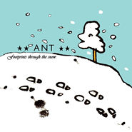

ANT
============================

|  |  |
| :--: | :-- |
| [ ANT](https://i.xiami.com/antonyharding) | **地区**: United Kingdom 英国 **风格**: 独立民谣 Indie Folk **播放数**: 3180295 **粉丝数**: 4877 **评论数**: 739  |

## 档案

UK singer-songwriter Antony Harding (ANT).  www.curesforbrokenhearts.com

## 专辑

| 名称 | 语种 | 唱片公司 | 发行时间 | 专辑类别 | 专辑风格 |
| :--: | :-- | :-- | :-- | :-- | :-- |
| [ Cry Your Little Heart Outthe best of ANT](./albums/2106046242.md) | 英语 | WWNBB | 2019年12月10日 | 精选集 | 独立民谣 Indie Folk |
| [ Footprints Through The Snow](./albums/170174.md) | 英语 | Homesleep Records | 2006年02月19日 | 录音室专辑 | 独立民谣 Indie Folk, 独立流行 Indie Pop |

## 评论

|  |  |  |
| :-- | :-- | :-- |
|  [虾米用户](https://emumo.xiami.com/u/40032565)  2021-01-24 21:56 赞(1) 踩(0) | 
I like your song so much!
 |
| ⇒ |  [虾米用户](https://emumo.xiami.com/u/5494822) Goodbye Shri... 2021-01-25 14:17 赞(0) 踩(0) | 
Thank you   
 |
|  [虾米用户](https://emumo.xiami.com/u/102999358) 当我变强，这个世界才会展... 2021-01-22 16:16 赞(1) 踩(0) | 
好干净的声音，还有点奶。 What a clean and clear voice！
 |
| ⇒ |  [虾米用户](https://emumo.xiami.com/u/5494822) Goodbye Shri... 2021-01-23 19:16 赞(0) 踩(0) | 
  thank you
 |
|  [虾米用户](https://emumo.xiami.com/u/9430725) 当为神所佑 2021-01-07 23:18 赞(1) 踩(0) | 
！！！
 |
|  [虾米用户](https://emumo.xiami.com/u/331477936) 好冷啊。 2021-01-07 21:21 赞(1) 踩(0) | 
see you there
 |
| ⇒ |  [虾米用户](https://emumo.xiami.com/u/5494822) Goodbye Shri... 2021-01-08 22:24 赞(0) 踩(0) | 
Thank you!
 |
|  [虾米用户](https://emumo.xiami.com/u/379162683) 我想要记住你们，我想要你... 2020-11-30 17:42 赞(1) 踩(0) | 
I heard that the software is going to be closed. I downloaded all your songs. So sad:(
 |
| ⇒ |  [虾米用户](https://emumo.xiami.com/u/5494822) Goodbye Shri... 2020-12-02 05:05 赞(0) 踩(0) | 
Thank you for your support   
 |
|  [虾米用户](https://emumo.xiami.com/u/35510891)   2020-07-30 19:28 赞(1) 踩(0) | 
why are you so cute 
 |
|  [虾米用户](https://emumo.xiami.com/u/379162683) 我想要记住你们，我想要你... 2020-07-01 21:31 赞(1) 踩(0) | 

 |
|  [虾米用户](https://emumo.xiami.com/u/4548027) 自我取悦 2020-06-07 21:39 赞(3) 踩(0) | 
原来真的是艺人本人 多年前回复我又回粉我 一直以为是&amp;ldquo;代理&amp;rdquo;
 |
|  [虾米用户](https://emumo.xiami.com/u/354692703)  2020-03-12 17:53 赞(3) 踩(0) | 
怎么能温柔到这种程度
 |
|  [虾米用户](https://emumo.xiami.com/u/355616086) 下大雨咯 2019-11-26 21:23 赞(9) 踩(0) | 
可爱男生在线陪聊 
 |
|  [虾米用户](https://emumo.xiami.com/u/159516870) 童言无忌，年龄吹去。 2019-11-08 01:03 赞(3) 踩(0) | 
深夜睡不着或入睡困难时 你的歌曲可以让我安静发呆直到睡着
 |
| ⇒ |  [虾米用户](https://emumo.xiami.com/u/5494822) Goodbye Shri... 2021-01-17 03:32 赞(0) 踩(0) | 
Thank you!
 |
|  [虾米用户](https://emumo.xiami.com/u/5162448)  2019-09-23 22:52 赞(1) 踩(0) | 
看过现场 
 |
|  [虾米用户](https://emumo.xiami.com/u/3215543)  2019-09-22 18:21 赞(5) 踩(0) | 
居然回粉了。。。。。。。。惊吓。。受宠若惊
 |
|  [虾米用户](https://emumo.xiami.com/u/9080939) 不为无益之事，何遣有涯之... 2019-09-22 00:08 赞(5) 踩(0) | 
什么时候有中国的巡演计划
 |
| ⇒ |  [虾米用户](https://emumo.xiami.com/u/5494822) Goodbye Shri... 2021-01-27 01:17 赞(0) 踩(0) | 
Maybe one day...
 |
|  [虾米用户](https://emumo.xiami.com/u/378480754) 我现在感觉如何？ 2019-07-30 22:30 赞(1) 踩(0) | 
xiexie 
 |
|  [虾米用户](https://emumo.xiami.com/u/276944698) 不要自我设限..... 2019-05-04 15:51 赞(2) 踩(0) | 

 |
|  [虾米用户](https://emumo.xiami.com/u/197130419) There，There 2019-03-29 05:14 赞(2) 踩(0) | 
太帅了吧……
 |
|  [虾米用户](https://emumo.xiami.com/u/45686435) 一壺飛鳧 尋山夢鶴   ... 2019-03-09 02:22 赞(1) 踩(0) | 

 |
|  [虾米用户](https://emumo.xiami.com/u/20487547) 懒癌晚期 2019-02-28 10:57 赞(4) 踩(0) | 
互粉好可爱鸭～
 |
|  [虾米用户](https://emumo.xiami.com/u/378480754) 我现在感觉如何？ 2019-02-12 23:56 赞(1) 踩(0) | 
Thank you. 
 |
| ⇒ |  [虾米用户](https://emumo.xiami.com/u/5494822) Goodbye Shri... 2021-01-27 01:16 赞(0) 踩(0) | 
xie xie :-)
 |
|  [虾米用户](https://emumo.xiami.com/u/339191478)   2019-01-07 09:58 赞(3) 踩(0) | 
Happy new year(◍ ´꒳` ◍)
 |
| ⇒ |  [虾米用户](https://emumo.xiami.com/u/5494822) Goodbye Shri... 2021-01-17 03:31 赞(0) 踩(0) | 
xie xie :-)
 |
| ⇒ |  [虾米用户](https://emumo.xiami.com/u/102999358) 当我变强，这个世界才会展... 2021-01-22 16:17 赞(0) 踩(0) | 
<q><b>ANT说：</b></q>
 |
| ⇒ |  [虾米用户](https://emumo.xiami.com/u/5494822) Goodbye Shri... 2021-01-25 14:17 赞(0) 踩(0) | 
 
 |
|  [虾米用户](https://emumo.xiami.com/u/349589459)  2019-01-05 19:02 赞(2) 踩(0) | 

 |
|  [虾米用户](https://emumo.xiami.com/u/346087991) 医路漫漫 音乐为伴 2018-10-17 07:17 赞(1) 踩(0) | 
Hi &amp; good morning 
 |
|  [虾米用户](https://emumo.xiami.com/u/346087991) 医路漫漫 音乐为伴 2018-10-14 08:37 赞(2) 踩(0) | 
哈哈有两首中文歌是共同喜爱的
 |
|  [虾米用户](https://emumo.xiami.com/u/48909223) Things will ... 2018-10-13 23:09 赞(3) 踩(0) | 
互粉也太可爱了☺️
 |
|  [虾米用户](https://emumo.xiami.com/u/1001127)  2018-10-01 21:58 赞(2) 踩(0) | 
I still keep your pics that I took at 1 Space ,Beijing,2011 :)
 |
|  [虾米用户](https://emumo.xiami.com/u/339191478)   2018-09-14 23:10 赞(2) 踩(0) | 
My daily recommendations will have your songs.❤ It's a pleasure to hear your song. I like every song very much. ：）
 |
|  [虾米用户](https://emumo.xiami.com/u/339191478)   2018-09-09 08:21 赞(3) 踩(0) | 
You are so lovely.
 |
|  [虾米用户](https://emumo.xiami.com/u/324879742)   2018-08-09 06:12 赞(5) 踩(0) | 
。
 |
|  [虾米用户](https://emumo.xiami.com/u/142542918) just this 2018-08-02 10:58 赞(3) 踩(0) | 
一个可爱好棒的歌手  
 |
|  [虾米用户](https://emumo.xiami.com/u/142542918) just this 2018-07-30 16:30 赞(3) 踩(0) | 
好棒 great ,love you
 |
|  [虾米用户](https://emumo.xiami.com/u/256746836)   2018-03-24 22:10 赞(1) 踩(0) | 
可以的
 |
|  [虾米用户](https://emumo.xiami.com/u/18577189) 假如再也不能见到你，祝你... 2018-02-25 16:38 赞(1) 踩(0) | 
专封我都可以画耶 
 |
|  [虾米用户](https://emumo.xiami.com/u/7037199) 红尘陌上，浮世清欢。 2017-12-17 22:17 赞(3) 踩(0) | 
莫名喜欢他的封面大衣  
 |
|  [虾米用户](https://emumo.xiami.com/u/23534686) o 2017-12-13 17:42 赞(1) 踩(0) | 
o
 |
|  [虾米用户](https://emumo.xiami.com/u/31456460) 风筝有风，海豚有海 2017-12-12 14:54 赞(3) 踩(0) | 
ANT is really a cute name 
 |
|  [虾米用户](https://emumo.xiami.com/u/1997808) 怀旧是一种情怀 2017-10-27 23:09 赞(3) 踩(0) | 
怎么我一个大男人时而民谣，时而舞曲，时而重口味，上一首歌也许在摇滚，下一首就小清新了，有时候自己都搞不懂。
 |
|  [虾米用户](https://emumo.xiami.com/u/10028400) 我还没想好要写什么... 2017-10-01 09:06 赞(4) 踩(0) | 

 |
|  [虾米用户](https://emumo.xiami.com/u/7375864) grizzly land 2017-09-23 04:20 赞(3) 踩(0) | 
u r so sweet：） 
 |
|  [虾米用户](https://emumo.xiami.com/u/23641059) 虾友们W98357917... 2017-09-04 22:33 赞(2) 踩(0) | 

 |
|  [虾米用户](https://emumo.xiami.com/u/7686338) 静静深夜 月涌江流 2017-09-04 22:19 赞(2) 踩(0) | 
Listen to your song writing is a feeling of something,Tomorrow I&amp;#39;ll listen to your song and go on with my writing
 |
|  [虾米用户](https://emumo.xiami.com/u/190744653) 介绍一下自己 ,-) 土... 2017-07-30 23:26 赞(1) 踩(0) | 
hihihi
 |
|  [虾米用户](https://emumo.xiami.com/u/10499065)  2017-07-22 23:27 赞(3) 踩(0) | 
你好 竟然有回复消息  好亲切
 |
|  [虾米用户](https://emumo.xiami.com/u/13180134) 敲丫挺的 2017-06-15 20:35 赞(1) 踩(0) | 
不错的
 |
|  [虾米用户](https://emumo.xiami.com/u/36057872) 网易/BC: Breat... 2017-02-12 09:28 赞(2) 踩(0) | 
都回来了
 |
|  [虾米用户](https://emumo.xiami.com/u/36057872) 网易/BC: Breat... 2016-12-18 15:31 赞(3) 踩(0) | 
Ni hao
 |
| ⇒ |  [虾米用户](https://emumo.xiami.com/u/36057872) 网易/BC: Breat... 2017-06-28 11:41 赞(0) 踩(0) | 
<q><b>说：</b></q>
 |
|  [虾米用户](https://emumo.xiami.com/u/11906267)  2016-12-17 23:04 赞(2) 踩(0) | 
你好!!
 |
|  [虾米用户](https://emumo.xiami.com/u/7571716) 因为穷所以宅！ 2016-12-17 20:02 赞(2) 踩(0) | 
更新公告栏了哈，赶紧过来看，结果是“你好”。 Ni hao. : )
 |
|  [虾米用户](https://emumo.xiami.com/u/3583995) 一個人的戰爭 2016-11-15 19:30 赞(3) 踩(0) | 

 |
|  [虾米用户](https://emumo.xiami.com/u/10004536) →_→ 2016-09-29 14:06 赞(1) 踩(0) | 
简单的吉他，淡淡的吟唱....
 |
|  [虾米用户](https://emumo.xiami.com/u/199354766) 想要的少一点 2016-07-31 17:54 赞(1) 踩(0) | 
Wuhooo 
 |
|  [虾米用户](https://emumo.xiami.com/u/10584399) I don’t  2016-07-22 15:43 赞(1) 踩(0) | 
默默关注Ant ↓↓↓↓↓↓
 |
|  [虾米用户](https://emumo.xiami.com/u/7133174) 我还没想好要写什么... 2016-07-11 13:00 赞(1) 踩(0) | 
Just a random shrimp passing by...
 |
| ⇒ |  [虾米用户](https://emumo.xiami.com/u/7133174) 我还没想好要写什么... 2017-07-07 12:36 赞(0) 踩(0) | 
<q><b>说：</b></q>
 |
| ⇒ |  [虾米用户](https://emumo.xiami.com/u/7133174) 我还没想好要写什么... 2017-07-08 00:20 赞(0) 踩(0) | 
<q><b>说：</b></q>
 |
|  [虾米用户](https://emumo.xiami.com/u/7133174) 我还没想好要写什么... 2016-07-11 12:57 赞(2) 踩(0) | 
<a href="http://www.xiami.com/u/5494822" target="_blank" rel="nofollow noreferrer noopener">http://www.xiami.com/u/5494822</a>
 |
|  [虾米用户](https://emumo.xiami.com/u/33048965)  2016-07-01 02:13 赞(2) 踩(0) | 
真的，还在fb祝我生日快乐过，感动
 |
|  [虾米用户](https://emumo.xiami.com/u/42083103) Ein 2016-06-06 23:53 赞(1) 踩(0) | 
I find something.  
 |
|  [虾米用户](https://emumo.xiami.com/u/36057872) 网易/BC: Breat... 2016-06-06 23:36 赞(2) 踩(0) | 
Ant说新作品可能9月出来诶~
 |
|  [虾米用户](https://emumo.xiami.com/u/36057872) 网易/BC: Breat... 2016-06-06 22:44 赞(1) 踩(0) | 
wow~~~
 |
|  [虾米用户](https://emumo.xiami.com/u/3583995) 一個人的戰爭 2016-01-29 01:37 赞(2) 踩(0) | 

 |
|  [虾米用户](https://emumo.xiami.com/u/13953800) 声控。 2015-11-15 08:24 赞(1) 踩(0) | 
从微博过来 才知道他在虾米上传过歌，挺好听的
 |
|  [虾米用户](https://emumo.xiami.com/u/19812281) 扰乱 就是 扰乱 2015-10-16 00:18 赞(2) 踩(0) | 
封面看上去和beat happening一样
 |
|  [虾米用户](https://emumo.xiami.com/u/70769508)  2015-10-01 10:55 赞(2) 踩(0) | 
踩车听着小歌，真的忘了是在成都
 |
|  [虾米用户](https://emumo.xiami.com/u/1091163) Until then. 2015-08-04 22:58 赞(3) 踩(0) | 
史上最不高冷的歌手
 |
| ⇒ |  [虾米用户](https://emumo.xiami.com/u/11286938) 慢慢回消息留言,不好意思 2017-09-22 15:44 赞(0) 踩(0) | 
确实是，会回复大多数留言，（中文留言也不知道看懂没，反正会回复xie xie.  ni hao), 这么亲民也是没Sei了。   
 |
|  [虾米用户](https://emumo.xiami.com/u/20097049)   2015-07-25 15:27 赞(43) 踩(0) | 
这个歌手特别萌。。。和人互粉 也愿意回粉丝问题。。。。
 |
| ⇒ |  [虾米用户](https://emumo.xiami.com/u/103248306) 做自己 2019-01-28 11:56 赞(0) 踩(0) | 
对呀 
 |
|  [虾米用户](https://emumo.xiami.com/u/48785649) 你好，再见！ 2015-07-04 01:19 赞(1) 踩(0) | 

 |
|  [虾米用户](https://emumo.xiami.com/u/39171213)   2015-05-13 21:57 赞(3) 踩(0) | 
很暖心的歌手 声音太赞 对歌迷太好 新浪微博关注的粉丝比关注他的还多 萌叔 
 |
|  [虾米用户](https://emumo.xiami.com/u/8322799) 人无了了者，心有戚戚焉 2015-01-23 11:21 赞(1) 踩(0) | 
We Didn&amp;#039;t Move A Muscle 为什么没有了。。。
 |
|  [虾米用户](https://emumo.xiami.com/u/7269731) 謎樣跨次元喵¤電波星¤ 2015-01-03 22:38 赞(0) 踩(0) | 
=~=最近連英文歌都開始消失了
 |
|  [虾米用户](https://emumo.xiami.com/u/14543829) Love INDIE m... 2014-12-29 16:41 赞(1) 踩(0) | 
蚂蚁叔人超好！
 |
|  [虾米用户](https://emumo.xiami.com/u/9024240) 谁说癞蛤蟆不是蛤蟆 2014-12-26 13:31 赞(0) 踩(0) | 
我什么时候能睡醒啊
 |
|  [虾米用户](https://emumo.xiami.com/u/200469)  2014-12-25 16:07 赞(2) 踩(0) | 
Started listen to your music back to my high school, an album from Rock Music magazine, my fav is Spent too long walking with no heart follow:) thanks for those days walking down the street with your music in my ears:)! Merry Christmas ANT:)))))!
 |
| ⇒ |  [虾米用户](https://emumo.xiami.com/u/5494822) Goodbye Shri... 2014-12-25 19:50 赞(0) 踩(0) | 
Xie xie!! Rock Music Magazine? Merry Christmas to you! :-)
 |
| ⇒ |  [虾米用户](https://emumo.xiami.com/u/200469)  2014-12-26 15:12 赞(0) 踩(0) | 
<q><b>ANT说：</b></q>
 |
|  [虾米用户](https://emumo.xiami.com/u/44440903) 暂无签名~ 2014-12-05 11:29 赞(0) 踩(0) | 
任何时候
 |
|  [虾米用户](https://emumo.xiami.com/u/26437910) breathing 2014-09-08 08:19 赞(1) 踩(0) | 
好幸福的声音
 |
|  [虾米用户](https://emumo.xiami.com/u/12366844) 五音不全安静听歌 2014-09-01 19:05 赞(0) 踩(0) | 
相似艺人的歌在豆瓣FM妥妥的都听过一溜了
 |
|  [虾米用户](https://emumo.xiami.com/u/9616922) 陪伴是最长情的告白。 2014-08-28 01:15 赞(1) 踩(0) | 
You&amp;#039;re so cute.
 |
|  [虾米用户](https://emumo.xiami.com/u/553765) 时光总是不等我们回过神就... 2014-08-27 18:21 赞(0) 踩(0) | 
求大虾传点ANT的专辑给我啊  有的说下  谢谢了！
 |
|  [虾米用户](https://emumo.xiami.com/u/553765) 时光总是不等我们回过神就... 2014-08-27 18:13 赞(0) 踩(0) | 
很喜欢你的音乐  ！！！
 |
| ⇒ |  [虾米用户](https://emumo.xiami.com/u/5494822) Goodbye Shri... 2014-11-02 20:13 赞(0) 踩(0) | 
Xie xie :-D
 |
| ⇒ |  [虾米用户](https://emumo.xiami.com/u/553765) 时光总是不等我们回过神就... 2014-11-04 19:15 赞(0) 踩(0) | 
<q><b>ANT说：</b></q>
 |
|  [虾米用户](https://emumo.xiami.com/u/33841656)  2014-08-12 16:58 赞(23) 踩(0) | 
英国唱作歌手 ANT 2014年中国巡演 巡演路线： 9.19 上海 浅水湾 9.20 北京 mao 9.22 武汉 Vox 9.23 深圳 B10现场 9.24 广州 Tu空间 详情请戳：<a href="http://www.douban.com/event/22035387/" target="_blank" rel="nofollow noreferrer noopener">http://www.douban.com/event/22035387/</a>
 |
|  [虾米用户](https://emumo.xiami.com/u/11648464) ~ 2014-08-12 15:00 赞(0) 踩(0) | 
喵~
 |
|  [虾米用户](https://emumo.xiami.com/u/9133924) 要起飞了的银河星星 2014-07-21 11:10 赞(0) 踩(0) | 
有种听温柔版kent的感觉
 |
|  [虾米用户](https://emumo.xiami.com/u/33900862) l i b e r t ... 2014-06-11 00:37 赞(0) 踩(0) | 
软
 |
|  [虾米用户](https://emumo.xiami.com/u/2604752) 理论乃灰色，生命之树长青 2014-06-09 18:52 赞(0) 踩(0) | 
MN-民谣当道 清新一夏
 |
|  [虾米用户](https://emumo.xiami.com/u/144619)   2014-06-06 17:36 赞(1) 踩(0) | 
是本籍瑞典的英国唱作人Antony Harding的化名，自其成立至今都已经有不短的九年时间。这个来自英国怀特岛的男人已经俘获了众多歌迷的心，
 |
|  [虾米用户](https://emumo.xiami.com/u/3587768) 个性签名 2014-06-03 22:33 赞(1) 踩(0) | 
Do you mind I am learning ur song and singing to my girl??  ....haaa I know you don&amp;#039;t.
 |
| ⇒ |  [虾米用户](https://emumo.xiami.com/u/5494822) Goodbye Shri... 2014-06-04 03:37 赞(0) 踩(0) | 
Which song:?-D let me guess... Muscle? ;-)
 |
| ⇒ |  [虾米用户](https://emumo.xiami.com/u/3587768) 个性签名 2014-06-04 05:37 赞(0) 踩(0) | 
<q><b>ANT说：</b></q>
 |
| ⇒ |  [虾米用户](https://emumo.xiami.com/u/5494822) Goodbye Shri... 2021-01-09 08:38 赞(0) 踩(0) | 
Did you learn to play it?   
 |
|  [虾米用户](https://emumo.xiami.com/u/8859071) 簽名太長寫不下~ 2014-05-30 16:10 赞(0) 踩(0) | 
飘~~~
 |
|  [虾米用户](https://emumo.xiami.com/u/10410204) ? 2014-05-29 19:21 赞(0) 踩(0) | 
有点受不了刮吉他弦的声音…虽说这样是比较acoustic啦但是真心有点受不了…特别是戴耳机以后…。
 |
|  [虾米用户](https://emumo.xiami.com/u/2871) 虾米编辑部唯一官方账号 ... 2014-05-27 16:03 赞(1) 踩(0) | 
:-)
 |
|  [虾米用户](https://emumo.xiami.com/u/141825) drowned. 2014-05-27 15:26 赞(3) 踩(0) | 
本尊: <a href="http://www.xiami.com/u/5494822" target="_blank" rel="nofollow noreferrer noopener">http://www.xiami.com/u/5494822</a> 不要大意地去勾搭吧!!
 |
| ⇒ |  [虾米用户](https://emumo.xiami.com/u/468998) 大江大海山川，湖泊音乐和... 2014-11-03 23:59 赞(0) 踩(0) | 
真的是本尊嘛？还有想知道跟July Skies（<a href="http://www.xiami.com/artist/24186" target="_blank" rel="nofollow noreferrer noopener">http://www.xiami.com/artist/24186</a>）里的Antony Harding是同一个人吗？
 |
| ⇒ |  [虾米用户](https://emumo.xiami.com/u/468998) 大江大海山川，湖泊音乐和... 2014-11-04 00:52 赞(0) 踩(0) | 
真的是本尊，然后站内信问了回复说不是同一人。
 |
| ⇒ |  [虾米用户](https://emumo.xiami.com/u/141825) drowned. 2014-11-04 10:52 赞(0) 踩(0) | 
<q><b>かねこ说：</b></q>
 |
|  [虾米用户](https://emumo.xiami.com/u/6900410) Beats+ 2014-04-12 22:28 赞(0) 踩(0) | 
Dear Mr. Ant I have a question. If you are 22 years old and depressed, will you become better when i dunno...like 25 or 26?
 |
| ⇒ |  [虾米用户](https://emumo.xiami.com/u/5494822) Goodbye Shri... 2014-04-14 03:38 赞(0) 踩(0) | 
Dear Hitomi.  I think it depends greatly on how your life changes over the years. If you get stuck in the same routine then you&amp;#039;ll probably still be blue in a few years time. My advice is try changing things, big or small. It worked for me. I&amp;#039;m still blue, but more of a sky blue these days. :-) HUGS
 |
| ⇒ |  [虾米用户](https://emumo.xiami.com/u/928156)  2019-02-17 14:26 赞(0) 踩(0) | 
<q><b>ANT说：</b></q>
 |
|  [虾米用户](https://emumo.xiami.com/u/12877359)  2014-02-26 15:21 赞(1) 踩(0) | 
音色清新，独特
 |
|  [虾米用户](https://emumo.xiami.com/u/1708298) 我还是我却也不是我 2014-02-24 11:22 赞(1) 踩(0) | 
DEAR ANT I has not been here for a long time.How are you?Did you come to Xiamen?No matter what you see my message remember back to me.O(∩_∩)O~
 |
| ⇒ |  [虾米用户](https://emumo.xiami.com/u/5494822) Goodbye Shri... 2014-03-02 02:10 赞(0) 踩(0) | 
Hi! Nice to see you on here again! :-)
 |
|  [虾米用户](https://emumo.xiami.com/u/2132547) 等到你为了歌唱而震动血脉... 2013-12-31 10:43 赞(2) 踩(0) | 
发音咬字好cute哇~而且封面都太可爱了哇！难道是他自己画的吗？！
 |
| ⇒ |  [虾米用户](https://emumo.xiami.com/u/2860963) 690313618/No... 2014-05-11 02:24 赞(0) 踩(0) | 
是哟
 |
|  [虾米用户](https://emumo.xiami.com/u/6638261) 已下架。。。。20200... 2013-11-27 00:20 赞(1) 踩(0) | 
温暖~
 |
|  [虾米用户](https://emumo.xiami.com/u/7131632)  2013-11-22 21:50 赞(1) 踩(0) | 
When I&amp;#039;m writing my paper, reading the boring law textbooks and analyzing cases, only your music can calm me down.
 |
|  [虾米用户](https://emumo.xiami.com/u/9434078) 音乐 2013-11-10 19:30 赞(1) 踩(0) | 
轻柔
 |
|  [虾米用户](https://emumo.xiami.com/u/9434078) 音乐 2013-11-10 19:27 赞(1) 踩(0) | 
轻柔
 |
|  [虾米用户](https://emumo.xiami.com/u/7973237) 思想总转向希望 2013-10-27 20:32 赞(3) 踩(0) | 
一个能唱出温暖的感觉的男孩，因为人和音乐本身就是温暖的，而那些散发出的纯粹的光晕，正在问候你我。
 |
|  [虾米用户](https://emumo.xiami.com/u/601978)  2013-09-29 07:56 赞(12) 踩(0) | 
2014年下半年来中国巡演！
 |
|  [虾米用户](https://emumo.xiami.com/u/2940411)  2013-09-18 23:22 赞(1) 踩(0) | 
声音很美。
 |
|  [虾米用户](https://emumo.xiami.com/u/9426914)   2013-08-27 22:26 赞(1) 踩(0) | 
new album？  <a href="http://blog.xiami.com/?p=456" target="_blank">此消息来自于手机虾米</a>
 |
| ⇒ |  [虾米用户](https://emumo.xiami.com/u/9426914)   2013-09-01 02:25 赞(0) 踩(0) | 
<q><b>说：</b></q>
 |
|  [虾米用户](https://emumo.xiami.com/u/98927) 最多12个字符。 2013-08-26 11:13 赞(1) 踩(0) | 
Will you perform in China?
 |
| ⇒ |  [虾米用户](https://emumo.xiami.com/u/5494822) Goodbye Shri... 2013-08-27 05:05 赞(0) 踩(0) | 
Next year again I hope...~~
 |
| ⇒ |  [虾米用户](https://emumo.xiami.com/u/98927) 最多12个字符。 2013-08-27 17:33 赞(0) 踩(0) | 
<q><b>ANT说：</b></q>
 |
| ⇒ |  [虾米用户](https://emumo.xiami.com/u/5494822) Goodbye Shri... 2013-08-27 21:00 赞(0) 踩(0) | 
<q><b>FFFF说：</b></q>
 |
| ⇒ |  [虾米用户](https://emumo.xiami.com/u/6900410) Beats+ 2013-09-17 11:20 赞(0) 踩(0) | 
<q><b>ANT说：</b></q>
 |
| ⇒ |  [虾米用户](https://emumo.xiami.com/u/5494822) Goodbye Shri... 2013-09-17 15:21 赞(0) 踩(0) | 
<q><b>Hitomi说：</b></q>
 |
| ⇒ |  [虾米用户](https://emumo.xiami.com/u/6900410) Beats+ 2013-09-17 16:24 赞(0) 踩(0) | 
<q><b>ANT说：</b></q>
 |
|  [虾米用户](https://emumo.xiami.com/u/5848254) 网易云音乐（之后可能会开... 2013-08-22 09:46 赞(3) 踩(0) | 
温暖，可爱，如其人~
 |
|  [虾米用户](https://emumo.xiami.com/u/4717343)  2013-07-29 15:08 赞(1) 踩(0) | 
kiss on a plate
 |
|  [虾米用户](https://emumo.xiami.com/u/2250075)  2013-07-06 17:59 赞(1) 踩(0) | 
很好很好的很好
 |
|  [虾米用户](https://emumo.xiami.com/u/9741887)  2013-07-03 09:54 赞(1) 踩(0) | 
lalalalalala^^
 |
|  [虾米用户](https://emumo.xiami.com/u/2312465)  2013-06-25 22:04 赞(0) 踩(0) | 
6
 |
|  [虾米用户](https://emumo.xiami.com/u/5961942)  2013-05-30 02:58 赞(0) 踩(0) | 
收
 |
|  [虾米用户](https://emumo.xiami.com/u/2861186) 我还没想好要写什么... 2013-05-25 12:22 赞(2) 踩(0) | 
我竟然脑残的把他签名CD送朋友了
 |
|  [虾米用户](https://emumo.xiami.com/u/7133174) 我还没想好要写什么... 2013-05-19 20:08 赞(0) 踩(0) | 
Antony 一个托尼？
 |
|  [虾米用户](https://emumo.xiami.com/u/415846)  2013-05-18 20:36 赞(0) 踩(0) | 
mark
 |
|  [虾米用户](https://emumo.xiami.com/u/3772330) 尽人事以逮天命 2013-05-15 17:12 赞(1) 踩(0) | 
去年听他的现场，那天音效不好，可他真是好暖
 |
|  [虾米用户](https://emumo.xiami.com/u/819805) 我们点起火把，烧死爱情。 2013-04-28 15:52 赞(0) 踩(0) | 
haaaaappy birthday~~~
 |
|  [虾米用户](https://emumo.xiami.com/u/220719) 自知不自見，自愛不自貴 2013-04-28 11:01 赞(0) 踩(0) | 
Happy Birthday!
 |
|  [虾米用户](https://emumo.xiami.com/u/9808163) 我还没想好要写什么... 2013-04-20 16:07 赞(1) 踩(0) | 
Seen you at Yin Yue Tai,also met with in shrimp,watching your video feel warm，good afternoon!
 |
|  [虾米用户](https://emumo.xiami.com/u/4934076)  2013-04-16 13:04 赞(0) 踩(0) | 
0.0
 |
|  [虾米用户](https://emumo.xiami.com/u/13891823)  2013-04-10 20:04 赞(0) 踩(0) | 
睡不着的时候听
 |
|  [虾米用户](https://emumo.xiami.com/u/3110981) :з」∠ 2013-04-10 17:33 赞(0) 踩(0) | 
~\\(≧▽≦)/~
 |
|  [虾米用户](https://emumo.xiami.com/u/11001672) (●′ω`●) 2013-03-26 00:16 赞(2) 踩(0) | 
It\' s amazing to meet you ~I\'ve  always feel warm when I listen your music,good night,O(∩_∩)O
 |
| ⇒ |  [虾米用户](https://emumo.xiami.com/u/5494822) Goodbye Shri... 2013-03-26 04:43 赞(0) 踩(0) | 
Thank you very much! Stay warm! Wan an!
 |
| ⇒ |  [虾米用户](https://emumo.xiami.com/u/11001672) (●′ω`●) 2013-03-26 21:32 赞(0) 踩(0) | 
<q><b>ANT说：</b></q>
 |
|  [虾米用户](https://emumo.xiami.com/u/679609)   2013-03-21 18:36 赞(2) 踩(0) | 
good job ! dude  !  superstar voice and chillllllllling rhythm~~
 |
|  [虾米用户](https://emumo.xiami.com/u/1515013)  2013-03-20 12:24 赞(0) 踩(0) | 
今年发掘出的第一个好声音
 |
|  [虾米用户](https://emumo.xiami.com/u/2496576) music foreve... 2013-03-15 18:08 赞(1) 踩(0) | 
I can`t help asking you a question,,,,do you have a girlfriend now?your songs sound like you are lonely and happy.....
 |
| ⇒ |  [虾米用户](https://emumo.xiami.com/u/318132) 抠啦 2013-04-24 20:25 赞(0) 踩(0) | 
<q><b>说：</b></q>
 |
|  [虾米用户](https://emumo.xiami.com/u/5383081)  2013-03-13 02:25 赞(1) 踩(0) | 
很温暖的艺人呀！！
 |
|  [虾米用户](https://emumo.xiami.com/u/12695195)  2013-03-09 11:05 赞(1) 踩(0) | 
Ant
 |
|  [虾米用户](https://emumo.xiami.com/u/5799335) 无业游民 2013-02-22 12:01 赞(1) 踩(0) | 
you look so cute 头像很帅呀
 |
|  [虾米用户](https://emumo.xiami.com/u/2939694)  2013-02-09 01:31 赞(1) 踩(0) | 
hola amigo!!! i think now u know who I am,xD
 |
|  [虾米用户](https://emumo.xiami.com/u/11115273)  2013-02-05 14:59 赞(0) 踩(0) | 
不收藏对不起这封面~
 |
|  [虾米用户](https://emumo.xiami.com/u/10294893) XXX 2013-02-02 01:32 赞(1) 踩(0) | 
ant, you\'re kind, and great.
 |
|  [虾米用户](https://emumo.xiami.com/u/146401) A loner. 2013-01-20 20:50 赞(1) 踩(0) | 
already liked ur page on fb. : )
 |
|  [虾米用户](https://emumo.xiami.com/u/990478) 「但愿人长久」 2013-01-10 20:15 赞(1) 踩(0) | 
封面真漂亮
 |
|  [虾米用户](https://emumo.xiami.com/u/5168463) 细谷病_(:з」∠)_ 2013-01-07 14:36 赞(1) 踩(0) | 
声音和调调太亲了
 |
|  [虾米用户](https://emumo.xiami.com/u/7453710)  2013-01-07 00:23 赞(2) 踩(0) | 
好
 |
|  [虾米用户](https://emumo.xiami.com/u/3091841) 收集封面 2013-01-04 14:09 赞(2) 踩(0) | 
突然突然想到两个字，可爱
 |
| ⇒ |  [虾米用户](https://emumo.xiami.com/u/9821494)  2013-07-30 14:52 赞(0) 踩(0) | 
你说自己啊？
 |
|  [虾米用户](https://emumo.xiami.com/u/2198269) 是大厨- 2012-12-20 17:10 赞(1) 踩(0) | 
何为民谣，慢慢唱，慢慢进入心田，慢慢的无法自拔~~ 于slipped away
 |
|  [虾米用户](https://emumo.xiami.com/u/9012818) 杀不死杀不死现实的无常 2012-12-17 12:07 赞(1) 踩(0) | 
awesome!! luv ur songs (´・ω・`)  do u have FB?
 |
| ⇒ |  [虾米用户](https://emumo.xiami.com/u/5848254) 网易云音乐（之后可能会开... 2012-12-23 08:50 赞(0) 踩(0) | 
<q><b>说：</b></q>
 |
|  [虾米用户](https://emumo.xiami.com/u/2368298)  2012-12-15 22:59 赞(1) 踩(0) | 
I love your music very very much.But I also  suggest that you\'d better not share your latest released album on thiswebsite.We can download your album for just 0.8xiamibi(Compare with a new CD It\'s too cheap...).It may mean financial loss to you.
 |
|  [虾米用户](https://emumo.xiami.com/u/2368298)  2012-12-14 23:13 赞(1) 踩(0) | 
想起了Jack Johnson，虽然调调没Johnson那么轻快，大爱之
 |
|  [虾米用户](https://emumo.xiami.com/u/9801076) 群处守住嘴，独处守住心。 2012-12-14 15:46 赞(0) 踩(0) | 
I hate this place-sky and sea -一首美妙的歌曲，你应该不会艰难的看懂。 which country are you from?
 |
| ⇒ |  [虾米用户](https://emumo.xiami.com/u/9801076) 群处守住嘴，独处守住心。 2012-12-17 19:25 赞(0) 踩(0) | 
<q><b>说：</b></q>
 |
| ⇒ |  [虾米用户](https://emumo.xiami.com/u/9801076) 群处守住嘴，独处守住心。 2012-12-17 20:57 赞(0) 踩(0) | 
<q><b>说：</b></q>
 |
|  [虾米用户](https://emumo.xiami.com/u/9801076) 群处守住嘴，独处守住心。 2012-12-14 15:34 赞(1) 踩(0) | 
When you stand and share your story i, your story will heal you and your story will heal somebody else. Nice to meet you！
 |
| ⇒ |  [虾米用户](https://emumo.xiami.com/u/5494822) Goodbye Shri... 2012-12-14 17:19 赞(0) 踩(0) | 
xie xie
 |
|  [虾米用户](https://emumo.xiami.com/u/296487)  2012-12-13 23:46 赞(1) 踩(0) | 
simple man
 |
|  [虾米用户](https://emumo.xiami.com/u/757466) 公园之王 2012-12-13 22:18 赞(1) 踩(0) | 
thank you for your new album~
 |
| ⇒ |  [虾米用户](https://emumo.xiami.com/u/5494822) Goodbye Shri... 2012-12-13 22:51 赞(0) 踩(0) | 
xie xie&amp;lt;!!&amp;gt;
 |
|  [虾米用户](https://emumo.xiami.com/u/633412) 天长地久有时尽。 2012-12-06 02:15 赞(1) 踩(0) | 
What a surprise ! :D
 |
| ⇒ |  [虾米用户](https://emumo.xiami.com/u/5494822) Goodbye Shri... 2012-12-06 03:06 赞(0) 踩(0) | 
Zhen gao xing ren shi  ni.
 |
|  [虾米用户](https://emumo.xiami.com/u/3792087) 我还没想好要写什么... 2012-11-30 17:47 赞(13) 踩(0) | 
看他在微博上发的那些图片，真的很美好，很可爱，互动时也感觉到他言语间透露着一种大男孩般的气息，音乐自然不必说了，好听！！
 |
| ⇒ |  [虾米用户](https://emumo.xiami.com/u/1619920)  2013-10-23 22:59 赞(0) 踩(0) | 
有微博？求链接
 |
| ⇒ |  [虾米用户](https://emumo.xiami.com/u/3792087) 我还没想好要写什么... 2013-10-24 10:52 赞(0) 踩(0) | 
<q><b>西凉虫说：</b></q>
 |
|  [虾米用户](https://emumo.xiami.com/u/6005918) 网易云账号同名：pans... 2012-11-22 23:30 赞(1) 踩(0) | 
超萌的大叔，他的小孩也很可爱
 |
|  [虾米用户](https://emumo.xiami.com/u/3782225) 拔剑四顾心茫然 2012-11-20 09:35 赞(1) 踩(0) | 
在伤心绝望无助到真的好想哭的时候听到这首。 我也不知道是为什么要遭受和忍受这一切， 为什么要委身于这样的绝望和混乱， 为什么？？?
 |
|  [虾米用户](https://emumo.xiami.com/u/8689844)  2012-11-05 15:53 赞(1) 踩(0) | 
意大利的独立唱片
 |
|  [虾米用户](https://emumo.xiami.com/u/7729387)  2012-10-30 22:46 赞(1) 踩(0) | 
WOW, you always on line.(*^__^*)
 |
|  [虾米用户](https://emumo.xiami.com/u/3178648) 于是我抽了一口烟 手插口... 2012-10-27 19:08 赞(1) 踩(0) | 
Hey Ant!!!Long time no see,miss u so much!
 |
|  [虾米用户](https://emumo.xiami.com/u/318132) 抠啦 2012-09-30 16:41 赞(1) 踩(0) | 
long time no see,i miss you
 |
| ⇒ |  [虾米用户](https://emumo.xiami.com/u/318132) 抠啦 2012-10-11 16:50 赞(0) 踩(0) | 
<q><b>说：</b></q>
 |
|  [虾米用户](https://emumo.xiami.com/u/5848254) 网易云音乐（之后可能会开... 2012-09-30 12:08 赞(0) 踩(0) | 
中秋节愉快！happy Mid-Autumn Festival!
 |
|  [虾米用户](https://emumo.xiami.com/u/9429118)   2012-09-29 01:12 赞(1) 踩(0) | 
we did\'t move a muscle
 |
|  [虾米用户](https://emumo.xiami.com/u/1304024)  2012-09-26 17:08 赞(1) 踩(0) | 
没了抵抗力~
 |
|  [虾米用户](https://emumo.xiami.com/u/10711440) 收获时间 2012-09-22 13:25 赞(1) 踩(0) | 
原创另类民谣音乐，超爱~~
 |
|  [虾米用户](https://emumo.xiami.com/u/10435106) 听靓歌 2012-09-18 00:40 赞(1) 踩(0) | 
不错，喜欢。
 |
|  [虾米用户](https://emumo.xiami.com/u/1680160)  2012-09-15 20:02 赞(1) 踩(0) | 
Antony Harding?!! Hi!
 |
| ⇒ |  [虾米用户](https://emumo.xiami.com/u/5494822) Goodbye Shri... 2012-09-16 01:08 赞(0) 踩(0) | 
Melissa Mai! Hi!!
 |
| ⇒ |  [虾米用户](https://emumo.xiami.com/u/1680160)  2012-09-16 01:28 赞(0) 踩(0) | 
<q><b>ANT说：</b></q>
 |
|  [虾米用户](https://emumo.xiami.com/u/3168210)  2012-09-12 16:20 赞(1) 踩(0) | 
喜欢这个调调
 |
|  [虾米用户](https://emumo.xiami.com/u/9123818) 我还没想好要写什么... 2012-09-12 12:13 赞(1) 踩(0) | 
The real ANT? Suprising……
 |
|  [虾米用户](https://emumo.xiami.com/u/963649) 15986649687 2012-09-08 20:27 赞(1) 踩(0) | 
Ant
 |
|  [虾米用户](https://emumo.xiami.com/u/4189303)  2012-08-30 16:55 赞(1) 踩(0) | 
他要在梦象音乐节上出现啊，没有抵抗力ing。。。。
 |
|  [虾米用户](https://emumo.xiami.com/u/894228) 我还没想好要写什么... 2012-08-29 21:45 赞(1) 踩(0) | 
就是爽.
 |
|  [虾米用户](https://emumo.xiami.com/u/3178648) 于是我抽了一口烟 手插口... 2012-08-27 14:50 赞(1) 踩(0) | 
对这样的轻柔完全没有抵抗力。
 |
|  [虾米用户](https://emumo.xiami.com/u/3178648) 于是我抽了一口烟 手插口... 2012-08-27 00:54 赞(1) 踩(0) | 
1000 fans!!!
 |
|  [虾米用户](https://emumo.xiami.com/u/3235848)  2012-08-23 23:22 赞(1) 踩(0) | 
Happy Chinese Valentine\'s Day! ^ ^
 |
|  [虾米用户](https://emumo.xiami.com/u/9426914)   2012-08-20 19:09 赞(1) 踩(0) | 
Ah,you\'ve uploaded some of ur records. Thnx for sharing.:)
 |
|  [虾米用户](https://emumo.xiami.com/u/9426914)   2012-08-19 10:55 赞(1) 踩(0) | 
Your songs are brilliant. Hope that you can make more records in the future, U R a genius.加油。.:)
 |
|  [虾米用户](https://emumo.xiami.com/u/3539925)  2012-08-18 11:16 赞(1) 踩(0) | 
there\'re so many users called Ant in Xiami...well i still can find you.
 |
| ⇒ |  [虾米用户](https://emumo.xiami.com/u/3539925)  2012-08-20 00:50 赞(0) 踩(0) | 
<q><b>说：</b></q>
 |
|  [虾米用户](https://emumo.xiami.com/u/29) 耍中偶得 2012-07-31 18:26 赞(0) 踩(0) | 
好热闹
 |
|  [虾米用户](https://emumo.xiami.com/u/2689520)  2012-07-31 12:55 赞(1) 踩(0) | 
（）
 |
|  [虾米用户](https://emumo.xiami.com/u/6931948) 我所传达的，就是你所知道... 2012-07-31 11:04 赞(30) 踩(0) | 
吉他声响起的一瞬，我就收藏之了。
 |
| ⇒ |  [虾米用户](https://emumo.xiami.com/u/6420786) skinnypeas 2013-02-04 04:09 赞(0) 踩(0) | 
我也是
 |
|  [虾米用户](https://emumo.xiami.com/u/29) 耍中偶得 2012-07-25 15:31 赞(1) 踩(0) | 
hi Ant LAO here
 |
|  [虾米用户](https://emumo.xiami.com/u/9426914)   2012-07-16 19:19 赞(1) 踩(0) | 
comfortable voice.
 |
|  [虾米用户](https://emumo.xiami.com/u/7814205) 我还没想好要写什么... 2012-07-14 02:03 赞(1) 踩(0) | 
爱上这个人
 |
|  [虾米用户](https://emumo.xiami.com/u/425564) tom去了比基尼海滩…… 2012-07-12 23:24 赞(0) 踩(0) | 
<a href="http://www.xiami.com/album/526949" target="_blank" rel="nofollow noreferrer noopener">http://www.xiami.com/album/526949</a>   like it~ thx~
 |
|  [虾米用户](https://emumo.xiami.com/u/5648252)  2012-07-09 16:49 赞(1) 踩(0) | 
ANT  要在北京巡演  我们声乐坊组织 希望大家参加
 |
|  [虾米用户](https://emumo.xiami.com/u/1153116)  2012-07-07 21:20 赞(0) 踩(0) | 
******
 |
| ⇒ |  [虾米用户](https://emumo.xiami.com/u/5848254) 网易云音乐（之后可能会开... 2012-07-16 14:11 赞(0) 踩(0) | 
<q><b>说：</b></q>
 |
|  [虾米用户](https://emumo.xiami.com/u/98927) 最多12个字符。 2012-07-05 00:46 赞(0) 踩(0) | 
难道你就是ANT本人吗 ？  我把你的歌已经传到土豆了。 希望更多人关注你
 |
|  [虾米用户](https://emumo.xiami.com/u/4851067)  2012-07-04 01:04 赞(1) 踩(0) | 
窝在沙发里循环。。。
 |
|  [虾米用户](https://emumo.xiami.com/u/2595353) 微笑，给你 2012-07-03 22:11 赞(1) 踩(0) | 
Nice to meet you. I don\'t know much about you, but I really enjoy your music! I look forward to listening to your new songs!
 |
|  [虾米用户](https://emumo.xiami.com/u/665706) 好久不来，发现好友不在了... 2012-07-03 21:07 赞(0) 踩(0) | 
我要破坏你们良好的英文氛围，嘎嘎嘎。我要毁灭宇宙的。
 |
| ⇒ |  [虾米用户](https://emumo.xiami.com/u/5848254) 网易云音乐（之后可能会开... 2012-07-16 14:12 赞(0) 踩(0) | 
算我一个！
 |
| ⇒ |  [虾米用户](https://emumo.xiami.com/u/665706) 好久不来，发现好友不在了... 2012-07-16 14:59 赞(0) 踩(0) | 
<q><b>Hui说：</b></q>
 |
|  [虾米用户](https://emumo.xiami.com/u/7393402)  2012-07-03 16:29 赞(1) 踩(0) | 
清新慢歌
 |
|  [虾米用户](https://emumo.xiami.com/u/318132) 抠啦 2012-07-03 11:09 赞(1) 踩(0) | 
long time no see(*^__^*)
 |
|  [虾米用户](https://emumo.xiami.com/u/2885704) 莫纵己欲莫言人非 2012-07-02 09:46 赞(1) 踩(0) | 
Seriously?!!!! u r ANT~ unbelievable....I mean I\'ve never thought that I will be able to show up here.....
 |
|  [虾米用户](https://emumo.xiami.com/u/2749246) 和平中寸步难行 2012-06-30 12:57 赞(1) 踩(0) | 
早就该收了~
 |
|  [虾米用户](https://emumo.xiami.com/u/7673434) 最后救你的定是最初的你 2012-06-26 02:00 赞(1) 踩(0) | 
有点太柔了。。。
 |
|  [虾米用户](https://emumo.xiami.com/u/7901242)  2012-06-18 21:18 赞(0) 踩(0) | 
淡淡的
 |
|  [虾米用户](https://emumo.xiami.com/u/6098024)  2012-06-12 16:57 赞(0) 踩(0) | 
******
 |
|  [虾米用户](https://emumo.xiami.com/u/1417169)   2012-06-11 13:03 赞(0) 踩(0) | 
好想听着他的歌，坐着什么都不想，等待这样的生活
 |
|  [虾米用户](https://emumo.xiami.com/u/2897977) 인디 2012-06-05 15:15 赞(0) 踩(0) | 
什么也没干，听了一下午英国大叔弹吉他唱歌... 今天和候爹聊了会儿天，突然发现最近让我抑郁不舒心的事情其实是由自己的优柔寡断而造成的，不是好人也不是坏人，假装伪善不好不坏地活着的自己真是狡猾吗？
 |
| ⇒ |  [虾米用户](https://emumo.xiami.com/u/5848254) 网易云音乐（之后可能会开... 2012-07-06 08:41 赞(0) 踩(0) | 
同病，通病。
 |
|  [虾米用户](https://emumo.xiami.com/u/483570)   2012-06-04 00:11 赞(1) 踩(0) | 
Im listening to your new EP, still feel sooooooo warm:)
 |
|  [虾米用户](https://emumo.xiami.com/u/817547)   2012-06-03 14:35 赞(1) 踩(0) | 
hey man!whats your favourite singer?
 |
| ⇒ |  [虾米用户](https://emumo.xiami.com/u/817547)   2012-06-04 12:34 赞(0) 踩(0) | 
<q><b>说：</b></q>
 |
|  [虾米用户](https://emumo.xiami.com/u/309136) I sing it fo... 2012-06-01 18:54 赞(0) 踩(0) | 
再M
 |
| ⇒ |  [虾米用户](https://emumo.xiami.com/u/7673434) 最后救你的定是最初的你 2012-06-26 01:58 赞(0) 踩(0) | 
再回！
 |
|  [虾米用户](https://emumo.xiami.com/u/6900410) Beats+ 2012-05-31 16:06 赞(1) 踩(0) | 
用忧伤来治愈
 |
|  [虾米用户](https://emumo.xiami.com/u/3923285) 我还没想好要写什么... 2012-05-26 19:14 赞(0) 踩(0) | 
hi,you like Cheer too?
 |
| ⇒ |  [虾米用户](https://emumo.xiami.com/u/5494822) Goodbye Shri... 2012-05-29 02:46 赞(0) 踩(0) | 
Cheer?
 |
| ⇒ |  [虾米用户](https://emumo.xiami.com/u/3923285) 我还没想好要写什么... 2012-05-29 09:47 赞(0) 踩(0) | 
<q><b>ANT说：</b></q>
 |
| ⇒ |  [虾米用户](https://emumo.xiami.com/u/3923285) 我还没想好要写什么... 2012-05-30 13:07 赞(0) 踩(0) | 
<q><b>说：</b></q>
 |
|  [虾米用户](https://emumo.xiami.com/u/3235848)  2012-05-22 21:37 赞(1) 踩(0) | 
Hej, Ant!   Trevligt att träffas Jag tycker väldigt mycket om din musik!    (｡◕ˇ∀ˇ◕）
 |
|  [虾米用户](https://emumo.xiami.com/u/4033588)  2012-04-24 06:30 赞(0) 踩(0) | 
算不上啦，呵呵。  不过，越了解越理解，俺也跟着心胸开阔多啦，哈。
 |
|  [虾米用户](https://emumo.xiami.com/u/4033588)  2012-04-21 06:14 赞(0) 踩(0) | 
呵呵，其实后来想想，总有人会上传盈利的，呵呵，情愿是你我。:)
 |
|  [虾米用户](https://emumo.xiami.com/u/4175084) 藏 2012-04-16 00:59 赞(1) 踩(0) | 
大叔我爱你= 3 =
 |
|  [虾米用户](https://emumo.xiami.com/u/6335610) 艺术性的装X 2012-04-12 16:01 赞(1) 踩(0) | 
我可以在神经下么，ANT竟然也关注我了，他估计也天天玩虾米，这可爱的大叔，哦吼吼~
 |
|  [虾米用户](https://emumo.xiami.com/u/6335610) 艺术性的装X 2012-04-12 14:44 赞(1) 踩(0) | 
I get hold of you at last!!!  ahaha
 |
|  [虾米用户](https://emumo.xiami.com/u/6335610) 艺术性的装X 2012-04-12 14:35 赞(2) 踩(0) | 
我可否被ANT关注，我就神经了，现在才想起收藏他= =
 |
|  [虾米用户](https://emumo.xiami.com/u/62451) 梦里花落知多少 2012-04-06 13:49 赞(0) 踩(0) | 
回归清新。
 |
|  [虾米用户](https://emumo.xiami.com/u/4974122) 再见虾米，感谢你的陪伴，... 2012-03-31 21:50 赞(1) 踩(0) | 
pure ,dude
 |
|  [虾米用户](https://emumo.xiami.com/u/4033588)  2012-03-30 10:50 赞(1) 踩(0) | 
这里八毛一首的钱，究竟给谁了？虾米这算盗版么？  过往的旧集子，歌手官网也让**的，只是对于最新的专辑...  当你了解了每一首背后的创作和用心，豆瓣、微博、虾米、音乐台、优酷...  当你能点滴分享和直面他们的放弃和坚持...  通过虾米下载去“支持”他们？我实在做不到...
 |
| ⇒ |  [虾米用户](https://emumo.xiami.com/u/127245) 最后告别的日子，终于还是... 2012-03-31 17:45 赞(0) 踩(0) | 
但ANT本人也叫大家上虾米听他的新专辑诶！
 |
| ⇒ |  [虾米用户](https://emumo.xiami.com/u/5848254) 网易云音乐（之后可能会开... 2012-04-08 18:33 赞(0) 踩(0) | 
<q><b>yan8020说：</b></q>
 |
| ⇒ |  [虾米用户](https://emumo.xiami.com/u/4033588)  2012-04-21 06:21 赞(0) 踩(0) | 
<q><b>Hui说：</b></q>
 |
| ⇒ |  [虾米用户](https://emumo.xiami.com/u/5848254) 网易云音乐（之后可能会开... 2012-04-22 08:32 赞(0) 踩(0) | 
<q><b>yan8020说：</b></q>
 |
| ⇒ |  [虾米用户](https://emumo.xiami.com/u/4033588)  2017-10-27 23:15 赞(0) 踩(0) | 
<q><b>暗夜之歌说：</b></q>
 |
| ⇒ |  [虾米用户](https://emumo.xiami.com/u/127245) 最后告别的日子，终于还是... 2017-10-27 23:15 赞(0) 踩(0) | 
<q><b>yan8020说：</b></q>
 |
|  [虾米用户](https://emumo.xiami.com/u/819805) 我们点起火把，烧死爱情。 2012-03-29 13:08 赞(1) 踩(0) | 
Fireworks In This Small Town Tonight ~~~~~~~
 |
|  [虾米用户](https://emumo.xiami.com/u/5848254) 网易云音乐（之后可能会开... 2012-03-27 10:23 赞(0) 踩(0) | 
<a href="http://www.xiami.com/song/35346" target="_blank" rel="nofollow noreferrer noopener">http://www.xiami.com/song/35346</a>
 |
|  [虾米用户](https://emumo.xiami.com/u/2666271)  2012-03-20 19:23 赞(1) 踩(0) | 
ant
 |
|  [虾米用户](https://emumo.xiami.com/u/6239318) 别人收集快乐我只收藏寂寞 2012-03-19 20:12 赞(0) 踩(0) | 
来拜访一下新交的好友，顺便带来刚刚做好的精选做见面礼——≪踏着春天的节奏，在微风中独自起舞－节奏与蓝调篇≫<a href="http://www.xiami.com/song/showcollect/id/10378756" target="_blank" rel="nofollow noreferrer noopener">http://www.xiami.com/song/showcollect/id/10378756</a>
 |
|  [虾米用户](https://emumo.xiami.com/u/4175084) 藏 2012-03-18 00:11 赞(0) 踩(0) | 
In learning **?
 |
|  [虾米用户](https://emumo.xiami.com/u/329837) 一加一等于几 2012-03-17 20:39 赞(0) 踩(0) | 
安静
 |
|  [虾米用户](https://emumo.xiami.com/u/823578)  2012-03-17 18:03 赞(1) 踩(0) | 
ANT  竟然关注我。 哈哈。 我是不是白痴了啊。
 |
|  [虾米用户](https://emumo.xiami.com/u/1316977) . 2012-03-15 19:37 赞(0) 踩(0) | 
ANT新专辑问世了吗？  <a href="http://blog.xiami.com/?p=456" target="_blank">此消息来自于手机虾米</a>
 |
|  [虾米用户](https://emumo.xiami.com/u/2432243)  2012-03-03 13:27 赞(0) 踩(0) | 
I love your music so much~~~~~~~~~~~~~
 |
|  [虾米用户](https://emumo.xiami.com/u/5848254) 网易云音乐（之后可能会开... 2012-03-01 19:39 赞(0) 踩(0) | 
<a href="http://www.xiami.com/song/388241" target="_blank" rel="nofollow noreferrer noopener">http://www.xiami.com/song/388241</a>  <a href="http://www.xiami.com/song/2081080" target="_blank" rel="nofollow noreferrer noopener">http://www.xiami.com/song/2081080</a>  <a href="http://www.xiami.com/song/1770386148" target="_blank" rel="nofollow noreferrer noopener">http://www.xiami.com/song/1770386148</a>
 |
| ⇒ |  [虾米用户](https://emumo.xiami.com/u/5848254) 网易云音乐（之后可能会开... 2012-03-08 08:38 赞(0) 踩(0) | 
<q><b>说：</b></q>
 |
| ⇒ |  [虾米用户](https://emumo.xiami.com/u/5494822) Goodbye Shri... 2012-03-08 20:14 赞(0) 踩(0) | 
<q><b>Hui说：</b></q>
 |
| ⇒ |  [虾米用户](https://emumo.xiami.com/u/5848254) 网易云音乐（之后可能会开... 2012-03-09 21:15 赞(0) 踩(0) | 
<q><b>ANT说：</b></q>
 |
| ⇒ |  [虾米用户](https://emumo.xiami.com/u/5494822) Goodbye Shri... 2012-03-10 06:55 赞(0) 踩(0) | 
<q><b>Hui说：</b></q>
 |
| ⇒ |  [虾米用户](https://emumo.xiami.com/u/5848254) 网易云音乐（之后可能会开... 2012-03-11 18:57 赞(0) 踩(0) | 
<q><b>ANT说：</b></q>
 |
| ⇒ |  [虾米用户](https://emumo.xiami.com/u/5848254) 网易云音乐（之后可能会开... 2012-03-12 21:31 赞(0) 踩(0) | 
<q><b>说：</b></q>
 |
|  [虾米用户](https://emumo.xiami.com/u/5383081)  2012-03-01 13:13 赞(1) 踩(0) | 
hey~ I am a big fan of yours~ I love folk,post-rock,indie-pop and jazz-hiphop, sort of music. It\'s glad to see musicians like you to pay attention to fans in China (I am almost moved to tears... : ) ) \'cause for the moment it\'s really not that easy to buy an album of yours or go to a live show very often. Looking forward to your new album in March!
 |
|  [虾米用户](https://emumo.xiami.com/u/819805) 我们点起火把，烧死爱情。 2012-02-28 13:09 赞(1) 踩(0) | 
hey~~~im a huge fan of yours!  i\'m in Guilin, a picturesque city that has a lot to offer~~~~~ you can definitely cover it on your tour list~~ haha!
 |
|  [虾米用户](https://emumo.xiami.com/u/4249527)  2012-02-27 21:45 赞(1) 踩(0) | 
you are so nice~i love your music~~i hope that i can see you  in guangzhou this year~~
 |
|  [虾米用户](https://emumo.xiami.com/u/987294) 暂无签名~ 2012-02-26 19:37 赞(0) 踩(0) | 
嘿····5月中国会有很多音乐节之类的活动，有机会看到你的演出吗？？
 |
|  [虾米用户](https://emumo.xiami.com/u/5848254) 网易云音乐（之后可能会开... 2012-02-23 20:06 赞(0) 踩(0) | 
<a href="http://www.xiami.com/song/1769454912" target="_blank" rel="nofollow noreferrer noopener">http://www.xiami.com/song/1769454912</a>  You should have heard this song。。
 |
| ⇒ |  [虾米用户](https://emumo.xiami.com/u/5848254) 网易云音乐（之后可能会开... 2012-02-24 12:48 赞(0) 踩(0) | 
<q><b>说：</b></q>
 |
|  [虾米用户](https://emumo.xiami.com/u/1412453) 少壮不努力老大玩虾米 2012-02-23 16:43 赞(0) 踩(0) | 
清新民谣
 |
|  [虾米用户](https://emumo.xiami.com/u/2638537) I got a dise... 2012-02-22 21:55 赞(1) 踩(0) | 
Hi！  My name is Fish Cai . I love your music so much . You are also amazing. 你关注了我，让我受宠若惊。（汗，不会翻成英语啊！！！）
 |
|  [虾米用户](https://emumo.xiami.com/u/679609)   2012-02-22 20:04 赞(0) 踩(0) | 
hey guy !  can you introduce  some original funk music ?
 |
|  [虾米用户](https://emumo.xiami.com/u/150706) 我们....都回不去了 2012-02-22 12:38 赞(1) 踩(0) | 
OH~Ant? it\'s a surprise! ha~ I like your music so much~ I expect your next album and welcome to china :)
 |
|  [虾米用户](https://emumo.xiami.com/u/7629222)  2012-02-22 10:57 赞(1) 踩(0) | 
音乐人也上虾米网，cool！support！
 |
|  [虾米用户](https://emumo.xiami.com/u/1249774) 既宅又腐前途未卜 2012-02-13 21:58 赞(0) 踩(0) | 
那啥，大家快来围观啊。。。据说这个歌手也在虾米有注册啊，据说是本尊。。。名字一样的。。。一起来围观啊
 |
| ⇒ |  [虾米用户](https://emumo.xiami.com/u/601978)  2012-02-27 15:59 赞(0) 踩(0) | 
还有微博呢~
 |
| ⇒ |  [虾米用户](https://emumo.xiami.com/u/6462759) 爱生活，爱自己。 2012-03-14 17:45 赞(0) 踩(0) | 
<q><b>6978说：</b></q>
 |
|  [虾米用户](https://emumo.xiami.com/u/1249774) 既宅又腐前途未卜 2012-02-13 21:56 赞(1) 踩(0) | 
Happy 情人节！听说是本尊。。。I like your music！
 |
|  [虾米用户](https://emumo.xiami.com/u/5804669)  2012-02-13 18:19 赞(1) 踩(0) | 
When you get the GRAMMY AWARDS？
 |
|  [虾米用户](https://emumo.xiami.com/u/5848254) 网易云音乐（之后可能会开... 2012-02-07 16:55 赞(0) 踩(0) | 
<a href="http://www.xiami.com/song/1770464776" target="_blank" rel="nofollow noreferrer noopener">http://www.xiami.com/song/1770464776</a>
 |
| ⇒ |  [虾米用户](https://emumo.xiami.com/u/5848254) 网易云音乐（之后可能会开... 2012-02-08 09:13 赞(0) 踩(0) | 
<q><b>说：</b></q>
 |
| ⇒ |  [虾米用户](https://emumo.xiami.com/u/5848254) 网易云音乐（之后可能会开... 2012-02-08 20:13 赞(0) 踩(0) | 
<q><b>说：</b></q>
 |
| ⇒ |  [虾米用户](https://emumo.xiami.com/u/5494822) Goodbye Shri... 2012-02-08 22:10 赞(0) 踩(0) | 
<q><b>Hui说：</b></q>
 |
| ⇒ |  [虾米用户](https://emumo.xiami.com/u/5848254) 网易云音乐（之后可能会开... 2012-02-09 08:31 赞(0) 踩(0) | 
<q><b>ANT说：</b></q>
 |
|  [虾米用户](https://emumo.xiami.com/u/3529515)  2012-02-04 14:27 赞(0) 踩(0) | 
回归小清新。
 |
|  [虾米用户](https://emumo.xiami.com/u/6717200)  2012-01-24 12:02 赞(0) 踩(0) | 
新年快乐 friend
 |
|  [虾米用户](https://emumo.xiami.com/u/2371163)  ^-^)ﾉ☆.｡･:*... 2012-01-17 14:44 赞(0) 踩(0) | 
又是一支一人乐队
 |
|  [虾米用户](https://emumo.xiami.com/u/6895751)  2012-01-11 04:53 赞(0) 踩(0) | 
长那么摇滚 hi
 |
| ⇒ |  [虾米用户](https://emumo.xiami.com/u/6895751)  2012-01-11 05:24 赞(0) 踩(0) | 
<q><b>说：</b></q>
 |
|  [虾米用户](https://emumo.xiami.com/u/6895751)  2012-01-11 04:52 赞(0) 踩(0) | 
这人听小清新呀
 |
|  [虾米用户](https://emumo.xiami.com/u/6116020)  2012-01-05 02:17 赞(0) 踩(0) | 
:)
 |
|  [虾米用户](https://emumo.xiami.com/u/2688180) 喜新不厌旧 2012-01-01 09:25 赞(0) 踩(0) | 
Happy new year !
 |
|  [虾米用户](https://emumo.xiami.com/u/6716379)  2011-12-30 00:25 赞(0) 踩(0) | 
推荐一些地中海东北部的音乐。。。嘿嘿（谷歌链，大家不介意吧<a href="http://www.xiami.com/group/thread-detail/tid/22335" target="_blank" rel="nofollow noreferrer noopener">http://www.xiami.com/group/thread-detail/tid/22335</a>
 |
|  [虾米用户](https://emumo.xiami.com/u/5848254) 网易云音乐（之后可能会开... 2011-12-26 15:09 赞(0) 踩(0) | 
Merry Christmas ~~~~~~~~~~~~2012~ANT will come to China ：：））
 |
| ⇒ |  [虾米用户](https://emumo.xiami.com/u/5494822) Goodbye Shri... 2011-12-26 16:29 赞(0) 踩(0) | 
Happy Christmas Hui :) see you in 2012 ;)
 |
| ⇒ |  [虾米用户](https://emumo.xiami.com/u/5848254) 网易云音乐（之后可能会开... 2011-12-26 16:32 赞(0) 踩(0) | 
<q><b>ANT说：</b></q>
 |
| ⇒ |  [虾米用户](https://emumo.xiami.com/u/5848254) 网易云音乐（之后可能会开... 2011-12-27 09:02 赞(0) 踩(0) | 
<q><b>说：</b></q>
 |
|  [虾米用户](https://emumo.xiami.com/u/3923285) 我还没想好要写什么... 2011-12-25 12:55 赞(0) 踩(0) | 
Hey boy,Merry Christmas:-D
 |
|  [虾米用户](https://emumo.xiami.com/u/6005918) 网易云账号同名：pans... 2011-12-25 00:33 赞(0) 踩(0) | 
Your songs are so sweet~ Merry Christmas!
 |
|  [虾米用户](https://emumo.xiami.com/u/5628189) 爱生活❤爱音乐 2011-12-24 20:54 赞(0) 踩(0) | 
Merry Christmas!    ：）
 |
|  [虾米用户](https://emumo.xiami.com/u/5804669)  2011-12-17 10:40 赞(0) 踩(0) | 
2012 coming on！
 |
| ⇒ |  [虾米用户](https://emumo.xiami.com/u/5804669)  2011-12-18 00:11 赞(0) 踩(0) | 
<q><b>说：</b></q>
 |
|  [虾米用户](https://emumo.xiami.com/u/1330439) Be Good 2011-12-15 18:01 赞(1) 踩(0) | 
ha you r here!we met at Art center 7 in wenzhou
 |
| ⇒ |  [虾米用户](https://emumo.xiami.com/u/5848254) 网易云音乐（之后可能会开... 2011-12-16 09:31 赞(0) 踩(0) | 
可惜那天我没去~~~想撞墙~
 |
| ⇒ |  [虾米用户](https://emumo.xiami.com/u/1330439) Be Good 2011-12-19 15:25 赞(0) 踩(0) | 
<q><b>说：</b></q>
 |
|  [虾米用户](https://emumo.xiami.com/u/635483) 白 瘦 漂亮 53257... 2011-12-14 20:59 赞(1) 踩(0) | 
☺☺☺☺☺
 |
|  [虾米用户](https://emumo.xiami.com/u/425564) tom去了比基尼海滩…… 2011-12-14 18:10 赞(1) 踩(0) | 
OMG!!! here u r~~!
 |
|  [虾米用户](https://emumo.xiami.com/u/3107013) what the... 2011-12-12 22:05 赞(1) 踩(0) | 
shocked!!! u r a star~~!!!!! totally got shocked!!!! wow! impressive!!!! aw.....
 |
|  [虾米用户](https://emumo.xiami.com/u/146401) A loner. 2011-12-10 10:50 赞(1) 踩(0) | 
howdy sir. greeting from Canton. i suppose ive seen u somewhere. ：）
 |
| ⇒ |  [虾米用户](https://emumo.xiami.com/u/146401) A loner. 2011-12-11 08:15 赞(0) 踩(0) | 
<q><b>说：</b></q>
 |
|  [虾米用户](https://emumo.xiami.com/u/4226892) 一个人走 2011-12-10 05:33 赞(1) 踩(0) | 
YAY! Hello there!
 |
|  [虾米用户](https://emumo.xiami.com/u/5848254) 网易云音乐（之后可能会开... 2011-12-09 20:17 赞(0) 踩(0) | 
<a href="http://www.xiami.com/song/2096264" target="_blank" rel="nofollow noreferrer noopener">http://www.xiami.com/song/2096264</a> <a href="http://www.xiami.com/song/382418" target="_blank" rel="nofollow noreferrer noopener">http://www.xiami.com/song/382418</a> <a href="http://www.xiami.com/song/389112" target="_blank" rel="nofollow noreferrer noopener">http://www.xiami.com/song/389112</a> <a href="http://www.xiami.com/song/387548?ref=ac-song" target="_blank" rel="nofollow noreferrer noopener">http://www.xiami.com/song/387548?ref=ac-song</a>
 |
| ⇒ |  [虾米用户](https://emumo.xiami.com/u/5848254) 网易云音乐（之后可能会开... 2011-12-10 08:18 赞(0) 踩(0) | 
<q><b>说：</b></q>
 |
|  [虾米用户](https://emumo.xiami.com/u/5848254) 网易云音乐（之后可能会开... 2011-12-09 20:17 赞(0) 踩(0) | 
Some songs for you~ Girls\'s songs  <a href="http://www.xiami.com/song/387348" target="_blank" rel="nofollow noreferrer noopener">http://www.xiami.com/song/387348</a> <a href="http://www.xiami.com/song/385041" target="_blank" rel="nofollow noreferrer noopener">http://www.xiami.com/song/385041</a> <a href="http://www.xiami.com/song/1769193437" target="_blank" rel="nofollow noreferrer noopener">http://www.xiami.com/song/1769193437</a> <a href="http://www.xiami.com/song/394311" target="_blank" rel="nofollow noreferrer noopener">http://www.xiami.com/song/394311</a>
 |
|  [虾米用户](https://emumo.xiami.com/u/2838931) 暂无签名~ 2011-12-07 12:30 赞(1) 踩(0) | 
Looking forward to the new album
 |
|  [虾米用户](https://emumo.xiami.com/u/2838931) 暂无签名~ 2011-12-07 12:25 赞(1) 踩(0) | 
o,is ANT。 I like your music
 |
|  [虾米用户](https://emumo.xiami.com/u/1521040) 那就这样吧 2011-12-05 22:11 赞(0) 踩(0) | 
ohh
 |
| ⇒ |  [虾米用户](https://emumo.xiami.com/u/1521040) 那就这样吧 2011-12-06 11:57 赞(0) 踩(0) | 
<q><b>说：</b></q>
 |
| ⇒ |  [虾米用户](https://emumo.xiami.com/u/1521040) 那就这样吧 2011-12-06 17:56 赞(0) 踩(0) | 
<q><b>说：</b></q>
 |
| ⇒ |  [虾米用户](https://emumo.xiami.com/u/5494822) Goodbye Shri... 2011-12-06 18:41 赞(0) 踩(0) | 
<q><b>M.H 说：</b></q>
 |
| ⇒ |  [虾米用户](https://emumo.xiami.com/u/1521040) 那就这样吧 2011-12-06 19:18 赞(0) 踩(0) | 
<q><b>ANT说：</b></q>
 |
| ⇒ |  [虾米用户](https://emumo.xiami.com/u/5848254) 网易云音乐（之后可能会开... 2011-12-06 19:20 赞(0) 踩(0) | 
<q><b>ANT说：</b></q>
 |
| ⇒ |  [虾米用户](https://emumo.xiami.com/u/5848254) 网易云音乐（之后可能会开... 2011-12-06 20:46 赞(0) 踩(0) | 
<q><b>说：</b></q>
 |
| ⇒ |  [虾米用户](https://emumo.xiami.com/u/5848254) 网易云音乐（之后可能会开... 2011-12-07 11:01 赞(0) 踩(0) | 
<q><b>说：</b></q>
 |
|  [虾米用户](https://emumo.xiami.com/u/421057) 啦啦啦我是卖人的小喇叭 2011-12-05 13:08 赞(1) 踩(0) | 
Everything gose well~~how about you? I recommend my friends to listen your song, they feel sweet and warm&amp;lt;3
 |
|  [虾米用户](https://emumo.xiami.com/u/6753595)  2011-12-05 11:57 赞(0) 踩(0) | 
嗨  你好    你很MAN
 |
| ⇒ |  [虾米用户](https://emumo.xiami.com/u/5848254) 网易云音乐（之后可能会开... 2011-12-06 19:24 赞(0) 踩(0) | 
<q><b>说：</b></q>
 |
| ⇒ |  [虾米用户](https://emumo.xiami.com/u/5848254) 网易云音乐（之后可能会开... 2011-12-06 19:32 赞(0) 踩(0) | 
不开车、不抽烟、素食、运动、照顾家庭的好男人~难得~~哈哈~~
 |
| ⇒ |  [虾米用户](https://emumo.xiami.com/u/5848254) 网易云音乐（之后可能会开... 2011-12-06 21:00 赞(0) 踩(0) | 
<q><b>说：</b></q>
 |
| ⇒ |  [虾米用户](https://emumo.xiami.com/u/5848254) 网易云音乐（之后可能会开... 2011-12-07 11:01 赞(0) 踩(0) | 
<q><b>说：</b></q>
 |
| ⇒ |  [虾米用户](https://emumo.xiami.com/u/5848254) 网易云音乐（之后可能会开... 2011-12-07 22:17 赞(0) 踩(0) | 
<q><b>说：</b></q>
 |
| ⇒ |  [虾米用户](https://emumo.xiami.com/u/5848254) 网易云音乐（之后可能会开... 2011-12-08 13:10 赞(0) 踩(0) | 
<q><b>说：</b></q>
 |
| ⇒ |  [虾米用户](https://emumo.xiami.com/u/5848254) 网易云音乐（之后可能会开... 2011-12-09 08:29 赞(0) 踩(0) | 
<q><b>说：</b></q>
 |
| ⇒ |  [虾米用户](https://emumo.xiami.com/u/5848254) 网易云音乐（之后可能会开... 2011-12-09 17:04 赞(0) 踩(0) | 
<q><b>说：</b></q>
 |
|  [虾米用户](https://emumo.xiami.com/u/6771988)  2011-12-04 15:31 赞(1) 踩(0) | 
Yep, I am young My favorite English song is umm..... I don\'t know, I had a lot of songs that I like is way 2222 much Suzhou is near Kunshan And Kunshan is near ShangHai
 |
|  [虾米用户](https://emumo.xiami.com/u/6771988)  2011-12-02 20:17 赞(0) 踩(0) | 
I good, thank for asking that, because our teacher just told us to be polite i am a Girl I\'m still in school and I am in a international school, so I like to listen to english songs ( I LOVE ENGLISH) I\'m in grade 7, how about your son? my school is in SuZhou (It a place in china, Of Course)
 |
|  [虾米用户](https://emumo.xiami.com/u/5848254) 网易云音乐（之后可能会开... 2011-12-01 09:38 赞(0) 踩(0) | 
Do you like *The Civil Wars*? Nice songs
 |
| ⇒ |  [虾米用户](https://emumo.xiami.com/u/5848254) 网易云音乐（之后可能会开... 2011-12-01 18:29 赞(0) 踩(0) | 
<q><b>说：</b></q>
 |
| ⇒ |  [虾米用户](https://emumo.xiami.com/u/5848254) 网易云音乐（之后可能会开... 2011-12-01 21:51 赞(0) 踩(0) | 
<q><b>说：</b></q>
 |
|  [虾米用户](https://emumo.xiami.com/u/1146183)  2011-11-30 20:39 赞(0) 踩(0) | 
Ah~~the first song I listened in Xiami is Stina\'s!~I like her soooo much^^
 |
| ⇒ |  [虾米用户](https://emumo.xiami.com/u/1146183)  2011-12-02 15:29 赞(0) 踩(0) | 
<q><b>说：</b></q>
 |
| ⇒ |  [虾米用户](https://emumo.xiami.com/u/1146183)  2011-12-03 02:24 赞(0) 踩(0) | 
<q><b>说：</b></q>
 |
| ⇒ |  [虾米用户](https://emumo.xiami.com/u/1146183)  2011-12-03 15:25 赞(0) 踩(0) | 
<q><b>说：</b></q>
 |
| ⇒ |  [虾米用户](https://emumo.xiami.com/u/1146183)  2017-10-30 10:00 赞(0) 踩(0) | 
<q><b>说：</b></q>
 |
|  [虾米用户](https://emumo.xiami.com/u/5762389)  2011-11-30 16:29 赞(0) 踩(0) | 
震惊了，我豆瓣也被ANT关注了，真是意外呢，很开心呢所以回来看看~
 |
|  [虾米用户](https://emumo.xiami.com/u/437466) 文不能测字武不能防身 2011-11-30 12:19 赞(0) 踩(0) | 
封面们都很好看
 |
|  [虾米用户](https://emumo.xiami.com/u/6771988)  2011-11-27 14:52 赞(0) 踩(0) | 
ok i will ask you some question how are you? what kind of person are ( like u are a girl or boy)? are u in a school? how old are u? IF U DON\'T WANT TO ANSWER IT, IS OK
 |
| ⇒ |  [虾米用户](https://emumo.xiami.com/u/5848254) 网易云音乐（之后可能会开... 2011-11-28 10:03 赞(0) 踩(0) | 
<q><b>说：</b></q>
 |
| ⇒ |  [虾米用户](https://emumo.xiami.com/u/5848254) 网易云音乐（之后可能会开... 2011-11-29 08:32 赞(0) 踩(0) | 
<q><b>说：</b></q>
 |
|  [虾米用户](https://emumo.xiami.com/u/6771988)  2011-11-27 14:45 赞(0) 踩(0) | 
ok Hong Kong haha
 |
|  [虾米用户](https://emumo.xiami.com/u/5848254) 网易云音乐（之后可能会开... 2011-11-25 09:00 赞(0) 踩(0) | 
<a href="http://www.xiami.com/artist/1046" target="_blank" rel="nofollow noreferrer noopener">http://www.xiami.com/artist/1046</a>  许巍~Do you like his songs ？HA~~~
 |
| ⇒ |  [虾米用户](https://emumo.xiami.com/u/5848254) 网易云音乐（之后可能会开... 2011-11-25 17:54 赞(0) 踩(0) | 
<q><b>说：</b></q>
 |
| ⇒ |  [虾米用户](https://emumo.xiami.com/u/5848254) 网易云音乐（之后可能会开... 2011-11-25 19:25 赞(0) 踩(0) | 
<q><b>说：</b></q>
 |
| ⇒ |  [虾米用户](https://emumo.xiami.com/u/5848254) 网易云音乐（之后可能会开... 2011-11-26 11:26 赞(0) 踩(0) | 
<q><b>说：</b></q>
 |
|  [虾米用户](https://emumo.xiami.com/u/6771988)  2011-11-24 22:14 赞(0) 踩(0) | 
oh, i see i\'m from Holland, Hong Kong and Taiwan, well, it like international but i live in china right away.
 |
|  [虾米用户](https://emumo.xiami.com/u/1365196)  2011-11-24 20:17 赞(1) 踩(0) | 
hi~ I love your music....sweet and peaceful : ) Wish you have a enjoyable trip in China~
 |
|  [虾米用户](https://emumo.xiami.com/u/6717200)  2011-11-24 20:05 赞(0) 踩(0) | 
Hi~
 |
| ⇒ |  [虾米用户](https://emumo.xiami.com/u/6717200)  2011-11-24 20:48 赞(0) 踩(0) | 
<q><b>说：</b></q>
 |
| ⇒ |  [虾米用户](https://emumo.xiami.com/u/6717200)  2011-11-24 21:39 赞(0) 踩(0) | 
<q><b>说：</b></q>
 |
| ⇒ |  [虾米用户](https://emumo.xiami.com/u/6717200)  2011-11-24 21:39 赞(0) 踩(0) | 
<q><b>说：</b></q>
 |
| ⇒ |  [虾米用户](https://emumo.xiami.com/u/6717200)  2011-11-24 22:01 赞(0) 踩(0) | 
<q><b>说：</b></q>
 |
| ⇒ |  [虾米用户](https://emumo.xiami.com/u/6717200)  2011-11-25 20:24 赞(0) 踩(0) | 
<q><b>说：</b></q>
 |
| ⇒ |  [虾米用户](https://emumo.xiami.com/u/6717200)  2011-11-25 20:26 赞(0) 踩(0) | 
<q><b>说：</b></q>
 |
| ⇒ |  [虾米用户](https://emumo.xiami.com/u/6717200)  2011-11-25 20:36 赞(0) 踩(0) | 
<q><b>说：</b></q>
 |
| ⇒ |  [虾米用户](https://emumo.xiami.com/u/6717200)  2011-11-26 09:56 赞(0) 踩(0) | 
<q><b>说：</b></q>
 |
| ⇒ |  [虾米用户](https://emumo.xiami.com/u/6717200)  2011-11-27 10:34 赞(0) 踩(0) | 
<q><b>说：</b></q>
 |
| ⇒ |  [虾米用户](https://emumo.xiami.com/u/6717200)  2011-11-28 10:36 赞(0) 踩(0) | 
<q><b>说：</b></q>
 |
| ⇒ |  [虾米用户](https://emumo.xiami.com/u/6717200)  2011-11-29 10:19 赞(0) 踩(0) | 
<q><b>说：</b></q>
 |
| ⇒ |  [虾米用户](https://emumo.xiami.com/u/6717200)  2011-11-29 20:54 赞(0) 踩(0) | 
<q><b>说：</b></q>
 |
| ⇒ |  [虾米用户](https://emumo.xiami.com/u/6717200)  2011-11-30 10:03 赞(0) 踩(0) | 
<q><b>说：</b></q>
 |
| ⇒ |  [虾米用户](https://emumo.xiami.com/u/6717200)  2011-11-30 17:15 赞(0) 踩(0) | 
<q><b>说：</b></q>
 |
| ⇒ |  [虾米用户](https://emumo.xiami.com/u/6717200)  2011-12-01 11:03 赞(0) 踩(0) | 
<q><b>说：</b></q>
 |
| ⇒ |  [虾米用户](https://emumo.xiami.com/u/6717200)  2011-12-03 11:57 赞(0) 踩(0) | 
<q><b>说：</b></q>
 |
| ⇒ |  [虾米用户](https://emumo.xiami.com/u/6717200)  2011-12-04 10:43 赞(0) 踩(0) | 
<q><b>说：</b></q>
 |
| ⇒ |  [虾米用户](https://emumo.xiami.com/u/6717200)  2011-12-05 10:19 赞(0) 踩(0) | 
<q><b>说：</b></q>
 |
| ⇒ |  [虾米用户](https://emumo.xiami.com/u/6717200)  2011-12-05 17:39 赞(0) 踩(0) | 
<q><b>说：</b></q>
 |
| ⇒ |  [虾米用户](https://emumo.xiami.com/u/6717200)  2011-12-05 20:35 赞(0) 踩(0) | 
<q><b>说：</b></q>
 |
| ⇒ |  [虾米用户](https://emumo.xiami.com/u/6717200)  2011-12-05 21:19 赞(0) 踩(0) | 
<q><b>说：</b></q>
 |
|  [虾米用户](https://emumo.xiami.com/u/6771988)  2011-11-23 21:27 赞(0) 踩(0) | 
hi, so where did u come from?
 |
|  [虾米用户](https://emumo.xiami.com/u/1572895) 变成蓝色 跃入虚空 2011-11-22 13:43 赞(1) 踩(0) | 
i love ur music:)
 |
|  [虾米用户](https://emumo.xiami.com/u/3812999)   2011-11-22 10:48 赞(0) 踩(0) | 
hi~ do you have any plan to give a show in Hangzhou ? ~
 |
|  [虾米用户](https://emumo.xiami.com/u/421057) 啦啦啦我是卖人的小喇叭 2011-11-21 10:28 赞(1) 踩(0) | 
hope you have a nice day~~~O(∩_∩)O
 |
|  [虾米用户](https://emumo.xiami.com/u/1842585) CRAZYCAT 2011-11-20 08:36 赞(1) 踩(0) | 
hey !i have been your show in nanning~
 |
|  [虾米用户](https://emumo.xiami.com/u/466971)  2011-11-20 01:02 赞(1) 踩(0) | 
i was so regret that i missed your show in shanghai this year!!! when will u back!!!!!
 |
|  [虾米用户](https://emumo.xiami.com/u/2688180) 喜新不厌旧 2011-11-19 08:14 赞(0) 踩(0) | 
Ant
 |
|  [虾米用户](https://emumo.xiami.com/u/1153116)  2011-11-18 20:59 赞(0) 踩(0) | 
******
 |
|  [虾米用户](https://emumo.xiami.com/u/971668)  2011-11-18 10:23 赞(1) 踩(0) | 
Seems like you love 魏如萱 a lot.
 |
| ⇒ |  [虾米用户](https://emumo.xiami.com/u/971668)  2011-11-18 17:53 赞(0) 踩(0) | 
<q><b>说：</b></q>
 |
| ⇒ |  [虾米用户](https://emumo.xiami.com/u/971668)  2011-11-18 20:23 赞(0) 踩(0) | 
<q><b>说：</b></q>
 |
|  [虾米用户](https://emumo.xiami.com/u/3870038)  2011-11-16 12:35 赞(1) 踩(0) | 
wow!!!HOW LUCKY I AM! Love your music! Nice to meet u~~~ and...WELCOME TO CHINA~~~~~ :)
 |
|  [虾米用户](https://emumo.xiami.com/u/701732)  2011-11-15 22:37 赞(0) 踩(0) | 
<a href="http://www.yinyuetai.com/fanclub/21829" target="_blank" rel="nofollow noreferrer noopener">http://www.yinyuetai.com/fanclub/21829</a>
 |
|  [虾米用户](https://emumo.xiami.com/u/860103)  2011-11-15 21:19 赞(0) 踩(0) | 
Hey! I love \&amp;quot;Those Memories\&amp;quot;, and I\'m wondering someday I could enjoy your live performance of it.
 |
| ⇒ |  [虾米用户](https://emumo.xiami.com/u/5494822) Goodbye Shri... 2011-11-16 03:37 赞(0) 踩(0) | 
Thank you! I play it when I\'m on tour :) maybe I\'ll make it to your city one day :)
 |
| ⇒ |  [虾米用户](https://emumo.xiami.com/u/860103)  2011-11-16 14:12 赞(0) 踩(0) | 
<q><b>ANT说：</b></q>
 |
| ⇒ |  [虾米用户](https://emumo.xiami.com/u/860103)  2011-11-18 11:55 赞(0) 踩(0) | 
<q><b>说：</b></q>
 |
|  [虾米用户](https://emumo.xiami.com/u/1708298) 我还是我却也不是我 2011-11-15 16:21 赞(0) 踩(0) | 
i  just know you are a singer .what  a surprise  .that is so funny .and nice to meet you,my  friend.
 |
| ⇒ |  [虾米用户](https://emumo.xiami.com/u/5848254) 网易云音乐（之后可能会开... 2011-11-15 18:12 赞(0) 踩(0) | 
wow，你的名字和我一样。
 |
| ⇒ |  [虾米用户](https://emumo.xiami.com/u/5848254) 网易云音乐（之后可能会开... 2011-11-16 08:21 赞(0) 踩(0) | 
<q><b>说：</b></q>
 |
| ⇒ |  [虾米用户](https://emumo.xiami.com/u/1708298) 我还是我却也不是我 2011-11-16 09:32 赞(0) 踩(0) | 
<q><b>Hui说：</b></q>
 |
| ⇒ |  [虾米用户](https://emumo.xiami.com/u/1708298) 我还是我却也不是我 2011-11-16 09:35 赞(0) 踩(0) | 
<q><b>说：</b></q>
 |
| ⇒ |  [虾米用户](https://emumo.xiami.com/u/5848254) 网易云音乐（之后可能会开... 2011-11-16 09:47 赞(0) 踩(0) | 
<q><b>rosa说：</b></q>
 |
| ⇒ |  [虾米用户](https://emumo.xiami.com/u/1708298) 我还是我却也不是我 2011-11-16 10:12 赞(0) 踩(0) | 
<q><b>Hui说：</b></q>
 |
| ⇒ |  [虾米用户](https://emumo.xiami.com/u/5848254) 网易云音乐（之后可能会开... 2011-11-16 17:16 赞(0) 踩(0) | 
<q><b>说：</b></q>
 |
| ⇒ |  [虾米用户](https://emumo.xiami.com/u/1708298) 我还是我却也不是我 2011-11-17 09:55 赞(0) 踩(0) | 
<q><b>说：</b></q>
 |
| ⇒ |  [虾米用户](https://emumo.xiami.com/u/5848254) 网易云音乐（之后可能会开... 2011-11-17 09:59 赞(0) 踩(0) | 
<q><b>rosa说：</b></q>
 |
| ⇒ |  [虾米用户](https://emumo.xiami.com/u/1708298) 我还是我却也不是我 2011-11-17 11:01 赞(0) 踩(0) | 
<q><b>Hui说：</b></q>
 |
| ⇒ |  [虾米用户](https://emumo.xiami.com/u/1708298) 我还是我却也不是我 2011-11-17 11:15 赞(0) 踩(0) | 
<q><b>说：</b></q>
 |
| ⇒ |  [虾米用户](https://emumo.xiami.com/u/1708298) 我还是我却也不是我 2011-11-17 11:19 赞(0) 踩(0) | 
<q><b>说：</b></q>
 |
| ⇒ |  [虾米用户](https://emumo.xiami.com/u/5848254) 网易云音乐（之后可能会开... 2011-11-17 17:03 赞(0) 踩(0) | 
<q><b>rosa说：</b></q>
 |
| ⇒ |  [虾米用户](https://emumo.xiami.com/u/5848254) 网易云音乐（之后可能会开... 2011-11-18 08:38 赞(0) 踩(0) | 
<q><b>说：</b></q>
 |
| ⇒ |  [虾米用户](https://emumo.xiami.com/u/1708298) 我还是我却也不是我 2011-11-18 13:24 赞(0) 踩(0) | 
<q><b>Hui说：</b></q>
 |
| ⇒ |  [虾米用户](https://emumo.xiami.com/u/1708298) 我还是我却也不是我 2011-11-18 13:26 赞(0) 踩(0) | 
<q><b>说：</b></q>
 |
| ⇒ |  [虾米用户](https://emumo.xiami.com/u/1708298) 我还是我却也不是我 2011-11-18 13:29 赞(0) 踩(0) | 
<q><b>说：</b></q>
 |
| ⇒ |  [虾米用户](https://emumo.xiami.com/u/1708298) 我还是我却也不是我 2011-11-18 13:39 赞(0) 踩(0) | 
<q><b>Hui说：</b></q>
 |
| ⇒ |  [虾米用户](https://emumo.xiami.com/u/5848254) 网易云音乐（之后可能会开... 2011-11-18 15:12 赞(0) 踩(0) | 
<q><b>rosa说：</b></q>
 |
| ⇒ |  [虾米用户](https://emumo.xiami.com/u/5494822) Goodbye Shri... 2011-11-18 16:54 赞(0) 踩(0) | 
<q><b>Hui说：</b></q>
 |
| ⇒ |  [虾米用户](https://emumo.xiami.com/u/5848254) 网易云音乐（之后可能会开... 2011-11-18 16:56 赞(0) 踩(0) | 
<q><b>说：</b></q>
 |
| ⇒ |  [虾米用户](https://emumo.xiami.com/u/5848254) 网易云音乐（之后可能会开... 2011-11-18 17:07 赞(0) 踩(0) | 
<q><b>说：</b></q>
 |
| ⇒ |  [虾米用户](https://emumo.xiami.com/u/5848254) 网易云音乐（之后可能会开... 2011-11-18 17:36 赞(0) 踩(0) | 
<q><b>说：</b></q>
 |
| ⇒ |  [虾米用户](https://emumo.xiami.com/u/1708298) 我还是我却也不是我 2011-11-19 09:51 赞(0) 踩(0) | 
<q><b>Hui说：</b></q>
 |
|  [虾米用户](https://emumo.xiami.com/u/2694422) 我还没想好要写什么... 2011-11-14 01:32 赞(1) 踩(0) | 
u focused on me? I can't believe my eyes. I went to ur live in china. I love u very much. How's u going after go back to Sweden?  <a href="http://blog.xiami.com/?p=456" target="_blank">此消息来自于手机虾米</a>
 |
|  [虾米用户](https://emumo.xiami.com/u/495875)  2011-11-13 20:14 赞(2) 踩(0) | 
OMG, I can\'t believe this is for real!~
 |
|  [虾米用户](https://emumo.xiami.com/u/421057) 啦啦啦我是卖人的小喇叭 2011-11-12 22:57 赞(1) 踩(0) | 
Good night with your music~~      ~(～﹃～)~zZ
 |
|  [虾米用户](https://emumo.xiami.com/u/2496576) music foreve... 2011-11-12 22:41 赞(0) 踩(0) | 
王菲？wangfei？you like her too?
 |
|  [虾米用户](https://emumo.xiami.com/u/971668)  2011-11-11 18:52 赞(1) 踩(0) | 
Hey, tony, when will you start your second tour in China?
 |
| ⇒ |  [虾米用户](https://emumo.xiami.com/u/1708298) 我还是我却也不是我 2011-11-15 15:39 赞(0) 踩(0) | 
<q><b>说：</b></q>
 |
| ⇒ |  [虾米用户](https://emumo.xiami.com/u/1708298) 我还是我却也不是我 2011-11-16 09:40 赞(0) 踩(0) | 
<q><b>说：</b></q>
 |
| ⇒ |  [虾米用户](https://emumo.xiami.com/u/1708298) 我还是我却也不是我 2011-11-17 10:06 赞(0) 踩(0) | 
<q><b>说：</b></q>
 |
| ⇒ |  [虾米用户](https://emumo.xiami.com/u/1708298) 我还是我却也不是我 2011-11-18 13:35 赞(0) 踩(0) | 
<q><b>说：</b></q>
 |
| ⇒ |  [虾米用户](https://emumo.xiami.com/u/1708298) 我还是我却也不是我 2011-11-19 09:50 赞(0) 踩(0) | 
<q><b>说：</b></q>
 |
|  [虾米用户](https://emumo.xiami.com/u/5191031)  2011-11-11 17:20 赞(1) 踩(0) | 
uuuuuuuuuuuuuuuuuuuuuuuuuuuuuu uuuuuuuuuuuuuuuuuuuuuuuu surpr ised me!!!!!!!!!!
 |
|  [虾米用户](https://emumo.xiami.com/u/3872706)  2011-11-11 00:20 赞(1) 踩(0) | 
are u real Antony?
 |
| ⇒ |  [虾米用户](https://emumo.xiami.com/u/3872706)  2011-11-11 22:10 赞(0) 踩(0) | 
<q><b>说：</b></q>
 |
| ⇒ |  [虾米用户](https://emumo.xiami.com/u/5848254) 网易云音乐（之后可能会开... 2011-11-12 10:56 赞(0) 踩(0) | 
<q><b>说：</b></q>
 |
| ⇒ |  [虾米用户](https://emumo.xiami.com/u/5848254) 网易云音乐（之后可能会开... 2011-11-12 22:39 赞(0) 踩(0) | 
<q><b>说：</b></q>
 |
| ⇒ |  [虾米用户](https://emumo.xiami.com/u/5848254) 网易云音乐（之后可能会开... 2011-11-13 09:11 赞(0) 踩(0) | 
<q><b>说：</b></q>
 |
| ⇒ |  [虾米用户](https://emumo.xiami.com/u/5494822) Goodbye Shri... 2011-11-14 02:30 赞(0) 踩(0) | 
<q><b>Hui说：</b></q>
 |
| ⇒ |  [虾米用户](https://emumo.xiami.com/u/5848254) 网易云音乐（之后可能会开... 2011-11-14 18:20 赞(0) 踩(0) | 
<q><b>ANT说：</b></q>
 |
| ⇒ |  [虾米用户](https://emumo.xiami.com/u/5494822) Goodbye Shri... 2011-11-14 21:31 赞(0) 踩(0) | 
<q><b>Hui说：</b></q>
 |
| ⇒ |  [虾米用户](https://emumo.xiami.com/u/5848254) 网易云音乐（之后可能会开... 2011-11-15 08:30 赞(0) 踩(0) | 
<q><b>ANT说：</b></q>
 |
| ⇒ |  [虾米用户](https://emumo.xiami.com/u/5494822) Goodbye Shri... 2011-11-15 17:35 赞(0) 踩(0) | 
<q><b>Hui说：</b></q>
 |
| ⇒ |  [虾米用户](https://emumo.xiami.com/u/5848254) 网易云音乐（之后可能会开... 2011-11-15 18:10 赞(0) 踩(0) | 
<q><b>ANT说：</b></q>
 |
| ⇒ |  [虾米用户](https://emumo.xiami.com/u/5494822) Goodbye Shri... 2011-11-16 03:30 赞(0) 踩(0) | 
<q><b>Hui说：</b></q>
 |
| ⇒ |  [虾米用户](https://emumo.xiami.com/u/1708298) 我还是我却也不是我 2011-11-17 10:21 赞(0) 踩(0) | 
<q><b>ANT说：</b></q>
 |
| ⇒ |  [虾米用户](https://emumo.xiami.com/u/1708298) 我还是我却也不是我 2011-11-17 11:03 赞(0) 踩(0) | 
<q><b>ANT说：</b></q>
 |
| ⇒ |  [虾米用户](https://emumo.xiami.com/u/5494822) Goodbye Shri... 2011-11-17 17:21 赞(0) 踩(0) | 
<q><b>rosa说：</b></q>
 |
|  [虾米用户](https://emumo.xiami.com/u/57069) 几星霜 2011-11-10 21:26 赞(0) 踩(0) | 
ANT真的是他本尊么，啊，好意外，真是平和的人，他懂中文的吧？不是很了解他呢。
 |
| ⇒ |  [虾米用户](https://emumo.xiami.com/u/57069) 几星霜 2011-11-19 18:43 赞(0) 踩(0) | 
<q><b>说：</b></q>
 |
|  [虾米用户](https://emumo.xiami.com/u/6716496)  2011-11-10 21:11 赞(1) 踩(0) | 
wow   you are quite a  charming ant!
 |
|  [虾米用户](https://emumo.xiami.com/u/1708158)   2011-11-10 20:56 赞(1) 踩(0) | 
ant？  呃。。。
 |
|  [虾米用户](https://emumo.xiami.com/u/1199840) （ー㉨ー|||） 2011-11-10 18:24 赞(1) 踩(0) | 
^_^
 |
|  [虾米用户](https://emumo.xiami.com/u/4290797)  2011-11-10 13:10 赞(1) 踩(0) | 
hey man~~i know you~~
 |
| ⇒ |  [虾米用户](https://emumo.xiami.com/u/4290797)  2011-11-11 09:10 赞(0) 踩(0) | 
<q><b>说：</b></q>
 |
| ⇒ |  [虾米用户](https://emumo.xiami.com/u/4290797)  2011-11-15 19:42 赞(0) 踩(0) | 
<q><b>说：</b></q>
 |
| ⇒ |  [虾米用户](https://emumo.xiami.com/u/4290797)  2011-11-16 23:35 赞(0) 踩(0) | 
<q><b>说：</b></q>
 |
|  [虾米用户](https://emumo.xiami.com/u/5547181)  2011-11-10 09:57 赞(1) 踩(0) | 
it was absolutely a pleasure to see you live in concert this summer in beijing (i was lucky enough to be in one of the front tables too!). come back to china soon! -xo.
 |
|  [虾米用户](https://emumo.xiami.com/u/5090)  2011-11-09 21:34 赞(1) 踩(0) | 
you\'re so cute!  wahahaha
 |
|  [虾米用户](https://emumo.xiami.com/u/3959358)  2011-11-09 20:33 赞(0) 踩(0) | 
ni zhen ke ai !
 |
|  [虾米用户](https://emumo.xiami.com/u/511632)  2011-11-09 19:51 赞(1) 踩(0) | 
\&amp;quot;songs of love \&amp;quot; aha so handsome so 好听 P.S. 头像好大 出来的时候吓我一跳 啊哈 蚂蚁 让我想起了国内歌手张楚的同名歌曲
 |
| ⇒ |  [虾米用户](https://emumo.xiami.com/u/3959358)  2011-11-09 20:33 赞(0) 踩(0) | 
<q><b>说：</b></q>
 |
| ⇒ |  [虾米用户](https://emumo.xiami.com/u/511632)  2011-11-13 20:57 赞(0) 踩(0) | 
<q><b>说：</b></q>
 |
| ⇒ |  [虾米用户](https://emumo.xiami.com/u/5494822) Goodbye Shri... 2011-11-14 02:32 赞(0) 踩(0) | 
<q><b>lol_嗯哼说：</b></q>
 |
| ⇒ |  [虾米用户](https://emumo.xiami.com/u/511632)  2011-11-14 20:18 赞(0) 踩(0) | 
<q><b>ANT说：</b></q>
 |
| ⇒ |  [虾米用户](https://emumo.xiami.com/u/5494822) Goodbye Shri... 2011-11-14 21:47 赞(0) 踩(0) | 
<q><b>lol_嗯哼说：</b></q>
 |
|  [虾米用户](https://emumo.xiami.com/u/1214433) 只有音乐才是我的解药 2011-11-09 19:07 赞(1) 踩(0) | 
oh my god,,it\'s you,I like you very much,your music is great,Glad you concern me,I\'m with you all the way.   ,
 |
| ⇒ |  [虾米用户](https://emumo.xiami.com/u/5494822) Goodbye Shri... 2011-11-09 19:10 赞(0) 踩(0) | 
Hello! xiexie 谢谢 :) Thank you so much :)
 |
|  [虾米用户](https://emumo.xiami.com/u/5848254) 网易云音乐（之后可能会开... 2011-11-09 18:54 赞(0) 踩(0) | 
I am taking guitar lessons to play your song~ ha~~~~~~
 |
| ⇒ |  [虾米用户](https://emumo.xiami.com/u/5494822) Goodbye Shri... 2011-11-09 19:08 赞(0) 踩(0) | 
:) don\'t worry you won\'t need many lessons :) I only use 3 chords ;) good luck
 |
| ⇒ |  [虾米用户](https://emumo.xiami.com/u/5848254) 网易云音乐（之后可能会开... 2011-11-10 08:40 赞(0) 踩(0) | 
<q><b>ANT说：</b></q>
 |
| ⇒ |  [虾米用户](https://emumo.xiami.com/u/5494822) Goodbye Shri... 2011-11-10 17:27 赞(0) 踩(0) | 
<q><b>Hui说：</b></q>
 |
| ⇒ |  [虾米用户](https://emumo.xiami.com/u/5848254) 网易云音乐（之后可能会开... 2011-11-10 21:55 赞(0) 踩(0) | 
<q><b>ANT说：</b></q>
 |
|  [虾米用户](https://emumo.xiami.com/u/860103)  2011-11-09 13:00 赞(1) 踩(0) | 
Hey, dude! You\'ve got a charming voice. I like it!
 |
| ⇒ |  [虾米用户](https://emumo.xiami.com/u/5494822) Goodbye Shri... 2011-11-09 18:16 赞(0) 踩(0) | 
Thank you! You\'re too kind :)
 |
|  [虾米用户](https://emumo.xiami.com/u/3737206)  2011-11-09 12:41 赞(0) 踩(0) | 
A.A
 |
| ⇒ |  [虾米用户](https://emumo.xiami.com/u/5494822) Goodbye Shri... 2011-11-09 18:15 赞(0) 踩(0) | 
BB
 |
|  [虾米用户](https://emumo.xiami.com/u/3986564) 我还没想好要写什么... 2011-11-09 12:06 赞(1) 踩(0) | 
wow~   u r Ant!!! Really?  i like your song very much
 |
| ⇒ |  [虾米用户](https://emumo.xiami.com/u/5848254) 网易云音乐（之后可能会开... 2011-11-09 13:30 赞(0) 踩(0) | 
真的是他，我找过了，他官司网上有douban网链接，douban也有虾米的信息，确实是他，我刚开始也不相信，现在相信了，哈~~~~
 |
| ⇒ |  [虾米用户](https://emumo.xiami.com/u/694896)  2011-11-09 15:04 赞(0) 踩(0) | 
<q><b>Hui说：</b></q>
 |
| ⇒ |  [虾米用户](https://emumo.xiami.com/u/5848254) 网易云音乐（之后可能会开... 2011-11-09 15:08 赞(0) 踩(0) | 
<q><b>掐死你说：</b></q>
 |
| ⇒ |  [虾米用户](https://emumo.xiami.com/u/3986564) 我还没想好要写什么... 2011-11-09 15:31 赞(0) 踩(0) | 
<q><b>Hui说：</b></q>
 |
| ⇒ |  [虾米用户](https://emumo.xiami.com/u/5848254) 网易云音乐（之后可能会开... 2011-11-09 16:39 赞(0) 踩(0) | 
<q><b>大漠说：</b></q>
 |
| ⇒ |  [虾米用户](https://emumo.xiami.com/u/5494822) Goodbye Shri... 2011-11-09 18:14 赞(0) 踩(0) | 
yes :) thank you. You\'re very kind :)
 |
|  [虾米用户](https://emumo.xiami.com/u/278340)  2011-11-09 02:45 赞(1) 踩(0) | 
OH! Amazing! You are here! I like you very much !  Expect your new album !  Wo ai ni !
 |
|  [虾米用户](https://emumo.xiami.com/u/813405)   2011-11-09 01:40 赞(1) 踩(0) | 
U? ANT? whatever,so excited to see u were here!!!!!   I really like your songs.It\'s quiet and gentle,making me feel comfortable.May you have a happy tour in China.^_^
 |
|  [虾米用户](https://emumo.xiami.com/u/2036579) 暂无签名~ 2011-11-08 23:41 赞(0) 踩(0) | 
对啊 突然被他关注了 好意外XDDD
 |
|  [虾米用户](https://emumo.xiami.com/u/2036579) 暂无签名~ 2011-11-08 23:38 赞(1) 踩(0) | 
wow ANT?  Really? I often fall asleep with listening your music : )  wait your next tour show in China
 |
|  [虾米用户](https://emumo.xiami.com/u/463685)  2011-11-08 22:39 赞(1) 踩(0) | 
^_^
 |
|  [虾米用户](https://emumo.xiami.com/u/1717947)  2011-11-08 22:16 赞(1) 踩(0) | 
I love your songs~and when while you come to wuhan again ?
 |
| ⇒ |  [虾米用户](https://emumo.xiami.com/u/1717947)  2011-11-09 21:10 赞(0) 踩(0) | 
<q><b>说：</b></q>
 |
| ⇒ |  [虾米用户](https://emumo.xiami.com/u/5494822) Goodbye Shri... 2011-11-09 21:19 赞(0) 踩(0) | 
<q><b>1900说：</b></q>
 |
|  [虾米用户](https://emumo.xiami.com/u/487835)  2011-11-08 21:56 赞(1) 踩(0) | 
love to listen to your stuff all these years, especially \'Footprints Through The Snow\' it\'s a pity that you couldn\'t make a live in Hong Kong (a southern city of China) : )
 |
| ⇒ |  [虾米用户](https://emumo.xiami.com/u/1047000) 今天不蹦迪 明天变垃圾 2011-11-08 22:15 赞(0) 踩(0) | 
cute...   southern city~  ^-^
 |
| ⇒ |  [虾米用户](https://emumo.xiami.com/u/487835)  2011-11-09 23:51 赞(0) 踩(0) | 
<q><b>说：</b></q>
 |
|  [虾米用户](https://emumo.xiami.com/u/465561)  2011-11-08 21:48 赞(0) 踩(0) | 
我还说哪个喜欢ANT的人加关注，哈哈哈，好可爱啊，粉丝关注了么~
 |
| ⇒ |  [虾米用户](https://emumo.xiami.com/u/5848254) 网易云音乐（之后可能会开... 2011-11-19 08:59 赞(0) 踩(0) | 
全被关起来了！！！！！
 |
| ⇒ |  [虾米用户](https://emumo.xiami.com/u/465561)  2011-11-19 12:55 赞(0) 踩(0) | 
<q><b>Hui说：</b></q>
 |
| ⇒ |  [虾米用户](https://emumo.xiami.com/u/5848254) 网易云音乐（之后可能会开... 2011-11-19 12:57 赞(0) 踩(0) | 
<q><b>Sallymomo说：</b></q>
 |
|  [虾米用户](https://emumo.xiami.com/u/129264) 我一直假装自己是个橙子 2011-11-08 21:47 赞(0) 踩(0) | 
被关注了~ 嘿嘿挺喜欢他的音乐
 |
|  [虾米用户](https://emumo.xiami.com/u/465561)  2011-11-08 21:44 赞(1) 踩(0) | 
It\'s amazing to see u here :D    love you songs BTW.album covers are so cute~
 |
|  [虾米用户](https://emumo.xiami.com/u/695549) atomake 2011-11-08 19:44 赞(0) 踩(0) | 
今天我也受惊了，哈哈，好开心不过！
 |
|  [虾米用户](https://emumo.xiami.com/u/470339)  2011-11-08 19:20 赞(0) 踩(0) | 
Is true?
 |
|  [虾米用户](https://emumo.xiami.com/u/1473910)  2011-11-08 18:58 赞(1) 踩(0) | 
hi，ANTony
 |
| ⇒ |  [虾米用户](https://emumo.xiami.com/u/1473910)  2011-11-08 19:09 赞(0) 踩(0) | 
<q><b>说：</b></q>
 |
|  [虾米用户](https://emumo.xiami.com/u/3420453)  2011-11-08 18:55 赞(0) 踩(0) | 
wow~~ant~ i think u should play this \&amp;quot;<a href="http://weibo.com" target="_blank" rel="nofollow noreferrer noopener">http://weibo.com</a> \&amp;quot; it\'s just like twitter, but we can\'t paly twitter, so most of people in china play \&amp;quot;weibo\&amp;quot; i think u will love it. ^^
 |
| ⇒ |  [虾米用户](https://emumo.xiami.com/u/5494822) Goodbye Shri... 2011-11-08 19:01 赞(0) 踩(0) | 
Thanks :) Do I have to write in ** ? :)
 |
| ⇒ |  [虾米用户](https://emumo.xiami.com/u/3420453)  2011-11-08 19:13 赞(0) 踩(0) | 
<q><b>ANT说：</b></q>
 |
|  [虾米用户](https://emumo.xiami.com/u/5394100) 我还没想好要写什么... 2011-11-08 18:32 赞(1) 踩(0) | 
very nice songs:)
 |
| ⇒ |  [虾米用户](https://emumo.xiami.com/u/5394100) 我还没想好要写什么... 2011-11-08 18:38 赞(0) 踩(0) | 
<q><b>说：</b></q>
 |
| ⇒ |  [虾米用户](https://emumo.xiami.com/u/5494822) Goodbye Shri... 2011-11-08 18:40 赞(0) 踩(0) | 
<q><b>DrehtEuch说：</b></q>
 |
| ⇒ |  [虾米用户](https://emumo.xiami.com/u/5394100) 我还没想好要写什么... 2011-11-08 18:44 赞(0) 踩(0) | 
<q><b>ANT说：</b></q>
 |
| ⇒ |  [虾米用户](https://emumo.xiami.com/u/5494822) Goodbye Shri... 2011-11-08 18:46 赞(0) 踩(0) | 
<q><b>DrehtEuch说：</b></q>
 |
|  [虾米用户](https://emumo.xiami.com/u/608595)  2011-11-08 17:20 赞(0) 踩(0) | 
(⊙v⊙)呃……
 |
|  [虾米用户](https://emumo.xiami.com/u/2104186)  2011-11-08 16:08 赞(1) 踩(0) | 
This is true? I\'m so excited!
 |
|  [虾米用户](https://emumo.xiami.com/u/695549) atomake 2011-11-08 14:38 赞(0) 踩(0) | 
相似度略低呀…
 |
| ⇒ |  [虾米用户](https://emumo.xiami.com/u/695549) atomake 2011-11-08 18:59 赞(0) 踩(0) | 
<q><b>说：</b></q>
 |
| ⇒ |  [虾米用户](https://emumo.xiami.com/u/695549) atomake 2011-11-08 19:33 赞(0) 踩(0) | 
<q><b>说：</b></q>
 |
| ⇒ |  [虾米用户](https://emumo.xiami.com/u/695549) atomake 2011-11-08 19:39 赞(0) 踩(0) | 
<q><b>说：</b></q>
 |
| ⇒ |  [虾米用户](https://emumo.xiami.com/u/695549) atomake 2011-11-08 20:49 赞(0) 踩(0) | 
<q><b>说：</b></q>
 |
| ⇒ |  [虾米用户](https://emumo.xiami.com/u/695549) atomake 2011-11-08 21:08 赞(0) 踩(0) | 
<q><b>说：</b></q>
 |
| ⇒ |  [虾米用户](https://emumo.xiami.com/u/5494822) Goodbye Shri... 2011-11-08 21:37 赞(0) 踩(0) | 
<q><b>fooNemo说：</b></q>
 |
| ⇒ |  [虾米用户](https://emumo.xiami.com/u/695549) atomake 2011-11-08 22:10 赞(0) 踩(0) | 
<q><b>ANT说：</b></q>
 |
|  [虾米用户](https://emumo.xiami.com/u/971668)  2011-11-08 14:21 赞(1) 踩(0) | 
Really??? It is U??? I can\'t believe my eyes...
 |
|  [虾米用户](https://emumo.xiami.com/u/421057) 啦啦啦我是卖人的小喇叭 2011-11-08 14:16 赞(1) 踩(0) | 
looooooooooooooooooooooooooooo ooooooooove your song~~ :)
 |
| ⇒ |  [虾米用户](https://emumo.xiami.com/u/5494822) Goodbye Shri... 2011-11-08 18:10 赞(0) 踩(0) | 
thannnnnnnnnnnnnnnnks :)
 |
| ⇒ |  [虾米用户](https://emumo.xiami.com/u/421057) 啦啦啦我是卖人的小喇叭 2011-11-08 21:59 赞(0) 踩(0) | 
<q><b>ANT说：</b></q>
 |
|  [虾米用户](https://emumo.xiami.com/u/265731) 从来没有努力上坡又何来下 2011-11-08 13:21 赞(1) 踩(0) | 
wow wow !!!! it\'s you!!! will you come to Hangzhou ?
 |
|  [虾米用户](https://emumo.xiami.com/u/817547)   2011-11-08 12:44 赞(1) 踩(0) | 
hey ant ..i love your song: )
 |
| ⇒ |  [虾米用户](https://emumo.xiami.com/u/955990)  2011-11-08 12:55 赞(0) 踩(0) | 
me too!
 |
| ⇒ |  [虾米用户](https://emumo.xiami.com/u/5494822) Goodbye Shri... 2011-11-08 18:07 赞(0) 踩(0) | 
thank you :)
 |
|  [虾米用户](https://emumo.xiami.com/u/353) 强迫症确诊 2011-11-08 11:43 赞(0) 踩(0) | 
看到你关注，我受精了！建议虾米艺人主页也加V认证
 |
|  [虾米用户](https://emumo.xiami.com/u/429748) 曾经是行者，如今是游客 2011-11-08 10:45 赞(1) 踩(0) | 
How do you do. I\'m so excited to see you here and I\'ve been looking forward to  your new album  for so long. Be happy in China! ^0^
 |
| ⇒ |  [虾米用户](https://emumo.xiami.com/u/5494822) Goodbye Shri... 2011-11-08 18:11 赞(0) 踩(0) | 
Hi. I\'m good thanks. And you? The album is finally coming!!! Thanks
 |
| ⇒ |  [虾米用户](https://emumo.xiami.com/u/429748) 曾经是行者，如今是游客 2011-11-09 06:24 赞(0) 踩(0) | 
<q><b>ANT说：</b></q>
 |
|  [虾米用户](https://emumo.xiami.com/u/3923285) 我还没想好要写什么... 2011-11-08 10:27 赞(1) 踩(0) | 
Really regret not seeing your performance in Wuhan, because the examination. Hope you can come to China, that time I will see you perform.
 |
| ⇒ |  [虾米用户](https://emumo.xiami.com/u/5494822) Goodbye Shri... 2011-11-08 18:12 赞(0) 踩(0) | 
Hi. Next time :) thank you
 |
| ⇒ |  [虾米用户](https://emumo.xiami.com/u/3923285) 我还没想好要写什么... 2011-11-09 15:45 赞(0) 踩(0) | 
<q><b>ANT说：</b></q>
 |
| ⇒ |  [虾米用户](https://emumo.xiami.com/u/5494822) Goodbye Shri... 2011-11-09 18:19 赞(0) 踩(0) | 
<q><b>小寒哥说：</b></q>
 |
| ⇒ |  [虾米用户](https://emumo.xiami.com/u/3923285) 我还没想好要写什么... 2011-11-12 08:15 赞(0) 踩(0) | 
<q><b>ANT说：</b></q>
 |
| ⇒ |  [虾米用户](https://emumo.xiami.com/u/5494822) Goodbye Shri... 2011-11-12 21:01 赞(0) 踩(0) | 
<q><b>小寒哥说：</b></q>
 |
|  [虾米用户](https://emumo.xiami.com/u/169126) 我还没想好要写什么... 2011-11-08 10:07 赞(1) 踩(0) | 
:）
 |
| ⇒ |  [虾米用户](https://emumo.xiami.com/u/5494822) Goodbye Shri... 2011-11-08 18:12 赞(0) 踩(0) | 
:D
 |
|  [虾米用户](https://emumo.xiami.com/u/5848254) 网易云音乐（之后可能会开... 2011-11-08 09:20 赞(0) 踩(0) | 
Hey ANT,nice to meet you here.I am very regretful because I am not able to see your performance in wenzhou this year.Will you come to wenzhou again next year?I am so hopeful to see you.
 |
| ⇒ |  [虾米用户](https://emumo.xiami.com/u/5494822) Goodbye Shri... 2011-11-08 18:16 赞(0) 踩(0) | 
Hi don\'t worry I hope to come to Wenzhou again :) Thank you
 |
|  [虾米用户](https://emumo.xiami.com/u/1108806)  2011-11-08 09:16 赞(0) 踩(0) | 
You collection of songs,i very like,so nice
 |
| ⇒ |  [虾米用户](https://emumo.xiami.com/u/5494822) Goodbye Shri... 2011-11-08 18:16 赞(0) 踩(0) | 
thank you :)
 |
|  [虾米用户](https://emumo.xiami.com/u/220719) 自知不自見，自愛不自貴 2011-11-08 09:13 赞(1) 踩(0) | 
It is a thrill  to c u here, thanks for you add me. I love your music!
 |
| ⇒ |  [虾米用户](https://emumo.xiami.com/u/5494822) Goodbye Shri... 2011-11-08 18:15 赞(0) 踩(0) | 
thank you very much :) It\'s a pleasure to be here :)
 |
|  [虾米用户](https://emumo.xiami.com/u/2493216) 天降糖球 2011-11-08 09:09 赞(1) 踩(0) | 
So surprise to see you here, oh ,it\'s unbelievable! Your songs comforted me at my worst time last winter, Much thanks to you! Love your songs Love your voice Love you~~ waiting for your new album~~best wishes
 |
| ⇒ |  [虾米用户](https://emumo.xiami.com/u/5494822) Goodbye Shri... 2011-11-08 18:15 赞(0) 踩(0) | 
Hi :) I hope they kept you warm throughout the cold months :) thanks so much :) big hugs :)
 |
|  [虾米用户](https://emumo.xiami.com/u/580965) 来自内心的一点光一点亮 2011-11-08 08:41 赞(1) 踩(0) | 
so happy to c u here~~i\'ve got ur message~~~cheers!~~\\(^o^)/~
 |
| ⇒ |  [虾米用户](https://emumo.xiami.com/u/5494822) Goodbye Shri... 2011-11-08 18:14 赞(0) 踩(0) | 
Fish? Hi :)
 |
| ⇒ |  [虾米用户](https://emumo.xiami.com/u/580965) 来自内心的一点光一点亮 2011-11-08 22:11 赞(0) 踩(0) | 
<q><b>ANT说：</b></q>
 |
| ⇒ |  [虾米用户](https://emumo.xiami.com/u/5494822) Goodbye Shri... 2011-11-09 01:53 赞(0) 踩(0) | 
<q><b>迷你猫电台说：</b></q>
 |
| ⇒ |  [虾米用户](https://emumo.xiami.com/u/580965) 来自内心的一点光一点亮 2011-11-09 08:17 赞(0) 踩(0) | 
<q><b>ANT说：</b></q>
 |
| ⇒ |  [虾米用户](https://emumo.xiami.com/u/5494822) Goodbye Shri... 2011-11-09 18:09 赞(0) 踩(0) | 
<q><b>迷你猫电台说：</b></q>
 |
|  [虾米用户](https://emumo.xiami.com/u/325870) 我还没想好要写什么... 2011-11-08 08:24 赞(1) 踩(0) | 
Hey dude,nice to meet u here.  <a href="http://blog.xiami.com/?p=456" target="_blank">此消息来自于手机虾米</a>
 |
| ⇒ |  [虾米用户](https://emumo.xiami.com/u/5494822) Goodbye Shri... 2011-11-08 18:13 赞(0) 踩(0) | 
Hi dude thank you for having me :)
 |
|  [虾米用户](https://emumo.xiami.com/u/1001127)  2011-11-08 02:50 赞(1) 踩(0) | 
I can\'t type a lot in one message&amp;gt;.&amp;lt; Anyway,waiting for your new album! Oh I\'m so happy that u add me here~~~~Hug u！Expect  to see u again soon♡♡♡
 |
| ⇒ |  [虾米用户](https://emumo.xiami.com/u/5494822) Goodbye Shri... 2011-11-08 04:30 赞(0) 踩(0) | 
Thank you. Yes it\'s coming soon :) My pleasure. Hugs back :)
 |
|  [虾米用户](https://emumo.xiami.com/u/1001127)  2011-11-08 02:47 赞(1) 踩(0) | 
Hey！ U r  Antony ?!Can\'t believe will meet u in XIAMI~~ I\'ve been your event @THE ONE   Beijing~   I love your voice and u look so shy  (✿◠‿◠) But not so many people that day,I feel  so sorry about it,hope u don\'t mind... I uploaded one of photos   <a href="http://www.xiami.com/artist/pic-detail/pid/559759" target="_blank" rel="nofollow noreferrer noopener">http://www.xiami.com/artist/pic-detail/pid/559759</a>
 |
| ⇒ |  [虾米用户](https://emumo.xiami.com/u/5494822) Goodbye Shri... 2011-11-08 04:27 赞(0) 踩(0) | 
Hi! Sue? Yes I like to find all my ** friends ;) Oh thank you :) yes ha ha i thought it was good for my first show in China :) I was happy! Next time more people!! Thank you!
 |
|  [虾米用户](https://emumo.xiami.com/u/3959358)  2011-11-08 00:11 赞(1) 踩(0) | 
I like the song When Your Heart Breaks (into many little picecs) ~:) And I like your radio\&amp;quot;songs of love\&amp;quot;
 |
| ⇒ |  [虾米用户](https://emumo.xiami.com/u/5494822) Goodbye Shri... 2011-11-08 04:22 赞(0) 踩(0) | 
Thanks Joanna :) that\'s nice of you
 |
|  [虾米用户](https://emumo.xiami.com/u/487835)  2011-11-07 23:21 赞(0) 踩(0) | 
cool dude : )
 |
| ⇒ |  [虾米用户](https://emumo.xiami.com/u/5494822) Goodbye Shri... 2011-11-08 04:20 赞(0) 踩(0) | 
thank you hot tea ;)
 |
|  [虾米用户](https://emumo.xiami.com/u/3641842)  2011-11-07 22:52 赞(1) 踩(0) | 
《Spent Too Long Walking with No Heart to Follow》,the best I like . Hopefullly  u could visit &amp;amp; have a concert  with us @ Guang Zhou by u\'r next tour of China. We are waiting for u.
 |
| ⇒ |  [虾米用户](https://emumo.xiami.com/u/5494822) Goodbye Shri... 2011-11-08 04:20 赞(0) 踩(0) | 
Thank you :) Guangzhou I liked very much. I will return again :)
 |
|  [虾米用户](https://emumo.xiami.com/u/2179904)  2011-11-07 22:14 赞(0) 踩(0) | 
Charmed.
 |
| ⇒ |  [虾米用户](https://emumo.xiami.com/u/5494822) Goodbye Shri... 2011-11-08 04:18 赞(0) 踩(0) | 
thank you :)
 |
|  [虾米用户](https://emumo.xiami.com/u/104446) 我还没想好要写什么... 2011-11-07 22:13 赞(0) 踩(0) | 
spring of 2012!!
 |
| ⇒ |  [虾米用户](https://emumo.xiami.com/u/5494822) Goodbye Shri... 2011-11-08 04:32 赞(0) 踩(0) | 
Yes! Don\'t forget! March!
 |
| ⇒ |  [虾米用户](https://emumo.xiami.com/u/104446) 我还没想好要写什么... 2011-11-08 14:38 赞(0) 踩(0) | 
<q><b>ANT说：</b></q>
 |
|  [虾米用户](https://emumo.xiami.com/u/446635)  2011-11-07 22:08 赞(1) 踩(0) | 
wow! what a surprise that you are on \&amp;quot;xiami\&amp;quot; XD  i like your music so much~best wish here&amp;lt;3
 |
| ⇒ |  [虾米用户](https://emumo.xiami.com/u/5494822) Goodbye Shri... 2011-11-08 02:31 赞(0) 踩(0) | 
Thank you :) best wishes to you too
 |
|  [虾米用户](https://emumo.xiami.com/u/742851) 笑看各路小众狗 2011-11-07 21:32 赞(1) 踩(0) | 
hi ! i love your music !
 |
| ⇒ |  [虾米用户](https://emumo.xiami.com/u/5494822) Goodbye Shri... 2011-11-07 21:38 赞(0) 踩(0) | 
hi :) thanks very much
 |
| ⇒ |  [虾米用户](https://emumo.xiami.com/u/742851) 笑看各路小众狗 2011-11-07 21:53 赞(0) 踩(0) | 
<q><b>ANT说：</b></q>
 |
| ⇒ |  [虾米用户](https://emumo.xiami.com/u/5494822) Goodbye Shri... 2011-11-08 02:30 赞(0) 踩(0) | 
<q><b>飞行的孤独员说：</b></q>
 |
|  [虾米用户](https://emumo.xiami.com/u/856026) to the moon 2011-11-07 21:18 赞(1) 踩(0) | 
i had to come back and give u my &amp;lt;3
 |
| ⇒ |  [虾米用户](https://emumo.xiami.com/u/5494822) Goodbye Shri... 2011-11-07 21:36 赞(0) 踩(0) | 
Thank you for the &amp;lt;3!
 |
|  [虾米用户](https://emumo.xiami.com/u/987294) 暂无签名~ 2011-11-07 20:57 赞(0) 踩(0) | 
看到他的虾米帐号后，当时我就无奈了····
 |
| ⇒ |  [虾米用户](https://emumo.xiami.com/u/1691550) 嘟嘟 2011-11-07 21:55 赞(0) 踩(0) | 
看见你的留言了哈哈哈
 |
| ⇒ |  [虾米用户](https://emumo.xiami.com/u/987294) 暂无签名~ 2011-11-07 21:57 赞(0) 踩(0) | 
<q><b>柠檬铁观音说：</b></q>
 |
| ⇒ |  [虾米用户](https://emumo.xiami.com/u/1936049) 假装我未曾来过 或 我不... 2011-11-08 09:42 赞(0) 踩(0) | 
<q><b>大大大大大大大说：</b></q>
 |
| ⇒ |  [虾米用户](https://emumo.xiami.com/u/2888100)  2011-11-08 16:19 赞(0) 踩(0) | 
<q><b>莫然说：</b></q>
 |
| ⇒ |  [虾米用户](https://emumo.xiami.com/u/987294) 暂无签名~ 2011-11-08 19:17 赞(0) 踩(0) | 
<q><b>莫然说：</b></q>
 |
|  [虾米用户](https://emumo.xiami.com/u/987294) 暂无签名~ 2011-11-07 20:55 赞(0) 踩(0) | 
这是个什么情况·······
 |
| ⇒ |  [虾米用户](https://emumo.xiami.com/u/5494822) Goodbye Shri... 2011-11-07 21:36 赞(0) 踩(0) | 
Hi! I\'m afraid so ;)
 |
| ⇒ |  [虾米用户](https://emumo.xiami.com/u/987294) 暂无签名~ 2011-11-07 21:52 赞(0) 踩(0) | 
<q><b>ANT说：</b></q>
 |
| ⇒ |  [虾米用户](https://emumo.xiami.com/u/5494822) Goodbye Shri... 2011-11-08 02:29 赞(0) 踩(0) | 
<q><b>大大大大大大大说：</b></q>
 |
| ⇒ |  [虾米用户](https://emumo.xiami.com/u/987294) 暂无签名~ 2011-11-08 02:55 赞(0) 踩(0) | 
<q><b>ANT说：</b></q>
 |
| ⇒ |  [虾米用户](https://emumo.xiami.com/u/5494822) Goodbye Shri... 2011-11-08 06:59 赞(0) 踩(0) | 
<q><b>大大大大大大大说：</b></q>
 |
| ⇒ |  [虾米用户](https://emumo.xiami.com/u/5848254) 网易云音乐（之后可能会开... 2011-11-08 09:49 赞(0) 踩(0) | 
<q><b>ANT说：</b></q>
 |
| ⇒ |  [虾米用户](https://emumo.xiami.com/u/5494822) Goodbye Shri... 2011-11-08 18:30 赞(0) 踩(0) | 
<q><b>Hui说：</b></q>
 |
| ⇒ |  [虾米用户](https://emumo.xiami.com/u/5848254) 网易云音乐（之后可能会开... 2011-11-09 08:37 赞(0) 踩(0) | 
<q><b>ANT说：</b></q>
 |
| ⇒ |  [虾米用户](https://emumo.xiami.com/u/5494822) Goodbye Shri... 2011-11-09 18:11 赞(0) 踩(0) | 
<q><b>Hui说：</b></q>
 |
|  [虾米用户](https://emumo.xiami.com/u/385760)  2011-11-07 20:25 赞(1) 踩(0) | 
Hey ANY，it\'s amazing that you can find me in xiami!what\'s up?
 |
| ⇒ |  [虾米用户](https://emumo.xiami.com/u/5494822) Goodbye Shri... 2011-11-07 20:36 赞(0) 踩(0) | 
Hi Bob :) new album coming in March :)
 |
| ⇒ |  [虾米用户](https://emumo.xiami.com/u/385760)  2011-11-07 23:36 赞(0) 踩(0) | 
<q><b>ANT说：</b></q>
 |
| ⇒ |  [虾米用户](https://emumo.xiami.com/u/5494822) Goodbye Shri... 2011-11-08 04:21 赞(0) 踩(0) | 
<q><b>Bob说：</b></q>
 |
| ⇒ |  [虾米用户](https://emumo.xiami.com/u/385760)  2011-11-08 09:27 赞(0) 踩(0) | 
<q><b>ANT说：</b></q>
 |
| ⇒ |  [虾米用户](https://emumo.xiami.com/u/5494822) Goodbye Shri... 2011-11-08 18:28 赞(0) 踩(0) | 
<q><b>Bob说：</b></q>
 |
|  [虾米用户](https://emumo.xiami.com/u/6648919) just we~ 2011-11-07 08:00 赞(1) 踩(0) | 
So lucky to meet you on the internet!! I'm gangge~~  <a href="http://blog.xiami.com/?p=456" target="_blank">此消息来自于手机虾米</a>
 |
| ⇒ |  [虾米用户](https://emumo.xiami.com/u/5494822) Goodbye Shri... 2011-11-07 16:34 赞(0) 踩(0) | 
Hi nice to meet you :)
 |
|  [虾米用户](https://emumo.xiami.com/u/813405)   2011-11-01 19:26 赞(1) 踩(0) | 
We Didn\'t Move a Muscle
 |
|  [虾米用户](https://emumo.xiami.com/u/4468987) 签了个名的 2011-10-31 10:48 赞(1) 踩(0) | 
long for a chance to see your show:-D
 |
| ⇒ |  [虾米用户](https://emumo.xiami.com/u/5494822) Goodbye Shri... 2011-10-31 16:41 赞(0) 踩(0) | 
One day I hope :)
 |
|  [虾米用户](https://emumo.xiami.com/u/5628189) 爱生活❤爱音乐 2011-10-29 10:55 赞(1) 踩(0) | 
Your music is as soft as your voice,and i like it very much.I\'m sure i will have a sweet dream if i sleep with your songs.Really expect your new album~hoping i am not making any grammar mistakes ~O(∩_∩)O~
 |
| ⇒ |  [虾米用户](https://emumo.xiami.com/u/5494822) Goodbye Shri... 2011-10-30 01:48 赞(0) 踩(0) | 
Thank you very much! Sweet dreams to you!
 |
|  [虾米用户](https://emumo.xiami.com/u/249963) 谈恋爱不如追星。 2011-10-26 17:59 赞(0) 踩(0) | 
期待虾米艺人——&amp;gt; 虾米用户~ 当然。。不是腾讯新浪那种形同虚设的:B
 |
|  [虾米用户](https://emumo.xiami.com/u/318132) 抠啦 2011-10-26 12:45 赞(0) 踩(0) | 
<a href="http://www.xiami.com/artist/62514" target="_blank" rel="nofollow noreferrer noopener">http://www.xiami.com/artist/62514</a> do you like him? CALL ME XIAO SHOU PLEASE haha
 |
| ⇒ |  [虾米用户](https://emumo.xiami.com/u/5494822) Goodbye Shri... 2011-10-26 20:28 赞(0) 踩(0) | 
Shou Xiao! I don\'t know him!
 |
|  [虾米用户](https://emumo.xiami.com/u/1342249) 是多久没见 2011-10-25 10:09 赞(1) 踩(0) | 
xiaoshou brought me here ~~love ur song
 |
| ⇒ |  [虾米用户](https://emumo.xiami.com/u/5494822) Goodbye Shri... 2011-10-25 16:24 赞(0) 踩(0) | 
Thank you :)
 |
|  [虾米用户](https://emumo.xiami.com/u/2652428)  2011-10-25 09:30 赞(1) 踩(0) | 
oh my god, is really that guy? such amazing
 |
| ⇒ |  [虾米用户](https://emumo.xiami.com/u/5494822) Goodbye Shri... 2011-10-25 16:24 赞(0) 踩(0) | 
:) many thanks, kind words.
 |
|  [虾米用户](https://emumo.xiami.com/u/1047000) 今天不蹦迪 明天变垃圾 2011-10-24 18:36 赞(0) 踩(0) | 
&amp;gt; &amp;lt;和吉他好合~~~~~~~~
 |
|  [虾米用户](https://emumo.xiami.com/u/1047000) 今天不蹦迪 明天变垃圾 2011-10-24 18:36 赞(0) 踩(0) | 
=O=! 有感哒声音阿~~~~~~~
 |
|  [虾米用户](https://emumo.xiami.com/u/1047000) 今天不蹦迪 明天变垃圾 2011-10-24 18:35 赞(1) 踩(0) | 
=O=!! u r amazing!
 |
| ⇒ |  [虾米用户](https://emumo.xiami.com/u/5494822) Goodbye Shri... 2011-10-24 19:06 赞(0) 踩(0) | 
Why thank you!! I wish I was! ;)
 |
|  [虾米用户](https://emumo.xiami.com/u/4142885) 我还没想好要写什么... 2011-10-24 16:03 赞(0) 踩(0) | 
ANT,I like the feeling of your songs. How do you think 中国民谣?
 |
| ⇒ |  [虾米用户](https://emumo.xiami.com/u/5494822) Goodbye Shri... 2011-10-24 16:50 赞(0) 踩(0) | 
Thank you very much friend! I like!
 |
|  [虾米用户](https://emumo.xiami.com/u/4142885) 我还没想好要写什么... 2011-10-24 15:18 赞(1) 踩(0) | 
ANT!
 |
|  [虾米用户](https://emumo.xiami.com/u/318132) 抠啦 2011-10-24 10:16 赞(1) 踩(0) | 
Awesome
 |
|  [虾米用户](https://emumo.xiami.com/u/318132) 抠啦 2011-10-24 00:13 赞(1) 踩(0) | 
hey guy I appreciate and admire you a lot.
 |
| ⇒ |  [虾米用户](https://emumo.xiami.com/u/5494822) Goodbye Shri... 2011-10-24 03:10 赞(0) 踩(0) | 
Thank you friend :) very kind of you.
 |
| ⇒ |  [虾米用户](https://emumo.xiami.com/u/318132) 抠啦 2011-10-24 09:52 赞(0) 踩(0) | 
<q><b>ANT说：</b></q>
 |
| ⇒ |  [虾米用户](https://emumo.xiami.com/u/5494822) Goodbye Shri... 2011-10-24 16:47 赞(0) 踩(0) | 
<q><b>正小守说：</b></q>
 |
| ⇒ |  [虾米用户](https://emumo.xiami.com/u/318132) 抠啦 2011-10-24 16:56 赞(0) 踩(0) | 
<q><b>ANT说：</b></q>
 |
| ⇒ |  [虾米用户](https://emumo.xiami.com/u/5494822) Goodbye Shri... 2011-10-24 16:58 赞(0) 踩(0) | 
<q><b>正小守说：</b></q>
 |
| ⇒ |  [虾米用户](https://emumo.xiami.com/u/318132) 抠啦 2011-10-24 17:07 赞(0) 踩(0) | 
<q><b>ANT说：</b></q>
 |
| ⇒ |  [虾米用户](https://emumo.xiami.com/u/5494822) Goodbye Shri... 2011-10-24 17:12 赞(0) 踩(0) | 
<q><b>正小守说：</b></q>
 |
|  [虾米用户](https://emumo.xiami.com/u/1553118)  2011-10-19 08:17 赞(0) 踩(0) | 
他在虾米有账号~呵呵，很有意思的民谣小哥~
 |
|  [虾米用户](https://emumo.xiami.com/u/1553118)  2011-10-19 03:25 赞(1) 踩(0) | 
I❤ur songs :)
 |
| ⇒ |  [虾米用户](https://emumo.xiami.com/u/5494822) Goodbye Shri... 2011-10-19 04:12 赞(0) 踩(0) | 
Thank you :)
 |
|  [虾米用户](https://emumo.xiami.com/u/6171052)  2011-10-11 19:42 赞(0) 踩(0) | 
就這樣了喔~
 |
|  [虾米用户](https://emumo.xiami.com/u/1717947)  2011-10-06 23:56 赞(0) 踩(0) | 
好喜欢 大爱
 |
|  [虾米用户](https://emumo.xiami.com/u/3044875)  2011-10-06 19:02 赞(0) 踩(0) | 
暂时还没听，封面都好看
 |
|  [虾米用户](https://emumo.xiami.com/u/1516489) 暂无签名~ 2011-10-05 18:17 赞(1) 踩(0) | 
Oh My God~~Such a big big surprise~~~Hope you can enjoy your music journey in Xiami~~
 |
| ⇒ |  [虾米用户](https://emumo.xiami.com/u/5494822) Goodbye Shri... 2011-10-05 20:35 赞(0) 踩(0) | 
Hi and thanks!!!
 |
|  [虾米用户](https://emumo.xiami.com/u/1038537) 玉子二号自从从天上掉下来... 2011-09-27 11:33 赞(1) 踩(0) | 
We didn\'t move a muscle
 |
|  [虾米用户](https://emumo.xiami.com/u/2323882) 我还没想好要写什么... 2011-09-18 00:57 赞(0) 踩(0) | 
朋友灰常喜欢这只。
 |
|  [虾米用户](https://emumo.xiami.com/u/3534757)  2011-09-16 16:19 赞(0) 踩(0) | 
温柔的无懈可击 喜欢 O(∩_∩)O哈！
 |
|  [虾米用户](https://emumo.xiami.com/u/1553118)  2011-09-06 21:49 赞(1) 踩(0) | 
Unbelievable！
 |
| ⇒ |  [虾米用户](https://emumo.xiami.com/u/5494822) Goodbye Shri... 2011-09-07 02:52 赞(0) 踩(0) | 
:)
 |
|  [虾米用户](https://emumo.xiami.com/u/492599) 我还没想好要写什么... 2011-09-02 20:23 赞(1) 踩(0) | 
haha~ni hao~
 |
| ⇒ |  [虾米用户](https://emumo.xiami.com/u/5494822) Goodbye Shri... 2011-09-07 02:53 赞(0) 踩(0) | 
Ni hao :)
 |
|  [虾米用户](https://emumo.xiami.com/u/5494822) Goodbye Shri... 2011-08-31 16:11 赞(1) 踩(0) | 
您好我甜美的中国朋友  <a href="http://www.douban.com/people/53486079/" target="_blank" rel="nofollow noreferrer noopener">http://www.douban.com/people/53486079/</a>
 |
| ⇒ |  [虾米用户](https://emumo.xiami.com/u/3364257)  2011-09-11 02:11 赞(0) 踩(0) | 
您好我亲爱的外国朋友
 |
| ⇒ |  [虾米用户](https://emumo.xiami.com/u/5494822) Goodbye Shri... 2011-09-11 03:22 赞(0) 踩(0) | 
<q><b>duanluoo说：</b></q>
 |
| ⇒ |  [虾米用户](https://emumo.xiami.com/u/6335610) 艺术性的装X 2012-04-12 16:08 赞(0) 踩(0) | 
甜美？哈哈，ant你用谷歌翻译啊，是不是sweet？竟然用“甜美”给你翻译了，XD I\'m crazy about your songs!!!
 |
| ⇒ |  [虾米用户](https://emumo.xiami.com/u/5494822) Goodbye Shri... 2012-04-13 05:12 赞(0) 踩(0) | 
<q><b>路飞转行写代码说：</b></q>
 |
|  [虾米用户](https://emumo.xiami.com/u/4263964)  2011-08-25 11:50 赞(0) 踩(0) | 
干净，清新
 |
|  [虾米用户](https://emumo.xiami.com/u/1708158)   2011-08-22 14:35 赞(0) 踩(0) | 
小清新  大学时很喜欢
 |
|  [虾米用户](https://emumo.xiami.com/u/1214433) 只有音乐才是我的解药 2011-08-10 01:28 赞(0) 踩(0) | 
很温暖的声音
 |
|  [虾米用户](https://emumo.xiami.com/u/4587714)  2011-07-31 12:42 赞(0) 踩(0) | 
很干净的男声、喜欢
 |
|  [虾米用户](https://emumo.xiami.com/u/695549) atomake 2011-07-29 14:52 赞(0) 踩(0) | 
不错~
 |
|  [虾米用户](https://emumo.xiami.com/u/421590)  2011-07-27 19:17 赞(0) 踩(0) | 
前段时间带着自己爱的女孩，坐在第一排看了ANT的表演。
 |
|  [虾米用户](https://emumo.xiami.com/u/77013)  2011-07-23 20:51 赞(0) 踩(0) | 
精致乐
 |
|  [虾米用户](https://emumo.xiami.com/u/4033588)  2011-07-21 22:10 赞(1) 踩(0) | 
love songs sensitive guy
 |
|  [虾米用户](https://emumo.xiami.com/u/1214433) 只有音乐才是我的解药 2011-07-15 10:45 赞(0) 踩(0) | 
很棒
 |
|  [虾米用户](https://emumo.xiami.com/u/349125)  2011-07-13 16:49 赞(0) 踩(0) | 
听了现场的live，才知道这个人，小清新啊。 这么羞涩，居然是他第99场演出。
 |
|  [虾米用户](https://emumo.xiami.com/u/1936049) 假装我未曾来过 或 我不... 2011-07-12 16:08 赞(0) 踩(0) | 
在这个喧嚣城市 累了 就戴上耳机 用心来静静聆听 这一片宁静//  阳光 清新 或浅浅的低吟 总会触动你心//  欢迎来我的电台 <a href="http://www.xiami.com/radio/play/type/4/oid/1936049" target="_blank" rel="nofollow noreferrer noopener">http://www.xiami.com/radio/play/type/4/oid/1936049</a>
 |
|  [虾米用户](https://emumo.xiami.com/u/601978)  2011-07-09 11:08 赞(0) 踩(0) | 
北欧民谣Ant上海演出，就在今晚八点Kento\'s！ 地址/Add: 余姚路18号同乐坊20号楼3F Kento\'s Club 同城活动<a href="http://www.douban.com/event/14186059/" target="_blank" rel="nofollow noreferrer noopener">http://www.douban.com/event/14186059/</a>
 |
|  [虾米用户](https://emumo.xiami.com/u/1252665)   2011-07-07 15:49 赞(0) 踩(0) | 
个人非常想听到现场版的Those Memories，也期待live的其他歌曲^^
 |
|  [虾米用户](https://emumo.xiami.com/u/877056)  2011-07-05 12:24 赞(0) 踩(0) | 
周六来上海KENTO\'S CLUB，你们最想听哪首歌？
 |
|  [虾米用户](https://emumo.xiami.com/u/2888100)  2011-07-01 08:27 赞(0) 踩(0) | 
云淡风轻
 |
|  [虾米用户](https://emumo.xiami.com/u/4544460)  2011-06-30 19:47 赞(0) 踩(0) | 
好喜欢这个声音~！
 |
|  [虾米用户](https://emumo.xiami.com/u/3077246) 这世界的愤怒让我只能守护... 2011-06-29 00:32 赞(1) 踩(0) | 
nice❤~
 |
|  [虾米用户](https://emumo.xiami.com/u/4425841)  2011-06-25 23:31 赞(0) 踩(0) | 
淡淡的感觉，很清新，听起来很舒畅。
 |
|  [虾米用户](https://emumo.xiami.com/u/2670090)  2011-06-24 20:03 赞(0) 踩(0) | 
独立民谣
 |
|  [虾米用户](https://emumo.xiami.com/u/3178218)   2011-06-23 22:06 赞(0) 踩(0) | 
好听。
 |
|  [虾米用户](https://emumo.xiami.com/u/4352973)  2011-06-20 23:04 赞(0) 踩(0) | 
ant很亲和~支持一下。。
 |
|  [虾米用户](https://emumo.xiami.com/u/4322755)  2011-06-17 16:17 赞(0) 踩(0) | 
英式民谣~一个人静静的听~
 |
|  [虾米用户](https://emumo.xiami.com/u/1480770)  2011-06-14 10:33 赞(0) 踩(0) | 
很舒服的音乐
 |
|  [虾米用户](https://emumo.xiami.com/u/2599618)   2011-06-13 11:50 赞(0) 踩(0) | 
英式民谣
 |
|  [虾米用户](https://emumo.xiami.com/u/773362) Goodnight 2011-06-10 22:38 赞(0) 踩(0) | 
喜欢Antony Harding安静的调子。美好的享受
 |
|  [虾米用户](https://emumo.xiami.com/u/773362) Goodnight 2011-06-10 21:57 赞(0) 踩(0) | 
喜欢安静的弹唱
 |
|  [虾米用户](https://emumo.xiami.com/u/3921964)   2011-06-09 17:13 赞(0) 踩(0) | 
淡定~~
 |
|  [虾米用户](https://emumo.xiami.com/u/3921964)   2011-06-09 17:13 赞(0) 踩(0) | 
淡定~~
 |
|  [虾米用户](https://emumo.xiami.com/u/2122147) 我还没想好要写什么... 2011-06-09 03:32 赞(0) 踩(0) | 
淡定帝
 |
|  [虾米用户](https://emumo.xiami.com/u/495875)  2011-06-08 13:04 赞(1) 踩(0) | 
Swedish obssesion...
 |
|  [虾米用户](https://emumo.xiami.com/u/2322789)  2011-06-07 21:58 赞(0) 踩(0) | 
适合一个人静静听的音乐~~
 |
|  [虾米用户](https://emumo.xiami.com/u/4195106)  2011-06-07 18:51 赞(0) 踩(0) | 
清新。大连赫兹酒吧21号有他的演出。
 |
|  [虾米用户](https://emumo.xiami.com/u/4194212)  2011-06-06 10:19 赞(0) 踩(0) | 
清新
 |
|  [虾米用户](https://emumo.xiami.com/u/821024)   2011-06-06 04:00 赞(0) 踩(0) | 
没票了，愁啊T T
 |
|  [虾米用户](https://emumo.xiami.com/u/534187) 我还没想好要写什么... 2011-06-05 16:40 赞(0) 踩(0) | 
赞~~
 |
|  [虾米用户](https://emumo.xiami.com/u/2496576) music foreve... 2011-06-04 19:05 赞(0) 踩(0) | 
支持独立音乐！！一个人的乐队！！
 |
|  [虾米用户](https://emumo.xiami.com/u/4003155)  2011-06-03 08:57 赞(0) 踩(0) | 
聲音很清新啊
 |
|  [虾米用户](https://emumo.xiami.com/u/4124480)  2011-05-30 21:44 赞(1) 踩(0) | 
拿到6.22“Footprints through the snow\"的门票了，喜欢这样的声音与旋律*_*
 |
|  [虾米用户](https://emumo.xiami.com/u/4124480)  2011-05-30 21:42 赞(0) 踩(0) | 
拿到6.22在后窗咖啡的门票了，好喜欢这声音与旋律。
 |
|  [虾米用户](https://emumo.xiami.com/u/1001127)  2011-05-25 16:23 赞(0) 踩(0) | 
到底要不要去看現場呢。。。。今年要看的演出真是多到讓人絕望。。。。。。。。。。TAT
 |
|  [虾米用户](https://emumo.xiami.com/u/284386)   2011-05-24 14:55 赞(0) 踩(0) | 
跟egil是同类型的！
 |
|  [虾米用户](https://emumo.xiami.com/u/2600390)  2011-05-22 11:50 赞(0) 踩(0) | 
ant豆瓣小站，<a href="http://site.douban.com/ant/" target="_blank" rel="nofollow noreferrer noopener">http://site.douban.com/ant/</a> 关注ant 2011年全国巡演吧！
 |
|  [虾米用户](https://emumo.xiami.com/u/3932008) Two sunsets 2011-05-17 14:44 赞(2) 踩(0) | 
We Didn\'t Move a Muscle.
 |
|  [虾米用户](https://emumo.xiami.com/u/2005213) 我还没想好要写什么... 2011-05-01 13:35 赞(0) 踩(0) | 
可以陪你一个冬天的声音
 |
|  [虾米用户](https://emumo.xiami.com/u/3783777)   2011-04-30 11:31 赞(0) 踩(0) | 
一个人的乐队,带给我们清新的歌曲..
 |
|  [虾米用户](https://emumo.xiami.com/u/3641842)  2011-04-25 01:06 赞(0) 踩(0) | 
很good
 |
|  [虾米用户](https://emumo.xiami.com/u/3695822)  2011-04-24 02:18 赞(0) 踩(0) | 
淡淡的，像阴天的下午
 |
|  [虾米用户](https://emumo.xiami.com/u/2545319) 因为爱所以爱 2011-04-18 15:45 赞(0) 踩(0) | 
EP
 |
|  [虾米用户](https://emumo.xiami.com/u/2260102)  2011-04-13 13:46 赞(0) 踩(0) | 
...
 |
|  [虾米用户](https://emumo.xiami.com/u/757533)  2011-04-11 23:19 赞(0) 踩(0) | 
非常清新。。
 |
|  [虾米用户](https://emumo.xiami.com/u/640009)  2011-04-03 11:50 赞(0) 踩(0) | 
干净，清新，与世无争的个人吟唱
 |
|  [虾米用户](https://emumo.xiami.com/u/978385)  2011-03-11 16:19 赞(0) 踩(0) | 
嗯哼，在犹豫要不要去看他。
 |
|  [虾米用户](https://emumo.xiami.com/u/1599354)  2011-03-09 19:21 赞(0) 踩(0) | 
原来是乃们唱的
 |
|  [虾米用户](https://emumo.xiami.com/u/129713)  2011-02-20 23:03 赞(0) 踩(0) | 
小清新
 |
|  [虾米用户](https://emumo.xiami.com/u/103622)  2011-02-17 01:25 赞(0) 踩(0) | 
要来西安了~期待啊~~~~
 |
|  [虾米用户](https://emumo.xiami.com/u/64326)  2011-02-16 12:42 赞(0) 踩(0) | 
要来杭州了！
 |
|  [虾米用户](https://emumo.xiami.com/u/601978)  2011-02-15 09:48 赞(0) 踩(0) | 
计划6月来中国18城巡演
 |
| ⇒ |  [虾米用户](https://emumo.xiami.com/u/2022341) 懶似精靈。。。。 2011-05-11 00:24 赞(0) 踩(0) | 
深圳站来了
 |
|  [虾米用户](https://emumo.xiami.com/u/141494) 歌词对我来说是bulls... 2010-11-02 17:11 赞(0) 踩(0) | 
都能很随意的在不同地方听到他不同的专辑的歌
 |
|  [虾米用户](https://emumo.xiami.com/u/635875) 一切都还好. 2010-10-28 10:17 赞(0) 踩(0) | 
又一次的相遇~
 |
|  [虾米用户](https://emumo.xiami.com/u/987294) 暂无签名~ 2010-10-09 00:48 赞(0) 踩(0) | 
好像在哪里听过，不错。。
 |
|  [虾米用户](https://emumo.xiami.com/u/749732) 陽光裡，風大 2010-06-10 19:43 赞(0) 踩(0) | 
再次相遇，我能。
 |
|  [虾米用户](https://emumo.xiami.com/u/4641)  2009-03-31 17:54 赞(0) 踩(0) | 
蛤蛤``
 |
|  [虾米用户](https://emumo.xiami.com/u/68458) 暂无签名~ 2009-03-28 19:30 赞(0) 踩(0) | 
蚂蚁先生。
 |
