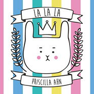

La La La
============================

|  |  |
| :--: | :-- |
| [ La La La](https://emumo.xiami.com/album/2100335814) | **艺人**: [Priscilla Ahn](../index.md) **语种**: 其他 **唱片公司**: 阔思音乐 **发行时间**: 2016年05月13日 **专辑类别**: 录音室专辑 **专辑风格**: 流行 Pop **播放数**: 324830 **收藏数**: 664 **评论数**: 34  |

## 简介

普莉西雅形容自己是个爱唱歌与做音乐的女孩,反应在她的音乐作品中,即便是沧桑的故事却总是能让人在纯净的声音中感受到温暖。初为人母的普莉西雅,站在人生旅途的新起点,更让这张《La La La》专辑别具意义,专辑配唱时普莉西雅还怀有身孕,在腹中的小朋友陪伴之下,她在自己家录制着一首首《La La La》专辑的歌曲,因此每首歌曲都投注了普莉西雅给自己的孩子与每一位聆听歌曲的大人小孩的那份爱,每首歌曲都能听到幸福的滋味。  
  
专辑主打歌曲〈Body Sound〉,邀请来自日本,独创睡衣般舒适音乐感清新音乐双人组合「Lullatone」成员肖恩西摩(Shawn James Seymour)创作,歌曲中带领大家一起运用身体发出各式各样的声音营造出特别的故事感,适合亲子一同随着音乐自在律动;歌曲〈Elephant〉、〈Leaves〉与〈Dust Bunny〉以及数首演奏曲,皆谱出奇幻的故事情境,带领听音乐的大小朋友跳入一个充满想象力的世界;〈Forever and Forever〉则是初为人母的普莉西雅,写下妈妈对孩子无止尽的爱;设计为睡前听的〈In My Bed〉与〈Desert Lullaby〉更是营造出一份天使般的优雅,随着干净的吉他声与普莉西雅恬静的歌声一同感受漫步夜空的安静。  
  
为了表达专辑陪伴的概念,专辑设计成一本着色音乐书,搭配歌曲的情境特别设计的插画,特别适合大人小孩着色完成属于自己的音乐收藏品。亚洲盘中特别收录普莉西雅重新以中文诤释畅销歌曲〈When You Grow Up〉,以及中文歌谣〈紫竹调〉。 

## 曲目

## 评论

|  |  |  |  |
| :-- | :-- | :-- | :-- |
|  [虾米用户](https://emumo.xiami.com/u/318481269) STAY 2018-06-30 12:28 赞(4) 踩(0) | 
怎么又下架了啊啊啊
 |
|  [虾米用户](https://emumo.xiami.com/u/5526289) 开心小甜豆 2017-11-30 22:30 赞(0) 踩(0) | 
｡◕‿◕｡
 |
|  [虾米用户](https://emumo.xiami.com/u/19765215)  2017-10-23 14:27 赞(0) 踩(0) | 
挺可爱的
 |
|  [虾米用户](https://emumo.xiami.com/u/305391605) 别绞尽脑汁 2017-09-19 14:56 赞(0) 踩(0) | 
小调皮 喝西米
 |
|  [虾米用户](https://emumo.xiami.com/u/1601859) 想啊想啊，想起你了。 2017-05-14 01:54 赞(4) 踩(0) | 
签名专辑100一张，封面，歌本和碟面都可爱的不行。。总觉得自己赚到了。
 |
| ⇒ |  [虾米用户](https://emumo.xiami.com/u/55436081)  2017-09-13 11:12 赞(0) 踩(0) | 
哪里有哇？
 |
| ⇒ |  [虾米用户](https://emumo.xiami.com/u/54145065) Just a liste... 2018-10-08 04:09 赞(0) 踩(0) | 
好羡慕 
 |
|  [虾米用户](https://emumo.xiami.com/u/12730895) 不要离开！ 2017-05-06 22:20 赞(0) 踩(0) | 
我要被萌死了
 |
|  [虾米用户](https://emumo.xiami.com/u/17236518) 若我的光曝在你身上，重逢... 2017-05-03 18:54 赞(0) 踩(0) | 
中文别有一番风味！！！
 |
|  [虾米用户](https://emumo.xiami.com/u/46787921) 看什么 2017-04-21 21:41 赞(0) 踩(0) | 
歌名旁边的中文是什么鬼啊
 |
|  [虾米用户](https://emumo.xiami.com/u/51634234) 我还没想好要写什么... 2017-04-21 20:10 赞(0) 踩(0) | 
我还以为是那首LaLaLa
 |
|  [虾米用户](https://emumo.xiami.com/u/35487836)   2017-03-08 20:15 赞(1) 踩(0) | 
LaLaLa巡演开始了，大家快买票吧
 |
| ⇒ |  [虾米用户](https://emumo.xiami.com/u/17372274) 喜欢做梦的浪漫小阿姨～ 2017-03-23 23:41 赞(0) 踩(0) | 
哈哈哈星海音乐厅 已经买了 
 |
| ⇒ |  [虾米用户](https://emumo.xiami.com/u/69256508) 听音乐时才是一个大清新。 2017-05-10 00:17 赞(0) 踩(0) | 
<q><b>疯狂的鹿说：</b></q>
 |
|  [虾米用户](https://emumo.xiami.com/u/259411204) 虾米，等到会员到期，我就... 2017-01-10 00:23 赞(0) 踩(0) | 
看推荐来的，这妹子在虾米上挺有名的呢～在q音乐上没看见推荐。
 |
|  [虾米用户](https://emumo.xiami.com/u/36546753)  2016-12-19 14:07 赞(0) 踩(0) | 
宝宝
 |
|  [虾米用户](https://emumo.xiami.com/u/11153937)  2016-12-03 23:20 赞(0) 踩(0) | 
to hehe
 |
|  [虾米用户](https://emumo.xiami.com/u/1254874)  2016-11-07 14:49 赞(0) 踩(0) | 
好好听~太可爱了！
 |
|  [虾米用户](https://emumo.xiami.com/u/192682282) 和而不同 2016-11-01 16:25 赞(0) 踩(0) | 
少女
 |
|  [虾米用户](https://emumo.xiami.com/u/36805600)  2016-10-29 21:10 赞(0) 踩(0) | 
cover不要太可爱！！
 |
|  [虾米用户](https://emumo.xiami.com/u/222511164)  2016-10-23 13:37 赞(0) 踩(0) | 
好少女心的专辑 
 |
|  [虾米用户](https://emumo.xiami.com/u/100363510) 我还没想好要写什么... 2016-09-28 20:40 赞(0) 踩(0) | 
炒鸡喜欢这张专辑，好有治愈的感觉，一天的压力一听都消啦
 |
|  [虾米用户](https://emumo.xiami.com/u/31737208) 我想和你虚度世界。 2016-08-22 21:47 赞(0) 踩(0) | 
卧槽，为啥歌名后面要跟着几句中文
 |
|  [虾米用户](https://emumo.xiami.com/u/2204272) 只听歌，没有故事。 2016-05-24 19:53 赞(0) 踩(0) | 
这张专辑给我的感觉是，lovely,warm and peace
 |
|  [虾米用户](https://emumo.xiami.com/u/50056406) 「我们」还有sunqun... 2016-05-24 19:33 赞(0) 踩(0) | 

 |
|  [虾米用户](https://emumo.xiami.com/u/38918617) 你相信我，我相信你 2016-05-23 17:02 赞(0) 踩(0) | 
终于在不懈努力下上线啦 小伙伴快来听起来~~
 |
|  [虾米用户](https://emumo.xiami.com/u/124631220)  2016-05-18 20:23 赞(1) 踩(0) | 
有版权吗？啊啊啊啊
 |
| ⇒ |  [虾米用户](https://emumo.xiami.com/u/38918617) 你相信我，我相信你 2016-05-23 17:03 赞(0) 踩(0) | 
有版权的 已上架 快来畅听吧
 |
|  [虾米用户](https://emumo.xiami.com/u/124265) 我可能听了假歌。 2016-05-15 00:24 赞(0) 踩(0) | 
赶快上架呢
 |
| ⇒ |  [虾米用户](https://emumo.xiami.com/u/38918617) 你相信我，我相信你 2016-05-23 17:02 赞(0) 踩(0) | 
上架了哦
 |
|  [虾米用户](https://emumo.xiami.com/u/2204272) 只听歌，没有故事。 2016-05-14 15:45 赞(0) 踩(0) | 
还没更新啊
 |
| ⇒ |  [虾米用户](https://emumo.xiami.com/u/44432550)  2016-05-19 19:41 赞(0) 踩(0) | 
这边也能看到你 
 |
| ⇒ |  [虾米用户](https://emumo.xiami.com/u/38918617) 你相信我，我相信你 2016-05-23 17:03 赞(0) 踩(0) | 
更新了哦~~
 |
| ⇒ |  [虾米用户](https://emumo.xiami.com/u/2204272) 只听歌，没有故事。 2016-05-24 19:53 赞(0) 踩(0) | 
<q><b>gomez1516说：</b></q>
 |
