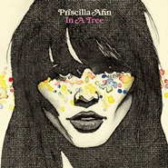

In a Tree-Japan Only Ep
============================

|  |  |
| :--: | :-- |
| [ In a Tree-Japan Only Ep](https://emumo.xiami.com/album/420583) | **艺人**: [Priscilla Ahn](../index.md) **语种**: 英语 **唱片公司**: EMIMUSIC JAPAN **发行时间**: 2009年07月01日 **专辑类别**: EP, 单曲 **专辑风格**: 民谣流行 Folk Pop, 根源唱作人 Singer-Songwriter **播放数**: 2690720 **收藏数**: 553 **评论数**: 34  |

## 简介

Japan original CD release from Priscilla Ahn including four new songs and live version of "Dream."  
日本のファンだけのためのプレゼント!  
★FUJI ROCK FESTIVAL2009 出演決定!  
◇インディー盤がクチコミから話題になり、2008年デビューアルバムからのリード曲「ドリーム」が全国のFMでヘヴィー・ローテーション。  
月間洋楽OAチャートの1位を独走!昨年9月プロモーション来日、11月末には初のジャパン・ツアー(東京・大阪・福岡)も大成功。  
ノラ・ジョーンズに続くブルーノートの新星として今いちばん注目されるシンガー・ソング・ライター!  
4曲の新曲、インディー時代の曲、デモ・ヴァージョン、そして大ヒット曲「ドリーム」のライブ音源も収録!  
全プリシラ・ファン、必聴&amp;マストバイな1枚!!!!!  
アーティストについて  
ジョージア州生まれ、ペンシルバニア育ち、LA在住のシンガーソングライター。  
ギター、ウクレレ、ピアノ、ハープシコード、ハーモニカ等も演奏するマルチな才能を持つ。  
音楽好きな両親の影響で14歳でギターを手にしてから、オープンマイクやライブに 積極的に参加し、クチコミで話題に。  
プロデューサー、ジョーイ・ワロンカーの目に留まり、 2006年ミニ・アルバム『Priscilla Ahn』を制作。 2008年に「グッド・デイ」で名門ブルーノートからメジャー・デビュー。  
日本でも「ノラ・ジョーンズにつづく新星」と各メディアで話題となり、 さらにシングル曲「ドリーム」が全国のFM局が大量にオンエアされて大ヒットを記録した。  
2008年9月の初来日プロモーションに続き、同年11月・12月の初来日公演(東京・大阪・福岡)は大成功。  
2009年7月25日(土)にはいよいよfuji rock festival2009のステージに立つ。

## 曲目

## 评论

|  |  |  |  |
| :-- | :-- | :-- | :-- |
|  [虾米用户](https://emumo.xiami.com/u/30074304) 寄蜉蝣于天地，渺沧海之一... 2021-01-02 23:00 赞(0) 踩(0) | 
✈
 |
|  [虾米用户](https://emumo.xiami.com/u/42996344) 暂无签名~ 2016-01-16 13:46 赞(0) 踩(0) | 
封面崩坏
 |
|  [虾米用户](https://emumo.xiami.com/u/68933804)  2015-09-24 00:14 赞(0) 踩(0) | 
好爱
 |
|  [虾米用户](https://emumo.xiami.com/u/2771250)  2015-07-11 13:25 赞(0) 踩(0) | 
封面……像地下丝绒的nico么 
 |
|  [虾米用户](https://emumo.xiami.com/u/6393573) 我还没想好要写什么... 2014-11-22 12:58 赞(0) 踩(0) | 
In a Tree
 |
|  [虾米用户](https://emumo.xiami.com/u/10427446) Go for it! 2014-08-10 17:44 赞(0) 踩(0) | 
最喜欢她的这张专
 |
|  [虾米用户](https://emumo.xiami.com/u/12788760) Please, be r... 2014-07-16 00:10 赞(0) 踩(0) | 
nice voice.
 |
|  [虾米用户](https://emumo.xiami.com/u/6820370)  2014-03-31 23:19 赞(0) 踩(0) | 
ok
 |
|  [虾米用户](https://emumo.xiami.com/u/1609946) 一即一切 2014-03-25 07:22 赞(0) 踩(0) | 
心 境不二
 |
|  [虾米用户](https://emumo.xiami.com/u/3516118)  2013-03-21 16:47 赞(1) 踩(0) | 
現場唱成這樣真是神了。。
 |
|  [虾米用户](https://emumo.xiami.com/u/5023183) 给我把麦子 2012-06-01 19:02 赞(0) 踩(0) | 
嗯
 |
|  [虾米用户](https://emumo.xiami.com/u/8109497)  2012-03-09 20:09 赞(0) 踩(0) | 
很舒服的感觉，第一次听就喜欢。
 |
|  [虾米用户](https://emumo.xiami.com/u/4001904)  2011-12-30 16:33 赞(1) 踩(0) | 
nice
 |
|  [虾米用户](https://emumo.xiami.com/u/5699149)  2011-11-28 22:45 赞(0) 踩(0) | 
大爱大爱！！！！
 |
|  [虾米用户](https://emumo.xiami.com/u/6716518)  2011-11-10 18:31 赞(0) 踩(0) | 
怎么才能下载呢？木钱呢
 |
| ⇒ |  [虾米用户](https://emumo.xiami.com/u/9942608)  2014-07-30 15:30 赞(0) 踩(0) | 
用这个~<a href="http://5istar.net/xiami/" target="_blank" rel="nofollow noreferrer noopener">http://5istar.net/xiami/</a> 不谢~
 |
|  [虾米用户](https://emumo.xiami.com/u/580253)  2011-07-20 04:26 赞(0) 踩(0) | 
这张专辑封面设计的真suck，看着像老巫婆
 |
|  [虾米用户](https://emumo.xiami.com/u/4836520)  2011-07-16 14:49 赞(0) 踩(0) | 
肿么不能评价呢？
 |
|  [虾米用户](https://emumo.xiami.com/u/4836520)  2011-07-16 14:48 赞(0) 踩(0) | 
就喜欢这种声音
 |
|  [虾米用户](https://emumo.xiami.com/u/3452207)  2011-07-07 19:12 赞(0) 踩(0) | 
55
 |
|  [虾米用户](https://emumo.xiami.com/u/216823)  2011-06-23 23:24 赞(0) 踩(0) | 
Ahn
 |
|  [虾米用户](https://emumo.xiami.com/u/3821003)  2011-05-19 10:04 赞(0) 踩(0) | 
依旧是她，最近的大爱。
 |
|  [虾米用户](https://emumo.xiami.com/u/3281126)  2011-05-13 22:57 赞(0) 踩(0) | 
gj
 |
|  [虾米用户](https://emumo.xiami.com/u/1091169)  2011-05-12 01:44 赞(0) 踩(0) | 
priscilla Ahn
 |
|  [虾米用户](https://emumo.xiami.com/u/3877876)  2011-05-08 19:16 赞(0) 踩(0) | 
声音很纯净  音乐也做得很让人舒服   哈哈  喜欢
 |
|  [虾米用户](https://emumo.xiami.com/u/3802501)  2011-05-05 12:20 赞(0) 踩(0) | 
令人舒服的声音，轻快的旋律，身心都放松了。
 |
|  [虾米用户](https://emumo.xiami.com/u/1366913) 如你信我。 2011-05-02 16:10 赞(0) 踩(0) | 
喜欢的。
 |
|  [虾米用户](https://emumo.xiami.com/u/78279)  2011-04-16 09:23 赞(0) 踩(0) | 
期待5月3日
 |
|  [虾米用户](https://emumo.xiami.com/u/3046990)  2011-04-15 09:51 赞(0) 踩(0) | 
为什么是日文专辑。
 |
|  [虾米用户](https://emumo.xiami.com/u/3011196)  2011-03-15 13:30 赞(0) 踩(0) | 
good
 |
|  [虾米用户](https://emumo.xiami.com/u/3017711)   2011-03-07 15:49 赞(0) 踩(0) | 
peaceful
 |
|  [虾米用户](https://emumo.xiami.com/u/2395051)  2011-02-19 13:00 赞(0) 踩(0) | 
@六叁壹 你会喜欢的~~其实很多好音乐都等待我们去发现~
 |
|  [虾米用户](https://emumo.xiami.com/u/1314777)  2011-02-17 13:07 赞(0) 踩(0) | 
咳咳~
 |
|  [虾米用户](https://emumo.xiami.com/u/71261)  2011-02-17 12:13 赞(0) 踩(0) | 
民谣是春天的前奏
 |
