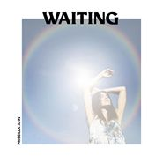

You Make The World A Better Place
============================

|  |  |
| :--: | :-- |
| [ You Make The World A Better Place](https://emumo.xiami.com/album/5022626533) | **艺人**: [Priscilla Ahn](../index.md) **语种**: 其他 **唱片公司**: Merlin Records **发行时间**: 2021年01月29日 **专辑类别**: EP, 单曲 **专辑风格**: 民谣流行 Folk Pop **播放数**: 19081 **收藏数**: 12 **评论数**: 9  |

## 简介

## 曲目

## 评论

|  |  |  |
| :-- | :-- | :-- |
|  [虾米用户](https://emumo.xiami.com/u/361287195) 暖暖的幸福(^o^)o甜... 2021-01-30 23:15 赞(0) 踩(0) | 
（）
 |
|  [虾米用户](https://emumo.xiami.com/u/306347146)  2021-01-30 17:49 赞(0) 踩(0) | 
用心之作，超赞。
 |
|  [虾米用户](https://emumo.xiami.com/u/37810722) 青梅煮酒 2021-01-30 15:11 赞(0) 踩(0) | 
爱虾米
 |
|  [虾米用户](https://emumo.xiami.com/u/369940228)  2021-01-30 06:21 赞(0) 踩(0) | 
好听
 |
|  [虾米用户](https://emumo.xiami.com/u/10464954) 再见了虾米，接近8年的陪... 2021-01-30 04:43 赞(0) 踩(0) | 
再见了虾米，我爱你。
 |
|  [虾米用户](https://emumo.xiami.com/u/237442416) 微信公众号「戀上一張CD... 2021-01-29 13:30 赞(0) 踩(0) | 
暖暖的声音，如同这冬日阳光。
 |
|  [虾米用户](https://emumo.xiami.com/u/2604553) 抠脚大魔王 2021-01-29 12:37 赞(0) 踩(0) | 
虾米正式关闭倒计时只有六天了，不管我们有多么的不舍，她真的就要离开我们的身边了。 若你同我们一样喜欢音乐、喜欢虾米并热爱生活。无论你爱闹或喜静，无论你喜欢什么样的音乐风格，你都可以加入我们分享或收藏你所爱的音乐，生活。 虾米音乐托儿所 微信群欢迎你的加入。 微信群目前已满两百人，需入群抱团的请点击以下二维码图床链接添加我为好友拉你进群 <a href="https://sm.ms/image/dfUNPIVQ5v2twG9" target="_blank" rel="nofollow noreferrer noopener">https://sm.ms/image/dfUNPIVQ5v2twG9</a> 或私信我留下你的微信号。 若有打扰，敬请谅解。
 |
|  [虾米用户](https://emumo.xiami.com/u/50619395)  2021-01-29 12:09 赞(0) 踩(0) | 
淡淡的，一切如同生活，却更感人！
 |
|  [虾米用户](https://emumo.xiami.com/u/11157355) 榕树长青 2021-01-29 10:56 赞(0) 踩(0) | 
收
 |
