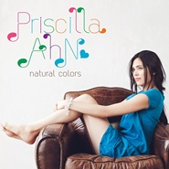
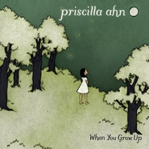
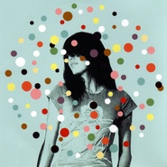

Priscilla Ahn
============================

|  |  |
| :--: | :-- |
| [<br>Priscilla Ahn](https://i.xiami.com/priscilla) | **地区**: United States of America 美国<br>**风格**: 民谣流行 Folk Pop, 根源唱作人 Singer-Songwriter<br>**播放数**: 64528867<br>**粉丝数**: 223855<br>**评论数**: 1565<br> |

## 档案

<div>
小档案<br>
姓        名  :  Priscilla Ahn  普莉西雅·安<br>
国        籍：美利坚合众国<br>
民        族：韩美混血<br>
出   生   地：美国乔治亚州斯图尔特堡<br>
出生日期：  1984-03-09<br>
职        业：歌手<br>
风        格：民谣、乡村<br>
乐        器：吉他，钢琴，口琴，夏威夷四弦琴<br>
艺人资料<br>
Priscilla Ahn  ，美国人，会多种乐器的独立民谣歌手。  1984  年生于美国佐治亚洲的  Fort Stewart  ，出生名为  Priscilla Natalie Hartranft  ，是韩美混血人，母亲韩文名姓安，父亲  Harry Hartranft  是美国人，兄弟  Jacob Hartranft  。然而长大后，她跟随了母亲的姓氏——  Ahn  （安）。自幼在宾夕法尼亚州长大。曾先后在宾夕法尼亚的  Reading  生活  10  年，在韩国居住了一段时间，之后又搬至宾夕法尼亚的  Bernville  。她从小在学校、教堂唱诗班唱歌。<br>
14  岁时开始玩吉他、  16  岁时便已经在家附近、寻求登台演唱的机会。从  Tulpehocken Area  高中毕业后  ,  她在面试国立大学时，一位音乐教授惊讶她的音乐才华后，甚至鼓励她放弃求学、专心从事词曲创作，才能掌握更多的人生机会。由于受到了这位美国教授的建议，她放弃了继续上大学，而是选择来到了费城、新泽西、纽约周围的咖啡厅、音乐俱乐部里追逐自己的音乐梦想。在决定要搬出西海岸之后，  Priscilla   开始在洛杉矶的音乐界确立了自己的地位。<br>
她从小就非常崇拜歌手  Amos Lee  。他们在  LA  邂逅，  priscilla  对见到自己的偶像非常激动，并且应邀参与了  Amos Lee  巡回演唱会。从此他们成为了歌唱事业上的好朋友引。她作为   LA's Hotel Caf  é   的台柱期前，一次偶然的机会让   Priscilla   得到了一个参加   Joshua Radin   全美巡演的邀请。在  2006  年，  Priscilla   录制发行了一张同名  EP  ，正是这张  EP  为她赢得了一些  fans  ，比如来自   LA's KCRW   的资深  DJ Nic Harcourt  。  Priscilla Ahn   比较有特色的歌曲包括“  Rain"  和  "Dream  ”，这两首歌后来也出现在了梦工厂的电影《  Disturbia  》里。终于在  2007  年，  Priscilla   签约了  Blue Note  ，同时开始和制作人   Joey Waronker   录制她的处女专辑。   　  Priscilla Ahn  是一位会许多种乐器的独立民谣歌手，创造歌曲来也才华横溢。现场演出时，她能做到边弹边唱，且能在间奏时便弹边吹其它乐器，或是口琴，或是小笛，引得全场喝彩引。   她喜欢在露天的地方一人独自对着话筒、弹吉它唱歌引，并不在乎别人的目光，只要自己能尽情放声歌唱就心满意足了引。只是，在狭小空间内仅对着几人表演时，她会觉得尴尬。<br>
作为一名新人来说，专辑《  A Good Day  》应该是成功的。它是带着一种清新的小民谣，套用一位外国朋友的评论，听这张专辑就像夏天躺在吊床上轻轻摇晃的感觉。<br>
2009~2010  年间  priscilla  进行巡回演出。她的足迹踏遍全美、日、韩、芬兰、英国等其他欧洲地区引。   2010  年  6  月  16  日，  Priscilla  与丈夫  Mike  携手迈入婚姻的殿堂。之后，她将进行第二张专辑的录制。<br>
2013  年，苏打绿与  Priscilla  合作的歌曲《从一片落叶开始》收录在苏打绿《秋·故事》专辑中，并发行了  Priscilla  独唱的《  It Began with a Fallen Leaf  》。  11  月，普莉希雅新专辑《  This Is Where We Are  这里·遇见爱》于  11  月  22  日全球首发。此次中国之行除了带来新专辑外，还将在北京、上海、广州三地举办中国巡演。<br>
2015  年  4  月，普莉西雅受邀到垦丁春浪音乐节开唱。  12  月，她凭借着动画电影《回忆中的玛妮》主题曲《  Fine On The Outside  》入选第  88  届奥斯卡颁奖典礼“最佳电影原创歌曲”。<br>
Early life and beginnings<br>
Ahn was born Priscilla Natalie Hartranft in Fort Stewart, Georgia, to Kay (n  é  e Ahn) and Harry Hartranft, spent her childhood growing up in Berks County, Pennsylvania, and attended Tulpehocken Area High School. She started playing guitar at the age of 14 and performed in choirs and musical productions throughout high school.After graduation her music professor encouraged her to pursue her music career full-time.<br>
Career<br>
After years of performing at open mic nights, Priscilla Ahn played a showcase in New York City for Blue Note Records and was signed to the label. In 2008, Blue Note Records released her full-length debut album,  A Good Day , produced by Joey Waronker. The following June, Ahn went on a national tour.Her album,  A Good Day  included musical contributions by keyboardists Greg Kurstin, Keefus Ciancia, guitarist/film composer Mike Andrews, musical saw player Ursula Knudsun, cellist/string arranger Oliver Kraus, keyboardist Larry Goldings and singers Jim Gilstrap and Orin Waters.<br>
Priscilla Ahn, has toured with Joshua Radin, Amos Lee, Willie Nelson and Ray Lamontagne and contributed vocals to the albums Supply and Demand, Mission Bell and Kaleidoscope was selected as Artist of the Week in Paste magazine in June 2008.<br>
Ahn's songs have appeared on the television shows Grey's Anatomy,Knight Rider, Make It Or Break It, Married Single Other, several episodes of the Ghost Whisperer,and in the films Disturbia,Bride Wars, Love Happens, My Sister's Keeper, Free Willy: Escape from Pirate's Cove, Mom's Night Out.<br>
After contributing to the compilations album, His Way, Our Way, Priscilla Ahn collaborated with Inara George, Sia Furler, Eleni Mandell, Charlie Wadhams and Jake Blanton on her album  When You Grow Up  which was produced by Ethan Johns.<br>
Ahn appeared on The Tonight Show with Jay Leno in May 2011 and ABC's  Dancing with the Stars,  performing songs from her debut A Good Day and the title track from  When You Grow Up .<br>
After a period of writers block, Ahn isolated herself in a remote desert hotel to create new music for the album This is Where We Are. "I found the whole thing really inspiring, and suddenly, all these songs came pouring out. I just needed a little isolation and focus, some new sounds to play with, and a care-free, 'this is just an experiment' attitude to begin writing again."This Is Where We Are was released in the USA on 15 February 2014.It was released in Japan on 19 July 2013 and later in Korea and Taiwan.<br>
Ahn's music is described as grounded in folk, country and pop.Ahn explored electropop music in the album This Is  Where We Are .<br>
In 2015,her single “Fine On The Outside”was selected for the 88 th  Oscar awards “The Best Original Film Song”.
</div>

## 专辑

| 名称 | 语种 | 唱片公司 | 发行时间 | 专辑类别 | 专辑风格 |
| :--: | :-- | :-- | :-- | :-- | :-- |
| [<br>You Make The World A Better Place](./albums/5022626533.md) | 其他 | Merlin Records | 2021年01月29日 | EP, 单曲 | 民谣流行 Folk Pop |
| [<br>La La La](./albums/2100335814.md) | 其他 | 阔思音乐 | 2016年05月13日 | 录音室专辑 | 流行 Pop |
| [<br>プリシラ・アーン・ベストPriscilla Ahn BEST](./albums/1006179882.md) | 日语 | Universal Music | 2014年07月23日 | 精选集 | 民谣流行 Folk Pop, 独立民谣 Indie Folk |
| [<br>あなたのことが大すき。回忆中的玛妮 歌集 / 「思い出のマーニー」歌集アルバム](./albums/205898371.md) | 英语 | YAMAHA MUSIC COMMUNICATIONS | 2014年07月16日 | 原声带, 影视音乐 | 电影原声 Film Score, 卡通配乐 Cartoon Music |
| [<br>Fine On The Outside](./albums/1304454288.md) | 英语 | YAMAHA MUSIC COMMUNICATIONS | 2014年07月02日 | EP, 单曲 | 民谣流行 Folk Pop, 根源唱作人 Singer-Songwriter |
| [<br>This Is Where We Are这里·遇见爱](./albums/1884419342.md) | 英语 | 金牌大风 | 2013年11月22日 | 录音室专辑 | 当代唱作人 Contemporary Singer-Songwriter, 另类摇滚 Alternative Rock, 当代民谣 Contemporary Folk, 成人时代 Adult Contemporary |
| [<br>Leave It Open](./albums/983026034.md) | 英语 | Federal Prism | 2013年10月29日 | EP, 单曲 | 流行 Pop |
| [<br>Home ~ My Song Diary](./albums/372662502.md) | 英语 | EMI Music Japan | 2012年10月26日 | 精选集 | 民谣流行 Folk Pop, 根源唱作人 Singer-Songwriter |
| [<br>Natural Colors自然原色](./albums/544565.md) | 日语 | EMI Music Japan | 2012年06月22日 | 录音室专辑 | 民谣流行 Folk Pop, 根源唱作人 Singer-Songwriter |
| [<br>Sweet Hearts](./albums/538735.md) | 英语 | Blue Note Records | 2012年02月14日 | EP, 单曲 | 民谣流行 Folk Pop, 根源唱作人 Singer-Songwriter |
| [<br>When You Grow Up](./albums/433864.md) | 英语 | Blue Note Records | 2011年05月03日 | 录音室专辑 | 民谣流行 Folk Pop, 根源唱作人 Singer-Songwriter |
| [<br>In a Tree-Japan Only Ep](./albums/420583.md) | 英语 | EMIMUSIC JAPAN | 2009年07月01日 | EP, 单曲 | 民谣流行 Folk Pop, 根源唱作人 Singer-Songwriter |
| [<br>In A Tree](./albums/381154.md) | 英语 | Blue Note Records | 2009年05月19日 | EP, 单曲 | 民谣流行 Folk Pop, 根源唱作人 Singer-Songwriter |
| [<br>Live Session (iTunes Exclusive)](./albums/372663094.md) | 英语 | Blue Note Records | 2008年12月30日 | 现场专辑 | 民谣流行 Folk Pop, 根源唱作人 Singer-Songwriter |
| [<br>A Good Day](./albums/170349.md) | 英语 | Blue Note Records | 2008年06月10日 | 录音室专辑 | 民谣流行 Folk Pop, 根源唱作人 Singer-Songwriter |
| [<br>Priscilla Ahn](./albums/325284.md) | 英语 | Self-Released | 2006年11月13日 | EP, 单曲 | 民谣流行 Folk Pop, 根源唱作人 Singer-Songwriter |

## 评论

|  |  |  |
| :-- | :-- | :-- |
| <br>[虾米用户](https://emumo.xiami.com/u/30074304)<br>寄蜉蝣于天地，渺沧海之一...<br>2021-01-02 22:59<br>赞(0) 踩(0) | <div>✈</div> |
| <br>[虾米用户](https://emumo.xiami.com/u/10116377)<br>学者 艺科<br>2020-02-11 12:00<br>赞(0) 踩(0) | <div>to as my to</div> |
| <br>[虾米用户](https://emumo.xiami.com/u/4300014)<br>我还没想好要写什么...<br>2020-01-14 15:50<br>赞(0) 踩(0) | <div>我的女神呀，真人很小，笑容很美</div> |
| <br>[虾米用户](https://emumo.xiami.com/u/231778393)<br>后生<br>2020-01-09 08:32<br>赞(0) 踩(0) | <div>虾米能不能走点心…图片集什么鬼</div> |
| <br>[虾米用户](https://emumo.xiami.com/u/348140835)<br>我爱学习但不知道学习爱不...<br>2019-10-14 22:48<br>赞(0) 踩(0) | <div>听到这个声音时就有一种心动的感觉 </div> |
| <br>[虾米用户](https://emumo.xiami.com/u/85568296)<br>只有阳光而无阴影 只有欢...<br>2019-07-05 14:17<br>赞(0) 踩(0) | <div>好喜欢她的声音啊</div> |
| <br>[虾米用户](https://emumo.xiami.com/u/309256043)<br>一起听歌吧…<br>2019-05-11 19:07<br>赞(0) 踩(0) | <div></div> |
| <br>[虾米用户](https://emumo.xiami.com/u/50171518)<br>此号报销<br>2019-05-08 18:31<br>赞(0) 踩(0) | <div>~</div> |
| <br>[虾米用户](https://emumo.xiami.com/u/316797224)<br>我还没想好要写什么...<br>2019-04-05 08:19<br>赞(0) 踩(0) | <div>简介上好多错字</div> |
| <br>[虾米用户](https://emumo.xiami.com/u/23091801)<br>心有猛虎，细嗅蔷薇。<br>2019-04-02 10:10<br>赞(0) 踩(0) | <div>原来是你呀(*/∇＼*)one day I will do给我了一个极高的印象分，原来真的是招人喜欢的小姐姐(*ﾉ▽ﾉ)</div> |
| <br>[虾米用户](https://emumo.xiami.com/u/408035215)<br><br>2019-02-15 20:14<br>赞(1) 踩(0) | <div></div> |
| <br>[虾米用户](https://emumo.xiami.com/u/201391232)<br>最快的方法是先抱抱<br>2019-01-13 17:55<br>赞(0) 踩(0) | <div>彡</div> |
| <br>[虾米用户](https://emumo.xiami.com/u/336787807)<br><br>2018-12-26 22:24<br>赞(0) 踩(0) | <div>回忆中的玛尼是我很喜欢的一部动画片，原来主题曲是她写的</div> |
| <br>[虾米用户](https://emumo.xiami.com/u/343494369)<br><br>2018-11-10 10:19<br>赞(0) 踩(0) | <div>内容已删除</div> |
| ⇒ | <br>[虾米用户](https://emumo.xiami.com/u/45099078)<br>人应该是一堆无用的热情 <br>2019-01-08 21:54<br>赞(0) 踩(0) | <div>你没事吧？</div> |
| ⇒ | <br>[虾米用户](https://emumo.xiami.com/u/343494369)<br><br>2019-01-18 17:10<br>赞(0) 踩(0) | <div><q><b>疯狂部屋…s说：</b></q></div> |
| ⇒ | <br>[虾米用户](https://emumo.xiami.com/u/243088904)<br>音乐是治疗精神疾病的良药...<br>2019-01-30 21:11<br>赞(0) 踩(0) | <div>又见 小 粉 红 吹鼓 民 族 主 义</div> |
| ⇒ | <br>[虾米用户](https://emumo.xiami.com/u/340363414)<br>yuyan❤️<br>2019-02-03 14:15<br>赞(0) 踩(0) | <div>爱国 </div> |
| ⇒ | <br>[虾米用户](https://emumo.xiami.com/u/32711803)<br>闭关学习中……<br>2019-03-24 23:01<br>赞(0) 踩(0) | <div>先说一下你对异族的定义吧</div> |
| <br>[虾米用户](https://emumo.xiami.com/u/343494369)<br><br>2018-11-10 10:17<br>赞(1) 踩(0) | <div>美国人？</div> |
| ⇒ | <br>[虾米用户](https://emumo.xiami.com/u/411350505)<br><br>2018-12-28 06:28<br>赞(0) 踩(0) | <div>艺术不分国界。</div> |
| <br>[虾米用户](https://emumo.xiami.com/u/311186860)<br> <br>2018-11-01 21:43<br>赞(0) 踩(0) | <div>虾米使你我相逢相知相识 </div> |
| <br>[虾米用户](https://emumo.xiami.com/u/216402156)<br>啊！美食与爱不可辜负！<br>2018-10-26 21:50<br>赞(0) 踩(0) | <div>仙女之音</div> |
| <br>[虾米用户](https://emumo.xiami.com/u/30451977)<br><br>2018-06-28 20:59<br>赞(0) 踩(0) | <div>  </div> |
| <br>[虾米用户](https://emumo.xiami.com/u/339191478)<br> <br>2018-06-24 09:41<br>赞(0) 踩(0) | <div>:-)</div> |
| <br>[虾米用户](https://emumo.xiami.com/u/1320669)<br>ツ<br>2018-06-17 11:12<br>赞(0) 踩(0) | <div>0.0</div> |
| <br>[虾米用户](https://emumo.xiami.com/u/292513549)<br><br>2018-04-11 20:23<br>赞(1) 踩(0) | <div>让人听着很舒服的声音  </div> |
| <br>[虾米用户](https://emumo.xiami.com/u/32413850)<br>我还没想好要写什么...<br>2018-02-02 23:29<br>赞(2) 踩(0) | <div>这纯净带有一丝少年感的嗓音太棒了</div> |
| <br>[虾米用户](https://emumo.xiami.com/u/47257880)<br>我为音乐而快乐！<br>2018-01-04 21:03<br>赞(1) 踩(0) | <div>她好美 </div> |
| <br>[虾米用户](https://emumo.xiami.com/u/87019540)<br>一切都刚刚好^^~<br>2017-11-20 17:10<br>赞(2) 踩(0) | <div>喜欢这样慵懒有感性的声音 </div> |
| <br>[虾米用户](https://emumo.xiami.com/u/35704426)<br><br>2017-11-17 21:06<br>赞(1) 踩(0) | <div>热爱</div> |
| <br>[虾米用户](https://emumo.xiami.com/u/267746182)<br>☕️<br>2017-11-14 22:53<br>赞(0) 踩(0) | <div>Pas mal</div> |
| <br>[虾米用户](https://emumo.xiami.com/u/333999431)<br><br>2017-11-12 23:22<br>赞(1) 踩(0) | <div>喜欢你，姐姐，也喜欢你的歌，心愿是希望能亲自见到你</div> |
| <br>[虾米用户](https://emumo.xiami.com/u/3583995)<br>一個人的戰爭<br>2017-11-04 02:04<br>赞(0) 踩(0) | <div>.</div> |
| <br>[虾米用户](https://emumo.xiami.com/u/52056952)<br>人生即是到來、相遇、陪伴...<br>2017-11-03 19:23<br>赞(0) 踩(0) | <div></div> |
| <br>[虾米用户](https://emumo.xiami.com/u/4360423)<br><br>2017-10-28 00:18<br>赞(2) 踩(0) | <div>很喜欢她的声音，温和率性，而且只比我大3岁，算是同龄呢，又是混血美女</div> |
| <br>[虾米用户](https://emumo.xiami.com/u/6633864)<br><br>2017-10-27 23:20<br>赞(1) 踩(0) | <div>声音干净 似乎实习医生格蕾里面有用到她的曲子,所以再听到就记下了</div> |
| <br>[虾米用户](https://emumo.xiami.com/u/2204272)<br>只听歌，没有故事。<br>2017-10-27 23:09<br>赞(3) 踩(0) | <div>今天得知近一个月在中国有三场演唱会，太突然了！普莉西雅携最新专辑《这里·遇见爱》（This Is Where We Are）  这专辑也出得太快了吧</div> |
| <br>[虾米用户](https://emumo.xiami.com/u/819627)<br>我还没想好要写什么...<br>2017-10-27 23:03<br>赞(1) 踩(0) | <div>听日语专辑还有点不习惯，别误会，我还是很喜欢日本的音乐的，哈哈，加油，什么时候出张中文的，来一首也可以哦！</div> |
| <br>[虾米用户](https://emumo.xiami.com/u/298948030)<br>中國詩音樂電影创始人作曲...<br>2017-10-17 21:57<br>赞(1) 踩(0) | <div>你好</div> |
| <br>[虾米用户](https://emumo.xiami.com/u/52561320)<br>这个人很聪明，什么都没有...<br>2017-08-14 00:37<br>赞(1) 踩(0) | <div>日复一日地听她的歌，仿佛能看到她的一颦一笑，这也算是一种默默的占有吧。</div> |
| <br>[虾米用户](https://emumo.xiami.com/u/277991625)<br><br>2017-06-08 14:28<br>赞(0) 踩(0) | <div>                                            [文字up][文字up][文字up][文字up][18禁][18禁]  [叹号问好]       </div> |
| <br>[虾米用户](https://emumo.xiami.com/u/282623824)<br>不会再爱你 一次也不<br>2017-05-28 13:41<br>赞(0) 踩(0) | <div>请原谅我的肤浅，我</div> |
| <br>[虾米用户](https://emumo.xiami.com/u/2888769)<br><br>2017-05-27 23:15<br>赞(0) 踩(0) | <div>hi</div> |
| <br>[虾米用户](https://emumo.xiami.com/u/4249527)<br><br>2017-05-22 17:02<br>赞(21) 踩(0) | <div>没想到广州听Priscilla Ahn的人这么少 有点心疼&amp;hellip;&amp;hellip;</div> |
| ⇒ | <br>[虾米用户](https://emumo.xiami.com/u/4396600)<br>我还没想好要写什么...<br>2019-11-11 03:02<br>赞(0) 踩(0) | <div>有啊！广州歌迷！</div> |
| ⇒ | <br>[虾米用户](https://emumo.xiami.com/u/45514220)<br>我还没想好要写什么...<br>2020-05-17 00:43<br>赞(0) 踩(0) | <div>同有&amp;hellip;&amp;hellip;错过了</div> |
| <br>[虾米用户](https://emumo.xiami.com/u/1460418)<br><br>2017-05-22 11:48<br>赞(1) 踩(0) | <div>昨天看了现场，真是棉柔质感的声音啊！中文歌唱的不要太好啊   </div> |
| <br>[虾米用户](https://emumo.xiami.com/u/265498947)<br>头像不是我！！！<br>2017-05-19 12:05<br>赞(1) 踩(0) | <div>不错</div> |
| <br>[虾米用户](https://emumo.xiami.com/u/265498947)<br>头像不是我！！！<br>2017-05-19 11:55<br>赞(2) 踩(0) | <div>怎么看都觉得她像东方人  </div> |
| <br>[虾米用户](https://emumo.xiami.com/u/294860171)<br><br>2017-05-15 00:04<br>赞(1) 踩(0) | <div>5月21号广州站开心开心!</div> |
| <br>[虾米用户](https://emumo.xiami.com/u/1601859)<br>想啊想啊，想起你了。<br>2017-05-14 01:35<br>赞(23) 踩(0) | <div>来写个反馈留言。谢谢虾米让我抽中了演唱会的票，Priscilla小姐姐的现场堪比录音室专辑，唱的新专辑里的几首歌都很好听。然后还唱了我喜欢的Dream和两首中文歌。当了麻麻以后感觉更加温柔了，也依然保持着一颗少女心。在门口买了签名的新专辑，设计的超级可爱，歌词本可以填色，简直就是一本童书！感觉她家娃好幸福啊～</div> |
| ⇒ | <br>[虾米用户](https://emumo.xiami.com/u/259720733)<br><br>2017-05-15 19:55<br>赞(0) 踩(0) | <div>你挺幸运的，我是买的票5张380的 不过很值，好听！</div> |
| ⇒ | <br>[虾米用户](https://emumo.xiami.com/u/1601859)<br>想啊想啊，想起你了。<br>2017-05-15 23:06<br>赞(0) 踩(0) | <div><q><b>未知生物说：</b></q></div> |
| <br>[虾米用户](https://emumo.xiami.com/u/2591791)<br>To be a bett...<br>2017-05-14 00:02<br>赞(2) 踩(0) | <div>成都站有人一起么，虾米送了两张票 好像找不到人看</div> |
| <br>[虾米用户](https://emumo.xiami.com/u/72666568)<br><br>2017-05-11 20:47<br>赞(0) 踩(0) | <div>蛮好的</div> |
| <br>[虾米用户](https://emumo.xiami.com/u/295487086)<br>hello_world<br>2017-05-11 15:49<br>赞(0) 踩(0) | <div>晚间催眠</div> |
| <br>[虾米用户](https://emumo.xiami.com/u/30461357)<br><br>2017-05-08 01:27<br>赞(0) 踩(0) | <div>成都的，抽到票了，但还没收到啊，18号就开始了啊  ，其他人收到没</div> |
| ⇒ | <br>[虾米用户](https://emumo.xiami.com/u/1601859)<br>想啊想啊，想起你了。<br>2017-05-09 16:52<br>赞(0) 踩(0) | <div>北京的改成现场取了。估计你们那边也是？会有短信通知。</div> |
| ⇒ | <br>[虾米用户](https://emumo.xiami.com/u/30461357)<br><br>2017-05-09 19:28<br>赞(0) 踩(0) | <div><q><b>吟游诗人松鼠君说：</b></q></div> |
| ⇒ | <br>[虾米用户](https://emumo.xiami.com/u/910980)<br><br>2017-05-10 21:05<br>赞(0) 踩(0) | <div>成都的加一，没收到啊，能联系客服么</div> |
| ⇒ | <br>[虾米用户](https://emumo.xiami.com/u/30461357)<br><br>2017-05-10 22:45<br>赞(0) 踩(0) | <div><q><b>Eric说：</b></q></div> |
| ⇒ | <br>[虾米用户](https://emumo.xiami.com/u/30461357)<br><br>2017-05-13 23:02<br>赞(0) 踩(0) | <div><q><b>Eric说：</b></q></div> |
| <br>[虾米用户](https://emumo.xiami.com/u/20856207)<br>敲敲敲甜<br>2017-05-06 12:45<br>赞(0) 踩(0) | <div>抽到了深圳演唱会门票两张 有人要请联系我</div> |
| <br>[虾米用户](https://emumo.xiami.com/u/2627008)<br>再见了，朋友们<br>2017-05-02 16:12<br>赞(1) 踩(0) | <div>声音好好听，甜美</div> |
| <br>[虾米用户](https://emumo.xiami.com/u/222818146)<br><br>2017-04-28 01:57<br>赞(0) 踩(0) | <div></div> |
| <br>[虾米用户](https://emumo.xiami.com/u/4300014)<br>我还没想好要写什么...<br>2017-04-27 12:32<br>赞(0) 踩(0) | <div>女神，上海见</div> |
| <br>[虾米用户](https://emumo.xiami.com/u/83124910)<br>我还没想好要写什么...<br>2017-04-25 00:53<br>赞(0) 踩(0) | <div>so lucky to get two tickets for her show at Guangzhou in may. But need a company  </div> |
| <br>[虾米用户](https://emumo.xiami.com/u/143913)<br>他很懒，连签名都懒得写<br>2017-04-24 19:02<br>赞(1) 踩(0) | <div>抽到了演唱会门票~开心 </div> |
| <br>[虾米用户](https://emumo.xiami.com/u/239027684)<br>君之<br>2017-04-23 16:30<br>赞(0) 踩(0) | <div>不错，说真的</div> |
| <br>[虾米用户](https://emumo.xiami.com/u/168222824)<br>我还没想好要写什么...<br>2017-04-23 11:21<br>赞(0) 踩(0) | <div>温柔的声音</div> |
| <br>[虾米用户](https://emumo.xiami.com/u/275532095)<br> <br>2017-04-23 08:06<br>赞(0) 踩(0) | <div>激动ing</div> |
| <br>[虾米用户](https://emumo.xiami.com/u/89787356)<br>我还没想好要写什么...<br>2017-04-23 07:52<br>赞(1) 踩(0) | <div>声音暖暖甜甜 </div> |
| <br>[虾米用户](https://emumo.xiami.com/u/53709674)<br>( ･_･)ﾉ⌒●~*<br>2017-04-22 18:29<br>赞(1) 踩(0) | <div>哪儿都好，只可惜结婚生子了</div> |
| <br>[虾米用户](https://emumo.xiami.com/u/187375907)<br> EXO，真心讨厌那些给...<br>2017-04-22 14:30<br>赞(1) 踩(0) | <div>她的声音真的很好听</div> |
| <br>[虾米用户](https://emumo.xiami.com/u/271195226)<br><br>2017-04-21 22:09<br>赞(0) 踩(0) | <div>女神呀</div> |
| <br>[虾米用户](https://emumo.xiami.com/u/82713980)<br>Be myself<br>2017-04-21 19:24<br>赞(13) 踩(0) | <div>知道Priscilla Ahn是因为虾米的推送，然后就不可置否地爱上她的声音，就这么轻轻地击中了我的心</div> |
| <br>[虾米用户](https://emumo.xiami.com/u/105977630)<br>Deer my deer<br>2017-04-21 13:49<br>赞(2) 踩(0) | <div>声音太好听 迷人</div> |
| <br>[虾米用户](https://emumo.xiami.com/u/7056029)<br>再 见<br>2017-04-15 12:03<br>赞(1) 踩(0) | <div>正好赶上考试。。</div> |
| <br>[虾米用户](https://emumo.xiami.com/u/280627767)<br><br>2017-04-06 23:05<br>赞(0) 踩(0) | <div>喜欢这个调</div> |
| <br>[虾米用户](https://emumo.xiami.com/u/8811330)<br>竟然被你找到了<br>2017-04-06 13:06<br>赞(0) 踩(0) | <div>成都见~~~</div> |
| <br>[虾米用户](https://emumo.xiami.com/u/245002818)<br>我还没想好要写什么...<br>2017-04-01 18:57<br>赞(1) 踩(0) | <div>又見才女，留個爪印 </div> |
| <br>[虾米用户](https://emumo.xiami.com/u/3074295)<br><br>2017-04-01 10:04<br>赞(0) 踩(0) | <div>感觉手嶌葵也是这种声线</div> |
| <br>[虾米用户](https://emumo.xiami.com/u/15477519)<br>爱  是生命的和弦，而不...<br>2017-03-22 14:38<br>赞(0) 踩(0) | <div>2012-11-17 09:42</div> |
| <br>[虾米用户](https://emumo.xiami.com/u/170211738)<br>上帝在开始爱着了<br>2017-03-19 22:23<br>赞(0) 踩(0) | <div></div> |
| <br>[虾米用户](https://emumo.xiami.com/u/9281542)<br>。<br>2017-03-19 00:20<br>赞(0) 踩(0) | <div>身体的声音好有爱❤️</div> |
| <br>[虾米用户](https://emumo.xiami.com/u/277402922)<br><br>2017-03-08 22:32<br>赞(0) 踩(0) | <div></div> |
| <br>[虾米用户](https://emumo.xiami.com/u/150571194)<br> <br>2017-03-04 15:07<br>赞(0) 踩(0) | <div>好。加油。</div> |
| <br>[虾米用户](https://emumo.xiami.com/u/111193)<br>微信号toogo1<br>2017-02-12 22:16<br>赞(0) 踩(0) | <div>mei</div> |
| <br>[虾米用户](https://emumo.xiami.com/u/606760)<br>魂牵一线<br>2017-02-06 10:03<br>赞(0) 踩(0) | <div>听</div> |
| <br>[虾米用户](https://emumo.xiami.com/u/8492883)<br><br>2017-01-25 00:50<br>赞(0) 踩(0) | <div>可以听一听</div> |
| <br>[虾米用户](https://emumo.xiami.com/u/45434541)<br><br>2017-01-22 11:23<br>赞(0) 踩(0) | <div>！！！</div> |
| <br>[虾米用户](https://emumo.xiami.com/u/237111260)<br>I'm so prett...<br>2017-01-13 12:48<br>赞(0) 踩(0) | <div>忘了什么时候在哪里听过她的哪首歌</div> |
| <br>[虾米用户](https://emumo.xiami.com/u/245002818)<br>我还没想好要写什么...<br>2016-12-28 19:27<br>赞(2) 踩(0) | <div>It is said that a mixed-blood is always  beautiful and intelligent in general. I'm not flattering you. I just tell  the truth .</div> |
| <br>[虾米用户](https://emumo.xiami.com/u/13909269)<br>我的netease id...<br>2016-12-10 00:03<br>赞(0) 踩(0) | <div>某些角度像马思纯……</div> |
| ⇒ | <br>[虾米用户](https://emumo.xiami.com/u/3080048)<br>未填写<br>2017-01-16 13:52<br>赞(0) 踩(0) | <div>还真是</div> |
| <br>[虾米用户](https://emumo.xiami.com/u/41856456)<br>你要把你的脑子用在正事上<br>2016-11-22 20:33<br>赞(1) 踩(0) | <div>朱伟～</div> |
| ⇒ | <br>[虾米用户](https://emumo.xiami.com/u/246504915)<br>VIP到期时，当立业成家...<br>2017-04-21 08:51<br>赞(0) 踩(0) | <div>额。。。</div> |
| ⇒ | <br>[虾米用户](https://emumo.xiami.com/u/41856456)<br>你要把你的脑子用在正事上<br>2017-04-21 12:25<br>赞(0) 踩(0) | <div><q><b>Hannah说：</b></q></div> |
| <br>[虾米用户](https://emumo.xiami.com/u/246091845)<br><br>2016-11-15 10:42<br>赞(0) 踩(0) | <div>beautiful voice</div> |
| <br>[虾米用户](https://emumo.xiami.com/u/116239848)<br>要方向，不要速度，要质量...<br>2016-11-03 20:27<br>赞(0) 踩(0) | <div>民谣 创作型</div> |
| <br>[虾米用户](https://emumo.xiami.com/u/35062303)<br>一个喜欢唱歌的小女孩<br>2016-10-21 18:47<br>赞(0) 踩(0) | <div>好听 喜欢！</div> |
| <br>[虾米用户](https://emumo.xiami.com/u/42152092)<br><br>2016-10-16 23:21<br>赞(1) 踩(0) | <div>独自享受</div> |
| <br>[虾米用户](https://emumo.xiami.com/u/7055881)<br><br>2016-10-13 11:40<br>赞(0) 踩(0) | <div>普莉西拉·安  普莉西雅</div> |
| <br>[虾米用户](https://emumo.xiami.com/u/109977640)<br><br>2016-10-02 11:54<br>赞(1) 踩(0) | <div>才女 貌美温柔 </div> |
| <br>[虾米用户](https://emumo.xiami.com/u/114064138)<br><br>2016-09-26 13:14<br>赞(2) 踩(0) | <div>很好听，我喜欢你的歌</div> |
| <br>[虾米用户](https://emumo.xiami.com/u/47834330)<br>遠離顛倒夢想 究竟涅槃<br>2016-08-09 11:58<br>赞(1) 踩(0) | <div>女神七夕快乐咯 </div> |
| <br>[虾米用户](https://emumo.xiami.com/u/1219131)<br>来世还想和你共渡人生路<br>2016-08-05 11:04<br>赞(0) 踩(0) | <div>Peaceful voice</div> |
| <br>[虾米用户](https://emumo.xiami.com/u/22265017)<br><br>2016-07-26 20:30<br>赞(0) 踩(0) | <div>v</div> |
| <br>[虾米用户](https://emumo.xiami.com/u/51743143)<br><br>2016-07-23 16:35<br>赞(2) 踩(0) | <div>刚刚发现我居然老早就关注她了。。。第三个关注的哈哈。。。完全忘记了~还有，真的好不容易有一个喜欢的欧美独立民谣音乐人的歌没有下架！好开心</div> |
| <br>[虾米用户](https://emumo.xiami.com/u/75698766)<br><br>2016-07-04 21:42<br>赞(1) 踩(0) | <div>声音好听</div> |
| <br>[虾米用户](https://emumo.xiami.com/u/18683435)<br><br>2016-07-04 14:32<br>赞(1) 踩(0) | <div>城市清流</div> |
| <br>[虾米用户](https://emumo.xiami.com/u/16507036)<br><br>2016-06-26 12:06<br>赞(0) 踩(0) | <div>Priscilla Ahn</div> |
| <br>[虾米用户](https://emumo.xiami.com/u/192741928)<br><br>2016-06-22 09:39<br>赞(0) 踩(0) | <div>最爱</div> |
| <br>[虾米用户](https://emumo.xiami.com/u/87354934)<br>十足乐趣十足美妙<br>2016-05-31 05:31<br>赞(1) 踩(0) | <div>清新～</div> |
| <br>[虾米用户](https://emumo.xiami.com/u/49214434)<br><br>2016-05-30 14:40<br>赞(1) 踩(0) | <div>纯粹</div> |
| <br>[虾米用户](https://emumo.xiami.com/u/181287934)<br><br>2016-05-29 11:34<br>赞(2) 踩(0) | <div>她的什么歌好听</div> |
| <br>[虾米用户](https://emumo.xiami.com/u/41276139)<br><br>2016-05-18 15:25<br>赞(2) 踩(0) | <div>老美，女乡村</div> |
| <br>[虾米用户](https://emumo.xiami.com/u/84296922)<br> <br>2016-05-03 21:53<br>赞(1) 踩(0) | <div>她的声音好温暖，还很有力量。好适合唱动画电影的插曲～～</div> |
| <br>[虾米用户](https://emumo.xiami.com/u/8943891)<br>你咋那么可爱？<br>2016-04-22 07:17<br>赞(0) 踩(0) | <div>丨</div> |
| <br>[虾米用户](https://emumo.xiami.com/u/71813330)<br><br>2016-04-13 23:16<br>赞(0) 踩(0) | <div>才知道很多歌是她唱的 </div> |
| <br>[虾米用户](https://emumo.xiami.com/u/71813330)<br><br>2016-04-13 23:16<br>赞(0) 踩(0) | <div>才知道很多歌是她唱的 </div> |
| <br>[虾米用户](https://emumo.xiami.com/u/50869110)<br>IG：77richiee...<br>2016-04-13 16:16<br>赞(0) 踩(0) | <div>///</div> |
| <br>[虾米用户](https://emumo.xiami.com/u/12300479)<br><br>2016-03-10 11:28<br>赞(1) 踩(0) | <div>民谣、小清新</div> |
| <br>[虾米用户](https://emumo.xiami.com/u/10099157)<br>我们要互相亏欠，我们要藕...<br>2016-03-07 20:31<br>赞(2) 踩(0) | <div>韩美混血，却唱日文</div> |
| <br>[虾米用户](https://emumo.xiami.com/u/31689003)<br><br>2016-02-25 09:55<br>赞(0) 踩(0) | <div>迴向。</div> |
| <br>[虾米用户](https://emumo.xiami.com/u/16511667)<br>Official：【集物...<br>2016-02-24 20:37<br>赞(0) 踩(0) | <div>Care.</div> |
| <br>[虾米用户](https://emumo.xiami.com/u/9028760)<br>豆瓣见 spotify ...<br>2016-02-09 01:04<br>赞(0) 踩(0) | <div>可爱</div> |
| <br>[虾米用户](https://emumo.xiami.com/u/50872633)<br>我还没想好要写什么...<br>2016-02-08 21:20<br>赞(0) 踩(0) | <div>很酷的这个</div> |
| <br>[虾米用户](https://emumo.xiami.com/u/769334)<br>暂无签名~<br>2016-02-05 00:04<br>赞(0) 踩(0) | <div>我太爱你了</div> |
| <br>[虾米用户](https://emumo.xiami.com/u/53597860)<br><br>2016-02-02 23:23<br>赞(1) 踩(0) | <div>你管得勒</div> |
| <br>[虾米用户](https://emumo.xiami.com/u/96117878)<br> <br>2016-01-30 11:54<br>赞(0) 踩(0) | <div>wall flower</div> |
| <br>[虾米用户](https://emumo.xiami.com/u/11049759)<br><br>2016-01-27 21:38<br>赞(0) 踩(0) | <div>动听的民谣</div> |
| <br>[虾米用户](https://emumo.xiami.com/u/41839250)<br>live forever<br>2016-01-22 15:49<br>赞(1) 踩(0) | <div>最喜欢歌手，没有之一</div> |
| <br>[虾米用户](https://emumo.xiami.com/u/42264122)<br><br>2016-01-11 14:44<br>赞(0) 踩(0) | <div>Living free</div> |
| <br>[虾米用户](https://emumo.xiami.com/u/48730352)<br> <br>2015-12-28 21:53<br>赞(0) 踩(0) | <div>助眠</div> |
| <br>[虾米用户](https://emumo.xiami.com/u/52249929)<br>一万年太久，只争朝夕。<br>2015-12-25 22:48<br>赞(0) 踩(0) | <div>这个人我真喜欢</div> |
| <br>[虾米用户](https://emumo.xiami.com/u/1890931)<br><br>2015-12-12 23:17<br>赞(0) 踩(0) | <div>甜美</div> |
| <br>[虾米用户](https://emumo.xiami.com/u/90908718)<br><br>2015-12-12 18:29<br>赞(0) 踩(0) | <div>欢迎来听</div> |
| <br>[虾米用户](https://emumo.xiami.com/u/71918428)<br>U&I<br>2015-11-22 22:51<br>赞(0) 踩(0) | <div>女神</div> |
| <br>[虾米用户](https://emumo.xiami.com/u/43914126)<br><br>2015-11-13 09:02<br>赞(0) 踩(0) | <div>温婉</div> |
| <br>[虾米用户](https://emumo.xiami.com/u/51579320)<br>我把小桃丢了。。。<br>2015-11-10 05:58<br>赞(0) 踩(0) | <div>爱听她的歌很多年，很想见到她，但是糖果那样的小现场实在毁灭我的偶像</div> |
| <br>[虾米用户](https://emumo.xiami.com/u/28371091)<br><br>2015-11-07 07:18<br>赞(0) 踩(0) | <div>能让人静下来的舒服的声音</div> |
| <br>[虾米用户](https://emumo.xiami.com/u/39453551)<br>暂无签名~<br>2015-10-30 01:28<br>赞(0) 踩(0) | <div>太美了</div> |
| <br>[虾米用户](https://emumo.xiami.com/u/76459462)<br>思考的人<br>2015-10-25 13:01<br>赞(1) 踩(0) | <div>永远喜欢她的风格 希望有生之年见到她.</div> |
| <br>[虾米用户](https://emumo.xiami.com/u/11232764)<br>好想快乐的玩耍╯_╰<br>2015-10-20 16:52<br>赞(1) 踩(0) | <div>wow~beautiful</div> |
| <br>[虾米用户](https://emumo.xiami.com/u/38438732)<br>我超爱夏天   <br>2015-10-18 15:28<br>赞(1) 踩(0) | <div>好吧我也肤浅了被封面吸引过来的</div> |
| <br>[虾米用户](https://emumo.xiami.com/u/12269706)<br>got us FIL<br>2015-10-14 23:34<br>赞(0) 踩(0) | <div>加油吶…話說有在YouTube唱？</div> |
| <br>[虾米用户](https://emumo.xiami.com/u/8705236)<br>放到，我先听<br>2015-10-10 13:32<br>赞(0) 踩(0) | <div>好酥糊，咋个可以辣么酥糊，人都甜来不得行了</div> |
| <br>[虾米用户](https://emumo.xiami.com/u/1264989)<br><br>2015-10-03 02:03<br>赞(0) 踩(0) | <div>民谣</div> |
| <br>[虾米用户](https://emumo.xiami.com/u/39453551)<br>暂无签名~<br>2015-09-30 12:06<br>赞(0) 踩(0) | <div>太美了 </div> |
| <br>[虾米用户](https://emumo.xiami.com/u/29335352)<br><br>2015-08-18 11:51<br>赞(0) 踩(0) | <div>我也是</div> |
| <br>[虾米用户](https://emumo.xiami.com/u/12826663)<br>Image there'...<br>2015-08-09 17:00<br>赞(0) 踩(0) | <div>封面好像亚洲人</div> |
| <br>[虾米用户](https://emumo.xiami.com/u/12826663)<br>Image there'...<br>2015-08-09 17:00<br>赞(0) 踩(0) | <div>封面好像亚洲人</div> |
| ⇒ | <br>[虾米用户](https://emumo.xiami.com/u/1647775)<br> <br>2015-09-23 10:20<br>赞(0) 踩(0) | <div>她韩国混血</div> |
| <br>[虾米用户](https://emumo.xiami.com/u/39788841)<br> .<br>2015-08-09 15:15<br>赞(0) 踩(0) | <div>Lium</div> |
| <br>[虾米用户](https://emumo.xiami.com/u/48793454)<br>潮人沈一一<br>2015-08-08 01:44<br>赞(0) 踩(0) | <div>莫名喜欢上这个歌手了呢！原来我喜欢小清新民谣 </div> |
| <br>[虾米用户](https://emumo.xiami.com/u/10081149)<br>无<br>2015-08-06 11:55<br>赞(1) 踩(0) | <div>人美歌甜</div> |
| <br>[虾米用户](https://emumo.xiami.com/u/54586333)<br><br>2015-08-06 00:03<br>赞(1) 踩(0) | <div>最爱乡村 民谣</div> |
| <br>[虾米用户](https://emumo.xiami.com/u/39685595)<br><br>2015-07-28 21:08<br>赞(1) 踩(0) | <div>比比</div> |
| <br>[虾米用户](https://emumo.xiami.com/u/50193840)<br> <br>2015-07-25 12:56<br>赞(1) 踩(0) | <div>科普，韩美混血。说中国的泥垢了，音乐无国界</div> |
| <br>[虾米用户](https://emumo.xiami.com/u/37102806)<br>每天都要元气满满呢<br>2015-07-22 11:17<br>赞(0) 踩(0) | <div>歌手封面好美</div> |
| <br>[虾米用户](https://emumo.xiami.com/u/37102806)<br>每天都要元气满满呢<br>2015-07-22 11:17<br>赞(0) 踩(0) | <div>歌手封面好美</div> |
| <br>[虾米用户](https://emumo.xiami.com/u/51873088)<br>爱音乐,爱读书,爱电影,...<br>2015-07-14 20:53<br>赞(0) 踩(0) | <div>歌曲真的好听,有一种飘飘欲仙的感觉,很空灵,很虚幻,给人无限的遐想,很喜欢,一直支持你！     </div> |
| <br>[虾米用户](https://emumo.xiami.com/u/34145920)<br>自由职业,音乐人,吉他手...<br>2015-07-05 16:48<br>赞(0) 踩(0) | <div>偶然间听到，实在太赞</div> |
| <br>[虾米用户](https://emumo.xiami.com/u/38640339)<br>我想好写什么了……<br>2015-07-02 13:18<br>赞(0) 踩(0) | <div></div> |
| <br>[虾米用户](https://emumo.xiami.com/u/36536789)<br>深锁广寒宫殿<br>2015-07-02 00:27<br>赞(0) 踩(0) | <div>红红火火</div> |
| <br>[虾米用户](https://emumo.xiami.com/u/10401403)<br><br>2015-06-29 15:29<br>赞(0) 踩(0) | <div>搭配今天潮湿的心情</div> |
| <br>[虾米用户](https://emumo.xiami.com/u/857024)<br><br>2015-06-29 11:16<br>赞(0) 踩(0) | <div>树上的男爵</div> |
| <br>[虾米用户](https://emumo.xiami.com/u/11670080)<br>我还没想好要写什么...<br>2015-06-29 00:35<br>赞(0) 踩(0) | <div>soul</div> |
| <br>[虾米用户](https://emumo.xiami.com/u/8660163)<br><br>2015-06-28 16:17<br>赞(0) 踩(0) | <div>♥♥♥</div> |
| <br>[虾米用户](https://emumo.xiami.com/u/45147259)<br>微博：Calendar-...<br>2015-06-25 12:37<br>赞(0) 踩(0) | <div>喜欢你的声音</div> |
| <br>[虾米用户](https://emumo.xiami.com/u/41966832)<br><br>2015-06-24 16:03<br>赞(0) 踩(0) | <div></div> |
| <br>[虾米用户](https://emumo.xiami.com/u/35714790)<br><br>2015-06-06 08:23<br>赞(1) 踩(0) | <div>封面最美⚈้̤͡ ˌ̫̮ ⚈้̤͡"  Lᵒᵛᵉ❤</div> |
| ⇒ | <br>[虾米用户](https://emumo.xiami.com/u/48211350)<br>已弃虾米，勿扰<br>2015-08-01 23:07<br>赞(0) 踩(0) | <div>咋哪都看得着你 </div> |
| ⇒ | <br>[虾米用户](https://emumo.xiami.com/u/35714790)<br><br>2015-08-02 03:14<br>赞(0) 踩(0) | <div><q><b>三天之内说：</b></q></div> |
| ⇒ | <br>[虾米用户](https://emumo.xiami.com/u/48211350)<br>已弃虾米，勿扰<br>2015-08-02 08:14<br>赞(0) 踩(0) | <div><q><b>DJ女婶♛✨⚈้̤͡ ˌ说：</b></q></div> |
| ⇒ | <br>[虾米用户](https://emumo.xiami.com/u/35714790)<br><br>2015-08-02 14:12<br>赞(0) 踩(0) | <div><q><b>三天之内说：</b></q></div> |
| ⇒ | <br>[虾米用户](https://emumo.xiami.com/u/48211350)<br>已弃虾米，勿扰<br>2015-08-02 17:26<br>赞(0) 踩(0) | <div><q><b>DJ女婶♛✨⚈้̤͡ ˌ说：</b></q></div> |
| ⇒ | <br>[虾米用户](https://emumo.xiami.com/u/35714790)<br><br>2015-08-02 22:34<br>赞(0) 踩(0) | <div><q><b>三天之内说：</b></q></div> |
| ⇒ | <br>[虾米用户](https://emumo.xiami.com/u/48211350)<br>已弃虾米，勿扰<br>2015-08-02 22:39<br>赞(0) 踩(0) | <div><q><b>DJ女婶♛✨⚈้̤͡ ˌ说：</b></q></div> |
| ⇒ | <br>[虾米用户](https://emumo.xiami.com/u/35714790)<br><br>2015-08-02 23:24<br>赞(0) 踩(0) | <div><q><b>三天之内说：</b></q></div> |
| <br>[虾米用户](https://emumo.xiami.com/u/48660900)<br><br>2015-06-02 18:08<br>赞(2) 踩(0) | <div>奇怪，没有一首歌火，居然粉丝有那么多</div> |
| <br>[虾米用户](https://emumo.xiami.com/u/11325078)<br>暂无签名~<br>2015-05-28 22:27<br>赞(0) 踩(0) | <div>(●—●)</div> |
| <br>[虾米用户](https://emumo.xiami.com/u/11325078)<br>暂无签名~<br>2015-05-28 22:27<br>赞(0) 踩(0) | <div>(●—●)</div> |
| <br>[虾米用户](https://emumo.xiami.com/u/11325078)<br>暂无签名~<br>2015-05-28 22:27<br>赞(0) 踩(0) | <div>(●—●)</div> |
| <br>[虾米用户](https://emumo.xiami.com/u/42799966)<br>两棵朝圣的树。<br>2015-05-16 07:55<br>赞(0) 踩(0) | <div>我喜欢她的声音  好喜欢</div> |
| <br>[虾米用户](https://emumo.xiami.com/u/4261281)<br><br>2015-05-14 10:17<br>赞(0) 踩(0) | <div>Priscilla Ahn</div> |
| <br>[虾米用户](https://emumo.xiami.com/u/6850030)<br>笑而不语的思前想后@@<br>2015-05-08 20:58<br>赞(0) 踩(0) | <div>In a treeMV里忘词了，哈哈~</div> |
| <br>[虾米用户](https://emumo.xiami.com/u/20862728)<br>柯男<br>2015-05-08 15:13<br>赞(0) 踩(0) | <div>(●—●)</div> |
| <br>[虾米用户](https://emumo.xiami.com/u/20862728)<br>柯男<br>2015-05-08 15:13<br>赞(1) 踩(0) | <div>人靓歌好</div> |
| <br>[虾米用户](https://emumo.xiami.com/u/49853243)<br>音乐是心灵鸡汤！<br>2015-05-07 22:45<br>赞(0) 踩(0) | <div>声音特别细腻，舒服，似清水缓缓流淌，耐听，是最近令我痴迷的唯一一位歌手 </div> |
| <br>[虾米用户](https://emumo.xiami.com/u/49853243)<br>音乐是心灵鸡汤！<br>2015-05-06 15:45<br>赞(0) 踩(0) | <div>声音细腻甜美，非常喜欢 </div> |
| <br>[虾米用户](https://emumo.xiami.com/u/13140328)<br> <br>2015-05-03 20:57<br>赞(1) 踩(0) | <div>封面图好美</div> |
| <br>[虾米用户](https://emumo.xiami.com/u/47804102)<br>太想一个人 ，就容易忘了...<br>2015-05-02 00:01<br>赞(0) 踩(0) | <div>♥</div> |
| <br>[虾米用户](https://emumo.xiami.com/u/10849198)<br>RULER<br>2015-04-30 10:56<br>赞(0) 踩(0) | <div>稀饭</div> |
| <br>[虾米用户](https://emumo.xiami.com/u/49659613)<br>立志成为一个先富起来的文...<br>2015-04-29 00:15<br>赞(0) 踩(0) | <div>支持！</div> |
| <br>[虾米用户](https://emumo.xiami.com/u/13552)<br><br>2015-04-28 09:13<br>赞(0) 踩(0) | <div>***</div> |
| <br>[虾米用户](https://emumo.xiami.com/u/32602810)<br>摇一摇<br>2015-04-27 16:17<br>赞(1) 踩(0) | <div>纯净干净的声音，美丽的面孔。</div> |
| <br>[虾米用户](https://emumo.xiami.com/u/13988908)<br> <br>2015-04-24 22:06<br>赞(1) 踩(0) | <div>river flows in heart</div> |
| <br>[虾米用户](https://emumo.xiami.com/u/2706428)<br><br>2015-04-09 21:21<br>赞(0) 踩(0) | <div>垦丁春浪听到的，很不错～</div> |
| <br>[虾米用户](https://emumo.xiami.com/u/46176967)<br>young&energy<br>2015-04-08 23:40<br>赞(0) 踩(0) | <div>beautiful</div> |
| <br>[虾米用户](https://emumo.xiami.com/u/48251889)<br><br>2015-04-04 09:32<br>赞(0) 踩(0) | <div>不错的声音</div> |
| <br>[虾米用户](https://emumo.xiami.com/u/48671818)<br>求同好求同好求安利歌荒！<br>2015-03-30 23:38<br>赞(0) 踩(0) | <div>纪念我逝去的小清新...</div> |
| <br>[虾米用户](https://emumo.xiami.com/u/22421690)<br>繁华尽处，寻一处无人山谷...<br>2015-03-29 01:01<br>赞(0) 踩(0) | <div>清脆</div> |
| <br>[虾米用户](https://emumo.xiami.com/u/48256265)<br><br>2015-03-21 02:10<br>赞(0) 踩(0) | <div>声音很干净。</div> |
| <br>[虾米用户](https://emumo.xiami.com/u/10813478)<br>黑白分明该杀就杀<br>2015-03-20 20:40<br>赞(0) 踩(0) | <div>folk还是folk metal ?</div> |
| <br>[虾米用户](https://emumo.xiami.com/u/47935885)<br><br>2015-03-08 06:56<br>赞(0) 踩(0) | <div>女神</div> |
| <br>[虾米用户](https://emumo.xiami.com/u/974048)<br>生活如诗，岁月如歌，音乐<br>2015-02-26 00:49<br>赞(0) 踩(0) | <div>好票娘</div> |
| <br>[虾米用户](https://emumo.xiami.com/u/26655180)<br> <br>2015-02-01 17:17<br>赞(0) 踩(0) | <div>好听</div> |
| <br>[虾米用户](https://emumo.xiami.com/u/32238784)<br> <br>2015-01-25 19:18<br>赞(0) 踩(0) | <div>心碎，少有国产的清新风格民谣。无论是摇滚民谣都是小众的东西呢，感觉这些东西在国内发展不起来。</div> |
| ⇒ | <br>[虾米用户](https://emumo.xiami.com/u/5787912)<br>像天才那样活着<br>2015-04-11 10:08<br>赞(0) 踩(0) | <div>这个。。。人家是美国人啊</div> |
| ⇒ | <br>[虾米用户](https://emumo.xiami.com/u/32238784)<br> <br>2015-04-11 21:41<br>赞(0) 踩(0) | <div><q><b>AllisonS说：</b></q></div> |
| ⇒ | <br>[虾米用户](https://emumo.xiami.com/u/44346604)<br>我也正看着你呢<br>2015-04-24 00:18<br>赞(0) 踩(0) | <div>其实也没必要发展起来啊 小众不好么 指望大众都听摇滚或者民谣什么的是没戏的</div> |
| <br>[虾米用户](https://emumo.xiami.com/u/31755633)<br>各位，我要打开我的方便法...<br>2015-01-18 18:38<br>赞(0) 踩(0) | <div>她和青峰合作的是那首啊？</div> |
| ⇒ | <br>[虾米用户](https://emumo.xiami.com/u/45416644)<br>消磨这一世魂也陪你闯<br>2015-01-22 21:17<br>赞(0) 踩(0) | <div>从一片落叶开始</div> |
| ⇒ | <br>[虾米用户](https://emumo.xiami.com/u/23075681)<br>一只大水比<br>2015-01-31 19:12<br>赞(0) 踩(0) | <div>It Began With A Fallen Leaf</div> |
| <br>[虾米用户](https://emumo.xiami.com/u/3537843)<br>只听音乐<br>2015-01-16 14:22<br>赞(0) 踩(0) | <div>舒服</div> |
| <br>[虾米用户](https://emumo.xiami.com/u/30592601)<br><br>2015-01-07 22:33<br>赞(1) 踩(0) | <div>刚刚才第一次听她歌，她现在是我唯一想去看演唱会的歌手并且代替贾老板成了我最喜爱歌手了，对她的喜爱真是无以言表啊，相逢恨晚啊！！！</div> |
| <br>[虾米用户](https://emumo.xiami.com/u/30592601)<br><br>2015-01-07 22:10<br>赞(0) 踩(0) | <div>好喜欢！！！</div> |
| <br>[虾米用户](https://emumo.xiami.com/u/45705351)<br><br>2015-01-06 16:55<br>赞(0) 踩(0) | <div>hh</div> |
| <br>[虾米用户](https://emumo.xiami.com/u/16722462)<br>笑只是表情，不代表心情。<br>2015-01-06 16:38<br>赞(0) 踩(0) | <div>。</div> |
| <br>[虾米用户](https://emumo.xiami.com/u/1932738)<br><br>2014-12-31 09:59<br>赞(0) 踩(0) | <div>民谣</div> |
| <br>[虾米用户](https://emumo.xiami.com/u/8833102)<br>伟❤️375882267<br>2014-12-25 01:02<br>赞(0) 踩(0) | <div>創作能量很強, 接地氣接得恰到好處. 繼續翻滾吧!!</div> |
| <br>[虾米用户](https://emumo.xiami.com/u/24440516)<br><br>2014-12-17 09:36<br>赞(0) 踩(0) | <div>纯净 天籁</div> |
| <br>[虾米用户](https://emumo.xiami.com/u/5539968)<br>凤凰涅槃而重生<br>2014-11-27 22:22<br>赞(0) 踩(0) | <div>舒服的音乐和声音</div> |
| <br>[虾米用户](https://emumo.xiami.com/u/3108739)<br><br>2014-11-25 09:02<br>赞(0) 踩(0) | <div>乡村feel很足很舒服</div> |
| <br>[虾米用户](https://emumo.xiami.com/u/11663733)<br><br>2014-11-23 01:47<br>赞(0) 踩(0) | <div>beautiful voice, nice arranging...</div> |
| <br>[虾米用户](https://emumo.xiami.com/u/8943891)<br>你咋那么可爱？<br>2014-11-22 10:29<br>赞(0) 踩(0) | <div>٩(๑ᵒ̴̶̷͈᷄ᗨᵒ̴̶̷͈᷅)و ... . 。o   O     〇</div> |
| <br>[虾米用户](https://emumo.xiami.com/u/5030862)<br>where are u<br>2014-11-21 10:32<br>赞(0) 踩(0) | <div>爱情一旦结束，曾经一切的幻想，都会突然停止，停在空中，你再也不敢去碰它，你轻轻想多一下都会痛。只能让它搁置那里 <a href="http://www.xiami.com/collect/37456326?spm=a1z1s.6929273.1561534893.1.CoIGTf" target="_blank" rel="nofollow noreferrer noopener">http://www.xiami.com/collect/37456326?spm=a1z1s.6929273.1561534893.1.CoIGTf</a></div> |
| <br>[虾米用户](https://emumo.xiami.com/u/43706535)<br><br>2014-11-21 09:56<br>赞(0) 踩(0) | <div>惊喜</div> |
| <br>[虾米用户](https://emumo.xiami.com/u/875415)<br>天气不似预期 但要走 总...<br>2014-11-21 00:52<br>赞(1) 踩(0) | <div>声音太漂亮了，想听现场</div> |
| ⇒ | <br>[虾米用户](https://emumo.xiami.com/u/6462936)<br><br>2014-11-30 22:06<br>赞(0) 踩(0) | <div>现场也超赞。。光柱打下来的时候太女神。。 纯净的声音一出 每个毛孔都张开了</div> |
| <br>[虾米用户](https://emumo.xiami.com/u/2198269)<br>是大厨-<br>2014-11-19 11:31<br>赞(0) 踩(0) | <div>Come on, Find a good man and marry him...</div> |
| ⇒ | <br>[虾米用户](https://emumo.xiami.com/u/43748005)<br><br>2014-11-22 19:44<br>赞(0) 踩(0) | <div>人家明明已经嫁了。。。</div> |
| ⇒ | <br>[虾米用户](https://emumo.xiami.com/u/2198269)<br>是大厨-<br>2014-11-28 16:53<br>赞(0) 踩(0) | <div><q><b>mumu1997916说：</b></q></div> |
| <br>[虾米用户](https://emumo.xiami.com/u/32840612)<br><br>2014-11-17 14:56<br>赞(0) 踩(0) | <div>Nice voice.</div> |
| <br>[虾米用户](https://emumo.xiami.com/u/5398540)<br>民歌警察出警中<br>2014-11-17 13:43<br>赞(0) 踩(0) | <div>怎么忽然变得这么菱角分明了。。。</div> |
| <br>[虾米用户](https://emumo.xiami.com/u/7853153)<br><br>2014-11-15 19:10<br>赞(0) 踩(0) | <div>温暖的女声，唱着温暖的民谣。</div> |
| <br>[虾米用户](https://emumo.xiami.com/u/30760169)<br>Treat ppl. w...<br>2014-11-13 21:38<br>赞(0) 踩(0) | <div>不是很喜欢她和青峰的那歌 somehow青峰和别人合作的都无感</div> |
| <br>[虾米用户](https://emumo.xiami.com/u/35968744)<br><br>2014-11-12 20:04<br>赞(0) 踩(0) | <div>音乐柔和</div> |
| <br>[虾米用户](https://emumo.xiami.com/u/8153904)<br><br>2014-11-10 16:07<br>赞(0) 踩(0) | <div>清新到了极致</div> |
| <br>[虾米用户](https://emumo.xiami.com/u/43465735)<br> <br>2014-11-08 15:52<br>赞(0) 踩(0) | <div>声音清脆，安静</div> |
| <br>[虾米用户](https://emumo.xiami.com/u/35475504)<br><br>2014-11-07 20:03<br>赞(0) 踩(0) | <div>love</div> |
| <br>[虾米用户](https://emumo.xiami.com/u/33841656)<br><br>2014-10-30 13:02<br>赞(29) 踩(0) | <div>【大开眼界】美国创作型音乐才女Priscilla Ahn 2014年中国巡演 共两站：<br>【北京站】<br>时间： 2014年11月28日 20:00 - 22:00<br>场地： 糖果三层<br>地址： 北京市和平里西街79号<br>同城： <a href="http://www.douban.com/event/22899563/" target="_blank" rel="nofollow noreferrer noopener">http://www.douban.com/event/22899563/</a><br>【上海站】<br>时间： 2014年11月29日 20:00 - 22:00<br>场地： 上海浅水湾文化艺术中心大剧场<br>地址： 上海市普陀区宜昌路179号<br>同城：<a href="http://www.douban.com/event/22899623/" target="_blank" rel="nofollow noreferrer noopener">http://www.douban.com/event/22899623/</a></div> |
| <br>[虾米用户](https://emumo.xiami.com/u/2945044)<br>时光一去不复返<br>2014-10-29 02:43<br>赞(0) 踩(0) | <div>当时听了 回忆中的玛尼 知道了她，简简单单，听完让人很放松。</div> |
| <br>[虾米用户](https://emumo.xiami.com/u/37944073)<br>你好吗 62488626...<br>2014-10-27 19:53<br>赞(0) 踩(0) | <div>wow</div> |
| <br>[虾米用户](https://emumo.xiami.com/u/3267886)<br><br>2014-10-26 23:30<br>赞(0) 踩(0) | <div>夜</div> |
| <br>[虾米用户](https://emumo.xiami.com/u/8252452)<br><br>2014-10-26 14:22<br>赞(0) 踩(0) | <div>静静</div> |
| <br>[虾米用户](https://emumo.xiami.com/u/8619679)<br><br>2014-10-25 18:51<br>赞(0) 踩(0) | <div>封面不错，相关歌曲以后会继续关注的，有更多的这样的封面就更好了。</div> |
| <br>[虾米用户](https://emumo.xiami.com/u/12926583)<br><br>2014-10-24 14:32<br>赞(0) 踩(0) | <div>hei</div> |
| <br>[虾米用户](https://emumo.xiami.com/u/17245379)<br><br>2014-10-23 18:15<br>赞(0) 踩(0) | <div>小清新的感觉</div> |
| <br>[虾米用户](https://emumo.xiami.com/u/42347470)<br>暂无签名~<br>2014-10-21 14:24<br>赞(1) 踩(0) | <div>Priscilla Ahn</div> |
| <br>[虾米用户](https://emumo.xiami.com/u/1898166)<br>哪些让你不能忘的事<br>2014-10-18 11:56<br>赞(1) 踩(0) | <div>忧郁</div> |
| <br>[虾米用户](https://emumo.xiami.com/u/8537084)<br><br>2014-10-17 14:52<br>赞(1) 踩(0) | <div>午后恬静的女声</div> |
| <br>[虾米用户](https://emumo.xiami.com/u/41288614)<br><br>2014-10-11 19:58<br>赞(1) 踩(0) | <div>喜欢！</div> |
| ⇒ | <br>[虾米用户](https://emumo.xiami.com/u/6716640)<br><br>2014-10-16 05:09<br>赞(0) 踩(0) | <div>Phil 企鹅亠Thadpyqsg cIpqyswy pang lasagna for o<br>不a y</div> |
| <br>[虾米用户](https://emumo.xiami.com/u/8226204)<br>≡<br>2014-10-04 22:58<br>赞(1) 踩(0) | <div>~</div> |
| ⇒ | <br>[虾米用户](https://emumo.xiami.com/u/6716640)<br><br>2014-10-16 05:10<br>赞(0) 踩(0) | <div>q p r vi qq z、</div> |
| <br>[虾米用户](https://emumo.xiami.com/u/13650216)<br>。<br>2014-10-04 22:08<br>赞(0) 踩(0) | <div>still</div> |
| <br>[虾米用户](https://emumo.xiami.com/u/36576646)<br>输了你，赢了世界又如何。<br>2014-10-04 21:31<br>赞(0) 踩(0) | <div>音乐 很吸引人心</div> |
| ⇒ | <br>[虾米用户](https://emumo.xiami.com/u/6716640)<br><br>2014-10-16 05:10<br>赞(0) 踩(0) | <div>pqy哦peq把 v<br><br>gypy<br>qotalaleuqtp<br>,skutpq<br>l g la</div> |
| <br>[虾米用户](https://emumo.xiami.com/u/5458902)<br><br>2014-10-03 13:03<br>赞(0) 踩(0) | <div>喜欢！</div> |
| <br>[虾米用户](https://emumo.xiami.com/u/18096035)<br>nothing here<br>2014-09-29 01:27<br>赞(1) 踩(0) | <div>要写作文关于梦想 听着Dream写真不错</div> |
| <br>[虾米用户](https://emumo.xiami.com/u/40406621)<br>花开不同赏<br>2014-09-25 22:26<br>赞(1) 踩(0) | <div>小清新……适合夜晚……新宠……沉淀自我……</div> |
| <br>[虾米用户](https://emumo.xiami.com/u/40902528)<br>我是一个大哲学家<br>2014-09-20 10:17<br>赞(1) 踩(0) | <div>这女唱歌挺好听的，还和苏打绿主唱青峰合作过一首歌曲呢</div> |
| <br>[虾米用户](https://emumo.xiami.com/u/40902528)<br>我是一个大哲学家<br>2014-09-20 10:09<br>赞(1) 踩(0) | <div>这妹妹这么学韩国艺人啊，因为歌不好好唱，还长日文，但自己也很喜欢日文歌，但就是觉得很别扭</div> |
| <br>[虾米用户](https://emumo.xiami.com/u/40902528)<br>我是一个大哲学家<br>2014-09-20 10:07<br>赞(0) 踩(0) | <div>dream 挺不错啊</div> |
| <br>[虾米用户](https://emumo.xiami.com/u/50591)<br>FUCK！<br>2014-09-17 00:23<br>赞(2) 踩(0) | <div>我操，变漂亮了。</div> |
| ⇒ | <br>[虾米用户](https://emumo.xiami.com/u/1111540)<br>我还没想好要写什么...<br>2014-10-02 15:13<br>赞(0) 踩(0) | <div>你这句话歧义好大啊。。。不知道的以为被你done完后变漂亮了。。。</div> |
| <br>[虾米用户](https://emumo.xiami.com/u/10817122)<br><br>2014-09-12 07:22<br>赞(0) 踩(0) | <div>蓝天白云般的声音</div> |
| <br>[虾米用户](https://emumo.xiami.com/u/40962261)<br><br>2014-09-07 16:40<br>赞(0) 踩(0) | <div>有点 lene的歌风</div> |
| <br>[虾米用户](https://emumo.xiami.com/u/9850446)<br>心有猛虎，细嗅蔷薇。<br>2014-09-06 08:40<br>赞(0) 踩(0) | <div>唔，很棒<br>甜美的，清新的，让人喜欢</div> |
| <br>[虾米用户](https://emumo.xiami.com/u/7741386)<br><br>2014-08-26 00:43<br>赞(2) 踩(0) | <div>声音太美了，可惜大部分作品作曲不够好，浪费好声音了。</div> |
| <br>[虾米用户](https://emumo.xiami.com/u/3527215)<br>暂无签名~<br>2014-08-25 08:49<br>赞(2) 踩(0) | <div>才女、漂亮、声甜……</div> |
| <br>[虾米用户](https://emumo.xiami.com/u/2787950)<br>我还没想好要写什么...<br>2014-08-24 01:21<br>赞(2) 踩(0) | <div>美国民谣创作歌手</div> |
| <br>[虾米用户](https://emumo.xiami.com/u/12405163)<br>terrybozzio<br>2014-08-23 20:35<br>赞(2) 踩(0) | <div>不太喜欢，有点吵</div> |
| <br>[虾米用户](https://emumo.xiami.com/u/13927906)<br>路漫漫其修远吾将上下而其...<br>2014-08-22 12:56<br>赞(2) 踩(0) | <div>韩美混血，去过日本，又来中国......<br>HO我的Sola，思密达！</div> |
| <br>[虾米用户](https://emumo.xiami.com/u/40218687)<br><br>2014-08-21 13:12<br>赞(2) 踩(0) | <div>清新 甜美</div> |
| <br>[虾米用户](https://emumo.xiami.com/u/40056147)<br>期待<br>2014-08-16 15:00<br>赞(2) 踩(0) | <div>Priscilla Ahn,清新,舒服,</div> |
| <br>[虾米用户](https://emumo.xiami.com/u/18640914)<br>白茶清欢无别事，碧海金阳...<br>2014-08-08 19:18<br>赞(3) 踩(0) | <div>好喜欢你的 KAZE~</div> |
| ⇒ | <br>[虾米用户](https://emumo.xiami.com/u/37308299)<br> <br>2014-08-14 17:44<br>赞(0) 踩(0) | <div>我也是最爱kaze！</div> |
| ⇒ | <br>[虾米用户](https://emumo.xiami.com/u/18640914)<br>白茶清欢无别事，碧海金阳...<br>2014-08-14 18:03<br>赞(0) 踩(0) | <div><q><b>百年孤独明说：</b></q></div> |
| ⇒ | <br>[虾米用户](https://emumo.xiami.com/u/18640914)<br>白茶清欢无别事，碧海金阳...<br>2014-08-20 20:38<br>赞(0) 踩(0) | <div><q><b>百年孤独明说：</b></q></div> |
| ⇒ | <br>[虾米用户](https://emumo.xiami.com/u/18640914)<br>白茶清欢无别事，碧海金阳...<br>2014-11-17 08:53<br>赞(0) 踩(0) | <div><q><b>百年孤独明说：</b></q></div> |
| ⇒ | <br>[虾米用户](https://emumo.xiami.com/u/37308299)<br> <br>2014-11-17 22:15<br>赞(0) 踩(0) | <div><q><b>好地方_说：</b></q></div> |
| <br>[虾米用户](https://emumo.xiami.com/u/7248437)<br><br>2014-08-08 16:12<br>赞(1) 踩(0) | <div>Oh,&amp;quot;Dream &amp;quot;girl~</div> |
| <br>[虾米用户](https://emumo.xiami.com/u/35821568)<br>so divk<br>2014-08-05 01:30<br>赞(2) 踩(0) | <div>喜欢这种清新的感觉，不像有些流行韩国组合，只会哗众取宠，靠相貌，自己也不会写歌</div> |
| <br>[虾米用户](https://emumo.xiami.com/u/34837658)<br><br>2014-08-01 23:52<br>赞(0) 踩(0) | <div>晚上给宝宝听好哄他睡着。</div> |
| <br>[虾米用户](https://emumo.xiami.com/u/5879394)<br><br>2014-08-01 16:52<br>赞(0) 踩(0) | <div>Deep impact, but still very best.</div> |
| <br>[虾米用户](https://emumo.xiami.com/u/10637)<br>音乐唱作人<br>2014-07-31 22:15<br>赞(0) 踩(0) | <div>是美国人吗？</div> |
| ⇒ | <br>[虾米用户](https://emumo.xiami.com/u/18640914)<br>白茶清欢无别事，碧海金阳...<br>2014-08-20 20:39<br>赞(0) 踩(0) | <div>混血，一半韩国，一般美国血统</div> |
| <br>[虾米用户](https://emumo.xiami.com/u/11626091)<br><br>2014-07-31 15:32<br>赞(0) 踩(0) | <div>最近的手机铃声</div> |
| <br>[虾米用户](https://emumo.xiami.com/u/36188751)<br>心齋<br>2014-07-26 08:10<br>赞(0) 踩(0) | <div>好甜美好清新啊</div> |
| <br>[虾米用户](https://emumo.xiami.com/u/39300321)<br><br>2014-07-24 14:28<br>赞(0) 踩(0) | <div>喜欢</div> |
| <br>[虾米用户](https://emumo.xiami.com/u/27500056)<br><br>2014-07-23 21:21<br>赞(0) 踩(0) | <div>听了 身心放松~ 好吧 我承认 我累了</div> |
| ⇒ | <br>[虾米用户](https://emumo.xiami.com/u/38827945)<br><br>2014-07-24 11:49<br>赞(0) 踩(0) | <div>vv</div> |
| <br>[虾米用户](https://emumo.xiami.com/u/14031278)<br>淡泊以明志，宁静以致远<br>2014-07-23 18:36<br>赞(0) 踩(0) | <div>很清新很治愈！</div> |
| <br>[虾米用户](https://emumo.xiami.com/u/3145035)<br>吃瓜听众<br>2014-07-23 15:27<br>赞(0) 踩(0) | <div>一大一小两张图</div> |
| <br>[虾米用户](https://emumo.xiami.com/u/6666573)<br><br>2014-07-23 11:53<br>赞(0) 踩(0) | <div>好聽</div> |
| <br>[虾米用户](https://emumo.xiami.com/u/2593756)<br>千杯不醉只醉月光<br>2014-07-23 09:58<br>赞(0) 踩(0) | <div>嗓音好喜欢。。！！！</div> |
| <br>[虾米用户](https://emumo.xiami.com/u/1425256)<br>随便说说，不要当真。<br>2014-07-22 22:21<br>赞(0) 踩(0) | <div>封面拍得像BY2啊，我还以为是亚洲人。。</div> |
| ⇒ | <br>[虾米用户](https://emumo.xiami.com/u/3885013)<br>我还没想好要写什么...<br>2014-07-23 06:29<br>赞(0) 踩(0) | <div>韩美混血…半个亚洲人…</div> |
| <br>[虾米用户](https://emumo.xiami.com/u/21320736)<br><br>2014-07-22 15:59<br>赞(0) 踩(0) | <div>清澈干净动人</div> |
| <br>[虾米用户](https://emumo.xiami.com/u/10158680)<br><br>2014-07-22 15:25<br>赞(0) 踩(0) | <div>每一次听到都有似曾相识感～</div> |
| <br>[虾米用户](https://emumo.xiami.com/u/39125964)<br><br>2014-07-18 21:38<br>赞(1) 踩(0) | <div>舒服</div> |
| <br>[虾米用户](https://emumo.xiami.com/u/10334783)<br><br>2014-07-17 14:48<br>赞(1) 踩(0) | <div>超爱。偶像。创作偶像。</div> |
| <br>[虾米用户](https://emumo.xiami.com/u/21800502)<br><br>2014-07-15 18:17<br>赞(2) 踩(0) | <div>1</div> |
| <br>[虾米用户](https://emumo.xiami.com/u/286165)<br>音乐触及灵魂，听者从善。<br>2014-07-15 16:31<br>赞(2) 踩(0) | <div>小清新撒~</div> |
| <br>[虾米用户](https://emumo.xiami.com/u/9708809)<br><br>2014-07-14 22:06<br>赞(0) 踩(0) | <div>好聽</div> |
| <br>[虾米用户](https://emumo.xiami.com/u/20427698)<br> <br>2014-07-14 12:25<br>赞(1) 踩(0) | <div>清新脫俗~~讚</div> |
| <br>[虾米用户](https://emumo.xiami.com/u/32716552)<br><br>2014-07-11 23:01<br>赞(1) 踩(0) | <div>喜欢</div> |
| <br>[虾米用户](https://emumo.xiami.com/u/203227)<br>在隔壁云村活动，这里只剩...<br>2014-07-11 20:03<br>赞(1) 踩(0) | <div>あなたのことが大すき。<br>2014-07-16 / プリシラ・アーン</div> |
| <br>[虾米用户](https://emumo.xiami.com/u/25933755)<br><br>2014-07-11 14:11<br>赞(0) 踩(0) | <div>不高不低</div> |
| <br>[虾米用户](https://emumo.xiami.com/u/2787950)<br>我还没想好要写什么...<br>2014-07-09 16:04<br>赞(0) 踩(0) | <div>美国，根源唱作人。</div> |
| <br>[虾米用户](https://emumo.xiami.com/u/14298546)<br> <br>2014-07-09 12:09<br>赞(1) 踩(0) | <div>声音很有特点，曲风也是我喜欢的</div> |
| <br>[虾米用户](https://emumo.xiami.com/u/6801494)<br><br>2014-07-09 10:19<br>赞(0) 踩(0) | <div>漂亮</div> |
| <br>[虾米用户](https://emumo.xiami.com/u/3496518)<br><br>2014-07-04 15:44<br>赞(0) 踩(0) | <div></div> |
| <br>[虾米用户](https://emumo.xiami.com/u/1204590)<br>信仰は儚き人間の為に<br>2014-07-03 22:18<br>赞(0) 踩(0) | <div>回忆中的玛妮main theme T T</div> |
| ⇒ | <br>[虾米用户](https://emumo.xiami.com/u/1709942)<br>Realist<br>2014-07-03 23:48<br>赞(0) 踩(0) | <div><a href="https://www.tusfiles.net/7m1xfknc5tz7" target="_blank" rel="nofollow noreferrer noopener">https://www.tusfiles.net/7m1xfknc5tz7</a><br>不知道何時發佈，別無他法......</div> |
| ⇒ | <br>[虾米用户](https://emumo.xiami.com/u/1204590)<br>信仰は儚き人間の為に<br>2014-07-04 14:55<br>赞(0) 踩(0) | <div><q><b>バイバイルラバイ说：</b></q></div> |
| <br>[虾米用户](https://emumo.xiami.com/u/32094670)<br>从一个地方迁徙到一个地方...<br>2014-07-01 18:00<br>赞(0) 踩(0) | <div>初三那个夏天 一首dream无数个夏夜单曲循环 最后听到空耳唱出所以歌词<br><br>那是三年前了啊。。。感觉好遥远  这姐姐怎么来中国发展了吗。。。</div> |
| <br>[虾米用户](https://emumo.xiami.com/u/37138371)<br><br>2014-06-29 16:23<br>赞(0) 踩(0) | <div>hfghf</div> |
| <br>[虾米用户](https://emumo.xiami.com/u/37138371)<br><br>2014-06-29 16:20<br>赞(0) 踩(0) | <div>ghfhg</div> |
| <br>[虾米用户](https://emumo.xiami.com/u/25654637)<br><br>2014-06-28 15:54<br>赞(0) 踩(0) | <div>你信不信，总有一个人，他的歌声只需一个音符就会令你情不自禁得流下泪水，反正我信，宋东野是，James blunt是，她也是</div> |
| <br>[虾米用户](https://emumo.xiami.com/u/13737172)<br>趋于黑暗的光。<br>2014-06-28 15:16<br>赞(1) 踩(0) | <div>长得好看~~</div> |
| <br>[虾米用户](https://emumo.xiami.com/u/35034554)<br><br>2014-06-21 07:21<br>赞(2) 踩(0) | <div>原来《Dream》是她唱的！其实很简单的歌词我放学路上经常听，当初只是豆瓣FM上发现的</div> |
| <br>[虾米用户](https://emumo.xiami.com/u/1187462)<br>我还没想好要写什么...<br>2014-06-18 19:09<br>赞(1) 踩(0) | <div>应该是零八年的时候在takeawayshow里看到这个姑娘的表演，唱的也是dream，让人完全无法拒绝她的嗓音，当时在网上想找到她的信息很难，几年过去，没想到变得这么红了。这里是一个takeawayshow的视频，喜欢她的可以看看吧。<a href="http://v.youku.com/v_show/id_XMjQxNDY3NDc2.html" target="_blank" rel="nofollow noreferrer noopener">http://v.youku.com/v_show/id_XMjQxNDY3NDc2.html</a></div> |
| <br>[虾米用户](https://emumo.xiami.com/u/37525032)<br><br>2014-06-17 17:58<br>赞(1) 踩(0) | <div>好听</div> |
| <br>[虾米用户](https://emumo.xiami.com/u/1855098)<br><br>2014-06-16 17:16<br>赞(1) 踩(0) | <div></div> |
| <br>[虾米用户](https://emumo.xiami.com/u/3177400)<br>温和中用力起来<br>2014-06-13 16:31<br>赞(0) 踩(0) | <div>杯子?</div> |
| <br>[虾米用户](https://emumo.xiami.com/u/8695821)<br><br>2014-06-13 15:16<br>赞(0) 踩(0) | <div>风格独特</div> |
| <br>[虾米用户](https://emumo.xiami.com/u/29399093)<br>听音乐听心情<br>2014-06-12 12:36<br>赞(0) 踩(0) | <div>喜欢她的嗓子和风格</div> |
| <br>[虾米用户](https://emumo.xiami.com/u/37469625)<br><br>2014-06-11 19:51<br>赞(0) 踩(0) | <div>舒服</div> |
| <br>[虾米用户](https://emumo.xiami.com/u/203227)<br>在隔壁云村活动，这里只剩...<br>2014-06-08 22:34<br>赞(0) 踩(0) | <div>期待 When Marnie Was There 主题曲</div> |
| <br>[虾米用户](https://emumo.xiami.com/u/1349988)<br> <br>2014-06-04 00:21<br>赞(2) 踩(0) | <div>对不起。。真的很像泰国人。。</div> |
| <br>[虾米用户](https://emumo.xiami.com/u/553765)<br>时光总是不等我们回过神就...<br>2014-06-02 12:19<br>赞(1) 踩(0) | <div>来了  支持</div> |
| <br>[虾米用户](https://emumo.xiami.com/u/35418724)<br>AC紫苑<br>2014-05-30 17:15<br>赞(1) 踩(0) | <div>喜欢 亚美混血</div> |
| <br>[虾米用户](https://emumo.xiami.com/u/11041490)<br>怀旧不死~<br>2014-05-29 20:50<br>赞(2) 踩(0) | <div>声线很美</div> |
| <br>[虾米用户](https://emumo.xiami.com/u/9043964)<br>精神存在于冰岛苔原之上。<br>2014-05-28 21:11<br>赞(1) 踩(0) | <div>美国是要产多少亚美混血……个个都那么养眼= =</div> |
| <br>[虾米用户](https://emumo.xiami.com/u/3302526)<br><br>2014-05-24 00:11<br>赞(2) 踩(0) | <div>官方代表本人发言请不要用第一人称，请问她会打中文么，官方不专业</div> |
| <br>[虾米用户](https://emumo.xiami.com/u/36295852)<br><br>2014-05-19 20:44<br>赞(1) 踩(0) | <div>哈哈</div> |
| <br>[虾米用户](https://emumo.xiami.com/u/9796299)<br>(´•ω•`๑)<br>2014-05-19 01:24<br>赞(1) 踩(0) | <div>基本天天给我推荐她，有谁能告诉我怎么屏蔽她？</div> |
| ⇒ | <br>[虾米用户](https://emumo.xiami.com/u/11648464)<br>~<br>2014-05-26 13:56<br>赞(0) 踩(0) | <div>在右边标签下面有个灰色的删除标志。</div> |
| <br>[虾米用户](https://emumo.xiami.com/u/36442667)<br><br>2014-05-18 12:04<br>赞(1) 踩(0) | <div>xihuan</div> |
| <br>[虾米用户](https://emumo.xiami.com/u/5599150)<br>平凡的幸福<br>2014-05-16 10:36<br>赞(1) 踩(0) | <div>好美的聲音..:)</div> |
| <br>[虾米用户](https://emumo.xiami.com/u/11017221)<br>我还没想好要写什么...<br>2014-05-16 01:41<br>赞(1) 踩(0) | <div>真是太美了</div> |
| <br>[虾米用户](https://emumo.xiami.com/u/23390)<br><br>2014-05-12 23:24<br>赞(0) 踩(0) | <div>舒服</div> |
| <br>[虾米用户](https://emumo.xiami.com/u/64828)<br> <br>2014-05-12 18:35<br>赞(0) 踩(0) | <div>好奇 谁 会 点 “弱 ”  结果我点了一个， 罪过罪过。  Ahn 声线非常好， 很爱听你的歌，</div> |
| <br>[虾米用户](https://emumo.xiami.com/u/89262)<br>音乐于我这乏味的一生如同...<br>2014-05-10 11:15<br>赞(0) 踩(0) | <div>我来这里留个爪，肯定会有软妹注意到我。</div> |
| <br>[虾米用户](https://emumo.xiami.com/u/18482927)<br>何处惹尘埃<br>2014-05-10 09:20<br>赞(0) 踩(0) | <div>轻松</div> |
| <br>[虾米用户](https://emumo.xiami.com/u/3872170)<br>我们似荫蔽午夜明月的浮云<br>2014-05-07 23:09<br>赞(0) 踩(0) | <div>Priscilla Ahn，女，韩美混血</div> |
| <br>[虾米用户](https://emumo.xiami.com/u/8659226)<br><br>2014-04-26 17:42<br>赞(0) 踩(0) | <div>我记得我收藏过她啊</div> |
| <br>[虾米用户](https://emumo.xiami.com/u/9043964)<br>精神存在于冰岛苔原之上。<br>2014-04-26 11:23<br>赞(0) 踩(0) | <div>好美的妹子</div> |
| <br>[虾米用户](https://emumo.xiami.com/u/5691092)<br>爱生活 爱音乐 爱影视<br>2014-04-23 16:29<br>赞(0) 踩(0) | <div>收藏之</div> |
| <br>[虾米用户](https://emumo.xiami.com/u/2036121)<br><br>2014-04-23 10:38<br>赞(0) 踩(0) | <div>普莉西拉 安</div> |
| <br>[虾米用户](https://emumo.xiami.com/u/9606336)<br><br>2014-04-21 21:22<br>赞(0) 踩(0) | <div>为封面而来</div> |
| <br>[虾米用户](https://emumo.xiami.com/u/29116865)<br>feed<br>2014-04-20 02:22<br>赞(0) 踩(0) | <div>民谣</div> |
| <br>[虾米用户](https://emumo.xiami.com/u/32831095)<br><br>2014-04-14 12:17<br>赞(0) 踩(0) | <div>漂亮    声音好听</div> |
| <br>[虾米用户](https://emumo.xiami.com/u/1555162)<br><br>2014-04-12 11:19<br>赞(0) 踩(0) | <div>take me home country road，日文唱的还可以</div> |
| <br>[虾米用户](https://emumo.xiami.com/u/10183109)<br>我一直假装自己是个学霸…<br>2014-04-11 15:19<br>赞(0) 踩(0) | <div>没人注意到“从一片落叶开始”的女声是她么！还以为是我家馨仪呢！</div> |
| <br>[虾米用户](https://emumo.xiami.com/u/5181157)<br>暂无签名~<br>2014-03-30 12:31<br>赞(0) 踩(0) | <div>原来那首when you grow up 是你唱的&amp;gt;3</div> |
| <br>[虾米用户](https://emumo.xiami.com/u/32175783)<br><br>2014-03-27 13:50<br>赞(0) 踩(0) | <div>pure sound</div> |
| <br>[虾米用户](https://emumo.xiami.com/u/1271812)<br>WX:Likejazzm...<br>2014-03-27 10:45<br>赞(0) 踩(0) | <div>音痴到此一游</div> |
| <br>[虾米用户](https://emumo.xiami.com/u/25891560)<br>♪blow mymind<br>2014-03-23 11:08<br>赞(0) 踩(0) | <div>sound voice</div> |
| <br>[虾米用户](https://emumo.xiami.com/u/33679370)<br><br>2014-03-21 16:55<br>赞(0) 踩(0) | <div>普莉西雅</div> |
| <br>[虾米用户](https://emumo.xiami.com/u/20416418)<br><br>2014-03-15 19:30<br>赞(0) 踩(0) | <div>美女</div> |
| <br>[虾米用户](https://emumo.xiami.com/u/12945367)<br>明确目标，努力奋斗<br>2014-03-14 01:33<br>赞(0) 踩(0) | <div>金黄色的头发，肤白貌美，唇红齿白，深邃眼眸，清新脱俗，<br>歌声甜美。PRISCILLA AHN</div> |
| <br>[虾米用户](https://emumo.xiami.com/u/3256886)<br><br>2014-03-13 17:12<br>赞(0) 踩(0) | <div>..</div> |
| <br>[虾米用户](https://emumo.xiami.com/u/1134294)<br>我还没想好要写什么...<br>2014-03-09 21:05<br>赞(0) 踩(0) | <div>嘿楼</div> |
| <br>[虾米用户](https://emumo.xiami.com/u/5940995)<br><br>2014-03-09 16:51<br>赞(0) 踩(0) | <div>生日快乐撒~</div> |
| <br>[虾米用户](https://emumo.xiami.com/u/7235462)<br><br>2014-03-09 13:23<br>赞(0) 踩(0) | <div>i wish you a  happy birthday</div> |
| <br>[虾米用户](https://emumo.xiami.com/u/5565668)<br><br>2014-03-09 12:27<br>赞(0) 踩(0) | <div>生快!happy birthday</div> |
| <br>[虾米用户](https://emumo.xiami.com/u/981495)<br>Be Original<br>2014-03-09 09:32<br>赞(0) 踩(0) | <div>nice</div> |
| <br>[虾米用户](https://emumo.xiami.com/u/25466242)<br><br>2014-03-09 08:35<br>赞(0) 踩(0) | <div>Happy Birtday~</div> |
| <br>[虾米用户](https://emumo.xiami.com/u/1555162)<br><br>2014-03-06 12:22<br>赞(0) 踩(0) | <div>人长得漂亮，歌也好听</div> |
| <br>[虾米用户](https://emumo.xiami.com/u/3007214)<br>为你千千万万遍<br>2014-03-05 15:46<br>赞(0) 踩(0) | <div>不错。好听</div> |
| <br>[虾米用户](https://emumo.xiami.com/u/10547530)<br>生于白昼，隐与黑夜。<br>2014-02-28 20:43<br>赞(0) 踩(0) | <div>落叶缤纷，纯净如昔。</div> |
| <br>[虾米用户](https://emumo.xiami.com/u/28860803)<br>简单执着！<br>2014-02-25 18:58<br>赞(0) 踩(0) | <div>民谣 好听</div> |
| <br>[虾米用户](https://emumo.xiami.com/u/2361406)<br>只是过客<br>2014-02-22 10:43<br>赞(0) 踩(0) | <div>when i was a little girl</div> |
| <br>[虾米用户](https://emumo.xiami.com/u/12996076)<br>我还没想好要写什么...<br>2014-02-22 01:56<br>赞(0) 踩(0) | <div>又美又有才！！&amp;gt;3&amp;lt;</div> |
| <br>[虾米用户](https://emumo.xiami.com/u/7235462)<br><br>2014-02-21 21:01<br>赞(0) 踩(0) | <div>养眼+愉悦耳朵</div> |
| <br>[虾米用户](https://emumo.xiami.com/u/2393790)<br>一只少女<br>2014-02-17 13:09<br>赞(0) 踩(0) | <div>想不到她会说中文的啊</div> |
| <br>[虾米用户](https://emumo.xiami.com/u/32638770)<br>千言万语汇成一句话<br>2014-02-12 10:27<br>赞(0) 踩(0) | <div>可以躺在吊床上吹着风</div> |
| <br>[虾米用户](https://emumo.xiami.com/u/136018)<br><br>2014-02-10 10:12<br>赞(0) 踩(0) | <div>简单干净。</div> |
| <br>[虾米用户](https://emumo.xiami.com/u/6675653)<br><br>2014-02-08 11:23<br>赞(0) 踩(0) | <div>慵懒自然舒服~轻吟细唱，和风细雨的感觉.</div> |
| <br>[虾米用户](https://emumo.xiami.com/u/8953203)<br><br>2014-02-01 13:31<br>赞(0) 踩(0) | <div>原来就是跟青峰合唱的那位</div> |
| ⇒ | <br>[虾米用户](https://emumo.xiami.com/u/7292098)<br>我們不斷相遇 在未來里<br>2014-02-23 13:16<br>赞(0) 踩(0) | <div>才知道?&amp;gt;</div> |
| <br>[虾米用户](https://emumo.xiami.com/u/17720661)<br><br>2014-01-27 05:54<br>赞(0) 踩(0) | <div>quiet</div> |
| <br>[虾米用户](https://emumo.xiami.com/u/4257689)<br>等等等等<br>2014-01-16 17:52<br>赞(0) 踩(0) | <div>自从她出了日语专辑后就淡了....</div> |
| <br>[虾米用户](https://emumo.xiami.com/u/7683524)<br>我还没想好要写什么...<br>2014-01-16 00:15<br>赞(0) 踩(0) | <div>声音也太舒服了T T 晚上听好有Fu...人好像也漂亮= =</div> |
| <br>[虾米用户](https://emumo.xiami.com/u/627856)<br>yelldesign-野...<br>2014-01-13 08:55<br>赞(0) 踩(0) | <div>priscilla ahn普莉希拉 安</div> |
| <br>[虾米用户](https://emumo.xiami.com/u/8977854)<br>我还没想好要写什么...<br>2014-01-07 14:28<br>赞(0) 踩(0) | <div>舒心</div> |
| <br>[虾米用户](https://emumo.xiami.com/u/5752134)<br><br>2014-01-04 15:19<br>赞(0) 踩(0) | <div>近些年以来很火的欧美女歌手。</div> |
| <br>[虾米用户](https://emumo.xiami.com/u/30994960)<br>blueice<br>2014-01-03 00:01<br>赞(0) 踩(0) | <div>……啥都不用说~~闭上眼睛 听~</div> |
| <br>[虾米用户](https://emumo.xiami.com/u/10916867)<br><br>2013-12-25 23:04<br>赞(0) 踩(0) | <div>小清新啊</div> |
| <br>[虾米用户](https://emumo.xiami.com/u/12996461)<br><br>2013-12-24 17:53<br>赞(0) 踩(0) | <div>.<br>.....</div> |
| <br>[虾米用户](https://emumo.xiami.com/u/12963067)<br><br>2013-12-23 15:57<br>赞(0) 踩(0) | <div>韩美混血儿</div> |
| <br>[虾米用户](https://emumo.xiami.com/u/13117060)<br>从零开始<br>2013-12-20 21:59<br>赞(0) 踩(0) | <div>普莉希拉~</div> |
| <br>[虾米用户](https://emumo.xiami.com/u/10300630)<br>1983<br>2013-12-16 00:15<br>赞(0) 踩(0) | <div>欧洲人的眼睛，韩国人的脸型</div> |
| <br>[虾米用户](https://emumo.xiami.com/u/22151113)<br><br>2013-12-09 23:00<br>赞(0) 踩(0) | <div>love her clean voice....</div> |
| <br>[虾米用户](https://emumo.xiami.com/u/2304582)<br><br>2013-12-09 11:28<br>赞(0) 踩(0) | <div>森系，歌如其人</div> |
| <br>[虾米用户](https://emumo.xiami.com/u/4745926)<br><br>2013-12-08 22:46<br>赞(0) 踩(0) | <div>她唱宝贝好好听，果然声音好唱什么都好听</div> |
| <br>[虾米用户](https://emumo.xiami.com/u/825823)<br><br>2013-12-08 21:14<br>赞(0) 踩(0) | <div>像DALA</div> |
| <br>[虾米用户](https://emumo.xiami.com/u/2366698)<br>现在只听歌不说话<br>2013-12-08 16:01<br>赞(0) 踩(0) | <div>音乐会棒极了，现场版的声音环绕着你，如在梦中</div> |
| <br>[虾米用户](https://emumo.xiami.com/u/9893667)<br><br>2013-12-08 09:29<br>赞(0) 踩(0) | <div>Eg</div> |
| <br>[虾米用户](https://emumo.xiami.com/u/8945671)<br><br>2013-12-06 22:13<br>赞(0) 踩(0) | <div>xihuan</div> |
| <br>[虾米用户](https://emumo.xiami.com/u/633335)<br>暂无签名~<br>2013-12-04 11:14<br>赞(1) 踩(0) | <div>女神，你怎么就突然成了虾米音乐人了= =</div> |
| ⇒ | <br>[虾米用户](https://emumo.xiami.com/u/7133174)<br>我还没想好要写什么...<br>2013-12-06 20:26<br>赞(0) 踩(0) | <div>成了虾米音乐人了怎么滴？降格了是么？</div> |
| ⇒ | <br>[虾米用户](https://emumo.xiami.com/u/633335)<br>暂无签名~<br>2013-12-07 09:40<br>赞(0) 踩(0) | <div><q><b>Blue Runner说：</b></q></div> |
| <br>[虾米用户](https://emumo.xiami.com/u/28980496)<br><br>2013-12-03 22:00<br>赞(0) 踩(0) | <div>感觉</div> |
| <br>[虾米用户](https://emumo.xiami.com/u/19030828)<br>我是独一无二的谢文娟！<br>2013-12-02 13:09<br>赞(0) 踩(0) | <div>安静</div> |
| <br>[虾米用户](https://emumo.xiami.com/u/8018643)<br><br>2013-11-30 23:50<br>赞(0) 踩(0) | <div>べ_べ</div> |
| <br>[虾米用户](https://emumo.xiami.com/u/7424381)<br>去则留，存则忘<br>2013-11-28 15:33<br>赞(1) 踩(0) | <div>两年前知道她 那时候她还是个超级小众的歌手 转眼间签约摩登天空之后大家都知道她了。。。</div> |
| <br>[虾米用户](https://emumo.xiami.com/u/1172777)<br><br>2013-11-27 20:52<br>赞(1) 踩(0) | <div>如一见倾心的声音。</div> |
| <br>[虾米用户](https://emumo.xiami.com/u/27942139)<br><br>2013-11-27 09:11<br>赞(1) 踩(0) | <div>&amp;lt;3</div> |
| <br>[虾米用户](https://emumo.xiami.com/u/17692775)<br>签名是什么？可以吃么？<br>2013-11-26 19:27<br>赞(1) 踩(0) | <div>看见吴青峰的推荐来的</div> |
| <br>[虾米用户](https://emumo.xiami.com/u/6569477)<br>☁️ID：-柴北-<br>2013-11-26 17:28<br>赞(1) 踩(0) | <div>umh...is her</div> |
| <br>[虾米用户](https://emumo.xiami.com/u/28446823)<br><br>2013-11-26 13:26<br>赞(0) 踩(0) | <div>声音好美</div> |
| <br>[虾米用户](https://emumo.xiami.com/u/690808)<br>dddddddddddd<br>2013-11-25 19:04<br>赞(1) 踩(0) | <div>我觉得她的侧脸很好看，特别是以前的，很有特色。现在胖了点，走可爱亲切路线了。虽然还是很喜欢以前那张when you grow up,但是还是希望她能越来越好~~~</div> |
| <br>[虾米用户](https://emumo.xiami.com/u/9934794)<br> <br>2013-11-25 15:47<br>赞(2) 踩(0) | <div>泷泽萝拉也会唱歌·······</div> |
| ⇒ | <br>[虾米用户](https://emumo.xiami.com/u/5973899)<br>应版权方要求该用户已下架<br>2014-02-21 13:26<br>赞(0) 踩(0) | <div>哈哈哈哈 还真有点像</div> |
| <br>[虾米用户](https://emumo.xiami.com/u/2276726)<br>air<br>2013-11-25 13:20<br>赞(1) 踩(0) | <div>天籁</div> |
| <br>[虾米用户](https://emumo.xiami.com/u/10365620)<br>小虾米，味道不错<br>2013-11-24 21:31<br>赞(0) 踩(0) | <div>原来美韩混血的女孩那么养眼哈，声线也轻柔</div> |
| <br>[虾米用户](https://emumo.xiami.com/u/3434005)<br><br>2013-11-24 20:25<br>赞(0) 踩(0) | <div>Priscilla Ahn</div> |
| <br>[虾米用户](https://emumo.xiami.com/u/12758607)<br>@un_ink_orn<br>2013-11-24 19:29<br>赞(0) 踩(0) | <div>会说中文？</div> |
| <br>[虾米用户](https://emumo.xiami.com/u/4909749)<br><br>2013-11-24 02:07<br>赞(0) 踩(0) | <div>好聽</div> |
| <br>[虾米用户](https://emumo.xiami.com/u/2886204)<br>tale as old<br>2013-11-23 21:45<br>赞(3) 踩(0) | <div>这GN竟然也去弯弯发展了 印象中的就是夏天里面最燃的片子pacific rim<br>女主的那首主题旋律mako的vocal女声就是她</div> |
| <br>[虾米用户](https://emumo.xiami.com/u/9024240)<br>谁说癞蛤蟆不是蛤蟆<br>2013-11-23 17:03<br>赞(0) 踩(0) | <div>我什么时候能睡醒啊：(</div> |
| <br>[虾米用户](https://emumo.xiami.com/u/829006)<br>遇到了解。<br>2013-11-23 14:33<br>赞(0) 踩(0) | <div>got you .</div> |
| <br>[虾米用户](https://emumo.xiami.com/u/2193415)<br><br>2013-11-23 10:17<br>赞(0) 踩(0) | <div>我邪恶了，我冲动了</div> |
| <br>[虾米用户](https://emumo.xiami.com/u/4994062)<br><br>2013-11-22 21:02<br>赞(0) 踩(0) | <div>很耐听的声音~</div> |
| <br>[虾米用户](https://emumo.xiami.com/u/27719702)<br>暂无签名~<br>2013-11-22 19:02<br>赞(0) 踩(0) | <div>shsv</div> |
| <br>[虾米用户](https://emumo.xiami.com/u/10547530)<br>生于白昼，隐与黑夜。<br>2013-11-22 14:53<br>赞(0) 踩(0) | <div>很慵懒，有回味。.......</div> |
| <br>[虾米用户](https://emumo.xiami.com/u/10421239)<br><br>2013-11-22 14:33<br>赞(0) 踩(0) | <div>我跟某樓大一樣，請原諒我的膚淺part2，純粹是為了漂漂的封面點進來的XD</div> |
| <br>[虾米用户](https://emumo.xiami.com/u/5554090)<br>无语〈战云朝天骄〉<br>2013-11-22 12:15<br>赞(0) 踩(0) | <div>无</div> |
| <br>[虾米用户](https://emumo.xiami.com/u/1798435)<br><br>2013-11-22 11:17<br>赞(0) 踩(0) | <div>看微博貌似她会中文！？？？</div> |
| <br>[虾米用户](https://emumo.xiami.com/u/1798435)<br><br>2013-11-22 11:16<br>赞(0) 踩(0) | <div>小P的微博：<a href="http://weibo.com/PriscillaAhn?from=page_100505_home&amp;amp;wvr=5.1&amp;amp;mod=myfollow" target="_blank" rel="nofollow noreferrer noopener">http://weibo.com/PriscillaAhn?from=page_100505_home&amp;amp;wvr=5.1&amp;amp;mod=myfollow</a></div> |
| <br>[虾米用户](https://emumo.xiami.com/u/8069643)<br><br>2013-11-22 11:12<br>赞(0) 踩(0) | <div>大剑（咦？</div> |
| <br>[虾米用户](https://emumo.xiami.com/u/11817443)<br><br>2013-11-22 11:01<br>赞(0) 踩(0) | <div>清新漂亮</div> |
| <br>[虾米用户](https://emumo.xiami.com/u/1622729)<br><br>2013-11-21 23:17<br>赞(1) 踩(0) | <div>非常灵的女孩子</div> |
| ⇒ | <br>[虾米用户](https://emumo.xiami.com/u/8161591)<br><br>2013-11-22 00:33<br>赞(0) 踩(0) | <div>说得好</div> |
| <br>[虾米用户](https://emumo.xiami.com/u/8196322)<br><br>2013-11-21 19:19<br>赞(0) 踩(0) | <div>么么，小普~~~~~</div> |
| <br>[虾米用户](https://emumo.xiami.com/u/2619913)<br>混沌的世界~快解放了~~<br>2013-11-21 12:57<br>赞(0) 踩(0) | <div>很清晰的女声~~~</div> |
| <br>[虾米用户](https://emumo.xiami.com/u/10957587)<br><br>2013-11-21 12:24<br>赞(0) 踩(0) | <div>来自灵魂的声音，纯洁</div> |
| <br>[虾米用户](https://emumo.xiami.com/u/7648930)<br>“貌”似银河落九天<br>2013-11-21 10:36<br>赞(0) 踩(0) | <div>好听~</div> |
| <br>[虾米用户](https://emumo.xiami.com/u/15899586)<br><br>2013-11-21 09:42<br>赞(0) 踩(0) | <div>清新</div> |
| <br>[虾米用户](https://emumo.xiami.com/u/1548485)<br>暂无签名~<br>2013-11-21 09:34<br>赞(0) 踩(0) | <div>甜美的声音</div> |
| <br>[虾米用户](https://emumo.xiami.com/u/2444826)<br><br>2013-11-21 09:25<br>赞(0) 踩(0) | <div>.</div> |
| <br>[虾米用户](https://emumo.xiami.com/u/7689136)<br> <br>2013-11-21 07:55<br>赞(0) 踩(0) | <div>-</div> |
| <br>[虾米用户](https://emumo.xiami.com/u/7703606)<br><br>2013-11-21 00:05<br>赞(0) 踩(0) | <div>普莉西雅</div> |
| <br>[虾米用户](https://emumo.xiami.com/u/10708451)<br><br>2013-11-21 00:02<br>赞(0) 踩(0) | <div>好喜欢 Dream &amp;lt;3</div> |
| <br>[虾米用户](https://emumo.xiami.com/u/6993436)<br><br>2013-11-20 23:26<br>赞(0) 踩(0) | <div>普莉西雅</div> |
| <br>[虾米用户](https://emumo.xiami.com/u/5289881)<br><br>2013-11-20 23:03<br>赞(0) 踩(0) | <div>女神又变得更美了</div> |
| <br>[虾米用户](https://emumo.xiami.com/u/11463043)<br>我的心里，永远住着一只小...<br>2013-11-20 22:26<br>赞(0) 踩(0) | <div>妹子挺美，歌也治愈</div> |
| <br>[虾米用户](https://emumo.xiami.com/u/2358188)<br> <br>2013-11-20 21:38<br>赞(0) 踩(0) | <div>文艺女神啊</div> |
| <br>[虾米用户](https://emumo.xiami.com/u/3454303)<br><br>2013-11-20 18:46<br>赞(0) 踩(0) | <div>清新</div> |
| <br>[虾米用户](https://emumo.xiami.com/u/16910800)<br><br>2013-11-20 12:55<br>赞(0) 踩(0) | <div>清新 女神级别</div> |
| <br>[虾米用户](https://emumo.xiami.com/u/28034260)<br><br>2013-11-20 11:47<br>赞(0) 踩(0) | <div>很清脆的声音</div> |
| <br>[虾米用户](https://emumo.xiami.com/u/10770054)<br>蓝蓝的天空飘着白云<br>2013-11-20 11:37<br>赞(0) 踩(0) | <div>普莉西雅</div> |
| <br>[虾米用户](https://emumo.xiami.com/u/24458206)<br><br>2013-11-19 15:31<br>赞(818) 踩(0) | <div>我刚入驻了虾米音乐人，欢迎大家来我的个人主页，收听我的最新音乐</div> |
| ⇒ | <br>[虾米用户](https://emumo.xiami.com/u/819627)<br>我还没想好要写什么...<br>2013-11-21 17:04<br>赞(0) 踩(0) | <div>为什么不来杭州，这里也很漂亮！！</div> |
| ⇒ | <br>[虾米用户](https://emumo.xiami.com/u/3876667)<br>阳光的午后，我们遗失了什...<br>2013-11-24 13:37<br>赞(0) 踩(0) | <div>哇塞，一直都爱听你的歌诶，真没想到会入驻虾米，女神呐~</div> |
| ⇒ | <br>[虾米用户](https://emumo.xiami.com/u/690808)<br>dddddddddddd<br>2013-11-24 19:20<br>赞(0) 踩(0) | <div>还是这个头像好看~</div> |
| ⇒ | <br>[虾米用户](https://emumo.xiami.com/u/7334578)<br><br>2013-11-26 11:33<br>赞(0) 踩(0) | <div>我还以为这个id是注册的。。。</div> |
| ⇒ | <br>[虾米用户](https://emumo.xiami.com/u/6850030)<br>笑而不语的思前想后@@<br>2015-05-08 20:54<br>赞(0) 踩(0) | <div>恕我冒昧，太爱你了!   @@    对了，你为什么会中文~</div> |
| ⇒ | <br>[虾米用户](https://emumo.xiami.com/u/4403372)<br><br>2015-05-20 12:16<br>赞(0) 踩(0) | <div>好听 喜欢你</div> |
| ⇒ | <br>[虾米用户](https://emumo.xiami.com/u/4744259)<br>喜欢萌的事物 WeCha...<br>2015-06-20 12:50<br>赞(0) 踩(0) | <div>逆豪</div> |
| ⇒ | <br>[虾米用户](https://emumo.xiami.com/u/19192247)<br>会唱情歌的rapper <br>2015-08-31 23:01<br>赞(0) 踩(0) | <div>I had a crush on you，could you be my girlfriend？</div> |
| ⇒ | <br>[虾米用户](https://emumo.xiami.com/u/45082454)<br> <br>2015-12-22 22:04<br>赞(0) 踩(0) | <div><q><b>Titans_zhang说：</b></q></div> |
| ⇒ | <br>[虾米用户](https://emumo.xiami.com/u/197715900)<br> <br>2017-02-14 21:51<br>赞(0) 踩(0) | <div></div> |
| ⇒ | <br>[虾米用户](https://emumo.xiami.com/u/37589166)<br><br>2017-04-22 03:12<br>赞(0) 踩(0) | <div>支持</div> |
| ⇒ | <br>[虾米用户](https://emumo.xiami.com/u/11868786)<br>Thanks To Mu...<br>2017-04-23 16:36<br>赞(0) 踩(0) | <div>You and your songs are both nice !</div> |
| ⇒ | <br>[虾米用户](https://emumo.xiami.com/u/825483)<br>如果我们不曾相遇<br>2017-06-04 10:03<br>赞(0) 踩(0) | <div>好好听～</div> |
| ⇒ | <br>[虾米用户](https://emumo.xiami.com/u/334838533)<br>不改名。不改姓<br>2017-12-31 20:30<br>赞(0) 踩(0) | <div>喜欢</div> |
| ⇒ | <br>[虾米用户](https://emumo.xiami.com/u/311186860)<br> <br>2018-11-01 21:47<br>赞(0) 踩(0) | <div>希望听到喜欢的音乐</div> |
| <br>[虾米用户](https://emumo.xiami.com/u/10617271)<br>最美的不是下雨天<br>2013-11-16 12:04<br>赞(2) 踩(0) | <div>推荐也可以听听sophie zelmani</div> |
| ⇒ | <br>[虾米用户](https://emumo.xiami.com/u/3240352)<br><br>2013-11-20 11:30<br>赞(0) 踩(0) | <div>sophie zelmani 忧伤<br>Priscilla Ahn 欢快<br>都很好</div> |
| <br>[虾米用户](https://emumo.xiami.com/u/7937403)<br>灵魂丢了怎么办<br>2013-11-16 03:27<br>赞(200) 踩(0) | <div>请原谅我的肤浅，我是纯粹为了封面而来的。</div> |
| ⇒ | <br>[虾米用户](https://emumo.xiami.com/u/13076644)<br><br>2013-11-24 10:53<br>赞(0) 踩(0) | <div>你比较真实</div> |
| ⇒ | <br>[虾米用户](https://emumo.xiami.com/u/1808031)<br><br>2013-12-11 10:06<br>赞(0) 踩(0) | <div>你不是一个人</div> |
| ⇒ | <br>[虾米用户](https://emumo.xiami.com/u/8325469)<br><br>2015-01-10 23:27<br>赞(0) 踩(0) | <div>嗯。这个可以赞</div> |
| ⇒ | <br>[虾米用户](https://emumo.xiami.com/u/6850030)<br>笑而不语的思前想后@@<br>2015-05-08 20:54<br>赞(0) 踩(0) | <div>那你真应该听听她的歌</div> |
| ⇒ | <br>[虾米用户](https://emumo.xiami.com/u/6850030)<br>笑而不语的思前想后@@<br>2015-05-08 20:54<br>赞(0) 踩(0) | <div>那你真应该听听她的歌</div> |
| ⇒ | <br>[虾米用户](https://emumo.xiami.com/u/6281639)<br><br>2017-03-12 01:46<br>赞(0) 踩(0) | <div>没注意封面,纯碎为这音色而来.</div> |
| <br>[虾米用户](https://emumo.xiami.com/u/8535829)<br>平淡的说句fuck<br>2013-11-11 22:24<br>赞(0) 踩(0) | <div>梦是什么...虚幻中的真实，平静中的汹涌，苦涩中的甜蜜...是否让我们不再记起，还是用不曾忘记.......</div> |
| <br>[虾米用户](https://emumo.xiami.com/u/26229022)<br>粉<br>2013-11-08 01:54<br>赞(0) 踩(0) | <div>好听</div> |
| <br>[虾米用户](https://emumo.xiami.com/u/26262110)<br><br>2013-11-07 16:14<br>赞(0) 踩(0) | <div>輕爽的聲音</div> |
| <br>[虾米用户](https://emumo.xiami.com/u/11067442)<br>No one and n...<br>2013-11-06 19:47<br>赞(0) 踩(0) | <div>I love the voice. The music style is sooooooooo terrific!</div> |
| <br>[虾米用户](https://emumo.xiami.com/u/11966734)<br>小草和风<br>2013-11-06 01:12<br>赞(0) 踩(0) | <div>小清新歌曲</div> |
| <br>[虾米用户](https://emumo.xiami.com/u/5434262)<br>暂无签名~<br>2013-11-01 19:06<br>赞(0) 踩(0) | <div>我觉得妹子还是适合安静的民谣，虽然我喜欢妹子也喜欢电子，妹子请坚持淡淡雅雅活活泼泼安安静静舒舒心心的风格100年不要变好么，现在要找这样的声音也很难了QAQ</div> |
| <br>[虾米用户](https://emumo.xiami.com/u/11897273)<br> <br>2013-10-30 01:06<br>赞(0) 踩(0) | <div>新专风格偏向迷幻摇滚，倒不是我不听迷幻，只是她这样唱不是我的菜</div> |
| <br>[虾米用户](https://emumo.xiami.com/u/9875485)<br><br>2013-10-29 23:32<br>赞(0) 踩(0) | <div>棒子血统出品</div> |
| <br>[虾米用户](https://emumo.xiami.com/u/5604569)<br><br>2013-10-27 22:35<br>赞(0) 踩(0) | <div>ooo</div> |
| <br>[虾米用户](https://emumo.xiami.com/u/25472636)<br><br>2013-10-27 11:32<br>赞(0) 踩(0) | <div>歌词好</div> |
| <br>[虾米用户](https://emumo.xiami.com/u/25277669)<br><br>2013-10-24 19:50<br>赞(0) 踩(0) | <div>。。。。</div> |
| <br>[虾米用户](https://emumo.xiami.com/u/1619052)<br><br>2013-10-24 11:35<br>赞(0) 踩(0) | <div>木吉他，干净声音</div> |
| <br>[虾米用户](https://emumo.xiami.com/u/24852520)<br><br>2013-10-19 13:53<br>赞(0) 踩(0) | <div>從一片落葉開始~~~</div> |
| <br>[虾米用户](https://emumo.xiami.com/u/7915865)<br><br>2013-10-16 19:48<br>赞(0) 踩(0) | <div>诶，入驻了</div> |
| <br>[虾米用户](https://emumo.xiami.com/u/7571716)<br>因为穷所以宅！<br>2013-10-16 19:20<br>赞(1) 踩(0) | <div>嗷嗷嗷、不過肯定不是真人吧？<br>不是吧？不是吧？<br>不過就算知道不是她本人，也還是會多那麼點親切感。<br>歡迎來蝦米。XD</div> |
| <br>[虾米用户](https://emumo.xiami.com/u/6429584)<br>请让我延续 所有的思念<br>2013-10-16 16:29<br>赞(0) 踩(0) | <div>对啊，这不是真人吧……又一条评论上热门了，虽然只有俩赞，唉给自己加油哈哈~</div> |
| <br>[虾米用户](https://emumo.xiami.com/u/69044)<br>这很正常，我亲爱的偏执狂<br>2013-10-15 23:36<br>赞(0) 踩(0) | <div>女神我来了</div> |
| <br>[虾米用户](https://emumo.xiami.com/u/6346320)<br>虾米星级筛选功能快回来！<br>2013-10-15 23:09<br>赞(0) 踩(0) | <div>Hi?</div> |
| <br>[虾米用户](https://emumo.xiami.com/u/4974122)<br>再见虾米，感谢你的陪伴，...<br>2013-10-15 22:59<br>赞(0) 踩(0) | <div>我只记得我给别人推荐过第二首歌</div> |
| <br>[虾米用户](https://emumo.xiami.com/u/5190220)<br><br>2013-10-15 19:57<br>赞(0) 踩(0) | <div>什么情况？</div> |
| <br>[虾米用户](https://emumo.xiami.com/u/2523233)<br>太热<br>2013-10-15 19:35<br>赞(2) 踩(0) | <div>界面都是中文的……她怎么能懂……顶多就是个版权交接而已。。</div> |
| <br>[虾米用户](https://emumo.xiami.com/u/154597)<br><br>2013-10-15 18:25<br>赞(0) 踩(0) | <div>期待新专啊！</div> |
| <br>[虾米用户](https://emumo.xiami.com/u/3913515)<br><br>2013-10-15 18:07<br>赞(0) 踩(0) | <div>欢迎</div> |
| <br>[虾米用户](https://emumo.xiami.com/u/4398829)<br>我不是后裔，不带弓与箭。<br>2013-10-15 14:53<br>赞(1) 踩(0) | <div>入驻了，表示欢迎和好奇。</div> |
| <br>[虾米用户](https://emumo.xiami.com/u/2883144)<br>打我我给你钱<br>2013-10-15 14:48<br>赞(0) 踩(0) | <div>是不是真人，是不是真人？？？<br>求出现，求真身出现，求现身.<br>不会开口就是中文吧，求交流！！！</div> |
| <br>[虾米用户](https://emumo.xiami.com/u/1997808)<br>怀旧是一种情怀<br>2013-10-15 14:24<br>赞(0) 踩(0) | <div>国内的有可能是本人，这国外的肯定是交给中方打理</div> |
| <br>[虾米用户](https://emumo.xiami.com/u/12055327)<br>音乐无国界<br>2013-10-15 13:39<br>赞(2) 踩(0) | <div>我想问，到底是不是她自己入驻了？她也知道我们大中华的虾米？</div> |
| ⇒ | <br>[虾米用户](https://emumo.xiami.com/u/340970)<br>◕‿◕✿<br>2013-10-15 18:43<br>赞(0) 踩(0) | <div>同问</div> |
| ⇒ | <br>[虾米用户](https://emumo.xiami.com/u/513435)<br>靠近你温暖你也温暖我<br>2013-11-21 10:26<br>赞(0) 踩(0) | <div>同样的疑问呢</div> |
| <br>[虾米用户](https://emumo.xiami.com/u/5398540)<br>民歌警察出警中<br>2013-10-15 13:24<br>赞(0) 踩(0) | <div>入驻了！！！好棒好棒的！！！</div> |
| <br>[虾米用户](https://emumo.xiami.com/u/4486462)<br>不和听垃圾的人做朋友。<br>2013-10-15 13:20<br>赞(0) 踩(0) | <div>33333333欢迎</div> |
| <br>[虾米用户](https://emumo.xiami.com/u/7133174)<br>我还没想好要写什么...<br>2013-10-15 13:14<br>赞(1) 踩(0) | <div>Beyonce 什么时候入驻啊？</div> |
| <br>[虾米用户](https://emumo.xiami.com/u/13921199)<br><br>2013-10-15 12:54<br>赞(0) 踩(0) | <div>入驻了，好神奇~~</div> |
| <br>[虾米用户](https://emumo.xiami.com/u/6507607)<br>请把我的尸体埋在音乐里。<br>2013-10-15 12:53<br>赞(0) 踩(0) | <div>竟然入驻了！</div> |
| <br>[虾米用户](https://emumo.xiami.com/u/1070602)<br>那年丶夏天<br>2013-10-15 12:47<br>赞(0) 踩(0) | <div>10.15，welcome</div> |
| <br>[虾米用户](https://emumo.xiami.com/u/355865)<br>Let it go, l...<br>2013-10-15 12:30<br>赞(0) 踩(0) | <div>竟然入驻虾米音乐人了！</div> |
| <br>[虾米用户](https://emumo.xiami.com/u/220587)<br><br>2013-10-15 12:12<br>赞(0) 踩(0) | <div>入驻有什么区别。。</div> |
| <br>[虾米用户](https://emumo.xiami.com/u/7235462)<br><br>2013-10-15 11:48<br>赞(0) 踩(0) | <div>大美女，你终于来了</div> |
| <br>[虾米用户](https://emumo.xiami.com/u/1035146)<br>真高兴 我的心还活着<br>2013-10-15 11:46<br>赞(0) 踩(0) | <div>欢迎~ 欢迎~！热烈欢迎！欢迎~ 欢迎~！热烈欢迎！</div> |
| <br>[虾米用户](https://emumo.xiami.com/u/3073617)<br><br>2013-10-15 11:34<br>赞(3) 踩(0) | <div>10.15 欢迎</div> |
| <br>[虾米用户](https://emumo.xiami.com/u/7269731)<br>謎樣跨次元喵¤電波星¤<br>2013-10-15 11:32<br>赞(0) 踩(0) | <div>030歡迎~</div> |
| <br>[虾米用户](https://emumo.xiami.com/u/547627)<br>一台漫游银河系的机器人<br>2013-10-15 11:29<br>赞(0) 踩(0) | <div>^^</div> |
| <br>[虾米用户](https://emumo.xiami.com/u/5437507)<br>爱将我们分离<br>2013-10-15 11:29<br>赞(0) 踩(0) | <div>欢迎欢迎，Welcome Welcome，에 오신 것을 환영합니다에 오신 것을 환영합니다</div> |
| <br>[虾米用户](https://emumo.xiami.com/u/141825)<br>drowned.<br>2013-10-15 11:28<br>赞(0) 踩(0) | <div>居然入驻了!!! 欢迎啊啊啊~</div> |
| <br>[虾米用户](https://emumo.xiami.com/u/5585061)<br>堕落的脚趾<br>2013-10-15 11:27<br>赞(0) 踩(0) | <div>进驻了啊！</div> |
| <br>[虾米用户](https://emumo.xiami.com/u/22924295)<br><br>2013-10-07 01:17<br>赞(0) 踩(0) | <div>清新民谣</div> |
| <br>[虾米用户](https://emumo.xiami.com/u/7710874)<br><br>2013-10-05 18:22<br>赞(0) 踩(0) | <div>我就是爱小清新。</div> |
| <br>[虾米用户](https://emumo.xiami.com/u/23157614)<br>爱音乐<br>2013-09-27 21:49<br>赞(0) 踩(0) | <div>喜欢这样清新慵懒的声音，很舒服。</div> |
| <br>[虾米用户](https://emumo.xiami.com/u/18721995)<br><br>2013-09-23 10:05<br>赞(0) 踩(0) | <div>早安，雨天送你一曲Priscilla Ahn--------Dream</div> |
| <br>[虾米用户](https://emumo.xiami.com/u/8798257)<br><br>2013-09-22 12:15<br>赞(0) 踩(0) | <div>小调调</div> |
| <br>[虾米用户](https://emumo.xiami.com/u/5132011)<br>我繼續  你要隨意<br>2013-09-19 11:43<br>赞(0) 踩(0) | <div>A good day~ wonderful day~~</div> |
| <br>[虾米用户](https://emumo.xiami.com/u/6429584)<br>请让我延续 所有的思念<br>2013-09-18 16:06<br>赞(2) 踩(0) | <div>从一片落叶开始……哇妹纸好声音！</div> |
| <br>[虾米用户](https://emumo.xiami.com/u/2795876)<br>我还没想好要写什么...<br>2013-09-12 22:02<br>赞(0) 踩(0) | <div>喜欢</div> |
| <br>[虾米用户](https://emumo.xiami.com/u/1798435)<br><br>2013-09-02 12:23<br>赞(1) 踩(0) | <div>现场唱的真TM好！！！比起录音室有另一种效果~妹纸你多长点英文歌啊日语老夫听不懂啊~~</div> |
| <br>[虾米用户](https://emumo.xiami.com/u/20427698)<br> <br>2013-08-27 23:55<br>赞(0) 踩(0) | <div>清新舒服，就是喜歡這樣的好聲音！</div> |
| <br>[虾米用户](https://emumo.xiami.com/u/9206657)<br>Sorry，已经出走去了...<br>2013-08-24 01:24<br>赞(0) 踩(0) | <div>小清新,慵懒,Priscilla Ahn</div> |
| <br>[虾米用户](https://emumo.xiami.com/u/9780230)<br><br>2013-08-13 16:59<br>赞(0) 踩(0) | <div>good</div> |
| <br>[虾米用户](https://emumo.xiami.com/u/9780230)<br><br>2013-08-13 16:59<br>赞(0) 踩(0) | <div>good</div> |
| <br>[虾米用户](https://emumo.xiami.com/u/13974748)<br>只叙温暖  不言殇<br>2013-08-10 20:07<br>赞(0) 踩(0) | <div>清新女声，喜欢</div> |
| <br>[虾米用户](https://emumo.xiami.com/u/8137697)<br><br>2013-08-07 22:33<br>赞(1) 踩(0) | <div>聽過7/31在台北的小型演唱會後，更喜歡普莉西亞了<br>歌聲純淨動人不在話下，也很親切地和歌迷互動，她的舉止真是太可愛了XD<br>當天也唱了蘇打綠、張懸....的歌，實在是一大驚喜<br>有機會一定要去參加她的LIVE演唱，大推！</div> |
| <br>[虾米用户](https://emumo.xiami.com/u/16774402)<br><br>2013-07-27 07:16<br>赞(0) 踩(0) | <div>love voice</div> |
| <br>[虾米用户](https://emumo.xiami.com/u/2737024)<br>不是僵尸号，台湾流行乐爱...<br>2013-07-21 10:56<br>赞(1) 踩(0) | <div>dream的live也相当稳！ahn真的太赞了！</div> |
| <br>[虾米用户](https://emumo.xiami.com/u/3490210)<br>♥ 女孩與機器人<br>2013-07-17 21:11<br>赞(0) 踩(0) | <div>♥,女声,小清新,欧美,Priscilla Ahn,</div> |
| <br>[虾米用户](https://emumo.xiami.com/u/7269831)<br>(´・ω・`)<br>2013-07-16 23:23<br>赞(0) 踩(0) | <div>这种人美声更美的~~简直无法抗拒</div> |
| <br>[虾米用户](https://emumo.xiami.com/u/15925979)<br><br>2013-07-16 15:51<br>赞(0) 踩(0) | <div>比较喜欢的</div> |
| <br>[虾米用户](https://emumo.xiami.com/u/16938865)<br><br>2013-07-14 22:01<br>赞(0) 踩(0) | <div>归程的路上，听的格外动听、</div> |
| <br>[虾米用户](https://emumo.xiami.com/u/15861910)<br><br>2013-07-14 08:48<br>赞(0) 踩(0) | <div>good sound</div> |
| <br>[虾米用户](https://emumo.xiami.com/u/144619)<br> <br>2013-07-13 21:06<br>赞(0) 踩(0) | <div>换个头像吧。。。。。。。。。。。。。。。。。。。。。。。。。。。。。。<br>。。。。。。。。。。。。。。。。。。。。。。。。。。。。。。<br>。。。。。。明明有更漂亮的头像啦</div> |
| <br>[虾米用户](https://emumo.xiami.com/u/1335979)<br><br>2013-07-12 11:56<br>赞(0) 踩(0) | <div>喜欢抱着吉他的感觉</div> |
| ⇒ | <br>[虾米用户](https://emumo.xiami.com/u/8157155)<br>暂无签名~<br>2013-07-12 17:16<br>赞(0) 踩(0) | <div>不能同意更多！</div> |
| ⇒ | <br>[虾米用户](https://emumo.xiami.com/u/1335979)<br><br>2013-07-12 20:24<br>赞(0) 踩(0) | <div><q><b>小明说：</b></q></div> |
| <br>[虾米用户](https://emumo.xiami.com/u/2245309)<br><br>2013-07-11 13:25<br>赞(0) 踩(0) | <div>你也喜歡宮崎駿的動畫電影嗎？<br>非常喜歡宮崎駿的普莉西雅在專輯中曾經翻唱過多首電影主題曲，<br>她清澈溫柔的嗓音和動畫裡純真無憂的世界十分吻合，<br>7月31日的台北演唱會上，普莉西雅也將用透明純淨的嗓音，<br>現場詮釋宮崎駿的動畫主題曲，請千萬不要錯過喔！<br><br>購票請上博客來售票網http://**/10rNURm</div> |
| <br>[虾米用户](https://emumo.xiami.com/u/2245309)<br><br>2013-07-10 15:21<br>赞(1) 踩(0) | <div><a href="http://www.facebook.com/priscillaahntw?ref=stream" target="_blank" rel="nofollow noreferrer noopener">http://www.facebook.com/priscillaahntw?ref=stream</a><br>喜歡Priscilla Ahn，別錯過7月31日台北演唱會</div> |
| <br>[虾米用户](https://emumo.xiami.com/u/16780033)<br><br>2013-07-09 13:40<br>赞(0) 踩(0) | <div>nice vocal</div> |
| <br>[虾米用户](https://emumo.xiami.com/u/9883974)<br>jazz fun<br>2013-07-05 21:12<br>赞(1) 踩(0) | <div>听到台北爱乐电台介绍，一首《昂首前行》，把女儿几乎听出泪来。。。</div> |
| ⇒ | <br>[虾米用户](https://emumo.xiami.com/u/3724989)<br> <br>2013-07-09 09:43<br>赞(0) 踩(0) | <div>请问昂首前行是哪一首啊，谢谢</div> |
| ⇒ | <br>[虾米用户](https://emumo.xiami.com/u/9883974)<br>jazz fun<br>2013-07-09 10:05<br>赞(0) 踩(0) | <div><q><b>陆楼幻象说：</b></q></div> |
| ⇒ | <br>[虾米用户](https://emumo.xiami.com/u/9883974)<br>jazz fun<br>2014-04-19 21:41<br>赞(0) 踩(0) | <div><q><b>陆楼幻象说：</b></q></div> |
| <br>[虾米用户](https://emumo.xiami.com/u/5541880)<br>⌇<br>2013-07-01 20:02<br>赞(0) 踩(0) | <div>Ahn轻松演绎听觉</div> |
| <br>[虾米用户](https://emumo.xiami.com/u/15652061)<br><br>2013-06-30 20:31<br>赞(0) 踩(0) | <div>午休歌女王，我怎么可能不听呢。一首cry baby深深抓住我的耳朵。</div> |
| <br>[虾米用户](https://emumo.xiami.com/u/3645602)<br><br>2013-06-29 23:32<br>赞(0) 踩(0) | <div>qingxin</div> |
| <br>[虾米用户](https://emumo.xiami.com/u/409312)<br><br>2013-06-24 06:53<br>赞(0) 踩(0) | <div>声音太清新了</div> |
| <br>[虾米用户](https://emumo.xiami.com/u/3789723)<br>每当生命中美好的东西要来...<br>2013-06-23 20:55<br>赞(0) 踩(0) | <div>普莉西亚</div> |
| <br>[虾米用户](https://emumo.xiami.com/u/14355121)<br><br>2013-06-23 14:52<br>赞(0) 踩(0) | <div>心靈獲得釋放的好歌聲</div> |
| <br>[虾米用户](https://emumo.xiami.com/u/14355121)<br><br>2013-06-23 14:52<br>赞(0) 踩(0) | <div>心靈獲得釋放的好歌聲 雋永</div> |
| <br>[虾米用户](https://emumo.xiami.com/u/15430221)<br><br>2013-06-22 12:22<br>赞(0) 踩(0) | <div>很放鬆的心情在听她唱<br>随歌曲翩翩起舞</div> |
| <br>[虾米用户](https://emumo.xiami.com/u/6020144)<br><br>2013-06-21 15:11<br>赞(0) 踩(0) | <div>Priscilla Ahn</div> |
| <br>[虾米用户](https://emumo.xiami.com/u/627423)<br>凸虾米你妹！<br>2013-06-19 22:36<br>赞(0) 踩(0) | <div>金牌大风签约艺人……金牌大风……</div> |
| <br>[虾米用户](https://emumo.xiami.com/u/14606452)<br>純粹的坦然 在音樂中相遇<br>2013-06-17 23:50<br>赞(0) 踩(0) | <div>傾心</div> |
| <br>[虾米用户](https://emumo.xiami.com/u/2135920)<br><br>2013-06-16 13:34<br>赞(0) 踩(0) | <div>舒服的音乐</div> |
| <br>[虾米用户](https://emumo.xiami.com/u/16008669)<br>yyt<br>2013-06-13 20:52<br>赞(0) 踩(0) | <div>every</div> |
| <br>[虾米用户](https://emumo.xiami.com/u/1159207)<br><br>2013-06-09 03:51<br>赞(0) 踩(0) | <div>好听</div> |
| <br>[虾米用户](https://emumo.xiami.com/u/852305)<br>我还没想好要写什么...<br>2013-06-06 09:18<br>赞(0) 踩(0) | <div>啊啊！！！！唱日语啊！！！</div> |
| <br>[虾米用户](https://emumo.xiami.com/u/7292098)<br>我們不斷相遇 在未來里<br>2013-06-01 16:52<br>赞(0) 踩(0) | <div>when you grow up i will told you something</div> |
| <br>[虾米用户](https://emumo.xiami.com/u/2406600)<br>音乐 生活<br>2013-05-30 22:47<br>赞(0) 踩(0) | <div>就是喜欢</div> |
| <br>[虾米用户](https://emumo.xiami.com/u/4767381)<br><br>2013-05-29 15:28<br>赞(0) 踩(0) | <div>like it like it like it</div> |
| <br>[虾米用户](https://emumo.xiami.com/u/6375713)<br><br>2013-05-25 00:02<br>赞(0) 踩(0) | <div>Sound from Heaven!</div> |
| <br>[虾米用户](https://emumo.xiami.com/u/3144906)<br><br>2013-05-24 15:24<br>赞(0) 踩(0) | <div>原来Dream就是她的</div> |
| <br>[虾米用户](https://emumo.xiami.com/u/5574757)<br><br>2013-05-20 15:18<br>赞(0) 踩(0) | <div>喜欢她的歌</div> |
| <br>[虾米用户](https://emumo.xiami.com/u/88216)<br>这家伙很聪明什么也没留下...<br>2013-05-20 13:55<br>赞(0) 踩(0) | <div>=0= 这妹纸还会唱日语哦 并且唱日语歌的时候英语单字的英语发音竟然跟是日本人一样的 是故意的么。。。。</div> |
| ⇒ | <br>[虾米用户](https://emumo.xiami.com/u/788862)<br>我还没想好要写什么...<br>2013-06-18 00:29<br>赞(0) 踩(0) | <div>是因为日文里的一些片假名本来就是英语音译过去的，所以有些日文和英文很像，比如taxi，日文里有自己对应的片假名，念做 ta ku xi。所以听起来像是说不好的英文</div> |
| <br>[虾米用户](https://emumo.xiami.com/u/15301193)<br><br>2013-05-17 10:04<br>赞(0) 踩(0) | <div>清新自然，舒适安静，好喜欢。</div> |
| <br>[虾米用户](https://emumo.xiami.com/u/10039350)<br> <br>2013-05-10 21:20<br>赞(0) 踩(0) | <div>其实她还是史逸欣更耐听</div> |
| <br>[虾米用户](https://emumo.xiami.com/u/8337431)<br>以乐会友<br>2013-05-10 01:52<br>赞(0) 踩(0) | <div>美国独立清新女声，30084.</div> |
| <br>[虾米用户](https://emumo.xiami.com/u/8935751)<br>COBHC<br>2013-05-09 11:18<br>赞(0) 踩(0) | <div>呵呵 我发现了，虾米品味比较高的人们，全部都是喜欢外国歌曲~因为西洋乐器和他们高度发达的国家那种普世价值一样~主宰着这个世界的时尚和流行最前沿！....<br>拉个二胡唱个京剧呗..</div> |
| <br>[虾米用户](https://emumo.xiami.com/u/3078101)<br>ErinOR绘酱@wb<br>2013-05-06 18:21<br>赞(0) 踩(0) | <div>居然从来没听过这个人…………声线其实不算独特但唱歌的情绪还不错www去搜搜别的歌试试_(:3丿 ∠)_</div> |
| <br>[虾米用户](https://emumo.xiami.com/u/8000292)<br><br>2013-05-05 14:03<br>赞(0) 踩(0) | <div>喜欢的风格~</div> |
| <br>[虾米用户](https://emumo.xiami.com/u/12567953)<br>爱世界爱音乐<br>2013-05-01 22:17<br>赞(0) 踩(0) | <div>lenka</div> |
| <br>[虾米用户](https://emumo.xiami.com/u/5901381)<br><br>2013-04-29 16:34<br>赞(0) 踩(0) | <div>虾米是我肚子里的蛔虫么！</div> |
| <br>[虾米用户](https://emumo.xiami.com/u/5901381)<br><br>2013-04-29 16:12<br>赞(0) 踩(0) | <div>忘了因为那部电影里的一首歌注意她的</div> |
| <br>[虾米用户](https://emumo.xiami.com/u/69044)<br>这很正常，我亲爱的偏执狂<br>2013-04-26 15:08<br>赞(0) 踩(0) | <div>真心爱这位，Vienna后面就是她了</div> |
| <br>[虾米用户](https://emumo.xiami.com/u/9132385)<br>无解<br>2013-04-26 01:06<br>赞(0) 踩(0) | <div>这种声音戳到我的G点了。</div> |
| <br>[虾米用户](https://emumo.xiami.com/u/8554705)<br><br>2013-04-25 19:58<br>赞(0) 踩(0) | <div>!!!</div> |
| <br>[虾米用户](https://emumo.xiami.com/u/7571716)<br>因为穷所以宅！<br>2013-04-18 10:38<br>赞(15) 踩(0) | <div>在图书馆又发现一位深得我心的歌手，是虾米根据Jamas Wells推荐给我的，不得不说虾米真的是很会猜。很舒服的声音。可是我看到了手机没电自动关机的未来，诶以后还是不要偷懒随身带着充电器的好。</div> |
| ⇒ | <br>[虾米用户](https://emumo.xiami.com/u/1141387)<br>我还没想好要写什么...<br>2013-05-28 23:31<br>赞(0) 踩(0) | <div>T</div> |
| ⇒ | <br>[虾米用户](https://emumo.xiami.com/u/7571716)<br>因为穷所以宅！<br>2013-05-29 21:53<br>赞(0) 踩(0) | <div><q><b>Estory说：</b></q></div> |
| ⇒ | <br>[虾米用户](https://emumo.xiami.com/u/883368)<br>海底的水族箱<br>2013-10-30 15:03<br>赞(0) 踩(0) | <div>啊咧，同在图书馆发现</div> |
| ⇒ | <br>[虾米用户](https://emumo.xiami.com/u/685766)<br>要更加努力才行<br>2014-01-04 00:04<br>赞(0) 踩(0) | <div>手机听歌是很容易没电的说~另外是Tamas Well啦</div> |
| ⇒ | <br>[虾米用户](https://emumo.xiami.com/u/7571716)<br>因为穷所以宅！<br>2014-01-04 20:08<br>赞(0) 踩(0) | <div><q><b>我不是达尔文说：</b></q></div> |
| ⇒ | <br>[虾米用户](https://emumo.xiami.com/u/5170734)<br><br>2014-01-15 06:58<br>赞(0) 踩(0) | <div>不是Tamas wells麼</div> |
| ⇒ | <br>[虾米用户](https://emumo.xiami.com/u/7571716)<br>因为穷所以宅！<br>2014-01-15 14:07<br>赞(0) 踩(0) | <div><q><b>侧耳轻听说：</b></q></div> |
| <br>[虾米用户](https://emumo.xiami.com/u/3528964)<br><br>2013-04-16 13:45<br>赞(0) 踩(0) | <div>很有feeling~</div> |
| <br>[虾米用户](https://emumo.xiami.com/u/9003931)<br>千淘万漉虽辛苦<br>2013-04-02 18:38<br>赞(0) 踩(0) | <div>。。。</div> |
| <br>[虾米用户](https://emumo.xiami.com/u/7990791)<br><br>2013-04-01 18:45<br>赞(0) 踩(0) | <div>like</div> |
| <br>[虾米用户](https://emumo.xiami.com/u/13690136)<br><br>2013-03-30 12:16<br>赞(0) 踩(0) | <div>不错</div> |
| <br>[虾米用户](https://emumo.xiami.com/u/6516255)<br><br>2013-03-29 10:55<br>赞(0) 踩(0) | <div>幽灵</div> |
| <br>[虾米用户](https://emumo.xiami.com/u/12278592)<br><br>2013-03-28 23:21<br>赞(0) 踩(0) | <div>sweet bright</div> |
| <br>[虾米用户](https://emumo.xiami.com/u/13259686)<br>密密麻麻<br>2013-03-28 13:38<br>赞(0) 踩(0) | <div>美女的好声音哦。。稀饭稀饭啦啦啦</div> |
| <br>[虾米用户](https://emumo.xiami.com/u/7073195)<br><br>2013-03-27 19:23<br>赞(0) 踩(0) | <div>聲音乾淨 好聽</div> |
| <br>[虾米用户](https://emumo.xiami.com/u/2115823)<br>我还没想好要写什么...<br>2013-03-27 14:13<br>赞(0) 踩(0) | <div>温温的声音~</div> |
| <br>[虾米用户](https://emumo.xiami.com/u/8442409)<br>暂无签名~<br>2013-03-27 13:48<br>赞(0) 踩(0) | <div>小清新，很舒服的声音</div> |
| <br>[虾米用户](https://emumo.xiami.com/u/12920387)<br>以上学的心态认真听歌<br>2013-03-25 08:47<br>赞(0) 踩(0) | <div>因为喜欢meg&amp;amp;dia所以先收藏了</div> |
| <br>[虾米用户](https://emumo.xiami.com/u/13601994)<br>爱乐<br>2013-03-22 22:35<br>赞(0) 踩(0) | <div>稀饭没理由</div> |
| <br>[虾米用户](https://emumo.xiami.com/u/8425481)<br>懒懒的音符<br>2013-03-22 13:57<br>赞(0) 踩(0) | <div>尤其喜欢她的Dream</div> |
| <br>[虾米用户](https://emumo.xiami.com/u/3091841)<br>收集封面<br>2013-03-20 00:12<br>赞(0) 踩(0) | <div>韩美混血就是漂亮</div> |
| <br>[虾米用户](https://emumo.xiami.com/u/9018887)<br><br>2013-03-19 17:25<br>赞(0) 踩(0) | <div>民谣控</div> |
| <br>[虾米用户](https://emumo.xiami.com/u/13414935)<br>Angel<br>2013-03-18 12:40<br>赞(0) 踩(0) | <div>good</div> |
| <br>[虾米用户](https://emumo.xiami.com/u/11353562)<br>心情好像在下起毛毛雨的·<br>2013-03-18 00:12<br>赞(0) 踩(0) | <div>呆呆的，数字控··················</div> |
| <br>[虾米用户](https://emumo.xiami.com/u/13229135)<br><br>2013-03-17 06:34<br>赞(0) 踩(0) | <div>太温柔了 弃之</div> |
| <br>[虾米用户](https://emumo.xiami.com/u/656298)<br>一只高冷傲娇的洛丽塔<br>2013-03-13 14:11<br>赞(0) 踩(0) | <div>甜</div> |
| <br>[虾米用户](https://emumo.xiami.com/u/410314)<br>音乐让我们一路<br>2013-03-13 13:47<br>赞(0) 踩(0) | <div>文艺气质女</div> |
| <br>[虾米用户](https://emumo.xiami.com/u/11172720)<br><br>2013-03-12 23:40<br>赞(0) 踩(0) | <div>声音很好听</div> |
| <br>[虾米用户](https://emumo.xiami.com/u/12695195)<br><br>2013-03-09 10:52<br>赞(1) 踩(0) | <div>Priscilla Ahn</div> |
| <br>[虾米用户](https://emumo.xiami.com/u/12341780)<br>我们已经是好友了，一起来...<br>2013-03-07 21:12<br>赞(0) 踩(0) | <div>www一直很喜欢的</div> |
| <br>[虾米用户](https://emumo.xiami.com/u/5512168)<br>我还没想好要写什么...<br>2013-03-05 21:52<br>赞(0) 踩(0) | <div>~~~</div> |
| <br>[虾米用户](https://emumo.xiami.com/u/3085961)<br>オレンジ果汁<br>2013-03-05 17:06<br>赞(0) 踩(0) | <div>好听的嗓音划破空气----&amp;gt;环绕在你周围</div> |
| <br>[虾米用户](https://emumo.xiami.com/u/1052251)<br>要放弃虾米了<br>2013-03-01 17:35<br>赞(0) 踩(0) | <div>Dream</div> |
| <br>[虾米用户](https://emumo.xiami.com/u/11017420)<br><br>2013-02-27 11:34<br>赞(0) 踩(0) | <div>~~</div> |
| <br>[虾米用户](https://emumo.xiami.com/u/10386946)<br>☺ 此用户用于展示☺<br>2013-02-25 12:54<br>赞(0) 踩(0) | <div>这女的胸部估计是遗传了韩国人的血统，是一个灰机场</div> |
| <br>[虾米用户](https://emumo.xiami.com/u/13150543)<br> <br>2013-02-20 22:36<br>赞(0) 踩(0) | <div>美韩风  慵懒</div> |
| <br>[虾米用户](https://emumo.xiami.com/u/6595955)<br>爱音乐爱虾米<br>2013-02-18 10:01<br>赞(0) 踩(0) | <div>宁静舒服，如午后树林里的阳光</div> |
| <br>[虾米用户](https://emumo.xiami.com/u/2282929)<br>不挥霍生命，不随便生活。<br>2013-02-15 23:45<br>赞(0) 踩(0) | <div>实习医生格蕾</div> |
| <br>[虾米用户](https://emumo.xiami.com/u/816823)<br>过去现在未来，音乐都一直...<br>2013-02-07 20:23<br>赞(0) 踩(0) | <div>音乐和人都很美丽！</div> |
| <br>[虾米用户](https://emumo.xiami.com/u/3575054)<br><br>2013-02-06 20:04<br>赞(0) 踩(0) | <div>跳跃的小清新</div> |
| <br>[虾米用户](https://emumo.xiami.com/u/3198173)<br><br>2013-02-04 19:22<br>赞(0) 踩(0) | <div>Ahn</div> |
| <br>[虾米用户](https://emumo.xiami.com/u/1326987)<br><br>2013-01-31 16:48<br>赞(0) 踩(0) | <div>清新</div> |
| <br>[虾米用户](https://emumo.xiami.com/u/12431650)<br>心灵桃园<br>2013-01-31 11:27<br>赞(0) 踩(0) | <div>同样有跳跃的清新</div> |
| <br>[虾米用户](https://emumo.xiami.com/u/11700936)<br>SunDay<br>2013-01-29 18:41<br>赞(0) 踩(0) | <div>good！</div> |
| <br>[虾米用户](https://emumo.xiami.com/u/334057)<br>你的主题曲是什么<br>2013-01-21 20:05<br>赞(0) 踩(0) | <div>安逸</div> |
| <br>[虾米用户](https://emumo.xiami.com/u/12524512)<br><br>2013-01-19 23:16<br>赞(0) 踩(0) | <div>小小轻快地节制！真的很舒服！</div> |
| <br>[虾米用户](https://emumo.xiami.com/u/782372)<br><br>2013-01-18 18:34<br>赞(0) 踩(0) | <div>SWEET</div> |
| <br>[虾米用户](https://emumo.xiami.com/u/12323142)<br><br>2013-01-18 02:09<br>赞(0) 踩(0) | <div>每天早上走在上班的路上，可以带给你好心情，沁凉的歌声，加上独特的节奏</div> |
| <br>[虾米用户](https://emumo.xiami.com/u/12485418)<br><br>2013-01-17 23:04<br>赞(0) 踩(0) | <div>旋律优美</div> |
| <br>[虾米用户](https://emumo.xiami.com/u/6826803)<br> <br>2013-01-17 23:02<br>赞(0) 踩(0) | <div>喜欢这种感觉</div> |
| <br>[虾米用户](https://emumo.xiami.com/u/588121)<br>我还没想好要写什么...<br>2013-01-15 20:29<br>赞(0) 踩(0) | <div>无条件顶起Indie</div> |
| <br>[虾米用户](https://emumo.xiami.com/u/3614277)<br>在脸上眼圈比眉毛黑。<br>2013-01-11 14:06<br>赞(0) 踩(0) | <div>时不时得清新一下</div> |
| <br>[虾米用户](https://emumo.xiami.com/u/10511520)<br>游龙惊鸿 回雪流风<br>2013-01-11 11:47<br>赞(0) 踩(0) | <div>111</div> |
| <br>[虾米用户](https://emumo.xiami.com/u/12273727)<br><br>2013-01-05 20:16<br>赞(0) 踩(0) | <div>好聽</div> |
| <br>[虾米用户](https://emumo.xiami.com/u/12261807)<br><br>2013-01-04 23:03<br>赞(0) 踩(0) | <div>啦啦啦~听听心情好啊~~</div> |
| <br>[虾米用户](https://emumo.xiami.com/u/9079353)<br>氓之嗤嗤<br>2013-01-04 22:00<br>赞(0) 踩(0) | <div>不错不错</div> |
| <br>[虾米用户](https://emumo.xiami.com/u/3857139)<br><br>2013-01-04 13:35<br>赞(0) 踩(0) | <div>LIKE</div> |
| <br>[虾米用户](https://emumo.xiami.com/u/11041477)<br>Emmanuelcc<br>2013-01-03 18:31<br>赞(0) 踩(0) | <div>~</div> |
| <br>[虾米用户](https://emumo.xiami.com/u/12214843)<br>小洒<br>2013-01-02 10:33<br>赞(0) 踩(0) | <div>单纯的喜欢</div> |
| <br>[虾米用户](https://emumo.xiami.com/u/12156461)<br>shining star<br>2012-12-29 13:39<br>赞(1) 踩(0) | <div>日劇「法庭新鮮人」有用到P Ahn的歌，非常好聽</div> |
| <br>[虾米用户](https://emumo.xiami.com/u/9145608)<br>你只不过是每一个孤独的瞬...<br>2012-12-22 11:51<br>赞(0) 踩(0) | <div>小美女 小清新~</div> |
| <br>[虾米用户](https://emumo.xiami.com/u/11803192)<br><br>2012-12-16 13:38<br>赞(0) 踩(0) | <div>透着一股静美</div> |
| <br>[虾米用户](https://emumo.xiami.com/u/7407813)<br>现 世 皆 梦<br>2012-12-14 16:37<br>赞(0) 踩(0) | <div>美</div> |
| <br>[虾米用户](https://emumo.xiami.com/u/1183142)<br><br>2012-12-14 11:03<br>赞(0) 踩(0) | <div>练成小清新</div> |
| <br>[虾米用户](https://emumo.xiami.com/u/1741284)<br><br>2012-12-09 22:59<br>赞(0) 踩(0) | <div>清新的音乐与清新的音嗓，伴随着每一个清新的早晨到来，最适合不过了~</div> |
| <br>[虾米用户](https://emumo.xiami.com/u/10915616)<br><br>2012-12-08 14:22<br>赞(0) 踩(0) | <div>pure voice</div> |
| <br>[虾米用户](https://emumo.xiami.com/u/1584166)<br><br>2012-12-08 13:58<br>赞(0) 踩(0) | <div>小清新</div> |
| <br>[虾米用户](https://emumo.xiami.com/u/11635374)<br>一具躯壳和一个灵魂的故事<br>2012-12-08 09:38<br>赞(0) 踩(0) | <div>听着小调  自由翱翔</div> |
| <br>[虾米用户](https://emumo.xiami.com/u/10521975)<br>闭上眼睛，戴上耳机<br>2012-12-06 22:41<br>赞(0) 踩(0) | <div>不吵不闹，舒服的感觉</div> |
| <br>[虾米用户](https://emumo.xiami.com/u/10521975)<br>闭上眼睛，戴上耳机<br>2012-12-06 22:41<br>赞(0) 踩(0) | <div>舒服的感觉</div> |
| <br>[虾米用户](https://emumo.xiami.com/u/10634276)<br>一花一世界，一叶一菩提。<br>2012-12-06 16:44<br>赞(0) 踩(0) | <div>我找你找了好久！！</div> |
| <br>[虾米用户](https://emumo.xiami.com/u/6835322)<br><br>2012-12-03 23:50<br>赞(0) 踩(0) | <div>超爱...</div> |
| <br>[虾米用户](https://emumo.xiami.com/u/11772050)<br><br>2012-12-03 16:56<br>赞(0) 踩(0) | <div>谢谢分享</div> |
| <br>[虾米用户](https://emumo.xiami.com/u/11323845)<br><br>2012-12-02 23:38<br>赞(0) 踩(0) | <div>pure voice</div> |
| <br>[虾米用户](https://emumo.xiami.com/u/6070399)<br>凡事会枯萎<br>2012-12-02 20:10<br>赞(0) 踩(0) | <div>完全就是美式小清新，刚听了罗玧宣的觉得更有个人特色。</div> |
| <br>[虾米用户](https://emumo.xiami.com/u/2694542)<br><br>2012-11-29 15:34<br>赞(0) 踩(0) | <div>清新的声音！写东西适宜！</div> |
| <br>[虾米用户](https://emumo.xiami.com/u/11304214)<br><br>2012-11-25 12:02<br>赞(0) 踩(0) | <div>好。</div> |
| <br>[虾米用户](https://emumo.xiami.com/u/7017252)<br>我还没想好要写什么...<br>2012-11-20 10:41<br>赞(0) 踩(0) | <div>正能量！</div> |
| <br>[虾米用户](https://emumo.xiami.com/u/3005276)<br><br>2012-11-19 22:53<br>赞(0) 踩(0) | <div>才发现。。出新砖了</div> |
| <br>[虾米用户](https://emumo.xiami.com/u/6576794)<br><br>2012-11-19 12:50<br>赞(0) 踩(0) | <div>好听的声音</div> |
| <br>[虾米用户](https://emumo.xiami.com/u/9788704)<br><br>2012-11-18 11:41<br>赞(0) 踩(0) | <div>比较小清新的歌曲</div> |
| <br>[虾米用户](https://emumo.xiami.com/u/9707)<br>多做听说读写<br>2012-11-08 16:58<br>赞(0) 踩(0) | <div>清新朦胧甜美 错觉完美纯真</div> |
| <br>[虾米用户](https://emumo.xiami.com/u/11360406)<br>小小虾米<br>2012-11-07 21:26<br>赞(0) 踩(0) | <div>11111111</div> |
| <br>[虾米用户](https://emumo.xiami.com/u/3754607)<br>be silent.<br>2012-11-07 16:54<br>赞(0) 踩(0) | <div>韩美混血为啥唱日语？</div> |
| <br>[虾米用户](https://emumo.xiami.com/u/10552698)<br>我鐘意既歌同買M巾一樣！<br>2012-11-05 22:34<br>赞(0) 踩(0) | <div>韩美混血</div> |
| <br>[虾米用户](https://emumo.xiami.com/u/8329421)<br>时光不及你眉眼<br>2012-11-04 21:39<br>赞(0) 踩(0) | <div>1</div> |
| <br>[虾米用户](https://emumo.xiami.com/u/10435106)<br>听靓歌<br>2012-10-30 22:15<br>赞(0) 踩(0) | <div>喜欢。</div> |
| <br>[虾米用户](https://emumo.xiami.com/u/9969703)<br><br>2012-10-30 11:37<br>赞(0) 踩(0) | <div>z</div> |
| <br>[虾米用户](https://emumo.xiami.com/u/9969703)<br><br>2012-10-30 11:17<br>赞(0) 踩(0) | <div>z</div> |
| <br>[虾米用户](https://emumo.xiami.com/u/5800844)<br><br>2012-10-28 14:05<br>赞(0) 踩(0) | <div>相当好听的声音，舒服</div> |
| <br>[虾米用户](https://emumo.xiami.com/u/8135724)<br> <br>2012-10-25 10:32<br>赞(0) 踩(0) | <div>natural</div> |
| <br>[虾米用户](https://emumo.xiami.com/u/2107409)<br><br>2012-10-23 18:20<br>赞(0) 踩(0) | <div>谁知道呢</div> |
| <br>[虾米用户](https://emumo.xiami.com/u/10301023)<br><br>2012-10-22 22:06<br>赞(0) 踩(0) | <div>夏日午后的舒适</div> |
| <br>[虾米用户](https://emumo.xiami.com/u/1852264)<br><br>2012-10-21 11:32<br>赞(0) 踩(0) | <div>,</div> |
| <br>[虾米用户](https://emumo.xiami.com/u/1132172)<br><br>2012-10-20 12:19<br>赞(0) 踩(0) | <div>咖啡的惬意</div> |
| <br>[虾米用户](https://emumo.xiami.com/u/11106948)<br>我还没想好要写什么...<br>2012-10-18 20:40<br>赞(0) 踩(0) | <div>fresh voice</div> |
| <br>[虾米用户](https://emumo.xiami.com/u/10250663)<br><br>2012-10-17 14:06<br>赞(0) 踩(0) | <div>细腻的声线，安静的歌者</div> |
| <br>[虾米用户](https://emumo.xiami.com/u/10250663)<br><br>2012-10-17 13:50<br>赞(0) 踩(0) | <div>细腻的嗓音，安静的歌者</div> |
| <br>[虾米用户](https://emumo.xiami.com/u/10708118)<br><br>2012-10-17 12:23<br>赞(0) 踩(0) | <div>其实我就是喜欢轻柔的声音...</div> |
| <br>[虾米用户](https://emumo.xiami.com/u/5016556)<br>平平淡淡才是真。<br>2012-10-15 22:20<br>赞(0) 踩(0) | <div>很舒服~~~</div> |
| <br>[虾米用户](https://emumo.xiami.com/u/6228539)<br><br>2012-10-14 13:32<br>赞(0) 踩(0) | <div>感觉不是一个世界的东西</div> |
| <br>[虾米用户](https://emumo.xiami.com/u/4974122)<br>再见虾米，感谢你的陪伴，...<br>2012-10-10 22:57<br>赞(0) 踩(0) | <div>Oo la la---</div> |
| ⇒ | <br>[虾米用户](https://emumo.xiami.com/u/3430630)<br>我聽 故我在<br>2012-10-13 10:41<br>赞(0) 踩(0) | <div>我很喜歡這首，她溫柔地唱出了一個小故事~ ^^</div> |
| <br>[虾米用户](https://emumo.xiami.com/u/10851454)<br><br>2012-10-09 03:18<br>赞(0) 踩(0) | <div>难得一见的亚洲面孔！</div> |
| <br>[虾米用户](https://emumo.xiami.com/u/10965561)<br>贤者知名<br>2012-10-08 18:31<br>赞(0) 踩(0) | <div>很温馨，很亲情。。。</div> |
| <br>[虾米用户](https://emumo.xiami.com/u/10713359)<br><br>2012-10-08 17:18<br>赞(0) 踩(0) | <div>。</div> |
| <br>[虾米用户](https://emumo.xiami.com/u/1798435)<br><br>2012-10-06 13:21<br>赞(0) 踩(0) | <div>新砖竟然有一首法语歌！！！！！！？？？？？</div> |
| <br>[虾米用户](https://emumo.xiami.com/u/5465578)<br>要常回来听听初中时听的歌...<br>2012-10-03 12:56<br>赞(0) 踩(0) | <div>独立民谣 。。。</div> |
| <br>[虾米用户](https://emumo.xiami.com/u/10435106)<br>听靓歌<br>2012-10-02 20:02<br>赞(0) 踩(0) | <div>好听。</div> |
| <br>[虾米用户](https://emumo.xiami.com/u/558935)<br><br>2012-09-29 14:40<br>赞(0) 踩(0) | <div>声音好听</div> |
| <br>[虾米用户](https://emumo.xiami.com/u/10435106)<br>听靓歌<br>2012-09-28 02:20<br>赞(0) 踩(0) | <div>喜欢。</div> |
| <br>[虾米用户](https://emumo.xiami.com/u/10750920)<br><br>2012-09-26 20:02<br>赞(0) 踩(0) | <div>喜欢</div> |
| <br>[虾米用户](https://emumo.xiami.com/u/8114264)<br><br>2012-09-24 17:41<br>赞(0) 踩(0) | <div>-</div> |
| <br>[虾米用户](https://emumo.xiami.com/u/5668606)<br><br>2012-09-23 23:38<br>赞(0) 踩(0) | <div>美女啊！！！！</div> |
| <br>[虾米用户](https://emumo.xiami.com/u/3106787)<br>安静 澎湃<br>2012-09-22 13:05<br>赞(0) 踩(0) | <div>都是唱歌很放松的人</div> |
| <br>[虾米用户](https://emumo.xiami.com/u/2293555)<br><br>2012-09-22 01:22<br>赞(0) 踩(0) | <div>:)</div> |
| <br>[虾米用户](https://emumo.xiami.com/u/8480715)<br><br>2012-09-19 16:09<br>赞(0) 踩(0) | <div>声音很厚，爱么</div> |
| <br>[虾米用户](https://emumo.xiami.com/u/2602272)<br>你值得去爱和被爱<br>2012-09-14 21:49<br>赞(0) 踩(0) | <div>矮油~粉丝暴涨麽.....我回来探望咯~还是那么美咯</div> |
| <br>[虾米用户](https://emumo.xiami.com/u/7574664)<br><br>2012-09-14 00:15<br>赞(0) 踩(0) | <div>擦，声音跟劳资太象了吧！</div> |
| <br>[虾米用户](https://emumo.xiami.com/u/10435106)<br>听靓歌<br>2012-09-10 00:13<br>赞(0) 踩(0) | <div>不错，喜欢。</div> |
| <br>[虾米用户](https://emumo.xiami.com/u/6289753)<br>养一盆植物 爱一个人。<br>2012-09-09 19:37<br>赞(0) 踩(0) | <div>喜欢的歌儿 美丽的人儿~</div> |
| <br>[虾米用户](https://emumo.xiami.com/u/10478457)<br><br>2012-09-06 12:22<br>赞(0) 踩(0) | <div>ok</div> |
| <br>[虾米用户](https://emumo.xiami.com/u/3674211)<br><br>2012-09-06 00:50<br>赞(1) 踩(0) | <div>leave the light on也很好听的！</div> |
| <br>[虾米用户](https://emumo.xiami.com/u/5184014)<br>我恨你，非常恨。<br>2012-08-30 20:41<br>赞(0) 踩(0) | <div>曲风美丽。</div> |
| <br>[虾米用户](https://emumo.xiami.com/u/10247216)<br><br>2012-08-29 12:09<br>赞(0) 踩(0) | <div>your voice</div> |
| <br>[虾米用户](https://emumo.xiami.com/u/9783527)<br>喃喃<br>2012-08-23 16:48<br>赞(0) 踩(0) | <div>love“dream”</div> |
| <br>[虾米用户](https://emumo.xiami.com/u/4309062)<br>啦啦啦<br>2012-08-21 19:56<br>赞(0) 踩(0) | <div>我喜欢的好几个 独立 清新系歌手都是混血 。。</div> |
| <br>[虾米用户](https://emumo.xiami.com/u/9552584)<br>人生太短，也太长。<br>2012-08-19 23:45<br>赞(0) 踩(0) | <div>声音太美了~~</div> |
| <br>[虾米用户](https://emumo.xiami.com/u/8137697)<br><br>2012-08-18 20:24<br>赞(0) 踩(0) | <div>好美的聲音！</div> |
| <br>[虾米用户](https://emumo.xiami.com/u/3929009)<br><br>2012-08-16 19:40<br>赞(0) 踩(0) | <div>刚刚在HIT FM听到，耐玩DJ Bryan介绍她的时候，还激动了一下！</div> |
| <br>[虾米用户](https://emumo.xiami.com/u/3929009)<br><br>2012-08-16 19:38<br>赞(0) 踩(0) | <div>刚刚在HIT FM听到，耐玩DJ Bryan介绍她的时候，还激动了一下！</div> |
| <br>[虾米用户](https://emumo.xiami.com/u/2181858)<br><br>2012-08-13 21:58<br>赞(0) 踩(0) | <div>韩美混血，好吧。。。。</div> |
| <br>[虾米用户](https://emumo.xiami.com/u/1938054)<br>明月在苏州<br>2012-08-13 20:21<br>赞(0) 踩(0) | <div>干净的音色。</div> |
| <br>[虾米用户](https://emumo.xiami.com/u/10052891)<br><br>2012-08-11 03:55<br>赞(0) 踩(0) | <div>很独特，不造作。</div> |
| <br>[虾米用户](https://emumo.xiami.com/u/7235462)<br><br>2012-08-09 15:59<br>赞(0) 踩(0) | <div>吉他太棒了，要是再加夏威夷四弦琴就更有情调</div> |
| <br>[虾米用户](https://emumo.xiami.com/u/1907964)<br>Learn to lab...<br>2012-08-08 11:29<br>赞(0) 踩(0) | <div>台风天的早晨听到一个清澈而有力的声音。。。</div> |
| <br>[虾米用户](https://emumo.xiami.com/u/1798435)<br><br>2012-08-04 21:06<br>赞(0) 踩(0) | <div>她带来的不只是音乐 还有基情</div> |
| <br>[虾米用户](https://emumo.xiami.com/u/10078599)<br><br>2012-08-03 22:05<br>赞(0) 踩(0) | <div>一直都喜欢这种调子</div> |
| <br>[虾米用户](https://emumo.xiami.com/u/5581544)<br><br>2012-08-01 14:52<br>赞(0) 踩(0) | <div>小清新~我在上班的时候偷着乐~你一定发现不了，哈哈~</div> |
| <br>[虾米用户](https://emumo.xiami.com/u/4748544)<br>这个人很懒，神马都没写....<br>2012-07-31 21:26<br>赞(0) 踩(0) | <div>空调</div> |
| <br>[虾米用户](https://emumo.xiami.com/u/9246072)<br><br>2012-07-31 02:02<br>赞(0) 踩(0) | <div>喜欢啊</div> |
| <br>[虾米用户](https://emumo.xiami.com/u/9866901)<br><br>2012-07-27 16:28<br>赞(0) 踩(0) | <div>喜欢清新的感觉！</div> |
| <br>[虾米用户](https://emumo.xiami.com/u/9911415)<br><br>2012-07-27 11:51<br>赞(0) 踩(0) | <div>大清新</div> |
| <br>[虾米用户](https://emumo.xiami.com/u/9939723)<br>世界很大...<br>2012-07-24 14:58<br>赞(0) 踩(0) | <div>很舒服的声音</div> |
| <br>[虾米用户](https://emumo.xiami.com/u/5584372)<br>暂无签名~<br>2012-07-23 17:16<br>赞(0) 踩(0) | <div>她带来的不只是音乐 还有友情</div> |
| <br>[虾米用户](https://emumo.xiami.com/u/974904)<br><br>2012-07-21 21:43<br>赞(0) 踩(0) | <div>很是舒心的聲音</div> |
| <br>[虾米用户](https://emumo.xiami.com/u/9689012)<br><br>2012-07-12 11:59<br>赞(0) 踩(0) | <div>自然舒服</div> |
| <br>[虾米用户](https://emumo.xiami.com/u/159124)<br>你是国王，晚安，我是小鸟...<br>2012-07-07 03:05<br>赞(0) 踩(0) | <div>怎么成为粉丝啊？</div> |
| ⇒ | <br>[虾米用户](https://emumo.xiami.com/u/7673572)<br><br>2012-07-14 09:09<br>赞(0) 踩(0) | <div>收藏到音乐库</div> |
| <br>[虾米用户](https://emumo.xiami.com/u/9426372)<br><br>2012-07-03 21:25<br>赞(0) 踩(0) | <div>美啊美啊~</div> |
| <br>[虾米用户](https://emumo.xiami.com/u/1457368)<br><br>2012-07-03 00:04<br>赞(0) 踩(0) | <div>困了睡觉，醒了微笑</div> |
| <br>[虾米用户](https://emumo.xiami.com/u/5915030)<br><br>2012-06-27 15:16<br>赞(0) 踩(0) | <div>心情平静</div> |
| <br>[虾米用户](https://emumo.xiami.com/u/9515451)<br><br>2012-06-27 14:56<br>赞(0) 踩(0) | <div>嗓音真浪漫。</div> |
| <br>[虾米用户](https://emumo.xiami.com/u/9261224)<br><br>2012-06-24 23:46<br>赞(0) 踩(0) | <div>感觉歌声好空灵，静谧</div> |
| <br>[虾米用户](https://emumo.xiami.com/u/9325553)<br><br>2012-06-23 16:18<br>赞(0) 踩(0) | <div>喜欢~</div> |
| <br>[虾米用户](https://emumo.xiami.com/u/1221832)<br><br>2012-06-23 03:39<br>赞(0) 踩(0) | <div>很真的声音~~喜欢</div> |
| <br>[虾米用户](https://emumo.xiami.com/u/6449131)<br><br>2012-06-22 20:40<br>赞(0) 踩(0) | <div>清新</div> |
| <br>[虾米用户](https://emumo.xiami.com/u/9517563)<br><br>2012-06-21 16:07<br>赞(0) 踩(0) | <div>叮叮叮~</div> |
| <br>[虾米用户](https://emumo.xiami.com/u/7736336)<br>我还没想好要写什么...<br>2012-06-17 17:54<br>赞(0) 踩(0) | <div>Dream, 循环播放中</div> |
| <br>[虾米用户](https://emumo.xiami.com/u/8605003)<br><br>2012-06-16 16:35<br>赞(0) 踩(0) | <div>大爱~~</div> |
| <br>[虾米用户](https://emumo.xiami.com/u/7745522)<br><br>2012-06-15 22:04<br>赞(0) 踩(0) | <div>漫漫阳光，云卷云舒</div> |
| <br>[虾米用户](https://emumo.xiami.com/u/2240919)<br><br>2012-06-10 20:42<br>赞(0) 踩(0) | <div>清新慵懒的民谣，非常爱</div> |
| <br>[虾米用户](https://emumo.xiami.com/u/9367546)<br><br>2012-06-05 19:28<br>赞(0) 踩(0) | <div>好听</div> |
| <br>[虾米用户](https://emumo.xiami.com/u/309136)<br>I sing it fo...<br>2012-06-04 15:48<br>赞(0) 踩(0) | <div>补M</div> |
| <br>[虾米用户](https://emumo.xiami.com/u/9136230)<br><br>2012-06-04 02:12<br>赞(0) 踩(0) | <div>温柔舒缓</div> |
| <br>[虾米用户](https://emumo.xiami.com/u/7475095)<br><br>2012-06-03 18:31<br>赞(0) 踩(0) | <div>清新，优雅，舒心，值得支持</div> |
| <br>[虾米用户](https://emumo.xiami.com/u/7475095)<br><br>2012-06-03 17:08<br>赞(0) 踩(0) | <div>这位艺人长和有点像我的一个朋友，哈哈</div> |
| <br>[虾米用户](https://emumo.xiami.com/u/2036631)<br><br>2012-06-01 21:27<br>赞(0) 踩(0) | <div>碎碎语</div> |
| <br>[虾米用户](https://emumo.xiami.com/u/9324744)<br><br>2012-06-01 02:37<br>赞(0) 踩(0) | <div>11ghtmus1c1swhatwea11need</div> |
| <br>[虾米用户](https://emumo.xiami.com/u/3373197)<br>Amateur.<br>2012-05-31 22:28<br>赞(0) 踩(0) | <div>宜催眠，宜醒脑，清新的女声，韩美混血~捧红Lenka的人~</div> |
| <br>[虾米用户](https://emumo.xiami.com/u/3373197)<br>Amateur.<br>2012-05-31 13:07<br>赞(0) 踩(0) | <div>适合安眠和醒脑的声音。捧红Lenka的厉害女生。韩美混血。</div> |
| ⇒ | <br>[虾米用户](https://emumo.xiami.com/u/11360601)<br>拉格朗日点。<br>2013-01-29 12:14<br>赞(0) 踩(0) | <div>她捧红了LENKA？</div> |
| <br>[虾米用户](https://emumo.xiami.com/u/9041176)<br><br>2012-05-30 22:19<br>赞(0) 踩(0) | <div>之前的之前在疯狂英语上第一次听到她的《Dream》，就爱上了。渐渐在复制粘贴中忘记了它，再一次听到时如恍然大悟，原来一直是我所爱！</div> |
| <br>[虾米用户](https://emumo.xiami.com/u/4088872)<br><br>2012-05-30 19:56<br>赞(0) 踩(0) | <div>Dream. I could fly...</div> |
| <br>[虾米用户](https://emumo.xiami.com/u/9288315)<br><br>2012-05-30 16:54<br>赞(0) 踩(0) | <div>ag1r1s1nd1er0ck</div> |
| <br>[虾米用户](https://emumo.xiami.com/u/347182)<br>听歌不社交<br>2012-05-30 13:58<br>赞(0) 踩(0) | <div>超级治愈的声音~</div> |
| <br>[虾米用户](https://emumo.xiami.com/u/3174262)<br><br>2012-05-26 17:26<br>赞(0) 踩(0) | <div>低沉又溫柔</div> |
| <br>[虾米用户](https://emumo.xiami.com/u/503449)<br>一个对生活充满激情的人<br>2012-05-23 00:57<br>赞(0) 踩(0) | <div>Dream  很好</div> |
| <br>[虾米用户](https://emumo.xiami.com/u/9235293)<br><br>2012-05-22 23:13<br>赞(0) 踩(0) | <div>哎哟喂快陷下去了</div> |
| <br>[虾米用户](https://emumo.xiami.com/u/1582610)<br><br>2012-05-19 20:54<br>赞(0) 踩(0) | <div>ann</div> |
| <br>[虾米用户](https://emumo.xiami.com/u/6395288)<br><br>2012-05-12 16:20<br>赞(0) 踩(0) | <div>小清新</div> |
| <br>[虾米用户](https://emumo.xiami.com/u/6705260)<br>...<br>2012-05-10 15:05<br>赞(0) 踩(0) | <div>清凉一夏~</div> |
| <br>[虾米用户](https://emumo.xiami.com/u/1621128)<br><br>2012-05-10 10:05<br>赞(0) 踩(0) | <div>听着听着，发现一首好歌，看了一下名字，点了一下收藏</div> |
| <br>[虾米用户](https://emumo.xiami.com/u/1621128)<br><br>2012-05-09 21:29<br>赞(0) 踩(0) | <div>小慵懒，小清新，小个性，再加点小自我</div> |
| <br>[虾米用户](https://emumo.xiami.com/u/7155273)<br><br>2012-05-09 11:19<br>赞(0) 踩(0) | <div>peace</div> |
| <br>[虾米用户](https://emumo.xiami.com/u/8737557)<br><br>2012-05-07 22:02<br>赞(0) 踩(0) | <div>Priscilla Ahn</div> |
| <br>[虾米用户](https://emumo.xiami.com/u/2155429)<br><br>2012-05-06 17:22<br>赞(0) 踩(0) | <div>舒服民谣，可爱。</div> |
| <br>[虾米用户](https://emumo.xiami.com/u/2155429)<br><br>2012-05-06 17:22<br>赞(0) 踩(0) | <div>好可爱说。<br>舒服的调调，成人式的欢快。</div> |
| <br>[虾米用户](https://emumo.xiami.com/u/7786748)<br>Be simple, b...<br>2012-04-29 12:08<br>赞(0) 踩(0) | <div>Good</div> |
| <br>[虾米用户](https://emumo.xiami.com/u/1047000)<br>今天不蹦迪 明天变垃圾<br>2012-04-28 22:48<br>赞(0) 踩(0) | <div>当年的dream</div> |
| <br>[虾米用户](https://emumo.xiami.com/u/287699)<br><br>2012-04-27 19:09<br>赞(0) 踩(0) | <div>独立民谣</div> |
| <br>[虾米用户](https://emumo.xiami.com/u/8398980)<br><br>2012-04-26 13:18<br>赞(0) 踩(0) | <div>民谣</div> |
| <br>[虾米用户](https://emumo.xiami.com/u/916660)<br><br>2012-04-25 13:44<br>赞(0) 踩(0) | <div>美国独立民谣原创歌手</div> |
| <br>[虾米用户](https://emumo.xiami.com/u/35120)<br><br>2012-04-24 21:34<br>赞(0) 踩(0) | <div>歌不错，但是艺人照片选得好丑。。。</div> |
| <br>[虾米用户](https://emumo.xiami.com/u/8773433)<br><br>2012-04-23 22:57<br>赞(0) 踩(0) | <div>说实话，没有什么特色。声音也算不是最干净，不过可以让人感到轻松。</div> |
| <br>[虾米用户](https://emumo.xiami.com/u/6969625)<br><br>2012-04-21 23:45<br>赞(0) 踩(0) | <div>表示开始听她的歌儿~是我喜欢的这类声音的女生中的第三个~前者分别是Yael Naim 和 Rachael yamagata~ 一个人的时候听她们的声音对舒服了~</div> |
| <br>[虾米用户](https://emumo.xiami.com/u/4517840)<br><br>2012-04-17 12:32<br>赞(0) 踩(0) | <div>喜欢这种调调</div> |
| ⇒ | <br>[虾米用户](https://emumo.xiami.com/u/4165503)<br>KEKEKEKEKEKE<br>2012-05-02 06:14<br>赞(0) 踩(0) | <div>123456</div> |
| <br>[虾米用户](https://emumo.xiami.com/u/8480765)<br><br>2012-04-13 19:36<br>赞(0) 踩(0) | <div>luv her style</div> |
| <br>[虾米用户](https://emumo.xiami.com/u/438703)<br>用自己的方式静静的歌唱<br>2012-04-08 09:11<br>赞(0) 踩(0) | <div>韩美混血，1984年生于美国，美国独立民谣原创歌手</div> |
| <br>[虾米用户](https://emumo.xiami.com/u/8649888)<br><br>2012-04-07 11:46<br>赞(0) 踩(0) | <div>舒服</div> |
| <br>[虾米用户](https://emumo.xiami.com/u/8552107)<br><br>2012-04-07 09:21<br>赞(0) 踩(0) | <div>小清新,</div> |
| <br>[虾米用户](https://emumo.xiami.com/u/5737300)<br><br>2012-04-06 14:13<br>赞(0) 踩(0) | <div>123</div> |
| <br>[虾米用户](https://emumo.xiami.com/u/8210404)<br>那一站、你会遇见谁的梦想<br>2012-04-05 13:27<br>赞(0) 踩(0) | <div>各种让我觉得心旷神怡呀 有点小清新了 尤其适合午后听</div> |
| <br>[虾米用户](https://emumo.xiami.com/u/3248930)<br>音动人生<br>2012-04-02 13:10<br>赞(0) 踩(0) | <div>不错，</div> |
| <br>[虾米用户](https://emumo.xiami.com/u/6220319)<br><br>2012-03-31 13:43<br>赞(0) 踩(0) | <div>对好听的声音没有抵抗力。</div> |
| <br>[虾米用户](https://emumo.xiami.com/u/866095)<br> <br>2012-03-30 20:03<br>赞(0) 踩(0) | <div>姐姐。。。你要不要这么独立</div> |
| <br>[虾米用户](https://emumo.xiami.com/u/8368666)<br><br>2012-03-29 10:55<br>赞(0) 踩(0) | <div>小情调。</div> |
| <br>[虾米用户](https://emumo.xiami.com/u/2186705)<br><br>2012-03-26 22:20<br>赞(0) 踩(0) | <div>很淡雅</div> |
| <br>[虾米用户](https://emumo.xiami.com/u/7675484)<br>you r crazy!<br>2012-03-23 22:13<br>赞(0) 踩(0) | <div>Dream</div> |
| <br>[虾米用户](https://emumo.xiami.com/u/1798435)<br><br>2012-03-23 17:10<br>赞(0) 踩(0) | <div>爱死她了！！最爱她的city lights 好梦幻！</div> |
| <br>[虾米用户](https://emumo.xiami.com/u/3352203)<br>富强民主文明和谐自由平等...<br>2012-03-23 16:39<br>赞(0) 踩(0) | <div>吉他 口风琴 纯粹的民谣</div> |
| <br>[虾米用户](https://emumo.xiami.com/u/4901803)<br><br>2012-03-23 09:11<br>赞(0) 踩(0) | <div>宁静的感觉</div> |
| <br>[虾米用户](https://emumo.xiami.com/u/2530499)<br><br>2012-03-21 17:43<br>赞(0) 踩(0) | <div>1</div> |
| <br>[虾米用户](https://emumo.xiami.com/u/3915889)<br><br>2012-03-21 17:39<br>赞(0) 踩(0) | <div>慵懒的声线听起来很舒服</div> |
| <br>[虾米用户](https://emumo.xiami.com/u/7155273)<br><br>2012-03-19 19:30<br>赞(0) 踩(0) | <div>安静</div> |
| <br>[虾米用户](https://emumo.xiami.com/u/2868264)<br><br>2012-03-18 09:13<br>赞(0) 踩(0) | <div>一首歌让我爱上她——I don\'t think so</div> |
| <br>[虾米用户](https://emumo.xiami.com/u/3423538)<br><br>2012-03-18 00:42<br>赞(0) 踩(0) | <div>原来是韩国妹子啊...</div> |
| <br>[虾米用户](https://emumo.xiami.com/u/8450460)<br><br>2012-03-16 14:28<br>赞(0) 踩(0) | <div>韩美混血 小清新 声音特清澈</div> |
| <br>[虾米用户](https://emumo.xiami.com/u/3473774)<br><br>2012-03-13 17:07<br>赞(0) 踩(0) | <div>******</div> |
| <br>[虾米用户](https://emumo.xiami.com/u/843798)<br><br>2012-03-11 01:50<br>赞(0) 踩(0) | <div>最喜欢Dream那首,会腻的啊，亲</div> |
| <br>[虾米用户](https://emumo.xiami.com/u/48696)<br><br>2012-03-11 01:25<br>赞(0) 踩(0) | <div>小清新</div> |
| <br>[虾米用户](https://emumo.xiami.com/u/8353248)<br><br>2012-03-09 03:27<br>赞(0) 踩(0) | <div>以前喜欢</div> |
| <br>[虾米用户](https://emumo.xiami.com/u/2589077)<br> <br>2012-03-04 23:58<br>赞(0) 踩(0) | <div>bom bom bom~</div> |
| <br>[虾米用户](https://emumo.xiami.com/u/6156689)<br><br>2012-03-01 10:05<br>赞(0) 踩(0) | <div>Another Karen Ann</div> |
| <br>[虾米用户](https://emumo.xiami.com/u/6741423)<br><br>2012-03-01 09:37<br>赞(0) 踩(0) | <div>混血mm的声音好好听啊.........</div> |
| <br>[虾米用户](https://emumo.xiami.com/u/2521744)<br>我好像一条狗<br>2012-02-29 19:27<br>赞(0) 踩(0) | <div>安静，干净的小女生</div> |
| <br>[虾米用户](https://emumo.xiami.com/u/8231047)<br><br>2012-02-29 12:19<br>赞(0) 踩(0) | <div>爵士</div> |
| <br>[虾米用户](https://emumo.xiami.com/u/5033185)<br> <br>2012-02-28 11:28<br>赞(0) 踩(0) | <div>Wonderful Voice</div> |
| <br>[虾米用户](https://emumo.xiami.com/u/4731666)<br>我单身，请认识我一下吧<br>2012-02-28 02:11<br>赞(0) 踩(0) | <div>绝唱</div> |
| <br>[虾米用户](https://emumo.xiami.com/u/5079714)<br><br>2012-02-26 20:18<br>赞(0) 踩(0) | <div>喜欢</div> |
| <br>[虾米用户](https://emumo.xiami.com/u/301876)<br><br>2012-02-25 16:02<br>赞(0) 踩(0) | <div>首先听到的Dream，声音真的很舒服……</div> |
| <br>[虾米用户](https://emumo.xiami.com/u/7526439)<br><br>2012-02-20 23:15<br>赞(0) 踩(0) | <div>超爱</div> |
| <br>[虾米用户](https://emumo.xiami.com/u/715953)<br><br>2012-02-17 22:00<br>赞(0) 踩(0) | <div>清澈的嗓音、唤醒各种想象的歌词、清新脱俗的旋律</div> |
| <br>[虾米用户](https://emumo.xiami.com/u/85241)<br><br>2012-02-16 18:29<br>赞(0) 踩(0) | <div>俏皮、清新、自然</div> |
| <br>[虾米用户](https://emumo.xiami.com/u/2901982)<br><br>2012-02-13 16:33<br>赞(0) 踩(0) | <div>喜欢</div> |
| <br>[虾米用户](https://emumo.xiami.com/u/8013274)<br><br>2012-02-12 13:43<br>赞(0) 踩(0) | <div>对心思</div> |
| <br>[虾米用户](https://emumo.xiami.com/u/1271913)<br>多听音乐少扯淡<br>2012-02-12 00:07<br>赞(0) 踩(0) | <div>慵懒，有人说！</div> |
| <br>[虾米用户](https://emumo.xiami.com/u/2952575)<br><br>2012-02-09 21:22<br>赞(0) 踩(0) | <div>现在的心情，很适合你...</div> |
| <br>[虾米用户](https://emumo.xiami.com/u/2781985)<br><br>2012-02-09 20:37<br>赞(0) 踩(0) | <div>清新的声音</div> |
| <br>[虾米用户](https://emumo.xiami.com/u/6978840)<br>妳知道想念是什麼顏色嗎<br>2012-02-07 20:44<br>赞(0) 踩(0) | <div>声线很美</div> |
| <br>[虾米用户](https://emumo.xiami.com/u/5600866)<br><br>2012-02-03 23:51<br>赞(0) 踩(0) | <div>喜欢她简单的歌词，舒缓的音乐~</div> |
| <br>[虾米用户](https://emumo.xiami.com/u/7120626)<br><br>2012-01-20 10:43<br>赞(0) 踩(0) | <div>声线很特别</div> |
| <br>[虾米用户](https://emumo.xiami.com/u/5645927)<br> <br>2012-01-16 15:45<br>赞(0) 踩(0) | <div>安静的声音。不浮躁，不吵闹。</div> |
| <br>[虾米用户](https://emumo.xiami.com/u/7657865)<br><br>2012-01-14 00:13<br>赞(0) 踩(0) | <div>好听</div> |
| <br>[虾米用户](https://emumo.xiami.com/u/3516929)<br><br>2012-01-13 21:19<br>赞(0) 踩(0) | <div>爱</div> |
| <br>[虾米用户](https://emumo.xiami.com/u/6144316)<br><br>2012-01-08 00:48<br>赞(0) 踩(0) | <div>很舒服的声音</div> |
| <br>[虾米用户](https://emumo.xiami.com/u/1254702)<br>慢摇中<br>2012-01-07 13:46<br>赞(0) 踩(0) | <div>声如其人</div> |
| <br>[虾米用户](https://emumo.xiami.com/u/1467586)<br><br>2012-01-05 23:19<br>赞(0) 踩(0) | <div>安静</div> |
| <br>[虾米用户](https://emumo.xiami.com/u/1296840)<br><br>2012-01-05 22:08<br>赞(0) 踩(0) | <div>一张复古浪漫小情歌专辑</div> |
| <br>[虾米用户](https://emumo.xiami.com/u/7371668)<br><br>2012-01-05 16:20<br>赞(0) 踩(0) | <div>优雅，舒服，让人心情平静。</div> |
| <br>[虾米用户](https://emumo.xiami.com/u/7371668)<br><br>2012-01-05 16:14<br>赞(0) 踩(0) | <div>优雅，舒服，让人的心情平静。</div> |
| <br>[虾米用户](https://emumo.xiami.com/u/7238135)<br><br>2012-01-05 09:19<br>赞(0) 踩(0) | <div>喜欢~~</div> |
| <br>[虾米用户](https://emumo.xiami.com/u/7527816)<br><br>2012-01-04 11:02<br>赞(0) 踩(0) | <div>感觉喜欢</div> |
| <br>[虾米用户](https://emumo.xiami.com/u/7278102)<br><br>2011-12-30 22:49<br>赞(0) 踩(0) | <div>rain~~</div> |
| <br>[虾米用户](https://emumo.xiami.com/u/7443314)<br><br>2011-12-28 19:50<br>赞(0) 踩(0) | <div>喜欢这种心灵的宁静~~</div> |
| <br>[虾米用户](https://emumo.xiami.com/u/5964772)<br><br>2011-12-28 18:25<br>赞(0) 踩(0) | <div>很好听</div> |
| <br>[虾米用户](https://emumo.xiami.com/u/6898452)<br><br>2011-12-28 15:31<br>赞(0) 踩(0) | <div>smoothly,lovely</div> |
| <br>[虾米用户](https://emumo.xiami.com/u/7255822)<br><br>2011-12-24 11:56<br>赞(0) 踩(0) | <div>清新</div> |
| <br>[虾米用户](https://emumo.xiami.com/u/7152097)<br><br>2011-12-21 13:05<br>赞(0) 踩(0) | <div>舒服</div> |
| <br>[虾米用户](https://emumo.xiami.com/u/2695324)<br><br>2011-12-19 14:41<br>赞(0) 踩(0) | <div>之前忘了收藏？</div> |
| <br>[虾米用户](https://emumo.xiami.com/u/3552109)<br><br>2011-12-18 15:26<br>赞(0) 踩(0) | <div>安静甜美</div> |
| <br>[虾米用户](https://emumo.xiami.com/u/7274253)<br><br>2011-12-17 01:54<br>赞(0) 踩(0) | <div>like............❤</div> |
| <br>[虾米用户](https://emumo.xiami.com/u/7240618)<br><br>2011-12-16 12:23<br>赞(0) 踩(0) | <div>挺舒服</div> |
| <br>[虾米用户](https://emumo.xiami.com/u/6037665)<br><br>2011-12-14 11:29<br>赞(0) 踩(0) | <div>民谣也可以很不错</div> |
| <br>[虾米用户](https://emumo.xiami.com/u/5029569)<br><br>2011-12-13 20:00<br>赞(0) 踩(0) | <div>like her voice, light, soft but vivid</div> |
| <br>[虾米用户](https://emumo.xiami.com/u/3436845)<br><br>2011-12-12 09:09<br>赞(0) 踩(0) | <div>喜欢舒服的声音</div> |
| <br>[虾米用户](https://emumo.xiami.com/u/3747820)<br><br>2011-12-11 21:17<br>赞(0) 踩(0) | <div>inner peace :)</div> |
| <br>[虾米用户](https://emumo.xiami.com/u/6400798)<br><br>2011-12-11 14:58<br>赞(0) 踩(0) | <div>美丽的声音。。。</div> |
| <br>[虾米用户](https://emumo.xiami.com/u/3621713)<br><br>2011-12-11 00:21<br>赞(0) 踩(0) | <div>SWEET</div> |
| <br>[虾米用户](https://emumo.xiami.com/u/2150832)<br><br>2011-12-10 14:01<br>赞(0) 踩(0) | <div>喜欢</div> |
| <br>[虾米用户](https://emumo.xiami.com/u/7108245)<br><br>2011-12-05 12:49<br>赞(0) 踩(0) | <div>安静地，流畅地，曼妙的</div> |
| <br>[虾米用户](https://emumo.xiami.com/u/3493327)<br><br>2011-12-03 17:37<br>赞(0) 踩(0) | <div>很喜欢这样的歌啊~</div> |
| <br>[虾米用户](https://emumo.xiami.com/u/2601821)<br>早已面目全非……<br>2011-12-01 13:01<br>赞(0) 踩(0) | <div>呢喃的歌声和着吉它温柔地撞击灵魂，大爱……</div> |
| <br>[虾米用户](https://emumo.xiami.com/u/3821253)<br><br>2011-11-29 21:58<br>赞(0) 踩(0) | <div>旅行起来～</div> |
| <br>[虾米用户](https://emumo.xiami.com/u/3755503)<br><br>2011-11-29 17:54<br>赞(0) 踩(0) | <div>······很轻快</div> |
| <br>[虾米用户](https://emumo.xiami.com/u/3583168)<br><br>2011-11-29 10:37<br>赞(0) 踩(0) | <div>舒服</div> |
| <br>[虾米用户](https://emumo.xiami.com/u/6843835)<br><br>2011-11-27 21:27<br>赞(0) 踩(0) | <div>Priscilla Ahn</div> |
| <br>[虾米用户](https://emumo.xiami.com/u/6973553)<br><br>2011-11-27 21:19<br>赞(0) 踩(0) | <div>音乐 越来越成为 个人心事的表达 更加趋近于 本源的意味  Priscilla Ahn的声音 就是那些关于本源的  浅吟低唱</div> |
| <br>[虾米用户](https://emumo.xiami.com/u/6973553)<br><br>2011-11-27 21:16<br>赞(0) 踩(0) | <div>音乐 越来越成为 个人心事的表达 更加趋近于 本源的意味  Priscilla Ahn的声音 就是那些关于本源  浅吟低唱</div> |
| <br>[虾米用户](https://emumo.xiami.com/u/2247084)<br><br>2011-11-24 10:14<br>赞(0) 踩(0) | <div>静静的音符</div> |
| <br>[虾米用户](https://emumo.xiami.com/u/6616953)<br><br>2011-11-23 19:37<br>赞(0) 踩(0) | <div>hao</div> |
| <br>[虾米用户](https://emumo.xiami.com/u/2428055)<br><br>2011-11-22 23:00<br>赞(0) 踩(0) | <div>嘿嘿嘿  好听</div> |
| <br>[虾米用户](https://emumo.xiami.com/u/6889267)<br><br>2011-11-22 21:24<br>赞(0) 踩(0) | <div>空灵澄澈</div> |
| <br>[虾米用户](https://emumo.xiami.com/u/5736821)<br>不为什么<br>2011-11-20 18:21<br>赞(0) 踩(0) | <div>oh hehe</div> |
| <br>[虾米用户](https://emumo.xiami.com/u/5385635)<br><br>2011-11-19 10:27<br>赞(0) 踩(0) | <div>清新的爵士</div> |
| <br>[虾米用户](https://emumo.xiami.com/u/4717343)<br><br>2011-11-18 12:42<br>赞(0) 踩(0) | <div>like a dancing kid with her chocolate</div> |
| <br>[虾米用户](https://emumo.xiami.com/u/6604332)<br><br>2011-11-17 19:15<br>赞(0) 踩(0) | <div>l love her</div> |
| <br>[虾米用户](https://emumo.xiami.com/u/6806338)<br><br>2011-11-17 11:36<br>赞(0) 踩(0) | <div>like</div> |
| <br>[虾米用户](https://emumo.xiami.com/u/6165339)<br><br>2011-11-17 10:16<br>赞(0) 踩(0) | <div>安静</div> |
| <br>[虾米用户](https://emumo.xiami.com/u/6361992)<br><br>2011-11-15 16:13<br>赞(0) 踩(0) | <div>甜美干净的嗓音</div> |
| <br>[虾米用户](https://emumo.xiami.com/u/1206824)<br><br>2011-11-14 22:40<br>赞(0) 踩(0) | <div>charming voice</div> |
| <br>[虾米用户](https://emumo.xiami.com/u/3201363)<br>相见不如怀念，怀念不如忘...<br>2011-11-13 19:32<br>赞(0) 踩(0) | <div>韩美混血。。</div> |
| <br>[虾米用户](https://emumo.xiami.com/u/5722877)<br> <br>2011-11-11 22:17<br>赞(0) 踩(0) | <div>木有原因。空间的歌了。</div> |
| <br>[虾米用户](https://emumo.xiami.com/u/875457)<br><br>2011-11-11 14:00<br>赞(0) 踩(0) | <div>。。</div> |
| <br>[虾米用户](https://emumo.xiami.com/u/6395109)<br><br>2011-11-10 23:50<br>赞(0) 踩(0) | <div>很舒服。我喜欢。</div> |
| <br>[虾米用户](https://emumo.xiami.com/u/6646186)<br><br>2011-11-10 21:12<br>赞(0) 踩(0) | <div>还是不错的</div> |
| <br>[虾米用户](https://emumo.xiami.com/u/6716518)<br><br>2011-11-10 18:23<br>赞(0) 踩(0) | <div>干净</div> |
| <br>[虾米用户](https://emumo.xiami.com/u/6716518)<br><br>2011-11-10 18:23<br>赞(0) 踩(0) | <div>那个女子</div> |
| <br>[虾米用户](https://emumo.xiami.com/u/741567)<br> <br>2011-11-07 22:27<br>赞(0) 踩(0) | <div>那只女子</div> |
| <br>[虾米用户](https://emumo.xiami.com/u/3819550)<br><br>2011-11-07 19:53<br>赞(0) 踩(0) | <div>第一次听她的声音就喜欢</div> |
| <br>[虾米用户](https://emumo.xiami.com/u/523143)<br>你听见了吗？<br>2011-11-07 10:30<br>赞(0) 踩(0) | <div>像这样的清新女声有点儿太多了，有时候听着听着就免疫了。</div> |
| <br>[虾米用户](https://emumo.xiami.com/u/5952982)<br><br>2011-11-06 15:15<br>赞(0) 踩(0) | <div>like.............................</div> |
| <br>[虾米用户](https://emumo.xiami.com/u/4959148)<br><br>2011-11-06 13:00<br>赞(0) 踩(0) | <div>舒服的女声</div> |
| <br>[虾米用户](https://emumo.xiami.com/u/2887455)<br><br>2011-11-06 10:03<br>赞(0) 踩(0) | <div>Oo La La  Oo La La  Oo La La</div> |
| <br>[虾米用户](https://emumo.xiami.com/u/2943000)<br><br>2011-11-05 18:53<br>赞(0) 踩(0) | <div>一点点欢快的小清新</div> |
| <br>[虾米用户](https://emumo.xiami.com/u/2619716)<br><br>2011-11-03 16:19<br>赞(0) 踩(0) | <div>清新....</div> |
| <br>[虾米用户](https://emumo.xiami.com/u/4758394)<br><br>2011-11-03 12:27<br>赞(0) 踩(0) | <div>很喜欢起舒展的声音</div> |
| <br>[虾米用户](https://emumo.xiami.com/u/6211147)<br>得瑟得瑟~<br>2011-11-02 22:01<br>赞(0) 踩(0) | <div>like zee</div> |
| <br>[虾米用户](https://emumo.xiami.com/u/541124)<br><br>2011-11-02 10:24<br>赞(0) 踩(0) | <div>小清新</div> |
| <br>[虾米用户](https://emumo.xiami.com/u/4994605)<br><br>2011-11-01 19:14<br>赞(0) 踩(0) | <div>Dream，声音很美。</div> |
| ⇒ | <br>[虾米用户](https://emumo.xiami.com/u/4747328)<br><br>2011-11-05 19:38<br>赞(0) 踩(0) | <div>嗯嗯。。</div> |
| <br>[虾米用户](https://emumo.xiami.com/u/6384660)<br>Hello Hello<br>2011-11-01 15:46<br>赞(0) 踩(0) | <div>适合深夜里聆听的声音。</div> |
| <br>[虾米用户](https://emumo.xiami.com/u/6384660)<br>Hello Hello<br>2011-11-01 15:45<br>赞(0) 踩(0) | <div>适合夜晚聆听的声音！</div> |
| <br>[虾米用户](https://emumo.xiami.com/u/3349903)<br><br>2011-11-01 10:47<br>赞(0) 踩(0) | <div>i just let it go`````</div> |
| <br>[虾米用户](https://emumo.xiami.com/u/6411731)<br><br>2011-10-30 19:14<br>赞(0) 踩(0) | <div>magic sound</div> |
| <br>[虾米用户](https://emumo.xiami.com/u/5552811)<br><br>2011-10-30 13:42<br>赞(0) 踩(0) | <div>轻</div> |
| <br>[虾米用户](https://emumo.xiami.com/u/6502692)<br><br>2011-10-29 21:59<br>赞(0) 踩(0) | <div>爵士</div> |
| <br>[虾米用户](https://emumo.xiami.com/u/3891137)<br><br>2011-10-28 13:31<br>赞(0) 踩(0) | <div>Priscilla Ahn</div> |
| <br>[虾米用户](https://emumo.xiami.com/u/448091)<br>一个胖子。<br>2011-10-27 19:11<br>赞(0) 踩(0) | <div>good,很干净的声音,舒服.</div> |
| <br>[虾米用户](https://emumo.xiami.com/u/6292847)<br>Seeking inne...<br>2011-10-25 11:55<br>赞(0) 踩(0) | <div>挺好的</div> |
| <br>[虾米用户](https://emumo.xiami.com/u/5183165)<br><br>2011-10-24 23:08<br>赞(0) 踩(0) | <div>好棒的声音！</div> |
| <br>[虾米用户](https://emumo.xiami.com/u/1197189)<br>啦啦啦~<br>2011-10-24 19:12<br>赞(0) 踩(0) | <div>清新 愉快</div> |
| <br>[虾米用户](https://emumo.xiami.com/u/588434)<br>沉醉在熟悉的旋律，回忆着...<br>2011-10-24 09:29<br>赞(0) 踩(0) | <div>有阳光，咖啡，绿叶随风飘，加上音乐，喜欢，舒服，享受</div> |
| <br>[虾米用户](https://emumo.xiami.com/u/6356994)<br><br>2011-10-23 15:59<br>赞(0) 踩(0) | <div>好好听</div> |
| <br>[虾米用户](https://emumo.xiami.com/u/2383563)<br>好音乐天天听<br>2011-10-22 16:25<br>赞(0) 踩(0) | <div>good</div> |
| <br>[虾米用户](https://emumo.xiami.com/u/5170614)<br><br>2011-10-22 12:29<br>赞(0) 踩(0) | <div>1</div> |
| <br>[虾米用户](https://emumo.xiami.com/u/6323220)<br>空灵的音乐伴我入眠<br>2011-10-21 14:08<br>赞(0) 踩(0) | <div>淡淡的，清新的，慵懒的，我喜欢。。。</div> |
| <br>[虾米用户](https://emumo.xiami.com/u/6323220)<br>空灵的音乐伴我入眠<br>2011-10-21 14:06<br>赞(0) 踩(0) | <div>淡淡的，我喜欢</div> |
| <br>[虾米用户](https://emumo.xiami.com/u/5551473)<br><br>2011-10-20 17:46<br>赞(0) 踩(0) | <div>好声音</div> |
| <br>[虾米用户](https://emumo.xiami.com/u/4846838)<br><br>2011-10-19 23:42<br>赞(0) 踩(0) | <div>清新</div> |
| <br>[虾米用户](https://emumo.xiami.com/u/5149379)<br><br>2011-10-19 21:31<br>赞(0) 踩(0) | <div>慵懒小清新</div> |
| <br>[虾米用户](https://emumo.xiami.com/u/4235527)<br><br>2011-10-19 18:16<br>赞(0) 踩(0) | <div>好听</div> |
| <br>[虾米用户](https://emumo.xiami.com/u/5684069)<br><br>2011-10-18 19:52<br>赞(0) 踩(0) | <div>有那么点像Lenka</div> |
| <br>[虾米用户](https://emumo.xiami.com/u/7990)<br><br>2011-10-17 07:43<br>赞(0) 踩(0) | <div>清新</div> |
| <br>[虾米用户](https://emumo.xiami.com/u/877027)<br><br>2011-10-16 15:53<br>赞(0) 踩(0) | <div>清新 好亲情 仙儿</div> |
| <br>[虾米用户](https://emumo.xiami.com/u/6212169)<br><br>2011-10-16 15:22<br>赞(0) 踩(0) | <div>喜欢她的爽脆声音</div> |
| <br>[虾米用户](https://emumo.xiami.com/u/544375)<br><br>2011-10-16 10:35<br>赞(0) 踩(0) | <div>轻柔温婉的小清新，很干净的声音</div> |
| <br>[虾米用户](https://emumo.xiami.com/u/6016556)<br><br>2011-10-15 17:57<br>赞(0) 踩(0) | <div>whatever~</div> |
| <br>[虾米用户](https://emumo.xiami.com/u/5748842)<br><br>2011-10-15 11:47<br>赞(0) 踩(0) | <div>小清新~</div> |
| <br>[虾米用户](https://emumo.xiami.com/u/6238103)<br><br>2011-10-13 20:22<br>赞(0) 踩(0) | <div>乐以教和！</div> |
| <br>[虾米用户](https://emumo.xiami.com/u/4210720)<br><br>2011-10-13 18:46<br>赞(0) 踩(0) | <div>很安静</div> |
| <br>[虾米用户](https://emumo.xiami.com/u/4807761)<br><br>2011-10-13 17:46<br>赞(0) 踩(0) | <div>雨点的节奏、滴滴哒</div> |
| <br>[虾米用户](https://emumo.xiami.com/u/297790)<br><br>2011-10-13 10:19<br>赞(0) 踩(0) | <div>这种温暖干净的女声太适合阴雨天听了~~</div> |
| <br>[虾米用户](https://emumo.xiami.com/u/4278129)<br><br>2011-10-12 19:31<br>赞(0) 踩(0) | <div>就是喜欢，没有为什么</div> |
| <br>[虾米用户](https://emumo.xiami.com/u/4278129)<br><br>2011-10-12 19:18<br>赞(0) 踩(0) | <div>喜欢她的声音</div> |
| <br>[虾米用户](https://emumo.xiami.com/u/2644425)<br>有些疲累…<br>2011-10-12 13:19<br>赞(0) 踩(0) | <div>很干净  很喜欢</div> |
| <br>[虾米用户](https://emumo.xiami.com/u/2752571)<br><br>2011-10-11 20:30<br>赞(0) 踩(0) | <div>喜欢他的声音</div> |
| <br>[虾米用户](https://emumo.xiami.com/u/2704215)<br>暂无签名~<br>2011-10-11 16:46<br>赞(0) 踩(0) | <div>很不错</div> |
| <br>[虾米用户](https://emumo.xiami.com/u/6194447)<br><br>2011-10-11 15:48<br>赞(0) 踩(0) | <div>据说是文艺女青年</div> |
| <br>[虾米用户](https://emumo.xiami.com/u/3219770)<br><br>2011-10-10 21:28<br>赞(0) 踩(0) | <div>还喜欢</div> |
| <br>[虾米用户](https://emumo.xiami.com/u/6174895)<br><br>2011-10-09 12:39<br>赞(0) 踩(0) | <div>听起来舒服, 很喜欢这种感觉</div> |
| <br>[虾米用户](https://emumo.xiami.com/u/6078207)<br><br>2011-10-08 19:49<br>赞(0) 踩(0) | <div>轻快的旋律，很干净的声音</div> |
| <br>[虾米用户](https://emumo.xiami.com/u/409432)<br>落实老后生活计划<br>2011-10-07 16:07<br>赞(0) 踩(0) | <div>声音听起来很舒服，没有压力的嗓音</div> |
| <br>[虾米用户](https://emumo.xiami.com/u/6016365)<br><br>2011-10-06 14:00<br>赞(0) 踩(0) | <div>喜欢这种感觉</div> |
| <br>[虾米用户](https://emumo.xiami.com/u/6034565)<br><br>2011-10-03 15:09<br>赞(0) 踩(0) | <div>很棒的音乐！</div> |
| <br>[虾米用户](https://emumo.xiami.com/u/5672349)<br><br>2011-10-01 01:22<br>赞(0) 踩(0) | <div>A good day (Morning Song) 听起</div> |
| <br>[虾米用户](https://emumo.xiami.com/u/5992647)<br><br>2011-09-30 19:39<br>赞(0) 踩(0) | <div>我跟她是同学~</div> |
| ⇒ | <br>[虾米用户](https://emumo.xiami.com/u/1325353)<br><br>2011-10-01 00:25<br>赞(0) 踩(0) | <div>这么猛的同学？？？羡慕一下</div> |
| <br>[虾米用户](https://emumo.xiami.com/u/2614128)<br><br>2011-09-28 21:41<br>赞(0) 踩(0) | <div>不一样的异国情调。</div> |
| <br>[虾米用户](https://emumo.xiami.com/u/5490570)<br><br>2011-09-27 15:46<br>赞(0) 踩(0) | <div>优质女声</div> |
| <br>[虾米用户](https://emumo.xiami.com/u/1835233)<br><br>2011-09-25 09:04<br>赞(0) 踩(0) | <div>嗓音好</div> |
| <br>[虾米用户](https://emumo.xiami.com/u/5965566)<br><br>2011-09-25 03:07<br>赞(0) 踩(0) | <div>呵呵</div> |
| <br>[虾米用户](https://emumo.xiami.com/u/697600)<br>breath<br>2011-09-24 22:00<br>赞(0) 踩(0) | <div>舒服</div> |
| <br>[虾米用户](https://emumo.xiami.com/u/3276314)<br><br>2011-09-24 09:46<br>赞(0) 踩(0) | <div>好干净~</div> |
| <br>[虾米用户](https://emumo.xiami.com/u/5836121)<br><br>2011-09-24 09:14<br>赞(0) 踩(0) | <div>缓慢，有感觉</div> |
| <br>[虾米用户](https://emumo.xiami.com/u/3696987)<br><br>2011-09-24 00:33<br>赞(0) 踩(0) | <div>聲音很清純</div> |
| <br>[虾米用户](https://emumo.xiami.com/u/5199950)<br><br>2011-09-23 21:26<br>赞(0) 踩(0) | <div>唱风不错</div> |
| <br>[虾米用户](https://emumo.xiami.com/u/5671187)<br><br>2011-09-23 13:13<br>赞(0) 踩(0) | <div>柔柔的，懒懒的~</div> |
| <br>[虾米用户](https://emumo.xiami.com/u/451856)<br><br>2011-09-22 23:31<br>赞(0) 踩(0) | <div>舒服</div> |
| <br>[虾米用户](https://emumo.xiami.com/u/5617187)<br>但愿人生 只如初见<br>2011-09-22 22:09<br>赞(0) 踩(0) | <div>﹫快被逼疯de李小樱</div> |
| <br>[虾米用户](https://emumo.xiami.com/u/5617187)<br>但愿人生 只如初见<br>2011-09-22 22:09<br>赞(0) 踩(0) | <div>﹫快被逼疯de李小樱</div> |
| <br>[虾米用户](https://emumo.xiami.com/u/5874131)<br><br>2011-09-22 20:36<br>赞(0) 踩(0) | <div>音质</div> |
| <br>[虾米用户](https://emumo.xiami.com/u/1433395)<br><br>2011-09-22 20:33<br>赞(0) 踩(0) | <div>你喜欢所以为喜欢</div> |
| <br>[虾米用户](https://emumo.xiami.com/u/657369)<br><br>2011-09-22 01:05<br>赞(0) 踩(0) | <div>小清新，慢慢來。</div> |
| <br>[虾米用户](https://emumo.xiami.com/u/5641110)<br><br>2011-09-21 23:37<br>赞(0) 踩(0) | <div>慢悠悠</div> |
| <br>[虾米用户](https://emumo.xiami.com/u/4308508)<br><br>2011-09-20 23:59<br>赞(0) 踩(0) | <div>Priscilla Ahn的歌听着会一直摇啊摇～～～虽然头乱晕～</div> |
| <br>[虾米用户](https://emumo.xiami.com/u/5607490)<br><br>2011-09-20 11:08<br>赞(0) 踩(0) | <div>0.0</div> |
| <br>[虾米用户](https://emumo.xiami.com/u/5698548)<br><br>2011-09-20 10:37<br>赞(0) 踩(0) | <div>舒服的歌曲和声音~</div> |
| <br>[虾米用户](https://emumo.xiami.com/u/5613592)<br><br>2011-09-20 10:09<br>赞(0) 踩(0) | <div>真好听喔</div> |
| <br>[虾米用户](https://emumo.xiami.com/u/7494)<br><br>2011-09-19 21:49<br>赞(0) 踩(0) | <div>喜欢的声音</div> |
| <br>[虾米用户](https://emumo.xiami.com/u/3888022)<br>Life is a pa...<br>2011-09-19 16:41<br>赞(0) 踩(0) | <div>I have a dream.love life.</div> |
| <br>[虾米用户](https://emumo.xiami.com/u/5555233)<br><br>2011-09-19 14:27<br>赞(0) 踩(0) | <div>try out</div> |
| <br>[虾米用户](https://emumo.xiami.com/u/469851)<br>这世间，唯有梦想和好姑娘...<br>2011-09-18 20:37<br>赞(0) 踩(0) | <div>有点像张榕容...</div> |
| <br>[虾米用户](https://emumo.xiami.com/u/5865610)<br><br>2011-09-18 01:58<br>赞(0) 踩(0) | <div>舒服</div> |
| <br>[虾米用户](https://emumo.xiami.com/u/5800916)<br><br>2011-09-17 22:11<br>赞(0) 踩(0) | <div>清新 温暖的民谣</div> |
| <br>[虾米用户](https://emumo.xiami.com/u/5863147)<br><br>2011-09-17 22:11<br>赞(0) 踩(0) | <div>干净的声音。</div> |
| <br>[虾米用户](https://emumo.xiami.com/u/5819569)<br><br>2011-09-15 21:28<br>赞(0) 踩(0) | <div>清新的曲风</div> |
| <br>[虾米用户](https://emumo.xiami.com/u/5793118)<br><br>2011-09-15 13:22<br>赞(0) 踩(0) | <div>好听</div> |
| <br>[虾米用户](https://emumo.xiami.com/u/1305089)<br><br>2011-09-15 00:03<br>赞(0) 踩(0) | <div>i'll find a way.</div> |
| <br>[虾米用户](https://emumo.xiami.com/u/1157848)<br>我还没想好要写什么...<br>2011-09-13 19:53<br>赞(0) 踩(0) | <div>清新民谣</div> |
| <br>[虾米用户](https://emumo.xiami.com/u/4195156)<br><br>2011-09-11 23:44<br>赞(0) 踩(0) | <div>好舒服</div> |
| <br>[虾米用户](https://emumo.xiami.com/u/4195156)<br><br>2011-09-11 23:43<br>赞(0) 踩(0) | <div>好舒服的声音</div> |
| <br>[虾米用户](https://emumo.xiami.com/u/5791099)<br><br>2011-09-11 23:31<br>赞(0) 踩(0) | <div>好喜欢</div> |
| <br>[虾米用户](https://emumo.xiami.com/u/5742353)<br><br>2011-09-11 14:08<br>赞(0) 踩(0) | <div>喜欢她舒服的嗓音···</div> |
| <br>[虾米用户](https://emumo.xiami.com/u/5780351)<br><br>2011-09-11 12:03<br>赞(0) 踩(0) | <div>因为喜欢</div> |
| <br>[虾米用户](https://emumo.xiami.com/u/5673108)<br><br>2011-09-11 09:09<br>赞(0) 踩(0) | <div>舒服</div> |
| <br>[虾米用户](https://emumo.xiami.com/u/4845334)<br>我还没想好要写什么...<br>2011-09-08 14:06<br>赞(0) 踩(0) | <div>舒服的嗓音</div> |
| <br>[虾米用户](https://emumo.xiami.com/u/5615422)<br><br>2011-09-07 22:59<br>赞(0) 踩(0) | <div>great</div> |
| <br>[虾米用户](https://emumo.xiami.com/u/5707165)<br><br>2011-09-07 22:23<br>赞(0) 踩(0) | <div>喜欢滴声音。。。</div> |
| <br>[虾米用户](https://emumo.xiami.com/u/2680399)<br><br>2011-09-07 20:35<br>赞(0) 踩(0) | <div>喜欢她的安静</div> |
| <br>[虾米用户](https://emumo.xiami.com/u/2289680)<br>暂无签名~<br>2011-09-07 02:03<br>赞(0) 踩(0) | <div>太美了，直接可以用美丽形容，就是这样的安静，释然。</div> |
| <br>[虾米用户](https://emumo.xiami.com/u/5194018)<br><br>2011-09-07 00:32<br>赞(0) 踩(0) | <div>喜欢什么往往都不需要理由</div> |
| <br>[虾米用户](https://emumo.xiami.com/u/4254967)<br><br>2011-09-06 16:53<br>赞(0) 踩(0) | <div>小清新</div> |
| <br>[虾米用户](https://emumo.xiami.com/u/5724206)<br><br>2011-09-06 11:29<br>赞(0) 踩(0) | <div>韩国原创民谣歌手</div> |
| <br>[虾米用户](https://emumo.xiami.com/u/5720600)<br>follow my he...<br>2011-09-05 23:19<br>赞(0) 踩(0) | <div>喜欢她的DREAM很久了</div> |
| <br>[虾米用户](https://emumo.xiami.com/u/5701863)<br><br>2011-09-04 15:37<br>赞(0) 踩(0) | <div>小清新</div> |
| <br>[虾米用户](https://emumo.xiami.com/u/1560966)<br><br>2011-09-04 14:05<br>赞(0) 踩(0) | <div>听着让人安静快乐的声音</div> |
| <br>[虾米用户](https://emumo.xiami.com/u/5681702)<br>我还没想好要写什么...<br>2011-09-03 21:28<br>赞(0) 踩(0) | <div>适合 晚上听</div> |
| <br>[虾米用户](https://emumo.xiami.com/u/2468622)<br>喵喵<br>2011-09-03 20:37<br>赞(0) 踩(0) | <div>声音纯净</div> |
| <br>[虾米用户](https://emumo.xiami.com/u/3925818)<br><br>2011-09-03 09:22<br>赞(0) 踩(0) | <div>有些感触，触动心灵</div> |
| <br>[虾米用户](https://emumo.xiami.com/u/5444680)<br><br>2011-09-02 22:37<br>赞(0) 踩(0) | <div>她的歌曲旋律打动人心！</div> |
| <br>[虾米用户](https://emumo.xiami.com/u/5485174)<br><br>2011-09-02 20:49<br>赞(0) 踩(0) | <div>dream ·~~</div> |
| <br>[虾米用户](https://emumo.xiami.com/u/5485174)<br><br>2011-09-02 20:45<br>赞(0) 踩(0) | <div>真是好听啊 安静又有女人味 飘飘忽忽的 我喜欢~</div> |
| <br>[虾米用户](https://emumo.xiami.com/u/2097987)<br><br>2011-09-02 19:45<br>赞(0) 踩(0) | <div>喜欢她简单干净的声音，还有慵懒的感觉。一个人的时候听起来很是舒服</div> |
| <br>[虾米用户](https://emumo.xiami.com/u/5471428)<br><br>2011-09-02 13:33<br>赞(0) 踩(0) | <div>啦啦啦</div> |
| <br>[虾米用户](https://emumo.xiami.com/u/5363371)<br><br>2011-09-02 09:09<br>赞(0) 踩(0) | <div>干净慵懒又清新，耳朵被抚过的感觉，喜欢</div> |
| <br>[虾米用户](https://emumo.xiami.com/u/4405824)<br>南無阿彌陀佛<br>2011-09-01 19:12<br>赞(0) 踩(0) | <div>甜甜的</div> |
| <br>[虾米用户](https://emumo.xiami.com/u/5428630)<br><br>2011-08-31 08:56<br>赞(0) 踩(0) | <div>轻松 洒脱 懒洋洋 很舒服</div> |
| <br>[虾米用户](https://emumo.xiami.com/u/420495)<br><br>2011-08-31 00:49<br>赞(0) 踩(0) | <div>sdf</div> |
| <br>[虾米用户](https://emumo.xiami.com/u/420495)<br><br>2011-08-31 00:15<br>赞(0) 踩(0) | <div>有时间记得听呀</div> |
| <br>[虾米用户](https://emumo.xiami.com/u/1446555)<br>一直走，一直走...<br>2011-08-31 00:09<br>赞(0) 踩(0) | <div>延伸</div> |
| <br>[虾米用户](https://emumo.xiami.com/u/1280543)<br>我还没想好要写什么...<br>2011-08-28 18:18<br>赞(0) 踩(0) | <div>看起来很清纯</div> |
| <br>[虾米用户](https://emumo.xiami.com/u/5058684)<br><br>2011-08-28 11:14<br>赞(0) 踩(0) | <div>这个艺人的歌与Zee Avi 的歌曲风格独树一帜值得推荐哦</div> |
| <br>[虾米用户](https://emumo.xiami.com/u/5456040)<br><br>2011-08-27 22:19<br>赞(0) 踩(0) | <div>韩美混血小美女~</div> |
| <br>[虾米用户](https://emumo.xiami.com/u/5574581)<br><br>2011-08-26 13:05<br>赞(0) 踩(0) | <div>，，，，，</div> |
| <br>[虾米用户](https://emumo.xiami.com/u/4380589)<br><br>2011-08-25 22:31<br>赞(0) 踩(0) | <div>小清新</div> |
| <br>[虾米用户](https://emumo.xiami.com/u/3641681)<br><br>2011-08-25 21:54<br>赞(0) 踩(0) | <div>小清新，很赞的声音</div> |
| <br>[虾米用户](https://emumo.xiami.com/u/5394374)<br> <br>2011-08-25 17:59<br>赞(0) 踩(0) | <div>清新</div> |
| <br>[虾米用户](https://emumo.xiami.com/u/1628254)<br> <br>2011-08-25 16:03<br>赞(0) 踩(0) | <div>清新，有点像漫步草坪</div> |
| <br>[虾米用户](https://emumo.xiami.com/u/5174149)<br><br>2011-08-25 13:16<br>赞(0) 踩(0) | <div>喜欢的风格，清新舒适</div> |
| <br>[虾米用户](https://emumo.xiami.com/u/5554706)<br><br>2011-08-24 13:59<br>赞(0) 踩(0) | <div>小JAZZ</div> |
| <br>[虾米用户](https://emumo.xiami.com/u/5101531)<br>诗诗的伙伴是熊猫和黑狗。<br>2011-08-24 10:02<br>赞(0) 踩(0) | <div>清新柔缓的民谣。</div> |
| <br>[虾米用户](https://emumo.xiami.com/u/4471466)<br><br>2011-08-20 16:13<br>赞(0) 踩(0) | <div>Sweet~ Sweet</div> |
| <br>[虾米用户](https://emumo.xiami.com/u/592778)<br><br>2011-08-20 10:07<br>赞(0) 踩(0) | <div>Priscilla Ahn</div> |
| <br>[虾米用户](https://emumo.xiami.com/u/2752426)<br>水瓶座<br>2011-08-19 22:11<br>赞(0) 踩(0) | <div>喜欢清新的歌曲</div> |
| <br>[虾米用户](https://emumo.xiami.com/u/5483998)<br><br>2011-08-19 12:53<br>赞(0) 踩(0) | <div>安静，自然~</div> |
| <br>[虾米用户](https://emumo.xiami.com/u/4342419)<br><br>2011-08-16 19:25<br>赞(0) 踩(0) | <div>Bride Wars~Dream</div> |
| <br>[虾米用户](https://emumo.xiami.com/u/938381)<br>music more..<br>2011-08-15 15:51<br>赞(0) 踩(0) | <div>清新</div> |
| <br>[虾米用户](https://emumo.xiami.com/u/906801)<br><br>2011-08-14 20:32<br>赞(0) 踩(0) | <div>新认识的歌手Priscilla Ahn，声音很美</div> |
| <br>[虾米用户](https://emumo.xiami.com/u/2248810)<br><br>2011-08-14 19:44<br>赞(0) 踩(0) | <div>Priscilla Ahn</div> |
| <br>[虾米用户](https://emumo.xiami.com/u/4937213)<br><br>2011-08-13 21:47<br>赞(0) 踩(0) | <div>民谣歌手</div> |
| <br>[虾米用户](https://emumo.xiami.com/u/4911967)<br><br>2011-08-13 00:03<br>赞(0) 踩(0) | <div>节奏好</div> |
| <br>[虾米用户](https://emumo.xiami.com/u/5185316)<br><br>2011-08-12 22:11<br>赞(0) 踩(0) | <div>Indie</div> |
| <br>[虾米用户](https://emumo.xiami.com/u/857670)<br><br>2011-08-12 11:08<br>赞(0) 踩(0) | <div>清新</div> |
| <br>[虾米用户](https://emumo.xiami.com/u/2699373)<br><br>2011-08-12 00:14<br>赞(0) 踩(0) | <div>小清新 小安静</div> |
| <br>[虾米用户](https://emumo.xiami.com/u/4957210)<br><br>2011-08-10 22:51<br>赞(0) 踩(0) | <div>\'清新\' \'舒服\\\' \'很舒服\\\' \'好听\'</div> |
| <br>[虾米用户](https://emumo.xiami.com/u/4237046)<br><br>2011-08-10 14:19<br>赞(0) 踩(0) | <div>小清新的老师</div> |
| <br>[虾米用户](https://emumo.xiami.com/u/2555034)<br><br>2011-08-10 11:46<br>赞(0) 踩(0) | <div>喜欢这个舒服的感觉！</div> |
| <br>[虾米用户](https://emumo.xiami.com/u/957261)<br><br>2011-08-09 10:23<br>赞(0) 踩(0) | <div>就是喜欢这种调调</div> |
| <br>[虾米用户](https://emumo.xiami.com/u/3562891)<br><br>2011-08-08 21:30<br>赞(0) 踩(0) | <div>耳边私语般的歌声</div> |
| <br>[虾米用户](https://emumo.xiami.com/u/4931112)<br><br>2011-08-08 21:14<br>赞(0) 踩(0) | <div>好听的声音。</div> |
| <br>[虾米用户](https://emumo.xiami.com/u/3917679)<br>谛听喵<br>2011-08-08 18:02<br>赞(0) 踩(0) | <div>听这张专辑就像夏天躺在吊床上轻轻摇晃的感觉</div> |
| <br>[虾米用户](https://emumo.xiami.com/u/3316270)<br><br>2011-08-08 16:47<br>赞(0) 踩(0) | <div>我喜欢的小慵懒+民谣</div> |
| <br>[虾米用户](https://emumo.xiami.com/u/3876667)<br>阳光的午后，我们遗失了什...<br>2011-08-07 22:30<br>赞(0) 踩(0) | <div>why are you so beautiful,i am love you so much.</div> |
| <br>[虾米用户](https://emumo.xiami.com/u/1590163)<br><br>2011-08-07 10:51<br>赞(0) 踩(0) | <div>嗓音清澈，慵懒而温暖</div> |
| <br>[虾米用户](https://emumo.xiami.com/u/5024432)<br><br>2011-08-06 05:24<br>赞(0) 踩(0) | <div>feel~</div> |
| <br>[虾米用户](https://emumo.xiami.com/u/5145016)<br><br>2011-08-05 15:33<br>赞(0) 踩(0) | <div>her music</div> |
| <br>[虾米用户](https://emumo.xiami.com/u/3847694)<br><br>2011-08-04 23:14<br>赞(0) 踩(0) | <div>marrie,single,other</div> |
| <br>[虾米用户](https://emumo.xiami.com/u/4472030)<br><br>2011-08-04 20:24<br>赞(0) 踩(0) | <div>WHEN  YOU  GROW  UP</div> |
| <br>[虾米用户](https://emumo.xiami.com/u/3783127)<br><br>2011-08-04 20:04<br>赞(0) 踩(0) | <div>清新的声音，独一无二。</div> |
| <br>[虾米用户](https://emumo.xiami.com/u/1226943)<br><br>2011-08-03 19:52<br>赞(0) 踩(0) | <div>看了就喜欢的样子。</div> |
| <br>[虾米用户](https://emumo.xiami.com/u/5115772)<br><br>2011-08-03 14:57<br>赞(0) 踩(0) | <div>稀饭</div> |
| <br>[虾米用户](https://emumo.xiami.com/u/3760424)<br><br>2011-08-02 17:31<br>赞(0) 踩(0) | <div>心情焦躁时  感觉很舒服</div> |
| <br>[虾米用户](https://emumo.xiami.com/u/5091675)<br><br>2011-08-02 11:32<br>赞(0) 踩(0) | <div>声线不错哦</div> |
| <br>[虾米用户](https://emumo.xiami.com/u/1666143)<br><br>2011-07-31 17:05<br>赞(0) 踩(0) | <div>适合安安静静的听</div> |
| <br>[虾米用户](https://emumo.xiami.com/u/3091773)<br><br>2011-07-30 19:43<br>赞(0) 踩(0) | <div>so beautiful</div> |
| <br>[虾米用户](https://emumo.xiami.com/u/1701017)<br><br>2011-07-30 12:10<br>赞(0) 踩(0) | <div>听了一个星期了  夏天就该多天这样的好声音</div> |
| <br>[虾米用户](https://emumo.xiami.com/u/4936976)<br><br>2011-07-29 21:09<br>赞(0) 踩(0) | <div>漂亮的声音 漂亮的创作 漂亮的独立民谣</div> |
| <br>[虾米用户](https://emumo.xiami.com/u/2630099)<br>Rain All Day<br>2011-07-29 17:13<br>赞(0) 踩(0) | <div>很有才！</div> |
| <br>[虾米用户](https://emumo.xiami.com/u/5059055)<br><br>2011-07-29 16:18<br>赞(0) 踩(0) | <div>个性很有粘性</div> |
| <br>[虾米用户](https://emumo.xiami.com/u/4765932)<br><br>2011-07-29 13:15<br>赞(0) 踩(0) | <div>舒服</div> |
| <br>[虾米用户](https://emumo.xiami.com/u/4858312)<br>兽人永不为奴(●´ω｀●...<br>2011-07-28 23:23<br>赞(0) 踩(0) | <div>水汪汪的(╯▽╰)</div> |
| <br>[虾米用户](https://emumo.xiami.com/u/3001089)<br><br>2011-07-26 21:02<br>赞(0) 踩(0) | <div>像Lenka</div> |
| <br>[虾米用户](https://emumo.xiami.com/u/2673577)<br> <br>2011-07-26 19:52<br>赞(0) 踩(0) | <div>好听啊</div> |
| <br>[虾米用户](https://emumo.xiami.com/u/5020509)<br><br>2011-07-26 18:26<br>赞(0) 踩(0) | <div>小清新 我就是一个彻头彻尾的民遥控。</div> |
| <br>[虾米用户](https://emumo.xiami.com/u/4881753)<br>期待优质产品。<br>2011-07-26 09:50<br>赞(0) 踩(0) | <div>清新的感觉</div> |
| <br>[虾米用户](https://emumo.xiami.com/u/4881753)<br>期待优质产品。<br>2011-07-26 09:48<br>赞(0) 踩(0) | <div>good</div> |
| <br>[虾米用户](https://emumo.xiami.com/u/5012730)<br><br>2011-07-25 22:31<br>赞(0) 踩(0) | <div>When you grow up</div> |
| <br>[虾米用户](https://emumo.xiami.com/u/798525)<br>所有坚强的脆弱的承担<br>2011-07-25 22:18<br>赞(0) 踩(0) | <div>清新的感觉</div> |
| <br>[虾米用户](https://emumo.xiami.com/u/3544361)<br><br>2011-07-25 15:49<br>赞(0) 踩(0) | <div>this is how it cure</div> |
| <br>[虾米用户](https://emumo.xiami.com/u/665508)<br><br>2011-07-24 16:43<br>赞(0) 踩(0) | <div>小清新</div> |
| <br>[虾米用户](https://emumo.xiami.com/u/3488529)<br><br>2011-07-24 00:04<br>赞(0) 踩(0) | <div>清新党</div> |
| <br>[虾米用户](https://emumo.xiami.com/u/4823107)<br>.<br>2011-07-23 22:37<br>赞(0) 踩(0) | <div>u'll like it</div> |
| <br>[虾米用户](https://emumo.xiami.com/u/4991217)<br><br>2011-07-23 21:24<br>赞(0) 踩(0) | <div>舒服啊。。</div> |
| <br>[虾米用户](https://emumo.xiami.com/u/4985677)<br><br>2011-07-23 18:45<br>赞(0) 踩(0) | <div>歌声 干净舒心</div> |
| <br>[虾米用户](https://emumo.xiami.com/u/1590560)<br><br>2011-07-23 14:57<br>赞(0) 踩(0) | <div>。。。。。</div> |
| <br>[虾米用户](https://emumo.xiami.com/u/4985759)<br><br>2011-07-23 13:25<br>赞(0) 踩(0) | <div>喜欢</div> |
| <br>[虾米用户](https://emumo.xiami.com/u/4374544)<br><br>2011-07-21 19:50<br>赞(0) 踩(0) | <div>听到她的声音就爱上了这个人，声音很舒服，很惬意！</div> |
| <br>[虾米用户](https://emumo.xiami.com/u/4937355)<br><br>2011-07-21 17:32<br>赞(0) 踩(0) | <div>乌拉拉</div> |
| <br>[虾米用户](https://emumo.xiami.com/u/1689351)<br> <br>2011-07-21 08:38<br>赞(0) 踩(0) | <div>no reason</div> |
| <br>[虾米用户](https://emumo.xiami.com/u/4192788)<br><br>2011-07-20 15:54<br>赞(0) 踩(0) | <div>就是喜欢，哈哈哈</div> |
| <br>[虾米用户](https://emumo.xiami.com/u/2319898)<br><br>2011-07-19 23:15<br>赞(0) 踩(0) | <div>从未有过的轻松自在！</div> |
| <br>[虾米用户](https://emumo.xiami.com/u/3395835)<br><br>2011-07-19 18:21<br>赞(0) 踩(0) | <div>这类型的小清新最近深得朕心。。。不改释好么</div> |
| <br>[虾米用户](https://emumo.xiami.com/u/4076389)<br><br>2011-07-18 15:42<br>赞(0) 踩(0) | <div>JUST STAY WITH IT</div> |
| <br>[虾米用户](https://emumo.xiami.com/u/4718745)<br><br>2011-07-17 22:02<br>赞(0) 踩(0) | <div>oo la la</div> |
| <br>[虾米用户](https://emumo.xiami.com/u/3304686)<br><br>2011-07-16 10:03<br>赞(0) 踩(0) | <div>清新民谣。。。</div> |
| <br>[虾米用户](https://emumo.xiami.com/u/4845159)<br><br>2011-07-15 15:32<br>赞(0) 踩(0) | <div>韩美混血？有趣。</div> |
| <br>[虾米用户](https://emumo.xiami.com/u/959418)<br><br>2011-07-15 14:19<br>赞(0) 踩(0) | <div>小清新~~~</div> |
| <br>[虾米用户](https://emumo.xiami.com/u/3844970)<br><br>2011-07-15 13:52<br>赞(0) 踩(0) | <div>小民谣~ 小清新~</div> |
| <br>[虾米用户](https://emumo.xiami.com/u/4852049)<br><br>2011-07-15 10:46<br>赞(0) 踩(0) | <div>·</div> |
| <br>[虾米用户](https://emumo.xiami.com/u/3451856)<br>空。<br>2011-07-14 22:13<br>赞(0) 踩(0) | <div>清新的民谣风</div> |
| <br>[虾米用户](https://emumo.xiami.com/u/685594)<br>我还没想好要写什么...<br>2011-07-14 02:31<br>赞(0) 踩(0) | <div>欢迎来我的电台 <a href="http://www.xiami.com/radio/play/type/4/oid/685594" target="_blank" rel="nofollow noreferrer noopener">http://www.xiami.com/radio/play/type/4/oid/685594</a></div> |
| <br>[虾米用户](https://emumo.xiami.com/u/2737024)<br>不是僵尸号，台湾流行乐爱...<br>2011-07-13 21:41<br>赞(0) 踩(0) | <div>听她的民谣 让人有一种在空中飞翔的感觉~</div> |
| <br>[虾米用户](https://emumo.xiami.com/u/4831458)<br><br>2011-07-13 14:20<br>赞(0) 踩(0) | <div>小清新,我的爱~</div> |
| <br>[虾米用户](https://emumo.xiami.com/u/4787429)<br><br>2011-07-12 14:27<br>赞(0) 踩(0) | <div>tr</div> |
| <br>[虾米用户](https://emumo.xiami.com/u/4806936)<br><br>2011-07-12 10:15<br>赞(0) 踩(0) | <div>234</div> |
| <br>[虾米用户](https://emumo.xiami.com/u/744141)<br><br>2011-07-11 23:53<br>赞(0) 踩(0) | <div>好甜美</div> |
| <br>[虾米用户](https://emumo.xiami.com/u/4797351)<br><br>2011-07-11 11:19<br>赞(0) 踩(0) | <div>清新 自然 喜欢她没道理~</div> |
| <br>[虾米用户](https://emumo.xiami.com/u/4806373)<br><br>2011-07-11 10:49<br>赞(0) 踩(0) | <div>空灵</div> |
| <br>[虾米用户](https://emumo.xiami.com/u/4803242)<br><br>2011-07-11 01:12<br>赞(0) 踩(0) | <div>soft</div> |
| <br>[虾米用户](https://emumo.xiami.com/u/4803810)<br><br>2011-07-10 23:58<br>赞(0) 踩(0) | <div>想要的</div> |
| <br>[虾米用户](https://emumo.xiami.com/u/4797710)<br><br>2011-07-10 15:36<br>赞(0) 踩(0) | <div>you will find peace</div> |
| <br>[虾米用户](https://emumo.xiami.com/u/4794989)<br><br>2011-07-10 10:42<br>赞(0) 踩(0) | <div>fresh music</div> |
| <br>[虾米用户](https://emumo.xiami.com/u/3747730)<br><br>2011-07-09 17:12<br>赞(0) 踩(0) | <div>甜美小女生</div> |
| <br>[虾米用户](https://emumo.xiami.com/u/891346)<br><br>2011-07-09 16:08<br>赞(0) 踩(0) | <div>漂亮漂亮</div> |
| <br>[虾米用户](https://emumo.xiami.com/u/4327852)<br>pray for RY ...<br>2011-07-08 14:40<br>赞(0) 踩(0) | <div>甜美女声，丝丝入扣················</div> |
| <br>[虾米用户](https://emumo.xiami.com/u/4708704)<br><br>2011-07-08 10:49<br>赞(0) 踩(0) | <div>就是不可救药的爱上这慵懒的午后</div> |
| <br>[虾米用户](https://emumo.xiami.com/u/2070803)<br><br>2011-07-07 20:53<br>赞(0) 踩(0) | <div>喜欢</div> |
| <br>[虾米用户](https://emumo.xiami.com/u/4391560)<br><br>2011-07-07 16:16<br>赞(0) 踩(0) | <div>电信机房故障  怎么搞的    都已经几天了     急呀</div> |
| <br>[虾米用户](https://emumo.xiami.com/u/422845)<br><br>2011-07-07 11:57<br>赞(0) 踩(0) | <div>once dream</div> |
| <br>[虾米用户](https://emumo.xiami.com/u/4277376)<br><br>2011-07-05 14:00<br>赞(0) 踩(0) | <div>才女2</div> |
| <br>[虾米用户](https://emumo.xiami.com/u/580121)<br><br>2011-07-04 20:31<br>赞(0) 踩(0) | <div>清澈唯美的好声音，很喜欢~~</div> |
| <br>[虾米用户](https://emumo.xiami.com/u/4438695)<br><br>2011-07-04 12:44<br>赞(0) 踩(0) | <div>美美的</div> |
| <br>[虾米用户](https://emumo.xiami.com/u/4387411)<br> <br>2011-07-04 00:42<br>赞(0) 踩(0) | <div>很舒服地趟过这片空气</div> |
| <br>[虾米用户](https://emumo.xiami.com/u/3954550)<br><br>2011-07-03 23:46<br>赞(0) 踩(0) | <div>呵呵~</div> |
| <br>[虾米用户](https://emumo.xiami.com/u/2860804)<br><br>2011-07-03 14:36<br>赞(0) 踩(0) | <div>忧伤诗</div> |
| <br>[虾米用户](https://emumo.xiami.com/u/3860371)<br><br>2011-07-03 14:24<br>赞(0) 踩(0) | <div>one of the 200 greatest living singer/songwriter</div> |
| <br>[虾米用户](https://emumo.xiami.com/u/4722023)<br><br>2011-07-03 11:59<br>赞(0) 踩(0) | <div>喜欢</div> |
| <br>[虾米用户](https://emumo.xiami.com/u/4714041)<br><br>2011-07-02 15:55<br>赞(0) 踩(0) | <div>美</div> |
| <br>[虾米用户](https://emumo.xiami.com/u/1892743)<br><br>2011-07-02 11:09<br>赞(0) 踩(0) | <div>小清新~~</div> |
| <br>[虾米用户](https://emumo.xiami.com/u/1044619)<br>一二三<br>2011-07-01 16:28<br>赞(0) 踩(0) | <div>美女</div> |
| <br>[虾米用户](https://emumo.xiami.com/u/3849884)<br><br>2011-07-01 10:56<br>赞(0) 踩(0) | <div>民谣风 嗓音轻柔风格清新</div> |
| <br>[虾米用户](https://emumo.xiami.com/u/194322)<br>世上最宝贵的是相处的时间...<br>2011-06-30 23:56<br>赞(0) 踩(0) | <div>my love~~~~</div> |
| <br>[虾米用户](https://emumo.xiami.com/u/1295086)<br><br>2011-06-30 11:08<br>赞(0) 踩(0) | <div>清新的，好舒服的音乐，听了可以入美梦……</div> |
| <br>[虾米用户](https://emumo.xiami.com/u/4367359)<br><br>2011-06-29 22:41<br>赞(0) 踩(0) | <div>咔咔。。。稀罕。。。。</div> |
| <br>[虾米用户](https://emumo.xiami.com/u/4349677)<br><br>2011-06-28 23:52<br>赞(0) 踩(0) | <div>Priscilla Ahn</div> |
| <br>[虾米用户](https://emumo.xiami.com/u/3796941)<br><br>2011-06-28 16:42<br>赞(0) 踩(0) | <div>是我喜欢的调调</div> |
| <br>[虾米用户](https://emumo.xiami.com/u/3092691)<br><br>2011-06-28 15:09<br>赞(0) 踩(0) | <div>清新</div> |
| <br>[虾米用户](https://emumo.xiami.com/u/3092691)<br><br>2011-06-28 14:32<br>赞(0) 踩(0) | <div>原来你也在这里</div> |
| <br>[虾米用户](https://emumo.xiami.com/u/4399299)<br><br>2011-06-28 14:12<br>赞(0) 踩(0) | <div>这声音真的没话说咯</div> |
| <br>[虾米用户](https://emumo.xiami.com/u/3665254)<br>你好<br>2011-06-27 22:08<br>赞(0) 踩(0) | <div>就是喜欢</div> |
| <br>[虾米用户](https://emumo.xiami.com/u/4143207)<br><br>2011-06-27 21:15<br>赞(0) 踩(0) | <div>他的音乐很安静。</div> |
| <br>[虾米用户](https://emumo.xiami.com/u/3529540)<br>若你喜欢怪人，其实我很美...<br>2011-06-27 18:29<br>赞(0) 踩(0) | <div>眉目间有沧桑。</div> |
| <br>[虾米用户](https://emumo.xiami.com/u/4208536)<br><br>2011-06-26 20:06<br>赞(0) 踩(0) | <div>音色好听</div> |
| <br>[虾米用户](https://emumo.xiami.com/u/4176882)<br>哒<br>2011-06-26 13:41<br>赞(0) 踩(0) | <div>声音很好听，歌曲都很轻柔。</div> |
| <br>[虾米用户](https://emumo.xiami.com/u/1433429)<br><br>2011-06-26 10:40<br>赞(0) 踩(0) | <div>喜欢！——顺便分享自己的电台哦~欢迎来坐坐~<a href="http://www.xiami.com/radio/play/type/4/oid/1433429" target="_blank" rel="nofollow noreferrer noopener">http://www.xiami.com/radio/play/type/4/oid/1433429</a></div> |
| <br>[虾米用户](https://emumo.xiami.com/u/1744248)<br><br>2011-06-25 21:09<br>赞(0) 踩(0) | <div>喜欢这么感觉啊！</div> |
| <br>[虾米用户](https://emumo.xiami.com/u/3621664)<br><br>2011-06-25 11:31<br>赞(0) 踩(0) | <div>好听的歌，配上天使一般的面容，她就是女神</div> |
| <br>[虾米用户](https://emumo.xiami.com/u/4236703)<br><br>2011-06-25 09:58<br>赞(0) 踩(0) | <div>\'舒服\\\'</div> |
| <br>[虾米用户](https://emumo.xiami.com/u/3925361)<br>我的每颗药都是为你而吃<br>2011-06-24 18:07<br>赞(0) 踩(0) | <div>淡淡的味道，心情很舒坦。你们也会喜欢的</div> |
| <br>[虾米用户](https://emumo.xiami.com/u/3925361)<br>我的每颗药都是为你而吃<br>2011-06-24 18:06<br>赞(0) 踩(0) | <div>淡淡的味道</div> |
| <br>[虾米用户](https://emumo.xiami.com/u/3925361)<br>我的每颗药都是为你而吃<br>2011-06-24 18:06<br>赞(0) 踩(0) | <div>很淡的的味道。</div> |
| <br>[虾米用户](https://emumo.xiami.com/u/1207943)<br>暂无签名~<br>2011-06-24 15:44<br>赞(0) 踩(0) | <div>美国独立民谣歌手，声音通透清澈，作品细腻，十分好听。</div> |
| <br>[虾米用户](https://emumo.xiami.com/u/3971475)<br><br>2011-06-22 16:05<br>赞(0) 踩(0) | <div>有点小轻松，有点神游</div> |
| <br>[虾米用户](https://emumo.xiami.com/u/566657)<br><br>2011-06-22 12:35<br>赞(0) 踩(0) | <div>回到最纯粹的时候</div> |
| <br>[虾米用户](https://emumo.xiami.com/u/2357772)<br><br>2011-06-22 11:37<br>赞(0) 踩(0) | <div>听着舒坦</div> |
| <br>[虾米用户](https://emumo.xiami.com/u/4325572)<br>懒<br>2011-06-21 15:28<br>赞(0) 踩(0) | <div>喜欢</div> |
| <br>[虾米用户](https://emumo.xiami.com/u/3701933)<br>moonshine<br>2011-06-20 22:47<br>赞(0) 踩(0) | <div>priscilla.</div> |
| <br>[虾米用户](https://emumo.xiami.com/u/3972649)<br><br>2011-06-20 21:30<br>赞(0) 踩(0) | <div>適合想要放鬆心情時聽聽</div> |
| <br>[虾米用户](https://emumo.xiami.com/u/1664256)<br>此人很醒目！什么都没留下...<br>2011-06-20 21:29<br>赞(0) 踩(0) | <div>很清新啊！国内的那些很浮躁，不耐听，质量不高！</div> |
| <br>[虾米用户](https://emumo.xiami.com/u/3972649)<br><br>2011-06-20 21:29<br>赞(0) 踩(0) | <div>適合想要放鬆心情時聽聽</div> |
| <br>[虾米用户](https://emumo.xiami.com/u/3496290)<br><br>2011-06-20 18:29<br>赞(0) 踩(0) | <div>好听</div> |
| <br>[虾米用户](https://emumo.xiami.com/u/2646139)<br>不气馁有召唤爱自由<br>2011-06-19 19:05<br>赞(0) 踩(0) | <div>你的侧脸好美</div> |
| <br>[虾米用户](https://emumo.xiami.com/u/3780572)<br> <br>2011-06-19 12:38<br>赞(0) 踩(0) | <div>欢快</div> |
| <br>[虾米用户](https://emumo.xiami.com/u/4332579)<br><br>2011-06-18 13:51<br>赞(0) 踩(0) | <div>就是喜欢呗</div> |
| <br>[虾米用户](https://emumo.xiami.com/u/2190872)<br><br>2011-06-18 12:38<br>赞(0) 踩(0) | <div>很惬意~</div> |
| <br>[虾米用户](https://emumo.xiami.com/u/4302966)<br><br>2011-06-15 21:06<br>赞(0) 踩(0) | <div>开头的鼓点，紧接着萨克斯，然后是清新女声，没有沉重，工作一天后听听很舒服。</div> |
| <br>[虾米用户](https://emumo.xiami.com/u/680881)<br><br>2011-06-15 19:17<br>赞(0) 踩(0) | <div>小清新</div> |
| <br>[虾米用户](https://emumo.xiami.com/u/44182)<br><br>2011-06-15 02:38<br>赞(0) 踩(0) | <div>人美，歌也不错！</div> |
| <br>[虾米用户](https://emumo.xiami.com/u/2436162)<br><br>2011-06-15 00:34<br>赞(0) 踩(0) | <div>就是喜欢</div> |
| <br>[虾米用户](https://emumo.xiami.com/u/1273298)<br>庸人自扰。<br>2011-06-14 19:55<br>赞(0) 踩(0) | <div>好听……</div> |
| <br>[虾米用户](https://emumo.xiami.com/u/4270475)<br><br>2011-06-13 21:44<br>赞(0) 踩(0) | <div>清新</div> |
| <br>[虾米用户](https://emumo.xiami.com/u/203603)<br><br>2011-06-13 17:49<br>赞(0) 踩(0) | <div>女声</div> |
| <br>[虾米用户](https://emumo.xiami.com/u/4221126)<br><br>2011-06-13 16:00<br>赞(0) 踩(0) | <div>清新入孱孱溪水</div> |
| <br>[虾米用户](https://emumo.xiami.com/u/2064643)<br><br>2011-06-13 15:43<br>赞(0) 踩(0) | <div>喜欢民谣</div> |
| <br>[虾米用户](https://emumo.xiami.com/u/498564)<br>You said you...<br>2011-06-13 09:00<br>赞(0) 踩(0) | <div>喜欢</div> |
| <br>[虾米用户](https://emumo.xiami.com/u/3506872)<br><br>2011-06-12 16:28<br>赞(0) 踩(0) | <div>很清新自然的声音</div> |
| <br>[虾米用户](https://emumo.xiami.com/u/2297459)<br>她躲在花园里沉思<br>2011-06-12 15:01<br>赞(0) 踩(0) | <div>Dream  无比小清新</div> |
| <br>[虾米用户](https://emumo.xiami.com/u/2297459)<br>她躲在花园里沉思<br>2011-06-12 15:00<br>赞(0) 踩(0) | <div>无比小清新</div> |
| <br>[虾米用户](https://emumo.xiami.com/u/4255224)<br> <br>2011-06-11 19:12<br>赞(0) 踩(0) | <div>so comfortable，so indie，so vintage</div> |
| <br>[虾米用户](https://emumo.xiami.com/u/1406120)<br><br>2011-06-11 12:55<br>赞(0) 踩(0) | <div>小清新的说</div> |
| <br>[虾米用户](https://emumo.xiami.com/u/2122147)<br>我还没想好要写什么...<br>2011-06-10 23:55<br>赞(0) 踩(0) | <div>超级无敌清新～</div> |
| <br>[虾米用户](https://emumo.xiami.com/u/4209811)<br><br>2011-06-09 20:13<br>赞(0) 踩(0) | <div>小清新</div> |
| <br>[虾米用户](https://emumo.xiami.com/u/3723791)<br><br>2011-06-08 21:11<br>赞(0) 踩(0) | <div>喜欢</div> |
| <br>[虾米用户](https://emumo.xiami.com/u/548678)<br>♡~陳陳陳_丫頭<br>2011-06-08 17:44<br>赞(0) 踩(0) | <div>Priscilla~  我想你会喜欢的~</div> |
| <br>[虾米用户](https://emumo.xiami.com/u/548678)<br>♡~陳陳陳_丫頭<br>2011-06-08 17:44<br>赞(0) 踩(0) | <div>Priscilla \'s  Style ~~~  I like~~~ ^_^</div> |
| <br>[虾米用户](https://emumo.xiami.com/u/4084737)<br><br>2011-06-06 06:46<br>赞(0) 踩(0) | <div>你是该有多闲适，多indie，多vintage</div> |
| <br>[虾米用户](https://emumo.xiami.com/u/1550470)<br><br>2011-06-05 20:06<br>赞(0) 踩(0) | <div>原来很喜欢master in china</div> |
| <br>[虾米用户](https://emumo.xiami.com/u/1798435)<br><br>2011-06-05 17:38<br>赞(0) 踩(0) | <div>梦中的女子</div> |
| <br>[虾米用户](https://emumo.xiami.com/u/1916249)<br>我还没想好要写什么...<br>2011-06-04 10:29<br>赞(0) 踩(0) | <div>bu</div> |
| <br>[虾米用户](https://emumo.xiami.com/u/446074)<br> <br>2011-06-04 09:02<br>赞(0) 踩(0) | <div>Priscilla Ahn</div> |
| <br>[虾米用户](https://emumo.xiami.com/u/1097787)<br><br>2011-06-03 19:06<br>赞(0) 踩(0) | <div>人美歌也很好听</div> |
| <br>[虾米用户](https://emumo.xiami.com/u/3085961)<br>オレンジ果汁<br>2011-06-03 15:22<br>赞(0) 踩(0) | <div>从《When you grow up》认识了这个民谣小天后~<br>原来，就是喜欢民谣！</div> |
| <br>[虾米用户](https://emumo.xiami.com/u/4161263)<br><br>2011-06-03 13:01<br>赞(0) 踩(0) | <div>小清新</div> |
| <br>[虾米用户](https://emumo.xiami.com/u/3950645)<br><br>2011-06-03 01:19<br>赞(0) 踩(0) | <div>才女  好愛阿!!!</div> |
| <br>[虾米用户](https://emumo.xiami.com/u/3350452)<br><br>2011-06-02 17:51<br>赞(0) 踩(0) | <div>soft.comfort</div> |
| <br>[虾米用户](https://emumo.xiami.com/u/1003805)<br><br>2011-06-02 14:49<br>赞(0) 踩(0) | <div>soft n bright</div> |
| <br>[虾米用户](https://emumo.xiami.com/u/1258990)<br><br>2011-06-01 16:33<br>赞(0) 踩(0) | <div>fresh</div> |
| <br>[虾米用户](https://emumo.xiami.com/u/2663553)<br><br>2011-06-01 11:42<br>赞(0) 踩(0) | <div>真好听</div> |
| <br>[虾米用户](https://emumo.xiami.com/u/4132597)<br><br>2011-06-01 10:57<br>赞(0) 踩(0) | <div>喜欢民谣的调调</div> |
| <br>[虾米用户](https://emumo.xiami.com/u/3192787)<br><br>2011-05-31 13:49<br>赞(0) 踩(0) | <div>清新</div> |
| <br>[虾米用户](https://emumo.xiami.com/u/3634339)<br><br>2011-05-31 12:01<br>赞(0) 踩(0) | <div>有点王若琳的分格</div> |
| <br>[虾米用户](https://emumo.xiami.com/u/4081251)<br><br>2011-05-30 18:32<br>赞(0) 踩(0) | <div>I learned to laugh when all I could do was cry.</div> |
| <br>[虾米用户](https://emumo.xiami.com/u/4084724)<br><br>2011-05-30 00:03<br>赞(0) 踩(0) | <div>声音最好听的混血儿</div> |
| <br>[虾米用户](https://emumo.xiami.com/u/3478357)<br><br>2011-05-29 20:25<br>赞(0) 踩(0) | <div>民谣系。</div> |
| <br>[虾米用户](https://emumo.xiami.com/u/4101670)<br>215195300<br>2011-05-29 18:23<br>赞(0) 踩(0) | <div>有必要解释吗？？</div> |
| <br>[虾米用户](https://emumo.xiami.com/u/4107973)<br><br>2011-05-29 14:34<br>赞(0) 踩(0) | <div>Indie Oo la la</div> |
| <br>[虾米用户](https://emumo.xiami.com/u/4017767)<br><br>2011-05-29 13:14<br>赞(0) 踩(0) | <div>清新</div> |
| <br>[虾米用户](https://emumo.xiami.com/u/689475)<br><br>2011-05-28 15:55<br>赞(0) 踩(0) | <div>适合一个人安静的下午～</div> |
| <br>[虾米用户](https://emumo.xiami.com/u/3655662)<br>Life is just...<br>2011-05-28 10:21<br>赞(0) 踩(0) | <div>舒服的声音，舒服的旋律，一切都刚刚好.</div> |
| <br>[虾米用户](https://emumo.xiami.com/u/4029625)<br>暂无签名~<br>2011-05-28 08:47<br>赞(0) 踩(0) | <div>棒</div> |
| <br>[虾米用户](https://emumo.xiami.com/u/3394072)<br><br>2011-05-26 19:20<br>赞(0) 踩(0) | <div>舒服\\\' \'Priscilla Ahn\\\' \'民谣\' \'清新\'</div> |
| <br>[虾米用户](https://emumo.xiami.com/u/3767978)<br><br>2011-05-25 17:33<br>赞(0) 踩(0) | <div>这姑娘是韩美混血么。。狗子觉得像东南亚人哼哼。。歌是小清新流派的。</div> |
| <br>[虾米用户](https://emumo.xiami.com/u/1489777)<br><br>2011-05-24 17:06<br>赞(0) 踩(0) | <div>动听</div> |
| <br>[虾米用户](https://emumo.xiami.com/u/1700102)<br>sober.<br>2011-05-24 10:22<br>赞(0) 踩(0) | <div>样儿乖</div> |
| <br>[虾米用户](https://emumo.xiami.com/u/1012585)<br>等待风 等待你<br>2011-05-23 16:48<br>赞(0) 踩(0) | <div>这个调调我喜欢</div> |
| <br>[虾米用户](https://emumo.xiami.com/u/3808208)<br><br>2011-05-22 19:08<br>赞(0) 踩(0) | <div>清新的声音</div> |
| <br>[虾米用户](https://emumo.xiami.com/u/2380940)<br><br>2011-05-22 16:59<br>赞(0) 踩(0) | <div>独立音乐人</div> |
| <br>[虾米用户](https://emumo.xiami.com/u/3644517)<br><br>2011-05-22 14:48<br>赞(0) 踩(0) | <div>喜欢这种清新民谣的感觉，让人的心莫名的安心，变得清新简单……</div> |
| <br>[虾米用户](https://emumo.xiami.com/u/3484521)<br><br>2011-05-22 10:57<br>赞(0) 踩(0) | <div>感觉似乎总在做梦一样</div> |
| <br>[虾米用户](https://emumo.xiami.com/u/2395120)<br><br>2011-05-21 22:19<br>赞(0) 踩(0) | <div>好干净的声音</div> |
| <br>[虾米用户](https://emumo.xiami.com/u/2105906)<br><br>2011-05-21 21:59<br>赞(0) 踩(0) | <div>喜欢这样的调调。</div> |
| <br>[虾米用户](https://emumo.xiami.com/u/2105906)<br><br>2011-05-21 21:57<br>赞(0) 踩(0) | <div>令人愉快的调调，就是喜欢这样的调调。</div> |
| <br>[虾米用户](https://emumo.xiami.com/u/2159476)<br><br>2011-05-21 20:30<br>赞(0) 踩(0) | <div>女，韩美混血，1984年生于美国，美国独立民谣原创歌手</div> |
| <br>[虾米用户](https://emumo.xiami.com/u/3437964)<br><br>2011-05-21 18:23<br>赞(0) 踩(0) | <div>....</div> |
| <br>[虾米用户](https://emumo.xiami.com/u/3836203)<br><br>2011-05-21 13:49<br>赞(0) 踩(0) | <div>惬意的音乐</div> |
| <br>[虾米用户](https://emumo.xiami.com/u/3716110)<br>暂无签名~<br>2011-05-21 12:53<br>赞(0) 踩(0) | <div>喜歡。</div> |
| <br>[虾米用户](https://emumo.xiami.com/u/3756547)<br><br>2011-05-20 17:08<br>赞(0) 踩(0) | <div>不错，舒服</div> |
| <br>[虾米用户](https://emumo.xiami.com/u/3296228)<br><br>2011-05-20 16:50<br>赞(0) 踩(0) | <div>浅浅的低唱<br>深深地入眠</div> |
| <br>[虾米用户](https://emumo.xiami.com/u/3589077)<br><br>2011-05-20 13:57<br>赞(0) 踩(0) | <div>喜欢这样的风格</div> |
| <br>[虾米用户](https://emumo.xiami.com/u/3359863)<br><br>2011-05-20 09:28<br>赞(0) 踩(0) | <div>喜欢这种调调……</div> |
| <br>[虾米用户](https://emumo.xiami.com/u/355443)<br>How could I....<br>2011-05-20 09:24<br>赞(0) 踩(0) | <div>小女生一个~</div> |
| <br>[虾米用户](https://emumo.xiami.com/u/2560684)<br><br>2011-05-19 23:12<br>赞(0) 踩(0) | <div>美女</div> |
| <br>[虾米用户](https://emumo.xiami.com/u/2395274)<br><br>2011-05-19 23:11<br>赞(0) 踩(0) | <div>很舒服的感觉，像冬日的阳光，夏日的微风，刚刚好。</div> |
| <br>[虾米用户](https://emumo.xiami.com/u/3116810)<br>我还没想好要写什么...<br>2011-05-19 21:14<br>赞(0) 踩(0) | <div>人与歌都小清新啊</div> |
| <br>[虾米用户](https://emumo.xiami.com/u/1325353)<br><br>2011-05-19 17:32<br>赞(0) 踩(0) | <div>fantastic</div> |
| <br>[虾米用户](https://emumo.xiami.com/u/3980400)<br><br>2011-05-19 13:37<br>赞(0) 踩(0) | <div>春天早上看见太阳的感觉</div> |
| <br>[虾米用户](https://emumo.xiami.com/u/811152)<br><br>2011-05-19 11:46<br>赞(0) 踩(0) | <div>看着顺眼 听着顺耳</div> |
| <br>[虾米用户](https://emumo.xiami.com/u/3971547)<br><br>2011-05-18 21:50<br>赞(0) 踩(0) | <div>清新的聲音</div> |
| <br>[虾米用户](https://emumo.xiami.com/u/1712426)<br><br>2011-05-18 19:09<br>赞(0) 踩(0) | <div>小清新，慵懒的调调。</div> |
| <br>[虾米用户](https://emumo.xiami.com/u/3754998)<br><br>2011-05-17 21:51<br>赞(0) 踩(0) | <div>清新</div> |
| <br>[虾米用户](https://emumo.xiami.com/u/2316973)<br><br>2011-05-17 21:07<br>赞(0) 踩(0) | <div>声音很温暖</div> |
| <br>[虾米用户](https://emumo.xiami.com/u/1292495)<br><br>2011-05-17 20:39<br>赞(0) 踩(0) | <div>清澈的声音</div> |
| <br>[虾米用户](https://emumo.xiami.com/u/3971958)<br><br>2011-05-17 19:51<br>赞(0) 踩(0) | <div>轻松 干净的歌</div> |
| <br>[虾米用户](https://emumo.xiami.com/u/3970958)<br><br>2011-05-17 18:26<br>赞(0) 踩(0) | <div>喜欢安静的音乐</div> |
| <br>[虾米用户](https://emumo.xiami.com/u/2476636)<br><br>2011-05-17 18:17<br>赞(0) 踩(0) | <div>很舒服的声音</div> |
| <br>[虾米用户](https://emumo.xiami.com/u/653363)<br><br>2011-05-17 17:56<br>赞(0) 踩(0) | <div>就是这种舒服的感觉。</div> |
| <br>[虾米用户](https://emumo.xiami.com/u/3267911)<br>闪光稍瞬即逝<br>2011-05-17 17:43<br>赞(0) 踩(0) | <div>一群飛鳥飛過天空 一縷陽光照進密林 一群孩子跑過草地 一條雨後的彩虹 一個向你微笑的少女 這就是Priscilla Ahn</div> |
| <br>[虾米用户](https://emumo.xiami.com/u/3937409)<br><br>2011-05-17 16:34<br>赞(0) 踩(0) | <div>hh</div> |
| <br>[虾米用户](https://emumo.xiami.com/u/3966421)<br><br>2011-05-17 09:51<br>赞(0) 踩(0) | <div>清新 好感觉 旋律节奏强 简洁平静的唱着  听来却不会沉闷  舒服如在清晨的阳光树荫里</div> |
| <br>[虾米用户](https://emumo.xiami.com/u/3966421)<br><br>2011-05-17 09:47<br>赞(0) 踩(0) | <div>早上起来听到了这么清新的声音  真是舒服   旋律节奏强   听着不会沉闷   静静地  好感觉</div> |
| <br>[虾米用户](https://emumo.xiami.com/u/1489038)<br><br>2011-05-17 09:32<br>赞(0) 踩(0) | <div>听着让人静心</div> |
| <br>[虾米用户](https://emumo.xiami.com/u/1026520)<br><br>2011-05-17 07:56<br>赞(0) 踩(0) | <div>清新</div> |
| <br>[虾米用户](https://emumo.xiami.com/u/3864712)<br>慢慢来会比较快<br>2011-05-17 07:54<br>赞(0) 踩(0) | <div>很喜欢的声音~~</div> |
| <br>[虾米用户](https://emumo.xiami.com/u/3884477)<br><br>2011-05-16 21:52<br>赞(0) 踩(0) | <div>喜欢的长相</div> |
| <br>[虾米用户](https://emumo.xiami.com/u/2583711)<br><br>2011-05-16 19:56<br>赞(0) 踩(0) | <div>FRESH.....\'舒服</div> |
| <br>[虾米用户](https://emumo.xiami.com/u/3388013)<br><br>2011-05-16 19:56<br>赞(0) 踩(0) | <div>声线特别</div> |
| <br>[虾米用户](https://emumo.xiami.com/u/367837)<br>活该倒霉恶心臭屎混<br>2011-05-16 08:28<br>赞(0) 踩(0) | <div>早晨起床最合适的歌</div> |
| <br>[虾米用户](https://emumo.xiami.com/u/3928004)<br><br>2011-05-15 23:49<br>赞(0) 踩(0) | <div>风格清新</div> |
| <br>[虾米用户](https://emumo.xiami.com/u/3601021)<br><br>2011-05-15 21:18<br>赞(0) 踩(0) | <div>伸懒腰小仙女！</div> |
| <br>[虾米用户](https://emumo.xiami.com/u/1495108)<br><br>2011-05-15 18:39<br>赞(0) 踩(0) | <div>Priscilla Ahn</div> |
| <br>[虾米用户](https://emumo.xiami.com/u/3942350)<br><br>2011-05-14 22:35<br>赞(0) 踩(0) | <div>清醒自然 率真而不造作</div> |
| <br>[虾米用户](https://emumo.xiami.com/u/3810280)<br>没事干翻译翻译别人不常翻...<br>2011-05-14 22:03<br>赞(0) 踩(0) | <div>hao</div> |
| <br>[虾米用户](https://emumo.xiami.com/u/3874303)<br><br>2011-05-14 15:03<br>赞(0) 踩(0) | <div>清新</div> |
| <br>[虾米用户](https://emumo.xiami.com/u/3935284)<br> <br>2011-05-14 13:17<br>赞(0) 踩(0) | <div>就喜欢！</div> |
| <br>[虾米用户](https://emumo.xiami.com/u/2966582)<br><br>2011-05-13 23:08<br>赞(0) 踩(0) | <div>清新绿茶香的声音</div> |
| <br>[虾米用户](https://emumo.xiami.com/u/2989073)<br><br>2011-05-13 15:21<br>赞(0) 踩(0) | <div>几舒服的声音</div> |
| <br>[虾米用户](https://emumo.xiami.com/u/2441026)<br><br>2011-05-13 12:50<br>赞(0) 踩(0) | <div>安静</div> |
| <br>[虾米用户](https://emumo.xiami.com/u/3148892)<br>聆听好听的音乐。。。<br>2011-05-13 12:27<br>赞(0) 踩(0) | <div>感觉很不错。。。。。很清新。。。。</div> |
| <br>[虾米用户](https://emumo.xiami.com/u/3903891)<br><br>2011-05-13 11:17<br>赞(0) 踩(0) | <div>我喜欢的懒懒的干净的声音！</div> |
| <br>[虾米用户](https://emumo.xiami.com/u/701732)<br><br>2011-05-12 20:55<br>赞(0) 踩(0) | <div><a href="http://www.yinyuetai.com/fanclub/6879" target="_blank" rel="nofollow noreferrer noopener">http://www.yinyuetai.com/fanclub/6879</a></div> |
| <br>[虾米用户](https://emumo.xiami.com/u/3840344)<br><br>2011-05-12 18:11<br>赞(0) 踩(0) | <div>舒服</div> |
| <br>[虾米用户](https://emumo.xiami.com/u/3910602)<br><br>2011-05-11 22:32<br>赞(0) 踩(0) | <div>喜欢的</div> |
| <br>[虾米用户](https://emumo.xiami.com/u/220719)<br>自知不自見，自愛不自貴<br>2011-05-11 13:12<br>赞(0) 踩(0) | <div>很久沒來，她就發新磗了，好得很！~</div> |
| <br>[虾米用户](https://emumo.xiami.com/u/695761)<br><br>2011-05-11 11:12<br>赞(0) 踩(0) | <div>轻若的嗓音</div> |
| <br>[虾米用户](https://emumo.xiami.com/u/3177068)<br><br>2011-05-11 11:08<br>赞(0) 踩(0) | <div>喜欢这种小轻快~小清新的感觉~让人放松~~</div> |
| <br>[虾米用户](https://emumo.xiami.com/u/2790332)<br><br>2011-05-11 10:25<br>赞(0) 踩(0) | <div>很好的节奏啊</div> |
| <br>[虾米用户](https://emumo.xiami.com/u/2790332)<br><br>2011-05-11 10:19<br>赞(0) 踩(0) | <div>很美的节奏...</div> |
| <br>[虾米用户](https://emumo.xiami.com/u/3840005)<br><br>2011-05-11 10:06<br>赞(0) 踩(0) | <div>喜欢</div> |
| <br>[虾米用户](https://emumo.xiami.com/u/825646)<br><br>2011-05-10 17:29<br>赞(0) 踩(0) | <div>很舒服的声音</div> |
| <br>[虾米用户](https://emumo.xiami.com/u/2985711)<br>你看，这世界混沌如初。<br>2011-05-10 14:57<br>赞(0) 踩(0) | <div>我喜欢这种小慵懒~</div> |
| <br>[虾米用户](https://emumo.xiami.com/u/3831548)<br><br>2011-05-10 13:45<br>赞(0) 踩(0) | <div>清新的女声~~~</div> |
| <br>[虾米用户](https://emumo.xiami.com/u/2299665)<br> <br>2011-05-10 12:51<br>赞(0) 踩(0) | <div>慵懒，清新！</div> |
| <br>[虾米用户](https://emumo.xiami.com/u/3865761)<br><br>2011-05-10 11:55<br>赞(0) 踩(0) | <div>欧美小清新民谣 如一剂药 如一场夏雨 如一朵盛开的雏菊</div> |
| <br>[虾米用户](https://emumo.xiami.com/u/383049)<br>暂无签名~<br>2011-05-10 11:31<br>赞(0) 踩(0) | <div>I feel that her music is made by life.</div> |
| <br>[虾米用户](https://emumo.xiami.com/u/1052874)<br><br>2011-05-10 11:14<br>赞(0) 踩(0) | <div>舒服，轻松，享受一个人戴上耳机，跟着耳朵旅行~~</div> |
| <br>[虾米用户](https://emumo.xiami.com/u/1433429)<br><br>2011-05-09 21:55<br>赞(0) 踩(0) | <div>欢迎大家来我的电台~<a href="http://www.xiami.com/radio/play/type/4/oid/1433429" target="_blank" rel="nofollow noreferrer noopener">http://www.xiami.com/radio/play/type/4/oid/1433429</a></div> |
| <br>[虾米用户](https://emumo.xiami.com/u/459692)<br><br>2011-05-09 19:06<br>赞(0) 踩(0) | <div>温柔女声 小格调</div> |
| <br>[虾米用户](https://emumo.xiami.com/u/3650159)<br><br>2011-05-09 15:09<br>赞(0) 踩(0) | <div>安静</div> |
| <br>[虾米用户](https://emumo.xiami.com/u/3883451)<br><br>2011-05-09 10:49<br>赞(0) 踩(0) | <div>小清新</div> |
| <br>[虾米用户](https://emumo.xiami.com/u/3592704)<br><br>2011-05-09 09:46<br>赞(0) 踩(0) | <div>好吃</div> |
| <br>[虾米用户](https://emumo.xiami.com/u/2809362)<br><br>2011-05-08 23:32<br>赞(0) 踩(0) | <div>******</div> |
| <br>[虾米用户](https://emumo.xiami.com/u/3014076)<br><br>2011-05-08 22:10<br>赞(0) 踩(0) | <div>很不错的 小清新</div> |
| <br>[虾米用户](https://emumo.xiami.com/u/2038522)<br><br>2011-05-08 21:05<br>赞(0) 踩(0) | <div>nice voice</div> |
| <br>[虾米用户](https://emumo.xiami.com/u/1688287)<br><br>2011-05-08 19:57<br>赞(0) 踩(0) | <div>淡雅，脱俗</div> |
| <br>[虾米用户](https://emumo.xiami.com/u/3766490)<br><br>2011-05-08 16:16<br>赞(0) 踩(0) | <div>舒缓的民谣</div> |
| <br>[虾米用户](https://emumo.xiami.com/u/2149547)<br><br>2011-05-08 15:07<br>赞(0) 踩(0) | <div>嗓子很好</div> |
| <br>[虾米用户](https://emumo.xiami.com/u/3872181)<br><br>2011-05-08 10:56<br>赞(0) 踩(0) | <div>舒服的声音，喜欢</div> |
| <br>[虾米用户](https://emumo.xiami.com/u/1020233)<br>网易云➡️summer叶...<br>2011-05-07 21:40<br>赞(0) 踩(0) | <div>很舒服，纯净的声音，歌词都比较好~</div> |
| <br>[虾米用户](https://emumo.xiami.com/u/157336)<br>苏蕾伊<br>2011-05-07 17:32<br>赞(0) 踩(0) | <div>第一次听却有种认识了很久的感觉~</div> |
| <br>[虾米用户](https://emumo.xiami.com/u/2337747)<br><br>2011-05-06 20:33<br>赞(0) 踩(0) | <div>舒服贴心的声音</div> |
| <br>[虾米用户](https://emumo.xiami.com/u/2604752)<br>理论乃灰色，生命之树长青<br>2011-05-06 16:46<br>赞(0) 踩(0) | <div>漂亮清新小才女</div> |
| <br>[虾米用户](https://emumo.xiami.com/u/1698108)<br><br>2011-05-06 16:35<br>赞(0) 踩(0) | <div>又一个小清新～</div> |
| <br>[虾米用户](https://emumo.xiami.com/u/2351916)<br>我还没想好要写什么...<br>2011-05-06 16:07<br>赞(0) 踩(0) | <div>随和的</div> |
| <br>[虾米用户](https://emumo.xiami.com/u/762317)<br><br>2011-05-06 15:39<br>赞(0) 踩(0) | <div>我最近最喜欢的小清新歌手</div> |
| <br>[虾米用户](https://emumo.xiami.com/u/373362)<br><br>2011-05-06 09:09<br>赞(0) 踩(0) | <div>清新</div> |
| <br>[虾米用户](https://emumo.xiami.com/u/3844656)<br><br>2011-05-05 23:05<br>赞(0) 踩(0) | <div>喜欢！！</div> |
| <br>[虾米用户](https://emumo.xiami.com/u/1231184)<br>杂食动物<br>2011-05-05 16:21<br>赞(0) 踩(0) | <div>蓝色的沙滩</div> |
| <br>[虾米用户](https://emumo.xiami.com/u/3775007)<br><br>2011-05-05 11:21<br>赞(0) 踩(0) | <div>Sweet Voice, Indie</div> |
| <br>[虾米用户](https://emumo.xiami.com/u/3814687)<br><br>2011-05-05 10:54<br>赞(0) 踩(0) | <div>在这个苦逼吐血的红五月，被治愈了...</div> |
| <br>[虾米用户](https://emumo.xiami.com/u/2943837)<br><br>2011-05-05 06:23<br>赞(0) 踩(0) | <div>pretty</div> |
| <br>[虾米用户](https://emumo.xiami.com/u/453451)<br>我还没想好要写什么...<br>2011-05-04 22:32<br>赞(0) 踩(0) | <div>很不错的声音o(*≧▽≦)ツ</div> |
| <br>[虾米用户](https://emumo.xiami.com/u/3826026)<br><br>2011-05-04 20:33<br>赞(0) 踩(0) | <div>轻轻的很舒服</div> |
| <br>[虾米用户](https://emumo.xiami.com/u/1696671)<br>暂无签名~<br>2011-05-04 20:24<br>赞(0) 踩(0) | <div>音乐风格很不错</div> |
| <br>[虾米用户](https://emumo.xiami.com/u/3438768)<br><br>2011-05-04 18:05<br>赞(0) 踩(0) | <div>甜美的畅想</div> |
| <br>[虾米用户](https://emumo.xiami.com/u/3770318)<br><br>2011-05-04 15:16<br>赞(0) 踩(0) | <div>清新、纯粹、安静</div> |
| <br>[虾米用户](https://emumo.xiami.com/u/1270395)<br><br>2011-05-04 08:21<br>赞(0) 踩(0) | <div>我发现我越来越清新了。。。</div> |
| <br>[虾米用户](https://emumo.xiami.com/u/1270395)<br><br>2011-05-04 08:21<br>赞(0) 踩(0) | <div>我发现我越来越清新了。。。。</div> |
| <br>[虾米用户](https://emumo.xiami.com/u/3179793)<br><br>2011-05-03 23:09<br>赞(0) 踩(0) | <div>nice</div> |
| <br>[虾米用户](https://emumo.xiami.com/u/1610169)<br><br>2011-05-03 17:43<br>赞(0) 踩(0) | <div>好聽</div> |
| <br>[虾米用户](https://emumo.xiami.com/u/2601024)<br><br>2011-05-03 17:18<br>赞(0) 踩(0) | <div>i have a dream.</div> |
| <br>[虾米用户](https://emumo.xiami.com/u/3816912)<br><br>2011-05-03 12:12<br>赞(0) 踩(0) | <div>nice song</div> |
| <br>[虾米用户](https://emumo.xiami.com/u/463515)<br>温暖长久。<br>2011-05-03 09:24<br>赞(0) 踩(0) | <div>与灵魂一起。</div> |
| <br>[虾米用户](https://emumo.xiami.com/u/920977)<br><br>2011-05-02 23:41<br>赞(0) 踩(0) | <div>声音不错。</div> |
| <br>[虾米用户](https://emumo.xiami.com/u/230994)<br><br>2011-05-02 23:18<br>赞(0) 踩(0) | <div>好听</div> |
| <br>[虾米用户](https://emumo.xiami.com/u/2184347)<br>我还没想好要写什么...<br>2011-05-02 22:34<br>赞(0) 踩(0) | <div>宁静，雅致。</div> |
| <br>[虾米用户](https://emumo.xiami.com/u/3100212)<br><br>2011-05-02 15:36<br>赞(0) 踩(0) | <div>可爱清新的妹子~</div> |
| <br>[虾米用户](https://emumo.xiami.com/u/1578419)<br><br>2011-05-02 11:53<br>赞(0) 踩(0) | <div>好美</div> |
| <br>[虾米用户](https://emumo.xiami.com/u/148238)<br><br>2011-05-02 11:27<br>赞(0) 踩(0) | <div>you\'re a dream</div> |
| <br>[虾米用户](https://emumo.xiami.com/u/3083203)<br><br>2011-05-02 10:25<br>赞(0) 踩(0) | <div>第一次听到就喜欢了！</div> |
| <br>[虾米用户](https://emumo.xiami.com/u/959638)<br><br>2011-05-02 00:19<br>赞(0) 踩(0) | <div>喜欢</div> |
| <br>[虾米用户](https://emumo.xiami.com/u/2377471)<br><br>2011-05-01 22:57<br>赞(0) 踩(0) | <div>小清新，甜甜的，简单的旋律~~美妙的下午~</div> |
| <br>[虾米用户](https://emumo.xiami.com/u/387302)<br>我还没想好要写什么...<br>2011-05-01 17:45<br>赞(0) 踩(0) | <div>在虾米第N次给我推荐她之后...........<br>算了就收了她吧</div> |
| ⇒ | <br>[虾米用户](https://emumo.xiami.com/u/1515914)<br>没签过名(˶‾᷄ ⁻̫ ...<br>2011-05-02 02:38<br>赞(0) 踩(0) | <div>无奈呀；；； 嘎嘎</div> |
| <br>[虾米用户](https://emumo.xiami.com/u/1570877)<br><br>2011-05-01 14:11<br>赞(0) 踩(0) | <div>舒服的声音。</div> |
| <br>[虾米用户](https://emumo.xiami.com/u/2672107)<br>   人活一世真的不能多...<br>2011-05-01 13:20<br>赞(0) 踩(0) | <div>a good day</div> |
| <br>[虾米用户](https://emumo.xiami.com/u/2230334)<br>老不死的地球你好！<br>2011-05-01 10:28<br>赞(0) 踩(0) | <div>清新小嗓~真高兴，这也是一个唱民谣的姑娘~</div> |
| <br>[虾米用户](https://emumo.xiami.com/u/1826439)<br><br>2011-04-30 20:49<br>赞(0) 踩(0) | <div>她的声音清淡舒缓，带着某种清爽的可爱，有着自己独立风格的清新</div> |
| <br>[虾米用户](https://emumo.xiami.com/u/412403)<br><br>2011-04-30 19:27<br>赞(0) 踩(0) | <div>民谣</div> |
| <br>[虾米用户](https://emumo.xiami.com/u/3780916)<br><br>2011-04-30 16:20<br>赞(0) 踩(0) | <div>☺</div> |
| <br>[虾米用户](https://emumo.xiami.com/u/3735151)<br><br>2011-04-30 14:58<br>赞(0) 踩(0) | <div>赞</div> |
| <br>[虾米用户](https://emumo.xiami.com/u/1929977)<br><br>2011-04-30 14:02<br>赞(0) 踩(0) | <div>喜欢这种feel</div> |
| <br>[虾米用户](https://emumo.xiami.com/u/909188)<br>通往真实之路<br>2011-04-30 12:52<br>赞(0) 踩(0) | <div>软绵绵的~~很喜欢</div> |
| <br>[虾米用户](https://emumo.xiami.com/u/550654)<br> <br>2011-04-30 12:14<br>赞(0) 踩(0) | <div>混的不错</div> |
| <br>[虾米用户](https://emumo.xiami.com/u/3066900)<br>静静地聆听每一首歌曲背后...<br>2011-04-30 10:24<br>赞(0) 踩(0) | <div>慢慢地淡淡的。</div> |
| <br>[虾米用户](https://emumo.xiami.com/u/1574621)<br> <br>2011-04-29 23:53<br>赞(0) 踩(0) | <div>嗓音很清新～</div> |
| <br>[虾米用户](https://emumo.xiami.com/u/1160241)<br><br>2011-04-29 22:27<br>赞(0) 踩(0) | <div>清新</div> |
| <br>[虾米用户](https://emumo.xiami.com/u/681335)<br><br>2011-04-29 19:58<br>赞(0) 踩(0) | <div>真的唱得还行！！</div> |
| <br>[虾米用户](https://emumo.xiami.com/u/2602272)<br>你值得去爱和被爱<br>2011-04-29 19:55<br>赞(0) 踩(0) | <div>我记得她。</div> |
| <br>[虾米用户](https://emumo.xiami.com/u/1729925)<br>暂无签名~<br>2011-04-29 18:29<br>赞(0) 踩(0) | <div>听听</div> |
| <br>[虾米用户](https://emumo.xiami.com/u/577708)<br>KillnLove<br>2011-04-29 18:07<br>赞(0) 踩(0) | <div>小感动</div> |
| <br>[虾米用户](https://emumo.xiami.com/u/3776493)<br><br>2011-04-29 17:14<br>赞(0) 踩(0) | <div>青涩秀美的面庞</div> |
| <br>[虾米用户](https://emumo.xiami.com/u/137882)<br>土象星座土头土脑土人一个<br>2011-04-29 00:24<br>赞(0) 踩(0) | <div>⊙.⊙ I\'m waiting for your new album-When you grow up....</div> |
| <br>[虾米用户](https://emumo.xiami.com/u/3758983)<br><br>2011-04-27 20:50<br>赞(0) 踩(0) | <div>******</div> |
| <br>[虾米用户](https://emumo.xiami.com/u/529941)<br><br>2011-04-27 15:01<br>赞(0) 踩(0) | <div>舒服</div> |
| <br>[虾米用户](https://emumo.xiami.com/u/3589414)<br><br>2011-04-27 13:53<br>赞(0) 踩(0) | <div>好好的旋律~~很和谐的声音啊 小清醒</div> |
| <br>[虾米用户](https://emumo.xiami.com/u/430826)<br><br>2011-04-27 11:42<br>赞(0) 踩(0) | <div>清新</div> |
| <br>[虾米用户](https://emumo.xiami.com/u/3695218)<br><br>2011-04-25 19:19<br>赞(0) 踩(0) | <div>休闲</div> |
| <br>[虾米用户](https://emumo.xiami.com/u/1121648)<br><br>2011-04-25 18:35<br>赞(0) 踩(0) | <div>稀饭呗</div> |
| <br>[虾米用户](https://emumo.xiami.com/u/3015265)<br><br>2011-04-25 15:27<br>赞(0) 踩(0) | <div>清新，安静</div> |
| <br>[虾米用户](https://emumo.xiami.com/u/3676040)<br><br>2011-04-25 01:17<br>赞(0) 踩(0) | <div>很清新的歌手。</div> |
| <br>[虾米用户](https://emumo.xiami.com/u/3729374)<br><br>2011-04-25 00:10<br>赞(0) 踩(0) | <div>NICE VOICE</div> |
| ⇒ | <br>[虾米用户](https://emumo.xiami.com/u/269414)<br><br>2011-04-29 11:26<br>赞(0) 踩(0) | <div>您这名字真好听~~</div> |
| <br>[虾米用户](https://emumo.xiami.com/u/1448808)<br> <br>2011-04-24 23:06<br>赞(0) 踩(0) | <div>太好听了、</div> |
| <br>[虾米用户](https://emumo.xiami.com/u/1547007)<br><br>2011-04-24 20:17<br>赞(0) 踩(0) | <div>美美的韩美混血儿悠悠的哼唱着.....</div> |
| <br>[虾米用户](https://emumo.xiami.com/u/3725707)<br><br>2011-04-24 18:59<br>赞(0) 踩(0) | <div>为了喜欢 什么都不说</div> |
| <br>[虾米用户](https://emumo.xiami.com/u/3482744)<br><br>2011-04-24 10:35<br>赞(0) 踩(0) | <div>喜欢</div> |
| <br>[虾米用户](https://emumo.xiami.com/u/3717665)<br><br>2011-04-24 01:37<br>赞(0) 踩(0) | <div>就是喜欢</div> |
| <br>[虾米用户](https://emumo.xiami.com/u/3139015)<br><br>2011-04-23 21:50<br>赞(0) 踩(0) | <div>觉得爱她  清淡的民谣  清澄到心底</div> |
| <br>[虾米用户](https://emumo.xiami.com/u/89636)<br> <br>2011-04-23 21:13<br>赞(0) 踩(0) | <div>taley</div> |
| <br>[虾米用户](https://emumo.xiami.com/u/3139293)<br><br>2011-04-23 16:25<br>赞(0) 踩(0) | <div>简单小清新</div> |
| <br>[虾米用户](https://emumo.xiami.com/u/3693657)<br><br>2011-04-23 15:42<br>赞(0) 踩(0) | <div>调子很不错</div> |
| <br>[虾米用户](https://emumo.xiami.com/u/689126)<br>我还没想好要写什么...<br>2011-04-23 15:37<br>赞(0) 踩(0) | <div>侧脸很有feel，声音还可以，觉得没什么特点，但歌还挺好的</div> |
| <br>[虾米用户](https://emumo.xiami.com/u/3709856)<br><br>2011-04-23 15:06<br>赞(0) 踩(0) | <div>好听</div> |
| <br>[虾米用户](https://emumo.xiami.com/u/2378951)<br><br>2011-04-23 09:02<br>赞(0) 踩(0) | <div>清新四月天。</div> |
| <br>[虾米用户](https://emumo.xiami.com/u/3533278)<br><br>2011-04-23 06:52<br>赞(0) 踩(0) | <div>like her voice and her music style</div> |
| <br>[虾米用户](https://emumo.xiami.com/u/3692109)<br><br>2011-04-23 01:37<br>赞(0) 踩(0) | <div>好自在*軟綿綿♥</div> |
| <br>[虾米用户](https://emumo.xiami.com/u/3702477)<br><br>2011-04-23 00:25<br>赞(0) 踩(0) | <div>at ease.</div> |
| <br>[虾米用户](https://emumo.xiami.com/u/1484197)<br>暂无签名~<br>2011-04-22 23:47<br>赞(0) 踩(0) | <div>还是喜欢原创歌手，并且唱的是小清新。</div> |
| <br>[虾米用户](https://emumo.xiami.com/u/3332651)<br><br>2011-04-22 21:16<br>赞(0) 踩(0) | <div>又是个混血儿女歌手！宁静爽朗的小清新！1984年轻的创作型！</div> |
| <br>[虾米用户](https://emumo.xiami.com/u/3314843)<br><br>2011-04-22 20:59<br>赞(0) 踩(0) | <div>纯净的声音</div> |
| <br>[虾米用户](https://emumo.xiami.com/u/398493)<br>我还没想好要写什么...<br>2011-04-22 20:44<br>赞(0) 踩(0) | <div>小清新～</div> |
| <br>[虾米用户](https://emumo.xiami.com/u/768831)<br><br>2011-04-21 18:36<br>赞(0) 踩(0) | <div>太喜欢了</div> |
| <br>[虾米用户](https://emumo.xiami.com/u/3367045)<br><br>2011-04-21 13:48<br>赞(0) 踩(0) | <div>够治愈~</div> |
| <br>[虾米用户](https://emumo.xiami.com/u/3670365)<br><br>2011-04-20 08:58<br>赞(0) 踩(0) | <div>欧美独立</div> |
| <br>[虾米用户](https://emumo.xiami.com/u/414307)<br><br>2011-04-19 17:55<br>赞(0) 踩(0) | <div>Dream</div> |
| <br>[虾米用户](https://emumo.xiami.com/u/1460293)<br><br>2011-04-18 17:26<br>赞(0) 踩(0) | <div>好听。Dream听过！</div> |
| <br>[虾米用户](https://emumo.xiami.com/u/3602633)<br>来往奔跑知识就必增长<br>2011-04-18 16:02<br>赞(0) 踩(0) | <div>喜欢她干净的声音和简单的旋律</div> |
| <br>[虾米用户](https://emumo.xiami.com/u/1558280)<br><br>2011-04-17 23:03<br>赞(0) 踩(0) | <div>folk导师</div> |
| <br>[虾米用户](https://emumo.xiami.com/u/3634145)<br>我之蜜糖 乙之砒霜<br>2011-04-17 00:07<br>赞(0) 踩(0) | <div>GOOD</div> |
| <br>[虾米用户](https://emumo.xiami.com/u/3021414)<br><br>2011-04-16 13:46<br>赞(0) 踩(0) | <div>wennuanrouruan</div> |
| <br>[虾米用户](https://emumo.xiami.com/u/3528822)<br><br>2011-04-16 09:14<br>赞(0) 踩(0) | <div>喜欢的调</div> |
| <br>[虾米用户](https://emumo.xiami.com/u/3528822)<br><br>2011-04-16 09:14<br>赞(0) 踩(0) | <div>嗯。也是我喜欢的调·</div> |
| <br>[虾米用户](https://emumo.xiami.com/u/3614333)<br><br>2011-04-15 14:53<br>赞(0) 踩(0) | <div>喜欢这声音</div> |
| <br>[虾米用户](https://emumo.xiami.com/u/3611083)<br><br>2011-04-15 09:53<br>赞(0) 踩(0) | <div>清新的soul到我心里</div> |
| <br>[虾米用户](https://emumo.xiami.com/u/3046990)<br><br>2011-04-15 09:48<br>赞(0) 踩(0) | <div>喜欢这样的声音。夜里很适合听。</div> |
| <br>[虾米用户](https://emumo.xiami.com/u/3419606)<br><br>2011-04-14 00:36<br>赞(0) 踩(0) | <div>纯！</div> |
| <br>[虾米用户](https://emumo.xiami.com/u/1302140)<br> <br>2011-04-13 16:48<br>赞(0) 踩(0) | <div>一度非常喜欢的音色，最干净</div> |
| <br>[虾米用户](https://emumo.xiami.com/u/247772)<br>百 年 孤 寂。 此号停...<br>2011-04-13 11:49<br>赞(0) 踩(0) | <div>欢迎大家加入我的音乐交流群~ 这里只收真正热爱音乐热爱生活，分享快乐的朋友~！群号 52441379 暗号 虾米</div> |
| <br>[虾米用户](https://emumo.xiami.com/u/3550531)<br><br>2011-04-12 21:06<br>赞(0) 踩(0) | <div>很好</div> |
| <br>[虾米用户](https://emumo.xiami.com/u/3408193)<br><br>2011-04-12 10:19<br>赞(0) 踩(0) | <div>清新的民谣</div> |
| <br>[虾米用户](https://emumo.xiami.com/u/3445838)<br><br>2011-04-11 17:55<br>赞(0) 踩(0) | <div>小清新</div> |
| <br>[虾米用户](https://emumo.xiami.com/u/2277243)<br>我还没想好要写什么...<br>2011-04-11 12:12<br>赞(0) 踩(0) | <div>哎呀呀，高中灰常喜欢的歌手之一啊</div> |
| <br>[虾米用户](https://emumo.xiami.com/u/2750519)<br><br>2011-04-10 11:21<br>赞(0) 踩(0) | <div>我爱民谣</div> |
| <br>[虾米用户](https://emumo.xiami.com/u/672218)<br><br>2011-04-10 05:58<br>赞(0) 踩(0) | <div>难过的可以听</div> |
| <br>[虾米用户](https://emumo.xiami.com/u/3140991)<br><br>2011-04-09 22:25<br>赞(0) 踩(0) | <div>非常喜欢这声音和调调</div> |
| <br>[虾米用户](https://emumo.xiami.com/u/2366698)<br>现在只听歌不说话<br>2011-04-09 19:19<br>赞(0) 踩(0) | <div>很干净的声音，可以洗干净很多东西呢</div> |
| <br>[虾米用户](https://emumo.xiami.com/u/3469629)<br>我爱呆呆杨～biu!!!...<br>2011-04-09 16:56<br>赞(0) 踩(0) | <div>犹如天籁</div> |
| <br>[虾米用户](https://emumo.xiami.com/u/726281)<br><br>2011-04-09 09:04<br>赞(0) 踩(0) | <div>清新的音乐</div> |
| <br>[虾米用户](https://emumo.xiami.com/u/453924)<br><br>2011-04-09 08:35<br>赞(0) 踩(0) | <div>顺畅自然地转音</div> |
| <br>[虾米用户](https://emumo.xiami.com/u/3526897)<br><br>2011-04-08 21:00<br>赞(0) 踩(0) | <div>喜欢民谣风</div> |
| <br>[虾米用户](https://emumo.xiami.com/u/3458461)<br><br>2011-04-08 20:40<br>赞(0) 踩(0) | <div>嗯~不错~！</div> |
| <br>[虾米用户](https://emumo.xiami.com/u/3339117)<br><br>2011-04-08 19:57<br>赞(0) 踩(0) | <div>pengyou tuijian tingting</div> |
| <br>[虾米用户](https://emumo.xiami.com/u/1900192)<br><br>2011-04-08 13:32<br>赞(0) 踩(0) | <div>柔柔的音乐,听了会让人觉得很舒适,值得一听</div> |
| <br>[虾米用户](https://emumo.xiami.com/u/1639830)<br>孤独旅伴<br>2011-04-07 16:29<br>赞(0) 踩(0) | <div>在旅途中听到 突然很喜欢</div> |
| <br>[虾米用户](https://emumo.xiami.com/u/991200)<br><br>2011-04-07 08:32<br>赞(0) 踩(0) | <div>嘻嘻</div> |
| <br>[虾米用户](https://emumo.xiami.com/u/3377641)<br><br>2011-04-05 01:23<br>赞(0) 踩(0) | <div>温柔的声音！</div> |
| <br>[虾米用户](https://emumo.xiami.com/u/395959)<br><br>2011-04-04 18:10<br>赞(0) 踩(0) | <div>舒服</div> |
| <br>[虾米用户](https://emumo.xiami.com/u/1712276)<br>我们会认识很久 你害怕吗<br>2011-04-03 20:48<br>赞(0) 踩(0) | <div>清澈 温暖 流转 舒畅。独立民谣。</div> |
| <br>[虾米用户](https://emumo.xiami.com/u/3465092)<br><br>2011-04-03 17:34<br>赞(0) 踩(0) | <div>...</div> |
| <br>[虾米用户](https://emumo.xiami.com/u/3465092)<br><br>2011-04-03 17:33<br>赞(0) 踩(0) | <div>惬意</div> |
| <br>[虾米用户](https://emumo.xiami.com/u/1112565)<br><br>2011-04-03 17:10<br>赞(0) 踩(0) | <div>睡醒的午后听来超级有感觉~~~</div> |
| <br>[虾米用户](https://emumo.xiami.com/u/1226386)<br><br>2011-04-03 06:07<br>赞(0) 踩(0) | <div>熟悉的旋律..</div> |
| <br>[虾米用户](https://emumo.xiami.com/u/3453081)<br><br>2011-04-02 20:24<br>赞(0) 踩(0) | <div>爱，没有理由</div> |
| <br>[虾米用户](https://emumo.xiami.com/u/3430449)<br><br>2011-04-01 11:55<br>赞(0) 踩(0) | <div>好舒服的聲音!!!!</div> |
| <br>[虾米用户](https://emumo.xiami.com/u/3103571)<br><br>2011-03-31 15:51<br>赞(0) 踩(0) | <div>干净,美丽</div> |
| <br>[虾米用户](https://emumo.xiami.com/u/1229617)<br>我在城市里，纪念你<br>2011-03-30 12:11<br>赞(0) 踩(0) | <div>beautiful voice, comfortable style.</div> |
| <br>[虾米用户](https://emumo.xiami.com/u/2119767)<br><br>2011-03-29 10:31<br>赞(0) 踩(0) | <div>Priscilla Ahn</div> |
| <br>[虾米用户](https://emumo.xiami.com/u/1775971)<br><br>2011-03-28 21:35<br>赞(0) 踩(0) | <div>i feel living in the tree</div> |
| <br>[虾米用户](https://emumo.xiami.com/u/2828306)<br><br>2011-03-28 19:59<br>赞(0) 踩(0) | <div>美女</div> |
| <br>[虾米用户](https://emumo.xiami.com/u/1656071)<br><br>2011-03-28 13:26<br>赞(0) 踩(0) | <div>清新民谣</div> |
| <br>[虾米用户](https://emumo.xiami.com/u/3219161)<br><br>2011-03-28 11:55<br>赞(0) 踩(0) | <div>好听</div> |
| <br>[虾米用户](https://emumo.xiami.com/u/309967)<br><br>2011-03-28 10:56<br>赞(0) 踩(0) | <div>好听</div> |
| <br>[虾米用户](https://emumo.xiami.com/u/1838137)<br> <br>2011-03-27 15:08<br>赞(0) 踩(0) | <div>民谣</div> |
| <br>[虾米用户](https://emumo.xiami.com/u/679445)<br><br>2011-03-26 18:39<br>赞(0) 踩(0) | <div>干净的声音，舒服的民谣</div> |
| <br>[虾米用户](https://emumo.xiami.com/u/2724020)<br><br>2011-03-26 16:10<br>赞(0) 踩(0) | <div>soft and comfortable voice, just makes me relaxed :)</div> |
| <br>[虾米用户](https://emumo.xiami.com/u/640007)<br><br>2011-03-26 10:04<br>赞(0) 踩(0) | <div>随便听听作为背景音乐好了</div> |
| <br>[虾米用户](https://emumo.xiami.com/u/2737939)<br><br>2011-03-26 05:29<br>赞(0) 踩(0) | <div>清新</div> |
| <br>[虾米用户](https://emumo.xiami.com/u/2709350)<br><br>2011-03-24 23:54<br>赞(0) 踩(0) | <div>淡淡的清新</div> |
| <br>[虾米用户](https://emumo.xiami.com/u/2709350)<br><br>2011-03-24 23:53<br>赞(0) 踩(0) | <div>淡淡的清新</div> |
| <br>[虾米用户](https://emumo.xiami.com/u/573921)<br><br>2011-03-24 21:03<br>赞(0) 踩(0) | <div>很纯粹的声音</div> |
| <br>[虾米用户](https://emumo.xiami.com/u/1298735)<br><br>2011-03-24 16:09<br>赞(0) 踩(0) | <div>就是喜欢</div> |
| <br>[虾米用户](https://emumo.xiami.com/u/2281435)<br><br>2011-03-24 15:39<br>赞(0) 踩(0) | <div>清新民谣；最近有够压抑的，听到她的声音，有种草地阳光的感觉。推荐给压力大的大家。</div> |
| <br>[虾米用户](https://emumo.xiami.com/u/3159888)<br>/7<br>2011-03-24 13:50<br>赞(0) 踩(0) | <div>还是民谣</div> |
| <br>[虾米用户](https://emumo.xiami.com/u/802078)<br>多年已逝，心渐回暖，，，<br>2011-03-22 14:11<br>赞(0) 踩(0) | <div>最爱民谣</div> |
| <br>[虾米用户](https://emumo.xiami.com/u/2757080)<br><br>2011-03-20 07:50<br>赞(0) 踩(0) | <div>清新</div> |
| <br>[虾米用户](https://emumo.xiami.com/u/3255788)<br><br>2011-03-18 19:57<br>赞(0) 踩(0) | <div>nothing</div> |
| <br>[虾米用户](https://emumo.xiami.com/u/3254435)<br><br>2011-03-18 19:17<br>赞(0) 踩(0) | <div>钻心的声音............</div> |
| <br>[虾米用户](https://emumo.xiami.com/u/1606933)<br><br>2011-03-17 22:50<br>赞(0) 踩(0) | <div>韩美混血的优质小女声，那首A Good Day 真是一首绝好的减压歌。</div> |
| <br>[虾米用户](https://emumo.xiami.com/u/2749229)<br><br>2011-03-16 22:16<br>赞(0) 踩(0) | <div>清新</div> |
| <br>[虾米用户](https://emumo.xiami.com/u/2892426)<br><br>2011-03-16 07:37<br>赞(0) 踩(0) | <div>u rock.</div> |
| <br>[虾米用户](https://emumo.xiami.com/u/2545319)<br>因为爱所以爱<br>2011-03-15 16:04<br>赞(0) 踩(0) | <div>喜欢死了</div> |
| <br>[虾米用户](https://emumo.xiami.com/u/411401)<br>暂无签名~<br>2011-03-12 19:10<br>赞(0) 踩(0) | <div>空灵的声音  Dream</div> |
| <br>[虾米用户](https://emumo.xiami.com/u/1650506)<br><br>2011-03-12 16:11<br>赞(0) 踩(0) | <div>整张专辑都是精华</div> |
| <br>[虾米用户](https://emumo.xiami.com/u/2765135)<br>Rockazz<br>2011-03-12 11:04<br>赞(0) 踩(0) | <div>清新</div> |
| <br>[虾米用户](https://emumo.xiami.com/u/3140643)<br>我还没想好要写什么...<br>2011-03-11 17:28<br>赞(0) 踩(0) | <div>很清新的声音</div> |
| <br>[虾米用户](https://emumo.xiami.com/u/3162005)<br><br>2011-03-11 14:10<br>赞(0) 踩(0) | <div>很干净的曲，舒服的声音。能从耳朵传到心里。</div> |
| <br>[虾米用户](https://emumo.xiami.com/u/3154024)<br><br>2011-03-10 20:36<br>赞(0) 踩(0) | <div>Dream什么的虽然有够口水，但绝对是好歌一枚</div> |
| <br>[虾米用户](https://emumo.xiami.com/u/1482085)<br>yeah~<br>2011-03-10 15:07<br>赞(0) 踩(0) | <div>清新的旋律</div> |
| <br>[虾米用户](https://emumo.xiami.com/u/450120)<br>你喂我吃垃圾 我就在垃圾...<br>2011-03-09 17:17<br>赞(0) 踩(0) | <div>小妮子声音非常清澈优美，还是个自弹自唱的唱作才女，看过她在大街上边走边唱的视频，真的很有爱</div> |
| <br>[虾米用户](https://emumo.xiami.com/u/2890589)<br><br>2011-03-09 04:34<br>赞(0) 踩(0) | <div>GOOD</div> |
| <br>[虾米用户](https://emumo.xiami.com/u/1326071)<br>暂无签名~<br>2011-03-08 23:23<br>赞(0) 踩(0) | <div>我总结这种长相的歌一般都不会差。</div> |
| <br>[虾米用户](https://emumo.xiami.com/u/3055163)<br><br>2011-03-08 18:13<br>赞(0) 踩(0) | <div>好听</div> |
| <br>[虾米用户](https://emumo.xiami.com/u/3032007)<br><br>2011-03-08 13:43<br>赞(0) 踩(0) | <div>很可爱，声音轻松自然。</div> |
| <br>[虾米用户](https://emumo.xiami.com/u/1629573)<br><br>2011-03-08 13:27<br>赞(0) 踩(0) | <div>又一个太赞的小清新</div> |
| <br>[虾米用户](https://emumo.xiami.com/u/557763)<br> <br>2011-03-08 07:58<br>赞(0) 踩(0) | <div>可以叫醒沉睡的你！清晨的第一道光</div> |
| <br>[虾米用户](https://emumo.xiami.com/u/1808278)<br>我还没想好要写什么...<br>2011-03-07 05:10<br>赞(0) 踩(0) | <div>韩美混血</div> |
| <br>[虾米用户](https://emumo.xiami.com/u/1122681)<br><br>2011-03-06 12:33<br>赞(0) 踩(0) | <div>great songs，comfortable and warm.</div> |
| <br>[虾米用户](https://emumo.xiami.com/u/1794088)<br><br>2011-03-06 03:44<br>赞(0) 踩(0) | <div>啧啧啧</div> |
| <br>[虾米用户](https://emumo.xiami.com/u/3004256)<br>这疯狂的世界，音乐能救命<br>2011-03-05 15:37<br>赞(0) 踩(0) | <div>comfortable</div> |
| <br>[虾米用户](https://emumo.xiami.com/u/463099)<br><br>2011-03-03 15:18<br>赞(0) 踩(0) | <div>很舒服的旋律，很舒服的嗓音</div> |
| <br>[虾米用户](https://emumo.xiami.com/u/320033)<br> <br>2011-03-03 11:20<br>赞(0) 踩(0) | <div>这种艺人总是听不腻</div> |
| <br>[虾米用户](https://emumo.xiami.com/u/1203125)<br>暂无签名~<br>2011-03-03 00:03<br>赞(0) 踩(0) | <div>她的声音初听就被吸引</div> |
| <br>[虾米用户](https://emumo.xiami.com/u/2535711)<br><br>2011-03-01 19:51<br>赞(0) 踩(0) | <div>fresh</div> |
| <br>[虾米用户](https://emumo.xiami.com/u/2999180)<br><br>2011-02-27 20:52<br>赞(0) 踩(0) | <div>喜欢的声音</div> |
| <br>[虾米用户](https://emumo.xiami.com/u/2997514)<br><br>2011-02-27 20:12<br>赞(0) 踩(0) | <div>舒缓的嗓音</div> |
| <br>[虾米用户](https://emumo.xiami.com/u/1771443)<br><br>2011-02-25 00:49<br>赞(0) 踩(0) | <div>感觉就是外国的张悬 也许也有人会说张悬是另一个Priscilla Ahn 不管 我就是觉得她俩是一样的音色一样的风格</div> |
| <br>[虾米用户](https://emumo.xiami.com/u/2810122)<br>那不重要。<br>2011-02-24 23:45<br>赞(0) 踩(0) | <div>sweet~</div> |
| <br>[虾米用户](https://emumo.xiami.com/u/1065542)<br> <br>2011-02-24 15:08<br>赞(0) 踩(0) | <div>不过同类的女歌手实在太多了。。 有点腻味了好发。。。</div> |
| <br>[虾米用户](https://emumo.xiami.com/u/234332)<br><br>2011-02-23 21:26<br>赞(0) 踩(0) | <div>清新脱俗～～～</div> |
| <br>[虾米用户](https://emumo.xiami.com/u/1205546)<br>温澜潮生<br>2011-02-22 18:34<br>赞(0) 踩(0) | <div>韩美混血 歌声如样子一样清新  Yes  she is a little girl</div> |
| <br>[虾米用户](https://emumo.xiami.com/u/1693411)<br><br>2011-02-21 03:36<br>赞(0) 踩(0) | <div>又是一个非常熟悉的歌手……</div> |
| <br>[虾米用户](https://emumo.xiami.com/u/2863100)<br>前尘湮灭,化作乌有.<br>2011-02-20 19:17<br>赞(0) 踩(0) | <div>声音好听呢~</div> |
| <br>[虾米用户](https://emumo.xiami.com/u/1505855)<br><br>2011-02-19 18:31<br>赞(0) 踩(0) | <div>听着很舒服，很喜欢！</div> |
| <br>[虾米用户](https://emumo.xiami.com/u/1052461)<br>@blinK4sy-<br>2011-02-18 22:01<br>赞(0) 踩(0) | <div>安抚.</div> |
| <br>[虾米用户](https://emumo.xiami.com/u/2754575)<br><br>2011-02-18 19:22<br>赞(0) 踩(0) | <div>quiet</div> |
| <br>[虾米用户](https://emumo.xiami.com/u/2832919)<br>我还没想好要写什么...<br>2011-02-18 14:06<br>赞(0) 踩(0) | <div>第一次听~就喜欢上了~适合自己的小心情</div> |
| <br>[虾米用户](https://emumo.xiami.com/u/2318880)<br>自娱自乐翻唱的希小包:)<br>2011-02-17 12:56<br>赞(0) 踩(0) | <div>通过Jp介绍而知道的歌手。Dream我永远唱不出感觉，原谅我吧哈~。原来她是韩美混血。她的声音也是很清澈那种。除了民谣，她的声音也许也能去唱Bossanova之类。</div> |
| <br>[虾米用户](https://emumo.xiami.com/u/2437609)<br>我还没想好要写什么...<br>2011-02-17 09:25<br>赞(0) 踩(0) | <div>听着很舒心的女声</div> |
| <br>[虾米用户](https://emumo.xiami.com/u/2869420)<br><br>2011-02-16 23:22<br>赞(0) 踩(0) | <div>xi huan</div> |
| <br>[虾米用户](https://emumo.xiami.com/u/2784552)<br><br>2011-02-16 18:14<br>赞(0) 踩(0) | <div>wow!很清新!</div> |
| <br>[虾米用户](https://emumo.xiami.com/u/1774321)<br><br>2011-02-16 17:56<br>赞(0) 踩(0) | <div>声音清澈</div> |
| <br>[虾米用户](https://emumo.xiami.com/u/2858819)<br><br>2011-02-16 08:59<br>赞(0) 踩(0) | <div>wow，声音还真是很棒啊</div> |
| <br>[虾米用户](https://emumo.xiami.com/u/973739)<br> <br>2011-02-15 20:41<br>赞(0) 踩(0) | <div>清新</div> |
| <br>[虾米用户](https://emumo.xiami.com/u/2759794)<br><br>2011-02-15 18:57<br>赞(0) 踩(0) | <div>從第一張專輯的獨唱MV中喜歡上他清新的風格。</div> |
| <br>[虾米用户](https://emumo.xiami.com/u/2553555)<br><br>2011-02-14 12:39<br>赞(0) 踩(0) | <div>找到了熟悉的声音·熟悉的歌曲·</div> |
| <br>[虾米用户](https://emumo.xiami.com/u/169922)<br><br>2011-02-13 13:27<br>赞(0) 踩(0) | <div>又找到以前不知名的砖。。。</div> |
| <br>[虾米用户](https://emumo.xiami.com/u/2647011)<br><br>2011-02-12 22:13<br>赞(0) 踩(0) | <div>喜欢她恬静的声音，让人感觉轻松美好。</div> |
| <br>[虾米用户](https://emumo.xiami.com/u/69044)<br>这很正常，我亲爱的偏执狂<br>2011-02-12 18:55<br>赞(0) 踩(0) | <div>大爱啊</div> |
| <br>[虾米用户](https://emumo.xiami.com/u/1022840)<br><br>2011-02-12 10:51<br>赞(0) 踩(0) | <div>喜欢<br>懒洋洋的嗓音</div> |
| <br>[虾米用户](https://emumo.xiami.com/u/1005161)<br><br>2011-02-11 12:14<br>赞(0) 踩(0) | <div>Priscilla Ahn</div> |
| <br>[虾米用户](https://emumo.xiami.com/u/969885)<br>trap<br>2011-02-10 18:50<br>赞(0) 踩(0) | <div>清新的嗓音</div> |
| <br>[虾米用户](https://emumo.xiami.com/u/2781286)<br><br>2011-02-09 18:15<br>赞(0) 踩(0) | <div>好聽的聲音~</div> |
| <br>[虾米用户](https://emumo.xiami.com/u/2728436)<br><br>2011-02-09 12:13<br>赞(0) 踩(0) | <div>浑厚、朴实，不失清新的嗓音，可惜还没有特别勾人的作品。</div> |
| <br>[虾米用户](https://emumo.xiami.com/u/2711629)<br><br>2011-02-09 09:10<br>赞(0) 踩(0) | <div>good</div> |
| <br>[虾米用户](https://emumo.xiami.com/u/2564955)<br><br>2011-02-08 21:57<br>赞(0) 踩(0) | <div>Not bad; comfortable</div> |
| <br>[虾米用户](https://emumo.xiami.com/u/1172925)<br>UReverysong<br>2011-02-07 01:05<br>赞(0) 踩(0) | <div>喜欢！\'舒服\' 清新。</div> |
| <br>[虾米用户](https://emumo.xiami.com/u/2374576)<br>❤<br>2011-02-06 15:13<br>赞(0) 踩(0) | <div>我的菜</div> |
| <br>[虾米用户](https://emumo.xiami.com/u/1141450)<br><br>2011-02-06 13:42<br>赞(0) 踩(0) | <div>真诚</div> |
| <br>[虾米用户](https://emumo.xiami.com/u/1571816)<br><br>2011-02-04 19:26<br>赞(0) 踩(0) | <div>清澈、明快</div> |
| <br>[虾米用户](https://emumo.xiami.com/u/434937)<br>最好的尚未来临<br>2011-02-04 19:13<br>赞(0) 踩(0) | <div>噢噢噢噢噢噢噢噢噢噢噢噢噢噢噢噢噢噢噢噢噢噢噢噢噢噢噢噢噢噢噢噢噢噢噢噢噢噢噢噢噢噢噢噢噢噢噢噢噢噢噢噢噢噢噢噢噢噢噢噢噢噢噢噢</div> |
| <br>[虾米用户](https://emumo.xiami.com/u/694896)<br><br>2011-02-04 00:40<br>赞(0) 踩(0) | <div>作的曲和我的差不多嘛，哈哈....</div> |
| <br>[虾米用户](https://emumo.xiami.com/u/873284)<br><br>2011-02-04 00:08<br>赞(0) 踩(0) | <div>````</div> |
| <br>[虾米用户](https://emumo.xiami.com/u/874963)<br><br>2011-02-04 00:04<br>赞(0) 踩(0) | <div>大爱</div> |
| <br>[虾米用户](https://emumo.xiami.com/u/295923)<br><br>2011-02-03 19:54<br>赞(0) 踩(0) | <div>简单干净~</div> |
| <br>[虾米用户](https://emumo.xiami.com/u/507506)<br> <br>2011-02-03 17:19<br>赞(0) 踩(0) | <div>comfortable~</div> |
| <br>[虾米用户](https://emumo.xiami.com/u/668575)<br><br>2011-02-02 00:07<br>赞(0) 踩(0) | <div>beautiful voice!</div> |
| <br>[虾米用户](https://emumo.xiami.com/u/2672309)<br><br>2011-01-31 23:03<br>赞(0) 踩(0) | <div>A Good Day~敲开阳光明媚的一天</div> |
| <br>[虾米用户](https://emumo.xiami.com/u/2688064)<br><br>2011-01-31 04:23<br>赞(0) 踩(0) | <div>小清新。。</div> |
| <br>[虾米用户](https://emumo.xiami.com/u/241390)<br>你走吧，哥们唱着歌送你<br>2011-01-30 16:54<br>赞(0) 踩(0) | <div>混血就是王道！</div> |
| <br>[虾米用户](https://emumo.xiami.com/u/1807400)<br>我的阁楼<br>2011-01-29 16:27<br>赞(0) 踩(0) | <div>慢慢悠悠 随便吧小清新也好 我就是喜欢</div> |
| <br>[虾米用户](https://emumo.xiami.com/u/1726022)<br>消失在人海的人呐，再也不...<br>2011-01-27 14:06<br>赞(0) 踩(0) | <div>原来这个世界还有如此多感动我们的好声音~</div> |
| <br>[虾米用户](https://emumo.xiami.com/u/146892)<br>weiwei在新西兰<br>2011-01-27 08:55<br>赞(0) 踩(0) | <div>继续我们的小清新~</div> |
| <br>[虾米用户](https://emumo.xiami.com/u/1733015)<br><br>2011-01-25 18:23<br>赞(0) 踩(0) | <div>静心</div> |
| <br>[虾米用户](https://emumo.xiami.com/u/446118)<br><br>2011-01-24 11:55<br>赞(0) 踩(0) | <div>乖</div> |
| <br>[虾米用户](https://emumo.xiami.com/u/2227905)<br><br>2011-01-23 15:06<br>赞(0) 踩(0) | <div>。。。。挺好的。。</div> |
| <br>[虾米用户](https://emumo.xiami.com/u/1694599)<br>暂无签名~<br>2011-01-22 15:59<br>赞(0) 踩(0) | <div>tranquille....</div> |
| <br>[虾米用户](https://emumo.xiami.com/u/1245334)<br>Come and see...<br>2011-01-20 13:58<br>赞(0) 踩(0) | <div>很 丰富</div> |
| <br>[虾米用户](https://emumo.xiami.com/u/1632671)<br><br>2011-01-20 10:05<br>赞(0) 踩(0) | <div>说不出随便的话</div> |
| <br>[虾米用户](https://emumo.xiami.com/u/1632671)<br><br>2011-01-20 10:05<br>赞(0) 踩(0) | <div>可人姑娘，可人音律</div> |
| <br>[虾米用户](https://emumo.xiami.com/u/38800)<br><br>2011-01-19 10:07<br>赞(0) 踩(0) | <div>Dream~</div> |
| <br>[虾米用户](https://emumo.xiami.com/u/1232887)<br><br>2011-01-17 21:11<br>赞(0) 踩(0) | <div>喜欢</div> |
| <br>[虾米用户](https://emumo.xiami.com/u/2374695)<br><br>2011-01-17 20:26<br>赞(0) 踩(0) | <div>束缚的感觉</div> |
| <br>[虾米用户](https://emumo.xiami.com/u/2269300)<br><br>2011-01-17 20:17<br>赞(0) 踩(0) | <div>干净的旋律，干净的声音</div> |
| <br>[虾米用户](https://emumo.xiami.com/u/1701142)<br>我还没想好要写什么...<br>2011-01-17 12:02<br>赞(0) 踩(0) | <div>同样的清新...想起一些人...厦门...6月...2009年...</div> |
| <br>[虾米用户](https://emumo.xiami.com/u/2416506)<br>耳朵很挑剔<br>2011-01-16 23:12<br>赞(0) 踩(0) | <div>催眠师</div> |
| <br>[虾米用户](https://emumo.xiami.com/u/1827208)<br>Simple<br>2011-01-16 16:07<br>赞(0) 踩(0) | <div>soft time</div> |
| <br>[虾米用户](https://emumo.xiami.com/u/701732)<br><br>2011-01-15 22:56<br>赞(0) 踩(0) | <div>What make me think about love,friend,life...</div> |
| <br>[虾米用户](https://emumo.xiami.com/u/2498804)<br><br>2011-01-15 03:00<br>赞(0) 踩(0) | <div>喜欢这种自由的歌声</div> |
| <br>[虾米用户](https://emumo.xiami.com/u/420277)<br><br>2011-01-15 01:37<br>赞(0) 踩(0) | <div>灵动，飘逸</div> |
| <br>[虾米用户](https://emumo.xiami.com/u/1140935)<br> <br>2011-01-13 14:20<br>赞(0) 踩(0) | <div>午后阳光</div> |
| <br>[虾米用户](https://emumo.xiami.com/u/1969629)<br> <br>2011-01-13 09:55<br>赞(0) 踩(0) | <div>淡淡的feel</div> |
| <br>[虾米用户](https://emumo.xiami.com/u/2188294)<br><br>2011-01-12 18:21<br>赞(0) 踩(0) | <div>希望大家喜欢</div> |
| <br>[虾米用户](https://emumo.xiami.com/u/1396522)<br><br>2011-01-12 14:50<br>赞(0) 踩(0) | <div>喜欢</div> |
| <br>[虾米用户](https://emumo.xiami.com/u/2461002)<br><br>2011-01-11 16:00<br>赞(0) 踩(0) | <div>清新~~大爱~~</div> |
| <br>[虾米用户](https://emumo.xiami.com/u/335788)<br><br>2011-01-10 15:12<br>赞(0) 踩(0) | <div>我喜欢的声音</div> |
| <br>[虾米用户](https://emumo.xiami.com/u/684222)<br>只有偶然相遇触碰了心里<br>2011-01-07 23:07<br>赞(0) 踩(0) | <div>【Priscilla Ahn】</div> |
| <br>[虾米用户](https://emumo.xiami.com/u/456516)<br>.<br>2011-01-06 14:52<br>赞(0) 踩(0) | <div>声音像一杯热巧克力~</div> |
| <br>[虾米用户](https://emumo.xiami.com/u/567768)<br>受伤护士<br>2010-12-05 19:24<br>赞(0) 踩(0) | <div>HI 好久不见</div> |
| <br>[虾米用户](https://emumo.xiami.com/u/1748265)<br><br>2010-11-25 17:09<br>赞(0) 踩(0) | <div>◎【實習醫生】第四季片尾兩集，連續完整引用話題單曲〈Dream〉！<br>◎才子艾摩斯李Amos Lee欽點提拔，年僅24歲、融合民謠、鄉村、流行與爵士的首張自信作品。<br>◎清新嗓音、淡淡配樂以及意境詞曲，時而感傷、時而欣喜，交織出超齡的音樂夢想。<br>◎繼Psapp、Snow Patrol、The Fray、KT Tunstall之後，勇奪【實習醫生】影迷最新高人氣詢問。</div> |
| <br>[虾米用户](https://emumo.xiami.com/u/1141641)<br>这家伙很懒,个人介绍也没...<br>2010-11-03 16:44<br>赞(0) 踩(0) | <div>嗯</div> |
| <br>[虾米用户](https://emumo.xiami.com/u/103455)<br><br>2010-09-29 11:25<br>赞(0) 踩(0) | <div>Priscilla Ahn，美国人，会多种乐器的独立民谣歌手。1984年生于美国佐治亚洲的Fort Stewart，出生名为Priscilla Natalie Hartranft，是韩美混血引，母亲韩文名姓安，父亲Harry Hartranft是美国人，兄弟Jacob Hartranft。然而长大后，她跟随了母亲的姓氏——Ahn（安）。自幼在宾夕法尼亚州长大。曾先后在宾夕法尼亚的Reading生活10年，在韩国居住了一段时间，之后又搬至宾夕法尼亚的Bernville。她从小在学校、教堂唱诗班唱歌。<br><br>难怪长的像亚洲人</div> |
| <br>[虾米用户](https://emumo.xiami.com/u/1306112)<br><br>2010-08-23 13:05<br>赞(0) 踩(0) | <div>遇见喜欢的声音：）好象看见太阳的光晕里，她甩甩长发，哼唱着那些浅浅的小歌，云淡风轻</div> |
| <br>[虾米用户](https://emumo.xiami.com/u/1224725)<br>最近很忙啷里个啷，奖励自...<br>2010-08-22 14:48<br>赞(0) 踩(0) | <div>有种牵引灵魂的魔力</div> |
| <br>[虾米用户](https://emumo.xiami.com/u/510868)<br><br>2010-08-04 10:25<br>赞(0) 踩(0) | <div>让人感觉舒服的女孩子</div> |
| <br>[虾米用户](https://emumo.xiami.com/u/245404)<br><br>2010-07-09 04:51<br>赞(0) 踩(0) | <div>安静，peaceful适合工作的时候听</div> |
| <br>[虾米用户](https://emumo.xiami.com/u/806401)<br><br>2010-07-05 17:23<br>赞(0) 踩(0) | <div>很是喜欢~！！</div> |
| <br>[虾米用户](https://emumo.xiami.com/u/809966)<br><br>2010-07-03 20:40<br>赞(0) 踩(0) | <div>一般</div> |
| <br>[虾米用户](https://emumo.xiami.com/u/446535)<br><br>2010-06-28 13:00<br>赞(0) 踩(0) | <div>啊啊 这是我在找的声音啊！！！</div> |
| <br>[虾米用户](https://emumo.xiami.com/u/174759)<br>并不稳定的飞行<br>2010-04-28 16:19<br>赞(0) 踩(0) | <div>偶然遇见， 很喜欢。。</div> |
| <br>[虾米用户](https://emumo.xiami.com/u/549905)<br><br>2010-04-22 23:35<br>赞(0) 踩(0) | <div>喜欢!!</div> |
| <br>[虾米用户](https://emumo.xiami.com/u/751716)<br> <br>2010-03-28 14:36<br>赞(0) 踩(0) | <div>小清新   调子暖暖的</div> |
| <br>[虾米用户](https://emumo.xiami.com/u/650450)<br><br>2010-02-05 22:10<br>赞(0) 踩(0) | <div>喜欢</div> |
| <br>[虾米用户](https://emumo.xiami.com/u/336196)<br>暂无签名~<br>2010-01-08 11:10<br>赞(0) 踩(0) | <div>indie 才女 PP</div> |
| ⇒ | <br>[虾米用户](https://emumo.xiami.com/u/628884)<br>好好学习  好好画画<br>2010-03-10 09:05<br>赞(0) 踩(0) | <div>到处都是你的身影啊~~</div> |
| ⇒ | <br>[虾米用户](https://emumo.xiami.com/u/336196)<br>暂无签名~<br>2010-03-10 11:41<br>赞(0) 踩(0) | <div><q><b>Paolo说：</b></q></div> |
