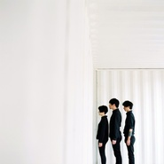
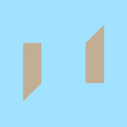
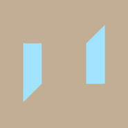
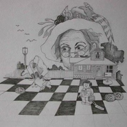
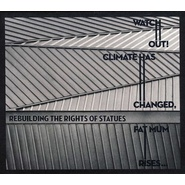

重塑雕像的权利
============================

|  |  |
| :--: | :-- |
| [ 重塑雕像的权利](https://i.xiami.com/re-tros) | **地区**: China 中国大陆 **风格**: 后朋克 Post-Punk **播放数**: 3007786 **粉丝数**: 31166 **评论数**: 1015  |

## 档案

“重塑雕像的权利”，国内最具代表性乐队之一，成立于2003年3月，受70年代的后朋克乐队Bauhaus, Joy Division, Gang of Four等乐队影响。05年签约摩登天空后，成为了现场演出中最为抢眼的一支中国摇滚新贵，乐队经典的后朋克曲风及冲击力极强的现场演出征服了大批的乐迷。音乐里透露的隶属于上个世纪70年代末后朋克的艺术气息，倍受乐迷的推崇。目前，重塑雕像的权利乐队正在新的音乐领域进行尝试， 力图给乐迷带来不同于以往的听觉感受。     主唱/吉他：华东  和声/贝司：刘敏  鼓手：马翬 (2014年离队)  黄锦 (2015年加入)        乐队经历       2004年  4月，开始在北京演出。  9月，全国7个城市巡演。  2005年  1月，应邀与瑞典 “国际噪音阴谋” 同台演出。  9月，在“摩登天空5” 中发行单曲 “A vision of Chris”。  10月，开始录制第一张EP《CUT OFF!》  11月，发行首张EP《CUT OFF！》。 与传奇制作人Brain Eno合作。发行后立即引起了强烈反响。  2006年  2月，获 “百事音乐风云榜”“最佳摇滚新人” 提名。  5月，乐队开始了全国17个城市包含香港在内的第二轮巡演，进一步奠定了 “中国最佳后朋克乐队” 的地位。  6月，“重塑雕像的权利” 受新加坡政府邀请参加了在新加坡举行的 “亚洲独立音乐节” 。  2007年  3月，踏上美国开始了近20场的美国巡演，并参加美国最大的音乐节之一 “South By Southwest” 为期四天的演出。并接受了美国ABC电视台ABC NEWS节目黄金时段专访。  7月，首张EP唱片《CUT OFF！》于美国全面上市。   2008年  6月，“重塑”开始录制专辑《Watch out! Climate has changed, fat mum rises...》, 制作人Damon为纽约著名实验乐队Amen Dunes主唱，录音师Charles为纽约知名录音师，Seaside Lounge录音棚老板，Interpol 主唱Paul Banks个人乐队鼓手。  2009年  2月，专辑 《WATCH OUT！CLIMATE HAS CHANGED，FAT MUM RISES…》发行。  3月，“重塑”踏上了一轮为期50天遍及30个城市的最大规模全国巡演。  5月，“重塑”为纽约独立/实验乐队“Ratatat”北京专场开场。  6月，“重塑”泰国、柬埔寨、越南三国巡演。  2010年  3月，“重塑”参演台湾 “大港开唱音乐节”。  10月，“重塑”参加纽约CMJ音乐节。  2011年  3月，“重塑”与英国70年代传奇后朋克乐队Gang Of Four一道进行为期一周的澳洲巡演。  5月，“重塑”参加新加坡Music Matters音乐节。  6月，“重塑”韩国大邱，釜山，首尔巡演。  8月，“重塑”参加在日本举办的亚洲最大的音乐节“Summer Sonic ”并在亚洲舞台作为大轴演出。  10月至11月， “重塑”与美国Health乐队一起进行“Converse 过躁”中国巡演。  2012年  3月， “重塑”参加美国西南偏南音乐节(SXSW)并在纽约演出。  9月， “重塑”在上海Mao Livehouse举办专场演出，现场的多媒体技术运用受到了多家海外媒体的称赞。。  11月至12月，“重塑”进行欧洲巡演，途经芬兰、瑞典、丹麦、德国、西班牙、瑞士、意大利、爱沙尼亚等国。     目前，乐队正在积极筹备新专辑， 并在纽约Rubber Tracks录音棚开始新专辑录音工作，与David Bowie, Lou Reed, Björk, Philip Glass等人的录音师/制作人Hector合作。新专辑有望于2013年春季发行。

## 专辑

| 名称 | 语种 | 唱片公司 | 发行时间 | 专辑类别 | 专辑风格 |
| :--: | :-- | :-- | :-- | :-- | :-- |
| [ AT MOSP HERE (Fujiya&Miyagi Remix)](./albums/2102957903.md) | 英语 | 摩登天空 | 2017年11月23日 | EP, 单曲 |  |
| [ Before the Applause](./albums/2102857359.md) | 英语 | 摩登天空 | 2017年09月15日 | 录音室专辑 | 后朋克 Post-Punk |
| [ 8+2+8 I (Paul Frick Remix)](./albums/2102822737.md) | 国语 | 摩登天空 | 2017年08月30日 | EP, 单曲 |  |
| [ 8+2+8 II](./albums/2102778174.md) | 国语 | 摩登天空 | 2017年07月06日 | EP, 单曲 |  |
| [ PIGS IN THE RIVER](./albums/2102700766.md) | 国语 | 摩登天空 | 2017年02月28日 | EP, 单曲 |  |
| [ 03年Demo](./albums/78974529.md) | 国语 | 独立发行 | 2012年10月27日 | EP, 单曲 | 后朋克 Post-Punk |
| [ WATCH OUT!CLIMATE HAS CHANGED,FAT MUM RISES…](./albums/319825.md) | 英语 | 摩登天空 | 2009年02月27日 | 录音室专辑 | 后朋克 Post-Punk |
| [ CUT OFF!](./albums/170550.md) | 英语 | BadHead | 2005年05月01日 | EP, 单曲 | 后朋克 Post-Punk |

## 评论

|  |  |  |
| :-- | :-- | :-- |
|  [虾米用户](https://emumo.xiami.com/u/3416489)  2021-01-05 23:08 赞(0) 踩(0) | 
哈哈哈哈，翻了一下关注艺人，重塑竟然是我第一个关注的乐队，有10年了，再见虾米！
 |
|  [虾米用户](https://emumo.xiami.com/u/3640281) 奔向自由的明天……或者后... 2021-01-04 17:07 赞(0) 踩(0) | 
虾米你可要挺住了。。我可不想只能在QQ音乐听我这些可爱的乐队。。恨不得把重塑的歌都下载下来。。
 |
|  [虾米用户](https://emumo.xiami.com/u/222802757) 单循控  搬去酷狗  -... 2020-12-20 15:52 赞(0) 踩(0) | 
跪求重塑大前年在the xx北京展览馆演出做暖场时演奏的两首歌的名字～鼓点炸了&amp;hellip;
 |
|  [虾米用户](https://emumo.xiami.com/u/23044319)   2020-12-10 15:06 赞(0) 踩(0) | 
真的太高级了，一次就爱上！
 |
|  [虾米用户](https://emumo.xiami.com/u/4048199)   2020-11-25 11:25 赞(1) 踩(0) | 
经过乐夏了解到了重塑，感觉发现太晚了
 |
|  [虾米用户](https://emumo.xiami.com/u/203939497)  2020-10-27 01:01 赞(2) 踩(0) | 
怎么能这么吊这乐队
 |
|  [虾米用户](https://emumo.xiami.com/u/18986062) 我浊泊兮 2020-10-16 13:13 赞(2) 踩(0) | 
重塑上架的权利
 |
|  [虾米用户](https://emumo.xiami.com/u/5065634)  2020-10-13 13:15 赞(6) 踩(0) | 
听重塑十几年了，第一次在YYT听他们的现场。从小也听国内的流行摇滚什么都听，喜欢的很少，很多就当个背景音乐。国外的音乐听得更多一些，十几年前大学时代听包豪斯尼克凯夫音速以泪洗面，在国内的音乐里听不出那些味道，哥特后朋真的没什么能听的声音，幼稚的模仿都是依葫芦画瓢挺搞笑的。直到工作后听朋友提起重塑，听的第一首就是如果猴子成为国王，前奏刚刚出来我就折服了，到现在cut off还是我最喜欢的一张专辑，最喜欢的歌还是猴子那首。这十几年我始终不追潮流现在也不看抖音不看新闻，国内唯一一支喜欢的乐队还是重塑，还会继续十年如一日地听重塑以泪洗面devil doll这些最优质的音乐&amp;hellip;&amp;hellip;
 |
|  [虾米用户](https://emumo.xiami.com/u/1171016) 人们活着.静如止水 2020-10-11 01:01 赞(2) 踩(0) | 
乐夏最后一首歌.很棒.
 |
|  [虾米用户](https://emumo.xiami.com/u/231108158) 我还没想好要写什么... 2020-10-02 17:20 赞(0) 踩(0) | 
Trrrrash
 |
|  [虾米用户](https://emumo.xiami.com/u/305385)  2020-09-14 00:11 赞(0) 踩(0) | 
相似艺人推荐的都什么玩意
 |
| ⇒ |  [虾米用户](https://emumo.xiami.com/u/356186208) 不经常用，活动区在网易，... 2020-10-29 12:35 赞(0) 踩(0) | 
挺好的啊？都是国内的优秀后朋
 |
|  [虾米用户](https://emumo.xiami.com/u/56193100) ♡ 2020-09-13 00:38 赞(0) 踩(0) | 

 |
|  [虾米用户](https://emumo.xiami.com/u/412600485)  2020-09-07 12:53 赞(1) 踩(0) | 
在哪有所有歌版权啊？
 |
|  [虾米用户](https://emumo.xiami.com/u/3566813) 菩萨，祝您身体健康！34... 2020-09-03 02:46 赞(0) 踩(0) | 
好大一颗遗嘱！
 |
|  [虾米用户](https://emumo.xiami.com/u/36897148) 私信➕v请备注 2020-09-01 09:37 赞(1) 踩(0) | 
重塑，怎么说呢，大张伟应该问听没听过《最炫民族风》，如果得到的答案是没听过，那这个逼装的能得满分。说没听过《卡路里》，勉强6分吧
 |
|  [虾米用户](https://emumo.xiami.com/u/53737210) 哼哼哼 2020-08-20 06:53 赞(2) 踩(0) | 
在重塑之前，没有一支乐队在抄袭了Nick cave之后却在专辑文案里臭不要脸的说是致敬的 [文字cool] 
 |
| ⇒ |  [虾米用户](https://emumo.xiami.com/u/5065634)  2020-10-13 12:54 赞(0) 踩(0) | 
不是重塑的乐迷请离开这里，你既然不听他们的音乐，黑他们也是浪费你的人生
 |
|  [虾米用户](https://emumo.xiami.com/u/7073038)   2020-08-12 14:38 赞(0) 踩(0) | 
高级 高级 
 |
|  [虾米用户](https://emumo.xiami.com/u/3707881) 等你有版权了我会回来爱你... 2020-08-09 21:00 赞(1) 踩(0) | 
乐夏圈粉
 |
|  [虾米用户](https://emumo.xiami.com/u/7186218) 再也不是我 2020-08-08 16:42 赞(1) 踩(0) | 
这个男者主唱和B站上很火的一个鬼畜一毛一样。要问是哪个鬼畜啊，就是那个在韩红面前说自己高音天下第一的，唱三天三夜的，怎么样，有画面了吧。。。
 |
|  [虾米用户](https://emumo.xiami.com/u/48138891) 因为我不放心我自己⋯ 2020-08-04 23:04 赞(0) 踩(0) | 
终于有版权了，庆祝！ 
 |
|  [虾米用户](https://emumo.xiami.com/u/8741301) still walkin... 2020-08-02 21:01 赞(0) 踩(0) | 
希望之后有巡演！
 |
|  [虾米用户](https://emumo.xiami.com/u/52566452) 照见五蕴皆空 度一切苦厄 2020-08-01 17:03 赞(0) 踩(0) | 

 |
|  [虾米用户](https://emumo.xiami.com/u/421489510) 我爱音乐 2020-07-31 21:38 赞(0) 踩(0) | 

 |
|  [虾米用户](https://emumo.xiami.com/u/2763594)  2020-07-30 23:01 赞(1) 踩(0) | 
音乐语言无国界这个是毫无疑问的，但做出有自己特质的音乐又是另外一回事了。而重塑给我的感觉就是这种，别人的印迹太强，没有自己原创性的东西，其实这也是很多国内乐队给我的感受
 |
|  [虾米用户](https://emumo.xiami.com/u/282399710) 这家伙很聪明什么也没留下... 2020-07-29 16:02 赞(1) 踩(0) | 
好像只有普通话太庄重不适合唱，好像是个方言都挺有感情的。 我这是给评论的评论不是给乐队的评论。
 |
|  [虾米用户](https://emumo.xiami.com/u/173579114) 熊雪帆 我爱你 2020-07-29 11:59 赞(0) 踩(0) | 
喜欢
 |
|  [虾米用户](https://emumo.xiami.com/u/50184423) 我习于冷，志于成冰 2020-07-28 22:04 赞(0) 踩(0) | 
高级
 |
|  [虾米用户](https://emumo.xiami.com/u/313002884)  2020-07-27 21:49 赞(1) 踩(0) | 
乐夏拐过来的
 |
|  [虾米用户](https://emumo.xiami.com/u/5489723) 音符与人生 2020-07-27 19:22 赞(0) 踩(0) | 
我去 喜欢到流泪
 |
|  [虾米用户](https://emumo.xiami.com/u/434022310) 无 2020-07-27 19:13 赞(0) 踩(0) | 
精妙绝伦，摄人心魄
 |
|  [虾米用户](https://emumo.xiami.com/u/50817383) 猫儿在这儿. 2020-07-27 10:58 赞(0) 踩(0) | 

 |
|  [虾米用户](https://emumo.xiami.com/u/177970278) 是脆弱同时也是力量 2020-07-27 10:06 赞(0) 踩(0) | 
惊艳 才发现我早已关注 但又忘记是因为哪首歌
 |
|  [虾米用户](https://emumo.xiami.com/u/3790093)  2020-07-27 01:49 赞(9) 踩(0) | 
个人认为重塑就是德国人的做事方式，逻辑严谨～听着看着可能很多都平淡无奇，但是每一点都深思熟虑推敲实用～和德国的设计一样很多理性经典。这些类型都大多缺少些浪漫和激情～没有一定积累听不懂其中的妙处～ 
 |
|  [虾米用户](https://emumo.xiami.com/u/216784802) 好的音乐最重要的是真实，... 2020-07-26 17:38 赞(15) 踩(0) | 
不要太过于模仿nick cave，这个太符号化了，EN最近几张都很卡巴莱，可以学一下
 |
| ⇒ |  [虾米用户](https://emumo.xiami.com/u/7587789) 嘿！你要去哪？ 2020-07-28 10:53 赞(0) 踩(0) | 
哈哈哈，最近有在公众号上看到Nick cave在自己的网站上回复一个歌迷有关《palaces of montezuma》的原创性时，说音乐人都是站在彼此的肩膀上，从别人的歌里获取灵感不是坏事，但要把借鉴来的东西变得更好，以使别人也想来”偷”你的。如果你偷来一个灵感却搞砸了，非但没能尊重你偷来的东西，也终究会付出代价，你的天赋会离开你。
 |
| ⇒ |  [虾米用户](https://emumo.xiami.com/u/332544806) 我还没想好要写什么... 2020-09-15 15:56 赞(0) 踩(0) | 
<q><b>lavender说：</b></q>
 |
| ⇒ |  [虾米用户](https://emumo.xiami.com/u/222802757) 单循控  搬去酷狗  -... 2020-12-20 15:29 赞(0) 踩(0) | 
<q><b>lavender说：</b></q>
 |
| ⇒ |  [虾米用户](https://emumo.xiami.com/u/359749483)  2021-01-13 10:05 赞(0) 踩(0) | 
不学。
 |
|  [虾米用户](https://emumo.xiami.com/u/215379991) 簽名不重要重要的是你聽什... 2020-07-26 15:43 赞(0) 踩(0) | 
ﻌﻌﻌ❤︎
 |
|  [虾米用户](https://emumo.xiami.com/u/194315645) 该怎么和你们告别？ 2020-07-25 22:09 赞(0) 踩(0) | 
，
 |
|  [虾米用户](https://emumo.xiami.com/u/206703958) Ins:lulululu... 2020-07-22 11:28 赞(0) 踩(0) | 
等着
 |
|  [虾米用户](https://emumo.xiami.com/u/376204245) 123456789 2020-07-11 20:05 赞(1) 踩(0) | 
终于，有一张版权了
 |
|  [虾米用户](https://emumo.xiami.com/u/427384237) 我还没想好要写什么... 2020-06-26 20:38 赞(0) 踩(0) | 

 |
|  [虾米用户](https://emumo.xiami.com/u/344428233) 虾米找耳朵 2020-06-13 23:23 赞(0) 踩(0) | 
今天在京东直播蹦迪！！！你们好棒哦！转去apple music 听咯资源比较多～
 |
|  [虾米用户](https://emumo.xiami.com/u/358104299) 悲观的唯心存在现实解构虚... 2020-03-24 09:36 赞(1) 踩(0) | 
40093
 |
|  [虾米用户](https://emumo.xiami.com/u/441171625) 我还没想好要写什么... 2020-03-06 21:54 赞(2) 踩(0) | 
回到音乐本身，好听（音乐性）、牛逼（创新）就够了！重塑从05年第一次北京听现场就已经很喜欢了，现在听依然带劲，而且后续专辑创作生命力很强。
 |
|  [虾米用户](https://emumo.xiami.com/u/335158665)  2020-01-01 22:28 赞(0) 踩(0) | 
版权都没，推荐个啥
 |
|  [虾米用户](https://emumo.xiami.com/u/316223151) 菩提本无树 2019-12-30 23:12 赞(0) 踩(0) | 
我创了个群，分享交流关于重塑的一切，有意私我。
 |
|  [虾米用户](https://emumo.xiami.com/u/2216414) . 2019-12-25 21:22 赞(0) 踩(0) | 
没几首能听了。。。
 |
|  [虾米用户](https://emumo.xiami.com/u/5541880) ⌇ 2019-11-06 14:39 赞(0) 踩(0) | 

 |
|  [虾米用户](https://emumo.xiami.com/u/42560187) 归于传统 2019-08-31 20:04 赞(1) 踩(0) | 
哈哈哈哈，看了一下又灰了，很枯燥
 |
|  [虾米用户](https://emumo.xiami.com/u/307511) w x同号 2019-08-27 00:19 赞(44) 踩(0) | 
先重塑上架的权利吧 
 |
|  [虾米用户](https://emumo.xiami.com/u/427048478) 我还没想好要写什么... 2019-07-08 21:08 赞(1) 踩(0) | 
怎么下架了？
 |
|  [虾米用户](https://emumo.xiami.com/u/5964346)  2019-06-14 21:52 赞(0) 踩(0) | 
都下架了…没给钱还是和谐了？！
 |
|  [虾米用户](https://emumo.xiami.com/u/2807048) 噢 乖 2019-05-05 20:36 赞(3) 踩(0) | 
19迷笛现场太牛逼 我来做个记号
 |
|  [虾米用户](https://emumo.xiami.com/u/98587900) 荒光阴无数。。 2019-05-05 10:01 赞(3) 踩(0) | 
真是什么都能成辩论大赛。  写英文歌的多了。    这也算个点嘛？
 |
|  [虾米用户](https://emumo.xiami.com/u/42963872) 我还没想好要写什么... 2019-03-09 01:50 赞(2) 踩(0) | 
国内最顶级的乐队之一
 |
|  [虾米用户](https://emumo.xiami.com/u/6000081) 我还没想好要写什么... 2019-02-03 00:41 赞(1) 踩(0) | 
国内顶级了
 |
|  [虾米用户](https://emumo.xiami.com/u/42560187) 归于传统 2019-01-15 18:25 赞(0) 踩(0) | 
非常喜欢这个乐队
 |
|  [虾米用户](https://emumo.xiami.com/u/10563506) 旺德福，泰瑞宝 2018-12-08 01:18 赞(3) 踩(0) | 
可远不止b52。。每次在国内的后朋或德酸下面都有“哼，这不就joy division吗”哈哈
 |
|  [虾米用户](https://emumo.xiami.com/u/333485447) Happiness's ... 2018-11-13 14:21 赞(1) 踩(0) | 
听听the b52s，就差词儿一样了
 |
|  [虾米用户](https://emumo.xiami.com/u/40229986) 刷~刷~刷~ 2018-11-04 19:35 赞(2) 踩(0) | 
版权在哪里呀……
 |
|  [虾米用户](https://emumo.xiami.com/u/9047731) 失责亏恩 度时虚浮 意志... 2018-09-29 18:37 赞(0) 踩(0) | 
没有公告板？
 |
|  [虾米用户](https://emumo.xiami.com/u/35498788) music makes ... 2018-08-23 21:21 赞(2) 踩(0) | 
就没人觉得像the b52s么，唱腔和感觉都很像。
 |
|  [虾米用户](https://emumo.xiami.com/u/380617)  2018-08-13 13:25 赞(0) 踩(0) | 
好斯文
 |
|  [虾米用户](https://emumo.xiami.com/u/9028760) 豆瓣见 spotify ... 2018-07-31 07:47 赞(0) 踩(0) | 
♲
 |
|  [虾米用户](https://emumo.xiami.com/u/138885168) ... 2018-06-26 15:47 赞(0) 踩(0) | 
！！
 |
|  [虾米用户](https://emumo.xiami.com/u/374269366) 海胆王（四声） 2018-06-17 21:57 赞(0) 踩(0) | 
哇，喜欢
 |
|  [虾米用户](https://emumo.xiami.com/u/1679871) 我还没想好要写什么... 2018-06-15 15:52 赞(4) 踩(0) | 
我曾经暗恋的女孩子一定不知道我那么喜欢她是因为她真的特别像刘敏
 |
|  [虾米用户](https://emumo.xiami.com/u/333839466)  2018-05-25 02:28 赞(0) 踩(0) | 
請問重塑的《Red Rum Aviv》資源誰有
 |
| ⇒ |  [虾米用户](https://emumo.xiami.com/u/44020)   2018-05-31 16:38 赞(0) 踩(0) | 
听DEMO版得了。
 |
|  [虾米用户](https://emumo.xiami.com/u/292484097)   2018-05-23 21:45 赞(1) 踩(0) | 
天天盼着上架
 |
|  [虾米用户](https://emumo.xiami.com/u/78131264) Ångra Kärlek... 2018-05-23 09:16 赞(2) 踩(0) | 
太几把牛了
 |
|  [虾米用户](https://emumo.xiami.com/u/6293759) 愛真善美  审视欲望  ... 2018-05-16 02:15 赞(0) 踩(0) | 
可以，很正
 |
|  [虾米用户](https://emumo.xiami.com/u/47960849)   2018-05-13 01:30 赞(0) 踩(0) | 
boys in cage
 |
|  [虾米用户](https://emumo.xiami.com/u/309546770) No Drama Rea... 2018-05-06 12:06 赞(1) 踩(0) | 
口味纯正到开始起范儿了
 |
|  [虾米用户](https://emumo.xiami.com/u/2104186)  2018-05-05 00:46 赞(0) 踩(0) | 
哟，回来一张，等的赶紧补上。
 |
|  [虾米用户](https://emumo.xiami.com/u/14463507) Come. Tell m... 2018-05-01 21:58 赞(1) 踩(0) | 
本时代舞曲后朋类 live 呈现可能的巅峰。如果将范围缩小到国内，那就是，独立乐队 live 呈现可能的巅峰。
 |
|  [虾米用户](https://emumo.xiami.com/u/36496136) 草长莺飞，南来北往 2018-05-01 19:14 赞(3) 踩(0) | 
2018上海草莓，人生第一次音乐节之旅，第一次知道这个乐队，第一次听这个乐队的歌，只能说，能听他们的现场是我去草莓最幸运的一件事。我本来主要想看李志，可是在听到重塑的现场后我改变了计划，我坐在爱舞台前的草坪上，人不多，我坐的远，但是他们的表演却离我很近。留下的人每个都不顾矜持地摇摆不停，他们怎么可以这么棒，我怎么可以错过他们这么久？谢谢重塑，谢谢你们让我知道原来中国也可以有这么棒的摇滚现场，我对音乐了解得还太少，对中国的乐界也了解的太少，但是音乐的感觉总是突如其来，控制不了的。乐队主唱是我今天在草莓上听到的最专注的声音，你们是做音乐的，我现在知道啦，以后会持续关注 
 |
| ⇒ |  [虾米用户](https://emumo.xiami.com/u/73115192) 说什么没用，做什么才重要... 2018-05-15 03:20 赞(0) 踩(0) | 
我也大爱重塑啊，可惜的是他们都太低调了，华东哥的为人，对音乐的理解，太让人尊重了。大概看了下你的收藏，巧合的是我也喜欢谷村新司。
 |
| ⇒ |  [虾米用户](https://emumo.xiami.com/u/3076149) 我还没想好要写什么... 2018-05-22 01:31 赞(0) 踩(0) | 
同感，成都草莓，惊到了居然错过这么久 他们是真正艺术的创作
 |
|  [虾米用户](https://emumo.xiami.com/u/4477103) 完全没有匆忙的必要 2018-04-26 10:00 赞(0) 踩(0) | 
哭了 悄咪咪上了
 |
|  [虾米用户](https://emumo.xiami.com/u/17146554) weibo：@L1RRO... 2018-04-24 22:35 赞(0) 踩(0) | 
❤️
 |
|  [虾米用户](https://emumo.xiami.com/u/20177386) 感谢一切美好的遇见❤️ 2018-04-24 01:36 赞(0) 踩(0) | 

 |
|  [虾米用户](https://emumo.xiami.com/u/277026818) 我已经想好要写什么了..... 2018-04-17 20:05 赞(0) 踩(0) | 
故弄玄虚
 |
|  [虾米用户](https://emumo.xiami.com/u/49420522) :-I 2018-04-01 23:13 赞(0) 踩(0) | 
版权
 |
|  [虾米用户](https://emumo.xiami.com/u/13934156) 我的照片里都是风景 2018-03-23 00:42 赞(9) 踩(0) | 
强烈要求摩登版权授权虾米独家！！！调性最契合的两个居然没有搞到一起？？？
 |
|  [虾米用户](https://emumo.xiami.com/u/43492923) 行到水穷我才开始害怕，夕... 2018-03-13 13:09 赞(0) 踩(0) | 
▲
 |
|  [虾米用户](https://emumo.xiami.com/u/224635) Musik macht ... 2018-02-20 14:00 赞(3) 踩(0) | 
虾米重塑作品太少！！！马云爸爸电影都舍得搞，还那么抠门儿音乐版权费么&amp;hellip;
 |
|  [虾米用户](https://emumo.xiami.com/u/216784802) 好的音乐最重要的是真实，... 2018-01-15 12:37 赞(20) 踩(0) | 
中国要多一点后朋克，而且要不同风格的后朋克，这块土壤其实很肥沃，有巨大潜力可挖，而且上手也不难。重塑第一张的确给人以眼睛一亮的感觉
 |
|  [虾米用户](https://emumo.xiami.com/u/4477103) 完全没有匆忙的必要 2018-01-09 03:50 赞(2) 踩(0) | 
啥时候能听啊 懒得切网易
 |
|  [虾米用户](https://emumo.xiami.com/u/11464083) always awake 2018-01-06 09:31 赞(2) 踩(0) | 
现场帅炸
 |
|  [虾米用户](https://emumo.xiami.com/u/10452382)   2017-12-21 23:17 赞(1) 踩(0) | 
蹦移游击跨年演出12月31日@武汉汉阳造 演出乐队：重塑雕像的权利 Nova Heart CodNew 疯狂老鼠 Su Hu Yang PUNX 详情请点击链接 <a href="https://wxb432be29447b040c.duohui.co/event/2195?utm_source=XIAMI" target="_blank" rel="nofollow noreferrer noopener">https://wxb432be29447b040c.duohui.co/event/2195?utm_source=XIAMI</a>
 |
|  [虾米用户](https://emumo.xiami.com/u/676877) 佛曰：Let it be... 2017-12-10 01:22 赞(2) 踩(0) | 
妈个蛋的什么时候才能听！
 |
|  [虾米用户](https://emumo.xiami.com/u/36425079) ᠡᠷᠬᠡ ᠴᠢᠯᠦᠭᠡ 2017-12-07 19:54 赞(0) 踩(0) | 
厉害了
 |
|  [虾米用户](https://emumo.xiami.com/u/36471014) oi to the wo... 2017-11-29 08:58 赞(0) 踩(0) | 
12月上海见
 |
|  [虾米用户](https://emumo.xiami.com/u/4444474) 一半栖息，一半流浪 2017-11-07 22:39 赞(0) 踩(0) | 
自从纽约看了现场！秒爱❤️现场数学感觉爆棚啊！
 |
|  [虾米用户](https://emumo.xiami.com/u/10210860)  2017-10-30 10:22 赞(0) 踩(0) | 
完全惊喜啊，中国最牛逼一点都不为过！
 |
|  [虾米用户](https://emumo.xiami.com/u/2383925) 独音唱片 2017-10-28 00:22 赞(1) 踩(0) | 
独音唱片三周年3月16号周日愚公移山专场 演出乐队：重塑雕像的权利 刺猬乐队Nova Heart 丢火车 盘尼西林 活动连接：<a href="http://www.douban.com/event/20820593/" target="_blank" rel="nofollow noreferrer noopener">http://www.douban.com/event/20820593/</a>
 |
|  [虾米用户](https://emumo.xiami.com/u/576211)  2017-10-28 00:21 赞(0) 踩(0) | 
好像北京武汉这几个地方抢票都很疯狂啊。我担心了……  希望上海能抢到票子！
 |
|  [虾米用户](https://emumo.xiami.com/u/16066608)  2017-10-27 23:49 赞(0) 踩(0) | 
记得很久以前重塑来西安演出 我去看了 身边的老外给朋友说“这次算是来值了”
 |
|  [虾米用户](https://emumo.xiami.com/u/4051783)  2017-10-27 23:29 赞(0) 踩(0) | 
国内最具代表性后朋三人组，有着最佳的现场和舞台表现力。这样的稀有瑰宝，怎能不收。
 |
|  [虾米用户](https://emumo.xiami.com/u/1442309)  2017-10-27 23:07 赞(0) 踩(0) | 
此种恶心的声音为什么听起来那么让我入迷！
 |
|  [虾米用户](https://emumo.xiami.com/u/46000485) 杂食动物  夜行动物  ... 2017-10-26 20:47 赞(1) 踩(0) | 
虾米的重塑页面太惨了……
 |
|  [虾米用户](https://emumo.xiami.com/u/1698530)  2017-10-23 22:31 赞(0) 踩(0) | 
想问问鼓手马hui去哪了。
 |
|  [虾米用户](https://emumo.xiami.com/u/10080766) 我还没想好要写什么... 2017-10-08 10:53 赞(3) 踩(0) | 
什么时候才可以在虾米听到重塑啊
 |
|  [虾米用户](https://emumo.xiami.com/u/48530364) 你永远不会懂我的悲伤 2017-09-08 22:00 赞(0) 踩(0) | 
punk
 |
|  [虾米用户](https://emumo.xiami.com/u/47570236)  　⠀ 2017-09-01 08:49 赞(0) 踩(0) | 

 |
|  [虾米用户](https://emumo.xiami.com/u/39636712) I҈  C҈ A҈ R҈... 2017-08-18 18:56 赞(9) 踩(0) | 
后朋是我最喜欢的音乐genre之一，从80年代wire、sad lovers and giants、变色龙、迷幻皮草和the opposition等老团到近年来的the KVB、eagulls和motorama这些新团都是深爱，所以可以很负责任地告诉你，后朋绝对不是这样生硬扭捏的，喜欢后朋千万不要止于重塑。
 |
|  [虾米用户](https://emumo.xiami.com/u/52627311) 一个现实的理想主义者。 2017-08-07 17:11 赞(0) 踩(0) | 
还行啊
 |
|  [虾米用户](https://emumo.xiami.com/u/242516385) 哦 2017-07-24 03:45 赞(0) 踩(0) | 
本来要去coney island看的可是还是耽搁了。
 |
|  [虾米用户](https://emumo.xiami.com/u/94394300) To thine own... 2017-05-22 10:03 赞(1) 踩(0) | 
第一次看重塑是在班卓，第二次是在草莓音乐节，跟男朋友都很喜欢的后朋克
 |
|  [虾米用户](https://emumo.xiami.com/u/18555444)   2017-05-18 13:56 赞(1) 踩(0) | 
前几天拖上闺蜜去草莓音乐节看重塑，没想到她率先开始pogo 
 |
|  [虾米用户](https://emumo.xiami.com/u/10363618) 歌 书 电影 心情 不易... 2017-05-05 11:05 赞(0) 踩(0) | 
感觉国内这种乐队很少 惊喜
 |
|  [虾米用户](https://emumo.xiami.com/u/6898328)   2017-04-21 16:30 赞(0) 踩(0) | 
今天上海场转票
 |
|  [虾米用户](https://emumo.xiami.com/u/119406738)  2017-04-19 19:57 赞(0) 踩(0) | 
上海421最后一场 
 |
|  [虾米用户](https://emumo.xiami.com/u/1959541) 听音乐很幸福 2017-04-08 23:42 赞(0) 踩(0) | 
成都的今晚，嗨爆了，第一次看小酒馆有这么多人，怪不得得在万象城，不然装不下呀
 |
|  [虾米用户](https://emumo.xiami.com/u/158876204)  2017-03-22 01:27 赞(1) 踩(0) | 
4 25 福州 有上车的小伙伴么?
 |
|  [虾米用户](https://emumo.xiami.com/u/46464728) 不浪漫毋宁死 2017-03-07 13:25 赞(1) 踩(0) | 
4.2在46，谁来
 |
| ⇒ |  [虾米用户](https://emumo.xiami.com/u/49701807) 活在梦里 2017-03-17 19:33 赞(0) 踩(0) | 
我会去
 |
| ⇒ |  [虾米用户](https://emumo.xiami.com/u/6594496)  2017-03-18 12:24 赞(0) 踩(0) | 
来
 |
| ⇒ |  [虾米用户](https://emumo.xiami.com/u/49701807) 活在梦里 2017-04-03 00:28 赞(0) 踩(0) | 
<q><b>未知生物说：</b></q>
 |
| ⇒ |  [虾米用户](https://emumo.xiami.com/u/6594496)  2017-04-03 00:30 赞(0) 踩(0) | 
<q><b>Lucien说：</b></q>
 |
| ⇒ |  [虾米用户](https://emumo.xiami.com/u/49701807) 活在梦里 2017-04-03 02:07 赞(0) 踩(0) | 
<q><b>未知生物说：</b></q>
 |
| ⇒ |  [虾米用户](https://emumo.xiami.com/u/6594496)  2017-04-03 22:40 赞(0) 踩(0) | 
<q><b>Lucien说：</b></q>
 |
|  [虾米用户](https://emumo.xiami.com/u/83893196) 我还没想好要写什么... 2017-03-04 20:47 赞(0) 踩(0) | 
路过
 |
|  [虾米用户](https://emumo.xiami.com/u/34320880) 暂无签名~ 2017-03-01 09:22 赞(1) 踩(0) | 
421上海MAO！
 |
|  [虾米用户](https://emumo.xiami.com/u/201391232) 最快的方法是先抱抱 2017-02-25 17:17 赞(0) 踩(0) | 
...
 |
|  [虾米用户](https://emumo.xiami.com/u/136447240) 一句话介绍一下自己吧，让... 2017-02-23 21:11 赞(0) 踩(0) | 
重塑版权都没了？下迷药玩
 |
|  [虾米用户](https://emumo.xiami.com/u/27674078) 川流不息的人群里 有多少... 2017-02-07 15:00 赞(0) 踩(0) | 
上海4月份mao谁去！求队伍！
 |
| ⇒ |  [虾米用户](https://emumo.xiami.com/u/34320880) 暂无签名~ 2017-03-01 09:22 赞(0) 踩(0) | 
！
 |
|  [虾米用户](https://emumo.xiami.com/u/3484497) 我还没想好要写什么... 2017-02-07 13:34 赞(0) 踩(0) | 
来啦
 |
|  [虾米用户](https://emumo.xiami.com/u/9234220)  2017-02-07 10:40 赞(0) 踩(0) | 
其实我最喜欢的现场还是当年第一届双城上海草莓的重塑。。。是排在天爆前面吧？两个乐队轮着来 哭得稀里哗啦的
 |
|  [虾米用户](https://emumo.xiami.com/u/37126518) 在每个深夜清晨在每个午后... 2017-01-30 22:06 赞(0) 踩(0) | 
嗷喔，要巡演啦
 |
|  [虾米用户](https://emumo.xiami.com/u/262469830)  2017-01-24 09:32 赞(0) 踩(0) | 
听重塑总有一个感觉：锋利
 |
|  [虾米用户](https://emumo.xiami.com/u/15662111)   2017-01-10 22:18 赞(0) 踩(0) | 
WHY？全下架了？
 |
|  [虾米用户](https://emumo.xiami.com/u/8192862) 诗人和先知。vchat:... 2016-11-22 11:46 赞(4) 踩(0) | 
破虾米吃枣药丸（那又怎样还不是不舍得删
 |
|  [虾米用户](https://emumo.xiami.com/u/8981782)  2016-11-21 00:49 赞(2) 踩(0) | 
深圳草莓现场，简直不能更赞！
 |
| ⇒ |  [虾米用户](https://emumo.xiami.com/u/26655611) 你问我要去向何方，我指着... 2016-11-21 07:23 赞(0) 踩(0) | 
真的赞
 |
|  [虾米用户](https://emumo.xiami.com/u/48842612)   2016-11-07 19:36 赞(0) 踩(0) | 
歌都给弄没了
 |
|  [虾米用户](https://emumo.xiami.com/u/28176774) 殊方邂逅豈无緣 2016-11-05 19:44 赞(1) 踩(0) | 
居然只剩一首歌能听？！
 |
|  [虾米用户](https://emumo.xiami.com/u/8433176) Enjoy 2016-11-05 13:58 赞(0) 踩(0) | 
虾米你发咩癫啊！！ d歌呢！？
 |
|  [虾米用户](https://emumo.xiami.com/u/8773879)  2016-10-28 17:31 赞(0) 踩(0) | 
要出新砖辣 开心
 |
|  [虾米用户](https://emumo.xiami.com/u/49981040)  2016-10-10 14:54 赞(2) 踩(0) | 
觉得听歌能让自己流弊的大多傻
 |
| ⇒ |  [虾米用户](https://emumo.xiami.com/u/7041509) 我还没想好要写什么... 2016-11-21 08:28 赞(0) 踩(0) | 
你也傻
 |
| ⇒ |  [虾米用户](https://emumo.xiami.com/u/49981040)  2016-11-23 16:27 赞(0) 踩(0) | 
<q><b>vivicia说：</b></q>
 |
|  [虾米用户](https://emumo.xiami.com/u/222595531)   2016-09-19 12:15 赞(0) 踩(0) | 
路过
 |
|  [虾米用户](https://emumo.xiami.com/u/36057872) 网易/BC: Breat... 2016-09-17 20:39 赞(0) 踩(0) | 
飞起
 |
|  [虾米用户](https://emumo.xiami.com/u/44164416)   2016-09-01 20:41 赞(0) 踩(0) | 
今天就不让听了？
 |
|  [虾米用户](https://emumo.xiami.com/u/21777630)  2016-08-11 17:45 赞(6) 踩(0) | 
好久没在北京演出了。。。该办一回了吧？
 |
|  [虾米用户](https://emumo.xiami.com/u/8717973) 美不美看小腿 2016-07-19 14:16 赞(0) 踩(0) | 
好像是新大陆
 |
|  [虾米用户](https://emumo.xiami.com/u/3468208)   2016-07-15 17:45 赞(0) 踩(0) | 
一阵没过来，评论变得这么尿性啊？
 |
|  [虾米用户](https://emumo.xiami.com/u/74639208) Music is per... 2016-07-07 07:43 赞(0) 踩(0) | 
给我推荐过很多她们的歌，必须关注
 |
|  [虾米用户](https://emumo.xiami.com/u/10244255)  2016-06-30 20:42 赞(1) 踩(0) | 
我说 咱难听也得有个限度
 |
|  [虾米用户](https://emumo.xiami.com/u/13028574) 捅死那个傻逼流行歌手 2016-06-25 16:08 赞(0) 踩(0) | 
留个名表示我很牛逼
 |
|  [虾米用户](https://emumo.xiami.com/u/8611256) 醉倒在乐池。 2016-06-14 23:38 赞(0) 踩(0) | 
14年武汉草莓压轴、那会儿只是提前试听了一下没什么感觉，到了现场，也不知怎么的潜能就被他们激发出来了，tm就自发地以触电般的频率抖了起来，高潮都不足以形容那high劲！（就不捂脸了
 |
|  [虾米用户](https://emumo.xiami.com/u/115698318) 假嬉皮 2016-05-27 12:22 赞(0) 踩(0) | 
三个字：硬！ 到位！
 |
|  [虾米用户](https://emumo.xiami.com/u/10686071) crazy diamon... 2016-05-27 05:22 赞(0) 踩(0) | 
ctm的小清新
 |
|  [虾米用户](https://emumo.xiami.com/u/1674990)  2016-05-26 02:23 赞(2) 踩(0) | 
新专难产还是胎死腹中了？
 |
|  [虾米用户](https://emumo.xiami.com/u/10346874) =-= 2016-05-24 17:04 赞(3) 踩(0) | 
话说最近几年没新砖了吗？都不更新了。。。新砖在哪里？
 |
|  [虾米用户](https://emumo.xiami.com/u/26445408) 来者不拒 去者不留 2016-05-12 00:07 赞(0) 踩(0) | 
妈的 棒
 |
|  [虾米用户](https://emumo.xiami.com/u/30027002)  2016-05-07 02:12 赞(0) 踩(0) | 
啥时候把草莓上那几首贴出来嘛……非得找视频看麻烦死了
 |
|  [虾米用户](https://emumo.xiami.com/u/13409254) 暂无签名~ 2016-05-04 15:14 赞(0) 踩(0) | 
4.30草莓现场的唯一惊喜。音乐不说，三角形的布阵就叫我记忆犹新
 |
|  [虾米用户](https://emumo.xiami.com/u/4458644) 如花美眷，似水流年…… 2016-05-03 07:37 赞(3) 踩(0) | 
前天上海草莓音乐节，他们三个一句话没讲，全程自high，我站在28度的太阳下，给镇住了，久违的震撼！！真正的艺术家拒绝献媚！！
 |
| ⇒ |  [虾米用户](https://emumo.xiami.com/u/1713224) 我还没想好要写什么... 2016-05-04 15:59 赞(0) 踩(0) | 
鼓棒差点砸到我 哈哈哈
 |
| ⇒ |  [虾米用户](https://emumo.xiami.com/u/1693816)  2016-05-06 13:19 赞(0) 踩(0) | 
明明在开始和结束时说了“重塑雕像的权利” 哈哈
 |
|  [虾米用户](https://emumo.xiami.com/u/50720837)   2016-05-02 18:36 赞(0) 踩(0) | 
开口跪！从路人到单曲循环！
 |
|  [虾米用户](https://emumo.xiami.com/u/7160294) For god sake... 2016-05-02 16:27 赞(26) 踩(0) | 
内容已删除
 |
| ⇒ |  [虾米用户](https://emumo.xiami.com/u/1477810) 阿伏加德罗常数 2016-05-02 16:30 赞(0) 踩(0) | 
民谣文艺狗没法说。
 |
| ⇒ |  [虾米用户](https://emumo.xiami.com/u/43484457) 操 2016-05-02 23:42 赞(0) 踩(0) | 
后来都多少人了.....都去看新裤子了
 |
|  [虾米用户](https://emumo.xiami.com/u/105633314)  2016-04-28 18:54 赞(0) 踩(0) | 
怎么加关注啊！！！！
 |
|  [虾米用户](https://emumo.xiami.com/u/15492512)  Don't stop ... 2016-04-27 10:05 赞(1) 踩(0) | 
鲜有人一开始就能接受这样的歌曲，我也不例外。第一次接触后朋就是重塑，那时候还骂这TM唱的什么破歌！后来彻底沦陷了，他们的每一首歌都是心头大爱。再后来，还和一些因为音乐相识的北理工的小伙伴从海淀跑到朝阳，在两个好朋友看他们的专场。那时没几个钱，因为回程太远，演出结束后我们在酒吧坐了一宿，喝啤酒，抽廉价的烟，聊各自喜欢的乐队。天亮之后，各奔东西。
 |
|  [虾米用户](https://emumo.xiami.com/u/39455891) 相同乐好的男孩可真少 2016-04-24 18:17 赞(2) 踩(0) | 
2016武汉草莓音乐节上的歌好像电子...飞了
 |
| ⇒ |  [虾米用户](https://emumo.xiami.com/u/13690189)   2016-04-24 19:15 赞(0) 踩(0) | 
他们玩的是idm 貌似是新歌
 |
| ⇒ |  [虾米用户](https://emumo.xiami.com/u/5600976) Diiiisco gir... 2016-05-02 01:12 赞(0) 踩(0) | 
电子的好好听
 |
|  [虾米用户](https://emumo.xiami.com/u/16075588)   2016-04-18 17:38 赞(0) 踩(0) | 
（一条广告）预售上海五一草莓音乐节学生票 有意私聊
 |
|  [虾米用户](https://emumo.xiami.com/u/43486707) 我们脚踏实地为你延续理想 2016-03-30 09:20 赞(0) 踩(0) | 
啊哟我去，这简介碉堡了，是真的吗
 |
| ⇒ |  [虾米用户](https://emumo.xiami.com/u/1170903) 我妖气重我自豪 2016-03-31 00:22 赞(0) 踩(0) | 
简介咋了?
 |
| ⇒ |  [虾米用户](https://emumo.xiami.com/u/13690189)   2016-04-24 19:17 赞(0) 踩(0) | 
<q><b>鬼束石燕说：</b></q>
 |
| ⇒ |  [虾米用户](https://emumo.xiami.com/u/1170903) 我妖气重我自豪 2016-04-25 09:38 赞(0) 踩(0) | 
<q><b>破喉咙破喉咙说：</b></q>
 |
|  [虾米用户](https://emumo.xiami.com/u/14845416) 鹿角轻轻一撇就斷了… 2016-02-29 16:04 赞(0) 踩(0) | 
重塑！
 |
|  [虾米用户](https://emumo.xiami.com/u/5986862) †しじん せんぞく† 2016-02-04 17:14 赞(0) 踩(0) | 
......
 |
|  [虾米用户](https://emumo.xiami.com/u/2796893) 在没有水的地方想象自己是... 2016-02-03 11:40 赞(3) 踩(0) | 
在听不懂后朋的年纪听过他们的现场 真是亵渎 浪费
 |
|  [虾米用户](https://emumo.xiami.com/u/52506830) 再见 2016-02-03 06:20 赞(0) 踩(0) | 
」「
 |
|  [虾米用户](https://emumo.xiami.com/u/52349007)  2016-02-02 13:50 赞(0) 踩(0) | 
别骂了，安心听歌
 |
|  [虾米用户](https://emumo.xiami.com/u/95558340)   2016-01-30 16:15 赞(1) 踩(0) | 
听第一首就喜欢！高中的记忆！
 |
|  [虾米用户](https://emumo.xiami.com/u/2993440)  2016-01-25 20:10 赞(0) 踩(0) | 
现场无敌炸
 |
|  [虾米用户](https://emumo.xiami.com/u/68353780) 低调 幽暗 阴郁 凄美 2016-01-23 11:43 赞(1) 踩(0) | 
把大陆两字抠掉 中国什么时候分大陆和水路 北京就是中国的心脏
 |
| ⇒ |  [虾米用户](https://emumo.xiami.com/u/987294) 暂无签名~ 2016-04-04 12:44 赞(0) 踩(0) | 
北京是中国的直肠
 |
|  [虾米用户](https://emumo.xiami.com/u/10437760) 我还没想好要写什么... 2015-12-13 11:25 赞(0) 踩(0) | 

 |
|  [虾米用户](https://emumo.xiami.com/u/3583995) 一個人的戰爭 2015-11-30 10:04 赞(1) 踩(0) | 

 |
|  [虾米用户](https://emumo.xiami.com/u/4978110) 暂无签名~ 2015-11-27 02:26 赞(1) 踩(0) | 
国内乐队后朋能玩成这样，确实是挺大的进步！
 |
|  [虾米用户](https://emumo.xiami.com/u/70815656) 音乐使我们的灵魂得以自由 2015-10-30 08:29 赞(0) 踩(0) | 
好久没他们的消息了，国内几大音乐节也没见他们参演
 |
|  [虾米用户](https://emumo.xiami.com/u/12111524) love will te... 2015-10-26 03:20 赞(2) 踩(0) | 
后朋克就是贝斯爆炸……哈哈哈哈
 |
|  [虾米用户](https://emumo.xiami.com/u/322828)   2015-10-23 18:12 赞(1) 踩(0) | 
birthday party + the b-52's
 |
|  [虾米用户](https://emumo.xiami.com/u/18142446) 没错就是喜欢后座的同桌 2015-10-18 01:13 赞(0) 踩(0) | 
挺有感觉啊哈哈哈还是喜欢不优雅，不过这是个好乐队
 |
|  [虾米用户](https://emumo.xiami.com/u/50017584) 我到底有多爱金属 2015-10-12 21:56 赞(0) 踩(0) | 
被惊艳到了
 |
|  [虾米用户](https://emumo.xiami.com/u/24592107) 独角兽 2015-10-07 20:57 赞(0) 踩(0) | 
如此牛逼的后朋
 |
|  [虾米用户](https://emumo.xiami.com/u/3623060)   2015-10-07 10:31 赞(0) 踩(0) | 
有一点点惊艳到，作为国产乐队...其实不仅仅作为国产乐队也有点惊艳
 |
|  [虾米用户](https://emumo.xiami.com/u/2556225)  2015-09-30 16:54 赞(6) 踩(0) | 
森林音乐节差点哭出来 仿佛又变成那个在房间里一遍遍听重塑的初中小女孩
 |
|  [虾米用户](https://emumo.xiami.com/u/50351077)  2015-09-28 22:45 赞(0) 踩(0) | 
真好听！
 |
|  [虾米用户](https://emumo.xiami.com/u/24749536) 暂无签名~ 2015-09-28 00:01 赞(3) 踩(0) | 
今天去听了现场
 |
|  [虾米用户](https://emumo.xiami.com/u/11072382) 一个孤独的人 2015-09-24 08:35 赞(1) 踩(0) | 
从高中时候起听喜欢的不要不要的 可是为什么重塑这几年都没有新歌
 |
|  [虾米用户](https://emumo.xiami.com/u/9245932)  2015-09-21 11:43 赞(0) 踩(0) | 
还是词匮了 学姐说 特别喜欢这队 说 可能你都不知道发生了什么的时候 她就已经哭完一场了  特意过来观摩一下 问题是 我真的听不懂啊 啊哈哈哈哈
 |
|  [虾米用户](https://emumo.xiami.com/u/7859768) 我还没想好要写什么... 2015-09-13 13:40 赞(0) 踩(0) | 
     
 |
|  [虾米用户](https://emumo.xiami.com/u/16876753) 食草 2015-09-11 19:29 赞(0) 踩(0) | 
真你妈吊
 |
|  [虾米用户](https://emumo.xiami.com/u/7991534) 得不偿失 失不再来 来去... 2015-09-11 12:55 赞(0) 踩(0) | 
怎么怂了
 |
|  [虾米用户](https://emumo.xiami.com/u/35143624) 后摇 氛围 暗潮 自赏；... 2015-08-30 01:15 赞(1) 踩(0) | 
刚看了你们赫尔辛基摩登天空音乐节的现场直播，最后一首真的赞！
 |
| ⇒ |  [虾米用户](https://emumo.xiami.com/u/40729438) 听音乐可以活到100岁 2015-09-05 16:37 赞(0) 踩(0) | 
地址呢？谢了
 |
|  [虾米用户](https://emumo.xiami.com/u/6076204) 没有梦想的咸鱼 2015-08-26 21:54 赞(0) 踩(0) | 
真心不错的一支乐队。一开始我还以为是国外的哪个乐队
 |
|  [虾米用户](https://emumo.xiami.com/u/3210084) 我还没想好要写什么... 2015-08-24 14:35 赞(0) 踩(0) | 
看了评论  我还以为我去了百度贴吧呢~~~~
 |
|  [虾米用户](https://emumo.xiami.com/u/44047631) 音乐就是我的维他命…更像... 2015-08-22 21:51 赞(0) 踩(0) | 
朋友推荐了他们的音乐，第一次听，还不错，蛮喜欢的～
 |
|  [虾米用户](https://emumo.xiami.com/u/3510738) 晚安、 2015-08-12 19:19 赞(2) 踩(0) | 
多听少bb....................
 |
|  [虾米用户](https://emumo.xiami.com/u/5848254) 网易云音乐（之后可能会开... 2015-08-09 16:14 赞(1) 踩(0) | 
我在台下吃德芙
 |
|  [虾米用户](https://emumo.xiami.com/u/3685859)  2015-07-15 14:21 赞(1) 踩(0) | 
以前认识的某个姑娘特别特别特别喜欢他们,我很纳闷
 |
|  [虾米用户](https://emumo.xiami.com/u/53238) 我还没想好要写什么... 2015-07-12 13:44 赞(0) 踩(0) | 
我是爸爸
 |
|  [虾米用户](https://emumo.xiami.com/u/2938413) I read you 5 2015-07-10 17:17 赞(4) 踩(0) | 
以前觉得重塑受joy division影响最大，直到挖到了nick cave 早期乐队The Birthday Party   #好不容易听了几年的国内后朋，不听辣#
 |
| ⇒ |  [虾米用户](https://emumo.xiami.com/u/6133839) always miss! 2015-08-13 14:20 赞(0) 踩(0) | 
没看信息还真以为是joy division···
 |
| ⇒ |  [虾米用户](https://emumo.xiami.com/u/132589) 七八点 2015-10-09 15:01 赞(0) 踩(0) | 
谢谢告知nick cave还有早期乐队！
 |
| ⇒ |  [虾米用户](https://emumo.xiami.com/u/2938413) I read you 5 2015-10-09 19:04 赞(0) 踩(0) | 
<q><b>Fever说：</b></q>
 |
|  [虾米用户](https://emumo.xiami.com/u/387168)  2015-07-07 00:08 赞(0) 踩(0) | 
你妹啊！boy in the cage被下架了。
 |
|  [虾米用户](https://emumo.xiami.com/u/39636712) I҈  C҈ A҈ R҈... 2015-07-06 19:09 赞(2) 踩(0) | 
内容已删除
 |
| ⇒ |  [虾米用户](https://emumo.xiami.com/u/6799535) 精神有病沟通也困难 2015-08-21 01:22 赞(0) 踩(0) | 
wow 发现你的批量评论了
 |
| ⇒ |  [虾米用户](https://emumo.xiami.com/u/279414736)  2017-08-18 11:37 赞(0) 踩(0) | 

 |
|  [虾米用户](https://emumo.xiami.com/u/13442663) 我知暗涌，我不再碰。 2015-07-05 17:18 赞(0) 踩(0) | 
卧槽(#ﾟДﾟ)好棒
 |
|  [虾米用户](https://emumo.xiami.com/u/17369374)  2015-06-30 07:02 赞(0) 踩(0) | 
为什么很多歌下架了
 |
|  [虾米用户](https://emumo.xiami.com/u/14060176)  2015-06-29 17:24 赞(0) 踩(0) | 
有点suede的feel  尤其是主唱的声音
 |
|  [虾米用户](https://emumo.xiami.com/u/7032756)  2015-06-23 16:39 赞(0) 踩(0) | 
后朋克 Post-Punk
 |
|  [虾米用户](https://emumo.xiami.com/u/30266632)   2015-06-19 10:35 赞(0) 踩(0) | 
乐堡倒数第二首叫什么呀
 |
|  [虾米用户](https://emumo.xiami.com/u/8861196)   2015-06-19 09:29 赞(0) 踩(0) | 
boys in cage
 |
|  [虾米用户](https://emumo.xiami.com/u/7206504) 一天两包中南海 2015-06-19 08:58 赞(2) 踩(0) | 
兵马司为什么没签下重塑？
 |
|  [虾米用户](https://emumo.xiami.com/u/2418786) 做个牛逼音乐人 2015-06-16 00:56 赞(2) 踩(0) | 
我不觉得他们用英文唱罪该万死，但是这事儿还得说明白：当你用国际语言来表达自己的时候你想表达的是国际通用的观点，当你国际语言去唱歌的时候你还就是个pop，我怀疑那些对于（尤其，相当，非常）支持这种做法的人，您的态度那就是pop粉丝的态度。 然后你说“pop没啥不对啊，听pop也不会杀头，所有我喜欢的歌都算pop”，那您说的也没错。 或者你说“楼主是个二，楼主只喜欢听伪摇山歌”，您说得也不算太错。 不过假如有人觉得自个儿这么支持英文特泛文化特国际主义那我只能说你这就是会错意，从乐队来说用英文是他们玩儿的一种手段，但是假如我要搞一个中国摇滚歌曲的排行榜，所有用英文的先扣十分，这事从理性上来首先说就是撞在easymusic的枪口上，因为调子是英文的调子所以词儿也顺大便用了英文，不好意思，我还是感觉coldplay比较有劲儿。其次，对于本国人大部分人来说听不懂，会不出意，那你玩个什么，摇滚乐队都是半夜12点的神秘园么。 另外一方面，摇滚是讲究态度和自我出发自我制造的音乐，不是什么“长元音”的艺术，举个例子，您要是说直接用中文不适合唱摇滚，那用英文唱崔健的歌您试试？
 |
| ⇒ |  [虾米用户](https://emumo.xiami.com/u/8192862) 诗人和先知。vchat:... 2015-11-20 15:25 赞(0) 踩(0) | 
我倒觉得不能用pop这个观点来驳他们写英文词这个事情。 我只是觉得如果要写英文词可以，地道一点，不要掺一些中国特色的英语，同样地唱腔也是，咬字也是。 要学就要学到极致，不然放到哪都有人吹毛求疵。
 |
| ⇒ |  [虾米用户](https://emumo.xiami.com/u/2418786) 做个牛逼音乐人 2015-11-21 12:07 赞(0) 踩(0) | 
<q><b>Elepha说：</b></q>
 |
|  [虾米用户](https://emumo.xiami.com/u/7904288) ✖╹◡╹✖ 2015-06-14 12:40 赞(1) 踩(0) | 
還是莫名其妙地在吞歌阿 boys in cage??
 |
|  [虾米用户](https://emumo.xiami.com/u/8946950) 灌不饱的耳朵 2015-06-10 21:41 赞(0) 踩(0) | 
BTW，你们当然可以重塑塑像。
 |
|  [虾米用户](https://emumo.xiami.com/u/18400272) 我还没想好要写什么... 2015-06-07 16:29 赞(0) 踩(0) | 
Primus的赶脚
 |
|  [虾米用户](https://emumo.xiami.com/u/1279364) @2000b.c 2015-06-06 20:48 赞(0) 踩(0) | 
：D
 |
|  [虾米用户](https://emumo.xiami.com/u/8055037) 喵 2015-06-04 20:49 赞(1) 踩(0) | 
感觉楼下杰克船长是个变态，太他妈让人起鸡皮疙瘩了
 |
| ⇒ |  [虾米用户](https://emumo.xiami.com/u/47152410)  2015-06-05 03:27 赞(0) 踩(0) | 
变态不挺好的么？你做个变态我看看！？
 |
|  [虾米用户](https://emumo.xiami.com/u/47152410)  2015-06-04 19:07 赞(3) 踩(0) | 
ai69ai822012-09-30 07:59回复 有人说他们的音乐不是从真实出发的，或许他是不知道华东和刘敏都经历了怎样的生活。之前有一篇关于他们的报道，我也是从那里了解了另一面的重塑，没有经历过别人的人生就不要评头论足，就像一些人骂着重塑听着的都是没营养无病呻吟的芭乐歌还自诩多情。  那个骂的人就是我 没有第二个 不是那些人而是仅仅我一个人而已 你根本不知道你为什么喜欢重塑  你只是知道自己不喜欢的  然后远离那些你不喜欢的  仅此而已 其实你不喜欢的 你根本不了解 朋友 你不知道那些你认为低档的啪啪啪歌曲被制造出来而且受认可有多么的难  你去做了你才知道 你去做了然后你只会哭鼻子  说的再多 这些玩意不是你能玩的 哥们 老大不小了 现实一点吧别有张嘴就想告诉别人真理  你自己先相信你自己再指望别人去相信你吧
 |
| ⇒ |  [虾米用户](https://emumo.xiami.com/u/52195023) Where is my ... 2015-10-30 16:47 赞(0) 踩(0) | 
你老几？
 |
| ⇒ |  [虾米用户](https://emumo.xiami.com/u/7677996) Welcome to t... 2015-11-07 10:08 赞(0) 踩(0) | 
刻意跑到别人的主页来开骂，你也挺不容易的，你高兴就好
 |
| ⇒ |  [虾米用户](https://emumo.xiami.com/u/43425569)  2017-10-27 23:48 赞(0) 踩(0) | 
我觉得重塑雕像的权利非常不错！这种评判是经历过多年的音乐追求的，是从声音的组合思考的，我觉得重塑雕像的权利的歌，也许不能用歌来概括，他是一种声音组合，一种氛围，用英文多好，最好是听不懂每个词句的意思，因为真正好的歌是不需要具体的词句，那些词句都只是一种声音，是整个声音组合里必不可少的声音，节奏，一首真正好的歌，不是具体告诉你我好疼，我好累，或者我好嗨，而是一种感受，这种感受我们从声音里面就能体会到，不是从词句中体会，所以用什么语言并不重要，反而，中文太过生硬，用起来非常别扭，而且，摇滚乐本身就是欧美发源，摇滚是一种个人的抒发手段，不是你的歌颂之路，尊重他人，尊重自己吧~
 |
|  [虾米用户](https://emumo.xiami.com/u/47152410)  2015-06-04 19:04 赞(1) 踩(0) | 
有勇气拿起乐器 不代表有勇气去面对真实的自己 重塑们  别再给自己找借口了 不然害的只能是自己不是别人  因为 我活了三十年 没有人真的在听你  仅仅是为了那几个不同的存在为你们呐喊 但是他们累了 真的 如果你们在工体能开个三天三夜的演唱会 他们才会喊的更响  但是你们做不到 无论如何都做不到 时间会很快就过去  很快你们就会到很尴尬的年纪  你们很快会忘记你们自己 亲爱的  没有人会为你呐喊 你妈不会你爸不会 你最好的朋友都不会 别指望我了 真的亲爱的  别再拿无知当有趣了
 |
| ⇒ |  [虾米用户](https://emumo.xiami.com/u/43425569)  2015-06-22 10:56 赞(0) 踩(0) | 
哥，你根本就不懂音乐吧！工体就牛逼了？可笑啊你！俗气的东西才会在那样的地方被万众瞩目，你就勇敢的俗气吧，思想落后还那么拧，受不了！
 |
|  [虾米用户](https://emumo.xiami.com/u/47152410)  2015-06-04 18:55 赞(1) 踩(0) | 
重塑们 你们用的最好的乐器 玩的最时尚的形式 做的最好的录音和后期 制作人也是很高档的 唱的最标准的英文 GOD 但是没有一个词可以触动我的内心 一个都没有 真的没有 我不知道你们触动了谁 但是我和你们只是擦肩而过的人而已 互不相识 没有任何的有色眼光 但是真的很想知道 很想知道 这些年轻人到底要什么 是要独身一生还是要离婚还是要为你父母生个孩子 重塑们 你们的生活不需要美国人去给你定义 你们的生活你们自己需要你自己去定义  再大牌的制作人也对你来说也没有用 你坚持着自己都不知道是什么的坚持 鄙视着自己都不知道为什么要鄙视的人  这就是你们 亲爱的 我们爱你们  你们却从没有爱过我们一次
 |
| ⇒ |  [虾米用户](https://emumo.xiami.com/u/11939366) Let go... 2015-12-23 23:00 赞(0) 踩(0) | 
我去你大爷笑死我了……哥，你才是真朋克！   ，净化网络环境需要你…
 |
|  [虾米用户](https://emumo.xiami.com/u/47152410)  2015-06-04 18:46 赞(1) 踩(0) | 
Funk 、(玩坏了的贝斯手。)2012-03-04 20:36回复赞(121)弱(21)   在后朋克以濒临绝种的今天,重塑的出现无论是从听觉还是视觉上无疑都做到了将我们拯救的地步,希望他们能大步向前.因为他们是中国摇滚乐的新希望.  该灭种的就让他灭种 灭种了才有新的  我痛苦难受的时候重塑没有来拯救我  我也不相信他能拯救你  当你失魂落魄的时候 放心他们绝对不会来拯救你  你只能靠自己 朋友 这是真的
 |
|  [虾米用户](https://emumo.xiami.com/u/47152410)  2015-06-04 18:40 赞(2) 踩(0) | 
你唱的是谁啊？？？是谁啊？？
 |
|  [虾米用户](https://emumo.xiami.com/u/47152410)  2015-06-04 18:40 赞(1) 踩(0) | 
我活的很苦很累 你们能不能唱唱我的生活啊 为我歌唱一下 或者唱你们自己的也行啊 都可以都行 你骂我无所谓的 我不介意 但是我不会骂你  真的
 |
|  [虾米用户](https://emumo.xiami.com/u/47152410)  2015-06-04 18:38 赞(2) 踩(0) | 
哎  为什么 哎 这世界就是听不惯不一样的声音 说句心里话 台下的我基本都认识 没几个英语过四级的 喊着重塑牛逼重塑牛逼  好吧继续牛逼吧
 |
|  [虾米用户](https://emumo.xiami.com/u/13347542) 好锤子哦 2015-05-25 09:53 赞(1) 踩(0) | 
重庆约堡音乐节求组队
 |
| ⇒ |  [虾米用户](https://emumo.xiami.com/u/8030725)  2015-06-01 15:56 赞(0) 踩(0) | 
昨天去了，现场很赞
 |
| ⇒ |  [虾米用户](https://emumo.xiami.com/u/13347542) 好锤子哦 2015-06-04 10:38 赞(0) 踩(0) | 
<q><b>岂有此狸说：</b></q>
 |
|  [虾米用户](https://emumo.xiami.com/u/2701600) 谢谢虾米，再见 2015-05-15 10:56 赞(1) 踩(0) | 
新专辑到底要啥时候出来 
 |
|  [虾米用户](https://emumo.xiami.com/u/39882242)  2015-05-04 23:08 赞(1) 踩(0) | 
歌词写得太烂，一看就是先写得中文词，再翻译成英文，完全没有自然流露的感觉
 |
|  [虾米用户](https://emumo.xiami.com/u/37423384) . 2015-05-04 01:10 赞(0) 踩(0) | 
啊啊哈哈哈哈啊啊啊哈哈哈
 |
|  [虾米用户](https://emumo.xiami.com/u/46906864)   2015-05-03 18:53 赞(8) 踩(0) | 
昨天现场实在太他妈爽了
 |
|  [虾米用户](https://emumo.xiami.com/u/21874) 我是少年酒坛子。 2015-05-03 17:45 赞(4) 踩(0) | 
現場太吊了，從頭抖到尾     
 |
|  [虾米用户](https://emumo.xiami.com/u/55800) 用耳朵倾听生活 2015-05-03 10:29 赞(3) 踩(0) | 
昨天现场瞬间爱上鼓手！
 |
|  [虾米用户](https://emumo.xiami.com/u/8131169)   2015-05-03 09:15 赞(3) 踩(0) | 
昨儿现场太爽
 |
|  [虾米用户](https://emumo.xiami.com/u/43199406) 一种关怀 2015-05-02 23:07 赞(1) 踩(0) | 
今天重塑最后那首叫什么
 |
| ⇒ |  [虾米用户](https://emumo.xiami.com/u/5216625) 不随地吐痰 2015-05-05 16:44 赞(0) 踩(0) | 
好像没歌名 太喜欢了
 |
| ⇒ |  [虾米用户](https://emumo.xiami.com/u/8131169)   2015-05-05 21:07 赞(0) 踩(0) | 
什么sandiego。。 13年草莓也唱过
 |
| ⇒ |  [虾米用户](https://emumo.xiami.com/u/43199406) 一种关怀 2015-05-05 21:59 赞(0) 踩(0) | 
<q><b>cerulean说：</b></q>
 |
|  [虾米用户](https://emumo.xiami.com/u/722202) 大家人海无名里 2015-05-02 13:08 赞(0) 踩(0) | 
。
 |
|  [虾米用户](https://emumo.xiami.com/u/7670576)  2015-04-30 10:50 赞(1) 踩(0) | 
为什么一直不出新专了？都3年了，一直炒冷饭真的好吗
 |
|  [虾米用户](https://emumo.xiami.com/u/3504106)  2015-04-29 19:04 赞(2) 踩(0) | 
他们有一段纯电子的音乐叫什么名字？
 |
|  [虾米用户](https://emumo.xiami.com/u/49231105) 夜幕覆盖华北平原，青春四... 2015-04-20 14:36 赞(2) 踩(0) | 
重塑现场太赞 整个氛围都被带起来了
 |
|  [虾米用户](https://emumo.xiami.com/u/44391730) 暂无签名~ 2015-04-11 09:27 赞(0) 踩(0) | 
歌牛逼 自己喜欢就行 不喜欢别听 吵什么吵
 |
|  [虾米用户](https://emumo.xiami.com/u/44361022) 喵喵喵 2015-04-06 19:01 赞(0) 踩(0) | 
喜欢刘敏，也很喜欢她以前的u235乐队
 |
| ⇒ |  [虾米用户](https://emumo.xiami.com/u/6742729) 地球人 2015-04-26 16:56 赞(0) 踩(0) | 
“令树村诸神性奋异常”
 |
|  [虾米用户](https://emumo.xiami.com/u/2688076)  2015-04-04 17:20 赞(0) 踩(0) | 
❤️❤️❤️
 |
|  [虾米用户](https://emumo.xiami.com/u/48671818) 求同好求同好求安利歌荒！ 2015-03-30 22:35 赞(0) 踩(0) | 
nice
 |
|  [虾米用户](https://emumo.xiami.com/u/37562928) 黏人症。粘人病。 2015-03-25 17:08 赞(0) 踩(0) | 
我不知道这个乐队啊。然后，有个朋友昨晚介绍了一下。今天抽时间听了一下。感觉挺好的。给了我场景再现。跟主唱在琴房，他练琴，我听着，看着，是最好的听众，是最好的伴侣。每个主唱都需要独一无二的听众。
 |
|  [虾米用户](https://emumo.xiami.com/u/16066608)  2015-03-22 22:57 赞(0) 踩(0) | 
看了热门评论 我觉得大家还在争论用什么语言去唱就太低档了 这个话题都争论多少年了 有什么意思 喜欢听了听 不喜欢听了走人 歌是人家写的 人家想写什么语言就什么语言 跟国籍没关系！
 |
|  [虾米用户](https://emumo.xiami.com/u/7348767)  2015-03-18 01:21 赞(1) 踩(0) | 
很不错的一支乐队 不赘述
 |
|  [虾米用户](https://emumo.xiami.com/u/43186525) ... 2015-03-01 01:43 赞(0) 踩(0) | 
上瘾
 |
|  [虾米用户](https://emumo.xiami.com/u/44451737)  2015-02-21 08:42 赞(0) 踩(0) | 
编曲太棒 各种怪诞 话说 英语的强音律感确实是比中文容易创造 但 如果木有人像尚文婕那样尝试用中文创作怪诞歌曲的话 可能中文的影响力发展受到限制 他国人依然觉得我们崇洋媚外 越来越没自己的文化...依然支持 希望出中文歌 虽然难度变大 希望偶们的支持可以帮你们解锁新技能
 |
| ⇒ |  [虾米用户](https://emumo.xiami.com/u/1124180)   2015-03-16 20:02 赞(0) 踩(0) | 
终于想明白，为什么不喜欢大部分中国摇滚了，原来是 “英语的强音律感确实是比中文容易创造”。个人倒是没觉得是崇洋媚外，就像怎么拿英语唱京剧一样。还有中文说唱也总是提不起劲来。
 |
| ⇒ |  [虾米用户](https://emumo.xiami.com/u/1124180)   2015-03-25 20:20 赞(0) 踩(0) | 
<q><b>说：</b></q>
 |
|  [虾米用户](https://emumo.xiami.com/u/11129966)  2015-02-17 15:21 赞(0) 踩(0) | 
还是喜欢他们最初版的东西，热门歌曲里的东西都被改的很怪
 |
|  [虾米用户](https://emumo.xiami.com/u/47152410)  2015-02-14 02:59 赞(2) 踩(0) | 
内容已删除
 |
| ⇒ |  [虾米用户](https://emumo.xiami.com/u/644905)  2015-02-14 18:24 赞(0) 踩(0) | 
写这么多，累坏了吧。鼠标往上拖一拖，搜索框输入刀郎，全中文，易理解，不用谢。
 |
| ⇒ |  [虾米用户](https://emumo.xiami.com/u/47152410)  2015-03-06 00:58 赞(0) 踩(0) | 
<q><b>aMo说：</b></q>
 |
| ⇒ |  [虾米用户](https://emumo.xiami.com/u/644905)  2015-03-06 03:58 赞(0) 踩(0) | 
<q><b>史豫说：</b></q>
 |
| ⇒ |  [虾米用户](https://emumo.xiami.com/u/47152410)  2015-03-06 17:21 赞(0) 踩(0) | 
<q><b>aMo说：</b></q>
 |
| ⇒ |  [虾米用户](https://emumo.xiami.com/u/644905)  2015-03-06 17:24 赞(0) 踩(0) | 
<q><b>史豫说：</b></q>
 |
|  [虾米用户](https://emumo.xiami.com/u/331118) 我还没想好要写什么... 2015-02-06 20:06 赞(0) 踩(0) | 
我中毒了
 |
|  [虾米用户](https://emumo.xiami.com/u/7807175) 我还没想好要写什么... 2015-02-03 16:09 赞(0) 踩(0) | 
让我一下醒了
 |
|  [虾米用户](https://emumo.xiami.com/u/46584792) 被微风吹拂，与猛虎谈情 2015-01-28 18:58 赞(0) 踩(0) | 
其实在线听真觉得没什么吸引我的，可是他们现场太赞了，很有感染力，带动现场的每一个人
 |
| ⇒ |  [虾米用户](https://emumo.xiami.com/u/7348767)  2015-03-18 01:20 赞(0) 踩(0) | 
确实 不过Surrender那段现场实在太虐女声...
 |
|  [虾米用户](https://emumo.xiami.com/u/44558821)  2015-01-13 17:29 赞(0) 踩(0) | 
牛逼
 |
|  [虾米用户](https://emumo.xiami.com/u/3971330) 我还没想好要写什么... 2015-01-07 21:04 赞(1) 踩(0) | 
出新专辑速度太慢了啊！！！！！！！！！
 |
|  [虾米用户](https://emumo.xiami.com/u/44168189) 瞎j8听！ 2015-01-04 11:51 赞(0) 踩(0) | 
有种JOY DIVISION的感觉，很好听！
 |
|  [虾米用户](https://emumo.xiami.com/u/20630398)  2014-12-31 01:43 赞(0) 踩(0) | 
阿哟 不错！
 |
|  [虾米用户](https://emumo.xiami.com/u/19363740) 虾米你这个大坏蛋，我恨你 2014-12-29 13:15 赞(1) 踩(0) | 
my dying atmosphere            T T什么时候发布啊啊啊啊啊啊啊啊
 |
|  [虾米用户](https://emumo.xiami.com/u/5854347) 神遊 丷  有感° 2014-12-26 18:45 赞(0) 踩(0) | 
众醉独醒。
 |
|  [虾米用户](https://emumo.xiami.com/u/15952911) 虾米还能听啥呢 2014-12-24 21:08 赞(0) 踩(0) | 
好像很流弊的样子，先马克
 |
|  [虾米用户](https://emumo.xiami.com/u/3113982)  2014-12-23 20:37 赞(0) 踩(0) | 
感觉歌词充满反乌托邦式的隐晦暗喻
 |
|  [虾米用户](https://emumo.xiami.com/u/9066420) 我还没想好要写什么... 2014-12-20 23:23 赞(0) 踩(0) | 
黑色，神秘，混沌，神经质，自我恐惧。给希区柯克式的黑色悬疑片做配乐简直绝佳！
 |
|  [虾米用户](https://emumo.xiami.com/u/12690979)  2014-12-18 09:32 赞(0) 踩(0) | 
这乐队好
 |
|  [虾米用户](https://emumo.xiami.com/u/9015016) 一只喜欢戴帽子的皮鞋。 2014-12-10 20:14 赞(0) 踩(0) | 
原来中国有这么流弊的乐队！A death-bed song一上来被惊艳到！
 |
|  [虾米用户](https://emumo.xiami.com/u/860474)   2014-12-04 11:31 赞(0) 踩(0) | 
终于到了可以欣赏重塑的年龄，感觉好欣慰。 以前总觉得重塑很装逼，在这里向你们说声对不起。
 |
|  [虾米用户](https://emumo.xiami.com/u/9459533)  2014-11-29 21:39 赞(0) 踩(0) | 
优秀的后朋克乐队，放在国内国外都应该得到比较高的评价。
 |
|  [虾米用户](https://emumo.xiami.com/u/10455718) 花开生两面 人生佛魔间 2014-11-13 20:08 赞(1) 踩(0) | 
无论音乐还是会绘画，作为艺术品都有客观性：被人接受；理想状态是好的艺术作品是观赏者与作品之间毫无隔阂。这个都建立在艺术品的传播性上，尤其是音乐，首先必须是可知的。其传播性并非是简单的是非问题，而是具有范围和程度。所以人与人性格、教养、生理条件、心理状态都不尽相同，艺术品被人理解的程度也不同。有人会喜欢有人会厌恶是一定的。有些音乐晦涩或者怪异，有些人就理解不了或者不喜欢，很正常。本身艺术品欣赏就是主观的东西，还是不要拿“摇滚”的帽子来互相争论，没有太多实际的意义。而是退一步，理解音乐带来的心里感受。
 |
|  [虾米用户](https://emumo.xiami.com/u/3741170) ◇◆Vesti la g... 2014-11-11 15:44 赞(0) 踩(0) | 
我只是被乐队名吸引过来，很妙
 |
| ⇒ |  [虾米用户](https://emumo.xiami.com/u/44965512)  2014-12-26 02:12 赞(0) 踩(0) | 
名字是田蒙的书名
 |
|  [虾米用户](https://emumo.xiami.com/u/13660029) 暂不签名 2014-11-04 09:21 赞(7) 踩(0) | 
看了虾米的评论真是哭笑不得。。。人家用英文唱歌怎么啦，你还不是用阿拉伯数字写数学题！
 |
|  [虾米用户](https://emumo.xiami.com/u/4788803) 虾米，我爱你。 2014-10-31 21:40 赞(0) 踩(0) | 
流弊啊流弊
 |
|  [虾米用户](https://emumo.xiami.com/u/3949677) HippieForLif... 2014-10-29 23:46 赞(0) 踩(0) | 
牛逼
 |
|  [虾米用户](https://emumo.xiami.com/u/34456354) 何必久睡 自会长眠 2014-10-26 14:48 赞(0) 踩(0) | 
为何我才发现这么好听的！！国内乐队！！！
 |
| ⇒ |  [虾米用户](https://emumo.xiami.com/u/18400408) 嗯 梦幻的乐队 2015-02-15 02:28 赞(0) 踩(0) | 
在这里遇见你了 哈哈
 |
|  [虾米用户](https://emumo.xiami.com/u/34456354) 何必久睡 自会长眠 2014-10-26 14:46 赞(0) 踩(0) | 
好听
 |
|  [虾米用户](https://emumo.xiami.com/u/34456354) 何必久睡 自会长眠 2014-10-26 14:46 赞(0) 踩(0) | 
好的的
 |
|  [虾米用户](https://emumo.xiami.com/u/10934528) 我还没想好要写什么... 2014-10-07 19:38 赞(1) 踩(0) | 
中国摇滚乐团，名字越来越长，音乐越来越渣。不外如是。
 |
| ⇒ |  [虾米用户](https://emumo.xiami.com/u/11812885) 我还没想好要写什么... 2014-10-11 03:19 赞(0) 踩(0) | 
这是摇滚？
 |
| ⇒ |  [虾米用户](https://emumo.xiami.com/u/10934528) 我还没想好要写什么... 2014-10-12 00:04 赞(0) 踩(0) | 
<q><b>Джулия说：</b></q>
 |
| ⇒ |  [虾米用户](https://emumo.xiami.com/u/10934528) 我还没想好要写什么... 2014-10-12 18:22 赞(0) 踩(0) | 
<q><b>Джулия说：</b></q>
 |
| ⇒ |  [虾米用户](https://emumo.xiami.com/u/10613315)   2015-02-01 21:59 赞(0) 踩(0) | 
<q><b>Джулия说：</b></q>
 |
| ⇒ |  [虾米用户](https://emumo.xiami.com/u/11812885) 我还没想好要写什么... 2015-02-01 22:00 赞(0) 踩(0) | 
<q><b>X说：</b></q>
 |
|  [虾米用户](https://emumo.xiami.com/u/39437241) 来大床上睡会儿吧 2014-09-21 15:12 赞(0) 踩(0) | 
鼓手离队？
 |
| ⇒ |  [虾米用户](https://emumo.xiami.com/u/4485037) ... 2014-10-24 15:37 赞(0) 踩(0) | 
好像是的啊，上次现场都换鼓手了，个人成员页面也只有两个人了
 |
| ⇒ |  [虾米用户](https://emumo.xiami.com/u/4142681)  2015-01-26 11:58 赞(0) 踩(0) | 
<q><b>|说：</b></q>
 |
| ⇒ |  [虾米用户](https://emumo.xiami.com/u/4485037) ... 2015-01-26 13:15 赞(0) 踩(0) | 
<q><b>cenno说：</b></q>
 |
|  [虾米用户](https://emumo.xiami.com/u/19794942) 有缘再见朋友们 2014-09-20 17:10 赞(0) 踩(0) | 
草莓后路人转粉……
 |
|  [虾米用户](https://emumo.xiami.com/u/1415762)   2014-09-15 23:41 赞(0) 踩(0) | 
有气场
 |
|  [虾米用户](https://emumo.xiami.com/u/12849921)  2014-09-11 08:50 赞(0) 踩(0) | 
我擦！这乐队怎么才被我发现，秒变脑残粉的有没有......
 |
|  [虾米用户](https://emumo.xiami.com/u/9501597) 回来了 2014-09-06 14:11 赞(0) 踩(0) | 
precious~   from your fangirl.
 |
|  [虾米用户](https://emumo.xiami.com/u/423488)  2014-08-22 18:52 赞(0) 踩(0) | 
想听他们在今年在草莓压轴 那首电子的歌·
 |
| ⇒ |  [虾米用户](https://emumo.xiami.com/u/10055585) 浑身解数 2014-09-21 21:27 赞(0) 踩(0) | 
叫my dying atmosphere 优酷有
 |
| ⇒ |  [虾米用户](https://emumo.xiami.com/u/4743030) 我还没想好要写什么... 2014-11-22 10:13 赞(0) 踩(0) | 
<q><b>Logos Killer说：</b></q>
 |
|  [虾米用户](https://emumo.xiami.com/u/9792937) 暂无签名~ 2014-08-20 22:49 赞(0) 踩(0) | 
转让北京8.23『Stand For Something』摇滚夜门票一张。触执毛（HK）、激肤乐团（TW）、重塑雕像的权利、SUBS、坡上村、低空飞行
 |
| ⇒ |  [虾米用户](https://emumo.xiami.com/u/10066061) ’ 2014-08-22 20:21 赞(0) 踩(0) | 
能转给我么？
 |
|  [虾米用户](https://emumo.xiami.com/u/32573917) 我还没想好要写什么... 2014-08-05 18:10 赞(1) 踩(0) | 
真的是很不容易的一支乐队。我一直不相信中国能有坚持一个近乎不可能实现的理想数十年如一日的人，但是他们的确做到了。台上激情释放的乐手私下里就是普通的平凡人，但不同的是他们眼中的坚定，尤其是刘敏阿姨，个子小小的，说话声音轻轻的，但是气场好强大。华东叔叔真的很不容易，点32个赞。那个鼓手真的没有台上那么圆润呐，其实只是Strong而已啊。总的来说他们颠覆了我对于摇滚的负面印象，现在觉得摇滚是一种坚持理想的精神，真的蛮值得学习的。
 |
| ⇒ |  [虾米用户](https://emumo.xiami.com/u/42066579)  2014-10-29 17:48 赞(0) 踩(0) | 
说得好
 |
|  [虾米用户](https://emumo.xiami.com/u/20147189) 嘘 2014-08-05 01:49 赞(0) 踩(0) | 
气质真不错
 |
|  [虾米用户](https://emumo.xiami.com/u/4401691)  2014-07-30 22:15 赞(0) 踩(0) | 
有性格 我喜欢
 |
|  [虾米用户](https://emumo.xiami.com/u/12779464) A stargazer，... 2014-07-26 23:26 赞(0) 踩(0) | 
南外校友顶一个。
 |
|  [虾米用户](https://emumo.xiami.com/u/6223575) 暂无签名~ 2014-07-23 17:14 赞(0) 踩(0) | 
有谁知道什么时候出新专么
 |
|  [虾米用户](https://emumo.xiami.com/u/10926339) 点击编辑 2014-07-12 12:08 赞(0) 踩(0) | 
刘敏我爱你！！！！长沙草莓彻底路人转粉！！！！！！
 |
| ⇒ |  [虾米用户](https://emumo.xiami.com/u/12698144) 飒飒的少年在等风 2014-07-13 21:40 赞(0) 踩(0) | 
长沙草莓我是直接听到最后一首 escape behind ii 才走的，华东那个敬礼很是应景。
 |
|  [虾米用户](https://emumo.xiami.com/u/16862585)  2014-07-08 23:53 赞(0) 踩(0) | 
强烈建议重塑发售LIVE专辑 录音室格式真不够带感
 |
|  [虾米用户](https://emumo.xiami.com/u/3765954) 装下那片湖 2014-07-08 20:05 赞(0) 踩(0) | 
晚上听Watch out,听得我毛骨悚然，还有，乐队的名字到底表达什么意思，我觉得意思很多，知道的可以解释一下。
 |
| ⇒ |  [虾米用户](https://emumo.xiami.com/u/10926339) 点击编辑 2014-07-12 12:04 赞(0) 踩(0) | 
他们是每个人选了一个词语，然后组成了这个名字，重塑雕像的权利的正确理解是【重塑/雕像的权利】
 |
| ⇒ |  [虾米用户](https://emumo.xiami.com/u/3391572)  2017-10-27 23:08 赞(0) 踩(0) | 
LS错了，建议去看下Carsick Cars《广场》这首歌的页面，那年广场上有个自由女神像，重塑雕像的权利里的“雕像”正是指这个。
 |
|  [虾米用户](https://emumo.xiami.com/u/33839652) John 3:16 2014-07-07 08:17 赞(0) 踩(0) | 
长沙草莓音乐节，第一次听重塑刚开始听不下，然后越听越爽，直到结束，必须赞啊！真符合内心深处
 |
| ⇒ |  [虾米用户](https://emumo.xiami.com/u/5556900)  2014-07-07 09:33 赞(0) 踩(0) | 
昨天也在，哈哈，还是蛮爽的
 |
| ⇒ |  [虾米用户](https://emumo.xiami.com/u/33839652) John 3:16 2014-07-08 00:03 赞(0) 踩(0) | 
<q><b>晨风说：</b></q>
 |
|  [虾米用户](https://emumo.xiami.com/u/10036720)  2014-07-03 21:28 赞(0) 踩(0) | 
给我幻境，让我抽！！！
 |
|  [虾米用户](https://emumo.xiami.com/u/15444263) 伤心失落女孩 2014-07-02 13:21 赞(0) 踩(0) | 
草莓看了他们很棒 但我会有些受不了这么高大上的 所以我去听了Joy Division
 |
|  [虾米用户](https://emumo.xiami.com/u/2320612)  2014-06-25 13:24 赞(0) 踩(0) | 
nb
 |
|  [虾米用户](https://emumo.xiami.com/u/6080264) 暂无签名~ 2014-06-16 10:30 赞(0) 踩(0) | 
可惜了，音乐节错过
 |
|  [虾米用户](https://emumo.xiami.com/u/1579453)   2014-06-11 17:16 赞(0) 踩(0) | 
草莓音乐节为了看重塑早早占领第一排！开始后唱了三首歌就把手机挤掉了！伤啊！ 一次不愉快的音乐节
 |
|  [虾米用户](https://emumo.xiami.com/u/3113982)  2014-06-09 21:20 赞(0) 踩(0) | 
1984，夜很黑
 |
|  [虾米用户](https://emumo.xiami.com/u/4915606)  2014-06-04 22:24 赞(0) 踩(0) | 
成都草莓现场真是酷到没朋友！！！
 |
|  [虾米用户](https://emumo.xiami.com/u/332689)  2014-06-04 11:32 赞(0) 踩(0) | 
我来评价一句：重塑雕像的权利，是中国后朋的翘楚。别再无章节无学识般的谩骂了，好就是好。不要因为你喜欢某个乐队就盲目的厚此贬彼了，那不是真正喜欢摇滚乐的人该做的。
 |
|  [虾米用户](https://emumo.xiami.com/u/37148491) rerere-tros 2014-06-02 13:24 赞(0) 踩(0) | 
.
 |
|  [虾米用户](https://emumo.xiami.com/u/8884172)  2014-05-27 22:37 赞(0) 踩(0) | 
喜欢这种风格，很有味道
 |
|  [虾米用户](https://emumo.xiami.com/u/8766466) 四小二 2014-05-27 18:51 赞(0) 踩(0) | 
之前就有在网络上听过他们的viva murder...去了音乐节的现场听更赞了！！！！！！！！！！！现场真是好录音太多了啊！！！！！
 |
|  [虾米用户](https://emumo.xiami.com/u/12860581) xia'mi我回来啦 2014-05-26 23:53 赞(0) 踩(0) | 
这个周末又能见到他们了，天知道我有多兴奋。
 |
|  [虾米用户](https://emumo.xiami.com/u/24395239) 如果我吻你你就微笑我就吻... 2014-05-26 10:09 赞(3) 踩(0) | 
2014西！湖！音！乐！节！重！塑！帅！哭！了！！！！！！！！！！！！！！！！！！！！ ！！！！！！！！！！！！！！！！！！！！ ！！！！！！！！！！！！！！！！！！！！ ！！！！！！！！！！！！！！！！！！！！ ！！！！！！！！！！！！！！！！！！！！ ！！！！！！！！！！！！！！！！！！！！ ！！！！！！！！！！！！！！！！！！！！ ！！！！！！！！！！！！！！！！！！！！ ！！！！！！！！！！！！！！！！！！！！ ！！！！！！！！！！！！！！！！！！！！ ！！！！！！！！！！！！！！！！！！！！ ！！！！！！！！！！！！！！！！！！！！ ！！！！！！！！！！！！！！！！！！！！ ！！！！！！！！！！！！！！！！！
 |
| ⇒ |  [虾米用户](https://emumo.xiami.com/u/7774835) 我还没想好要写什么... 2014-05-26 13:47 赞(0) 踩(0) | 
不听现场不能理解重塑的牛逼~
 |
|  [虾米用户](https://emumo.xiami.com/u/5548223)  2014-05-25 00:30 赞(0) 踩(0) | 
一个看了两次 还不过瘾
 |
| ⇒ |  [虾米用户](https://emumo.xiami.com/u/12860581) xia'mi我回来啦 2014-05-26 23:54 赞(0) 踩(0) | 
I feel the same way...
 |
|  [虾米用户](https://emumo.xiami.com/u/3177372)  2014-05-24 22:22 赞(0) 踩(0) | 
现场太棒！！！！！！！今天最喜欢的就是你们了！辛苦了 真的很棒 我以为压轴的肯定是surrender 结果你们就结束了 结束了！
 |
| ⇒ |  [虾米用户](https://emumo.xiami.com/u/1893681)   2014-05-25 02:19 赞(0) 踩(0) | 
同被震撼！！
 |
| ⇒ |  [虾米用户](https://emumo.xiami.com/u/3177372)  2014-05-25 09:07 赞(0) 踩(0) | 
<q><b>unacyl说：</b></q>
 |
| ⇒ |  [虾米用户](https://emumo.xiami.com/u/1893681)   2017-10-28 00:20 赞(0) 踩(0) | 
<q><b>✞说：</b></q>
 |
|  [虾米用户](https://emumo.xiami.com/u/10086960) adieu 2014-05-22 19:04 赞(0) 踩(0) | 
草莓草莓
 |
|  [虾米用户](https://emumo.xiami.com/u/4082465) 只有音乐 2014-05-21 12:16 赞(0) 踩(0) | 
人家愿意用什么语言创作是乐队自己的事情，作为一个局外人，爱听听，不听那啥，叨逼叨的烦死了
 |
|  [虾米用户](https://emumo.xiami.com/u/1851935) 有些事你听了才能明白 2014-05-20 22:42 赞(0) 踩(0) | 
西安草莓迷上重塑了，不能更赞
 |
| ⇒ |  [虾米用户](https://emumo.xiami.com/u/26286751) 我还没想好要写什么... 2014-05-22 12:34 赞(0) 踩(0) | 
我也是 boys in cage pogo的好爽！
 |
|  [虾米用户](https://emumo.xiami.com/u/31211024) 无 2014-05-18 20:38 赞(0) 踩(0) | 
成都草莓音乐节期待看到重塑！
 |
|  [虾米用户](https://emumo.xiami.com/u/1125971) Restless 2014-05-18 00:02 赞(2) 踩(0) | 
為數不多能把英文歌詞寫好的中國樂隊
 |
|  [虾米用户](https://emumo.xiami.com/u/4738909) 我还没想好要写什么... 2014-05-17 21:31 赞(0) 踩(0) | 
管他抄不抄袭，反应很专业，很喜欢
 |
|  [虾米用户](https://emumo.xiami.com/u/8693018)   2014-05-15 22:04 赞(0) 踩(0) | 
加油，重塑雕像的权利 ;-)
 |
|  [虾米用户](https://emumo.xiami.com/u/8693018)   2014-05-15 22:02 赞(0) 踩(0) | 
他们是，，，混血儿？还是？？？？咱们一向是去抄，抄论文，抄作业，抄建古欧罗马公园，，疑问到底真正属于自己的是什么？。。。。中文歌词很唯美有诗意的情怀非常有魅力。是不是看外文书看多了不会写中文歌词了？。。。。只要他们(面向所有~不会用母语的他们)只要不承认自己是艺人，我就没什么意见:-)
 |
| ⇒ |  [虾米用户](https://emumo.xiami.com/u/11639180) 因为听音乐不需要动脑 2014-06-27 02:57 赞(0) 踩(0) | 
你看没看重塑的歌词讲什么就在这瞎掰掰？好好理解理解歌词意思，就不会说这种小学生才会说的话。
 |
|  [虾米用户](https://emumo.xiami.com/u/8693018)   2014-05-15 21:44 赞(0) 踩(0) | 
bu不会用自家的语言唱歌是，这个民族搞音乐的----新希望
 |
| ⇒ |  [虾米用户](https://emumo.xiami.com/u/35711219) ,暂无签名~ 2014-05-17 21:56 赞(0) 踩(0) | 
b
 |
| ⇒ |  [虾米用户](https://emumo.xiami.com/u/1545381) 北境守望 2014-05-24 19:03 赞(0) 踩(0) | 
你先把语文学好再来哔哔
 |
| ⇒ |  [虾米用户](https://emumo.xiami.com/u/8693018)   2014-05-24 19:53 赞(0) 踩(0) | 
<q><b>乌木守夜人说：</b></q>
 |
| ⇒ |  [虾米用户](https://emumo.xiami.com/u/1545381) 北境守望 2014-05-24 19:57 赞(0) 踩(0) | 
<q><b>正미영说：</b></q>
 |
| ⇒ |  [虾米用户](https://emumo.xiami.com/u/8693018)   2014-05-24 20:08 赞(0) 踩(0) | 
<q><b>乌木守夜人说：</b></q>
 |
| ⇒ |  [虾米用户](https://emumo.xiami.com/u/1545381) 北境守望 2014-05-24 20:18 赞(0) 踩(0) | 
<q><b>正미영说：</b></q>
 |
| ⇒ |  [虾米用户](https://emumo.xiami.com/u/8693018)   2014-05-24 20:20 赞(0) 踩(0) | 
<q><b>乌木守夜人说：</b></q>
 |
| ⇒ |  [虾米用户](https://emumo.xiami.com/u/1545381) 北境守望 2014-05-24 20:28 赞(0) 踩(0) | 
<q><b>正미영说：</b></q>
 |
|  [虾米用户](https://emumo.xiami.com/u/17009616)  2014-05-14 14:32 赞(0) 踩(0) | 
听着舒坦喜欢不就得了，人云亦云别人说不好就不好了，这不才是装逼，我感觉这个就挺好。加油之，不喜欢绕道爱哪玩哪儿玩去
 |
| ⇒ |  [虾米用户](https://emumo.xiami.com/u/16926517) ,Ignorance 2014-05-17 13:06 赞(0) 踩(0) | 
赞同。我肤浅，我听的是歌，我高兴。
 |
|  [虾米用户](https://emumo.xiami.com/u/3079887) 啪啦 2014-05-12 14:48 赞(0) 踩(0) | 
一个字：牛逼
 |
|  [虾米用户](https://emumo.xiami.com/u/36053009)  2014-05-11 12:50 赞(0) 踩(0) | 
小学生真多
 |
|  [虾米用户](https://emumo.xiami.com/u/16927032) 梦醒人间看微雨，江山还似... 2014-05-06 20:30 赞(0) 踩(0) | 
草莓音乐节上他们好像生气了，说什么音响坏了，可能下面观众热情不高，他们就提前退场了
 |
|  [虾米用户](https://emumo.xiami.com/u/6656664)  2014-05-03 20:59 赞(2) 踩(0) | 
草莓听过之后，觉得非常棒的一只乐队，真的是国内这些年少有的，后朋克的话，有点牵强，但是真的希望能有更大的发展
 |
| ⇒ |  [虾米用户](https://emumo.xiami.com/u/4485037) ... 2014-05-06 00:40 赞(0) 踩(0) | 
个人感觉从第二张起方向就有了明显的变化 近来的新歌更是
 |
|  [虾米用户](https://emumo.xiami.com/u/22230922)  2014-05-03 17:14 赞(1) 踩(0) | 
草莓音乐节发现的最大惊喜！
 |
|  [虾米用户](https://emumo.xiami.com/u/19363740) 虾米你这个大坏蛋，我恨你 2014-05-02 23:32 赞(0) 踩(0) | 
要后朋克一段时间了
 |
|  [虾米用户](https://emumo.xiami.com/u/478527) 好想跟衣服在洗衣机里滚 2014-05-01 23:33 赞(0) 踩(0) | 
有人说后朋克已死，重塑雕像的权利笑了~
 |
|  [虾米用户](https://emumo.xiami.com/u/3901761) 懵懂顽童，游手好闲 2014-05-01 01:20 赞(0) 踩(0) | 
听个歌而已，还逼叨逼叨的
 |
|  [虾米用户](https://emumo.xiami.com/u/20386987) 我还没想好要写什么... 2014-05-01 00:30 赞(0) 踩(0) | 
鉴赏能力不是每个人都有的，鉴赏水平也不是每个人都高的。鉴赏水平虽可通过培养提升，但主要还是看天赋的。
 |
|  [虾米用户](https://emumo.xiami.com/u/35933078)  2014-04-28 13:22 赞(0) 踩(0) | 
后朋克国内乐队，崇尚破坏重组，技术高尖端，极其复杂MARK
 |
|  [虾米用户](https://emumo.xiami.com/u/35933078)  2014-04-28 13:22 赞(0) 踩(0) | 
后朋克国内的乐队 MARK
 |
|  [虾米用户](https://emumo.xiami.com/u/2938438)  2014-04-25 22:37 赞(0) 踩(0) | 
牛逼
 |
|  [虾米用户](https://emumo.xiami.com/u/16049433) lalalala 2014-04-20 22:09 赞(1) 踩(0) | 
19号草莓的时候冲着你们去的！真是嗨翻了！！歌和live都很棒！！（专辑封面品位是不是有待提高 - -
 |
|  [虾米用户](https://emumo.xiami.com/u/3391572)  2014-04-19 11:05 赞(3) 踩(0) | 
有些评论看得真是看得令人发笑，现代流行音乐的根源就是欧美音乐。没有西方几十年来rock,dance,folk的发展普及你有个P的中文流行音乐啊。你以为你用中文唱，加个二胡古筝搞个中国风就是created by china了？ 还拿来主义，简直逗逼。不要说中国对流行音乐的发展毫无贡献，连跟上流行音乐的发展都做不到，抄都抄不好，好不容易有些像重塑这样高水准的乐队还要被无脑FQ喷真是简直了。 发出这些评论的人还好意思提中国音乐崛起呢，送两个字——呵呵。
 |
|  [虾米用户](https://emumo.xiami.com/u/368167) 为了 2014-04-15 23:07 赞(1) 踩(0) | 
你把法餐做的比法国人还牛逼，这很好. 可如果你说因此中国饮食崛起了,就是纯sb了. 争来争去，企图心不同，有人觉得做的好吃就行，有人希望做点吃以外的东西.
 |
|  [虾米用户](https://emumo.xiami.com/u/456577)  2014-04-15 15:43 赞(1) 踩(0) | 
期待听现场~~19号也是冲着你们去的哦 草莓音乐节！
 |
|  [虾米用户](https://emumo.xiami.com/u/34623003)  2014-03-31 22:10 赞(0) 踩(0) | 
很棒的乐队，专业，严肃，冷静，国内唯一的后朋克乐队
 |
|  [虾米用户](https://emumo.xiami.com/u/20564513) 君问归期未有期 2014-03-26 20:58 赞(0) 踩(0) | 
和Pixies很像！
 |
|  [虾米用户](https://emumo.xiami.com/u/7345523) 翻滚的裙摆锯掉多余的腿 2014-03-25 13:15 赞(0) 踩(0) | 
watch out这张确实挺对胃口，其他几张罢了
 |
|  [虾米用户](https://emumo.xiami.com/u/8680255)   2014-03-14 20:05 赞(0) 踩(0) | 
3.29来上海，有人一起么
 |
|  [虾米用户](https://emumo.xiami.com/u/33711745)  2014-03-13 13:11 赞(0) 踩(0) | 
在中国搞摇滚，朋克，金属。都是苦逼的事情。不仅生活不好，还要面临多数人的舆论。有些乐队就是因为好多原因改走流行乐。能坚持下来的还在黑暗中摸索，什么时候能到个头？中国人就是自己没本事，吃不到葡萄就说葡萄酸。
 |
|  [虾米用户](https://emumo.xiami.com/u/3462143)  2014-03-13 12:50 赞(2) 踩(0) | 
内容已删除
 |
| ⇒ |  [虾米用户](https://emumo.xiami.com/u/4485037) ... 2014-03-21 03:51 赞(0) 踩(0) | 
人如其名
 |
| ⇒ |  [虾米用户](https://emumo.xiami.com/u/3462143)  2014-03-21 09:10 赞(0) 踩(0) | 
<q><b>|说：</b></q>
 |
| ⇒ |  [虾米用户](https://emumo.xiami.com/u/465461) 去他媽的大電視 2014-04-06 19:52 赞(0) 踩(0) | 
音乐有国界？ 如此狭义，如何懂得欣赏？
 |
| ⇒ |  [虾米用户](https://emumo.xiami.com/u/3462143)  2014-04-07 08:56 赞(0) 踩(0) | 
<q><b>飞翔大菠萝说：</b></q>
 |
| ⇒ |  [虾米用户](https://emumo.xiami.com/u/25338670) 时光交错的宇宙，梦与星辰... 2014-05-04 14:09 赞(0) 踩(0) | 
认知狭隘，观点偏激。建议你出书，题目已帮你想好《论音乐的可比性》  五十步步笑百步，说别人无脑，好在你有一颗忧国忧民的心但却是愤青的身子。
 |
| ⇒ |  [虾米用户](https://emumo.xiami.com/u/3462143)  2014-05-04 15:19 赞(0) 踩(0) | 
<q><b>Galaxy说：</b></q>
 |
| ⇒ |  [虾米用户](https://emumo.xiami.com/u/368167) 为了 2017-10-27 23:20 赞(0) 踩(0) | 
希望中国音乐崛起的人顶你. 精神如果被殖民，是完全产生不了对等的伟大的文化的. 现在连音乐土壤都恨不得拿来主义，这种所谓的摇滚还真不如流行音乐来的有意义
 |
|  [虾米用户](https://emumo.xiami.com/u/1618810) 毙 2014-03-13 12:13 赞(2) 踩(0) | 
有的大老爷们真没点儿大老爷们的样儿，事儿逼事儿逼的，何必呢。我们能一起闭上嘴好好听歌吗。
 |
|  [虾米用户](https://emumo.xiami.com/u/4863565) 挤出一丝力气 2014-03-13 11:32 赞(0) 踩(0) | 
即快乐小分队后听的第二支PP
 |
|  [虾米用户](https://emumo.xiami.com/u/5084856)  2014-03-12 01:02 赞(4) 踩(0) | 
听完苏朵的英语，再听重塑的英语简直是一股清流直沁心扉
 |
|  [虾米用户](https://emumo.xiami.com/u/6507607) 请把我的尸体埋在音乐里。 2014-03-11 19:56 赞(1) 踩(0) | 
哈哈哈，每次中国乐队主页评论都有很多看点啊。热门评论那位你一定是处女座的别否认啦~
 |
|  [虾米用户](https://emumo.xiami.com/u/9079353) 氓之嗤嗤 2014-03-11 19:24 赞(1) 踩(0) | 
期待新专
 |
|  [虾米用户](https://emumo.xiami.com/u/1345836)  2014-03-01 10:02 赞(0) 踩(0) | 
编曲很棒！
 |
|  [虾米用户](https://emumo.xiami.com/u/6898663)  2014-02-28 14:20 赞(0) 踩(0) | 
春天快来来上海演出哈！
 |
|  [虾米用户](https://emumo.xiami.com/u/6898663)  2014-02-28 14:18 赞(0) 踩(0) | 
新专辑什么时候＝＝
 |
|  [虾米用户](https://emumo.xiami.com/u/5040803) 怪逼探测器 2014-02-21 13:40 赞(2) 踩(0) | 
你说不喜欢是没问题 但是说装逼就不对了 是你们对音乐的理解太狭隘 把国籍和口音这种次要的因素拿来当重点本身就是狭隘的想法 怎么着 觉得听后朋自个儿就是个特有深度的人是么 说话口气高中生似的哪儿来的深度啊 觉得英国玩儿后朋都特**特酷特阴郁 中国人没这特质是么 等你看见某个非英语的小国家出个后朋乐队又该赞叹了 多牛逼啊这么小众的乐队 真的 你批评也要清楚自己的层次 批没批到点儿上 随口就说国内乐队装逼 那真的显不出你多有思想 只能让人觉得你幼稚 重塑的音乐素养不错 国内能有这么一个纯后朋的是挺好一件事儿
 |
|  [虾米用户](https://emumo.xiami.com/u/2768615)   2014-02-17 16:34 赞(1) 踩(0) | 
今天下午听了传说中各种大牌国摇最后决定收藏重塑
 |
|  [虾米用户](https://emumo.xiami.com/u/2383925) 独音唱片 2014-02-15 17:19 赞(0) 踩(0) | 
2014年重塑雕像的权利第一张演出 活动连接：<a href="http://www.douban.com/event/20820593/" target="_blank" rel="nofollow noreferrer noopener">http://www.douban.com/event/20820593/</a>
 |
|  [虾米用户](https://emumo.xiami.com/u/4460594) 羞怯而真诚的活着。 2014-02-11 12:10 赞(0) 踩(0) | 
总有一些人自大到敢于断言什么是生活。这些人自以为掌握了别人不知道的所谓生活经验，热衷于布道传教。可老子就不吃这套！
 |
|  [虾米用户](https://emumo.xiami.com/u/2860963) 690313618/No... 2014-02-06 23:44 赞(0) 踩(0) | 
不好听 以及同意置顶的评论
 |
| ⇒ |  [虾米用户](https://emumo.xiami.com/u/2214127)  2014-04-16 10:06 赞(0) 踩(0) | 
怎么哪都能见到你
 |
|  [虾米用户](https://emumo.xiami.com/u/8337431) 以乐会友 2014-01-31 19:05 赞(0) 踩(0) | 
中国国产后朋 510605,14212,627
 |
|  [虾米用户](https://emumo.xiami.com/u/6969887) 我还没想好要写什么... 2014-01-24 21:04 赞(0) 踩(0) | 
怎么说也是咱自个国家的摇滚 精神可嘉 底下黑他们的有点过了
 |
| ⇒ |  [虾米用户](https://emumo.xiami.com/u/21777630)  2014-12-14 01:43 赞(0) 踩(0) | 
p p p p p
 |
|  [虾米用户](https://emumo.xiami.com/u/29234743)  2014-01-21 22:48 赞(0) 踩(0) | 
“后”气挺重，女声是亮点
 |
|  [虾米用户](https://emumo.xiami.com/u/1523300) Gone 2014-01-13 20:26 赞(0) 踩(0) | 
国内的超另类的阴冷的有想法的后朋克代表乐队~
 |
|  [虾米用户](https://emumo.xiami.com/u/5555127) im a realist 2014-01-11 14:55 赞(1) 踩(0) | 
还有个后朋乐队——snapline，中国的。
 |
| ⇒ |  [虾米用户](https://emumo.xiami.com/u/2375635) 一匹死在南方的母马 2014-01-27 22:00 赞(0) 踩(0) | 
非常感谢！
 |
|  [虾米用户](https://emumo.xiami.com/u/1675240) 游离 2013-12-31 23:22 赞(0) 踩(0) | 
好像嘲讽。
 |
|  [虾米用户](https://emumo.xiami.com/u/7063948)  2013-12-14 12:14 赞(0) 踩(0) | 
一直听一直听，手机里电脑里全是他们
 |
|  [虾米用户](https://emumo.xiami.com/u/27615394)  2013-12-10 22:37 赞(1) 踩(0) | 
确实有70年代后朋克的feel，哪怕只有一点点……
 |
|  [虾米用户](https://emumo.xiami.com/u/10786093)  2013-11-26 12:59 赞(3) 踩(0) | 
从[疯医]出来后就直接来这了 [cut off]中的音乐瘦劲硬朗 简洁且不失华丽 神经质的颤音 加上主唱那充满戏剧效果的演唱 整体气质偏英式摇滚 个人比较偏爱这张EP 当然[watch out ！。。。]也不错 而[viva murder]中的音乐手法有风格转变的迹象 看过几段乐队的采访视频 华东该是个心里有谱的家伙 本来我也想对写英文歌说上几句不中听的话 算了 三个才华横溢的乐手 就值当他们是在曲线救国吧 让白人们更直接地领会黄种人一样可以把摇滚乐玩的有模有样 呵呵
 |
|  [虾米用户](https://emumo.xiami.com/u/8767968) 残酷死亡金属爱好者 2013-11-18 23:40 赞(1) 踩(0) | 
中国圈可真nb，连日本这种发达的资本主义国家都出不来这种纯正后朋乐队
 |
|  [虾米用户](https://emumo.xiami.com/u/9320046) 我还没想好要写什么... 2013-11-17 06:55 赞(1) 踩(0) | 
只喜欢歌不喜欢这几个人
 |
|  [虾米用户](https://emumo.xiami.com/u/9247511)   2013-11-01 15:31 赞(1) 踩(0) | 
潮骚
 |
|  [虾米用户](https://emumo.xiami.com/u/8718013)   2013-11-01 12:37 赞(0) 踩(0) | 
1
 |
| ⇒ |  [虾米用户](https://emumo.xiami.com/u/6969887) 我还没想好要写什么... 2014-01-24 20:53 赞(0) 踩(0) | 
不小心自黑了 哈哈哈
 |
|  [虾米用户](https://emumo.xiami.com/u/3072524)  2013-10-30 19:01 赞(0) 踩(0) | 
最近听“重塑雕像的权利”有点上瘾听不厌，后朋快要绝种没人玩了。
 |
|  [虾米用户](https://emumo.xiami.com/u/7332620) 欢迎约拍，胶片风 男生。... 2013-10-29 13:14 赞(0) 踩(0) | 
了不起
 |
|  [虾米用户](https://emumo.xiami.com/u/3215543)  2013-10-21 10:12 赞(2) 踩(0) | 
给喷子们呵呵了
 |
|  [虾米用户](https://emumo.xiami.com/u/9220666)  2013-10-20 10:50 赞(60) 踩(0) | 
在中国搞创作真是太难了，中国人喜欢用否定的眼光看世界。什么新的不同的东西一出来，一群人攻击谩骂。能不能手下留情，给原创留一些空间？这包括音乐，动画，建筑，戏剧，等等等等。
 |
| ⇒ |  [虾米用户](https://emumo.xiami.com/u/283658896)  2020-08-21 18:08 赞(0) 踩(0) | 
不懂就问 没有杠的意思，新的东西是指哪里？
 |
| ⇒ |  [虾米用户](https://emumo.xiami.com/u/430637962) 我还没想好要写什么... 2020-09-19 09:23 赞(0) 踩(0) | 
<q><b>没是过什么人说：</b></q>
 |
|  [虾米用户](https://emumo.xiami.com/u/2460719)  2013-10-17 13:43 赞(0) 踩(0) | 
今天才听他们的音乐，太棒了，很有Joy Division的味道
 |
|  [虾米用户](https://emumo.xiami.com/u/1474652) 我还没想好要写什么... 2013-10-11 18:43 赞(0) 踩(0) | 
听听而已。
 |
|  [虾米用户](https://emumo.xiami.com/u/7966010)  2013-10-11 00:50 赞(0) 踩(0) | 
听听而已。
 |
|  [虾米用户](https://emumo.xiami.com/u/9079353) 氓之嗤嗤 2013-10-07 10:38 赞(0) 踩(0) | 
不是要出新专了么？怎么还没消息啊
 |
|  [虾米用户](https://emumo.xiami.com/u/5807749)  2013-10-06 01:16 赞(0) 踩(0) | 
长春草莓的演出太华丽了...  让我不自主的从头晃到尾...  我爱你们!.
 |
| ⇒ |  [虾米用户](https://emumo.xiami.com/u/5560844)  2013-10-07 16:32 赞(0) 踩(0) | 
我 也是  我在第一排  从头到尾晃  我旁边的人还以为我嗑药了呢
 |
| ⇒ |  [虾米用户](https://emumo.xiami.com/u/5807749)  2013-10-07 19:01 赞(0) 踩(0) | 
<q><b>candy说：</b></q>
 |
|  [虾米用户](https://emumo.xiami.com/u/10086150) 最遗憾的是我不知道我爱你 2013-09-28 17:21 赞(5) 踩(0) | 
我觉得没有哪国语言在音乐上是有限制的吧。中国乐队全唱英文即使本意不是装逼也显得很做作。中文唱不出感觉不是语言的错，和词曲，发声位置都有很大关系。国内过去曲风也很单一，但是现在不是也渐渐多元化了么？现在酒吧里面唱什么的都有了，britpop 一堆一堆的。那些不也曾被认为中文唱不来的么？ 看了几首歌歌词。就可以肯定这个乐队的定位注定尴尬。在国内一定是小众了，但肯定也走不上国际。 想来想去，用英文的必要性实在不大。太肤浅了。
 |
|  [虾米用户](https://emumo.xiami.com/u/11228825)  2013-09-25 10:41 赞(0) 踩(0) | 
nice
 |
|  [虾米用户](https://emumo.xiami.com/u/441866)  2013-09-21 21:40 赞(0) 踩(0) | 
中国有这样的风格的乐队不是一件值得高兴的事吗？ 哦。。那女的声音真让人性奋啊。。。
 |
|  [虾米用户](https://emumo.xiami.com/u/2229698)   2013-09-07 19:36 赞(29) 踩(0) | 
被你们弱到尿的乐队正在世界各地放光芒呢，呵呵。国人的眼光还是太狭隘了
 |
|  [虾米用户](https://emumo.xiami.com/u/13734659)  2013-09-06 00:22 赞(3) 踩(0) | 
一个字：烂。坐等被弱。
 |
|  [虾米用户](https://emumo.xiami.com/u/9079353) 氓之嗤嗤 2013-08-27 19:44 赞(0) 踩(0) | 
又是一场血战啊，场面真混论，你们科真是够无聊的，怎么不去参加国际辩论会啊~~~
 |
|  [虾米用户](https://emumo.xiami.com/u/9333011)  2013-08-25 19:40 赞(0) 踩(0) | 
哈哈 好有意思
 |
|  [虾米用户](https://emumo.xiami.com/u/10468584) 呵呵 2013-08-23 20:45 赞(1) 踩(0) | 
华东不是杨海崧，用中文唱不出后朋那种味道
 |
|  [虾米用户](https://emumo.xiami.com/u/13119103)   2013-08-23 11:11 赞(2) 踩(0) | 
喜欢就做了 就听了 不喜欢就不做 就不听 完.
 |
|  [虾米用户](https://emumo.xiami.com/u/9353208) soft 2013-08-06 00:35 赞(0) 踩(0) | 
shock到
 |
|  [虾米用户](https://emumo.xiami.com/u/13553040)  2013-08-05 18:15 赞(15) 踩(0) | 
中国人唱英语也不能算装逼吧
 |
|  [虾米用户](https://emumo.xiami.com/u/368167) 为了 2013-07-30 12:12 赞(1) 踩(0) | 
内容已删除
 |
| ⇒ |  [虾米用户](https://emumo.xiami.com/u/1177806)  2013-08-24 01:52 赞(0) 踩(0) | 
<q><b>说：</b></q>
 |
| ⇒ |  [虾米用户](https://emumo.xiami.com/u/1177806)  2013-08-24 03:02 赞(0) 踩(0) | 
<q><b>说：</b></q>
 |
|  [虾米用户](https://emumo.xiami.com/u/4240907)  2013-07-29 15:05 赞(0) 踩(0) | 
跟着重塑 嗨起来
 |
|  [虾米用户](https://emumo.xiami.com/u/4240907)  2013-07-29 14:54 赞(0) 踩(0) | 
兄弟  来跟烟儿  听重塑吧
 |
|  [虾米用户](https://emumo.xiami.com/u/2854547) Cielo 2013-07-24 17:00 赞(0) 踩(0) | 
赶紧出新作品啊
 |
|  [虾米用户](https://emumo.xiami.com/u/6047234)  2013-07-13 16:20 赞(0) 踩(0) | 
很惊喜的乐队  乍一听就被后朋味儿十足的曲风吸引！可见老牌后朋乐队对其影响之大。难得一见！ 值得支持
 |
|  [虾米用户](https://emumo.xiami.com/u/13407178) 摇滚是悬崖，我用思想攀爬 2013-07-13 13:25 赞(0) 踩(0) | 
主唱好怪啊
 |
|  [虾米用户](https://emumo.xiami.com/u/4858564) 这家伙很冷艳不凡睿智什么... 2013-07-13 01:56 赞(2) 踩(0) | 
奇怪 歌词写英文的中国乐队多了去了 你们怎么不骂去啊 别找茬 就拿音乐说事不好吗
 |
|  [虾米用户](https://emumo.xiami.com/u/6865164)  2013-07-10 23:43 赞(0) 踩(0) | 
2013草莓第一曲是哪首来着
 |
|  [虾米用户](https://emumo.xiami.com/u/11671136) 会拍电影的李良可 2013-07-07 20:29 赞(0) 踩(0) | 
哟。。。北京妞儿。。。
 |
|  [虾米用户](https://emumo.xiami.com/u/3746092)  2013-06-29 23:35 赞(1) 踩(0) | 
cool stuff, really (one of the few bands who can sing in English properly, haha)
 |
|  [虾米用户](https://emumo.xiami.com/u/16244285) 我还没想好要写什么... 2013-06-28 23:03 赞(0) 踩(0) | 
现场牛逼 牛逼你
 |
|  [虾米用户](https://emumo.xiami.com/u/4082465) 只有音乐 2013-06-25 20:37 赞(1) 踩(0) | 
爱听听，不爱听别听
 |
|  [虾米用户](https://emumo.xiami.com/u/9254924) ------------ 2013-06-25 17:32 赞(1) 踩(0) | 
现场很牛逼
 |
|  [虾米用户](https://emumo.xiami.com/u/3167313) 骚得过火 2013-06-20 11:07 赞(0) 踩(0) | 
尼玛一首中文歌都木有……
 |
| ⇒ |  [虾米用户](https://emumo.xiami.com/u/11222625) 暂无签名~ 2013-07-16 20:24 赞(0) 踩(0) | 
华东跟新裤子有一首爱带我回家 中文歌 华东中文歌也不错的
 |
|  [虾米用户](https://emumo.xiami.com/u/16042552)  2013-06-15 17:42 赞(0) 踩(0) | 
ff
 |
|  [虾米用户](https://emumo.xiami.com/u/4771754)  2013-06-14 17:27 赞(0) 踩(0) | 
很不错了~
 |
|  [虾米用户](https://emumo.xiami.com/u/11671603) 我浑身难受 2013-06-13 01:04 赞(3) 踩(0) | 
用英语作为音乐的承载，世界性的大浪潮。他们用心做出的音乐在中国就是棒，你服不服？
 |
|  [虾米用户](https://emumo.xiami.com/u/15810859)  2013-06-11 10:03 赞(0) 踩(0) | 
好好的中国乐队搞毛的英文，就跟美国人读唐诗一样别扭
 |
|  [虾米用户](https://emumo.xiami.com/u/1582817) 若收藏精选集已删除，请用... 2013-06-06 13:03 赞(1) 踩(0) | 
有多少音乐人　像崔健一样　把中国方言　民乐器融合到摇滚里　出来的真正意义上的中国摇滚．．． 现在这代　借鉴过来的西洋玩儿应　就连语言都懒得改了　做出来的东西还没老外纯　要不你就说国语　能特么一口儿洋话　我们也听不懂　还支持个屁．．． 不是说崔健多好　就是说中国话都不说．．． 也就能听听　还有点儿新浪潮内意思　支持就算了．．． 还不如听纯的新浪潮　Polyrock　的了．．．
 |
| ⇒ |  [虾米用户](https://emumo.xiami.com/u/12860581) xia'mi我回来啦 2014-01-22 22:14 赞(0) 踩(0) | 
谁他妈规定他们就非得做中国味儿的摇滚了，你？
 |
|  [虾米用户](https://emumo.xiami.com/u/5974762) 生命之音...奇妙 2013-05-25 23:54 赞(1) 踩(0) | 
必须顶！！！！
 |
|  [虾米用户](https://emumo.xiami.com/u/1512770) Im stanper 2013-05-22 20:59 赞(2) 踩(0) | 
女声很性感  很性感 很性感 很性感 很性感 很性感 很性感 很性感 很性感 ..
 |
|  [虾米用户](https://emumo.xiami.com/u/4837158) 你们屌。连我的头像都能屏... 2013-05-21 22:25 赞(1) 踩(0) | 
真没觉得多好听·····
 |
|  [虾米用户](https://emumo.xiami.com/u/3153110)  2013-05-20 14:46 赞(1) 踩(0) | 
有些人的观念真的太狭隘了
 |
|  [虾米用户](https://emumo.xiami.com/u/13790350)  2013-05-19 17:58 赞(0) 踩(0) | 
音乐真的很好，唯一让我感到憋屈，别扭的地方就一个中国乐队为什么歌词要用这么多英文呢？希望你们下张专辑大部分都是中文歌词。
 |
|  [虾米用户](https://emumo.xiami.com/u/1518062) 今日はちょっと 人生とい... 2013-05-18 11:47 赞(15) 踩(0) | 
难道一定要唱 “人们在明媚的阳光下生活 生活在人们的劳动中变样”的才不二逼吗？
 |
|  [虾米用户](https://emumo.xiami.com/u/581402)  2013-05-15 17:37 赞(3) 踩(0) | 
你喜不喜欢，这都是中国最精益求精的一个队。
 |
|  [虾米用户](https://emumo.xiami.com/u/14040671) 再见 可爱的小伙子 2013-05-14 00:07 赞(0) 踩(0) | 
重塑雕像的权利！NB！
 |
|  [虾米用户](https://emumo.xiami.com/u/10210860)  2013-05-09 22:36 赞(0) 踩(0) | 
这乐队绝对是惊喜，惊喜！
 |
|  [虾米用户](https://emumo.xiami.com/u/1604887)  2013-05-09 15:00 赞(0) 踩(0) | 
诶？据说草莓上出现过？！这么骚的乐队应该早点关注才对的！！！
 |
|  [虾米用户](https://emumo.xiami.com/u/13913132) 不听歌会不善良 2013-05-05 10:53 赞(0) 踩(0) | 
被迷住了~
 |
|  [虾米用户](https://emumo.xiami.com/u/8354678)  2013-05-04 21:19 赞(0) 踩(0) | 
这乐队绝对是惊喜，惊喜
 |
|  [虾米用户](https://emumo.xiami.com/u/3992336) need fire 2013-05-03 20:37 赞(0) 踩(0) | 
那个李大师是sb
 |
| ⇒ |  [虾米用户](https://emumo.xiami.com/u/6223575) 暂无签名~ 2013-05-07 20:54 赞(0) 踩(0) | 
李大师是来秀智商的。
 |
|  [虾米用户](https://emumo.xiami.com/u/1129342) - ( ゜- ゜)つ口 2013-05-02 12:04 赞(1) 踩(0) | 
现场乐队。
 |
|  [虾米用户](https://emumo.xiami.com/u/9475665) 堵旮旯踹你 2013-05-02 11:03 赞(0) 踩(0) | 
重塑雕像的权利
 |
|  [虾米用户](https://emumo.xiami.com/u/439) 音樂在燃燒 2013-05-01 09:24 赞(0) 踩(0) | 
草莓现场刚看了，真的不错！形式感+质感！
 |
|  [虾米用户](https://emumo.xiami.com/u/5615251)  2013-04-30 14:44 赞(0) 踩(0) | 
刚刚试听了一批草莓音乐节的电台，虽然评论诟病他们只唱英文词，不过我觉得有些东西中文的发音方式确实不如英文贴合。加上至少他们的音乐品质是有一定水准的，反正我从来不关心歌词。能撸耳最重要
 |
|  [虾米用户](https://emumo.xiami.com/u/4358511)  2013-04-30 00:09 赞(0) 踩(0) | 
好！
 |
|  [虾米用户](https://emumo.xiami.com/u/3781923) 别拒绝上帝。 2013-04-29 18:58 赞(0) 踩(0) | 
要支持国内啊！
 |
|  [虾米用户](https://emumo.xiami.com/u/10210860)  2013-04-27 20:34 赞(0) 踩(0) | 
love！让我想起来教士的黑袍和红唇。未来感宗教感的声音，理型而又邪恶的咆哮，斯内普的学术面。stylish
 |
|  [虾米用户](https://emumo.xiami.com/u/1860756) 一点我就燃 2013-04-25 18:12 赞(0) 踩(0) | 
………………还是你们靠谱……
 |
|  [虾米用户](https://emumo.xiami.com/u/4866129)  2013-04-25 09:53 赞(0) 踩(0) | 
摇滚,中國,
 |
|  [虾米用户](https://emumo.xiami.com/u/5814109)  2013-04-20 21:33 赞(0) 踩(0) | 
1.很好听，比较喜欢。 2.模仿的出路在哪里？
 |
| ⇒ |  [虾米用户](https://emumo.xiami.com/u/14040671) 再见 可爱的小伙子 2013-05-14 00:01 赞(0) 踩(0) | 
the b-52和the birthday party
 |
|  [虾米用户](https://emumo.xiami.com/u/1092563) Just Listen 2013-04-19 21:27 赞(0) 踩(0) | 
中国独立摇滚
 |
|  [虾米用户](https://emumo.xiami.com/u/6896345) nice! 2013-04-17 14:02 赞(2) 踩(0) | 
学的不错，模的不错，可惜，不是原装的。凑合听吧！
 |
|  [虾米用户](https://emumo.xiami.com/u/5800966) Comedy biaaa... 2013-04-14 23:01 赞(0) 踩(0) | 
呵。呵。
 |
|  [虾米用户](https://emumo.xiami.com/u/7876622) 布兰的夏天 2013-04-08 23:21 赞(1) 踩(0) | 
这几天都在听重塑雕像的权利，超带感的后摇啊。土摇里难得的高逼格乐队~
 |
| ⇒ |  [虾米用户](https://emumo.xiami.com/u/77950)  2013-04-16 22:57 赞(0) 踩(0) | 
不好意思，他们是后朋克，跟后摇完全俩概念
 |
|  [虾米用户](https://emumo.xiami.com/u/13507579) 尊重音乐带给我们的一切 2013-04-04 13:39 赞(0) 踩(0) | 
支持中国摇滚乐
 |
|  [虾米用户](https://emumo.xiami.com/u/6068481)  2013-04-04 01:26 赞(1) 踩(0) | 
中国最叼的后朋
 |
| ⇒ |  [虾米用户](https://emumo.xiami.com/u/4741112)   2013-04-04 19:25 赞(0) 踩(0) | 
PK14放哪去
 |
|  [虾米用户](https://emumo.xiami.com/u/3437883)  2013-04-02 10:26 赞(0) 踩(0) | 
police go to die
 |
|  [虾米用户](https://emumo.xiami.com/u/6082509)   2013-04-01 19:15 赞(1) 踩(0) | 
你试着用中文唱一下看看 加上标准的发音和声调   听到了美声的呼唤
 |
|  [虾米用户](https://emumo.xiami.com/u/1617561)  2013-03-22 18:08 赞(4) 踩(0) | 
骂重塑的都是sb
 |
|  [虾米用户](https://emumo.xiami.com/u/5811141)  2013-03-22 15:17 赞(0) 踩(0) | 
了解下
 |
|  [虾米用户](https://emumo.xiami.com/u/3998797)   2013-03-20 11:28 赞(0) 踩(0) | 
今晚华东会和后朋传奇Gang of Four在北京愚公移山演出，21号在上海的Mao Livehouse，敬请期待~
 |
|  [虾米用户](https://emumo.xiami.com/u/5596673) 讲道理，这么多人关注我干... 2013-03-14 13:11 赞(0) 踩(0) | 
可以更狗血一点么？
 |
|  [虾米用户](https://emumo.xiami.com/u/2485452)  2013-03-08 00:04 赞(0) 踩(0) | 
china
 |
|  [虾米用户](https://emumo.xiami.com/u/10287371) 满园春色惹人昏昏欲睡 2013-03-05 00:45 赞(0) 踩(0) | 
2
 |
|  [虾米用户](https://emumo.xiami.com/u/2099401) Set Me Free 2013-03-04 01:07 赞(53) 踩(0) | 
民族主义已经让人觉得恶心了，更何况是艺术上的民族主义？唱什么语是人家自由，关你屁事？作为唱英语的德国乐队，scorpions在你们眼里是不是也是一坨sb啊？
 |
|  [虾米用户](https://emumo.xiami.com/u/2419923)   2013-01-09 17:25 赞(0) 踩(0) | 
三个人做的音乐
 |
|  [虾米用户](https://emumo.xiami.com/u/9073585) chenmian17 2013-01-09 13:01 赞(0) 踩(0) | 
象模像样的后朋克，阴郁紧张侵略，极力摒弃中国摇滚烙印的中国摇滚，喜欢！
 |
|  [虾米用户](https://emumo.xiami.com/u/322828)   2013-01-05 19:50 赞(0) 踩(0) | 
就算是模仿birthday party也是模仿得挺不错
 |
|  [虾米用户](https://emumo.xiami.com/u/6839234)  2013-01-05 15:36 赞(0) 踩(0) | 
不错，够辣。顶一下！听到了一点点山羊皮的味道
 |
| ⇒ |  [虾米用户](https://emumo.xiami.com/u/987294) 暂无签名~ 2013-02-24 20:05 赞(0) 踩(0) | 
你听到山羊蹄子的味道了吗？
 |
| ⇒ |  [虾米用户](https://emumo.xiami.com/u/31588) 正在输入… 2013-07-21 18:28 赞(0) 踩(0) | 
<q><b>大大大大大大大说：</b></q>
 |
|  [虾米用户](https://emumo.xiami.com/u/1152101)  2013-01-01 16:17 赞(0) 踩(0) | 
纯正的后朋克，相当犀利。
 |
|  [虾米用户](https://emumo.xiami.com/u/7256654)  2012-12-30 22:16 赞(0) 踩(0) | 
有点意思，迷幻的感觉，无奈英语听力差，不看歌词真不知道唱的什么，编曲很有水平，能到国外演出说明自身还是有两把刷子的，歌曲的思想性有待提高，总感觉不是很大气。
 |
|  [虾米用户](https://emumo.xiami.com/u/3587955) 起死回生的男人 2012-12-21 12:14 赞(5) 踩(0) | 
把屎做成装逼星巴克就是这种感觉了
 |
|  [虾米用户](https://emumo.xiami.com/u/358043) blue monday 2012-12-16 00:47 赞(0) 踩(0) | 
重塑新专辑蓄势待发 英国乐队Gang Of Four助阵
 |
|  [虾米用户](https://emumo.xiami.com/u/4930881)  2012-12-12 22:59 赞(2) 踩(0) | 
他们应该也觉得音乐的语言应该是英语。
 |
|  [虾米用户](https://emumo.xiami.com/u/627917)  2012-12-10 10:29 赞(2) 踩(0) | 
我刚听了he B-52\'s过来的，这也太特么的像的。没劲~！！
 |
|  [虾米用户](https://emumo.xiami.com/u/332689)  2012-12-07 14:27 赞(0) 踩(0) | 
不得不说，重塑是一杆旗。
 |
|  [虾米用户](https://emumo.xiami.com/u/9079353) 氓之嗤嗤 2012-12-05 19:44 赞(0) 踩(0) | 
棒棒棒！！！
 |
|  [虾米用户](https://emumo.xiami.com/u/9079353) 氓之嗤嗤 2012-12-05 19:43 赞(0) 踩(0) | 
真棒！
 |
|  [虾米用户](https://emumo.xiami.com/u/9079353) 氓之嗤嗤 2012-12-05 19:43 赞(0) 踩(0) | 
真棒！
 |
|  [虾米用户](https://emumo.xiami.com/u/2680300)  2012-11-30 09:41 赞(1) 踩(0) | 
就是不唱中文。。。。。
 |
|  [虾米用户](https://emumo.xiami.com/u/1244165)  2012-11-19 11:29 赞(0) 踩(0) | 
HI
 |
|  [虾米用户](https://emumo.xiami.com/u/1246149)  2012-11-18 22:12 赞(0) 踩(0) | 
听听再说！
 |
|  [虾米用户](https://emumo.xiami.com/u/1246149)  2012-11-18 22:10 赞(0) 踩(0) | 
先听听
 |
|  [虾米用户](https://emumo.xiami.com/u/1742487)  2012-11-16 15:44 赞(0) 踩(0) | 
为啥 大家都那么推崇 重塑？ 层次不够 听到太监般嗓音 和 **般浪叫 果断 关了
 |
|  [虾米用户](https://emumo.xiami.com/u/821)  2012-11-11 21:09 赞(3) 踩(0) | 
不喜欢就不要听，音乐主要靠的是声音来感受，人声也只是一个装饰罢了，跟歌词有半毛关系！歌词再牛逼能算音乐吗？上纲上线的才是二逼+装逼。
 |
|  [虾米用户](https://emumo.xiami.com/u/6468215)  2012-11-11 19:34 赞(1) 踩(0) | 
有点料，比国内大部分乐队强多了
 |
|  [虾米用户](https://emumo.xiami.com/u/789449) 德能胜妖 2012-11-11 00:06 赞(1) 踩(0) | 
可能我们对同胞的要求是比较严格的，哈哈哈哈
 |
|  [虾米用户](https://emumo.xiami.com/u/6715588)  2012-11-10 19:29 赞(1) 踩(0) | 
好音乐
 |
|  [虾米用户](https://emumo.xiami.com/u/1928563) 在看得见整个天空的地方，... 2012-11-06 20:04 赞(0) 踩(0) | 
重塑一万多粉丝？
 |
|  [虾米用户](https://emumo.xiami.com/u/6925863) Z*  Z*  Z* 2012-11-05 18:03 赞(0) 踩(0) | 
另类！
 |
|  [虾米用户](https://emumo.xiami.com/u/2910544)  2012-10-27 17:00 赞(0) 踩(0) | 
超越美国的后朋克乐队了 就用用英文歌词 唱成中文 买菜的都能听懂 没有内涵
 |
|  [虾米用户](https://emumo.xiami.com/u/6193601) 听点阳间的东西 2012-10-27 16:03 赞(6) 踩(0) | 
内容已删除
 |
| ⇒ |  [虾米用户](https://emumo.xiami.com/u/19363740) 虾米你这个大坏蛋，我恨你 2014-05-02 23:16 赞(0) 踩(0) | 
叼炸凶 你知道www.letv.com/ptv/vplay/20079694.html 31分后的歌曲是哪首吗 我听完了都没有找到
 |
|  [虾米用户](https://emumo.xiami.com/u/630382) 分类真是件浩瀚的工程 2012-10-23 14:44 赞(0) 踩(0) | 
大拼盘啊
 |
|  [虾米用户](https://emumo.xiami.com/u/1948934) WHO DARES WI... 2012-10-13 16:32 赞(3) 踩(0) | 
很多音乐，人们认为不好并不是音乐做的没感情，反过来说更多的是听众不能产生共鸣。这也许是习惯，也许是态度问题。中国摇滚乐队可能技术不牛逼，演奏不华丽。 但是某些感情并不是屁民们能理解的，这不是生活的歌颂也不是澎湃的激情。亦不是某时肾上腺素分泌过剩产生的风骚柔情。这是摇滚，是几代人铁一般的历史上，用无数人的鲜血积累下的仇恨！感情无法宣泄已到爆发的边缘，却只能用英语来呐喊，心中有多不舒服。反而被一些所谓的音乐人评价来评价去，你们并不懂音乐，也不是高尚艺术家，只是一帮卖弄的猴子。
 |
|  [虾米用户](https://emumo.xiami.com/u/11008119) klain 2012-10-13 04:38 赞(0) 踩(0) | 
中国人，搞什么英语，入美国籍吧
 |
|  [虾米用户](https://emumo.xiami.com/u/9754431)  2012-10-09 23:25 赞(0) 踩(0) | 
你觉得咯
 |
|  [虾米用户](https://emumo.xiami.com/u/3468208)   2012-10-07 15:34 赞(0) 踩(0) | 
我居然听出Bauhaus的味道了
 |
|  [虾米用户](https://emumo.xiami.com/u/296487)  2012-10-05 01:18 赞(9) 踩(0) | 
学舌，一句话，国内从不缺有创造力的好乐队，我认为重塑不在此列。
 |
| ⇒ |  [虾米用户](https://emumo.xiami.com/u/222802757) 单循控  搬去酷狗  -... 2020-12-20 15:36 赞(0) 踩(0) | 
谁啊？ 国内现存的非常好听的有品质的独立摇滚乐队  说一两个吧～ 至少不下于blur the xx  depeche mode Cocteau twin品质的  国内现存的有哪些啊？？
 |
|  [虾米用户](https://emumo.xiami.com/u/1903624)  2012-10-04 20:25 赞(0) 踩(0) | 
听到现场一见倾心。
 |
|  [虾米用户](https://emumo.xiami.com/u/3244207)  2012-10-04 16:25 赞(0) 踩(0) | 
可以啊·····
 |
|  [虾米用户](https://emumo.xiami.com/u/7991924)  2012-09-30 07:59 赞(164) 踩(0) | 
有人说他们的音乐不是从真实出发的，或许他是不知道华东和刘敏都经历了怎样的生活。之前有一篇关于他们的报道，我也是从那里了解了另一面的重塑，没有经历过别人的人生就不要评头论足，就像一些人骂着重塑听着的都是没营养无病呻吟的芭乐歌还自诩多情。 每种语言都有自己的魅力，摇滚发源在国外，用英文唱的时候那些长音的位置才能随意放置，除非你有周董能把中文唱成英文的速度和实力。不然自己试试拿着重塑音乐的中文歌词跟着音乐唱一遍？再说华东作为外语学院的学生说点英语是不为过的，更何况音乐无国界，你听着日文歌还说着抵制日货难道不是更虚伪吗？ 我喜欢重塑，或许他们还在摸索自己的道路，但是只要是能够坚持，我想他们超出我的期待
 |
| ⇒ |  [虾米用户](https://emumo.xiami.com/u/1144010) 在微博再见吧：LZYxL... 2012-10-06 13:48 赞(0) 踩(0) | 
中国有中国摇滚，不是非得按照英文发音。民族化才是中国摇滚的未来，看看崔健、谢天笑、二手玫瑰、万青、痛仰他们就知道了。
 |
| ⇒ |  [虾米用户](https://emumo.xiami.com/u/7991924)  2012-10-06 15:20 赞(0) 踩(0) | 
<q><b>老李说：</b></q>
 |
| ⇒ |  [虾米用户](https://emumo.xiami.com/u/321360) Segmentation 2012-11-11 14:37 赞(0) 踩(0) | 
<q><b>老李说：</b></q>
 |
| ⇒ |  [虾米用户](https://emumo.xiami.com/u/1144010) 在微博再见吧：LZYxL... 2012-11-29 20:18 赞(0) 踩(0) | 
<q><b>说：</b></q>
 |
| ⇒ |  [虾米用户](https://emumo.xiami.com/u/8615179) 虾米是我最好的朋友，是我... 2015-07-22 14:39 赞(0) 踩(0) | 
想看那篇
 |
| ⇒ |  [虾米用户](https://emumo.xiami.com/u/8615179) 虾米是我最好的朋友，是我... 2015-07-22 14:39 赞(0) 踩(0) | 
想看那篇
 |
|  [虾米用户](https://emumo.xiami.com/u/428038)  2012-09-23 22:53 赞(3) 踩(0) | 
现场棒极了！！！
 |
|  [虾米用户](https://emumo.xiami.com/u/1011672) 虾米除了歌，其他都是垃圾 2012-09-19 11:39 赞(0) 踩(0) | 
蛮喜欢的
 |
|  [虾米用户](https://emumo.xiami.com/u/7007254) 你要的我都有啊~~ 2012-09-17 13:45 赞(0) 踩(0) | 
我总是跟不上时代呀。。。呀。。。
 |
|  [虾米用户](https://emumo.xiami.com/u/9149221) ชานมข้นกว่าเ... 2012-09-15 23:04 赞(0) 踩(0) | 
?
 |
|  [虾米用户](https://emumo.xiami.com/u/8643195) 無樂不歡 无Rock不摧 2012-09-13 16:02 赞(0) 踩(0) | 
愛上他們是因為上海草莓現場張力實在太太太震撼了!!!
 |
|  [虾米用户](https://emumo.xiami.com/u/7667135) 懒… 2012-09-12 22:46 赞(0) 踩(0) | 
怎么办，迷上他们之后就爱上了后朋克。中毒了。爱死爱死。
 |
|  [虾米用户](https://emumo.xiami.com/u/576211)  2012-09-12 18:55 赞(0) 踩(0) | 
重塑雕像的权利纽约录音纪 视频出来了。一共2个： <a href="http://v.youku.com/v_show/id_XNDQwMTcyOTQw.html" target="_blank" rel="nofollow noreferrer noopener">http://v.youku.com/v_show/id_XNDQwMTcyOTQw.html</a> <a href="http://v.youku.com/v_show/id_XNDQ0MjQ4ODQw.html" target="_blank" rel="nofollow noreferrer noopener">http://v.youku.com/v_show/id_XNDQ0MjQ4ODQw.html</a>
 |
|  [虾米用户](https://emumo.xiami.com/u/2231224)  2012-09-05 10:28 赞(0) 踩(0) | 
赞
 |
|  [虾米用户](https://emumo.xiami.com/u/666798)  2012-09-04 21:09 赞(0) 踩(0) | 
9月21日愚公移山见~
 |
|  [虾米用户](https://emumo.xiami.com/u/13049)  2012-09-04 00:49 赞(0) 踩(0) | 
似乎明年要发新专了
 |
|  [虾米用户](https://emumo.xiami.com/u/669064) 我还没想好要写什么... 2012-09-03 10:19 赞(0) 踩(0) | 
似乎受joy division 影响挺大
 |
|  [虾米用户](https://emumo.xiami.com/u/9859689)  2012-08-27 17:49 赞(0) 踩(0) | 
只是倾听声音
 |
|  [虾米用户](https://emumo.xiami.com/u/9225571) 啊啊啊啊啊啊 2012-08-24 00:52 赞(0) 踩(0) | 
扭脖乐队
 |
|  [虾米用户](https://emumo.xiami.com/u/2860963) 690313618/No... 2012-08-23 20:36 赞(1) 踩(0) | 
中国最好的后朋，没有之一！
 |
|  [虾米用户](https://emumo.xiami.com/u/2190629) 喝不净醉人春酒 2012-08-22 14:21 赞(0) 踩(0) | 
啧啧啧，痕迹不要那么明显好么
 |
|  [虾米用户](https://emumo.xiami.com/u/576211)  2012-08-21 12:53 赞(0) 踩(0) | 
哇这个视频太帅了视频：<a href="http://v.youku.com/v_show/id_XNDQxMjc0OTI0.html" target="_blank" rel="nofollow noreferrer noopener">http://v.youku.com/v_show/id_XNDQxMjc0OTI0.html</a>  <a href="http://converse.renren.com" target="_blank" rel="nofollow noreferrer noopener">http://converse.renren.com</a>
 |
|  [虾米用户](https://emumo.xiami.com/u/971183) Major Tom 2012-08-18 04:19 赞(2) 踩(0) | 
重塑装逼的权利
 |
|  [虾米用户](https://emumo.xiami.com/u/10142252)  2012-08-08 22:30 赞(0) 踩(0) | 
别具一格。
 |
|  [虾米用户](https://emumo.xiami.com/u/7256654)  2012-08-05 13:57 赞(0) 踩(0) | 
氛围、旋律都还不错，不看歌词的话很难理解。
 |
|  [虾米用户](https://emumo.xiami.com/u/10093583) Zoomgoal 2012-08-05 09:45 赞(0) 踩(0) | 
迷幻的国产摇滚！很喜欢贝斯手的风格
 |
|  [虾米用户](https://emumo.xiami.com/u/6190155) RoM 2012-07-30 19:26 赞(0) 踩(0) | 
只听音乐，不做评价
 |
|  [虾米用户](https://emumo.xiami.com/u/8571859) 誓言没有美好的！只有现实 2012-07-23 08:41 赞(0) 踩(0) | 
有感觉，不错，国内摇滚乐进步变化太快了，顶加油 ！
 |
|  [虾米用户](https://emumo.xiami.com/u/128124) 祝你身体健康 2012-07-10 10:45 赞(1) 踩(0) | 
重塑该出新砖了吧
 |
| ⇒ |  [虾米用户](https://emumo.xiami.com/u/634645)  2012-07-12 10:21 赞(0) 踩(0) | 
严重同意
 |
| ⇒ |  [虾米用户](https://emumo.xiami.com/u/2937029)  2012-08-11 22:51 赞(0) 踩(0) | 
<q><b>pakapaka说：</b></q>
 |
|  [虾米用户](https://emumo.xiami.com/u/4227048)  2012-07-03 01:00 赞(0) 踩(0) | 
喜欢
 |
|  [虾米用户](https://emumo.xiami.com/u/2816412) 音乐才是我的脉搏。 2012-06-24 16:19 赞(0) 踩(0) | 
在后朋克以濒临绝种的今天,重塑的出现无论是从听觉还是视觉上无疑都做到了将我们拯救的地步,希望他们能大步向前.因为他们是中国摇滚乐的新希望.
 |
|  [虾米用户](https://emumo.xiami.com/u/284231)  2012-06-21 18:48 赞(0) 踩(0) | 
他们黑谁关我鸟事 我不会因为他们黑什么而不听什么 也不会因为他们刚好黑了个我喜欢的而不循环my great location的
 |
|  [虾米用户](https://emumo.xiami.com/u/3649538)  2012-06-21 00:05 赞(1) 踩(0) | 
人家用英文诗为了能更好表达他们自己。。有啥么 用中文 用英文的
 |
|  [虾米用户](https://emumo.xiami.com/u/2916977) 杨湘 2012-06-18 17:26 赞(1) 踩(0) | 
纠结在语言上的 根本就不知道摇滚是什么东西 一群土b
 |
| ⇒ |  [虾米用户](https://emumo.xiami.com/u/296487)  2012-07-31 22:45 赞(0) 踩(0) | 
还真是，什么样的乐队就有什么样的歌迷
 |
|  [虾米用户](https://emumo.xiami.com/u/296487)  2012-06-16 19:29 赞(3) 踩(0) | 
成熟得要命，无聊得要命
 |
|  [虾米用户](https://emumo.xiami.com/u/3374327) 早 2012-06-16 17:31 赞(0) 踩(0) | 
肿么还不出新砖
 |
|  [虾米用户](https://emumo.xiami.com/u/1447058) 已迁移至网易云，祝好——... 2012-06-14 19:26 赞(276) 踩(0) | 
内容已删除
 |
| ⇒ |  [虾米用户](https://emumo.xiami.com/u/4066011) mizfit 2012-06-16 16:17 赞(0) 踩(0) | 
我觉得有些不用英文真不行。比如Die in 1977
 |
| ⇒ |  [虾米用户](https://emumo.xiami.com/u/1447058) 已迁移至网易云，祝好——... 2012-06-16 17:22 赞(0) 踩(0) | 
<q><b>jian说：</b></q>
 |
| ⇒ |  [虾米用户](https://emumo.xiami.com/u/3164745) 我还没想好要写什么... 2012-06-17 21:59 赞(0) 踩(0) | 
你说出了我的心声，那种自视甚高的人就是喜欢叽歪，其实Ta什么也不是！
 |
| ⇒ |  [虾米用户](https://emumo.xiami.com/u/1447058) 已迁移至网易云，祝好——... 2012-06-17 22:26 赞(0) 踩(0) | 
<q><b>是你的麋妹呀说：</b></q>
 |
| ⇒ |  [虾米用户](https://emumo.xiami.com/u/217350)  2012-06-23 14:16 赞(0) 踩(0) | 
<q><b>暗叉说：</b></q>
 |
| ⇒ |  [虾米用户](https://emumo.xiami.com/u/3923602)  2012-07-18 10:55 赞(0) 踩(0) | 
<q><b>暗叉说：</b></q>
 |
| ⇒ |  [虾米用户](https://emumo.xiami.com/u/1113346) 你曾怀疑，别忧郁我们终将... 2012-07-20 12:44 赞(0) 踩(0) | 
哈哈哈哈哈哈哈哈
 |
| ⇒ |  [虾米用户](https://emumo.xiami.com/u/2202110) 作梦中梦 悟身外身 2012-08-24 10:44 赞(0) 踩(0) | 
<q><b>jingdouer说：</b></q>
 |
| ⇒ |  [虾米用户](https://emumo.xiami.com/u/340970) ◕‿◕✿ 2014-04-06 12:38 赞(0) 踩(0) | 
哈哈哈哈哈哈
 |
| ⇒ |  [虾米用户](https://emumo.xiami.com/u/19363740) 虾米你这个大坏蛋，我恨你 2014-05-02 20:10 赞(0) 踩(0) | 
北京草莓他们真的很棒
 |
| ⇒ |  [虾米用户](https://emumo.xiami.com/u/19363740) 虾米你这个大坏蛋，我恨你 2014-05-02 23:15 赞(0) 踩(0) | 
www.letv.com/ptv/vplay/20079694.html  暗叉桑你知道31分后的歌曲是哪首吗？我听完他们的歌也木有找到
 |
| ⇒ |  [虾米用户](https://emumo.xiami.com/u/1447058) 已迁移至网易云，祝好——... 2014-05-02 23:33 赞(0) 踩(0) | 
<q><b>Tautou说：</b></q>
 |
| ⇒ |  [虾米用户](https://emumo.xiami.com/u/19363740) 虾米你这个大坏蛋，我恨你 2014-05-02 23:34 赞(0) 踩(0) | 
<q><b>暗叉说：</b></q>
 |
| ⇒ |  [虾米用户](https://emumo.xiami.com/u/19363740) 虾米你这个大坏蛋，我恨你 2014-05-05 08:24 赞(0) 踩(0) | 
<q><b>暗叉说：</b></q>
 |
| ⇒ |  [虾米用户](https://emumo.xiami.com/u/4335954)   2014-06-08 19:43 赞(0) 踩(0) | 
你被弱了好多次啊＝。＝
 |
| ⇒ |  [虾米用户](https://emumo.xiami.com/u/7420294)  2014-10-03 16:13 赞(0) 踩(0) | 
最后一条已经被霉霉证实了哈哈哈……
 |
| ⇒ |  [虾米用户](https://emumo.xiami.com/u/228792)  2015-06-04 22:50 赞(0) 踩(0) | 
说的好像很有道理的样子 
 |
| ⇒ |  [虾米用户](https://emumo.xiami.com/u/216784802) 好的音乐最重要的是真实，... 2018-01-15 12:34 赞(0) 踩(0) | 
赞同
 |
|  [虾米用户](https://emumo.xiami.com/u/129754) 我还没想好要写什么... 2012-06-12 17:45 赞(0) 踩(0) | 
震撼奥斯汀 重塑重来视频：<a href="http://v.youku.com/v_show/id_XNDExMjUwMjk2.html" target="_blank" rel="nofollow noreferrer noopener">http://v.youku.com/v_show/id_XNDExMjUwMjk2.html</a>
 |
|  [虾米用户](https://emumo.xiami.com/u/2446589)  2012-06-09 08:56 赞(0) 踩(0) | 
就是喜欢啊···
 |
|  [虾米用户](https://emumo.xiami.com/u/4351316)  2012-06-04 19:59 赞(0) 踩(0) | 
。。。
 |
|  [虾米用户](https://emumo.xiami.com/u/5014073)  2012-06-03 17:10 赞(9) 踩(0) | 
为什么这么多人纠结在英文上呢，音乐表达应该是世界性的啊。。。用什么语言无所谓，内质在就好。
 |
|  [虾米用户](https://emumo.xiami.com/u/6388839)  2012-05-29 19:33 赞(0) 踩(0) | 
评论 好文艺
 |
|  [虾米用户](https://emumo.xiami.com/u/2845256) I wanna be w... 2012-05-21 19:06 赞(0) 踩(0) | 
听过他们的某首歌于是对他们有了“暗黑系”这样的印象····
 |
|  [虾米用户](https://emumo.xiami.com/u/6223575) 暂无签名~ 2012-05-21 15:03 赞(0) 踩(0) | 
顶住说句话，我觉得编曲真的很好，如果歌词上再给力点的话，真的算是很优秀的了。这跟用哪国语言写没关系。
 |
|  [虾米用户](https://emumo.xiami.com/u/9004803)  2012-05-14 03:00 赞(0) 踩(0) | 
还有nick cave
 |
|  [虾米用户](https://emumo.xiami.com/u/9004803)  2012-05-14 02:57 赞(0) 踩(0) | 
bauhaus 和 siouxise and the banshees
 |
|  [虾米用户](https://emumo.xiami.com/u/506337)  2012-05-09 20:10 赞(8) 踩(0) | 
我喜欢他们，没听出他们唱英文有装逼的味道，中国乐队唱英语也是寻求突破的一种方式，让老外也有兴趣接受中国人的摇滚。 ABBA的经纪人给ABBA的忠告：成功 法则第一条，你得唱英文！（那瑞典人不唱瑞典语就是装逼吗？）
 |
|  [虾米用户](https://emumo.xiami.com/u/4869797)  2012-05-09 15:25 赞(2) 踩(0) | 
说实话，装逼是不好的
 |
|  [虾米用户](https://emumo.xiami.com/u/246887) 音乐是一种想象 2012-05-07 18:54 赞(0) 踩(0) | 
为什么要用英文  为什么
 |
|  [虾米用户](https://emumo.xiami.com/u/7070855)   2012-05-05 23:52 赞(1) 踩(0) | 
天桥口耍猴乐队，除了现场乐呵一把之外谁会买盘VCD回家听？
 |
|  [虾米用户](https://emumo.xiami.com/u/78369)  2012-05-04 20:38 赞(0) 踩(0) | 
就是喜欢他们现场。
 |
|  [虾米用户](https://emumo.xiami.com/u/355758)  2012-05-02 23:15 赞(0) 踩(0) | 
草莓听了现场 爽爆了
 |
|  [虾米用户](https://emumo.xiami.com/u/6119934)  2012-05-01 22:48 赞(0) 踩(0) | 
progressive rock
 |
|  [虾米用户](https://emumo.xiami.com/u/5381817) 沉溺音乐中，如失血的野兽... 2012-05-01 17:29 赞(0) 踩(0) | 
北京草莓首天就重塑的场子最HIGH。
 |
| ⇒ |  [虾米用户](https://emumo.xiami.com/u/2057846)  2012-05-02 16:02 赞(0) 踩(0) | 
虽然我也很喜欢重塑，但是说实话还是杭盖的现场最嗨吧···
 |
| ⇒ |  [虾米用户](https://emumo.xiami.com/u/5381817) 沉溺音乐中，如失血的野兽... 2012-05-02 18:40 赞(0) 踩(0) | 
<q><b>欢欢说：</b></q>
 |
| ⇒ |  [虾米用户](https://emumo.xiami.com/u/2394498)  2017-10-27 23:21 赞(0) 踩(0) | 
哈哈 我觉着杭盖的最high 当时在下面玩疯了
 |
|  [虾米用户](https://emumo.xiami.com/u/4206965) Skip the joe 2012-05-01 13:02 赞(0) 踩(0) | 
真神经
 |
|  [虾米用户](https://emumo.xiami.com/u/88104) 白马已被骑成黑骡 2012-04-30 23:16 赞(0) 踩(0) | 
这个嗓子真心Ian Curtis。
 |
|  [虾米用户](https://emumo.xiami.com/u/4930881)  2012-04-28 15:56 赞(0) 踩(0) | 
有点儿blonde redhead的感觉。
 |
|  [虾米用户](https://emumo.xiami.com/u/4095121) 我躺在花丛中悲伤而又厌倦 2012-04-27 13:47 赞(1) 踩(0) | 
中国最好的现场乐队，想听他们的live
 |
|  [虾米用户](https://emumo.xiami.com/u/7713074) རྡོ་རྗེ་ཚེ་ར 2012-04-25 15:19 赞(0) 踩(0) | 
悬乎。
 |
|  [虾米用户](https://emumo.xiami.com/u/317410)  2012-04-22 10:00 赞(0) 踩(0) | 
后朋是英美的玩意儿，我觉得有时候用中文倒显得傻。就这么着吧，挺好的了。
 |
|  [虾米用户](https://emumo.xiami.com/u/5947167) waiting.... 2012-04-17 10:23 赞(0) 踩(0) | 
音乐的魅力就是想象    你不可能叫他全是贴近生活  放弃了想象的音乐就没有灵魂了
 |
|  [虾米用户](https://emumo.xiami.com/u/8403163)  2012-04-16 15:51 赞(1) 踩(0) | 
中国真是藏龙卧虎啊，居然还有这么牛B的大团。
 |
|  [虾米用户](https://emumo.xiami.com/u/7562645)   2012-04-15 09:57 赞(1) 踩(0) | 
这是一支牛逼的乐队
 |
|  [虾米用户](https://emumo.xiami.com/u/7732770)  2012-04-10 18:23 赞(0) 踩(0) | 
just
 |
|  [虾米用户](https://emumo.xiami.com/u/506195)  2012-04-02 17:52 赞(0) 踩(0) | 
有joy division的感觉
 |
| ⇒ |  [虾米用户](https://emumo.xiami.com/u/5423067)  2012-04-06 11:21 赞(0) 踩(0) | 
赞同
 |
|  [虾米用户](https://emumo.xiami.com/u/6303498) 暂无签名~ 2012-03-31 10:57 赞(0) 踩(0) | 
乐队
 |
|  [虾米用户](https://emumo.xiami.com/u/1144010) 在微博再见吧：LZYxL... 2012-03-25 20:51 赞(4) 踩(0) | 
故作姿态。
 |
| ⇒ |  [虾米用户](https://emumo.xiami.com/u/131743)  2012-06-10 16:51 赞(0) 踩(0) | 
不懂勿评
 |
|  [虾米用户](https://emumo.xiami.com/u/5420459)  2012-03-23 17:04 赞(0) 踩(0) | 
可以的。
 |
|  [虾米用户](https://emumo.xiami.com/u/4739803)  2012-03-14 13:01 赞(0) 踩(0) | 
仔细一听，确实只能用英文...............
 |
|  [虾米用户](https://emumo.xiami.com/u/1350183) 胡闹不胡闹是说呢？ 2012-03-13 23:07 赞(0) 踩(0) | 
必须顶起 重塑 牛B 啊
 |
|  [虾米用户](https://emumo.xiami.com/u/7367548)   2012-03-05 16:31 赞(0) 踩(0) | 
postpunk
 |
|  [虾米用户](https://emumo.xiami.com/u/2816412) 音乐才是我的脉搏。 2012-03-04 20:36 赞(215) 踩(0) | 
在后朋克以濒临绝种的今天,重塑的出现无论是从听觉还是视觉上无疑都做到了将我们拯救的地步,希望他们能大步向前.因为他们是中国摇滚乐的新希望.
 |
| ⇒ |  [虾米用户](https://emumo.xiami.com/u/6223575) 暂无签名~ 2012-04-09 14:49 赞(0) 踩(0) | 
赞
 |
| ⇒ |  [虾米用户](https://emumo.xiami.com/u/5974762) 生命之音...奇妙 2013-05-25 23:56 赞(0) 踩(0) | 
+1！不能再同意！！怒顶！！！
 |
|  [虾米用户](https://emumo.xiami.com/u/6383415)  2012-02-27 11:03 赞(0) 踩(0) | 
2011年镇江草莓。
 |
|  [虾米用户](https://emumo.xiami.com/u/5966900)  2012-02-23 13:46 赞(0) 踩(0) | 
COOL
 |
|  [虾米用户](https://emumo.xiami.com/u/3525265)  2012-02-21 17:39 赞(0) 踩(0) | 
牛！！！！
 |
|  [虾米用户](https://emumo.xiami.com/u/3813892) 我还没想好要写什么... 2012-02-18 01:05 赞(0) 踩(0) | 
哦哟，嗲来
 |
|  [虾米用户](https://emumo.xiami.com/u/6134799)  2012-01-10 21:16 赞(0) 踩(0) | 
70‘s 不管怎样都很棒！
 |
|  [虾米用户](https://emumo.xiami.com/u/5733714)  2011-12-30 08:15 赞(0) 踩(0) | 
嗯。
 |
|  [虾米用户](https://emumo.xiami.com/u/7174177)   2011-12-27 00:25 赞(1) 踩(0) | 
神经质
 |
|  [虾米用户](https://emumo.xiami.com/u/1825711)   2011-12-26 19:18 赞(0) 踩(0) | 
现场很牛逼！！
 |
|  [虾米用户](https://emumo.xiami.com/u/7373402)  2011-12-23 22:04 赞(1) 踩(0) | 
摩登天空底下的艺人和音乐大多不俗气，无论是北京看过的果味VC的现场，还是上海看过的大棒的现场，都让我回味。不过最想去重塑雕像的权利的现场。
 |
|  [虾米用户](https://emumo.xiami.com/u/4016898)  2011-12-23 20:21 赞(0) 踩(0) | 
阴郁 执拗 神经质 割喉
 |
| ⇒ |  [虾米用户](https://emumo.xiami.com/u/2618777)  2012-01-10 17:16 赞(0) 踩(0) | 
割喉！说得好，我一直想说而没找到的词，谢谢！
 |
| ⇒ |  [虾米用户](https://emumo.xiami.com/u/4016898)  2012-01-11 01:15 赞(0) 踩(0) | 
<q><b>小可爱说：</b></q>
 |
|  [虾米用户](https://emumo.xiami.com/u/129754) 我还没想好要写什么... 2011-12-15 15:39 赞(0) 踩(0) | 
过噪巡演昆明视频 雨夜疯狂躁动昆明， 视频分享：<a href="http://v.youku.com/v_show/id_XMzMxNjEyOTYw.html" target="_blank" rel="nofollow noreferrer noopener">http://v.youku.com/v_show/id_XMzMxNjEyOTYw.html</a>
 |
| ⇒ |  [虾米用户](https://emumo.xiami.com/u/576211)  2011-12-27 16:43 赞(0) 踩(0) | 
好东西！
 |
|  [虾米用户](https://emumo.xiami.com/u/7232256) 乐 2011-12-14 09:51 赞(0) 踩(0) | 
有爱
 |
|  [虾米用户](https://emumo.xiami.com/u/2159721) 支配肉体的力量 2011-12-13 22:27 赞(0) 踩(0) | 
觉得贝斯很nb嘞
 |
|  [虾米用户](https://emumo.xiami.com/u/3468208)   2011-12-11 23:29 赞(0) 踩(0) | 
这三个人的现场真棒
 |
| ⇒ |  [虾米用户](https://emumo.xiami.com/u/2159721) 支配肉体的力量 2011-12-13 22:25 赞(0) 踩(0) | 
纳尼？多会还有啊，想去看。
 |
|  [虾米用户](https://emumo.xiami.com/u/1595828)  2011-12-10 21:52 赞(1) 踩(0) | 
真不太容易接受啊
 |
|  [虾米用户](https://emumo.xiami.com/u/1806710)  2011-12-10 16:51 赞(0) 踩(0) | 
后朋真难懂。。。
 |
|  [虾米用户](https://emumo.xiami.com/u/6642657) 好像看你起飞的样子 2011-12-07 17:59 赞(0) 踩(0) | 
.
 |
|  [虾米用户](https://emumo.xiami.com/u/1622889)  2011-11-27 20:45 赞(0) 踩(0) | 
牛比！
 |
|  [虾米用户](https://emumo.xiami.com/u/4974122) 再见虾米，感谢你的陪伴，... 2011-11-27 01:37 赞(0) 踩(0) | 
在大家都搞硬摇滚金属的大好形势下 能听到punk postpunk 只要是独立摇滚 叔已经泪了 即使后海大鲨鱼有yyys的影子 也让人欣慰
 |
|  [虾米用户](https://emumo.xiami.com/u/129754) 我还没想好要写什么... 2011-11-23 12:36 赞(0) 踩(0) | 
过噪第一波视频：<a href="http://v.youku.com/v_show/id_XMzIzNjkzNTUy.html" target="_blank" rel="nofollow noreferrer noopener">http://v.youku.com/v_show/id_XMzIzNjkzNTUy.html</a> 图片这里也有<a href="http://www.converse.com.cn/blog/2011/11/17/guozao-video-1/" target="_blank" rel="nofollow noreferrer noopener">http://www.converse.com.cn/blog/2011/11/17/guozao-video-1/</a>
 |
| ⇒ |  [虾米用户](https://emumo.xiami.com/u/576211)  2011-11-28 18:26 赞(0) 踩(0) | 
赞！
 |
|  [虾米用户](https://emumo.xiami.com/u/904862) nnnnんです 2011-11-19 21:23 赞(25) 踩(0) | 
有的人聽重塑，似乎關注點放錯了地方。中國樂隊唱英文有何不可？一首歌，詞曲兩部份能給和諧相容才是好歌。如果是唱溫柔繾綣的情歌，我想任何語言都比不上法語，但是你若要用法語唱重金屬，那就是自討沒趣。音樂本不分國界，愛唱啥唱啥，愛用什麽語用什麽語，愛聽的留下，不愛聽的默默換個頻道，么得必要非得把自己嘴裡的穢物留下。咱們還是要努力構建和諧社會滴~
 |
| ⇒ |  [虾米用户](https://emumo.xiami.com/u/4236669)  2011-12-01 23:32 赞(0) 踩(0) | 
说得对，好音乐不分国界的。看过现场，很好
 |
| ⇒ |  [虾米用户](https://emumo.xiami.com/u/5974762) 生命之音...奇妙 2013-05-25 23:57 赞(0) 踩(0) | 
<q><b>xx说：</b></q>
 |
| ⇒ |  [虾米用户](https://emumo.xiami.com/u/419538304) 懒得进化 2019-06-30 07:29 赞(0) 踩(0) | 
前半段说的话过于武断幼稚，后半段说的过于庸俗。好好儿听歌，少概括，少解释
 |
| ⇒ |  [虾米用户](https://emumo.xiami.com/u/377388231) Qwert yui op... 2020-07-27 14:54 赞(0) 踩(0) | 
很遗憾，这个道理到现在都有人没有弄明白。
 |
|  [虾米用户](https://emumo.xiami.com/u/904862) nnnnんです 2011-11-19 21:14 赞(0) 踩(0) | 
所以說吧，感覺看過現場才會真正喜歡
 |
|  [虾米用户](https://emumo.xiami.com/u/19074)  2011-11-17 17:24 赞(0) 踩(0) | 
牛！
 |
|  [虾米用户](https://emumo.xiami.com/u/2677663)  2011-11-15 23:00 赞(0) 踩(0) | 
中国摇滚
 |
|  [虾米用户](https://emumo.xiami.com/u/4199947)  2011-11-13 15:58 赞(65) 踩(0) | 
******
 |
| ⇒ |  [虾米用户](https://emumo.xiami.com/u/904862) nnnnんです 2011-11-19 21:15 赞(0) 踩(0) | 
歐洲的樂隊，唱英文的也多的去了
 |
| ⇒ |  [虾米用户](https://emumo.xiami.com/u/676512) ¤電波星¤ 2011-12-03 15:19 赞(0) 踩(0) | 
笑话，乐队想用什么语言和做音乐有关系吗？ 再说了，英语比较国际化，有太多摇滚乐队都喜欢用英语而不用本国语言的，这根本不是重点
 |
| ⇒ |  [虾米用户](https://emumo.xiami.com/u/4199947)  2011-12-21 22:50 赞(0) 踩(0) | 
<q><b>人間動物園说：</b></q>
 |
| ⇒ |  [虾米用户](https://emumo.xiami.com/u/904862) nnnnんです 2011-12-22 17:56 赞(0) 踩(0) | 
<q><b>未知生物说：</b></q>
 |
| ⇒ |  [虾米用户](https://emumo.xiami.com/u/2080572)  2011-12-29 13:43 赞(0) 踩(0) | 
<q><b>人間動物園说：</b></q>
 |
| ⇒ |  [虾米用户](https://emumo.xiami.com/u/904862) nnnnんです 2011-12-29 14:01 赞(0) 踩(0) | 
<q><b>球魂说：</b></q>
 |
| ⇒ |  [虾米用户](https://emumo.xiami.com/u/6223575) 暂无签名~ 2012-04-09 14:41 赞(0) 踩(0) | 
<q><b>Byebye啦虾米说：</b></q>
 |
| ⇒ |  [虾米用户](https://emumo.xiami.com/u/131743)  2012-06-10 16:54 赞(0) 踩(0) | 
因为他们是后朋，并非唐诗
 |
| ⇒ |  [虾米用户](https://emumo.xiami.com/u/821)  2012-11-11 21:19 赞(0) 踩(0) | 
我认同窦唯的理解——人声也是一种乐器。语言只是发音的方式不同而已，英文平滑，中文颗粒感强，人声相对乐器来讲其实还是很局限，表达到极致的音乐一般是没有人声的。在中文歌手中，目前崔健和周杰伦是在降低中文颗粒感上做出探索最大的，而窦唯到最后则只唱汉语的发音，完全忽略具体的歌词。
 |
| ⇒ |  [虾米用户](https://emumo.xiami.com/u/1301139)  2012-12-05 10:18 赞(0) 踩(0) | 
好好的中国人搞毛的英文名字 还ayuto
 |
| ⇒ |  [虾米用户](https://emumo.xiami.com/u/4078696)  2013-01-11 10:12 赞(0) 踩(0) | 
重塑算是中国乐队里面英语发音比较地道的了
 |
| ⇒ |  [虾米用户](https://emumo.xiami.com/u/9915487)  2013-02-22 18:35 赞(0) 踩(0) | 
汉语能四声对齐？文学功底差劲，写出来词你能对唱？懂音乐人都知道汉字发音填到曲里面是很难的事。 不得不佩服一国两制地区的那些普通话说的很别扭人唱的流行歌如此好听。。。。。。做词如此千年等一回！
 |
| ⇒ |  [虾米用户](https://emumo.xiami.com/u/2319085) 我还没想好要写什么... 2013-03-06 11:51 赞(0) 踩(0) | 
因为摇滚发源于英文文化，用中文唱摇滚就像用英文唱京剧一样
 |
| ⇒ |  [虾米用户](https://emumo.xiami.com/u/5974762) 生命之音...奇妙 2013-05-25 23:55 赞(0) 踩(0) | 
您怎么不想想用英语唱京剧什么感觉？
 |
| ⇒ |  [虾米用户](https://emumo.xiami.com/u/1177806)  2013-08-24 01:55 赞(0) 踩(0) | 
看看词，中文真不好写：  你娃六月4日进号子了， 进号子了， 进号子了。  这听起来喜感倍增，是吗？
 |
| ⇒ |  [虾米用户](https://emumo.xiami.com/u/2670575)  2013-12-03 18:56 赞(0) 踩(0) | 
如果是汉学汉语功底深的美国人读唐诗，可能比很多中国人读的还好
 |
| ⇒ |  [虾米用户](https://emumo.xiami.com/u/32720132) 富国河 2014-02-13 16:44 赞(0) 踩(0) | 
后朋克算是摇滚里比较原始的风格了，外国的产物当然用英文唱和谐点，这个乐队还是听优秀，国际化的。要是能像沼泽那样把外国的东西中国化那就更上一个层次了。
 |
| ⇒ |  [虾米用户](https://emumo.xiami.com/u/465461) 去他媽的大電視 2014-04-06 20:22 赞(0) 踩(0) | 
<q><b>Aires说：</b></q>
 |
| ⇒ |  [虾米用户](https://emumo.xiami.com/u/2105444) may 2017-10-30 10:19 赞(0) 踩(0) | 
为毛美国人从来不会想好好的美国人  念什么唐诗  语言只是一种表达形式  为毛要有那么多你这样的中国人  整天打着爱国中医的旗号提出这种可恨的可笑的无趣又短见的伪爱国主义理论。
 |
|  [虾米用户](https://emumo.xiami.com/u/6215363)  2011-11-13 15:39 赞(0) 踩(0) | 
挺！
 |
|  [虾米用户](https://emumo.xiami.com/u/6704683)  2011-11-09 20:58 赞(0) 踩(0) | 
力荐！超级才气组合
 |
|  [虾米用户](https://emumo.xiami.com/u/6701729)   2011-11-09 16:43 赞(0) 踩(0) | 
明晚，上海啊，终于盼来了
 |
|  [虾米用户](https://emumo.xiami.com/u/129754) 我还没想好要写什么... 2011-11-08 12:24 赞(0) 踩(0) | 
今晚 ，昆明。
 |
|  [虾米用户](https://emumo.xiami.com/u/5111985)  2011-11-08 00:23 赞(0) 踩(0) | 
再过十几个小时就要过噪去了啊！！我激动得睡不着了怎么办啊
 |
|  [虾米用户](https://emumo.xiami.com/u/129754) 我还没想好要写什么... 2011-11-07 18:31 赞(0) 踩(0) | 
8号晚上就是昆明了。没票的朋友还有机会； 昆明青年路旗舰店 青年路289号！ 据说，有票！
 |
|  [虾米用户](https://emumo.xiami.com/u/1545731)  2011-11-07 17:02 赞(0) 踩(0) | 
今晚成都过噪!!!
 |
|  [虾米用户](https://emumo.xiami.com/u/81891)  2011-11-05 23:19 赞(0) 踩(0) | 
草莓看过  现场非常棒
 |
|  [虾米用户](https://emumo.xiami.com/u/4401124)  2011-11-05 21:30 赞(0) 踩(0) | 
下周一就能看到你们的现场了！！！
 |
|  [虾米用户](https://emumo.xiami.com/u/129754) 我还没想好要写什么... 2011-11-04 11:10 赞(0) 踩(0) | 
北京就是今晚。大伙儿现场见吧！
 |
| ⇒ |  [虾米用户](https://emumo.xiami.com/u/576211)  2011-11-04 15:16 赞(0) 踩(0) | 
迫不及待。还有几个小时！！
 |
|  [虾米用户](https://emumo.xiami.com/u/3391572)  2011-11-03 18:25 赞(0) 踩(0) | 
大陆最国际化的团
 |
|  [虾米用户](https://emumo.xiami.com/u/129754) 我还没想好要写什么... 2011-11-03 16:20 赞(0) 踩(0) | 
刚豆瓣看来的，昆明想要票的朋友。来看这2个店还有票！！！  青年路旗舰店 云南省昆明市青年路289号  柏联百盛 云南省昆明市三市街163号柏联百盛5楼
 |
|  [虾米用户](https://emumo.xiami.com/u/864103)  2011-11-02 13:14 赞(0) 踩(0) | 
这么好的乐队还是免费的，真是天下最好的事情了
 |
|  [虾米用户](https://emumo.xiami.com/u/864103)  2011-11-02 13:13 赞(0) 踩(0) | 
看到其他城市抢票的很疯狂啊不知道上海怎么样？
 |
|  [虾米用户](https://emumo.xiami.com/u/129754) 我还没想好要写什么... 2011-11-02 12:28 赞(0) 踩(0) | 
啊。限量送票啦~<a href="http://www.xiami.com/group/thread-detail/tid/242738" target="_blank" rel="nofollow noreferrer noopener">http://www.xiami.com/group/thread-detail/tid/242738</a>
 |
|  [虾米用户](https://emumo.xiami.com/u/129754) 我还没想好要写什么... 2011-11-01 12:50 赞(0) 踩(0) | 
看到他们上次在caomei <a href="http://v.youku.com/v_show/id_XMzEwMTgxODIw.html" target="_blank" rel="nofollow noreferrer noopener">http://v.youku.com/v_show/id_XMzEwMTgxODIw.html</a>，又激动了！迫不及待再次看现场。
 |
|  [虾米用户](https://emumo.xiami.com/u/129754) 我还没想好要写什么... 2011-10-31 16:27 赞(0) 踩(0) | 
牛B！！！
 |
|  [虾米用户](https://emumo.xiami.com/u/401284) crape diem 2011-10-31 16:24 赞(0) 踩(0) | 
期待他们的现场~
 |
|  [虾米用户](https://emumo.xiami.com/u/6151588) 星星挂着的地方，焯起了白... 2011-10-31 15:13 赞(0) 踩(0) | 
现场超好！
 |
|  [虾米用户](https://emumo.xiami.com/u/6151588) 星星挂着的地方，焯起了白... 2011-10-31 15:12 赞(0) 踩(0) | 
现场超好！
 |
|  [虾米用户](https://emumo.xiami.com/u/2080572)  2011-10-30 14:18 赞(0) 踩(0) | 
平心而论，敏感是敏感，但不至于用这个来当做用英语的理由，照样有很多艺人用中文唱他们的这些内容的，他们好像还活着呢，不过，嘿嘿，去美国发展么，还是要英文的~
 |
|  [虾米用户](https://emumo.xiami.com/u/371590) 我还没想好要写什么... 2011-10-30 10:19 赞(0) 踩(0) | 
草莓的40分钟太短了 期待5号的1.30小时！返场..返场..返场..返场..返场吧！
 |
| ⇒ |  [虾米用户](https://emumo.xiami.com/u/129754) 我还没想好要写什么... 2011-10-31 16:26 赞(0) 踩(0) | 
你说重塑吧~ 我也好像再看他们！
 |
| ⇒ |  [虾米用户](https://emumo.xiami.com/u/371590) 我还没想好要写什么... 2011-11-01 17:06 赞(0) 踩(0) | 
<q><b>crazylazyday说：</b></q>
 |
|  [虾米用户](https://emumo.xiami.com/u/764623) from Alfa to... 2011-10-27 18:57 赞(0) 踩(0) | 
大爱，一直忘了收上来
 |
|  [虾米用户](https://emumo.xiami.com/u/6461431)  2011-10-27 15:08 赞(0) 踩(0) | 
就是喜欢~
 |
|  [虾米用户](https://emumo.xiami.com/u/6461431)  2011-10-27 15:07 赞(0) 踩(0) | 
就是喜欢~
 |
|  [虾米用户](https://emumo.xiami.com/u/170541) 歌舞升平 2011-10-27 03:44 赞(0) 踩(0) | 
!
 |
|  [虾米用户](https://emumo.xiami.com/u/179841)  2011-10-22 22:51 赞(0) 踩(0) | 
大半夜听，越听心里越阴暗
 |
| ⇒ |  [虾米用户](https://emumo.xiami.com/u/4152727) 心无挂碍 2011-10-26 14:52 赞(0) 踩(0) | 
你听音乐还是听的太少了，所以感觉阴暗，不过有些后朋克是有些阴暗、哥特的感觉，这对一部分人来说是一种美学态度，就喜欢这种氛围和感觉。要把自己锻炼的啥音乐都能听才行。
 |
| ⇒ |  [虾米用户](https://emumo.xiami.com/u/381200) 不是兄弟 2012-09-14 11:44 赞(0) 踩(0) | 
<q><b>迷幻豌豆说：</b></q>
 |
|  [虾米用户](https://emumo.xiami.com/u/4199947)  2011-10-22 22:03 赞(0) 踩(0) | 
******
 |
|  [虾米用户](https://emumo.xiami.com/u/6295214) 该浪的时候得浪 2011-10-21 18:58 赞(0) 踩(0) | 
meiyouliyou
 |
|  [虾米用户](https://emumo.xiami.com/u/2997616) for rock！ 2011-10-21 12:45 赞(0) 踩(0) | 
不错的前奏~
 |
|  [虾米用户](https://emumo.xiami.com/u/4082786)  2011-10-14 22:12 赞(0) 踩(0) | 
干净阴冷的声音，听起来很舒服
 |
|  [虾米用户](https://emumo.xiami.com/u/3618740)  2011-10-14 20:32 赞(0) 踩(0) | 
很多同学对他们用英文有点不满？原因是其实华东自己在一个韩国采访中说过，歌词翻译成中文有点敏感。真的挺敏感的。
 |
|  [虾米用户](https://emumo.xiami.com/u/870968)  2011-10-11 20:01 赞(0) 踩(0) | 
还是很值得关注下的
 |
|  [虾米用户](https://emumo.xiami.com/u/4848830)  2011-10-11 15:20 赞(0) 踩(0) | 
why not
 |
|  [虾米用户](https://emumo.xiami.com/u/6075283)  2011-10-10 03:47 赞(0) 踩(0) | 
这个屌哦 期待一次现场
 |
|  [虾米用户](https://emumo.xiami.com/u/5694853)  2011-10-10 00:48 赞(0) 踩(0) | 
重塑
 |
|  [虾米用户](https://emumo.xiami.com/u/6176091)  2011-10-09 14:21 赞(0) 踩(0) | 
:)
 |
|  [虾米用户](https://emumo.xiami.com/u/5716753)  2011-10-08 20:49 赞(0) 踩(0) | 
喜欢2
 |
|  [虾米用户](https://emumo.xiami.com/u/4046940)  2011-10-08 11:16 赞(0) 踩(0) | 
8cuo
 |
|  [虾米用户](https://emumo.xiami.com/u/4046940)  2011-10-08 11:15 赞(0) 踩(0) | 
feel good
 |
|  [虾米用户](https://emumo.xiami.com/u/6082509)   2011-10-05 17:27 赞(0) 踩(0) | 
现场震经 输尿管爆裂的  乐队    我不听歌词 不听风格 只听让你高潮的现场
 |
|  [虾米用户](https://emumo.xiami.com/u/2829139)  2011-10-04 22:48 赞(0) 踩(0) | 
完全西化  一点中国都听不出来
 |
|  [虾米用户](https://emumo.xiami.com/u/4142885) 我还没想好要写什么... 2011-10-01 10:02 赞(0) 踩(0) | 
正
 |
|  [虾米用户](https://emumo.xiami.com/u/6021993) 爱上层楼  2011-09-29 15:57 赞(0) 踩(0) | 
touch my heart
 |
|  [虾米用户](https://emumo.xiami.com/u/1395214)  2011-09-28 21:25 赞(0) 踩(0) | 
深受gang of four的影响。喜欢重塑的朋友可以试试Gang of Four ( 四人帮), 真牛逼
 |
|  [虾米用户](https://emumo.xiami.com/u/1240301) 我还没想好要写什么... 2011-09-28 16:13 赞(0) 踩(0) | 
纯正的英腔，浓重的英伦范。。。国内最有代表性的乐队？代表神马？
 |
| ⇒ |  [虾米用户](https://emumo.xiami.com/u/2311010)  2011-10-24 11:02 赞(0) 踩(0) | 
代表的只是中国人吧
 |
|  [虾米用户](https://emumo.xiami.com/u/5583371)  2011-09-25 09:33 赞(0) 踩(0) | 
能让人不知不觉被带入的音乐。很有力量。
 |
|  [虾米用户](https://emumo.xiami.com/u/631688)  2011-09-25 00:17 赞(0) 踩(0) | 
这人，诶， 音乐做得不好，被人喷，   做得貌似可以了， 还是被人喷， 可不可以不这么贱？
 |
| ⇒ |  [虾米用户](https://emumo.xiami.com/u/2571428)  2011-10-12 12:26 赞(0) 踩(0) | 
难啊，，音乐是不错，一听是英伦的味，有的人纠结于特色，有的人纠结与市场，乐队要国际化，所以采用英文，但是又被人说媚外，，做音乐的也真是两难
 |
| ⇒ |  [虾米用户](https://emumo.xiami.com/u/631688)  2011-10-12 21:15 赞(0) 踩(0) | 
<q><b>危险上尉说：</b></q>
 |
|  [虾米用户](https://emumo.xiami.com/u/5835546)  2011-09-23 19:56 赞(0) 踩(0) | 
音乐贴入人心
 |
|  [虾米用户](https://emumo.xiami.com/u/2276166)  2011-09-15 11:34 赞(0) 踩(0) | 
今天无意看了看 虾米给推荐的 结果震精了 NB 的中国乐队
 |
|  [虾米用户](https://emumo.xiami.com/u/1402873)  2011-09-12 17:01 赞(0) 踩(0) | 
简单不肤浅，直触人心的律动和旋律
 |
|  [虾米用户](https://emumo.xiami.com/u/5751242)  2011-09-11 20:04 赞(0) 踩(0) | 
rock
 |
|  [虾米用户](https://emumo.xiami.com/u/5737555)  2011-09-09 17:38 赞(0) 踩(0) | 
重塑重塑重塑！！！
 |
|  [虾米用户](https://emumo.xiami.com/u/5620895)  2011-09-08 14:23 赞(0) 踩(0) | 
不错
 |
|  [虾米用户](https://emumo.xiami.com/u/4034844) 让我依依不舍的不只是青春 2011-09-06 11:02 赞(0) 踩(0) | 
舞台大展现！
 |
|  [虾米用户](https://emumo.xiami.com/u/2781301)  2011-09-04 13:34 赞(0) 踩(0) | 
国内为数不多的高水准乐队
 |
|  [虾米用户](https://emumo.xiami.com/u/3415972)  2011-08-31 17:21 赞(0) 踩(0) | 
重塑 没有理由！
 |
|  [虾米用户](https://emumo.xiami.com/u/1246129)  2011-08-29 21:34 赞(0) 踩(0) | 
这个惊艳了下，看来传说中的范儿是真的
 |
|  [虾米用户](https://emumo.xiami.com/u/296487)  2011-08-28 20:35 赞(0) 踩(0) | 
出色成熟的后朋
 |
|  [虾米用户](https://emumo.xiami.com/u/371590) 我还没想好要写什么... 2011-08-28 16:26 赞(0) 踩(0) | 
有瘾了
 |
|  [虾米用户](https://emumo.xiami.com/u/3725591)  2011-08-28 12:56 赞(0) 踩(0) | 
主音的声音不迷人 但是编曲很好
 |
|  [虾米用户](https://emumo.xiami.com/u/5588131)  2011-08-26 23:19 赞(0) 踩(0) | 
没有为什么
 |
|  [虾米用户](https://emumo.xiami.com/u/4014756)  2011-08-26 11:10 赞(0) 踩(0) | 
九月十号十一号来泰安吧，来看重塑雕像的权利华丽登场泰山MAO国际音乐节！
 |
|  [虾米用户](https://emumo.xiami.com/u/1525555)  2011-08-24 18:31 赞(0) 踩(0) | 
成熟的欧美风格
 |
|  [虾米用户](https://emumo.xiami.com/u/5526229) 暂无签名~ 2011-08-22 12:45 赞(0) 踩(0) | 
HUNG.
 |
|  [虾米用户](https://emumo.xiami.com/u/5153522)  2011-08-19 11:55 赞(0) 踩(0) | 
中国最好的后朋，没有之一。
 |
|  [虾米用户](https://emumo.xiami.com/u/4442768) 我还没想好要写什么... 2011-08-18 23:41 赞(0) 踩(0) | 
凸！！！
 |
|  [虾米用户](https://emumo.xiami.com/u/1179400)   2011-08-17 02:48 赞(0) 踩(0) | 
在深夜需要工作的时候，我都特别谢谢这个世界上有重塑……晚安地球人吧，姐马上要升华了=。=
 |
|  [虾米用户](https://emumo.xiami.com/u/2331498)  2011-08-15 17:13 赞(0) 踩(0) | 
重塑雕像的权利
 |
|  [虾米用户](https://emumo.xiami.com/u/5391272)  2011-08-12 22:02 赞(0) 踩(0) | 
喜欢不需要理由
 |
|  [虾米用户](https://emumo.xiami.com/u/666915)  2011-08-10 16:13 赞(0) 踩(0) | 
妖娆的乐队
 |
|  [虾米用户](https://emumo.xiami.com/u/5147729)  2011-08-10 02:21 赞(0) 踩(0) | 
nice
 |
|  [虾米用户](https://emumo.xiami.com/u/4764043)  2011-08-08 19:08 赞(0) 踩(0) | 
。。。。。
 |
|  [虾米用户](https://emumo.xiami.com/u/1447058) 已迁移至网易云，祝好——... 2011-08-03 15:47 赞(0) 踩(0) | 
凸
 |
|  [虾米用户](https://emumo.xiami.com/u/272442)  2011-08-02 13:45 赞(0) 踩(0) | 
哇
 |
|  [虾米用户](https://emumo.xiami.com/u/5095954)  2011-08-02 12:03 赞(0) 踩(0) | 
装你个屌
 |
|  [虾米用户](https://emumo.xiami.com/u/595867) 我还没想好要写什么... 2011-08-01 23:28 赞(0) 踩(0) | 
牛逼。一听就高潮的。
 |
|  [虾米用户](https://emumo.xiami.com/u/1428095)  2011-07-31 18:05 赞(0) 踩(0) | 
牛逼不解释
 |
|  [虾米用户](https://emumo.xiami.com/u/2487997)  2011-07-30 20:03 赞(2) 踩(0) | 
这个乐队是最牛逼的音乐!!!最操蛋的人品!!尤其是主唱华东.见了老外跟见了爹是的.一天到晚装大师.
 |
|  [虾米用户](https://emumo.xiami.com/u/2375635) 一匹死在南方的母马 2011-07-30 03:51 赞(0) 踩(0) | 
this is chinese rock n\' roll!  非常棒的后朋。
 |
|  [虾米用户](https://emumo.xiami.com/u/893246)  2011-07-29 13:33 赞(0) 踩(0) | 
重塑要去summer sonic啦~！
 |
|  [虾米用户](https://emumo.xiami.com/u/4858873)  2011-07-28 13:16 赞(0) 踩(0) | 
他们是中国摇滚的希望！
 |
|  [虾米用户](https://emumo.xiami.com/u/706329) 2061 2011-07-22 19:27 赞(0) 踩(0) | 
来西安演出时间太短 没听够
 |
|  [虾米用户](https://emumo.xiami.com/u/4856324)  2011-07-17 13:16 赞(0) 踩(0) | 
很难遇到如此认真的后朋
 |
|  [虾米用户](https://emumo.xiami.com/u/2589754) 我还没想好要写什么... 2011-07-13 10:17 赞(0) 踩(0) | 
中国不可多得的post-punk乐队，very cool !
 |
|  [虾米用户](https://emumo.xiami.com/u/1051849)  2011-07-12 15:42 赞(0) 踩(0) | 
国内难得的好乐队呀
 |
|  [虾米用户](https://emumo.xiami.com/u/4812159)  2011-07-12 14:13 赞(0) 踩(0) | 
听着很着调
 |
|  [虾米用户](https://emumo.xiami.com/u/4800632)  2011-07-10 20:18 赞(0) 踩(0) | 
名字很个性
 |
|  [虾米用户](https://emumo.xiami.com/u/2563188)  2011-07-10 14:01 赞(0) 踩(0) | 
哈哈 昨儿个在后场看重塑现场 爽到爆 还没看够就完了
 |
|  [虾米用户](https://emumo.xiami.com/u/117601)  2011-07-09 12:21 赞(0) 踩(0) | 
国内非常难得的乐队 第一次在重庆老坚果里看他们的现场时 就被震撼了
 |
|  [虾米用户](https://emumo.xiami.com/u/4764350)  2011-07-08 12:45 赞(0) 踩(0) | 
为什么有那么多标签？？
 |
|  [虾米用户](https://emumo.xiami.com/u/1971644)  2011-07-08 01:15 赞(0) 踩(0) | 
好东西关于华东和pk14，不看后悔的<a href="http://v.youku.com/v_show/id_XMjU1MTU3NTQ0.html" target="_blank" rel="nofollow noreferrer noopener">http://v.youku.com/v_show/id_XMjU1MTU3NTQ0.html</a>。
 |
|  [虾米用户](https://emumo.xiami.com/u/1971644)  2011-07-08 01:00 赞(0) 踩(0) | 
真他妈的酷，真他妈的前卫。
 |
|  [虾米用户](https://emumo.xiami.com/u/4346914) 又忙又穷，生人勿近 2011-07-07 21:36 赞(0) 踩(0) | 
偶是被乐队的名字吸引来的，踩个爪印，改天听。
 |
|  [虾米用户](https://emumo.xiami.com/u/3388598)  2011-07-07 20:03 赞(0) 踩(0) | 
听听看
 |
|  [虾米用户](https://emumo.xiami.com/u/2618777)  2011-07-03 14:05 赞(0) 踩(0) | 
好东东需要反复听
 |
|  [虾米用户](https://emumo.xiami.com/u/260853) 少听音乐多上火 2011-06-30 20:24 赞(0) 踩(0) | 
中国最好的后朋乐团
 |
|  [虾米用户](https://emumo.xiami.com/u/3113982)  2011-06-28 11:55 赞(0) 踩(0) | 
就是这么简单的旋律确如勾魂毒药  让你欲罢不能
 |
|  [虾米用户](https://emumo.xiami.com/u/2571428)  2011-06-27 19:53 赞(0) 踩(0) | 
大陆正货，难得。
 |
|  [虾米用户](https://emumo.xiami.com/u/3472646)  2011-06-26 18:43 赞(0) 踩(0) | 
喜欢
 |
|  [虾米用户](https://emumo.xiami.com/u/839613)  2011-06-25 13:06 赞(0) 踩(0) | 
现场
 |
|  [虾米用户](https://emumo.xiami.com/u/4411623) 搞band啊！ 2011-06-25 11:11 赞(0) 踩(0) | 
后朋克
 |
|  [虾米用户](https://emumo.xiami.com/u/4393264) 我还没想好要写什么... 2011-06-24 12:30 赞(0) 踩(0) | 
中国的独立音乐很棒
 |
|  [虾米用户](https://emumo.xiami.com/u/3794178)  2011-06-23 23:06 赞(0) 踩(0) | 
重塑雕像的权利现场演出太有范了！！
 |
|  [虾米用户](https://emumo.xiami.com/u/1921961) ｡◕‿◕｡ 2011-06-23 19:13 赞(0) 踩(0) | 
震撼啊，第一次听他们的歌的时候，感觉很神经质的感觉，但是却被这种感觉吸引，中毒，欲罢不能。
 |
|  [虾米用户](https://emumo.xiami.com/u/544638)  2011-06-23 14:31 赞(0) 踩(0) | 
国际范儿啊～
 |
|  [虾米用户](https://emumo.xiami.com/u/3954464)  2011-06-22 19:35 赞(0) 踩(0) | 
！
 |
|  [虾米用户](https://emumo.xiami.com/u/1512576)   2011-06-21 15:16 赞(0) 踩(0) | 
大爱
 |
|  [虾米用户](https://emumo.xiami.com/u/4333864)  2011-06-18 15:57 赞(0) 踩(0) | 
好美的曲子 好特别的声音
 |
|  [虾米用户](https://emumo.xiami.com/u/806724)  2011-06-18 00:54 赞(0) 踩(0) | 
武汉音乐节  到味~~~~
 |
| ⇒ |  [虾米用户](https://emumo.xiami.com/u/1008851)  2011-06-18 01:53 赞(0) 踩(0) | 
+1！！！
 |
|  [虾米用户](https://emumo.xiami.com/u/434744) Who？ 2011-06-17 23:40 赞(0) 踩(0) | 
简洁有力，妖娆鬼魅！
 |
|  [虾米用户](https://emumo.xiami.com/u/870506)  2011-06-14 10:55 赞(0) 踩(0) | 
好牛X  很棒的音乐
 |
|  [虾米用户](https://emumo.xiami.com/u/3385309) 我还没想好要写什么... 2011-06-13 22:35 赞(0) 踩(0) | 
嗯，有才有才！
 |
|  [虾米用户](https://emumo.xiami.com/u/4074359)  2011-06-13 16:45 赞(0) 踩(0) | 
中国的，难得，收藏起来也感觉比较骄傲。
 |
|  [虾米用户](https://emumo.xiami.com/u/3936282) 要死一起死 2011-06-12 17:14 赞(0) 踩(0) | 
解构 重塑  新摇滚  这是中国的乐队！
 |
|  [虾米用户](https://emumo.xiami.com/u/2618777)  2011-06-11 12:01 赞(0) 踩(0) | 
誇張而極富表現力的人聲，吊詭的編曲，突兀的峰迴路轉的和聲，爽得我很濕！
 |
|  [虾米用户](https://emumo.xiami.com/u/2520592)   2011-06-08 17:08 赞(0) 踩(0) | 
真TMD酷
 |
|  [虾米用户](https://emumo.xiami.com/u/3455058)  2011-06-03 18:13 赞(0) 踩(0) | 
雕像
 |
|  [虾米用户](https://emumo.xiami.com/u/1875526)  2011-05-31 10:48 赞(0) 踩(0) | 
好美的韵律
 |
|  [虾米用户](https://emumo.xiami.com/u/1568069)  2011-05-30 21:36 赞(0) 踩(0) | 
就是喜欢了
 |
|  [虾米用户](https://emumo.xiami.com/u/4048523) 心无旁贷，甘之若饴。 2011-05-30 20:59 赞(0) 踩(0) | 
yeah~
 |
|  [虾米用户](https://emumo.xiami.com/u/4119694)  2011-05-30 13:37 赞(0) 踩(0) | 
有个性
 |
|  [虾米用户](https://emumo.xiami.com/u/895648) 看山是山，见水是水 2011-05-27 23:34 赞(0) 踩(0) | 
后朋魅力无穷
 |
|  [虾米用户](https://emumo.xiami.com/u/918665)  2011-05-27 20:16 赞(0) 踩(0) | 
给我一锤子！
 |
|  [虾米用户](https://emumo.xiami.com/u/309451)  2011-05-27 19:23 赞(0) 踩(0) | 
等待新品
 |
|  [虾米用户](https://emumo.xiami.com/u/1276649) 摩根卫星在亚洲 2011-05-24 09:29 赞(0) 踩(0) | 
长在中国的德理性炸弹
 |
|  [虾米用户](https://emumo.xiami.com/u/3949206)  2011-05-21 17:12 赞(0) 踩(0) | 
雕刻中的魅力。。
 |
|  [虾米用户](https://emumo.xiami.com/u/4009194)  2011-05-21 10:35 赞(0) 踩(0) | 
现场很棒
 |
|  [虾米用户](https://emumo.xiami.com/u/4009194)  2011-05-21 10:34 赞(0) 踩(0) | 
合拍！
 |
|  [虾米用户](https://emumo.xiami.com/u/2086873)  2011-05-20 23:08 赞(0) 踩(0) | 
hang the police
 |
|  [虾米用户](https://emumo.xiami.com/u/3139015)  2011-05-19 23:06 赞(0) 踩(0) | 
很不错的矩阵感
 |
|  [虾米用户](https://emumo.xiami.com/u/3049271) 最近我走的是复古风~ 2011-05-19 22:42 赞(0) 踩(0) | 
很有创意的音乐
 |
|  [虾米用户](https://emumo.xiami.com/u/21356)  2011-05-14 09:52 赞(0) 踩(0) | 
你的抽搐，你的咆哮
 |
|  [虾米用户](https://emumo.xiami.com/u/3920421)  2011-05-13 16:56 赞(0) 踩(0) | 
很棒的鼓点，很赞的嗓音
 |
|  [虾米用户](https://emumo.xiami.com/u/3901333) grunge 2011-05-12 23:19 赞(0) 踩(0) | 
阴郁
 |
|  [虾米用户](https://emumo.xiami.com/u/706329) 2061 2011-05-09 22:29 赞(0) 踩(0) | 
来西安 吧
 |
|  [虾米用户](https://emumo.xiami.com/u/3784696)  2011-05-09 17:55 赞(0) 踩(0) | 
有时间仔细听听
 |
|  [虾米用户](https://emumo.xiami.com/u/2279260)  2011-05-08 14:18 赞(0) 踩(0) | 
怎么不来杭州呢！~~~~快来杭州吧~~~~~~~~~~~~~~~~~~~~
 |
|  [虾米用户](https://emumo.xiami.com/u/2889420)  2011-05-07 23:03 赞(0) 踩(0) | 
不快不慢的鼓点，稳健的贝斯...总之不错
 |
|  [虾米用户](https://emumo.xiami.com/u/1511941)  2011-05-07 13:10 赞(0) 踩(0) | 
没什么 就是很爱
 |
|  [虾米用户](https://emumo.xiami.com/u/3228576)  2011-05-05 16:04 赞(0) 踩(0) | 
这个忒牛逼
 |
|  [虾米用户](https://emumo.xiami.com/u/3709000)  2011-05-02 14:05 赞(0) 踩(0) | 
后朋标杆
 |
|  [虾米用户](https://emumo.xiami.com/u/3675638) 这是一个漫长的白日梦 2011-04-29 17:00 赞(0) 踩(0) | 
去年草莓当天最喜欢的乐队 好吧那天去晚了错过了旅行团 不过我想雕像的现场是更棒的
 |
|  [虾米用户](https://emumo.xiami.com/u/3466281)  2011-04-29 00:37 赞(0) 踩(0) | 
评论他们都说中文。。难以置信大陆有这种奇货。
 |
|  [虾米用户](https://emumo.xiami.com/u/3466281)  2011-04-29 00:29 赞(0) 踩(0) | 
Rock de la chine.
 |
|  [虾米用户](https://emumo.xiami.com/u/155947) 一期一会 2011-04-28 09:17 赞(0) 踩(0) | 
带劲
 |
|  [虾米用户](https://emumo.xiami.com/u/2515311)  2011-04-27 16:05 赞(0) 踩(0) | 
激动人心呐
 |
|  [虾米用户](https://emumo.xiami.com/u/3152400)  2011-04-26 04:14 赞(0) 踩(0) | 
太帅了
 |
|  [虾米用户](https://emumo.xiami.com/u/2828170)  2011-04-25 21:06 赞(0) 踩(0) | 
喜欢他们的现场！
 |
|  [虾米用户](https://emumo.xiami.com/u/2828170)  2011-04-25 21:04 赞(0) 踩(0) | 
现场没得说！棒！
 |
|  [虾米用户](https://emumo.xiami.com/u/3205699) 不知道不知道不知道 2011-04-24 14:01 赞(0) 踩(0) | 
嗯
 |
|  [虾米用户](https://emumo.xiami.com/u/2618777)  2011-04-24 13:16 赞(0) 踩(0) | 
世界级水平。
 |
|  [虾米用户](https://emumo.xiami.com/u/3696167)  2011-04-23 13:01 赞(0) 踩(0) | 
激动的我肝颤~~~
 |
|  [虾米用户](https://emumo.xiami.com/u/757219)  2011-04-22 19:41 赞(0) 踩(0) | 
摇滚高材生
 |
|  [虾米用户](https://emumo.xiami.com/u/2966661) 长颈鹿，你吐过么？ 2011-04-19 16:32 赞(0) 踩(0) | 
有一年张冠李戴看过现场，很棒，很迷~
 |
|  [虾米用户](https://emumo.xiami.com/u/1229617) 我在城市里，纪念你 2011-04-19 13:27 赞(0) 踩(0) | 
冲击力，爆发力，迷人，浑厚，欲罢不能。
 |
|  [虾米用户](https://emumo.xiami.com/u/2518912)  2011-04-16 21:32 赞(0) 踩(0) | 
慢慢理解。。。。。
 |
|  [虾米用户](https://emumo.xiami.com/u/339459) 社交恐惧症 2011-04-16 16:26 赞(0) 踩(0) | 
阴暗诡异，却足够好听
 |
|  [虾米用户](https://emumo.xiami.com/u/1720108)  2011-04-15 23:22 赞(0) 踩(0) | 
有的时候有种jack white的错觉
 |
|  [虾米用户](https://emumo.xiami.com/u/1720108)  2011-04-15 23:14 赞(0) 踩(0) | 
惊喜~
 |
|  [虾米用户](https://emumo.xiami.com/u/1720108)  2011-04-15 23:09 赞(0) 踩(0) | 
真提神！
 |
|  [虾米用户](https://emumo.xiami.com/u/567768) 受伤护士 2011-04-13 23:28 赞(0) 踩(0) | 
怎么听出JD的调调？
 |
|  [虾米用户](https://emumo.xiami.com/u/2139423) 若妳喜欢怪人,其实我很美 2011-04-13 09:39 赞(0) 踩(0) | 
不一样，不一样！
 |
|  [虾米用户](https://emumo.xiami.com/u/1259073) 线段 2011-04-10 19:42 赞(0) 踩(0) | 
重树雕像的权利
 |
|  [虾米用户](https://emumo.xiami.com/u/3549067)  2011-04-10 10:27 赞(0) 踩(0) | 
因為很跩
 |
|  [虾米用户](https://emumo.xiami.com/u/3520720)  2011-04-09 09:48 赞(0) 踩(0) | 
敲击耳膜，愉悦
 |
|  [虾米用户](https://emumo.xiami.com/u/3512740)  2011-04-08 08:12 赞(0) 踩(0) | 
现场..
 |
|  [虾米用户](https://emumo.xiami.com/u/867408)  2011-04-04 22:51 赞(0) 踩(0) | 
看照片就受不了了。。。
 |
|  [虾米用户](https://emumo.xiami.com/u/3476890) 　無詞歌　 2011-04-04 15:44 赞(0) 踩(0) | 
A death-bed song
 |
|  [虾米用户](https://emumo.xiami.com/u/2696214)  2011-04-04 01:39 赞(0) 踩(0) | 
大給力
 |
|  [虾米用户](https://emumo.xiami.com/u/823589)   2011-04-03 16:26 赞(0) 踩(0) | 
听过现场 kao精巧得跟唱片里一个样！
 |
|  [虾米用户](https://emumo.xiami.com/u/622042) 来来，先听歌 2011-03-30 00:31 赞(0) 踩(0) | 
准备把欧美音乐发扬光大吗？
 |
|  [虾米用户](https://emumo.xiami.com/u/1293322)   2011-03-29 11:28 赞(0) 踩(0) | 
这行。。。
 |
|  [虾米用户](https://emumo.xiami.com/u/1518062) 今日はちょっと 人生とい... 2011-03-29 10:07 赞(0) 踩(0) | 
我爱贝斯手.= =~
 |
|  [虾米用户](https://emumo.xiami.com/u/2264614)  2011-03-29 02:05 赞(0) 踩(0) | 
牛逼 难得的好乐队
 |
|  [虾米用户](https://emumo.xiami.com/u/1523300) Gone 2011-03-27 04:01 赞(0) 踩(0) | 
好东西有潜力
 |
|  [虾米用户](https://emumo.xiami.com/u/454701)  2011-03-26 10:53 赞(0) 踩(0) | 
突然好想好想学贝斯啊 真是的 都没钱
 |
|  [虾米用户](https://emumo.xiami.com/u/2757177) 爱念旧。 2011-03-25 23:02 赞(0) 踩(0) | 
\'重塑雕像的\'
 |
|  [虾米用户](https://emumo.xiami.com/u/640009)  2011-03-25 14:39 赞(0) 踩(0) | 
诡异，戏剧，有力量
 |
|  [虾米用户](https://emumo.xiami.com/u/681392)  2011-03-23 12:12 赞(0) 踩(0) | 
还不出新专辑啊！！　老专辑现在听　依然沸腾！　神作a
 |
|  [虾米用户](https://emumo.xiami.com/u/3237991)  2011-03-23 10:17 赞(0) 踩(0) | 
感觉不错
 |
|  [虾米用户](https://emumo.xiami.com/u/454701)  2011-03-21 01:32 赞(0) 踩(0) | 
顶
 |
|  [虾米用户](https://emumo.xiami.com/u/454701)  2011-03-21 01:31 赞(0) 踩(0) | 
终于找到一个像样点的了
 |
|  [虾米用户](https://emumo.xiami.com/u/3251606) 仰望星空，脚踏实地 2011-03-19 16:37 赞(0) 踩(0) | 
尤其爱
 |
|  [虾米用户](https://emumo.xiami.com/u/3221512) 我还没想好要写什么... 2011-03-15 22:36 赞(0) 踩(0) | 
牛逼
 |
|  [虾米用户](https://emumo.xiami.com/u/2002970) 系紧鞋带听远处歌唱… 2011-03-10 11:34 赞(0) 踩(0) | 
中国摇滚
 |
|  [虾米用户](https://emumo.xiami.com/u/575039)  揪心的玩笑与漫长的白日... 2011-03-08 19:37 赞(0) 踩(0) | 
很早以前就听过，
 |
|  [虾米用户](https://emumo.xiami.com/u/247772) 百 年 孤 寂。 此号停... 2011-03-05 17:06 赞(0) 踩(0) | 
必须 喜欢的
 |
|  [虾米用户](https://emumo.xiami.com/u/1116710)   2011-02-28 13:21 赞(0) 踩(0) | 
收一下。
 |
|  [虾米用户](https://emumo.xiami.com/u/783129) 暂无签名~ 2011-02-27 17:36 赞(0) 踩(0) | 
很有味道
 |
|  [虾米用户](https://emumo.xiami.com/u/2977748)  2011-02-25 21:06 赞(0) 踩(0) | 
就是喜欢。
 |
|  [虾米用户](https://emumo.xiami.com/u/2972790) 我如此爱你 2011-02-25 14:55 赞(0) 踩(0) | 
就是喜欢
 |
|  [虾米用户](https://emumo.xiami.com/u/2972790) 我如此爱你 2011-02-25 14:50 赞(0) 踩(0) | 
很棒
 |
|  [虾米用户](https://emumo.xiami.com/u/2947526)  2011-02-24 10:08 赞(0) 踩(0) | 
最想看的现场。。
 |
|  [虾米用户](https://emumo.xiami.com/u/721116)   2011-02-23 14:34 赞(0) 踩(0) | 
Lov..................................... ..e
 |
|  [虾米用户](https://emumo.xiami.com/u/35783) 身体给雨，灵魂给风。 2011-02-20 14:37 赞(0) 踩(0) | 
乐队名字有什么典故吗~？
 |
| ⇒ |  [虾米用户](https://emumo.xiami.com/u/2361919)  2011-03-09 19:52 赞(0) 踩(0) | 
<q><b>说：</b></q>
 |
| ⇒ |  [虾米用户](https://emumo.xiami.com/u/924518) Starfall of ... 2011-04-08 17:03 赞(0) 踩(0) | 
<q><b>说：</b></q>
 |
| ⇒ |  [虾米用户](https://emumo.xiami.com/u/1754463)  2017-10-27 23:57 赞(0) 踩(0) | 
仔细听Boys in Cage就知道了……重塑的是“那个时候”曾经伫立在“那里”的“那座”雕像。话说那座雕像有一个复制品一直保存在香港
 |
|  [虾米用户](https://emumo.xiami.com/u/304012) 女人说到做到 2011-02-20 13:36 赞(0) 踩(0) | 
中国本土
 |
|  [虾米用户](https://emumo.xiami.com/u/1599722) 期待转机… 2011-02-19 14:00 赞(0) 踩(0) | 
还不错~
 |
|  [虾米用户](https://emumo.xiami.com/u/2204066)  2011-02-16 14:20 赞(0) 踩(0) | 
现场很棒！
 |
|  [虾米用户](https://emumo.xiami.com/u/2825315)  2011-02-15 22:02 赞(0) 踩(0) | 
帅气！！
 |
|  [虾米用户](https://emumo.xiami.com/u/965806)  2011-02-15 21:38 赞(0) 踩(0) | 
Bazinga
 |
|  [虾米用户](https://emumo.xiami.com/u/414142)  2011-02-14 23:04 赞(0) 踩(0) | 
不简单 这样的音乐需要沉淀
 |
|  [虾米用户](https://emumo.xiami.com/u/196704)  2011-02-14 18:26 赞(0) 踩(0) | 
一上网就看到这么欢乐的文章，兄弟我不禁虎躯一震。我以前现在将来都不认识作者自插双目，扶墙而出
 |
|  [虾米用户](https://emumo.xiami.com/u/6037) 写歌 唱歌 歌唱 2011-02-13 02:02 赞(0) 踩(0) | 
喜欢他们的音乐还有做音乐的态度
 |
|  [虾米用户](https://emumo.xiami.com/u/2137596)  2011-02-12 20:33 赞(0) 踩(0) | 
.
 |
|  [虾米用户](https://emumo.xiami.com/u/2790786)  2011-02-12 17:08 赞(0) 踩(0) | 
我听的国内乐队很少，这个挺惊艳的
 |
|  [虾米用户](https://emumo.xiami.com/u/2812252)  2011-02-12 11:32 赞(0) 踩(0) | 
雕像
 |
|  [虾米用户](https://emumo.xiami.com/u/2581052)  2011-02-12 11:27 赞(0) 踩(0) | 
喜歡朋克的, 就應該喜歡重塑!
 |
|  [虾米用户](https://emumo.xiami.com/u/1200817) Saecula Saec... 2011-02-12 11:07 赞(0) 踩(0) | 
爵士鼓点摇滚？
 |
|  [虾米用户](https://emumo.xiami.com/u/46504) 我还没想好要写什么... 2011-02-11 22:25 赞(0) 踩(0) | 
重塑~~~
 |
| ⇒ |  [虾米用户](https://emumo.xiami.com/u/2581052)  2011-02-12 11:24 赞(0) 踩(0) | 
未聽過重塑的歌, 一聽上瘾, 謝謝分享!
 |
|  [虾米用户](https://emumo.xiami.com/u/2804081)  2011-02-11 17:28 赞(0) 踩(0) | 
重塑！！！
 |
|  [虾米用户](https://emumo.xiami.com/u/2655689)   2011-02-11 02:50 赞(0) 踩(0) | 
先收藏了看看
 |
|  [虾米用户](https://emumo.xiami.com/u/1927860)  2011-02-11 00:14 赞(0) 踩(0) | 
犹豫了很长时间，还是收藏了
 |
|  [虾米用户](https://emumo.xiami.com/u/1900720)  2011-02-08 19:23 赞(0) 踩(0) | 
重塑雕像的权利
 |
|  [虾米用户](https://emumo.xiami.com/u/1638356)  2011-02-04 13:40 赞(0) 踩(0) | 
重塑雕像的权利
 |
|  [虾米用户](https://emumo.xiami.com/u/1638356)  2011-02-04 13:40 赞(0) 踩(0) | 
重塑雕像的权利
 |
|  [虾米用户](https://emumo.xiami.com/u/2537164)  2011-02-01 11:20 赞(0) 踩(0) | 
没听过他们的歌 就是喜欢他们的照片 太有味了
 |
|  [虾米用户](https://emumo.xiami.com/u/1929773)  2011-01-31 12:39 赞(0) 踩(0) | 
很有范！！！！
 |
|  [虾米用户](https://emumo.xiami.com/u/1929773)  2011-01-31 12:37 赞(0) 踩(0) | 
范
 |
|  [虾米用户](https://emumo.xiami.com/u/2680484)  2011-01-30 15:59 赞(0) 踩(0) | 
范
 |
|  [虾米用户](https://emumo.xiami.com/u/2678125)  2011-01-30 12:56 赞(0) 踩(0) | 
无限爱
 |
|  [虾米用户](https://emumo.xiami.com/u/2460308)  2011-01-29 06:15 赞(0) 踩(0) | 
inde
 |
|  [虾米用户](https://emumo.xiami.com/u/2164564)  2011-01-28 20:20 赞(0) 踩(0) | 
中国最棒的post-punk！简直是joy division再世啊！
 |
|  [虾米用户](https://emumo.xiami.com/u/2627785) Yvonne is a ... 2011-01-28 11:08 赞(0) 踩(0) | 
好嘢來噶
 |
|  [虾米用户](https://emumo.xiami.com/u/2639592)  2011-01-27 14:22 赞(0) 踩(0) | 
中国最好的乐队！
 |
| ⇒ |  [虾米用户](https://emumo.xiami.com/u/2164564)  2011-01-28 20:20 赞(0) 踩(0) | 
应该是最好的post-punk
 |
| ⇒ |  [虾米用户](https://emumo.xiami.com/u/2639592)  2011-01-29 18:09 赞(0) 踩(0) | 
<q><b>有寂说：</b></q>
 |
| ⇒ |  [虾米用户](https://emumo.xiami.com/u/2164564)  2011-01-29 23:32 赞(0) 踩(0) | 
<q><b>sunkuo说：</b></q>
 |
| ⇒ |  [虾米用户](https://emumo.xiami.com/u/2639592)  2011-01-30 00:14 赞(0) 踩(0) | 
<q><b>有寂说：</b></q>
 |
|  [虾米用户](https://emumo.xiami.com/u/2602007)  2011-01-27 13:17 赞(0) 踩(0) | 
cut off还不错
 |
|  [虾米用户](https://emumo.xiami.com/u/1199732) 我还没想好要写什么... 2011-01-26 13:08 赞(0) 踩(0) | 
挚爱
 |
|  [虾米用户](https://emumo.xiami.com/u/2006109)  2011-01-26 10:06 赞(0) 踩(0) | 
挺意外的。。。
 |
|  [虾米用户](https://emumo.xiami.com/u/2495166) 我还没想好要写什么... 2011-01-24 23:43 赞(0) 踩(0) | 
+1+1
 |
|  [虾米用户](https://emumo.xiami.com/u/53801) 新你请转运 2011-01-24 22:26 赞(0) 踩(0) | 
现场绝对印象深刻
 |
|  [虾米用户](https://emumo.xiami.com/u/1329127) 你要一輪太陽和幻想 2011-01-24 19:42 赞(0) 踩(0) | 
节奏挺好
 |
|  [虾米用户](https://emumo.xiami.com/u/2472827)   2011-01-23 20:05 赞(0) 踩(0) | 
现场非常high
 |
|  [虾米用户](https://emumo.xiami.com/u/247772) 百 年 孤 寂。 此号停... 2011-01-22 23:39 赞(0) 踩(0) | 
喜欢很久的乐队,少之又少的中国摇滚后朋乐队!感觉国内喜爱和认识他们的人不多!可是他们确实一支很有实力的乐队!富有节奏感带点迷幻的伴奏和富有戏剧性的唱腔还有那些个性的姿态确实让我难以抗拒和充满想象!希望能看到他们的现场! -- 莫
 |
|  [虾米用户](https://emumo.xiami.com/u/2164564)  2011-01-19 19:14 赞(0) 踩(0) | 
后海秒杀所有。
 |
|  [虾米用户](https://emumo.xiami.com/u/403782)  2011-01-18 17:37 赞(0) 踩(0) | 
看过主唱的采访觉得好装逼啊 囧
 |
|  [虾米用户](https://emumo.xiami.com/u/2515358)  2011-01-17 12:57 赞(0) 踩(0) | 
女主唱
 |
|  [虾米用户](https://emumo.xiami.com/u/939118) 杀心伺机而动 2011-01-16 18:59 赞(0) 踩(0) | 
挺好
 |
|  [虾米用户](https://emumo.xiami.com/u/2505985)   2011-01-15 20:39 赞(0) 踩(0) | 
带劲
 |
|  [虾米用户](https://emumo.xiami.com/u/2120589)   2011-01-15 13:23 赞(0) 踩(0) | 
曲风挺特别的~
 |
|  [虾米用户](https://emumo.xiami.com/u/1281141) 暂无签名~ 2010-10-11 00:36 赞(0) 踩(0) | 
重塑现场很给力( ⊙o⊙ )
 |
|  [虾米用户](https://emumo.xiami.com/u/650004)  2010-10-01 04:34 赞(0) 踩(0) | 
就是从这里开始喜欢punk的 有感觉就是有感觉 喜欢也没有为什么  不爱的都跪远点而！
 |
|  [虾米用户](https://emumo.xiami.com/u/740169)  2010-09-23 23:29 赞(0) 踩(0) | 
好就是好  鸡蛋里挑骨头的人为什么“这个”社会特别多
 |
|  [虾米用户](https://emumo.xiami.com/u/1342493)  2010-09-11 17:36 赞(0) 踩(0) | 
音乐还不错，歌词一句不懂，似乎有过余模仿的嫌疑。太像了连在舞台上的动作都差不多(呵呵,后朋）
 |
| ⇒ |  [虾米用户](https://emumo.xiami.com/u/1182898)  2011-01-19 23:45 赞(0) 踩(0) | 
国内什么乐队不是模仿国外 只有模仿的象和不象而已
 |
|  [虾米用户](https://emumo.xiami.com/u/465220)  2010-09-09 10:28 赞(0) 踩(0) | 
存在就价值，即使面对的全是喷子
 |
|  [虾米用户](https://emumo.xiami.com/u/1269280)  2010-08-14 17:03 赞(0) 踩(0) | 
音乐不错，主唱的声音不敢恭维。
 |
| ⇒ |  [虾米用户](https://emumo.xiami.com/u/13049)  2010-10-30 20:39 赞(0) 踩(0) | 
后朋克就是要华东这种略带神经质的声音唱才给力~
 |
|  [虾米用户](https://emumo.xiami.com/u/1147273)  2010-07-19 19:24 赞(0) 踩(0) | 
我个人认为现在中国比较拿到出手的乐队 重塑 零壹 夜叉
 |
| ⇒ |  [虾米用户](https://emumo.xiami.com/u/895648) 看山是山，见水是水 2010-07-20 11:14 赞(0) 踩(0) | 
加上个痛仰、脑浊
 |
| ⇒ |  [虾米用户](https://emumo.xiami.com/u/806724)  2010-10-31 17:23 赞(0) 踩(0) | 
<q><b>三门峡小F说：</b></q>
 |
| ⇒ |  [虾米用户](https://emumo.xiami.com/u/2120589)   2011-01-15 12:44 赞(0) 踩(0) | 
<q><b>三门峡小F说：</b></q>
 |
|  [虾米用户](https://emumo.xiami.com/u/1189838)  2010-07-18 02:10 赞(0) 踩(0) | 
华东的英语强调很正点了，狂顶重塑
 |
|  [虾米用户](https://emumo.xiami.com/u/368167) 为了 2010-06-26 22:55 赞(1) 踩(0) | 
我觉得说多了挺乏味的. 我只想说，我尊敬那些抛弃形势，精神独立的音乐和思想，尊敬那些推崇自我,而且确实拥有自我人和事,好的东西不需要标榜什么形式,标榜他的受众或获得谁的承认,只要是真实的,而这种真实，一定会有人看得出来. 不客气地说，这种乐队我从听第一个音节我就知道他想干什么,想障显什么,其实语言只是一个方面而已,而从心底觉得这样非常无聊和肤浅. 另外说一句,二手玫瑰我还真不怎么喜欢,但我尊敬这样的乐队,至于昂不昂德斯蛋那位,我觉得您真已经把自己标榜的挺高级了，我给您下个跪得了,呵呵.
 |
| ⇒ |  [虾米用户](https://emumo.xiami.com/u/808196)  2010-07-03 15:45 赞(0) 踩(0) | 
说得不少了，装X帝，不喜误入啊。
 |
| ⇒ |  [虾米用户](https://emumo.xiami.com/u/1147273)  2010-07-19 19:23 赞(0) 踩(0) | 
<q><b>FreddieYang说：</b></q>
 |
| ⇒ |  [虾米用户](https://emumo.xiami.com/u/334816) 13号 2010-07-29 17:08 赞(0) 踩(0) | 
<q><b>rockeasy说：</b></q>
 |
| ⇒ |  [虾米用户](https://emumo.xiami.com/u/1350923) bore 2010-08-20 22:42 赞(0) 踩(0) | 
他想干什么，我不知道，你告诉我
 |
| ⇒ |  [虾米用户](https://emumo.xiami.com/u/806724)  2011-01-03 20:15 赞(0) 踩(0) | 
<q><b>rockeasy说：</b></q>
 |
| ⇒ |  [虾米用户](https://emumo.xiami.com/u/5974762) 生命之音...奇妙 2013-05-25 23:48 赞(0) 踩(0) | 
哥们，彰显的彰都搞错了，我看您还是再混几年再出来发表您的高见吧
 |
|  [虾米用户](https://emumo.xiami.com/u/1065533) a world with... 2010-06-26 15:47 赞(0) 踩(0) | 
北欧人大部分都用英语那
 |
|  [虾米用户](https://emumo.xiami.com/u/988778)  2010-06-09 14:50 赞(0) 踩(0) | 
远没有现场感染力强
 |
|  [虾米用户](https://emumo.xiami.com/u/57912) 我还没想好要写什么... 2010-06-06 11:48 赞(1) 踩(0) | 
中国人用英语表达自己的情感就是装13？后朋这东西以及摇滚乐本来就是舶来品，估计得都是二手玫瑰那样的LX才能满意吧，外国人要是喜欢京剧也得改成母语版才能唱，要不还不被LX那样的给喷死=。=
 |
| ⇒ |  [虾米用户](https://emumo.xiami.com/u/722316)  2010-09-16 14:37 赞(0) 踩(0) | 
他们这词，估计翻成中文一没味儿了，二必须和谐了，呵呵。所以想听好东西，学英语吧
 |
|  [虾米用户](https://emumo.xiami.com/u/38607)  2010-06-01 21:17 赞(0) 踩(0) | 
重塑的现场真的很棒！
 |
|  [虾米用户](https://emumo.xiami.com/u/769163)  2010-04-01 11:58 赞(0) 踩(0) | 
呵呵，有些音乐，原本不是应该看字面意思理解的。听它，有共鸣，对听的人来说，就是好音乐。
 |
|  [虾米用户](https://emumo.xiami.com/u/368167) 为了 2009-12-15 18:40 赞(0) 踩(0) | 
无法用自己的母语去表达的情感，是想说你的感情有多怪异，多热烈？还是多虚伪呢.... 音乐是用来表现自我的，不是装13
 |
| ⇒ |  [虾米用户](https://emumo.xiami.com/u/13049)  2010-06-14 16:24 赞(0) 踩(0) | 
不了解就不要乱说
 |
| ⇒ |  [虾米用户](https://emumo.xiami.com/u/1062570)  2010-06-23 15:41 赞(0) 踩(0) | 
选择什么方式什么语言是他们的自由，艺术原因也好，商业原因也罢。音乐和其他艺术用来干什么你一句话概括了倒无所谓，别人也可以有不同见解。搞语言排挤**干什么？！Parce que tu ne comprends pas? Because you can not understand? Du verstehst nicht?
 |
| ⇒ |  [虾米用户](https://emumo.xiami.com/u/506337)  2012-07-10 22:43 赞(0) 踩(0) | 
为什么就不能用国际语言表达情感，那音乐又是哪一种语言呢
 |
|  [虾米用户](https://emumo.xiami.com/u/98198) 我还没想好要写什么... 2009-10-16 21:52 赞(0) 踩(0) | 
希望之光。
 |
