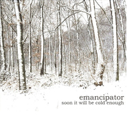

Soon It Will Be Cold Enough
============================

|  |  |
| :--: | :-- |
| [ Soon It Will Be Cold Enough](https://emumo.xiami.com/album/170695) | **艺人**: [Emancipator](../index.md) **语种**: 其他 **唱片公司**: Self-Released **发行时间**: 2006年12月16日 **专辑类别**: 录音室专辑 **专辑风格**: 神游舞曲 Trip Hop **播放数**: 2234459 **收藏数**: 3476 **评论数**: 277  |

## 简介

这张专辑整体中规中矩，旋律优美而不让人腻歪，节奏成熟而不老套，甚至还会让人偶尔眼前一亮。本以为这应该至少是个四五人的band，结果一看介绍，这Emancipator原来就是一19的美国小孩，尽管他自称自己心理年龄要老很多吧。但甭管怎么说，看疗效，Emancipator确实把 jazz eletronic downtempo triphop有声有色的融合在一起了，大量的小提琴、钢琴采样的运用，让歌曲更饱满。还有一个年仅19岁的学生妹，为这张专辑录制的女声采样，更是增色不少。一个人办这么多事儿，已经是够让人咋舌的了，更不可思议的是，这些制作费用都由他自己来承担。尽管很费劲，但最可贵的是，Emancipator最终还是把他想要的感觉找到了，并且非常清晰的贯穿整张专辑。

## 曲目

## 评论

|  |  |  |  |
| :-- | :-- | :-- | :-- |
|  [虾米用户](https://emumo.xiami.com/u/6024992) 夏天 2020-10-17 04:04 赞(0) 踩(0) | 
༄
 |
|  [虾米用户](https://emumo.xiami.com/u/330822881) 我还没想好要写什么... 2020-03-11 17:56 赞(0) 踩(0) | 
层次丰富的干净与温暖，像吃了一口云。
 |
|  [虾米用户](https://emumo.xiami.com/u/26147496) 无乐不眠 2019-09-21 01:22 赞(2) 踩(0) | 
2009年老子买了台车，这张专辑百听不厌，现在车子整十年跑了15万公里，这张专辑仍在车上。。。。老子不服别人就服他
 |
|  [虾米用户](https://emumo.xiami.com/u/3682903) 我还没想好要写什么... 2019-04-02 13:52 赞(1) 踩(0) | 
人家的19岁。。。。。。
 |
|  [虾米用户](https://emumo.xiami.com/u/206758094) 滚回去听歌 2018-07-17 19:47 赞(0) 踩(0) | 
那位 一会就他妈的冷啦 小可爱怎么不在热评？
 |
|  [虾米用户](https://emumo.xiami.com/u/53911481) 热情没及格，真性情得高分... 2018-06-12 22:33 赞(0) 踩(0) | 
瞧我发现了什么！~
 |
|  [虾米用户](https://emumo.xiami.com/u/3100046) 最喜欢扶她了 2018-05-11 01:17 赞(0) 踩(0) | 
这B就是个天才。
 |
|  [虾米用户](https://emumo.xiami.com/u/34376040) 再见 虾米！ 2018-05-06 22:36 赞(2) 踩(0) | 
我好想你啊 在一起的时候天天听 
 |
|  [虾米用户](https://emumo.xiami.com/u/6361118) 黑洞無始終，音樂無疆界 2018-05-03 16:47 赞(0) 踩(0) | 
这种阴郁寒冷的气质骤听还以为是来自北欧的独立音乐人创作。
 |
|  [虾米用户](https://emumo.xiami.com/u/2888769)  2018-04-07 10:03 赞(0) 踩(0) | 
hi
 |
|  [虾米用户](https://emumo.xiami.com/u/43492923) 行到水穷我才开始害怕，夕... 2018-03-25 19:26 赞(1) 踩(0) | 
&amp;zeta;
 |
|  [虾米用户](https://emumo.xiami.com/u/11030498) 我的青春被狗吃了，而我最... 2018-02-24 15:26 赞(2) 踩(0) | 
人家十九岁时的音乐，有时候觉得人与人之间的差别真特么大 
 |
|  [虾米用户](https://emumo.xiami.com/u/10638768) mabinogi 2018-02-05 20:37 赞(0) 踩(0) | 
这张专辑可以说是打开我对独立音乐的认知大门，里面许多乐器编排和旋律的编写在06年07年是非常前卫，不夸张的说，简直就是音乐的&amp;ldquo;巴黎时装秀&amp;rdquo;，听觉的盛宴！
 |
|  [虾米用户](https://emumo.xiami.com/u/6005918) 网易云账号同名：pans... 2017-11-10 20:45 赞(0) 踩(0) | 

 |
|  [虾米用户](https://emumo.xiami.com/u/6291775) 碎。 2017-10-27 23:28 赞(0) 踩(0) | 
透过你的音符，我能看到漫天白雪伸展出地平线背后的风景。
 |
|  [虾米用户](https://emumo.xiami.com/u/1157299)  2017-10-27 23:01 赞(0) 踩(0) | 
觉得像是NEW AGE+downtempo+dubremix；给人的感觉是空灵中透着迷幻，恬静中蕴含着神秘。。。比一般的沙发音乐还耐听，叫他席梦思音乐好了，嘎嘎。记得emacipator还有一首单曲shook，里面还有rap，而且气氛还要浓郁。最喜欢他们的lionheart
 |
|  [虾米用户](https://emumo.xiami.com/u/30211104) 每首歌都是新的 2017-10-24 22:20 赞(1) 踩(0) | 
最爱没有之一
 |
|  [虾米用户](https://emumo.xiami.com/u/30211104) 每首歌都是新的 2017-10-24 22:19 赞(0) 踩(0) | 
这种类型是叫triphop对吗？
 |
|  [虾米用户](https://emumo.xiami.com/u/30211104) 每首歌都是新的 2017-10-24 22:19 赞(1) 踩(0) | 
听了五年了。从不厌倦。
 |
|  [虾米用户](https://emumo.xiami.com/u/41163024) I’m done. 2017-10-02 04:58 赞(0) 踩(0) | 
有人说棒到原地爆炸
 |
|  [虾米用户](https://emumo.xiami.com/u/66823378)  2017-09-20 20:21 赞(0) 踩(0) | 

 |
|  [虾米用户](https://emumo.xiami.com/u/5828782) 一眼可载几多剑 2017-09-11 10:26 赞(2) 踩(0) | 
还好吧   就是  楼上诸位  有点言过其实了
 |
|  [虾米用户](https://emumo.xiami.com/u/295542159) Ciao 2017-08-18 13:45 赞(0) 踩(0) | 
可以的
 |
|  [虾米用户](https://emumo.xiami.com/u/62829070) 虾米，后会有期，宇宙尽头... 2017-07-22 00:26 赞(0) 踩(0) | 
人家19岁就制作出了这样一张牛逼的专辑，回想我19岁还一无是处。
 |
|  [虾米用户](https://emumo.xiami.com/u/13443413) 虾米再见！ 2017-06-05 00:41 赞(0) 踩(0) | 
一张陪伴我走了十年的专辑
 |
|  [虾米用户](https://emumo.xiami.com/u/30074304) 天阶夜色凉如水，坐看牵牛... 2017-05-28 09:13 赞(0) 踩(0) | 
✈
 |
|  [虾米用户](https://emumo.xiami.com/u/245137264) Life's about... 2017-03-19 12:44 赞(0) 踩(0) | 
我只能说实在是鬼才
 |
|  [虾米用户](https://emumo.xiami.com/u/33512641) call me now,... 2017-02-09 14:14 赞(1) 踩(0) | 
黑胶已拿
 |
|  [虾米用户](https://emumo.xiami.com/u/30502167) 空耳二百八十级 2016-12-17 00:45 赞(0) 踩(0) | 
去网易云淘歌下载，听到一首好音乐，看封面如此眼熟，难怪，不就是这砖嘛
 |
|  [虾米用户](https://emumo.xiami.com/u/5882105) 干什么不好非和自己对着干 2016-11-07 20:44 赞(0) 踩(0) | 
收藏
 |
|  [虾米用户](https://emumo.xiami.com/u/23518202) 我还没想好要写什么... 2016-11-05 22:34 赞(0) 踩(0) | 
冷静的让人思考
 |
|  [虾米用户](https://emumo.xiami.com/u/202236875)  2016-10-16 20:35 赞(0) 踩(0) | 
鬼才！！
 |
|  [虾米用户](https://emumo.xiami.com/u/23416973) 带着心情去欣赏 2016-09-30 17:39 赞(0) 踩(0) | 
自然的声音
 |
|  [虾米用户](https://emumo.xiami.com/u/9700161)  2016-07-22 16:38 赞(0) 踩(0) | 
~
 |
|  [虾米用户](https://emumo.xiami.com/u/1899802) 虾米，再见 2016-04-07 00:49 赞(2) 踩(0) | 
想起了和死党一起听得这张专辑的那段时光，他已娶人，那段时光不再来，但是每当听这个专辑的时候我总能想起死党跟我说：真你麻痹好听!
 |
|  [虾米用户](https://emumo.xiami.com/u/33071402) I do not car... 2016-03-11 19:09 赞(10) 踩(0) | 
想采访一下评二星的是什么心态
 |
| ⇒ |  [虾米用户](https://emumo.xiami.com/u/1899802) 虾米，再见 2016-04-30 21:53 赞(0) 踩(0) | 
+1
 |
| ⇒ |  [虾米用户](https://emumo.xiami.com/u/12479680) 我还没想好要写什么... 2019-08-27 02:55 赞(0) 踩(0) | 
一对孤儿
 |
|  [虾米用户](https://emumo.xiami.com/u/13212297) 宇宙起源于思想。。 2016-03-10 06:13 赞(0) 踩(0) | 
我爱你
 |
|  [虾米用户](https://emumo.xiami.com/u/49495013)  2016-02-09 21:32 赞(0) 踩(0) | 
又是一张值得让我听一整张专辑的专辑
 |
|  [虾米用户](https://emumo.xiami.com/u/3540059) 微博：Qrious乔治 2016-01-27 21:38 赞(0) 踩(0) | 
专辑！专辑！专辑（纯音乐！纯音乐！纯音乐！）
 |
|  [虾米用户](https://emumo.xiami.com/u/79241474) 要安心，要专心。 2015-12-24 22:59 赞(0) 踩(0) | 
平安夜听着挺舒心的。
 |
|  [虾米用户](https://emumo.xiami.com/u/59754900)  2015-12-21 08:24 赞(2) 踩(0) | 
初中的时候听到anthem，果断下载。现在就想有天去北极听这张专辑。
 |
| ⇒ |  [虾米用户](https://emumo.xiami.com/u/242274495)  2020-08-27 21:36 赞(0) 踩(0) | 
我觉得在大兴安岭听就很好
 |
|  [虾米用户](https://emumo.xiami.com/u/30617820) 窝列大窝列大哟 2015-10-19 07:40 赞(0) 踩(0) | 
=..=
 |
|  [虾米用户](https://emumo.xiami.com/u/32361157)  2015-10-04 20:38 赞(0) 踩(0) | 
好冷..
 |
|  [虾米用户](https://emumo.xiami.com/u/32361157)  2015-10-04 20:38 赞(0) 踩(0) | 
好冷..
 |
|  [虾米用户](https://emumo.xiami.com/u/32361157)  2015-10-04 20:38 赞(0) 踩(0) | 
好冷..
 |
|  [虾米用户](https://emumo.xiami.com/u/2085554)   2015-09-21 11:33 赞(1) 踩(0) | 
大爱封面
 |
|  [虾米用户](https://emumo.xiami.com/u/68324428) Sensibility 2015-09-21 01:14 赞(0) 踩(0) | 
Found a treasure Gaming fun!
 |
|  [虾米用户](https://emumo.xiami.com/u/48146891) 愿我的眼前，有一片晴空 2015-09-14 19:13 赞(2) 踩(0) | 
高中时候听的了，是一段很黑暗的时光的精神食粮
 |
|  [虾米用户](https://emumo.xiami.com/u/12208696) 和虾米的最后一天 2015-09-14 00:06 赞(0) 踩(0) | 
天才
 |
|  [虾米用户](https://emumo.xiami.com/u/11086247) 暂无签名~ 2015-09-08 20:23 赞(0) 踩(0) | 
无意间翻到这张碟
 |
|  [虾米用户](https://emumo.xiami.com/u/339049)  2015-09-02 15:40 赞(0) 踩(0) | 
ele
 |
|  [虾米用户](https://emumo.xiami.com/u/3142781) Musik ! 2015-08-18 20:21 赞(0) 踩(0) | 
溺爱蓉城的阴柔与绵软，厚厚的云层阻隔了外界的光线以及过往。。。让人溺死在耳畔的靡靡之音。。。
 |
|  [虾米用户](https://emumo.xiami.com/u/3142781) Musik ! 2015-08-18 19:58 赞(0) 踩(0) | 
沉溺蓉城的阴柔之中了，那厚厚的云层阻隔了外界穿透的光线，那音绵软地让人堕落于盆地的深渊
 |
|  [虾米用户](https://emumo.xiami.com/u/8329952)   2015-08-06 08:41 赞(0) 踩(0) | 
tirp hop
 |
|  [虾米用户](https://emumo.xiami.com/u/8395195) 何必呢 2015-07-27 11:15 赞(0) 踩(0) | 
思绪…抽丝剥茧…。                          冰风跳跃…。                                    肆意摇曳…
 |
|  [虾米用户](https://emumo.xiami.com/u/13075016)  ) (  2015-06-30 15:56 赞(0) 踩(0) | 
还是他最初的这一张好
 |
|  [虾米用户](https://emumo.xiami.com/u/98275) 2B一直向前追！ 2015-06-14 23:09 赞(0) 踩(0) | 
19岁，OMG！这些年我都干了些什么？
 |
|  [虾米用户](https://emumo.xiami.com/u/1018434) 取舵一杯！敵艦見ユ 2015-06-14 00:27 赞(0) 踩(0) | 
nice work
 |
|  [虾米用户](https://emumo.xiami.com/u/46906740) 封印记忆 2015-06-11 22:36 赞(0) 踩(0) | 
﹋﹋﹋﹋✔️来迟了。。
 |
|  [虾米用户](https://emumo.xiami.com/u/24318190)   2015-04-09 20:46 赞(0) 踩(0) | 
这个maps和唱版maps有什么关联么。这个日期远比唱版的早，曲调都差不多
 |
|  [虾米用户](https://emumo.xiami.com/u/3560621)  2015-03-31 23:51 赞(0) 踩(0) | 
homework music
 |
|  [虾米用户](https://emumo.xiami.com/u/8226204) ≡ 2015-03-28 14:28 赞(0) 踩(0) | 
。
 |
|  [虾米用户](https://emumo.xiami.com/u/26285975)  2015-03-26 23:09 赞(0) 踩(0) | 
随意，节奏，意念，思绪全部交织在一起，，，收藏
 |
|  [虾米用户](https://emumo.xiami.com/u/15477519) 爱  是生命的和弦，而不... 2015-03-09 11:49 赞(1) 踩(0) | 
这是我曾经非常喜欢的一张专辑...
 |
|  [虾米用户](https://emumo.xiami.com/u/35615477) ♪ 2015-03-08 11:33 赞(0) 踩(0) | 
在这样寂寞的世界里 不能沒有你..
 |
|  [虾米用户](https://emumo.xiami.com/u/26070224) 你不要吃我，我唱好听的歌... 2015-02-26 22:07 赞(0) 踩(0) | 
赞
 |
|  [虾米用户](https://emumo.xiami.com/u/8537877) 生活不易，不如快乐。 2015-01-02 18:06 赞(0) 踩(0) | 
独立电子
 |
|  [虾米用户](https://emumo.xiami.com/u/7973634) soundonline ... 2014-11-15 01:18 赞(0) 踩(0) | 
这哥们的曲从某种领域上没谁了。
 |
|  [虾米用户](https://emumo.xiami.com/u/7866155)  2014-11-09 22:27 赞(0) 踩(0) | 
我TM
 |
|  [虾米用户](https://emumo.xiami.com/u/5059497) 暂无签名 2014-11-09 09:50 赞(0) 踩(0) | 
神砖
 |
|  [虾米用户](https://emumo.xiami.com/u/12409435)   2014-11-04 10:14 赞(0) 踩(0) | 
Good knight
 |
|  [虾米用户](https://emumo.xiami.com/u/6356435)  2014-11-03 13:41 赞(0) 踩(0) | 
轻音
 |
|  [虾米用户](https://emumo.xiami.com/u/686424)  2014-11-02 20:25 赞(0) 踩(0) | 
女声背景
 |
|  [虾米用户](https://emumo.xiami.com/u/5742061) 想要的都拥有，得不到的都... 2014-10-21 22:02 赞(0) 踩(0) | 
最爱的一张
 |
|  [虾米用户](https://emumo.xiami.com/u/7973634) soundonline ... 2014-10-15 19:12 赞(0) 踩(0) | 
第十首实在太赞! 实在太赞!!
 |
|  [虾米用户](https://emumo.xiami.com/u/418406) 我还没想好要写什么... 2014-10-07 21:34 赞(0) 踩(0) | 
几乎每首都好听
 |
|  [虾米用户](https://emumo.xiami.com/u/39802823) 难以表述的杂偏好 2014-10-07 11:43 赞(0) 踩(0) | 
喜欢喜欢~
 |
|  [虾米用户](https://emumo.xiami.com/u/32320260) kiss me 2014-09-20 01:14 赞(1) 踩(0) | 
早前听《Safe in the Steep Cliffs》这张专辑就被惊艳了很久，但没留意作者原来就是Emancipator。这个天才发第一张专辑《Soon It Will Be Cold Enough》时才19岁，而这张处女作堪称美到惊世骇俗，就像走失在北欧雾气弥漫的森林里，独自点燃篝火等待夜幕降临。
 |
|  [虾米用户](https://emumo.xiami.com/u/13305969) 这家伙很聪明什么也没留下... 2014-07-17 00:18 赞(0) 踩(0) | 
这张专辑整体中规中矩，旋律优美而不让人腻歪，节奏成熟而不老套，甚至还会让人偶尔眼前一亮。本以为这应该至少是个四五人的band，结果一看介绍，这Emancipator原来就是一19的美国小孩，尽管他自称自己心理年龄要老很多吧。但甭管怎么说，看疗效，Emancipator确实把
 |
|  [虾米用户](https://emumo.xiami.com/u/1004689)  2014-07-14 17:24 赞(0) 踩(0) | 
背景乐
 |
|  [虾米用户](https://emumo.xiami.com/u/6657270) 月高高  心廖廖 2014-07-14 17:24 赞(0) 踩(0) | 
我找一找先
 |
|  [虾米用户](https://emumo.xiami.com/u/121018)  2014-07-14 13:35 赞(0) 踩(0) | 
满分！！！！！满分
 |
|  [虾米用户](https://emumo.xiami.com/u/38477316)  2014-06-27 11:11 赞(0) 踩(0) | 
Emancipator --- Soon It Will Be Cold Enough
 |
|  [虾米用户](https://emumo.xiami.com/u/11284283)  2014-06-26 14:30 赞(0) 踩(0) | 
轻松
 |
|  [虾米用户](https://emumo.xiami.com/u/31997549) Shh...Listen... 2014-06-23 14:22 赞(0) 踩(0) | 
缘起于大二偶然听到maps,听完了整张砖爱到不行，到处头像都换了emacipator。音乐说不出哪里好，就是喜欢一人静悄悄独享，妙不可言
 |
| ⇒ |  [虾米用户](https://emumo.xiami.com/u/31960141) 暂无签名~ 2015-01-05 22:49 赞(0) 踩(0) | 
听了一两年的《lionheart》,特别特别喜欢，如今才翻起这张专辑，真真被惊艳到了！
 |
| ⇒ |  [虾米用户](https://emumo.xiami.com/u/31997549) Shh...Listen... 2015-01-06 00:56 赞(0) 踩(0) | 
<q><b>许信徒说：</b></q>
 |
|  [虾米用户](https://emumo.xiami.com/u/36147537)  2014-06-16 04:16 赞(0) 踩(0) | 
rgrg
 |
|  [虾米用户](https://emumo.xiami.com/u/2782465)  2014-06-16 02:47 赞(0) 踩(0) | 
我19岁才开始听jazzy-hiphop， 人家已经制作出这么吊的一张专辑了·····情何以堪啊····
 |
|  [虾米用户](https://emumo.xiami.com/u/11643877) 姑且听之 2014-05-27 22:18 赞(0) 踩(0) | 
神砖~
 |
|  [虾米用户](https://emumo.xiami.com/u/1609946) 一即一切 2014-05-16 10:28 赞(0) 踩(0) | 
心 境不二
 |
|  [虾米用户](https://emumo.xiami.com/u/28094308) 符号堆积 2014-05-15 13:16 赞(0) 踩(0) | 
19岁？够牛气的
 |
|  [虾米用户](https://emumo.xiami.com/u/6116244) 陰影之下沒有憐憫 2014-04-20 12:27 赞(0) 踩(0) | 
1
 |
|  [虾米用户](https://emumo.xiami.com/u/33214350) keep going. 2014-04-03 15:47 赞(0) 踩(0) | 
背景音乐
 |
|  [虾米用户](https://emumo.xiami.com/u/3437736) Who cares？ 2014-03-27 21:07 赞(0) 踩(0) | 
已下
 |
|  [虾米用户](https://emumo.xiami.com/u/9429409)  2014-01-23 19:17 赞(0) 踩(0) | 
电子鬼才 经典不衰~
 |
|  [虾米用户](https://emumo.xiami.com/u/209384) 音乐，偶尔有枪 2014-01-16 00:26 赞(0) 踩(0) | 
.....新男神！妥妥的！
 |
|  [虾米用户](https://emumo.xiami.com/u/6567562)  2014-01-14 13:46 赞(0) 踩(0) | 
又是听本张专辑的好时节
 |
|  [虾米用户](https://emumo.xiami.com/u/652547)  2014-01-06 02:12 赞(0) 踩(0) | 
晚安 城市
 |
|  [虾米用户](https://emumo.xiami.com/u/20263788)  2013-12-24 09:26 赞(0) 踩(0) | 
优美，关于雪
 |
|  [虾米用户](https://emumo.xiami.com/u/4731666) 我单身，请认识我一下吧 2013-12-18 10:32 赞(0) 踩(0) | 
这种类型到底属于电子还是后摇？还是特么的电子后摇？
 |
| ⇒ |  [虾米用户](https://emumo.xiami.com/u/5806141)  2014-01-13 18:17 赞(0) 踩(0) | 
新世纪嘛
 |
|  [虾米用户](https://emumo.xiami.com/u/6466638)  2013-11-17 14:12 赞(0) 踩(0) | 
OK
 |
|  [虾米用户](https://emumo.xiami.com/u/3581084)   2013-11-08 14:47 赞(0) 踩(0) | 
喜欢很久
 |
|  [虾米用户](https://emumo.xiami.com/u/25349990)  2013-10-27 21:23 赞(0) 踩(0) | 
旋律很优美，给现在的都市人来了久违的轻松。
 |
|  [虾米用户](https://emumo.xiami.com/u/674582) 路是走出来的。 2013-10-27 10:39 赞(0) 踩(0) | 
这张专辑够年轻，无论是音乐质感，还是音乐要表达的内容。那种小大人的感觉太熟悉了。
 |
|  [虾米用户](https://emumo.xiami.com/u/9220666)  2013-10-20 07:27 赞(0) 踩(0) | 
后摇里的最好听
 |
| ⇒ |  [虾米用户](https://emumo.xiami.com/u/31997549) Shh...Listen... 2014-06-23 14:24 赞(0) 踩(0) | 
后摇您听了几张？这不是后摇好么
 |
|  [虾米用户](https://emumo.xiami.com/u/9299072)  2013-09-27 07:52 赞(0) 踩(0) | 
推荐 14 The Darkest Evening of the Year
 |
|  [虾米用户](https://emumo.xiami.com/u/6952794) 我还没想好要写什么... 2013-09-19 20:58 赞(0) 踩(0) | 
整张专辑都很棒!一个19岁男孩的杰作!
 |
|  [虾米用户](https://emumo.xiami.com/u/1553461) 我还没想好要写什么... 2013-08-25 19:52 赞(0) 踩(0) | 
听了好多年！
 |
|  [虾米用户](https://emumo.xiami.com/u/1820564) 方向比速度更重要 2013-08-14 14:22 赞(0) 踩(0) | 
好听
 |
|  [虾米用户](https://emumo.xiami.com/u/1820564) 方向比速度更重要 2013-08-14 14:22 赞(0) 踩(0) | 
好听
 |
|  [虾米用户](https://emumo.xiami.com/u/12848290)  2013-08-09 10:25 赞(0) 踩(0) | 
我觉得他好像装成熟，像是在追哪个比他年龄大好多的女士，“尽管他自称自己心理年龄要老很多吧”   哈哈
 |
| ⇒ |  [虾米用户](https://emumo.xiami.com/u/1078090)   2013-09-06 14:42 赞(0) 踩(0) | 
他女朋友和他同龄
 |
|  [虾米用户](https://emumo.xiami.com/u/9134017)  2013-08-08 14:43 赞(0) 踩(0) | 
好听
 |
|  [虾米用户](https://emumo.xiami.com/u/6744967) 音乐无国界，你爱我也爱。 2013-08-05 12:16 赞(0) 踩(0) | 
喜欢 谢谢
 |
|  [虾米用户](https://emumo.xiami.com/u/18106230)  2013-08-05 08:02 赞(0) 踩(0) | 
周一的福利~~~share[爱你][爱你][爱你]
 |
|  [虾米用户](https://emumo.xiami.com/u/4960476)  2013-08-01 11:59 赞(0) 踩(0) | 
好听！！！
 |
|  [虾米用户](https://emumo.xiami.com/u/5585654) jazz-rap/pos... 2013-07-27 13:39 赞(0) 踩(0) | 
整个专辑都好听❤
 |
|  [虾米用户](https://emumo.xiami.com/u/5585654) jazz-rap/pos... 2013-07-27 13:38 赞(0) 踩(0) | 
整个专辑都好听！！
 |
|  [虾米用户](https://emumo.xiami.com/u/10073365) 我还没想好要写什么... 2013-07-18 19:49 赞(0) 踩(0) | 
极好的
 |
|  [虾米用户](https://emumo.xiami.com/u/2994706)  2013-07-08 03:40 赞(0) 踩(0) | 
爱
 |
|  [虾米用户](https://emumo.xiami.com/u/7718289)  2013-07-05 12:23 赞(0) 踩(0) | 
很不错的 jazzhiphop 穿插着dnb 旋律一级棒
 |
|  [虾米用户](https://emumo.xiami.com/u/7718289)  2013-07-05 12:23 赞(0) 踩(0) | 
很不错的 jazzhiphop 穿插着dnb 旋律一级棒
 |
|  [虾米用户](https://emumo.xiami.com/u/1262483)  2013-06-28 22:10 赞(0) 踩(0) | 
难得的一张优美、自然灵动的电子专辑
 |
|  [虾米用户](https://emumo.xiami.com/u/2446438)  2013-06-19 10:26 赞(0) 踩(0) | 
very very gooooooood
 |
|  [虾米用户](https://emumo.xiami.com/u/13870772) Live2Inspire 2013-06-03 18:09 赞(0) 踩(0) | 
08年的初冬有一次在Facebook上看到有朋友分享《First Snow》，当时就陷进去了。能把downtempo做到这种程度，实在是让人佩服。后来得知那会儿这哥们才19岁，崇拜感倍增。
 |
|  [虾米用户](https://emumo.xiami.com/u/13658763) KNOV 2013-04-20 11:46 赞(0) 踩(0) | 
好听
 |
|  [虾米用户](https://emumo.xiami.com/u/13658763) KNOV 2013-03-24 15:44 赞(0) 踩(0) | 
好听
 |
|  [虾米用户](https://emumo.xiami.com/u/4712761)  2013-03-16 23:43 赞(13) 踩(0) | 
很赞的一张专辑，只能拿意境深远来形容，看到豆瓣评论说适合OX时候听，囧
 |
|  [虾米用户](https://emumo.xiami.com/u/3549174)  2013-03-05 15:55 赞(47) 踩(0) | 
我想说，这也太他妈好听了吧！哪有人一整张专辑十几首歌里竟然连一首烂歌都没有？！我万能的主啊。。。还有没有这种歌手给我再推荐几个。。。。。一般的专辑里能有一两首好听的就觉得赚了觉得合格，可是这位大神一连几张专辑都是几乎满分的水准。爱。
 |
| ⇒ |  [虾米用户](https://emumo.xiami.com/u/6863020)  2014-06-27 17:51 赞(0) 踩(0) | 
<a href="http://www.xiami.com/album/405956?spm=a1z1s.6659509.6856557.18.LTFivq" target="_blank" rel="nofollow noreferrer noopener">http://www.xiami.com/album/405956?spm=a1z1s.6659509.6856557.18.LTFivq</a>这个听过没<a href="http://www.xiami.com/artist/78821?spm=a1z1s.6659513.6856585.1.TMm0ED" target="_blank" rel="nofollow noreferrer noopener">http://www.xiami.com/artist/78821?spm=a1z1s.6659513.6856585.1.TMm0ED</a>还有这个
 |
| ⇒ |  [虾米用户](https://emumo.xiami.com/u/2085554)   2015-09-21 11:35 赞(0) 踩(0) | 
nujabes 和 marcus D都很有感觉
 |
|  [虾米用户](https://emumo.xiami.com/u/13310287)  2013-03-01 17:31 赞(0) 踩(0) | 
第一部喜欢的不得了的电子专辑。
 |
|  [虾米用户](https://emumo.xiami.com/u/7758594) 别乱写标签啊混蛋 2013-02-04 20:16 赞(1) 踩(0) | 
十九岁，他已经做出了这样的音乐；我十九岁却还在不知道干什么。
 |
|  [虾米用户](https://emumo.xiami.com/u/1078090)   2013-02-03 12:24 赞(0) 踩(0) | 
听来听去还是最喜欢这张，即使他的音乐越来越成熟了
 |
|  [虾米用户](https://emumo.xiami.com/u/1295235)  2013-02-01 11:56 赞(1) 踩(0) | 
送给几年前在春运时回家路上的我，无论票有多难买、车上多么的挤、空气多么的差。。当费劲的安顿好大包小包的行李后，列车缓缓启动的那一刻，看着窗外、戴上耳机听开始循环这些音乐。一切就变的无所谓了，尽管有时站在厕所边、过道上、车厢交界处。。。
 |
|  [虾米用户](https://emumo.xiami.com/u/9438622) 努力多一点，微笑多一点！ 2013-01-31 21:32 赞(0) 踩(0) | 
缓拍、 驰放 、迷幻 、加爵士电子... 这是Emancipator  作品的风格...
 |
|  [虾米用户](https://emumo.xiami.com/u/8834375) 　i know 2013-01-28 11:35 赞(0) 踩(0) | 
确实是难得的好专辑，非常喜欢，一直重复了听了一个星期了，不知为何，听到这些旋律原本浮躁的心情变得恬静起来
 |
|  [虾米用户](https://emumo.xiami.com/u/8834375) 　i know 2013-01-28 10:48 赞(0) 踩(0) | 
非常精致的专辑
 |
|  [虾米用户](https://emumo.xiami.com/u/4821002)  2013-01-20 22:18 赞(0) 踩(0) | 
19岁
 |
|  [虾米用户](https://emumo.xiami.com/u/1006645)  2013-01-16 10:48 赞(0) 踩(0) | 
19岁  你在做什么?....Emancipator已经出了这张迷人的专辑....是天才早就是了,不是也别强求!....不可能每个星星都会亮..如果你想它最亮 还不如找月亮...哦..后面还有太阳....哦哦.....这才是个小小的太阳系.....你飞得出去吗?????
 |
|  [虾米用户](https://emumo.xiami.com/u/7802376) 我还没想好要写什么... 2013-01-02 15:33 赞(0) 踩(0) | 
想收藏10遍的专辑
 |
|  [虾米用户](https://emumo.xiami.com/u/6221331)  2012-12-18 09:59 赞(0) 踩(0) | 
有节奏感的纯音乐，适合工作时听
 |
|  [虾米用户](https://emumo.xiami.com/u/978693)  2012-12-12 02:34 赞(0) 踩(0) | 
救星
 |
|  [虾米用户](https://emumo.xiami.com/u/5180439) hia~ 2012-11-21 11:38 赞(0) 踩(0) | 
很快天会变冷的~
 |
|  [虾米用户](https://emumo.xiami.com/u/409152) null 2012-11-19 14:12 赞(0) 踩(0) | 
19岁学生的一个专辑！！！！我的天！我的19岁呢，就是在荒废中度过。。。
 |
|  [虾米用户](https://emumo.xiami.com/u/1724079) 我是个疯子，快乐的疯子 2012-11-09 17:57 赞(0) 踩(0) | 
适合晚上听，能舒缓情绪。现在的小孩可真厉害=n=
 |
|  [虾米用户](https://emumo.xiami.com/u/10604980) 二师兄 2012-10-28 04:33 赞(1) 踩(0) | 
当晚上熬夜画画听着的时候会是一种别样的感觉…就像放空自己一样…
 |
|  [虾米用户](https://emumo.xiami.com/u/6612158)  2012-10-26 16:25 赞(0) 踩(0) | 
fr hansey
 |
|  [虾米用户](https://emumo.xiami.com/u/1252477)  2012-10-23 10:41 赞(0) 踩(0) | 
1988-born teenager...? NICE~
 |
|  [虾米用户](https://emumo.xiami.com/u/8015468)  2012-10-22 10:05 赞(0) 踩(0) | 
輕靈。愉悅。
 |
|  [虾米用户](https://emumo.xiami.com/u/918665)  2012-10-19 21:58 赞(0) 踩(0) | 
冬天到来之前的白桦林系列（何？
 |
|  [虾米用户](https://emumo.xiami.com/u/8662913) 深夜食堂 2012-10-19 13:18 赞(0) 踩(0) | 
19岁少年神作 19岁这年我又荒度了人生
 |
|  [虾米用户](https://emumo.xiami.com/u/6555576)  2012-10-15 21:05 赞(0) 踩(0) | 
19岁少年的唱片神作
 |
|  [虾米用户](https://emumo.xiami.com/u/5994296) 以喜欢为原则 2012-10-15 13:58 赞(0) 踩(0) | 
电子+古典+迷幻
 |
|  [虾米用户](https://emumo.xiami.com/u/3975223) 人的歌声是笑着的啊 2012-10-15 13:46 赞(0) 踩(0) | 
。
 |
|  [虾米用户](https://emumo.xiami.com/u/3549174)  2012-10-14 23:42 赞(0) 踩(0) | 
很好很喜欢！打五颗星一点都不心虚！
 |
|  [虾米用户](https://emumo.xiami.com/u/10961996) 理性的力量 2012-10-07 12:40 赞(0) 踩(0) | 
真的赞！
 |
|  [虾米用户](https://emumo.xiami.com/u/10495358) 秋凉天气 2012-09-26 23:34 赞(0) 踩(0) | 
太棒的专辑，曾经百听不厌，心驰神往
 |
|  [虾米用户](https://emumo.xiami.com/u/10495358) 秋凉天气 2012-09-26 23:25 赞(0) 踩(0) | 
曾经百听不厌的一张专辑，太好听。
 |
|  [虾米用户](https://emumo.xiami.com/u/433171) 愿你与我一同看世界   ... 2012-09-25 16:54 赞(0) 踩(0) | 
突然翻到这张，再去听这张还是那么美
 |
|  [虾米用户](https://emumo.xiami.com/u/2064425) - 2012-09-25 06:36 赞(0) 踩(0) | 
迷幻
 |
|  [虾米用户](https://emumo.xiami.com/u/1875582) 有些事我乐观其成，有些事... 2012-09-21 00:45 赞(0) 踩(0) | 
十九岁的时候，高三，我以为这个世界只有读书
 |
|  [虾米用户](https://emumo.xiami.com/u/10633910)   2012-09-20 15:40 赞(0) 踩(0) | 
.......
 |
|  [虾米用户](https://emumo.xiami.com/u/5978543) ಥ_ಥ 2012-09-12 16:03 赞(0) 踩(0) | 
~~~
 |
|  [虾米用户](https://emumo.xiami.com/u/1384660)  2012-09-11 18:38 赞(0) 踩(0) | 
旋律，节奏真的没得说，听的人不住点头，直起鸡皮疙瘩
 |
|  [虾米用户](https://emumo.xiami.com/u/829804)  2012-09-07 21:59 赞(0) 踩(0) | 
有点小意思~
 |
|  [虾米用户](https://emumo.xiami.com/u/245502) 安啦你 2012-08-20 23:07 赞(0) 踩(0) | 
电子音乐
 |
|  [虾米用户](https://emumo.xiami.com/u/5162673)  2012-08-05 22:45 赞(0) 踩(0) | 
不管是谁，19岁做出这样的专辑都是一个神话。或者忽略掉年龄，也丝毫无减音乐的分量！
 |
|  [虾米用户](https://emumo.xiami.com/u/1544552) 暂无签名~ 2012-07-30 23:44 赞(0) 踩(0) | 
这张非常经典！以至于我听他后来的专辑都没听这张有感觉。那种人生若只如初见的感觉~
 |
|  [虾米用户](https://emumo.xiami.com/u/9774031)  2012-07-11 21:28 赞(0) 踩(0) | 
ok
 |
|  [虾米用户](https://emumo.xiami.com/u/813405)   2012-07-04 12:43 赞(0) 踩(0) | 
✈
 |
| ⇒ |  [虾米用户](https://emumo.xiami.com/u/6873704) 耍贱卖萌装疯癫 2012-07-04 12:47 赞(0) 踩(0) | 
你这是什么符号
 |
| ⇒ |  [虾米用户](https://emumo.xiami.com/u/813405)   2012-07-04 12:48 赞(0) 踩(0) | 
<q><b>微观世界说：</b></q>
 |
| ⇒ |  [虾米用户](https://emumo.xiami.com/u/6873704) 耍贱卖萌装疯癫 2012-07-04 12:49 赞(0) 踩(0) | 
<q><b>Lilie说：</b></q>
 |
| ⇒ |  [虾米用户](https://emumo.xiami.com/u/813405)   2012-07-04 12:51 赞(0) 踩(0) | 
<q><b>微观世界说：</b></q>
 |
|  [虾米用户](https://emumo.xiami.com/u/1966171)  2012-06-17 06:22 赞(0) 踩(0) | 
today\'s ending! comfortable!
 |
|  [虾米用户](https://emumo.xiami.com/u/3866415) 纸短情长 2012-06-15 17:46 赞(0) 踩(0) | 
强推！ Emancipator神级旋律，，，各种乐器，键盘solo，节奏。这竟然不是一支四五人乐队做出来的，如此年纪轻轻就有如此造诣。超爱《Anthem》轻女声。。迷幻迷幻迷幻，，，，，
 |
|  [虾米用户](https://emumo.xiami.com/u/2841604) 感谢陪伴，有缘再见❤️ 2012-06-06 15:46 赞(0) 踩(0) | 
才人
 |
|  [虾米用户](https://emumo.xiami.com/u/3626808)  2012-05-30 23:33 赞(0) 踩(0) | 
朋友推荐
 |
|  [虾米用户](https://emumo.xiami.com/u/8084384)  2012-05-27 15:03 赞(0) 踩(0) | 
hh
 |
|  [虾米用户](https://emumo.xiami.com/u/4768294) my soul 2012-05-26 20:19 赞(0) 踩(0) | 
迷恋
 |
|  [虾米用户](https://emumo.xiami.com/u/5172624)  2012-05-03 00:43 赞(0) 踩(0) | 
丰厚的声音
 |
|  [虾米用户](https://emumo.xiami.com/u/1665106) 暂无签名~ 2012-04-27 14:21 赞(0) 踩(0) | 
GOOD KNIGHT
 |
|  [虾米用户](https://emumo.xiami.com/u/8991465)  2012-04-25 23:25 赞(0) 踩(0) | 
够感觉
 |
|  [虾米用户](https://emumo.xiami.com/u/8682136)  2012-04-11 22:14 赞(0) 踩(0) | 
享受
 |
|  [虾米用户](https://emumo.xiami.com/u/8682136)  2012-04-11 22:12 赞(0) 踩(0) | 
喜欢无理！
 |
|  [虾米用户](https://emumo.xiami.com/u/162612) 美丽的怪胎头脑比身体性感 2012-04-08 20:19 赞(0) 踩(0) | 
飘渺迷幻~
 |
|  [虾米用户](https://emumo.xiami.com/u/2454164)  2012-03-24 20:59 赞(0) 踩(0) | 
尽情享受
 |
|  [虾米用户](https://emumo.xiami.com/u/7580393) 欢迎来查询非320K专辑 2012-03-17 23:49 赞(0) 踩(0) | 
192K<a href="http://www.xiami.com/group/thread-detail/tid/202137" target="_blank" rel="nofollow noreferrer noopener">http://www.xiami.com/group/thread-detail/tid/202137</a>
 |
|  [虾米用户](https://emumo.xiami.com/u/1545527) 努力生活并保持自我就是最... 2012-03-14 16:17 赞(0) 踩(0) | 
迷恋
 |
|  [虾米用户](https://emumo.xiami.com/u/5051733)  2012-03-07 10:06 赞(0) 踩(0) | 
萌P推荐
 |
|  [虾米用户](https://emumo.xiami.com/u/5051733)  2012-03-06 15:59 赞(0) 踩(0) | 
萌P推荐
 |
|  [虾米用户](https://emumo.xiami.com/u/597569) 何必故作姿态 2012-02-12 21:40 赞(0) 踩(0) | 
话说..我都20了..唉..美国的孩子..有点儿小牛逼
 |
|  [虾米用户](https://emumo.xiami.com/u/1938672)  2012-02-03 09:28 赞(0) 踩(0) | 
这张专辑真是认识恨晚，并且居然作者只是个19岁的
 |
|  [虾米用户](https://emumo.xiami.com/u/5971058) *Fish Kiss* 2012-02-01 15:27 赞(0) 踩(0) | 
这boy好强
 |
|  [虾米用户](https://emumo.xiami.com/u/1860756) 一点我就燃 2012-01-22 13:54 赞(0) 踩(0) | 
用力推
 |
|  [虾米用户](https://emumo.xiami.com/u/225351) 人，最重要的是‘心’啊！ 2012-01-09 11:17 赞(0) 踩(0) | 
GOod
 |
|  [虾米用户](https://emumo.xiami.com/u/3210783) 我还没想好要写什么... 2012-01-05 01:19 赞(0) 踩(0) | 
看道后援听的第一张...
 |
|  [虾米用户](https://emumo.xiami.com/u/483233)  2011-12-12 23:22 赞(0) 踩(0) | 
love
 |
|  [虾米用户](https://emumo.xiami.com/u/7052315)  2011-12-10 17:04 赞(0) 踩(0) | 
迷幻窒息 森林迷雾
 |
|  [虾米用户](https://emumo.xiami.com/u/7052315)  2011-12-10 17:03 赞(0) 踩(0) | 
迷幻窒息 森林迷雾
 |
|  [虾米用户](https://emumo.xiami.com/u/2996693)  2011-11-19 00:09 赞(0) 踩(0) | 
非常爱这张专辑，但是哪都下不到啊，求好心人发给我~~<a href="mailto:haoran_1987@126.com">haoran_1987@126.com</a>
 |
|  [虾米用户](https://emumo.xiami.com/u/6742136)  2011-11-12 16:05 赞(0) 踩(0) | 
我第一次喜欢上一张纯音乐专辑，这里面的音乐真不是一般的好，把电音处理得如此舒服，真是想不到只是一个19岁美国小孩做的，释放灵魂的感觉啊
 |
|  [虾米用户](https://emumo.xiami.com/u/454726) 嗯？ 2011-11-08 14:39 赞(0) 踩(0) | 
绝不输于jazzy-hiphop！！！！！
 |
|  [虾米用户](https://emumo.xiami.com/u/353990)   2011-11-06 11:56 赞(0) 踩(0) | 
中规中矩
 |
|  [虾米用户](https://emumo.xiami.com/u/6217931) 电子音乐制作人 2011-10-27 11:45 赞(0) 踩(0) | 
非常喜欢
 |
|  [虾米用户](https://emumo.xiami.com/u/6217931) 电子音乐制作人 2011-10-26 21:39 赞(0) 踩(0) | 
外国牛人咋这么多咧
 |
|  [虾米用户](https://emumo.xiami.com/u/4001175)  2011-10-25 17:44 赞(0) 踩(0) | 
牛牛牛~~
 |
|  [虾米用户](https://emumo.xiami.com/u/695549) atomake 2011-10-22 15:40 赞(0) 踩(0) | 
太牛逼了，真的很好听，能听到很幸运！
 |
|  [虾米用户](https://emumo.xiami.com/u/1681150) 山 水 风 草 2011-10-22 01:56 赞(0) 踩(0) | 
牛啊~~~
 |
|  [虾米用户](https://emumo.xiami.com/u/1284236)  2011-10-20 09:39 赞(0) 踩(0) | 
同上
 |
|  [虾米用户](https://emumo.xiami.com/u/4074104) 无知是种天性的大智慧，让... 2011-10-17 12:34 赞(0) 踩(0) | 
喜欢的纯音乐
 |
|  [虾米用户](https://emumo.xiami.com/u/113577) 致所有行走在邊緣的理想主... 2011-09-23 18:16 赞(0) 踩(0) | 
牛逼的小电子哈...
 |
|  [虾米用户](https://emumo.xiami.com/u/3585012) 我还没想好要写什么... 2011-09-20 19:40 赞(0) 踩(0) | 
不解释
 |
|  [虾米用户](https://emumo.xiami.com/u/2074826)  2011-09-19 22:43 赞(0) 踩(0) | 
就着红酒,听完整张专辑,有可能是新的bose on ear给力,其实是自己无法自拔!19岁,天~~~~
 |
|  [虾米用户](https://emumo.xiami.com/u/2074826)  2011-09-19 22:36 赞(0) 踩(0) | 
提琴.....淡淡的...淡淡的...忧伤...就像现在的我!
 |
|  [虾米用户](https://emumo.xiami.com/u/2074826)  2011-09-19 21:44 赞(0) 踩(0) | 
提琴.....淡淡的...淡淡的...忧伤...就像现在的我!
 |
|  [虾米用户](https://emumo.xiami.com/u/298019) douban.com/p... 2011-09-18 01:58 赞(0) 踩(0) | 
.
 |
|  [虾米用户](https://emumo.xiami.com/u/5689615)  2011-09-04 01:17 赞(0) 踩(0) | 
太TM好听
 |
|  [虾米用户](https://emumo.xiami.com/u/5101531) 诗诗的伙伴是熊猫和黑狗。 2011-08-31 23:31 赞(0) 踩(0) | 
去年发现的一张专辑，听到现在，不厌倦。
 |
|  [虾米用户](https://emumo.xiami.com/u/2724706)  2011-07-27 14:12 赞(0) 踩(0) | 
好
 |
|  [虾米用户](https://emumo.xiami.com/u/4990204)  2011-07-23 19:20 赞(0) 踩(0) | 
高高的音乐
 |
|  [虾米用户](https://emumo.xiami.com/u/454726) 嗯？ 2011-07-12 16:41 赞(0) 踩(0) | 
喜欢~很舒服~
 |
|  [虾米用户](https://emumo.xiami.com/u/4818847)  2011-07-12 13:12 赞(0) 踩(0) | 
最爱
 |
|  [虾米用户](https://emumo.xiami.com/u/1066084)  2011-07-11 23:48 赞(0) 踩(0) | 
是~成熟~
 |
|  [虾米用户](https://emumo.xiami.com/u/3165562) 最近风格凌乱了 2011-07-10 19:50 赞(0) 踩(0) | 
感觉很到位！
 |
|  [虾米用户](https://emumo.xiami.com/u/3165562) 最近风格凌乱了 2011-07-08 09:57 赞(0) 踩(0) | 
一直很喜欢这张专辑
 |
|  [虾米用户](https://emumo.xiami.com/u/3995424)  2011-06-22 22:57 赞(0) 踩(0) | 
不错啊
 |
|  [虾米用户](https://emumo.xiami.com/u/4278515)  2011-06-13 18:13 赞(0) 踩(0) | 
上瘾，受不鸟
 |
|  [虾米用户](https://emumo.xiami.com/u/1695886)  2011-06-08 19:53 赞(0) 踩(0) | 
上瘾。受不鸟。
 |
|  [虾米用户](https://emumo.xiami.com/u/225351) 人，最重要的是‘心’啊！ 2011-06-06 22:21 赞(0) 踩(0) | 
很不错的歌曲，一来就是纯音乐呢！
 |
|  [虾米用户](https://emumo.xiami.com/u/4136569) Dieee! 2011-05-31 23:14 赞(0) 踩(0) | 
很纯净。
 |
|  [虾米用户](https://emumo.xiami.com/u/3539747)  2011-05-23 22:35 赞(0) 踩(0) | 
post-rock
 |
|  [虾米用户](https://emumo.xiami.com/u/1076792) 黄皮黑心 2011-05-23 11:39 赞(0) 踩(0) | 
i went to his show in atlanta, the audience was a bunch of stoned hippie kids.  i guess his music makes more sense when u got stoned
 |
|  [虾米用户](https://emumo.xiami.com/u/4029126) Sun Umbrella 2011-05-22 20:18 赞(0) 踩(0) | 
19岁的纯音
 |
|  [虾米用户](https://emumo.xiami.com/u/1325662)  2011-05-07 14:44 赞(0) 踩(0) | 
爵士嘻哈，HYDEOUT PRODUCTION旗下
 |
|  [虾米用户](https://emumo.xiami.com/u/380013)  2011-04-25 12:15 赞(0) 踩(0) | 
hen hx
 |
|  [虾米用户](https://emumo.xiami.com/u/1283244)  2011-04-24 00:37 赞(0) 踩(0) | 
首先，Neilyo16中的音乐;其次,的确很好听
 |
|  [虾米用户](https://emumo.xiami.com/u/861074)  2011-04-22 09:09 赞(0) 踩(0) | 
后半部分很正点
 |
|  [虾米用户](https://emumo.xiami.com/u/2092701)  2011-04-18 03:02 赞(0) 踩(0) | 
不错了！才19，我19时扒火车泥！
 |
|  [虾米用户](https://emumo.xiami.com/u/611309)  2011-04-17 23:07 赞(0) 踩(0) | 
一般般吧~但是也不是不好~
 |
| ⇒ |  [虾米用户](https://emumo.xiami.com/u/1052461) @blinK4sy- 2011-04-18 10:59 赞(0) 踩(0) | 
大实话，不过 jazz eletronic downtempo triphop 搞一起去却是难得·
 |
|  [虾米用户](https://emumo.xiami.com/u/1052461) @blinK4sy- 2011-04-17 21:05 赞(0) 踩(0) | 
..这货..
 |
|  [虾米用户](https://emumo.xiami.com/u/2323573)  2011-04-15 15:46 赞(0) 踩(0) | 
天才的曲子。轻松的混响，不腻味不张扬
 |
|  [虾米用户](https://emumo.xiami.com/u/3231420)  2011-04-08 09:23 赞(0) 踩(0) | 
大学的时候非常无意发现的一张混音，非常有缘的很合我的胃口，更让我惊讶的一点就是这张专辑是一个19的小伙子做出来的，是的，只有一个人。
 |
|  [虾米用户](https://emumo.xiami.com/u/2990564)  2011-04-07 22:22 赞(0) 踩(0) | 
大爱
 |
|  [虾米用户](https://emumo.xiami.com/u/2680300)  2011-03-31 13:02 赞(0) 踩(0) | 
我听得第一种感觉是有种寂静岭原生的那个 感觉
 |
|  [虾米用户](https://emumo.xiami.com/u/2452487)  2011-03-25 19:23 赞(0) 踩(0) | 
大爱
 |
|  [虾米用户](https://emumo.xiami.com/u/62750)   2011-03-12 22:43 赞(0) 踩(0) | 
nice~大爱~
 |
|  [虾米用户](https://emumo.xiami.com/u/3149270)  2011-03-11 13:01 赞(0) 踩(0) | 
听了就知道~！~！
 |
|  [虾米用户](https://emumo.xiami.com/u/738558) 知音难寻 2011-03-06 13:33 赞(0) 踩(0) | 
妙音那妙音
 |
|  [虾米用户](https://emumo.xiami.com/u/1151921) 要啥自行车 2011-02-21 09:04 赞(0) 踩(0) | 
换了新耳机重听这张专辑，有种飘飘欲仙的感觉。
 |
| ⇒ |  [虾米用户](https://emumo.xiami.com/u/1052461) @blinK4sy- 2011-04-17 19:37 赞(0) 踩(0) | 
同感.
 |
|  [虾米用户](https://emumo.xiami.com/u/1988803)   2011-02-16 16:22 赞(0) 踩(0) | 
lost pillow cover\'s winter version...
 |
|  [虾米用户](https://emumo.xiami.com/u/2737951)  2011-02-05 05:15 赞(0) 踩(0) | 
等了4年，终于出新作了，上一个专辑我听了4年了，现在还经常听
 |
|  [虾米用户](https://emumo.xiami.com/u/1886539)  2011-01-16 14:03 赞(0) 踩(0) | 
节奏很强
 |
|  [虾米用户](https://emumo.xiami.com/u/1479142) 再见虾米音乐 2011-01-13 11:43 赞(0) 踩(0) | 
Soon It Will Be Cold Enough
 |
|  [虾米用户](https://emumo.xiami.com/u/1349888) 嗯 2010-12-09 22:33 赞(0) 踩(0) | 
很有特色的电子乐，空灵，动感，幽暗的感觉捏合在一起，很新鲜很独特，当然，旋律很棒，很适合都市中忙碌的人闲暇之时用来陶冶一下自己的心灵，或许能从音乐中找到自信和动力。
 |
|  [虾米用户](https://emumo.xiami.com/u/1639564)  2010-10-15 17:18 赞(0) 踩(0) | 
good knight有着最酷的节奏，first snow则多了一些感性，anthem旷远飘渺好像来自美好的仙境或童话世界。很北欧的感觉
 |
|  [虾米用户](https://emumo.xiami.com/u/227538)   2010-09-04 09:00 赞(0) 踩(0) | 
鄙人拙见  还是觉得像后摇
 |
|  [虾米用户](https://emumo.xiami.com/u/982716)  2010-08-27 10:43 赞(0) 踩(0) | 
偶觉得应该属于INDIE的混合型,不知道拉,反正很赞就是了
 |
|  [虾米用户](https://emumo.xiami.com/u/603255)  2010-05-09 13:08 赞(0) 踩(0) | 
new age吧
 |
|  [虾米用户](https://emumo.xiami.com/u/491510) 诗 Ƹ̵̡Ӝ̵̨̄Ʒ 酒 2010-02-28 20:21 赞(0) 踩(0) | 
比较中规中矩
 |
|  [虾米用户](https://emumo.xiami.com/u/567768) 受伤护士 2010-01-28 13:13 赞(0) 踩(0) | 
喜欢这个空灵
 |
|  [虾米用户](https://emumo.xiami.com/u/550519)  2010-01-25 15:27 赞(0) 踩(0) | 
所以说，心智和年龄无关，还有什么...
 |
|  [虾米用户](https://emumo.xiami.com/u/568724)  2010-01-21 18:10 赞(0) 踩(0) | 
贊一个
 |
|  [虾米用户](https://emumo.xiami.com/u/507766) 云山苍苍 江水泱泱 2009-12-22 19:40 赞(0) 踩(0) | 
冬日温暖
 |
|  [虾米用户](https://emumo.xiami.com/u/527123)  2009-11-23 00:43 赞(0) 踩(0) | 
这张专辑真的很棒 来试试吧  应该不是特别trip_hop  偏向沙发音乐
 |
|  [虾米用户](https://emumo.xiami.com/u/527123)  2009-11-23 00:42 赞(0) 踩(0) | 
这张专辑不错 挺棒的
 |
|  [虾米用户](https://emumo.xiami.com/u/234170)  2009-07-28 18:32 赞(0) 踩(0) | 
闻之起舞
 |
|  [虾米用户](https://emumo.xiami.com/u/138264)  2009-07-17 16:09 赞(0) 踩(0) | 
很明显的电子啊~~ 旋律很赞~~
 |
