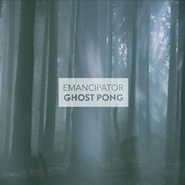

Ghost Pong
============================

|  |  |
| :--: | :-- |
| [ Ghost Pong](https://emumo.xiami.com/album/2102958134) | **艺人**: [Emancipator](../index.md) **语种**: 英语 **唱片公司**: Loci Records **发行时间**: 2017年08月22日 **专辑类别**: EP, 单曲 **专辑风格**:  **播放数**: 3184 **收藏数**: 29 **评论数**: 8  |

## 简介

## 曲目

## 评论

|  |  |  |  |
| :-- | :-- | :-- | :-- |
|  [虾米用户](https://emumo.xiami.com/u/52415194) ♬♩♫♪♡ 2018-03-19 09:54 赞(0) 踩(0) | 
ᵕ᷄≀ ̠˘᷅
 |
|  [虾米用户](https://emumo.xiami.com/u/11030498) 我的青春被狗吃了，而我最... 2018-02-25 00:35 赞(1) 踩(0) | 
这首确实值得单独出
 |
|  [虾米用户](https://emumo.xiami.com/u/652547)  2017-11-23 21:49 赞(0) 踩(0) | 
+1
 |
|  [虾米用户](https://emumo.xiami.com/u/24143615) 嘘! 2017-11-23 20:13 赞(0) 踩(0) | 
-0-
 |
|  [虾米用户](https://emumo.xiami.com/u/4131849) 网易云：非人類兔子Agy... 2017-11-23 18:31 赞(0) 踩(0) | 
❤️
 |
|  [虾米用户](https://emumo.xiami.com/u/5526289) 开心小甜豆 2017-11-23 17:26 赞(1) 踩(0) | 
☆
 |
|  [虾米用户](https://emumo.xiami.com/u/66823378)  2017-11-23 17:19 赞(1) 踩(0) | 

 |
|  [虾米用户](https://emumo.xiami.com/u/8326332) 后来，即便是音乐，也无法... 2017-11-23 17:19 赞(0) 踩(0) | 
支持
 |
