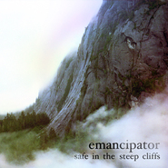

Safe In The Steep Cliffs
============================

|  |  |
| :--: | :-- |
| [ Safe In The Steep Cliffs](https://emumo.xiami.com/album/365261) | **艺人**: [Emancipator](../index.md) **语种**: 英语 **唱片公司**: Self-Released **发行时间**: 2010年01月19日 **专辑类别**: 录音室专辑 **专辑风格**:  **播放数**: 793255 **收藏数**: 1494 **评论数**: 144  |

## 简介

‘Safe In The Steep Cliffs’ represents the tightest, most unique, most organic beats I’ve made in the last three years. This album has a new palette of sounds and samples from around the world, including more original recordings (guitar/violin/mandolin/banjo) and new guest artists including Japanese jazz musician Uyama Hiroto. It’s ominous and overgrown, dense and ethereal. And epic. Always epic.

## 曲目

## 评论

|  |  |  |  |
| :-- | :-- | :-- | :-- |
|  [虾米用户](https://emumo.xiami.com/u/400715332) 留白 2020-03-27 09:08 赞(0) 踩(0) | 
&amp;mdash;&amp;mdash;
 |
|  [虾米用户](https://emumo.xiami.com/u/191482885)  2019-03-24 08:07 赞(0) 踩(0) | 
好
 |
|  [虾米用户](https://emumo.xiami.com/u/194315645) 该怎么和你们告别？ 2019-03-02 13:01 赞(0) 踩(0) | 
,
 |
|  [虾米用户](https://emumo.xiami.com/u/312406207)  2018-08-29 13:28 赞(1) 踩(0) | 

 |
|  [虾米用户](https://emumo.xiami.com/u/1860756) 一点我就燃 2018-08-13 15:45 赞(0) 踩(0) | 
之前一直认为是一匹狼死在了雪地里。这么多年了，我今天才打开封面仔细看，竟然是一个风景，我的心碎了。
 |
|  [虾米用户](https://emumo.xiami.com/u/324879742)   2018-07-15 15:23 赞(2) 踩(0) | 
.
 |
|  [虾米用户](https://emumo.xiami.com/u/48234447) 这家伙很聪明 2018-06-26 23:21 赞(0) 踩(0) | 
整张专辑有点深邃迷离、飘飘欲仙的感觉
 |
|  [虾米用户](https://emumo.xiami.com/u/658542) 深悟幻境 独与道游 2018-02-01 22:02 赞(0) 踩(0) | 
㉿
 |
|  [虾米用户](https://emumo.xiami.com/u/36576635) 冰岛游客热带地区唯一指定... 2017-11-08 21:14 赞(0) 踩(0) | 
还是觉得这张比Soon it will be cold enough好听
 |
|  [虾米用户](https://emumo.xiami.com/u/66823378)  2017-09-20 20:30 赞(0) 踩(0) | 

 |
|  [虾米用户](https://emumo.xiami.com/u/11030498) 我的青春被狗吃了，而我最... 2017-07-21 19:51 赞(0) 踩(0) | 
这专辑他喵滴到底被谁买走了
 |
|  [虾米用户](https://emumo.xiami.com/u/193999)  2017-03-07 11:26 赞(0) 踩(0) | 
全部下架了吗&amp;hellip;&amp;hellip;
 |
|  [虾米用户](https://emumo.xiami.com/u/3549174)  2017-01-09 15:22 赞(0) 踩(0) | 
bury them bones。最好听的一首，断续听了一年。
 |
|  [虾米用户](https://emumo.xiami.com/u/214682335)  2016-08-30 10:55 赞(0) 踩(0) | 
纯音乐，做BGM一流
 |
|  [虾米用户](https://emumo.xiami.com/u/90556894) 我还没想好要写什么... 2016-08-25 11:53 赞(0) 踩(0) | 

 |
|  [虾米用户](https://emumo.xiami.com/u/26281198) 站在银河里摘星星 2016-05-08 19:50 赞(0) 踩(0) | 
有灵性
 |
|  [虾米用户](https://emumo.xiami.com/u/11563185) 吃屎跟吃屎你选一个 2016-04-07 00:15 赞(0) 踩(0) | 
-0-
 |
|  [虾米用户](https://emumo.xiami.com/u/11563185) 吃屎跟吃屎你选一个 2016-04-07 00:15 赞(0) 踩(0) | 
-0-
 |
|  [虾米用户](https://emumo.xiami.com/u/41163024) I’m done. 2015-12-02 22:27 赞(0) 踩(0) | 

 |
|  [虾米用户](https://emumo.xiami.com/u/30617820) 窝列大窝列大哟 2015-10-19 07:41 赞(0) 踩(0) | 
=..=
 |
|  [虾米用户](https://emumo.xiami.com/u/64828)   2015-09-15 01:22 赞(0) 踩(0) | 
听过很多遍的一张。
 |
|  [虾米用户](https://emumo.xiami.com/u/41130450) 哈哈虾虾哈虾哈 2015-07-25 15:31 赞(0) 踩(0) | 
好听
 |
|  [虾米用户](https://emumo.xiami.com/u/508970) 心怀阳光 2015-07-10 18:15 赞(0) 踩(0) | 
收藏之
 |
|  [虾米用户](https://emumo.xiami.com/u/1181553) 但愿我无知亦无畏 2015-06-09 02:03 赞(0) 踩(0) | 
巫山云雨
 |
|  [虾米用户](https://emumo.xiami.com/u/49884432) 那是前世的我 2015-05-20 20:27 赞(0) 踩(0) | 
更像个男人
 |
|  [虾米用户](https://emumo.xiami.com/u/49884432) 那是前世的我 2015-05-20 16:47 赞(0) 踩(0) | 
这是一座像人脸的峭壁，下面部分看起来好像是在有点邪邪地笑着，很特别
 |
|  [虾米用户](https://emumo.xiami.com/u/16958604) 边洗澡边唱歌，边吃饭边喝... 2015-04-01 23:34 赞(0) 踩(0) | 
我没看懂这个封面，谁来给我解释一下
 |
| ⇒ |  [虾米用户](https://emumo.xiami.com/u/1181553) 但愿我无知亦无畏 2015-06-09 02:01 赞(0) 踩(0) | 
我看到第一眼浮现的 巫山云雨 四个字 哈哈
 |
|  [虾米用户](https://emumo.xiami.com/u/6215586)  2015-03-31 21:10 赞(0) 踩(0) | 
喜欢。
 |
|  [虾米用户](https://emumo.xiami.com/u/7392157) guwa 2015-03-30 13:15 赞(0) 踩(0) | 
哈哈哈那块白色真的超像眼睛~刚才看到专辑封面吓一跳 原来我不是一个人
 |
|  [虾米用户](https://emumo.xiami.com/u/15477519) 爱  是生命的和弦，而不... 2015-03-09 11:56 赞(3) 踩(0) | 
很棒, 也是曾喜欢的...
 |
|  [虾米用户](https://emumo.xiami.com/u/5901907) 虾米拜拜 2015-02-28 19:02 赞(1) 踩(0) | 
特别喜欢专辑的翻译：泰然于峭壁之间
 |
|  [虾米用户](https://emumo.xiami.com/u/7345510) 我真的喜欢吃虾 2015-01-18 18:39 赞(1) 踩(0) | 
我觉得封面的山像一只卧倒的猛犸象
 |
| ⇒ |  [虾米用户](https://emumo.xiami.com/u/19786814) 暂无签名~ 2015-01-22 13:06 赞(0) 踩(0) | 
像。
 |
|  [虾米用户](https://emumo.xiami.com/u/35799956)  2015-01-08 20:34 赞(0) 踩(0) | 
Safe In The Steep Cliffs
 |
|  [虾米用户](https://emumo.xiami.com/u/8388977)   2014-12-02 22:29 赞(0) 踩(0) | 
一直以为封面是一只倒下的狼诶！看到评论才晓得不是……
 |
|  [虾米用户](https://emumo.xiami.com/u/36576635) 冰岛游客热带地区唯一指定... 2014-09-16 11:32 赞(0) 踩(0) | 
啊啊啊啊啊啊啊棒呆
 |
|  [虾米用户](https://emumo.xiami.com/u/606760) 魂牵一线 2014-06-22 16:57 赞(0) 踩(0) | 
ting
 |
|  [虾米用户](https://emumo.xiami.com/u/8400078) 我的世界不能没有歌！ 2014-05-23 10:01 赞(0) 踩(0) | 
洗脑歌~
 |
|  [虾米用户](https://emumo.xiami.com/u/1609946) 一即一切 2014-05-16 10:28 赞(0) 踩(0) | 
心 境不二
 |
|  [虾米用户](https://emumo.xiami.com/u/1609946) 一即一切 2014-05-16 10:28 赞(0) 踩(0) | 
心 境不二
 |
|  [虾米用户](https://emumo.xiami.com/u/9647499)  2014-04-30 20:04 赞(0) 踩(0) | 
喜欢的风格
 |
|  [虾米用户](https://emumo.xiami.com/u/3437736) Who cares？ 2014-03-27 21:07 赞(0) 踩(0) | 
已下
 |
|  [虾米用户](https://emumo.xiami.com/u/5765082) 来自第九区 2014-02-23 18:07 赞(0) 踩(0) | 
狮子
 |
|  [虾米用户](https://emumo.xiami.com/u/9220666)  2013-10-20 11:29 赞(0) 踩(0) | 
后摇+古典
 |
|  [虾米用户](https://emumo.xiami.com/u/9299072)  2013-09-27 08:02 赞(0) 踩(0) | 
加上这张录音室专辑一起 收了该艺人三张砖啦
 |
|  [虾米用户](https://emumo.xiami.com/u/1661453)   2013-08-25 21:34 赞(0) 踩(0) | 
精彩
 |
|  [虾米用户](https://emumo.xiami.com/u/9134017)  2013-08-08 14:46 赞(0) 踩(0) | 
好听
 |
|  [虾米用户](https://emumo.xiami.com/u/646203) 又怎样阿 2013-07-03 05:31 赞(15) 踩(0) | 
猛看专辑封面的时候我以为看到一只狮子=。=
 |
| ⇒ |  [虾米用户](https://emumo.xiami.com/u/9299072)  2013-09-27 08:03 赞(0) 踩(0) | 
真有点像的
 |
| ⇒ |  [虾米用户](https://emumo.xiami.com/u/646203) 又怎样阿 2013-10-11 02:40 赞(0) 踩(0) | 
<q><b>澄若说：</b></q>
 |
| ⇒ |  [虾米用户](https://emumo.xiami.com/u/12795901) 独行的蜉蝣 2014-01-03 22:34 赞(0) 踩(0) | 
我也是这感觉,不细看真没想到是山.
 |
| ⇒ |  [虾米用户](https://emumo.xiami.com/u/16958604) 边洗澡边唱歌，边吃饭边喝... 2015-04-01 23:33 赞(0) 踩(0) | 
我看成猩猩了
 |
| ⇒ |  [虾米用户](https://emumo.xiami.com/u/9197818) Byebye 2015-06-27 19:47 赞(0) 踩(0) | 
第一眼即捂着耳朵睁着双眼的男孩
 |
| ⇒ |  [虾米用户](https://emumo.xiami.com/u/20902669) 我还没想好要写什么... 2017-09-21 15:26 赞(0) 踩(0) | 
第一眼看上去像女的向上翻着眼睛
 |
| ⇒ |  [虾米用户](https://emumo.xiami.com/u/29285843) 潜鱼水底传心诀，栖鸟枝头... 2019-03-01 11:05 赞(0) 踩(0) | 
我以为是大象
 |
|  [虾米用户](https://emumo.xiami.com/u/1262483)  2013-06-28 19:14 赞(0) 踩(0) | 
泰然与峭壁之间
 |
|  [虾米用户](https://emumo.xiami.com/u/1262483)  2013-06-28 19:14 赞(0) 踩(0) | 
超棒的专辑，一直非常的喜欢！行云流水一般的听觉享受！
 |
|  [虾米用户](https://emumo.xiami.com/u/4471466)  2013-06-17 11:18 赞(0) 踩(0) | 
当年还是在电驴下的专辑，一直留着当试耳机的参考，真的听不腻的。
 |
|  [虾米用户](https://emumo.xiami.com/u/9403945) a breeze 2013-06-17 08:33 赞(0) 踩(0) | 
彻底变氛围了
 |
|  [虾米用户](https://emumo.xiami.com/u/647248)   2013-05-30 17:24 赞(0) 踩(0) | 
封面太赞了！！
 |
|  [虾米用户](https://emumo.xiami.com/u/13310287)  2013-03-01 17:32 赞(0) 踩(0) | 
Emancipator第二发。依然喜欢。
 |
|  [虾米用户](https://emumo.xiami.com/u/3549174)  2013-03-01 02:54 赞(0) 踩(0) | 
精彩！
 |
|  [虾米用户](https://emumo.xiami.com/u/3549174)  2013-03-01 02:53 赞(0) 踩(0) | 
精彩！
 |
|  [虾米用户](https://emumo.xiami.com/u/3549174)  2013-03-01 02:53 赞(1) 踩(0) | 
精彩！
 |
|  [虾米用户](https://emumo.xiami.com/u/3701222) 欣赏是一道绝美的风景 2013-02-03 19:29 赞(0) 踩(0) | 
很快，我会翻过去自己的这座山
 |
|  [虾米用户](https://emumo.xiami.com/u/9438622) 努力多一点，微笑多一点！ 2013-01-31 21:28 赞(0) 踩(0) | 
非常棒的一张专辑...
 |
|  [虾米用户](https://emumo.xiami.com/u/10039619) 我相信遗忘是一种美德 2012-11-16 10:34 赞(0) 踩(0) | 
伏在云层里的她  看着前方
 |
|  [虾米用户](https://emumo.xiami.com/u/8245954)  2012-10-23 14:30 赞(0) 踩(0) | 
love it
 |
|  [虾米用户](https://emumo.xiami.com/u/10495358) 秋凉天气 2012-09-30 21:13 赞(0) 踩(0) | 
很棒的专辑，虽然个人认为没有第一张那么出彩，可总体水平还是非常可观，有几支曲子相当惊艳。
 |
|  [虾米用户](https://emumo.xiami.com/u/10495358) 秋凉天气 2012-09-30 20:34 赞(0) 踩(0) | 
出色
 |
|  [虾米用户](https://emumo.xiami.com/u/526881)  2012-09-18 22:32 赞(0) 踩(0) | 
超。级。赞。[心]
 |
|  [虾米用户](https://emumo.xiami.com/u/5978543) ಥ_ಥ 2012-09-12 16:06 赞(0) 踩(0) | 
~~~
 |
|  [虾米用户](https://emumo.xiami.com/u/5162673)  2012-08-07 00:09 赞(0) 踩(0) | 
Emancipator这厮太棒了
 |
|  [虾米用户](https://emumo.xiami.com/u/516791) 假酒喝多了 2012-08-03 23:36 赞(0) 踩(0) | 
bury them bones
 |
|  [虾米用户](https://emumo.xiami.com/u/636654)   2012-08-03 03:13 赞(0) 踩(0) | 
一头躺着的愤怒狮子。。
 |
|  [虾米用户](https://emumo.xiami.com/u/911535)  2012-06-26 20:54 赞(0) 踩(0) | 
心灵
 |
|  [虾米用户](https://emumo.xiami.com/u/9336946)  2012-05-31 13:16 赞(0) 踩(0) | 
prefect
 |
|  [虾米用户](https://emumo.xiami.com/u/9336946)  2012-05-31 13:10 赞(0) 踩(0) | 
veryn1ce
 |
|  [虾米用户](https://emumo.xiami.com/u/6619048)  2012-05-27 22:59 赞(0) 踩(0) | 
优美 节奏 电子 直指心灵的曲调
 |
|  [虾米用户](https://emumo.xiami.com/u/1396391)  2012-05-22 14:19 赞(0) 踩(0) | 
封面好像一直躺卧的狮子或者是个被毁容的怨妇~ 挺好看的~~虽然只是我的幻觉~~
 |
|  [虾米用户](https://emumo.xiami.com/u/9103146) 海因里希。 2012-05-08 11:20 赞(0) 踩(0) | 
真的很好听
 |
|  [虾米用户](https://emumo.xiami.com/u/891989) 我还没想好要写什么... 2012-05-07 11:09 赞(0) 踩(0) | 
good
 |
|  [虾米用户](https://emumo.xiami.com/u/6112316) BE HOLYSHIT 2012-04-30 01:35 赞(0) 踩(0) | 
音诗音画。绝美。
 |
|  [虾米用户](https://emumo.xiami.com/u/8381636)  2012-04-01 02:49 赞(0) 踩(0) | 
蛮不错的旋律.
 |
|  [虾米用户](https://emumo.xiami.com/u/666947) ISTP 2012-03-15 16:40 赞(0) 踩(0) | 
循环
 |
|  [虾米用户](https://emumo.xiami.com/u/4876323) 文章 2012-02-06 11:34 赞(0) 踩(0) | 
vvv
 |
|  [虾米用户](https://emumo.xiami.com/u/7725623)  2012-01-27 18:07 赞(0) 踩(0) | 
不敢相信这是一个孩子的作品~~~
 |
|  [虾米用户](https://emumo.xiami.com/u/2304946) 啊切 2011-12-31 13:31 赞(0) 踩(0) | 
大爱。
 |
|  [虾米用户](https://emumo.xiami.com/u/1663201) 来自地球 2011-12-02 13:53 赞(0) 踩(0) | 
nice remix
 |
|  [虾米用户](https://emumo.xiami.com/u/6217931) 电子音乐制作人 2011-10-29 23:12 赞(0) 踩(0) | 
太赞了!
 |
|  [虾米用户](https://emumo.xiami.com/u/863445)   2011-10-26 21:06 赞(0) 踩(0) | 
大爱
 |
|  [虾米用户](https://emumo.xiami.com/u/1284236)  2011-10-20 09:39 赞(0) 踩(0) | 
暂时收着  原因不知道
 |
|  [虾米用户](https://emumo.xiami.com/u/4074104) 无知是种天性的大智慧，让... 2011-10-17 12:34 赞(0) 踩(0) | 
喜欢的纯音乐
 |
|  [虾米用户](https://emumo.xiami.com/u/53367) 珍惜与老情人最后的美好时... 2011-09-29 18:21 赞(0) 踩(0) | 
我觉得在封面上看到了一张脸...
 |
| ⇒ |  [虾米用户](https://emumo.xiami.com/u/84504) Chasing afte... 2011-10-06 15:58 赞(0) 踩(0) | 
我也以为是一只狮子的脸
 |
| ⇒ |  [虾米用户](https://emumo.xiami.com/u/53367) 珍惜与老情人最后的美好时... 2011-10-06 16:02 赞(0) 踩(0) | 
<q><b>街灯晚餐说：</b></q>
 |
| ⇒ |  [虾米用户](https://emumo.xiami.com/u/5090)  2012-01-09 11:08 赞(0) 踩(0) | 
<q><b>somac说：</b></q>
 |
| ⇒ |  [虾米用户](https://emumo.xiami.com/u/53367) 珍惜与老情人最后的美好时... 2012-01-09 15:25 赞(0) 踩(0) | 
<q><b>0.0说：</b></q>
 |
| ⇒ |  [虾米用户](https://emumo.xiami.com/u/5090)  2012-01-09 16:25 赞(0) 踩(0) | 
<q><b>somac说：</b></q>
 |
| ⇒ |  [虾米用户](https://emumo.xiami.com/u/775264)  2012-04-21 15:50 赞(0) 踩(0) | 
山中间是个眼睛
 |
| ⇒ |  [虾米用户](https://emumo.xiami.com/u/53367) 珍惜与老情人最后的美好时... 2012-04-21 18:45 赞(0) 踩(0) | 
<q><b>Joe说：</b></q>
 |
|  [虾米用户](https://emumo.xiami.com/u/298019) douban.com/p... 2011-09-18 03:20 赞(0) 踩(0) | 
.
 |
|  [虾米用户](https://emumo.xiami.com/u/2466530)  2011-09-12 22:29 赞(0) 踩(0) | 
yo
 |
|  [虾米用户](https://emumo.xiami.com/u/1531395)  2011-07-30 19:51 赞(0) 踩(0) | 
被惊艳到了，完美电子~
 |
|  [虾米用户](https://emumo.xiami.com/u/4899758) 自己喜欢的才是最好的。 2011-07-18 20:40 赞(0) 踩(0) | 
很好
 |
|  [虾米用户](https://emumo.xiami.com/u/3165562) 最近风格凌乱了 2011-07-14 12:27 赞(0) 踩(0) | 
：）
 |
|  [虾米用户](https://emumo.xiami.com/u/199644) FusionDusty廉... 2011-07-04 11:23 赞(0) 踩(0) | 
嗯
 |
|  [虾米用户](https://emumo.xiami.com/u/199644) FusionDusty廉... 2011-07-04 11:23 赞(0) 踩(0) | 
嗯
 |
|  [虾米用户](https://emumo.xiami.com/u/1052461) @blinK4sy- 2011-06-25 00:42 赞(0) 踩(0) | 
Safe In The Steep Cliffs.
 |
|  [虾米用户](https://emumo.xiami.com/u/963660) 我还没想好要写什么... 2011-06-20 04:07 赞(0) 踩(0) | 
Indie啊Indie，舍他其谁！让人沉迷的后摇，越听越够味~
 |
|  [虾米用户](https://emumo.xiami.com/u/4136569) Dieee! 2011-05-31 23:00 赞(0) 踩(0) | 
很喜欢，纯净的感觉。
 |
|  [虾米用户](https://emumo.xiami.com/u/3877935)  2011-05-08 19:59 赞(0) 踩(0) | 
大爱Emancipator游弋于新世纪与摇滚之间的奇才！！天马行空的风格。
 |
|  [虾米用户](https://emumo.xiami.com/u/3796374)  2011-05-01 15:09 赞(0) 踩(0) | 
依然延续上一张专辑飘渺迷幻的风格，不温不火的跳跃着的音符，依然是心旷神怡的景象，依然是偶尔飘过慵懒的女声哼唱，带上耳机，静静聆听，夏季清醒 也让它陪你渡过整个燥热夏天。
 |
|  [虾米用户](https://emumo.xiami.com/u/295871)  2011-04-21 06:29 赞(0) 踩(0) | 
看艺人就知道了，竟然不知道他已经出第二张了
 |
|  [虾米用户](https://emumo.xiami.com/u/2323573)  2011-04-15 15:58 赞(0) 踩(0) | 
一样的
 |
|  [虾米用户](https://emumo.xiami.com/u/3231420)  2011-04-08 09:28 赞(0) 踩(0) | 
非常惊讶的发现他居然还在去年一月就出了新专辑，还没听，分享给大家。哦，忘了说一点，emancipator可以翻译成拾荒者：）yes it is~~
 |
|  [虾米用户](https://emumo.xiami.com/u/2452487)  2011-03-25 19:23 赞(0) 踩(0) | 
大爱
 |
|  [虾米用户](https://emumo.xiami.com/u/3048925)  2011-03-23 14:34 赞(0) 踩(0) | 
游走的 感觉
 |
|  [虾米用户](https://emumo.xiami.com/u/3295272)  2011-03-21 15:01 赞(0) 踩(0) | 
比什么都上瘾。
 |
|  [虾米用户](https://emumo.xiami.com/u/3295272)  2011-03-21 15:00 赞(0) 踩(0) | 
比什么都上瘾。
 |
|  [虾米用户](https://emumo.xiami.com/u/2731520) 我还没想好要写什么... 2011-02-23 19:55 赞(0) 踩(0) | 
旋律很流畅
 |
|  [虾米用户](https://emumo.xiami.com/u/2800805) 佛心，道骨，儒表！ 2011-02-20 20:19 赞(0) 踩(0) | 
很喜欢的风格
 |
|  [虾米用户](https://emumo.xiami.com/u/2800805) 佛心，道骨，儒表！ 2011-02-20 20:09 赞(0) 踩(0) | 
2张水准都很高，也是我经常听的专辑，听了很放松！
 |
|  [虾米用户](https://emumo.xiami.com/u/2737951)  2011-02-05 05:15 赞(0) 踩(0) | 
等了4年，终于出新作了，上一个专辑我听了4年了，现在还经常听
 |
|  [虾米用户](https://emumo.xiami.com/u/504621)  2011-02-01 20:24 赞(0) 踩(0) | 
音乐带你神游到天际
 |
|  [虾米用户](https://emumo.xiami.com/u/504621)  2011-02-01 20:23 赞(0) 踩(0) | 
很好听，收藏了！
 |
|  [虾米用户](https://emumo.xiami.com/u/2154787) 渐进........ 2011-01-28 17:58 赞(0) 踩(0) | 
心旷神怡!
 |
|  [虾米用户](https://emumo.xiami.com/u/2154787) 渐进........ 2011-01-28 17:54 赞(0) 踩(0) | 
老练而又充满沧桑感的音乐.很难想象是出自一位小伙!
 |
|  [虾米用户](https://emumo.xiami.com/u/2494893)  2011-01-26 00:09 赞(0) 踩(0) | 
毫无瑕疵，要求低频深沉。
 |
|  [虾米用户](https://emumo.xiami.com/u/570511) 一支来自北方的奇怪乐队 2010-12-16 13:48 赞(0) 踩(0) | 
很可惜没有上一张经典 遗憾啊
 |
|  [虾米用户](https://emumo.xiami.com/u/2082737)  2010-12-02 17:56 赞(0) 踩(0) | 
悠扬
 |
|  [虾米用户](https://emumo.xiami.com/u/25771) 为看云而看云 2010-11-08 09:45 赞(0) 踩(0) | 
冬日迷魂记
 |
|  [虾米用户](https://emumo.xiami.com/u/1520214)   2010-10-25 20:59 赞(0) 踩(0) | 
emancipator 是我爱上音乐，爱上new age 的leader!爱死了。。。soon irt wiil be cold enough 也是极为优秀，耳目一新！
 |
|  [虾米用户](https://emumo.xiami.com/u/1429575)  2010-09-04 13:10 赞(1) 踩(0) | 
大爱Emancipator游弋于新世纪与摇滚之间的奇才！！天马行空的风格。
 |
|  [虾米用户](https://emumo.xiami.com/u/675256) 游戏原声粉 2010-08-13 18:39 赞(0) 踩(0) | 
泰然于峭壁之间我喜欢这个翻译.
 |
|  [虾米用户](https://emumo.xiami.com/u/39300)  2010-06-11 21:39 赞(0) 踩(0) | 
惊世骇俗了``
 |
|  [虾米用户](https://emumo.xiami.com/u/239360) 我还没想好要写什么... 2010-05-11 21:16 赞(0) 踩(0) | 
爱死这个专辑了~~~
 |
|  [虾米用户](https://emumo.xiami.com/u/603255)  2010-05-08 17:53 赞(0) 踩(0) | 
siren
 |
|  [虾米用户](https://emumo.xiami.com/u/84170)  2010-04-27 18:20 赞(0) 踩(0) | 
i love it
 |
|  [虾米用户](https://emumo.xiami.com/u/444874) 马叔代言人。 2010-03-11 12:10 赞(0) 踩(0) | 
强烈推荐
 |
|  [虾米用户](https://emumo.xiami.com/u/131366)  2010-03-08 21:59 赞(0) 踩(0) | 
唉...我才知道~悲哀
 |
|  [虾米用户](https://emumo.xiami.com/u/664271)  2010-02-05 19:34 赞(0) 踩(0) | 
喜欢
 |
|  [虾米用户](https://emumo.xiami.com/u/3193) 求交往全世界 2010-01-21 17:06 赞(0) 踩(0) | 
哦也～    刚出的     太好了～～～
 |
