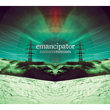

Remixes
============================

|  |  |
| :--: | :-- |
| [ Remixes](https://emumo.xiami.com/album/447442) | **艺人**: [Emancipator](../index.md) **语种**: 其他 **唱片公司**: Emancipator **发行时间**: 2011年06月21日 **专辑类别**: 录音室专辑 **专辑风格**:  **播放数**: 217070 **收藏数**: 525 **评论数**: 61  |

## 简介

## 曲目

## 评论

|  |  |  |  |
| :-- | :-- | :-- | :-- |
|  [虾米用户](https://emumo.xiami.com/u/8337431) 以乐会友 2019-04-07 14:49 赞(0) 踩(0) | 
61
 |
|  [虾米用户](https://emumo.xiami.com/u/5058044)  2017-10-27 23:58 赞(0) 踩(0) | 
最近非常喜欢的专辑
 |
|  [虾米用户](https://emumo.xiami.com/u/4131849) 网易云：非人類兔子Agy... 2016-11-03 18:06 赞(0) 踩(0) | 
Coolest
 |
|  [虾米用户](https://emumo.xiami.com/u/30617820) 窝列大窝列大哟 2015-10-19 07:41 赞(0) 踩(0) | 
=..=
 |
|  [虾米用户](https://emumo.xiami.com/u/12324869) 纪录片《潮州热》配乐 2015-03-27 14:38 赞(0) 踩(0) | 
大大个的爱心桃~
 |
|  [虾米用户](https://emumo.xiami.com/u/812392) q音网易搜央央小月，酷g... 2015-01-09 12:58 赞(0) 踩(0) | 
无意间翻到Soon...Enough的那张专辑，想想没听过这张Remix的。。比平常Remix少了一点电飞的感觉，多了一些俏皮还不错
 |
|  [虾米用户](https://emumo.xiami.com/u/3653331) 画满全身~(˘▾˘~) 2013-11-14 20:22 赞(0) 踩(0) | 
Jet Stream (D.V.S* Remix)~~~
 |
|  [虾米用户](https://emumo.xiami.com/u/601044)  2013-07-07 14:31 赞(1) 踩(0) | 
原版本来挺好听的，瞎remix什么
 |
|  [虾米用户](https://emumo.xiami.com/u/865856)  2013-04-29 02:52 赞(0) 踩(0) | 
电子的意境~~~~~~~~令人着迷~~~~~~
 |
|  [虾米用户](https://emumo.xiami.com/u/7802376) 我还没想好要写什么... 2013-01-04 21:15 赞(0) 踩(0) | 
还是喜欢原版啊～～
 |
|  [虾米用户](https://emumo.xiami.com/u/9016491)  2012-10-21 23:15 赞(0) 踩(0) | 
挺好听的
 |
|  [虾米用户](https://emumo.xiami.com/u/6116244) 陰影之下沒有憐憫 2012-09-25 16:25 赞(0) 踩(0) | 
1
 |
|  [虾米用户](https://emumo.xiami.com/u/3789630) 我还没想好要写什么... 2012-09-03 21:30 赞(0) 踩(0) | 
收藏后慢慢听~~
 |
|  [虾米用户](https://emumo.xiami.com/u/9940932) 不就都这样、 2012-07-24 15:43 赞(0) 踩(0) | 
喜欢喜欢~
 |
|  [虾米用户](https://emumo.xiami.com/u/177180)   2012-06-02 01:39 赞(0) 踩(0) | 
哇嗯。。
 |
|  [虾米用户](https://emumo.xiami.com/u/456151)  2012-04-19 13:37 赞(0) 踩(0) | 
Emancipator就是一19的美国小孩，但甭管怎么说，看疗效，Emancipator确实把 jazz eletronic downtempo triphop有声有色的融合在一起，大量的小提琴、钢琴采样的运用，让歌曲更饱满。不可思议的是制作费用都由自己承担。尽管费劲，但Emancipator最终还是把想要的感觉找到了，并且非常清晰的贯穿整张专辑
 |
|  [虾米用户](https://emumo.xiami.com/u/8496625)  2012-04-13 10:41 赞(0) 踩(0) | 
喜欢听纯音乐，听了一上午，没工作！！！
 |
|  [虾米用户](https://emumo.xiami.com/u/6801808)  2012-03-15 15:54 赞(0) 踩(0) | 
美丽
 |
|  [虾米用户](https://emumo.xiami.com/u/5971058) *Fish Kiss* 2012-02-02 08:59 赞(1) 踩(0) | 
喜欢不remix的版本，这个不像之前那样清新有自己特点了
 |
| ⇒ |  [虾米用户](https://emumo.xiami.com/u/5383081)  2012-04-24 18:54 赞(0) 踩(0) | 
的確……
 |
| ⇒ |  [虾米用户](https://emumo.xiami.com/u/526881)  2014-06-03 06:42 赞(0) 踩(0) | 
是因为这张专辑都是其他人的remix吧...
 |
|  [虾米用户](https://emumo.xiami.com/u/3817350)  2012-01-05 02:29 赞(0) 踩(0) | 
顶个。
 |
|  [虾米用户](https://emumo.xiami.com/u/874999) tianjun.me 2011-12-28 09:29 赞(0) 踩(0) | 
额，，，值得一听！！！
 |
|  [虾米用户](https://emumo.xiami.com/u/454726) 嗯？ 2011-12-16 21:49 赞(0) 踩(0) | 
赞！
 |
|  [虾米用户](https://emumo.xiami.com/u/5464086) 一期一会 2011-12-15 22:05 赞(0) 踩(0) | 
比原曲更惊艳……
 |
|  [虾米用户](https://emumo.xiami.com/u/6648174)  2011-11-06 15:46 赞(0) 踩(0) | 
没有虾米币0.0 什么东西
 |
| ⇒ |  [虾米用户](https://emumo.xiami.com/u/6485074)  2011-12-01 18:02 赞(0) 踩(0) | 
你咋，骂人？
 |
|  [虾米用户](https://emumo.xiami.com/u/6217931) 电子音乐制作人 2011-10-31 13:19 赞(0) 踩(0) | 
10分再听
 |
|  [虾米用户](https://emumo.xiami.com/u/6367274)  2011-10-26 19:30 赞(0) 踩(0) | 
超好听啊，我连续放了几天几夜了
 |
|  [虾米用户](https://emumo.xiami.com/u/4074104) 无知是种天性的大智慧，让... 2011-10-17 12:33 赞(0) 踩(0) | 
喜欢的纯音乐
 |
|  [虾米用户](https://emumo.xiami.com/u/2304946) 啊切 2011-10-08 13:52 赞(0) 踩(0) | 
喜欢
 |
|  [虾米用户](https://emumo.xiami.com/u/1204620)  2011-10-05 15:21 赞(0) 踩(0) | 
好听
 |
|  [虾米用户](https://emumo.xiami.com/u/1283244)  2011-09-17 19:37 赞(0) 踩(0) | 
1
 |
|  [虾米用户](https://emumo.xiami.com/u/4140663)  2011-09-14 15:38 赞(0) 踩(0) | 
迷幻~
 |
|  [虾米用户](https://emumo.xiami.com/u/4001175)  2011-09-14 13:09 赞(0) 踩(0) | 
五只星~~嘿嘿~~
 |
|  [虾米用户](https://emumo.xiami.com/u/4001175)  2011-09-14 13:09 赞(0) 踩(0) | 
五只星~~嘿嘿~~
 |
|  [虾米用户](https://emumo.xiami.com/u/298019) douban.com/p... 2011-09-08 10:53 赞(0) 踩(0) | 
.
 |
|  [虾米用户](https://emumo.xiami.com/u/4183603)  2011-07-16 00:28 赞(0) 踩(0) | 
哎呀，这张以前只在他的官方页上试听了一下，还没听全过。这下缘分到了呢，终于可以在这里听全了。（虽然这张有点小激烈）。。。多谢分享！
 |
|  [虾米用户](https://emumo.xiami.com/u/704485)  2011-07-11 09:14 赞(0) 踩(0) | 
混的不是很好啊
 |
| ⇒ |  [虾米用户](https://emumo.xiami.com/u/567768) 受伤护士 2011-07-15 22:32 赞(0) 踩(0) | 
何出此言？
 |
|  [虾米用户](https://emumo.xiami.com/u/652547)  2011-07-07 00:22 赞(0) 踩(0) | 
哇
 |
|  [虾米用户](https://emumo.xiami.com/u/741309) 俺氏 2011-07-02 13:21 赞(0) 踩(0) | 
同学，等死我了，这次是张remix碟么
 |
|  [虾米用户](https://emumo.xiami.com/u/567768) 受伤护士 2011-07-01 11:28 赞(0) 踩(0) | 
非常有惊喜
 |
|  [虾米用户](https://emumo.xiami.com/u/567768) 受伤护士 2011-07-01 11:26 赞(0) 踩(0) | 
小骚男我也爱！！！！！！
 |
|  [虾米用户](https://emumo.xiami.com/u/1052461) @blinK4sy- 2011-06-25 00:42 赞(0) 踩(0) | 
个人更喜欢以前那两张.
 |
|  [虾米用户](https://emumo.xiami.com/u/1172723)  2011-06-25 00:27 赞(0) 踩(0) | 
好！！～
 |
|  [虾米用户](https://emumo.xiami.com/u/1742171) 已搬到网易 2011-06-23 20:31 赞(0) 踩(0) | 
嘿嘿
 |
|  [虾米用户](https://emumo.xiami.com/u/444874) 马叔代言人。 2011-06-23 11:11 赞(0) 踩(0) | 
有点儿过于激烈，还是听听前两张吧
 |
|  [虾米用户](https://emumo.xiami.com/u/645302) 在彩色密封的半透明盒子里 2011-06-23 10:09 赞(0) 踩(0) | 
listen it
 |
|  [虾米用户](https://emumo.xiami.com/u/25771) 为看云而看云 2011-06-23 10:03 赞(0) 踩(0) | 
这封面太爱了。
 |
|  [虾米用户](https://emumo.xiami.com/u/444874) 马叔代言人。 2011-06-23 09:36 赞(0) 踩(0) | 
哎哟喂
 |
|  [虾米用户](https://emumo.xiami.com/u/1286621) 冬季 2011-06-23 09:17 赞(0) 踩(0) | 
enen  新砖哈
 |
|  [虾米用户](https://emumo.xiami.com/u/1320255)  2011-06-23 02:25 赞(0) 踩(0) | 
神童会变成什么样？满怀期待的在听ing
 |
|  [虾米用户](https://emumo.xiami.com/u/282646) 用音乐治疗我自己 2011-06-22 23:58 赞(0) 踩(0) | 
这个得听一下 格外喜欢的电子
 |
|  [虾米用户](https://emumo.xiami.com/u/1372136)  2011-06-22 23:15 赞(0) 踩(0) | 
除了惊喜还能说神马
 |
|  [虾米用户](https://emumo.xiami.com/u/2802586) 我还没想好要写什么... 2011-06-22 22:39 赞(0) 踩(0) | 
哎呦 我来拉
 |
|  [虾米用户](https://emumo.xiami.com/u/965806)  2011-06-22 21:33 赞(0) 踩(0) | 
终于出来一个新的...
 |
|  [虾米用户](https://emumo.xiami.com/u/458993)  2011-06-22 21:31 赞(0) 踩(0) | 
狂爱！
 |
|  [虾米用户](https://emumo.xiami.com/u/1353916) 感谢虾米十年陪伴，美好的... 2011-06-22 19:38 赞(0) 踩(0) | 
矮油！鸡冻！
 |
|  [虾米用户](https://emumo.xiami.com/u/627472) 我还没想好要写什么... 2011-06-22 19:35 赞(0) 踩(0) | 
实在是忍不住...
 |
|  [虾米用户](https://emumo.xiami.com/u/1632998)  2011-06-22 19:34 赞(0) 踩(0) | 
啊啊啊啊啊！！！！！！！！！！！！！！！！！！！！！！！！！！！！！！！！！！！！！！！！！！！！！！！！！！！！！啊啊啊啊啊！！！！！！！！！！！！！！！！！！！！！！我日啊！！！！！！！！！！！！！！！1
 |
