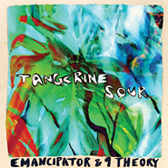
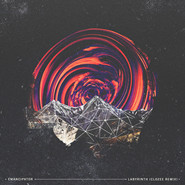
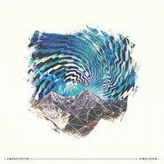
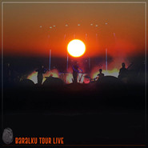
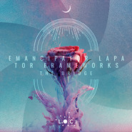
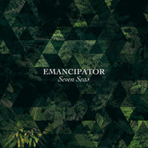

Emancipator
============================

|  |  |
| :--: | :-- |
| [ Emancipator](https://i.xiami.com/emancipator) | **地区**: United States of America 美国 **风格**: 神游舞曲 Trip Hop, 缓拍 Downtempo, 独立电子乐 Indietronica **播放数**: 5731341 **粉丝数**: 12912 **评论数**: 618  |

## 档案

Emancipator本名Douglas Appling（道格拉斯·阿普灵），1987年生，首砖发行于2006年12月16日，那时候19岁。Emancipator把 jazz eletronic downtempo triphop有声有色的融合在一起了，大量的小提琴、钢琴采样的运用，让歌曲更饱满。一个人办这么多事儿，已经是够让人咋舌的了，更不可思议的是，这些制作费用都由他自己来承担。尽管很费劲，但最可贵的是，Emancipator最终还是把他想要的感觉找到了，并且非常清晰的贯穿整张专辑。 
A search for mind immersing, spine tingling tracks would land many stumbling upon Emancipator. Between the countless tour dates, festivals, and studio time, Emancipator (aka Doug Appling); the Portland, OR based electronic producer, has retained a steady rise of success over the past few years. Playing sold out venues, to the delight of his faithful fans, 2012 proved to be a year of expansion and growth for this talented young musician. Further backed by the support of two highly acclaimed albums, Soon it will be cold enough and Safe in the steep cliffs and the recent launch of his own label, Loci Records, this young entrepreneur shows no signs of slowing down. 
Known for its etheric melodies, immaculately smooth samples, and addictive drum beats, Emancipator’s music has captivated a diverse audience across the globe. One might struggle to place a finger on what makes the music so addictive, but would undoubtedly return to the underlying feeling of balance and connection. Now accompanied regularly by the harmonious swells of live violin played by Ilya Goldberg, Emancipator’s live performances have developed into an all-encompassing musical experience. 
With the release of his newest album, Dusk to Dawn, the music promises listeners a nostalgic return to the soulful integration of organic hip hop and symphonic layers that first captivated his audience. “Minor Cause”, the first single off Dusk to Dawn proved a buzz-worthy track with its’ video premier on MTV’s Hive – followed by an uproar of enthused listeners wanting more. Trusting his roots yet simultaneously evolving, Emancipator’s fresh new cultivation is nothing short of a renaissance.

## 专辑

| 名称 | 语种 | 唱片公司 | 发行时间 | 专辑类别 | 专辑风格 |
| :--: | :-- | :-- | :-- | :-- | :-- |
| [ A Thousand Clouds](./albums/5022141438.md) | 英语 | Loci Records | 2020年12月11日 | 录音室专辑 | 缓拍 Downtempo |
| [ Tangerine Sour](./albums/5021910247.md) | 其他 | Loci Records | 2020年11月13日 | 录音室专辑 |  |
| [ Labyrinth](./albums/5021287548.md) | 其他 | Loci Records | 2020年08月14日 | 录音室专辑 | 缓拍 Downtempo |
| [ Mountain of Memory](./albums/5020377038.md) | 其他 | Loci Records | 2020年04月03日 | EP, 单曲 | 缓拍 Downtempo |
| [ Himalayan](./albums/2108164426.md) | 其他 | Loci Records | 2020年03月13日 | EP, 单曲 | 缓拍 Downtempo |
| [ Iron Ox](./albums/2420339379.md) | 英语 | Loci Records | 2020年02月21日 | EP, 单曲 | 缓拍 Downtempo |
| [ Baralku Tour](./albums/2420338297.md) | 英语 | Loci Records | 2019年12月13日 | EP, 单曲 | 缓拍 Downtempo |
| [ The Bridge](./albums/2420322136.md) | 英语 | Loci Records | 2019年08月23日 | EP, 单曲 | 缓拍 Downtempo |
| [ Cheeba Gold](./albums/2104717111.md) | 英语 | Loci Records | 2019年03月22日 | EP, 单曲 | 缓拍 Downtempo |
| [ Baralku](./albums/2102958131.md) | 英语 | Loci Records | 2017年11月17日 | 录音室专辑 |  |
| [ Goodness](./albums/2102958155.md) | 英语 | Loci Records | 2017年09月20日 | EP, 单曲 |  |
| [ Ghost Pong](./albums/2102958134.md) | 英语 | Loci Records | 2017年08月22日 | EP, 单曲 |  |
| [ Maps & Father King EP](./albums/2102653698.md) | 英语 | Loci Records | 2016年11月11日 | EP, 单曲 |  |
| [ Seven Seas](./albums/2100207900.md) | 英语 | Self-Released | 2015年09月25日 | 录音室专辑 | 嘻哈 Hip-Hop, 电子 Electronic |
| [ Dusk To Dawn Remixes](./albums/1436410721.md) | 英语 | Loci Records | 2015年07月08日 | 合集, 杂锦 |  |
| [ Live In Athens](./albums/433422966.md) | 英语 | Loci Records | 2015年06月04日 | 现场专辑 |  |
| [ Valhalla (cameragrammar flip)](./albums/2102710293.md) | 英语 | Self-Released | 2015年06月03日 | EP, 单曲 |  |
| [ Dusk to Dawn](./albums/570530.md) | 英语 | Loci Records | 2013年01月29日 | 录音室专辑 |  |
| [ Elephant Survival](./albums/484005.md) | 英语 | ` | 2011年12月15日 | EP, 单曲 |  |
| [ Remixes](./albums/447442.md) | 其他 | Emancipator | 2011年06月21日 | 录音室专辑 |  |
| [ Free Downloads](./albums/492880.md) | 其他 | Self-Released | 2011年04月20日 | EP, 单曲 |  |
| [ Safe In The Steep Cliffs](./albums/365261.md) | 英语 | Self-Released | 2010年01月19日 | 录音室专辑 |  |
| [ Soon It Will Be Cold Enough](./albums/170695.md) | 其他 | Self-Released | 2006年12月16日 | 录音室专辑 | 神游舞曲 Trip Hop |

## 评论

|  |  |  |
| :-- | :-- | :-- |
|  [虾米用户](https://emumo.xiami.com/u/445793361)  2020-12-05 14:03 赞(0) 踩(0) | 
喜欢其中的安静又洒脱
 |
|  [虾米用户](https://emumo.xiami.com/u/427840279) 购买诗集《落日飞奔术》电... 2020-11-21 04:49 赞(0) 踩(0) | 

 |
|  [虾米用户](https://emumo.xiami.com/u/410489503) 南极鳗鱼 2020-11-09 06:30 赞(0) 踩(0) | 
/
 |
|  [虾米用户](https://emumo.xiami.com/u/442883474) 我还没想好要写什么... 2020-09-12 13:56 赞(0) 踩(0) | 
这个电子真的有点上脑 觉得要飞了 不燥 真好
 |
|  [虾米用户](https://emumo.xiami.com/u/105451946) 亲们网易云见昵称：摩羯天... 2020-08-14 20:25 赞(0) 踩(0) | 

 |
|  [虾米用户](https://emumo.xiami.com/u/202762133) 伊甸园 2020-07-08 23:02 赞(1) 踩(0) | 
☔️
 |
|  [虾米用户](https://emumo.xiami.com/u/400715332) 留白 2020-03-27 09:08 赞(0) 踩(0) | 
&amp;mdash;&amp;mdash;
 |
|  [虾米用户](https://emumo.xiami.com/u/32363368) 网易云 同名 2020-02-24 01:04 赞(1) 踩(0) | 
听回来啦
 |
|  [虾米用户](https://emumo.xiami.com/u/435393120)  2020-02-05 13:52 赞(0) 踩(0) | 
嗯
 |
|  [虾米用户](https://emumo.xiami.com/u/266461620) 这家伙很懒，什么都没有留... 2020-01-29 07:02 赞(0) 踩(0) | 

 |
|  [虾米用户](https://emumo.xiami.com/u/7823952) 心里的海化做旋律里。 2019-10-31 14:24 赞(1) 踩(0) | 
超喜欢的电子艺人，追了几年了！！再来打卡支持！
 |
|  [虾米用户](https://emumo.xiami.com/u/3057399) 朝闻道，夕死可矣。 2019-08-23 22:53 赞(0) 踩(0) | 
M
 |
|  [虾米用户](https://emumo.xiami.com/u/3057399) 朝闻道，夕死可矣。 2019-08-23 22:45 赞(0) 踩(0) | 
M
 |
|  [虾米用户](https://emumo.xiami.com/u/316509349) 梦是不死的欲望 2019-07-21 22:41 赞(0) 踩(0) | 
嗯
 |
|  [虾米用户](https://emumo.xiami.com/u/1923255)   云雷， 屯 ，君子以... 2019-07-13 10:09 赞(2) 踩(0) | 
七年后再回来
 |
|  [虾米用户](https://emumo.xiami.com/u/254114886) 我还没想好要写什么... 2019-05-28 23:59 赞(0) 踩(0) | 
第一次听，感觉独自一人陷入了另外一个世界，就是爱上了
 |
|  [虾米用户](https://emumo.xiami.com/u/3028143) 我还没想好要写什么... 2019-05-24 08:40 赞(0) 踩(0) | 
❤️
 |
|  [虾米用户](https://emumo.xiami.com/u/335519557)  2019-05-08 00:26 赞(2) 踩(0) | 
近两年可能他老了，也可能我老了 再也没有以前的那些感觉了 五年来听过所有我能找到的他的曲子但也就这样吧 耳目一新（kamakura，merlion的remix，elephant和 hill signed） 闪耀如星尘（greenland， eve ii 和delta trance） 惊喜不断 （vines，anthem的remix和dusk to dawn） 跳跃起伏（lionheart，when i go的remix） 力量澎湃（old devil的live） 幽云忧己（natural cause） 或是魂牵梦绕（canopy，land&amp;sea和seven seasp）感觉了
 |
|  [虾米用户](https://emumo.xiami.com/u/346165752)  2019-05-05 01:31 赞(0) 踩(0) | 

 |
|  [虾米用户](https://emumo.xiami.com/u/39925823) # 2019-05-01 13:42 赞(1) 踩(0) | 
交响级别的电子
 |
|  [虾米用户](https://emumo.xiami.com/u/49364118) * 2019-05-01 12:33 赞(0) 踩(0) | 

 |
|  [虾米用户](https://emumo.xiami.com/u/7343217)   2019-04-26 12:22 赞(0) 踩(0) | 
这个跟triphop有什么关系。。。我怎么只觉得类似某种电子流行newage。。。求指教
 |
|  [虾米用户](https://emumo.xiami.com/u/8337431) 以乐会友 2019-04-07 14:49 赞(0) 踩(0) | 
592
 |
|  [虾米用户](https://emumo.xiami.com/u/2418238) weibo: @尤米口 2019-03-30 04:48 赞(0) 踩(0) | 
Back Again ♡
 |
|  [虾米用户](https://emumo.xiami.com/u/5183356)   2019-03-24 22:10 赞(0) 踩(0) | 
哇又发现了
 |
|  [虾米用户](https://emumo.xiami.com/u/400715332) 留白 2019-03-07 20:56 赞(0) 踩(0) | 
绝对不能错过的      
 |
| ⇒ |  [虾米用户](https://emumo.xiami.com/u/400715332) 留白 2020-03-27 09:08 赞(0) 踩(0) | 

 |
|  [虾米用户](https://emumo.xiami.com/u/45686435) 一壺飛鳧 尋山夢鶴   ... 2019-02-24 15:55 赞(0) 踩(0) | 
〰️
 |
|  [虾米用户](https://emumo.xiami.com/u/16000741)  2019-02-09 02:15 赞(0) 踩(0) | 
最近虾米的AI推荐真的是神了！！！ 这两天听Downtempo！推荐的都是什么神仙音乐人啊！！！！太棒啦！！！！！！
 |
|  [虾米用户](https://emumo.xiami.com/u/33071402) I do not car... 2019-01-04 15:48 赞(1) 踩(0) | 
我爱您TT
 |
|  [虾米用户](https://emumo.xiami.com/u/32704477) 像熟悉了一个世纪 2018-12-17 00:07 赞(0) 踩(0) | 
大部分都是十几岁的时候听上他的作品 真的很神奇了 每一首都是单曲循环佳品 从19追到22
 |
|  [虾米用户](https://emumo.xiami.com/u/32051445) 女孩儿的歌。 永爱虾米 2018-11-26 21:20 赞(0) 踩(0) | 
爱了爱了
 |
|  [虾米用户](https://emumo.xiami.com/u/201391232) 最快的方法是先抱抱 2018-10-28 13:47 赞(0) 踩(0) | 
彡
 |
|  [虾米用户](https://emumo.xiami.com/u/39918840) ～ 2018-10-15 00:08 赞(0) 踩(0) | 
需要一个表情 但是电脑上打不出来
 |
|  [虾米用户](https://emumo.xiami.com/u/355616318) : )大家都好好的 2018-10-08 22:43 赞(0) 踩(0) | 
️
 |
|  [虾米用户](https://emumo.xiami.com/u/276944698) 不要自我设限..... 2018-09-17 19:25 赞(1) 踩(0) | 

 |
|  [虾米用户](https://emumo.xiami.com/u/34326835)  2018-07-14 08:09 赞(0) 踩(0) | 
今年来北京吗
 |
|  [虾米用户](https://emumo.xiami.com/u/33071402) I do not car... 2018-07-07 16:29 赞(2) 踩(0) | 
      
 |
|  [虾米用户](https://emumo.xiami.com/u/42855010) 暂无签名~ 2018-07-06 01:05 赞(2) 踩(0) | 
天哪！这是有多幽深绝妙的内心世界
 |
| ⇒ |  [虾米用户](https://emumo.xiami.com/u/25090687) སེམས 2018-08-05 10:05 赞(0) 踩(0) | 
你跟ID是无幻头像是仁的那位是故意的吗 
 |
| ⇒ |  [虾米用户](https://emumo.xiami.com/u/42855010) 暂无签名~ 2018-08-05 21:51 赞(0) 踩(0) | 
<q><b>wilddang说：</b></q>
 |
|  [虾米用户](https://emumo.xiami.com/u/358112805)  2018-04-24 16:30 赞(0) 踩(0) | 
your music emancipate me.
 |
|  [虾米用户](https://emumo.xiami.com/u/335519557)  2018-03-21 12:29 赞(0) 踩(0) | 
&lt;Why I couldn't find 'diamonds' and 'thistle' on the app？？?      [url=/u/333582823]@Emancipator [/url]&gt;&lt;333582823&gt;
 |
|  [虾米用户](https://emumo.xiami.com/u/13075016)  ) (  2018-03-01 11:00 赞(0) 踩(0) | 
Soon It Will Be Cold Enough 电子启蒙
 |
|  [虾米用户](https://emumo.xiami.com/u/167654014) 江湖隐士 2018-02-22 10:12 赞(0) 踩(0) | 
灵魂得共鸣
 |
|  [虾米用户](https://emumo.xiami.com/u/20177386) 感谢一切美好的遇见❤️ 2018-02-17 22:27 赞(0) 踩(0) | 

 |
|  [虾米用户](https://emumo.xiami.com/u/11816463)   2018-01-24 18:48 赞(0) 踩(0) | 
Welcome to HK！！！！！！
 |
|  [虾米用户](https://emumo.xiami.com/u/59564870) Life is a bi... 2018-01-20 09:45 赞(0) 踩(0) | 
什么时候来广州！
 |
|  [虾米用户](https://emumo.xiami.com/u/292484097)   2018-01-18 13:58 赞(0) 踩(0) | 
居然错过演出了
 |
|  [虾米用户](https://emumo.xiami.com/u/25090687) སེམས 2018-01-07 02:09 赞(3) 踩(0) | 
听了他们那么久 今天才知道他们和nujabes是一个厂牌  
 |
|  [虾米用户](https://emumo.xiami.com/u/4006012) 。 2017-12-16 23:24 赞(1) 踩(0) | 
要不是考研这次就去上海看live了
 |
|  [虾米用户](https://emumo.xiami.com/u/11266452) 海底身处 2017-12-09 21:44 赞(1) 踩(0) | 
Feel so sad to find I missed your tour in China!   
 |
|  [虾米用户](https://emumo.xiami.com/u/5180439) hia~ 2017-11-24 19:16 赞(0) 踩(0) | 
啊错过了
 |
|  [虾米用户](https://emumo.xiami.com/u/501316)  2017-11-22 12:19 赞(0) 踩(0) | 
现场完全over my expectation啊lolllll！！
 |
|  [虾米用户](https://emumo.xiami.com/u/382749)   2017-11-21 21:40 赞(3) 踩(0) | 
现场版太酷了，听到熟悉的歌都想不自觉地笑起来
 |
|  [虾米用户](https://emumo.xiami.com/u/7823952) 心里的海化做旋律里。 2017-11-21 20:20 赞(1) 踩(0) | 
Welcome to China!!!
 |
|  [虾米用户](https://emumo.xiami.com/u/151713) Past and gon... 2017-11-21 09:20 赞(0) 踩(0) | 
道格晚上见 
 |
|  [虾米用户](https://emumo.xiami.com/u/8251803) 这家伙很笨什么也没留下.... 2017-11-19 23:42 赞(2) 踩(0) | 
北京站竟然取消了 想跑去上海站看了
 |
|  [虾米用户](https://emumo.xiami.com/u/8640101) ★さぁ、仆の出番だよ。 2017-11-19 17:40 赞(2) 踩(0) | 
北京的为什么取消！！我朋友都从外地赶过来了！！
 |
|  [虾米用户](https://emumo.xiami.com/u/8542277) 一 2017-11-18 01:01 赞(1) 踩(0) | 
<a href="https://emancipator.bandcamp.com/album/baralku" target="_blank" rel="nofollow noreferrer noopener">https://emancipator.bandcamp.com/album/baralku</a> 原来新专全部出完了 可惜
 |
|  [虾米用户](https://emumo.xiami.com/u/2165528)   2017-11-17 20:50 赞(0) 踩(0) | 
完美错过！
 |
|  [虾米用户](https://emumo.xiami.com/u/4195148) 热爱生活的普通人 2017-11-17 08:11 赞(0) 踩(0) | 
niubi
 |
|  [虾米用户](https://emumo.xiami.com/u/3581084)   2017-11-16 21:18 赞(0) 踩(0) | 
算是我的电子启蒙 好想去看
 |
|  [虾米用户](https://emumo.xiami.com/u/263154153) 这样好吗 2017-11-16 18:50 赞(0) 踩(0) | 
啊！
 |
|  [虾米用户](https://emumo.xiami.com/u/18626881) 没有是非 只有不同 2017-11-14 22:16 赞(1) 踩(0) | 
有上海约的吗
 |
|  [虾米用户](https://emumo.xiami.com/u/24814862) - 2017-11-14 09:34 赞(0) 踩(0) | 
！
 |
|  [虾米用户](https://emumo.xiami.com/u/1544552) 暂无签名~ 2017-11-13 22:47 赞(0) 踩(0) | 
要来上海了~
 |
|  [虾米用户](https://emumo.xiami.com/u/5660185) QQ音乐官方虾米账号 2017-11-11 01:30 赞(2) 踩(0) | 
北京欢迎你！！！！！
 |
|  [虾米用户](https://emumo.xiami.com/u/4230706)  2017-11-10 11:31 赞(0) 踩(0) | 
换头像了？！我翻了半天关注没翻出来！
 |
|  [虾米用户](https://emumo.xiami.com/u/33071402) I do not car... 2017-11-08 17:55 赞(4) 踩(0) | 
帅哭了新头像
 |
|  [虾米用户](https://emumo.xiami.com/u/955803) 心有猛虎，细嗅蔷薇 2017-11-08 09:17 赞(0) 踩(0) | 
好听
 |
|  [虾米用户](https://emumo.xiami.com/u/13952797) 我还没想好要写什么... 2017-11-08 07:34 赞(0) 踩(0) | 
你要来了，可惜学生党 去不了
 |
|  [虾米用户](https://emumo.xiami.com/u/2354958)  2017-11-07 10:48 赞(0) 踩(0) | 
激动炸了
 |
|  [虾米用户](https://emumo.xiami.com/u/1860756) 一点我就燃 2017-11-07 10:46 赞(0) 踩(0) | 
TAT&amp;middot;&amp;middot;&amp;middot;&amp;middot;&amp;middot;&amp;middot;&amp;middot;&amp;middot;
 |
|  [虾米用户](https://emumo.xiami.com/u/7602582) 电子/神游/浩室/迷幻/... 2017-11-07 08:11 赞(0) 踩(0) | 
妈耶。！！！
 |
|  [虾米用户](https://emumo.xiami.com/u/36576635) 冰岛游客热带地区唯一指定... 2017-11-06 20:10 赞(3) 踩(0) | 
啊啊啊啊啊发私信超贴心！✧*｡٩(ˊᗜˋ*)و✧*｡Love Ya!
 |
|  [虾米用户](https://emumo.xiami.com/u/8542277) 一 2017-11-06 18:22 赞(0) 踩(0) | 
好气
 |
|  [虾米用户](https://emumo.xiami.com/u/23534686) o 2017-11-06 18:09 赞(0) 踩(0) | 
！
 |
|  [虾米用户](https://emumo.xiami.com/u/186085518) 其他音樂軟件同名/ACG... 2017-11-06 17:56 赞(0) 踩(0) | 
Hiiiiiiiii See u in shanghai
 |
|  [虾米用户](https://emumo.xiami.com/u/33512641) call me now,... 2017-11-06 17:56 赞(0) 踩(0) | 
糖果见
 |
|  [虾米用户](https://emumo.xiami.com/u/333582823)  2017-11-06 17:43 赞(87) 踩(0) | 
Hi！
 |
| ⇒ |  [虾米用户](https://emumo.xiami.com/u/38717258)  2017-11-06 18:36 赞(0) 踩(0) | 
Hi！
 |
| ⇒ |  [虾米用户](https://emumo.xiami.com/u/36576635) 冰岛游客热带地区唯一指定... 2017-11-06 20:09 赞(0) 踩(0) | 
Welcome!!!
 |
| ⇒ |  [虾米用户](https://emumo.xiami.com/u/13305969) 这家伙很聪明什么也没留下... 2017-11-06 22:45 赞(0) 踩(0) | 
look my name 
 |
| ⇒ |  [虾米用户](https://emumo.xiami.com/u/13735002) 我还没想好要写什么... 2017-11-06 23:44 赞(0) 踩(0) | 
Welcome! Would you come to other cities ? Cuz China is so big.
 |
| ⇒ |  [虾米用户](https://emumo.xiami.com/u/10517853) I'm a social... 2017-11-07 03:52 赞(0) 踩(0) | 
hiya
 |
| ⇒ |  [虾米用户](https://emumo.xiami.com/u/1736735)   2017-11-07 07:52 赞(0) 踩(0) | 
yo
 |
| ⇒ |  [虾米用户](https://emumo.xiami.com/u/1078090)   2017-11-07 17:56 赞(0) 踩(0) | 
welcome！
 |
| ⇒ |  [虾米用户](https://emumo.xiami.com/u/6953704) Never ever. 2017-11-07 18:44 赞(0) 踩(0) | 
nice to see u here！！
 |
| ⇒ |  [虾米用户](https://emumo.xiami.com/u/12865563) “万物如诗” 2017-11-08 07:36 赞(0) 踩(0) | 
Hi~
 |
| ⇒ |  [虾米用户](https://emumo.xiami.com/u/34999952) 前 卫 金  2017-11-08 11:03 赞(0) 踩(0) | 
When will you come to NanJing 
 |
| ⇒ |  [虾米用户](https://emumo.xiami.com/u/319604) ♥BROWN SUGAR... 2017-11-08 20:36 赞(0) 踩(0) | 
Why don&amp;rsquo;t you come to Hong Kong or Shenzhen : ( I&amp;rsquo;ve been listening to your music for years&amp;hellip;
 |
| ⇒ |  [虾米用户](https://emumo.xiami.com/u/382749)   2017-11-13 17:35 赞(0) 踩(0) | 
Welcome！
 |
| ⇒ |  [虾米用户](https://emumo.xiami.com/u/3581084)   2017-11-16 20:48 赞(0) 踩(0) | 
Hi！
 |
| ⇒ |  [虾米用户](https://emumo.xiami.com/u/5133491) 其他音乐平台用户名依旧叫... 2017-11-17 09:25 赞(0) 踩(0) | 
   
 |
| ⇒ |  [虾米用户](https://emumo.xiami.com/u/4131849) 网易云：非人類兔子Agy... 2017-11-19 14:16 赞(0) 踩(0) | 
hi
 |
| ⇒ |  [虾米用户](https://emumo.xiami.com/u/11927341)   2017-11-20 22:41 赞(0) 踩(0) | 
It's amazing to see you! Your music is more excellent than I can imagine!
 |
| ⇒ |  [虾米用户](https://emumo.xiami.com/u/7823952) 心里的海化做旋律里。 2017-11-21 20:21 赞(0) 踩(0) | 
Hi，要来武汉约一波吗！要！！！
 |
| ⇒ |  [虾米用户](https://emumo.xiami.com/u/9641594) 网易：活力彩虹糖  ：（ 2017-12-19 02:31 赞(0) 踩(0) | 
Hi!
 |
| ⇒ |  [虾米用户](https://emumo.xiami.com/u/232629796)   2018-01-09 13:04 赞(0) 踩(0) | 
同
 |
| ⇒ |  [虾米用户](https://emumo.xiami.com/u/45809141)          2 0... 2018-01-16 11:47 赞(0) 踩(0) | 
wow!!!!!!
 |
| ⇒ |  [虾米用户](https://emumo.xiami.com/u/292484097)   2018-01-18 13:57 赞(0) 踩(0) | 
hiiii!!!!!!!!
 |
| ⇒ |  [虾米用户](https://emumo.xiami.com/u/11816463)   2018-01-24 18:47 赞(0) 踩(0) | 
Aaaaaaaaa！！！！！！
 |
| ⇒ |  [虾米用户](https://emumo.xiami.com/u/335519557)  2018-03-18 23:52 赞(0) 踩(0) | 
hi
 |
| ⇒ |  [虾米用户](https://emumo.xiami.com/u/12330064) 音乐贝壳 2018-04-02 15:10 赞(0) 踩(0) | 
     
 |
| ⇒ |  [虾米用户](https://emumo.xiami.com/u/614654) 立体千年虫 2018-04-21 14:54 赞(0) 踩(0) | 
hello
 |
| ⇒ |  [虾米用户](https://emumo.xiami.com/u/358112805)  2018-04-22 07:02 赞(0) 踩(0) | 
It is nice to have you here!
 |
| ⇒ |  [虾米用户](https://emumo.xiami.com/u/26147496) 无乐不眠 2019-09-21 01:16 赞(0) 踩(0) | 
Hi !
 |
|  [虾米用户](https://emumo.xiami.com/u/151713) Past and gon... 2017-11-04 14:16 赞(0) 踩(0) | 
11月21日 道哥 上海见
 |
|  [虾米用户](https://emumo.xiami.com/u/306669308) 忘 2017-11-03 21:25 赞(0) 踩(0) | 
是爵士乐吗
 |
|  [虾米用户](https://emumo.xiami.com/u/13753488) 自始至终，也只有音乐最懂... 2017-10-28 20:58 赞(0) 踩(0) | 
-
 |
|  [虾米用户](https://emumo.xiami.com/u/380) 奇就奇在接受了各自有路走... 2017-10-27 23:42 赞(1) 踩(0) | 
喜欢乐器繁多的后摇，就像喜欢人与人之间的摩擦，不管是擦出火花，还是伤口。也喜欢独奏，就像一个人独处的时候，修炼自己。
 |
|  [虾米用户](https://emumo.xiami.com/u/324879742)   2017-10-23 04:03 赞(0) 踩(0) | 

 |
|  [虾米用户](https://emumo.xiami.com/u/4230706)  2017-10-22 23:54 赞(0) 踩(0) | 
作品一直高质量啊！好听！
 |
|  [虾米用户](https://emumo.xiami.com/u/71387754)  2017-10-18 14:51 赞(0) 踩(0) | 
500
 |
|  [虾米用户](https://emumo.xiami.com/u/66823378)  2017-09-20 20:17 赞(1) 踩(0) | 
如今，他28岁了 
 |
|  [虾米用户](https://emumo.xiami.com/u/5828782) 一眼可载几多剑 2017-09-11 10:26 赞(0) 踩(0) | 
还好吧 就是 楼上诸位 有点言过其实了
 |
|  [虾米用户](https://emumo.xiami.com/u/48505358) ILLENIUM  地狱... 2017-09-02 21:31 赞(0) 踩(0) | 
我是来凑第500个赞的
 |
|  [虾米用户](https://emumo.xiami.com/u/8542277) 一 2017-08-22 20:47 赞(0) 踩(0) | 
夏天就得听emancipator
 |
|  [虾米用户](https://emumo.xiami.com/u/13305969) 这家伙很聪明什么也没留下... 2017-08-07 12:09 赞(0) 踩(0) | 
真爱.
 |
|  [虾米用户](https://emumo.xiami.com/u/51943294) life is… 2017-06-04 14:17 赞(0) 踩(0) | 
理想型
 |
|  [虾米用户](https://emumo.xiami.com/u/41021627) Breathturn 2017-06-01 18:37 赞(0) 踩(0) | 
眼睛真好看
 |
|  [虾米用户](https://emumo.xiami.com/u/30074304) 寄蜉蝣于天地，渺沧海之一... 2017-05-28 09:13 赞(0) 踩(0) | 
✈
 |
|  [虾米用户](https://emumo.xiami.com/u/10707847)  2017-05-27 11:58 赞(0) 踩(0) | 
棒
 |
|  [虾米用户](https://emumo.xiami.com/u/17520744) 落英不忍拭素手 2017-04-23 15:26 赞(1) 踩(0) | 
我还以为是北欧的，没想到是美国的。
 |
| ⇒ |  [虾米用户](https://emumo.xiami.com/u/116085096) 夜晚的天花板是最美好的荧... 2017-09-10 11:48 赞(0) 踩(0) | 
哈哈哈哈哈，美国没文化是吧
 |
|  [虾米用户](https://emumo.xiami.com/u/645302) 在彩色密封的半透明盒子里 2017-03-22 01:27 赞(0) 踩(0) | 
触动人的是什么元素呢？
 |
|  [虾米用户](https://emumo.xiami.com/u/9196076)   2017-03-15 23:56 赞(1) 踩(0) | 
我男神。
 |
|  [虾米用户](https://emumo.xiami.com/u/44140680) 旅途愉快 2017-03-13 22:45 赞(0) 踩(0) | 
⚫
 |
|  [虾米用户](https://emumo.xiami.com/u/6953704) Never ever. 2017-03-06 23:53 赞(2) 踩(0) | 
有生之年 聽過了他的live 真是一大幸事啊滿足
 |
| ⇒ |  [虾米用户](https://emumo.xiami.com/u/567768) 受伤护士 2017-10-05 01:28 赞(0) 踩(0) | 
这位网友我同你的想法一样
 |
|  [虾米用户](https://emumo.xiami.com/u/2398650)  2017-02-22 15:05 赞(0) 踩(0) | 
video
 |
|  [虾米用户](https://emumo.xiami.com/u/7569932) 请与我嘴对嘴交流 2017-02-05 00:25 赞(0) 踩(0) | 
挺厉害，斗胆说一句，有些人是不是有点吹过了！ 
 |
|  [虾米用户](https://emumo.xiami.com/u/261059400)  2017-01-12 11:25 赞(0) 踩(0) | 
rll0
 |
|  [虾米用户](https://emumo.xiami.com/u/261059400)  2017-01-12 11:25 赞(0) 踩(0) | 
rll0
 |
|  [虾米用户](https://emumo.xiami.com/u/11029265) 养只猫吧～ 2017-01-10 22:40 赞(2) 踩(0) | 
Lionheart的大提琴声美好到我特别不想让他结束的时候他就真没有结束
 |
|  [虾米用户](https://emumo.xiami.com/u/31709801) 还活着，真的是太好了..... 2017-01-05 01:27 赞(0) 踩(0) | 
，大惊小怪……
 |
|  [虾米用户](https://emumo.xiami.com/u/4230706)  2016-12-21 20:22 赞(2) 踩(0) | 
又出新专辑啦   我先下载为敬
 |
|  [虾米用户](https://emumo.xiami.com/u/249948903) 好风凭借力，送我上青云。 2016-12-01 01:20 赞(0) 踩(0) | 
高产啊
 |
|  [虾米用户](https://emumo.xiami.com/u/4230706)  2016-11-30 09:03 赞(1) 踩(0) | 
谁有他的现场live演奏视频啊？十分想看！！！
 |
|  [虾米用户](https://emumo.xiami.com/u/4131849) 网易云：非人類兔子Agy... 2016-11-03 18:05 赞(0) 踩(0) | 
Much better
 |
|  [虾米用户](https://emumo.xiami.com/u/2701423)  2016-10-25 13:07 赞(0) 踩(0) | 
trip hop 真心不错
 |
|  [虾米用户](https://emumo.xiami.com/u/202236875)  2016-10-16 16:26 赞(0) 踩(0) | 
鬼才
 |
|  [虾米用户](https://emumo.xiami.com/u/12409435)   2016-10-11 17:42 赞(0) 踩(0) | 
最喜欢goodknight
 |
|  [虾米用户](https://emumo.xiami.com/u/3336063)  2016-08-22 18:47 赞(0) 踩(0) | 
天才
 |
|  [虾米用户](https://emumo.xiami.com/u/10584399) I don’t  2016-08-19 13:58 赞(1) 踩(0) | 
简介又改成了“那时候19岁”
 |
|  [虾米用户](https://emumo.xiami.com/u/8905665) 我还没想好要写什么... 2016-07-30 09:00 赞(0) 踩(0) | 
长得像漫画人物
 |
|  [虾米用户](https://emumo.xiami.com/u/25417878) 我的电影原声！ 2016-07-16 11:33 赞(0) 踩(0) | 
代表月亮消灭你！
 |
|  [虾米用户](https://emumo.xiami.com/u/10471420)  2016-06-24 06:14 赞(0) 踩(0) | 

 |
|  [虾米用户](https://emumo.xiami.com/u/49075538) 爱笑 简单 清澈 温暖而... 2016-06-20 02:59 赞(0) 踩(0) | 
爱
 |
|  [虾米用户](https://emumo.xiami.com/u/8395195) 何必呢 2016-06-14 10:13 赞(0) 踩(0) | 
不行，我要嫁小哥!!!!!!!!!
 |
|  [虾米用户](https://emumo.xiami.com/u/33214350) keep going. 2016-06-10 00:18 赞(0) 踩(0) | 
永远的19岁，哈哈哈
 |
|  [虾米用户](https://emumo.xiami.com/u/382749)   2016-05-23 00:33 赞(0) 踩(0) | 
天赋啊，，，，，
 |
|  [虾米用户](https://emumo.xiami.com/u/34353908) 穷写小说的。 2016-05-11 21:01 赞(0) 踩(0) | 
在有生之年看到有人改了你的简介 永远的十九岁 
 |
|  [虾米用户](https://emumo.xiami.com/u/34353908) 穷写小说的。 2016-05-08 17:01 赞(0) 踩(0) | 
哼唧怎么还不出新砖
 |
|  [虾米用户](https://emumo.xiami.com/u/9028760) 豆瓣见 spotify ... 2016-04-30 21:20 赞(0) 踩(0) | 
⚗
 |
|  [虾米用户](https://emumo.xiami.com/u/49001447)   2016-04-26 19:52 赞(0) 踩(0) | 
好
 |
|  [虾米用户](https://emumo.xiami.com/u/50869110) IG：77richiee... 2016-04-12 09:11 赞(0) 踩(0) | 
///
 |
|  [虾米用户](https://emumo.xiami.com/u/30617820) 窝列大窝列大哟 2016-03-17 22:45 赞(0) 踩(0) | 
＝＝
 |
|  [虾米用户](https://emumo.xiami.com/u/33071402) I do not car... 2016-03-10 21:23 赞(1) 踩(0) | 
18~19
 |
|  [虾米用户](https://emumo.xiami.com/u/41525932)   2016-02-28 17:21 赞(0) 踩(0) | 
回来中国吗？
 |
|  [虾米用户](https://emumo.xiami.com/u/52506830) 再见 2016-02-24 02:24 赞(0) 踩(0) | 
（）
 |
|  [虾米用户](https://emumo.xiami.com/u/48436220) Oblivīate 2016-02-13 13:31 赞(0) 踩(0) | 
这才是永远19岁hhh
 |
|  [虾米用户](https://emumo.xiami.com/u/49495013)  2016-02-09 21:14 赞(0) 踩(0) | 
喔~哈哈
 |
|  [虾米用户](https://emumo.xiami.com/u/8854264) Hypocrite. 2015-12-22 21:12 赞(0) 踩(0) | 
终于有人改他的资料了233333
 |
|  [虾米用户](https://emumo.xiami.com/u/34353908) 穷写小说的。 2015-12-21 19:46 赞(0) 踩(0) | 
内容已删除
 |
| ⇒ |  [虾米用户](https://emumo.xiami.com/u/65123300) 我还没想好要写什么... 2016-07-28 01:02 赞(0) 踩(0) | 
还有日本的濑.com
 |
|  [虾米用户](https://emumo.xiami.com/u/47418206)   2015-12-12 19:52 赞(0) 踩(0) | 
除了10首热门歌曲以外 其他的歌也非常的棒 好久没听他以前的歌了 一首kumakura差点哭出来了
 |
|  [虾米用户](https://emumo.xiami.com/u/29850835) 一去不回头 2015-12-10 05:53 赞(0) 踩(0) | 

 |
|  [虾米用户](https://emumo.xiami.com/u/3703407) 不奢求、不强求 2015-11-27 14:09 赞(1) 踩(0) | 
赶紧下呀 真怕虾米把你也下架了 
 |
|  [虾米用户](https://emumo.xiami.com/u/16551745) byebye｛wb/in... 2015-11-19 00:20 赞(0) 踩(0) | 
l
 |
|  [虾米用户](https://emumo.xiami.com/u/46840839) 除”（dated__it... 2015-11-15 14:44 赞(0) 踩(0) | 
喜欢
 |
|  [虾米用户](https://emumo.xiami.com/u/6953704) Never ever. 2015-11-08 02:31 赞(1) 踩(0) | 
2016.2.27在伦敦有一个他们的小型live，有想去的么
 |
| ⇒ |  [虾米用户](https://emumo.xiami.com/u/9726899)  2015-11-15 21:24 赞(0) 踩(0) | 
你在伦敦？
 |
| ⇒ |  [虾米用户](https://emumo.xiami.com/u/6953704) Never ever. 2015-11-23 18:03 赞(0) 踩(0) | 
<q><b>kidb123说：</b></q>
 |
| ⇒ |  [虾米用户](https://emumo.xiami.com/u/9726899)  2015-11-29 18:00 赞(0) 踩(0) | 
<q><b>Rஇx॰⋆说：</b></q>
 |
|  [虾米用户](https://emumo.xiami.com/u/6522420) 我还没想好要写什么... 2015-10-18 00:10 赞(0) 踩(0) | 
我只是觉得好听，暂时没有画面感。
 |
|  [虾米用户](https://emumo.xiami.com/u/22456876) 失眠是因为睡前戴上了耳机 2015-10-03 04:35 赞(1) 踩(0) | 
维持 2
 |
| ⇒ |  [虾米用户](https://emumo.xiami.com/u/1520891) 醒醒睡睡的人啊。 2015-10-08 13:12 赞(0) 踩(0) | 
祝福你健康
 |
| ⇒ |  [虾米用户](https://emumo.xiami.com/u/22456876) 失眠是因为睡前戴上了耳机 2015-10-08 13:21 赞(0) 踩(0) | 
<q><b>Youngweenie说：</b></q>
 |
|  [虾米用户](https://emumo.xiami.com/u/34353908) 穷写小说的。 2015-10-01 13:18 赞(0) 踩(0) | 
宁静的磅礴，现代化的自然风
 |
|  [虾米用户](https://emumo.xiami.com/u/47418206)   2015-09-28 22:33 赞(2) 踩(0) | 
第一次听他的歌是在暖暖环游世界里面 的一首natural cause 然后一直百度找这首歌的出处 找了两天终于找到了Emancipator这个艺人 然后瞬间爱上了他的歌 15年九月的新砖1993和natural cause有一种相同的感觉 像是漫步在大自然里面 能够听到大自然的声音 但又非常的宁静
 |
|  [虾米用户](https://emumo.xiami.com/u/34353908) 穷写小说的。 2015-09-28 17:42 赞(0) 踩(0) | 
深入灵魂
 |
|  [虾米用户](https://emumo.xiami.com/u/50844042) IFFREE 2015-09-23 00:26 赞(0) 踩(0) | 
～
 |
|  [虾米用户](https://emumo.xiami.com/u/9535910) 两只狗 2015-09-20 16:42 赞(0) 踩(0) | 
点
 |
|  [虾米用户](https://emumo.xiami.com/u/27692015) 唯有音乐和书不可辜负 2015-09-18 17:21 赞(0) 踩(0) | 
^_^
 |
|  [虾米用户](https://emumo.xiami.com/u/8225159) 以前叫抖良 2015-09-14 03:23 赞(0) 踩(0) | 
咱这封面能换换吗。。。。。。人家挺帅一小伙子。。。。。。活活弄成了码农。。。。。。。
 |
|  [虾米用户](https://emumo.xiami.com/u/12208696) 和虾米的最后一个月 2015-09-14 00:02 赞(0) 踩(0) | 
牛逼
 |
|  [虾米用户](https://emumo.xiami.com/u/46128112) 一个假泰国人  2015-09-03 12:10 赞(0) 踩(0) | 
฿
 |
|  [虾米用户](https://emumo.xiami.com/u/30963730)  2015-08-31 16:50 赞(1) 踩(0) | 
First Snow
 |
|  [虾米用户](https://emumo.xiami.com/u/9730064) 纯音党 2015-08-30 12:14 赞(1) 踩(0) | 
good knight！
 |
|  [虾米用户](https://emumo.xiami.com/u/13075016)  ) (  2015-08-20 16:24 赞(0) 踩(0) | 
87年生
 |
|  [虾米用户](https://emumo.xiami.com/u/47418206)   2015-08-05 09:37 赞(0) 踩(0) | 
Stèv也是Loci Records公司的成员_(:зゝ∠)_
 |
|  [虾米用户](https://emumo.xiami.com/u/47418206)   2015-08-05 09:36 赞(0) 踩(0) | 
Nym和Emancipator是一对好基友_(:зゝ∠)_
 |
|  [虾米用户](https://emumo.xiami.com/u/42879874) born to lost 2015-07-22 18:04 赞(0) 踩(0) | 
✘
 |
|  [虾米用户](https://emumo.xiami.com/u/9639456) 做一个音乐的欣赏者，而不... 2015-07-21 13:23 赞(0) 踩(0) | 
不要414。。。415
 |
|  [虾米用户](https://emumo.xiami.com/u/50152895)  2015-07-17 13:51 赞(0) 踩(0) | 
九月又要出新砖了，叫seven seas
 |
|  [虾米用户](https://emumo.xiami.com/u/15954696)   2015-07-12 04:30 赞(0) 踩(0) | 
真是天才
 |
|  [虾米用户](https://emumo.xiami.com/u/8854264) Hypocrite. 2015-07-09 19:55 赞(0) 踩(0) | 
资料更新了
 |
|  [虾米用户](https://emumo.xiami.com/u/10173945)   2015-07-09 19:16 赞(0) 踩(0) | 
新砖只是remixes！！（摔
 |
|  [虾米用户](https://emumo.xiami.com/u/4195148) 热爱生活的普通人 2015-07-07 23:11 赞(0) 踩(0) | 
意犹未尽   总觉得不过瘾
 |
|  [虾米用户](https://emumo.xiami.com/u/35714790)  2015-06-22 04:23 赞(0) 踩(0) | 
柯南快来✺◟(∗❛ัᴗ❛ั∗)◞✺✺◟(∗❛ัᴗ❛ั∗)◞✺
 |
|  [虾米用户](https://emumo.xiami.com/u/45294979) 网☁️:suzumiha... 2015-06-18 01:27 赞(0) 踩(0) | 
喜欢
 |
|  [虾米用户](https://emumo.xiami.com/u/23422210) 我还没想好要写什么... 2015-06-05 11:31 赞(1) 踩(0) | 
还是最喜欢Maps
 |
|  [虾米用户](https://emumo.xiami.com/u/1853009) LOL 2015-06-02 11:03 赞(0) 踩(0) | 
旧爱
 |
|  [虾米用户](https://emumo.xiami.com/u/13991927) Ins::MIKOCYC... 2015-06-01 10:12 赞(0) 踩(0) | 
3
 |
|  [虾米用户](https://emumo.xiami.com/u/29197411) 我还没想好要写什么... 2015-05-26 11:47 赞(0) 踩(0) | 
相当棒
 |
|  [虾米用户](https://emumo.xiami.com/u/38640339) 我想好写什么了…… 2015-05-21 17:48 赞(0) 踩(0) | 

 |
|  [虾米用户](https://emumo.xiami.com/u/50152895)  2015-05-18 10:15 赞(0) 踩(0) | 
all day everyday
 |
|  [虾米用户](https://emumo.xiami.com/u/9639456) 做一个音乐的欣赏者，而不... 2015-05-04 02:32 赞(0) 踩(0) | 
。。。。400
 |
|  [虾米用户](https://emumo.xiami.com/u/140089) 暂无签名~ 2015-04-29 23:52 赞(0) 踩(0) | 
我很想知道lionheart的创作灵感来自哪里……高中听了这首曲子，现在大二上英国古代史讲狮心王理查德就想到了这首。他们有关系不？好好奇啊……
 |
|  [虾米用户](https://emumo.xiami.com/u/7653083) 生来享福 大概谦逊很难 2015-04-23 10:34 赞(0) 踩(0) | 
就是好听~
 |
|  [虾米用户](https://emumo.xiami.com/u/31243524) 暂无签名~ 2015-04-20 19:39 赞(0) 踩(0) | 
虾米烧饼真多
 |
| ⇒ |  [虾米用户](https://emumo.xiami.com/u/41163024) I’m done. 2015-05-02 20:09 赞(0) 踩(0) | 
感觉网易更多233
 |
|  [虾米用户](https://emumo.xiami.com/u/393018)  2015-04-17 14:37 赞(1) 踩(0) | 
每年打卡，今年发现资料终于改了，转眼快10年了
 |
|  [虾米用户](https://emumo.xiami.com/u/9973544)  2015-04-09 14:11 赞(0) 踩(0) | 
实在太棒！
 |
|  [虾米用户](https://emumo.xiami.com/u/28899664)  2015-04-09 08:48 赞(0) 踩(0) | 
2006年 19岁 看介绍记得 要看全面
 |
|  [虾米用户](https://emumo.xiami.com/u/775534)   2015-03-28 19:26 赞(0) 踩(0) | 
和Emanzipation 有啥关系
 |
|  [虾米用户](https://emumo.xiami.com/u/8226204) ≡ 2015-03-28 14:28 赞(0) 踩(0) | 
。
 |
|  [虾米用户](https://emumo.xiami.com/u/10219317)   2015-03-25 01:54 赞(0) 踩(0) | 
新大陆？
 |
|  [虾米用户](https://emumo.xiami.com/u/9639456) 做一个音乐的欣赏者，而不... 2015-03-20 01:42 赞(0) 踩(0) | 
评论补上。。。388
 |
|  [虾米用户](https://emumo.xiami.com/u/44100434)  2015-03-13 18:13 赞(0) 踩(0) | 
✔已阅
 |
|  [虾米用户](https://emumo.xiami.com/u/1281057) 请赐予我一颗赤子之心 2015-03-12 13:00 赞(1) 踩(0) | 
灵动与内敛的完美结合
 |
|  [虾米用户](https://emumo.xiami.com/u/23912651) 我还没想好要写什么... 2015-02-28 23:11 赞(2) 踩(0) | 
100年后依然会觉得Emancipator是听过的最干净的音乐。
 |
|  [虾米用户](https://emumo.xiami.com/u/35615477) ♪ 2015-02-13 04:32 赞(1) 踩(0) | 
噢 ! 美妙极了^^ 雪地.彬林.针叶林.鹿子.骑士.精灵...仿佛听他在讲述一个神奇故事，精彩动人~
 |
|  [虾米用户](https://emumo.xiami.com/u/35615477) ♪ 2015-02-13 04:21 赞(0) 踩(0) | 
噢 !  ..  .
 |
|  [虾米用户](https://emumo.xiami.com/u/42174)  2015-02-10 14:15 赞(1) 踩(0) | 
87年生,如今19岁.....太好了,我也才21岁
 |
|  [虾米用户](https://emumo.xiami.com/u/5586779) be nice,be c... 2015-02-05 01:06 赞(0) 踩(0) | 
minor cause 提琴太棒
 |
| ⇒ |  [虾米用户](https://emumo.xiami.com/u/1006550) 束缚胜无界 2015-03-26 00:53 赞(0) 踩(0) | 
宝贝你更棒
 |
|  [虾米用户](https://emumo.xiami.com/u/10415362)  2015-01-15 12:07 赞(0) 踩(0) | 
听了一年了。
 |
|  [虾米用户](https://emumo.xiami.com/u/3776615)  2015-01-14 18:05 赞(0) 踩(0) | 
音乐也是一种魔法
 |
|  [虾米用户](https://emumo.xiami.com/u/28316885)  2014-12-31 19:36 赞(0) 踩(0) | 
北欧的神话森林
 |
|  [虾米用户](https://emumo.xiami.com/u/13498396)   2014-12-28 11:32 赞(1) 踩(0) | 
我记得这哥们不是永远19岁的吗？ :3
 |
|  [虾米用户](https://emumo.xiami.com/u/3703407) 不奢求、不强求 2014-12-20 02:55 赞(0) 踩(0) | 
年底了，出新专吧。
 |
|  [虾米用户](https://emumo.xiami.com/u/8854264) Hypocrite. 2014-12-13 15:58 赞(0) 踩(0) | 
天才少年。
 |
|  [虾米用户](https://emumo.xiami.com/u/44705272)  2014-12-11 20:44 赞(0) 踩(0) | 
干净的纯音乐
 |
|  [虾米用户](https://emumo.xiami.com/u/9069664)  2014-12-04 16:13 赞(0) 踩(0) | 
艹 很久已经就收藏的 结果数据丢了 虾米能不能靠谱点
 |
|  [虾米用户](https://emumo.xiami.com/u/8388977)   2014-12-02 22:19 赞(1) 踩(0) | 
森林气息 山林气息 自然气息 冷冬气息 啊！玩作曲的都什么脑子啊！
 |
|  [虾米用户](https://emumo.xiami.com/u/8388977)   2014-12-02 22:10 赞(0) 踩(0) | 
oh！never green！！！开头还不信是一个人！
 |
|  [虾米用户](https://emumo.xiami.com/u/1496867) 我还没想好要写什么... 2014-12-01 17:03 赞(0) 踩(0) | 
比我小一岁 加油
 |
|  [虾米用户](https://emumo.xiami.com/u/19526014)   2014-11-29 00:32 赞(0) 踩(0) | 
听了七年的人了
 |
|  [虾米用户](https://emumo.xiami.com/u/16286100)  2014-11-08 13:12 赞(0) 踩(0) | 
入神入心
 |
|  [虾米用户](https://emumo.xiami.com/u/19786814) 暂无签名~ 2014-10-31 15:37 赞(0) 踩(0) | 
大神你什么时候出砖..
 |
|  [虾米用户](https://emumo.xiami.com/u/3703407) 不奢求、不强求 2014-10-25 01:34 赞(0) 踩(0) | 
小哥什么时候在出新专呀。
 |
|  [虾米用户](https://emumo.xiami.com/u/12409435)   2014-10-21 13:45 赞(0) 踩(0) | 
不错
 |
|  [虾米用户](https://emumo.xiami.com/u/1742171) 已搬到网易 2014-10-20 22:13 赞(1) 踩(0) | 
就靠他的音乐装逼了 说到装逼 那么问题来了
 |
| ⇒ |  [虾米用户](https://emumo.xiami.com/u/35274427) 找个对的人去远行 2014-11-08 19:17 赞(0) 踩(0) | 
装b技术那家强……？
 |
|  [虾米用户](https://emumo.xiami.com/u/7973634) soundonline ... 2014-10-15 19:17 赞(0) 踩(0) | 
太神!
 |
| ⇒ |  [虾米用户](https://emumo.xiami.com/u/7269731) 謎樣跨次元喵¤電波星¤ 2014-11-08 21:57 赞(0) 踩(0) | 
我也很喜歡他XDD
 |
|  [虾米用户](https://emumo.xiami.com/u/9717528) 但行好事 莫问前程 2014-10-15 00:36 赞(0) 踩(0) | 
BGM
 |
|  [虾米用户](https://emumo.xiami.com/u/13552)  2014-10-14 11:30 赞(0) 踩(0) | 
Eve, First Snow, Anthem, Good Knight, Lionheart, Maps, Father King
 |
|  [虾米用户](https://emumo.xiami.com/u/1006550) 束缚胜无界 2014-10-09 16:11 赞(0) 踩(0) | 
Nice
 |
|  [虾米用户](https://emumo.xiami.com/u/6500137)  2014-10-01 00:11 赞(4) 踩(0) | 
谁他妈贴的jazzhiphop，看着就烦
 |
|  [虾米用户](https://emumo.xiami.com/u/11436881)  2014-09-29 00:19 赞(0) 踩(0) | 
极冷式革命
 |
|  [虾米用户](https://emumo.xiami.com/u/20773608)  2014-09-21 10:07 赞(0) 踩(0) | 
鸡血
 |
|  [虾米用户](https://emumo.xiami.com/u/32320260) kiss me 2014-09-20 01:14 赞(0) 踩(0) | 
早前听《Safe in the Steep Cliffs》这张专辑就被惊艳了很久，但没留意作者原来就是Emancipator。这个天才发第一张专辑《Soon It Will Be Cold Enough》时才19岁，而这张处女作堪称美到惊世骇俗，就像走失在北欧雾气弥漫的森林里，独自点燃篝火等待夜幕降临。
 |
|  [虾米用户](https://emumo.xiami.com/u/36169085) . . .  2014-09-08 16:39 赞(0) 踩(0) | 
不錯，19歲的水平
 |
|  [虾米用户](https://emumo.xiami.com/u/29022510)  2014-09-04 07:57 赞(0) 踩(0) | 
nice
 |
|  [虾米用户](https://emumo.xiami.com/u/12876004) ` 2014-08-31 08:56 赞(0) 踩(0) | 
~~
 |
|  [虾米用户](https://emumo.xiami.com/u/2424439)   2014-08-21 13:05 赞(0) 踩(0) | 
灵动
 |
|  [虾米用户](https://emumo.xiami.com/u/15964936) =。= 2014-08-17 20:06 赞(1) 踩(0) | 
07年19岁,14年几岁?答:26岁=w=
 |
| ⇒ |  [虾米用户](https://emumo.xiami.com/u/8541391) 音乐是一种态度，音乐是一... 2014-09-15 23:46 赞(0) 踩(0) | 

 |
|  [虾米用户](https://emumo.xiami.com/u/9147679) 莲 2014-08-14 00:14 赞(0) 踩(0) | 
(*ﾟ▽ﾟ)ﾉ
 |
|  [虾米用户](https://emumo.xiami.com/u/19786814) 暂无签名~ 2014-08-05 19:47 赞(0) 踩(0) | 
真男神..
 |
|  [虾米用户](https://emumo.xiami.com/u/38974282)  2014-07-31 16:59 赞(0) 踩(0) | 
太喜欢了~\(≧▽≦)/~
 |
|  [虾米用户](https://emumo.xiami.com/u/240547)  2014-07-23 21:47 赞(0) 踩(0) | 
小伙现在混得可好了，前几个月还和shpongle同台一个迷幻音乐节，海报上名字都是一样大的字体哦！不过他第一张就明显地用了很多真乐器采样，势必当年就奠定了以后舞台身后站一个团的伴奏定位，野心十分不小哦←赞人合格体请诸位参考
 |
|  [虾米用户](https://emumo.xiami.com/u/2458573)  2014-07-18 21:35 赞(0) 踩(0) | 
这哥们87年的，咱再写乐评能不提“19岁”了么，愁死了！ 也不知道国内乐评都是互相抄的还是怎么回事，似乎就认准了19岁音乐天才这一噱头了。（没其他意思，我也是他的粉） 话说这哥们87年生人，比我还大一岁，可到哪儿看总能看到19岁19岁19岁的乐评或介绍，其中相当多还都是近年写的，愁不愁人啊你们！ 咱夸人，能换点新词儿不？
 |
|  [虾米用户](https://emumo.xiami.com/u/7269731) 謎樣跨次元喵¤電波星¤ 2014-07-17 19:46 赞(0) 踩(0) | 
20首連續聽下來，好多首都猶豫要不要收。。。耐不耐聽還不知道，但很抓耳。
 |
| ⇒ |  [虾米用户](https://emumo.xiami.com/u/2398174) 暂无签名~ 2014-08-01 08:51 赞(0) 踩(0) | 
说出心声了……
 |
|  [虾米用户](https://emumo.xiami.com/u/11901452)  2014-07-04 22:08 赞(0) 踩(0) | 
,,,, 让它穿过你，成为你身体的一部分
 |
|  [虾米用户](https://emumo.xiami.com/u/38497804) Oops ！ 2014-06-29 00:42 赞(0) 踩(0) | 
喜欢
 |
|  [虾米用户](https://emumo.xiami.com/u/35253782) 暂无签名~ 2014-06-24 00:03 赞(0) 踩(0) | 
请闭上眼睛。
 |
|  [虾米用户](https://emumo.xiami.com/u/11583185) 在时间齿轮中挣扎的少年们 2014-06-19 15:26 赞(0) 踩(0) | 
棒！天才混音少年！
 |
|  [虾米用户](https://emumo.xiami.com/u/13755863)  2014-06-17 13:39 赞(0) 踩(0) | 
Emancipator
 |
|  [虾米用户](https://emumo.xiami.com/u/775264)  2014-06-10 15:52 赞(0) 踩(0) | 
现在该26了吧
 |
|  [虾米用户](https://emumo.xiami.com/u/825946) 80后大叔 2014-05-23 20:58 赞(0) 踩(0) | 
不记得多少年前听的了。一直念念不忘。没想到居然又让我找到。还出了这么多新砖。哇卡卡，狂喜…
 |
|  [虾米用户](https://emumo.xiami.com/u/18292318) ɧơɬ ɠıཞƖ ᒼᑋᐡ... 2014-05-14 10:38 赞(0) 踩(0) | 
标记
 |
|  [虾米用户](https://emumo.xiami.com/u/18292318) ɧơɬ ɠıཞƖ ᒼᑋᐡ... 2014-05-13 15:42 赞(0) 踩(0) | 
酷孩
 |
|  [虾米用户](https://emumo.xiami.com/u/11470532) 我想逃离。 2014-05-09 22:58 赞(0) 踩(0) | 
厉害
 |
|  [虾米用户](https://emumo.xiami.com/u/19363740) 虾米你这个大坏蛋，我恨你 2014-05-09 19:57 赞(0) 踩(0) | 
骚年 你为何如此有才
 |
| ⇒ |  [虾米用户](https://emumo.xiami.com/u/2449867) 「遇见就是上上签」 2014-05-09 20:02 赞(0) 踩(0) | 
当年天才一枚，基于他庞大的听乐量和天生的瑰丽审美。
 |
| ⇒ |  [虾米用户](https://emumo.xiami.com/u/19363740) 虾米你这个大坏蛋，我恨你 2014-05-09 20:04 赞(0) 踩(0) | 
<q><b>温拿说：</b></q>
 |
| ⇒ |  [虾米用户](https://emumo.xiami.com/u/2449867) 「遇见就是上上签」 2014-05-09 20:05 赞(0) 踩(0) | 
<q><b>Tautou说：</b></q>
 |
|  [虾米用户](https://emumo.xiami.com/u/10334605) 木木 2014-04-30 10:02 赞(0) 踩(0) | 
睡觉前听，挺好
 |
|  [虾米用户](https://emumo.xiami.com/u/16745497) 我还没想好要写什么... 2014-04-28 10:02 赞(0) 踩(0) | 
又是一位 神级演绎的音乐人~~~~~~~~~~~~~
 |
|  [虾米用户](https://emumo.xiami.com/u/11985089) 我知音乐，音乐知我 2014-04-23 22:20 赞(0) 踩(0) | 
清新，迷幻
 |
|  [虾米用户](https://emumo.xiami.com/u/308907)  2014-04-22 05:10 赞(0) 踩(0) | 
嘿嘿，我去过他们的live，在匹兹堡
 |
|  [虾米用户](https://emumo.xiami.com/u/5555587) 东厂 2014-04-12 11:29 赞(0) 踩(0) | 
还有一个年仅19岁的**
 |
|  [虾米用户](https://emumo.xiami.com/u/4990704) 音乐永不停息。 2014-04-11 22:40 赞(0) 踩(0) | 
天啊，被震撼了！！
 |
|  [虾米用户](https://emumo.xiami.com/u/1154026) 老夫已光腚很多年 2014-04-10 17:34 赞(0) 踩(0) | 
st
 |
|  [虾米用户](https://emumo.xiami.com/u/1743707)  2014-04-02 10:16 赞(0) 踩(0) | 
真赞
 |
|  [虾米用户](https://emumo.xiami.com/u/2749246) 和平中寸步难行 2014-03-16 09:32 赞(0) 踩(0) | 
为神马过了近4年才跑来收藏你...
 |
|  [虾米用户](https://emumo.xiami.com/u/12479703) 虽然我什么都没留下，但是... 2014-02-28 10:44 赞(3) 踩(0) | 
查了下国外的网站说“Emancipator (Douglas Appling) played his first live show in July 2009……Soon It Will Be Cold Enough, at the age of 19 in 2006. ” 所以Emancipator本名Douglas Appling（道格拉斯·阿普灵）首砖发行与2006年12月16日（早于虾米一年），那时候19岁，1987年生，现在应该是27岁啦，简介真的该改改了。参考<a href="http://artistwiki.com/emancipator" target="_blank" rel="nofollow noreferrer noopener">http://artistwiki.com/emancipator</a>；<a href="http://www.emancipatormusic.com/about" target="_blank" rel="nofollow noreferrer noopener">http://www.emancipatormusic.com/about</a>
 |
|  [虾米用户](https://emumo.xiami.com/u/3901224)  2014-02-18 01:35 赞(0) 踩(0) | 
轻巧优雅的音乐里是各种思绪和感情以及对于想象的描述，以电子音乐如此机械性的方式来塑造情感，一定很困难。很遗憾今天才得知他，却又很庆幸终是得知了他。
 |
|  [虾米用户](https://emumo.xiami.com/u/6878720)  2014-02-03 18:26 赞(0) 踩(0) | 
加了弦乐 不错哦
 |
|  [虾米用户](https://emumo.xiami.com/u/12424426) be aware 2014-01-24 20:24 赞(0) 踩(0) | 
.
 |
|  [虾米用户](https://emumo.xiami.com/u/9429409)  2014-01-23 19:17 赞(0) 踩(0) | 
天才
 |
|  [虾米用户](https://emumo.xiami.com/u/10991442)  2014-01-20 15:19 赞(2) 踩(0) | 
推荐首前年在songza上听到的 thistle -- Nym &amp;amp; Emancipator, 节奏很棒 <a href="http://www.xiami.com/song/1770551919?spm=a1z1s.3521865.23309997.1.hT9u9P" target="_blank" rel="nofollow noreferrer noopener">http://www.xiami.com/song/1770551919?spm=a1z1s.3521865.23309997.1.hT9u9P</a>
 |
|  [虾米用户](https://emumo.xiami.com/u/209384) 音乐，偶尔有枪 2014-01-11 16:03 赞(0) 踩(0) | 
！！！
 |
|  [虾米用户](https://emumo.xiami.com/u/18663179) 笑口常开 笑天下可笑之人... 2014-01-06 02:54 赞(0) 踩(0) | 
自然
 |
|  [虾米用户](https://emumo.xiami.com/u/606760) 魂牵一线 2014-01-03 07:47 赞(0) 踩(0) | 
ting
 |
|  [虾米用户](https://emumo.xiami.com/u/1183738) HIPHOP IS GO... 2014-01-01 22:00 赞(0) 踩(0) | 
Emancipator
 |
|  [虾米用户](https://emumo.xiami.com/u/7354378) 享受生活 2013-12-21 13:59 赞(0) 踩(0) | 
能让人平静的音乐，平静中带着缓慢的节奏
 |
|  [虾米用户](https://emumo.xiami.com/u/3804421) 梦先知 2013-12-12 09:47 赞(0) 踩(0) | 
悠然
 |
|  [虾米用户](https://emumo.xiami.com/u/6931187) 禅行 2013-12-10 01:55 赞(0) 踩(0) | 
genus...
 |
|  [虾米用户](https://emumo.xiami.com/u/3327918) 布朗运动 2013-11-28 14:43 赞(0) 踩(0) | 
1987年......有点太厉害啊?
 |
|  [虾米用户](https://emumo.xiami.com/u/9545631)  2013-11-12 11:54 赞(0) 踩(0) | 
音樂怪胎
 |
|  [虾米用户](https://emumo.xiami.com/u/1351915) 倍儿有精神 2013-10-26 17:12 赞(0) 踩(0) | 
甚好
 |
|  [虾米用户](https://emumo.xiami.com/u/24464384)  2013-10-25 13:09 赞(0) 踩(0) | 
good
 |
|  [虾米用户](https://emumo.xiami.com/u/23840932)  2013-10-23 18:46 赞(0) 踩(0) | 
网络卡。。。收藏。。。有时间了，不卡了，听一下再来评价。。。
 |
|  [虾米用户](https://emumo.xiami.com/u/458674) 曲多耳杂 关注需谨慎 2013-10-23 13:30 赞(0) 踩(0) | 
小天才~~~
 |
|  [虾米用户](https://emumo.xiami.com/u/2144416)  2013-10-23 06:40 赞(0) 踩(0) | 
虾米怎么改版了，吓死我了！！！！！！！
 |
|  [虾米用户](https://emumo.xiami.com/u/17337009)  2013-10-10 13:49 赞(0) 踩(0) | 
的确很不错，大爱！！！
 |
|  [虾米用户](https://emumo.xiami.com/u/1677112) 我还没想好要写什么... 2013-10-08 09:32 赞(0) 踩(0) | 
很旋律
 |
|  [虾米用户](https://emumo.xiami.com/u/6112316) BE HOLYSHIT 2013-09-30 11:44 赞(54) 踩(0) | 
今年十月十三号，他在伦敦XOYO会有一个live，票早早定好。非常兴奋。第一次听他的专辑，是我十五十六岁的时候。当时被’soon it will be cold‘那白雪皑皑的森林封面所吸引。听完之后发现，他的音乐的画面感远远超过了这种专辑封面所带给我的吸引力，他是来自蒙特利尔的才子。用电子和其他器乐合成做出来的音诗音画大气磅礴又不失细腻的美感，放佛置身辽阔的雪原。五六年都过去了，那份喜爱依然不减。很庆幸今年能在伦敦看到他。
 |
| ⇒ |  [虾米用户](https://emumo.xiami.com/u/1314157)  2013-10-10 05:40 赞(0) 踩(0) | 
我正在考虑要不要去。。
 |
| ⇒ |  [虾米用户](https://emumo.xiami.com/u/1078090)   2014-03-23 15:43 赞(0) 踩(0) | 
他不是蒙特利尔的啊。。。人家明明是俄勒冈的。。
 |
| ⇒ |  [虾米用户](https://emumo.xiami.com/u/5136360)  2014-06-19 01:26 赞(0) 踩(0) | 
发现lulu
 |
| ⇒ |  [虾米用户](https://emumo.xiami.com/u/47456665) 偏没有人接受我的真实 2016-07-05 11:09 赞(0) 踩(0) | 
他不是美国人吗？
 |
| ⇒ |  [虾米用户](https://emumo.xiami.com/u/51945372)   2017-03-19 20:04 赞(0) 踩(0) | 
75
 |
| ⇒ |  [虾米用户](https://emumo.xiami.com/u/6112316) BE HOLYSHIT 2017-06-13 22:35 赞(0) 踩(0) | 
<q><b>朱夏说：</b></q>
 |
| ⇒ |  [虾米用户](https://emumo.xiami.com/u/6112316) BE HOLYSHIT 2017-06-13 22:36 赞(0) 踩(0) | 
<q><b>Northtaveler说：</b></q>
 |
| ⇒ |  [虾米用户](https://emumo.xiami.com/u/6112316) BE HOLYSHIT 2017-06-14 01:30 赞(0) 踩(0) | 
<q><b>Carol说：</b></q>
 |
| ⇒ |  [虾米用户](https://emumo.xiami.com/u/4230706)  2017-10-22 23:55 赞(0) 踩(0) | 
很想去看它的现场啊！偶尔听到几首现场的   虽然和专辑的有些差别，但是都好听的不行！
 |
|  [虾米用户](https://emumo.xiami.com/u/11184797)  2013-09-15 15:41 赞(1) 踩(0) | 
大师
 |
|  [虾米用户](https://emumo.xiami.com/u/191006) -_-# 2013-09-13 23:30 赞(0) 踩(0) | 
麻烦下回资料写出生日期~
 |
|  [虾米用户](https://emumo.xiami.com/u/12350318)  2013-08-30 17:10 赞(0) 踩(0) | 
jjjj
 |
|  [虾米用户](https://emumo.xiami.com/u/1820564) 方向比速度更重要 2013-08-14 14:23 赞(0) 踩(0) | 
v.v
 |
|  [虾米用户](https://emumo.xiami.com/u/1820564) 方向比速度更重要 2013-08-14 14:23 赞(0) 踩(0) | 
v.v
 |
|  [虾米用户](https://emumo.xiami.com/u/641765)  2013-08-09 15:27 赞(0) 踩(0) | 
小编们该修正下资料了吧。。。。
 |
|  [虾米用户](https://emumo.xiami.com/u/2351903) 你可知我从此居无定所。 2013-08-02 10:05 赞(0) 踩(0) | 
年龄问题 我去。。。真的不错
 |
|  [虾米用户](https://emumo.xiami.com/u/502127) 我还没想好要写什么... 2013-08-01 15:05 赞(3) 踩(0) | 
2006年19岁......
 |
|  [虾米用户](https://emumo.xiami.com/u/8961350) 一脱成名 2013-07-23 22:43 赞(0) 踩(0) | 
仙气。
 |
|  [虾米用户](https://emumo.xiami.com/u/2087264) 发型其次，其实还是要看人 2013-07-17 19:19 赞(0) 踩(0) | 
犀利的
 |
|  [虾米用户](https://emumo.xiami.com/u/2136572)  2013-07-16 18:49 赞(0) 踩(0) | 
beat
 |
|  [虾米用户](https://emumo.xiami.com/u/8489214)  2013-07-15 00:24 赞(0) 踩(0) | 
喜欢他的曲子 ~~~
 |
|  [虾米用户](https://emumo.xiami.com/u/646203) 又怎样阿 2013-07-03 10:10 赞(1) 踩(0) | 
7月22号答辩，他19号来我们这边演出。好想去啊好想去。=。=抱着不过了的信念。。。
 |
|  [虾米用户](https://emumo.xiami.com/u/11103703) 166 2013-06-30 00:36 赞(0) 踩(0) | 
I like this so much!
 |
|  [虾米用户](https://emumo.xiami.com/u/1894300)  2013-06-20 09:04 赞(1) 踩(0) | 
天才神作
 |
|  [虾米用户](https://emumo.xiami.com/u/842288) 冒傻气 2013-06-18 10:52 赞(1) 踩(0) | 
他的旋律让我如痴如醉
 |
|  [虾米用户](https://emumo.xiami.com/u/49262)  2013-06-16 20:52 赞(1) 踩(0) | 
从初中到大学..一直这么听下去..
 |
|  [虾米用户](https://emumo.xiami.com/u/6775979) 我还没想好要写什么... 2013-06-03 17:55 赞(0) 踩(0) | 
估计现在二十多了
 |
|  [虾米用户](https://emumo.xiami.com/u/15495335) RemainSilent 2013-06-02 19:10 赞(0) 踩(0) | 
厉害
 |
|  [虾米用户](https://emumo.xiami.com/u/1479142) 再见虾米音乐 2013-05-27 11:12 赞(0) 踩(0) | 
音乐和人一样帅气
 |
|  [虾米用户](https://emumo.xiami.com/u/1700002) V5_ORZZZZZ 2013-05-24 23:25 赞(0) 踩(0) | 
好曲...有feel
 |
| ⇒ |  [虾米用户](https://emumo.xiami.com/u/9730064) 纯音党 2013-06-25 11:27 赞(0) 踩(0) | 
发现重量级人物
 |
| ⇒ |  [虾米用户](https://emumo.xiami.com/u/1700002) V5_ORZZZZZ 2013-06-25 11:43 赞(0) 踩(0) | 
<q><b>Dance Cat说：</b></q>
 |
|  [虾米用户](https://emumo.xiami.com/u/6803978)  2013-05-24 12:47 赞(0) 踩(0) | 
hao
 |
|  [虾米用户](https://emumo.xiami.com/u/155947) 一期一会 2013-05-21 18:02 赞(0) 踩(0) | 
<a href="http://en.wikipedia.org/wiki/Emancipator_(artist)" target="_blank" rel="nofollow noreferrer noopener">http://en.wikipedia.org/wiki/Emancipator_(artist)</a>
 |
|  [虾米用户](https://emumo.xiami.com/u/9454061)  2013-05-19 10:01 赞(0) 踩(0) | 
好听啊，喜欢
 |
|  [虾米用户](https://emumo.xiami.com/u/15321344)  2013-05-18 20:54 赞(0) 踩(0) | 
好听
 |
|  [虾米用户](https://emumo.xiami.com/u/1314157)  2013-05-18 02:44 赞(0) 踩(0) | 
让我触摸这个真实的世界
 |
|  [虾米用户](https://emumo.xiami.com/u/579073)  2013-05-15 17:38 赞(0) 踩(0) | 
Emancipator
 |
|  [虾米用户](https://emumo.xiami.com/u/3203510)  2013-05-13 23:24 赞(0) 踩(0) | 
这该....NB
 |
|  [虾米用户](https://emumo.xiami.com/u/13570956)  2013-05-12 12:49 赞(1) 踩(0) | 
有一种自得自恋味儿，好喜爱
 |
|  [虾米用户](https://emumo.xiami.com/u/4151677)  2013-05-09 10:59 赞(0) 踩(0) | 
Emancipator
 |
|  [虾米用户](https://emumo.xiami.com/u/7878778)  2013-05-07 13:55 赞(221) 踩(0) | 
我17岁的时候资料就写他19岁，如今我22了，介绍依然是19
 |
| ⇒ |  [虾米用户](https://emumo.xiami.com/u/1938672)  2013-06-13 16:17 赞(0) 踩(0) | 
&amp;quot;Soon It Will Be Cold Enough, at the age of 19 in 2006.&amp;quot; 推算他1987年生人。
 |
| ⇒ |  [虾米用户](https://emumo.xiami.com/u/645302) 在彩色密封的半透明盒子里 2013-11-17 22:06 赞(0) 踩(0) | 
笑尿！
 |
| ⇒ |  [虾米用户](https://emumo.xiami.com/u/2470118)  2013-12-17 14:31 赞(0) 踩(0) | 
很明显资料没有更新……
 |
| ⇒ |  [虾米用户](https://emumo.xiami.com/u/1078090)   2014-03-23 15:42 赞(0) 踩(0) | 
永远定格在19岁的少年神马的。。
 |
| ⇒ |  [虾米用户](https://emumo.xiami.com/u/393018)  2014-04-01 20:18 赞(0) 踩(0) | 
音乐让人长寿,哈哈哈哈
 |
| ⇒ |  [虾米用户](https://emumo.xiami.com/u/3549174)  2014-06-28 12:40 赞(0) 踩(0) | 
介绍说的是他“发第一张专辑时”，，，19岁，小爷还在高考，擦！
 |
| ⇒ |  [虾米用户](https://emumo.xiami.com/u/19718950) [■■] 2014-07-11 23:59 赞(0) 踩(0) | 
这叫人老心不老~~
 |
| ⇒ |  [虾米用户](https://emumo.xiami.com/u/21486338) 触景生情 2015-07-26 04:19 赞(0) 踩(0) | 
那时是19呀qin
 |
| ⇒ |  [虾米用户](https://emumo.xiami.com/u/34353908) 穷写小说的。 2015-09-28 17:42 赞(0) 踩(0) | 
现在你24了 他还是19
 |
| ⇒ |  [虾米用户](https://emumo.xiami.com/u/13075016)  ) (  2016-02-18 16:42 赞(0) 踩(0) | 
而如今你又25了，时间过得太快
 |
| ⇒ |  [虾米用户](https://emumo.xiami.com/u/2351903) 你可知我从此居无定所。 2016-11-13 19:52 赞(0) 踩(0) | 
永远19岁，哈哈
 |
| ⇒ |  [虾米用户](https://emumo.xiami.com/u/3703407) 不奢求、不强求 2016-12-16 01:29 赞(0) 踩(0) | 
<q><b>说：</b></q>
 |
| ⇒ |  [虾米用户](https://emumo.xiami.com/u/5806141)  2017-10-28 00:20 赞(0) 踩(0) | 
哈哈哈哈 想想自己那些交友软件也是 永远25岁
 |
| ⇒ |  [虾米用户](https://emumo.xiami.com/u/295542159) Ciao 2018-08-02 17:08 赞(0) 踩(0) | 
现在你27了朋友
 |
| ⇒ |  [虾米用户](https://emumo.xiami.com/u/3264915)  2019-08-03 09:00 赞(0) 踩(0) | 
现在你29了，朋友
 |
| ⇒ |  [虾米用户](https://emumo.xiami.com/u/242727158) 似水流年  2019-10-14 10:29 赞(0) 踩(0) | 
这般说来，是大我两岁的小哥哥了
 |
|  [虾米用户](https://emumo.xiami.com/u/2704105)  2013-05-02 17:08 赞(0) 踩(0) | 
少侠 敬佩之情溢于言表
 |
|  [虾米用户](https://emumo.xiami.com/u/621656)  2013-05-02 14:07 赞(0) 踩(0) | 
自古英雄出少年:-D
 |
|  [虾米用户](https://emumo.xiami.com/u/865856)  2013-04-29 02:44 赞(0) 踩(0) | 
意境~~·
 |
|  [虾米用户](https://emumo.xiami.com/u/2807621)  2013-04-24 15:17 赞(0) 踩(0) | 
这Emancipator原来就是一19的美国小孩，尽管他自称自己心理年龄要老很多吧。但甭管怎么说，看疗效，Emancipator确实把 jazz eletronic downtempo triphop有声有色的融合在一起了，大量的小提琴、钢琴采样的运用，让歌曲更饱满。还有一个年仅19岁的**，为这张专辑录制的女声采样，更是增色不少。
 |
|  [虾米用户](https://emumo.xiami.com/u/1774551)  2013-04-22 11:58 赞(0) 踩(0) | 
远比年龄来的要老成，08年19岁的创作这独立的专辑，给人的感觉是个中年大叔的感觉，特别推荐听anthem，迷幻的感觉很空灵
 |
|  [虾米用户](https://emumo.xiami.com/u/5637595)  2013-04-21 20:37 赞(0) 踩(0) | 
赞
 |
|  [虾米用户](https://emumo.xiami.com/u/6372750)  2013-04-15 19:58 赞(0) 踩(0) | 
有点玩世不恭的样子
 |
|  [虾米用户](https://emumo.xiami.com/u/3653331) 画满全身~(˘▾˘~) 2013-04-12 10:55 赞(0) 踩(0) | 
First Snow  太有感觉了~
 |
|  [虾米用户](https://emumo.xiami.com/u/1265949)  2013-04-09 10:29 赞(0) 踩(0) | 
春！你真棒
 |
|  [虾米用户](https://emumo.xiami.com/u/10404469) 知其然，知其所以然。 2013-04-07 20:44 赞(0) 踩(0) | 
喜欢，找到了一首很久以前听过的歌，好听。Anthem
 |
|  [虾米用户](https://emumo.xiami.com/u/9135646)  2013-04-07 20:27 赞(0) 踩(0) | 
最美的风景我们一刻也不停留。。。
 |
|  [虾米用户](https://emumo.xiami.com/u/13179395) 忠告等乎废话一大堆 2013-04-06 13:42 赞(0) 踩(0) | 
封面很荒凉 到底想要干嘛
 |
|  [虾米用户](https://emumo.xiami.com/u/7823952) 心里的海化做旋律里。 2013-04-06 01:37 赞(0) 踩(0) | 
爱你。
 |
|  [虾米用户](https://emumo.xiami.com/u/12958144) 生命不息，音乐不止。 2013-04-05 19:20 赞(0) 踩(0) | 
好赞，好喜欢~
 |
|  [虾米用户](https://emumo.xiami.com/u/1624793) 暴风雨来临前的那份宁静…... 2013-04-05 10:50 赞(0) 踩(0) | 
天才，音乐完美
 |
|  [虾米用户](https://emumo.xiami.com/u/8602523)  2013-04-04 20:13 赞(0) 踩(0) | 
在Nashville看过音乐会才知道小提琴是现场伴奏的！
 |
|  [虾米用户](https://emumo.xiami.com/u/8602523)  2013-04-04 20:12 赞(0) 踩(0) | 
很不错的DJ
 |
|  [虾米用户](https://emumo.xiami.com/u/1412453) 少壮不努力老大玩虾米 2013-03-29 20:13 赞(0) 踩(0) | 
确实比可卡因更有趣
 |
|  [虾米用户](https://emumo.xiami.com/u/3758169) 呜啦啦 2013-03-26 12:53 赞(0) 踩(0) | 
美的东西有毒
 |
|  [虾米用户](https://emumo.xiami.com/u/6258320) CORE & POSTR... 2013-03-23 16:56 赞(0) 踩(0) | 
美
 |
|  [虾米用户](https://emumo.xiami.com/u/4771141) We are lost. 2013-03-22 00:18 赞(1) 踩(0) | 
听得太久会觉得堕落。
 |
| ⇒ |  [虾米用户](https://emumo.xiami.com/u/8643123) 我还没想好要写什么... 2013-03-24 20:38 赞(0) 踩(0) | 
怎么讲？像你的签名那样
 |
| ⇒ |  [虾米用户](https://emumo.xiami.com/u/4771141) We are lost. 2013-03-25 05:00 赞(0) 踩(0) | 
<q><b>一念说：</b></q>
 |
| ⇒ |  [虾米用户](https://emumo.xiami.com/u/3998797)   2013-04-01 15:14 赞(0) 踩(0) | 
<q><b>June说：</b></q>
 |
|  [虾米用户](https://emumo.xiami.com/u/7265317)  2013-03-21 19:32 赞(0) 踩(0) | 
feeling good~~~~!!!!!!!!!!!
 |
|  [虾米用户](https://emumo.xiami.com/u/9536417)  2013-03-16 12:43 赞(0) 踩(0) | 
赞
 |
|  [虾米用户](https://emumo.xiami.com/u/4152727) 心无挂碍 2013-03-14 11:29 赞(0) 踩(0) | 
唯美迷幻小电
 |
|  [虾米用户](https://emumo.xiami.com/u/318313)  2013-03-12 22:34 赞(0) 踩(0) | 
这哥们儿果然是混出来了，还记得当年听他第一张soon it will be cold enough，虽然整体不是很牛逼很牛逼，但也足够让我记住他了。
 |
|  [虾米用户](https://emumo.xiami.com/u/6790213) 藏於心底的 2013-03-12 00:09 赞(0) 踩(0) | 
那时候看宇宙猎视频听到的。他那niubility的操作直接忽略了，直接找歌曲列表。
 |
|  [虾米用户](https://emumo.xiami.com/u/6790213) 藏於心底的 2013-03-12 00:08 赞(0) 踩(0) | 
!
 |
|  [虾米用户](https://emumo.xiami.com/u/13457224)  2013-03-10 14:12 赞(0) 踩(0) | 
电子
 |
|  [虾米用户](https://emumo.xiami.com/u/44331) 本一不二。 2013-03-06 14:43 赞(0) 踩(0) | 
美得很。
 |
|  [虾米用户](https://emumo.xiami.com/u/2226902)  2013-03-04 18:59 赞(0) 踩(0) | 
且不说音乐怎么样，他对音乐的态度很让让我佩服~
 |
|  [虾米用户](https://emumo.xiami.com/u/13355718) Kato 2013-03-03 19:22 赞(0) 踩(0) | 
很有Feel~
 |
|  [虾米用户](https://emumo.xiami.com/u/12474968)  2013-02-22 09:51 赞(0) 踩(0) | 
迷幻
 |
|  [虾米用户](https://emumo.xiami.com/u/7035094) RESURRECTION 2013-02-21 18:20 赞(0) 踩(0) | 
trip-hop
 |
|  [虾米用户](https://emumo.xiami.com/u/10226886)  2013-02-19 16:26 赞(27) 踩(0) | 
钢琴，小提琴和Trip-Hop交融在一起，并非是首创，但或许Emancipator是将这些串接在一起做得最好的个人之一，更难能可贵的是这些全部是由一个人独自完成的。值得推荐的地方包括：Wolf Drawn中铿锵作响动听的节拍，When I Go中那迷人的女声，With Rainy Eyes那清新的钢琴和抽象嘻哈节拍巧妙的融合等.
 |
|  [虾米用户](https://emumo.xiami.com/u/1009809)  2013-02-18 12:25 赞(0) 踩(0) | 
好美~
 |
|  [虾米用户](https://emumo.xiami.com/u/1963846)  2013-02-16 21:08 赞(0) 踩(0) | 
满喜欢的迷幻电子音乐制作人，画画时听。
 |
|  [虾米用户](https://emumo.xiami.com/u/1078090)   2013-02-16 15:21 赞(1) 踩(0) | 
男神
 |
|  [虾米用户](https://emumo.xiami.com/u/2649067) 要有爱! 2013-02-13 21:05 赞(0) 踩(0) | 
这小哥太帅气了
 |
| ⇒ |  [虾米用户](https://emumo.xiami.com/u/8152505) fd 2013-02-23 00:56 赞(0) 踩(0) | 
男神一般的存在！嗷嗷！
 |
| ⇒ |  [虾米用户](https://emumo.xiami.com/u/1078090)   2013-02-26 19:34 赞(0) 踩(0) | 
男神一般的存在！嗷嗷！
 |
|  [虾米用户](https://emumo.xiami.com/u/4348736)  2013-02-13 13:12 赞(0) 踩(0) | 
舒服,Electronic
 |
|  [虾米用户](https://emumo.xiami.com/u/533899) 勇 2013-02-07 22:55 赞(0) 踩(0) | 
HE ROCKS IT!!!
 |
|  [虾米用户](https://emumo.xiami.com/u/11836218)  2013-02-07 15:36 赞(0) 踩(0) | 
Emancipator
 |
|  [虾米用户](https://emumo.xiami.com/u/308656) 。。。无。。。 2013-02-06 10:34 赞(0) 踩(0) | 
时而激进奔放，时而低回婉转。
 |
|  [虾米用户](https://emumo.xiami.com/u/9676158)  2013-02-04 11:10 赞(0) 踩(0) | 
感觉
 |
|  [虾米用户](https://emumo.xiami.com/u/900247) :) 2013-02-04 01:55 赞(0) 踩(0) | 
节奏。
 |
|  [虾米用户](https://emumo.xiami.com/u/494014)  2013-02-03 12:29 赞(0) 踩(0) | 
真TMD赞~~~~我忍不住粗口了！
 |
|  [虾米用户](https://emumo.xiami.com/u/184395) 让我一个人在音乐中静静 2013-02-01 16:50 赞(0) 踩(0) | 
19的老男孩能做出这样的作品，值得一听
 |
|  [虾米用户](https://emumo.xiami.com/u/5405533)  2013-02-01 15:20 赞(0) 踩(0) | 
好娘的音乐，世界需要你一直娘下去
 |
|  [虾米用户](https://emumo.xiami.com/u/4839905) 行尸走肉 2013-02-01 13:48 赞(0) 踩(0) | 
天才
 |
|  [虾米用户](https://emumo.xiami.com/u/450120) 你喂我吃垃圾 我就在垃圾... 2013-01-31 22:16 赞(0) 踩(0) | 
有点new age的感觉
 |
|  [虾米用户](https://emumo.xiami.com/u/9438622) 努力多一点，微笑多一点！ 2013-01-31 21:27 赞(0) 踩(0) | 
19岁的天才男孩...
 |
|  [虾米用户](https://emumo.xiami.com/u/347182) 听歌不社交 2013-01-30 22:04 赞(0) 踩(0) | 
很独特的音乐风格
 |
|  [虾米用户](https://emumo.xiami.com/u/9566159) 暂无签名~ 2013-01-27 20:43 赞(0) 踩(0) | 
好听
 |
|  [虾米用户](https://emumo.xiami.com/u/8931868) 我可是最会冷暴力的人啊 2013-01-19 13:58 赞(0) 踩(0) | 
后摇轻得很 飘得很 虚得很
 |
|  [虾米用户](https://emumo.xiami.com/u/3668399) i m in here 2013-01-19 12:36 赞(0) 踩(0) | 
试听
 |
|  [虾米用户](https://emumo.xiami.com/u/651881)  2013-01-19 00:19 赞(0) 踩(0) | 
EE
 |
|  [虾米用户](https://emumo.xiami.com/u/3110981) :з」∠ 2013-01-14 23:53 赞(0) 踩(0) | 
0 0
 |
|  [虾米用户](https://emumo.xiami.com/u/4899575)  2013-01-12 19:14 赞(0) 踩(0) | 
what is his name?
 |
|  [虾米用户](https://emumo.xiami.com/u/3221534)  2013-01-10 20:01 赞(0) 踩(0) | 
天才
 |
|  [虾米用户](https://emumo.xiami.com/u/3210723) dazzling 2013-01-10 19:11 赞(0) 踩(0) | 
除了才华已经说不出来什么了，独特的风格，乐器的战役！！
 |
|  [虾米用户](https://emumo.xiami.com/u/9327494) http://www.x... 2013-01-10 17:06 赞(0) 踩(0) | 
love
 |
|  [虾米用户](https://emumo.xiami.com/u/1165228) 动如癫痫静如瘫痪 2012-12-28 04:06 赞(0) 踩(0) | 
这小伙太棒咯！
 |
|  [虾米用户](https://emumo.xiami.com/u/11105103)  2012-12-25 11:15 赞(0) 踩(0) | 
里面的人声很不错，不错
 |
|  [虾米用户](https://emumo.xiami.com/u/4899575)  2012-12-23 00:00 赞(0) 踩(0) | 
迷幻
 |
|  [虾米用户](https://emumo.xiami.com/u/6798718) 我还没想好要写什么... 2012-12-17 20:15 赞(0) 踩(0) | 
sick beats
 |
|  [虾米用户](https://emumo.xiami.com/u/6798718) 我还没想好要写什么... 2012-12-17 20:13 赞(0) 踩(0) | 
SICK beats
 |
|  [虾米用户](https://emumo.xiami.com/u/5600594)  2012-12-17 10:56 赞(0) 踩(0) | 
good
 |
|  [虾米用户](https://emumo.xiami.com/u/6392343) barbering 2012-12-11 10:36 赞(0) 踩(0) | 
D I A O
 |
|  [虾米用户](https://emumo.xiami.com/u/9076669)  2012-11-30 12:18 赞(0) 踩(0) | 
喜欢。
 |
|  [虾米用户](https://emumo.xiami.com/u/9463668)  2012-11-25 16:34 赞(0) 踩(0) | 
好听
 |
|  [虾米用户](https://emumo.xiami.com/u/11157355) 榕树长青 2012-11-14 17:09 赞(0) 踩(0) | 
不错
 |
|  [虾米用户](https://emumo.xiami.com/u/5180439) hia~ 2012-11-12 19:52 赞(0) 踩(0) | 
天才boyz
 |
|  [虾米用户](https://emumo.xiami.com/u/1925429)  2012-11-10 03:01 赞(0) 踩(0) | 
Where\'s \&amp;quot;The American Dollar\&amp;quot;?
 |
|  [虾米用户](https://emumo.xiami.com/u/1447058) 已迁移至网易云，祝好——... 2012-11-08 10:44 赞(0) 踩(0) | 
凸
 |
|  [虾米用户](https://emumo.xiami.com/u/6460016)  2012-11-07 09:26 赞(0) 踩(0) | 
赞个
 |
|  [虾米用户](https://emumo.xiami.com/u/3346082)  2012-11-07 00:07 赞(0) 踩(0) | 
竟然是美国的，感觉更像像日式电音风格，不过相比起来还是要热烈一些~
 |
|  [虾米用户](https://emumo.xiami.com/u/9438622) 努力多一点，微笑多一点！ 2012-11-05 22:19 赞(0) 踩(0) | 
很不错的旋律...
 |
|  [虾米用户](https://emumo.xiami.com/u/1634425) 此刻。飞遁。 2012-11-04 19:57 赞(0) 踩(0) | 
Emancipator
 |
|  [虾米用户](https://emumo.xiami.com/u/8668877)  2012-11-01 14:01 赞(0) 踩(0) | 
先收藏了再慢慢听~
 |
|  [虾米用户](https://emumo.xiami.com/u/11279278) 我还没想好要写什么... 2012-10-31 23:31 赞(0) 踩(0) | 
一个人静静的听...
 |
|  [虾米用户](https://emumo.xiami.com/u/5995158)  2012-10-31 15:33 赞(0) 踩(0) | 
有时还是能用到
 |
|  [虾米用户](https://emumo.xiami.com/u/4818847)  2012-10-29 19:10 赞(0) 踩(0) | 
听了好多遍依然听不腻.很是喜欢.
 |
|  [虾米用户](https://emumo.xiami.com/u/6372143) 我还没想好要写什么... 2012-10-20 23:19 赞(0) 踩(0) | 
really nice
 |
|  [虾米用户](https://emumo.xiami.com/u/10859041) 暂无签名~ 2012-09-30 00:38 赞(0) 踩(0) | 
旋律非常动听，用电子乐传达了一种充满自然气息的意境
 |
|  [虾米用户](https://emumo.xiami.com/u/7038552)  2012-09-27 15:13 赞(0) 踩(0) | 
和Saycet  感觉到 了 不同 但是 依然能 心潮澎湃
 |
|  [虾米用户](https://emumo.xiami.com/u/723241)  2012-09-26 17:18 赞(0) 踩(0) | 
19歲那年我在做乜。
 |
|  [虾米用户](https://emumo.xiami.com/u/6116244) 陰影之下沒有憐憫 2012-09-24 14:43 赞(0) 踩(0) | 
1
 |
|  [虾米用户](https://emumo.xiami.com/u/707855)   2012-09-22 22:47 赞(0) 踩(0) | 
19岁的小女孩！！你很牛X
 |
|  [虾米用户](https://emumo.xiami.com/u/9261543) 离开地球 2012-09-15 16:14 赞(0) 踩(0) | 
Emancipator把 jazz eletronic downtempo triphop有声有色的融合在一起了，大量的小提琴、钢琴采样的运用，让歌曲更饱满。还有一个年仅19岁的**，为这张专辑录制的女声采样，更是增色不少。
 |
|  [虾米用户](https://emumo.xiami.com/u/816327) 暂无签名~ 2012-09-06 10:26 赞(0) 踩(0) | 
这是一位很牛的小伙，电音自然。
 |
|  [虾米用户](https://emumo.xiami.com/u/8133211)  2012-08-24 06:21 赞(0) 踩(0) | 
有點悲
 |
|  [虾米用户](https://emumo.xiami.com/u/10305997) 入定既悟 2012-08-21 19:12 赞(0) 踩(0) | 
听着接近自己的feel
 |
|  [虾米用户](https://emumo.xiami.com/u/1133371)  2012-08-08 22:31 赞(0) 踩(0) | 
虾米有些艺人介绍真是有点不负责任。放一首张专辑介绍会让人迷惑的～人家现在有24了吧
 |
|  [虾米用户](https://emumo.xiami.com/u/5162019) 一切法由心想生 2012-07-22 02:25 赞(0) 踩(0) | 
19岁天才
 |
|  [虾米用户](https://emumo.xiami.com/u/8107157) 啦啦啦德玛西亚 2012-07-19 18:19 赞(0) 踩(0) | 
人跟人的差距 怎么就这么大呢
 |
|  [虾米用户](https://emumo.xiami.com/u/7386161)  2012-07-16 21:33 赞(0) 踩(0) | 
年纪轻轻就完全独立地制作出两张经典专辑的天才
 |
|  [虾米用户](https://emumo.xiami.com/u/3067296)  2012-07-10 13:15 赞(0) 踩(0) | 
又欣喜的发现了自己喜爱的音乐~
 |
|  [虾米用户](https://emumo.xiami.com/u/9755516)  2012-07-10 11:14 赞(0) 踩(0) | 
好
 |
|  [虾米用户](https://emumo.xiami.com/u/3158797)  2012-06-28 18:29 赞(0) 踩(0) | 
很不错的音乐
 |
|  [虾米用户](https://emumo.xiami.com/u/9422032)  2012-06-27 09:13 赞(0) 踩(0) | 
很好听的音乐
 |
|  [虾米用户](https://emumo.xiami.com/u/2249610) 暂无签名~ 2012-06-17 18:36 赞(0) 踩(0) | 
变化的节奏，空灵和激情
 |
|  [虾米用户](https://emumo.xiami.com/u/724005) 我还没想好要写什么... 2012-06-15 17:58 赞(0) 踩(0) | 
很合胃口·
 |
|  [虾米用户](https://emumo.xiami.com/u/3866415) 纸短情长 2012-06-15 17:02 赞(0) 踩(0) | 
咂舌
 |
|  [虾米用户](https://emumo.xiami.com/u/726463)   2012-06-08 13:12 赞(0) 踩(0) | 
新砖在何方？。。。。。。。
 |
|  [虾米用户](https://emumo.xiami.com/u/5035486)   2012-06-03 14:39 赞(0) 踩(0) | 
我想用他的歌做一系列舞台剧
 |
|  [虾米用户](https://emumo.xiami.com/u/2845256) I wanna be w... 2012-05-27 02:25 赞(0) 踩(0) | 
不错的。
 |
|  [虾米用户](https://emumo.xiami.com/u/2772103)  2012-05-26 13:07 赞(0) 踩(0) | 
super
 |
|  [虾米用户](https://emumo.xiami.com/u/782779) 内柔外刚屎壳螂 2012-05-20 01:12 赞(0) 踩(0) | 
07年19岁，今年应该24了吧。。。
 |
|  [虾米用户](https://emumo.xiami.com/u/782779) 内柔外刚屎壳螂 2012-05-20 01:10 赞(0) 踩(0) | 
最爱最爱最爱最爱。。。
 |
|  [虾米用户](https://emumo.xiami.com/u/5870182) 体验、发现、积累 2012-05-18 22:38 赞(0) 踩(0) | 
超赞的说...
 |
|  [虾米用户](https://emumo.xiami.com/u/4082156)   2012-05-17 12:04 赞(0) 踩(0) | 
开车听不错
 |
|  [虾米用户](https://emumo.xiami.com/u/7510775)   2012-05-10 18:06 赞(0) 踩(0) | 
终于找着一个喜欢的鸟~~~
 |
|  [虾米用户](https://emumo.xiami.com/u/9103146) 海因里希。 2012-05-08 11:28 赞(0) 踩(0) | 
喜欢这人的风格
 |
|  [虾米用户](https://emumo.xiami.com/u/6624516)  2012-05-07 18:53 赞(0) 踩(0) | 
好专辑
 |
|  [虾米用户](https://emumo.xiami.com/u/8989233)  2012-04-25 20:33 赞(0) 踩(0) | 
迷幻电子电子与古典结合的美妙尽在其中
 |
|  [虾米用户](https://emumo.xiami.com/u/8893306)  2012-04-21 23:56 赞(0) 踩(0) | 
非常不错
 |
|  [虾米用户](https://emumo.xiami.com/u/5534951)  2012-04-19 19:59 赞(0) 踩(0) | 
123
 |
|  [虾米用户](https://emumo.xiami.com/u/775264)  2012-04-19 15:58 赞(0) 踩(0) | 
十分好听的迷幻电子，适合在开车、游山玩水、亲近大自然的时候听的音乐，电子与古典结合的美妙尽在其中——SRYUANL
 |
|  [虾米用户](https://emumo.xiami.com/u/775264)  2012-04-19 15:50 赞(0) 踩(0) | 
开车的时候必听的歌，看着沿途风景，那种感觉爽呆了。
 |
|  [虾米用户](https://emumo.xiami.com/u/54920)  2012-04-18 03:17 赞(0) 踩(0) | 
无敌了
 |
|  [虾米用户](https://emumo.xiami.com/u/2994924)  2012-04-09 22:21 赞(0) 踩(0) | 
比起真正经历过风雨的人还缺少点儿什么，和nujabes还差好几个等级……
 |
|  [虾米用户](https://emumo.xiami.com/u/1540394)  2012-04-02 22:01 赞(0) 踩(0) | 
帅爆了的音乐~
 |
|  [虾米用户](https://emumo.xiami.com/u/7002168)  2012-04-02 10:32 赞(0) 踩(0) | 
不算是很慵懒很迷幻，反而显得有力度。
 |
|  [虾米用户](https://emumo.xiami.com/u/4309654)  2012-03-29 01:05 赞(0) 踩(0) | 
竟然是个19岁的小孩⋯⋯
 |
|  [虾米用户](https://emumo.xiami.com/u/478527) 好想跟衣服在洗衣机里滚 2012-03-25 23:06 赞(0) 踩(0) | 
triphop做得好的可以算是屈指可数吗 每一张都值得好好去听
 |
|  [虾米用户](https://emumo.xiami.com/u/411501)  2012-03-20 03:06 赞(0) 踩(0) | 
不一样
 |
|  [虾米用户](https://emumo.xiami.com/u/8331690)  2012-03-09 21:47 赞(0) 踩(0) | 
Emancipator
 |
|  [虾米用户](https://emumo.xiami.com/u/3911587)  2012-03-09 06:21 赞(0) 踩(0) | 
不错的。
 |
|  [虾米用户](https://emumo.xiami.com/u/7783179)  2012-03-07 14:24 赞(0) 踩(0) | 
这孩子彻底改变了我对电子乐的偏见
 |
|  [虾米用户](https://emumo.xiami.com/u/2384582) 心情管道~精神杂粮~ 2012-03-05 23:19 赞(0) 踩(0) | 
一对灵犀儿童，极具天才特质！
 |
|  [虾米用户](https://emumo.xiami.com/u/8092869)  2012-03-05 21:25 赞(0) 踩(0) | 
神级
 |
|  [虾米用户](https://emumo.xiami.com/u/8196217)  2012-02-27 06:54 赞(0) 踩(0) | 
清新而跃动。
 |
|  [虾米用户](https://emumo.xiami.com/u/8167606)  2012-02-25 10:57 赞(0) 踩(0) | 
哈哈
 |
|  [虾米用户](https://emumo.xiami.com/u/393018)  2012-02-24 21:54 赞(0) 踩(0) | 
再次遇到emancipator. 真心不会拼这个词,哈哈
 |
|  [虾米用户](https://emumo.xiami.com/u/8103367)  2012-02-19 00:04 赞(0) 踩(0) | 
yyyyy
 |
|  [虾米用户](https://emumo.xiami.com/u/8065398) 戴上耳机，世界真安静～～ 2012-02-16 22:40 赞(1) 踩(0) | 
这小伙是天才.大学时刚听到就大爱.每天从早听到晚上睡觉..还带着耳机.那张.will.becold.enough专辑无数次循环. 没想2011有两张新专辑.哎.落后太多了.
 |
|  [虾米用户](https://emumo.xiami.com/u/8068888)  2012-02-16 19:12 赞(0) 踩(0) | 
下载了
 |
|  [虾米用户](https://emumo.xiami.com/u/2266754)  2012-02-12 11:22 赞(0) 踩(0) | 
Rhythm
 |
|  [虾米用户](https://emumo.xiami.com/u/2266754)  2012-02-12 11:21 赞(0) 踩(0) | 
JEZZ
 |
|  [虾米用户](https://emumo.xiami.com/u/7842004)  2012-02-10 13:04 赞(0) 踩(0) | 
安静　纯净,
 |
|  [虾米用户](https://emumo.xiami.com/u/64828)   2012-02-08 19:43 赞(0) 踩(0) | 
绝对的最爱。
 |
|  [虾米用户](https://emumo.xiami.com/u/1321252)  2012-02-08 10:08 赞(0) 踩(0) | 
WOW中SM视频用的音乐
 |
|  [虾米用户](https://emumo.xiami.com/u/6733647) 西藏极乐世界TATTOO 2012-01-27 17:40 赞(0) 踩(0) | 
ha
 |
|  [虾米用户](https://emumo.xiami.com/u/2761108)  2012-01-23 21:18 赞(0) 踩(0) | 
可以再听听
 |
|  [虾米用户](https://emumo.xiami.com/u/3817350)  2012-01-18 15:36 赞(0) 踩(0) | 
Emancipator交流新浪微群，群号：1776745 ，欢迎大爱迷幻类电子音乐的朋友。
 |
| ⇒ |  [虾米用户](https://emumo.xiami.com/u/2688180) 喜新不厌旧 2012-03-26 11:02 赞(0) 踩(0) | 
加不来哦
 |
|  [虾米用户](https://emumo.xiami.com/u/704743)  2012-01-14 16:36 赞(0) 踩(0) | 
不错，柔和，舒服
 |
|  [虾米用户](https://emumo.xiami.com/u/7500159)  2012-01-10 19:22 赞(0) 踩(0) | 
!!
 |
|  [虾米用户](https://emumo.xiami.com/u/4159123)  2012-01-09 15:27 赞(0) 踩(0) | 
真不错
 |
|  [虾米用户](https://emumo.xiami.com/u/4118359) XXXXinceptio... 2012-01-09 10:35 赞(0) 踩(0) | 
很喜欢的一个triphop eletronic 音乐制作人 !
 |
|  [虾米用户](https://emumo.xiami.com/u/1172723)  2012-01-07 22:57 赞(0) 踩(0) | 
等了好多年了｀｀什么时候有新专呀～TT
 |
|  [虾米用户](https://emumo.xiami.com/u/3817350)  2012-01-05 23:05 赞(0) 踩(0) | 
DOTA时候的大爱。
 |
| ⇒ |  [虾米用户](https://emumo.xiami.com/u/586331) 我还没想好要写什么... 2012-04-19 20:28 赞(0) 踩(0) | 
哈哈 我dota的时候也喜欢听电子
 |
| ⇒ |  [虾米用户](https://emumo.xiami.com/u/3817350)  2012-04-19 23:28 赞(0) 踩(0) | 
<q><b>乔里森说：</b></q>
 |
|  [虾米用户](https://emumo.xiami.com/u/3817350)  2012-01-05 23:05 赞(0) 踩(0) | 
顶顶顶。
 |
|  [虾米用户](https://emumo.xiami.com/u/1581699)  2012-01-05 20:28 赞(0) 踩(0) | 
年轻音乐人充满无限活力
 |
|  [虾米用户](https://emumo.xiami.com/u/597569) 何必故作姿态 2011-12-24 13:28 赞(0) 踩(0) | 
比我还小..有前途！
 |
|  [虾米用户](https://emumo.xiami.com/u/7336137)  2011-12-20 23:06 赞(0) 踩(0) | 
好听。
 |
|  [虾米用户](https://emumo.xiami.com/u/6038726) 我竟然是水瓶座╮(╯_╰ 2011-12-19 23:40 赞(0) 踩(0) | 
不禁感叹啊~~~~~~中国在现有体制下很难甚至可以说是不可能孕育像这位有才少年，反而是海外华侨很多享誉世界像\&amp;quot;白日梦\&amp;quot;\&amp;quot;Chamras Saewataporn\&amp;quot;，我不想多说，希望在有生之年能看**花香飘满中国大地。
 |
|  [虾米用户](https://emumo.xiami.com/u/2727327) 盛夏繁花 2011-12-16 21:41 赞(0) 踩(0) | 
19岁？
 |
|  [虾米用户](https://emumo.xiami.com/u/6118327)  2011-12-03 14:07 赞(0) 踩(0) | 
太喜欢了, 19岁的天才
 |
|  [虾米用户](https://emumo.xiami.com/u/2237955) 耳即我心 2011-11-28 20:41 赞(0) 踩(0) | 
烧掉五万刀也做不出这质量
 |
|  [虾米用户](https://emumo.xiami.com/u/6700017) 中级等刺师 2011-11-23 21:01 赞(0) 踩(0) | 
喜欢的歌手推荐 果然我也很喜欢
 |
|  [虾米用户](https://emumo.xiami.com/u/2104186)  2011-11-23 14:22 赞(1) 踩(0) | 
迷幻电子后摇
 |
|  [虾米用户](https://emumo.xiami.com/u/6558069)  2011-11-15 22:02 赞(0) 踩(0) | 
好友推荐的~
 |
|  [虾米用户](https://emumo.xiami.com/u/4485514) 共勉 2011-11-10 22:48 赞(0) 踩(0) | 
人才
 |
|  [虾米用户](https://emumo.xiami.com/u/4113607) 7355608 2011-11-06 16:03 赞(0) 踩(0) | 
wow的时候听相当带感
 |
|  [虾米用户](https://emumo.xiami.com/u/5170986) 从小耍流氓，长大风清扬 2011-11-05 16:01 赞(0) 踩(0) | 
电音男~
 |
|  [虾米用户](https://emumo.xiami.com/u/1748282) Können Sie m... 2011-11-03 14:40 赞(0) 踩(0) | 
小子不错呀~
 |
|  [虾米用户](https://emumo.xiami.com/u/2399865) 乐 2011-10-28 22:12 赞(0) 踩(0) | 
厉害
 |
|  [虾米用户](https://emumo.xiami.com/u/6217931) 电子音乐制作人 2011-10-26 16:40 赞(0) 踩(0) | 
很不错
 |
|  [虾米用户](https://emumo.xiami.com/u/3017647)  2011-10-21 20:07 赞(0) 踩(0) | 
nevergreen第一次听真的被震住了，真的是那个少年的创作么，天啦！
 |
|  [虾米用户](https://emumo.xiami.com/u/3039463)  2011-10-18 03:13 赞(0) 踩(0) | 
******
 |
|  [虾米用户](https://emumo.xiami.com/u/5209349) 戴上耳机，世界与我无关。 2011-10-17 14:10 赞(0) 踩(0) | 
喜歡的音樂
 |
|  [虾米用户](https://emumo.xiami.com/u/3898265) 音乐带给我们的感动 2011-10-16 13:00 赞(1) 踩(0) | 
静下来
 |
|  [虾米用户](https://emumo.xiami.com/u/4471466)  2011-10-13 16:56 赞(0) 踩(0) | 
又找到个音乐强人！！！曲风给力~
 |
|  [虾米用户](https://emumo.xiami.com/u/5522607)  2011-10-05 00:38 赞(0) 踩(0) | 
才华
 |
|  [虾米用户](https://emumo.xiami.com/u/3394047)  2011-09-29 22:53 赞(0) 踩(0) | 
很棒哦！！
 |
|  [虾米用户](https://emumo.xiami.com/u/1141030)  2011-09-18 16:34 赞(0) 踩(0) | 
真的很特别··
 |
|  [虾米用户](https://emumo.xiami.com/u/298019) douban.com/p... 2011-09-08 10:54 赞(0) 踩(0) | 
Emancipator
 |
|  [虾米用户](https://emumo.xiami.com/u/5101531) 诗诗的伙伴是熊猫和黑狗。 2011-08-31 23:33 赞(0) 踩(0) | 
Emancipator，喜欢的。
 |
|  [虾米用户](https://emumo.xiami.com/u/2218963) ～ 2011-08-17 14:24 赞(0) 踩(0) | 
太长了，不精华
 |
| ⇒ |  [虾米用户](https://emumo.xiami.com/u/836896) 也许某一天，我紧闭双眼，... 2011-12-30 06:02 赞(0) 踩(0) | 
后摇十分钟以上的作品太多啦
 |
| ⇒ |  [虾米用户](https://emumo.xiami.com/u/2218963) ～ 2012-01-08 18:19 赞(0) 踩(0) | 
<q><b>zypher说：</b></q>
 |
| ⇒ |  [虾米用户](https://emumo.xiami.com/u/836896) 也许某一天，我紧闭双眼，... 2012-01-09 19:54 赞(0) 踩(0) | 
<q><b>sjwjiwk说：</b></q>
 |
|  [虾米用户](https://emumo.xiami.com/u/1554881)  2011-07-29 20:08 赞(0) 踩(0) | 
nice
 |
|  [虾米用户](https://emumo.xiami.com/u/295871)  2011-07-23 04:24 赞(0) 踩(0) | 
Always Emancipator
 |
|  [虾米用户](https://emumo.xiami.com/u/284231)  2011-07-16 00:51 赞(0) 踩(0) | 
天才
 |
|  [虾米用户](https://emumo.xiami.com/u/4790639)  2011-07-09 21:35 赞(0) 踩(0) | 
~!!! Good~
 |
|  [虾米用户](https://emumo.xiami.com/u/3165562) 最近风格凌乱了 2011-07-08 09:58 赞(0) 踩(0) | 
合意！
 |
|  [虾米用户](https://emumo.xiami.com/u/4745011)  2011-07-06 14:08 赞(0) 踩(0) | 
just like it
 |
|  [虾米用户](https://emumo.xiami.com/u/509421) 迷失在城市 2011-06-30 22:48 赞(0) 踩(0) | 
电声
 |
|  [虾米用户](https://emumo.xiami.com/u/775264)  2011-06-26 22:49 赞(0) 踩(0) | 
&amp;lt;3
 |
|  [虾米用户](https://emumo.xiami.com/u/1333941)   2011-06-26 01:52 赞(0) 踩(0) | 
好听，充满感情
 |
|  [虾米用户](https://emumo.xiami.com/u/2343490) 我还没想好要写什么... 2011-06-20 15:41 赞(0) 踩(0) | 
good,good,少年才俊啊！
 |
|  [虾米用户](https://emumo.xiami.com/u/1482652) 暂无签名~ 2011-06-09 22:30 赞(0) 踩(0) | 
美
 |
|  [虾米用户](https://emumo.xiami.com/u/236310)  2011-06-05 16:23 赞(0) 踩(0) | 
享受。。。。。太惬意了！
 |
|  [虾米用户](https://emumo.xiami.com/u/4124471)  2011-05-30 21:21 赞(0) 踩(0) | 
这个歌曲怎么下载啊。
 |
|  [虾米用户](https://emumo.xiami.com/u/1600430)  2011-05-30 15:47 赞(0) 踩(0) | 
人要是有才，啥都挡不住啊~~
 |
|  [虾米用户](https://emumo.xiami.com/u/3428587)  2011-05-29 23:10 赞(0) 踩(0) | 
just like it
 |
|  [虾米用户](https://emumo.xiami.com/u/2694311) 音乐无疆界~_~ 2011-05-20 16:52 赞(0) 踩(0) | 
简直要迷失在他的音乐里了~~~~
 |
|  [虾米用户](https://emumo.xiami.com/u/1516879)  2011-05-17 16:19 赞(0) 踩(0) | 
才气小生
 |
|  [虾米用户](https://emumo.xiami.com/u/889878)  2011-05-16 22:27 赞(0) 踩(0) | 
******
 |
|  [虾米用户](https://emumo.xiami.com/u/3877935)  2011-05-10 10:20 赞(0) 踩(0) | 
没有一种音乐像他们一样 另类 没有语言却让人沉醉...
 |
|  [虾米用户](https://emumo.xiami.com/u/2468945)  2011-05-07 18:19 赞(0) 踩(0) | 
没理由
 |
|  [虾米用户](https://emumo.xiami.com/u/1295360)  2011-05-06 23:33 赞(0) 踩(0) | 
去听去听
 |
|  [虾米用户](https://emumo.xiami.com/u/3703407) 不奢求、不强求 2011-05-02 00:46 赞(0) 踩(0) | 
节奏很好
 |
|  [虾米用户](https://emumo.xiami.com/u/97031)  2011-04-30 10:12 赞(0) 踩(0) | 
让人心旷神怡
 |
|  [虾米用户](https://emumo.xiami.com/u/2732886)  2011-04-26 08:36 赞(0) 踩(0) | 
Trip-Hop
 |
|  [虾米用户](https://emumo.xiami.com/u/1184412) Love me like... 2011-04-24 00:51 赞(0) 踩(0) | 
适合一个人的时候静静欣赏。
 |
|  [虾米用户](https://emumo.xiami.com/u/1482179) 进化论，相对论 2011-04-22 00:26 赞(0) 踩(0) | 
做背景音乐很好~~
 |
|  [虾米用户](https://emumo.xiami.com/u/3678863)  2011-04-20 21:54 赞(0) 踩(0) | 
adictive
 |
|  [虾米用户](https://emumo.xiami.com/u/2545319) 因为爱所以爱 2011-04-18 16:09 赞(0) 踩(0) | 
EP
 |
|  [虾米用户](https://emumo.xiami.com/u/2091539) 多喝水 慢走路 2011-04-18 12:10 赞(0) 踩(0) | 
很适合用来作背景音乐
 |
|  [虾米用户](https://emumo.xiami.com/u/95295) 虾米，再见！网易云账号名... 2011-04-18 11:14 赞(0) 踩(0) | 
再分享次 大爱
 |
|  [虾米用户](https://emumo.xiami.com/u/1052461) @blinK4sy- 2011-04-17 19:39 赞(0) 踩(0) | 
Jazz Eletronic Downtempo Triphop.mixed..OMG.that\'s really amazing..
 |
|  [虾米用户](https://emumo.xiami.com/u/2680300)  2011-03-31 13:14 赞(0) 踩(0) | 
听的第二感觉，，佩服~~~好听
 |
|  [虾米用户](https://emumo.xiami.com/u/3048925)  2011-03-23 14:32 赞(0) 踩(0) | 
FEEL   AND  SOUL
 |
|  [虾米用户](https://emumo.xiami.com/u/1033781)   2011-03-23 00:37 赞(0) 踩(0) | 
晚上看书，听着这音乐，感觉贼好
 |
|  [虾米用户](https://emumo.xiami.com/u/3295272)  2011-03-21 15:43 赞(0) 踩(0) | 
Emancipator
 |
|  [虾米用户](https://emumo.xiami.com/u/2106005)  2011-03-04 12:32 赞(0) 踩(0) | 
YOUNG COOL BOY
 |
|  [虾米用户](https://emumo.xiami.com/u/1329826)  2011-03-03 13:03 赞(0) 踩(0) | 
真别致的音乐
 |
|  [虾米用户](https://emumo.xiami.com/u/2154787) 渐进........ 2011-02-16 15:07 赞(0) 踩(0) | 
如果你没听过他的音乐,就别说你了解轻音乐!
 |
|  [虾米用户](https://emumo.xiami.com/u/1372136)  2011-02-13 11:05 赞(0) 踩(0) | 
车载必备
 |
|  [虾米用户](https://emumo.xiami.com/u/717287)  2011-01-30 20:10 赞(0) 踩(0) | 
很灵
 |
|  [虾米用户](https://emumo.xiami.com/u/2639145)  2011-01-27 12:23 赞(0) 踩(0) | 
Null
 |
|  [虾米用户](https://emumo.xiami.com/u/2414309) 签名 2011-01-24 00:55 赞(0) 踩(0) | 
晚上的時候聽著很舒服
 |
|  [虾米用户](https://emumo.xiami.com/u/1429575)  2011-01-17 21:21 赞(0) 踩(0) | 
纯粹的音乐，你会喜欢他的~
 |
|  [虾米用户](https://emumo.xiami.com/u/355559)  2010-12-26 09:22 赞(0) 踩(0) | 
我爱他。
 |
|  [虾米用户](https://emumo.xiami.com/u/1349888) 嗯 2010-12-18 04:50 赞(0) 踩(0) | 
貌似艺人照片放错了，这是专辑封面吧.
 |
|  [虾米用户](https://emumo.xiami.com/u/2187262)   2010-12-13 22:44 赞(0) 踩(0) | 
很音乐
 |
|  [虾米用户](https://emumo.xiami.com/u/2082737)  2010-12-07 19:42 赞(0) 踩(0) | 
严重喜欢
 |
|  [虾米用户](https://emumo.xiami.com/u/349382) 米 2010-11-26 23:19 赞(0) 踩(0) | 
十九岁。。还好俺还年轻 可以试试哈哈
 |
|  [虾米用户](https://emumo.xiami.com/u/1481215)  2010-09-11 08:55 赞(0) 踩(0) | 
很不错的歌哈。。
 |
|  [虾米用户](https://emumo.xiami.com/u/1428626)  2010-09-02 09:14 赞(0) 踩(0) | 
第一次，心情飞扬，好久没这感觉了~~~~~~~~~~~好棒！！！！
 |
|  [虾米用户](https://emumo.xiami.com/u/537863)   2010-08-16 15:39 赞(0) 踩(0) | 
天啊，19岁，
 |
|  [虾米用户](https://emumo.xiami.com/u/889878)  2010-07-27 00:06 赞(0) 踩(0) | 
******
 |
|  [虾米用户](https://emumo.xiami.com/u/756170)  2010-07-16 21:46 赞(0) 踩(0) | 
真的很棒 作为几乎同龄人 让我情何以堪
 |
|  [虾米用户](https://emumo.xiami.com/u/405758)  2010-01-27 09:37 赞(0) 踩(0) | 
太好听了，当时是看了推荐才听了，好棒的音乐。：）我听了三天了。一直听一直听
 |
|  [虾米用户](https://emumo.xiami.com/u/586331) 我还没想好要写什么... 2010-01-19 20:14 赞(0) 踩(0) | 
咋只有一张专辑
 |
|  [虾米用户](https://emumo.xiami.com/u/534096)  2009-12-17 20:16 赞(0) 踩(0) | 
Genius 。
 |
|  [虾米用户](https://emumo.xiami.com/u/131366)  2009-05-30 20:31 赞(2) 踩(0) | 
19岁的天才少年
 |
