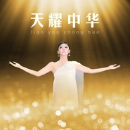

天耀中华
============================

|  |  |
| :--: | :-- |
| [ 天耀中华](https://emumo.xiami.com/album/1212843098) | **艺人**: [徐千雅](../index.md) **语种**: 国语 **唱片公司**: 百人文化 **发行时间**: 2014年09月26日 **专辑类别**: EP, 单曲 **专辑风格**:  **播放数**: 517353 **收藏数**: 72 **评论数**: 5  |

## 简介

## 曲目

## 评论

|  |  |  |  |
| :-- | :-- | :-- | :-- |
|  [虾米用户](https://emumo.xiami.com/u/422834862)  2020-01-31 19:55 赞(0) 踩(0) | 
好歌
 |
|  [虾米用户](https://emumo.xiami.com/u/244515697) 我还没想好要写什么... 2019-12-10 00:48 赞(1) 踩(0) | 
气势磅礴    [中国旗帜]
 |
|  [虾米用户](https://emumo.xiami.com/u/344025019) 出门一笑无拘碍，云在西湖... 2019-12-03 23:09 赞(0) 踩(0) | 
大气磅礴的主流价值观
 |
|  [虾米用户](https://emumo.xiami.com/u/3941600)  2017-10-27 23:54 赞(2) 踩(0) | 
作为何沐阳的御用歌手，徐千雅在姚贝娜春晚首演之后也演唱这首歌并不让人觉得意外，但是凭心而论，还是姚贝娜的版本唱得更好一点，高音区的声音爆发力以及音色与力度的协调性都更胜一筹
 |
|  [虾米用户](https://emumo.xiami.com/u/7322777) ∮ 2015-10-21 23:07 赞(0) 踩(0) | 
...A...
 |
