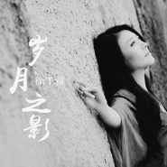

岁月之影
============================

|  |  |
| :--: | :-- |
| [ 岁月之影](https://emumo.xiami.com/album/2102743020) | **艺人**: [徐千雅](../index.md) **语种**: 国语 **唱片公司**: 唱高文化 **发行时间**: 2017年05月05日 **专辑类别**: EP, 单曲 **专辑风格**:  **播放数**: 68965 **收藏数**: 33 **评论数**: 2  |

## 简介

2017，如雪初晴  
徐千雅《岁月之影》带给你最真切的人生感悟  
  
《岁月之影》  
The shadow of the years  
  
Ouyang Xuechu  
十年典藏 珍品辑  
  
溶心主打《岁月之影》  
感恩之作《父亲》  
真情诉说《当篝火已经点燃》  
  
现代民歌教父何沐阳倾力打造  
徐千雅精品典藏之列的好唱片  
  
唱高文化 荣誉出品  
一张好的唱片，需要概念完整，音乐突出，歌词动人，旋律好听，制作精良，演绎出色……，这样的唱片在华语乐坛可以说是凤毛麟角，还好我们有了华语实力歌手徐千雅、现代民歌教父何沐阳鼎力加盟，岁月之影将带您聆听跨时代走心的情怀。  
徐千雅 华语乐坛顶尖实力唱将  
徐千雅，华语乐坛实力女歌手，拥有最具中国味道的磁性嗓音。高音时如决堤的潮水，极具张力和爆发力；低音时如传世美酒，醇厚饱满而层次丰富。其音乐风格包含了浓烈的中国元素与时尚大气的电音效果，融合现代国际化多元的音乐理念，演绎出多变的歌曲风格，尤以“现代民歌”和“中式电音”风格为著名。其演唱的作品更是被广为传唱，代表作《彩云之南》、《坐上火车去拉萨》更是红遍大江南北，成为传唱度最高的歌曲。并多次荣登央视春晚及重大晚会，近期代表作品《天耀中华》、《美丽中国》、《中国梦》、《丝绸之路》、《听我》、《燃烧爱》、《跟你一辈子》等。  
现代民歌教父何沐阳 引领华语乐坛现代民歌风向标  
何沐阳，中国著名作词、作曲家及音乐制作人，曾多次荣获华语乐坛音乐大奖，先后为北京奥运、上海世博等国家重大活动担当主题歌曲创作人，所创作的歌曲《美丽中国》、《天耀中华》连续两届压轴中央电视台春晚零点倒数敲钟前。其开创的“现代民歌”和“中式电音”的曲风被业界誉为新时代最具实力的音乐创作人，并成功打造制作出凤凰传奇、徐千雅等歌手和成名曲《月亮之上》《彩云之南》等，并为齐秦、韩磊、孙楠、沙宝亮、谭晶等制作出优秀的音乐作品，其影视音乐作品诸如《血色湘西》《仙女湖》等更是家喻户晓。惯以中国最根源的音乐理念融合国际现代多元的编配手法，被称之为 “现代民歌”教父和“中式电音”教父。  
欧阳雪初 缘聚岁月之影  
他的创作中有无为而为的一些诉说，但真诚坦直，他的词意中有一丝不羁、但包经风霜。无论是思想，无论是诗意及表达，无论是自戒自律的认识，无论是格局宏大的商业慧眼，他都会沧海云帆让自己多长一滴松脂，黏住一闪即逝的灵光，让它凝结成一块雕琢的琥珀。虽时而热烈，时而忧伤。但每一首歌都能流入内心，透着一种自然的灵性。让所有的一切因此放下，去真正聆听另一个灵魂的倾诉。  
  
1.《岁月之影》：受伤的大雁，孤单地飞远，洒在水面的不是他的影子，而是他的悲伤，枫叶飘落，大雁啊大雁你可飞到了南方？是否回到了雁群？ 有人鼓励说：“一定可以重铸辉煌，不为虚名，只是别浪费人生与天赋”。这话不能不听。试试吧，我还能做点事吗？孤云徘徊，天地含笑。已经坐在时代的后院，然心灵的微光，忽闪忽闪，是放弃，还是留意？是否能抓住其中之几，或再能有一次或几次惊人之举？  
2.《患难是一场浪漫的旅行》  
一段故事，难免有坎坷与挫折，当苦难来临，简单的一句“患难是一场浪漫的旅行”，如此洒脱，如此释怀,如此质朴的一句却将爱的真谛化简并迸发出无穷的力量，也许只是一次毫不经意的邂逅，也许只是一段患难里的相依相偎，但却让人为之落泪，足以震撼世俗的心灵。“患难与共，生死有你”！  
3. 《父亲》  
人生不能没有爱，爱是生命中的甘泉，即使是一勺清水，也能使生命之树常青；爱是生命中的色彩，因为有爱，我们的生命才会绚丽多彩。如果说母爱是一条温柔的河，那么另一种父爱，就是撼不动的山！  
4.《当篝火已经熄灭》：  
重拾的岁月，总是那样流连忘返，默剪的流年，依旧在沉风中低吟，回忆永远都是最珍贵的，也许会让我们想起那青春的惆怅，想起那既往的迷茫，但却保留了那一份纯真的花火，一柱让你细水长流的迷人。青春的篝火虽然已经熄灭，你可重燃起对生活的信念？  
5. 《欢喜的期盼》  
人生总是面临诸多选择，当我们走在人生的十字路口，心情能左右人生的全部，可以看到人心的悲喜交加，可以看到善美丑恶，不积跬步，无以致千里，不积小流，无以成江海。  
6. 《苏州游》  
“天下莫柔弱于水”，江南自古以来就被誉为“水乡”，所谓一方水土养一方人，所以苏州给人的直观印象便是“柔”。“清风明月本无价，近水远山皆有情。”道出了苏州的“情”“一迳抱幽山，居然城市间。”道出了苏州的“秀”。今夜独自漫步姑苏城，寒山寺钟声响起，城外又是否有客船在为我等待？  
7.《杭州寻踪》  
穿梭古巷，仿佛穿越千年时光，岁月如梭，时光流转，曾经的繁华如今只剩下一片浮华，前世你我许终生，今生何必再相逢，幽幽古刹中回荡着的是我的愁怨，你感受到的这浓浓的哀怨便是我等待千年的孤寂。  
8. 《虚构》  
一个地方对于一个人来说，意义之大小，不在于停留时间之长短，而在于这个人在这个地方过的是怎样的一种生活，让人感受到不是孤云徘徊的虚幻，而是天地含笑的豪气。

## 曲目

## 评论

|  |  |  |  |
| :-- | :-- | :-- | :-- |
|  [虾米用户](https://emumo.xiami.com/u/267210561) 健康快乐每一天 2017-05-09 20:51 赞(0) 踩(0) | 
好听！
 |
|  [虾米用户](https://emumo.xiami.com/u/4406065) （闷树） 2017-05-09 02:19 赞(0) 踩(0) | 
顶。
 |
