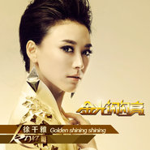

金光闪闪亮
============================

|  |  |
| :--: | :-- |
| [ 金光闪闪亮](https://emumo.xiami.com/album/670576275) | **艺人**: [徐千雅](../index.md) **语种**: 国语 **唱片公司**: 唱高文化 **发行时间**: 2013年06月06日 **专辑类别**: EP, 单曲 **专辑风格**:  **播放数**: 52642 **收藏数**: 17 **评论数**: 0  |

## 简介

徐千雅再度发声 新单曲歌《金光闪闪亮》首发  
  
著名歌手徐千雅演唱的《金光闪闪亮》作为央视三套黄金档重磅推出的节目《黄金100秒》主题歌，深受大家喜爱。徐千雅在演唱上也是更多融入了节目的主题思想，将其独具穿透力的嗓音与现代国际化的音乐编配手法相融合，大气而不失细腻的歌声完美的感染了每一位听者，让每一位选手在旋律的节奏中更想站在舞台上挑战自我。《金光闪闪亮》的词曲创作由著名音乐制作人何沐阳担当，在创作过程中，栏目的主题歌曲及节目过场音乐等也注入了现代时尚的元素，在器乐、声乐等的表现形式上大胆创新，颠覆了传统的乐队模式，加入了新鲜的电子音乐，融入国际化的编配手法。而值得一提的是，在创作中更是注入了多元的娱乐流行因素，乐感、节拍等都有很强烈的娱乐精神，更切合栏目的主题，配合朗朗上口的歌词，让听者听一遍后，便可记忆犹新。

## 曲目

## 评论

