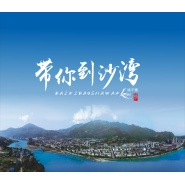

徐千雅
============================

|  |  |
| :--: | :-- |
| [ 徐千雅](https://i.xiami.com/kiya) | **播放数**: 35399378 **粉丝数**: 4371 **评论数**: 191 **地区**: China 中国大陆 **风格**: 国语流行 Mandarin Pop, 流行 Pop  |

## 档案

小档案 
姓名：徐千雅 
生日： 2月13日 
年龄：26 
身高：175CM 
体重：50KG 
出生地：黑龙江 
星座：水瓶座 
嗜好：听音乐，睡觉 
最喜欢的演员：林青霞，张曼玉 
最喜欢的颜色：绿色，蓝色 
最喜欢的运动：跑步，游泳 
最喜欢的演唱歌路：有个性，有张力的音乐 
最喜欢的一件事：旅游 
最喜欢的食物：水煮鱼，火锅 
最爱的音乐类型：只要好听的都能接受 
最大的愿望：做优质的音乐，成为中国流行乐坛最出色的歌手 
小简介 
歌手徐千雅的声音亮相还是很漂亮的，细腻中不失张力，在当下女歌手中算是很有特色，颇具有辨识度的。徐千雅作为一个唱功型歌手，在制作定位上如何突出她的声音特点及优势就显得尤为重要。 
网络上能够查到的徐千雅的资料并不多，但她也是在歌坛打磨了不少年头的。曾在北京各大酒吧驻场演唱，获得过2004深圳最佳女歌手和2005年度A8音乐全国原创歌曲大赛的最佳女歌手奖。个人感觉，就徐千雅的声线来说，她可选择的歌路应该是很广的，唱纯粹的流行歌可能不能将她的声音特点完全发挥出来。我想这也应该是为什么，她会选择这样一首难度比较高的多元风格作品来唱。 
再就歌曲本身来说，民族风的作品近年来有不少，但能真正将民族旋律和现代音乐元素融合很好的并不多。比较常见的是一些民歌翻唱作品，没什么新意。而《彩云之南》在“新民歌”上的探索是值得鼓励的。虽然歌曲在编配上还有不够精致的地方，电子、RAP等音乐元素的应用略显牵强，但无疑，创作者的大胆尝试是具有开创性意义的。这种意义不仅限于作品和歌手本身，而可以放大到整个流行歌坛。 
也许，当下最流行的不会是《彩云之南》风格的作品。也许，很多创作人热衷的是从旋律到歌词都能在一夜之间“老鼠爱大米”起来的作品。也许，《彩云之南》这样一首兼具诚意与水准的作品难逃叫好不卖钱的命运。但至少，这首纯净开阔的作品能带给听者片刻的宁静享受，超越了情爱聚散这样大流行主题的小感动。音乐于每个个体的意义其实也不过如此罢。 
《彩云之南》同样沿袭了“中国风”。在如火如荼的R&B，Hiphop 逐渐走下坡的时候，何沐阳独辟蹊径开创了一种新的音乐形式。可以看出，《彩云之南》仍然在新曲风的摸索路途中，但这已经表明中国音乐已经开始脱离套用模仿国外流行音乐模式的发展路线，逐渐开辟真正属于自己民族的流行音乐。著名乐评人崔恕将这两首歌的风格命名为“新民歌”，因为它能够将民歌与现代最流行的音乐元素融合在一起，形成独特的音乐形式，将云南的自然美景用音乐人声描述出来。与其说是“新民歌”，不如说是“Fashion Folk”——“时尚民乐”，因为它必然引领另一股音乐时尚潮流。 
在上届“A8音乐原创歌曲大赛”的数万首参赛歌曲中最终胜出的《彩云之南》，现在的试听下载率远远领先于其他原创歌曲位居榜首。此外，徐千雅的另外一首单曲《向往》也是网友点击的热门曲目。因此，近来有媒体将徐千雅与同样借网络走红的当红女歌手香香相比较，并送与徐千雅“数字新天后”的称号。 
对此，《彩云之南》的词曲作者，深圳资深音乐人何沐阳表达了不同的看法。由他创作的歌曲《月亮之上》曾被“超女”纪敏佳唱红，同时他也担当了徐千雅新专辑的制作人。何沐阳表示，A8原创歌曲大赛的确为有志进入歌坛的新人们提供了很好的平台和机会，但徐千雅的走红方式与传统的网络歌手其实并不完全相同。当初她将歌曲上传到A8音乐平台，入围决赛并获大奖纯属偶然。徐千雅完全具备专业歌手的实力，她的首张专辑的收歌和其他筹备工作已经进行了1年多的时间。 
千雅首张个人专辑在曲风上将十分多元，不仅有像《彩云之南》这样融合了民族风与多种时下流行音乐元素的“现代民歌”，还将包括摇滚、流行、R&B多样风格的作品，但将民族旋律与现代节奏编配相结合依然是徐千雅歌曲的主打路线。在新专辑中，徐千雅将继续发挥其颇具辨识度的清亮高音，并将呈现全新的造型，完成由“数字天后”向实力女唱将的实质性转变。 
⊙徐千雅——隐藏着的“天后”野心 
内地歌坛早就死气沉沉了，特别是在网络歌曲盛行，数字音乐空前繁荣的背景下，唱片公司都迫不及待地加紧制造人人能唱，人人去下载的口水歌，满足于短暂的暴利带来的低级快感。而且这一点在女歌手方面尤为突出。 
徐千雅，一个名不见经传的名字，对于整天听网络歌曲的人来说，也许有点陌生。如何去形容她呢？或许还要借助她的音乐历程：大学毕业后曾在北京各大酒吧驻唱；2004年荣获深圳“鹏城歌飞扬”最佳女歌手；2005年凭借一首《彩云之南》获“A8音乐原创中国颁奖典礼”年度金曲、年度最佳原创女歌手奖等4项大奖。这一系列的经历和荣誉也许已经说明她在音乐上不可小视的天赋和造诣。 
如何去形容她呢？想来想去，只有一条，那就是“才情”。经常有人问我：“为什么内地没有天后级女歌手出现？”内地真的没人具备那样的才华吗？明显不是，但由于商业机制过于机械化，过于贪图眼前利益，使得很多有才华的人被埋没。从这点来说，徐千雅是幸运的，从出生地黑龙江到北京，再到深圳，她所走过的音乐路程肯定将成为她日后发展的资本。 
徐千雅被媒体称为具备“天后”潜质的优质新人，此论断尚待验证。但单曲《彩云之南》中显露出的潜力已很明显。也许很多人在听到她声音的时候自然地想起韩红，不过这只是声线上的一点技巧而已。对于刚出道的新人来说，这是必须的噱头，也是必须适应媒体运作规律的无奈，即便你是唱功扎实的实力派。 
而对于写音乐文字的我们来说，关键是在于音乐，其次才是噱头。徐千雅从歌声里透出的张力与很高的可塑性是不容忽视的。在音域宽广，民族与现代交融的歌唱里，可以隐约看出一个独立的、与众不同的她。无论是像《彩云之南》这样民族风情的作品，还是其他或摇滚或流行的作品，听来都畅快开阔。在她身上看不到矫揉造作。 
和很多我身边的音乐人一样，我在等待，看现阶段在别人影子里“委屈成长”的徐千雅用自己的实力证明，她是一个真正具备天后潜质的歌手，在主流音乐市场里有一片广阔的天空等着她去翱翔。

## 专辑

| 名称 | 语种 | 唱片公司 | 发行时间 | 专辑类别 | 专辑风格 |
| :--: | :-- | :-- | :-- | :-- | :-- |
| [ 一到春天就想起你](./albums/2105239037.md) | 国语 | 塑星文化 | 2019年09月12日 | EP, 单曲 |  |
| [ 中国在这](./albums/2104686688.md) | 国语 | 唱高文化 | 2019年03月18日 | EP, 单曲 | 国语流行 Mandarin Pop |
| [ 在那香海的初见](./albums/2104065966.md) | 国语 | 东家文化 | 2018年09月30日 | EP, 单曲 | 国语流行 Mandarin Pop |
| [ 让我更懂你](./albums/2103691600.md) | 国语 | 唱高文化 | 2018年04月19日 | EP, 单曲 |  |
| [ 我爱海口](./albums/2103691602.md) | 国语 | 唱高文化 | 2018年04月19日 | EP, 单曲 |  |
| [ 万年吉祥](./albums/2103464674.md) | 国语 | 唱高文化 | 2017年12月28日 | EP, 单曲 |  |
| [ 愿平安归于你](./albums/2102978672.md) | 国语 | 唱高文化 | 2017年12月22日 | EP, 单曲 |  |
| [ 带你到沙湾](./albums/2102935944.md) | 国语 | 唱高文化 | 2017年11月16日 | EP, 单曲 |  |
| [ 相思沫若相见](./albums/2102914809.md) | 国语 | 唱高文化 | 2017年11月08日 | EP, 单曲 |  |
| [ 云上赤水](./albums/2102888861.md) | 国语 | 唱高文化 | 2017年10月30日 | EP, 单曲 | 国语流行 Mandarin Pop |
| [ 你犹在我心上](./albums/2102864720.md) | 国语 | 唱高文化 | 2017年09月27日 | EP, 单曲 |  |
| [ 永安香港](./albums/2102773446.md) | 国语 | 唱高文化 | 2017年06月28日 | EP, 单曲 | 国语流行 Mandarin Pop |
| [ 岁月之影](./albums/2102743020.md) | 国语 | 唱高文化 | 2017年05月05日 | EP, 单曲 |  |
| [ 乡音](./albums/2102714276.md) | 国语 | 崔式音乐 | 2017年03月17日 | EP, 单曲 |  |
| [ 我在古窑遇见你](./albums/2102711196.md) | 国语 | 唱高文化 | 2017年03月13日 | EP, 单曲 |  |
| [ 世界因你而美丽](./albums/2102690320.md) | 国语 | 唱高文化 | 2017年02月01日 | EP, 单曲 | 流行 Pop |
| [ 大吉大吉](./albums/2102677950.md) | 国语 | 塑星文化 | 2017年01月09日 | EP, 单曲 |  |
| [ 丝绸之路](./albums/2100267074.md) | 国语 | 唱高文化 | 2016年01月27日 | EP, 单曲 |  |
| [ 大美和田](./albums/2100374137.md) | 国语 | 星外星音乐 | 2016年01月01日 | EP, 单曲 |  |
| [ 你来得正是时候](./albums/2100224814.md) | 国语 | 唱高文化 | 2015年10月21日 | EP, 单曲 |  |
| [ 我和西藏有个约定](./albums/2100207310.md) | 国语 | 唱高文化 | 2015年09月24日 | EP, 单曲 |  |
| [ 我依然爱着你](./albums/2100194950.md) | 国语 | 博轩音乐 | 2015年09月09日 | EP, 单曲 | 国语流行 Mandarin Pop |
| [ 走咧走咧去宁夏](./albums/1826559022.md) | 国语 | 唱高文化 | 2015年03月16日 | EP, 单曲 |  |
| [ 记住乡愁](./albums/1921635487.md) | 国语 | 唱高文化 | 2015年01月15日 | EP, 单曲 |  |
| [ 天耀中华](./albums/1212843098.md) | 国语 | 百人文化 | 2014年09月26日 | EP, 单曲 |  |
| [ 鹊桥仙](./albums/1907229741.md) | 国语 | 唱高文化 | 2014年08月01日 | EP, 单曲 |  |
| [ 我爱你长沙](./albums/103688831.md) | 国语 | 唱高文化 | 2014年06月25日 | EP, 单曲 |  |
| [ 请你常到海南来](./albums/2001175630.md) | 国语 | 唱高文化 | 2014年05月23日 | EP, 单曲 |  |
| [ 回声嘹亮](./albums/899452725.md) | 国语 | 唱高文化 | 2014年05月06日 | EP, 单曲 |  |
| [ 中国梦](./albums/1398305112.md) | 国语 | 唱高文化 | 2014年04月23日 | EP, 单曲 |  |
| [ 天佑中华](./albums/1288975473.md) | 国语 | 唱高文化 | 2014年01月02日 | EP, 单曲 |  |
| [ 唱支红歌给你听](./albums/1321227430.md) | 国语 | 唱高文化 | 2014年01月01日 | 录音室专辑 |  |
| [ 天下有情人](./albums/176531908.md) | 国语 | 唱高文化 | 2013年08月13日 | EP, 单曲 |  |
| [ 我在景德镇等你](./albums/1875954633.md) | 国语 | 唱高文化 | 2013年08月07日 | EP, 单曲 | 国语流行 Mandarin Pop |
| [ 金光闪闪亮](./albums/670576275.md) | 国语 | 唱高文化 | 2013年06月06日 | EP, 单曲 |  |
| [ 美丽中国 (管弦版)](./albums/572857.md) | 国语 | 唱高文化 | 2013年01月18日 | EP, 单曲 |  |
| [ 人人都唱草原风](./albums/1071613085.md) | 国语 | 唱高文化 | 2012年12月13日 | 录音室专辑 |  |
| [ 听我](./albums/477022.md) | 国语 | 唱高文化 | 2011年10月17日 | 录音室专辑 |  |
| [ 中秋的月亮](./albums/464339.md) | 国语 | 唱高文化 | 2011年09月06日 | EP, 单曲 |  |
| [ 下一站是幸福](./albums/499467.md) | 国语 | 唱高文化 | 2010年12月16日 | 精选集 |  |
| [ 有难同当](./albums/464340.md) | 国语 | 唱高文化 | 2010年04月20日 | EP, 单曲 |  |
| [ 彩云之南](./albums/170989.md) | 国语 | 大音华典 | 2007年07月13日 | 录音室专辑 | 国语流行 Mandarin Pop |

## 评论

|  |  |  |  |
| :-- | :-- | :-- | :-- |
|  [虾米用户](https://emumo.xiami.com/u/443362668)  2020-12-22 09:46 赞(0) 踩(0) | 
我非常喜欢徐千雅，喜欢坐上火车去拉萨的演唱，音乐，声音使人惊喜。
 |
|  [虾米用户](https://emumo.xiami.com/u/422138658)  2020-08-23 20:22 赞(0) 踩(0) | 
徐千雅，用歌声传递美的文艺青年明星！
 |
|  [虾米用户](https://emumo.xiami.com/u/48999137)  2020-08-15 06:47 赞(0) 踩(0) | 
26岁
 |
|  [虾米用户](https://emumo.xiami.com/u/410681619)  2020-07-10 08:24 赞(0) 踩(0) | 
音域宽广，磅礴大气。
 |
|  [虾米用户](https://emumo.xiami.com/u/294176770)  2020-05-06 20:49 赞(0) 踩(0) | 
必须关注
 |
|  [虾米用户](https://emumo.xiami.com/u/330900828) 高舉一面五星紅旗在蝦米！ 2020-04-02 08:57 赞(0) 踩(0) | 
好歌聲
 |
|  [虾米用户](https://emumo.xiami.com/u/319688150) 愿经典不被遗忘 2019-11-14 14:43 赞(0) 踩(0) | 

 |
|  [虾米用户](https://emumo.xiami.com/u/215000882)  2019-11-05 10:08 赞(0) 踩(0) | 
柔情似水，为歌而生！
 |
|  [虾米用户](https://emumo.xiami.com/u/215000882)  2019-11-05 10:00 赞(0) 踩(0) | 
把阳刚与阴柔结合的最佳的女歌手，非千雅莫属！好听才是王道！
 |
|  [虾米用户](https://emumo.xiami.com/u/193235171) 饭能养身  歌能养心 2019-07-22 23:25 赞(0) 踩(0) | 
不错不错
 |
|  [虾米用户](https://emumo.xiami.com/u/358104299) 悲观的唯心存在现实解构虚... 2019-06-28 12:52 赞(0) 踩(0) | 
12476
 |
|  [虾米用户](https://emumo.xiami.com/u/335501695)  2019-05-13 07:43 赞(1) 踩(0) | 
90后也喜欢你的歌，特别适合旅行的时候听
 |
|  [虾米用户](https://emumo.xiami.com/u/418357060)  2019-04-10 21:19 赞(1) 踩(0) | 
很喜欢听你的歌，声音真心不错
 |
|  [虾米用户](https://emumo.xiami.com/u/361287195) 暖暖的幸福(^o^)o甜... 2019-01-06 21:41 赞(1) 踩(0) | 
（   ）
 |
|  [虾米用户](https://emumo.xiami.com/u/408191879)  2018-12-31 23:38 赞(2) 踩(0) | 
歌曲是我喜欢的风格，支持你。
 |
|  [虾米用户](https://emumo.xiami.com/u/282022014) 音樂………………：人類自... 2018-12-25 07:32 赞(1) 踩(0) | 
千雅之聲，沁沁入深……………………………………
 |
|  [虾米用户](https://emumo.xiami.com/u/352347021) 时间可以证明一切，️️清... 2018-12-05 17:20 赞(0) 踩(0) | 
好   
 |
|  [虾米用户](https://emumo.xiami.com/u/378194844)  2018-11-28 11:55 赞(0) 踩(0) | 
好听
 |
|  [虾米用户](https://emumo.xiami.com/u/278881542) 音乐能带给你各种体验 2018-11-20 15:04 赞(0) 踩(0) | 
御姐范～ 只是这个头像妆太浓 
 |
|  [虾米用户](https://emumo.xiami.com/u/408785807)  2018-11-17 16:05 赞(1) 踩(0) | 
那么好的歌手，应该支持，特别喜欢彩云之南，刚开始我还以为那么好听的歌是韩红唱的 
 |
|  [虾米用户](https://emumo.xiami.com/u/181227982)  2018-10-16 21:54 赞(0) 踩(0) | 
超级好听得一首歌！谢谢你的付出和关心！
 |
|  [虾米用户](https://emumo.xiami.com/u/296379410)  2018-09-15 04:33 赞(0) 踩(0) | 
徐大美女，我喜欢你！
 |
|  [虾米用户](https://emumo.xiami.com/u/403433694)  2018-09-04 04:17 赞(1) 踩(0) | 
一个80后的忠实粉丝，一直支持你！
 |
|  [虾米用户](https://emumo.xiami.com/u/307263445)  2018-08-24 19:09 赞(3) 踩(0) | 
你的歌声太好听了，婉转动听，细腻高亢！支持你！！！
 |
|  [虾米用户](https://emumo.xiami.com/u/378905737)  2018-08-01 13:09 赞(1) 踩(0) | 
不用谢    你唱的不错！
 |
|  [虾米用户](https://emumo.xiami.com/u/337983515)  2018-07-02 20:48 赞(1) 踩(0) | 
期待下一个景德镇 
 |
|  [虾米用户](https://emumo.xiami.com/u/293692544) 你敢给我说话吗？我咬你 2018-07-01 11:12 赞(3) 踩(0) | 
好听
 |
|  [虾米用户](https://emumo.xiami.com/u/350200276)  2018-06-25 17:09 赞(2) 踩(0) | 
声音好听，天籁
 |
|  [虾米用户](https://emumo.xiami.com/u/293692544) 你敢给我说话吗？我咬你 2018-06-20 05:10 赞(3) 踩(0) | 
好听
 |
|  [虾米用户](https://emumo.xiami.com/u/354259548)  2018-06-19 18:00 赞(2) 踩(0) | 
真正的天籁之音，值得收藏
 |
|  [虾米用户](https://emumo.xiami.com/u/277335893)  2018-06-18 15:41 赞(2) 踩(0) | 
唱功超级棒。能高有情感，看好你。加油
 |
|  [虾米用户](https://emumo.xiami.com/u/250603036) 你好我好全都好 2018-06-10 05:39 赞(3) 踩(0) | 
喜欢《万山之巅》，大气过瘾。
 |
|  [虾米用户](https://emumo.xiami.com/u/275388243)  2018-06-05 20:14 赞(3) 踩(0) | 
每去一个地方旅游都会留下一首歌，景点对你启发很，我在景德镇等你  
 |
|  [虾米用户](https://emumo.xiami.com/u/355031959)  2018-05-22 13:29 赞(2) 踩(0) | 
聴美声，好歌是一种享受，谢谢亲[玫瑰]
 |
|  [虾米用户](https://emumo.xiami.com/u/277034550) 等待，，， 2018-05-18 09:08 赞(2) 踩(0) | 
空灵女神！
 |
|  [虾米用户](https://emumo.xiami.com/u/344525087)  2018-05-15 14:20 赞(3) 踩(0) | 
老是听到那么优扬超酷的女神歌声不知道是谁。今天终于看到了。听着舒服。
 |
|  [虾米用户](https://emumo.xiami.com/u/344912577) 未知 2018-05-13 01:17 赞(2) 踩(0) | 
靚
 |
|  [虾米用户](https://emumo.xiami.com/u/343370026)  2018-04-18 22:54 赞(3) 踩(0) | 
和姚贝娜的歌一样，我下载了二十首歌，也只有陈百强姚贝娜那样首首是精品的歌手才能超越徐千雅
 |
|  [虾米用户](https://emumo.xiami.com/u/343370026)  2018-04-18 22:49 赞(1) 踩(0) | 
多种风格且几乎首首都是精品，声音辨识度高，唱功好，词曲好，相当于女刘欢啊，和姚贝娜相当的水准
 |
|  [虾米用户](https://emumo.xiami.com/u/293692544) 你敢给我说话吗？我咬你 2018-04-14 17:18 赞(2) 踩(0) | 
好听
 |
|  [虾米用户](https://emumo.xiami.com/u/31279350) 我还没想好要写什么... 2018-03-29 23:26 赞(2) 踩(0) | 
无忧无愁
 |
|  [虾米用户](https://emumo.xiami.com/u/324080362)  2018-03-08 08:23 赞(2) 踩(0) | 
歌美，才配美人唱
 |
|  [虾米用户](https://emumo.xiami.com/u/349863127)  2018-02-18 18:16 赞(2) 踩(0) | 
歌很美，听着心里很舒服
 |
|  [虾米用户](https://emumo.xiami.com/u/296736194)  2018-02-08 22:55 赞(2) 踩(0) | 
因为好听，所以收藏了；不用谢！
 |
|  [虾米用户](https://emumo.xiami.com/u/54365513) 找一个温馨的HOME,从... 2018-01-23 20:53 赞(2) 踩(0) | 
回忆是美好的，憧憬是美好的，只有现在是残酷的（striving）
 |
|  [虾米用户](https://emumo.xiami.com/u/342628536) 为什么打工。 2018-01-04 19:49 赞(2) 踩(0) | 
音律之归宿 
 |
|  [虾米用户](https://emumo.xiami.com/u/144620702)  2017-12-22 14:56 赞(2) 踩(0) | 
  
 |
|  [虾米用户](https://emumo.xiami.com/u/37764400)  2017-12-21 08:25 赞(2) 踩(0) | 
彩云之南无法超越吧
 |
|  [虾米用户](https://emumo.xiami.com/u/5455002)  2017-12-18 23:50 赞(2) 踩(0) | 
美女，而且是性感高挑的美女谁不喜欢啊，哈哈
 |
|  [虾米用户](https://emumo.xiami.com/u/286384520)  2017-12-04 16:08 赞(2) 踩(0) | 
喜欢你唱的记住乡愁听了好多遍
 |
|  [虾米用户](https://emumo.xiami.com/u/271169707) 找个爱人的啊 2017-11-12 19:38 赞(2) 踩(0) | 
好听
 |
|  [虾米用户](https://emumo.xiami.com/u/334318452) 林哥 2017-11-11 00:53 赞(2) 踩(0) | 
好听
 |
|  [虾米用户](https://emumo.xiami.com/u/261307185)   2017-11-04 15:01 赞(2) 踩(0) | 
去了云南才想起来这歌
 |
|  [虾米用户](https://emumo.xiami.com/u/332626800)  2017-11-03 06:14 赞(3) 踩(0) | 
什么时候能火啊 希望你能火起来 啥时候能找个人给你写个歌唱唱啊 这些都什么破歌 浪费啊。
 |
|  [虾米用户](https://emumo.xiami.com/u/235789548) 別站在你的角度看我，我怕... 2017-10-28 00:34 赞(1) 踩(0) | 
只愛“春風沉醉的晚上”，其他的無感。
 |
|  [虾米用户](https://emumo.xiami.com/u/34490284)  2017-10-13 15:41 赞(2) 踩(0) | 
这声音唱民歌可惜了 定位没定好
 |
|  [虾米用户](https://emumo.xiami.com/u/316156955)  2017-08-28 08:43 赞(1) 踩(0) | 
         
 |
|  [虾米用户](https://emumo.xiami.com/u/268898591) 我爱你。永远都爱，一直都... 2017-07-24 23:09 赞(2) 踩(0) | 
希望徐妹妹多出精品！旋律优美+歌词通顺有意境+吐字清晰的歌最好！贵在精而不在多。千万不要学垃圾的含混不清的吐字方式。时刻期待！
 |
|  [虾米用户](https://emumo.xiami.com/u/287070662)  2017-07-03 06:55 赞(2) 踩(0) | 
好嗓音！有自己的风格！我是哈尔滨的，为你的歌声点赞！加油！
 |
|  [虾米用户](https://emumo.xiami.com/u/308675004)  2017-07-01 12:02 赞(2) 踩(0) | 
和许巍和作一首歌，由何沐阳打造。期待。
 |
|  [虾米用户](https://emumo.xiami.com/u/289499070)  2017-06-28 22:43 赞(1) 踩(0) | 
我爱徐千雅～更爱徐千雅的歌！我心中的女神！     
 |
|  [虾米用户](https://emumo.xiami.com/u/8320697)  2017-06-15 09:35 赞(2) 踩(0) | 
人美歌美  
 |
|  [虾米用户](https://emumo.xiami.com/u/48153932)  2017-06-07 11:25 赞(1) 踩(0) | 
是好好唱歌的，听得都舒服
 |
|  [虾米用户](https://emumo.xiami.com/u/4202236)  2017-06-04 00:35 赞(1) 踩(0) | 
您的这首歌我百听不厌，谢谢您，谢谢您优美的嗓音和饱满的感情为我们带来了美的享受。
 |
|  [虾米用户](https://emumo.xiami.com/u/74639208) Music is per... 2017-05-30 06:22 赞(1) 踩(0) | 
真正的中国好声音！
 |
|  [虾米用户](https://emumo.xiami.com/u/196111834)  2017-05-28 18:04 赞(1) 踩(0) | 
还可以
 |
|  [虾米用户](https://emumo.xiami.com/u/284603890)  2017-05-22 11:34 赞(2) 踩(0) | 
下雨时，我是唯一有雨伞仍淋湿的人么。
 |
|  [虾米用户](https://emumo.xiami.com/u/296152272)  2017-05-14 00:49 赞(1) 踩(0) | 
好听真的不错  
 |
|  [虾米用户](https://emumo.xiami.com/u/199109040)  2017-04-08 17:49 赞(1) 踩(0) | 

 |
|  [虾米用户](https://emumo.xiami.com/u/684102) 我还没想好要写什么... 2017-04-04 10:28 赞(2) 踩(0) | 
一直以为她是云南人
 |
|  [虾米用户](https://emumo.xiami.com/u/236536166) 我还没想好要写什么... 2017-02-13 21:56 赞(2) 踩(0) | 
喜欢我在景德镇等你，太好听了 
 |
|  [虾米用户](https://emumo.xiami.com/u/236536166) 我还没想好要写什么... 2017-02-13 21:54 赞(1) 踩(0) | 
人美,歌更美  
 |
|  [虾米用户](https://emumo.xiami.com/u/256570793)  2017-02-02 19:02 赞(1) 踩(0) | 
好歌手有天赋就不能辜负了上天灵气所造！不能在世上干坏事！做艺术！
 |
|  [虾米用户](https://emumo.xiami.com/u/256570793)  2017-02-02 18:59 赞(0) 踩(0) | 
好歌手！
 |
|  [虾米用户](https://emumo.xiami.com/u/259463311)  2017-01-09 16:43 赞(129) 踩(0) | 
我刚入驻了虾米音乐人，欢迎大家来我的个人主页，收听我的最新音乐
 |
| ⇒ |  [虾米用户](https://emumo.xiami.com/u/309445790)  2017-07-07 12:18 赞(0) 踩(0) | 
i
 |
| ⇒ |  [虾米用户](https://emumo.xiami.com/u/199447965)  2017-08-27 00:28 赞(0) 踩(0) | 
啊啊啊。。。
 |
| ⇒ |  [虾米用户](https://emumo.xiami.com/u/321948704)  2017-10-08 09:48 赞(0) 踩(0) | 
很喜欢你的歌 
 |
| ⇒ |  [虾米用户](https://emumo.xiami.com/u/283944839)  2017-10-25 01:00 赞(0) 踩(0) | 
我很喜欢你的歌
 |
| ⇒ |  [虾米用户](https://emumo.xiami.com/u/335775706) 剑波 2017-11-26 22:36 赞(0) 踩(0) | 
好听前光明ok
 |
| ⇒ |  [虾米用户](https://emumo.xiami.com/u/340168184) 我就是真武大帝使者 2017-12-17 09:14 赞(0) 踩(0) | 
千雅的歌曲就是好听就像天籁让人陶醉其中    
 |
| ⇒ |  [虾米用户](https://emumo.xiami.com/u/267945449)  2018-02-04 11:36 赞(0) 踩(0) | 
加油
 |
| ⇒ |  [虾米用户](https://emumo.xiami.com/u/325258837) 这家伙很聪明什么也没留下... 2018-03-11 23:27 赞(0) 踩(0) | 
我是你忠实的粉丝，从《天耀中华》开始就迷上了你的歌声，你的声音太美了 
 |
| ⇒ |  [虾米用户](https://emumo.xiami.com/u/332049061)  2018-05-24 23:16 赞(0) 踩(0) | 
你豪哥想你来
 |
| ⇒ |  [虾米用户](https://emumo.xiami.com/u/367252243) 开心 2018-06-05 23:04 赞(0) 踩(0) | 
好听
 |
| ⇒ |  [虾米用户](https://emumo.xiami.com/u/305073431) 自由 2018-06-29 23:37 赞(0) 踩(0) | 
女神
 |
| ⇒ |  [虾米用户](https://emumo.xiami.com/u/400430782) 当我沉默时我觉得充实，我... 2018-08-10 12:47 赞(0) 踩(0) | 
我也是一个70后，你的下一站是幸福在去四川的路上陪我一路前行，这首歌就像是我个人的解刨，用你真挚感厚重的音色唱出我的内心，谢谢你的歌声，让我在独自前行的路上陪我走过那不堪回首的灰色地带，祝福你的下一站更加幸福，你的聆听者
 |
| ⇒ |  [虾米用户](https://emumo.xiami.com/u/22892342)  2019-04-24 23:03 赞(0) 踩(0) | 
喜欢你的那种没有小情小爱的大气磅礴！澄净若仙！
 |
| ⇒ |  [虾米用户](https://emumo.xiami.com/u/420838665)  2019-08-31 11:16 赞(0) 踩(0) | 
云南旅游形象大使 
 |
|  [虾米用户](https://emumo.xiami.com/u/1528429)   2016-12-04 23:45 赞(1) 踩(0) | 
城市名片
 |
|  [虾米用户](https://emumo.xiami.com/u/250255663)  2016-11-28 00:04 赞(2) 踩(0) | 
声音太美妙了，百听不厌
 |
|  [虾米用户](https://emumo.xiami.com/u/214936674)  2016-11-04 20:20 赞(0) 踩(0) | 
我第一次听彩云之南是在宋城，那时候是夏天，赶上傣族泼水节，特别好，特别有有意境，还有节目里那个从假山上飞来的孔雀公主，超漂亮。
 |
|  [虾米用户](https://emumo.xiami.com/u/239290901) 站在世界的中心 2016-11-04 01:16 赞(2) 踩(0) | 
她唱歌有一种大气的美感~加油！希望你红！
 |
|  [虾米用户](https://emumo.xiami.com/u/12259586) 落霞与孤鹜齐飞 2016-09-12 23:11 赞(2) 踩(0) | 
喜欢不需要理由~~~~~~
 |
|  [虾米用户](https://emumo.xiami.com/u/12259586) 落霞与孤鹜齐飞 2016-09-12 23:11 赞(1) 踩(0) | 
喜欢不需要理由~~~~~~
 |
|  [虾米用户](https://emumo.xiami.com/u/219948579)  2016-08-29 07:42 赞(1) 踩(0) | 
歌声美，人也美
 |
|  [虾米用户](https://emumo.xiami.com/u/126937994)  2016-07-25 16:10 赞(1) 踩(0) | 
好听
 |
|  [虾米用户](https://emumo.xiami.com/u/52127742) 呼。啦啦啦，啦啦啦， 2016-06-21 19:43 赞(0) 踩(0) | 

 |
|  [虾米用户](https://emumo.xiami.com/u/132376016)  2016-04-28 07:34 赞(1) 踩(0) | 
老乡支持你
 |
|  [虾米用户](https://emumo.xiami.com/u/132799066) 幸福的人在哪儿都会幸福，... 2016-04-03 16:58 赞(0) 踩(0) | 
彩云之南    ，，，，，， 
 |
|  [虾米用户](https://emumo.xiami.com/u/71467448) 无聊的人 2016-03-24 21:57 赞(0) 踩(0) | 
任务
 |
|  [虾米用户](https://emumo.xiami.com/u/30760561)   2016-03-17 00:56 赞(0) 踩(0) | 
埋没了，可以！
 |
|  [虾米用户](https://emumo.xiami.com/u/19491826)  2016-03-08 20:51 赞(0) 踩(0) | 
pretty voice
 |
|  [虾米用户](https://emumo.xiami.com/u/63014436)  2015-12-20 13:42 赞(0) 踩(0) | 
啊我一听就觉得那里很美
 |
|  [虾米用户](https://emumo.xiami.com/u/53704464)  2015-10-30 14:03 赞(0) 踩(0) | 
好听
 |
|  [虾米用户](https://emumo.xiami.com/u/32297083) 一个独立品味的音乐爱好者... 2015-10-17 22:28 赞(4) 踩(0) | 
毁在了旅游景区代言的路上
 |
|  [虾米用户](https://emumo.xiami.com/u/6828543) 暂无签名~ 2015-09-10 00:24 赞(0) 踩(0) | 
声音天籁，最喜欢《仙女湖》。
 |
|  [虾米用户](https://emumo.xiami.com/u/2307526) 连接比特与像素的造梦师！ 2015-07-27 15:54 赞(1) 踩(0) | 
彩云之南！
 |
|  [虾米用户](https://emumo.xiami.com/u/2307526) 连接比特与像素的造梦师！ 2015-07-27 15:54 赞(1) 踩(0) | 
彩云之南！
 |
|  [虾米用户](https://emumo.xiami.com/u/52027950)  2015-07-03 17:48 赞(1) 踩(0) | 
很好… 
 |
|  [虾米用户](https://emumo.xiami.com/u/47969323) 音乐是我的生命线~~~ 2015-03-12 22:08 赞(0) 踩(0) | 
很好听···
 |
|  [虾米用户](https://emumo.xiami.com/u/3566813) 菩萨，祝您身体健康！34... 2015-02-23 14:11 赞(2) 踩(0) | 
听彩云之南觉得好，特意跑来，结果一看您这专辑，敢情拍大片呢。
 |
|  [虾米用户](https://emumo.xiami.com/u/46982806)  2015-02-05 22:42 赞(1) 踩(0) | 
千雅谢谢你把江西小镇唱响全世界
 |
|  [虾米用户](https://emumo.xiami.com/u/13088981)  2015-01-23 15:31 赞(0) 踩(0) | 
好嗓子
 |
|  [虾米用户](https://emumo.xiami.com/u/13552)  2014-09-17 08:03 赞(0) 踩(0) | 
彩云之南
 |
|  [虾米用户](https://emumo.xiami.com/u/355459)  2014-08-25 17:15 赞(0) 踩(0) | 
能唱出中国风的一位现代歌手，很多人说“本地的就是世界的”，她就是一个代表。
 |
|  [虾米用户](https://emumo.xiami.com/u/39696911) 暂无签名~ 2014-08-11 08:15 赞(0) 踩(0) | 
有态度有诚意的歌手~
 |
|  [虾米用户](https://emumo.xiami.com/u/9046567)  2014-05-18 21:47 赞(0) 踩(0) | 
声音太美
 |
|  [虾米用户](https://emumo.xiami.com/u/12776042) 这是一处温暖的港湾 2014-01-03 14:03 赞(0) 踩(0) | 
美丽 有魅力
 |
|  [虾米用户](https://emumo.xiami.com/u/3158602) 我用灵魂在听声 2013-10-05 21:05 赞(0) 踩(0) | 
民族旋律和现代音乐元素融合
 |
|  [虾米用户](https://emumo.xiami.com/u/11473240)  2013-09-23 13:42 赞(1) 踩(0) | 
舒服
 |
|  [虾米用户](https://emumo.xiami.com/u/12832061) 行善沒有條件 2013-08-28 15:46 赞(0) 踩(0) | 
聲音非常好！
 |
|  [虾米用户](https://emumo.xiami.com/u/1486330)  2013-07-20 14:21 赞(0) 踩(0) | 
才发现她的曲风和凤凰传奇有极大相似，不过多了更多流行的成分；又和温岚的曲风有些相似，节奏布鲁斯。
 |
|  [虾米用户](https://emumo.xiami.com/u/3624386)  2013-07-07 01:23 赞(1) 踩(0) | 
埋没的实力派
 |
|  [虾米用户](https://emumo.xiami.com/u/13407178) 摇滚是悬崖，我用思想攀爬 2013-06-27 13:20 赞(0) 踩(0) | 
因彩云之南而认识她
 |
|  [虾米用户](https://emumo.xiami.com/u/3413598) Crazy for U 2013-06-03 23:55 赞(18) 踩(0) | 
呵呵，彩云之南，把我感动哭了…………悠扬旷远……一望起伏山岚，美不胜收。
 |
|  [虾米用户](https://emumo.xiami.com/u/7982477) 属于你我的极品音乐 2013-05-28 09:10 赞(0) 踩(0) | 
收藏了
 |
|  [虾米用户](https://emumo.xiami.com/u/13793468)  2013-05-22 22:40 赞(0) 踩(0) | 
没办法，天工不作美，徐千雅的声线是很好，但后面没有一个稳定有实力的团队为她创作更多好的作品，也没有稳定的经纪公司为她包装，宣传，提供平台给她发展。再好的人才也只有被浪费。娱乐圈就是这样，没人捧你，你再有才但还火不起来。所以娱乐圈有很重口味的潜规则就是这样来的。
 |
| ⇒ |  [虾米用户](https://emumo.xiami.com/u/2446953)  2013-11-10 21:59 赞(0) 踩(0) | 
只能说大陆的娱乐圈太落后。放在台湾，水平比她低一个档次的歌手也早红了。
 |
|  [虾米用户](https://emumo.xiami.com/u/15238630)  2013-05-21 13:51 赞(0) 踩(0) | 
第一次听她的歌！声音不错！需要包装！
 |
|  [虾米用户](https://emumo.xiami.com/u/5752010)  2013-05-13 21:12 赞(0) 踩(0) | 
明显彩云之南应该悠扬版好听啊，为嘛被顶上去的是这个版本
 |
|  [虾米用户](https://emumo.xiami.com/u/944014) 树洞 2013-05-01 20:27 赞(0) 踩(0) | 
歌词喜欢，‘上天是让我们相爱的，不是厮守一生的’简单明了。
 |
|  [虾米用户](https://emumo.xiami.com/u/547688)  2013-04-08 10:56 赞(0) 踩(0) | 
中国现代民歌天后
 |
|  [虾米用户](https://emumo.xiami.com/u/7302542)  2013-02-27 07:07 赞(0) 踩(0) | 
怎么不火呢
 |
|  [虾米用户](https://emumo.xiami.com/u/632797) 我还没想好要写什么... 2013-02-19 10:06 赞(0) 踩(0) | 
清亮高亢，婉转悠扬。
 |
|  [虾米用户](https://emumo.xiami.com/u/12884398)  2013-02-11 19:38 赞(0) 踩(0) | 
很喜欢她的《彩云之南》
 |
|  [虾米用户](https://emumo.xiami.com/u/220719) 自知不自見，自愛不自貴 2013-01-24 16:46 赞(26) 踩(0) | 
自從第一張專輯以後，她的製作人的腦子就被驢子給踢了！
 |
|  [虾米用户](https://emumo.xiami.com/u/6652575) mbz2006 2013-01-17 00:01 赞(0) 踩(0) | 
ok
 |
|  [虾米用户](https://emumo.xiami.com/u/437721)  2012-12-27 23:45 赞(34) 踩(0) | 
好苗子被大量的口水歌给浪费了，以至于一直很难红起来。 想想第一次听深圳电视台《汽车先锋》主题曲《启程》时的惊艳，那是一首非常洋气的歌曲，找了很久找到徐千雅这个名字，之后一直很关注可是听起来却大多是粗制滥造的歌曲，真的是浪费他了！
 |
| ⇒ |  [虾米用户](https://emumo.xiami.com/u/523940)  2013-08-27 04:32 赞(0) 踩(0) | 
恕小弟才疏学浅，斗胆请教一下前辈，大家口口声声说的口水歌到底是什么意思？怎么来定义？感谢大家不吝赐教。
 |
| ⇒ |  [虾米用户](https://emumo.xiami.com/u/285051742)  2017-04-01 14:34 赞(0) 踩(0) | 
68 /1  - 166:/7。。vm..74a.(&amp;rsaquo;&amp;acute;&amp;omega;`&amp;lsaquo; )9m.9m9bm8u99mb69....xo9-2k.7 79
 |
| ⇒ |  [虾米用户](https://emumo.xiami.com/u/41056811)  2017-06-04 13:38 赞(0) 踩(0) | 
她把自己跟一个词曲作者（何沐阳）捆在一起，必定会风格单一，满满的就退出主流了
 |
|  [虾米用户](https://emumo.xiami.com/u/2589737)  2012-12-24 20:55 赞(0) 踩(0) | 
喜欢她
 |
|  [虾米用户](https://emumo.xiami.com/u/3324772) Think again 2012-12-09 19:47 赞(0) 踩(0) | 
彩云之南不错
 |
|  [虾米用户](https://emumo.xiami.com/u/902969)  2012-10-25 23:35 赞(0) 踩(0) | 
第一张碟就很喜欢听
 |
|  [虾米用户](https://emumo.xiami.com/u/10395241)  2012-10-21 09:28 赞(0) 踩(0) | 
下一站是幸福 好听
 |
|  [虾米用户](https://emumo.xiami.com/u/8093051)  2012-09-10 18:04 赞(0) 踩(0) | 
音乐好听
 |
|  [虾米用户](https://emumo.xiami.com/u/10408746)  2012-08-30 17:19 赞(0) 踩(0) | 
有温柔有激情，能清澈能狂野，，，喜欢喜欢
 |
|  [虾米用户](https://emumo.xiami.com/u/10377836) 我的签名太长了这里搁不下 2012-08-26 19:14 赞(0) 踩(0) | 
她爽快，所以我喜欢她。
 |
|  [虾米用户](https://emumo.xiami.com/u/5011296)  2012-08-08 20:28 赞(0) 踩(0) | 
现代民谣
 |
|  [虾米用户](https://emumo.xiami.com/u/7403434)  2012-07-09 14:11 赞(0) 踩(0) | 
hao
 |
|  [虾米用户](https://emumo.xiami.com/u/9670306)  2012-07-03 17:02 赞(0) 踩(0) | 
很喜欢她清爽的嗓音。
 |
|  [虾米用户](https://emumo.xiami.com/u/2691052) 且看那青山綠水別來無恙。 2012-06-12 05:50 赞(0) 踩(0) | 
彩云之南
 |
|  [虾米用户](https://emumo.xiami.com/u/9272311)  2012-06-03 09:27 赞(0) 踩(0) | 
很好聽
 |
|  [虾米用户](https://emumo.xiami.com/u/6372962)  2012-05-26 12:08 赞(0) 踩(0) | 
带上音乐去旅行挺好听的，但是好像和 Jey &amp;amp; 朴真英 的哀愿曲调雷同，不知大家发现没有。
 |
|  [虾米用户](https://emumo.xiami.com/u/7909558)  2012-04-03 09:14 赞(0) 踩(0) | 
love!
 |
|  [虾米用户](https://emumo.xiami.com/u/2725353)  2012-03-23 23:45 赞(0) 踩(0) | 
嗓音好唱得更好。
 |
|  [虾米用户](https://emumo.xiami.com/u/5722877)   2012-02-28 18:08 赞(0) 踩(0) | 
。
 |
|  [虾米用户](https://emumo.xiami.com/u/5649316)  2012-02-27 16:11 赞(0) 踩(0) | 
两次被感动
 |
|  [虾米用户](https://emumo.xiami.com/u/8079928)  2012-02-18 22:11 赞(0) 踩(0) | 
唱得太好了
 |
|  [虾米用户](https://emumo.xiami.com/u/5455002)  2012-02-15 09:55 赞(0) 踩(0) | 
喜欢噻
 |
|  [虾米用户](https://emumo.xiami.com/u/5455002)  2012-02-15 09:32 赞(0) 踩(0) | 
美女谁不喜欢
 |
|  [虾米用户](https://emumo.xiami.com/u/4181245)  2012-01-14 13:06 赞(0) 踩(0) | 
新奇
 |
|  [虾米用户](https://emumo.xiami.com/u/2446644)  2012-01-04 01:10 赞(0) 踩(0) | 
声音干净好听
 |
|  [虾米用户](https://emumo.xiami.com/u/7127777)  2011-12-23 14:56 赞(0) 踩(0) | 
天籁之音！
 |
|  [虾米用户](https://emumo.xiami.com/u/3324851)  2011-12-13 15:51 赞(0) 踩(0) | 
如决堤潮水般的高音让我着迷了
 |
|  [虾米用户](https://emumo.xiami.com/u/7087839)  2011-12-04 00:15 赞(0) 踩(0) | 
天籁之音
 |
|  [虾米用户](https://emumo.xiami.com/u/7031941)  2011-11-30 20:23 赞(0) 踩(0) | 
喜欢
 |
|  [虾米用户](https://emumo.xiami.com/u/3828310)  2011-11-18 12:56 赞(0) 踩(0) | 
为什么没有下一站是幸福这首？
 |
|  [虾米用户](https://emumo.xiami.com/u/5720602)  2011-10-09 23:50 赞(0) 踩(0) | 
好嗓子
 |
|  [虾米用户](https://emumo.xiami.com/u/2530278) 喜乐者 2011-09-23 14:06 赞(0) 踩(0) | 
很不錯的妹子聲.
 |
|  [虾米用户](https://emumo.xiami.com/u/5814533)  2011-09-20 12:45 赞(0) 踩(0) | 
有个性，嗓音好，音乐有激情有感染力。
 |
|  [虾米用户](https://emumo.xiami.com/u/5814533)  2011-09-20 12:41 赞(0) 踩(0) | 
嗓音好，歌好，人好，不喜欢她是你们不好！
 |
|  [虾米用户](https://emumo.xiami.com/u/3311384)  2011-09-19 11:01 赞(0) 踩(0) | 
漂亮 老乡
 |
|  [虾米用户](https://emumo.xiami.com/u/5687733)  2011-09-04 10:00 赞(0) 踩(0) | 
她的歌很好听，为什么知道的人很少？为什么没有火起来？真是不公平！
 |
|  [虾米用户](https://emumo.xiami.com/u/5687733)  2011-09-04 09:52 赞(0) 踩(0) | 
徐千雅的歌都很好听，为什么没有火起来呢？
 |
|  [虾米用户](https://emumo.xiami.com/u/1159159)  2011-08-29 16:57 赞(0) 踩(0) | 
音色很悦耳
 |
|  [虾米用户](https://emumo.xiami.com/u/5427808)  2011-08-15 10:30 赞(0) 踩(0) | 
喜欢她的声音，唱功好。
 |
|  [虾米用户](https://emumo.xiami.com/u/1148416)  2011-08-10 20:59 赞(0) 踩(0) | 
山楂树之恋很好听，我的南海也很好听~
 |
|  [虾米用户](https://emumo.xiami.com/u/3667913)  2011-08-10 13:41 赞(0) 踩(0) | 
很喜欢她的歌。
 |
|  [虾米用户](https://emumo.xiami.com/u/3667913)  2011-08-10 13:41 赞(0) 踩(0) | 
感觉声音很悠扬，没有技巧的做作
 |
|  [虾米用户](https://emumo.xiami.com/u/4719989)  2011-07-11 02:50 赞(0) 踩(0) | 
美丽
 |
|  [虾米用户](https://emumo.xiami.com/u/4378063)  2011-06-30 11:16 赞(0) 踩(0) | 
喜欢她的声音。
 |
|  [虾米用户](https://emumo.xiami.com/u/3766061)  2011-06-27 09:40 赞(0) 踩(0) | 
先收藏，回头试听。
 |
|  [虾米用户](https://emumo.xiami.com/u/3190218)  2011-03-13 14:31 赞(0) 踩(0) | 
不一样
 |
|  [虾米用户](https://emumo.xiami.com/u/819381)  2011-02-10 13:52 赞(0) 踩(0) | 
喜欢她的音色
 |
|  [虾米用户](https://emumo.xiami.com/u/1642215)  2010-10-11 09:15 赞(0) 踩(0) | 
怎么没有山楂树之恋
 |
| ⇒ |  [虾米用户](https://emumo.xiami.com/u/3147186)  2011-03-15 19:26 赞(0) 踩(0) | 
我也在找 你找到了吗
 |
|  [虾米用户](https://emumo.xiami.com/u/604599)  2010-05-07 07:54 赞(0) 踩(0) | 
如果你也是个狂恋流浪的瓶子 你会喜欢她……%
 |
|  [虾米用户](https://emumo.xiami.com/u/79438)  2010-03-10 10:30 赞(0) 踩(0) | 
这么好的制作，却不火。或许是缺少包装和专业策划、宣传~就出了一张专辑呢？徐千雅春晚惊艳登台 大把捞金超越《传奇》，确实春晚凤凰的歌忒俗了~囧~无意境、仅穷乐。
 |
|  [虾米用户](https://emumo.xiami.com/u/273681)  2009-10-06 14:17 赞(0) 踩(0) | 
她的歌，作词也许有点俗，有点大白话但曲调很好听，很高亢。有民族风，也有都市情感。或者兼而有之，完美的搭配。嗓音也异常好听。没有大俗，只有大雅！这么好的制作，却不火。人各有命。。。
 |
