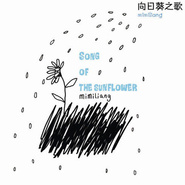

汤旭
============================

|  |  |
| :--: | :-- |
| [ 汤旭](https://i.xiami.com/mimiliang) | **播放数**: 106460917 **粉丝数**: 20964 **评论数**: 683 **地区**: China 中国大陆 **风格**: 城市民谣 Urban Folk, 国语流行 Mandarin Pop  |

## 档案

她的《向日葵之歌》，温暖如诗。 
她的《岛歌》，让所有的心都静下来。 
她的《妈，谢谢你》，唱哭youtube，有人更留言告诫“纸巾要带足三包”！ 
这就是汤旭，温暖系内地创作女声，不论签约还是独立，清新、优雅、美好的风格却一直没有改变，在富有灵性的音乐创作中，让我们看见她那双正向着无垠世界探索的眼睛，和那只抚在胸口上感觉着心跳的手。 
一听到汤旭的音乐，在忙碌嘈杂的午后，你突然觉得安静。生活也许并不容易改变，但，我们可以轻易选择陪伴我们生活的音乐。老天爷给每个生命不同的任务，当然也会赋予每个声音不同的功能。这个年轻新女声，她却用过人的创作才华，和动人的清亮嗓音，传递了上天最丰富、最贴心的讯息，那就是：人都需要“返璞归真”，和刚刚好的幸福。 
她的声音让喧闹繁杂的人心都安静下来了，连衬乐也褪去了花俏装饰。因为，大家都想认真地听听这个和自己内心最共鸣的声音，以及它所带来的平静与感动。 
中文名：汤旭 
生日：1987/7/28 
英文名：mimiliang 
出生：浙江湖州 
曾就读：湖州中学 
现居：北京 
星座：狮子座 
擅长的乐器：吉他 
最喜爱的导演：李安 
最喜爱的歌手： cat power 
最喜爱的艺术家： 梵高、草间弥生 
最喜爱的作家：村上春树 
最喜爱的颜色：孔雀蓝，香槟色 
最喜爱的城市：大理，瓦拉纳西 
最喜爱的运动：行走

## 专辑

| 名称 | 语种 | 唱片公司 | 发行时间 | 专辑类别 | 专辑风格 |
| :--: | :-- | :-- | :-- | :-- | :-- |
| [ 云速爱](./albums/495310.md) | 国语 | 独立发行 | 2012年03月01日 | 录音室专辑 |  |
| [ 每月爱我多一点娇爽疗伤系歌曲](./albums/436863.md) | 国语 | 独立发行 | 2011年04月19日 | EP, 单曲 | 城市民谣 Urban Folk |
| [ mi的私房歌 ](./albums/422684.md) | 国语 | 独立发行 | 2011年01月28日 | EP, 单曲 | 城市民谣 Urban Folk |
| [ 岛歌](./albums/343846.md) | 国语 | 金牌大风 | 2009年08月25日 | 录音室专辑 | 城市民谣 Urban Folk |
| [ 我们都只是路过](./albums/306613.md) | 国语 | 独立发行 | 2008年10月18日 | 录音室专辑 | 城市民谣 Urban Folk |
| [ 向日葵之歌](./albums/171226.md) | 国语 | 云朵唱片 | 2008年04月12日 | 录音室专辑 | 城市民谣 Urban Folk |

## 评论

|  |  |  |  |
| :-- | :-- | :-- | :-- |
|  [虾米用户](https://emumo.xiami.com/u/358104299) 悲观的唯心存在现实解构虚... 2020-05-19 23:55 赞(1) 踩(0) | 
41147
 |
|  [虾米用户](https://emumo.xiami.com/u/2331976) 像命中注定一般~ 2019-08-30 09:58 赞(0) 踩(0) | 
怎么听 怎么美
 |
|  [虾米用户](https://emumo.xiami.com/u/231048764) 我还没想好要写什么... 2019-03-07 13:34 赞(0) 踩(0) | 
只想说好好听
 |
|  [虾米用户](https://emumo.xiami.com/u/403386620)  2019-01-15 13:22 赞(0) 踩(0) | 
不错，不错
 |
|  [虾米用户](https://emumo.xiami.com/u/44539750)  2018-10-09 17:20 赞(1) 踩(0) | 
期待你
 |
| ⇒ |  [虾米用户](https://emumo.xiami.com/u/35505486)  2019-06-19 10:47 赞(0) 踩(0) | 
7
 |
|  [虾米用户](https://emumo.xiami.com/u/366023195) 最近有点烦躁 2018-06-24 08:15 赞(3) 踩(0) | 
上大学时候听过你的歌，一直忘不了这声音。10年过去了，再次听到又想起听这首歌的岁月。
 |
| ⇒ |  [虾米用户](https://emumo.xiami.com/u/952574)   2019-09-17 22:21 赞(0) 踩(0) | 
我也是读大学时听的，今天偶然听到，很感慨。还在想这个人读大学竟过十年了，才发现我的大学也有十年了！时间飞快啊！好听如初。
 |
|  [虾米用户](https://emumo.xiami.com/u/23862178) keep the fai... 2018-03-04 00:42 赞(0) 踩(0) | 
❤️
 |
|  [虾米用户](https://emumo.xiami.com/u/338132787)  2018-01-07 13:59 赞(1) 踩(0) | 
想到年轻
 |
|  [虾米用户](https://emumo.xiami.com/u/3615186) 我还没想好要写什么... 2017-12-20 11:18 赞(0) 踩(0) | 
不愧是我大浙江的妹子!
 |
|  [虾米用户](https://emumo.xiami.com/u/41365417)  2017-11-22 23:05 赞(0) 踩(0) | 
我在网易云听乌鸦的demo版，更干净，更有感觉
 |
|  [虾米用户](https://emumo.xiami.com/u/166992778) 生活就是应该永远朝着太阳 2017-11-10 14:40 赞(0) 踩(0) | 
每次燥起来的时候都忍不住听《乌鸦》 
 |
|  [虾米用户](https://emumo.xiami.com/u/655753)  2017-10-30 10:10 赞(0) 踩(0) | 
最近很喜欢听民谣。。。
 |
|  [虾米用户](https://emumo.xiami.com/u/44861924) 你在我怀里下起了雨 2017-10-28 00:24 赞(1) 踩(0) | 
玩了五六年的好朋友，因为时间因为异校因为愈来愈近高考，当我以为我们再也回不到以前那样腻的时候她穿来了便宜的幸福给我，记得还是我第一次听这首歌时，激动不已随即分享给她…决堤，总之很有感触啊啊啊。友情平平淡淡亦是难能可贵。
 |
|  [虾米用户](https://emumo.xiami.com/u/1951694)  2017-10-28 00:00 赞(1) 踩(0) | 
最近特别喜欢听汤旭的歌
 |
|  [虾米用户](https://emumo.xiami.com/u/4953072)  2017-10-27 23:57 赞(2) 踩(0) | 
清新的姑娘。婉丽的风格。独立。才女。我喜欢。哈哈。
 |
|  [虾米用户](https://emumo.xiami.com/u/233180071)  2017-10-27 23:39 赞(4) 踩(0) | 
汤旭大大  你要好好照顾自己  好好感悟  好好创作  好好编出更好的歌曲   也许我们这些真心喜欢你的人就是你创作的意义   很想听你唱现场  以后等我发财啦  一定要请你来我婚礼
 |
| ⇒ |  [虾米用户](https://emumo.xiami.com/u/12199) 我还没想好要写什么... 2017-11-11 00:43 赞(0) 踩(0) | 
谢谢&amp;hellip;^_^
 |
|  [虾米用户](https://emumo.xiami.com/u/41190273) 你！到底，怎么肥四啊？！ 2017-10-22 22:05 赞(4) 踩(0) | 
什么时候出新歌呢？
 |
|  [虾米用户](https://emumo.xiami.com/u/298948030) 中國詩音樂電影创始人作曲... 2017-10-17 22:05 赞(0) 踩(0) | 
你好
 |
|  [虾米用户](https://emumo.xiami.com/u/49905125)  2017-08-17 02:18 赞(1) 踩(0) | 
为什么没有火起来？
 |
|  [虾米用户](https://emumo.xiami.com/u/2523233) 太热 2017-08-16 21:10 赞(0) 踩(0) | 
喂？！在不在！？
 |
|  [虾米用户](https://emumo.xiami.com/u/273871747)  2017-08-11 08:14 赞(2) 踩(0) | 
岛歌太好听了！
 |
|  [虾米用户](https://emumo.xiami.com/u/41190273) 你！到底，怎么肥四啊？！ 2017-06-29 13:27 赞(2) 踩(0) | 
咩咩咩咩咩有新歌了咩？
 |
|  [虾米用户](https://emumo.xiami.com/u/22083428)   2017-06-17 23:40 赞(0) 踩(0) | 
手嶌葵的感觉，干净纯粹，很喜欢岛歌
 |
|  [虾米用户](https://emumo.xiami.com/u/17670822)  2017-05-28 23:20 赞(0) 踩(0) | 
听到的第一声第一反应是手嶌葵
 |
|  [虾米用户](https://emumo.xiami.com/u/3344171)  2017-05-27 17:44 赞(0) 踩(0) | 
有一点像范范
 |
|  [虾米用户](https://emumo.xiami.com/u/1418202)  江山共老 2017-05-21 23:39 赞(1) 踩(0) | 
烏鴉很棒
 |
|  [虾米用户](https://emumo.xiami.com/u/12221090) 逍遥于天地而心意自得 2017-05-15 20:02 赞(0) 踩(0) | 
赞
 |
|  [虾米用户](https://emumo.xiami.com/u/286910133)  2017-05-03 12:52 赞(0) 踩(0) | 
向日葵之歌好惊艳&amp;hellip;&amp;hellip;本来在听林一峰的by my side，漫游然后听到了你这首歌，太棒了
 |
|  [虾米用户](https://emumo.xiami.com/u/47493892) 创作好听的音乐与您共分享 2017-04-27 14:44 赞(0) 踩(0) | 
有感觉
 |
|  [虾米用户](https://emumo.xiami.com/u/22626262) 爱与不爱，流年不再。 2017-04-23 22:05 赞(0) 踩(0) | 
  有真人。。
 |
|  [虾米用户](https://emumo.xiami.com/u/239359037)  2017-03-26 12:19 赞(0) 踩(0) | 
为什么不出新歌
 |
| ⇒ |  [虾米用户](https://emumo.xiami.com/u/12199) 我还没想好要写什么... 2017-11-11 00:44 赞(0) 踩(0) | 
会的，会有新作品集。 
 |
|  [虾米用户](https://emumo.xiami.com/u/276857636) 年～年～有今日，岁～岁～... 2017-03-20 17:54 赞(1) 踩(0) | 
很棒
 |
|  [虾米用户](https://emumo.xiami.com/u/12221090) 逍遥于天地而心意自得 2017-03-12 22:21 赞(0) 踩(0) | 
赞
 |
|  [虾米用户](https://emumo.xiami.com/u/113654878)  2017-02-22 22:13 赞(0) 踩(0) | 
一听钟情 
 |
|  [虾米用户](https://emumo.xiami.com/u/260167529) 爱音乐的疯子 2017-01-18 21:11 赞(0) 踩(0) | 
清新民谣 目前还属小众音乐 但那是说普罗大众 对于我这样真正喜欢音乐的人来说 早已是大众音乐
 |
|  [虾米用户](https://emumo.xiami.com/u/191746531) 乌啦啦 2016-10-27 12:05 赞(0) 踩(0) | 
好喜欢噢
 |
|  [虾米用户](https://emumo.xiami.com/u/12938297) 焦焦焦焦焦 2016-10-09 23:15 赞(1) 踩(0) | 
很久以前听到的岛歌，一直喜欢这种干净的声音
 |
|  [虾米用户](https://emumo.xiami.com/u/34416) 今夕…何夕… 2016-10-05 14:18 赞(1) 踩(0) | 
07年开始就喜欢mimiliang啦 那时在xialala myinstyle 豆瓣上逛…经常听她的歌 也结识了很多朋友…
 |
|  [虾米用户](https://emumo.xiami.com/u/11890306) 举杯邀明月对影成三人 2016-09-30 11:37 赞(0) 踩(0) | 
空灵。
 |
|  [虾米用户](https://emumo.xiami.com/u/139965284)  2016-06-04 22:14 赞(0) 踩(0) | 
像民谣 像流行
 |
|  [虾米用户](https://emumo.xiami.com/u/124369470) 摩羯座 B型血 2016-06-04 15:41 赞(0) 踩(0) | 
真假音之间的流转 很着迷
 |
|  [虾米用户](https://emumo.xiami.com/u/34348582) 你也在这里 2016-05-15 10:29 赞(0) 踩(0) | 
很棒～喜欢 
 |
|  [虾米用户](https://emumo.xiami.com/u/23793262) 我爱涛涛 2016-05-11 16:12 赞(1) 踩(0) | 
难过时的心情
 |
|  [虾米用户](https://emumo.xiami.com/u/1464367)  2016-04-30 15:29 赞(1) 踩(0) | 
我也是湖州人
 |
|  [虾米用户](https://emumo.xiami.com/u/1464367)  2016-04-30 15:29 赞(0) 踩(0) | 
我也是湖州人
 |
|  [虾米用户](https://emumo.xiami.com/u/1464367)  2016-04-30 15:29 赞(0) 踩(0) | 
我也是湖州人
 |
|  [虾米用户](https://emumo.xiami.com/u/18628182) 虽然也没怎么照顾虾仔，但... 2016-04-19 00:32 赞(0) 踩(0) | 
我喜欢你
 |
|  [虾米用户](https://emumo.xiami.com/u/42217242)   2016-04-16 19:42 赞(0) 踩(0) | 
遇见你是一种美好。希望多出好歌 
 |
|  [虾米用户](https://emumo.xiami.com/u/138678110)  2016-04-10 13:48 赞(0) 踩(0) | 
没什么特别的理由，就是听着心静下来。所以喜欢听。
 |
|  [虾米用户](https://emumo.xiami.com/u/373362)  2016-04-04 23:48 赞(0) 踩(0) | 
一首忆江南把我的尴尬症都听出来了江南好江南好江南好江南好............................................
 |
|  [虾米用户](https://emumo.xiami.com/u/7358297)  2016-03-19 23:58 赞(0) 踩(0) | 
喜欢上了
 |
|  [虾米用户](https://emumo.xiami.com/u/14306982)  2016-03-02 16:56 赞(0) 踩(0) | 
文艺
 |
|  [虾米用户](https://emumo.xiami.com/u/33009066) 豬小小 2016-02-21 20:00 赞(0) 踩(0) | 
LOVE
 |
|  [虾米用户](https://emumo.xiami.com/u/54843298)  2016-02-21 15:43 赞(1) 踩(0) | 
岛歌跟岛片的区别好大 开口就被迷住
 |
|  [虾米用户](https://emumo.xiami.com/u/52488372)  2016-02-17 16:57 赞(0) 踩(0) | 

 |
|  [虾米用户](https://emumo.xiami.com/u/48440693)  2016-01-25 18:17 赞(0) 踩(0) | 
声音好好哦
 |
|  [虾米用户](https://emumo.xiami.com/u/102576764)  2016-01-23 19:28 赞(0) 踩(0) | 
...
 |
|  [虾米用户](https://emumo.xiami.com/u/1456871) 我还没想好要写什么... 2016-01-22 15:40 赞(0) 踩(0) | 
岛歌很好听，声音很温暖
 |
|  [虾米用户](https://emumo.xiami.com/u/70271654)  2016-01-20 17:15 赞(0) 踩(0) | 
最喜欢的一个歌手
 |
|  [虾米用户](https://emumo.xiami.com/u/678878) 我已坠入看不见爱的国度… 2016-01-15 03:42 赞(1) 踩(0) | 
《乌鸦》太棒了~~
 |
|  [虾米用户](https://emumo.xiami.com/u/46233036)  2016-01-14 01:41 赞(0) 踩(0) | 
漂亮吗
 |
|  [虾米用户](https://emumo.xiami.com/u/6737922)   2015-12-19 15:24 赞(0) 踩(0) | 

 |
|  [虾米用户](https://emumo.xiami.com/u/87669194)  2015-12-14 08:45 赞(0) 踩(0) | 
不要改变自己，让自己的内心，永远永远干净而宁静！
 |
|  [虾米用户](https://emumo.xiami.com/u/87669194)  2015-12-14 08:43 赞(0) 踩(0) | 
会让人安静的声音！加油！
 |
|  [虾米用户](https://emumo.xiami.com/u/9130084)  2015-12-10 13:02 赞(0) 踩(0) | 
美美美美美美美
 |
|  [虾米用户](https://emumo.xiami.com/u/48674082) 没有心 就不会受伤 2015-12-05 01:45 赞(0) 踩(0) | 
被吸引了，来看看
 |
|  [虾米用户](https://emumo.xiami.com/u/83448668)  2015-11-26 20:29 赞(0) 踩(0) | 
被这个干净的声音吸引
 |
|  [虾米用户](https://emumo.xiami.com/u/40788989)  2015-11-22 00:00 赞(1) 踩(0) | 
喜欢你 来济南吧
 |
|  [虾米用户](https://emumo.xiami.com/u/504764) 我还没想好要写什么... 2015-11-21 17:48 赞(0) 踩(0) | 
好干净的声音
 |
|  [虾米用户](https://emumo.xiami.com/u/6491031) - 2015-11-20 22:35 赞(2) 踩(0) | 
湖州 老家的 我在南浔
 |
|  [虾米用户](https://emumo.xiami.com/u/34634984) 小镇青年在异乡修炼 2015-11-19 02:44 赞(1) 踩(0) | 
这么好的声音居然没人
 |
|  [虾米用户](https://emumo.xiami.com/u/3130620)  2015-11-15 23:17 赞(0) 踩(0) | 
向日葵发现一个喜欢的声音，好开心，能擢中我的心
 |
|  [虾米用户](https://emumo.xiami.com/u/75647920)  2015-10-27 12:23 赞(0) 踩(0) | 
好喜欢你的声音
 |
|  [虾米用户](https://emumo.xiami.com/u/515048)  2015-10-24 12:11 赞(0) 踩(0) | 
乌鸦很不错.
 |
|  [虾米用户](https://emumo.xiami.com/u/10613249)   2015-10-22 13:05 赞(0) 踩(0) | 
除了没有音乐 都挺好的
 |
|  [虾米用户](https://emumo.xiami.com/u/12345762)   2015-10-18 19:52 赞(0) 踩(0) | 
湖州人 
 |
|  [虾米用户](https://emumo.xiami.com/u/48870746) 看烟云变化，体多味人生 2015-10-18 14:06 赞(0) 踩(0) | 
暖暖的调子，心静！
 |
|  [虾米用户](https://emumo.xiami.com/u/65269558)  2015-09-15 21:01 赞(0) 踩(0) | 
   
 |
|  [虾米用户](https://emumo.xiami.com/u/65269558)  2015-09-15 21:01 赞(0) 踩(0) | 
   
 |
|  [虾米用户](https://emumo.xiami.com/u/65269558)  2015-09-15 21:01 赞(0) 踩(0) | 
   
 |
|  [虾米用户](https://emumo.xiami.com/u/65269558)  2015-09-15 21:00 赞(0) 踩(0) | 
ddq
 |
|  [虾米用户](https://emumo.xiami.com/u/52407173) 之前不懂事乱评论，不要私... 2015-09-01 00:15 赞(1) 踩(0) | 
好久之前听过的岛歌原来也是你唱的！！赞！！！
 |
|  [虾米用户](https://emumo.xiami.com/u/25038351)  2015-08-28 16:55 赞(0) 踩(0) | 
感动
 |
|  [虾米用户](https://emumo.xiami.com/u/36063721)   2015-08-24 12:34 赞(0) 踩(0) | 
在吗
 |
|  [虾米用户](https://emumo.xiami.com/u/34634984) 小镇青年在异乡修炼 2015-08-20 01:48 赞(0) 踩(0) | 

 |
|  [虾米用户](https://emumo.xiami.com/u/44145431) 留下我最真挚的情感。不需... 2015-07-29 14:38 赞(0) 踩(0) | 
爱你，阳
 |
|  [虾米用户](https://emumo.xiami.com/u/8454137) 去学习…… 2015-07-13 21:09 赞(0) 踩(0) | 
整体感觉不错。关注啦
 |
|  [虾米用户](https://emumo.xiami.com/u/50916375)  2015-06-28 16:15 赞(0) 踩(0) | 
触摸灵魂的歌手
 |
|  [虾米用户](https://emumo.xiami.com/u/36539007)  2015-06-24 18:16 赞(0) 踩(0) | 
之前一直听国外摇滚，shoegaze，blues，funk，突然发现国内竟然有真么好的流行民谣音乐。
 |
|  [虾米用户](https://emumo.xiami.com/u/9823785) 投入大自然的怀抱，融入音... 2015-06-15 01:50 赞(0) 踩(0) | 
清新，淡雅………
 |
|  [虾米用户](https://emumo.xiami.com/u/9823785) 投入大自然的怀抱，融入音... 2015-06-15 01:50 赞(0) 踩(0) | 
清新，淡雅………
 |
|  [虾米用户](https://emumo.xiami.com/u/39850964)  2015-05-31 23:19 赞(1) 踩(0) | 
好听，清爽，淡淡的却充满感情的声音
 |
|  [虾米用户](https://emumo.xiami.com/u/13704947) 豆瓣见：无悲渊。 2015-05-28 20:08 赞(2) 踩(0) | 
我记得当年非常迷醉《岛歌》（奔三人的过往，唉
 |
|  [虾米用户](https://emumo.xiami.com/u/40110793)  2015-05-15 17:12 赞(1) 踩(0) | 
姑娘，给哥个正脸。
 |
|  [虾米用户](https://emumo.xiami.com/u/6850254) 夕阳真好看 再见了夕阳 2015-04-19 23:48 赞(2) 踩(0) | 
爱了快7年的米米粮 依然动人
 |
|  [虾米用户](https://emumo.xiami.com/u/31749205)  2015-04-08 23:09 赞(0) 踩(0) | 
******
 |
|  [虾米用户](https://emumo.xiami.com/u/978124) 我想能不能不要这么坚强？ 2015-03-16 11:34 赞(0) 踩(0) | 
因为声音好听~
 |
|  [虾米用户](https://emumo.xiami.com/u/45759342) 唯音乐与爱情不可辜负！ 2015-03-05 18:17 赞(0) 踩(0) | 
汤旭,
 |
|  [虾米用户](https://emumo.xiami.com/u/10238117) 时光不染 回忆不淡 2015-02-26 13:10 赞(2) 踩(0) | 
- -那首遇的Demo听了多少次了，到底什么时候出唱片...
 |
|  [虾米用户](https://emumo.xiami.com/u/42796332) H e l l o ! ... 2015-02-24 11:22 赞(0) 踩(0) | 
你今天冒泡了MA?
 |
|  [虾米用户](https://emumo.xiami.com/u/6864459) 一个月的雨 2015-02-13 22:33 赞(2) 踩(0) | 
坦白讲，您需要一位编曲。
 |
|  [虾米用户](https://emumo.xiami.com/u/3460918) 2020。 2015-02-07 15:11 赞(0) 踩(0) | 
✌
 |
|  [虾米用户](https://emumo.xiami.com/u/26415942) 好听的歌，安静的听。 2015-01-20 13:18 赞(1) 踩(0) | 
超喜欢你唱的午后，还记得那时中学的时候，回家吃个饭躺着床上刚好可以晒到太阳，在听着你的安静歌很快就睡着了，睡的很香。
 |
|  [虾米用户](https://emumo.xiami.com/u/9741887)  2015-01-03 14:53 赞(0) 踩(0) | 
没事要经常冒泡哦
 |
|  [虾米用户](https://emumo.xiami.com/u/3455336)  2014-12-31 12:20 赞(1) 踩(0) | 
喜欢这静静的歌
 |
|  [虾米用户](https://emumo.xiami.com/u/8737417)  2014-12-27 17:35 赞(1) 踩(0) | 
安静
 |
|  [虾米用户](https://emumo.xiami.com/u/28366253)  2014-12-16 09:32 赞(1) 踩(0) | 
淡淡的无与伦比的美
 |
|  [虾米用户](https://emumo.xiami.com/u/16070400) 还是个孩子 2014-12-07 10:57 赞(1) 踩(0) | 
理想国呢理想国呢？
 |
|  [虾米用户](https://emumo.xiami.com/u/44494409)  2014-12-07 01:52 赞(1) 踩(0) | 
快节奏的生活中的那一丝慵懒
 |
|  [虾米用户](https://emumo.xiami.com/u/336621) 辣上排安~ 2014-12-05 20:00 赞(2) 踩(0) | 
无力吐槽
 |
|  [虾米用户](https://emumo.xiami.com/u/1239084) 心之所向，微微芬芳。 2014-12-01 21:00 赞(1) 踩(0) | 
留下脚印好不容易找到和自己一个姓的。加油！
 |
|  [虾米用户](https://emumo.xiami.com/u/12023636) 人活着不一定要有意义，但... 2014-11-27 18:08 赞(1) 踩(0) | 
乌鸦真的百听不厌！继续加油！
 |
| ⇒ |  [虾米用户](https://emumo.xiami.com/u/868178) StarFox.Cn 2014-12-02 12:56 赞(0) 踩(0) | 
哪有乌鸦
 |
| ⇒ |  [虾米用户](https://emumo.xiami.com/u/5493575)  2014-12-22 23:22 赞(0) 踩(0) | 
<q><b>StarFox说：</b></q>
 |
| ⇒ |  [虾米用户](https://emumo.xiami.com/u/12023636) 人活着不一定要有意义，但... 2015-01-21 21:26 赞(0) 踩(0) | 
<q><b>StarFox说：</b></q>
 |
|  [虾米用户](https://emumo.xiami.com/u/7235462)  2014-11-25 19:48 赞(0) 踩(0) | 
加油
 |
|  [虾米用户](https://emumo.xiami.com/u/976446)  2014-11-07 12:03 赞(0) 踩(0) | 
听过现场，唱功真的太差了
 |
| ⇒ |  [虾米用户](https://emumo.xiami.com/u/41065461)  2015-02-02 22:23 赞(0) 踩(0) | 
嗯   完全没有感染力
 |
|  [虾米用户](https://emumo.xiami.com/u/30074304) 寄蜉蝣于天地，渺沧海之一... 2014-11-04 15:44 赞(0) 踩(0) | 
好干净 好纯粹的声音
 |
|  [虾米用户](https://emumo.xiami.com/u/43200594)  2014-10-31 21:18 赞(0) 踩(0) | 
声音很好听
 |
|  [虾米用户](https://emumo.xiami.com/u/13961353)  2014-10-26 23:20 赞(0) 踩(0) | 
喜欢听你的歌是因为四季歌，喜欢听四季歌是因为你唱了它
 |
|  [虾米用户](https://emumo.xiami.com/u/15991072) 暂无签名~ 2014-10-18 12:15 赞(0) 踩(0) | 
封面照好像郭碧婷
 |
|  [虾米用户](https://emumo.xiami.com/u/1453136) hi, there 2014-09-28 22:10 赞(0) 踩(0) | 
汤旭小美美在虾米上的照片好像看起来有些些羞涩哦
 |
|  [虾米用户](https://emumo.xiami.com/u/13552)  2014-09-18 09:47 赞(0) 踩(0) | 
岛歌
 |
|  [虾米用户](https://emumo.xiami.com/u/35470021)  2014-09-18 01:21 赞(1) 踩(0) | 
跟你想的一样 很投缘
 |
|  [虾米用户](https://emumo.xiami.com/u/6735016) toomuch 2014-09-17 20:09 赞(0) 踩(0) | 
声音蛮好，演绎一般，音乐挺烂。
 |
|  [虾米用户](https://emumo.xiami.com/u/33829514) 来点indie风 2014-09-17 14:23 赞(0) 踩(0) | 
投缘！
 |
|  [虾米用户](https://emumo.xiami.com/u/41022991)   2014-09-17 13:20 赞(0) 踩(0) | 
慵懒的躺在长椅上听着暖心的歌
 |
|  [虾米用户](https://emumo.xiami.com/u/4852759)  2014-09-17 09:38 赞(0) 踩(0) | 
温暖人心的女诗人。
 |
|  [虾米用户](https://emumo.xiami.com/u/8250248)  2014-09-16 17:12 赞(0) 踩(0) | 
很喜欢你的歌曲~也喜欢你的生活方式~真好~
 |
|  [虾米用户](https://emumo.xiami.com/u/9149221) ชานมข้นกว่าเ... 2014-09-14 23:07 赞(0) 踩(0) | 
太好听了！我要给你生猴子！！！~\(≧▽≦)/~
 |
| ⇒ |  [虾米用户](https://emumo.xiami.com/u/10198429) Be Happy! 2014-09-18 12:05 赞(0) 踩(0) | 
生猴子？
 |
| ⇒ |  [虾米用户](https://emumo.xiami.com/u/9149221) ชานมข้นกว่าเ... 2014-09-19 01:10 赞(0) 踩(0) | 
<q><b>热气球说：</b></q>
 |
|  [虾米用户](https://emumo.xiami.com/u/1663551) 我还没想好要写什么... 2014-09-09 13:47 赞(1) 踩(0) | 
不错欸
 |
|  [虾米用户](https://emumo.xiami.com/u/40805596)  2014-09-03 19:08 赞(1) 踩(0) | 
温柔静好，青春甜美
 |
|  [虾米用户](https://emumo.xiami.com/u/10249430) 就像你想的那样，去做吧。 2014-08-23 16:49 赞(1) 踩(0) | 
喜欢
 |
|  [虾米用户](https://emumo.xiami.com/u/9708809)  2014-08-22 11:32 赞(1) 踩(0) | 
好聽
 |
|  [虾米用户](https://emumo.xiami.com/u/3449737) ww 2014-08-14 21:32 赞(1) 踩(0) | 
必须去听燕子和便宜的幸福！！！当年这两首歌循环一个礼拜。虽然现在听起来比较青涩。燕子创作灵感来自台湾作家朱少麟的同名小说。听了歌以后一直想去看书，但是老版断了，2011年重新再版。
 |
|  [虾米用户](https://emumo.xiami.com/u/36565122) 生无可恋，埋头苦读 2014-08-13 22:14 赞(1) 踩(0) | 
和汤旭一样，也读村上春树
 |
| ⇒ |  [虾米用户](https://emumo.xiami.com/u/3449737) ww 2014-08-14 21:33 赞(0) 踩(0) | 
我也和汤旭一样，也读村上春树= =
 |
| ⇒ |  [虾米用户](https://emumo.xiami.com/u/36565122) 生无可恋，埋头苦读 2014-08-20 08:36 赞(0) 踩(0) | 
<q><b>犀牛说：</b></q>
 |
| ⇒ |  [虾米用户](https://emumo.xiami.com/u/5634512)  2014-08-30 20:47 赞(0) 踩(0) | 
<q><b>孤说：</b></q>
 |
| ⇒ |  [虾米用户](https://emumo.xiami.com/u/36565122) 生无可恋，埋头苦读 2014-09-21 11:12 赞(0) 踩(0) | 
<q><b>夭鸡说：</b></q>
 |
|  [虾米用户](https://emumo.xiami.com/u/36565122) 生无可恋，埋头苦读 2014-08-13 22:13 赞(1) 踩(0) | 
被岛歌吸引来了，喜欢这个声音
 |
|  [虾米用户](https://emumo.xiami.com/u/7337338) 莺婉转，百鸟怜此时。 2014-08-09 12:48 赞(1) 踩(0) | 
听《寻光集》听到那首《乌鸦》，被一把温暖、怀旧又充满力量的声音打动，还没等听完整张专辑，就要循环再播《乌鸦》。
 |
|  [虾米用户](https://emumo.xiami.com/u/5952197) 自由万岁 2014-08-07 18:14 赞(1) 踩(0) | 
悲伤的故事坚强的声音
 |
|  [虾米用户](https://emumo.xiami.com/u/7742410)  2014-08-05 11:00 赞(2) 踩(0) | 
被乌鸦吸引过来了……声音除听无味，但越听越有种吸引耳朵的磁力……
 |
|  [虾米用户](https://emumo.xiami.com/u/13995631) when a man 2014-07-28 16:37 赞(1) 踩(0) | 
就是乌鸦这首很喜欢  不过要是不看歌词 有些例如豌豆 井边之类的词语都很难联想出来啊 不能及时很好的共鸣
 |
|  [虾米用户](https://emumo.xiami.com/u/33106821) 口口相传的爱情，真是荒谬... 2014-07-25 00:04 赞(1) 踩(0) | 
声音很好听，细腻，治愈
 |
|  [虾米用户](https://emumo.xiami.com/u/17783464) poet in a ni... 2014-07-24 11:09 赞(1) 踩(0) | 
失乐园很好听
 |
|  [虾米用户](https://emumo.xiami.com/u/9301514) 独立唱作人 2014-07-23 23:36 赞(1) 踩(0) | 
“乌鸦”这歌，把阿兴啄过来了...加油好歌...
 |
|  [虾米用户](https://emumo.xiami.com/u/22170980)  2014-07-22 23:27 赞(1) 踩(0) | 
云速爱为啥下架了
 |
|  [虾米用户](https://emumo.xiami.com/u/39106915)  2014-07-22 17:41 赞(0) 踩(0) | 
喜欢 避风港 百度了下 发现你居然是我大湖中毕业哒 学姐学姐～
 |
|  [虾米用户](https://emumo.xiami.com/u/9535910) 两只狗 2014-07-22 17:02 赞(0) 踩(0) | 
发现大神
 |
|  [虾米用户](https://emumo.xiami.com/u/5604492) ‪‪♬✧訂閱號：Morn... 2014-07-21 19:30 赞(0) 踩(0) | 
声音好
 |
|  [虾米用户](https://emumo.xiami.com/u/38750211)  2014-07-06 14:48 赞(0) 踩(0) | 
shenshen
 |
|  [虾米用户](https://emumo.xiami.com/u/18355644)  2014-07-06 02:22 赞(0) 踩(0) | 
。。。。。
 |
|  [虾米用户](https://emumo.xiami.com/u/9126904)  2014-06-28 11:50 赞(0) 踩(0) | 
开车或者安静的时候都喜欢听你的歌。
 |
|  [虾米用户](https://emumo.xiami.com/u/30381339)  2014-06-25 23:56 赞(1) 踩(0) | 
我居然看错是“鸟歌”。。。我想跟着气质太不符了。。。
 |
|  [虾米用户](https://emumo.xiami.com/u/8088303)  2014-06-20 02:40 赞(0) 踩(0) | 
不知不覺進入了音樂人的主頁，感覺不錯，聽起來舒服！
 |
|  [虾米用户](https://emumo.xiami.com/u/5395500) 暂无签名~ 2014-06-19 22:59 赞(0) 踩(0) | 
我觉得真的很棒
 |
|  [虾米用户](https://emumo.xiami.com/u/37674164) 音乐融入了生命，它便成为 2014-06-17 10:57 赞(0) 踩(0) | 
她的《岛歌》，让所有的心都静下来。
 |
|  [虾米用户](https://emumo.xiami.com/u/4168857) 所有的秘密，全都有迹可循... 2014-06-14 18:19 赞(0) 踩(0) | 
纯净
 |
|  [虾米用户](https://emumo.xiami.com/u/2854407)  2014-06-11 20:38 赞(0) 踩(0) | 
也没感觉有多特别呀
 |
|  [虾米用户](https://emumo.xiami.com/u/2750385) 可以给我个耳机吗 2014-06-09 18:11 赞(0) 踩(0) | 
第一次听到，好惊艳~
 |
|  [虾米用户](https://emumo.xiami.com/u/1160312) 也曾辉煌过 2014-05-16 21:33 赞(0) 踩(0) | 
Sweet &amp;amp; soft voice
 |
|  [虾米用户](https://emumo.xiami.com/u/13617745)  2014-05-16 09:47 赞(0) 踩(0) | 
真是爱死这个女生了
 |
|  [虾米用户](https://emumo.xiami.com/u/13803061)  2014-05-15 20:17 赞(0) 踩(0) | 
喜欢这样的的音乐人
 |
|  [虾米用户](https://emumo.xiami.com/u/6611393) 暂无签名~ 2014-05-15 11:43 赞(0) 踩(0) | 
清新-Love song
 |
|  [虾米用户](https://emumo.xiami.com/u/6979704) 你脚踩的地狱只是天堂的倒... 2014-05-14 21:20 赞(0) 踩(0) | 
新demo很好听~
 |
|  [虾米用户](https://emumo.xiami.com/u/11099657)  2014-05-01 18:18 赞(2) 踩(0) | 
汤旭和曹方真是我大爱的2个 听她们俩的歌内心会很平静~简直是音乐镇静剂~
 |
|  [虾米用户](https://emumo.xiami.com/u/10368977) wang 2014-04-25 14:24 赞(0) 踩(0) | 
very perfeck..
 |
|  [虾米用户](https://emumo.xiami.com/u/10637022)  2014-04-24 23:08 赞(0) 踩(0) | 
汤旭,
 |
|  [虾米用户](https://emumo.xiami.com/u/1072946)  2014-04-19 01:36 赞(0) 踩(0) | 
等新歌。。。
 |
|  [虾米用户](https://emumo.xiami.com/u/31113703) 无个性，不签名 2014-04-11 16:03 赞(0) 踩(0) | 
~干净的声音~大爱~ 还是老乡~更爱了
 |
|  [虾米用户](https://emumo.xiami.com/u/27037450)   2014-04-10 20:11 赞(1) 踩(0) | 
湖州中学的啊！
 |
|  [虾米用户](https://emumo.xiami.com/u/6208989)  2014-04-08 00:41 赞(0) 踩(0) | 
好开心，今晚遇到你的声音！
 |
|  [虾米用户](https://emumo.xiami.com/u/4264256) 自然朴实 2014-03-31 13:08 赞(0) 踩(0) | 
呵呵，突然觉的老了
 |
|  [虾米用户](https://emumo.xiami.com/u/32701586) 小确幸~ 2014-03-28 10:23 赞(0) 踩(0) | 
最喜欢—— 岛歌！
 |
|  [虾米用户](https://emumo.xiami.com/u/8635476) 幸福如人饮水，冷暖自知 2014-03-22 14:49 赞(1) 踩(0) | 
太喜欢汤旭的声音了！！！
 |
|  [虾米用户](https://emumo.xiami.com/u/2619344)  2014-03-12 17:32 赞(1) 踩(0) | 
为什么之前一直以为是台湾人
 |
|  [虾米用户](https://emumo.xiami.com/u/9581560) 惟愿虔诚显得吸引 2014-03-04 19:13 赞(0) 踩(0) | 
听到向日葵之歌 很惊艳 点开歌手信息看到是湖州人 顿时好感倍增！
 |
|  [虾米用户](https://emumo.xiami.com/u/4089984)  2014-02-23 20:04 赞(0) 踩(0) | 
她的声音宁静我的心。
 |
|  [虾米用户](https://emumo.xiami.com/u/3311905)  2014-02-13 01:57 赞(0) 踩(0) | 
她写的歌太有灵气了！真是个天才
 |
|  [虾米用户](https://emumo.xiami.com/u/16273154) 咿咿呀呀 2014-02-07 15:40 赞(0) 踩(0) | 
我喜欢你，湖州妹子。
 |
|  [虾米用户](https://emumo.xiami.com/u/5837786)   2014-01-23 16:00 赞(0) 踩(0) | 
喜欢她的随意与自然
 |
|  [虾米用户](https://emumo.xiami.com/u/5690312) 这个家伙很聪明，什么也没... 2014-01-21 00:39 赞(0) 踩(0) | 
。。。。。
 |
|  [虾米用户](https://emumo.xiami.com/u/11373577) 民谣轻音控 2014-01-14 10:44 赞(0) 踩(0) | 
简单舒服的嗓音
 |
|  [虾米用户](https://emumo.xiami.com/u/11762407) 专注：爵士嘻哈、后摇、新... 2014-01-12 16:50 赞(0) 踩(0) | 
妈呀。。。我一个高中的啊，说不定还是同一届的
 |
|  [虾米用户](https://emumo.xiami.com/u/6375713)  2014-01-11 17:37 赞(0) 踩(0) | 
GOOD VOICE!
 |
|  [虾米用户](https://emumo.xiami.com/u/7336773)  2013-12-31 15:00 赞(0) 踩(0) | 
很喜欢的曲调
 |
|  [虾米用户](https://emumo.xiami.com/u/7140198) 我要在这腐烂的世界活下去 2013-12-28 09:25 赞(0) 踩(0) | 
感谢你，给我带来感动。希望你依然能出好的作品。触动我心，让我安静
 |
|  [虾米用户](https://emumo.xiami.com/u/13688578) 我还没想好要写什么... 2013-12-05 20:28 赞(0) 踩(0) | 
lo
 |
|  [虾米用户](https://emumo.xiami.com/u/8556678) 蓝天永远在白云之上 2013-12-02 20:20 赞(0) 踩(0) | 
循环了无数次的向日葵
 |
|  [虾米用户](https://emumo.xiami.com/u/20793302)  2013-11-08 22:07 赞(0) 踩(0) | 
这些是我喜欢的好声音。
 |
|  [虾米用户](https://emumo.xiami.com/u/2502046)  2013-11-03 16:42 赞(0) 踩(0) | 
听了2首她的。。声音空灵。。。喜欢=。=
 |
|  [虾米用户](https://emumo.xiami.com/u/15308554)  2013-10-28 18:45 赞(0) 踩(0) | 
居然是湖州的！！！
 |
|  [虾米用户](https://emumo.xiami.com/u/5650526)  2013-10-25 11:23 赞(1) 踩(0) | 
介个菇凉竟然是高中校友..而是就高了一两届吧..好神奇！
 |
| ⇒ |  [虾米用户](https://emumo.xiami.com/u/3598790)  2013-12-03 17:23 赞(0) 踩(0) | 
后悔当时没追了吧 。
 |
|  [虾米用户](https://emumo.xiami.com/u/11680496) 爱是永不止息 2013-10-20 18:01 赞(0) 踩(0) | 
喜欢清新的慢歌
 |
|  [虾米用户](https://emumo.xiami.com/u/20031478)  2013-10-20 11:30 赞(0) 踩(0) | 
好喜欢她的音乐
 |
|  [虾米用户](https://emumo.xiami.com/u/22083250)  2013-10-19 11:49 赞(0) 踩(0) | 
风格
 |
|  [虾米用户](https://emumo.xiami.com/u/11910526)  2013-10-18 11:02 赞(0) 踩(0) | 
好听，你说收不收？
 |
|  [虾米用户](https://emumo.xiami.com/u/24760795)  2013-10-18 10:35 赞(0) 踩(0) | 
就是喜欢不需要理由。
 |
|  [虾米用户](https://emumo.xiami.com/u/22276654)  2013-10-06 22:00 赞(0) 踩(0) | 
声音很甜，很舒服
 |
|  [虾米用户](https://emumo.xiami.com/u/23473570)  2013-10-04 19:38 赞(0) 踩(0) | 
安静美好~
 |
|  [虾米用户](https://emumo.xiami.com/u/500716) JamesChan 2013-09-26 21:12 赞(0) 踩(0) | 
声音非常好，而且也是湖州人哦，江南的喜雨和风中长成的女孩，那种细腻的情怀从词曲中飘荡开来，浸润融化现实生活中沉闷的心。一些建议，不算是专业，仅个人看法，是否可多些音乐元素？当然你会喜欢自己的风格，是否可不要那么讲究唱法技巧，更多些感情投入？或许会更动人。感谢纯美的音色，希望会有更大发展。
 |
|  [虾米用户](https://emumo.xiami.com/u/23000415)  2013-09-25 22:41 赞(0) 踩(0) | 
2
 |
|  [虾米用户](https://emumo.xiami.com/u/17166722) 来自上海的甜品店乐团！ 2013-09-18 16:25 赞(2) 踩(0) | 
《岛歌》，一个我爱了4年的女孩最爱的歌，原名8月6日岛歌，8月6日也正好是她的生日。谢谢汤旭。
 |
|  [虾米用户](https://emumo.xiami.com/u/1213052) Doooooooo yo... 2013-09-13 15:07 赞(0) 踩(0) | 
民谣女的魅力
 |
|  [虾米用户](https://emumo.xiami.com/u/13431083)  2013-09-12 11:50 赞(0) 踩(0) | 
淡淡的清新的女声
 |
|  [虾米用户](https://emumo.xiami.com/u/21051975)  2013-09-03 20:18 赞(0) 踩(0) | 
清澈、安静、舒服，让心静下来......
 |
|  [虾米用户](https://emumo.xiami.com/u/3716791)  2013-09-01 10:40 赞(0) 踩(0) | 
干净纯洁
 |
|  [虾米用户](https://emumo.xiami.com/u/804717) 我还没想好要写什么... 2013-08-30 10:21 赞(0) 踩(0) | 
清澈
 |
|  [虾米用户](https://emumo.xiami.com/u/404533) 她说 2013-08-27 22:36 赞(0) 踩(0) | 
就是这种感觉
 |
|  [虾米用户](https://emumo.xiami.com/u/3449737) ww 2013-08-27 21:24 赞(0) 踩(0) | 
荐一下两首歌：《便宜的幸福》《燕子》，后者是汤旭看了台湾作家朱少麟的《燕子》后写出的
 |
|  [虾米用户](https://emumo.xiami.com/u/16258020) likeHELL 2013-08-26 19:39 赞(0) 踩(0) | 
_(:з」∠)_歌词美哭了啊！！！简直女神！！！
 |
|  [虾米用户](https://emumo.xiami.com/u/18099937)  2013-08-22 23:06 赞(0) 踩(0) | 
呢喃玎玲
 |
|  [虾米用户](https://emumo.xiami.com/u/18312513) 初来乍到。 2013-08-19 10:45 赞(0) 踩(0) | 
初听~~~略有感
 |
|  [虾米用户](https://emumo.xiami.com/u/7917845) 「I.D.」 2013-08-18 14:04 赞(0) 踩(0) | 
清新悠远~
 |
|  [虾米用户](https://emumo.xiami.com/u/19582315)  2013-08-18 00:14 赞(0) 踩(0) | 
感觉
 |
|  [虾米用户](https://emumo.xiami.com/u/13650216) 。 2013-08-17 10:44 赞(0) 踩(0) | 
一首岛歌听了很久，直到今天才开始找她的歌，歌词和旋律都很美，是这个年纪会喜欢的感觉吧。
 |
|  [虾米用户](https://emumo.xiami.com/u/14055484)  2013-08-14 14:41 赞(0) 踩(0) | 
什么时候能听你的现场啊~~~~~~~~~~~~~~~
 |
|  [虾米用户](https://emumo.xiami.com/u/17296074)  2013-08-12 23:11 赞(0) 踩(0) | 
喜欢
 |
|  [虾米用户](https://emumo.xiami.com/u/17296074)  2013-08-12 23:11 赞(0) 踩(0) | 
喜欢
 |
|  [虾米用户](https://emumo.xiami.com/u/6167550)  2013-08-09 18:04 赞(0) 踩(0) | 
原来这TM就是清新啊
 |
|  [虾米用户](https://emumo.xiami.com/u/6167550)  2013-08-09 18:04 赞(0) 踩(0) | 
原来这TM就是清新啊
 |
|  [虾米用户](https://emumo.xiami.com/u/9785998)  2013-08-09 12:07 赞(0) 踩(0) | 
忍不住想闭上眼。
 |
|  [虾米用户](https://emumo.xiami.com/u/9785998)  2013-08-09 12:07 赞(0) 踩(0) | 
忍不住想闭上眼。
 |
|  [虾米用户](https://emumo.xiami.com/u/10942031)  2013-08-05 23:25 赞(0) 踩(0) | 
清新，澄净
 |
|  [虾米用户](https://emumo.xiami.com/u/3228392)  2013-08-04 17:58 赞(0) 踩(0) | 
狮子座
 |
|  [虾米用户](https://emumo.xiami.com/u/7305096) 没事听着玩儿~~ 2013-07-30 14:51 赞(0) 踩(0) | 
寒～～现在都有姨妈歌了！
 |
|  [虾米用户](https://emumo.xiami.com/u/13242103)  2013-07-19 12:28 赞(0) 踩(0) | 
音色很棒
 |
|  [虾米用户](https://emumo.xiami.com/u/16111518) 描绘着自己 从模糊到清楚 2013-07-14 16:40 赞(0) 踩(0) | 
when words fail music speak
 |
|  [虾米用户](https://emumo.xiami.com/u/16729184)  2013-07-11 01:30 赞(0) 踩(0) | 
很漂亮!!
 |
|  [虾米用户](https://emumo.xiami.com/u/10657409)  2013-07-09 12:19 赞(0) 踩(0) | 
竟然是湖州的！
 |
|  [虾米用户](https://emumo.xiami.com/u/9080508) 可知道 你的光 耀了我 2013-07-06 20:58 赞(0) 踩(0) | 
最早吸引我耳朵的是她的岛歌。
 |
|  [虾米用户](https://emumo.xiami.com/u/12766443)  2013-06-26 10:31 赞(0) 踩(0) | 
干净，悠扬
 |
|  [虾米用户](https://emumo.xiami.com/u/7513104)  2013-06-21 08:50 赞(0) 踩(0) | 
向日葵
 |
|  [虾米用户](https://emumo.xiami.com/u/3723942) 我为自己带盐! 2013-06-20 20:49 赞(0) 踩(0) | 
简单，真实。。
 |
|  [虾米用户](https://emumo.xiami.com/u/10892137)  2013-06-16 07:19 赞(0) 踩(0) | 
音乐是心情，歌声是心声。听巴坦的歌，心情才舒坦，
 |
|  [虾米用户](https://emumo.xiami.com/u/11806174) 想听什么听什么 2013-06-15 01:14 赞(0) 踩(0) | 
浙江湖州人诶Σ( ° △ °|||)︴
 |
|  [虾米用户](https://emumo.xiami.com/u/14749062) 喜欢暖暖 浅浅的阳光 2013-06-11 14:40 赞(0) 踩(0) | 
第一次听得时候 让人觉得很宁静 很辽远
 |
|  [虾米用户](https://emumo.xiami.com/u/6249678)  2013-06-08 18:16 赞(0) 踩(0) | 
good
 |
|  [虾米用户](https://emumo.xiami.com/u/1714796)  2013-05-28 15:00 赞(0) 踩(0) | 
干净，清澈
 |
|  [虾米用户](https://emumo.xiami.com/u/5877961) 生活是一棵长满可能的树。 2013-05-22 11:46 赞(0) 踩(0) | 
淡淡的 好。
 |
|  [虾米用户](https://emumo.xiami.com/u/205735) 芒果的体型能变成黄瓜的么 2013-05-21 20:31 赞(0) 踩(0) | 
1，意外收获，爽；2，下载要虾币，闷。
 |
| ⇒ |  [虾米用户](https://emumo.xiami.com/u/355865) Let it go, l... 2013-05-21 20:57 赞(0) 踩(0) | 
嗯，要是能保证所有资源是合格压制的320K的话，俺其实可以接受仅虾币。但如果不能保证。。。。。。。。。
 |
| ⇒ |  [虾米用户](https://emumo.xiami.com/u/205735) 芒果的体型能变成黄瓜的么 2017-06-30 14:00 赞(0) 踩(0) | 
<q><b>Desperado说：</b></q>
 |
|  [虾米用户](https://emumo.xiami.com/u/9863231) Waiting for ... 2013-05-12 19:57 赞(0) 踩(0) | 
mi，加油，爱你！！！
 |
|  [虾米用户](https://emumo.xiami.com/u/2691052) 且看那青山綠水別來無恙。 2013-05-06 14:30 赞(0) 踩(0) | 
哇
 |
|  [虾米用户](https://emumo.xiami.com/u/51572)  2013-05-05 16:30 赞(0) 踩(0) | 
太好了!多點新歌，我們期待著呢!
 |
|  [虾米用户](https://emumo.xiami.com/u/8211998)  2013-05-04 21:17 赞(0) 踩(0) | 
一直觉得很赞 支持 做自己的音乐 做最好的音乐
 |
|  [虾米用户](https://emumo.xiami.com/u/12808338) 一个念头，就是一个小宇宙 2013-05-04 16:32 赞(0) 踩(0) | 
意外发现的惊喜
 |
|  [虾米用户](https://emumo.xiami.com/u/97577) 心里住着一个达令 2013-05-04 11:01 赞(0) 踩(0) | 
亲爱的~~~~加油！
 |
|  [虾米用户](https://emumo.xiami.com/u/1595022)  2013-05-03 23:07 赞(0) 踩(0) | 
剥掉外衣,奔放吧...
 |
|  [虾米用户](https://emumo.xiami.com/u/4866367)  2013-05-03 20:06 赞(0) 踩(0) | 
汤旭大大入驻虾米音乐人啦！~
 |
|  [虾米用户](https://emumo.xiami.com/u/1352508)  2013-05-03 17:29 赞(0) 踩(0) | 
我很喜欢汤旭。就像我们身边的女生，文静，善良，善感，纯净。
 |
|  [虾米用户](https://emumo.xiami.com/u/4164279)  2013-05-03 16:39 赞(1) 踩(0) | 
喜欢~~~，希望保持风格，多出新歌！
 |
|  [虾米用户](https://emumo.xiami.com/u/248798)  2013-05-03 14:26 赞(0) 踩(0) | 
原来今天就是黄道吉日~
 |
|  [虾米用户](https://emumo.xiami.com/u/1639830) 孤独旅伴 2013-05-03 14:03 赞(0) 踩(0) | 
很喜欢你的歌 可以在任何时候让心灵平静~
 |
|  [虾米用户](https://emumo.xiami.com/u/952574)   2013-05-03 11:47 赞(1) 踩(0) | 
从微博看到的！终于来啦！支持你！
 |
|  [虾米用户](https://emumo.xiami.com/u/6460016)  2013-05-03 11:37 赞(0) 踩(0) | 
.
 |
|  [虾米用户](https://emumo.xiami.com/u/3304567)  2013-05-03 10:48 赞(0) 踩(0) | 
哇，可以和汤旭说话啦~嗯哼~ 超爱你~~  狮子座，正能量，小清新，温柔的声音，全是我喜欢的点！
 |
|  [虾米用户](https://emumo.xiami.com/u/95038)  2013-05-03 10:15 赞(3) 踩(0) | 
<a href="http://www.xiami.com/group/thread-detail/tid/195626" target="_blank" rel="nofollow noreferrer noopener">http://www.xiami.com/group/thread-detail/tid/195626</a>音乐人制度是音乐网站的必由之路，2年前自己发的文章，今天终于看到成果了，我们历史见
 |
| ⇒ |  [虾米用户](https://emumo.xiami.com/u/477682) 月光宝盒带俺中风带俺废~ 2013-05-03 11:21 赞(0) 踩(0) | 
=~=
 |
|  [虾米用户](https://emumo.xiami.com/u/2361171) 音乐响起.又是美好的一天 2013-05-03 09:53 赞(37) 踩(0) | 
汤旭大大入驻虾米音乐人啦！~
 |
| ⇒ |  [虾米用户](https://emumo.xiami.com/u/95038)  2013-05-03 10:16 赞(0) 踩(0) | 
<q><b>说：</b></q>
 |
| ⇒ |  [虾米用户](https://emumo.xiami.com/u/95038)  2013-05-03 16:01 赞(0) 踩(0) | 
<q><b>说：</b></q>
 |
|  [虾米用户](https://emumo.xiami.com/u/10431840)  2013-04-30 01:06 赞(0) 踩(0) | 
深夜的一曲岛歌使我走进你，你的歌声飘在我深的夜，静的心。
 |
|  [虾米用户](https://emumo.xiami.com/u/1907462)  2013-04-24 10:59 赞(0) 踩(0) | 
好听的轻音乐
 |
|  [虾米用户](https://emumo.xiami.com/u/3449737) ww 2013-04-23 20:23 赞(0) 踩(0) | 
推荐一下两首歌：《便宜的幸福》《燕子》，后者是汤旭看了台湾作家朱少麟的《燕子》后写出的
 |
|  [虾米用户](https://emumo.xiami.com/u/11349611)  2013-04-21 03:08 赞(0) 踩(0) | 
声音清新 好听
 |
|  [虾米用户](https://emumo.xiami.com/u/3578233) 时光因浪费而明亮 2013-04-18 12:06 赞(1) 踩(0) | 
旋律弥漫心里的每一个角落，立刻喜欢上了她的声音
 |
|  [虾米用户](https://emumo.xiami.com/u/1858882)  2013-04-17 17:37 赞(1) 踩(0) | 
歌还挺不错，就是这孩子名字起的太难记了……每次都想，好像叫什么旭来着，要么就是汤什么来着……
 |
| ⇒ |  [虾米用户](https://emumo.xiami.com/u/12199) 我还没想好要写什么... 2013-05-02 21:56 赞(0) 踩(0) | 
.....
 |
| ⇒ |  [虾米用户](https://emumo.xiami.com/u/5) 三男一狗 2013-05-03 09:56 赞(0) 踩(0) | 
<q><b>汤旭说：</b></q>
 |
| ⇒ |  [虾米用户](https://emumo.xiami.com/u/681476) 衣不如新，人不如故 2013-05-03 10:02 赞(0) 踩(0) | 
<q><b>frezing说：</b></q>
 |
|  [虾米用户](https://emumo.xiami.com/u/8337431) 以乐会友 2013-04-17 12:32 赞(0) 踩(0) | 
国语清新女声
 |
|  [虾米用户](https://emumo.xiami.com/u/7982496)  2013-04-09 20:23 赞(0) 踩(0) | 
依旧简单上口的旋律，依旧诗意的歌词，唯美又有点忧伤的意境。依旧准备好在不经意间，牵动你的内心。
 |
|  [虾米用户](https://emumo.xiami.com/u/12050876) 睡着睡着就睡着了。。。 2013-04-06 23:10 赞(0) 踩(0) | 
原创
 |
|  [虾米用户](https://emumo.xiami.com/u/11804934)  2013-04-06 13:17 赞(0) 踩(0) | 
很舒服感觉
 |
|  [虾米用户](https://emumo.xiami.com/u/8296030) 笑笑不费力...... 2013-03-29 21:50 赞(0) 踩(0) | 
安静的声音总是让人一下子喜欢
 |
|  [虾米用户](https://emumo.xiami.com/u/13641549)  2013-03-24 22:49 赞(0) 踩(0) | 
如風輕輕掠過
 |
|  [虾米用户](https://emumo.xiami.com/u/7523280)  2013-03-24 20:57 赞(0) 踩(0) | 
好听！声音真干净！
 |
|  [虾米用户](https://emumo.xiami.com/u/75137)  2013-03-21 17:40 赞(1) 踩(0) | 
这个姑娘的歌曲好舒服！
 |
|  [虾米用户](https://emumo.xiami.com/u/5603336) 最美的风景在路上 2013-03-18 15:23 赞(0) 踩(0) | 
值得听听
 |
|  [虾米用户](https://emumo.xiami.com/u/1422553) 我还没想好要写什么... 2013-03-15 17:54 赞(0) 踩(0) | 
秒沦陷
 |
|  [虾米用户](https://emumo.xiami.com/u/1422553) 我还没想好要写什么... 2013-03-15 17:53 赞(0) 踩(0) | 
玩鸟 秒沦陷
 |
|  [虾米用户](https://emumo.xiami.com/u/9495093)  2013-03-13 22:15 赞(0) 踩(0) | 
爱，岛歌~
 |
|  [虾米用户](https://emumo.xiami.com/u/586489)  2013-03-10 15:24 赞(0) 踩(0) | 
喜欢这种美修饰的声音
 |
|  [虾米用户](https://emumo.xiami.com/u/13361931) 我还没想好要写什么... 2013-03-05 14:35 赞(0) 踩(0) | 
岛歌
 |
|  [虾米用户](https://emumo.xiami.com/u/2947021) 人设表演者 2013-03-04 15:42 赞(0) 踩(0) | 
小清新~
 |
|  [虾米用户](https://emumo.xiami.com/u/21891)   2013-02-27 18:59 赞(0) 踩(0) | 
天！她竟然是87年的，还这么美 god
 |
|  [虾米用户](https://emumo.xiami.com/u/13269282)  2013-02-27 17:42 赞(0) 踩(0) | 
空旷悠远的感觉，可以把她的歌当作眠安的慰藉进入梦乡，也可以当作自然唤起你醒来的铃声。
 |
|  [虾米用户](https://emumo.xiami.com/u/13177149) 简简单单 就好。。 2013-02-22 11:06 赞(0) 踩(0) | 
小清新
 |
|  [虾米用户](https://emumo.xiami.com/u/2969117) 温暖的手套，冰冷的啤酒，... 2013-02-21 21:05 赞(67) 踩(0) | 
喜欢你干净的声音，世界原本就很简单，谢谢你的声音给我带来的无数次安慰，希望能听到你更多的音乐
 |
|  [虾米用户](https://emumo.xiami.com/u/749195)  2013-02-21 15:10 赞(0) 踩(0) | 
轻松
 |
|  [虾米用户](https://emumo.xiami.com/u/7567157)  2013-01-30 22:08 赞(0) 踩(0) | 
安静而又平实
 |
|  [虾米用户](https://emumo.xiami.com/u/12697649)  2013-01-28 23:15 赞(0) 踩(0) | 
喜欢她的岛歌，空灵的鸣唱，简单的吉他伴奏，轻敲着疲惫的灵魂。
 |
|  [虾米用户](https://emumo.xiami.com/u/1352508)  2013-01-20 17:47 赞(0) 踩(0) | 
我喜欢的女生，我喜欢的歌手
 |
|  [虾米用户](https://emumo.xiami.com/u/12468593)  2013-01-18 12:20 赞(0) 踩(0) | 
嚇一跳的好歌聲
 |
|  [虾米用户](https://emumo.xiami.com/u/10769746)  2013-01-18 10:53 赞(0) 踩(0) | 
喜欢就是喜欢了 哪需要理由 只不过这歌适合旅行听。
 |
|  [虾米用户](https://emumo.xiami.com/u/3314392) 梁父吟成恨有餘 2013-01-12 10:50 赞(0) 踩(0) | 
清新小调
 |
|  [虾米用户](https://emumo.xiami.com/u/11459653) 回顧本人任期內的各項措施 2013-01-11 12:19 赞(0) 踩(0) | 
喜欢~
 |
|  [虾米用户](https://emumo.xiami.com/u/9238449)  2013-01-08 15:04 赞(0) 踩(0) | 
空灵 啊 哈哈哈..
 |
|  [虾米用户](https://emumo.xiami.com/u/12299139)  2013-01-07 14:56 赞(0) 踩(0) | 
听汤旭的歌，感觉世界多美好。
 |
|  [虾米用户](https://emumo.xiami.com/u/12281244)  2013-01-06 11:11 赞(0) 踩(0) | 
voice
 |
|  [虾米用户](https://emumo.xiami.com/u/11604645) Dolphin 2013-01-04 19:21 赞(0) 踩(0) | 
清新
 |
|  [虾米用户](https://emumo.xiami.com/u/9525778)  2012-12-29 21:07 赞(0) 踩(0) | 
歌聲好棒
 |
|  [虾米用户](https://emumo.xiami.com/u/598650) 我是狗 2012-12-27 21:09 赞(0) 踩(0) | 
心情不好的时候就听岛歌
 |
|  [虾米用户](https://emumo.xiami.com/u/2044643) 氤氲对你的痴情。 2012-12-21 13:22 赞(0) 踩(0) | 
真的好喜欢
 |
|  [虾米用户](https://emumo.xiami.com/u/10812448)   2012-12-20 20:02 赞(0) 踩(0) | 
岛歌第一句就被吸引了
 |
|  [虾米用户](https://emumo.xiami.com/u/4874434)  2012-12-14 13:56 赞(0) 踩(0) | 
岛歌
 |
|  [虾米用户](https://emumo.xiami.com/u/1647344)  2012-12-14 12:28 赞(0) 踩(0) | 
好可爱，好好听，好舒服
 |
|  [虾米用户](https://emumo.xiami.com/u/11351054) 没有 2012-12-13 21:32 赞(0) 踩(0) | 
好听
 |
|  [虾米用户](https://emumo.xiami.com/u/1079525)  2012-12-10 16:08 赞(0) 踩(0) | 
@@
 |
|  [虾米用户](https://emumo.xiami.com/u/11467045)  2012-12-09 16:54 赞(0) 踩(0) | 
我的梦想
 |
|  [虾米用户](https://emumo.xiami.com/u/10538934) 春欲晚戏蝶游蜂花烂漫 2012-12-03 13:56 赞(0) 踩(0) | 
忧郁清澈安静的女声
 |
|  [虾米用户](https://emumo.xiami.com/u/5627058)   2012-12-01 17:18 赞(0) 踩(0) | 
舒服
 |
|  [虾米用户](https://emumo.xiami.com/u/11736322) 我还没想好要写什么... 2012-12-01 14:43 赞(0) 踩(0) | 
嘟嘟嘟嘟嘟嘟
 |
|  [虾米用户](https://emumo.xiami.com/u/11494532) 音乐是最好的伴侣。 2012-11-24 11:20 赞(0) 踩(0) | 
好舒服
 |
|  [虾米用户](https://emumo.xiami.com/u/7455376)  2012-11-21 10:59 赞(0) 踩(0) | 
喜欢
 |
|  [虾米用户](https://emumo.xiami.com/u/3010612) 透明人間 2012-11-10 16:30 赞(0) 踩(0) | 
如果国语歌要入耳 一定是清新的女声
 |
|  [虾米用户](https://emumo.xiami.com/u/9661758) 音乐是灵魂的味道 2012-11-03 20:39 赞(0) 踩(0) | 
清新！
 |
|  [虾米用户](https://emumo.xiami.com/u/7853153)  2012-11-02 00:20 赞(30) 踩(0) | 
不错的女声，歌曲在独立音乐、流行、民谣三者之间徘徊。
 |
|  [虾米用户](https://emumo.xiami.com/u/2788597)  2012-11-01 23:04 赞(0) 踩(0) | 
安静，干净，温暖的女生
 |
|  [虾米用户](https://emumo.xiami.com/u/11030732) 享受音乐 2012-10-30 23:23 赞(0) 踩(0) | 
有股清新的赶脚
 |
|  [虾米用户](https://emumo.xiami.com/u/8322043) victim 2012-10-27 20:19 赞(0) 踩(0) | 
~
 |
|  [虾米用户](https://emumo.xiami.com/u/10080489) MNS 2012-10-27 19:15 赞(1) 踩(0) | 
MUSIC NEVER SLEEPS
 |
|  [虾米用户](https://emumo.xiami.com/u/10327251)  2012-10-26 06:02 赞(0) 踩(0) | 
纯净的音乐体验！
 |
|  [虾米用户](https://emumo.xiami.com/u/8229163)   2012-10-14 00:22 赞(0) 踩(0) | 
好听啊！！！顶
 |
|  [虾米用户](https://emumo.xiami.com/u/9622217)  2012-10-11 09:13 赞(0) 踩(0) | 
春江花月夜
 |
|  [虾米用户](https://emumo.xiami.com/u/9837403)  2012-10-08 21:26 赞(0) 踩(0) | 
清新
 |
|  [虾米用户](https://emumo.xiami.com/u/8914033) 戴了面具的假王子 2012-10-04 11:23 赞(0) 踩(0) | 
❤
 |
|  [虾米用户](https://emumo.xiami.com/u/10435106) 听靓歌 2012-09-16 23:50 赞(0) 踩(0) | 
不错，喜欢。
 |
|  [虾米用户](https://emumo.xiami.com/u/1973315)   2012-09-11 17:41 赞(0) 踩(0) | 
太美了
 |
|  [虾米用户](https://emumo.xiami.com/u/1505874)  2012-09-09 10:07 赞(0) 踩(0) | 
gvb
 |
|  [虾米用户](https://emumo.xiami.com/u/4741629) 我还没想好要写什么... 2012-09-05 00:32 赞(0) 踩(0) | 
和平
 |
|  [虾米用户](https://emumo.xiami.com/u/9156694)  2012-09-02 19:29 赞(0) 踩(0) | 
八错八错
 |
|  [虾米用户](https://emumo.xiami.com/u/10164472)  2012-08-31 10:58 赞(0) 踩(0) | 
一开口就保存了
 |
|  [虾米用户](https://emumo.xiami.com/u/10330778)  2012-08-23 19:25 赞(0) 踩(0) | 
好
 |
|  [虾米用户](https://emumo.xiami.com/u/8402942)  2012-08-14 18:17 赞(0) 踩(0) | 
清新
 |
|  [虾米用户](https://emumo.xiami.com/u/10142069) 君向潇湘我向秦 2012-08-09 10:19 赞(0) 踩(0) | 
微凉天气的云彩
 |
|  [虾米用户](https://emumo.xiami.com/u/1326565)  2012-08-07 15:07 赞(0) 踩(0) | 
偶尔发现的，真不错
 |
|  [虾米用户](https://emumo.xiami.com/u/1743817)  2012-07-30 19:59 赞(0) 踩(0) | 
这首歌在脑子里单曲循环一天了，今天唯一想说的一句话
 |
|  [虾米用户](https://emumo.xiami.com/u/9964351)  2012-07-26 14:13 赞(0) 踩(0) | 
好声音！干净的曲风。
 |
|  [虾米用户](https://emumo.xiami.com/u/4756985)  2012-07-26 10:34 赞(0) 踩(0) | 
小清新一枚。。
 |
|  [虾米用户](https://emumo.xiami.com/u/1162993)  2012-07-25 15:28 赞(0) 踩(0) | 
还行
 |
|  [虾米用户](https://emumo.xiami.com/u/2391915)  2012-07-19 10:33 赞(0) 踩(0) | 
清新
 |
|  [虾米用户](https://emumo.xiami.com/u/9823760)  2012-07-16 19:08 赞(0) 踩(0) | 
天籁之音
 |
|  [虾米用户](https://emumo.xiami.com/u/8079333)  2012-07-15 18:16 赞(0) 踩(0) | 
就是喜欢
 |
|  [虾米用户](https://emumo.xiami.com/u/9700750)  2012-07-05 15:15 赞(0) 踩(0) | 
听着很舒心
 |
|  [虾米用户](https://emumo.xiami.com/u/2691052) 且看那青山綠水別來無恙。 2012-06-28 20:21 赞(0) 踩(0) | 
妈,谢谢你
 |
| ⇒ |  [虾米用户](https://emumo.xiami.com/u/2044643) 氤氲对你的痴情。 2012-06-29 20:48 赞(0) 踩(0) | 
听了我好想哭
 |
| ⇒ |  [虾米用户](https://emumo.xiami.com/u/2691052) 且看那青山綠水別來無恙。 2012-07-02 03:05 赞(0) 踩(0) | 
<q><b>苍梧意说：</b></q>
 |
| ⇒ |  [虾米用户](https://emumo.xiami.com/u/2595353) 微笑，给你 2012-08-02 02:40 赞(0) 踩(0) | 
<q><b>老佛爷吉祥说：</b></q>
 |
| ⇒ |  [虾米用户](https://emumo.xiami.com/u/2595353) 微笑，给你 2012-08-02 02:40 赞(0) 踩(0) | 
<q><b>苍梧意说：</b></q>
 |
| ⇒ |  [虾米用户](https://emumo.xiami.com/u/2691052) 且看那青山綠水別來無恙。 2012-08-02 09:48 赞(0) 踩(0) | 
<q><b>冷静的椰子说：</b></q>
 |
|  [虾米用户](https://emumo.xiami.com/u/6004670)  2012-06-22 16:25 赞(0) 踩(0) | 
听到汤旭唱的《四季歌》，当时就喜欢上了这个声音！
 |
|  [虾米用户](https://emumo.xiami.com/u/5801724)  2012-06-08 21:31 赞(0) 踩(0) | 
很喜欢！
 |
|  [虾米用户](https://emumo.xiami.com/u/5801724)  2012-06-08 21:31 赞(0) 踩(0) | 
歌曲很好的。
 |
|  [虾米用户](https://emumo.xiami.com/u/7362217)  2012-06-05 21:52 赞(0) 踩(0) | 
good
 |
|  [虾米用户](https://emumo.xiami.com/u/7777843) 暂无签名~ 2012-05-30 04:17 赞(0) 踩(0) | 
民谣
 |
|  [虾米用户](https://emumo.xiami.com/u/56242)  2012-05-09 11:20 赞(0) 踩(0) | 
挺干净的声音
 |
|  [虾米用户](https://emumo.xiami.com/u/3832210)  2012-04-29 19:06 赞(0) 踩(0) | 
童年奇遇记很好听
 |
|  [虾米用户](https://emumo.xiami.com/u/3097417)  2012-04-28 20:54 赞(0) 踩(0) | 
神经绷的太紧的时候总会想起她
 |
|  [虾米用户](https://emumo.xiami.com/u/5524493)   2012-04-23 22:46 赞(0) 踩(0) | 
安静的民谣，或许会觉得腻，却在再次听的时候...不知道怎么说了，就是这样。
 |
|  [虾米用户](https://emumo.xiami.com/u/8935521)  2012-04-20 22:59 赞(0) 踩(0) | 
东邪好听
 |
|  [虾米用户](https://emumo.xiami.com/u/651536)  2012-04-07 18:10 赞(0) 踩(0) | 
嗯哼
 |
|  [虾米用户](https://emumo.xiami.com/u/8636741)  2012-04-06 20:45 赞(0) 踩(0) | 
很好听！！！！
 |
|  [虾米用户](https://emumo.xiami.com/u/851289)  2012-04-06 14:57 赞(0) 踩(0) | 
汤旭
 |
|  [虾米用户](https://emumo.xiami.com/u/8409907) 今日痛饮庆功酒 2012-03-26 16:30 赞(0) 踩(0) | 
好声
 |
|  [虾米用户](https://emumo.xiami.com/u/2864035)  2012-03-25 17:31 赞(0) 踩(0) | 
收了～这声音我喜欢。
 |
|  [虾米用户](https://emumo.xiami.com/u/2244665) 我又能说些什么呢 2012-03-25 09:05 赞(0) 踩(0) | 
为什么觉得云速爱调调有已经听过的感觉？
 |
|  [虾米用户](https://emumo.xiami.com/u/6880594)  2012-03-22 09:43 赞(0) 踩(0) | 
清新、干净的声音
 |
|  [虾米用户](https://emumo.xiami.com/u/4025633)  2012-03-21 12:39 赞(0) 踩(0) | 
岛歌让我有点惊艳的感觉。声音真心好听。
 |
|  [虾米用户](https://emumo.xiami.com/u/8427394)  2012-03-21 01:14 赞(0) 踩(0) | 
安静　的　女声
 |
|  [虾米用户](https://emumo.xiami.com/u/2391915)  2012-03-20 16:51 赞(0) 踩(0) | 
安静　的　女声
 |
|  [虾米用户](https://emumo.xiami.com/u/8375906) 吞风吻雨葬落日，欺山赶海... 2012-03-15 03:05 赞(0) 踩(0) | 
歌声清澈
 |
|  [虾米用户](https://emumo.xiami.com/u/2861594) 山风清泉 虫语鸟鸣 自由... 2012-03-13 17:24 赞(0) 踩(0) | 
空灵飘逸
 |
|  [虾米用户](https://emumo.xiami.com/u/5412535)  2012-03-12 23:25 赞(0) 踩(0) | 
声音很干净，很舒服
 |
|  [虾米用户](https://emumo.xiami.com/u/617450) 期待与一首好音乐不期而遇 2012-03-11 19:12 赞(0) 踩(0) | 
喜欢岛歌
 |
|  [虾米用户](https://emumo.xiami.com/u/7885285) 甜蜜蜜 2012-03-07 23:01 赞(0) 踩(0) | 
岛歌很让人惊艳，一张专辑听了两年都不腻，新专正在听，感觉上跟岛歌那张水准一致，没惊喜，算不功不过吧。。。
 |
|  [虾米用户](https://emumo.xiami.com/u/3671798)  2012-03-05 00:22 赞(0) 踩(0) | 
好听的汤旭
 |
|  [虾米用户](https://emumo.xiami.com/u/7204649)  2012-03-03 00:04 赞(0) 踩(0) | 
诚然，她的歌曲和声音并不是完美，但这并不能掩盖她的才华。现在这个年代的歌手，有几个能唱出让人静下心来听的歌曲呢？今天随便听了几个QQ音乐排行榜前列的歌曲，无非是唱上去都可以预测下句的旋律和无二致的唱腔和声音，混起电音，就成了主打。在陈绮贞和曹方的新作不尽如人意时，汤旭新专辑风格的突破已经让人觉得不错了。若是真要好听的声音和极致的唱功，我只听王菲。汤旭作为一个并没有大笔资金投入的民谣歌手，在稍微有些粗糙的歌曲制作之后，其实我听到的是她对音乐的认真和诚恳。
 |
| ⇒ |  [虾米用户](https://emumo.xiami.com/u/2326867) 耳朵太尖 2012-03-03 11:48 赞(0) 踩(0) | 
你说的哪个歌手不认真呢.绮贞的&amp;lt;蜉蝣&amp;gt;还是很不错的,看过绮贞live更是觉得精致,你要说新作,绮贞出歌慢是有名的了,但那才是她的认真.王菲反倒是最近现场都比较悲剧= =曹方不了解.极致的唱功,王菲能称上,好听的声音,3个人都有,事实上好嗓子满街一抓一大把,好资质好天分好悟性就少多了.我也没有说汤旭不认真嘛,但是方向有点不对吖,就像我给新砖打分时写的那样,声音要修,细节要弄,这些也是大头.另外,独立音乐都是小众音乐,你非要拿去跟流行歌曲比,去QQ音乐榜找歌比,有意义么?
 |
| ⇒ |  [虾米用户](https://emumo.xiami.com/u/2326867) 耳朵太尖 2012-03-03 15:15 赞(0) 踩(0) | 
<q><b>秋凉说：</b></q>
 |
| ⇒ |  [虾米用户](https://emumo.xiami.com/u/7204649)  2012-03-03 19:42 赞(0) 踩(0) | 
<q><b>Sissy说：</b></q>
 |
| ⇒ |  [虾米用户](https://emumo.xiami.com/u/7204649)  2017-10-27 23:10 赞(0) 踩(0) | 
<q><b>Sissy说：</b></q>
 |
|  [虾米用户](https://emumo.xiami.com/u/8111167)  2012-03-02 20:19 赞(0) 踩(0) | 
失乐园不错
 |
|  [虾米用户](https://emumo.xiami.com/u/793727)  2012-03-02 11:29 赞(0) 踩(0) | 
那个，姑娘啊。
 |
|  [虾米用户](https://emumo.xiami.com/u/8253680)  2012-03-02 01:15 赞(0) 踩(0) | 
好听
 |
|  [虾米用户](https://emumo.xiami.com/u/2326867) 耳朵太尖 2012-03-01 22:37 赞(0) 踩(0) | 
很早我就说过,她很有想法,很清新,但太稚嫩,水平也不高,声音也不干净.我最失望的是,她在微博上表示还要继续更新那些想法,却丝毫没有对自己唱歌有任何追求.再好听的歌,唱得不好,也一样很难打动人(是很难,不是没有,对耳朵不尖的人,极致的唱功没有意义).现在新砖&amp;lt;云速爱&amp;gt;有了进步,虽然还不够,也算是有点感慨.
 |
| ⇒ |  [虾米用户](https://emumo.xiami.com/u/220719) 自知不自見，自愛不自貴 2012-03-02 09:03 赞(0) 踩(0) | 
你說的太中肯了。所以，儘管她有幾首歌我比較喜歡聽，但一直都沒收她。我也希望她能有一個質的提升。
 |
| ⇒ |  [虾米用户](https://emumo.xiami.com/u/4062378)  2012-03-02 18:07 赞(0) 踩(0) | 
很同意啊 不过这种流行民谣一般就打打情怀牌 像你头像耳朵那么尖的人本来也不多 大家也没什么高要求 将就听听就完了.
 |
| ⇒ |  [虾米用户](https://emumo.xiami.com/u/2326867) 耳朵太尖 2012-03-02 22:58 赞(0) 踩(0) | 
<q><b>zzzz说：</b></q>
 |
| ⇒ |  [虾米用户](https://emumo.xiami.com/u/4062378)  2012-03-04 12:37 赞(0) 踩(0) | 
<q><b>Sissy说：</b></q>
 |
| ⇒ |  [虾米用户](https://emumo.xiami.com/u/2326867) 耳朵太尖 2012-03-04 14:19 赞(0) 踩(0) | 
<q><b>zzzz说：</b></q>
 |
| ⇒ |  [虾米用户](https://emumo.xiami.com/u/4062378)  2012-03-05 15:42 赞(0) 踩(0) | 
<q><b>Sissy说：</b></q>
 |
| ⇒ |  [虾米用户](https://emumo.xiami.com/u/2326867) 耳朵太尖 2012-03-05 15:55 赞(0) 踩(0) | 
<q><b>zzzz说：</b></q>
 |
|  [虾米用户](https://emumo.xiami.com/u/5050511)  2012-03-01 16:12 赞(0) 踩(0) | 
很清新，很干净
 |
|  [虾米用户](https://emumo.xiami.com/u/7917064)  2012-03-01 15:08 赞(0) 踩(0) | 
好
 |
|  [虾米用户](https://emumo.xiami.com/u/7049446)  2012-03-01 13:04 赞(0) 踩(0) | 
好听~
 |
|  [虾米用户](https://emumo.xiami.com/u/1553951) 5年后见分晓 2012-02-13 14:13 赞(0) 踩(0) | 
小清新的一首歌
 |
|  [虾米用户](https://emumo.xiami.com/u/2391915)  2012-02-13 14:07 赞(0) 踩(0) | 
柔和，还有点味道
 |
|  [虾米用户](https://emumo.xiami.com/u/7701464) 被割还能歌 2012-01-20 21:52 赞(0) 踩(0) | 
喜欢
 |
|  [虾米用户](https://emumo.xiami.com/u/81818)  2012-01-13 00:37 赞(0) 踩(0) | 
俺家咪咪在俺心中的地位丝毫不低于咱班班长&amp;gt;_&amp;lt;
 |
|  [虾米用户](https://emumo.xiami.com/u/7215824)  2012-01-09 12:49 赞(0) 踩(0) | 
不知所云的歌词，不知所云的音乐……
 |
| ⇒ |  [虾米用户](https://emumo.xiami.com/u/81818)  2012-01-13 00:39 赞(0) 踩(0) | 
听听《便宜的幸福》嘛   不算是不知所云嘛^_^
 |
|  [虾米用户](https://emumo.xiami.com/u/6189901)  2012-01-08 20:57 赞(0) 踩(0) | 
LIKE
 |
|  [虾米用户](https://emumo.xiami.com/u/6598333)  2012-01-07 01:41 赞(0) 踩(0) | 
好听
 |
|  [虾米用户](https://emumo.xiami.com/u/7079612)  2012-01-01 20:35 赞(0) 踩(0) | 
不错，很喜欢的风格
 |
|  [虾米用户](https://emumo.xiami.com/u/6518073)  2011-12-21 16:15 赞(0) 踩(0) | 
清晰的记得几年前在豆瓣上听到向日葵之歌demo时的感觉，很惊艳，很舒服
 |
|  [虾米用户](https://emumo.xiami.com/u/2587104)   2011-12-15 12:12 赞(0) 踩(0) | 
好舒服的声音  和我一个姓也
 |
|  [虾米用户](https://emumo.xiami.com/u/7204649)  2011-12-11 22:37 赞(0) 踩(0) | 
这个冬天听到的最动人的歌。
 |
|  [虾米用户](https://emumo.xiami.com/u/7126483)  2011-12-09 22:47 赞(0) 踩(0) | 
很舒服的民谣~
 |
|  [虾米用户](https://emumo.xiami.com/u/88104) 白马已被骑成黑骡 2011-12-03 14:30 赞(0) 踩(0) | 
嗓音想起侯湘婷啊。
 |
|  [虾米用户](https://emumo.xiami.com/u/7014192)  2011-11-29 11:16 赞(0) 踩(0) | 
清澈。
 |
|  [虾米用户](https://emumo.xiami.com/u/1064509)  2011-11-19 02:09 赞(0) 踩(0) | 
电台播到《kidult》，发现这位姑娘的声音和我很像，尤其是后鼻音的发音方式。
 |
|  [虾米用户](https://emumo.xiami.com/u/3450138) 我还没想好要写什么... 2011-11-16 21:49 赞(0) 踩(0) | 
安静女子
 |
|  [虾米用户](https://emumo.xiami.com/u/6784639)  2011-11-15 23:43 赞(0) 踩(0) | 
工作之后才喜欢上的少数几个歌手，久违的美好
 |
|  [虾米用户](https://emumo.xiami.com/u/6391706)  2011-11-12 21:57 赞(0) 踩(0) | 
因为安静，所以喜欢
 |
|  [虾米用户](https://emumo.xiami.com/u/6189901)  2011-11-01 16:17 赞(0) 踩(0) | 
从来没听过，喜欢
 |
|  [虾米用户](https://emumo.xiami.com/u/5168133)  2011-10-31 00:53 赞(0) 踩(0) | 
安静的声音
 |
|  [虾米用户](https://emumo.xiami.com/u/6382912)  2011-10-28 20:16 赞(0) 踩(0) | 
岛歌 声音一出来就让我惊艳。纯净空灵，遗世独立。“可是你都去了哪里，哪里都没有你的痕迹”
 |
|  [虾米用户](https://emumo.xiami.com/u/5773358)  2011-10-25 15:23 赞(0) 踩(0) | 
岛歌的点击率十九万多？！于是我也点击了：凑合但也不至于吧。
 |
|  [虾米用户](https://emumo.xiami.com/u/6392861)  2011-10-23 19:33 赞(0) 踩(0) | 
听她的歌儿，是一种很自我的事情...
 |
|  [虾米用户](https://emumo.xiami.com/u/6256891)  2011-10-22 01:42 赞(0) 踩(0) | 
轻轻、亲亲。
 |
|  [虾米用户](https://emumo.xiami.com/u/3470790)  2011-10-18 10:57 赞(0) 踩(0) | 
声音清澈，很纯净
 |
|  [虾米用户](https://emumo.xiami.com/u/5410741) 啥时候把欠费还还.. 2011-10-16 22:00 赞(0) 踩(0) | 
good g~
 |
|  [虾米用户](https://emumo.xiami.com/u/3732928)  2011-10-15 15:11 赞(0) 踩(0) | 
安静
 |
|  [虾米用户](https://emumo.xiami.com/u/6138526)  2011-10-07 22:58 赞(0) 踩(0) | 
唱者用简朴青涩的音色，诉说着那些简单却美好故事，以及成长所带来的茫然和无所适从。
 |
|  [虾米用户](https://emumo.xiami.com/u/3680392)  2011-10-07 01:39 赞(0) 踩(0) | 
囧~高中同学啊
 |
| ⇒ |  [虾米用户](https://emumo.xiami.com/u/296251)  2011-10-26 15:58 赞(0) 踩(0) | 
真的假的..........她杭州人啊？？
 |
| ⇒ |  [虾米用户](https://emumo.xiami.com/u/4436669)  2011-10-26 16:56 赞(0) 踩(0) | 
求真相~~~
 |
| ⇒ |  [虾米用户](https://emumo.xiami.com/u/16273154) 咿咿呀呀 2014-03-05 13:09 赞(0) 踩(0) | 
<q><b>什末林说：</b></q>
 |
|  [虾米用户](https://emumo.xiami.com/u/5454752) 暂无签名~ 2011-10-06 13:21 赞(0) 踩(0) | 
~~~
 |
|  [虾米用户](https://emumo.xiami.com/u/3680698)  2011-10-03 23:41 赞(0) 踩(0) | 
丫头~
 |
|  [虾米用户](https://emumo.xiami.com/u/3080105)  2011-09-30 15:24 赞(0) 踩(0) | 
能静下来听的歌
 |
|  [虾米用户](https://emumo.xiami.com/u/3766515)  2011-09-30 10:39 赞(0) 踩(0) | 
治愈系，
 |
|  [虾米用户](https://emumo.xiami.com/u/5647621)  2011-09-27 16:14 赞(0) 踩(0) | 
喜欢简单
 |
|  [虾米用户](https://emumo.xiami.com/u/5924719)  2011-09-22 17:44 赞(0) 踩(0) | 
My Love 岛歌
 |
|  [虾米用户](https://emumo.xiami.com/u/5919959)  2011-09-21 23:22 赞(0) 踩(0) | 
声音真的很清澈。
 |
|  [虾米用户](https://emumo.xiami.com/u/5699266) 暂无签名~ 2011-09-21 14:19 赞(0) 踩(0) | 
清澈
 |
|  [虾米用户](https://emumo.xiami.com/u/2001023)  2011-09-17 09:37 赞(0) 踩(0) | 
安静美好忧伤
 |
|  [虾米用户](https://emumo.xiami.com/u/2943000)  2011-09-14 22:57 赞(0) 踩(0) | 
小清新么，自恋的时候可以听听
 |
|  [虾米用户](https://emumo.xiami.com/u/5775888)  2011-09-10 20:23 赞(0) 踩(0) | 
没理由
 |
|  [虾米用户](https://emumo.xiami.com/u/1524878)  2011-09-07 10:15 赞(0) 踩(0) | 
来到你的身边，然后消失不见
 |
|  [虾米用户](https://emumo.xiami.com/u/3693505)  2011-09-05 23:34 赞(0) 踩(0) | 
很干净的声音
 |
|  [虾米用户](https://emumo.xiami.com/u/4236454)  2011-09-05 11:50 赞(0) 踩(0) | 
喜欢的声音
 |
|  [虾米用户](https://emumo.xiami.com/u/1412795)   2011-08-31 22:08 赞(0) 踩(0) | 
mimiliang
 |
|  [虾米用户](https://emumo.xiami.com/u/4341581)  2011-08-31 13:52 赞(0) 踩(0) | 
清新范儿，容易让人忘记，存在感却很强
 |
|  [虾米用户](https://emumo.xiami.com/u/2662081)  2011-08-29 15:56 赞(0) 踩(0) | 
不错不错
 |
|  [虾米用户](https://emumo.xiami.com/u/5189547)  2011-08-27 11:15 赞(0) 踩(0) | 
有种雨中小镇里和雨声混杂的木鱼声
 |
|  [虾米用户](https://emumo.xiami.com/u/5455824) must to do i... 2011-08-23 21:28 赞(0) 踩(0) | 
蛮舒服的
 |
|  [虾米用户](https://emumo.xiami.com/u/3304567)  2011-08-21 15:25 赞(0) 踩(0) | 
很清新的中音~~唱的是我们这个年代才懂得事。
 |
|  [虾米用户](https://emumo.xiami.com/u/4984084)  2011-08-20 17:42 赞(0) 踩(0) | 
声音不错。好听。
 |
|  [虾米用户](https://emumo.xiami.com/u/5069142)  2011-08-18 23:05 赞(0) 踩(0) | 
悠扬~有品位
 |
|  [虾米用户](https://emumo.xiami.com/u/5153522)  2011-08-18 21:00 赞(0) 踩(0) | 
清新甜美的民谣
 |
|  [虾米用户](https://emumo.xiami.com/u/5378376)  2011-08-18 13:42 赞(0) 踩(0) | 
字字留香。
 |
|  [虾米用户](https://emumo.xiami.com/u/5433025)  2011-08-16 14:58 赞(0) 踩(0) | 
纯粹
 |
|  [虾米用户](https://emumo.xiami.com/u/4777598)  2011-08-11 19:45 赞(0) 踩(0) | 
爱你，爱她，爱音乐
 |
|  [虾米用户](https://emumo.xiami.com/u/1399785)  2011-08-10 17:18 赞(0) 踩(0) | 
好听，没有过多的技巧，却字字充满情感很感人
 |
|  [虾米用户](https://emumo.xiami.com/u/3436249)  2011-08-10 16:35 赞(0) 踩(0) | 
慢慢的慢慢的
 |
|  [虾米用户](https://emumo.xiami.com/u/5189570)  2011-08-09 02:57 赞(0) 踩(0) | 
妈你别担心
 |
|  [虾米用户](https://emumo.xiami.com/u/769473) 简单就好。 2011-08-08 20:08 赞(0) 踩(0) | 
无意中听到这首《岛歌》，太好听了。
 |
|  [虾米用户](https://emumo.xiami.com/u/2000526)  2011-08-03 16:29 赞(0) 踩(0) | 
很喜欢听 但不知为何听着心里不舒服。
 |
|  [虾米用户](https://emumo.xiami.com/u/5115244)  2011-08-03 07:23 赞(0) 踩(0) | 
好
 |
|  [虾米用户](https://emumo.xiami.com/u/1509184)  2011-08-01 09:02 赞(0) 踩(0) | 
很特别  有情感
 |
|  [虾米用户](https://emumo.xiami.com/u/2212199)  2011-08-01 02:23 赞(0) 踩(0) | 
好聽:)
 |
|  [虾米用户](https://emumo.xiami.com/u/2961905)  2011-07-27 23:58 赞(0) 踩(0) | 
干净纯洁
 |
|  [虾米用户](https://emumo.xiami.com/u/4931850)  2011-07-27 21:34 赞(0) 踩(0) | 
安静 可以整理情绪
 |
|  [虾米用户](https://emumo.xiami.com/u/5036234)  2011-07-27 18:31 赞(0) 踩(0) | 
雏菊
 |
|  [虾米用户](https://emumo.xiami.com/u/1350640)  2011-07-26 17:55 赞(0) 踩(0) | 
太清澈了
 |
|  [虾米用户](https://emumo.xiami.com/u/3562891)  2011-07-25 23:05 赞(0) 踩(0) | 
空灵清新的女声，歌声随风飘荡~
 |
|  [虾米用户](https://emumo.xiami.com/u/4999827)  2011-07-24 16:49 赞(0) 踩(0) | 
很干净，好安静~~
 |
|  [虾米用户](https://emumo.xiami.com/u/2764813)  2011-07-19 11:55 赞(0) 踩(0) | 
中文唱的慵懒的没几人啊
 |
|  [虾米用户](https://emumo.xiami.com/u/1515013)  2011-07-16 09:44 赞(0) 踩(0) | 
特别舒服的女声
 |
|  [虾米用户](https://emumo.xiami.com/u/4761905)  2011-07-15 22:27 赞(0) 踩(0) | 
！
 |
|  [虾米用户](https://emumo.xiami.com/u/4805437)  2011-07-13 09:22 赞(0) 踩(0) | 
最新催眠曲~
 |
|  [虾米用户](https://emumo.xiami.com/u/673821)  2011-07-12 10:51 赞(0) 踩(0) | 
挺舒服的声音。
 |
|  [虾米用户](https://emumo.xiami.com/u/176701) ... 2011-07-11 09:46 赞(0) 踩(0) | 
清新的民谣
 |
|  [虾米用户](https://emumo.xiami.com/u/2887407)  2011-07-06 10:17 赞(0) 踩(0) | 
好听
 |
|  [虾米用户](https://emumo.xiami.com/u/2887407)  2011-07-06 10:16 赞(0) 踩(0) | 
清澈，温暖
 |
|  [虾米用户](https://emumo.xiami.com/u/4709138)  2011-07-03 22:54 赞(0) 踩(0) | 
清澈
 |
|  [虾米用户](https://emumo.xiami.com/u/420486) [o] _ [o] 2011-06-29 17:31 赞(0) 踩(0) | 
清澈。
 |
|  [虾米用户](https://emumo.xiami.com/u/148491)  2011-06-29 11:03 赞(0) 踩(0) | 
天啊！好安静
 |
|  [虾米用户](https://emumo.xiami.com/u/2750519)  2011-06-28 12:16 赞(0) 踩(0) | 
好听
 |
|  [虾米用户](https://emumo.xiami.com/u/4443922)  2011-06-27 10:46 赞(0) 踩(0) | 
汤旭的歌声不错\'，清澈\'
 |
|  [虾米用户](https://emumo.xiami.com/u/3319480)  2011-06-26 18:39 赞(0) 踩(0) | 
令人安静下来
 |
|  [虾米用户](https://emumo.xiami.com/u/642105)  2011-06-26 02:24 赞(0) 踩(0) | 
清澈的声音流淌在耳边。。。。
 |
|  [虾米用户](https://emumo.xiami.com/u/4416831)  2011-06-25 16:54 赞(0) 踩(0) | 
1
 |
|  [虾米用户](https://emumo.xiami.com/u/225333) 笑而不语 2011-06-22 08:39 赞(0) 踩(0) | 
不只是岛歌，还有很多很多。。。
 |
|  [虾米用户](https://emumo.xiami.com/u/3056974)  2011-06-20 14:41 赞(0) 踩(0) | 
清新
 |
|  [虾米用户](https://emumo.xiami.com/u/4074359)  2011-06-19 02:18 赞(0) 踩(0) | 
很好的民谣，就是民谣啊。
 |
|  [虾米用户](https://emumo.xiami.com/u/1628979)  2011-06-18 15:10 赞(0) 踩(0) | 
喜欢她是因为喜欢的人喜欢岛歌，当我听到岛歌这首歌的时候喜欢上了她，也更喜欢她了
 |
|  [虾米用户](https://emumo.xiami.com/u/4162626)  2011-06-16 11:19 赞(0) 踩(0) | 
12
 |
|  [虾米用户](https://emumo.xiami.com/u/4162626)  2011-06-16 11:18 赞(0) 踩(0) | 
12
 |
|  [虾米用户](https://emumo.xiami.com/u/4297656)  2011-06-15 13:00 赞(0) 踩(0) | 
原来是岛歌～
 |
|  [虾米用户](https://emumo.xiami.com/u/2326867) 耳朵太尖 2011-06-14 23:18 赞(0) 踩(0) | 
曾经关注过她的微博,觉得还算有潜力,可是她说,她觉得会唱歌的人很多,她的重点不在于唱歌,而在于更深层的思想上的东西.可惜吖可惜,这个想法很好,但是她自己本身唱歌水平不怎么样吖,没有这个做底子,直接去追求思想上的东西,太浮躁了.别的不说,听听类型相似的陈绮贞老师的音准,根本不在一个档次.
 |
| ⇒ |  [虾米用户](https://emumo.xiami.com/u/842327)  2011-06-14 23:48 赞(0) 踩(0) | 
非也，非也~思想是一個本質的東東，追求一下也木有甚麼錯哈，就好像一個人，你說人品還是外在相比重要一些？每個人想法是不同滴...
 |
| ⇒ |  [虾米用户](https://emumo.xiami.com/u/2326867) 耳朵太尖 2011-06-15 10:04 赞(0) 踩(0) | 
<q><b>heishatang说：</b></q>
 |
| ⇒ |  [虾米用户](https://emumo.xiami.com/u/2326867) 耳朵太尖 2017-10-27 23:58 赞(0) 踩(0) | 
<q><b>heishatang说：</b></q>
 |
|  [虾米用户](https://emumo.xiami.com/u/681335)  2011-06-12 12:44 赞(0) 踩(0) | 
嘿嘿！！华语音乐里的奇葩！！吸引我去听啊！！
 |
|  [虾米用户](https://emumo.xiami.com/u/2139423) 若妳喜欢怪人,其实我很美 2011-06-11 23:08 赞(0) 踩(0) | 
很早之前就有看到 但是一直没试听 今晚听了~~很好 很好 下雨天听着这歌~~~~~
 |
|  [虾米用户](https://emumo.xiami.com/u/1783335)  2011-06-11 20:59 赞(0) 踩(0) | 
简单的女声。仿佛是在唱我们的心声。
 |
|  [虾米用户](https://emumo.xiami.com/u/1724083)  2011-06-11 16:38 赞(0) 踩(0) | 
kidult
 |
|  [虾米用户](https://emumo.xiami.com/u/4226443) 安静、温顺 2011-06-09 06:12 赞(0) 踩(0) | 
很清新，让人感觉舒服。
 |
|  [虾米用户](https://emumo.xiami.com/u/797293)  2011-06-08 20:00 赞(0) 踩(0) | 
音乐好听的+声音亲切的温柔的
 |
|  [虾米用户](https://emumo.xiami.com/u/4206599)  2011-06-07 12:47 赞(0) 踩(0) | 
小清新
 |
|  [虾米用户](https://emumo.xiami.com/u/795006)  2011-06-06 11:53 赞(0) 踩(0) | 
最早在ST听到她的独立音乐，现在的后期更丰富了，但是还是更怀念原先单纯吉他伴奏的清唱。缘分，一直记得，不同时间点相遇。
 |
|  [虾米用户](https://emumo.xiami.com/u/1222493)  2011-06-06 05:15 赞(0) 踩(0) | 
纯净,安静
 |
|  [虾米用户](https://emumo.xiami.com/u/4188254)  2011-06-05 21:36 赞(0) 踩(0) | 
很好听
 |
|  [虾米用户](https://emumo.xiami.com/u/1467703)  2011-06-05 14:58 赞(0) 踩(0) | 
亲切的调调，清澈见底的嗓音
 |
|  [虾米用户](https://emumo.xiami.com/u/1467703)  2011-06-05 14:54 赞(0) 踩(0) | 
干净，没有杂质的声音，心情沉静下来
 |
|  [虾米用户](https://emumo.xiami.com/u/2917515)  2011-06-01 15:33 赞(0) 踩(0) | 
汤旭的声音非常好。同时音乐是简单的质朴的形式。不矫揉造作，有深深感情的那种动听，而听的人也难免动情。喜欢上的声音，去买下她的CD，好好聆听。
 |
|  [虾米用户](https://emumo.xiami.com/u/3860018)  2011-05-30 15:22 赞(0) 踩(0) | 
干净
 |
|  [虾米用户](https://emumo.xiami.com/u/1064098)  2011-05-29 15:56 赞(0) 踩(0) | 
很安静，很透明，干净的声音，就这样懒懒的。
 |
|  [虾米用户](https://emumo.xiami.com/u/1388363)   2011-05-29 02:03 赞(0) 踩(0) | 
很清新，旋律也很有特色
 |
|  [虾米用户](https://emumo.xiami.com/u/272697) 我还没想好要写什么... 2011-05-25 22:13 赞(0) 踩(0) | 
汤旭
 |
|  [虾米用户](https://emumo.xiami.com/u/2743033)  2011-05-25 19:49 赞(0) 踩(0) | 
真纯真静.
 |
|  [虾米用户](https://emumo.xiami.com/u/870625)  2011-05-25 09:58 赞(0) 踩(0) | 
温暖
 |
|  [虾米用户](https://emumo.xiami.com/u/2480314)   2011-05-24 11:26 赞(0) 踩(0) | 
可以想很多人和事
 |
|  [虾米用户](https://emumo.xiami.com/u/3568881)  2011-05-23 14:46 赞(0) 踩(0) | 
清灵的歌声！
 |
|  [虾米用户](https://emumo.xiami.com/u/4000336)  2011-05-20 15:54 赞(0) 踩(0) | 
淡淡的歌声，美好的词
 |
|  [虾米用户](https://emumo.xiami.com/u/3629093) 仁 义 博爱 2011-05-17 18:45 赞(0) 踩(0) | 
淡淡的又深刻。
 |
|  [虾米用户](https://emumo.xiami.com/u/898482) 满天银雪梦一生 2011-05-16 23:39 赞(0) 踩(0) | 
我只想说我喜欢这张头像
 |
|  [虾米用户](https://emumo.xiami.com/u/3959922)  2011-05-16 18:48 赞(0) 踩(0) | 
因为岛歌儿喜欢上的女声。
 |
|  [虾米用户](https://emumo.xiami.com/u/3649751)  2011-05-16 08:49 赞(0) 踩(0) | 
清新  不同
 |
|  [虾米用户](https://emumo.xiami.com/u/1460293)  2011-05-14 23:53 赞(0) 踩(0) | 
好听！
 |
|  [虾米用户](https://emumo.xiami.com/u/152418) 我只爱我的小萝卜永远 2011-05-14 23:14 赞(0) 踩(0) | 
小清新， 纯粹 干净
 |
|  [虾米用户](https://emumo.xiami.com/u/3817876)  2011-05-12 21:22 赞(0) 踩(0) | 
柔和、干净的声音
 |
|  [虾米用户](https://emumo.xiami.com/u/3742880)  2011-05-12 09:34 赞(0) 踩(0) | 
轻扬，有些微做作感觉。。
 |
|  [虾米用户](https://emumo.xiami.com/u/63360) Yahoo↖(^ω^)↗ 2011-05-10 07:21 赞(0) 踩(0) | 
清新风
 |
|  [虾米用户](https://emumo.xiami.com/u/3596136)  2011-05-07 20:09 赞(0) 踩(0) | 
很温柔，触摸到心里最柔嫩的角落
 |
|  [虾米用户](https://emumo.xiami.com/u/1844862) 就这样流浪与飞翔。 2011-05-07 15:41 赞(0) 踩(0) | 
她的声音给人一种空灵的感觉
 |
|  [虾米用户](https://emumo.xiami.com/u/3704080)  2011-05-06 20:14 赞(0) 踩(0) | 
good taste of folk, slightly acid
 |
|  [虾米用户](https://emumo.xiami.com/u/3848691)  2011-05-06 12:18 赞(0) 踩(0) | 
被她的第一句歌声打动了
 |
|  [虾米用户](https://emumo.xiami.com/u/3425908)  2011-05-05 09:08 赞(0) 踩(0) | 
喜欢
 |
|  [虾米用户](https://emumo.xiami.com/u/2802014)  2011-05-03 11:17 赞(0) 踩(0) | 
那里的岛歌？没有冲绳的感觉，但是蛮好听的，感觉在塞班岛……
 |
|  [虾米用户](https://emumo.xiami.com/u/1677728)  2011-05-02 19:10 赞(0) 踩(0) | 
很舒服，清澈见底的感觉
 |
|  [虾米用户](https://emumo.xiami.com/u/3395113)   2011-04-29 14:29 赞(0) 踩(0) | 
好听
 |
|  [虾米用户](https://emumo.xiami.com/u/1485697)  2011-04-29 10:06 赞(0) 踩(0) | 
你好mimiliang，一直很喜欢
 |
|  [虾米用户](https://emumo.xiami.com/u/3689180)  2011-04-23 22:32 赞(0) 踩(0) | 
第一次听这首歌，就被她的清新空灵所触动，很喜欢
 |
|  [虾米用户](https://emumo.xiami.com/u/3713177)  2011-04-23 21:18 赞(0) 踩(0) | 
很喜欢！
 |
|  [虾米用户](https://emumo.xiami.com/u/2616712)   2011-04-22 18:02 赞(0) 踩(0) | 
喜欢的声音
 |
|  [虾米用户](https://emumo.xiami.com/u/406853)  2011-04-22 17:12 赞(0) 踩(0) | 
不错的声音
 |
|  [虾米用户](https://emumo.xiami.com/u/3651074)   2011-04-21 11:12 赞(0) 踩(0) | 
不错
 |
|  [虾米用户](https://emumo.xiami.com/u/3677963)  2011-04-20 20:59 赞(0) 踩(0) | 
纯净，清新
 |
|  [虾米用户](https://emumo.xiami.com/u/3466615)  2011-04-20 14:01 赞(0) 踩(0) | 
清新 干净的style   很喜欢。
 |
|  [虾米用户](https://emumo.xiami.com/u/3380962)  2011-04-19 22:26 赞(0) 踩(0) | 
轻口味……
 |
|  [虾米用户](https://emumo.xiami.com/u/2776211)  2011-04-18 10:06 赞(0) 踩(0) | 
好像有些字唱跑调了，可怎样都很好听
 |
|  [虾米用户](https://emumo.xiami.com/u/2225486)  2011-04-17 03:14 赞(0) 踩(0) | 
清新的空气
 |
|  [虾米用户](https://emumo.xiami.com/u/1822939) 暂无签名~ 2011-04-15 22:36 赞(0) 踩(0) | 
偏爱汤旭、小果这样的女歌手，为音乐而歌唱。
 |
|  [虾米用户](https://emumo.xiami.com/u/1508732) 飘扬的淡淡然 2011-04-13 13:23 赞(0) 踩(0) | 
干净，旖旎！宛若酌一杯淡醴，回味悠长
 |
|  [虾米用户](https://emumo.xiami.com/u/822065)  2011-04-11 18:31 赞(0) 踩(0) | 
不错，应该被发现
 |
|  [虾米用户](https://emumo.xiami.com/u/3522477)  2011-04-11 07:48 赞(0) 踩(0) | 
静心
 |
|  [虾米用户](https://emumo.xiami.com/u/3524219)  2011-04-10 21:19 赞(0) 踩(0) | 
清澈. 透亮的声音
 |
|  [虾米用户](https://emumo.xiami.com/u/3536475)  2011-04-10 11:59 赞(0) 踩(0) | 
清新，空灵的感觉，让人觉得很舒服
 |
|  [虾米用户](https://emumo.xiami.com/u/3542338)  2011-04-09 18:38 赞(0) 踩(0) | 
有种很舒服，很空旷，很干净的感觉
 |
|  [虾米用户](https://emumo.xiami.com/u/1400957)  2011-04-09 02:45 赞(0) 踩(0) | 
声音难得得纯净
 |
|  [虾米用户](https://emumo.xiami.com/u/321914) 元元の 2011-04-08 09:36 赞(0) 踩(0) | 
偶尔可以做听的选择
 |
|  [虾米用户](https://emumo.xiami.com/u/3291291)  2011-04-08 07:03 赞(0) 踩(0) | 
就是这个声音
 |
|  [虾米用户](https://emumo.xiami.com/u/3084549)  2011-04-05 16:03 赞(0) 踩(0) | 
你会喜欢他。
 |
|  [虾米用户](https://emumo.xiami.com/u/1207907) 心依旧 2011-04-05 14:36 赞(0) 踩(0) | 
喜欢啊~~听
 |
|  [虾米用户](https://emumo.xiami.com/u/1370505)  2011-04-04 20:18 赞(0) 踩(0) | 
声音很好听，音乐很好！
 |
|  [虾米用户](https://emumo.xiami.com/u/1694226) 哈哈哈哈!终于看到了你。... 2011-04-04 16:57 赞(0) 踩(0) | 
清新女声，我的大爱O(∩_∩)O~
 |
|  [虾米用户](https://emumo.xiami.com/u/3208285)  2011-04-04 14:13 赞(0) 踩(0) | 
\'清澈\'
 |
|  [虾米用户](https://emumo.xiami.com/u/3149830)  2011-03-30 12:48 赞(0) 踩(0) | 
xihuan
 |
|  [虾米用户](https://emumo.xiami.com/u/3379030)  2011-03-29 23:00 赞(0) 踩(0) | 
喧嚣之中的安宁
 |
|  [虾米用户](https://emumo.xiami.com/u/3334525)  2011-03-27 18:37 赞(0) 踩(0) | 
曲平词暖
 |
|  [虾米用户](https://emumo.xiami.com/u/2372330) 爱咋咋地 2011-03-27 16:58 赞(0) 踩(0) | 
確實不錯，收藏了~~
 |
|  [虾米用户](https://emumo.xiami.com/u/17689)  2011-03-27 14:40 赞(0) 踩(0) | 
很安静的声音, 温暖有力.
 |
|  [虾米用户](https://emumo.xiami.com/u/17689)  2011-03-27 14:39 赞(0) 踩(0) | 
声音 good
 |
|  [虾米用户](https://emumo.xiami.com/u/2437609) 我还没想好要写什么... 2011-03-27 08:12 赞(0) 踩(0) | 
岛歌好听
 |
|  [虾米用户](https://emumo.xiami.com/u/2027357)  2011-03-26 14:42 赞(0) 踩(0) | 
喜欢的风格
 |
|  [虾米用户](https://emumo.xiami.com/u/3310830)  2011-03-25 15:44 赞(0) 踩(0) | 
汤旭的岛歌好听
 |
|  [虾米用户](https://emumo.xiami.com/u/2318203)  2011-03-23 14:12 赞(0) 踩(0) | 
感觉只是一个女孩唱自己喜欢的歌，没有什么刻意的修饰，只是发出内心的声音，没有对于唱功的要求，唱歌就是简简单单唱出自己的心情就好
 |
|  [虾米用户](https://emumo.xiami.com/u/2068827)  2011-03-21 23:14 赞(0) 踩(0) | 
nice
 |
|  [虾米用户](https://emumo.xiami.com/u/1252578)   2011-03-21 07:57 赞(0) 踩(0) | 
岛歌不错
 |
|  [虾米用户](https://emumo.xiami.com/u/2106107)  2011-03-20 17:56 赞(0) 踩(0) | 
清淡的嗓音，却又有着强大的力量。
 |
|  [虾米用户](https://emumo.xiami.com/u/1977971) cheer up 2011-03-20 12:15 赞(0) 踩(0) | 
海边听岛歌
 |
|  [虾米用户](https://emumo.xiami.com/u/3274214)  2011-03-19 22:51 赞(0) 踩(0) | 
声音真好
 |
|  [虾米用户](https://emumo.xiami.com/u/2761102)  2011-03-18 12:07 赞(0) 踩(0) | 
清新
 |
|  [虾米用户](https://emumo.xiami.com/u/1639830) 孤独旅伴 2011-03-16 14:08 赞(0) 踩(0) | 
每个细胞都放松了
 |
|  [虾米用户](https://emumo.xiami.com/u/2859566) 暂无签名~ 2011-03-16 12:52 赞(0) 踩(0) | 
邻家女孩！
 |
|  [虾米用户](https://emumo.xiami.com/u/2318203)  2011-03-16 10:34 赞(0) 踩(0) | 
好纯净的声音，肯定是个追寻梦想的女子~“向日葵之歌”只要为向日葵唱歌的人我都喜欢！！
 |
|  [虾米用户](https://emumo.xiami.com/u/2109678)  2011-03-14 18:17 赞(0) 踩(0) | 
很安静的声音
 |
|  [虾米用户](https://emumo.xiami.com/u/804611)  2011-03-11 14:05 赞(0) 踩(0) | 
安静的声音
 |
|  [虾米用户](https://emumo.xiami.com/u/2727034)  2011-03-10 18:09 赞(0) 踩(0) | 
专辑封面是寂地！
 |
|  [虾米用户](https://emumo.xiami.com/u/2876947) all for you 2011-03-10 13:08 赞(0) 踩(0) | 
静下来听一下就很舒服。
 |
|  [虾米用户](https://emumo.xiami.com/u/3124981)  2011-03-08 16:45 赞(0) 踩(0) | 
喜欢她的清新，安静
 |
|  [虾米用户](https://emumo.xiami.com/u/3119362)  2011-03-08 01:03 赞(0) 踩(0) | 
一首媽 謝謝你 一首島歌  我想不到還要什麼原因
 |
|  [虾米用户](https://emumo.xiami.com/u/2445170)  2011-03-07 14:22 赞(0) 踩(0) | 
听着就能静下来的声音~
 |
|  [虾米用户](https://emumo.xiami.com/u/2393608)  2011-03-05 10:40 赞(0) 踩(0) | 
很不错的一首歌，很适合在上午时分听
 |
|  [虾米用户](https://emumo.xiami.com/u/2484519)  2011-02-25 19:09 赞(0) 踩(0) | 
很安静
 |
|  [虾米用户](https://emumo.xiami.com/u/142901)  2011-02-22 16:15 赞(0) 踩(0) | 
她的歌很清新，安静。特别适合午后听。
 |
|  [虾米用户](https://emumo.xiami.com/u/869276)  2011-02-20 17:05 赞(0) 踩(0) | 
大陆难得的好听民谣歌手
 |
|  [虾米用户](https://emumo.xiami.com/u/869276)  2011-02-20 16:54 赞(0) 踩(0) | 
第一次真正用心的听汤旭的歌，不错，值得一听哦
 |
|  [虾米用户](https://emumo.xiami.com/u/2858665)  2011-02-19 04:52 赞(0) 踩(0) | 
就喜欢这种清清淡淡的味道
 |
|  [虾米用户](https://emumo.xiami.com/u/441677)  2011-02-17 21:17 赞(0) 踩(0) | 
喜欢这种淡淡的感觉
 |
|  [虾米用户](https://emumo.xiami.com/u/2869340)  2011-02-16 23:30 赞(0) 踩(0) | 
清晰的声音
 |
|  [虾米用户](https://emumo.xiami.com/u/196704)  2011-02-13 20:23 赞(0) 踩(0) | 
一上网就看到这么欢乐的文章，兄弟我不禁虎躯一震。我以前现在将来都不认识作者自插双目，扶墙而出
 |
|  [虾米用户](https://emumo.xiami.com/u/2826865)  2011-02-13 15:13 赞(0) 踩(0) | 
好
 |
|  [虾米用户](https://emumo.xiami.com/u/2826865)  2011-02-13 15:08 赞(0) 踩(0) | 
喜欢
 |
|  [虾米用户](https://emumo.xiami.com/u/2823357)  2011-02-13 07:26 赞(0) 踩(0) | 
t
 |
|  [虾米用户](https://emumo.xiami.com/u/922737)  2011-02-12 14:57 赞(0) 踩(0) | 
啊 是舒服啊
 |
|  [虾米用户](https://emumo.xiami.com/u/1987208)  2011-02-10 16:03 赞(0) 踩(0) | 
带给我刚刚好的幸福感.
 |
|  [虾米用户](https://emumo.xiami.com/u/363557) 何妨随处一开颜 2011-02-09 17:41 赞(0) 踩(0) | 
还是最爱向日葵之歌
 |
|  [虾米用户](https://emumo.xiami.com/u/1283370)  2011-02-06 17:03 赞(0) 踩(0) | 
爱上她，因为一首岛歌的悠扬。
 |
|  [虾米用户](https://emumo.xiami.com/u/2730360)  2011-02-05 12:22 赞(0) 踩(0) | 
聲音可以帶領你到遠方的記憶~
 |
|  [虾米用户](https://emumo.xiami.com/u/2546683)  2011-02-02 15:23 赞(0) 踩(0) | 
輕輕柔柔的，很愛
 |
|  [虾米用户](https://emumo.xiami.com/u/2666591)  2011-02-02 14:38 赞(0) 踩(0) | 
好听
 |
|  [虾米用户](https://emumo.xiami.com/u/2620907) 菜宁，晚安。 2011-01-31 15:58 赞(0) 踩(0) | 
她能唱出你说不出的感觉。。
 |
|  [虾米用户](https://emumo.xiami.com/u/1190112) 荒原一马闯天涯…… 2011-01-27 16:25 赞(0) 踩(0) | 
据说很温暖，听听。
 |
|  [虾米用户](https://emumo.xiami.com/u/2561778)  2011-01-25 06:16 赞(0) 踩(0) | 
清新、宁静
 |
|  [虾米用户](https://emumo.xiami.com/u/2594809)  2011-01-24 00:54 赞(0) 踩(0) | 
汤旭：喜欢你的歌！加油！
 |
|  [虾米用户](https://emumo.xiami.com/u/161976) 暂无签名~ 2011-01-22 12:07 赞(0) 踩(0) | 
爱汤旭~
 |
|  [虾米用户](https://emumo.xiami.com/u/2370070)   2011-01-21 20:41 赞(0) 踩(0) | 
《向日葵之歌》太好听了。
 |
|  [虾米用户](https://emumo.xiami.com/u/2370070)   2011-01-21 20:36 赞(0) 踩(0) | 
无意间点进来 却发现好喜欢
 |
|  [虾米用户](https://emumo.xiami.com/u/2370070)   2011-01-21 20:13 赞(0) 踩(0) | 
无意间点进来 却发现好喜欢
 |
|  [虾米用户](https://emumo.xiami.com/u/2566788)  2011-01-21 17:26 赞(0) 踩(0) | 
淡淡的她 。
 |
|  [虾米用户](https://emumo.xiami.com/u/2542758)  2011-01-20 09:01 赞(0) 踩(0) | 
感觉
 |
|  [虾米用户](https://emumo.xiami.com/u/2514744)  2011-01-20 07:54 赞(0) 踩(0) | 
很好很好
 |
|  [虾米用户](https://emumo.xiami.com/u/1090462)  2011-01-19 23:55 赞(0) 踩(0) | 
无意间点进来 却发现好喜欢
 |
|  [虾米用户](https://emumo.xiami.com/u/2384095)  2011-01-19 19:12 赞(0) 踩(0) | 
干净。简单。。。。
 |
|  [虾米用户](https://emumo.xiami.com/u/2528806)  2011-01-18 12:25 赞(0) 踩(0) | 
安静欢快的歌曲
 |
|  [虾米用户](https://emumo.xiami.com/u/1527935)  2011-01-17 16:33 赞(0) 踩(0) | 
轻松的音乐
 |
|  [虾米用户](https://emumo.xiami.com/u/2521722)  2011-01-17 13:13 赞(0) 踩(0) | 
会更好
 |
|  [虾米用户](https://emumo.xiami.com/u/2521722)  2011-01-17 12:39 赞(0) 踩(0) | 
纯净无暇
 |
|  [虾米用户](https://emumo.xiami.com/u/2521722)  2011-01-17 12:39 赞(0) 踩(0) | 
纯净的音乐
 |
|  [虾米用户](https://emumo.xiami.com/u/1975940)  2011-01-17 10:38 赞(0) 踩(0) | 
哟西，快活慢唱banner加了背景呢~感觉之前的那个比较不错
 |
|  [虾米用户](https://emumo.xiami.com/u/2513780)  2011-01-16 23:38 赞(0) 踩(0) | 
安静的美好
 |
|  [虾米用户](https://emumo.xiami.com/u/2505220)  2011-01-15 20:12 赞(0) 踩(0) | 
非常喜欢，听了开头一句就喜欢上了
 |
|  [虾米用户](https://emumo.xiami.com/u/2459585)  2011-01-13 17:29 赞(0) 踩(0) | 
好纯净的感觉。
 |
|  [虾米用户](https://emumo.xiami.com/u/1148269)  2011-01-13 15:08 赞(0) 踩(0) | 
夏日吹来的清新的风
 |
|  [虾米用户](https://emumo.xiami.com/u/137488)  2011-01-12 14:35 赞(0) 踩(0) | 
蜜桃咖啡在哪里？？？
 |
| ⇒ |  [虾米用户](https://emumo.xiami.com/u/1721913)  2011-01-13 18:59 赞(0) 踩(0) | 
杭州的~可以看豆瓣上的哦~
 |
|  [虾米用户](https://emumo.xiami.com/u/784840)  2011-01-11 20:09 赞(0) 踩(0) | 
我的天呀，真是好好听。我只能这么简单的说。岛歌，听的时候，浮现的画面就是CD的那张图片，头发飞扬。。。
 |
|  [虾米用户](https://emumo.xiami.com/u/2391664)   2011-01-11 19:59 赞(0) 踩(0) | 
静下心来听，抚慰你的悲伤。
 |
|  [虾米用户](https://emumo.xiami.com/u/547315) 12年，却这样被迫匆匆结... 2011-01-11 16:07 赞(0) 踩(0) | 
最喜欢她的岛歌，跟着一起唱很舒服。
 |
|  [虾米用户](https://emumo.xiami.com/u/1979118)  2011-01-11 15:10 赞(0) 踩(0) | 
清新，平静
 |
|  [虾米用户](https://emumo.xiami.com/u/1814234)  2011-01-11 13:15 赞(0) 踩(0) | 
呜呜~~为毛我那么早就买好回家的车票了啊~~~我想去看啊~~
 |
|  [虾米用户](https://emumo.xiami.com/u/1205546) 温澜潮生 2011-01-10 21:01 赞(0) 踩(0) | 
又一独立音乐创作女歌手 吉他相伴清新风格
 |
|  [虾米用户](https://emumo.xiami.com/u/2389278)  2011-01-10 19:00 赞(0) 踩(0) | 
好远啊，想去不行……
 |
|  [虾米用户](https://emumo.xiami.com/u/2260390)  2011-01-10 11:26 赞(0) 踩(0) | 
静静的，世界只剩下自己心跳的声音
 |
|  [虾米用户](https://emumo.xiami.com/u/2364227)  2011-01-09 21:11 赞(0) 踩(0) | 
关注一下23号的私享会~
 |
|  [虾米用户](https://emumo.xiami.com/u/2435158)  2011-01-09 03:49 赞(0) 踩(0) | 
******
 |
|  [虾米用户](https://emumo.xiami.com/u/2035193)  2011-01-07 21:07 赞(0) 踩(0) | 
最初难得的遇见
 |
|  [虾米用户](https://emumo.xiami.com/u/643430)  2011-01-07 21:03 赞(0) 踩(0) | 
which city?
 |
|  [虾米用户](https://emumo.xiami.com/u/586478) woody allen 2011-01-07 00:13 赞(0) 踩(0) | 
能不能来南京一回？
 |
|  [虾米用户](https://emumo.xiami.com/u/471303) 懒懒散散活下去 2011-01-06 21:13 赞(0) 踩(0) | 
享受午后的清闲！~~应该去
 |
|  [虾米用户](https://emumo.xiami.com/u/606670) 哈！某人！ 2010-10-22 21:52 赞(0) 踩(0) | 
午后也不错哦...
 |
|  [虾米用户](https://emumo.xiami.com/u/536692) 回家是八首歌的距离 2010-09-23 16:40 赞(0) 踩(0) | 
喜欢《我们的未来》：我们的未来，是我的依赖。
 |
|  [虾米用户](https://emumo.xiami.com/u/807) 如果人生最坏只是死亡，那... 2010-09-12 16:40 赞(0) 踩(0) | 
岛歌，最爱！
 |
|  [虾米用户](https://emumo.xiami.com/u/51572)  2010-08-10 20:40 赞(0) 踩(0) | 
去听听&amp;quot;微微&amp;quot;吧.........我更喜歡她.............比&amp;quot;岛歌&amp;quot;好听!!!!!!...............
 |
|  [虾米用户](https://emumo.xiami.com/u/447284) 暂无签名~ 2010-07-11 11:18 赞(0) 踩(0) | 
昨天去听了她的现场，准备不足，过于随意，有点失望~
 |
|  [虾米用户](https://emumo.xiami.com/u/932208)  2010-07-09 22:02 赞(0) 踩(0) | 
好听，很舒服！！！！
 |
|  [虾米用户](https://emumo.xiami.com/u/447284) 暂无签名~ 2010-07-09 21:18 赞(0) 踩(0) | 
果然不俗，好歌~and手
 |
|  [虾米用户](https://emumo.xiami.com/u/794475)  2010-04-20 21:47 赞(0) 踩(0) | 
听完岛歌...就喜欢上这个清新的女声了
 |
|  [虾米用户](https://emumo.xiami.com/u/121)  2009-12-16 13:48 赞(0) 踩(0) | 
比曹芳要更小清新一点
 |
|  [虾米用户](https://emumo.xiami.com/u/450463)  2009-11-05 10:27 赞(0) 踩(0) | 
朋友说《岛歌》的风格有些像日本民谣，还有电影《海角七号》插曲的风格……
 |
| ⇒ |  [虾米用户](https://emumo.xiami.com/u/440790)  2010-02-24 08:11 赞(0) 踩(0) | 
是啊，和风很浓
 |
| ⇒ |  [虾米用户](https://emumo.xiami.com/u/364258)  2010-04-07 23:50 赞(0) 踩(0) | 
<q><b>cristina@说：</b></q>
 |
|  [虾米用户](https://emumo.xiami.com/u/38607)  2009-10-29 23:48 赞(0) 踩(0) | 
我在台北之音里听到了对她的介绍。
 |
| ⇒ |  [虾米用户](https://emumo.xiami.com/u/601044)  2010-07-06 10:22 赞(0) 踩(0) | 
哦，台北之音会介绍内地的歌手真不容易
 |
|  [虾米用户](https://emumo.xiami.com/u/320145)  2009-10-15 05:48 赞(0) 踩(0) | 
有点熟悉的民谣风
 |
|  [虾米用户](https://emumo.xiami.com/u/340395) 春风十里，不如你 2009-09-28 19:45 赞(0) 踩(0) | 
喜欢她的声音
 |
|  [虾米用户](https://emumo.xiami.com/u/258944)  2009-09-25 23:43 赞(0) 踩(0) | 
久违了音乐！
 |
|  [虾米用户](https://emumo.xiami.com/u/109768)  2009-09-07 19:10 赞(0) 踩(0) | 
最近听了《岛歌》这张 真是太喜欢了！~~
 |
|  [虾米用户](https://emumo.xiami.com/u/9) 不来都得死 2009-09-02 13:12 赞(0) 踩(0) | 
听说她去台湾制作新专辑了
 |
| ⇒ |  [虾米用户](https://emumo.xiami.com/u/450404) 隐于深山静湖.森林流泉间 2009-10-28 13:56 赞(0) 踩(0) | 
是滴
 |
| ⇒ |  [虾米用户](https://emumo.xiami.com/u/9) 不来都得死 2009-10-28 16:14 赞(0) 踩(0) | 
<q><b>☼ Bliss *说：</b></q>
 |
| ⇒ |  [虾米用户](https://emumo.xiami.com/u/450404) 隐于深山静湖.森林流泉间 2009-10-28 17:14 赞(0) 踩(0) | 
<q><b>南瓜说：</b></q>
 |
| ⇒ |  [虾米用户](https://emumo.xiami.com/u/9) 不来都得死 2009-10-28 18:32 赞(0) 踩(0) | 
<q><b>☼ Bliss *说：</b></q>
 |
| ⇒ |  [虾米用户](https://emumo.xiami.com/u/450404) 隐于深山静湖.森林流泉间 2009-10-28 18:42 赞(0) 踩(0) | 
<q><b>南瓜说：</b></q>
 |
|  [虾米用户](https://emumo.xiami.com/u/7721)  2009-08-31 23:14 赞(0) 踩(0) | 
中文名：汤旭英文名：mimiliang生日：1987年7月28日星座：狮子座出生地：浙江现居住地：北京毕业学校：首都师范大学中文系音乐风格：城市民谣个人爱好：诗歌、绘画、摄影、音乐唱片公司：Bigmic唱片谈起与音乐的结缘，汤旭说这因为小时候爸妈经常在家里听流行歌曲。那时候，听了很多邓丽君的歌，直到现在，邓丽君还是自己最喜欢的艺人之一。而自己柔柔的歌唱风格、简单的节奏，也受了她的一些影响。很小，汤旭就显示出过人的音乐天赋，一首歌，听过一两遍，她就可以唱出来，往往父母没学会，自己就已经可以在人前表演了。
 |
|  [虾米用户](https://emumo.xiami.com/u/237904)  2009-08-31 15:52 赞(0) 踩(0) | 
舒服。。。
 |
