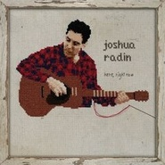
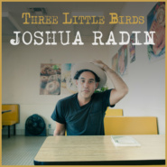
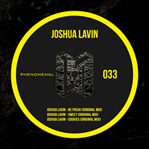
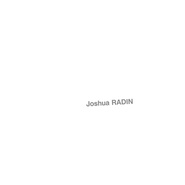
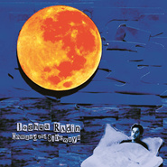
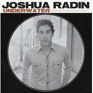
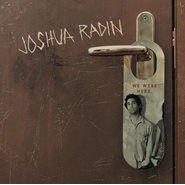

Joshua Radin
============================

|  |  |
| :--: | :-- |
| [ Joshua Radin](https://i.xiami.com/joshuaradinpost) | **播放数**: 24977630 **粉丝数**: 23886 **评论数**: 806 **地区**: United States of America 美国 **风格**: 根源唱作人 Singer-Songwriter, 独立民谣 Indie Folk  |

## 档案

小档案 
中   文   名   约书亚·拉丁 
外   文   名   Joshua Radin 
国        籍   美国 
星        座   双子座 
出   生   地   美国俄亥俄州夏克海茨城 
出生日期   1974  年  6  月  14  日 
职        业   作曲 
代表作品   Star Mile  、  What If You  、  someone else's life 
艺人资料 
Joshua Radin  出生于俄亥俄州的沙克海茨城（  SHAKER HEIGHTS  ），从小生长在摩城唱片，史塔克斯唱片和披头士的唱片之中。与许多  70  年代的歌手一样，他在完成了大学学业后才正式开始了他的音乐事业。 
成名经历 
在  Joshua Radin  的少年时代  ,  似乎从没有意识到自己将来会从事音乐创作，尽管他自幼就喜欢唱歌。他后来来到了纽约，开始自学吉他。在  2004  年，他很偶然地写了一首名叫  Winter  的歌，  Radin  的好友，演员兼导演  Zach Braff  听到他创作的《  Winter  》的样本时，立刻被吸引住了，并把这首歌曲用在了喜剧《  Scrubs  》中的一集《  My Screw Up  》里。这支歌曲反响很好，观众非常喜欢，纷纷要求听到他更多的作品。而  Radin  也随着这部喜剧而崭露头角，他的其他的几首歌《  Today  》《  Closer  》《  Don't Look Away  》和《  These Photographs  》也在剧中引用。而  Joshua Radin  也因之发现音乐才是他的事业，很快他就签约到  Columbia  唱片公司，并出版了第一张  EP  唱片《  First Between 3rd And 4th  》。 
从那以后，  Radin  的歌曲在很多节目中都被引用。像是《  Scrubs  》《  Brothers and Sisters  》《  Grey's Anatomy  》《  American Idol  》《  One Tree Hill  》《  Studio 60 on the Sunset Strip  》中，都有他的歌曲。他的歌曲《  Star Mile  》收录在了《  The Last Kiss  》的电影原声碟中，《  What If You  》收在了《  Catch and Release  》的电影原声碟中，还有《  someone else's life  》和《  When you find me  》被收录在了  09  年最新电影《  Adam  》中。 
2009  年  7  月发行单曲《  Fly Me to the Moon  》。 
2010  年  7  月发行单曲《  Songs Under a Streetlight  》。  10  月发行录音室专辑《  The Rock and the Tide  》。 
2011  年  9  月发行单曲《  You  ’  re The First,The Last,My Everything  》。 
2012  年  7  月发行录音室专辑《  Underwater  》。  10  月发行单曲《  In Her Eyes  》。 
2013  年  5  月发行录音室专辑《  Wax Wings  》。 
2015  年  1  月发行录音室专辑《  Onward and Sideways  》。 
2016  年  4  月发行  Live  专辑《  Live from the Village  》。 
Life and career 
Joshua Radin (born June 14, 1974) is an American singer-songwriter. He has recorded six studio albums, and his songs have been used in numerous films and TV series. His latest album,  ‘Onward and Sideways’,  was released in 2015. 
Joshua Radin was born and raised in Shaker Heights, Ohio, to a Jewish family of Polish, German, Austrian, and Russian background. 
In 2004, American actor Zach Braff introduced Radin's first composition, "Winter", to ‘ Scrubs’  show creator Bill Lawrence, who ultimately used several of Radin's songs in various scenes of the television series. 
According to Radin his musical career started in 2004, and he had learned to play the guitar only two years before that. His first song, "Winter", appeared on his debut album  ‘We Were Here’. 
Radin has said that much of the album was inspired by a bad break-up. It was released exclusively to iTunes for a month, before attracting attention from major labels. Released on Columbia Records in May 2006, ‘ We Were Here’  presented the first batch of songs Radin ever wrote. The album drew critical acclaim and received a four-star review from ‘ Rolling Stone’ , who praised it for Radin's "whispery, silver-bell voice" and its themes, calling them "poignant and refreshingly frank." The record hit number one on the iTunes Folk Album Chart and included a number of well known musicians, including Ryan Adams who played guitar on the song "Lovely Tonight".Zach Braff hand-picked one of the tracks to be featured on the soundtrack for ‘ The Last Kiss’. 
Radin played the song "Today" from the album, along with five other songs, for Ellen DeGeneres and Portia de Rossi at their August 16, 2008, wedding. 
Radin's second album, ‘ Simple Times’  went straight to #1 on the iTunes overall chart upon its release. 
Radin's third studio album,  ‘The Rock and The Tide’  was released on October 12, 2010 on Mom + Pop Music, his second release with the label. The album reached number five on the iTunes albums chart upon its release.  ‘The Rock and The Tide’  was produced by Martin Terefe (Cat Stevens, Ron Sexmith). A later EP released in 2011 used 6 of the album's tacks recorded in an acoustic session. 
On September 4, 2012, Radin released his fourth studio album,  ‘Underwater’ . The album was Radin's third release with Mom + Pop Music. 
Radin wrote songs with Janet Devlin in the Autumn of 2012 for her debut album. 
Joshua Radin's fifth studio album ‘ Wax Wings’  was released May 7, 2013. ‘ Wax Wings’ , a self-released album, has eleven tracks. Included on the album is the song "Lovely Tonight", which had been previously released on iTunes as a single.The tracks "In Her Eyes" and "Stay" were produced by Matt Noveskey. 
Joshua Radin's released a sixth studio album on January 6, 2015. The album consisted on 13 tracks, one of which was a re-release of the ‘ Wax Wings’  track "Beautiful Day" recorded with Sheryl Crow. 
‘Live from the Village’    was released on April 2016.

## 专辑

| 名称 | 语种 | 唱片公司 | 发行时间 | 专辑类别 | 专辑风格 |
| :--: | :-- | :-- | :-- | :-- | :-- |
| [ Beautiful Day](./albums/5021441658.md) | 英语 | Merlin Records | 2020年09月11日 | EP, 单曲 | 根源唱作人 Singer-Songwriter |
| [ Here, Right Now](./albums/2103087471.md) | 英语 | Self-Released, IML Irish Music Licensing Ltd. | 2019年10月01日 | 录音室专辑 | 乡村 Country |
| [ Three Little Birds](./albums/2104162755.md) | 英语 | Merlin Records | 2018年10月26日 | EP, 单曲 |  |
| [ Cookies](./albums/2103905580.md) | 英语 | Sounds Phenomenal Recordings | 2018年08月09日 | EP, 单曲 |  |
| [ A World to Explore](./albums/2104724352.md) | 英语 | Merlin Records | 2018年05月18日 | EP, 单曲 |  |
| [ Don't Think Twice, Its Alright](./albums/2103675466.md) | 英语 | Glass Bead Music | 2018年03月23日 | EP, 单曲 | 独立民谣 Indie Folk, 根源唱作人 Singer-Songwriter |
| [ What a Wonderful World](./albums/2103675463.md) | 英语 | Glass Bead Music Inc | 2018年03月09日 | EP, 单曲 | 独立民谣 Indie Folk, 根源唱作人 Singer-Songwriter |
| [ With a Little Help from My Friends](./albums/2103675472.md) | 英语 | Glass Bead Music | 2017年08月11日 | EP, 单曲 | 根源唱作人 Singer-Songwriter |
| [ Here Comes the Sun](./albums/2103675471.md) | 英语 | Glass Bead Music | 2017年08月11日 | EP, 单曲 | 根源唱作人 Singer-Songwriter |
| [ The Fall](./albums/2102656623.md) | 英语 | Glass Bead Music Inc | 2017年01月27日 | 录音室专辑 | 另类摇滚 Alternative Rock |
| [ Belong](./albums/2102400191.md) | 英语 | Universal Music | 2016年08月30日 | EP, 单曲 | 欧美流行 Western Pop |
| [ Live from the Village](./albums/2100324148.md) | 英语 | Glass Bead Music | 2016年04月22日 | 现场专辑 | 根源唱作人 Singer-Songwriter, 独立民谣 Indie Folk |
| [ Onward and Sideways](./albums/1820537401.md) | 英语 | Glass Bead Music | 2015年01月06日 | 录音室专辑 | 根源唱作人 Singer-Songwriter |
| [ Wax Wings](./albums/263857665.md) | 英语 | Mom & Pop Music | 2013年05月07日 | 录音室专辑 | 根源唱作人 Singer-Songwriter, 独立流行 Indie Pop |
| [ In Her Eyes](./albums/547579.md) | 英语 | Mom & Pop Music | 2012年10月09日 | EP, 单曲 | 另类摇滚 Alternative Rock |
| [ Underwater](./albums/520518.md) | 英语 | Mom & Pop Music | 2012年07月29日 | 录音室专辑 | 根源唱作人 Singer-Songwriter, 独立民谣 Indie Folk |
| [ You're The First, The Last, My Everything](./albums/475085.md) | 英语 | Mom & Pop Music | 2011年09月19日 | EP, 单曲 |  |
| [ Steetlight](./albums/2103891329.md) | 英语 | Mom+Pop | 2010年11月30日 | EP, 单曲 |  |
| [ The Rock and the Tide](./albums/406570.md) | 英语 | Mom & Pop Music | 2010年10月12日 | 录音室专辑 | 流行摇滚 Pop Rock |
| [ Songs Under a Streetlight](./albums/386174.md) | 英语 | Mom & Pop Music | 2010年07月13日 | EP, 单曲 | 当代唱作人 Contemporary Singer-Songwriter, 另类摇滚 Alternative Rock, 成人时代 Adult Contemporary |
| [ Paperweight](./albums/2104724350.md) | 英语 | Merlin Records | 2009年11月25日 | EP, 单曲 |  |
| [ Fly Me to the Moon](./albums/477812.md) | 英语 | Mom & Pop Music | 2009年07月07日 | EP, 单曲 |  |
| [ Simple Times](./albums/297649.md) | 英语 | Mom & Pop Music | 2008年09月30日 | 录音室专辑 | 根源唱作人 Singer-Songwriter, 独立民谣 Indie Folk |
| [ Unclear Sky](./albums/304822.md) | 英语 | Columbia Records | 2008年02月12日 | EP, 单曲 | 根源唱作人 Singer-Songwriter, 民谣摇滚 Folk Rock |
| [ We Were Here](./albums/171284.md) | 英语 | Columbia Records | 2006年06月13日 | 录音室专辑 | 根源唱作人 Singer-Songwriter, 独立民谣 Indie Folk, 室内民谣 Chamber Folk |
| [ First Between 3rd and 4th](./albums/317918.md) | 英语 | Columbia Records | 2004年07月12日 | EP, 单曲 | 根源唱作人 Singer-Songwriter, 独立民谣 Indie Folk |

## 评论

|  |  |  |  |
| :-- | :-- | :-- | :-- |
|  [虾米用户](https://emumo.xiami.com/u/379162683) 我想要记住你们，我想要你... 2020-05-14 23:07 赞(0) 踩(0) | 

 |
|  [虾米用户](https://emumo.xiami.com/u/36380638)   2019-11-09 13:16 赞(0) 踩(0) | 
真的好听
 |
|  [虾米用户](https://emumo.xiami.com/u/410561637) 我还没想好要写什么... 2019-09-03 22:08 赞(1) 踩(0) | 
本来边走边听，突然听到my my love 整个人突然就被唤醒了，太美了，停下脚步，单曲循环中。
 |
|  [虾米用户](https://emumo.xiami.com/u/84571136) 唯有音乐不离不弃 2019-07-16 23:43 赞(0) 踩(0) | 
Joshua Radin &amp;ndash; Here, Right Now &amp;ndash; Single
 |
|  [虾米用户](https://emumo.xiami.com/u/40249201) 재미없는 사람 2019-05-28 20:28 赞(1) 踩(0) | 
19年还会来吗
 |
|  [虾米用户](https://emumo.xiami.com/u/12221090) 逍遥于天地而心意自得 2019-05-20 22:30 赞(0) 踩(0) | 
赞
 |
|  [虾米用户](https://emumo.xiami.com/u/52056952) 人生即是到來、相遇、陪伴... 2019-04-18 08:18 赞(2) 踩(0) | 
(๑・ω-)～♥”
 |
| ⇒ |  [虾米用户](https://emumo.xiami.com/u/326165803) 我还没想好要写什么... 2019-05-16 16:01 赞(0) 踩(0) | 
又碰到你了
 |
|  [虾米用户](https://emumo.xiami.com/u/408754825)  2019-03-19 18:13 赞(0) 踩(0) | 
听过today，真的是很温柔
 |
|  [虾米用户](https://emumo.xiami.com/u/360585397) Life is illu... 2019-03-06 21:25 赞(2) 踩(0) | 
温柔的磨砂
 |
|  [虾米用户](https://emumo.xiami.com/u/49959840) 无聊人 2019-03-01 00:30 赞(1) 踩(0) | 
❤️
 |
|  [虾米用户](https://emumo.xiami.com/u/44597695) 暂无签名~ 2019-01-06 21:34 赞(1) 踩(0) | 
挖到一个大鸭蛋
 |
|  [虾米用户](https://emumo.xiami.com/u/343203866) 我还没想好要写什么... 2018-11-14 18:15 赞(0) 踩(0) | 
想嫁
 |
|  [虾米用户](https://emumo.xiami.com/u/324879742)   2018-09-25 09:13 赞(0) 踩(0) | 
.
 |
|  [虾米用户](https://emumo.xiami.com/u/277957297) 有你就好…… 2018-09-08 12:39 赞(0) 踩(0) | 
安静好听
 |
|  [虾米用户](https://emumo.xiami.com/u/21164070) 一沙一世界 一花一天堂 ... 2018-08-08 14:45 赞(1) 踩(0) | 
.
 |
|  [虾米用户](https://emumo.xiami.com/u/26182552)  2018-07-13 10:11 赞(0) 踩(0) | 
好！！
 |
|  [虾米用户](https://emumo.xiami.com/u/339191478)   2018-06-05 07:04 赞(1) 踩(0) | 
:-)
 |
|  [虾米用户](https://emumo.xiami.com/u/12878826) 谢谢陪伴 再见哦！ 2018-05-10 12:47 赞(1) 踩(0) | 
错过18年来中国的演出 不知道得等到什么时候了 
 |
| ⇒ |  [虾米用户](https://emumo.xiami.com/u/212429120) 我还没想好要写什么... 2018-09-01 22:20 赞(0) 踩(0) | 
我也是在想这个问题
 |
| ⇒ |  [虾米用户](https://emumo.xiami.com/u/2022169)  2019-01-04 09:57 赞(0) 踩(0) | 
啊，啥时候来了！！！！！！！！！！！！！
 |
| ⇒ |  [虾米用户](https://emumo.xiami.com/u/12878826) 谢谢陪伴 再见哦！ 2019-01-04 11:26 赞(0) 踩(0) | 
<q><b>Emma说：</b></q>
 |
|  [虾米用户](https://emumo.xiami.com/u/13691875) 谁的感叹 偶然合拍 2018-05-05 17:28 赞(1) 踩(0) | 
巡演大家都去吗
 |
|  [虾米用户](https://emumo.xiami.com/u/262934951)  2018-05-02 15:37 赞(2) 踩(0) | 
北京live的票已经订好，跟一个喜欢的小姐姐一起去，hhhhhhhh
 |
| ⇒ |  [虾米用户](https://emumo.xiami.com/u/6775979) 我还没想好要写什么... 2018-05-05 20:17 赞(0) 踩(0) | 
恭喜你
 |
|  [虾米用户](https://emumo.xiami.com/u/23336916)  纯真 2018-05-01 09:14 赞(0) 踩(0) | 
深圳512两张票250出啊！！！！没有人要？？？？？？
 |
| ⇒ |  [虾米用户](https://emumo.xiami.com/u/30950516)  2018-05-01 23:16 赞(0) 踩(0) | 
我想要，微littlewing_
 |
|  [虾米用户](https://emumo.xiami.com/u/303919180) 我还没想好要写什么... 2018-04-18 18:05 赞(0) 踩(0) | 

 |
|  [虾米用户](https://emumo.xiami.com/u/72663342) then go and ... 2018-04-18 12:58 赞(0) 踩(0) | 
惊！为什么不来大西北玩一趟啊 
 |
|  [虾米用户](https://emumo.xiami.com/u/10264971) Hard candy. 2018-03-31 23:50 赞(0) 踩(0) | 
内容已删除
 |
| ⇒ |  [虾米用户](https://emumo.xiami.com/u/3076862) Keep walking 2018-04-24 07:22 赞(0) 踩(0) | 
约约约
 |
|  [虾米用户](https://emumo.xiami.com/u/3788485) 我还没想好要写什么... 2018-03-21 10:46 赞(2) 踩(0) | 
剛在ins上看到了2018中國巡演安排！5.4 上海 MAO5.5 杭州 MAO5.6 北京 OMNI5.9 武漢 VOX5.11 廣州 MAO5.12 深圳 B10要去看上海場！ 
 |
|  [虾米用户](https://emumo.xiami.com/u/5847985)  2018-03-21 09:20 赞(0) 踩(0) | 
5-12深圳场组队！
 |
|  [虾米用户](https://emumo.xiami.com/u/348926413)  2018-03-17 15:21 赞(1) 踩(0) | 
自从在柴扉听过他的angels就无法自拔 
 |
|  [虾米用户](https://emumo.xiami.com/u/322493118) 喜欢啊就跑着去追好了! 2018-02-24 00:31 赞(1) 踩(0) | 
我一直找一直找，终于在虾米找到你，还好我找到了你，不然错过多可惜呀。     [文字cool][文字up]
 |
|  [虾米用户](https://emumo.xiami.com/u/2899322)  2018-01-02 22:49 赞(0) 踩(0) | 
一开口我心都酥了
 |
|  [虾米用户](https://emumo.xiami.com/u/327400941) Let we do so... 2017-12-21 11:46 赞(1) 踩(0) | 
柔情质感男嗓~
 |
|  [虾米用户](https://emumo.xiami.com/u/3607742) 云村：@尘桐 作家 猎头... 2017-12-01 01:23 赞(0) 踩(0) | 
资料里有张照片好像是Robbie Williams吧..
 |
| ⇒ |  [虾米用户](https://emumo.xiami.com/u/42825218) 我还没想好要写什么... 2018-01-20 10:15 赞(0) 踩(0) | 
不像吧，Robbie長比較有特色，不過聽著部分聲音唱法像。
 |
| ⇒ |  [虾米用户](https://emumo.xiami.com/u/3607742) 云村：@尘桐 作家 猎头... 2018-01-20 11:54 赞(0) 踩(0) | 
<q><b>王鹅说：</b></q>
 |
| ⇒ |  [虾米用户](https://emumo.xiami.com/u/42825218) 我还没想好要写什么... 2018-01-20 23:39 赞(0) 踩(0) | 
<q><b>尘桐说：</b></q>
 |
| ⇒ |  [虾米用户](https://emumo.xiami.com/u/42825218) 我还没想好要写什么... 2018-01-20 23:41 赞(0) 踩(0) | 
<q><b>尘桐说：</b></q>
 |
|  [虾米用户](https://emumo.xiami.com/u/50877763)   2017-11-27 05:20 赞(2) 踩(0) | 
他的内心一定很温柔很深情
 |
|  [虾米用户](https://emumo.xiami.com/u/197200) sailing 2020 2017-11-07 21:14 赞(2) 踩(0) | 
封面能不能换&amp;hellip;红格子不太合他的感觉 
 |
| ⇒ |  [虾米用户](https://emumo.xiami.com/u/197200) sailing 2020 2017-11-07 21:16 赞(0) 踩(0) | 
第二张或第五张比较好看
 |
| ⇒ |  [虾米用户](https://emumo.xiami.com/u/702742) 生活持有偏見…… 2018-03-01 00:19 赞(0) 踩(0) | 
哈哈哈哈&amp;hellip;&amp;hellip; 考慮轉達一下
 |
|  [虾米用户](https://emumo.xiami.com/u/12878826) 谢谢陪伴 再见哦！ 2017-10-30 09:49 赞(1) 踩(0) | 
复习的背景音乐
 |
|  [虾米用户](https://emumo.xiami.com/u/3263809) 我还没想好要写什么... 2017-10-28 00:11 赞(0) 踩(0) | 
（盗用别人的.haha)伴随这样的轻快的节奏，吹着空调，吃着冰西瓜，看着阳光的射影在床边慢慢移动~~~一个美好的周末....静静的想念........
 |
|  [虾米用户](https://emumo.xiami.com/u/78124118) 不可以荒废自己 2017-10-08 03:08 赞(0) 踩(0) | 
好小
 |
|  [虾米用户](https://emumo.xiami.com/u/7037199) 红尘陌上，浮世清欢。 2017-09-05 09:00 赞(0) 踩(0) | 
声音先不提 我单纯很喜欢他长相～～ 
 |
|  [虾米用户](https://emumo.xiami.com/u/17146554) weibo：@L1RRO... 2017-05-20 19:51 赞(0) 踩(0) | 
&amp;hellip;
 |
|  [虾米用户](https://emumo.xiami.com/u/290904514)  2017-04-23 17:36 赞(0) 踩(0) | 
安静沉稳
 |
|  [虾米用户](https://emumo.xiami.com/u/3821061)  2017-03-30 09:29 赞(2) 踩(0) | 
轻轻倾诉者，无需半点修饰！
 |
|  [虾米用户](https://emumo.xiami.com/u/8943891) 你咋那么可爱？ 2017-01-31 14:20 赞(0) 踩(0) | 
丨
 |
|  [虾米用户](https://emumo.xiami.com/u/532343) 我还没想好要写什么... 2016-12-19 16:34 赞(3) 踩(0) | 
最早听到他的声音是在熟女镇第三季最后一集 里面的lovely tonight 喜欢unclear sky里面那个版本的 甚至用在大喜之日。。I see the rest of my life with you
 |
|  [虾米用户](https://emumo.xiami.com/u/12878826) 谢谢陪伴 再见哦！ 2016-12-02 21:19 赞(1) 踩(0) | 
无法抗拒的声音
 |
|  [虾米用户](https://emumo.xiami.com/u/44140680) 旅途愉快 2016-11-07 14:00 赞(0) 踩(0) | 
⚫️
 |
|  [虾米用户](https://emumo.xiami.com/u/50379189)  2016-11-03 20:48 赞(1) 踩(0) | 
原来Joshua Radin 是美国人  好吧他的口音也说明他是美国人，不知道我之前为什么总是搞不清他究竟是美国人还是以色列人 
 |
| ⇒ |  [虾米用户](https://emumo.xiami.com/u/212429120) 我还没想好要写什么... 2017-03-30 16:39 赞(0) 踩(0) | 
也许是因为他的名字 
 |
|  [虾米用户](https://emumo.xiami.com/u/9261999)  2016-10-16 15:00 赞(1) 踩(0) | 
.
 |
|  [虾米用户](https://emumo.xiami.com/u/10469261) Hey  Xiami ;... 2016-10-12 12:39 赞(0) 踩(0) | 

 |
|  [虾米用户](https://emumo.xiami.com/u/45617642) Not bad 2016-09-04 18:37 赞(0) 踩(0) | 
哈哈哈哈哈哈哈哈哈哈
 |
|  [虾米用户](https://emumo.xiami.com/u/199406221) 谁的头顶上没有灰尘. 2016-07-10 14:14 赞(11) 踩(0) | 
本来边看小说边听的，随机听，突然听到my my love 整个人突然就被唤醒了，太美。瞬间看不进去书，只想全心得沉下去又飘起来 
 |
| ⇒ |  [虾米用户](https://emumo.xiami.com/u/257589454)  2016-12-28 16:20 赞(0) 踩(0) | 
我也是喜欢my my love
 |
| ⇒ |  [虾米用户](https://emumo.xiami.com/u/257589454)  2016-12-28 16:20 赞(0) 踩(0) | 
我也是
 |
| ⇒ |  [虾米用户](https://emumo.xiami.com/u/307596981)  2017-12-06 08:07 赞(0) 踩(0) | 
声音太好听了 
 |
|  [虾米用户](https://emumo.xiami.com/u/42670511)   2016-06-04 17:47 赞(2) 踩(0) | 
哈哈，喜欢这种享受其中的感觉
 |
|  [虾米用户](https://emumo.xiami.com/u/2493237) Star never l... 2016-05-21 01:39 赞(0) 踩(0) | 

 |
|  [虾米用户](https://emumo.xiami.com/u/16511667) Official：【集物... 2016-05-14 21:38 赞(0) 踩(0) | 
鉴藏！
 |
|  [虾米用户](https://emumo.xiami.com/u/19048639)  2016-05-05 22:35 赞(0) 踩(0) | 
哇哦，这个人真多很好听哎
 |
|  [虾米用户](https://emumo.xiami.com/u/9299072)  2016-05-02 17:26 赞(0) 踩(0) | 
喜欢“Wax Wings”。
 |
|  [虾米用户](https://emumo.xiami.com/u/8468754) @ddazedconfu... 2016-04-28 13:15 赞(0) 踩(0) | 
热门评论笑了23333
 |
|  [虾米用户](https://emumo.xiami.com/u/15910447) 青春就像冒烟的拖拉机 2016-04-12 19:33 赞(1) 踩(0) | 
爱上声音。
 |
|  [虾米用户](https://emumo.xiami.com/u/9697195)  2016-04-08 17:43 赞(0) 踩(0) | 
叔换头像了啊
 |
|  [虾米用户](https://emumo.xiami.com/u/2487947)  2016-04-04 20:51 赞(0) 踩(0) | 
天才
 |
|  [虾米用户](https://emumo.xiami.com/u/30127330) 我还没想好要写什么... 2016-03-29 17:23 赞(0) 踩(0) | 
娓娓道来
 |
|  [虾米用户](https://emumo.xiami.com/u/49534039)  2016-03-28 15:27 赞(0) 踩(0) | 
1
 |
|  [虾米用户](https://emumo.xiami.com/u/2718342) 我決定快樂起來 我今天就... 2016-03-24 20:56 赞(0) 踩(0) | 
WHERE&amp;#039;S THE &amp;lt;I&amp;#039;d rather be with u&amp;gt;??
 |
|  [虾米用户](https://emumo.xiami.com/u/78519234) 我还没想好要写什么... 2016-03-20 21:41 赞(0) 踩(0) | 

 |
|  [虾米用户](https://emumo.xiami.com/u/45621221) 卸载状态。 2016-02-16 09:40 赞(0) 踩(0) | 
=
 |
|  [虾米用户](https://emumo.xiami.com/u/9693054) 3.1415926535 2016-02-13 13:10 赞(2) 踩(0) | 
when you find me 声声入魂
 |
|  [虾米用户](https://emumo.xiami.com/u/2487947)  2016-01-19 14:40 赞(0) 踩(0) | 
迷人的表达
 |
|  [虾米用户](https://emumo.xiami.com/u/15268502)   2016-01-13 22:10 赞(3) 踩(0) | 
张杰… … 呵。 哥们再去洗洗耳朵吧
 |
|  [虾米用户](https://emumo.xiami.com/u/2544188) Some dance t... 2016-01-08 14:54 赞(0) 踩(0) | 
对叫Joshua的 毫无抵抗力==
 |
|  [虾米用户](https://emumo.xiami.com/u/33579044)  2015-12-19 17:56 赞(0) 踩(0) | 
听起来很有爱
 |
|  [虾米用户](https://emumo.xiami.com/u/45015627) 民谣与爵士不能舍弃 2015-12-05 14:57 赞(0) 踩(0) | 
看名字以为是欧洲的 声音不错 沉沉的
 |
|  [虾米用户](https://emumo.xiami.com/u/29197411) 我还没想好要写什么... 2015-11-27 21:06 赞(4) 踩(0) | 
有病吧 怎么半地里冒出个张杰来 我发现怎么哪里都能遇到张杰 一会what doesn&amp;#039;t kill you说是抄袭张杰的逆战 一会又是说JR的声音像张杰 看来我也是真是低估他了 他和JR能扯上什么关系 他们的声音很像么 我怎么就没听出来 他们的声线根本就不是一个层次的好么 更不要说人了 根本没法比 别动辄逮着一块金就往自己脸上贴 见着屎你怎么就不贴了呢
 |
|  [虾米用户](https://emumo.xiami.com/u/3241604)  2015-11-16 19:43 赞(2) 踩(0) | 
不该点进来看评论的、都是什么鬼… 
 |
|  [虾米用户](https://emumo.xiami.com/u/33265508)  2015-11-16 18:24 赞(0) 踩(0) | 
Indie Folk
 |
|  [虾米用户](https://emumo.xiami.com/u/52726822)  2015-11-11 21:13 赞(1) 踩(0) | 
我不该点进来的
 |
|  [虾米用户](https://emumo.xiami.com/u/9697195)  2015-11-08 09:38 赞(1) 踩(0) | 
怎么评论里都是张杰，哈哈哈，有意思
 |
|  [虾米用户](https://emumo.xiami.com/u/6497415) 山有起伏 2015-10-05 02:50 赞(0) 踩(0) | 
男声吉他民谣
 |
|  [虾米用户](https://emumo.xiami.com/u/49068787) 你问我全世界哪里最美 我... 2015-09-21 13:22 赞(1) 踩(0) | 
最喜欢他的声音啦(๑òᆺó๑)
 |
|  [虾米用户](https://emumo.xiami.com/u/66832536)   2015-09-17 11:34 赞(0) 踩(0) | 
Warm
 |
|  [虾米用户](https://emumo.xiami.com/u/3859069)  2015-08-11 15:21 赞(0) 踩(0) | 
my tast
 |
|  [虾米用户](https://emumo.xiami.com/u/3510738) 晚安、 2015-08-10 19:57 赞(25) 踩(0) | 
张杰声音是光滑的 这个明明是磨砂的...
 |
|  [虾米用户](https://emumo.xiami.com/u/69044) 这很正常，我亲爱的偏执狂 2015-08-03 09:14 赞(17) 踩(0) | 
。。。。。。求放过这一片净土，男神哪里闰垚了？！？！？！？！？
 |
|  [虾米用户](https://emumo.xiami.com/u/69044) 这很正常，我亲爱的偏执狂 2015-08-03 09:14 赞(1) 踩(0) | 
每次听都要湿了，最爱的男声，真心没有之一
 |
|  [虾米用户](https://emumo.xiami.com/u/3161633)   2015-07-30 22:43 赞(0) 踩(0) | 
真是张杰也。
 |
|  [虾米用户](https://emumo.xiami.com/u/40413019)  2015-07-24 03:34 赞(0) 踩(0) | 
现在的人啊，一听到好听的男声就说像张杰=_=。
 |
|  [虾米用户](https://emumo.xiami.com/u/36536789) 深锁广寒宫殿 2015-07-20 00:06 赞(0) 踩(0) | 
嘎嘎嘎嘎明明白白
 |
|  [虾米用户](https://emumo.xiami.com/u/11079916)  2015-07-14 16:28 赞(0) 踩(0) | 
哪里像张杰？？？耳朵聋了吧，这么好的声音差点错过了
 |
|  [虾米用户](https://emumo.xiami.com/u/11079916)  2015-07-14 16:23 赞(4) 踩(0) | 
听到评论有人说像张杰我就不想听了
 |
|  [虾米用户](https://emumo.xiami.com/u/38640339) 我想好写什么了…… 2015-06-24 13:28 赞(0) 踩(0) | 

 |
|  [虾米用户](https://emumo.xiami.com/u/2152607)  2015-06-16 20:04 赞(0) 踩(0) | 
slow
 |
|  [虾米用户](https://emumo.xiami.com/u/12171976) 我还没想好要写什么... 2015-06-09 17:19 赞(0) 踩(0) | 
音色与张杰神一致
 |
|  [虾米用户](https://emumo.xiami.com/u/10547530) 生于白昼，隐与黑夜。 2015-05-29 21:22 赞(0) 踩(0) | 
温暖由内而外。真好，听起来就像推开了一扇窗子，窗外是满世界的阳光。
 |
|  [虾米用户](https://emumo.xiami.com/u/4388599) 一點孤獨品嘗一點寂寞。 2015-05-26 14:08 赞(2) 踩(0) | 
别让我安静下来，这样的状态会让我感觉随时会死掉。
 |
|  [虾米用户](https://emumo.xiami.com/u/50335867)   2015-05-25 21:28 赞(0) 踩(0) | 
很久以前从电影Nanny Diaries(保姆日记)找到了插曲closer，一直喜欢这部电影，和他。
 |
|  [虾米用户](https://emumo.xiami.com/u/10983386) 瘦子 朝夕奔梦 2015-05-19 10:29 赞(0) 踩(0) | 
喜欢这把嗓子
 |
|  [虾米用户](https://emumo.xiami.com/u/13552)  2015-05-18 08:40 赞(0) 踩(0) | 
***
 |
|  [虾米用户](https://emumo.xiami.com/u/6375713)  2015-05-16 21:18 赞(0) 踩(0) | 
LIGHT AND JOYFUL VOICE.
 |
|  [虾米用户](https://emumo.xiami.com/u/32418063)  2015-05-13 12:23 赞(2) 踩(0) | 
美式张杰
 |
|  [虾米用户](https://emumo.xiami.com/u/679170) 平安喜乐，普普通通 2015-05-08 23:17 赞(22) 踩(0) | 
看评论毁印象分！哪里像张杰？！能给个合理的解释，不要让我脑海里不自觉贴标签，都不能愉快的欣赏了！！
 |
|  [虾米用户](https://emumo.xiami.com/u/15275403) you can find... 2015-05-07 13:31 赞(3) 踩(0) | 
谁也不准说你像闰土
 |
|  [虾米用户](https://emumo.xiami.com/u/22770182)  2015-04-29 19:08 赞(0) 踩(0) | 
。
 |
|  [虾米用户](https://emumo.xiami.com/u/11576067) sj 2015-04-25 12:25 赞(68) 踩(0) | 
张杰能和他比？？
 |
|  [虾米用户](https://emumo.xiami.com/u/3045794)  2015-04-17 16:44 赞(1) 踩(0) | 
因为很多很多年前的电影《亚当》中的when you find me知道他的。
 |
|  [虾米用户](https://emumo.xiami.com/u/966590) 电影 音乐 足球 2015-03-20 23:41 赞(2) 踩(0) | 
太喜欢了 好几部心水的文艺片都有他的曲 百听不厌
 |
|  [虾米用户](https://emumo.xiami.com/u/3653111)  2015-03-16 14:59 赞(0) 踩(0) | 
微博上听到那个7岁女孩演唱《Fly Me to the Moon》后过来的
 |
|  [虾米用户](https://emumo.xiami.com/u/18668381) 暂无签名~ 2015-03-16 12:05 赞(0) 踩(0) | 
I&amp;#039;d rather be with you
 |
|  [虾米用户](https://emumo.xiami.com/u/16987098) 所有的离开都是蓄谋已久 2015-03-10 19:49 赞(1) 踩(0) | 
尼玛，这声音太销魂了，都快得软骨症了。
 |
|  [虾米用户](https://emumo.xiami.com/u/46323592) 暂无签名~ 2015-03-08 17:57 赞(1) 踩(0) | 
这就是我想听的音乐
 |
|  [虾米用户](https://emumo.xiami.com/u/8649708) 暂无签名~ 2015-03-07 23:20 赞(0) 踩(0) | 
又帅又好听
 |
|  [虾米用户](https://emumo.xiami.com/u/33495947) 暂无签名~ 2015-02-27 11:40 赞(0) 踩(0) | 
my my love
 |
|  [虾米用户](https://emumo.xiami.com/u/5688245) 这不会是一条光辉的路 2015-02-13 09:10 赞(0) 踩(0) | 
周二去听了他的show 现场声音不能更有磁性 分享了好多他和他女友的故事 甜得要死
 |
|  [虾米用户](https://emumo.xiami.com/u/145176) 才华跟**一样 2015-02-12 23:27 赞(0) 踩(0) | 
张杰哈
 |
|  [虾米用户](https://emumo.xiami.com/u/8070377) 爱雾瑞性维欧腐漏 2015-02-07 23:49 赞(0) 踩(0) | 
试听量真是蛮大
 |
|  [虾米用户](https://emumo.xiami.com/u/31436010)   2015-02-02 09:59 赞(0) 踩(0) | 
好棒
 |
|  [虾米用户](https://emumo.xiami.com/u/43251294)   2015-01-30 23:49 赞(1) 踩(0) | 
他的声音满足了我对理想型的所有要求 温柔满满的温柔
 |
|  [虾米用户](https://emumo.xiami.com/u/401282)   2015-01-28 17:19 赞(1) 踩(0) | 
擦 帅到掉渣渣了！！
 |
|  [虾米用户](https://emumo.xiami.com/u/39559570)  2015-01-27 12:49 赞(0) 踩(0) | 
第一个声音出来，我就已经醉了！我怎么才找到你呢，这是我曾经记忆中的声音，记得吗？
 |
|  [虾米用户](https://emumo.xiami.com/u/2899322)  2015-01-25 23:48 赞(2) 踩(0) | 
就像张杰唱英文歌
 |
| ⇒ |  [虾米用户](https://emumo.xiami.com/u/11576067) sj 2015-04-25 12:26 赞(0) 踩(0) | 
哪来的勇气
 |
|  [虾米用户](https://emumo.xiami.com/u/39968630) Harder,bette... 2015-01-24 16:42 赞(0) 踩(0) | 
温暖人心的音乐
 |
|  [虾米用户](https://emumo.xiami.com/u/33570603)  2015-01-17 21:37 赞(0) 踩(0) | 
喜欢
 |
|  [虾米用户](https://emumo.xiami.com/u/925769)  2015-01-13 10:19 赞(0) 踩(0) | 
喜欢这毫不着力的音乐。
 |
|  [虾米用户](https://emumo.xiami.com/u/26864258) Stay young ，... 2015-01-12 11:08 赞(0) 踩(0) | 
简单纯粹的音乐 很爱听
 |
|  [虾米用户](https://emumo.xiami.com/u/6020252)  2015-01-09 16:33 赞(0) 踩(0) | 
喜欢他的嗓音及音乐风格
 |
|  [虾米用户](https://emumo.xiami.com/u/34720764)  2015-01-09 13:50 赞(0) 踩(0) | 
长片适合
 |
|  [虾米用户](https://emumo.xiami.com/u/41021670)   2015-01-08 10:05 赞(0) 踩(0) | 
声音好像Cory呀
 |
|  [虾米用户](https://emumo.xiami.com/u/39683044) 荒诞人生，滑稽年华。 2014-12-27 19:28 赞(0) 踩(0) | 
虽然我不知道这首歌是什么意思，蛋我感觉好流弊的样子。。。
 |
|  [虾米用户](https://emumo.xiami.com/u/7913565)  2014-12-27 17:22 赞(0) 踩(0) | 
温暖人心
 |
|  [虾米用户](https://emumo.xiami.com/u/7913565)  2014-12-21 18:08 赞(0) 踩(0) | 
极简的吟唱民谣 , 歌由心生，始终温暖真诚， 在低吟浅唱中穿透心底 。
 |
|  [虾米用户](https://emumo.xiami.com/u/45124510)  2014-12-21 08:54 赞(0) 踩(0) | 
舒服~心情棒棒的！
 |
|  [虾米用户](https://emumo.xiami.com/u/44937160)  2014-12-16 12:11 赞(0) 踩(0) | 
7
 |
|  [虾米用户](https://emumo.xiami.com/u/44431425)  2014-12-04 23:27 赞(0) 踩(0) | 
轻松、舒缓的吉他民谣，特别得有穿透力，沁人心脾……
 |
|  [虾米用户](https://emumo.xiami.com/u/10410204) ? 2014-12-03 23:51 赞(0) 踩(0) | 
迷之感动
 |
|  [虾米用户](https://emumo.xiami.com/u/40168703) Love acousti... 2014-11-19 23:20 赞(0) 踩(0) | 
从grey找到joshua，大赞
 |
|  [虾米用户](https://emumo.xiami.com/u/43832811) 你存在我深深的脑海里 2014-11-18 15:10 赞(0) 踩(0) | 
受不了这种嗓音
 |
|  [虾米用户](https://emumo.xiami.com/u/11418792)  2014-11-17 21:33 赞(0) 踩(0) | 
好听
 |
|  [虾米用户](https://emumo.xiami.com/u/43377486)  2014-11-13 21:05 赞(0) 踩(0) | 
灯塔
 |
|  [虾米用户](https://emumo.xiami.com/u/17542132) 給我更多旳愛擁抱我吻我 ... 2014-11-11 10:03 赞(0) 踩(0) | 

 |
|  [虾米用户](https://emumo.xiami.com/u/30647944)   2014-11-01 19:50 赞(0) 踩(0) | 
赞爆
 |
|  [虾米用户](https://emumo.xiami.com/u/9256040)  2014-10-31 09:42 赞(0) 踩(0) | 
喜欢
 |
|  [虾米用户](https://emumo.xiami.com/u/26490600) 精选集狂人ZQ。 2014-10-27 23:26 赞(0) 踩(0) | 
认真做每一张精选集，欢迎大家进来看看。
 |
|  [虾米用户](https://emumo.xiami.com/u/39106386) 用心听，不要说话 2014-10-24 21:04 赞(0) 踩(0) | 
入耳就很喜欢的音乐都不会太差，给赞
 |
|  [虾米用户](https://emumo.xiami.com/u/20878907) That’s fear 2014-10-19 10:24 赞(75) 踩(0) | 
内容已删除
 |
| ⇒ |  [虾米用户](https://emumo.xiami.com/u/19527744) - 2014-11-08 23:37 赞(0) 踩(0) | 
喔喔在这儿也能看见你
 |
| ⇒ |  [虾米用户](https://emumo.xiami.com/u/20878907) That’s fear 2014-11-08 23:40 赞(0) 踩(0) | 
<q><b>vegil说：</b></q>
 |
| ⇒ |  [虾米用户](https://emumo.xiami.com/u/19527744) - 2014-11-15 20:05 赞(0) 踩(0) | 
<q><b>Junglist说：</b></q>
 |
| ⇒ |  [虾米用户](https://emumo.xiami.com/u/21788548) 暂无签名~ 2015-09-12 00:50 赞(0) 踩(0) | 
就是mlgb哪里像张杰！！老纸看到张杰的评论，脑子里都是闰土脸，再也不能好好听歌了！！！    
 |
| ⇒ |  [虾米用户](https://emumo.xiami.com/u/21788548) 暂无签名~ 2015-09-12 00:50 赞(0) 踩(0) | 
就是mlgb哪里像张杰！！老纸看到张杰的评论，脑子里都是闰土脸，再也不能好好听歌了！！！    
 |
| ⇒ |  [虾米用户](https://emumo.xiami.com/u/50709174)  2016-02-11 15:29 赞(0) 踩(0) | 

 |
|  [虾米用户](https://emumo.xiami.com/u/1072922)  2014-09-25 09:34 赞(0) 踩(0) | 
&amp;lt;3
 |
|  [虾米用户](https://emumo.xiami.com/u/38889407) 我还没想好要写什么... 2014-08-29 21:00 赞(0) 踩(0) | 
带些乡村摇滚的感觉，很舒服
 |
|  [虾米用户](https://emumo.xiami.com/u/2787950) 我还没想好要写什么... 2014-08-27 08:58 赞(0) 踩(0) | 
美国小子，独立民谣，靠谱
 |
|  [虾米用户](https://emumo.xiami.com/u/1300372) Mad fer it~ 2014-08-22 23:00 赞(0) 踩(0) | 
雨天必听！！！
 |
|  [虾米用户](https://emumo.xiami.com/u/12780796) 聆听…… 2014-08-10 13:07 赞(0) 踩(0) | 
只有我一个人觉得他声音像张杰么-(￢▽￢)σ
 |
| ⇒ |  [虾米用户](https://emumo.xiami.com/u/9434078) 音乐 2014-08-11 17:07 赞(0) 踩(0) | 
你不是一个人
 |
| ⇒ |  [虾米用户](https://emumo.xiami.com/u/12780796) 聆听…… 2014-08-18 13:11 赞(0) 踩(0) | 
<q><b>Found说：</b></q>
 |
| ⇒ |  [虾米用户](https://emumo.xiami.com/u/8742185)  2014-08-27 19:35 赞(0) 踩(0) | 
我也感觉张杰和他很像
 |
| ⇒ |  [虾米用户](https://emumo.xiami.com/u/38889407) 我还没想好要写什么... 2014-08-29 21:02 赞(0) 踩(0) | 
有些歌的发声像，有些歌完全没有
 |
| ⇒ |  [虾米用户](https://emumo.xiami.com/u/33781829)  2014-12-18 23:51 赞(0) 踩(0) | 
声音确实有点像
 |
|  [虾米用户](https://emumo.xiami.com/u/20626957) 暂无签名~ 2014-08-06 23:49 赞(0) 踩(0) | 
点赞！！
 |
|  [虾米用户](https://emumo.xiami.com/u/18884379)  2014-08-04 22:18 赞(0) 踩(0) | 
清新
 |
|  [虾米用户](https://emumo.xiami.com/u/9850446) 心有猛虎，细嗅蔷薇。 2014-08-04 12:30 赞(0) 踩(0) | 
When you find me
 |
|  [虾米用户](https://emumo.xiami.com/u/21373032)  2014-08-02 16:51 赞(0) 踩(0) | 
good
 |
|  [虾米用户](https://emumo.xiami.com/u/18250455)  2014-07-17 20:14 赞(0) 踩(0) | 
声音很不错
 |
|  [虾米用户](https://emumo.xiami.com/u/3037650)  2014-06-25 15:32 赞(0) 踩(0) | 
这一枚太可口了~~~~~~
 |
|  [虾米用户](https://emumo.xiami.com/u/29741800) 。 2014-06-15 22:44 赞(0) 踩(0) | 
赞哒～
 |
|  [虾米用户](https://emumo.xiami.com/u/36851066)   2014-05-22 15:02 赞(0) 踩(0) | 
随性的慵懒感，浪漫，温暖，轻柔。
 |
|  [虾米用户](https://emumo.xiami.com/u/6966719)  2014-05-19 11:55 赞(0) 踩(0) | 
声线和曲风特别像马来的一位作词人兼歌手易桀齐
 |
|  [虾米用户](https://emumo.xiami.com/u/11374766)  2014-05-15 09:11 赞(0) 踩(0) | 
民谣
 |
|  [虾米用户](https://emumo.xiami.com/u/36147954) 我还没想好要写什么... 2014-05-10 18:37 赞(0) 踩(0) | 
民谣,清新,  舒缓
 |
|  [虾米用户](https://emumo.xiami.com/u/31418010)   2014-04-23 20:10 赞(0) 踩(0) | 
喜欢
 |
|  [虾米用户](https://emumo.xiami.com/u/4282932)  2014-04-23 09:16 赞(0) 踩(0) | 
原来是你。。。。
 |
|  [虾米用户](https://emumo.xiami.com/u/11486059)  2014-04-22 23:22 赞(0) 踩(0) | 
好听~
 |
|  [虾米用户](https://emumo.xiami.com/u/1958939)  2014-04-20 21:09 赞(0) 踩(0) | 
很适合晚上听民谣 舒服 真实 很像秋天的落叶 回归的感觉
 |
|  [虾米用户](https://emumo.xiami.com/u/12222526)  2014-04-17 16:17 赞(0) 踩(0) | 
安静，舒服
 |
|  [虾米用户](https://emumo.xiami.com/u/7265317)  2014-04-16 21:57 赞(1) 踩(0) | 
这么有磁性的声音真的大丈夫么！！！！！
 |
|  [虾米用户](https://emumo.xiami.com/u/35297892)  2014-04-14 12:16 赞(0) 踩(0) | 
吉他 诉说的嗓音
 |
|  [虾米用户](https://emumo.xiami.com/u/6922328)  2014-04-09 09:41 赞(0) 踩(0) | 
音乐改善灵魂
 |
|  [虾米用户](https://emumo.xiami.com/u/3957508)  2014-04-08 16:52 赞(0) 踩(0) | 
这声线是要把人电晕吗？
 |
|  [虾米用户](https://emumo.xiami.com/u/23604740) 死而后生 2014-04-04 18:36 赞(0) 踩(0) | 
silk male and gentle sound
 |
|  [虾米用户](https://emumo.xiami.com/u/34125991) 暂无签名~ 2014-04-04 16:55 赞(0) 踩(0) | 
OH !! MY GOD! the feel is ture love.
 |
|  [虾米用户](https://emumo.xiami.com/u/34125991) 暂无签名~ 2014-04-04 16:54 赞(0) 踩(0) | 
OH !!!!MY GOD.   the feel is ture love .
 |
|  [虾米用户](https://emumo.xiami.com/u/6529747) 我还没想好要写什么... 2014-03-30 11:43 赞(0) 踩(0) | 
他的嗓音轻柔深沉，音质清透
 |
|  [虾米用户](https://emumo.xiami.com/u/8604076)  2014-03-25 14:48 赞(0) 踩(0) | 
听到能让人心暖的歌！
 |
|  [虾米用户](https://emumo.xiami.com/u/15369060)  2014-03-21 11:02 赞(0) 踩(0) | 
早安，一早起来清新开朗。
 |
|  [虾米用户](https://emumo.xiami.com/u/5115610)  2014-03-19 16:32 赞(0) 踩(0) | 
很舒服的声音
 |
|  [虾米用户](https://emumo.xiami.com/u/33515369) 3 2014-03-16 20:17 赞(0) 踩(0) | 
这么多好民谣一首首点过去听都听不完啊 来了虾米之后妈妈再也不用担心我去豆瓣乱逛找不到歌啦&amp;lt;3
 |
| ⇒ |  [虾米用户](https://emumo.xiami.com/u/37942450) 一言不发 2014-07-25 18:26 赞(0) 踩(0) | 
真的是
 |
|  [虾米用户](https://emumo.xiami.com/u/1987351) 重口味 恶趣味 2014-03-14 03:20 赞(0) 踩(0) | 
如此深沉又温暖的声音。听了两句便沉迷其中。
 |
|  [虾米用户](https://emumo.xiami.com/u/8205188)  2014-03-09 22:39 赞(0) 踩(0) | 
喜欢
 |
|  [虾米用户](https://emumo.xiami.com/u/11726487) ..... 2014-03-09 11:17 赞(0) 踩(0) | 
安静的时候听，特别舒服！
 |
|  [虾米用户](https://emumo.xiami.com/u/7002446) 开心就好 2014-03-05 19:39 赞(0) 踩(0) | 
不错11
 |
|  [虾米用户](https://emumo.xiami.com/u/32411623) 爱音乐 爱笑 2014-03-05 09:08 赞(0) 踩(0) | 
声音很性感
 |
|  [虾米用户](https://emumo.xiami.com/u/1081211) 常想一二 2014-03-03 12:33 赞(0) 踩(0) | 
I LIKE HIS VOICE
 |
|  [虾米用户](https://emumo.xiami.com/u/12252478)  2014-02-26 12:47 赞(0) 踩(0) | 
joshua radin
 |
|  [虾米用户](https://emumo.xiami.com/u/21106714) 乐天.幸运自然来 2014-02-23 21:43 赞(0) 踩(0) | 
love this style~
 |
|  [虾米用户](https://emumo.xiami.com/u/9020356) 如果存在是假象就好了 2014-02-23 20:41 赞(0) 踩(0) | 
Good Songs
 |
|  [虾米用户](https://emumo.xiami.com/u/5853725)   2014-02-20 15:29 赞(0) 踩(0) | 
舒缓心情
 |
|  [虾米用户](https://emumo.xiami.com/u/13120896) 最爱蒲公英 2014-02-16 11:03 赞(0) 踩(0) | 
生病时陪伴我的歌，冬末，寒冷，温暖
 |
|  [虾米用户](https://emumo.xiami.com/u/1004459)  2014-02-13 23:48 赞(0) 踩(0) | 
喜欢mymylove   让人有种自己在弹吉他给情人诉说的感觉
 |
|  [虾米用户](https://emumo.xiami.com/u/3474070)  2014-02-13 23:45 赞(0) 踩(0) | 
when I find you, I&amp;#039;ll find me
 |
|  [虾米用户](https://emumo.xiami.com/u/11897273)   2014-02-08 00:34 赞(0) 踩(0) | 
vegetable car= =
 |
|  [虾米用户](https://emumo.xiami.com/u/1587279)  2014-01-28 12:59 赞(0) 踩(0) | 
i&amp;#039;d rather be with you- immediately fell in love with his voice
 |
|  [虾米用户](https://emumo.xiami.com/u/20070982)  2014-01-21 18:26 赞(0) 踩(0) | 
真的让人很舒服的声音。
 |
|  [虾米用户](https://emumo.xiami.com/u/3021717) 一就是一切 2014-01-19 18:10 赞(0) 踩(0) | 
真好听！
 |
|  [虾米用户](https://emumo.xiami.com/u/7382610) 谁的等待 恰逢花开 2014-01-18 21:03 赞(0) 踩(0) | 
温暖
 |
|  [虾米用户](https://emumo.xiami.com/u/7803896)  2014-01-10 18:19 赞(0) 踩(0) | 
peaceful
 |
|  [虾米用户](https://emumo.xiami.com/u/3017490)  2014-01-06 21:09 赞(0) 踩(0) | 
Joshua Radin
 |
|  [虾米用户](https://emumo.xiami.com/u/30846480)  2014-01-06 17:22 赞(0) 踩(0) | 
安静
 |
|  [虾米用户](https://emumo.xiami.com/u/29656479)  2013-12-19 16:42 赞(0) 踩(0) | 
Touching
 |
|  [虾米用户](https://emumo.xiami.com/u/14419464)  2013-12-17 17:20 赞(0) 踩(0) | 
Joshua Radin
 |
|  [虾米用户](https://emumo.xiami.com/u/5039297)  2013-12-16 19:40 赞(0) 踩(0) | 
很温暖的男声~~~
 |
|  [虾米用户](https://emumo.xiami.com/u/14623230)  2013-12-15 22:35 赞(0) 踩(0) | 
Joshua Radin
 |
|  [虾米用户](https://emumo.xiami.com/u/344213) 虾米要活下去！ 2013-12-14 22:43 赞(0) 踩(0) | 
fly me to the moon
 |
|  [虾米用户](https://emumo.xiami.com/u/16066408)  2013-12-05 23:21 赞(0) 踩(0) | 
声音
 |
|  [虾米用户](https://emumo.xiami.com/u/9693234)  2013-12-03 20:14 赞(0) 踩(0) | 
最开始听到I&amp;#039;d Rather Be With You感觉很耐听曲调很柔美 并用作手机铃声、后来时隔一年多之后听到my my love为之赞叹才知道一个人唱的才看到这个歌手。歌曲非常非常温柔安静让人安心
 |
|  [虾米用户](https://emumo.xiami.com/u/497539)  2013-12-03 15:31 赞(0) 踩(0) | 
来中国呀！
 |
|  [虾米用户](https://emumo.xiami.com/u/10825177)  2013-11-28 09:23 赞(0) 踩(0) | 
喜欢这样温柔的声音
 |
|  [虾米用户](https://emumo.xiami.com/u/28465397)  2013-11-26 18:01 赞(0) 踩(0) | 
难过的悲痛都梗在喉咙时听最好。
 |
|  [虾米用户](https://emumo.xiami.com/u/25532859)  2013-11-15 08:59 赞(0) 踩(0) | 
早晨的时候被意外的温暖了一下~
 |
|  [虾米用户](https://emumo.xiami.com/u/1625705) 不用加班的土肥圆 2013-11-13 10:29 赞(0) 踩(0) | 
美帝好声音！
 |
|  [虾米用户](https://emumo.xiami.com/u/25939689)  2013-11-07 21:26 赞(0) 踩(0) | 
I&amp;#039;d rather be with you~
 |
|  [虾米用户](https://emumo.xiami.com/u/1074495) 素心 简爱 2013-11-04 10:26 赞(0) 踩(0) | 
喜欢这个声音
 |
|  [虾米用户](https://emumo.xiami.com/u/25806186)  2013-11-03 14:13 赞(0) 踩(0) | 
声音的特质喜欢
 |
|  [虾米用户](https://emumo.xiami.com/u/3317156)  2013-11-01 17:01 赞(0) 踩(0) | 
情迷优男
 |
|  [虾米用户](https://emumo.xiami.com/u/3681650)  2013-10-31 20:58 赞(0) 踩(0) | 
安静
 |
|  [虾米用户](https://emumo.xiami.com/u/22276144)  2013-10-30 15:26 赞(0) 踩(0) | 
really good
 |
|  [虾米用户](https://emumo.xiami.com/u/1525342)  2013-10-30 04:51 赞(0) 踩(0) | 
<a href="http://www.joshuaradin.com/" target="_blank" rel="nofollow noreferrer noopener">http://www.joshuaradin.com/</a>
 |
|  [虾米用户](https://emumo.xiami.com/u/25586953)  2013-10-28 20:17 赞(0) 踩(0) | 
声音好入耳，干净舒服，轻松愉快，所有的不开心都被唱没了
 |
|  [虾米用户](https://emumo.xiami.com/u/1675240) 游离 2013-10-24 21:00 赞(1) 踩(0) | 
很棒很棒！
 |
|  [虾米用户](https://emumo.xiami.com/u/25262324)  2013-10-24 17:12 赞(1) 踩(0) | 
这个木吉它太棒了！
 |
|  [虾米用户](https://emumo.xiami.com/u/16628340)  2013-10-20 19:51 赞(1) 踩(0) | 
大爱。 小清新
 |
|  [虾米用户](https://emumo.xiami.com/u/24898182)   2013-10-19 22:38 赞(1) 踩(0) | 
大叔，安静
 |
|  [虾米用户](https://emumo.xiami.com/u/11698393) 人生如歌，你这样唱着。 2013-10-09 00:18 赞(1) 踩(0) | 
soft touching sound
 |
|  [虾米用户](https://emumo.xiami.com/u/6290614)  2013-10-06 23:35 赞(1) 踩(0) | 
悠哉
 |
|  [虾米用户](https://emumo.xiami.com/u/12383852)   2013-10-06 22:35 赞(1) 踩(0) | 
他的歌听着让人感觉很舒服；享受的感觉
 |
|  [虾米用户](https://emumo.xiami.com/u/865399)  2013-10-04 05:41 赞(1) 踩(0) | 
民谣，轻音乐，吉他
 |
|  [虾米用户](https://emumo.xiami.com/u/7365552)  2013-10-01 09:12 赞(1) 踩(0) | 
安静的时候听，声音会一直渗透到骨髓里
 |
|  [虾米用户](https://emumo.xiami.com/u/16315021)  2013-09-30 11:43 赞(1) 踩(0) | 
撒旦法
 |
|  [虾米用户](https://emumo.xiami.com/u/23104734) ヾ  2013-09-26 23:47 赞(0) 踩(0) | 
一个人··
 |
|  [虾米用户](https://emumo.xiami.com/u/15472891)  2013-09-26 12:56 赞(0) 踩(0) | 
轻松，舒服，好听
 |
|  [虾米用户](https://emumo.xiami.com/u/22879519)  2013-09-24 16:32 赞(0) 踩(0) | 
唱到心里的歌
 |
|  [虾米用户](https://emumo.xiami.com/u/9299329)  2013-09-23 19:24 赞(0) 踩(0) | 
吉他男，赞
 |
|  [虾米用户](https://emumo.xiami.com/u/4266048)  2013-09-22 17:26 赞(0) 踩(0) | 
好听
 |
|  [虾米用户](https://emumo.xiami.com/u/10249141)  2013-09-21 23:34 赞(0) 踩(0) | 
joshua
 |
|  [虾米用户](https://emumo.xiami.com/u/6435437)  2013-09-20 10:54 赞(0) 踩(0) | 
nice voice
 |
|  [虾米用户](https://emumo.xiami.com/u/15428673) 听听音乐，找到最初。 2013-09-14 11:35 赞(0) 踩(0) | 
一个属于你耳边的声音
 |
|  [虾米用户](https://emumo.xiami.com/u/7939029)  2013-09-08 14:14 赞(0) 踩(0) | 
纯净
 |
|  [虾米用户](https://emumo.xiami.com/u/5737860)  2013-09-06 09:23 赞(0) 踩(0) | 
******
 |
|  [虾米用户](https://emumo.xiami.com/u/2848233) 晕晕乎乎的活 2013-09-05 19:26 赞(0) 踩(0) | 
微妙的音乐，瞬间让我安静了
 |
|  [虾米用户](https://emumo.xiami.com/u/56113)  2013-09-01 18:34 赞(0) 踩(0) | 
好听的嗓音
 |
|  [虾米用户](https://emumo.xiami.com/u/6783082)  2013-08-28 20:40 赞(0) 踩(0) | 
小清新~
 |
|  [虾米用户](https://emumo.xiami.com/u/97930)  2013-08-28 12:52 赞(0) 踩(0) | 
cougar town里看到的
 |
|  [虾米用户](https://emumo.xiami.com/u/3207488)  2013-08-22 19:03 赞(0) 踩(0) | 
nice voice
 |
|  [虾米用户](https://emumo.xiami.com/u/994914)   2013-08-19 19:59 赞(0) 踩(0) | 
不错～～
 |
|  [虾米用户](https://emumo.xiami.com/u/16898598)  2013-08-14 18:35 赞(0) 踩(0) | 
好，没啥说的呀
 |
|  [虾米用户](https://emumo.xiami.com/u/2715733)  2013-08-12 13:37 赞(0) 踩(0) | 
好纯净
 |
|  [虾米用户](https://emumo.xiami.com/u/2715733)  2013-08-12 13:37 赞(0) 踩(0) | 
好纯净
 |
|  [虾米用户](https://emumo.xiami.com/u/13891823)  2013-08-11 23:00 赞(0) 踩(0) | 
很喜欢 fly me to the moon 他唱
 |
|  [虾米用户](https://emumo.xiami.com/u/18866976)  2013-08-09 18:12 赞(0) 踩(0) | 
非常性感的声音，一听，画面就可以出现那种深情款款的feel
 |
|  [虾米用户](https://emumo.xiami.com/u/18866976)  2013-08-09 18:12 赞(0) 踩(0) | 
非常性感的声音，一听，画面就可以出现那种深情款款的feel
 |
|  [虾米用户](https://emumo.xiami.com/u/10909692) 有意无意的流浪。。 2013-08-08 09:02 赞(0) 踩(0) | 
干净，舒适。
 |
|  [虾米用户](https://emumo.xiami.com/u/6275542)  2013-08-07 14:56 赞(0) 踩(0) | 
Indie rock
 |
|  [虾米用户](https://emumo.xiami.com/u/9299876) 反正想要的都不会实现！ 2013-08-04 17:17 赞(0) 踩(0) | 
When you find me...
 |
|  [虾米用户](https://emumo.xiami.com/u/18501406) 寻找天籁 2013-08-04 16:10 赞(0) 踩(0) | 
好听
 |
|  [虾米用户](https://emumo.xiami.com/u/18174048)  2013-08-02 10:59 赞(0) 踩(0) | 
他的音乐很清新。
 |
|  [虾米用户](https://emumo.xiami.com/u/15390952) 容颜易老，何不忘却！ 2013-08-02 02:07 赞(0) 踩(0) | 
听着非常舒服.
 |
|  [虾米用户](https://emumo.xiami.com/u/15390952) 容颜易老，何不忘却！ 2013-08-02 02:06 赞(0) 踩(0) | 
听着非常舒服.心情不觉得会变得晴朗.
 |
|  [虾米用户](https://emumo.xiami.com/u/18238133)  2013-07-30 16:50 赞(0) 踩(0) | 
好听的温柔声音
 |
|  [虾米用户](https://emumo.xiami.com/u/6801494)  2013-07-28 09:42 赞(0) 踩(0) | 
hao
 |
|  [虾米用户](https://emumo.xiami.com/u/17727196)  2013-07-20 10:30 赞(0) 踩(0) | 
..
 |
|  [虾米用户](https://emumo.xiami.com/u/11767639)  2013-07-19 10:29 赞(0) 踩(0) | 
让四周很安静的声音
 |
|  [虾米用户](https://emumo.xiami.com/u/4249448)  2013-07-17 12:17 赞(0) 踩(0) | 
不得不推荐介个人了，如果单独推荐他的歌会把整个歌单都点一遍的~
 |
|  [虾米用户](https://emumo.xiami.com/u/1170881) 蛇的胃里有大象 2013-07-16 09:16 赞(0) 踩(0) | 
绵绵的和娃娃脸不一样的声音
 |
|  [虾米用户](https://emumo.xiami.com/u/3009287)  2013-07-11 21:24 赞(0) 踩(0) | 
声音很有磁性
 |
|  [虾米用户](https://emumo.xiami.com/u/12688813)   2013-07-10 19:35 赞(0) 踩(0) | 
带上耳机 最适合不过
 |
|  [虾米用户](https://emumo.xiami.com/u/11505910)   2013-07-10 12:01 赞(0) 踩(0) | 
light
 |
|  [虾米用户](https://emumo.xiami.com/u/16587154)  2013-07-04 10:30 赞(0) 踩(0) | 
经典
 |
|  [虾米用户](https://emumo.xiami.com/u/8419815) 一个在当地比较有节操的人 2013-07-02 19:20 赞(0) 踩(0) | 
这么舒服的声音怎么可以不喜欢
 |
|  [虾米用户](https://emumo.xiami.com/u/16695382) 暂无签名~ 2013-07-02 14:48 赞(0) 踩(0) | 
LIKE
 |
|  [虾米用户](https://emumo.xiami.com/u/8041706)  2013-07-02 14:20 赞(0) 踩(0) | 
静，不浮躁
 |
|  [虾米用户](https://emumo.xiami.com/u/16446954)  2013-06-27 15:57 赞(0) 踩(0) | 
放松
 |
|  [虾米用户](https://emumo.xiami.com/u/16086162)  2013-06-18 12:57 赞(0) 踩(0) | 
就喜欢
 |
|  [虾米用户](https://emumo.xiami.com/u/8015969) 听好歌 2013-06-13 16:53 赞(0) 踩(0) | 
真好听
 |
|  [虾米用户](https://emumo.xiami.com/u/8337431) 以乐会友 2013-06-12 05:04 赞(0) 踩(0) | 
美国独立清新男声1588756,13176,510
 |
|  [虾米用户](https://emumo.xiami.com/u/15971218) 我还没想好要写什么... 2013-06-11 13:26 赞(0) 踩(0) | 
喜欢他的编曲风格
 |
|  [虾米用户](https://emumo.xiami.com/u/15903114)  2013-06-08 00:57 赞(0) 踩(0) | 
就是喜欢
 |
|  [虾米用户](https://emumo.xiami.com/u/5906394) MUSIC IS ALL 2013-06-03 23:10 赞(0) 踩(0) | 
喜欢他的声音
 |
|  [虾米用户](https://emumo.xiami.com/u/15505747)  2013-06-01 11:19 赞(0) 踩(0) | 
他的声音很特别
 |
|  [虾米用户](https://emumo.xiami.com/u/13800581) 我还没想好要写什么... 2013-05-31 09:21 赞(0) 踩(0) | 
啊
 |
|  [虾米用户](https://emumo.xiami.com/u/1060230)  2013-05-29 04:10 赞(0) 踩(0) | 
很舒心
 |
|  [虾米用户](https://emumo.xiami.com/u/10579319)  2013-05-28 10:26 赞(0) 踩(0) | 
舒服···
 |
|  [虾米用户](https://emumo.xiami.com/u/1864586)  2013-05-27 20:47 赞(0) 踩(0) | 
温暖人心。
 |
|  [虾米用户](https://emumo.xiami.com/u/8399982)  2013-05-25 12:42 赞(0) 踩(0) | 
My My Love
 |
|  [虾米用户](https://emumo.xiami.com/u/8399982)  2013-05-25 12:39 赞(0) 踩(0) | 
极好听得一首——My My Love
 |
|  [虾米用户](https://emumo.xiami.com/u/8141737)  2013-05-20 21:52 赞(0) 踩(0) | 
淡淡的心情的感觉
 |
|  [虾米用户](https://emumo.xiami.com/u/1807935)  2013-05-20 09:50 赞(0) 踩(0) | 
民谣工匠
 |
|  [虾米用户](https://emumo.xiami.com/u/13490248)  2013-05-16 00:00 赞(0) 踩(0) | 
joshua radin
 |
|  [虾米用户](https://emumo.xiami.com/u/5488019) 最近最不想听到的是由于版... 2013-05-08 18:21 赞(0) 踩(0) | 
他比美国大男孩少了一份浮躁
 |
|  [虾米用户](https://emumo.xiami.com/u/3278535) 我愿化成一只飞鱼，简单自... 2013-05-03 21:19 赞(49) 踩(0) | 
因为Tamas Wells而认识了他，真得是一入耳就超喜欢他的歌声，也很喜欢我一直很钟爱的这种轻松、舒缓的吉他民谣，特别得有穿透力，沁人心脾……感谢有他，正是因为有他美妙的音乐让我在近期比较浮躁的心态下，能够以快乐、轻松的状态中完成一项又一项纷繁杂乱的工作呵呵，大爱大爱……
 |
|  [虾米用户](https://emumo.xiami.com/u/10212394) Jazz 2013-05-03 09:42 赞(0) 踩(0) | 
favorite
 |
|  [虾米用户](https://emumo.xiami.com/u/8097983)  2013-04-30 10:24 赞(0) 踩(0) | 
诗人，绅士，浓浓的午后时光
 |
|  [虾米用户](https://emumo.xiami.com/u/11407856) 暂无签名~ 2013-04-26 17:24 赞(0) 踩(0) | 
Guitar and good voice, like it!
 |
|  [虾米用户](https://emumo.xiami.com/u/11901924)  2013-04-22 19:42 赞(0) 踩(0) | 
just like
 |
|  [虾米用户](https://emumo.xiami.com/u/679170) 平安喜乐，普普通通 2013-04-22 16:35 赞(0) 踩(0) | 
旅行的时候，记得带上这把嗓音。
 |
|  [虾米用户](https://emumo.xiami.com/u/2706907)  2013-04-20 17:40 赞(0) 踩(0) | 
.
 |
|  [虾米用户](https://emumo.xiami.com/u/1975131)  2013-04-18 20:11 赞(0) 踩(0) | 
@LM陋喵 这汉子有二十首歌嘛！！
 |
|  [虾米用户](https://emumo.xiami.com/u/9182991)  2013-04-12 09:46 赞(0) 踩(0) | 
喜欢
 |
|  [虾米用户](https://emumo.xiami.com/u/7199218)  2013-04-10 03:55 赞(0) 踩(0) | 
喜欢他浪漫真诚的音乐
 |
|  [虾米用户](https://emumo.xiami.com/u/6016789)  2013-04-08 23:42 赞(0) 踩(0) | 
宿舍生活扑面而来！！！
 |
|  [虾米用户](https://emumo.xiami.com/u/7364236) 到了该思考人生的年纪 2013-04-03 21:42 赞(1) 踩(0) | 
怎么说呢，烦躁的时候，听一下，忽然有种想哭的感觉，心情瞬间平静不少……
 |
|  [虾米用户](https://emumo.xiami.com/u/5556013) 淡淡的就好 2013-03-31 18:55 赞(0) 踩(0) | 
温柔阳光的声线
 |
|  [虾米用户](https://emumo.xiami.com/u/12185244) vivien 2013-03-31 00:22 赞(0) 踩(0) | 
好喜欢这种感觉的歌，听起来很舒服，Johua Radin 的声音也很好听
 |
|  [虾米用户](https://emumo.xiami.com/u/7135565)  2013-03-29 17:22 赞(0) 踩(0) | 
民谣，舒服的嗓音，吉他
 |
|  [虾米用户](https://emumo.xiami.com/u/8889885)  2013-03-27 22:57 赞(0) 踩(0) | 
Accept life
 |
|  [虾米用户](https://emumo.xiami.com/u/13470383) 一路绕得很远却莫名喜欢 2013-03-24 12:24 赞(0) 踩(0) | 
just listen
 |
|  [虾米用户](https://emumo.xiami.com/u/11157355) 榕树长青 2013-03-18 15:13 赞(0) 踩(0) | 
不错
 |
|  [虾米用户](https://emumo.xiami.com/u/13414935) Angel 2013-03-18 12:42 赞(0) 踩(0) | 
good
 |
|  [虾米用户](https://emumo.xiami.com/u/4291034)  2013-03-15 19:11 赞(0) 踩(0) | 
····
 |
|  [虾米用户](https://emumo.xiami.com/u/12695195)  2013-03-13 11:45 赞(0) 踩(0) | 
Joshua Radin
 |
|  [虾米用户](https://emumo.xiami.com/u/413188)  2013-03-07 22:35 赞(0) 踩(0) | 
id rather with u 好听！
 |
|  [虾米用户](https://emumo.xiami.com/u/11090107)  2013-03-06 10:47 赞(0) 踩(0) | 
治愈
 |
|  [虾米用户](https://emumo.xiami.com/u/13209768) Stephen 2013-02-27 01:55 赞(0) 踩(0) | 
Like
 |
|  [虾米用户](https://emumo.xiami.com/u/2898777)   2013-02-21 21:05 赞(0) 踩(0) | 
i‘d rather be with u
 |
|  [虾米用户](https://emumo.xiami.com/u/12946308)  2013-02-18 08:48 赞(0) 踩(0) | 
好听
 |
|  [虾米用户](https://emumo.xiami.com/u/5093399)  2013-02-15 10:19 赞(0) 踩(0) | 
soft
 |
|  [虾米用户](https://emumo.xiami.com/u/4934076)  2013-02-12 21:17 赞(0) 踩(0) | 
0.0
 |
|  [虾米用户](https://emumo.xiami.com/u/2212165)  2013-02-10 18:40 赞(1) 踩(0) | 
好喜欢，那张专辑的名字好配合，他的曲风就是like those songs under the streetlight
 |
|  [虾米用户](https://emumo.xiami.com/u/12852091) 旅人 2013-02-09 21:35 赞(0) 踩(0) | 
被你的嗓音吸引了
 |
|  [虾米用户](https://emumo.xiami.com/u/5495693)  2013-02-05 11:38 赞(0) 踩(0) | 
声音好
 |
|  [虾米用户](https://emumo.xiami.com/u/10020375) silent 2013-02-01 14:57 赞(0) 踩(0) | 
喜欢民谣的这种曲风和清新感。有种远离城市的安静。或许，这是大多数人长久呆在都市里因为繁忙和压力吧，都需要有这样的音乐来放松放松~~~好听的声音，怎么能不收藏~~~
 |
|  [虾米用户](https://emumo.xiami.com/u/12790008)  2013-01-30 23:16 赞(0) 踩(0) | 
听他的音乐就像沐浴在阳光里一样
 |
|  [虾米用户](https://emumo.xiami.com/u/3091841) 收集封面 2013-01-23 18:14 赞(0) 踩(0) | 
舒缓
 |
|  [虾米用户](https://emumo.xiami.com/u/10226274)  2013-01-20 19:59 赞(0) 踩(0) | 
via wb
 |
|  [虾米用户](https://emumo.xiami.com/u/11300542) 我还没想好要写什么... 2013-01-15 20:50 赞(0) 踩(0) | 
very comfortable
 |
|  [虾米用户](https://emumo.xiami.com/u/3120459)  2013-01-02 01:24 赞(1) 踩(0) | 
很好听有木有。。。
 |
|  [虾米用户](https://emumo.xiami.com/u/4001904)  2012-12-28 21:25 赞(0) 踩(0) | 
ni c e
 |
|  [虾米用户](https://emumo.xiami.com/u/12014019) 音为爱~所以爱~~ 2012-12-27 20:58 赞(0) 踩(0) | 
~~~perfect !
 |
|  [虾米用户](https://emumo.xiami.com/u/12048744)  2012-12-22 18:39 赞(0) 踩(0) | 
温柔的嗓音，整个人融进了他的音乐
 |
|  [虾米用户](https://emumo.xiami.com/u/10741604) 啊哈哈 2012-12-20 17:43 赞(0) 踩(0) | 
清新,
 |
|  [虾米用户](https://emumo.xiami.com/u/11954361) 差不多没人 2012-12-16 22:58 赞(0) 踩(0) | 
....
 |
|  [虾米用户](https://emumo.xiami.com/u/9166116)  2012-12-14 10:51 赞(0) 踩(0) | 
。。。。
 |
|  [虾米用户](https://emumo.xiami.com/u/3873836)  2012-12-13 20:05 赞(0) 踩(0) | 
they bring me to youwho bring you to me?
 |
|  [虾米用户](https://emumo.xiami.com/u/5552765)  2012-12-13 03:38 赞(0) 踩(0) | 
蛮好
 |
|  [虾米用户](https://emumo.xiami.com/u/11864528)  2012-12-12 21:54 赞(0) 踩(0) | 
好听
 |
|  [虾米用户](https://emumo.xiami.com/u/10902056) 音乐可以疗伤 2012-12-12 20:49 赞(0) 踩(0) | 
Whisper
 |
|  [虾米用户](https://emumo.xiami.com/u/11546467) 签名是什么 2012-12-08 22:37 赞(0) 踩(0) | 
good feelings!!
 |
|  [虾米用户](https://emumo.xiami.com/u/6022352)  2012-12-05 16:24 赞(0) 踩(0) | 
喜欢
 |
|  [虾米用户](https://emumo.xiami.com/u/10725618) 你选哪个故事？ 2012-12-02 16:36 赞(1) 踩(0) | 
他的声音让人舒服
 |
|  [虾米用户](https://emumo.xiami.com/u/6655953)  2012-11-27 10:57 赞(0) 踩(0) | 
静静诉说的感觉
 |
|  [虾米用户](https://emumo.xiami.com/u/11512720) thanks dad 2012-11-23 22:35 赞(0) 踩(0) | 
fresh~
 |
|  [虾米用户](https://emumo.xiami.com/u/1618402) DD~~ 2012-11-23 00:01 赞(0) 踩(0) | 
几好听啦~
 |
|  [虾米用户](https://emumo.xiami.com/u/5444621)  2012-11-21 02:17 赞(0) 踩(0) | 
joshua Radin
 |
|  [虾米用户](https://emumo.xiami.com/u/736893) 身为橘子就要饱满多汁 2012-11-20 15:02 赞(0) 踩(0) | 
大海
 |
|  [虾米用户](https://emumo.xiami.com/u/327635)  2012-11-20 13:28 赞(0) 踩(0) | 
好多年前，有人推荐的
 |
|  [虾米用户](https://emumo.xiami.com/u/8263762)  2012-11-13 06:42 赞(0) 踩(0) | 
很温和的声音啊～
 |
|  [虾米用户](https://emumo.xiami.com/u/2798894) 这路途太遥远，要迷离且倔... 2012-11-07 23:18 赞(0) 踩(0) | 
喜欢这样细腻的男声～～
 |
|  [虾米用户](https://emumo.xiami.com/u/681476) 衣不如新，人不如故 2012-11-07 23:06 赞(0) 踩(0) | 
和Sam Reynolds声音蛮像的，曲风也有些像，都很温柔恬淡
 |
|  [虾米用户](https://emumo.xiami.com/u/1313606)  2012-11-06 07:39 赞(0) 踩(0) | 
rb
 |
|  [虾米用户](https://emumo.xiami.com/u/11264715) ~\\(≧▽≦)/~ 2012-11-04 08:48 赞(0) 踩(0) | 
嗓音很舒服啊
 |
|  [虾米用户](https://emumo.xiami.com/u/966590) 电影 音乐 足球 2012-11-03 23:15 赞(0) 踩(0) | 
因为《亚当》我喜欢上这声音……
 |
|  [虾米用户](https://emumo.xiami.com/u/6169590)  2012-11-02 00:57 赞(0) 踩(0) | 
几唔错啊
 |
|  [虾米用户](https://emumo.xiami.com/u/5377947)  2012-10-30 14:46 赞(0) 踩(0) | 
这么清澈温暖的的声音和感觉
 |
|  [虾米用户](https://emumo.xiami.com/u/699061)  2012-10-25 04:24 赞(0) 踩(0) | 
Soft... ...
 |
|  [虾米用户](https://emumo.xiami.com/u/9892914)  2012-10-21 22:51 赞(1) 踩(0) | 
like jason maraz
 |
| ⇒ |  [虾米用户](https://emumo.xiami.com/u/24643729) relax～ 2013-12-08 00:30 赞(0) 踩(0) | 
就是 ！！！听完后就觉得超级像！！！1
 |
|  [虾米用户](https://emumo.xiami.com/u/962548) 愿自由、无畏。 2012-10-21 14:07 赞(0) 踩(0) | 
清新的民谣~吉他伴奏是他歌曲的主调。
 |
|  [虾米用户](https://emumo.xiami.com/u/10000722)  2012-10-20 22:11 赞(0) 踩(0) | 
我快睡着了........
 |
|  [虾米用户](https://emumo.xiami.com/u/4445811)  2012-10-19 20:11 赞(0) 踩(0) | 
好温柔
 |
|  [虾米用户](https://emumo.xiami.com/u/112694) Lovin\'Music 2012-10-17 07:36 赞(0) 踩(0) | 
声音很暖 超喜欢
 |
|  [虾米用户](https://emumo.xiami.com/u/1171396) 以前办不到的事情，未来也... 2012-10-09 19:21 赞(0) 踩(0) | 
In Her Eyes - Single
 |
|  [虾米用户](https://emumo.xiami.com/u/868036) AquAries 2012-10-05 23:22 赞(0) 踩(0) | 
各种小清新！
 |
|  [虾米用户](https://emumo.xiami.com/u/10908249)  2012-10-03 13:14 赞(0) 踩(0) | 
温暖，治愈~~~
 |
|  [虾米用户](https://emumo.xiami.com/u/8932352) Fake me up 2012-09-18 22:00 赞(0) 踩(0) | 
still just Fine-
 |
|  [虾米用户](https://emumo.xiami.com/u/1243356)  2012-09-17 20:46 赞(0) 踩(0) | 
舒缓 悦耳
 |
|  [虾米用户](https://emumo.xiami.com/u/10435106) 听靓歌 2012-09-15 17:21 赞(0) 踩(0) | 
不错，喜欢。
 |
|  [虾米用户](https://emumo.xiami.com/u/3048613) 友妳友我友音樂 有妳有我... 2012-09-15 06:43 赞(0) 踩(0) | 
曲子，声线 不解释
 |
|  [虾米用户](https://emumo.xiami.com/u/1857868)  2012-09-11 09:24 赞(0) 踩(0) | 
喜欢他们的和声
 |
|  [虾米用户](https://emumo.xiami.com/u/10481606)  2012-09-03 12:55 赞(0) 踩(0) | 
1
 |
|  [虾米用户](https://emumo.xiami.com/u/6652476) 不为无益之事，何以遣有涯... 2012-08-19 22:12 赞(0) 踩(0) | 
well, I'm in love... head over heels..
 |
|  [虾米用户](https://emumo.xiami.com/u/3854764)  2012-08-18 18:22 赞(0) 踩(0) | 
小清新
 |
|  [虾米用户](https://emumo.xiami.com/u/9130568)  2012-08-13 17:12 赞(0) 踩(0) | 
Joshua，老友记里rachal曾经有个男友就叫这个名字。乔书亚~
 |
|  [虾米用户](https://emumo.xiami.com/u/4321549)  2012-08-09 10:00 赞(0) 踩(0) | 
fresh
 |
|  [虾米用户](https://emumo.xiami.com/u/442306)  2012-07-24 11:39 赞(0) 踩(0) | 
一直都喜欢听他的歌，清新悦耳。
 |
|  [虾米用户](https://emumo.xiami.com/u/9802625) 宽宽要微笑 2012-07-23 11:42 赞(0) 踩(0) | 
^ ^
 |
|  [虾米用户](https://emumo.xiami.com/u/9873826) 妈呀嘿 2012-07-19 15:43 赞(0) 踩(0) | 
感觉轻松
 |
|  [虾米用户](https://emumo.xiami.com/u/4802650) Can I take 2012-07-14 16:08 赞(0) 踩(0) | 
最爱清新风~
 |
|  [虾米用户](https://emumo.xiami.com/u/1205493) 单曲循环患者 2012-07-11 14:22 赞(0) 踩(0) | 
为嘛我老想起小罗伯特唐尼。。。
 |
|  [虾米用户](https://emumo.xiami.com/u/1874025)  2012-07-11 12:48 赞(0) 踩(0) | 
清新 让人舒服
 |
|  [虾米用户](https://emumo.xiami.com/u/9491401)  2012-06-30 10:50 赞(0) 踩(0) | 
新民谣的代表！
 |
|  [虾米用户](https://emumo.xiami.com/u/4166639)  2012-06-30 00:05 赞(0) 踩(0) | 
这个声音。。还对我口味。。
 |
|  [虾米用户](https://emumo.xiami.com/u/1414822)  2012-06-27 20:57 赞(0) 踩(0) | 
最近萌上我们叔儿了！一定要退一下我们叔儿～就是还是很纠结Joshua到底怎么念TUT
 |
|  [虾米用户](https://emumo.xiami.com/u/3445267)  2012-06-26 11:25 赞(0) 踩(0) | 
（*´▽｀*） 好清新的叔
 |
|  [虾米用户](https://emumo.xiami.com/u/9518625)  2012-06-23 21:54 赞(0) 踩(0) | 
清新民谣,好舒服的声音
 |
|  [虾米用户](https://emumo.xiami.com/u/1247234) Silhouette。 2012-06-18 16:33 赞(0) 踩(0) | 
mmmmmmmmmmm
 |
|  [虾米用户](https://emumo.xiami.com/u/69044) 这很正常，我亲爱的偏执狂 2012-06-16 12:45 赞(0) 踩(0) | 
听过最温柔的声音，木有之一
 |
|  [虾米用户](https://emumo.xiami.com/u/1852391)  2012-06-15 23:51 赞(0) 踩(0) | 
刚听 不错 就喜欢 简单
 |
|  [虾米用户](https://emumo.xiami.com/u/9430721)  2012-06-10 09:36 赞(0) 踩(0) | 
不解释
 |
|  [虾米用户](https://emumo.xiami.com/u/6540470)  2012-06-08 23:01 赞(0) 踩(0) | 
little surprise：）
 |
|  [虾米用户](https://emumo.xiami.com/u/7737496)  2012-06-08 22:36 赞(0) 踩(0) | 
迷人的声音和清晰的发音
 |
|  [虾米用户](https://emumo.xiami.com/u/6121541) 暂无签名~ 2012-06-07 09:48 赞(0) 踩(0) | 
Joshua Radin
 |
|  [虾米用户](https://emumo.xiami.com/u/309136) I sing it fo... 2012-06-06 23:39 赞(0) 踩(0) | 
再M
 |
|  [虾米用户](https://emumo.xiami.com/u/9200376)  2012-05-31 11:21 赞(0) 踩(0) | 
.
 |
|  [虾米用户](https://emumo.xiami.com/u/8928244) 荒草丛生，不必过问。 2012-05-30 16:05 赞(0) 踩(0) | 
喜欢的声音，喜欢的音乐风格。。。
 |
|  [虾米用户](https://emumo.xiami.com/u/8928244) 荒草丛生，不必过问。 2012-05-30 16:04 赞(0) 踩(0) | 
Joshua Radin
 |
|  [虾米用户](https://emumo.xiami.com/u/5758507)  2012-05-28 10:23 赞(0) 踩(0) | 
good
 |
|  [虾米用户](https://emumo.xiami.com/u/1518215) все будет хо... 2012-05-26 17:18 赞(0) 踩(0) | 
磁性小清新。最近爱上的一个歌手。vegetable car 可以单曲循环很久。
 |
|  [虾米用户](https://emumo.xiami.com/u/8540493) 聽歌畫畫！！ 2012-05-23 23:37 赞(0) 踩(0) | 
輕鬆的調。
 |
|  [虾米用户](https://emumo.xiami.com/u/9231177)  2012-05-23 22:34 赞(0) 踩(0) | 
夏天的味道
 |
|  [虾米用户](https://emumo.xiami.com/u/3208554) 听着英伦 一样不懂 傻子 2012-05-23 22:11 赞(0) 踩(0) | 
磁性的嗓音  温柔
 |
|  [虾米用户](https://emumo.xiami.com/u/1874689)  2012-05-20 06:50 赞(0) 踩(0) | 
有感觉
 |
|  [虾米用户](https://emumo.xiami.com/u/5691025) 超儿呀 2012-05-16 20:39 赞(0) 踩(0) | 
只听过他一首  但很好听
 |
|  [虾米用户](https://emumo.xiami.com/u/9140996)  2012-05-11 17:04 赞(0) 踩(0) | 
c001
 |
|  [虾米用户](https://emumo.xiami.com/u/8624397) 孤独的行者 2012-05-09 15:12 赞(0) 踩(0) | 
his songs touched my heart..
 |
|  [虾米用户](https://emumo.xiami.com/u/9104086)  2012-05-07 20:51 赞(0) 踩(0) | 
如初夏微风
 |
|  [虾米用户](https://emumo.xiami.com/u/5206531)  2012-04-29 10:47 赞(0) 踩(0) | 
舒服
 |
|  [虾米用户](https://emumo.xiami.com/u/817036) Love my life 2012-04-28 21:49 赞(0) 踩(0) | 
大力推荐各位同学，看文献写东西必备音乐，清新欢快~~
 |
|  [虾米用户](https://emumo.xiami.com/u/5063122)  2012-04-21 19:56 赞(0) 踩(0) | 
會吉他的男生，太吸引人了...
 |
|  [虾米用户](https://emumo.xiami.com/u/2793276) emm 2012-04-16 20:13 赞(0) 踩(0) | 
好久都不带感了，怎么突然觉得这把声音好好听 好温柔
 |
|  [虾米用户](https://emumo.xiami.com/u/5403328)  2012-04-11 11:21 赞(0) 踩(0) | 
好好听啊~~哎哟喂呀~~~~
 |
|  [虾米用户](https://emumo.xiami.com/u/7667849)  2012-04-02 22:40 赞(0) 踩(0) | 
Joshua的声线，真是舒吼！舒吼啊！
 |
|  [虾米用户](https://emumo.xiami.com/u/8669360)  2012-04-01 20:18 赞(0) 踩(0) | 
喜欢没道理
 |
|  [虾米用户](https://emumo.xiami.com/u/2364160) 暂无签名~ 2012-03-29 19:45 赞(0) 踩(0) | 
喜欢他的吉他
 |
|  [虾米用户](https://emumo.xiami.com/u/8143835)  2012-03-19 17:47 赞(0) 踩(0) | 
喜欢vegetable car 的风格
 |
|  [虾米用户](https://emumo.xiami.com/u/8432469) 这世界即不白，也不黑。是... 2012-03-18 17:05 赞(0) 踩(0) | 
I\'d rather be with you
 |
|  [虾米用户](https://emumo.xiami.com/u/6194125)  2012-03-17 21:36 赞(0) 踩(0) | 
Vegetable Car
 |
|  [虾米用户](https://emumo.xiami.com/u/817036) Love my life 2012-03-17 19:53 赞(0) 踩(0) | 
民谣男声
 |
|  [虾米用户](https://emumo.xiami.com/u/451700) ㊙️ 2012-03-05 14:25 赞(0) 踩(0) | 
清新
 |
|  [虾米用户](https://emumo.xiami.com/u/7022712)  2012-02-26 15:34 赞(0) 踩(0) | 
清新简单
 |
|  [虾米用户](https://emumo.xiami.com/u/4410117)  2012-02-19 16:24 赞(0) 踩(0) | 
just love it
 |
|  [虾米用户](https://emumo.xiami.com/u/4903795)  2012-02-12 12:58 赞(0) 踩(0) | 
just like! nothing special~
 |
|  [虾米用户](https://emumo.xiami.com/u/4907929) 三千里江山风云路 2012-02-08 20:57 赞(0) 踩(0) | 
温柔的声音
 |
|  [虾米用户](https://emumo.xiami.com/u/4235467)  2012-02-06 13:18 赞(0) 踩(0) | 
好听  好听  吉他
 |
|  [虾米用户](https://emumo.xiami.com/u/1546460)  2012-01-30 12:11 赞(0) 踩(0) | 
很轻松，舒服
 |
|  [虾米用户](https://emumo.xiami.com/u/5643043)  2012-01-24 18:03 赞(0) 踩(0) | 
吉他弹唱
 |
|  [虾米用户](https://emumo.xiami.com/u/3705130)   2012-01-12 20:51 赞(0) 踩(0) | 
就这样爱上了他。。旋律
 |
|  [虾米用户](https://emumo.xiami.com/u/4271086) Let it go. 2012-01-10 16:20 赞(0) 踩(0) | 
轻快，轻松。
 |
|  [虾米用户](https://emumo.xiami.com/u/3569647)   2012-01-09 21:03 赞(0) 踩(0) | 
温暖，男声
 |
|  [虾米用户](https://emumo.xiami.com/u/3569647)   2012-01-07 18:32 赞(0) 踩(0) | 
不错的男声，与大家分享
 |
|  [虾米用户](https://emumo.xiami.com/u/7254217)  2012-01-07 15:11 赞(0) 踩(0) | 
声音就如古堡里回旋无尽的砖墙通道
 |
|  [虾米用户](https://emumo.xiami.com/u/7345404)  2011-12-22 14:28 赞(0) 踩(0) | 
就喜欢
 |
|  [虾米用户](https://emumo.xiami.com/u/2429264) 朝闻游子唱离歌,昨夜微霜... 2011-12-22 04:38 赞(0) 踩(0) | 
亚当。。。。。。。。
 |
|  [虾米用户](https://emumo.xiami.com/u/3755527)  2011-12-16 10:18 赞(0) 踩(0) | 
油菜~！
 |
|  [虾米用户](https://emumo.xiami.com/u/1358228)  2011-12-12 08:04 赞(0) 踩(0) | 
I\'d Rather Be With You
 |
|  [虾米用户](https://emumo.xiami.com/u/605624)  2011-12-07 06:32 赞(0) 踩(0) | 
不错的旋律悠闲 轻轻的感觉 小男生的感觉
 |
|  [虾米用户](https://emumo.xiami.com/u/4338355)  2011-12-02 11:46 赞(0) 踩(0) | 
喜欢他的调调
 |
|  [虾米用户](https://emumo.xiami.com/u/7021591)  2011-11-30 23:22 赞(0) 踩(0) | 
喜欢他温暖的声音
 |
|  [虾米用户](https://emumo.xiami.com/u/1676970)   2011-11-30 12:55 赞(0) 踩(0) | 
enen
 |
|  [虾米用户](https://emumo.xiami.com/u/1476219)  2011-11-28 16:36 赞(0) 踩(0) | 
有的挺好听 不过不是把所有专辑都能听下来的那种声音
 |
|  [虾米用户](https://emumo.xiami.com/u/3422216)  2011-11-24 10:33 赞(0) 踩(0) | 
声音里透着故事
 |
|  [虾米用户](https://emumo.xiami.com/u/1451362)  2011-11-21 10:40 赞(0) 踩(0) | 
err, shaker heights. 5 years of memories
 |
|  [虾米用户](https://emumo.xiami.com/u/5898523) Floating ☁️ 2011-11-20 09:18 赞(0) 踩(0) | 
like this guitar feeling.
 |
|  [虾米用户](https://emumo.xiami.com/u/1820564) 方向比速度更重要 2011-11-17 11:57 赞(0) 踩(0) | 
收了
 |
|  [虾米用户](https://emumo.xiami.com/u/2360089)  2011-11-15 23:10 赞(0) 踩(0) | 
FEEl
 |
|  [虾米用户](https://emumo.xiami.com/u/2374242)  2011-11-13 21:57 赞(0) 踩(0) | 
又是一把好吉他以及一嗓好声音
 |
|  [虾米用户](https://emumo.xiami.com/u/3203932)  2011-11-13 13:08 赞(0) 踩(0) | 
····
 |
|  [虾米用户](https://emumo.xiami.com/u/673777) . 2011-11-12 22:37 赞(0) 踩(0) | 
说下 有没有看过电影&amp;lt;亚当&amp;gt;的 里面的有几首配乐是他的
 |
| ⇒ |  [虾米用户](https://emumo.xiami.com/u/1048767)  2011-11-13 22:23 赞(0) 踩(0) | 
就是由 Adam 认识了 Joshua~
 |
| ⇒ |  [虾米用户](https://emumo.xiami.com/u/3562840) 我不喜欢owl city 2011-11-17 23:08 赞(0) 踩(0) | 
<q><b>phoenix137说：</b></q>
 |
|  [虾米用户](https://emumo.xiami.com/u/673777) . 2011-11-12 22:36 赞(0) 踩(0) | 
超好听的说
 |
|  [虾米用户](https://emumo.xiami.com/u/1676970)   2011-11-11 12:50 赞(0) 踩(0) | 
guitar
 |
|  [虾米用户](https://emumo.xiami.com/u/2161509)  2011-11-10 11:02 赞(0) 踩(0) | 
简单 清新
 |
|  [虾米用户](https://emumo.xiami.com/u/2957323)  2011-11-06 21:42 赞(0) 踩(0) | 
经典啊
 |
|  [虾米用户](https://emumo.xiami.com/u/6645714)  2011-11-06 15:10 赞(0) 踩(0) | 
分手信这部电影认识他的，有首插曲是他的，那部电影很感人。。加上他的音乐元素在里面。帅惨了
 |
|  [虾米用户](https://emumo.xiami.com/u/1790622)  2011-11-06 10:10 赞(0) 踩(0) | 
好听的声音
 |
|  [虾米用户](https://emumo.xiami.com/u/6302263)  2011-11-03 21:44 赞(0) 踩(0) | 
很难得的歌手...
 |
|  [虾米用户](https://emumo.xiami.com/u/6548804)  2011-11-03 19:26 赞(0) 踩(0) | 
声音好听
 |
|  [虾米用户](https://emumo.xiami.com/u/6472279) 谁能像你？ 2011-10-31 14:27 赞(0) 踩(0) | 
好久没听到这样清新淡雅的声音了···
 |
|  [虾米用户](https://emumo.xiami.com/u/5574551)  2011-10-29 12:46 赞(0) 踩(0) | 
love him
 |
|  [虾米用户](https://emumo.xiami.com/u/2668599)  2011-10-25 19:39 赞(0) 踩(0) | 
Country songs
 |
|  [虾米用户](https://emumo.xiami.com/u/6398925)  2011-10-25 14:55 赞(0) 踩(0) | 
joshua radin 舒缓,
 |
|  [虾米用户](https://emumo.xiami.com/u/4003582) 你也在啊~ 2011-10-20 22:48 赞(0) 踩(0) | 
THE BEST ONE TONIGHT。
 |
|  [虾米用户](https://emumo.xiami.com/u/1525780) 听不懂歌词的小清新能不能... 2011-10-20 21:01 赞(0) 踩(0) | 
我说过他在我心里可以和Lene与Inger一样重要吗？没有的话现在我说了。
 |
|  [虾米用户](https://emumo.xiami.com/u/4252029)  2011-10-18 15:00 赞(0) 踩(0) | 
喜欢
 |
|  [虾米用户](https://emumo.xiami.com/u/115453)  2011-10-17 01:56 赞(0) 踩(0) | 
touch my heart
 |
|  [虾米用户](https://emumo.xiami.com/u/6205345)  2011-10-13 19:29 赞(0) 踩(0) | 
就是这个调调
 |
|  [虾米用户](https://emumo.xiami.com/u/2332660) 暂无签名~ 2011-10-09 20:03 赞(0) 踩(0) | 
就是喜欢！
 |
|  [虾米用户](https://emumo.xiami.com/u/1047000) 今天不蹦迪 明天变垃圾 2011-10-06 20:35 赞(0) 踩(0) | 
清淡的男声
 |
|  [虾米用户](https://emumo.xiami.com/u/6046309)  2011-10-04 20:18 赞(0) 踩(0) | 
有了Joshua Radin的歌，也就很快乐
 |
|  [虾米用户](https://emumo.xiami.com/u/4151807)  2011-10-02 11:56 赞(0) 踩(0) | 
好像躺在草地上听歌
 |
|  [虾米用户](https://emumo.xiami.com/u/4254244)  2011-10-01 13:42 赞(0) 踩(0) | 
當我第一次聽到他的吉他聲，我就愛上這位歌手了
 |
|  [虾米用户](https://emumo.xiami.com/u/5183854)  2011-10-01 13:16 赞(0) 踩(0) | 
relaxing
 |
|  [虾米用户](https://emumo.xiami.com/u/1179797) To be a lazy... 2011-09-28 10:07 赞(0) 踩(0) | 
小清新~
 |
|  [虾米用户](https://emumo.xiami.com/u/5827657)  2011-09-25 15:36 赞(0) 踩(0) | 
acoustic吉他
 |
|  [虾米用户](https://emumo.xiami.com/u/5957406) 琳 2011-09-24 23:38 赞(0) 踩(0) | 
就是喜欢他的声音
 |
|  [虾米用户](https://emumo.xiami.com/u/3891491)  2011-09-24 20:46 赞(0) 踩(0) | 
舒服
 |
|  [虾米用户](https://emumo.xiami.com/u/4842470)  2011-09-23 22:20 赞(0) 踩(0) | 
喜欢他的歌
 |
|  [虾米用户](https://emumo.xiami.com/u/3396785)  2011-09-21 14:18 赞(0) 踩(0) | 
与许多70年代的歌手一样，他在完成了大学学业后才正式开始了他的音乐事业。
 |
|  [虾米用户](https://emumo.xiami.com/u/5660191) 众号filmpublic 2011-09-19 23:47 赞(0) 踩(0) | 
听了心情棒透了
 |
|  [虾米用户](https://emumo.xiami.com/u/2016586) 音乐无国界…感觉随它动…... 2011-09-19 00:09 赞(0) 踩(0) | 
好喜欢这种轻快的调调。。。
 |
|  [虾米用户](https://emumo.xiami.com/u/895847)  2011-09-18 11:54 赞(0) 踩(0) | 
好有磁性的声音。。
 |
|  [虾米用户](https://emumo.xiami.com/u/1545329)  2011-09-15 19:37 赞(0) 踩(0) | 
好听
 |
|  [虾米用户](https://emumo.xiami.com/u/5022914)  2011-09-14 16:26 赞(0) 踩(0) | 
Joshua Radin，清新民谣
 |
|  [虾米用户](https://emumo.xiami.com/u/895847)  2011-09-13 12:46 赞(0) 踩(0) | 
不错不错
 |
|  [虾米用户](https://emumo.xiami.com/u/5782862)  2011-09-11 12:14 赞(0) 踩(0) | 
喜欢没理由
 |
|  [虾米用户](https://emumo.xiami.com/u/2627507)  2011-09-10 23:27 赞(0) 踩(0) | 
非常不错！！！
 |
|  [虾米用户](https://emumo.xiami.com/u/5750291)  2011-09-09 21:33 赞(0) 踩(0) | 
i\'d rather be with you
 |
|  [虾米用户](https://emumo.xiami.com/u/5733630)  2011-09-08 00:09 赞(0) 踩(0) | 
稀饭~
 |
|  [虾米用户](https://emumo.xiami.com/u/415232)  2011-09-06 20:05 赞(0) 踩(0) | 
quite ,
 |
|  [虾米用户](https://emumo.xiami.com/u/1483116) 就让我电死吧 2011-09-06 09:24 赞(0) 踩(0) | 
清晨起床听他的歌很舒服
 |
|  [虾米用户](https://emumo.xiami.com/u/3640258)  2011-09-04 21:15 赞(0) 踩(0) | 
哇 喜欢
 |
|  [虾米用户](https://emumo.xiami.com/u/5607490)  2011-09-04 06:12 赞(0) 踩(0) | 
............
 |
|  [虾米用户](https://emumo.xiami.com/u/481892)  2011-09-02 21:41 赞(0) 踩(0) | 
对这种干净的男声总是毫无抵抗力
 |
|  [虾米用户](https://emumo.xiami.com/u/5615422)  2011-09-01 21:11 赞(0) 踩(0) | 
great
 |
|  [虾米用户](https://emumo.xiami.com/u/5623929)  2011-09-01 16:25 赞(0) 踩(0) | 
舒服的男声，听着很放松
 |
|  [虾米用户](https://emumo.xiami.com/u/5530004)   2011-09-01 11:01 赞(0) 踩(0) | 
总是认为他有所不同。
 |
|  [虾米用户](https://emumo.xiami.com/u/1330779)  2011-08-31 16:08 赞(0) 踩(0) | 
节奏轻松
 |
|  [虾米用户](https://emumo.xiami.com/u/5644377) 不要视奸我的虾米小天地 ... 2011-08-31 09:16 赞(0) 踩(0) | 
美式民谣弹唱美死了&amp;gt;&amp;lt;!
 |
|  [虾米用户](https://emumo.xiami.com/u/5511921)  2011-08-30 22:53 赞(0) 踩(0) | 
sound like wind like sunshine country style
 |
|  [虾米用户](https://emumo.xiami.com/u/5611858)  2011-08-29 18:51 赞(0) 踩(0) | 
好听的声音。。。
 |
|  [虾米用户](https://emumo.xiami.com/u/5496707)  2011-08-28 23:05 赞(0) 踩(0) | 
美剧里面用了不少他的歌曲哦~
 |
|  [虾米用户](https://emumo.xiami.com/u/2483647)  2011-08-26 12:08 赞(0) 踩(0) | 
~
 |
|  [虾米用户](https://emumo.xiami.com/u/2703899)  2011-08-24 23:06 赞(0) 踩(0) | 
JUST LISTEN.
 |
|  [虾米用户](https://emumo.xiami.com/u/5530332)  2011-08-24 18:20 赞(0) 踩(0) | 
旋律。。。
 |
|  [虾米用户](https://emumo.xiami.com/u/2688180) 喜新不厌旧 2011-08-24 01:53 赞(0) 踩(0) | 
Joshua Radin.典型的美式民谣弹唱
 |
|  [虾米用户](https://emumo.xiami.com/u/3557045) 让好事发声 2011-08-23 10:21 赞(0) 踩(0) | 
清新
 |
|  [虾米用户](https://emumo.xiami.com/u/4411020) [每个人都是特别的存在。... 2011-08-22 18:57 赞(0) 踩(0) | 
真的很好听，超好听滴！
 |
|  [虾米用户](https://emumo.xiami.com/u/5510138)  2011-08-21 10:39 赞(0) 踩(0) | 
声音很舒服。很喜欢的
 |
|  [虾米用户](https://emumo.xiami.com/u/5177529)  2011-08-19 11:02 赞(0) 踩(0) | 
heart!
 |
|  [虾米用户](https://emumo.xiami.com/u/5432593) 爱音乐 2011-08-19 09:36 赞(0) 踩(0) | 
Joshua Radin
 |
|  [虾米用户](https://emumo.xiami.com/u/4264068) 心中有爱 脚下生风 2011-08-19 08:48 赞(0) 踩(0) | 
文艺年代第一弹
 |
|  [虾米用户](https://emumo.xiami.com/u/832155) 及时行乐 2011-08-15 16:11 赞(0) 踩(0) | 
like his voice &amp;amp; songs\' loop
 |
|  [虾米用户](https://emumo.xiami.com/u/3617911)  2011-08-14 18:40 赞(0) 踩(0) | 
best melody ever
 |
|  [虾米用户](https://emumo.xiami.com/u/435674)  2011-08-14 16:05 赞(0) 踩(0) | 
i like his voice....
 |
|  [虾米用户](https://emumo.xiami.com/u/1720690)  2011-08-12 13:11 赞(0) 踩(0) | 
超喜欢他的声音  超级棒
 |
|  [虾米用户](https://emumo.xiami.com/u/4212924)  2011-08-08 15:23 赞(0) 踩(0) | 
不张扬，不浮夸
 |
|  [虾米用户](https://emumo.xiami.com/u/4212924)  2011-08-08 15:22 赞(0) 踩(0) | 
\'吟唱民谣\'
 |
|  [虾米用户](https://emumo.xiami.com/u/5048481)  2011-08-06 14:20 赞(0) 踩(0) | 
是我喜欢的小调调
 |
|  [虾米用户](https://emumo.xiami.com/u/5139349)  2011-08-05 23:06 赞(0) 踩(0) | 
简单……
 |
|  [虾米用户](https://emumo.xiami.com/u/3395975)  2011-08-05 14:30 赞(0) 踩(0) | 
听不懂歌词意思
 |
|  [虾米用户](https://emumo.xiami.com/u/3064708) 人一辈子，无非就爱那么几... 2011-08-04 02:32 赞(0) 踩(0) | 
声音很不错。
 |
|  [虾米用户](https://emumo.xiami.com/u/4372530)  2011-07-30 14:51 赞(0) 踩(0) | 
感觉好就行
 |
|  [虾米用户](https://emumo.xiami.com/u/3364257)  2011-07-27 14:03 赞(0) 踩(0) | 
imagine
 |
|  [虾米用户](https://emumo.xiami.com/u/5019280)  2011-07-27 10:06 赞(0) 踩(0) | 
节奏
 |
|  [虾米用户](https://emumo.xiami.com/u/3766449)   2011-07-27 01:02 赞(0) 踩(0) | 
好喜欢的声音
 |
|  [虾米用户](https://emumo.xiami.com/u/3766449)   2011-07-27 01:01 赞(0) 踩(0) | 
都好听！！！！
 |
|  [虾米用户](https://emumo.xiami.com/u/3766449)   2011-07-27 00:53 赞(0) 踩(0) | 
喜欢声音
 |
|  [虾米用户](https://emumo.xiami.com/u/3001089)  2011-07-26 21:06 赞(0) 踩(0) | 
只是怕找不到这个人。
 |
|  [虾米用户](https://emumo.xiami.com/u/2507194)  2011-07-25 17:33 赞(0) 踩(0) | 
哈 艺术气质属于我喜欢的类型啊
 |
|  [虾米用户](https://emumo.xiami.com/u/4811955) 你要走我不留 2011-07-25 14:01 赞(0) 踩(0) | 
很好的音乐，像是融进骨子里一样的
 |
|  [虾米用户](https://emumo.xiami.com/u/4975978)  2011-07-23 18:16 赞(0) 踩(0) | 
很 舒 淡
 |
|  [虾米用户](https://emumo.xiami.com/u/389989)  2011-07-22 22:26 赞(0) 踩(0) | 
舒服的阅读 独处伴侣
 |
|  [虾米用户](https://emumo.xiami.com/u/252131)  2011-07-22 00:09 赞(0) 踩(0) | 
新发现
 |
|  [虾米用户](https://emumo.xiami.com/u/4940385)  2011-07-21 01:14 赞(0) 踩(0) | 
relax~
 |
|  [虾米用户](https://emumo.xiami.com/u/2737024) 不是僵尸号，台湾流行乐爱... 2011-07-21 00:49 赞(0) 踩(0) | 
今晚才接触 已经被吸引了！
 |
|  [虾米用户](https://emumo.xiami.com/u/4813421) 爱音乐 2011-07-19 20:59 赞(0) 踩(0) | 
i love is
 |
|  [虾米用户](https://emumo.xiami.com/u/1047369) Cafe Racer 2011-07-16 00:05 赞(0) 踩(0) | 
Josha !
 |
|  [虾米用户](https://emumo.xiami.com/u/4845837)   2011-07-14 22:02 赞(0) 踩(0) | 
清新好听
 |
|  [虾米用户](https://emumo.xiami.com/u/1051849)  2011-07-12 11:07 赞(0) 踩(0) | 
看他手里的吉他就没话说了~~
 |
|  [虾米用户](https://emumo.xiami.com/u/4813539)   2011-07-12 09:46 赞(0) 踩(0) | 
好听的
 |
|  [虾米用户](https://emumo.xiami.com/u/3923709)  2011-07-10 22:28 赞(0) 踩(0) | 
夜晚的毒药。虽然是美国的音乐，但让人联想到中国的诗“柔情似乎、佳期如梦”
 |
|  [虾米用户](https://emumo.xiami.com/u/3923709)  2011-07-10 22:27 赞(0) 踩(0) | 
夜晚的毒药~
 |
|  [虾米用户](https://emumo.xiami.com/u/3923709)  2011-07-10 22:26 赞(0) 踩(0) | 
真的很安静·
 |
|  [虾米用户](https://emumo.xiami.com/u/2863238)  2011-07-10 21:55 赞(0) 踩(0) | 
brand new day
 |
|  [虾米用户](https://emumo.xiami.com/u/1205546) 温澜潮生 2011-07-06 18:46 赞(0) 踩(0) | 
典型的美式民谣弹唱,轻柔不费力气 略显沙哑的嗓音有着穿透心底的动情魔力 温暖真诚的歌词加上少量的乐器修衬 没有浮夸的曲式安排 没有蹩脚的求新 只是一遍一遍拨弄着吉他的和弦 歌由心生 娓娓道来
 |
|  [虾米用户](https://emumo.xiami.com/u/4734061)  2011-07-05 13:48 赞(0) 踩(0) | 
ellen与potira的wedding song 被演绎的温暖幸福
 |
|  [虾米用户](https://emumo.xiami.com/u/332191) nice 2011-07-04 23:30 赞(0) 踩(0) | 
so soft
 |
|  [虾米用户](https://emumo.xiami.com/u/2659823) 人間發電所 2011-07-03 09:11 赞(0) 踩(0) | 
完全被秒...
 |
|  [虾米用户](https://emumo.xiami.com/u/3901256)  2011-06-30 21:35 赞(0) 踩(0) | 
适合夜里......
 |
|  [虾米用户](https://emumo.xiami.com/u/420486) [o] _ [o] 2011-06-30 18:52 赞(0) 踩(0) | 
舒服。
 |
|  [虾米用户](https://emumo.xiami.com/u/3949974) 此生留白 2011-06-30 17:40 赞(0) 踩(0) | 
很合拍，是爱情的信仰。
 |
|  [虾米用户](https://emumo.xiami.com/u/2531761)  2011-06-29 14:39 赞(0) 踩(0) | 
让我溺死在indie rock的毒药里面吧啊！！！！！
 |
|  [虾米用户](https://emumo.xiami.com/u/4328052)  2011-06-28 00:27 赞(0) 踩(0) | 
喜欢。
 |
|  [虾米用户](https://emumo.xiami.com/u/4017424)  2011-06-27 23:11 赞(0) 踩(0) | 
good
 |
|  [虾米用户](https://emumo.xiami.com/u/633335) 暂无签名~ 2011-06-27 14:46 赞(0) 踩(0) | 
webkewrtid。。
 |
|  [虾米用户](https://emumo.xiami.com/u/633335) 暂无签名~ 2011-06-27 14:43 赞(0) 踩(0) | 
很好！
 |
|  [虾米用户](https://emumo.xiami.com/u/4397147)  2011-06-26 14:51 赞(0) 踩(0) | 
清新
 |
|  [虾米用户](https://emumo.xiami.com/u/3857300)  2011-06-25 14:02 赞(0) 踩(0) | 
Joshua Radin---winter
 |
|  [虾米用户](https://emumo.xiami.com/u/4238133)  2011-06-24 21:13 赞(0) 踩(0) | 
好好听的歌。
 |
|  [虾米用户](https://emumo.xiami.com/u/3648260)  2011-06-24 21:07 赞(0) 踩(0) | 
轻松小调
 |
|  [虾米用户](https://emumo.xiami.com/u/1450094)  2011-06-24 17:07 赞(0) 踩(0) | 
好喜欢好喜欢……
 |
|  [虾米用户](https://emumo.xiami.com/u/2718342) 我決定快樂起來 我今天就... 2011-06-23 15:47 赞(0) 踩(0) | 
-  Joshua ~
 |
|  [虾米用户](https://emumo.xiami.com/u/4072440)  2011-06-22 23:37 赞(0) 踩(0) | 
:)
 |
|  [虾米用户](https://emumo.xiami.com/u/1554948)  2011-06-22 14:36 赞(0) 踩(0) | 
优美的男声 喜欢
 |
|  [虾米用户](https://emumo.xiami.com/u/2659823) 人間發電所 2011-06-22 07:56 赞(0) 踩(0) | 
被清爽的声音和吉他秒了...
 |
|  [虾米用户](https://emumo.xiami.com/u/155418) 我还没想好要写什么... 2011-06-21 11:39 赞(0) 踩(0) | 
细腻的歌词，动听的声音
 |
|  [虾米用户](https://emumo.xiami.com/u/4158594)  2011-06-19 12:44 赞(0) 踩(0) | 
nice
 |
|  [虾米用户](https://emumo.xiami.com/u/1678107)  2011-06-19 09:14 赞(0) 踩(0) | 
轻轻的，挺舒服的……
 |
|  [虾米用户](https://emumo.xiami.com/u/3779069)   2011-06-18 19:21 赞(0) 踩(0) | 
感谢虾米推荐的好声音。
 |
|  [虾米用户](https://emumo.xiami.com/u/4269391)  2011-06-18 11:40 赞(0) 踩(0) | 
温柔的声音
 |
|  [虾米用户](https://emumo.xiami.com/u/3976158)  2011-06-16 20:25 赞(0) 踩(0) | 
内敛。
 |
|  [虾米用户](https://emumo.xiami.com/u/414391)  2011-06-16 17:06 赞(0) 踩(0) | 
非常喜欢
 |
|  [虾米用户](https://emumo.xiami.com/u/641712)  2011-06-16 11:30 赞(0) 踩(0) | 
单薄的音色吟唱着满满的情意,惬意无边,温暖始终,谁也不愿打扰这个民谣工匠低吟浅唱!
 |
|  [虾米用户](https://emumo.xiami.com/u/3664746)  2011-06-16 00:26 赞(0) 踩(0) | 
有时候简单安静就行…
 |
|  [虾米用户](https://emumo.xiami.com/u/2215470) u complete m 2011-06-15 01:27 赞(0) 踩(0) | 
grace
 |
|  [虾米用户](https://emumo.xiami.com/u/4271312)  2011-06-12 23:09 赞(0) 踩(0) | 
声音很好听，舒缓的民谣
 |
| ⇒ |  [虾米用户](https://emumo.xiami.com/u/355758)  2011-06-13 13:19 赞(0) 踩(0) | 
你是荆门的？
 |
| ⇒ |  [虾米用户](https://emumo.xiami.com/u/4271312)  2011-06-13 13:20 赞(0) 踩(0) | 
<q><b>Kid说：</b></q>
 |
| ⇒ |  [虾米用户](https://emumo.xiami.com/u/355758)  2011-06-13 13:23 赞(0) 踩(0) | 
<q><b>雾色星球说：</b></q>
 |
| ⇒ |  [虾米用户](https://emumo.xiami.com/u/4271312)  2011-06-13 13:29 赞(0) 踩(0) | 
<q><b>Kid说：</b></q>
 |
| ⇒ |  [虾米用户](https://emumo.xiami.com/u/355758)  2011-06-13 13:30 赞(0) 踩(0) | 
<q><b>雾色星球说：</b></q>
 |
| ⇒ |  [虾米用户](https://emumo.xiami.com/u/4271312)  2011-06-13 13:38 赞(0) 踩(0) | 
<q><b>Kid说：</b></q>
 |
|  [虾米用户](https://emumo.xiami.com/u/4269154)  2011-06-12 21:02 赞(0) 踩(0) | 
木吉他，民谣，干净男声，小清新
 |
|  [虾米用户](https://emumo.xiami.com/u/3434078) 迷茫的混日子中 2011-06-12 20:02 赞(0) 踩(0) | 
听着舒服
 |
|  [虾米用户](https://emumo.xiami.com/u/1970636)  2011-06-12 11:21 赞(0) 踩(0) | 
Folk 不解释~
 |
|  [虾米用户](https://emumo.xiami.com/u/4211956) 遗忘的眼睛 2011-06-11 09:36 赞(0) 踩(0) | 
太TM好听啦！！！
 |
|  [虾米用户](https://emumo.xiami.com/u/20447)  2011-06-10 00:41 赞(0) 踩(0) | 
like his song style
 |
|  [虾米用户](https://emumo.xiami.com/u/1837618)  2011-06-09 11:22 赞(0) 踩(0) | 
Relaxable &amp;amp; Tightly
 |
|  [虾米用户](https://emumo.xiami.com/u/3139015)  2011-06-08 22:14 赞(0) 踩(0) | 
吉他总是可以让我陷的很深，美丽 淡雅 ，干净，空灵，这是大自然的声音，从小就会喜欢的，轻柔婉转，生活可以这样吗？ 渴求的声音
 |
|  [虾米用户](https://emumo.xiami.com/u/1404781) 淡去的淡去，深刻的深刻！ 2011-06-05 16:39 赞(0) 踩(0) | 
安静，清新，舒服。。。。
 |
|  [虾米用户](https://emumo.xiami.com/u/1610169)  2011-06-02 01:20 赞(0) 踩(0) | 
喜歡
 |
|  [虾米用户](https://emumo.xiami.com/u/4137922)  2011-06-01 19:50 赞(0) 踩(0) | 
好温柔 、
 |
|  [虾米用户](https://emumo.xiami.com/u/3733212)  2011-06-01 12:28 赞(0) 踩(0) | 
轻松
 |
|  [虾米用户](https://emumo.xiami.com/u/3893778)  2011-06-01 10:20 赞(0) 踩(0) | 
舒服的聲音適合陽光的早晨，是一劑清新的爽膚水
 |
|  [虾米用户](https://emumo.xiami.com/u/4131502)  2011-05-31 14:59 赞(0) 踩(0) | 
爱吉他，爱生活。
 |
|  [虾米用户](https://emumo.xiami.com/u/4120067)  2011-05-30 15:30 赞(0) 踩(0) | 
rather be with you,  no orther more
 |
|  [虾米用户](https://emumo.xiami.com/u/4098383)  2011-05-29 16:56 赞(0) 踩(0) | 
就是喜欢
 |
|  [虾米用户](https://emumo.xiami.com/u/4107973)  2011-05-29 14:55 赞(0) 踩(0) | 
Mua Joshua!
 |
|  [虾米用户](https://emumo.xiami.com/u/4108357)  2011-05-29 14:10 赞(0) 踩(0) | 
soft voice
 |
|  [虾米用户](https://emumo.xiami.com/u/3758923) 我还没想好要写什么... 2011-05-29 01:10 赞(0) 踩(0) | 
Joshua Radin
 |
|  [虾米用户](https://emumo.xiami.com/u/844140)  2011-05-28 18:58 赞(0) 踩(0) | 
令人心醉的声音～
 |
|  [虾米用户](https://emumo.xiami.com/u/2444639)  2011-05-26 17:11 赞(0) 踩(0) | 
身心舒畅，自然舒服，如沐春风
 |
|  [虾米用户](https://emumo.xiami.com/u/4050032)  2011-05-25 15:21 赞(0) 踩(0) | 
好干净的声音。
 |
|  [虾米用户](https://emumo.xiami.com/u/4050508) 我不是流行歌手。 2011-05-25 11:18 赞(0) 踩(0) | 
轻
 |
|  [虾米用户](https://emumo.xiami.com/u/3926864)  2011-05-24 10:58 赞(0) 踩(0) | 
欧美流行
 |
|  [虾米用户](https://emumo.xiami.com/u/3116810) 我还没想好要写什么... 2011-05-22 02:41 赞(0) 踩(0) | 
声音很纯净、舒服
 |
|  [虾米用户](https://emumo.xiami.com/u/941978)  2011-05-21 23:45 赞(0) 踩(0) | 
爱啊爱！！！！！
 |
|  [虾米用户](https://emumo.xiami.com/u/477185)  2011-05-21 16:53 赞(0) 踩(0) | 
不喜欢
 |
|  [虾米用户](https://emumo.xiami.com/u/1512462)  2011-05-20 10:39 赞(0) 踩(0) | 
舒服~~~
 |
|  [虾米用户](https://emumo.xiami.com/u/3950555)  2011-05-19 20:05 赞(0) 踩(0) | 
~~~~~~~~~~~~~
 |
|  [虾米用户](https://emumo.xiami.com/u/943866)  2011-05-18 20:27 赞(0) 踩(0) | 
peace~
 |
|  [虾米用户](https://emumo.xiami.com/u/2767706)  2011-05-18 19:33 赞(0) 踩(0) | 
就是喜欢
 |
|  [虾米用户](https://emumo.xiami.com/u/3958608)  2011-05-16 14:31 赞(0) 踩(0) | 
舒畅的~~
 |
|  [虾米用户](https://emumo.xiami.com/u/3935412)  2011-05-15 23:37 赞(0) 踩(0) | 
心情平静
 |
|  [虾米用户](https://emumo.xiami.com/u/2433762)  2011-05-15 16:48 赞(0) 踩(0) | 
好舒服的声音~
 |
|  [虾米用户](https://emumo.xiami.com/u/3870709)  2011-05-12 22:39 赞(0) 踩(0) | 
不错不错的  音乐  第一次听 就被吸引
 |
|  [虾米用户](https://emumo.xiami.com/u/3870709)  2011-05-12 22:34 赞(0) 踩(0) | 
不错的  吉他  音乐  很轻
 |
|  [虾米用户](https://emumo.xiami.com/u/3654491)  2011-05-12 12:45 赞(0) 踩(0) | 
很喜欢  = w =
 |
|  [虾米用户](https://emumo.xiami.com/u/3810280) 没事干翻译翻译别人不常翻... 2011-05-10 16:52 赞(0) 踩(0) | 
好听
 |
|  [虾米用户](https://emumo.xiami.com/u/3574385) ╭(╯3╰)╮ 2011-05-08 16:03 赞(0) 踩(0) | 
; )
 |
|  [虾米用户](https://emumo.xiami.com/u/962998) 俯仰一世 2011-05-07 18:50 赞(0) 踩(0) | 
P aperweight  --------------Dear John
 |
|  [虾米用户](https://emumo.xiami.com/u/1054245) Music , just... 2011-05-06 15:11 赞(0) 踩(0) | 
Nice
 |
|  [虾米用户](https://emumo.xiami.com/u/2455920)  2011-05-06 12:27 赞(0) 踩(0) | 
不错的男人~
 |
|  [虾米用户](https://emumo.xiami.com/u/1300372) Mad fer it~ 2011-05-05 12:39 赞(0) 踩(0) | 
sweet~
 |
|  [虾米用户](https://emumo.xiami.com/u/954457)  2011-05-04 21:31 赞(0) 踩(0) | 
清清爽爽
 |
|  [虾米用户](https://emumo.xiami.com/u/953571) 命够好，所以才怕苦。 2011-05-02 09:40 赞(0) 踩(0) | 
不错的清新调调~~
 |
|  [虾米用户](https://emumo.xiami.com/u/2149547)  2011-05-01 16:42 赞(0) 踩(0) | 
喜欢这中清洗的民谣风格
 |
|  [虾米用户](https://emumo.xiami.com/u/3795727)  2011-05-01 12:18 赞(0) 踩(0) | 
干净 舒缓的男音~
 |
|  [虾米用户](https://emumo.xiami.com/u/3556412) 我还没想好要写什么... 2011-04-30 08:32 赞(0) 踩(0) | 
声音太美了
 |
|  [虾米用户](https://emumo.xiami.com/u/1617511)  2011-04-26 21:28 赞(0) 踩(0) | 
清新的感觉
 |
|  [虾米用户](https://emumo.xiami.com/u/3746703)  2011-04-26 18:28 赞(0) 踩(0) | 
随意 淡淡的欢喜
 |
|  [虾米用户](https://emumo.xiami.com/u/3746703)  2011-04-26 18:25 赞(0) 踩(0) | 
有阳光的味道
 |
|  [虾米用户](https://emumo.xiami.com/u/2930662)  2011-04-25 08:59 赞(0) 踩(0) | 
ai
 |
|  [虾米用户](https://emumo.xiami.com/u/1222908)  2011-04-24 21:19 赞(0) 踩(0) | 
country music
 |
|  [虾米用户](https://emumo.xiami.com/u/3653229)  2011-04-23 22:22 赞(0) 踩(0) | 
很不错的轻摇滚。。。
 |
|  [虾米用户](https://emumo.xiami.com/u/3434521)  2011-04-23 20:28 赞(0) 踩(0) | 
這種曲調我很喜歡
 |
|  [虾米用户](https://emumo.xiami.com/u/2710721)  2011-04-23 03:26 赞(0) 踩(0) | 
好听
 |
|  [虾米用户](https://emumo.xiami.com/u/3375688) 无处不在的你、我、他，才... 2011-04-21 15:27 赞(0) 踩(0) | 
这慵懒的小日子啊
 |
|  [虾米用户](https://emumo.xiami.com/u/3674169)  2011-04-21 14:17 赞(0) 踩(0) | 
舒缓安静
 |
|  [虾米用户](https://emumo.xiami.com/u/3680870)  2011-04-21 02:12 赞(0) 踩(0) | 
舒服安静的气氛,就像沐浴在阳光微风中,悠哉悠哉的小日子啊,哈哈~
 |
|  [虾米用户](https://emumo.xiami.com/u/2545319) 因为爱所以爱 2011-04-19 15:57 赞(0) 踩(0) | 
XH
 |
|  [虾米用户](https://emumo.xiami.com/u/132152)  2011-04-19 12:34 赞(0) 踩(0) | 
民谣
 |
|  [虾米用户](https://emumo.xiami.com/u/577615)   2011-04-18 21:38 赞(0) 踩(0) | 
民谣总能让人心里平静下来
 |
|  [虾米用户](https://emumo.xiami.com/u/886795) 暂无签名~ 2011-04-18 14:20 赞(0) 踩(0) | 
小情新
 |
|  [虾米用户](https://emumo.xiami.com/u/3633311)  2011-04-16 22:57 赞(0) 踩(0) | 
安静，优雅
 |
|  [虾米用户](https://emumo.xiami.com/u/1360715)  2011-04-16 11:21 赞(0) 踩(0) | 
小清新
 |
|  [虾米用户](https://emumo.xiami.com/u/3606513)  2011-04-15 17:30 赞(0) 踩(0) | 
治愈系
 |
|  [虾米用户](https://emumo.xiami.com/u/147499)  2011-04-15 14:54 赞(0) 踩(0) | 
旋律很流畅 的说
 |
|  [虾米用户](https://emumo.xiami.com/u/307338) 我还没想好要写什么... 2011-04-15 12:58 赞(0) 踩(0) | 
这才是真正有感情的歌手..
 |
|  [虾米用户](https://emumo.xiami.com/u/2749229)  2011-04-14 09:25 赞(0) 踩(0) | 
温暖真诚，嗓音轻柔深沉，音质清透，典型美国民谣
 |
|  [虾米用户](https://emumo.xiami.com/u/3423085) high起来！ 2011-04-13 12:48 赞(0) 踩(0) | 
喜欢不需要理由
 |
|  [虾米用户](https://emumo.xiami.com/u/3518980)  2011-04-12 02:26 赞(0) 踩(0) | 
Joshua Radin
 |
|  [虾米用户](https://emumo.xiami.com/u/3487208)  2011-04-11 23:37 赞(0) 踩(0) | 
好聽好聽
 |
|  [虾米用户](https://emumo.xiami.com/u/2771824)  2011-04-11 22:07 赞(0) 踩(0) | 
喜欢轻快的旋律~~让人觉得很舒服~~很爱
 |
|  [虾米用户](https://emumo.xiami.com/u/2771824)  2011-04-11 22:06 赞(0) 踩(0) | 
和Mras有相似的轻快的节奏感~~喜欢~~
 |
|  [虾米用户](https://emumo.xiami.com/u/706874)  2011-04-11 21:31 赞(0) 踩(0) | 
第一手和第二首都听过，今天才知道是一个人啊...声音很好听
 |
|  [虾米用户](https://emumo.xiami.com/u/706874)  2011-04-11 21:29 赞(0) 踩(0) | 
手机里一直有的一首歌
 |
|  [虾米用户](https://emumo.xiami.com/u/365623)  2011-04-08 21:42 赞(0) 踩(0) | 
很清新的style
 |
|  [虾米用户](https://emumo.xiami.com/u/3309460)  2011-04-08 10:47 赞(0) 踩(0) | 
清新
 |
|  [虾米用户](https://emumo.xiami.com/u/3489836)  2011-04-06 20:17 赞(0) 踩(0) | 
喜欢这种调~
 |
|  [虾米用户](https://emumo.xiami.com/u/1290809)  2011-04-06 19:37 赞(0) 踩(0) | 
~~~
 |
|  [虾米用户](https://emumo.xiami.com/u/3337042)  2011-04-06 16:02 赞(0) 踩(0) | 
舒缓
 |
|  [虾米用户](https://emumo.xiami.com/u/3164946)  2011-04-06 10:31 赞(0) 踩(0) | 
放松
 |
|  [虾米用户](https://emumo.xiami.com/u/396490) 如果毫无畏惧，你会怎么做... 2011-04-04 20:06 赞(0) 踩(0) | 
Adam 电影原声带里知道了他 舒服
 |
|  [虾米用户](https://emumo.xiami.com/u/1153461)  2011-04-04 19:16 赞(0) 踩(0) | 
清灵的声音
 |
|  [虾米用户](https://emumo.xiami.com/u/201114)  2011-04-04 16:13 赞(0) 踩(0) | 
我也不知道为什么喜欢他啊
 |
|  [虾米用户](https://emumo.xiami.com/u/3445337)  2011-04-03 09:27 赞(0) 踩(0) | 
吉他
 |
|  [虾米用户](https://emumo.xiami.com/u/3456140)  2011-04-02 22:55 赞(0) 踩(0) | 
hhhh
 |
|  [虾米用户](https://emumo.xiami.com/u/3451078)   2011-04-02 18:29 赞(0) 踩(0) | 
让人放松的声音.
 |
|  [虾米用户](https://emumo.xiami.com/u/828293)  2011-04-02 11:44 赞(0) 踩(0) | 
舒服的调调
 |
|  [虾米用户](https://emumo.xiami.com/u/3417774) 暂无签名~ 2011-04-01 10:08 赞(0) 踩(0) | 
Joshua Radin
 |
|  [虾米用户](https://emumo.xiami.com/u/445874)  2011-04-01 00:01 赞(0) 踩(0) | 
folks
 |
|  [虾米用户](https://emumo.xiami.com/u/2302445)  2011-03-31 15:23 赞(0) 踩(0) | 
缓缓的旋律，止不住的忧伤
 |
|  [虾米用户](https://emumo.xiami.com/u/3400090) 你若盛开，清风自来、 2011-03-31 08:33 赞(0) 踩(0) | 
好听
 |
|  [虾米用户](https://emumo.xiami.com/u/2737939)  2011-03-31 07:13 赞(0) 踩(0) | 
好听的声音，好听的曲子
 |
|  [虾米用户](https://emumo.xiami.com/u/3082564)  2011-03-30 20:31 赞(0) 踩(0) | 
那個acoustic 吉他聲和那舒暖的歌聲聽了就安撫我的心
 |
|  [虾米用户](https://emumo.xiami.com/u/1809844) 有音乐才编的出东西呀 2011-03-29 02:51 赞(0) 踩(0) | 
舒服
 |
|  [虾米用户](https://emumo.xiami.com/u/2880510)  2011-03-28 23:32 赞(0) 踩(0) | 
JR
 |
|  [虾米用户](https://emumo.xiami.com/u/3200704)  2011-03-28 10:14 赞(0) 踩(0) | 
民谣
 |
|  [虾米用户](https://emumo.xiami.com/u/3377453)  2011-03-27 14:30 赞(0) 踩(0) | 
好听
 |
|  [虾米用户](https://emumo.xiami.com/u/679445)  2011-03-26 18:49 赞(0) 踩(0) | 
舒缓民谣喜欢没道理
 |
|  [虾米用户](https://emumo.xiami.com/u/1145196)  2011-03-23 23:52 赞(0) 踩(0) | 
I\'d Rather Be With You 实在是太好听了·``~
 |
|  [虾米用户](https://emumo.xiami.com/u/974789) 咻咻骚年 2011-03-23 12:45 赞(0) 踩(0) | 
喜欢，小声音，小吉他，小调调
 |
|  [虾米用户](https://emumo.xiami.com/u/3302526)  2011-03-23 10:40 赞(0) 踩(0) | 
值得学习
 |
|  [虾米用户](https://emumo.xiami.com/u/2538066) ! 2011-03-22 15:36 赞(0) 踩(0) | 
Joshua Radin出生于俄亥俄州的沙克海茨城（SHAKER HEIGHTS），从小生长在摩城唱片，史塔克斯唱片和披头士的唱片之中。
 |
|  [虾米用户](https://emumo.xiami.com/u/3020720)  2011-03-21 20:09 赞(0) 踩(0) | 
/
 |
|  [虾米用户](https://emumo.xiami.com/u/1974666)  2011-03-21 11:20 赞(0) 踩(0) | 
听他的歌很温柔，很舒服，声线好美
 |
|  [虾米用户](https://emumo.xiami.com/u/855335)  2011-03-19 23:16 赞(0) 踩(0) | 
first met him by the song--The fear you won\'t fall--episode in Grey\'s Anatomy...
 |
|  [虾米用户](https://emumo.xiami.com/u/996044)  2011-03-18 20:17 赞(0) 踩(0) | 
Q
 |
|  [虾米用户](https://emumo.xiami.com/u/3217703) 奇迹 是一种什么植物？ 2011-03-16 07:14 赞(0) 踩(0) | 
I\'d rather be with you ~~~~
 |
|  [虾米用户](https://emumo.xiami.com/u/2780139)  2011-03-15 17:16 赞(0) 踩(0) | 
销魂的吉他
 |
|  [虾米用户](https://emumo.xiami.com/u/2102779)  2011-03-13 15:07 赞(0) 踩(0) | 
声音感觉是温柔的
 |
|  [虾米用户](https://emumo.xiami.com/u/1504884) Julieta 2011-03-13 12:30 赞(0) 踩(0) | 
.
 |
|  [虾米用户](https://emumo.xiami.com/u/2677702) 空 2011-03-12 10:17 赞(0) 踩(0) | 
舒服。
 |
|  [虾米用户](https://emumo.xiami.com/u/438834) ٩(͡๏̯͡๏)۶  2011-03-11 13:31 赞(0) 踩(0) | 
嗓音好好听。
 |
|  [虾米用户](https://emumo.xiami.com/u/3149766)  2011-03-11 10:00 赞(0) 踩(0) | 
因为电影原声爱上他的声音
 |
|  [虾米用户](https://emumo.xiami.com/u/2732677)  2011-03-10 18:29 赞(0) 踩(0) | 
旋律不错·
 |
|  [虾米用户](https://emumo.xiami.com/u/2244604)  2011-03-09 23:08 赞(0) 踩(0) | 
好好听的民谣，静静的水
 |
|  [虾米用户](https://emumo.xiami.com/u/2757080)  2011-03-09 19:15 赞(0) 踩(0) | 
喜欢没理由
 |
|  [虾米用户](https://emumo.xiami.com/u/3108742)  2011-03-07 10:18 赞(0) 踩(0) | 
符合我现在我心情
 |
|  [虾米用户](https://emumo.xiami.com/u/3099754)  2011-03-06 16:43 赞(0) 踩(0) | 
喜欢这种感觉
 |
|  [虾米用户](https://emumo.xiami.com/u/2472782)  2011-03-06 16:43 赞(0) 踩(0) | 
******
 |
|  [虾米用户](https://emumo.xiami.com/u/3095648)  2011-03-06 12:46 赞(0) 踩(0) | 
- -
 |
|  [虾米用户](https://emumo.xiami.com/u/507523)  2011-03-05 22:28 赞(0) 踩(0) | 
听他的歌，像回到家里的老沙发一样舒心
 |
|  [虾米用户](https://emumo.xiami.com/u/2751305)  2011-03-04 22:43 赞(0) 踩(0) | 
温和的男声
 |
|  [虾米用户](https://emumo.xiami.com/u/115077)  2011-03-03 23:24 赞(0) 踩(0) | 
静静地
 |
|  [虾米用户](https://emumo.xiami.com/u/2955991)  2011-03-01 11:49 赞(0) 踩(0) | 
简单的美
 |
|  [虾米用户](https://emumo.xiami.com/u/2963542)  2011-02-28 14:35 赞(0) 踩(0) | 
动听的男声，一把好吉他，就是好音乐
 |
|  [虾米用户](https://emumo.xiami.com/u/413611)  2011-02-28 10:16 赞(0) 踩(0) | 
很好听的男声
 |
|  [虾米用户](https://emumo.xiami.com/u/1353098) 发上等愿,结中等缘,享下 2011-02-26 21:47 赞(0) 踩(0) | 
轻松自然，能够把自己放开。
 |
|  [虾米用户](https://emumo.xiami.com/u/2986898) 耶稣是我最爱 2011-02-26 14:50 赞(0) 踩(0) | 
Joshua Radin
 |
|  [虾米用户](https://emumo.xiami.com/u/2381627) 活着，也飘着 2011-02-25 17:20 赞(0) 踩(0) | 
看看
 |
|  [虾米用户](https://emumo.xiami.com/u/2863100) 前尘湮灭,化作乌有. 2011-02-24 22:16 赞(0) 踩(0) | 
曲风和声音
 |
|  [虾米用户](https://emumo.xiami.com/u/2957413)  2011-02-24 11:52 赞(0) 踩(0) | 
舒服的音乐就对了
 |
|  [虾米用户](https://emumo.xiami.com/u/2931508)  2011-02-22 08:02 赞(0) 踩(0) | 
清澈的嗓音，总是能被清晰地记住。早晨起来伴着歌声，心情也像挂着露水的清新
 |
|  [虾米用户](https://emumo.xiami.com/u/2931508)  2011-02-22 07:58 赞(0) 踩(0) | 
记得第一次听到他的歌就被清澈的声音吸引了，最适合早晨起来听了
 |
|  [虾米用户](https://emumo.xiami.com/u/2910354)  2011-02-20 14:28 赞(0) 踩(0) | 
\\(^o^)/~
 |
|  [虾米用户](https://emumo.xiami.com/u/2761985)  2011-02-19 11:33 赞(0) 踩(0) | 
一把吉他  。。。
 |
|  [虾米用户](https://emumo.xiami.com/u/2894314)  2011-02-19 00:28 赞(0) 踩(0) | 
brand new dsay
 |
|  [虾米用户](https://emumo.xiami.com/u/2752411)  2011-02-18 22:41 赞(0) 踩(0) | 
好听
 |
|  [虾米用户](https://emumo.xiami.com/u/148391)  2011-02-18 20:59 赞(0) 踩(0) | 
恩！恩， 把你归为治愈系吧，哈哈
 |
|  [虾米用户](https://emumo.xiami.com/u/260251)  2011-02-18 13:14 赞(0) 踩(0) | 
温暖恬静的舒心，哼哼的情调总是让人回味。。。
 |
|  [虾米用户](https://emumo.xiami.com/u/650479)  2011-02-17 09:52 赞(0) 踩(0) | 
你就是我心中的完美男音！
 |
|  [虾米用户](https://emumo.xiami.com/u/2777087) 我还没想好要写什么... 2011-02-15 12:39 赞(0) 踩(0) | 
listen
 |
|  [虾米用户](https://emumo.xiami.com/u/2817025)  2011-02-13 19:57 赞(0) 踩(0) | 
特比治愈系
 |
|  [虾米用户](https://emumo.xiami.com/u/2138027)  2011-02-12 21:00 赞(0) 踩(0) | 
好
 |
|  [虾米用户](https://emumo.xiami.com/u/1342581)  2011-02-12 03:00 赞(0) 踩(0) | 
Joshua Radin...安静的民谣小调
 |
|  [虾米用户](https://emumo.xiami.com/u/2688524)  2011-02-11 19:13 赞(0) 踩(0) | 
like
 |
|  [虾米用户](https://emumo.xiami.com/u/1421030)  2011-02-08 23:31 赞(0) 踩(0) | 
淡雅。
 |
|  [虾米用户](https://emumo.xiami.com/u/2732077)  2011-02-07 22:17 赞(0) 踩(0) | 
纯净，自然。
 |
|  [虾米用户](https://emumo.xiami.com/u/2511278) K! 2011-02-06 18:37 赞(0) 踩(0) | 
温暖民谣
 |
|  [虾米用户](https://emumo.xiami.com/u/1669641)  2011-02-06 11:22 赞(0) 踩(0) | 
爱他
 |
|  [虾米用户](https://emumo.xiami.com/u/544868)  2011-02-05 12:36 赞(0) 踩(0) | 
清新
 |
|  [虾米用户](https://emumo.xiami.com/u/686083)  2011-02-04 03:43 赞(0) 踩(0) | 
轻松
 |
|  [虾米用户](https://emumo.xiami.com/u/2539047)  2011-01-31 03:18 赞(0) 踩(0) | 
喜欢有灵魂的声音
 |
|  [虾米用户](https://emumo.xiami.com/u/1495255) 时间是炸弹 2011-01-29 18:58 赞(0) 踩(0) | 
so nice
 |
|  [虾米用户](https://emumo.xiami.com/u/336196) 暂无签名~ 2011-01-29 17:50 赞(0) 踩(0) | 
小情歌老情歌不灭的情歌
 |
|  [虾米用户](https://emumo.xiami.com/u/2562334)  2011-01-29 09:25 赞(0) 踩(0) | 
不错很好听
 |
|  [虾米用户](https://emumo.xiami.com/u/1726022) 消失在人海的人呐，再也不... 2011-01-27 23:49 赞(0) 踩(0) | 
低调的华丽
 |
|  [虾米用户](https://emumo.xiami.com/u/1891518)  2011-01-25 17:18 赞(0) 踩(0) | 
低调
 |
|  [虾米用户](https://emumo.xiami.com/u/446118)  2011-01-25 14:45 赞(0) 踩(0) | 
长的帅
 |
|  [虾米用户](https://emumo.xiami.com/u/987294) 暂无签名~ 2011-01-24 20:59 赞(0) 踩(0) | 
跟Schuyler Fisk的《Paperweight》蛮好听。。
 |
|  [虾米用户](https://emumo.xiami.com/u/2414309) 签名 2011-01-24 02:14 赞(0) 踩(0) | 
聲音好騷！！！矮油~~好喜歡神馬的~
 |
|  [虾米用户](https://emumo.xiami.com/u/2309515) 戒定慧 2011-01-22 18:44 赞(0) 踩(0) | 
sit silently
 |
|  [虾米用户](https://emumo.xiami.com/u/2301833)  2011-01-20 16:24 赞(0) 踩(0) | 
还是最爱joshua radin温暖动情的小调 创作型治愈系有魅力的大才子 抱一个 爱死你了！
 |
|  [虾米用户](https://emumo.xiami.com/u/2190778)  2011-01-20 13:10 赞(0) 踩(0) | 
高三一直在听
 |
|  [虾米用户](https://emumo.xiami.com/u/370184)  2011-01-19 16:43 赞(0) 踩(0) | 
清澈~~~
 |
|  [虾米用户](https://emumo.xiami.com/u/2190778)  2011-01-18 15:20 赞(0) 踩(0) | 
一部电影让我认识并关注了他　不错的歌
 |
| ⇒ |  [虾米用户](https://emumo.xiami.com/u/12302395)  2013-10-19 23:03 赞(0) 踩(0) | 
什么电影哈？
 |
| ⇒ |  [虾米用户](https://emumo.xiami.com/u/2190778)  2014-03-31 23:11 赞(0) 踩(0) | 
<q><b>Tepantaer说：</b></q>
 |
|  [虾米用户](https://emumo.xiami.com/u/953571) 命够好，所以才怕苦。 2011-01-18 09:56 赞(0) 踩(0) | 
不错的小民谣~
 |
|  [虾米用户](https://emumo.xiami.com/u/2416506) 耳朵很挑剔 2011-01-17 21:48 赞(0) 踩(0) | 
有感觉的 哈哈 。
 |
|  [虾米用户](https://emumo.xiami.com/u/2416506) 耳朵很挑剔 2011-01-17 21:48 赞(0) 踩(0) | 
有感觉的 哈哈 。
 |
|  [虾米用户](https://emumo.xiami.com/u/1590875)  2011-01-17 18:07 赞(0) 踩(0) | 
很清新的曲子
 |
|  [虾米用户](https://emumo.xiami.com/u/28605)  2011-01-17 16:31 赞(0) 踩(0) | 
i'd rather be with you
 |
|  [虾米用户](https://emumo.xiami.com/u/1973192)  2011-01-16 20:02 赞(0) 踩(0) | 
有感觉
 |
|  [虾米用户](https://emumo.xiami.com/u/137882) 土象星座土头土脑土人一个 2011-01-16 18:35 赞(0) 踩(0) | 
⊙.⊙
 |
|  [虾米用户](https://emumo.xiami.com/u/267575) 暂无签名~ 2011-01-15 11:28 赞(0) 踩(0) | 
感觉很好
 |
|  [虾米用户](https://emumo.xiami.com/u/367576)  2011-01-14 20:12 赞(0) 踩(0) | 
Joshua Radin
 |
|  [虾米用户](https://emumo.xiami.com/u/2280370)  2011-01-14 01:54 赞(0) 踩(0) | 
初听很不错
 |
|  [虾米用户](https://emumo.xiami.com/u/572093)  2011-01-13 21:16 赞(0) 踩(0) | 
电脑里有4张专辑
 |
|  [虾米用户](https://emumo.xiami.com/u/1966708)  2011-01-12 20:54 赞(0) 踩(0) | 
喜欢这样的曲风
 |
|  [虾米用户](https://emumo.xiami.com/u/1451067) 填充生活每一秒 （迁往网... 2011-01-11 19:52 赞(0) 踩(0) | 
喜欢民谣 喜欢声音传递的深情舒缓安静的感觉
 |
|  [虾米用户](https://emumo.xiami.com/u/2327070)  2011-01-10 12:50 赞(0) 踩(0) | 
爽
 |
|  [虾米用户](https://emumo.xiami.com/u/2374576) ❤ 2011-01-09 09:21 赞(0) 踩(0) | 
cute
 |
|  [虾米用户](https://emumo.xiami.com/u/209249)  2011-01-08 20:20 赞(0) 踩(0) | 
不错不错.
 |
|  [虾米用户](https://emumo.xiami.com/u/1985073)  2011-01-07 23:39 赞(0) 踩(0) | 
帅锅 哈哈 歌好听~
 |
|  [虾米用户](https://emumo.xiami.com/u/1171396) 以前办不到的事情，未来也... 2010-12-29 11:55 赞(0) 踩(0) | 
0.0
 |
|  [虾米用户](https://emumo.xiami.com/u/1316660)  2010-12-27 19:56 赞(0) 踩(0) | 
喜欢08年的那张,很温暖很舒服的歌~~
 |
|  [虾米用户](https://emumo.xiami.com/u/1109758)  2010-12-25 00:37 赞(0) 踩(0) | 
被他的好有磁性的声音迷住了~~~~~~~~···一点点的哑 又不是明显的沙哑 ╮(╯▽╰)╭ 总之 不能放下了~
 |
|  [虾米用户](https://emumo.xiami.com/u/1141641) 这家伙很懒,个人介绍也没... 2010-12-22 15:18 赞(0) 踩(0) | 
温柔的就
 |
|  [虾米用户](https://emumo.xiami.com/u/60092)  2010-11-20 22:45 赞(0) 踩(0) | 
平时俺平时不喜欢这口味，但是有时候突然特别需要，哎~
 |
|  [虾米用户](https://emumo.xiami.com/u/1020194)   2010-11-20 12:59 赞(0) 踩(0) | 
❤
 |
|  [虾米用户](https://emumo.xiami.com/u/1382126)  2010-11-06 21:18 赞(0) 踩(0) | 
His gentle voice makes one get the peace in mind
 |
|  [虾米用户](https://emumo.xiami.com/u/478527) 好想跟衣服在洗衣机里滚 2010-11-05 12:04 赞(0) 踩(0) | 
软绵绵 棉花糖
 |
|  [虾米用户](https://emumo.xiami.com/u/338035)  2010-10-17 15:00 赞(0) 踩(0) | 
适合荡秋千的音乐。。。。
 |
|  [虾米用户](https://emumo.xiami.com/u/987294) 暂无签名~ 2010-10-09 00:30 赞(0) 踩(0) | 
听过太多类似的风格，还是没办法免疫。。。
 |
|  [虾米用户](https://emumo.xiami.com/u/1081975)  2010-08-19 10:27 赞(0) 踩(0) | 
有味道的大叔~
 |
|  [虾米用户](https://emumo.xiami.com/u/552267)  2010-06-29 20:28 赞(0) 踩(0) | 
he's awesome.his songs feels, like, a sunshine shining on a peaceful garden. it's like kinda quiet, peaceful and sweet.ive focused on him since id been done with Adam.
 |
|  [虾米用户](https://emumo.xiami.com/u/199757)  2010-06-27 16:34 赞(0) 踩(0) | 
大爱
 |
|  [虾米用户](https://emumo.xiami.com/u/759162) 苏世独立 横而不流 2010-05-18 11:54 赞(0) 踩(0) | 
小清新
 |
|  [虾米用户](https://emumo.xiami.com/u/508044)  2010-04-23 20:57 赞(0) 踩(0) | 
very nice=]
 |
|  [虾米用户](https://emumo.xiami.com/u/336196) 暂无签名~ 2010-03-22 14:37 赞(0) 踩(0) | 
好听的温情调调唱着希望与美好
 |
