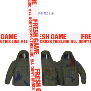

Fresh Game打开新局面
============================

|  |  |
| :--: | :-- |
| [ Fresh Game打开新局面](https://emumo.xiami.com/album/1006799854) | **艺人**: [顽童MJ116](../index.md) **语种**: 国语 **唱片公司**: 滚石唱片 **发行时间**: 2014年08月01日 **专辑类别**: 录音室专辑 **专辑风格**: 流行说唱 Pop Rap **播放数**: 38185148 **收藏数**: 3080 **评论数**: 153  |

## 简介

IIIIIIIIIIIIIIIIIIIIIIIIIIIIIIIIIIIIIIIIIIIIIIIIIIIIIIIIIIIIIIIIIIIIIIII 虾米独家首发 IIIIIIIIIIIIIIIIIIIIIIIIIIIIIIIIIIIIIIIIIIIIIIIIIIIIIIIIIIIIIIIIIIIIIIII  
  
顽童MJ116 Fresh Game 

这是顽童你知道的，你知道了什么？
 

顽童在台湾Hiphop圈创造了好几个传奇的话题，你知道吗？
 

他们是目前校园演唱会里最火热的学生指定演出团体，你知道吗？
 

他们的「Just Believe」歌曲MV创作出一个月内点阅率破上百万的记录，他们有2首歌在youtube破4百万的点播率，另外有3首歌破2百万，你知道吗？
 

顽童的粉红马台湾巡迴演唱会开卖即秒杀，你知道吗？
 

他们破天荒奇想，跨年在新生桥下举办了史无前例爆满的Hiphop跨年派对，2013年举办了同样爆满的颈部保养音乐会，你知道吗？
 

这就是顽童你知道的！这是顽童你应该要知道的！！  
  

紧急追加版 限量2,000套
 

FRESH GAME专辑 供不应求，滚石唱片回馈歌迷特别生产追加
 

这是顽童你知道的DVD + FRESH GAME 运动巾 + FRESH GAME 束口后背袋
 

另外多收录两首单曲
 

Beats Myself And I 
 

Sing forever
 
  
顽童就是当代另一层面年轻人的心声的代表，他们的音乐在高中大学热烈流传，顽童不曲高和寡，正面励志，跨界与古典音乐家苏子茵，还有Jazz大师吴智晖老师合作，从中获取更多音乐的想法，将Hiphop与古典乐还有Jazz融合，有了”顽童”的诠释。秉持着做就对了的态度，制造出人气话题，不断地为自己充电，增加大大小小的表演经验，懂得开始品尝人生的滋味，到Hiphop音乐发源地的美国去充电，放大自己的视野，国际化自己的品质，做更多全新的尝试，将更多内心的感受，催生化作音乐，打破更多顽童以前曾未达成过的音乐目标。  
  
曲目介绍
 

2.MJ FRESH GANG Feat： MC Hot Dog
 

「从木栅出发，这是我们长大的地方；我们是木栅的骄傲，要让全世界看到！」
 

讲到木栅，这个台北的城外之境，你想到什么！？木栅动物园？亦或是文山包种茶？是什么样的地域人文，造就了今天的饶舌天团顽童MJ116。
 

2014年夏天，来自木栅的三个年轻人将颠覆你对木栅的传统认知：木栅名产不是别的，就是饶舌歌手；我们是顽童MJ116，我们的组织叫 MJ FRESH GANG。
 

「MJ FRESH GANG，不追随前人的鞋印，我们将创造自己的捷径。」
 

强而有力的歌词语意，宣示出他们的精神与决心，更找来台湾饶舌教父 MC Hot Dog跨刀，也住在木栅的他，更把整首歌带往另一个高度。
 

这首歌除了宣告意味浓厚外，也是新专辑 Fresh Game 的开门歌曲，传唱力极强
 

喻为新世代的台北国歌当之无愧！  
  
3.RUNNING	Feat：J.SHEON
 

顽童知道自己不能够停歇下来，他们想要做出更好的音乐，讲出更心底的话，想要变得更好。
 

对进步而言，前进如果只能靠双脚，他们不想用走的，他们要用跑的，不断追过不可能的自己，渴望更高等的成就有如人渴望呼吸一样。
 

三个人不断创造稳健如快跑般的Flow与韵脚，将实际上与竞争者之间微妙的奇境写照转换成文字注入在歌曲之中，而J.Sheon的旋律就像是一个给了整首歌曲总结。
 

也许有人会认为他们是在逃，但在为了更高的境界而跟时间赛跑的时候，他们一心只为目标前进，无需再为了这些事情而解释。  
  
4.JUNGLE
 

历经了几亿万年的演化，人类不断的往前进，文明带给我们日新月异的生活体验；
 

虽身处水泥牢笼的城市街景，但我们的内心却是属于那丛林原始的灵魂，弱肉强食依旧是由古至今人类唯一不变生存法则。
 

「WELCOME TO THE JUNGLE！」
 

顽童用着特殊的文字排列，念出的每个字韵与声线，句句字字打入你的心灵底处，
 

副歌更是演绎出人们想逃离体制的强大意念，也许你逃得过，但你始终得面对人类为了生存的天性，以及食物链的无情循环！
 
  

这首歌特地重金找来制作过Lady Gaga. Robin Thicke . Beyonce 好莱坞大师级溷音师Tony Maserati进行国际等级的高水准音质溷音，让这首歌的重拍变得更狂野，感受到丛林之中野兽的震撼。  
  
6.双手插口袋 Feat： 张震岳
 

长辈常告诫我们，走路双手不要插在口袋里，我们总是不以为然。
 

虽然这是一个无礼的举动，也象徵着我们与这疯狂世界有着一丝隔阂，我们仍想保有心中最真实的灵魂不想与世俗妥协。
 

「每个世代的孩子总有一本难念的经」
 

顽童MJ116代表着这个世代的青年男女，他们跟大家一样渴望成功，想功成名就，想获得大家的肯定，但是心底却保有那份赤子之心及初衷。
 

整首歌围绕在大师兄张震岳，短简有力的轻快旋律中，副歌便是取样自他的2002年专辑中的同名歌曲``双手插口袋``。
 

小提琴艺术家苏子茵开场编写滂沱的弦乐，更是让人发想出世代与世代间，融合与交替，承先启后的意味满溢。
 

顽童陈述着自己的背景与过往，以及心路历程，未来的期许，写实的歌词内容让大家更贴近他们一些。  
  
7.MAN IN THE MIRROR Feat： 魏如萱 
 

自古以来镜子一直都是人们的必需品，然而镜子反射出最赤裸的自己；双眼透映着自己的一切，照镜子虽能暴露自己的外表，却无法反映内心世界。
 

但魏如萱WAWA用超然遐想的角度创作，那种莫名的感受，冰冷又带点温暖；认同中带点疑惑，矛盾的同意修辞法，衬出轻调柔性的特殊声线。
 

顽童MJ116用特殊的第三人称记叙法来呈现这首歌，赤裸的分享出世道的难为以及每个阶段的人生压力。
 

对你来说镜子里的自己，是你的闺中密友，它知道你所有的秘密；你无法掩饰让它知道，它也无法掩饰让你看见。
 

大家总忘了第一次见到镜子里的自己的感觉，也忘了那种莫名的惊讶与思绪！
 

眼前之镜有时不如心镜明亮；但心中之镜却无法真实反映在自己身上，就是这种矛盾与惊闭的心情，它就是人生之镜的小缩影！   
  
8.敞篷车
 

关于爱情的浪漫你联想到什么？海滩漫步、夜景与月光、旅游各地？
 

听见敞篷车这首歌开头的轻柔曼妙的竖琴，搭配着顽童MJ116极少使用的温雅声线，刻划出时下年轻男女似爱非恋的暧昧情怀。
 

藉由敞篷车顽童MJ116轻声完美得像奶油般融和，呈现出他们在风格上不断尝试破旧立新却又不经意的透露感性不羁的味道。
 

顽童带着你听这样的抒情曲中，也带领我们探索他们悠远的心灵祕境。
 

　
 

10.偷客兄
 

嘲讽时事与议题一向是饶舌歌手的利器之一，但顽童MJ116并不做这样的创作；反道之他们喜欢从生活上的趣事发想。
 

偷客兄灵感出自顽童MJ116的身边朋友所发生的趣事：
 

他们用详实且犀利的文字创造出一首戏谑且反应时下年轻人的糗事歌曲。
 

洗脑的副歌将戏谑与道德感化为一体，让大家不自觉的传唱哼出：拎某偷客兄 拎某拎某偷客兄。
 
  

11.生煎包
 

说到上海这个大城市，令你印象最深刻的是什么？
 

对于几个从未到过上海的大男孩来说，上海着名小吃小杨生煎包便是他们的对上海的记印之一。
 

生煎包讲述着顽童MJ116三人，到上海巡演所发展出来的趣事！从来没有去过上海的他们，有种刘姥姥逛大观园的兴奋感，初至上海的那种眼界大开与在当地吃喝玩乐的各项趣事都详记在歌词之中，从台上到台下、饭店到机场，记录着他们的周游上海的点滴。
 

也诉说记录着他们由台北出发，会用音乐慢慢的传递至世界各地，并名扬海外。
 
  

12.超级酷
 

顽童MJ116用着直白且特殊的声线，详叙出台湾年轻世代的夜生活文化，搭上强而有力的音乐轰炸，呈现出夜店里面的派对氛围，听着这首歌，各种夜店场景一一浮现。
 

也诉说出年轻人的玩乐不拘的心声，今朝有酒今朝醉，人生的问题我们就先放在一边吧！
 

你喜欢台湾的夜店派对吗？你喜欢台湾的喝酒文化吗？
 

正如洗脑的副歌所说的：
 

他超级酷，每晚都喝到超级吐；他超级吐，跳到呼吸都超急促
 
  

13.坏邻居
 

忙碌的台北社会，也许大家从来都不知道自己的家旁住了谁。你素昧平生的芳邻，夜夜笙歌的开派对，吵得你睡不入眠，食不知味。
 

你会怎么做？加入他们或是制止他们！？
 

儘管嘻哈音乐已成为派对代名词、流行文化的一环；顽童MJ116，依然用他们最擅长的美式南岸派对曲风，详实的唱出自己的生活经历
 

「我们不是坏孩子，我们只想做自己；我们认真的工作，但也拼命的玩乐。」
 

坏邻居除了深述出轰趴(HOME PARTY)的各种景象，也说出忙碌的社会底层的大家内心最真实的渴望。
 

歌词的内容强而有力，不用多想，让你对派对憧憬与慾望一次到顶点。
 

如果你也想加入他们，你不必三五成群，你只需在家把这首歌转到最大声 (前提是你喇叭够好的话)。
 

欢迎加入这新鲜的游戏，新鲜的派对；管你是HIGH邻居还是坏邻居，有顽童在的地方就是派对！
 
  

14.SUPER DUPER
 

很多女孩子认识顽童MJ116的第一首作品，是一首在地下传唱许久的经典曲目
 

顽童MJ116三个大男孩深受嘻哈文化影响长大，对自己喜欢的女孩，有别于台湾男孩子的害羞，他们大胆直白的表白，不掩饰自己的对女孩的欣赏与爱慕。整首歌曲更是强烈的表达他们对于追求女孩的各种情怀！
 

有别于敞篷车那首似爱非恋的暧昧情怀，你一定得听听这首 SUPER DUPER
 
  

15.RAP STAR
 

综观台湾的华语乐坛里，摇滚乐派的艺人总是多过于嘻哈饶舌流派。
 

勇敢做自己的态度一直是顽童MJ116展现与众不同的价值。
 

RAP STAR 除了展现出顽童MJ116用华语嘻哈饶舌勇于挑战现状，并宣告世人们我们不是一个摇滚乐团，我们是饶舌歌手，我们的足迹遍布整个台湾，在各大音乐祭都可以看见他们的身影。有我们顽童在的地方就有派对，就会爆棚，我们就是这个市场的主流，我们的做的是嘻哈饶舌乐，我们不需要鬼吼鬼叫，热力一样能传递到全世界！
 

这是我们，我们做自己　「这是顽童，你知道的！」  
  
17.JUST BELIEVE 
 

在新的游戏里，何以为梦，梦为何得。
 

「一个年轻人拥有一个远大的梦想，除了相信自己，你必须要有一群挺你的朋友。」
 

顽童MJ116的灵魂人物E-SO，入伍服兵役之前的人生感受：
 

用轻快的氛围，唸出自己对于人生的过往世态的看法！并用简单且深植人心朗朗上口的副歌旋律，表达出自己与年轻人追求梦想，渴望成功的内心感受。
 

大家总认为不能靠饶舌来养活自己，虽然这是一个远大的梦想，但顽童MJ116正带着他们的音乐与梦想一步步的实践起飞中。
 

梦虽美，我们将用尽全力把它拉出来；世界大，我们带着我们的音乐勇敢的征服它，因为「这是顽童你知道的！」  
  

18.Beats Myself And I 听不到
 

2013年，对顽童MJ116而言，是一个充满冲击与挑战的一年；除了催生新作品的迫切感，也面对外界的纷扰，世俗的批判与压力。
 

为了充电与寻找灵感，他们踏遍半个地球足迹遍佈美国与亚洲各国，随着视野的开拓，心境的转换；将音乐带入自我生活中，渐渐的他们不再听见那些浮世噪夸的耳语，当你闭上眼睛，只有心与音乐。
 

听不到的产生，与以往的曲风有相当程度的迴异，也间接证明；顽童MJ116已经突破新的格局走向新的层级与高度。
 
  

19. Sing forever Feats Renee
 

一首经典的歌，在你心底即为永恒。
 

随着岁月的淬炼，它带着先前解释的气息走向我们，背后拖着他们经历与文化或当时留下的足迹。
 

一首动人的旋律，总能让你随口哼 ～
 

带着朋友与家人之间的羁绊，带着勇气与梦想，顽童MJ116追寻着的是一个这世代的共鸣！
 

Sing forever 找来擅长演译SOUL与R&amp;B并据有爆发力唱腔的Renee一同合作演出；冲击出这曲令人犹韵且深植人心的歌曲。
 

## 曲目

## 评论

|  |  |  |
| :-- | :-- | :-- |
|  [虾米用户](https://emumo.xiami.com/u/214744379) 好 2020-09-05 17:08 赞(0) 踩(0) | 
没有理由
 |
|  [虾米用户](https://emumo.xiami.com/u/344143077) 信誓旦旦，不思其反；反是... 2020-09-02 10:51 赞(0) 踩(0) | 
怎么说呢，代表青春期的冲动吧
 |
|  [虾米用户](https://emumo.xiami.com/u/363256896) さよなら 2020-03-01 17:17 赞(0) 踩(0) | 
偷客凶早就没啦
 |
|  [虾米用户](https://emumo.xiami.com/u/88701996) 爱尼玛 2019-09-19 20:05 赞(0) 踩(0) | 
饶舌王
 |
|  [虾米用户](https://emumo.xiami.com/u/204422405)  2019-06-06 19:39 赞(0) 踩(0) | 
一
 |
|  [虾米用户](https://emumo.xiami.com/u/317076061)  2019-04-22 22:23 赞(0) 踩(0) | 
这是顽童，你知道的
 |
|  [虾米用户](https://emumo.xiami.com/u/10871081) LA to Taipei 2019-03-31 10:46 赞(0) 踩(0) | 
什么情况？mj fresh gang 也要下架？服了 呵呵
 |
|  [虾米用户](https://emumo.xiami.com/u/52056952) 人生即是到來、相遇、陪伴... 2019-03-26 20:37 赞(0) 踩(0) | 

 |
|  [虾米用户](https://emumo.xiami.com/u/357081265) 沉淀 2019-03-23 00:49 赞(1) 踩(0) | 
这是顽童你知道的
 |
|  [虾米用户](https://emumo.xiami.com/u/223845151) _(:* ｣∠)_ 2018-10-28 13:11 赞(0) 踩(0) | 

 |
|  [虾米用户](https://emumo.xiami.com/u/36006611) 我还没想好要写什么... 2018-06-26 08:58 赞(4) 踩(0) | 
幸好我以前下载了偷客兄 
 |
| ⇒ |  [虾米用户](https://emumo.xiami.com/u/219978506)   2018-10-18 21:51 赞(0) 踩(0) | 
可以发给我吗？
 |
|  [虾米用户](https://emumo.xiami.com/u/3716653) 对自己的播放列表感到耻 2018-06-13 21:11 赞(1) 踩(0) | 
偷客兄到底有哪里不对需要被下架？烦死了。
 |
|  [虾米用户](https://emumo.xiami.com/u/43737239) 我还没想好要写什么... 2018-05-20 16:12 赞(0) 踩(0) | 
偷客兄呢？！
 |
|  [虾米用户](https://emumo.xiami.com/u/253509932) 我还没想好要写什么... 2018-04-30 14:15 赞(2) 踩(0) | 
偷客兄呢
 |
|  [虾米用户](https://emumo.xiami.com/u/242643828) 不是摇滚女孩 2018-04-22 17:15 赞(1) 踩(0) | 
怎么办我还是喜欢这张专辑qwq
 |
|  [虾米用户](https://emumo.xiami.com/u/224460693) 我还没想好要写什么... 2018-03-04 23:22 赞(1) 踩(0) | 
偷客兄？
 |
|  [虾米用户](https://emumo.xiami.com/u/36766176) ezfree 2018-02-22 17:25 赞(0) 踩(0) | 
这张专辑很屌
 |
|  [虾米用户](https://emumo.xiami.com/u/211850328)  2018-01-12 12:52 赞(0) 踩(0) | 
今天听让我想起以前听的感觉，第一次听便喜欢上顽童和这张专辑了。
 |
|  [虾米用户](https://emumo.xiami.com/u/259786592) Go 2017-11-10 21:51 赞(0) 踩(0) | 
叼炸天，，厉害，。中文饶舌才是最叼的
 |
|  [虾米用户](https://emumo.xiami.com/u/2985885)   2017-10-28 00:07 赞(3) 踩(0) | 
认真听了听 最好听的居然是那几个skit和魏如萱那句how we roll baby ... 像super duper这种又老又难听的歌就不要放进专辑了 6年 心思都在卖衣服了吧 还有，eso单飞吧
 |
| ⇒ |  [虾米用户](https://emumo.xiami.com/u/239942073)  2018-05-15 16:18 赞(0) 踩(0) | 
然而你并不懂音乐
 |
|  [虾米用户](https://emumo.xiami.com/u/26166944) 游走在社会边缘的神秘者 2017-10-04 06:14 赞(3) 踩(0) | 
两千多万试听，我眼红嫉妒了真的
 |
|  [虾米用户](https://emumo.xiami.com/u/292607920)  2017-08-25 12:59 赞(2) 踩(0) | 
这是顽童你知道的
 |
|  [虾米用户](https://emumo.xiami.com/u/558626)  2017-07-31 21:40 赞(2) 踩(0) | 
eso的词确实出挑些
 |
|  [虾米用户](https://emumo.xiami.com/u/290088150)  2017-06-04 07:14 赞(1) 踩(0) | 
宝宝eso
 |
|  [虾米用户](https://emumo.xiami.com/u/271659613)  2017-04-14 00:42 赞(1) 踩(0) | 
顽童很好
 |
|  [虾米用户](https://emumo.xiami.com/u/218791157)  2017-04-13 14:45 赞(2) 踩(0) | 
超级棒
 |
|  [虾米用户](https://emumo.xiami.com/u/2163129)  2017-04-05 03:34 赞(1) 踩(0) | 
这张专辑太棒了
 |
|  [虾米用户](https://emumo.xiami.com/u/167561680)  2017-03-02 18:29 赞(1) 踩(0) | 
可以有真好听
 |
|  [虾米用户](https://emumo.xiami.com/u/264283064) bye  2017-01-31 08:49 赞(1) 踩(0) | 
△
 |
|  [虾米用户](https://emumo.xiami.com/u/128312674) Mc 2017-01-11 12:46 赞(3) 踩(0) | 
这是顽童我知道的
 |
| ⇒ |  [虾米用户](https://emumo.xiami.com/u/168749290) 我还没想好要写什么... 2017-01-18 21:46 赞(0) 踩(0) | 
对
 |
|  [虾米用户](https://emumo.xiami.com/u/127716000) 不要关注 2016-12-20 11:15 赞(0) 踩(0) | 
超喜！
 |
|  [虾米用户](https://emumo.xiami.com/u/12814087) 一直在成长 2016-12-16 22:36 赞(0) 踩(0) | 
Let&amp;#039;s rap up ~ yes!
 |
|  [虾米用户](https://emumo.xiami.com/u/12814087) 一直在成长 2016-12-16 22:36 赞(0) 踩(0) | 
Let&amp;#039;s rap up ~ yes!
 |
|  [虾米用户](https://emumo.xiami.com/u/118617008)   2016-10-06 01:22 赞(0) 踩(0) | 
这是顽童你知道的~
 |
|  [虾米用户](https://emumo.xiami.com/u/54119513) 梁上君子.(2015.1... 2016-08-27 08:22 赞(2) 踩(0) | 
整张专辑我都喜欢！！！！！！！！！！！！！！！！！！！！ ！！！！！！！！/！
 |
|  [虾米用户](https://emumo.xiami.com/u/207443364)   2016-08-03 15:20 赞(2) 踩(0) | 
顽童万岁
 |
|  [虾米用户](https://emumo.xiami.com/u/190181870)   2016-06-27 11:34 赞(3) 踩(0) | 
很久没有听到这么直达内心的歌了
 |
|  [虾米用户](https://emumo.xiami.com/u/5708413) 音乐是个好东西 2016-06-25 00:21 赞(1) 踩(0) | 
惊天魔盗团2是这首？
 |
| ⇒ |  [虾米用户](https://emumo.xiami.com/u/96063166) 。ミ忝シ忝﹏'8023 ... 2016-06-25 10:04 赞(0) 踩(0) | 
同问！
 |
| ⇒ |  [虾米用户](https://emumo.xiami.com/u/185555018)  2016-06-25 23:23 赞(0) 踩(0) | 
是的，电影里就热狗那一小段
 |
| ⇒ |  [虾米用户](https://emumo.xiami.com/u/185555018)  2016-06-25 23:24 赞(0) 踩(0) | 
<q><b>_何伴苮______oo说：</b></q>
 |
| ⇒ |  [虾米用户](https://emumo.xiami.com/u/46515111)  2016-08-26 15:48 赞(0) 踩(0) | 
MJ Fresh Gang啊！
 |
|  [虾米用户](https://emumo.xiami.com/u/8804908)  2016-05-10 10:28 赞(1) 踩(0) | 
觉得不错，加油！
 |
|  [虾米用户](https://emumo.xiami.com/u/136051706) 想要活在自己的世界里 2016-05-07 14:42 赞(0) 踩(0) | 
最爱
 |
|  [虾米用户](https://emumo.xiami.com/u/38659275)  2016-04-27 11:34 赞(1) 踩(0) | 
垃圾儿童116
 |
| ⇒ |  [虾米用户](https://emumo.xiami.com/u/128312674) Mc 2017-01-11 12:47 赞(0) 踩(0) | 
辣鸡
 |
|  [虾米用户](https://emumo.xiami.com/u/3496718) idle space 2016-04-12 18:10 赞(1) 踩(0) | 
打开新局面，这说唱很厉害~~~
 |
|  [虾米用户](https://emumo.xiami.com/u/3496718) idle space 2016-04-12 18:10 赞(1) 踩(0) | 
打开新局面，这说唱很厉害~~~
 |
|  [虾米用户](https://emumo.xiami.com/u/137448426)   2016-04-08 23:15 赞(0) 踩(0) | 
刚好
 |
|  [虾米用户](https://emumo.xiami.com/u/273336) 我还没想好要写什么... 2016-04-07 23:00 赞(0) 踩(0) | 
上次看好声音。南征北战唱成了凤凰传奇。还好有116。有个声音和cblock里的胖纸好像。
 |
|  [虾米用户](https://emumo.xiami.com/u/93293914)  2016-04-02 11:34 赞(0) 踩(0) | 
棒
 |
|  [虾米用户](https://emumo.xiami.com/u/93293914)  2016-04-02 11:33 赞(0) 踩(0) | 
1
 |
|  [虾米用户](https://emumo.xiami.com/u/36595978)  2016-03-08 09:56 赞(0) 踩(0) | 
大渊～
 |
|  [虾米用户](https://emumo.xiami.com/u/74276012)   2016-01-31 21:47 赞(1) 踩(0) | 
一个flow说明的是真实，难道你唱的时候会有很多flow啊
 |
| ⇒ |  [虾米用户](https://emumo.xiami.com/u/86981670)  2016-05-14 17:59 赞(0) 踩(0) | 
笑死我了
 |
|  [虾米用户](https://emumo.xiami.com/u/74276012)   2016-01-31 21:46 赞(0) 踩(0) | 
什么鬼，flow一直改变就没有自己风格了好吧
 |
|  [虾米用户](https://emumo.xiami.com/u/94368198)  2015-12-25 14:39 赞(0) 踩(0) | 
有欧美风格的嘻哈，值得反复听。
 |
|  [虾米用户](https://emumo.xiami.com/u/30617820) 窝列大窝列大哟 2015-10-02 14:20 赞(0) 踩(0) | 
➿
 |
|  [虾米用户](https://emumo.xiami.com/u/15407921) 签Pp 2015-09-02 14:41 赞(0) 踩(0) | 
Just Believe加油!
 |
|  [虾米用户](https://emumo.xiami.com/u/42388602)  2015-08-29 07:10 赞(0) 踩(0) | 
真的是，不懂的人就别再那边叫
 |
|  [虾米用户](https://emumo.xiami.com/u/7322777) ∮ 2015-08-02 09:03 赞(0) 踩(0) | 
...A...
 |
|  [虾米用户](https://emumo.xiami.com/u/5907047) 8==D 2015-07-11 15:38 赞(0) 踩(0) | 
:)
 |
|  [虾米用户](https://emumo.xiami.com/u/6481024) 兼听则明 2015-06-19 22:00 赞(0) 踩(0) | 
有台湾的歌迷或者懂台湾话的 亏装 是什么意思？
 |
| ⇒ |  [虾米用户](https://emumo.xiami.com/u/118928044) Como esta 2017-08-18 12:34 赞(0) 踩(0) | 
化妆个意思哩
 |
|  [虾米用户](https://emumo.xiami.com/u/7766692) 念起即觉 觉起不随 2015-04-11 10:31 赞(1) 踩(0) | 
每个团体里总有个天才 瘦子是顽童里的天才 词和flow都是台湾除了蛋堡以外我最爱的 用几个字就描出有深度的词 小春忙着和他老婆捞钱 感觉就是个欧吉桑 胖子就知道泡妹= =可你不得不说三个人加一起的化学效应是那么的搭
 |
|  [虾米用户](https://emumo.xiami.com/u/29389476) meh 2015-04-11 01:02 赞(0) 踩(0) | 
这几年做的什么东西？原地绕圈？
 |
|  [虾米用户](https://emumo.xiami.com/u/48168598)  2015-03-16 08:55 赞(0) 踩(0) | 
好听
 |
|  [虾米用户](https://emumo.xiami.com/u/31811135) - 我就是我 2015-03-04 20:56 赞(0) 踩(0) | 
this is how we roll baby.✈️
 |
|  [虾米用户](https://emumo.xiami.com/u/6613315) 我... 2015-02-22 23:51 赞(0) 踩(0) | 
大家都有在认真打分吗 2星不能更高了
 |
|  [虾米用户](https://emumo.xiami.com/u/2531483) fuck trap 2015-02-20 13:32 赞(0) 踩(0) | 
垃圾
 |
|  [虾米用户](https://emumo.xiami.com/u/935190)  2015-01-11 15:29 赞(0) 踩(0) | 
终于大陆可以听了····
 |
|  [虾米用户](https://emumo.xiami.com/u/13236286) Let music be... 2015-01-02 08:14 赞(0) 踩(0) | 
this is how we roll. baby from SD YEELA
 |
|  [虾米用户](https://emumo.xiami.com/u/1810594) 喜欢hiphop但不懂 2014-10-22 16:37 赞(23) 踩(0) | 
三个人唱一首歌一对比 说实话 eso的词和flow确实很好
 |
|  [虾米用户](https://emumo.xiami.com/u/42194541) 没Flow没朋友 2014-10-08 15:28 赞(0) 踩(0) | 
S
 |
|  [虾米用户](https://emumo.xiami.com/u/4705545)   2014-09-30 19:37 赞(0) 踩(0) | 
香槟酒开漱喉咙 模特儿在身后**是那首歌里的啊？
 |
| ⇒ |  [虾米用户](https://emumo.xiami.com/u/7766692) 念起即觉 觉起不随 2015-04-11 10:28 赞(0) 踩(0) | 
生煎包吧
 |
|  [虾米用户](https://emumo.xiami.com/u/349246)  2014-09-28 23:23 赞(0) 踩(0) | 
听eso不能更爽
 |
|  [虾米用户](https://emumo.xiami.com/u/7766692) 念起即觉 觉起不随 2014-09-26 19:59 赞(0) 踩(0) | 
就觉得jungle和生煎包好听
 |
|  [虾米用户](https://emumo.xiami.com/u/4145927) 我还没想好要写什么... 2014-09-20 16:00 赞(0) 踩(0) | 
新歌没几首，时隔这么久，跟当年热狗一样，4年出一张专辑，新歌一半不到
 |
| ⇒ |  [虾米用户](https://emumo.xiami.com/u/35275661)  2014-09-22 12:41 赞(0) 踩(0) | 
欧美那边的rapper都是这样做的，一般发新专前，发一大堆单曲，然后发新专的时候一看，好多都是之前听过的。。。他们也是学欧美吧
 |
| ⇒ |  [虾米用户](https://emumo.xiami.com/u/4145927) 我还没想好要写什么... 2014-09-22 16:46 赞(0) 踩(0) | 
<q><b>布法罗鸡翅说：</b></q>
 |
|  [虾米用户](https://emumo.xiami.com/u/10791136)   2014-09-17 00:23 赞(0) 踩(0) | 
如果还有梦把所有梦想拉出梦中
 |
|  [虾米用户](https://emumo.xiami.com/u/10791136)   2014-09-17 00:22 赞(0) 踩(0) | 
牛逼极了
 |
|  [虾米用户](https://emumo.xiami.com/u/38906476)  2014-09-07 15:22 赞(0) 踩(0) | 
顽童我挺你
 |
|  [虾米用户](https://emumo.xiami.com/u/30818783) 我 2014-09-07 02:51 赞(1) 踩(0) | 
不如yz
 |
|  [虾米用户](https://emumo.xiami.com/u/11466586) LAKTA 2014-09-06 09:24 赞(0) 踩(0) | 
咋全是听过的。。。
 |
|  [虾米用户](https://emumo.xiami.com/u/6349146)  2014-09-06 09:09 赞(0) 踩(0) | 
现在台湾Rap还是听蛋堡
 |
|  [虾米用户](https://emumo.xiami.com/u/6666995)  2014-08-31 14:09 赞(1) 踩(0) | 
有点失望，等了这么久，出来就这些“旧”的东西，可能商演变多也让你们性质变了吧，你们的进步确实是变慢了，技巧方面比起人人有功练的团员慢慢有了些差距了。真心没有以前刚听你们歌曲时的那种好听与冲动了
 |
|  [虾米用户](https://emumo.xiami.com/u/1152820) 微博：_隔壁家老彭 2014-08-31 14:05 赞(0) 踩(0) | 
eso单飞吧
 |
|  [虾米用户](https://emumo.xiami.com/u/5661340) 态度问题 2014-08-30 18:25 赞(1) 踩(0) | 
顽童里面本来就eso可以不管词还是flow，在国外的话，他估计单飞咯，
 |
|  [虾米用户](https://emumo.xiami.com/u/6160581) If u dont li... 2014-08-30 16:20 赞(0) 踩(0) | 
YO
 |
|  [虾米用户](https://emumo.xiami.com/u/5825074) 看你不顺眼我自己滚 2014-08-29 03:46 赞(0) 踩(0) | 
有几首还蛮有感觉的
 |
|  [虾米用户](https://emumo.xiami.com/u/22614912) 虾米，我喜欢 2014-08-20 15:22 赞(0) 踩(0) | 
不錯的專輯
 |
|  [虾米用户](https://emumo.xiami.com/u/7295040)  2014-08-18 16:58 赞(0) 踩(0) | 
頑童MJ116,
 |
|  [虾米用户](https://emumo.xiami.com/u/5956149) 我还没想好要写什么... 2014-08-17 16:44 赞(0) 踩(0) | 
一般。
 |
|  [虾米用户](https://emumo.xiami.com/u/37909511) 飞行员 2014-08-12 21:48 赞(0) 踩(0) | 
这张觉得还好
 |
|  [虾米用户](https://emumo.xiami.com/u/9178116)  2014-08-12 20:17 赞(0) 踩(0) | 
个人感觉里面写词flow OK的就是ESO
 |
|  [虾米用户](https://emumo.xiami.com/u/15439385)  2014-08-11 10:57 赞(0) 踩(0) | 
真心棒！！！！！！！！！！！！！！！！！
 |
|  [虾米用户](https://emumo.xiami.com/u/37097666) 喜欢edm音乐的朋友和我... 2014-08-10 01:35 赞(0) 踩(0) | 
我看嘻哈适合闽南语
 |
| ⇒ |  [虾米用户](https://emumo.xiami.com/u/123441318)   2016-05-06 10:51 赞(0) 踩(0) | 
死外地佬
 |
|  [虾米用户](https://emumo.xiami.com/u/32734340) 虾米钉子户 2014-08-08 01:46 赞(0) 踩(0) | 
太爱了啊
 |
|  [虾米用户](https://emumo.xiami.com/u/32792787)   2014-08-07 13:49 赞(0) 踩(0) | 
抛出来。
 |
|  [虾米用户](https://emumo.xiami.com/u/20536602)   2014-08-07 07:07 赞(1) 踩(0) | 
时隔6年出了新专辑，新歌一般都不到！冒险王还没以前唱的有味道，再见吧顽童
 |
|  [虾米用户](https://emumo.xiami.com/u/313946)  2014-08-04 23:34 赞(22) 踩(0) | 
感觉他们的音乐很一般，可能是我老了吧。台湾的嘻哈音乐除了颜社做的东西，其他都是在原地踏步。尤其热狗顽童这些人，还不如一些新人。
 |
| ⇒ |  [虾米用户](https://emumo.xiami.com/u/39705386) 永別了 各位。 2014-08-05 00:30 赞(0) 踩(0) | 
可惜颜社的歌比较难找…
 |
| ⇒ |  [虾米用户](https://emumo.xiami.com/u/313946)  2014-08-05 00:52 赞(0) 踩(0) | 
<q><b>口腔溃疡说：</b></q>
 |
| ⇒ |  [虾米用户](https://emumo.xiami.com/u/209397685) 什么香水味搔首弄姿那眼神... 2016-12-04 14:54 赞(0) 踩(0) | 
反而我觉得 颜社听多了之后 顽童的歌反而是调剂 我是国蛋死忠 说话完全客观
 |
| ⇒ |  [虾米用户](https://emumo.xiami.com/u/128312674) Mc 2017-01-11 12:46 赞(0) 踩(0) | 
不是你老不老，根本不懂不用说些废话
 |
| ⇒ |  [虾米用户](https://emumo.xiami.com/u/145383944) 你說啊 2017-05-14 16:53 赞(0) 踩(0) | 
滑板鞋更适合你
 |
|  [虾米用户](https://emumo.xiami.com/u/12486419)  2014-08-04 18:39 赞(22) 踩(0) | 
觉得歌曲的质量还没有好到可以发一张专辑，做成mixtape的话还是可以的。 能听下去的只有fresh gang和rap star。所有的歌都是相同的flow，太容易审美疲劳。 最后一首eso独唱且重新制作的just believe也已经没有最初流出的版本的那种感动了，而且那咬字是怎么回事。。“人”似乎都是翘舌。。
 |
| ⇒ |  [虾米用户](https://emumo.xiami.com/u/15439385)  2014-08-11 10:58 赞(0) 踩(0) | 
确实
 |
| ⇒ |  [虾米用户](https://emumo.xiami.com/u/3977650)  2015-09-09 03:22 赞(0) 踩(0) | 
你TM讲的你好屌，讲的你会制作一张专辑那样，你回家吃屎吧。你有料的话就不会做键盘党
 |
| ⇒ |  [虾米用户](https://emumo.xiami.com/u/238106045)  2017-05-03 16:01 赞(0) 踩(0) | 
目前看来这张太经典了
 |
| ⇒ |  [虾米用户](https://emumo.xiami.com/u/5530908) 不好意思 2017-09-16 17:33 赞(0) 踩(0) | 
相同的flow？？？？兄弟你确定嘛
 |
| ⇒ |  [虾米用户](https://emumo.xiami.com/u/239942073)  2018-05-15 16:17 赞(0) 踩(0) | 
你并不懂音乐
 |
|  [虾米用户](https://emumo.xiami.com/u/7975116)  2014-08-03 21:27 赞(0) 踩(0) | 
还不错。
 |
|  [虾米用户](https://emumo.xiami.com/u/607980) 我还没想好要写什么... 2014-08-03 13:17 赞(0) 踩(0) | 
特别喜欢大渊吼的声音
 |
|  [虾米用户](https://emumo.xiami.com/u/369150) ♥︎stay hunge... 2014-08-03 01:54 赞(0) 踩(0) | 
大爱啊
 |
|  [虾米用户](https://emumo.xiami.com/u/33199952)   2014-08-03 01:18 赞(0) 踩(0) | 
还是虾米够快 cool
 |
|  [虾米用户](https://emumo.xiami.com/u/6661598)  2014-08-02 22:45 赞(0) 踩(0) | 
06 07 08
 |
|  [虾米用户](https://emumo.xiami.com/u/38628790)  2014-08-02 21:26 赞(0) 踩(0) | 
终于等到了
 |
|  [虾米用户](https://emumo.xiami.com/u/6165030) 哦 2014-08-02 19:25 赞(0) 踩(0) | 
丝袜鸡啦！分手节快乐
 |
|  [虾米用户](https://emumo.xiami.com/u/37042406)   2014-08-02 18:16 赞(0) 踩(0) | 
太狠了这张！ 还有的歌求歌词阿！
 |
|  [虾米用户](https://emumo.xiami.com/u/607980) 我还没想好要写什么... 2014-08-02 17:27 赞(0) 踩(0) | 
太好听惹
 |
|  [虾米用户](https://emumo.xiami.com/u/6522601) 聆听世界中每一种味道 2014-08-02 14:25 赞(0) 踩(0) | 
好听，收藏了
 |
|  [虾米用户](https://emumo.xiami.com/u/12470320) 我还没想好要写什么... 2014-08-02 13:00 赞(0) 踩(0) | 
操！
 |
|  [虾米用户](https://emumo.xiami.com/u/1221979)  2014-08-02 11:15 赞(0) 踩(0) | 
听了几遍下来，感觉他们跟着热狗混，虽然表演机会多了，但是作品水分太多…
 |
| ⇒ |  [虾米用户](https://emumo.xiami.com/u/38628790)  2014-08-02 21:25 赞(0) 踩(0) | 
他们是热狗的师弟，曲风不一样
 |
|  [虾米用户](https://emumo.xiami.com/u/16896103) 我还没想好要写什么... 2014-08-02 10:16 赞(0) 踩(0) | 
fresh
 |
|  [虾米用户](https://emumo.xiami.com/u/2510951)  2014-08-02 03:23 赞(0) 踩(0) | 
屌
 |
|  [虾米用户](https://emumo.xiami.com/u/32634320) Q：419454950 2014-08-02 01:52 赞(0) 踩(0) | 
E.SO   瘦子
 |
|  [虾米用户](https://emumo.xiami.com/u/39604872)  2014-08-02 00:37 赞(0) 踩(0) | 
微博搜林佳有卖专辑
 |
|  [虾米用户](https://emumo.xiami.com/u/2985885)   2014-08-01 22:39 赞(0) 踩(0) | 
新歌一半都不到.....
 |
|  [虾米用户](https://emumo.xiami.com/u/13436154) 孤独的人都比较喜欢听音乐... 2014-08-01 22:27 赞(0) 踩(0) | 
等太久了 神专 赞
 |
|  [虾米用户](https://emumo.xiami.com/u/2527832) 超越生命 解放自由 2014-08-01 20:02 赞(0) 踩(0) | 
Yeah
 |
|  [虾米用户](https://emumo.xiami.com/u/39222727)  2014-08-01 19:44 赞(0) 踩(0) | 
這是頑童你知道的
 |
|  [虾米用户](https://emumo.xiami.com/u/35275661)  2014-08-01 18:39 赞(0) 踩(0) | 
怎么说呢，鼓励一下
 |
|  [虾米用户](https://emumo.xiami.com/u/35275661)  2014-08-01 18:38 赞(0) 踩(0) | 
幸好有虾米送的免费两个月的VIP，果断下
 |
|  [虾米用户](https://emumo.xiami.com/u/1221979)  2014-08-01 16:28 赞(0) 踩(0) | 
等来啦
 |
|  [虾米用户](https://emumo.xiami.com/u/30720717)  2014-08-01 15:51 赞(0) 踩(0) | 
这是顽童 你知道的～
 |
|  [虾米用户](https://emumo.xiami.com/u/634416) 跳蚤~ 2014-08-01 14:08 赞(0) 踩(0) | 
来啦~~！！
 |
|  [虾米用户](https://emumo.xiami.com/u/33661996)  2014-08-01 14:02 赞(0) 踩(0) | 
居然有首发，正愁去哪买专辑呢
 |
| ⇒ |  [虾米用户](https://emumo.xiami.com/u/15495349) 4YourEyezOnl... 2014-08-01 22:13 赞(0) 踩(0) | 
要买专辑吗 我告诉你哪里买
 |
| ⇒ |  [虾米用户](https://emumo.xiami.com/u/32634320) Q：419454950 2014-08-02 02:01 赞(0) 踩(0) | 
<q><b>满嘴脏话的姑娘心最软说：</b></q>
 |
| ⇒ |  [虾米用户](https://emumo.xiami.com/u/32634320) Q：419454950 2017-10-27 23:04 赞(0) 踩(0) | 
官方推荐是在五大唱片可以买，但如果你不是台湾的，你可在淘宝买，但是大陆比台湾卖的贵，而且现在大陆只有预定。要一周之后才可能给你发货，因为我今天买了
 |
|  [虾米用户](https://emumo.xiami.com/u/37143647)   2014-08-01 13:37 赞(0) 踩(0) | 
太好听
 |
|  [虾米用户](https://emumo.xiami.com/u/29481228) 暂无签名~ 2014-08-01 13:05 赞(0) 踩(0) | 
买了专辑了
 |
|  [虾米用户](https://emumo.xiami.com/u/37280054)  2014-08-01 13:05 赞(0) 踩(0) | 
牛逼的专辑必须
 |
|  [虾米用户](https://emumo.xiami.com/u/30891901) 风干的岁月，永恒的止殇。 2014-08-01 12:58 赞(0) 踩(0) | 
刚试听。
 |
|  [虾米用户](https://emumo.xiami.com/u/12260424) 暂无签名~ 2014-08-01 12:56 赞(0) 踩(0) | 
睇！
 |
