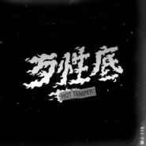

歹性底
============================

|  |  |
| :--: | :-- |
| [ 歹性底](https://emumo.xiami.com/album/2103708241) | **艺人**: [顽童MJ116](../index.md) **语种**: 国语 **唱片公司**: 本色音乐, StreetVoice **发行时间**: 2018年05月16日 **专辑类别**: EP, 单曲 **专辑风格**:  **播放数**: 108201 **收藏数**: 75 **评论数**: 14  |

## 简介

若你听过小春Kenzy-No.1 Hustler Mixtape 中的单曲 Satan  
他讲述的就是对内心自我意识的冲击表白  
  
歹性底这首歌正好相反，藉由这首歌突显出小春的外在性格与个人印象  
直白的歌词内容搭配上小春新式的唱法，加上以台语为基底的洗脑副歌  
坦率不掩饰说出这就是我，做我自己有什么不行！？  
  
如副歌歌词所说的：「我就是歹性底，08就是歹底性～」  
  
  
  
- 

## 曲目

## 评论

|  |  |  |  |
| :-- | :-- | :-- | :-- |
|  [虾米用户](https://emumo.xiami.com/u/377506483)  2018-07-18 15:29 赞(0) 踩(0) | 
顽童就要歹性
 |
|  [虾米用户](https://emumo.xiami.com/u/91372642) 不開心就不好看了 2018-06-12 16:08 赞(0) 踩(0) | 
x
 |
|  [虾米用户](https://emumo.xiami.com/u/194188866) diagotsomesp... 2018-05-23 16:07 赞(0) 踩(0) | 
湿
 |
|  [虾米用户](https://emumo.xiami.com/u/270263903) 乐对生活！ 2018-05-20 13:49 赞(0) 踩(0) | 
我丢系歹性底 恁爸丢歹性底 YEAH YEAH YEAH YEAH
 |
|  [虾米用户](https://emumo.xiami.com/u/165799380) 32 2018-05-17 13:38 赞(0) 踩(0) | 
春仔无敌
 |
|  [虾米用户](https://emumo.xiami.com/u/222374551) 雨下了走好路 这句话我记... 2018-05-17 11:56 赞(0) 踩(0) | 
这是顽童你知道的 
 |
|  [虾米用户](https://emumo.xiami.com/u/264233299)  2018-05-16 19:15 赞(0) 踩(0) | 
肯定是满分啦，这还用说？
 |
|  [虾米用户](https://emumo.xiami.com/u/75814324)   2018-05-16 12:19 赞(0) 踩(0) | 
hands up hands up
 |
|  [虾米用户](https://emumo.xiami.com/u/139089220) Hip Hop 2018-05-16 12:04 赞(0) 踩(0) | 
这是顽童你知道的
 |
|  [虾米用户](https://emumo.xiami.com/u/318132) 抠啦 2018-05-16 12:02 赞(0) 踩(0) | 
抠啦
 |
|  [虾米用户](https://emumo.xiami.com/u/76003704) 我还没想好要写什么... 2018-05-16 12:01 赞(0) 踩(0) | 
耶耶耶
 |
|  [虾米用户](https://emumo.xiami.com/u/299294025)  2018-05-16 12:01 赞(1) 踩(0) | 
333
 |
|  [虾米用户](https://emumo.xiami.com/u/292836781)  2018-05-16 12:01 赞(0) 踩(0) | 
111
 |
|  [虾米用户](https://emumo.xiami.com/u/163180394)  2018-05-16 12:01 赞(0) 踩(0) | 
沙发
 |
