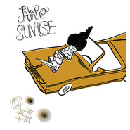

Pajaro Sunrise
============================

|  |  |
| :--: | :-- |
| [ Pajaro Sunrise](https://emumo.xiami.com/album/172228) | **艺人**: [Pajaro Sunrise](../index.md) **语种**: 英语 **唱片公司**: Lovemonk **发行时间**: 2006年12月12日 **专辑类别**: 录音室专辑 **专辑风格**:  **播放数**: 9790521 **收藏数**: 3660 **评论数**: 247  |

## 简介

这是他们发行的第一张同名专辑。从专辑封面上看到的一个人、一辆车,累了睡、醒了走的生活状态,就知道这是一张拥有遐意轻松生活表情的专辑,歌如封面。
 
  

整张专辑里混合着INDIE、JAZZ、FOLK等音乐风格，特别是在JAZZ方面，似乎不单包括了《Wild days》中西班牙音乐里常见的BOSSA NOVA，还有些早期的SWING JAZZ的成份在，例如《California lover》的那段钢琴SOLO。其他的都以轻松自然的FOLK与ROCK为主，很可爱随性的一张音乐作品。

## 曲目

## 评论

|  |  |  |
| :-- | :-- | :-- |
|  [虾米用户](https://emumo.xiami.com/u/214395122) No signature 2018-01-19 20:20 赞(0) 踩(0) | 
是太阳啊
 |
|  [虾米用户](https://emumo.xiami.com/u/50291903) 好好面對自己 2017-10-26 11:58 赞(0) 踩(0) | 
非常好听的专辑 
 |
|  [虾米用户](https://emumo.xiami.com/u/48898343) 生命已经过期 2017-10-16 00:49 赞(0) 踩(0) | 
曾经很喜欢
 |
|  [虾米用户](https://emumo.xiami.com/u/827224) 慵懒的午后，慵懒的音乐 2017-10-09 15:31 赞(1) 踩(0) | 
。
 |
|  [虾米用户](https://emumo.xiami.com/u/298672571)  2017-08-01 19:10 赞(0) 踩(0) | 
这张专辑太好听了，特别适合考试静心
 |
|  [虾米用户](https://emumo.xiami.com/u/2572824) 我还没想好要写什么... 2016-09-19 15:11 赞(0) 踩(0) | 
全下架了。。
 |
|  [虾米用户](https://emumo.xiami.com/u/4261281)  2016-04-06 15:06 赞(1) 踩(0) | 
Pajaro Sunrise~~ Pajaro Sunrise
 |
|  [虾米用户](https://emumo.xiami.com/u/35251885)  2016-03-26 09:42 赞(1) 踩(0) | 
婚礼前半场
 |
|  [虾米用户](https://emumo.xiami.com/u/95038)  2016-03-09 15:58 赞(3) 踩(0) | 
今日购得实体CD
 |
| ⇒ |  [虾米用户](https://emumo.xiami.com/u/2574272) 好好学习吧 2017-09-14 14:09 赞(0) 踩(0) | 
何处可购入？
 |
|  [虾米用户](https://emumo.xiami.com/u/33250492) 血管切割人 2016-01-05 16:37 赞(1) 踩(0) | 
神奇的专辑
 |
|  [虾米用户](https://emumo.xiami.com/u/14391168)  深夜，一首歌，一根烟，... 2015-12-25 16:53 赞(1) 踩(0) | 
让我有随波逐流却又不失本心的淡淡悠然~(摇摆，摇摆……)要飘远了…………
 |
|  [虾米用户](https://emumo.xiami.com/u/40254483)  2015-12-19 17:30 赞(1) 踩(0) | 
好评。
 |
|  [虾米用户](https://emumo.xiami.com/u/6794927)  2015-11-03 09:27 赞(1) 踩(0) | 
love it
 |
|  [虾米用户](https://emumo.xiami.com/u/9391790) 为你，千千万万遍。 2015-10-09 20:41 赞(1) 踩(0) | 
grunge...good!
 |
|  [虾米用户](https://emumo.xiami.com/u/49680946)  2015-10-05 19:07 赞(1) 踩(0) | 

 |
|  [虾米用户](https://emumo.xiami.com/u/7322777) ∮ 2015-09-02 04:45 赞(1) 踩(0) | 
...A...
 |
|  [虾米用户](https://emumo.xiami.com/u/37772304)  2015-08-16 20:40 赞(2) 踩(0) | 
这专辑真的很好听，重要的事情重复三遍，真的，真的很好听
 |
|  [虾米用户](https://emumo.xiami.com/u/50768412) 自持，自在。 2015-07-22 12:43 赞(0) 踩(0) | 
封面真悠闲。
 |
|  [虾米用户](https://emumo.xiami.com/u/13622642)  2015-07-01 22:30 赞(1) 踩(0) | 
如果下午不上班，真想听着喝咖啡啥都不想。。。
 |
|  [虾米用户](https://emumo.xiami.com/u/35103783)  2015-06-18 11:37 赞(0) 踩(0) | 
******
 |
|  [虾米用户](https://emumo.xiami.com/u/9152977) 不合群的音谋者。 2015-06-05 13:08 赞(0) 踩(0) | 
good!
 |
|  [虾米用户](https://emumo.xiami.com/u/15788012) 我还没想好要写什么... 2015-06-04 23:33 赞(0) 踩(0) | 
心情突然就舒畅了 什么都不算事了 再大的事也放他一晚上的假
 |
|  [虾米用户](https://emumo.xiami.com/u/14364706) 暂无签名~ 2015-05-08 17:06 赞(0) 踩(0) | 
周末快乐！
 |
|  [虾米用户](https://emumo.xiami.com/u/14364706) 暂无签名~ 2015-05-08 17:06 赞(0) 踩(0) | 
下班的时间听着好搭
 |
|  [虾米用户](https://emumo.xiami.com/u/847574)  2015-03-17 15:12 赞(0) 踩(0) | 
舒服其实很简单，听。。。
 |
|  [虾米用户](https://emumo.xiami.com/u/48054530)  2015-03-12 10:18 赞(0) 踩(0) | 
开春了 保持心情
 |
|  [虾米用户](https://emumo.xiami.com/u/48054530)  2015-03-12 10:17 赞(0) 踩(0) | 
开春了 保持心情
 |
|  [虾米用户](https://emumo.xiami.com/u/34214093)  2015-03-08 23:55 赞(0) 踩(0) | 
很久已经没听到入心的歌了
 |
|  [虾米用户](https://emumo.xiami.com/u/12772393) 追寻 。 2015-02-22 00:11 赞(0) 踩(0) | 
舒服！
 |
|  [虾米用户](https://emumo.xiami.com/u/18789285) 我改名字了 2015-02-19 16:17 赞(0) 踩(0) | 
掩饰，躲避，隐身中。。。。。。
 |
|  [虾米用户](https://emumo.xiami.com/u/11648464) ~ 2015-01-07 11:52 赞(0) 踩(0) | 
~
 |
|  [虾米用户](https://emumo.xiami.com/u/662276) 听我故事的歌 2014-12-16 23:16 赞(0) 踩(0) | 
好轻松的feel
 |
|  [虾米用户](https://emumo.xiami.com/u/5120959)   2014-12-16 11:04 赞(0) 踩(0) | 
舒服
 |
|  [虾米用户](https://emumo.xiami.com/u/21507014) 就是痴狂 2014-11-07 22:12 赞(1) 踩(0) | 
曳风格，闪灵动，听着觉得身上每块关节都在深呼吸～藏。
 |
|  [虾米用户](https://emumo.xiami.com/u/6457880) 我还没想好要写什么... 2014-10-08 14:06 赞(0) 踩(0) | 
大爱
 |
|  [虾米用户](https://emumo.xiami.com/u/6860258)  2014-10-04 19:34 赞(0) 踩(0) | 
终于能自己待会儿 好舒坦 真不年轻了 闹腾会儿都烦了 累的头大.
 |
|  [虾米用户](https://emumo.xiami.com/u/5958203)  2014-10-03 19:17 赞(0) 踩(0) | 
店长推荐
 |
|  [虾米用户](https://emumo.xiami.com/u/1187385) 你说你想要逃。 2014-09-30 10:55 赞(0) 踩(0) | 
旅行必备的小清新，老女人也可以喜欢小清新。
 |
|  [虾米用户](https://emumo.xiami.com/u/2934955)  2014-09-20 20:56 赞(0) 踩(0) | 
很清新的风格
 |
|  [虾米用户](https://emumo.xiami.com/u/7195163)  2014-05-21 15:45 赞(1) 踩(0) | 
我是个封面控，看到好看的封面就会莫名的喜欢。歌声也没让我失望。
 |
|  [虾米用户](https://emumo.xiami.com/u/726752) 已下架 2014-05-12 11:25 赞(0) 踩(0) | 
一把吉他一只鼓
 |
| ⇒ |  [虾米用户](https://emumo.xiami.com/u/10634552) 暂无签名~ 2014-10-06 22:32 赞(0) 踩(0) | 
亮贝斯也是亮点
 |
|  [虾米用户](https://emumo.xiami.com/u/5620678)  2014-05-03 10:25 赞(0) 踩(0) | 
jazz  folk  relax...................
 |
|  [虾米用户](https://emumo.xiami.com/u/10957503)   2014-04-30 19:46 赞(0) 踩(0) | 
轻快 小清新
 |
|  [虾米用户](https://emumo.xiami.com/u/1500263) 屎壳郎带我去旅行 2014-03-23 10:28 赞(0) 踩(0) | 
不错不错
 |
|  [虾米用户](https://emumo.xiami.com/u/28062076) 心随乐动 2014-03-19 15:05 赞(0) 踩(0) | 
舒服惬意
 |
|  [虾米用户](https://emumo.xiami.com/u/14790079) 可遇不可求 2014-03-16 13:56 赞(0) 踩(0) | 
慵懒的午后，安静的黄昏，好惬意
 |
|  [虾米用户](https://emumo.xiami.com/u/5195367) 我还没想好要写什么... 2014-03-06 20:31 赞(1) 踩(0) | 
喜欢这种小清新  不做作 很日常
 |
|  [虾米用户](https://emumo.xiami.com/u/10988819) 静言 2014-02-28 23:59 赞(0) 踩(0) | 
……
 |
|  [虾米用户](https://emumo.xiami.com/u/12358939) 飞 2014-02-10 16:30 赞(0) 踩(0) | 
生活
 |
|  [虾米用户](https://emumo.xiami.com/u/32180870)  2014-01-27 10:24 赞(0) 踩(0) | 
把发呆的时间丢进阳光里吧！
 |
|  [虾米用户](https://emumo.xiami.com/u/15822816)  2014-01-14 10:47 赞(0) 踩(0) | 
喜欢
 |
|  [虾米用户](https://emumo.xiami.com/u/11642228)  2014-01-07 22:44 赞(0) 踩(0) | 
选放入车中的专辑决定了开车的心情。
 |
|  [虾米用户](https://emumo.xiami.com/u/670973) 我还没想好要写什么... 2013-12-08 22:38 赞(0) 踩(0) | 
如阳光般舒服而惬意的享受
 |
|  [虾米用户](https://emumo.xiami.com/u/3445008) Wink babe  2013-12-08 14:05 赞(0) 踩(0) | 
<a href="http://emumo.xiami.com/u/5026015" target="_blank" rel="nofollow" name_card="5026015">@围歼轶闻录</a>
 |
| ⇒ |  [虾米用户](https://emumo.xiami.com/u/5026015)  2013-12-08 21:27 赞(0) 踩(0) | 
还是这个最好听
 |
| ⇒ |  [虾米用户](https://emumo.xiami.com/u/3445008) Wink babe  2013-12-08 21:55 赞(0) 踩(0) | 
<q><b>围歼轶闻录说：</b></q>
 |
|  [虾米用户](https://emumo.xiami.com/u/98275) 2B一直向前追！ 2013-11-16 21:54 赞(0) 踩(0) | 
封面很赞
 |
|  [虾米用户](https://emumo.xiami.com/u/9179651) 崇尚悲剧和力量 2013-10-11 21:05 赞(0) 踩(0) | 
很轻松
 |
|  [虾米用户](https://emumo.xiami.com/u/7750437) 乐氧 2013-10-07 22:22 赞(0) 踩(0) | 
一个人没关系。
 |
|  [虾米用户](https://emumo.xiami.com/u/9132385) 无解 2013-10-06 09:02 赞(39) 踩(0) | 
这专辑封面看起来好像躺在一个老鼠夹子上面……
 |
| ⇒ |  [虾米用户](https://emumo.xiami.com/u/25895511) 262727529 2014-04-07 08:28 赞(0) 踩(0) | 
正解
 |
| ⇒ |  [虾米用户](https://emumo.xiami.com/u/3430630) 我聽 故我在 2014-05-24 21:07 赞(0) 踩(0) | 
同感，哈哈
 |
| ⇒ |  [虾米用户](https://emumo.xiami.com/u/726874) 大方地承認不懂音樂，只是... 2018-01-31 22:52 赞(0) 踩(0) | 
哈哈 一句话毁....
 |
| ⇒ |  [虾米用户](https://emumo.xiami.com/u/1698051) Waiting for ... 2020-08-12 22:27 赞(0) 踩(0) | 
看来这么想的不止我一个人
 |
|  [虾米用户](https://emumo.xiami.com/u/22706753)  2013-10-01 16:44 赞(0) 踩(0) | 
一個人，累了睡，醒了走。
 |
|  [虾米用户](https://emumo.xiami.com/u/15340204)  2013-09-04 00:24 赞(0) 踩(0) | 
让我们慢慢来。。。
 |
|  [虾米用户](https://emumo.xiami.com/u/15341061)  2013-08-21 08:47 赞(0) 踩(0) | 
舒服的没话说，爱
 |
|  [虾米用户](https://emumo.xiami.com/u/9299876) 反正想要的都不会实现！ 2013-08-13 19:52 赞(0) 踩(0) | 
放轻松~~ nice and smoooooth~
 |
|  [虾米用户](https://emumo.xiami.com/u/4293570) 虾小米能不能加点油拿多点... 2013-08-02 15:13 赞(0) 踩(0) | 
未免再找第二次，整个专辑收了吧Q
 |
|  [虾米用户](https://emumo.xiami.com/u/7066650) Everything w... 2013-07-08 00:03 赞(0) 踩(0) | 
简单的旋律
 |
|  [虾米用户](https://emumo.xiami.com/u/13046664) 眼泪留给自己 2013-07-05 08:11 赞(0) 踩(0) | 
整张专辑都好棒~
 |
|  [虾米用户](https://emumo.xiami.com/u/11252633) molly 2013-06-26 23:15 赞(0) 踩(0) | 
^^
 |
|  [虾米用户](https://emumo.xiami.com/u/10778463)  2013-06-26 21:40 赞(0) 踩(0) | 
爱死这样的小调子
 |
|  [虾米用户](https://emumo.xiami.com/u/906517) 我还没想好要写什么... 2013-06-07 12:11 赞(0) 踩(0) | 
小调不错
 |
|  [虾米用户](https://emumo.xiami.com/u/9003931) 千淘万漉虽辛苦 2013-05-23 11:48 赞(0) 踩(0) | 
很喜欢专辑简介中的四个字：可爱随性。
 |
|  [虾米用户](https://emumo.xiami.com/u/1979698)  2013-05-20 00:18 赞(1) 踩(0) | 
我快30了？不不不，先生您在开国际玩笑呢，我今年18，真的，刚刚18.我马上就要上大学了呢，是读广告专业，专长文案策划，擅长舞蹈~还请多多关照！
 |
|  [虾米用户](https://emumo.xiami.com/u/4960476)  2013-05-17 21:26 赞(0) 踩(0) | 
好听！！！
 |
|  [虾米用户](https://emumo.xiami.com/u/3749358) 我还没想好要写什么... 2013-05-17 13:30 赞(0) 踩(0) | 
毕设论文之必备良品
 |
|  [虾米用户](https://emumo.xiami.com/u/10920229) 金大海 2013-05-14 01:18 赞(0) 踩(0) | 

 |
|  [虾米用户](https://emumo.xiami.com/u/10039350)   2013-05-10 16:02 赞(0) 踩(0) | 
豆瓣上发现的
 |
|  [虾米用户](https://emumo.xiami.com/u/8526947)  2013-05-08 13:41 赞(0) 踩(0) | 
爱
 |
|  [虾米用户](https://emumo.xiami.com/u/9668104) =w= 2013-04-04 21:01 赞(0) 踩(0) | 
待听-v-~
 |
|  [虾米用户](https://emumo.xiami.com/u/12689112)  2013-03-29 18:54 赞(0) 踩(0) | 
awesome
 |
|  [虾米用户](https://emumo.xiami.com/u/12689112)  2013-03-29 18:41 赞(0) 踩(0) | 
well, i like this
 |
|  [虾米用户](https://emumo.xiami.com/u/5802302) keep running 2013-03-29 14:47 赞(0) 踩(0) | 
偶尔需要净化心灵好么~
 |
|  [虾米用户](https://emumo.xiami.com/u/5949351) 在这里遇见打动我的音乐 2013-03-28 21:15 赞(0) 踩(0) | 
随意,Pajaro Sunrise,舒服的调调,欧美,
 |
|  [虾米用户](https://emumo.xiami.com/u/5949351) 在这里遇见打动我的音乐 2013-03-28 20:43 赞(0) 踩(0) | 
超级爱Pajaro Sunrise－California Lover
 |
|  [虾米用户](https://emumo.xiami.com/u/8060860) 我还没想好要写什么... 2013-03-24 12:42 赞(0) 踩(0) | 
戳个赞！
 |
|  [虾米用户](https://emumo.xiami.com/u/5161880) 约翰 塞巴斯蒂安 巴大爷 2013-03-23 22:29 赞(0) 踩(0) | 
@@@@
 |
|  [虾米用户](https://emumo.xiami.com/u/10276224)  2013-03-21 17:57 赞(0) 踩(0) | 
很dongdongdongdong~dong~dong~
 |
|  [虾米用户](https://emumo.xiami.com/u/3783311)  2013-03-17 17:52 赞(0) 踩(0) | 
听了个前奏就很喜欢～
 |
|  [虾米用户](https://emumo.xiami.com/u/9065885) 音乐是惊喜 2013-03-08 20:29 赞(0) 踩(0) | 
可以让我很安静很感性的沉淀问题的专辑 棒！
 |
| ⇒ |  [虾米用户](https://emumo.xiami.com/u/4834496)  2013-03-18 15:17 赞(0) 踩(0) | 
吓死我了  我以为是我哥   头像一样 又是A开头
 |
| ⇒ |  [虾米用户](https://emumo.xiami.com/u/9065885) 音乐是惊喜 2013-03-18 20:05 赞(0) 踩(0) | 
<q><b>van说：</b></q>
 |
|  [虾米用户](https://emumo.xiami.com/u/11688591) 音乐述说生活的阅历 2013-02-25 14:06 赞(0) 踩(0) | 
一个人、一辆车,累了睡、醒了走的生活状态
 |
|  [虾米用户](https://emumo.xiami.com/u/697625) 暂无签名~ 2013-02-19 20:46 赞(0) 踩(0) | 
喜欢如封面，需要休息。
 |
|  [虾米用户](https://emumo.xiami.com/u/1851561)  2013-02-14 21:23 赞(0) 踩(0) | 
挖去
 |
|  [虾米用户](https://emumo.xiami.com/u/2000722)  2013-02-08 12:35 赞(0) 踩(0) | 
a fun ride
 |
|  [虾米用户](https://emumo.xiami.com/u/8940429)  2013-02-01 11:32 赞(0) 踩(0) | 
路上
 |
|  [虾米用户](https://emumo.xiami.com/u/4191630)  2013-01-26 13:49 赞(0) 踩(0) | 
从专辑封面上看到的一个人、一辆车,累了睡、醒了走的生活状态,就知道这是一张拥有遐意轻松生活表情的专辑,歌如封面。
 |
|  [虾米用户](https://emumo.xiami.com/u/4850760) Le Bonheur 2013-01-20 14:45 赞(0) 踩(0) | 
Awesome
 |
|  [虾米用户](https://emumo.xiami.com/u/3017711) 再见啦，小虾米！ 2013-01-18 16:47 赞(0) 踩(0) | 
第一首歌起 就跟着她去神游了
 |
|  [虾米用户](https://emumo.xiami.com/u/364391) Moral Peanut 2013-01-15 09:59 赞(0) 踩(0) | 
据说整张专辑都好听，先收了，回去听。ゞ(Θ︿Θ)=
 |
|  [虾米用户](https://emumo.xiami.com/u/977064) 暂无签名~ 2013-01-09 20:55 赞(0) 踩(0) | 
小清新必收。
 |
|  [虾米用户](https://emumo.xiami.com/u/10051273)  2013-01-08 14:14 赞(0) 踩(0) | 
适合路上听~
 |
|  [虾米用户](https://emumo.xiami.com/u/8581780)  2013-01-06 17:29 赞(0) 踩(0) | 
好听
 |
|  [虾米用户](https://emumo.xiami.com/u/12225160)  2013-01-02 15:39 赞(0) 踩(0) | 
一个人、一辆车,累了睡、醒了走的生活状态
 |
|  [虾米用户](https://emumo.xiami.com/u/9726759)  2013-01-01 18:37 赞(0) 踩(0) | 
喜欢
 |
|  [虾米用户](https://emumo.xiami.com/u/12079215)  2012-12-24 15:54 赞(0) 踩(0) | 
。。
 |
|  [虾米用户](https://emumo.xiami.com/u/12032582) 元珂崽 2012-12-21 23:13 赞(0) 踩(0) | 
轻松
 |
|  [虾米用户](https://emumo.xiami.com/u/5718155)  2012-12-19 22:23 赞(0) 踩(0) | 
睡前听一点，祝你安睡
 |
|  [虾米用户](https://emumo.xiami.com/u/11884203)  2012-12-18 13:35 赞(14) 踩(0) | 
唱这种歌的人，往往都是大胡子。有点儿意思。
 |
|  [虾米用户](https://emumo.xiami.com/u/10113771)  2012-12-16 12:56 赞(0) 踩(0) | 
一个人坐在阳台上 很舒服
 |
|  [虾米用户](https://emumo.xiami.com/u/10113771)  2012-12-16 12:56 赞(0) 踩(0) | 
很喜欢这种感觉
 |
|  [虾米用户](https://emumo.xiami.com/u/2283123) 向往热烈，不失孤独。 2012-12-15 23:14 赞(0) 踩(0) | 
好听  慵懒而闲时的生活  我想到 阳光 格子桌布 气泡水  长凳  草地 闭着的眼睛 惬意微笑
 |
|  [虾米用户](https://emumo.xiami.com/u/8137734) 都会离开的… 2012-12-13 22:51 赞(0) 踩(0) | 
一个人 很好
 |
|  [虾米用户](https://emumo.xiami.com/u/11033818) 独一无二……宇宙无敌……... 2012-12-11 16:27 赞(0) 踩(0) | 
很舒服
 |
|  [虾米用户](https://emumo.xiami.com/u/4879980)  2012-12-11 12:52 赞(0) 踩(0) | 
很轻松的音乐，让人感觉快乐
 |
|  [虾米用户](https://emumo.xiami.com/u/6945627)  2012-12-10 22:32 赞(0) 踩(0) | 
喜欢慵懒的生活
 |
|  [虾米用户](https://emumo.xiami.com/u/583107) 音乐 和 码字 需要走心 2012-12-09 13:28 赞(0) 踩(0) | 
Wild Days  这首歌也不错呀！懒得要死！别有一番风味！
 |
|  [虾米用户](https://emumo.xiami.com/u/11825878)  2012-12-07 15:30 赞(0) 踩(0) | 
喜欢
 |
|  [虾米用户](https://emumo.xiami.com/u/11811576)  2012-12-06 15:54 赞(0) 踩(0) | 
随性,听着舒服轻松
 |
|  [虾米用户](https://emumo.xiami.com/u/615860)  2012-12-06 13:51 赞(0) 踩(0) | 
confortable
 |
|  [虾米用户](https://emumo.xiami.com/u/1954108)  2012-12-05 16:31 赞(0) 踩(0) | 
很悠闲的声音~很适合一杯咖啡，充满阳光的玻璃窗下，享受只属于自己的下午时光~
 |
|  [虾米用户](https://emumo.xiami.com/u/743855)  2012-12-05 12:55 赞(0) 踩(0) | 
慵懒轻松的一张专辑
 |
|  [虾米用户](https://emumo.xiami.com/u/11783026)  2012-12-04 13:01 赞(0) 踩(0) | 
清新，舒缓，放松
 |
|  [虾米用户](https://emumo.xiami.com/u/785216)  2012-12-03 15:34 赞(0) 踩(0) | 
晚上，下午都行
 |
|  [虾米用户](https://emumo.xiami.com/u/11334436) 你在哪儿 2012-12-03 13:02 赞(0) 踩(0) | 
很舒服的男声
 |
|  [虾米用户](https://emumo.xiami.com/u/2142076)  2012-12-01 11:07 赞(0) 踩(0) | 
好心情~~~
 |
|  [虾米用户](https://emumo.xiami.com/u/11730168)  2012-11-30 22:12 赞(0) 踩(0) | 
啊啊
 |
|  [虾米用户](https://emumo.xiami.com/u/11565508) Hello，Music 2012-11-30 11:17 赞(0) 踩(0) | 
专辑内风格元素还是蛮多，总体很不错
 |
|  [虾米用户](https://emumo.xiami.com/u/11565508) Hello，Music 2012-11-30 11:16 赞(0) 踩(0) | 
乐录全程
 |
|  [虾米用户](https://emumo.xiami.com/u/4256031)  2012-11-29 19:11 赞(0) 踩(0) | 
懒洋洋
 |
|  [虾米用户](https://emumo.xiami.com/u/11389649) 鱼戏莲叶间 2012-11-29 16:15 赞(0) 踩(0) | 
我喜欢的格调~这种舒服的专辑应该多听听
 |
|  [虾米用户](https://emumo.xiami.com/u/3401335)  2012-11-29 13:55 赞(0) 踩(0) | 
Romeo´s Tune....
 |
|  [虾米用户](https://emumo.xiami.com/u/11703977)  2012-11-28 23:27 赞(0) 踩(0) | 
一点点俏皮的轻松感~
 |
|  [虾米用户](https://emumo.xiami.com/u/242595) Bipolar diso... 2012-11-28 00:36 赞(0) 踩(0) | 
轻松到飞起来~
 |
|  [虾米用户](https://emumo.xiami.com/u/7609032)  2012-11-27 21:07 赞(0) 踩(0) | 
带感
 |
|  [虾米用户](https://emumo.xiami.com/u/5848382)  2012-11-27 17:11 赞(0) 踩(0) | 
谈谈的忧桑
 |
|  [虾米用户](https://emumo.xiami.com/u/166735) 我还没想好要写什么... 2012-11-27 14:48 赞(0) 踩(0) | 
一个人、一辆车,累了睡、醒了走的生活状态
 |
|  [虾米用户](https://emumo.xiami.com/u/182552)  2012-11-26 16:29 赞(0) 踩(0) | 
easy~~
 |
|  [虾米用户](https://emumo.xiami.com/u/2190210) 不可以是一个借口说不,只... 2012-11-26 08:14 赞(0) 踩(0) | 
合适的音乐、合适的时间、合适的心情
 |
|  [虾米用户](https://emumo.xiami.com/u/2190210) 不可以是一个借口说不,只... 2012-11-26 08:12 赞(0) 踩(0) | 
合适的音乐、合适的时候、合适的心情！
 |
|  [虾米用户](https://emumo.xiami.com/u/5865778)  2012-11-26 00:36 赞(0) 踩(0) | 
我想有人喜欢 Pajaro Sunrise ! 深呼吸 很舒服！就像专辑上画的一样！一个人 一辆车 累了睡 醒了走 的惬意生活！
 |
|  [虾米用户](https://emumo.xiami.com/u/11657993) 青春一逝而过...... 2012-11-25 22:42 赞(0) 踩(0) | 
该睡咯，来首安静的吧！
 |
|  [虾米用户](https://emumo.xiami.com/u/2398181)  2012-11-25 21:26 赞(0) 踩(0) | 
很轻松的一张专辑，让人想象到很多生活中的小情趣。
 |
|  [虾米用户](https://emumo.xiami.com/u/2398181)  2012-11-25 21:25 赞(0) 踩(0) | 
很轻松的一张专辑，让人想象到很多生活中的小情趣。
 |
|  [虾米用户](https://emumo.xiami.com/u/2468231)  2012-11-24 18:02 赞(0) 踩(0) | 
一个人、一辆车,累了睡、醒了走。。。
 |
|  [虾米用户](https://emumo.xiami.com/u/11063408)  2012-11-24 13:44 赞(0) 踩(0) | 
舒服男声
 |
|  [虾米用户](https://emumo.xiami.com/u/11630061) 共犯 2012-11-24 10:31 赞(0) 踩(0) | 
有趣
 |
|  [虾米用户](https://emumo.xiami.com/u/11611351) 浅吟低唱 2012-11-22 23:02 赞(0) 踩(0) | 
简单的旋律，简单的心情
 |
|  [虾米用户](https://emumo.xiami.com/u/759944) 我还没想好要写什么... 2012-11-21 14:32 赞(0) 踩(0) | 
人们都说工作是通往死亡的捷径~无关兴趣和理想，当工作超出负荷状态的同时，理想也死了~~听Paiaro Sunrise的歌，总能在累了的时候给内心温柔的抚摸~
 |
|  [虾米用户](https://emumo.xiami.com/u/11586001) 不会唱歌 2012-11-21 11:44 赞(0) 踩(0) | 
我就是一个这样的人。
 |
|  [虾米用户](https://emumo.xiami.com/u/9158894) 二逼青年欢乐多 2012-11-20 23:12 赞(0) 踩(0) | 
舒服，随性
 |
|  [虾米用户](https://emumo.xiami.com/u/6140284)  2012-11-20 09:55 赞(0) 踩(0) | 
舒服
 |
|  [虾米用户](https://emumo.xiami.com/u/1056411)  2012-11-19 16:06 赞(0) 踩(0) | 
good~!
 |
|  [虾米用户](https://emumo.xiami.com/u/8461172)  2012-11-18 20:43 赞(0) 踩(0) | 
睡累了走吧
 |
|  [虾米用户](https://emumo.xiami.com/u/2985935) 爱蓝 2012-11-17 20:29 赞(0) 踩(0) | 
让我听起来很惬意。
 |
|  [虾米用户](https://emumo.xiami.com/u/3318027)  2012-11-17 10:00 赞(0) 踩(0) | 
安静
 |
|  [虾米用户](https://emumo.xiami.com/u/5390709) 清朗。 2012-11-16 23:15 赞(0) 踩(0) | 
wonderful.
 |
|  [虾米用户](https://emumo.xiami.com/u/4051682) 一往无前 2012-11-16 13:16 赞(0) 踩(0) | 
很閒適呀
 |
|  [虾米用户](https://emumo.xiami.com/u/1004516) 我还没想好要写什么... 2012-11-15 15:51 赞(0) 踩(0) | 
一个人、一辆车,累了睡、醒了走的生活状态,就知道这是一张拥有遐意轻松生活表情...
 |
|  [虾米用户](https://emumo.xiami.com/u/2578966) 会呼吸的痛…… 2012-11-14 00:05 赞(0) 踩(0) | 
安静，舒服
 |
|  [虾米用户](https://emumo.xiami.com/u/535199)  2012-11-13 14:35 赞(0) 踩(0) | 
Lazy afternoon~~
 |
|  [虾米用户](https://emumo.xiami.com/u/9406329)  2012-11-13 13:24 赞(0) 踩(0) | 
好久没听到这么好的专辑里
 |
|  [虾米用户](https://emumo.xiami.com/u/535199)  2012-11-13 12:44 赞(0) 踩(0) | 
MONKEY MAJIK
 |
|  [虾米用户](https://emumo.xiami.com/u/2663589) 我还没想好要写什么... 2012-11-13 04:07 赞(0) 踩(0) | 
小温暖~
 |
|  [虾米用户](https://emumo.xiami.com/u/973784) 我还没想好要写什么... 2012-11-12 19:23 赞(0) 踩(0) | 
弹唱，磁磁的voice，各类舒服的调调。
 |
|  [虾米用户](https://emumo.xiami.com/u/11456866) 一切风随梦中去 2012-11-12 10:00 赞(0) 踩(0) | 
比较舒服的音乐
 |
|  [虾米用户](https://emumo.xiami.com/u/8434006) 啊？ 2012-11-11 21:31 赞(0) 踩(0) | 
就是一秒一秒的过完每一天
 |
|  [虾米用户](https://emumo.xiami.com/u/8959500) 暂无签名~ 2012-11-11 20:18 赞(0) 踩(0) | 
随性，自然
 |
|  [虾米用户](https://emumo.xiami.com/u/10205545)  2012-11-11 15:26 赞(0) 踩(0) | 
good
 |
|  [虾米用户](https://emumo.xiami.com/u/9083110)  2012-11-11 15:10 赞(0) 踩(0) | 
随性
 |
|  [虾米用户](https://emumo.xiami.com/u/9083110)  2012-11-11 15:09 赞(0) 踩(0) | 
就是这种感觉
 |
|  [虾米用户](https://emumo.xiami.com/u/9147380) i love music 2012-11-09 17:46 赞(0) 踩(0) | 
听着觉得很舒服
 |
|  [虾米用户](https://emumo.xiami.com/u/11409104) 又肥又丑 2012-11-08 23:06 赞(0) 踩(0) | 
蓝调
 |
|  [虾米用户](https://emumo.xiami.com/u/1639344) 闲散的人 2012-11-08 19:49 赞(0) 踩(0) | 
调调听了很舒服
 |
|  [虾米用户](https://emumo.xiami.com/u/1684805) 根源唱作人 2012-11-08 08:59 赞(0) 踩(0) | 
感觉对了。
 |
|  [虾米用户](https://emumo.xiami.com/u/1361697) 野云万里无城郭雨雪纷纷连... 2012-11-07 20:02 赞(0) 踩(0) | 
随性的音乐。慵懒的声音
 |
|  [虾米用户](https://emumo.xiami.com/u/7689222)  2012-11-07 10:13 赞(0) 踩(0) | 
这张好听死了呀
 |
|  [虾米用户](https://emumo.xiami.com/u/9619769)  2012-11-06 17:35 赞(0) 踩(0) | 
一个人、一辆车,累了睡、醒了走的生活状态
 |
|  [虾米用户](https://emumo.xiami.com/u/1012105)   2012-10-29 00:48 赞(0) 踩(0) | 
小清新虽然腻了腻了，有时候还是要配合下氛围
 |
|  [虾米用户](https://emumo.xiami.com/u/8971381)  2012-10-05 23:18 赞(0) 踩(0) | 
临睡前在旧电脑里发现这么张专辑。恍若回到自己一个人在德国闲晃的那段时光~听完碎觉~
 |
|  [虾米用户](https://emumo.xiami.com/u/10879609) 就是爱音乐 2012-10-03 10:44 赞(0) 踩(0) | 
好声音
 |
|  [虾米用户](https://emumo.xiami.com/u/3962797) 生活是一座島，一棵樹，一... 2012-09-24 23:55 赞(0) 踩(0) | 
一直大爱！！！！！
 |
|  [虾米用户](https://emumo.xiami.com/u/1371588)   2012-09-19 17:24 赞(0) 踩(0) | 
小清新
 |
|  [虾米用户](https://emumo.xiami.com/u/10565568)  2012-09-13 11:53 赞(0) 踩(0) | 
eveythingsaregoodgoodmelodyfee lcomfortable
 |
|  [虾米用户](https://emumo.xiami.com/u/9938802)  2012-07-24 12:59 赞(0) 踩(0) | 
很清新啊
 |
|  [虾米用户](https://emumo.xiami.com/u/277957)  2012-07-23 22:01 赞(0) 踩(0) | 
有那么一瞬间 听到了maroon 5....
 |
| ⇒ |  [虾米用户](https://emumo.xiami.com/u/6136136)  2012-08-28 09:25 赞(0) 踩(0) | 
.............我也听到了 09
 |
| ⇒ |  [虾米用户](https://emumo.xiami.com/u/277957)  2012-08-28 14:09 赞(0) 踩(0) | 
<q><b>把全世界的慵懒都罩在身上说：</b></q>
 |
|  [虾米用户](https://emumo.xiami.com/u/498489) 怀念… 2012-07-06 16:54 赞(0) 踩(0) | 
搜了很长时间,终于找到了......
 |
|  [虾米用户](https://emumo.xiami.com/u/5033730) 撒哈拉的安静。 2012-06-17 14:06 赞(0) 踩(0) | 
声音很喜欢。
 |
|  [虾米用户](https://emumo.xiami.com/u/9053290)  2012-05-02 08:56 赞(0) 踩(0) | 
c0mf0rtba1e
 |
|  [虾米用户](https://emumo.xiami.com/u/5209710)  2012-04-02 22:18 赞(0) 踩(0) | 
sunrise
 |
|  [虾米用户](https://emumo.xiami.com/u/5796521) 大猫不开森啊…抱抱猫儿T... 2012-03-01 22:56 赞(0) 踩(0) | 
旅、
 |
|  [虾米用户](https://emumo.xiami.com/u/8140238)  2012-02-22 12:37 赞(0) 踩(0) | 
清新 好听
 |
|  [虾米用户](https://emumo.xiami.com/u/1267110)  2012-02-20 14:55 赞(0) 踩(0) | 
小清新？大清新？老清新？老老清新？
 |
|  [虾米用户](https://emumo.xiami.com/u/4001904)  2011-12-16 13:15 赞(0) 踩(0) | 
nice
 |
|  [虾米用户](https://emumo.xiami.com/u/6686042)  2011-11-08 19:33 赞(0) 踩(0) | 
nice....
 |
|  [虾米用户](https://emumo.xiami.com/u/6213175) 夜深人静时，好久不见。 2011-10-18 23:45 赞(0) 踩(0) | 
舒服的声音
 |
|  [虾米用户](https://emumo.xiami.com/u/4285118)  2011-10-11 17:30 赞(0) 踩(0) | 
很舒服的声音，
 |
|  [虾米用户](https://emumo.xiami.com/u/6082882)  2011-10-02 22:51 赞(0) 踩(0) | 
安静的喜欢
 |
|  [虾米用户](https://emumo.xiami.com/u/1478498) 我还没想好要写什么... 2011-09-27 19:39 赞(0) 踩(0) | 
歌如封面
 |
|  [虾米用户](https://emumo.xiami.com/u/3992862)  2011-09-16 23:09 赞(0) 踩(0) | 
简单，清新，旅行的节奏
 |
|  [虾米用户](https://emumo.xiami.com/u/166121) 不正疑惑 2011-09-04 20:57 赞(0) 踩(0) | 
夏日内火重，小可爱一把
 |
|  [虾米用户](https://emumo.xiami.com/u/2098946)  2011-09-01 23:48 赞(0) 踩(0) | 
安静的
 |
|  [虾米用户](https://emumo.xiami.com/u/5646753)  2011-08-31 12:19 赞(0) 踩(0) | 
一切都变得轻松自在！
 |
|  [虾米用户](https://emumo.xiami.com/u/2698876)  2011-08-19 11:55 赞(0) 踩(0) | 
輕鬆
 |
|  [虾米用户](https://emumo.xiami.com/u/396490) 如果毫无畏惧，你会怎么做... 2011-07-30 13:11 赞(0) 踩(0) | 
夏日火气大 小清新一把 消消火
 |
|  [虾米用户](https://emumo.xiami.com/u/1052461) @blinK4sy- 2011-07-28 23:10 赞(0) 踩(0) | 
OTR\'
 |
|  [虾米用户](https://emumo.xiami.com/u/137882) 土象星座土头土脑土人一个 2011-07-21 18:23 赞(0) 踩(0) | 
⊙.⊙ 回顾记忆中的好歌
 |
|  [虾米用户](https://emumo.xiami.com/u/1051849)  2011-07-19 11:24 赞(0) 踩(0) | 
行者之歌~~
 |
|  [虾米用户](https://emumo.xiami.com/u/411839)  2011-07-18 22:04 赞(0) 踩(0) | 
舒服，值得听
 |
|  [虾米用户](https://emumo.xiami.com/u/3254514)  2011-07-11 11:13 赞(0) 踩(0) | 
好温暖
 |
|  [虾米用户](https://emumo.xiami.com/u/687731)  2011-07-07 14:19 赞(0) 踩(0) | 
轻松
 |
|  [虾米用户](https://emumo.xiami.com/u/687731)  2011-07-07 14:18 赞(0) 踩(0) | 
轻松 温暖
 |
|  [虾米用户](https://emumo.xiami.com/u/3046837)  2011-07-05 09:48 赞(0) 踩(0) | 
很舒服
 |
|  [虾米用户](https://emumo.xiami.com/u/3758923) 我还没想好要写什么... 2011-05-28 00:03 赞(0) 踩(0) | 
Pajaro Sunrise
 |
|  [虾米用户](https://emumo.xiami.com/u/4001583)  2011-05-26 21:44 赞(0) 踩(0) | 
喜欢
 |
|  [虾米用户](https://emumo.xiami.com/u/10133)  2011-05-23 17:38 赞(0) 踩(0) | 
好听。
 |
|  [虾米用户](https://emumo.xiami.com/u/37859) 继续随意 2011-05-22 10:21 赞(0) 踩(0) | 
刚起床~开心~
 |
|  [虾米用户](https://emumo.xiami.com/u/2883586) BE AS YOU WI... 2011-05-18 16:33 赞(0) 踩(0) | 
轻松自然的好音乐
 |
|  [虾米用户](https://emumo.xiami.com/u/3709731)  2011-05-05 16:41 赞(0) 踩(0) | 
西班牙
 |
|  [虾米用户](https://emumo.xiami.com/u/3123177)  2011-04-28 15:34 赞(0) 踩(0) | 
封面倒是像一个老鼠夹，额。
 |
| ⇒ |  [虾米用户](https://emumo.xiami.com/u/59919)  2011-05-19 09:54 赞(0) 踩(0) | 
呵呵，我也是这么想的
 |
| ⇒ |  [虾米用户](https://emumo.xiami.com/u/3887373) 念念不忘 可有回响 孑然... 2011-07-10 00:24 赞(0) 踩(0) | 
<q><b>dizzyangel说：</b></q>
 |
|  [虾米用户](https://emumo.xiami.com/u/3179793)  2011-04-24 22:21 赞(0) 踩(0) | 
很好听的一张专辑
 |
|  [虾米用户](https://emumo.xiami.com/u/475552) 小橙子 2011-04-18 23:32 赞(0) 踩(0) | 
太好听，收了。  (～ o ～)~zZ
 |
|  [虾米用户](https://emumo.xiami.com/u/475552) 小橙子 2011-04-18 23:32 赞(0) 踩(0) | 
发自内心的喜欢的要不成。
 |
|  [虾米用户](https://emumo.xiami.com/u/3563996)  2011-04-11 00:31 赞(0) 踩(0) | 
我熬了2晚上才找到这个专辑。。大爱
 |
|  [虾米用户](https://emumo.xiami.com/u/716218)  2011-04-05 22:25 赞(0) 踩(0) | 
带着午后的声音去旅行
 |
|  [虾米用户](https://emumo.xiami.com/u/1799870)  2011-03-01 03:31 赞(0) 踩(0) | 
让我有一种轻松的感觉，想去阳光温暖的地方了
 |
|  [虾米用户](https://emumo.xiami.com/u/1963380)  2011-02-22 14:47 赞(0) 踩(0) | 
从专辑封面上看到的一个人、一辆车,累了睡、醒了走的生活状态,就知道这是一张拥有遐意轻松生活表情的专辑,歌如封面。
 |
|  [虾米用户](https://emumo.xiami.com/u/2493389)  2011-02-18 16:34 赞(0) 踩(0) | 
很安静，很贴心，有着温暖的感觉。
 |
|  [虾米用户](https://emumo.xiami.com/u/2493389)  2011-02-18 16:33 赞(0) 踩(0) | 
很好听的音乐，安静的贴近心里……
 |
|  [虾米用户](https://emumo.xiami.com/u/981384)  2011-02-11 19:43 赞(0) 踩(0) | 
很美的声音~
 |
|  [虾米用户](https://emumo.xiami.com/u/1132248)   2011-02-03 22:33 赞(0) 踩(0) | 
真不错~~I like ！
 |
|  [虾米用户](https://emumo.xiami.com/u/2501650) 我还没想好要写什么... 2011-01-19 21:05 赞(0) 踩(0) | 
听得暖暖的
 |
|  [虾米用户](https://emumo.xiami.com/u/320057) 锦衣夜行,画骨猜心 2011-01-15 14:31 赞(0) 踩(0) | 
超好听的
 |
|  [虾米用户](https://emumo.xiami.com/u/759162) 苏世独立 横而不流 2011-01-14 15:30 赞(0) 踩(0) | 
看这封面就想听 听完就像收藏 收藏完就想下载。。。
 |
|  [虾米用户](https://emumo.xiami.com/u/1233460)   2010-08-05 16:31 赞(0) 踩(0) | 
很喜欢这样的男声
 |
|  [虾米用户](https://emumo.xiami.com/u/600092)  2010-06-26 09:08 赞(0) 踩(0) | 
喜欢喜欢，automatic
 |
|  [虾米用户](https://emumo.xiami.com/u/14725) 我还没想好要写什么... 2009-05-21 23:38 赞(0) 踩(0) | 
感觉很干净的那种纯纯的，会有想要开车去旅行的感觉，很纯粹
 |
| ⇒ |  [虾米用户](https://emumo.xiami.com/u/2223101) 宠辱不惊 去留随意 2010-12-18 22:34 赞(0) 踩(0) | 
很适合在旅途听，呵呵
 |
