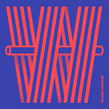

W
============================

|  |  |
| :--: | :-- |
| [ W](https://emumo.xiami.com/album/318455) | **艺人**: [Pajaro Sunrise](../index.md) **语种**: 英语 **唱片公司**: Self-Released **发行时间**: 2018年10月26日 **专辑类别**: 录音室专辑 **专辑风格**: 民谣 Folk **播放数**: 27 **收藏数**: 5 **评论数**: 2  |

## 简介

## 曲目

## 评论

|  |  |  |  |
| :-- | :-- | :-- | :-- |
|  [虾米用户](https://emumo.xiami.com/u/31777842) 生活打我，我打生活。 2019-01-27 09:07 赞(0) 踩(0) | 
居然没有版权……
 |
|  [虾米用户](https://emumo.xiami.com/u/82803940) 我还没想好要写什么... 2018-11-12 14:53 赞(0) 踩(0) | 

 |
