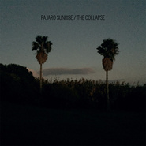
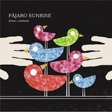
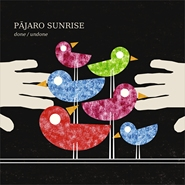

Pajaro Sunrise
============================

|  |  |
| :--: | :-- |
| [ Pajaro Sunrise](https://i.xiami.com/pajarosunrise) | **地区**: Spain 西班牙 **风格**: 独立民谣 Indie Folk **播放数**: 16182751 **粉丝数**: 15973 **评论数**: 465  |

## 档案

小档案 
外 文 名 Pajaro Sunrise 
组队时间 06年5月 
音乐风格 INDIE、JAZZ、FOLK等 
组合人数 两人 
艺人资料 
Pajaro Sunrise是由Pepe López 、Yuri Méndez两人组成的组合，06年5月组队，现今Pepe López已离队。“Pájaro”西班牙语译为鸟，乐队音乐如其名，鸟鸣日升透出一片欣荣光景。甜蜜轻灵的曲调，配合极富南欧舒适感的唱腔，交织云淡风轻之美。旋律悦耳，唱腔松弛带空气感，节奏略零碎却自在契合。民谣风格下，带些许bossa nova、爵士、电子。水彩般清新明快，看似漫不经心却是闪烁光亮的音乐。 
2007年发行的《Pajaro Sunrise》是他们发行的第一张同名专辑。从专辑封面上看到的一个人、一辆车，累了睡、醒了走的生活状态，就知道这是一张拥有遐意轻松生活表情的专辑，歌如封面。整张专辑里混合着INDIE、JAZZ、FOLK等音乐风格，特别是在JAZZ方面，似乎不单包括了《Wild days》中西班牙音乐里常见的BOSSA NOVA，还有些早期的SWING JAZZ的成份在，例如《California lover》的那段钢琴SOLO。其他的都以轻松自然的FOLK与ROCK为主，很可爱随性的一张音乐作品。一张绝对适合旅行陪伴的专辑，同样来自西班牙，同样的BOSSA NOVA，同样的简单清新派。 
2009年5月发行专辑《Done/Undone》。 
2011年4月发行专辑《Old Goodbyes》。 
2013年的专辑《Kulturkatzenjammer》中的歌曲《Good to See You》吟唱中透出无限诗意。　音乐录影带取景于巴厘岛，画面有笑脸、冲浪、自行车、海边日落… 
2014年4月两人赴中国开启巡演。 
2016年5月在Facebook上发行新歌《Oh My (Lost Songs 2006-2016)》，6月成员Yuri Méndez再次赴中国开启巡演。 
Career 
Pajaro Sunrise is a musical duo from Spain.The group is best known for their album ‘Pajaro Sunrise’.They started group in 2006.Now the duo has split up because of Pepe López’s leaving. 
‘Pajaro Sunrise’ was released on May 2007. 
‘Done/Undone’ was released on May 2009. 
‘Old Goodbyes’ was released on April 2011. 
‘Kulturkatzenjammer’ was released on November 2013. 
On April 2014,the duo started world tour in China. 
On May 2016,new song “Oh My (Lost Songs 2006-2016)”was revealed on Facebook.On June 2016,member Yuri Méndez came to China again for the show.

## 专辑

| 名称 | 语种 | 唱片公司 | 发行时间 | 专辑类别 | 专辑风格 |
| :--: | :-- | :-- | :-- | :-- | :-- |
| [ Madrid](./albums/5021512342.md) | 西班牙语 |  | 2020年09月25日 | EP, 单曲 | 独立民谣 Indie Folk, 当代唱作人 Contemporary Singer-Songwriter |
| [ Barcelona](./albums/5020453890.md) | 西班牙语 |  | 2020年04月24日 | EP, 单曲 | 独立流行 Indie Pop, 独立民谣 Indie Folk |
| [ Que Te Vaya Bonito](./albums/2105986794.md) | 英语 | Lovemonk | 2019年05月17日 | EP, 单曲 |  |
| [ W](./albums/318455.md) | 英语 | Self-Released | 2018年10月26日 | 录音室专辑 | 民谣 Folk |
| [ The Collapse](./albums/2102696553.md) | 英语 | Lovemonk | 2016年10月28日 | 录音室专辑 |  |
| [ Oh My (Lost Songs 2006-2016)](./albums/2105878241.md) | 英语 | Lovemonk | 2016年05月27日 | EP, 单曲 |  |
| [ Remmajneztakrutluk, Vol. 2](./albums/2105877207.md) | 英语 | Lovemonk | 2014年11月24日 | EP, 单曲 |  |
| [ Remmajneztakrutluk, Vol. 1](./albums/2105896311.md) | 英语 | Lovemonk | 2014年07月07日 | EP, 单曲 |  |
| [ Kulturkatzenjammer ](./albums/1485080153.md) | 英语 | Lovemonk | 2013年11月15日 | 录音室专辑 |  |
| [ Old Goodbyes](./albums/437268.md) | 英语 | 暂无 | 2011年04月14日 | 录音室专辑 |  |
| [ Done/Undone](./albums/328640.md) | 英语 | Lovemonk | 2009年05月11日 | 录音室专辑 |  |
| [ Done / Undone](./albums/2105925355.md) | 英语 | Lovemonk | 2009年01月01日 | EP, 单曲 |  |
| [ Kinda Fantastic / Hungry Heart](./albums/2105949961.md) | 英语 | Lovemonk | 2009年01月01日 | EP, 单曲 |  |
| [ Pajaro Sunrise](./albums/172228.md) | 英语 | Lovemonk | 2006年12月12日 | 录音室专辑 |  |

## 评论

|  |  |  |
| :-- | :-- | :-- |
|  [虾米用户](https://emumo.xiami.com/u/332498160)  You'll Love... 2020-12-18 16:20 赞(0) 踩(0) | 
好喜欢...
 |
|  [虾米用户](https://emumo.xiami.com/u/83591380) 哼一首淡淡的歌。 2020-11-02 18:36 赞(0) 踩(0) | 
答应我一定要继续发歌好吗！
 |
|  [虾米用户](https://emumo.xiami.com/u/83591380) 哼一首淡淡的歌。 2020-11-02 18:35 赞(0) 踩(0) | 
大叔是我的宝藏歌手
 |
|  [虾米用户](https://emumo.xiami.com/u/3030861) 也无风雨亦无晴。 2020-09-08 20:04 赞(0) 踩(0) | 
七八年了，有了好多的故事。
 |
|  [虾米用户](https://emumo.xiami.com/u/379162683) 我想要记住你们，我想要你... 2020-06-16 21:56 赞(0) 踩(0) | 

 |
|  [虾米用户](https://emumo.xiami.com/u/1219018) 你好，我叫谢有君。估计大... 2019-08-07 10:25 赞(0) 踩(0) | 
Man of Many Faces新专还没有上线 @虾米音乐人
 |
|  [虾米用户](https://emumo.xiami.com/u/1219018) 你好，我叫谢有君。估计大... 2019-06-28 15:59 赞(0) 踩(0) | 
stand up baby
 |
|  [虾米用户](https://emumo.xiami.com/u/261630822) so, fare the... 2019-06-07 19:11 赞(0) 踩(0) | 
Hey,back again?
 |
|  [虾米用户](https://emumo.xiami.com/u/34243569)  2019-05-08 01:08 赞(0) 踩(0) | 
想走了，以為會有人想我，因為未來的某一天會重逢，結果只有新的過客，之後什麼都沒有
 |
|  [虾米用户](https://emumo.xiami.com/u/31777842) 生活打我，我打生活。 2019-03-03 10:54 赞(0) 踩(0) | 
Man of Many Faces新专还没有上线
 |
|  [虾米用户](https://emumo.xiami.com/u/375244218) 她只喜欢活在夏天和雨天 2019-02-20 22:04 赞(0) 踩(0) | 
爱了
 |
|  [虾米用户](https://emumo.xiami.com/u/401906229)  2019-01-13 18:37 赞(0) 踩(0) | 
可以
 |
|  [虾米用户](https://emumo.xiami.com/u/303850325) 生活不如诗 2019-01-07 18:31 赞(2) 踩(0) | 
男人们的小清新。就算出了校园，依然能抱着木吉他给你满园盛开的玫瑰花——当然，请忽视我下巴上肆无忌惮的胡子。女士。
 |
|  [虾米用户](https://emumo.xiami.com/u/49655313) 除了再见还可以说些什么呢 2018-12-24 07:54 赞(0) 踩(0) | 
想看现场呀
 |
|  [虾米用户](https://emumo.xiami.com/u/186156516) 我的故事被風吹散 我的明... 2018-12-13 02:12 赞(0) 踩(0) | 
突然听到
 |
|  [虾米用户](https://emumo.xiami.com/u/293199897) 生活中，还好有音乐。。 2018-10-24 21:10 赞(0) 踩(0) | 
感谢上传分享，辛苦您了.. 音乐带给我生活上欠缺的快乐～
 |
|  [虾米用户](https://emumo.xiami.com/u/601978)  2018-08-29 20:18 赞(4) 踩(0) | 
2019年梦象音乐节盲鸟票和VIP票下周开售！8个城市，每站前10名更有好礼相送 <a href="https://douc.cc/3PSDUt" target="_blank" rel="nofollow noreferrer noopener">https://douc.cc/3PSDUt</a>
 |
|  [虾米用户](https://emumo.xiami.com/u/339191478)   2018-06-21 13:00 赞(0) 踩(0) | 
:-)
 |
|  [虾米用户](https://emumo.xiami.com/u/285026656) 我还没想好要写什么... 2018-05-05 13:00 赞(1) 踩(0) | 
听了很久也不知道叫啥乐队 请大侠指教
 |
|  [虾米用户](https://emumo.xiami.com/u/304855313)  2018-04-13 22:42 赞(0) 踩(0) | 
声音太有安全感了
 |
|  [虾米用户](https://emumo.xiami.com/u/296789867) 气球 2018-04-09 22:22 赞(0) 踩(0) | 
哈哈，开心~快睡觉前听到这么首歌，很放松~~
 |
|  [虾米用户](https://emumo.xiami.com/u/23534686) o 2018-02-11 21:39 赞(0) 踩(0) | 
o
 |
|  [虾米用户](https://emumo.xiami.com/u/16115821)  2017-12-18 11:43 赞(3) 踩(0) | 
【西班牙清新民谣Pajaro Sunrise 2016年6月新专辑 中国巡演】 6月3日北京站 Modernsky Lab 6月4日上海站 Onstage 6月5日 广州站 凸空间 天琪音乐（Jadesky Music）欢迎你！  官方微博：<a href="http://weibo.com/u/5553401253" target="_blank" rel="nofollow noreferrer noopener">http://weibo.com/u/5553401253</a> 官方小站：<a href="https://site.douban.com/272087/" target="_blank" rel="nofollow noreferrer noopener">https://site.douban.com/272087/</a> 官方淘宝店：<a href="https://shop149567137.taobao.com" target="_blank" rel="nofollow noreferrer noopener">https://shop149567137.taobao.com</a> 微信订阅号：m232sky 微信公众号：天琪音乐
 |
| ⇒ |  [虾米用户](https://emumo.xiami.com/u/6712055) 非典型。 2018-02-12 02:54 赞(0) 踩(0) | 
18年会有计划来吗
 |
|  [虾米用户](https://emumo.xiami.com/u/1484197) 暂无签名~ 2017-10-27 23:55 赞(1) 踩(0) | 
又是独立小清新民谣。哈哈。好吧，又开始跳赞了我。
 |
|  [虾米用户](https://emumo.xiami.com/u/13180134) 敲丫挺的 2017-07-26 15:48 赞(0) 踩(0) | 
哈
 |
|  [虾米用户](https://emumo.xiami.com/u/13502894) 我还没想好要写什么... 2017-07-23 23:53 赞(0) 踩(0) | 
小清新  
 |
|  [虾米用户](https://emumo.xiami.com/u/70271654)  2017-07-14 21:49 赞(0) 踩(0) | 
两个字 舒服
 |
|  [虾米用户](https://emumo.xiami.com/u/42894053)  2017-07-11 01:21 赞(0) 踩(0) | 
啥时巡演啊
 |
|  [虾米用户](https://emumo.xiami.com/u/233411818)  2017-04-20 16:58 赞(4) 踩(0) | 
什么时候来中国巡演啊啊啊 虾米好像是唯一能看到详细点的歌手信息的APP了   
 |
|  [虾米用户](https://emumo.xiami.com/u/9430725) 当为神所佑 2017-04-04 19:56 赞(0) 踩(0) | 
昏昏欲睡~小新鲜
 |
|  [虾米用户](https://emumo.xiami.com/u/54660055) 喜欢筑墙的小土拨鼠 2017-03-04 23:35 赞(0) 踩(0) | 
错过两次巡演，感觉心里空空的: (
 |
|  [虾米用户](https://emumo.xiami.com/u/173199126) 妈妈，这个世界会好吗？ 2017-02-28 10:59 赞(0) 踩(0) | 

 |
|  [虾米用户](https://emumo.xiami.com/u/187635447)  2017-02-14 20:46 赞(0) 踩(0) | 
爱你
 |
|  [虾米用户](https://emumo.xiami.com/u/36057872) 网易/BC: Breat... 2017-01-09 16:39 赞(1) 踩(0) | 
Pajaro Sunrise – The Collapse (2016)
 |
|  [虾米用户](https://emumo.xiami.com/u/42894053)  2016-12-13 16:25 赞(0) 踩(0) | 
巡演2次  都不了了之  真是郁闷
 |
|  [虾米用户](https://emumo.xiami.com/u/11917054) 『常年卧底医院并乔装成医... 2016-12-02 15:04 赞(1) 踩(0) | 
『get√U』
 |
|  [虾米用户](https://emumo.xiami.com/u/971317) 做一只追随小姐姐的节制的... 2016-11-29 22:58 赞(0) 踩(0) | 
看完猪蹄，竟然只记得这首歌，有长进
 |
|  [虾米用户](https://emumo.xiami.com/u/48436220) Oblivīate 2016-10-24 01:55 赞(0) 踩(0) | 
回到15岁
 |
|  [虾米用户](https://emumo.xiami.com/u/2888769)  2016-09-28 21:28 赞(0) 踩(0) | 
hi
 |
|  [虾米用户](https://emumo.xiami.com/u/5932801) 暂无签名~ 2016-05-29 22:54 赞(2) 踩(0) | 
五月马上过去了，新专辑一点消息也没有，藏的真是深。好奇心这张新CD是怎样的？
 |
|  [虾米用户](https://emumo.xiami.com/u/2694345)   2016-05-22 19:30 赞(0) 踩(0) | 
是上海的演出延期了吗？
 |
|  [虾米用户](https://emumo.xiami.com/u/4261281)  2016-05-16 19:18 赞(0) 踩(0) | 
新专辑听听新专辑
 |
| ⇒ |  [虾米用户](https://emumo.xiami.com/u/125725270)  2016-05-17 07:24 赞(0) 踩(0) | 
月底
 |
| ⇒ |  [虾米用户](https://emumo.xiami.com/u/36057872) 网易/BC: Breat... 2017-01-09 16:40 赞(0) 踩(0) | 
<q><b>Pajaro Sunrise说：</b></q>
 |
|  [虾米用户](https://emumo.xiami.com/u/41142856) 明天是2017年12月1... 2016-05-16 18:15 赞(0) 踩(0) | 
醉了
 |
|  [虾米用户](https://emumo.xiami.com/u/4487129)  2016-05-13 12:56 赞(0) 踩(0) | 
！！！
 |
|  [虾米用户](https://emumo.xiami.com/u/125725270)  2016-05-07 15:05 赞(0) 踩(0) | 
精选集： On a Slow Boat to China （那些即将来和已经来过中国的外国音乐人）<a href="http://www.xiami.com/collect/170153945?spm=a1z1s.6929273.1561534893.2.2rENpm#list_collect" target="_blank" rel="nofollow noreferrer noopener">http://www.xiami.com/collect/170153945?spm=a1z1s.6929273.1561534893.2.2rENpm#list_collect</a>
 |
|  [虾米用户](https://emumo.xiami.com/u/1219018) 你好，我叫谢有君。估计大... 2016-05-04 23:52 赞(0) 踩(0) | 
又是上海………多开几个地方呗…
 |
| ⇒ |  [虾米用户](https://emumo.xiami.com/u/125725270)  2016-05-06 10:43 赞(0) 踩(0) | 
还有北京和广州。
 |
|  [虾米用户](https://emumo.xiami.com/u/125725270)  2016-05-01 07:26 赞(0) 踩(0) | 
限量套票：pajaro sunrise＋galen crew！ 夏天里的民谣大餐！<a href="https://shop149567137.taobao.com" target="_blank" rel="nofollow noreferrer noopener">https://shop149567137.taobao.com</a>
 |
|  [虾米用户](https://emumo.xiami.com/u/125725270)  2016-05-01 07:11 赞(0) 踩(0) | 
下周出新歌！新专辑的第一首歌曲！
 |
|  [虾米用户](https://emumo.xiami.com/u/35103783)  2016-04-29 13:30 赞(3) 踩(0) | 
******
 |
|  [虾米用户](https://emumo.xiami.com/u/545865) 在这美丽的夜里 2016-04-28 07:26 赞(1) 踩(0) | 
请不要再给我发站内信了，谢谢
 |
|  [虾米用户](https://emumo.xiami.com/u/15788012) 我还没想好要写什么... 2016-04-25 23:12 赞(1) 踩(0) | 
yeah 要来上海了 有一起去的不 没人陪不快乐
 |
| ⇒ |  [虾米用户](https://emumo.xiami.com/u/125564554) 欢喜就好 2016-05-07 20:19 赞(0) 踩(0) | 
我刚买票了～
 |
| ⇒ |  [虾米用户](https://emumo.xiami.com/u/15788012) 我还没想好要写什么... 2016-05-08 21:56 赞(0) 踩(0) | 
<q><b>林有竹说：</b></q>
 |
| ⇒ |  [虾米用户](https://emumo.xiami.com/u/125564554) 欢喜就好 2016-05-12 18:48 赞(0) 踩(0) | 
<q><b>一个大圆脸说：</b></q>
 |
|  [虾米用户](https://emumo.xiami.com/u/2354958)  2016-04-16 12:35 赞(0) 踩(0) | 
什么时候出票！！
 |
|  [虾米用户](https://emumo.xiami.com/u/43130288) 卖螺蛳粉的王阿姨 2016-04-15 10:27 赞(1) 踩(0) | 
来广州啦~~哇啦啦~~
 |
|  [虾米用户](https://emumo.xiami.com/u/49903727) 我还没想好要写什么... 2016-04-14 09:01 赞(1) 踩(0) | 
最想要的生活，身边爱着的人过得不错，自己的生活不赖，有时间慢下来，有闲钱到处走走，听听简单的live.
 |
|  [虾米用户](https://emumo.xiami.com/u/3971265)  2016-04-13 14:11 赞(0) 踩(0) | 
little P 不来哈尔滨吗
 |
| ⇒ |  [虾米用户](https://emumo.xiami.com/u/125725270)  2016-04-13 15:35 赞(0) 踩(0) | 
上次去过了嘛
 |
| ⇒ |  [虾米用户](https://emumo.xiami.com/u/1115247) @Nebula_7293 2016-04-28 14:18 赞(0) 踩(0) | 
<q><b>Pajaro Sunrise说：</b></q>
 |
| ⇒ |  [虾米用户](https://emumo.xiami.com/u/125725270)  2016-04-29 15:49 赞(0) 踩(0) | 
<q><b>Nebula_7293说：</b></q>
 |
|  [虾米用户](https://emumo.xiami.com/u/6717745) 不 要 告 别 2016-04-12 17:52 赞(0) 踩(0) | 
提高了自己的知识水平
 |
|  [虾米用户](https://emumo.xiami.com/u/39260523) It's shame t... 2016-04-12 11:58 赞(1) 踩(0) | 
yeah！ 北京见
 |
|  [虾米用户](https://emumo.xiami.com/u/11906267)  2016-04-12 01:03 赞(0) 踩(0) | 
下次来厦门或泉州please(•̅灬•̅ )
 |
| ⇒ |  [虾米用户](https://emumo.xiami.com/u/125725270)  2016-04-12 10:39 赞(0) 踩(0) | 
we will try
 |
|  [虾米用户](https://emumo.xiami.com/u/76752)  2016-04-10 21:31 赞(1) 踩(0) | 
6月上海见~
 |
|  [虾米用户](https://emumo.xiami.com/u/2763753) The best is ... 2016-04-10 12:24 赞(3) 踩(0) | 
So, does that mean there is a good chance that you could make Chengdu the next station of your China Tour?!
 |
| ⇒ |  [虾米用户](https://emumo.xiami.com/u/125725270)  2016-04-10 20:05 赞(0) 踩(0) | 
maybe next time.
 |
| ⇒ |  [虾米用户](https://emumo.xiami.com/u/2763753) The best is ... 2016-04-10 20:15 赞(0) 踩(0) | 
<q><b>Pajaro Sunrise说：</b></q>
 |
| ⇒ |  [虾米用户](https://emumo.xiami.com/u/2604752) 理论乃灰色，生命之树长青 2016-04-12 14:26 赞(0) 踩(0) | 
<q><b>Pajaro Sunrise说：</b></q>
 |
|  [虾米用户](https://emumo.xiami.com/u/10893703) 音乐和茶都不可辜负 2016-04-10 11:04 赞(0) 踩(0) | 
不是来广州，很桑心
 |
| ⇒ |  [虾米用户](https://emumo.xiami.com/u/125725270)  2016-04-10 20:06 赞(0) 踩(0) | 
6月5日广州站
 |
| ⇒ |  [虾米用户](https://emumo.xiami.com/u/1219018) 你好，我叫谢有君。估计大... 2016-05-04 23:53 赞(0) 踩(0) | 
<q><b>Pajaro Sunrise说：</b></q>
 |
| ⇒ |  [虾米用户](https://emumo.xiami.com/u/125725270)  2016-05-05 20:32 赞(0) 踩(0) | 
<q><b>谢有君说：</b></q>
 |
|  [虾米用户](https://emumo.xiami.com/u/2763753) The best is ... 2016-04-10 09:57 赞(1) 踩(0) | 
嗷~我刚刚是被大大给点赞了么~~~
 |
|  [虾米用户](https://emumo.xiami.com/u/545865) 在这美丽的夜里 2016-04-10 02:20 赞(1) 踩(0) | 
您能不给我发站内信吗？
 |
|  [虾米用户](https://emumo.xiami.com/u/1139645)  2016-04-09 19:09 赞(0) 踩(0) | 
不是一对夫妻的吗
 |
| ⇒ |  [虾米用户](https://emumo.xiami.com/u/125725270)  2016-04-10 09:26 赞(0) 踩(0) | 
不是。。。
 |
|  [虾米用户](https://emumo.xiami.com/u/2763753) The best is ... 2016-04-09 17:34 赞(1) 踩(0) | 
来我大成都谢谢～Plz come to Chengdu~Plz~
 |
|  [虾米用户](https://emumo.xiami.com/u/4234256)  2016-04-07 21:41 赞(1) 踩(0) | 
六月，约起！
 |
|  [虾米用户](https://emumo.xiami.com/u/2604752) 理论乃灰色，生命之树长青 2016-04-07 08:45 赞(0) 踩(0) | 
北上广，这演出城市选得
 |
|  [虾米用户](https://emumo.xiami.com/u/7133174) 我还没想好要写什么... 2016-04-07 07:44 赞(8) 踩(0) | 
我去，入驻音乐人然后歌都下架，虾米真逗
 |
|  [虾米用户](https://emumo.xiami.com/u/12034309) 一直在一起 2016-04-06 23:25 赞(0) 踩(0) | 
想过遇到你以后 就一起去看看这些小型的音乐会。但是6月4号已经这么近了 我还没有遇到你。
 |
|  [虾米用户](https://emumo.xiami.com/u/2453117) shit 2016-04-06 23:23 赞(1) 踩(0) | 
广州见。。。
 |
|  [虾米用户](https://emumo.xiami.com/u/125725270)  2016-04-06 17:47 赞(52) 踩(0) | 
我刚入驻了虾米音乐人，欢迎大家来我的个人主页，收听我的最新音乐！2016年6月3、4、5日开始我的中国巡演哦
 |
| ⇒ |  [虾米用户](https://emumo.xiami.com/u/360418897)  2018-04-27 09:57 赞(0) 踩(0) | 
什么时候再来中国呀
 |
| ⇒ |  [虾米用户](https://emumo.xiami.com/u/47911067) 狼狈比失去难受 2018-05-12 22:35 赞(0) 踩(0) | 
很赞呢
 |
|  [虾米用户](https://emumo.xiami.com/u/11468506) 玩物丧志、 2016-04-06 14:00 赞(4) 踩(0) | 
都版权成这样了还虾米音乐人，excuse me??
 |
|  [虾米用户](https://emumo.xiami.com/u/2987526) no Romeo 2016-04-06 13:32 赞(1) 踩(0) | 
nice nice
 |
|  [虾米用户](https://emumo.xiami.com/u/54302732) 就像一个多鸟的夏天 2016-04-03 19:22 赞(0) 踩(0) | 
头像是在自拍吗哈哈哈哈哈哈哈救命
 |
|  [虾米用户](https://emumo.xiami.com/u/16115821)  2016-04-01 12:31 赞(0) 踩(0) | 
5月出版新专辑！
 |
|  [虾米用户](https://emumo.xiami.com/u/2279444) 爱在左，同情在右。 2016-03-30 17:20 赞(9) 踩(0) | 
真是搞不懂虾米，第一张专辑和第二张专辑是同一家唱片公司发行的，第一张就下架了，第二张就有，能不能具体解释下版权是什么意思？还有就是，经常一张专辑里缺胳膊少腿儿的，第一首歌有，第二首没有，第三首有，第四首又没有，到底是什么意思？
 |
| ⇒ |  [虾米用户](https://emumo.xiami.com/u/769334) 暂无签名~ 2019-12-19 23:42 赞(0) 踩(0) | 
白嫖还要求这么多？
 |
|  [虾米用户](https://emumo.xiami.com/u/1415151)  2016-01-22 10:15 赞(0) 踩(0) | 
清晨小调调
 |
|  [虾米用户](https://emumo.xiami.com/u/12230374) Pinkfloydzh，... 2016-01-12 15:44 赞(0) 踩(0) | 
看封面以为是金属大汉呢 
 |
|  [虾米用户](https://emumo.xiami.com/u/588121) 我还没想好要写什么... 2016-01-05 17:55 赞(0) 踩(0) | 
基得不行。
 |
|  [虾米用户](https://emumo.xiami.com/u/13518095)  2015-12-28 00:56 赞(0) 踩(0) | 
1
 |
|  [虾米用户](https://emumo.xiami.com/u/54299333) 纯泊即深刻。 2015-12-22 22:12 赞(0) 踩(0) | 
小鲜肉直接晋升荒野老大叔！
 |
|  [虾米用户](https://emumo.xiami.com/u/54299333) 纯泊即深刻。 2015-12-22 22:11 赞(0) 踩(0) | 
从07年至13年。风格变化很大。胡子留的更长。
 |
|  [虾米用户](https://emumo.xiami.com/u/84208340) 不懂别瞎猜 2015-12-22 13:57 赞(0) 踩(0) | 
Simple beautful╯﹏╰
 |
|  [虾米用户](https://emumo.xiami.com/u/32201071)  2015-11-22 21:44 赞(0) 踩(0) | 
前奏和开始的地方真像稻香
 |
|  [虾米用户](https://emumo.xiami.com/u/4715251) 愿屁屁在喵星开开心心还有... 2015-11-11 10:51 赞(0) 踩(0) | 
！
 |
|  [虾米用户](https://emumo.xiami.com/u/7741836) 爱比死更冷 2015-10-25 02:59 赞(1) 踩(0) | 
首页图片好萌啊 最右好媚
 |
|  [虾米用户](https://emumo.xiami.com/u/73492700)  2015-10-13 00:40 赞(0) 踩(0) | 
无意中听到，太干净了
 |
|  [虾米用户](https://emumo.xiami.com/u/52277150) 我还没想好要写什么... 2015-10-05 11:17 赞(0) 踩(0) | 
❤
 |
|  [虾米用户](https://emumo.xiami.com/u/68980970)  2015-09-24 15:12 赞(0) 踩(0) | 
喜欢
 |
|  [虾米用户](https://emumo.xiami.com/u/12248605) 浴乎沂 风乎舞雩 咏而归 2015-09-20 16:28 赞(1) 踩(0) | 
这个自拍卖萌封面 
 |
|  [虾米用户](https://emumo.xiami.com/u/31689003)  2015-09-09 21:22 赞(0) 踩(0) | 
一个谨慎的实用主义者
 |
|  [虾米用户](https://emumo.xiami.com/u/16511667) Official：【集物... 2015-09-09 09:48 赞(0) 踩(0) | 
虽然9月9日才收听到。但再不订阅，就更晚了。好
 |
|  [虾米用户](https://emumo.xiami.com/u/51912505) I like to ma... 2015-09-03 16:00 赞(0) 踩(0) | 
几个萌萌的汉子
 |
|  [虾米用户](https://emumo.xiami.com/u/48621783) 微信联系 Sacred-... 2015-09-02 15:28 赞(0) 踩(0) | 
√
 |
|  [虾米用户](https://emumo.xiami.com/u/59250658) 人群中这些面孔幽灵一般显... 2015-08-30 10:05 赞(1) 踩(0) | 
阳光，吉他，远方，还有一本好书。一个人最美的流浪。
 |
|  [虾米用户](https://emumo.xiami.com/u/37772304)  2015-08-16 20:48 赞(0) 踩(0) | 
像是我穿着大摆裙在那个复古年代里与你静静相拥在咖啡厅里。虽然奇怪，但我还会这样做。
 |
|  [虾米用户](https://emumo.xiami.com/u/38640339) 我想好写什么了…… 2015-08-09 11:10 赞(0) 踩(0) | 

 |
|  [虾米用户](https://emumo.xiami.com/u/10026849) 我还没想好要写什么... 2015-08-05 12:37 赞(0) 踩(0) | 
引用评论：听他们的歌让我感觉 我拥有一个明媚的洋房 复古抱枕和一整片的玫瑰园。
 |
|  [虾米用户](https://emumo.xiami.com/u/7439332)  2015-07-28 02:08 赞(0) 踩(0) | 
mark
 |
|  [虾米用户](https://emumo.xiami.com/u/11264561) 我还没想好要写什么... 2015-07-27 00:08 赞(0) 踩(0) | 
小清新
 |
|  [虾米用户](https://emumo.xiami.com/u/44870079) 诗酒趁年华 2015-07-25 10:00 赞(0) 踩(0) | 
大叔
 |
|  [虾米用户](https://emumo.xiami.com/u/41363187)  2015-07-19 07:16 赞(0) 踩(0) | 
-
 |
|  [虾米用户](https://emumo.xiami.com/u/1190370) ~~~ 2015-07-17 13:29 赞(0) 踩(0) | 
他们的忧伤不刻意
 |
|  [虾米用户](https://emumo.xiami.com/u/38263180) waiting for ... 2015-07-07 12:08 赞(1) 踩(0) | 
大叔好暖啊
 |
|  [虾米用户](https://emumo.xiami.com/u/47519870) 想要解除和所有人的联系（... 2015-06-30 00:11 赞(0) 踩(0) | 
怎么会那么好听！
 |
|  [虾米用户](https://emumo.xiami.com/u/35103783)  2015-06-18 11:37 赞(0) 踩(0) | 
******
 |
|  [虾米用户](https://emumo.xiami.com/u/3475881) 再见虾友+we 5692... 2015-06-17 01:25 赞(0) 踩(0) | 
好听哭了的意思就是听到心仪的歌真的会哭
 |
|  [虾米用户](https://emumo.xiami.com/u/172418) 了解是毒药，灌述是迫害！ 2015-06-12 16:29 赞(0) 踩(0) | 
静静的旅行！
 |
|  [虾米用户](https://emumo.xiami.com/u/792060) 我还没想好要写什么... 2015-05-13 22:48 赞(0) 踩(0) | 
头像自带美颜柔光
 |
|  [虾米用户](https://emumo.xiami.com/u/10441212) ！ 2015-05-11 08:44 赞(2) 踩(0) | 
如果我没记错，头像是lake of tears的……
 |
|  [虾米用户](https://emumo.xiami.com/u/21926598) peace ☮ 2015-05-08 15:18 赞(0) 踩(0) | 
^^/
 |
|  [虾米用户](https://emumo.xiami.com/u/10514945) 音我而生 2015-04-30 07:26 赞(2) 踩(0) | 
大叔们这自拍玩的。。
 |
|  [虾米用户](https://emumo.xiami.com/u/48663115)   2015-04-12 15:38 赞(0) 踩(0) | 
好暖的声音
 |
|  [虾米用户](https://emumo.xiami.com/u/37205247)  2015-04-10 14:30 赞(1) 踩(0) | 
封面上的确定是他们吗
 |
| ⇒ |  [虾米用户](https://emumo.xiami.com/u/38578691) 我还没想好要写什么... 2015-05-10 20:26 赞(0) 踩(0) | 
没人吐槽这封面吗！！！！！！明明是泪湖。
 |
|  [虾米用户](https://emumo.xiami.com/u/48875273) 我努力地隐藏自己，成为世... 2015-04-07 20:32 赞(0) 踩(0) | 
细细倾听, 生活细节在轻声浅唱中娓娓道来...life is difficlut, but beautiful...
 |
|  [虾米用户](https://emumo.xiami.com/u/48700591)  2015-03-31 11:34 赞(0) 踩(0) | 
乐感轻松
 |
|  [虾米用户](https://emumo.xiami.com/u/48105936)  2015-03-20 00:56 赞(0) 踩(0) | 
请允许我作为一个歌迷打个广告寻求大家的帮助，大家快来支持橙LIVE榜单上的~路子乐队~吧！试听+收藏+评论+分享单曲一次就行！觉得好的希望能天天支持！！谢谢大家啊！
 |
|  [虾米用户](https://emumo.xiami.com/u/36064597) 别担心，我讨厌自己胜过讨... 2015-02-25 11:59 赞(0) 踩(0) | 
头像好逗
 |
|  [虾米用户](https://emumo.xiami.com/u/22649386)  2015-02-11 12:36 赞(1) 踩(0) | 
love
 |
|  [虾米用户](https://emumo.xiami.com/u/505157) 一帆纸舟荡世界 2015-01-28 12:08 赞(0) 踩(0) | 
好难想象性格奔放的西班牙也有这么清新温婉的音乐，还是大男人三儿~
 |
|  [虾米用户](https://emumo.xiami.com/u/826716) 享。 2015-01-26 14:17 赞(0) 踩(0) | 
太美妙的音乐
 |
|  [虾米用户](https://emumo.xiami.com/u/19453542) 哈哈哈哈，有趣 2015-01-22 11:45 赞(0) 踩(0) | 
美
 |
|  [虾米用户](https://emumo.xiami.com/u/7814593) Be brave。 2015-01-21 11:40 赞(0) 踩(0) | 
很舒服的慵懒～有种置身海边吹海风的感觉。
 |
|  [虾米用户](https://emumo.xiami.com/u/3067860) 我喜欢你是寂静的 2015-01-12 21:20 赞(3) 踩(0) | 
PS: Pajaro Sunrise是Yuri 于06年5月组建，“Pájaro”西班牙语译为鸟，乐队音乐如其名，鸟鸣日升透出一片欣荣光景。甜蜜轻灵的曲调，配合极富南欧舒适感的唱腔，交织云淡风轻之美。  07年首张ST即确立其安静恬淡的音乐基调，至今已发行四张专辑： Pajaro Sunrise(2007)；Done/Undone(2009)； Old Goodbyes(2011)；Kulturkatzenjammer(2013)。 旋律悦耳，唱腔松弛带空气感，节奏略零碎却自在契合。 谣风格下，带些许bossa nova、爵士、电子。 水彩般清新明快，看似漫不经心却是闪烁光亮的音乐。  13年新专辑中一曲《Good to See You》吟唱中透出无限诗意。 音乐录影带取景于巴厘岛，画面有笑脸、冲浪、自行车、海边日落… 在Pajaro Sunrise的音乐中，时间的脚步轻松流淌，人们会恍然记起简单和快乐。 期待他们的中国巡演，期待聆听来自西班牙的美丽与甜蜜。
 |
|  [虾米用户](https://emumo.xiami.com/u/11648464) ~ 2015-01-07 11:51 赞(0) 踩(0) | 
~
 |
|  [虾米用户](https://emumo.xiami.com/u/3652966) 节奏控 2014-12-27 12:50 赞(0) 踩(0) | 
good
 |
|  [虾米用户](https://emumo.xiami.com/u/32086195) 暂无签名~ 2014-12-20 12:35 赞(0) 踩(0) | 
lalala舒服的声音
 |
|  [虾米用户](https://emumo.xiami.com/u/1144724)  2014-11-27 09:41 赞(0) 踩(0) | 
元素多多
 |
|  [虾米用户](https://emumo.xiami.com/u/13897364) 喜乐 2014-11-07 22:46 赞(0) 踩(0) | 
lalallalal
 |
|  [虾米用户](https://emumo.xiami.com/u/43205340)  2014-10-31 16:17 赞(0) 踩(0) | 
tingzhehenshufu a
 |
|  [虾米用户](https://emumo.xiami.com/u/9154275)  2014-10-21 18:01 赞(0) 踩(0) | 
既性感有温柔又暖和般的john mayer嗓音
 |
|  [虾米用户](https://emumo.xiami.com/u/13690923) hot what！ 2014-09-28 15:41 赞(0) 踩(0) | 
看评论长知识
 |
|  [虾米用户](https://emumo.xiami.com/u/19789718)  2014-09-25 16:26 赞(0) 踩(0) | 
清新小胡须
 |
|  [虾米用户](https://emumo.xiami.com/u/10663924) Rock\'n Roll 2014-09-22 21:51 赞(0) 踩(0) | 
现在就剩一个人了吗？
 |
|  [虾米用户](https://emumo.xiami.com/u/15316974) hallelujah~ 2014-09-07 15:36 赞(0) 踩(0) | 
nice!
 |
|  [虾米用户](https://emumo.xiami.com/u/7056029) 再 见 2014-08-31 10:28 赞(0) 踩(0) | 
Hungry Heart
 |
|  [虾米用户](https://emumo.xiami.com/u/13552)  2014-08-30 16:05 赞(0) 踩(0) | 
Romeo&amp;#039;s Tune
 |
|  [虾米用户](https://emumo.xiami.com/u/16613960) 百毒不侵 2014-08-10 08:54 赞(0) 踩(0) | 
好听是好听，可是为什么总是有气无力的感觉
 |
| ⇒ |  [虾米用户](https://emumo.xiami.com/u/42642206)  2014-10-18 13:45 赞(0) 踩(0) | 
慵懒你都不知道？
 |
| ⇒ |  [虾米用户](https://emumo.xiami.com/u/16613960) 百毒不侵 2014-10-19 09:47 赞(0) 踩(0) | 
<q><b>hln888999说：</b></q>
 |
|  [虾米用户](https://emumo.xiami.com/u/6457880) 我还没想好要写什么... 2014-08-08 11:48 赞(0) 踩(0) | 
舒服
 |
|  [虾米用户](https://emumo.xiami.com/u/6069923) 平常心 2014-07-22 20:20 赞(0) 踩(0) | 
好吧，男人中的小清新
 |
|  [虾米用户](https://emumo.xiami.com/u/99571)  2014-07-17 12:06 赞(0) 踩(0) | 
轻声浅唱 舒服暖暖的民谣
 |
|  [虾米用户](https://emumo.xiami.com/u/5084667) 快乐多好 2014-06-30 11:41 赞(0) 踩(0) | 
一听就听不下来的声音
 |
|  [虾米用户](https://emumo.xiami.com/u/2370070)   2014-06-23 01:12 赞(0) 踩(0) | 
应该没人会从排名在后的歌听起吧。泄露一下天机，“086”惊艳。
 |
| ⇒ |  [虾米用户](https://emumo.xiami.com/u/4960796) 鲱鱼君 2014-08-09 21:48 赞(0) 踩(0) | 
谢谢了 确实不错！
 |
| ⇒ |  [虾米用户](https://emumo.xiami.com/u/2370070)   2014-08-10 01:46 赞(0) 踩(0) | 
<q><b>鲱鱼君说：</b></q>
 |
| ⇒ |  [虾米用户](https://emumo.xiami.com/u/35823320)  2014-08-17 00:11 赞(0) 踩(0) | 
Thank u~
 |
| ⇒ |  [虾米用户](https://emumo.xiami.com/u/10634552) 暂无签名~ 2014-10-06 18:03 赞(0) 踩(0) | 
哥们，哪首  086？
 |
| ⇒ |  [虾米用户](https://emumo.xiami.com/u/2370070)   2014-10-07 02:19 赞(0) 踩(0) | 
<q><b>Youth Road说：</b></q>
 |
|  [虾米用户](https://emumo.xiami.com/u/2526606)  2014-06-21 10:16 赞(0) 踩(0) | 
Pajaro Sunrise
 |
|  [虾米用户](https://emumo.xiami.com/u/1934650)   2014-06-18 11:41 赞(0) 踩(0) | 
独特的嗓音诠释着男人的小情怀
 |
| ⇒ |  [虾米用户](https://emumo.xiami.com/u/42894053)  2014-11-10 11:05 赞(0) 踩(0) | 
今年来我的城市  可惜他走了  我才听到这个声音  希望明年会再来
 |
|  [虾米用户](https://emumo.xiami.com/u/5641909)  2014-06-17 06:20 赞(0) 踩(0) | 
like
 |
|  [虾米用户](https://emumo.xiami.com/u/1242587)  2014-06-10 15:30 赞(0) 踩(0) | 
太好听了！
 |
|  [虾米用户](https://emumo.xiami.com/u/10428445) Estás indefe... 2014-06-08 23:24 赞(0) 踩(0) | 
最早还是在音悦台上看到old goodbye 的Mv才认识了这个乐队的。
 |
|  [虾米用户](https://emumo.xiami.com/u/14463507) Come. Tell m... 2014-05-31 21:25 赞(0) 踩(0) | 
声音一出来就忍不住关注了0.0
 |
|  [虾米用户](https://emumo.xiami.com/u/6375179) 这一定是生命的盛年。 2014-05-20 16:49 赞(0) 踩(0) | 
Sunrise~~~~~
 |
|  [虾米用户](https://emumo.xiami.com/u/11140628)  2014-05-20 10:56 赞(0) 踩(0) | 
俩爷们一起清新，牛逼
 |
|  [虾米用户](https://emumo.xiami.com/u/4240907)  2014-05-04 14:39 赞(0) 踩(0) | 
share
 |
|  [虾米用户](https://emumo.xiami.com/u/17073354)  2014-04-28 12:30 赞(0) 踩(0) | 
赞
 |
|  [虾米用户](https://emumo.xiami.com/u/3872170) 我们似荫蔽午夜明月的浮云 2014-04-26 23:14 赞(0) 踩(0) | 
Pajaro Sunrise是由Pepe López 、Yuri Méndez两人组成的组合,06年5月组队.
 |
|  [虾米用户](https://emumo.xiami.com/u/12466733) 等你 2014-04-24 23:47 赞(0) 踩(0) | 
第一次听的时候循环了一个星期的夜晚
 |
|  [虾米用户](https://emumo.xiami.com/u/4229009)  2014-04-20 04:46 赞(0) 踩(0) | 
大叔被北京雾霾打败了QAQ
 |
|  [虾米用户](https://emumo.xiami.com/u/633412) 天长地久有时尽。 2014-04-18 22:34 赞(0) 踩(0) | 
4月的中国巡演都取消了。难道是国内污浊的空气弄垮了他们。。。。我都觉得很难说他们下次还会再来了，也不晓得会等多久。
 |
|  [虾米用户](https://emumo.xiami.com/u/17712977)  2014-04-15 17:17 赞(0) 踩(0) | 
像蔬菜一样不腻
 |
| ⇒ |  [虾米用户](https://emumo.xiami.com/u/9065885) 音乐是惊喜 2014-05-10 10:33 赞(0) 踩(0) | 
哈哈 晃一眼以为是蒸菜 还想给点赞来的
 |
|  [虾米用户](https://emumo.xiami.com/u/10495828)  2014-04-14 20:42 赞(0) 踩(0) | 
他们这次来中国巡演，可是一到北京嗓子就坏了。本来以为上海站的演出会延迟到周一，结果今天去浅水湾一看，才知道他俩因为嗓子的原因回西班牙了，中国的巡演全部取消了。伤心。
 |
| ⇒ |  [虾米用户](https://emumo.xiami.com/u/1200817) Saecula Saec... 2014-04-14 21:03 赞(0) 踩(0) | 
<a href="http://www.douban.com/event/20577097/" target="_blank" rel="nofollow noreferrer noopener">http://www.douban.com/event/20577097/</a>   怎么还在呢？？
 |
| ⇒ |  [虾米用户](https://emumo.xiami.com/u/3710470) キセキ 2014-04-17 11:13 赞(0) 踩(0) | 
超桑心 期待了几个月的说T-T
 |
| ⇒ |  [虾米用户](https://emumo.xiami.com/u/575506)  2014-04-17 19:58 赞(0) 踩(0) | 
雾霾不适应吧 广州也泡汤了
 |
| ⇒ |  [虾米用户](https://emumo.xiami.com/u/6869784) 豐平川日落 2014-04-17 21:14 赞(0) 踩(0) | 
<q><b>haiduc说：</b></q>
 |
|  [虾米用户](https://emumo.xiami.com/u/7382610) 谁的等待 恰逢花开 2014-04-13 14:36 赞(0) 踩(0) | 
为啥唱民谣滴 都是胡子蜀黍
 |
|  [虾米用户](https://emumo.xiami.com/u/8755499)  2014-04-12 00:24 赞(0) 踩(0) | 
4.11的北京巡演居然放鸽子了，不开心~！
 |
| ⇒ |  [虾米用户](https://emumo.xiami.com/u/326868)  2014-04-14 12:20 赞(0) 踩(0) | 
4.12的上海也没有了...好悲伤...
 |
| ⇒ |  [虾米用户](https://emumo.xiami.com/u/8755499)  2014-04-14 19:22 赞(0) 踩(0) | 
<q><b>哇哇唧唧说：</b></q>
 |
|  [虾米用户](https://emumo.xiami.com/u/23586896)  2014-04-11 15:08 赞(0) 踩(0) | 
好听
 |
|  [虾米用户](https://emumo.xiami.com/u/7150694) ⊙∀⊙！ 2014-04-10 19:46 赞(0) 踩(0) | 
今年全国巡演了，昨天刚刚听了个小现场 真不错 ~
 |
|  [虾米用户](https://emumo.xiami.com/u/6892924)  2014-04-10 11:07 赞(0) 踩(0) | 
朋友推荐，不错
 |
|  [虾米用户](https://emumo.xiami.com/u/11510054)  2014-04-09 14:09 赞(0) 踩(0) | 
sunshine
 |
|  [虾米用户](https://emumo.xiami.com/u/8182232)  2014-04-08 13:54 赞(0) 踩(0) | 
听起来蛮舒服的
 |
|  [虾米用户](https://emumo.xiami.com/u/32998988)  2014-03-31 18:45 赞(0) 踩(0) | 
哈尔滨站 4月09日 红博文化体验工厂 天津站4月10日Blue Map音乐酒吧 北京站4月11日 HITFM LIVE糖果3层 上海站 4月12日 浅水湾文化艺术中心 南京站 4月13日 古堡C.LOUNGE 重庆站 4月15日 横街16号音乐俱乐部 成都站 4月17日 小酒馆 芳沁店 武汉站 4月18日 COAST LINE BAR 长沙站 4月19日 红咖俱乐部 广州站 4月20日 TU凸空间 深圳站 4月22日 B10现场 巡演信息<a href="http://www.douban.com/e" target="_blank" rel="nofollow noreferrer noopener">http://www.douban.com/e</a> 豆瓣小站<a href="http://site.douban.com/pajar" target="_blank" rel="nofollow noreferrer noopener">http://site.douban.com/pajar</a>
 |
|  [虾米用户](https://emumo.xiami.com/u/33302890)  2014-03-29 16:18 赞(0) 踩(0) | 
Guitar_Nature
 |
|  [虾米用户](https://emumo.xiami.com/u/14790079) 可遇不可求 2014-03-16 14:05 赞(0) 踩(0) | 
自由随意
 |
|  [虾米用户](https://emumo.xiami.com/u/4752581) Stay 2014-03-16 13:39 赞(0) 踩(0) | 
4月12魔都场。come on~~~~
 |
|  [虾米用户](https://emumo.xiami.com/u/7703606)  2014-03-09 12:26 赞(0) 踩(0) | 
Pajaro Sunrise
 |
|  [虾米用户](https://emumo.xiami.com/u/5781632)  2014-03-04 18:57 赞(0) 踩(0) | 
门票100以下就能入手了, 不去白不去啊
 |
|  [虾米用户](https://emumo.xiami.com/u/12860581) xia'mi我回来啦 2014-03-03 21:36 赞(0) 踩(0) | 
我要去我要去我要去！！！
 |
|  [虾米用户](https://emumo.xiami.com/u/12860581) xia'mi我回来啦 2014-03-03 21:36 赞(0) 踩(0) | 
天哪天哪天哪他们竟然要来成都演出！！！啊啊啊啊啊啊！！！！
 |
|  [虾米用户](https://emumo.xiami.com/u/3715322) 1979 2014-02-20 09:12 赞(1) 踩(0) | 
这才是完美的公路音乐，围绕阳光的上午，发黄的的地面，还有金黄的麦田。
 |
|  [虾米用户](https://emumo.xiami.com/u/2924495) ... 2014-02-20 01:57 赞(0) 踩(0) | 
......
 |
|  [虾米用户](https://emumo.xiami.com/u/3710470) キセキ 2013-12-23 21:14 赞(0) 踩(0) | 
好期待明年的巡演！！！！
 |
| ⇒ |  [虾米用户](https://emumo.xiami.com/u/9494263) 人生于世，原是寄尘 2013-12-24 15:56 赞(0) 踩(0) | 
门票怎么买啊？
 |
| ⇒ |  [虾米用户](https://emumo.xiami.com/u/3710470) キセキ 2013-12-24 22:54 赞(0) 踩(0) | 
<q><b>寂静的远方说：</b></q>
 |
| ⇒ |  [虾米用户](https://emumo.xiami.com/u/9494263) 人生于世，原是寄尘 2013-12-25 10:43 赞(0) 踩(0) | 
<q><b>Yuuuuto说：</b></q>
 |
| ⇒ |  [虾米用户](https://emumo.xiami.com/u/12860581) xia'mi我回来啦 2014-03-03 21:57 赞(0) 踩(0) | 
<q><b>寂静的远方说：</b></q>
 |
|  [虾米用户](https://emumo.xiami.com/u/8914033) 戴了面具的假王子 2013-11-22 14:26 赞(0) 踩(0) | 
❤
 |
|  [虾米用户](https://emumo.xiami.com/u/27849980)  2013-11-18 12:14 赞(0) 踩(0) | 
因为感觉
 |
|  [虾米用户](https://emumo.xiami.com/u/9054477) 复制这条信息，打开 2013-11-10 00:56 赞(0) 踩(0) | 
啤酒还有吗？我今晚把它喝完了。
 |
|  [虾米用户](https://emumo.xiami.com/u/5848254) 网易云音乐（之后可能会开... 2013-11-08 20:27 赞(1) 踩(0) | 
要来中国了。Pajaro Sunrise首次中国巡演 2014年4月开始 天津北京上海西安成都重庆武汉长沙广州深圳。
 |
|  [虾米用户](https://emumo.xiami.com/u/25343448)  2013-10-26 12:54 赞(0) 踩(0) | 
安静
 |
|  [虾米用户](https://emumo.xiami.com/u/11400694)  2013-10-22 13:33 赞(0) 踩(0) | 
温暖的声音
 |
|  [虾米用户](https://emumo.xiami.com/u/1302357)  2013-10-20 16:09 赞(0) 踩(0) | 
慵懒的哑嗓
 |
|  [虾米用户](https://emumo.xiami.com/u/24270361)  2013-10-12 15:43 赞(0) 踩(0) | 
三张专辑里没有一首歌让我难受
 |
|  [虾米用户](https://emumo.xiami.com/u/19206413) 只是不明不白的活着 2013-10-05 19:58 赞(0) 踩(0) | 
清新的大叔音
 |
|  [虾米用户](https://emumo.xiami.com/u/601978)  2013-10-02 08:48 赞(4) 踩(0) | 
2014年4月首次中国巡演！8站！
 |
|  [虾米用户](https://emumo.xiami.com/u/19386723)  2013-10-01 15:11 赞(0) 踩(0) | 
飘在日光下的鸟
 |
|  [虾米用户](https://emumo.xiami.com/u/5092273)  2013-09-29 22:42 赞(0) 踩(0) | 
音乐给你的幻想总是那么千奇百怪又无法自拔
 |
|  [虾米用户](https://emumo.xiami.com/u/23059286) 听听歌，睡睡觉 2013-09-28 16:12 赞(0) 踩(0) | 
吉他轻轻的弹奏，很舒服
 |
|  [虾米用户](https://emumo.xiami.com/u/7156276)  2013-09-25 17:48 赞(0) 踩(0) | 
Pajaro Sunrise 男，有情调
 |
|  [虾米用户](https://emumo.xiami.com/u/2810969)  2013-09-17 04:41 赞(0) 踩(0) | 
内心
 |
|  [虾米用户](https://emumo.xiami.com/u/9018887)  2013-09-13 18:42 赞(0) 踩(0) | 
每種音樂都有屬於自己的一種世界
 |
|  [虾米用户](https://emumo.xiami.com/u/601978)  2013-09-05 23:02 赞(2) 踩(0) | 
Pajaro Sunrise 回信了，十分想来中国巡演！我们还会引进他们的一张唱片！
 |
|  [虾米用户](https://emumo.xiami.com/u/9430725) 当为神所佑 2013-09-05 19:02 赞(0) 踩(0) | 
吉他无抗力
 |
|  [虾米用户](https://emumo.xiami.com/u/2733577)  2013-08-28 13:50 赞(0) 踩(0) | 
aha!
 |
|  [虾米用户](https://emumo.xiami.com/u/8422716)  2013-08-19 21:37 赞(1) 踩(0) | 
就像在广阔的草原上转圈.......一圈，两圈，....
 |
|  [虾米用户](https://emumo.xiami.com/u/8422716)  2013-08-19 21:35 赞(0) 踩(0) | 
小清新有木有....
 |
|  [虾米用户](https://emumo.xiami.com/u/15341061)  2013-08-18 17:01 赞(0) 踩(0) | 
倾心的世界在这里
 |
|  [虾米用户](https://emumo.xiami.com/u/189716)  2013-08-15 18:58 赞(0) 踩(0) | 
猿人的小清新
 |
|  [虾米用户](https://emumo.xiami.com/u/11400985) 我还没想好要写什么... 2013-08-09 06:20 赞(0) 踩(0) | 
一个人,一辆车,累了睡,醒了走
 |
|  [虾米用户](https://emumo.xiami.com/u/11897273)   2013-07-30 23:20 赞(0) 踩(0) | 
哈哈哈哈啊哈哈哈封面好好笑
 |
|  [虾米用户](https://emumo.xiami.com/u/17588156)  2013-07-29 02:37 赞(0) 踩(0) | 
清新
 |
|  [虾米用户](https://emumo.xiami.com/u/2388845) 暂无签名~ 2013-07-14 17:08 赞(0) 踩(0) | 
喜欢~~~~
 |
|  [虾米用户](https://emumo.xiami.com/u/17284999)  2013-07-14 17:07 赞(0) 踩(0) | 
来自西班牙的声音
 |
|  [虾米用户](https://emumo.xiami.com/u/15325411)   2013-07-12 13:40 赞(0) 踩(0) | 
很轻松的无忧无虑的音乐 听着很舒服
 |
|  [虾米用户](https://emumo.xiami.com/u/1113571) 摇娆轻脚步,落日入山中. 2013-07-08 11:33 赞(0) 踩(0) | 
Hungry Heart 真是迷死了，背景是不是一直在喊ouch呢？真想跟着拍手掌
 |
|  [虾米用户](https://emumo.xiami.com/u/7878857) 山脚驴 2013-07-08 11:24 赞(0) 踩(0) | 
眼睛瞎了。我以为封面是一女的跟一长毛男。
 |
|  [虾米用户](https://emumo.xiami.com/u/10435106) 听靓歌 2013-06-23 23:45 赞(0) 踩(0) | 
喜欢.
 |
|  [虾米用户](https://emumo.xiami.com/u/11306244) 长夜将至，守望将始 2013-06-21 19:51 赞(0) 踩(0) | 
Meet me in the middle of the day Let me hear you say everything&amp;#039;s okay 难忘的时光已过，再已不在
 |
|  [虾米用户](https://emumo.xiami.com/u/9707252) 无欲则刚 2013-06-20 23:03 赞(0) 踩(0) | 
夏天听着清清爽爽的多好呀！
 |
|  [虾米用户](https://emumo.xiami.com/u/2902126) Input I=∞ 2013-06-17 22:05 赞(0) 踩(0) | 
「Meet me in the middle of the day Let me hear you say everything&amp;#039;s okay」  听他们的歌也让我觉得一切都挺好。
 |
|  [虾米用户](https://emumo.xiami.com/u/16023521)  2013-06-14 16:21 赞(0) 踩(0) | 
FOR TRAVEL
 |
|  [虾米用户](https://emumo.xiami.com/u/15966120) 我很聪明 什么都不留下！... 2013-06-12 20:52 赞(1) 踩(0) | 
太棒了   有点初恋的感觉   XD
 |
|  [虾米用户](https://emumo.xiami.com/u/8329421) 时光不及你眉眼 2013-06-04 22:13 赞(0) 踩(0) | 
1
 |
|  [虾米用户](https://emumo.xiami.com/u/15369060)  2013-05-31 10:40 赞(0) 踩(0) | 
阳光明媚，微风习习！
 |
|  [虾米用户](https://emumo.xiami.com/u/7823282) Sekan1809655... 2013-05-24 17:42 赞(1) 踩(0) | 
让我想起了可可尼
 |
|  [虾米用户](https://emumo.xiami.com/u/10547530) 生于白昼，隐与黑夜。 2013-05-21 19:18 赞(124) 踩(0) | 
男人们的小清新。就算出了校园，依然能抱着木吉他给你满园盛开的玫瑰花——当然，请忽视我下巴上肆无忌惮的胡子。女士。
 |
| ⇒ |  [虾米用户](https://emumo.xiami.com/u/2804005) 　　　NO GODS O... 2013-08-20 01:41 赞(0) 踩(0) | 
。。。。你好屌
 |
| ⇒ |  [虾米用户](https://emumo.xiami.com/u/2497587) “你心中一定有浓雾的湖泊... 2016-04-12 20:20 赞(0) 踩(0) | 
这段文字还真是美,虽然很短
 |
|  [虾米用户](https://emumo.xiami.com/u/1254257)  2013-05-18 21:42 赞(0) 踩(0) | 
颠来倒去三张怎么都听不腻
 |
|  [虾米用户](https://emumo.xiami.com/u/11568765) 暂无签名~ 2013-05-18 10:21 赞(0) 踩(0) | 
阳光下。慵懒的猫。闻到阳光的味道。
 |
|  [虾米用户](https://emumo.xiami.com/u/1508418)  2013-05-16 14:23 赞(0) 踩(0) | 
lovely
 |
|  [虾米用户](https://emumo.xiami.com/u/5667923) 人家有伞我有大头 2013-05-13 11:48 赞(0) 踩(0) | 
比较舒服
 |
|  [虾米用户](https://emumo.xiami.com/u/14876331)  2013-05-11 14:34 赞(0) 踩(0) | 
放松一下
 |
|  [虾米用户](https://emumo.xiami.com/u/8186730) 爱死你了~ 2013-05-11 13:07 赞(0) 踩(0) | 
让整个人都很舒服 很沐浴暖暖的阳光
 |
|  [虾米用户](https://emumo.xiami.com/u/10039350)   2013-05-10 16:02 赞(0) 踩(0) | 
这组合的歌传播的应该很广了..
 |
|  [虾米用户](https://emumo.xiami.com/u/8802109)  2013-05-08 19:37 赞(0) 踩(0) | 
love it love it love it love it !!!!!!!!
 |
|  [虾米用户](https://emumo.xiami.com/u/10697709) 暂无签名~ 2013-05-01 18:58 赞(0) 踩(0) | 
很喜欢的旋律
 |
|  [虾米用户](https://emumo.xiami.com/u/1867832) 喜听~ 2013-04-24 22:20 赞(0) 踩(0) | 
旅行主题-悠闲慵懒的阳光与简单心情
 |
|  [虾米用户](https://emumo.xiami.com/u/1867832) 喜听~ 2013-04-24 22:18 赞(0) 踩(0) | 
听听！
 |
|  [虾米用户](https://emumo.xiami.com/u/8908945) classicmusic 2013-04-01 17:35 赞(0) 踩(0) | 
喜欢
 |
|  [虾米用户](https://emumo.xiami.com/u/4934076)  2013-03-24 12:16 赞(0) 踩(0) | 
0.0
 |
|  [虾米用户](https://emumo.xiami.com/u/9065885) 音乐是惊喜 2013-03-23 22:02 赞(0) 踩(0) | 
很爱啊~~~
 |
|  [虾米用户](https://emumo.xiami.com/u/5884917)  2013-03-20 17:34 赞(0) 踩(0) | 
太喜欢了。
 |
|  [虾米用户](https://emumo.xiami.com/u/2315257)  2013-03-17 05:37 赞(0) 踩(0) | 
Let\'s get drowsy.
 |
|  [虾米用户](https://emumo.xiami.com/u/1694156) 暂无签名~ 2013-03-15 21:50 赞(1) 踩(0) | 
最近在听的两张CD 一首都不会跳过 即使声音开再大也不会觉得吵 一张是梁晓雪的 另一张就是他们的 闲暇时分听听 你会觉得晃着脚丫子慢慢地 慵懒地生活 是件多么幸福的事情
 |
|  [虾米用户](https://emumo.xiami.com/u/12695195)  2013-03-09 11:04 赞(0) 踩(0) | 
Pajaro Sunrise
 |
|  [虾米用户](https://emumo.xiami.com/u/1412392) carpe diem 2013-03-06 01:08 赞(0) 踩(0) | 
治愈系~
 |
|  [虾米用户](https://emumo.xiami.com/u/6586753) 冷起来是个迷 2013-02-21 12:56 赞(0) 踩(0) | 
like
 |
|  [虾米用户](https://emumo.xiami.com/u/4273805)  2013-02-16 15:24 赞(0) 踩(0) | 
和挪威的“便利王”Kings of Convenience 好像！
 |
|  [虾米用户](https://emumo.xiami.com/u/6005918) 网易云账号同名：pans... 2013-02-11 14:12 赞(0) 踩(0) | 
一直以为这组合是一男一女= =太对不住了
 |
| ⇒ |  [虾米用户](https://emumo.xiami.com/u/750489) 然后呢     一起走吧 2013-02-23 12:50 赞(0) 踩(0) | 
这眼神给跪。。。
 |
| ⇒ |  [虾米用户](https://emumo.xiami.com/u/5848254) 网易云音乐（之后可能会开... 2013-03-16 10:09 赞(0) 踩(0) | 
<q><b>呼╱吸╱三╱昧说：</b></q>
 |
|  [虾米用户](https://emumo.xiami.com/u/2000722)  2013-02-08 12:28 赞(0) 踩(0) | 
on the road.........
 |
|  [虾米用户](https://emumo.xiami.com/u/588121) 我还没想好要写什么... 2013-02-07 12:50 赞(0) 踩(0) | 
其实很行
 |
|  [虾米用户](https://emumo.xiami.com/u/402488)  2013-01-24 02:20 赞(0) 踩(0) | 
Found the music for the trip home......So good
 |
|  [虾米用户](https://emumo.xiami.com/u/7973237) 思想总转向希望 2013-01-14 19:57 赞(38) 踩(0) | 
是谁在城市游走，在熙来攘往的旅途中搀扶起那些悲欢离散的故事，是谁在镜面端坐，在亦真亦幻的生活中捡拾起那些醉生梦死的年华。音乐本身已经在聆听里沉醉了，而你为何说不出口那些真实的感动。
 |
| ⇒ |  [虾米用户](https://emumo.xiami.com/u/6352618)  2015-12-14 22:45 赞(0) 踩(0) | 

 |
| ⇒ |  [虾米用户](https://emumo.xiami.com/u/83591380) 哼一首淡淡的歌。 2020-11-02 18:31 赞(0) 踩(0) | 
喜欢这段话
 |
|  [虾米用户](https://emumo.xiami.com/u/4500291) 我还没想好要写什么... 2013-01-13 14:27 赞(0) 踩(0) | 
温柔的男声  for  trip for comfortable
 |
|  [虾米用户](https://emumo.xiami.com/u/11573966) RnB&Rap 2013-01-06 00:04 赞(0) 踩(0) | 
Pajaro Sunrise
 |
|  [虾米用户](https://emumo.xiami.com/u/10020375) silent 2013-01-04 15:14 赞(0) 踩(0) | 
清新的民谣，舒服的声音，柔和而舒缓，很好听呢~~~
 |
|  [虾米用户](https://emumo.xiami.com/u/4375765)   2012-12-30 23:23 赞(0) 踩(0) | 
love jazz little sentimental
 |
|  [虾米用户](https://emumo.xiami.com/u/4900994) 對這個世界好好粗魯一把。 2012-12-23 16:19 赞(77) 踩(0) | 
听他们的歌让我感觉 我拥有一个明媚的洋房 复古抱枕和一整片的玫瑰园。
 |
| ⇒ |  [虾米用户](https://emumo.xiami.com/u/6970437)  2013-11-10 15:15 赞(0) 踩(0) | 
哟西，评论被置顶噢！XD
 |
| ⇒ |  [虾米用户](https://emumo.xiami.com/u/83591380) 哼一首淡淡的歌。 2020-11-02 18:30 赞(0) 踩(0) | 
就是这样的感觉 太美了
 |
|  [虾米用户](https://emumo.xiami.com/u/870968)  2012-12-18 02:07 赞(0) 踩(0) | 
so cute~
 |
|  [虾米用户](https://emumo.xiami.com/u/6103056)  2012-12-17 22:05 赞(0) 踩(0) | 
冬日午后的阳光。
 |
|  [虾米用户](https://emumo.xiami.com/u/552580)   2012-12-07 17:41 赞(0) 踩(0) | 
还不错啊~压力xi的倾情推荐...
 |
|  [虾米用户](https://emumo.xiami.com/u/3479835)  2012-12-06 15:57 赞(0) 踩(0) | 
温暖的男声
 |
|  [虾米用户](https://emumo.xiami.com/u/8208360)  2012-12-06 08:24 赞(0) 踩(0) | 
放松，清新
 |
|  [虾米用户](https://emumo.xiami.com/u/1972346)  2012-12-03 23:28 赞(0) 踩(0) | 
simply ‘beautiful’
 |
|  [虾米用户](https://emumo.xiami.com/u/6644259)  2012-11-29 22:48 赞(0) 踩(0) | 
懒懒的声音，细腻的感情，温暖！！！！
 |
|  [虾米用户](https://emumo.xiami.com/u/2882440)  2012-11-29 14:58 赞(0) 踩(0) | 
Pajaro Sunrise
 |
|  [虾米用户](https://emumo.xiami.com/u/2190210) 不可以是一个借口说不,只... 2012-11-29 09:55 赞(0) 踩(0) | 
一张碟、一杯咖啡、一种心情、一段空闲
 |
|  [虾米用户](https://emumo.xiami.com/u/9582870) 究竟深刻、 2012-11-23 05:57 赞(0) 踩(0) | 
see u in the middle of night.
 |
|  [虾米用户](https://emumo.xiami.com/u/4899758) 自己喜欢的才是最好的。 2012-11-23 01:01 赞(0) 踩(0) | 
nice
 |
|  [虾米用户](https://emumo.xiami.com/u/11581957)   2012-11-20 22:18 赞(0) 踩(0) | 
~
 |
|  [虾米用户](https://emumo.xiami.com/u/1020194)   2012-11-13 13:10 赞(0) 踩(0) | 
好听
 |
|  [虾米用户](https://emumo.xiami.com/u/7563919) 我还没想好要写什么... 2012-11-13 10:38 赞(0) 踩(0) | 
old goodbyes
 |
|  [虾米用户](https://emumo.xiami.com/u/477326)  2012-11-13 00:46 赞(0) 踩(0) | 
NICE
 |
|  [虾米用户](https://emumo.xiami.com/u/2429264) 朝闻游子唱离歌,昨夜微霜... 2012-11-08 03:33 赞(0) 踩(0) | 
抖抖腿很舒服。。。。。。。。。。
 |
|  [虾米用户](https://emumo.xiami.com/u/1361697) 野云万里无城郭雨雪纷纷连... 2012-11-07 21:56 赞(0) 踩(0) | 
悠闲清静的人声与人生
 |
|  [虾米用户](https://emumo.xiami.com/u/10395241)  2012-11-05 20:18 赞(0) 踩(0) | 
非常舒服的声音。清闲自在。
 |
|  [虾米用户](https://emumo.xiami.com/u/6452065)  2012-10-28 14:29 赞(0) 踩(0) | 
听着感觉到田野乡村的气息
 |
|  [虾米用户](https://emumo.xiami.com/u/4104839) 岁月无情 2012-10-20 23:18 赞(0) 踩(0) | 
惊喜
 |
|  [虾米用户](https://emumo.xiami.com/u/3594883)  2012-10-19 21:05 赞(0) 踩(0) | 
想安静下来想一些事情，不要太伤感
 |
|  [虾米用户](https://emumo.xiami.com/u/10931006)  2012-10-17 02:19 赞(0) 踩(0) | 
声线超配这种调调
 |
|  [虾米用户](https://emumo.xiami.com/u/5158054) 大不同 2012-10-15 15:48 赞(0) 踩(0) | 
偶尔阳光一下还是很舒服的 听听他们的音乐 生活仿佛还是很美好的
 |
|  [虾米用户](https://emumo.xiami.com/u/2064304) 干就趁早 2012-10-12 16:15 赞(0) 踩(0) | 
民谣,Pajaro Sunrise,慵懒,
 |
|  [虾米用户](https://emumo.xiami.com/u/2293555)  2012-10-07 21:53 赞(1) 踩(0) | 
我的耳朵開了，太陽走進來。
 |
|  [虾米用户](https://emumo.xiami.com/u/10806193)  2012-09-26 16:40 赞(0) 踩(0) | 
慵懒
 |
|  [虾米用户](https://emumo.xiami.com/u/10435106) 听靓歌 2012-09-14 02:37 赞(0) 踩(0) | 
不错。。。。
 |
|  [虾米用户](https://emumo.xiami.com/u/4261281)  2012-09-08 06:55 赞(0) 踩(0) | 
applee推荐的Pajaro Sunrise专辑，收藏了。
 |
|  [虾米用户](https://emumo.xiami.com/u/560448)  2012-09-02 19:29 赞(0) 踩(0) | 
西班牙小清新
 |
|  [虾米用户](https://emumo.xiami.com/u/10428445) Estás indefe... 2012-09-02 13:38 赞(0) 踩(0) | 
old goodbyes好听啊
 |
|  [虾米用户](https://emumo.xiami.com/u/1691550) 嘟嘟 2012-08-30 16:29 赞(0) 踩(0) | 
诸君自赏
 |
|  [虾米用户](https://emumo.xiami.com/u/7393595)  2012-08-26 15:38 赞(0) 踩(0) | 
大爱
 |
|  [虾米用户](https://emumo.xiami.com/u/9138027)  2012-08-18 21:14 赞(0) 踩(0) | 
西班牙小清新乐队
 |
|  [虾米用户](https://emumo.xiami.com/u/5903398) 不惑 2012-08-17 10:14 赞(0) 踩(0) | 
沉默的惯性，总有时光让它停留。
 |
|  [虾米用户](https://emumo.xiami.com/u/5903398) 不惑 2012-08-17 09:57 赞(0) 踩(0) | 
沉默的惯性，总有时光来停下。
 |
|  [虾米用户](https://emumo.xiami.com/u/1596193)  2012-08-16 13:45 赞(0) 踩(0) | 
喜欢这种感觉
 |
|  [虾米用户](https://emumo.xiami.com/u/10052497)  2012-08-01 20:46 赞(0) 踩(0) | 
轻，轻轻的，蓝天的，绿水的
 |
|  [虾米用户](https://emumo.xiami.com/u/10052497)  2012-08-01 20:43 赞(0) 踩(0) | 
美
 |
|  [虾米用户](https://emumo.xiami.com/u/1247234) Silhouette。 2012-07-31 20:36 赞(0) 踩(0) | 
m
 |
|  [虾米用户](https://emumo.xiami.com/u/9951055)  2012-07-25 10:58 赞(0) 踩(0) | 
haoting
 |
|  [虾米用户](https://emumo.xiami.com/u/9911415)  2012-07-24 14:18 赞(1) 踩(0) | 
Hungry Heart 很有感觉
 |
| ⇒ |  [虾米用户](https://emumo.xiami.com/u/1596193)  2012-08-16 13:46 赞(0) 踩(0) | 
我也这么觉得=）
 |
|  [虾米用户](https://emumo.xiami.com/u/9939608)  2012-07-24 13:57 赞(0) 踩(0) | 
hao
 |
|  [虾米用户](https://emumo.xiami.com/u/1639830) 孤独旅伴 2012-07-23 19:02 赞(0) 踩(0) | 
多少年前收藏的歌 现在才发现他好听 莫非人啊 非得失去 才知珍惜？
 |
|  [虾米用户](https://emumo.xiami.com/u/9869170)  2012-07-19 14:55 赞(0) 踩(0) | 
INNER PEACE
 |
|  [虾米用户](https://emumo.xiami.com/u/8535654)  2012-07-02 00:11 赞(0) 踩(0) | 
Pajaro Sunrise
 |
|  [虾米用户](https://emumo.xiami.com/u/6121541) 暂无签名~ 2012-07-01 20:35 赞(0) 踩(0) | 
Pajaro Sunrise
 |
|  [虾米用户](https://emumo.xiami.com/u/1114820) u.m 2012-06-30 21:50 赞(0) 踩(0) | 
轻松跳个小步
 |
|  [虾米用户](https://emumo.xiami.com/u/5511960)  2012-06-30 17:01 赞(0) 踩(0) | 
纯音乐
 |
|  [虾米用户](https://emumo.xiami.com/u/294858)  2012-06-21 22:58 赞(0) 踩(0) | 
轻松
 |
|  [虾米用户](https://emumo.xiami.com/u/7754540)   2012-06-20 12:42 赞(0) 踩(0) | 
最爱哪一首歌我找了很久
 |
|  [虾米用户](https://emumo.xiami.com/u/9452267)   2012-06-12 16:36 赞(0) 踩(0) | 
民谣
 |
|  [虾米用户](https://emumo.xiami.com/u/4471466)  2012-06-12 14:18 赞(0) 踩(0) | 
难得有搞这么清新风的基友啊 哈哈。。
 |
|  [虾米用户](https://emumo.xiami.com/u/5598968)  2012-06-05 22:43 赞(0) 踩(0) | 
两有味男
 |
|  [虾米用户](https://emumo.xiami.com/u/8928244) 荒草丛生，不必过问。 2012-05-30 16:57 赞(0) 踩(0) | 
喜欢他的声音，曲风很安静。。。
 |
|  [虾米用户](https://emumo.xiami.com/u/8928244) 荒草丛生，不必过问。 2012-05-30 16:53 赞(0) 踩(0) | 
Pajaro Sunrise
 |
|  [虾米用户](https://emumo.xiami.com/u/4700774) 逗逗酱婶婶 2012-05-24 19:26 赞(0) 踩(0) | 
静~
 |
|  [虾米用户](https://emumo.xiami.com/u/9205201)  2012-05-19 11:47 赞(0) 踩(0) | 
节奏很安静
 |
|  [虾米用户](https://emumo.xiami.com/u/4084737)  2012-05-14 13:25 赞(0) 踩(0) | 
前奏怎么可以这么有爱
 |
|  [虾米用户](https://emumo.xiami.com/u/8200610)  2012-05-11 23:32 赞(0) 踩(0) | 
喜欢
 |
|  [虾米用户](https://emumo.xiami.com/u/3786906)  2012-05-03 11:21 赞(0) 踩(0) | 
第100个收藏的艺人！！！
 |
|  [虾米用户](https://emumo.xiami.com/u/8488191) hey，才开始呢 2012-04-22 16:16 赞(0) 踩(0) | 
好小清新
 |
|  [虾米用户](https://emumo.xiami.com/u/3119267)   2012-04-19 20:50 赞(0) 踩(0) | 
清新
 |
|  [虾米用户](https://emumo.xiami.com/u/2033998)  2012-04-16 12:45 赞(0) 踩(0) | 
半睡半醒的状态·~我是指一介草民~我没大理想~我只要太平~半睡半醒~
 |
| ⇒ |  [虾米用户](https://emumo.xiami.com/u/362332) 我叫小清新۶ 2012-04-16 18:30 赞(0) 踩(0) | 
哇
 |
|  [虾米用户](https://emumo.xiami.com/u/8850336) 斯德哥尔摩综合症 2012-04-14 06:05 赞(0) 踩(0) | 
所有的全部d0uhenfe1changxh
 |
|  [虾米用户](https://emumo.xiami.com/u/438703) 用自己的方式静静的歌唱 2012-04-08 08:13 赞(0) 踩(0) | 
销魂无杂质
 |
|  [虾米用户](https://emumo.xiami.com/u/851289)  2012-04-06 15:13 赞(0) 踩(0) | 
Pajaro Sunrise
 |
|  [虾米用户](https://emumo.xiami.com/u/1820564) 方向比速度更重要 2012-03-20 17:32 赞(0) 踩(0) | 
好清新！
 |
|  [虾米用户](https://emumo.xiami.com/u/791763)  2012-03-19 18:47 赞(0) 踩(0) | 
Pajaro Sunrise,民谣,小清新,男声,
 |
|  [虾米用户](https://emumo.xiami.com/u/2628338) 人生是场旅行 2012-03-13 02:19 赞(0) 踩(0) | 
就这么喜欢着吧
 |
|  [虾米用户](https://emumo.xiami.com/u/5961942)  2012-03-07 16:20 赞(0) 踩(0) | 
新发现^^
 |
|  [虾米用户](https://emumo.xiami.com/u/504896)  2012-02-26 09:50 赞(0) 踩(0) | 
这类男声必须收藏
 |
|  [虾米用户](https://emumo.xiami.com/u/3286019)  2012-02-16 20:49 赞(0) 踩(0) | 
销魂无杂质
 |
|  [虾米用户](https://emumo.xiami.com/u/7763267)  2012-02-10 21:31 赞(0) 踩(0) | 
超好听的
 |
|  [虾米用户](https://emumo.xiami.com/u/7324720)  2012-02-06 10:20 赞(0) 踩(0) | 
好
 |
|  [虾米用户](https://emumo.xiami.com/u/2117937)  2012-02-04 01:10 赞(0) 踩(0) | 
舒服、清新、静谧
 |
|  [虾米用户](https://emumo.xiami.com/u/7660884)  2012-01-14 11:51 赞(0) 踩(0) | 
喜歡
 |
|  [虾米用户](https://emumo.xiami.com/u/2732627)  2012-01-13 11:19 赞(0) 踩(0) | 
<a href="http://www.xiami.com/radio/play/type/4/oid/2732627" target="_blank" rel="nofollow noreferrer noopener">http://www.xiami.com/radio/play/type/4/oid/2732627</a> 喜复古，法语，文艺，清新慵懒音乐电台
 |
|  [虾米用户](https://emumo.xiami.com/u/7609737)  2012-01-10 10:05 赞(0) 踩(0) | 
舒服
 |
|  [虾米用户](https://emumo.xiami.com/u/6001940)  2012-01-06 13:44 赞(0) 踩(0) | 
murmuring in a pleasant way
 |
|  [虾米用户](https://emumo.xiami.com/u/7150051)  2012-01-02 09:46 赞(0) 踩(0) | 
淡雅的小清新
 |
|  [虾米用户](https://emumo.xiami.com/u/3931282) 没有天赋的人生真难捱啊…... 2011-12-18 15:41 赞(0) 踩(0) | 
i like this
 |
|  [虾米用户](https://emumo.xiami.com/u/1664946)  2011-12-14 13:26 赞(0) 踩(0) | 
Pajaro Sunrise 那些时光
 |
|  [虾米用户](https://emumo.xiami.com/u/6765059)  2011-12-09 09:25 赞(0) 踩(0) | 
&amp;gt;&amp;lt;
 |
|  [虾米用户](https://emumo.xiami.com/u/1116160)  2011-12-08 22:24 赞(0) 踩(0) | 
高中特爱听
 |
|  [虾米用户](https://emumo.xiami.com/u/2769057)  2011-11-27 12:45 赞(0) 踩(0) | 
很有damien rice 的感觉
 |
|  [虾米用户](https://emumo.xiami.com/u/2688180) 喜新不厌旧 2011-11-20 15:29 赞(0) 踩(0) | 
Pajaro Sunrise，法国独立民谣组合
 |
|  [虾米用户](https://emumo.xiami.com/u/2766693)  2011-11-20 09:30 赞(0) 踩(0) | 
不错的小民谣
 |
|  [虾米用户](https://emumo.xiami.com/u/3705130)   2011-11-19 13:58 赞(0) 踩(0) | 
独立
 |
|  [虾米用户](https://emumo.xiami.com/u/5848254) 网易云音乐（之后可能会开... 2011-11-06 16:26 赞(0) 踩(0) | 
Romeo´s Tune
 |
|  [虾米用户](https://emumo.xiami.com/u/1038206)  2011-11-05 17:04 赞(0) 踩(0) | 
慵懒男声，舒服。。
 |
|  [虾米用户](https://emumo.xiami.com/u/5815031)  2011-11-04 13:29 赞(0) 踩(0) | 
warm
 |
|  [虾米用户](https://emumo.xiami.com/u/6425205)  2011-11-02 12:43 赞(0) 踩(0) | 
很不错
 |
|  [虾米用户](https://emumo.xiami.com/u/6240172)  2011-10-27 18:44 赞(0) 踩(0) | 
automatic，大三时大爱的一首歌。。
 |
|  [虾米用户](https://emumo.xiami.com/u/6366636)  2011-10-22 02:37 赞(0) 踩(0) | 
3
 |
|  [虾米用户](https://emumo.xiami.com/u/110251)  2011-10-13 17:14 赞(0) 踩(0) | 
两个大男人玩的舒服调调
 |
|  [虾米用户](https://emumo.xiami.com/u/3139015)  2011-10-12 23:09 赞(0) 踩(0) | 
民谣
 |
|  [虾米用户](https://emumo.xiami.com/u/3793115)  2011-10-12 15:39 赞(0) 踩(0) | 
轻松温和，清清泠泠宛如涓涓细流
 |
|  [虾米用户](https://emumo.xiami.com/u/5933532)  2011-10-05 12:13 赞(0) 踩(0) | 
抒壓的音樂
 |
|  [虾米用户](https://emumo.xiami.com/u/1020194)   2011-10-03 14:38 赞(0) 踩(0) | 
赞！！！！！！！！！！！！！
 |
|  [虾米用户](https://emumo.xiami.com/u/3466183) 我还没想好要写什么... 2011-09-23 17:57 赞(0) 踩(0) | 
听听看
 |
|  [虾米用户](https://emumo.xiami.com/u/3253233)  2011-09-22 21:38 赞(0) 踩(0) | 
小语种·····特别····
 |
|  [虾米用户](https://emumo.xiami.com/u/3448323) 如果当下感觉快乐，想必以... 2011-09-17 17:17 赞(0) 踩(0) | 
本周鄙人最喜欢的组合，虽然吧，是两个男淫，但是，真的是小清新
 |
|  [虾米用户](https://emumo.xiami.com/u/1080437)  2011-09-10 19:44 赞(0) 踩(0) | 
旅游悠闲
 |
|  [虾米用户](https://emumo.xiami.com/u/582418)  2011-09-06 08:52 赞(0) 踩(0) | 
这两个人的组合多么吸引腐女。。。
 |
|  [虾米用户](https://emumo.xiami.com/u/225351) 人，最重要的是‘心’啊！ 2011-09-05 08:15 赞(0) 踩(0) | 
欧美
 |
|  [虾米用户](https://emumo.xiami.com/u/225351) 人，最重要的是‘心’啊！ 2011-09-05 08:14 赞(0) 踩(0) | 
欧美
 |
|  [虾米用户](https://emumo.xiami.com/u/5394425)  2011-09-02 17:26 赞(0) 踩(0) | 
听起来很温暖
 |
|  [虾米用户](https://emumo.xiami.com/u/5577639) 暂无签名~ 2011-08-30 17:54 赞(0) 踩(0) | 
不想说
 |
|  [虾米用户](https://emumo.xiami.com/u/3509939) 暂无签名~ 2011-08-29 09:38 赞(0) 踩(0) | 
这个很舒服 喜欢
 |
|  [虾米用户](https://emumo.xiami.com/u/1461866)  2011-08-25 10:19 赞(0) 踩(0) | 
又找到一个自己喜欢的曲曲
 |
|  [虾米用户](https://emumo.xiami.com/u/5400884)  2011-08-12 23:13 赞(0) 踩(0) | 
声音很舒服，曲风很清新。
 |
|  [虾米用户](https://emumo.xiami.com/u/5337122)  2011-08-11 07:30 赞(0) 踩(0) | 
好听。
 |
|  [虾米用户](https://emumo.xiami.com/u/4866613)  2011-08-06 17:07 赞(0) 踩(0) | 
folk
 |
|  [虾米用户](https://emumo.xiami.com/u/724005) 我还没想好要写什么... 2011-08-06 16:25 赞(0) 踩(0) | 
不错的民谣~~~
 |
|  [虾米用户](https://emumo.xiami.com/u/638449)  2011-08-05 15:34 赞(0) 踩(0) | 
这样的民谣很不错
 |
|  [虾米用户](https://emumo.xiami.com/u/3123142)  2011-07-30 14:14 赞(0) 踩(0) | 
喜欢啊~~
 |
|  [虾米用户](https://emumo.xiami.com/u/1052461) @blinK4sy- 2011-07-28 23:39 赞(0) 踩(0) | 
OTR`
 |
|  [虾米用户](https://emumo.xiami.com/u/137882) 土象星座土头土脑土人一个 2011-07-21 18:25 赞(0) 踩(0) | 
⊙.⊙ 浅吟深唱 不要多说 夏日清凉专用
 |
|  [虾米用户](https://emumo.xiami.com/u/1051849)  2011-07-19 11:25 赞(0) 踩(0) | 
行者
 |
|  [虾米用户](https://emumo.xiami.com/u/4873171)  2011-07-17 22:54 赞(0) 踩(0) | 
喜欢这种淡淡的风格~
 |
|  [虾米用户](https://emumo.xiami.com/u/818755)  2011-06-29 22:00 赞(0) 踩(0) | 
平静的感觉，听说是民谣风格？这个我不确定，反正挺好听
 |
|  [虾米用户](https://emumo.xiami.com/u/818755)  2011-06-29 22:00 赞(0) 踩(0) | 
\'舒坦\'  \'清新\'  就是这两种感觉
 |
|  [虾米用户](https://emumo.xiami.com/u/260260)  2011-06-27 12:47 赞(0) 踩(0) | 
随性行走
 |
|  [虾米用户](https://emumo.xiami.com/u/3049271) 最近我走的是复古风~ 2011-06-17 22:45 赞(0) 踩(0) | 
我最近貌似民谣了
 |
|  [虾米用户](https://emumo.xiami.com/u/633975)   2011-06-17 09:44 赞(0) 踩(0) | 
安静，夏天的morning
 |
|  [虾米用户](https://emumo.xiami.com/u/1171396) 以前办不到的事情，未来也... 2011-06-16 11:05 赞(0) 踩(0) | 
0.0
 |
|  [虾米用户](https://emumo.xiami.com/u/1515013)  2011-06-10 09:00 赞(0) 踩(0) | 
那首勾起无数回忆的Old Goodbye
 |
|  [虾米用户](https://emumo.xiami.com/u/3758923) 我还没想好要写什么... 2011-05-28 00:03 赞(0) 踩(0) | 
Pajaro Sunrise
 |
|  [虾米用户](https://emumo.xiami.com/u/3981351)  2011-05-18 23:24 赞(0) 踩(0) | 
背景音乐的最佳哦
 |
|  [虾米用户](https://emumo.xiami.com/u/256636)  2011-05-17 11:49 赞(0) 踩(0) | 
~~
 |
|  [虾米用户](https://emumo.xiami.com/u/2604752) 理论乃灰色，生命之树长青 2011-05-14 00:22 赞(0) 踩(0) | 
旅途，途经不知名的原野，彩云，飘动在蔚蓝的天空，青草，舞动在微凉的风中，溪流，吟唱在郁郁的草丛，是对爱人的昵侬。这是一次启爱的独游，思念在疯长，这么远，那么近。
 |
|  [虾米用户](https://emumo.xiami.com/u/3845180)   2011-05-08 18:54 赞(0) 踩(0) | 
一听就对胃口。
 |
|  [虾米用户](https://emumo.xiami.com/u/1087045) Enjoy! 2011-05-06 13:00 赞(0) 踩(0) | 
好像是很安静的格
 |
|  [虾米用户](https://emumo.xiami.com/u/3179793)  2011-05-03 23:08 赞(0) 踩(0) | 
nice
 |
|  [虾米用户](https://emumo.xiami.com/u/3115812)  2011-05-01 17:46 赞(0) 踩(0) | 
慵懒
 |
|  [虾米用户](https://emumo.xiami.com/u/967943)   2011-04-30 21:08 赞(0) 踩(0) | 
on the road
 |
|  [虾米用户](https://emumo.xiami.com/u/2366698) 现在只听歌不说话 2011-04-22 12:27 赞(0) 踩(0) | 
慵懒
 |
|  [虾米用户](https://emumo.xiami.com/u/328601)  2011-04-22 00:30 赞(0) 踩(0) | 
<a href="http://www.pajarosunrise.com/" target="_blank" rel="nofollow noreferrer noopener">http://www.pajarosunrise.com/</a> <a href="http://www.myspace.com/pajarosunrise" target="_blank" rel="nofollow noreferrer noopener">http://www.myspace.com/pajarosunrise</a>
 |
|  [虾米用户](https://emumo.xiami.com/u/2497405)  2011-04-21 18:59 赞(0) 踩(0) | 
一听就对胃口。
 |
|  [虾米用户](https://emumo.xiami.com/u/2497405)  2011-04-21 18:58 赞(0) 踩(0) | 
非常舒服的声音。清闲自在。
 |
|  [虾米用户](https://emumo.xiami.com/u/2497405)  2011-04-21 18:57 赞(0) 踩(0) | 
非常非常喜欢。自然清新
 |
|  [虾米用户](https://emumo.xiami.com/u/475552) 小橙子 2011-04-18 23:30 赞(0) 踩(0) | 
拿走  拿走  喜欢  (～ o ～)~zZ
 |
| ⇒ |  [虾米用户](https://emumo.xiami.com/u/1171396) 以前办不到的事情，未来也... 2011-04-22 14:30 赞(0) 踩(0) | 
0.0
 |
| ⇒ |  [虾米用户](https://emumo.xiami.com/u/475552) 小橙子 2011-04-22 17:12 赞(0) 踩(0) | 
<q><b>小讨厌。说：</b></q>
 |
| ⇒ |  [虾米用户](https://emumo.xiami.com/u/1171396) 以前办不到的事情，未来也... 2011-04-22 18:54 赞(0) 踩(0) | 
<q><b>槑说：</b></q>
 |
|  [虾米用户](https://emumo.xiami.com/u/3507926)  2011-04-17 09:50 赞(0) 踩(0) | 
clean, simple, beautiful.
 |
|  [虾米用户](https://emumo.xiami.com/u/3514803)  2011-04-07 19:01 赞(0) 踩(0) | 
喜欢开车的时候听
 |
|  [虾米用户](https://emumo.xiami.com/u/451773)  2011-03-26 14:49 赞(0) 踩(0) | 
安静好听。
 |
|  [虾米用户](https://emumo.xiami.com/u/3174855)  2011-03-25 14:37 赞(0) 踩(0) | 
听着他们的音乐，仿佛已经在旅行的途中了，喜欢！
 |
|  [虾米用户](https://emumo.xiami.com/u/3222435)  2011-03-18 08:49 赞(0) 踩(0) | 
稀饭
 |
|  [虾米用户](https://emumo.xiami.com/u/3217703) 奇迹 是一种什么植物？ 2011-03-16 07:32 赞(0) 踩(0) | 
轻声浅唱~~~~
 |
|  [虾米用户](https://emumo.xiami.com/u/629427)  2011-03-04 08:48 赞(0) 踩(0) | 
喜欢
 |
|  [虾米用户](https://emumo.xiami.com/u/1172896)  2011-02-24 12:01 赞(0) 踩(0) | 
清新
 |
|  [虾米用户](https://emumo.xiami.com/u/1212513)  2011-01-17 11:27 赞(0) 踩(0) | 
That's it
 |
|  [虾米用户](https://emumo.xiami.com/u/858507)  2011-01-06 16:59 赞(0) 踩(0) | 
声音控~~~~~~~
 |
|  [虾米用户](https://emumo.xiami.com/u/269414)  2010-12-01 11:28 赞(0) 踩(0) | 
啧啧~~老歌又找回来了~~
 |
|  [虾米用户](https://emumo.xiami.com/u/1682625)  2010-11-29 01:38 赞(0) 踩(0) | 
很喜欢!
 |
|  [虾米用户](https://emumo.xiami.com/u/1140969) 晨间剧女主播 2010-07-07 21:55 赞(0) 踩(0) | 
有点小跳跃的爬上心间~
 |
| ⇒ |  [虾米用户](https://emumo.xiami.com/u/1159063) 致知穷理 2010-07-11 23:32 赞(0) 踩(0) | 
haha
 |
|  [虾米用户](https://emumo.xiami.com/u/1101794)  2010-07-06 23:30 赞(0) 踩(0) | 
一张适合旅行听的音乐！
 |
|  [虾米用户](https://emumo.xiami.com/u/448685) Lucky, unalt... 2010-05-23 22:00 赞(0) 踩(0) | 
今天早上醒过来的时候iPod正在放他们
 |
|  [虾米用户](https://emumo.xiami.com/u/847028)  2010-05-01 11:26 赞(0) 踩(0) | 
是否应该每天有免费的下载额度？有喜欢的却下不了郁闷
 |
|  [虾米用户](https://emumo.xiami.com/u/424038)  2010-04-10 07:03 赞(0) 踩(0) | 
no me gusta.
 |
|  [虾米用户](https://emumo.xiami.com/u/171924)  2009-05-21 12:06 赞(0) 踩(0) | 
轻松的 愉悦的  很爱的
 |
|  [虾米用户](https://emumo.xiami.com/u/148648)  2009-05-05 12:40 赞(0) 踩(0) | 
大爱这专辑。但下载不了啊！
 |
