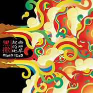

起的比鸡还早
============================

|  |  |
| :--: | :-- |
| [<br>起的比鸡还早](https://emumo.xiami.com/album/172733) | **艺人**: [黑撒](../index.md)<br>**语种**: 国语<br>**唱片公司**: 时音唱片<br>**发行时间**: 2007年11月03日<br>**专辑类别**: 录音室专辑<br>**专辑风格**: <br>**播放数**: 2353832<br>**收藏数**: 1540<br>**评论数**: 153<br> |

## 简介

<div>
陕西方言与现代音乐的完美集大成之作，一张让你捧腹大笑、百听不厌并忍不住马上推荐给朋友的唱片！ <br><br>
<br><br>
“Black Head”是来自西安的一支乐队组合，Black Head的中文意思为“黑撒”（SA读2声，黑撒是秦腔的一种分支戏曲）。“黑撒”的成员包括2人-------夜晚的骑士和马蜂，所有歌曲的词曲创作、编曲、乐器演奏、录音缩混等全部由2人包办！ <br><br>
<br><br>
Black Head 签约于西安时音唱片，他们的首张唱片《起的比鸡还早》于2007年10月出版发行。这是极具特色的一张专辑。风格主要以陕西方言的Hip-Hop为主，还融合了蓝调、戏曲、爵士、摇滚、电子乐等多种音乐元素。这张专辑歌词幽默个性，独具风采又引人深思，以叙事为主，抒情为辅，加上悦耳时尚的配乐，演绎"Black Head"化的说唱乐。就好比“黑撒”的歌词中所唱到的，他们要“把老祖宗秦始皇的口音发扬光大”！听完他们的作品，你会发现，原来陕西话是这么动听和迷人 <br>
</div>

## 曲目


## 评论

|  |  |  |
| :-- | :-- | :-- |
| <br>[虾米用户](https://emumo.xiami.com/u/251254700)<br><br>2019-06-12 08:44<br>赞(1) 踩(0) | <div>作为独自在外的陕西人的我最爱听的一张专辑</div> |
| <br>[虾米用户](https://emumo.xiami.com/u/8794883)<br> <br>2019-05-26 16:04<br>赞(0) 踩(0) | <div>要上乐队的夏天了</div> |
| <br>[虾米用户](https://emumo.xiami.com/u/244155073)<br>亲吻你的鹅头~<br>2018-07-21 16:19<br>赞(0) 踩(0) | <div>这是2007年的专辑?!果然好音乐经得起时间的考验</div> |
| <br>[虾米用户](https://emumo.xiami.com/u/30800139)<br>我在低俗与高雅间活的很尴...<br>2018-06-18 01:22<br>赞(0) 踩(0) | <div>。</div> |
| <br>[虾米用户](https://emumo.xiami.com/u/8794883)<br> <br>2018-04-27 05:08<br>赞(1) 踩(0) | <div>我就想听那一首，还tm没有</div> |
| ⇒ | <br>[虾米用户](https://emumo.xiami.com/u/251254700)<br><br>2019-06-12 08:42<br>赞(0) 踩(0) | <div>禁歌，不能听，不能说。城市夜生活啊 </div> |
| <br>[虾米用户](https://emumo.xiami.com/u/8424847)<br><br>2018-03-20 16:45<br>赞(0) 踩(0) | <div>十年过的可真快</div> |
| <br>[虾米用户](https://emumo.xiami.com/u/24351212)<br><br>2018-01-22 00:31<br>赞(0) 踩(0) | <div>中學暑假全年級去工湘潭鋼鐵廠體驗，夜間洗漱完睡下舖的女生放起貧嘴高中生，真是眼睛一亮的瞬間吶</div> |
| <br>[虾米用户](https://emumo.xiami.com/u/68518036)<br>阿辉<br>2017-11-03 09:02<br>赞(0) 踩(0) | <div>黑撒   听着真摇滚</div> |
| <br>[虾米用户](https://emumo.xiami.com/u/636310)<br><br>2017-10-30 10:21<br>赞(0) 踩(0) | <div>到2009年的最后一天，在西安的出租车上才听到电台播放这首“陕西美食”，一声入耳，竟然满口流香。大雅大俗的经典之作，仔细一查才发现是07年的作品，有种惊艳的感觉。西安已多年未回，汉唐盛世之所，人杰地灵，我辈身处异乡，当思奋进，别给咱乡党丢人咧：）<br>我太太最喜欢回民粉蒸肉，ohoh</div> |
| <br>[虾米用户](https://emumo.xiami.com/u/267638)<br>情感创作是人工智能无法替...<br>2017-10-30 10:14<br>赞(0) 踩(0) | <div>这张由西安时音唱片出品的专辑如今已经成为畅销专辑，销售超过1万张，近几年的唱片销售很少有这个数字啊</div> |
| <br>[虾米用户](https://emumo.xiami.com/u/1617027)<br><br>2017-10-28 00:31<br>赞(0) 踩(0) | <div>很可爱的大男孩们！打趣的西安话被他们用de淋漓尽致｀｀｀</div> |
| <br>[虾米用户](https://emumo.xiami.com/u/5532083)<br><br>2017-10-27 23:19<br>赞(1) 踩(0) | <div>对老黑的评价仅用老北京话“地道”</div> |
| <br>[虾米用户](https://emumo.xiami.com/u/220024395)<br><br>2017-08-14 19:24<br>赞(1) 踩(0) | <div>十年了，黑撒还在</div> |
| <br>[虾米用户](https://emumo.xiami.com/u/30800139)<br>我在低俗与高雅间活的很尴...<br>2017-04-07 00:06<br>赞(0) 踩(0) | <div>。</div> |
| <br>[虾米用户](https://emumo.xiami.com/u/8700847)<br>没品听障人士<br>2016-07-12 16:42<br>赞(0) 踩(0) | <div>很久不听……非常怀念</div> |
| <br>[虾米用户](https://emumo.xiami.com/u/44765112)<br><br>2016-04-30 22:04<br>赞(0) 踩(0) | <div>第一次留言 太洗脑太上瘾</div> |
| <br>[虾米用户](https://emumo.xiami.com/u/1488380)<br><br>2015-07-05 16:20<br>赞(0) 踩(0) | <div>陕西hipper</div> |
| <br>[虾米用户](https://emumo.xiami.com/u/3981552)<br><br>2015-04-18 21:32<br>赞(0) 踩(0) | <div>这货狗日的不得了</div> |
| <br>[虾米用户](https://emumo.xiami.com/u/3981552)<br><br>2015-04-18 21:32<br>赞(0) 踩(0) | <div>这货狗日的不得了</div> |
| <br>[虾米用户](https://emumo.xiami.com/u/40920731)<br><br>2014-10-12 17:03<br>赞(0) 踩(0) | <div>陕西话就是好听。</div> |
| <br>[虾米用户](https://emumo.xiami.com/u/41727215)<br>♀<br>2014-10-09 21:02<br>赞(0) 踩(0) | <div>有个性</div> |
| <br>[虾米用户](https://emumo.xiami.com/u/13316084)<br>zqsfreedom<br>2014-09-19 15:23<br>赞(4) 踩(0) | <div>舌尖上的中国 介绍过</div> |
| <br>[虾米用户](https://emumo.xiami.com/u/11824755)<br><br>2014-09-05 13:31<br>赞(0) 踩(0) | <div>不能再逗2333</div> |
| <br>[虾米用户](https://emumo.xiami.com/u/1126146)<br>我还没想好要写什么...<br>2014-08-23 20:08<br>赞(0) 踩(0) | <div>哈哈哈哈哈哈 我从来没有见过这么贱的专辑</div> |
| <br>[虾米用户](https://emumo.xiami.com/u/29955884)<br>恍惚面对世界<br>2014-07-20 11:17<br>赞(0) 踩(0) | <div>哈哈，喜欢</div> |
| <br>[虾米用户](https://emumo.xiami.com/u/3152920)<br><br>2014-05-20 00:23<br>赞(0) 踩(0) | <div>四星半。前八首都可听。</div> |
| <br>[虾米用户](https://emumo.xiami.com/u/2752926)<br>长夜将至，生死于斯<br>2014-04-28 16:10<br>赞(1) 踩(0) | <div>兹娃滴好</div> |
| <br>[虾米用户](https://emumo.xiami.com/u/30342312)<br>内心强大的独行霞<br>2014-04-16 10:59<br>赞(0) 踩(0) | <div>轻松搞笑，把沉重的现实生活给撒把胡椒面，让你鼻涕眼泪一齐来，听后浑身通泰！</div> |
| <br>[虾米用户](https://emumo.xiami.com/u/5140212)<br>我是一只好灰机^0^！<br>2014-04-09 21:51<br>赞(0) 踩(0) | <div>这张专辑简直是~~~~~相见恨晚o(≧▽≦)ツ┏━┓！！！</div> |
| <br>[虾米用户](https://emumo.xiami.com/u/3754822)<br><br>2014-04-02 12:47<br>赞(0) 踩(0) | <div>当年高中的时候听到这个真是笑cry了，感觉西安也能出这么好玩又好听的音乐真的很骄傲啊哈哈哈哈哈哈哈希望能继续出专啊加油~\(≧▽≦)/~</div> |
| <br>[虾米用户](https://emumo.xiami.com/u/9575413)<br>我还没想好要写什么...<br>2014-03-23 23:59<br>赞(0) 踩(0) | <div>XH</div> |
| <br>[虾米用户](https://emumo.xiami.com/u/19502920)<br>爱着很多野马。我养马。<br>2014-03-23 06:14<br>赞(0) 踩(0) | <div>卧槽这个歌开头的姑娘声音是不是张楠！！！太像了！！！</div> |
| <br>[虾米用户](https://emumo.xiami.com/u/1609946)<br>一即一切<br>2014-03-09 11:40<br>赞(0) 踩(0) | <div>心 境不二</div> |
| <br>[虾米用户](https://emumo.xiami.com/u/11306457)<br><br>2014-03-05 16:57<br>赞(0) 踩(0) | <div>醒瞌睡神作，嘴角上扬，边听边笑，妈妈再也不用担心我打瞌睡了</div> |
| <br>[虾米用户](https://emumo.xiami.com/u/21464582)<br>暂无签名~<br>2014-02-14 22:50<br>赞(0) 踩(0) | <div>陕西方言   迁翻  滑点  真不知道……谁能给解释下        正宗陕西娃……</div> |
| ⇒ | <br>[虾米用户](https://emumo.xiami.com/u/1634272)<br>音乐体现一个人的品格<br>2014-04-20 08:16<br>赞(0) 踩(0) | <div>谦烦这词我知道，汉中话里也有，就说这个人事很多，爱找事，不爽快，事妈，比方说这个人有麻烦，你帮他解决了，他还要说你这没处理好，那考虑不周，这个时候你就可以说他——谦烦</div> |
| ⇒ | <br>[虾米用户](https://emumo.xiami.com/u/21464582)<br>暂无签名~<br>2014-07-22 07:02<br>赞(0) 踩(0) | <div><q><b>蘭佩羅綺说：</b></q></div> |
| ⇒ | <br>[虾米用户](https://emumo.xiami.com/u/1634272)<br>音乐体现一个人的品格<br>2014-07-24 23:45<br>赞(0) 踩(0) | <div><q><b>Sherry说：</b></q></div> |
| ⇒ | <br>[虾米用户](https://emumo.xiami.com/u/13498375)<br>祭奠犹存的美丽<br>2014-10-15 11:15<br>赞(0) 踩(0) | <div><q><b>Sherry说：</b></q></div> |
| ⇒ | <br>[虾米用户](https://emumo.xiami.com/u/45525288)<br> <br>2015-01-01 20:53<br>赞(0) 踩(0) | <div><q><b>Sherry说：</b></q></div> |
| ⇒ | <br>[虾米用户](https://emumo.xiami.com/u/45525288)<br> <br>2015-01-01 20:54<br>赞(0) 踩(0) | <div>迁翻也是麻烦。我的理解是千烦。</div> |
| <br>[虾米用户](https://emumo.xiami.com/u/1582817)<br>若收藏精选集已删除，请用...<br>2014-01-25 16:51<br>赞(0) 踩(0) | <div>起得比鸡都早 睡得比鸡都还晚——俩鸡的作息时间你都了解是嘛！<br><br>介不郭德纲的段子嘛，哈．．．</div> |
| ⇒ | <br>[虾米用户](https://emumo.xiami.com/u/12734821)<br>胜利十一人<br>2014-03-26 11:19<br>赞(0) 踩(0) | <div>郭德纲也是抄别人的。。。</div> |
| <br>[虾米用户](https://emumo.xiami.com/u/4912841)<br><br>2014-01-13 15:14<br>赞(0) 踩(0) | <div>大爷们啦，咱听着酸咧，感觉甜咧！</div> |
| <br>[虾米用户](https://emumo.xiami.com/u/4912841)<br><br>2014-01-13 15:08<br>赞(0) 踩(0) | <div>听得很得瑟</div> |
| <br>[虾米用户](https://emumo.xiami.com/u/29671367)<br><br>2013-12-13 20:00<br>赞(0) 踩(0) | <div>该网页主办方真是穷疯了，下载个曲子，骗你注册，选艺人，最后再收费。真是坑爹，谁知怎么样退出该注册？谁知怎么样退出该注册？谁知怎么样退出该注册？谁知怎么样退出该注册？<br>该网页主办方真是穷疯了，下载个曲子，骗你注册，选艺人，最后再收费。真是坑爹，谁知怎么样退出该注册？谁知怎么样退出该注册？谁知怎么样退出该注册？谁知怎么样退出该注册？<br>该网页主办方真是穷疯了，下载个曲子，骗你注册，选艺人，最后再收费。真是坑爹，谁知怎么样退出该注册？谁知怎么样退出该注册？谁知怎么样退出该注册？谁知怎么样退出该注册？</div> |
| ⇒ | <br>[虾米用户](https://emumo.xiami.com/u/363026)<br><br>2014-01-07 22:14<br>赞(0) 踩(0) | <div>没见过要别人东西还要得这么理直气壮的！~退出注册不会，有个办法给你 看到你显示器右上角的那个叉了么？点一下会有惊喜偶！~</div> |
| ⇒ | <br>[虾米用户](https://emumo.xiami.com/u/13194141)<br>看到的给我来个联络方式。...<br>2014-02-20 23:51<br>赞(0) 踩(0) | <div>脑子有问题</div> |
| ⇒ | <br>[虾米用户](https://emumo.xiami.com/u/12734821)<br>胜利十一人<br>2014-03-26 11:20<br>赞(0) 踩(0) | <div>给开发商做钢结构你们不收费吗？</div> |
| <br>[虾米用户](https://emumo.xiami.com/u/9702440)<br><br>2013-12-13 15:55<br>赞(0) 踩(0) | <div>好</div> |
| <br>[虾米用户](https://emumo.xiami.com/u/9488023)<br><br>2013-12-11 16:37<br>赞(0) 踩(0) | <div>陕西方言与现代音乐的完美集大成之作，一张让你捧腹大笑、百听不厌并忍不住马上推荐给朋友的唱片！</div> |
| <br>[虾米用户](https://emumo.xiami.com/u/13695826)<br><br>2013-11-27 00:51<br>赞(0) 踩(0) | <div>音乐好，词好。</div> |
| <br>[虾米用户](https://emumo.xiami.com/u/13695826)<br><br>2013-11-27 00:29<br>赞(0) 踩(0) | <div>心情不好的时候听着听着就笑了。回去一定买唱片。</div> |
| <br>[虾米用户](https://emumo.xiami.com/u/7172014)<br>bvsilver<br>2013-11-22 17:10<br>赞(0) 踩(0) | <div>酸的咧！！！</div> |
| <br>[虾米用户](https://emumo.xiami.com/u/7172014)<br>bvsilver<br>2013-11-22 17:09<br>赞(0) 踩(0) | <div>听着酸咧，感觉甜咧！</div> |
| <br>[虾米用户](https://emumo.xiami.com/u/1893415)<br><br>2013-10-08 11:03<br>赞(0) 踩(0) | <div>艾玛,,,,,,,,,,,,,,,</div> |
| <br>[虾米用户](https://emumo.xiami.com/u/5532525)<br><br>2013-09-29 11:25<br>赞(0) 踩(0) | <div>洋溢着欢畅浓郁的生活气息，方言的味道，趣味十足。</div> |
| <br>[虾米用户](https://emumo.xiami.com/u/9441855)<br><br>2013-09-12 13:10<br>赞(0) 踩(0) | <div>好词</div> |
| <br>[虾米用户](https://emumo.xiami.com/u/11540158)<br><br>2013-08-26 15:22<br>赞(0) 踩(0) | <div>陕西话太适合RAP了毫无违和感！赞！</div> |
| <br>[虾米用户](https://emumo.xiami.com/u/13487125)<br>wzw232323<br>2013-08-17 10:53<br>赞(0) 踩(0) | <div>好听！</div> |
| <br>[虾米用户](https://emumo.xiami.com/u/13487125)<br>wzw232323<br>2013-08-17 10:53<br>赞(0) 踩(0) | <div>好听！</div> |
| <br>[虾米用户](https://emumo.xiami.com/u/7754352)<br><br>2013-07-30 02:57<br>赞(0) 踩(0) | <div>好玩儿</div> |
| <br>[虾米用户](https://emumo.xiami.com/u/17415443)<br>心有猛虎，细嗅蔷薇。<br>2013-07-28 11:57<br>赞(0) 踩(0) | <div>屌丝</div> |
| <br>[虾米用户](https://emumo.xiami.com/u/17965961)<br><br>2013-07-25 09:06<br>赞(0) 踩(0) | <div>awesome</div> |
| <br>[虾米用户](https://emumo.xiami.com/u/4198711)<br><br>2013-06-21 18:06<br>赞(0) 踩(0) | <div>重点推荐《贫嘴高中生的幸福生活》</div> |
| <br>[虾米用户](https://emumo.xiami.com/u/244042)<br>反正到最尾也唏嘘...<br>2013-06-20 10:08<br>赞(0) 踩(0) | <div>这张，太逗了。</div> |
| <br>[虾米用户](https://emumo.xiami.com/u/9226660)<br><br>2013-06-09 06:15<br>赞(0) 踩(0) | <div>笑死我了</div> |
| <br>[虾米用户](https://emumo.xiami.com/u/15893503)<br><br>2013-06-07 18:02<br>赞(0) 踩(0) | <div>O(∩_∩)O哈哈~</div> |
| <br>[虾米用户](https://emumo.xiami.com/u/7598027)<br> <br>2013-05-14 16:44<br>赞(0) 踩(0) | <div>我要吃粉蒸肉==</div> |
| <br>[虾米用户](https://emumo.xiami.com/u/3205477)<br>菩提本无树 明镜亦非台<br>2013-05-03 23:47<br>赞(0) 踩(0) | <div>陕西方言与现代音乐的完美集大成之作，一张让你捧腹大笑、百听不厌并忍不住马上推荐给朋友的唱片！</div> |
| <br>[虾米用户](https://emumo.xiami.com/u/6910822)<br><br>2013-04-10 22:43<br>赞(0) 踩(0) | <div>爱！！！大爱！！！！！</div> |
| <br>[虾米用户](https://emumo.xiami.com/u/3621711)<br><br>2013-04-06 23:14<br>赞(0) 踩(0) | <div>好多神曲....</div> |
| <br>[虾米用户](https://emumo.xiami.com/u/1211026)<br><br>2013-03-20 23:18<br>赞(0) 踩(0) | <div>重点推荐《贫嘴高中生的幸福生活》</div> |
| <br>[虾米用户](https://emumo.xiami.com/u/10468601)<br>行者无疆<br>2013-03-01 00:33<br>赞(0) 踩(0) | <div>方言的沉淀</div> |
| <br>[虾米用户](https://emumo.xiami.com/u/1848672)<br><br>2013-02-23 08:47<br>赞(0) 踩(0) | <div>ok</div> |
| <br>[虾米用户](https://emumo.xiami.com/u/7000901)<br>我走过，我看过，我路过~<br>2013-01-19 19:45<br>赞(0) 踩(0) | <div>方言 碉堡了</div> |
| <br>[虾米用户](https://emumo.xiami.com/u/635253)<br><br>2013-01-12 01:52<br>赞(0) 踩(0) | <div>聊咋了</div> |
| <br>[虾米用户](https://emumo.xiami.com/u/11239012)<br><br>2012-12-21 16:16<br>赞(0) 踩(0) | <div>黑撒 方言 聊咋咧！</div> |
| <br>[虾米用户](https://emumo.xiami.com/u/6973445)<br><br>2012-12-06 12:08<br>赞(0) 踩(0) | <div>挺逗的～</div> |
| <br>[虾米用户](https://emumo.xiami.com/u/926450)<br><br>2012-11-28 21:09<br>赞(0) 踩(0) | <div>这个有意思</div> |
| <br>[虾米用户](https://emumo.xiami.com/u/2821019)<br><br>2012-11-21 20:55<br>赞(0) 踩(0) | <div>歌词太有乐子了</div> |
| <br>[虾米用户](https://emumo.xiami.com/u/6848709)<br>微博同名，欢迎互粉<br>2012-11-12 15:30<br>赞(0) 踩(0) | <div>原创，还是能听懂的方言，各种生活中的感悟</div> |
| <br>[虾米用户](https://emumo.xiami.com/u/10670983)<br>周日，让跳跃的暖意包裹着...<br>2012-11-09 13:20<br>赞(0) 踩(0) | <div>黑</div> |
| <br>[虾米用户](https://emumo.xiami.com/u/11225442)<br>北京混子<br>2012-10-31 21:54<br>赞(0) 踩(0) | <div>词写得太逗了哈哈，节奏也棒</div> |
| <br>[虾米用户](https://emumo.xiami.com/u/3132426)<br><br>2012-10-16 13:42<br>赞(0) 踩(0) | <div>想家 &amp;gt;&amp;lt;</div> |
| <br>[虾米用户](https://emumo.xiami.com/u/8968438)<br><br>2012-09-28 17:19<br>赞(0) 踩(0) | <div>就图个痛快，酣畅淋漓！</div> |
| <br>[虾米用户](https://emumo.xiami.com/u/449744)<br><br>2012-09-23 21:06<br>赞(0) 踩(0) | <div>多听听来自陕西的说唱有益身心啊！！~~~</div> |
| <br>[虾米用户](https://emumo.xiami.com/u/7211607)<br><br>2012-08-20 17:43<br>赞(0) 踩(0) | <div>黑撒的 陕西美食 听得我好饿哇!</div> |
| <br>[虾米用户](https://emumo.xiami.com/u/820850)<br><br>2012-07-06 18:02<br>赞(0) 踩(0) | <div>听着真TM过瘾，nice</div> |
| <br>[虾米用户](https://emumo.xiami.com/u/5679184)<br>我就不爱听女的唱歌<br>2012-06-23 00:21<br>赞(0) 踩(0) | <div>收藏了~我去~就为了那首什么中学生什么的那个！！</div> |
| <br>[虾米用户](https://emumo.xiami.com/u/8974039)<br><br>2012-05-18 11:49<br>赞(0) 踩(0) | <div>对视楼下</div> |
| <br>[虾米用户](https://emumo.xiami.com/u/1939037)<br> <br>2012-05-06 22:35<br>赞(0) 踩(0) | <div>在深圳的老陕飘过~~</div> |
| <br>[虾米用户](https://emumo.xiami.com/u/1939037)<br> <br>2012-05-06 17:46<br>赞(0) 踩(0) | <div>来来来，谝个闲传，扯个闲蛋~~</div> |
| <br>[虾米用户](https://emumo.xiami.com/u/6676530)<br><br>2012-04-23 21:41<br>赞(0) 踩(0) | <div>灰常灰常喜欢咱陕西特产黑撒……最开始觉得曲调旋律很有特色 陕西话听着特亲切 …… 后来 越听 歌词越有味……耐人寻味 值得长久收藏！老公买手鼓也能跟着敲敲！了滴很！忒色~</div> |
| <br>[虾米用户](https://emumo.xiami.com/u/6012150)<br><br>2012-04-19 21:54<br>赞(1) 踩(0) | <div>我咋那么爱陕西话！！</div> |
| <br>[虾米用户](https://emumo.xiami.com/u/1681150)<br>山 水 风 草<br>2012-04-18 15:36<br>赞(0) 踩(0) | <div>呵呵~~牛B~~</div> |
| <br>[虾米用户](https://emumo.xiami.com/u/6937097)<br><br>2012-03-28 10:54<br>赞(0) 踩(0) | <div>西安乡党，支持~~~</div> |
| <br>[虾米用户](https://emumo.xiami.com/u/1177897)<br><br>2012-03-26 18:16<br>赞(0) 踩(0) | <div>真他妈地道，河间什么时候出牛逼的个乐队，我也想参与一下，呵呵...</div> |
| <br>[虾米用户](https://emumo.xiami.com/u/7646132)<br><br>2012-03-25 18:51<br>赞(0) 踩(0) | <div>好听成马！</div> |
| <br>[虾米用户](https://emumo.xiami.com/u/427164)<br>電<br>2012-03-24 20:51<br>赞(0) 踩(0) | <div>收了~~~~~~~~~~~~~~~~~~````</div> |
| <br>[虾米用户](https://emumo.xiami.com/u/5738157)<br><br>2012-03-08 01:54<br>赞(0) 踩(0) | <div>好东西</div> |
| <br>[虾米用户](https://emumo.xiami.com/u/8224770)<br>暂无签名~<br>2012-03-07 21:05<br>赞(0) 踩(0) | <div>好</div> |
| <br>[虾米用户](https://emumo.xiami.com/u/8110336)<br><br>2012-02-25 00:36<br>赞(0) 踩(0) | <div>有趣</div> |
| <br>[虾米用户](https://emumo.xiami.com/u/7297559)<br><br>2012-02-06 10:59<br>赞(0) 踩(0) | <div>好听的嘛</div> |
| <br>[虾米用户](https://emumo.xiami.com/u/7915927)<br><br>2012-02-04 21:09<br>赞(0) 踩(0) | <div>爷们！</div> |
| <br>[虾米用户](https://emumo.xiami.com/u/7504672)<br><br>2012-01-17 20:36<br>赞(0) 踩(0) | <div>好听！</div> |
| <br>[虾米用户](https://emumo.xiami.com/u/1634083)<br><br>2012-01-13 12:01<br>赞(0) 踩(0) | <div>笑死我了！！！！！！！！！！</div> |
| <br>[虾米用户](https://emumo.xiami.com/u/2486051)<br><br>2012-01-01 11:26<br>赞(0) 踩(0) | <div>陕西方言，有意思！</div> |
| <br>[虾米用户](https://emumo.xiami.com/u/1567693)<br><br>2011-12-31 14:11<br>赞(0) 踩(0) | <div>陕西方言！</div> |
| <br>[虾米用户](https://emumo.xiami.com/u/6090652)<br><br>2011-11-16 12:01<br>赞(0) 踩(0) | <div>2 bees fly between **s</div> |
| <br>[虾米用户](https://emumo.xiami.com/u/6251250)<br><br>2011-10-31 20:40<br>赞(0) 踩(0) | <div>各位大侠，谁有黑撒给前浐灞写的队歌，五年前看中场中场加油听到过，也百度搜到过，后来就怎么也找不到了，有的能给小弟传一首不？不胜感激！</div> |
| <br>[虾米用户](https://emumo.xiami.com/u/6390833)<br><br>2011-10-29 15:02<br>赞(0) 踩(0) | <div>美宝宝，很太赛！</div> |
| <br>[虾米用户](https://emumo.xiami.com/u/1323989)<br>此生，只取悦自己<br>2011-10-24 14:18<br>赞(0) 踩(0) | <div>搞笑呢，听起心情好</div> |
| <br>[虾米用户](https://emumo.xiami.com/u/102311)<br><br>2011-10-17 00:16<br>赞(0) 踩(0) | <div>真的不错哦~~很民族的</div> |
| <br>[虾米用户](https://emumo.xiami.com/u/4025887)<br><br>2011-10-13 22:02<br>赞(0) 踩(0) | <div>美滴很    陕西娃都爱</div> |
| <br>[虾米用户](https://emumo.xiami.com/u/3940984)<br>Are we cool ...<br>2011-10-13 19:32<br>赞(0) 踩(0) | <div>几好玩儿~！</div> |
| <br>[虾米用户](https://emumo.xiami.com/u/2398951)<br><br>2011-10-02 03:24<br>赞(0) 踩(0) | <div>美美美</div> |
| <br>[虾米用户](https://emumo.xiami.com/u/2068096)<br>消失的光年<br>2011-09-04 15:01<br>赞(0) 踩(0) | <div>算是比较经典的方言乐队了~</div> |
| <br>[虾米用户](https://emumo.xiami.com/u/5064218)<br><br>2011-07-29 22:55<br>赞(0) 踩(0) | <div>亲切</div> |
| <br>[虾米用户](https://emumo.xiami.com/u/5011806)<br><br>2011-07-27 16:03<br>赞(0) 踩(0) | <div>很不错的音乐</div> |
| <br>[虾米用户](https://emumo.xiami.com/u/1454576)<br><br>2011-07-23 16:28<br>赞(0) 踩(0) | <div>美很木！</div> |
| <br>[虾米用户](https://emumo.xiami.com/u/288752)<br><br>2011-07-08 20:44<br>赞(0) 踩(0) | <div>陕西方言欹比较少听,但听一听还是很有味道的.</div> |
| <br>[虾米用户](https://emumo.xiami.com/u/2353598)<br>一起经营梦想，品尝生活！...<br>2011-07-07 18:13<br>赞(0) 踩(0) | <div>有意思滴歌</div> |
| <br>[虾米用户](https://emumo.xiami.com/u/3620938)<br><br>2011-07-04 12:14<br>赞(0) 踩(0) | <div>\'西安\' \'黑撒\'</div> |
| <br>[虾米用户](https://emumo.xiami.com/u/1599696)<br><br>2011-06-22 11:36<br>赞(0) 踩(0) | <div>欢乐！</div> |
| <br>[虾米用户](https://emumo.xiami.com/u/480323)<br><br>2011-06-21 14:56<br>赞(0) 踩(0) | <div>专辑里少了一首最重要最牛X的成名曲，《练死小日本》。难道说因为歌名被和谐？哈哈哈。</div> |
| <br>[虾米用户](https://emumo.xiami.com/u/911639)<br><br>2011-05-26 10:17<br>赞(0) 踩(0) | <div>怎么没有流川枫与苍井空</div> |
| ⇒ | <br>[虾米用户](https://emumo.xiami.com/u/1408575)<br>Call Me M<br>2011-05-29 15:33<br>赞(0) 踩(0) | <div>因为是新歌。</div> |
| <br>[虾米用户](https://emumo.xiami.com/u/597787)<br>我还没想好要写什么...<br>2011-05-24 11:58<br>赞(0) 踩(0) | <div>好听</div> |
| <br>[虾米用户](https://emumo.xiami.com/u/3878719)<br><br>2011-05-15 18:22<br>赞(0) 踩(0) | <div>忒爽</div> |
| <br>[虾米用户](https://emumo.xiami.com/u/3416923)<br> <br>2011-04-29 22:12<br>赞(0) 踩(0) | <div>自己人才听得懂的，最真实的自我</div> |
| <br>[虾米用户](https://emumo.xiami.com/u/3400048)<br>Spotify ID: ...<br>2011-04-28 11:06<br>赞(0) 踩(0) | <div>黑撒最经典的东西！简直是神作！</div> |
| <br>[虾米用户](https://emumo.xiami.com/u/1953646)<br><br>2011-04-23 17:53<br>赞(0) 踩(0) | <div>陕西方言和hip hop完美结合  好音乐</div> |
| <br>[虾米用户](https://emumo.xiami.com/u/122216)<br><br>2011-04-19 06:59<br>赞(0) 踩(0) | <div>方言</div> |
| <br>[虾米用户](https://emumo.xiami.com/u/1052461)<br>@blinK4sy-<br>2011-04-08 13:37<br>赞(0) 踩(0) | <div>忒给力了~ ^ ^</div> |
| <br>[虾米用户](https://emumo.xiami.com/u/1287957)<br><br>2011-04-06 23:37<br>赞(0) 踩(0) | <div>有才！！！</div> |
| <br>[虾米用户](https://emumo.xiami.com/u/121670)<br><br>2011-03-30 17:53<br>赞(0) 踩(0) | <div>呵呵</div> |
| <br>[虾米用户](https://emumo.xiami.com/u/1646976)<br>不要太过分<br>2011-01-12 00:20<br>赞(0) 踩(0) | <div>黑撒一下吧！</div> |
| <br>[虾米用户](https://emumo.xiami.com/u/2398951)<br><br>2011-01-05 15:46<br>赞(0) 踩(0) | <div>美的增怂</div> |
| <br>[虾米用户](https://emumo.xiami.com/u/1791208)<br><br>2010-12-24 12:16<br>赞(0) 踩(0) | <div>真的很好。。喜欢</div> |
| <br>[虾米用户](https://emumo.xiami.com/u/240217)<br>我还没想好要写什么...<br>2010-12-06 19:26<br>赞(0) 踩(0) | <div>难得的好！！！！歌词写得真他妈痛快~~~~</div> |
| <br>[虾米用户](https://emumo.xiami.com/u/1165729)<br>再也不用躲躲藏藏了…<br>2010-11-25 20:23<br>赞(0) 踩(0) | <div>太赞勒   俄贼</div> |
| <br>[虾米用户](https://emumo.xiami.com/u/928576)<br>　　　　　　　　　<br>2010-09-26 18:08<br>赞(0) 踩(0) | <div>我一直在笑。</div> |
| <br>[虾米用户](https://emumo.xiami.com/u/252018)<br>恋上高海拔<br>2010-09-25 14:49<br>赞(0) 踩(0) | <div>我喜欢~~~~~~~~~~~~~~~欧也！！！！！！！</div> |
| <br>[虾米用户](https://emumo.xiami.com/u/519255)<br><br>2010-02-05 13:55<br>赞(0) 踩(0) | <div>惊呼</div> |
| <br>[虾米用户](https://emumo.xiami.com/u/321173)<br>暂无签名~<br>2009-11-27 13:48<br>赞(0) 踩(0) | <div>好！鼓掌！！！！！！！！</div> |
| <br>[虾米用户](https://emumo.xiami.com/u/272162)<br><br>2009-09-19 14:35<br>赞(0) 踩(0) | <div>非常好听，词不错</div> |
| <br>[虾米用户](https://emumo.xiami.com/u/7868)<br><br>2009-06-09 09:54<br>赞(0) 踩(0) | <div>haha 口水！～</div> |
| <br>[虾米用户](https://emumo.xiami.com/u/185025)<br><br>2009-05-28 18:39<br>赞(0) 踩(0) | <div>喜欢</div> |
| <br>[虾米用户](https://emumo.xiami.com/u/439)<br>音樂在燃燒<br>2009-04-24 02:07<br>赞(0) 踩(0) | <div>很有特色，好几次错过了他们的酒吧现场。</div> |
| <br>[虾米用户](https://emumo.xiami.com/u/107319)<br><br>2009-04-19 15:18<br>赞(0) 踩(0) | <div>辞填得真不错，让人听得入神</div> |
| <br>[虾米用户](https://emumo.xiami.com/u/9511)<br><br>2009-03-31 13:48<br>赞(1) 踩(0) | <div>陕西人的推荐</div> |
