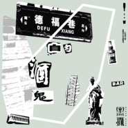

德福巷的酒鬼
============================

|  |  |
| :--: | :-- |
| [ 德福巷的酒鬼](https://emumo.xiami.com/album/2103879056) | **艺人**: [黑撒](../index.md) **语种**: 国语 **唱片公司**: 摩登天空 **发行时间**: 2018年08月01日 **专辑类别**: EP, 单曲 **专辑风格**: 摇滚 Rock & Roll **播放数**: 226607 **收藏数**: 27 **评论数**: 6  |

## 简介

<strong>一曲十年，梦到甘甜！</strong>  
<strong>黑撒乐队新单曲《德福巷的酒鬼》发布，2018全国巡演正式开票</strong>  
  
  
9月21日，有着“西安文化名片”之称的黑撒乐队，将携新专辑开启自乐队组建以来的第一次大规模巡演，在开票之际，新专辑中的单曲《德福巷的酒鬼》也全网上线，为这次巡演热身。  
  
  
新单曲《德福巷的酒鬼》中的“德福巷”，可谓是西安的文化地标，它位于西安南门湘子庙街北侧，隋唐时期是皇城的一部分，在上世纪九十年代初，茶馆、咖啡馆和酒吧业逐渐兴起，形成规模。在1995年3月，德福巷成为旅游文化一条街，不到200米长的街道上，一家接一家地开满了大大小小的咖啡屋、酒吧、茶馆。浸染在新旧交错的氛围中的德福巷有着颇为混杂的个性，那些大小酒馆里，也上演着一幕幕日常生活的真实景象。  
  
  
在德福巷的酒吧中，推杯换盏，觥筹交错，自然忸怩不得，于是，单曲在悠扬的口琴响起后，便带出了硬摇滚的节奏，切音铿锵有力，旋律曼妙生花，伴着这些从中涌出的，是黑撒对于市井生活的真实感受，“花钱如流水，谁劝也不听，一杯接一杯，不醉不归”，质朴的音色里，是最为本真的感情流露。没有苦大仇深的愤懑，没有唏嘘不已的感慨，“吐不出象牙可我也没长着一张狗嘴”不惮以俚语入歌，更不惮借俗常景观言情，在一贯的戏谑里，黑撒把生活成长中最为沉重的一面，化为酒杯中的一层层浮沫。没有高蹈的伪饰，没有故作的矫情，酒馆里的生活，酒客的心绪，原原本本地被描述出来。  
  
  
今年是黑撒成军的第十一个年头，单曲《德福巷的酒鬼》的发布，既是向着上一个十年致敬，也是一个新的十年开始。因此，巡演的名字“一曲十年，梦到甘甜”，是自我的释怀，也是新的祈愿。何为“甘甜”，也许就是像德福巷酒馆里的芸芸众生一样，把杯中酒一饮而尽，也把浸在其中的生活的兴味穷尽，这就是一种甘甜的况味——它是脚踏实地的丰盈，也是值得咀嚼的回忆。而黑撒的这一轮巡演，从成都开始，于家乡西安收尾，是黑撒成军以来的最大规模的一次巡演，十六个城市分布在大江南北，呈现出的是十六种完全迥异的生活样貌，黑撒那活泼的性情与真实的言说，将与这十六城发生碰撞，它不仅把三秦大地的文化根茎蔓延纵深，也把 “理想大于现实”的美好希冀践行播撒。  
  
在巡演前夕，黑撒也将会继续发布最新的单曲作品，一向慢工出细活的他们，对于自己的要求可谓是苛刻有加，因此自2014年岁末签约摩登天空以来，差不多过了4年才有新专辑问世的消息，新专辑的样貌，也许要到一个多月后方可揭晓，但放心的是，这些新作，都将会以现场版演绎的方式出现在巡演各站上。“一曲十年，梦到甘甜”，无论你是与黑撒结缘已久，真真切切地见证了他们的第一个“十年”，还是恰好刚刚被《流川枫与苍井空》《如果这些都可以》等脍炙人口的黑撒式情歌圈粉，你都会从中品到自己的那份“甘甜”。  

 
  
 

## 曲目

## 评论

|  |  |  |  |
| :-- | :-- | :-- | :-- |
|  [虾米用户](https://emumo.xiami.com/u/356740228)  2019-04-01 12:06 赞(0) 踩(0) | 
支持一波！
 |
|  [虾米用户](https://emumo.xiami.com/u/305240353)  2018-08-19 22:07 赞(0) 踩(0) | 
skr
 |
|  [虾米用户](https://emumo.xiami.com/u/351591951) 我还没想好要写什么... 2018-08-03 18:33 赞(0) 踩(0) | 

 |
|  [虾米用户](https://emumo.xiami.com/u/256751137)   2018-08-01 14:49 赞(0) 踩(0) | 
三爷
 |
|  [虾米用户](https://emumo.xiami.com/u/1235123) 你听～ 2018-08-01 11:16 赞(0) 踩(0) | 
板凳！
 |
|  [虾米用户](https://emumo.xiami.com/u/317339343) Who did you ... 2018-08-01 11:07 赞(0) 踩(0) | 
first
 |
