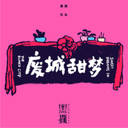

废城甜梦
============================

|  |  |
| :--: | :-- |
| [ 废城甜梦](https://emumo.xiami.com/album/2104027547) | **艺人**: [黑撒](../index.md) **语种**: 国语 **唱片公司**: 摩登天空 **发行时间**: 2018年09月14日 **专辑类别**: 录音室专辑 **专辑风格**:  **播放数**: 47305 **收藏数**: 162 **评论数**: 29  |

## 简介

结缘十年，岁月甘甜  黑撒新专辑《废城甜梦》上线  
  
  
上个月，黑撒接连发布了《德福巷的酒鬼》与《陕西地方邪》两首新单曲，而今，距离巡演已经时日不多，黑撒的全新专辑《废城甜梦》终于正式面世，在网络平台率先上线。  
  
《德福巷的酒鬼》以市井生活入歌，质朴中带着诙谐，而以本地方言谚语为灵感的《陕西地方邪》则玩起了中式HIP HOP，它以现代的眼光讲述出为厚重历史所覆盖的那片三秦大地上的“灵异”日常，西安著名相声演员卢鑫强势加盟，说唱实力令人刮目相看。而在最早时候(2015前元旦)发布的《你是一个演员》则以自嘲式样的口吻，提出了对流俗价值观的反思。  
  
《瘦身的幌子》与《如果这些都可以》两支小情歌，一个于幽默、俏皮中呈露着真实的味道，另一个则用故作的夸张诳语，来流露对爱情的渴望……黑撒这三年多时间里先后发布的单曲，也许能够让你对《废城甜梦》这一专辑已经有了一些先行的期待或是猜测，但对于向来以一次次地蹦极般刺激的音乐蜕变来给你惊喜的黑撒乐队来说，之前的那些聆听印象，窥到的只不过是新专辑里的冰山一角而已。  
  
黑撒先前与同在陕西的华阴老腔（非物质文化遗产）在央视合作过两次，这次的《将令》则是首次合作打造一首原创作品。歌词天马行空，大气幽默中透着伤怀，和老腔相得益彰。编曲用到了唢呐、笛子、中国大鼓等民族乐器，唱法上也尝试了一些“戏腔”，一句“摇着来兮滚着去”道出了黑撒对自己选择的这条道路的理解，同时它也是对生活的本相的概括，里面的豪情与柔婉的往复折返，将古人的魂魄注入到当代的魂灵中。  
  
《夜幕下的西安》与《妈妈请不要悲伤》各自从城与人的视角，来讨论成长、别离、与变老。《夜幕下的西安》是黑撒眼中的西安夜景，古筝与萨克斯中西结合，配合808鼓机经典的hiphop节奏，画面感极强，“街头的少年像大人一样抽烟，漂亮的年轻人们走进夜店”“万路上的雨逆流上天”、“停车场的喇叭一起轰鸣”，虚实结合的镜头，打造了一幅浮世绘般的西安画卷。黑撒的作品中一直有着深沉的抒情向度，但《妈妈请不要悲伤》以弦乐团的宏大张力来将这份深沉来大书特书，则极为少见，这份感情浓烈而噬心……  
  
同为对时光岁月的感怀，低徊的《时光一晃》以半戏谑般半认真地抒情，面对着被时光洗刷掉的青春，感怀起岁月的蹉跎与物是人非的变迁，而专辑同名曲《废城甜梦》作为黑撒成军十年的纪念歌曲，也是每张专辑里都会有的“音乐励志”作品——第一张里有《给娃买把吉普森》，第二张里有《孩子们的理想》，第三张里有《滚来滚去》——这首歌是一首传承，也代表了黑撒对音乐梦想的执着。它用小号、萨克斯与合成器一起构造出一个面目模糊的复杂的混合篇章，同样是谈论青春与，则更加深入魂灵，鞭辟入里，一段念白“这十年很多人找到理想 也有很多人迷失方向 ，很多人找到归宿 也有很多灵魂被丢在路上 ，每天的自拍 让你忘了自己真实的模样 ，你的信仰应该来自内心 不是缠在手腕或挂在脖上”道出了自我坚守的信心，同时，也是黑撒对自己未来的期许，放在专辑中背后的这首，并不是终章，同时，它也是黑撒下一个十年的开启……  
  
听罢整张专辑，再来看看同时发布的专辑封面，“废城甜梦”不知为何被做成了牌匾的样子。或许这正是专辑设计的一大亮点？一切只待实体发布方可揭晓。  
  
“一曲十年，梦到甘甜”，于黑撒乐队，于整张专辑，都无比的契合，不难想象，对于时光的流转变迁，每个人都有自己的体悟，那么快快来到现场，看看黑撒怎样来讲述“光阴的故事”！  
  
 

## 曲目

## 评论

|  |  |  |  |
| :-- | :-- | :-- | :-- |
|  [虾米用户](https://emumo.xiami.com/u/419670612) 没有音乐，生活将是一场错... 2020-10-22 10:12 赞(0) 踩(0) | 
这边的版权是怎么回事呢？为什么一半能听一般不能听
 |
|  [虾米用户](https://emumo.xiami.com/u/199403171) 我还没想好要写什么... 2019-06-01 02:52 赞(0) 踩(0) | 
回来听听
 |
|  [虾米用户](https://emumo.xiami.com/u/264418311)  2018-11-23 20:32 赞(0) 踩(0) | 
乡党加油！
 |
|  [虾米用户](https://emumo.xiami.com/u/36846920)  2018-11-19 01:41 赞(0) 踩(0) | 
终于出新专了，CD也开卖了，赶紧来一张支持一下！
 |
|  [虾米用户](https://emumo.xiami.com/u/374312406)  2018-09-23 16:45 赞(0) 踩(0) | 
牛批
 |
|  [虾米用户](https://emumo.xiami.com/u/5096815) Oh No 2018-09-20 16:04 赞(0) 踩(0) | 
加funk加blues加忧郁
 |
|  [虾米用户](https://emumo.xiami.com/u/5493286) 。 2018-09-19 18:04 赞(0) 踩(0) | 
棒！
 |
|  [虾米用户](https://emumo.xiami.com/u/316447163)  2018-09-18 08:39 赞(2) 踩(0) | 
和十年前那个西安合集一个名字，废城甜梦。好怀念。
 |
| ⇒ |  [虾米用户](https://emumo.xiami.com/u/595143)   2018-11-09 11:41 赞(0) 踩(0) | 
真的怀念
 |
|  [虾米用户](https://emumo.xiami.com/u/141039512) 我和我仅有的理想，走在寻... 2018-09-18 00:57 赞(0) 踩(0) | 
一遍还没有听完，不知道还有没有西安事变那种惊艳感。
 |
|  [虾米用户](https://emumo.xiami.com/u/2500877)  2018-09-17 10:22 赞(0) 踩(0) | 
强力顶起！！
 |
|  [虾米用户](https://emumo.xiami.com/u/266204431)  2018-09-16 22:45 赞(0) 踩(0) | 
哇哦哦哦
 |
|  [虾米用户](https://emumo.xiami.com/u/14820031)  2018-09-15 21:19 赞(0) 踩(0) | 
期待巡演
 |
|  [虾米用户](https://emumo.xiami.com/u/210386994)   2018-09-15 17:08 赞(0) 踩(0) | 
贼，新专辑！
 |
|  [虾米用户](https://emumo.xiami.com/u/7392978)  莪嫒沵狆国，杺嫒哋毋儭 2018-09-15 10:19 赞(0) 踩(0) | 
我靠 有实体碟卖么
 |
|  [虾米用户](https://emumo.xiami.com/u/400806033)  2018-09-14 19:53 赞(3) 踩(0) | 
我还记着有首都市夜生活的副作用
 |
|  [虾米用户](https://emumo.xiami.com/u/478527) 好想跟衣服在洗衣机里滚 2018-09-14 16:44 赞(0) 踩(0) | 
done
 |
|  [虾米用户](https://emumo.xiami.com/u/1867517) I tried my b... 2018-09-14 15:56 赞(0) 踩(0) | 
waitwaitwait，不对的..真是黑撒？
 |
|  [虾米用户](https://emumo.xiami.com/u/84407828) 已迁往B站。ID:Ale... 2018-09-14 15:46 赞(0) 踩(0) | 
好听
 |
|  [虾米用户](https://emumo.xiami.com/u/358785128)  2018-09-14 15:32 赞(0) 踩(0) | 
那就巡演见吧 
 |
|  [虾米用户](https://emumo.xiami.com/u/89369138)   2018-09-14 15:19 赞(0) 踩(0) | 
来了
 |
|  [虾米用户](https://emumo.xiami.com/u/5104622)  2018-09-14 14:45 赞(0) 踩(0) | 
也太高水准了吧这张专辑，用心之作，厉害厉害
 |
|  [虾米用户](https://emumo.xiami.com/u/27931385) 摇滚应该是一块倔强的石头... 2018-09-14 14:16 赞(0) 踩(0) | 
牛批
 |
|  [虾米用户](https://emumo.xiami.com/u/6302793) 一点点吞噬自己 2018-09-14 13:09 赞(0) 踩(0) | 
很用心的专辑
 |
|  [虾米用户](https://emumo.xiami.com/u/2560046) 妈妈一起摇滚吧 2018-09-14 11:17 赞(0) 踩(0) | 
终于出新了啊啊啊啊啊啊啊啊啊啊
 |
|  [虾米用户](https://emumo.xiami.com/u/11970559) 音乐有生命。 2018-09-14 11:13 赞(2) 踩(0) | 
飞奔至此，留爪。周末细听  
 |
|  [虾米用户](https://emumo.xiami.com/u/43981677) 生活不止眼前的枸杞，还有... 2018-09-14 11:12 赞(0) 踩(0) | 
黑米打卡，终于出新了  
 |
|  [虾米用户](https://emumo.xiami.com/u/144862558)   2018-09-14 11:08 赞(0) 踩(0) | 
板凳 
 |
|  [虾米用户](https://emumo.xiami.com/u/205970063)  2018-09-14 11:03 赞(0) 踩(0) | 
打破黑撒零回复  
 |
